{0}------------------------------------------------

# Alternative Tower Field Construction for Quantum Implementation of the AES S-box

Doyoung Chung, Seungkwang Lee, Dooho Choi, and Jooyoung Lee

Abstract—Grover's search algorithm allows a quantum adversary to find a k-bit secret key of a block cipher by making  $O(2^{k/2})$  block cipher queries. Resistance of a block cipher to such an attack is evaluated by quantum resources required to implement Grover's oracle for the target cipher. The quantum resources are typically estimated by the T-depth of its circuit implementation and the number of qubits used by the circuit (width). Since the AES S-box is the only component which requires T-gates in a quantum implementation of AES, recent research has put its focus on efficient implementation of the AES S-box. However, any efficient implementation with low T-depth will not be practical in the real world without considering qubit consumption of the implementation. In this work, we propose four methods of trade-off between time and space for the quantum implementation of the AES S-box. In particular, one of our methods turns out to use the smallest number of qubits among the existing methods, significantly reducing its T-depth.

Index Terms—Quantum implementation, quantum cryptanalysis, Grover's algorithm, AES, multiplicative inversion

# \_\_\_\_

# 1 Introduction

With the advent of quantum computers. Public key cryptosystems such as RSA, ECDSA, and ECDH will be completely broken by Shor's algorithm [1], a quantum algorithm that solves the order finding problem in polynomial time. When it comes to symmetric key cryptography, an exhaustive key search using Grover's algorithm [2] is becoming a new threat. For example, Grover's search algorithm allows a quantum adversary to find a k-bit secret key of a block cipher by making  $O(2^{k/2})$  block cipher queries. Resistance of a block cipher to such an attack is evaluated by quantum resources required to implement Grover's oracle for the target cipher. The quantum resources are typically estimated by the circuit depth of the circuit implementation and the number of qubits used by the circuit (width) [3], [4], [5].

Quantum circuits involve error-prone qubits, and fault-tolerant quantum computation (FTQC) is made possible by using error correcting codes, where the surface code is one of the most feasible candidates for this purpose. Since T-gates are exceptionally expensive in the implementation of the surface code, T-depth, counting the number of sequential T-gates, dominates the overall efficiency of the quantum circuit in terms of the processing time [6]. For this reason, T-depth is widely used as a metric to estimate the time complexity of a quantum circuit.

There have been a number of works on lightweight implementation of AES in quantum computing environments [4],

- D. Chung and J. Lee are with the School of Computing, KAIST, Daejeon, 34141, Korea.
  - E-mail: wordspqr@kaist.ac.kr, hicalf@kaist.ac.kr
- D. Chung and S. Lee are with Information Security Research Division, ETRI, Daejeon, 34129, Korea. E-mail: thisisdoyoung@etri.re.kr, skwang@etri.re.kr
- D. Choi is with Department of AI Cyber Security, Korea University Sejong, Sejong, 30019, Korea. E-mail: doohochoi@korea.ac.kr
- D. Choi and J. Lee are corresponding authors

[5], [7]. The only component of AES that requires T-gates for its quantum implementation is the multiplicative inversion used in the AES S-box [7]. Therefore, recent research [3], [4], [5], [8] has put its main focus on lightweight implementation of the multiplicative inversion, using tower field constructions of the underlying finite field  $\mathbf{GF}(2^8)$ . However, any efficient implementation with low T-depth will not be practical in the real world without considering its qubit consumption since qubits are arguably considered as the most valuable resources in quantum computation.

1

A classical implementation of the AES S-box based on a tower-field construction of  $\mathbf{GF}(2^8)$  consists of XOR and AND gates. An XOR gate in a classical circuit can be converted to a CNOT gate in the corresponding quantum circuit, while an AND gate is converted to a Toffoli gate or a quantum AND gate. Since both gates are built on T-gates, the T-depth of the quantum circuit is determined by the AND-depth of the classical circuit.

# 1.1 Our Contribution

In this work, we propose three methods of trade-off between T-depth (time) and width (space) for quantum implementation of the AES S-box. In particular, one of our methods turns out to use the smallest number of qubits among the existing methods, significantly reducing its T-depth. Precisely, it uses 32 qubits in a quantum circuit of T-depth 29. We note that the implementation by Langenberg et al. [5] also uses the same number of qubits, while its T-depth is 120.

One of our methods, balancing depth and width in their quantum implementation, improves on the "balanced" method proposed by Jaques et al. [4] in terms of both depth and width; their method uses 41 qubits in a quantum circuit of T-depth 35, while our methods uses 34 qubits in a quantum circuit of T-depth 25.

The key idea behind our methods is to adopt efficient tower-field constructions studied in [9] to reduce the AND-depth of multiplicative inversion over  $\mathbf{GF}(2^8)$ . In order to

{1}------------------------------------------------

further optimize the *T*-depth of the quantum implementation of the multiplicative inversion, we decompose the 8-bit inversion into three 4-bit multiplications, one 4-bit inversion and other minor operations; we apply a different quantum implementation to each sub-field operation, carefully recycling ancilla qubits, and hence reducing the overall depth-width of the resulting circuit. The cost of our methods is summarized in Table 1.

# 1.2 Related Work

The first quantum implementation of AES was proposed by Grassl et al. [3]. They showed that every AES operation except S-box can be implemented by using Clifford gates only, and then evaluated the T-depth of the multiplicative inversion in the AES S-box. Later, Kim et al. improved on Grassl et al's work by reducing the T-depth of the multiplicative inversion [8]. Based on classical implementations of AES with low depths of AND gates [10], [11], Langenberg et al. significantly reduced T-depth in its corresponding quantum implementation [5].

An AND gate can be converted into a Toffoli gate or a quantum AND gate in its quantum implementation. So far, the most shallow implementations of a Toffoli gate and a quantum AND gate were known to have T-depth 3 [12] and T-depth 1 [4], [13], respectively. Afterwards, Jaques et al. further improved on Langenberg et al.'s implementation in terms of T-depth. Specifically, they proposed two quantum circuits with different cost advantages. The first one, based on [10], reduces T-depth balancing time and space, while the other, based on [11], minimizes the depth of the circuit without considering space limit.

# 2 Preliminaries

# 2.1 S-box of AES

The AES S-box is an 8-bit permutation used in the nonlinear confusion layer of AES, where the set of 8-bit strings is identified with a finite field  $\mathbf{GF}(2^8) = \mathbf{GF}(2)[x]/(x^8 + x^4 + x^3 + x + 1)$ . This permutation can also be represented by a polynomial over  $\mathbf{GF}(2)$ ; the input to this S-box is mapped to its multiplicative inverse in  $\mathbf{GF}(2^8)$  (with zero mapped to itself by definition), followed by an affine transformation. Precisely, the S-box can be defined in the matrix form as follow:

$$\begin{bmatrix} s_7 \\ s_6 \\ s_5 \\ s_4 \\ s_3 \\ s_2 \\ s_1 \\ s_0 \end{bmatrix} = \begin{bmatrix} 1 & 1 & 1 & 1 & 1 & 0 & 0 & 0 \\ 0 & 1 & 1 & 1 & 1 & 1 & 0 & 0 \\ 0 & 0 & 1 & 1 & 1 & 1 & 1 & 0 \\ 0 & 0 & 0 & 1 & 1 & 1 & 1 & 1 \\ 1 & 0 & 0 & 0 & 1 & 1 & 1 & 1 \\ 1 & 1 & 0 & 0 & 0 & 1 & 1 & 1 \\ 1 & 1 & 1 & 0 & 0 & 0 & 1 & 1 \\ 1 & 1 & 1 & 1 & 0 & 0 & 0 & 1 \end{bmatrix} \begin{bmatrix} b_7 \\ b_6 \\ b_5 \\ b_4 \\ b_3 \\ b_2 \\ b_1 \\ b_0 \end{bmatrix} + \begin{bmatrix} 0 \\ 1 \\ 1 \\ 0 \\ 0 \\ 0 \\ 1 \\ 1 \end{bmatrix}$$

where  $[s_7, ..., s_0]$  is the output of S-box and  $[b_7, ..., b_0]$  is the multiplicative inversion of the input of S-Box as a vector.

In classical computing environment, an 8-bit to 8-bit lookup table is generally used for S-box in most of software implementation of AES. However, in quantum computing environment, it is efficient to perform the multiplicative inversion and the affine transformation due to the limited

number of qubits. The affine transformation which follows the multiplicative inversion can be computed in-place with only X- and CNOT gates. So, it does not consume additional T-depth and qubits.

For this reason, the main issue in implementing the AES S-box quantum circuit is how to implement multiplicative inversion efficiently. The following explains a technique of tower-field construction to perform this operation efficiently.

# 2.2 Tower-field construction

A tower of fields is an extension sequence of some fields,  $\mathbb{F}$ . The tower-field construction for the implementation of the AES S-box is representing the operations over  $\mathbb{F}_{2^{2k}}$  with operations over  $\mathbb{F}_{2^k}$  recursively. The computational cost of AES operations that are performed on  $\mathbf{GF}(2^8)$  can be reduced by using isomorphic composite fields which are generated by the tower-field construction. When using sub-field arithmetic, it is costly to convert the original into the isomorphic composite field and vice-versa. Such conversion and re-conversion can be implemented with only CNOT gates in quantum circuits by using PLU decomposition. One of the known tower-field representations is defined as follows [10]:

- 1) Construct  $\mathbf{GF}(2^2)$  by adjoining a root W of a polynomial  $p_1(x) = x^2 + x + 1$  over  $\mathbf{GF}(2)$ .
- 2) Construct  $\mathbf{GF}(2^4)$  by adjoining a root Z of a polynomial  $p_2(x) = x^2 + x + W^2$  over  $\mathbf{GF}(2^2)$ .
- 3) Construct  $\mathbf{GF}(2^8)$  by adjoining a root Y of a polynomial  $p_3(x) = x^2 + x + WZ$  over  $\mathbf{GF}(2^4)$ .

In this work, we will present a new tower-field representation suitable for lightweight quantum implementation of the multiplicative inversion in the AES S-box. This tower-field construction reduces AND-depth, imposing a dominant effect on the execution time of a quantum circuit.

## 2.3 Grover's algorithm

For a Boolean function  $f: \{0,1\}^k \mapsto \{0,1\}$ , Grover's algorithm is based on *Grover's Oracle*, denoted by  $U_f$ , that implements  $|x\rangle|y\rangle \to |x\rangle|y \oplus f(x)\rangle$  for  $x \in \{0,1\}^k$  and  $y \in \{0,1\}$ . Basically, Grover's algorithm finds an element  $x_0$  such that  $f(x_0) = 1$  by repeatedly applying a *Grover iteration* 

$$Q \stackrel{\text{def}}{=} -H^{\otimes k} (I - 2|0\rangle\langle 0|) H^{\otimes k} U_f$$

to the initial state  $|\psi\rangle = H^{\otimes k}|0\rangle$ . If the number of iterations is  $\lfloor \frac{\pi}{4} \sqrt{\frac{K}{N}} \rfloor$ , then a solution to the equation f(x) = 1 is found with probability at least 1 - (N/K), where K is the total number of candidates  $(K = 2^k)$ , and N is the number of solutions, namely,  $N = |\{x : f(x) = 1\}|$ .

Brittanney et al. [14] analyzed that  $\lceil k/128 \rceil$  known plaintext-ciphertext pairs are sufficient to avoid a false positive in an exhaustive key search for AES-k, where  $k \in \{128, 192, 256\}$ . In order to build  $U_f$ , each plaintext-ciphertext pair requires AES and its inverse. This implies that the number of AES instances should be twice as many as the number of plaintext-ciphertext pairs, namely,

- 2 AES instances for k = 128;
- 4 AES instances for k = 192;
- 4 AES instances for k = 256.

{2}------------------------------------------------

| method                | type          | width | T-depth | T- $DW$ - $cost$ | # CNOT | # 1qCliff | # T  | # M |
|-----------------------|---------------|-------|---------|------------------|--------|-----------|------|-----|
| Grassl et al. [3]     |               | 44    | 217     | 9548             | 8683   | 1028      | 3584 | 0   |
| Langenberg et al. [5] |               | 32    | 120     | 3840             | 314    | 4         | 385  | 0   |
| Jaques et al. [4]     | balanced      | 41    | 35      | 1435             | 818    | 264       | 164  | 41  |
|                       | minimum depth | 137   | 6       | 822              | 654    | 184       | 136  | 34  |
|                       | minimum width | 32    | 29      | 928              | 962    | 366       | 250  | 40  |
| this work             | balanced      | 34    | 25      | 850              | 1016   | 408       | 232  | 46  |
| tills work            | minimum depth | 54    | 17      | 918              | 1032   | 408       | 232  | 46  |

Table 1: Comparison of our methods with the existing ones.

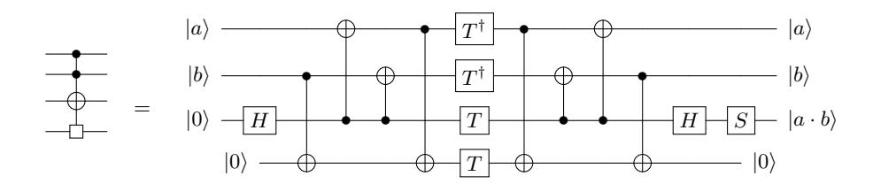

Figure 1: Quantum AND gate with T-depth 1.

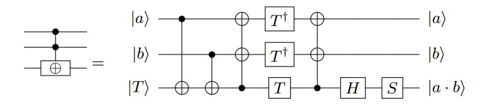

Figure 2: Quantum  $AND^{(2)}$  gate with T-depth 2.

# 2.4 Quantum AND gate

Jaques et al. [4] presented a quantum AND gate of T-depth 1 based on a combination of previous methods proposed by Selinger [15] and Gidney [13]. A quantum AND gate is similar to a Toffoli gate. Both gates perform a CCNOT operation, but a quantum AND gate takes only  $|0\rangle$  as the input state to the target register while a Toffoli gate allows both  $|0\rangle$  and  $|1\rangle$ . This quantum AND gate reduces T-depth but requires an additional ancilla qubit than a Toffoli gate [4]. Gidney [13] also present another implementation of the quantum AND gate which can be done in T-depth 2 with no ancilla qubits. This gate requires the target register takes a state  $|T\rangle$  as input and it can be produced by  $TH|0\rangle$ . As depicted in Fig.1, Fig.2 and Fig.3, a quantum AND gate has an asymmetric relationship with its dagger gate that requires only 3 qubits (same as Toffoli gate) without T-depth.

# 3 Improvement on tower-field construction

For our quantum circuit of AES inversion, we consider the following tower-field structure which was used firstly for the SCA(Side-Channel Attack) countermeasure implementation in [9].

In the below structure,

• The field polynomial of  $GF(2^2)$  is  $\phi^2 + \phi + 1$ 

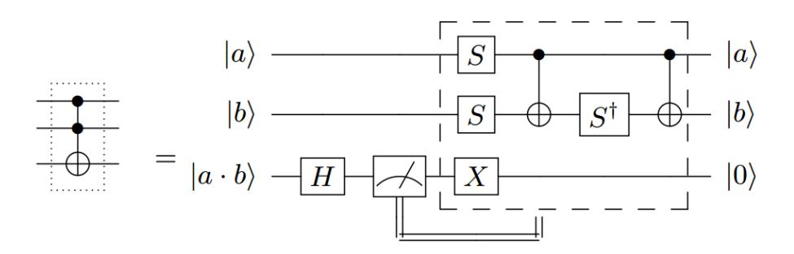

Figure 3: Quantum AND† gate.

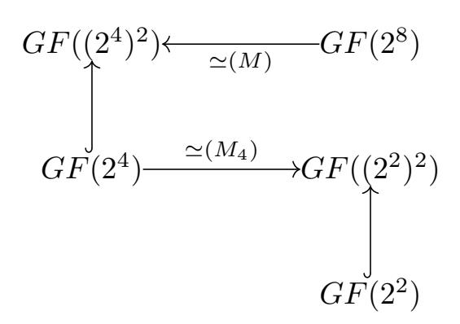

Figure 4: Tower-field structure

- The field polynomial of  $GF((2^2)^2)$  is  $z^2 + z + \phi$
- The field polynomial of  $GF(2^4)$  is  $\omega^4 + \omega + 1$
- The field polynomial of  $GF(((2^2)^2)^2)$  is  $y^2 + y + \lambda$ , where  $\lambda = \{1100\}_2$
- The field polynomial of  $GF(2^8)$  is  $x^8 + x^4 + x^3 + x + 1$

Now, it is necessary to determine an isomorphism from  $GF(2^8)$  to  $GF(((2^2)^2)^2)$ . Firstly, by the similar process of the section 2.2 of [16], we can determine a matrix M representing the isomorphism from  $GF(2^8)$  onto  $GF((2^4)^2)$  and a matrix  $M_4$  representing the isomorphism from  $GF(2^4)$  onto  $GF((2^2)^2)$  as follows:

$$M = \begin{bmatrix} 1 & 0 & 1 & 0 & 0 & 0 & 0 & 0 \\ 1 & 0 & 1 & 0 & 1 & 1 & 0 & 0 \\ 1 & 1 & 0 & 1 & 0 & 0 & 1 & 0 \\ 0 & 1 & 1 & 1 & 0 & 0 & 0 & 0 \\ 0 & 0 & 0 & 1 & 0 & 1 & 0 & 0 \\ 1 & 0 & 0 & 0 & 0 & 0 & 1 & 0 \\ 0 & 0 & 0 & 0 & 0 & 1 & 1 & 0 \\ 0 & 1 & 1 & 1 & 0 & 0 & 0 & 1 \end{bmatrix}, M^{-1} = \begin{bmatrix} 1 & 0 & 1 & 1 & 0 & 1 & 0 & 0 \\ 1 & 0 & 0 & 1 & 1 & 1 & 1 & 0 \\ 0 & 0 & 1 & 1 & 1 & 0 & 1 & 0 \\ 1 & 0 & 1 & 1 & 1 & 0 & 0 & 1 & 0 \\ 1 & 0 & 1 & 1 & 0 & 0 & 0 & 1 \\ 1 & 0 & 1 & 1 & 0 & 0 & 0 & 1 \end{bmatrix},$$

$$M_4 = \begin{bmatrix} 1 & 0 & 0 & 0 \\ 1 & 1 & 1 & 0 \\ 1 & 1 & 0 & 0 \\ 0 & 0 & 0 & 1 \end{bmatrix}, \text{ and } M_4^{-1} = \begin{bmatrix} 1 & 0 & 0 & 0 \\ 1 & 0 & 1 & 0 \\ 0 & 1 & 1 & 0 \\ 0 & 0 & 0 & 1 \end{bmatrix}.$$

Therefore, by composition of the above two matrices representing the isomorphisms, a matrix  $\Gamma$  representing the isomorphism from  $GF(2^8)$  to  $FG(((2^2)^2)^2)$  is describes as follows:

$$\Gamma = \begin{bmatrix} M_4 & 0 \\ 0 & M_4 \end{bmatrix} \cdot M = \begin{bmatrix} 1 & 0 & 1 & 0 & 0 & 0 & 0 & 0 \\ 1 & 1 & 0 & 1 & 1 & 1 & 1 & 1 & 0 \\ 0 & 0 & 0 & 0 & 1 & 1 & 0 & 0 & 0 \\ 0 & 1 & 1 & 1 & 0 & 0 & 0 & 0 & 0 \\ 0 & 0 & 0 & 1 & 0 & 1 & 0 & 0 & 0 \\ 1 & 0 & 0 & 1 & 0 & 1 & 1 & 0 & 0 \\ 0 & 1 & 1 & 1 & 0 & 0 & 0 & 1 & 1 \end{bmatrix}.$$

From now on, we use the following notations for elements of  $GF(2^8)$ ,  $GF(((2^2)^2)^2)$ ,  $GF(2^2)$ ,  $GF((2^2)^2)$  and  $GF((2^4)^2)$  respectively.

{3}------------------------------------------------

- $(a_7, a_6, a_5, a_4, a_3, a_2, a_1, a_0)$ : an element of  $GF(2^8)$  and its polynomial representation is  $\sum_{i=0}^{7} a_i x^i$
- $((b_{hh1}, b_{hh0}, b_{hl1}, b_{hl0}), (b_{lh1}, b_{lh0}, b_{ll1}, b_{ll0}))$ : an element of  $GF(((2^2)^2)^2)$ , where  $b_{ijk} \in GF(2)$ , i, j = h or l and k = 0 or 1
- In the above notation, let  $b_{ij} := (b_{ij1}, b_{ij0})$ . Then  $b_{ij}$  is in  $GF(2^2)$  and  $b_{ij1}\phi + b_{ij0}$  is its polynomial representation, where i, j = h or l
- And let  $b_h := b_{hh}z + b_{hl}$  and  $b_l := b_{lh}z + b_{ll}$ . Then  $b_h$  and  $b_l$  represent the elements of  $GF((2^2)^2)$ . And  $b_h y + h_l$  represents an element of  $GF(((2^2)^2)^2)$

# 3.1 Quantum circuit for the isomorphism

The matrix  $\Gamma$  which represents our ismorphism from  $GF(2^8)$  to  $GF(((2^2)^2)^2)$  can be implemented with only CNOT gates in a quantum circuit, since  $\Gamma$  is decomposed by PLU decomposition as follows:

$$\Gamma = P \cdot L \cdot U$$
, where

$$P = \begin{bmatrix} 1 & 0 & 0 & 0 & 0 & 0 & 0 & 0 \\ 0 & 1 & 0 & 0 & 0 & 0 & 0 & 0 \\ 0 & 0 & 0 & 0$$

Based on the above decomposition, the quantum circuit for the isomorphism is depicted as in Fig. 5.

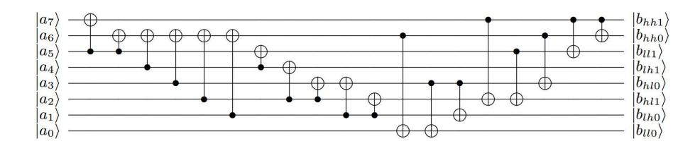

Figure 5: Quantum circuit of the isomorphic mapping  $\Gamma$ .

# 3.2 Inversion method with our composite field

The multiplicative inversion for a composite field  $\mathbf{GF}((2^n)^m)$  can be split into operations in the sub-fields  $\mathbf{GF}(2^n)$  [17]. For  $P \in \mathbf{GF}((2^n)^m)$  and  $r = \frac{2^{nm}-1}{2^n-1}$ , it is easy to know that  $P^{-1} = (P^r)^{-1} \cdot P^{r-1}$  and  $P^r \in \mathbf{GF}(2^n)$  [18]. For n = 4 and m = 2, the multiplicative inversion  $P^{-1}$  is represented by  $P^{-1} = (P^{17})^{-1} \cdot P^{16}$ . Then  $P^{-1}$  can be calculated by the following four steps:

- 1)  $P^{r-1} = P^{16}$
- 2)  $P^r = (P^{16}) \cdot P$
- 3) Compute  $(P^r)^{-1}$  in  $GF((2^2)^2)$
- 4) Compute  $(P^r)^{-1} \cdot P^{r-1}$  using  $\mathbf{GF}((2^2)^2)$  arithmetic

**Step 1)** We need to compute  $P^{16}$ . Let  $P := b_h y + b_l$ .

$$P^{16} = (b_h y + b_l)^{16} = b_h y^{16} + b_l$$
  
Then  $P^{16} = b_h y + (b_h + b_l)$ , since  $y^{16} = y + 1$ .

**Step 2)** We need to compute  $P^r = P^{16} \cdot P$ , r = 17. In the following formula,  $\lambda = \{1100\}_2$  in  $\mathbf{GF}((2^2)^2)$ .

$$P^{r} = P^{16} \cdot P = (b_{h}y + (b_{h} + b_{l}))(b_{h}y + b_{l})$$

$$= b_{h}^{2}y^{2} + b_{h}^{2}y + (b_{h} + b_{l})b_{l}$$

$$= b_{h}^{2}(y + \lambda) + b_{h}^{2}y + (b_{h} + b_{l})b_{l}$$

$$= b_{h}^{2} \times \lambda + (b_{h} + b_{l})b_{l},$$

To calculate the above equation, squaring, multiplication by  $\lambda$ , and multiplication in  $\mathbf{GF}((2^2)^2)$  should be implemented in quantum circuits in our composite field.

First, the below equations show how to calculate squaring, and this is depicted as a quantum circuit in Fig. 6.

$$(p_{ih}z + p_{il})^2 = (p_{ih1}\phi + p_{ih0})^2 z^2 + (p_{il1}\phi + p_{il0})^2$$

$$= (p_{ih1}\phi^2 + p_{ih0})z^2 + (p_{il1}\phi^2 + p_{il0})$$

$$= (p_{ih1}\phi + (p_{ih1} + p_{ih0}))z$$

$$+ (p_{ih0} + p_{il1})\phi + p_{ih1} + p_{il1} + p_{il0}$$

$$\coloneqq (q_{ih1}\phi + q_{ih0})z + (q_{il1}\phi + q_{il0}),$$

where i = h or l.

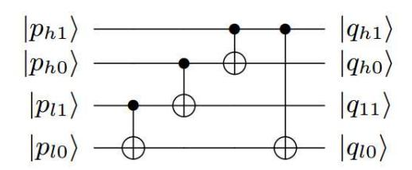

Figure 6: Quantum circuit of the squaring in  $\mathbf{GF}((2^2)^2)$ .

Second, the multiplication by  $\lambda$ (in fact,  $M_4(\lambda)$ ) can be calculated as below, and is depicted as Fig. 7.

$$(p_{ih}z + p_{il}) \times \lambda = ((p_{ih0} + p_{il0})\phi + p_{ih1} + p_{ih0} + p_{il1} + p_{il0})z + p_{ih1}\phi + p_{ih0}$$
  

$$:= (q_{ih1}\phi + q_{ih0})z + (q_{il1}\phi + q_{il0}),$$

where i = h or l.

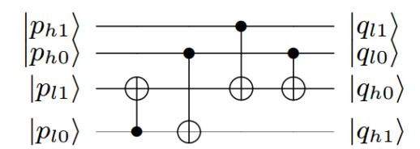

Figure 7: Quantum circuit of the multiplication by  $\lambda$  in  $\mathbf{GF}((2^2)^2)$ .

Both quantum circuits for squaring and multiplication by  $\lambda$  are implemented using only CNOT gates and wiring. The rest of arithmetic operations is a multiplication in  $\mathbf{GF}((2^2)^2)$  which can be calculated as

$$(p_{ih}z + p_{il})(q_{ih}z + q_{il}) = ((p_{ih} + p_{il})(q_{ih} + q_{il}) + p_{il}q_{il})z + (p_{ih}q_{ih}\phi + p_{il}q_{il})$$
  
 $:= r_{ih}z + r_{il},$ 

where  $p_{ih}$ ,  $p_{il}$ ,  $q_{ih}$ ,  $q_{il}$ ,  $r_{ih}$ ,  $r_{il}$  are in  $GF(2^2)$ , i = h or l.

Based on the classical circuit of multiplication in  $\mathbf{GF}((2^2)^2)$  shown in Fig. 8, we will adapt various quantum

{4}------------------------------------------------

circuits of multiplication in  $\mathbf{GF}((2^2)^2)$  for minimizing the multiplication by  $\lambda$  in  $\mathbf{GF}((2^2)^2)$ , respectively. depth-width cost in Section 4.

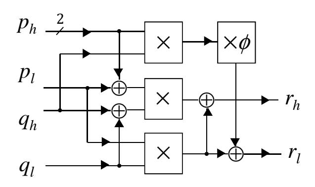

Figure 8: Classical circuit of the multiplication in  $\mathbf{GF}((2^2)^2)$ . Filled circle in classical diagram: connection. The box labeled "x" represents multiplication of two input elements in  $\mathbf{GF}(2^2)$ .

**Step 3)** We compute  $(P^r)^{-1}$  in **GF** $((2^2)^2)$ . For given  $p_{ih}, p_{il}, q_{ih}, q_{il} \in \mathbf{GF}(2^2)$  and  $(p_{ih}z + p_{il}), (q_{ih}z +$  $q_{il}$ )  $\in$  **GF** $((2^2)^2)$ , suppose that  $(p_{ih}z + p_{il})^{-1} = q_{ih}z + q_{il}$ , where i = h or l. Then, we have

$$(p_{ih}z + p_{il})(q_{ih}z + q_{il}) = ((p_{ih} + p_{il})(q_{ih} + q_{il}) + p_{il}q_{il})z + (p_{ih}q_{ih}\phi + p_{il}q_{il})$$

$$= 1,$$

and this gives us  $(p_{ih} + p_{il})q_{ih} + p_{ih}q_{il} = 0$ , and  $p_{ih}q_{ih}\phi+p_{il}q_{il}=1$ . Hence, it is easy to know that  $q_{ih}=p_{ih}d^{-1}$ and  $q_{il} = (p_{ih} + p_{il})d^{-1}$ , where  $d = p_{ih}^2 \phi + p_{il}(p_{ih} + p_{il})$  and  $d^{-1} = p_{ih}(\phi + 1) + p_{il} + p_{ih}^2 p_{il}^2$ . The classical circuit is given in Fig. 9, and we convert it into an efficient quantum circuit in Section 4.

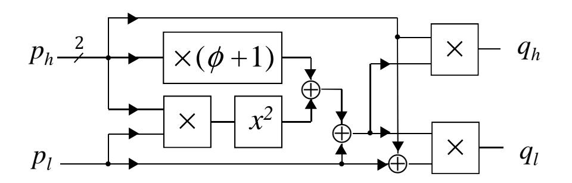

Figure 9: Circuit diagram of the multiplicative inversion in  $\mathbf{GF}((2^2)^2).$ 

**Step 4)** We compute  $(P^r)^{-1} \cdot P^{r-1}$  in  $\mathbf{GF}((2^2)^2)$ , where r = 17.

For  $p_i = (p_{ih}z + p_{il})$  in  $\mathbf{GF}((2^2)^2)$ , where  $p_{ih}, p_{il} \in \mathbf{GF}(2^2)$ and i = h or l we know

$$p_i \cdot P^{16} = p_i \cdot (b_h y + (b_h + b_l)),$$
  
=  $p_i \cdot b_h y + p_i \cdot (b_h + b_l),$ 

because  $P^{16} = b_h y + (b_h + b_l)$  (see Step 1).

From the step 1 to 4, we can obtain the multiplicative inversion for our composite field  $\mathbf{GF}(((2^2)^2)^2)$ . The classical circuit for calculating this multiplicative inversion is illustrated in Fig. 10. The square box marked  $\times$  means a multiplication operation in  $\mathbf{GF}((2^2)^2)$ , and the others  $x^2$ ,  $x^{-1}$ , and  $\times \lambda$  represent squaring, multiplicative inversion, and

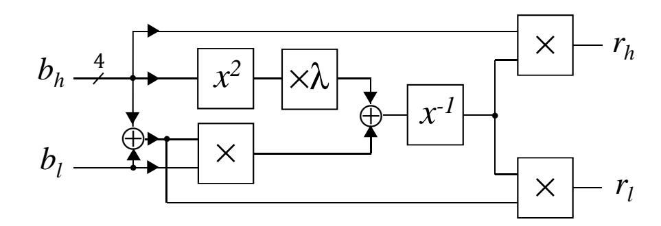

Figure 10: Circuit diagram of the multiplicative inversion in  $\mathbf{GF}(((2^2)^2)^2)$ 

Summary. A hardware implementation of Galois field operations generally uses AND and XOR (some NOR) gates in classical computing environment. An AND gate is converted into a Toffoli gate or a quantum AND gate [4], and an XOR gate is converted into a quantum gate as a relatively inexpensive CNOT gate. So far, a Toffoli gate and a quantum AND gate are known to have at least T-depth 3 [12] and Tdepth 1 [4], respectively. Because the AND-depth in a classical computing environment decides the T-depth in a quantum computing environment, a hardware implementation with a low AND-depth reduces calculation time when it is converted into a quantum circuit.

Compared to prior work [10], our method reduces the AND-depth of the multiplicative inversion from 6 to 4. Note that we only modified the multiplicative inversion; the rest part of constructing the S-box, including the isomorphic mapping, its inverse operation, and the affine mapping, can be implemented with only XOR gates. Therefore, the ANDdepth of the S-box using the proposed multiplicative inversion remains 4 as before.

#### **Proposed Quantum Circuit** 4

In order to build up a shallow implementation of multiplicative inversion in  $\mathbf{GF}(2^8)$ , we should take into account depth-width trade-offs of the sub-circuits for the arithmetic operations in  $\mathbf{GF}(2^2)$  and  $\mathbf{GF}(2^4)$ . From now on, we propose a bottom-up approach for several low-cost quantum circuits of multiplication inversion in  $\mathbf{GF}(2^8)$ . Our goal is to provide optimal combinations of quantum circuits for composite Galois field operations under consideration of depth-width trade-offs.

#### Quantum circuits for $GF(2^2)$ arithmetic 4.1

Our scheme basically explores the use of multiplication and its dagger operations in  $\mathbf{GF}(2^2)$ . For  $(a_1\phi + a_0), (b_1\phi + b_0) \in$  $\mathbf{GF}(2^2) = \mathbf{GF}(2)[\phi]/(\phi^2 + \phi + 1)$ , the multiplication operation can be written as below, and can also be implemented as quantum circuits using CNOT, Toffoli, and quantum AND gates.

$$(a_1\phi + a_0)(b_1\phi + b_0) = ((a_1 + a_0)(b_1 + b_0) + a_0b_0)\phi + a_1b_1 + a_0b_0.$$

When implementing a multiplication circuit in  $\mathbf{GF}(2^2)$ , the cost depends on how the CCNOT operation is constructed by using Toffoli or quantum AND gates. As explained previously, the depth-width trade-offs are due to the fact that a quantum AND gate uses one more qubit temporarily, but it reduces T-depth compared to a Toffoli gate. For this reason,

{5}------------------------------------------------

quantum circuits for multiplication in **GF**(22 ) can be designed with various depth-width costs. We propose three types of quantum circuits for multiplication in **GF**(22 ) and two types of quantum circuits for its dagger operation. The former is summarized in Table 2 and illustrated in Fig. 11, and the latter is in Table 3 and in Fig. 18, respectively.

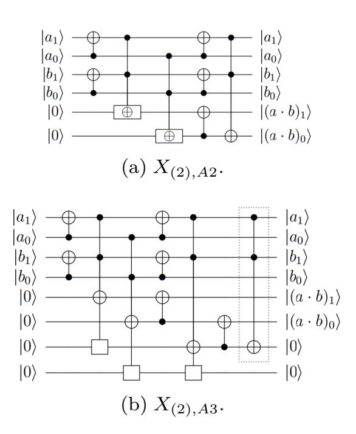

Figure 11: Two quantum circuits for multiplication in **GF**(22 ). Dotted circle: ancilla qubit.

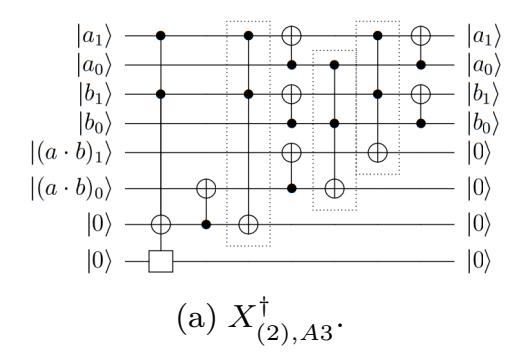

Figure 12: The quantum circuit of multiplication dagger in **GF**(22 ).

#### **4.2 Quantum circuits for GF**(24 ) **arithmetic**

As explained in Section 3, the arithmetic in **GF**(24 ) such as squaring, constant(*λ*) multiplication, multiplication, and multiplicative inversion can be performed in **GF**((22 ) 2 ). Among them, the first two operations implemented by using only Clifford gates were previously described in Fig. 6 and Fig. 7, respectively. Now we improve on the quantum circuits of multiplication and multiplicative inversion in **GF**(24 ).

| Notation | Composition of gates |
|----------|----------------------|
| X(2),A2  | AND × 2, Toffoli × 1 |
| X(2),A3  | AND × 3, AND† × 1    |

Table 2: Two quantum circuits of multiplication in **GF**(22 ).

| Notation         | Composition of gates |
|------------------|----------------------|
| X † (2),A3 | AND × 1, AND† × 3    |

Table 3: The quantum circuit of multiplication dagger in **GF**(22 ).

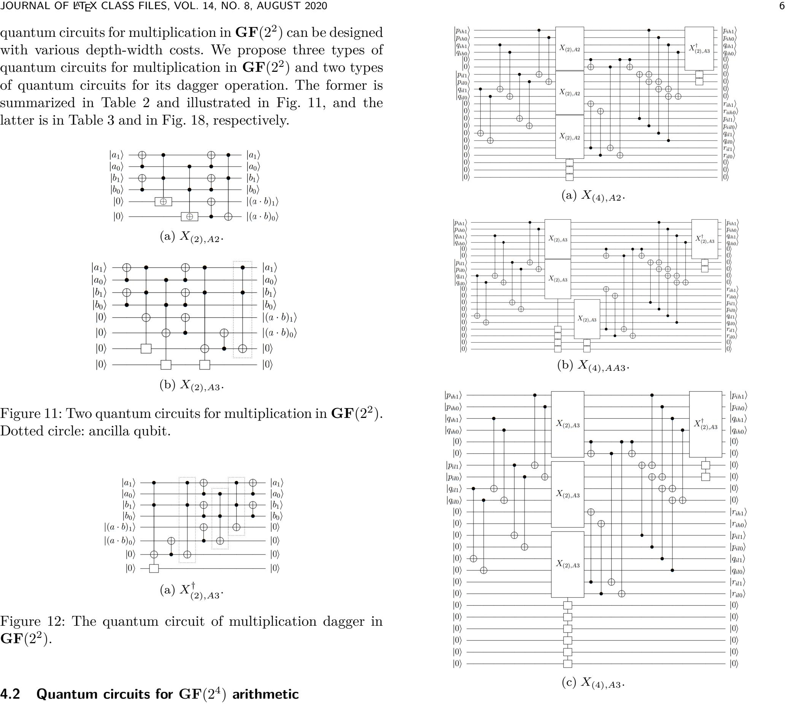

Figure 13: Three quantum circuits for multiplication in *GF*(24 ).

**Multiplication.** As depicted in Fig. 8, multiplication in **GF**(24 ) consists of addition, constant(*φ*) multiplication, and three times of multiplication in **GF**(22 ). The quantum circuits for addition and constant multiplication in **GF**(22 ) can be implemented with only CNOT gates. Three times of multiplication in **GF**(22 ) can be performed only in parallel or in a combination of parallel and series, depending on the available amount of qubits. Also, the arrangement of the quantum circuits for multiplication in **GF**(22 ) introduced in Section 4.1 will have an influence on depth-width trade-offs. By taking advantage of multiplication in **GF**(22 ) that can be performed in parallel, the following suggests cost-effective quantum circuits for the multiplication in **GF**(24 ).

We use three types of quantum circuits for multiplication in **GF**(24 ). Each of them is denoted by *X*(4)*,A*2, *X*(4)*,AA*3, and *X*(4)*,A*3 as shown in Fig. 13. Note that each name of the circuits characterizes the type of multiplication in **GF**(22 ) and the arrangement in the circuit.

{6}------------------------------------------------

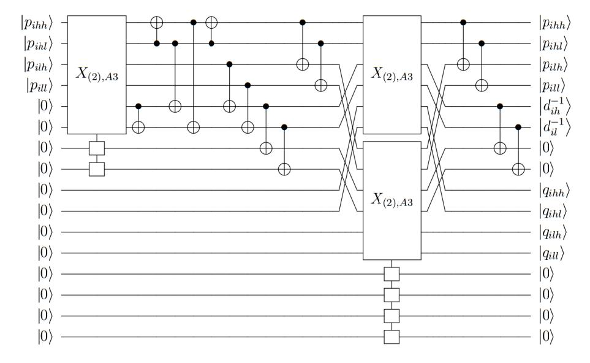

Figure 14: Quantum circuit of the multiplicative inversion in  $\mathbf{GF}(2^4)$ .

The three quantum circuits for multiplication in  $\mathbf{GF}(2^2)$  are arranged to reduce T-depth as much as possible within the available number of qubits. The quantum circuits for multiplication in  $\mathbf{GF}(2^2)$  aligned in the same column indicate parallel execution, whereas the circuits placed in different columns represent operations performed in series. On the other hand, we use only one type of quantum circuit denoted by  $X_{(2),A3}^{\dagger}$  for dagger operation of multiplication in  $\mathbf{GF}(2^2)$ . This circuit provides the smallest T-depth, and the proposed quantum circuits for multiplication in  $\mathbf{GF}(2^4)$  have enough qubits to perform it in all circuit design.

Multiplicative inversion. The outputs of the multiplicative inversion in  $\mathbf{GF}(2^4)$  are  $q_h = p_h d^{-1}$  and  $q_l = (p_h + p_l)d^{-1}$ , where  $d^{-1} = p_h(\phi + 1) + p_l + p_h^2 p_l^2$ . To calculate  $q_h$  and  $q_l$ , the quantum circuit of multiplicative inversion in  $\mathbf{GF}(2^4)$  requires three quantum circuits for multiplication in  $\mathbf{GF}(2^2)$ , where two of them can be executed in parallel. This quantum circuit needs additional two qubits for saving  $d^{-1}$  which is required during clean-up process of the multiplicative inversion in  $\mathbf{GF}(2^8)$ .

The quantum circuit for multiplicative inversion in  $\mathbf{GF}(2^4)$  is depicted in Fig.14. Because the quantum circuit for multiplicative inversion in  $\mathbf{GF}(2^8)$  has a sufficient number of qubits available,  $X_{(2),A3}$  is only used to build the quantum circuit for multiplicative inversion in  $\mathbf{GF}(2^4)$ .

# 4.3 Quantum circuits for multiplicative inversion in $\mathbf{GF}(2^8)$

Multiplicative inversion in  $\mathbf{GF}(2^8)$  can be reduced to squaring, constant multiplication (by  $\lambda$ ), multiplicative inversion and multiplications, all in  $\mathbf{GF}(2^4)$ , as shown in Fig. 10. Here, squaring and constant multiplication can be implemented by using only CNOT gates. The quantum circuit for multiplicative inversion in  $\mathbf{GF}(2^8)$  requires a clean-up process in order to reset the qubits holding intermediate values into a certain state (usually  $|0\rangle$ ). This process will improve the reusability of qubits when the proposed quantum circuit is integrated into the AES S-box. A clean-up part is similar to the reverse shape of the circuit. However this operation is not symmetric since the result of the operation must be maintained through all the operations.

Our circuits are largely divided into two parts: multiplicative inversion in  $\mathbf{GF}(2^8)$  in the front part and the clean-

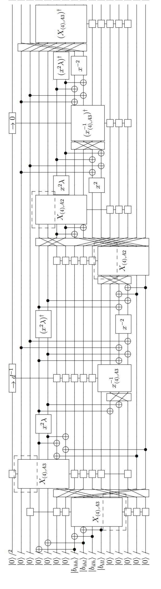

 $\begin{array}{c} 0\rangle \\ rinh \rangle \\ rinl \rangle \\ bunh \rangle \\ bunh \rangle \\ bunh \rangle \\ bunh \rangle \\ bunh \rangle \\ 0\rangle \\ 0\rangle \\ 0\rangle \\ 0\rangle \\ 0\rangle \\ 0\rangle \\ 0\rangle \\$ 

Figure 15: Quantum circuit for the multiplicative inversion in  $\mathbf{GF}(2^8)$ , minimum width.

{7}------------------------------------------------

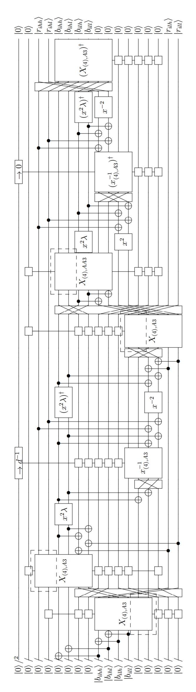

Figure 16: Quantum circuit for the multiplicative inversion in **GF**(2), balanced.

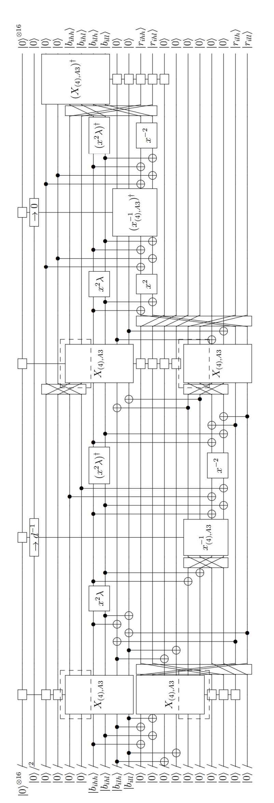

Figure 17: Quantum circuit for the multiplicative inversion in **GF**(2), minimum depth.

{8}------------------------------------------------

up process in the rear part. The front part contains one more multiplication in  $\mathbf{GF}(2^4)$  compared to the classical version of the circuit given in Fig. 10 since keeping the product  $b_h \times b_l$  reduces T-depth of the circuit including the clean-up process.

By combining multiplication circuits in  $\mathbf{GF}(2^4)$  in three different ways as depicted in Fig. 13, we can obtain three different quantum circuits for multiplicative inversion in  $\mathbf{GF}(2^8)$  as shown in Fig. 15 to Fig. 17; one enjoys the minimum width (using 32 qubits), another the minimum depth (at the cost of 54 qubits), and the remaining one is balanced between the depth and the width.

We depicted  $\mathbf{GF}(2^4)$  multiplication as Fig. 18a. An empty box represents ancilla qubits and dashed line box emphasizes the target registers. The  $\mathbf{GF}(2^4)$  multiplicative inversion also depicted in similar way as in Fig. 18b. The most upper rectangle written as  $\to d^{-1}$  is not ancilla qubit, this part takes  $|0\rangle$  as input then outputs  $|d^{-1}\rangle$ , respectively.

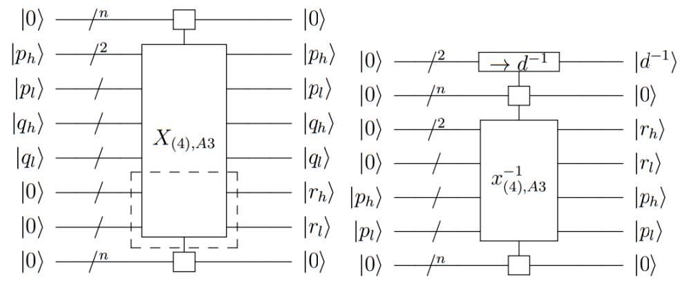

(a) Symbol of  $\mathbf{GF}(2^4)$  multiplica-(b) Symbol of  $\mathbf{GF}(2^4)$  multiplication.

Figure 18: Symbol of multiplication and multiplicative inversion in  $\mathbf{GF}(2^4)$ .

We will use the following notations:

- $|b, a, ...\rangle \leftarrow \mathsf{ra}|a, b, ...\rangle$  to denote logical rearrangement of the inputs;
- $b \leftarrow x^2(a)$  to denote squaring;
- $b \leftarrow x^2 \cdot \lambda(a)$  to denote squaring, and then multiplying  $\lambda$ ;
- $c \leftarrow X|0^4, a, b\rangle$  or  $c \leftarrow X|a, b, 0^4\rangle$  to denote multiplication of a and b in  $\mathbf{GF}(2^4)$ ;
- $b \leftarrow (x_{(4),A3}^{-1})|a\rangle$  to denote multiplicative inversion of a in  $\mathbf{GF}(2^4)$ .

Here, we can use commas to split a qubit vector into smaller sub-vectors of different sizes. The rest of computations for the sub-circuits will follow the same notation style.

For the sake of simplicity, a pair of two CNOT gates is represented by a single CNOT gate in Fig.15 to Fig.17 since each horizontal line carry two qubits.

Circuit of the minimum width. The minimum-width quantum circuit illustrated in Fig. 15. For an 8-bit input, denoted  $b_{hh}$ ,  $b_{hl}$ ,  $b_{lh}$ , and  $b_{ll}$ , let  $b_h = b_{hh}||b_{hl}$  and  $b_l = b_{lh}||b_{ll}$ . After copying  $b_h$  using two CNOT gates, we change the state of  $b_h$  to  $b_h + b_l$  with two CNOT gates. Then we have

$$|b_h + b_l, b_l, (b_h + b_l)b_l\rangle \leftarrow X_{(4),A3}|b_h + b_l, b_l, 0^4\rangle.$$

Next, we have

$$|b_l, 0^8, (b_h + b_l)b_l, 0^2, b_h + b_l\rangle \leftarrow$$
  
 $|b_l, 0^8, (b_h + b_l)b_l, 0^2, b_h + b_l\rangle \leftarrow$   
 $|b_l, 0^8, (b_h + b_l)b_l, 0^6\rangle,$ 

and

$$|b_h b_l, b_h, b_l\rangle \leftarrow X_{(4), A3} |0^4, b_h, b_l\rangle.$$

By applying four CNOT gates, we reset the qubits, namely,  $b_l \leftarrow |0\rangle^{\otimes 4}$ , and compute  $b_h^2\lambda$  using squaring, constant multiplication by  $\lambda$ . Then we add  $b_h^2\lambda$  and  $(b_h+b_l)b_l$  by using two CNOT gates. Let

$$t = (b_h + b_l)b_l + b_h^2 \lambda$$

Then we have

$$|0^2, t\rangle \leftarrow \operatorname{ra}|t, 0^2\rangle,$$
$$|d^{-1}, q, t\rangle \leftarrow (x_{(4), A3}^{-1})|0^2, 0^4, t\rangle$$

from top to bottom. The qubits of t become  $b_l$  by applying four CNOT gates and  $x^{-2}$ . At the same time, we have

$$b_h \leftarrow (x^2 \cdot \lambda)^{\dagger} |b_h^2 \lambda\rangle.$$

We then change  $b_l$  to  $|0\rangle^{\otimes 4}$  by applying four CNOT gates. Now,  $r_l$  denotes the lower 4-bit of the result of the multiplicative inversion in  $\mathbf{GF}(2^8)$  which is calculated by

$$|0^4, q\rangle \leftarrow \mathsf{ra}|q, 0^4\rangle,$$
  
 $|r_l, q, b_h + b_l\rangle \leftarrow X_{(4), A2}|0^4, q, b_h + b_l\rangle,$ 

where  $b_h, r_l, q, b_h + b_l$  represent 4 qubits, respectively.

In order to compute the higher 4-bit of the result, denoted  $r_h$ , we logically rearrange the qubits as follows:

$$|0^4, b_h, q, b_h + b_l, 0^6, r_l\rangle \leftarrow \mathsf{ra}|b_h, 0^{10}, r_l, q, b_h + b_l\rangle$$

By applying two CNOT gates,  $b_h + b_l$  becomes  $b_l$ . Then, we have

$$|r_h, b_h, q\rangle \leftarrow X_{(4)}|_{T_3}|_{0^4}, b_h, q\rangle,$$

and then, as the result of multiplicative inversion,

$$r \leftarrow r_h || r_l$$
.

Through the clean-up process in the rear part, all the qubits except  $r_h$ ,  $r_l$ ,  $b_h$ , and  $b_l$  are reset to the initial state. At the beginning of the clean-up, t is computed by adding  $x^2 \cdot \lambda(b_h)$ ,  $x^2(b_l)$ , and  $b_h b_l$  with four CNOT gates. We then have

$$|t,q\rangle \leftarrow \mathsf{ra}|q,t\rangle,$$
  
 $|0^2,t,0^4\rangle \leftarrow (x_{(4),A3}^{-1})^{\dagger}|d^{-1},t,q\rangle,$ 

which means that  $d^{-1}$  and q are initialized to  $|0\rangle^{\otimes 2}$  and  $|0\rangle^{\otimes 4}$ . Next, t becomes  $b_l^2$  by using four CNOT gates. At the same time, we have

$$b_h \leftarrow (x^2 \cdot \lambda)^{\dagger} |b_h^2 \lambda\rangle$$
$$b_l \leftarrow x^{-2} |b_l^2\rangle.$$

{9}------------------------------------------------

The final step is to clean up  $b_h b_l$ . This is done by

$$|r_h, b_h, b_l, b_h b_l\rangle \leftarrow \mathsf{ra}|b_h b_l, r_h, b_h, b_l\rangle,$$
  
 $|b_h, b_l, 0^4\rangle \leftarrow (x_{(4),A3})^{\dagger}|b_h, b_l, b_h b_l\rangle.$ 

The non-zero states of qubits in the circuit are then  $r_h$ ,  $b_h$ ,  $b_l$ , and  $r_l$ .

**Balanced circuits.** We can reduce the depth of the minimum-width circuit with only a few more qubits if available. Such quantum circuit is called *balanced* (using two additional qubits) and it requires 34 qubits, respectively. We can replace the last two multipliers in  $\mathbf{GF}(2^4)$  with two multipliers of smaller T-depth. Precisely, as shown in Fig. 16, the balanced circuits perform

$$(X_{(4),A_2}, X_{(4),A_2}) \to (X_{(4),A_3}, X_{(4),AA_3}),$$

respectively.

Circuit of the minimum depth. If 54 qubits are available in the circuit, then we can parallelize the first two and the last two multipliers using the multiplier of the lowest depth,  $X_{(4),A3}$ , as shown in Fig. 15. Several CNOT gates are added to copy and reset the values used for both parallelized multiplier pairs, including  $b_l$  and q.

In Table 1, we summarized depth-width costs of our four quantum circuits that improve on multiplicative inversion in  $\mathbf{GF}(2^8)$  as follows: 1) The minimum-width circuit reduces T-depth by 75.83 percent compared to the existing circuit with the same width. 2) For the balanced circuit, the number of qubits is reduced by 7 qubits, respectively, and T-depth is reduced by 10, respectively, compared to the existing balanced circuit. 3) The last circuit for minimum depth reduces as many as 83 qubits by adding only T-depth 11.

### 4.4 Affine transformation quantum circuit

The affine transformation is expressed as

$$\{b\} = M\{b^{'}\} \oplus \{v\},\$$

where  $\{b'\}=(b'_7,b'_6,b'_5,b'_4,b'_3,b'_2,b'_1,b'_0)$  is the result of the multiplicative inversion for the input to the AES S-box, and the matrix M and the vector  $\{v\}$  are given below:

$$\mathbf{M}\{\mathbf{b}'\} = \begin{bmatrix} 1 & 1 & 1 & 1 & 1 & 0 & 0 & 0 \\ 0 & 1 & 1 & 1 & 1 & 1 & 0 & 0 \\ 0 & 0 & 1 & 1 & 1 & 1 & 1 & 0 \\ 0 & 0 & 0 & 1 & 1 & 1 & 1 & 1 \\ 1 & 0 & 0 & 0 & 1 & 1 & 1 & 1 \\ 1 & 1 & 0 & 0 & 0 & 1 & 1 & 1 \\ 1 & 1 & 1 & 0 & 0 & 0 & 1 & 1 \\ 1 & 1 & 1 & 1 & 0 & 0 & 0 & 1 \end{bmatrix} \begin{bmatrix} b'_7 \\ b'_6 \\ b'_5 \\ b'_4 \\ b'_3 \\ b'_2 \\ b'_1 \\ b'_0 \end{bmatrix} \text{ and } \{v\} = \begin{bmatrix} 0 \\ 1 \\ 1 \\ 0 \\ 0 \\ 0 \\ 1 \\ 1 \end{bmatrix}$$

M can be decomposed by PLU decomposition into three matrices P, L and U that can be implemented in a quantum circuit with only CNOT gates. On the other hand, the modular addition of  $\{v\}$  can be implemented in a quantum circuit with only X-gates. Fig. 19 depicts a quantum circuit for the affine transformation of the AES S-box consisting of the above two operations. This circuit can be executed in-place and does not include T-gate. Therefore, the affine transformation does not impose additional T-depth or qubits.

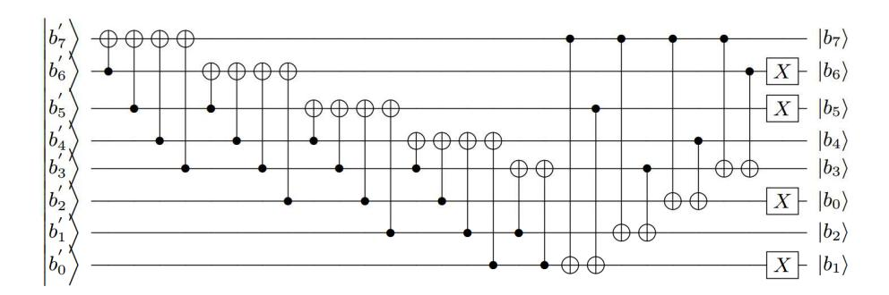

Figure 19: Quantum circuit of the Affine transformation.

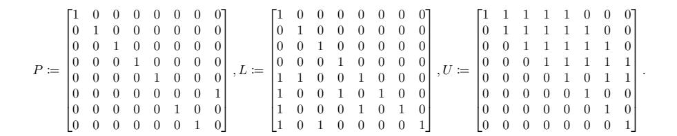

# 4.5 Merging inverse of isomorphic mapping and affine transformation

By combining the inverse of isomorphic mapping and the affine transformation, the number of CNOT gates of the quantum circuit can be reduced. The inverse of isomorphic mapping are represented as the matrix  $\Gamma^{-1}$  (see Section 3.1):

$$\Gamma^{-1} = \begin{bmatrix} 1 & 0 & 1 & 0 & 0 & 0 & 0 & 0 \\ 1 & 1 & 0 & 1 & 1 & 1 & 1 & 0 \\ 0 & 0 & 0 & 0 & 1 & 1 & 0 & 0 \\ 0 & 1 & 1 & 1 & 0 & 0 & 0 & 0 \\ 0 & 0 & 0 & 1 & 0 & 1 & 0 & 0 \\ 1 & 0 & 0 & 1 & 0 & 1 & 1 & 0 \\ 1 & 0 & 0 & 1 & 0 & 1 & 1 & 0 \\ 0 & 1 & 1 & 1 & 0 & 0 & 0 & 1 \end{bmatrix} = \begin{bmatrix} 1 & 1 & 1 & 1 & 1 & 0 & 1 & 0 \\ 1 & 0 & 0 & 1 & 0 & 1 & 0 & 0 \\ 0 & 1 & 1 & 1 & 1 & 1 & 1 & 1 & 0 \\ 1 & 1 & 1 & 1 & 1 & 1 & 1 & 1 & 0 \\ 1 & 1 & 1 & 1 & 0 & 1 & 1 & 0 \\ 1 & 1 & 1 & 1 & 0 & 1 & 1 & 0 \\ 1 & 1 & 1 & 1 & 0 & 0 & 0 & 0 \\ 0 & 0 & 0 & 1 & 0 & 0 & 0 & 1 \end{bmatrix}$$

then we can merge the inverse of isomorphic mapping and the affine transformation as follow:

$$\mathbf{M}\{\mathbf{r}\} = \begin{bmatrix} 1 & 1 & 1 & 1 & 1 & 0 & 0 & 0 \\ 0 & 1 & 1 & 1 & 1 & 1 & 0 & 0 \\ 0 & 0 & 1 & 1 & 1 & 1 & 1 & 0 \\ 0 & 0 & 0 & 1 & 1 & 1 & 1 & 1 \\ 1 & 0 & 0 & 0 & 1 & 1 & 1 & 1 \\ 1 & 1 & 0 & 0 & 0 & 1 & 1 & 1 \\ 1 & 1 & 1 & 0 & 0 & 0 & 1 & 1 \\ 1 & 1 & 1 & 0 & 0 & 0 & 0 & 1 \end{bmatrix} \begin{bmatrix} 1 & 1 & 1 & 1 & 1 & 0 & 1 & 0 \\ 1 & 0 & 0 & 1 & 0 & 1 & 0 & 0 \\ 0 & 1 & 1 & 1 & 1 & 1 & 0 & 1 \\ 1 & 1 & 1 & 1 & 1 & 1 & 1 & 0 \\ 1 & 1 & 0 & 1 & 0 & 1 & 1 & 0 \\ 1 & 1 & 1 & 1 & 1 & 0 & 1 & 1 & 0 \\ 1 & 1 & 1 & 1 & 1 & 0 & 0 & 0 & 0 \\ 1 & 1 & 1 & 1 & 1 & 0 & 0 & 0 & 0 \\ 1 & 1 & 1 & 1 & 1 & 0 & 0 & 0 & 0 \\ 0 & 1 & 1 & 1 & 1 & 1 & 0 & 0 & 0 & 0 \\ 0 & 0 & 0 & 0 & 1 & 0 & 0 & 0 & 1 \end{bmatrix} \begin{bmatrix} r_7 \\ r_6 \\ r_5 \\ r_4 \\ r_3 \\ r_2 \\ r_1 \\ r_0 \end{bmatrix} \oplus \begin{bmatrix} 0 \\ 1 \\ 0 \\ 0 \\ 0 \\ 0 \\ 1 \\ 1 \\ 1 \end{bmatrix}$$

where  $\{r\} = (r_7, r_6, r_5, r_4, r_3, r_2, r_1, r_0)$  is the result of the proposed multiplicative inversion on the isomorphic  $\mathbf{GF}(2^8)$ . Here, the multiplication of the first two matrices is as follows:

$$\begin{bmatrix} 0 & 0 & 1 & 1 & 1 & 1 & 0 & 0 \\ 0 & 0 & 1 & 1 & 0 & 0 & 0 & 0 \\ 0 & 1 & 0 & 1 & 0 & 1 & 0 & 0 \\ 0 & 0 & 1 & 1 & 1 & 1 & 1 & 1 \\ 0 & 0 & 1 & 1 & 1 & 1 & 0 & 1 & 1 \\ 1 & 1 & 1 & 1 & 0 & 0 & 0 & 1 \\ 1 & 1 & 1 & 1 & 1 & 0 & 0 & 1 \\ 1 & 1 & 1 & 1 & 1 & 0 & 0 & 1 \\ 1 & 1 & 1 & 1 & 1 & 1 & 0 & 0 & 0 \\ 0 & 0 & 1 & 1 & 1 & 1 & 1 & 0 \\ 0 & 1 & 1 & 1 & 1 & 1 & 0 & 0 & 0 \\ 1 & 1 & 1 & 1 & 1 & 1 & 0 & 0 & 0 \\ 0 & 0 & 1 & 1 & 1 & 1 & 1 & 0 & 0 & 0 \\ 0 & 0 & 1 & 1 & 1 & 1 & 1 & 0 & 0 & 0 \\ 0 & 0 & 0 & 1 & 1 & 1 & 1 & 1 & 0 \\ 0 & 0 & 0 & 1 & 1 & 1 & 1 & 1 & 0 \\ 0 & 0 & 0 & 1 & 1 & 1 & 1 & 1 \end{bmatrix}$$

This matrix can also be decomposed by matrix P, L, and U by PLU decomposition as follows:

$$P \coloneqq \begin{bmatrix} 0 & 0 & 0 & 0 & 0 & 0 & 1 & 0 \\ 0 & 0 & 1 & 0 & 0 & 0 & 0 & 0 \\ 0 & 1 & 0 & 0 & 0 & 0 & 0 & 0 \\ 0 & 0 & 0 & 0$$

Therefore, we can write  $M\{r\}$  as

$$M\{r\} = P \cdot L \cdot U \cdot \begin{bmatrix} r_7 \\ r_6 \\ r_5 \\ r_4 \\ r_3 \\ r_2 \\ r_1 \\ r_0 \end{bmatrix} \oplus \begin{bmatrix} 0 \\ 1 \\ 1 \\ 0 \\ 0 \\ 0 \\ 1 \\ 1 \end{bmatrix}$$

{10}------------------------------------------------

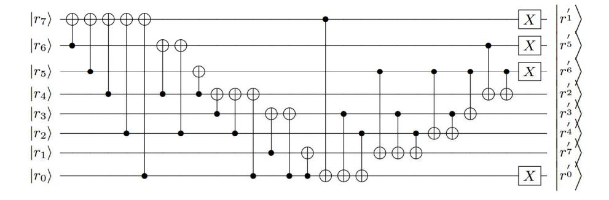

Figure 20: Quantum circuit of merging the inverse of isomorphic mapping and affine transformation.

and it can be implemented as a quantum circuit shown in Fig. 20. This quantum circuit reduces the number of CNOT gates from 45 to 25, compared to implementing the inverse of isomorphic mapping and the affine transformation separately.

# 5 Evaluation

We evaluate our proposed method in terms of the number of qubits and T-depth. To design a quantum circuit that calculates multiplicative inversion in  $\mathbf{GF}(2^8)$ , we proposed quantum circuit designs with various depth-width trade-offs for smaller Galois fields,  $\mathbf{GF}(2^2)$  and  $\mathbf{GF}(2^4)$ . The depth-width of the quantum circuits of the multiplicative inversion in  $\mathbf{GF}(2^8)$  can be determined in a trade-off manner depending on the sub-circuits for the smaller Galois fields.

# 5.1 Multiplication and dagger in $\mathbf{GF}(2^2)$

| Symbol                                           | # qubit | T-depth | Subcomponents                             |
|--------------------------------------------------|---------|---------|-------------------------------------------|
| $X_{(2),A2} \ X_{(2),A3} \ X_{(2),A3}^{\dagger}$ | 6       | 5       | $AND^{(2)} \times 2$ , Toffoli × 1        |
|                                                  | 8       | 2       | $AND \times 3$ , $AND^{\dagger} \times 1$ |
|                                                  | 10      | 1       | $AND \times 1$ , $AND^{\dagger} \times 3$ |

Table 4: The number of qubits and T-depth of multiplication and its dagger in  $\mathbf{GF}(2^2)$ .

As explained in Section 3, the multiplication quantum circuits in  $\mathbf{GF}(2^2)$  have different depth-width costs depending on the combination of AND gates (and its dagger) and Toffoli gates. The use of AND gates, compared to Toffoli gates, increases quibit consumption, but decreases T-depth. Table 4 summarizes the overall cost of multiplication operation in  $\mathbf{GF}(2^2)$  used in our proposed scheme.

| Symbol        | # qubit | T-depth | Subcomponents                                                             |
|---------------|---------|---------|---------------------------------------------------------------------------|
| $X_{(4),A2}$  | 18      | 6       | $X_{(2),A2} \times 3, X_{(2),A3}^{\dagger} \times 1$                      |
| $X_{(4),AA3}$ | 20      | 5       | $X_{(2),A3} \times 2, X_{(2),A3} \times 1, X_{(2),A3}^{\dagger} \times 1$ |
| $X_{(4),A3}$  | 24      | 3       | $X_{(2),A3} \times 3, X_{(2),A3}^{\dagger} \times 1$                      |
| $X^{(4),-1}$  | 18      | 4       | $X_{(2),A3} \times 1, X_{(2),A3} \times 2$                                |

Table 5: The number of qubits and T-depth of multiplication and its dagger in  $\mathbf{GF}(2^4)$ .

# **5.2** Multiplication in $GF(2^4)$

The quantum circuits for multiplication in  $\mathbf{GF}(2^4)$  have different depth-width depending on which quantum circuit

for multiplication in  $\mathbf{GF}(2^2)$  is used, and whether the quantum circuits are arranged in sequential or parallel. The summary of multiplication cost in  $\mathbf{GF}(2^2)$  used in our proposed scheme is provided in Table 5.

# **5.3** Multiplicative Inversion in $GF(2^8)$

The quantum circuit of multiplicative inversion in  $\mathbf{GF}(2^8)$  has a more complex structure than the circuits of  $\mathbf{GF}(2^2)$  and  $\mathbf{GF}(2^4)$ . However, the dominant factor on its cost is which quantum circuits of  $\mathbf{GF}(2^4)$  is used and how they are arranged. Table 1 summarizes the number of qubits and T-depth of multiplicative inversion in  $\mathbf{GF}(2^8)$  for each combination.

# **Acknowledgment**

This work was supported by Institute for Information & communications Technology Planning & Evaluation (IITP) grant funded by the Korea government(MSIT) ( $\langle Q|Crypton \rangle$ , No.2019-0-00033, Study on Quantum Security Evaluation of Cryptography based on Computational Quantum Complexity) and also partially supported by a Korea University Grant.

# References

- [1] P. W. Shor, "Polynomial-time algorithms for prime factorization and discrete logarithms on a quantum computer," *SIAM review*, vol. 4, no. 2, pp. 303–332, 1999.
- [2] L. K. Grover, "A fast quantum mechanical algorithm for database search," in *Proceedings of the twenty-eighth annual ACM symposium on Theory of computing STOC '96*, G. L. Miller, Ed. ACM, 1996, pp. 212–219.
- [3] M. Grassl, B. Langenberg, M. Roetteler, and R. Steinwandt, "Applying Grover's algorithm to AES: quantum resource estimates," in *Post-Quantum Cryptography PQCrypto 2016*, ser. LNCS, T. Takagi, Ed., vol. 9606. Springer, 2016, pp. 29–43.
- [4] S. Jaques, M. Naehrig, M. Roetteler, and F. Virdia, "Implementing Grover oracles for quantum key search on AES and LowMC," in *Advances in Cryptology EUROCRYPT 2020 (Proceedings, Part II)*, ser. LNCS, A. Canteaut and Y. Ishai, Eds., vol. 12106. Springer, 2020, pp. 280–310.
- [5] B. Langenberg, H. Pham, and R. Steinwandt, "Reducing the Cost of Implementing the Advanced Encryption Standard as a Quantum Circuit," *IEEE Transactions on Quantum Engineering*, vol. 1, pp. 1–12, 2020.
- [6] F. Austion G., S. Ashley M., and G. Peter, "High-threshold universal quantum computation on the surface code," *Phys. Rev.* A, vol. 80, no. 5, p. 052312, 2009, full version available at https://journals.aps.org/pra/cited-by/10.1103/PhysRevA.80.052312.
- [7] T. Häner and M. Soeken, "Lowering the T-depth of Quantum Circuits By Reducing the Multiplicative Depth Of Logic Networks," arXiv:2006.03845 [quant-ph], 2020.
- [8] P. Kim, D. Han, and K. C. Jeong, "Time-space complexity of quantum search algorithms in symmetric cryptanalysis: applying to AES and SHA-2," *Quantum Information Processing*, vol. 17, no. 12, p. 339, 2018.
- [9] J. Kang, D. Choi, Y.-J. Choi, and D.-G. Han, "Secure Hardware Implementation of ARIA Based on Adaptive Random Masking Technique," *ETRI Journal*, vol. 34, no. 1, 2012.
- [10] J. Boyar and R. Peralta, "A New Combinational Logic Minimization Technique with Applications to Cryptology," in *Experimental Algorithms. SEA 2010*, ser. LNCS, P. Festa, Ed., vol. 6049. Springer, 2010, pp. 178–189.
- [11] —, "A small depth-16 circuit for the AES S-Box," in *Information Security and Privacy Research. SEC 2012*, ser. IFIPAICT, D. Gritzalis, S. Furnell, and M. Theoharidou, Eds., vol. 376. Springer, 2012, pp. 287–298.

{11}------------------------------------------------

- [12] M. Amy, D. Maslov, M. Mosca, and M. Roetteler, "A meet-inthe-middle algorithm for fast synthesis of depth-optimal quantum circuits," *IEEE Transactions on Computer-Aided Design of Integrated Circuits and Systems*, vol. 32, no. 6, pp. 818–830, 2013.
- [13] C. Gidney, "Halving the cost of quantum addition," *Quantum*, vol. 2, p. 74, 2018.
- [14] A.-A. Brittanney, M. Grassl, B. Langenberg, Y.-K. Liu, E. Schoute, and R. Steinwandt, "Quantum Cryptanalysis of Block Ciphers: A Case Study," in *Poster at Quantum Information Processing QIP*, 2018.
- [15] P. Selinger, "Quantum circuits of *T*-depth one," *Phys. Rev. A*, vol. 87, no. 4, p. 042302, 2013, full version available at https:// journals.aps.org/pra/abstract/10.1103/PhysRevA.87.042302.
- [16] C. Paar, "Efficient VLSI Architecture for Bit Parallel Computation in Galois Fields," *University of Duisburg-Essen*, 1994.
- [17] A. Satoh, S. Morioka, K. Takano, and S. Munetoh, "A compact Rijndael Hardware Architecture with S-Box Optimization," in *Advances in Cryptology - ASIACRYPT 2001*, ser. LNCS, C. Boyd, Ed., vol. 2248. Springer, 2001, pp. 239–254.
- [18] T. Itoh and S. Tsujii, "A fast algorithm for computing multiplicative inverses in GF(2*m*) using normal bases," *Information and Computations*, vol. 78, no. 3, pp. 171–177, 1988.

**Doyoung Chung** received the B.S. and Master's degrees in School of computing from Korea Advanced Institute of Science and Technology (KAIST). Currently, he is working as a senior researcher in the Electronics and Telecommunications Research Institute (ETRI) and is a doctoral candidate in School of computing, KAIST. His main research interests include quantum cryptanalysis and deep learning for cyber security.

**Seungkwang Lee** received his BS degree in computer science and electronic engineering from Handong University in 2009, and the MS degree in computer science from Pohang University of Science and Technology (POSTECH) in 2011. He is currently working as a senior researcher with ETRI, Daejeon, Rep. of Korea. His research interests include side-channel analysis and whitebox cryptography.

**Dooho Choi** (Member, IEEE) is currently an associate professor at Korea university Sejong in Korea. He was a professor at university of science and technology (UST) and a principal researcher in Electronics and Telecommunications Research Institute (ETRI). He received his B.S. degree in mathematics from Sungkyunkwan University, Korea in 1994, and the M.S. and Ph.D. degrees in mathematics from Korea Advanced Institute of Science and Technology (KAIST), Korea in 1996, 2002, respectively. His main research in-

terests include side channel analysis and its countermeasure design, quantum crypto analysis, and security technologies of IoT.

**Jooyoung Lee** received the B.S. and Master's degrees in mathematics from Seoul National University, and PhD degree in cryptography from University of Waterloo. He was a senior researcher in the Electronics and Telecommunications Research Institute (ETRI) in Korea. Currently, he is working as an Associate Professor in School of Computing, KAIST.