{0}------------------------------------------------

# RandRunner: Distributed Randomness from Trapdoor VDFs with Strong Uniqueness

Philipp Schindler\*, Aljosha Judmayer<sup>†\*</sup>, Markus Hittmeir\*, Nicholas Stifter<sup>\*‡</sup>, and Edgar Weippl<sup>†</sup>
\*SBA Research <sup>†</sup>Universität Wien <sup>‡</sup>TU Wien

Abstract—Generating randomness collectively has been a long standing problem in distributed computing. It plays a critical role not only in the design of state-of-the-art BFT and blockchain protocols, but also for a range of applications far beyond this field. We present RandRunner, a random beacon protocol with a unique set of guarantees that targets a realistic system model. Our design avoids the necessity of a (Byzantine fault-tolerant) consensus protocol and its accompanying high complexity and communication overhead. We achieve this by introducing a novel extension to verifiable delay functions (VDFs) in the RSA setting that does not require a trusted dealer or distributed key generation (DKG) and only relies on well studied cryptographic assumptions. This design allows RandRunner to tolerate adversarial or failed leaders while guaranteeing safety and liveness of the protocol despite possible periods of asynchrony.

## I. INTRODUCTION

Generating cryptographically secure randomness *locally* is essential for secure communication. While being a challenging topic in itself, there exists a range of well established approaches to solve this problem. These range from direct support within modern operating systems, using a variety of different entropy sources, to dedicated CPU instructions or external hardware devices. However, as soon as randomness is not required on an individual basis but rather used *collectively*, local solutions fail to provide convincing evidence that some claimed random value was indeed derived randomly. Still, as outlined by the extensive body of prior works [41], [43], [16], [10], a broad range of applications relies on collectively used randomness. This includes the design of BFT and blockchain protocols, cryptographic parameter generation, e-voting, auditable selections, online gaming and gambling, privacy enhancing technologies, as well as Smart Contracts and other forms of multi-party computation. To address these scenarios, randomness from trusted third parties, for example, the NIST random beacon or random.org, may be used. However, the additional trust assumptions and reliance on a central randomness provider, which may know the beacon values well in advance before publishing, or could even manipulate the produced values without being detected, is undesirable. Fortunately, there exists a range of distributed protocols which can be used instead to avoid trusting centralized services.

The techniques used by modern protocols for distributed randomness generation have advanced significantly since *coin tossing protocols* and the notion of a *random beacon*, introduced by Blum [5] and Rabin [39] in 1983. As recently compared by Schindler et al. [41], modern techniques include threshold cryptography, in particular publicly-verifiable secret sharing (PVSS) [31], [16], [43], [41] and threshold signatures

schemes [14], [29], as well as verifiable random functions (VRFs) as seen in Algorand [17] and Ouroboros Praos [31]. Additionally, methods in which randomness is extracted from existing data sources such as the Bitcoin blockchain [10], [4], [37] or published financial data [18] have been considered. Methods based on delay functions (also known as slow-time functions) have been described [33] and were later realized via the Ethereum Smart Contract platform [12]. Recently, methods based on delay functions have received increased interest with the rise of verifiable delay functions (VDFs) [6], [7], [38], [44]. Although the characteristics of VDFs make them a promising candidate for their use in random beacon protocols, the number of protocols utilizing VDFs to construct random beacons is rather limited. To the best of our knowledge, there exists only RANDAO [13] which collects entropy to be used as input for a VDF, as proposed by J. Drake and discussed in the online ethresear.ch forum [22]. Apart from this discussion, there has not been any formal security analysis of the scheme.

In this paper, we demonstrate how VDFs, specifically strongly unique trapdoor VDFs which we introduce in Section II, can be leveraged to construct a new category of random beacon protocols. We describe RandRunner, a random beacon protocol with a unique set of security guarantees that also offers excellent scalability, performance and responsiveness. Our new protocol aims to fulfill all desirable properties previously considered for randomness beacons. These include the key properties of unpredictability, bias-resistance, availability/liveness as well as public-verifiability. In other words, an adversary must neither be able to predict future random beacons before they become publicly available, nor bias the distribution of the produced randomness, nor prevent the protocol from making progress. Furthermore, each produced protocol output must be efficiently verifiable even by third parties. As an extension to liveness and bias-resistance, we also set out to achieve the property of guaranteed output delivery [16], [41], ensuring that an adversary cannot even prevent the protocol from producing an output in any protocol round. In addition, RandRunner's construction and protocol description remains both simple to understand, as well as efficient (in terms of communication and verification complexity). To derive and prove the correctness of a fresh protocol output, only a single message, around 10 KB in size<sup>1</sup>, has to be disseminated throughout the network of nodes running the protocol. The underlying message distribution mechanism is decoupled from the core protocol, providing the flexibility to adapt to a particular deployment scenario. For example,

<span id="page-0-0"></span><sup>&</sup>lt;sup>1</sup>This is essentially the proof size of the used VDF [38].

{1}------------------------------------------------

in large networks gossip protocols with communication complexity of O(n log n) and higher latency may be used, while reliable broadcast with lower latency and complexity O(n 2 ) may suit smaller networks. By construction, our protocol ensures predetermined agreement on the sequence of random numbers produced without the necessity of continuous Byzantine agreement (BA). This also guarantees bias-resistance and public-verifiability and even allows for progress/liveness under periods of full asynchrony. Moreover, the design of RandRunner renders certain attacks on the unpredictability of protocol outputs detectable, thereby further increasing trust in the values produced by the system and allowing for even better security bounds if the protocol progresses as expected.

# *A. Contribution*

Summarizing, the contributions of this paper are as follows:

- We extend the concept of trapdoor verifiable delay functions (T-VDFs), as initially defined by Wesolowski [\[44\]](#page-14-3), by formally defining the *strong uniqueness* property.
- We show how to instantiate T-VDFs that achieve this property and prove the security of our construction.
- Using a T-VDF with strong uniqueness as the main building block, we specify a new randomness beacon protocol called RandRunner and prove that it provides the desired security properties.
- We simulate the execution of our newly proposed protocol to demonstrate its practical feasibility under various scenarios and protocol configurations.
- We discuss and compare our solution to other stateof-the-art protocol designs.

# *B. Paper Structure*

In Section [II,](#page-1-0) we introduce the required background information on the topic of verifiable delay functions (VDFs), define trapdoor VDFs with the property of strong uniqueness, and show how to construct this type of VDF in practice. We provide an example and a first overview of the design of our randomness beacon, using the constructed VDF as the main cryptographic component, in Section [III,](#page-4-0) describe our system and threat model in Section [IV,](#page-4-1) and give the details of our construction in Section [V.](#page-5-0) Section [VI](#page-7-0) presents our security proofs and simulation results for the protocol. Finally, we compare our design with existing state-of-the-art protocols in Section [VII](#page-11-0) and conclude our paper in Section [VIII.](#page-12-0) In the appendix, we provide a notation reference as well as additional evaluation results for a wide range of possible protocol parameterizations and scenarios to further highlight the feasibility of our approach in practice.

# <span id="page-1-0"></span>II. TRAPDOOR VDFS WITH STRONG UNIQUENESS

In this section, we summarize the original concept of verifiable delay functions (VDFs) and define the exact requirements for a VDF serving as the main cryptographic component in our random beacon protocol: a trapdoor VDF with the strong uniqueness property. We finally show how such a VDF can be constructed using standard cryptographic assumptions and provide the corresponding security proofs.

# *A. Background*

VDFs were first introduced by Boneh et al. [\[6\]](#page-13-12) in 2018, and have since received increased attention from other researchers (see e.g. [\[6\]](#page-13-12), [\[44\]](#page-14-3), [\[38\]](#page-13-14), [\[7\]](#page-13-13), [\[20\]](#page-13-17), [\[32\]](#page-13-18), [\[42\]](#page-14-4), [\[25\]](#page-13-19), [\[24\]](#page-13-20), [\[34\]](#page-13-21)). As introduced by Boneh et al. [\[6\]](#page-13-12), [\[7\]](#page-13-13), a VDF is a function f : X → Y which maps every input x ∈ X to an *unique* output y ∈ Y. Computing the VDF is *sequential* in the sense that it takes a prescribed amount of time, whether or not it is executed on multiple processors. Verification, on the other hand, should be as quick as possible. Closely following Boneh et al.'s definition [\[6\]](#page-13-12), a VDF is described via a set of three algorithms:

Setup(λ) → pp is a randomized algorithm that takes a security parameter λ as input and outputs public parameters pp sampled from some parameter space PP.

Eval(pp, x, T) → (y, π) takes public parameters pp ∈ PP, an input x ∈ X and a time parameter T ∈ N and outputs a y ∈ Y together with a proof π.

Verify(pp, x, T, y, π) → {accept, reject} takes public parameters pp ∈ PP, an input x ∈ X , a time parameter T ∈ N, the output y ∈ Y and the corresponding proof π and outputs accept if y is the correct evaluation of the VDF on input (pp, x, T) and reject otherwise.

Setup may require secret randomness as input. This secret input must not be recoverable by any party after Setup is completed, as knowledge of the secret randomness (depending on the construction) can be used to break the uniqueness and/or sequentiality properties of the VDF. In practice, e.g. in an RSA-based setting, this complicates the setup as the generation of the parameters requires either the use of a trusted dealer who has to delete the secret randomness after the process, or a rather complex secure multi-party computation.[2](#page-1-1) As we will show, the trapdoor VDFs we use in RandRunner's protocol design avoid these disadvantages.

VDFs as introduced above have to satisfy certain properties, namely:

- 1) -evaluation time: a runtime constraint for Eval,
- 2) *sequentiality*: Eval must not be parallelizable, and
- 3) *uniqueness*: Verify must accept a single output per input (except with negligible probability).

We give the definition of these properties for the specific kind of VDF we require in the following and refer the reader to the excellent works of Boneh et al. [\[6\]](#page-13-12), [\[7\]](#page-13-13) and Pietrzak [\[38\]](#page-13-14) for a formal definition of these properties in the general setting.

# <span id="page-1-2"></span>*B. On Trapdoors and Strong Uniqueness*

For our random beacon protocol, we require a special kind of VDF, namely a *trapdoor* VDF which ensures *strong uniqueness*. Regarding the corresponding definitions we give below, we closely follow Boneh et al.'s work [\[7\]](#page-13-13) for the traditional

<span id="page-1-1"></span><sup>2</sup> In a recent result, Frederiksen et al. [\[27\]](#page-13-22) provide an implementation for the malicious two-party setting. Using server grade hardware connected via a 40.0 Gbps network link, they we able to achieve average runtimes of 35 seconds. However, we are not aware of any practical solutions for the malicious multi-party setting which would be desirable for the setup of VDFs.

{2}------------------------------------------------

setting. Whereas their work only considered public parameters generated by Setup, our definition covers all parameters from the parameter space  $\mathcal{PP}$ . All valid parameters, in particular all parameters generated by Setup, are part of  $\mathcal{PP}$ . However,  $\mathcal{PP}$  is defined in terms of the specific properties the parameters have to fulfill instead of being implicitly defined via Setup. This also allows us to reason about VDFs for which the parameters are generated by an adversary, and it is crucial for the definition of  $\epsilon$ -evaluation time and strong uniqueness.

Trapdoor VDFs, as initially described by Wesolowski [44], are a modification and extension to traditional VDFs such that the Setup algorithm, in addition to the public parameters pp, outputs a secret key or trapdoor sk to the party invoking the setup algorithm. This parameter sk is kept secret by the invoker, whereas pp is published. Furthermore, the algorithm  $TrapdoorEval(pp, x, T, sk) \rightarrow (y, \pi)$  provides an alternative way to evaluate the VDF efficiently, i.e. within time  $\emptyset(poly(\lambda))$ , for parties which know the trapdoor sk. Parties without this knowledge, as in the traditional VDF case, can still compute the output by executing Eval. However, they require  $(1+\epsilon)T$  sequential computational steps to do so.

**Definition 1.** ( $\epsilon$ -evaluation time) For all inputs  $x \in \mathcal{X}$  and all public parameters  $pp \in \mathcal{PP}$ , the algorithm Eval(pp, x, T) runs in time at most  $(1 + \epsilon)T$ .

Due to the introduction of the trapdoor, and in contrast to traditional VDFs, the sequentiality property only holds for parties which do not know the trapdoor, a property we make use of in the construction of our random beacon.

**Definition 2.** (Sequentiality without trapdoor) A parallel algorithm A, using at most  $poly(\lambda)$  processors, that runs in time less than T cannot compute the function without the knowledge of a secret trapdoor sk. Specifically, for a random  $x \in \mathcal{X}$  and all public parameters pp output by  $Setup(\lambda)$ , if  $(y,\pi)$  is the output of Eval(pp,T,x), or TrapdoorEval(pp,x,T,sk), then the probability that A can compute y in less than T steps is negligible.

Strong uniqueness extends the requirement for uniqueness to a setting in which the public parameters of the VDF may be generated by an adversary. This setting was not considered in Wesolowski's paper [44], and unfortunately, Wesolowski's VDF also does not achieve this property. In their case, both uniqueness and sequentiality can be broken by an adversary knowing the trapdoor. We however envision a range of applications for trapdoor VDFs where this property is crucial. This includes, e.g., scenarios in which parties set up their VDF individually, as is the case with our randomness beacon.

**Definition 3.** (Strong Uniqueness) For each input  $x \in \mathcal{X}$ , and all public parameters  $pp \in \mathcal{PP}$ , exactly one output  $y \in \mathcal{Y}$  is accepted by Verify, with negligible error probability (even if the public parameters pp have been adversarially generated). Specifically, let  $\mathcal{A}$  be an efficient algorithm that outputs  $(pp, x, T, y, \pi)$  such that  $Verify(pp, x, T, y, \pi) = accept$ . Then  $Pr[Eval(pp, x, T) \neq y]$  is negligible.

Notice that we follow Boneh et al.'s most recent definition of uniqueness [7], whereas uniqueness was previously implicitly defined by the properties of correctness and soundness [6].

## C. Design Rationale

Efficient VDF designs, for example the protocols by Wesolowski [44] or Pietrzak [38], operate in groups of unknown order, such as the well known RSA groups or class groups of an imaginary quadratic field [11]. While the security of RSA groups has been studied for decades, the parameter setup for the VDF (i.e. computing the modulus N as the product of two safe primes) is considered difficult without requiring a trusted dealer. Class groups of an imaginary quadratic field do not require this trust assumption, but their security properties are less studied compared to the RSA case. With our protocol design, however, we show how we can leverage RSA-based VDFs without the trusted dealer requirements. This allows us to rely on well tested primitives, while avoiding additional trust assumptions.

The key motivation for the VDF design we use is that the party that sets up the VDF can always quickly compute it using the trapdoor generated during the setup. If this party fails to do so when required, any other party can step in and eventually obtain the same result by evaluating the VDF without the trapdoor. To construct a *trapdoor* VDF with *strong uniqueness* as outlined in Section II-B, we rely on two components:

- 1) the VDF design by Pietrzak [38] in the RSA setting and
- 2) the zero-knowledge proof techniques for safe primes by Camenisch and Michaels [15], ensuring that an adversary cannot cheat during the VDF setup and consequently cannot break the uniqueness of the scheme.

On a high level, Pietrzak's VDF is based on the conjecture that for some random input  $x \in \mathbb{Z}_N^*$  and RSA modulus  $N = p \cdot q$ , the computation of  $y = x^{2^T} \pmod{N}$  requires T sequential squarings without knowledge of the factorization of N:

$$x \to x^2 \to x^{2^2} \to x^{2^3} \to \dots \to x^{2^T} \pmod{N}$$
 (1)

The tuple (p,q) can be used as a trapdoor, because the knowledge of the group order  $\phi(N) = (p-1)(q-1)$  enables one to efficiently compute y:

<span id="page-2-0"></span>
$$e = 2^t \pmod{\phi(N)}, \quad y = x^e \pmod{N}$$
 (2)

The construction of a trapdoor VDF from Pietrzak's VDF follows naturally, as the trapdoor is simply given by the primes p and q. In fact, the setup we use is actually simpler than in the non-trapdoor case, in which one has to assume a trusted dealer that generates N and later deletes p and q, or, alternatively, that N is generated without anyone knowing the factors using a multi-party computation. In our approach, the zero-knowledge proof techniques by Camenisch and Michaels [15] are used instead. They ensure that the assumptions for the original security proof of the uniqueness property of Pietrzak's VDF ([38], Theorem 1) are fulfilled, even if N is generated adversarially. Furthermore, these proof techniques only rely on common cryptographic assumptions, are quite efficient [15], and can be made non-interactive using the Fiat-Shamir heuristic [15], [26].

## <span id="page-2-1"></span>D. Construction

In the following, we describe the complete construction of a trapdoor VDF with strong uniqueness. We closely follow 

{3}------------------------------------------------

the definitions by Boneh et al. [6], [7] and Pietrzak [38] to define our VDF, mapping inputs  $x \in \mathcal{X}$  to outputs  $y \in \mathcal{Y}$ , whereby  $\mathcal{X} \coloneqq QR_N^{+}$  and  $\mathcal{Y} \coloneqq QR_N^{+}$ . Hereby, we use  $QR_N^+$  to denote the group of signed quadratic residues modulo N (see [38], Section 2.2), and  $\lambda_{RSA}$  to denote a security parameter, specifying the length of the RSA modulus in bits, which offers at least  $\lambda$  bits of security<sup>3</sup>. Furthermore, let  $\mathcal{PP} \coloneqq \{pp \mid VerifySetup(\lambda, pp) = accept\}$  denote the space of all public parameters. Notice that Eval, TrapdoorEval and Verify are only defined for parameters  $pp \in \mathcal{PP}$ . In our random beacon protocol, we ensure that we only ever use VDFs with parameters  $pp \in \mathcal{PP}$  by checking all public parameters once to the start of the protocol. The complete construction of our trapdoor VDF with strong uniqueness is as follows:

 $Setup(\lambda) \to (pp, sk)$ 

- Sample two random safe primes p = 2p' + 1 and 1) q = 2q' + 1 of size  $\lambda_{RSA}/2$ , where p' and q' are prime and fulfill the following side-conditions required for the used proof techniques [15], [28]:  $p, q, p', q' \not\equiv 1$  $\pmod{8}$ ,  $p \not\equiv q \pmod{8}$ ,  $p' \not\equiv q' \pmod{8}$ .
- Run the zero-knowledge protocol for proving that a 2) known N is the product of two safe primes ([15], Section 5.2) and the protocol "proving the knowledge of a discrete logarithm that lies in a given range" ([15], Section 2.2) to show that the prime factors p and q are  $\lambda_{RSA}/2$  bits each. Let  $\pi_N$  denote the resulting proof obtained by running both protocols non-interactively using the Fiat-Shamir heuristic.
- 3) Return  $pp := (N, \pi_N)$  as the public parameters and sk := (p,q) as the secret key (trapdoor).

 $VerifySetup(\lambda, pp) \rightarrow \{accept, reject\}$ 

Return accept if the validity of pp can be successfully checked by using the verification procedures corresponding to the proof techniques used in step 2) of Setup as specified by Camenisch and Michaels [15]. Return reject otherwise.

 $Eval(pp, x, T) \rightarrow (y, \pi)$ 

Run the evaluation algorithm  $VDF.Sol(N,(x,T)) \rightarrow (y,\pi)$ as originally defined by Pietrzak ([38], Section 6) and return its result.

 $TrapdoorEval(pp, x, T, sk) \rightarrow (y, \pi)$ 

Derive the group order  $\phi(N) = (p-1)(q-1)$  from the secret trapdoor  $sk \coloneqq (p,q)$  and execute the evaluation algorithm  $VDF.Sol(N,(x,T)) \rightarrow (y,\pi)$  efficiently. As illustrated in Equation 2, the result  $y = x^{2^T}$  as well as the values required for the proof  $\pi$  can be computed efficiently by reducing large exponents in the computations modulo  $\phi(N)$ .

 $Verify(pp, x, T, y, \pi) \rightarrow \{accept, reject\}$ 

Return the result of the verification algorithm  $VDF.Ver(N,(x,T),(y,\pi))$  as originally defined by Pietrzak ([38], Section 6).

## E. Security Assumptions

We inherit the security assumptions from (i) Pietrzak's VDF [38] in the RSA setting as well as (ii) for the proof techniques from Camenisch et al. [15]. Consequently, we assume:

- Factoring N is hard.
- Computing  $x^{2^T}$  is sequential in  $(QR_N^+, x)$ , where xis a generator<sup>4</sup>.
- The existence of groups  $G = \langle g \rangle$  of large known order Q and a generator h, where computing discrete logarithms is hard and the value of  $dlog_q(h)$  is unknown.
- Hash functions are modeled as Random Oracles [3].

## <span id="page-3-5"></span>F. Security Proof

In this section we show that our construction of a trapdoor VDF with strong uniqueness achieves the required security properties, i.e.  $\epsilon$ -evaluation time, sequentiality without trapdoor, and strong uniqueness. Therefore, the security proof of our trapdoor VDF construction extends the security proof provided by Pietrzak [38] for the underlying VDF. As the properties of  $\epsilon$ -evaluation time and sequentiality (without trapdoor) are not affected by our extension to the trapdoor setting, we focus on showing that our construction indeed achieves strong uniqueness. We prove that this property is achieved by first revisiting Pietrzak's original security statement for uniqueness, and then show how our construction ensures all preconditions required to apply the original proof in our setting.

<span id="page-3-4"></span>**Theorem 1.** As given in [38]. If the input (N, x, T) to the protocol satisfies

- $N = p \cdot q$  is the product of two safe primes, i.e., p=2p'+1, q=2q'+1 for primes p', q'.  $\langle x \rangle = QR_N^+.^5$   $2^{\lambda} \leq min\{p',q'\}$
- 2)
- 3)

Then, for any malicious prover  $\tilde{\mathcal{P}}$  who sends as first message anything else than the solution to the RSW time-lock puzzle, i.e.  $y \neq x^{2^{T}}$ , [a verifier] V will finally output accept with probability at most  $\frac{3log(T)}{2^{\lambda}}$ .

The security proof of the above statement ([38], Section 4) shows that Pietrzak's VDF achieves uniqueness. For uniqueness to hold in the original model, only the case in which the public parameters pp (i.e. N in this setting) are generated by Setup have to be considered. In this case, N and p', q'satisfy conditions 1) by construction and 3) for all reasonable choices of  $\lambda_{RSA}$  as  $\lambda_{RSA} \gg \lambda$ . Condition 2) is met because almost every  $x \in QR_N^+$  generates  $QR_N^+$ . A trivial exception is 1, which can easily be checked for, and some hard to find<sup>6</sup> elements of order p' or q'.

<span id="page-3-0"></span><sup>&</sup>lt;sup>3</sup>Typical choices for  $\lambda_{RSA}$  are between 2048 and 4096 bits. See e.g. https://www.keylength.com/ for a comparison of different recommendations.

<span id="page-3-1"></span><sup>&</sup>lt;sup>4</sup>As Pietrzak ([38], Section 2.2) shows, this assumption is essentially equal to the sequentiality assumption of the RSA time-lock puzzle [40] in  $(\mathbb{Z}_N^*,\cdot)$ .

<span id="page-3-2"></span><sup>&</sup>lt;sup>5</sup>That is, x generates  $QR_N^+$ , the [signed] quadratic residues modulo N. For our choice of N we have  $|QR_N^+| = |QR_N| = p'q'$ , so  $\langle x \rangle :=$  $\{x, x^2, ..., x^{p'q'}\} = QR_N^+$ . [38]

<span id="page-3-3"></span><sup>&</sup>lt;sup>6</sup>The probability of finding such elements, without knowing the factors of N, is negligible since there are only p'-1 or q'-1 elements of order p' or q' respectively, whereas  $QR_N^+$  contains p'q' elements.

{4}------------------------------------------------

For *strong* uniqueness, however, the uniqueness property needs to hold for all public parameters  $pp \in \mathcal{PP}$ . Consequently, we need to show that conditions 1), 2) and 3) still hold, in particular without restricting pp to be generated by Setup.

**Lemma 1.** For all public parameters  $pp \in PP$  and random inputs  $x \in QR_N^+$  the protocol described in Section II-D ensures that conditions 1), 2) and 3) as required by Theorem 1 are satisfied.

Proof: Recall that  $\mathcal{PP}\coloneqq\{pp\mid VerifySetup(\lambda,pp)=accept\}$ . Since VerifySetup only accepts pp after running the verification technique from Camenisch et al. [15], which shows that (i) N is the product of two safe primes and (ii) p and q are of size  $\lambda_{RSA}/2$  conditions 1) and 3) are satisfied. Since  $N=p\cdot q$  is the product of two safe primes p=2p'+1, q=2q'+1, the group  $QR_N^+$  of size p'q' contains only 1+(p'-1)+(q'-1) elements which do not generate  $QR_N^+$ . Consequently, the probability of picking such a small order element at random, i.e.  $\frac{1+(p'-1)+(q'-1)}{p'q'}$ , is negligible and thus satisfies condition 2) for random inputs.

Regarding condition 2), we note that for the application within our randomness beacon we only use random inputs, therefore the probability of randomly generating a problematic value is negligible in this case. However, for applications in which the adversary can freely select a particular value x, it can be a problem to ensure that condition 2) indeed holds in all cases. An efficient procedure to check this property in this setting was stated as an open problem in Pietrzak's work [38]. With the following formula, we provide an efficient way to verify if x is indeed a generator of  $QR_N^+$ , thereby describing a method to check if condition 2) holds for *all* inputs instead of requiring random inputs:

$$\langle x \rangle = QR_N^+ \text{ if } x \in QR_N^+ \land gcd(x^2 - 1, N) = 1$$
 (3)

A short proof of the above statement is presented in Appendix A.

## III. CONCEPTUAL DESIGN

<span id="page-4-0"></span>RandRunner is a distributed randomness beacon which relies on trapdoor VDFs with strong uniqueness, previously introduced in Section II, as the key cryptographic building block. These VDFs are set up prior to the start of the protocol. In particular, each party running the protocol is responsible for the initialization of its individual VDF. It keeps the trapdoor generated during setup secret, while making the verification parameters and the cryptographic proof of the setup's correctness publicly available.

Following this initial protocol setup, the main protocol execution can start. The execution of the protocol proceeds in consecutive rounds. At the end of each round a fresh random beacon output is produced. In the common case, the protocol is driven one step/round forward, as a dedicated party – a leader which changes every round – uses its trapdoor to evaluate its VDF based on the previous random beacon output. The leader initiates a broadcast of the result together with a short correctness proof which enables all parties to verify and complete the current round. In case of an attack, a malicious or failed leader, or network issues the protocol can

<span id="page-4-2"></span>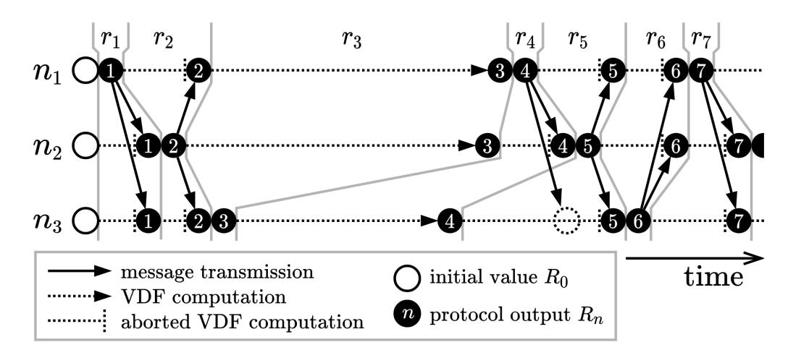

Fig. 1: Schematic execution of RandRunner with three nodes  $n_1, n_2$  and  $n_3$ , over a period of seven rounds  $r_1, ..., r_7$ 

still advance, as all parties are able to evaluate the VDF of the current round without the trapdoor. This is further illustrated in Figure 1, showing a protocol execution with three nodes. In this example, the sequence of leaders  $(n_1, n_2, n_3, n_1, \dots)$  is derived in a round-robin fashion. In the rounds  $r_1$  and  $r_2$ , the respective leaders evaluate the VDFs and send the results to all parties – the protocol progresses quickly. In the third round  $r_3$ , the leader  $n_3$  fails to forward the result to the other parties. Therefore, nodes  $n_1$  and  $n_2$  are slowed down as they are required to evaluate this round's VDF without the trapdoor. In the meantime, node  $n_3$  already starts computing the result of the following rounds, but the other nodes catch up, because in round  $r_4$  and  $r_5$  node  $n_3$  has to compute the VDFs without the trapdoors.

In any case, the strong uniqueness property of the used VDF ensures that the result obtained via the trapdoor and by evaluation are equal. As the unique output of one VDF serves as the input of the next VDF, the entire sequence of random beacon values generated through these chained VDFs is deterministic and predetermined after the initial protocol setup. By relying solely on the computation of the (chained) unique VDF outputs, either with or without the trapdoor, as random beacon values, agreement on the sequence of these values by all participants is trivially achieved. Therefore, our protocol design avoids the necessity for a Byzantine consensus protocol during execution to agree on random beacon values and the hereby associated requirements and overheads such as high communication complexity. Further, as RandRunner's beacon values are deterministic, the protocol does not suffer from inconsistencies due to network partitions. Hence, an adversary may only be able to influence the unpredictability guarantees of the presented design, for which we show in Section VI-D that it can be sufficiently bounded within our protocol such that the desirable properties expected from a random beacon are nevertheless achieved.

## IV. SYSTEM AND THREAT MODEL

<span id="page-4-1"></span>The adversary's goals are to violate the security guarantees expected for a random beacon protocol. In particular, the adversary might try to bias the produced randomness, induce a liveness- or consistency failure, or trick a (third) party into accepting an invalid random beacon. Another attack is to learn/predict future random beacon outputs before other nodes obtain those values. We consider the following system model in which we demonstrate the security of our protocol against all of these attacks:

{5}------------------------------------------------

We assume a fixed set of n participants  $\mathcal{P} = \{1, 2, \ldots, n\}$  with corresponding public parameters  $\mathscr{P} = \{pp_i \mid i \in \mathcal{P} \land VerifySetup(\lambda, pp_i) = accept\}$ . The validity of these parameters can independently and non-interactively be verified by all parties, and only valid participants with valid parameters form the set  $\mathcal{P}$ . At most f nodes may exhibit Byzantine behavior and deviate arbitrarily from the specified protocol. A node is termed *correct* or *honest* if it does not engage in any incorrect behavior over the duration of the protocol execution. Otherwise the node is considered to be *Byzantine*.

Messages sent by correct participants are reliably delivered within a bounded network delay of  $\Delta_{NET}$  seconds. However, within this work we also show that the unique properties of our VDF-based construction provide an upper bound  $\Delta_{VDF}$  on the time it takes any participant to learn of the next random beacon value independent of the actual network delay, guaranteeing a notion of liveness to the protocol that is not captured by more classical protocol designs. Specifically, we outline that only *unpredictability* is affected by network asynchrony while all other properties are upheld regardless. After a sufficient period of network stability where  $\Delta_{NET}$  holds, i.e. some global stabilization time (GST) [23], unpredictability is again achieved quickly. Our simulation results in Appendix C show that in practice the original unpredictability guarantees are restored within a linear amount of time relative to the duration of network asynchrony.

To start the protocol, we assume an initial unpredictable value  $R_0$  which becomes available or is computed by all parties after the setup is completed. This bootstrapping step is further described in Section V-B. We furthermore inherit the security assumptions for the underlying trapdoor VDF with strong uniqueness, as described in Section II, and model cryptographic hash functions as random oracles. All VDFs are configured such that correct nodes are able to evaluate them within  $\Delta_{VDF}$  time without knowledge of the trapdoor. We grant the adversaries a *computational advantage* allowing them to perform this computation  $\alpha$  times faster, i.e. within  $\Delta_{VDF}/\alpha$  seconds. The number T of iterations used for evaluating the VDFs is empirically derived as it highly depends on the speed of the actual implementation. It is set such that executing T iterations of the VDF takes approximately  $\Delta_{VDF}$ seconds on the best hardware available.

In Section VI-D, we carefully analyze the interplay between the protocols parameters  $\Delta_{NET}$ ,  $\Delta_{VDF}$ ,  $\alpha$  and the assumption regarding the adversarial strength (f vs. n). For example, if the adversary can compute a VDF as quickly as correct nodes, i.e.  $\alpha=1$ , and the parameter  $\Delta_{VDF}$  and  $\Delta_{NET}$  are chosen such that  $\Delta_{VDF}\gg\Delta_{NET}$ , the protocol achieves unpredictability (against all attacks) as long as the adversary controls less than half of all nodes, i.e. f< n/2. If we consider a (weaker) covert adversary [1], which *secretly* wants to predict future values, instead we show that our protocol can even tolerate a majority of nodes under the adversary's control. An analysis in this regard is provided in Section VI-D5.

# V. THE RANDRUNNER PROTOCOL

<span id="page-5-0"></span>In this section, we provide details on how to setup and execute the RandRunner protocol. Throughout our description, we will reuse the *Setup*, *VerifySetup*, *Eval*, *TrapdoorEval* and *Verify* algorithms introduced in Section II-D.

## <span id="page-5-4"></span>A. Setup

Before the random beacon protocol can be started, each participant has to execute the parameter generation, exchange and verification steps:

Parameter Generation: Regarding initialization, each participant i has to generate the public parameters  $pp_i$  used with its individual trapdoor VDF with strong uniqueness. Each party i computes the public parameters  $pp_i$  and the corresponding secret trapdoor  $sk_i$  by executing  $Setup(\lambda)$ . Note that  $\lambda$  (and  $\lambda_{RSA}$  in the specific case) are globally agreed upon security parameters, i.e. they cannot be selected by the participant individually as the produced parameters would be considered invalid by other participants.

Parameter Exchange: After all parties have completed the initialization, they have to exchange their public parameters  $pp_i$ , but keep their individual trapdoor  $sk_i$  secret. At the end of this step, each participant should have the same set  $\mathscr{P}^* = \{pp_1, pp_2, ..., pp_{n^*}\}$  containing the public parameters of all participants. There are several options how to realize this in practice, ranging from the use of a consensus protocol or public blockchain used as a bulletin board, to an offline exchange where all parties come together in person.

Parameter Verification: Finally, each party verifies the set of exchanged parameters. For the particular VDF we use, this is accomplished by running  $VerifySetup(\lambda, pp_i)$  for all  $pp_i \in \mathscr{P}^*$ . Since VerifySetup is a deterministic function, all honest participants implicitly agree on the result for each  $pp_i$ . All invalid parameters can be removed from the set  $\mathscr{P}^*$  to form  $\mathscr{P}$ , the set of verified public parameters. The remaining parties which provided the valid parameters form the set  $\mathscr{P}$  of parties executing the protocol.

## <span id="page-5-1"></span>B. Bootstrapping

After all public parameters are set up, exchanged and verified, the protocol is ready to be executed. Starting the protocol requires an initial random beacon value  $R_0$  which becomes available to all parties running the protocol after the setup is completed at approximately the same time.  $R_0$  is used to select the leader for the first protocol round and serves as the input to the first (leader's) VDF being evaluated. As there are no strong requirements with regard to bias-resistance, several techniques to obtain  $R_0$  are possible. A simple and secure method is to use the block hash of some future block from an existing blockchain such as Bitcoin or Ethereum.<sup>7</sup>

## <span id="page-5-3"></span>C. Execution

After successful completion of the protocol setup and bootstrapping, the participants are ready to start the protocol execution. The aim of this execution is to provide a continuous sequence of publicly-verifiable, unpredictable and bias-resistant random beacon values  $R_1, R_2, ..., R_{\infty}$ . We give the full protocol from the viewpoint of a node  $i \in \mathcal{P}$  in Algorithm 1 and describe the details for protocol execution as follows: Our protocol proceeds in consecutive rounds. At the beginning of each round  $r \geq 1$ , a unique leader  $\ell_r$  is selected.

<span id="page-5-2"></span> $<sup>^{7}</sup>$ In the unlikely case that there is indeed a fork for the exact block used, the randomness beacon can be executed in parallel until the fork is eventually resolved and the initial value  $R_{0}$  becomes agreed upon.

{6}------------------------------------------------

# **Algorithm 1:** The RandRunner protocol as executed by each node $i \in \mathcal{P}$

```
Input: sk_i, \{pp_1, pp_2, ..., pp_n\}, T, R_0
Output: R_1, R_2, R_3, ...R_{\infty}
begin
    set r \leftarrow 1
    repeat forever
        derive the round's leader l_r
                                                                      // details provided in Section V-D
        compute x_r \longleftarrow H_{in}(R_{r-1})
                                                                      // maps R_{r-1} to in input space of the VDF
        if i = \ell_r then
            // in this case, this node (i) is the leader of round r, so the trapdoor sk_i is used to quickly compute the VDF
            compute (y_r, \pi_r) \leftarrow VDF. TrapdoorEval(pp_i, x_r, T, sk_i)
            broadcast (y_r, \pi_r)
        else
            // otherwise we obtain the VDF output via the network or by evaluation without the trapdoor
            start computing (y_r, \pi_r) \leftarrow VDF.Eval(pp_{l_r}, x_r, T)
            while (y_r, \pi_r) is not yet computed/received do
                listen for incoming messages (y, \pi)
                if message (y,\pi) received and VDF. Verify(pp_{l_r},x_r,T,y,\pi)=accept then
                  set (y_r, \pi_r) \longleftarrow (y, \pi)
        compute and output R_r = H_{out}(y_r)
                                                                      // maps the VDF output y_r to a 256 bit string
        set r \leftarrow r + 1
                                                                      // move to the next round
```

<span id="page-6-0"></span>For this purpose we consider two different approaches: round-robin selection (RandRunner-RR) and randomized sampling (RandRunner-RS) of a leader with uniform probability from all nodes  $\mathcal{P}$ , using the previous protocol output  $R_{r-1}$  as seed for the selection. We provide the details for both approaches in Section V-D. Independent of the method chosen, the protocol produces a new random beacon value  $R_r$ , i.e. a fresh 256 bit value as output of a cryptographic hash function at the end of each round.

Execution (common case): In each round r, it is the leader's duty to advance the protocol into the next round. It does so by first mapping the previous random beacon value  $R_{r-1}$  to the input space of its VDF using a cryptographic hash function  $H_{in}: \{0,1\}^{256} \to \mathcal{X}_{\ell_r}$ :

$$x_r \longleftarrow H_{in}(R_{r-1}) \tag{4}$$

Here, the leaders public parameters  $pp_{l_r}$  define the input and output space  $\mathcal{X}_{\ell_r}$  and  $\mathcal{Y}_{\ell_r}$  of  $\ell_r$ 's VDF, whereas  $x_r$  is used to denote the input to  $\ell_r$ 's VDF in round r. Then, the leader computes the output  $y_r$  and corresponding proof  $\pi_r$  of its VDF as follows:

$$(y_r, \pi_r) \longleftarrow TrapdoorEval(pp_{l_r}, x_r, T, sk_{\ell_r})$$
 (5)

Finally, the values  $(y_r, \pi_r)$  are broadcast to all nodes. As soon as such a message is received, a node checks the correctness of the received values using  $Verify(pp_{l_r}, x_r, T, y_r, \pi_r)$ . If the values are valid, the node can compute the round's random beacon output  $R_r$  by applying a cryptographic hash function  $H_{out}: \mathcal{Y}_{\ell_r} \to \{0,1\}^{256}$  to the output:

$$R_r \longleftarrow H_{out}(y_r)$$
 (6)

Execution (failure / adversarial case): In case the leader does not fulfill its duties as described, independent of whether it failed or actively tried to attack the protocol, we still want to

ensure that each round r is completed and produces the same result. To achieve this, at the beginning of round r each non-leader node immediately starts to compute the round's VDF output  $(y_r, \pi_r) \longleftarrow Eval(pp_{l_r}, x_r, T)$  in the background. Due to the sequentiality property of the VDF, this computation takes at least T sequential steps. However, after completing those steps (or receiving the valid values from the round's leader) the values  $y_r$  and  $\pi_r$  are available and  $R_r$  can be derived as before (see Formula 6). Here, the strong uniqueness property of the VDF ensures that the resulting values are always equal to the ones computed by the leader.

## <span id="page-6-1"></span>D. Leader Selection

In this section, we describe two possible leader selection strategies which can be used in our protocol design, namely randomized round-robin and sampling uniformly at random. Depending on the used strategy, the achievable unpredictability guarantees differ to some extent. Random sampling bounds the predictability of the sequence of future leaders and ensures a probabilistic guarantee for the unpredictability of the random beacon, whereas the round-robin approach can provide an absolute bound for unpredictability but the entire sequence of leaders is known after  $R_0$  has been published. For a detailed analysis we refer to Section VI-D.

<span id="page-6-2"></span>Randomized Round-Robin (RandRunner-RR): When employing randomized round-robin as the leader selection method in our protocol, we rely on  $R_0$  to deterministically derive a randomized sequence  $\widetilde{\mathcal{P}}$  of the protocols participants  $\mathcal{P}$ . In other words,  $R_0$  is used as a seed to shuffle (a canonical representation of) the set of participants  $\mathcal{P}$  to obtain the list of participants in randomized order. Let  $\widetilde{\mathcal{P}}[j]$  denote the  $j^{\text{th}}$  element of this list using 0-based indexing. Then, the leaders for all rounds  $r \geq 1$  are defined as follows:

$$\ell_r \coloneqq \widetilde{\mathcal{P}}[r \bmod n] \tag{7}$$

{7}------------------------------------------------

Randomized sampling (RandRunner-RS): In this case, the output from the previous round, i.e.  $R_{r-1}$ , is used to sample the leader  $\ell_r$  for round r uniformly at random from the set of all parties  $\mathcal{P}$ . Interpreting the 256-bit beacon outputs as numbers, a simple approach which guarantees that each participant i, denoted by its index from 1 to n, is selected with probability (very close to) 1/n, is to define  $\ell_r$  as:

$$\ell_r := (R_{r-1} \bmod n) + 1 \tag{8}$$

#### E. Dissemination

As described in Section V-C and given in Algorithm 1 (line 8), the leader of each round r is responsible for broadcasting the VDF's unique output  $y_r$  and the corresponding proof  $\pi_r$ . If all nodes follow the described protocol and the network is reliable, then this broadcasting step is as simple as the leader sending the values  $(y_r, \pi_r)$  to the other n-1 participants directly. This would result in a communication complexity of  $\mathcal{O}(n)$ . However, an adversarial leader might selectively send out this information to a subset of all nodes. While any node can always derive  $(y_r, \pi_r)$  by computing the round's VDF eventually, a slowdown for the subset of nodes which did not receive the message from the adversarial leader is introduced. A potential consequence is a violation of RandRunner's unpredictability guarantees (see Section VI-D): Some correct nodes, in inadvertent collaboration with the adversary, may progress faster than the other correct nodes. The root cause for this phenomenon is a combination of two events: (i) an adversary only selectively sent information to some correct nodes and (ii) some correct nodes are not yet able to verify the information received from other correct nodes, as they are missing values from prior rounds (not sent to them by the adversary). Since there is no way to influence the adversary's actions, we focus on (ii) for our countermeasures. In particular, we set out to ensure that after a correct leader broadcasts  $(y_r, \pi_r)$  all (correct) nodes already have, or timely receive, the information required from prior rounds to verify these values. Two possible strategies to accomplish this are given in the following:

1) Reliable Broadcast: A straightforward solution is to employ a reliable broadcast where every (correct) node forwards any valid message  $(y_r, \pi_r)$  it received to all other nodes once. This results in a communication complexity of  $\mathcal{O}(n^2)$  as each of n nodes sends  $\mathcal{O}(n)$  bits per round, minimizes latency  $(\Delta_{NET}$  is small) as message are not relayed over multiple hops, and is practical as long as the number of nodes n is reasonably small.

2) Gossip protocol: If n is large, one can use gossip/rumor spreading protocols instead. Here, one node, in our case the leader of the current round, initiates the spreading of the information  $(y_r, \pi_r)$  by sending it to a random subset of nodes. All nodes which have received a valid message continue to forward the message to another subset of nodes until all nodes are eventually informed with high probability. As messages are forwarded over multiple hops, typically logarithmically many, latency increases compared to the prior approach  $(\Delta_{NET})$  is higher). However, the communication

complexity is significantly reduced to (at least)  $\mathcal{O}(n \log n)$  in total or  $\mathcal{O}(\log n)$  per node respectively. We refer to the works of Demers et al. [21], Karp et al. [30], and the large body of subsequent work for further details on gossip protocols.

These approaches are provided exemplary as an optimization of the dissemination layer is not the main focus of this work. Our security proofs presented in Section VI are agnostic to the selected information dissemination approach. Any optimization, which can reliably disseminate our small and inherently verifiable message  $(y_r, \pi_r)$  in every round, is suitable. The choice of the approach largely depends on the intended application scenario. As a general guideline, we consider that reliable broadcast is best suited if the number of participants n is small, as it minimizes latency and is straightforward to implement. The larger the number of participants n, the more appropriate gossip-based approaches become. Additionally, we note that one may actually use all available network bandwidth in favor of a lower latency instead of minimizing the communication costs to achieve best possible performance in practice. Either way, an expected higher latency  $\Delta_{NET}$  can be compensated by increasing the  $\Delta_{VDF}$  parameter, which defines the number of iterations T for the used VDFs.

#### VI. SECURITY GUARANTEES

#### <span id="page-7-0"></span>A. Liveness

Intuitively, a distributed protocol achieves the liveness property if an adversary cannot prevent the protocol from making progress. A stronger form of liveness, specifically in the context of random beacon protocols, is the property of guaranteed output delivery [16], [41]. A protocol which achieves this property additionally ensures that the adversary can not even prevent the protocol from producing a fresh output in each round. As this stronger form of liveness is also closely related to the bias-resistance property (see Section VI-B), it is crucial for a randomness beacon protocol such as RandRunner which targets the continuous provision of random numbers. As we outline in the following, our protocol achieves liveness and its stronger form of guaranteed output delivery, independent of the adversary's actions and network conditions.

**Theorem 2.** (Liveness & Guaranteed Output Delivery) Each correct node which has completed some round  $r \geq 0$ , completes round r + 1 and outputs a new random beacon  $R_{r+1}$  within at most  $\Delta_{VDF}$  seconds.

Proof: Round r=0 is completed by all nodes as soon as the protocol setup is finished and the initial random beacon  $R_0$  becomes available. For all other rounds  $r\geq 1$ , each node can non-interactively derive the unique round leader  $\ell_r$  using the specified leader selection algorithm and use the hash function  $H_{in}$  to derive the input  $x_r$  for  $\ell_r$ 's VDF. With the Eval function, each node can further compute the result  $(y_r, \pi_r)$  of the VDF within  $\Delta_{VDF}$  seconds. Finally,  $H_{out}$  is used to map  $y_r$  to  $R_r$ . Since both the time required to compute the leader selection algorithm and the hash functions are negligible, each node can output  $R_r$  within  $\Delta_{VDF}$  seconds after it completed the previous round.

<span id="page-7-1"></span><sup>&</sup>lt;sup>8</sup>For the case of RandRunner, the unlikely delivery failures a probabilistic gossip protocol may produce are not a problem, as the transmitted values are eventually obtained via evaluation of the VDFs after at most  $\Delta_{VDF}$  time.

{8}------------------------------------------------

#### <span id="page-8-1"></span>B. Bias-Resistance

Bias-resistance ensures that an adversary cannot manipulate the produced random beacon values to its advantage. Ideally, a protocol fully prevents that an adversary can influence the distribution of the produced outputs. As adversaries can even benefit from just withholding produced results after they become available to them, the strongest form of bias-resistance can only be achieved by protocols which also guarantee that an output is produced in every round.

**Theorem 3.** (Bias-Resistance) For any round  $r \ge 1$ , the output  $R_r$  can not be influenced in any way after the protocol setup is completed.

*Proof:* As discussed in the section on liveness, the result of round  $R_r$  is derived from  $R_{r-1}$  by mapping  $R_{r-1}$  to a value  $x_r$  from the input space of the leader's VDF, computing the leader's VDF to obtain  $(y_r, \pi_r)$ , and finally mapping  $y_r$  to  $R_r$ . The mapping steps just use (deterministic) hash functions and are thus not prone to any manipulation by the adversary. The VDF is computed using either the Eval or TrapdoorEval algorithm. Due to the strong uniqueness property of the VDF the obtained result  $y_r$  is equal, no matter which of the two algorithms is used. Also, in case an adversarial leader sends out some invalid message  $(y'_r, \pi'_r)$ , all correct nodes check the values using the Verify algorithm and only accept a single unique output per input. Consequently, also the VDF step is deterministic and fully verifiable, and the full derivation step from  $R_{r-1}$  to  $R_r$  cannot be influenced by the adversary in any way. As the setup of the protocol is executed and verified before the first input  $R_0$  becomes available, and each step is shown to be deterministic, bias-resistance is ensured during the entire execution of the protocol.

# C. Public-Verifiability

In order to verify the correctness of a random beacon output  $R_r$ , a (third-party) verifier needs a transcript of the protocol's execution. A valid transcript can be provided by any correct party and consists of

- 1) the public parameters  $\mathcal{P}$  of all protocol participants,
- 2) the initial random beacon value  $R_0$ , and
- 3) the round's VDF output  $(y_s, \pi_s)$  for all  $s \in \{1, 2, ..., r\}$ .

The setup of the protocol can be publicly verified, as specified in Section V-A. The same is true for each step in the protocol execution: As seen in the proofs for liveness and bias-resistance, the random beacon output  $R_r$  of every round  $r \geq 1$  is derived cryptographically from the previous output  $R_{r-1}$ . The only primitives used are cryptographic hash functions for mapping in- and outputs, and trapdoor VDFs with strong uniqueness. In order (for a third party) to verify the correctness of a protocol output  $R_r$ , given  $R_{r-1}$ , the involved hash functions are recomputed and the correctness of the VDF computation is checked by using the Verify algorithm. Essentially, a third party just follows the protocol as described for a participant i in Algorithm 1, leaving out the evaluation and communication steps.

Regarding computation complexity, the verification of each round r requires the execution of two hash functions and one

Verify algorithm. The costs for the hash functions are negligible, and also the Verify algorithm is efficient as it requires only around three exponentiations for typical parameters of the VDF [38]. Furthermore, the verification complexity does not depend on the number of parties executing the protocol.

# <span id="page-8-0"></span>D. Unpredictability

Unpredictability describes a security guarantee which ensures that the adversary's ability to predict future protocol outputs is bounded. Depending on the particular protocol, this bound can be absolute or probabilistic. An absolute bound ensures that, for some fixed  $d \geq 1$ , the adversary cannot obtain the protocol output of round r + d, when correct nodes only know the outputs up to round r. A probabilistic bound guarantees that the likelihood that the adversary can successfully predict d future protocol outputs drops exponentially as d increases linearly. For our protocol the achieved bound depends on the chosen leader selection method. In the following, we prove that the round-robin variant (RandRunner-RR) ensures an absolute unpredictability bound of  $d = f \cdot \alpha$ (see Theorem 4), whereas our stochastic simulations show that random sampling of leaders (RandRunner-RS) guarantees that predicting future values becomes exponentially less likely when d increases.

1) The adversary's strategy: In a leader-based protocol like RandRunner, the adversary can always predict future random beacon outputs to some extent. This is possible because in every round the corresponding leader knows the output before sending it to the other parties. In our case, an adversarial leader can compute the round's output by evaluating its VDF using the trapdoor. Clearly, this is faster compared to correct nodes, which only obtain such outputs after the adversary chooses to broadcast them, or if they compute the VDF without the trapdoor, which takes  $\Delta_{VDF}$  seconds. In order to extend this advantage to multiple rounds, the adversary must withhold the output of the VDF on purpose. In case the adversary is lucky, and continues this strategy of withholding its outputs, the adversary increases its advantage (i.e. the number of outputs it knows before the correct nodes do) as long as a continuous sequence of adversarial nodes are selected as leaders. However, due to the randomized leader selection, long sequences of this kind quickly become unlikely. As soon as an honest node is selected as leader, the adversary's advantage decreases as the adversary is not in possession of the trapdoor for an honest node's VDF and consequently has to spend  $\Delta_{VDF}/\alpha$  time to predict one additional step. We recall that  $\alpha \geq 1$  denotes the adversary's VDF computation speed relative to correct nodes. An  $\alpha$  value of 1.5, for example, means that we assume that the adversary can compute VDFs up to 50% faster. In the meantime, the honest nodes work on reducing the adversary advantage. For each round in which the adversary was selected as leader, honest nodes have to spend  $\Delta_{VDF}$  time to catch up one step. As soon as all adversarial leaders' outputs have been computed (and a correct leader is selected again) it takes them only  $\Delta_{NET}$  seconds to compute and distribute a new random beacon output, thus quickly diminishing the adversary's advantage.

2) A first glance at RandRunner's unpredictability bounds: Rounds with an adversarial leader benefit the adversary in terms of its ability to predict future protocol outputs, whereas 

{9}------------------------------------------------

rounds with a correct leader benefit the honest nodes. This rather natural phenomenon can be observed in our stochastic simulations and constitutes the basis for the security proof of Theorem 4. However, as it is so fundamental, we want to provide further insights into why this is indeed the case: In each round r, we either have an adversarial or correct leader. In case the leader is adversarial, the adversary can immediately predict the outcome  $R_r$  of round r using the leader's trapdoor for the evaluation of the VDF. The correct node may be delayed by up to  $\Delta_{VDF}$  seconds before they learn  $R_r$  if the adversary does not broadcast the round's VDF output and proof as specified by the protocol. Clearly, following the strategy of withholding this information the adversary gains a (temporary) advantage in its ability to predict future protocol outputs. In the other case, i.e. in rounds with an honest leader, all honest nodes advance by one round within  $\Delta_{NET}$  time, whereas the adversary can only advance to the next round after it received the round's output from the leader or obtained the result by computing the leader's VDF without the trapdoor. If the adversary cannot finish this computation before the message from the leader is received, all honest nodes catch up (within  $\Delta_{NET}$  seconds) and all the adversary's advantage in diminished. Otherwise, the adversary loses some of its advantage as it takes the adversary  $\Delta_{VDF}/\alpha$  time to proceed to the next round, whereas the honest nodes require at most  $\Delta_{NET} < \Delta_{VDF}/\alpha$  seconds.

With this intuition at hand, we now have an informal look on the unpredictability guarantees RandRunner-RR provides in a simplified scenario in which not only the adversary, but also the honest nodes can communicate without a network delay  $(\Delta_{NET}=0)$ . In this setting, the protocol achieves absolute unpredictability for  $d=f\cdot\alpha$  as long as the following inequality is fulfilled:

$$n > f + f \cdot \alpha \tag{9}$$

For the case that the adversary and the honest nodes can compute VDFs at the same speed, i.e.  $\alpha=1$ , this is reduced to a standard majority assumption n>2f. In case the adversary can compute VDFs faster  $(\alpha>1)$ , the fraction of honest nodes compared to adversarial mode must increase accordingly. In cases where  $\Delta_{NET}>0$  and  $\Delta_{VDF}\gg\Delta_{NET}$ , the simplified bound provided by the above inequality for the  $\Delta_{NET}=0$  case closely resembles the general bound we prove in Theorem 4. This more precise bound carefully considers the interplay between the network delay  $\Delta_{NET}$  and the VDF computation time  $\Delta_{VDF}$ .

3) Unpredictability for RandRunner-RR: If we use (randomized) round-robin as the leader selection method, our protocol achieves an absolute unpredictability bound of  $d=f\cdot\alpha$  rounds for all configurations which satisfy the following inequality:

$$f \cdot \alpha \le (n - f) \cdot \left(1 - \frac{\Delta_{NET} \cdot \alpha}{\Delta_{VDF}}\right)$$
 (10)

or, equivalently:

$$n \ge f + \frac{f \cdot \alpha}{1 - \frac{\Delta_{NET} \cdot \alpha}{\Delta_{VDF}}} \tag{11}$$

To simplify the formulation of the following statements showing this claim, we formally define two intuitive terms: the  $k^{th}$  period of rounds and the adversary's advantage:

**Definition 4.** For every natural number k, the  $k^{th}$  period of rounds of the protocol is defined by the n consecutive rounds (k-1)n+1, (k-1)n+2, ..., kn.

For example if n=5, rounds 1 to 5 form the  $1^{st}$  period of rounds (k=1), rounds 6 to 10 the  $2^{nd}$  period (k=2) and so on.

<span id="page-9-2"></span>**Definition 5.** The adversary has advantage  $v \ge 0$  with respect to round r if and only if the following two conditions hold:

- 1) Some correct node knows the protocol output of round r, but no correct node knows the output of round r+1.
- 2) The adversary knows the protocol output of round r + v, but not of round r + v + 1.

In our proof of Theorem 4, we will show by induction on k that there is no  $k^{th}$  period of rounds of the protocol in which the advantage of the adversary with respect to any round exceeds  $f \cdot \alpha$ . We start by showing the following Lemma 2, which will help us to establish the induction base.

<span id="page-9-0"></span>**Lemma 2.** For all protocol configurations which fulfill Inequality 10, the following holds: If the adversary has advantage 0 with respect to some round r, its advantage with respect to the rounds  $r+1, r+2, \ldots, r+n$  is at most  $f \cdot \alpha$ .

*Proof:* We start by first considering rounds with a correct leader. In this case, the time required for the adversary to predict a protocol output is bounded by the VDF computation time of  $\Delta_{VDF}/\alpha$ , whereas the correct nodes advance to the next round within  $\Delta_{NET}$  seconds. Since  $\Delta_{NET} \leq \Delta_{VDF}/\alpha$ holds for all protocol configurations fulfilling Inequality 10, the number of rounds the adversary can predict never increases during periods with honest leaders. Consequently, to obtain an upper bound for the number of predictable rounds, we only have to consider rounds with adversarial leaders. Within a period of n consecutive rounds, there are exactly f such rounds, which are consecutive in the worst case. Let us consider this worst case for our upper bound: At the beginning of these f rounds, the adversary immediately obtains the results of all of those rounds, as it can use the adversarial leaders' VDF trapdoors to compute the results. The honest nodes, on the other hand, have to compute f VDFs without the trapdoor (assuming that the adversary withholds the results), requiring  $f \cdot \Delta_{VDF}$  seconds to complete. In the same time, the adversary may already try to compute the VDFs of the honest leaders in the next few rounds. As it takes the adversary  $\Delta_{VDF}/\alpha$ time to compute one such VDF (without the trapdoor), it can compute at most

$$\frac{f \cdot \Delta_{VDF}}{\Delta_{VDF}/\alpha} = f \cdot \alpha \tag{12}$$

<span id="page-9-1"></span>outputs during this time period. Consequently, as soon as the honest nodes finish the computations for the f rounds of adversarial leaders and hence catch up by f rounds, the adversary's ability to predict future protocol outputs increases from f to  $f - f + f \cdot \alpha = f \cdot \alpha$  rounds. From that point on, there are only rounds with correct leaders remaining, and as the number of rounds the adversary can predict cannot increase in rounds with correct leaders, the correctness of the lemma follows.

{10}------------------------------------------------

Next, we prove a claim that will be important for the induction step of the proof of Theorem 4.

<span id="page-10-1"></span>**Lemma 3.** For all protocol configurations which fulfill Inequality 10, the following holds: If the adversary has advantage  $v \leq f \cdot \alpha$  with respect to some round r, its advantage with respect to round r + n is at most  $v' \leq f \cdot \alpha$ .

*Proof:* In the worst case, all correct nodes can complete n consecutive rounds within

$$\Delta_w = f \cdot \Delta_{VDF} + (n - f) \cdot \Delta_{NET} \tag{13}$$

seconds, because there are f rounds in which the adversarial leader may not broadcast the result, requiring  $\Delta_{VDF}$  time each, and (n-f) rounds with correct leaders which make progress immediately and broadcast the results within  $\Delta_{NET}$ seconds. If during this time period the adversary obtains a round's output by relying on a correct node's message, instead of obtaining it via computation by itself, the adversary could not predict this value – its advantage with respect to this round is zero. Consequently, this lemma immediately holds by Lemma 2. If, on the other hand, the adversary does not rely on messages from correct nodes for its progress, it can compute the outputs of at most

$$w = f + \frac{\Delta_w}{\Delta_{VDF}/\alpha} = f + \frac{f \cdot \Delta_{VDF} + (n - f) \cdot \Delta_{NET}}{\Delta_{VDF}/\alpha}$$
(14)

rounds during the period of  $\Delta_w$  seconds, because there are f steps in which the adversary immediately obtains the result as an adversarial node is leader, whereas all other steps rely on computing a VDF without a trapdoor, taking  $\Delta_{VDF}/\alpha$ time each. In other words, the adversary advances by wrounds, while, during the same period of time, the correct nodes advance by n rounds. As  $w \leq n$  follows directly from rearranging Inequality 10, the adversary cannot increase its advantage  $(v' \leq v)$  and the lemma holds. 

<span id="page-10-0"></span>**Theorem 4.** (Unpredictability): All protocol configurations satisfying Inequality 10 guarantee absolute unpredictability for  $d = f \cdot \alpha$ .

*Proof:* The statement is equivalent to the claim that the adversary's advantage with respect to any round never exceeds  $f \cdot \alpha$ . We give a proof by induction on the  $k^{th}$  periods of rounds and start with the induction base k = 1. Since the adversary cannot predict the initial random beacon value  $R_0$ , Lemma 2 implies that the adversary's advantage with respect to the rounds 1, 2, ..., n is bounded by  $f \cdot \alpha$ . This already proves that the statement is true for the first period.

For the induction step, we have to show that if the adversary's advantage with respect to the rounds in the  $k^{th}$  period is bounded by  $f \cdot \alpha$ , the same is true for the rounds in the  $(k+1)^{th}$ period. Consider the rounds  $(k-1)n+1, (k-1)n+2, \ldots, kn$ of the  $k^{th}$  period. We apply the induction assumption together with Lemma 3 and obtain that the advantage of the adversary in the rounds kn + 1, kn + 2, ..., (k + 1)n is at most  $f \cdot \alpha$ , which we wanted to prove.

We have shown that there is no  $k^{th}$  period of the protocol containing a round in which the adversary's advantage exceeds  $f \cdot \alpha$ . This covers all rounds and hence concludes the proof.

In order to simplify the exposition of the proof, Theorem 4 and definition 5 consider the adversary's ability to predict future protocol outputs relative to *some* honest node. However, if one wants to consider the unpredictability guarantee relative to all / the slowest honest node, a very similar result applies as all correct nodes synchronize within  $\Delta_{NET}$  time in the broadcasting step of the protocol. Therefore, the same security bound of  $f \cdot \alpha$  rounds holds for all nodes if we add an additive term of  $\Delta_{NET}$ , i.e. the adversary does not have advantage  $f \cdot \alpha + 1$  for longer than  $\Delta_{NET}$  time. The additional term of  $\Delta_{NET}$  time is required as we assume that the adversary can send and receive messages (also from the correct nodes) without any network delay, whereas messages between correct nodes experience a network delay of up to  $\Delta_{NET}$  seconds.

4) Unpredictability for RandRunner-RS: As described in Section V-D, the leaders in RandRunner can also be selected uniformly at random (RandRunner-RS) as an alternative to the round-robin style leader selection (RandRunner-RR) analysed in the previous section. Due to the probabilistic nature of selecting leaders, RandRunner-RS provides a probabilistic guarantee of unpredictability, whereas RandRunner-RR guarantees an absolute bound for the adversary's ability to predict future outputs. The reason for this difference is that the roundrobin leader selection ensures that there cannot be more than f adversarial nodes within any period of n rounds at any point in the protocol execution. When leaders are picked at random, however, there can be up to  $u \leq v$  adversarial leaders in any period of v rounds (for an arbitrary number of rounds v), although the likelihood of having a high fraction of adversarial leaders during such a period decreases exponentially for longer periods.

Similar to the round-robin case, the probabilistic guarantee for unpredictability can be provided as long as the honest nodes make progress faster than the adversarial nodes. Let  $p_A :=$ f/n and  $p_H := 1 - p_A$  denote the probability of selecting an adversarial or honest leader respectively. Then the rates of progress, i.e. the average time required per protocol round,  $\lambda_H$ for the correct nodes and  $\lambda_A$  for the adversary, are given as follows:

$$\lambda_{H} \coloneqq \frac{1}{\Delta_{NET} \cdot p_{H} + \Delta_{VDF} \cdot p_{A}}$$

$$\lambda_{A} \coloneqq \frac{1}{\Delta_{VDF}/\alpha \cdot p_{H}}$$
(15)

$$\lambda_A := \frac{1}{\Delta_{VDF}/\alpha \cdot p_H} \tag{16}$$

Intuitively, RandRunner-RS works as long as correct nodes progress faster than adversarial nodes, i.e. if  $\lambda_H > \lambda_A$ , because any advantage an adversary has in some round will disappear after a sufficient number of rounds. The more both rates differ, the quicker any advantage disappears and the more unlikely a big advantage becomes. Obtaining a closed form expression for the corresponding probability appears difficult, as the advantage of the adversary in a particular round depends on the previous protocol state as well as on the sequence of future leaders. However, by simulating protocol executions we can derive these probabilities empirically. This is illustrated in Figure 2 which presents our simulation results, considering different assumptions in regard to the fraction of adversarial nodes  $(p_A)$  and the adversary's advantage in terms of sequential computation speed for the VDF, denoted by  $\alpha$ . For the parameters  $\Delta_{NET}$  and  $\Delta_{VDF}$ , we select a fixed ratio of  $\Delta_{NET}/\Delta_{VDF}=1/10$ , as we observe that the simulation

{11}------------------------------------------------

<span id="page-11-2"></span>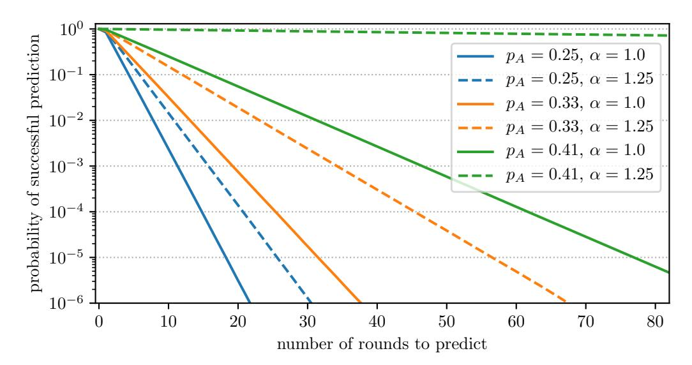

Fig. 2: Simulation of RandRunner-RS' unpredictability over a period  $10^{10}$  rounds and  $\Delta_{NET}/\Delta_{VDF}=1/10$ 

<span id="page-11-4"></span>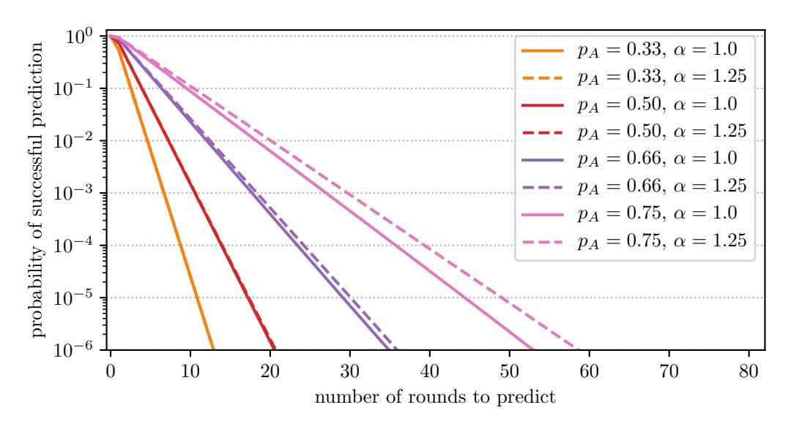

Fig. 3: Simulation of RandRunner-RS' unpredictability over a period  $10^{10}$  rounds and  $\Delta_{NET}/\Delta_{VDF}=1/10$ , considering a covert adversary

is typically more sensitive to a change of  $p_A$  and  $\alpha$ . For each of the exemplary parameters picked, we simulate the protocol execution for  $10^{10}$  rounds<sup>9</sup> and report the probability that an adversary, which actively attacks the protocol, has an advantage of at least x rounds, i.e. can predict at least x rounds at any particular point in time. An extended evaluation is provided in Appendix B.

<span id="page-11-1"></span>5) Unpredictability against a covert adversary: In the previous sections, we analysed the unpredictability guarantees RandRunner provides in regards to an adversary which actively attacks the protocol during execution. However, in practice an adversary can hardly profit from any attack on unpredictability if the correct network participants are aware of the fact that the protocol is being attacked. The base for the detection of ongoing attacks is that correct nodes expect new protocol outputs in intervals of at most  $\Delta_{NET}$  seconds. There are only two reasons for protocol outputs being delayed any further:

- 1) an adversarial leader withholds the next protocol output or
- 2) the network behaves asynchronously.

As the second case is unlikely if  $\Delta_{NET}$  is properly configured, any delay is a strong indicator for an attack. This leads us to

the notion of a *covert* adversary [1] which aims to hide all traces that can be used for detecting the attack.

RandRunner is resilient against covert adversaries, because a covert adversary has to broadcast new protocol outputs after at most  $\Delta_{NET}$  seconds to make sure the attack stays invisible. Also, the computation time available to compute honest leaders' VDFs is reduced to  $\Delta_{NET}$ . Therefore, the bound of  $\lambda_H > \lambda_A$  for achieving unpredictability in the general case is reduced to the following inequality considering the covert case:

<span id="page-11-5"></span>
$$\Delta_{NET} < \Delta_{VDF} / \alpha \cdot p_H \tag{17}$$

The bigger the (relative) difference between both sides, the more the fraction of adversarial nodes  $p_A$  and their computational advantage can be increased. A particular distinguishing advantage compared to other protocol designs is that RandRunner even works against an attacker which controls a majority of nodes in the covert adversary model. This is illustrated in Figure 3, where we, among others, consider an adversary which controls 75% of all nodes in the system. As also shown in this figure, increasing the  $\Delta_{VDF}$  parameter further strengthens the protocol's resilience against attackers under these circumstances. As for the non-covert case, we provide additional simulation results for a range of different parameters in Appendix B.

#### VII. RELATED WORK

<span id="page-11-0"></span>In recent years, a wide range of possible approaches to obtain publicly-verifiable randomness have been presented. This includes solutions which extract randomness from existing systems. In this regard, Clark and Hengartner [18] show how to collect (small amounts) of entropy from closing prices of stocks. As noted by Pierrot and Wesolowski [37] this approach relies on the assumption that the published financial data cannot be manipulated. Similarly, the works of Bonneau et al. [10] and Bentov et al. [4] demonstrate how to extract near-uniformly distributed bits from one or a sequence of Bitcoin blocks. However, as stated by the authors and analyzed in later work [37], these approaches cannot provide truly unbiased randomness.

The line of research on blockchain protocol designs, in particular Algorand [17] and Ouroboros Praos [19], can also be used to obtain distributed randomness. Both protocols internally use verifiable random functions [35] (VRFs) to produce a sequence of random numbers. In this way, both designs can output randomness as a byproduct of their operation without any significant additional communication cost. Using hashchains instead of VRFs, Azouvi et al. [2] present a solution with similar characteristics as a Smart Contract for the Ethereum blockchain. However, all of these approaches, where the adversary might be responsible for computing and then revealing the next random output, are not strictly biasresistant, as the adversary can always decide to withhold the next random output after gaining knowledge of it [41]. Strong bias-resistance, as also provided by RandRunner, ensures that there is a guaranteed protocol output in every round, regardless of the actions taken by the round's leader.

Protocols which can provide strong bias-resistance have also been constructed by using threshold cryptography, in

<span id="page-11-3"></span> $<sup>^9</sup>$ For  $\Delta_{NET}=5$  seconds, this corresponds to more than 1500 years of protocol execution in real time.

{12}------------------------------------------------

particular using publicly-verifiable secret sharing ([\[31\]](#page-13-3), [\[16\]](#page-13-0), [\[43\]](#page-14-1), [\[41\]](#page-14-0)) or unique threshold signatures ([\[14\]](#page-13-4), [\[29\]](#page-13-5)). The proposal of running and combining the results of n secret sharing instances, as seen in the Ouroboros [\[31\]](#page-13-3) and Scrape [\[16\]](#page-13-0) protocols, has since been improved by Syta et al. [\[43\]](#page-14-1) (RandHerd) and recently Schindler et al. [\[41\]](#page-14-0) (HydRand). HydRand achieves a communication complexity of O(n 2 ) in a synchronous system model with n = 3f + 1 participants, without requiring a distributed key generation (DKG) protocol or relying on pairing-based cryptography. As it is the case with RandRunner, unpredictability for HydRand is achieved after a few rounds, whereas the approaches of Cachin et al. [\[14\]](#page-13-4) and Dfinity [\[29\]](#page-13-5) ensure unpredictability after a single round. The two latter approaches also achieve a communication complexity of O(n 2 ). They, however, rely on a trusted dealer or DKG protocol and, e.g., BLS [\[9\]](#page-13-35), [\[8\]](#page-13-36), as a unique pairing-based threshold signature scheme. In comparison, RandRunner is built using an RSA-based VDF and does not require a trusted dealer or DKG protocol for its setup. Its communication complexity improves upon all the threshold cryptographic approaches, as a single leader drives the protocol forward, whereas the interaction between all, or at least a large subset of the participants, is required for the other protocols. Regarding the guaranteed output delivery property, HydRand can output fresh randomness at regular intervals as it operates in a fully synchronous system model, whereas Rand-Runner and other protocols which are safe under asynchrony can only guarantee that an output is produced every round. For RandRunner, the round duration may vary depending on network conditions or if the protocol is attacked, but is upper bounded by the ∆VDF parameter. The delay RandRunner introduces in these circumstances can be seen as an advantage, as any delay serves as a strong indicator for an active attack (assuming network outages are rare) and thus strengthens the confidence in the protocol if it progresses as fast as expected. Similar to Cachin et al. [\[14\]](#page-13-4), our protocol ensures consistency even under asynchronous network conditions and proceeds at the network speed when not attacked, whereas HydRand loses consistency if the synchrony assumption is violated and cannot progress faster than the initially specified network delay, i.e., does not offer optimistic responsiveness [\[36\]](#page-13-37). Dfinity's security proofs also rely on synchrony.

A different line of research focuses on the instantiation of a randomness beacon based on delay functions (also known as slow-time functions), which can be seen as predecessor to VDFs (as used in RandRunner) without an efficient verification procedure. Using this primitive, Lenstra and Wesolowski [\[33\]](#page-13-10) designed the Unicorn protocol, in which in a first phase a set of distrusting parties collect a pool of inputs. In a second step those inputs are hashed and fed into a delay function, the output of which forms the randomness. As the delay parameter is picked such that no party can compute the output during the time when changes to the inputs are allowed, the result is bias-resistant and unpredictable as long as at least one party provides a random input with sufficient entropy. A similar approach is later implemented by leveraging a Smart Contract on the Ethereum platform for agreement on the inputs [\[12\]](#page-13-11). To circumvent the limitations of the platform, the authors of this approach describe an interactive, incentive-based game for verification. We believe that these systems and the underlying idea of first agreeing on a set of inputs and then executing a long-running (verifiable) delay function on these inputs are well suited for scenarios in which unpredictable and biasresistant randomness is required infrequently. In comparison, RandRunner does not require an agreement protocol for the VDF inputs and can provide a sequence of random numbers in short intervals and with much lower communication overhead. Moreover, RandRunner can also ensure unpredictability in scenarios where the adversary can compute the VDF faster than honest nodes.

# VIII. CONCLUSION

<span id="page-12-0"></span>By extending the VDF introduced by Pietrzak [\[38\]](#page-13-14) to a trapdoor VDF with strong uniqueness, which may be of independent interest, we lay the foundation for our novel randomness beacon protocol RandRunner. Our design and the properties we achieve are unique in many ways. First, RandRunner is extremely simple: It is built on top of cryptographic hash functions, and the introduced VDF is based on the well studied RSA assumption. The setup of the protocol does not require a DKG protocol and can be verified non-interactively. Instead of relying on a Byzantine or blockchain-based agreement protocol to ensure consistency across all nodes, consistency is achieved by leveraging the strong uniqueness property of the underlying VDF. Thereby, the protocol essentially provides a predetermined, yet unpredictable sequence of random numbers. This novel design has tremendous advantages in terms of efficiency and scalability, as the removal of the agreement protocol reduces communication costs significantly. In our case, only a single message of approximately 10 KB in size has to be propagated through the network to produce a fresh random beacon output.

Additionally, our design is very resilient to temporary network delays or network outages. Although being designed for practical deployment scenarios with bounded network delay, RandRunner retains consistency and liveness even if the network connectivity between correct nodes breaks down completely. We have proven that RandRunner achieves unpredictability under a synchronous network model, and provided stochastic simulations to analyze the protocol in case of temporary network failures. Under these circumstances, we observed that the provided unpredictability guarantees degrade gradually, even when we consider an adversary which is not affected by the network delays. Furthermore, our results also show that the protocol can recover quickly, i.e. in a linear amount of time respective to the duration of the network outage.

Whenever the network is in good condition, and the protocol is not under attack, the protocol is *responsive* [\[36\]](#page-13-37), [\[45\]](#page-14-6) and proceeds at the speed of the network, i.e. it is not slowed down by introducing artificial delays. Attacks introduce a (parameterizable) slowdown of the protocol, serving as a strong indication for an ongoing attack. This leads us to the additional evaluation of RandRunner in a covert adversary model [\[1\]](#page-13-29), in which the adversary wishes to hide its attack traces. Our results show that unpredictability is achieved even if a majority of nodes is under adversarial control or the adversary can evaluate VDFs significantly faster compared to the other nodes.

{13}------------------------------------------------

# ACKNOWLEDGMENTS

This material is based upon work partially supported by (1) the Christian-Doppler-Laboratory for Security and Quality Improvement in the Production System Lifecycle; The financial support by the Austrian Federal Ministry for Digital and Economic Affairs, the Nation Foundation for Research, Technology and Development and University of Vienna, Faculty of Computer Science, Security & Privacy Group is gratefully acknowledged; (2) SBA Research; the competence center SBA Research (SBA-K1) is funded within the framework of COMET Competence Centers for Excellent Technologies by BMVIT, BMDW, and the federal state of Vienna, managed by the FFG; (3) the FFG Bridge 1 projects 858561 SESC and 864738 PR4DLT.

We additionally thank Krzysztof Pietrzak for valuable discussions and his answers to our technical questions regarding the used VDF.

# REFERENCES

- <span id="page-13-29"></span>[1] Y. Aumann and Y. Lindell, "Security against covert adversaries: Efficient protocols for realistic adversaries," in *Theory of Cryptography Conference*. Springer, 2007, pp. 137–156.
- <span id="page-13-34"></span>[2] S. Azouvi, P. McCorry, and S. Meiklejohn, "Winning the caucus race: Continuous leader election via public randomness," *arXiv preprint arXiv:1801.07965*, 2018.
- <span id="page-13-27"></span>[3] M. Bellare and P. Rogaway, "Random oracles are practical: A paradigm for designing efficient protocols," in *Proceedings of the 1st ACM conference on Computer and communications security*, 1993, pp. 62– 73.
- <span id="page-13-7"></span>[4] I. Bentov, A. Gabizon, and D. Zuckerman, "Bitcoin beacon," arXiv preprint arXiv:1605.04559, 2016.
- <span id="page-13-2"></span>[5] M. Blum, "Coin flipping by telephone a protocol for solving impossible problems," *ACM SIGACT News*, vol. 15, no. 1, pp. 23–27, 1983.
- <span id="page-13-12"></span>[6] D. Boneh, J. Bonneau, B. Bunz, and B. Fisch, "Verifiable delay ¨ functions," in *Annual international cryptology conference*. Springer, 2018, pp. 757–788.
- <span id="page-13-13"></span>[7] D. Boneh, B. Bunz, and B. Fisch, "A survey of two verifiable delay ¨ functions," Cryptology ePrint Archive, Report 2018/712, 2018.
- <span id="page-13-36"></span>[8] D. Boneh, C. Gentry, B. Lynn, and H. Shacham, "Aggregate and Verifiably Encrypted Signatures from Bilinear Maps," in *Eurocrypt*, vol. 2656. Springer, 2003, pp. 416–432.
- <span id="page-13-35"></span>[9] D. Boneh, B. Lynn, and H. Shacham, "Short Signatures from the Weil Pairing," *Advances in Cryptology ASIACRYPT 2001*, pp. 514–532, 2001.
- <span id="page-13-1"></span>[10] J. Bonneau, J. Clark, and S. Goldfeder, "On bitcoin as a public randomness source," Cryptology ePrint Archive, Report 2015/1015, 2015.
- <span id="page-13-23"></span>[11] J. Buchmann and H. C. Williams, "A key-exchange system based on imaginary quadratic fields," *Journal of Cryptology*, vol. 1, no. 2, pp. 107–118, 1988.
- <span id="page-13-11"></span>[12] B. Bunz, S. Goldfeder, and J. Bonneau, "Proofs-of-delay and random- ¨ ness beacons in ethereum," in *S&B '17: Proceedings of the 1st IEEE Security & Privacy on the Blockchain Workshop*, 2017.
- <span id="page-13-15"></span>[13] V. Buterin, "Randao++," 2017, Accessed: 2020-05-11. [Online]. Available:<https://redd.it/4mdkku>
- <span id="page-13-4"></span>[14] C. Cachin, K. Kursawe, and V. Shoup, "Random oracles in constantinople: Practical asynchronous byzantine agreement using cryptography," in *Proceedings of the nineteenth annual ACM symposium on Principles of distributed computing*. ACM, 2000, pp. 123–132.
- <span id="page-13-24"></span>[15] J. Camenisch and M. Michels, "Proving in zero-knowledge that a number is the product of two safe primes," in *International Conference on the Theory and Applications of Cryptographic Techniques*. Springer, 1999, pp. 107–122.
- <span id="page-13-0"></span>[16] I. Cascudo and B. David, "Scrape: Scalable randomness attested by public entities," in *International Conference on Applied Cryptography and Network Security*. Springer, 2017, pp. 537–556.

- <span id="page-13-6"></span>[17] J. Chen and S. Micali, "Algorand," arXiv preprint arXiv:1607.01341, 2016.
- <span id="page-13-9"></span>[18] J. Clark and U. Hengartner, "On the use of financial data as a random beacon." *EVT/WOTE*, vol. 89, 2010.
- <span id="page-13-32"></span>[19] B. David, P. Gazi, A. Kiayias, and A. Russell, "Ouroboros praos: ˇ An adaptively-secure, semi-synchronous proof-of-stake blockchain," in *Annual International Conference on the Theory and Applications of Cryptographic Techniques*. Springer, 2018, pp. 66–98.
- <span id="page-13-17"></span>[20] L. De Feo, S. Masson, C. Petit, and A. Sanso, "Verifiable delay functions from supersingular isogenies and pairings," in *International Conference on the Theory and Application of Cryptology and Information Security*. Springer, 2019, pp. 248–277.
- <span id="page-13-30"></span>[21] A. Demers, D. Greene, C. Hauser, W. Irish, J. Larson, S. Shenker, H. Sturgis, D. Swinehart, and D. Terry, "Epidemic algorithms for replicated database maintenance," in *Proceedings of the 6th ACM Symposium on Principles of distributed computing*, 1987, pp. 1–12.
- <span id="page-13-16"></span>[22] J. Drake, "Minimal VDF randomness beacon," 2018, Accessed: 2020-07-08. [Online]. Available: [https://ethresear.ch/t/](https://ethresear.ch/t/minimal-vdf-randomness-beacon/3566) [minimal-vdf-randomness-beacon/3566](https://ethresear.ch/t/minimal-vdf-randomness-beacon/3566)
- <span id="page-13-28"></span>[23] C. Dwork, N. Lynch, and L. Stockmeyer, "Consensus in the presence of partial synchrony," vol. 35, no. 2. ACM, 1988, pp. 288–323.
- <span id="page-13-20"></span>[24] N. Dottling, S. Garg, G. Malavolta, and P. N. Vasudevan, "Tight ver- ¨ ifiable delay functions," Cryptology ePrint Archive, Report 2019/659, 2019.
- <span id="page-13-19"></span>[25] N. Ephraim, C. Freitag, I. Komargodski, and R. Pass, "Continuous verifiable delay functions," in *Annual International Conference on the Theory and Applications of Cryptographic Techniques*. Springer, 2020, pp. 125–154.
- <span id="page-13-25"></span>[26] A. Fiat and A. Shamir, "How to prove yourself: Practical solutions to identification and signature problems," in *Conference on the theory and application of cryptographic techniques*. Springer, 1986, pp. 186–194.
- <span id="page-13-22"></span>[27] T. K. Frederiksen, Y. Lindell, V. Osheter, and B. Pinkas, "Fast distributed rsa key generation for semi-honest and malicious adversaries," in *Annual International Cryptology Conference*. Springer, 2018, pp. 331–361.
- <span id="page-13-26"></span>[28] R. Gennaro, D. Micciancio, and T. Rabin, "An efficient non-interactive statistical zero-knowledge proof system for quasi-safe prime products," in *Proceedings of the 5th ACM conference on Computer and communications security*, 1998, pp. 67–72.
- <span id="page-13-5"></span>[29] T. Hanke, M. Movahedi, and D. Williams, "Dfinity technology overview series consensus system," 2018, rev. 1. [Online]. Available: <https://dfinity.org/pdf-viewer/library/dfinity-consensus.pdf>
- <span id="page-13-31"></span>[30] R. Karp, C. Schindelhauer, S. Shenker, and B. Vocking, "Randomized rumor spreading," in *Proceedings 41st Annual Symposium on Foundations of Computer Science*. IEEE, 2000, pp. 565–574.
- <span id="page-13-3"></span>[31] A. Kiayias, A. Russell, B. David, and R. Oliynykov, "Ouroboros: A provably secure proof-of-stake blockchain protocol," in *Annual International Cryptology Conference*. Springer, 2017, pp. 357–388.
- <span id="page-13-18"></span>[32] E. Landerreche, M. Stevens, and C. Schaffner, "Non-interactive cryptographic timestamping based on verifiable delay functions," in *International Conference on Financial Cryptography and Data Security*. Springer, 2020, pp. 541–558.
- <span id="page-13-10"></span>[33] A. K. Lenstra and B. Wesolowski, "A random zoo: sloth, unicorn, and trx," Cryptology ePrint Archive, Report 2015/366, 2015.
- <span id="page-13-21"></span>[34] M. Mahmoody, C. Smith, and D. J. Wu, "A note on the (im)possibility of verifiable delay functions in the random oracle model," Cryptology ePrint Archive, Report 2019/663, 2019.
- <span id="page-13-33"></span>[35] S. Micali, M. Rabin, and S. Vadhan, "Verifiable random functions," in *40th annual symposium on foundations of computer science (cat. No. 99CB37039)*. IEEE, 1999, pp. 120–130.
- <span id="page-13-37"></span>[36] R. Pass and E. Shi, "Thunderella: Blockchains with optimistic instant confirmation," in *Annual International Conference on the Theory and Applications of Cryptographic Techniques*. Springer, 2018, pp. 3–33.
- <span id="page-13-8"></span>[37] C. Pierrot and B. Wesolowski, "Malleability of the blockchain's entropy," *Cryptography and Communications*, vol. 10, no. 1, pp. 211–233, 2018.
- <span id="page-13-14"></span>[38] K. Pietrzak, "Simple verifiable delay functions," in *10th innovations in theoretical computer science conference (itcs 2019)*. Schloss Dagstuhl-Leibniz-Zentrum fuer Informatik, 2019.

{14}------------------------------------------------

- <span id="page-14-2"></span>[39] M. O. Rabin, "Randomized byzantine generals," in *Foundations of Computer Science, 1983., 24th Annual Symposium on*. IEEE, 1983, pp. 403–409.
- <span id="page-14-5"></span>[40] R. L. Rivest, A. Shamir, and D. A. Wagner, "Time-lock puzzles and timed-release crypto," 1996.
- <span id="page-14-0"></span>[41] P. Schindler, A. Judmayer, N. Stifter, and E. Weippl, "Hydrand: Efficient continuous distributed randomness," in *2020 IEEE Symposium on Security and Privacy (SP)*. IEEE, May 2020, pp. 32–48.
- <span id="page-14-4"></span>[42] B. Shani, "A note on isogeny-based hybrid verifiable delay functions," Cryptology ePrint Archive, Report 2019/205, 2019.
- <span id="page-14-1"></span>[43] E. Syta, P. Jovanovic, E. K. Kogias, N. Gailly, L. Gasser, I. Khoffi, M. J. Fischer, and B. Ford, "Scalable bias-resistant distributed randomness," in *2017 IEEE Symposium on Security and Privacy (SP)*. IEEE, 2017, pp. 444–460.
- <span id="page-14-3"></span>[44] B. Wesolowski, "Efficient verifiable delay functions," in *Annual International Conference on the Theory and Applications of Cryptographic Techniques*. Springer, 2019, pp. 379–407.
- <span id="page-14-6"></span>[45] M. Yin, D. Malkhi, M. K. Reiter, G. G. Gueta, and I. Abraham, "Hotstuff: Bft consensus with linearity and responsiveness," in *2019 ACM Symposium on Principles of Distributed Computing*, 2019, pp. 347–356.

{15}------------------------------------------------

#### **APPENDIX**

# <span id="page-15-0"></span>A. Efficient Check for $\langle x \rangle = QR_N^+$

At the end of Section II-F, we provided an efficient way to verify if x is a generator of  $QR_N^+$ . In the following, we provide the postponed correctness proof for the statement:

$$\langle x \rangle = QR_N^+ \text{ if } x \in QR_N^+ \land gcd(x^2 - 1, N) = 1$$
 (18)

*Proof:* We show the above statement by deriving a contradiction. Assume that x does not generate the group  $QR_N^+$ , i.e.  $\langle x \rangle \neq QR_N^+$ . This means that the order of x in  $QR_N^+$  is not equal to p'q'. One easily verifies that we may write  $x = a^{p'} \mod N$  or  $x = a^{q'} \mod N$  for some a. This implies  $x^2 = 1 \mod p$  or  $x^2 = 1 \mod q$ , hence the  $\gcd(x^2 - 1, N)$  in (18) cannot be 1.

## <span id="page-15-1"></span>B. Additional Simulation Results

As outlined in Sections IV and VI-D the selection of the parameter  $\Delta_{VDF}$ , which determines the time parameter T for the VDF, is crucial for the unpredictability guarantees provided by RandRunner. In our simulation results presented in the main paper, we considered setting  $\Delta_{VDF}$  such that  $\Delta_{NET}/\Delta_{VDF}=1/10$ , a choice which works well across a wide range of scenarios. To further support the process of picking a suitable value for  $\Delta_{VDF}$ , we provide additional simulation results in Figures 4-7. As before, we run our simulation over a period of  $10^{10}$  rounds for each parameter set and consider both types of adversaries, i.e. an attacker which (i) does and (ii) does not want to hide its traces. We fix  $\Delta_{NET} = 1$ and vary  $\Delta_{VDF}$ , as the simulation results only depend on the relation  $\Delta_{NET}/\Delta_{VDF}$  of the parameters  $\Delta_{NET}$  and  $\Delta_{VDF}$ . In general, we observe that increasing  $\Delta_{VDF}$  compared to  $\Delta_{NET}$  strengthens the protocol's unpredictability guarantee, while at the same time introducing longer delays whenever a leader fails or withholds an output on purpose. The bigger the adversarial strength, i.e. the fraction of adversarial nodes  $p_A$  and their advantage in computation speed compared to the honest nodes  $\alpha$ , the more important is it to select higher values for  $\Delta_{VDF}$ . Regarding the covert adversary model we analysed in Section VI-D5, Figure 8 further illustrates the correspondence between the protocol parameters regarding the security bound  $\Delta_{NET} < \Delta_{VDF}/\alpha \cdot p_H$  (Inequality 17).

<span id="page-15-3"></span>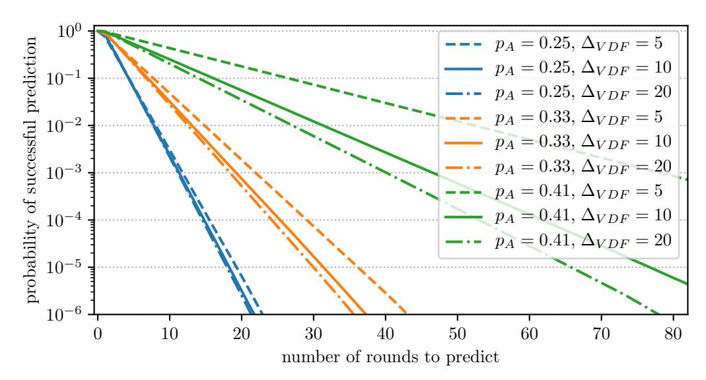

Fig. 4: RandRunner-RS' unpredictability ( $\alpha = 1$ )

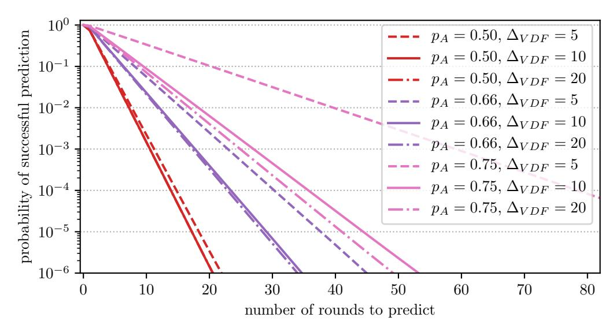

<span id="page-15-2"></span>Fig. 5: RandRunner-RS' unpredictability, considering a covert adversary ( $\alpha = 1$ )

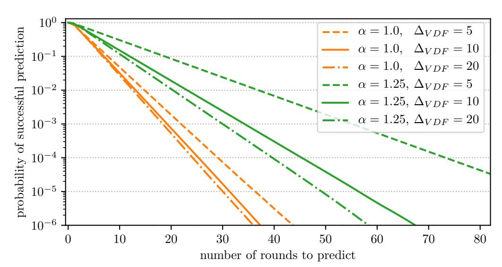

Fig. 6: RandRunner-RS' unpredictability ( $p_A = 0.33$ )

<span id="page-15-4"></span>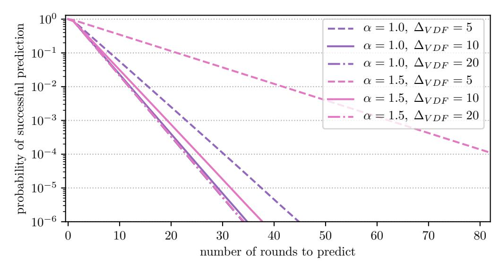

Fig. 7: RandRunner-RS' unpredictability, considering a covert adversary ( $p_A = 0.66$ )

<span id="page-15-5"></span>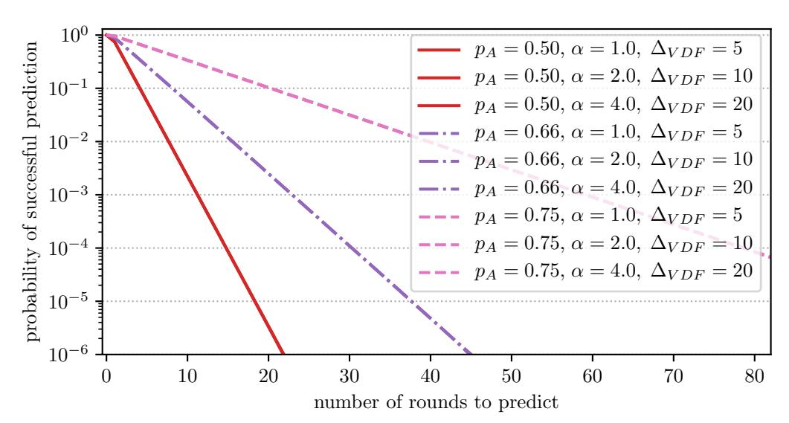

Fig. 8: RandRunner-RS' unpredictability, considering a covert adversary; showing the relation between  $p_A$ ,  $\alpha$  and  $\Delta_{VDF}$ 

{16}------------------------------------------------

# <span id="page-16-0"></span>C. Recovery from Asynchronous Network Conditions

We recall that RandRunner relies on network synchrony to ensure the unpredictability guarantees described in Section VI-D. Therefore, during periods of asynchrony, i.e. in situations in which correct nodes cannot disseminate message within  $\Delta_{NET}$  seconds, the protocol's unpredictability guarantees are gradually weakened. However, by design, RandRunner ensures liveness and consistency even during periods in which correct nodes cannot communicate with each other at all. During periods of asynchrony an adversary can increases its advantage (in terms the of number of random beacon output it can predict), whereas honest nodes catch up and RandRunner regains its unpredictability guarantees quickly once network connectivity is restored. In particular, this is the case when we consider a perfectly coordinated adversary which is not affected by the network delays or is itself responsible for the asynchronous network conditions. Considering this worst case, our simulation results in Figures 9 and 10 show how quickly the original unpredictability guarantees are restored after the network conditions normalize. We observe that the recovery time required increases linearly with the duration of the asynchronous period. Consequently, short periods of asynchrony have very little effect on the provided guarantees, whereas the protocol can still recover rather quickly even from long-lasting asynchronous network conditions. We note that in practice we only expect long-lasting asynchronous periods in extremely unlikely circumstances. In any case, a client using the produced random numbers is likely to notice the problem due to the temporary slowdown of the protocol and can consequently take appropriate countermeasures on the application layer, e.g. it may require a longer delay prior to the use of future outputs.

For our simulations we consider different parameterizations of RandRunner-RS, vary the duration of network outages (in multiples of the  $\Delta_{NET}$  parameter), and plot the time until the unpredictability guarantees are restored. Concretely, we report the average recovery time (y-axis) of 10000 simulation runs for each outage duration (x-axis). In in each run, we simulate a network outage for the given duration at a random point in time. Considering the (theoretical) worst case, we assume that during the network outage/attack correct nodes cannot communicate with each other at all, yet the adversary can perfectly coordinate its actions and does not mind being detected during the attack.

## D. Comparison of Probabilistic Unpredictability Guarantees

We omitted to present simulation results for RandRunner-RR in the main part of this paper, as we have provided a formal proof for the provided unpredictability guarantees. However, in addition to the bounds proven in Section VI-D, RandRunner-RR also provides stochastic guarantees similar to RandRunner-RS. In general, we observe that the probabilistic guarantees of RandRunner-RR approach the guarantees RandRunner-RS provides with an increasing number of participants n considering equivalent scenarios. In other words, the probabilistic guarantees of RandRunner-RS give an upper bound for the (stronger) guarantees of RandRunner-RR. This is further illustrated in Figure 11, which also highlights RandRunner-RR's proven absolute bound of d=8 rounds for the given example with n=24, f=8 nodes.

<span id="page-16-1"></span>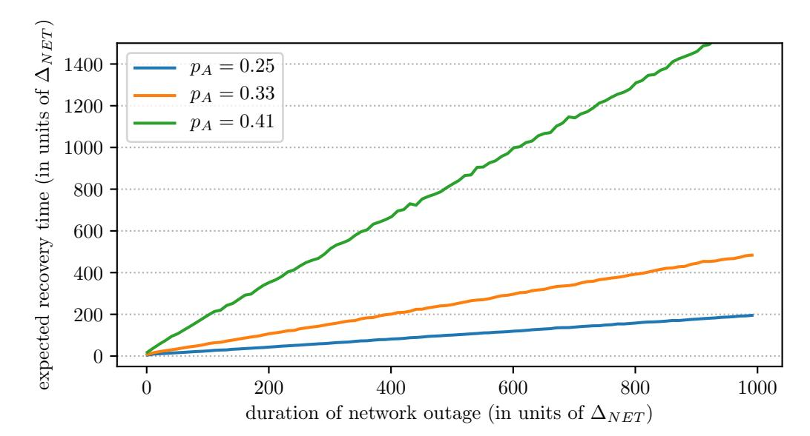

Fig. 9: Simulation of RandRunner-RS' recovery of unpredictability after a network outage  $(\Delta_{NET}/\Delta_{VDF}=1/10,$   $\alpha=1.0)$ 

<span id="page-16-2"></span>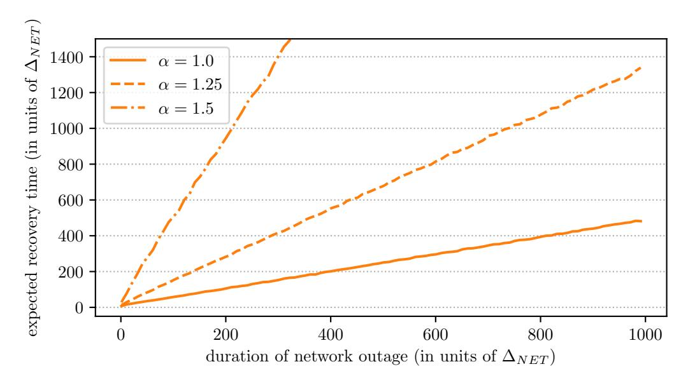

Fig. 10: Simulation of RandRunner-RS' recovery of unpredictability after a network outage  $(\Delta_{NET}/\Delta_{VDF}=1/10, p_A=0.33)$ 

<span id="page-16-3"></span>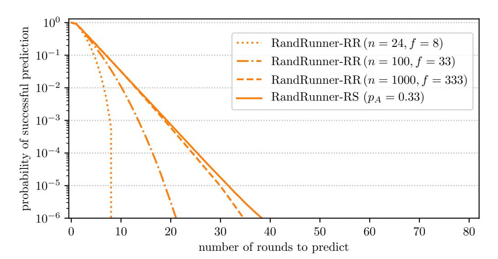

Fig. 11: Comparison of the probabilistic unpredictability guarantee of RandRunner-RR and RandRunner-RS  $(\Delta_{NET}/\Delta_{VDF}=1/10,~\alpha=1.0)$ 

{17}------------------------------------------------

# *E. Notation Reference*

TABLE I: Notation Randomness Beacon

| Symbol         | Description                                                                                                 |
|----------------|-------------------------------------------------------------------------------------------------------------|
| n              | number of nodes running the protocol                                                                        |
| ∗<br>n         | number of participants prior to verification of the<br>protocol setup                                       |
| f              | number of adversarial / Byzantine nodes                                                                     |
| α ≥ 1          | adversaries VDF computation speed relative to the<br>correct nodes                                          |
| P              | set of participants running the protocol                                                                    |
| P              | set of verified public parameters                                                                           |
| P∗             | set of public parameter prior to verification                                                               |
| r, s ≥ 1       | some protocol round as specified by the context                                                             |
| d, v, w        | number of rounds as specified by the context                                                                |
| R0             | initial random seed for the protocol                                                                        |
| Rr             | protocol output at round r                                                                                  |
| i ∈ P          | some node running the protocol as specified by the<br>context                                               |
| ∈ P<br>`r      | leader of round r                                                                                           |
| ppi            | public parameters for node i's VDF                                                                          |
| ski            | secret key / trapdoor for node i's VDF                                                                      |
| ∆NET           | network propagation delay (between correct nodes)                                                           |
| ∆VDF           | correct nodes' upper bound for the computation<br>time of Eval (the VDF parameter T is set accord<br>ingly) |
| ∆VDF<br>/α     | adversary's lower bound for the computation time<br>of Eval                                                 |
| pA             | fraction of adversarial nodes (f /n)                                                                        |
| pH             | fraction of honest/correct nodes (1 − f /n)                                                                 |
| λA, λH         | rate<br>of<br>progress<br>for<br>the<br>adversarial<br>and<br>hon<br>est/correct nodes                      |
| ∆w             | RandRunner-RR's worst case completion time of n<br>consecutive protocol rounds for correct nodes            |
| P˜             | randomized sequence of the set of participants P                                                            |
| P˜[j]          | P˜ using 0-based indexing<br>th element of<br>j                                                             |
| th period<br>k | the sequence of rounds (k − 1)n + 1,(k − 1)n +<br>2,, kn                                                    |

TABLE II: Notation VDFs

| Symbol   | Description                                                    |
|----------|----------------------------------------------------------------|
| X        | input space of the VDF, X = QR+<br>N in our case               |
| Y        | output space of the VDF, Y = QR+<br>N in our case              |
| PP       | public parameter space of the VDF                              |
| T ∈ N    | time parameter of the VDF (number of iterations)               |
| x ∈ X    | input to the VDF                                               |
| y ∈ Y    | output of the VDF                                              |
| π        | correctness proof for the VDF output                           |
| pp ∈ PP  | public parameters of the VDF                                   |
| p, q     | large safe primes                                              |
| N        | RSA modulus                                                    |
| πN       | proof that N is a product of two safe primes of size<br>λRSA/2 |
| QR+<br>N | group of signed quadratic residues modulo N                    |
| λ        | security parameter                                             |
| λRSA     | security parameter for an RSA-based VDF                        |

TABLE III: Notation Algorithms

| Algorithm                                 | Description                                                                        |
|-------------------------------------------|------------------------------------------------------------------------------------|
| Setup(λ) → pp                             | setup function for a (general) VDF                                                 |
| Setup(λ) → (pp, sk)                       | setup function for a trapdoor VDF                                                  |
| VerifySetup(λ, pp) → {accept, reject}     | verification algorithm for the parameters generated by Setup(·)                    |
| Eval(pp, x, T) → (y, π)                   | VDF evaluation algorithm (without knowledge of the trapdoor)                       |
| TrapdoorEval(pp, x, T, sk) → (y, π)       | VDF evaluation algorithm with knowledge of the trapdoor                            |
| Verify(pp, x, T, y, π) → {accept, reject} | verification algorithm for the VDF evaluation                                      |
| 256 → X<br>: {0, 1}<br>Hin                | cryptographic hash function mapping a 256-bit string to the input space of the VDF |
| 256<br>Hout<br>: Y → {0, 1}               | cryptographic hash function mapping a VDF output to a 256-bit string               |