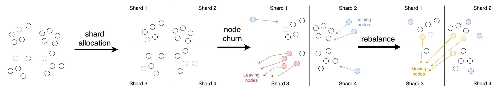
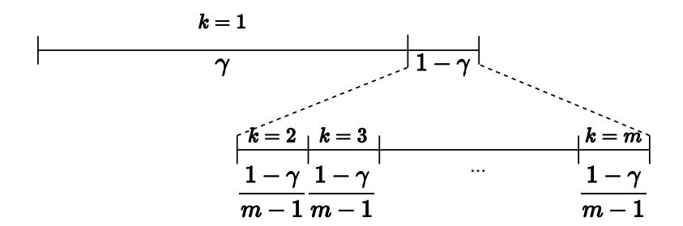
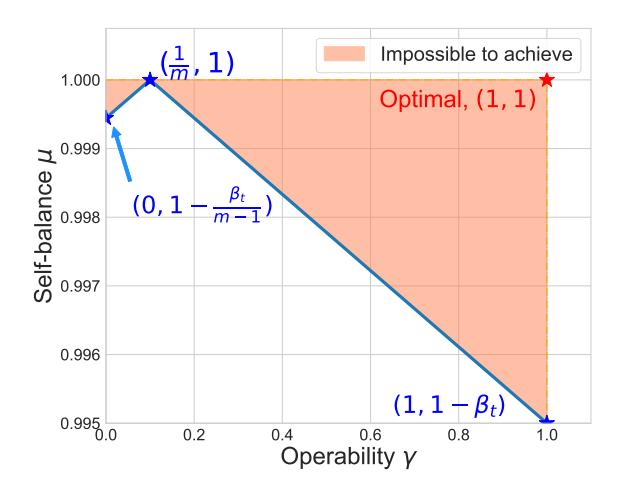
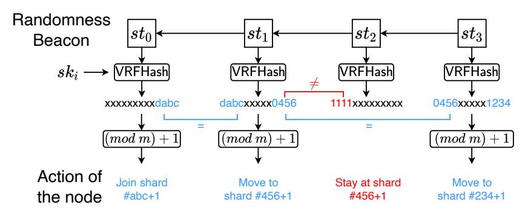
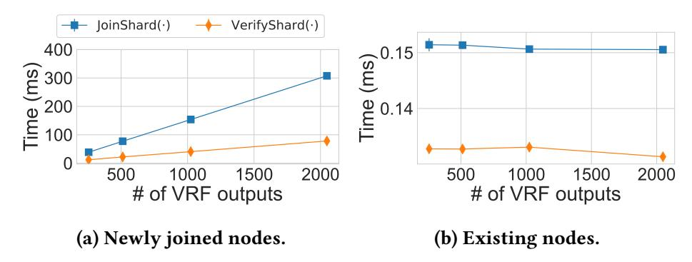
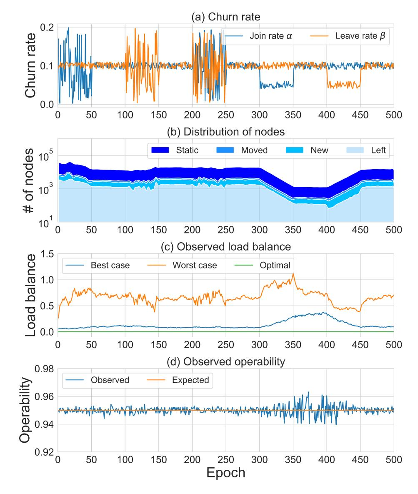
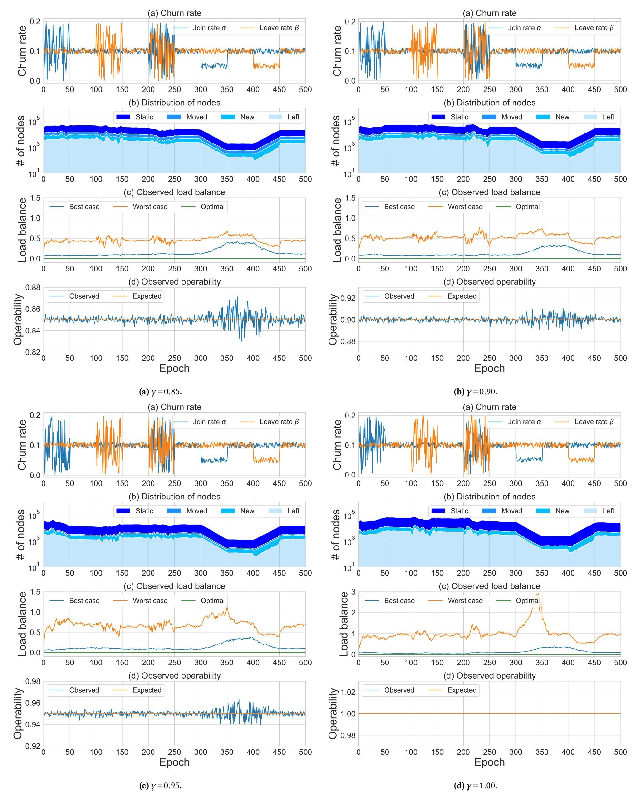

{0}------------------------------------------------

# Analysing and Improving Shard Allocation Protocols for Sharded Blockchains

Runchao Han Monash University and CSIRO-Data61 runchao.han@monash.edu

Jiangshan Yu<sup>∗</sup> Monash University jiangshan.yu@monash.edu

Ren Zhang Cryptape Co. Ltd. and Nervos ren@nervos.org

# ABSTRACT

Sharding is a promising approach to scale permissionless blockchains. In a sharded blockchain, participants are split into groups, called shards, and each shard only executes part of the workloads. Despite its wide adoption in permissioned systems, transferring such success to permissionless blockchains is still an open problem. In permissionless networks, participants may join and leave the system at any time, making load balancing challenging. In addition, the adversary in such networks can launch the single-shard takeover attack by compromising a single shard's consensus. To address these issues, participants should be securely and dynamically allocated into different shards. However, the protocol capturing such functionality – which we call shard allocation – is overlooked.

In this paper, we study shard allocation protocols for permissionless blockchains. We formally define the shard allocation protocol and propose an evaluation framework. We apply the framework to evaluate the shard allocation subprotocols of seven state-of-the-art sharded blockchains, and show that none of them is fully correct or achieves satisfactory performance. We attribute these deficiencies to their extreme choices between two performance metrics: self-balance and operability. We observe and prove the fundamental trade-off between these two metrics, and identify a new property memory-dependency that enables parameterisation over this tradeoff. Based on these insights, we propose Wormhole, a correct and efficient shard allocation protocol with minimal security assumptions and parameterisable self-balance and operability. We implement Wormhole and evaluate its overhead and performance metrics in a network with 128 shards and 32768 nodes. The results show that Wormhole introduces little overhead, achieves consistent self-balance and operability with our theoretical analysis, and allows the system to recover quickly from load imbalance.

# 1 INTRODUCTION

Sharding is a common approach to scale distributed systems. It partitions nodes in a system into groups, called shards. Nodes in different shards work concurrently, so the system scales horizontally with the increasing number of shards. Sharding has been widely adopted for scaling permissioned systems, in which the set of nodes are fixed and predefined, such as databases [\[70\]](#page-13-0), file systems [\[58\]](#page-13-1), and permissioned blockchains [\[25,](#page-12-0) [41,](#page-12-1) [42,](#page-12-2) [61,](#page-13-2) [63\]](#page-13-3).

Given the success of permissioned sharded systems, sharding is regarded as a promising technique for scaling permissionless blockchains, where nodes can join and leave the system at any time. However, permissionless systems need to tolerate Byzantine nodes that may attack the system, whereas traditional sharded systems [\[26,](#page-12-3) [27,](#page-12-4) [37,](#page-12-5) [43,](#page-12-6) [48\]](#page-12-7) only need to tolerate crash faults. In sharded blockchains, the adversary can launch single-shard takeover attacks

(aka 1% attacks) [\[10,](#page-12-8) [18\]](#page-12-9) by gathering its nodes to a single shard and compromise a shard's consensus. As voting power is split among shards, launching such attacks requires much fewer nodes compared to 51% attacks in non-sharded blockchains. To resist against single-shard takeover attacks, sharded blockchains should 1) prevent nodes from choosing shards freely, and 2) achieve load balance where each shard contains a comparable number of nodes. Otherwise, shards with fewer nodes can be compromised with less effort. Without a global view of the network and centralised membership management, a common solution is to randomly allocate nodes into shards.

The permissionless setting inherently has node churn [\[91\]](#page-13-4), where nodes may join or leave the system at any time. To achieve load balance under node churn, permissionless sharded blockchains need to adaptively re-balance nodes over time. An intuitive solution is to randomly shuffle all nodes for every epoch. However, when a node is allocated to a new shard, it needs to synchronise the new shard's ledger and find new peers, which introduces non-negligible overhead and makes the node temporarily unavailable. The blockchain community recognises this issue as the reshuffling problem [\[13,](#page-12-10) [34\]](#page-12-11).

To address the above issues, sharded blockchains should employ a mechanism that allocates nodes into shards securely, randomly, and dynamically. We refer to such primitive as shard allocation, of which the intuition is depicted in Figure [1.](#page-1-0) Five nodes are allocated in shard #3 and four of them later left the system. To prevent the only node in shard #3 from becoming a single point of failure, the system has to allocate some nodes to shard #3 to re-balance the shards.

A systematic study on shard allocation is still missing. Existing works on permissionless sharded blockchains focus on either the system-level design [\[11,](#page-12-12) [24,](#page-12-13) [28,](#page-12-14) [67,](#page-13-5) [74,](#page-13-6) [94–](#page-13-7)[96,](#page-13-8) [98\]](#page-13-9) or other components such as ledger structure [\[68\]](#page-13-10) and cross-shard communication [\[99\]](#page-13-11). Other peer-to-peer protocols such as distributed hash tables [\[69,](#page-13-12) [80\]](#page-13-13) and distributed slicing [\[46,](#page-12-15) [55,](#page-13-14) [60,](#page-13-15) [75\]](#page-13-16) cannot be directly adapted for this primitive, as they usually assume rational adversary and choose liveness over safety.

Contributions. This paper provides the first study on shard allocation, the overlooked core component for shared permissionless blockchains. In particular, we formalise the shard allocation protocol, evaluate the shard allocation protocols of existing blockchain sharding protocols, observe insights and propose Wormhole, a correct and efficient shard allocation protocol for permissionless blockchains. Our contributions are summarised as follows.

- (1) We provide the first study on formalising the shard allocation protocol for permissionless blockchains ([§2\)](#page-1-1). The formalisation includes the syntax, correctness properties and performance metrics, and can be used as a framework for evaluating shard allocation protocols.
- (2) Based on our framework, we evaluate the shard allocation

<sup>∗</sup> Corresponding author.

{1}------------------------------------------------

<span id="page-1-0"></span>

Figure 1: An example of shard allocation. New nodes (in blue) may join the system and existing nodes (in red) may leave the system. After a state update, a subset of nodes (in yellow) may be relocated.

**protocols in seven state-of-the-art permissionless sharded blockchains (§3)**, including five academic proposals Elastico [74] (CCS'16), Omniledger [67] (S&P'18), RapidChain [98] (CCS'19), Chainspace [24] (NDSS'19), and Monoxide [96] (NSDI'19), and two industry projects Zilliqa [94] and Ethereum 2.0 [12]. Our results show that *none of these protocols is fully correct or achieves satisfactory performance*.

- (3) We **observe and prove the impossibility of simultaneously achieving optimal** *self-balance* **and** *operability* (§4.1). Self-balance represents the ability to re-balance the number of nodes in different shards; and operability represents the system performance w.r.t. the cost of re-allocating nodes to a different shard. While this impossibility has been conjectured [13, 34] and studied informally [67], we formally prove it is impossible to achieve optimal values on both, and quantify the trade-off between them. All existing sharded blockchains except for Omniledger make extreme choices on either self-balance or operability, leading to serious security or performance issues.
- (4) We identify and define a property memory-dependency that is necessary for shard allocation protocols to parameterise the trade-off between self-balance and operability (§4.2). Memory-dependency (aka non-memorylessness in signal processing literatures [78]) specifies that the shard allocation relies on both the current and previous system states. The parameterisation support opens a new in-between design space and makes the system configurable for different application scenarios. We formally prove the necessity of memory-dependency for supporting such parameterisation.
- (5) We propose Wormhole, a correct and efficient shard allocation protocol (§5), and analyse how to integrate Wormhole into sharded blockchains (§6). We formally prove that Wormhole achieves all correctness properties, and supports parameterisation of self-balance and operability. We also classify existing sharded blockchains, and analyse how to integrate Wormhole into each type of them.
- (6) We implement Wormhole, and evaluate its overhead and performance metrics in real-world settings (§7). We implement Wormhole in Rust, and evaluate the overhead of integrating Wormhole into different designs of sharded blockchains. We simulate Wormhole with 128 shards and 32768 nodes, and evaluate the dynamic load balance and operability under different churn conditions. The results show that Wormhole achieves consistent load balance and operability with our theoretical analysis, and can recover quickly from load imbalance.

#### <span id="page-1-1"></span>2 FORMALISING SHARD ALLOCATION

This section defines shard allocation protocol, including its system model, syntax, correctness properties, and performance metrics.

#### <span id="page-1-2"></span>2.1 System model

A sharded blockchain consists of a fixed number of m shards, each of which maintains a ledger formed as a blockchain, and processes transactions concurrently. Each node i in the system has a pair of secret key  $sk_i$  and public key  $pk_i$ , and is identified by  $pk_i$ . The sharded blockchain proceeds in epochs. For each epoch t, new nodes and existing nodes execute the shard allocation protocol to obtain a new shard membership w.r.t. the current system state  $st_t$ . Nodes find peers in the same shard by exchanging shard memberships/proofs, then execute consensus with peers to agree on new blocks. Each block includes the block proposer's shard membership and proof, apart from other data common in non-sharded blockchains. Let  $n_k^t$  be the number of nodes in shard  $k \in [m]$  and  $n^t = \sum_{k=1}^m n_k^t$  be the total number of nodes in epoch t, where  $[m] = \{1,2,...,m\}$ .

**Epoch and global system state.** An epoch t begins when a new global and unique system state  $st_t$  is available. How and when a system state is generated depends on the concrete protocol design. For example, Elastico [74], Omniledger [67], RapidChain [98] and Ethereum 2.0 [12] use a decentralised randomness beacon protocol to generate random outputs as system states; Zilliqa [94] merges blocks from all shards in an epoch, then extracts a global system state from the merged block.

Most sharded blockchains demand that the system state can be accessed by nodes securely and synchronously. We make the same assumption in line with these proposals. To focus on analysing the shard allocation protocol  $\Pi_{ShardAlloc}$ , we assume the system state generation protocols are secure.

Sybil resistance. To defend against Sybil attacks where the adversary spawns numerous nodes to compromise the consensus, permissionless sharded blockchains must employ a Sybil-resistant mechanism. For example, Elastico, RapidChain, and Zilliqa require nodes solving PoW puzzles to obtain shard memberships; Monoxide and Ethereum 2.0 employ PoW-based and Proof-of-Stake (PoS)-based Nakamoto-style consensus; and Omniledger supports any Sybil-resistant mechanisms, and instantiates it with a trusted identity authority. Among these Sybil resistance mechanisms, Nakamoto-style consensus requires network synchrony and certain fault tolerance capacity [45], affecting the sharded blockchain's system model.

**Node churn** [91] happens at any point of the protocol execution: some new nodes join and some existing nodes leave the

{2}------------------------------------------------

sharded blockchain. As we study shard allocation across epochs, we consider node churn happens at the end of each epoch for simplicity. Let  $\alpha$  and  $\beta$  be the joining rate and leaving rate, respectively. At the end of epoch t,  $\alpha_t n^t$  new nodes will join and  $\beta_t n^t$  existing nodes will leave the sharded blockchain. For two consecutive epochs t and t+1,  $n^{t+1} = (1-\beta_t + \alpha_t)n^t$ .

**Network model.** The network model concerns the timing guarantee of delivering messages. Depending on different proposals' settings, the network model is either synchrony, partial synchrony [52], or asynchrony. A network is synchronous if the adversary can delay a message up to a known finite time bound  $\Delta$ ; is asynchronous if the adversary can delay a message arbitrarily without any known time bound; and is partially synchronous [52] if it is asynchronous before an unknown Global Stabilisation Time (GST) and becomes synchronous after GST.

We say  $\Pi_{ShardAlloc}$  is synchronous if the adversary can break its safety by delaying messages beyond  $\Delta$ ; is partially synchronous if safety is guaranteed before GST and both safety and liveness are guaranteed after GST; and is asynchronous if a correct node can calculate its shard membership locally without communicating with other nodes (assuming synchronous access to system states).

**Adversary.** The adversary aims to break some of  $\Pi_{ShardAlloc}$ 's correctness properties that we will define in §2.3. Let  $\phi$  be the fault tolerance capacity of  $\Pi_{ShardAlloc}$ , where  $\phi$  is no bigger than the consensus protocol's fault tolerance capacity  $\Psi$ . Otherwise, even when the adversary's nodes are evenly distributed among shards, the adversary can compromise every shard. The adversary is adaptive: at any time, it can corrupt any set of less than  $\phi n^t$  nodes, i.e., make these nodes Byzantine, where t is the epoch number. The adversary can read internal states of corrupted nodes, and direct corrupted nodes to arbitrarily forge, modify, delay, and/or drop messages from them. The adversary can read and/or delay messages from correct nodes. The delay period is subjected to the network model assumed by the sharded blockchain.

#### 2.2 Syntax

We formally define the shard allocation protocol as follows.

Definition 1 (Shard allocation  $\Pi_{ShardAlloc}$ ). A shard allocation protocol  $\Pi_{ShardAlloc}$  is a tuple of polynomial time algorithms

 $\Pi_{ShardAlloc} = (Setup, Join, Update, Verify)$ 

Setup( $\lambda$ )  $\rightarrow$  pp: On input the security parameter  $\lambda$ , outputs the public parameter pp.

Join $(pp,sk_i,st_t) \rightarrow (k,\pi_{i,st_t,k})$ : On input secret key  $sk_i$ , public parameter pp and state  $st_t$ , outputs the IDk of the shard assigned for node i, the proof  $\pi_{i,st_t,k}$  of assigning i to k at  $st_t$ . The input may also be public key  $pk_i$  of node i, depending on concrete constructions. This also applies to  $Update(\cdot)$ .

Update $(pp,sk_i,st_t,k,\pi_{i,st_t,k},st_{t+1}) \rightarrow (k',\pi_{i,st_{t+1},k'})$ : On input the public parameter pp, secret key  $sk_i$ , state  $st_t$ , shard index k, proof  $\pi_{i,st_t,k}$  and the next state  $st_{t+1}$ , outputs the identity k' of the newly assigned shard for i, a shard assignment proof  $\pi_{i,st_{t+1},k'}$ .

Verify $(pp,pk_i,st_t,k,\pi_{i,st_t,k}) \rightarrow \{0,1\}$ : Deterministic. On input public parameter pp, i's public key  $pk_i$ , system state  $st_t$ , shard index k and shard assignment proof  $\pi_{i,st_t,k}$ , outputs 0 (false) or 1 (true).

Algorithm 1 describes the typical execution of  $\Pi_{ShardAlloc}$  in a sharded blockchain, from a node i's perspective.  $\Pi_{ShardAlloc}$ . Setup( $\lambda$ ) is executed once at the beginning of the protocol execution. To join the system in epoch t, node i executes  $\Pi_{ShardAlloc}$ . Join( $\cdot$ ) to obtain a shard membership  $k_*$  and the associated membership proof  $\pi_{i,st_*,k_*}$ , so that it can execute consensus with peers in shard  $k_*$ . Upon epoch t+1, node i needs to execute  $\Pi_{ShardAlloc}$ . Update( $\cdot$ ) to update its shard membership. Other nodes can execute  $\Pi_{ShardAlloc}$ . Verify( $\cdot$ ) to verify whether node i has a valid and updated shard membership.

**Algorithm 1:** Typical execution of shard allocation protocol  $\Pi_{ShardAlloc}$  in a sharded blockchain, from node i's perspective.

```
 \begin{array}{l} (k_t,\pi_{i,st_t,k_t}) \leftarrow \Pi_{\operatorname{ShardAlloc}}.\operatorname{Join}(pp,sk_i,st_t) & //\operatorname{Join} \text{ in epoch } t \\ st_*,k_*,\pi_* \leftarrow st_t,k_t,\pi_{i,st_t,k_t} & //\operatorname{State}, \text{ shard and proof in epoch } t \\ \textbf{repeat} \\ & \text{Wait for a new state } st_+ \\ & //\operatorname{Update shard membership and proof} \\ & (k_*,\pi_{i,st_*,k_*}) \leftarrow \Pi_{\operatorname{ShardAlloc}}.\operatorname{Update}(pp,sk_i,st_*,k_*,\pi_{i,st_*,k_*},st_+) \\ & st_* \leftarrow st_+ \\ & //\operatorname{Messages may attach } k_* \text{ and } \pi_{i,st_*,k_*} \\ & \operatorname{Execute consensus with peers in shard } k_* \\ \textbf{until } node i \ leaves the system \\ \end{array}
```

# <span id="page-2-0"></span>2.3 Correctness properties

We consider three correctness properties for  $\Pi_{ShardAlloc}$ , namely liveness, allocation-randomness, and unbiasibility, plus an optional property allocation-privacy.

**Liveness.** This property ensures that correct nodes can obtain valid shard memberships *timely*: given a system state, all correct nodes will finish computing  $Update(\cdot)$  (or  $Join(\cdot)$  if the node newly joins the system) before the next epoch. Otherwise, nodes cannot find their shards or participate in consensus, and consequently, the block producing is stalled.

DEFINITION 2 (LIVENESS). A shard allocation protocol  $\Pi_{ShardAlloc}$  satisfies liveness iff for every epoch t, every correct node i will finish computing  $\Pi_{ShardAlloc}$ . Update  $(pp,sk_i,st_{t-1},k_{t-1},\pi_{i,st_{t-1}},st_t)$  (or  $\Pi_{ShardAlloc}$ . Join  $(pp,sk_i,st_t)$  if t=1) before epoch t+1 such that  $\Pi_{ShardAlloc}$ . Verify  $(pp,pk,+i,st_t,k_t,\pi_{i,st_t,k_t})=1$ , where pp is the public parameter,  $sk_i$  is node i's secret key,  $(st_{t-1},k_{t-1},\pi_{i,st_{t-1},k_{t-1}})$  and  $(st_t,k_t,\pi_{i,st_t,k_t})$  are the system state, node i's allocated shard and node i's shard membership proof in epoch t-1 and t, respectively.

Allocation-randomness. This property ensures that every node is allocated to a random shard [67, 74, 94]. Otherwise, if the adversary can predict shard allocation results, then it can launch the *single-shard takeover attack* by corrupting nodes that will be allocated to a specific shard. We stress that allocation-randomness specifies the shard allocation process for every node independent of others, rather than specifying a global permutation of all nodes' shard allocation results, which is impossible when node churn exists and nodes have no global view on the network. Such independent decisions may lead to some extreme cases where some shards are almost empty, but with negligible probability as analysed in Appendix F.

We consider two parts of allocation-randomness, namely *join-randomness* and *update-randomness*. Join-randomness specifies that a newly joined node is assigned to each shard with equal probability.

{3}------------------------------------------------

<span id="page-3-0"></span>

Figure 2: Update-randomness. After executing  $\Pi_{ShardAlloc}$ . Update(·), the probability that a node stays in its shard (say shard 1) is  $\gamma$ , and the probability of moving to each other shard is  $\frac{1-\gamma}{m-1}$ .

DEFINITION 3 (JOIN-RANDOMNESS). A shard allocation protocol  $\Pi_{ShardAlloc}$  with m shards satisfies join-randomness iff for any secret key  $sk_i$ , public parameter pp and state  $st_t$ , the probability that node i is allocated to shard k is

$$Pr[k=k' \mid (k',\pi_{i,st_t,k'}) \leftarrow Join(pp,sk_i,st_t)] = \frac{1}{m} \pm \epsilon$$

where  $k,k' \in [m]$ , and  $\epsilon$  is a negligible value.

Update-randomness specifies the probability distribution of existing nodes' shard allocation. To remain balanced under churn, existing nodes may need to move to other shards upon state update. Moving to a new shard is computation- and communication-intensive, as a node needs to synchronise and verify the new shard's ledger, which can take hundreds of Gigabytes [20, 44, 67, 81]. If a large portion of nodes move to other shards upon each state update, then this introduces non-negligible overhead and may make the system unavailable for a long time. To avoid this, only a small subset of nodes should be moved within each state update. We define  $\gamma$  as the probability that a node stays in the same shard after a state update. We define update-randomness as follows.

<span id="page-3-1"></span>Definition 4 (Update-randomness). A shard allocation protocol  $\Pi_{\text{ShardAlloc}}$  with m shards satisfies update-randomness iff there exists  $\gamma \in [0,1)$  such that for any  $k \in [m]$ , secret key  $sk_i$  and public parameter pp, the probability that node i updates its shard membership from shard k at state  $st_t$  to shard k' at state  $st_{t+1}$  is

$$Pr\left[k=k' \mid \frac{(k',\pi_{i,st_{t+1},k'}) \leftarrow}{\mathsf{Update}(pp,sk_i,st_t,k,\pi_{i,st_t,k},st_{t+1})} \right] = \begin{cases} \gamma \pm \epsilon & (k'=k) \\ \frac{1-\gamma}{m-1} \pm \epsilon & (k'\neq k) \end{cases}$$

where  $k' \in [m]$ , and  $\epsilon$  is a negligible value.

When  $\gamma = \frac{1}{m}$ ,  $\Pi_{\text{ShardAlloc}}$  achieves optimal update-randomness, as all nodes are shuffled randomly under uniform distribution. This definition is intuitively depicted in Figure 2.

DEFINITION 5 (ALLOCATION-RANDOMNESS). A shard allocation protocol satisfies allocation-randomness if it satisfies join-randomness and update-randomness.

**Unbiasibility.** This property ensures that the adversary cannot manipulate the shard allocation results. While allocation-randomness defines the probability distribution of shard allocation, *unbiasibility* rules out attacks on manipulating the probability distribution, e.g., the join-leave attack [49, 51].

Definition 6 (Unbiasibility). A shard allocation protocol  $\Pi_{ShardAlloc}$  satisfies unbiasibility iff given a system state, no node can manipulate the probability distribution of the resulting shard of  $\Pi_{ShardAlloc}$ . Join (•) or  $\Pi_{ShardAlloc}$ . Update (•), except with negligible probability.

**Allocation-privacy.** This property ensures that no one can learn a node's shard membership without the node providing them by itself. Compared to allocation-randomness, allocation-privacy further prevents the adversary from computing a node's membership if the adversary has no access to the node's secret key. We consider allocation-privacy to be optional, as it has both advantages and disadvantages. On the positive side, allocation-privacy is necessary for the sharded blockchain to resist against the adaptive adversary: if the adversary cannot learn others' shard memberships, then it cannot corrupt nodes in a specific shard, but only a random set of nodes scattered across shards. On the negative side, allocation-privacy makes nodes difficult to find peers in the same shard. If the sharded blockchain employs a consensus protocol that requires broadcasting operations, then nodes have to execute an extra peer finding protocol [74, 94] before executing consensus, introducing non-negligible communication overhead. Thus, if the sharded blockchain is not required to resist against an adaptive adversary, then Π<sub>ShardAlloc</sub> does not need to achieve allocation-privacy.

Definition 7 (Join-Privacy). A shard allocation protocol  $\Pi_{ShardAlloc}$  with m shards provides join-privacy iff for any secret key  $sk_i$ , public parameter pp, and state  $st_t$ , without the knowledge of  $\pi_{i,st_t,k}$  and  $sk_i$ , the probability of making a correct guess k' on k is

$$Pr[k' = k \mid (k, \pi_{i, st_t, k}) \leftarrow Join(pp, sk_i, st_t)] = \frac{1}{m} \pm \epsilon$$

where  $k,k' \in [m]$ , and  $\epsilon$  is a negligible value.

DEFINITION 8 (UPDATE-PRIVACY). A shard allocation protocol  $\Pi_{ShardAlloc}$  with m shards provides update-privacy iff for some  $\gamma \in [0,1)$ , any  $k \in [1,m]$ , secret key  $sk_i$ , public parameter pp, and two consecutive states  $st_t$  and  $st_{t+1}$ , without the knowledge of  $\pi_{i,st_{t+1},k'}$  and  $sk_i$ , the probability of making a correct guess k'' on k' is

$$Pr\left[k^{\prime\prime} = k^{\prime} \middle| \begin{array}{c} (k^{\prime}, \pi_{i, st_{t+1}, k^{\prime}}) \leftarrow \\ \text{Update}(pp, sk_i, st_t, k, \pi_{i, st_t, k}, st_{t+1}) \end{array} \right] = \begin{cases} \gamma \pm \epsilon & (k^{\prime\prime} = k) \\ \frac{1 - \gamma}{m-1} \pm \epsilon & (k^{\prime\prime} \neq k) \end{cases}$$

where  $k',k'' \in [m]$ , and  $\epsilon$  is a negligible value.

DEFINITION 9 (ALLOCATION-PRIVACY). A shard allocation protocol  $\Pi_{ShardAlloc}$  satisfies allocation-privacy iff it satisfies both join-privacy and update-privacy.

#### <span id="page-3-2"></span>2.4 Performance metrics

We consider three performance metrics, namely communication complexity, self-balance and operability.

Communication complexity. Communication complexity is the amount of communication (measured by the number of messages) required to complete a protocol [97]. For shard allocation, we consider the *communication complexity* of all correct nodes obtaining shard memberships when joining, and updating shard memberships upon a new epoch. The communication of synchronising new shards is omitted.

**Self-balance.** Nodes should be uniformly distributed among shards. Otherwise, the fault tolerance threshold of shards with fewer nodes and the performance of shards with more nodes may be reduced [96, 100]. Due to node churn and lack of a global view, reaching global load balance is impossible for permissionless networks. Instead, the randomised self-balance approach – where a subset of nodes move

{4}------------------------------------------------

to other shards randomly – provides the optimal load balance guarantee. We quantify the *self-balance* as the ability that  $\Pi_{ShardAlloc}$  recovers from load imbalance.

<span id="page-4-1"></span>Definition 10 (Self-balance). When executing  $\Pi_{ShardAlloc}$  on m equal-sized shards in epoch t (i.e.,  $n_i^t = n_j^t$  for all  $i, j \in [m]$ ),  $\Pi_{ShardAlloc}$  is  $\mu$ -self-balanced iff

$$\mu = 1 - \max_{\forall i, j \in [m]} \frac{|n_i^{t+1} - n_j^{t+1}|}{n^t}$$

Value  $\mu$  measures the level of imbalance among shards after an epoch. When  $\mu = 1$ ,  $\Pi_{\text{ShardAlloc}}$  achieves the optimal self-balance: regardless of how many nodes join or leave the system during the last epoch, the system can balance itself within an epoch.

**Operability.** To balance shards,  $\Pi_{ShardAlloc}$  should move some nodes to other shards upon each state update. As mentioned, moving nodes to other shards introduces non-negligible overhead and may make the system unavailable for a long time. *Operability* was introduced to measure the cost of moving nodes [67]. We define operability as the probability that a node stays at its shard upon a state update. If  $\Pi_{ShardAlloc}$  satisfies update-randomness with  $\gamma$  (Definition 4), then its operability is  $\gamma$ , i.e.,  $\gamma$ -operable. When  $\gamma = 1$ ,  $\Pi_{ShardAlloc}$  is most operable: nodes will never move after joining the network.

#### <span id="page-4-0"></span>3 EVALUATING EXISTING PROTOCOLS

In this section, we model shard allocation protocols of seven state-of-the-art sharded blockchains and evaluate them based on our framework. For simplicity, we refer a sharded blockchain's shard allocation protocol as the sharded blockchain's name. Our evaluation (summarised in Table 1) shows that none of them is fully correct or achieves satisfactory performance.

#### 3.1 Evaluation criteria

The evaluation framework includes the system model, correctness properties (§2.3), and performance metrics (§2.4). The system model concerns the network model and fault tolerance capacity in §2.1, plus the trusted components that some proposals assume in order to guarantee the correctness. The node churn and adversary's goals in §2.1 are common in all proposals, and thus are omitted. As the evaluation framework focuses on shard allocation, other subprotocols in sharded blockchains – e.g., system state generation, consensus and cross-shard communication – are assumed secure.

We stress that shard allocation's fault tolerance capacity is no bigger than the consensus protocol's fault tolerance capacity  $\Psi$ . For example, if all correctness properties in the shard allocation protocol hold even when all nodes are Byzantine (e.g., guaranteed by a trusted third party), the shard allocation protocol achieves the fault tolerance capacity of  $\Psi$ .

# 3.2 Overview of evaluated proposals

We choose seven state-of-the-art sharded blockchains, including five academic proposals Elastico [74], Omniledger [67], Chainspace [24], RapidChain [98], and Monoxide [96], and two industry projects Zilliqa [94] and Ethereum 2.0 [12]. We briefly describe their shard allocation protocols below, and defer their details to Appendix D.

Elastico, Omniledger and RapidChain rely on distributed randomness generation (DRG) protocols for shard allocation. In Elastico, nodes in a special shard called *final committee* run a commit-andreveal DRG protocol [29] to produce a random output. Each node then solves a PoW puzzle derived from the random output and its identity, and will be assigned to a shard according to its PoW solution. In Omniledger, all nodes in the network execute a synchronous leader election protocol based on a verifiable random function. The leader then initiates the *RandHound* [92] DRG protocol with the other nodes to generate a random output. If the leader election fails for five times, then nodes fallback to run an asynchronous DRG protocol [35]. Given the latest random output, nodes derive a unique permutation of them, and  $\frac{1}{3}$  nodes in the beginning of the permutation are shuffled to other shards randomly. In RapidChain, nodes in a special shard called reference committee execute a Feldman Verifiable Secret Sharing (VSS) [54]-based DRG protocol to generate a random output. To join the system, a node needs to solve a PoW puzzle parameterised by the random output. The puzzle serves no other purpose than allowing the node to join the system. The reference committee then executes the Commensal *Cuckoo* rule [90] as follows. Interval [0,1) is equally divided into different fragments, each representing a shard. Each new node is mapped to an ID  $x \in [0,1)$  based on its identity, and is allocated to the shard whose interval includes *x*. Existing nodes with IDs close to *x* are "pushed" to other shards randomly.

Chainspace, Monoxide, Zilliqa and Ethereum 2.0 do not rely on DRG protocols for shard allocation. In Chainspace, a node can apply to move to another shard at any time, and other nodes vote to decide on the applications. The voting works over a special smart contract ManageShards, whose execution is assumed to be correct and trustworthy. Monoxide and Ethereum 2.0 allocate nodes into different shards according to their addresses' prefixes. Zilliqa is built upon Elastico, but it uses the last block's hash value as the current epoch's random output.

#### 3.3 System model

**Network model.** A shard allocation protocol is synchronous if the adversary can break its safety by delaying messages beyond the latency upper bound  $\Delta$ ; is partially synchronous if such  $> \Delta$ delay only affects liveness but not safety, and liveness is resumed once the network becomes synchronous; and is asynchronous if a correct node can calculate its shard membership locally without communicating with other nodes. Note that we assume in §2.1 that nodes have secure and synchronous access to system states, and other subprotocols of the sharded blockchain (including system state generation) are secure. Elastico and RapidChain are synchronous, as they employ the synchronous DRG protocols [29, 54]. Omniledger is partially synchronous, as it employs the partially synchronous RandHound DRG protocol. Chainspace, Monoxide, Zilliqa and Ethereum 2.0 are asynchronous: in Chainspace, a node submits a smart contract transaction to obtain or update a shard membership, and the liveness is achieved once the transaction is received by the smart contract; Monoxide and Ethereum 2.0 allow nodes to calculate shards locally without communicating with others; and Zilliqa replaces the DRG [29] in Elastico by using block hashes as system states that can be accessed synchronously by assumption,

{5}------------------------------------------------

<span id="page-5-0"></span>Table 1: Evaluation of seven permissionless shard allocation protocols. Red indicates strong assumptions, unsatisfied correctness properties, and relatively weaker performance. Yellow indicates moderate assumptions and partly satisfied correctness properties. Green indicates weak assumptions, satisfied correctness properties, and better performance.

|               |               | System model  |                    |                 | Correctness |        |                |                  | ess                 | Performance metrics |                    |                                      |                                  |
|---------------|---------------|---------------|--------------------|-----------------|-------------|--------|----------------|------------------|---------------------|---------------------|--------------------|--------------------------------------|----------------------------------|
|               | State update  | Network Hodel | Trusted components | Failt tolerance | Pul         | die vi | eness<br>eness | ditty<br>Joeatic | ortiand.<br>Trivacy | Join con            | In. count.         | gelf halance                         | Operability                      |
| Elastico      | New block     | Sync.         | -                  | 1/3             | 1           | ✓      | ✓              | Х                | ✓                   | $O(n^f)$            | $O(n^f)$           | 1                                    | $\frac{1}{m}$                    |
| Omniledger    | New block     | Part. sync.   | -                  | 1/3             | 1           | 1      | 1              | 1                | Х                   | O(n)                | $O(n) \sim O(n^3)$ | $1 - \frac{(2m-3)\beta_t}{3m-3}$     | $\frac{2}{3}$                    |
| RapidChain    | Nodes joining | Sync.         | -                  | 0               | Х           | 1      | 1              | 1                | Х                   | $O(n^2)$            | $O(n^2)$           | $1-\beta_t$                          | $max(1-\kappa\alpha_t n,0)$      |
| Chainspace    | -             | Async.        | Smart contracts    | Ψ               | 1           | 1      | Х              | Х                | X                   | -                   | O(n)               | $1-\beta_t$                          | -                                |
| Monoxide      | -             | Async.        | -                  | Ψ               | 1           | 1      | Х              | 1                | Х                   | 0                   | 0                  | $1-\beta_t$                          | 1                                |
| Zilliqa       | New block     | Async.        | -                  | Ψ               | 1           | 1      | 1              | Х                | 1                   | O(n)                | O(n)               | 1                                    | $\frac{1}{m}$                    |
| Ethereum 2.0  | -             | Async.        | -                  | Ψ               | 1           | ✓      | Х              | ✓                | Х                   | 0                   | 0                  | $1-\beta_t$                          | 1                                |
| Wormhole (§5) | New rand.     | Async.        | Rand. Beacon*      | Ψ               | 1           | 1      | 1              | 1                | ✓                   | O(n)                | O(n)               | $1-\beta_t + \frac{\beta_t}{2^{op}}$ | $1 - \frac{m-1}{m \cdot 2^{op}}$ |

<sup>&</sup>lt;sup>o</sup> Optional. \* Wormhole can rely on an external randomness beacon, or allow a group of nodes to run a decentralised randomness beacon protocol similar to Elastico, Omniledger, RapidChain and Ethereum 2.0. Ψ is the fault tolerance capacity of the sharded blockchain's consensus protocol.

and nodes can calculate their shards locally given the system states.

**Trusted components.** These protocols assume no trusted component, except for Chainspace that assumes trusted smart contracts.

Fault tolerance capacity. Elastico and Omniledger achieve the fault tolerance capacity of  $\phi = \frac{1}{3}$ , which is inherited from their DRG protocols. RapidChain cannot tolerate any faults, as one faulty node can make the Feldman VSS lose liveness by withholding shares. In Chainspace, Monoxide, Zilliqa, and Ethereum 2.0, all correctness properties of shard allocation are guaranteed when all nodes are Byzantine. For Monoxide and Ethereum 2.0, computing shards is offline. Chainspace assumes trusted smart contracts. For Zilliqa, blocks are produced correctly by assumption and shard computation is offline. Thus, their shard allocation protocols achieve fault tolerance capacity of  $\Psi$ .

#### 3.4 Correctness properties

**Public verifiability.** All of these shard allocation protocols achieve public verifiability except for RapidChain. RapidChain's shard allocation is not publicly verifiable, as the deployed Commensal Cuckoo protocol is not publicly verifiable.

Liveness. All shard allocation protocols satisfy liveness.

**Allocation-randomness.** Elastico, Omniledger, RapidChain, and Zilliqa satisfy allocation-randomness, as all nodes are shuffled for each epoch. Chainspace does not satisfy allocation-randomness, as nodes can choose which shard to join. Monoxide and Ethereum 2.0 do not satisfy allocation-randomness, as nodes can choose their preferred shards by choosing addresses.

**Unbiasibility.** Elastico and Zilliqa do not fully achieve unbiasibility. Compared to the PoW puzzles in Bitcoin-like systems, the PoW puzzles in Elastico and Zilliqa are less challenging to solve, allowing the adversary to solve multiple puzzles within an epoch and choose a preferred shard to join. Chainspace does not achieve unbiasibility, as it does not satisfy allocation-randomness and nodes are free to choose shards.

**Allocation-privacy.** Elastico and Zilliqa satisfy allocation-privacy, as the allocated shard remains secret if the node does not reveal its

PoW solution. Therefore, Elastico and Zilliqa employ an extra peer finding mechanism called "overlay setup", where a special shard called "directory committee" collects and announces nodes' allocated shards. Omniledger, RapidChain, and Chainspace do not satisfy allocation-privacy as memberships can be queried at the identity blockchain, the reference committee and the ManageShards smart contract, respectively. Monoxide and Ethereum 2.0 do not satisfy allocation-privacy, as nodes' addresses are publicly known.

#### 3.5 Performance metrics

**Communication complexity.** Elastico's shard allocation requires  $O(n^f)$  messages per epoch, where n and f are the number of nodes and faulty nodes, respectively. For each epoch, the final committee needs to run the DRG protocol, which consists of a vector consensus [79] with communication complexity  $O(n^f)$ . Ideally, the final committee in Elastico has  $\frac{n}{m}$  nodes, and the communication complexity is  $O(\frac{n}{m}^{\frac{f}{m}}) = O(n^f)$  (m is constant). For Omniledger,  $Join(\cdot)$  requires O(n) communication, as each new node requests to a node for joining the system. The communication complexity of Update(·) is O(n) or  $O(n^3)$ : the best case of Update(·) is that the leader election and RandHound are both successful, leading to O(n) messages; and the worst case is that nodes fallback to run the asynchronous DRG [35] with communication complexity  $O(n^3)$ . RapidChain's shard allocation requires  $O(n^2)$  messages per epoch, which is inherited from Feldman VSS [54]. Monoxide and Ethereum 2.0 requires no communication for shard allocation, as nodes decide their shards locally. Zilliqa requires  $\mathcal{O}(n)$  messages per epoch as each node needs to retrieve the latest block.

**Self-balance.** In Elastico and Zilliqa, all nodes are shuffled for each epoch, leading to the self-balance of 1 with negligible bias. In Omniledger,  $\frac{1}{3}$  nodes are shuffled for each epoch, leading to operability  $\gamma = \frac{2}{3}$ . By Lemma 1 (introduced later in §4.1), Omniledger's self-balance will be  $\mu = 1 - \frac{(2m-3)\beta_t}{3m-3}$ . The self-balance of RapidChain, Chainspace, Monoxide and Ethereum 2.0 is  $1-\beta_t$ . In the worst case where no nodes newly join the system and  $\beta n^t$  nodes in the same shard leave the system, self-balance becomes  $\frac{n-\beta_t n}{n} = 1-\beta_t$ .

{6}------------------------------------------------

**Operability.** The operability of Elastico and Zilliqa are  $\frac{1}{m}$ , as all nodes are shuffled for each new epoch. The operability of Omniledger is  $\gamma = \frac{2}{3}$ , as  $\frac{1}{3}$  nodes are shuffled for each epoch. The operability of RapidChain is  $\max(1-\kappa\alpha_t n,0)$ , where  $\kappa\in[0,1]$  is the size of the interval in which nodes should move to other shards, and  $\alpha_t$  is the join churn rate in epoch t. In epoch t, there are  $\alpha_t n$  nodes joining the network, and each newly joined node causes the reallocation of  $\kappa n$  other nodes. The operability then becomes  $1-\frac{\alpha_t n \cdot \kappa n}{n}=1-\kappa \alpha_t n$ . As operability cannot be smaller than 0 in reality, operability is  $\max(1-\kappa\alpha_t n,0)$ . We cannot determine the operability of Chainspace, as Chainspace does not specify how many nodes can propose to change their shards. Monoxide and Ethereum 2.0 have the operability of 1, as nodes in Monoxide and Ethereum 2.0 never move to other shards.

#### 4 OBSERVATION AND INSIGHTS

Table 1 shows that no shard allocation protocols achieves optimal self-balance and operability simultaneously. We formally prove that achieving optimal values on both of them is impossible. We then identify a new property *memory-dependency* that enables parameterising the trade-off between them, opening a new in-between design space configurable for different application scenarios. We provide proof sketch for the analysis, and defer the formal proofs to Appendix A.

# <span id="page-6-0"></span>4.1 Impossibility and trade-off

According to Table 1, except for Omniledger and RapidChain, self-balance  $\mu$  is either  $1-\beta_t$  or 1, and operability  $\gamma$  is either 1 or  $\frac{1}{m}$ . In fact, achieving optimal self-balance and operability simultaneously still remains as an open problem, and has been extensively discussed in the blockchain community [13, 34]. We prove that, however, this is *impossible* for any correct shard allocation protocol. The proof starts from analysing the relationship between self-balance  $\mu$  and operability  $\gamma$ . Lemma 1 formally states the relationship, and Appendix A provides its full proof.

<span id="page-6-2"></span>Lemma 1. If a correct shard allocation protocol  $\Pi_{ShardAlloc}$  with m shards satisfies update-randomness with  $\gamma$ , the self-balance of  $\Pi_{ShardAlloc}$  is

$$\mu = 1 - \left| \frac{(\gamma m - 1)\beta_t}{m - 1} \right|$$

, where  $\beta_t$  is the percentage of nodes leaving the network in epoch t.

Proof sketch. When the  $\beta_t n^t$  leaving nodes are from the same shard i, self-balance  $\mu$  will achieve the smallest value

$$\begin{split} \mu &= 1 - \max_{\forall i, j \in [m]} \frac{|n_i^{t+1} - n_j^{t+1}|}{n^t} \\ &= 1 - \frac{\left|\frac{\gamma m - 1}{m - 1} \beta_t n^t\right|}{n^t} \\ &= 1 - \left|\frac{(\gamma m - 1) \beta_t}{m - 1}\right| \end{split}$$

Figure 3 visualises their relationship in Lemma 1. The line never reaches the point (1,1), indicating that  $\Pi_{ShardAlloc}$  can never achieve

<span id="page-6-3"></span>

Figure 3: Relationship between self-balance  $\mu$  and operability  $\gamma$ . We pick  $m\!=\!10$  and  $\beta_t\!=\!0.005$  as an example. No shard allocation protocol can go above the blue line to reach the orange area.

optimal values for them simultaneously. With operability increasing, the self-balance increases to 1 when  $\gamma \leq \frac{1}{m}$ , then decreases when  $\gamma \geq \frac{1}{m}$ . When  $\gamma = 0$ , self-balance becomes  $1 - \frac{\beta_t}{m-1}$ . This is because when  $\gamma = 0$ , all nodes are mandatory to change their shards. As shard k has fewer nodes, during  $\Pi_{\text{ShardAlloc}}.\text{Update}(\cdot)$  it loses fewer nodes but receives more nodes from other shards. When  $\gamma = \frac{1}{m}$ , self-balance becomes 1, i.e., optimal.

Therefore, it is impossible to achieve optimal values for self-balance and operability simultaneously. Theorem 1 formally states the impossibility, and Appendix A provides its full proof.

<span id="page-6-4"></span>Theorem 1. Let  $\beta_t$  be the percentage of nodes leaving the network in epoch t. It is impossible for a correct shard allocation protocol  $\Pi_{ShardAlloc}$  with m shards to achieve optimal self-balance and operability simultaneously for any  $\beta_t > 0$  and m > 1.

## <span id="page-6-1"></span>4.2 Parameterising the trade-off

As shown in Figure 3,  $(1,1-\beta_t)$  and  $(\frac{1}{m},1)$  are two extreme cases in the trade-off between self-balance and operability, and shard allocation protocols lying at these two points are impractical. In addition, none of our evaluated protocols allows parameterising this trade-off. We prove that, to parameterise this trade-off, sharding protocols should be *memory-dependent*, where the shard allocation result depend not only on the current system state, but also on the previous ones. In signal processing literatures, this property is also known as *non-memorylessness*, where the output signal does not only depend on the current input, but also some previous inputs [78]. Formally, memory-dependency is defined as follows.

Definition 11 (Memory-Dependency). A shard allocation protocol  $\Pi_{ShardAlloc}$  is memory-dependent iff for any public parameter pp, secret key  $sk_i$ , and shard k, the output of  $\Pi_{ShardAlloc}$ . Update  $(pp, sk_i, st_t, k, \pi_{i,st_t,k}, st_{t+1})$  depends on system states earlier than  $st_t$ .

By Definition 4, both self-balance and operability are related to the probability  $\gamma$  of nodes staying at the same shard. To parameterise self-balance and operability, a shard allocation protocol should incorporate shard allocation results of previous epochs. When  $\gamma \in (\frac{1}{m},1)$ , the probability distribution of allocation-randomness is non-uniform, and the membership proof of each epoch t depends on that in the previous epoch t-1. As the membership proof of epoch t-1 also depends on that of epoch t-2, recursively, each membership proof depends on all historical membership proofs. Thus, memory-dependency is necessary for parameterising the

{7}------------------------------------------------

trade-off between self-balance and operability. Theorem 2 formally states such necessity, and Appendix A provides its full proof.

<span id="page-7-1"></span>Theorem 2. If a correct shard allocation protocol  $\Pi_{\mathsf{ShardAlloc}}$  is  $\mu$ -self-balanced and  $\gamma$ -operable where  $\mu \in (1-\beta_t,1)$  and  $\gamma \in (\frac{1}{m},1)$ , then  $\Pi_{\mathsf{ShardAlloc}}$  is memory-dependent.

PROOF SKETCH. Assuming  $\Pi_{\mathsf{ShardAlloc}}$  is non-memory-dependent, i.e.,  $\pi_{i,st_t,k}$  involves no information of  $st_{t-1}$ . Proof  $\pi_{i,st_t,k}$  allows verifying node i is in shard k in epoch t. When  $\gamma \in (\frac{1}{m},1)$ , verifying  $\pi_{i,st_t,k}$  requires the knowledge of the shard k of node i at state  $st_t$ . As k depends on  $st_{t-1}$ , if  $\pi_{i,st_t,k}$  does not include  $st_{t-1}$ , then node i can produce  $\pi_{i,st_t,k}$  w.r.t. an arbitrary shard  $k' \neq k$ , contradicting to update-randomness.

# <span id="page-7-0"></span>5 WORMHOLE: MEMORY-DEPENDENT SHARD ALLOCATION

Based on the gained insights, we propose Wormhole, a correct and efficient shard allocation protocol. Wormhole relies on a randomness beacon (RB) to generate the system states, and a verifiable random function (VRF) to guide the nodes in computing their shards. By being memory-dependent, Wormhole supports parameterisation of self-balance and operability. We formally analyse Wormhole's correctness, and its communication and computational complexity.

# 5.1 Primitives: RB and VRF

**Randomness beacon.** Similar to existing sharded blockchains such as Elastico, Omniledger, and Zilliqa, Wormhole allocates nodes based on some randomness. RB [66] is a service that periodically generates random outputs. RB is instantiated by either an external party or by a group of nodes via a decentralised randomness beacon (DRB) protocol. RB satisfies the following properties [88]:

- *RB-Availability*: No node can prevent the protocol from making progress.
- *RB-Unpredictability*: No node can know the value of the random output before it is produced.
- *RB-Unbiasibility*: No node can influence the value of the random output to its advantage.
- *RB-Public-Verifiability*: Everyone can verify the correctness of the random output.

RB schemes are both readily available and widely used. Public external RBs are maintained by countries such as the US [66], Chile [15], and Brazil [2], as well as reputable institutions such as Cloudflare [8], EPFL [19], and League of Entropy [9]. DRB protocols can be constructed from Publicly Verifiable Secret Sharing (PVSS) [36, 88, 92], Verifiable Delay Functions [53, 71], Nakamoto consensus [62], and real-world entropy [33, 39]. Several sharded blockchains, including Elastico, Omniledger, and RapidChain, employ DRB to produce the system states already; Ethereum 2.0 uses DRB for its consensus; emerging projects such as Filecoin [32] rely on an external RB for its consensus.

**Verifiable random function.** A VRF [50, 59, 76] is a public-key version of a hash function, which computes an output and a proof from an input string and a secret key. Anyone with the associated public key and the proof can verify 1) whether the output is from the input, and 2) whether the output is generated by the owner of the secret key. Some VRFs support *batch verification* [1, 64], i.e.,

<span id="page-7-2"></span>

Figure 4: Intuition of WORMHOLE  $\Pi_{ShardAlloc}^{WH}$ . All numbers are in hexadecimal. We use op = 16 and  $m = 16^3$  as an example, and assume epoch 0 is the last non-memory-dependent epoch.

verifying multiple VRF outputs at the same time, which is faster than verifying VRF outputs one-by-one. Formally, a VRF is a tuple of four algorithms:

- VRFKeyGen( $\lambda$ )  $\rightarrow$  (sk,pk): On input a security parameter  $\lambda$ , outputs the secret/public key pair (sk,pk).
- VRFEval(sk, m)  $\rightarrow$  ( $h, \pi$ ): On input sk and an arbitrary-length string m, outputs a fixed-length random output h and proof  $\pi$ .
- VRFVerify( $pk,m,h,\pi$ )  $\rightarrow$  {0,1}: On input pk, m, h,  $\pi$ , outputs the verification result 0 or 1.
- (Optional) VRFBatchVerify $(pk, \vec{m}, \vec{h}, \vec{\pi}) \rightarrow \{0,1\}$ : On input pk, a series of strings  $\vec{m} = (m_1, ..., m_n)$ , outputs  $\vec{h} = (h_1, ..., h_n)$ , and proofs  $\vec{\pi} = (\pi_1, ..., \pi_n)$ , outputs the verification result 0 or 1.

VRF should satisfy the following three properties [59].

- *VRF-Uniqueness*: It is computationally hard to find  $(pk,m,h,h',\pi,\pi')$  such that  $h \neq h'$  and VRFVerify $(pk,m,h,\pi) = VRFVerify(pk,m,h',\pi') = 1$ .
- *VRF-Collision-Resistance*: It is computationally hard to find (m,m') such that h = h' where  $(h, \cdot) \leftarrow \mathsf{VRFEval}(sk, m)$  and  $(h', \cdot) \leftarrow \mathsf{VRFEval}(sk, m')$ .
- VRF-Pseudorandomness: It is computationally hard to distinguish the random output of  $VRFEval(\cdot)$  from a random string without the knowledge of the corresponding public key and the proof.

# 5.2 Key challenge and strawman designs

The key challenge in designing a memory-dependent shard allocation protocol is the *recursive dependency* problem: a shard membership proof in epoch t needs to prove its shard membership in epoch t-1 (i.e., "the memory"); and the shard membership proof in epoch t-1 needs to prove that in epoch t-2, and so on. Therefore, an extra mechanism is necessary to bound the number of history proofs.

A strawman design is to prescribe a fixed number of history proofs, so that all shard allocations but the earliest one are verifiable. However, this approach allows the adversary to enumerate all the shards as the earliest shard, and only releases one that leads them to the target shard, similar to the well-known *grinding attack* [30, 45] against proof-of-stake protocols.

Another strawman design is to periodically discard history proofs, so that nodes only need to provide history proofs up to the last non-memory-dependent epoch. Let each unit with w epochs be an era, which begins when  $t \mod w = 0$  and ends when  $t \mod w = w - 1$ , where t is the epoch number. At each era's beginning, a node discards all history proofs, and computes the shard membership in a non-memory-dependent way, i.e., only based on its secret key and the current system state. This bounds the number of history proofs, but all nodes are likely to be allocated to new shards at each era's

{8}------------------------------------------------

beginning, lowering the operability significantly for one epoch.

# 5.3 The Wormhole design

Wormhole addresses the above challenge by (1) prescribing a non-memory-dependent shard allocation per node per era and (2) randomising this non-memory-dependent epoch for each node, so that the size of a membership proof is bounded and nodes discard history proofs in different epochs. Algorithm 2 provides the full construction of Wormhole.

Each node i determines the non-memory-dependent epoch and the allocated shard in this epoch by using calcNMDEpoch(·). When an era starts at epoch t (when  $t \mod w = 0$ ), node i calculates VRFEval $(sk_i, st_t) \rightarrow (g_{i,t}, \pi_{i,t})$ , where  $st_t$  is RB's output, i.e., the system state, in epoch t. Then at epoch  $t+(g_{i,t}\mod w)$ , the node will remove all the memory and move to shard  $k=(g_{i,t}\mod m)+1$ . Note that both the reallocation epoch and the allocated shard are non-memory-dependent, and this happens exactly once per era.

In the other w-1 memory-dependent epochs, each node i determines the allocated shard by using calcShard(·). At epoch t, node i computes VRFEval( $sk_i,st_t$ )  $\rightarrow$  ( $h_{i,t},\pi_{i,t}$ ). Let op be the parameter for parameterising operability (and self-balance). Let LSB(x,m) and MSB(x,m) be the least and most significant x bits of m, respectively. Node i stays in the same shard, i.e.,  $k_{i,t}=k_{i,t-1}$  if LSB( $op,h_{i,t-1}$ )  $\neq$  MSB( $op,h_{i,t}$ ), otherwise moves to shard  $k_{i,t}=(h_{i,t} \mod m)+1$ . This injects the memory-dependency to the shard memberships of two consecutive epochs. Increasing op improves operability but reduces self-balance, and vice versa. Figure 4 illustrates this idea.

To join the system, a node i executes  $Join(\cdot)$ : it calculates VRF outputs and proofs since the last non-memory-dependent epoch, and executes  $calcShard(\cdot)$  to calculate its allocated shard k. The shard membership proof  $\pi_{i,st_t,k}$  includes a sequence of VRF outputs  $(h_{last},...,h_t)$  and their VRF proofs  $(\pi_{last},...,\pi_t)$ , where last is the last non-memory-dependent epoch calculated from  $calcNMDEpoch(\cdot)$ .

Upon epoch t+1, node i executes Update(·) as follows. It first calculates the VRF output of  $st_{t+1}$ . If epoch t+1 is memory-dependent, then calcShard(·) only needs to check if MSB(op, $h_{t+1}$ ) = LSB(op, $h_{idx}$ ) and compute idx and shard\_id accordingly, where  $h_{idx}$  is cached from epoch t. If epoch t+1 is non-memory-dependent, then the previous proofs are discarded and the shard ID is ( $h_{t+1} \mod m$ )+1.

To verify proof  $\pi_{i,st_t,k}$ ,  $\operatorname{Verify}(\cdot)$  uses  $\operatorname{calcNMDEpoch}(\cdot)$  to verify the last non-memory-dependent epoch, uses  $\operatorname{VRFBatchVerify}(\cdot)$  to verify  $\operatorname{VRF}$  outputs, and uses  $\operatorname{calcShard}(\cdot)$  over these  $\operatorname{VRF}$  outputs to verify its output against k. Previous verification results can be cached and reused: upon an updated membership  $\operatorname{proof} \pi_{i,st_{t+1},k'}$ , the verifier can reuse most of the results in verifying  $\pi_{i,st_t,k}$ , including verification results of previous  $\operatorname{VRF}$  outputs and  $\operatorname{calcShard}(\cdot)$ .

**Construction without allocation-privacy.** As mentioned in §2.3, allocation-privacy is not always a desired property. To remove allocation-privacy in  $\Pi^{\text{WH}}_{\text{ShardAlloc}}$ , one can replace  $\text{VRFEval}(sk_i,st_t)$  with  $H(pk_i||st_t)$ , where  $sk_i$  and  $pk_i$  are key pairs of node i,  $st_t$  is the system state, and  $H(\cdot)$  is a cryptographic hash function.

#### <span id="page-8-0"></span>5.4 Theoretical analysis

**Correctness.** We summarise the security analysis below, and Appendix B provides the full security proofs. Wormhole satisfies

liveness as a node can compute  $Join(\cdot)$  and  $Update(\cdot)$  locally. Wormhole satisfies unbiasibility, as  $VRFEval(\cdot)$  and  $calcShard(\cdot)$  are deterministic functions, and system states are unbiasible, guaranteed by RB. Wormhole satisfies join-randomness, as VRF produces uniformly distributed outputs. When the epoch is a memory-dependent epoch, the probability that two random outputs share the same op-bit substring is  $\frac{1}{2^{op}}$ . Within the probability  $\frac{1}{2^{op}}$ , the probability that two random outputs result in the same shard is  $\frac{1}{m}$ . This leads to  $\gamma = 1 - \frac{1}{2^{op}} \cdot \frac{m-1}{m} = 1 - \frac{m-1}{m \cdot 2^{op}}$ . When the epoch is a non-memory-dependent epoch, the node will be shuffled, leading to  $\gamma = \frac{1}{m}$ . Thus, Wormhole satisfies allocation-randomness. Wormhole satisfies allocation-privacy, as one cannot compute  $Join(\cdot)$  or  $Update(\cdot)$  for a node without knowing its secret key. The probability of guessing shard allocation follows the proof of allocation-randomness.

**Performance metrics.** The communication complexity of  $Join(\cdot)$  and  $Update(\cdot)$  of  $\Pi^{WH}_{ShardAlloc}$  are O(n) where n is the number of nodes, as each node needs to receive a constant number of system states for executing  $Join(\cdot)$  and  $Update(\cdot)$ . A  $\Pi^{WH}_{ShardAlloc}$  proof contains [3,2w+2) VRF outputs/proofs, where w is the era length.  $Join(\cdot)$  invokes VRFEval $(\cdot)$  for [1,2w) times, leading to computational complexity O(w). Update $(\cdot)$  invokes VRFEval $(\cdot)$  for once, leading to computational complexity O(1). Verify $(\cdot)$  invokes VRFVerify $(\cdot)$  for once if verification results are cached, otherwise VRFBatchVerify $(\cdot)$  over [1,2w) VRF outputs/proofs, leading to computational complexity O(1) or O(w), respectively. By update-randomness,  $\Pi^{WH}_{ShardAlloc}$ 's operability is

$$\gamma = 1 - \frac{m-1}{m} \cdot \frac{1}{2^{op}} = 1 - \frac{m-1}{m \cdot 2^{op}}$$
By Definition 1,  $\Pi_{\text{ShardAlloc}}^{\text{WH}}$ 's self-balance is
$$\mu = 1 - \left| \frac{(\gamma m - 1)\beta_t}{m - 1} \right|$$

$$= 1 - \frac{1}{m-1} \cdot \left[ (1 - \frac{m-1}{m \cdot 2^{op}})m - 1 \right] \beta_t$$

$$= 1 - \frac{1}{m-1} \cdot \left[ (m-1) - \frac{m-1}{2^{op}} \right] \beta_t$$

$$=1-(1-\frac{1}{2^{op}})\beta_t$$
$$=1-\beta_t + \frac{\beta_t}{2^{op}}$$

# 5.5 Comparison with existing protocols

Table 1 summarises the comparison result. It shows that Wormhole is the only shard allocation protocol that is fully correct and achieves satisfactory performance, without relying on strong assumptions. To make a fair comparison, we also evaluate shard allocation protocols while assuming RB, and the evaluation results are summarised in Table 2. Chainspace, Monoxide and Ethereum 2.0 are omitted as their shard allocation protocols do not rely on randomness.

According to Table 2, these proposals are improved in terms of the system model and communication complexity. All of them achieve O(n) communication complexity, where the concrete overhead depends on the instantiation and implementation, including cryptographic primitives and message formats. However, they still suffer from some problems they originally have, and Wormhole still outperforms them. For example, among the correctness

{9}------------------------------------------------

# **Algorithm 2:** Full construction of Wormhole $\Pi_{ShardAlloc}^{WH}$ .

```
Algorithm calcShard(m,op,h_x,h_{x+1},...,h_y):
                                                                                                   Algorithm Join(pp,sk_i,st_t):
                                                                                                                                                                                                      Algorithm Verify(pp,pk_i,st_t,k,\pi_{i,st_t,k}):
       idx \leftarrow x
                                                                                                                                                                                                              m,op,w \leftarrow pp
                                                                                                          m,op,w\leftarrow pp
                                                                                                           (last, \pi_{range}) \leftarrow calcNMDEpoch(w, sk_i, st_t)
        for j \in [x+1,y] do
                                                                                                                                                                                                              (\text{last}, \pi_{\text{range}}, h_{\text{last}}, ..., h_t, \pi_{\text{last}}, ..., \pi_t) \leftarrow \pi_{i, st_t, k}
               if MSB(op,h_i) = LSB(op,h_{idx}) then
                                                                                                          for j \in [last,t] do
                                                                                                                                                                                                              (g_{i,t}^-, \pi_{i,t}^-, g_{i,t}, \pi_{i,t}) \leftarrow \pi_{\text{range}}
                 idx \leftarrow j // Can be cached
                                                                                                             h_j, \pi_j \leftarrow \mathsf{VRFEval}(sk_i, st_j)
                                                                                                                                                                                                              t_{\text{era}} \leftarrow t - (t \mod w)
                                                                                                          k \leftarrow \text{calcShard}(m, op, h_{\text{last}}, ..., h_t)
                                                                                                                                                                                                              t_{\text{era}}^- \leftarrow t_{\text{era}} - w
       shard\_id \leftarrow (h_{idx} \mod m) + 1
                                                                                                                                                                                                              t_{\text{nmd}}^- \leftarrow t_{\text{era}}^- + (g_{i,t}^- \mod w)
                                                                                                          \pi_{i,st_t,k} \leftarrow (\text{last}, \pi_{\text{range}}, h_{\text{last}}, ..., h_t, \pi_{\text{last}}, ..., \pi_t)
       return shard_id
                                                                                                          Store \pi_{i,st_t,k} in memory
                                                                                                                                                                                                              t_{\text{nmd}} \leftarrow t_{\text{era}} + (g_{i,t} \mod w)
Algorithm calcNMDEpoch(w,sk_i,st_t):
                                                                                                                                                                                                               // Verify memory range
                                                                                                          return k, \pi_{i,st_t,k}
         // NMD = non-memory-dependent
                                                                                                                                                                                                                     t_{nmd}^- < t < t_{nmd} \land last \neq t_{nmd}^-
                                                                                                                                                                                                                                                                                 ٧
                                                                                                  Algorithm Update(pp,sk_i,st_t,k,\pi_{i,st_t,k},st_{t+1}):
        t_{\text{era}} \leftarrow t - (t \mod w)
                                                                                                                                                                                                                                                                                V
                                                                                                                                                                                                                     t_{nmd} \le t \land last \ne t_{nmd}
                                                                                                          m,op,w \leftarrow pp
        t_{\text{era}}^- \leftarrow t_{\text{era}} - w
                                                                                                                                                                                                             if
                                                                                                                                                                                                                     VRFVerify(pk_i,st_{era}^-,g_{i,t}^-,\pi_{i,t}^-)=0
                                                                                                                                                                                                                                                                                V
                                                                                                           (\text{last}, \pi_{\text{range}}, h_{\text{last}}, ..., h_t, \pi_{\text{last}}, ..., \pi_t) \leftarrow \pi_{i, st_t, k}
       g_{i,t}^-, \pi_{i,t}^- \leftarrow \mathsf{VRFEval}(sk_i, st_{\mathrm{era}}^-)
                                                                                                                                                                                                                     VRFVerify(pk_i,st_{era},g_{i,t},\pi_{i,t}) = 0
                                                                                                           (last^+, \pi_{range}^+) \leftarrow calcNMDEpoch(w, sk_i, st_{t+1})
       t_{\text{nmd}}^- \leftarrow t_{\text{era}}^- + (g_{i,t}^- \mod w)
                                                                                                                                                                                                                 then
                                                                                                          Remove (h_i, \pi_i) from memory for
       g_{i,t}, \pi_{i,t} \leftarrow \mathsf{VRFEval}(sk_i, st_{era})
                                                                                                                                                                                                                     return 0
                                                                                                             j \in [last, last^+)
       t_{\text{nmd}} \leftarrow t_{\text{era}} + (g_{i,t} \mod w)
                                                                                                                                                                                                              \vec{st}, \vec{h}, \vec{\pi} \leftarrow
                                                                                                          h_{t+1}, \pi_{t+1} \leftarrow \mathsf{VRFEval}(sk_i, st_{t+1})
       last \leftarrow t_{nmd}^{-} < t < t_{nmd} ? t_{nmd}^{-} : t_{nmd}
                                                                                                          k' \leftarrow \text{calcShard}(m, op, h_{\text{last}^+}, ..., h_{t+1})
                                                                                                                                                                                                                 (st_{last},...,st_t),(h_{last},...,h_t),(\pi_{last},...,\pi_t)
       return (last, (g_{i,t}^-, \pi_{i,t}^-, g_{i,t}, \pi_{i,t}))
                                                                                                          \pi_{i,st_{t+1},k'} \leftarrow
                                                                                                                                                                                                             if VRFBatchVerify(pk_i, \vec{st}, \vec{h}, \vec{\pi}) = 0 then
Algorithm Setup(\lambda):
                                                                                                             (last^+, \pi_{range}^+, h_{last}^+, ..., h_{t+1}, \pi_{last}^+, ..., \pi_{t+1})
                                                                                                                                                                                                                    return 0 // Can be cached
       m,op,w \leftarrow \lambda
                                                                                                          Store \pi_{i,st_{t+1},k'} in memory
                                                                                                                                                                                                             if k \neq \text{calcShard}(m, op, h_{last}, ..., h_t) then
       return (m, op, w)
                                                                                                          return k', \pi_{i,st_{t+1},k'}
                                                                                                                                                                                                                return 0
                                                                                                                                                                                                             return 1
```

<span id="page-9-2"></span>Table 2: Evaluation of shard allocation protocols that replace DRG with a randomness beacon. Meanings of colours are same as Table 1. ★ means the metric is improved by replacing DRG with a randomness beacon.

|               |               | System model    |                    |                 | Correctness          |                             | Performance metrics  |                                      |                               |  |
|---------------|---------------|-----------------|--------------------|-----------------|----------------------|-----------------------------|----------------------|--------------------------------------|-------------------------------|--|
|               | State update  | Network model   | Trusted components | kault tolerance | Public verificatives | raid.<br>raidity<br>Privacy | Join contri. contri. | conn. conn.                          | Operability                   |  |
| Elastico      | New block     | Async.★         | Rand. Beacon*      | Ψ★              | / / / X v            | /                           | $O(n) \bigstar O(n)$ |                                      | $\frac{1}{m}$                 |  |
| Omniledger    | New block     | Part. sync.     | Rand. Beacon*      | Ψ <b>★</b>      | / /* / / /           | x                           | O(n) $O(n)$          | $1 - \frac{(2m-3)\beta_t}{3m-3}$     | $\frac{2}{3}$                 |  |
| RapidChain    | Nodes joining | Async. <b>★</b> | Rand. Beacon*      | Ψ★              | X / / / )            | X                           | $O(n) \bigstar O(n)$ | $1-\beta_t$                          | $max(1-\kappa\alpha_t n,0)$   |  |
| Zilliqa       | New block     | Async.★         | Rand. Beacon*      | Ψ               | ✓ ✓ ✓ X ,            | /                           | O(n) $O(n)$          | 1                                    | $\frac{1}{m}$                 |  |
| Wormhole (§5) | New rand.     | Async.          | Rand. Beacon*      | Ψ               | / / / / /            | /                           | O(n) $O(n)$          | $1-\beta_t + \frac{\beta_t}{2^{op}}$ | $1-\frac{m-1}{m\cdot 2^{op}}$ |  |

<sup>o</sup> Optional. \* Shard allocation protocols can rely on an external randomness beacon, or allow nodes to run a decentralised randomness beacon protocol. Ψ is the fault tolerance capacity of the sharded blockchain's consensus protocol.

properties, only Omniledger's liveness issue is fixed. In addition, Omniledger should still assume partial synchorny, as liveness is guaranteed only under synchronous networks. To compute shard memberships, nodes have to broadcast their identifies and agree on a permutation of them, which require synchrony. Moreover, all of them still suffer from weak operability except for Omniledger.

#### <span id="page-9-0"></span>**6 INTEGRATION OF WORMHOLE**

In this section, we analyse how to integrate Wormhole into different sharded blockchains, and the corresponding impact on the system model and overhead.

### 6.1 Design choices related to WORMHOLE

The overhead introduced by WORMHOLE can be affected by two design choices of the sharded blockchain, namely the existence of identity registry and the choice of consensus protocol.

**Existence of identity registry.** Some sharded blockchains employ an identity registry that tracks identities of nodes in the system. For

example, Elastico, RapidChain and Zilliqa require a special shard to be the identity registry; Omniledger instantiates the Sybil-resistant mechanism by using a trusted identity authority; and Chainspace requires nodes to maintain a special smart contract managing identities.

The existence of identity registry decides where a shard membership is verified and stored. If the sharded blockchain employs an identity registry, then the identity registry can maintain and verify all shard memberships, and a node can query other nodes' shard memberships over the identity registry. Without an identity registry, a node then has to receive and verify other nodes' shard memberships when executing other subprotocols (e.g., consensus).

Choice of consensus protocol. Existing research [77, 87] suggests to classify consensus protocols into two types, namely BFT-style consensus and Nakamoto-style consensus. In BFT-style consensus, given the latest blockchain, nodes propose blocks, vote to agree on a unique block, and append the agreed block to the blockchain. In Nakamoto-style consensus, given the latest blockchain, nodes

{10}------------------------------------------------

compete to solve a cryptographic puzzle. If a node solves a puzzle, then it can append a new block associated to the puzzle solution to the blockchain. Nodes follow a chain selection rule to decide the main chain among all forks, and eventually the main chains of different nodes converge to the same one.

The choice of consensus protocol decides when a shard membership is queried or verified. With BFT-style consensus, a node has to additionally verify a quorum of nodes' shard memberships for each block. With Nakamoto-style consensus, a node has to additionally verify the block proposer's shard membership for each block.

Classification of sharded blockchains. Our evaluated sharded blockchains only belong to two "identity registry + consensus" combinations: Elastico, Omniledger, Chainspace, Zilliqa and Ethereum 2.0 employ an identity registry and BFT-style consensus; and Monoxide employs Nakamoto-style consensus without an identity registry.

# <span id="page-10-2"></span>6.2 Integration analysis

We then analyse how to integrate Wormhole into the two cases.

With identity registry, BFT-style consensus. In this case, every node executes Wormhole to obtain a shard membership with proof and submits them to the identity registry for verification. For each new epoch, a node needs to compute a VRF output with proof and send them to the identity registry. The identity registry needs to send each node the set of all peers' identities and the shard size. Every node then executes BFT-style consensus with peers to agree on blocks. For each vote, a node looks up the the voter node's identity within the set. A block needs to obtain a quorum of votes to be valid. The identity set can be replaced with a cryptographic accumulator [31], where the size and the lookup complexity can be sublinear w.r.t. the set size. The identity registry also manages nodes' identities and handles Sybil attacks.

With this approach, the sharded blockchain inherits the network model and fault tolerance capacity from its underlying consensus protocol, and incurs some extra overhead as follows. The identity registry needs to additionally receive, store and verify shard memberships and proofs for all nodes. For each new epoch, each node needs to additionally submit a VRF output and proof to the identity registry and receive the set of identities and an integer, while the identity registry needs to verify a VRF output and update the shard membership. For each block, each node needs to look up a quorum of nodes' shard memberships within the set.

No identity registry, Nakamoto-style consensus. In this case, every node executes Wormhole to obtain a shard membership with proof, and keeps solving puzzles to propose blocks over the main chain decided by the chain selection rule. Each block additionally attaches the miner's shard membership and proof. Upon receiving a block, the node additionally verifies the miner's shard membership. Similar to Elastico, Chainspace, Zilliqa and Ethereum 2.0, a node has to solve a cryptographic puzzle in order to obtain an identity in the system. To support permissionless settings, the puzzle's difficulty is controlled by a difficulty adjustment mechanism.

The Nakamoto-style consensus will require Wormhole to assume a synchronous network and the fault tolerance capacity depending on the concrete Sybil-resistance mechanism, as analysed by Dembo et al. [45]. Nodes need to possess the dedicated resource w.r.t. the Sybil-resisitance mechanism in Nakamoto-style consensus.

<span id="page-10-1"></span>

Figure 5: Computation overhead of WORMHOLE.

In addition, for every block, a node needs to additionally receive, store and verify a shard membership and proof.

#### <span id="page-10-0"></span>7 **EVALUATION OF WORMHOLE**

In this section, we implement Wormhole and evaluate its overhead and performance metrics in the wild. The evaluation results show that Wormhole introduces little overhead and achieves performance metrics consistent with the theoretical values.

# 7.1 Overhead analysis

Implementation and experimental setup. We implement Wormhole in Rust. We use rug [6] for large integer arithmetic and bitvec [4] for bit-level operations. We use w3f/schnorrkel [16], which implements the standardised VRF [59] over the Curve25519 elliptic curve with Ristretto compressed points [17] and the Schnorrstyle aggregatable discrete log equivalence proofs (DLEQs) [1] for batch verification. The size of keys, VRF outputs and proofs are 32, 32 and 96 Bytes, respectively. System states are simulated by rand [5]. We write the benchmarks using cargo-bench [3] and criterion [7]. We specify the O3-level optimisation for compilation, and sample 20 executions for each unique group of parameters. All experiments were conducted on a MacBook Pro with a 2.2 GHz 6-Core Intel i7 processor and a 16 GB RAM.

**Benchmarks results.** We benchmark  $Join(\cdot)$ ,  $Update(\cdot)$  and  $Verify(\cdot)$  for Wormhole. Recall that with era length w, a node reaches a non-memory-dependent epoch for every w epochs on average. We choose w ranging from 256 to 2048 epochs. In Bitcoin's setting where a block is generated for every ten minutes, 256 and 2048 epochs take about 2 and 14 days, respectively.

Figure 5 shows the results. For newly joined nodes, the execution time of  $Join(\cdot)$  and  $Verify(\cdot)$  increases linearly with the number of random outputs. With 256 random outputs,  $Join(\cdot)$  and  $Verify(\cdot)$  take 39 and 12 ms, respectively. With 2048 random outputs,  $Join(\cdot)$  and  $Verify(\cdot)$  take 300 and 90 ms, respectively. For existing nodes,  $Update(\cdot)$  and  $Verify(\cdot)$  take about 0.15 and 0.13 ms, respectively. A shard membership takes at most 4 Bytes, which can support  $2^{32}$  shards. As VRF outputs and proofs are 32 and 96 Bytes, a membership proof size  $S_{\pi}$  is (32+96)\*2w=256w Bytes. The size  $S_{\pi}$  is then 64 and 512 KB with w=256 and 2048, respectively; and updating a membership proof takes 128 Bytes.

**Overhead of integration.** We analyse the concrete overhead of integrating Wormhole into two types of sharded blockchains in §6.2 separately. When employing an identity authority and BFT-style consensus, the identity registry needs to receive, store and verify shard memberships and proofs. This incurs one-time overhead of  $S_{\pi}*n$  on storage and communication, and n non-cached Verify(·)

{11}------------------------------------------------

invocations. For each epoch, each node sends a VRF output and proof to the identity registry, the identity registry verifies it, and sends back the set of identities and the shard size. Thus, each node sends 128 Bytes and receives  $32*\frac{n}{m}$  Bytes, and the identity registry invokes a cached Verify(·) once for each node. If replacing the set with a constant-size accumulator of s Bytes, then the per-node communication overhead can be reduced to s+128 Bytes. For each block, each node has to look up a quorum of nodes' identities, which introduces computation overhead of  $\frac{n}{m}$  lookup operations.

When employing Nakamoto-style consensus without identity authority, for each block, a node needs to additionally receive, store and verify a shard membership and proof, incurring the communication and storage overhead of  $S_{\pi}$  and the computation overhead of a non-cached Verify(·) invocation.

#### <span id="page-11-1"></span>7.2 Simulation

We then simulate WORMHOLE in a network with 128 shards and 32768 nodes, confirming the theoretical results on WORMHOLE's self-balance and operability guarantees in §5.4.

**Evaluation criteira.** The simulation aims at observing the load balance and operability in the real-world setting and comparing them with the theoretical analysis in §5.4.

Following existing distributed systems research [82], the observed load balance is quantified as the *coefficient of variation (CV)*, namely the ratio between the standard deviation  $std(\cdot)$  and the mean value  $mean(\cdot)$  of the node distribution across shards. Specifically, the observed load balance in epoch t is  $\frac{std(N^t)}{mean(N^t)}$ , where  $N^t = \{n_k^t\}_{k \in [m]}$  is the number  $n_k^t$  of nodes in every shard k in epoch t. When CV is zero, then the system achieves optimal load balance, where every shard contains the same number of nodes. When CV is smaller than 1, then it means the distribution is low-variance and the system achieves satisfactory load balance.

The observed operability is quantified as the ratio between the number of moved nodes and the number of existing nodes. Specifically, the observed operability in epoch t is  $1 - \frac{n_{\text{moved}}^t}{n^t}$ , where  $n^t$  and  $n_{\text{moved}}^t$  are the total number of nodes and the number of moved nodes in epoch t, respectively.

**Simulation setup.** We simulate Wormhole with m = 128 shards, n = 128 \* 256 = 32768 nodes, w = 2048, and operability degree y = 0.95over 500 epochs with variant churn rate distribution. Appendix E provides additional simulations with different operability degree  $\gamma = \{0.85, 0.90, 1.0\}$ . As there is no data available on the shard memberships of sharded blockchains, we align the simulated churn rate distribution to Bitcoin, where both the join rate  $\alpha$  and leave rate  $\beta$  in 2021 are about 0.1 per day according to recent measurement studies [85, 86]. Depicted in Figure 6(a), we simulate the following scenarios. (1) Epoch 1-50:  $\alpha \in [0,0.2]$ ,  $\beta \in [0.09,0.11]$ , epoch 101-150:  $\alpha \in [0.09, 0.11], \beta \in [0, 0.2],$  and epoch 201-250:  $\alpha, \beta \in [0, 0.2].$  This scenario evaluates Wormhole's resilience against volatile join and leave churn rates. (2) Epoch  $301-350:\alpha \in [0.04,0.06], \beta \in [0.09,0.11],$ which evaluates Wormhole's resilience against the case of  $\alpha < \beta$ , which affects self-balance and operability as analysed in Lemma 1. (3) Epoch 401-450:  $\alpha \in [0.09, 0.11]$ ,  $\beta \in [0.04, 0.06]$ , which evaluates Wormhole's resilience against the case of  $\alpha > \beta$ . Other epochs are configured with  $\alpha, \beta \in [0.09, 0.11]$  to allow the network to recover

<span id="page-11-0"></span>

Figure 6: Simulation results of WORMHOLE over 500 epochs (x axis) in different churn rates. (a) Simulated churn rate  $(\alpha,\beta)$  over epochs. (b) Distribution of nodes over epochs. A node is static if it stays in the same shard compared to the last epoch; is moved if it is allocated to another shard compared to the last epoch; is new if it newly joins the system in this epoch; and is left if it leaves the system in this epoch. (c) Observed load balance in the best-case and worst-case execution. In the best case, a random set of nodes leave the system, while in the worst case nodes in the same shard leave the system. (d) Observed operability compared with the expected one.

and avoid influence between the above epoch executions.

**Simulation results (Figure 6).** Figure 6(b) outlines the distribution of nodes. Figure 6(c) shows the observed load balance, in both best-case and worst-case execution. In the best-case execution, a random set of nodes leave the network, and each shard is likely to lose a similar number of nodes. In the worst-case execution, nodes in the same shard leave the network, making the shards less balanced. We observe that in epoch 1-300 where the average join rate  $\bar{\alpha}$  equals to the average leave rate  $\beta$ , the observed load balance is about 0.1 and 0.6 in the best-case and worst-case execution, respectively. In epoch 301-350 where  $\bar{\alpha} < \beta$ , the observed load balance increases to 0.5 and 1.1 in the best-case and worst-case execution, respectively. The observed load balance is less than 1 in most cases, meaning that Wormhole achieves satisfactory load balance guarantee under high leave rate. In addition, in epoch 351-400 where  $\bar{\alpha} = \bar{\beta}$  again, the observed load balance in the worst-case execution reduces from 1.1 to 0.8 monotonically within about 25 epochs. This shows that Wormhole can recover from temporary load imbalance in a short time period. Moreover, in epoch 401-450 where  $\bar{\alpha} > \bar{\beta}$ , the observed load balance reduces further by 0.1 in both the best-case and worst-case execution. This is because newly joined nodes are

{12}------------------------------------------------

uniformly distributed among shards, amortising the load imbalance.

Figure 6(d) shows the observed operability. We observe that while the expected operability is 0.95, the observed operability is 0.95±0.01, meaning that Wormhole can achieve the parameterised operability with little bias. In epoch 351-400 where  $\bar{\alpha}$  recovers to be equal to  $\bar{\alpha}$ , the maximum bias remains stable rather than recovering to that in epoch 1-300. This is because the number of nodes has been reduced, making the statistical results more volatile. In epoch 401-450 where  $\bar{\alpha} > \bar{\beta}$ , the observed operability recovers to that in epoch 1-300. This is also because newly joined nodes are uniformly distributed among shards.

Additional results in Appendix E are also consistent with our theoretical analysis: larger  $\gamma$  weakens the load balance while improving and stabilising the operability.

### 8 CONCLUSION

Designing permissionless sharded blockchains is an open challenge, and one of the key reasons is the overlooked shard allocation protocol. In this paper, we filled this gap by formally defining the permissionless shard allocation protocol, evaluating existing shard allocation protocols, observing trade-offs, and constructing a new shard allocation protocol WORMHOLE. Theoretical analysis and experimental evaluation show that WORMHOLE is secure and efficient.

#### **ACKNOWLEDGEMENT**

We thank Haoyu Lin, Michael Davidson and anonymous reviewers for the helpful feedback. This work was partially supported by the Australian Research Council (ARC) under project DE210100019.

#### **REFERENCES**

- <span id="page-12-32"></span>[1] [n.d.]. Privacy pass: Bypassing internet challenges anonymously,. ([n. d.]).
- <span id="page-12-24"></span>[2] 2020. Brazilian Beacon. https://beacon.inmetro.gov.br/.
- <span id="page-12-40"></span>[3] 2020. cargo-bench: Execute benchmarks of a package. (2020). https://doc.rust-lang.org/cargo/commands/cargo-bench.html.
- <span id="page-12-36"></span>[4] 2020. crates/bitvec. (2020). https://crates.io/crates/bitvec.
- <span id="page-12-39"></span>[5] 2020. crates/rand. (2020). https://crates.io/crates/rand.
- <span id="page-12-35"></span>[6] 2020. crates/rug. (2020). https://crates.io/crates/rug.
- <span id="page-12-41"></span>[7] 2020. criterion.rs: Statistics-driven benchmarking library for Rust. (2020). https://github.com/bheisler/criterion.rs.
- <span id="page-12-25"></span>[8] 2020. Distributed Randomness Beacon | Cloudflare. https://www.cloudflare.com/leagueofentropy/.
- <span id="page-12-27"></span>[9] 2020. Drand - Distributed Randomness Beacon. https://drand.love/.
- <span id="page-12-8"></span>[10] 2020. Ethereum Sharding: Overview and Finality. (2020). https://medium.com/@icebearhww/ethereum-sharding-and-finality-65248951f649.
- <span id="page-12-12"></span> $[11]\ \ 2020.\ \ ethereum/eth 2.0-specs.\ \ https://github.com/ethereum/eth 2.0-specs.$
- <span id="page-12-16"></span>[12] 2020. ethereum/wiki. https://eth.wiki/sharding/.
- <span id="page-12-10"></span>[13] 2020. On sharding blockchains FAQs. https://eth.wiki/sharding/Sharding-FAQs.
- <span id="page-12-48"></span>[14] 2020. RANDAO: A DAO working as RNG of Ethereum. https://github.com/randao/randao.
- <span id="page-12-23"></span>[15] 2020. Random UChile - Random UChile. https://beacon.clcert.cl/en/.
- <span id="page-12-37"></span>[16] 2020. Schnorr VRFs and signatures on the Ristretto group. (2020). https://github.com/w3f/schnorrkel.
- <span id="page-12-38"></span>[17] 2020. The Ristretto Group. (2020). https://ristretto.group/.
- <span id="page-12-9"></span>[18] 2020. The Zilliqa Design Story Piece by Piece: Part 1 (Network Sharding). (2020). https://blog.zilliqa.com/https-blog-zilliqa-com-the-zilliqa-design-story-piece-by-piece-part1-d9cb32ea1e65.
- <span id="page-12-26"></span>[19] 2020. Unicorn beacon by LACAL. http://trx.epfl.ch/beacon/index.php.
- <span id="page-12-18"></span>[20] 2020. Warp Sync - Wiki Parity Tech Documentation. https://wiki.parity.io/Warp-Sync.
- <span id="page-12-45"></span>[21] 2020. Zilliqa - The Next Generation, High Throughput Blockchain Platform. https://zilliqa.com/.
- <span id="page-12-46"></span>[22] 2020. Zilliqa Developer Portal · Technical and API documentation for participating in the Zilliqa network. https://dev.zilliqa.com/.
- <span id="page-12-47"></span>[23] 2020. Zilliqa/Zilliqa at v5.0.1. https://github.com/Zilliqa/Zilliqa/tree/v5.0.1.
- <span id="page-12-13"></span>[24] Mustafa Al-Bassam, Alberto Sonnino, Shehar Bano, Dave Hrycyszyn, and

- George Danezis. 2018. Chainspace: A sharded smart contracts platform. In 25th Annual Network and Distributed System Security Symposium, NDSS 2018.
- <span id="page-12-0"></span>[25] Mohammad Javad Amiri, Divyakant Agrawal, and Amr El Abbadi. 2021. Sharper: Sharding permissioned blockchains over network clusters. In *Proceedings of the 2021 International Conference on Management of Data*. 76–88.
- <span id="page-12-3"></span>[26] Muthukaruppan Annamalai, Kaushik Ravichandran, Harish Srinivas, Igor Zinkovsky, Luning Pan, Tony Savor, David Nagle, and Michael Stumm. 2018. Sharding the shards: managing datastore locality at scale with Akkio. In 13th USENIX Symposium on Operating Systems Design and Implementation (OSDI 18). 445–460.
- <span id="page-12-4"></span>[27] Brice Augustin, Timur Friedman, and Renata Teixeira. 2007. Measuring load-balanced paths in the Internet. In *Proceedings of the 7th ACM SIGCOMM conference on Internet measurement*. 149–160.
- <span id="page-12-14"></span>[28] Georgia Avarikioti, Eleftherios Kokoris-Kogias, and Roger Wattenhofer. 2019. Divide and Scale: Formalization of Distributed Ledger Sharding Protocols. arXiv preprint arXiv:1910.10434 (2019).
- <span id="page-12-21"></span>[29] Baruch Awerbuch and Christian Scheideler. 2006. Robust random number generation for peer-to-peer systems. In *International Conference On Principles Of Distributed Systems*. Springer.
- <span id="page-12-33"></span>[30] Vivek Bagaria, Amir Dembo, Sreeram Kannan, Sewoong Oh, David Tse, Pramod Viswanath, Xuechao Wang, and Ofer Zeitouni. 2019. Proof-of-stake longest chain protocols: Security vs predictability. *arXiv preprint arXiv:1910.02218* (2019).
- <span id="page-12-34"></span>[31] Niko Barić and Birgit Pfitzmann. 1997. Collision-free accumulators and fail-stop signature schemes without trees. In *International conference on the theory and applications of cryptographic techniques*. Springer, 480–494.
- <span id="page-12-31"></span>[32] Juan Benet and Nicola Greco. 2018. Filecoin: A decentralized storage network. *Protocol Labs* (2018), 1–36.
- <span id="page-12-29"></span>[33] Joseph Bonneau, Jeremy Clark, and Steven Goldfeder. 2015. On Bitcoin as a public randomness source. *IACR Cryptol. ePrint Arch.* 2015 (2015), 1015.
- <span id="page-12-11"></span>[34] Vitalik Buterin. 2020. Serenity Design Rationale. https://notes.ethereum.org/@vbuterin/rkhCgQteN?type=view.
- <span id="page-12-22"></span>[35] Christian Cachin, Klaus Kursawe, and Victor Shoup. 2005. Random oracles in Constantinople: Practical asynchronous Byzantine agreement using cryptography. *Journal of Cryptology* 18, 3 (2005), 219–246.
- <span id="page-12-28"></span>[36] Ignacio Cascudo and Bernardo David. [n.d.]. ALBATROSS: publicly AttestabLe BATched Randomness based On Secret Sharing. ([n.d.]).
- <span id="page-12-5"></span>[37] Fay Chang, Jeffrey Dean, Sanjay Ghemawat, Wilson C Hsieh, Deborah A Wallach, Mike Burrows, Tushar Chandra, Andrew Fikes, and Robert E Gruber. 2008. Bigtable: A distributed storage system for structured data. *ACM Transactions on Computer Systems (TOCS)* 26, 2 (2008), 1–26.
- <span id="page-12-43"></span>[38] Shuai Che, Gregory Rodgers, Brad Beckmann, and Steve Reinhardt. 2015. Graph coloring on the GPU and some techniques to improve load imbalance. In 2015 IEEE International Parallel and Distributed Processing Symposium Workshop. IEEE, 610–617.
- <span id="page-12-30"></span>[39] Jeremy Clark and Urs Hengartner. 2010. On the Use of Financial Data as a Random Beacon. *EVT/WOTE* 89 (2010).
- <span id="page-12-42"></span>[40] Brian F Cooper, Raghu Ramakrishnan, Utkarsh Srivastava, Adam Silberstein, Philip Bohannon, Hans-Arno Jacobsen, Nick Puz, Daniel Weaver, and Ramana Yerneni. 2008. PNUTS: Yahoo!'s hosted data serving platform. *Proceedings of the VLDB Endowment* 1, 2 (2008), 1277–1288.
- <span id="page-12-1"></span>[41] George Danezis and Sarah Meiklejohn. 2016. Centrally banked cryptocurrencies. In 23rd Annual Network and Distributed System Security Symposium, NDSS 2016.
- <span id="page-12-2"></span>[42] Hung Dang, Tien Tuan Anh Dinh, Dumitrel Loghin, Ee-Chien Chang, Qian Lin, and Beng Chin Ooi. 2019. Towards scaling blockchain systems via sharding. In *Proceedings of the 2019 international conference on management of data*. 123–140.
- <span id="page-12-6"></span>[43] Giuseppe DeCandia, Deniz Hastorun, Madan Jampani, Gunavardhan Kakulapati, Avinash Lakshman, Alex Pilchin, Swaminathan Sivasubramanian, Peter Vosshall, and Werner Vogels. 2007. Dynamo: Amazon's highly available key-value store. *ACM SIGOPS operating systems review* 41, 6 (2007), 205–220.
- <span id="page-12-19"></span>[44] Christian Decker and Roger Wattenhofer. 2013. Information propagation in the bitcoin network. In *IEEE P2P 2013 Proceedings*. IEEE, 1–10.
- <span id="page-12-17"></span>[45] Amir Dembo, Sreeram Kannan, Ertem Nusret Tas, David Tse, Pramod Viswanath, Xuechao Wang, and Ofer Zeitouni. 2020. Everything is a race and Nakamoto always wins. In *Proceedings of the 2020 ACM SIGSAC Conference on Computer and Communications Security*. 859–878.
- <span id="page-12-15"></span>[46] David J DeWitt, Jeffrey F Naughton, and Donovan F Schneider. 1991. *Parallel sorting on a shared-nothing architecture using probabilistic splitting*. Technical Report. University of Wisconsin-Madison Department of Computer Sciences.
- <span id="page-12-44"></span>[47] Prithula Dhungel, Di Wu, Brad Schonhorst, and Keith W Ross. 2008. A measurement study of attacks on BitTorrent leechers.. In *IPTPS*, Vol. 8. 7–7.
- <span id="page-12-7"></span>[48] Diego Didona and Willy Zwaenepoel. 2019. Size-aware sharding for improving tail latencies in in-memory key-value stores. In 16th USENIX Symposium on Networked Systems Design and Implementation (NSDI 19). 79–94.
- <span id="page-12-20"></span>[49] Jochen Dinger and Hannes Hartenstein. 2006. Defending the Sybil attack in P2P networks: Taxonomy, challenges, and a proposal for self-registration. In *First International Conference on Availability, Reliability and Security (ARES'06)*. IEEE, 8–pp.

{13}------------------------------------------------

- <span id="page-13-33"></span>[50] Yevgeniy Dodis. 2003. Efficient construction of (distributed) verifiable random functions. In International Workshop on Public Key Cryptography. Springer, 1–17.
- <span id="page-13-20"></span>[51] John R Douceur. 2002. The Sybil attack. In International workshop on peer-to-peer systems. Springer.
- <span id="page-13-18"></span>[52] Cynthia Dwork, Nancy Lynch, and Larry Stockmeyer. 1988. Consensus in the presence of partial synchrony. Journal of the ACM (JACM) 35, 2 (1988), 288–323.
- <span id="page-13-30"></span>[53] Naomi Ephraim, Cody Freitag, Ilan Komargodski, and Rafael Pass. 2020. Continuous verifiable delay functions. In Annual International Conference on the Theory and Applications of Cryptographic Techniques. Springer, 125–154.
- <span id="page-13-24"></span>[54] Paul Feldman. 1987. A practical scheme for non-interactive verifiable secret sharing. In 28th Annual Symposium on Foundations of Computer Science (FOCS 1987).
- <span id="page-13-14"></span>[55] Antonio Fernández, Vincent Gramoli, Ernesto Jiménez, Anne-Marie Kermarrec, and Michel Raynal. 2007. Distributed slicing in dynamic systems. In 27th International Conference on Distributed Computing Systems (ICDCS'07). IEEE, 66–66.
- <span id="page-13-51"></span>[56] Philippe Flajolet and Robert Sedgewick. 2009. Analytic combinatorics. cambridge University press.
- <span id="page-13-47"></span>[57] Juan Garay, Aggelos Kiayias, and Nikos Leonardos. 2015. The Bitcoin Backbone Protocol: Analysis and Applications. In Annual International Conference on the Theory and Applications of Cryptographic Techniques. Springer.
- <span id="page-13-1"></span>[58] Sanjay Ghemawat, Howard Gobioff, and Shun-Tak Leung. 2003. The Google file system. In Proceedings of the nineteenth ACM symposium on Operating systems principles. 29–43.
- <span id="page-13-34"></span>[59] Sharon Goldberg, Jan Vcelak, Dimitrios Papadopoulos, and Leonid Reyzin. 2018. Verifiable random functions (VRFs). (2018).
- <span id="page-13-15"></span>[60] Vincent Gramoli, Ymir Vigfusson, Ken Birman, Anne-Marie Kermarrec, and Robbert van Renesse. 2008. A fast distributed slicing algorithm. In Proceedings of the twenty-seventh ACM symposium on Principles of distributed computing. 427–427.
- <span id="page-13-2"></span>[61] Suyash Gupta, Sajjad Rahnama, Jelle Hellings, and Mohammad Sadoghi. 2020. ResilientDB: Global Scale Resilient Blockchain Fabric. Proceedings of the VLDB Endowment 13, 6 (2020).
- <span id="page-13-32"></span>[62] Runchao Han, Jiangshan Yu, and Haoyu Lin. 2020. RandChain: Decentralised Randomness Beacon from Sequential Proof-of-Work. IACR Cryptol. ePrint Arch. (2020).
- <span id="page-13-3"></span>[63] Jelle Hellings and Mohammad Sadoghi. 2021. ByShard: Sharding in a Byzantine Environment. Proc. VLDB Endow (2021).
- <span id="page-13-36"></span>[64] Susan Hohenberger and Brent Waters. 2010. Constructing verifiable random functions with large input spaces. In Annual International Conference on the Theory and Applications of Cryptographic Techniques. Springer, 656–672.
- <span id="page-13-45"></span>[65] Mark Jelasity and A-M Kermarrec. 2006. Ordered slicing of very large-scale overlay networks. In Sixth IEEE International Conference on Peer-to-Peer Computing (P2P'06). IEEE, 117–124.
- <span id="page-13-28"></span>[66] John Kelsey, Luís TAN Brandão, Rene Peralta, and Harold Booth. 2019. A reference for randomness beacons: Format and protocol version 2. Technical Report. National Institute of Standards and Technology.
- <span id="page-13-5"></span>[67] Eleftherios Kokoris-Kogias, Philipp Jovanovic, Linus Gasser, Nicolas Gailly, Ewa Syta, and Bryan Ford. 2018. Omniledger: A secure, scale-out, decentralized ledger via sharding. In 2018 IEEE Symposium on Security and Privacy (SP). IEEE, 583–598.
- <span id="page-13-10"></span>[68] Michał Król, Onur Ascigil, Sergi Rene, Alberto Sonnino, Mustafa Al-Bassam, and Etienne Rivière. 2021. Shard Scheduler: object placement and migration in sharded account-based blockchains. In Proceedings of the 3rd ACM Conference on Advances in Financial Technologies. 43–56.
- <span id="page-13-12"></span>[69] Yoram Kulbak, Danny Bickson, et al. 2005. The eMule protocol specification. eMule project, http://sourceforge. net (2005).
- <span id="page-13-0"></span>[70] Avinash Lakshman and Prashant Malik. 2010. Cassandra: a decentralized structured storage system. ACM SIGOPS Operating Systems Review 44, 2 (2010), 35–40.
- <span id="page-13-31"></span>[71] Arjen K Lenstra and Benjamin Wesolowski. 2015. A random zoo: sloth, unicorn, and trx. IACR Cryptol. ePrint Arch. 2015 (2015), 366.
- <span id="page-13-43"></span>[72] Chuang Lin, Yixin Jiang, Xiaowen Chu, and Hongkun Yang. 2009. An effective early warning scheme against pollution dissemination for BitTorrent. In GLOBECOM 2009-2009 IEEE Global Telecommunications Conference. IEEE, 1–7.
- <span id="page-13-44"></span>[73] Xiaosong Lou and Kai Hwang. 2009. Collusive piracy prevention in P2P content delivery networks. IEEE Trans. Comput. 58, 7 (2009), 970–983.
- <span id="page-13-6"></span>[74] Loi Luu, Viswesh Narayanan, Chaodong Zheng, Kunal Baweja, Seth Gilbert, and Prateek Saxena. 2016. A secure sharding protocol for open blockchains. In Proceedings of the 2016 ACM SIGSAC Conference on Computer and Communications Security. ACM, 17–30.
- <span id="page-13-16"></span>[75] Francisco Maia, Miguel Matos, Rui Oliveira, and Etienne Riviere. 2013. Slicing as a distributed systems primitive. In 2013 Sixth Latin-American Symposium on Dependable Computing. IEEE, 124–133.
- <span id="page-13-35"></span>[76] Silvio Micali, Michael Rabin, and Salil Vadhan. 1999. Verifiable random functions. In 40th Annual Symposium on Foundations of Computer Science. IEEE.
- <span id="page-13-37"></span>[77] Joachim Neu, Ertem Nusret Tas, and David Tse. 2020. Ebb-and-flow protocols: A resolution of the availability-finality dilemma. arXiv preprint arXiv:2009.04987 (2020).
- <span id="page-13-17"></span>[78] Alan V Oppenheim. 1999. Discrete-time signal processing. Pearson Education.
- <span id="page-13-26"></span>[79] Marshall Pease, Robert Shostak, and Leslie Lamport. 1980. Reaching agreement in the presence of faults. Journal of the ACM (JACM) 27, 2 (1980), 228–234.

- <span id="page-13-13"></span>[80] Johan Pouwelse, Paweł Garbacki, Dick Epema, and Henk Sips. 2005. The bittorrent P2P file-sharing system: Measurements and analysis. In International Workshop on Peer-to-Peer Systems. Springer, 205–216.
- <span id="page-13-19"></span>[81] Xiaoyao Qian. 2018. Improved authenticated data structures for blockchain synchronization. Ph.D. Dissertation.
- <span id="page-13-39"></span>[82] Venugopalan Ramasubramanian and Emin Gün Sirer. 2004. The design and implementation of a next generation name service for the internet. ACM SIGCOMM Computer Communication Review 34, 4 (2004), 331–342.
- <span id="page-13-42"></span>[83] Sylvia Ratnasamy, Paul Francis, Mark Handley, Richard Karp, and Scott Shenker. 2001. A scalable content-addressable network. In Proceedings of the 2001 conference on Applications, technologies, architectures, and protocols for computer communications. 161–172.
- <span id="page-13-50"></span>[84] Andrea W Richa, M Mitzenmacher, and R Sitaraman. 2001. The power of two random choices: A survey of techniques and results. Combinatorial Optimization 9 (2001), 255–304.
- <span id="page-13-40"></span>[85] Muhammad Saad, Songqing Chen, and David Mohaisen. 2021. Root Cause Analyses for the Deteriorating Bitcoin Network Synchronization. In 2021 IEEE 41st International Conference on Distributed Computing Systems (ICDCS). IEEE, 239–249.
- <span id="page-13-41"></span>[86] Muhammad Saad, Songqing Chen, and David Mohaisen. 2021. SyncAttack: Double-spending in Bitcoin Without Mining Power. In Proceedings of the 2021 ACM SIGSAC Conference on Computer and Communications Security. 1668–1685.
- <span id="page-13-38"></span>[87] Suryanarayana Sankagiri, Xuechao Wang, Sreeram Kannan, and Pramod Viswanath. 2020. Blockchain CAP Theorem Allows User-Dependent Adaptivity and Finality. arXiv preprint arXiv:2010.13711 (2020).
- <span id="page-13-29"></span>[88] Philipp Schindler, Aljosha Judmayer, Nicholas Stifter, and Edgar Weippl. 2020. HydRand: Efficient Continuous Distributed Randomness. In 2020 IEEE Symposium on Security and Privacy (SP). 32–48.
- <span id="page-13-48"></span>[89] Berry Schoenmakers. 1999. A simple publicly verifiable secret sharing scheme and its application to electronic voting. In Annual International Cryptology Conference. Springer, 148–164.
- <span id="page-13-25"></span>[90] Siddhartha Sen and Michael J Freedman. 2012. Commensal Cuckoo: Secure group partitioning for large-scale services. ACM SIGOPS Operating Systems Review 46, 1 (2012), 33–39.
- <span id="page-13-4"></span>[91] Daniel Stutzbach and Reza Rejaie. 2006. Understanding churn in peer-to-peer networks. In Proceedings of the 6th ACM SIGCOMM conference on Internet measurement. ACM.
- <span id="page-13-23"></span>[92] Ewa Syta, Philipp Jovanovic, Eleftherios Kokoris Kogias, Nicolas Gailly, Linus Gasser, Ismail Khoffi, Michael J Fischer, and Bryan Ford. 2017. Scalable bias-resistant distributed randomness. In 2017 IEEE Symposium on Security and Privacy (SP).
- <span id="page-13-49"></span>[93] Ewa Syta, Iulia Tamas, Dylan Visher, David Isaac Wolinsky, Philipp Jovanovic, Linus Gasser, Nicolas Gailly, Ismail Khoffi, and Bryan Ford. 2016. Keeping authorities "honest or bust" with decentralized witness cosigning. In 2016 IEEE Symposium on Security and Privacy (SP). IEEE.
- <span id="page-13-7"></span>[94] Zilliqa Team et al. 2017. The Zilliqa Technical Whitepaper. Retrieved September (2017).
- <span id="page-13-46"></span>[95] Gang Wang, Zhijie Jerry Shi, Mark Nixon, and Song Han. 2019. SoK: Sharding on Blockchain. In Proceedings of the 1st ACM Conference on Advances in Financial Technologies, AFT 2019.
- <span id="page-13-8"></span>[96] Jiaping Wang and Hao Wang. 2019. Monoxide: Scale out Blockchains with Asynchronous Consensus Zones. In 16th USENIX Symposium on Networked Systems Design and Implementation (NSDI 19).
- <span id="page-13-21"></span>[97] Andrew Chi-Chih Yao. 1979. Some complexity questions related to distributive computing (preliminary report). In Proceedings of the eleventh annual ACM symposium on Theory of computing. 209–213.
- <span id="page-13-9"></span>[98] Mahdi Zamani, Mahnush Movahedi, and Mariana Raykova. 2018. Rapidchain: Scaling blockchain via full sharding. In Proceedings of the 2018 ACM SIGSAC Conference on Computer and Communications Security. ACM, 931–948.
- <span id="page-13-11"></span>[99] Alexei Zamyatin, Mustafa Al-Bassam, Dionysis Zindros, Eleftherios Kokoris-Kogias, Pedro Moreno-Sanchez, Aggelos Kiayias, and William J Knottenbelt. 2019. Sok: Communication across distributed ledgers. Technical Report. IACR Cryptology ePrint Archive, 2019: 1128.
- <span id="page-13-22"></span>[100] Jun Zhao, Jiangshan Yu, and Joseph K Liu. 2019. Consolidating Hash Power in Blockchain Shards with a Forest. In International Conference on Information Security and Cryptology. Springer, 309–322.

# <span id="page-13-27"></span>A PROOFS OF IMPOSSIBILITY AND MEMORY-DEPENDENCY

Lemma 2. If a correct shard allocation protocol ΠShardAlloc with shards satisfies update-randomness with , the self-balance of 

{14}------------------------------------------------

Π<sub>ShardAlloc</sub> is

$$\mu = 1 - \left| \frac{(\gamma m - 1)\beta_t}{m - 1} \right|$$

where  $\beta_t$  is the percentage of nodes leaving the network in epoch t.

PROOF. By Definition 10, in epoch t, the number  $n_k^t$  of nodes in any shard k is  $\frac{n^t}{m}$ . By join-randomness, newly joined nodes will be uniformly allocated into shards. Thus, without the loss of generality, we assume at the end of epoch t, no node joins the network ( $\alpha$ =0) and  $\beta_t n^t$  nodes leave the network. Let  $\Delta n_k^t$  be the number of leaving nodes in shard  $k \in [m]$  in epoch t, we have  $\sum_{k=1}^m \Delta n_k^t = \beta_t n^t$ . Upon the next system state  $st_{t+1}$ , each node executes  $\Pi_{\text{ShardAlloc}}$ . Update(·), and its resulting shard complies with the probability distribution in Definition 4. After executing  $\Pi_{\text{ShardAlloc}}$ . Update(·), there are some nodes in shard k moving to other shards, and there are some nodes from other shards moving to shard k as well.

By the definition of operability, there are  $\gamma(n_k^t-\Delta n_k^t)$  nodes in shard k that do not move to other shards. There are

$$(1-\beta_t)n^t - (n_k^t - \Delta n_k^t)$$

nodes that do not belong to shard k. By Definition 4, there are

$$\frac{1-\gamma}{m-1}[(1-\beta_t)n^t - (n_k^t - \Delta n_k^t)]$$

nodes moving to shard k. Thus, the number  $n_k^{t+1}$  of nodes in shard k in epoch t+1 is

$$n_k^{t+1} = \gamma (n_k^t - \Delta n_k^t) + \frac{1 - \gamma}{m - 1} \left[ (1 - \beta_t) n^t - (n_k^t - \Delta n_k^t) \right]$$
$$= \frac{\gamma m - 1}{m - 1} (n_k^t - \Delta n_k^t) + \frac{(1 - \gamma)(1 - \beta_t)}{m - 1} n^t$$

By Definition 10, to find  $\mu$ , we should find the largest  $\frac{|n_i^{t+1} - n_j^{t+1}|}{n^t}$ , which can be calculated as

$$\begin{split} \frac{|n_i^{t+1} - n_j^{t+1}|}{n^t} &= \frac{|\frac{\gamma m - 1}{m - 1}(n_i^t - \Delta n_i^t) - \frac{\gamma m - 1}{m - 1}(n_j^t - \Delta n_j^t)|}{n^t} \\ &= \frac{|\frac{\gamma m - 1}{m - 1}(\Delta n_i^t - \Delta n_j^t)|}{n^t} \end{split}$$

Thus, when  $(\Delta n_i^t - \Delta n_j^t)$  is maximal,  $\frac{|n_i^{t+1} - n_j^{t+1}|}{n^t}$  is maximal, and  $\mu$  can be calculated. As there are  $\beta_t n^t$  nodes leaving the network in total, the maximal value of  $(\Delta n_i^t - \Delta n_j^t)$  is  $\beta_t n^t$ . Therefore,  $\mu$  can be calculated as

$$\mu = 1 - \max_{\forall i, j \in [m]} \frac{|n_i^{t+1} - n_j^{t+1}|}{n^t}$$

$$= 1 - \max_{\forall i, j \in [m]} \frac{|\frac{\gamma m - 1}{m - 1} (\Delta n_i^t - \Delta n_j^t)|}{n^t}$$

$$= 1 - \frac{|\frac{\gamma m - 1}{m - 1} \beta_t n^t|}{n^t} = 1 - \left| \frac{(\gamma m - 1) \beta_t}{m - 1} \right|$$

Theorem 3. Let  $\beta_t$  be the percentage of nodes leaving the network in epoch t. It is impossible for a correct shard allocation protocol  $\Pi_{ShardAlloc}$  with m shards to achieve optimal self-balance and operability simultaneously for any  $\beta_t \neq 0$  and m > 1.

PROOF. We prove this by contradiction. Assuming self-balance  $\mu=1$  and operability  $\gamma=1$ . According to Lemma 1,  $\mu=1$  only when either  $\beta_t=0$  or  $\gamma m=1$ . As  $\gamma=1$  and m>1,  $\gamma m>1$ . Thus,  $\Pi_{\text{ShardAlloc}}$  can achieve  $\mu=1$  and  $\gamma=1$  simultaneously only when  $\beta_t=0$ . However,  $\beta_t>0$ , which leads to a contradiction.

Theorem 4. If a correct shard allocation protocol  $\Pi_{\mathsf{ShardAlloc}}$  is  $\mu$ -self-balanced and  $\gamma$ -operable where  $\mu \in (1-\beta_t,1)$  and  $\gamma \in (\frac{1}{m},1)$ , then  $\Pi_{\mathsf{ShardAlloc}}$  is memory-dependent.

Proof. We prove this by contradiction. Assuming  $\Pi_{ShardAlloc}$  is non-memory-dependent, i.e., the output of

$$\Pi_{\text{ShardAlloc}}.\text{Update}(pp,sk_i,st_t,k,\pi_{i,st_t,k},st_{t+1})$$

only depends on  $st_t$  and  $st_{t+1}$ . This means there exists no  $\delta \ge 1$  such that  $\pi_{i,st_t,k}$  involves any information of  $st_{t-\delta}$ .

When  $\gamma \in (\frac{1}{m}, 1)$ , the distribution of the resulting shard of  $\Pi_{\operatorname{ShardAlloc}}.\operatorname{Update}(\cdot)$  is non-uniform, given the update-randomness property. In this case, executing  $\Pi_{\operatorname{ShardAlloc}}.\operatorname{Update}(\cdot)$  requires the knowledge of k – index of the shard that i locates at state  $st_t$ . Thus,  $\pi_{i,st_{t+1},k'}$  – one of the output of  $\Pi_{\operatorname{ShardAlloc}}.\operatorname{Update}(\cdot)$  – should enable verifiers to verify node i is at shard k in epoch t.

Verifying node i is at shard k in epoch t is achieved by verifying  $\pi_{i,st_t,k}$ . Thus,  $\pi_{i,st_{t+1},k'}$  depends on  $st_t$  and  $\pi_{i,st_t,k}$ . Similarly,  $\pi_{i,st_t,k}$  depends on  $st_{t-1}$  and  $\pi_{i,st_{t-1},k}$ , and  $\pi_{i,st_{t-1},k}$  depends on  $st_{t-2}$  and  $\pi_{i,st_{t-2},k}$ . Recursively,  $\pi_{i,st_t,k}$  depends on all historical system states. Thus, if the assumption holds, then this contradicts update-randomness.

Remark 1. When  $\gamma=\frac{1}{m}$  or 1,  $\Pi_{ShardAlloc}.Update(\cdot)$  does not rely on any prior system state. When  $\gamma=\frac{1}{m}$ , the resulting shard of  $\Pi_{ShardAlloc}.Update(\cdot)$  is uniformly distributed, so  $\Pi_{ShardAlloc}.Update(\cdot)$  can just assign nodes randomly according to the incoming system state. When  $\gamma=1$ , the resulting shard of  $\Pi_{ShardAlloc}.Update(\cdot)$  is certain. All of our evaluated shard allocation protocols choose  $\gamma=\frac{1}{m}$  or 1, except for RapidChain using Commensal Cuckoo and Chainspace allowing nodes to choose shards upon requests.

# <span id="page-14-0"></span>**B PROOFS OF** WORMHOLE $\Pi_{ShardAlloc}^{WH}$

LEMMA 3.  $\Pi_{\text{ShardAlloc}}^{\text{WH}}$  satisfies liveness.

Proof. By RB-Availability, the RB is always producing random outputs, and therefore new system states regularly. Given a new system state, any honest node can execute  $\Pi^{WH}_{ShardAlloc}. Update(\cdot)$  (or  $\Pi^{WH}_{ShardAlloc}. Join(\cdot)$  for newly joined nodes). As both  $\Pi^{WH}_{ShardAlloc}. Join(\cdot)$  and  $\Pi^{WH}_{ShardAlloc}. Update(\cdot)$  can be computed locally without interacting with other nodes, the execution of them will eventually terminate.  $\hfill\Box$ 

Lemma 4.  $\Pi_{ShardAlloc}^{WH}$  satisfies unbiasibility.

PROOF. We prove this by contradiction. Assuming that  $\Pi^{WH}_{ShardAlloc}$  does not satisfy unbiasibility: given a system state, an adversary can manipulate the probability distribution of the output shard of  $\Pi^{WH}_{ShardAlloc}$ . Join(·) or  $\Pi^{WH}_{ShardAlloc}$ . Update(·) with non-negligible probability. This consists of three attack vectors: 1) the adversary can manipulate the system state; 2) when  $\Pi^{WH}_{ShardAlloc}$ . Join(·) or

{15}------------------------------------------------

 $\Pi^{WH}_{ShardAlloc}$ . Update(·) are probabilistic, the adversary can keep generating memberships until outputting a membership of its preferred shard; and 3) the adversary can forge proofs of memberships of arbitrary shards.

By RB-Unbiasibility, the randomness produced by RB is unbiasible, so the system state of  $\Pi^{WH}_{ShardAlloc}$  is unbiasible. By VRF-Collision-resistance, given a secret key, the VRF output of the system state is unique except for negligible probability. This eliminates the last two attack vectors and ensures that the VRF output of the unbiasible system state is unbiasible. The output shard of  $\Pi^{WH}_{ShardAlloc}$ . Join(·) or  $\Pi^{WH}_{ShardAlloc}$ . Update(·) is a modulus of the VRF output, which is also unbiasible. This eliminates the first attack vector. Thus, if  $\Pi^{WH}_{ShardAlloc}$  does not resist against the first attack vector, then this contradicts RB-Unbiasibility; and if  $\Pi^{WH}_{ShardAlloc}$  does not resist against the second and/or the last attack vectors, then this contradicts VRF-Collision-resistance.

<span id="page-15-1"></span>Lemma 5. 
$$\Pi_{ShardAlloc}^{WH}$$
 satisfies join-randomness.

PROOF. We prove this by contradiction. Assuming that  $\Pi^{\text{WH}}_{\text{ShardAlloc}}$  does not satisfy join-randomness, i.e., the probabilistic of a node joining a shard  $k \in [m]$  is  $\frac{1}{m} + \epsilon$  for some k and non-negligible  $\epsilon$ . Running Join( $\cdot$ ) requires the execution of VRFEval( $\cdot$ ) over a series of system states. By VRF-Pseudorandomness, VRF outputs of system states are pseudorandom. As a modulo of a VRF output, the output shard of  $\Pi^{\text{WH}}_{\text{ShardAlloc}}$ . Join( $\cdot$ ) is also pseudorandom. Thus, if  $\Pi^{\text{WH}}_{\text{ShardAlloc}}$  does not satisfy join-randomness, then this contradicts VRF-Pseudorandomness.

<span id="page-15-2"></span>Lemma 6. 
$$\Pi_{ShardAlloc}^{WH}$$
 satisfies update-randomness.

PROOF. We prove this by contradiction. Assuming that  $\Pi^{\text{WH}}_{\text{ShardAlloc}}$  does not satisfy update-randomness, i.e., with non-negligible probability, there is no  $\gamma$  such that the probability of a node joining a shard k complies with the distribution in Definition 4. When epoch t is a non-memory-dependent epoch, the node will be shuffled. By VRF-Pseudorandomness, the probability of moving to each shard is same. Thus, there is a  $\gamma = \frac{1}{m}$  that makes the output shard of Update(·) to comply with the distribution in Definition 4.

When t is a memory-dependent epoch, the last VRF output remains unchanged. In  $\Pi^{\text{WH}}_{\text{ShardAlloc}}$ . Update(·), given the last VRF output, the probability that the op MSBs of the new VRF output equal to op LSBs of the last VRF output is  $\frac{1}{2^{op}}$ . By VRF-Pseudorandomness, the probability of moving to each other shard is same. Thus, there is a  $\gamma = 1 - \frac{1}{2^{op}} \cdot \frac{m-1}{m} = 1 - \frac{m-1}{m \cdot 2^{op}}$  that makes the output shard of Update(·) to comply with the distribution in Definition 4.

Thus, if  $\Pi^{WH}_{ShardAlloc}$  does not satisfy update-randomness, then this contradicts VRF-Pseudorandomness.

Lemma 7. 
$$\Pi_{ShardAlloc}^{WH}$$
 satisfies allocation-privacy.

PROOF. This follows proofs of Lemma 5 and 6.

# C RELATED WORK

We briefly review existing research on sharding distributed systems and compare our contributions with two studies systematising

blockchain sharding protocols.

**Sharding for CFT distributed systems.** Sharding has been widely deployed in crash fault tolerant (CFT) systems to raise their throughput. Allocating nodes to shards in a CFT system is straightforward, as there is no Byzantine adversaries in the system, and the total number of nodes is fixed and known to everyone [37, 40, 70]. The main challenge is to balance the computation, communication, and storage workload among shards. Despite a large number of loadbalancing algorithms [26, 27, 38, 43, 48], none of them is applicable in the permissionless setting as they do not tolerate Byzantine faults.

**Distributed Hash Tables.** Many peer-to-peer (P2P) storage services [69, 80] employ Distributed Hash Tables (DHT) [83] to assign file metadata, i.e., a list of keys, to their responsible nodes. In a DHT, nodes share the same ID space with the keys; a file's metadata is stored at the nodes whose IDs are closest to the keys. Although designed to function in a permissionless environment, DHTs are vulnerable to several attacks [47, 72, 73], therefore are not suitable for blockchains, which demands strong consistency on financial data.

**Distributed Slicing.** Distributed Slicing [65] aims at grouping nodes with heterogeneous computing and storage capacities in a P2P network to optimise resource utilisation. In line with CFT systems, these algorithms [46, 55, 60, 75] require nodes to honestly report their computing and storage capacities, therefore are not suitable in a Byzantine environment.

**Evaluation of sharded blockchains.** Wang et al. [95] propose an evaluation framework based on Elastico's architecture; Avarikioti et al. [28] formalise sharded blockchains by extending the model of Garay et al. [57]. Both of them aim at evaluating the entire sharded designs, and put most efforts on DRG or cross-shard communication, neglecting the security and performance challenges of shard allocation.

# <span id="page-15-0"></span>D DETAILS OF EVALUATED SHARD ALLOCATION PROTOCOLS

# D.1 Elastico

In Elastico, a new block will trigger the shard allocation protocol. In Elastico's shard allocation protocol, all nodes in a special shard called *final committee* execute a commit-then-reveal Distributed Randomness Generation (DRG) protocol [29] to produce a random output. With a the random output as input, a node derives a PoW puzzle, and needs to solve it to obtain a valid shard membership. The prefix of a valid PoW solution is ID of the allocated shard.

The DRG protocol [29] works as follows. Let  $n_s = \frac{n}{m}$  and  $f_s = \frac{f}{m}$  be the number of nodes and faulty nodes in the final committee, respectively. First, each node in the final committee chooses a random string, then broadcasts its hash to others. Nodes receiving  $\geq \frac{2}{3}n_s$  hashes will execute a vector consensus [79] to agree on a set of hashes. The vector consensus works under synchronous networks, and has the communication complexity of  $O(n_s^{f_s})$ . After the consensus, each node broadcasts its original random string to other nodes. Each node can XOR arbitrary  $\frac{1}{2}n_s+1$  received strings to obtain a valid random output.

{16}------------------------------------------------

# D.2 Omniledger

Similar to Elastico, Omniledger's shard allocation protocol is also constructed from DRG. In Omniledger, all nodes in the network jointly execute RandHound [92] - a leader-based DRG protocol tolerating  $\frac{1}{3}$  faulty nodes - to generate random outputs. RandHound adapts Publicly Verifiable Secret Sharing (PVSS) [89] to make random outputs publicly verifiable, and CoSi [93] to improve the communication and space complexity of generating multi-signatures. RandHound has the communication complexity of O(n), works under asynchronous network, and tolerates  $\frac{1}{3}$  faulty nodes [92].

As RandHound is leader-based, nodes should elect a leader before running RandHound. To elect a leader, nodes run a verifiable random function (VRF) [76]-based cryptographic sortition, which works as follows. First, nodes obtain the entire list of peers, either by using a trusted identity authority managing node memberships, or allowing nodes to broadcast their identities. Then, each node computes a ticket by running VRFEval( $sk_i$ , "leader"||peers||v), where  $sk_i$  is its secret key, peers is the list of peers, and v is a view counter starting from zero. Each node then broadcasts its ticket, and waits for a timeout  $\Delta$ . After  $\Delta$ , each node takes the one with smallest ticket as the leader. If the leader does not start executing Rand-Hound after another  $\Delta$ , nodes will increase the view counter by 1, compute another ticket and broadcast it again.

Omniledger assumes the leader election is highly possible to succeed. If the sortition fails for five times, nodes quit the leader election and RandHound, and instead execute an asynchronous coin-tossing protocol [35] to generate the random output. The coin-tossing protocol [35] guarantees safety under asynchronous networks, but suffers from the communication complexity of  $O(n^3)$ .

Given the random output, nodes in each shard agree on a random set of  $\leq \frac{n}{m}$  pending nodes and allow them to join the shard. Then, nodes derive a unique permutation of themselves, and  $\frac{1}{3}$  nodes in the beginning of the permutation are moved to random shards.

#### D.3 RapidChain

In RapidChain, a node has to solve a PoW puzzle to obtain a shard membership. The PoW puzzle is derived from the random output produced by a DRG protocol. The DRG prevents the long range attack, where one pre-computes PoW solutions in order to take advantage of consensus in the future. The DRG is executed by nodes in a special shard called *reference committee*. The DRG protocol works as follows. First, each node chooses a random string and shares it to others using Feldman Verifiable Secret Sharing (VSS) [54]. Second, each node adds received shares together to a single string, then broadcasts it. Last, each node calculates the final randomness using Lagrange interpolation on received strings. Feldman VSS assumes a synchronous network and cannot tolerate any faults, as any node failing to broadcast shares to all other nodes will make the protocol to restart, breaking the liveness.

After solving a PoW puzzle, a node applies the Commensal Cuckoo rule [90] to obtain a shard membership. Each node is randomly mapped to a number in [0,1). The interval is then divided into smaller segments, and nodes within the same segment belong to the same shard. When a node joins the network, it will "push forward" nodes in a constant-size interval surrounding itself to other shards.

As Feldman VSS assumes synchrony, RapidChain's shard allocation protocol should assume synchrony to remain correct. Commensal Cuckoo assumes crash faults only, as the shard membership is not publicly verifiable, and a Byzantine node can deviate from the protocol and stay in any shard. With only crash faults, the load across shards is balanced adaptively with new nodes joining.

# D.4 Chainspace

Chainspace uses a smart contract called ManageShards to manage nodes' membership. Nodes can request to move to other shards by invoking transactions of ManageShards. Note that ManageShards runs upon Chainspace itself. While the security of ManageShards relies on the whole system's security, the system's security relies on nodes. Meanwhile, nodes' membership rely on ManageShards, which leads to a chicken-and-egg problem. To avoid this chicken-and-egg problem, Chainspace assumes ManageShards executes correctly.

# D.5 Monoxide

Monoxide's identity system is similar to Bitcoin. Nodes are free to create identities, and nodes are assigned to different shards according to their addresses' most significant bits (MSBs). Unlike other protocols, Monoxide's shard allocation protocol does not seek to solve all problems in our formalisation. Instead, it solves these problems by employing PoW-based consensus upon the shard allocation protocol.

# D.6 Zilliqa

Zilliqa [21] is a permissionless sharded blockchain that claims to achieve the throughput of over 2,828 transactions per second. It follows the design of Elastico [74], but with several optimisations. Our evaluation is based on Zilliqa's whitepaper [94], Zilliqa's developer page [22], and Zilliqa's source code (the latest stable release v5.0.1) [23].

Different from Elastico which runs a DRG, Zilliqa simply uses the SHA2 hash of the latest block as randomness. Taking the randomness as input, each node generates two valid PoW solutions. Each node should solve two PoW puzzles within a time window of 60 seconds, otherwise it cannot join any shard for this epoch. This means propagating PoW solutions should finish within a time bound, which implicitly assumes synchronous network. The first PoW is used for selecting nodes to form the final committee, and the second PoW is used for distributing the rest nodes to other committees. The final committee is responsible for collecting nodes in the network and helping nodes find their peers in the same shards.

# D.7 Ethereum 2.0

In Ethereum 2.0 [11], each account has a unique ID, and accounts are assigned to different shards according to their IDs. More specifically, Ethereum 2.0 employs Proof-of-Stake (PoS)-based consensus, where the voting power is proportional to the cryptocurrency deposits a.k.a. staking power. Note that Ethereum 2.0 also employs a DRG protocol (i.e., RANDAO [14]), which is used for sampling block producers (aka *validators*) rather than shard allocation.

{17}------------------------------------------------

#### <span id="page-17-1"></span>**E ADDITIONAL SIMULATION RESULTS**

We present some additional simulation results of WORMHOLE. We extend the simulation setting in §7.2 by additionally testing the operability degree  $\gamma = \{0.85, 0.90, 1.00\}$ . Figure 7 outlines the full results.

The results show that with a larger operability  $\gamma$ , the load balance will be weaker, and the operability will be more stable and close to the expected value. For example, when  $\gamma=0.85$  and  $\bar{\alpha}<\bar{\beta}$ , the worst-case observed load balance only weakens by less than 0.1, implying the resilience against leaving nodes. When  $\gamma=1$  where nodes are never shuffled and  $\bar{\alpha}<\bar{\beta}$ , the worst-case observed load balance weakens significantly from 1 to 3, implying weak load balance guarantee.

#### <span id="page-17-0"></span>F DISCUSSION

We model the shard allocation based on each individual node's view, rather than based on a global view on the network, as it is impossible for nodes to have such global view when node churn exists and the network is large-scale. When each node computes its shard membership independently, it is possible that some shards are almost empty, but with negligible probability. In particular, when nodes are allocated into shards randomly and independently, the problem can be modelled as the "balls into bins" problem under the random allocation policy [84]: randomly allocating n balls into m bins. The probability distribution of  $min(\{n_k\}_{k\in[m]})$  is proven in Example 3.10 of [56] to be the Poisson distribution, i.e.,

$$Pr[min(\{n_k\}_{k \in [m]}) = y] = \frac{e^{-\frac{n}{m}}(\frac{n}{m})^y}{y!}$$

, which decreases exponentially with decreasing y. Therefore, our subsequent definitions and analysis consider average-case executions excluding these extreme cases.

{18}------------------------------------------------

<span id="page-18-0"></span>

Figure 7: Additional simulation results of Wormhole. The simulation setting is identical to §7.2 except for the variant operability degree  $\gamma$ .