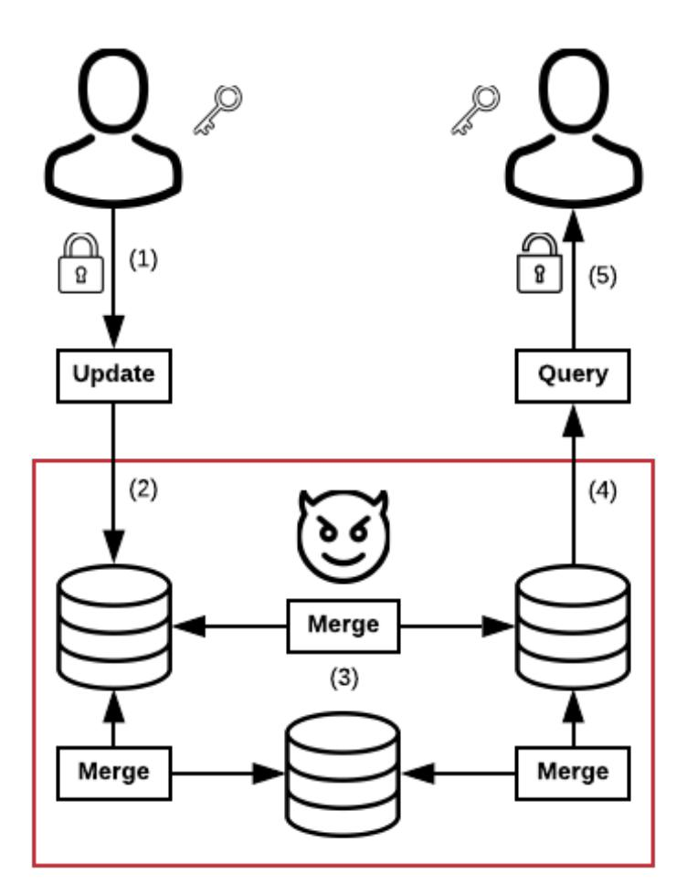
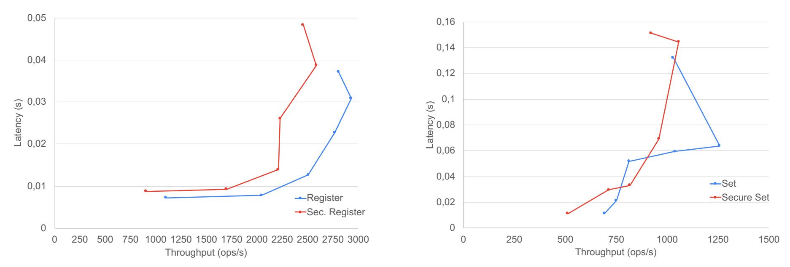
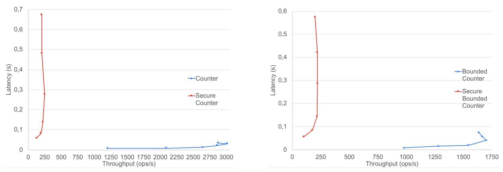
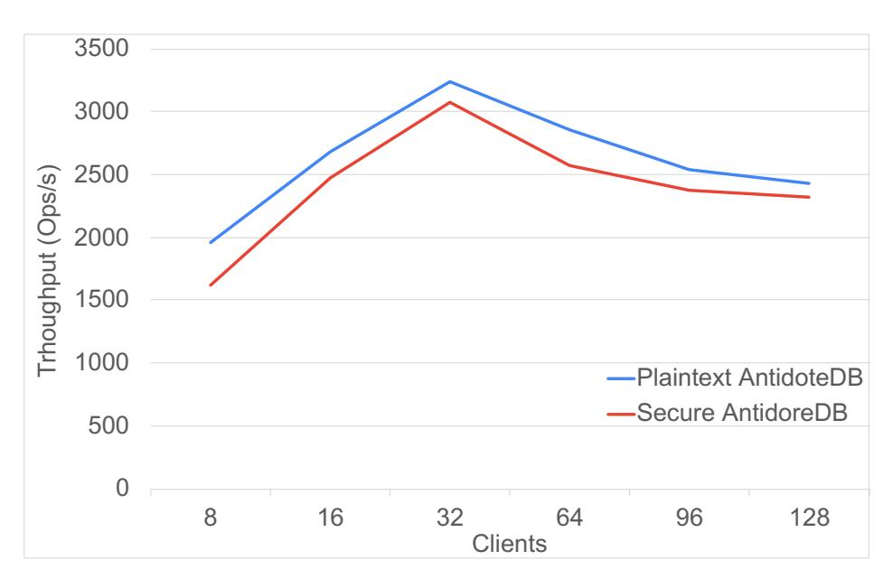
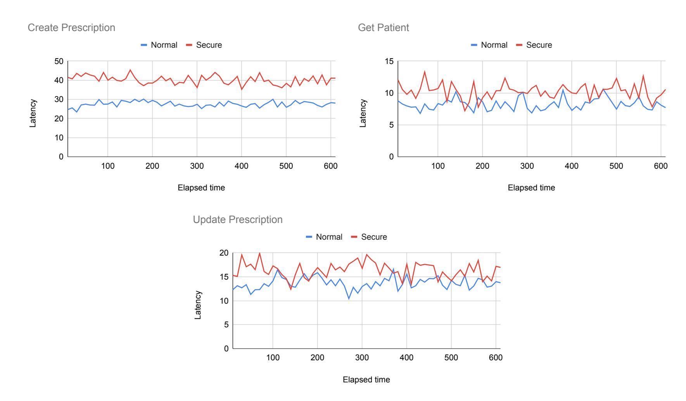

{0}------------------------------------------------

# Secure Conflict-free Replicated Data Types

Manuel Barbosa<sup>1</sup> , Bernardo Ferreira<sup>2</sup> , Joao Marques ˜ 3 , Bernardo Portela<sup>4</sup> and Nuno Preguic¸a<sup>3</sup> <sup>1</sup> *HASLab INESC TEC & DCC-FC-UP* <sup>2</sup> *LASIGE & FC-UL* <sup>3</sup> *NOVA LINCS & FCT-UNL* <sup>4</sup> *NOVA LINCS & DCC-FC-UP*

Abstract. Conflict-free Replicated Data Types (CRDTs) are abstract data types that support developers when designing and reasoning about distributed systems with eventual consistency guarantees. In their core they solve the problem of how to deal with concurrent operations, in a way that is transparent for developers. However in the real world, distributed systems also suffer from other relevant problems, including security and privacy issues and especially when participants can be untrusted.

In this paper we present the first formal cryptographic treatment of CRDTs, as well as proposals for secure implementations. We start by presenting a security notion that is compatible with standard definitions in cryptography. We then describe new privacy-preserving CRDT protocols that can be used to help secure distributed cloud-backed applications, including NoSQL geo-replicated databases. Our proposals are based on standard CRDTs, such as sets and counters, augmented with cryptographic mechanisms that allow operations to be performed on encrypted data. Our proposals are accompanied with formal security proofs and implement and integrate them in AntidoteDB, a geo-replicated NoSQL database that leverages CRDTs for its operations. Experimental evaluations based on the Danish Shared Medication Record dataset (FMK) exhibit the tradeoffs that our different proposals make and show that they are ready to be used in practical applications.

### 1 Introduction

A Conflict-Free Replicated Data Type [26] (CRDT) is a recent abstraction for distributed cloud-backed protocols that allows maintaining multiple replicas of a data value with high availability and low latency for local access. These protocols explore a tradeoff where one forsakes strong consistency in exchange for a weaker, but sufficient, notion of coherence between geographically distributed operations, called eventual consistency. Apple [10], Microsoft [18], Facebook [16], and Google [13] are some of the many organizations that have used CRDTs in one or more of their products. Example systems built on top of CRDTs include geo-replicated databases [23], collaborative text edition [12], and chat systems for massive-multiplayer online video games [22].

In this paper we present the first secure CRDT proposals that enable building distributed and privacy-preserving CRDT-based applications.

CRDT CONCEPTS. A CRDT is a distributed protocol in which a set of clients interacts with a set of replica server nodes to update and query values stored under the form of complex data-structures, including registers, sets, lists, maps, and counters. Server nodes maintain the current value of the replica and additional meta information that is needed to provide the prescribed consistency semantics. Server nodes may propagate full or aggregate information about their internal states to other replicas, which leads to a notion of eventual consistency: the idea is that, if local updates cease to occur and enough propagation of replica states takes place, the whole system will converge to the same observable data value in all replicas. The rate at which replica propagation occurs is application-specific.

CRDT APPLICATION. CRDTs can be used in different scenarios. In this paper, we are particularly interested in their application to support cloud-backed geo-replicated NoSQL databases. An example implementation available in the real-world is AntidoteDB [1]. This type of technology is important, for instance, for medical hospitals that need to store large volumes of patient health records in the cloud in a highly-available and privacy-preserving way. In this scenario, each cloud server stores an AntidoteDB replica for high-availability, and clients (i.e., the medical doctors) connect to a cloud of their choice and search/update health records of their patients. Moreover, cloud servers are typically considered untrusted, following an honest-but-curious model and hence justifying the need for privacy, while medical doctors are usually considered trustworthy and require, at most, access control mechanisms.

CRDT SECURITY. There is no formal treatment of CRDT security in the literature, and so we begin our treatment of this topic by proposing a notion of security in the Universal Composability framework [8]. Intuitively, the notion we propose, with respect to adversaries that control the scheduling of CRDT operations, is realisable using fully 

{1}------------------------------------------------

homomorphic encryption and general secure multiparty computation. However, in the first case the solution is not practical and, in the second, the trust model associated with efficient protocols [9] would require sharing secret data between multiple nodes, which goes against the purpose of CRDTs in the first place.

OUR CONTRIBUTIONS. The contributions presented in this paper are as follows:

- Definitions: We give a definition of security for CRDTs in the Universal Composability framework. Our ideal functionality is general enough to capture solutions that leak no information about the stored data, as well as those that may leak partial information. We then focus on honest-but-curious adversaries and give a restricted execution model tailored for this class of adversaries that is still strong enough to capture the consistency requirements of arbitrary CRDTs.
- Black-box constructions: we give efficient constructions that introduce minimum overhead over standard CRDTs. A black-box construction overlays encryption over CRDT protocols, which permits the usage of existing CRDT implementations without modification. The feasibility of this construction depends on the CRDT context, as we may require encryptions to leak partial information about stored values. In this case, we map the protocol leakage to standard weaker notions of encryption security.
- Homomorphic transformations: For CRDT protocols that are not covered by the previous approach (e.g., counters and bounded counters) we show that partially homomorphic encryption schemes can also be used to naturally transform them into secure ones with small overhead and leakage, and minimal alterations to the implementation.
- Integration with AntidoteDB: Using our new secure CRDTs, we implement a privacy-preserving version of AntidoteDB, which is a NoSQL key-value store that leverages CRDTs to perform its operations. By integrating our secure CRDT constructions with AntidoteDB, its clients can have security guarantees of the data stored in it.

We support these results with both formal security proofs and an experimental evaluation. Concretely, we leverage a benchmark based on the Danish Shared Medication Record (FMK) and conduct experiments on our secure version of AntidoteDB, measuring the latency and throughput of operations over the different CRDTs proposed. Results obtained show that our proposals achieve practical performance and scalability, with different CRDTs making different tradeoffs between efficiency and security.

### 2 Technical Overview



Fig. 1. High-level view of our system.

We start by presenting an overview of our system. In a CRDT protocol, clients interact with a group of servers nodes via update and query operations, and servers propagate their states between themselves to ensure that the view 

{2}------------------------------------------------

of each node will eventually become consistent with respect to all operations performed by the clients. Our setting for CRDT security is focused on providing guarantees to the clients against an untrusted network and servers. Ideally, we want a layer of security between clients writing and reading data, such that one can encrypt sensitive data before sending to the untrusted network and have it be decrypted when it exits, while seamlessly propagating and merging encoded states.

Figure 1 captures this scenario. First, we have a setup phase where clients establish cryptographic material beforehand to use in the security layer. This can be done with symmetric keys, by having clients perform an a-priori key-exchange protocol; or with asymmetric keys, i.e. by separating writer from readers, having a private key shared by all writers to perform updates, and creating a public key for readers to encode queries. Our execution model is agnostic to this setup, as it can be defined by the chosen cryptographic techniques.

From then onwards, every update operation is preceded by an encryption operation to ensure security (step 1). Given the encrypted data, the server can then perform the CRDT update operation (step 2). This will be followed by (potentially multiple) propagations and merges (step 3), which are processed over the encrypted data. This is the core challenge of our constructions, as the chosen security mechanism must also ensure that all computations in both update and merge steps can be performed efficiently over encrypted data. The nodes can then be queried for the encrypted state (step 4). Finally, the obtained result must be decrypted to retrieve the query response (step 5).

*Adversary Model* We assume adversaries will be honest-but-curious. This is a common adversarial model for cloud computing and secure computation solutions [5], as it captures attack vectors where, for instance, the service provider does not deviate from its service level agreements but may still observe all data state and accesses; or when an external intruder briefly gains access to the system and can access the database and execution logs. In particular, we show our solutions to be secure in a setting where all server nodes can reveal their internal executions. Given this setup, one cannot prevent however an attacker with total control over the network from delaying or shutting down the system (i.e., denial-of-service). Our goal is instead to demonstrate that the attacker is unable to extract any meaningful information from encrypted messages, or to have the system deviate in any other way besides delaying updates.

### 3 CRDT Security

SYNTAX. A CRDT protocol is deployed over a network composed of n server nodes, or replicas, statically defined at the beginning of the protocol and identified by id1, . . . , idn. These nodes are accessible to an arbitrary number of client nodes—the entities performing read/write accesses to the data-type—which we model as two (distributed) entities. This allows for client nodes to share long-term keys, and is sufficiently flexible to capture symmetric scenarios, where both have the same keys, and asymmetric scenarios, where readers and writers play different roles and thus have access to different cryptographic material. Secure CRDT protocols have the following syntax:

- setupC() is the global client setup procedure, which produces a set of private parameters prv<sup>q</sup> , prv<sup>u</sup> and public parameters pub.
- setupS(pub, id) is the server node initialization procedure, which on input the public parameters pub and the server node identifier id outputs the inital state st for that node.
- queryhprv<sup>q</sup> , op |sti is an interactive protocol executed between a client node and a server node. On the client-side it takes as input the private parameters for query prv<sup>q</sup> and a query operation op. On the server-side, it takes a state st as input. There is no server-side output. The client recovers output o.
- updatehprv<sup>u</sup> , op, v |sti is an interactive protocol executed between a client node and a server node. On the clientside it takes as input the private parameters for update prv<sup>u</sup> , an input operation op and an input value v. On the server side it takes as input a state st. At the end of the protocol the server gets an updated state st<sup>0</sup> and the client may recover output o, e.g., indicating the success of the operation.
- prop(st, id) is a local server node operation that takes st and a target replica identifier id and produces update data up to be sent over the network to the target replica.
- merge(up,st) is a local server node operation that takes an initial state st and an update up and produces an updated state st<sup>0</sup> .

SECURITY. We formalize security in the Universal Composability framework [7], but we simplify presentation of the execution model as a consequence of focusing on a restricted class of adversaries, as follows:

{3}------------------------------------------------

- We consider an honest-but-curious adversary with adaptive corruptions: the attacker will attempt to break system confidentiality by observing messages passed in the system and internal server states, but it does not have full control over any of the entities of the system (e.g., causing them to send arbitrary messages), nor does it have full control over the communication channels, which we assume to be authenticated.
- To guarantee confidentiality and correctness are preserved for any possible scheduling of CRDT operations we allow the adversary to control the sequence of operations, namely the interactions between server nodes and the points at which clients provide inputs and receive outputs from the system at different server nodes. This essentially means that we adopt an asynchronous execution model and allow the attacker to control the message scheduling.
- For simplicity, we restrict the adversary's scheduling capabilities when it comes to the query and update subprotocols, and assume that they are atomic in the execution model; the attacker receives an execution trace t whenever one of them is run between a client and a server. However, all our results for concrete protocols hold in the more general execution model where the attacker could also arbitrary schedule the intermediate messages of query and update.

As in standard UC, the correctness and security of the protocol are specified via an ideal functionality which we introduce next.

IDEAL FUNCTIONALITY. The ideal functionality F is shown in Figure 2. It is parametrised by an algorithm correct and a leakage function L, and it maintains a log L of all operations carried out over the CRDT.

The correct algorithm can be used to specify arbitrary concurrency semantics [21] for the CRDT: whenever the environment provides an input via write, or reads a value via read, the functionality computes the correct client-side result that should be observed by the environment by computing correct(L) over the entire history of operations carried out over the CRDT. The history of operations is accumulated in a numbered list L (implemented here as a set) and includes both the input/output operations carried out by the environment Z and the scheduling of state merges between replicas specified by the adversary S. The latter are specified via two commands: snap allows S to commit to a point in the global history where a snapshot of the state of replica i is sent to replica j, whereas the set command allows S to register into the global log the merge into the state of replica j of the oldest available snapshot. The restriction of using the oldest replica snapshot limits the power of the simulator so that it is not able to instruct the functionality to forget commands to propagate the state from one replica to another: it can only delay the time at which that snapshot of the state is merged. Secure CRDTs therefore need to be consistent with this scheduling restriction, which in most cases is achieved by relying on standard authenticated channels between server nodes.

The leakage function L allows the adversary S to obtain leakage from the global trace. A fully secure CRDT will reveal only how many operations the environment carried out, plus the sizes of inputs and outputs to these operations. Weaker security definitions can be obtained by revealing to S more information about which operations were carried out and partial leakage of the input/output values themselves, such as equality patterns. For conciseness throughout the paper, when describing specific leakage functions, these will detail the additional leakage over this baseline, i.e. L(L) = reveals how many operations the environment carried out, and sizes of inputs parameters and output values.

We will later demonstrate how CRDT solutions can be constructed with this baseline leakage, as well as exemplify how specific protocols can rely on some leakage to achieve improved performance.

Note that by defining correct behaviour as a function of the whole history our functionality permits specifying the strong convergence requirements of CRDTs via the UC-security requirement. Confidentiality follows from the fact that the adversary/simulator can control the sequence of server node interactions, but it obtains no information about the client inputs other than what is specified by the leakage functions.

SECURITY MODEL. Figure 3 shows the simplified execution model for our UC security definition. As usual, we consider an environment Z that will collaborate with adversary A to distinguish the real world from an ideal world where it interacts with a simulator S. In both worlds, Z can call oracles write and read to trigger client actions on the CRDT. In the real world these actions map to client updates and client queries to a CRDT replica. As previously mentioned, we consider these to be atomic in the execution model for simplicity: the update/query protocols are executed and then the attacker can retrieve the execution trace.

Furthermore, in the real world, environment Z can control the sequence of prop and merge operations between server nodes via adversary A. Rather than requiring protocols to explicitly rely on a hybrid authenticated channel functionality, and since we are dealing with honest-but-curious adversaries, we simplify the execution model by exposing two oracles to A that directly map to these operations and impose that values output by the propagate oracle are delivered to merge in the correct order.

{4}------------------------------------------------

```
Environment Z interface
proc read(id, op):
c ← c + 1
L ← L ∪ {(c, read, id, op)}
r ← correct(L)
Return r
                               proc write(id, op, v)):
                               c ← c + 1
                               L ← L ∪ {(c, write, id, op, v)}
                               r ← correct(L)
                               Return r
Adversary S interface
proc snap(idi, idj ):
c ← c + 1
L ← L ∪ {(c, snap, idi, idj )}
proc leak( ):
Return L(L)
                               proc set(idi, idj ):
                               c ← c + 1
                               C ← { cˆ| (ˆc, snap, idi, idj ) ∈
                               L }
                               If C 6= ∅:
                                  cˆ = min(C)
                                  L ← L ∪ {(c, set, idi, idj , cˆ)}
                                  L ← L \ {(ˆc, snap, idi, idj )}
```

Fig. 2. Ideal functionality F. F.setupS sets L to ⊥ and c to 0.

The fundamental difference between real and ideal world is that the real world will be executing and displaying the protocol Π on the different nodes, while the ideal world will be displaying the interface F of read and write. Messages exchanged in the network will instead be emulated by a simulator S, whose only interaction with F is via its snap, set and leak commands. S is also responsible for presenting a consistent replica state upon corrupt. The concrete security goal is to show that the distribution of output bit b produced by Z is essentially the same in both worlds.

The intuition behind this security definition is that, for any secure CRDT protocol, a real world adversary cannot influence the system beyond refusing to transmit state transitions (denial-of-service), and gains no information other than what is concretely specified by our leakage functions. This is because the real world trace can be simulated without access to non-leaked internal values of F, by a simulator that can only control the schedule of server node interactions.

```
Game RealΠ,Z,A(n):
T ← ; For i, j ∈ [n] : pi,j ← [ ]
(prvq
     , prvu, pub) ←$ Π.setupC()
For id ∈ [n] : stid ← Π.setupS(pub, id, n)
b ←$ Z
        A,write,read(pub, n)
Oracle write(id, op, v):
ho | stidit ←$ Π.updatehprvu, op, v | stidi
T ← Tkt
Return o
Oracle read(id, op):
ho | ·it ←$ Π.queryhprvq
                          , op | stidi
T ← Tkt
Return o
                                            Oracle corrupt(id):
                                            Return stid
                                            Oracle trace( ):
                                            Return T
                                            Oracle prop(i, j):
                                            p ←$ Π.prop(sti, j)
                                            pi,j ← pi,j || [p]
                                            Return p
                                            Oracle merge(i, j):
                                            p ← head pi,j
                                            sti ←$ Π.merge(sti, p)
                                            pi,j ← tail pi,j
                                                                         Game IdealF,Z,S (n):
                                                                         F.setupS()
                                                                         pub ←$ S.setup(n)
                                                                         b ←$ Z
                                                                                 S,write,read(pub, n)
                                                                         Oracle write(id, op, v):
                                                                         o ← F.write(id, op, v)
                                                                         Return o
                                                                         Oracle read(id, op)):
                                                                         o ← F.read(id, op)
                                                                         Return o
```

Fig. 3. Real and Ideal security games. In the real world (left), A has access to oracles corrupt, trace, prop and merge. In the ideal world (right), S has access to the adversarial interface of F.

Definition 1. *Let* n ∈ N*. Let* F *be an ideal functionality, and let* Π *be the corresponding CRDT protocol. We say that* Π *realises* F *if there exists a simulator* S *such that, for any environment* Z *and adversary* A*,*

$$\mathsf{Real}_{\Pi,\mathcal{Z},\mathcal{A}}(n) \approx \mathsf{Ideal}_{\mathcal{F},\mathcal{Z},\mathcal{A},\mathcal{S}}(n)$$

CORRECTNESS AND RELATION TO CRDT CONCURRENCY SEMANTICS. Our ideal functionality can also be used to give a crypto-style definition of correctness for CRDT protocols. Indeed, we can take correct to be the algorithm that implements the concurrency semantics for a given CRDT as in [21].

Concurrency semantics of a CRDT can be seen as a function sem : O → (≺) → V , where:

- O is a set of client update operations on the entire CRDT that is known to a given replica. Each element in this set is of the form oi,j , indicating that update operation o occurred in replica i and this was the j-th update operation in this node.
- (≺) is a partial order on the operations in O capturing the *happens-before* causality notion [15]: oi,j ≺ ok,l holds if and only if, when replica k processed its l-th client update, it had received information depending on the j-th update at replica i.

{5}------------------------------------------------

– V is the set of possible CRDT read values.

When client update operations may return immediate feedback to the caller, e.g., to indicate success or failure of the operation, then usually this is expressed as a predicate inv that takes the current replica state and update operation and determines the validity of the update operation.

Given sem and inv it is easy to see that one can define an algorithm correct that exactly matches these concurrency semantics: correct first computes O and (≺) from the global history recorded by F and then uses sem and inv to compute the value that should be observed by the client. Then, a CRDT protocol is correct in the sense of [21] if it securely emulates functionality F with *full* leakage.<sup>1</sup> To see this, suppose the protocol is incorrect. Then there exists an adversary that can drive the CRDT in the real world into a configuration that is inconsistent with the concurrency semantics, and hence with correct. However, no simulator can ever do this. It is also the case that a CRDT protocol securely emulates functionality F with *full* leakage if it is correct in the sense of [21], making these definitions equivalent. To see this, observe that with full leakage we can have a trivial simulator that follows the protocol specifications to produce indistinguishable states and traces. In this case, the difference is only on the outputs of Π and correct. However, correct was defined according to sem and inv, so these are also the same.

# 4 Secure CRDT Protocols

We now present several CRDT constructions that are demonstrably secure under the proposed security model. These designs can be seen as natural instantiations of CRDT solutions with a security layer ensuring confidentiality of stored data. The client will perform an encryption to protect sensitive information in update operations, and a decryption to successfully query the CRDT state. Replica-side states must merge efficiently, even when storing encrypted data.

Intuitively, the differences between constructions are dependent on the underlying functionality provided by the CRDT. For instance, registers perform no server-side computation over the stored values, so we can rely on a standard encryption scheme seamlessly. On the other hand, counters assume that the servers can perform arithmetic over the stored value, suggesting the value of using encryption schemes with homomorphic properties. This highlights the natural correlation between CRDT functionality and the necessary properties of the underlying security mechanism.

#### 4.1 Register CRDT

A register CRDT is a standard data structure holding a single value. Update operation replaces the register value, and query returns it. This is often a fundamental building block to more complex data structures, such as multi-value maps.

Register CRDTs are very simple data types, in which merge operations compare and maintain only the most recent version of the register. This means we have no computational requirements over the values maintained, and thus can rely on their encoded versions without disrupting their behavior. Concretelly, when a client wants to update the register, it encrypts it before sending to the server. When the client wants to read the register, it requests its encoding from the server and decrypts it to retrieve the plaintext value. Since no computations must be done by the servers on the register value, the CRDT runs seamlessly over encoded values.

Our protocol is described in Figure 4 and is as follows. We rely on a black-box standard register CRDT Πreg, with operations for setupS, update, query, prop and merge, and on a standard encryption scheme Θ. The client generates and maintains symmetric key key. update calls Θ.Enc to instead store the ciphertext in Πreg. query retrieves the ciphertext from Πreg and calls Θ.Dec to obtain the original value.

SECURITY. We argue that our construction is a CRDT register with baseline leakage

Theorem 1. *If* Πreg *is a correct CRDT, and* Θ *is a IND-CPA encryption scheme, the construction in Figure 4 is a secure CRDT with leakage*

$$\mathcal{L}_{\mathsf{reg}}(\mathsf{L}) = \epsilon$$

Confidentiality is ensured by an encryption scheme, and correctness comes from the underlying CRDT. The full proof can be read in Appendix A, and the sketch is as follows.

The simulator S will initialize its parameters (a symmetric key), a trace status counter, and the emulated state of every replica. Whenever any operation is called on S, it will call F.leak to obtain the list of environment operations

<sup>1</sup> By full leakage we mean the identity leakage function, revealing everything that occurred in the environment interface to the adversary.

{6}------------------------------------------------

```
Oracle queryhprvq
                  , op | sti:
hc | ·it ←$ Πreg.queryhop | sti
r ← Θ.Dec(prvq
                  , c)
Return hr | ·it
Oracle updatehprvu, op, v | sti:
c ←$ Θ.Enc(prvu, v)
h | stit ← Πreg.updatehop, c | sti
Return h | stit
                                               Oracle setupC():
                                               key ←$ Θ.Gen(1λ)
                                               Return (key, key, )
                                               Oracle setupS(pub, id, N):
                                               st ← Πreg.setupS(id, N)
                                               Return st
                                               Oracle prop(st, id):
                                               Return Πreg.prop(st, id)
                                               Oracle merge(up, st):
                                               Return Πreg.merge(up, st)
```

Fig. 4. Construction of Secure register from standard encryption scheme Θ.

and their length, and update its view for the operations not yet processed (accounted by the trace status counter). This will be a common behavior pattern for secure CRDT simulators, as presenting indistinguishable views for prop, merge, trace and corrupt follows the same simulation strategy: emulate environment operations according to what is given by F.leak, then follow the protocol for the simulated states/traces. The protocol-specific nuances in simulation strategy are related to the processing of environment operations, which are as follows.

For every write operation, the simulator S receives the size of the update and generates a dummy ciphertext (encrypts zeros) with the same length. Since these will be the messages stored in Πreg, S has perfect information of its global log, and can call its trivial simulator to produce the associated execution trace and states. The proof is done in three hops.

- Hop 1 Instead of using the outputs of Πreg, use an idealized structure for storing encrypted values and to present the output of read (decrypted before being returned). These games are identical given the correctness of Πreg.
- Hop 2 Instead of using a structure with encrypted values, use a structure with plaintext values. These games are identical given the assumption that the CRDT behaves seamlessly over encoded values.
- Hop 3 Replace values on update operations by dummy encryptions. IND-CPA of Θ will ensure that the difference between these games is negligible. We are now in a simulatable ideal world.

DISCUSSION. The cryptographic overhead of this security layer, considering widely available hardware acceleration of modern processors, is as minimal as one can expect to achieve: we require one key generation step at the start of the protocol, one encryption on update and one decryption on query.

We stress that this is only possible given that operations for managing replica states do not rely on any computation over the actual encrypted state. This suggests the potential of having highly scalable secure CRDT solutions when the protocol for ensuring consistency only relies on associated metadata (e.g. timestamps).

We can also further reduce the leakage of this CRDT by having the client pad updates to the maximum length of the register value, which is free if we are storing fixed length values.

#### 4.2 Set CRDT

Set CRDTs present a slightly more complex problem, as internal operations require the servers to compute over stored values. Standard set CRDTs merge values by having the servers perform comparisons to maintain only unique elements. This suggests the need for equality comparison, a functionality for which cryptography presents multiple solutions. As such, our security layer will encrypt set values upon update, decrypt values when queries are performed, and replace (if necessary) server-side comparisons with equivalent operations on encrypted data.

Concretely, we denote CRDT set to be a data structure enabling update operations for adding (add, v) and removing (rem, v) elements to the set. This can then be queried using (cont, v), which checks if v is in the set; and get, which retrieves the full set.

To demonstrate a feasible implementation, we instantiate our comparison-enabling security layer with a deterministic encryption scheme. This allows us to rely on any set CRDT in a black-box manner, as our encoded value comparison is seamless. Observe that this is for simplicity in presentation and not restrictive, as we can freely choose other implementations that enable comparisons, such as searchable encryption [3]. This extension entails replacing instances of comparison within the CRDT with the respective secure operations, and minimal changes to the proof.

Our protocol is described in Figure 5, and is very similar to the previous one. We rely on a black-box protocol of set CRDT Πset, with operations for update, query, prop and merge, and on a deterministic encryption scheme Ω. The 

{7}------------------------------------------------

client generates and maintains a symmetric key. update calls Ω.Enc to instead store the ciphertext in Πreg. query either performs a contains operation, with inputs op = cont and v, or retrieves the ciphertext from Πreg and calls Ω.Dec to obtain the set's full state.

```
Oracle queryhprvq
                  , op | sti:
If op = (cont, v):
  cph ←$ Ω.Enc(prvq
                       , v)
  hr | ·it ← Πset.queryh(cont, cph) | sti
Else:
  hcph | ·it ← Πset.queryhop | sti
  r ← Ω.Dec(prvq
                    , cph)
Return hr | ·it
Oracle updatehprvu, op, v | sti:
cph ←$ Ω.Enc(prvu, v)
h | stit ← Πset.updatehop, cph | sti
Return h | stit
                                               Oracle setupC():
                                               key ←$ Ω.Gen(1λ)
                                               Return (key, key, )
                                               Oracle setupS(pub, id, N):
                                               st ← Πset.setupS(id, N)
                                               Return st
                                               Oracle prop(st, id):
                                               Return Πset.prop(st, id)
                                               Oracle merge(up, st):
                                               Return Πset.merge(up, st)
```

Fig. 5. Construction of secure set from deterministic encryption scheme Ω.

SECURITY. We argue that our construction is a CRDT set with additional write leakage of the operation, and of a synthetic label l<sup>v</sup> for each stored/checked values v, allowing for the adversary to know when a duplicate is processed.

Theorem 2. *If* Πset *is a secure CRDT with full leakage, and* Ω *is a secure deterministic encryption scheme, the construction in Figure 5 is a secure CRDT with leakage*

$$\mathcal{L}_{\mathsf{write}}(\mathsf{L}) = (\mathsf{op}, l_v)$$
  $\mathcal{L}_{\mathsf{read}}(\mathsf{L}) = (\mathsf{cont}, l_v)$ 

*where* Lwrite *denotes the behavior of* L *for every* write *operation, and* Lread *denotes the behavior of* L *for every* read *operation for* op = cont*.*

SECURITY. The security reasoning is very similar to the one of the register: confidentiality is ensured by the encryption scheme (with leakage of duplicates), and correctness comes from the underlying CRDT. The full proof is structurally identical to the previous one, modulo simple extensions of write and read operations to parametrize for the different operations and a slight tweak on the simulator. To avoid redundancy, we explain the differences.

The simulator S will behave exactly like the one for the register, modulo the creation of dummy encryptions. It will maintain a table from labels to dummy encryptions, initialized empty. For read/write operations, the simulator receives a label (leakage): if it is not in the map, it will encrypt it with Ω, and add it to the map, otherwise it reuses the previous one. This ensures that every different encryption in the system is replaced by a dummy encryption without breaking consistency in equalities. S can then have perfect information of the values stored in Πset, and rely on its trivial simulator to emulate traces and states.

The proof sketch follows the same overall structure of the previous proof. The main difference is on the third hop, as the difference between these games can be established as negligible given a restricted indistinguishability security setting for deterministic encryption schemes [3]. Here, the adversary can also perform adaptive queries, but has pattern restrictions for repeated queries (to prevent trivial attacks), which are enforced by the simulator.

DISCUSSION. Similar to the register, regarding performance the cryptographic overhead imposed is minimal. Again, this is only possible with the assumption that operations do not rely on any computation over the encrypted values other than equality comparison.

Albeit not being able to directly retrieve the plaintext values, the leakage implies that rogue replicas have full knowledge of when an element that already exists in the set is removed, and of the results of all cont queries. To reduce this to have standard indistinguishability security, we must exclude all behaviors that require this equality comparison – which has communication and computation tolls – or have an implementation that relies on techniques for homomorphic equality comparison – which cannot be done black-box, and will naturally be less efficient than standard equality comparisons.

{8}------------------------------------------------

#### 4.3 Counter CRDT

A counter CRDT is a numerical data structure that can be either incremented or decremented by an arbitrary amount, at any server on the network. The implementation of these data structures usually involves maintaining two counters per replica, one for increments and another for decrements. Update operations increment to the respective replica counter. These are compared upon merge and added upon query, to obtain the observed value.

For this secure CRDT protocol, we propose a transformation that removes the need for comparing counter values upon merge. This consists in the inclusion of a per-replica Lamport clock, stored in plaintext since it is not sensitive data, to establish partial ordering of events.<sup>2</sup> . This allows us to restrict the necessary computations on the encrypted counter to additions, which can be done over encrypted values if we instantiate our security layer with an additively homomorphic scheme.

Compared to the previous black-box proposals, this protocol requires some changes to the underlying CRDT. To argue that the resulting CRDT does not deviate from the correct behavior of a counter, we specify the concurrency semantics of our counter. Let O denote the set of all update operations seen by the queried replica, and i integer values:

$$\sum \{\mathsf{inc}(i) \, | \, \mathsf{inc}(i) \in \mathcal{O}\} - \sum \{\mathsf{dec}(i) \, | \, \mathsf{dec}(i) \in \mathcal{O}\}$$

These concurrency semantics can be instantiated in our functionality syntax by defining correctctr(L) as:

- Get the last identifier id<sup>q</sup> and last operation in L. If that is (·,read, ·, ·) return the baseline leakage (no feedback on update).
- Construct sets C[id] as projections of (c,write, id, op, v) in L for all id ∈ N.
- Sequentially, for every (·,set, id<sup>i</sup> , id<sup>j</sup> , c) ∈ L, copy all entries (write, idk, op, v, c<sup>0</sup> ) in C[id<sup>i</sup> ] to C[id<sup>j</sup> ] such that c <sup>0</sup> < c, remove duplicates.
- Sum every (·,write, id, inc, v) ∈ C[idq], subtract the sum of all (·,write, id, dec, v) ∈ C[idq] and produce it as output.

Here, correctctr is simply reconstructing and computing on the local view of the replica at the time of the operation: i. collect all update operations seen by each replica; ii. complete the view with merges taken from previous snapshots; iii. sum all operations to produce the result. For concretess in our proofs, we will demonstrate correctness of the counter CRDT based on this correctctr(L), which we assume to adequately capture the concurrency semantics of counters specified in [21].

Concretely, our protocol is an adaptation of the state-based CRDT counter (Specification 7) in [25], generalised to allow for arbitrary increments and decrements. Our only functional tweak is in the behavior of merge, where we use a per-replica operation count to establish freshness in updating the counter. Afterwards, given that all replica-side operations on the counter are additions, we can again overlay security using an additively homomorphic encryption scheme ∆, encrypting inputs, decrypting outputs, and allowing replicas to perform additions. Our protocol is detailed in Figure 6, where C<sup>p</sup> and C<sup>n</sup> respectively store the positive and negative increments observed in each replica, as well as the counter for each increment (e.g., Cp[id].cph represents the encrypted positive increment of replica id, while Cp[id].ts represents its counter).

SECURITY. We argue that our construction is a secure CRDT counter with additional leakage of the operation, i.e.

Theorem 3. *If* ∆ *is an IND additively homomorphic encryption scheme, the construction of* Πctr *described in Figure 6 is a secure CRDT with leakage*

$$\mathcal{L}(\mathsf{L}) = \mathsf{op}$$

The full proof can be read in Appendix B, and the proof sketch is as follows. Security is ensured by the underlying homomorphic encryption scheme, and allows the leakage of the operation being performed at update. This will ensure confidentiality, as well as the capability to perform correct additions over ciphertexts. Per-replica timestamps will ensure the same verifications as the ones in the original specification of [21], enforcing the expected behavior defined by correctctr(L).

The protocol-specific nuances of the simulator are as follows. For every write operation, the simulator S receives the operation and generates a dummy ciphertext (encrypts zero). These two values will be the trace of write operations. The trace of read operations is calculated according to the replica state.

<sup>2</sup> Considering our assumption that adversaries have full control over the network and scheduling of operations, this approach reveals no additional information.

{9}------------------------------------------------

```
Oracle query\langle \mathsf{prv}_q, \mathsf{op} \mid \mathsf{st} \rangle:
                                                                                                           Oracle setupC():
                                                                                                            (pk, sk) \leftarrow \$ \Delta.Gen()
(C_p, C_n, \cdot, N, \mathsf{pub}) \leftarrow \mathsf{st}
                                                                                                           Return (sk, pk, pk)
cph_1 \leftarrow \$ \Delta.Enc(pub, 0)
\mathsf{cph}_2 \leftarrow \$ \ \Delta.\mathsf{Enc}(\mathsf{pub},0)
                                                                                                           Oracle setupS(pub, id, N):
For id \in N:
 \mathsf{cph}_1 \leftarrow \Delta.\mathsf{Add}(\mathsf{cph}_1,(\mathsf{fst}\,C_p[\mathsf{id}]))
                                                                                                           cph \leftarrow \$ \Delta.Enc(pub, 0)
  \mathsf{cph}_2 \leftarrow \Delta.\mathsf{Add}(\mathsf{cph}_2,(\mathsf{fst}\,C_n[\mathsf{id}]))
                                                                                                           For k \in N:
                                                                                                             C_p[k] \leftarrow (\mathsf{cph}, 0)
r_1 \leftarrow \Delta.\mathsf{Dec}(\mathsf{prv}_q, \mathsf{cph}_1)
                                                                                                            C_n[k] \leftarrow (\mathsf{cph}, 0)
r_2 \leftarrow \Delta.\mathsf{Dec}(\mathsf{prv}_q, \mathsf{cph}_2)
                                                                                                           \mathsf{st} \leftarrow (C_p, C_n, \mathsf{id}, N, \mathsf{pub})
t \leftarrow (\mathsf{cph}_1, \mathsf{cph}_2)
                                                                                                           Return st
Return \langle (r_1 - r_2) | \cdot \rangle_t
                                                                                                           Oracle prop(st, id):
Oracle update\langle \mathsf{prv}_u, \mathsf{op}, v \mid \mathsf{st} \rangle:
                                                                                                           (C_p, C_n, \cdot, \cdot, \cdot) \leftarrow \mathsf{st}
(C_p, C_n, \mathsf{id}, N, \mathsf{pub}) \leftarrow \mathsf{st}
                                                                                                           Return (C_p, C_n)
\stackrel{\cdot}{\operatorname{cph}} \leftarrow \$ \ \varDelta. \mathsf{Enc}(\mathsf{prv}_u, v)
If op = inc: i \leftarrow p
                                                                                                          Oracle merge(up, st):
Else: i \leftarrow n
                                                                                                           \overline{(C_p,C_n,\mathsf{id},N,\mathsf{pub})} \leftarrow \mathsf{st}
\mathsf{cph} \leftarrow \Delta.\mathsf{Add}(\mathsf{cph},(\mathsf{fst}\,C_i[\mathsf{id}]))
                                                                                                          (C_p', C_n') \leftarrow \mathsf{up}
For \mathsf{id} \in N:
t \leftarrow ((\mathsf{snd}\,C_i[\mathsf{id}]) + 1)
C_i[\mathsf{id}] \leftarrow (\mathsf{cph}, t)
\mathsf{st} \leftarrow (C_p, C_n, \mathsf{id}, N, \mathsf{pub})
                                                                                                            If (\operatorname{snd} C_p'[\operatorname{id}]) > (\operatorname{snd} C_p[\operatorname{id}]):
t \leftarrow (\mathsf{cph}, \mathsf{op})
                                                                                                               C_p[\mathsf{id}] \leftarrow C_p'[\mathsf{id}]
Return \langle \epsilon \mid \mathsf{st} \rangle_t
                                                                                                          If (\operatorname{snd} C'_n[\operatorname{id}]) > (\operatorname{snd} C_n[\operatorname{id}]):
C_n[\operatorname{id}] \leftarrow C'_n[\operatorname{id}]
Return (C_p, C_n, \operatorname{id}, N, \operatorname{pub})
```

**Fig. 6.** Counter from additively homomorphic scheme  $\Delta$ 

- Hop 1 All operations are stored in a global log L. Read executes  $correct_{ctr}(L)$  to produce the client output. This is possible from the construction and the correctness and additively homomorphic properties of  $\Delta$ : on every oracle call we are updating L of id with the same operations reproduced on their respective states.
- Hop 2 Replace every client-side encryption with an encryption of the value 0. This can be done by the simulator (only requires the public key), and is indistinguishable from the previous hop, as the difference between these games is an instantiation of the indistinguishability game of  $\Delta$ .

DISCUSSION. Our design explicitly reveals the operation being performed, for the replica to know which structure will receive the addition. Observe that we can reduce this leakage by having all write operations produce two ciphertexts, one for increments and one for decrements, where the client will simply encrypt 0 as the operation not being performed. This requires additional client-side computation (encryption), as well as larger update messages (both the ciphertexts must be sent).

#### 4.4 Bounded Counter

As an extension to the counter CRDT, Shapiro et. al. [24] suggest the value in enforcing numeric invariants over these distributed datatypes (e.g.,  $x \ge K$ ) for enforcing application correctness. CRDT counters enforcing such invariants are often designed following concepts from the escrow transactional model [19], where the difference between the actual value of the counter and its upper or lower bound is seen as a cumulative set of rights that enables said operations. For example, a counter of value N with lower bound 0 can be seen as having N rights, which are consumed as the counter is decremented, and created as the counter is incremented. These CRDT counters are known as Bounded Counters, and can perform five operations:

- value(), which returns the counter value.
- inc(v), which increments v to the value.
- dec(v), which decrements v to the value.
- rights(), which returns the local rights of the replica.
- tran(v, id), which transfers v rights from the target replica to replica id.

All of these operations can fail, if the consequence of applying it breaks the underlying invariant; e.g., if a replica has 3 rights to a counter and is requested to transfer 5 to any other replica.

A natural implementation of the bounded counter is structurally similar to the counter, as the CRDT has to keep track of how many rights each replica has and how many it has sent/received. As such, on top of using comparisons and additions, it also has the server check the invariant. We can reduce the need for comparisons by instead using per-replica Lamport clocks (similarly to the previous protocol), which leaves additions and invariant checks. The

{10}------------------------------------------------

concurrency semantics for the bounded counter are similar to the previous counter, with an additional step for verifying the invariant. We omit these for brevity.

Now observe that merges will never break the invariant, as each individual replica never adds (or subtracts) more than what it has the rights to. This means that all operations in which the invariant must be checked involve interaction with the client, allowing these to be off-loaded to the client. Given these transformations, the only remaining computations on encrypted values are additions, and again we can use an additively homomorphic encryption scheme.

Our transformation is similar to that of the counter. We build on the protocol of [2] and perform two main functional changes: (i) we use per-replica operation counters to establish freshness of updates (same as before), and (ii) upon updates, we delegate to the client the verification of the invariant. After this verification, the client sends an encryption of either the operation value (in case of success), or of a neutral element to the operation (in case of failure). This allows replica-side processing of both successful and unsuccessful operations without disclosing the result of invariant validation.

The techniques for adapting the protocol follow a very similar approach as the secure counter, with an added step of straightforward client-side invariant verification. For succinctness, we detail the full construction in Appendix C.

SECURITY. We argue that our construction is a secure bounded CRDT counter with additional leakage of the operation, and target replica for right transition (tran), i.e.

Theorem 4. *If* ∆ *is an IND additively homomorphic encryption scheme, the construction of* Πbctr *is a secure CRDT with leakage*

$$\mathcal{L}(\mathsf{L}) = (\mathsf{op},\mathsf{id}_t)$$

*where* (·, idt) ← v *for* op = tran *and* id<sup>t</sup> = *otherwise.*

The security argument is similar to that of the previous counter, as the underlying encryption scheme allows for operations to transfer encryptions indistinguishable from dummy values. The main differences are that query now leaks the operation being performed op and, if tran(v, id), the replica id to which it is transferring to. update now contains two additional ciphertexts (cph<sup>1</sup> , cph<sup>2</sup> ), for client-side validation of the invariant.

The initialization stage is similar to the previous proof. For every write operation, the simulator receives the operation and the replica receiving the rights (if that is the case) but does not know the actual value. It will instead produce a new encryption of 0, to emulate the updated value, and add either to the increment, decrement, or to the replica receiving the value. The values presented in the trace are cph<sup>1</sup> , cph<sup>2</sup> following the specifications of update, alongside the operation and the produced dummy encryption. For every read operation, the simulator will provide the two ciphertexts within the simulated replica state as trace, as well as the received operation.

Observe that designing our CRDT to send an encryption of the neutral value when the invariant fails allows us to conceal when an operation has no effect due to this restriction. Formally, this allows the simulator to present an indistingishable dummy ciphertext that can correspond either to the value or to 0. The proof is done in three hops, two similar to those of the previous proof and one additional to enforce the invariant. The proof sketch is as follows.

- Hop 1 All operations are stored in a global log L. Read parses over L to produce the client output, filtering operations that break the local invariant. The reasoning here is analogous to the previous proof (in the proposed construction, the operations filtered from L are also excluded by the client).
- Hop 2 Read executes correctbctr(L). The only difference here is that now we are exactly following the description of F, which means that we must also account for the global invariant. The argument for this hop is similar as the one in [2] regarding how the concurrent validations ensure not breaking the global invariant.
- Hop 3 Replace every client-side encryption with an encryption of value 0, just like the previous proof.

DISCUSSION. We can also reduce the leakage of both operations, but at a much steeper cost than the previous design. Hiding queries duplicates the size of replica-client messages, as the replica must now prepare and send 4 ciphertexts (two for value queries, and two for rights).

Hiding updates is possible via the same strategy as before, but if we do not want to reveal the replica receiving the rights, the client must now prepare N + 1 encryptions instead of 1, encrypting the neutral value for parts of the state that must remain unchanged. The benefit is that we can now perform the same update operation on the replica-side without knowing if what occurred was an increment, decrement, or right transfer, and if the latter, to which replica the rights were transferred to.

{11}------------------------------------------------

# 5 Integration with AntidoteDB

We implemented a prototype version of our secure CRDT protocols, integrating them in AntidoteDB [1], a replicated NoSQL database that uses CRDTs as the data model. AntidoteDB's core is implemented in Erlang, while there are clients in multiple programming languages. As such, we adapted both an Erlang and Python clients to integrate our secure CRDT operations, and modified the Erlang core only when strictly necessary.

Concretely, for AntidoteDB's Register and Set CRDTs operations, we extended the client to encrypt/decrypt data before storage. Given that server-side operations are seamless over encrypted data, no adaptation of the server-side Erlang core is necessary. For the Counter and Bounded Counter CRDTs, it is necessary to modify both clients, to ensure consistency of arithmetic over encoded data. For the bounded counter, we further leveraged AntidoteDB's transactions to implement its logic, ensuring that the client maintains a consistent view of the state between read/write operations, and that there is no local concurrent operation that might compromise invariant verification.

Regarding cryptographic computations, we used AES-OFB with random IVs and a 128 bit key for standard encryption operations on the Register, AES-OFB with fixed IVs (to ensure determinism) and 128 bit key for the Set, and the Paillier cryptosystem with a 2048 bit key for both counters.

### 6 Experimental Evaluation

This experimental evaluation section aims to assess the performance and scalability overhead of our secure CRDT protocols, when compared to their non-secure versions. We performed two sets of experiments, micro-benchmarks that measure the latency and throughput of the operations of the different CRDTs designed, and macro-benchmarks that show how our secure version of AntidoteDB behaves with a realistic benchmark and in comparison with its original plaintext version.

Our experiments were performed in a cluster with seven machines, where two acted as servers and the others executed multiple clients in parallel. The server machines had an AMD EPYC 7281 16-core 2.1GHz CPU and 128GB of RAM each. Amongst the client machines, three had the same CPU and RAM of the server, while the other two had two Intel Xeon E5-2620 v2 6-core 2.1GHz CPU each and 64GB of RAM. With this setup we were able to saturate the servers with 128 clients in parallel. Communication between machines was done through a one gigabit network.

#### 6.1 Micro Experiments

To demonstrate the performance and scalability of our different secure CRDTs, we ran a micro-benchmark with our Python client, where clients execute operations in a closed loop for 2 minutes. For each CRDT, we ran multiple experiments, increasing the number of clients until the servers were saturated (from 8 to 128 clients). The size of data objects stored in maps and register was 2500 bytes. Results are presented in the form of *latency* × *throughput plots*, where the x-axis represents the throughput of the servers (i.e., the number of operations per second performed by the servers) and the y-axis exhibits the average latency, as observed by the clients. The successive dots in a line correspond to the results of experiments with an increasing number of clients.

Register CRDT. Figure 7 (left) compares AntidoteDB's plaintext Register CRDT and our secure version with a workload consisting of 50% reads and 50% writes. The results show that the two versions exhibit a similar behaviour, although the secure version has an overall higher latency and lower throughput. While the servers are not saturated, the latency of the plaintext and secure CRDT is similar, with around 7-8 milliseconds per operation respectively.

The servers start becoming saturated close to 2200 ops/s for the secure CRDT and 2500 ops/s for the plaintext version. This can be explained by the cryptographic expansion of the data in the secure version, which entails a larger amount of data processed and stored by the server. The small difference between the two suggests that very little overhead is imposed when considering the secure version of the Register CRDT.

Set CRDT. Figure 7 (right) shows the results for the secure set CRDT. For these results we used a 50% gets, 35% inserts, and 15% deletes benchmark. Again, results are very similar given the small adaptations necessary for the secure version. Indeed, at some points the secure set outperforms the plain version. This is justifiable due to small variations at the saturation point of AntidoteDB's servers, and suggests the minimal overhead of the security layer.

Counter CRDT. Figure 8 (left) shows the results obtained for the plaintext and secure counters. For these tests we used 33% reads, 33% increments, and 33% decrements. Naturally, the counter imposes a higher performance overhead than its Register and Set counterparts. This is a consequence of relying on cryptographic schemes enabling server-side

{12}------------------------------------------------



Fig. 7. Throughput/latency for the plaintext and secure versions of the Register CRDT (left) and Set CRDT (right.

arithmetic over encoded data, which are fundamentally richer in functionality than the previous examples. Results for the secure CRDT start at 127 ops/s and 57ms of latency, however latency quickly increases without any growth in throughput. The reason for this is that the server gets saturated quickly as it has to perform operations over encoded data (we note that for registers and sets, the servers only store the ciphered data, never executing operations other than comparison over that data). The plaintext version goes from 1250 to 3000 ops/s always with very small latency (from 6 to 33 ms).

Bounded Counter CRDT. Figure 8 (right) shows the results for the plaintext and secure bounded counter. Results are very similar to the ones of the secure counter, despite the additional step for invariant preservation. Results for the secure bounded counter start with 100 ops/s and 50ms latency, then they reach a throughput cap at 220 ops/s, at which point latency starts to increase at a very steep rate. The plaintext bounded counter scales well up to 1700 ops/s.



Fig. 8. Throughput/latency for the plaintext and secure versions of the Counter CRDT (left) and Bounded Counter CRDT (right).

Discussion Our experimental results support a natural and important trade-off for designing secure CRDT solutions: the cost of security is proportional to the requirements imposed to the cryptographic scheme. For Register and Set CRDTs, we were able to rely on standard cryptographic techniques, as little interaction was necessary with the encrypted data. On the other hand, if we require server-side computations over stored data, then richer cryptographic techniques are necessary, which impose different overheads in scalability.

Comparing client/server overheads, there are several aspects that should be noted. For registers and sets, clients do all cryptographic operations and the only overhead for servers come from the cryptographic expansion of stored data. Thus, the throughput achieved by systems storing encrypted data and plaintext data is similar, with only a small decrease of throughput on the former. For counters and bounded counters, the server has to execute operations over encrypted data (specifically, modular multiplications of large numbers, instead of normal additions), which imposes a non-negligible overhead. This has direct impact in the maximum throughput that a system with encrypted data can achieve.

{13}------------------------------------------------

#### 6.2 Macro Experiments

To demonstrate the performance and scalability of our secure CRDTs when supporting real-world applications, we performed additional experiments with FMKe [28], a medical benchmark based on the Danish National Joint Medicine Card and specifically designed for NoSQL databases. FMKe populates AntidoteDB with over one million patients records, five thousand prescriptions, ten thousand medical staff, three hundred pharmacies and fifty healthcare facilities, being that the majority of the operations are carried over register and set CRDTs. FMKe includes different update and get operations over these records, including create-prescription, get-prescription-medication, among others. To conduct these experiments we used our Erlang client, as FMKe was developed in Erlang, and the same experimental test-bench that was used in the micro-benchmarks, measuring latency and throughput with increasing number of clients. The benchmark was executed for 600 seconds, and unless stated otherwise, results presented next represent average values.

Throughput. Figure 9 shows how AntidoteDB throughput behaves as we increase the number of clients, comparing both our secure AntidoteDB and its original plaintext version.

On one hand, results obtained reveal that throughput increases steadily up to 32 clients in both secure and plaintext versions, decreasing as we add more clients. This suggests a breaking point at which the server saturates (around 32 clients), as adding more clients actually has a negative impact on the number of operations processed per second. On the other hand, results also show that the security overhead imposed by our CRDTs is minimal (around 350 ops/s) and that it increases/decreases in a similar trend as the plaintext version, suggesting that adding security mechanisms does not impose additional restrictions on system scalability.



Fig. 9. Throughput for the plaintext and secure versions of AntidoteDB when processing the FMKe benchmark and considering an increasing number of clients.

Latency. To further understand the practicality of relying on secure CRDTs in the development of real-world systems, we now increase the granularity of our analysis to operation latency. Results are presented in Table 1.

All get operations exhibit similar behavior, consisting in simple retrieval of values from the database, with further value decryption in the secure version. We can observe that adding security requires an overhead of 1.62ms to 4.28ms over its plaintext counterpart, corresponding to an average latency increase of 24% to 51%. In contrast, Update Prescription and Update Prescription Medication are write operations and require the storage (and encryption in the secure version) of values in the database. This also shows a low impact of roughly 2.7ms when compared to the plaintext version, corresponding to an average latency increase of roughly 20%. Create prescription is the most computationally intensive operation of the group, as it requires multiple reads and writes from the dataset to construct the prescription data structure, which in its secure instantiation also require multiple calls to the cryptographic library. Here we can observe an average latency increase of roughly 12.7ms, corresponding to a 46% increase. A thorough description of each operation and associated pseudo-code can be found in [28].

Table 1 also presents values corresponding to percentiles 95 and 99. The increased latency (in both versions) in comparison to average values is due to the amount of data accessed by operations - for instance, the amount of data returned by the Get Patient operation depends on how many prescriptions the patient has. This means that the values shown are not outliners but a natural consequence of how FMKe data is distributed. Moreover, the differences between plaintext and secure versions of the system are reduced when considering these percentiles. This is observable in all operations, with get operations being reduced to 9%-30% increases in P95 and 6%-9% in P99; write operations to roughly 7% in P95 and 6% in P99, and create prescription having an increase of roughly 11% in both P95 and P99. 

{14}------------------------------------------------

These results demonstrate that security mechanisms do not provoke additional outliers and thus are not expected to produce unexpected system delays.

|                             |        | Average P95 | P99         |
|-----------------------------|--------|-------------|-------------|
| Get Patient                 | Plain  | 8.22        | 61.10 67.00 |
|                             | Secure | 10.25       | 66.81 70.80 |
| Get Pharmacy Presc.         | Plain  | 8.21        | 61.63 67.03 |
|                             | Secure | 12.29       | 69.22 73.37 |
| Get Prescription            | Plain  | 6.94        | 48.17 65.61 |
|                             | Secure | 8.72        | 63.84 69.72 |
| Get Presc. Medication Plain |        | 7.01        | 59.24 66.03 |
|                             | Secure | 8.63        | 65.35 69.99 |
| Get Processed Presc.        | Plain  | 8.21        | 61.50 67.00 |
|                             | Secure | 12.44       | 69.30 73.21 |

|                           |        | Average P95 | P99         |
|---------------------------|--------|-------------|-------------|
| Get Staff Presc.          | Plain  | 8.16        | 61.33 66.98 |
|                           | Secure | 10.49       | 67.16 71.32 |
| Update Prescription Plain |        | 13.65       | 67.45 71.98 |
|                           | Secure | 16.39       | 72.50 76.47 |
| Update Presc. Med. Plain  |        | 13.46       | 67.23 71.98 |
|                           | Secure | 16.30       | 72.59 76.51 |
| Create Prescription Plain |        | 27.43       | 75.75 79.55 |
|                           | Secure | 40.14       | 84.20 89.81 |

Table 1. Operation latency, considering average and percentiles 95 and 99. Values are in milliseconds.

Stability. Another important issue regarding the overhead of security mechanisms is related to system stability. Specifically, we are interested in understanding the performance of our security mechanisms as our system develops.

Figure 10 presents the average latency variation for Create Prescription, Get Patient and Update Prescription operations. Similar values were observed in other operations for respective get and update processes, which we omit for succinctness. In both plain and secure system modes, latency variation is relatively small. We can also highlight that neither version has any noticeable deterioration as the benchmark progresses, suggesting that using cryptography to enhance security is not imposing an increasing overhead on the system. This close margin between plaintext and secure version of operations is clearly observable in Get Patient, with baseline small latency values, and to a lesser extent in Update Prescription, where the variation in measurements sometimes presents the processing of requests in the secure system as having lower latency than those of the plaintext system.



Fig. 10. Average latency variation over the duration of the benchmark. Elapsed time is in seconds, Latency is in milliseconds.

Discussion. Our macro experiments present the feasibility of our design for developing privacy-critical applications relying on secure CRDTs. The latency overhead can be directly mapped to the cost of the underlying cryptographic operations, as exemplified in the micro experiments, which is a standard overhead for enhancing real-world systems 

{15}------------------------------------------------

with confidentiality guarantees. Furthermore, we have shown that, when applied to a benchmark emulating a real-world application, the cryptographic overhead on throughput and latency is similar to the cost of enforcing standard security guarantees in key-value databases: encrypting and decrypting values when writing and reading from the database, respectively. These experiments also suggest that security measures impose no additional impact on the system, as the benchmark maintained consistent performance values throughout its lifecycle in both settings.

# 7 Related Work

CRDTs were originally designed for decentralized distributed systems without any security concerns [26]. In this work we propose the first formal security treatment of CRDTs, nonetheless a few previous works have studied how to protect distributed applications that leverage CRDTs for synchronization. Snapdoc [14] studied how to offer collaborative document edition with authenticated snapshots and history-privacy, where a new participant joining a document being edited can have authentication guarantees regarding the consistency of the document while simultaneously preserving the privacy of the document's edition history. Snapdoc uses CRDTs to ensure concurrent edits can be merged, however it is not a central component in their security proposal. Shoker et al. [27], in a *work in progress* report, aims to detect and tolerate malicious participants in CRDT-based systems by allowing replicas to perform operations normally and then running a Byzantine fault tolerance algorithm in the background.

CRDT security is also related with outsourcing of computations and multiparty computation [17], in the sense that clients are collaboratively performing a computation over a shared database state. Cachin et al. [6] proposed Authenticated Data Types (ADTs) for authenticated data outsourcing and computation. However their setting is restricted to a single client performing operations and single server holding the data.

Secure data storage has also been achieved through techniques other than CRDTs. However such systems typically require synchronization to detect adversarial behaviour. DepSky [4] uses Byzantine fault tolerance to ensure that replicas converge, and traditional encryption to preserve data privacy, however it does not support data computation. CryptDB [20] leverages some of the techniques we also explore in this work, including deterministic encryption and partially homomorphic encryption, however it only considers a single server. SPORC [11] supports secure group collaboration and data storage, however it only supports multiple servers in a *shared-nothing* architecture, where servers are independent.

### 8 Conclusion

We have presented the first cryptographic treatment of CRDTs, which establishes a formal framework for the validation of new secure CRDT algorithms, specifically designed to explore trade-offs between performance and information leakage.

Our results show that one can instrument correct CRDT constructions with a layer of security (e.g. standard encryption) to achieve secure CRDT solutions, provided that this encoding does not break the functional part of the CRDT. Our transformations also show that we can leverage cryptographic schemes with additively homomorphic properties to have secure CRDT solutions even when merge operations process over encoded data.

Experimental validation suggests the performance overhead for secure CRDT solutions is proportional to the underlying security mechanism. When considering a benchmark for real-world CRDT applications we can observe that the security cost is relatively low, with an average latency increase of 37.5% and 20% for get and put operations, and a throughput reduction of 5%. These results suggest the feasibility of considering secure CRDT solutions for applications managing sensitive data.

### References

- 1. AntidoteDB. AntidoteDB: A planet scale, highly available, transactional database. https://www.antidotedb.eu/, 2019.
- 2. V. Balegas, D. Serra, S. Duarte, C. Ferreira, M. Shapiro, R. Rodrigues, and N. Preguic¸a. Extending eventually consistent cloud databases for enforcing numeric invariants. In *2015 IEEE 34th Symposium on Reliable Distributed Systems (SRDS)*, pages 31–36. IEEE, 2015.
- 3. M. Bellare, A. Boldyreva, and A. O'Neill. Deterministic and efficiently searchable encryption. In *Annual International Cryptology Conference*, pages 535–552. Springer, 2007.

{16}------------------------------------------------

- 4. A. Bessani, M. Correia, B. Quaresma, F. Andre, and P. Sousa. Depsky: dependable and secure storage in a cloud-of-clouds. ´ *ACM Transactions on Storage (TOS)*, 9(4):12, 2013.
- 5. D. Bogdanov, S. Laur, and J. Willemson. Sharemind: A framework for fast privacy-preserving computations. In *European Symposium on Research in Computer Security*, pages 192–206. Springer, 2008.
- 6. C. Cachin, E. Ghosh, D. Papadopoulos, and B. Tackmann. Stateful multi-client verifiable computation. In *International Conference on Applied Cryptography and Network Security*, pages 637–656. Springer, 2018.
- 7. R. Canetti. Universally composable security: A new paradigm for cryptographic protocols. In *Proceedings 42nd IEEE Symposium on Foundations of Computer Science*, pages 136–145. IEEE, 2001.
- 8. R. Canetti, Y. Lindell, R. Ostrovsky, and A. Sahai. Universally composable two-party and multi-party secure computation. In *Proceedings of the thiry-fourth annual ACM symposium on Theory of computing*, pages 494–503. ACM, 2002.
- 9. I. Damgard, V. Pastro, N. Smart, and S. Zakarias. Multiparty computation from somewhat homomorphic encryption. In ˚ *Annual Cryptology Conference*, pages 643–662. Springer, 2012.
- 10. S. Dunham. Notes on Notes.app. https://github.com/dunhamsteve/notesutils/blob/master/notes.md, 2018.
- 11. A. J. Feldman, W. P. Zeller, M. J. Freedman, and E. W. Felten. Sporc: Group collaboration using untrusted cloud resources. In *OSDI*, volume 10, pages 337–350, 2010.
- 12. GitHub. Xray: An experimental next-generation Electron-based text editor. https://github.com/atom-archive/xray, 2019.
- 13. Google. xi-editor: A modern editor with a backend written in Rust. https://opensource.google/projects/xi-editor, 2018.
- 14. S. A. Kollmann, M. Kleppmann, and A. Beresford. Snapdoc: Authenticated snapshots with history privacy in peer-to-peer collaborative editing. *Proceedings on Privacy Enhancing Technologies*, 2019(3):1–23, 2019.
- 15. L. Lamport. Time, clocks, and the ordering of events in a distributed system. *Communications of the ACM*, 21(7):558–565, 1978.
- 16. S. Mak. Facebook Announces Apollo at QCon NY 2014. https://dzone.com/articles/facebook-announces-apollo-qcon, 2014.
- 17. D. Malkhi, N. Nisan, B. Pinkas, Y. Sella, et al. Fairplay-secure two-party computation system. In *USENIX Security Symposium*, volume 4, page 9. San Diego, CA, USA, 2004.
- 18. R. Nehme. Azure #CosmosDB @ Build 2018: The catalyst for next generation apps. https://azure.microsoft.com/enus/blog/azure-cosmosdb-build-2018-the-catalyst-for-next-generation-apps/, 2018.
- 19. P. E. O'Neil. The escrow transactional method. *ACM Transactions on Database Systems (TODS)*, 11(4):405–430, 1986.
- 20. R. A. Popa, C. Redfield, N. Zeldovich, and H. Balakrishnan. Cryptdb: protecting confidentiality with encrypted query processing. In *Proceedings of the Twenty-Third ACM Symposium on Operating Systems Principles*, pages 85–100. ACM, 2011.
- 21. N. Preguic¸a. Conflict-free replicated data types: An overview. *arXiv preprint arXiv:1806.10254*, 2018.
- 22. M. Ptaszek. Scaling LoL Chat to 70 Million Players. https://www.slideshare.net/michalptaszek/strange-loop-presentation, 2014.
- 23. RIAK. RIAK Documentation: Data Types. https://docs.riak.com/riak/kv/2.2.3/learn/concepts/crdts/, 2019.
- 24. M. Shapiro, A. Bieniusa, N. Preguic¸a, V. Balegas, and C. Meiklejohn. Just-right consistency: reconciling availability and safety. *arXiv preprint arXiv:1801.06340*, 2018.
- 25. M. Shapiro, N. Preguic¸a, C. Baquero, and M. Zawirski. A comprehensive study of convergent and commutative replicated data types. 2011.
- 26. M. Shapiro, N. Preguic¸a, C. Baquero, and M. Zawirski. Conflict-free replicated data types. In *Symposium on Self-Stabilizing Systems*, pages 386–400. Springer, 2011.
- 27. A. Shoker, H. Yactine, and C. Baquero. As secure as possible eventual consistency: Work in progress. In *Proceedings of the 3rd International Workshop on Principles and Practice of Consistency for Distributed Data*, page 5. ACM, 2017.
- 28. G. Tomas, P. Zeller, V. Balegas, D. Akkoorath, A. Bieniusa, J. a. Leit ´ ao, and N. Preguic¸a. Fmke: A real-world benchmark for ˜ key-value data stores. In *PaPoC'17*, 2017.

### A Proof of Register Construction

In game G Z 1 , we replace the execution of Πreg with its idealized version with F and S. Functionality F will maintain global log L, updated on write and read, and by the simulator on prop and merge. F produces the output of read by calling correct on the global log. Since the read operations of registers are always get and write operations are always set, these are stored as such in L. Recall that correct CRDTs imply total leakage, so the trivial simulator can simply call the protocol specification to generate indistinguishable traces and states. These reconstructions are done with process(), which executes as follows:

- Call L to receive all the execution log.
- Update the trace and states of each replica using Πreg.

{17}------------------------------------------------

Again, observe that since  $\mathcal{L}$  returns the full log,  $\mathcal{S}$  can simply execute the protocol to emulate it. We argue that these games are identical, given the correctness of  $\Pi_{\text{reg}}$ , i.e.

$$|\Pr[\mathsf{G}_0^{\mathcal{Z}}(n)\Rightarrow\mathsf{T}] - \Pr[\mathsf{G}_1^{\mathcal{Z}}(n)\Rightarrow\mathsf{T}]| = 0$$

If there exists an environment  $\mathcal{Z}$  that successfully distinguishes these two games, we demonstrate that there also exists a successful environment  $\mathcal{Z}'$  against the correctness game of  $\Pi_{\text{reg}}$ .  $\mathcal{Z}'$  emulates  $\mathsf{G}_1^{\mathcal{Z}}$  as follows: with the exception of the calls to  $\Theta$ , all other operations are replaced by their respective oracles in the correctness game of  $\Pi_{\text{reg}}$ . Indeed, if we are in the real world of the correctness game, this exactly matches  $\mathsf{G}_0^{\mathcal{Z}}$ ; and if we are in the ideal world of the correctness game with the trivial simulator, this exactly matches  $\mathsf{G}_1^{\mathcal{Z}}$ . Given that the differences between the two games are exactly that, and that our assumption ensures that no  $\mathcal{Z}'$  can break the correctness of  $\Pi_{\text{reg}}$ , then no  $\mathcal{Z}$  can distinguish our two games.

```
Oracle read(id, op):
Game \mathsf{GO}_{\Pi_{\mathsf{reg}},\mathcal{Z},\mathcal{A}}(n):
                                                                                                                                                                                                                                                                Oracle read(id, op):
                                                                                                                                                                           Game \mathsf{G1}_{\Pi_{\mathsf{reg}},\mathcal{Z},\mathcal{A}}(n):
                                                                                                                                                                                                                                                               c \leftarrow c + 1
                                                                                          \langle \mathsf{cph} \mid \cdot \rangle_t \leftarrow \$ \Pi_{\mathsf{reg}}.\mathsf{query} \langle \mathsf{op} \mid \mathsf{st}_{\mathsf{id}} \rangle
                                                                                                                                                                          L \leftarrow \{\}; c \leftarrow 0
T \leftarrow \epsilon; For i, j \in [n] : p_{i,j} \leftarrow []
                                                                                                                                                                                                                                                              L \leftarrow L \cup \{(c, \mathsf{read}, \mathsf{id}, \mathsf{get})\}
                                                                                         r \leftarrow \Theta.\mathsf{Dec}(\mathsf{prv}_q, \mathsf{cph})
\operatorname{prv}_u, \operatorname{prv}_q \leftarrow \$ \Theta.\operatorname{Gen}(); \operatorname{pub} \leftarrow \epsilon
                                                                                                                                                                          T \leftarrow \epsilon; For i, j \in [n] : p_{i,j} \leftarrow []
                                                                                                                                                                                                                                                               cph \leftarrow correct(L)
For id \in [n]
                                                                                         T \leftarrow T || t
                                                                                                                                                                           \mathsf{prv}_u, \mathsf{prv}_q \leftarrow \$ \ \Theta.\mathsf{Gen}(); \mathsf{pub} \leftarrow \epsilon
                                                 : st<sub>id</sub>
                                                                                                                                                                                                                                                               r \leftarrow \Theta.\mathsf{Dec}(\mathsf{prv}_a, \mathsf{cph})
                                                                                                                                                                          For \mathsf{id} \in [n] : \mathsf{st}_\mathsf{id}
\Pi_{\mathsf{reg}}.\mathsf{setupS}(\mathsf{id},N)
                                                                                          Return r
                                                                                                                                                                                                                                                               {\rm Return}\; r
b \leftarrow \$ \mathcal{Z}^{\mathcal{A}, \mathsf{write}, \mathsf{read}}(\mathsf{pub}, n)
                                                                                                                                                                          \Pi_{\mathsf{reg}}.\mathsf{setupS}(\mathsf{id},N)
                                                                                         Oracle corrupt(id):
                                                                                                                                                                          b \leftarrow \$ \mathcal{Z}^{\mathcal{A}, \mathsf{write}, \mathsf{read}}(\mathsf{pub}, n)
                                                                                                                                                                                                                                                                Oracle corrupt(id):
                                                                                         Return stid
Oracle write(id, op, v):
                                                                                                                                                                                                                                                                process()
                                                                                                                                                                          Oracle write(id, op, v):
\mathsf{cph} \leftarrow \$ \Theta.\mathsf{Enc}(\mathsf{prv}_u, v)
                                                                                                                                                                                                                                                                Return stid
                                                                                         Oracle trace():
                                                                                                                                                                          \overline{\operatorname{cph} \leftarrow} \$ \ \Theta.\operatorname{Enc}(\operatorname{prv}_u,v)
\langle \epsilon \, | \, \mathsf{st}_{\mathsf{id}} \rangle_t \leftarrow \Pi_{\mathsf{reg}}.\mathsf{update} \langle \mathsf{op}, \mathsf{cph} \, | \, \mathsf{st}_{\mathsf{id}} \rangle
                                                                                          Return T
T \leftarrow T || t
                                                                                                                                                                          c \leftarrow c + 1
                                                                                                                                                                                                                                                                Oracle trace():
                                                                                                                                                                          L \leftarrow L \cup \{(c, write, id, set, cph)\}
Return \epsilon
                                                                                                                                                                                                                                                                process()
                                                                                          Oracle merge(i, j):
                                                                                                                                                                          Return \epsilon
                                                                                                                                                                                                                                                                Return T
                                                                                          \overline{p \leftarrow \mathsf{head}\ p_{i,j}}
Oracle prop(i, j):
                                                                                         \mathsf{st}_i \leftarrow \$ (\mathsf{st}_i \mid\mid p)
                                                                                                                                                                          Oracle prop(i, j):
p \leftarrow \mathsf{st}_i
                                                                                                                                                                                                                                                                Oracle merge(i, j):
p_{i,j} \leftarrow p_{i,j} \mid\mid [p]
                                                                                         p_{i,j} \leftarrow \mathsf{tail}\ p_{i,j}
                                                                                                                                                                          c \leftarrow c + 1
                                                                                                                                                                                                                                                                c \leftarrow c + 1
Return p
                                                                                                                                                                          L \leftarrow L \cup \{(c, \mathsf{snap}, \mathsf{id}_i, \mathsf{id}_i)\}
                                                                                                                                                                                                                                                                C \leftarrow \{\hat{c} \mid (\hat{c}, \mathsf{snap}, \mathsf{id}_i, \mathsf{id}_j) \in \mathsf{L} \}
                                                                                                                                                                          process()
                                                                                                                                                                                                                                                               If C \neq \emptyset:
                                                                                                                                                                          p \leftarrow \mathsf{st}_i
                                                                                                                                                                                                                                                                    \hat{c} = \min(C)
                                                                                                                                                                          p_{i,j} \leftarrow p_{i,j} \mid\mid [p]
                                                                                                                                                                                                                                                                    L \leftarrow L \cup \{(c, \mathsf{set}, \mathsf{id}_i, \mathsf{id}_j, \hat{c})\}
                                                                                                                                                                          Return p
                                                                                                                                                                                                                                                                   \mathsf{L} \leftarrow \mathsf{L} \setminus \{(\hat{c}, \mathsf{snap}, \mathsf{id}_i, \mathsf{id}_j)\}
                                                                                                                                                                                                                                                                process()
                                                                                                                                                                                                                                                                p \leftarrow \mathsf{head}\ p_{i,j}
                                                                                                                                                                                                                                                               \mathsf{st}_i \leftarrow \$ (\mathsf{st}_i \mid\mid p)
                                                                                                                                                                                                                                                               p_{i,j} \leftarrow \mathsf{tail}\ p_{i,j}
```

**Fig. 11.** First hop, correctness of  $\Pi_{\text{reg}}$ .

In game  $G_2^{\mathcal{Z}}$ , we replace the output of read by having it compute over another idealized structure L' that stores the original values of write, instead of having them encrypted and decrypted at the end. We argue that the behavior of these games is identical given the seamless behavior of the register CRDT on encoded values.

$$|\Pr[\mathsf{G}_2^{\mathcal{Z}}(n)\Rightarrow\mathsf{T}] - \Pr[\mathsf{G}_1^{\mathcal{Z}}(n)\Rightarrow\mathsf{T}]| = 0$$

The only difference between these two games is that on  $G_2^{\mathcal{Z}}$  we have the output of read being computed over L' with plaintext values, and on  $G_1^{\mathcal{Z}}$  we have the output of read being computed over L with encryptions of the same values, decrypted afterwards. Under our assumption, we know that

$$\forall L' : correct(L') = decode(correct(map(encode, L')))$$

thus the outputs of read are the same.

Observe that the encrypted values of st are no longer used for read. As such, game  $G_3^{\mathcal{Z}}$  we replace encrypted states  $\mathsf{st}_{\mathsf{id}}$  with dummy messages of the same length. Since  $\mathcal{Z}$  does not have access to key, we upper bound the distance between these two games by constructing an adversary  $\mathcal{B}$  against the IND-CPA security of  $\Theta$ , such that

$$|\Pr[\mathsf{G}_2^{\mathcal{Z}}(n)\Rightarrow\mathsf{T}]-\Pr[\mathsf{G}_3^{\mathcal{Z}}(n)\Rightarrow\mathsf{T}]|\leq\mathsf{Adv}_{\Theta,\mathcal{B}}^{\mathsf{IND-CPA}}(\lambda)$$

Adversary  $\mathcal{B}$  simulates the environment of  $\mathsf{G}_3^{\mathcal{Z}}$  by replacing the encryption on the write operation by  $\mathsf{Encrypt}((\mathsf{op},v,c),\{0\}^{|v|})$ .  $\mathcal{B}$  presents the result of  $\mathsf{G}_3^{\mathcal{Z}}$  as the guessing bit of  $\mathsf{IND-CPA}_{\Theta,\mathcal{B}}$ .

Let the internal bit of IND-CPA be 0. Then, the environment presented to  $\mathcal{Z}$  is exactly the same as that of  $\mathsf{G}_2^{\mathcal{Z}}$ . Now, let the internal bit of IND-CPA be 1. The environment presented to  $\mathcal{Z}$  is exactly the same as that of  $\mathsf{G}_3^{\mathcal{Z}}$ . Given

{18}------------------------------------------------

```
Oracle read(id, op):
                                                                                                                                                                     Game \mathsf{G2}_{\Pi_{\mathsf{reg}},\mathcal{Z},\mathcal{A}}(n):
Game \mathsf{G1}_{\Pi_{\mathsf{reg}},\mathcal{Z},\mathcal{A}}(n):
                                                                                                                                                                                                                                                   Oracle read(id, op):
                                                                             c \leftarrow c + 1
                                                                                                                                                                                                                                                   c' \leftarrow c' + 1
                                                                                                                                                                     \overline{\mathsf{L}'} \leftarrow \{\}; c' \leftarrow 0
L \leftarrow \{\}; c \leftarrow 0
                                                                             L \leftarrow L \cup \{(c, \mathsf{read}, \mathsf{id}, \mathsf{get})\}
                                                                                                                                                                                                                                                  \mathsf{L}' \leftarrow \mathsf{L}' \cup \{(c',\mathsf{read},\mathsf{id},\mathsf{get})\}
T \leftarrow \epsilon; For i, j \in [n] : p_{i,j} \leftarrow []
                                                                                                                                                                      L \leftarrow \{\}; c \leftarrow 0
                                                                             \mathsf{cph} \leftarrow \mathsf{correct}(\mathsf{L})
                                                                                                                                                                      T \leftarrow \epsilon; For i, j \in [n] : p_{i,j} \leftarrow [\ ] \quad r \leftarrow \mathsf{correct}(\mathsf{L}')
\mathsf{prv}_u, \mathsf{prv}_q \leftarrow \$ \Theta.\mathsf{Gen}(); \mathsf{pub} \leftarrow \epsilon
                                                                             r \leftarrow \Theta.\mathsf{Dec}(\mathsf{prv}_q, \mathsf{cph})
                                                                                                                                                                                                                                                   c \leftarrow c + 1
For \mathsf{id} \in [n] :
                                                                                                                                                                      \mathsf{prv}_u \leftarrow \$ \ \Theta.\mathsf{Gen}(); \mathsf{pub} \leftarrow \epsilon
                                                                              Return r
                                                                                                                                                                                                                                                  L \leftarrow L \cup \{(c, read, id, get)\}
    \mathsf{st}_\mathsf{id} \leftarrow \Pi_\mathsf{reg}.\mathsf{setupS}(\mathsf{id},N)
                                                                                                                                                                      For id \in [n]:
                                                                                                                                                                                                                                                   Return r
b \leftarrow \$ \mathcal{Z}^{\mathcal{A}, \mathsf{write}, \mathsf{read}}(\mathsf{pub}, n)
                                                                                                                                                                          \mathsf{st}_\mathsf{id} \leftarrow \Pi_\mathsf{reg}.\mathsf{setupS}(\mathsf{id}, N)
                                                                              Oracle corrupt(id):
                                                                                                                                                                      b \leftarrow \$ \mathcal{Z}^{\mathcal{A}, \mathsf{write}, \mathsf{read}}(\mathsf{pub}, n)
                                                                              process()
                                                                                                                                                                                                                                                   Oracle corrupt(id):
\mathbf{Oracle}\ \mathsf{write}(\mathsf{id},\mathsf{op},v) \colon
                                                                              Return stid
                                                                                                                                                                                                                                                   process()
                                                                                                                                                                      Oracle write(id, op, v):
\mathsf{cph} \leftarrow \$ \Theta.\mathsf{Enc}(\mathsf{prv}_u, v)
                                                                                                                                                                                                                                                   Return stid
                                                                                                                                                                      c' \leftarrow c' + 1
c \leftarrow c + 1
                                                                              Oracle trace():
                                                                                                                                                                     \mathsf{L}' \leftarrow \mathsf{L}' \, \cup \, \{(c',\mathsf{write},\mathsf{id},\mathsf{set},v)\}
L \leftarrow L \cup \{(c, write, id, set, cph)\}
                                                                              process()
                                                                                                                                                                                                                                                  Oracle trace():
                                                                                                                                                                     \mathsf{cph} \leftarrow \$ \Theta.\mathsf{Enc}(\mathsf{prv}_u, v)
Return \epsilon
                                                                              Return T
                                                                                                                                                                                                                                                   process()
                                                                                                                                                                     c \leftarrow c + 1
                                                                                                                                                                     \mathsf{L} \leftarrow \mathsf{L} \, \cup \, \{(c,\mathsf{write},\mathsf{id},\mathsf{set},\mathsf{cph})\} \,\, \mathsf{Return} \, T
Oracle prop(i, j):
                                                                              Oracle merge(i, j):
c \leftarrow c + 1
                                                                                                                                                                     Return \epsilon
                                                                              c \leftarrow c + 1
                                                                                                                                                                                                                                                   Oracle merge(i, j):
L \leftarrow L \cup \{(c, \mathsf{snap}, \mathsf{id}_i, \mathsf{id}_j)\}
                                                                              C \leftarrow \{ \hat{c} \mid (\hat{c}, \mathsf{snap}, \mathsf{id}_i, \mathsf{id}_j) \in \mathsf{L} \}
                                                                                                                                                                                                                                                   c' \leftarrow c' + 1
process()
                                                                                                                                                                      Oracle prop(i, j):
                                                                             If C \neq \emptyset:
                                                                                                                                                                                                                                                   C' \leftarrow \{ \hat{c}' \mid (\hat{c}', \mathsf{snap}, \mathsf{id}_i, \mathsf{id}_j) \in \mathsf{L}' \}
p \leftarrow \mathsf{st}_i
                                                                                                                                                                      c' \leftarrow c' + 1
                                                                                  \hat{c} = \min(C)
                                                                                                                                                                                                                                                  If C' \neq \emptyset:
p_{i,j} \leftarrow p_{i,j} \mid\mid [p]
                                                                                                                                                                     L \leftarrow L \cup \{(c', \mathsf{snap}, \mathsf{id}_i, \mathsf{id}_j)\}
                                                                                  L \leftarrow L \cup \{(c, \mathsf{set}, \mathsf{id}_i, \mathsf{id}_j, \hat{c})\}
Return p
                                                                                                                                                                                                                                                       \hat{c}' = \min(C')
                                                                                                                                                                     c \leftarrow c + 1
                                                                                  L \leftarrow L \setminus \{(\hat{c}, \mathsf{snap}, \mathsf{id}_i, \mathsf{id}_j)\}
                                                                                                                                                                                                                                                       \mathsf{L}' \leftarrow \mathsf{L}' \cup \{(c',\mathsf{set},\mathsf{id}_i,\mathsf{id}_j,\hat{c}')\}
                                                                                                                                                                     L \leftarrow L \cup \{(c, \mathsf{snap}, \mathsf{id}_i, \mathsf{id}_j)\}
                                                                              process()
                                                                                                                                                                                                                                                       \mathsf{L}' \leftarrow \mathsf{L}' \setminus \{(\hat{c}, \mathsf{snap}, \mathsf{id}_i, \mathsf{id}_j)\}
                                                                                                                                                                      process()
                                                                             p \leftarrow \mathsf{head}\ p_{i,j}
                                                                                                                                                                                                                                                   c \leftarrow c + 1
                                                                                                                                                                      p \leftarrow \mathsf{st}_i
                                                                             \mathsf{st}_i \leftarrow \$ (\mathsf{st}_i \mid\mid p)
                                                                                                                                                                                                                                                   C \leftarrow \{\hat{c} \mid (\hat{c}, \mathsf{snap}, \mathsf{id}_i, \mathsf{id}_j) \in \mathsf{L} \}
                                                                                                                                                                      p_{i,j} \leftarrow p_{i,j} \mid\mid [p]
                                                                             p_{i,j} \leftarrow \mathsf{tail}\ p_{i,j}
                                                                                                                                                                                                                                                  If C \neq \emptyset:
                                                                                                                                                                      Return p
                                                                                                                                                                                                                                                       \hat{c} = \min(C)
                                                                                                                                                                                                                                                       L \leftarrow L \cup \{(c, \mathsf{set}, \mathsf{id}_i, \mathsf{id}_i, \hat{c})\}\
                                                                                                                                                                                                                                                       L \leftarrow L \setminus \{(\hat{c}, \mathsf{snap}, \mathsf{id}_i, \mathsf{id}_j)\}
                                                                                                                                                                                                                                                   process()
                                                                                                                                                                                                                                                  p \leftarrow \mathsf{head}\ p_{i,j}
                                                                                                                                                                                                                                                   \mathsf{st}_i \leftarrow \$ (\mathsf{st}_i \mid\mid p)
                                                                                                                                                                                                                                                  p_{i,j} \leftarrow \mathsf{tail}\ p_{i,j}
```

**Fig. 12.** Second hop, functionality-preserving encoding  $\mathcal{E}_{gen}$ .

```
Game \mathsf{G2}_{\Pi_{\mathsf{reg}},\mathcal{Z},\mathcal{A}}(n):
                                                                             Oracle read(id, op):
                                                                                                                                                                                                                                                Oracle read(id, op):
                                                                                                                                                                     Game \mathsf{G3}_{\Pi_{\mathsf{reg}},\mathcal{Z},\mathcal{A}}(n):
                                                                             \overline{c' \leftarrow c' + 1} \\ \mathsf{L}' \leftarrow \mathsf{L}' \ \cup \ \{(\underline{c}', \mathsf{read}, \mathsf{id}, \mathsf{get})\} 
                                                                                                                                                                                                                                                 c' \leftarrow c' + 1
L' \leftarrow \{\}; c' \leftarrow 0
                                                                                                                                                                     L' \leftarrow \{\}; c' \leftarrow 0
                                                                                                                                                                                                                                                 L' \leftarrow L' \cup \{(c', \mathsf{read}, \mathsf{id}, \mathsf{get})\}
L \leftarrow \{\}; c \leftarrow 0
                                                                                                                                                                    L \leftarrow \{\}; c \leftarrow 0
                                                                                                                                                                     T \leftarrow \epsilon; For i, j \in [n] : p_{i,j} \leftarrow [\ ] \ r \leftarrow \mathsf{correct}(\mathsf{L}')
                                                                           r \leftarrow \mathsf{correct}(\mathsf{L}')
T \leftarrow \epsilon; For i, j \in [n] : p_{i,j} \leftarrow []
                                                                            c \leftarrow c + 1
                                                                                                                                                                                                                                                c \leftarrow c + 1
\mathsf{prv}_u \leftarrow \$ \Theta.\mathsf{Gen}(); \mathsf{pub} \leftarrow \epsilon
                                                                                                                                                                     \mathsf{prv}_u \leftarrow \$ \ \Theta.\mathsf{Gen}(); \mathsf{pub} \leftarrow \epsilon
For id \in [n]:
                                                                             L \leftarrow L \cup \{(c, \mathsf{read}, \mathsf{id}, \mathsf{get})\}
                                                                                                                                                                                                                                                L \leftarrow L \cup \{(c, \mathsf{read}, \mathsf{id}, \mathsf{get})\}
                                                                                                                                                                     For id \in [n]:
                                                                            Return r
                                                                                                                                                                                                                                                Return r
    \mathsf{st}_{\mathsf{id}} \leftarrow \Pi_{\mathsf{reg}}.\mathsf{setupS}(\mathsf{id}, N)
                                                                                                                                                                        \mathsf{st}_\mathsf{id} \leftarrow \Pi_\mathsf{reg}.\mathsf{setupS}(\mathsf{id}, N)
b \leftarrow \$ \mathcal{Z}^{\mathcal{A}, \mathsf{write}, \mathsf{read}}(\mathsf{pub}, n)
                                                                                                                                                                     b \leftarrow \mathcal{Z}^{\mathcal{A}, \mathsf{write}, \mathsf{read}}(\mathsf{pub}, n)
                                                                             Oracle corrupt(id):
                                                                                                                                                                                                                                                 Oracle corrupt(id):
                                                                             process()
                                                                                                                                                                                                                                                process()
Oracle write(id, op, v):
                                                                                                                                                                     Oracle write(id, op, v):
                                                                             Return stid
                                                                                                                                                                                                                                                Return stid
c' \leftarrow c' + 1
                                                                                                                                                                     c' \leftarrow c' + 1
\mathsf{L}' \leftarrow \mathsf{L}' \cup \{(c', \mathsf{write}, \mathsf{id}, \mathsf{set}, v)\}
                                                                                                                                                                     \mathsf{L}' \leftarrow \mathsf{L}' \cup \{(c', \mathsf{write}, \mathsf{id}, \mathsf{set}, v)\}
                                                                            Oracle trace():
                                                                                                                                                                                                                                                Oracle trace():
\mathsf{cph} \leftarrow \$ \Theta.\mathsf{Enc}(\mathsf{prv}_u, v)
                                                                                                                                                                    \mathsf{cph} \leftarrow \$ \ \Theta.\mathsf{Enc}(\mathsf{prv}_u, \{0\}^{|v|})
                                                                             process()
                                                                                                                                                                                                                                                 process()
c \leftarrow c + 1
                                                                                                                                                                    c \leftarrow c + 1
L \leftarrow L \cup \{(c, write, id, set, cph)\} Return T
                                                                                                                                                                                                                                                Return T
                                                                                                                                                                    L \leftarrow L \cup \{(c, write, id, set, cph)\}
Return \epsilon
                                                                                                                                                                    Return \epsilon
                                                                             Oracle merge(i, j):
                                                                                                                                                                                                                                                 Oracle merge(i, j):
                                                                             c' \leftarrow c' + 1
                                                                                                                                                                                                                                                 c' \leftarrow c' + 1
Oracle prop(i, j):
                                                                                                                                                                    Oracle prop(i, j):
                                                                                                                                                                                                                                                 C' \leftarrow \{\, \hat{c}' \, | \, (\hat{c}', \mathsf{snap}, \mathsf{id}_i, \mathsf{id}_j) \in \mathsf{L}' \, \}
                                                                             C' \leftarrow \{ \hat{c}' \mid (\hat{c}', \mathsf{snap}, \mathsf{id}_i, \mathsf{id}_j) \in \mathsf{L}' \}
c' \leftarrow c' + 1
                                                                                                                                                                    c' \leftarrow c' + 1
                                                                            If C' \neq \emptyset:
                                                                                                                                                                                                                                                If C' \neq \emptyset:
L \leftarrow L \cup \{(c', \mathsf{snap}, \mathsf{id}_i, \mathsf{id}_j)\}
                                                                                                                                                                    L \leftarrow L \cup \{(c', \mathsf{snap}, \mathsf{id}_i, \mathsf{id}_j)\}
                                                                                 \hat{c}' = \min(C')
                                                                                                                                                                                                                                                      \hat{c}' = \min(C')
c \leftarrow c + 1
                                                                                                                                                                    c \leftarrow c + 1
                                                                                 \mathsf{L}' \leftarrow \mathsf{L}' \cup \{(c',\mathsf{set},\mathsf{id}_i,\mathsf{id}_j,\hat{c}')\}
                                                                                                                                                                                                                                                     L' \leftarrow L' \cup \{(c', \mathsf{set}, \mathsf{id}_i, \mathsf{id}_i, \hat{c}')\}
L \leftarrow L \cup \{(c, \mathsf{snap}, \mathsf{id}_i, \mathsf{id}_j)\}
                                                                                                                                                                    L \leftarrow L \cup \{(c, \mathsf{snap}, \mathsf{id}_i, \mathsf{id}_j)\}
                                                                                 \mathsf{L}' \leftarrow \mathsf{L}' \setminus \{(\hat{c}, \mathsf{snap}, \mathsf{id}_i, \mathsf{id}_j)\}\
                                                                                                                                                                                                                                                     L' \leftarrow L' \setminus \{(\hat{c}, \mathsf{snap}, \mathsf{id}_i, \mathsf{id}_j)\}
process()
                                                                                                                                                                    process()
                                                                             c \leftarrow c + 1
                                                                                                                                                                                                                                                 c \leftarrow c + 1
p \leftarrow \mathsf{st}_i
                                                                                                                                                                    p \leftarrow \mathsf{st}_i
                                                                             C \leftarrow \{\hat{c} \mid (\hat{c}, \mathsf{snap}, \mathsf{id}_i, \mathsf{id}_j) \in \mathsf{L} \}
                                                                                                                                                                                                                                                 C \leftarrow \{\hat{c} \mid (\hat{c}, \mathsf{snap}, \mathsf{id}_i, \mathsf{id}_j) \in \mathsf{L} \}
p_{i,j} \leftarrow p_{i,j} \mid\mid p \mid
                                                                                                                                                                    p_{i,j} \leftarrow p_{i,j} \mid\mid [p]
                                                                            If C \neq \emptyset:
                                                                                                                                                                                                                                                If C \neq \emptyset:
Return p
                                                                                                                                                                    Return p
                                                                                 \hat{c} = \min(C)
                                                                                                                                                                                                                                                      \hat{c} = \min(C)
                                                                                 L \leftarrow L \cup \{(c, \mathsf{set}, \mathsf{id}_i, \mathsf{id}_j, \hat{c})\}
                                                                                                                                                                                                                                                     \mathsf{L} \leftarrow \mathsf{L} \cup \{(c,\mathsf{set},\mathsf{id}_i,\mathsf{id}_j,\hat{c})\}
                                                                                 \mathsf{L} \leftarrow \mathsf{L} \setminus \{(\hat{c}, \mathsf{snap}, \mathsf{id}_i, \mathsf{id}_j)\}
                                                                                                                                                                                                                                                     L \leftarrow L \setminus \{(\hat{c}, \mathsf{snap}, \mathsf{id}_i, \mathsf{id}_j)\}
                                                                             process()
                                                                                                                                                                                                                                                 process()
                                                                             p \leftarrow \mathsf{head}\ p_{i,j}
                                                                                                                                                                                                                                                 p \leftarrow \mathsf{head}\ p_{i,j}
                                                                             \mathsf{st}_i \leftarrow \$ (\mathsf{st}_i \mid\mid p)
                                                                                                                                                                                                                                                 \mathsf{st}_i \leftarrow \$ (\mathsf{st}_i \mid\mid p)
                                                                            p_{i,j} \leftarrow \mathsf{tail}\ p_{i,j}
                                                                                                                                                                                                                                                 p_{i,j} \leftarrow \mathsf{tail}\ p_{i,j}
```

**Fig. 13.** Third hop, IND-CPA of  $\Theta$ .

that the difference between the two games is exactly that, then the advantage of  $\mathcal{Z}$  distinguishing between these two games is exactly that of breaking the IND-CPA security of  $\Theta$ .

In our final game  $G_3^{\mathcal{Z}}$ , we can produce all the information presented in the adversarial interface using the leakage of  $\mathcal{L}$ . As such, we can now define a simulator that makes  $G_3^{\mathcal{Z}}$  match the ideal world. This simulator  $\mathcal{S}$  is described in Figure 14.

{19}------------------------------------------------

```
Algorithm merge(i, j):
Algorithm setup(n):
                                                                                                                                                                         Algorithm corrupt(id):
L \leftarrow \{\}; c \leftarrow 0
                                                                                    \mathcal{F}.\mathsf{set}(i,j)
                                                                                                                                                                         process()
T \leftarrow \epsilon; For i, j \in [n] : p_{i,j} \leftarrow []
                                                                                    c \leftarrow c + 1
                                                                                                                                                                         Return stid
\mathsf{key} \leftarrow \$ \ \Theta.\mathsf{Gen}(); c \leftarrow 0
                                                                                    C \leftarrow \{\hat{c} \mid (\hat{c}, \mathsf{snap}, \mathsf{id}_i, \mathsf{id}_i) \in \mathsf{L} \}
s \leftarrow 0
                                                                                    If C \neq \emptyset:
                                                                                                                                                                         Algorithm process():
For id \in [n] : st<sub>id</sub> \leftarrow \epsilon
                                                                                        \hat{c} = \min(C)
                                                                                                                                                                         \overline{\mathsf{O} \leftarrow \mathcal{F}.\mathsf{leak}()}
Return \epsilon
                                                                                        L \leftarrow L \cup \{(c, \mathsf{set}, \mathsf{id}_i, \mathsf{id}_i, \hat{c})\}
                                                                                                                                                                         For (c', \mathsf{op}, l) \in \mathsf{O} \land (s < c')
                                                                                        L \leftarrow L \setminus \{(\hat{c}, \mathsf{snap}, \mathsf{id}_i, \mathsf{id}_j)\}
                                                                                                                                                                              If op = write:
Algorithm prop(i, j):
                                                                                    process()
                                                                                                                                                                                  cph \leftarrow \$ \Theta.Enc(key, \{0\}^{l})
                                                                                    p \leftarrow \mathsf{head}\ p_{i,j}
\overline{\mathcal{F}}.\mathsf{snap}(i,j)
                                                                                                                                                                                  c \leftarrow c + 1
                                                                                    \mathsf{st}_i \leftarrow \$ (\mathsf{st}_i \mid\mid p)
                                                                                                                                                                                  L \leftarrow L \cup \{(c, write, id, set, cph)\}
c \leftarrow c + 1
                                                                                    p_{i,j} \leftarrow \mathsf{tail}\ p_{i,j}
L \leftarrow L \cup \{(c, \mathsf{snap}, \mathsf{id}_i, \mathsf{id}_i)\}
                                                                                                                                                                                  \mathcal{S}_{\mathsf{reg}}.\mathsf{process}()
process()
                                                                                                                                                                              Else:
                                                                                     Algorithm trace():
                                                                                                                                                                                  c \leftarrow c + 1
p \leftarrow \mathsf{st}_i
                                                                                     process()
                                                                                                                                                                                  L \leftarrow L \cup \{(c, \mathsf{read}, \mathsf{id}, \mathsf{get})\}
p_{i,j} \leftarrow p_{i,j} \mid\mid [p]
                                                                                     Return T
Return p
                                                                                                                                                                                  \mathcal{S}_{\mathsf{reg}}.\mathsf{process}()
```

**Fig. 14.** Simulator for register construction proof.  $\mathcal{F}$ .leak returns the set of operation identifiers O, with corresponding input/output lengths.

The simulation strategy is as follows: the states and traces shown to the environment are those emulated by the trivial simulator of  $\Pi_{\text{reg}}$  (now referred to as  $\mathcal{S}_{\text{reg}}$ .process). In this register will be stored dummy encryptions known to  $\mathcal{S}$ . To construct these encryptions,  $\mathcal{S}$  will call  $\mathcal{F}$ .leak to obtain the correct sizes of the register values. These will constitute all operations placed in  $\Pi_{\text{reg}}$ , and thus  $\mathcal{S}$  has all the information necessary to perfectly emulate the functionality of  $\Pi_{\text{reg}}$ , by maintaining its global log L and responding to  $\mathcal{L}_{\text{Reg}}(\mathsf{L})$  with L, as is required by the trivial simulator  $\mathcal{S}_{\text{reg}}$ .process.

Now, the only differences between  $\mathsf{G}_3^\mathcal{Z}$  and  $\mathsf{Ideal}^{\mathcal{F},\mathcal{Z},\mathcal{S}}$  instantiated with the simulator of Figure 14 are when traces and states of L and L' are constructed, as in  $\mathsf{G}_3^\mathcal{Z}$  they are processed as soon as the operations occur, and observed afterwards, and in  $\mathsf{Ideal}^{\mathcal{F},\mathcal{Z},\mathcal{S}}$  they are only produced upon calling process. This is a standard eager processing argument, as the inputs used for constructing traces at the time of write and read on  $\mathsf{G}_3^\mathcal{Z}$  are exactly the same as those used later on  $\mathsf{Ideal}^{\mathcal{F},\mathcal{Z},\mathcal{S}}$ , computed upon request on process.

Let  $\lambda$  be the security parameter and  $\mu(\lambda)$  a negligible function in it. To conclude, we have that

$$\begin{split} \mathsf{Adv}^{\mathsf{Sec}}_{II,\mathcal{Z}} &= (|\Pr[\mathsf{G}_0^{\mathcal{Z}}(n) \Rightarrow \mathsf{T}] - |\Pr[\mathsf{G}_1^{\mathcal{Z}}(n) \Rightarrow \mathsf{T}]) + \\ & (|\Pr[\mathsf{G}_1^{\mathcal{Z}}(n) \Rightarrow \mathsf{T}] - \Pr[\mathsf{G}_2^{\mathcal{Z}}(n) \Rightarrow \mathsf{T}]|) + \\ & (|\Pr[\mathsf{G}_2^{\mathcal{Z}}(n) \Rightarrow \mathsf{T}] - \Pr[\mathsf{G}_3^{\mathcal{Z}}(n) \Rightarrow \mathsf{T}]|) \\ & \leq \mathsf{Adv}^{\mathsf{IND-CPA}}_{\Theta,\mathcal{B}}(\lambda) \\ & \leq \mu(\lambda) \end{split}$$

and Theorem 1 follows.

#### **B** Proof of Counter Construction

Our proof is a sequence of three games, presented in Figures 15 and 16.

Game  $G_0^{\mathcal{Z}}$  is the real world of Figure 3, extended with the protocol of Figure 6. In game  $G_1^{\mathcal{Z}}$ , we have an idealized data set L, containing all global operations. The only functional difference is in read, where instead of using a state that is composed of ciphertexts are are constructed via multiple additions on write, we refer to the L structure that contains all the operations seen, and instead call correct<sub>ctr</sub>(L). We argue that the behavior of these games is identical, given the correctness of  $\Delta$ , i.e.

$$|\Pr[\mathsf{G}_0^{\mathcal{Z}}(n) \Rightarrow \mathsf{T}] - \Pr[\mathsf{G}_1^{\mathcal{Z}}(n) \Rightarrow \mathsf{T}]| = 0$$

To show equality of these two games we prove an invariant that shows that the sum of operations C[id] constructed by  $\operatorname{correct}_{\operatorname{ctr}}(\mathsf{L})$  (used on  $\mathsf{G}_1^{\mathcal{Z}}$ ) produces exactly the same result as what is encoded by  $\mathsf{st}_{\mathsf{id}}$  (used on  $\mathsf{G}_0^{\mathcal{Z}}$ ).

$$\forall id : decryptState(st_{id}) = sum(C[id])$$

{20}------------------------------------------------

Where sum(C[id]) computes the counter value of C[id] according to correctctr, and decryptState(st) denotes the operation that presents the internal value of stid:

```
cph1 ←$ ∆.Enc(prvu
                     , 0)
cph2 ←$ ∆.Enc(prvu
                     , 0)
∀id ∈ N : cph1 ← ∆.Add(cph1
                               ,st.(fst Cp[id]))
∀id ∈ N : cph2 ← ∆.Add(cph2
                               ,st.(fst Cn[id]))
r1 ← ∆.Dec(prvq
                 , cph1
                       )
r2 ← ∆.Dec(prvq
                 , cph2
                       )
(r1 − r2)
```

At beginning, the correctness of ∆ shows that the invariant holds, as we will have the encryption and decryption of 0 on the left, and 0 on the right from the empty C[id]. We now present our arguments for the rest of the oracle calls.

- read(id, op) changes nothing on both sides.
- write(id, op, v)
  - op = inc on the left performs ∆.Add(cph<sup>1</sup> , ∆.Enc(pub, v)) before ∆.Dec(sk, cph). From the correctness of ∆ and its additively homomorphic property, the result will be the an increase of v to the total value, which exactly matches the difference on the right, which adds (·,write, id, inc, v) to the list.
  - op = dec is the same for the analogous reasoning.
- prop(id<sup>i</sup> , id<sup>j</sup> ) changes nothing on both sides.
- merge(id, up) by construction will contain a up that matches the state of some replica id<sup>x</sup> at time of prop(idx, id). As such, on the left-hand side it will update positive and negative encrypted values of outdated replica ids (tested via timestamps: snd C[idx] > snd C[id]). By the construction of (snd C[id]) in write we can see that this will correspond exactly to a value update corresponding to the unique operations observed in id<sup>x</sup> at time of prop(idx, id), that are not in id.

On the right-hand side we have correctctr(L) updating C[id] according to the respective (·,snap, idx, id), which will extend C[id] with the operations in id<sup>x</sup> that were not yet in id. Thus, let pre denote the result before the operation and post denote the result after the operation, we can see that

$$\begin{split} \mathsf{decryptState}_{\mathsf{post}}[\mathsf{st}_{\mathsf{id}}] - \mathsf{decryptState}_{\mathsf{pre}}[\mathsf{st}_{\mathsf{id}}] = \\ \mathsf{sum}(C_{\mathsf{pre}}[\mathsf{id}] \cap C[\mathsf{id}_x]) \end{split}$$

and the invariant holds.

In game G Z <sup>2</sup> we replace updates with encryptions of zero. Since Z does not have access to key, we upper bound the distance between these two games by constructing an adversary B against the indistinguishability of ∆, such that

$$|\Pr[\mathsf{G}_1^{\mathcal{Z}}(n)\Rightarrow\mathsf{T}]-\Pr[\mathsf{G}_2^{\mathcal{Z}}(n)\Rightarrow\mathsf{T}]|\leq\mathsf{Adv}_{\Delta,\mathcal{B}}^{\mathsf{IND}}(\lambda)$$

Adversary B simulates the environment of G Z <sup>2</sup> by replacing the encryption on the write operation by Encrypt(v, 0). B presents the result of G Z 2 as the guessing bit of IND∆,<sup>B</sup>.

Let the internal bit of IND be 0. Then, the environment presented to Z is exactly the same as that of G Z 1 . Now, let the internal bit of IND be 1. The environment presented to Z is exactly the same as that of G Z 2 . Given that the difference between the two games is exactly that, then the advantage of Z distinguishing between these two games is exactly that of breaking the IND security of ∆.

In our final game G Z 2 , we can produce all the information presented in the adversarial interface using the leakage of L. As such, we can define a simulator that makes G Z <sup>2</sup> match the ideal world. This simulator S is very similar to the one in Figure 14, so for conciseness we highlight the few differences.

- Instead of encrypting zeros using Ω, it will encrypt the value 0 using ∆.
- Instead of having the trace be the encryption, it will set it to be the pair (op, cph). It can do this because L also provdides op.

{21}------------------------------------------------

```
Game \mathsf{G0}_{\Pi,\mathcal{Z},\mathcal{A}}(n):
                                                                                 Oracle read(id, op):
                                                                                                                                                                                                                                                           Oracle read(id, op):
                                                                                                                                                                           Game \mathsf{G1}_{\Pi,\mathcal{Z},\mathcal{A}}(n):
                                                                                                                                                                                                                                                           c \leftarrow c + 1
                                                                               sk \leftarrow prv_q
T \leftarrow \epsilon; For i, j \in [n] : p_{i,j} \leftarrow []
                                                                                                                                                                           L \leftarrow \{\}; c \leftarrow 0
                                                                                                                                                                                                                                                           L \leftarrow L \cup \{(c, \mathsf{read}, \mathsf{id}, \mathsf{op})\}
                                                                                                                                                                           T \leftarrow \epsilon; For i, j \in [n] : p_{i,j} \leftarrow []
(\mathsf{prv}_q, \mathsf{prv}_u, \mathsf{pub}) \leftarrow \$ \ \Pi.\mathsf{setupC}()
                                                                               (C_p, C_n, \cdot, N, \mathsf{pub}) \leftarrow \mathsf{st}_{\mathsf{id}}
                                                                                                                                                                                                                                                           o \leftarrow \mathsf{correct}(\mathsf{L})
For id \in [n]:
                                                                                 \mathsf{cph}_1 \leftarrow \$ \ \Delta.\mathsf{Enc}(\mathsf{pub},0)
                                                                                                                                                                           (\mathsf{prv}_q, \mathsf{prv}_u, \mathsf{pub}) \leftarrow \$ \Pi.\mathsf{setupC}()
                                                                                                                                                                                                                                                           \mathsf{sk} \leftarrow \mathsf{prv}_q
                                                                                 \mathsf{cph}_2 \leftarrow \$ \ \Delta.\mathsf{Enc}(\mathsf{pub},0)
                                                                                                                                                                           For id \in [n]:
    cph \leftarrow \$ \Delta.Enc(pub, 0)
                                                                                                                                                                                                                                                            (C_p, C_n, \cdot, N, \mathsf{pub}) \leftarrow \mathsf{st}_{\mathsf{id}}
                                                                                For id \in N:
    For k \in [n]:
                                                                                                                                                                                cph \leftarrow \$ \Delta.Enc(pub, 0)
                                                                                                                                                                                                                                                           cph_1 \leftarrow \$ \Delta.Enc(pub, 0)
                                                                                     \mathsf{cph}_1 \leftarrow \Delta.\mathsf{Add}(\mathsf{cph}_1, (\mathsf{fst}\,C_p[\mathsf{id}]))
          C_p[k] \leftarrow (\mathsf{cph}, 0)
                                                                                                                                                                                For k \in [n]:
                                                                                                                                                                                                                                                           \mathsf{cph}_2 \leftarrow \$ \ \Delta.\mathsf{Enc}(\mathsf{pub},0)
          C_n[k] \leftarrow (\mathsf{cph}, 0)
                                                                                     \mathsf{cph}_2 \leftarrow \Delta.\mathsf{Add}(\mathsf{cph}_2, (\mathsf{fst}\,C_n[\mathsf{id}]))
                                                                                                                                                                                     C_p[k] \leftarrow (\mathsf{cph}, 0)
                                                                                                                                                                                                                                                           For id \in N:
                                                                                r_1 \leftarrow \Delta.\mathsf{Dec}(\mathsf{sk}, \mathsf{cph}_1)
    \mathsf{st}_{\mathsf{id}} \leftarrow (C_p, C_n, \mathsf{id}, n, \mathsf{pub})
                                                                                                                                                                                     C_n[k] \leftarrow (\mathsf{cph}, 0)
                                                                                                                                                                                                                                                                \mathsf{cph}_1 \leftarrow \Delta.\mathsf{Add}(\mathsf{cph}_1, (\mathsf{fst}\,C_p[\mathsf{id}]))
b \leftarrow \$ \mathcal{Z}^{\mathcal{A}, \mathsf{write}, \mathsf{read}}(\mathsf{pub}, n)
                                                                                r_2 \leftarrow \Delta.\mathsf{Dec}(\mathsf{sk}, \mathsf{cph}_2)
                                                                                                                                                                                \mathsf{st}_{\mathsf{id}} \leftarrow (C_p, C_n, \mathsf{id}, n, \mathsf{pub})
                                                                                                                                                                                                                                                                \mathsf{cph}_2 \leftarrow \Delta.\mathsf{Add}(\mathsf{cph}_2,(\mathsf{fst}\,C_n[\mathsf{id}])
                                                                                t \leftarrow (\mathsf{cph}_1, \mathsf{cph}_2)
                                                                                                                                                                           b \leftarrow \$ \mathcal{Z}^{\mathcal{A}, \mathsf{write}, \mathsf{read}}(\mathsf{pub}, n)
                                                                                 T \leftarrow T || t
                                                                                                                                                                                                                                                           t \leftarrow (\mathsf{cph}_1, \mathsf{cph}_2)
\textbf{Oracle} \ \mathsf{write}(\mathsf{id},\mathsf{op},v) \colon
                                                                                                                                                                                                                                                           T \leftarrow T || t
                                                                                 o \leftarrow (r_1 - r_2)
                                                                                                                                                                           Oracle write(id, op, v):
(C_p, C_n, \mathsf{id}, N, \mathsf{pub}) \leftarrow \mathsf{st}_{\mathsf{id}}
                                                                                                                                                                                                                                                           Return o
                                                                                 Return o
                                                                                                                                                                           c \leftarrow c + 1
\mathsf{cph} \leftarrow \$ \ \Delta.\mathsf{Enc}(\mathsf{prv}_u,v)
                                                                                                                                                                           L \leftarrow L \cup \{(c, \mathsf{write}, \mathsf{id}, \mathsf{op}, v)\}
If op = inc: i \leftarrow p
                                                                                                                                                                                                                                                           Oracle corrupt(id):
                                                                                 Oracle corrupt(id):
                                                                                                                                                                           (C_p, C_n, \mathsf{id}, N, \mathsf{pub}) \leftarrow \mathsf{st}_{\mathsf{id}}
Else: i \leftarrow n
                                                                                                                                                                                                                                                           Return stid
                                                                                 Return stid
                                                                                                                                                                           \mathsf{cph} \leftarrow \$ \ \Delta.\mathsf{Enc}(\mathsf{prv}_u, v)
\mathsf{cph} \leftarrow \Delta.\mathsf{Add}(\mathsf{cph},(\mathsf{fst}\,C_i[\mathsf{id}]))
                                                                                                                                                                           If op = inc: i \leftarrow p
t \leftarrow ((\mathsf{snd}\,C_i[\mathsf{id}]) + 1)
                                                                                                                                                                                                                                                           Oracle trace():
                                                                                Oracle trace():
                                                                                                                                                                           Else: i \leftarrow n
C_i[\mathsf{id}] \leftarrow (\mathsf{cph}, t)
                                                                                                                                                                                                                                                           Return T
                                                                                                                                                                           \mathsf{cph} \leftarrow \Delta.\mathsf{Add}(\mathsf{cph},(\mathsf{fst}\,C_i[\mathsf{id}]))
                                                                                 Return T
\mathsf{st}_{\mathsf{id}} \leftarrow (C_p, C_n, \mathsf{id}, N, \mathsf{pub})
                                                                                                                                                                           t \leftarrow ((\operatorname{snd} C_i[\operatorname{id}]) + 1)
t \leftarrow (\mathsf{cph}, \mathsf{op})
                                                                                                                                                                                                                                                           Oracle merge(i, j):
                                                                                 Oracle merge(i, j):
                                                                                                                                                                           C_i[\mathsf{id}] \leftarrow (\mathsf{cph}, t)
T \leftarrow T || t
                                                                                 p \leftarrow \mathsf{head}\ p_{i,j}
                                                                                                                                                                           \mathsf{st}_{\mathsf{id}} \leftarrow (C_p, C_n, \mathsf{id}, N, \mathsf{pub})
                                                                                                                                                                                                                                                           c \leftarrow c + 1
Return \epsilon
                                                                                 \begin{aligned} &(C_p, C_n, \mathsf{id}, N, \mathsf{pub}) \leftarrow \mathsf{st}_i \\ &(C_p', C_n') \leftarrow p \end{aligned} 
                                                                                                                                                                           t \leftarrow (\mathsf{cph}, \mathsf{op})
                                                                                                                                                                                                                                                            C \leftarrow \{\hat{c} \mid (\hat{c}, \mathsf{snap}, \mathsf{id}_i, \mathsf{id}_j) \in \mathsf{L} \}
                                                                                                                                                                                                                                                           If C \neq \emptyset:
                                                                                                                                                                           T \leftarrow T || t
Oracle prop(i, j):
                                                                                                                                                                           Return \epsilon
                                                                                                                                                                                                                                                                 \hat{c} = \min(C)
For id \in N:
                                                                                                                                                                                                                                                                L \leftarrow L \cup \{(c, \mathsf{set}, \mathsf{id}_i, \mathsf{id}_j, \hat{c})\}\
                                                                                      If (\operatorname{snd} C_p'[\operatorname{id}]) > (\operatorname{snd} C_p[\operatorname{id}]):
                                                                                                                                                                                                                                                                L \leftarrow L \setminus \{(\hat{c}, \mathsf{snap}, \mathsf{id}_i, \mathsf{id}_j)\}
                                                                                                                                                                           Oracle prop(i, j):
                                                                                          C_p[\mathsf{id}] \leftarrow C_p'[\mathsf{id}]
p_{i,j} \leftarrow p_{i,j} \mid\mid [p]
                                                                                                                                                                                                                                                           p \leftarrow \mathsf{head}\ p_{i,j}
                                                                                                                                                                            c \leftarrow c + 1
Return p
                                                                                      If (\operatorname{snd} C'_n[\operatorname{id}]) > (\operatorname{snd} C_n[\operatorname{id}]):
                                                                                                                                                                                                                                                            \begin{array}{cccccccccccccccccccccccccccccccccccc
                                                                                                                                                                           L \leftarrow L \cup \{(c, \mathsf{snap}, \mathsf{id}_i, \mathsf{id}_i)\}
                                                                                          C_n[\operatorname{id}] \overset{n}{\leftarrow} C'_n[\operatorname{id}]
                                                                                                                                                                           (C_p, C_n, \cdot, \cdot, \cdot) \leftarrow \operatorname{st}_i \\ p \leftarrow (C_p, C_n)
                                                                                \mathsf{st}_i \leftarrow (C_p, C_n, \mathsf{id}, N, \mathsf{pub})
                                                                                                                                                                                                                                                            For id \in N:
                                                                                p_{i,j} \leftarrow \mathsf{tail}\ p_{i,j}
                                                                                                                                                                                                                                                                If (\operatorname{snd} C_p'[\operatorname{id}]) > (\operatorname{snd} C_p[\operatorname{id}]):
                                                                                                                                                                           p_{i,j} \leftarrow p_{i,j} \mid\mid [p]
                                                                                                                                                                           Return p
                                                                                                                                                                                                                                                                      C_p[\mathsf{id}] \leftarrow C_p'[\mathsf{id}]
                                                                                                                                                                                                                                                                If (\operatorname{snd} C_n'[\operatorname{id}]) > (\operatorname{snd} C_n[\operatorname{id}]):

C_n[\operatorname{id}] \leftarrow C_n'[\operatorname{id}]
                                                                                                                                                                                                                                                           \mathsf{st}_i \leftarrow (C_p, C_n, \mathsf{id}, N, \mathsf{pub})
                                                                                                                                                                                                                                                           p_{i,j} \leftarrow \mathsf{tail}\ p_{i,j}
```

**Fig. 15.** First hop, correctness of  $\Delta$ 

Again, the differences between  $G_2^{\mathbb{Z}}$  and  $\mathsf{Ideal}^{\mathcal{F},\mathcal{Z},\mathcal{S}}$  instantiated with this simulator are when traces and states are constructed. We can repeat the eager processing argument as before.

Let  $\lambda$  be the security parameter and  $\mu(\lambda)$  a negligible function in it. To conclude, we have that

$$\begin{split} \mathsf{Adv}^{\mathsf{Sec}}_{\varPi,\mathcal{Z}} &= (|\Pr[\mathsf{G}_0^{\mathcal{Z}}(n) \Rightarrow \mathsf{T}] - |\Pr[\mathsf{G}_1^{\mathcal{Z}}(n) \Rightarrow \mathsf{T}]) + \\ & \quad (|\Pr[\mathsf{G}_1^{\mathcal{Z}}(n) \Rightarrow \mathsf{T}] - \Pr[\mathsf{G}_2^{\mathcal{Z}}(n) \Rightarrow \mathsf{T}]|) \\ & \leq \mathsf{Adv}^{\mathsf{IND}}_{\Delta,\mathcal{B}}(\lambda) \\ & \leq \mu(\lambda) \end{split}$$

and Theorem 3 follows.

#### **C** Bounded Counter

The bounded counter construction is detailed in Figure 17. Its behavior is similar to the counter construction, however each replica maintains a matrix of counters. These track rights held, sent and received by all replicas (R).

Query operatins can refer to operations for value, or rights. The first is the result of adding all rights held by each replica, subtracted by all decrements. The second is the result of all rights held by a replica, adding all rights received and subtracting all rights sent and subtracted.

Update operations can be increments, decrements, or rights transferred. The first two either increment or decrement rights to a replica, depending on an invariant check. Transferring rights also requires invariant check, but inestad changes values in the matrix accordingly.

{22}------------------------------------------------

```
Game \mathsf{G1}_{\Pi,\mathcal{Z},\mathcal{A}}(n):
                                                                                Oracle read(id, op):
                                                                                                                                                                           Game G2_{\Pi,\mathcal{Z},\mathcal{A}}(n):
                                                                                                                                                                                                                                                           Oracle read(id, op):
                                                                                c \leftarrow c + 1
                                                                                                                                                                                                                                                           c \leftarrow c + 1
L \leftarrow \{\}; c \leftarrow 0
                                                                                                                                                                           L \leftarrow \{\}; c \leftarrow 0
                                                                               L \leftarrow L \cup \{(c, read, id, op)\}
                                                                                                                                                                                                                                                          L \leftarrow L \cup \{(c, \mathsf{read}, \mathsf{id}, \mathsf{op})\}
T \leftarrow \epsilon; For i, j \in [n] : p_{i,j} \leftarrow []
                                                                                                                                                                          T \leftarrow \epsilon; For i, j \in [n] : p_{i,j} \leftarrow []
                                                                               o \leftarrow \mathsf{correct}(\mathsf{L})
                                                                                                                                                                           (\mathsf{prv}_q, \mathsf{prv}_u, \mathsf{pub}) \leftarrow \$ \ \vec{\Pi}. \\ \mathsf{setupC}()
                                                                                                                                                                                                                                                          o \leftarrow \mathsf{correct}(\mathsf{L})
(\mathsf{prv}_q, \mathsf{prv}_u, \mathsf{pub}) \leftarrow \$ \ \varPi.\mathsf{setupC}()
                                                                                \mathsf{sk} \leftarrow \mathsf{prv}_q
                                                                                                                                                                                                                                                           \mathsf{sk} \leftarrow \mathsf{prv}_q
                                                                                                                                                                          For id \in [n]:
For id \in [n]:
                                                                                                                                                                                                                                                           (C_p, C_n, \cdot, N, \mathsf{pub}) \leftarrow \mathsf{st}_{\mathsf{id}}
                                                                                 (C_p, C_n, \cdot, N, \mathsf{pub}) \leftarrow \mathsf{st}_{\mathsf{id}}
    cph \leftarrow \$ \Delta.Enc(pub, 0)
                                                                                                                                                                               cph \leftarrow \$ \Delta.Enc(pub, 0)
                                                                                cph_1 \leftarrow \$ \Delta.Enc(pub, 0)
                                                                                                                                                                                                                                                           \mathsf{cph}_1 \leftarrow \$ \ \Delta.\mathsf{Enc}(\mathsf{pub},0)
    For k \in [n]:
                                                                                                                                                                               For k \in [n]:
                                                                                cph_2 \leftarrow \$ \Delta.Enc(pub, 0)
                                                                                                                                                                                                                                                           \mathsf{cph}_2 \leftarrow \$ \ \Delta.\mathsf{Enc}(\mathsf{pub},0)
          C_p[k] \leftarrow (\mathsf{cph}, 0)
                                                                                                                                                                                     C_p[k] \leftarrow (\mathsf{cph}, 0)
                                                                                For id \in N:
                                                                                                                                                                                                                                                          For id \in N:
          C_n[k] \leftarrow (\mathsf{cph}, 0)
                                                                                                                                                                                     C_n[k] \leftarrow (\mathsf{cph}, 0)
                                                                                     \mathsf{cph}_1 \leftarrow \Delta.\mathsf{Add}(\mathsf{cph}_1, (\mathsf{fst}\,C_p[\mathsf{id}]))
                                                                                                                                                                                                                                                                \mathsf{cph}_1 \leftarrow \Delta.\mathsf{Add}(\mathsf{cph}_1, (\mathsf{fst}\,C_p[\mathsf{id}]))
    \mathsf{st}_\mathsf{id} \leftarrow (C_p, C_n, \mathsf{id}, n, \mathsf{pub})
                                                                                                                                                                               \mathsf{st}_\mathsf{id} \leftarrow (C_p, C_n, \mathsf{id}, n, \mathsf{pub})
                                                                                     \mathsf{cph}_2^{\mathbb{T}} \leftarrow \Delta.\mathsf{Add}(\mathsf{cph}_2,(\mathsf{fst}\,C_n[\mathsf{id}]))
                                                                                                                                                                                                                                                                \mathsf{cph}_2 \leftarrow \Delta.\mathsf{Add}(\mathsf{cph}_2,(\mathsf{fst}\,C_n[\mathsf{id}]))
                                                                                                                                                                          b \leftarrow \$ \mathcal{Z}^{\mathcal{A}, \text{write}, \text{read}}(\text{pub}, n)
b \leftarrow \$ \mathcal{Z}^{\mathcal{A}, \mathsf{write}, \mathsf{read}}(\mathsf{pub}, n)
                                                                                                                                                                                                                                                           t \leftarrow (\mathsf{cph}_1, \mathsf{cph}_2)
                                                                                t \leftarrow (\mathsf{cph}_1, \mathsf{cph}_2)
                                                                                T \leftarrow T || t
                                                                                                                                                                                                                                                           T \leftarrow T || t
Oracle write(id, op, v):
                                                                                                                                                                           Oracle write(id, op, v):
                                                                                Return o
                                                                                                                                                                                                                                                           Return o
c \leftarrow c + 1
                                                                                                                                                                           c \leftarrow c + 1
L \leftarrow L \cup \{(c, \mathsf{write}, \mathsf{id}, \mathsf{op}, v)\}
                                                                                                                                                                           L \leftarrow L \cup \{(c, write, id, op, v)\}
                                                                                Oracle corrupt(id):
                                                                                                                                                                                                                                                           Oracle corrupt(id):
(C_p, C_n, \mathsf{id}, N, \mathsf{pub}) \leftarrow \mathsf{st}_{\mathsf{id}}
                                                                                                                                                                           (C_p, C_n, \mathsf{id}, N, \mathsf{pub}) \leftarrow \mathsf{st}_{\mathsf{id}}
                                                                                Return stid
                                                                                                                                                                                                                                                           Return stid
\mathsf{cph} \leftarrow \$ \ \Delta.\mathsf{Enc}(\mathsf{prv}_u,v)
                                                                                                                                                                           \mathsf{cph} \leftarrow \$ \ \Delta.\mathsf{Enc}(\mathsf{prv}_u,0)
If op = inc: i \leftarrow p
                                                                                                                                                                          If op = inc: i \leftarrow p
                                                                                 Oracle trace():
                                                                                                                                                                                                                                                           Oracle trace():
Else: i \leftarrow n
                                                                                                                                                                          Else: i \leftarrow n
                                                                                Return T
                                                                                                                                                                                                                                                           Return T
\mathsf{cph} \leftarrow \Delta.\mathsf{Add}(\mathsf{cph},(\mathsf{fst}\,C_i[\mathsf{id}]))
                                                                                                                                                                           \mathsf{cph} \leftarrow \Delta.\mathsf{Add}(\mathsf{cph},(\mathsf{fst}\,C_i[\mathsf{id}]))
t \leftarrow ((\mathsf{snd}\,C_i[\mathsf{id}]) + 1)
                                                                                                                                                                           t \leftarrow ((\mathsf{snd}\,C_i[\mathsf{id}]) + 1)
C_i[\mathsf{id}] \leftarrow (\mathsf{cph}, t)
                                                                                Oracle merge(i, j):
                                                                                                                                                                          C_i[\mathsf{id}] \leftarrow (\mathsf{cph}, t)
                                                                                                                                                                                                                                                           Oracle merge(i, j):
                                                                                \overline{c \leftarrow c + 1}
\mathsf{st}_{\mathsf{id}} \leftarrow (C_p, C_n, \mathsf{id}, N, \mathsf{pub})
                                                                                                                                                                                                                                                           c \leftarrow c + 1
                                                                                                                                                                          \mathsf{st}_{\mathsf{id}} \leftarrow (C_p, C_n, \mathsf{id}, N, \mathsf{pub})
                                                                                C \leftarrow \{ \hat{c} \mid (\hat{c}, \mathsf{snap}, \mathsf{id}_i, \mathsf{id}_j) \in \mathsf{L} \}
                                                                                                                                                                                                                                                           C \leftarrow \{\hat{c} \mid (\hat{c}, \mathsf{snap}, \mathsf{id}_i, \mathsf{id}_i) \in \mathsf{L} \}
t \leftarrow (\mathsf{cph}, \mathsf{op})
                                                                                                                                                                           t \leftarrow (\mathsf{cph}, \mathsf{op})
                                                                                If C \neq \emptyset:
                                                                                                                                                                                                                                                           If C \neq \emptyset:
                                                                                                                                                                           T \leftarrow T || t
T \leftarrow T || t
Return \epsilon
                                                                                     \hat{c} = \min(C)
                                                                                                                                                                                                                                                                \hat{c} = \min(C)
                                                                                                                                                                          Return \epsilon
                                                                                                                                                                                                                                                                L \leftarrow L \cup \{(c, \mathsf{set}, \mathsf{id}_i, \mathsf{id}_j, \hat{c})\}
                                                                                     L \leftarrow L \cup \{(c, \mathsf{set}, \mathsf{id}_i, \mathsf{id}_j, \hat{c})\}
Oracle prop(i, j):
                                                                                     L \leftarrow L \setminus \{(\hat{c}, \mathsf{snap}, \mathsf{id}_i, \mathsf{id}_j)\}
                                                                                                                                                                           Oracle prop(i, j):
                                                                                                                                                                                                                                                                L \leftarrow L \setminus \{(\hat{c}, \mathsf{snap}, \mathsf{id}_i, \mathsf{id}_j)\}
                                                                                p \leftarrow \mathsf{head}\ p_{i,j}
                                                                                                                                                                                                                                                           p \leftarrow \mathsf{head}\ p_{i,j}
c \leftarrow c + 1
                                                                                                                                                                           c \leftarrow c + 1
                                                                                (C_p, C_n, \mathsf{id}, N, \mathsf{pub}) \leftarrow \mathsf{st}_i

(C'_p, C'_n) \leftarrow p
                                                                                                                                                                                                                                                           (C_p, C_n, \mathsf{id}, N, \mathsf{pub}) \leftarrow \mathsf{st}_i

(C'_p, C'_n) \leftarrow p
L \leftarrow L \cup \{(c, \mathsf{snap}, \mathsf{id}_i, \mathsf{id}_j)\}
                                                                                                                                                                           L \leftarrow L \cup \{(c, \mathsf{snap}, \mathsf{id}_i, \mathsf{id}_j)\}
(C_p, C_n, \cdot, \cdot, \cdot) \leftarrow \mathsf{st}_i
                                                                                                                                                                           (C_p, C_n, \cdot, \cdot, \cdot) \leftarrow \mathsf{st}_i
                                                                                For id \in N:
p \leftarrow (C_p, C_n)
                                                                                                                                                                          p \leftarrow (C_p, C_n)
                                                                                                                                                                                                                                                           For id \in N:
                                                                                     If (\operatorname{snd} C_p'[\operatorname{id}]) > (\operatorname{snd} C_p[\operatorname{id}]):
                                                                                                                                                                                                                                                                If (\operatorname{snd} C_p'[\operatorname{id}]) > (\operatorname{snd} C_p[\operatorname{id}]):
p_{i,j} \leftarrow p_{i,j} \mid\mid [p]
                                                                                                                                                                           p_{i,j} \leftarrow p_{i,j} \mid\mid [p]
Return p
                                                                                                                                                                           Return p
                                                                                          C_p[\mathsf{id}] \leftarrow C_p'[\mathsf{id}]
                                                                                                                                                                                                                                                                     C_p[\mathsf{id}] \leftarrow C_p'[\mathsf{id}]
                                                                                     \begin{array}{c} \text{If } (\operatorname{snd} C_n'[\operatorname{id}]) > (\operatorname{snd} C_n[\operatorname{id}]) \colon \\ C_n[\operatorname{id}] \leftarrow C_n'[\operatorname{id}] \end{array}
                                                                                                                                                                                                                                                                If (\operatorname{snd} C_n'[\operatorname{id}]) > (\operatorname{snd} C_n[\operatorname{id}]): C_n[\operatorname{id}] \leftarrow C_n'[\operatorname{id}]
                                                                                \mathsf{st}_i \leftarrow (C_p, C_n, \mathsf{id}, N, \mathsf{pub})
                                                                                                                                                                                                                                                           \mathsf{st}_i \leftarrow (C_p, C_n, \mathsf{id}, N, \mathsf{pub})
                                                                                p_{i,j} \leftarrow \mathsf{tail}\ p_{i,j}
                                                                                                                                                                                                                                                          p_{i,j} \leftarrow \mathsf{tail}\ p_{i,j}
```

**Fig. 16.** Second hop, indistinguishability of  $\Delta$ 

```
Oracle update\langle \mathsf{prv}_u, \mathsf{op}, v \mid \mathsf{st} \rangle:
                                                                                                                                                                                                                         Oracle setupC():
 Oracle query\langle \operatorname{prv}_q, \operatorname{op} | \operatorname{st} \rangle:
                                                                                                                                                                                                                         (pk, sk) \leftarrow \Omega.Gen()
 (M, \mathsf{sk}) \leftarrow \mathsf{prv}_q
                                                                                                              (M, \mathsf{pk}, \mathsf{sk}) \leftarrow \mathsf{prv}_u
                                                                                                             (R, T_r, U, T_u, \mathsf{id}, N, \mathsf{pub}) \leftarrow \mathsf{st}
                                                                                                                                                                                                                         Return ((M, sk), (M, pk, sk), pk)
 (R, T_r, U, T_u, \mathsf{id}, N, \mathsf{pub}) \leftarrow \mathsf{st}
                                                                                                            valid = T
If op = value:
                                                                                                            If op = tran: (id', v) \leftarrow v
                                                                                                                                                                                                                         Oracle setupS(pub, id, N):
   \mathsf{cph}_1 \leftarrow \$ \ \Omega.\mathsf{Enc}(\mathsf{pub},0)
                                                                                                            c_1 \leftarrow R[\mathsf{id}][\mathsf{id}]; c_2 \leftarrow U[\mathsf{id}])
                                                                                                                                                                                                                         cph \leftarrow \$ \Omega.Enc(pub, 0)
   \mathsf{cph}_2 \leftarrow \$ \ \Omega.\mathsf{Enc}(\mathsf{pub},0)
                                                                                                            For id' \in N:
                                                                                                                                                                                                                         For k \in N:
   For id' \in N:
                                                                                                               \mathsf{cph}_1 \leftarrow \Omega.\mathsf{Add}(c_1, R[\mathsf{id}'][\mathsf{id}])
                                                                                                                                                                                                                           For i \in N:
     \mathsf{cph}_1 \leftarrow \Omega.\mathsf{Add}(\mathsf{cph}_1, R[\mathsf{id}'][\mathsf{id}'])
                                                                                                               \mathsf{cph}_2 \leftarrow \Omega.\mathsf{Add}(c_2, R[\mathsf{id}][\mathsf{id}'])
                                                                                                                                                                                                                              R[k][j] \leftarrow \mathsf{cph}; T_r[k][j] \leftarrow 0
     \mathsf{cph}_2 \leftarrow \Omega.\mathsf{Add}(\mathsf{cph}_2, U[\mathsf{id}'])
                                                                                                            r_1 \leftarrow \Omega.\mathsf{Dec}(\mathsf{sk}, \mathsf{cph}_1)
                                                                                                                                                                                                                            U[k] \leftarrow \mathsf{cph}; T_u[k] \leftarrow 0
 Else:
                                                                                                            r_2 \leftarrow \Omega.\mathsf{Dec}(\mathsf{sk}, \mathsf{cph}_2)
   \mathsf{cph}_1 \leftarrow R[\mathsf{id}][\mathsf{id}]
                                                                                                                                                                                                                         \mathsf{st} \leftarrow (R, T_r, U, T_u, \mathsf{id}, N, \mathsf{pub})
                                                                                                            If op \neq inc \wedge (!inv(r_1 - r_2 + v)):
   \mathsf{cph}_2 \leftarrow U[\mathsf{id}]
                                                                                                               cph \leftarrow \$ \Omega.Enc(pk, 0)
   For id' \in N:
                                                                                                                                                                                                                         Oracle prop(st, id):
                                                                                                               valid = F
     \mathsf{cph}_1 \leftarrow \varOmega.\mathsf{Add}(\mathsf{cph}_1, R[\mathsf{id}'][\mathsf{id}])
                                                                                                                                                                                                                         (R, T_r, U, T_u, \cdot, \cdot, \cdot) \leftarrow \mathsf{st}
                                                                                                             Else: cph \leftarrow$ \Omega.Enc(pk, v)
     \mathsf{cph}_2 \leftarrow \Omega.\mathsf{Add}(\mathsf{cph}_2, R[\mathsf{id}][\mathsf{id}'])
                                                                                                                                                                                                                         Return (R, T_r, U, T_u)
                                                                                                            If op = inc:
r_1 \leftarrow \Omega.\mathsf{Dec}(\mathsf{sk},\mathsf{cph}_1)
                                                                                                               R[\mathsf{id}][\mathsf{id}] \leftarrow \Omega.\mathsf{Add}(\mathsf{cph}, R[\mathsf{id}][\mathsf{id}])
 r_2 \leftarrow \Omega.\mathsf{Dec}(\mathsf{sk},\mathsf{cph}_2)
                                                                                                                                                                                                                         Oracle merge(up, st):
                                                                                                            If op = dec:
If op = value: r = M + r_1 - r_2
                                                                                                                                                                                                                          \overline{(R,T_r,U,T_u,\operatorname{id},N,\operatorname{pub})} \leftarrow \operatorname{st} \\ (R',T'_r,U',T'_u) \leftarrow \operatorname{up} 
                                                                                                               U[\mathsf{id}] \leftarrow \Omega.\mathsf{Add}(\mathsf{cph}, U[\mathsf{id}])
Else: r = r_1 - r_2
                                                                                                            If op = tran:
t \leftarrow (\mathsf{op}, \mathsf{cph}_1, \mathsf{cph}_2)
                                                                                                                                                                                                                         For id_1 \in N:
                                                                                                              R[\mathsf{id}][\mathsf{id}'] \leftarrow \Omega.\mathsf{Add}(\mathsf{cph}, R[\mathsf{id}][\mathsf{id}'])
Return \langle r | \cdot \rangle_t
                                                                                                                                                                                                                           For id_2 \in N:
                                                                                                            \mathsf{st} \leftarrow (R, T_r, U, T_u, \mathsf{id}, N, \mathsf{pub})
                                                                                                                                                                                                                               If T'_r[id_1][id_2] > T_r[id_1][id_2]:
                                                                                                            t \leftarrow (\mathsf{cph}_1, \mathsf{cph}_2, \mathsf{cph}, \mathsf{op})
                                                                                                                                                                                                                                \begin{aligned} R[\mathsf{id}_1][\mathsf{id}_2] &\leftarrow R'[\mathsf{id}_1][\mathsf{id}_2] \\ T_r[\mathsf{id}_1][\mathsf{id}_2] &\leftarrow T_r'[\mathsf{id}_1][\mathsf{id}_2] \end{aligned}
                                                                                                            Return \langle \text{valid} \mid \text{st} \rangle_t
                                                                                                                                                                                                                        \begin{array}{l} T_{r}[\mathsf{id}_{1}][\mathsf{id}_{2}] & T_{r}[\mathsf{id}_{1}][\mathsf{id}_{2}] \\ \text{If } T_{u}'[\mathsf{id}_{1}] > T_{u}[\mathsf{id}_{1}] \\ U[\mathsf{id}_{1}] \leftarrow (U'[\mathsf{id}_{1}] \\ T_{u}[\mathsf{id}_{1}] \leftarrow T_{u}'[\mathsf{id}_{1}] \\ \text{Return } (R, T_{r}, U, T_{u}, \mathsf{id}, N, \mathsf{pub}) \end{array}
```

**Fig. 17.** Bounded Counter from additively homomorphic scheme  $\Omega$ .