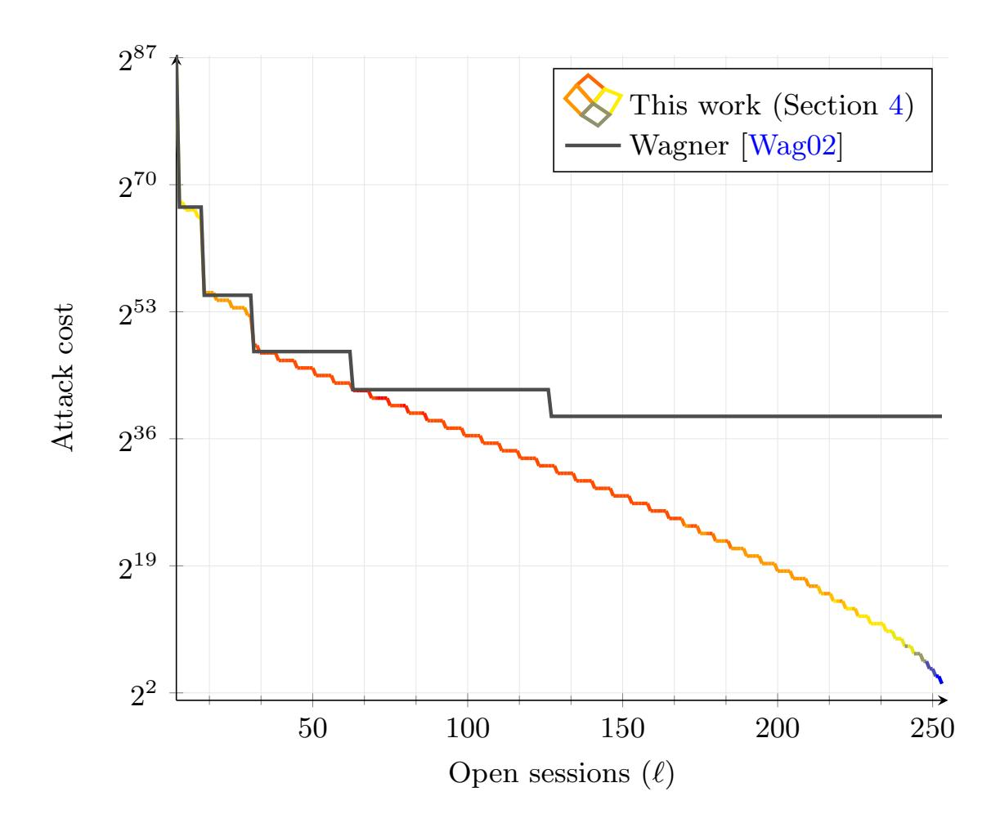
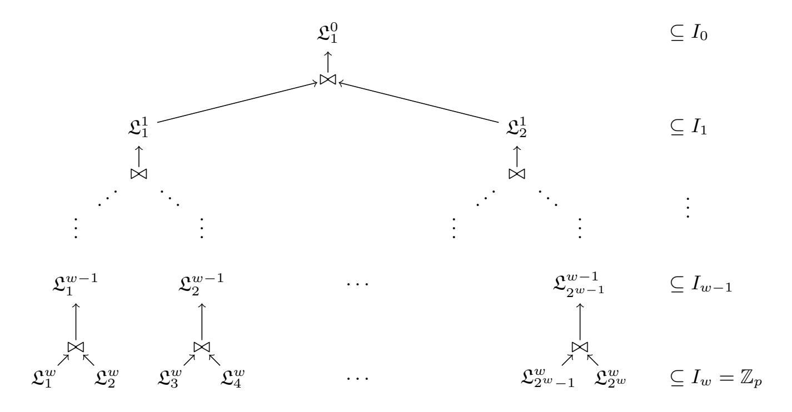
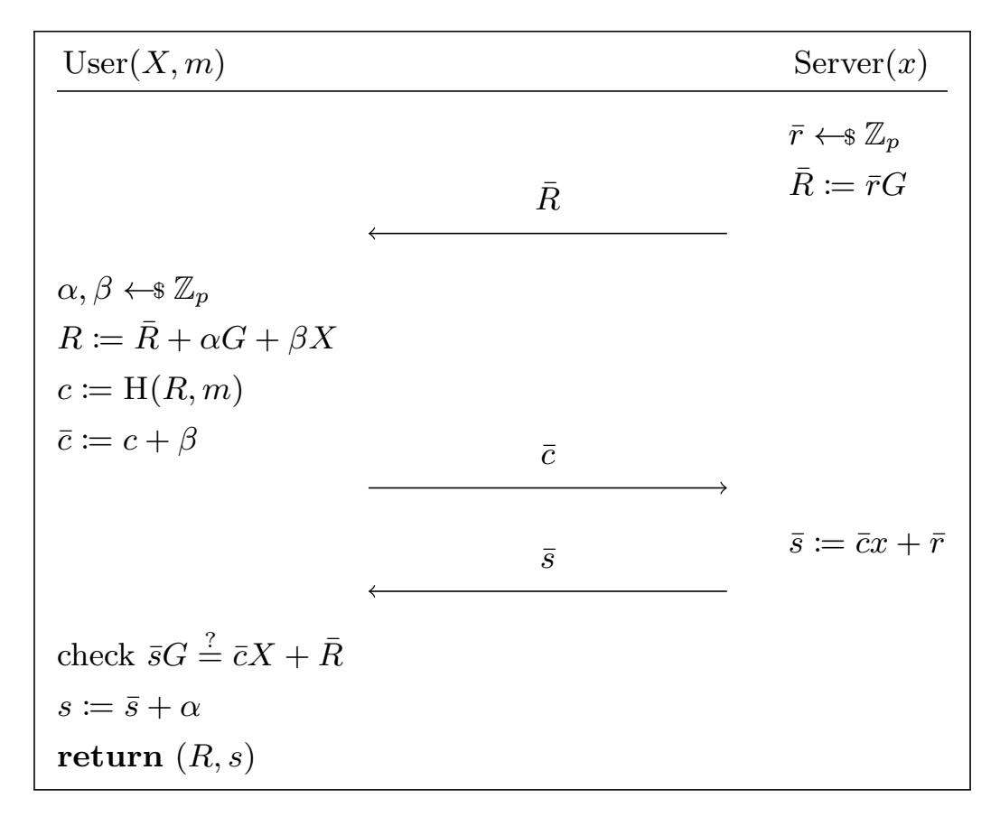

{0}------------------------------------------------

# On the (in)security of ROS

Fabrice Benhamouda<sup>1</sup>, Tancrède Lepoint<sup>2</sup>, Julian Loss<sup>3</sup>, Michele Orrù<sup>4</sup>, and Mariana Raykova<sup>5</sup>

Algorand Foundation, New York, NY, USA fabrice.benhamouda@gmail.com
 Independent researcher, New York, NY, USA, crypto@tancre.de
 University of Maryland, College Park, MD, USA, lossjulian@gmail.com
 UC Berkeley, Berkeley, CA, USA michele.orru@berkeley.edu
 Google, New York, NY, USA marianar@google.com

**Abstract.** We present an algorithm solving the ROS (Random inhomogeneities in a Overdetermined Solvable system of linear equations) problem mod p in polynomial time for  $\ell > \log p$  dimensions. Our algorithm can be combined with Wagner's attack, and leads to a sub-exponential solution for any dimension  $\ell$  with the best complexity known so far.

When concurrent executions are allowed, our algorithm leads to practical attacks against unforgeability of blind signature schemes such as Schnorr and Okamoto–Schnorr blind signatures, threshold signatures such as GJKR and the original version of FROST, multisignatures such as CoSI and the two-round version of MuSig, partially blind signatures such as Abe–Okamoto, and conditional blind signatures such as ZGP17.

## 1 Introduction

One of the most fundamental concepts in cryptanalysis is the birthday paradox. Roughly, it states that among  $O(\sqrt{p})$  random elements from the range  $\{0, \ldots, p-1\}$  (where p is a prime), there exist two elements a and b such that a = b, with high probability. In a seminal work, Wagner [Wag02] gave a generalization of the birthday paradox to  $\ell$  dimensions which asks to find  $x_i \in L_i, i \in [\ell]$  such that  $x_1 + \cdots + x_\ell = 0 \pmod{p}$ , where  $L_i$  are lists of random elements.

Wagner's work also showed a simple and elegant algorithm to solve the problem in subexponential time  $O(\ell \cdot 2^{\lceil \log p \rceil/(1+\lfloor \log \ell \rfloor)})$  and explained how it could be applied to perform cryptanalysis on various schemes. Among the most important applications of Wagner's technique is a subexponential solution to the ROS (Random inhomogeneities in a Overdetermined Solvable system of linear equations) problem [Sch01, FPS20], which is defined as follows. Given a prime number p and access to a random oracle  $H_{ros}$  with range in  $\mathbb{Z}_p$ , the ROS problem (in dimension  $\ell$ ) asks to find  $(\ell+1)$  vectors  $\hat{\boldsymbol{\rho}}_i \in \mathbb{Z}_p^{\ell}$  for  $i \in [\ell+1]$ , and a vector  $\mathbf{c} = (c_1, \ldots, c_{\ell})$  such that:

$$H_{ros}(\hat{\boldsymbol{\rho}}_i) = \langle \hat{\boldsymbol{\rho}}_i, \mathbf{c} \rangle$$
 for all  $i \in [\ell + 1]$ .

This problem was originally studied by Schnorr [Sch01] in the context of blind signature schemes. Using a solver for the ROS problem, Wagner showed that the unforgeability of the Schnorr and Okamoto–Schnorr blind signature schemes can be attacked in subexponential time whenever more than  $polylog(\lambda)$  signatures are issued concurrently. In this work, we revisit the ROS problem and its applications. We make the following contributions.

- We give the first polynomial time solution to the ROS problem for  $\ell > \log p$  dimensions.
- We show how the above solution can be combined with Wagner's techniques to yield an improved subexponential algorithm for dimensions lower than log p. The resulting algorithm offers a smooth trade-off between the work and the dimension needed to solve the ROS problem. It outperforms the runtime of Wagner's algorithm for a broad range of dimensions.
- Finally, we describe how to apply our new attack to an extensive list of schemes. These include: blind signatures [PS00, Sch01], threshold signatures [GJKR07, KG20a], multisignatures [STV<sup>+</sup>16, MPSW18a], partially blind signatures [AO00], conditionally blind signatures [ZGP17, GPZZ19], and anonymous

{1}------------------------------------------------



<span id="page-1-1"></span>**Fig. 1.** Concrete cost of our combined attack compared to Wagner's [Wag02] for  $\lambda = 256$  and  $\ell < 256$ . The color key indicates the different values of w used to estimate the cost. For  $\ell > 256$ , the attack of Section 3 applies.

credentials [PZ11], in a concurrent setting with  $\ell > \log p$  parallel executions. While our attacks do not contradict the security arguments of those schemes (which are restricted only to sequential or bounded number of executions), they prove that these schemes are unpractical for some real-world applications (cf. Section 7).

### 1.1 Technical overview

Let  $\mathsf{Pgen}(1^{\lambda})$  be a parameter generation algorithm that given as input the security parameter  $\lambda$  in unary form, outputs an odd prime p of length  $\lambda = \lceil \log p \rceil$ . In this work, we prove the following main theorem:

<span id="page-1-0"></span>**Theorem 1 (ROS attack).** If  $\ell \geq \lambda$ , then there exists an adversary that runs in polynomial time and solves the ROS problem relative to Pgen with dimension  $\ell$ .

Let us first introduce some notation. Given a polynomial  $\rho = \rho_0 + \rho_1 x_1 + \dots + \rho_\ell x_\ell \in \mathbb{Z}_p[x_1, \dots, x_\ell]$  of total degree 1, we denote with  $\hat{\rho}$  the vector in  $\mathbb{Z}_p^\ell$  having at the *i*-th position the coefficient of  $x_i$ . It is always possible to find  $\ell$  (out of  $\ell + 1$ ) "partial solutions" to the ROS problem: define the polynomials  $\rho_i(\mathbf{x}) = x_i$  in  $\mathbb{Z}_p[x_1, \dots, x_\ell]$ . Remark that the elements  $\hat{\rho}_i$  are the rows of the identity matrix of size  $\ell$ . Define  $c_i := H_{\text{ros}}(\hat{\rho}_i)$ , such that, for all  $i \in [\ell]$ , it holds that

$$\langle \hat{\boldsymbol{\rho}}_i, (c_1, \dots, c_\ell) \rangle = \mathrm{H}_{\mathrm{ros}}(\hat{\boldsymbol{\rho}}_i)$$

In general, any list of  $\ell$  polynomials of the form  $\rho_i = \rho_{i,i}x_i$  for  $\rho_{i,i} \in \mathbb{Z}_p^{\times}$   $(i \in [\ell])$  is a valid partial solution, as long as  $c_i := \rho_{i,i}^{-1} \mathrm{H}_{\mathrm{ros}}(\hat{\rho}_i)$ . The supposedly computationally hard problem is to find the last partial solution, that is, a non-trivial linear combination  $\hat{\rho}_{\ell+1}$  of these values  $c_i$ , that matches the hash image  $\mathrm{H}_{\mathrm{ros}}(\hat{\rho}_{\ell+1})$ . Wagner solves the problem in the following way. Fix  $\hat{\rho}_{\ell+1} = (1, 1, \dots, 1)$ , and build  $\ell$  lists  $L_1, \dots, L_\ell$  such that the i-th list is populated with polynomials of the form  $\rho_i = \rho_{i,i}x_i$  for random  $\rho_{i,i}$  in  $\mathbb{Z}_p^{\times}$ . For every element in the i-th list  $L_i$ , consider its respective coefficient  $c_i = \rho_{i,i}^{-1} \mathrm{H}_{\mathrm{ros}}(\hat{\rho}_i)$ . Build an efficient algorithm

{2}------------------------------------------------

that finds  $c_i$ 's satisfying:

<span id="page-2-1"></span>
$$\langle \hat{\rho}_{\ell+1}, (c_1, \dots, c_{\ell}) \rangle = c_1 + c_2 + \dots + c_{\ell} = H_{ros}(\hat{\rho}_{\ell+1}).$$

Wagner shows in [Wag02] that the above problem (called the  $\ell$ -list birthday problem) can be solved in time  $O(\ell \cdot 2^{\lceil \log p \rceil/(1+\lfloor \log \ell \rfloor)})$ . Wagner actually further improved the attack by using multiples of  $(1,1,\ldots,1)$  as  $\rho_{\ell+1}$ , which now reduces ROS to the  $(\ell+1)$ -list birthday problem, yielding a complexity of  $O((\ell+1) \cdot 2^{\lceil \log p \rceil/(1+\lfloor \log(\ell+1) \rfloor)})$ .

However, the ROS problem itself allows for much more flexibility to the attacker: for instance, the attacker can consider a subset of the  $c_i$ 's (by setting some entries of  $\rho_{\ell+1}$  to zero), in which case we end up with a subset-sum problem that is, in general, NP-hard. In Section 3, we manage to express the ROS problem as a subset-sum of powers of two (modulo p), which can be solved in polynomial time.

Then, to circumvent the restriction  $\ell \geq \lambda = \lceil \log p \rceil$ , we prove a second theorem, under the same conjecture that the Wagner's algorithm is using (see Section 4.1 for details about the conjecture).

Conjecture 1 (Wagner [Wag02]). Let  $L, w \ge 0$  be integers, let p be an odd prime and let  $k = 2^w$ . Then Wagner's algorithm on k lists of  $2^L$  uniformly random elements in  $\mathbb{Z}_p$  (as defined in Fig. 4) has constant failure probability. In particular, when repeating this algorithm in case of failure (on fresh new lists), the resulting algorithm outputs a solution to the k-list problem over  $\mathbb{Z}_p$  in expected time  $O(2^{w+L})$ .

**Theorem 2 (Generalized ROS attack).** Let  $L, w \ge 0$  be integers. Under Wagner's conjecture (Conjecture 1), if  $\ell \ge \max\{2^w - 1, \lceil 2^w - 1 + \lambda - (w+1) \cdot L \rceil\}$ , then there exists an adversary that runs in expected time  $O(2^{w+L})$  and solves the ROS problem relative to Pgen and dimension  $\ell$ .

The core idea behind the generalized ROS attack is to combine the technique from the attack from Theorem 1 with the basic subexponential attack of Wagner. In the first attack, with a bird's-eye view, the reason why we need  $\ell \geq \lambda$  is to be able to write  $y = H_{ros}(\hat{\rho}_{\ell+1})$  in binary: each bit of the representation corresponds to a power of two in a subset sum which is trivial to solve in polynomial time. However, to make it go through, it uses one dimension (i.e., one  $c_i$ ) per bit, and y has  $\lambda = \lceil \log p \rceil$  bits.

In our generalized ROS attack, instead of writing y entirely in binary as above, which requires  $\lambda$  dimensions, we first find a sum s of  $2^w$  values which include y, but satisfies  $s \in \left[-\frac{p-1}{2^{(w+1)\cdot L}}, \frac{p-1}{2^{(w+1)\cdot L}}\right] \pmod{p}$ . Note that s can then be represented with  $\lambda - (w+1) \cdot L$  many bits in binary representation. This approach requires, in total,  $\lceil 2^w + \lambda - (w+1) \cdot L - 1 \rceil$  dimensions and  $2^{w+L}$  overall work. As illustrated in Fig. 1, this improves over Wagner's attack as the dimension  $\ell$  of the ROS problem increases. We remark that, while in our first attack we give a concrete probability of failure, our second attack is based on the conjecture that Wagner's algorithm for  $\mathbb{Z}_p$  succeeds with constant probability. While we are not aware of any formal analysis of Wagner's algorithm over  $\mathbb{Z}_p$ , we remark that it is considered a standard cryptanalytic tool. Our attack can be seen as strictly improving over its (conjectured) performance when applied to solve the ROS problem.

#### 1.2 Impact of the attacks

Any cryptographic construction that bases its security guarantees on the hardness of the ROS problem is potentially affected by our attacks.

Blind signatures. An immediate consequence of our findings is the first polynomial-time attack against Schnorr blind signatures [Sch01] and Okamoto–Schnorr blind signatures [PS00] in the concurrent setting with  $\ell > \log p$  parallel executions.<sup>2</sup> Structurally, our attack builds on the one shown by Schnorr [Sch01], who showed that a solver to the ROS problem can be turned into an attacker against one-more unforgeability

<span id="page-2-0"></span><sup>&</sup>lt;sup>1</sup> Fig. 4 is actually a slight generalization of Wagner's algorithm which, instead of finding elements that sum to zeros, finds elements that sums to a value in the interval  $I_{-1} = \left[ -\left\lfloor \frac{p-1}{2^{(w-i)\cdot L+1}} \right\rfloor, \left\lfloor \frac{p-1}{2^{(w-i)\cdot L+1}} \right\rfloor \right]$ .

<span id="page-2-2"></span>Okamoto-Schnorr signatures are proven secure only for  $\ell$  parallel executions s.t.  $Q^{\ell}/p \ll 1$ , where Q is the number of queries to  $H_{ros}$ . Our attack does not contradict their analysis as our attack requires  $\ell > \log_2 p > \log_O p$ .

{3}------------------------------------------------

```
\begin{aligned} & \text{Game ROS}_{\mathsf{Pgen},\mathsf{A},\ell}(\lambda) \\ & p \leftarrow \mathsf{Pgen}(1^{\lambda}) \\ & \left( (\hat{\boldsymbol{\rho}}_i)_{i \in [\ell+1]}, \mathbf{c} \right) \leftarrow \mathsf{A}^{\mathsf{H}_{\mathrm{ros}}}(p) \\ & \mathbf{return} \; \left( \; \forall i \neq j \in [\ell+1] : \; \; \hat{\boldsymbol{\rho}}_i \neq \hat{\boldsymbol{\rho}}_j \; \; \land \; \; \langle \hat{\boldsymbol{\rho}}_i, \mathbf{c} \rangle = \mathsf{H}_{\mathrm{ros}}(\hat{\boldsymbol{\rho}}_i) \right) \end{aligned}
```

<span id="page-3-0"></span>**Fig. 2.** The ROS<sub>Pgen,A, $\ell$ </sub>( $\lambda$ ) game. H<sub>ros</sub> is a random oracle with image in  $\mathbb{Z}_p$ .

of blind Schnorr and Okamoto–Schnorr signatures. As a concrete example, we implemented in Appendix A the attack of Section 5, illustrating how to break one-more unforgeability of blind Schnorr signatures over 256-bit elliptic curves in a few seconds (when implemented in Sage  $[S^+20]$ ), provided that the attacker can open 256 concurrent sessions.

Other affected constructions. Our attack can be adapted to an extensive list of schemes which include threshold signatures [GJKR07, KG20a], multisignatures [STV<sup>+</sup>16, MPSW18a], partially blind signatures [AO00], conditionally blind signatures [ZGP17, GPZZ19]. Schemes relying on ROS such as blind anonymous group signatures [CFLW04], blind identity-based signcryption [YW05], and blind signature schemes from bilinear pairings [CHYC05] may also be affected. We note that some of the previous works claim security only for non-concurrent executions or with a bounded number of executions; therefore, our attacks do not contradict their security claims but render these schemes unsuitable for a broad range of real-world use cases.

**Scope of our attacks and countermeasures.** Our attacks do not extend to the modified-ROS [FPS20] and the generalized-ROS [HKLN20] problems. The concrete hardness of both problems remains an intriguing open question.

An earlier version of this paper claimed attacks against Anonymous Credentials Light [BL13] and restrictive partially-blind signatures from bilinear pairings [CZMS06]. As pointed out by Kastner, Loss, and Renawi in [KLR23], our claimed attack on [BL13] relied on an incorrect verification equation and do not apply to [BL13]. We also do not know how to use our ROS attack to break [CZMS06].

## <span id="page-3-1"></span>2 Preliminaries

In this work, we assume that logarithm is always base 2, and we use the usual Landau notation. Let  $\mathsf{Pgen}(1^{\lambda})$  be a parameter generation algorithm that given as input the security parameter  $\lambda$  in unary outputs an odd prime p of (bit) length  $\lambda = \lceil \log p \rceil$ . For an integer q, we let [q] be the integer set  $\{1, \ldots, q\}$ , and  $\mathbb{Z}_q$  be the ring of integers modulo q. The ROS problem for  $\ell$  dimensions, displayed in Fig. 2, is hard if no adversary can solve the ROS problem in time polynomial in the security parameter  $\lambda$ , i.e.:

$$\mathsf{Adv}^{\mathrm{ros}}_{\mathsf{Pgen},\mathsf{A},\ell}(\lambda) \coloneqq \Pr \big[ \mathrm{ROS}_{\mathsf{Pgen},\mathsf{A},\ell}(\lambda) = 1 \big] = \lambda^{-\omega(1)}.$$

Time complexity is measured in terms of numbers of operations (additions or multiplications in  $\mathbb{Z}_p$ ) plus the number of calls to the  $H_{ros}$  oracle, while space complexity if measured in terms on number of elements of  $\mathbb{Z}_p$  to store. In other words, polylogarithmic factors in p are systematically omitted in complexities.

Alternative formulations of ROS. Fuchsbauer, Plouviez, and Seurin [FPS20, Fig. 7] present a variant of ROS<sub>Pgen,A,ℓ</sub>( $\lambda$ ) with an additional input aux  $\in \{0,1\}^*$ , needed for including the message used in a Schnorr blind signature. Hauck, Kiltz, and Loss [HKL19, Fig. 3] consider an adversary returning a pair  $(A, \mathbf{c}) \in \mathbb{Z}_p^{\ell+1\times\ell+1} \times \mathbb{Z}_p^{\ell+1}$  such that  $A\mathbf{c} = 0$ ,  $A_i \neq A_j \ \forall i \neq j \in [\ell+1]$ ,  $H_{ros}(A_{i,1}, \ldots, A_{i,\ell}) = A_{i,\ell+1}$  and  $c_{\ell+1} = -1$ . These formulations are all equivalent.

{4}------------------------------------------------

# <span id="page-4-1"></span>3 Attack

We introduce the following notation: for a polynomial  $\rho = \rho_0 + \rho_1 x_1 + \rho_2 x_2 + \cdots + \rho_\ell x_\ell \in \mathbb{Z}_p[x_1, \dots, x_\ell]$ , we set  $\hat{\rho}$  to be the vector containing at the *i*-th position the coefficient of  $x_i$ , that is,  $\hat{\rho} = (\rho_1, \rho_2, \dots, \rho_\ell)$ . Note that the constant term is not included.

**Theorem 1 (ROS attack).** If  $\ell \geq \lambda$ , then there exists an adversary that runs in polynomial time and solves the ROS problem relative to Pgen with dimension  $\ell$ .

*Proof.* We construct an adversary for  $ROS_{Pgen,A,\ell}(\lambda)$ , where  $\ell > \log p$ . The goal for the adversary A is to output  $(\hat{\boldsymbol{\rho}}_i)_{i \in [\ell+1]}$  and  $\mathbf{c} = (c_1, \ldots, c_\ell)$  such that:

$$H_{ros}(\hat{\boldsymbol{\rho}}_i) = \langle \hat{\boldsymbol{\rho}}_i, \mathbf{c} \rangle$$
 for  $i = 1, \dots, \ell + 1$ .

Define:

$$\rho_i^0 := x_i, \quad \rho_i^1 := 2x_i \quad \text{for } i = 1, \dots, \ell,$$

and let  $c_i^b := 2^{-b} \mathcal{H}_{ros}(\hat{\boldsymbol{\rho}}_i^b)$ , for b = 0 and b = 1. If there exists  $i^* \in [\ell]$  such that  $c_{i^*}^0 = c_{i^*}^1$ , then A stops immediately and returns the ROS solution  $(\hat{\boldsymbol{\rho}}_1^0, \dots, \hat{\boldsymbol{\rho}}_\ell^0, \hat{\boldsymbol{\rho}}_{i^*}^1)$  and  $(c_1^0, \dots, c_\ell^0)$ . Otherwise, if  $c_i^0 \neq c_i^1$  for all  $i \in [\ell]$ , define the degree-1 polynomial:

$$\mathbf{f}_i(x_i) \coloneqq \frac{x_i - c_i^0}{c_i^1 - c_i^0}.$$

We remark that, for  $b \in \{0,1\}$ ,  $\mathbf{f}_i(c_i^b) = b$ . Define  $\boldsymbol{\rho}_{\ell+1} \coloneqq \sum_{i=1}^{\ell} 2^{i-1} \mathbf{f}_i$ , and note that  $\boldsymbol{\rho}_{\ell+1}$  is a multivariate polynomial of total degree 1, i.e.,  $\boldsymbol{\rho}_{\ell+1} = \rho_{\ell+1,0} + \rho_{\ell+1,1} x_1 + \rho_{\ell+1,2} x_2 + \cdots + \rho_{\ell+1,\ell} x_\ell$ . Define  $y \coloneqq \mathrm{H}_{\mathrm{ros}}(\hat{\boldsymbol{\rho}}_{\ell+1}) + \rho_{\ell+1,0} = \mathrm{H}_{\mathrm{ros}}((\rho_{\ell+1,1}, \rho_{\ell+1,2}, \dots, \rho_{\ell+1,\ell})) + \rho_{\ell+1,0}$ . Finally, write y in binary as:

$$y = \sum_{i=1}^{\ell} 2^{i-1} b_i \pmod{p}.$$

(As  $2^{\ell} > p$ , it is possible to write y this way, and this implicitly defines the  $b_i$ 's.) The adversary A outputs the solution  $(\hat{\boldsymbol{\rho}}_1^{b_1}, \dots, \hat{\boldsymbol{\rho}}_{\ell}^{b_{\ell}}, \hat{\boldsymbol{\rho}}_{\ell+1})$  and  $\mathbf{c} \coloneqq (c_1^{b_1}, \dots, c_{\ell}^{b_{\ell}})$ . We have indeed that, for  $i \in [\ell]$ ,  $\langle \hat{\boldsymbol{\rho}}_i^{b_i}, \mathbf{c} \rangle = 2^{b_i} c_i^{b_i} = \mathrm{H}_{\mathrm{ros}}(\hat{\boldsymbol{\rho}}_i^{b_i})$  and:

$$\langle \hat{\boldsymbol{\rho}}_{\ell+1}, \mathbf{c} \rangle = \boldsymbol{\rho}_{\ell+1}(\mathbf{c}) - \rho_{\ell+1,0} = \sum_{i=1}^{\ell} 2^{i-1} \mathbf{f}_i(c_i^{b_i}) - \rho_{\ell+1,0} = \sum_{i=1}^{\ell} 2^{i-1} b_i - \rho_{\ell+1,0} = \mathcal{H}_{ros}(\hat{\boldsymbol{\rho}}_{\ell+1}) .$$

Remark 1. Fuchsbauer, Plouviez, and Seurin [FPS20, Sec. 5] propose a variant of ROS, called modified ROS (mROS). Tessaro and Zhu [TZ22] introduce a variant of ROS called weighted fractional ROS (WFROS). The attack above does not apply to mROS and WFROS.

## <span id="page-4-0"></span>4 Generalized attack

We present a combination of Wagner's subexponential k-list attack and the polynomial time attack from Section 3. This combined attack yields a subexponentially efficient algorithm against ROS which requires fewer dimensions than the attack in the previous section (i.e., less than  $\lambda = \lceil \log p \rceil$ ). However, for some practical cases, the attack significantly outperforms Wagner's attack in terms of work, for the same number of dimensions. The intuition behind our attack is as follows. We set  $k_1 = 2^w - 1$ ,  $k_2 = \max(0, \lceil \lambda - (w+1) \cdot L \rceil)$ , and the dimension  $\ell = k_1 + k_2$ , for some integer w and some real number L > 0.

First, we use a generalization of Wagner's algorithm to find a "small" sum  $s = y_{k_2}^* + \cdots + y_\ell^*$  of  $k_1 + 1$  values  $y_i^* := H_{ros}(\hat{\rho}_i)$ , where the polynomials  $\rho_i(x_1, \dots, x_\ell)$  are chosen to make the second step of the attack

{5}------------------------------------------------

work.<sup>3</sup> As we describe below, we can obtain that  $|s| < 2^{k_2-1}$  using  $O(2^{w+L})$  hash queries and space  $O(w2^L)$ .<sup>4</sup> Then, we use the technique from the previous section in order to represent the sum s as a binary sum of at most  $k_2$  terms. This solves the ROS problem. The attack runs in overall time  $O(2^{w+L})$ , space  $O(w2^L)$ , and requires  $\ell = \max(2^w - 1, \lceil 2^w - 1 + \lambda - (w + 1) \cdot L \rceil)$  dimensions.

We remark that the attack is a generalization of both Wagner's attack and our polynomial-time attack from Section 3. Wagner's attack corresponds to the case where  $L = \lambda/(w+1)$  and  $\ell = 2^w - 1$ . Our polynomial-time attack corresponds to the case  $w=0, L=0, \ell=\lambda$ .

**Examples.** For a prime p of  $\lambda = 256$  bits, a concrete example yields w = 5, L = 15, i.e.,  $\ell = 32 + 256 - 6$ . 15-1=197 dimensions and time roughly  $2^{20}$  and space roughly  $5\cdot 2^{15}$  (elements of  $\mathbb{Z}_p$ ). On the other hand, Wagner's attack against ROS for 197 dimensions requires time roughly  $2^{\lfloor \log 198 \rfloor} \cdot 2^{\frac{256}{\lfloor \log 198 \rfloor + 1}} = 2^7 \cdot 2^{32} = 2^{39}$ and space roughly  $|\log 198| \cdot 2^{\frac{256}{|\log 198|+1}} = 7 \cdot 2^{32}.5$ 

For a 512 bit modulus, a concrete example yields w=6, L=46, i.e.,  $\ell=64+512-7\cdot 46-1=253$ dimensions and time roughly  $2^{52}$  and space roughly  $6 \cdot 2^{46}$ . Wagner's attack against ROS for 253 dimensions requires time roughly  $2^{\lfloor \log 254 \rfloor} \cdot 2^{\frac{512}{\lfloor \log 254 \rfloor + 1}} = 2^7 \cdot 2^{64} = 2^{71}$  and space roughly  $\lfloor \log 254 \rfloor \cdot 2^{\frac{512}{\lfloor \log 254 \rfloor + 1}} = 7 \cdot 2^{64}$ .

#### <span id="page-5-0"></span>4.1 Generalized k-list algorithm

In this section, we write elements  $\mathbb{Z}_p$  as signed integers in  $\left[-\frac{p-1}{2}, \frac{p-1}{2}\right]$ . Let w and L be two positive integers. We define the following integer intervals:

$$I_i \coloneqq \left[ - \left| \frac{p-1}{2^{(w-i)\cdot L+1}} \right|, \left| \frac{p-1}{2^{(w-i)\cdot L+1}} \right| \right].$$

Remark that  $\mathbb{Z}_p = I_w$ .

We now describe the k-list algorithm, which is the core of Wagner's algorithm. We generalize it to match our needs and to output elements that sum to something in  $I_{-1}$  rather than to exactly 0. (This essentially corresponds to executing Wagner's attack as usual, but stopping early.) The algorithm is defined relative to random oracles  $H_1, \ldots, H_k$  (with input in  $\mathbb{Z}_p^*$  and output in  $\mathbb{Z}_p$ ). It takes as input (w, L) and outputs  $(\rho_1^*,\ldots,\rho_k^*)\in (\mathbb{Z}_p^*)^k$  with  $k=2^w$  such that:

$$s := y_1^* + \dots + y_k^* \in I_{-1}$$
 where  $y_i^* := H_i(\rho_i^*)$ .

The high-level idea of the algorithm is to use  $2^{w+1} - 1$  lists of about  $2^L$  values organized as a tree, as depicted in Fig. 3, and to ensure that lists  $\mathfrak{L}_{j}^{i}$  at level i contains elements from the set  $I_{i}$ .

- **Setup/Leaves:** k-list fills the lists  $\mathfrak{L}_{j}^{w}$  in the leaves with all  $2^{L}$  points of the form  $H_{j}(\rho) \in I_{w} = \mathbb{Z}_{p}$ , where  $\rho \in \{1, 2, 3, ..., 2^L\}$ .

  - Collisions/Join: The algorithm now proceeds to find collisions in levels from w to 1. At level i, process
- the  $2^{i-1}$  pairs of lists  $(\mathfrak{L}_1^i, \mathfrak{L}_2^i), \ldots, (\mathfrak{L}_{2^{i-1}}^i, \mathfrak{L}_{2^i}^i)$  into  $2^{i-1}$  lists  $\mathfrak{L}_1^{i-1}, \ldots, \mathfrak{L}_{2^{i-1}}^{i-1}$  as follows:

$$\mathfrak{L}_{j}^{i-1} := \{a+b : a \in \mathfrak{L}_{2j-1}^{i}, b \in \mathfrak{L}_{2j}^{i}, a+b \in I_{i-1}\}.$$

(Remember that  $a, b \in \mathbb{Z}_p$  and a + b is computed modulo p.) Moreover, we implicitly assume that the algorithm stores back pointers to a and b such that they can efficiently be recovered at a later point.

- Output: Let  $\mathfrak{L}^0 = \mathfrak{L}_1^0$  denote the (only) list created at level 0. The algorithm finds an element  $s \in \mathfrak{L}^0$ such that  $s \in I_{-1}$ . If no such element exists, it returns  $\bot$ . Otherwise, it recovers  $k = 2^w$  values  $\rho_1^*, \ldots, \rho_k^*$ such that  $y_i^* = H_i(\hat{\rho}_i^*) \in \mathfrak{L}_i^w$  and  $s = y_1^* + \cdots + y_k^*$ . It returns  $(\rho_1^*, \dots, \rho_k^*)$ .

We formally write the algorithm k-list in Fig. 4.

<span id="page-5-1"></span><sup>&</sup>lt;sup>3</sup> In the actual attack, part of the second step is executed before to allow to choose these polynomials properly.

<span id="page-5-3"></span><span id="page-5-2"></span>

<sup>&</sup>lt;sup>4</sup> |s| is the absolute value of s, when  $s \in \mathbb{Z}_p$  is represented as a signed integer in  $\left[-\frac{p-1}{2}, \frac{p-1}{2}\right]$ .
<sup>5</sup> Indeed, when considering the exact values of the constants in the asymptotics, the actual complexity of Wagner's attack against in dimension  $\ell$  is  $2^{\lfloor \log(\ell+1) \rfloor} \cdot 2^{\frac{\lambda}{1+\lfloor \log(\ell+1) \rfloor}}$ , as it reduces to a  $(\ell+1)$ -sum problem. We remark that Shallue [Sha08] provides an (asymptotically tight, but concretely loose) proof for  $2^{\lfloor \log \ell \rfloor} \cdot 2^{\frac{\lambda}{\lfloor \log(\ell) \rfloor}}$  time complexity.

{6}------------------------------------------------



**Fig. 3.** Tree of lists for the k-list algorithm ( $\bowtie$  represents the join operation in the algorithm; the sets in the right handside are the sets to which the elements of the lists of a given level belong).

<span id="page-6-0"></span>**Correctness.** Our algorithm's correctness follows directly from the correctness of Wagner's original algorithm. More precisely, our algorithm performs identical steps as Wagner's, but stops upon finding a sum of values with a suitably small absolute value, i.e., one that falls into  $I_{-1}$ . On the other hand, Wagner's algorithm keeps continuing with more levels until it finds values who sum to 0.

We remark that we are not aware of a formal analysis of Wagner's algorithm for values in  $\mathbb{Z}_p$ . The work of Minder and Sinclair [MS09] analyses the case of finding a weighted sum of *vectors* of  $\mathbb{Z}_p$  values that sum to zero in each component, but uses a different technique from the one presented in Wagner's paper (and used here). Our attack can be seen as working under the assumption that Wagner's algorithm works correctly, i.e., has constant failure probability. We can repeat the attack until it succeeds, which makes the resulting algorithm expected polynomial time. Formally analyzing the failure probability of Wagner's algorithm over  $\mathbb{Z}_p$  remains an important open problem.

Complexity. Overall, the algorithm runs in time  $O(2^{w+L})$  and is conjectured to succeed with constant probability. As described [Wag02], this running time is made possible using an optimized join operation such as Hash Join or Merge Join. The algorithm uses space  $O(2^{w+L})$ , but by evaluating the collisions/joins in postfix order (in the tree), this can be reduced to  $O(w2^L)$ .

Concretely, we state the following conjecture:

Conjecture 1 (Wagner [Wag02]). Let  $L, w \ge 0$  be integers, let p be an odd prime and let  $k = 2^w$ . Then Wagner's algorithm on k lists of  $2^L$  uniformly random elements in  $\mathbb{Z}_p$  (as defined in Fig. 4) has constant failure probability.<sup>6</sup> In particular, when repeating this algorithm in case of failure (on fresh new lists), the resulting algorithm outputs a solution to the k-list problem over  $\mathbb{Z}_p$  in expected time  $O(2^{w+L})$ .

By repeating on "fresh new lists," we mean that the lists  $\mathfrak{L}_i^w$  are generated using a set of  $2^L$  integers that is disjoint from all the previous ones used (in particular, disjoint from  $[2^L]$ ).

<span id="page-6-1"></span><sup>&</sup>lt;sup>6</sup> Fig. 4 is actually a slight generalization of Wagner's algorithm which, instead of finding elements that sum to zeros, finds elements that sums to a value in the interval  $I_{-1} = \left[ - \left\lfloor \frac{p-1}{2^{(w-i)\cdot L+1}} \right\rfloor, \left\lfloor \frac{p-1}{2^{(w-i)\cdot L+1}} \right\rfloor \right]$ .

{7}------------------------------------------------

```
Algorithm k-list<sup>H<sub>1</sub>,...,H<sub>k</sub></sup>(w, L)

for j \in [k], \rho \in [2^L]: \mathfrak{L}_j^w := \mathrm{H}_j(\rho)

# Collisions

for i = w downto 1:

for j \in [2^{i-1}]:

\mathfrak{L}_j^{i-1} = \{a+b: a \in \mathfrak{L}_{2j-1}^i, \ b \in \mathfrak{L}_{2j}^i, \ a+b \in I_{i-1}\}

# Output

look for an element s = y_1^* + \cdots + y_k^* \in \mathfrak{L}^0 \cap I_{-1}
\nif such an element does not exists then return \bot

return (\rho_1^*, \ldots, \rho_k^*) such that y_j^* = \mathrm{H}_j(\rho_j^*)
```

<span id="page-7-0"></span>**Fig. 4.** The k-list algorithm.

### 4.2 Combined attack

**Theorem 2 (Generalized ROS attack).** Let  $L, w \ge 0$  be integers. Under Wagner's conjecture (Conjecture 1), if  $\ell \ge \max\{2^w - 1, \lceil 2^w - 1 + \lambda - (w+1) \cdot L \rceil\}$ , then there exists an adversary that runs in expected time  $O(2^{w+L})$  and solves the ROS problem relative to Pgen and dimension  $\ell$ .

*Proof.* Recall that  $k_1 = 2^w - 1$  and  $k_2 = \max(0, \lceil \lambda - (w+1) \cdot L \rceil)$ . Set  $\ell = k_1 + k_2$ . For all  $i \in [k_2]$ , define:

$$\rho_i^0 \coloneqq x_i \qquad \rho_i^1 \coloneqq 2x_i,$$

and define  $c_i^0 \coloneqq \mathrm{H}_{\mathrm{ros}}(\hat{\boldsymbol{\rho}}_i^0)$  and  $c_i^1 \coloneqq 2^{-1}\mathrm{H}_{\mathrm{ros}}(\hat{\boldsymbol{\rho}}_i^1)$ . If there exists  $i^* \in [k_2]$  such that  $c_{i^*}^0 = c_{i^*}^1$ , then the adversary already found a non-trivial ROS solution. Define, for  $i \in [k_2+1,\ell]$ ,  $\boldsymbol{\rho}_i \coloneqq x_i$  and  $c_i \coloneqq \mathrm{H}_{\mathrm{ros}}(\hat{\boldsymbol{\rho}}_i)$ . Output the ROS solution  $(\hat{\boldsymbol{\rho}}_1^0, \ldots, \hat{\boldsymbol{\rho}}_{k_2}^0, \hat{\boldsymbol{\rho}}_{k_2+1}, \ldots, \hat{\boldsymbol{\rho}}_{\ell}, \hat{\boldsymbol{\rho}}_{i^*}^1)$ , and  $(c_1^0, \ldots, c_{k_2}^0, c_{k_2+1}, \ldots, c_{\ell})$ . Otherwise, let:

<span id="page-7-1"></span>
$$\mathbf{f}_i \coloneqq \frac{x_i - c_i^0}{c_i^1 - c_i^0}$$

for all  $i \in [k_2]$ . We remark that  $\mathbf{f}_i(c_i^b) = b$  (for b = 0, 1). Define:

$$\bar{\rho}_{\ell+1}(x_1,\ldots,x_\ell) \coloneqq \sum_{i=1}^{k_2} 2^{i-1} \mathbf{f}_i + \left\lfloor \frac{p-1}{2^{(w+1)\cdot L+1}} \right\rfloor - \sum_{i=k_2+1}^{\ell} x_i$$
.

Run  $(\rho_{k_2+1}^*, \dots, \rho_{\ell+1}^*) := k$ -list  $k_2+1, \dots, k_{\ell+1}$  where  $k = \ell - k_2 + 1 = k_1 + 1 = 2^w$  and the oracles are defined as:

$$\mathbf{H}_{i}(\alpha) \coloneqq \begin{cases} \text{ if } i \in [k_{2}+1, \ell] : \text{ let } \mathbf{p} = \alpha x_{i} & \text{return } \alpha^{-1}\mathbf{H}_{\text{ros}}(\hat{\mathbf{p}}) \\ \text{ if } i = \ell+1 : & \text{let } \mathbf{p} = \alpha \bar{\boldsymbol{\rho}}_{\ell+1} & \text{return } \alpha^{-1}\mathbf{H}_{\text{ros}}(\hat{\mathbf{p}}) + \bar{\rho}_{\ell+1,0} \end{cases}$$

Define (similarly to the above):

Set:

<span id="page-7-2"></span>
$$s := \sum_{i=k_0+1}^{\ell+1} y_i^* \quad \in I_{-1} = \left[ -\left\lfloor \frac{p-1}{2^{(w+1)\cdot L+1}} \right\rfloor, \left\lfloor \frac{p-1}{2^{(w+1)\cdot L+1}} \right\rfloor \right] . \tag{2}$$

{8}------------------------------------------------

Write  $s + \lfloor (p-1)/2^{(w+1)\cdot L+1} \rfloor$  in binary as:

<span id="page-8-1"></span>
$$s + \left\lfloor \frac{p-1}{2^{(w+1)\cdot L+1}} \right\rfloor = \sum_{i=1}^{k_2} 2^{i-1} b_i \quad \in \left[ \left\lfloor \frac{p-1}{2^{(w+1)\cdot L}} \right\rfloor \right] , \tag{3}$$

which is possible since  $p < 2^{\lambda}$ ,  $k_2 \ge \lceil \lambda - (w+1) \cdot L \rceil$ , hence  $(p-1)/2^{(w+1)\cdot L} < 2^{k_2}$ . Define:

$$\hat{\boldsymbol{\rho}}_i \coloneqq \begin{cases} \hat{\boldsymbol{\rho}}_i^{b_i} & \text{for } i \in [1, k_2] \ \hat{\boldsymbol{\rho}}_i^* & \text{for } i \in [k_2 + 1, \ell + 1] \end{cases}.$$

and:

$$c_i := \begin{cases} c_i^{b_i} & \text{for } i \in [1, k_2] ,\\ y_i^* & \text{for } i \in [k_2 + 1, \ell] . \end{cases}$$

A outputs  $(\hat{\rho}_1, \dots, \hat{\rho}_{\ell+1})$  and  $\mathbf{c} = (c_1, \dots, c_{\ell})$ . We have indeed that for  $i \in [\ell]$ :

$$\langle \hat{\boldsymbol{\rho}}_i, \mathbf{c} \rangle = \begin{cases} \boldsymbol{\rho}_i^{b_i}(\mathbf{c}) - \rho_{i,0}^{b_i} = \boldsymbol{\rho}_i^{b_i}(\mathbf{c}) = 2^{-b_i} c_i = \mathrm{H}_{\mathrm{ros}}(\hat{\boldsymbol{\rho}}_i^{b_i}) & \text{for } i \in [1, k_2] ,\\ \boldsymbol{\rho}_i^*(\mathbf{c}) - \rho_{i,0}^* = \boldsymbol{\rho}_i^*(\mathbf{c}) = \rho_i^* y_i^* = \mathrm{H}_{\mathrm{ros}}(\hat{\boldsymbol{\rho}}_i^*) & \text{for } i \in [k_2 + 1, \ell] . \end{cases}$$

since  $\rho_{i,0}^{b_i}$  and  $\rho_{i,0}^*$  are the constant coefficients of the polynomials  $\boldsymbol{\rho}_i^{b_i} = 2^{b_i} x_i$  and  $\boldsymbol{\rho}_i^* = \rho_i^* x_i$  (respectively) and hence are zero. For the case  $\ell + 1$ :

$$\langle \hat{\boldsymbol{\rho}}_{\ell+1}, \mathbf{c} \rangle = \boldsymbol{\rho}_{\ell+1}^*(\mathbf{c}) - \rho_{\ell+1,0}^* = \rho_{\ell+1}^* \cdot \left( \sum_{i=1}^{k_2} 2^{i-1} \mathbf{f}_i(\mathbf{c}) - \left\lfloor \frac{p-1}{2^{(w+1)\cdot L+1}} \right\rfloor - \sum_{i=k_2+1}^{\ell} c_i - \bar{\rho}_{\ell+1,0} \right)$$

$$= \rho_{\ell+1}^* \cdot \left( \sum_{i=1}^{k_2} 2^{i-1} b_i - \left\lfloor \frac{p-1}{2^{(w+1)\cdot L+1}} \right\rfloor - \sum_{i=k_2+1}^{\ell} y_i^* - \bar{\rho}_{\ell+1,0} \right)$$

$$= \rho_{\ell+1}^* \cdot \left( s - \sum_{i=k_2+1}^{\ell} y_i^* - \bar{\rho}_{\ell+1,0} \right) = \rho_{\ell+1}^* \cdot \left( y_{\ell+1}^* - \bar{\rho}_{\ell+1,0} \right) = \mathbf{H}_{\text{ros}}(\hat{\boldsymbol{\rho}}_{\ell+1}) .$$

where the second equality comes from Equation (1) (and hence the constant coefficient  $\rho_{\ell+1,0}^* = \rho_{\ell+1}^* \bar{\rho}_{\ell+1,0}$ ), the fourth equality comes from Equation (3), the fifth equality comes from Equation (2), the last equality comes from Equation (1). The attack requires  $k_1 + k_2 = \max\{2^w - 1, \lceil 2^w - 1 + \lambda - (w+1) \cdot L \rceil\}$  dimensions, runs in time  $O(2^{w+L})$ , and in space  $O(w2^L)$ .

# <span id="page-8-0"></span>5 Affected blind signatures

For simplicity and clarity of exposition, we explain how to instantiate the attack presented in Section 3 only. Our attack can be easily adapted for the one presented in Section 4. When applying our ROS attack to cryptographic schemes, we accept a neglgible failure probability and use the additional flexibility in the random oracle input to use polynomials  $\rho_i = x_i$  (instead of either  $x_i$  or  $2x_i$ , for  $i \in [\ell]$ ). This simplifies descriptions and make attacks easier to read.

Throughout the remaining of this manuscript, we assume the existence of a group generator algorithm  $\mathsf{GrGen}(1^\lambda)$  that, given as input the security parameter in unary form outputs the description  $\Gamma = (\mathbb{G}, p, G)$  of a group  $\mathbb{G}$  of prime order p generated by G. Similarly to Section 2, we assume that the prime p is of length  $\lambda$ . We use additive notation for the group law.

{9}------------------------------------------------



<span id="page-9-0"></span>Fig. 5. The signing protocol of Schnorr blind signatures [Sch01].

#### <span id="page-9-6"></span>5.1 Schnorr blind signatures

In Schnorr blind signatures [Sch01, FPS20], a signing key x is a scalar sampled uniformly at random from  $\mathbb{Z}_p$ , and its respective verification key is X = xG in the group  $\mathbb{G}$ . A signature for a message  $m \in \{0,1\}^*$  consists of a pair  $(R,s) \in \mathbb{G} \times \mathbb{Z}_p$  such that sG - cX = R, where c := H(R,m). Fig. 5 depicts the protocol. A formal description of the protocol can be found in [FPS20, Fig. 6], using the same notation employed here.

We construct a probabilistic polynomial-time adversary A that is able to produce (with overwhelming probability)  $\ell+1$  signatures after opening  $\ell \geq \lceil \log p \rceil = \lambda$  parallel sessions. A selects arbitrary messages  $m_1, \ldots, m_{\ell+1} \in \{0,1\}^*$  for which it will output a signature. It opens  $\ell$  sessions, obtaining the first message from the server and receiving  $\bar{\mathbf{R}} = (\bar{R}_1, \ldots, \bar{R}_\ell) \in \mathbb{G}^\ell$ . For  $i \in [\ell]$ , A samples uniformly at random three blinding factors  $(\alpha_{i,0}, \alpha_{i,1}, \beta_i) \leftarrow \mathbb{Z}_p^3$ , and defines  $R_{i,b} \coloneqq \bar{R} + \alpha_{i,b}G + \beta_i X$  (for  $b \in \{0,1\}$ ). Let  $c_i^b \coloneqq \mathrm{H}(R_{i,b}, m_i)$  for  $i \in [\ell]$  and  $b \in \{0,1\}$ . Assume  $c_i^0 \neq c_i^1$  and fail otherwise. Define the polynomial  $\boldsymbol{\rho} \in \mathbb{Z}_p[x_1, \ldots, x_\ell]$ :

<span id="page-9-3"></span>
$$\rho(x_1, \dots, x_\ell) := \sum_{i=1}^{\ell} 2^{i-1} \cdot \frac{x_i - c_i^0}{c_i^1 - c_i^0} = \sum_{i=1}^{\ell} \rho_i x_i + \rho_0.$$
 (4)

We recall that, from Theorem 1, the above polynomial is such that, for any  $(b_1, \ldots, b_\ell) \in \{0, 1\}^\ell$ ,

<span id="page-9-4"></span>
$$\rho(c_1^{b_1}, \dots, c_\ell^{b_\ell}) = \sum_i 2^{i-1} b_i.$$
 (5)

Let  $R_{\ell+1} := \langle \bar{\boldsymbol{\rho}}, \bar{\mathbf{R}} \rangle = \sum_{i=1}^{\ell} \rho_i \bar{R}_i$  (nota bene: the constant term  $\rho_0$  is not included). Define  $c_{\ell+1} := H(R_{\ell+1}, m_{\ell+1})$  and consider the binary decomposition of  $c_{\ell+1} - \sum_{i=1}^{\ell} \rho_i \beta_i + \rho_0$ :

<span id="page-9-5"></span>
$$c_{\ell+1} - \sum_{i=1}^{\ell} \rho_i \beta_i + \rho_0 = \sum_{i=1}^{\ell} 2^{i-1} b_i.$$
 (6)

<span id="page-9-1"></span><sup>&</sup>lt;sup>7</sup> The failure probability is negligible. It is also possible to modify the attack so that it always succeeds by using distinct messages  $m_i^0$  and  $m_i^1$  and using the same trick as for  $c_i^0 = c_i^1$  in the ROS attack in Section 3.

<span id="page-9-2"></span><sup>&</sup>lt;sup>8</sup> In Section 3,  $\rho$  corresponds to  $\rho_{\ell+1}$ . We use  $\rho$  here because we implicitly set  $\rho_i^b = x_i$  for all i and use the additional flexibility in the random oracle input to get two different  $c_i^b$ .

{10}------------------------------------------------

Let  $\bar{\mathbf{c}} = (c_1^{b_1} + \beta_1, \dots, c_\ell^{b_\ell} + \beta_\ell)$ . Complete the  $\ell$  opened sessions with  $\bar{\mathbf{c}}$ : reply to the i-th open session with  $\bar{c}_i$ , for  $i \in [\ell]$ . The adversary thus obtains responses  $\bar{\mathbf{s}} \coloneqq (\bar{s}_1, \dots, \bar{s}_\ell) \in \mathbb{Z}_p^\ell$ , and defines  $s_{\ell+1} \coloneqq \langle \bar{\boldsymbol{\rho}}, \bar{\mathbf{s}} \rangle = \sum_{i=1}^\ell \rho_i \bar{s}_i$ . Finally, the adversary proceeds unblinding the  $\ell$  honest signatures by computing:  $\mathbf{s} \coloneqq (\bar{s}_1 + \alpha_{1,b_1}, \dots, \bar{s}_\ell + \alpha_{\ell,b_\ell})$ . The adversary outputs the  $\ell+1$  forgeries  $(m_i, (R_i, s_i))_{i \in [\ell+1]}$ , defined as:

$$(R_{i}, s_{i}) = \begin{cases} (\bar{R}_{i} + \alpha_{i,b_{i}}G + \beta_{i}X, \ \bar{s}_{i} + \alpha_{i,b_{i}}) & \text{for } i = 1, \dots, \ell, \\ (\sum_{i=1}^{\ell} \rho_{i}\bar{R}_{i}, \ \sum_{i=1}^{\ell} \rho_{i}\bar{s}_{i}) & \text{for } i = \ell + 1. \end{cases}$$

By perfect correctness, we have that the first  $\ell$  signatures are valid. In fact, for  $i \in [\ell]$ :

$$R_i = \bar{R}_i + \alpha_{i,b_i}G + \beta_i X = \bar{s}_i G - \bar{c}_i X + \alpha_{i,b_i}G + \beta_i X = s_i G - c_i^{b_i} X$$

(where the second equality comes from the fact the answer  $\bar{s}_i$  satisfies  $\bar{s}_i G - \bar{c}_i X = \bar{R}_i$ ) and  $c_i^{b_i} = H(R_{i,b_i}, m_i) = H(R_i, m_i)$  since  $R_{i,b_i} = R_i$ . For the case  $(m_{\ell+1}, (R_{\ell+1}, s_{\ell+1}))$ :

$$R_{\ell+1} = \sum_{i=1}^{\ell} \rho_i \bar{R}_i = \sum_{i=1}^{\ell} \rho_i (\bar{s}_i G - \bar{c}_i X) = s_{\ell+1} G - c_{\ell+1} X,$$

where  $c_{\ell+1} = H(R_{\ell+1}, m_{\ell+1})$ . The second equality comes from the fact that  $\bar{s}_i G - \bar{c}_i X = \bar{R}_i$ . The last equality comes from:

$$\sum_{i=1}^{\ell} \rho_i \bar{c}_i = \sum_{i=1}^{\ell} \rho_i c_i^{b_i} + \sum_{i=1}^{\ell} \rho_i \beta_i = \boldsymbol{\rho}(c_1^{b_1}, \dots, c_{\ell}^{b_{\ell}}) + \sum_{i=1}^{\ell} \rho_i \beta_i - \rho_0 = \sum_{i=1}^{\ell} 2^{i-1} b_i + \sum_{i=1}^{\ell} \rho_i \beta_i - \rho_0 = c_{\ell+1}$$
 (7)

where the first equality comes from the definition of  $\bar{c}_i$ , the second equality comes from Equation (4), the third equality comes from Equation (5), and the last equality comes from Equation (6). We provide an implementation of the attack in Appendix A using Sage [S<sup>+</sup>20].

#### <span id="page-10-1"></span>5.2 Okamoto–Schnorr blind signatures

An Okamoto–Schnorr blind signature [PS00] for a message m consists of a tuple  $(R, s, t) \in \mathbb{G} \times \mathbb{Z}_p^2$  such that sG + tH - cX = R, where c := H(R, m), and (G, H) are two generators of  $\mathbb{G}$  whose discrete log relation is unknown. The attack of the previous section directly extends to Okamoto–Schnorr signatures: A operates exactly as before until Equation (4), receiving in addition  $\bar{t} = (\bar{t}_i, \dots, \bar{t}_\ell)$  from the challenger after closing the  $\ell$  sessions. Then, the  $\ell + 1$  forgeries are constructed as:<sup>9</sup>

$$(R_i, s_i, t_i) = \begin{cases} (\bar{R}_i + \alpha_{i,b_i} G + \beta_i X, \ \bar{s}_i + \alpha_{i,b_i}, \ \bar{t}_i) & \text{for } i = 1, \dots, \ell, \\ (\sum_{i=1}^{\ell} \rho_i R_i, \ \sum_{i=1}^{\ell} \rho_i s_i, \ \sum_{i=1}^{\ell} \rho_i t_i) & \text{for } i = \ell + 1. \end{cases}$$

We stress again that this does not contradict the security analysis of Stern and Pointcheval [PS00], whose security was reduced to  $DLOG_{GrGen,A}(\lambda)$  for a  $polylog(\lambda)$  number of queries.

## 6 Other constructions affected

In this section, we overview how the attacks presented in Sections 3 and 4 apply to a number of other cryptographic primitives. To simplify exposition, we focus on adapting the attack of Section 3. We note that, in some cases (e.g., multi-signatures), we break the security claims of the papers, while for other primitives (e.g., threshold signatures), our attack illustrates the tightness of the security theorems, which assume either non-concurrent setting, or up to a logarithmic number of concurrent executions.

<span id="page-10-0"></span><sup>&</sup>lt;sup>9</sup> We are using a blinding factor for H of 0, i.e., in the notation of [PS00, Fig. 11],  $\gamma = 0$ .

{11}------------------------------------------------

For multi-signatures and threshold signatures, we show potential fixes that thwart the attack. Intuitively, the idea of these countermeasures is to prevent the adversary from adaptively selecting its commitment rG in the protocol from the honest parties' commitments. The simplest solution is to add one initial round of communication where each party sends a commitment to their commitment (e.g., H(rG)) with H modeled as a random oracle), and then reveal the original rG in a second round. However, for blind signatures and their variants, such a simple fix does not work, as the adversary's forgery is made on a commitment that the adversary does not need to reveal until the end of the security game (and hence cannot be committed to).

#### 6.1 Multi-signatures

A multi-signature scheme allows a group of signers  $S_1, \ldots, S_n$ , each having their own key pair  $(\mathsf{pk}_j, \mathsf{sk}_j)$ , to collaboratively sign a message m. The resulting signature can be verified given the message and the set of public keys of all signers.

#### <span id="page-11-0"></span>6.1.1 CoSi

CoSi is a multi-signature scheme introduced by Syta et al. [STV<sup>+</sup>16] which features a two-round signing protocol. The signers are organized in a tree structure, where  $S_1$  is the root of the tree. A signature for a message  $m \in \{0,1\}^*$  consists of a pair  $(c,s) \in \mathbb{Z}_p^2$  such that  $c = H(sG - c \cdot \mathsf{pk}, m)$ , where  $\mathsf{pk} = \sum_{j=1}^n \mathsf{pk}_j \in \mathbb{G}$  is the aggregated verification key. A formal description of the protocol can be found in [DEF<sup>+</sup>19, Sec. 2.5]; we use the same notation, except that we employ additive notation xG instead of multiplicative notation  $g^x$ .

Attack. We present an attack for a two-node tree where the attacker controls the root  $S_1$ . The attack can easily be extended to other settings, similarly to [DEF<sup>+</sup>19, Sec. 4.2]. Our attack allows the signer  $S_1$  to forge one signature, for an arbitrary message  $m_{\ell+1} \in \{0,1\}^*$ , after performing  $\ell > \log p$  interactions with the honest signer  $S_2$ . Recall that  $\mathsf{pk} = \mathsf{pk}_1 + \mathsf{pk}_2$  where  $\mathsf{pk}_i = \mathsf{sk}_i G$ . The signing protocol proceeds as follows. First,  $S_1$  obtains a commitment  $t_2 = r_2 G$  from  $S_2$ , and computes  $\bar{t} = t_1 = r_1 G + t_2$  for a random  $r_1$ . Then,  $S_1$  computes the challenge  $c = \mathsf{H}(\bar{t}, m)$ , and sends  $(\bar{t}, c)$  to  $S_2$ . Next,  $S_2$  returns  $s_2 := r_2 + c \cdot \mathsf{sk}_2$ . Finally,  $S_1$  computes  $s := s_2 + r_1 + c \cdot \mathsf{sk}_1$  and outputs the signature (c, s) for the message m.

The attack proceeds as follows.  $S_1$  opens  $\ell$  parallel sessions with  $\ell$  arbitrary distinct messages  $m_1, \ldots, m_\ell \in \{0,1\}^*$ . For each session,  $S_1$  gets the commitments  $t_i = r_i G$  from  $S_2$  at the end of the first round of signing. Now, it samples two random values  $r_{i,0}, r_{i,1}$  for each  $i \in [\ell]$ , and defines  $\bar{t}_i^0 = r_{i,0}G + t_i$  and  $\bar{t}_i^1 = r_{i,1}G + t_i$ , and computes  $c_i^b = \mathrm{H}(\bar{t}_i^b, m_i)$ . If  $c_i^0 = c_i^1$  the attack fails, which happens with negligible probability.  $S_1$  then defines the polynomial  $\boldsymbol{\rho} \coloneqq \sum_{i=1}^{\ell} 2^{i-1}(x_i - c_i^0)/(c_i^1 - c_i^0)$ , computes  $t_{\ell+1} \coloneqq \sum_{i=1}^{\ell} t_i \rho_i$  and  $c_{\ell+1} \coloneqq \mathrm{H}(t_{\ell+1}, m_{\ell+1})$ .  $S_1$  writes  $c_{\ell+1} + \rho_0$  in binary:  $c_{\ell+1} + \rho_0 = \sum_{i=1}^{\ell} 2^{i-1}b_i$ . It then closes the  $\ell$  sessions by using  $\bar{t}_i = \bar{t}_i^{b_i}$  and  $c_i = c_i^{b_i}$ . At the last step of the signing sessions,  $S_1$  obtains values  $s_i = r_i + c_i \cdot \mathsf{sk}_2$  from  $S_2$ , and closes the sessions honestly using  $r_{i,b_i}$ . Finally,  $S_1$  concludes its forgery by defining  $s_{\ell+1} \coloneqq \sum_{i=1}^{\ell} s_i \rho_i + c_{\ell+1} \cdot \mathsf{sk}_1$ : the pair  $(c_{\ell+1}, s_{\ell+1})$  is a valid signature for  $m_{\ell+1}$ . In fact:

$$\begin{split} s_{\ell+1} \cdot G - c_{\ell+1} \cdot \mathsf{pk} &= \sum_{i=1}^\ell \rho_i s_i \cdot G + c_{\ell+1} \mathsf{sk}_1 \cdot G - c_{\ell+1} \cdot (\mathsf{pk}_1 + \mathsf{pk}_2) \\ &= \sum_{i=1}^\ell \rho_i (r_i + c_i \mathsf{sk}_2) \cdot G + c_{\ell+1} \mathsf{sk}_1 \cdot G - c_{\ell+1} \mathsf{sk}_1 \cdot G - c_{\ell+1} \mathsf{sk}_2 \cdot G \\ &= \sum_{i=1}^\ell \rho_i r_i \cdot G + \sum_{i=1}^\ell \rho_i c_i \mathsf{sk}_2 \cdot G - c_{\ell+1} \mathsf{sk}_2 \cdot G \\ &= \sum_{i=1}^\ell \rho_i t_i + \left(\sum_{i=1}^\ell \rho_i c_i - c_{\ell+1}\right) \cdot \mathsf{sk}_2 \cdot G \end{split}$$

{12}------------------------------------------------

$$=t_{\ell+1}\,,$$

where the last equality follow from the fact that  $t_i = r_i \cdot G$  and  $\sum_{i=1}^{\ell} \rho_i c_i = \rho(\mathbf{c}) - \rho_0 = c_{\ell+1}$ . In addition, by definition,  $c_{\ell+1} = \mathrm{H}(t_{\ell+1}, m_{\ell+1})$  so the forgery is a valid signature.

#### 6.1.2 Two-round MuSig

As in [DEF<sup>+</sup>19], the above technique (with some minor modifications) can be applied to the two-round MuSig as initially proposed by Maxwell et al. [MPSW18a], as the main difference between CoSi and two-round MuSig is in how the public key is aggregated in order to avoid rogue-key attacks.

#### <span id="page-12-1"></span>6.1.3 Three-round MuSig and fix

Our attack does not apply to the updated MuSig that uses a 3-round signing algorithm [MPSW18b]. The fix in the 3-round MuSig follows the blueprint of the simple countermeasure we described at the beginning of the section. What makes the above attack possible is that the adversary sees the commitment  $t_2 = r_2G$  of the honest party  $S_2$  before choosing its own commitment  $r_1G$  (which defines  $\bar{t} = r_1G + t_2$  and  $c = H(\bar{t}, m)$ ). To prevent the attack, in 3-round MuSig, all parties  $S_j$  first commit to  $r_jG$ , and then reveal  $r_jG$  in a second round. This additional first round ensures that  $S_1$  cannot choose  $r_1G$  depending on  $r_2G$ , which thwarts the attack.

#### 6.2 Threshold signatures

A (t, n)-threshold signature scheme assumes that the secret signing key is split among n parties  $P_1, \ldots, P_n$  in a way that allows any subset of at least t out of the n parties to produce a valid signature. As long as the adversary corrupts less than the threshold number of parties, it is not possible to forge signatures or learn any information about the signing key.

#### 6.2.1 GJKR07

Gennaro, Jarecki, Krawczyk, Rabin proposed a threshold signature scheme based on Pedersen's distributed key generation (DKG) protocol in [GJKR07, Section 5.2]. At a very high level, Pedersen's DKG protocol allows to generate a random group element  $X = \chi G$  so that its discrete logarithm  $\chi$  is shared both additively and according to the Feldman secret sharing [Fel87] scheme, between a set of "qualified" parties. For the attack we present below, all parties  $P_1, \ldots, P_n$  (including the ones that are controlled by the adversary) will remain qualified. We denote by  $\chi_j$  the additive share of party  $P_j$ . We have  $\chi = \sum_{j=1}^n \chi_j$ . Importantly for the attack, the adversary controlling for example  $P_1$ , can see all the group elements  $\chi_2 G, \ldots, \chi_n G$  and then can choose its value  $\chi_1$ . This is due to the way the Feldman secret sharing is performed.

In the threshold signature scheme of Gennaro et al. [GJKR07], the parties execute a distributed key generation procedure to produce a verification key  $\mathsf{pk} \coloneqq \mathsf{sk} \cdot G \in \mathbb{G}$ , where the secret key  $\mathsf{sk}$  is additively shared between the parties: each party  $\mathsf{P}_j$  has an additive share  $\mathsf{sk}_j$ , so that  $\mathsf{sk} = \sum_{j=1}^n \mathsf{sk}_j$ . A signature (R,s) for a message  $m \in \{0,1\}^*$  is generated as follows. The participants run once again the distributed key generation protocol to produce a commitment  $t = rG \in \mathbb{G}$ , where r is additively shared between the parties: each party  $\mathsf{P}_j$  has a share  $r_j$ , so that  $r = \sum_{j=1}^n r_j$ . Then, each party computes a share of the response:

$$s_j = r_j + c \cdot \mathsf{sk}_j, \quad \text{where } c \coloneqq \mathsf{H}(t, m).$$
 (8)

Let  $s := \sum_{j=1}^{n} s_j$ . Then (c, s) is a valid signature on m. In fact:

$$sG = \sum_{j=1}^{n} r_j G + c \cdot \sum_{j=1}^{n} \operatorname{sk}_j \cdot G = t + c \cdot \operatorname{pk}, \tag{9}$$

<span id="page-12-0"></span>We do not use the fact that only a threshold t+1 of the parties are required to sign in our attack. We assume that all the parties come to sign, to simplify the description of the attack.

{13}------------------------------------------------

where c = H(t, m).

Concurrent setting insecurity. Gennaro et al. [GJKR07] proved the security of the scheme in a standalone sequential setting, where no two instances of the protocol can be run in parallel. We remark that if an adversary is allowed to start  $\ell \geq \lceil \log p \rceil$  sessions in parallel, the attack against CoSi in Section 6.1.1 can be directly adapted to attack this threshold signature scheme for n=2. The attack of both schemes use the fact that the adversary  $P_1$  (or signer  $S_1$  in CoSi) can see the commitment  $t_2 = r_2G$  of the honest party  $P_2$  (or honest signed  $S_2$ ) and only then chooses  $r_1$  that defines the commitment  $t = r_1G + t_2$ . The generalization to any  $n \geq 2$  is straightforward.

Scope of the attack and potential fix. Our attack is an attack against the proposed threshold signature scheme when instantiated with Pedersen's DKG and when considered in a concurrent setting, but not an attack against Pedersen's DKG itself (i.e., JF-DKG from [GJKR07, Fig. 1]). Actually, Gennaro et al. already showed that the Pedersen DKG is not a secure DKG: an adversary can bias the output distribution. They proved the security of their threshold signature scheme in a stand-alone sequential setting directly, without relying on the security of the Pedersen's DKG.

As for multi-signatures (in Section 6.1.3), adding one initial round of commitment to the commitments  $r_jG$  would immediately thwart the attack. Our attack also does not apply when Pedersen's DKG is replaced by the new DKG protocol from [GJKR07, Fig. 2]. Indeed, the intuition is as follows: this new DKG protocol actually replaces the (Feldman) commitments  $r_jG$  by Pedersen commitments<sup>11</sup>  $r_jG + r'_jH$ , with H a second generator. Doing so hides the original commitments  $r_jG$  and acts similarly as adding one initial round of commitment to the commitments  $r_jG$  (without actually requiring one additional round of communication).

#### 6.2.2 Original version of FROST

Komlo and Goldberg FROST [KG20a] proposed an extension of the above threshold signature scheme that was similarly affected by the above concurrent attack. On 19 July 2020, they updated the signing algorithm [KG20b] in a way that is no more susceptible to the above issue: each party now shares  $(D_j, E_j)$  and the commitment is computed as  $R = \sum_j D_j + h_j E_j$ , where  $h_j := H((D_j, E_j, j)_{j \in [t]})$ . We direct the reader to [KG20b, Fig. 3] for a more detailed illustration of the problem and the fix.

#### 6.3 Partially blind signatures

Partially blind signatures [AO00] are an extension of blind signature schemes that allow the signer to include some public metadata (e.g., expiration date, collateral conditions, server name, etc.) in the resulting signature.

Abe and Okamoto [AO00, Fig. 1] propose a partially blind signature scheme inspired from Schnorr blind signatures. Given a verification key X := xG and some public information info that is hashed into the group  $Z := \mathrm{H}(\mathsf{info})$ , a partially blind signature for the message  $m \in \{0,1\}^*$  is a tuple  $(\chi, \omega, \sigma, \delta) \in \mathbb{Z}_p$  where  $\omega + \delta = \mathrm{H}(\chi G + \omega Y, \ \sigma G + \delta Z, \ Z, \ m)$ .<sup>12</sup>

Attack. The security of the above partially blind signature is proved up to a poly-logarithmic number of parallel open sessions in the security parameter [AO00]. We show that the security claim is tight by showing that there exists a poly-time attacker against one-more unforgeability in the setting where the adversary can have  $\ell = O(\lambda)$  open sessions using the same metadata info (and hence the same value  $Z = \mathcal{F}(\mathsf{info})$ ). The attack follows essentially the same strategy of Section 5.1.

We use the notations from [AO00] transposed to the additive setting (and using upper case letter for group elements denoted as lower-case roman letters in [AO00]). First, the attacker chooses  $\ell + 1$  arbitrary messages  $m_1, \ldots, m_{\ell+1}$  and opens  $\ell$  parallel sessions and obtains the commitments  $(A_i, B_i) \in \mathbb{G}^2$  for  $i \in [\ell]$ . It then

<span id="page-13-0"></span><sup>&</sup>lt;sup>11</sup> Pedersen commitments are unrelated to Pedersen's DKG, apart from the fact that both were invented by Pedersen.

<span id="page-13-1"></span>We use  $\chi$  instead of  $\rho$  to avoid collision of notation with our polynomial  $\rho$ .

{14}------------------------------------------------

chooses blinding factors  $(t_{1,i,0}, t_{1,i,1}, t_{2,i}, t_{3,i,0}, t_{3,i,1}) \leftarrow \mathbb{Z}_p^5$  for  $i \in [\ell]$ . It defines  $\alpha_{i,b} \coloneqq A_i + t_{1,i,b}G + t_{2,i}Y$  and  $\beta_{i,b} \coloneqq B_i + t_{3,i,b}G + t_{2,i}Z$ . Note that we implicitly use  $t_{4,i} = t_{2,i}$  following notation from [AO00].

It computes  $\epsilon_i^b \coloneqq \mathrm{H}(\alpha_{i,b}, \beta_{i,b}, Z, \mathsf{msg}_i)$  and constructs the polynomial  $\boldsymbol{\rho}$  as per Equation (4) (except  $c_i^b$  are replaced by  $\epsilon_i^b$ ). Let  $\alpha_{\ell+1} \coloneqq \sum_{i=1}^\ell \rho_i A_i$  and  $\beta_{\ell+1} \coloneqq \sum_{i=1}^\ell \rho_i B_i$ . Define  $\epsilon_{\ell+1} \coloneqq \mathrm{H}(\alpha_{\ell+1}, \beta_{\ell+1}, Z, m_{\ell+1})$  and consider the binary decomposition of  $\epsilon_{\ell+1} + \sum_{i=1}^\ell (t_{2,i} + t_{4,i}) \rho_i + \rho_0$ :

<span id="page-14-1"></span>
$$\epsilon_{\ell+1} + \sum_{i=1}^{\ell} (t_{2,i} + t_{4,i})\rho_i + \rho_0 = \sum_{i=1}^{\ell} 2^{i-1}b_i.$$
 (10)

The adversary completes the  $\ell$  opened sessions with  $\mathbf{e} = (\epsilon_1^{b_1} - t_{2,1} - t_{4,1}, \ldots, \epsilon_{\ell}^{b_{\ell}} - t_{2,\ell} - t_{4,\ell})$  and receives  $\mathbf{r}, \mathbf{c}, \mathbf{s}, \mathbf{d}$ .

The adversary output the  $\ell + 1$  forgeries  $(m_i, (\chi_i, \omega_i, \sigma_i, \delta_i))_{i \in [\ell+1]}$ , defined as:

<span id="page-14-0"></span>
$$(\chi_i, \omega_i, \sigma_i, \delta_i) = \begin{cases} (r_i + t_{1,i,b_i}, \ c_i + t_{2,i}, \ s_i + t_{3,i,b_i}, \ d_i + t_{4,i}) & \text{for } i = 1, \dots, \ell, \\ (\sum_{i=1}^{\ell} \rho_i r_i, \ \sum_{i=1}^{\ell} \rho_i c_i, \ \sum_{i=1}^{\ell} \rho_i s_i, \ \sum_{i=1}^{\ell} \rho_i d_i) & \text{for } i = \ell + 1. \end{cases}$$
(11)

For  $i \in [\ell]$ ,  $(\chi_i, \omega_i, \sigma_i, \delta_i)$  is a valid signature of  $m_i$  by perfect correctness of the scheme. Let us now prove that  $(\chi_{\ell+1}, \omega_{\ell+1}, \sigma_{\ell+1}, \delta_{\ell+1})$  is a valid signature of  $m_{\ell+1}$ . We have:

$$\omega_{\ell+1} + \delta_{\ell+1} = \sum_{i=1}^{\ell} \rho_i c_i + \sum_{i=1}^{\ell} \rho_i d_i = \sum_{i=1}^{\ell} \rho_i e_i = \sum_{i=1}^{\ell} \rho_i (\epsilon_i^{b_i} - t_{2,i} - t_{4,i})$$

$$= \rho(\epsilon_1^{b_1}, \dots, \epsilon_{\ell}^{b_{\ell}}) - \rho_0 - \sum_{i=1}^{\ell} \rho_i (t_{2,i} + t_{4,i})$$

$$= \sum_{i=1}^{\ell} 2^{i-1} b_i - \rho_0 - \sum_{i=1}^{\ell} \rho_i (t_{2,i} + t_{4,i})$$

$$= \epsilon_{\ell+1} = H(\alpha_{\ell+1}, \beta_{\ell+1}, Z, m_{\ell+1}),$$

where the first equality comes from Equation (11), the second equality comes from the fact the answers  $\mathbf{r}, \mathbf{c}, \mathbf{s}, \mathbf{d}$  are such that  $e_i = c_i + d_i$ , the third equality comes from the definition of  $e_i$ , the fifth equality comes from the definition of  $\rho$ , sixth equality comes from Equation (10).

To conclude that  $(\chi_{\ell+1}, \omega_{\ell+1}, \sigma_{\ell+1}, \delta_{\ell+1})$  is a valid signature of  $m_{\ell+1}$ , we just need to prove that  $\alpha_{\ell+1} = \chi_{\ell+1}G + \omega_{\ell+1}Y$  and  $\beta_{\ell+1} = \sigma_{\ell+1}G + \delta_{\ell+1}Z$ .

We have:

$$\alpha_{\ell+1} = \sum_{i=1}^{\ell} \rho_i A_i = \sum_{i=1}^{\ell} \rho_i (r_i G + c_i Y) = \chi_{\ell+1} G + \omega_{\ell+1} Y,$$

where the first equality comes from the definition of  $\alpha_{\ell+1}$ , the second equality comes from the answers  $\mathbf{r}, \mathbf{c}, \mathbf{s}, \mathbf{d}$  are such that  $A_i = r_i G + s_i Y$ , and the last equality comes from the definition of  $\chi_{\ell+1}$  and  $\sigma_{\ell+1}$  in Equation (11). Similarly:

$$\beta_{\ell+1} = \sum_{i=1}^{\ell} \rho_i B_i = \sum_{i=1}^{\ell} \rho_i (s_i G + d_i Z) = \sigma_{\ell+1} G + \delta_{\ell+1} Z.$$

This concludes the proof.

#### 6.4 Brands' signature scheme and U-Prove

Brands [Bra94] designed credential-sharing system where, if the user spends twice the same credential, then anyone can recover their key. The signatures inspired a various anonymous credentials systems such as

{15}------------------------------------------------

Microsoft's U-Prove<sup>13</sup> and credlib.<sup>14</sup> In Brands' blind signature scheme, a coin is a pair  $(A, B) \in \mathbb{G}$  and a Schnorr blind signature  $(X', R, R', s) \in \mathbb{G}^3 \times \mathbb{Z}_p$ . Roughly speaking, withdrawal and spending of a Brands coin consists a Schnorr-type protocol where the user does an interactive Schnorr blind signature. The system's security hinges on the security of the security of blind Schnorr signatures (for which we illustrated an attack in Section 5), and hence it presents the same pitfalls we illustrated in the concurrent setting.

However, due to the fact that the successful deposit of a coin (A, B) requires A to have never been seen before (as opposed to requiring the pair (A, B) to be new), we do not know of an attack against Brands' scheme that would allow double spending.<sup>15</sup>

However, constructions inspired from Brands' scheme (i.e., such as UProve) do not necessarily have this restriction and are affected by our attack.

**Attack.** In this paragraph, we focus on the U-Prove cryptographic specification [PZ11, Fig. 8], as an example for our attack. We illustrate how to produce  $\ell+1$  different U-Prove tokens, after  $\ell$  issuance sessions for the same attribute information  $A_1, \ldots, A_n \in \mathbb{Z}_p$  and same blinding factor  $\alpha$ . We use the notation from [PZ11, Fig. 8], except we switch to additive notation for the group. We also assume the device-protected Boolean is d=0. We stress that the attack is limited to the same attribute information and same blinding factor  $\alpha$ , that is, the same commitment  $\gamma = G_0 + \sum_{i=1}^n x_i G_i$  and the same  $h = \alpha \gamma$  will be used throughout the  $\ell$  sessions.<sup>16</sup>

Removing elements not needed to describe the attack, a valid U-Prove token is of the form  $(h, \sigma'_{\mathsf{z}}, \sigma'_{\mathsf{c}}, \sigma'_{\mathsf{r}}) \in \mathbb{G}^4 \times \mathbb{Z}_p^2$ , such that:

$$\begin{bmatrix} \sigma_{\mathsf{a}}' \\ \sigma_{\mathsf{b}}' \end{bmatrix} = \sigma_{\mathsf{r}}' \begin{bmatrix} G \\ h \end{bmatrix} - \sigma_{\mathsf{c}}' \begin{bmatrix} G_0 \\ \sigma_{\mathsf{z}}' \end{bmatrix},$$

where  $c = H(h, \sigma'_{\mathsf{z}}, \sigma'_{\mathsf{a}}, \sigma'_{\mathsf{b}})$ ,  $G_0 = y_0 G$  is the public key from the server  $(y_0$  is its secret key),  $\sigma_{\mathsf{z}} = y_0 \gamma$ , and  $\sigma'_{\mathsf{z}} = \alpha \sigma_{\mathsf{z}}$ .

The adversary A opens  $\ell$  sessions, receiving  $\sigma_{\mathsf{z},i}, \sigma_{\mathsf{a},i}, \sigma_{\mathsf{b},i}$  for  $i \in [\ell]$ . It samples  $\alpha \leftarrow \mathbb{Z}_p$  and  $(\beta_{1,i}, \beta_{2,i,0}, \beta_{2,i,1}) \leftarrow \mathbb{Z}_p^3$ . It defines  $\sigma_{\mathsf{z}}' \coloneqq \alpha \sigma_{\mathsf{z}}$  (note that  $\sigma_{\mathsf{z}}$  is the same for all sessions) and:

<span id="page-15-4"></span>
$$\sigma'_{\mathsf{a},i,b} := \beta_{1,i}G_0 + \beta_{2,i,b}G + \sigma_{\mathsf{a},i}$$
  

$$\sigma'_{\mathsf{b},i,b} := \beta_{1,i}\sigma'_{\mathsf{z}} + \beta_{2,i,b}h + \alpha\sigma_{\mathsf{b},i}$$
(12)

Let  $\sigma'^b_{\mathsf{c},i} \coloneqq \mathrm{H}(h, \sigma'_{\mathsf{z}}, \sigma'_{\mathsf{a},i,b}, \sigma'_{\mathsf{b},i,b})$ . Assume  $\sigma'^0_{\mathsf{c},i} \neq \sigma'^1_{\mathsf{c},i}$  for  $i \in [\ell]$  and fail otherwise (which only happens with negligible probability). Define the polynomial  $\boldsymbol{\rho}$  as in Equation (4), except  $c^b_i$  is replaced by  $\sigma'^{b_i}_{\mathsf{c},i}$ . Define  $\sigma'_{\mathsf{a},\ell+1} \coloneqq \sum_{i=1}^{\ell} \rho_i \sigma_{\mathsf{a},i}, \ \sigma'_{\mathsf{b},\ell+1} \coloneqq \sum_{i=1}^{\ell} \rho_i \alpha \sigma_{\mathsf{b},i}, \ \text{and} \ \sigma'_{\mathsf{c},\ell+1} \coloneqq \mathrm{H}(h, \sigma'_{\mathsf{z}}, \sigma'_{\mathsf{a},\ell+1}, \sigma'_{\mathsf{b},\ell+1})$ . Write the binary decomposition of  $\sigma'_{\mathsf{c},\ell+1} - \sum_i \rho_i \beta_{1,i} + \rho_0$  as  $\sum_{i=1}^{\ell} 2^{i-1} b_i$ . Close the  $\ell$  sessions using:

$$\sigma_{\mathsf{c}} = (\sigma_{\mathsf{c},1}^{\prime b_1} + \beta_{1,1}, \ldots, \sigma_{\mathsf{c},\ell}^{\prime b_\ell} + \beta_{1,\ell}),$$

and receives the responses  $\sigma_{\mathsf{r}} = (\sigma_{\mathsf{r},1}, \ldots, \sigma_{\mathsf{r},\ell})$ . Finally, output the  $\ell+1$  tokens:

$$(h, \sigma'_{\mathsf{z}}, \sigma'_{\mathsf{c},i}, \sigma'_{\mathsf{r},i}) = \begin{cases} (h, \ \sigma'_{\mathsf{z}}, \ \sigma'^{b_i}_{\mathsf{c},i}, \ \sigma_{\mathsf{r},i} + \beta_{2,i,b_i}) & \text{for } i = 1, \dots, \ell, \\ (h, \ \sigma'_{\mathsf{z}}, \ \sum_{i=1}^{\ell} \rho_i \sigma'^{b_i}_{\mathsf{c},i}, \ \sum_{i=1}^{\ell} \rho_i \sigma_{\mathsf{r},i}) & \text{for } i = \ell + 1. \end{cases}$$

<span id="page-15-0"></span><sup>13</sup> https://www.microsoft.com/en-us/research/project/u-prove/

<span id="page-15-1"></span><sup>14</sup> http://www.cypherspace.org/credlib/

<span id="page-15-2"></span>Concretely, using the notation of the attack below, we only know an attack when  $\alpha$  is constant (=s in the notation from [Bra94]), which make  $\sigma'_{z}$  (=A in the notation from [Bra94]) constant.

<span id="page-15-3"></span>From the specification: Multiple U-Prove tokens generated using identical common inputs MAY be issued in parallel [and the computation of M, Z] can be shared among all parallel protocol executions.

{16}------------------------------------------------

We show that this yields ℓ + 1 correct tokens. For i ∈ [ℓ], this follows from perfect correctness of the scheme. For i = ℓ + 1, we have

$$\begin{split} \sigma_{\mathsf{a},\ell+1}' &= \sum_{i=1}^{\ell} \rho_i \sigma_{\mathsf{a},i} = \sum_{i=1}^{\ell} \rho_i (\sigma_{\mathsf{a},i,b_i}' - \beta_{1,i} G_0 - \beta_{2,i,b_i} G) \\ &= \sum_{i=1}^{\ell} \rho_i \left( (\sigma_{\mathsf{r},i} - \beta_{2,i,b_i}) G - (\sigma_{\mathsf{c},i} - \beta_{1,i}) G_0 \right) \\ &= \sum_{i=1}^{\ell} \rho_i \sigma_{\mathsf{r},i}' G - \sum_{i=1}^{\ell} \rho_i \sigma_{\mathsf{c},i}'^{b_i} G_0 \\ &= \sigma_{\mathsf{r},\ell+1}' G - \sigma_{\mathsf{c},\ell+1}' G_0 \end{split}$$

Similarly,

$$\sigma'_{\mathsf{b},\ell+1} = \sum_{i=1}^{\ell} \rho_i \alpha \sigma_{\mathsf{b},i} = \sum_{i=1}^{\ell} \rho_i \left( \sigma'_{\mathsf{b},i,b} - \beta_{1,i} \sigma'_{\mathsf{z}} - \beta_{2,i,b} h \right) = \sum_{i=1}^{\ell} \rho_i (\sigma'_{\mathsf{r},i} h - \sigma'^{b_i}_{\mathsf{c},i} \sigma'_{\mathsf{z}}) = h \sigma'_{\mathsf{r},\ell+1} - \sigma'_{\mathsf{c},\ell+1} \sigma'_{\mathsf{z}},$$

where the second equality comes from Eq. [\(12\)](#page-15-4).

## 6.5 Conditional blind signatures

Conditional blind signatures (CBS), introduced by Grontas et al. [\[ZGP17\]](#page-18-6), allow a user to request a blind signature on messages of their choice, and the server has a secret boolean input which determines if it will issue a valid signature or not. CBS only allow a designated verifier to check the validity of the signature; the user will not able to distinguish between valid and invalid signatures. Conditional blind signature have application in e-voting schemes [\[GPZZ19\]](#page-18-7).

Zacharakis et al. [\[ZGP17\]](#page-18-6) propose an instantiation of CBS as an extension of Okamoto–Schnorr blind signatures, where the (designated) verifier holds a secret verification key k ∈ Z<sup>p</sup> and publishes K = kG as public information. During the execution of Okamoto–Schnorr, one of the two responses (s, t) will be computed in G rather than Zp, using K as a generator. Only the designated verifier, who knows the discrete log of K can now check the verification equation.

The attack from Section [5.2](#page-10-1) directly applies to their scheme, and leads to a poly-time adversary that with λ queries to the signing oracle for the same bit b = 1 can produce one-more forgery with overwhelming probability. This attack does not invalidate the security claims of [\[ZGP17\]](#page-18-6), which are argued only for a poly-logarithmic number of parallel open sessions.

# 6.6 Other schemes

The following papers rely on the hardness of the ROS problem for their security proofs, and henceforth may not provide the expected security guarantees: blind anonymous group signatures [\[CFLW04\]](#page-17-3); blind identitybased signcryption [\[YW05\]](#page-18-10); blind signature schemes from bilinear pairings [\[CHYC05\]](#page-17-4).

# <span id="page-16-0"></span>7 Conclusions

Our work provides a polynomial attack against ROS<sup>ℓ</sup> (λ) when ℓ > log p, and a sub-exponential attack for ℓ ≤ log p. This impacts the one-more unforgeability property of Schnorr and Okamoto–Schnorr blind signatures, plus a number of cryptographic schemes derived from them. Our attacks run in polynomial time only in the concurrent setting, and only for ℓ > log p parallel signing sessions.

In practice, the cost of the attack and the number of sessions required are very small: for today's security parameters, the attack can be already mounted with ℓ = 9 parallel open sessions. As already pointed out 

{17}------------------------------------------------

by [\[FPS20\]](#page-17-0), even just ℓ = 16 open sessions could lead to a forgery in time roughly 255, for a 256-bit prime p. For ℓ = 128, our attack of Section [4](#page-4-0) leads to a forgery in time roughly 232. For ℓ = 256, our attack of Section [3](#page-4-1) produces a forgery in a matter of seconds on commodity hardware. Although 256 parallel signing sessions might seem at first unrealistic, modern large-scale web servers must handle more than 10 million concurrent sessions.[17](#page-17-10) Given our attack, the main takeaway of our work is that blind Schnorr signatures are unsuitable for wide-scale deployments.

The easiest countermeasure to our attack could be to allow only for sequential signing sessions, as Schnorr blind signatures are unforgeable in the algebraic group model for polynomially many sessions [\[KLRX20\]](#page-18-19). Another countermeasure to our attack could be to employ (much) larger security parameters, require the signer to enforce strong ratio limits, and perform frequent key rotations, accepting the tradeoffs given by our attacks. Finally, Fuchsbauer et al. [\[FPS20\]](#page-17-0) recently introduced a variant of blind Schnorr signatures (the clause version) which is unaffected by our attack. We caution that it relies on the conjectured hardness of the so-called modified ROS problem, a new assumption which has not been subject to any significant cryptanalysis.

To conclude, other blind signature schemes are to this day considered secure and can be considered as alternatives: blind RSA [\[Cha82\]](#page-17-11), blind BLS [\[Bol03\]](#page-17-12), Abe's blind signature scheme [\[Abe01,](#page-17-13) [KLRX20\]](#page-18-19), and Tessaro-Zhu signatures [\[TZ22\]](#page-18-14).

# References

- <span id="page-17-13"></span>Abe01. Masayuki Abe. A secure three-move blind signature scheme for polynomially many signatures. In Birgit Pfitzmann, editor, EUROCRYPT 2001, volume 2045 of LNCS, pages 136–151. Springer, Heidelberg, May 2001.
- <span id="page-17-2"></span>AO00. Masayuki Abe and Tatsuaki Okamoto. Provably secure partially blind signatures. In Mihir Bellare, editor, CRYPTO 2000, volume 1880 of LNCS, pages 271–286. Springer, Heidelberg, August 2000.
- <span id="page-17-5"></span>BL13. Foteini Baldimtsi and Anna Lysyanskaya. Anonymous credentials light. In Ahmad-Reza Sadeghi, Virgil D. Gligor, and Moti Yung, editors, ACM CCS 2013, pages 1087–1098. ACM Press, November 2013.
- <span id="page-17-12"></span>Bol03. Alexandra Boldyreva. Threshold signatures, multisignatures and blind signatures based on the gap-Diffie-Hellman-group signature scheme. In Yvo Desmedt, editor, PKC 2003, volume 2567 of LNCS, pages 31–46. Springer, Heidelberg, January 2003.
- <span id="page-17-9"></span>Bra94. Stefan Brands. Untraceable off-line cash in wallets with observers (extended abstract). In Douglas R. Stinson, editor, CRYPTO'93, volume 773 of LNCS, pages 302–318. Springer, Heidelberg, August 1994.
- <span id="page-17-3"></span>CFLW04. Tony K. Chan, Karyin Fung, Joseph K. Liu, and Victor K. Wei. Blind spontaneous anonymous group signatures for ad hoc groups. In ESAS, volume 3313 of Lecture Notes in Computer Science, pages 82–94. Springer, 2004.
- <span id="page-17-11"></span>Cha82. David Chaum. Blind signatures for untraceable payments. In David Chaum, Ronald L. Rivest, and Alan T. Sherman, editors, CRYPTO'82, pages 199–203. Plenum Press, New York, USA, 1982.
- <span id="page-17-4"></span>CHYC05. Sherman S. M. Chow, Lucas Chi Kwong Hui, Siu-Ming Yiu, and K. P. Chow. Two improved partially blind signature schemes from bilinear pairings. In Colin Boyd and Juan Manuel Gonz´alez Nieto, editors, ACISP 05, volume 3574 of LNCS, pages 316–328. Springer, Heidelberg, July 2005.
- <span id="page-17-6"></span>CZMS06. Xiaofeng Chen, Fangguo Zhang, Yi Mu, and Willy Susilo. Efficient provably secure restrictive partially blind signatures from bilinear pairings. In Giovanni Di Crescenzo and Avi Rubin, editors, FC 2006, volume 4107 of LNCS, pages 251–265. Springer, Heidelberg, February / March 2006.
- <span id="page-17-7"></span>DEF<sup>+</sup>19. Manu Drijvers, Kasra Edalatnejad, Bryan Ford, Eike Kiltz, Julian Loss, Gregory Neven, and Igors Stepanovs. On the security of two-round multi-signatures. In 2019 IEEE Symposium on Security and Privacy, pages 1084–1101. IEEE Computer Society Press, May 2019.
- <span id="page-17-8"></span>Fel87. Paul Feldman. A practical scheme for non-interactive verifiable secret sharing. In 28th FOCS, pages 427–437. IEEE Computer Society Press, October 1987.
- <span id="page-17-0"></span>FPS20. Georg Fuchsbauer, Antoine Plouviez, and Yannick Seurin. Blind schnorr signatures and signed ElGamal encryption in the algebraic group model. In Anne Canteaut and Yuval Ishai, editors, EUROCRYPT 2020, Part II, volume 12106 of LNCS, pages 63–95. Springer, Heidelberg, May 2020.
- <span id="page-17-1"></span>GJKR07. Rosario Gennaro, Stanislaw Jarecki, Hugo Krawczyk, and Tal Rabin. Secure distributed key generation for discrete-log based cryptosystems. Journal of Cryptology, 20(1):51–83, January 2007.

<span id="page-17-10"></span><sup>17</sup> For further information, read the C10K problem ('99) and the C10M problem ('11).

{18}------------------------------------------------

- <span id="page-18-7"></span>GPZZ19. Panagiotis Grontas, Aris Pagourtzis, Alexandros Zacharakis, and Bingsheng Zhang. Towards everlasting privacy and efficient coercion resistance in remote electronic voting. In Aviv Zohar, Ittay Eyal, Vanessa Teague, Jeremy Clark, Andrea Bracciali, Federico Pintore, and Massimiliano Sala, editors, FC 2018 Workshops, volume 10958 of LNCS, pages 210–231. Springer, Heidelberg, March 2019.
- <span id="page-18-13"></span>HKL19. Eduard Hauck, Eike Kiltz, and Julian Loss. A modular treatment of blind signatures from identification schemes. In Yuval Ishai and Vincent Rijmen, editors, EUROCRYPT 2019, Part III, volume 11478 of LNCS, pages 345–375. Springer, Heidelberg, May 2019.
- <span id="page-18-11"></span>HKLN20. Eduard Hauck, Eike Kiltz, Julian Loss, and Ngoc Khanh Nguyen. Lattice-based blind signatures, revisited. In Daniele Micciancio and Thomas Ristenpart, editors, CRYPTO 2020, Part II, volume 12171 of LNCS, pages 500–529. Springer, Heidelberg, August 2020.
- <span id="page-18-3"></span>KG20a. Chelsea Komlo and Ian Goldberg. FROST: Flexible round-optimized Schnorr threshold signatures, 2020. <https://crysp.uwaterloo.ca/software/frost/frost-extabs.pdf>; version from "January 7, 2020"; accessed 2020-10-04.
- <span id="page-18-18"></span>KG20b. Chelsea Komlo and Ian Goldberg. FROST: Flexible round-optimized Schnorr threshold signatures. Cryptology ePrint Archive, Report 2020/852, 2020. <https://eprint.iacr.org/2020/852>.
- <span id="page-18-12"></span>KLR23. Julia Kastner, Julian Loss, and Omar Renawi. Concurrent security of anonymous credentials light, revisited. Cryptology ePrint Archive, Paper 2023/707, 2023. <https://eprint.iacr.org/2023/707>.
- <span id="page-18-19"></span>KLRX20. Julia Kaster, Julian Loss, Michael Rosenberg, and Jiayu Xu. On pairing-free blind signature schemes in the algebraic group model. Cryptology ePrint Archive, Report 2020/1071, 2020.
- <span id="page-18-5"></span>MPSW18a. Gregory Maxwell, Andrew Poelstra, Yannick Seurin, and Pieter Wuille. Simple Schnorr multi-signature with applications to Bitcoin. Cryptology ePrint Archive, Report 2018/068, Revision 20180118:124757, 2018. <https://eprint.iacr.org/2018/068/20180118:124757>.
- <span id="page-18-17"></span>MPSW18b. Gregory Maxwell, Andrew Poelstra, Yannick Seurin, and Pieter Wuille. Simple Schnorr multi-signature with applications to Bitcoin. Cryptology ePrint Archive, Report 2018/068, Revision 20180520:191909, 2018. <https://eprint.iacr.org/2018/068/20180520:191909>.
- <span id="page-18-16"></span>MS09. Lorenz Minder and Alistair Sinclair. The extended k-tree algorithm. In Claire Mathieu, editor, 20th SODA, pages 586–595. ACM-SIAM, January 2009.
- <span id="page-18-2"></span>PS00. David Pointcheval and Jacques Stern. Security arguments for digital signatures and blind signatures. Journal of Cryptology, 13(3):361–396, June 2000.
- <span id="page-18-8"></span>PZ11. Christian Paquin and Greg Zaverucha. U-prove cryptographic specification v1. 1. Technical Report, Microsoft Corporation, 2011.
- <span id="page-18-9"></span>S <sup>+</sup>20. W. A. Stein et al. Sage Mathematics Software (Version 9.1). The Sage Development Team, 2020. http://www.sagemath.org.
- <span id="page-18-1"></span>Sch01. Claus-Peter Schnorr. Security of blind discrete log signatures against interactive attacks. In Sihan Qing, Tatsuaki Okamoto, and Jianying Zhou, editors, ICICS 01, volume 2229 of LNCS, pages 1–12. Springer, Heidelberg, November 2001.
- <span id="page-18-15"></span>Sha08. Andrew Shallue. An improved multi-set algorithm for the dense subset sum problem. In ANTS, LNCS, pages 416–429. Springer, 2008.
- <span id="page-18-4"></span>STV<sup>+</sup>16. Ewa Syta, Iulia Tamas, Dylan Visher, David Isaac Wolinsky, Philipp Jovanovic, Linus Gasser, Nicolas Gailly, Ismail Khoffi, and Bryan Ford. Keeping authorities "honest or bust" with decentralized witness cosigning. In 2016 IEEE Symposium on Security and Privacy, pages 526–545. IEEE Computer Society Press, May 2016.
- <span id="page-18-14"></span>TZ22. Stefano Tessaro and Chenzhi Zhu. Short pairing-free blind signatures with exponential security. Cryptology ePrint Archive, Report 2022/047, 2022. <https://ia.cr/2022/047>.
- <span id="page-18-0"></span>Wag02. David Wagner. A generalized birthday problem. In Moti Yung, editor, CRYPTO 2002, volume 2442 of LNCS, pages 288–303. Springer, Heidelberg, August 2002.
- <span id="page-18-10"></span>YW05. Tsz Hon Yuen and Victor K. Wei. Fast and proven secure blind identity-based signcryption from pairings. In Alfred Menezes, editor, CT-RSA 2005, volume 3376 of LNCS, pages 305–322. Springer, Heidelberg, February 2005.
- <span id="page-18-6"></span>ZGP17. Alexandros Zacharakis, Panagiotis Grontas, and Aris Pagourtzis. Conditional blind signatures. Cryptology ePrint Archive, Report 2017/682, 2017. <http://eprint.iacr.org/2017/682>.

{19}------------------------------------------------

# <span id="page-19-0"></span>A Code listing for Schnorr's blind signature forgery

```
import hashlib
2 # public parameters: secp256k1
3 Zq = GF(0xffffffffffffffffffffffffffffffffffff
4 E = EllipticCurve(Zq, [0, 7])
G = E.lift_x(0x79be667ef9dcbbac55a06295ce870b07029bfcdb2dce28d959f2815b16f81798)
_{6} p = G.order()
_{7} Zp = GF(p)
8
9 def random_oracle(R, m):
      to_hash = str(G.xy()[0]) + str(X.xy()[0]) + str(R.xy()[0]) + m
10
11
      hash = hashlib.sha512(to_hash.encode()).digest()
12
      return Zp(int.from_bytes(hash, 'big'))
13
14 def verify(message, signature):
      R, s = signature
15
      c = random_oracle(R, message)
16
      assert G * s == X * c + R, "verification equation fails"
17
      return True
18
19
20 def inner_product(coefficients, values):
      return sum(y*x for x, y in zip(coefficients, values))
21
22
23
24 # server: generate public key
25 x = Zp.random_element()
_{26} X = G * x
27
28 # adversary: open 'ell' sessions
_{29} ell = 256
30 messages = [f"message{i}" for i in range(ell)] + ["forged message"]
31
32 # server: generate commitments
33 r = [Zp.random_element() for i in range(ell)]
_{34} R = [G * r_i for r_i in r]
35
36 # adversary: generate challenges
37 alpha = [[Zp.random_element(), Zp.random_element()] for i in range(ell)]
38 beta = [Zp.random_element() for i in range(ell)]
blinded_R = [[R[i] + G * alpha[i][b] + X * beta[i]]
                 for b in range(2)] for i in range(ell)]
40
  c = [[random_oracle(blinded_R[i][b], messages[i])
41
        for b in range(2)] for i in range(ell)]
42
  P = ([-sum([Zp(2)^i * c[i][0]/(c[i][1] - c[i][0]) \text{ for } i \text{ in } range(ell)])] +
43
        [Zp(2)^i / (c[i][1] - c[i][0]) for i in range(ell)])
44
45
46 c_to_decompose = random_oracle(inner_product(P[1:], R), messages[ell])
47 bits = [int(b) for b in bin(c_to_decompose - inner_product(P[1:], beta) + P[0])
           [2:].rjust(256, '0')][::-1]
48
49 blinded_c = [c[i][b] + beta[i] for (i, b) in enumerate(bits)]
50
51 # server: generate the responses
52 s = [blinded_c[i]*x + r[i] for i in range(ell)]
53
54 # attacker: generate the forged signatures
forged_signatures = [(blinded_R[i][bits[i]], s[i] + alpha[i][bits[i]])
                        for i in range(ell)]
56
57 forged_signatures += [(inner_product(P[1:], R), inner_product(P[1:], s))]
58
59 # check all previous signatures were valid
60 print(all(
       [verify(messages[i], forged_signatures[i]) for i in range(ell+1)]
61
62 ))
```