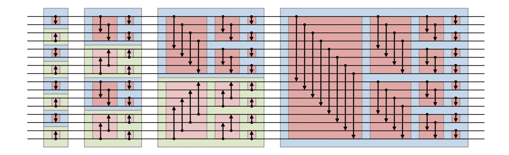

{0}------------------------------------------------

# Data Oblivious Algorithms for Multicores<sup>∗</sup>

Vijaya Ramachandran UT Austin vlr@cs.utexas.edu

Elaine Shi CMU runting@gmail.com

## Abstract

A data-oblivious algorithm is an algorithm whose memory access pattern is independent of the input values. As secure processors such as Intel SGX (with hyperthreading) become widely adopted, there is a growing appetite for private analytics on big data. Most prior works on data-oblivious algorithms adopt the classical PRAM model to capture parallelism. However, it is widely understood that PRAM does not best capture realistic multicore processors, nor does it reflect parallel programming models adopted in practice.

We initiate the study of parallel data oblivious algorithms on realistic multicores, best captured by the binary fork-join model of computation. We present a data-oblivious CREW binary fork-join sorting algorithm with optimal total work and optimal (cache-oblivious) cache complexity, and in O(log n log log n) span (i.e., parallel time); these bounds match the best-known bounds for binary fork-join cache-efficient insecure algorithms. Using our sorting algorithm as a core primitive, we show how to data-obliviously simulate general PRAM algorithms in the binary fork-join model with non-trivial efficiency, and we present data-oblivious algorithms for several applications including list ranking, Euler tour, tree contraction, connected components, and minimum spanning forest. All of our data oblivious algorithms have bounds that either match or improve over the best known bounds for insecure algorithms.

Complementing these asymptotically efficient results, we present a practical variant of our sorting algorithm that is self-contained and potentially implementable. It has optimal caching cost, and it is only a log log n factor off from optimal work and about a log n factor off in terms of span; moreover, it achieves small constant factors in its bounds. We also present an EREW variant with optimal work and caching cost, and with the same asymptotic span.

<sup>∗</sup>This work was supported in part by NSF grant CCF-2008241, CNS-2128519, and CNS-2044679. The extended abstract of this paper appears in *Proc. ACM Symp. on Parallelism in Algorithms and Architectures (SPAA)*, 2021.

{1}------------------------------------------------

# <span id="page-1-1"></span>1 Introduction

As secure processors such as Intel SGX (with hyperthreading) become widely adopted, there is a growing appetite for private analytics on big data. Most prior works on data-oblivious algorithms adopt the classical PRAM model to capture parallelism. However, it is widely understood that PRAM does not best capture realistic multicore processors, nor does it reflect parallel programming models adopted in practice.

We initiate the study of *data-oblivious* algorithms for a multicore architecture where parallelism and synchronization are expressed with nested binary fork-join operations. Imagine that a client outsources encrypted data to an untrusted cloud server which is equipped with a secure, multicore processor architecture (e.g., Intel SGX with hyperthreading). All data contents are encrypted to the secure processor's secret key both at rest and in transit. Data is decrypted only inside the secure cores' hardware sandboxes where computation takes place. However, it is well-known that encryption alone does not guarantee privacy, since access patterns to even encrypted data leak a lot of sensitive information [\[IKK12,](#page-27-0) [XCP15\]](#page-28-0). To defend against access pattern leakage, an active line of work [\[GO96,](#page-27-1)[Gol87,](#page-27-2)[LWN](#page-27-3)+15,[CS17,](#page-26-0)[BCP15,](#page-25-0)[SCSL11\]](#page-28-1) has focused on how to design algorithms whose access pattern distributions do not depend on the secret inputs — such algorithms are called *data-oblivious* algorithms, and are the focus of our work. In this paper we present nested fork-join data-oblivious algorithms for several fundamental problems that are highly parallel, and work- and cache-efficient. Throughout this paper, we consider only data oblivious algorithms that are unconditionally secure (often called "statistically secure"), i.e., without the need to make any computational hardness assumptions.

There has been some prior work exploring the design of *parallel* data-oblivious algorithms. Most of these prior parallel data-oblivious algorithms [\[NWI](#page-27-4)+15, [BCP15,](#page-25-0) [CS17\]](#page-26-0) adopted PRAM as the model of computation. However, the global synchronization between cores at each parallel step of the computation in a PRAM algorithm does not best capture modern multicore architectures, where the cores typically proceed asynchronously. To better account for synchronization cost, a long line of work [\[ABB00,](#page-24-0)[BGS10,](#page-25-1)[BCG](#page-25-2)+08, [BL93,](#page-25-3)[BL99,](#page-25-4)[CR10a,](#page-26-1)[CR08,](#page-26-2)[FS09,](#page-27-5)[CR12a,](#page-26-3)[CR12b,](#page-26-4)[CR13,](#page-26-5)[CRSB13,](#page-26-6)[CR17b,](#page-26-7)[CR17a,](#page-26-8)[BG04,](#page-25-5)[BFGS11,](#page-25-6)[BGM99,](#page-25-7) [ABP98\]](#page-24-1) has adopted a multithreaded computation model with CREW (Concurrent Read Exclusive Write) shared memory in which parallelism is expressed through paired fork and join operations. A binary fork spawns two tasks that can execute in parallel. Its corresponding join is a synchronization point: both of the spawned tasks must complete before the computation can proceed beyond this join. Such a binary fork-join model is also adopted in practice, and supported by programming systems such as Cilk [\[FLR98\]](#page-27-6), the Java fork-join framework [\[Ora\]](#page-28-2), X10 [\[CGS](#page-26-9)+05], Habanero [\[BCR](#page-25-8)+11], Intel Threading Building Blocks [\[Git\]](#page-27-7), and the Microsoft Task Parallel Library [\[Mic\]](#page-27-8).

Efficiency in a multi-threaded algorithm with binary fork-joins is measured through the following metrics: the algorithm's *total work* (i.e., the sequential execution time), its *cache complexity* (i.e., the number of cache misses), and its *span* (i.e., the length of the longest path in the computation DAG). The span is also the number of parallel steps in the computation assuming that unlimited number of processors are available and they all execute at the same rate. We discuss the binary fork-join model in more detail in Section [1.2](#page-5-0) and Appendix [A.](#page-16-0)

# 1.1 Our Results

We present highly parallel data-oblivious multithreaded algorithms that are also cache-efficient for a suite of fundamental computation tasks, starting with sorting. Our results show how to get privacy for free for a range of tasks in this important parallel computation model. Further, all of our algorithms are cacheagnostic [\[FLPR99\]](#page-26-10) [1](#page-1-0) , i.e., the algorithm need not know the cache's parameters including the cache-line (i.e., block) size and cache size. Besides devising new algorithms, our work also makes a conceptual contribution

<span id="page-1-0"></span><sup>1</sup> "Cache-agnostic" is also called cache-oblivious in the algorithms literature [\[FLPR99\]](#page-26-10). In order to avoid confusion with data obliviousness, we will reserve the term 'oblivious' for data-oblivious, and we will use *cache-agnostic* in place of cache-oblivious.

{2}------------------------------------------------

by creating a bridge between two lines of work from the cryptography and algorithms literature, respectively. We now state our results.

Sorting. To attain our results, the most important building block is data-oblivious sorting. We present a randomized data-oblivious, cache-agnostic CREW binary fork-join sorting algorithm, BUTTERFLY-SORT, which matches the work, span and cache-oblivious caching bounds of SPMS [\[CR17b\]](#page-26-7), the current best insecure algorithm. These bounds are given in Theorem [1.1.](#page-2-0) As noted in [\[CR17b\]](#page-26-7), these bounds are optimal for work and cache complexity, and are within an O(log log n) factor of optimality for span (even for the CREW PRAM). The key ingredient in BUTTERFLY-SORT is BUTTERFLY-RANDOM-PERMUTE (B-RPERMUTE), which randomly permutes the input array without leaking the permutation, and guided by a butterfly network. The overall BUTTERFLY-SORT simply runs B-RPERMUTE and then runs SPMS on the randomly permuted array.

In comparison with known cache-agnostic and data-oblivious sorting algorithms [\[CGLS18\]](#page-26-11), BUTTERFLY-SORT improves the span by an (almost) exponential factor — the prior work [\[CGLS18\]](#page-26-11) requires n parallel runtime for some constant ∈ (0, 1) even without the binary fork-join constraint. As a by-product, our work gives a new oblivious sort result in the standard external-memory model: we actually give the first oblivious sort algorithm that is optimal in both total work and cache complexity — such a result was not known before even in the cache-aware setting. For example, the prior works by Chan et al. [\[CGLS18\]](#page-26-11) and Goodrich [\[Goo11\]](#page-27-9) achieve optimal cache complexity, but incur extra log log n factors in the total work; and moreover, Goodrich's result [\[Goo11\]](#page-27-9) requires cache-awareness. Additionally, BUTTERFLY-SORT is a conceptually simple algorithm and it is fairly straightforward to map it into a data oblivious algorithm matching the current best sorting bound on other models such as BSP and PEM (Parallel External Memory) [\[AGNS08\]](#page-24-2). We now state our sorting result.

<span id="page-2-0"></span>Theorem 1.1 (BUTTERFLY-SORT). *Let* B *denote the block size and* M *denote the cache size. Under the standard tall cache assumption* M = Ω(B1+ )*, and* M = Ω(log1+ n) *where* ∈ (0, 1) *is an arbitrarily small constant,* BUTTERFLY-SORT *is a cache-agnostic CREW binary fork-join algorithm that obliviously sorts an array of size* n *with an optimal cache complexity of* O((n/B) · log<sup>M</sup> n)*, optimal total work* O(n log n)*, and* O(log n·log log n) *span which matches the best known non-oblivious algorithm in the same model.*

Practical and EREW variants. We devise a conceptually simple algorithm, BUTTERFLY-RANDOM-SORT (B-RSORT), to sort an input array *that has been randomly permuted*. This algorithm uses a collection of pivots, and is similar in structure to our B-RPERMUTE algorithm. By replacing SPMS with B-RSORT to sort the randomly permuted output of B-RPERMUTE, we obtain a simple oblivious scheme for sorting, which we call BUTTERFLY-BUTTERFLY-SORT (BB-SORT). By varying the primitives used within BB-SORT we obtain two useful versions: a potentially practical sorting algorithm which uses bitonic sort for small sub-problems, and an efficient EREW binary fork-join version which retains AKS sorting for small subproblems.

Our practical version uses bitonic sort as the main primitive, and for this we present an EREW binary fork-join bitonic sort algorithm that improves on the na¨ıve binary fork-join version by achieving span O(log<sup>2</sup> n · log log n) and cache-agnostic caching cost O((n/B) · log<sup>M</sup> n · log(n/M)) while retaining its O(n log<sup>2</sup> n) work.

The use of AKS in our EREW and CREW algorithms may appear impractical. However, it is to be observed that prior O(n log n)-work oblivious algorithms for sorting — the AKS network [\[AKS83\]](#page-25-9), Zigzag sort [\[Goo14\]](#page-27-10), and an O(n log n) version of oblivious bucket sort [\[ACN](#page-24-3)+20] — all use expanders within their construction. Sorting can be performed using an efficient oblivious priority queue that does not use expanders [\[Shi20,](#page-28-3)[JLS20\]](#page-27-11); however this incurs ω(n log n) work to achieve a negligible in n failure probability.

{3}------------------------------------------------

<span id="page-3-1"></span>Table 1: Comparison with prior insecure algorithms.  $\widetilde{O}(\cdot)$  hides a single  $\log \log n$  factor. LR = "list ranking", ET-Tree = "Tree computations with Euler tour", TC = "Tree contraction", CC = "connected components", MSF = "minimum spanning forest". For graph problems, n is the number of vertices, and  $m = \Omega(n)$  is the number of edges. We compare with insecure cache-efficient CREW binary fork-join algorithms. The prior bounds, except for tree contraction, are from [CR12a], and implicit in other work [BGS10, CRSB13]. The prior result for sort is SPMS sort [CR10b, CR17b]. The prior bound for tree contraction (TC) is from [BGS10]. A '†' next to a result indicates that we improve the performance relative to the best known bound for the insecure case. If cache-efficiency is not considered for insecure algorithms, the best CREW binary fork-join span for all tasks except Sort is  $O(\log^2 n)$ ; for Sort it remains  $\widetilde{O}(\log n)$ .

| Task                  | Our data-oblivious algorithm |                           |                                           | Previous best insecure algorithm |                           |                                           |
|-----------------------|------------------------------|---------------------------|-------------------------------------------|----------------------------------|---------------------------|-------------------------------------------|
|                       | work                         | span                      | cache                                     | work                             | span                      | cache                                     |
| Sort                  | $O(n \log n)$                | $\widetilde{O}(\log n)$   | $O(\frac{n}{B}\log_M n)$                  | $O(n \log n)$                    | $\widetilde{O}(\log n)$   | $O(\frac{n}{B}\log_M n)$                  |
| LR                    | $O(n \log n)$                | $\widetilde{O}(\log^2 n)$ | $O(\frac{n}{B}\log_M n)$                  | $O(n \log n)$                    | $\widetilde{O}(\log^2 n)$ | $O(\frac{n}{B}\log_M n)$                  |
| ET-Tree               | $O(n \log n)$                | $\widetilde{O}(\log^2 n)$ | $O(\frac{n}{B}\log_M n)$                  | $O(n \log n)$                    | $\widetilde{O}(\log^2 n)$ | $O(\frac{n}{B}\log_M n)$                  |
| $\mathrm{TC}^\dagger$ | $O(n \log n)$                | $\widetilde{O}(\log^2 n)$ | $O(\frac{n}{B}\log_M n)$                  | $O(n \log n)$                    | $\widetilde{O}(\log^3 n)$ | $O(\frac{n}{B}\log_M n)$                  |
| $CC^{\dagger}$        | $O(m\log^2 n)$               | $\widetilde{O}(\log^2 n)$ | $O(\frac{m}{B}\log_M n\log n)$            | $O(m\log^2 n)$                   | $\widetilde{O}(\log^3 n)$ | $O(\frac{m}{B}\log_M n\log n)$            |
| ${\sf MSF}^\dagger$   | $O(m\log^2 n)$               | $\widetilde{O}(\log^2 n)$ | $O(\frac{\overline{m}}{B}\log_M n\log n)$ | $O(m\log^2 n)$                   | $\widetilde{O}(\log^3 n)$ | $O(\frac{\overline{m}}{B}\log_M n\log n)$ |

Further, this method is not cache-efficient and is inherently sequential. It is to be noted that our practical version does not use AKS or expanders.

Table 3 in Section 3 lists the bounds for our sorting algorithms.

**Data-oblivious simulation of PRAM in CREW binary fork-join.** Using our sorting algorithm, we show how to compile any CRCW PRAM algorithm to a data-oblivious, cache-agnostic binary-fork algorithm with non-trivial efficiency. We present two results along these lines. The first is a compiler that works efficiently for space-bounded PRAM programs, i.e., when the space s used is close to the number of processors p. We argue that this is an important special case because our space-bounded simulation of CRCW PRAM on oblivious binary fork-join (*space-bounded PRAM on OBFJ*) allows us to derive oblivious binary fork-join algorithms for several computational tasks that are cornerstones of the parallel algorithms literature. Our space-bounded PRAM on OBFJ result is given in Theorem 4.1 in Section 4. As stated there, each step of a p-processor CRCW PRAM can be emulated within the work, span, and cache-agnostic caching bounds for sorting O(p) elements.

Our second PRAM on OBFJ result works for the general case when the space s consumed by the PRAM can be much greater than (e.g., a polynomial function in) the number of processors p. For this setting, we show a result that strictly generalizes the best known Oblivious Parallel RAM (OPRAM) construction [CS17, CCS17]. Specifically, we can compile any CRCW PRAM to a data oblivious, cache-agnostic, binary fork-join program where each parallel step in the original PRAM can be simulated with  $p \log^2 s$  total work and  $O(\log s \cdot \log \log s)$  span. The exact statement is in Theorem 4.2 in Section 4.2. In terms of work and span, the bounds in this result match the asymptotical performance of the best prior OPRAM result [CS17, CCS17], which is a PRAM on oblivious PRAM result, and hence would only imply results for unbounded forking.<sup>2</sup>. Moreover, we also give explicit cache complexity bounds for our oblivious simulation which was not considered in prior work [CS17, CCS17].

To obtain the above PRAM simulation results, we use some building blocks that are core to the oblivious

<span id="page-3-0"></span><sup>&</sup>lt;sup>2</sup>The concurrent work by Asharov et al. [AKL<sup>+</sup>20c] shows that assuming the existence of one-way functions, each parallel step of a CRCW PRAM can be obliviously simulated in  $O(\log s)$  work and  $O(\log s)$  parallel time on a CRCW PRAM. Their work is of a different nature because they consider computational security and moreover, their target PRAM allows concurrent writes.

{4}------------------------------------------------

<span id="page-4-0"></span>**Table 2:** Comparison with prior oblivious algorithms. The prior best is obtained by taking the best known oblivious PRAM algorithm and naïvely fork and join n threads at every PRAM step.  $\widetilde{O}$  hides a single  $\log \log n$  or  $\log \log s$  factor. Aggr = aggregation, Prop = propagation, S-R = send-receive, PRAM = oblivious simulation of a p-processor, s-space PRAM (cost of simulating a single step, assuming  $s \ge p$ ), and  $\bigstar = O(\log s \cdot ((p/B) \cdot \log_M p + p \cdot \log_B s))$ . The best known algorithm for aggregation and propagation are due to [NWI+15,CS17], send-receive is obtained by combining [NWI+15,CS17], [AKS83], and [CGLS18], oblivious simulation of PRAM is due to or implied by [BCP15, CCS17].

| Obliv.     | Our algorithm |                                                 |                                                | Prior best                                                                 |                                         |                                             |
|------------|---------------|-------------------------------------------------|------------------------------------------------|----------------------------------------------------------------------------|-----------------------------------------|---------------------------------------------|
| Alg.       | work          | span                                            | cache                                          | work                                                                       | span                                    | cache                                       |
| Aggr       | O(n)          | $O(\log n)$                                     | O(n/B)                                         | O(n)                                                                       | $O(\log^2 n)$                           | O(n/B)                                      |
| Prop       | O(n)          | $O(\log n)$                                     | O(n/B)                                         | O(n)                                                                       | $O(\log^2 n)$                           | O(n/B)                                      |
| Sort & S-R | $O(n \log n)$ | $\widetilde{O}(\log n)$                         | $O(\frac{n}{B}\log_M n)$                       | $\begin{array}{ c c }\hline O(n\log n)\\O(n\log n\log^2\log n)\end{array}$ | $\frac{O(\log^2 n)}{O(n^{\epsilon})}$   | $\frac{O(n\log n)}{O(\frac{n}{B}\log_M n)}$ |
| PRAM       |               | $\widetilde{O}(\log s) \ \widetilde{O}(\log s)$ | $O(\frac{s}{B}\log_M s)$ $\bigstar$ in caption | $\begin{array}{ c } O(s\log^2 s) \\ O(p\log^2 s) \end{array}$              | $O(\log^2 s)$ $\widetilde{O}(\log^2 s)$ | $O(s \log s)$<br>$O(p \log^2 s)$            |

algorithms literature, called *aggregation, propagation,* and *send-receive* [NWI $^+$ 15, BCP15, CS17]. Table 2 shows the performance bounds of our algorithms for these building blocks and general PRAM simulation vs. the best known *data-oblivious* results, where the latter is obtained by taking the best known oblivious PRAM algorithm and naïvely forking n threads in a binary-tree fashion for every PRAM step. The table shows that we improve over the prior best results for all tasks.

**Applications.** There is a very large collection of efficient PRAM algorithms in the literature for a variety of important problems. We use our PRAM simulation results as a generic way of translating some of these algorithms into efficient data-oblivious algorithms in binary fork-join. For other important computational problems we use our new sorting algorithm as a building block to directly obtain efficient data-oblivious algorithms.

We list our results in Table 1 and compare with results for insecure cache-efficient CREW binary fork-join algorithms. Our results for tree contraction (TC), connected components (CC), and minimum spanning forest (MSF) are obtained through our space-bounded PRAM on OBFJ result, and in all three cases our data-oblivious binary fork-join algorithms improve the commonly-cited span by a  $\log n$  factor while matching the total work and cache complexity of the best known insecure algorithms. For other computational tasks such as list ranking and rooted tree computations with Euler tour, we design data-oblivious algorithms that match the best work, span and cache-efficiency bounds known for insecure algorithms in the binary fork-join model: these give better bounds than what we would achieve with the PRAM simulation.

Throughout, we allow our algorithms to have only an extremely small failure probability (either in correctness or in security) that is  $o(1/n^k)$ , for any constant k. We refer to such a probability as being negligible in n. Such strong bounds are typical for cryptographic and security applications, and are stronger than the w.h.p. bounds (failure probability  $O(1/n^k)$ , for any constant k) commonly used for standard (insecure) randomized algorithms.

Road-map. The rest of the paper is organized as follows. The rest of this section has short backgrounds on multithreaded, cache-efficient and data-oblivious algorithms. Section 2 is on BUTTERFLY-RANDOM-PERMUTE and BUTTERFLY-SORT, our most efficient data oblivious sorting algorithm. Section 3 is on BUTTERFLY-RANDOM-SORT which gives our simple oblivious algorithm for sorting a random permutation, and BUTTERFLY-BUTTERFLY-SORT which gives our practical and EREW sorting algorithms. Section 4 has

{5}------------------------------------------------

<span id="page-5-0"></span>PRAM simulations, and Section 5 has applications. Many details are in the appendices.

### 1.2 Binary Fork-Join Model

For parallelism we consider a multicore environment consisting of P cores (or processors), each with a private cache of size M. The processors communicate through an arbitrarily large shared memory. Data is organized in blocks (or 'cache lines') of size B.

We will express parallelism using a multithreaded model through paired fork and join operations (See Chapter 27 in Cormen et al. [CLRS09] for an introduction to this model). The execution of a binary fork-join algorithm starts at a single processor. A thread can rely on a *fork* operation to spawn two tasks; and the forked parallel tasks can be executed by other processors, as determined by a scheduler. The two tasks will later *join*, and the corresponding join serves as a synchronization point: both of the spawned tasks must complete before the computation can proceed beyond this join. The memory accesses are CREW: concurrent reads are allowed at a memory location but no concurrent writes at a location.

The work of a multithreaded algorithm Alg is the total number of operations it executes; equivalently, it is the sequential time when it is executed on one processor. The span of Alg, often called its critical path length or parallel time  $T_{\infty}$ , is the number of parallel steps in the algorithm. The cache complexity of a binary fork-join algorithm is the total number of cache misses incurred across all processors during the execution.

For cache-efficiency, we will use the cache-oblivious model in Frigo et al. [FLPR99]. As noted earlier, in this paper we will use the term cache-agnostic in place of cache-oblivious, and reserve the term 'oblivious' for data-obliviousness. We assume a cache of size M partitioned into blocks (or cache-lines) of size B. We will use  $Q_{sort}(n) = \Theta((n/B) \cdot \log_M n)$  to denote the optimal caching bound for sorting n elements, and for a cache-agnostic algorithm to achieve this bound we need  $M = \Omega(B^2)$  (or  $M = \Omega(B^{1+\delta})$  for some given arbitrarily small constant  $\delta > 0$ ). Several sorting algorithms with optimal work (i.e., sequential time) and cache-agnostic caching cost are known, including two in [FLPR99].

We would like to design binary fork-join algorithms with small work, small sequential caching cost, preferably cache-agnostic, and small span. As explained in Appendix A.3, this will lead to good parallelism and cache-efficiency in an execution under randomized work stealing [BL99].

Let  $T_{\rm sort}(n)$  be the smallest span for a binary fork-join algorithm that sorts n elements with a comparison-based sort. It is readily seen that  $T_{\rm sort}(n) = \Omega(\log n)$ . The current best binary fork-join algorithm for sorting is SPMS (Sample Partition Merge Sort) [CR17b]. This algorithm has span  $O(\log n \cdot \log \log n)$  with optimal work  $W_{\rm sort} = O(n \log n)$  and optimal cache complexity  $Q_{\rm sort}(n)$ . But the SPMS algorithm is not data-oblivious. No non-trivial data oblivious parallel sorting algorithm with optimal cache complexity was known prior to the results we present in this paper.

More background on caching and multithreaded computations is given in Appendix A.

### 1.3 Data Oblivious Binary Fork-Join Algorithms

Unlike the terminology "cache obliviousness", data obliviousness captures the privacy requirement of a program. As mentioned in the introduction, we consider a multicore secure processor like Intel's SGX (with hyperthreading), and all data is encrypted to the secure processor's secret key at rest or in transit. Therefore, the adversary, e.g., a compromised operating system or a malicious system administrator with physical access to the machine, cannot observe the contents of memory. However, the adversary may control the scheduler that schedules threads onto cores. Moreover, it can observe 1) the computation DAG that captures the pattern of forks and joins, and 2) the memory addresses accessed by all threads of the binary fork-join program. The above observations jointly form the "access patterns" of the binary fork-join program.

We adapt the standard definition of data obliviousness [GO96, Gol87, CS17] to the binary fork-join setting.

{6}------------------------------------------------

Definition 1 (Data oblivious binary fork-join algorithm). We say that a binary fork-join algorithm Alg data-obliviously realizes (or obliviously realizes) a possibly randomized functionality F, iff there exists a simulator Sim such that for any input I, the following two distributions have negligible statistical distance: 1) the joint distribution of Alg's output on input I and the access patterns; and 2) (F(I), Sim(|I|)).

For example, in an oblivious random permutation, the ideal functionality F is the functionality which, upon receiving an input array, outputs a random permutation of the input. Note that the simulator Sim knows only the length of the input I but not the contents of I, i.e., the access patterns are simulatable without knowing the input. For randomized functionalities (e.g., random permutation), it is important that the *joint* distribution of the output and access patterns (often called the "real world") is statistically close to the *joint* distribution of the functionality's output and simulated access patterns (often called the "ideal world"). Observe that in the ideal world, the functionality F uses independent coins from the simulator Sim. This implies that in the real world, the access patterns should be (almost) independent of the computation outcome (e.g., the output permutation).

We stress that our notion of data obliviousness continues to hold if the adversary can observe the exact address a processor accesses, even if that data is in cache. In this way, our security notion can rule out attacks that try to glean secret information through many types of cache-timing attacks. Our notion secures even against computationally unbounded adversaries, often referred to as *statistical security* in the cryptography literature.

One sometimes inefficient way to design binary-fork-join algorithms is to take a Concurrent-Read-Exclusive-Write (CREW) PRAM algorithm, and simply fork n threads in a binary-tree fashion to simulate every step of the PRAM. If the original PRAM has T(n) parallel runtime and W(n) work, then the same program has T(n) · log n span and W(n) work in a binary-fork-join model. Moreover, if the algorithm obliviously realizes some functionality F on a CREW PRAM, the same algorithm obliviously realizes F in a binary-fork-join model too. More details on data obliviousness are in Appendix [B.](#page-17-1)

# <span id="page-6-0"></span>2 BUTTERFLY-SORT

To sort the input array, our CREW binary fork-join algorithm BUTTERFLY-SORT first applies an oblivious random permutation to the input elements, and then apply any (insecure) *comparison-based* sorting algorithm such as SPMS [\[CR17b\]](#page-26-7) to the permuted array. It is shown in [\[ACN](#page-24-3)+20] that this will give an oblivious sorting algorithm.

Our random permutation algorithm, BUTTERFLY-RANDOM-PERMUTE (B-RPERMUTE) builds on an algorithm for this problem given in Asharov et al. [\[ACN](#page-24-3)+20] to obtain improved bounds as well as cacheagnostic cache-efficiency. To attain an oblivious random permutation, a key step in [\[ACN](#page-24-3)+20] is to randomly assign elements to bins of Z = ω(log n) capacity but without leaking the bin choices — we call this primitive *oblivious random bin assignment (ORBA)*. For simplicity, we shall assume Z = Θ(log<sup>2</sup> n).

In Section [2.1](#page-6-1) we describe our improvements to the ORBA algorithm in [\[ACN](#page-24-3)+20]. In Section [2.2](#page-8-0) we describe BUTTERFLY-RANDOM-PERMUTE and BUTTERFLY-SORT.

## <span id="page-6-1"></span>2.1 Oblivious Random Bin Assignment: ORBA

We first give a brief overview of an ORBA algorithm by Asharov et al. [\[ACN](#page-24-3)+20]. By using an algorithm for parallel compaction in [\[AKL](#page-25-11)+20b], this ORBA algorithm in [\[ACN](#page-24-3)+20] can be made to run with O(n log n) work and in O(log n · log log n) parallel time on an EREW PRAM (though not on binary fork-join). In this ORBA algorithm [\[ACN](#page-24-3)+20], the n input elements are divided into β = 2n/Z bins and each bin is then padded with Z/2 filler elements to a capacity of Z. We assume that β is a power of 2. Each real element in the input chooses a random label from the range [0, β − 1] which expresses the desired bin. The elements are then routed over a 2-way butterfly network of Θ(log n) depth, and in each layer of the butterfly network there are β bins, each of capacity Z. In every layer i of the network, input bins from the previous layer are 

{7}------------------------------------------------

paired up in an appropriate manner, and the real elements contained in the two input bins are obliviously distributed to two output bins in the next layer, based on the i-th bit of their random labels. For obliviousness, the output bins are also padded with filler elements to a capacity of Z.

Our 'meta-algorithm' META-ORBA saves an  $O(\log\log n)$  factor in the PRAM running time while retaining the  $O(n\log n)$  work. For this we use a  $\gamma = \Theta(\log n)$ -way butterfly network, with  $\gamma$  a power of 2, rather than 2-way. Therefore, in each layer of the butterfly network, groups of  $\Theta(\log n)$  input bins from the previous layer are appropriately chosen, and the real elements in the  $\log n$  input bins are obliviously distributed to  $\Theta(\log n)$  output bins in the next layer, based on the next unconsumed  $\Theta(\log\log n)$  bits in their random labels. Again, all bins are padded with filler elements to a capacity of Z so the adversary cannot tell the bin's actual load. To perform this  $\Theta(\log n)$ -way distribution obliviously, it suffices to invoke the AKS construction [AKS83] O(1) number of times.

We now analyze the performance of this algorithm.

- For O(1) invocations of AKS on  $\Theta(\log n)$  bins each of size  $Z = \Theta(\log^2 n)$ : Total work is  $O(\log^3 n \cdot \log\log n)$  and the parallel time on an EREW PRAM is  $O(\log\log n)$ .
- For computing a single layer, with  $\beta/\Theta(\log n) = 2n/\Theta(\log^3 n)$  subproblems: Total work for a single layer is  $O(n \cdot \log \log n)$  and EREW PRAM time remains  $O(\log \log n)$ .
- The  $\Theta(\log n)$ -way butterfly network has  $\Theta(\log n/\log\log n)$  layers, hence META-ORBA performs  $O(n\log n)$  total work, and runs in  $O(\log n)$  parallel time on an EREW PRAM.

Overflow analysis. Our META-ORBA algorithm has deterministic data access patterns that are independent of the input. However, if some bin overflows its capacity due to the random label assignment, the algorithm can lose real elements during the routing process. Asharov et al. [ACN+20] showed that for the special case  $\gamma=2$ , the probability of overflow is upper bounded by  $\exp(-\Omega(\log^2 n))$  assuming that the bin size  $Z=\log^2 n$ . Suppose now that  $\gamma=2^r$ , then the elements in the level-i bins in our META-ORBA algorithm correspond exactly to the elements in the level- $(r\cdot i)$  bins in the ORBA algorithm in [ACN+20]. Since the failure probability  $\exp(-\Omega(\log^2 n))$  is negligibly small in n, we have that for  $Z=\log^2 n$  and  $\gamma=\Theta(\log n)$ , our META-ORBA algorithm obliviously realizes random bin assignment on an EREW PRAM with  $O(n\log n)$  total work and  $O(\log n)$  parallel runtime with negligible error.

We have now improved the parallel runtime by a  $\log \log n$  factor relative to Asharov et al. [ACN<sup>+</sup>20] (even when compared against an improved version of their algorithm that uses new primitives such as parallel compaction [AKL<sup>+</sup>20b]) but this is on an EREW PRAM. In the next section we translate this into REC-ORBA, our cache-agnostic, binary fork-join implementation.

### **2.1.1** REC-ORBA

We will assume a tall cache  $(M = \Omega(B^2))$  for REC-ORBA, our recursive cache-agnostic, binary fork-join implementation of our META-ORBA algorithm. We will also assume  $M = \Omega(n^{1+\epsilon})$  for any given arbitrarily small constant  $\epsilon > 0$ . In the following we will use  $\epsilon = 2$  for simplicity, i.e.,  $M = \Omega(\log^3 n)$ .

In REC-ORBA, we implement META-ORBA by recursively solving  $\sqrt{\beta}$  subproblems, each with  $\sqrt{\beta}$  bins: in each subproblem, we shall obliviously distribute the real elements in the  $\sqrt{\beta}$  input bins into  $\sqrt{\beta}$  output bins, using the  $(1/2)\log\beta$  most significant bits (MSBs) in the labels. After this phase, we use a matrix transposition to bring the  $\sqrt{\beta}$  bins with the same  $(1/2) \cdot \log \beta$  MSBs together — these  $\sqrt{\beta}$  bins now belong to the same subproblem for the next phase. where we recursively solve each subproblem defined above: for each subproblem, we distribute the  $\sqrt{\beta}$  bins into  $\sqrt{\beta}$  output bins based on the  $(1/2) \cdot \log \beta$  least significant bits in the elements' random labels. The pseudocode is below.

{8}------------------------------------------------

REC-ORBA
$$^{\gamma,Z}(\mathbf{I},s)$$

**Input:** the input contains an array I containing  $n = \beta \cdot Z$  elements where  $\beta$  is assumed to be a power of 2. Each element in I is either *real* or a *filler*. The input array I can be viewed as  $\beta$  bins each of size Z. It is promised that each bin has at most Z/2 real elements. Every real element in I has a label that determines which destination bin the element wants to go to.

## Algorithm:

If  $\beta \leq \gamma$ , invoke an instance of oblivious bin placement (Section C) to assign the input array I to a total of  $\beta$  bins each of capacity Z. Here, each element's destination bin is determined by the s-th to  $(s + \log_2 \beta - 1)$ -th bits of its label. Return the resulting list of  $\beta$  bins.

Else, proceed with the following recursive algorithm.

- Let  $\beta_1$  be  $\sqrt{\beta}$  rounded up to the nearest power of 2. Divide the input array  $\mathbf{I}$  into  $\beta_1$  partitions where each partition contains exactly  $\beta_2 := \beta/\beta_1$  consecutive bins. Note that if  $\beta$  is a perfect square,  $\beta_1 = \beta_2 = \sqrt{\beta}$ . Henceforth let  $\mathbf{I}^j$  denote the j-th partition where  $j \in [\beta_1]$ .
- In parallel<sup>a</sup>: For each  $j \in [\beta_1]$ , let  $\mathsf{Bin}_1^j, \ldots, \mathsf{Bin}_{\beta_2}^j \leftarrow \mathsf{REC}\text{-}\mathsf{ORBA}^{\gamma, Z}(\mathbf{I}^j, s)$ .
- Let Bins be a  $\beta_1 \times \beta_2$  matrix where the *j*-th row is the list of bins  $\mathsf{Bin}_1^j, \ldots, \mathsf{Bin}_{\beta_2}^j$ . Note that each element in the matrix is a bin. Now, perform a matrix transposition:  $\mathsf{TBins}^T$ . Henceforth, let  $\mathsf{TBins}[i]$  denote the *i*-th row of  $\mathsf{TBins}$  consisting of  $\beta_2$  bins,
- In parallel: For  $i \in [\beta_2]$ , let  $\widetilde{\mathsf{Bin}}_1^i, \dots, \widetilde{\mathsf{Bin}}_{\beta_1}^i \leftarrow \mathsf{REC}\text{-}\mathsf{ORBA}^{\gamma,Z}(\mathsf{TBins}[i], s + \log_2\beta_2 1)$
- Return the concatenation  $\widetilde{\mathsf{Bin}}_1^1, \dots, \widetilde{\mathsf{Bin}}_{\beta_1}^1, \widetilde{\mathsf{Bin}}_1^2, \dots, \widetilde{\mathsf{Bin}}_{\beta_1}^2, \dots, \widetilde{\mathsf{Bin}}_{\beta_1}^2, \dots, \widetilde{\mathsf{Bin}}_{\beta_1}^{\beta_2}, \dots, \widetilde{\mathsf{Bin}}_{\beta_1}^{\beta_2}$ .

Since the matrix transposition for Y bins each of capacity  $Z = \Theta(\log^2 n)$  can be performed with  $O(Y \cdot Z/B)$  cache misses, and  $O(\log(Y \cdot Z)) = O(\log n)$  span, we have the following recurrences that characterize the cost of REC-ORBA where Y denotes the current number of bins, and Q(Y) and T(Y) denote the cache complexity and span, respectively, to solve a subproblem containing Y bins:

$$Q(Y) = 2\sqrt{Y} \cdot Q(\sqrt{Y}) + O((Y \cdot \log^2 n)/B)$$
$$T(Y) = 2 \cdot T(\sqrt{Y}) + O(\log(Y \cdot \log^2 n))$$

The base conditions are as follows. Since  $M = \Omega(\log^3 n)$  each individual  $\Theta(\log n)$ -way distribution instance fits in cache and incurs  $O((1/B)\log^3 n)$  cache misses. Hence we have the base case  $Q(Y) = O(Y\log^2 n/B)$  when  $Y\log^2 n \leq M$ . For the span, each individual  $\Theta(\log n)$ -way distribution instance works on  $O(\log^3 n)$  elements and has  $O(\log^2 \log n)$  span under binary forking, achieved by forking and joining  $\log^3 n$  tasks at each level of the AKS sorting network.

Therefore, we have that for  $\beta = 2n/Z$ :  $Q(\beta) = O((n/B)\log_M n)$  and  $T(\beta) = O(\log n \cdot \log\log n)$ . Finally, if we want  $M = \Omega(\log^{1+\epsilon} n)$  rather than  $M = \Omega(\log^3 n)$ , we can simply parametrize the bin size to be  $\log^{1+\epsilon/2} n$  and let  $\gamma = \log^{\epsilon/2} n$ . This gives rise to the following lemma.

<span id="page-8-0"></span>**Lemma 2.1.** Algorithm REC-ORBA has cache-agnostic caching complexity  $O((n/B)\log_M n)$  provided the tall cache has  $M = \Omega(\log^{1+\epsilon} n)$ , for any given positive constant  $\epsilon$ . The algorithm performs  $O(n\log n)$  work and has span  $O(\log n \cdot \log \log n)$ .

<span id="page-8-1"></span><sup>&</sup>lt;sup>a</sup>The "for" loop is executed in parallel, and in the binary fork-join model, a k-way parallelism is achieved by forking k threads in a binary-tree fashion in  $\log_2 k$  depth. In the rest of the paper, we use the same convention when writing pseudo-code for binary fork-join algorithms; we will use fork and join in the pseudocode for two-way parallelism.

{9}------------------------------------------------

<span id="page-9-0"></span>Table 3: Permute & Sort. <sup>O</sup><sup>e</sup> hides a single log log <sup>n</sup> factor. All algorithms except B-RSORT are dataoblivious and all have negligible error, except BITONIC-SORT, which is deterministic. Optimal bounds for general sorting (after the first two rows) are displayed in a box.

| Algorithm              | Function                                       | work                                       | span                     | cache                                                    |
|------------------------|------------------------------------------------|--------------------------------------------|--------------------------|----------------------------------------------------------|
| B-RPERMUTE             | Outputs random permutation<br>of input array   | O(n log n)                                 | Oe(log n)                | n<br>O(<br>logM<br>n)<br>B                               |
| B-RSORT                | Sorts a randomly<br>permuted input array       | O(n log n)                                 | Oe(log n)                | n<br>O(<br>logM<br>n)<br>B                               |
| BUTTERFLY-SORT         | Sorts input array<br>using B-RPERMUTE and SPMS | O(n log n)                                 | Oe(log n)                | n<br>O(<br>logM<br>n)<br>B                               |
| FORK-JOIN BITONIC-SORT | Based on deterministic<br>sorting network      | O(n log2 n)                                | Oe(log2 n)               | n<br>n · log n<br>O(<br>logM<br>M )<br>B                 |
| BB-SORT                | Sorts using B-RPERMUTE<br>and B-RSORT          | Practical: Oe(n log n)<br>EREW: O(n log n) | Oe(log2 n)<br>Oe(log2 n) | n<br>O(<br>logM<br>n)<br>B<br>n<br>O(<br>logM<br>n)<br>B |

# 2.2 BUTTERFLY-RANDOM-PERMUTE and BUTTERFLY-SORT

From ORBA's output (META-ORBA or REC-ORBA) we obtain β bins where each bin contains real and filler elements. To obtain a random permutation of the input array, it is shown in [\[CGLS18,](#page-26-11) [ACN](#page-24-3)+20] that it suffices to do the following: Assign a (log n · log log n)-bit random label to each element, and sort the elements within each bin based their labels using bitonic sort, where all filler elements are treated as having the label ∞ and thus moved to the end of the bin. Finally, remove the filler elements from all bins, and output the result.

We will sort the elements in each bin by their labels with bitonic sort (with a cost of O(log log n) for each comparison due to the large values for the labels). We have β parallel sorting problems on Θ(log<sup>2</sup> n) elements, where each element has an O(log n · log log n)-bit label. Each sorting problem can be performed with O(log<sup>4</sup> log n) span and O(log<sup>2</sup> n · log<sup>3</sup> log n) work in binary fork-join using bitonic sort by paying a O(log log n) factor for the work and span for each comparison due to the O(log n·log log n)-bit labels. The overall cost for this step across all subproblems is O(n·log<sup>3</sup> log n) work and the span remains O(log<sup>4</sup> log n). Since each bitonic sort subproblem fits in cache, the caching cost is simply the scan bound O(n/B). These bounds are dominated by our bounds for REC-ORBA, so this gives an algorithm to generate a random permutation with the same bounds as REC-ORBA.

<span id="page-9-1"></span>Finally, once the elements have been permuted in random order, we can use any insecure comparisonbased sorting algorithm to sort the permuted array. We use SPMS sort [\[CR17b\]](#page-26-7), the best cache-agnostic sorting algorithm for the binary fork-join model (CREW) to obtain BUTTERFLY-SORT. Thus we achieve the bounds in Theorem [1.1](#page-2-0) in the introduction, and we have a data-oblivious sorting algorithm that matches the performance bounds for SPMS [\[CR17b\]](#page-26-7), the current best insecure algorithm in the cache-agnostic binary fork-join model. Asharov et al. [\[ACN](#page-24-3)+20] and Chan et al. [\[CGLS18\]](#page-26-11) proved that given an ORP, one can construct an oblivious sorting algorithm by first running ORP to randomly permute the input array, and then applying any *comparison-based* non-oblivious sorting algorithm to sort the permuted array. It is important that the non-oblivious sorting algorithm adopted be *comparison-based*, otherwise the resulting algorithm may leak information through its access patterns (e.g., a non-comparison-based sorting algorithm can look at some bits in each element and place it in a corresponding bin). The proof of Asharov et al. [\[ACN](#page-24-3)+20] and Chan et al. [\[CGLS18\]](#page-26-11) extends to the binary fork-join model in a straightforward manner.

{10}------------------------------------------------

# 3 Practical and EREW Sorting

So far, our algorithm relies on AKS [AKS83] and the SPMS [CR17b] algorithm as blackbox primitives and thus is not suitable for practical implementation. We now describe a potentially practical variant that is self-contained and implementable, and gets rid of both AKS and SPMS. To achieve this, we make two changes:

- Bitonic Sort. Our efficient method uses bitonic sort within it, so we first we give an efficient cache-agnostic, binary fork-join implementation of bitonic sort. A naïve binary fork-join implementation of bitonic sort would incur  $O((n/B) \cdot \log^2 n)$  cache misses and  $O(\log^3 n)$  span (achieved by forking and joining the tasks in each layer in the bitonic network). In our binary fork-join bitonic sort, the work remains  $O(n \cdot \log^2 n)$  but the span reduces to  $O(\log^2 n \cdot \log \log n)$  and the caching cost reduces to  $O((n/B) \cdot \log_M n \cdot \log(n/M))$ . (See Section 3.1.)
- Butterfly Random Sort. Second, we present a simple algorithm to sort a randomly permuted input. This algorithm BUTTERFLY-RANDOM-SORT (or B-RSORT) uses the same structure as B-RPERMUTE but uses a sorted set of pivots to determine the binning of the elements. Outside of the need to initially sort  $O(n/\log n)$  random pivot elements, this algorithm has the same performance bounds as B-RPERMUTE. (See Section 3.2.)

We obtain a simple sorting algorithm, which we call BUTTERFLY-BUTTERFLY-SORT or BB-SORT by running B-RPERMUTE followed by B-RSORT on the input: The first call outputs a random permutation of the input and the second call sorts this sequence since B-RSORT correctly sorts a randomly permuted input. We highlight two implementation of BB-SORT:

**Practical BB-Sort.** By using our improved bitonic sort algorithm in place of AKS networks for small subproblems in BB-SORT (both within B-RPERMUTE and B-RSORT), we obtain a simple and practical data-oblivious sorting algorithm that has optimal cache-agnostic cache complexity if  $M = \Omega(\log^{2+\epsilon} n)$  and incurs only an  $O(\log \log n)$  blow-up in work and an  $O(\log n)$  blow-up in span. This algorithm has small constant factors, with each use of bitonic sort contributing a constant factor of 1/2 to the bounds for the number of comparisons made.

**EREW BB-Sort.** For a more efficient EREW binary fork-join sorting algorithm, we retain the AKS network in the butterfly computations in both B-RPERMUTE and B-RSORT. We continue to sort the pivots at the start of B-RSORT with bitonic sort. Thus the cost of the overall algorithm is dominated by the cost to sort the  $n/\log n$  pivots using bitonic sort, and we obtain a simple self-contained EREW binary fork-join sorting algorithm with optimal work and cache-complexity and  $\tilde{O}(\log^2 n)$  span.

Theorem 3.1 states the bounds on these two variants. In the rest of this section we briefly discuss bitonic sort in Section 3.1 and then we present and analyze B-RSORT in Section 3.2.

<span id="page-10-2"></span>**Theorem 3.1.** For  $M = \Omega(\log^{2+\epsilon} n)$ :

- (i) Practical BB-Sort runs in  $O(n \log n \log \log n)$  work, cache-agnostic caching cost  $Q_{sort}(n)$ , and  $O(\log^2 n \cdot \log \log n)$  span.
- (ii) EREW BB-Sort runs in  $O(W_{sort}(n))$  work, cache-agnostic caching cost  $O(Q_{sort}(n))$ , and  $O(\log^2 n \cdot \log \log n)$  span.

Both algorithms are data oblivious with negligible error.

Table 3 lists the bounds for our sorting and permuting algorithms.

#### <span id="page-10-0"></span>3.1 Binary Fork-Join Bitonic Sort

Bitonic sort has  $\log n$  stages of BITONIC-MERGE. We observe that BITONIC-MERGE is a butterfly network and hence it has a binary fork-join algorithm with  $O(n \log n)$  work,  $O(Q_{sort}(n))$  caching cost, and  $O(\log n \log \log n)$  span. Using this within the bitonic sort algorithm we obtain the following theorem. (Details are in Appendix D.2.)

<span id="page-10-3"></span><span id="page-10-1"></span>**Theorem 3.2.** There is a data oblivious cache-agnostic binary fork-join implementation of bitonic sort that can sort n elements in  $O(n \log^2 n)$  work,  $O(\log^2 n \cdot \log \log n)$  span, and  $O((n/B) \cdot \log_M n \cdot \log(n/M))$  cache complexity, when  $n > M > B^2$ .

{11}------------------------------------------------

### 3.2 Sorting a Random Permutation: BUTTERFLY-RANDOM-SORT (B-RSORT)

As mentioned, BUTTERFLY-RANDOM-SORT (B-RSORT) uses the same network structure as REC-ORBA. During pre-processing, we pick and sort a random set of pivot elements. Initially, elements in the input array I are partitioned in bins containing  $\Theta(\log^3 n)$  elements each. Then, the elements traverse a  $\gamma$ -way butterfly network where  $\gamma = \Theta(\log n)$  and is chosen to be a power of 2: at each step, we use sorting to distribute a collection of  $\gamma$  bins at the previous level into  $\gamma$  bins at the next level. Instead of determining the output bin at each level by the random label assigned to an element as in REC-ORBA, here each bin has a range determined by two pivots, and each element will be placed in the bin whose range contains the element's value. Also, in REC-ORBA we needed to use filler elements to hide the actual load of the intermediate bins. B-RSORT does not need to be data-oblivious since its input is a random permutation of the original input, hence we *do not need filler elements* in B-RSORT.

**Pivot selection.** The pivots are chosen in a pre-processing phase, so that we can guarantee that every bin has  $O(\log^3 n)$  elements with all but negligible failure probability, as follows.

- 1. First, generate a sample  $\Pi$  of size close to  $n/\log n$  from the input array  $\mathbf{I}$  by sampling each element with probability  $1/\log n$ . We then sort  $\Pi$  using bitonic sort.
- 2. In the sorted version of  $\Pi$ , every element whose index is a multiple of  $\log^2 n$  is moved into a new sorted array pivots. Pad the pivots array with an appropriate number of  $\infty$  pivots such that its length plus 1 would be a power of 2.

Using a Chernoff bound it is readily seen that the size of  $\Pi$  is  $(n/\log n) \pm n^{3/4}$  except with negligible probability. We choose every  $(\log^2 n)$ -th element after sorting  $\Pi$  to form our set of pivots. Hence r, the number of pivots, is  $\frac{n}{\log^3 n} + o(n/\log^3 n)$  except with negligible probability.

By Theorem 3.2, sorting  $\Theta(n/\log n)$  samples incurs  $O(n\log n)$  total work,  $O((n/B)\log_M n)$  cache complexity, and span  $O(\log^2 n\log\log n)$  — this step will dominate the span of our overall algorithm. The second step of the above algorithm can be performed using prefix-sum, incurring total work O(n), cache complexity O(n/B), and span  $O(\log n)$ .

**Sort into bins.** Suppose that r-1 pivots were selected above; the pivots define a way to partition the values being sorted into r roughly evenly loaded regions, where the i-th region includes all values in the range (pivots[i-1], pivots[i]] for  $i \in [r]$ . For convenience, we assume pivots $[0] = -\infty$  and pivots $[r] = \infty$ . We first describe algorithm REC-SBA (Recursive Sort Bin Assignment), which partially sorts the randomly permuted input into a sequence of bins, and then we sort within each bin to obtain the final sorted output. This is similar to applying REC-ORBA followed by sorting within bins in B-RPERMUTE.

In algorithm REC-SBA the input array I will be viewed as  $r = \Theta(n/\log^3 n)$  bins each containing  $n/r = \Theta(\log^3 n)$  elements. The REC-SBA algorithm first partitions the input bins into  $\sqrt{r}$  groups each containing  $\sqrt{r}$  consecutive bins. Then, it recursively sorts each group using appropriate pivots among the precomputed pivots. At this point, it applies a matrix transposition on the resulting bins. After the matrix transposition all elements in each group of  $\sqrt{r}$  consecutive bins will have values in a range between a pair of pivots  $\sqrt{r}$  apart in the sorted list of pivots, and this group is in its final sorted position relative to the other groups. Now, for a second time, the algorithm recursively sorts each group of consecutive  $\sqrt{r}$  bins, using the appropriate pivots and this will place each element in its final bin in sorted order. Our algorithm also guarantees that the pivots are accessed in a cache-efficient manner.

We give a more formal description in REC-SBA $^{\gamma}(\mathbf{I}, \mathsf{pivots})$ . Recall that  $\gamma = \Theta(\log n)$  is the branching factor in the butterfly network.

**Final touch.** To output the fully sorted sequence, BB-SORT simply applies bitonic sort to each bin in the output of REC-SBA and outputs the concatenated outcome. The cost of this step is asymptotically absorbed by REC-SBA in all metrics.

**Overflow analysis.** It remains to show that no bin will receive more than  $C \log^3 n$  elements for some suitable constant C > 1 except with negligible probability.

Let us use the term META-SBA to denote the non-recursive meta-algorithm for REC-SBA. For overflow analysis, we can equivalently analyze META-SBA. Consider a collection of  $\gamma = \Theta(\log n)$  bins in the j-th subproblem in level i-1 of META-SBA whose contents are input to a bitonic sorter. Let us refer to this as group (i-1,j). These elements will be distributed into  $\gamma$  bins in level i using the  $\gamma-1$  pivots with label pair (i-1,j). The elements in these  $\gamma$  bins in group (i-1,j) came from  $\gamma^{i-1}$  bins in the first level, each containing exactly  $\log^2 n$  elements from input array I. Let U be the set of elements in these  $\gamma^{i-1}$  bins in the first level, so size of U is  $u=\gamma^{i-1}\cdot n/r=\gamma^{i-1}\cdot\Theta(\log^3 n)$ .

{12}------------------------------------------------

Let us fix our attention on a bin b in the i-th level into which some of the elements in group (i-1,j) are distributed after the bitonic sort. Consider the pair of pivots p,q that are used to determine the contents of bin b (we allow  $p=-\infty$  and  $q=\infty$  to account for the first and last segment). This pair of pivots is used to split the elements in the level i-1 group (i-1,j) hence the pivots p and q are  $r/\gamma^{i-1}$  apart in the sorted sequence pivots [1..r]. We also know that the number of elements in p with ranks between any two successive pivots in pivots p at most p at most p at most p at most p at most p at most p at most p at most p at most p at most p at most p at most p at most p at most p at most p at most p at most p at most p at most p at most p at most p at most p at most p at most p at most p at most p at most p at most p at most p at most p at most p at most p at most p at most p at most p at most p at most p at most p at most p at most p at most p at most p at most p at most p at most p at most p at most p at most p at most p at most p at most p at most p at most p at most p at most p at most p at most p at most p at most p at most p at most p at most p at most p at most p at most p at most p at most p at most p at most p at most p at most p at most p at most p at most p at most p at most p at most p at most p at most p at most p at most p at most p at most p at most p at most p at most p at most p at most p at most p at most p at most p at most p at most p at most p at most p at most p at most p at most p at most p at most p at most p at most p at most p at most p at most p at most p at most p at most p at most p at most p at most p at most p at most p at most p at most p at most p at most p at most p at most p at most p at most p at mo

Let  $Y_b$  be the number of elements in bin b. These are the elements in U that have rank between the ranks of p and q. The random variable  $Y_b$  is binomially distributed on u = |U| elements with success probability at most  $k/n = 2/\gamma^{i-1}$ . Hence,  $\mathbb{E}[Y_b] \le u \cdot k/n = \Theta(\log^3 n)$  and using Chernoff bounds,  $Y_b < \Theta(\log^3 n) + o(\log^3 n)$  with all but negligible probability.

### REC-SBA $^{\gamma}(\mathbf{I}, \mathsf{pivots})$

**Input:** The input array **I** contains  $\beta$  bins where  $\beta$  is assumed to be a power of 2. The array pivots contains  $\beta - 1$  number of pivots that define  $\beta$  number of regions, where the *i*-th region is (pivots[i-1], pivots[i]]. Each element in **I** will go to an output bin depending on which of the  $\beta$  regions its value falls into.

**Algorithm:** If  $\beta \leq \gamma$ , use bitonic sort to assign the input array **I** to a total of  $\gamma$  bins based on pivots. Return the resulting list of  $\beta$  bins.

Else, proceed with the following recursive algorithm.

- 1. Divide the input array **I** into  $\sqrt{\beta}$  partitions where each partition contains exactly  $\sqrt{\beta}$  consecutive bins<sup>a</sup> Henceforth let **I**<sup>j</sup> denote the j-th partition.
- <span id="page-12-1"></span>2. Let pivots' be constructed by taking every pivot in pivots whose index is a multiple of  $\sqrt{\beta}$ . In parallel: For each  $j \in [\sqrt{\beta}]$ , let  $\mathsf{Bin}_1^j, \ldots, \mathsf{Bin}_{\sqrt{\beta}}^j \leftarrow \mathsf{REC}\text{-SBA}^\gamma(I^j, \mathsf{pivots}')$ .
- <span id="page-12-3"></span>3. Let Bins be a  $\sqrt{\beta} \times \sqrt{\beta}$  matrix where the *j*-th row is the list of bins  $\mathsf{Bin}_1^j, \ldots, \mathsf{Bin}_{\sqrt{\beta}}^j$ . Note that each element in the matrix is a bin. Now, perform a matrix transposition: TBins  $\leftarrow \mathsf{Bins}^T$ .

Henceforth, let TBins[i] denote the i-th row of TBins consisting of  $\sqrt{\beta}$  bins,

<span id="page-12-2"></span>4. In parallel: For  $i \in [\sqrt{\beta}]$ :

$$\mathsf{let}\; \widetilde{\mathsf{Bin}}_1^i, \dots, \widetilde{\mathsf{Bin}}_{\sqrt{\beta}}^i \leftarrow \mathsf{REC}\text{-}\mathsf{SBA}^\gamma(\mathsf{TBins}[i], \mathsf{pivots}[(i-1)\sqrt{\beta}+1..i\cdot\sqrt{\beta}-1])$$

5. Return the concatenation  $\widetilde{\mathsf{Bin}}_1^1, \ldots, \widetilde{\mathsf{Bin}}_{\sqrt{\beta}}^1, \widetilde{\mathsf{Bin}}_1^2, \ldots, \widetilde{\mathsf{Bin}}_{\sqrt{\beta}}^2, \ldots, \ldots, \widetilde{\mathsf{Bin}}_1^{\sqrt{\beta}}, \ldots, \widetilde{\mathsf{Bin}}_{\sqrt{\beta}}^{\sqrt{\beta}}$ .

**Performance analysis.** By the above overflow analysis we can assume that if any bin in REC-SBA receives more than  $C \log^3 n$  elements for some suitable constant C > 1, the algorithm fails, since we have shown above that this happens only with negligibly small in n probability.

For the practical version, we replace the AKS with bitonic on problems of size  $\Theta(\log^3 n)$ , the total work becomes  $O(n \log n \log \log n)$ , and the span becomes  $O(\log n \log \log \log n)$ .

To see the cache complexity, observe that Line 2 requires a sequential scan through the array pivots that is passed to the current recursive call, writing down  $\beta-1$  number of pivots, and making  $\sqrt{\beta}$  copies of them to pass one to each of the  $\sqrt{\beta}$  subproblems. Now, Line 4 divides pivots into  $\sqrt{\beta}$  equally sized partitions, removes the rightmost boundary point of each partition, passes each partition (now containing  $\sqrt{\beta}-1$  pivots) to one subproblem. Both Lines 2 and 4 are upper bounded by the scan bound  $Q_{\text{scan}}(\beta \cdot \Theta(\log^3 n))$ , and so is the matrix transposition in Line 3. Therefore, REC-SBA achieves optimal cache complexity similar to REC-ORBA, but now assuming that  $M=\Omega(\log^4 n)$ .

Our practical variant. Putting everything all together, in our practical variant, we use RB-PERMUTE (instantiated with bitonic sort for each poly-logarithmically sized problem), and similarly in REC-SBA and in the final sorting of the bins. The entire algorithm — outside of sorting the  $O(n/\log n)$  pivots — incurs  $O(n\log n\log\log n)$  total work,  $O(\log n\log\log n\log\log n)$  span, and optimal cache complexity  $O((n/B)\log_M n)$ . When we add the cost

<span id="page-12-0"></span><sup>&</sup>lt;sup>a</sup>For simplicity, we assume that  $\beta$  is a perfect square in every recursive call.

{13}------------------------------------------------

of sorting the pivots, the work and caching bounds remain the same but the span becomes  $O(\log^2 n \cdot \log \log n)$ . The constants hidden in the big-O are small: for total work, the constant is roughly 18; for cache complexity, the constant is roughly 6; and for span, the constant is roughly 1.

Improving the requirement on M. We can improve the constraint on M to  $M = \Omega(\log^{2+\epsilon} n)$  for an arbitrarily small  $\epsilon \in (0,1)$ , if we make the following small modifications:

- 1. Choose every  $(\log n)^{1+\epsilon}$ -th element from the samples as a pivot; and let  $\gamma = \Theta(\log n)$ . Note that in this case, the total number of pivots is  $r = \Theta(n/\log^{2+\epsilon} n)$ .
- 2. Earlier, we divided the input into r bins each with n/r elements; but now, we divide the input array into  $r \cdot \gamma$  bins, each filled with  $n/(r \cdot \gamma) = \Theta(\log^{1+\epsilon} n)$  elements. Because there are  $\gamma$  times more bins than pivots now, in the last level of the meta-algorithm, we will no longer have any pivots to consume but this does not matter since we can simply sort each group of  $\gamma$  bins in the last level.

Finally, for the EREW version, we retain the AKS networks for the polylogn-size subproblems, so the only step that causes an increase in performance bounds is the use of bitonic sort to sort  $n/\log n$  pivots. Using our EREW binary fork-join algorithm for this step, we achieve the bounds stated in Theorem 3.1.

## <span id="page-13-0"></span>4 Oblivious, Binary Fork-Join Simulation of PRAMs

We show that our new oblivious sorting algorithm gives rise to oblivious simulation of CRCW PRAMs in the binary fork-join model with non-trivial efficiency guarantees. In Section 4.1 we give an oblivious simulation of PRAM in the binary fork-join model that is only efficient if the space s consumed by the original CRCW PRAM is small (e.g., roughly comparable to the number of cores p). Then in Section 4.2, we present another simulation that yields better efficiency when the original PRAM may consume large space.

### <span id="page-13-1"></span>4.1 Oblivious, Binary Fork-Join Simulation of Space-Bounded PRAMs

We give an oblivious simulation of PRAM in the binary fork-join model that is only efficient if the space s consumed by the original CRCW PRAM is small (e.g., roughly comparable to the number of cores p). Our oblivious simulation is based on a sequential cache-efficient emulation of a PRAM step given in [CGG<sup>+</sup>95], which in turn is based on a well-known emulation of a p-processor CRCW PRAM on an EREW PRAM in  $O(\log p)$  parallel time with p processors (see, e.g., [KR90]). To ensure data-obliviousness, we will make use of the following well-known oblivious building block, send-receive:<sup>3</sup>.

send-receive: The input has a source array and a destination array. The source array represents n senders, each of whom holding a key and a value; it is promised that all keys are distinct. The destination array represents n' receivers each holding a key. Each receiver needs to learn the value corresponding to the key it is requesting from one of the sources. If the key is not found, the receiver should receive  $\perp$ . (Note that although each receiver wants only one value, a sender can send its values to multiple receivers.)

In Appendix C, we will show how to accomplish oblivious send-receive within the sorting bound in the binary fork-join model. Using this primitive, the PRAM simulation on binary fork-join works as follows. We separate each PRAM step into a read step, followed by a local computation step (for which no simulation is needed), followed by a write step. Suppose that in some step of the original CRCW PRAM, each of the p processors has a request of the form (read, add $r_i$ , i) or (write, add $r_i$ , i) where  $i \in [p]$ , indicates that either it wants to read from logical address add $r_i$  or it wants to write  $v_i$  to add $r_i$ .

- 1. For a read step, using oblivious send-receive, every request obtains a fetched value from the memory array.
- 2. In a write step we need to perform the writes to the memory array. To do this, we first perform a conflict resolution step in which we suppress the duplicate writes to the same address in the incoming batch of p requests. Moreover, if multiple processors want to write to the same address, the one that is defined by the original CRCW PRAM's priority rule is preserved; and all other writes to the same address are replaced with fillers. This can be accomplished with O(1) oblivious sorts. Now, with oblivious send-receive, every address in the memory array can be updated with its new value.

<span id="page-13-2"></span>Thus we have the following theorem.

<sup>&</sup>lt;sup>3</sup>The send-receive abstraction is often referred to as oblivious routing in the data-oblivious algorithms literature [BCP15, CS17, CCS17]. We avoid the name "routing" because of its other connotations in the algorithms literature.

{14}------------------------------------------------

<span id="page-14-0"></span>Theorem 4.1 (Space-bounded PRAM-on-OBFJ). *Let* M > log1+ s *and* s ≥ M ≥ B<sup>2</sup> *. Any* p*-processor CRCW PRAM algorithm that uses space at most* s *can be converted to a functionally equivalent, oblivious and cache-agnostic algorithm in the binary fork-join model, where each parallel step in the CRCW can be simulated with* O(Wsort(p+s)) *work,* O(Qsort(p + s)) *cache complexity, and* O(Tsort(p + s)) *span.*

Using the above theorem, any fast and efficient PRAM algorithm that uses linear space (and many of them do) will give rise to an oblivious algorithm in the cache-agnostic binary fork-join model with good performance. In Section [5](#page-15-0) we will use this theorem to obtain new results for graph problems such as tree contraction, graph connectivity, and minimum spanning forest — for all three problems, the performance bounds of our new data-oblivious algorithms improve on the previous best results even for algorithms that need not be data oblivious.

## <span id="page-14-2"></span>4.2 Oblivious, Binary Fork-Join Simulation of Large-Space PRAMs

In this section, we describe a simulation strategy that achieves better bounds when the PRAM's space can be large. This is obtained by combining our Butterfly Sort with the prior work of Chan et al. [\[CCS17\]](#page-26-13). We assume familiarity with [\[CCS17\]](#page-26-13) here; Appendix [E](#page-22-0) has an overview of this prior result.

To efficiently simulate any CRCW PRAM as a data-oblivious, binary fork-join program, we make the following modifications to the algorithm in [\[CCS17\]](#page-26-13). First, we switch several core primitives they use to our cache-agnostic, binary fork-join implementations: we replace their oblivious sorting algorithm with our new sorting algorithm in the cache-agnostic, binary fork-join model; and we replace their oblivious "send-receive", "propagation", and "aggregation" primitives with our new counterparts in the cache-agnostic, binary fork-join model (see Section [5\)](#page-15-0).

Second, we make the following modifications to improve the cache complexity:

- We store all the binary-tree data structures (called ORAM trees) in Chan et al. [\[CCS17\]](#page-26-13) in an Emde Boas layout. In this way, accessing a tree path of length O(log s) incurs only O(log<sup>B</sup> s) cache misses.
- The second modification is in the "simultaneous removal of visited elements" step in the maintain phase of the algorithm in [\[CCS17\]](#page-26-13). In this subroutine, for each of O(log s) recursion levels: each of the p processors populates a column of a (log s) × p matrix, and then oblivious aggregation is performed on each row of the matrix. To make this cache efficient, we can have each of the p threads populate a row of a p × (log s) matrix, and then perform matrix transposition. Then we then apply oblivious aggregation to each row of the transposed matrix.

Plugging in these modifications to Chan et al. [\[CCS17\]](#page-26-13) we obtain the following theorem:

<span id="page-14-1"></span>Theorem 4.2 (PRAM-on-OBFJ: Simulation of CRCW PRAM on Oblivious, binary fork-join). *Suppose that* M > log1+ s*,* s ≥ M ≥ B<sup>2</sup> *, and* s ≥ p*. Any* p*-processor CRCW PRAM using at most* s *space can be converted to a functionally equivalent, oblivious program in the cache-agnostic, binary fork-join model, where each parallel step in the CRCW can be simulated with* O(p log<sup>2</sup> s) *total work,* O(log s · log log s) *span, and* O(log s ·((p/B)· log<sup>M</sup> p + p · log<sup>B</sup> s)) *cache complexity.*

*Proof.* The total work is the same as Chan et al. [\[CCS17\]](#page-26-13) since none of our modifications incur asymptotically more work.

Our span matches the PRAM depth of Chan et al. [\[CCS17\]](#page-26-13), that is, O(log s log log s), because all of our primitives, including sorting, aggregation, propagation, and send-receive incur at most O(log s log log s) span. The bottleneck in PRAM depth of Chan et al. [\[CCS17\]](#page-26-13) comes not from the sorting/aggregation/propagation/send-receive, but from having to *sequentially* visit O(log s) recursion levels during the fetch phase, where for each recursion level, we need to look at a path in an ORAM tree of length O(log s), and find the element requested along this path — this operation takes O(log log s) PRAM depth as well as O(log log s) span in a binary fork-join model. Finally, the new matrix transposition modification in the "simultaneous removal" step does not additionally increase the span.

For cache complexity, there are two parts, the part that comes from log s number of oblivious sorts on O(p) number of elements — this incurs O((p/B)· log<sup>M</sup> p · log s) cache misses in total. The second part comes from having to access p · log s ORAM tree paths in total where each path is of length O(log s). If all the ORAM trees are stored in Emde Boas layout, this part incurs O(p · log s · log<sup>B</sup> s) cache misses. These two parts dominate the cache complexity, and the caching cost of all other operations is absorbed by the sum of these two costs.

This result can be viewed as a generalization of the prior best Oblivious Parallel RAM (OPRAM) result [\[CS17,](#page-26-0) [CCS17\]](#page-26-13). The prior result [\[CS17,](#page-26-0)[CCS17\]](#page-26-13) shows that any p-processor CRCW PRAM can be simulated with an oblivious CREW PRAM where each CRCW PRAM step is simulated with p log<sup>2</sup> s total work and O(log s log log s) parallel 

{15}------------------------------------------------

runtime (without the binary-forking requirement). Essentially our result matches the best known result, and we further show that the extra binary-forking requirement does not incur additional overhead during this simulation. We additionally achieve cache-agnostic cache efficiency: The prior work [\[CS17,](#page-26-0)[CCS17\]](#page-26-13) also did not explicitly consider cache complexity.

# <span id="page-15-0"></span>5 Applications

We sketch our results for various applications of our new sorting algorithm, assuming knowledge of results for the nonoblivious case. (Self-contained descriptions of the algorithms are in the Appendix, Section [F.](#page-23-0)) All of our data-oblivious algorithms either match or outperform the best known bounds for their insecure counterparts (in the cache-agnostic, binary fork-join model). Euler tour and tree contraction were also considered in data-oblivious algorithms [\[GS14,](#page-27-13) [GOT13,](#page-27-14)[BSA13\]](#page-26-16) but the earlier works are inherently sequential.

Basic data-oblivious primitives. *Aggregration and propagation in a sorted array* were primitives used in the simulation algorithms in Section [4.2.](#page-14-2) These can be readily formulated as segmented prefix sums and can be computed data obliviously within the scan bound (O(log n) span, O(n) work and O(n/B) cache-agnostic cache misses for an n-array.) The third primitive used in Section [4.2,](#page-14-2) *send-receive*, can be performed obliviously with a constant number of sorts and scans and hence achieves the sort bound. (See Appendix [C\)](#page-19-0).

List Ranking and Applications. To realize list ranking obliviously, we first apply REC-OPERM to randomly permute the input array and then apply a non-oblivious list ranking algorithm [\[CR12a\]](#page-26-3) to match the bounds for the insecure case: O(Wsort(n)), O(Qsort(n)), and O(Tsort(n) · log n).

For Euler tour in a unrooted tree we use the insecure algorithm [\[KR90,](#page-27-12) [CR12a\]](#page-26-3) that reduces the problem to list ranking. In this reduction there is an insecure step where each edge (u, v) needs to locate the successor of edge (v, u) in v's circular adjacency list. This can be seen as an instance of send-receive and hence can be performed obliviously within the sort bound, so we can compute the Euler tour obliviously with the same bounds as list ranking. Once we have an Euler we can compute common tree functions (e.g., pre and post order numbering and depth of each node) for any given root with list ranking. Thus we obtain the bounds stated in part (i) of Theorem [5.1](#page-15-1) .

*Results Using PRAM Simulation.* Using our PRAM simulation results in Section [4.2](#page-14-2) we obtain oblivious algorithms with improved bounds for over what is generally claimed for the insecure algorithms. Our data-oblivious algorithms are randomized due to the use of our randomized sorting algorithm; for the prior best insecure algorithms it suffices to use the SPMS sorting algorithm [\[CR17b\]](#page-26-7) and therefore, they are deterministic (but not data oblivious).

Tree contraction. The EREW PRAM tree contraction algorithm of Kosaraju and Delcher [\[KD88\]](#page-27-15) runs in log n phases where the i-th phase, i ≥ 1, performs a constant number of parallel steps with O(n/ci−<sup>1</sup> ) work on O(n/ci−<sup>1</sup> ) data items, for a constant c > 1. Further, the rate of decrease is fixed and data independent, and at the end of each phase, every memory location knows whether it is still needed in future computation. Since the memory used is geometrically decreasing in successive phases, a constant fraction of the memory locations will be no longer needed at the end of each phase.

We now apply our earlier PRAM simulation result in Theorem [4.1](#page-14-0) in a slightly non-blackbox fashion: We simulate each PRAM phase, always using the actual number of processors needed in that step, which is the work for that step in the work-time formulation. Additionally, we introduce the following modification: at the end of each phase, we use oblivious sort move the memory entries no longer needed to the end, effectively removing them from the future computation. This gives the first result in in Theorem [5.1](#page-15-1) below.

Connected components and minimum spanning forest. These two problems can be solved on the PRAM on an n-node, m-edge graph in T(n) = O(log n) parallel time and with O(m + n) space and number of processors [\[SV82,](#page-28-4) [PR02\]](#page-28-5). Hence using Theorem [4.1](#page-14-0) for each of the T(n) steps we achieve the bounds stated in part (ii) of the theorem below. This improves over the generally cited bounds for the insecure case, which are obtained through explicit algorithms and have span that is large (i.e. slower) by a log n factor.

<span id="page-15-1"></span>Theorem 5.1. *Suppose that* M > log1+ (m + n) *and* m + n ≥ M ≥ B<sup>2</sup> *. Then, we have the following bounds for oblivious cache-agnostic, binary fork-join algorithms.*

- *(i) List ranking, Euler tour and tree functions, and tree contraction in* O(Wsort(n)) *work,* O(Qsort(n)) *cache complexity, and* O(log n · Tsort(n)) *span, where* n *is the size of the input.*
- *(ii) Connected components and minimum spanning forest in a graph with* n *nodes and* m *edges in* O(log n · Wsort(m + n)) *work,* O(log n · Qsort(m + n)) *cache complexity, and* O(log n · Tsort(m + n)) *span.*

{16}------------------------------------------------

# Appendices

# <span id="page-16-0"></span>A Computation Model

As mentioned earlier in Section [1,](#page-1-1) binary fork-join is widely accepted in the algorithms literature as the model that best captures the performance of parallel algorithms on *multicore processors*. We present some background on this model and how to measure the efficiency of algorithms in this model.

## A.1 Multithreaded, Binary Fork-Join Computation Model

We consider a multicore environment consisting of P cores (or processors), each with a private cache of size M. The processors communicate through an arbitrarily large shared memory. Data is organized in blocks (or 'cache lines') of size B.

We will express parallelism through paired fork and join operations (See Chapter 27 in Cormen et al. [\[CLRS09\]](#page-26-14) for an introduction to this model). The execution of a binary fork-join algorithm starts at a single processor. A thread can rely on a *fork* operation to spawn two tasks; and the forked parallel tasks can be executed by other processors, as determined by a scheduler. The two tasks will later *join*, and the corresponding join serves as a synchronization point: both of the spawned tasks must complete before the computation can proceed beyond this join. The memory accesses are CREW: concurrent reads are allowed at a memory location but no concurrent writes at a location.

The *work* of a multithreaded algorithm Alg is the total number of operations it executes; equivalently, it is the sequential time when it is executed on one processor. The *span* of Alg, often called its critical path length or parallel time T∞, is the number of parallel steps in the algorithm.

A widely used scheduler for multithreaded algorithms is randomized work-stealing [\[BL99\]](#page-25-4), which schedules the parallel tasks in a binary fork-join computation with work W and span T<sup>∞</sup> on P processors to run in O((W/P)+T∞) time with polynomially small probability of failure in P, a result shown by Blumofe and Leiserson [\[BL99\]](#page-25-4).

Additional discussion on the modeling. One can consider multi-way forking in place of requiring binary forking, but in this paper we choose to stay with binary fork-joins since multithreaded algorithms with nested binary fork-joins have good scheduling results under randomized work-stealing [\[BL99,](#page-25-4) [ABB00,](#page-24-0)[CR13\]](#page-26-5). One can also consider recent extensions made to this model such as using atomics (e.g., test-and-set) to achieve synchronizations outside of joins complementing forks as in the recent binary forking model [\[BFGS20\]](#page-25-12), or using concurrent writes [\[BFGS20,](#page-25-12) [ACD](#page-24-4)<sup>+</sup>20] to reduce the span. We will not use this extra power in our algorithms. So, in this paper we deal with a CREW multithreaded model with binary fork-joins: memory accesses are CREW; the forks expose parallelism; synchronization occurs only at joins; and any pair of fork-join computations are either disjoint or one is nested within the other. We will refer to such a computation as a *binary fork-join* algorithm, or simply a multithreaded algorithm. Currently, for sorting, the best binary fork-join algorithm with optimal cache-efficiency is SPMS, and SPMS is also the best cache-optimal sorting algorithm currently known even if atomics are allowed.

## A.2 Cache-efficient Computations

Memory in modern computers is typically organized in a hierarchy with registers in the lowest level followed by several levels of caches (L1, L2 and possibly L3), RAM, and disk. The access time and size of each level increases with its depth, and block transfers are used between adjacent levels to amortize the access time cost.

External-memory algorithms. The *two-level I/O model* in Agarwal and Vitter [\[AV88\]](#page-25-13) is a simple abstraction of the memory hierarchy that consists of a *cache* (or *internal memory*) of size M, and an arbitrarily large *main memory* (or *external memory*) partitioned into blocks of size B. An algorithm is said to have caused a *cache-miss* (or *page fault*) if it references a block that does not reside in the cache and must be fetched from the main memory. The *cache complexity* (or *I/O complexity*) of an algorithm is the number of block transfers or I/O operations it causes, which is equivalent to the number of cache misses it incurs. Algorithms designed for this model often crucially depend on the knowledge of M and B, and thus do not adapt well when these parameters change — such algorithms are also called cache-aware algorithms.

Cache-agnostic algorithms. The *cache-agnostic model* (originally called the cache-oblivious model), proposed by Frigo et al. [\[FLPR99\]](#page-26-10), is an extension of the two-level I/O model which assumes that an optimal cache replacement policy is used, and requires that the algorithm *be unaware of cache parameters* M *and* B. A *cache-agnostic* algorithm is flexible and portable: if a cache-agnostic algorithm achieves optimal cache complexity, it means that the number 

{17}------------------------------------------------

of I/Os are minimized in between any two adjacent levels in the memory hierarchy (e.g., between CPU and memory, between memory and disk). The assumption of an optimal cache replacement policy can be reasonably approximated by a standard cache replacement method such as LRU.

Cache bounds for sort and scan, tall-cache assumption. Without the data obliviousness requirement and on a sequential machine, the cache complexity for two basic computational tasks, scan and sort, are known: the number of cache-misses incurred to read n contiguous data items from the main memory is  $Q_{\text{scan}}(n) = \Theta(n/B)$  and the number of cache-misses incurred to sort n data items is  $Q_{\text{sort}}(n) = \Theta(\frac{n}{B}\log_{\frac{M}{B}}\frac{n}{B})$  [AV88] — these bounds are both upper-and lower-bounds. For most realistic values of M, B and n, e.g., under the tall cache-assumption which we also make,  $Q_{\text{scan}}(n) < Q_{\text{sort}}(n) \leq n$ . More specifically, the standard tall cache assumption assumes that  $M = \Omega(B^{1+\epsilon})$ ; and many works also additionally assume that  $M = O(\log^{1+\epsilon} n)$  where  $\epsilon \in (0,1)$  is an arbitrarily small constant. The assumption  $M = \Omega(B^{1+\epsilon})$  is also necessary for obtaining the optimal sort bound.

### <span id="page-17-0"></span>A.3 Cache-Efficiency in Binary Fork-Join

The cache complexity of a binary fork-join algorithm is the total number of cache misses incurred across all processors during the execution. Let Alg be a binary fork-join algorithm with work W and span  $T_{\infty}$ , and let Q be its cache complexity on a *sequential* machine, i.e., Alg's cache complexity when executed on one processor. If algorithm Alg is executed on P processors using randomized work stealing, then it is shown by Acar et al. [ABB00] that the number of cache misses in this parallel execution is is  $O(Q + (M/B) \cdot P \cdot T_{\infty})$  with polynomially low probability of failure. Since we typically operate with an input size n that is greater than the total available cache size, i.e.,  $n \geq P \cdot M$ , this bound will be close to or dominated by the caching cost Q if the span is small.

The above scheduling result [ABB00] suggests the following paradigm for designing efficient, parallel algorithms in the binary fork-join model: we would like to design fork-join algorithms with small *work*, small *sequential cache complexity*, preferably *cache-agnostic*, and small *span*.

Cache-efficient sorting in the binary fork-join model. Let  $T_{\rm sort}(n)$  be the smallest span for a binary fork-join algorithm that sorts n elements with a comparison-based sort. It is readily seen that  $T_{\rm sort}(n) = \Omega(\log n)$ . The current best binary fork-join algorithm for sorting is SPMS (Sample Partition Merge Sort) [CR17b]. This algorithm has span  $O(\log n \cdot \log \log n)$  with optimal work  $W_{\rm sort} = O(n \log n)$  and optimal cache complexity  $Q_{\rm sort}(n)$ . But the SPMS algorithm is not data-oblivious. No non-trivial data oblivious parallel sorting algorithm with optimal cache complexity was known prior to the results we present in this paper.

Additional Discussion. When designing cache-agnostic algorithms with parallelism, one would need to address the issue of false-sharing, since without the knowledge of the block-size B, it is inevitable that a block that is written into could be shared across two or more processors. This would lead to the potential for false sharing. The design of algorithms that mitigate the cost of false sharing is addressed in the resource-oblivious framework in the work of Cole and Ramachandran [CR12a, CR17b], and the SPMS algorithm in [CR17b] is designed to have low worst-case false sharing cost. For the most part, the algorithms we develop here are in the Hierarchical Balanced Parallel (HBP) formulation developed by Cole and Ramachandran [CR12a, CR17b], and hence incur an overhead of no more than O(B) cache miss cost due to false sharing for each parallel task scheduled in the computation. The one exception to HBP is the use of certain small subproblems, all of size smaller than M.

### <span id="page-17-1"></span>**B** Definitions: Data-Oblivious Binary Fork-Join Algorithms

We define the notion of a data-oblivious binary fork-join algorithm. Unlike "cache obliviousness", data obliviousness captures the privacy requirement of a program. In our paper, we will consider *statistical* data-obliviousness, i.e., except with negligibly small probability, no information should be leaked through the program's "access patterns" (to be defined later) even in the presence of a *computationally unbounded* adversary.

To understand the requirements of data obliviousness, it helps to think about a multicore machine with trusted hardware support (e.g., Intel SGX + hyperthreading). On such a secure, multicore architecture, any data that is written to memory is encrypted under a secret key known only to the secure processors. Therefore, unless the adversary can break into the secure processor's hardware sandbox, it cannot observe any memory contents during the execution. Such an adversary can observe

1. the computation DAG that captures the pattern of forks and joins during the course of the execution;

{18}------------------------------------------------

- 2. the sequence of memory *addresses* accessed during every CPU step of every *thread* (but not the data contents), and whether each access is a read or write<sup>4</sup>;
- 3. even when the processor is accessing words in the cache, the adversary can observe which exact address within which block is being requested note that allowing the adversary to observe this allows our data-oblivious algorithm to secure against the well-known cache-timing attack (see also Remark 1).

The above observations jointly form the adversary's *view* in the execution — in our paper, we also call the adversary's view the "access patterns" of the execution.

We now extend the data-oblivious framework developed in earlier work for sequential and PRAM parallel environments [GO96, Gol87, AKL<sup>+</sup>20a, SCSL11, CS17] to binary fork-join algorithms. Henceforth, we use the notation

$$\mathbf{O}$$
, view  $\leftarrow \mathsf{Alg}(\mathbf{I})$ 

to denote a possibly randomized execution of the algorithm Alg on the input I. The randomness of the execution can come from the algorithm's internal random coins. The execution produces an output array O, and the adversary A's view during the execution is denoted view.

<span id="page-18-3"></span>**Definition 2** (Data-oblivious algorithms in the binary-fork-join model). We say that an algorithm Alg  $\delta$ -data-obliviously realizes a possibly randomized functionality  $\mathcal{F}$ , iff there exists a simulator Sim such that for any input **I** of length n,

$$(\mathbf{O}, \mathsf{view}) \stackrel{\delta}{\equiv} (\mathcal{F}(\mathbf{I}), \mathsf{Sim}(n))$$

where  $(\mathbf{O}, \text{view})$  denotes the joint distribution of the output and the adversary's view upon a random invocation of  $\mathsf{Alg}(\mathbf{I})$ , and  $\stackrel{\delta}{=}$  means that the left-hand side and the right-hand side must have statistical distance at most  $\delta$ . Note that  $\delta$  can be a function of n, i.e., the length of the input.

**Typical choice of**  $\delta$ . Typically, we want the failure probability  $\delta$  to be negligibly small in the input length<sup>5</sup> denoted n. A function  $\delta(\cdot)$  is said to be a negligible function, iff it drops faster than any inverse-polynomial function. More formally, we say that  $\delta(\cdot)$  is a negligible function, iff for any constant  $c \geq 1$ , there exists a sufficiently large  $n_0 \in \mathbb{N}$  such that for all  $n \geq n_0$ ,  $\delta(n) \leq 1/n^c$ .

Whenever we say that Alg *data-obliviously realizes* (or obliviously realizes) a functionality  $\mathcal{F}$  omitting the failure probability  $\delta$ , we mean that there exists a negligible function  $\operatorname{negl}(\cdot)$ , such that Alg  $\operatorname{negl}(n)$ -data-obliviously realizes  $\mathcal{F}$ .

<span id="page-18-1"></span>Remark 1 (Real-world interpretation of the obliviousness definition). On multicore architectures, the processors execute at asynchronous speeds due to various factors including cache misses, clock speed, etc. Since our model allows the adversary to observe even accesses within the processors' caches, our notion of data-obliviousness precludes the adversary from gaining secret information through any cache-miss-induced timing channels. However, just like in all prior works on data-oblivious algorithms and Oblivious RAM [GO96, Gol87, SCSL11, CGLS18], data-obliviousness does not provide full protection against timing channel leakage caused by the processor's branch predictors, speculative execution, and other pipelining behavior that are data dependent (although it has been shown that the lack of data-obliviousness can sometimes exacerbate attacks that exploit timing channel differences caused by the processors' data-dependent pipelining behavior).

Note that the adversary, e.g., a malicious OS, also controls the scheduler that maps threads to available processors. However, since processors like SGX encrypt any data in memory, the adversary is unable to base scheduling decisions on data contents. Indeed, the standard parallel algorithms literature considers schedulers that are data-independent too [BL99, BG04, CR10b, CR17b, BGS10].

**Remark 2** (Alternative definition for deterministic functionalities). If the functionality  $\mathcal{F}$  is deterministic (e.g., the sorting functionality), we can alternatively define  $\delta$ -data-obliviousness with a slightly more straightforward definition. We may say that an algorithm Alg  $\delta$ -data-obliviously realizes  $\mathcal{F}$ , iff there exists a simulator Sim, such that for any possibly unbounded adversary  $\mathcal{A}$ , for any input  $\mathbf{I}$ , the following hold:

<span id="page-18-0"></span><sup>&</sup>lt;sup>4</sup>As mentioned, in the binary fork-join model, the scheduler decides which thread to map to which processor. We may assume that the adversary has full control of the scheduler.

<span id="page-18-2"></span><sup>&</sup>lt;sup>5</sup>Sometimes, we may want that the failure probability be negligibly small in some security parameter  $\kappa \in \mathbb{N}$  — however, in this paper, we care about the asymptotical behavior of our algorithms when the problem size n is large. Therefore, without loss of generality, we may assume that  $n \ge \kappa$  and in this case, negligibly small in n also means negligibly small in  $\kappa$ .

{19}------------------------------------------------

- 1. the algorithm Alg correctly computes the function F with probability 1 − δ; and
- 2. the adversary's view in the execution AlgA(I) has statistical distance at most δ(n) away from the output of the simulator Sim(n). Notice that since the simulator Sim knows only the length of the input I but not the input itself, this definition implies that the adversary can essentially simulate its view in the execution on its own without knowing anything about the input I — in other words, nothing is leaked about the input I except for a small δ failure probability.

Due to the definition and property of statistical distance, we immediately have the following. If an algorithm Alg δ-data-obliviously realizes a deterministic functionality F by the above alternative definition, then it 2δ-dataobliviously realizes F by Definition [2.](#page-18-3) Furthermore, if Alg δ-data-obliviously realizes F by Definition [2,](#page-18-3) it must δ-data-obliviously realizes F by the above alternative definition.

Relationship to oblivious PRAM algorithms. One sometimes inefficient way to design binary-fork-join algorithms is to take a Concurrent-Read-Exclusive-Write (CREW) PRAM algorithm, and simply fork n threads in a binary-tree fashion to simulate every step of the PRAM. If the original PRAM has T(n) parallel runtime, then the same program has T(n)· log n span in a binary-fork-join model. Moreover, if the algorithm δ-obliviously realizes some functionality F on a CREW PRAM, the same algorithm δ-obliviously realizes F in a binary-fork-join model too. In the above, we say that an algorithm δ-obliviously realizes the functionality F on a CREW PRAM iff Definition [2](#page-18-3) holds, but the adversary's view now consists of the memory addresses accessed by all processors in all steps of the execution.

Fact B.1. *Suppose that an algorithm* Alg δ*-obliviously realizes some functionality* F *on a CREW PRAM and it completes with total work* W(n) *and parallel runtime* T(n)*. Then, the same algorithm* Alg *(using a binary-tree to fork* n *threads for every PRAM step),* δ*-obliviously realizes* F *in a binary-fork-join model, with total work* W(n) *but span* T(n) · log n*.*

# <span id="page-19-0"></span>C Additional Building Blocks

To obtain oblivious simulation of CRCW PRAMs in the binary fork-join model, we will make use of three important primitives — just like oblivious sorting, these primitives have been core to the data-oblivious algorithms literature and in constructing Oblivious Parallel RAM schemes [\[CS17,](#page-26-0)[CCS17,](#page-26-13)[NWI](#page-27-4)<sup>+</sup>15,[BCP15\]](#page-25-0):

- *Aggregation in a sorted array.* Given an array in which each element belongs to a group, and the array is sorted such that all elements belong to the same group appear consecutively, let each element learn the "sum" of all elements belonging to its group, and appearing to its right. In a more general formulation, "sum" can be replaced with any commutative and associative aggregation function f.
- *Propagation in a sorted array.* Given an array in which each element belongs to a group, with the array sorted such that all elements belong to the same group appear consecutively, we call the leftmost element of each group the group's *representative*. In the outcome, every element should output the value held by its group's representative, i.e., the representative propagated its value to everyone in the same group.
- *Send-receive*[6](#page-19-1) *.* In the input, there is a source array and a destination array. The source array represents n senders, each of whom holds a key and a value; it is promised that all keys are distinct. The destination array represents n 0 receivers each holding a key. Now, have each receiver learn the value corresponding to the key it is requesting from one of the sources. If the key is not found, the receiver should receive ⊥. Note that although each receiver wants only one value, a sender can send its values to multiple receivers.
- *Oblivious bin placement.* Bin placement realizes the following deterministic functionality [\[CS17\]](#page-26-0). Let β denote the number of bins, and let Z denote the target bin capacity. We are given an input array denoted I, where each element is either a *filler* denoted ⊥ or a *real* element that is tagged with a bin identifier g ∈ [β] denoting which bin it wants to go to. It is promised that every bin will receive at most Z elements. Now, move each real element in I to its desired bin. If any bin is not full after the real elements have been placed, pad it with filler elements *at the end* to a capacity of Z. Output the concatenation of the β bins as a single array. An algorithm that obliviously realizes bin placement is called oblivious bin placement.

<span id="page-19-1"></span><sup>6</sup>The send-receive abstraction is often referred to as oblivious routing in the data-oblivious algorithms literature [\[BCP15,](#page-25-0)[CS17,](#page-26-0) [CCS17\]](#page-26-13). We avoid the name "routing" because of its other connotations in the algorithms literature.

{20}------------------------------------------------

<span id="page-20-0"></span>

**Figure 1:** A bitonic sorting network [Bat68b, Bit] for n = 16.

Prior works on data oblivious algorithms [NWI<sup>+</sup>15, BCP15, CS17] have suggested oblivious PRAM constructions for the above primitives; but naïvely converting them to the binary fork-join model would incur a  $\log n$  factor blowup in span. To solve the aggregation and propagation, we can in fact use the segmented prefix (or suffix) sum primitive [JáJ92] which is well-known in the parallel algorithms literature, and can be implemented as a prefix sum computation incurring O(n) total work, O(n/B) cache complexity, and  $O(\log n)$  span [CR12a, CR17b]. Moreover, the algorithm naturally has fixed, data-independent access patterns.

To solve send-receive efficiently in the binary-fork join model, we can use the high-level construction by Chan et al. [CS17] who showed how to realize send-receive with O(1) oblivious sorts and one invocation of oblivious propagation. If we replace the oblivious sort and propagation primitives with efficient, binary fork-join implementations, oblivious send-receive achieves the sorting bound.

Chan and Shi [CS17] showed that oblivious bin placement can be realized with O(1) oblivious sorts and O(1) oblivious propagation.

## **D** Bitonic Sort in Binary Fork Join

Our practical variant uses bitonic sort [Bat68a] rather than AKS in various places to solve smaller instances of the sorting problem. We show a data-oblivious and cache-agnostic binary fork-join implementation of bitonic sort that achieves the following the bounds in Theorem 3.2: a data oblivious cache-agnostic binary fork-join implementation that can sort n elements in  $O(n \log^2 n)$  work,  $O(\log^2 n \cdot \log \log n)$  span, and  $O((n/B) \cdot \log_M n \cdot \log(n/M))$  cache complexity, when  $n > M \ge B^2$ .

For bitonic sort, the constants in the big-O notation are very small, roughly 1/2 when counting comparisons for both the total work and span. A cache-agnostic data-oblivious implementation of bitonic sort is given in [CGLS18] but our implementation is asymptotically better both in cache complexity and span. In particular, our span improves on the  $O(\log^3 n)$  bound that is obtained by converting each PRAM step in the  $O(\log^2 n)$  time EREW PRAM bitonic sort algorithm into a fork-join computation.

The rest of this subsection describes how to achieve Theorem 3.2.

### **D.1** Bitonic Sort

A bitonic sorter [Bat68b] is a sequence of  $\log n$  layers of bitonic merges, where each bitonic merge is a butterfly network. Figure 1 depicts a bitonic sorting network for 16 inputs [Bit]. The n=16 inputs come in from the left, and go out on the right. Each vertical arrow represents a comparator that compares and possibly swaps a pair of elements. At the end of the comparator, the arrow should point to the larger element. We can see that in the first layer, there are n/2 butterfly networks (i.e., bitonic merges) each of size 2. In the second layer, there are n/4 butterfly networks each of size 4, and so on. In the final layer, there is a single butterfly network of size n.

We implement bitonic sorting with the recursive BITONIC-SORT algorithm given below. It uses a recursive algorithm BITONIC-MERGE for the bitonic merging step (which corresponds to each butterfly network in Figure 1), and we shall explain how to efficiently realize BITONIC-MERGE in the binary fork-join model later in Section D.2.

{21}------------------------------------------------

BITONIC-SORT
$$(A, flag)$$

**Input:** An unsorted array A on n distinct elements, and a flag bit which is 1 if A is to be sorted in increasing order and 0 for a sort in decreasing order. Assume n is a power of 2.

#### Algorithm:

if n = 1 then return A; else continue with the following.

• Let  $A_l$  and  $A_r$  be the subarrays of A containing the first and last n/2 elements of A respectively.

Fork

```
A'_l \leftarrow \text{BITONIC-SORT}(A_l, flag) \ A'_r \leftarrow \text{BITONIC-SORT}(A_r, \overline{flag}) Join
```

• let A' be the concatenation of  $A'_l$  and  $A'_r$  return BITONIC-MERGE(A', flag)

To analyze the performance bounds of BITONIC-SORT, we use  $W_{\mathrm{bmerge}}(m)$ ,  $Q_{\mathrm{bmerge}}(m)$  and  $T_{\mathrm{bmerge}}(m)$  to denote the work, caching complexity and span, respectively, of BITONIC-MERGE on an input of size m. These bounds are obtained in Section D.2, where we will show that  $W_{\mathrm{bmerge}}(m) = O(m \log m)$ ,  $T_{\mathrm{bmerge}}(m) = O(\log m \cdot \log \log m)$ , and  $Q_{\mathrm{bmerge}}(m) = O((m/B) \cdot \log_M n)$ . For now, let us analyze the bounds for BITONIC-SORT assuming that the above bounds hold for the BITONIC-MERGE subroutine.

We have:

$$\begin{split} W(n) &= 2 \cdot W(n/2) + W_{\mathrm{bmerge}}(n) \quad \text{with } W(2) = 1 \\ Q(n) &= 2 \cdot Q(n/2) + Q_{\mathrm{bmerge}}(n) \quad \text{with } Q(n) = n/B \text{ if } n < M \\ T(n) &= T(n/2) + T_{\mathrm{bmerge}}(n) \quad \text{with } T(2) = 1 \end{split}$$

Plugging in the values for  $W_{\rm bmerge}$ ,  $T_{\rm bmerge}$ , and  $Q_{\rm bmerge}$  from Section D.2, we obtain our bounds for BITONIC-SORT:

```
W(n) = O(n \log^2 n), T(n) = O(\log^2 n \cdot \log \log n), and Q(n) = O((n/B) \cdot \log_M n \cdot \log(n/M)), as long as n > M > B^2.
```

If we count only the number of comparisons for W(n) and T(n), the constant factor in the  $O(\cdot)$  is 1/2. In our algorithm, in order to achieve cache efficiency, we also have matrix transpositions for which we have data movement costs. The data movement cost is about  $n \log^2 n$  for work and about  $\log^2 n \cdot \log \log n$  for the span. For Q(n) the cache miss cost is about  $2n/B \cdot \log_M n \cdot \log(n/M)$  including memory accesses for bitonic sort comparisons as well as for the matrix transposes.

### <span id="page-21-0"></span>**D.2** Bitonic Merge

Earlier in our paper, we essentially showed how to realize a butterfly network efficiently in a cache-agnostic, binary fork-join model. The same approach applies to each bitonic merge within bitonic sort. In Figure 1, we can see that each bitonic merge is a butterfly network. In comparison with our earlier REC-ORBA algorithm, here the butterfly network is in the reverse direction: in the first layer of a m-size bitonic merge, each element in the input sequence is compared to the element m/2 away from it in the sequence, and it is only in the last layer that adjacent elements are compared. For this reason, in our algorithm BITONIC-MERGE below, we first perform a transpose of the  $\sqrt{m}$  partitions, and then perform the first batch of recursive calls. We then perform another transpose right after the first batch of recursive calls. This recursion structure we adopt is also similar to the FFT algorithm in Frigo et al. [FLPR99]. As in BITONIC-SORT we include a flag bit in BITONIC-MERGE along with the input I to indicate whether the output is in increasing or decreasing order.

The algorithm BITONIC-MERGE below obliviously evaluates a single bitonic merge within bitonic sort in the cache-agnostic, binary fork-join paradigm. For simplicity, in this section, we assume that the size of the problem m is a perfect square in every recursive call. If m is not a perfect square, we can deal with it in a similar way as the earlier REC-ORBA algorithm.

{22}------------------------------------------------

BITONIC-MERGE(
$$\mathbf{I}, flag$$
)

**Input:** The input array I contains m elements where m is a power of 2.

**Algorithm:** If m = 1, just return **I**. If m = 2, apply a single comparator to the pair of elements and return the elements in increasing order if flag = 1 and in decreasing order if flag = 0. Otherwise, perform the following:

- 1. Write the m inputs as a  $\sqrt{m} \times \sqrt{m}$  matrix where each group of consecutive  $\sqrt{m}$  elements form a row. Perform a transposition on this matrix, and let  $J_1, \ldots, J_{\sqrt{m}}$  be the rows of the transposed matrix.
- 2. In parallel: For  $i \in [\sqrt{m}]$ , recursively call

$$K_i := BITONIC-MERGE(J_i, flag).$$

- 3. Imagine that each  $K_i$  is a row of a  $\sqrt{m} \times \sqrt{m}$  matrix. Perform a transposition on this matrix. Let  $L_1, \ldots, L_{\sqrt{m}}$  be the rows of the transposed matrix.
- 4. In parallel: For  $i \in [\sqrt{m}]$ , recursively call

$$\mathbf{O}_i := \text{BITONIC-MERGE}(L_i, flag).$$

5. Return  $O_1, \ldots, O_{\sqrt{m}}$ .

**Correctness.** We argue why the above algorithm BITONIC-MERGE implements a reverse-butterfly network as shown in Figure 1. To see this, it suffices to show that Steps 1, 2, and 3 together evaluate the first  $\sqrt{m}$  layers of the butterfly network. Henceforth we number the m input elements to the butterfly  $0, 1, \ldots, m-1$ .

The first step performs a matrix transposition on the input elements. After the matrix transposition, for  $i \in [0..\sqrt{m}-1]$ , the *i*-th element is followed by the elements with indices  $i+\sqrt{m}, i+2\sqrt{m}, \ldots, i+(\sqrt{m}-1)\sqrt{m}$  and they reside in the same row.

For  $j \in \sqrt{m}$ , in the j-th layer of the butterfly network, elements with indices i satisfying the condition  $(i \mod (m/2^{j-1})) < m/2^j$  gets paired with the element  $i' := i + m/2^j$ . After the first matrix transposition, i and i' must be in the same row, and they are distance  $\sqrt{m}/2^j$  apart — notice that this is exactly a smaller reverse-butterfly structure within the same row whose size is  $\sqrt{m}$ .

This shows that after Steps 1 and 2, every element performs the same set of compare-and-swaps with the correct elements stipulated in the reverse-butterfly structure. Now, Step 3 does a reverse transposition and rearranges the output into the same order as they appear in the original reverse-butterfly network.

Analysis. The algorithm BITONIC-MERGE's performance is charaterized by the following recurrences where  $Q_{\mathrm{bmerge}}(m)$  denotes the cache complexity on a problem of size m,  $T_{\mathrm{bmerge}}(m)$  denotes the span, and  $W_{\mathrm{bmerge}}(m)$  denotes the total work.

for 
$$m > 2: W_{\text{bmerge}}(m) = 2\sqrt{m} \cdot W_{\text{bmerge}}(\sqrt{m}) + O(n)$$
  
for  $m > M: Q_{\text{bmerge}}(m) = 2\sqrt{m} \cdot Q_{\text{bmerge}}(\sqrt{m}) + O(m/B)$   
for  $m > 2: T_{\text{bmerge}}(m) = 2 \cdot T_{\text{bmerge}}(\sqrt{m}) + O(\log m)$ 

The base conditions are:

for 
$$m \leq 2: W_{\text{bmerge}}(m) = O(1), \ T_{\text{bmerge}}(m) = O(1)$$
  
for  $m \leq M: Q_{\text{bmerge}}(m) = m/B$ 

The recurrences solve to  $W_{\text{bmerge}}(n) = O(n \log n)$ ,  $T_{\text{bmerge}}(n) = O(\log n \log \log n)$ , and  $Q_{\text{bmerge}}(n) = O((n/B) \log_M n)$  as long as  $n \geq M \geq B^2$ .

## <span id="page-22-0"></span>**E** Background on OPRAM Simulation

In Chan, Chung, and Shi [CCS17]'s OPRAM simulation algorithm, there are  $O(\log s)$  recursion depths, where each recursion depth stores metadata called position labels for the next one. For each recursion depth i, there is a binary tree containing  $2^i$  leaves (called the *ORAM trees* [SCSL11, CS17]). The top  $\log_2 p$  levels of each tree is grouped together into a *pool* of size O(p), in this way, the binary tree actually becomes O(p) disjoint subtrees. Since the elements and

{23}------------------------------------------------

their position labels are stored in random subtrees along random paths, except with negligible probability, only slightly more than logarithmically many requests will hit the same subtree.

Chan et al. [\[CCS17\]](#page-26-13)'s scheme relies on a few additional oblivious primitives called oblivious "send-receive", "propagation", and "aggregation". We have introduced send-receive earlier. For oblivious aggregation and propagation, we shall define them in Appendix [C,](#page-19-0) and show that in the cache-agnostic, binary fork-join model, they can be realized within the scan bound.

During each PRAM step, the scheme in [\[CCS17\]](#page-26-13) relies on oblivious sorting and oblivious propagation to 1) perform some preprocessing of the batch of p memory requests; 2) use oblivious routing and attempt to fetch the requested elements and their position labels from the pools if they exist in the pools; and 3) perform some preprocessing to needed to look up the trees (since the requested elements may not be in the pools). At this point, they sequentially look through all the log s trees, where in each tree, a single path from the root to some random leaf is visited, taking O(log log s) parallel time per tree, and O(log s log log s) depth in total. All other steps in the scheme can be accomplished in O(log s) PRAM depth and thus in Chan et al. [\[CCS17\]](#page-26-13), the sequential ORAM tree lookup phase is the bottleneck in depth.

After the aforementioned fetch phase, they then need to perform maintenance operations to maintain the correctness of the data structure: first, the fetched elements and their position labels must be removed from the ORAM trees. To perform the removal in parallel without causing write conflicts, some coordination effort is necessary and the coordination can be achieved through using oblivious sorting and oblivious aggregation. Next, the algorithm performs a maintenance operation called "evictions", where selected elements in the pool are evicted back into the ORAM trees. Each of the log s trees will have exactly two paths touched during the maintenance phase, and oblivious sorting and oblivious routing techniques are used to select appropriate elements from the pools to evict back into the ORAM trees. Finally, a pool clean up operation is performed to compress the pools' size by removing filler elements acquired during the above steps — this can be accomplished through oblivious sorting. We refer the reader to Chan et al. [\[CCS17\]](#page-26-13) for a full exposition of the techniques.

# <span id="page-23-0"></span>F Applications

We describe various applications of our new sorting algorithm, including list ranking, Euler tour and tree functions, tree contraction, connected components, and minimum spanning forest. Some of our data-oblivious algorithms asymptotically outperform the previous best known insecure algorithms (in the cache-agnostic, binary fork-join model), while the rest of our results match the previous best known insecure results. Euler tour and tree contraction were also considered in data-oblivious algorithms [\[GS14,](#page-27-13)[GOT13,](#page-27-14)[BSA13\]](#page-26-16) but the earlier works are inherently sequential.

## F.1 List Ranking

In the list ranking problem we are given an n-element linked list on the elements {1, 2, . . . , n}. The linked list is represented by the successor array S[1..n], where S[i] = j implies that element j is the successor of element i. If i is the last element in the linked list, then S[i] is set to 0. Given the successor array S[1..n], the list ranking problem asks for the rank array R[1..n], where R[i] is the number of elements ahead of element i in the linked list represented by array S, i.e., its distance to the end of the linked list. In the weighted version of list ranking, each element has a value, and needs to compute the sum of the values at elements ahead of it in the linked list. Both versions can be solved with essentially the same algorithm.

To realize list ranking obliviously, we first apply an oblivious random permutation to randomly permute the input array. Then, every entry in the permuted array calculates its new index through an all-prefix-sum computation — we assume that each entry also carries around its index in the original array. Now, every entry in the permuted array requests the permuted index of its successor through oblivious routing. At this point, we can apply a non-oblivious list ranking algorithm [\[CR12a\]](#page-26-3). Finally, every entry in the permuted array routes the answer back to the original array and this can be accomplished with oblivious routing.

We thus have the following theorem and we match the state-of-the-art, non-oblivious, cache-agnostic, parallel list ranking algorithm [\[CR12a\]](#page-26-3).

Theorem F.1 (List ranking). *Assume that* M ≥ log1+ n *and that* n ≥ M ≥ B<sup>2</sup> *. Then, we can obliviously realize list ranking achieving span* O(log<sup>2</sup> n · log log n)*, cache complexity* O((n/B) log<sup>M</sup> n)*, and total work* O(n log n)*. Moreover, the algorithm is cache-agnostic.*

{24}------------------------------------------------

## F.2 Euler Tour

In the Euler tour problem we are given an unrooted tree T, where each edge is duplicated, to represent the two edges corresponding to a forward and backward traversal of the edge in depth first traversal of the tree, when rooted at some vertex. This multigraph representation of T has an Euler tour since every vertex has even degree. The goal is to create an Euler tour on the edges of T by creating a linked list on these edges, where the successor of each edge is the next edge in the Euler tour.

In the standard PRAM algorithms literature, the input is assumed to be represented by circular adjacency lists Adj(v) where v is a vertex in T. Specifically, Adj(v) stores all the edges of the form (v, ∗) in a circular list. Also, for each edge (u, v) in Adj(u) it is assumed that there is a pointer to its other copy (v, u) in Adj(v) (and vice versa). For each edge (u, v) in T, let Adjsucc(u, v) be the successor of edge (u, v) in Adj(u). It can be shown that if we assign the successor on the Euler tour of each edge (x, y) as τ ((x, y)) = Adjsucc(y, x), then the resulting circular linked list is an Euler tour of T. This is a constant time parallel algorithm on an EREW PRAM and is an O(log n) span and linear work algorithm with binary forks and joins.

Oblivious and cache-agnostic algorithm. The above parallel algorithm is not cache-efficient since a cache miss can be incurred for computing τ ((x, y)) for each edge (x, y). We now adapt the Euler tour algorithm in [\[CR12a\]](#page-26-3) to obtain a data-oblivious, cache-agnostic, binary fork-join realization.

Suppose that the input is a list of edges in the tree. Our algorithm does the following:

- 1. Make a reverse of each edge, e.g., the reverse of (u, v) is (v, u).
- 2. Sort all edges by the first vertex such that every edge (u, v) except the last one, by looking at its right neighbor, knows its successor in the (logical) circular adjacency list Adj(u).
  - Use oblivious propagation such that the last edge in each vertex's circular adjacency list learns its successor in the circular list too.
- 3. Finally, use oblivious send-receive where every edge (u, v) requests (v, u)'s successor in Adj(v). All steps in the above algorithm can be accomplished in the sorting bound.

Tree computations with Euler tour. Euler tour is a powerful primitive. Once an Euler tour τ of T is constructed, the tree can be rooted at any vertex, and many basic tree properties such as preorder numbering, postorder numbering, depth, and number of descendants in the rooted tree can be computing using list ranking on τ (with an incoming edge to the root removed to make it a non-circular linked list). We can therefore obtain oblivious realizations of these tree computations too, by invoking our oblivious Euler tour algorithm followed by oblivious list ranking. The performance bounds will be dominated by the list ranking step.

# References

- <span id="page-24-0"></span>[ABB00] Umut A. Acar, Guy E. Blelloch, and Robert D. Blumofe. The data locality of work stealing. In *Proceedings of the Twelfth Annual ACM Symposium on Parallel Algorithms and Architectures (SPAA)*, page 1–12. Association for Computing Machinery, 2000.
- <span id="page-24-1"></span>[ABP98] Nimar S. Arora, Robert D. Blumofe, and C. Greg Plaxton. Thread scheduling for multiprogrammed multiprocessors. In *Proceedings of the Tenth Annual ACM Symposium on Parallel Algorithms and Architectures (SPAA)*, page 119–129, New York, NY, USA, 1998. Association for Computing Machinery.
- <span id="page-24-4"></span>[ACD<sup>+</sup>20] Zafar Ahmed, Rezaul Chowdhury, Rathish Das, Pramod Ganapathi, Aaron Gregory, and Mohammad Mahdi Javanmard. Low-depth parallel algorithms for the binary-forking model without atomics. arXiv:2008:13292, 2020.
- <span id="page-24-3"></span>[ACN<sup>+</sup>20] Gilad Asharov, T.-H. Hubert Chan, Kartik Nayak, Rafael Pass, Ling Ren, and Elaine Shi. Bucket oblivious sort: An extremely simple oblivious sort. In Martin Farach-Colton and Inge Li Gørtz, editors, *3rd Symposium on Simplicity in Algorithms, SOSA@SODA*, pages 8–14. SIAM, 2020.
- <span id="page-24-2"></span>[AGNS08] Lars Arge, Michael T. Goodrich, Michael Nelson, and Nodari Sitchinava. Fundamental parallel algorithms for private-chip multiprocessors. In *Proceedings of the Twenty-third Annual ACM Symposium on Parallelism in Algorithms and Architectures*, SPAA '08, New York, NY, USA, 2008. ACM.

{25}------------------------------------------------

- <span id="page-25-14"></span>[AKL+20a] Gilad Asharov, Ilan Komargodski, Wei-Kai Lin, Kartik Nayak, Enoch Peserico, and Elaine Shi. OptORAMa: Optimal Oblivious RAM. In *Advances in Cryptology - EUROCRYPT 2020*, 2020. See also: <https://eprint.iacr.org/2018/892>.
- <span id="page-25-11"></span>[AKL+20b] Gilad Asharov, Ilan Komargodski, Wei-Kai Lin, Enoch Peserico, and Elaine Shi. Oblivious parallel tight compaction. In *Information-Theoretic Cryptography (ITC)*, 2020.
- <span id="page-25-10"></span>[AKL+20c] Gilad Asharov, Ilan Komargodski, Wei-Kai Lin, Enoch Peserico, and Elaine Shi. Optimal Oblivious parallel RAM. Manuscript in preparation, 2020. Personal communication with Asharov et al.
- <span id="page-25-9"></span>[AKS83] M. Ajtai, J. Komlos, and E. Szemer ´ edi. An O(n log n) sorting network. In ´ *STOC*, 1983.
- <span id="page-25-13"></span>[AV88] Alok Aggarwal and S. Vitter, Jeffrey. The Input/Output Complexity of Sorting and Related Problems. *Commun. ACM*, 31(9):1116–1127, September 1988.
- <span id="page-25-17"></span>[Bat68a] K. E. Batcher. Sorting Networks and Their Applications. AFIPS '68 (Spring), 1968.
- <span id="page-25-15"></span>[Bat68b] Kenneth E. Batcher. Sorting networks and their applications. In *American Federation of Information Processing Societies: AFIPS Conference Proceedings: 1968 Spring Joint Computer Conference, Atlantic City, NJ, USA, 30 April - 2 May 1968*, pages 307–314, 1968.
- <span id="page-25-2"></span>[BCG<sup>+</sup>08] Guy E. Blelloch, Rezaul A. Chowdhury, Phillip B. Gibbons, Vijaya Ramachandran, Shimin Chen, and Michael Kozuch. Provably good multicore cache performance for divide-and-conquer algorithms. In *Proceedings of the Nineteenth Annual ACM-SIAM Symposium on Discrete Algorithms (SODA)*, page 501–510, USA, 2008. Society for Industrial and Applied Mathematics.
- <span id="page-25-0"></span>[BCP15] Elette Boyle, Kai-Min Chung, and Rafael Pass. Oblivious parallel ram. In *Theory of Cryptography Conference (TCC)*, 2015.
- <span id="page-25-8"></span>[BCR<sup>+</sup>11] Zoran Budimlic, Vincent Cav ´ e, Raghavan Raman, Jun Shirako, Sa ´ gnak Tas¸undefinedrlar, Jisheng Zhao, ˘ and Vivek Sarkar. The design and implementation of the habanero-java parallel programming language. In *Proceedings of the ACM International Conference Companion on Object Oriented Programming Systems Languages and Applications Companion (OOPSLA)*, page 185–186, New York, NY, USA, 2011. Association for Computing Machinery.
- <span id="page-25-6"></span>[BFGS11] Guy E. Blelloch, Jeremy T. Fineman, Phillip B. Gibbons, and Harsha Vardhan Simhadri. Scheduling irregular parallel computations on hierarchical caches. In *Proceedings of the Twenty-Third Annual ACM Symposium on Parallelism in Algorithms and Architectures*, SPAA '11, page 355–366, New York, NY, USA, 2011. Association for Computing Machinery.
- <span id="page-25-12"></span>[BFGS20] Guy E. Blelloch, Jeremy T. Fineman, Yan Gu, and Yihan Sun. Optimal parallel algorithms in the binaryforking model. In *ACM Symposium on Parallelism in Algorithms and Architectures (SPAA)*, 2020.
- <span id="page-25-5"></span>[BG04] Guy E. Blelloch and Phillip B. Gibbons. Effectively sharing a cache among threads. In *Proceedings of the Sixteenth Annual ACM Symposium on Parallelism in Algorithms and Architectures (SPAA)*, page 235–244, New York, NY, USA, 2004. Association for Computing Machinery.
- <span id="page-25-7"></span>[BGM99] Guy E. Blelloch, Phillip B. Gibbons, and Yossi Matias. Provably efficient scheduling for languages with fine-grained parallelism. *J. ACM*, 46(2):281–321, March 1999.
- <span id="page-25-1"></span>[BGS10] Guy E. Blelloch, Phillip B. Gibbons, and Harsha Vardhan Simhadri. Low depth cache-oblivious algorithms. In *Proceedings of the Twenty-Second Annual ACM Symposium on Parallelism in Algorithms and Architectures (SPAA)*, page 189–199, New York, NY, USA, 2010. Association for Computing Machinery.
- <span id="page-25-16"></span>[Bit] [https://en.wikipedia.org/wiki/Bitonic\\_sorter](https://en.wikipedia.org/wiki/Bitonic_sorter).
- <span id="page-25-3"></span>[BL93] Robert D. Blumofe and Charles E. Leiserson. Space-efficient scheduling of multithreaded computations. In *Proceedings of the Twenty-Fifth Annual ACM Symposium on Theory of Computing (STOC)*, page 362–371, New York, NY, USA, 1993. Association for Computing Machinery.
- <span id="page-25-4"></span>[BL99] Robert D. Blumofe and Charles E. Leiserson. Scheduling multithreaded computations by work stealing. *J. ACM*, 46(5):720–748, September 1999.

{26}------------------------------------------------

- <span id="page-26-16"></span>[BSA13] Marina Blanton, Aaron Steele, and Mehrdad Alisagari. Data-oblivious graph algorithms for secure computation and outsourcing. In *ASIA CCS*, 2013.
- <span id="page-26-13"></span>[CCS17] T.-H. Hubert Chan, Kai-Min Chung, and Elaine Shi. On the depth of oblivious parallel ram. In *Advances in Cryptology – ASIACRYPT 2017*, pages 567–597. Springer International Publishing, 2017.
- <span id="page-26-15"></span>[CGG+95] Yi-Jen Chiang, Michael T. Goodrich, Edward F. Grove, Roberto Tamassia, Darren Erik Vengroff, and Jeffrey Scott Vitter. External-memory graph algorithms. In *Proceedings of the Sixth Annual ACM-SIAM Symposium on Discrete Algorithms*, SODA '95, page 139–149, USA, 1995. Society for Industrial and Applied Mathematics.
- <span id="page-26-11"></span>[CGLS18] T-H. Hubert Chan, Yue Guo, Wei-Kai Lin, and Elaine Shi. Cache-oblivious and data-oblivious sorting and applications. In *SODA*, 2018.
- <span id="page-26-9"></span>[CGS+05] Philippe Charles, Christian Grothoff, Vijay Saraswat, Christopher Donawa, Allan Kielstra, Kemal Ebcioglu, Christoph von Praun, and Vivek Sarkar. X10: An object-oriented approach to non-uniform cluster computing. In *Proceedings of the 20th Annual ACM SIGPLAN Conference on Object-Oriented Programming, Systems, Languages, and Applications (OOPSLA)*, page 519–538, New York, NY, USA, 2005. Association for Computing Machinery.
- <span id="page-26-14"></span>[CLRS09] Thomas H. Cormen, Charles E. Leiserson, Ronald L. Rivest, and Clifford Stein. *Introduction to Algorithms, Third Edition*. The MIT Press, 3rd edition, 2009.
- <span id="page-26-2"></span>[CR08] Rezaul A. Chowdhury and Vijaya Ramachandran. Cache-efficient dynamic programming algorithms for multicores. In *Proc. ACM SPAA*, 2008.
- <span id="page-26-1"></span>[CR10a] Rezaul A. Chowdhury and Vijaya Ramachandran. The cache-oblivious gaussian elimination paradigm: Theoretical framework, parallelization and experimental evaluation. *Theory of Computing Systems*, 47(1):878–919, 2010. Preliminary version in SPAA 2007.
- <span id="page-26-12"></span>[CR10b] Richard Cole and Vijaya Ramachandran. Resource oblivious sorting on multicores. In Samson Abramsky, Cyril Gavoille, Claude Kirchner, Friedhelm Meyer auf der Heide, and Paul G. Spirakis, editors, *Automata, Languages and Programming, 37th International Colloquium, ICALP 2010, Bordeaux, France, July 6-10, 2010, Proceedings, Part I*, volume 6198 of *Lecture Notes in Computer Science*, pages 226– 237. Springer, 2010.
- <span id="page-26-3"></span>[CR12a] Richard Cole and Vijaya Ramachandran. Efficient resource oblivious algorithms for multicores with false sharing. In *26th IEEE International Parallel and Distributed Processing Symposium, IPDPS 2012, Shanghai, China, May 21-25, 2012*, pages 201–214. IEEE Computer Society, 2012.
- <span id="page-26-4"></span>[CR12b] Richard Cole and Vijaya Ramachandran. Revisiting the cache miss analysis of multithreaded algorithms. In *Proc. LATIN*, 2012.
- <span id="page-26-5"></span>[CR13] Richard Cole and Vijaya Ramachandran. Analysis of randomized work-stealing with false sharing. In *Proc. IPDPS*, 2013.
- <span id="page-26-8"></span>[CR17a] Richard Cole and Vijaya Ramachandran. Bounding cache miss costs of multithreaded computations under general schedulers. In *Proc. ACM SPAA*, 2017.
- <span id="page-26-7"></span>[CR17b] Richard Cole and Vijaya Ramachandran. Resource oblivious sorting on multicores. *ACM Trans. Parallel Comput.*, 3(4), March 2017. Preliminary version in ICALP 2010.
- <span id="page-26-6"></span>[CRSB13] Rezaul Alam Chowdhury, Vijaya Ramachandran, Francesco Silvestri, and Brandon Blakeley. Oblivious algorithms for multicores and networks of processors. *J. Parallel Distributed Comput.*, 73(7):911–925, 2013.
- <span id="page-26-0"></span>[CS17] T.-H. Hubert Chan and Elaine Shi. Circuit OPRAM: unifying statistically and computationally secure orams and oprams. In *Theory of Cryptography Conference, (TCC)*, 2017.
- <span id="page-26-10"></span>[FLPR99] Matteo Frigo, Charles E Leiserson, Harald Prokop, and Sridhar Ramachandran. Cache-oblivious algorithms. In *Foundations of Computer Science, 1999. 40th Annual Symposium on*, pages 285–297. IEEE, 1999.

{27}------------------------------------------------

- <span id="page-27-6"></span>[FLR98] Matteo Frigo, Charles E. Leiserson, and Keith H. Randall. The implementation of the cilk-5 multithreaded language. In *Proceedings of the ACM SIGPLAN 1998 Conference on Programming Language Design and Implementation (PLDI)*, page 212–223, New York, NY, USA, 1998. Association for Computing Machinery.
- <span id="page-27-5"></span>[FS09] M. Frigo and V. Strumpen. The cache complexity of multithreaded cache-oblivious algorithms. *Theory of Computing Systems*, 45:203–233, 2009.
- <span id="page-27-7"></span>[Git] Github. <https://github.com/oneapi-src/oneTBB>.
- <span id="page-27-1"></span>[GO96] Oded Goldreich and Rafail Ostrovsky. Software protection and simulation on oblivious RAMs. *J. ACM*, 1996.
- <span id="page-27-2"></span>[Gol87] O. Goldreich. Towards a theory of software protection and simulation by oblivious RAMs. In *STOC*, 1987.
- <span id="page-27-9"></span>[Goo11] Michael T. Goodrich. Data-oblivious external-memory algorithms for the compaction, selection, and sorting of outsourced data. In *SPAA 2011: Proceedings of the 23rd Annual ACM Symposium on Parallelism in Algorithms and Architectures, San Jose, CA, USA, June 4-6, 2011 (Co-located with FCRC 2011)*, pages 379–388. ACM, 2011.
- <span id="page-27-10"></span>[Goo14] Michael T. Goodrich. Zig-zag sort: A simple deterministic data-oblivious sorting algorithm running in O(N Log N) time. In *STOC*, 2014.
- <span id="page-27-14"></span>[GOT13] Michael T. Goodrich, Olga Ohrimenko, and Roberto Tamassia. Graph drawing in the cloud: Privately visualizing relational data using small working storage. In Walter Didimo and Maurizio Patrignani, editors, *Graph Drawing*, pages 43–54, Berlin, Heidelberg, 2013. Springer Berlin Heidelberg.
- <span id="page-27-13"></span>[GS14] Michael T. Goodrich and Joseph A. Simons. Data-oblivious graph algorithms in outsourced external memory. In *Combinatorial Optimization and Applications - 8th International Conference, COCOA 2014, Wailea, Maui, HI, USA, December 19-21, 2014, Proceedings*, volume 8881 of *Lecture Notes in Computer Science*, pages 241–257. Springer, 2014.
- <span id="page-27-0"></span>[IKK12] Mohammad Islam, Mehmet Kuzu, and Murat Kantarcioglu. Access pattern disclosure on searchable encryption: Ramification, attack and mitigation. In *Network and Distributed System Security Symposium (NDSS)*, 2012.
- <span id="page-27-16"></span>[JaJ92] ´ Joseph JaJ´ a.´ *An Introduction to Parallel Algorithms*. Addison-Wesley, 1992.
- <span id="page-27-11"></span>[JLS20] Zahra Jafargholi, Kasper Green Larsen, and Mark Simkin. Optimal oblivious priority queues and offline oblivious RAM. In *ACM-SIAM SODA*, 2020.
- <span id="page-27-15"></span>[KD88] S. Rao Kosaraju and Arthur L. Delcher. Optimal parallel evaluation of tree-structured computations by raking. In John H. Reif, editor, *VLSI Algorithms and Architectures, 3rd Aegean Workshop on Computing, AWOC 88, Corfu, Greece, June 28 - July 1, 1988, Proceedings*, volume 319 of *Lecture Notes in Computer Science*, pages 101–110. Springer, 1988.
- <span id="page-27-12"></span>[KR90] Richard M. Karp and Vijaya Ramachandran. Parallel algorithms for shared-memory machines. In *Handbook of Theoretical Computer Science, Volume A: Algorithms and Complexity*, pages 869–942. Elsevier and MIT Press, 1990.
- <span id="page-27-3"></span>[LWN<sup>+</sup>15] Chang Liu, Xiao Shaun Wang, Kartik Nayak, Yan Huang, and Elaine Shi. Oblivm: A programming framework for secure computation. In *Proceedings of the 2015 IEEE Symposium on Security and Privacy*, page 359–376, USA, 2015. IEEE Computer Society.
- <span id="page-27-8"></span>[Mic] Microsoft. [https://docs.microsoft.com/en-us/dotnet/standard/parallel-programming/](https://docs.microsoft.com/en-us/dotnet/standard/parallel-programming/task-parallel-library-tpl?redirectedfrom=MSDN) [task-parallel-library-tpl?redirectedfrom=MSDN](https://docs.microsoft.com/en-us/dotnet/standard/parallel-programming/task-parallel-library-tpl?redirectedfrom=MSDN).
- <span id="page-27-4"></span>[NWI<sup>+</sup>15] Kartik Nayak, Xiao Shaun Wang, Stratis Ioannidis, Udi Weinsberg, Nina Taft, and Elaine Shi. Graphsc: Parallel secure computation made easy. In *2015 IEEE Symposium on Security and Privacy, SP 2015, San Jose, CA, USA, May 17-21, 2015*, pages 377–394. IEEE Computer Society, 2015.

{28}------------------------------------------------

- <span id="page-28-2"></span>[Ora] Oracle. [https://docs.oracle.com/javase/tutorial/essential/concurrency/forkjoin.](https://docs.oracle.com/javase/tutorial/essential/concurrency/forkjoin.html) [html](https://docs.oracle.com/javase/tutorial/essential/concurrency/forkjoin.html).
- <span id="page-28-5"></span>[PR02] Seth Pettie and Vijaya Ramachandran. A randomized time-work optimal parallel algorithm for finding a minimum spanning forest. *SIAM J. Comput.*, 31(6):1879–1895, 2002.
- <span id="page-28-1"></span>[SCSL11] Elaine Shi, T.-H. Hubert Chan, Emil Stefanov, and Mingfei Li. Oblivious RAM with O((log N) 3 ) worst-case cost. In *ASIACRYPT*, 2011.
- <span id="page-28-3"></span>[Shi20] Elaine Shi. Path oblivious heap: Optimal and practical oblivious priority queue. In *2020 IEEE Symposium on Security and Privacy, SP 2020, San Francisco, CA, USA, May 18-21, 2020*, pages 842–858. IEEE, 2020.
- <span id="page-28-4"></span>[SV82] Yossi Shiloach and Uzi Vishkin. An O(log n) parallel connectivity algorithm. *J. Algorithms*, 3(1):57–67, 1982.
- <span id="page-28-0"></span>[XCP15] Yuanzhong Xu, Weidong Cui, and Marcus Peinado. Controlled-channel attacks: Deterministic side channels for untrusted operating systems. In *Proceedings of the 2015 IEEE Symposium on Security and Privacy*, pages 640–656, USA, 2015. IEEE Computer Society.