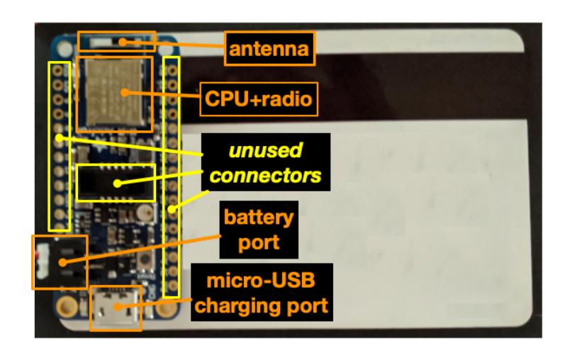
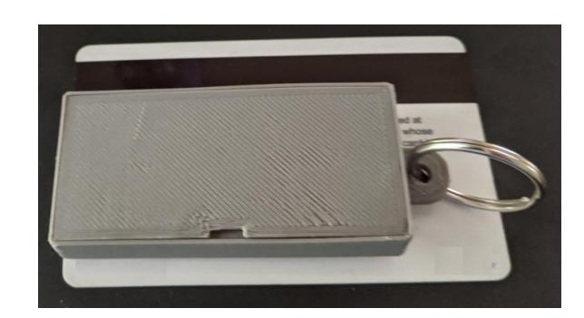
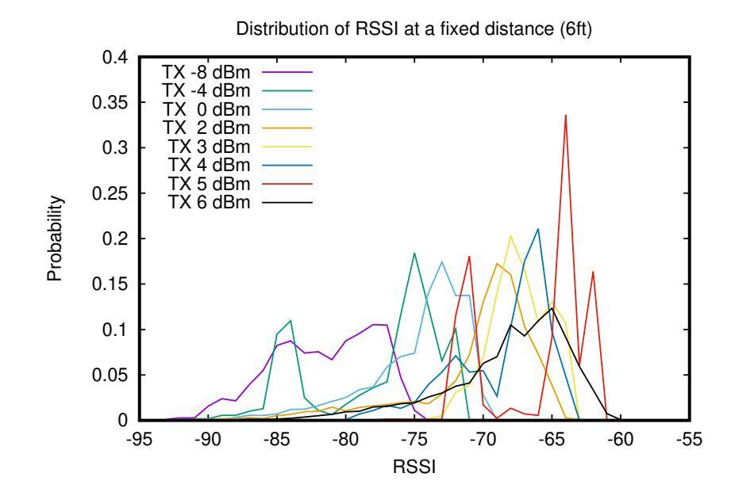
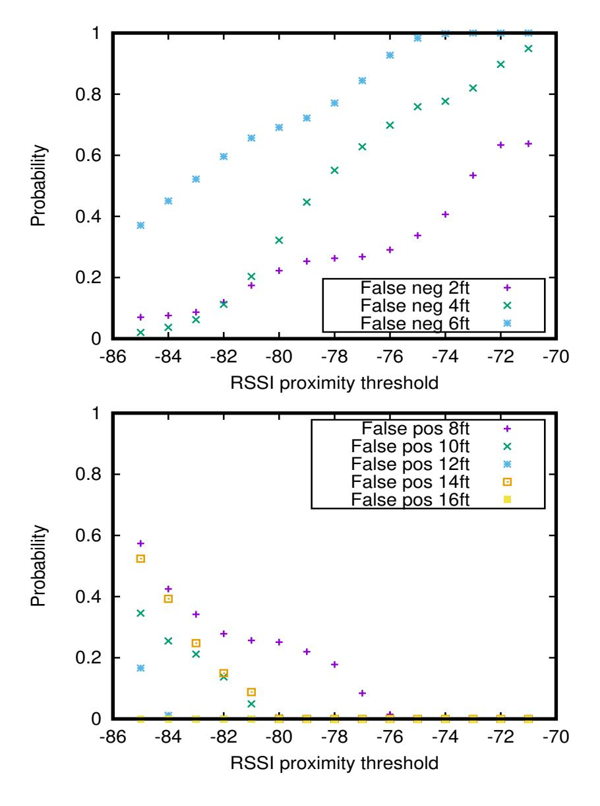
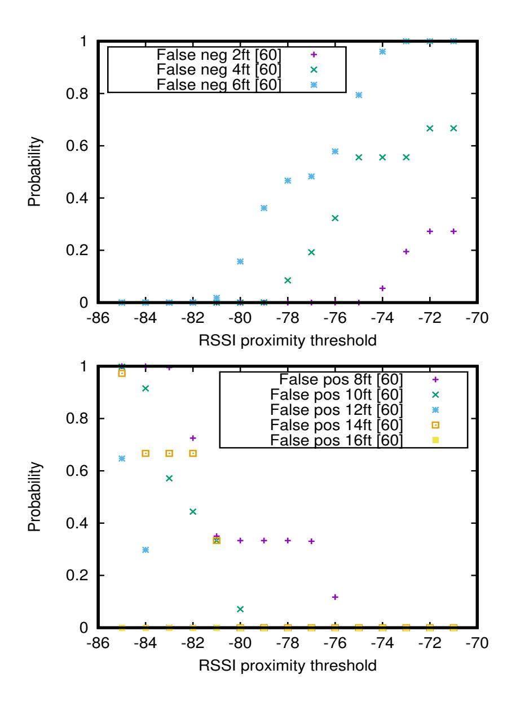

{0}------------------------------------------------

# HABIT: Hardware-Assisted Bluetooth-based Infection Tracking

Nathan Manohar UCLA nmanohar@cs.ucla.edu Peter Manohar Carnegie Mellon University pmanohar@cs.cmu.edu Rajit Manohar Yale University rajit.manohar@yale.edu

#### **ABSTRACT**

The ongoing COVID-19 pandemic has caused health organizations to consider using digital contact tracing to help monitor and contain the spread of COVID-19. Due to this urgent need, many different groups have developed secure and private contact tracing phone apps. However, these apps have not been widely deployed, in part because they do not meet the needs of healthcare officials.

We present Habit, a contact tracing system using a wearable hardware device designed specifically with the goals of public health officials in mind. Unlike current approaches, we use a dedicated hardware device instead of a phone app for proximity detection. Our use of a hardware device allows us to substantially improve the accuracy of proximity detection, achieve strong security and privacy guarantees that cannot be compromised by remote attackers, and have a more usable system, while only making our system minimally harder to deploy compared to a phone app in centralized organizations such as hospitals, universities, and companies.

The efficacy of our system is currently being evaluated in a pilot study at Yale University in collaboration with the Yale School of Public Health.

# 1 INTRODUCTION

The current COVID-19 pandemic has led public health officials to consider digital contact tracing for tracking and reducing the spread of infectious diseases. In traditional contact tracing, a central organization identifies individuals who have recently come in contact with someone that has tested positive for a disease, thereby learning who is likely to contract the disease next [27]. Digital contact tracing was notably employed by the South Korean government and is widely attributed to be the reason that South Korea has been able to slow the spread of coronavirus without imposing a strict lockdown [20]. Despite its success, digital contact tracing comes with significant privacy concerns, as a naive implementation allows the central authority to collect vast amounts of personal data. Because of this, there has recently been a plethora of work on developing contact tracing phone apps that safeguard the user's personal data in some manner [1–8, 12, 17, 24, 26]. Broadly, these

apps all do their best to achieve the following two primary goals: (1) Functionality: a user should be alerted after coming in contact with a positive user, and (2) Security and privacy: a user's personal data should be hidden completely from other (malicious) users and also the central authority, if one exists.

Despite advances in achieving these goals, current phone apps are unlikely to be endorsed by healthcare officials or be adopted on a large scale, for two reasons. (1) Current solutions do not support functionality desired by healthcare officials. Fundamentally, this is because there is a substantial gap between the design goals of contact tracing apps in the security community (outlined above) compared to the healthcare community. Unlike the security community, which primarily believes that information should be hidden from the central authority as much as possible, we have found in our communications with healthcare officials that, in their experience, certain personally identifying information needs to be leaked to the central authority in order for digital contact tracing to be effective [23]. Specifically, the central authority should know the identities of all users that are positive, and when a user Alice comes in contact with a positive user Bob, Alice should not be notified that this has occurred. Instead, the central authority should learn the identity of the user Alice, and which positive user, namely Bob, that she was in contact with [4, 23].2 We emphasize that the above is not a mere recommendation by healthcare officials, it is a requirement; healthcare officials have informed us that the failure of a contact tracing system to meet this requirement will likely result in the system not being adopted [23]. This requirement is not met by nearly all contact tracing systems [1-3, 5-8, 12, 17, 24, 26], as they hide this information from the central authority by design because they assume that more privacy is better.

Healthcare officials have a myriad of reasons for the above design requirement; we briefly explain three of

&lt;sup>1A user is *positive* if they have tested positive for the disease.

&lt;sup>2We note that this implicitly provides the central authority with the contact patterns of all positive users, as the central authority knows (1) who is positive, and (2) learns the identities of all users that have come into contact with a particular positive user.

{1}------------------------------------------------

them here. First, healthcare officials strongly recommend that Alice in the above scenario does not learn that she has come in contact with Bob so that way she is notified via a human-based notification, e.g. a phone call from healthcare officials, instead of an automatic notification [\[4,](#page-13-9) [23\]](#page-13-8). This is because informing users that they may have contracted an infectious disease is inherently stressful for users (especially when there is no known cure or treatment), and a human-based phone call or inperson conversation can help alleviate the user's anxiety and minimize panic, leading to better public health outcomes [\[4,](#page-13-9) [23\]](#page-13-8). Second, healthcare officials want to know the identities of the positive individuals that the user has come in contact with so they can, e.g., interview the user about their contact with these individuals to determine the user's risk of infection and/or identify positive users that are "super spreaders" [\[4,](#page-13-9) [13,](#page-13-12) [19,](#page-13-13) [28\]](#page-13-14). Third, unlike the security community, which views digital contact tracing as a standalone system, healthcare officials such as the CDC view digital contact tracing as an auxiliary source of information that should be used to, for example, "augment capacity of case investigator and contact tracer workforce [and] contact identification by identifying potentially unknown contacts" [\[14,](#page-13-15) [15\]](#page-13-16). When no information is leaked to the central authority, the digital contact tracing system is unable to assist other solutions, which reduces its effectiveness.

It may seem surprising that we advocate for achieving the above design requirement imposed by healthcare officials, as it is antithetical to the security maxim that "more privacy is better". However, we are not the only ones with this opinion. The authors of the BlueTrace paper have the same view, stating that, while increased privacy is typically desirable, "In practice, [their] ongoing conversations with public health authority officials performing epidemic surveillance and conducting contact tracing operations compel [them] to recommend otherwise" [\[4\]](#page-13-9).

(2) Current solutions ignore accuracy. Most contact tracing apps use GPS data or Bluetooth RSSI (received signal strength indicator) measurements as a proxy for distance. However, GPS data is only accurate up to an error of 10–15 ft, which is insufficient for accurately detecting contacts within 6 ft [\[21\]](#page-13-17), and is a poor indicator of location both in urban and in indoor settings, common scenarios for contact tracing. Bluetooth RSSI readings are generally a poor estimation of distance, and this issue is exacerbated by the fact that the radio transmit power and receiver strength on phones varies drastically, by factors of 1000x, depending on the phone model [\[4\]](#page-13-9). In fact, the Bluetooth Special Interest Group's online resources explicitly state that

"There is no standardized relationship of any particular physical parameter to the RSSI reading" and "The same RSSI value on two different Android phones with two different chipsets may mean two different signal strengths" [\[10\]](#page-13-18). The CDC states that the issues with GPS and Bluetooth accuracy are a barrier to the adoption of digital contact tracing, as "There are currently little published empirical data showing the capabilities of either technology" [\[14\]](#page-13-15). We too were unable to find empirical data on the accuracy of current approaches. However, our experiments indicate that using a simple RSSI thresholding scheme for detecting proximity is ineffective. We found that a better method was to track "contact minutes."[3](#page-0-0) Even with this approach, we found that an ideal phone was still incapable of distinguishing between distances ≤ 6 ft and ≥ 10 ft.

The issue of accuracy is exacerbated by the fact that current solutions are "too private"; too much privacy makes it near impossible for healthcare officials to determine probable false positives/negatives using auxiliary information obtained, e.g., from interviews with people who have tested positive.

# 1.1 Our contribution

We present Habit, a contact tracing system using a wearable dedicated Bluetooth hardware device (Fig. [1](#page-2-0) and Fig. [2\)](#page-2-1) that is designed to meet the needs of healthcare officials and is capable of robustly estimating the number of contact minutes between two devices. Our use of a hardware device allows us to (1) improve contact tracing accuracy, (2) achieve strong security and privacy guarantees that cannot be compromised by remote attackers, and (3) improve usability, all while having only a minimal effect on deployability. The Yale School of Public Health is evaluating our system through a pilot deployment in two laboratory research groups that are part of the phased re-opening of the Yale campus (≈20 people).

Roadmap. We begin by giving a system overview and comparing our system design to concurrent work in Section [2.](#page-2-2) In Section [3,](#page-4-0) we explain the benefits of using hardware. In Section [4,](#page-5-0) we define our threat model and state our security guarantees. We give a detailed description of our system design in Section [5.](#page-6-0) In Section [6,](#page-8-0) we argue that our system has our desired security guarantees. Finally, we conduct experiments and compare

3A "contact minute" means that two users were within 6 ft of each other for one minute. The CDC recommends self-isolation if a user is within 6 ft of a positive user for ≥ 15 mins [\[16\]](#page-13-19). Contact minutes give a finer-grained notion of a "contact" as compared to a simple "proximate or not" indicator, and this allows for healthcare providers to assess risk of exposure more accurately and easily [\[23\]](#page-13-8).

{2}------------------------------------------------

the proximity detection accuracy of Habit to an ideal phone app in Section [7.](#page-10-0)

# 2 SYSTEM OVERVIEW AND CONCURRENT WORK

We state the design goals of our system and outline how our system operates. Then, we compare Habit to concurrent approaches.

# 2.1 Our design goals

To address the gap between the design goals of the security community and the healthcare community, we outline a list of our design goals below. We adhere to the following key principle: our system should protect the privacy of users as much as possible while satisfying the healthcare design requirement specified in Section [1.](#page-0-1) In our model, the central authority is the healthcare provider, so leaking, e.g., that Alice is positive to the central authority is allowed as the healthcare provider already has access to Alice's health records, and so it knows this information anyways. Our design goals are as follows:

- (1) De-anonymization is "opt-in": the central authority never learns a user's personally identifying information unless that user chooses to share the information with the central authority.
- (2) A user that never comes in contact with a positive user should remain anonymous: the user's identity and contact records are hidden from all other users and the central authority.
- (3) A user that comes in contact with a positive user but never tests positive for the disease should not remain completely anonymous. With the user's consent, the central authority should learn the identity of the user and all the positive users the user was in contact with, but nothing else.
- (4) Users should not learn if they come in contact with another user that has tested positive for the disease. They are instead notified via an out-of-band message from healthcare officials.

As an additional goal, we would like the system to only use lightweight cryptography. Habit meets all of the above design goals, and makes use of simple cryptography: hash functions and symmetric key encryption, with minimal use of public key cryptography for establishing TLS connections.

# 2.2 Habit overview

Our system consists of three components: the central server, the wearable hardware device (henceforth referred to as the tag), and a relay device such as a phone that allows the tag to communicate with the server. Our

Figure 1: Hardware for the tag with a standard magnetic stripe/credit card shown for scale.

Figure 2: Entire device enclosed in the preliminary 3D printed case prototype, in preparation for deployment. The longest dimension is 1 cm longer than the board to accommodate the rechargeable battery.

system is designed for use in centralized organizations such as university campuses, hospitals, or businesses. We assume that there is a central authority, such as a healthcare provider, that already knows information about the users in the system. The central authority controls the server, and is responsible for initially distributing the tags to the users and administering tests for the disease. Each tag is assigned a unique, randomly generated serial number sn, which is only used to reveal the identity of the tag to the server if the user may be infected.

The tag uses an off-the-shelf board that contains an embedded microprocessor and a Bluetooth interface (Fig. [1\)](#page-2-0).[4](#page-0-0) The tag is stored in a small case that is worn on a keychain or a lanyard (Fig. [2\)](#page-2-1).

The relay device is necessary to allow the tag to communicate with the central server, as the tag only contains a Bluetooth radio for remote communication; we allow the relay to be untrusted and malicious.

Using the Bluetooth radio, the tag broadcasts a tag ID, a 256-bit string that is randomly generated locally by the tag, and stores (encrypted) records of all the tag IDs that it sees and the corresponding number of contact

4We note that the tag could be made significantly smaller, but we opted to use standard off-the-shelf hardware to make deployment easier.

{3}------------------------------------------------

minutes. Tag IDs are refreshed every hour *along with* the tag's Bluetooth MAC address,5 to mitigate tracking of users. The Bluetooth radio broadcasts at a very low signal strength, making it extremely challenging to communicate with the tag from more than 20 ft away, even using devices other than our tag.

The server, controlled by a public health entity, stores a list of all tag IDs broadcasted by users who have tested positive for the virus. Once a day, a user's tag communicates with the server via a protocol where, if the user has come in contact with a positive user, the server learns the user's tag's sn and all positive tag IDs that the user has come in contact with. The user always learns nothing. Users who test positive for the disease at a health clinic receive a login token that they use to register their identity via a user-generated public key with the server. This public key is used to authenticate their identity in future connections and add their tag IDs to the server's list of positive tag IDs. Users can always "opt-out" of the system at any time by simply turning off their tag.

# **2.3 Comparison with concurrent work**There are many different contact tracing systems cur-

rently under development. This is a rapidly evolving area of research; we summarize and compare our design to concurrent approaches to the best of our ability. All of the proposed systems for digital contact tracing use phone apps and broadly fall into two different categories: trusted third party and untrusted third party, depending on whether the central server is trusted or untrusted. **Trusted third party.** In this approach, each user registers an ID with the server. The server then generates contact tokens (equivalent to our notion of tag IDs) for each user and shares them with the user. When two users come in contact, they exchange their tokens over a short-range connection such as Bluetooth. When a user Alice later tests positive, she uploads all of her received contact tokens to the central server. Since the central server generated all of the contact tokens, the central server knows the identity of the user that sent these tokens, and, therefore, knows who was in contact with Alice. The trusted third party approach was deployed in Singapore's BlueTrace app [4]. We note that the BlueTrace design meets most of our design goals in Section 2.1. However, de-anonymization is not opt-in, as if Alice tests positive and came in contact with Bob then it is Alice (instead of Bob) that de-anonymizes Bob to the server by uploading her contact tokens. BlueTrace

additionally does not protect against a compromised

server, as if the central server's key is compromised by an attacker then privacy guarantees are lost.

**Untrusted third party.** In this approach, users generate their own contact tokens locally and exchange them as before. Now, when a user Alice later tests positive, Alice uses a login token to upload her contact tokens to the server. Another user, Bob, then communicates with the server via a protocol to determine if Bob has received a token that the server has flagged as positive, while the server learns nothing about the tokens that Bob has received. In many systems, this is done by having the server publish a list of all "positive tokens" or equivalent information [1-3, 5, 6, 8, 17, 24], while in others [12, 26] the server and Bob use a protocol for private set intersection or private set intersection cardinality. Untrusted third party approaches do not meet the design requirements of healthcare officials outlined in Section 1 and Section 2.1, as they do not meet design goals (3) and (4).

Our proposed system is most similar to the untrusted third party approach, with two key differences. First, we have the server learn if a user Alice came in contact with a positive user instead of giving Alice this information and hiding it from the server. The former is behavior desired by healthcare officials and meets our design goals, while the latter achieves more privacy. Second, we use dedicated hardware instead of a phone app to do contact tracing, which improves accuracy and security. **Realities of using a phone app.** Despite being easy to deploy, phone apps on iOS and Android are not very usable because these operating systems impose severe restrictions on the use of the BLE protocol—due to privacy concerns! On iOS, the app must be active in the foreground to be able to use BLE, which therefore requires users to always have their phone unlocked and the app open in order to participate in the contact tracing system [4]! On Android, the app requires access to location services in order to use BLE, giving the app access to sensitive location data that it should not be able to access [9]. Apple/Google's contact tracing API is not constrained by these restrictions, but only because Apple/Google modified their respective OSes to allow their contact tracing apps to function [1, 22]! These constraints have effectively sidelined all contact tracing solutions other than Apple/Google's [22], and have caused Singapore to examine alternative hardware-based solutions [18]. Despite not having significant usability concerns, Apple/Google's API is nonetheless a untrusted third party approach and as discussed above does not meet the functionality requirements of healthcare officials.

**Proximity detection accuracy.** Most contract tracing systems use Bluetooth as a black box to exchange

&lt;sup>5We must change the Bluetooth MAC address as otherwise an attacker can track users over long periods of time by simply observing their MAC addresses, which are present in all BLE packets.

{4}------------------------------------------------

contact tokens without considering its accuracy, implicitly using Bluetooth RSSI readings to inaccurately measure distance, and make no attempt to improve accuracy. COVID SafePaths [6] and NOVID [7] are two approaches that do attempt to take into account accuracy. COVID SafePaths uses GPS data in combination with Bluetooth data to attempt to improve accuracy, and NOVID uses ultrasound measurements in combination with Bluetooth data to attempt to improve accuracy. However, we were unable to find any concrete statistics on the benefits of either approach.

# 3 THE CASE FOR HARDWARE DEVICES

It is appealing to use existing smartphones as the basis for Bluetooth-based contact tracing. This just requires installing an app on an existing device—one which individuals typically carry on their person at all times. However, there are numerous benefits and only minimal drawbacks to having a dedicated tag for contact tracing. We explain the tradeoffs that come with using hardware devices below.

**Better proximity detection accuracy.** A dedicated tag improves proximity detection accuracy for the following two reasons:

(1) Known radio. Using a dedicated tag introduces some degree of certainty in the signal source and the receiver, allowing for more accurate distance measurements compared to phone apps.

There are a large variety of phone models, and different models have different radio hardware. Different radios can have vastly different transmission characteristics and receiver characteristics. Transmit power and receiver strength can vary by factors of 1000x [4]. Wireless signals also interact with metallic items that might be in close proximity to the radio. The fact that phones are so personal means different individuals customize their phone in different ways; some might use cases with metallic paint, while others might have a metallic credit card on the back of their phone. Each of these modifications has an effect on the RSSI readings of that phone. The diversity of phone configurations makes the already difficult problem of estimating distance even worse. Using a known radio mitigates this issue, as the transmission and receiver characteristics are standardized.

Some amount of phone diversity can be compensated for through the BLE protocol, as BLE permits embedding the transmit power into a beacon's *advertising packet* [11]—the mode used for BLE-based proximity detection. Unfortunately, adding the transmit power to an advertising packet removes 24 bits of randomness for

the tag ID. This also does not account for the different ways phones might be accessorized.

(2) Dedicated radio. The use of a dedicated radio enables us to reduce the transmit power of the radio, providing better proximity detection accuracy without impacting any other use. This is because stronger wireless signals are likely to have higher variability in an indoor environment. Intuitively, this is because signals that travel a longer distance can interact with more objects, resulting in a more diverse multi-path environment.

We quantify the benefits of our tag for proximity detection in Section 7.

**Better security and privacy.** A dedicated tag improves security and privacy for the following two reasons.

(1) Separate device. Users only need to assume that the tag's hardware is trusted for security and privacy. A user can simply download, build, and install the tag's firmware locally, and as long as the tag's hardware is not compromised, the user will be protected. In contrast, a phone app needs to assume that the phone's operating system is trusted, as a malicious OS (or hacked phone) could otherwise snoop on all of the app's computation, compromising the user. Moreover, the phone app needs to assume that the OS protects the app from other processes running on the phone, as otherwise a malicious app could snoop on the contact tracing app. These assumptions of trust required by phone apps are much stronger than the simple one necessary to obtain security and privacy in our system, and are simply unrealistic ones due to the complexity of a modern smartphone. (2) Security from remote attackers The tag has no means of communication other than the Bluetooth radio, which additionally transmits at a low power that makes it extremely challenging to communicate with the tag from over 20 ft away, even when using a device other than our tag. This is a strong physical security guarantee: it is nearly impossible for an adversary to tamper with a user's tag without coming within physical proximity of the user. Phones, of course, have many other means of remote communication, e.g. WiFi, cellular connections, etc., allowing them to be hacked and tampered with remotely, thus providing much weaker security against

Better usability. Our hardware tag is much easier to use compared to phone apps. As explained in Section 2.3, phone apps on iOS and Android are difficult to use because of the way these OSes restrict the use of the BLE protocol. However, none of these usability issues arise with our hardware tag because we have full control over the device. While carrying around our tag may appear to be cumbersome for users, the small size of our tag allows it to fit easily inside a small case on a keychain,

remote attackers.

{5}------------------------------------------------

making it essentially effortless to carry around and use. The tag weighs 15 grams, so weight is a non-issue. The rechargeable battery has a battery life of about half a week and takes roughly 1 hour to charge, so battery life is not a significant concern.6 Our system has a recovery mechanism so that if a user's tag runs out of battery, the user can continue to use the same tag after recharging it without losing any of the tag's local data or compromising security and privacy.

Minimally worse deployability. The main drawback to a dedicated tag is that it is harder to deploy than phone apps, as for users it is obviously harder to obtain the physical tag than to download an app. However, our tag is not hard to deploy for centralized organizations. A centralized organization can distribute tags to the users without much difficulty in the same way that it already distributes similar items, e.g. ID cards. Our tag uses commodity hardware that is already available, which makes it easy to purchase in bulk. Using published retail prices, the hardware and battery for our tag costs under \$30, so it is easily affordable for many centralized organizations, e.g. universities, hospitals, and businesses. The price could furthermore be reduced to roughly \$3.50 per tag if we used custom hardware. We believe that, on balance, the benefits of a dedicated tag outweigh its minor costs especially in the context of an organization looking for a cost-effective solution to contact tracing.

# 4 SECURITY GOALS AND THREAT MODEL

In this section, we describe our threat model and list the primary security guarantees of our system.

**Threat model.** In our system, we consider two different types of attackers.

(1) Non-server attacker. A non-server attacker is allowed to control7 all of the tags and relays of a group of colluding and malicious users of its choosing. Additionally, it is allowed to actively interfere, e.g. eavesdrop and modify messages, on any communication channel between any two devices, with one exception: we never allow the attacker to be present during the initial setup between a user's tag and relay device. However, an attacker can only interfere with this connection if it is physically within 20 ft of the user during setup, so this is not a significant concern. When targeting an honest user Alice, the attacker is also allowed to either have control and physical access to Alice's relay or steal Alice's tag at any point in time, but not both.

(2) Server attacker. A server attacker is a non-server attacker that additionally is allowed to control the server. If the target user is Alice, we also impose the constraint that no compromised tag, i.e. a tag that the attacker has chosen to control, is allowed to come in contact with a tag that Alice comes in contact with (this includes coming in contact with Alice's tag). We note that this restriction is necessary, as otherwise a malicious server could falsely claim that all tag IDs known to the attacker are positive, and if Alice comes in contact with any of the tags known to the server, she will reveal her sn to the server.

**Security guarantees.** The main security guarantees of our system are as follows:

- (1) Server security against non-server attackers. A non-server attacker cannot learn the server's list of infected tag IDs, convince the server that a colluding user has come in contact with a positive user when no colluding user has, or convince the server that a colluding user is positive when no colluding user is. Moreover, if a colluding user has come in contact with a positive user or is positive, a non-server attacker cannot convince the server that a *non-colluding* user has come in contact with a positive user or is positive, respectively.
- (2) User security against non-server attackers. A non-server attacker targeting Alice cannot learn if Alice has come in contact with any particular user Bob,8 if Alice has come in contact with a positive user, if Alice is positive, or Alice's tag's serial number.
- (3) Nonpositive user security against server attackers. If Alice is a nonpositive user, then a server attacker targeting Alice cannot learn anything unless Alice has come in contact with a positive user, in which case it learns Alice's identity and the identities of the positive users that Alice has come in contact with. We note that the above information is leaked to the server during the honest execution of the protocol, so it can be trivially learned by an attacker that has compromised the server. Furthermore, if Alice does not sync with the server, the server attacker cannot learn anything.

**Security non-goals.** The security non-goals of our system encompass attacks that could be achieved by (1) not participating in the protocol or (2) placing cameras or other tracking devices at target locations instead of the tags. Furthermore, we do not deal with attacks that are inherent to electronic contact tracing.

For example, we do not prevent malicious users from not showing up as having contact with positive individuals when they actually have. Indeed, we only prevent malicious users from producing "false positives", which would waste the time of health officials that would have

&lt;sup>6Note that the user will anyways have to connect the tag to the server every few day, due to our "opt-in" requirement for deanonymization.

&lt;sup>7By "control", we mean that the attacker is given complete access to the device and can deviate arbitrarily from the protocol.

&lt;sup>8Except if Alice came in contact with Bob less than 1 hr before her tag was stolen.

{6}------------------------------------------------

to track down and meaninglessly interview such people. A user that wishes to appear as a "false negative" could simply refuse to participate in the contact tracing protocol or never carry their tag; thus, we do not protect against such behavior. We do not protect a user's privacy against an attacker that has physical access to both the user's tag and relay device. However, a user's privacy is protected against an attacker that has physical access to at most one of the user's tag or relay device. Additionally, we do not protect against a malicious server placing tags at various locations and adding these tags into the list of infected individuals in order to track users. Such behavior could be mirrored by placing cameras or other tracking devices at the same locations. Finally, we do not handle denial of service attacks such as jamming the Bluetooth radio, flooding the system with different tag IDs thereby overwhelming local memory/storage, or DoS attacks on the central server. We note that all of the above attacks are issues that are inherent to any form of digital contact tracing. Moreover, with the exception of DoS attacks on the central server, all of the above attacks cannot be executed remotely, making them difficult to execute at scale. While we assume that an attacker can read the non-volatile memory associated with the tag, we do not protect against more sophisticated physical attacks on the tag, such as differential power analysis, laser probing, etc., and assume that the volatile memory cannot be read. We note that such attacks require the attacker to have physical access to the tag. We assume that the login token sent (e.g., via mail) by healthcare officials to a user that tests positive is not stolen by the attacker.

#### 5 SYSTEM DESIGN

We explain the system design of Habit in detail. We assume familiarity with the system overview given in Section 2.2. We present the system by explaining the technical details of the devices and how they interact, omitting the details of the protocols used. Then, in Section 5.2 we describe each of the protocols in detail.

#### 5.1 Habit's design

**Encrypted communication.** All connections between the relay and server use TLS, and the server has its own certificate that is known to the relay and tag. Connections between the tag and relay use authenticated encryption and are encrypted using a symmetric key. In our system, all symmetric keys k consist of two parts:  $k^{(1)}$ , the encryption key, and  $k^{(2)}$ , the MAC key, and symmetric key encryption is "encrypt-then-mac". For encryption we use AES-128 in CFB mode and for MACs we use HMAC with SHA-256 as the hash function. We use CFB mode because wireless communication is lossy,

and CFB mode permits communication to resume after the first uncorrupted packet is received. To communicate with the server, the tag and relay establish a tag-relay symmetric key authenticated encrypted connection and relay-server TLS connection, and then the tag tunnels a TLS connection to the server through these two connections. We remark that variable length communications occur only when the tag communicates with the server. By padding, we can ensure that the length of the communication is hidden from an eavesdropper.

**Tag and relay communication.** The tag connects with the relay device at setup over the Bluetooth interface, using the setup protocol in Section 5.2.1 in which the relay generates and gives two symmetric keys  $k_1$  and  $k_2$  to the tag. On setup, the user selects a PIN. This PIN is used to derive a key that is used to encrypt  $k_1$  and  $k_2$ before they are stored in the relay's nonvolatile storage. We note that the PIN is not necessary for security, but it is good practice to store these keys encrypted on the relay. The tag uses  $k_1$  to securely communicate with the relay, and  $k_2$  to encrypt data stored at rest on the tag. On the tag, the key  $k_1$  is stored in nonvolatile storage, while  $k_2$  is stored in volatile storage. This means that if the tag is disconnected from its battery, then  $k_2$  is lost to the tag while the tag still knows  $k_1$ . The tag and relay use  $k_1$  to establish future secure connections using the protocol in Section 5.2.2. To protect against replay attacks, the key  $k_1$  is refreshed during this protocol. The key  $k_2$  is refreshed every time the tag connects to the relay using the re-key protocol in Section 5.2.3. If the tag has lost  $k_2$ due to, e.g., loss of power, then the tag recovers  $k_2$  from the relay in this protocol.

Most exchanges between the tag and relay transmit a small number of bytes, and a failure can be accommodated by simply re-trying the operation. The only exception to this is reading records from the tag when the tag communicates with the server. In this case, we also provide support for a mechanism to selectively read a subset of the records. The record data packet stream is augmented with sequence numbers that can be used to determine which packets were lost, and the relay can use this information to request missing packets at the granularity of individual records.

**Storing data on the tag.** The tag uses  $k_2$  to encrypt all of the data stored in nonvolatile memory, with the exception of the key  $k_1$ , which is stored unencrypted in nonvolatile memory. For example, the tag stores in nonvolatile memory all of its records and the tag IDs that it has broadcasted/generated for the future. The tag has storage space for > 25000 records and automatically deletes records older than 14 days. The tag stores  $k_2$  in its volatile memory, and the tag's records are *never* seen by the user's relay.

7

{7}------------------------------------------------

**Tag ID randomization and contact detection.** Tags generate their own random 256-bit IDs and broadcast them using the Bluetooth Low Energy protocol. We use both the MAC address as well as the payload of the BLE advertising packet for randomization, giving us 256 bits of randomness for the ID. To detect contacts, the tag listens for other broadcasts and records which tag IDs it has seen. Upon receiving a tag ID  $\tau$  with RSSI rssi, the tag adds  $\tau$  to its list of contacts with a "contact minutes" counter of 0. If the tag consistently receives packets with tag ID  $\tau$  and rssi larger than the pre-set threshold of -80 dBm over the course of a minute, then the counter is incremented by 1. Tag IDs also include a checksum to filter out BLE packets from benign devices that are not participating in the contact tracing protocol. Tags generate a set of IDs that will be used for a 20 day period and commit to using them when connected to the server (Section 5.2.4). Every time a tag communicates with the server, the tag ensures it has enough fresh IDs for the following 20 day period. Each tag changes its tag ID every hour to mitigate stalking. We note that there is a trade-off between the frequency with which the tag ID is modified versus the storage required for contact tracking.

**Tag and server communication.** The tag shares its contacts with the server using the protocol in Section 5.2.4. In this protocol, if the user has come in contact with a positive user, then the server learns the user's sn and all positive tag IDs that the user has come in contact with. The user learns nothing and, importantly, does not know if the server has learned its sn or not. This is achieved by having the user send sn encrypted, and the server can decrypt if and only if the user has seen a positive tag ID. The tag also sends commitments to the tag IDs it will use in the 5 day period 15 days in the future (namely, days 15 - 20 from the present) to the server. Note that the server will already have the commitments for days < 15 from when the tag synced with the server in the past. Each commitment additionally contains the 1 hr time window in which the tag ID will be used. Tags commit to their future tag IDs in a 5 day period instead of only a 1 day period so that users can forget to sync with the server for  $\leq$  5 days. Executing the entire tag-server communication protocol takes roughly 1 min.

The only way a user de-anonymizes itself is if it syncs with server and has come in contact with a positive user. Initiating a sync with the server requires the user to push a button on the relay device, which makes de-anonymization opt-in. A user can additionally always opt-out of the system by simply turning off the tag.

**Registering positive tag IDs with server.** The server needs to acquire and update its list of tag IDs that are positive. Each user that tests positive for the disease is

given a one-time login token (delivered with the test results) that allows the user to register a signature verification key pk with the server. Now, the user's relay uses pk as a certificate to authenticate its identity when it connects to the server via TLS. After "logging in," the user's tag then sends decommitments, allowing the server to learn the tag IDs that the tag will use/has used. The server only adds tag IDs to its positive list if the user had committed to them at least 15 days in the past. Details of the registration protocol are in Section 5.2.5.

We force tags to commit to IDs  $\geq$  15 days in the future so that a positive user that sees a tag ID  $\tau$  of a non-positive user cannot claim to the server that it is theirs9 for at least 15 days. Note that tags delete records after 14 days, so by the time the malicious positive user gets  $\tau$  added to the server, users will have deleted records of their contact with the honest  $\tau$ .

Tag implementation. We implemented the firmware for the tags within the Arduino framework, which provides a very accessible C/C++ programming environment as well as a large ecosystem of open-source libraries. The core processor/chip is a Nordic Semiconductor nRF52840, which has a 32-bit ARM Cortex-M4 processor operating at 64 MHz [25]. We use vendor-provided Bluetooth libraries, and as the Arduino environment for this chip uses FreeRTOS, our implementation does as well. All the functionality described in the system design section was implemented in C++, and takes  $\approx$ 3K lines of code (not including third-party libraries). Communication to/from the tag uses Nordic's Bluetooth UART characteristic, which supports communication mechanism with another Bluetooth device.

Our tags support a small but useful command set, including commands to read/write the current time, explicitly checkpoint/restore records, flush records, delete the checkpoint, selectively delete records, set the tag IDs used for rotation, read the current set of tag IDs, change the proximity threshold used, and tag RSSI calibration mode. The final packet sent by the tag indicates whether the operation completed successfully or failed. Note that while the command-set mostly uses ASCII strings for simplicity, *all traffic* between the tag and relay is encrypted.

#### 5.2 Protocols

We now finish the description of our system by specifying the details of the omitted protocols. For all protocols, we let the function  $h(\cdot)$  denote the SHA-256 hash function.

&lt;sup>9This would cause all honest users that saw  $\tau$  be incorrectly flagged as having contact with a positive user.

{8}------------------------------------------------

- *5.2.1 Tag–Relay setup.* The protocol for the first-time connection between the tag and relay is:
- (1) The relay uses Bluetooth LE to connect to the tag and sends the tag symmetric keys  $k_1, k_2$ .
- (2) The tag randomly generates a 256-bit string r and sends  $\operatorname{Enc}_{k_1}(r)$  to the relay.
- (3) The relay sends  $\operatorname{Enc}_{k_1}(r')$  to the tag, where r' = h(r).
- (4) The tag verifies that r' == h(r), and if so then the tag and relay are "connected" and can talk. Future messages are sent encrypted using  $k_1$ .
- (5) The tag and relay execute the re-keying protocol of Section 5.2.3.
- *5.2.2 Tag–Relay reconnect.* The tag and relay reconnect as follows:
- (1) The relay uses Bluetooth LE to connect to the tag.
- (2) The tag randomly generates a 256-bit string r and sends  $\operatorname{Enc}_{k_1}(r)$  to the relay.
- (3) Relay generates new key  $k'_1$  and sends  $\operatorname{Enc}_{k_1}(r'||k'_1)$  back to tag, where r' = h(r).
- (4) The tag verifies that r' == h(r), and if so then the tag replaces  $k_1$  with  $k'_1$ ; otherwise the tag disconnects.
- (5) Steps 2–5 of the tag-relay setup protocol are repeated.
- 5.2.3 Re-keying records. After a tag and relay have reconnected, the key  $k_2$  on the tag can be re-keyed as follows:
- (1) The relay sends  $k_2$  to the tag.
- (2) The tag verifies that  $k_2$  is the correct key by using it to decrypt its records. Note that the tag can do this even if its  $k_2$  stored in volatile memory has been lost due to, e.g., power loss. On failure, the tag disconnects. On success, it requests a fresh  $k_2$  from the relay.
- (3) The relay sends the fresh key  $k_2'$  to the tag.
- (4) The tag replaces  $k_2$  with  $k'_2$  and the non-volatile storage is re-encrypted with  $k'_2$ .
- 5.2.4 Tag-server communication protocol. We let  $S_1$  be the list of tag IDs that the tag has seen, and  $S_2$  be the list of tag IDs that the server has flagged as positive. Note that a tag ID is associated with a time window when it is valid, and tag IDs communicated to the server include this time window. The tag and server first establish a TLS connection through the tag-relay and relay-server connections, and then they communicate via the following protocol:
- (1) The tag generates and sends to the server a random 256-bit string r, along with, for every  $\tau \in S_1$ ,  $f(f(\tau)) \| \text{Enc}_{f(\tau)}(\text{sn} \| \text{mins}_{\tau})$  where f is the function  $f(\cdot) := h(\cdot \| r)$ ,  $mins_{\tau}$  is the number of contact minutes of  $\tau$ , and sn is the unique serial number assigned

- to the tag.10 The tag also sends commitments to  $(\tau, t)$  for the tag IDs  $\tau$  and the time window t when they will be used for days 15–20 in the future to the server.
- (2) The server receives r, and therefore can compute  $f(\cdot)$ . For each  $\tau \in S_2$  and hash ciphertext pair  $s || c_s$  received, the server checks if  $f(f(\tau)) = s$ ; 11 the set of such  $\tau$ 's is  $S_1 \cap S_2$ . If the server finds  $\tau$  such that  $f(f(\tau)) = s$ , then the server computes  $\text{Dec}_{f(\tau)}(c_s)$  to learn sn, and sn is added to the list of potentially infected users.
- 5.2.5 Registering tag IDs for positive patients. Let's say that Alice goes tests positive. We explain the protocol that Alice uses to add her tag IDs to the server's list.
- (1) Alice receives (in the mail, say), the test report with a login token *t*.
- (2) Alice inputs the user ID and login token *t* to her relay, which the relay sends to the tag.
- (3) The tag generates a signing key pair (pk, sk) and sends (t, pk) to the server via TLS tunneled through the tag-relay and relay-server connections.
- (4) Alice is now registered with the server. Now, when Alice connects her tag to the server, it additionally shares its tag IDs with the server via the following protocol.
- (1) The tag and server connect with TLS. We now use authenticated mode for both parties, with the tag's certificate being pk that was registered.
- (2) The tag sends the server decommitment information for all past tag ID commitments.
- (3) The server decommits to learn tag ID, timestamp pairs. The server adds all tag IDs that decommitted with a timestamp that has already elapsed and is at least 15 days after the commitment was sent to its list of positive tag IDs.

### **6 SECURITY ANALYSIS**

In this section, we argue that Habit satisfies our desired security goals. We model the hash function h as a random oracle. All attackers we consider are allowed to eavesdrop and actively interfere on all communication channels. Since relays and servers communicate using TLS and relays and tags use authenticated encryption, any attacker is unable to gain any useful information by eavesdropping on communication between two uncorrupted devices. We prevent against replay attacks across these communication channels because of TLS

&lt;sup>10The tag sends these records in order sorted by  $f(f(\tau))$ , to hide the order of the  $\tau$ 's in its records.

&lt;sup>11We note that a naive implementation of this operation would take  $O(|S_1||S_2|)$  time, but it can be done in quasilinear time using simple data structures.

 $^{12}\mathrm{Except}$  for the initial setup, in which the attacker cannot interfere.

{9}------------------------------------------------

and the fact that the tag-relay channel refreshes keys. We prevent against message modifications using TLS and MACs. As described in Section 4, there are three main security guarantees. The above holds in all three settings, and we elaborate on these security guarantees below.

Server security against non-server attackers. A non-server attacker is allowed to control the tags and relays of an arbitrary group of colluding and malicious users. Since the server never sends any messages dependent on the server's list of infected tag IDs, the attacker cannot learn this information without corrupting the server. If no colluding user has come in contact with a positive user, then the attacker does not know any positive tag ID (since these are simply randomly generated). In order to convince the server that a user has come in contact with a positive user, the attacker would need to send the server a hash value v such that an ID on the server hashes to v. By the collision-resistance of the hash function and the fact that the ID's on the server are uniformly random, the attacker can only succeed with negligible probability. Similarly, since tag serial numbers are uniformly generated, if a colluding user has come in contact with a positive user, it will only be able to convince the server that a non-colluding user has come in contact with a positive user with negligible probability. This is immediate, since without corrupting the server, the attacker must guess a string in a list of uniformly random strings with no information.

Similarly, the attacker cannot convince the server that a colluding user is positive if none of them are because the attacker will not have access to any token *t* that it needs to register with the server since these can only be obtained by testing positive for the disease in a lab. Finally, the attacker cannot convince the server that a non-colluding user is positive since the attacker must commit to the tag IDs that the positive user will use 15 days in advance. Since the commitment is binding, this prevents the attacker from having the server accept a tag ID as a positive tag ID until at least 15 days have passed since the attacker knew the tag ID. So, the attacker will only be able to convince the server to accept the tag ID of a non-colluding user at least 15 days after the non-colluding user used that tag ID. Since records are deleted after 14 days, no user in the system will still have a contact with this tag ID stored on its tag, and so the fact that it is stored as a positive tag ID on the server has no effect.

User security against non-server attackers. We will consider two cases for a non-server attacker targeting Alice: (1) the attacker controls and has physical access to Alice's relay, but not Alice's tag and (2) the attacker controls and has physical access to Alice's tag, but not

Alice's relay. In the case of (1), the attacker cannot learn if Alice has come in contact with any particular user Bob. This is because Alice's tag uses randomly generated tag IDs every tag window, so the attacker will not be able to match any tag ID it sees on a different device with Alice. Moreover, Alice's relay never sees Alice's records (either in the clear or encrypted) and any communication between the tag and the server via Alice's relay is tunneled using TLS, so an attacker controlling Alice's relay is unable to learn Alice's records. In the case of (2), the attacker can only learn if Alice has come in contact with any particular user Bob if the contact occurred < 1 hr before the attacker chose to steal Alice's tag. This is because Alice's tag is broadcasting its current tag ID, so the attacker can learn the ID for the latest time window. However, as was the case for (1), the attacker cannot learn Alice's tag IDs used in other time windows. This is because the contact records and tag IDs on Alice's tag are encrypted using a key stored in volatile memory, so an attacker that steals Alice's tag will be unable to determine this key and learn anything from the encrypted records. This attacker is not allowed to control or have physical access to Alice's relay, so it has no means to learn the encryption key.

A non-server attacker targeting Alice also cannot learn if Alice is positive or Alice's tag's sn. This follows from the fact that this information is stored on the server or encrypted on Alice's tag, which hides it from the attacker. A non-server attacker targeting Alice cannot learn if Alice has come in contact with a positive user. Has because Alice herself does not know this information, and so the only way for an attacker to learn if this has occurred is for it to establish that Alice came in contact with any particular user, and that that user is positive. However, a non-server attacker cannot learn if Alice came in contact with any particular user, as shown previously. Therefore, the attacker cannot learn if there exists a user that is positive that Alice came in contact with.

# **Nonpositive user security against server attackers.** First, we will analyze the case where the targeted user

Alice has not come in contact with a positive user. In this case, the server attacker cannot learn anything, which follows from the fact that the non-server attacker could not learn anything in this situation along with the fact that the server does not know the user IDs of any user that came in contact with Alice. Moreover, the server

 $^{13}$ If Alice is not positive, her tag will store an encryption of  $\bot$  instead of her (pk, sk) pair.

&lt;sup>14Except if Alice came in contact with a positive colluding user less than 1 hr before her tag was stolen.

&lt;sup>15Except if Alice came in contact with a colluding user less than 1 hr before her tag was stolen.

{10}------------------------------------------------

never sends any messages to Alice, and the only messages Alice sends are  $h(h(\tau||r)||r)$  and  $\operatorname{Enc}_{h(\tau||r)}(\operatorname{sn})$  for every ID  $\tau$  that Alice came in contact with. In order to learn sn or an ID that Alice came in contact with, the attacker would need to invert  $h(\cdot||r)$  for a random r either once or twice, respectively.

Next, we will consider the case where Alice has come in contact with a positive user. From the honest behavior of the server, the attacker is able to learn sn and the list of positive contacts. However, an attacker is unable to learn the IDs of nonpositive users that Alice came in contact with. This follows from the fact that these IDs are uniformly random strings unknown to the attacker (recall the attacker cannot control a tag that has come in contact with any of Alice's contacts), and the only information about them the attacker has access to are their hashes (sent to the server) and encryptions (stored on the tag). The attacker is also unable to learn the tag IDs that Alice has been using as these are also stored encrypted on Alice's tag and never sent to the server. Finally, if Alice never syncs with the server, the server attacker cannot learn anything since all relevant information is stored encrypted on Alice's tag and no information is communicated to the server.

#### 7 EVALUATION

To evaluate our tags, we deployed them in a home office setting. We were unable to gather data in other settings due to current limitations on access to research space because of social distancing measures.

For our experiments, we used ten tags, placing them at varying distances from each other and with multiple transmit/receive pairs. The precise details are specified in each subsection along with measurement results. We note that all RSSI measurements are unit-less, as "There is no standardized relationship of any particular physical parameter to the RSSI reading" [10].

#### 7.1 RSSI variability

As is well-known in the wireless community, signal strength is a poor indicator of distance. To illustrate this fact, we measured the RSSI distribution at varying settings of the radio transmission power between two tags that were a fixed distance (6 ft) apart. Figure 3 shows the results of our measurements for eight different settings of transit power (the radio's default setting is 4 dBm). A minimum of 1000 BLE packets were received for each histogram. We note that different histograms would be obtained even with slight variations in position.

As can be seen, the data are noisy, and confirms our expectation that the RSSI of a single packet is not a reliable indicator of distance. The Bluetooth SIG recommends that using the mode of the RSSI for a set of packets

Figure 3: Received signal strength distribution for varying levels of transmit power (TX) for a transmit/receive pair at fixed locations.

from the same transmitter is a more reliable indicator of distance [10]. However, our deployment scenario corresponds to one where both transmitter and receiver are mobile, so unfortunately the distance is time-varying and thus using the mode of the RSSI does not make sense. Based on Figure 3, our empirical observation is that a low transmit power has a less variable RSSI.

#### 7.2 Proximity via RSSI threshold

In our second experiment, we estimated the false positive/false negative probabilities for proximity detection using a simple RSSI threshold technique. This means that we count a received packet as "proximate" if the received RSSI value is above the threshold. In this experiment, we used 6 different transmit/receive tags located at distances ranging from 2 ft to 16 ft from each other, with a transmit power of −8 dBm. For each transmit/receive pair, we collected data at three different positions at each distance, and ensured that we had received at least 1000 packets. The RSSI histogram was collected, as well as the number of packets received per minute, and the combination was used to compute the empirical false positive and false negative probabilities at varying distances. Note that, as the RSSI threshold gets smaller, the false positive rate gets larger, as it is easier for a received packet to be above the threshold. We note that HABIT uses an RSSI threshold of -80. The results of the above experiment are shown in the two figures on the left in Figure 4. The figure shows the effect of using a single packet RSSI value to determine if a transmitter was close to a receiver. These results are consistent with the RSSI histogram from Figure 3. Notice, for example, that while we would expect that a distance of 14 ft would have fewer false positives than 12 ft due to signal attenuation,

{11}------------------------------------------------

Figure 4: Per-packet false positive and false negative probabilities at different distances with a TX power of -8 dBm, where the x-axis is the proximity threshold value. Distances < 6 ft are true positives so the only errors are false negatives; similarly, distances > 6 ft can only have false positive errors.

the complexity of the wireless environment can invert this relationship for certain RSSI thresholds.

A natural, conservative way to detect a contact would be to use the "worst case" packet RSSI—i.e. the largest RSSI received to determine if two tags were ever close to each other. We also conducted an experiment where we used this scheme. We found that, for RSSI thresholds that kept the false negative probability close to zero at 6 ft, a contact was recorded at every distance up to 14ft in all our experiments. Hence, just using worst-case RSSI was not a good approach.

#### 7.3 Contact minutes

HABIT uses a scheme we developed to estimate the number of *contact minutes*. This was based on CDC guidance, where a contact for COVID-19 is defined as being in the proximity of someone for at least 15 minutes [16], so a simple "proximate or not" indicator is insufficient.

Figure 5: Probability of erroneously recording a contact minute using our technique with a TX power of -8 dBm.

We track contact minutes as follows. A transmitting tag is viewed as "proximate" if a packet is received from that tag with an RSSI larger than the threshold. If such packets keep being received in a 30 second window, then the tag remains in the proximate state. The time that the tag is "proximate" is the number of contact minutes stored by the receiving tag.

Figure 5 shows the false positive/false negative probabilities of a minute being added to the proximate timer. With this approach, Habit's RSSI threshold of -80 is a "sweet spot" that has low false negative rate while also obtaining a low false positive rate at distances  $\geq 10$  ft.

# 7.4 Habit vs ideal phone app

Finally, we compared the contact minutes recorded by Habit vs that of an ideal phone app. We modeled an ideal phone app by having all users have the same radio with a transmit power of 4 dBm, as phones are typically Bluetooth class 2 devices (10 m range, maximum transmit power of 4 dBm). We chose the RSSI thresholds for Habit and the ideal phone app to give the best false positive rate for each system while minimizing false negative rate, based on the experiments in Section 7.3,

{12}------------------------------------------------

| Dist. | Habit    |             | Phone    |          |
|-------|----------|-------------|----------|----------|
| (ft)  | A (mins) | B (mins) | A (mins) | B (mins) |
| 2     | 15.0     | 15.0        | 15.0     | 15.0     |
| 4     | 15.0     | 15.0        | 15.0     | 15.0     |
| 6     | 12.7     | 14.4        | 13.3     | 15.0     |
| 8     | 5.0      | 14.3        | 10.0     | 15.0     |
| 10    | 1.1      | 7.5         | 14.9     | 15.0     |
| 12    | 0.0      | 8.3         | 0.1      | 11.1     |
| 14    | 0.0      | 0.0         | 5.8      | 14.6     |
| 16    | 0.0      | 0.0         | 0.0      | 15.0     |

Table 1: Average contact minutes in a 15 min window taken over 2 hrs recorded by our proposed method at low TX power versus using the standard TX power of a phone. The RSSI threshold for the "low TX" case was −80, and the threshold for the phone case was −68. In scenario A, devices were exposed, while in scenario B, devices were placed near other items to simulate an everyday use scenario.

which we also repeated for the ideal phone. This resulted in thresholds of −80 and −68 for Habit and the phone app, respectively. We remark that these thresholds are best determined experimentally, based on the actual tag that is to be deployed (i.e. taking everything into account, such as the case materials and geometry, battery, orientation of the hardware, etc). We recorded the average number of contact minutes at each distance seen over 2 hrs. Two different scenarios were used: one where the devices were exposed, modeling the case when both the transmitter phone and receiver phone were held in a user's hand (scenario A), and one where one of the devices was exposed while the other was placed next to items (keys and headphones) that might be found in a bag or pocket (scenario B). The results are shown in Table [1.](#page-12-0) Using a "12 min" threshold to classify a contact, Habit (low TX power) is able to separate distances ≤ 6 ft and 8 ft or larger in the best case (scenario A), while the ideal phone app (high TX power) erroneously records almost 15 contact minutes at a distance of 10 ft. In the everyday case (scenario B), the errors increase. Habit records a large number of contact minutes at even 8 ft, although it is able to distinguish between distances ≤ 6 ft and ≥ 10 ft with the 12 min threshold. The ideal phone app, however, records close to 15 contact minutes at nearly every distance, with the one exception being 11.1 contact minutes at 12 ft, and so it is unable to detect proximity.

# 8 CONCLUSION

We presented Habit, a system consisting of a dedicated, wearable contact-tracing hardware device, a relay (typically the user's phone), and a back-end server controlled by healthcare officials. The system supports the goals of public health officials, while preserving the privacy of users against powerful attackers. Our system is currently deployed in a pilot study being conducted at Yale University.

# ACKNOWLEDGEMENTS

We thank Linda Niccolai and her team from the Yale School of Public Health for describing the key ingredients of manual contact tracing and for their work on running the pilot study. We thank Larry Wilen for providing 3D printed cases for the pilot. We thank Aneesh Manohar for encouraging us to write this paper and Alexis Korb for suggesting the title. We also thank Alessandro Chiesa and Saba Eskandarian for providing helpful feedback on an earlier draft of this paper.

Nathan Manohar is supported in part from DARPA SAFEWARE and SIEVE awards, NTT Research, NSF Frontier Award 1413955, and NSF grant 1619348, BSF grant 2012378, a Xerox Faculty Research Award, a Google Faculty Research Award, an equipment grant from Intel, and an Okawa Foundation Research Grant. This material is based upon work supported by the Defense Advanced Research Projects Agency through Award HR00112020024 and the ARL under Contract W911NF-15-C- 0205. The views expressed are those of the authors and do not reflect the official policy or position of the Department of Defense, the National Science Foundation, NTT Research, or the U.S. Government.

Peter Manohar is supported by the NSF Graduate Research Fellowship Program (under Grant No. DGE1745016) and the ARCS Foundation. Any opinions, findings, and conclusions or recommendations expressed in this material are those of the author(s) and do not necessarily reflect the views of the National Science Foundation.

{13}------------------------------------------------

# REFERENCES

- [1] Exposure Notifications. https://www.apple.com/covid19/contacttracing, April, 2020.
- [2] PACT. https://pact.mit.edu/, April 8, 2020.
- [3] PrivateKit. http://privatekit.mit.edu/, March 19, 2020.
- [4] BlueTrace. https://bluetrace.io/, March 20, 2020.
- [5] COVID Watch. https://www.covid-watch.org, March 20, 2020.
- [6] COVID SafePaths. https://covidsafepaths.org/, May, 2020.
- [7] NOVID. https://www.novid.org/, May, 2020.
- [8] DP3T. https://github.com/DP-3T/documents, May 25, 2020.
- [9] Android Developers. Bluetooth Low Energy Overview. https://developer.android.com/, 2020.
- [10] Bluetooth Special Interest Group Consortium. https://www.bluetooth.com/blog/proximity-and-rssi/, 2020.
- [11] Bluetooth Special Interest Group Consortium. https://www.bluetooth.com/specifications/bluetooth-corespecification/, 2020.
- [12] Ran Canetti, Ari Trachtenberg, and Mayank Varia. Anonymous Collocation Discovery: Harnessing Privacy to Tame the Coronavirus. arXiv:cs.CY/2003.13670, April 3, 2020.
- [13] Centers for Disease Control and Prevention. Contact Tracing for COVID-19. https://www.cdc.gov/coronavirus/2019-ncov/php/contacttracing/contact-tracing-plan/contact-tracing.html, 2020.
- [14] Centers for Disease Control and Prevention. Digital Contact Tracing Tools. https://www.cdc.gov/coronavirus/2019-ncov/php/contacttracing/contact-tracing-plan/digital-contact-tracing-tools.html, 2020.
- [15] Centers for Disease Control and Prevention. Digital Contact Tracing Tools for COVID-19. https://www.cdc.gov/coronavirus/2019 ncov/downloads/digital-contact-tracing.pdf, 2020.
- [16] Centers for Disease Control and Prevention. Public Health Guidance for Community-Related Exposure. https://www.cdc.gov/coronavirus/2019-ncov/php/publichealth-recommendations.html, 2020.
- [17] Justin Chan et al. PACT: Privacy Sensitive Protocols and Mechanisms for Mobile Contact Tracing. arXiv:cs.CR/2004.03544, May 7, 2020.
- [18] John Geddie and Aradhana Aravindan. Singapore plans wearable virus-tracing device for all. https://www.reuters.com/article/us-health-coronavirussingapore-tech-idUSKBN23C0FO, June 5, 2020.
- [19] Alex Keown. Study Reveals Importance of Contact Tracing in COVID-19. https://www.biospace.com/article/chinese-studyhighlights-importance-of-contact-tracing-to-mitigateinfection-rates-of-covid-19/, April 29, 2020.
- [20] Justin McCurry. Test, trace, contain: how South Korea flattened its coronavirus curve. https://www.theguardian.com/world/2020/apr/23/test-tracecontain-how-south-korea-flattened-its-coronavirus-curve, April 22, 2020.
- [21] P. Misra and P. Enge. Global Positioning System: Signals, Measurements,and Performance. Ganga-Jamuna Press, 2006.
- [22] Casey Newton. Why countries keep bowing to Apple and Googles contact tracing app requirements, May 8, 2020.

- [23] Linda Niccolai and Jeff Brock. Panel on Contact Tracing hosted by Dean Jeff Brock. Yale School of Public Health, May 19, 2020.
- [24] Ramesh Raskar et al. Apps Gone Rogue: Maintaining Personal Privacy in an Epidemic. arXiv:cs.CR/2003.08567, March 19, 2020.
- [25] Nordic Semiconductor. nrf52840 multiprotocol soc. https://www.nordicsemi.com/Products/Low-power-shortrange-wireless/nRF52840, 2020.
- [26] Ni Trieu, Kareem Shehata, Prateek Saxena, Reza Shokri, and Dawn Song. Epione: Lightweight contact tracing with strong privacy, May 2, 2020.
- [27] World Health Organization. Contact tracing. https://www.who.int/news-room/q-a-detail/contact-tracing, 2017.
- [28] World Health Organization. Contact tracing in the context of COVID-19. https://www.who.int/publications/i/item/contacttracing-in-the-context-of-covid-19, 2020.