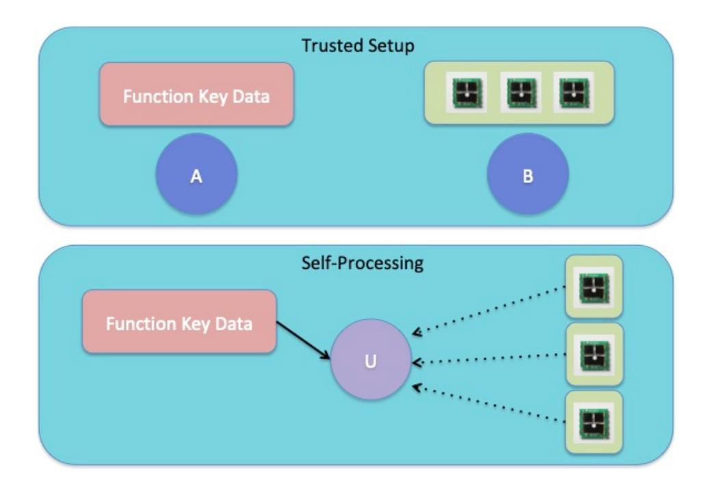

{0}------------------------------------------------

# Self-Processing Private Sensor Data via Garbled Encryption

Nathan Manohar\* *UCLA*

Abhishek Jain† *John Hopkins University* Amit Sahai‡ *UCLA*

# Abstract

We introduce *garbled encryption*, a relaxation of secret-key multi-input functional encryption (MiFE) where a function key can be used to jointly compute upon only a particular subset of all possible tuples of ciphertexts. We construct garbled encryption for general functionalities based on one-way functions.

We show that garbled encryption can be used to build a *selfprocessing private sensor data system* where after a one-time trusted setup phase, sensors deployed in the field can periodically broadcast encrypted readings of private data that can be computed upon by anyone holding function keys to learn processed output, without any interaction. Such a system can be used to periodically check, e.g., whether a cluster of servers are in an "alarm" state.

We implement our garbled encryption scheme and find that it performs quite well, with function evaluations in the microseconds. The performance of our scheme was tested on a standard commodity laptop.

# 1 Introduction

Self-Processing Private Sensor Data. Suppose a coalition of countries (Coalition *A*) negotiates a 25-year treaty with Country *B*, which proposes the deployment of a set of trusted sensors in Country *B*, where each sensor provides an hourly readout of radiation levels. However, to protect its privacy, Country *B* is unwilling to have all raw sensor readings transmitted in their entirety to Coalition *A*. Country *B* is only willing to allow Coalition *A* to learn some processed form of these sensor readings – for example to learn the maximum radiation level observed at any of 16 sensor locations. Furthermore, Coalition *A* and Country *B* are willing to execute a once-and-for-all ceremony to build these trusted sensors. Indeed, since the sensors are creating the "inputs" to our system, it is crucial that they be built in a way that guarantees trust. This could involve physical protections, as well as computer security tools like secure multi-party computation. But after this ceremony, and after the trusted sensors are deployed, how can we ensure that Coalition *A*, in order to protect Country

*B*'s privacy, learns only the hourly maximum radiation values, and not more?

The most straightforward solution would be to trust a third party to honestly process the sensor readings. However, even if a third party seems trustworthy when the treaty is signed, it may be unreasonable to assume that such trust would be maintained over the 25-year span of the treaty. A more complex solution would be to have the trusted sensors communicate among themselves to compute the maximum every hour and only transmit this processed information. But this would require each trusted sensor to be able to reliably receive communication from other sensors; this may be infeasible (especially over long durations of time) or simply undesirable as being able to receive communication opens up each sensor to new attack vectors. In this work, we ask: is it possible to build *practical* solutions to this problem where each trusted sensor is only required to be able to broadcast a short message? Somewhat surprisingly, we show that this is achievable *without* any communication between sensors, where the sensors are *only* required to store an AES key and broadcast several AES evaluations each time step.

Hardware Assumptions for Sensors vs. Hardware Assumptions for Receivers. Because sensors would need to be physically deployed to collect readings, some level of physical trust and verification is essential for both sensor hardware and deployment. This is reasonable because Country *B*, as the country being monitored, would be subject to inspections that would verify (only!) that sensors have not been tampered with and remain correctly deployed. However, it is not reasonable to assume any kind of physical trust for the receivers that should obtain only processed sensor readings: Indeed, there may be many users – hundreds or even millions of them – that need to be able to monitor processed sensor readings. It would be undesirable and perhaps infeasible to have inspectors from Country *B* verify that receiver hardware has not been tampered with. Such "reverse inspections" – where the target country inspects the monitoring countries, would also likely be politically problematic. For these reasons, we seek solutions to this problem that do not involve tamper-proof hardware assumptions for receivers.

Real World Applicability. Although the above discussion dealt with a hypothetical treaty scenario, such situations arise in the real world. The Iran nuclear deal, for example, requires

<sup>\*</sup>nmanohar@cs.ucla.edu

<sup>†</sup>abhishek@cs.jhu.edu

<sup>‡</sup>sahai@cs.ucla.edu

{1}------------------------------------------------



Figure 1: The two steps of a self-processing sensor data scheme. First, there is the trusted setup after which *A* has function key data and *B* has sensors. Once *B* deploys the sensors, any user *U* with access to the function key data can monitor the sensor broadcasts and learn the function evaluations.

that Iran "allow in international inspectors" [\[1\]](#page-13-0) to directly observe the state of affairs on the ground including obtaining raw measurements, a prospect that it would undoubtedly prefer to avoid. International environmental treaties, such as the Basel Convention [\[2\]](#page-14-0) and the Kyoto Protocol [\[3\]](#page-14-1), include commitments from many nations to limit their pollution and other environmentally harmful activities, but without nations agreeing to direct monitoring of raw data, it may be difficult to ascertain the extent to which a country is or is not following the treaty. Such issues are not only applicable to agreements between nations, but also extend to situations between governments and companies as well. After the Volkswagen emissions scandal [\[4\]](#page-14-2), a country may wish to sanction Volkswagen in some manner and have a guarantee that its cars meet the emissions standards. A sensor network could be deployed to ensure that Volkswagen was complying with emissions regulations, while simultaneously ensuring that the sanctioning government does not gain access to details of Volkswagen's operating procedures that it wishes to remain secret.

An Impractical Theoretical Solution. A theoretical solution to this problem can be obtained via the notion of multi-input functional encryption (MiFE) [\[5\]](#page-14-3). In a MiFE scheme, parties can query a key generation authority for multi-input function keys that can be used to jointly evaluate the function on a tuple of encrypted plaintexts. MiFE generalizes the notion of (single-input) functional encryption [\[6–](#page-14-4)[8\]](#page-14-5) and can be viewed as a non-interactive analogue of secure multiparty computation [\[9,](#page-14-6) [10\]](#page-14-7). If such a primitive could be practically realized, then in the above scenario, Coalition *A* and Country *B* could generate a multi-input function key that will output

the maximum radiation level observed in a given hour given appropriate ciphertexts as input. The deployed sensors could then encrypt their observed radiation levels along with the time and broadcast these ciphertexts. Using the MiFE function key, it would be possible for Coalition *A* to learn only the hourly maximum radiation level and nothing more.

Unfortunately, despite extensive research, achieving full security for MiFE while maintaining usable efficiency has remained quite elusive. In fact, a construction of secret-key MiFE that supports an unbounded number of ciphertexts would imply indistinguishability obfuscation (iO)[1](#page-1-0) [\[5\]](#page-14-3), which is only currently known through heavy-duty cryptography and nonstandard assumptions. Furthermore, known constructions of secret-key MiFE for bounded ciphertexts from standard assumptions [\[11,](#page-14-8) [12\]](#page-14-9) require non-black-box use of cryptographic primitives and are therefore unexplored with respect to implementability and efficiency. Constructions of secretkey MiFE from nonstandard multilinear maps [\[13\]](#page-14-10) take 4 minutes running on a 32-core server for function evaluations on 4.7 GB ciphertexts, while only achieving security with respect to security parameter λ = 80. As a result, despite its immense potential, MiFE has so far had limited impact on the security world and does not give a practical solution to the proposed problem.

Garbled Encryption. In this work, we give a practical solution to this problem by introducing, constructing, and implementing a new primitive called *garbled encryption*. Garbled encryption is built from one-way functions (in particular, AES) and can support function evaluations in a few microseconds on modest hardware, while achieving security with respect to the standard security parameter value of λ = 128.

Our starting observation is that, in practice, one might not always need the full power of secret-key MiFE. For example, a function key in secret-key MiFE needs to be compatible with all ciphertexts, but there are many natural scenarios where it may only be necessary to evaluate a function on *some* of the ciphertexts. To illustrate this, in the treaty problem, we only need the function key to allow for evaluation on ciphertexts all encrypted during the same hour. In fact, using MiFE is actually disadvantageous in this instance, since the function key will be inherently compatible with all ciphertexts, which would require the sensors to encrypt not only the sensor reading, but also the time of the reading and the function key to check that the times of all the ciphertexts are equal.

In order to determine which ciphertexts a function key is compatible with, it is necessary that the ciphertexts be labelled. Therefore, in garbled encryption, every ciphertext has an associated index, and encryptors are required to satisfy a promise that no two ciphertexts have the same index. Instead of querying a key generation (keygen) authority for a key corresponding to a function, in garbled encryption, a party

<span id="page-1-0"></span><sup>1</sup>Even a construction of secret-key MiFE that supports only a bounded number of ciphertexts in each "position," but an exponential number of ciphertext combinations, implies iO.

{2}------------------------------------------------

queries the keygen authority for a key corresponding to a function *and* a tuple of indices. The function key issued by the keygen authority can then be used to evaluate the function on the tuple of ciphertexts corresponding to those indices. By introducing this relaxation, we are able to achieve garbled encryption that supports an *unbounded* number of ciphertexts and function keys, using only OWFs (in particular, AES).

From Garbled Encryption to Self-Processing Private Sensor Data. Using our new primitive, garbled encryption, we are able to obtain a practical solution to the self-processing private sensor data problem. After Coalition *A* and Country *B* agree on the treaty, they execute a one-time trusted setup that generates all the garbled encryption function keys needed for the duration of the treaty and provides sensors to be deployed in Country *B*. After these sensors have been appropriately deployed, they will periodically broadcast ciphertexts that can be used by Coalition *A* to learn the output of the desired functionality (for example, the hourly maximum radiation level). Note that once the sensors have been deployed, no additional work is needed on the part of Coalition *A* or Country *B* to keep the system running (they can go "offline"). In fact, Coalition *A* can make all the function key information public and any interested user could monitor the system and obtain the function evaluation results. Furthermore, the ciphertexts in our construction will correspond to several pseudorandom function (PRF) evaluations, implemented via AES, so the sensors can be computationally extremely weak and need only support the most basic of cryptographic tools. The functionalities (determined at setup) that are supported by the scheme are quite general. A function evaluation at time *T* <sup>0</sup> may be on data generated at *any* time from setup until *T* 0 , with any number of sensor readings as input coming from as many or as few different sensors as desired.

# 1.1 Our Results

Garbled Encryption. We formally define garbled encryption and provide a construction from one-way functions (in particular, a PRF that can be instantiated using AES) that supports an unbounded number of ciphertexts. We, in fact, provide two constructions: a *selectively* secure scheme in the standard model, and an *adaptively* secure scheme in the random oracle model. In the adaptive security setting, the adversary can adaptively observe ciphertexts and function keys in any order, and thus realistically models scenarios where an adversary may observe broadcast ciphertexts before obtaining key material, and then observe additional broadcast ciphertexts afterwards. We also provide an implementation of our adaptively secure garbled encryption scheme.

A simplified version of our adaptively secure garbled encryption scheme also yields an adaptively secure garbling scheme [\[14\]](#page-14-11) where the wire keys are the *same size* as in nonadaptive garbling schemes. To the best of our knowledge, such a garbling scheme was not known previously. In particular, all previously known adaptive garbling schemes required larger wire keys (even in the random oracle model). We believe that our adaptive garbling scheme with short wire keys may be applicable to other scenarios where such a property is desirable.

Our scheme requires the encryption algorithm to have a state in a manner which we call *index dependence*. This is the constraint that each ciphertext is labeled with an index and that no two ciphertexts share the same index. Since index dependence still supports parallelism, we don't view this as a major limitation. However, by introducing this natural relaxation, we are able to achieve a practical construction of this primitive from standard assumptions.

## Self-Processing Private Sensor Data and Implementation.

Finally, we give evaluation results for our adaptively secure garbled encryption scheme. We find that it performs quite well, with decryptions in the tens to hundreds of microseconds when run on a standard commodity laptop. Table [1](#page-3-0) gives some of our evaluation results for self-processing private sensor data via garbled encryption for a variety of functionalities. Based on our evaluation results, we observe that our garbled encryption scheme could be applied to an automated warning system on 64 sensors that lasts for 10 years and issues an all clear vs. anomaly detected reading every 10 minutes. In such a setup, we find that the trusted authority need only be online for 14 seconds and that users who wish to monitor the warning system can do so by downloading a few kilobytes of data and performing a 14 *µ*s computation every 10 minutes. Furthermore, for Coalition *A* and Country *B* to realize their 25-year treaty, they would need to perform a 2.2 minute computation during the setup ceremony to generate the necessary garbled circuits, which, when handed over to Coalition *A*, would allow each country in Coalition *A* to learn the maximum radiation levels observed every hour for the next 25 years by performing a 385 *µ*s computation every hour.

In summary, we believe that garbled encryption achieves a practical solution for the self-processing private sensor data problem and other situations that may arise requiring computing on encrypted data without compromising data privacy through leakage or the use of nonstandard assumptions.

Practical Deployment Challenges. Even though our performance results show the practicality of our self-processing private sensor data scheme, there are various challenges that one would need to address before being confident in deploying such a system. These include issues such as sensor failure, sensor compromise, and clock synchronization between sensors. We discuss how to address such challenges in Section [8.](#page-12-0)

# 2 System Setting and Threat Model

A self-processing private sensor data system consists of the following components that are created during a one-time

{3}------------------------------------------------

<span id="page-3-0"></span>Table 1: Self-Processing Private Sensor Data via Garbled Encryption Performance Summary

| Function | # Inputs | $\ell$ | GE.KeyGen | GE.Dec     | GE.ct | GE.sk   |
|----------|----------|--------|-----------|------------|-------|---------|
| DNF      | 64       | 1-bit  | 27 μs     | $14 \mu s$ | 16 B  | 8.7 kB  |
| Thresh   | 16       | 32-bit | 523 μs    | 319 μs     | 512 B | 42.8 kB |
| Max      | 16       | 32-bit | 613 μs    | 385 μs     | 512 B | 58.2 kB |

<sup>\*</sup> For all settings of parameters, running GE.Setup and GE.Enc took  $< 1 \mu s$  and therefore this information is omitted from the table.

trusted ceremony.

- **Sensors:** These are weak computational devices with small storage (enough to hold an AES key) that are deployed in the field. Their job is, at each time step, to take sensor readings, broadcast encryptions of the sensor readings, and update their stored key for the next time step. They do not communicate with each other or any other parties.
- Function Key Data: This information is needed by any user that wishes to monitor the sensor system. For scenarios where anybody is allowed to monitor the system, these data can be stored in a publicly accessible location. Observe that the function key data is generated *before* any sensor readings have taken place and the sensors do not have access to the function key data.

The following entities make use of the self-processing private sensor data system.

- **Private Data Owner:** The private data owner appropriately places the sensors in the field. To protect their privacy, they are unwilling to divulge the sensor readings in the clear. However, they have agreed to allow monitoring users to learn various functions of the sensors readings.
- Monitoring Users: A monitoring user is any interested party with access to the function key data that wishes to monitor the sensor system. At each time step, they receive the encrypted broadcasts from the sensors and use these, along with the function key data, to learn predetermined functions of sensor readings, potentially taken during different time steps.

## 2.1 Threat Model

The goal of a self-processing private sensor data system is to allow monitoring users to learn agreed-upon functions of the sensor readings taken at various time steps, without violating the privacy of the data owner. An attacker is allowed to observe all broadcasts from sensors and is given all the function key data. Such an attacker should not be able to "learn anything" about the data owner's private data beyond what they have agreed to disclose as part of the monitoring process. This notion is captured formally via an indistinguishability security game. We also allow an attacker to compromise sensors at any point during the lifetime of the system and learn the secret key stored on the sensor. In this event, we require that the past privacy of the data owner be upheld. In particular, the adversary should not be able to "learn anything" about previous sensor readings beyond what is allowed. We discuss how to handle deployment challenges outside the threat model in Sec. 8.

## 3 Preliminaries

Throughout the paper, we denote the security parameter by  $\lambda$ . For an integer  $n \in \mathbb{N}$ , we use [n] to denote the set  $\{1, 2, \ldots, n\}$ . We use  $\mathcal{D}_0 \approx_c \mathcal{D}_1$  to denote that the distributions  $\mathcal{D}_0, \mathcal{D}_1$  are computationally indistinguishable. Let  $\mathsf{bin}(n)$  denote the binary representation of n and  $\mathsf{bin}(n)_i$  denote the ith bit of the binary representation. We use the symbol O to denote random oracles and  $O^{(t)}(x)$  to mean  $O(O(\ldots(x)))$ , where O is applied t times.

## 3.1 Garbling Schemes

We recall the definition of garbling schemes [9, 15].

**Definition 1** (Garbling Schemes [9, 15]). A garbling scheme GC = (Gen, Grbl, GrbC, EvalGC) defined for a class of circuits C consists of the following polynomial time algorithms:

- **Setup,**  $Gen(1^{\lambda})$ : On input security parameter  $\lambda$ , it generates the secret parameters gcsk.
- Generation of Wire Keys, Grbl(gcsk): On input secret parameters gcsk, it generates the wire keys  $\vec{k} = (k_1, ..., k_\ell)$ , where  $k_i = (k_i^0, k_i^1)$ . (Throughout, we will use the

{4}------------------------------------------------

terms wire keys and labels interchangeably when referring to keys given out for each input bit to a garbled circuit.)

- Garbled Circuit Generation,  $GrbC(gcsk, C, \vec{k})$ : On input secret parameters gcsk, circuit  $C \in C$ , and wire keys  $\vec{k}$ , it generates the garbled circuit  $\hat{C}$ .
- **Evaluation,** EvalGC( $\widehat{C}$ ,  $(k_1^{x_1}, \ldots, k_\ell^{x_\ell})$ ): On input garbled circuit  $\widehat{C}$  and wire keys  $(k_1^{x_1}, \ldots, k_\ell^{x_\ell})$ , it generates the output out.

It satisfies the following properties:

• Correctness: For every circuit  $C \in C$  of input length  $\ell$ ,  $x \in \{0,1\}^{\ell}$ , for every security parameter  $\lambda \in \mathbb{N}$ , it should hold that:

$$\Pr\left[\begin{array}{c} C(x) \leftarrow \mathsf{EvalGC}(\widehat{C}, (k_1^{x_1}, \dots, k_\ell^{x_\ell})) \ : \\ \mathsf{gcsk} \leftarrow \mathsf{Gen}(1^\lambda), \\ ((k_1^0, k_1^1), \dots, (k_\ell^0, k_\ell^1)) \leftarrow \mathsf{GrbI}(\mathsf{gcsk}), \\ \widehat{C} \leftarrow \mathsf{GrbC}(\mathsf{gcsk}, C, ((k_1^0, k_1^1), \dots \\ \dots, (k_\ell^0, k_\ell^1))) \end{array}\right] = 1$$

• Security: There exists a PPT simulator SimGC such that the following holds for every circuit  $C \in C$  of input length  $\ell$ ,  $x \in \{0,1\}^{\ell}$ ,

$$\left(\widehat{C}, k_1^{x_1}, \dots, k_\ell^{x_\ell}\right) \cong_c \mathsf{SimGC}(1^{\lambda}, \phi(C), C(x)),$$

where:

$$\begin{split} &-\operatorname{gcsk} \leftarrow \operatorname{Gen}(1^{\lambda}) \\ &- ((k_1^0, k_1^1), \dots, (k_{\ell}^0, k_{\ell}^1)) \leftarrow \operatorname{GrbI}(\operatorname{gcsk}) \\ &- \widehat{C} \leftarrow \operatorname{GrbC}(\operatorname{gcsk}, C, ((k_1^0, k_1^1), \dots, (k_{\ell}^0, k_{\ell}^1))) \end{split}$$

-  $\phi(C)$  is the topology of C.

<span id="page-4-2"></span>**Theorem 1** ([9,15,16]). Assuming the existence of one-way functions, there exists a secure garbling scheme GC where Grbl outputs wire keys by choosing uniformly random values over their domain. Furthermore, the scheme satisfies correctness regardless of the choice of wire keys provided that  $k_i^0$  and  $k_i^1$  are distinct for all  $i \in [\ell]$ .

In our proof of selective security of garbled encryption, we actually need a stronger notion of security for garbling schemes, which we will refer to as chosen-wire key security. In this notion of security, the adversary is additionally allowed to choose the wire keys that correspond to its chosen input *x* in the garbled circuit.

<span id="page-4-3"></span>**Definition 2** (Chosen-Wire Key Security). A garbling scheme GC is said to be chosen-wire key secure if there exists a PPT simulator SimGC such that the following holds for every

circuit  $C \in C$  of input length  $\ell$ ,  $x \in \{0,1\}^{\ell}$ , and wire keys  $\mathbf{k} = (k_1, \dots, k_{\ell})$ .

$$\left(\widehat{C},\mathbf{k}\right)\cong_{c}\left(\mathsf{SimGC}\left(1^{\lambda},\phi(C),C(x),\mathbf{k}\right),\mathbf{k}\right),$$

where:

- $gcsk \leftarrow Gen(1^{\lambda})$
- $((k_1^0, k_1^1), \dots, (k_\ell^0, k_\ell^1)) \leftarrow \mathsf{Grbl}(\mathsf{gcsk})$
- $\widehat{C} \leftarrow \mathsf{GrbC}(\mathsf{gcsk}, C, \vec{\mathbf{k}})$
- $\phi(C)$  is the topology of C

where 
$$\vec{\mathbf{k}} = (\mathbf{k}_1, \dots, \mathbf{k}_\ell)$$
 with  $\mathbf{k}_i = (k_i, k_i^1)$  if  $x_i = 0$  and  $\mathbf{k}_i = (k_i^0, k_i)$  if  $x_i = 1$ .

Note that in the above definition, the wire keys corresponding to the input x are fixed ahead of time and the other wire keys (those corresponding to the bitwise negation of x) are generated by Grbl.

<span id="page-4-0"></span>**Theorem 2.** Assuming the existence of one-way functions, there exists a chosen-wire key secure garbling scheme GC where Grbl outputs wire keys by choosing uniformly random values over their domain. Furthermore, the scheme satisfies correctness regardless of the choice of wire keys provided that  $k_i^0$  and  $k_i^1$  are distinct for all  $i \in [\ell]$ .

We give a proof of Thm. 2 in Appendix B.1.

# <span id="page-4-1"></span>3.2 Adaptive Garbling Schemes

In order to obtain adaptively secure garbled encryption, we will need to make use of adaptively secure garbling schemes. Intuitively, an adaptively secure garbling scheme is secure even if an adversary chooses the input to evaluate the circuit on *after* it sees the garbled circuit. We require a strong notion of an adaptively secure garbling scheme (referred to as "fine-grained adaptive security [14]) where the adversary may submit input queries bit by bit and choose future input queries after it receives some of the input labels.

<span id="page-4-4"></span>**Definition 3** (Adaptively Secure Garbling Schemes). A garbling scheme GC for circuit class C is adaptively secure if for any PPT adversary A, there exists a PPT simulator SimGC and a negligible function  $\mu(\cdot)$  such that for all sufficiently large  $\lambda \in \mathbb{N}$ , the advantage of A is

$$\begin{split} \mathsf{Adv}^{\mathsf{GC}}_{\mathcal{A}} &= \\ \Big| \mathsf{Pr}[\mathsf{Expt}^{\mathsf{GC}}_{\mathcal{A}}(1^{\lambda}, 0) = 1] - \mathsf{Pr}[\mathsf{Expt}^{\mathsf{GC}}_{\mathcal{A}}(1^{\lambda}, 1) = 1] \Big| \\ &\leq \mu(\lambda), \end{split}$$

where for each  $b \in \{0,1\}$  and  $\lambda \in \mathbb{N}$ , the experiment  $\mathsf{Expt}_{\mathcal{A}}^{\mathsf{GC}}(1^{\lambda},b)$  is defined below:

{5}------------------------------------------------

- 1. Circuit query: A submits a circuit query  $C \in C$  to the challenger Chal. Let  $\ell$  denote the length of the input to C.
- 2. If b = 0, Chal computes
  - $gcsk \leftarrow Gen(1^{\lambda})$
  - $((k_1^0, k_1^1), \dots, (k_\ell^0, k_\ell^1)) \leftarrow \mathsf{Grbl}(\mathsf{gcsk})$
  - $\widehat{C} \leftarrow \mathsf{GrbC}(\mathsf{gcsk}, C, ((k_1^0, k_1^1), \dots, (k_\ell^0, k_\ell^1)))$

and sends  $\widehat{C}$  to  $\mathcal{A}$ .

If b = 1, Chal computes

•  $\widehat{C} \leftarrow \mathsf{SimGC}(1^{\lambda}, \phi(C)),$ 

where  $\phi(C)$  is the topology of C and sends  $\widehat{C}$  to A.

3. Input queries: The following is repeated at most  $\ell$  times.  $\mathcal{A}$  submits an index i and a bit value v to the challenger. Chal keeps a set of queried indices  $\mathcal{S}$ , initially set to  $\emptyset$  and a value y, initially set to  $\bot$ . If  $i \notin [\ell] \setminus \mathcal{S}$ , Chal returns  $\bot$ . Else, Chal sets  $x_i$  to v and sets  $\mathcal{S}$  to  $\mathcal{S} \cup \{i\}$ . If  $|\mathcal{S}| = \ell$ , then Chal sets  $x = x_1 \dots x_\ell$  and sets y = C(x).

If b = 0, then Chal returns  $k_i = k_i^{x_i}$ .

If b = 1, then Chal returns  $k_i \leftarrow \mathsf{SimGC}(\bot, i, |\mathcal{S}|)$  if  $|\mathcal{S}| < \ell$  and  $k_i \leftarrow \mathsf{SimGC}(y, i, |\mathcal{S}|)$  if  $|\mathcal{S}| = \ell$ .

4. The output of the experiment is then set to the output of A.

<span id="page-5-0"></span>**Theorem 3** ([14]). Assuming the existence of one-way functions, there exists an adaptive garbling scheme GC in the random oracle model. This can be obtained by applying a transformation to any garbling scheme.

<span id="page-5-1"></span>**Remark 1.** Our construction of adaptively secure garbled encryption uses the adaptive garbling scheme from Thm. 3 in a non-black-box manner. The adaptive garbling scheme from Thm. 3 shows how to transform a selectively secure garbling scheme into an adaptively secure one. This works as follows. Let  $\hat{C}$  and  $(X_i^b)_{i \in [n], b \in \{0,1\}}$  be the garbled circuit and wire keys, respectively, of the selective secure scheme, with each  $X_i^b \in \{0,1\}^{\lambda}$ . For each  $i \in [n]$ , a uniformly random  $mask Z_i \leftarrow \{0,1\}^{\lambda} \text{ is sampled. Set } Z = Z_1 \oplus \ldots \oplus Z_n. \text{ Let } Y_i =$ Z||i. The adaptively secure garbled circuit is  $\hat{C}' = \hat{C} \oplus O'(Y_0)$ and the wire keys are of length  $2\lambda$  and are  $(X_i^b \oplus \mathcal{O}(Y_i), Z_i)$ (assume the output lengths of the random oracles are set appropriately). Correctness follows since once one has a wire key for each of the n input wires, one can compute Z and unmask the garbled circuit and wire keys of the selectively secure scheme. Adaptive security follows from the fact that until one learns all n wire keys, Z is information theoretically hidden and so the garbled circuit and wire keys look uniform. In the proof of security, the simulator also samples  $\hat{C}'$ , all the  $X_i^b$ 's, and the  $Z_i$ 's uniformly at random.

## 3.3 Index Dependence

Throughout, we will require various algorithms to satisfy a notion of statefulness, which we call index dependence.

**Definition 4** (Index Dependence). An algorithm  $\mathcal{A}$  is said to be index dependent if it maintains a state S of the form  $\{i_1, i_2, \ldots, i_\ell\}$  with each  $i_j \in \mathbb{N}$ . S begins as the empty set  $\emptyset$  and on each call to the algorithm,  $\mathcal{A}$  is given an index i such that  $i \notin S$ . It then adds i to S and runs with i as one of its inputs.

An algorithm is said to be q-index dependent if the indices in the state are all in [q].

Index dependence is necessary in order to ensure that no two ciphertexts have the same index. In implementations of our schemes, an encryptor can simply keep a counter of the next free index and encrypt sequentially.

# 3.4 Garbled Encryption

Garbled encryption can be thought of as an indexed version of secret-key MiFE where every ciphertext has an associated index and the key generation algorithm takes sets of indices as an additional input and generates a function key that can only evaluate on ciphertexts with corresponding indices. As such, we model our definition of garbled encryption in a manner similar to the definition of MiFE found in the literature [5].

**Syntax.** Let  $X = \{X_{\lambda}\}_{{\lambda} \in \mathbb{N}}$  and  $\mathcal{Y} = \{\mathcal{Y}_{\lambda}\}_{{\lambda} \in \mathbb{N}}$  be ensembles where  $X_{\lambda}$ ,  $\mathcal{Y}_{\lambda}$  are sets each with size dependent on  $\lambda$ . Let  $\mathcal{F} = \{\mathcal{F}_{\lambda}\}_{{\lambda} \in \mathbb{N}}$  be an ensemble where each  $\mathcal{F}_{\lambda}$  is a finite collection of n-ary functions. Each function  $f \in \mathcal{F}_{\lambda}$  takes as input strings  $x_1, \ldots, x_n$ , where each  $x_i \in X_{\lambda}$ , and outputs  $f(x_1, \ldots, x_n) \in \mathcal{Y}_{\lambda}$ . Let Q denote a set of sets, where each set  $Q \in Q$  is a subset of  $\mathbb{N}^n$ . (We note that our constructions of garbled encryption do not require all the functions in the function class to have the same arity. That is, our construction can simultaneously handle, say a 2-ary and a 3-ary function. However, we define garbled encryption for fixed arity functions for notational simplicity throughout.)

A garbled encryption scheme GE for n-ary functions  $\mathcal{F}$  and query pattern Q consists of four algorithms (GE.Setup, GE.KeyGen, GE.Enc, GE.Dec) described below:

- **Setup.** GE.Setup( $1^{\lambda}$ ) is a PPT algorithm that takes as input a security parameter  $\lambda$  and outputs the master secret key GE.msk.
- **Key Generation.** GE.KeyGen(GE.msk, f, Q) is a PPT algorithm that takes as input the master secret key GE.msk, a function  $f \in \mathcal{F}_{\lambda}$ , and a set  $Q \in Q$ . It outputs a functional key GE. $sk_{f,Q}$ .
- Encryption. GE.Enc(GE.msk, m, i) is a PPT algorithm that takes as input the master secret key GE.msk, a message  $m \in \mathcal{X}_{\lambda}$ , and an index  $i \in \mathbb{N}$ . It outputs a ciphertext

{6}------------------------------------------------

GE.ct. GE.Enc is index dependent and the ciphertext GE.ct has an associated index i. If GE.Enc is asked to encrypt to an index j to which it has previously encrypted, it will output  $\bot$ .

• **Decryption.** GE.Dec(GE. $sk_{f,Q}$ , GE.ct<sub>1</sub>,..., GE.ct<sub>n</sub>) is a deterministic algorithm that takes as input a functional key GE. $sk_{f,Q}$  and n ciphertexts GE.ct<sub>1</sub>,..., GE.ct<sub>n</sub>. It outputs a value  $y \in \mathcal{Y}_{\lambda} \cup \{\bot\}$ .

**Correctness.** There exists a negligible function  $\operatorname{negl}(\cdot)$  such that for all sufficiently large  $\lambda \in \mathbb{N}$ , every n-ary function  $f \in \mathcal{F}_{\lambda}$ , set  $Q \in Q$ , point  $(j_1, \ldots, j_n) \in Q$ , and input tuple  $(x_1, \ldots, x_n) \in \mathcal{X}_{\lambda}^n$ ,

```
\Pr \begin{bmatrix} \mathsf{GE.msk} \leftarrow \mathsf{GE.Setup}\left(1^{\lambda}\right); \\ \mathsf{GE.}sk_{f,Q} \leftarrow \mathsf{GE.KeyGen}\left(\mathsf{GE.msk},f,Q\right); \\ \mathsf{GE.Dec}(\mathsf{GE.}sk_{f,Q}, \\ \left(\mathsf{GE.Enc}\left(\mathsf{GE.msk},x_{i},j_{i}\right)\right)_{i=1}^{n}) \\ \neq f\left(x_{1},\ldots,x_{n}\right) \\ \leq \mathsf{negl}(\lambda) \end{bmatrix}
```

where the probability is taken over the random coins of all the algorithms.

**Selective Security.** We model indistinguishability-based selective security for garbled encryption in a similar manner as that for MiFE. The difference is that a function query in the game for garbled encryption consists of both a function  $f \in \mathcal{F}_{\lambda}$  and a set  $Q \in Q$  and returns a function key  $\text{GE.}sk_{f,Q}$  corresponding to (f,Q). We defer the full description of this game to Appendix A.1.

**Adaptive Security.** One can consider a stronger notion of security, called *adaptive security*, where the adversary can interleave the challenge messages and the function queries in any arbitrary order. We will construct adaptively secure garbled encryption in the random oracle model. We defer the full description of this game to Appendix A.1.

In this paper, we will focus on garbled encryption where Q is taken to be the set containing all sets of singletons. That is, a valid function query consists of a function f and a tuple of indices  $(j_1, \ldots, j_n)$ , and the resulting function key allows for the function evaluation on the tuple of ciphertexts corresponding to these indices. We leave constructions of garbled encryption where Q is defined differently to future work.

## 3.5 Time-Based Garbled Encryption

Using garbled encryption as defined above, it is possible to build a self-processing private sensor data system. However, the system that results does not allow sensors to update their stored keys, which causes *all* sensor readings to be compromised if a sensor is compromised by the attacker. To address this, we propose a more general version of garbled encryption called time-based garbled encryption that supports key updates. This will improve the security of the resulting self-processing private sensor data system by preserving the privacy of past sensor readings in the event of a sensor compromise.

The syntax of time-based garbled encryption is the same as that of garbled encryption except that it additionally has the key generation and encryption algorithms take as input a time offset  $t \in \mathbb{N}$ . Intuitively, a time offset t corresponds to the number of times that the sensor will have updated its stored key (by hashing) before encrypting a particular message. A function key with time offset t is compatible with encryptions generated with time offset t. We define and construct time-based garbled encryption in Appendix  $\mathbb{C}$ .

## <span id="page-6-0"></span>4 Selectively Secure Garbled Encryption

We construct a selectively-secure garbled encryption scheme that supports an unbounded number of ciphertexts in the standard model from one-way functions. The idea behind the construction relies heavily on garbled circuits, hence the name garbled encryption. In our construction, a ciphertext is simply a set of wire keys corresponding to the message, which can be used to evaluate garbled circuits. These wire keys will be derived by a PRF evaluation that depends on the secret key and the index  $j \in \mathbb{N}$  of the encryption. Intuitively, there are wire keys associated with every index j and when we encrypt to this index, we select the wire keys that correspond to the message. Since no two ciphertexts have the same index, only one set of wire keys will ever be revealed for each index. A function key for a function f and a tuple of indices  $(j_1, \ldots, j_n)$ is then simply a garbled circuit that computes f with wire keys corresponding to the indices  $(j_1, \ldots, j_n)$ .

### 4.1 Construction

Let PRF = (PRF.Gen, PRF.Eval) be a pseudorandom function family with  $\lambda$ -bit keys that outputs in  $\{0,1\}^{\lambda}$  and let GC = (Gen, Grbl, GrbC, EvalGC) be a garbling scheme. Our garbled encryption scheme GE for *n*-ary functions  $\mathcal{F}$  and query pattern Q, where Q is the set containing all sets of singletons, is defined as follows:

Let  $\ell = n \cdot \log |\mathcal{X}_{\lambda}|$  denote the input length to circuits C representing functions  $f \in \mathcal{F}$ . We note that the indices  $(i-1) \cdot \log |\mathcal{X}_{\lambda}| + 1, \ldots, i \cdot \log |\mathcal{X}_{\lambda}|$  correspond to the indices of the input  $x_i$  to C. Letting  $r_i = (i-1) \cdot \log |\mathcal{X}_{\lambda}|$  and  $\ell_m = \log |\mathcal{X}_{\lambda}|$ , we denote these indices as  $r_i + 1, \ldots, r_i + \ell_m$ .

• **Setup.** On input the security parameter  $1^{\lambda}$ , GE.Setup runs PRF.Gen $(1^{\lambda})$  to obtain a PRF key K and outputs

{7}------------------------------------------------

 $\mathsf{GE}.\mathsf{msk} = K.$ 

• **Key Generation.** On input the master secret key GE.msk, a function  $f \in \mathcal{F}_{\lambda}$ , and a set  $Q = \{(j_1, \ldots, j_n)\} \in Q$ , GE.KeyGen runs as follows:

Let C be a circuit for f. GE.KeyGen runs the garbled circuit generation algorithm  $\text{Gen}(1^{\lambda})$  to obtain the secret parameters gcsk. It then sets the garbling keys  $\mathbf{k}_j = (k_j^0, k_j^1)$  for  $j \in [\ell]$  as follows: For  $i \in [n]$ , it sets the garbling keys  $\mathbf{k}_{r_i+\alpha} = (k_{r_i+\alpha}^0, k_{r_i+\alpha}^1)$  for  $\alpha \in [\ell_m]$  to be

$$k_{r_i+\alpha}^0 = \mathsf{PRF.Eval}(\mathsf{GE.msk}, j_i || \alpha || 0)$$
  
 $k_{r_i+\alpha}^1 = \mathsf{PRF.Eval}(\mathsf{GE.msk}, j_i || \alpha || 1).$ 

Setting  $\vec{\mathbf{k}} = (\mathbf{k}_1, \dots, \mathbf{k}_{\ell})$ , it then runs  $\mathsf{GrbC}(\mathsf{gcsk}, C, \vec{\mathbf{k}})$  to obtain a garbled circuit  $\widehat{C}$ .  $\mathsf{GE}.\mathsf{KeyGen}$  outputs

$$(\widehat{C},Q)$$

as  $GE.sk_{f,Q}$ .

• **Encryption.** On input the master secret key GE.msk, a message m and an index  $j \in \mathbb{N}$ , GE.Enc runs as follows: GE.Enc is index dependent and maintains a state S initialized to the empty set  $\emptyset$ . It first checks that  $j \notin S$ . If  $j \in S$ , it returns  $\bot$ . Otherwise, it adds j to S and proceeds.

Defining  $k_{\alpha}^{0}$  and  $k_{\alpha}^{1}$  for  $\alpha \in [\ell_{m}]$  by

$$k_{\alpha}^{0} = \mathsf{PRF.Eval}(\mathsf{GE.msk}, j||\alpha||0)$$
  
 $k_{\alpha}^{1} = \mathsf{PRF.Eval}(\mathsf{GE.msk}, j||\alpha||1)$ 

as above, GE.Enc computes

$$\mathbf{k} = \left(k_1^{\mathsf{bin}(m)_1}, \dots, k_{\ell_m}^{\mathsf{bin}(m)_{\ell_m}}\right)$$

and outputs

$$(j, \mathbf{k})$$

as GE.ct. We refer to j as the index of this ciphertext.

• **Decryption.** On input a functional key  $GE.sk_{f,Q} = (\widehat{C},Q)$  and n ciphertexts  $GE.ct_1, \ldots, GE.ct_n$ , GE.Dec first parses each  $GE.ct_i$  as  $(j_i,\mathbf{k}_i)$  and asserts that  $(j_1,\ldots,j_n) \in Q$ . If not, it outputs  $\bot$ .

GE.Dec runs

$$\mathsf{EvalGC}(\widehat{C},(\mathbf{k}_1,\ldots,\mathbf{k}_n))$$

to obtain out and outputs this value.

#### 4.2 Correctness

The correctness of our garbled encryption scheme follows directly from the correctness of the garbling scheme GC and Thm. 2. Consider any input tuple  $(x_1, \ldots, x_n) \in \mathcal{X}_{\lambda}^n$ , n-ary function  $f \in \mathcal{F}_{\lambda}$ , and set  $Q = \{(j_1, \ldots, j_n)\}$ . Let  $\mathsf{GE}.sk_{f,Q}$  denote the function key for (f,Q) and  $\mathsf{GE}.\mathsf{ct}_1, \ldots, \mathsf{GE}.\mathsf{ct}_n$  denote encryptions of  $(x_1, j_1), \ldots, (x_n, j_n)$ , respectively.  $\mathsf{GE}.sk_{f,Q}$  is of the form  $(\widehat{C}, Q)$  and ciphertexts  $\mathsf{GE}.\mathsf{ct}_i$  are of the form  $(j_i, \mathbf{k}_i)$  for  $i \in [n]$ . If we let

$$\mathbf{k} = (\mathbf{k}_1, \dots, \mathbf{k}_n),$$

we see that **k** is a vector of wire keys of length  $\ell$  and for  $i \in [n]$  and  $\alpha \in [\ell_m]$ , we note that

$$k_{r_i+\alpha} = \mathsf{PRF}.\mathsf{Eval}(\mathsf{GE}.\mathsf{msk},j_i||\alpha||b_{\alpha})$$

where  $b_{\alpha}$  is the  $\alpha$ th bit of  $x_i$ . But,  $\widehat{C}$  is the garbled circuit obtained by running

$$\mathsf{gcsk} \leftarrow \mathsf{Gen}(1^{\lambda}), \ \widehat{C} \leftarrow \mathsf{GrbC}(\mathsf{gcsk}, C, ((k_1^0, k_1^1), \dots, (k_{\ell}^0, k_{\ell}^1)))$$

where

$$k_{r_i+\alpha}^b = \mathsf{PRF.Eval}(\mathsf{GE.msk}, j_i||\alpha||b)$$

for  $i \in [n]$ ,  $\alpha \in [\ell_m]$ . Since PRF is pseudorandom, it follows that  $k_{\alpha}^0$  and  $k_{\alpha}^1$  will be distinct for all  $\alpha \in [\ell]$  with all but  $\text{negl}(\lambda)$  probability, and therefore, by the correctness of GC and Thm. 2, it follows that GE.Dec will output

EvalGC(
$$\widehat{C}$$
,  $\mathbf{k}$ ) =  $C(x_1, \dots, x_n) = f(x_1, \dots, x_n)$ 

with overwhelming probability.

## 4.3 Security

<span id="page-7-0"></span>**Theorem 4.** Assuming that PRF is a pseudorandom function family and GC is a chosen-wire key secure garbling scheme implied by Thm. 2, then GE is a selectively-secure garbled encryption scheme.

We give a proof of Thm. 4 in Appendix B.2.

## <span id="page-7-1"></span>5 Adaptively Secure Garbled Encryption

We now describe our construction of adaptively secure garbled encryption in the random oracle model. A natural idea for obtaining such a scheme is to instantiate our construction of selectively secure garbled encryption in Section 4 with an *adaptively* secure garbling scheme. We, note, however, that all known adaptive garbling schemes require larger wire key sizes than non-adaptive garbling schemes. For example, wire keys in the scheme of [14] have size twice that of keys in non-adaptive garbling. If used naively, this would double the size

{8}------------------------------------------------

of the ciphertexts in the garbled encryption scheme, which in turn increases the amount of information that the sensors need to broadcast in our self-processing sensor data application.

In order to avoid an increase in the requirements on the sensors, we build an adaptive garbled encryption scheme where the ciphertext size remains the *same* as in our selectively secure construction; however, the function key sizes are larger.<sup>2</sup> We achieve this effect by using the adaptive garbling scheme of [14] in a slightly *non-black-box* manner as well as by making some modifications to our selectively secure garbled encryption scheme.

Recall that each wire key in the scheme of [14] is a tuple of the form  $(\widetilde{X}_i^b, Z_i)$ , where  $\widetilde{X}_i^b$  is a "masked" label, and  $Z_i$ 's denote the information that is used for computing the masks. (See Remark 1 in Section 3.2.) A potential way to ensure that wire keys are of size  $\lambda$  and not  $2\lambda$  is to decouple the tuple  $(\widetilde{X}_i^b, Z_i)$  such that the wire key now consists of  $\widetilde{X}_i^b$ and the  $Z_i$  value (for every wire key) is added to the garbled circuit description (thereby increasing its size). This, however, has the effect of prematurely "fixing" the masks which breaks the proof of adaptive security. To address this issue, we use another masking layer, i.e., we carefully mask the  $Z_i$  values themselves such that the evaluator can obtain the corresponding masks only once it has fixed its input to the garbled circuit. Now, we can once again rely on the adaptive security of the underlying garbling scheme, with the added benefit that the wire keys are short. We refer the reader to the formal construction below for more details.

We note that our adaptively secure garbled encryption scheme for the simplified case of a single function key and without any indexing, implies an adaptively secure garbling scheme where the wire key sizes are the same as in nonadaptive garbling schemes. To the best of our knowledge, such a garbling scheme was not known previously. To compare the tradeoff in the size of the wire keys vs. the size of the garbled circuit, we observe that for a circuit C with  $\ell$  inputs, the adaptively secure garbling scheme of [14] has wire keys of size  $2\lambda$ . Our adaptively secure garbling scheme reduces the size of the wire keys to be  $\lambda$ , but increases the size of the garbled circuit by an additive amount of  $\lambda + (4\lambda)\ell$  compared to the garbled circuit of [14]. If both the garbled circuit and wire keys are given out together, then this tradeoff is not worth it. However, in a self-processing sensor data scheme, all the garbled circuits are generated during trusted setup and stored. The sensors then generate the appropriate wire keys over the lifetime of the system and broadcast them. In our situation, we view this tradeoff as desirable since the pro of decreasing the amount of transmitted data outweighs the con of increasing the amount of initial storage. We believe that there may be other settings where adaptively secure garbling schemes with short wire keys are also desirable, in which case, our adaptive garbling scheme would come in handy.

## 5.1 Construction

We now proceed to give a formal description. Let  $O_1$ :  $\{0,1\}^{3\lambda} \to \{0,1\}^{\lambda}$  and  $O_2: \{0,1\}^{2\lambda} \to \{0,1\}^{2\lambda}$  be random oracles. Let PRF = (PRF.Gen, PRF.Eval) be a pseudorandom function family with  $\lambda$ -bit keys that outputs in the range  $\{0,1\}^{\lambda}$  and let GC = (Gen, Grbl, GrbC, EvalGC) be the adaptively secure garbling scheme specified by Thm. 3. Let O be the random oracle used by the adaptively secure garbling scheme. Our garbled encryption scheme GE for n-ary functions  $\mathcal F$  and query pattern Q, where Q is the set containing all sets of singletons, is defined as follows:

Recall our notation from Section 4. Let  $\ell = n \cdot \log |\mathcal{X}_{\lambda}|$  denote the input length to circuits C representing functions  $f \in \mathcal{F}$ . We note that the indices  $(i-1) \cdot \log |\mathcal{X}_{\lambda}| + 1, \ldots, i \cdot \log |\mathcal{X}_{\lambda}|$  correspond to the indices of the input  $x_i$  to C. Letting  $r_i = (i-1) \cdot \log |\mathcal{X}_{\lambda}|$  and  $\ell_m = \log |\mathcal{X}_{\lambda}|$ , we denote these indices as  $r_i + 1, \ldots, r_i + \ell_m$ .

- **Setup.** On input the security parameter  $1^{\lambda}$ , GE.Setup runs PRF.Gen $(1^{\lambda})$  to obtain a PRF key K and outputs GE.msk = K.
- **Key Generation.** On input the master secret key GE.msk, a function  $f \in \mathcal{F}_{\lambda}$ , and a set  $Q = \{(j_1, \ldots, j_n)\} \in Q$ , GE.KeyGen runs as follows:

Let C be a circuit for f. GE.KeyGen then runs the garbled circuit generation algorithm  $Gen(1^{\lambda})$  to obtain the secret parameters gcsk. It then generates a uniformly random string  $V \in \{0,1\}^{\lambda}$ .

It then sets  $\mathbf{k}_{\alpha} = (k_{\alpha}^{0}, k_{\alpha}^{1})$  for  $\alpha \in [\ell]$  as follows:

For  $i \in [n]$ , it sets the garbling keys  $\mathbf{k}_{r_i+\alpha} = (k_{r_i+\alpha}^0, k_{r_i+\alpha}^1)$  for  $\alpha \in [\ell_m]$  to be

$$k_{r_i+\alpha}^0 = \mathsf{PRF.Eval}(\mathsf{GE.msk}, j_i||\alpha||0)$$
  
 $k_{r_i+\alpha}^1 = \mathsf{PRF.Eval}(\mathsf{GE.msk}, j_i||\alpha||1).$ 

For  $\alpha \in [\ell]$ , it sets  $Z_{\alpha}$  uniformly at random. Set  $Z = Z_1 \oplus \ldots \oplus Z_{\ell}$ . For  $\alpha \in [\ell]$ , it sets  $Y_{\alpha}$  according to the procedure specified by the garbling scheme of Thm. 3 and then sets  $X_{\alpha}^b$  as  $O_1(k_{\alpha}^b||V||Z) \oplus O(Y_{\alpha})$ . Let  $\vec{\mathbf{k}}'$  denote the garbling keys as determined by the  $X_{\alpha}^b$ 's,  $Y_{\alpha}$ 's and  $Z_{\alpha}$ 's. It then runs  $GrbC(gcsk, C, \vec{\mathbf{k}}')$  to obtain a garbled circuit  $\widehat{C}$ . For  $\alpha \in [\ell], b \in \{0,1\}$ , let

$$T_{\alpha}^b = (Z_{\alpha}||0^{\lambda}) \oplus \mathcal{O}_2(k_{\alpha}^b||V).$$

For each  $\alpha$ , with probability 1/2, swap the values of  $T_{\alpha}^{0}$  and  $T_{\alpha}^{1}$ .

GE.KeyGen outputs

$$(\widehat{C}, V, \{T^0_{\alpha}, T^1_{\alpha}\}_{\alpha \in [\ell]}, Q)$$

<span id="page-8-0"></span><sup>&</sup>lt;sup>2</sup>For the self-processing sensor data application, we find this to be a desirable trade-off.

{9}------------------------------------------------

as  $GE.sk_{f,O}$ .

• Encryption. On input the master secret key GE.msk, a message m and an index  $j \in \mathbb{N}$ , GE.Enc runs as follows: GE.Enc is index dependent and maintains a state S initialized to the empty set  $\emptyset$ . It first checks that  $j \notin S$ . If  $j \in S$ , it returns  $\bot$ . Otherwise, it adds j to S and proceeds. Defining  $k_{\alpha}^{0}$  and  $k_{\alpha}^{1}$  for  $\alpha \in [\ell_{m}]$  by

$$k_{\alpha}^{0} = \mathsf{PRF.Eval}(\mathsf{GE.msk}, j||\alpha||0)$$
  
 $k_{\alpha}^{1} = \mathsf{PRF.Eval}(\mathsf{GE.msk}, j||\alpha||1)$ 

as above, GE.Enc computes

$$\mathbf{k} = \left(k_1^{\mathsf{bin}(m)_1}, \dots, k_{\ell_m}^{\mathsf{bin}(m)_{\ell_m}}\right)$$

and outputs

$$(j, \mathbf{k})$$

as GE.ct. We refer to j as the index of this ciphertext.

• Decryption. On input a functional key

 $\mathsf{GE}.sk_{f,Q} = (\widehat{C}, V, \{T^0_\alpha, T^1_\alpha\}_{\alpha \in [\ell]}, Q)$  and n ciphertexts  $\mathsf{GE}.\mathsf{ct}_1, \ldots, \mathsf{GE}.\mathsf{ct}_n$ ,  $\mathsf{GE}.\mathsf{Dec}$  first parses each  $\mathsf{GE}.\mathsf{ct}_i$  as  $(j_i, \mathbf{k}_i)$  and asserts that  $(j_1, \ldots, j_n) \in Q$ . If not, it outputs  $\bot$ .

Let  $\mathbf{k} = (\mathbf{k}_1, \dots, \mathbf{k}_n)$ . For  $\alpha \in [\ell]$ , GE.Dec recovers  $Z_{\alpha}$  by computing  $O_2(k_{\alpha}||V) \oplus T_{\alpha}^b$  for  $b \in \{0,1\}$  and setting  $Z_{\alpha}$  to be the  $\lambda$ -bit prefix of the recovered value whose last  $\lambda$  bits are all 0. Once all the  $Z_{\alpha}$ 's are recovered, GE.Dec computes the  $Y_{\alpha}$ 's and  $Z = \bigoplus Z_{\alpha}$  and then sets  $X_{\alpha}$  as  $O_1(k_{\alpha}||V||Z) \oplus O(Y_{\alpha})$ . It then runs EvalGC on  $\widehat{C}$  with the  $X_{\alpha}$ 's to recover the output.

#### 5.2 Correctness

The correctness of our garbled encryption scheme follows directly from the correctness of the garbling scheme GC and Thm. 3. Consider any input tuple  $(x_1, \ldots, x_n) \in \mathcal{X}_{\lambda}^n$ , n-ary function  $f \in \mathcal{F}_{\lambda}$ , and set  $Q = \{(j_1, \ldots, j_n)\}$ , where  $x_i = x_{i'}$  if  $j_i = j_{i'}$ . Let  $\mathsf{GE}.sk_{f,Q}$  denote the function key for (f,Q) and  $\mathsf{GE}.\mathsf{ct}_1, \ldots, \mathsf{GE}.\mathsf{ct}_n$  denote encryptions of  $(x_1, j_1), \ldots, (x_n, j_n)$ , respectively (where  $\mathsf{GE}.\mathsf{ct}_i = \mathsf{GE}.\mathsf{ct}_{i'}$  if  $(x_i, j_i) = (x_{i'}, j_{i'})$ .  $\mathsf{GE}.sk_{f,Q}$  is of the form  $(\widehat{C}, V, \{T_{\alpha}^0, T_{\alpha}^1\}_{\alpha \in [\ell]}, Q)$  and ciphertexts  $\mathsf{GE}.\mathsf{ct}_i$  are of the form  $(j_i, \mathbf{k}_i)$  for  $i \in [n]$ . If we let

$$\mathbf{k} = (\mathbf{k}_1, \dots, \mathbf{k}_n),$$

we see that **k** is a vector of wire keys of length  $\ell$ . For  $\alpha \in [\ell]$ , decryption proceeds by computing  $O_2(k_{\alpha}||V) \oplus T_{\alpha}^0$  and  $O_2(k_{\alpha}||V) \oplus T_{\alpha}^1$ . For  $b \in \{0,1\}$ , we see that

$$\mathcal{O}_2(k_{\alpha}||V) \oplus T_{\alpha}^b = \mathcal{O}_2(k_{\alpha}||V) \oplus (Z_{\alpha}||0^{\lambda}) \oplus \mathcal{O}_2(k_{\alpha}^{b'}||V)$$

and thus decryption obtains  $(Z_{\alpha}||0^{\lambda})$  when  $k_{\alpha} = k_{\alpha}^{b'}$  and a uniformly random looking value otherwise. Thus, we see decryption correctly recovers  $Z_{\alpha}$  with overwhelming probability. Then, we note that  $O_1(k_{\alpha}||V||Z) \oplus O(Y_{\alpha})$  is the  $X_{\alpha}$  used by the garbling algorithm. So, decryption correctly recovers the labels  $X_{\alpha}$  and therefore, by the correctness of the garbling scheme, EvalGC run on  $\hat{C}$  and the  $X_{\alpha}$ 's will give us  $f(x_1, \ldots, x_n)$ .

## 5.3 Security

<span id="page-9-0"></span>**Theorem 5.** Assuming that PRF is a pseudorandom function family and GC is the adaptively secure garbling scheme of Thm. 3, then GE is an adaptively secure garbled encryption scheme.

We give a proof of Thm. 5 in Appendix B.3.

Note on Concrete Security. For a practical deployment of garbled encryption, one might be interested in the concrete security of our scheme. The concrete security depends on and follows immediately from the concrete security of the underlying garbling scheme and the number/size of garbled circuits released. In our implementation, we used the garbled circuit implementation of [17], which improves on the Just-Garble [18] garbled circuit implementation by implementing half-gates [19]. In order to obtain adaptively secure garbled circuits, we applied the random oracle model transformation of [14]. Both [18] and [14] provide thorough concrete security analysis in the random oracle model of the garbled circuit constructions, and we refer an interested reader to these papers for further details.

# <span id="page-9-1"></span>6 From Garbled Encryption to a Self-Processing Private Sensor Data System

The garbled encryption constructions of Secs. 4 and 5 immediately give rise to a self-processing private sensor data system.

Let GE = (GE.Setup, GE.KeyGen, GE.Enc, GE.Dec) be a garbled encryption scheme. Let n denote the number of sensors and let T denote the number of time steps for the sensors and  $f_t$  for  $t \in [T]$  denote the function to be computed on the sensor readings during the tth time step (for notational simplicity, we only consider one function and one sensor reading per time step, but the scheme can naturally be extended to support multiple functions and sensor readings per time step). During the trusted ceremony, a key  $K \leftarrow GE.Setup(1^{\lambda})$  is generated and stored on each of the sensors. For  $t \in [T]$ , compute  $GE.sk_t \leftarrow GE.KeyGen(K, f_t, (i_1, i_2, ..., i_n))$ , where  $(i_1, i_2, ..., i_n)$  are the indices of the sensor readings that  $f_t$  is computed on. The function key data is set to be  $(GE.sk_t)_{t \in [T]}$ .

{10}------------------------------------------------

| Table 2: Garbled Encryption Evaluation Results∗ |
|-------------------------------------------------|
|-------------------------------------------------|

<span id="page-10-0"></span>

| Function | # Inputs | `      | GE.KeyGen | GE.Dec | GE.ct | GE.sk   | selGE.sk |
|----------|----------|--------|-----------|--------|-------|---------|----------|
| DNF      | 64       | 1-bit  | 27 µs     | 14 µs  | 16 B  | 8.7 kB  | 2.0 kB   |
| DNF      | 128      | 1-bit  | 54 µs     | 28 µs  | 16 B  | 17.4 kB | 4.1 kB   |
| DNF      | 256      | 1-bit  | 107 µs    | 56 µs  | 16 B  | 34.8 kB | 8.2 kB   |
| Thresh   | 8        | 32-bit | 129 µs    | 78 µs  | 512 B | 20.9 kB | 7.2 kB   |
| Thresh   | 16       | 32-bit | 523 µs    | 319 µs | 512 B | 42.8 kB | 15.4 kB  |
| Max      | 8        | 16-bit | 77 µs     | 48 µs  | 256 B | 14.2 kB | 7.2 kB   |
| Max      | 8        | 32-bit | 171 µs    | 107 µs | 512 B | 28.0 kB | 14.3 kB  |
| Max      | 16       | 32-bit | 613 µs    | 385 µs | 512 B | 58.2 kB | 30.7 kB  |

<sup>∗</sup> For all settings of parameters, running GE.Setup and GE.Enc took < 1 *µ*s and therefore this information is omitted from the table. The results in this table are for adaptively secure garbled encryption except for |selGE.*sk*|, which is the size of function keys if we only require selective security.

Once the trusted setup is completed, at time step *t*, the sensor *i* takes a measurement *m<sup>i</sup>* and broadcasts GE.Enc(*K*,*m<sup>i</sup>* ,*i*||*t*). By the correctness of garbled encryption, any monitoring user with access to the function key data is able to learn the desired function evaluation of the sensor readings at every time step. By the security of garbled encryption, the private data owner's privacy is protected against an attacker that does not compromise the sensors.

Unfortunately, the above self-processing private sensor data system is rendered completely insecure in the event of a sensor compromise, as an attacker that learns the key *K* is able to decrypt all encrypted readings and learn all the private sensor data. To address this, we propose having the sensors update their keys at each time step by hashing them. We formalize this intuition by defining, constructing, and proving adaptive security for time-based garbled encryption in Appendix [C.](#page-19-0) In the security notion for time-based garbled encryption, the adversary is able to adaptively choose a time *t* at which to compromise the sensors and learn the key stored on them. In a similar manner, we can use time-based garbled encryption to instantiate a self-processing private sensor data system. Let TGE = (TGE.Setup,TGE.KeyGen,TGE.Enc,TGE.Dec) be a time-based garbled encryption scheme. Let *B* be a bound on the maximum number of time steps from the current time in which a sensor reading will be used in a function computation. As before, a key *K* ← TGE.Setup(1 λ ) is generated and stored on each of the sensors. For *t* ∈ [*T*], function keys TGE.*sk<sup>t</sup>* ← TGE.KeyGen(*K*, *f<sup>t</sup>* ,(*i*1,*i*2,...,*in*),*t*) are generated. Once this setup is complete, at time step *t*, the sensor *i* storing key *K<sup>i</sup>* takes measurement *m<sup>i</sup>* and broadcasts TGE.Enc(*K<sup>i</sup>* ,*m<sup>i</sup>* ,*i*||*t* + *j*, *j*) for *j* = 0,...,*B*. After that time

step has elapsed, it updates its stored key *K<sup>i</sup>* to be *O*(*Ki*), where *O* is the random oracle used in the time-based garbled encryption construction to ratchet keys forward. Observe that since the key stored on a sensor at time *t* is *O* (*t*) (*K*), sensor *i*'s outputs at time *t* are equivalent to if it had run TGE.Enc(*K*,*m<sup>i</sup>* ,*i*||*t* + *j*,*t* + *j*). However, the sensor only knows *O* (*t*) (*K*) and not *K*, so an attacker that compromises the sensor only recovers *O* (*t*) (*K*). By adaptive security of time-based garbled encryption (see Appendix [C\)](#page-19-0), the private data owner's privacy for past sensor readings is protected against an attacker that compromises the sensors.

Remark 2. *Observe that in the above scheme, if the attacker compromises one sensor, all sensors are compromised. Ideally, one would want* only *the single sensor to be compromised. Unfortunately, our approach cannot achieve this due to the fact that garbled circuits do not provide any security guarantee if the adversary is able to learn both wire keys for one of the inputs. Thus, compromising a single sensor allows the adversary to learn both wire keys for a single input, and we can no longer appeal to garbled circuit security to argue that the other sensors' readings remain hidden. Similarly, we require that all function computations are performed on ciphertexts that were computed using the same underlying key (even if the sensor readings were taken at different time steps). The reason for this is that if ciphertexts were generated with respect to different keys, then if the adversary compromises the sensors and learns one of the keys, we will be in a similar situation where the adversary can learn both labels for some of the input wires, and we will be unable to appeal to garbled circuit security. To avoid requiring computation only on sensor readings taken during the same time step, we introduce*

{11}------------------------------------------------

*a bound B and have the sensors encrypt the same reading under future keys in order to use this reading in future computations. We note that introducing this bound is only one solution; if the functions f<sup>t</sup> follow some known pattern, then the sensors could be programmed to easily know which time step the sensor reading will be computed upon and encrypt under the key for that time step by hashing the stored key.*

# 7 Implementation and Evaluation

In order to determine the practical performance of garbled encryption for our self-processing private sensor data application, we implemented it and ran several tests on a variety of parameter choices. We implemented both the selectively secure and adaptively secure variants, but report on the performance numbers for the adaptively secure variant.

Our starting point was the garbled circuit implementation of [\[17\]](#page-14-14), which improves on JustGarble [\[18\]](#page-14-15), an open source library for garbling and evaluating boolean circuits, by implementing half-gates [\[19\]](#page-14-16), among other improvements.

# 7.1 Implementation Details

The entire implementation was done in C. We used the standard 128-bit value for the security parameter, setting λ = 128. We viewed messages as binary strings and allowed the length of messages, `, and the number of inputs to be specified by the user. We instantiated the underlying PRF in our construction using AES128 and for adaptively secure garbled encryption, used fixed-key AES as the random oracle. To ratchet keys forward, one can use SHA256 as the underlying hash function. We used the JustGarble library to build all circuits needed in SCD (Simple Circuit Description) format and garble them. We used the circuits of [\[20\]](#page-14-17) as building blocks. Although our scheme is easily parallelizable (different garbled circuits and wire keys can be computed independently), we did not utilize multiple threads and ran on a single core. Further implementation details of JustGarble can be found in [\[18\]](#page-14-15) and the updated library that supports half-gates can be found in [\[17\]](#page-14-14).

The garbling libraries of [\[17\]](#page-14-14) and JustGarble [\[18\]](#page-14-15) implement selectively secure garbled circuits. They do not support chosen wire-keys since the 0 and 1 labels must XOR to some fixed secret block. For adaptively secure garbled encryption, it was necessary to use our chosen wire-key transformation and the transformations of [\[14\]](#page-14-11) to obtain a fine-grained adaptively secure garbled circuit implementation. We then used this adaptively secure garbled circuit scheme as the building block for our garbled encryption implementation. In our construction, when we padded by 0's to ensure correctness of encryption, we used correctness parameter of 80. With this parameter setting, a crude union bound for Coalition *A*-Country *B* treaty example gives around a 1/2 <sup>53</sup> chance of a single decryption error at any point over the course of the 25 years of the treaty.

# 7.2 Evaluation

All evaluations were ran on a 2012 MacBook Pro laptop running Ubuntu 16.04 LTS that supports the AES-NI instruction set. The laptop has a 2.6 GHz Intel Core i7 processor and 16 GB RAM. Since we did not leverage parallelism, all evaluations were performed using a single core. The evaluation results for our adaptively secure garbled encryption scheme for various functionalities, numbers of inputs, and input lengths can be found in Table [2.](#page-10-0) All timings were taken with microsecond resolution and were the average of 100,000 trials. We give timings for the functions DNF, Thresh, and Max. DNF is the function that takes an `-bit input, breaks it into 8 blocks of `/8 bits each, computes the AND of all the bits in each block, and then computes the OR of all of the AND computations. Thresh is the standard threshold function that sums all the inputs and outputs whether the resulting sum is larger than some specified threshold value. Max is the standard maximum function that outputs the largest value in a series of input values. We include the sizes of all ciphertexts and function keys to give a sense of the amount of data that may need to be transmitted. Furthermore, we also include the size of garbled encryption secret keys for the selectively secure variants in Table [2](#page-10-0) in order to give a sense of the amount of space that can be saved if one is satisfied with the weaker notion of selective security.

# 7.3 Self-Processing Private Sensor Data Performance Analysis

Our garbled encryption implementation can be immediately used to build self-processing private sensor data schemes (see Sec. [6\)](#page-9-1). Looking at the performance of our implementation (Table [2\)](#page-10-0), we see that setup and encryption are extremely fast (< 1 *µ*s) for all parameter settings and functionalities. Additionally, since the ciphertext is simply ` 128-bit wire keys, the ciphertexts are very small, with sizes in the bytes. This is particularly useful if the data collectors have limited computational power and cryptographic capabilities, as they need to only be able to run several AES evaluations and transmit a few hundred bytes of data. Key generation and decryption, which correspond to garbling a circuit and evaluating it, respectively, are also both extremely fast, with timings in the tens to hundreds of microseconds. With function keys in the kilobytes, downloading a function key from a public source is feasible for users wishing to monitor the system.

From our evaluation results, we observe the practicality of garbled encryption to the following self-processing sensor data scenarios:

Scenario 1: Suppose there are 64 sensors, 8 each in 8 different locations, taking pressure readings every 10 minutes. The sensors either report normal pressure (0) or abnormal pressure (1). We would like to issue a warning if all of the sensors in an area report abnormal pressure for 4 consecutive

{12}------------------------------------------------

Table 3: Self-Processing Private Sensor Data Performance Summary

<span id="page-12-1"></span>

|            | # Sensors | Evaluation Frequency | System Duration | Trusted Setup Time | Data Size/Evaluation | Evaluation Time |
|------------|-----------|----------------------|-----------------|--------------------|----------------------|-----------------|
| Scenario 1 | 64        | 10 min.              | 10 years        | 56.2 seconds       | 38.9 kB              | 56 µs           |
| Scenario 2 | 16        | 1 hour               | 25 years        | 2.2 minutes        | 66.4 kB              | 385 µs          |

Scenario 1 corresponds to the DNF functionality on 256 1-bit inputs. Scenario 2 corresponds to the Max functionality on 16 32-bit inputs.

measurements, while keeping the readings hidden as we do not want the public to know which location has an issue and the sensors may be prone to false positives, which may cause undue panic if the data is released in the clear.

This corresponds to evaluating DNF on an input *x*1||...||*x*<sup>8</sup> with each *x<sup>i</sup>* ∈ {0,1} <sup>32</sup>, where each *x<sup>i</sup>* corresponds to a location and contains the last 4 readings of all 8 sensors at that location. So, we will need to compute wire keys for these inputs, garble the DNF function, and then evaluate the garbled circuit to determine the function output on these inputs.

Based on our results in Table [2,](#page-10-0) we see that if we wanted such a warning system to remain online for 10 years and output a signal ("everything fine" or "anomaly detected") every 10 minutes, this would require generating 525,600 garbled circuits, which could be done in 56.2 seconds and would take 18.3 GB of storage. Moreover, once the trusted authority is done generating these garbled circuits (56.2 seconds into the 10 years), it could go offline forever after it uploaded the 18.3 GB of garbled circuits, and the system would function correctly for the next 10 years. Furthermore, an interested party who wishes to monitor this warning system needs to download only 34.8 kB of garbled circuit data and 4.1 kB of ciphertext data every 10 minutes and perform a 56 *µ*s computation. Note that the sensors can be very weak computational devices and need only be capable of performing a single AES evaluation and broadcasting 16 bytes every 10 minutes. Additionally, anyone wishing to shut down the warning system would need to tamper with the sensors deployed in the field, since after 56.2 seconds, all information necessary to perform the evaluation (apart from the still to be generated sensor data and its published AES evaluations) is publicly available.

Scenario 2: Recalling the example in the introduction, we saw that a coalition of countries (Coalition *A*) wanted to negotiate a 25-year treaty with Country *B* that would allow each country in Coalition *A* to learn the maximum radiation level observed every hour at any of the 16 sensors deployed throughout Country *B*. Assuming the radiation measurement can be given as a 32-bit integer, we see from our results in Table [2](#page-10-0) that at the trusted setup ceremony, Country *B* would need to generate 219,000 garbled circuits, which could be done in 2.2 minutes and would take 12.7 GB of storage. Once the garbled circuits have been given to Coalition *A* and the sensors appropriately deployed in Country *B*, each member of Coalition *A* could learn the maximum radiation level observed every hour

for the next 25 years by downloading 8.2 kB of ciphertext data every hour and performing a 385 *µ*s computation.

We summarize these results in Table [3.](#page-12-1) We observe that, in general, the trusted setup time scales linearly with the total system duration divided by the evaluation frequency, as this corresponds to the number of garbled circuits that must be generated at setup time. The data size/evaluation corresponds to the size of the function key and ciphertext data that will need to be downloaded to perform a function evaluation. The evaluation time is simply the time to run GE.Dec. Both of these values do not depend on the evaluation frequency or the system duration, but rather only on the complexity of the function to be evaluated (which, in turn, is dependent on the number of sensors times the bit-length of the sensor readings as this is the length of the input to the circuit). We view this as a significant positive, as increasing the system duration only increases the initial trusted setup time and the amount of function key data to be stored, but does *not* affect the performance of the system at each time step.

# <span id="page-12-0"></span>8 Practical Deployment Challenges

Our garbled encryption implementation is intended as a proof of concept, and its performance suggests that our construction could be used to build practical self-processing sensor data schemes. However, there are various challenges that would need to be addressed before one would be confident in deploying such a system.

One desirable property would be for our system to be robust to sensor failures. As currently described, a single sensor failure can render the entire system unusable. To mitigate this, in practice, one can either (i) run several trusted setups and deploy the entire system several times in parallel or (ii) deploy the sensors in a redundant manner. If *N* copies of the system are deployed according to solution (i), then the amount of stored function key data increases by a factor of *N* and the system stays intact unless one sensor from each of the *N* copies fails. If *N* copies of each sensor are deployed (with different labels, but measuring the same data), then the amount of stored function key data increases by *N <sup>m</sup>*, where *m* is the arity of the functions the scheme supports. However, this system remains intact unless all *N* copies of the *same* sensor fail. Which method to employ must be determined based on the likelihood of sensor failure and the arity of functions

{13}------------------------------------------------

that the scheme intends to support. Additionally, for systems intended to remain functional for a long period of time, it may be necessary to periodically replace sensors. This can be done by executing the trusted setup again every so often, or preferably, having the initial trusted setup also procure "replacement" sensors to be installed at an appropriate point in the future.

Another deployment consideration is the potential compromise of sensors. Indeed, each sensor must be equipped with a secret key, which, if extracted, compromises the entire system from that point forward. Our first observation is that the sensors are deployed by the data owner. That is, in our treaty scenario, Country *B* deploys the sensors in its own territory and should be greatly incentivized to protect them from outside tampering. However, in situations where Country *B* is incentivized to lie about the sensor readings, we want protection from tampering by Country *B* itself as well. To this end, the sensors can be equipped with a tamper-resistant module [\[21\]](#page-15-1) to prevent Country *B* from tampering with the sensor without destroying the key in the process. Moreover, the sensors can be equipped with a trusted platform module (TPM) or a secure hardware enclave to protect the key, with all encryption operations carried out in the trusted execution environment. We can also require Country *B* to be subject to periodic inspections that would verify that the sensors remain correctly deployed and have not been tampered with if the protection provided by the tamper-resistant module is not sufficient.

A final concern is that of clock synchronization. In particular, in order for the system to remain accurate, we need noncommunicating sensors to have the same system time. Over the course of the lifetime of the system, the various clocks on the different sensors may fall out of sync. A first observation is that in a variety of scenarios (for example, in cases where we are taking a reading every hour), taking the reading exactly on the hour is not of importance, and we would not expect the clocks to go out of sync by more than an hour. For situations with much more frequent readings, clock synchronization may be an issue. In such cases, one would use the various techniques on clock synchronization found in the literature, which can handle even a limited connectivity network between the sensors (see, for example, [\[22\]](#page-15-2)).

# 9 Conclusions and Related Work

Conclusions Our garbled encryption implementation was intended as a proof of concept to show that our construction is practical for various self-processing sensor data scenarios. We believe that garbled encryption itself is a useful primitive that may be useful for other applications beyond self-processing sensor data.

Garbled Circuits Garbled circuits were first introduced by Yao [\[9\]](#page-14-6) and have been studied extensively over the years. [\[16\]](#page-14-13) provides a formal proof and a rigorous treatment of Yao's construction and [\[15\]](#page-14-12) gives abstractions of garbling schemes and formal proofs of security. There have been many works, such as [\[19,](#page-14-16) [20,](#page-14-17) [23](#page-15-3)[–27\]](#page-15-4), dedicated to reducing the amount of data that must be transmitted per garbled gate. Additionally, there have been various implementations (for example, [\[17–](#page-14-14) [19,](#page-14-16) [28,](#page-15-5) [29\]](#page-15-6)) of garbled circuits.

Multi-input Functional Encryption and Practical FE MiFE was first introduced in [\[5\]](#page-14-3). Constructing such schemes and variants has been a topic of much research in recent years [\[11–](#page-14-8)[13,](#page-14-10) [30](#page-15-7)[–33\]](#page-15-8). [\[34\]](#page-15-9) introduced a relaxation of functional encryption, called *controlled* functional encryption, in order to obtain an implementable variant of FE. While our study of garbled encryption comes from a similar motivation (namely, efficient improvements), our approach is quite different. Specifically, unlike garbled encryption, controlled FE requires a trusted authority to remain online at all times and issue function keys for a function and ciphertext pair that depend on the ciphertext. Furthermore, their work focuses on the single-input setting, whereas we focus on the multi-input setting.

# 10 Acknowledgements

We thank David J. Wu for pointing us to the garbled circuit library of [\[17\]](#page-14-14) and the anonymous PETS reviewers for suggesting key evolution to protect the data owner's past privacy in the event that a sensor is compromised.

Nathan Manohar and Amit Sahai are supported in part from DARPA SAFEWARE and SIEVE awards, NTT Research, NSF Frontier Award 1413955, NSF grant 1619348, BSF grant 2012378, a Xerox Faculty Research Award, a Google Faculty Research Award, an equipment grant from Intel, and an Okawa Foundation Research Grant. This material is based upon work supported by the Defense Advanced Research Projects Agency through Award HR00112020024 and the ARL under Contract W911NF-15-C- 0205. The views expressed are those of the authors and do not reflect the official policy or position of the Department of Defense, the National Science Foundation, NTT Research, or the U.S. Government.

Abhishek Jain is supported in part by DARPA Safeware grant W911NF-15-C-0213, NSF grant 1814919, Samsung research award, Johns Hopkins University Catalyst award, and NSF CAREER award 1942789.

# References

<span id="page-13-0"></span>[1] BBC. Iran nuclear deal: Key details. [Online]. Available: [https://www.bbc.com/news/](https://www.bbc.com/news/world-middle-east-33521655) [world-middle-east-33521655](https://www.bbc.com/news/world-middle-east-33521655)

{14}------------------------------------------------

- <span id="page-14-0"></span>[2] [Online]. Available: <http://www.basel.int/>
- <span id="page-14-1"></span>[3] [Online]. Available: [https://unfccc.int/process/](https://unfccc.int/process/the-kyoto-protocol) [the-kyoto-protocol](https://unfccc.int/process/the-kyoto-protocol)
- <span id="page-14-2"></span>[4] BBC. [Online]. Available: [https://www.bbc.com/news/](https://www.bbc.com/news/business-34324772) [business-34324772](https://www.bbc.com/news/business-34324772)
- <span id="page-14-3"></span>[5] S. Goldwasser, S. D. Gordon, V. Goyal, A. Jain, J. Katz, F.-H. Liu, A. Sahai, E. Shi, and H.-S. Zhou, "Multiinput functional encryption," in *Advances in Cryptology – EUROCRYPT 2014: 33rd Annual International Conference on the Theory and Applications of Cryptographic Techniques, Copenhagen, Denmark, May 11-15, 2014. Proceedings*. Berlin, Heidelberg: Springer Berlin Heidelberg, 2014, pp. 578–602.
- <span id="page-14-4"></span>[6] A. Sahai and B. Waters, "Fuzzy identity-based encryption," in *Advances in Cryptology - EUROCRYPT 2005, 24th Annual International Conference on the Theory and Applications of Cryptographic Techniques, Aarhus, Denmark, May 22-26, 2005, Proceedings*, 2005, pp. 457– 473.
- [7] D. Boneh, A. Sahai, and B. Waters, "Functional encryption: Definitions and challenges," in *Theory of Cryptography - 8th Theory of Cryptography Conference, TCC 2011, Providence, RI, USA, March 28-30, 2011. Proceedings*, 2011, pp. 253–273.
- <span id="page-14-5"></span>[8] A. O'Neill, "Definitional issues in functional encryption," *IACR Cryptology ePrint Archive*, vol. 2010, p. 556, 2010. [Online]. Available: <http://eprint.iacr.org/2010/556>
- <span id="page-14-6"></span>[9] A. C.-C. Yao, "How to generate and exchange secrets," in *Proceedings of the 27th Annual Symposium on Foundations of Computer Science*, ser. SFCS '86. Washington, DC, USA: IEEE Computer Society, 1986, pp. 162–167.
- <span id="page-14-7"></span>[10] O. Goldreich, S. Micali, and A. Wigderson, "How to play any mental game or a completeness theorem for protocols with honest majority," in *STOC*, 1987.
- <span id="page-14-8"></span>[11] P. Ananth and A. Jain, "Indistinguishability obfuscation from compact functional encryption," in *Advances in Cryptology – CRYPTO 2015: 35th Annual Cryptology Conference, Santa Barbara, CA, USA, August 16-20, 2015, Proceedings, Part I*, R. Gennaro and M. Robshaw, Eds. Berlin, Heidelberg: Springer Berlin Heidelberg, 2015, pp. 308–326.
- <span id="page-14-9"></span>[12] Z. Brakerski, I. Komargodski, and G. Segev, "Multiinput functional encryption in the private-key setting: Stronger security from weaker assumptions," in *Advances in Cryptology - EUROCRYPT 2016 - 35th Annual International Conference on the Theory and Applications of Cryptographic Techniques, Vienna, Austria,*

- *May 8-12, 2016, Proceedings, Part II*, 2016, pp. 852– 880.
- <span id="page-14-10"></span>[13] K. Lewi, A. J. Malozemoff, D. Apon, B. Carmer, A. Foltzer, D. Wagner, D. W. Archer, D. Boneh, J. Katz, and M. Raykova, "5gen: A framework for prototyping applications using multilinear maps and matrix branching programs," in *Proceedings of the 2016 ACM SIGSAC Conference on Computer and Communications Security*, ser. CCS '16. New York, NY, USA: ACM, 2016, pp. 981–992.
- <span id="page-14-11"></span>[14] M. Bellare, V. T. Hoang, and P. Rogaway, "Adaptively secure garbling with applications to one-time programs and secure outsourcing," in *Advances in Cryptology – ASIACRYPT 2012*, X. Wang and K. Sako, Eds. Berlin, Heidelberg: Springer Berlin Heidelberg, 2012, pp. 134– 153.
- <span id="page-14-12"></span>[15] ——, "Foundations of garbled circuits," in *Proceedings of the 2012 ACM Conference on Computer and Communications Security*, ser. CCS '12. New York, NY, USA: ACM, 2012, pp. 784–796.
- <span id="page-14-13"></span>[16] Y. Lindell and B. Pinkas, "A proof of security of yao's protocol for two-party computation," *J. Cryptol.*, vol. 22, no. 2, pp. 161–188, Apr. 2009.
- <span id="page-14-14"></span>[17] K. A. Jagadeesh, D. J. Wu, J. A. Birgmeier, D. Boneh, and G. Bejerano, "Deriving genomic diagnoses without revealing patient genomes," *Science*, vol. 357, no. 6352, pp. 692–695, 2017. [Online]. Available: <http://science.sciencemag.org/content/357/6352/692>
- <span id="page-14-15"></span>[18] M. Bellare, V. T. Hoang, S. Keelveedhi, and P. Rogaway, "Efficient garbling from a fixed-key blockcipher," in *Proceedings of the 2013 IEEE Symposium on Security and Privacy*, ser. SP '13. Washington, DC, USA: IEEE Computer Society, 2013, pp. 478–492.
- <span id="page-14-16"></span>[19] S. Zahur, M. Rosulek, and D. Evans, "Two halves make a whole - reducing data transfer in garbled circuits using half gates," in *Advances in Cryptology - EUROCRYPT 2015 - 34th Annual International Conference on the Theory and Applications of Cryptographic Techniques, Sofia, Bulgaria, April 26-30, 2015, Proceedings, Part II*, 2015, pp. 220–250.
- <span id="page-14-17"></span>[20] V. Kolesnikov, A.-R. Sadeghi, and T. Schneider, "Improved garbled circuit building blocks and applications to auctions and computing minima," in *Proceedings of the 8th International Conference on Cryptology and Network Security*, ser. CANS '09. Berlin, Heidelberg: Springer-Verlag, 2009, pp. 1–20. [Online]. Available: [https://doi.org/10.1007/978-3-642-10433-6\\_1](https://doi.org/10.1007/978-3-642-10433-6_1)

{15}------------------------------------------------

- <span id="page-15-1"></span>[21] R. J. Anderson, *Security Engineering: A Guide to Building Dependable Distributed Systems*, 2nd ed. Wiley Publishing, 2008.
- <span id="page-15-2"></span>[22] F. Cristian, "Probabilistic clock synchronization," *Distrib. Comput.*, vol. 3, no. 3, pp. 146–158, Sep. 1989. [Online]. Available: https://doi.org/10.1007/BF01784024
- <span id="page-15-3"></span>[23] D. Beaver, S. Micali, and P. Rogaway, "The round complexity of secure protocols," in *Proceedings of the Twenty-second Annual ACM Symposium on Theory of Computing*, ser. STOC '90. New York, NY, USA: ACM, 1990, pp. 503–513.
- [24] M. Naor, B. Pinkas, and R. Sumner, "Privacy preserving auctions and mechanism design," in *Proceedings of the 1st ACM Conference on Electronic Commerce*, ser. EC '99. New York, NY, USA: ACM, 1999, pp. 129–139.
- [25] B. Pinkas, T. Schneider, N. P. Smart, and S. C. Williams, "Secure two-party computation is practical," in *Proceedings of the 15th International Conference on the Theory and Application of Cryptology and Information Security: Advances in Cryptology*, ser. ASIACRYPT '09. Berlin, Heidelberg: Springer-Verlag, 2009, pp. 250–267.
- [26] V. Kolesnikov and T. Schneider, "Improved garbled circuit: Free xor gates and applications," in *Proceedings of the 35th International Colloquium on Automata, Languages and Programming, Part II*, ser. ICALP '08. Berlin, Heidelberg: Springer-Verlag, 2008, pp. 486–498.
- <span id="page-15-4"></span>[27] V. Kolesnikov, P. Mohassel, and M. Rosulek, "Flexor: Flexible garbling for XOR gates that beats free-xor," in *Advances in Cryptology - CRYPTO 2014 - 34th Annual Cryptology Conference, Santa Barbara, CA, USA, August 17-21, 2014, Proceedings, Part II*, 2014, pp. 440–457.
- <span id="page-15-5"></span>[28] A. Groce, A. Ledger, A. J. Malozemoff, and A. Yerukhimovich, "Compge: Efficient offline/online semi-honest two-party computation," Cryptology ePrint Archive, Report 2016/458, 2016, https://eprint.iacr.org/2016/458.
- <span id="page-15-6"></span>[29] E. M. Songhori, S. U. Hussain, A.-R. Sadeghi, T. Schneider, and F. Koushanfar, "Tinygarble: Highly compressed and scalable sequential garbled circuits," in *Proceedings of the 2015 IEEE Symposium on Security and Privacy*, ser. SP '15. Washington, DC, USA: IEEE Computer Society, 2015, pp. 411–428.
- <span id="page-15-7"></span>[30] M. Abdalla, R. Gay, M. Raykova, and H. Wee, "Multiinput inner-product functional encryption from pairings," in Advances in Cryptology - EUROCRYPT 2017 - 36th Annual International Conference on the Theory and Applications of Cryptographic Techniques, Paris, France,

- *April 30 May 4, 2017, Proceedings, Part I*, 2017, pp. 601–626.
- [31] D. Boneh, K. Lewi, M. Raykova, A. Sahai, M. Zhandry, and J. Zimmerman, "Semantically secure order-revealing encryption: Multi-input functional encryption without obfuscation," in *Advances in Cryptology EU-ROCRYPT 2015: 34th Annual International Conference on the Theory and Applications of Cryptographic Techniques, Sofia, Bulgaria, April 26-30, 2015, Proceedings, Part II.* Berlin, Heidelberg: Springer Berlin Heidelberg, 2015, pp. 563–594.
- [32] B. Carmer, A. J. Malozemoff, and M. Raykova, "5gen-c: Multi-input functional encryption and program obfuscation for arithmetic circuits," in *Proceedings of the 2017 ACM SIGSAC Conference on Computer and Communications Security, CCS 2017, Dallas, TX, USA, October 30 November 03, 2017*, 2017, pp. 747–764.
- <span id="page-15-8"></span>[33] B. Fisch, D. Vinayagamurthy, D. Boneh, and S. Gorbunov, "IRON: functional encryption using intel SGX," in *Proceedings of the 2017 ACM SIGSAC Conference on Computer and Communications Security, CCS 2017, Dallas, TX, USA, October 30 - November 03, 2017*, 2017, pp. 765–782.
- <span id="page-15-9"></span>[34] M. Naveed, S. Agrawal, M. Prabhakaran, X. Wang, E. Ayday, J.-P. Hubaux, and C. Gunter, "Controlled functional encryption," in *Proceedings of the 2014 ACM SIGSAC Conference on Computer and Communications Security*, ser. CCS '14. New York, NY, USA: ACM, 2014, pp. 1280–1291. [Online]. Available: http://doi.acm.org/10.1145/2660267.2660291

## **A** Deferred Definitions

# <span id="page-15-0"></span>A.1 Security Definition for Garbled Encryption

**Definition 5** (IND-secure Garbled Encryption). A garbled encryption scheme GE for n-ary functions  $\mathcal{F} = \{\mathcal{F}_{\lambda}\}_{\lambda \in [\mathbb{N}]}$ , message space  $X = \{X_{\lambda}\}_{\lambda \in [\mathbb{N}]}$ , and query pattern Q is selectively secure if for any PPT adversary  $\mathcal{A}$ , there exists a negligible function  $\mu(\cdot)$  such that for all sufficiently large  $\lambda \in \mathbb{N}$ , the advantage of  $\mathcal{A}$  is

$$\begin{split} \mathsf{Adv}^\mathsf{GE}_{\mathcal{A}} &= \\ \Big| \mathsf{Pr}[\mathsf{Expt}^\mathsf{GE}_{\mathcal{A}}(1^\lambda, 0) = 1] - \mathsf{Pr}[\mathsf{Expt}^\mathsf{GE}_{\mathcal{A}}(1^\lambda, 1) = 1] \Big| \\ &\leq \mu(\lambda), \end{split}$$

where for each  $b \in \{0,1\}$  and  $\lambda \in \mathbb{N}$ , the experiment  $\mathsf{Expt}_{\mathcal{A}}^{\mathsf{GE}}(1^{\lambda},b)$  is defined below:

1. Chal *computes* GE.msk  $\leftarrow$  GE.Setup( $1^{\lambda}$ ).

{16}------------------------------------------------

- 2. Challenge message queries: The following is repeated at most a polynomial number of times:  $\mathcal{A}$  submits queries,  $(x_{i,0},x_{i,1},j_i)$ , with  $x_{i,0},x_{i,1} \in \mathcal{X}_{\lambda}$  and  $j_i \in \mathbb{N}$ , to the challenger Chal. Chal computes  $\mathsf{GE.ct}_i \leftarrow \mathsf{GE.Enc}(\mathsf{GE.msk}, x_{i,b},j_i)$ . The challenger Chal then sends  $\mathsf{GE.ct}_i$  to the adversary  $\mathcal{A}$ .
- 3. **Function queries**: The following is repeated at most a polynomial number of times:  $\mathcal{A}$  submits a function query  $(f,Q) \in \mathcal{F}_{\lambda} \times Q$  to Chal. The challenger Chal computes  $\mathsf{GE}.\mathsf{sk}_{f,Q} \leftarrow \mathsf{GE}.\mathsf{KeyGen}(\mathsf{GE}.\mathsf{msk},f,Q)$  and sends it to  $\mathcal{A}$ .
- 4. If there exists a function query (f,Q) and challenge message queries  $((x_{1,0},x_{1,1},j_1),...,(x_{n,0},x_{n,1},j_n))$  such that  $f(x_{1,0},...,x_{n,0}) \neq f(x_{1,1},...,x_{n,1})$  and  $(j_1,...,j_n) \in Q$  for  $j_1,...,j_n \in \mathbb{N}$ , then the output of the experiment is set to  $\bot$ . Otherwise, the output of A.

**Definition 6** (Adaptive IND-secure Garbled Encryption). *A* garbled encryption scheme GE for n-ary functions  $\mathcal{F} = \{\mathcal{F}_{\lambda}\}_{\lambda \in [\mathbb{N}]}$ , message space  $\mathcal{X} = \{\mathcal{X}_{\lambda}\}_{\lambda \in [\mathbb{N}]}$ , and query pattern Q is adaptively secure if for any PPT adversary  $\mathcal{A}$ , there exists a negligible function  $\mu(\cdot)$  such that for all sufficiently large  $\lambda \in \mathbb{N}$ , the advantage of  $\mathcal{A}$  is

$$\begin{split} \mathsf{Adv}^\mathsf{GE}_{\mathcal{A}} &= \\ \Big| \mathsf{Pr}[\mathsf{Expt}^\mathsf{GE}_{\mathcal{A}}(1^\lambda, 0) = 1] - \mathsf{Pr}[\mathsf{Expt}^\mathsf{GE}_{\mathcal{A}}(1^\lambda, 1) = 1] \Big| \\ &\leq \mu(\lambda), \end{split}$$

where for each  $b \in \{0,1\}$  and  $\lambda \in \mathbb{N}$ , the experiment  $\mathsf{Expt}_{\mathcal{A}}^\mathsf{GE}(1^{\lambda},b)$  is defined below:

- 1. Chal computes GE.msk  $\leftarrow$  GE.Setup $(1^{\lambda})$ .
- 2. The adversary is allowed to make the following two types of queries in any arbitrary order.
  - Challenge message query:  $\mathcal{A}$  submits a query,  $(i,x_{i,0},x_{i,1})$ , with  $x_{i,0},x_{i,1} \in \mathcal{X}_{\lambda}$  and  $i \in \mathbb{N}$ , to the challenger Chal. Chal computes  $\mathsf{GE.ct}_i \leftarrow \mathsf{GE.Enc}(\mathsf{GE.msk},x_{i,b},i)$ . The challenger Chal then sends  $\mathsf{GE.ct}_i$  to the adversary  $\mathcal{A}$ .
  - Function query:  $\mathcal{A}$  submits a function query  $(f,Q) \in \mathcal{F}_{\lambda} \times Q$  to Chal. The challenger Chal computes  $\mathsf{GE}.\mathsf{sk}_{f,Q} \leftarrow \mathsf{GE}.\mathsf{KeyGen}(\mathsf{GE}.\mathsf{msk},f,Q)$  and sends it to  $\mathcal{A}$ .
- 3. If there exists a function query (f,Q) and challenge message queries  $((i_1,x_{1,0},x_{1,1}),\ldots,(i_n,x_{n,0},x_{n,1}))$  such that  $f(x_{1,0},\ldots,x_{n,0}) \neq f(x_{1,1},\ldots,x_{n,1})$  and  $(i_1,\ldots,i_n) \in Q$  for  $i_1,\ldots,i_n \in \mathbb{N}$ , then the output of the experiment is set to  $\bot$ . Otherwise, the output of A.

#### **B** Deferred Proofs

## <span id="page-16-0"></span>**B.1** Proof of Thm. 2

By Thm. 1, there exists GC = (Gen, GrbI, GrbC, EvalGC), a secure garbling scheme. Let  $\Pi = (KeyGen, Enc, Dec)$  be an IND-CPA secure symmetric key encryption scheme. Consider the following garbling scheme GC' = (Gen', GrbI', GrbC', EvalGC') that is chosen-wire key secure.

- Gen' = Gen and Grbl' = Grbl.
- GrbC'(gcsk,C, $\vec{k}$ ): GrbC' first generates wire keys  $\vec{k}'$  uniformly at random. It then runs GrbC(gcsk,C, $\vec{k}'$ ) to obtain  $\widehat{C}$ . For all  $i \in [\ell]$  and  $j \in \{0,1\}$ , GrbC' computes  $\mathsf{ct}_i^j = \mathsf{Enc}(k_i^j, k_i'^j | | 0 \dots 0)$  where there are  $\lambda$  0's padded at the end of the message. For each  $i \in [\ell]$ , it generates a random bit  $b_i \in \{0,1\}$  and sets  $\mathsf{ct'}_i^0 = \mathsf{ct}_i^{b_i}$  and  $\mathsf{ct'}_i^1 = \mathsf{ct}_i^{\neg b_i}$ . It then outputs

$$\left(\widehat{C}, \{\mathsf{ct'}_i^j\}_{i \in [\ell], j \in \{0,1\}}\right)$$

as its garbled circuit.

• EvalGC'( $(\widehat{C}, \{\mathsf{ct}_i^j\}_{i \in [\ell], j \in \{0,1\}}), (k_1^{x_1}, \dots, k_\ell^{x_\ell})$ ): For all  $i \in [\ell]$ , EvalGC' runs  $\mathsf{Dec}(k_i^{x_i}, \mathsf{ct}_i^0)$  and  $\mathsf{Dec}(k_i^{x_i}, \mathsf{ct}_i^1)$ . If neither or both of these resulting decryptions have  $\lambda$  0's padded at the end,  $\mathsf{EvalGC'}$  returns  $\bot$ . Otherwise, it removes the  $\lambda$  0's from the decryption that has them and sets the result to be  $k_i^{x_i}$ .  $\mathsf{EvalGC'}$  then runs  $\mathsf{EvalGC}(\widehat{C}, (k_1^{x_1}, \dots, k_\ell^{x_\ell}))$  and outputs the result.

**Correctness:** This follows immediately from the correctness of the original garbling scheme GC and the correctness and security of the encryption scheme  $\Pi$ . If we are given a garbled circuit  $(\widehat{C}, \{\operatorname{ct}_i^j\}_{i \in [\ell], j \in \{0,1\}})$  and wire keys  $(k_1^{x_1}, \ldots, k_\ell^{x_\ell})$ , then by construction, for each  $i \in [\ell]$ , one of the  $\operatorname{ct}_i^j$ 's will decrypt using  $k_i^{x_i}$  to give  $k_i^{x_i}||0\ldots 0$ . With all but  $\operatorname{negl}(\lambda)$  probability, none of the others will decrypt to a value that has  $\lambda$  0's at the end. Therefore with overwhelming probability,  $\operatorname{EvalGC}'$  will correctly recover  $(k_i^{x_i}, \ldots, k_\ell^{x_\ell})$  and by the correctness of GC, the  $\operatorname{EvalGC}$  computation will output C(x).

Chosen Wire-Key Security: The simulator  $SimGC'(1^{\lambda}, \phi(C), C(x), \mathbf{k})$  for GC' runs as follows: It first runs the simulator for GC,  $SimGC(1^{\lambda}, \phi(C), C(x))$  to obtain  $(\widehat{C}, (k'_1, \ldots, k'_{\ell}))$ . It then computes, for all  $i \in [\ell]$ ,  $\mathsf{ct}_i = \mathsf{Enc}(k_i, k'_i || 0 \ldots 0)$  where  $k'_i$  is padded by  $\lambda$  0's. It then generates wire keys  $r_1, \ldots, r_{\ell}$  and  $r'_1, \ldots, r'_{\ell}$  uniformly at random and computes  $\mathsf{ct}'_i =$ 

{17}------------------------------------------------

Enc $(r_i, r_i'||0...0)$  for all  $i \in [\ell]$ . Then, for all  $i \in [\ell]$ , it uniformly generates a bit  $b_i \in \{0,1\}$  and sets  $\mathsf{ct}_i^{b_i} = \mathsf{ct}_i$  and  $\mathsf{ct}_i^{\neg b_i} = \mathsf{ct}_i'$ . It then outputs

$$\left(\widehat{C}, \{\mathsf{ct}_i^j\}_{i \in [\ell], j \in \{0,1\}}\right)$$

as its garbled circuit.

We will now show that the output of SimGC' is indistinguishable from the honestly generated garbled circuit.

Let  $\mathcal{H}_0$  denote the "real" game where on input a circuit  $C \in \mathcal{C}$  of input length  $\ell, x \in \{0, 1\}^{\ell}$ , and wire keys  $\mathbf{k} = (k_1, \dots, k_{\ell})$ , the garbled circuit is generated normally as in Definition 2.

Let  $\mathcal{H}_{\ell+1}$  denote the "fake" game where on the above input, the garbled circuit is generated by running  $\mathsf{SimGC}'(1^{\lambda}, \phi(C), C(x), \mathbf{k})$ .

For  $i \in [\ell]$ , let  $\mathcal{H}_i$  denote the intermediate game where on the above input, the garbled circuit is generated as in  $\mathcal{H}_{i-1}$  except when  $\mathsf{GrbC}'$  computes  $\mathsf{ct}_i^{\neg x_i}$  using  $\mathsf{Enc}$ , it sets

$$\mathsf{ct}_{i}^{\neg x_{i}} = \mathsf{Enc}(k_{i}^{\neg x_{i}}, r_{i} || 0 \dots 0),$$

where  $r_i$  is a uniformly random wire key. So, in  $\mathcal{H}_{\ell}$ , the garbled circuit generator only encrypts the wire keys corresponding to x from  $\hat{C} \leftarrow \text{GrbC}(\text{gcsk}, C, \vec{\mathbf{k}}')$  using the input wire keys  $\mathbf{k} = (k_1, \dots, k_{\ell})$  and does not encrypt the wire keys of  $\hat{C}$  corresponding to the bitwise negation of x.

**Lemma 1.** For all  $i \in [\ell]$ ,

$$\mathcal{H}_{i-1} \approx_c \mathcal{H}_i$$
.

Suppose there exists an algorithm  $\mathcal{A}$  that can distinguish between  $\mathcal{H}_{i-1}$  and  $\mathcal{H}_i$  with nonnegligible probability. Then, consider the following algorithm  $\mathcal{A}'$  that can break the IND-CPA security of  $\Pi$ .  $\mathcal{A}'$  runs  $\mathcal{A}$  and when  $\mathcal{A}$  makes an oracle query  $(C, x, \mathbf{k})$ ,  $\mathcal{A}'$  runs the  $\mathcal{H}_{i-1}$  game except at the step where it would usually compute

$$\mathsf{ct}_i^{\neg x_i} = \mathsf{Enc}(k_i^{\neg x_i}, k_i'^{\neg x_i} || 0 \dots 0).$$

Instead, it submits the pair of messages  $(k'_i^{\neg x_i}||0...0, r_i||0...0)$  to its oracle and sets  $\operatorname{ct}_i^{\neg x_i}$  to be its result.  $\mathcal{A}'$  then outputs the response of  $\mathcal{A}$ . Note that if the random bit b of  $\mathcal{A}'$ 's oracle was set to 0, then it perfectly simulates  $\mathcal{H}_{i-1}$  and if its random bit was set to 1, it perfectly simulates  $\mathcal{H}_i$ . Therefore, if  $\mathcal{A}$  can distinguish these two hybrids, then  $\mathcal{A}'$  can break the IND-CPA security of  $\Pi$ . Therefore, it must be that  $\mathcal{H}_{i-1} \approx_{\mathcal{C}} \mathcal{H}_i$ .

#### Lemma 2.

$$\mathcal{H}_{\ell} \approx_{c} \mathcal{H}_{\ell+1}$$
.

Suppose there exists an algorithm  $\mathcal{A}$  that can distinguish between  $\mathcal{H}_{\ell}$  and  $\mathcal{H}_{\ell+1}$  with nonnegligible probability. Then,

there exists an algorithm  $\mathcal{A}'$  that can break the security of the secure garbling scheme GC used in the construction of GC'.  $\mathcal{A}'$  simply runs SimGC' $(1^{\lambda}, \phi(C), C(x), \mathbf{k})$  and when the SimGC' would run SimGC, the simulator for GC,  $\mathcal{A}'$  queries its oracle on (C,x) and uses this as the output of SimGC. Note that if  $\mathcal{A}'$ 's oracle is the actual garbling scheme, it perfectly simulates  $\mathcal{H}_{\ell}$  and if its oracle is SimGC, it perfectly simulates  $\mathcal{H}_{\ell+1}$ . Therefore, if  $\mathcal{A}$  exists, then  $\mathcal{A}'$  can distinguish between the output of SimGC and the actual garbled circuit, contradicting the security of GC.

So, it follows that  $\mathcal{H}_0 \approx_c \mathcal{H}_{\ell+1}$  and therefore, GC' is a chosen-wire key secure garbling scheme.

## <span id="page-17-0"></span>**B.2** Proof of Thm. 4

We will show that  $\mathsf{Expt}^{\mathsf{GE}}_{\mathcal{A}}(1^{\lambda},0) \approx_c \mathsf{Expt}^{\mathsf{GE}}_{\mathcal{A}}(1^{\lambda},1)$  via a series of hybrid games.

**Hybrid game**  $\mathcal{H}_0(1^{\lambda},b)$ . This game is the same as  $\mathsf{Expt}_{\mathcal{A}}^{\mathsf{GE}}(1^{\lambda},b)$  except for the following: Whenever the challenger Chal would generate wire keys corresponding to an index j or a function query (f,Q), Chal generates these wire keys uniformly at random instead of running PRF. Eval. It then stores these wire keys in a lookup table and if it ever needs a wire key corresponding to an index or function query that was previously generated, it uses the value stored in the table instead of generating a new random value. This can be viewed as modifying  $\mathsf{Expt}_{\mathcal{A}}^{\mathsf{GE}}(1^{\lambda},b)$  by replacing  $\mathsf{PRF}.\mathsf{Eval}(\mathsf{GE}.\mathsf{msk},\cdot)$  by a truly random function.

**Hybrid game**  $\mathcal{H}_1(1^{\lambda},b)$ . This game is the same as  $\mathcal{H}_0(1^{\lambda},b)$  except for the following. Whenever the challenger Chal would generate a garbled circuit  $\widehat{C}$  for a function query  $(f,(j_1,\ldots,j_n))$ , Chal generates the garbled circuit by running the garbled circuit simulator

$$\mathsf{SimGC}(1^{\lambda}, \phi(C), f(x_1, \dots, x_n), \mathbf{k})$$

where  $x_1, \ldots, x_n$  are the messages corresponding to the indices  $j_1, \ldots, j_n$ , respectively and **k** are the wire keys corresponding to  $(x_1, j_1), \ldots, (x_n, j_n)$  (by finding them in the stored lookup table if they had been generated previously or else by choosing them uniformly at random). Note that this is possible because  $\mathcal{A}$  must submit all challenge message queries prior to any function key queries. If a message  $x_i$  is undefined, Chal samples it uniformly at random so that  $f(x_1, \ldots, x_n)$  is defined.

#### Lemma 3.

$$\mathsf{Expt}^{\mathsf{GE}}_{\mathcal{A}}(1^{\lambda},b) \approx_{c} \mathcal{H}_{0}(1^{\lambda},b).$$

{18}------------------------------------------------

Suppose there exists some algorithm  $\mathcal{A}$  that can distinguish between the two games with nonnegligible advantage. Then, consider the algorithm  $\mathcal{A}'$  that can distinguish PRF from a truly random function with nonnegligible advantage.

 $\mathcal{A}'$  runs  $\mathcal{A}$  and simulates the role of the challenger Chal in the game  $\operatorname{Expt}_{\mathcal{A}}^{\mathsf{GE}}(1^{\lambda},b)$  with the following modification. Whenever Chal would compute  $\mathsf{PRF}.\mathsf{Eval}(\mathsf{GE}.\mathsf{msk},\cdot)$  on some input x, Chal instead queries its random oracle F on x. If  $\mathcal{A}$  guesses that it is playing game  $\mathcal{H}_0(1^{\lambda},b)$ ,  $\mathcal{A}'$  guesses that F is a truly random function and if  $\mathcal{A}$  guesses that it is playing  $\mathsf{Expt}_{\mathcal{A}}^{\mathsf{GE}}(1^{\lambda},b)$ ,  $\mathcal{A}'$  guesses that F is a  $\mathsf{PRF}$ .

Note that if F is a PRF, then  $\mathcal{A}'$  simulates the game  $\mathsf{Expt}_{\mathcal{A}}^\mathsf{GE}(1^\lambda,b)$  exactly. Similarly, if F is a truly random function, then  $\mathcal{A}'$  simulates the game  $\mathcal{H}_0(1^\lambda,b)$  exactly. Therefore, it follows that  $\mathcal{A}'$  could distinguish between PRF and a truly random function with nonnegligible advantage, breaking the pseudorandomness property of PRF.

#### Lemma 4.

$$\mathcal{H}_0(1^{\lambda}, b) \approx_c \mathcal{H}_1(1^{\lambda}, b).$$

Suppose there exists some algorithm  $\mathcal{A}$  that can distinguish between the two games with nonnegligible advantage. Then, consider the algorithm  $\mathcal{A}'$  that breaks the chosen-wire key security of GC.

 $\mathcal{A}'$  runs  $\mathcal{A}$  and simulates the role of the challenger Chal in the game  $\mathcal{H}_0(1^\lambda,b)$  with the following modification. Whenever Chal would need to output a garbled circuit  $\widehat{C}$  by responding to a function query  $(f,(j_1,\ldots,j_n))$ ,  $\mathcal{A}'$  instead queries its oracle on circuit C, input x, and garbled circuit labels  $\widehat{\mathbf{k}}$  and outputs the resulting circuit. Here, C is the circuit computing f, x is the input  $x_1 | | \dots | | x_n$ , where  $x_i$  is the message corresponding to index  $j_i$ , and  $\widehat{\mathbf{k}}$  are the wire keys corresponding to the indices  $(j_1,\ldots,j_n)$ . If any of the messages,  $x_i$  or wire keys in  $\widehat{\mathbf{k}}$  are undefined (there was no message submitted corresponding to  $j_i$ ),  $\mathcal{A}'$  generates them randomly and stores them in a lookup table. If  $\mathcal{A}$  guesses that it is playing game  $\mathcal{H}_0(1^\lambda,b)$ , then  $\mathcal{A}'$  guesses that its oracle is GrbC and if  $\mathcal{A}$  guesses that it is playing  $\mathcal{H}_1(1^\lambda,b)$ , then  $\mathcal{A}'$  guesses that its oracle is SimGC.

Note that if  $\mathcal{A}'$ 's oracle is GrbC, then  $\mathcal{A}'$  simulates the game  $\mathcal{H}_0(1^{\lambda},b)$  perfectly. Similarly, if  $\mathcal{A}'$ 's oracle is SimGC, then  $\mathcal{A}'$  simulates the game  $\mathcal{H}_1(1^{\lambda},b)$  perfectly. Therefore, it follows that  $\mathcal{A}'$  could distinguish between the output of GrbC with specified input wire keys and SimGC with nonnegligible advantage, contradicting the chosen-wire key security of the garbling scheme GC.

#### Lemma 5.

$$\mathcal{H}_1(1^{\lambda},0) \approx_c \mathcal{H}_1(1^{\lambda},1).$$

Since the adversary's view in both of these games does not depend on the actual value of the messages, but rather on only the function evaluations  $f(x_1,...,x_n)$  that the adversary can compute, and since the adversary can only submit challenge message pairs that agree on all computable function evaluations, it follows that the view of any admissible adversary in these games is identical.

Combining the above lemmas, it follows that

$$\mathsf{Expt}^{\mathsf{GE}}_{\mathscr{A}}(1^{\lambda},0) \approx_{c} \mathsf{Expt}^{\mathsf{GE}}_{\mathscr{A}}(1^{\lambda},1)$$

#### <span id="page-18-0"></span>B.3 Proof of Thm. 5

We will show that  $\mathsf{Expt}^{\mathsf{GE}}_{\mathcal{A}}(1^{\lambda},0) \approx_c \mathsf{Expt}^{\mathsf{GE}}_{\mathcal{A}}(1^{\lambda},1)$  via a series of hybrid games.

**Hybrid game**  $\mathcal{H}_0(1^\lambda, \tau)$ . This game is the same as  $\mathsf{Expt}_{\mathcal{A}}^\mathsf{GE}(1^\lambda, \tau)$  except for the following: Whenever the challenger Chal would generate wire keys corresponding to an index j, Chal generates these wire keys uniformly at random instead of running PRF.Eval. It then stores these wire keys in a lookup table and if it ever needs a wire key corresponding to an index that was previously generated, it uses the value stored in the table instead of generating a new random value. This can be viewed as modifying  $\mathsf{Expt}_{\mathcal{A}}^\mathsf{GE}(1^\lambda, \tau)$  by replacing PRF.Eval(GE.msk,·) by a truly random function.

**Hybrid game**  $\mathcal{H}_1(1^{\lambda}, \tau)$ . This game is the same as  $\mathcal{H}_0(1^{\lambda}, \tau)$  except for the following: Whenever the challenger Chal would respond to a function query, it generates the  $X_{\alpha}^b$ 's uniformly at random and programs  $O_1$  so that  $O_1(k_{\alpha}^b||V||Z) \oplus O(Y_{\alpha}) = X_{\alpha}^b$ . Similarly, it generates the  $T_{\alpha}^b$  values uniformly at random and programs  $O_2$  so that  $O_2(k_{\alpha}^b||V) \oplus (Z_{\alpha}||0^{\lambda}) = T_{\alpha}^b$ .

**Hybrid game**  $\mathcal{H}_2(1^{\lambda}, \tau)$ . This game is the same as  $\mathcal{H}_1(1^{\lambda}, \tau)$  except for the following: Whenever the challenger Chal would generate a garbled circuit  $\widehat{C}$  for a function query  $(f, (j_1, \ldots, j_n))$ , Chal generates the garbled circuit  $\widehat{C}$  by running the adaptive garbled circuit simulator

$$\widehat{C} \leftarrow \mathsf{SimGC}(1^{\lambda}, \phi(C)),$$

It sets  $T_{\alpha}^{b}$  for  $\alpha \in [\ell], b \in \{0,1\}$  to be uniformly random strings.

Whenever the challenger Chal has given out both a function key  $(\widehat{C},V,\{T_{\alpha}^{0},T_{\alpha}^{1}\}_{\alpha\in[\ell]},Q)$  and an input label  $k_{\alpha}$  for wire  $\alpha\in[\ell]$ , it runs SimGC on the same input query to obtain the simulated label  $k'_{\alpha}=(X_{\alpha}\oplus O(Y_{\alpha}),Z_{\alpha})$ . It then samples a uniformly random bit b' and programs  $O_{2}$  so that  $O_{2}(k_{\alpha}||V)\oplus T_{\alpha}^{b'}=Z_{\alpha}||0^{\lambda}$ . Once it has submitted an input query for every  $\alpha\in[\ell]$ , it programs  $O_{1}$  so that  $O_{1}(k_{\alpha}||V||Z)\oplus O(Y_{\alpha})=X_{\alpha}$ .

{19}------------------------------------------------

**Hybrid game**  $\mathcal{H}_3(1^{\lambda}, \tau)$ . This game is the same as  $\mathcal{H}_2(1^{\lambda}, \tau)$  except for the following: Whenever the challenger Chal would generate wire keys  $k_{\alpha}^0, k_{\alpha}^1$  for an input index  $\alpha \in [\ell]$ , it instead generates a single wire key  $k_{\alpha}$  and uses this as the value for both  $k_{\alpha}^0$  and  $k_{\alpha}^1$ .

#### Lemma 6.

$$\mathsf{Expt}_{\mathcal{A}}^{\mathsf{GE}}(1^{\lambda}, \tau) \approx_{c} \mathcal{H}_{0}(1^{\lambda}, \tau).$$

Suppose there exists some algorithm  $\mathcal{A}$  that can distinguish between the two games with nonnegligible advantage. Then, consider the algorithm  $\mathcal{A}'$  that can distinguish PRF from a truly random function with nonnegligible advantage.

 $\mathcal{A}'$  runs  $\mathcal{A}$  and simulates the role of the challenger Chal in the game  $\operatorname{Expt}_{\mathcal{A}}^{\mathsf{GE}}(1^{\lambda}, \tau)$  with the following modification. Whenever Chal would compute  $\mathsf{PRF}.\mathsf{Eval}(\mathsf{GE}.\mathsf{msk}, \cdot)$  on some input x, Chal instead queries its random oracle F on x. If  $\mathcal{A}$  guesses that it is playing game  $\mathcal{H}_0(1^{\lambda}, \tau)$ ,  $\mathcal{A}'$  guesses that F is a truly random function and if  $\mathcal{A}$  guesses that it is playing  $\mathsf{Expt}_{\mathcal{A}}^{\mathsf{GE}}(1^{\lambda}, \tau)$ ,  $\mathcal{A}'$  guesses that F is a  $\mathsf{PRF}.$ 

Note that if F is a PRF, then  $\mathcal{A}'$  simulates the game  $\mathsf{Expt}_{\mathcal{A}}^\mathsf{GE}(1^\lambda,\tau)$  exactly. Similarly, if F is a truly random function, then  $\mathcal{A}'$  simulates the game  $\mathcal{H}_0(1^\lambda,\tau)$  exactly. Therefore, it follows that  $\mathcal{A}'$  could distinguish between PRF and a truly random function with nonnegligible advantage, breaking the pseudorandomness property of PRF.

#### Lemma 7.

$$\mathcal{H}_0(1^{\lambda}, \tau) \approx_c \mathcal{H}_1(1^{\lambda}, \tau).$$

These two hybrids have identical behavior and are therefore indistinguishable.

#### Lemma 8.

$$\mathcal{H}_1(1^{\lambda}, \tau) \approx_c \mathcal{H}_2(1^{\lambda}, \tau).$$

Suppose there exists some algorithm  $\mathcal{A}$  that can distinguish between the two games with nonnegligible advantage. Then, consider the algorithm  $\mathcal{A}'$  that breaks the adaptive security of GC.

 $\mathcal{A}'$  runs  $\mathcal{A}$  and simulates the role of the challenger Chal in the game  $\mathcal{H}_1(1^\lambda, \tau)$  with the following modification. Whenever Chal would need to output a garbled circuit  $\widehat{C}$  by responding to a function query  $(f, (j_1, \ldots, j_n))$ ,  $\mathcal{A}'$  instead queries its oracle on circuit C to receive a garbled circuit  $\widehat{C}$ . Whenever  $\mathcal{A}$  makes an input query, if a corresponding function query has been made  $\mathcal{A}'$  queries its oracle on this input and sets  $k'_\alpha$  to be the received value. If not,  $\mathcal{A}'$  will query its oracle on the above once a corresponding function query has been made.

Note that if  $\mathcal{A}'$ 's oracle is the real garbled circuit, then  $\mathcal{A}'$  perfect simulates  $\mathcal{H}_1(1^{\lambda},\tau)$  for  $\mathcal{A}$ . If  $\mathcal{A}'$ 's oracle is the simulated garbled circuit, then  $\mathcal{A}'$  perfectly simulates  $\mathcal{H}_2(1^{\lambda},\tau)$  for  $\mathcal{A}$ .

#### Lemma 9.

$$\mathcal{H}_2(1^{\lambda}, \tau) \approx_c \mathcal{H}_3(1^{\lambda}, \tau).$$

These two hybrids have identical behavior since at most one of  $k_{\alpha}^{0}$  or  $k_{\alpha}^{1}$  is ever used, so the fact that they are identical is irrelevant.

#### Lemma 10.

$$\mathcal{H}_3(1^{\lambda},0) \approx_c \mathcal{H}_3(1^{\lambda},1).$$

Since the adversary's view in both of these games does not depend on the actual value of the messages, but rather on only the function evaluations  $f(x_1,...,x_n)$  that the adversary can compute, and since the adversary can only submit challenge message pairs that agree on all computable function evaluations, it follows that the view of any admissible adversary in these games is identical. Note that the input queries to SimGC do depend on the input, but SimGC's behavior is only dependent on the function evaluation and not on the actual input, therefore the views are identical.

Combining the above lemmas, it follows that

$$\mathsf{Expt}^{\mathsf{GE}}_{\mathcal{A}}(1^{\lambda},0) \approx_{c} \mathsf{Expt}^{\mathsf{GE}}_{\mathcal{A}}(1^{\lambda},1)$$

# <span id="page-19-0"></span>**C** Time-Based Garbled Encryption

In this section, we formally define, construct, and prove adaptive security for time-based garbled encryption.

#### **C.1** Definition

**Syntax.** Let  $X = \{X_{\lambda}\}_{{\lambda} \in \mathbb{N}}$  and  $\mathcal{Y} = \{\mathcal{Y}_{\lambda}\}_{{\lambda} \in \mathbb{N}}$  be ensembles where  $X_{\lambda}$ ,  $\mathcal{Y}_{\lambda}$  are sets each with size dependent on  $\lambda$ . Let  $\mathcal{F} = \{\mathcal{F}_{\lambda}\}_{{\lambda} \in \mathbb{N}}$  be an ensemble where each  $\mathcal{F}_{\lambda}$  is a finite collection of n-ary functions. Each function  $f \in \mathcal{F}_{\lambda}$  takes as input strings  $x_1, \ldots, x_n$ , where each  $x_i \in X_{\lambda}$ , and outputs  $f(x_1, \ldots, x_n) \in \mathcal{Y}_{\lambda}$ . Let Q denote a set of sets, where each set  $Q \in Q$  is a subset of  $\mathbb{N}^n$ .

A time-based garbled encryption scheme TGE for n-ary functions  $\mathcal{F}$  and query pattern Q consists of four algorithms (TGE.Setup, TGE.KeyGen, TGE.Enc, TGE.Dec) described below:

- **Setup.** TGE.Setup( $1^{\lambda}$ ) is a PPT algorithm that takes as input a security parameter  $\lambda$  and outputs the master secret key TGE.msk.
- **Key Generation.** TGE.KeyGen(TGE.msk, f, Q, t) is a PPT algorithm that takes as input the master secret key TGE.msk, a function  $f \in \mathcal{F}_{\lambda}$ , a set  $Q \in Q$ , and a time offset  $t \in \mathbb{N}$ . It outputs a functional key TGE. $sk_{f,Q,t}$ .

{20}------------------------------------------------

- Encryption. TGE.Enc(TGE.msk, m, i, t) is a PPT algorithm that takes as input the master secret key TGE.msk, a message  $m \in X_{\lambda}$ , an index  $i \in \mathbb{N}$ , and a time offset  $t \in \mathbb{N}$ . It outputs a ciphertext TGE.ct. TGE.Enc is index dependent and the ciphertext TGE.ct has an associated index i. If TGE.Enc is asked to encrypt to an index j to which it has previously encrypted, it will output  $\bot$ .
- **Decryption.** TGE.Dec(TGE. $sk_{f,Q,t}$ , TGE.ct<sub>1</sub>,..., TGE.ct<sub>n</sub>) is a deterministic algorithm that takes as input a functional key TGE. $sk_{f,Q,t}$  and n ciphertexts TGE.ct<sub>1</sub>,..., TGE.ct<sub>n</sub>. It outputs a value  $y \in \mathcal{Y}_{\lambda} \cup \{\bot\}$ .

**Correctness.** There exists a negligible function  $\operatorname{negl}(\cdot)$  such that for all sufficiently large  $\lambda \in \mathbb{N}$ , every n-ary function  $f \in \mathcal{F}_{\lambda}$ , set  $Q \in Q$ , point  $(j_1, \ldots, j_n) \in Q$ , time offset  $t \in \mathbb{N}$ , and input tuple  $(x_1, \ldots, x_n) \in \mathcal{X}_{\lambda}^n$ ,

$$\Pr \begin{bmatrix} \mathsf{TGE.msk} \leftarrow \mathsf{TGE.Setup}\left(1^{\lambda}\right); \\ \mathsf{TGE.}sk_{f,Q,t} \leftarrow \mathsf{TGE.KeyGen}\left(\mathsf{TGE.msk},f,Q,t\right); \\ \mathsf{TGE.Dec}\left(\mathsf{TGE.}sk_{f,Q,t}, \\ \left(\mathsf{TGE.Enc}\left(\mathsf{TGE.msk},x_{i},j_{i},t\right)\right)_{i=1}^{n}\right) \\ \neq f\left(x_{1},\ldots,x_{n}\right) \\ \leq \mathsf{negl}(\lambda) \end{bmatrix}$$

where the probability is taken over the random coins of all the algorithms.

**Adaptive Security.** The adaptive security definition for time-based garbled encryption is analogous to the one for garbled encryption, updated to match the new syntax. Furthermore, we allow the adversary to make key queries for a time  $t \in \mathbb{N}$ , and the adversary is given back  $O^{(t)}(\mathsf{TGE.msk})$ , where  $O: \{0,1\}^{\lambda} \to \{0,1\}^{\lambda}$  is the random oracle used in the construction to ratchet keys forward. In the sensor application, this will correspond to the situation where the adversary compromises a sensor at time t and learns the key stored on the sensor.

**Definition 7** (Adaptive Security). A time-based garbled encryption scheme TGE for n-ary functions  $\mathcal{F} = \{\mathcal{F}_{\lambda}\}_{\lambda \in [\mathbb{N}]}$ , message space  $X = \{X_{\lambda}\}_{\lambda \in [\mathbb{N}]}$ , and query pattern Q is adaptively secure with respect to key oracle O if for any PPT adversary  $\mathcal{A}$ , there exists a negligible function  $\mu(\cdot)$  such that for all sufficiently large  $\lambda \in \mathbb{N}$ , the advantage of  $\mathcal{A}$  is

$$\begin{split} \mathsf{Adv}^{\mathsf{TGE}}_{\mathcal{A}} &= \\ \Big| \mathsf{Pr}[\mathsf{Expt}^{\mathsf{TGE}}_{\mathcal{A}}(1^{\lambda}, 0) = 1] - \mathsf{Pr}[\mathsf{Expt}^{\mathsf{TGE}}_{\mathcal{A}}(1^{\lambda}, 1) = 1] \Big| \\ &\leq \mu(\lambda), \end{split}$$

where for each  $b \in \{0,1\}$  and  $\lambda \in \mathbb{N}$ , the experiment  $\mathsf{Expt}^{\mathsf{TGE}}_{\mathcal{A}}(1^{\lambda},b)$  is defined below:

1. Chal computes TGE.msk  $\leftarrow$  TGE.Setup( $1^{\lambda}$ ).

- 2. The adversary is allowed to make the following three types of queries in any arbitrary order.
  - Challenge message query:  $\mathcal{A}$  submits a query,  $(i, x_{i,0}, x_{i,1}, t)$ , with  $x_{i,0}, x_{i,1} \in \mathcal{X}_{\lambda}$ ,  $i \in \mathbb{N}$ , and  $t \in \mathbb{N}$ , to the challenger Chal. Chal computes TGE.ct<sub>i</sub>  $\leftarrow$  TGE.Enc(TGE.msk, $x_{i,b}$ ,i,t). The challenger Chal then sends TGE.ct<sub>i</sub> to the adversary  $\mathcal{A}$ .
  - Function query:  $\mathcal{A}$  submits a function query  $(f,Q,t) \in \mathcal{F}_{\lambda} \times Q \times \mathbb{N}$  to Chal. The challenger Chal computes TGE. $sk_{f,Q,t} \leftarrow$  TGE.KeyGen(TGE.msk, f,Q,t) and sends it to  $\mathcal{A}$ .
  - *Key query*:  $\mathcal{A}$  submits a time offset  $t \in \mathbb{N}$ . The challenger Challenger Challenger  $O^{(t)}(\mathsf{TGE.msk})$  and sends the result to  $\mathcal{A}$ .
- 3. If there exists a function query (f,Q,t) and challenge message queries  $((i_1,x_{1,0},x_{1,1},t_1),\ldots,(i_n,x_{n,0},x_{n,1},t_n))$  such that  $f(x_{1,0},\ldots,x_{n,0}) \neq f(x_{1,1},\ldots,x_{n,1})$  and  $(i_1,\ldots,i_n) \in Q$  for  $i_1,\ldots,i_n \in \mathbb{N}$ , then the output of the experiment is set to  $\bot$ . Additionally, if there exists a key query t and a challenge message query  $(i,x_{i,0},x_{i,1},t')$  with  $t' \geq t$ , then the output of the experiment is set to  $\bot$ . Otherwise, the output of the experiment is set to b', where b' is the output of A.

#### **C.2** Construction

The construction is the same as the adaptively secure garbled encryption construction in Section 5 except that we apply a random oracle *t* times to the master secret key prior to generating the wire keys for a garbled circuit, where *t* is the time offset for the key generation or encryption algorithm in which the wire keys are generated. We provide the full construction for completeness.

Let  $O_1: \{0,1\}^{3\lambda} \to \{0,1\}^{\lambda}$ ,  $O_2: \{0,1\}^{2\lambda} \to \{0,1\}^{2\lambda}$ , and  $O_3: \{0,1\}^{\lambda} \to \{0,1\}^{\lambda}$  be random oracles. Let PRF = (PRF.Gen, PRF.Eval) be a pseudorandom function family with  $\lambda$ -bit keys that outputs in the range  $\{0,1\}^{\lambda}$  and let GC = (Gen, Grbl, GrbC, EvalGC) be the adaptively secure garbling scheme specified by Thm. 3. Let O be the random oracle used by the adaptively secure garbling scheme. Our timebased garbled encryption scheme TGE for n-ary functions  $\mathcal{F}$  and query pattern Q, where Q is the set containing all sets of singletons, is defined as follows:

Recalling notation from before, let  $\ell = n \cdot \log |\mathcal{X}_{\lambda}|$  denote the input length to circuits C representing functions  $f \in \mathcal{F}$ . We note that the indices  $(i-1) \cdot \log |\mathcal{X}_{\lambda}| + 1, \dots, i \cdot \log |\mathcal{X}_{\lambda}|$  correspond to the indices of the input  $x_i$  to C. Letting  $r_i = (i-1) \cdot \log |\mathcal{X}_{\lambda}|$  and  $\ell_m = \log |\mathcal{X}_{\lambda}|$ , we denote these indices as  $r_i + 1, \dots, r_i + \ell_m$ .

• **Setup.** On input the security parameter  $1^{\lambda}$ , TGE.Setup runs PRF.Gen $(1^{\lambda})$  to obtain a PRF key K and outputs

{21}------------------------------------------------

 $\mathsf{TGE}.\mathsf{msk} = K.$ 

• **Key Generation.** On input the master secret key TGE.msk, a function  $f \in \mathcal{F}_{\lambda}$ , a set  $Q = \{(j_1, \ldots, j_n)\} \in Q$ , and a time offset  $t \in \mathbb{N}$ , TGE.KeyGen runs as follows: Let C be a circuit for f. TGE.KeyGen then runs the garbled circuit generation algorithm  $\text{Gen}(1^{\lambda})$  to obtain the secret parameters gcsk. It then generates a uniformly random string  $V \in \{0,1\}^{\lambda}$ .

It then sets  $\mathbf{k}_{\alpha} = (k_{\alpha}^{0}, k_{\alpha}^{1})$  for  $\alpha \in [\ell]$  as follows: For  $i \in [n]$ , it sets the garbling keys  $\mathbf{k}_{r_{i}+\alpha} = (k_{r_{i}+\alpha}^{0}, k_{r_{i}+\alpha}^{1})$  for  $\alpha \in [\ell_{m}]$  to be

$$k_{r_i+\alpha}^0 = \mathsf{PRF.Eval}(\mathcal{O}_3^{(t)}(\mathsf{TGE.msk}), j_i||\alpha||0)$$
  
 $k_{r_i+\alpha}^1 = \mathsf{PRF.Eval}(\mathcal{O}_3^{(t)}(\mathsf{TGE.msk}), j_i||\alpha||1).$ 

For  $\alpha \in [\ell]$ , it sets  $Z_{\alpha}$  uniformly at random. Set  $Z = Z_1 \oplus \ldots \oplus Z_{\ell}$ . For  $\alpha \in [\ell]$ , it sets  $Y_{\alpha}$  according to the procedure specified by the garbling scheme of Thm. 3 and then sets  $X_{\alpha}^b$  as  $O_1(k_{\alpha}^b||V||Z) \oplus O(Y_{\alpha})$ . Let  $\vec{k}'$  denote the garbling keys as determined by the  $X_{\alpha}^b$ 's,  $Y_{\alpha}$ 's and  $Z_{\alpha}$ 's. It then runs  $GrbC(gcsk, C, \vec{k}')$  to obtain a garbled circuit  $\widehat{C}$ . For  $\alpha \in [\ell], b \in \{0, 1\}$ , let

$$T_{\alpha}^b = (Z_{\alpha}||0^{\lambda}) \oplus \mathcal{O}_2(k_{\alpha}^b||V).$$

For each  $\alpha$ , with probability 1/2, swap the values of  $T_{\alpha}^{0}$  and  $T_{\alpha}^{1}$ .

TGE.KeyGen outputs

$$(\widehat{C}, V, \{T^0_{\alpha}, T^1_{\alpha}\}_{\alpha \in [\ell]}, Q)$$

as TGE. $sk_{f,O,t}$ .

• **Encryption.** On input the master secret key TGE.msk, a message m, an index  $j \in \mathbb{N}$ , and a time offset  $t \in \mathbb{N}$ , TGE.Enc runs as follows: TGE.Enc is index dependent and maintains a state S initialized to the empty set  $\emptyset$ . It first checks that  $j \notin S$ . If  $j \in S$ , it returns  $\bot$ . Otherwise, it adds j to S and proceeds.

Defining  $k_{\alpha}^{0}$  and  $k_{\alpha}^{1}$  for  $\alpha \in [\ell_{m}]$  by

$$k_{\alpha}^{0} = \mathsf{PRF.Eval}(\mathcal{O}_{3}^{(t)}(\mathsf{TGE.msk}), j || \alpha || 0)$$

$$k_{\alpha}^{1} = \mathsf{PRF.Eval}(\mathcal{O}_{3}^{(t)}(\mathsf{TGE.msk}), j||\alpha||1)$$

as above, TGE.Enc computes

$$\mathbf{k} = \left(k_1^{\mathsf{bin}(m)_1}, \dots, k_{\ell_m}^{\mathsf{bin}(m)_{\ell_m}}\right)$$

and outputs

$$(j, \mathbf{k})$$

as TGE.ct. We refer to j as the index of this ciphertext.

• Decryption. On input a functional key

TGE. $sk_{f,Q,t} = (\widehat{C}, V, \{T^0_\alpha, T^1_\alpha\}_{\alpha \in [\ell]}, Q)$  and n ciphertexts TGE. $ct_1, \ldots,$  TGE. $ct_n$ , TGE.Dec first parses each TGE. $ct_i$  as  $(j_i, \mathbf{k}_i)$  and asserts that  $(j_1, \ldots, j_n) \in Q$ . If not, it outputs  $\bot$ .

Let  $\mathbf{k} = (\mathbf{k}_1, \dots, \mathbf{k}_n)$ . For  $\alpha \in [\ell]$ , TGE.Dec recovers  $Z_{\alpha}$  by computing  $O_2(k_{\alpha}||V) \oplus T_{\alpha}^b$  for  $b \in \{0,1\}$  and setting  $Z_{\alpha}$  to be the  $\lambda$ -bit prefix of the recovered value whose last  $\lambda$  bits are all 0. Once all the  $Z_{\alpha}$ 's are recovered, TGE.Dec computes the  $Y_{\alpha}$ 's and  $Z = \bigoplus Z_{\alpha}$  and then sets  $X_{\alpha}$  as  $O_1(k_{\alpha}||V||Z) \oplus O(Y_{\alpha})$ . It then runs EvalGC on  $\widehat{C}$  with the  $X_{\alpha}$ 's to recover the output.

#### **C.3** Correctness

Correctness follows analogously to that of the adaptive garbling construction of Section 5, observing that  $O_3^{(t)}(\cdot)$  is applied to TGE.msk when generating the input labels for a garbled circuit in both the key generation and encryption algorithms.

# C.4 Adaptive Security

We will prove adaptive security of our construction with respect to the key oracle  $O_3$ . The proof follows in a similar manner to the proof of adaptive security for the garbled encryption construction in Sec. 5. The main difference is that if the adversary asks for a key query for some time t and has already asked for a functional key TGE. $sk_{f,Q,t'}$  for some time  $t' \ge t$ , then we need a way to ensure that TGE. $sk_{f,O,t'}$  is compatible with all combinations of input labels, since the adversary now possesses the appropriate key for time offset t and is able to learn all the input labels corresponding to the garbled circuit in TGE. $sk_{f,Q,t'}$ . Fortunately, this is possible because the simulator for the adaptive garbled circuit construction of Thm. 3 outputs a uniformly random string as the garbled circuit and later programs its random oracle. So, when the adversary makes a key query for time t, we will run the real garbled circuit algorithm and then program the appropriate random oracles so that the result matches the garbled circuit we already gave out. Formally, we show the following.

**Theorem 6.** Assuming that PRF is a pseudorandom function family and GC is the adaptively secure garbling scheme of Thm. 3, then TGE is an adaptively secure time-based garbled encryption scheme with respect to  $O_3$ .

Stronger Adaptive Security Definition for the Adaptive Garbling Scheme of Thm. 3. In order to prove security, we first establish that the adaptive garbling scheme of Thm. 3 actually satisfies a stronger notion of security than Def. 3, where between steps 2 and 3, we give the adversary a choice: the adversary can either proceed with the game as in Def. 3

{22}------------------------------------------------

or ask to see all input labels. If the adversary asks for all input labels, the challenger must (using  $C, \hat{C}$ ) be able to give the adversary all the input labels. To see this holds, observe that if b=0, the challenger already has all the labels and can just give them out. If b=1, the challenger can simply run the real garbling algorithm and then program O' so that  $O'(Y_0)$  unmasks  $\hat{C}'$  appropriately. As we observed in Remark 1, Z is information theoretically hidden from the adversary after step 2 of the game, so  $Y_0 = Z||0$  is also information theoretically hidden.

We will show that  $\mathsf{Expt}^{\mathsf{TGE}}_{\mathcal{A}}(1^{\lambda},0) \approx_c \mathsf{Expt}^{\mathsf{TGE}}_{\mathcal{A}}(1^{\lambda},1)$  via a series of hybrid games.

**Hybrid game**  $\mathcal{H}_0(1^{\lambda}, \tau)$ . This game is the same as  $\mathsf{Expt}_{\mathcal{A}}^{\mathsf{TGE}}(1^{\lambda}, \tau)$  except for the following:

Whenever the challenger Chal would respond to a function query with time offset t, it first checks if a key query has been made for some time offset  $t' \leq t$ . If such a key query has been made, it responds to the function query as before. Otherwise, it instead samples the  $X_{\alpha}^b$ 's, and the  $T_{\alpha}^b$  values uniformly at random when outputting the function key. Then, as soon as a challenge query is made with time offset t or a key query is made with some time offset t' for  $t' \leq t$ , it programs  $O_1$  so that  $O_1(k_{\alpha}^b||V||Z) \oplus O(Y_{\alpha}) = X_{\alpha}^b$  and  $O_2$  so that  $O_2(k_{\alpha}^b||V) \oplus (Z_{\alpha}||O^{\lambda}) = T_{\alpha}^b$ .

**Hybrid game**  $\mathcal{H}_1(1^{\lambda}, \tau)$ . This game is the same as  $\mathcal{H}_0(1^{\lambda}, \tau)$  except for the following: Whenever the challenger Chal would generate wire keys corresponding to an index j and time offset t when running TGE.Enc, Chal generates these wire keys uniformly at random instead of running PRF.Eval. It then stores these wire keys in a lookup table and if it ever needs a wire key corresponding to an index and time offset that was previously generated, it uses the value stored in the table instead of generating a new random value. This can be viewed as modifying  $\operatorname{Expt}_{\mathcal{A}}^{\mathsf{TGE}}(1^{\lambda}, \tau)$  by replacing  $\operatorname{PRF.Eval}(\mathcal{O}_3^{(t)}(\mathsf{TGE.msk}), \cdot)$  by a truly random function.

**Hybrid game**  $\mathcal{H}_2(1^{\lambda}, \tau)$ . This game is the same as  $\mathcal{H}_1(1^{\lambda}, \tau)$  except for the following: Whenever the challenger Chal would generate a garbled circuit  $\widehat{C}$  for a function query  $(f, (j_1, \ldots, j_n), t)$ , it first checks if a key query has been made for some time offset  $t' \leq t$ . If such a key query has been made, it responds to the function query as before. Otherwise, Chal generates the garbled circuit  $\widehat{C}$  by running the adaptive garbled circuit simulator

$$\widehat{C} \leftarrow \mathsf{SimGC}(1^{\lambda}, \phi(C)),$$

It sets  $T_{\alpha}^{b}$  for  $\alpha \in [\ell], b \in \{0,1\}$  to be uniformly random strings.

Then, whenever the challenger Chal has given out both a function key  $(\widehat{C}, V, \{T_{\alpha}^0, T_{\alpha}^1\}_{\alpha \in [\ell]}, Q)$  with time offset t and an input label  $k_{\alpha}$  for wire  $\alpha \in [\ell]$  (by responding to a challenge query with time offset t), it runs SimGC on the same input query to obtain the simulated label  $k'_{\alpha} = (X_{\alpha} \oplus \mathcal{O}(Y_{\alpha}), Z_{\alpha})$ . It then samples a uniformly random bit b' and programs  $\mathcal{O}_2$  so that  $\mathcal{O}_2(k_{\alpha}||V) \oplus T_{\alpha}^{b'} = Z_{\alpha}||0^{\lambda}$ . Once it has submitted an input query for every  $\alpha \in [\ell]$ , it programs  $\mathcal{O}_1$  so that  $\mathcal{O}_1(k_{\alpha}||V||Z) \oplus \mathcal{O}(Y_{\alpha}) = X_{\alpha}$ .

Alternatively, whenever the challenger is asked to respond to a key query for time offset  $t' \leq t$ , it instead runs the honest underlying selectively secure garbled circuit algorithm with the circuit corresponding to f and the labels set to the  $X_{\alpha}^{b}$ 's that were generated when computing the function key to obtain a garbled circuit  $\widehat{C}'$ . It then programs the underlying oracle O of the adaptive garbling scheme so that  $\widehat{C}' \oplus O(Y_0) = \widehat{C}$ , where  $\widehat{C}$  is the original garbled circuit Chal had given out when responding to the function query.

Note that by the restrictions imposed on the adversary, only one of the two above conditions can ever occur.

**Hybrid game**  $\mathcal{H}_3(1^{\lambda}, \tau)$ . This game is the same as  $\mathcal{H}_2(1^{\lambda}, \tau)$  except for the following: Whenever the challenger Chal would generate wire keys  $k_{\alpha}^0, k_{\alpha}^1$  for an input index  $\alpha \in [\ell]$  when responding to a challenge query, it instead generates a single wire key  $k_{\alpha}$  and uses this as the value for both  $k_{\alpha}^0$  and  $k_{\alpha}^1$ .

#### Lemma 11.

$$\mathsf{Expt}^{\mathsf{TGE}}_{\mathscr{A}}(1^{\lambda}, \tau) \approx_{c} \mathscr{H}_{0}(1^{\lambda}, \tau).$$

This hybrids are indistinguishable to an adversary unless it is able to query  $O_1$  on some  $k_{\alpha}^b||V||Z$  or  $O_2$  on some  $k_{\alpha}^b||V|$  prior to them being programmed. However, this can only be done if the adversary can determine some  $k_{\alpha}^b$  prior to the programming. However, from the view of the adversary, the  $k_{\alpha}^b$ 's are the output of PRF with a uniformly random key. Thus, an adversary that could do this with nonnegligible probability would have to be able to distinguish the PRF from uniform, a contradiction.

#### Lemma 12.

$$\mathcal{H}_0(1^{\lambda}, \tau) \approx_c \mathcal{H}_1(1^{\lambda}, \tau)$$

Suppose there exists some algorithm  $\mathcal{A}$  that can distinguish between the two games with nonnegligible advantage. Then, consider the algorithm  $\mathcal{A}'$  that can distinguish PRF from a truly random function with nonnegligible advantage.

 $\mathcal{A}'$  runs  $\mathcal{A}$  and simulates the role of the challenger Chal in the game  $\mathsf{Expt}_{\mathcal{A}}^{\mathsf{TGE}}(1^{\lambda}, \tau)$  with the following modification. Whenever Chal would compute  $\mathsf{PRF}.\mathsf{Eval}(\mathcal{O}_3^{(t)}(\mathsf{TGE}.\mathsf{msk}), \cdot)$  on some input x when running  $\mathsf{TGE}.\mathsf{Enc}$ , Chal instead queries its random oracle F on (t,x). If  $\mathcal{A}$  guesses that it is playing

{23}------------------------------------------------

game  $\mathcal{H}_1(1^{\lambda}, \tau)$ ,  $\mathcal{A}'$  guesses that F is a truly random function and if  $\mathcal{A}$  guesses that it is playing  $\mathcal{H}_0(1^{\lambda}, \tau)$ ,  $\mathcal{A}'$  guesses that F is a PRF. The random oracle F on (t,x) either outputs a uniformly random value or computes  $\mathsf{PRF}(K_t,x)$ , where  $K_t$  is the tth uniformly random key. Observe that since  $\mathcal{A}'$  only queries F when Chal would need to respond to a challenge query.

Note that if F is a PRF, then  $\mathcal{A}'$  simulates the game  $\mathcal{H}_0(1^{\lambda}, \tau)$  exactly. Similarly, if F is a truly random function, then  $\mathcal{A}'$  simulates the game  $\mathcal{H}_1(1^{\lambda}, \tau)$  exactly. Therefore, it follows that  $\mathcal{A}'$  could distinguish between PRF and a truly random function with nonnegligible advantage, breaking the pseudorandomness property of PRF.

#### Lemma 13.

$$\mathcal{H}_1(1^{\lambda}, \tau) \approx_c \mathcal{H}_2(1^{\lambda}, \tau).$$

Suppose there exists some algorithm  $\mathcal{A}$  that can distinguish between the two games with nonnegligible advantage. Then, consider the algorithm  $\mathcal{A}'$  that breaks the stronger adaptive security of GC detailed above.

 $\mathcal{A}'$  runs  $\mathcal{A}$  and simulates the role of the challenger Chal in the game  $\mathcal{H}_1(1^\lambda, \tau)$  with the following modification. Whenever Chal would need to output a garbled circuit  $\widehat{C}$  by responding to a function query  $(f, (j_1, \ldots, j_n), t), \mathcal{A}'$  instead queries its oracle on circuit C to receive a garbled circuit  $\widehat{C}$ . Whenever  $\mathcal{A}$  makes an input query with time offset t, if a corresponding function query has been made with time offset t,  $\mathcal{A}'$  queries its oracle on this input and sets  $k'_{\alpha}$  to be the received value. If not,  $\mathcal{A}'$  will query its oracle on the above once a corresponding function query has been made.

If instead,  $\mathcal{A}$  makes a key query for time offset  $t' \leq t$ ,  $\mathcal{A}'$  asks to see all input labels after receiving  $\widehat{C}$ .

Note that if  $\mathcal{A}'$ 's oracle is the real garbled circuit, then  $\mathcal{A}'$  perfect simulates  $\mathcal{H}_1(1^{\lambda}, \tau)$  for  $\mathcal{A}$ . If  $\mathcal{A}'$ 's oracle is the simulated garbled circuit, then  $\mathcal{A}'$  perfectly simulates  $\mathcal{H}_2(1^{\lambda}, \tau)$  for  $\mathcal{A}$ .

#### Lemma 14.

$$\mathcal{H}_2(1^{\lambda}, \tau) \approx_c \mathcal{H}_3(1^{\lambda}, \tau).$$

These two hybrids have identical behavior since at most one of  $k_{\alpha}^{0}$  or  $k_{\alpha}^{1}$  is ever used, so the fact that they are identical is irrelevant.

#### Lemma 15.

$$\mathcal{H}_3(1^{\lambda},0) \approx_c \mathcal{H}_3(1^{\lambda},1).$$

Since the adversary's view in both of these games does not depend on the actual value of the messages, but rather on only the function evaluations  $f(x_1,...,x_n)$  that the adversary can compute, and since the adversary can only submit challenge message pairs that agree on all computable function evaluations, it follows that the view of any admissible adversary in these games is identical. Note that the input queries to SimGC do depend on the input, but SimGC's behavior is only dependent on the function evaluation and not on the actual input, therefore the views are identical.

Combining the above lemmas, it follows that

$$\mathsf{Expt}_{\mathcal{A}}^{\mathsf{TGE}}(1^{\lambda},0) \approx_{c} \mathsf{Expt}_{\mathcal{A}}^{\mathsf{TGE}}(1^{\lambda},1)$$