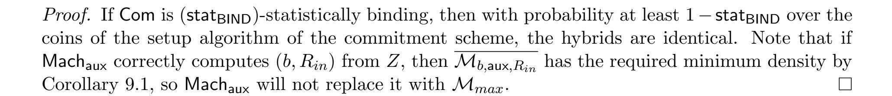

{0}------------------------------------------------

# <span id="page-0-0"></span>Amplifying the Security of Functional Encryption, Unconditionally

Aayush Jain<sup>∗</sup> Alexis Korb† Nathan Manohar‡ Amit Sahai§

June 2020

#### Abstract

Security amplification is a fundamental problem in cryptography. In this work, we study security amplification for functional encryption (FE). We show two main results:

- For any constant ∈ (0, 1), we can amplify any FE scheme for P/poly which is -secure against all polynomial sized adversaries to a fully secure FE scheme for P/poly, unconditionally.
- For any constant ∈ (0, 1), we can amplify any FE scheme for P/poly which is -secure against subexponential sized adversaries to a fully subexponentially secure FE scheme for P/poly, unconditionally.

Furthermore, both of our amplification results preserve compactness of the underlying FE scheme. Previously, amplification results for FE were only known assuming subexponentially secure LWE.

Along the way, we introduce a new form of homomorphic secret sharing called set homomorphic secret sharing that may be of independent interest. Additionally, we introduce a new technique, which allows one to argue security amplification of nested primitives, and prove a general theorem that can be used to analyze the security amplification of parallel repetitions.

<sup>∗</sup>UCLA. Email: aayushjain@cs.ucla.edu.

<sup>†</sup>UCLA. Email: alexiskorb@cs.ucla.edu.

<sup>‡</sup>UCLA. Email: nmanohar@cs.ucla.edu.

<sup>§</sup>UCLA. Email: sahai@cs.ucla.edu.

{1}------------------------------------------------

# Contents

| 1 | Introduction                                                                                                                                                                                                                                                                                    | 1                                |
|---|-------------------------------------------------------------------------------------------------------------------------------------------------------------------------------------------------------------------------------------------------------------------------------------------------|----------------------------------|
| 2 | Technical Overview<br>2.1<br>Amplification via Secret Sharing and Parallel Repetition<br><br>2.2<br>Proving Security: Probabilistic Replacement Theorem<br><br>2.3<br>Amplifying Security via Nesting<br><br>2.4<br>Organization<br>                                                            | 3<br>3<br>5<br>7<br>8            |
| 3 | Preliminaries<br>3.1<br>Useful Lemmas<br>                                                                                                                                                                                                                                                       | 8<br>9                           |
| 4 | Functional Encryption<br>4.1<br>Semi-Functional FE<br><br>4.2<br>From FE to Semi-Functional FE<br>                                                                                                                                                                                              | 10<br>12<br>13                   |
| 5 | Set Homomorphic Secret Sharing Schemes<br>5.1<br>Definition<br><br>5.2<br>SetHSS<br>from<br>CFHSS<br><br>5.2.1<br>Construction<br>                                                                                                                                                              | 15<br>15<br>18<br>18             |
| 6 | Covering Sets                                                                                                                                                                                                                                                                                   | 19                               |
| 7 | Probabilistic Replacement Theorem                                                                                                                                                                                                                                                               | 20                               |
| 8 | Amplification via Secret Sharing and Parallel Repetition<br>8.1<br>Construction<br><br>8.2<br>Security<br><br>8.3<br>Instantiating the Parameters<br><br>8.3.1<br>Amplification Against Polynomial Sized Adversaries<br><br>8.3.2<br>Amplification Against Subexponential Sized Adversaries<br> | 38<br>39<br>41<br>52<br>52<br>55 |
| 9 | Amplification via Nesting<br>9.1<br>Construction<br><br>9.2<br>Security<br>                                                                                                                                                                                                                     | 56<br>57<br>58                   |
|   | 10 Amplification of Nested Public-Key Encryption<br>10.1 Construction<br><br>10.2 Security<br>                                                                                                                                                                                                  | 73<br>73<br>74                   |
|   | 11 Final Amplification Results                                                                                                                                                                                                                                                                  | 76                               |
|   | 12 Acknowledgements                                                                                                                                                                                                                                                                             | 76                               |
|   | 13 References                                                                                                                                                                                                                                                                                   | 77                               |

{2}------------------------------------------------

## <span id="page-2-0"></span>1 Introduction

Security amplification is a fundamental problem in which one takes a weakly secure cryptographic primitive and transforms it into a fully secure primitive. For instance, suppose (G, E, D) is a public-key encryption (PKE) scheme satisfying standard correctness, but which only satisfies the weak security guarantee that there exists a constant  $\epsilon \in (0,1)$  such that for all messages  $m_0, m_1 \in \{0,1\}^{\lambda}$  and for all polynomial-time adversaries  $\mathcal{A}$ , we have

$$\left|\Pr[\mathcal{A}(\mathsf{pk}, E(\mathsf{pk}, m_0)) = 1 \mid (\mathsf{pk}, \mathsf{sk}) \leftarrow G(1^{\lambda})] - \Pr[\mathcal{A}(\mathsf{pk}, E(\mathsf{pk}, m_1)) = 1 \mid (\mathsf{pk}, \mathsf{sk}) \leftarrow G(1^{\lambda})]\right| \leq \epsilon.$$

Then, the relevant security amplification goal for such an  $\epsilon$ -secure public-key encryption would be to construct a new PKE (G', E', D') that satisfies standard security, where the constant  $\epsilon$  above would be replaced with a negligible function in  $\lambda$ . It has long been known [DNR04, HR05] that the security of  $\epsilon$ -secure PKE can be amplified to achieve fully secure PKE unconditionally. (Remarkably, however, there are still natural questions about security amplification for  $\epsilon$ -secure PKE that remain open – see below.)

Aside from being a fundamental question in its own right, security amplification also opens the door to building cryptographic primitives from new intractability assumptions. For instance, in the future, we may discover natural sources of hardness that yield cryptographic primitives with only a weak level of security. Using security amplification, such novel sources of hardness would still yield fully secure cryptographic primitives. This motivation is especially important for cryptographic primitives for which only a few assumptions are known to yield that primitive.

There have been numerous works throughout the years on security amplification for various cryptographic primitives (for example, [Imp95, BIN97, DKS99, Hol05, Hol06, HR05, Wul07, Wul09, HPWP10, MT10, Tes11, PV07, CHS05, HIKN08, MPW07, MT09, LT13, JP14, CCL18, AJS18, AJL<sup>+</sup>19, GJS19]). As with all cryptographic primitives, minimizing assumptions is a major goal in security amplification research. Indeed, unlike many results in cryptography, security amplification results can be *unconditional* (e.g. [Imp95, BIN97, DKS99, Hol05, Hol06, HR05, Wul07, Wul09, HPWP10, MT10, Tes11, PV07, CHS05, MPW07, LT13]).

Security Amplification for Functional Encryption. The focus of this paper is to study security amplification in the context of functional encryption. Functional encryption (FE), introduced by [SW05] and first formalized by [BSW11, O'N10], is one of the core primitives in the area of computing on encrypted data. This notion allows an authority to generate and distribute keys associated with functions  $f_1, \ldots, f_q$ , called functional keys, which can be used to learn the values  $f_1(x), \ldots, f_q(x)$  given an encryption of x. Intuitively, the security notion states that the functional keys associated with  $f_1, \ldots, f_q$  and an encryption of x reveal nothing beyond the values  $f_1(x), \ldots, f_q(x)$ .

Functional encryption has been the subject of intense study [SW05, GGH<sup>+</sup>13, SW14, GGHZ16, GKP<sup>+</sup>13, BGG<sup>+</sup>14, GVW15, ABSV15a, AJ15, BV15, Lin16, Lin17, GPSZ17, GPS16, LV16, AS17, LT17, AJS18, AJL<sup>+</sup>19, Agr19, JLMS19] and has opened the floodgates to important cryptographic applications that have long remained elusive. These applications include, but are not limited to, multi-party non-interactive key exchange [GPSZ17], universal samplers [GPSZ17], reusable garbled circuits [GKP<sup>+</sup>13], verifiable random functions [GHKW17, Bit17, BGJS17], and adaptive garbling [HJO<sup>+</sup>16]. FE has also helped improve our understanding of important theoretical questions, such as the hardness of Nash equilibrium [GPS16, GPSZ17]. One of the most important applications of FE is its implication to indistinguishability obfuscation (iO for short) [AJ15, BV15]. There have also been several recent works on functional encryption combiners [AJS17, ABJ<sup>+</sup>19, JMS20] and

{3}------------------------------------------------

the related problem of iO combiners [\[AJN](#page-78-10)+16, [FHNS16\]](#page-79-10). While amplifiers allow one to transform a weakly secure candidate into a fully secure one, combiners allow one to take many candidates of which at least one is fully secure (and the others are potentially completely insecure) and transform them into a fully secure scheme.

Our Results. Remarkably, although functional encryption was introduced 15 years ago in [\[SW05\]](#page-82-7), security amplification for -secure FE, defined analogously to -secure PKE above, was first studied only recently in [\[AJS18,](#page-78-1) [AJL](#page-78-2)+19], which achieved amplification assuming subexponentially secure LWE. In fact, no security amplification results for FE are known under any other assumptions. In this paper, we show that one can obtain amplification for FE unconditionally. In particular, we obtain the following:

Theorem 1.1 (Informal). Assuming an -secure FE scheme for P/poly secure against all polynomial sized adversaries for some constant ∈ (0, 1), there exists a fully secure FE scheme secure against all polynomial sized adversaries. Furthermore, the transformation preserves compactness.

Additionally, our amplification result can be generalized to hold against larger adversaries, in particular, adversaries of subexponential size.

<span id="page-3-0"></span>Theorem 1.2 (Informal). Assuming an -secure FE scheme for P/poly secure against subexponential sized adversaries for some constant ∈ (0, 1), there exists a subexponentially secure FE scheme. Furthermore, the transformation preserves compactness.

As a consequence of the above theorem and the FE to iO transformations of [\[AJ15,](#page-78-5) [BV15,](#page-79-7) [BNPW16,](#page-79-11) [KS17,](#page-81-10) [KNT18\]](#page-81-11), we observe that we can construct iO from an -secure FE scheme secure against subexponential sized adversaries without the need for any additional assumptions.

Techniques and additional results. To achieve our results, we introduce and construct a new form of homomorphic secret sharing called set homomorphic secret sharing (SetHSS), informally defined below in our Technical Overview. This generalizes a recent notion of combiner friendly homomorphic secret sharing introduced in [\[JMS20\]](#page-81-9) to a probabilistic scenario tailored for security amplification.

Our work also involves an intertwined use of hardcore measures [\[Imp95,](#page-81-1) [KS03,](#page-81-12) [BHK09,](#page-79-12) [MT10,](#page-82-2) [VZ13\]](#page-82-10) and efficient leakage simulation [\[TTV09,](#page-82-11) [JP14,](#page-81-3) [Sk´o15,](#page-82-12) [Sk´o16,](#page-82-13) [CCL18\]](#page-79-4). First, we improve upon and simplify a technique introduced in [\[AJS18,](#page-78-1) [AJL](#page-78-2)+19] and then used in [\[GJS19\]](#page-80-4) that allows one to argue that some fraction of many parallel repetitions of a weakly secure primitive are likely to be secure. The original technique critically uses the leakage simulation theorems [\[JP14,](#page-81-3) [CCL18\]](#page-79-4) in conjunction with a hardcore measure theorem [\[MT10\]](#page-82-2), which allows one to escape the computational overhead of sampling from hardcore measures. We simplify their technique by using a different leakage simulation theorem [\[Sk´o15\]](#page-82-12) which allows for more direct simulation of the applicable leakage. Moreover, we introduce a new "fine-grained" analysis that is crucial to achieving the parameters we need for unconditional amplification. Finally, we isolate the core of their technique and derive a general and applicable theorem (which we call the probabilistic replacement theorem). This theorem is not specific to any cryptographic primitive and, thus, we believe that it might be useful for future efforts in cryptographic amplification beyond FE.

Our second technique is a new technique which allows one to argue security amplification of nested encryptions. In particular, using this technique, we are able to prove the following:

Theorem 1.3 (Informal). For any constant ∈ (0, 1) and -secure FE scheme FE, the FE scheme FE<sup>∗</sup> obtained by composing FE with itself is <sup>2</sup> + negl(λ) -secure.

{4}------------------------------------------------

We remark that this technique can also be generalized to argue similar security for public-key encryption (PKE). As such, we also show the following:

Theorem 1.4 (Informal). For any constant ∈ (0, 1) and -secure PKE scheme PKE, the PKE scheme PKE<sup>∗</sup> obtained by composing PKE with itself is <sup>2</sup> + negl(λ) -secure.

Prior to our paper, to the best of our knowledge, it was not known how to prove that a simple nesting provided this amplification even for public-key encryption.

Lastly, we remark that this amplification by nesting technique also critically relies on a combination of leakage simulation and hardcore measures. We believe our results exemplify how potent this combination can be for security amplification of cryptographic primitives.

# <span id="page-4-0"></span>2 Technical Overview

To establish our results, we proceed in two phases:

- 1. First, we construct an amplifier that converts an -secure FE scheme for any constant ∈ (0, 1) to an 0 -secure FE scheme for any arbitrarily small constant <sup>0</sup> < .
- 2. Second, we construct an amplifier that converts an -secure FE scheme for any sufficiently small constant < <sup>1</sup> 6 to a fully secure FE scheme.

The above template also works to give an amplifier that is subexponentially secure (Theorem [1.2\)](#page-3-0). By composing the amplifiers of these two stages, we arrive at our results. We will begin by focusing on the second stage of our amplification procedure, namely, how we amplify an FE scheme that is -secure for a constant < <sup>1</sup> 6 to one that is fully secure.

## <span id="page-4-1"></span>2.1 Amplification via Secret Sharing and Parallel Repetition

Typically, in order to amplify a weakly secure primitive to a fully secure one, one proceeds by constructing a scheme that uses many copies of the weakly secure primitive and is secure if a fraction of these copies are secure. Intuitively, we expect that if these copies of the weakly secure primitive are independent, then at least some fraction should be secure, and the resulting construction will also be secure. This idea of parallel repetitions of the weakly secure primitive is utilized typically in tandem with a secret sharing scheme. For example, the canonical public-key encryption amplifier works by secret sharing the message and then encrypting each of these shares independently in parallel using the weakly-secure public-key encryption scheme [\[LT13\]](#page-81-2). This paradigm has also been used to amplify other primitives such as non-interactive zero-knowledge [\[GJS19\]](#page-80-4), by constructing a suitable secret sharing scheme.

In order to amplify functional encryption (FE), a natural approach to utilize this framework is via function secret sharing (FSS). Function secret sharing allows one to split a function f into shares f1, . . . , f<sup>n</sup> such that for any input x, we can also split x into shares x1, . . . , x<sup>n</sup> such that learning the evaluations f1(x1), . . . , fn(xn) allows one to recover f(x). Informally, the security property associated with a function secret sharing scheme is that given all but one of the input shares, the input should remain hidden (beyond what is revealed by f(x)) even if one is given all the function shares and their evaluations on the input shares. If we had such a function secret sharing scheme, we could simply encrypt each input share x<sup>i</sup> under an instantiation FE<sup>i</sup> of our weakly secure FE scheme to obtain ct<sup>i</sup> . A ciphertext in our scheme would be (cti)i∈[n] . Similarly, key generation could use FE<sup>i</sup> to generate a key sk<sup>i</sup> for the function f<sup>i</sup> . The function key in our scheme would then be (ski)i∈[n] . From these ciphertexts and function keys, one could learn (fi(xi))i∈[n] and recover f(x). 

{5}------------------------------------------------

For security, one would expect that if the FE scheme is weakly secure, then at least one out of the n instantiations would be secure, in which case, the overall scheme's security would follow by the security of the function secret sharing scheme. This general approach was used in [\[AJS18,](#page-78-1) [AJL](#page-78-2)+19] to amplify FE assuming subexponentially secure LWE.

In this work, our goal is to amplify FE unconditionally. We first observe that we can assume secure one-way functions and still achieve unconditional amplification since a weakly-secure FE implies a weakly-secure one-way function, which can subsequently be amplified using the result of [\[Imp95\]](#page-81-1). Unfortunately, we do not know how to construct function secret sharing schemes of the above form assuming only secure one-way functions. However, we note that the above function secret sharing scheme allows up to n−1 of the shares to be corrupted while maintaining security. Yet, if we take many copies of an -secure FE scheme, we would expect roughly a (1−) fraction of copies to be secure, not just one! Thus, the above function secret sharing scheme has a stronger security property than the one we would intuitively expect to require for amplification. All we actually need is a secret sharing scheme that is secure against typical corruption patterns (that is, one that is secure with high probability if each share is corrupted independently with some probability p). To capitalize on this intuition, we introduce and construct a new type of homomorphic secret sharing scheme, called a set homomorphic secret sharing scheme.

Set Homomorphic Secret Sharing Scheme. In a set homomorphic secret sharing (SetHSS) scheme, function shares are associated with sets (Ti)i∈[m] , where each set T<sup>i</sup> ⊂ {1, 2, . . . , n}. The input x is split into n shares x1, . . . , xn. A function f<sup>i</sup> associated with the set T<sup>i</sup> takes as input all x<sup>j</sup> 's such that j ∈ T<sup>i</sup> . Thus, we can think of the T<sup>i</sup> 's as sets of the indices of the input shares that the function takes as input. The security guarantee is that if the adversary corrupts some of the Ti 's and learns all the input shares corresponding to these sets, security still holds provided there is at least one input share x<sup>i</sup> <sup>∗</sup> that the adversary does not learn.

Using a SetHSS scheme, it is possible to build (what we expect to be) an FE amplifier. We follow the same approach detailed above for a function secret sharing scheme to build FE, except we instead use SetHSS with respect to sets (Ti)i∈[m] . That is, we run m copies of the FE setup algorithm to obtain m master secret keys (mski)i∈[m] . To encrypt a message x, we n-out-of-n secret share x into shares x1, . . . , xn. For each i ∈ [m], we encrypt (x<sup>j</sup> )j∈T<sup>i</sup> under msk<sup>i</sup> to obtain ct<sup>i</sup> and set the ciphertext ct as (cti)i∈[m] . To generate function keys, we use the SetHSS scheme to obtain function shares f1, . . . , f<sup>m</sup> and then set sk<sup>f</sup> = (ski)i∈[m] , where sk<sup>i</sup> is the function key for f<sup>i</sup> generated using msk<sup>i</sup> . Observe that by the correctness of the SetHSS scheme and the FE scheme, the above is a correct FE construction. Since the FE scheme is only weakly-secure, if we assume that each encryption becomes corrupted with some probability p (this corresponds to a set T<sup>i</sup> becoming corrupted in the SetHSS scheme), we can calculate the probability that the SetHSS scheme remains secure when the corresponding input shares are leaked.

The question that naturally follows is how do we construct such a SetHSS scheme? The first step towards this was taken in the recent work of [\[JMS20\]](#page-81-9), which introduced a specialized form of function secret sharing, called combiner-friendly homomorphic secret sharing (CFHSS), which was constructed assuming only one-way functions. Essentially, a CFHSS is a SetHSS where m = n 3 , and the sets T<sup>i</sup> are all possible size 3 subsets of {1, 2, . . . , n}. We observe that unfortunately, such a SetHSS scheme will not suffice for our purposes, because if any constant fraction of the sets T<sup>i</sup> are corrupted, then almost certainly every input share x<sup>j</sup> would be corrupted.

Instead, for some parameters n and m, we generate sets (Ti)i∈[m] by including each element in [n] in each T<sup>i</sup> independently at random with some probability q. We can then calculate two probabilities: First, we can ensure that the probability that at least one share x<sup>j</sup> is not corrupted, 

{6}------------------------------------------------

is sufficiently high – this should intuitively guarantee security. Second, we can ensure that all sets of size 3 are covered by at least one of the sets  $T_i$  – this will allow us to ensure correctness by setting the function share  $f_i$  in our SetHSS scheme to be the concatenation of the CFHSS function shares corresponding to each size 3 subset contained in  $T_i$ .

It turns out that setting the parameters n, m, and q above to achieve both properties simultaneously is nontrivial, and, in fact, we iterate this process twice. The first SetHSS scheme lets us amplify from  $\epsilon < \frac{1}{6}$  security to  $1/\operatorname{poly}(\lambda)$  security. The second SetHSS scheme lets us amplify from  $1/\operatorname{poly}(\lambda)$  security to negligible (or sub-exponential) security.

However, our security calculations only give us a sense of what we expect the resulting security level to be. How do we actually prove that the scheme attains this level of security?

### <span id="page-6-0"></span>2.2 Proving Security: Probabilistic Replacement Theorem

Consider the following situation: There are  $n \in \mathbb{N}$  independent copies of some primitive that is known to be only weakly secure (over the randomness of the primitive) for some notion of security. Then, one wants to claim that if n is large enough, with high probability, at least one of these n instantiations will be secure. Or as a stronger notion, one might want some fraction of the n instantiations to be secure. This is useful when security of some larger primitive holds provided that some fraction of these n instantiations are secure. For example, if one were to additively secret share a message and then independently encrypt each share, the message remains hidden as long as at least one of the encryptions cannot be broken.

Proofs using Hardcore Lemmas: Typical proofs of this sort rely on hardcore lemmas that define hardcore measures. First, we review the notion of a hardcore measure. Suppose that a primitive is secure with some low probability over its randomness. Then, Impagliazzo's hardcore lemma [Imp95] states that there exists some "hard core" of the primitive's randomness such that the primitive is secure with high probability (against a somewhat smaller class of adversaries) when its randomness is restricted to this "hard core". In other words, though the primitive may be weakly secure over uniform randomness, there is some "hard core" portion of the randomness on which the primitive is strongly secure. This "hard core" may be defined as a measure over the randomness (which we call a hardcore set). A more precise specification of the relationship between the security gain and the density of the hardcore measure can be found in various hardcore lemmas (refer to Section 3).

Then, typical security amplification proofs proceed as follows: In the scenario above, each of the n instances of the primitive independently samples its randomness from a uniform distribution. However, this is equivalent to having each primitive sample its randomness from its hardcore measure with probability proportional to the density of the hardcore measure and sample from the complement of the hardcore measure with probability proportional to the density of the complement. When considered this way, if the density of the hardcore measure is large enough, with high probability, some of the instances of the primitive will sample randomness from their hardcore measures. Therefore, those primitives are secure by the definition of the hardcore measure.

Dealing with the Time Complexity of Sampling Hardcore Measures: Now, this proof technique works whenever it is the final step in a larger proof of security. But what happens when this is not the case? For instance, suppose we independently encrypt secret shares of a message m, and then after claiming some fraction of the encryptions are secure, suppose we want to move to an experiment where the secure shares are replaced with shares corresponding to the message 0. A natural idea would be to replace the shares known to be secure (those where the randomness of

{7}------------------------------------------------

the encryption was sampled from the hardcore measures) with simulated shares via a reduction to some notion of indistinguishability between the real and simulated shares when the real shares are hidden.

We note that the reduction in this case, upon receiving either the simulated or real shares, would need to encrypt these challenge shares using the secure encryption instances. This means the reduction needs to sample randomness from the hardcore measures of the encryption. This can be problematic because there is no bound on the efficiency of sampling from these hardcore measures. Therefore, there is no bound on the efficiency of the reduction. This would be fine if the secret sharing satisfied a statistical notion of security. Unfortunately, this will not work if the underlying secret sharing scheme achieves only computational security, such as is the case with our SetHSS scheme. In general, the same issue can occur whenever computational assumptions need to be used in the remainder of the proof of security, after applying an appropriate hardcore lemma.

In essence, the issue is that once one uses the fact that one is sampling from the hardcore measures to prove that an instance is secure, then later reductions may also have to sample from the hardcore measures. But this sampling may not be efficient, so the reduction may also be inefficient. To address this problem, we build upon a technique introduced in [\[AJS18,](#page-78-1) [AJL](#page-78-2)+19]. We first observe that hardcore measures of sufficiently high density also have high min-entropy. Then, we use a leakage simulation theorem from [\[Sk´o15\]](#page-82-12) which allows one to simulate sampling from measures with high min-entropy in a manner that is more efficient; by careful choice of parameters, we show that this simulation can be made efficient enough to allow us to perform cryptographic reductions. This allows one to continue performing reductions even after one has invoked the hardcore measures (instead of sampling from the hardcore measure, we can instead run the simulator for the measure). Furthermore, we can ensure that the simulator is independent of some of its inputs through the appropriate use of commitments. We note that instead of using [\[Sk´o15\]](#page-82-12) for leakage simulation, [\[AJS18,](#page-78-1) [AJL](#page-78-2)+19] uses a different leakage simulation lemma [\[CCL18\]](#page-79-4) that deals with low output length leakage instead of high min-entropy leakage and, therefore, requires the leakage to be first transformed into an appropriate form. Our proof is thus simpler and more direct. Additionally, by considering the output of the simulator as a single joint distribution, we can also get slightly better and more fine-grained parameters, which allows us to get polynomial time simulators for all of the appropriate parameter regimes we use in this paper. We then present the core of this technique in a more abstract and modular way so that it can be applied to other situations and proofs. We note that our abstracted theorem does not refer to hardcore measures at all, but instead refers to the more natural problem of claiming that some fraction of n primitives is secure.

The Probabilistic Replacement Theorem: More specifically, suppose there are two randomized functions E and F that are weakly indistinguishable over their randomness. Then, our theorem shows indistinguishability between the following two experiments: In one experiment, the adversary gets n independent evaluations of E on n inputs. In the other experiment, we probabilistically replace some of the instances of E with F. Then, we give the adversary evaluations of these instances of E and F using randomness generated by some bounded-time function h. Essentially, we show that one can replace some of the instances of E with instances of F, while still maintaining overall efficiency. Please refer to Section [7](#page-21-0) for more details.

Relating this back to the notion of security, we could let F be a "secure" variant of some primitive E. For instance, F could be an encryption of 0 and E an encryption of the message m. If E is weakly secure in the sense that E is weakly indistinguishable from F, then if one has enough independent instances of E, we show that at least some fraction of them will be secure (in the sense that one can replace these instances of E with the secure variant F). For more details, please refer 

{8}------------------------------------------------

to the proof overview in Section 7.

Applying the Probabilistic Replacement Theorem: Having shown the probabilistic replacement theorem (Section 7), it is now possible to prove the security of our FE amplifier described above fairly easily. Roughly, we will use the probabilistic replacement theorem to replace FE encryptions of SetHSS shares with simulated FE encryptions. Once this has been done, we can use the security of the underlying SetHSS scheme to argue security of our FE amplifier.

Setting the Parameters: By appropriately setting the parameters n (number of input shares), m (number of sets in the SetHSS scheme), and q (the probability of an element in [n] being included in any set), we are able to show that our construction indeed amplifies security. We will have to apply the construction twice. First, we are able to amplify from a constant  $\epsilon < \frac{1}{6}$  secure FE scheme to one that is  $1/\operatorname{poly}(\lambda)$  secure. Then, we are able to amplify a  $1/\operatorname{poly}(\lambda)$  scheme to one that is fully secure. An astute reader may have noticed that at each invocation of our amplifier, we also lose some correctness. However, in between applications of our amplifier, we can easily amplify correctness by parallel repetition. This is because we only need one of our repetitions to be correct. This approach does lose a factor of security proportional to the number of repetitions, but the parameters can be set so that overall we gain in security while preserving correctness. Please refer to Section 8 for more details.

#### <span id="page-8-0"></span>2.3 Amplifying Security via Nesting

The above FE amplifier was already sufficient to amplify an  $\epsilon$ -secure FE scheme with  $\epsilon < \frac{1}{6}$  to a fully secure one. However, we would like to be able to amplify an  $\epsilon$ -secure FE scheme for any constant  $\epsilon \in (0,1)$ . Here, we show how to amplify an  $\epsilon$ -secure FE scheme for any  $\epsilon \in (0,1)$  to an  $\epsilon'$ -secure FE scheme for any  $\epsilon' \in (0,1)$ . To do this, we first show how to amplify an  $\epsilon$ -secure FE scheme to a (roughly)  $\epsilon^2$ -secure one. By repeatedly applying this transformation a constant number of times, we can amplify to any smaller constant. The construction itself is to simply nest two independent copies of the underlying  $\epsilon$ -secure FE scheme. Namely, first encrypt the message under FE<sub>1</sub> to compute  $\operatorname{ct_1}$  and then encrypt  $\operatorname{ct_1}$  under FE<sub>2</sub> to obtain the final ciphertext  $\operatorname{ct}$ , with appropriate functional secret keys. Intuitively, since there are two layers of encryption, where each layer is secure with probability  $(1-\epsilon)$ , we would expect the double encryption to be secure with probability  $(1-\epsilon)$ . However, proving this requires some care. Indeed, to the best of our knowledge, such a security amplification result, even for nested public-key encryption, was not previously known.

**Proof Overview:** As noted above, we expect our nested scheme to be secure if one of the encryption layers is secure. Now, if we could prove that each layer is *independently* insecure with probability at most  $\epsilon$ , then we could show that the amplified FE\* scheme is only insecure with probability at most  $\epsilon^2$ . Unfortunately, the security of the two layers is not independent; in general the hard core sets of randomness which lead to secure encryptions could depend on the message being encrypted. Instead, we will achieve similar amplification by in some sense "simulating" the security of the outer FE in a way that is independent of the security of the inner FE.

First, we quantify the security of the outer FE using hardcore measures. If we have an  $\epsilon$ -secure FE, then for any fixed output of the inner FE, the outer FE is secure with probability at least  $1 - \epsilon$ . Therefore, by Theorem 3.1, there exist hardcore measures (of density  $1 - \epsilon$ ) of the randomness of the outer FE such that the outer FE is strongly secure when its randomness is sampled from these hardcore measures. So, with probability at least  $1 - \epsilon$ , we sample randomness from the hardcore

{9}------------------------------------------------

measures of the outer FE and achieve security via these hardcore measures. But with probability  $\epsilon$ , we have no guarantee that the outer FE is secure, so we must rely on the security of the inner FE.

Now, we want to show that conditioned on the outer FE being potentially insecure (i.e. when we do not sample from these hardcore measures), then the inner FE is still only insecure with probability close to  $\epsilon$ . In other words, we want to show that the security of the inner and outer FE schemes are close to independent. To do so, we need to perform a reduction to the  $\epsilon$ -security of the inner FE. At this point, we run into two issues. First, in order to perform our reduction to the security of the inner FE, we will need to sample from the complement hardcore measures of the outer FE. (Recall that we first conditioned on the outer FE being potentially insecure.) However, this is problematic because we have no bound on the efficiency of computing or sampling from these hardcore measures. Secondly, the hardcore measures of the outer FE depend implicitly on the randomness used by the inner FE. Or, in other words, the security of the outer FE, as quantified by these measures, is not independent of the security of the inner FE.

To resolve these issues, we need to find a way to give an efficient reduction to the security of the inner FE, despite the inefficiencies and dependencies outlined above. Intuitively, we proceed as follows: Our reduction takes as input the ciphertext produced by the inner FE. The reduction then uses the fact that the complement of the hard core measure of the outer FE has density  $\epsilon$  to efficiently simulate randomness that is indistinguishable from hardcore randomness; this simulation uses the leakage simulation theorem of [Skó15]. This allows our reduction to create the outer FE ciphertext that the adversary expects. Please refer to Section 9 for more details.

### <span id="page-9-0"></span>2.4 Organization

In Section 3, we recall necessary preliminaries. In Section 4, we define functional encryption notions with partial security. In Sections 5 and 6, we define and instantiate set homomorphic secret sharing schemes and analyze their correctness and security when the underlying sets are sampled in a probabilistic manner. In Section 7, we state and prove the Probabilistic Replacement Theorem. In Section 8, we show our parallel repetition amplification theorem. In Section 9, we show our nesting amplification theorem. In Section 10, we show that nesting amplifies the security of public-key encryption. Finally, in Section 11, we combine our nesting and parallel repetition amplification results.

## <span id="page-9-1"></span>3 Preliminaries

**Notation** Let  $\lambda \in \mathbb{N}$  be the security parameter. Throughout, we define various size and advantage parameters as functions of  $\lambda$ . We say that a function  $f(\lambda)$  is negligible, denoted  $f(\lambda) = \mathsf{negl}(\lambda)$ , if  $f(\lambda) = \lambda^{-\omega(1)}$ . We say that a function  $f(\lambda)$  is polynomial, denoted  $f(\lambda) = \mathsf{poly}(\lambda)$ , if  $f(\lambda) = p(\lambda)$  for some fixed polynomial p. Throughout, when we write inequalities in terms of functions of  $\lambda$ , we mean that these inequalities hold for sufficiently large  $\lambda$ . For  $n \in \mathbb{N}$ , let [n] denote the set  $\{1, \ldots, n\}$ . For a set S, let  $x \leftarrow S$  denote the process of sampling x from the uniform distribution over S. For a distribution  $\mathcal{D}$ , let  $x \leftarrow \mathcal{D}$  denote the process of sampling x from  $\mathcal{D}$ .

**Definition 3.1**  $((s, \epsilon)$ -Indistinguishability). We say that two ensembles  $\mathcal{X} = \{\mathcal{X}_{\lambda}\}_{{\lambda} \in \mathbb{N}}$  and  $\mathcal{Y} = \{\mathcal{Y}_{\lambda}\}_{{\lambda} \in \mathbb{N}}$  are  $(s, \epsilon)$ -indistinguishable if for any adversary  $\mathcal{A}$  of size s,

$$\left| \Pr_{x \leftarrow \mathcal{X}_{\lambda}} [\mathcal{A}(1^{\lambda}, x)] - \Pr_{y \leftarrow \mathcal{Y}_{\lambda}} [\mathcal{A}(1^{\lambda}, y)] \right| \le \epsilon$$

{10}------------------------------------------------

for sufficiently large  $\lambda \in \mathbb{N}$ .

**Notation** We will say that ensembles satisfy  $(poly(\lambda) \cdot s, \epsilon)$ -indistinguishability if the ensembles satisfy  $(p(\lambda) \cdot s, \epsilon)$ -indistinguishability for every polynomial  $p(\lambda)$ .

We will make use of the following Chernoff bound in our analysis.

<span id="page-10-2"></span>**Definition 3.2** (Chernoff Bound). Let  $X_1, X_2, \ldots, X_n$  be independent and identically distributed Boolean random variables. Let  $X = \sum_{i \in [n]} X_i$  and let  $\mu = \mathbb{E}[X]$ . Then, for  $\delta \geq 1$ ,

$$\Pr[X \ge (1+\delta)\mu] \le e^{-\frac{\delta\mu}{3}}.$$

We define a measure.

<span id="page-10-3"></span>**Definition 3.3.** A measure is a function  $\mathcal{M}: \{0,1\}^k \to [0,1]$ .

- The size of a measure is  $|\mathcal{M}| = \sum_{x \in \{0,1\}^k} \mathcal{M}(x)$ .
- The density of a measure is  $\mu(\mathcal{M}) = |\mathcal{M}|2^{-k}$ .
- The distribution defined by a measure (denoted by  $\mathcal{D}_{\mathcal{M}}$ ) is a distribution over  $\{0,1\}^k$ , where for every  $x \in \{0,1\}^k$ ,  $\Pr_{X \leftarrow \mathcal{D}_{\mathcal{M}}}[X=x] = \mathcal{M}(x)/|\mathcal{M}|$ .
- A scaled version of a measure for a constant 0 < c < 1 is  $\mathcal{M}_c = c\mathcal{M}$ . Note that  $\mathcal{M}_c$  induces the same distribution as  $\mathcal{M}$ .
- The complement of a measure is  $\overline{\mathcal{M}} = 1 \mathcal{M}$ .

**Definition 3.4** (Min-entropy). The min-entropy of a variable X is

$$\mathsf{H}_{\infty}(X) = -\log \max_{x} \Pr[X = x]$$

**Definition 3.5** (Worst-case conditional min-entropy). The worst-case conditional min-entropy of a variable X conditioned on Z is

$$\mathsf{H}_{\infty}(X|Z) = \min_{z} (-\log \max_{x} \Pr[X = x \mid Z = z])$$

#### <span id="page-10-0"></span>3.1 Useful Lemmas

<span id="page-10-1"></span>**Theorem 3.1** (Imported Theorem [MT10]). Let  $E^* : \{0,1\}^n \to \mathcal{Y}$  and  $F^* : \{0,1\}^m \to \mathcal{Y}$  be two functions, and let  $\epsilon, \gamma \in (0,1)$  and s > 0 be given. If for all distinguishers  $\mathcal{A}$  with size s we have

$$\left| \Pr_{x \leftarrow \{0,1\}^n} [\mathcal{A}(E^*(x)) = 1] - \Pr_{y \leftarrow \{0,1\}^m} [\mathcal{A}(F^*(y)) = 1] \right| \le \epsilon$$

Then there exist two measures  $\mathcal{M}_0$  (on  $\{0,1\}^n$ ) and  $\mathcal{M}_1$  (on  $\{0,1\}^m$ ) that depend on  $\gamma$ , s such that

- 1.  $\mu(\mathcal{M}_b) \ge 1 \epsilon \text{ for } b \in \{0, 1\}$
- 2. For all distinguishers  $\mathcal{A}'$  of size  $s' = \frac{s\gamma^2}{128(m+n+1)}$

$$\left| \Pr_{x \leftarrow \mathcal{D}_{\mathcal{M}_0}} [\mathcal{A}'(E^*(x)) = 1] - \Pr_{y \leftarrow \mathcal{D}_{\mathcal{M}_1}} [\mathcal{A}'(F^*(y)) = 1] \right| \le \gamma$$

{11}------------------------------------------------

**Theorem 3.2** (Imported Theorem [Skó15]. See also [Skó16].). Let  $n, m \in \mathbb{N}$ . For every distribution (X, W) on  $\{0, 1\}^n \times \{0, 1\}^m$  and every  $s, \epsilon$ , there exists a simulator  $h : \{0, 1\}^n \to \{0, 1\}^m$  such that

- 1. h has size bounded by  $\operatorname{size}_h = O(s(n+m)2^{2\Delta}\epsilon^{-5})$  where  $\Delta = m \mathsf{H}_{\infty}(W|X)$  is the min-entropy deficiency.
- 2. (X,W) and (X,h(X)) are  $(s,\epsilon)$ -indistinguishable. That is, for all circuits C of size s, then

$$\left| \Pr_{(x,w) \leftarrow (X,W)} [C(x,w) = 1] - \Pr_{x \leftarrow X,h} [C(x,h(x)) = 1] \right| \le \epsilon$$

## <span id="page-11-0"></span>4 Functional Encryption

We define the notion of a (secret key) functional encryption scheme.

Syntax of a Functional Encryption Scheme. A functional encryption (FE) scheme FE for a class of circuits  $\mathcal{C} = \{\mathcal{C}_{\lambda}\}_{{\lambda} \in \mathbb{N}}$  consists of four polynomial time algorithms (Setup, Enc, KeyGen, Dec) defined as follows. Let  $\mathcal{X}_{\lambda}$  be the input space of the circuit class  $\mathcal{C}_{\lambda}$ , and let  $\mathcal{Y}_{\lambda}$  be the output space of  $\mathcal{C}_{\lambda}$ . We refer to  $\mathcal{X}_{\lambda}$  and  $\mathcal{Y}_{\lambda}$  as the input and output space of the scheme, respectively.

- Setup,  $\mathsf{msk} \leftarrow \mathsf{FE}.\mathsf{Setup}(1^{\lambda})$ : It takes as input the security parameter  $\lambda$  and outputs the master secret key  $\mathsf{msk}$ .
- Encryption, ct  $\leftarrow$  FE.Enc(msk, m): It takes as input the master secret key msk and a message  $m \in \mathcal{X}_{\lambda}$  and outputs ct, an encryption of m.
- **Key Generation**,  $\mathsf{sk}_C \leftarrow \mathsf{FE}.\mathsf{KeyGen}\,(\mathsf{msk},C)$ : It takes as input the master secret key  $\mathsf{msk}$  and a circuit  $C \in \mathcal{C}_\lambda$  and outputs a function key  $\mathsf{sk}_C$ .
- **Decryption**,  $y \leftarrow \mathsf{FE.Dec}(\mathsf{sk}_C, \mathsf{ct})$ : It takes as input a function secret key  $\mathsf{sk}_C$ , a ciphertext  $\mathsf{ct}$  and outputs a value  $y \in \mathcal{Y}_{\lambda}$ .

We can similarly define the notion of a public key FE scheme, and our results in this work also hold for public key FE. However, we choose to focus on secret key FE, as this is a weaker primitive. We describe the properties associated with an FE scheme.

### Correctness.

**Definition 4.1** (Approximate Correctness). A functional encryption scheme  $\mathsf{FE} = (\mathsf{Setup}, \mathsf{KeyGen}, \mathsf{Enc}, \mathsf{Dec})$  is said to be  $\mu$ -correct if it satisfies the following property: for every  $C: \mathcal{X}_{\lambda} \to \mathcal{Y}_{\lambda} \in \mathcal{C}_{\lambda}, m \in \mathcal{X}_{\lambda}$  it holds that:

$$\Pr\left[\begin{array}{c} \mathsf{msk} \leftarrow \mathsf{FE}.\mathsf{Setup}(1^\lambda) \\ \mathsf{ct} \leftarrow \mathsf{FE}.\mathsf{Enc}(\mathsf{msk},m) \\ \mathsf{sk}_C \leftarrow \mathsf{FE}.\mathsf{KeyGen}(\mathsf{msk},C) \\ C(m) \leftarrow \mathsf{FE}.\mathsf{Dec}(\mathsf{sk}_C,\mathsf{ct}) \end{array}\right] \geq \mu,$$

where the probability is taken over the coins of the algorithms.

We refer to FE schemes that satisfy the above definition of correctness with  $\mu = 1 - \text{negl}(\lambda)$  for a negligible function  $\text{negl}(\cdot)$  as correct.

{12}------------------------------------------------

Efficiency: Sublinearity and Compactness.

**Definition 4.2** (Sublinearity and Compactness). A functional encryption scheme FE for a circuit class C containing circuits of size at most s that take inputs of length  $\ell$  is said to be sublinear if there exists some constant  $\epsilon > 0$  such that the size of the encryption circuit is bounded by  $s^{1-\epsilon} \cdot \operatorname{poly}(\lambda, \ell)$  for some fixed polynomial poly. If the above holds for  $\epsilon = 1$ , then the FE scheme is said to be compact.

In this work, we will focus on FE schemes that are sublinear (and possibly compact).

**Security.** We recall indistinguishability-based super-selective security for FE. This security notion is modeled as a game between a challenger Chal and an adversary  $\mathcal{A}$ . The game begins with  $\mathcal{A}$  submitting message queries  $(x_i)_{i\in[\Gamma]}$ , a challenge message query  $(x_0^*, x_1^*)$ , and a function query C. Chal samples a bit b and responds with ciphertexts corresponding to  $(x_i)_{i\in[\Gamma]}$  and  $x_b^*$  along with a function key  $\mathsf{sk}_C$  corresponding to C.  $\mathcal{A}$  wins the game if she can guess b with probability significantly more than 1/2 and if  $C(x_0^*) = C(x_1^*)$ . That is to say, the function evaluation computable by  $\mathcal{A}$  on the challenge ciphertext gives the same value regardless of b. We can define our security notion in terms of the size  $s = s(\lambda)$  of adversaries against which security holds and an advantage  $\epsilon = \epsilon(\lambda)$  that such adversaries can achieve. We say such a scheme is  $(s, \epsilon)$ —secure.

<span id="page-12-0"></span>**Definition 4.3**  $((s, \epsilon)$ -secure FE). A secret-key FE scheme FE for a class of circuits  $\mathcal{C} = \{\mathcal{C}_{\lambda}\}_{{\lambda} \in [\mathbb{N}]}$  and message space  $\mathcal{X} = \{\mathcal{X}_{\lambda}\}_{{\lambda} \in [\mathbb{N}]}$  is  $(s, \epsilon)$ -secure if for any adversary  $\mathcal{A}$  of size s, the advantage of  $\mathcal{A}$  is

$$\mathsf{Adv}^{\mathsf{FE}}_{\mathcal{A}} = \left| \mathsf{Pr}[\mathsf{Expt}^{\mathsf{FE}}_{\mathcal{A}}(1^{\lambda}, 0) = 1] - \mathsf{Pr}[\mathsf{Expt}^{\mathsf{FE}}_{\mathcal{A}}(1^{\lambda}, 1) = 1] \right| \leq \epsilon,$$

where for each  $b \in \{0,1\}$  and  $\lambda \in \mathbb{N}$ , the experiment  $\mathsf{Expt}_{\mathcal{A}}^\mathsf{FE}(1^\lambda, b)$  is defined below:

- 1. Challenge queries: A submits message queries  $(x_i)_{i \in [\Gamma]}$ , a challenge message query  $(x_0^*, x_1^*)$ , and a function query C to the challenger Chal, with  $x_i \in \mathcal{X}_{\lambda}$  for all  $i \in [\Gamma]$ ,  $x_0^*, x_1^* \in \mathcal{X}_{\lambda}$ , and  $C \in \mathcal{C}_{\lambda}$  such that  $C(x_0^*) = C(x_1^*)$ . Here,  $\Gamma$  is an arbitrary (a priori unbounded) polynomial in  $\lambda$ .
- 2. Chal  $computes \; \mathsf{msk} \leftarrow \mathsf{FE.Setup}(1^\lambda) \; and \; then \; computes \; \mathsf{ct}_i \leftarrow \mathsf{FE.Enc}(\mathsf{msk}, x_i) \; for \; all \; i \in [\Gamma]. \; It \; then \; computes \; \mathsf{ct}^* \leftarrow \mathsf{FE.Enc}(\mathsf{msk}, x_b^*) \; and \; \mathsf{sk}_C \leftarrow \mathsf{FE.KeyGen}(\mathsf{msk}, C). \; \; It \; sends \; ((\mathsf{ct}_i)_{i \in [\Gamma]}, \mathsf{ct}^*, \mathsf{sk}_C) \; to \; \mathcal{A}.$
- 3. The output of the experiment is set to b', where b' is the output of A.

Adaptive Security and Collusions. The above security notion is referred to as super-selective security in the literature. One can consider a stronger notion of security, called *adaptive security with unbounded collusions*, where the adversary can make an unbounded (polynomial) number of function secret key queries and can interleave the challenge messages and the function queries in any arbitrary order. In this paper, we only deal with super-selectively secure FE schemes. However, it holds for any fully-secure sublinear FE scheme that these notions are equivalent [KNT18, ABSV15b], and therefore, we only focus on super-selective security in this work, as it is a simpler starting place.

{13}------------------------------------------------

### <span id="page-13-0"></span>4.1 Semi-Functional FE

In this work, to simplify some constructions and proofs, we will consider the notion of semi-functional FE (sFE). Semi-functional FE is simply a functional encryption scheme with the following auxiliary algorithms:

- Semi-functional Key Generation, sfKG(msk,  $C, \theta$ ): On input the master secret key msk, circuit  $C \in \mathcal{C}_{\lambda}$ , and a value  $\theta$ , it computes the semi-functional key  $\mathsf{sk}_{C,\theta}$ .
- Semi-functional Encryption, sfEnc(msk,  $1^{\lambda}$ ): On input the master secret key msk and the security parameter  $1^{\lambda}$ , it computes a semi-functional ciphertext  $\mathsf{ct}_{\mathsf{sf}}$ .

When a semi-functional key is used to decrypt a regular ciphertext, the hardcoded value  $\theta$  is ignored and decryption operates as with a regular key. However, when a semi-functional key is used to decrypt a semi-functional ciphertext, the hardcoded value  $\theta$  is output.

We define two security properties associated with the above auxiliary algorithms: semi-functional key indistinguishability and semi-functional ciphertext indistinguishability. Intuitively, the semi-functional key indistinguishability property states that an adversary cannot distinguish between a regular function key and a semi-functional one with any hardcoded value  $\theta$ . The semi-functional ciphertext indistinguishability property informally states that an adversary cannot distinguish between a real encryption of a message m and a "fake" semi-functional encryption when given a semi-functional key for the circuit C with  $\theta = C(m)$ .

We now formally define the semi-functional key indistinguishability property and the semi-functional ciphertext indistinguishability property.

<span id="page-13-1"></span>**Definition 4.4**  $((s, \nu)$ -Semi-functional Key Indistinguishability). A secret-key semi-functional FE scheme sFE for a class of circuits  $\mathcal{C} = \{\mathcal{C}_{\lambda}\}_{{\lambda} \in [\mathbb{N}]}$  and message space  $\mathcal{X} = \{\mathcal{X}_{\lambda}\}_{{\lambda} \in [\mathbb{N}]}$  satisfies  $(s, \nu)$ -semi-functional key indistinguishability if for any adversary  $\mathcal{A}$  of size s, the advantage of  $\mathcal{A}$  is

$$\mathsf{Adv}^{\mathsf{sFE}_{\mathsf{K}}}_{\mathcal{A}} = \left| \mathsf{Pr}[\mathsf{Expt}^{\mathsf{sFE}_{\mathsf{K}}}_{\mathcal{A}}(1^{\lambda}, 0) = 1] - \mathsf{Pr}[\mathsf{Expt}^{\mathsf{sFE}_{\mathsf{K}}}_{\mathcal{A}}(1^{\lambda}, 1) = 1] \right| \leq \nu,$$

where for each  $b \in \{0,1\}$  and  $\lambda \in \mathbb{N}$ , the experiment  $\mathsf{Expt}^{\mathsf{sFE}_{\mathsf{K}}}_{\mathcal{A}}(1^{\lambda},b)$  is defined below:

- 1. Challenge queries: A submits message queries  $(x_i)_{i \in [\Gamma]}$ , a function query C, and a value  $\theta$  to the challenger Chal, with  $x_i \in \mathcal{X}_{\lambda}$  for all  $i \in [\Gamma]$ ,  $C \in \mathcal{C}_{\lambda}$ , and  $\theta \in \mathcal{Y}_{\lambda}$ . Here,  $\Gamma$  is an arbitrary (a priori unbounded) polynomial in  $\lambda$ .
- 2. Chal  $computes \; \mathsf{msk} \leftarrow \mathsf{FE}.\mathsf{Setup}(1^\lambda) \; and \; then \; computes \; \mathsf{ct}_i \leftarrow \mathsf{FE}.\mathsf{Enc}(\mathsf{msk}, x_i) \; for \; all \; i \in [\Gamma].$  If b = 0,  $it \; computes \; \mathsf{sk}_C^* \leftarrow \mathsf{FE}.\mathsf{KeyGen}(\mathsf{msk}, C). \; If \; b = 1, \; it \; instead \; computes \; \mathsf{sk}_C^* \leftarrow \mathsf{sfKG}(\mathsf{msk}, C, \theta). \; It \; sends \; ((\mathsf{ct}_i)_{i \in [\Gamma]}, \mathsf{sk}_C^*) \; to \; \mathcal{A}.$
- 3. The output of the experiment is set to b', where b' is the output of A.

<span id="page-13-2"></span>**Definition 4.5**  $((s,\epsilon)$ -Semi-functional Ciphertext Indistinguishability). A secret-key semi-functional FE scheme sFE for a class of circuits  $\mathcal{C} = \{\mathcal{C}_{\lambda}\}_{\lambda \in [\mathbb{N}]}$  and message space  $\mathcal{X} = \{\mathcal{X}_{\lambda}\}_{\lambda \in [\mathbb{N}]}$  satisfies  $(s,\epsilon)$ -semi-functional ciphertext indistinguishability if for any adversary  $\mathcal{A}$  of size s, the advantage of  $\mathcal{A}$  is

$$\mathsf{Adv}^{\mathsf{sFE}_{\mathsf{ct}}}_{\mathcal{A}} = \left| \mathsf{Pr}[\mathsf{Expt}^{\mathsf{sFE}_{\mathsf{ct}}}_{\mathcal{A}}(1^{\lambda}, 0) = 1] - \mathsf{Pr}[\mathsf{Expt}^{\mathsf{sFE}_{\mathsf{ct}}}_{\mathcal{A}}(1^{\lambda}, 1) = 1] \right| \leq \epsilon,$$

where for each  $b \in \{0,1\}$  and  $\lambda \in \mathbb{N}$ , the experiment  $\mathsf{Expt}^{\mathsf{sFE}_{\mathsf{ct}}}_{\mathcal{A}}(1^{\lambda}, b)$  is defined below:

{14}------------------------------------------------

- 1. Challenge queries: A submits message queries  $(x_i)_{i \in [\Gamma]}$ , a challenge message  $x^*$ , and a function query C to the challenger Chal, with  $x_i \in \mathcal{X}_{\lambda}$  for all  $i \in [\Gamma]$ ,  $x^* \in \mathcal{X}_{\lambda}$ , and  $C \in \mathcal{C}_{\lambda}$ . Here,  $\Gamma$  is an arbitrary (a priori unbounded) polynomial in  $\lambda$ .
- 2. Chal sets  $\theta = C(x^*)$ . It computes  $\mathsf{msk} \leftarrow \mathsf{FE.Setup}(1^\lambda)$  and then computes  $\mathsf{ct}_i \leftarrow \mathsf{FE.Enc}(\mathsf{msk}, x_i)$  for all  $i \in [\Gamma]$  and  $\mathsf{sk}_{C,\theta} \leftarrow \mathsf{sfKG}(\mathsf{msk}, C, \theta)$ . If b = 0, it computes  $\mathsf{ct}^* \leftarrow \mathsf{FE.Enc}(\mathsf{msk}, x^*)$ . If b = 1, it instead computes  $\mathsf{ct}^* \leftarrow \mathsf{sfEnc}(\mathsf{msk}, 1^\lambda)$ . It sends  $((\mathsf{ct}_i)_{i \in [\Gamma]}, \mathsf{ct}^*, \mathsf{sk}_{C,\theta})$  to  $\mathcal{A}$ .
- 3. The output of the experiment is set to b', where b' is the output of A.

We can combine the above two security notions into a single security notion for semi-functional FE as follows.

**Definition 4.6** (Semi-functional Security). A secret-key semi-functional FE scheme sFE for a class of circuits  $C = \{C_{\lambda}\}_{{\lambda \in [\mathbb{N}]}}$  and message space  $\mathcal{X} = \{\mathcal{X}_{\lambda}\}_{{\lambda \in [\mathbb{N}]}}$  satisfies  $(s, \nu, \epsilon)$ -semi-functional security if it satisfies both  $(s, \nu)$ -semi-functional key indistinguishability (Definition 4.4) and  $(s, \epsilon)$ -semi-functional ciphertext indistinguishability (Definition 4.5).

### <span id="page-14-0"></span>4.2 From FE to Semi-Functional FE

It turns out that any  $(s,\epsilon)$ —secure functional FE scheme for P/poly can be transformed into a  $(s,\nu,\epsilon)$ —semi-functional FE assuming the existence of a symmetric key encryption scheme that is  $(p(s,\lambda),\nu)$  secure for a fixed polynomial  $p(s,\lambda)$ . The transformation is described for the case of single collusion below. Let FE be the underlying functional encryption scheme, let sFE denote the semi-functional scheme, and let E be the secret key encryption scheme. Assume that E has the property that the string of all zeros never forms a valid secret key. This can be ensured by resampling the key.

## • Setup $(1^{\lambda})$ :

- 1. Run sk  $\leftarrow$  FE.Setup $(1^{\lambda})$ .
- 2. Run  $\mathsf{sk}_\mathsf{E} \leftarrow \mathsf{E}.\mathsf{Setup}(1^\lambda)$ .
- 3. Output  $msk = (sk, sk_E)$ .
- Enc(msk, m):
  - 1. Parse  $msk = (sk, sk_E)$ .
  - 2. Output  $\mathsf{ct} \leftarrow \mathsf{FE}.\mathsf{Enc}(\mathsf{sk}, (m, 0^{\ell_{\mathsf{E}}}))$  where  $\ell_{\mathsf{E}}$  is the length of  $\mathsf{sk}_{\mathsf{E}}$ .
- $\bullet \ \, \mathsf{KeyGen}(\mathsf{msk},C) \colon$ 
  - 1. Parse  $msk = (sk, sk_E)$ .
  - 2. Compute  $c \leftarrow \mathsf{E.Enc}(\mathsf{sk}_\mathsf{E}, 0^{\ell_C})$  where  $\ell_C$  is the output length of C.
  - 3. Define  $G_c(x_1, x_2)$ : If  $x_2 = 0^{\ell}$ , it outputs  $C(x_1)$ ; otherwise, it outputs  $\mathsf{E.Dec}(x_2, c)$ .
  - 4. Output  $\mathsf{sk}_C \leftarrow \mathsf{FE}.\mathsf{KeyGen}(\mathsf{sk}, G_c)$ .
- $\underline{\mathsf{Dec}(\mathsf{sk}_C,\mathsf{ct})}$ : Output  $y = \mathsf{FE}.\mathsf{Dec}(\mathsf{sk}_C,\mathsf{ct})$ .

We now describe the semi-functional algorithms:

•  $\underline{\mathsf{sfEnc}(\mathsf{msk},1^\lambda,1^{\ell_m})}$ :

{15}------------------------------------------------

- 1. Parse msk = (sk,skE).
- 2. Output ct = FE.Enc(sk,(0`m,skE))
- sfKG(msk, C, θ):
  - 1. Parse msk = (sk,skE).
  - 2. Compute c ← E.Enc(skE, θ).
  - 3. Define Gc(x1, x2): If x<sup>2</sup> = 0` , it outputs C(x1); otherwise, it outputs E.Dec(x2, c).
  - 4. Output skC,θ = FE.KeyGen(sk, Gc).

Correctness is straightforward to observe. Below, we argue that the sublinearlity property is preserved.

Sublinearity/Compactness. Let size be the maximum size of the circuit C for which the keys are issued. Now we upper bound the size of Gc. Observe that G<sup>c</sup> simply checks if the input is formatted with a string of 0`<sup>E</sup> at the end or not. If that is the case, then it just computes decryption of c using the second half of the string. The size of this branch is bounded by size · poly(λ) for a fixed polynomial. Otherwise, it computes the circuit on the first half of the input. The size of this branch is size. There is an additional overhead of some polynomial in λ to check the formatting of the pattern of the second half of the input string as the length of the secret key of E is bounded by a fixed polynomial in λ. Thus the size of the total circuit is bounded by size · poly(λ) for some fixed polynomial poly. Sublinearity/compactness thus follows from the sublinearity/compactness of the underlying scheme FE.

Now we argue the semi-functional security. These reductions are also immediate therefore we sketch the idea below.

Semi-Functional Key Security. Semi-functional key security follows from the security of the secret key encryption scheme. Namely, when the honest keys are generated c is an encryption of 0 `<sup>C</sup> , whereas in the other case it is an encryption of θ. Note that in the security game sk<sup>E</sup> is not involved as the ciphertexts are honestly generated. The time needed by the reduction is the time needed to run the adversary of size s, issue FE encryptions and keys, and embed c as a challenge to the adversary. Thus the reduction can be simulated in size p(s, λ) for some fixed polynomial p(s, λ) depending on the FE scheme. Thus if E is (p(s, λ), ν) secure then sFE also satisfies (s, ν)−semifunctional key security.

Semi-Functional Ciphertext Security. Semi-functional ciphertext security follows from the security of the underlying functional encryption scheme FE. Namely, the security game consists of an FE key for the function G<sup>c</sup> where c is an encryption of C(m) for some message m. In the honest case ciphertext ct is an encryption of (m, 0 `<sup>E</sup> ) where as in the semi-functional case, it is an encryption of (0,skE). Thus if FE is (s, ) secure then sFE satisfies (s, )−semi-functional ciphertext security property.

Thus we obtain the following theorem:

<span id="page-15-0"></span>Theorem 4.1. There exists a fixed constant degree polynomial p(s, λ) with non-negative coefficients such that assuming a (p(s, λ), ν)−secure secret key encryption scheme, for any large enough security parameter λ, a (s, )−secure FE scheme for P/poly can be transformed into a (s, ν, )−semifunctionally secure FE scheme for P/poly. The transformation also preserves sublinearity/compactness.

{16}------------------------------------------------

## <span id="page-16-0"></span>5 Set Homomorphic Secret Sharing Schemes

In [JMS20], as an intermediate step in their construction of an FE combiner, they define and construct what they call a combiner-friendly homomorphic secret sharing scheme (CFHSS). We recall this definition here. It is taken essentially verbatim from [JMS20]. Informally, a CFHSS scheme consists of input encoding and function encoding algorithms. The input encoding algorithm runs on an input x and outputs input shares  $s_{i,j,k}$  for  $i,j,k \in [n]$ . The function encoding algorithm runs on a circuit C and outputs function shares  $C_{i,j,k}$  for  $i,j,k \in [n]$ . Then, the decoding algorithm takes as input the evaluation of all shares  $C_{i,j,k}(s_{i,j,k})$  and recovers C(x). Informally, the security notion of a CFHSS scheme says that if the shares corresponding to some index  $i^*$  remain hidden, then the input is hidden to a computationally bounded adversary and only the evaluation C(x) is revealed.

#### <span id="page-16-1"></span>5.1 Definition

**Definition 5.1.** A combiner-friendly homomorphic secret sharing scheme, CFHSS = (InpEncode, FuncEncode, Decode), for a class of circuits  $C = \{C_{\lambda}\}_{{\lambda} \in \mathbb{N}}$  with input space  $\mathcal{X}_{\lambda}$  and output space  $\mathcal{Y}_{\lambda}$  supporting  $n \in \mathbb{N}$  candidates consists of the following polynomial time algorithms:

- Input Encoding, InpEncode( $1^{\lambda}$ ,  $1^{n}$ , x): It takes as input the security parameter  $\lambda$ , the number of candidates n, and an input  $x \in \mathcal{X}_{\lambda}$  and outputs a set of input shares  $\{s_{i,j,k}\}_{i,j,k\in[n]}$ .
- Function Encoding, FuncEncode( $1^{\lambda}$ ,  $1^{n}$ , C): It is an algorithm that takes as input the security parameter  $\lambda$ , the number of candidates n, and a circuit  $C \in \mathcal{C}$  and outputs a set of function shares  $\{C_{i,j,k}\}_{i,j,k\in[n]}$ .
- **Decoding**, Decode( $\{C_{i,j,k}(s_{i,j,k})\}_{i,j,k\in[n]}$ ): It takes as input a set of evaluations of function shares on their respective input shares and outputs a value  $y \in \mathcal{Y}_{\lambda} \cup \{\bot\}$ .

A combiner-friendly homomorphic secret sharing scheme, CFHSS, is required to satisfy the following properties:

• Correctness: For every  $\lambda \in \mathbb{N}$ , circuit  $C \in \mathcal{C}_{\lambda}$ , and input  $x \in \mathcal{X}_{\lambda}$ , it holds that:

$$\Pr\left[\begin{array}{l} \{s_{i,j,k}\}_{i,j,k\in[n]} \leftarrow \mathsf{InpEncode}(1^{\lambda},1^{n},x) \\ \{C_{i,j,k}\}_{i,j,k\in[n]} \leftarrow \mathsf{FuncEncode}(1^{\lambda},1^{n},C) \\ C(x) \leftarrow \mathsf{Decode}(\{C_{i,j,k}(s_{i,j,k})\}_{i,j,k\in[n]}) \end{array}\right] \geq 1 - \mathsf{negl}(\lambda),$$

where the probability is taken over the coins of the algorithms and  $\operatorname{negl}(\lambda)$  is a negligible function in  $\lambda$ .

#### • Security:

**Definition 5.2** (IND-secure CFHSS). A combiner-friendly homomorphic secret sharing scheme CFHSS for a class of circuits  $\mathcal{C} = \{\mathcal{C}_{\lambda}\}_{\lambda \in [\mathbb{N}]}$  and input space  $\mathcal{X} = \{\mathcal{X}_{\lambda}\}_{\lambda \in [\mathbb{N}]}$  is selectively secure if for any PPT adversary  $\mathcal{A}$ , there exists a negligible function  $\mu(\cdot)$  such that for all sufficiently large  $\lambda \in \mathbb{N}$ , the advantage of  $\mathcal{A}$  is

$$\mathsf{Adv}^{\mathsf{CFHSS}}_{\mathcal{A}} = \left| \mathsf{Pr}[\mathsf{Expt}^{\mathsf{CFHSS}}_{\mathcal{A}}(1^{\lambda}, 1^{n}, 0) = 1] - \mathsf{Pr}[\mathsf{Expt}^{\mathsf{CFHSS}}_{\mathcal{A}}(1^{\lambda}, 1^{n}, 1) = 1] \right| \leq \mu(\lambda),$$

where for each  $b \in \{0,1\}$  and  $\lambda \in \mathbb{N}$  and  $n \in \mathbb{N}$ , the experiment  $\mathsf{Expt}_{\mathcal{A}}^{\mathsf{CFHSS}}(1^{\lambda}, 1^{n}, b)$  is defined below:

{17}------------------------------------------------

 $\mathsf{Expt}^{\mathsf{CFHSS}}_{\mathcal{A}}(1^{\lambda},1^{n},b)$ :

- 1. Secure share: A submits an index  $i^* \in [n]$  that it will not learn the input shares for.
- 2. Challenge input queries: A submits input queries,

$$\left(x_0^\ell, x_1^\ell\right)_{\ell \in [L]}$$

with  $x_0^{\ell}, x_1^{\ell} \in \mathcal{X}_{\lambda}$  to the challenger Chal, where  $L = \mathsf{poly}(\lambda)$  is chosen by  $\mathcal{A}$ .

- 3. For all  $\ell$ , Chal computes  $\{s_{i,j,k}^{\ell}\}_{i,j,k\in[n]}\leftarrow \operatorname{InpEncode}(1^{\lambda},1^{n},x_{b}^{\ell})$ . For all  $\ell$ , the challenger Chal then sends  $\{s_{i,j,k}^{\ell}\}_{i,j,k\in[n]\setminus\{i^{*}\}}$ , the input shares that do not correspond to  $i^{*}$ , to the adversary  $\mathcal{A}$ .
- 4. **Function queries**: The following is repeated an at most polynomial number of times: A submits a function query  $C \in \mathcal{C}_{\lambda}$  to Chal. The challenger Chal computes function shares  $\{C_{i,j,k}\}_{i,j,k\in[n]} \leftarrow \mathsf{FuncEncode}(1^{\lambda},1^n,C)$  and sends them to  $\mathcal{A}$  along with all evaluations  $\{C_{i,j,k}(s_{i,j,k}^{\ell})\}_{i,j,k\in[n]}$  for all  $\ell \in [L]$ .
- 5. If there exists a function query C and challenge message queries  $(x_0^{\ell}, x_1^{\ell})$  such that  $C(x_0^{\ell}) \neq C(x_1^{\ell})$ , then the output of the experiment is set to  $\bot$ . Otherwise, the output of the experiment is set to b', where b' is the output of A.

<span id="page-17-0"></span>**Theorem 5.1** ([JMS20]). Assuming one-way functions, there exists a combiner-friendly homomorphic secret sharing scheme for P/poly for  $n = O(\text{poly}(\lambda))$  candidates.

Moreover, [JMS20] also show the following extension of the above theorem, when the underlying OWF is  $(O(s), O(s^{-1}))$ -secure for  $s = \omega(\mathsf{poly}(\lambda))$ .

**Theorem 5.2** ([JMS20]). Assuming an  $(O(s), O(s^{-1}))$ -secure one-way function, there exists an  $(O(s), \mathsf{poly}(\lambda) \cdot O(s^{-1}))$ -secure combiner-friendly homomorphic secret sharing scheme for P/poly for  $n = O(\mathsf{poly}(\lambda))$  candidates. Moreover, the size of InpEncode is independent of the size of the circuit class and the size of any  $C_{i,j,k}$  is bounded by  $|C| \cdot \mathsf{poly}(\lambda, n)$  for some fixed polynomial.

In this work, we extend the notion of a combiner-friendly homomorphic secret sharing scheme [JMS20] to a more general setting, which will be useful for amplification. The CFHSS scheme of [JMS20] implicitly restricts the shares to correspond to all subsets  $T \subseteq [n]$  with |T| = 3. This is clear by simply noting that we can think of the share  $s_{i,j,k}$  as corresponding to the set  $T = \{i, j, k\}$  (the construction in [JMS20] does not care about the ordering of i, j, k, so there are only  $\binom{n}{3}$  shares in their construction, not  $n^3$ ). For amplification, we will need to use a more general approach, where we allow the sets to be arbitrary and given as input to the scheme.

**Definition 5.3.** A set homomorphic secret sharing scheme, SetHSS = (InpEncode, FuncEncode, Decode), for  $n \in \mathbb{N}$  candidates,  $m \in \mathbb{N}$  sets  $\{T_i\}_{i \in [m]}$ , where each set  $T_i \subseteq [n]$ , and a class of circuits  $C = \{C_\lambda\}_{\lambda \in \mathbb{N}}$  with input space  $\mathcal{X}_\lambda$  and output space  $\mathcal{Y}_\lambda$  consists of the following polynomial time algorithms:

• Input Encoding, InpEncode( $1^{\lambda}$ ,  $1^{n}$ ,  $\{T_{i}\}_{i\in[m]}$ , x): It takes as input the security parameter  $\lambda$ , the number of candidates n, a collection of m sets  $\{T_{i}\}_{i\in[m]}$ , where each set  $T_{i}\subseteq[n]$ , and an input  $x \in \mathcal{X}_{\lambda}$  and outputs a set of input shares  $\{s_{i}\}_{i\in[m]}$ .

{18}------------------------------------------------

- Function Encoding, FuncEncode( $1^{\lambda}$ ,  $1^{n}$ ,  $\{T_{i}\}_{i \in [m]}$ , C): It takes as input the security parameter  $\lambda$ , the number of candidates n, a collection of m sets  $\{T_{i}\}_{i \in [m]}$ , where each set  $T_{i} \subseteq [n]$ , and a circuit  $C \in \mathcal{C}$  and outputs a set of function shares  $\{C_{i}\}_{i \in [m]}$ .
- **Decoding**, Decode( $\{C_i(s_i)\}_{i\in[m]}, \{T_i\}_{i\in[m]}$ ): It takes as input a set of evaluations of function shares on their respective input shares and m sets and outputs a value  $y \in \mathcal{Y}_{\lambda} \cup \{\bot\}$ .

A set homomorphic secret sharing scheme, SetHSS, for sets  $\{T_i\}_{i\in[m]}$  has the following properties:

• Correctness: For every  $\lambda \in \mathbb{N}$ , circuit  $C \in \mathcal{C}_{\lambda}$ , and input  $x \in \mathcal{X}_{\lambda}$ , it holds that:

$$\Pr\left[\begin{array}{l} \{s_i\}_{i\in[m]} \leftarrow \mathsf{InpEncode}(1^\lambda, 1^n, \{T_i\}_{i\in[m]}, x) \\ \{C_i\}_{i\in[m]} \leftarrow \mathsf{FuncEncode}(1^\lambda, 1^n, \{T_i\}_{i\in[m]}, C) \\ C(x) \leftarrow \mathsf{Decode}(\{C_i(s_i)\}_{i\in[m]}, \{T_i\}_{i\in[m]}) \end{array}\right] \geq 1 - \mathsf{negl}(\lambda),$$

where the probability is taken over the coins of the algorithms and  $negl(\lambda)$  is a negligible function in  $\lambda$ .

#### • Security:

**Definition 5.4** (IND-secure SetHSS). A set homomorphic secret sharing scheme SetHSS for a class of circuits  $C = \{C_{\lambda}\}_{{\lambda \in [\mathbb{N}]}}$  with input space  $\mathcal{X} = \{\mathcal{X}_{\lambda}\}_{{\lambda \in [\mathbb{N}]}}$  and sets  $\{T_i\}_{i \in [m]}$  is selectively secure if for any PPT adversary  $\mathcal{A}$ , there exists a negligible function  $\mu(\cdot)$  such that for all sufficiently large  $\lambda \in \mathbb{N}$ , the advantage of  $\mathcal{A}$  is

$$\mathsf{Adv}^{\mathsf{SetHSS}}_{\mathcal{A}} = \left| \mathsf{Pr}[\mathsf{Expt}^{\mathsf{SetHSS}}_{\mathcal{A}}(1^{\lambda}, 1^{n}, 0) = 1] - \mathsf{Pr}[\mathsf{Expt}^{\mathsf{SetHSS}}_{\mathcal{A}}(1^{\lambda}, 1^{n}, 1) = 1] \right| \leq \mu(\lambda),$$

where for each  $b \in \{0,1\}$  and  $\lambda \in \mathbb{N}$  and  $n \in \mathbb{N}$ , the experiment  $\mathsf{Expt}_{\mathcal{A}}^{\mathsf{SetHSS}}(1^{\lambda}, 1^{n}, b)$  is defined below:

$$\mathsf{Expt}^{\mathsf{SetHSS}}_{\mathcal{A}}(1^{\lambda}, 1^n, b)$$

- 1. Secure share: A submits an index  $i^* \in [n]$  that it will not learn the input shares for.
- 2. Challenge input queries: A submits input queries,

$$\left(x_0^{\ell}, x_1^{\ell}\right)_{\ell \in [L]}$$

with  $x_0^{\ell}, x_1^{\ell} \in \mathcal{X}_{\lambda}$  to the challenger Chal, where  $L = \mathsf{poly}(\lambda)$  is chosen by  $\mathcal{A}$ .

- 3. For all  $\ell$ , Chal computes  $\{s_i^\ell\}_{i\in[m]} \leftarrow \mathsf{InpEncode}(1^\lambda, 1^n, \{T_i\}_{i\in[m]}, x_b^\ell)$ . For all  $\ell$ , the challenger Chal then sends  $\{s_i^\ell\}_{i\in[m], i^* \not\in T_i}$ , the input shares that do not correspond to a set containing  $i^*$ , to the adversary  $\mathcal{A}$ .
- 4. **Function queries**: The following is repeated an at most polynomial number of times: A submits a function query  $C \in \mathcal{C}_{\lambda}$  to Chal. The challenger Chal computes function shares  $\{C_i\}_{i\in[m]} \leftarrow \mathsf{FuncEncode}(1^{\lambda}, 1^n, \{T_i\}_{i\in[m]}, C)$  and sends them to  $\mathcal{A}$  along with all evaluations  $\{C_i(s_i^{\ell})\}_{i\in[m]}$  for all  $\ell \in [L]$ .
- 5. If there exists a function query C and challenge message queries  $(x_0^{\ell}, x_1^{\ell})$  such that

{19}------------------------------------------------

C(x ` 0 ) 6= C(x ` 1 ), then the output of the experiment is set to ⊥. Otherwise, the output of the experiment is set to b 0 , where b 0 is the output of A.

We refer to a SetHSS scheme that satisfies the correctness and security properties as a correct and secure SetHSS scheme, respectively.

## <span id="page-19-0"></span>5.2 SetHSS from CFHSS

Given the CFHSS scheme from [\[JMS20\]](#page-81-9), we can construct a correct SetHSS scheme for sets T1, T2, . . . , T<sup>m</sup> provided that {Ti}i∈[m] covers all subsets of size 3 (formally defined in Def. [6.1\)](#page-20-1). Looking ahead, our SetHSS scheme will remain secure if the corruption pattern on the T<sup>i</sup> 's is such that some element j ∈ [n] is not in any corrupted set. This is exactly the unmarked element condition in Sec. [6.](#page-20-0) Formally, we show the following.

<span id="page-19-2"></span>Theorem 5.3. Assuming one-way functions, there exists a set homomorphic secret sharing scheme for P/ poly for n = O(poly(λ)) candidates for sets T1, T2, . . . , T<sup>m</sup> that cover all subsets of size 3. Moreover, security holds regardless of the sets T1, T2, . . . , Tm.

We simultaneously also show the following for s = ω(poly(λ)).

Theorem 5.4. Assuming an (O(s), O(s −1 ))-secure one-way function, there exists an (O(s), poly(λ)· O(s −1 ))-secure set homomorphic secret sharing scheme for P/ poly for n = O(poly(λ)) candidates for sets T1, T2, . . . , T<sup>m</sup> that cover all subsets of size 3. Security holds regardless of the sets T1, T2, . . . , Tm. Moreover, the size of the circuit InpEncode(·) is independent of the size of the circuit class and the size of any function encoding C<sup>i</sup> has size bounded by |C| · poly(λ, n, m) for some fixed polynomial.

### <span id="page-19-1"></span>5.2.1 Construction

Let CFHSS be the combiner-friendly homomorphic secret sharing scheme given by Thm. [5.1.](#page-17-0)

- Input Encoding, InpEncode(1<sup>λ</sup> , 1 n , {Tα}α∈[m] , x): Run CFHSS.InpEncode(1<sup>λ</sup> , 1 n , x) to compute (si,j,k)i,j,k∈[n] . For each α ∈ [m], let V<sup>α</sup> be the set of all ordered tuples v = (i, j, k) with i, j, k ∈ Tα. Let s<sup>α</sup> = (sv)v∈V<sup>α</sup> .
- Function Encoding, FuncEncode(1<sup>λ</sup> , 1 n , {Tα}α∈[m] , C): Run CFHSS.FuncEncode(1<sup>λ</sup> , 1 n , C) to compute (Ci,j,k)i,j,k∈[n] . For each α ∈ [m], let V<sup>α</sup> be the set of all ordered tuples v = (i, j, k) with i, j, k ∈ Tα. Let C<sup>α</sup> be the circuit that, for each v ∈ Vα, computes C<sup>v</sup> on the s<sup>v</sup> portion of the share s<sup>α</sup> and outputs the concatenation of all these circuit outputs.
- Decoding, Decode({Ci(si)}i∈[m] , {Ti}i∈[m] ): For each α ∈ [m], parse Cα(sα) as (Cv(sv))v∈V<sup>α</sup> . Reorder these to obtain (Ci,j,k(si,j,k))i,j,k∈[n] and run CFHSS.Decode((Ci,j,k(si,j,k))i,j,k∈[n] ).

Correctness. Correctness follows from the correctness of CFHSS and the fact that {Tα}α∈[m] cover all subsets of size 3. In particular, observe that Decode is given {Cα(sα)}α∈[m] . Cα(sα) is simply the concatenation of Ci,j,k(si,j,k) for every tuple of 3 elements (i, j, k) in Tα. Since {Tα}α∈[m] contains every possible tuple of 3 elements (i, j, k) ∈ [n], it is possible to recover (Ci,j,k(si,j,k))i,j,k∈[n] and then correctness follows by the correctness of CFHSS.Decode.

{20}------------------------------------------------

**Efficiency.** Observe that  $|\mathsf{InpEncode}(\cdot)|$  is independent of the size of the circuit class since this property holds for CFHSS.InpEncode. Moreover, since  $|C_{i,j,k}| \leq |C| \cdot \mathsf{poly}(\lambda, n)$  for any function encoding  $C_{i,j,k}$  output by CFHSS.FuncEncode, it follows that the size of any function encoding  $C_i \leq |C| \cdot \mathsf{poly}(\lambda, n, m)$  for a fixed polynomial independent of the size of the circuit class.

Security. Security follows in a straightforward manner from the security of CFHSS. Suppose there exists an adversary  $\mathcal{A}$  that can break the security of SetHSS. Then, consider the adversary  $\mathcal{A}'$  that breaks the security of CFHSS.  $\mathcal{A}'$  plays the role of the challenger for  $\mathcal{A}$  and receives an index  $i^*$  and challenge input queries  $\left(x_0^\ell, x_1^\ell\right)_{\ell \in [L]}$  from  $\mathcal{A}$ . It then forwards these to its challenger and receives  $\{s_{i,j,k}^\ell\}_{i,j,k \in [n]\setminus \{i^*\}}$  from its challenger. Using these as the output of CFHSS.InpEncode, it runs the rest of the SetHSS.InpEncode algorithm and sends the input shares to  $\mathcal{A}$ . Whenever  $\mathcal{A}$  then sends a function query,  $\mathcal{A}'$  sends the same function query to its challenger and receives  $\{C_{i,j,k}\}_{i,j,k \in [n]}$ . Using these as the output of CFHSS.FuncEncode, it runs the rest of the SetHSS.FuncEncode algorithm and sends the resulting function encoding to  $\mathcal{A}$ .  $\mathcal{A}'$  outputs the result of  $\mathcal{A}$  as its guess. Observe that  $\mathcal{A}'$  perfectly simulates the challenger for  $\mathcal{A}$ , and so whenever  $\mathcal{A}$  wins,  $\mathcal{A}'$  wins. Thus, if  $\mathcal{A}$  could break the security of SetHSS, we would be able to break the security of CFHSS, a contradiction.

## <span id="page-20-0"></span>6 Covering Sets

In this section, we will define some properties of covering sets that will be useful in our FE construction. Informally, covering sets are a collection of sets  $(X_i)$  such that some other collection of sets  $(Y_j)$  are covered by the  $X_i$ 's. By this, we mean that every  $Y_j$  is a subset of some  $X_i$ . As discussed previously, our overall plan for constructing an amplified FE is to use a set homomorphic secret sharing scheme, which will allow us to secret share the message into n shares and then encrypt m sets, each which contains some of the n shares. Thus, we can think of the  $X_i$ 's as subsets of [n]. However, we only know how to construct such set homomorphic secret sharing schemes if the sets cover all subsets of size 3. Furthermore, these set homomorphic secret sharing schemes have a specific security property defined in Section 5. In this section, we analyze the probability that randomly sampled sets will cover all size t subsets and the probability that the security property is satisfied when the sets are randomly corrupted. These probabilities will be instrumental in analyzing the correctness and security properties of our amplified FE construction in Section 8.1.

<span id="page-20-1"></span>**Definition 6.1** (Set t-Covering). We say that a collection of sets  $T_1, T_2, \ldots, T_m$  over [n] covers all subsets of size t if for every  $T' \subseteq [n]$  with |T'| = t, there exists some  $i \in [m]$  such that  $T' \subseteq T_i$ .

<span id="page-20-3"></span>**Definition 6.2** (Unmarked Element). Let  $f : [m] \to \{0,1\}$  be a marking function, where we say an index  $i \in [n]$  is "marked" if f(i) = 1 and "unmarked" if f(i) = 0. A collection of sets  $T_1, T_2, \ldots, T_m$  over [n] has an unmarked element with respect to f if there exists an index  $i \in [n]$  such that for all sets  $T_j$  with  $i \in T_j$ , f(j) = 0.

<span id="page-20-2"></span>**Lemma 6.1.** Consider sampling m sets  $T_1, T_2, \ldots, T_m$ , where each set is chosen by independently including each element in [n] with probability q. Then, with probability  $\geq 1 - n^t (1 - q^t)^m$ ,  $T_1, T_2, \ldots, T_m$  is a t-covering.

*Proof.* Let  $S_1, \ldots, S_{\binom{n}{t}}$  be all subsets of [n] of size t. For any  $i \in {\binom{n}{t}}$  and  $j \in [m]$ , then

$$\Pr[S_i \not\subseteq T_j] = (1 - q^t).$$

{21}------------------------------------------------

Therefore,

$$\Pr[\forall j \in [m], S_i \not\subseteq T_j] = (1 - q^t)^m.$$

By the union bound,

$$\Pr\left[\exists i \in \begin{bmatrix} n \\ t \end{bmatrix}, \forall j \in [m], S_i \not\subseteq T_j \right] \leq n^t (1 - q^t)^m,$$

giving the desired result.

<span id="page-21-1"></span>Lemma 6.2. Consider sampling m sets T1, T2, . . . , Tm, where each set is chosen by independently including each element in [n] with probability q. Define the marking function f : [m] → {0, 1} by setting, independently at random for each i ∈ [m], f(i) = 1 with probability p. Then, for any δ ≥ 1, with probability at least (1 − e − δpm <sup>3</sup> )(1 − (1 − (1 − q) (1+δ)pm) n ), the sets have an unmarked element with respect to f.

Proof. Let S ⊆ [m]. Define B<sup>S</sup> to be the event that ∀u ∈ S, f(u) = 1, and ∀v /∈ S, f(v) = 0. Since any distinct i, j ∈ [n] are independently included in each set, observe that for any S ⊆ [m], the event that i is unmarked given B<sup>S</sup> is independent of the event that j is unmarked given BS. Therefore, since i is included in each marked set (a set T<sup>u</sup> with f(u) = 1) with probability 1 − q, then

$$\Pr[i \text{ unmarked } | B_S] = (1 - q)^{|S|}$$

$$\Pr[\forall i \in [n], i \text{ marked } | B_S] = (1 - (1 - q)^{|S|})^n$$

$$\Pr[\exists i \in [n], i \text{ unmarked } | B_S] = 1 - (1 - (1 - q)^{|S|})^n.$$

Then,

$$\Pr\left[\exists i \in [n], i \text{ unmarked}\right] = \sum_{S_j \subseteq [m]} \Pr[B_{S_j}] (1 - (1 - (1 - q)^{|S_j|})^n)$$

$$= \sum_{k=0}^n \sum_{S_j, |S_j| = k} \Pr[B_{S_j}] (1 - (1 - (1 - q)^k)^n)$$

$$= \sum_{k=0}^n \Pr[k \text{ sets are marked}] (1 - (1 - (1 - q)^k)^n)$$

$$\geq \Pr[\text{at most } k \text{ sets are marked}] (1 - (1 - (1 - q)^k)^n).$$

for every k ∈ [n]. Let X<sup>i</sup> be the event that set T<sup>i</sup> is marked (in other words, f(i) = 1). Let X = P <sup>i</sup>∈[m] X<sup>i</sup> . Note that E[X] = pm. Then, by the Chernoff bound (Def. [3.2\)](#page-10-2) for any δ ≥ 1,

$$\Pr[X \ge (1+\delta)pm] \le e^{-\frac{\delta pm}{3}}.$$

Therefore,

$$\Pr[\exists i \in [n], i \text{ unmarked}] \ge (1 - e^{-\frac{\delta pm}{3}})(1 - (1 - (1 - q)^{(1+\delta)pm})^n).$$

# <span id="page-21-0"></span>7 Probabilistic Replacement Theorem

Please refer to the technical overview (Section [2.2\)](#page-6-0) for the high level overview and motivation of this theorem as well as an introduction to hardcore measures.

{22}------------------------------------------------

Our Theorem: Suppose there are two randomized functions E and F that are weakly indistinguishable over their randomness and the randomness of the distinguisher. Then, our theorem below shows indistinguishability between the following two experiments: In one experiment, the adversary gets n independent evaluations of E on n inputs. In the other experiment, we probabilistically replace some of the instances of E with F. Then, we give the adversary evaluations of these instances of E and F using randomness generated by some bounded time function h. Essentially, we show that one can replace some of the instances of E with instances of E while still maintaining overall efficiency.

We also include some other details. First, we need to determine which inputs to evaluate E and F on. As such, we define G on the output of G on. Second, we also allow for the adversary to receive additionally auxiliary input, which can also be output by G on. Lastly, we allow some control over which inputs of E and F the bounded time function E will depend upon. We can achieve this by modifying our first experiment to also output a commitment E of the inputs we wish to remain hidden. Then, the simulator E produced in the second experiment will only depend on some of the hidden values, namely the values needed to compute the instances of E and E that are actually output. (In contrast, E could have been dependent upon on all of the potential inputs of both E and E in every instance.)

Finally, we note that our introduction of a commitment into the theorem is not a significant problem when using this theorem to prove the security of some game that did not originally contain commitments. Rather than proving directly that an adversary cannot break a security game, one can instead prove a stronger notion of security in which the adversary is unable to break the security game even when additionally given a commitment of some secret information. Since, an adversary can only have a smaller advantage in differentiating these experiments when this commitment is not given (an adversary that can break security without the commitment can break security with the commitment by ignoring the commitment), regular security trivially follows. In fact, we use this exact technique in our FE amplification. Note that if the adversary is not strong enough to break the commitment, then giving them a commitment of the secret information will not significantly impact security.

Remark 7.1. We wrote our theorem in a very general form in order to facilitate potential reuse in other research. As such, the security parameters in the theorem statement are quite complex. However, we have also included three corollaries that use much simpler and more natural parameters. We refer the reader to these corollaries rather than the actual theorem when fine-grained tuning of the parameters is not necessary.

<span id="page-22-0"></span>**Theorem 7.1** (Probabilistic Replacement Theorem). Let  $\lambda$  be a parameter. Let  $E: \mathcal{S} \times \mathcal{X} \times \{0,1\}^{\ell} \to \mathcal{W}$  and  $F: \mathcal{T} \times \mathcal{Y} \times \{0,1\}^{\ell} \to \mathcal{W}$  be deterministic  $O(\operatorname{poly}(\lambda))$ -time computable functions, with  $\ell = O(\operatorname{poly}(\lambda))$ . Let  $n = O(\operatorname{poly}(\lambda))$ . Then, if

- Com is any commitment with (size<sub>HIDE</sub>, adv<sub>HIDE</sub>)-computational hiding and (stat<sub>BIND</sub>)-statistical binding,
- Gen is any randomized circuit of size  $O(\operatorname{poly}(\lambda))$  with range  $(\mathcal{S} \times \mathcal{X} \times \mathcal{T} \times \mathcal{Y})^n \times \operatorname{AUX}$  such that for all  $((s_i, x_i, t_i, y_i)_{i \in [n]}, \operatorname{aux})$  output by  $\operatorname{Gen}(1^{\lambda}, 1^n)$  for all  $i \in [n]$  and for all  $\operatorname{size}_{EF}$  algorithms  $\mathcal{A}$ ,

$$\left| \Pr_{r_i \leftarrow \{0,1\}^\ell} [\mathcal{A}(E(s_i, x_i, r_i)) = 1] - \Pr_{r_i \leftarrow \{0,1\}^\ell} [\mathcal{A}(F(t_i, y_i, r_i)) = 1] \right| \le \mathsf{adv}_{EF},$$

{23}------------------------------------------------

there exists a randomized function h of size  $size_h$  such that for all algorithms  $\mathcal{A}'$  of size  $size^*$ ,

$$\left|\Pr[\mathcal{A}'(\mathsf{EXP_0}) = 1] - \Pr[\mathcal{A}'(\mathsf{EXP_1}) = 1]\right| \le \mathsf{adv}^*,$$

where we define

### $\mathsf{EXP}_0$ :

- 1. Compute  $((s_i, x_i, t_i, y_i)_{i \in [n]}, \mathsf{aux}) \leftarrow \mathsf{Gen}(1^\lambda, 1^n)$ .
- 2. Compute  $Z \leftarrow \mathsf{Com}((s_i, t_i)_{i \in [n]})$ .
- 3. Sample  $r_i$  from  $\{0,1\}^{\ell}$  for  $i \in [n]$ .
- 4. Compute  $w_i = E(s_i, x_i, r_i)$  for  $i \in [n]$ .
- 5. Output  $(Z, (w_i)_{i \in [n]}, \mathsf{aux})$ .

#### $\mathsf{EXP}_1$ :

- 1. Compute  $((s_i, x_i, t_i, y_i)_{i \in [n]}, \mathsf{aux}) \leftarrow \mathsf{Gen}(1^\lambda, 1^n)$ .
- 2. Compute  $Z \leftarrow \mathsf{Com}(0^{\ell_Z})$  where  $\ell_Z = |(s_i, t_i)_{i \in [n]}|$ .
- 3. Sample a string  $\alpha \in \{0,1\}^n$  such that for each  $i \in [n]$ , we set  $\alpha_i = 1$  with probability  $(1 \mathsf{adv}_{EF})$  and set  $\alpha_i = 0$  with probability  $\mathsf{adv}_{EF}$ .
- 4. Compute  $(r_i)_{i \in [n]} \leftarrow h(\alpha, Z, (s_i)_{i \in A_0}, (t_i)_{i \in A_1}, (x_i, y_i)_{i \in [n]}, \text{aux})$  where  $A_0 = \{i \mid \alpha_i = 0\}$  and  $A_1 = \{i \mid \alpha_i = 1\}.$
- 5. For every  $i \in [n]$ , if  $\alpha_i = 1$ , compute  $w_i = F(t_i, y_i, r_i)$ ; otherwise, compute  $w_i = E(s_i, x_i, r_i)$ .
- 6. Output  $(Z, (w_i)_{i \in [n]}, \mathsf{aux})$ .

and for any parameters  $size_{SIM} > 0$  and  $adv_{SIM}, adv_{HCM} \in (0,1)$  and for  $adv_{min} = min(adv_{EF}, 1 - adv_{EF})$ ,

- $\operatorname{size}_h = O(\operatorname{poly}(\lambda) \cdot \operatorname{size}_{\mathsf{SIM}} 2^{2n \log(\operatorname{\mathsf{adv}}_{min}^{-1})} \operatorname{\mathsf{adv}}_{\mathsf{SIM}}^{-5}).$
- size\* is the minimum of the following:
  - $-\ \tfrac{\mathsf{size}_{EF}\mathsf{adv}_{\mathsf{HCM}}^2}{128(2\ell+1)} \mathsf{poly}(\lambda)$
  - $-\operatorname{size}_{\mathsf{SIM}}-\operatorname{poly}(\lambda)$
  - $\mathsf{size}_\mathsf{HIDE} \mathsf{size}_h \mathsf{poly}(\lambda)$
- $adv^* \le n \cdot adv_{HCM} + stat_{BIND} + adv_{SIM} + adv_{HIDE}$ .

Theorem 7.1 immediately gives rise to two corollaries: one where we assume that E and F are weakly indistinguishable against polynomial sized adversaries, and one where they are weakly indistinguishable against subexponential sized adversaries. The proofs of these corollaries can be found after the proof of the main theorem at the end of this section. Recall the following notation:

{24}------------------------------------------------

**Notation** We say that ensembles satisfy  $(\mathsf{poly}(\lambda) \cdot s, \epsilon)$ -indistinguishability if the ensembles satisfy  $(p(\lambda) \cdot s, \epsilon)$ -indistinguishability for every polynomial  $p(\lambda)$ .

<span id="page-24-0"></span>**Corollary 7.1** (Probabilistic Replacement Theorem Against Poly-Time Adversaries). Let  $\lambda$  be a parameter. Let  $E: \mathcal{S} \times \mathcal{X} \times \{0,1\}^{\ell} \to \mathcal{W}$  and  $F: \mathcal{T} \times \mathcal{Y} \times \{0,1\}^{\ell} \to \mathcal{W}$  be deterministic  $O(\mathsf{poly}(\lambda))$ -time computable functions, with  $\ell = O(\mathsf{poly}(\lambda))$ . Let  $n = O(\mathsf{poly}(\lambda))$ . Then, if

• Gen is any randomized circuit of size  $O(\operatorname{poly}(\lambda))$  with range  $(\mathcal{S} \times \mathcal{X} \times \mathcal{T} \times \mathcal{Y})^n \times \operatorname{AUX}$  such that for all  $((s_i, x_i, t_i, y_i)_{i \in [n]}, \operatorname{aux})$  output by  $\operatorname{Gen}(1^{\lambda}, 1^n)$  for all  $i \in [n]$  and for all poly-sized algorithms  $\mathcal{A}$ ,

$$\left| \Pr_{r_i \leftarrow \{0,1\}^\ell} [\mathcal{A}(E(s_i, x_i, r_i)) = 1] - \Pr_{r_i \leftarrow \{0,1\}^\ell} [\mathcal{A}(F(t_i, y_i, r_i)) = 1] \right| \le \mathsf{adv}_{EF},$$

• Com is any commitment with  $(\operatorname{poly}(\lambda) \cdot 2^{2n \log(\operatorname{adv}_{min}^{-1})}, \operatorname{negl}(\lambda))$ -computational hiding and  $(\operatorname{negl}(\lambda))$ -statistical binding where  $\operatorname{adv}_{min} = \min(\operatorname{adv}_{EF}, 1 - \operatorname{adv}_{EF})$ ,

then for any polynomials  $v(\lambda)$  and  $q(\lambda)$ , there exists a randomized function h of size  $O(\operatorname{poly}(\lambda) \cdot 2^{2n\log(\operatorname{adv}_{min}^{-1})})$  such that for all algorithms  $\mathcal{A}'$  of size  $v(\lambda)$ ,

$$\left|\Pr[\mathcal{A}'(\mathsf{EXP_0}) = 1] - \Pr[\mathcal{A}'(\mathsf{EXP_1}) = 1]\right| < \frac{1}{q(\lambda)},$$

where  $\mathsf{EXP}_0$  and  $\mathsf{EXP}_1$  are defined as in Thm. 7.1.

<span id="page-24-1"></span>Corollary 7.2 (Probabilistic Replacement Theorem Against Subexponential Time Adversaries). Let  $\lambda$  be a parameter. Let  $E: \mathcal{S} \times \mathcal{X} \times \{0,1\}^{\ell} \to \mathcal{W}$  and  $F: \mathcal{T} \times \mathcal{Y} \times \{0,1\}^{\ell} \to \mathcal{W}$  be deterministic  $O(\mathsf{poly}(\lambda))$ -time computable functions, with  $\ell = O(\mathsf{poly}(\lambda))$ . Let  $n \leq \lambda^t$  for some constant t > 0. Then, if

• Gen is any randomized circuit of size  $O(\operatorname{poly}(\lambda))$  with range  $(\mathcal{S} \times \mathcal{X} \times \mathcal{T} \times \mathcal{Y})^n \times \operatorname{AUX}$  such that for all  $((s_i, x_i, t_i, y_i)_{i \in [n]}, \operatorname{aux})$  output by  $\operatorname{Gen}(1^{\lambda}, 1^n)$  for all  $i \in [n]$  and for all size  $2^{\lambda^c}$  algorithms  $\mathcal{A}$  for some constant c > 0,

$$\left| \Pr_{r_i \leftarrow \{0,1\}^\ell} [\mathcal{A}(E(s_i, x_i, r_i)) = 1] - \Pr_{r_i \leftarrow \{0,1\}^\ell} [\mathcal{A}(F(t_i, y_i, r_i)) = 1] \right| \le \mathsf{adv}_{EF},$$

where  $\frac{1}{p(\lambda)} \leq \mathsf{adv}_{EF} \leq 1 - \frac{1}{p(\lambda)}$  for some polynomial  $p(\lambda)$ ,

• Com is any commitment with  $(2^{\lambda^{c'}}, 2^{-\lambda^{c'}})$ -computational hiding and  $(2^{-\lambda^{c'}})$ -statistical binding for a constant  $c' > \max\{c, t\}$ ,

there exists a randomized function h of size  $O(2^{\lambda^c} \cdot 2^{2n \log(p(\lambda))})$  such that for all size  $2^{{\lambda^c}''}$  algorithms  $\mathcal{A}'$ ,

$$\left|\Pr[\mathcal{A}'(\mathsf{EXP_0}) = 1] - \Pr[\mathcal{A}'(\mathsf{EXP_1}) = 1]\right| \le 2^{-\lambda^{c''}}$$

for some constant c'' > 0, where  $\mathsf{EXP}_0$  and  $\mathsf{EXP}_1$  are defined as in Thm. 7.1.

Furthermore, using a more fine-grained approach, it is possible to prove a variant of the probabilistic replacement theorem that allows us to lower the size of h at the cost of increasing the distinguishing advantage of the adversary. We will need to use this fine-grained approach when proving security against polynomial time adversaries. We state the resulting corollary here and provide a proof after the proof of the main theorem at the end of this section. We highlight the changes from Cor. 7.1 in red.

{25}------------------------------------------------

<span id="page-25-0"></span>Corollary 7.3 (Probabilistic Replacement Theorem Against Poly-Time Adversaries Fine-Grained Version). Let  $\lambda$  be a parameter. Let  $E: \mathcal{S} \times \mathcal{X} \times \{0,1\}^{\ell} \to \mathcal{W}$  and  $F: \mathcal{T} \times \mathcal{Y} \times \{0,1\}^{\ell} \to \mathcal{W}$  be deterministic  $O(\operatorname{poly}(\lambda))$ -time computable functions, with  $\ell = O(\operatorname{poly}(\lambda))$ . Let  $n = O(\operatorname{poly}(\lambda))$ . Let  $a \in \mathbb{N}$  with  $a \leq n$ . Then, if

• Gen is any randomized circuit of size  $O(\operatorname{poly}(\lambda))$  with range  $(\mathcal{S} \times \mathcal{X} \times \mathcal{T} \times \mathcal{Y})^n \times \operatorname{AUX}$  such that for all  $((s_i, x_i, t_i, y_i)_{i \in [n]}, \operatorname{aux})$  output by  $\operatorname{Gen}(1^{\lambda}, 1^n)$  for all  $i \in [n]$  and for all poly-sized algorithms  $\mathcal{A}$ ,

$$\left| \Pr_{r_i \leftarrow \{0,1\}^{\ell}} [\mathcal{A}(E(s_i, x_i, r_i)) = 1] - \Pr_{r_i \leftarrow \{0,1\}^{\ell}} [\mathcal{A}(F(t_i, y_i, r_i)) = 1] \right| \le \mathsf{adv}_{EF},$$

• Com is any commitment with  $(\operatorname{poly}(\lambda) \cdot 2^{2 \cdot [n \log((1 - \operatorname{adv}_{min})^{-1}) + a \log(\operatorname{adv}_{min}^{-1} - 1)]}, \operatorname{negl}(\lambda))$ -computational hiding and  $(\operatorname{negl}(\lambda))$ -statistical binding where  $\operatorname{adv}_{min} = \min(\operatorname{adv}_{EF}, 1 - \operatorname{adv}_{EF}),$ 

then for any polynomials  $v(\lambda)$  and  $q(\lambda)$ , there exists a randomized function h of size  $O(\operatorname{poly}(\lambda) \cdot 2^{2 \cdot [n \log((1-\operatorname{adv}_{min})^{-1}) + a \log(\operatorname{adv}_{min}^{-1})]})$  such that for all algorithms  $\mathcal{A}'$  of size  $v(\lambda)$ ,

$$\left|\Pr[\mathcal{A}'(\mathsf{EXP_0}) = 1] - \Pr[\mathcal{A}'(\mathsf{EXP_1}) = 1]\right| < \frac{1}{q(\lambda)} + (\frac{en \cdot \mathsf{adv}_{min}}{a})^a$$

where  $\mathsf{EXP}_0$  and  $\mathsf{EXP}_1$  are defined as in Thm. 7.1.

Remark 7.2. Theorem 7.1 and Corollaries 7.1, 7.2, and 7.3 hold even when some or all of the input domains  $S, \mathcal{X}, \mathcal{T}, \mathcal{Y}$  of E and F are empty sets. In this case, we can simply remove all references to these domain(s) and to variables chosen from these domain(s) in the theorem statements. The proof of such a modified theorem is simply the original proof but with these domain(s) and variables removed. For example, if we have  $E: \mathcal{X} \times \{0,1\}^{\ell} \to \mathcal{W}$ , then the theorem statements are still true even when all references to S and  $s_i$  are removed. In particular, in this case, the commitment Z in EXP<sub>0</sub> would simply be a commitment of  $(t_i)_{i \in [n]}$ . In the special case when both S and T are the empty set, then we do not need a commitment at all. This corresponds to the case when we do not require any of the inputs to E and F to be hidden from the simulator h. In this case, the theorem statements also hold when we additionally remove all references to E. For instance, the output of EXP<sub>0</sub> and EXP<sub>1</sub> would simply be  $(w_i)_{i \in [n]}$ , aux). The proof of such a statement is the same proof, but with all the references to E additionally removed as well. In particular, Machine as defined in Hybrid<sub>3</sub> would no longer need to take E as an input nor break the commitment E, and Hybrid<sub>5</sub> can be removed.

#### **Proof Overview:**

Replacing E with F (Hybrids 0-2): Starting with EXP<sub>0</sub>, our first goal is to swap out some of the n evaluations of E with evaluations of F. Intuitively, we expect that since E and F are weakly indistinguishable, then we should be able to replace at least some of the E's with F's. We prove this using hardcore lemma techniques. First, we use [MT10] to show that for any fixed inputs  $s_i, x_i, t_i, y_i$ , there exist hardcore measures for E and F such that distinguishing E and F is hard when we evaluate them on  $s_i, x_i, t_i, y_i$  with randomness drawn from these hardcore measures. Then, for each instance of E, we sample E's randomness from its hardcore measure (with respect to F,  $s_i, x_i, t_i, y_i$ ) with probability proportional to the density of this measure and sample randomness from the complement of this measure with probability proportional to the density of the complement. Note that this is equivalent to sampling uniform randomness for E. Then, all of the instances of E that sampled randomness from their hardcore measures can be swapped out for instances of F since E and F are strongly indistinguishable when their randomness is taken from these hardcore measures.

{26}------------------------------------------------

Moving back to a bounded time hybrid (Hybrids 3-4): We have now moved to a hybrid where we have swapped some of the instances of E for instances of F as desired. Unfortunately, this hybrid is inefficient because we must sample from the hardcore measures. To move back to a more efficient hybrid, we need to replace this hardcore measure with a samplable distribution. To do so, we will use a theorem from [\[Sk´o15\]](#page-82-12) that allows us to simulate any distribution with high min-entropy in bounded time. Then, we get our simulator by proving a lower bound on the min-entropy of our hardcore measures.

Commitment scheme (Hybrids 3,5): We have added the commitment scheme so that our bounded time simulator h is independent of some of the inputs to E and F (apart from what can be extrapolated from the other inputs). More specifically, our bounded time simulator will not depend on s<sup>i</sup> for indices i where we have replaced E with F and will not depend on t<sup>i</sup> for indices i where we do not replace E with F. This is useful when we want to prove that the output of EXP<sup>1</sup> is independent of these inputs. Now, recall that we are simulating a sampler for the hardcore sets. Since these hardcore sets depend on (s<sup>i</sup> , ti)i∈[n] , the actual sampler must know these values in order to function correctly. However, if we give the sampler these values directly as input, then the simulator will also get them as input. Thus, we give these values to the sampler indirectly in the form of a secure commitment. Since only the output length of the sampler matters, and not the efficiency, the sampler can brute force break the commitment and retrieve all the values (s<sup>i</sup> , ti)i∈[n] that it needs. Therefore, although the simulator also receives this commitment, as long as we ensure that the simulator is too weak to break the commitment, then we can safely replace the simulator's commitment of (s<sup>i</sup> , ti)i∈[n] with a commitment of 0. Therefore, the simulator will not need to receive all of (s<sup>i</sup> , ti)i∈[n] as input and can be independent of some of these values.

{27}------------------------------------------------

Hybrid<sup>0</sup> : This hybrid corresponds to EXP0.

- 1. Compute ((s<sup>i</sup> , x<sup>i</sup> , ti , yi)i∈[n] , aux) ← Gen(1<sup>λ</sup> , 1 n ).
- 2. Compute Z ← Com((s<sup>i</sup> , ti)i∈[n] ).
- 3. Sample r<sup>i</sup> from {0, 1} ` for i ∈ [n].
- 4. Compute w<sup>i</sup> = E(s<sup>i</sup> , x<sup>i</sup> , ri) for i ∈ [n].
- 5. Output (Z,(wi)i∈[n] , aux).

{28}------------------------------------------------

Recall the following theorem. We define measures as in Definition 3.3 and use  $\mathcal{D}_{\mathcal{M}}$  to denote the distribution induced by measure  $\mathcal{M}$ .

<span id="page-28-0"></span>**Theorem 7.2** (Imported Theorem [MT10]). Let  $E^* : \{0,1\}^n \to \mathcal{Y}$  and  $F^* : \{0,1\}^m \to \mathcal{Y}$  be two functions, and let  $\epsilon, \gamma \in (0,1)$  and s > 0 be given. If for all distinguishers  $\mathcal{A}$  with size s we have

$$\left| \Pr_{x \leftarrow \{0,1\}^n} [\mathcal{A}(E^*(x)) = 1] - \Pr_{y \leftarrow \{0,1\}^m} [\mathcal{A}(F^*(y)) = 1] \right| \le \epsilon$$

Then there exist two measures  $\mathcal{M}_0$  (on  $\{0,1\}^n$ ) and  $\mathcal{M}_1$  (on  $\{0,1\}^m$ ) that depend on  $\gamma$ , s such that

- 1.  $\mu(\mathcal{M}_b) > 1 \epsilon \text{ for } b \in \{0, 1\}$
- 2. For all distinguishers  $\mathcal{A}'$  of size  $s' = \frac{s\gamma^2}{128(m+n+1)}$

$$\left| \Pr_{x \leftarrow \mathcal{D}_{\mathcal{M}_0}} [\mathcal{A}'(E^*(x)) = 1] - \Pr_{y \leftarrow \mathcal{D}_{\mathcal{M}_1}} [\mathcal{A}'(F^*(y)) = 1] \right| \le \gamma$$

Now, we use this theorem to define our hardcore measures for E and F with respect to fixed inputs  $s_i, x_i, t_i, y_i$ . These measures will allow us to explicitly define when an instance of E can be securely replaced with F.

<span id="page-28-1"></span>**Lemma 7.1.** Let  $E: \mathcal{S} \times \mathcal{X} \times \{0,1\}^{\ell} \to \mathcal{W}$  and  $F: \mathcal{T} \times \mathcal{Y} \times \{0,1\}^{\ell} \to \mathcal{W}$  be two functions, and let  $\mathsf{adv}_{EF}$ ,  $\mathsf{adv}_{\mathsf{HCM}} \in (0,1)$  and  $\mathsf{size}_{EF} > 0$  be given. Let  $s_i \in \mathcal{S}, x_i \in \mathcal{U}, t_i \in \mathcal{T}, y_i \in \mathcal{V}$  be fixed inputs such that for all size  $\mathsf{size}_{EF}$  algorithms  $\mathcal{A}$ ,

$$\left| \Pr_{r_i \leftarrow \{0,1\}^{\ell}} [\mathcal{A}(E(s_i, x_i, r_i)) = 1] - \Pr_{r_i \leftarrow \{0,1\}^{\ell}} [\mathcal{A}(F(t_i, y_i, r_i)) = 1] \right| \le \mathsf{adv}_{EF}.$$

Define  $E_i: \{0,1\}^{\ell} \to \mathcal{Y}$  by  $E_i(r_i) = E(s_i, x_i, r_i)$ . Define  $F_i: \{0,1\}^{\ell} \to \mathcal{Y}$  by  $F_i(r_i) = F(t_i, y_i, r_i)$ . Then, there exist two measures  $\mathcal{M}_{E_i}$  and  $\mathcal{M}_{F_i}$  (on  $\{0,1\}^{\ell}$ ) such that

- 1.  $\mu(\mathcal{M}_{E_i}) = (1 \mathsf{adv}_{EF}) \ and \ \mu(\mathcal{M}_{F_i}) = (1 \mathsf{adv}_{EF})$
- 2. For all distinguishers  $\mathcal{A}'$  of size  $\operatorname{size}_{\mathsf{HCM}} = \frac{\operatorname{size}_{EF}\operatorname{adv}_{\mathsf{HCM}}^2}{128(2\ell+1)}$

$$\left| \Pr_{r_i \leftarrow \mathcal{D}_{\mathcal{M}_{E_i}}} [\mathcal{A}'(E_i(r_i)) = 1] - \Pr_{r_i \leftarrow \mathcal{D}_{\mathcal{M}_{F_i}}} [\mathcal{A}'(F_i(r_i)) = 1] \right| \leq \mathsf{adv}_{\mathsf{HCM}},$$

*Proof.* By Theorem 7.2, there exist two measures  $\mathcal{M}'_{E_i}$  and  $\mathcal{M}'_{F_i}$  (on  $\{0,1\}^{\ell}$ ) such that

- 1.  $\mu(\mathcal{M}'_{E_i}) \ge 1 \mathsf{adv}_{EF} \text{ and } \mu(\mathcal{M}'_{F_i}) \ge 1 \mathsf{adv}_{EF}$
- 2. For all distinguishers  $\mathcal{A}'$  of size  $\mathsf{size}_{\mathsf{HCM}} = \frac{\mathsf{size}_{EF} \mathsf{adv}_{\mathsf{HCM}}^2}{128(2\ell+1)}$ ,

$$\left| \Pr_{r_i \leftarrow \mathcal{D}_{\mathcal{M}_{E_i}'}} \left[ \mathcal{A}'(E_i(r_i)) = 1 \right] - \Pr_{r_i \leftarrow \mathcal{D}_{\mathcal{M}_{F_i}'}} \left[ \mathcal{A}'(F_i(r_i)) = 1 \right] \right| \leq \mathsf{adv}_{\mathsf{HCM}},$$

{29}------------------------------------------------

Now, we will simply scale these two measures so that they have the appropriate density. Define  $\mathcal{M}_{E_i} = \left(\frac{1-\mathsf{adv}_{EF}}{\mu(\mathcal{M}'_{E_i})}\right) \mathcal{M}'_{E_i}$  and  $\mathcal{M}_{F_i} = \left(\frac{1-\mathsf{adv}_{EF}}{\mu(\mathcal{M}'_{F_i})}\right) \mathcal{M}'_{F_i}$ . Observe that this scaling is valid since  $0 < \left(\frac{1-\mathsf{adv}_{EF}}{\mu(\mathcal{M}'_{E_i})}\right), \left(\frac{1-\mathsf{adv}_{EF}}{\mu(\mathcal{M}'_{F_i})}\right) \le 1$ . Then,  $\mathcal{M}_{E_i}$  and  $\mathcal{M}_{F_i}$  have density exactly  $(1-\mathsf{adv}_{EF})$ . Since  $\mathcal{M}_{E_i}$  and  $\mathcal{M}_{F_i}$  are simply the scaled measures of  $\mathcal{M}'_{E_i}$  and  $\mathcal{M}'_{F_i}$ , then  $\mathcal{D}_{\mathcal{M}_{E_i}} = \mathcal{D}_{\mathcal{M}'_{E_i}}$  and  $\mathcal{D}_{\mathcal{M}_{F_i}} = \mathcal{D}_{\mathcal{M}'_{F_i}}$ , so the claim holds.

**Remark 7.3.** In Lemma 7.1,  $\mathcal{M}_{E_i}$  and  $\mathcal{M}_{F_i}$  are the scaled hardcore measures of the randomness used by E and F for fixed inputs  $s_i, x_i, t_i, y_i$ . As such,  $\mathcal{M}_{E_i}$  and  $\mathcal{M}_{F_i}$  may depend on  $s_i, x_i, t_i, y_i$ .

**Hybrid**<sub>1</sub>: This hybrid is identical to the previous hybrid. However, to compute each random string  $r_i$  used by E on inputs  $s_i, x_i$ , we instead sample  $r_i$  from the (scaled) hardcore measure  $\mathcal{M}_{E_i}$  (corresponding to  $E, F, s_i, x_i, t_i, y_i$  and as described in Lemma 7.1 above) with probability proportional to the density of  $\mathcal{M}_{E_i}$  and sample from the complement measure  $\overline{\mathcal{M}_{E_i}} = 1 - \mathcal{M}_{E_i}$  with probability proportional to the density of the complement. Note that this method of sampling is equivalent to sampling  $r_i$  uniformly at random from its domain. A vector  $\alpha \in \{0,1\}^n$  is used to indicate whether each random string  $r_i$  should be drawn from  $\mathcal{M}_{E_i}$  or  $\overline{\mathcal{M}_{E_i}}$ . This hybrid is inefficient since  $\mathcal{M}_{E_i}$  and  $\overline{\mathcal{M}_{E_i}}$  are not necessarily efficiently computable or samplable.

- 1. Compute  $((s_i, x_i, t_i, y_i)_{i \in [n]}, \mathsf{aux}) \leftarrow \mathsf{Gen}(1^{\lambda}, 1^n)$ .
- 2. Compute  $Z \leftarrow \mathsf{Com}((s_i, t_i)_{i \in [n]})$ .
- 3. [Change] Sample a string  $\alpha \in \{0,1\}^n$  such that for each  $i \in [n]$ , we set  $\alpha_i = 1$  with probability  $(1 \mathsf{adv}_{EF})$  and set  $\alpha_i = 0$  with probability  $\mathsf{adv}_{EF}$ .
- 4. [Change] For every  $i \in [n]$ , if  $\alpha_i = 1$ , sample  $r_i \leftarrow \mathcal{D}_{\mathcal{M}_{E_i}}$ ; otherwise, sample  $r_i \leftarrow \mathcal{D}_{\overline{\mathcal{M}_{E_i}}}$ . Note that  $\mathcal{M}_{E_i}$  may depend on  $s_i, x_i, t_i, y_i$ .
- <span id="page-29-0"></span>5. Compute  $w_i = E(s_i, x_i, r_i)$  for  $i \in [n]$ .
- 6. Output  $(Z, (w_i)_{i \in [n]}, \mathsf{aux})$ .

Lemma 7.2. For any adversary  $\mathcal{A}$ ,  $|\Pr[\mathcal{A}(\mathbf{Hybrid}_1) = 1] - \Pr[\mathcal{A}(\mathbf{Hybrid}_0) = 1]| = 0$ .

*Proof.* These hybrids are identical. Observe that the measure  $\mathcal{M}_{E_i}$  for every  $i \in [n]$  has density exactly  $(1 - \mathsf{adv}_{EF})$ . Thus, we can think of uniform randomness as sampling from  $\mathcal{M}_{E_i}$  with probability  $(1 - \mathsf{adv}_{EF})$  and from  $\overline{\mathcal{M}_{E_i}}$  with probability  $\mathsf{adv}_{EF}$ .

{30}------------------------------------------------

**Hybrid**<sub>2</sub>: This hybrid is inefficient. Here, for every  $i \in [n]$  where  $\alpha_i = 1$ , we switch from computing E with randomness drawn from hardcore measure  $\mathcal{M}_{E_i}$  to computing F with randomness drawn from hardcore measure  $\mathcal{M}_{F_i}$  (corresponding to  $E, F, s_i, x_i, t_i, y_i$  and as described in Lemma 7.1). The properties of the hardcore measures ensure that this hybrid is indistinguishable from the previous hybrid.

- 1. Compute  $((s_i, x_i, t_i, y_i)_{i \in [n]}, \mathsf{aux}) \leftarrow \mathsf{Gen}(1^{\lambda}, 1^n)$ .
- 2. Compute  $Z \leftarrow \mathsf{Com}((s_i, t_i)_{i \in [n]})$ .
- <span id="page-30-0"></span>3. Sample a string  $\alpha \in \{0,1\}^n$  such that for each  $i \in [n]$ , we set  $\alpha_i = 1$  with probability  $(1 - \mathsf{adv}_{EF})$  and set  $\alpha_i = 0$  with probability  $\mathsf{adv}_{EF}$ .
- 4. [Change] For every  $i \in [n]$ , if  $\alpha_i = 1$ , sample  $r_i \leftarrow \mathcal{D}_{\mathcal{M}_{F_i}}$ ; otherwise, sample  $r_i \leftarrow \mathcal{D}_{\overline{\mathcal{M}_{E_i}}}$ . Note that  $\mathcal{M}_{E_i}$  and  $\mathcal{M}_{F_i}$  may depend on  $s_i, x_i, t_i, y_i$ .
- 5. [Change] For every  $i \in [n]$ , if  $\alpha_i = 1$ , compute  $w_i = F(t_i, y_i, r_i)$ ; otherwise, compute  $w_i = E(s_i, x_i, r_i)$ .
- 6. Output  $(Z, (w_i)_{i \in [n]}, \mathsf{aux})$ .

**Lemma 7.3.** If E and F are  $(\operatorname{size}_{EF}, \operatorname{adv}_{EF})$ -indistinguishable, then there exists a fixed polynomial  $q_2(\lambda)$ , such that for any adversary  $\mathcal A$  of size  $\operatorname{size}_{\mathsf{HCM}} \leq (\frac{\operatorname{size}_{EF}\operatorname{adv}_{\mathsf{HCM}}^2}{128(2\ell+1)} - q_2(\lambda))$ ,

$$|\Pr[\mathcal{A}(\mathbf{Hybrid}_2) = 1] - \Pr[\mathcal{A}(\mathbf{Hybrid}_1) = 1]| \le n \cdot \mathsf{adv}_{\mathsf{HCM}}.$$

Proof. This lemma follows from a direct application of Lemma 7.1. We proceed with a proof by contradiction. Suppose that there exists  $\mathcal{A}$  of size  $\operatorname{size}_{\mathsf{HCM}}$  such that  $|\Pr[\mathcal{A}(\mathbf{Hybrid}_2) = 1] - \Pr[\mathcal{A}(\mathbf{Hybrid}_1) = 1]| > n \cdot \operatorname{adv}_{\mathsf{HCM}}$ . Let  $\mathbf{Hybrid}_{1,\alpha}$  and  $\mathbf{Hybrid}_{2,\alpha}$  represent the corresponding hybrids where we fix the string  $\alpha$  normally sampled in step 3 of the hybrids. Then, by the pigeonhole principle, since  $\sum_{\alpha \in \{0,1\}^n} \Pr[\alpha] = 1$  and  $\forall \alpha, 0 < \Pr[\alpha] < 1$  and  $\sum_{\alpha \in \{0,1\}^n} \Pr[\alpha] |\Pr[\mathcal{A}(\mathbf{Hybrid}_{2,\alpha}) = 1] - \Pr[\mathcal{A}(\mathbf{Hybrid}_{1,\alpha}) = 1]| > n \cdot \operatorname{adv}_{\mathsf{HCM}}$ ,

$$\exists \alpha^* \in \{0,1\}^n \text{ such that } |\Pr[\mathcal{A}(\mathbf{Hybrid}_{2,\alpha^*}) = 1] - \Pr[\mathcal{A}(\mathbf{Hybrid}_{1,\alpha^*}) = 1]| > n \cdot \mathsf{adv}_{\mathsf{HCM}}$$

Note that this  $\alpha^* \neq 0^n$  since  $\mathbf{Hybrid}_{2,0^n}$  and  $\mathbf{Hybrid}_{1,0^n}$  are identical, so any adversary would have a distinguishing advantage of 0.

Fix any such  $\alpha^*$ . Now, we will construct a series of intermediate hybrids. Define  $\mathbf{Hybrid}_{1,\alpha^*,0} = \mathbf{Hybrid}_{1,\alpha^*}$ . For each  $i \in [n]$ , define  $\mathbf{Hybrid}_{1,\alpha^*,i}$  to be identical to the previous hybrid  $\mathbf{Hybrid}_{1,\alpha^*,i-1}$  except that if  $\alpha_i^* = 1$ , we compute  $w_i = F(t_i, y_i, r_i)$  instead of  $w_i = E(s_i, x_i, r_i)$  in step 5. (If  $\alpha_i^* = 0$ , this intermediate hybrid is the same as the previous hybrid.) Observe that  $\mathbf{Hybrid}_{1,\alpha^*,n} = \mathbf{Hybrid}_{2,\alpha^*}$ . Since  $|\Pr[\mathcal{A}(\mathbf{Hybrid}_{2,\alpha^*}) = 1] - \Pr[\mathcal{A}(\mathbf{Hybrid}_{1,\alpha^*}) = 1]| > n \cdot \mathsf{adv}_{\mathsf{HCM}}$ ,

$$\exists j \in [n] \text{ such that } \Pr[\mathcal{A}(\mathbf{Hybrid}_{1,\alpha^*,j}) = 1] - \Pr[\mathcal{A}(\mathbf{Hybrid}_{1,\alpha^*,j-1}) = 1]| > \mathsf{adv}_{\mathsf{HCM}}.$$

Note that for this value of j,  $\alpha_i^* = 1$  since otherwise the intermediate hybrids are identical.

Fix any such j. Now, consider the nonuniform adversary  $\mathcal{A}'$  that is given as nonuniform advice,  $\alpha^*, j$  along with randomness  $r_{\mathsf{Gen}}$  for  $\mathsf{Gen}$ ,  $r_{\mathsf{Com}}$  for  $\mathsf{Com}$ , and  $(r_i)_{i\neq j}$  for computing E and F for which  $\mathcal{A}$  has the largest advantage in distinguishing hybrids  $\mathsf{Hybrid}_{1,\alpha^*,j}$  and  $\mathsf{Hybrid}_{1,\alpha^*,j-1}$  (i.e.  $\mathcal{A}$  has advantage at least  $\mathsf{adv}_{\mathsf{HCM}}$ ). Let  $((s_i, x_i, t_i, y_i)_{i\in[n]}, \mathsf{aux})$  be the output of  $\mathsf{Gen}(1^\lambda, 1^n; r_{\mathsf{Gen}})$ . With  $(s_i, x_i, t_i, y_i)_{i\in[n]}$  fixed,  $\mathcal{A}'$  receives as input from its challenger either  $y_j = E(s_j, x_j, r_j)$  where

{31}------------------------------------------------

 $r_j \leftarrow \mathcal{D}_{\mathcal{M}_{E_j}}$  or  $y_j = F(t_j, x_j, r_j')$  where  $r_j' \leftarrow \mathcal{D}_{\mathcal{M}_{F_j}}$ . Then,  $\mathcal{A}'$  computes  $((s_i, x_i, t_i, y_i)_{i \in [n]}, \mathsf{aux}) = \mathsf{Gen}(1^\lambda, 1^n; r_{\mathsf{Gen}}), \ Z = \mathsf{Com}((s_i, t_i)_{i \in [n]}; r_{\mathsf{Com}}), \ \text{and the values} \ w_i \ \text{for} \ i \neq j \ (\mathsf{computed} \ \text{as either} \ E(s_i, x_i, r_i) \ \text{or} \ \text{as} \ F(t_i, y_i, r_i) \ \text{according to hybrids} \ \mathbf{Hybrid}_{1,\alpha^*,i-1} \ \text{and} \ \mathbf{Hybrid}_{1,\alpha^*,i}). \ \mathcal{A}' \ \text{then gives} \ (Z, (w_i)_{i \in [n]}, \mathsf{aux}) \ \text{to} \ \mathcal{A} \ \text{and} \ \text{outputs} \ \text{whatever} \ \mathcal{A} \ \text{outputs}. \ \mathcal{A}' \ \text{exactly simulates} \ \mathbf{Hybrid}_{1,\alpha^*,j-1} \ \text{when it is given} \ w_j = F(t_j, x_j, r_j') \ \text{(and when} \ \mathcal{A}' \ \text{is using the randomness} \ r_{\mathsf{Gen}} \ \text{for} \ \mathsf{Gen}, \ r_{\mathsf{Com}} \ \text{for} \ \mathsf{Com}, \ \text{and} \ (r_i)_{i \neq j} \ \text{for which} \ \mathcal{A} \ \text{has the strongest distinguishing advantage}). \ \text{Therefore,} \ \mathcal{A}' \ \text{has advantage} \ \text{at least adv}_{\mathsf{HCM}} \ \text{in distinguishing} \ E(s_j, x_j, r_j) \ \text{and} \ F(t_j, x_j, r_j'). \ \text{Observe that} \ \mathcal{A}' \ \text{does not need to sample from the hardcore measures, since for} \ i \in [n], \ \mathcal{A}' \ \text{is either given the randomness needed to compute} \ w_i \ \text{as non-uniform advice} \ \text{or receives} \ w_i \ \text{directly as input.} \ \text{Therefore, since Gen, Com,} \ E, F \ \text{are} \ O(\mathsf{poly}(\lambda)) \text{-time computable} \ \text{functions} \ \text{and} \ n = O(\mathsf{poly}(\lambda)), \ \text{then} \ \mathcal{A}' \ \text{has size size}_{\mathsf{HCM}} + q(\lambda) \ \text{for some polynomial} \ q(\lambda). \ \text{Define} \ q_2(\lambda) = q(\lambda). \ \text{Then, size}(\mathcal{A}') = \mathsf{size}_{\mathsf{HCM}} + q_2(\lambda) \leq \frac{\mathsf{size}_{\mathsf{EF}} \mathsf{adv}_{\mathsf{HCM}}^n}{128(2\ell+1)}, \ \text{contradicting Lemma} \ 7.1. \ \square$ 

{32}------------------------------------------------

Hybrid<sup>3</sup> : This hybrid is inefficient. In this hybrid, we introduce a machine Machine which computes the hardcore measures and samples the required random values from these distributions. However, instead of explicitly giving Machine all of the values (s<sup>i</sup> , ti)i∈[n] it needs to compute these measures, we have the machine break a commitment of Z = Com((s<sup>i</sup> , ti)i∈[n] ) to get the missing values. Machine will also ensure that the measures it samples from have the correct minimum densities by replacing the computed hardcore measures with measures of maximum density if the computed measures are not dense enough.

Define Machine to be the following randomized algorithm. Let A<sup>0</sup> = {i | α<sup>i</sup> = 0} and A<sup>1</sup> = {i | α<sup>i</sup> = 1}. Note that though Machine also takes (si)i∈A<sup>0</sup> , (ti)i∈A<sup>1</sup> , and aux as input, it does not use them. This formulation is necessary for the reduction in the next hybrid.

Machine(α, Z,(si)i∈A<sup>0</sup> ,(ti)i∈A<sup>1</sup> ,(x<sup>i</sup> , yi)i∈[n] , aux)

- 1. Break Z to compute (s<sup>i</sup> , ti)i∈[n] .
- 2. For every i ∈ [n], compute MF<sup>i</sup> and ME<sup>i</sup> . If µ(MF<sup>i</sup> ) < (1−advEF ) or µ(ME<sup>i</sup> ) < advEF , then set both measures to be the maximum density measure Mmax over the same domain. We define Mmax(x) = 1 for all x in the domain. Note that µ(Mmax) = 1.
- 3. For every i ∈ [n], if α<sup>i</sup> = 1, sample r<sup>i</sup> ← DMFi ; otherwise, sample <sup>r</sup><sup>i</sup> ← DMEi . Note that ME<sup>i</sup> and MF<sup>i</sup> may depend on s<sup>i</sup> , x<sup>i</sup> , ti , y<sup>i</sup> .
- 4. Output (ri)i∈[n]

Here is the hybrid:

- 1. Compute ((s<sup>i</sup> , x<sup>i</sup> , ti , yi)i∈[n] , aux) ← Gen(1<sup>λ</sup> , 1 n ).
- 2. Compute Z ← Com((s<sup>i</sup> , ti)i∈[n] ).
- 3. Sample a string α ∈ {0, 1} n such that for each i ∈ [n], we set α<sup>i</sup> = 1 with probability (1 − advEF ) and set α<sup>i</sup> = 0 with probability advEF .
- 4. [Change] Generate (ri)i∈[n] ← Machine(α, Z,(si)i∈A<sup>0</sup> ,(ti)i∈A<sup>1</sup> ,(x<sup>i</sup> , yi)i∈[n] , aux) where A<sup>0</sup> = {i | α<sup>i</sup> = 0} and A<sup>1</sup> = {i | α<sup>i</sup> = 1}.
- 5. For every i ∈ [n], if α<sup>i</sup> = 1, compute w<sup>i</sup> = F(t<sup>i</sup> , y<sup>i</sup> , ri) for i ∈ [n]; otherwise, compute w<sup>i</sup> = E(s<sup>i</sup> , x<sup>i</sup> , ri).
- 6. Output (Z,(wi)i∈[n] , aux).

Lemma 7.4. If Com has statBIND statistical binding, then for any adversary A,

$$|\Pr[\mathcal{A}(\mathbf{Hybrid}_3) = 1] - \Pr[\mathcal{A}(\mathbf{Hybrid}_2) = 1]| \le \mathsf{stat}_{\mathsf{BIND}}.$$

This indistinguishability is statistical.

Proof. If Com has statBIND statistical binding, then with probability at least 1 − statBIND over the coins of the setup algorithm of the commitment scheme, the hybrids are identical. Note that if Machine correctly computes (s<sup>i</sup> , ti)i∈[n] from Z, then MF<sup>i</sup> and ME<sup>i</sup> will both have the required minimum densities by Lemma [7.1,](#page-28-1) so Machine will not replace them with Mmax.

{33}------------------------------------------------

Recall the following leakage simulation theorem:

<span id="page-33-1"></span>**Theorem 7.3** (Imported Theorem [Skó15]). Let  $n, m \in \mathbb{N}$ . For every distribution (X, W) on  $\{0,1\}^n \times \{0,1\}^m$  and every  $s, \epsilon$ , there exists a simulator  $h: \{0,1\}^n \to \{0,1\}^m$  such that

- 1. h has size bounded by  $\operatorname{size}_h = O(s(n+m)2^{2\Delta}\epsilon^{-5})$  where  $\Delta = m \mathsf{H}_{\infty}(W|X)$  is the min-entropy deficiency.
- 2. (X,W) and (X,h(X)) are  $(s,\epsilon)$ -indistinguishable. That is, for all circuits C of size s, then

$$\left| \Pr_{(x,w) \leftarrow (X,W)} [C(x,w) = 1] - \Pr_{x \leftarrow X,h} [C(x,h(x)) = 1] \right| \le \epsilon$$

<span id="page-33-2"></span>Corollary 7.4. Define  $\Phi$  to be the distribution  $(\alpha, Z, (s_i)_{i \in A_0}, (t_i)_{i \in A_1}, (x_i, y_i)_{i \in [n]}, \text{aux})$  generated by running steps 1-3 of  $\mathbf{Hybrid}_4$  below. Define  $(\Phi, \Psi)$  to be the distribution of  $(\phi, \psi)$  generated by sampling  $\phi \leftarrow \Phi$  and then setting  $\psi = \mathsf{Machine}(\phi)$ . Then, there exists a simulator h such that for  $\mathsf{adv}_{min} = \min(\mathsf{adv}_{EF}, 1 - \mathsf{adv}_{EF})$  then

- 1.  $h \ has \ size \ bounded \ by \ \mathsf{size}_h = O(\mathsf{poly}(\lambda) \cdot \mathsf{size}_{\mathsf{SIM}} 2^{2n \log(\mathsf{adv}_{min}^{-1})} \mathsf{adv}_{\mathsf{SIM}}^{-5})$
- 2. For every adversary A' of size size<sub>SIM</sub>, then

$$\left|\Pr_{\phi \leftarrow \Phi}[\mathcal{A}'(\phi, \mathsf{Machine}(\phi)) = 1] - \Pr_{\phi \leftarrow \Phi, h}[\mathcal{A}'(\phi, h(\phi)) = 1]\right| \leq \mathsf{adv}_{\mathsf{SIM}}$$

*Proof.* This follows directly from Theorem 7.3 provided that we prove certain lower bounds on  $\mathsf{H}_{\infty}(\Psi \mid \Phi)$ . Note that  $|\mathsf{Machine}(\phi)| = n\ell$  since Machine outputs n random strings  $r_i$  each of length  $\ell$ . Thus, to prove this corollary, it is enough to prove the following:

Claim 7.1. 
$$H_{\infty}(\Psi|\Phi) \geq n\ell - n\log(\mathsf{adv}_{min}^{-1}).$$

We will now prove the above claim. Fix any  $\phi \leftarrow \Phi$ . Recall that  $\mathsf{adv}_{min} = \min(\mathsf{adv}_{EF}, 1 - \mathsf{adv}_{EF})$ . Thus,  $\forall i, \ \mu(\mathcal{M}_{F_i}) \geq 1 - \mathsf{adv}_{EF} \geq \mathsf{adv}_{min}$  and  $\mu(\overline{\mathcal{M}_{E_i}}) \geq \mathsf{adv}_{EF} \geq \mathsf{adv}_{min}$ . Therefore, since the output of  $\mathsf{Machine}(\phi)$  is n strings, each of which is randomly selected from either  $\mathcal{M}_{F_i}$  or  $\overline{\mathcal{M}_{E_i}}$ , then the density of the output of  $\mathsf{Machine}(\phi)$  is at least  $\mathsf{adv}_{min}^n$ . So for any fixed  $\phi$ , then  $\max_{\psi}(\mathsf{Pr}(\mathsf{Machine}(\phi) = \psi)) \leq \frac{1}{2^{n\ell} \cdot \mathsf{adv}_{min}^n}$ . Thus,

$$\begin{split} \mathsf{H}_{\infty}(\Psi|\Phi) &= \min_{\phi} (-\log \max_{\psi} \Pr[\Psi = \psi \mid \Phi = \phi]) \\ &\geq -\log \left(\frac{1}{2^{n\ell} \cdot \mathsf{adv}_{min}^n}\right) \\ &= n\ell - n\log(\mathsf{adv}_{min}^{-1}) \end{split}$$

Since both  $|\phi|$  and  $|\psi|$  are of size  $O(poly(\lambda))$ , this proves the claim.

**Hybrid**<sub>4</sub>: In this hybrid, we simulate Machine using the simulator h from Corollary 7.4 above. Define  $(\Phi, \Psi)$ , and h as in Corollary 7.4.

- <span id="page-33-0"></span>1. Compute  $((s_i, x_i, t_i, y_i)_{i \in [n]}, \mathsf{aux}) \leftarrow \mathsf{Gen}(1^{\lambda}, 1^n)$ .
- 2. Compute  $Z \leftarrow \mathsf{Com}((s_i, t_i)_{i \in [n]})$ .

{34}------------------------------------------------

- <span id="page-34-0"></span>3. Sample a string α ∈ {0, 1} n such that for each i ∈ [n], we set α<sup>i</sup> = 1 with probability (1 − advEF ) and set α<sup>i</sup> = 0 with probability advEF .
- 4. [Change] Generate (ri)i∈[n] ← h(α, Z,(si)i∈A<sup>0</sup> ,(ti)i∈A<sup>1</sup> ,(x<sup>i</sup> , yi)i∈[n] , aux) where A<sup>0</sup> = {i | α<sup>i</sup> = 0} and A<sup>1</sup> = {i | α<sup>i</sup> = 1}.
- 5. For every i ∈ [n], if α<sup>i</sup> = 1, compute w<sup>i</sup> = F(t<sup>i</sup> , y<sup>i</sup> , ri) for i ∈ [n]; otherwise, compute w<sup>i</sup> = E(s<sup>i</sup> , x<sup>i</sup> , ri).
- 6. Output (Z,(wi)i∈[n] , aux).

<span id="page-34-1"></span>Lemma 7.5. There exists a fixed polynomial q4(λ) such that for any adversary A of size (sizeSIM − q4(λ)),

$$|\Pr[\mathcal{A}(\mathbf{Hybrid}_4) = 1] - \Pr[\mathcal{A}(\mathbf{Hybrid}_3) = 1]| \le \mathsf{adv}_{\mathsf{SIM}}.$$

Proof. This proof is a direct application of Corollary [7.4.](#page-33-2) Assume that we have an adversary A of size (sizeSIM − q4(λ)) that can distinguish between the two hybrids with advantage at least advSIM. Here is our reduction:

- 1. Receive (φ,(ri)i∈[n] ) where φ = (α, Z,(si)i∈A<sup>0</sup> ,(ti)i∈A<sup>1</sup> ,(x<sup>i</sup> , yi)i∈[n] , aux) generated by running steps [1-](#page-33-0)[3](#page-34-0) of Hybrid<sup>4</sup> and (ri)i∈[n] is generated by either Machine(φ) or h(φ).
- 2. For every i ∈ [n], if α<sup>i</sup> = 1, compute w<sup>i</sup> = F(t<sup>i</sup> , y<sup>i</sup> , ri) for i ∈ [n]; otherwise, compute w<sup>i</sup> = E(s<sup>i</sup> , x<sup>i</sup> , ri).
- 3. Send (Z,(wi)i∈[n] , aux) to A and output whatever A outputs.

The reduction exactly simulates Hybrid<sup>3</sup> when (ri)i∈[n] is generated by Machine(φ) and exactly simulates Hybrid<sup>4</sup> when (ri)i∈[n] is generated by h(φ). Thus, the reduction has advantage at least advSIM in distinguishing (φ, Machine(φ)) and (φ, h(φ)). Observe that since n, |φ| = O(poly(λ)) and E, F are O(poly(λ))-time computable functions, the size of the reduction is (sizeSIM − q4(λ) + q(λ)) for some fixed polynomial q(λ). Define q4(λ) = q(λ). Then, the size of the reduction is sizeSIM, contradicting Corollary [7.4.](#page-33-2)

{35}------------------------------------------------

**Hybrid**<sub>5</sub>: In this hybrid, we change the commitment Z to a commitment of 0.

- 1. Compute  $((s_i, x_i, t_i, y_i)_{i \in [n]}, \mathsf{aux}) \leftarrow \mathsf{Gen}(1^{\lambda}, 1^n)$ .
- 2. [Change] Compute  $Z \leftarrow \mathsf{Com}(0^{\ell_Z})$  where  $\ell_Z = |(s_i, t_i)_{i \in [n]}|$
- 3. Sample a string  $\alpha \in \{0,1\}^n$  such that for each  $i \in [n]$ , we set  $\alpha_i = 1$  with probability  $(1 \mathsf{adv}_{EF})$  and set  $\alpha_i = 0$  with probability  $\mathsf{adv}_{EF}$ .
- 4. Compute  $(r_i)_{i \in [n]} \leftarrow h(\alpha, Z, (s_i)_{i \in A_0}, (t_i)_{i \in A_1}, (x_i, y_i)_{i \in [n]}, \text{aux})$  where  $A_0 = \{i \mid \alpha_i = 0\}$  and  $A_1 = \{i \mid \alpha_i = 1\}.$
- 5. For every  $i \in [n]$ , if  $\alpha_i = 1$ , compute  $w_i = F(t_i, y_i, r_i)$  for  $i \in [n]$ ; otherwise, compute  $w_i = E(s_i, x_i, r_i)$ .
- 6. Output  $(Z, (w_i)_{i \in [n]}, \mathsf{aux})$ .

**Lemma 7.6.** If Com is (size<sub>HIDE</sub>, adv<sub>HIDE</sub>)-hiding and size<sub>h</sub> is the size of the function h, then there exists a polynomial  $q_5(\lambda)$  such that for any adversary  $\mathcal{A}$  of size (size<sub>HIDE</sub> – size<sub>h</sub> –  $q_5(\lambda)$ ),

$$|\Pr[\mathcal{A}(\mathbf{Hybrid}_5) = 1] - \Pr[\mathcal{A}(\mathbf{Hybrid}_4) = 1]| \le \mathsf{adv}_{\mathsf{HIDE}}.$$

*Proof.* Suppose that there exist an adversary  $\mathcal{A}$  of size  $\mathsf{size}_{\mathsf{HIDE}} - \mathsf{size}_h - q_5(\lambda)$  that can distinguish between the two hybrids with advantage at least  $\mathsf{adv}_{\mathsf{HIDE}}$ . Let  $\mathsf{Hybrid}_{4,\alpha}$  and  $\mathsf{Hybrid}_{5,\alpha}$  represent the corresponding hybrids where we fix the string  $\alpha$  normally sampled in step 3 of the hybrids. Then, there exists an  $\alpha^* \in \{0,1\}^n$  such that  $|\Pr[\mathcal{A}(\mathbf{Hybrid}_{5,\alpha^*}) = 1] - \Pr[\mathcal{A}(\mathbf{Hybrid}_{4,\alpha^*}) = 1]| > \mathsf{adv}_{\mathsf{HIDE}}$ . Now consider the nonuniform adversary  $\mathcal{A}'$  that is given as nonuniform advice  $\alpha^*$  and the randomness  $r_{\mathsf{Gen}}$  for  $\mathsf{Gen}$  for which  $\mathcal{A}$  has the largest advantage in distinguishing hybrids  $\mathsf{Hybrid}_{4,\alpha^*}$  and  $\mathbf{Hybrid}_{4,\alpha^*} \text{ (i.e } \mathcal{A} \text{ has advantage at least adv}_{\mathsf{HIDE}}.). \text{ Let } ((s_i, x_i, t_i, y_i)_{i \in [n]}, \mathsf{aux}) = \mathsf{Gen}(1^\lambda, 1^n; r_{\mathsf{Gen}}).$ With  $(s_i, t_i)_{i \in [n]}$  fixed,  $\mathcal{A}'$  receives as input from its challenger either  $Z \leftarrow \mathsf{Com}((s_i, t_i)_{i \in [n]})$  or  $Z \leftarrow \mathsf{Com}(0^{\ell_Z})$ . Then,  $\mathcal{A}'$  computes  $((s_i, x_i, t_i, y_i)_{i \in [n]}, \mathsf{aux}) = \mathsf{Gen}(1^{\lambda}, 1^n; r_{\mathsf{Gen}})$  and uses this Z to generate  $(w_i)_{i\in[n]}$  according to  $\mathbf{Hybrid}_{4,\alpha^*}$  and  $\mathbf{Hybrid}_{5,\alpha^*}$ .  $\mathcal{A}'$  then send  $(Z,(w_i)_{i\in[n]},\mathsf{aux})$  to  $\mathcal{A}$ and outputs whatever A outputs. Note that A' exactly simulates  $\mathbf{Hybrid}_{4,\alpha^*}$  when it receives a commitment of  $(s_i, t_i)_{i \in [n]}$  and simulates  $\mathbf{Hybrid}_{5,\alpha^*}$  when it receives a commitment of  $0^{\ell_Z}$  (and when using randomness  $r_{\mathsf{Gen}}$  for  $\mathsf{Gen}$  for which  $\mathcal{A}$  has the best advantage). Therefore,  $\mathcal{A}'$  has advantage at least  $adv_{HIDE}$ . Since Gen, E, F are  $O(poly(\lambda))$  computable functions and  $n = O(poly(\lambda))$ , then the size of  $\mathcal{A}'$  is  $\operatorname{size}_h + \operatorname{size}(\mathcal{A}) + q(\lambda)$  for some polynomial  $q(\lambda)$ . Define  $q_5(\lambda) = q(\lambda)$ . Then, the size of  $\mathcal{A}' = \mathsf{size}_{\mathsf{HIDE}}$  which contradicts the ( $\mathsf{size}_{\mathsf{HIDE}}$ ,  $\mathsf{adv}_{\mathsf{HIDE}}$ )-hiding of  $\mathsf{Com}$ . 

{36}------------------------------------------------

#### Putting Everything Together:

Combining all of the intermediate lemmas, we get that for  $\mathsf{adv}_{min} = \min(\mathsf{adv}_{EF}, 1 - \mathsf{adv}_{EF})$ , there exists some  $\mathsf{size}_h$  such that

•  $\operatorname{size}_h = O(\operatorname{poly}(\lambda) \cdot \operatorname{size}_{\mathsf{SIM}} 2^{2n \log(\operatorname{adv}_{min}^{-1})} \operatorname{adv}_{\mathsf{SIM}}^{-5}).$ 

and for all adversaries  $\mathcal{A}$  of size less than the minimum of the following:

- $\bullet \ \ \tfrac{\mathsf{size}_{EF}\mathsf{adv}_{\mathsf{HCM}}^2}{128(2\ell+1)} \mathsf{poly}(\lambda)$
- $size_{SIM} poly(\lambda)$
- $size_{HIDE} size_h poly(\lambda)$

then

$$|\Pr[\mathcal{A}(\mathbf{Hybrid}_8) = 1] - \Pr[\mathcal{A}(\mathbf{Hybrid}_0) = 1]| \le \mathsf{adv}^*,$$

where

$$adv^* \le n \cdot adv_{HCM} + stat_{BIND} + adv_{SIM} + adv_{HIDE}$$
.

Thus, we obtain Theorem 7.1.

#### Parameter Setting (Proofs of Corollary 7.1 and Corollary 7.2):

By appropriately setting parameters, we obtain the results of Corollary 7.1 and Corollary 7.2.

#### Corollary 7.1:

First, we will first obtain Corollary 7.1. Let  $g(\lambda, \mathsf{adv}_{min}) = 2^{2n \log(\mathsf{adv}_{min}^{-1})}$ . We are given that E and F are  $(\mathsf{poly}(\lambda), \mathsf{adv}_{EF})$  indistinguishable (as defined in Corollary 7.1) and that  $\mathsf{Com}$  is  $(\mathsf{poly}(\lambda) \cdot g(\lambda, \mathsf{adv}_{min}), \mathsf{negl}(\lambda))$ -computationally hiding and  $(\mathsf{negl}(\lambda))$ -statistically binding. Thus,  $\mathsf{size}_{EF}$  can be set to be any polynomial  $\mathsf{poly}(\lambda)$  and  $\mathsf{size}_{\mathsf{HIDE}}$  can be set to  $\mathsf{poly}(\lambda) \cdot g(\lambda, \mathsf{adv}_{min})$  for any polynomial  $\mathsf{poly}(\lambda)$ . We will now show that the advantage of any polynomial-sized adversary in distinguishing  $\mathsf{EXP}_0$  and  $\mathsf{EXP}_1$  can be made less than the inverse of any polynomial. More specifically, we will show that  $\mathsf{size}^*$  can be made to be any arbitrarily large polynomial  $v(\lambda)$  and  $\mathsf{adv}^*$  can be made  $<\frac{1}{q(\lambda)}$  for any polynomial  $q(\lambda)$ .

- Set  $adv_{HCM} = adv_{SIM} = \frac{1}{q'(\lambda)}$  for a polynomial  $q'(\lambda)$  which will be specified later.
- Set  $size_{EF}$  to be a large enough polynomial so that

$$\frac{\mathsf{size}_{EF}\mathsf{adv}_{\mathsf{HCM}}^2}{128(2\ell+1)} - \mathsf{poly}(\lambda) > v(\lambda).$$

- Similarly, set size<sub>SIM</sub> to be a polynomial such that size<sub>SIM</sub> poly( $\lambda$ ) >  $v(\lambda)$ .
- $\bullet \ \ \mathrm{Note \ then \ that \ size}_h = O(\mathsf{poly}(\lambda) \cdot \mathsf{size}_{\mathsf{SIM}} \cdot g(\lambda, \mathsf{adv}_{min}) \mathsf{adv}_{\mathsf{SIM}}^{-5}) = O(\mathsf{poly}(\lambda) \cdot g(\lambda, \mathsf{adv}_{min}))$
- Set

$$size_{\mathsf{HIDE}} = v'(\lambda) \cdot g(\lambda, \mathsf{adv}_{min}),$$

where  $v'(\lambda)$  is a sufficiently large polynomial so that

$$size_{\mathsf{HIDE}} - size_h - \mathsf{poly}(\lambda) > v(\lambda).$$

{37}------------------------------------------------

• Note that  $adv_{HIDE} = stat_{BIND} = negl(\lambda)$ .

Then, it follows that for any adversary of size  $v(\lambda)$ , for an appropriately chosen  $q'(\lambda)$ , then

$$\mathsf{adv}^* \leq (n+1)\frac{1}{q'(\lambda)} + \mathsf{negl}(\lambda) < \frac{1}{q(\lambda)}$$

Note that  $v(\lambda)$  and  $q(\lambda)$  can be any arbitrary polynomials. Note also that for any polynomials  $v(\lambda)$  and  $q(\lambda)$ , then  $\mathsf{size}_h = O(\mathsf{poly}(\lambda) \cdot g(\lambda, \mathsf{adv}_{min})) = O(\mathsf{poly}(\lambda) \cdot 2^{2n \log(\mathsf{adv}_{min}^{-1})})$ . This gives Corollary 7.1.

### Corollary 7.2:

Now, we will obtain Corollary 7.2. Suppose  $\operatorname{size}_{EF} = 2^{\lambda^c}$  for some constant c > 0. Let  $n \leq \lambda^t$  for some constant t > 0. Note that since  $\frac{1}{p(\lambda)} \leq \operatorname{adv}_{EF} \leq 1 - \frac{1}{p(\lambda)}$  for some polynomial  $p(\lambda)$ , then  $\operatorname{adv}_{min} = \min(\operatorname{adv}_{EF}, 1 - \operatorname{adv}_{EF}) \geq \frac{1}{p(\lambda)}$  which implies that  $\operatorname{adv}_{min}^{-1} \leq p(\lambda)$ .

- Set  $adv_{SIM} = adv_{HCM} = 2^{-\lambda^{c/2}}$ .
- Set size<sub>SIM</sub> =  $2^{\lambda^{c/2}}$ .
- Set  $size_{HIDE} = 2^{\lambda^{c'}}$  for a constant  $c' > max\{c, t\}$ .
- Set  $adv_{HIDE} = stat_{BIND} = 2^{-\lambda^{c'}}$ .

Then,

- $\bullet \ \ \tfrac{\mathsf{size}_{EF}\mathsf{adv}_{\mathsf{HCM}}^2}{128(2\ell+1)} \mathsf{poly}(\lambda) = \tfrac{2^{\lambda^c}2^{-2\lambda^{c/2}}}{128(2\ell+1)} \mathsf{poly}(\lambda) = \tfrac{2^{\lambda^c}2^{-2\lambda^{c/2}}}{\mathsf{poly}(\lambda)} \mathsf{poly}(\lambda)$
- $\operatorname{size}_{\mathsf{SIM}} \operatorname{poly}(\lambda) = 2^{\lambda^{c/2}} \operatorname{poly}(\lambda)$
- $\text{Note then that } \mathsf{size}_h = O(\mathsf{poly}(\lambda) \cdot \mathsf{size}_{\mathsf{SIM}} 2^{2n \log(\mathsf{adv}_{min}^{-1})} \mathsf{adv}_{\mathsf{SIM}}^{-5}) = O(\mathsf{poly}(\lambda) \cdot 2^{\lambda^{c/2} + 2n \log(\mathsf{adv}_{min}^{-1}) + 5\lambda^{c/2}}) = O(2^{\lambda^c} \cdot 2^{2n \log(p(\lambda))}).$
- $\bullet \ \operatorname{size}_{\mathsf{HIDE}} \operatorname{size}_h \operatorname{poly}(\lambda) = 2^{\lambda^{c'}} O(2^{\lambda^c + 2n\log(p(\lambda)}) \operatorname{poly}(\lambda) \geq 2^{\lambda^{c'}} O(2^{\lambda^c + 2\lambda^t \log(p(\lambda))}) \operatorname{poly}(\lambda)$

and

$$adv^* \le (n+1) \cdot 2^{-\lambda^{c/2}} + 2 \cdot 2^{-\lambda^{c'}}$$

Thus, assuming Com is a  $(2^{\lambda^{c'}}, 2^{\lambda^{c'}})$ -computationally hiding  $(2^{-\lambda^{c'}})$ -statistically binding commitment for a constant  $c' > \max\{c, t\}$ , there exists some c'' > 0 such that for all size  $\operatorname{size}^* \leq 2^{\lambda^{c''}}$  adversaries, then  $|\Pr[\mathcal{A}(\mathbf{Hybrid}_8) = 1] - \Pr[\mathcal{A}(\mathbf{Hybrid}_0) = 1]| \leq \operatorname{adv}^* \leq 2^{-\lambda^{c''}}$ . Note also that  $\operatorname{size}_h = O(2^{\lambda^c} \cdot 2^{2n \log(p(\lambda))})$ . This gives Corollary 7.2.

#### Corollary 7.3:

In order to obtain this corollary, we make a minor modification in the proof of the probabilistic replacement theorem in order to reduce the size of h at the cost of increasing the adversary's advantage. Once this is done, we can obtain Corollary 7.3 the same way we obtained Corollary 7.1, using the modified proof.

{38}------------------------------------------------

Let  $a \in \mathbb{N}$  with  $a \leq n$ . To modify the proof, we replace  $\mathbf{Hybrid}_3$  with  $\mathbf{Hybrid}_{3,a}$  which is identical to  $\mathbf{Hybrid}_3$  except that we replace  $\mathsf{Machine}$  with a new machine  $\mathsf{Machine}_a$  defined below.  $\mathsf{Machine}_a$  is the same as  $\mathsf{Machine}$  except that if  $\alpha$  contains too many 0's (or 1's), then we will output values from the maximum density measure instead of from the appropriate hardcore measures. This is to ensure that we don't output too many values from low density measures. We give a description of  $\mathsf{Machine}_a$  and highlight the change from  $\mathsf{Machine}$  in red. We will also replace the original simulator h with the simulator from Corollary 7.5 below in all hybrids that use this simulator.

**Definition 7.1** (bad- $\alpha$ -event). Let  $\mathsf{adv}_{min} = \min(\mathsf{adv}_{EF}, 1 - \mathsf{adv}_{EF})$ . Let  $\mathit{bad}$ - $\alpha$ -event be the event that either  $\mathsf{adv}_{min} = \mathsf{adv}_{EF}$  and  $\alpha$  contains  $\geq a$  0's, or  $\mathsf{adv}_{min} = 1 - \mathsf{adv}_{EF}$  and  $\alpha$  contains  $\geq a$  1's.

 $\mathsf{Machine}_a(\alpha, Z, (s_i)_{i \in A_0}, (t_i)_{i \in A_1}, (x_i, y_i)_{i \in [n]}, \mathsf{aux})$ 

- 1. Break Z to compute  $(s_i, t_i)_{i \in [n]}$ .
- 2. For every  $i \in [n]$ , compute  $\mathcal{M}_{F_i}$  and  $\overline{\mathcal{M}_{E_i}}$ . If  $\mu(\mathcal{M}_{F_i}) < (1 \mathsf{adv}_{EF})$  or  $\mu(\overline{\mathcal{M}_{E_i}}) < \mathsf{adv}_{EF}$ , then set both measures to be the maximum density measure  $\mathcal{M}_{max}$  over the same domain. We define  $\mathcal{M}_{max}(x) = 1$  for all x in the domain. Note that  $\mu(\mathcal{M}_{max}) = 1$ .
- 3. [Change] If bad- $\alpha$ -event has occurred, then for all  $i \in [n]$ , set  $\mathcal{M}_{F_i}$  and  $\overline{\mathcal{M}_{E_i}}$  to be the maximum density measure  $\mathcal{M}_{max}$  over the same domain.
- 4. For every  $i \in [n]$ , if  $\alpha_i = 1$ , sample  $r_i \leftarrow \mathcal{D}_{\mathcal{M}_{F_i}}$ ; otherwise, sample  $r_i \leftarrow \mathcal{D}_{\overline{\mathcal{M}_{E_i}}}$ . Note that  $\mathcal{M}_{E_i}$  and  $\mathcal{M}_{F_i}$  may depend on  $s_i, x_i, t_i, y_i$ .
- 5. Output  $(r_i)_{i \in [n]}$

Then, we just need to show indistinguishability lemmas between  $\mathbf{Hybrid}_2$  and  $\mathbf{Hybrid}_{3,a}$  and between  $\mathbf{Hybrid}_{3,a}$  and  $\mathbf{Hybrid}_4$ .

**Lemma 7.7.** If Com has stat<sub>BIND</sub> statistical binding, then for any adversary A,

$$|\Pr[\mathcal{A}(\mathbf{Hybrid}_{3,a}) = 1] - \Pr[\mathcal{A}(\mathbf{Hybrid}_2) = 1]| \le \operatorname{stat}_{\mathsf{BIND}} + (\frac{en \cdot \mathsf{adv}_{min}}{a})^a.$$

This indistinguishability is statistical.

*Proof.* If bad- $\alpha$ -event does not occur and the commitment decommits to the committed value, then the output distributions of the hybrids are identical. Since Com has  $\mathsf{stat}_{\mathsf{BIND}}$  statistical binding, then with probability at least  $1-\mathsf{stat}_{\mathsf{BIND}}$  over the coins of the setup algorithm of the commitment scheme, the commitment decommits to the committed value. We then bound the probability that  $\mathsf{bad}\text{-}\alpha\text{-event}$  occurs. Let k be the number of 0's in  $\alpha$  (if  $\mathsf{adv}_{min} = \mathsf{adv}_{EF}$ ) or the number of 1's in  $\alpha$  (if  $\mathsf{adv}_{min} = 1 - \mathsf{adv}_{EF}$ ). Then,  $\Pr[k \geq a] \leq \binom{n}{a} (\mathsf{adv}_{min})^a \leq (\frac{en}{a})^a (\mathsf{adv}_{min})^a = (\frac{en \cdot \mathsf{adv}_{min}}{a})^a$ . By the union bound, we get the lemma.

Next, we prove the following corollary which follows from Theorem 7.3.

<span id="page-38-0"></span>Corollary 7.5. Let  $a \in \mathbb{N}$  with  $a \leq n$ . Define  $\Phi$  to be the distribution  $(\alpha, Z, (s_i)_{i \in A_0}, (t_i)_{i \in A_1}, (x_i, y_i)_{i \in [n]}, \mathsf{aux})$  generated by running steps 1-3 of  $\mathbf{Hybrid}_4$ . Define  $(\Phi, \Psi_a)$  to be the distribution of  $(\phi, \psi_a)$  generated by sampling  $\phi \leftarrow \Phi$  and then setting  $\psi_a = \mathsf{Machine}_a(\phi)$ . Then, there exists a simulator h such that for  $\mathsf{adv}_{min} = \min(\mathsf{adv}_{EF}, 1 - \mathsf{adv}_{EF})$  then

{39}------------------------------------------------

- $1. \ h \ has \ size \ bounded \ by \ \mathsf{size}_h = O(\mathsf{poly}(\lambda) \cdot \mathsf{size}_{\mathsf{SIM}} 2^{2 \cdot [n \log((1 \mathsf{adv}_{min})^{-1}) + a \log(\mathsf{adv}_{min}^{-1} 1)]} \mathsf{adv}_{\mathsf{SIM}}^{-5})$
- 2. For every adversary A' of size size<sub>SIM</sub>, then

$$\left|\Pr_{\phi \leftarrow \Phi}[\mathcal{A}'(\phi,\mathsf{Machine}_a(\phi)) = 1] - \Pr_{\phi \leftarrow \Phi,h}[\mathcal{A}'(\phi,h(\phi)) = 1]\right| \leq \mathsf{adv}_{\mathsf{SIM}}.$$

*Proof.* This follows directly from Theorem 7.3 provided that we prove certain lower bounds on  $\mathsf{H}_{\infty}(\Psi_a \mid \Phi)$ . Note that  $|\mathsf{Machine}_a(\phi)| = n\ell$  since  $\mathsf{Machine}_a$  outputs n random strings  $r_i$ , each of length  $\ell$ . Thus, to prove this corollary, it is enough to prove the following:

Claim 7.2. 
$$H_{\infty}(\Psi_a|\Phi) \ge n\ell - (n\log((1-\mathsf{adv}_{min})^{-1}) + a\log(\mathsf{adv}_{min}^{-1}-1))$$

Fix any  $\phi \leftarrow \Phi$  and note that  $\forall i, \mu(\mathcal{M}_{F_i}) \geq 1 - \mathsf{adv}_{EF}$  and  $\mu(\overline{\mathcal{M}_{E_i}}) \geq \mathsf{adv}_{EF}$ . If the bad- $\alpha$ -event occurs,  $\mathsf{Machine}_a$  outputs uniformly random strings, and, therefore, the output of  $\mathsf{Machine}_a$  has density 1. If the bad- $\alpha$ -event does not occur, then the density of  $\mathsf{Machine}_a(\phi)$  is at least  $(\mathsf{adv}_{min})^a(1 - \mathsf{adv}_{min})^{n-a}$ . Thus,

$$\begin{split} \mathsf{H}_{\infty}(\Psi_{a}|\Phi) &= \min_{\phi} (-\log \max_{\psi_{a}} \Pr[\Psi_{a} = \psi_{a} \mid \Phi = \phi]) \\ &\geq -\log \left( \frac{1}{2^{n\ell} \cdot (\mathsf{adv}_{min})^{a} (1 - \mathsf{adv}_{min})^{n-a}} \right) \\ &= n\ell - \left( a \log \left( \frac{1}{\mathsf{adv}_{min}} \right) + (n-a) \log \left( \frac{1}{1 - \mathsf{adv}_{min}} \right) \right) \\ &= n\ell - \left( n \log \left( \frac{1}{1 - \mathsf{adv}_{min}} \right) + a \log \left( \frac{1}{\mathsf{adv}_{min}} - 1 \right) \right). \end{split}$$

Since both  $|\phi|$  and  $|\psi_a|$  are of size  $O(\text{poly}(\lambda))$ , this proves the corollary.

Then, we get

**Lemma 7.8.** There exists a fixed polynomial  $q_{4,a}(\lambda)$  such that for any adversary  $\mathcal{A}$  of size (size<sub>SIM</sub> –  $q_{4,a}(\lambda)$ ),

$$|\Pr[\mathcal{A}(\mathbf{Hybrid}_4) = 1] - \Pr[\mathcal{A}(\mathbf{Hybrid}_{3,a}) = 1]| \le \mathsf{adv}_{\mathsf{SIM}}.$$

*Proof.* The proof of this lemma is identical to that Lemma 7.5 except that we use Corollary 7.5 above.  $\Box$ 

The rest of the proof proceeds as in Corollary 7.1. We note that the adversary's advantage increases by  $(\frac{en \cdot \mathsf{adv}_{min}}{a})^a$ . However, we get a more fine-grained  $\mathsf{size}_h$ , which also affects the required  $\mathsf{size}_{\mathsf{HIDE}}$ .

# <span id="page-39-0"></span>8 Amplification via Secret Sharing and Parallel Repetition

In this section, we prove our main amplification results. As discussed previously, this is done by building an FE scheme using our set homomorphic secret sharing scheme SetHSS. In our construction, we encrypt each share in our set homomorphic secret sharing scheme under an instantiation of a weakly secure FE scheme. (To simplify the proof, we will actually use a weakly secure semifunctional FE scheme, which can be built from a weakly secure FE scheme assuming OWFs, see Thm. 4.1). For key generation, we first generate function encodings corresponding to each share using SetHSS.FuncEncode and then generate function keys for each of these function encodings using the appropriate weakly secure FE instantiation. Recall from Section 5 that SetHSS is parameterized

{40}------------------------------------------------

by n "elements" and m sets  $(T_i)_{i\in[m]}$  that are subsets of [n]. We will let n and m be parameters of our FE construction. To generate the sets  $(T_i)_{i\in[m]}$  used by SetHSS, we will sample each set by including each element in [n] independently with probability q, where q is a parameter of our construction. Recall that in Section 6, we proved various properties of such sets when sampled in this manner. These lemmas will come in handy when analyzing the correctness and security of our FE construction. Once we have analyzed correctness and security as functions of the parameters n, m, and q, we will set these parameters to obtain our results. We will apply our construction twice. The first application will amplify a weakly secure FE where an adversary has advantage  $\epsilon = c$  for some small constant c to one where an adversary has advantage  $\epsilon = 1/\operatorname{poly}(\lambda)$ . On the second application, we amplify an FE scheme with  $\epsilon = 1/\operatorname{poly}(\lambda)$  to one with  $\epsilon = \operatorname{negl}(\lambda)$  (or  $2^{-\lambda^c}$  for some constant c > 0 when dealing with subexponential adversaries).

Recall the following notation:

**Notation** We say that ensembles satisfy  $(\mathsf{poly}(\lambda) \cdot s, \epsilon)$ -indistinguishability if the ensembles satisfy  $(p(\lambda) \cdot s, \epsilon)$ -indistinguishability for every polynomial  $p(\lambda)$ .

Our main results in this section are the following.

<span id="page-40-2"></span>**Theorem 8.1.** Assuming a  $(poly(\lambda), \epsilon)$ -secure FE scheme for P/poly for some constant  $\epsilon < 1/6$ , there exists a  $(poly(\lambda), negl(\lambda))$ -secure FE scheme for P/poly. Moreover, this transformation preserves sublinearity/compactness.

<span id="page-40-1"></span>**Theorem 8.2.** Assuming a  $(2^{O(\lambda^c)}, \epsilon)$ -secure FE scheme for P/poly for some constant  $\epsilon < 1/6$  and some constant c > 0, there exists a  $(2^{O(\lambda^{c'})}, 2^{-O(\lambda^{c'})})$ -secure FE scheme for P/poly for some constant 0 < c' < c. Moreover, this transformation preserves sublinearity/compactness.

### <span id="page-40-0"></span>8.1 Construction

Our FE construction makes use of the following primitives.

- Let sFE = (sFE.Setup, sFE.Enc, sFE.KeyGen, sFE.Dec, sFE.SFEnc, sFE.SFKeyGen) be an  $(s, \nu, \epsilon)$ secure semi-functional encryption scheme, where  $\frac{1}{p(\lambda)} \le \epsilon < 1 \frac{1}{p(\lambda)}$  for some polynomial  $p(\lambda)$ .

  Such a scheme is implied by an  $(s, \epsilon)$ -secure FE scheme assuming an  $(s, \nu)$ -secure one-way function (see Thm. 4.1) and this transformation preserves sublinearity/compactness.
- Let  $\mathsf{SetGen}(1^n, 1^m, q)$  be an algorithm that outputs  $(T_i)_{i \in [m]}$ , where for each  $T_i \subseteq [n]$ , we include each element of [n] in  $T_i$  independently with probability q.
- Let SetHSS = (SetHSS.InpEncode, SetHSS.FuncEncode, SetHSS.Decode) be a set homomorphic secret sharing scheme.
- Let Com be a statistically binding, computationally hiding commitment scheme. (Com does not show up in the construction and is only used in the security proof.)

Our FE scheme is defined, with respect to parameters  $n, m \in \mathbb{N}$  where  $n, m = O(\mathsf{poly}(\lambda))$  and a probability  $q \in [0, 1]$ , as follows:

- FE.Setup( $1^{\lambda}$ ): Setup proceeds as follows:
  - 1. Compute  $(T_i)_{i \in [m]} \leftarrow \mathsf{SetGen}(1^n, 1^m, q)$

{41}------------------------------------------------

- 2. For each i ∈ [m], generate msk<sup>i</sup> ← sFE.Setup(1<sup>λ</sup> ).
- 3. Output MSK = ((mski)i∈[m] ,(Ti)i∈[m] ).
- FE.Enc(MSK, msg) : Encryption proceeds as follows:
  - 1. Parse MSK as ((mski)i∈[m] ,(Ti)i∈[m] ).
  - 2. Compute (si)i∈[m] ← SetHSS.InpEncode(1<sup>λ</sup> , 1 n ,(Ti)i∈[m] , msg).
  - 3. For i ∈ [m], compute ct<sup>i</sup> ← sFE.Enc(msk<sup>i</sup> , si).
  - 4. Output CT = (cti)i∈[m] .
- FE.KeyGen(MSK, C) : Key generation proceeds as follows:
  - 1. Parse MSK as ((mski)i∈[m] ,(Ti)i∈[m] ).
  - 2. Compute (Ci)i∈[m] ← SetHSS.FuncEncode(1<sup>λ</sup> , 1 n ,(Ti)i∈[m] , C).
  - 3. For i ∈ [m], compute skC<sup>i</sup> ← sFE.KeyGen(msk<sup>i</sup> , Ci).
  - 4. Output sk<sup>C</sup> = (skC<sup>i</sup> )i∈[m] .
- FE.Dec(skC, CT) : Decryption proceeds as follows:
  - 1. Parse sk<sup>C</sup> as (skC<sup>i</sup> )i∈[m] and CT as (cti)i∈[m] .
  - 2. For i ∈ [m], compute y<sup>i</sup> = sFE.Dec(skC<sup>i</sup> , cti).
  - 3. Output SetHSS.Decode((yi)i∈[m] ).

Correctness. Correctness holds provided that sFE is correct and that SetHSS is a correct set homomorphic secret sharing scheme with respect to the sets (Ti)i∈[m] sampled by the setup algorithm. To see this, observe that sFE.Dec(skC<sup>i</sup> , cti) = Ci(si) since ct<sup>i</sup> is an encryption of s<sup>i</sup> . Thus, the output of decryption is SetHSS.Decode((Ci(si))i∈[m] ) = C(msg) by correctness of SetHSS.

If we instantiate SetHSS with the scheme constructed in Section [5,](#page-16-0) we see that SetHSS is correct provided that (Ti)i∈[m] cover all subsets of [n] of size 3 (Thm. [5.3\)](#page-19-2). For parameters n, m ∈ N and probability q ∈ [0, 1], the probability of (Ti)i∈[m] covering all subsets of size 3 when sampled in this manner was calculated in Lemma [6.1](#page-20-2) to be

$$\ge 1 - n^3 (1 - q^3)^m.$$

By a union bound and the correctness of sFE, the probability that one of the m copies of sFE is incorrect is ≤ m · negl(λ). Therefore, the constructed scheme is correct with probability

$$\geq 1 - n^3 (1 - q^3)^m - m \cdot \mathsf{negl}(\lambda).$$

Sublinearity/Compactness. Let β ∈ (0, 1] denote the sublinearity/compactness parameter of sFE. Sublinearity/compactness follows from observing that the size of the encryption circuit is bounded by poly(λ, n, m) + |SetHSS.InpEncode| + m · |C<sup>i</sup> | 1−β · poly(λ, |s<sup>i</sup> |) for fixed polynomials independent of the size of the circuit class. Since each |C<sup>i</sup> | ≤ |C| · poly(λ, n, m) and n, m = poly(λ), and |s<sup>i</sup> | and |SetHSS.InpEncode| are both poly(λ, n, m), it follows that the size of the encryption circuit is ≤ |C| 1−β · poly(λ) for some fixed polynomial independent of C.

{42}------------------------------------------------

## <span id="page-42-0"></span>8.2 Security

We define the security of FE according to Definition [4.3,](#page-12-0) where FE is (s, )-secure if for all adversaries of size s, then the two specified security experiments are distinguishable with probability at most . However, for our security proof, we will actually prove a slightly stronger notion of security that trivially implies that the normal security also holds. In particular, we will prove that for all adversaries of size s, the two experiments are distinguishable with probability at most even when the adversary is additionally given a commitment of some secret information. Since, an adversary can only have a smaller advantage in differentiating these experiments when this commitment is not given (an adversary that can break security without the commitment can break security with the commitment by ignoring the commitment), regular security trivially follows.

Hybrid<sup>0</sup> : This hybrid corresponds to the real world experiment, with the addition that the adversary also receives a commitment Z ← Com((s ∗ i )i∈[m] ) where (s ∗ i )i∈[m] are the input encodings of the challenge ciphertext msg<sup>∗</sup> b .

- 1. Queries: A gets as input 1<sup>λ</sup> and outputs (msg<sup>γ</sup> )γ∈[Γ], msg<sup>∗</sup> 0 , msg<sup>∗</sup> <sup>1</sup> ∈ X<sup>λ</sup> and C ∈ C<sup>λ</sup> where C(msg<sup>∗</sup> 0 ) = C(msg<sup>∗</sup> 1 ). Here, Γ is an arbitrary (a priori unbounded) polynomial in λ.
- 2. Sample b: Sample a bit b ∈ {0, 1}.
- 3. Setup:
  - (a) Compute (Ti)i∈[m] ← SetGen(1<sup>n</sup> , 1 <sup>m</sup>, q).
  - (b) For i ∈ [m], generate msk<sup>i</sup> ← sFE.Setup(1<sup>λ</sup> ).
  - (c) Set MSK = ((mski)i∈[m] ,(Ti)i∈[m] ).

#### 4. Encryption:

Encrypt msg<sup>∗</sup> b :

- (a) Compute (s ∗ i )i∈[m] ← SetHSS.InpEncode(1<sup>λ</sup> , 1 n ,(Ti)i∈[m] , msg<sup>∗</sup> b ).
- (b) For i ∈ [m], compute (ct<sup>∗</sup> i )i∈[m] ← sFE.Enc(msk<sup>i</sup> , si).
- (c) Set CT<sup>∗</sup> = (ct<sup>∗</sup> i )i∈[m] .

Similarly, for γ ∈ [Γ], encrypt msg<sup>γ</sup> :

- (a) Compute (s γ i )i∈[m] ← SetHSS.InpEncode(1<sup>λ</sup> , 1 n ,(Ti)i∈[m] , msg<sup>γ</sup> )
- (b) For i ∈ [m], compute (ct<sup>γ</sup> i )i∈[m] ← sFE.Enc(msk<sup>i</sup> , s γ i ).
- (c) Set CT<sup>γ</sup> = (ct<sup>γ</sup> i )i∈[m] .
- 5. Key Generation:
  - (a) Compute (Ci)i∈[m] ← SetHSS.FuncEncode(1<sup>λ</sup> , 1 n ,(Ti)i∈[m] , C).
  - (b) For i ∈ [m], compute skC<sup>i</sup> ← sFE.KeyGen(msk<sup>i</sup> , Ci).
  - (c) Set sk<sup>C</sup> = (skC<sup>i</sup> )i∈[m])
- 6. Commitment of Challenge Message Input Encodings: Compute Z ← Com((s ∗ i )i∈[m] ).
- 7. Adversary's Guess: Give A the following: (Z, CT<sup>∗</sup> ,(CT<sup>γ</sup> )γ∈[Γ],skC). A guesses b <sup>0</sup> ∈ {0, 1}.

{43}------------------------------------------------

**Hybrid**<sub>1</sub>: This hybrid is the same as the previous hybrid except that we have rearranged the steps for increased clarity in later hybrids.

- 1. Queries:  $\mathcal{A}$  gets as input  $1^{\lambda}$  and outputs  $(\mathsf{msg}^{\gamma})_{\gamma \in [\Gamma]}, \mathsf{msg}^*_0, \mathsf{msg}^*_1 \in \mathcal{X}_{\lambda}$  and  $C \in \mathcal{C}_{\lambda}$  where  $C(\mathsf{msg}^*_0) = C(\mathsf{msg}^*_1)$ . Here,  $\Gamma$  is an arbitrary (a priori unbounded) polynomial in  $\lambda$ .
- 2. Sample b: Sample a bit  $b \in \{0, 1\}$ .
- 3. Generate Sets: Compute  $(T_i)_{i \in [m]} \leftarrow \mathsf{SetGen}(1^n, 1^m, q)$ .
- 4. Input and Circuit Encodings:
  - (a) Compute  $(s_i^*)_{i \in [m]} \leftarrow \mathsf{SetHSS}.\mathsf{InpEncode}(1^\lambda, 1^n, (T_i)_{i \in [m]}, \mathsf{msg}_b^*)$ and  $(s_i^\gamma)_{i \in [m]} \leftarrow \mathsf{SetHSS}.\mathsf{InpEncode}(1^\lambda, 1^n, (T_i)_{i \in [m]}, \mathsf{msg}^\gamma)$  for  $\gamma \in [\Gamma]$ .
  - (b) Compute  $(C_i)_{i \in [m]} \leftarrow \mathsf{SetHSS}.\mathsf{FuncEncode}(1^\lambda, 1^n, (T_i)_{i \in [m]}, C)$ .
- 5. Commitment of Challenge Message Input Encodings: Compute  $Z \leftarrow \text{Com}((s_i^*)_{i \in [m]})$ .
- <span id="page-43-0"></span>6. For  $i \in [m]$ , do the following:
  - (a) **sFE Setup**: Generate  $\mathsf{msk}_i \leftarrow \mathsf{sFE}.\mathsf{Setup}(1^{\lambda})$ .
  - (b) sFE Encryption Using Input Encodings:
    - i. Compute  $\mathsf{ct}_i^* \leftarrow \mathsf{sFE}.\mathsf{Enc}(\mathsf{msk}_i, s_i^*)$ .
    - ii. Similarly, compute  $\operatorname{ct}_i^{\gamma} \leftarrow \operatorname{sFE.Enc}(\operatorname{msk}_i, s_i^{\gamma})$  for  $\gamma \in [\Gamma]$ .
  - (c) sFE KeyGen: Compute  $\mathsf{sk}_{C_i} \leftarrow \mathsf{sFE}.\mathsf{KeyGen}(\mathsf{msk}_i, C_i)$ .
- 7. Ciphertexts and Keys:
  - (a) Set  $\mathsf{CT}^* = (\mathsf{ct}_i^*)_{i \in [m]}$  as the ciphertext for  $\mathsf{msg}_b^*$ . Set  $\mathsf{CT}^\gamma = (\mathsf{ct}_i^\gamma)_{i \in [m]}$  as the ciphertext for  $\mathsf{msg}^\gamma$  for  $\gamma \in [\Gamma]$ .
  - (b) Set  $\mathsf{sk}_C = (\mathsf{sk}_{C_i})_{i \in [m]}$  as the functional key for circuit C.
- 8. Adversary's Guess: Give  $\mathcal{A}$  the following:  $(Z, \mathsf{CT}^*, (\mathsf{CT}^\gamma)_{\gamma \in [\Gamma]}, \mathsf{sk}_C)$ .  $\mathcal{A}$  guesses  $b' \in \{0, 1\}$ .

Lemma 8.1. For any adversary  $\mathcal{A}$ ,  $|\Pr[\mathcal{A}(\mathbf{Hybrid}_1) = 1] - \Pr[\mathcal{A}(\mathbf{Hybrid}_0) = 1]| = 0$ .

*Proof.* These hybrids are identical.  $\Box$ 

{44}------------------------------------------------

**Hybrid**<sub>2</sub>: In this hybrid, we generate the function keys using semi-functional key generation instead of normal key generation.

- <span id="page-44-1"></span>1. Queries:  $\mathcal{A}$  gets as input  $1^{\lambda}$  and outputs  $(\mathsf{msg}^{\gamma})_{\gamma \in [\Gamma]}, \mathsf{msg}^*_0, \mathsf{msg}^*_1 \in \mathcal{X}_{\lambda}$  and  $C \in \mathcal{C}_{\lambda}$  where  $C(\mathsf{msg}^*_0) = C(\mathsf{msg}^*_1)$ . Here,  $\Gamma$  is an arbitrary (a priori unbounded) polynomial in  $\lambda$ .
- 2. Sample b: Sample a bit  $b \in \{0, 1\}$ .
- 3. Generate Sets: Compute  $(T_i)_{i \in [m]} \leftarrow \mathsf{SetGen}(1^n, 1^m, q)$ .
- 4. Input and Circuit Encodings:
  - (a) Compute  $(s_i^*)_{i \in [m]} \leftarrow \mathsf{SetHSS}.\mathsf{InpEncode}(1^\lambda, 1^n, (T_i)_{i \in [m]}, \mathsf{msg}_b^*)$ and  $(s_i^\gamma)_{i \in [m]} \leftarrow \mathsf{SetHSS}.\mathsf{InpEncode}(1^\lambda, 1^n, (T_i)_{i \in [m]}, \mathsf{msg}^\gamma)$  for  $\gamma \in [\Gamma]$ .
  - (b) Compute  $(C_i)_{i \in [m]} \leftarrow \mathsf{SetHSS}.\mathsf{FuncEncode}(1^\lambda, 1^n, (T_i)_{i \in [m]}, C)$ .
- 5. [Change] Compute Programmed Values for Semi-functional Keys: For  $i \in [m]$ , compute  $\theta_i^* = C_i(s_i^*)$ .
- <span id="page-44-2"></span>6. Commitment of Challenge Message Input Encodings: Compute  $Z \leftarrow \text{Com}((s_i^*)_{i \in [m]})$ .
- <span id="page-44-0"></span>7. For  $i \in [m]$ , do the following:
  - (a) **sFE Setup**: Generate  $\mathsf{msk}_i \leftarrow \mathsf{sFE}.\mathsf{Setup}(1^{\lambda})$ .
  - (b) sFE Encryption Using Input Encoding:
    - i. Compute  $\mathsf{ct}_i^* \leftarrow \mathsf{sFE}.\mathsf{Enc}(\mathsf{msk}_i, s_i^*)$ .
    - ii. Similarly, compute  $\operatorname{ct}_i^{\gamma} \leftarrow \mathsf{sFE}.\mathsf{Enc}(\mathsf{msk}_i, s_i^{\gamma})$  for  $\gamma \in [\Gamma]$ .
  - (c) [Change] sFE SFKeyGen: Compute  $\mathsf{sk}_{C_i} \leftarrow \mathsf{sFE}.\mathsf{SFKeyGen}(\mathsf{msk}_i, C_i, \theta_i^*).$
- 8. Ciphertexts and Keys:
  - (a) Set  $\mathsf{CT}^* = (\mathsf{ct}_i^*)_{i \in [m]}$  as the ciphertext for  $\mathsf{msg}_b^*$ . Set  $\mathsf{CT}^\gamma = (\mathsf{ct}_i^\gamma)_{i \in [m]}$  as the ciphertext for  $\mathsf{msg}^\gamma$  for  $\gamma \in [\Gamma]$ .
  - (b) Set  $\mathsf{sk}_C = (\mathsf{sk}_{C_i})_{i \in [m]}$  as the functional key for circuit C.
- 9. Adversary's Guess: Give  $\mathcal{A}$  the following:  $(Z, \mathsf{CT}^*, (\mathsf{CT}^\gamma)_{\gamma \in [\Gamma]}, \mathsf{sk}_C)$ .  $\mathcal{A}$  guesses  $b' \in \{0, 1\}$ .

**Lemma 8.2.** If sFE satisfies  $(s, \nu)$ -indistinguishability of semi-functional keys, then there exists a fixed polynomial  $p_2(\lambda)$  such that for any adversary  $\mathcal{A}$  of size  $(s - p_2(\lambda))$ ,

$$|\Pr[\mathcal{A}(\mathbf{Hybrid}_2) = 1] - \Pr[\mathcal{A}(\mathbf{Hybrid}_1) = 1]| \le m \cdot \nu.$$

Proof. Suppose there exists an adversary  $\mathcal{A}$  of size  $(s - p_2(\lambda))$  such that  $|\Pr[\mathcal{A}(\mathbf{Hybrid}_2) = 1] - \Pr[\mathcal{A}(\mathbf{Hybrid}_1) = 1]| > m \cdot \nu$ . Now, consider intermediate hybrids  $\mathbf{Hybrid}_{1,0}, \ldots, \mathbf{Hybrid}_{1,m}$ , where in  $\mathbf{Hybrid}_{1,i}$ , keys are generated semi-functionally for indices  $i \leq m$  and normally for indices i > m. Observe that  $\mathbf{Hybrid}_{1,0} = \mathbf{Hybrid}_1$  and  $\mathbf{Hybrid}_{1,m} = \mathbf{Hybrid}_2$ . Therefore, there exists an index  $j \in [m]$  such that

$$|\Pr[\mathcal{A}(\mathbf{Hybrid}_{1,j}) = 1] - \Pr[\mathcal{A}(\mathbf{Hybrid}_{1,j-1}) = 1]| > \nu$$

Consider the adversary  $\mathcal{A}'$  that is given as nonuniform advice, j along with the queries and all of the randomness needed for  $\mathbf{Hybrid}_2$ , except for the randomness used in step 7 on index j, for

{45}------------------------------------------------

which  $\mathcal{A}$  has the greatest advantage in distinguishing hybrids  $\mathbf{Hybrid}_{1,j}$  and  $\mathbf{Hybrid}_{1,j-1}$  (i.e.  $\mathcal{A}$  has advantage at least  $\nu$ ). Let  $(s_j^*, (s_j^\gamma)_{\gamma \in [\Gamma]}, C_j, \theta_j)$  be the values for index j generated by running steps 1-6 of  $\mathbf{Hybrid}_2$  with the fixed randomness of the nonuniform advice given to  $\mathcal{A}'$ . With these values fixed,  $\mathcal{A}'$  is given as input  $(\mathsf{ct}_j^*, (\mathsf{ct}_j^\gamma)_{\gamma \in [\Gamma]}, \mathsf{sk}_{C_j})$ , generated according to either the normal key generation experiment (i.e. step 6 of  $\mathbf{Hybrid}_1$ ) or the semi-functional key generation experiment (i.e. step 7 of  $\mathbf{Hybrid}_2$ ) on inputs  $(s_j^*, (s_j^\gamma)_{\gamma \in [\Gamma]}, C_j, \theta_j)$ .  $\mathcal{A}'$  then computes Z and  $(\mathsf{ct}_i^*, (\mathsf{ct}_i^\gamma)_{\gamma \in [\Gamma]}, \mathsf{sk}_{C_i})$  for all indices  $i \neq j$  according to hybrids  $\mathbf{Hybrid}_{1,j}$  and  $\mathbf{Hybrid}_{1,j-1}$  and the nonuniform advice.  $\mathcal{A}'$  gives  $(Z, \mathsf{CT}^*, (\mathsf{CT}^\gamma)_{\gamma \in [\Gamma]}, \mathsf{sk}_C)$  to  $\mathcal{A}$  and outputs whatever  $\mathcal{A}$  outputs. Observe that when  $\mathcal{A}'$  is given a normal function key, it simulates  $\mathbf{Hybrid}_{1,j}$  for  $\mathcal{A}$  (and when  $\mathcal{A}'$  is using the randomness and index j for which  $\mathcal{A}$  has the greatest distinguishing advantage). Therefore  $\mathcal{A}'$  has advantage at least  $\nu$  in distinguishing the semi-functional and normal ciphertexts. Furthermore, the size of  $\mathcal{A}'$  is  $s - p_2(\lambda) + p(\lambda)$  for some polynomial  $p(\lambda)$ . Define  $p_2(\lambda) = p(\lambda)$ . Then, the size of  $\mathcal{A}'$  is s, contradicting the  $(s, \nu)$ -indistinguishability of semi-functional keys.

{46}------------------------------------------------

**Hybrid**<sub>3</sub>: In this hybrid, we make the randomness used by sFE explicit. Instead of considering the functions of sFE as randomized functions, we now consider them as deterministic functions that take a random string as input.<sup>1</sup>

- 1. Queries:  $\mathcal{A}$  gets as input  $1^{\lambda}$  and outputs  $(\mathsf{msg}^{\gamma})_{\gamma \in [\Gamma]}, \mathsf{msg}^*_0, \mathsf{msg}^*_1 \in \mathcal{X}_{\lambda}$  and  $C \in \mathcal{C}_{\lambda}$  where  $C(\mathsf{msg}^*_0) = C(\mathsf{msg}^*_1)$ . Here,  $\Gamma$  is an arbitrary (a priori unbounded) polynomial in  $\lambda$ .
- <span id="page-46-0"></span>2. Sample b: Sample a bit  $b \in \{0, 1\}$ .
- 3. Generate Sets: Compute  $(T_i)_{i \in [m]} \leftarrow \mathsf{SetGen}(1^n, 1^m, q)$ .
- 4. Input and Circuit Encodings:
  - (a) Compute  $(s_i^*)_{i \in [m]} \leftarrow \mathsf{SetHSS}.\mathsf{InpEncode}(1^\lambda, 1^n, (T_i)_{i \in [m]}, \mathsf{msg}_b^*)$ and  $(s_i^\gamma)_{i \in [m]} \leftarrow \mathsf{SetHSS}.\mathsf{InpEncode}(1^\lambda, 1^n, (T_i)_{i \in [m]}, \mathsf{msg}^\gamma)$  for  $\gamma \in [\Gamma]$ .
  - (b) Compute  $(C_i)_{i \in [m]} \leftarrow \mathsf{SetHSS}.\mathsf{FuncEncode}(1^\lambda, 1^n, (T_i)_{i \in [m]}, C)$ .
- <span id="page-46-1"></span>5. Compute Programmed Values for Semi-functional Keys: For  $i \in [m]$ , compute  $\theta_i^* = C_i(s_i^*)$ .
- 6. Commitment of Challenge Message Input Encodings: Compute  $Z \leftarrow \text{Com}((s_i^*)_{i \in [m]})$ .
- 7. [Change] Generate Randomness: For  $i \in [m]$ , sample  $R_i = (r_{1,i}, r_{2,i}, (r_{3,i}^{\gamma})_{\gamma \in [\Gamma]}, r_{4,i})$  uniformly at random from  $\{0,1\}^{\ell_S + \ell_E + \ell_E \cdot |\Gamma| + \ell_K}$  where  $\ell_S$ ,  $\ell_E$ , and  $\ell_K$  are the sizes of the randomness used by sFE.Setup, sFE.Enc, and sFE.SFKeyGen respectively.
- <span id="page-46-2"></span>8. For  $i \in [m]$ , do the following:
  - (a) [Change] sFE Setup: Generate  $\mathsf{msk}_i = \mathsf{sFE}.\mathsf{Setup}(1^\lambda; r_{1,i}).$
  - (b) [Change] sFE Encryption Using Input Encoding:
    - i. Compute  $\mathsf{ct}_i^* = \mathsf{sFE}.\mathsf{Enc}(\mathsf{msk}_i, s_i^*; r_{2,i})$ .
    - ii. Similarly, compute  $\mathsf{ct}_i^{\gamma} = \mathsf{sFE}.\mathsf{Enc}(\mathsf{msk}_i, s_i^{\gamma}; r_{3,i}^{\gamma})$  for  $\gamma \in [\Gamma]$ , .
  - (c) [Change] sFE SFKeyGen: Compute  $\mathsf{sk}_{C_i} \leftarrow \mathsf{sFE}.\mathsf{SFKeyGen}(\mathsf{msk}_i, C_i, \theta_i^*; r_{4,i}).$
- 9. Ciphertexts and Keys:
  - (a) Set  $\mathsf{CT}^* = (\mathsf{ct}_i^*)_{i \in [m]}$  as the ciphertext for  $\mathsf{msg}_b^*$ . Set  $\mathsf{CT}^\gamma = (\mathsf{ct}_i^\gamma)_{i \in [m]}$  as the ciphertext for  $\mathsf{msg}^\gamma$  for  $\gamma \in [\Gamma]$ .
  - (b) Set  $\mathsf{sk}_C = (\mathsf{sk}_{C_i})_{i \in [m]}$  as the functional key for circuit C.
- 10. Adversary's Guess: Give  $\mathcal{A}$  the following:  $(Z, \mathsf{CT}^*, (\mathsf{CT}^\gamma)_{\gamma \in [\Gamma]}, \mathsf{sk}_C)$ .  $\mathcal{A}$  guesses  $b' \in \{0, 1\}$ .

**Lemma 8.3.** For any adversary A,

$$|\Pr[\mathcal{A}(\mathbf{Hybrid}_3) = 1] - \Pr[\mathcal{A}(\mathbf{Hybrid}_2) = 1]| = 0.$$

*Proof.* These hybrids are identical.

<sup>&</sup>lt;sup>1</sup>We overload notation here and use sFE.Enc, sFE.Enc, sFE.SFEnc, sFE.KeyGen, and sFE.SFKeyGen to refer to both the randomized functions and the corresponding deterministic functions where the randomness is given as an additional input.

{47}------------------------------------------------

Hybrid<sup>4</sup> : In this hybrid, we utilize the Probabilistic Replacement Theorem (Theorem [\(7.1\)](#page-22-0) and the (s, )-semi functional ciphertext indistinguishability of sFE to swap some of the instances of normal encryption with semi-functional encryption. But first, we define several functions in order to draw a more explicit parallel between this hybrid and the experiments specified in the Probabilistic Replacement Theorem.

### Consider the following:

• Define Gen<sup>V</sup> for any fixed value V = ((msg<sup>γ</sup> )γ∈[Γ], msg<sup>∗</sup> 0 , msg<sup>∗</sup> 1 , C) output by A in step 1 of Hybrid<sup>3</sup> above.

```
GenV (1λ
         , 1
           m) :
  1. Output (s
                ∗
                i
                 , θ∗
                    i
                     ,(s
                        γ
                        i
                         )γ∈[Γ], Ci)i∈[m] computed by running steps 2-5 of Hybrid3 on
     query V .
```

• Define E, which runs step [8](#page-46-2) of Hybrid<sup>3</sup> and generates encryption ct<sup>∗</sup> as a normal encryption of s ∗ .

```
E(s
   ∗
    , θ∗
        ,(s
           γ
            )γ∈[Γ], C, R = (r1, r2,(r
                                    γ
                                    3
                                     )γ∈[Γ], r4)):
  1. sFE Setup: Compute msk = sFE.Setup(1λ
                                                  ; r1).
  2. sFE Encryption:
     (a) Compute ct∗ = sFE.Enc(msk, s∗
                                          ; r2).
     (b) Compute ctγ = sFE.Enc(msk, sγ
                                          , r
                                            γ
                                            3
                                              ) for γ ∈ [Γ], .
  3. sFE KeyGen: Compute skC = sFE.SFKeyGen(msk, C, θ∗
                                                                 ; r4).
  4. Output (skC,(ctγ
                       )γ∈[Γ], ct∗
                                )
```

• Define F, which is the same as step [8](#page-46-2) of Hybrid<sup>3</sup> except that it generates encryption ct<sup>∗</sup> using semi-functional encryption.

```
F(θ
   ∗
     ,(s
        γ
         )γ∈[Γ], C, R = (r1, r2,(r
                                 γ
                                 3
                                  )γ∈[Γ], r4)):
  1. sFE Setup: Generate msk = sFE.Setup(1λ
                                                  ; r1).
  2. sFE Encryption:
     (a) Generate ct∗ = sFE.SFEnc(msk, 1
                                            λ
                                             ; r2).
     (b) Compute ctγ = sFE.Enc(msk, sγ
                                          ; r
                                             γ
                                            3
                                              ) for γ ∈ [Γ],
  3. sFE KeyGen: Compute skC = sFE.SFKeyGen(msk, C, θ∗
                                                                 ; r4).
  4. Output (skC,(ctγ
                       )γ∈[Γ], ct∗
                                 )
```

- Observe that Gen, E, and F run in time O(poly(λ)) assuming that their inputs are of size O(poly(λ)).
- Let `<sup>R</sup> be the length of the randomness R used in E and F. That is, `<sup>R</sup> = `<sup>S</sup> +`<sup>E</sup> +`<sup>E</sup> ·|Γ|+`<sup>K</sup> where `S, `E, and `<sup>K</sup> are the sizes of the randomness used by sFE.Setup, sFE.Enc, and sFE.SFKeyGen respectively. Note that `<sup>R</sup> = O(poly(λ)). We will assume without loss of generality that `<sup>R</sup> ≥ 4λ since we can trivially pad the length of R by any polynomial in λ. If E and F run in time O(poly(λ)), then after this change, they will still run in time O(poly(λ)).

{48}------------------------------------------------

• We commit to  $Z \leftarrow \mathsf{Com}((s_i^*)_{i \in [m]})$ .

Now, since sFE satisfies  $(s, \epsilon)$ -semi functional ciphertext indistinguishability, then for any V output by  $\mathcal{A}$  in step 1 of  $\mathbf{Hybrid}_3$  or  $\mathbf{Hybrid}_4$ ,  $\mathsf{Gen}_V$  outputs  $(s_i^*, \theta_i^*, (s_i^{\gamma})_{\gamma \in [\Gamma]}, C_i)_{i \in [m]}$  such that for all  $i \in [m]$ , then  $C_i(s_i^*) = \theta_i^*$  and for all size s adversaries  $\mathcal{A}$ ,

$$\left| \Pr_{R_i \leftarrow \{0,1\}^{\ell_R}} [\mathcal{A}(E(s_i^*, \theta_i, (s_i^{\gamma})_{\gamma \in [\Gamma]}, C_i, R_i) = 1] - \Pr_{R_i \leftarrow \{0,1\}^{\ell_R}} [\mathcal{A}(F(\theta_i, (s_i^{\gamma})_{\gamma \in [\Gamma]}, C_i, R_i) = 1] \right| \le \epsilon.$$

Let us fix a  $V = ((\mathsf{msg}^{\gamma})_{\gamma \in [\Gamma]}, \mathsf{msg}_0^*, \mathsf{msg}_1^*, C)$  output by  $\mathcal{A}$  in step 1 of  $\mathbf{Hybrid}_3$ . Then,  $\mathbf{Hybrid}_3$  is exactly  $\mathsf{EXP}_0$  of the Probabilistic Replacement Theorem. Therefore, we will invoke this theorem to get the next hybrid. Observe that for a fixed V,  $\mathbf{Hybrid}_4$  below is exactly  $\mathsf{EXP}_1$  of the Probabilistic Replacement Theorem. In the hybrid below, we define g to be the simulator that this theorem produces for the randomness of E and F in  $\mathsf{EXP}_1$ .

#### Here is the hybrid:

- 1. Queries:  $\mathcal{A}$  gets as input  $1^{\lambda}$  and outputs  $(\mathsf{msg}^{\gamma})_{\gamma \in [\Gamma]}, \mathsf{msg}^*_0, \mathsf{msg}^*_1 \in \mathcal{X}_{\lambda}$  and  $C \in \mathcal{C}_{\lambda}$  where  $C(\mathsf{msg}^*_0) = C(\mathsf{msg}^*_1)$ . Here,  $\Gamma$  is an arbitrary (a priori unbounded) polynomial in  $\lambda$ .
- 2. Sample b: Sample a bit  $b \in \{0, 1\}$ .
- 3. Generate Sets: Compute  $(T_i)_{i \in [m]} \leftarrow \mathsf{SetGen}(1^n, 1^m, q)$ .
- 4. Input and Circuit Encodings:
  - (a) Compute  $(s_i^*)_{i \in [m]} \leftarrow \mathsf{SetHSS}.\mathsf{InpEncode}(1^\lambda, 1^n, (T_i)_{i \in [m]}, \mathsf{msg}_b^*)$ and  $(s_i^\gamma)_{i \in [m]} \leftarrow \mathsf{SetHSS}.\mathsf{InpEncode}(1^\lambda, 1^n, (T_i)_{i \in [m]}, \mathsf{msg}^\gamma)$  for  $\gamma \in [\Gamma]$ .
  - (b) Compute  $(C_i)_{i \in [m]} \leftarrow \mathsf{SetHSS}.\mathsf{FuncEncode}(1^\lambda, 1^n, (T_i)_{i \in [m]}, C)$ .
- 5. Compute Programmed Values for Semi-functional Keys: For  $i \in [m]$ , compute  $\theta_i^* = C_i(s_i^*)$ .
- 6. [Change] Commitment of Zero: Compute  $Z \leftarrow \mathsf{Com}(0^{\ell_Z})$  where  $\ell_Z = |(s_i^*)_{i \in [m]}|$ .
- 7. [Change] Sample  $\alpha$ : Sample a string  $\alpha \in \{0,1\}^m$  such that for each  $i \in [m]$ , we set  $\alpha_i = 1$  with probability  $(1 \epsilon)$  and set  $\alpha_i = 0$  with probability  $\epsilon$ .
- 8. [Change] Use Simulator to Generate Randomness: Compute  $(R_i)_{i \in [m]} \leftarrow h(\alpha, Z, (s_i^*)_{i \in A_0}, (\theta_i^*, (s_i^{\gamma})_{\gamma \in [\Gamma]}, C_i)_{i \in [m]})$  where  $A_0 = \{i \mid \alpha_i = 0\}$  and  $R_i = (r_{1,i}, r_{2,i}, (r_{3,i}^{\gamma})_{\gamma \in [\Gamma]}, r_{4,i})$
- 9. For  $i \in [m]$ , do the following:
  - (a) **sFE Setup**: Generate  $\mathsf{msk}_i = \mathsf{sFE}.\mathsf{Setup}(1^\lambda; r_{1,i})$ .
  - (b) sFE Encryption Using Input Encoding:
    - i. [Change] If  $\alpha_i = 1$ , compute  $\mathsf{ct}_i^* = \mathsf{sFE}.\mathsf{SFEnc}(\mathsf{msk}_i, 1^\lambda; r_{2,i})$ . Otherwise, compute  $\mathsf{ct}_i^* = \mathsf{sFE}.\mathsf{Enc}(\mathsf{msk}_i, s_i^*; r_{2,i})$ .
    - ii. For  $\gamma \in [\Gamma]$ , compute  $\mathsf{ct}_i^{\gamma} = \mathsf{sFE}.\mathsf{Enc}(\mathsf{msk}_i, s_i^{\gamma}; r_{3.i}^{\gamma})$ .
  - (c) sFE KeyGen: Compute  $\mathsf{sk}_{C_i} = \mathsf{sFE}.\mathsf{SFKeyGen}(\mathsf{msk}_i, C_i, \theta_i^*; r_{4,i}).$
- 10. Ciphertexts and Keys:

{49}------------------------------------------------

- (a) Set  $\mathsf{CT}^* = (\mathsf{ct}_i^*)_{i \in [m]}$  as the ciphertext for  $\mathsf{msg}_b^*$ . Set  $\mathsf{CT}^\gamma = (\mathsf{ct}_i^\gamma)_{i \in [m]}$  as the ciphertext for  $\mathsf{msg}^\gamma$  for  $\gamma \in [\Gamma]$ .
- (b) Set  $\mathsf{sk}_C = (\mathsf{sk}_{C_i})_{i \in [m]}$  as the functional key for circuit C.
- 11. Adversary's Guess: Give  $\mathcal{A}$  the following:  $(Z, \mathsf{CT}^*, (\mathsf{CT}^\gamma)_{\gamma \in [\Gamma]}, \mathsf{sk}_C)$ .  $\mathcal{A}$  guesses  $b' \in \{0, 1\}$ .

We will show three different indistinguishability lemmas that follow from the three different corollaries of our Probabilistic Replacement Theorem. Two are for when sFE is secure against all polynomial sized adversaries, and one is for when sFE is secure against subexponential sized adversaries.

<span id="page-49-0"></span>**Lemma 8.4.** Suppose sFE satisfies  $(\operatorname{poly}(\lambda), \epsilon)$ -semi-functional ciphertext indistinguishability for some parameter  $\epsilon$ . Let  $\epsilon_{min} = \min(\epsilon, 1 - \epsilon)$ . Then, for all commitment schemes Com with  $(\operatorname{poly}(\lambda) \cdot 2^{2m \log(\epsilon_{min}^{-1})}, \operatorname{negl}(\lambda))$ -computational hiding and  $\operatorname{negl}(\lambda)$ -statistical binding, then for any polynomials  $v(\lambda)$  and  $q(\lambda)$ , there exists a randomized function h of size  $O(\operatorname{poly}(\lambda) \cdot 2^{2m \log(\epsilon_{min}^{-1})})$  such that for all algorithms  $\mathcal{A}$  of size  $v(\lambda)$ ,

$$|\Pr[\mathcal{A}(\mathbf{Hybrid}_4) = 1] - \Pr[\mathcal{A}(\mathbf{Hybrid}_3) = 1]| < \frac{1}{q(\lambda)}.$$

Proof. Let  $v(\lambda)$  and  $q(\lambda)$  be polynomials. Suppose that there exists an algorithm  $\mathcal{A}$  of size  $v(\lambda)$  such that  $|\Pr[\mathcal{A}(\mathbf{Hybrid}_4) = 1] - \Pr[\mathcal{A}(\mathbf{Hybrid}_3) = 1]| > \frac{1}{q(\lambda)}$ . Let  $V = ((\mathsf{msg}^{\gamma})_{\gamma \in [\Gamma]}, \mathsf{msg}_0^*, \mathsf{msg}_1^*, C)$  be the value output by  $\mathcal{A}$  in step 1 of  $\mathbf{Hybrid}_3$  or  $\mathbf{Hybrid}_4$  for which  $\mathcal{A}$  has the best advantage in distinguishing the two hybrids. Then, for this fixed V, and the functions  $\mathsf{Gen}_V, E, F$  described above,  $\mathsf{Hybrid}_3$  is exactly  $\mathsf{EXP}_0$  of the Probabilistic Replacement Theorem and  $\mathsf{Hybrid}_4$  is exactly  $\mathsf{EXP}_1$  of the Probabilistic Replacement Theorem. So,  $\mathcal{A}$  has advantage greater than  $\frac{1}{q(\lambda)}$  in distinguishing  $\mathsf{EXP}_0$  and  $\mathsf{EXP}_1$  of the Probabilistic Theorem, which contradicts Cor. 7.1.

<span id="page-49-1"></span>Lemma 8.5. Suppose sFE satisfies  $(\operatorname{poly}(\lambda), \epsilon)$ -semi-functional ciphertext indistinguishability for some parameter  $\epsilon$ . Let  $\epsilon_{min} = \min(\epsilon, 1 - \epsilon)$ . Let  $a \in \mathbb{N}$  with  $a \leq m$ . Then, for all commitment schemes Com with  $(\operatorname{poly}(\lambda) \cdot 2^{2 \cdot [m \log((1 - \epsilon_{min})^{-1}) + a \log(\epsilon_{min}^{-1} - 1)]}, \operatorname{negl}(\lambda))$ -computational hiding and  $\operatorname{negl}(\lambda)$ -statistical binding, then for any polynomials  $v(\lambda)$  and  $q(\lambda)$ , there exists a randomized function h of size  $O(\operatorname{poly}(\lambda) \cdot 2^{2 \cdot [m \log((1 - \epsilon_{min})^{-1}) + a \log(\epsilon_{min}^{-1} - 1)]})$  such that for all algorithms  $\mathcal{A}$  of size  $v(\lambda)$ ,

$$|\Pr[\mathcal{A}(\mathbf{Hybrid}_4) = 1] - \Pr[\mathcal{A}(\mathbf{Hybrid}_3) = 1]| < \frac{1}{q(\lambda)} + (\frac{em \cdot \epsilon_{min}}{a})^a.$$

*Proof.* The proof of this lemma is identical to the proof of Lemma 8.4 except that we now apply Cor. 7.3 at the end.  $\Box$ 

<span id="page-49-2"></span>**Lemma 8.6.** Suppose sFE satisfies  $(2^{\lambda^c}, \epsilon)$ -semi-functional ciphertext indistinguishability for some constant c > 0 and where  $\frac{1}{p(\lambda)} \le \epsilon < 1 - \frac{1}{p(\lambda)}$  for some polynomial  $p(\lambda)$ . Suppose  $m \le \lambda^t$  for some constant t > 0. Then, for all commitment schemes Com with  $(2^{\lambda^{c'}}, 2^{-\lambda^{c'}})$ -computational hiding and  $2^{-\lambda^{c'}}$ -statistical binding for a constant  $c' > \max\{c,t\}$ , there exists a randomized function h of size  $O(2^{\lambda^c} \cdot 2^{2m \log(\lambda p(\lambda))})$  such that for all size  $2^{\lambda^{c''}}$  algorithms  $\mathcal{A}$ ,

$$\Pr[\mathcal{A}(\mathbf{Hybrid}_4) = 1] - \Pr[\mathcal{A}(\mathbf{Hybrid}_3) = 1]| \le 2^{-\lambda^{c''}}$$

for some constant c'' > 0.

*Proof.* The proof of this lemma is identical to the proof of Lemma 8.4 except that we now apply Cor. 7.2 at the end.  $\Box$ 

{50}------------------------------------------------

**Hybrid**<sub>5</sub>: We abort if the security requirement for our SetHSS scheme is not satisfied by  $\alpha$ .

- 1. Queries:  $\mathcal{A}$  gets as input  $1^{\lambda}$  and outputs  $(\mathsf{msg}^{\gamma})_{\gamma \in [\Gamma]}, \mathsf{msg}^*_0, \mathsf{msg}^*_1 \in \mathcal{X}_{\lambda}$  and  $C \in \mathcal{C}_{\lambda}$  where  $C(\mathsf{msg}^*_0) = C(\mathsf{msg}^*_1)$ . Here,  $\Gamma$  is an arbitrary (a priori unbounded) polynomial in  $\lambda$ .
- 2. Sample b: Sample a bit  $b \in \{0, 1\}$ .
- 3. Generate Sets: Compute  $(T_i)_{i \in [m]} \leftarrow \mathsf{SetGen}(1^n, 1^m, q)$ .
- 4. Input and Circuit Encodings:
  - (a) Compute  $(s_i^*)_{i \in [m]} \leftarrow \mathsf{SetHSS}.\mathsf{InpEncode}(1^\lambda, 1^n, (T_i)_{i \in [m]}, \mathsf{msg}_b^*)$ and  $(s_i^\gamma)_{i \in [m]} \leftarrow \mathsf{SetHSS}.\mathsf{InpEncode}(1^\lambda, 1^n, (T_i)_{i \in [m]}, \mathsf{msg}^\gamma)$  for  $\gamma \in [\Gamma]$ .
  - (b) Compute  $(C_i)_{i \in [m]} \leftarrow \mathsf{SetHSS}.\mathsf{FuncEncode}(1^\lambda, 1^n, (T_i)_{i \in [m]}, C)$ .
- 5. Compute Programmed Values for Semi-functional Keys: For  $i \in [m]$ , compute  $\theta_i^* = C_i(s_i^*)$ .
- 6. Commitment of Zero: Compute  $Z^* \leftarrow \mathsf{Com}(0^{\ell_Z})$  where  $\ell_Z = |(s_i^*)_{i \in [m]}|$ .
- 7. Sample  $\alpha$ : Sample a string  $\alpha \in \{0,1\}^m$  such that for each  $i \in [m]$ , we set  $\alpha_i = 1$  with probability  $1 \epsilon$  and set  $\alpha_i = 0$  with probability  $\epsilon$ .
- <span id="page-50-0"></span>8. [Change] Abort if  $\alpha$  Doesn't Satisfy the Security Requirement: Let  $\alpha \in \{0,1\}^m$  induce a marking function  $f:[m] \to \{0,1\}$  by setting f(i) = 1 iff  $\alpha_i = 0$ . Abort if  $(T_i)_{i \in [m]}$  does not have an unmarked element with respect to f (Def. 6.2)
- 9. Use Simulator to Generate Randomness:

Compute  $(R_i)_{i \in [m]} \leftarrow h(\alpha, Z, (s_i^*)_{i \in A_0}, (\theta_i^*, (s_i^{\gamma})_{\gamma \in [\Gamma]}, C_i)_{i \in [m]})$  where  $A_0 = \{i \mid \alpha_i = 0\}$  and  $R_i = (r_{1,i}, r_{2,i}, (r_{3,i}^{\gamma})_{\gamma \in [\Gamma]}, r_{4,i}).$ 

- 10. For  $i \in [m]$ , do the following:
  - (a) **sFE Setup**: Generate  $\mathsf{msk}_i = \mathsf{sFE}.\mathsf{Setup}(1^{\lambda}; r_{1,i})$ .
  - (b) sFE Encryption Using Input Encoding:
    - i. If  $\alpha_i = 1$ , compute  $\mathsf{ct}_i^* = \mathsf{sFE}.\mathsf{SFEnc}(\mathsf{msk}_i, 1^\lambda; r_{2,i})$ . Otherwise, compute  $\mathsf{ct}_i^* = \mathsf{sFE}.\mathsf{Enc}(\mathsf{msk}_i, s_i^*; r_{2,i})$ .
    - ii. For  $\gamma \in [\Gamma]$ , compute  $\operatorname{ct}_i^{\gamma} = \operatorname{sFE.Enc}(\operatorname{msk}_i, s_i^{\gamma}; r_{3,i}^{\gamma})$ .
  - (c) [Change] sFE KeyGen: Compute  $sk_{C_i} = sFE.SFKeyGen(msk_i, C_i, \theta_i^*, r_{4,i}).$
- 11. Ciphertexts and Keys:
  - (a) Set  $\mathsf{CT}^* = (\mathsf{ct}_i^*)_{i \in [m]}$  as the ciphertext for  $\mathsf{msg}_b^*$ . Set  $\mathsf{CT}^\gamma = (\mathsf{ct}_i^\gamma)_{i \in [m]}$  as the ciphertext for  $\mathsf{msg}^\gamma$  for  $\gamma \in [\Gamma]$ .
  - (b) Set  $\mathsf{sk}_C = (\mathsf{sk}_{C_i})_{i \in [m]}$  as the functional key for circuit C.
- 12. Adversary's Guess: Give  $\mathcal{A}$  the following:  $(Z, \mathsf{CT}^*, (\mathsf{CT}^\gamma)_{\gamma \in [\Gamma]}, \mathsf{sk}_C)$ .  $\mathcal{A}$  guesses  $b' \in \{0, 1\}$ .

**Lemma 8.7.** Suppose SetGen $(1^n, 1^m, q)$  runs by sampling m sets  $T_1, T_2, \ldots, T_m$ , where each set is chosen by independently including each element in [n] with probability q. Then, for any  $\delta \geq 1$ , for any adversary A,

$$|\Pr[\mathcal{A}(\mathbf{Hybrid}_5) = 1] - \Pr[\mathcal{A}(\mathbf{Hybrid}_4) = 1]| \le 1 - (1 - e^{-\frac{\delta \epsilon m}{3}})(1 - (1 - (1 - q)^{(1+\delta)\epsilon m})^n).$$

{51}------------------------------------------------

Proof. The hybrids are identical if the abort condition in step [8](#page-50-0) of Hybrid<sup>5</sup> is not satisfied. This probability was calculated in Lemma [6.2.](#page-21-1) Taking the complement gives us a bound on any adversary's advantage.

{52}------------------------------------------------

**Hybrid**<sub>6</sub>: In this hybrid, instead of encrypting  $\mathsf{msg}_b^*$ , we now encrypt  $\mathsf{msg}_0^*$ .

- <span id="page-52-0"></span>1. Queries:  $\mathcal{A}$  gets as input  $1^{\lambda}$  and outputs  $(\mathsf{msg}^{\gamma})_{\gamma \in [\Gamma]}, \mathsf{msg}^*_0, \mathsf{msg}^*_1 \in \mathcal{X}_{\lambda}$  and  $C \in \mathcal{C}_{\lambda}$  where  $C(\mathsf{msg}^*_0) = C(\mathsf{msg}^*_1)$ . Here,  $\Gamma$  is an arbitrary (a priori unbounded) polynomial in  $\lambda$ .
- <span id="page-52-1"></span>2. Sample b: Sample a bit  $b \in \{0, 1\}$ .
- <span id="page-52-2"></span>3. Generate Sets: Compute  $(T_i)_{i \in [m]} \leftarrow \mathsf{SetGen}(1^n, 1^m, q)$ .
- <span id="page-52-5"></span>4. Input and Circuit Encodings:
  - (a) [Change] Compute  $(s_i^*)_{i \in [m]} \leftarrow \mathsf{SetHSS}.\mathsf{InpEncode}(1^\lambda, 1^n, (T_i)_{i \in [m]}, \mathsf{msg}_0^*)$  and  $(s_i^\gamma)_{i \in [m]} \leftarrow \mathsf{SetHSS}.\mathsf{InpEncode}(1^\lambda, 1^n, (T_i)_{i \in [m]}, \mathsf{msg}^\gamma)$  for  $\gamma \in [\Gamma]$ .
  - (b) Compute  $(C_i)_{i \in [m]} \leftarrow \mathsf{SetHSS}.\mathsf{FuncEncode}(1^\lambda, 1^n, (T_i)_{i \in [m]}, C).$
- 5. Compute Programmed Values for Semi-functional Keys: For  $i \in [m]$ , compute  $\theta_i^* = C_i(s_i^*)$ .
- <span id="page-52-6"></span>6. Commitment of Zero: Compute  $Z^* \leftarrow \mathsf{Com}(0^{\ell_Z})$  where  $\ell_Z = |(s_i^*)_{i \in [m]}|$ .
- <span id="page-52-3"></span>7. Sample  $\alpha$ : Sample a string  $\alpha \in \{0,1\}^m$  such that for each  $i \in [m]$ , we set  $\alpha_i = 1$  with probability  $1 - \epsilon$  and set  $\alpha_i = 0$  with probability  $\epsilon$ .
- <span id="page-52-4"></span>8. Abort if  $\alpha$  Doesn't Satisfy the Security Requirement: Let  $\alpha \in \{0,1\}^m$  induce a marking function  $f:[m] \to \{0,1\}$  by setting f(i) = 1 iff  $\alpha_i = 0$ . Abort if  $(T_i)_{i \in [m]}$  does not have an unmarked element with respect to f (Def. 6.2)
- 9. Use Simulator to Generate Randomness:  $Compute (R_i) = \frac{h(\alpha, Z_i(s^*), \dots, (\theta_i, s^*)}{h(\alpha, Z_i(s^*), \dots, (\theta_i, s^*))} = \frac{C_i(s^*)}{h(\alpha, Z_i(s^*), \dots, (\theta_i, s^*))}$

```
Compute (R_i)_{i \in [m]} \leftarrow h(\alpha, Z, (s_i^*)_{i \in A_0}, (\theta_i, (s_i^{\gamma})_{\gamma \in [\Gamma]}, C_i)_{i \in [m]}) where A_0 = \{i \mid \alpha_i = 0\} and R_i = (r_{1,i}, r_{2,i}, (r_{3,i}^{\gamma})_{\gamma \in [\Gamma]}, r_{4,i}).
```

- 10. For  $i \in [m]$ , do the following:
  - (a) **sFE Setup**: Generate  $\mathsf{msk}_i = \mathsf{sFE}.\mathsf{Setup}(1^{\lambda}; r_{1,i})$ .
  - (b) **sFE Encryption Using Input Encoding**:
    - i. If  $\alpha_i = 1$ , compute  $\mathsf{ct}_i^* = \mathsf{sFE}.\mathsf{SFEnc}(\mathsf{msk}_i, 1^\lambda; r_{2,i})$ . Otherwise, compute  $\mathsf{ct}_i^* = \mathsf{sFE}.\mathsf{Enc}(\mathsf{msk}_i, s_i^*; r_{2,i})$ .
    - ii. For  $\gamma \in [\Gamma]$ , compute  $\mathsf{ct}_i^{\gamma} = \mathsf{sFE}.\mathsf{Enc}(\mathsf{msk}_i, s_i^{\gamma}; r_{3,i}^{\gamma})$ .
  - (c) [Change] sFE KeyGen: Compute  $sk_{C_i} = sFE.SFKeyGen(msk_i, C_i; \theta_i^*, r_{4,i}).$
- 11. Ciphertexts and Keys:
  - (a) [Change] Set  $\mathsf{CT}^* = (\mathsf{ct}_i^*)_{i \in [m]}$  as the challenge ciphertext. Set  $\mathsf{CT}^\gamma = (\mathsf{ct}_i^\gamma)_{i \in [m]}$  as the ciphertext for  $\mathsf{msg}^\gamma$  for  $\gamma \in [\Gamma]$ .
  - (b) Set  $\mathsf{sk}_C = (\mathsf{sk}_{C_i})_{i \in [m]}$  as the functional key for circuit C.
- 12. Adversary's Guess: Give  $\mathcal{A}$  the following:  $(Z, \mathsf{CT}^*, (\mathsf{CT}^\gamma)_{\gamma \in [\Gamma]}, \mathsf{sk}_C)$ .  $\mathcal{A}$  guesses  $b' \in \{0, 1\}$ .

We will show two lemmas for indistinguishability: one for the polynomial sized adversary case and one for the subexponential sized adversary case. Observe that due to the results of Lemmas 8.4, 8.5, and 8.6, the size of h in the hybrids differs based on whether we are proving indistinguishability against polynomial sized or subexponential sized adversaries. The lemma statements are written accordingly.

{53}------------------------------------------------

<span id="page-53-2"></span>**Lemma 8.8.** Suppose SetHSS is a set-homomorphic secret sharing scheme for m candidates that is secure against size  $O(\operatorname{poly}(\lambda) \cdot \operatorname{size}_h)$  adversaries where  $\operatorname{size}_h$  is the size of the simulator h. Then, for any polynomial sized adversary  $\mathcal{A}$ ,  $|\Pr[\mathcal{A}(\mathbf{Hybrid}_6) = 1] - \Pr[\mathcal{A}(\mathbf{Hybrid}_5) = 1]| \leq \operatorname{negl}(\lambda)$ .

Proof. Nonuniformly fix the queries in step 1, bit b in step 2, and the sets generated in step 3 to maximize  $\mathcal{A}$ 's advantage. Also, nonuniformly fix the  $\alpha$  sampled in step 7 to maximize  $\mathcal{A}$ 's advantage subject to the condition that  $\alpha$  doesn't cause the hybrid to abort in step 8 (if the hybrids abort, then  $\mathcal{A}$  has advantage 0). Fix an unmarked element  $j \in [n]$  given by the choices of  $(T_i)_{i \in [m]}$  and  $\alpha \in \{0,1\}^m$ . Consider the adversary  $\mathcal{A}'$  that is given as input the challenge  $((s_i^*)_{i:j\notin T_i}, (C_i)_{i\in [m]}, (\theta_i^* = C_i(s_i^*))_{i\in [m]})$ . It generates  $(s_i^{\gamma})_{i\in [m]}$  according to step 4 of the hybrids and then runs steps 6 and 8 of the hybrids. It then uses its challenge along with  $(s_i^{\gamma})_{i\in [m]}$  to run step 9 of the hybrids. Observe that since j is an unmarked element,  $\mathcal{A}'$  will never need to use a share  $s_i^*$  that it does not know in order to generate a ciphertext  $\mathsf{ct}_i^*$ .  $\mathcal{A}'$  finally runs step 10 of the hybrids.  $\mathcal{A}'$  gives its results to  $\mathcal{A}$  and outputs whatever  $\mathcal{A}$  outputs. Since  $\mathcal{A}'$ 's advantage will be  $\mathcal{A}$ 's advantage and  $|\mathcal{A}'| = |\mathcal{A}| + O(\mathsf{size}_h) + \mathsf{poly}(\lambda)$ , the lemma follows by the security of SetHSS.  $\square$ 

**Lemma 8.9.** Let  $m \leq \lambda^t$  for some constant t > 0. Let c > 0 be some constant. Suppose SetHSS is a set-homomorphic secret sharing scheme for m candidates that is  $(2^{\lambda^{c'}}, 2^{-\lambda^{c'}})$  – secure for some constant  $c' > \max\{c, t\}$ . Then, for any adversary  $\mathcal{A}$  of size  $2^{\lambda^c}$ ,  $|\Pr[\mathcal{A}(\mathbf{Hybrid}_6) = 1] - \Pr[\mathcal{A}(\mathbf{Hybrid}_5) = 1]| \leq 2^{-\lambda^c}$ .

*Proof.* The proof is identical to the proof of Lemma 8.8 except that we now rely on subexponential security of SetHSS. Since the size of  $\mathcal{A}'$  is  $|\mathcal{A}| + O(2^{\lambda^c} \cdot 2^{2m \log(\lambda p(\lambda))}) + \mathsf{poly}(\lambda) < 2^{\lambda^{c'}}$ , the result follows by subexponential security of SetHSS.

Observe that the output of  $\mathbf{Hybrid}_6$  is information-theoretically independent of b. Therefore, the advantage of any adversary in guessing the bit b in this hybrid is 0.

#### <span id="page-53-0"></span>8.3 Instantiating the Parameters

Here, we instantiate the various parameters of our construction from Section 8.1 and calculate the correctness and security properties of the resulting FE scheme. Recall the following notation:

**Notation** We say that ensembles satisfy  $(\mathsf{poly}(\lambda) \cdot s, \epsilon)$ -indistinguishability if the ensembles satisfy  $(p(\lambda) \cdot s, \epsilon)$ -indistinguishability for every polynomial  $p(\lambda)$ .

#### <span id="page-53-1"></span>8.3.1 Amplification Against Polynomial Sized Adversaries

From constant to  $1/\operatorname{poly}(\lambda)$  security: Suppose sFE is  $(\operatorname{poly}(\lambda), \operatorname{negl}(\lambda), \epsilon)$ -secure for a constant  $\epsilon < \frac{1}{6}$ . Set the following parameters:

- $n = \lambda^{2c+1}$ .
- $m = \frac{\log \lambda}{\epsilon}$ .
- $q = 1 2^{-c}$ .
- $\delta = 1$ .

{54}------------------------------------------------

where c > 0 is some constant.

Let  $\tau = -\log(1 - (1 - 2^{-c})^3)$ . Then, it follows that the correctness of the resulting scheme is

$$\begin{split} & \geq 1 - n^3 (1 - q^3)^m - m \cdot \mathsf{negl}(\lambda) \\ & = 1 - \lambda^{6c+3} \left( 1 - (1 - 2^{-c})^3 \right)^{\log \lambda/\epsilon} - \mathsf{negl}(\lambda) \\ & = 1 - \lambda^{6c+3} \cdot 2^{-\tau \log \lambda/\epsilon} - \mathsf{negl}(\lambda) \\ & = 1 - \lambda^{6c+3} \cdot \lambda^{-\tau/\epsilon} - \mathsf{negl}(\lambda). \end{split}$$

We require that  $6c + 3 - \tau/\epsilon < 0$ , so that the above becomes  $\geq 1 - 1/\operatorname{poly}(\lambda)$ . This holds when

$$\epsilon < \frac{\tau}{6c+3}$$
.

Since, the limit of the above expression as  $c \to \infty$  is  $\frac{1}{6}$ , for any  $\epsilon < \frac{1}{6}$ , we can find a sufficiently large c so that our required inequality holds.

For security, let  $v(\lambda)$  and  $w(\lambda)$  be polynomials. Observe that  $\epsilon_{min} = \min(\epsilon, 1 - \epsilon)$  is a constant. Then, by the sequence of hybrids shown in Sec. 8.2 with Lemmas 8.4 and 8.8, assuming Com is  $(\operatorname{poly}(\lambda) \cdot 2^{2m \log(\epsilon_{min}^{-1})}, \operatorname{negl}(\lambda)) = (\operatorname{poly}(\lambda) \cdot 2^{O(\log(\lambda))}, \operatorname{negl}(\lambda)) = (\operatorname{poly}(\lambda), \operatorname{negl}(\lambda))$ -computationally hiding and  $\operatorname{negl}(\lambda)$  statistically binding, then for any adversary of size  $v(\lambda)$ , then there exists a value  $\operatorname{size}_h = O(\operatorname{poly}(\lambda) \cdot 2^{2m \log(\epsilon_{min}^{-1})}) = O(\operatorname{poly}(\lambda))$  such that assuming SetHSS is secure against size  $O(\operatorname{poly}(\lambda) \cdot \operatorname{size}_h) = O(\operatorname{poly}(\lambda))$  adversaries, the advantage is less than

$$\begin{split} m \cdot \mathsf{negl}(\lambda) + \frac{1}{w(\lambda)} + 1 - (1 - e^{-\delta \epsilon m/3})(1 - (1 - (1 - q)^{(1 + \delta)\epsilon m})^n) + \mathsf{negl}(\lambda) \\ &= \mathsf{negl}(\lambda) + \frac{1}{w(\lambda)} + 1 - (1 - e^{-\log(\lambda)/3})(1 - (1 - (2^{-c})^{2\log(\lambda)})^{\lambda^{2c+1}}) \\ &= \mathsf{negl}(\lambda) + \frac{1}{w(\lambda)} + 1 - (1 - \frac{1}{\lambda^{1/(3\ln(2))}})(1 - (1 - \frac{1}{\lambda^{2c}})^{\lambda^{2c+1}}) \\ &\leq \mathsf{negl}(\lambda) + \frac{1}{w(\lambda)} + 1 - (1 - \frac{1}{\lambda^{1/(3\ln(2))}})(1 - \frac{2}{e^{\lambda}}) \\ &\leq \frac{1}{w(\lambda)} + \frac{1}{\lambda^{0.4}}. \end{split}$$

First note that if SetHSS is secure against all polynomial-sized adversaries, then  $v(\lambda)$  and  $w(\lambda)$  can be any arbitrary polynomials. In particular, setting  $w(\lambda) = \frac{1}{\lambda^{0.4}}$ , this means that the advantage of any polynomial-sized adversary is bounded by  $\frac{2}{\lambda^{0.4}}$ .

Observe that the resulting correctness is no longer  $\geq 1 - \mathsf{negl}(\lambda)$ . Rather, it is now  $\geq 1 - \lambda^{\alpha}$  for some constant  $\alpha > 0$ . However, we can easily amplify correctness while maintaining a  $1/\mathsf{poly}(\lambda)$  level of security by simply considering a new scheme that consists of  $\log(\lambda)$  independent copies of the original scheme. Note that as long as one of the copies is correct, the resulting scheme is correct. This follows since whether the scheme is correct or not is known as soon as the  $T_i$ 's are sampled (by simply seeing if they cover all size 3 subsets). Thus, any copy of our scheme can be thought of as either correct or always outputting  $\bot$ . Thus, correctness is now  $\geq 1 - (\lambda^{-\alpha})^{\log \lambda} = 1 - \mathsf{negl}(\lambda)$ . Moreover, we lose at most a multiplicative  $\log \lambda$  factor in security, so the adversary's advantage is bounded by  $2\log(\lambda)/(\lambda^{0.4})$ .

**Remark 8.1.** We believe that by using a tighter Chernoff bound and more sufficiently small constants when setting the parameters n, m, q, and  $\delta$  that we can make our amplification work

{55}------------------------------------------------

for any < 1/3. However, since there is an inherent limitation to this approach, we will need a transformation that amplifies the security from any constant to a sufficiently small constant (which we show in Section [9\)](#page-57-0). Thus, we do not worry about this optimization.

From 1/ poly(λ) to negl(λ) security: Suppose sFE is (poly(λ), negl(λ), )-secure for < 1/λ<sup>c</sup> for some constant c > 0. Set the following parameters:

- n = λ.
- m = log4+7<sup>α</sup> λ.
- q = 1 log1+2<sup>α</sup> λ .
- δ = log1+<sup>α</sup> λ <sup>2</sup>m ≥ 1.

where α > 0 is some constant.

Then, it follows that the correctness of the resulting scheme is

$$\begin{split} & \geq 1 - n^3 (1 - q^3)^m - m \cdot \mathsf{negl}(\lambda) \\ & = 1 - \lambda^3 (1 - 1/\log^{3+6\alpha} \lambda)^{\log^{4+7\alpha} \lambda} - \mathsf{negl}(\lambda) \\ & \geq 1 - \lambda^3 (2/e^{\log^{1+\alpha} \lambda}) - \mathsf{negl}(\lambda) \\ & \geq 1 - \mathsf{negl}(\lambda). \end{split}$$

For security, we will make use of the following calculation. Let a ∈ N be any constant with a ≤ m. Since m = log4+7<sup>α</sup> (λ), then for large enough λ, a can be any arbitrarily large constant integer. Since < 1/λ<sup>c</sup> , then min = min(, 1 − ) = . We also note that since > negl(λ), then > 1/λ<sup>c</sup> 0 for some constant c <sup>0</sup> > c. Then,

$$2[m \log((1 - \epsilon_{min})^{-1}) + a \log(\epsilon_{min}^{-1} - 1)]$$

$$= 2m \log((1 - \epsilon)^{-1}) + 2a \log(\epsilon^{-1} - 1)$$

$$\leq 2m \log((1 - \epsilon)^{-1}) + 2a \log(\lambda^{c'} - 1)]$$

$$= 2m \log((1 - \epsilon)^{-1}) + O(\log(\lambda))$$

$$\leq 2 \log^{4+7\alpha}(\lambda) \cdot (-\log((1 - 1/\lambda^{c})) + O(\log(\lambda))$$

$$\leq 2 \log^{4+7\alpha}(\lambda) \cdot \left(\frac{1}{\ln(2) \cdot (\lambda^{c} - 1)}\right) + O(\log(\lambda))$$

$$\leq O(\log(\lambda)),$$

which follows from the fact that (− log(1−1/λ<sup>c</sup> )) ≤ 1 ln(2)·(λc−1) . To see this, set <sup>z</sup> = 1/λ<sup>c</sup> and observe that − log(1−z) = <sup>1</sup> ln 2 R z 0 dy <sup>1</sup>−<sup>y</sup> ≤ z ln(2)·(1−z) . Then, we observe that by the sequence of hybrids shown in Sec. [8.2](#page-42-0) with Lemmas [8.5](#page-49-1) and [8.8,](#page-53-2) if we let v(λ) and w(λ) be arbitrary polynomials, then for any adversary of size v(λ), assuming Com is (poly(λ) · 2 2·[m log((1−min)−<sup>1</sup> )+a log( −1 min−1)] , negl(λ)) = (poly(λ) · 2 O(log(λ)) , negl(λ)) = (poly(λ), negl(λ))-computationally hiding and negl(λ) statistically binding and SetHSS is secure against size O(poly(λ)·2 2·[m log((1−min)−<sup>1</sup> )+a log( −1 min−1)])) = O(poly(λ)) 

{56}------------------------------------------------

adversaries, the advantage is less than

$$\begin{split} & m \cdot \mathsf{negl}(\lambda) + \frac{1}{w(\lambda)} + (em \cdot \epsilon/a)^a + 1 - (1 - e^{-\delta \epsilon m/3})(1 - (1 - (1 - q)^{(1 + \delta)\epsilon m})^n) + \mathsf{negl}(\lambda) \\ & \leq \mathsf{negl}(\lambda) + \frac{1}{w(\lambda)} + (e\log^{4 + 7\alpha}(\lambda)/\lambda^c)^a + 1 - (1 - e^{-\log^{1 + \alpha}\lambda/6})(1 - (1 - (1 - 1/\log^{1 + 2\alpha}\lambda)^{\log^{1 + \alpha}\lambda})^\lambda) \\ & \leq \mathsf{negl}(\lambda) + \frac{1}{w(\lambda)} + (e\log^{4 + 7\alpha}(\lambda)/\lambda^c)^a + 1 - (1 - \mathsf{negl}(\lambda))(1 - (1 - (1/e)^{1/\log^\alpha\lambda})^\lambda) \\ & \leq \mathsf{negl}(\lambda) + \frac{1}{w(\lambda)} + (e\log^{4 + 7\alpha}(\lambda)/\lambda^c)^a + 1 - (1 - \mathsf{negl}(\lambda))(1 - (1/e)^{\lambda/e^{1/\log^\alpha\lambda}}) \\ & \leq \mathsf{negl}(\lambda) + \frac{1}{w(\lambda)} + (e\log^{4 + 7\alpha}(\lambda)/\lambda^c)^a + 1 - (1 - \mathsf{negl}(\lambda))(1 - \mathsf{negl}(\lambda)) \\ & \leq \mathsf{negl}(\lambda) + \frac{1}{w(\lambda)} + (e\log^{4 + 7\alpha}(\lambda)/\lambda^c)^a. \end{split}$$

Now, for any polynomial  $p(\lambda)$ , there exists a constant a such that  $(e \log^{4+7\alpha}(\lambda)/\lambda^c)^a < 1/p(\lambda)$ . Thus, since a can be any constant and  $w(\lambda)$  can be any polynomial, it follows that this advantage can be made smaller than  $1/p(\lambda)$  for any polynomial  $p(\lambda)$ . Therefore, we get that the advantage is negligible. Since the size of the adversary  $v(\lambda)$  can also be an arbitrary polynomial, it follows that security holds against all polynomial-sized adversaries.

Putting everything together: From these results, we obtain Theorem 8.2 as follows. Assume our weakly-secure FE scheme is  $(\mathsf{poly}(\lambda), \epsilon)$ -secure for  $\epsilon < 1/6$ . We apply the FE to sFE transformation (Thm. 4.1) to obtain a  $(\mathsf{poly}(\lambda), \mathsf{negl}, \epsilon)$ -secure sFE scheme. We then instantiate our FE construction with the constant to  $1/\mathsf{poly}(\lambda)$  parameters. We then apply correctness amplification to obtain a new FE construction that is  $1 - \mathsf{negl}(\lambda)$  correct and  $1/\mathsf{poly}(\lambda)$ -secure. We transform this construction to a semi-functional FE construction sFE' (Thm. 4.1) and then instantiate our construction a final time with the  $1/\mathsf{poly}(\lambda)$  to  $\mathsf{negl}(\lambda)$  security parameters using sFE'. The underlying schemes Com and SetHSS can be instantiated assuming a  $(\mathsf{poly}(\lambda), \mathsf{negl}(\lambda))$ -secure one-way function. Such a one-way function can be instantiated from a  $(\mathsf{poly}(\lambda), \epsilon)$ -secure FE scheme using the fact that a weakly-secure FE scheme implies a weakly-secure OWF and that OWF security can be amplified [Imp95]. This gives Theorem 8.1.

#### <span id="page-56-0"></span>8.3.2 Amplification Against Subexponential Sized Adversaries

From constant to  $1/\operatorname{poly}(\lambda)$  security: Suppose sFE is  $(2^{O(\lambda^c)}, 2^{-O(\lambda^c)}, \epsilon)$ -secure for  $\epsilon < 1/6$  for some constant c > 0. By the same setting of parameters as in the above section (and the same correctness amplification), it follows that we can obtain a  $(2^{O(\lambda^{c''})}, \log(\lambda)/\lambda^{0.4})$ -secure FE scheme for some c'' > 0, assuming a  $(2^{O(\lambda^{c'})}, 2^{-O(\lambda^{c'})})$ -secure one-way function for some c' > c.

From  $1/\operatorname{poly}(\lambda)$  to  $2^{-O(\lambda^{\phi'})}$  security: Suppose sFE is  $(2^{O(\lambda^c)}, 2^{-O(\lambda^c)}, \epsilon)$ -secure for  $\epsilon < 1/\lambda^{\beta}$  for constants  $c, \beta > 0$ . Set the parameters as follows:

- $n = \lambda$ .
- $m = \lambda^{4\alpha}$ .
- $q=1/\lambda^{\alpha}$ .

{57}------------------------------------------------

- $\delta = \frac{\lambda^{\alpha}}{2\epsilon m} \ge 1$  when  $\alpha < \beta/3$ .
- $p(\lambda) = \lambda^{c_p}$  such that  $\epsilon > 1/\lambda^{c_p}$  (such a  $c_p$  exists since  $\epsilon > \text{negl}(\lambda)$ ),

where  $0 < \alpha < \beta/3$  is some constant.

Then, it follows that the correctness of the resulting scheme is

$$\geq 1 - n^3 (1 - q^3)^m - m \cdot \mathsf{negl}(\lambda)$$
 
$$= 1 - \lambda^3 (1 - 1/\lambda^{3\alpha})^{\lambda^{4\alpha}} - \mathsf{negl}(\lambda)$$
 
$$\geq 1 - 2\lambda^3 \cdot (1/e)^{\lambda^{\alpha}}$$
 
$$\geq 1 - \mathsf{negl}(\lambda).$$

For security, we observe that by the sequence of hybrids shown in Sec. 8.2 that for any  $2^{O(\lambda^{c''})}$ -sized adversary for some constant c'' < c, assuming Com is  $(2^{O(\lambda^{c'})}, 2^{-O(\lambda^{c'})})$ -computationally hiding and  $2^{-O(\lambda^{c'})}$  statistically binding and SetHSS is  $2^{-O(\lambda^{c'})}$ -secure against size  $2^{O(\lambda^{c'})}$  adversaries for some cosntant c' > c, the advantage is bounded by

$$m \cdot 2^{-O(\lambda^{c'})} + 2^{-O(\lambda^{c''})} + 1 - (1 - e^{-\delta\epsilon m/3})(1 - (1 - (1 - q)^{(1+\delta)\epsilon m})^{n}) + 2^{-O(\lambda^{c})}$$

$$\leq 2^{-O(\lambda^{c''})} + 1 - (1 - e^{-\lambda^{\alpha}/6})(1 - (1 - (1 - 1/\lambda^{\alpha})^{\lambda^{\alpha}})^{\lambda})$$

$$\leq 2^{-O(\lambda^{c''})} + 1 - (1 - e^{-\lambda^{\alpha}/6})(1 - (1 - (1/e))^{\lambda})$$

$$\leq 2^{-O(\lambda^{c''})} + 2^{-O(\lambda^{\phi})}$$

$$\leq 2^{-O(\lambda^{\phi'})},$$

for some constant  $\phi > 0$  and constant  $\phi' = \min\{c'', \phi\}$ . Thus, the resulting FE scheme is  $(2^{O(\lambda^{\phi'})}, 2^{-O(\lambda^{\phi'})})$ -secure.

Putting everything together: From these results, we obtain Theorem 8.2 as follows. Assume our weakly-secure FE scheme is  $(2^{O(\lambda^{c'})}, \epsilon)$ -secure for  $\epsilon < 1/6$ . We apply the FE to sFE transformation (Thm. 4.1) to obtain a  $(2^{O(\lambda^{c'})}, 2^{-O(\lambda^{c'})}, \epsilon)$ -secure sFE scheme. Observe that since c' > c, it follows that the sFE scheme must also be a  $(2^{O(\lambda^c)}, 2^{-O(\lambda^c)}, \epsilon)$ -secure sFE scheme. We then instantiate our FE construction with the constant to  $1/\operatorname{poly}(\lambda)$  parameters. We then apply correctness amplification to obtain a new FE construction that is  $1 - \operatorname{negl}(\lambda)$  correct and  $1/\operatorname{poly}(\lambda)$ -secure. We transform this construction to a semi-functional FE construction sFE' (Thm. 4.1) and then instantiate our construction a final time with the  $1/\operatorname{poly}(\lambda)$  to  $2^{-O(\lambda^{c'})}$  security parameters using sFE'. The underlying schemes Com and SetHSS can be instantiated assuming a  $(2^{O(\lambda^{c'})}, 2^{-O(\lambda^{c'})})$ -secure one-way function. Such a one-way function can be instantiated from a  $(2^{O(\lambda^{c'})}, \epsilon)$ -secure FE scheme using the fact that a weakly-secure FE scheme implies a weakly-secure OWF and that OWF security can be amplified [Imp95]. This gives Theorem 8.2.

# <span id="page-57-0"></span>9 Amplification via Nesting

In this section, we amplify a secret key FE scheme that is secure with some constant probability  $(1 - \epsilon)$  to another secret key FE scheme that is secure with some larger constant probability (in

{58}------------------------------------------------

the neighborhood of (1 − 2 )). In this way, we can create an 0 secure FE scheme for any arbitrarily small constant 0 from any constantly secure FE scheme by repeating this transformation a constant number of times. We show that this amplification preserves compactness and note that although we consider the secret key variant, our proofs extend to the case of public key FE.

Recall the following notation:

Notation We say that ensembles satisfy (poly(λ)· s, )-indistinguishability if the ensembles satisfy (p(λ) · s, )-indistinguishability for every polynomial p(λ).

Our main results in this section are the following:

<span id="page-58-1"></span>Theorem 9.1. If there exists a (poly(λ), )-secure functional encryption scheme for P/poly for some constant ∈ (0, 1), then there exists a (poly(λ), <sup>0</sup> )-secure functional encryption scheme for P/poly for any constant <sup>0</sup> ∈ (0, 1). Moreover, the transformation preserves compactness.

<span id="page-58-2"></span>Theorem 9.2. If there exists a (2<sup>λ</sup> c , )-secure functional encryption scheme for P/poly for some constant ∈ (0, 1) and some constant c > 0, then there exists a (2<sup>λ</sup> c 0 , 0 )-secure functional encryption scheme for P/poly for any constant <sup>0</sup> ∈ (0, 1) and any constant c <sup>0</sup> < c. Moreover, the transformation preserves compactness.

## <span id="page-58-0"></span>9.1 Construction

Let FE = (FE.Setup, FE.Enc, FE.KeyGen, FE.Dec) be a secret key functional encryption scheme for P/poly that satisfies (s, )−security (as described in Definition [4.3\)](#page-12-0) for some constant ∈ (0, 1).

We now construct an amplified functional encryption scheme FE<sup>∗</sup> as described below. Essentially, FE<sup>∗</sup> works by nesting the original functional encryption FE. Intuitively, the idea is that as long as one layer of FE is secure, then the nested FE<sup>∗</sup> is secure. Therefore, we can get amplification since our nested FE<sup>∗</sup> is broken only when all layers of FE are broken. We formalize this notion in the security proof.

We will use a two-layer nesting where we have an "inner" and "outer" FE. To encrypt a message, we first encrypt using the "inner" FE and then encrypt the result using the "outer" FE. To create a function key for C, we first create a normal function key for C using the "inner" FE. Then, our final function key for C is the function key for the "outer" FE of the function that decrypts the input with the "inner" function key.

```
FE∗
    (Amplified Functional Encryption)
```

- Setup(1<sup>λ</sup> ):
  - 1. Generate msk<sup>1</sup> ← FE.Setup(1<sup>λ</sup> ) and msk<sup>2</sup> ← FE.Setup(1<sup>λ</sup> ).
  - 2. Output MSK = (msk1, msk2).
- Enc(MSK, m):
  - 1. Parse MSK as (msk1, msk2).
  - 2. Compute ct<sup>1</sup> ← FE.Enc(msk1, m).
  - 3. Compute ct<sup>2</sup> ← FE.Enc(msk2, ct1).
  - 4. Output CT = ct2.

{59}------------------------------------------------

```
• KeyGen(MSK, C):
```

- 1. Parse MSK as (msk1, msk2).
- 2. Compute skC,<sup>1</sup> ← FE.KeyGen(msk1, C).
- 3. Compute skC,<sup>2</sup> ← FE.KeyGen(msk2, G) where G(x) = FE.Dec(skC,1, x).
- 4. Output sk<sup>C</sup> = skC,2.
- Dec(skC, CT):
  - 1. Output y = FE.Dec(skC, CT).

Correctness: If the underlying FE is correct, then so is the scheme FE<sup>∗</sup> . This is because for any function C, message m, honestly generated ciphertext CT ← FE.Enc(msk2, FE.Enc(msk1, m)) and key sk<sup>C</sup> ← FE.KeyGen(msk2, G) where G(x) = FE.Dec(FE.KeyGen(msk1, C), x), then FE.Dec(skC, CT) = G(FE.Enc(msk1, m)) = FE.Dec(FE.KeyGen(msk1, C), FE.Enc(msk1, m)) = C(m). Thus, correctness holds with probability 1.

Preserving Compactness: It follows immediately that if FE satisfies compactness, then so does FE<sup>∗</sup> . If the running time needed to compute an FE ciphertext is independent of the function size, then so is the running time needed to compute an FE<sup>∗</sup> encryption of a message.

## <span id="page-59-0"></span>9.2 Security

We will prove the following two lemmas.

<span id="page-59-1"></span>Lemma 9.1. For any constant ∈ (0, 1) if

- FE is a (poly(λ), )-secure functional encryption scheme for P/poly,
- Com is any commitment with (poly(λ), negl(λ))-computational hiding and negl(λ)-statistical binding,

then FE<sup>∗</sup> is a (poly(λ), <sup>2</sup> + negl(λ))-secure functional encryption scheme.

<span id="page-59-2"></span>Lemma 9.2. For any constant ∈ (0, 1), any constant c <sup>0</sup> > 0, and any constant c > c<sup>0</sup> , if

- FE is a (2<sup>λ</sup> c , )-secure functional encryption scheme for P/poly,
- Com is any commitment with (2<sup>λ</sup> c , negl(λ))-computational hiding and negl(λ)-statistical binding,

then FE<sup>∗</sup> is a (2<sup>λ</sup> c 0 , <sup>2</sup> + negl(λ))-secure functional encryption scheme.

Since weakly-secure FE implies a weakly-secure OWF (which can then be amplified to a fully secure OWF via [\[Imp95\]](#page-81-1)), Theorems [9.1](#page-58-1) and [9.2](#page-58-2) immediately follow from Lemmas [9.1](#page-59-1) and [9.2](#page-59-2) by instantiating Com using this OWF and repeating the transformation a constant number of times.

Proof Overview: Our amplified FE<sup>∗</sup> is basically a two-nested FE scheme. Since each layer is a separate FE scheme, we expect our amplified FE<sup>∗</sup> to be secure as long as at least one of the layers is secure. Now, if we could prove that each layer is independently insecure with probability 

{60}------------------------------------------------

at most  $\epsilon$ , then we could show that the amplified FE\* scheme is only insecure with probability at most  $\epsilon^2$ . Unfortunately, the security of the two layers is not independent; in general the hard core sets of randomness which lead to secure encryptions could depend on the message being encrypted. Instead, we will achieve similar amplification by in some sense "simulating" the security of the outer FE in a way that is independent of the security of the inner FE. To do so, we will use techniques similar to those used in our Probabilistic Replacement Theorem (Theorem 7.1). In particular, an explanation of hardcore measures proofs can be found in the technical overview in Section 2.2.

First, we quantify the security of the outer FE using hardcore measures. By the  $(s, \epsilon)$ -security of FE, for any fixed output of the inner FE, the outer FE is secure with probability at least  $1 - \epsilon$ . Therefore, by Theorem 3.1, there exist hardcore measures (of density  $1 - \epsilon$ ) of the randomness of the outer FE such that the outer FE is strongly secure when its randomness is sampled from these hardcore measures. So, with probability at least  $1 - \epsilon$ , we sample randomness from the hardcore measures of the outer FE and achieve security via these hardcore measures. But with probability  $\epsilon$ , we have no guarantee that the outer FE is secure, so we must rely on the security of the inner FE.

Now, we want to show that conditioned on the outer FE being potentially insecure (i.e. when we do not sample from these hardcore measures), then the inner FE is still only insecure with probability close to  $\epsilon$ . In other words, we want to show that the security of the inner and outer FE schemes are close to independent. To do so, we need to perform a reduction to the  $(s, \epsilon)$ -security of the inner FE. At this point, we run into two issues. First, in order to perform our reduction to the security of the inner FE, we will need to sample from the complement hardcore measures of the outer FE. (Recall that we first conditioned on the outer FE being potentially insecure.) However, this is problematic because we have no bound on the efficiency of computing or sampling from these hardcore measures. Secondly, the hardcore measures of the outer FE depend implicitly on the randomness used by the inner FE. Or, in other words, the security of the outer FE, as quantified by these measures, is not independent of the security of the inner FE.

To resolve these issues, we need to find a way to give an efficient reduction to the security of the inner FE, despite the inefficiencies and dependencies outlined above. Intuitively, we proceed as follows: Our reduction takes as input the ciphertext produced by the inner FE. The reduction then uses the fact that the complement of the hard core measure of the outer FE has density  $\epsilon$  to efficiently simulate randomness that is indistinguishable from hardcore randomness; this simulation uses the leakage simulation theorem [Skó15]. This allows our reduction to create the outer FE ciphertext that the adversary expects.

#### **Proof:**

#### **Security Game:**

Recall the definition of  $(s, \epsilon)$ -secure FE from Definition 4.3:

**Definition 9.1**  $((s, \epsilon)$ -secure FE). A secret-key FE scheme FE for a class of circuits  $\mathcal{C} = \{\mathcal{C}_{\lambda}\}_{\lambda \in [\mathbb{N}]}$  and message space  $\mathcal{X} = \{\mathcal{X}_{\lambda}\}_{\lambda \in [\mathbb{N}]}$  is  $(s, \epsilon)$ -secure if for any adversary  $\mathcal{A}$  of size s, the advantage of  $\mathcal{A}$  is

$$\mathsf{Adv}^{\mathsf{FE}}_{\mathcal{A}} = \left| \mathsf{Pr}[\mathsf{Expt}^{\mathsf{FE}}_{\mathcal{A}}(1^{\lambda}, 0) = 1] - \mathsf{Pr}[\mathsf{Expt}^{\mathsf{FE}}_{\mathcal{A}}(1^{\lambda}, 1) = 1] \right| \leq \epsilon,$$

where for each  $b \in \{0,1\}$  and  $\lambda \in \mathbb{N}$ , the experiment  $\mathsf{Expt}_{\mathcal{A}}^\mathsf{FE}(1^\lambda, b)$  is defined below:

<span id="page-60-0"></span>1. Challenge queries: A submits message queries  $(x_i)_{i\in[\Gamma]}$ , a challenge message query  $(x_0^*, x_1^*)$ , and a function query C to the challenger Chal, with  $x_i \in \mathcal{X}_{\lambda}$  for all  $i \in [\Gamma]$ ,  $x_0^*, x_1^* \in \mathcal{X}_{\lambda}$ , and

{61}------------------------------------------------

 $C \in \mathcal{C}_{\lambda}$  such that  $C(x_0^*) = C(x_1^*)$ . Here,  $\Gamma$  is an arbitrary (a priori unbounded) polynomial in  $\lambda$ .

- 2. Chal computes  $\mathsf{msk} \leftarrow \mathsf{FE.Setup}(1^\lambda)$  and then computes  $\mathsf{ct}_i \leftarrow \mathsf{FE.Enc}(\mathsf{msk}, x_i)$  for all  $i \in [\Gamma]$ . It then computes  $\mathsf{ct}^* \leftarrow \mathsf{FE.Enc}(\mathsf{msk}, x_b^*)$  and  $\mathsf{sk}_C \leftarrow \mathsf{FE.KeyGen}(\mathsf{msk}, C)$ . It sends  $((\mathsf{ct}_i)_{i \in [\Gamma]}, \mathsf{ct}^*, \mathsf{sk}_C)$  to  $\mathcal{A}$ .
- 3. The output of the experiment is set to b', where b' is the output of A.

Now, we define security for our amplified FE\* in terms of the following definitions:

- Challenge Queries (aux): Define aux =  $(m_0^*, m_1^*, (m^{\gamma})_{\gamma \in [\Gamma]}, C)$  to be a set of challenge queries output by some adversary  $\mathcal{A}$  in step 1 of  $\mathsf{Expt}_{\mathcal{A}}^{\mathsf{FE}^*}(1^{\lambda}, b)$ . In particular,  $(m_0^*, m_1^*)$  are the challenge message queries,  $(m^{\gamma})_{\gamma \in [\Gamma]}$  are the message queries, and C is the function query. For the rest of this proof, whenever we refer to aux, we will assume that it is of the appropriate form and satisfies the constraint that  $C(m_0^*) = C(m_1^*)$ . We will also assume that all adversaries are of large enough size to output any particular aux since  $|\mathsf{aux}| = O(\mathsf{poly}(\lambda))$  is fixed based on the FE scheme and  $\lambda$ .
- Inner Encryption: For a fixed aux, define InnerFE<sub>aux</sub> which takes as input b and randomness  $R_{in}$ , and outputs the ciphertexts and key of the "inner" functional encryption using randomness  $R_{in}$  for challenge aux of experiment  $\mathsf{Expt}_{\mathcal{A}}^{\mathsf{FE}^*}(1^{\lambda}, b)$ .

```
InnerFE<sub>aux</sub>(b,R_{in}=(r_1,r_2,(r_3^\gamma)_{\gamma\in[\Gamma]},r_4)):
```

- 1. **Setup**: Generate  $\mathsf{msk}_1 \leftarrow \mathsf{FE}.\mathsf{Setup}(1^{\lambda}; r_1)$ .
- 2. Encryption:
  - (a) Compute  $\mathsf{ct}_1^* \leftarrow \mathsf{FE}.\mathsf{Enc}(\mathsf{msk}_1, m_b^*; r_2).$
  - (b) Compute  $\operatorname{ct}_1^{\gamma} \leftarrow \mathsf{FE}.\mathsf{Enc}(\mathsf{msk}_1, m_i; r_3^{\gamma}) \text{ for } \gamma \in [\Gamma].$
- 3. **KeyGen**: Compute  $\mathsf{sk}_{C,1} \leftarrow \mathsf{FE}.\mathsf{KeyGen}(\mathsf{msk}_1, C; r_4)$ .
- 4. **Output**: Output  $X = (\mathsf{ct}_1^*, (\mathsf{ct}_1^{\gamma})_{\gamma \in [\Gamma]}, \mathsf{sk}_{C,1})$ .
- Outer Encryption: Similarly, for a fixed aux define OuterFE<sub>aux</sub> which takes as input randomness  $R_{out}$  and the results X of an "inner" encryption and outputs the ciphertexts and keys of the "outer" encryption using randomness  $R_{out}$ .

$$\mathsf{OuterFE}_{\mathsf{aux}}(X = (\mathsf{ct}_1^*, (\mathsf{ct}_1^\gamma)_{\gamma \in [\Gamma]}, \mathsf{sk}_{C,1}), R_{out} = (r_1, r_2, (r_3^\gamma)_{\gamma \in [\Gamma]}, r_4))$$

- 1. **Setup**: Generate  $\mathsf{msk}_2 \leftarrow \mathsf{FE}.\mathsf{Setup}(1^{\lambda}; r_1)$ .
- 2. Encryption:
  - (a) Compute  $\mathsf{ct}^* = \mathsf{ct}_2^* \leftarrow \mathsf{FE}.\mathsf{Enc}(\mathsf{msk}_2, \mathsf{ct}_1^*; r_2).$
  - (b) Compute  $\mathsf{ct}^{\gamma} = \mathsf{ct}_2^{\gamma} \leftarrow \mathsf{FE}.\mathsf{Enc}(\mathsf{msk}_2, \mathsf{ct}_1^{\gamma}; r_3^{\gamma}) \text{ for } \gamma \in [\Gamma].$
- 3. **KeyGen**: Compute  $\mathsf{sk}_C = \mathsf{sk}_{C,2} \leftarrow \mathsf{FE}.\mathsf{KeyGen}(\mathsf{msk}_2, G; r_4)$  where  $G(x) = \mathsf{FE}.\mathsf{Dec}(\mathsf{sk}_{f,1}, x)$
- 4. **Output**: Output  $Y = (\mathsf{ct}^*, (\mathsf{ct}^\gamma)_{\gamma \in [\Gamma]}, \mathsf{sk}_C)$ .
- Length of Randomness: Let  $\ell_{in}$  be the length of  $R_{in}$  and  $\ell_{out}$  be the length of  $R_{out}$ . Note that  $\ell_{in}$  and  $\ell_{out}$  have size  $O(\mathsf{poly}(\lambda))$  since FE is composed of  $O(\mathsf{poly}(\lambda))$ -time computable functions.

{62}------------------------------------------------

Therefore, for our amplified  $FE^*$  scheme, we can write  $Expt_{\mathcal{A}}^{FE^*}(1^{\lambda}, b)$  in the following way:

- 1.  $\mathcal{A}$  submits  $aux = (m_0^*, m_1^*, \{m_i\}_{i \in [\Gamma]}, C)$ .
- 2. Sample  $R_{in} \leftarrow \{0,1\}^{\ell_{in}}$  and  $R_{out} \leftarrow \{0,1\}^{\ell_{out}}$
- 3. Output  $Y = \mathsf{OuterFE}_{\mathsf{aux}}(\mathsf{InnerFE}_{\mathsf{aux}}(b, R_{in}), R_{out})$

Thus,  $FE^*$  is  $(s', \epsilon')$ -secure if for all aux and all adversaries  $\mathcal{A}$  of size s', then

$$\begin{vmatrix} \Pr_{R_{in} \leftarrow \{0,1\}^{\ell_{in}}, R_{out} \leftarrow \{0,1\}^{\ell_{out}}} \left[ \mathcal{A} \Big( \mathsf{OuterFE}_{\mathsf{aux}}(\mathsf{InnerFE}_{\mathsf{aux}}(0, R_{in}), R_{out}) \Big) = 1 \right] - \\ \Pr_{R_{in} \leftarrow \{0,1\}^{\ell_{in}}, R_{out} \leftarrow \{0,1\}^{\ell_{out}}} \left[ \mathcal{A} \Big( \mathsf{OuterFE}_{\mathsf{aux}}(\mathsf{InnerFE}_{\mathsf{aux}}(1, R_{in}), R_{out}) \Big) = 1 \right] \middle| < \epsilon'$$

$$(1)$$

#### Security of the Outer Encryption:

We will now show that for any fixed value output by the inner FE, then the outer FE is secure with probability  $1-\epsilon$ . This holds by the  $(s,\epsilon)$ -security of FE. We quantify this using hardcore measures. First, recall the following theorem:

<span id="page-62-0"></span>**Theorem 9.3** (Imported Theorem [MT10]). Let  $E^*: \{0,1\}^n \to \mathcal{Y}$  and  $F^*: \{0,1\}^m \to \mathcal{Y}$  be two functions, and let  $\epsilon, \gamma \in (0,1)$  and s > 0 be given. If for all distinguishers  $\mathcal{A}$  with size s we have

<span id="page-62-2"></span>
$$\left| \Pr_{x \leftarrow \{0,1\}^n} [\mathcal{A}(E^*(x)) = 1] - \Pr_{y \leftarrow \{0,1\}^m} [\mathcal{A}(F^*(y)) = 1] \right| \le \epsilon$$

Then there exist two measures  $\mathcal{M}_0$  (on  $\{0,1\}^n$ ) and  $\mathcal{M}_1$  (on  $\{0,1\}^m$ ) that depend on  $\gamma$ , s such that

- 1.  $\mu(\mathcal{M}_b) \ge 1 \epsilon \text{ for } b \in \{0, 1\}$
- 2. For all distinguishers  $\mathcal{A}'$  of size  $s' = \frac{s\gamma^2}{128(m+n+1)}$

$$\left| \Pr_{x \leftarrow \mathcal{D}_{\mathcal{M}_0}} [\mathcal{A}'(E^*(x)) = 1] - \Pr_{y \leftarrow \mathcal{D}_{\mathcal{M}_1}} [\mathcal{A}'(F^*(y)) = 1] \right| \le \gamma$$

We now use this theorem to construct hardcore measures for the outer FE on fixed values of the inner FE.

<span id="page-62-1"></span>Corollary 9.1. Let  $\epsilon$ ,  $\operatorname{adv}_{\mathsf{HCM}} \in (0,1)$  and s>0 be given. Fix aux and  $R_{in}$ . For  $b \in \{0,1\}$ , define  $E_b(R_{out}) = \mathsf{OuterFE}_{\mathsf{aux}}(\mathsf{InnerFE}_{\mathsf{aux}}(b,R_{in}),R_{out})$ . Then, if  $\mathsf{FE}$  is  $(s,\epsilon)$ -secure, then there exist two measures  $\mathcal{M}_{0,\mathsf{aux},R_{in}}$  (on  $\{0,1\}^{\ell_{in}}$ ) and  $\mathcal{M}_{1,\mathsf{aux},R_{in}}$  (on  $\{0,1\}^{\ell_{out}}$ ) that depend on  $\mathsf{aux},R_{in}$  such that

- 1.  $\mu(\mathcal{M}_{b,\mathsf{aux},R_{in}}) = 1 \epsilon \text{ for } b \in \{0,1\}.$
- 2. For all distinguishers  $\mathcal{A}'$  of size  $\operatorname{size}_{\mathsf{HCM}} = \frac{s \cdot \mathsf{adv}_{\mathsf{HCM}}^2}{128(\ell_{in} + \ell_{out} + 1)}$

$$\begin{vmatrix} \Pr_{R_{out} \leftarrow \mathcal{D}_{0,\mathsf{aux},R_{in}}} \left[ \mathcal{A}' \Big( \mathsf{OuterFE}_{\mathsf{aux}}(\mathsf{InnerFE}_{\mathsf{aux}}(0,R_{in}),R_{out}) \Big) = 1 \right] - \\ \Pr_{R_{out} \leftarrow \mathcal{D}_{1,\mathsf{aux},R_{in}}} \left[ \mathcal{A}' \Big( \mathsf{OuterFE}_{\mathsf{aux}}(\mathsf{InnerFE}_{\mathsf{aux}}(1,R_{in}),R_{out}) \Big) = 1 \right] \end{vmatrix} < \mathsf{adv}_{\mathsf{HCM}}$$

where for  $b \in \{0,1\}$ ,  $\mathcal{D}_{b,\mathsf{aux},R_{in}}$  is the induced distribution of measure  $\mathcal{M}_{b,\mathsf{aux},R_{in}}$ .

{63}------------------------------------------------

*Proof.* This follows directly from Theorem 9.3. For any fixed aux and  $R_{in}$ , the  $(s, \epsilon)$ -security of FE implies that for all adversaries  $\mathcal{A}$  of size s, then

$$\begin{vmatrix} \Pr_{R_{out} \leftarrow \{0,1\}^{\ell_{out}}} \left[ \mathcal{A} \Big( \mathsf{OuterFE}_{\mathsf{aux}}(\mathsf{InnerFE}_{\mathsf{aux}}(0,R_{in}),R_{out}) \Big) = 1 \right] - \\ \Pr_{R_{out} \leftarrow \{0,1\}^{\ell_{out}}} \left[ \mathcal{A} \Big( \mathsf{OuterFE}_{\mathsf{aux}}(\mathsf{InnerFE}_{\mathsf{aux}}(1,R_{in}),R_{out}) \Big) = 1 \right] \end{vmatrix} < \epsilon.$$

Therefore, the theorem gives us two measures  $\mathcal{M}'_{b,\mathsf{aux},R_{in}}$  such that  $\mu(\mathcal{M}'_{b,\mathsf{aux},R_{in}}) \geq 1 - \epsilon$  and for all distinguishers  $\mathcal{A}'$  of size  $\mathsf{size}_{\mathsf{HCM}}^2 = \frac{s \cdot \mathsf{size}_{\mathsf{HCM}}^2}{128(2\ell+1)}$ 

$$\begin{vmatrix} \Pr_{R_{out} \leftarrow \mathcal{D}'_{0,\mathsf{aux},R_{in}}} \left[ \mathcal{A}' \Big( \mathsf{OuterFE}_{\mathsf{aux}}(\mathsf{InnerFE}_{\mathsf{aux}}(0,R_{in}),R_{out}) \Big) = 1 \right] - \\ \Pr_{R_{out} \leftarrow \mathcal{D}'_{1,\mathsf{aux},R_{in}}} \left[ \mathcal{A}' \Big( \mathsf{OuterFE}_{\mathsf{aux}}(\mathsf{InnerFE}_{\mathsf{aux}}(1,R_{in}),R_{out}) \Big) = 1 \right] \end{vmatrix} < \mathsf{adv}_{\mathsf{HCM}}$$

where for  $b \in \{0,1\}$ ,  $\mathcal{D}'_{b,\mathsf{aux},R_{in}}$  is the induced distribution of measure  $\mathcal{M}'_{b,\mathsf{aux},R_{in}}$ . Then, we can scale these measures and set  $\mathcal{M}_{b,\mathsf{aux},R_{in}} = \frac{1-\epsilon}{\mu(\mathcal{M}'_{b,\mathsf{aux},R_{in}})} \mathcal{M}'_{b,\mathsf{aux},R_{in}}$ . Then  $\mathcal{M}_{b,\mathsf{aux},R_{in}}$  has density exactly  $1-\epsilon$ . Since  $\mathcal{M}_{b,\mathsf{aux},R_{in}}$  induces the same distribution as  $\mathcal{M}'_{b,\mathsf{aux},R_{in}}$ , the result holds.

Thus, for any fixed value output by the inner FE, with probability proportional to the density of the hardcore measures, the outer FE will be secure. More specifically, for  $b \in \{0, 1\}$ , we define  $\overline{\mathcal{D}_{b,\mathsf{aux},R_{in}}}$  be to the induced distribution of measure  $\overline{\mathcal{M}_{b,\mathsf{aux},R_{in}}}$ . Then, by the triangle inequality,

{64}------------------------------------------------

for all aux and for all adversaries  $\mathcal{A}$  of size  $\mathsf{size}_{\mathsf{HCM}} = \frac{s \cdot \mathsf{adv}_{\mathsf{HCM}}^2}{128(\ell_{in} + \ell_{out} + 1)}$ , then

$$\begin{split} & \Pr_{R_{in} \leftarrow \{0,1\}^{\ell_{in}}, R_{out} \leftarrow \{0,1\}^{\ell_{out}}} \left[ \mathcal{A} \Big( \mathsf{OuterFE}_{\mathsf{aux}}(\mathsf{InnerFE}_{\mathsf{aux}}(0, R_{in}), R_{out}) \Big) = 1 \right] - \\ & \Pr_{R_{in} \leftarrow \{0,1\}^{\ell_{in}}, R_{out} \leftarrow \{0,1\}^{\ell_{out}}} \left[ \mathcal{A} \Big( \mathsf{OuterFE}_{\mathsf{aux}}(\mathsf{InnerFE}_{\mathsf{aux}}(1, R_{in}), R_{out}) \Big) = 1 \right] \\ & = \left| 2^{-\ell_{in}} \sum_{R_{in} \in \{0,1\}^{\ell_{in}}} \left( \Pr_{R_{out} \leftarrow \{0,1\}^{\ell_{out}}} \left[ \mathcal{A} \Big( \mathsf{OuterFE}_{\mathsf{aux}}(\mathsf{InnerFE}_{\mathsf{aux}}(0, R_{in}), R_{out}) \Big) = 1 \right] - \\ & \Pr_{R_{out} \leftarrow \{0,1\}^{\ell_{in}}} \left[ \mathcal{A} \Big( \mathsf{OuterFE}_{\mathsf{aux}}(\mathsf{InnerFE}_{\mathsf{aux}}(1, R_{in}), R_{out}) \Big) = 1 \right] \right) \\ & \leq \left| 2^{-\ell_{in}} \sum_{R_{in} \in \{0,1\}^{\ell_{in}}} \left( 1 - \epsilon \right) \cdot \left( \Pr_{R_{out} \leftarrow \mathcal{D}_{0,\mathsf{aux},R_{in}}} \left[ \mathcal{A} \Big( \mathsf{OuterFE}_{\mathsf{aux}}(\mathsf{InnerFE}_{\mathsf{aux}}(0, R_{in}), R_{out}) \right) = 1 \right] \right) \right| \\ & + \left| 2^{-\ell_{in}} \sum_{R_{in} \in \{0,1\}^{\ell_{in}}} \epsilon \cdot \left( \Pr_{R_{out} \leftarrow \mathcal{D}_{0,\mathsf{aux},R_{in}}} \left[ \mathcal{A} \Big( \mathsf{OuterFE}_{\mathsf{aux}}(\mathsf{InnerFE}_{\mathsf{aux}}(1, R_{in}), R_{out}) \right) = 1 \right] \right) \right| \\ & \leq (1 - \epsilon) \cdot \mathsf{adv}_{\mathsf{HCM}} \\ & + \epsilon \cdot \left| \Pr_{R_{in} \leftarrow \{0,1\}^{\ell_{in}}, R_{out} \leftarrow \mathcal{D}_{0,\mathsf{aux},R_{in}}} \left[ \mathcal{A} \Big( \mathsf{OuterFE}_{\mathsf{aux}}(\mathsf{InnerFE}_{\mathsf{aux}}(0, R_{in}), R_{out}) \right) = 1 \right] - \\ & \Pr_{R_{in} \leftarrow \{0,1\}^{\ell_{in}}, R_{out} \leftarrow \mathcal{D}_{0,\mathsf{aux},R_{in}}} \left[ \mathcal{A} \Big( \mathsf{OuterFE}_{\mathsf{aux}}(\mathsf{InnerFE}_{\mathsf{aux}}(0, R_{in}), R_{out}) \right) = 1 \right] - \\ & \Pr_{R_{in} \leftarrow \{0,1\}^{\ell_{in}}, R_{out} \leftarrow \mathcal{D}_{0,\mathsf{aux},R_{in}}} \left[ \mathcal{A} \Big( \mathsf{OuterFE}_{\mathsf{aux}}(\mathsf{InnerFE}_{\mathsf{aux}}(1, R_{in}), R_{out}) \right) = 1 \right] - \\ & \mathcal{B}_{in} \leftarrow \{0,1\}^{\ell_{in}}, \mathcal{B}_{out} \leftarrow \mathcal{D}_{0,\mathsf{aux},R_{in}}} \left[ \mathcal{A} \Big( \mathsf{OuterFE}_{\mathsf{aux}}(\mathsf{InnerFE}_{\mathsf{aux}}(1, R_{in}), R_{out}) \right) = 1 \right] - \\ & \mathcal{B}_{in} \leftarrow \{0,1\}^{\ell_{in}}, \mathcal{B}_{out} \leftarrow \mathcal{D}_{0,\mathsf{aux},R_{in}}} \left[ \mathcal{A} \Big( \mathsf{OuterFE}_{\mathsf{aux}}(\mathsf{InnerFE}_{\mathsf{aux}}(1, R_{in}), R_{out}) \right) = 1 \right] - \\ & \mathcal{B}_{in} \leftarrow \{0,1\}^{\ell_{in}}, \mathcal{B}_{out} \leftarrow \mathcal{D}_{0,\mathsf{aux},R_{in}} \left[ \mathcal{A} \Big( \mathsf{OuterFE}_{\mathsf{aux}}(\mathsf{InnerFE}_{\mathsf{aux}}(1, R_{in}), R_{out}) \right) = 1 \right] - \\ & \mathcal{B}_{in} \leftarrow \{0,1\}^{\ell_{in}}, \mathcal{B}_{out} \leftarrow \mathcal{D}_{0,\mathsf{aux},R_{in}} \left[ \mathcal{A} \Big( \mathsf{OuterFE}_{\mathsf{aux}}(\mathsf{InnerFE}_{\mathsf{aux}}(1, R_{in}), R_{out}) \right] = 1 \right] - \\ &$$

Therefore with probability  $1-\epsilon$ , we sample from the hardcore measures of the outer FE and achieve security via the hardcore measures.

#### Security of the Inner Encryption:

Now, with probability  $\epsilon$ , we do not sample from the hardcore measures of the outer FE. Thus, when this occurs, we cannot rely on the outer FE for security; instead, we must rely on the security of the inner FE. We will focus on bounding the following term, which refers to the security of the inner FE conditioned on the outer FE being potentially insecure.

<span id="page-64-1"></span><span id="page-64-0"></span>
$$\begin{vmatrix} \Pr_{R_{in} \leftarrow \{0,1\}^{\ell_{in}}, R_{out} \leftarrow \overline{\mathcal{D}_{0,\mathsf{aux},R_{in}}}} \left[ \mathcal{A} \Big( \mathsf{OuterFE}_{\mathsf{aux}}(\mathsf{InnerFE}_{\mathsf{aux}}(0, R_{in}), R_{out}) \Big) = 1 \right] - \\ \Pr_{R_{in} \leftarrow \{0,1\}^{\ell_{in}}, R_{out} \leftarrow \overline{\mathcal{D}_{1,\mathsf{aux},R_{in}}}} \left[ \mathcal{A} \Big( \mathsf{OuterFE}_{\mathsf{aux}}(\mathsf{InnerFE}_{\mathsf{aux}}(1, R_{in}), R_{out}) \Big) = 1 \right] \end{vmatrix}$$

$$(3)$$

For  $b \in \{0, 1\}$  and for any aux, define

{65}------------------------------------------------

#### $\mathsf{EXP}_{b,\mathsf{aux}}$ :

- 1. Sample  $R_{in} \leftarrow \{0,1\}^{\ell_{in}}$
- 2. Compute  $X = InnerFE_{aux}(b, R_{in})$ .
- 3. Sample  $R_{out} \leftarrow \overline{\mathcal{D}_{b,\mathsf{aux},R_{in}}}$
- 4. Output  $Y = \mathsf{OuterFE}_{\mathsf{aux}}(X, R_{out})$

Then, the above term (Equation 3) can be written as

$$\Pr\left[\mathcal{A}(\mathsf{EXP}_{0,\mathsf{aux}}) = 1\right] - \Pr\left[\mathcal{A}(\mathsf{EXP}_{1,\mathsf{aux}}) = 1\right] \tag{4}$$

At this point, we want to prove that this quantity is small by performing a reduction to the  $(s, \epsilon)$ -security of the inner FE. However, consider how this reduction would work. The reduction would get X as input from its challenger where X is computed as either InnerFE<sub>aux</sub> $(0, R_{in})$  or InnerFE<sub>aux</sub> $(1, R_{in})$ . Then, the reduction would have to sample  $R_{out}$  from the correct complement hardcore measure  $\overline{\mathcal{D}_{b,aux,R_{in}}}$  and compute OuterFE<sub>aux</sub> $(X,R_{out})$ . Here, we have two problems. First, in order to know which measure to sample from, the reduction needs to know b and  $R_{in}$ . This is because the security of the outer FE (as quantified by the complement hardcore measures) may be dependent on the security of the inner FE. Secondly, we have no bound on the efficiency of computing or sampling from these complement measures. So, our reduction may not be efficient. To solve these problems, we use techniques similar to those used in our Probabilistic Replacement Theorem (Theorem 7.1). In particular, we show that there is a bounded time function h that can simulate sampling from these complement hardcore measures and that is independent of b and  $a_{in}$ . Then, we can perform our reduction. Our proof proceeds via a series of hybrids.

**Hybrid**<sub>0,b,aux</sub>: This hybrid corresponds to  $\mathsf{EXP}_{b,\mathsf{aux}}$ .

- 1. Sample  $R_{in} \leftarrow \{0,1\}^{\ell_{in}}$
- 2. Compute  $X = InnerFE_{aux}(b, R_{in})$ .
- 3. Sample  $R_{out} \leftarrow \overline{\mathcal{D}_{b,\mathsf{aux},R_{in}}}$
- 4. Output  $Y = \mathsf{OuterFE}_{\mathsf{aux}}(X, R_{out})$

{66}------------------------------------------------

First, we introduce Machaux which samples from the complement hardcore measure Db,aux,Rin . Now, since the output of Machaux has high-min entropy, we can use the leakage simulation theorem from [\[Sk´o15\]](#page-82-12) to efficiently simulate Machaux. However, note that since the hardcore measures depend on (b, Rin), then Machaux must know these values in order to function correctly. But, if we give Machaux these values directly as input, then the simulator will also get them as input. This is an issue since we want the simulator to be independent of (b, Rin). To solve this problem, we instead give (b, Rin) to Machaux only indirectly in the form of a secure commitment. Our sampler Machaux will then brute force break the commitment and retrieve the values that it needs. Since the efficiency of the simulator only depends on the min-entropy of the output of Machaux, then Machaux will still be efficiently simulatable. Then, although the simulator also receives this commitment, as long as we ensure that the simulator is too weak to break the commitment, then we can safely replace the simulator's commitment of (b, Rin) with a commitment of 0. Therefore, the final simulator will be independent of (b, Rin).

Hybrid1,b,aux: In this hybrid, we use a machine Machaux to compute Db,aux,Rin and and output a sample Rout from this distribution. However, Machaux does not directly receive (b, Rin) as input, but must instead brute force break a commitment of Z = Com(b, Rin) to get (b, Rin). Machaux also ensures that the measure it samples from has the correct minimum density by replacing the computed complement hardcore measure with the maximum density measure if this computed measure is not dense enough. Note that Machaux also takes X as additional input, but does not use this value. This input is necessary for a reduction in a later hybrid.

## Machaux(Z, X)

- 1. Break open Z by brute force to recover (b, Rin).
- 2. Compute Mb,aux,Rin . If µ(Mb,aux,Rin ) < , then set this measure to be the maximum density measure Mmax over the same domain. We define Mmax(x) = 1 for all x in the domain. Note that µ(Mmax) = 1.
- 3. Sample Rout ← Db,aux,Rin and output Rout.

Here is the hybrid.

- 1. Sample Rin ← {0, 1} `in
- 2. Compute X = InnerFEaux(b, Rin).
- 3. [Change]: Compute Z ← Com(b, Rin).
- 4. [Change]: Compute Rout ← Machaux(Z, X).
- 5. Output Y = OuterFEaux(X, Rout)

Lemma 9.3. For any bit b ∈ {0, 1}, if Com is a (statBIND)-statistically binding commitment, then for any adversary A,

$$|\Pr[\mathcal{A}(\mathbf{Hybrid}_{1,b,\mathsf{aux}}) = 1] - \Pr[\mathcal{A}(\mathbf{Hybrid}_{0,b,\mathsf{aux}}) = 1]| \le \mathsf{stat}_{\mathsf{BIND}}.$$

This indistinguishability is statistical.

{67}------------------------------------------------



{68}------------------------------------------------

Now, we will simulate Machaux. Recall the following leakage simulation theorem:

<span id="page-68-2"></span>**Theorem 9.4** (Imported Theorem [Skó15]). Let  $n, m \in \mathbb{N}$ . For every distribution (X, W) on  $\{0,1\}^n \times \{0,1\}^m$  and every  $s, \epsilon$ , there exists a simulator  $h: \{0,1\}^n \to \{0,1\}^m$  such that

- 1. h has size bounded by  $\operatorname{size}_h = O(s(n+m)2^{2\Delta}\epsilon^{-5})$  where  $\Delta = m \mathsf{H}_{\infty}(W|X)$  is the min-entropy deficiency.
- 2. (X,W) and (X,h(X)) are  $(s,\epsilon)$ -indistinguishable. That is, for all circuits C of size s, then

$$\left| \Pr_{(x,w) \leftarrow (X,W)} [C(x,w) = 1] - \Pr_{x \leftarrow X,h} [C(x,h(x)) = 1] \right| \le \epsilon$$

<span id="page-68-3"></span>Corollary 9.2. Define  $\Phi$  to be the distribution (Z,X) generated by running steps 1-3 of  $\mathbf{Hybrid}_{2,b,\mathsf{aux}}$  below. Define  $(\Phi,\Psi)$  to be the distribution of  $(\phi,\psi)$  generated by sampling  $\phi \leftarrow \Phi$  and then setting  $\psi = \mathsf{Mach}_{\mathsf{aux}}(\phi)$ . Let  $\mathsf{size}_{\mathsf{SIM}}, \mathsf{adv}_{\mathsf{SIM}} > 0$ . Then, there exists a simulator h such that

- 1.  $h_{\mathsf{aux}} \ has \ size \ bounded \ by \ \mathsf{size}_h = O(\mathsf{poly}(\lambda) \cdot \mathsf{size}_{\mathsf{SIM}} \cdot \mathsf{adv}_{\mathsf{SIM}}^{-5}).$
- 2. For every adversary A' of size size<sub>SIM</sub>, then

$$\left|\Pr_{\phi \leftarrow \Phi}[\mathcal{A}'(\phi,\mathsf{Mach}_{\mathsf{aux}}(\phi)) = 1] - \Pr_{\phi \leftarrow \Phi,h}[\mathcal{A}'(\phi,h(\phi)) = 1]\right| \leq \mathsf{adv}_{\mathsf{SIM}}$$

*Proof.* This follows directly from Theorem 9.4 provided that we prove certain lower bounds on the min-entropy of the output of  $\mathsf{Mach}_{\mathsf{aux}}(\phi)$ . Note that  $|\mathsf{Mach}_{\mathsf{aux}}(\phi)| = \ell_{out}$  since  $\mathsf{Mach}_{\mathsf{aux}}$  outputs a random string  $R_{out}$  of length  $\ell_{out}$ . First, we will prove the following claim:

Claim 9.1. 
$$H_{\infty}(\Psi|\Phi) \ge \ell_{out} - \log(\frac{1}{\epsilon})$$
.

Fix any  $\phi \leftarrow \Phi$ . Note that  $\mu(\overline{\mathcal{M}_{b,\mathsf{aux},R_{in}}}) \geq \epsilon$  by definition of  $\mathsf{Mach}_{\mathsf{aux}}$ . Therefore, the density of the output of  $\mathsf{Mach}_{\mathsf{aux}}(\phi)$  is also  $\epsilon$ . So for any fixed  $\phi$ , then  $\max_{\psi}(\Pr(\mathsf{Mach}_{\mathsf{aux}}(\phi) = \psi)) \leq \frac{1}{2^{\ell_{out}} \cdot \epsilon}$ . Thus,

$$\begin{split} \mathsf{H}_{\infty}(\Psi|\Phi) &= \min_{\phi} (-\log \max_{\psi} \Pr[\Psi = \psi \mid \Phi = \phi]) \\ &\geq -\log \left(\frac{1}{2^{\ell_{out}} \cdot \epsilon}\right) \\ &= \ell_{out} - \log(\frac{1}{\epsilon}) \end{split}$$

Therefore, since both  $|\phi|$  and  $|\psi|$  are of size  $O(\mathsf{poly}(\lambda))$ , we get our corollary where  $h_{\mathsf{aux}}$  has size bounded by  $\mathsf{size}_h = O(\mathsf{poly}(\lambda) \cdot \mathsf{size}_{\mathsf{SIM}} \cdot 2^{2\log(1/\epsilon)} \cdot \mathsf{adv}_{\mathsf{SIM}}^{-5}) = O(\mathsf{poly}(\lambda) \cdot \mathsf{size}_{\mathsf{SIM}} \cdot \mathsf{adv}_{\mathsf{SIM}}^{-5})$  since  $\epsilon$  is a constant.

**Hybrid**<sub>2,b,aux</sub>: In this hybrid, we simulate Mach<sub>aux</sub> using the simulator  $h_{aux}$  from Corollary 9.2 above. Define  $(\Phi, \Psi)$ , and  $h_{aux}$  as in Corollary 9.2.

- <span id="page-68-0"></span>1. Sample  $R_{in} \leftarrow \{0,1\}^{\ell_{in}}$
- 2. Compute  $X = InnerFE_{aux}(b, R_{in})$ .
- <span id="page-68-1"></span>3. Compute  $Z \leftarrow \mathsf{Com}(b, R_{in})$ .

{69}------------------------------------------------

- 4. [Change]: Compute  $R_{out} \leftarrow h_{aux}(Z, X)$ .
- 5. Output  $Y = \text{OuterFE}_{aux}(X, R_{out})$

**Lemma 9.4.** For any bit  $b \in \{0,1\}$ , there exists a fixed polynomial  $p_2(\lambda)$  such that for any adversary  $\mathcal{A}$  of size (size<sub>SIM</sub>  $-p_2(\lambda)$ ),

$$|\Pr[\mathcal{A}(\mathbf{Hybrid}_{2,b,\mathsf{aux}}) = 1] - \Pr[\mathcal{A}(\mathbf{Hybrid}_{1,b,\mathsf{aux}}) = 1]| \le \mathsf{adv}_{\mathsf{SIM}}.$$

Proof. This proof is a direct application of Corollary 9.2. Assume that we have an adversary  $\mathcal{A}$  of size (size<sub>SIM</sub>  $-p_2(\lambda)$ ) that can distinguish between the two hybrids with advantage at least adv<sub>SIM</sub>. Then, consider an adversary  $\mathcal{A}'$  that receives  $(\phi, R_{out})$  as input from its challenger where  $\phi = (Z, X)$  is generated by running steps 1-3 of  $\mathbf{Hybrid}_{2,b,\mathsf{aux}}$  and  $R_{out}$  is generated by either  $\mathsf{Mach}_{\mathsf{aux}}(\phi)$  or  $h_{\mathsf{aux}}(\phi)$ . Then,  $\mathcal{A}'$  computes  $Y = \mathsf{OuterFE}_{\mathsf{aux}}(X, R_{out})$ .  $\mathcal{A}'$  sends Y to  $\mathcal{A}$  and outputs whatever  $\mathcal{A}$  outputs. Thus,  $\mathcal{A}'$  exactly simulates  $\mathsf{Hybrid}_{1,b,\mathsf{aux}}$  when  $R_{out}$  is generated by  $\mathsf{Mach}_{\mathsf{aux}}(\phi)$  and exactly simulates  $\mathsf{Hybrid}_{2,b,\mathsf{aux}}$  when  $R_{out}$  is generated by  $h_{\mathsf{aux}}(\phi)$ . Therefore,  $\mathcal{A}'$  has advantage  $\mathsf{adv}_{\mathsf{SIM}}$  in distinguishing  $(\phi, \mathsf{Mach}_{\mathsf{aux}}(\phi))$  and  $(\phi, h_{\mathsf{aux}}(\phi))$ . Observe that since  $\mathsf{OuterFE}_{\mathsf{aux}}$  is a  $\mathsf{poly}(\lambda)$ -time computable function and  $Z, R_{out}, X$  are of size  $\mathsf{poly}(\lambda)$ , then the size of  $\mathcal{A}'$  is  $(\mathsf{size}_{\mathsf{SIM}} - p_2(\lambda) + p(\lambda))$  for some fixed polynomial  $p(\lambda)$ . Define  $p_2(\lambda) = p(\lambda)$ . Then, the size of  $\mathcal{A}'$  is  $\mathsf{size}_{\mathsf{SIM}}$ , contradicting Corollary 9.2.

{70}------------------------------------------------

**Hybrid**<sub>3,b,aux</sub>: In this hybrid, we change the commitment Z to a commitment of 0.

- 1. Sample  $R_{in} \leftarrow \{0,1\}^{\ell_{in}}$
- 2. Compute  $X = InnerFE_{aux}(b, R_{in})$ .
- 3. [Change]: Compute  $Z \leftarrow \mathsf{Com}(0^{\ell_{in}+1})$ .
- 4. Compute  $R_{out} \leftarrow h_{\mathsf{aux}}(Z, X)$ .
- 5. Output  $Y = \mathsf{OuterFE}_{\mathsf{aux}}(X, R_{out})$

**Lemma 9.5.** For any  $b \in \{0,1\}$ , if Com is (size<sub>HIDE</sub>, adv<sub>HIDE</sub>)-hiding and size<sub>h</sub> is the size of the function  $h_{\mathsf{aux}}$ , then there exists a polynomial  $p_3(\lambda)$  such that for any adversary  $\mathcal{A}$  of size (size<sub>HIDE</sub> – size<sub>h</sub> –  $p_3(\lambda)$ ),

$$|\Pr[\mathcal{A}(\mathbf{Hybrid}_{3,b,\mathsf{aux}}) = 1] - \Pr[\mathcal{A}(\mathbf{Hybrid}_{2,b,\mathsf{aux}}) = 1]| \le \mathsf{adv}_{\mathsf{HIDE}}.$$

Proof. Suppose that there exist an adversary  $\mathcal{A}$  of size  $\mathsf{size}_{\mathsf{HIDE}} - \mathsf{size}_h - p_3(\lambda)$  that can distinguish between the two hybrids with advantage at least  $\mathsf{adv}_{\mathsf{HIDE}}$ . Now consider the nonuniform adversary  $\mathcal{A}'$  that is given as nonuniform advice the randomness  $R_{in}$  for which  $\mathcal{A}$  has the largest advantage in distinguishing hybrids  $\mathsf{Hybrid}_{2,b,\mathsf{aux}}$  and  $\mathsf{Hybrid}_{2,b,\mathsf{aux}}$  (i.e.  $\mathcal{A}$  has advantage at least  $\mathsf{adv}_{\mathsf{HIDE}}$ .). With  $R_{in}$  fixed,  $\mathcal{A}'$  receives as input from its challenger either  $Z \leftarrow \mathsf{Com}(b, R_{in})$  or  $Z \leftarrow \mathsf{Com}(0^{\ell_{in}+1})$ . Then,  $\mathcal{A}'$  computes  $X = \mathsf{InnerFE}_{\mathsf{aux}}(b, R_{in})$ , uses this Z to compute  $R_{out} \leftarrow h_{\mathsf{aux}}(Z, X)$ , and computes  $Y = \mathsf{OuterFE}_{\mathsf{aux}}(X, R_{out})$ .  $\mathcal{A}'$  gives Y to  $\mathcal{A}$  and outputs whatever  $\mathcal{A}$  outputs. Note that  $\mathcal{A}'$  exactly simulates  $\mathsf{Hybrid}_{2,b,\mathsf{aux}}$  when it receives a commitment of  $(b, R_{in})$  and simulates  $\mathsf{Hybrid}_{3,b,\mathsf{aux}}$  when it receives a commitment of  $0^{\ell_{in}+1}$  (and when using randomness  $R_{in}$  for which  $\mathcal{A}$  has the best advantage). Therefore,  $\mathcal{A}'$  has advantage at least  $\mathsf{adv}_{\mathsf{HIDE}}$  in distinguishing a commitment of  $(b, R_{in})$  from a commitment of  $0^{\ell_{in}+1}$ . Since  $\mathsf{OuterFE}_{\mathsf{aux}}$  is a  $\mathsf{poly}(\lambda)$ -time computable function, then the size of  $\mathcal{A}'$  is  $\mathsf{size}_h + \mathsf{size}(\mathcal{A}) + p(\lambda)$  for some polynomial  $p(\lambda)$ . Define  $p_3(\lambda) = p(\lambda)$ . Then, the size of  $\mathcal{A}' = \mathsf{size}_{\mathsf{HIDE}}$  which contradicts the  $(\mathsf{size}_{\mathsf{HIDE}}, \mathsf{adv}_{\mathsf{HIDE}})$ -hiding of  $\mathsf{Com}$ .

Finally, we will argue that  $\mathbf{Hybrid}_{3,0,\mathsf{aux}}$  and  $\mathbf{Hybrid}_{3,1,\mathsf{aux}}$  are  $\epsilon$ -close by the security of the inner FE. Since the simulator h now only depends on X and not on  $(b,R_{in})$ , then we can carry out our reduction.

**Lemma 9.6.** If FE is  $(s, \epsilon)$ -secure for some constant  $\epsilon \in (0, 1)$  and  $\operatorname{size}_h$  is the size of function  $h_{\mathsf{aux}}$ , then there exists a fixed polynomial  $p_4(\lambda)$  such that for all adversaries  $\mathcal{A}$  of  $\operatorname{size}(s - \operatorname{\mathsf{size}}_h - p_4(\lambda))$  and for all  $\operatorname{\mathsf{aux}}$ ,

$$|\Pr[\mathcal{A}(\mathbf{Hybrid}_{3,0,\mathsf{aux}}) = 1] - \Pr[\mathcal{A}(\mathbf{Hybrid}_{3,1,\mathsf{aux}}) = 1]| \le \epsilon$$

*Proof.* If FE is  $(s, \epsilon)$ -secure for some constant  $\epsilon \in (0, 1)$ , then for any aux and any adversary  $\mathcal{A}'$  of size s, by the definition of FE security, then

$$\left| \Pr_{R_{in} \leftarrow \{0,1\}^{\ell_{in}}} \left[ \mathcal{A}' \Big( \mathsf{InnerFE}_{\mathsf{aux}}(0,R_{in}) \Big) = 1 \right] - \Pr_{R_{in} \leftarrow \{0,1\}^{\ell_{in}}} \left[ \mathcal{A}' \Big( \mathsf{InnerFE}_{\mathsf{aux}}(1,R_{in}) \Big) = 1 \right] \right| < \epsilon$$

Now, suppose that there exist an adversary  $\mathcal{A}$  of size  $(s - \mathsf{size}_h - p_4(\lambda))$  that can distinguish between the two hybrids with advantage at least  $\epsilon$ . Consider an adversary  $\mathcal{A}'$  that receives X as input from its challenger where X is computed as either  $\mathsf{InnerFE}_{\mathsf{aux}}(0, R_{in})$  for a random  $R_{in}$  or as  $\mathsf{InnerFE}_{\mathsf{aux}}(1, R'_{in})$  for a random  $R'_{in}$ . Then,  $\mathcal{A}'$  computes  $Z \leftarrow \mathsf{Com}(0^{\ell_{in}+1})$ , computes  $R_{out} \leftarrow$ 

{71}------------------------------------------------

 $h_{\mathsf{aux}}(Z,X)$ , and computes  $Y = \mathsf{OuterFE}_{\mathsf{aux}}(X,R_{out})$ .  $\mathcal{A}'$  gives Y to  $\mathcal{A}$  and outputs whatever  $\mathcal{A}$  outputs. Note that  $\mathcal{A}'$  exactly simulates  $\mathsf{Hybrid}_{3,0,\mathsf{aux}}$  when it receives  $\mathsf{InnerFE}_{\mathsf{aux}}(0,R_{in})$  and simulates  $\mathsf{Hybrid}_{3,1,\mathsf{aux}}$  when it receives  $\mathsf{InnerFE}_{\mathsf{aux}}(1,R'_{in})$ . Therefore,  $\mathcal{A}'$  has advantage at least  $\epsilon$  in distinguishing between  $\mathsf{InnerFE}_{\mathsf{aux}}(0,R_{in})$  and  $\mathsf{InnerFE}_{\mathsf{aux}}(1,R'_{in})$ . Since  $\mathsf{Com}$  and  $\mathsf{OuterFE}_{\mathsf{aux}}$  are  $\mathsf{poly}(\lambda)$ -time computable functions, then the size of  $\mathcal{A}'$  is  $\mathsf{size}(\mathcal{A}) + \mathsf{size}_h + p(\lambda) = s - p_4(\lambda) + p(\lambda)$  for some polynomial  $p(\lambda)$ . Define  $p_4(\lambda) = p(\lambda)$ . Then, the size of  $\mathcal{A}' = s$  which contradicts the  $(s,\epsilon)$ -security of  $\mathsf{FE}$ .

## From $EXP_{0,aux}$ to $EXP_{1,aux}$ :

Assume FE is  $(s, \epsilon)$ -secure for some constant  $\epsilon \in (0, 1)$  and Com is a (size<sub>HIDE</sub>, adv<sub>HIDE</sub>)-computationally hiding and stat<sub>BIND</sub>-statistically binding commitment. Then, by combining all of the intermediate lemmas, we get that for

$$\mathsf{size}_h = O(\mathsf{poly}(\lambda) \cdot \mathsf{size}_{\mathsf{SIM}} \cdot \mathsf{adv}_{\mathsf{SIM}}^{-5})$$

and for all adversaries  $\mathcal{A}$  of size less than the minimum of the following:

- $(size_{SIM} poly(\lambda))$
- $(size_{\mathsf{HIDE}} size_h poly(\lambda))$
- $(s \mathsf{size}_h \mathsf{poly}(\lambda))$

then for any aux,

$$\Big|\Pr[\mathcal{A}(\mathsf{EXP}_{0,\mathsf{aux}}) = 1] - \Pr[\mathcal{A}(\mathsf{EXP}_{1,\mathsf{aux}}) = 1]\Big| \leq \mathsf{adv}^*$$

where

$$\mathsf{adv}^* \leq 2(\mathsf{stat}_{\mathsf{BIND}} + \mathsf{adv}_{\mathsf{SIM}} + \mathsf{adv}_{\mathsf{HIDE}}) + \epsilon$$

{72}------------------------------------------------

### Putting it Together:

Now, if FE is  $(s, \epsilon)$ -secure for some constant  $\epsilon \in (0, 1)$  and Com is a (size<sub>HIDE</sub>, adv<sub>HIDE</sub>)-computationally hiding and stat<sub>BIND</sub>-statistically binding commitment, then by plugging our result from above into the inequality in Equation 2, we get that for

$$\mathsf{size}_h = O(\mathsf{poly}(\lambda) \cdot \mathsf{size}_{\mathsf{SIM}} \cdot \mathsf{adv}_{\mathsf{SIM}}^{-5})$$

and all adversaries  $\mathcal{A}$  of size less than the minimum of the following:

- $\bullet \quad \frac{s \cdot \mathsf{adv}_{\mathsf{HCM}}^2}{128(\ell_{in} + \ell_{out} + 1)}$
- $(size_{SIM} poly(\lambda))$
- $(\operatorname{size}_{\mathsf{HIDE}} \operatorname{size}_h \operatorname{poly}(\lambda))$
- $(s \mathsf{size}_h \mathsf{poly}(\lambda))$

then for any aux,

$$\begin{vmatrix} \Pr_{R_{in} \leftarrow \{0,1\}^{\ell_{in}}, R_{out} \leftarrow \{0,1\}^{\ell_{out}}} \left[ \mathcal{A} \Big( \mathsf{OuterFE}_{\mathsf{aux}}(\mathsf{InnerFE}_{\mathsf{aux}}(0, R_{in}), R_{out}) \Big) = 1 \right] - \\ \Pr_{R_{in} \leftarrow \{0,1\}^{\ell_{in}}, R_{out} \leftarrow \{0,1\}^{\ell_{out}}} \left[ \mathcal{A} \Big( \mathsf{OuterFE}_{\mathsf{aux}}(\mathsf{InnerFE}_{\mathsf{aux}}(1, R_{in}), R_{out}) \Big) = 1 \right] \middle| \leq \epsilon' \end{aligned}$$

where

$$\epsilon' \leq (1 - \epsilon) \cdot \mathsf{adv}_{\mathsf{HCM}} + \epsilon (2(\mathsf{stat}_{\mathsf{BIND}} + \mathsf{adv}_{\mathsf{SIM}} + \mathsf{adv}_{\mathsf{HIDE}}) + \epsilon).$$

#### Proof of Lemma 9.1

We will now obtain Lemma 9.1. Let FE be a  $(\mathsf{poly}(\lambda), \epsilon)$ -secure functional encryption scheme for some constant  $\epsilon \in (0,1)$  and let Com be a  $(\mathsf{poly}(\lambda), \mathsf{negl}(\lambda))$ -computationally hiding and  $\mathsf{negl}(\lambda)$ -statistically binding commitment. Then, we will show that  $\mathsf{FE}^*$  is  $(p(\lambda), \epsilon^2 + \frac{1}{q(\lambda)} + \mathsf{negl}(\lambda))$ -secure for any arbitrarily large polynomials  $p(\lambda)$  and  $q(\lambda)$ . Now,

- We are given that  $adv_{HIDE} = stat_{BIND} = negl(\lambda)$ .
- Set  $adv_{HCM} = \frac{1}{2q(\lambda)}$ .
- Set  $adv_{SIM} = \frac{1}{4\epsilon \cdot q(\lambda)}$
- Set size<sub>SIM</sub> to be a large enough polynomial so that

$$size_{SIM} - poly(\lambda) > p(\lambda).$$

• Let s be a large enough polynomial so that

$$\frac{s \cdot \mathsf{adv}_{\mathsf{HCM}}^2}{128(\ell_{in} + \ell_{out} + 1)} - \mathsf{poly}(\lambda) > p(\lambda).$$

and

$$s - \mathsf{size}_h - \mathsf{poly}(\lambda) = s - O(\mathsf{poly}(\lambda) \cdot \mathsf{size}_{\mathsf{SIM}} \cdot \mathsf{adv}_{\mathsf{SIM}}^{-5}) - \mathsf{poly}(\lambda) > p(\lambda).$$

{73}------------------------------------------------

• Set sizeHIDE to be a sufficiently large polynomial so that

$$\mathsf{size}_{\mathsf{HIDE}} - \mathsf{size}_h - \mathsf{poly}(\lambda) = \mathsf{size}_{\mathsf{HIDE}} - O(\mathsf{poly}(\lambda) \cdot \mathsf{size}_{\mathsf{SIM}} \cdot \mathsf{adv}_{\mathsf{SIM}}^{-5}) - \mathsf{poly}(\lambda) > p(\lambda).$$

Then, for all  $p(\lambda)$ -sized adversaries  $\mathcal{A}'$  and for any aux,

$$\begin{vmatrix} \Pr_{R_{in} \leftarrow \{0,1\}^{\ell_{in}}, R_{out} \leftarrow \{0,1\}^{\ell_{out}}} \left[ \mathcal{A} \Big( \mathsf{OuterFE}_{\mathsf{aux}}(\mathsf{InnerFE}_{\mathsf{aux}}(0, R_{in}), R_{out}) \Big) = 1 \right] - \\ \Pr_{R_{in} \leftarrow \{0,1\}^{\ell_{in}}, R_{out} \leftarrow \{0,1\}^{\ell_{out}}} \left[ \mathcal{A} \Big( \mathsf{OuterFE}_{\mathsf{aux}}(\mathsf{InnerFE}_{\mathsf{aux}}(1, R_{in}), R_{out}) \Big) = 1 \right] | \leq \epsilon' \end{aligned}$$

where

$$\begin{split} \epsilon' &\leq (1-\epsilon) \cdot \mathsf{adv}_{\mathsf{HCM}} + \epsilon (2(\mathsf{stat}_{\mathsf{BIND}} + \mathsf{adv}_{\mathsf{SIM}} + \mathsf{adv}_{\mathsf{HIDE}}) + \epsilon) \\ &= (1-\epsilon) \frac{1}{2q(\lambda)} + \epsilon^2 + 2\epsilon (\mathsf{negl}(\lambda) + \frac{1}{4\epsilon \cdot q(\lambda)} + \mathsf{negl}(\lambda)) \\ &\leq \epsilon^2 + \frac{1}{q(\lambda)} + \mathsf{negl}(\lambda) \end{split}$$

By Equation 1, this is equivalent to showing that  $\mathsf{FE}^*$  is  $(p(\lambda), \epsilon^2 + \frac{1}{q(\lambda)} + \mathsf{negl}(\lambda))$ -secure. Since  $p(\lambda)$  was an arbitrary polynomial, this result holds for all poly-sized adversaries. Moreover, since the result holds for any polynomial  $q(\lambda)$ , it follows that the advantage is less than  $\epsilon^2 + \frac{1}{q(\lambda)} + \mathsf{negl}(\lambda)$  for any polynomial  $q(\lambda)$  and, thus, is less than  $\epsilon^2 + \mathsf{negl}(\lambda)$ . This gives us Lemma 9.1.

#### Proof of Lemma 9.2

We will now obtain Lemma 9.2. Let  $\epsilon \in (0,1)$  be a constant, let c'>0 be a constant, and let c>c' be a constant. Let FE be  $(2^{\lambda^c},\epsilon)$ -secure, and let Com be a  $(2^{\lambda^c},\mathsf{negl}(\lambda))$ -computationally hiding and  $\mathsf{negl}(\lambda)$ -statistically binding commitment. Then, we will show that  $\mathsf{FE}^*$  is  $(2^{\lambda^{c'}},\epsilon^2+\frac{1}{q(\lambda)}+\mathsf{negl}(\lambda))$ -secure.

- We are given that  $s = \mathsf{size}_{\mathsf{HIDE}} = 2^{\lambda^c}$ .
- We are given that  $adv_{HIDE} = stat_{BIND} = negl(\lambda)$ .

Now,

- Set  $adv_{HCM} = \frac{1}{2q(\lambda)}$ .
- Set  $adv_{SIM} = \frac{1}{4\epsilon \cdot q(\lambda)}$
- Set  $\operatorname{size}_{\mathsf{SIM}} = 2^{\lambda^{c' + (\frac{c c'}{2})}}$

Then,

$$\bullet \ \operatorname{size}_{\mathsf{SIM}} - \operatorname{poly}(\lambda) = 2^{\lambda^{c' + (\frac{c - c'}{2})}} - \operatorname{poly}(\lambda) > 2^{\lambda^{c'}}.$$

$$\bullet \ \ \tfrac{s \cdot \mathsf{adv}_{\mathsf{HCM}}^2}{128(\ell_{in} + \ell_{out} + 1)} - \mathsf{poly}(\lambda) = \tfrac{2^{\lambda^c}}{(2q(\lambda))^2 \cdot 128(\ell_{in} + \ell_{out} + 1)} - \mathsf{poly}(\lambda) = \tfrac{2^{\lambda^c}}{\mathsf{poly}(\lambda)} - \mathsf{poly}(\lambda) > 2^{\lambda^{c'}}.$$

{74}------------------------------------------------

$$\bullet \ s - \mathsf{size}_h - \mathsf{poly}(\lambda) = 2^{\lambda^c} - O(\mathsf{poly}(\lambda) \cdot 2^{\lambda^{c' + (\frac{c - c'}{2})}} \cdot (4\epsilon \cdot q(\lambda))^5) - \mathsf{poly}(\lambda) > 2^{\lambda^{c'}}.$$

$$\bullet \ \operatorname{size}_{\mathsf{HIDE}} - \operatorname{size}_h - \operatorname{poly}(\lambda) = 2^{\lambda^c} - O(\operatorname{poly}(\lambda) \cdot 2^{\lambda^{c' + (\frac{c - c'}{2})}} \cdot (4\epsilon \cdot q(\lambda))^5) - \operatorname{poly}(\lambda) > 2^{\lambda^{c'}}.$$

Then, for all  $2^{\lambda^{c'}}$ -sized adversaries  $\mathcal{A}'$ , and for any  $\mathsf{aux}$ ,

$$\begin{vmatrix} \Pr_{R_{in} \leftarrow \{0,1\}^{\ell_{in}}, R_{out} \leftarrow \{0,1\}^{\ell_{out}}} \left[ \mathcal{A} \Big( \mathsf{OuterFE}_{\mathsf{aux}}(\mathsf{InnerFE}_{\mathsf{aux}}(0, R_{in}), R_{out}) \Big) = 1 \right] - \\ \Pr_{R_{in} \leftarrow \{0,1\}^{\ell_{in}}, R_{out} \leftarrow \{0,1\}^{\ell_{out}}} \left[ \mathcal{A} \Big( \mathsf{OuterFE}_{\mathsf{aux}}(\mathsf{InnerFE}_{\mathsf{aux}}(1, R_{in}), R_{out}) \Big) = 1 \right] | \leq \epsilon' \end{aligned}$$

where

$$\begin{split} \epsilon' &\leq (1-\epsilon) \cdot \mathsf{adv}_{\mathsf{HCM}} + \epsilon (2(\mathsf{stat}_{\mathsf{BIND}} + \mathsf{adv}_{\mathsf{SIM}} + \mathsf{adv}_{\mathsf{HIDE}}) + \epsilon) \\ &= (1-\epsilon) \frac{1}{2q(\lambda)} + \epsilon^2 + 2\epsilon (\mathsf{negl}(\lambda) + \frac{1}{4\epsilon \cdot q(\lambda)} + \mathsf{negl}(\lambda)) \\ &\leq \epsilon^2 + \frac{1}{q(\lambda)} + \mathsf{negl}(\lambda) \end{split}$$

By Equation 1, this is equivalent to showing that  $\mathsf{FE}^*$  is  $(2^{\lambda^{c'}}, \epsilon^2 + \frac{1}{q(\lambda)} + \mathsf{negl}(\lambda))$ -secure. Since the result holds for any polynomial  $q(\lambda)$ , it follows that the advantage is less than  $\epsilon^2 + \frac{1}{q(\lambda)} + \mathsf{negl}(\lambda)$  for any polynomial  $q(\lambda)$  and, thus, is less than  $\epsilon^2 + \mathsf{negl}(\lambda)$ . This gives us Lemma 9.2.

# <span id="page-74-0"></span>10 Amplification of Nested Public-Key Encryption

Our amplification techniques for nested functional encryption can also be easily extended to prove amplification for nested public-key encryption. We assume familiarity with public-key encryption (PKE). Our main results in this section are the following:

<span id="page-74-2"></span>**Theorem 10.1.** If there exists a  $(\mathsf{poly}(\lambda), \epsilon)$ - indistinguishability of encryption secure public-key encryption scheme PKE for message space  $\{0,1\}^{\lambda}$  and for some constant  $\epsilon \in (0,1)$ , then there exists a  $(\mathsf{poly}(\lambda), \epsilon')$ -indistinguishability of encryption secure public-key encryption scheme PKE\* for any constant  $\epsilon' \in (0,1)$ , where PKE\* is obtained by nesting PKE a constant number of times.

<span id="page-74-3"></span>**Theorem 10.2.** If there exists a  $(2^{\lambda^c}, \epsilon)$ - indistinguishability of encryption secure public-key encryption scheme PKE for message space  $\{0,1\}^{\lambda}$  and for some constants  $\epsilon \in (0,1)$  and c > 0, then there exists a  $(2^{\lambda^{c'}}, \epsilon')$ -indistinguishability of encryption secure public-key encryption scheme PKE\* for any constants  $\epsilon' \in (0,1)$  and c' < c, where PKE\* is obtained by nesting PKE a constant number of times.

### <span id="page-74-1"></span>10.1 Construction

Let  $\mathsf{PKE} = (\mathsf{PKE}.\mathsf{Setup}, \mathsf{PKE}.\mathsf{Enc}, \mathsf{PKE}.\mathsf{Dec})$  be a public-key encryption scheme that satisfies  $(s, \epsilon)$ -\nindistinguishability of encryption security for some constant  $\epsilon \in (0, 1)$ .

We now construct an amplified public-key encryption scheme PKE\* as described below which simply nests the original PKE scheme.

{75}------------------------------------------------

```
PKE∗
     (Amplified Public-Key Encryption)
```

- Setup(1<sup>λ</sup> ):
  - 1. Generate (sk1, pk<sup>1</sup> ), ← PKE.Setup(1<sup>λ</sup> ) and (sk1, pk<sup>2</sup> ) ← PKE.Setup(1<sup>λ</sup> ).
  - 2. Output SK = (sk1,sk2) and PK = (pk<sup>1</sup> , pk<sup>2</sup> ).
- Enc(PK, m):
  - 1. Parse PK as (pk<sup>1</sup> , pk<sup>2</sup> ).
  - 2. Compute ct<sup>1</sup> ← PKE.Enc(pk<sup>1</sup> , m).
  - 3. Compute ct<sup>2</sup> ← PKE.Enc(pk<sup>2</sup> , ct1).
  - 4. Output CT = ct2.
- Dec(SK, CT):
  - 1. Parse SK as (sk1,sk2).
  - 2. Output y = PKE.Dec(sk1, PKE.Dec(sk2, CT)).

Correctness: Correctness is straightforward to observe. If the underlying PKE is correct, then so is the scheme PKE<sup>∗</sup> since we are simply nesting the encryption.

## <span id="page-75-0"></span>10.2 Security

We prove the following two lemmas:

<span id="page-75-1"></span>Lemma 10.1. For any constant ∈ (0, 1) if

- PKE is a (poly(λ), )-indistinguishability of encryption secure public-key encryption scheme for message space {0, 1} λ ,
- Com is any commitment with (poly(λ), negl(λ))-computational hiding and negl(λ)-statistical binding,

then PKE<sup>∗</sup> is a (poly(λ), 2+negl(λ))-indistinguishability of encryption secure public-key encryption scheme.

<span id="page-75-2"></span>Lemma 10.2. For any constant ∈ (0, 1), any constant c <sup>0</sup> > 0, and any constant c > c<sup>0</sup> , if

- PKE is a (2<sup>λ</sup> c , )-indistinguishability of encryption secure public-key encryption scheme for message space {0, 1} λ ,
- Com is any commitment with (2<sup>λ</sup> c , negl(λ))-computational hiding and negl(λ)-statistical binding,

then PKE<sup>∗</sup> is a (2<sup>λ</sup> c 0 , <sup>2</sup> + negl(λ))-indistinguishability of encryption secure public-key encryption scheme.

Since weakly-secure PKE implies a weakly-secure OWF (which can then be amplified to a fully secure OWF via [\[Imp95\]](#page-81-1)), Theorems [10.1](#page-74-2) and [10.2](#page-74-3) immediately follow from Lemmas [10.1](#page-75-1) and [10.2](#page-75-2) by instantiating Com using this OWF and repeating the transformation a constant number of times. 

{76}------------------------------------------------

**Proof:** The proofs of these two lemmas are basically the same as the proofs in the previous section except with the inner and outer functional encryption schemes replaced by inner and outer public-key encryption schemes. We describe more detail below:

#### Security Game:

We use the original definition of  $(s, \epsilon)$ -indistinguishability of encryption secure PKE (see, for instance, [Gol04]). Note that we focus our attention to this definition because a fully secure public key encryption satisfying this notion implies IND-CPA-adaptively secure public key encryption (refer to Chapter 5 in [Gol04] for both the definition and this claim).

**Definition 10.1**  $((s, \epsilon)$ -indistinguishability of encryption secure PKE). A public-key encryption scheme PKE for message space  $\{0,1\}^{\lambda}$  is  $(s, \epsilon)$ -indistinguishability of encryption secure if for any adversary  $\mathcal{A}$  of size s, the advantage of  $\mathcal{A}$  is

$$\mathsf{Adv}^{\mathsf{PKE}}_{\mathcal{A}} = \left| \mathsf{Pr}[\mathsf{Expt}^{\mathsf{PKE}}_{\mathcal{A}}(1^{\lambda}, 0) = 1] - \mathsf{Pr}[\mathsf{Expt}^{\mathsf{PKE}}_{\mathcal{A}}(1^{\lambda}, 1) = 1] \right| \leq \epsilon,$$

where for each  $b \in \{0,1\}$  and  $\lambda \in \mathbb{N}$ , the experiment  $\mathsf{Expt}_{\mathcal{A}}^{\mathsf{PKE}}(1^{\lambda},b)$  is defined below:

- <span id="page-76-0"></span>1. Challenge queries: A submits challenge message queries  $(x_0^*, x_1^*)$  to the challenger Chal with  $x_0^*, x_1^* \in \{0, 1\}^{\lambda}$ .
- 2. Chal computes (sk, pk)  $\leftarrow$  PKE.Setup(1 $^{\lambda}$ ) and then computes ct\*  $\leftarrow$  PKE.Enc(pk,  $x_b^*$ ). It sends (ct\*, pk) to  $\mathcal{A}$ .
- 3. The output of the experiment is set to b', where b' is the output of A.

Now, we define security for our amplified PKE\* in terms of the following definitions:

- Challenge Queries (aux): Define aux =  $(m_0^*, m_1^*)$  to be a set of challenge message queries output by some adversary  $\mathcal{A}$  in step 1 of  $\mathsf{Expt}_{\mathcal{A}}^{\mathsf{PKE}^*}(1^{\lambda}, b)$ .
- Inner Encryption: For a fixed aux, define InnerPKE<sub>aux</sub> which takes as input b and randomness  $R_{in}$ , and outputs the ciphertext and public key of the "inner" public-key encryption using randomness  $R_{in}$  for challenge aux of experiment  $\mathsf{Expt}_{\mathcal{A}}^{\mathsf{PKE}^*}(1^{\lambda}, b)$ .

InnerPKE<sub>aux</sub> $(b, R_{in} = (r_1, r_2))$ :

- 1. **Setup**: Generate  $(\mathsf{sk}_1, \mathsf{pk}_1) \leftarrow \mathsf{PKE}.\mathsf{Setup}(1^{\lambda}; r_1)$ .
- 2. **Encryption**: Compute  $\mathsf{ct}_1^* \leftarrow \mathsf{PKE}.\mathsf{Enc}(\mathsf{pk}_1, m_b^*; r_2)$ .
- 3. Output: Output  $X = (\mathsf{ct}_1^*, \mathsf{pk}_1)$ .
- Outer Encryption: Similarly, for a fixed aux define OuterPKE<sub>aux</sub> which takes as input randomness  $R_{out}$  and the results X of an "inner" encryption and outputs the ciphertext and public key of the "outer" encryption using randomness  $R_{out}$ .

 $\mathsf{OuterFE}_{\mathsf{aux}}(X=(\mathsf{ct}_1^*,\mathsf{pk}_1),R_{out}=(r_1,r_2))$ 

- 1. **Setup**: Generate  $(\mathsf{sk}_2, \mathsf{pk}_2) \leftarrow \mathsf{PKE}.\mathsf{Setup}(1^{\lambda}; r_1)$ .
- 2. **Encryption**: Compute  $\mathsf{ct}^* = \mathsf{ct}_2^* \leftarrow \mathsf{PKE}.\mathsf{Enc}(\mathsf{pk}_2,\mathsf{ct}_1^*;r_2)$ .
- 3. Public Key: Set  $PK = (pk_1, pk_2)$

{77}------------------------------------------------

- 4. **Output**: Output  $Y = (ct^*, PK)$ .
- Length of Randomness: Let  $\ell_{in}$  be the length of  $R_{in}$  and  $\ell_{out}$  be the length of  $R_{out}$ . Note that  $\ell_{in}$  and  $\ell_{out}$  have size  $O(\mathsf{poly}(\lambda))$  since PKE is composed of  $O(\mathsf{poly}(\lambda))$ -time computable functions.

Therefore, for our amplified  $\mathsf{PKE}^*$  scheme, we can write  $\mathsf{Expt}_{\mathcal{A}}^{\mathsf{PKE}^*}(1^{\lambda}, b)$  in the following way:

- 1. A submits  $aux = (m_0^*, m_1^*)$ .
- 2. Sample  $R_{in} \leftarrow \{0,1\}^{\ell_{in}}$  and  $R_{out} \leftarrow \{0,1\}^{\ell_{out}}$
- 3. Output  $Y = \text{OuterPKE}_{aux}(\text{InnerPKE}_{aux}(b, R_{in}), R_{out})$

Thus,  $PKE^*$  is  $(s', \epsilon')$ -indistinguishability of encryption secure if for all aux and all adversaries  $\mathcal{A}$  of size s', then

$$\begin{vmatrix} \Pr_{R_{in} \leftarrow \{0,1\}^{\ell_{in}}, R_{out} \leftarrow \{0,1\}^{\ell_{out}}} \left[ \mathcal{A} \Big( \mathsf{OuterPKE}_{\mathsf{aux}} (\mathsf{InnerPKE}_{\mathsf{aux}}(0, R_{in}), R_{out}) \Big) = 1 \right] - \\ \Pr_{R_{in} \leftarrow \{0,1\}^{\ell_{in}}, R_{out} \leftarrow \{0,1\}^{\ell_{out}}} \left[ \mathcal{A} \Big( \mathsf{OuterPKE}_{\mathsf{aux}} (\mathsf{InnerPKE}_{\mathsf{aux}}(1, R_{in}), R_{out}) \Big) = 1 \right] \Big| < \epsilon'$$

Then, the rest of the proof is identical to the previous section except with  $InnerFE_{aux}$  replaced by  $InnerPKE_{aux}$  and  $OuterFE_{aux}$  replaced by  $OuterPKE_{aux}$ .

## <span id="page-77-0"></span>11 Final Amplification Results

By combining the main results of Sections 8 and 9, we immediately obtain our final amplification results.

**Theorem 11.1.** Assuming a  $(poly(\lambda), \epsilon)$ -secure FE scheme for P/poly for some constant  $\epsilon \in (0, 1)$ , there exists a  $(poly(\lambda), negl(\lambda))$ -secure FE scheme for P/poly. Moreover, this transformation preserves compactness.

**Theorem 11.2.** Assuming a  $(2^{O(\lambda^c)}, \epsilon)$ -secure FE scheme for P/poly for some constant  $\epsilon \in (0, 1)$  and some constant c > 0, there exists a  $(2^{O(\lambda^{c'})}, 2^{-O(\lambda^{c'})})$ -secure FE scheme for P/poly for some constant 0 < c' < c. Moreover, this transformation preserves compactness.

# <span id="page-77-1"></span>12 Acknowledgements

We thank the anonymous CRYPTO reviewers for their helpful feedback regarding this work. We also thank Maciej Skórski for useful discussions about [Skó15, Skó16].

This research is supported in part from DARPA SAFEWARE and SIEVE awards, NTT Research, NSF Frontier Award 1413955, and NSF grant 1619348, BSF grant 2012378, a Xerox Faculty Research Award, a Google Faculty Research Award, an equipment grant from Intel, and an Okawa Foundation Research Grant. This material is based upon work supported by the Defense Advanced Research Projects Agency through Award HR00112020024 and the ARL under Contract W911NF-15-C-0205. The views expressed are those of the authors and do not reflect the official policy or position of the Department of Defense, the National Science Foundation, NTT Research, or the U.S. Government.

We would also like to thank A.K.'s cat, Mr. Floof, for emotional support during the research process, despite his complete apathy towards the research process and our existence in general.

{78}------------------------------------------------

# <span id="page-78-0"></span>13 References

- <span id="page-78-9"></span>[ABJ+19] Prabhanjan Ananth, Saikrishna Badrinarayanan, Aayush Jain, Nathan Manohar, and Amit Sahai. From fe combiners to secure mpc and back. In TCC, 2019.
- <span id="page-78-4"></span>[ABSV15a] Prabhanjan Ananth, Zvika Brakerski, Gil Segev, and Vinod Vaikuntanathan. From selective to adaptive security in functional encryption. In Rosario Gennaro and Matthew J. B. Robshaw, editors, CRYPTO 2015, Part II, volume 9216 of LNCS, pages 657–677. Springer, Heidelberg, August 2015.
- <span id="page-78-11"></span>[ABSV15b] Prabhanjan Ananth, Zvika Brakerski, Gil Segev, and Vinod Vaikuntanathan. From selective to adaptive security in functional encryption. In CRYPTO, 2015.
- <span id="page-78-7"></span>[Agr19] Shweta Agrawal. Indistinguishability obfuscation without multilinear maps: New methods for bootstrapping and instantiation. In Yuval Ishai and Vincent Rijmen, editors, EUROCRYPT 2019, Part I, volume 11476 of LNCS, pages 191–225. Springer, Heidelberg, May 2019.
- <span id="page-78-5"></span>[AJ15] Prabhanjan Ananth and Abhishek Jain. Indistinguishability obfuscation from compact functional encryption. In Rosario Gennaro and Matthew J. B. Robshaw, editors, CRYPTO 2015, Part I, volume 9215 of LNCS, pages 308–326. Springer, Heidelberg, August 2015.
- <span id="page-78-2"></span>[AJL+19] Prabhanjan Ananth, Aayush Jain, Huijia Lin, Christian Matt, and Amit Sahai. Indistinguishability obfuscation without multilinear maps: New paradigms via low degree weak pseudorandomness and security amplification. In Alexandra Boldyreva and Daniele Micciancio, editors, CRYPTO 2019, Part III, volume 11694 of LNCS, pages 284–332. Springer, Heidelberg, August 2019.
- <span id="page-78-10"></span>[AJN+16] Prabhanjan Ananth, Aayush Jain, Moni Naor, Amit Sahai, and Eylon Yogev. Universal constructions and robust combiners for indistinguishability obfuscation and witness encryption. In Matthew Robshaw and Jonathan Katz, editors, CRYPTO 2016, Part II, volume 9815 of LNCS, pages 491–520. Springer, Heidelberg, August 2016.
- <span id="page-78-8"></span>[AJS17] Prabhanjan Ananth, Aayush Jain, and Amit Sahai. Robust transforming combiners from indistinguishability obfuscation to functional encryption. In Jean-S´ebastien Coron and Jesper Buus Nielsen, editors, EUROCRYPT 2017, Part I, volume 10210 of LNCS, pages 91–121. Springer, Heidelberg, April / May 2017.
- <span id="page-78-1"></span>[AJS18] Prabhanjan Ananth, Aayush Jain, and Amit Sahai. Indistinguishability obfuscation without multilinear maps: io from lwe, bilinear maps, and weak pseudorandomness. IACR Cryptology ePrint Archive, 2018:615, 2018.
- <span id="page-78-6"></span>[AS17] Prabhanjan Ananth and Amit Sahai. Projective arithmetic functional encryption and indistinguishability obfuscation from degree-5 multilinear maps. In Jean-S´ebastien Coron and Jesper Buus Nielsen, editors, EUROCRYPT 2017, Part I, volume 10210 of LNCS, pages 152–181. Springer, Heidelberg, April / May 2017.
- <span id="page-78-3"></span>[BGG+14] Dan Boneh, Craig Gentry, Sergey Gorbunov, Shai Halevi, Valeria Nikolaenko, Gil Segev, Vinod Vaikuntanathan, and Dhinakaran Vinayagamurthy. Fully keyhomomorphic encryption, arithmetic circuit ABE and compact garbled circuits. In

{79}------------------------------------------------

- Phong Q. Nguyen and Elisabeth Oswald, editors, EUROCRYPT 2014, volume 8441 of LNCS, pages 533–556. Springer, Heidelberg, May 2014.
- <span id="page-79-9"></span>[BGJS17] Saikrishna Badrinarayanan, Vipul Goyal, Aayush Jain, and Amit Sahai. A note on vrfs from verifiable functional encryption. IACR Cryptology ePrint Archive, 2017:51, 2017.
- <span id="page-79-12"></span>[BHK09] Boaz Barak, Moritz Hardt, and Satyen Kale. The uniform hardcore lemma via approximate bregman projections. In SODA, pages 1193–1200, 2009.
- <span id="page-79-1"></span>[BIN97] Mihir Bellare, Russell Impagliazzo, and Moni Naor. Does parallel repetition lower the error in computationally sound protocols? In FOCS, pages 374–383, 1997.
- <span id="page-79-8"></span>[Bit17] Nir Bitansky. Verifiable random functions from non-interactive witnessindistinguishable proofs. In Yael Kalai and Leonid Reyzin, editors, TCC 2017, Part II, volume 10678 of LNCS, pages 567–594. Springer, Heidelberg, November 2017.
- <span id="page-79-11"></span>[BNPW16] Nir Bitansky, Ryo Nishimaki, Alain Passel`egue, and Daniel Wichs. From cryptomania to obfustopia through secret-key functional encryption. In Martin Hirt and Adam D. Smith, editors, TCC 2016-B, Part II, volume 9986 of LNCS, pages 391–418. Springer, Heidelberg, October / November 2016.
- <span id="page-79-5"></span>[BSW11] Dan Boneh, Amit Sahai, and Brent Waters. Functional encryption: Definitions and challenges. In Yuval Ishai, editor, TCC 2011, volume 6597 of LNCS, pages 253–273. Springer, Heidelberg, March 2011.
- <span id="page-79-7"></span>[BV15] Nir Bitansky and Vinod Vaikuntanathan. Indistinguishability obfuscation from functional encryption. In Venkatesan Guruswami, editor, 56th FOCS, pages 171–190. IEEE Computer Society Press, October 2015.
- <span id="page-79-4"></span>[CCL18] Yi-Hsiu Chen, Kai-Min Chung, and Jyun-Jie Liao. On the complexity of simulating auxiliary input. In EUROCRYPT, Cham, 2018.
- <span id="page-79-3"></span>[CHS05] Ran Canetti, Shai Halevi, and Michael Steiner. Hardness amplification of weakly verifiable puzzles. In TCC, pages 17–33, 2005.
- <span id="page-79-2"></span>[DKS99] Ivan Damg˚ard, Joe Kilian, and Louis Salvail. On the (im)possibility of basing oblivious transfer and bit commitment on weakened security assumptions. In EUROCRYPT, pages 56–73, 1999.
- <span id="page-79-0"></span>[DNR04] Cynthia Dwork, Moni Naor, and Omer Reingold. Immunizing encryption schemes from decryption errors. In Christian Cachin and Jan Camenisch, editors, EURO-CRYPT 2004, volume 3027 of LNCS, pages 342–360. Springer, Heidelberg, May 2004.
- <span id="page-79-10"></span>[FHNS16] Marc Fischlin, Amir Herzberg, Hod Bin Noon, and Haya Shulman. Obfuscation combiners. In Matthew Robshaw and Jonathan Katz, editors, CRYPTO 2016, Part II, volume 9815 of LNCS, pages 521–550. Springer, Heidelberg, August 2016.
- <span id="page-79-6"></span>[GGH+13] Sanjam Garg, Craig Gentry, Shai Halevi, Mariana Raykova, Amit Sahai, and Brent Waters. Candidate indistinguishability obfuscation and functional encryption for all circuits. In 54th FOCS, pages 40–49. IEEE Computer Society Press, October 2013.

{80}------------------------------------------------

- <span id="page-80-5"></span>[GGHZ16] Sanjam Garg, Craig Gentry, Shai Halevi, and Mark Zhandry. Functional encryption without obfuscation. In Eyal Kushilevitz and Tal Malkin, editors, TCC 2016-A, Part II, volume 9563 of LNCS, pages 480–511. Springer, Heidelberg, January 2016.
- <span id="page-80-10"></span>[GHKW17] Rishab Goyal, Susan Hohenberger, Venkata Koppula, and Brent Waters. A generic approach to constructing and proving verifiable random functions. In Yael Kalai and Leonid Reyzin, editors, TCC 2017, Part II, volume 10678 of LNCS, pages 537–566. Springer, Heidelberg, November 2017.
- <span id="page-80-4"></span>[GJS19] Vipul Goyal, Aayush Jain, and Amit Sahai. Simultaneous amplification: The case of non-interactive zero-knowledge. In Alexandra Boldyreva and Daniele Micciancio, editors, CRYPTO 2019, Part II, volume 11693 of LNCS, pages 608–637. Springer, Heidelberg, August 2019.
- <span id="page-80-6"></span>[GKP+13] Shafi Goldwasser, Yael Tauman Kalai, Raluca A. Popa, Vinod Vaikuntanathan, and Nickolai Zeldovich. Reusable garbled circuits and succinct functional encryption. In Dan Boneh, Tim Roughgarden, and Joan Feigenbaum, editors, 45th ACM STOC, pages 555–564. ACM Press, June 2013.
- <span id="page-80-12"></span>[Gol04] Oded Goldreich. Foundations of Cryptography: Basic Applications, volume 2. Cambridge University Press, Cambridge, UK, 2004.
- <span id="page-80-9"></span>[GPS16] Sanjam Garg, Omkant Pandey, and Akshayaram Srinivasan. Revisiting the cryptographic hardness of finding a nash equilibrium. In Matthew Robshaw and Jonathan Katz, editors, CRYPTO 2016, Part II, volume 9815 of LNCS, pages 579–604. Springer, Heidelberg, August 2016.
- <span id="page-80-8"></span>[GPSZ17] Sanjam Garg, Omkant Pandey, Akshayaram Srinivasan, and Mark Zhandry. Breaking the sub-exponential barrier in obfustopia. In Jean-S´ebastien Coron and Jesper Buus Nielsen, editors, EUROCRYPT 2017, Part III, volume 10212 of LNCS, pages 156–181. Springer, Heidelberg, April / May 2017.
- <span id="page-80-7"></span>[GVW15] Sergey Gorbunov, Vinod Vaikuntanathan, and Hoeteck Wee. Predicate encryption for circuits from LWE. In Rosario Gennaro and Matthew J. B. Robshaw, editors, CRYPTO 2015, Part II, volume 9216 of LNCS, pages 503–523. Springer, Heidelberg, August 2015.
- <span id="page-80-3"></span>[HIKN08] Danny Harnik, Yuval Ishai, Eyal Kushilevitz, and Jesper Buus Nielsen. Ot-combiners via secure computation. In TCC, pages 393–411, 2008.
- <span id="page-80-11"></span>[HJO+16] Brett Hemenway, Zahra Jafargholi, Rafail Ostrovsky, Alessandra Scafuro, and Daniel Wichs. Adaptively secure garbled circuits from one-way functions. In Matthew Robshaw and Jonathan Katz, editors, CRYPTO 2016, Part III, volume 9816 of LNCS, pages 149–178. Springer, Heidelberg, August 2016.
- <span id="page-80-0"></span>[Hol05] Thomas Holenstein. Key agreement from weak bit agreement. In Harold N. Gabow and Ronald Fagin, editors, 37th ACM STOC, pages 664–673. ACM Press, May 2005.
- <span id="page-80-1"></span>[Hol06] Thomas Holenstein. Strengthening key agreement using hard-core sets. PhD thesis, ETH Zurich, 2006.
- <span id="page-80-2"></span>[HPWP10] Johan H˚astad, Rafael Pass, Douglas Wikstr¨om, and Krzysztof Pietrzak. An efficient parallel repetition theorem. In TCC, pages 1–18, 2010.

{81}------------------------------------------------

- <span id="page-81-0"></span>[HR05] Thomas Holenstein and Renato Renner. One-way secret-key agreement and applications to circuit polarization and immunization of public-key encryption. In Victor Shoup, editor, CRYPTO 2005, volume 3621 of LNCS, pages 478–493. Springer, Heidelberg, August 2005.
- <span id="page-81-1"></span>[Imp95] Russell Impagliazzo. Hard-core distributions for somewhat hard problems. In FOCS, pages 538–545, 1995.
- <span id="page-81-8"></span>[JLMS19] Aayush Jain, Huijia Lin, Christian Matt, and Amit Sahai. How to leverage hardness of constant-degree expanding polynomials overa R to build iO. In Yuval Ishai and Vincent Rijmen, editors, EUROCRYPT 2019, Part I, volume 11476 of LNCS, pages 251–281. Springer, Heidelberg, May 2019.
- <span id="page-81-9"></span>[JMS20] Aayush Jain, Nathan Manohar, and Amit Sahai. Combiners for functional encryption, unconditionally. In EUROCRYPT, 2020.
- <span id="page-81-3"></span>[JP14] Dimitar Jetchev and Krzysztof Pietrzak. How to fake auxiliary input. In TCC, pages 566–590, 2014.
- <span id="page-81-11"></span>[KNT18] Fuyuki Kitagawa, Ryo Nishimaki, and Keisuke Tanaka. Obfustopia built on secret-key functional encryption. In Jesper Buus Nielsen and Vincent Rijmen, editors, EURO-CRYPT 2018, Part II, volume 10821 of LNCS, pages 603–648. Springer, Heidelberg, April / May 2018.
- <span id="page-81-12"></span>[KS03] Adam Klivans and Rocco Servedio. Boosting and hard-core set construction. Machine Learning, 51:217–238, 06 2003.
- <span id="page-81-10"></span>[KS17] Ilan Komargodski and Gil Segev. From minicrypt to obfustopia via private-key functional encryption. In Jean-S´ebastien Coron and Jesper Buus Nielsen, editors, EURO-CRYPT 2017, Part I, volume 10210 of LNCS, pages 122–151. Springer, Heidelberg, April / May 2017.
- <span id="page-81-4"></span>[Lin16] Huijia Lin. Indistinguishability obfuscation from constant-degree graded encoding schemes. In Marc Fischlin and Jean-S´ebastien Coron, editors, EUROCRYPT 2016, Part I, volume 9665 of LNCS, pages 28–57. Springer, Heidelberg, May 2016.
- <span id="page-81-5"></span>[Lin17] Huijia Lin. Indistinguishability obfuscation from SXDH on 5-linear maps and locality-5 PRGs. In Jonathan Katz and Hovav Shacham, editors, CRYPTO 2017, Part I, volume 10401 of LNCS, pages 599–629. Springer, Heidelberg, August 2017.
- <span id="page-81-2"></span>[LT13] Huijia Lin and Stefano Tessaro. Amplification of chosen-ciphertext security. In Thomas Johansson and Phong Q. Nguyen, editors, EUROCRYPT 2013, volume 7881 of LNCS, pages 503–519. Springer, Heidelberg, May 2013.
- <span id="page-81-7"></span>[LT17] Huijia Lin and Stefano Tessaro. Indistinguishability obfuscation from trilinear maps and block-wise local PRGs. In Jonathan Katz and Hovav Shacham, editors, CRYPTO 2017, Part I, volume 10401 of LNCS, pages 630–660. Springer, Heidelberg, August 2017.
- <span id="page-81-6"></span>[LV16] Huijia Lin and Vinod Vaikuntanathan. Indistinguishability obfuscation from DDH-like assumptions on constant-degree graded encodings. In Irit Dinur, editor, 57th FOCS, pages 11–20. IEEE Computer Society Press, October 2016.

{82}------------------------------------------------

- <span id="page-82-5"></span>[MPW07] Remo Meier, Bartosz Przydatek, and J¨urg Wullschleger. Robuster combiners for oblivious transfer. In TCC, pages 404–418, 2007.
- <span id="page-82-6"></span>[MT09] Ueli M. Maurer and Stefano Tessaro. Computational indistinguishability amplification: Tight product theorems for system composition. In Shai Halevi, editor, CRYPTO 2009, volume 5677 of LNCS, pages 355–373. Springer, Heidelberg, August 2009.
- <span id="page-82-2"></span>[MT10] Ueli M. Maurer and Stefano Tessaro. A hardcore lemma for computational indistinguishability: Security amplification for arbitrarily weak prgs with optimal stretch. In TCC, pages 237–254, 2010.
- <span id="page-82-8"></span>[O'N10] Adam O'Neill. Definitional issues in functional encryption. IACR Cryptology ePrint Archive, 2010:556, 2010.
- <span id="page-82-4"></span>[PV07] Rafael Pass and Muthuramakrishnan Venkitasubramaniam. An efficient parallel repetition theorem for arthur-merlin games. In STOC, pages 420–429, 2007.
- <span id="page-82-12"></span>[Sk´o15] Maciej Sk´orski. Efficiently simulating high min-entroy sources in the presence of side information. In INDOCRYPT, 2015.
- <span id="page-82-13"></span>[Sk´o16] Maciej Sk´orski. A subgradient algorithm for computational distances and applications to cryptography. IACR Cryptology ePrint Archive, 2016:158, 2016.
- <span id="page-82-7"></span>[SW05] Amit Sahai and Brent R. Waters. Fuzzy identity-based encryption. In Ronald Cramer, editor, EUROCRYPT 2005, volume 3494 of LNCS, pages 457–473. Springer, Heidelberg, May 2005.
- <span id="page-82-9"></span>[SW14] Amit Sahai and Brent Waters. How to use indistinguishability obfuscation: deniable encryption, and more. In David B. Shmoys, editor, 46th ACM STOC, pages 475–484. ACM Press, May / June 2014.
- <span id="page-82-3"></span>[Tes11] Stefano Tessaro. Security amplification for the cascade of arbitrarily weak PRPs: Tight bounds via the interactive hardcore lemma. In Yuval Ishai, editor, TCC 2011, volume 6597 of LNCS, pages 37–54. Springer, Heidelberg, March 2011.
- <span id="page-82-11"></span>[TTV09] Luca Trevisan, Madhur Tulsiani, and Salil Vadhan. Regularity, boosting, and efficiently simulating every high-entropy distribution. In CCC, pages 126–136, 2009.
- <span id="page-82-10"></span>[VZ13] Salil P. Vadhan and Colin Jia Zheng. A uniform min-max theorem with applications in cryptography. In Ran Canetti and Juan A. Garay, editors, CRYPTO 2013, Part I, volume 8042 of LNCS, pages 93–110. Springer, Heidelberg, August 2013.
- <span id="page-82-0"></span>[Wul07] J¨urg Wullschleger. Oblivious-transfer amplification. In EUROCRYPT, pages 555–572, 2007.
- <span id="page-82-1"></span>[Wul09] J¨urg Wullschleger. Oblivious transfer from weak noisy channels. In TCC, pages 332– 349, 2009.