{0}------------------------------------------------

# On What to Learn: Train or Adapt a Deeply Learned Profile?

Christophe Genevey-Metat1 , Benoˆıt G´erard1,2, and Annelie Heuser1

> 1Univ Rennes, Inria, CNRS, IRISA, France 2Direction G´en´erale de l'Armement

#### Abstract

In recent years, many papers have shown that deep learning can be beneficial for profiled sidechannel analysis. However, in order to obtain good performances with deep learning, an attacker needs a lot of data for training. The training data should be as similar as possible to the data that will be obtained during the attack, a condition that may not be easily met in real world scenarios. It is thus of interest to analyse different scenarios where the attack makes use of "imperfect" training data.

The typical situation in side-channel is that the attacker has access to an unlabelled dataset of measurements from the target device (obtained with the key he actually wants to recover) and, depending on the context, he may also take profit of a labelled dataset (say profiling data) obtained on the same device (with known or chosen key(s)). In this paper, we extend the attacker models and investigate the situation where an attacker additionally has access to a neural network that has been pre-trained on some other dataset not fully corresponding to the attack one. The attacker can then either directly use the pre-trained network to attack, or if profiling data is available, train a new network, or adapt a pre-trained one using transfer learning.

We made many experiments to compare the attack metrics obtained in both cases on various setups (different probe positions, channels, devices, size of datasets). Our results show that in many cases, a lack of training data can be counterbalanced by additional "imperfect" data coming from another setup.

Keywords: Side-channel analysis, profiled attacks, neural networks, electromagnetic emanations, transfer learning

## 1 Introduction

Since its introduction at the end of the 90's [14], the exploitation of side-channel information observed from a cryptographic device has grown significantly. Using physical quantities such as time, heat, power, electromagnetic field, photon emission, sound it is possible to recover secret data. Defense against sidechannel attacks can be found in smart-cards, set-top boxes, video games consoles or smartphones for instance.

Profiled attacks are considered the strongest type of side-channel attacks. They are based on the principle that the attacker is able to derive a relevant leakage model for the targeted device. Template attacks [5] are considered as optimal [10] and often the noise distribution is modeled as a multivariate Gaussian. However, this approach may not be the most effective in practice due to some limitations. First, the Gaussian model may not be perfectly suited. Second, the attack is optimal given that the model parameters can be "perfectly" estimated, which may not be statistically possible when the number of queries an attacker can practically perform to the target device is bounded. Third, some countermeasures may spread the leakage information on many points in time making the template computation intractable. Eventually, relying on a perfect model estimation may not be relevant in practical scenarios as difference between profiling and attack measurements may arise.

A new trend in side-channel analysis (SCA) is to explore the use of deep learning (DL) tools for profiled attacks [19, 21]. These tools may help in solving problems as trace misalignment or high dimensional 

{1}------------------------------------------------

data in combination with masking countermeasures. However, deep learning tools still require a lot of data to construct a relevant model (sometimes even more than for template attacks), which may not be possible in particular scenarios.

Traditionally, the dataset for profiling is assumed to come from a distribution identical to the one of the target device. In fact, in the research community often only one dataset is measured which is then divided into profiling and attacking dataset. Lately, the problematic of portability have been brought up and investigated [6, 3, 8]. In these works, portability refers to the differences between training and attacking dataset distribution and the consequences on the learnt model. The differences investigated in these works mostly arise due to fixed key alterations or variations in the manufacturing process of the device. The authors show that indeed the impact of the differences in distribution are notably in effectiveness of the side-channel attack.

So far, the changes investigated could be mostly considered as minor compared to scenarios tackled for example in the field of image classification or computer vision. Also, in this context, transfer learning has recently1 gained attention in the deep learning community [9], which allows to refine models that have been build solving different – but still related – problems. These pre-trained models may allow to build accurate models on different tasks in a time-saving way as less data and training may be required.

Following this path, we investigate in this paper, if data coming from sources that are not identical to the target dataset can actually benefit the side-channel attacker. In particular, we adapt the concept of pre-trained models to the side-channel community and extend the currently used attacker models. One could argue that pre-trained models could be open-sourced and available in the community easily as it is done for example in the image classification domain. So far, only the pre-trained model on the ASCAD database is available [21, 2].

In this paper, we investigate if pre-trained models coming from different sources, such as

- different EM probe positions,
- different side-channel sources (power instead of EM), and
- different devices,

could benefit an attacker, either by using the concept of transfer learning or directly using the pre-trained model itself.

The paper is structured as follows. We first briefly recall the state-of-the-art concerning application of Deep Learning to SCA in Section 2. Then in Section 3, we present the approach followed in this work, the CNN architecture we used and the metrics used for evaluation. We considered three different types of data "imperfection" respectively, different probe type/position, different side-channel and different devices. We performed experiments for those three use-cases and present respectively the results in Section 4, Section 5 and Section 6. We eventually conclude in Section 7.

# 2 State-of-the-art on deep learning techniques for SCA

First works using machine learning techniques in side-channel analysis showed that Support Vector Machines (SVM) and Random Forests (RF) are effective profiled side-channel attacks [17, 12]. Particularly, when the size of the training dataset is limited, SVM can be more efficient than Gaussian templates due to the underlying estimation problem [11]. More recently, deep learning techniques have shown to be even more advantageous in several settings. Using the advantages from deep learning in side-channel analysis is becoming a very "fruitful" topic, with newly published works very frequently. Still, of how to use the full potential combined with a deeper understanding of how to use deep learning for side-channel analysis may not have been developed yet. The first work [19] showed that when an implementation is protected with a masking countermeasure, neural networks can reveal sensitive key information even without the need of a higher order combination function [20] or an additional step of points of interest selection. Shortly after the introduction of deep learning techniques for side-channel analysis, a database

1 (even though the concept itself has been already discussed in 1995 at NIPS)

{2}------------------------------------------------

of side-channel measurements (called ASCAD) has been published [21] to facilitate comparable research works in this direction. The database consists of EM measurements of an AES-128 implementation protected with a masking countermeasure. Furthermore, the authors provide a software tool to artificially add a random delay countermeasure. Together with the database, the authors provide a study of neural networks architectures, parameter selections, and pre-trained neural network models. On the same lines as against masking countermeasures, it has been shown that neural networks are extremely effective against random delay countermeasures [4].

To strengthen profiled side-channel attacks based on neural networks, recent works showed techniques to further improve their attacking strength. The authors in [4] highlighted that data argumentation techniques, i.e. the addition of artificial data, is significantly improving the success of an attack when shuffling (jitter-based) protections are present. A practical parameter selection guide is given in [18], i.e. the author provides some recommendations and practical hints to either enhance the efficiency from an adversary's perspective or to strengthen the resistance of the cryptographic implementations against these attacks from a security developer's perspective. A follow-up on parameter selection has also been published in [24] where authors try to find minimal networks to greatly improve the training time at a negligible cost in terms on final accuracy. Another realistic real-world study has been performed in [3], and similarly in [8, 23]. The works investigated the scenario when in fact the profiling and the attacking device are different (to some extend), which is relevant in practice, but not always studied in research. In addition the work [23] also investigate how cryptographic algorithm implementation diversity affects classification accuracy. In these works, researchers trained MLP or CNN to study their performances on several chips of the same device, and/or different keys, or different modes of operation. To overcome the problem of overfitting to one specific device chip, the authors in [3] trained on one device, validated on a second device, and attacked on the third device. A different approach was discussed in [8], where the authors trained on multiple chips of the same device to avoid influences from cross-devices dissimilarities. Note that all these papers investigated simple devices running an 8-bit micro-controller.

In this paper, we consider another variability source on more complex devices. We investigate between several devices, probe positions and types and we derive a workaround to diversity by fine-tuning a pretrained model (which is know as transfer learning in the machine learning community).

# 3 On transferring side-channel model knowledge

### 3.1 Approach

Profiled side-channel analysis assumes that an attacker processes an additional clone device on which he is able to measure a dataset and build a profiled model. This clone device and the surrounding settings are considered to be identical to the one under attack. In fact, in most research works the training and testing dataset are measured from only one device and during one measurement session. Thus, the changes between training and testing dataset are mostly minor, if even existent. However, in a practical setting an attacker might not be able to have access to an identical device (type), the access is limited, or the measurement setup can not be identically reproduced between the training and attacking phase.

This problem of data discrepancy/limitation is already known in other research fields and is tackled for example with the concept of transfer learning using neural networks. In particular, the idea of transfer learning is to transfer "knowledge" from a previous task or on related data in order to reduce the complexity of the learning (i.e. the number of parameters to update) on the actual suitable training dataset. Transfer learning has shown to be efficient in several domains such as food classification [13], illustration classification [16] and for saliency [15].

In this work, we consider that, in fact, an attacker might not be able to reproduce the same conditions for the learning and the attacking dataset. Or, as it is common in the field of deep learning, pre-trained network models exist that are shared in the community, but the conditions in which the network has been pre-trained and the condition of the target dataset are not identical. A pre-trained model is a network previously trained to perform a task (classification or regression) on a dataset. It permits to achieve (faster) convergence on a different task when the availability and/or usage of data is limited. In SCA the 

{3}------------------------------------------------

first publicly known pre-trained model is the ASCAD model [21].

[Clone dataset] Conditions that are not identical between training and attacking may not only come from device variations, but also from the measurement setup (as in our experiments later on). We therefore use the term "clone dataset" instead of the state-of-the-art term "clone device" if we want to refer to a dataset which is exactly identical to the one in the attacking phase.

Depending on the available amount of data and the attack context, the attacker has multiple choices to attack. We define three different attacker models that will be used throughout the paper:

[Attacker with a clone dataset (A0)] The attacker has a profiling dataset from a setup that is identical to the target setup;

[Attacker with no clone dataset, but a pre-trained network (A1)] The attacker has no ability to possess a clone dataset to build a training model; he can only take advantage of a pre-trained neural network that has been trained on a related setup. [Attacker with a clone dataset and a pre-trained network (A2)] The attacker has a clone dataset and he is taking advantage of a pre-trained neural network that has been trained on a related setup.

For attacker model A0 and A2, we investigate different ratios between the sizes of the clone dataset and the dataset that has been used for pre-training. In order to ease our description we label the clone dataset as D+ and the one obtained in a different configuration as D−.

In our experiments later on we investigate four data ratios namely:

- D+ and D− have the same size;
- D+ size is 50% of D−;
- D+ size is 31.25% of D−;
- D+ size is 12.5% of D−.

Using different dataset sizes for D+ we are able to investigate how much data is required to enhance the performance of the attack when re-training the network. In our experimentation, the number of epochs by default is fixed to 100 and the total number of traces used for training is 100k, 80% of which are used for training and 20% for validation.

Attacker model A0 corresponds to the traditional profiled attacker, that has been originally introduced in the context of template attacks. No clone dataset corresponds to the traditional unprofiled view in sidechannel analysis, however, in A1 we additional consider pre-trained models from the outside. Assuming only a limited clone dataset (without the knowledge of pre-trainined models) has been similarly done also in recent works on side-channel attacks using machine or deep learning. For instance, authors in [4] suggest to use Data Augmentation by generating new traces by the addition of noise (here temporal noise). Data Augmentation is known as a relevant technique to deal with too small datasets and somehow Transfer Learning could be considered as a subclass of it.

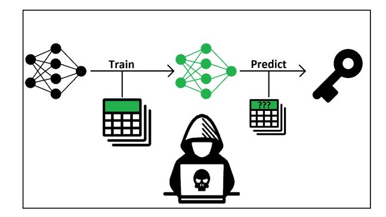

(a) Attacker A0 using a clone dataset; traditional profiled attacker

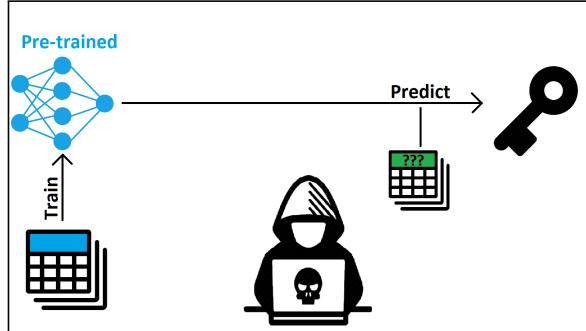

(b) Attacker A1 using only a pretrained model

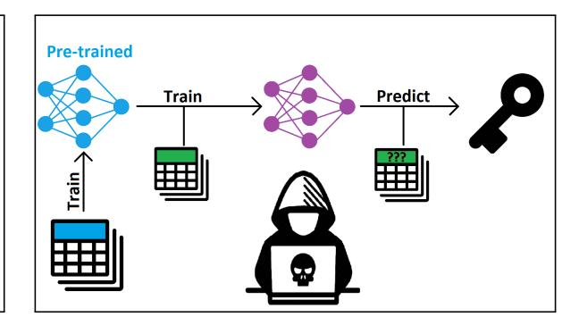

(c) Attacker A2 using a clone dataset and a pre-trained model

Figure 1: Attacker models.

In this paper we do not consider variations due to the manufacturing process of the chip, but differences arising from the measuring setup, side-channel information source, or from different devices (while still being close enough). We investigate three main scenarios in our experiments:

{4}------------------------------------------------

- 1. The position and type of the EM probe differs between pre-trained and target dataset.
- 2. The source of side-channel information differs between pre-trained and target dataset. Here, we investigate the use of power consumption and EM.
- 3. The device differs between pre-trained and target dataset. In this work, we consider the STM32Fx family as explained in more details later on.

#### 3.2 CNN architecture

The first deeply studied neural network was introduced in [21] and is commonly called ASCAD network. Its network architecture was chosen through exhaustive evaluation of design principles and parameters. The best performing network (from their selection) is relying on the architecture of VGG-16 [22] with five blocks and 1 convolutional layer by block, a number of filters equal to (64, 128, 256, 512, 512) with kernel size 11 (same padding), ReLU activation functions and an average pooling layer for each block. The CNN has two final dense layers of 4 096 units. The network is illustrated in Figure 2. To conform to the use-case from [21], we have selected time frames for each of our experiments to reduce the input trace to 700 points. This selection was performed based on the SNR obtained on targeted values (see next subsection).

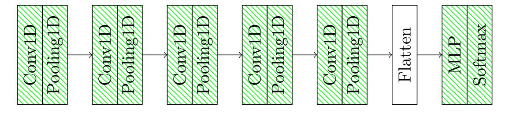

Figure 2: ASCAD network; the whole network is updated when transfer learning is applied

For attacker A0, we train this network on a clone dataset, whereas for attacker A1 we train it on a dataset that is different from the targeted one. In the case of attacker A2, which implies transfer learning, we first pre-train the network on an imperfect dataset then, in a second step we re-train the full network on a (small) clone dataset. Accordingly, instead of using random weight initialization for this second training, we use the weights obtained by the first one (from an imperfect dataset).

The convolutional layers are composed of 4 778 112 parameters, and the dense layers of 61 874 432 parameters. Naturally, for A0, a large enough amount of data is needed to train the neural network, because none of the parameters of both convolutional and dense layers are fitted to the classification problem faced in side-channel analysis when started from a random initial state. However, for A2, different strategies using transfer learning are available. For example, an attacker could have only trained dense layers (thus freezing convolutional layers) or could have reset some specific layers while keeping previous parameters for other layers. Those strategies may permit to decrease the amount of data needed to train the neural network. The parameters kept from the first training may be better suited than a random initialization thus getting the starting point closer to a minimum in the research space. In addition, some strategies where layers are frozen reduce the number of parameters to update in the neural network what may increase the training speed. We apply two strategies for our experiments: re-training the complete network during the second step and freezing the convolutional layers (assuming that feature extraction is similar from one context to another but only decision changes). Since both gave similar results on our first runs, we decided to focus on re-training the full network, since we do not make any hypothesis (that could end up to be false in some cases). Investigating deeply the different techniques is obviously an interesting extension of this work.

#### 3.3 Evaluation Metrics & Targeted Value

Experiments have been performed on first-order leakages from the output of the AES substitution box (SBox) [7]. In Section 5 and Section 6 we use a simple implementation of AES and target the Sbox output

{5}------------------------------------------------

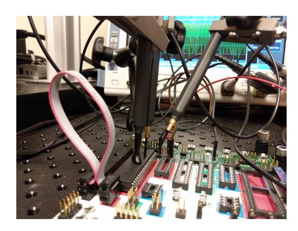

Figure 3: Multi-probe experiment setup

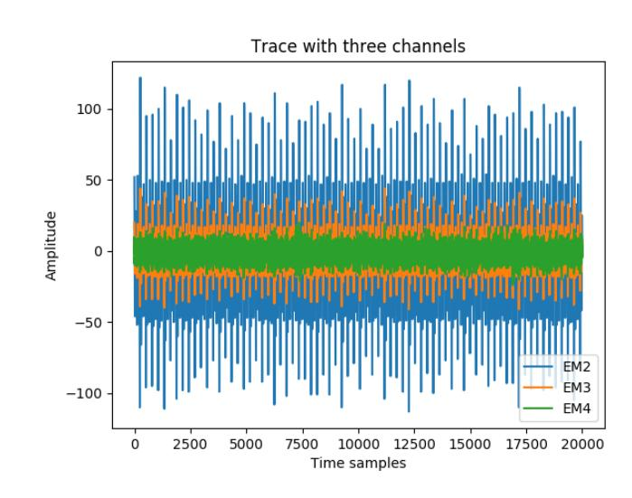

Figure 4: Measurement trace from each of the three channels

that is y = SBox(t ⊕ k) with t being a plaintext byte and k a key byte. On the contrary in Section 4, we reused datasets from former experiments on multiple probes for which a setup similar to the one in [21] (where ASCAD dataset was introduced) had been used. We then chose the highest first-order leakage source which turned out to be the masked output of the Sbox2 (the value of the mask being known to the attacker).

To evaluate the amount of leakage, we use the signal-to-noise-ratio (SNR). Let X denote the captured side-channel measurement, let Y be the label that is determined by the plaintext and the secret fixed key, then the SNR gives the ratio between the deterministic data-dependent leakage and the remaining noise, i.e. SNR = Var(E(X|Y ) E(Var(X|Y ) , where E(·) is the expectation and Var(·) the variance of a random variable.

To evaluate the ability to retrieve the key, we use the guessing entropy (GE), which gives the ranking of the secret key k ∗ within a vector of key guesses. In particular, the vector of key guesses gi,1, . . . , gi,|K| for the ith measurement is calculated by mapping each key guess k to a label j with probability ˆpi,j and applying the maximum-likelihood principle over 1 to m measurements. The guessing entropy (aka rank) is then the position of the secret key k ∗ in the sorted vector of key guesses, where the sorting is applied to the probabilities in descending order. In other words, the guessing entropy gives the amount of key guesses an attacker needs to perform before he reveals the secret key. In case his first guess is the secret key GE = 0.

# 4 Transferring between EM probe position and type

When using EM as a side-channel source, the type of probe as well as its exact position, i.e. location and angle, play a crucial role (see for example [1]). Naturally, without an XYZ table on which an attacker can place the training and the attacking devices, it is nearly impossible to achieve identical positions between measurement datasets.

In this scenario we assume the existence of a pre-trained model that is trained with an unknown probe position or type, but measured on the same device as the target device. In this context, our three attacker models thus relate to the situations where:

- A0: a clone dataset is available for which the attacker can replicate the exact EM type and position;
- A1: no clone dataset is available and the attacker can only use pre-trained models with different parameters (probe type, position) than the target ones;
- A2: a clone dataset is available and a pre-trained model with different parameters (probe type, position), thus the attacker may tune the pre-trained model using the clone dataset.

2This leakage model corresponds to snr4 in [21].

{6}------------------------------------------------

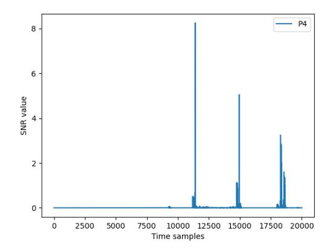

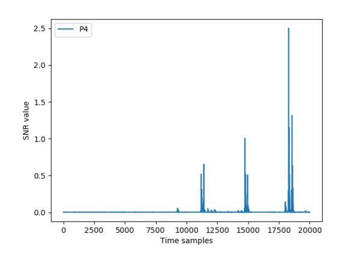

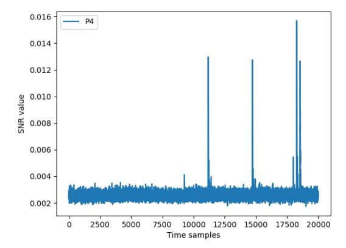

Figure 5: SNR evaluation for each channel (from left to right: EM2, EM3, EM4)

#### 4.1 Measurement setup

In this experimentation, we use a similar measurement setup and device as in [21], namely a raw At-Mega8515 micro-controller on the AVR STK500 platform3 . We used the same AES-128 encryption than the one from ASCAD which is protected using a masking countermeasure, the compiler optimization flag was set to -O0 but we did not embedded the SOSSE operating system. The chip frequency was set to 3.686MHz. Let us recall that for consistency between experiments we targeted the masked output of the Sbox while knowing the output mask to target a significant first-order leakage. The measurements are obtained using different Langer near-field EM probes (two RF-B 0,3-3 and one RF-K 7-4) connected to 30dB amplifiers while the overall is having a bandwidth maximum frequency of 3GHz. The signal was then digitized by an RTO2014 oscilloscope from Rohde & Schwarz having a bandwidth of 1GHz (thus being the limiting link).

We focused on the first AES round with a sampling frequency of 1Gs per second and obtained traces containing 20K samples. We observed that the leakages we obtained have a different location than the one reported in [21], however, we obtained similar leakages for the most informative part of he signal.

We exemplary show a measurement trace for each of the three channels in Fig. 4. The probe on channel 2 and 3 (EM2,EM3) are placed to capture data-dependent leakage signals, whereas channel 4 (EM4) is capturing mostly noise4 . Moreover, EM2 and EM3/EM4 are different types of probes, which explains the different amplitude as well. This is confirmed in Fig. 5 showing the SNRs for EM2, EM3, EM4. One can see that EM2 provides higher SNRs levels then EM3, and EM4, however, the leakage positions in time are consistent. Note that, even though EM4 is very noisy one can still observe minor leakages.

#### 4.2 Experimental results

We now present the results obtained by transferring the knowledge from a learning made on a different EM probe position and/or type. We consider the three previously introduced probes (namely EM4, EM3, and EM2) and apply the three attacker models A0, A1, and A2. To ease readability, we plot the attacker models in the following color scheme throughout our experiments:

- attacker A0 corresponds to lines plotted in grey,
- results for attacker A1 are plotted in red, and
- results for attacker A2 are plotted in blue.

In Fig. 6 we show the guessing entropy when targeting EM2 (i.e. the attacker reveals the secret key using using measurements from EM2). Figures 6a to 6d give results for different sizes of the clone dataset referenced as D+, while the size of the dataset for the pre-trained model stays constant (labeled as D−). As pre-trained models we consider networks trained on EM3 and EM4. First, we compare the

3For ASCAD a smart-card embedding this micro-controller has been used.

4Channel 1 was used for triggering.

{7}------------------------------------------------

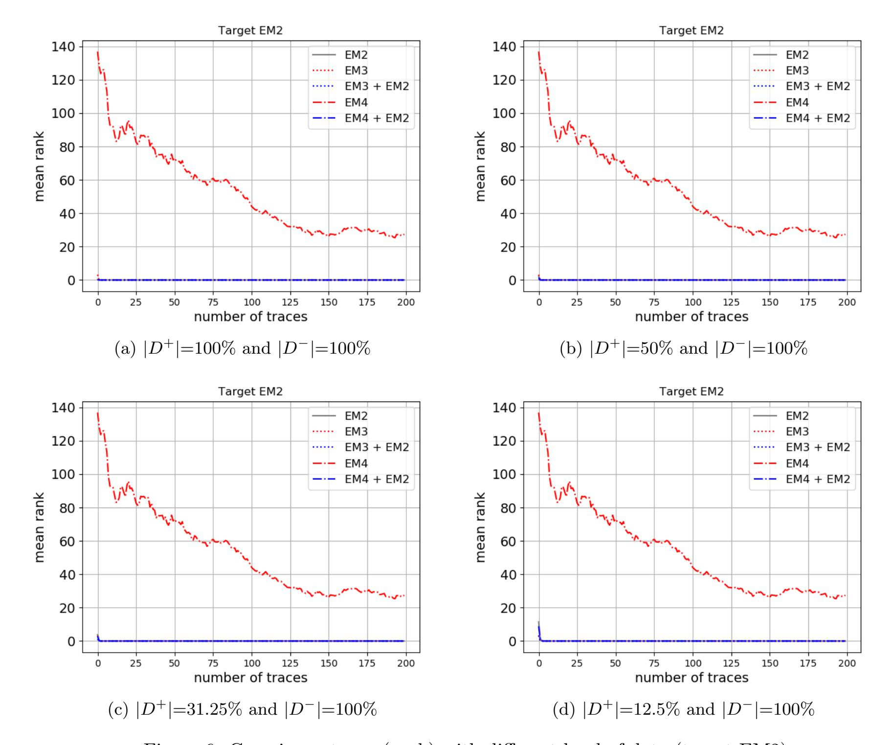

Figure 6: Guessing entropy (rank) with different level of data (target EM2)

performance of directly applying models trained on different probes (namely EM3 and EM4) which is corresponding to attacker A1. We observe that EM3 performs well for all sizes of D+, and we reach a performance close to EM2 (attacker A0). However with EM4 we see that GE is not converging towards 0 or converging much slower than the other curves. This may be due to the fact that EM2 and EM4 come from different probes or the fact that SNR value of EM4 is low.

Secondly, we compare the performances corresponding to attacker A2. We consider models pre-trained on EM(a) and perform a re-training on EM(b). These are labeled as EM(a)+EM(b). So, when EM2 is the target, A2 consists in adapting models pre-trained on EM3 (resp. EM4) using traces from EM2 what is denoted as EM3+EM2 (resp. EM4+EM2) in the graph. We observe that approach A2 gives similar results no matter the channel used. Those results are close to the direct training on EM2 (attacker A0).

Next, Figures 7a-7d show the GE when targeting EM3. For A1 we observe that EM2 performs well for all sizes of D+, we reach a performance close to EM3 (attacker A0). But with EM4, we see again poor performances for all dataset sizes. For A2 our results show that EM2+EM3, EM4+EM3 performs as well as using EM3 (attacker A0) for all sizes of D+. This confirms the fact that the leakage model learned on EM4 hardly generalize to other probes/locations due to its small SNR.

In Fig. 8 we show the GE when targeting EM4 that has the lowest SNR of all three EM positions. The pre-trained models are trained on dataset D− using EM2 and EM3, and the clone dataset D+ was measured with EM4. For A1, we can see that EM3 leads to a better GE than EM2. Note that EM2

{8}------------------------------------------------

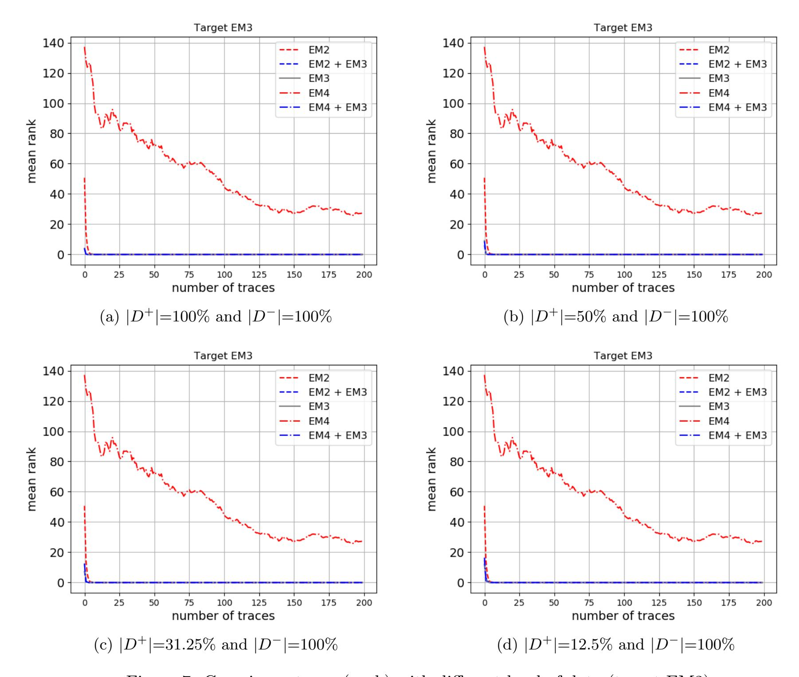

Figure 7: Guessing entropy (rank) with different level of data (target EM3)

has a higher SNR than EM3, but EM3 and EM4 come from identical probes (RF-B 0,3-3). For attacker model A2, we observe that in general it performs better than A1. for |D+| ∈ {12.5%, 31.25%} we see that EM3+EM4 is slightly better than EM2+EM4, otherwise they are nearly identical. Finally, we compare A1 and A2 with the direct training on EM4 (attacker A0). For A2, We can see that both approaches offer much better performance than only training on EM4 for |D+|=12.5%. In particular, training on only EM4 is not converging towards GE 0, while EM3+EM4 requires below 75 traces to reach GE 0. For |D+|=50% attacker A2 is still slightly more effective than attacker A0.

Summary In short, we observe that transfer learning (attacker A2) can be beneficial when the SNR of the target dataset low. The increase in performance is particularly visible, when the size of the clone dataset is limited and thus attacker A0 is not able to train a converging network. Interestingly, in this case also attacker A1 can be beneficial, even though less effective than A2.

# 5 Transferring between Power and EM

In this scenario, we investigate the transfer between side-channels. The main motivation for this experiment comes from the duality between power and EM side-channels. Usually, measuring power consumption is achieved by adding a resistor on a power line. This implies that the obtained values usually

{9}------------------------------------------------

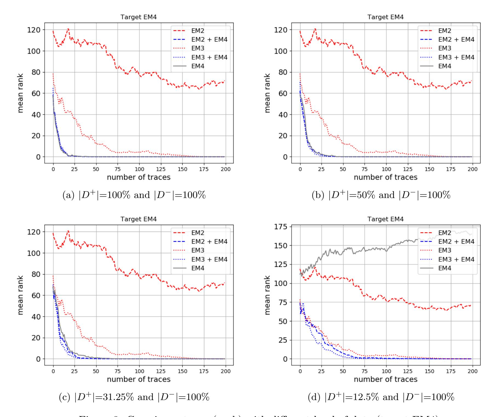

Figure 8: Guessing entropy (rank) with different level of data (target EM4)

correspond to all (or at least a big part of) the chip (including highly consuming but unrelated features). On the contrary, EM may allow a more precise selection of the leakage but this induces a risk of not capturing all relevant signals. In some contexts, the attacker cannot add a resistor to the PCB of the target and thus will have to use an EM probe for attacking. On the contrary, he may buy a clone device for which a power analysis would be possible. He may thus train on power beforehand to build a pre-trained model which makes use of all possible leakages, and then attack using EM where only a part of the signal will be available (depending on the probe position for instance).

In this context, our three attacker models thus relate to the situations where:

- A0: the attacker can replicate the learning position during attack and thus learns on EM;
- A1: the attacker cannot replicate the learning position and thus uses the model that has been pre-trained on power;
- A2: the attacker can replicate the learning position and uses a pre-trained model on power, he thus uses the clone dataset to tune the model pre-trained on power.

{10}------------------------------------------------

#### 5.1 Measurement Setup

We use the chipwhisperer light capture board combined with the CW308 UFO board with STM32Fx target devices. Like in the previous setup, we measure the beginning of an AES-128 encryption, where we used the TINYAES implementation integrated in the chipwhisperer software. The chip frequency was set to 7.37MHz and the measurements are sampled at 4×7.37 Ms/s. Power consumption is collected through the measurement shunt on the CW308 UFO board. To capture EM signals we used a Langer near-field EM probe (RF-U 5-2) connected to a 20dB amplifier.

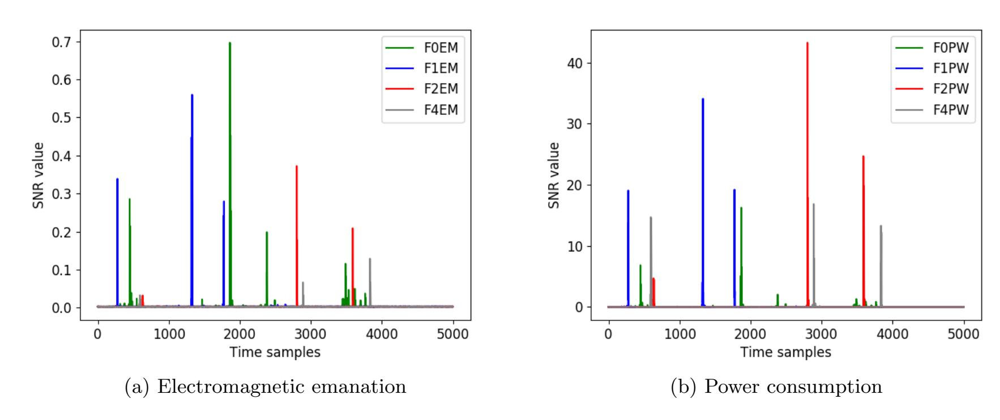

Figure 9: SNR evaluation for each targeted device

Fig. 9a and Fig. 9b show the SNRs obtained with EM emissions and power consumption for each device. Depending on the device, we have different SNR levels for power and EM emissions. However the shapes corresponding to power and EM are close to each other. The SNR values for power are higher than for EM. Seemingly, the EM emission measurements contain more noise than the ones from power. We expect that transfer learning can use knowledge given by power to improve the models to target EM.

#### 5.2 Experimental results

We now present the results obtained by transferring the knowledge from a learning made on power consumption to EM. We considered the four previously introduced devices (namely f0, f1, f2, and f4), we investigate again the three attacker models with the same color coding (A0=grey, A1=red, A2=blue).

In Fig. 10 we plot the guessing entropy obtained when targeting device f0 with EM (f0em) for different sizes of the clone dataset D+. The pre-trained model was trained on a dataset D− obtained by measuring power consumption (f0pw) with a fixed dataset size. The clone dataset D+ consists of EM measurements (f0em) with the same setup as the target dataset. First, we compare the performance of directly applying the pre-trained model using f0pw which correspond to attacker A1. We observe that A1 has poor performance. Secondly, we compare the performance corresponding to A2 (namely f0pw+f0em). We can see that A2 is always revealing the secret key using only a very small number of measurements (< 10 traces). Also, A2 performs better than A0, where the difference is negligible for |D+| = 100%, but very significant for |D+| = 12.5%. Our results show that when |D+| = 12.5% the dataset is not sufficient enough to train from scratch (A0), but sufficient enough to fine-tune a pre-trained model that is not working by itself (A1).

Figure 11 presents the results when attacking f1 with electromagnetic emission, and different dataset sizes. Now, D− represent the dataset when measuring f1pw, and D+ the clone dataset with f1em. We observe a similar trend as in Fig. 10 when attacking f0. Again A2 performs well for all clone dataset sizes, but now it is already better than attacker A0 when |D+| ≤ 50%. We see that the performance of A0

{11}------------------------------------------------

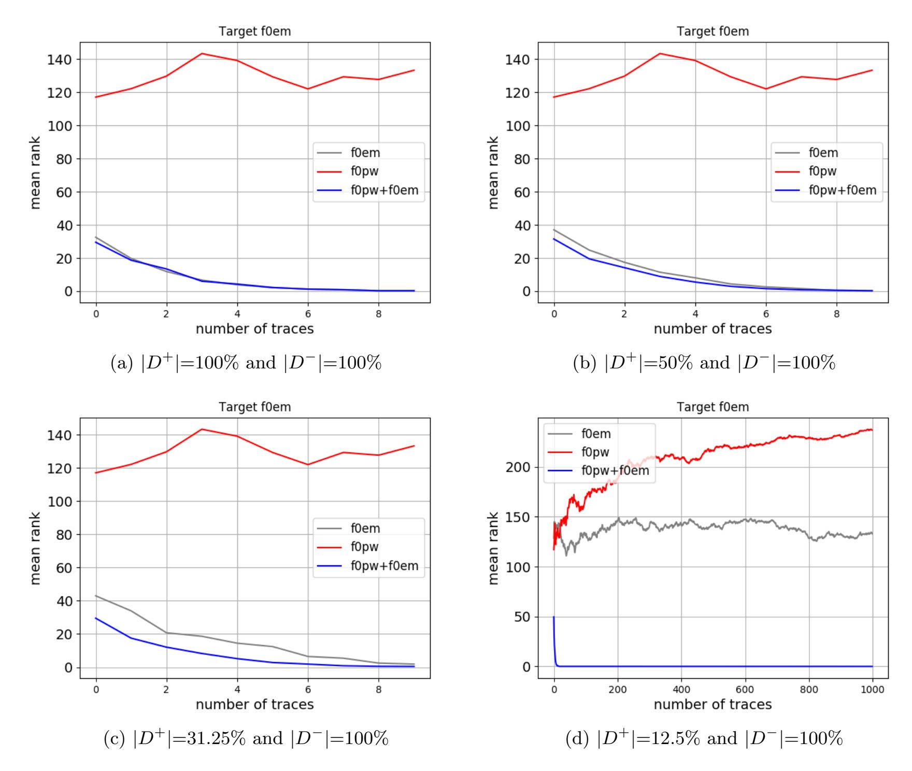

Figure 10: Guessing entropy (rank) with different level of data (target f0em)

decreases drastically when |D+| ≤ 50%, where it is even close to attacker A1. Using only the pre-trained model (attacker A1) again does not work.

Next, we target device f2. The pre-trained model is trained on dataset D− with power consumption (f2pw) and the clone dataset D+ corresponds to measuring EM on f2 (f2em). Again, we evaluated |D+| ∈ {100%, 50%, 31.25%, 12.5%}, where |D+| ∈ {100%, 12.5%} is shown in Fig. 12. Interestingly, we observe that A0 never succeeds even with |D+| = 100% which may be due to smaller SNR value of f2em (compared to f1em or f0em). Also, again A1 does not succeed to have a converging GE towards 0. However. using transfer learning, attacker A2 is able to reveal the secret key for all sizes of the clone dataset. Thus, also in this scenario, it is possible to fine-tune a pre-trained model that is not working independently with a small clone dataset. Exactly, the same behavior as in f2 can be seen for device f4 (see Fig. 13).

Summary For all EM targets (f0em, f1em, f2em, and f4em), we observe that directly applying a pretrained model on power consumption (attacker A1) leads to poor performances. Our results show that transfer learning gives similar performance as attacker A0 until a certain threshold of available data and when the SNR is sufficiently high (target f0 and f1). We show that if we reduce the amount of data or if the SNR gets lower, the performance of A0 is decreased, whereas A2 is still able to reveal the secret key with only a very limited number of attacking traces (below 10).

{12}------------------------------------------------

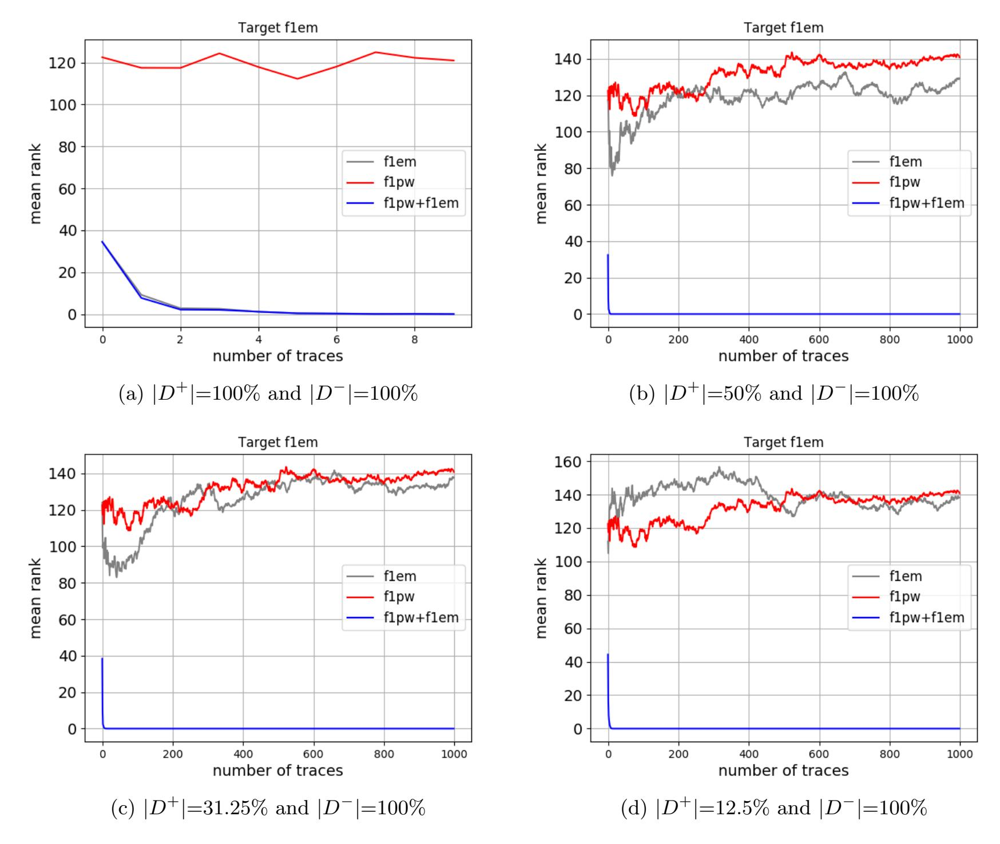

Figure 11: Guessing entropy (rank) with different level of data (target f1em)

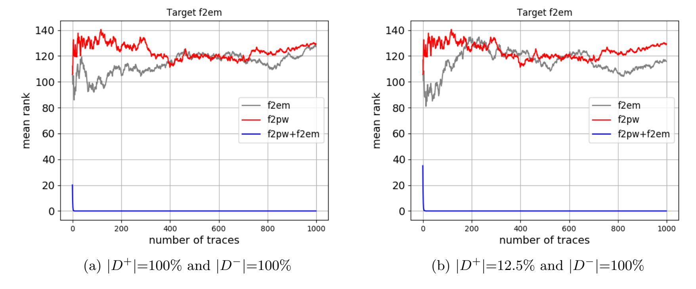

Figure 12: Guessing entropy (rank) with different level of data (target f2em)

{13}------------------------------------------------

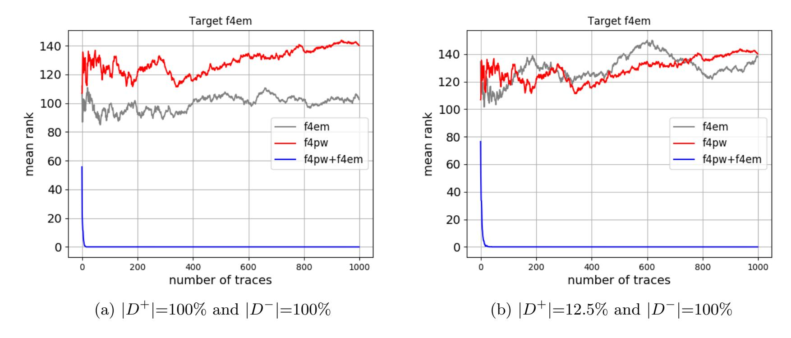

Figure 13: Guessing entropy (rank) with different level of data (target f4em)

# 6 Transferring between different devices

In this scenario, we investigate the transfer learning between devices and only consider the power leakage. The motivation here is that an attacker may have access to public datasets and/or public trained networks corresponding to some other chip. Then, based on this he may try to attack another device that is different but still close (same architecture for instance). In this context, our three attacker models thus relate to the situations where:

- A0: the attacker has access to a clone device and can make his own dataset perfectly fitting the target device characteristics;
- A1: the attacker has no clone device and can only use the pre-trained models available (from different devices);
- A2: the attacker has a clone device and will use it to adapt the public network instead of training a model from scratch.

#### 6.1 Measurement Setup

We use the same measurement setup as in Section 5.1. In Fig. 9b, we show the SNR values obtained from measuring the power consumption of the devices f0, f1, f2 and f4. We see that the highest SNR levels are obtained by f2 followed by f1, f4 and finally f0. We expect that transfer learning can leverage the knowledge obtained from an "easy to attack" device in order to improve the models for targeting devices with low SNR values.

#### 6.2 Experimental results

We now present the results obtained by transferring the knowledge from a learning made on a device to another. We considered the four previously introduced devices (namely f0, f1, f2, and f4) and applied the three attacker models mentioned throughout the paper.

In Figs. 14a-14d we show the guessing entropy when targeting f0. We use the dataset D− for pretraining a model with f1pw, f2pw, f4pw, and use the clone dataset D+ for training on f0pw with dataset sizes. First, we compare the performance of directly applying models trained on different devices (namely f1pw, f2pw, f4pw) which corresponds to attacker A1 (represented with red lines). We can observe that the GE with A1 is not able to converge towards 0, thus a pre-trained model alone (from a different device) is not effective. Secondly, we see that attacker A0 and A2 (namely f1pw+f0pw, f2pw+f0pw, f4pw+f0pw) are

{14}------------------------------------------------

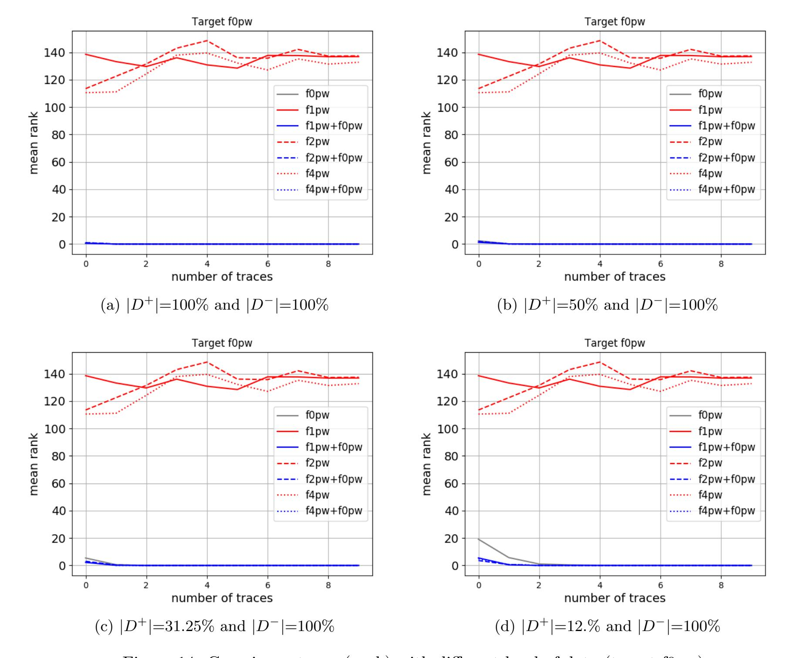

Figure 14: Guessing entropy (rank) with different level of data (target f0pw)

able to reveal the secret key with only 1 or 2 attacking traces. We can see that from a certain threshold of available data (|D+| ≤ 31.25%), A2 is slightly more effective than approach A0. However, this difference is on a very fine-grained level.

Figure 15 shows the GE on target f1pw. We use the dataset D− for pre-training a network on f0pw, f2pw, f4pw, and use the clone dataset D+ for training on f1pw for A0 and A2. We observe similiar results as for f0 (see Fig 14). Again A1 does not succeed, and for A2 (namely f0pw+f1pw, f2pw+f1pw and f4pw+f1pw), We observe that from a certain threshold of available data attacker A2 is better than attacker A0 (namely f1pw). However, now A2 (slightly) outperforms A0 already when using |D+|=50%. Still, the differences between A0 and A2 are very minor, and both approaches reveal the secret key with only 1 or 2 attacking traces.

In Fig. 16 we show the GE on target f2pw. We restrict to D+ = {12.5%, 100%} as all sizes gave nearly identical results. Again we observe similar results as for f0 and f1. A1 does not succeed to reveal the secret key and for A2 (namely f0pw+f2pw, f1pw+f2pw and f4pw+f2pw), we observe the same performance as A0 (namely f2pw) no matter the level of data used for training.

In Figs. 17, we show the GE on target f4pw. We use the dataset D− for pre-training on f0pw, f1pw, f2pw, and use the clone dataset D+ for training on f4pw. As previously, A1 is not able to succeed. For A2 (namely f0pw+f4pw, f1pw+f4pw and f2pw+f4pw), we observe the same performance as A0 (namely f4pw). For D+=12.5% we see a slight improvement for A2 over A0.

{15}------------------------------------------------

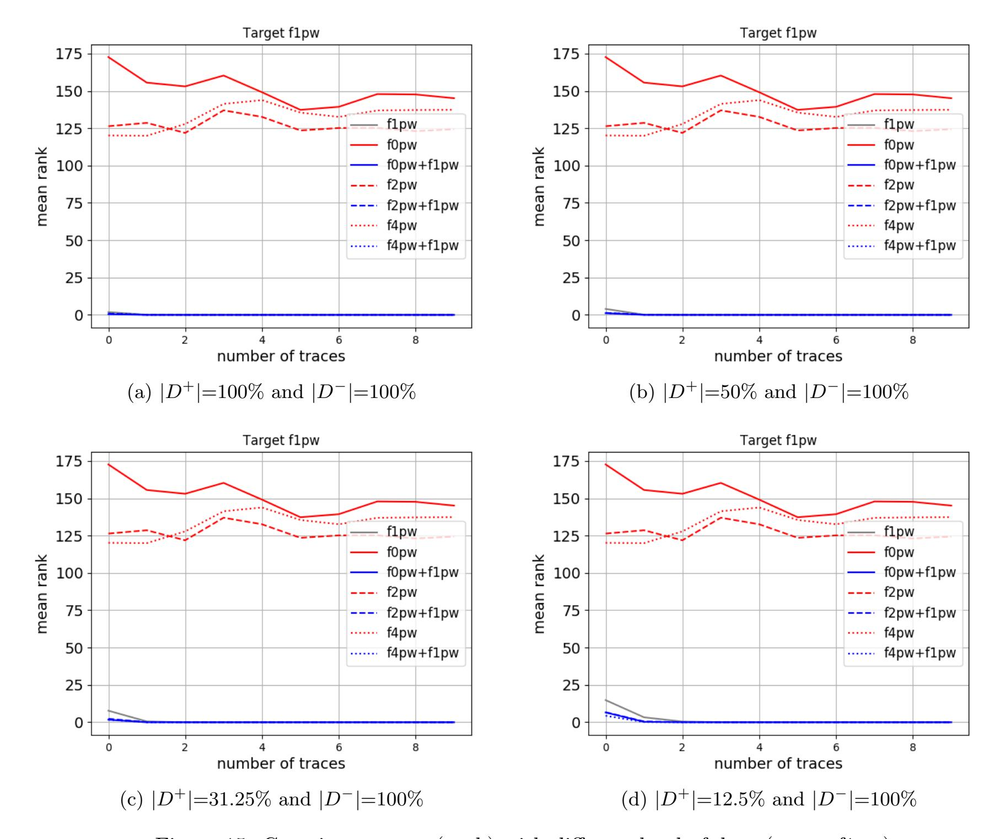

Figure 15: Guessing entropy (rank) with different level of data (target f1pw)

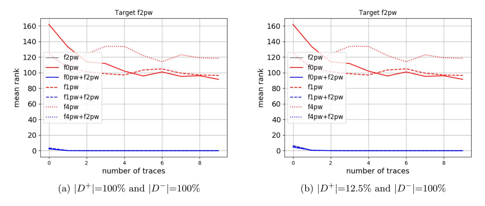

Figure 16: Guessing entropy (rank) with different level of data (target f2pw)

{16}------------------------------------------------

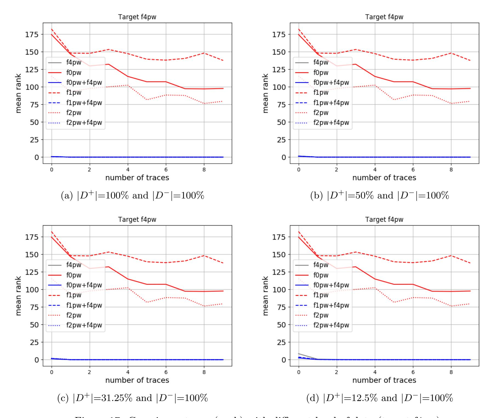

Figure 17: Guessing entropy (rank) with different level of data (target f4pw)

Summary For all target devices (f0pw, f1pw, f2pw, and f4pw), we observe a similar conclusion. First, by directly applying a pre-trained model from another device (attacker A1), one cannot reveal the secret key. Secondly, by transfer learning, we obtained similar performance as when using a clone dataset (A0), where we see a slight superiority of A2 over A0, when a certain limited threshold of available data is reached.

## 7 Conclusion

In this work, we considered three attacker models to reveal secret data on a target device:

- A0: the attacker trains a neural network with a clone dataset (ie. a dataset that is identical to the one from the target device);
- A1: the attacker uses a pre-trained neural network model that has been pre-trained on a dataset obtained under different conditions (probe types/positions, considered side-channel sources and devices) than the target dataset;
- A2: the attacker fine-tunes the pre-trained model using a clone dataset.

{17}------------------------------------------------

In all experiments, the results have shown that the least suitable solution was to use attacker model A1 due to the lack of training on a clone dataset and the diversity between probes, side-channels, and devices. However, we see that in some cases where the setup is not too far from the target one, A1 may lead to successful attacks even if requiring more data. Interestingly, attacker A2 provides at least as good performances as A0. When the amount of available data in the clone dataset is below a certain threshold, A2 is reaching better performances than A0. In our experiments, this threshold was dependent on the setup (e.g probe, side-channel or device). When pre-training on power consumption and targeting EM we could see the most benefit of attacker A2. Here we were able to reveal the secret key with only a very limited amount of traces (below 10) with attacker model A2, while A0 and A1 where not able to converge towards an effective attack.

However, the common conclusion is that when the signal is too low for the network to converge with the available data, then starting with a network having already learnt something about the same kind of signal will improve the attack. Put another way, when the gradient estimation is not precise enough to converge, pre-training on more (but different) data may help to tune parameters up to a location where the search space is less flat so that this lack of precision in the gradient estimation is not an issue anymore.

## References

- [1] Andrikos, C., Batina, L., Chmielewski, L., Lerman, L., Mavroudis, V., Papagiannopoulos, K., Perin, G., Rassias, G., Sonnino, A.: Location, location, location: Revisiting modeling and exploitation for location-based side channel leakages. In: S.D. Galbraith, S. Moriai (eds.) Advances in Cryptology – ASIACRYPT 2019, pp. 285–314. Springer International Publishing, Cham (2019)
- [2] Benadijla, R., Cagli, E., Dumas, C., Prouff, E., Strullu, R., Thillard, A.: Ascad github (2018). URL https://github.com/ANSSI-FR/secAES-ATmega8515
- [3] Bhasin, S., Chattopadhyay, A., Heuser, A., Jap, D., Picek, S., Shrivastwa, R.R.: Mind the portability: A warriors guide through realistic profiled side-channel analysis. IACR Cryptology ePrint Archive 2019, 661 (2019). URL https://eprint.iacr.org/2019/661
- [4] Cagli, E., Dumas, C., Prouff, E.: Convolutional neural networks with data augmentation against jitter-based countermeasures - profiling attacks without pre-processing. In: CHES 2017, pp. 45–68 (2017)
- [5] Chari, S., Rao, J.R., Rohatgi, P.: Template attacks. In: Revised Papers from the 4th International Workshop on Cryptographic Hardware and Embedded Systems, CHES '02, pp. 13–28. Springer-Verlag, London, UK, UK (2003). URL http://dl.acm.org/citation.cfm?id=648255.752740
- [6] Choudary, O., Kuhn, M.G.: Template attacks on different devices. In: COSADE 2014, pp. 179–198 (2014)
- [7] Daemen, J., Rijmen, V.: The Design of Rijndael: AES The Advanced Encryption Standard (Information Security and Cryptography), 1 edn. Springer (2002)
- [8] Das, D., Golder, A., Danial, J., Ghosh, S., Raychowdhury, A., Sen, S.: X-deepsca: Cross-device deep learning side channel attack. In: DAC 2019, pp. 134:1–134:6 (2019)
- [9] Goodfellow, I., Bengio, Y., Courville, A.: Deep Learning. The MIT Press (2016)
- [10] Heuser, A., Rioul, O., Guilley, S.: Good Is Not Good Enough Deriving Optimal Distinguishers from Communication Theory. In: CHES 2014, pp. 55–74 (2014)
- [11] Heuser, A., Zohner, M.: Intelligent Machine Homicide Breaking Cryptographic Devices Using Support Vector Machines. In: W. Schindler, S.A. Huss (eds.) COSADE, LNCS, vol. 7275, pp. 249–264. Springer (2012)

{18}------------------------------------------------

- [12] Hospodar, G., Gierlichs, B., Mulder, E.D., Verbauwhede, I., Vandewalle, J.: Machine learning in side-channel analysis: a first study. J. Cryptographic Engineering 1(4), 293–302 (2011)
- [13] Islam, K.T., Wijewickrema, S., Pervez, M., O'Leary, S.: An exploration of deep transfer learning for food image classification. In: 2018 Digital Image Computing: Techniques and Applications (DICTA), pp. 1–5 (2018). DOI 10.1109/DICTA.2018.8615812
- [14] Kocher, P.C., Jaffe, J., Jun, B.: Differential power analysis. In: CRYPTO '99, pp. 388–397 (1999)
- [15] K¨ummerer, M., Wallis, T.S.A., Bethge, M.: Deepgaze II: reading fixations from deep features trained on object recognition. CoRR abs/1610.01563 (2016). URL http://arxiv.org/abs/1610.01563
- [16] Lagunas, M., Garces, E.: Transfer learning for illustration classification. CoRR abs/1806.02682 (2018). URL http://arxiv.org/abs/1806.02682
- [17] Lerman, L., Bontempi, G., Markowitch, O.: Side Channel Attack: an Approach Based on Machine Learning. In: COSADE 2011, pp. 29–41 (2011)
- [18] Maghrebi, H.: Deep learning based side channel attacks in practice. IACR Cryptology ePrint Archive 2019, 578 (2019). URL https://eprint.iacr.org/2019/578
- [19] Maghrebi, H., Portigliatti, T., Prouff, E.: Breaking cryptographic implementations using deep learning techniques. In: SPACE 2016s, pp. 3–26 (2016)
- [20] Prouff, E., Rivain, M., Bevan, R.: Statistical analysis of second order differential power analysis. IEEE Trans. Computers 58(6), 799–811 (2009). DOI 10.1109/TC.2009.15. URL https://doi.org/ 10.1109/TC.2009.15
- [21] Prouff, E., Strullu, R., Benadjila, R., Cagli, E., Dumas, C.: Study of deep learning techniques for side-channel analysis and introduction to ascad database. Cryptology ePrint Archive, Report 2018/053 (2018). https://eprint.iacr.org/2018/053
- [22] Simonyan, K., Zisserman, A.: Very deep convolutional networks for large-scale image recognition. CoRR abs/1409.1556 (2014). URL http://arxiv.org/abs/1409.1556
- [23] Wang, H., Brisfors, M., Forsmark, S., Dubrova, E.: How diversity affects deep-learning side-channel attacks. Cryptology ePrint Archive, Report 2019/664 (2019). https://eprint.iacr.org/2019/664
- [24] Zaid, G., Bossuet, L., Habrard, A., Venelli, A.: Methodology for efficient CNN architectures in profiling attacks. IACR Trans. Cryptogr. Hardw. Embed. Syst. 2020(1), 1–36 (2020). DOI 10. 13154/tches.v2020.i1.1-36. URL https://doi.org/10.13154/tches.v2020.i1.1-36