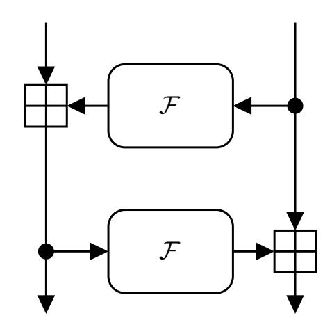
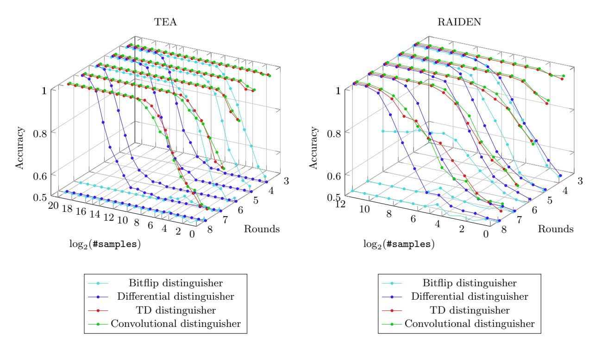
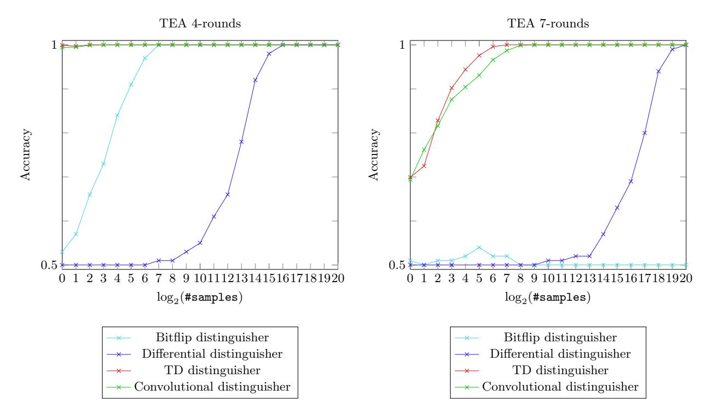
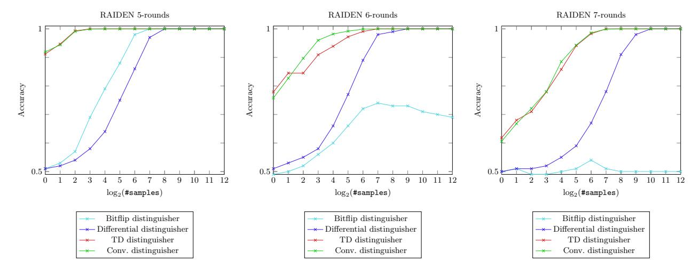
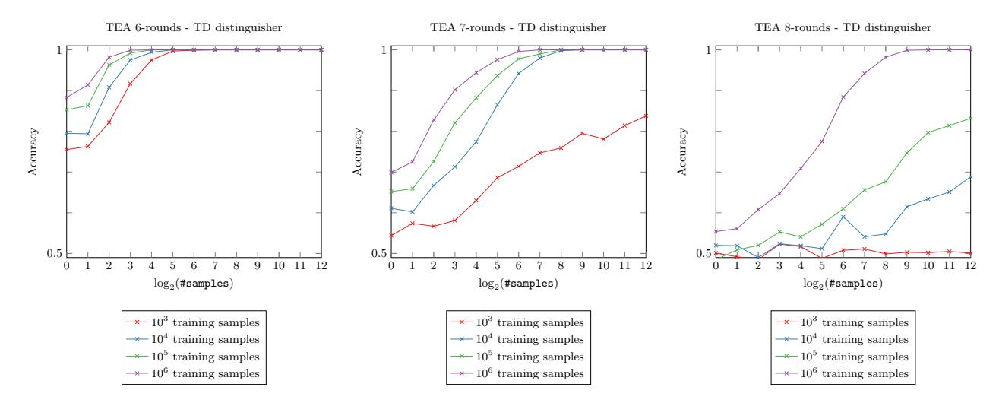
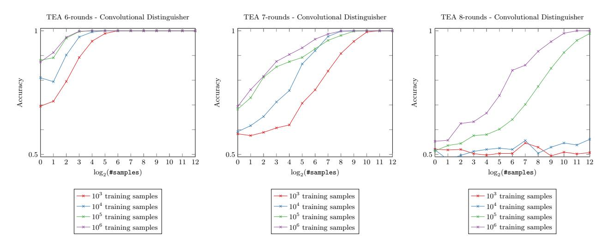
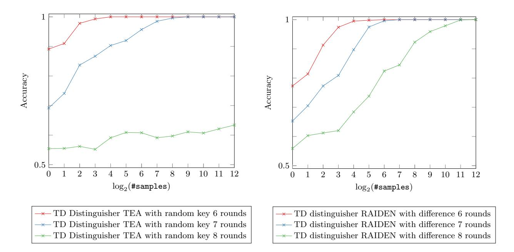

{0}------------------------------------------------

# Performance comparison between deep learning-based and conventional cryptographic distinguishers

Emanuele Bellini<sup>1</sup> and Matteo Rossi<sup>2</sup>

<sup>1</sup> Technology Innovation Institute, UAE emanuele.bellini@tii.ae <sup>2</sup> Politecnico di Torino, Italy matteo.rossi046@gmail.com

Abstract. While many similarities between Machine Learning and cryptanalysis tasks exists, so far no major result in cryptanalysis has been reached with the aid of Machine Learning techniques. One exception is the recent work of Gohr, presented at Crypto 2019, where for the first time, conventional cryptanalysis was combined with the use of neural networks to build a more efficient distinguisher and, consequently, a key recovery attack on Speck32/64. On the same line, in this work we propose two Deep Learning (DL) based distinguishers against the Tiny Encryption Algorithm (TEA) and its evolution RAIDEN. Both ciphers have twice block and key size compared to Speck32/64. We show how these two distinguishers outperform a conventional statistical distinguisher, with no prior information on the cipher, and a differential distinguisher based on the differential trails presented by Biryukov and Velichkov at FSE 2014. We also present some variations of the DL-based distinguishers, discuss some of their extra features, and propose some directions for future research.

Keywords: distinguisher · neural networks · Tiny Encryption Algorithm · differential trails · cryptanalysis

# 1 Introduction

During an invited talk at Asiacrypt 1991 [\[41\]](#page-20-0), Rivest stated that, since the blossoming of computer science and due to the similarity of their notions and concerns, machine learning (ML) and cryptanalysis can be viewed as sister fields. However, in spite of this similarity, it is hard to find in the literature of the most successful cryptanalytical results the use of ML techniques. Several attempts have been made by researchers, using all range of tools that ML can offer, from genetic algorithms, to optimization techniques, neural networks, etc., both in the supervised and unsupervised setting, with the goal of improving or presenting new techniques for black box distinguishers, differential trail searches, or even plaintext or key recovery. So far, all positive results were only able to break

{1}------------------------------------------------

particular instances of historical ciphers, simplified versions of modern ciphers, or ciphers for which a conventional attack already existed.

For the first time in 2019, standard differential cryptanalysis techniques and deep residual neural networks were successfully combined by Gohr [\[14\]](#page-19-0), to significantly improve an existing attack breaking a reduced version of the NSA cipher Speck32/64. While the reduction of the attack complexity obtained by Gohr was significant, and the adopted techniques not specific to Speck32/64, one might still wonder if the success of Gohr's experiment is due to the very small block and key size of the cipher. Indeed, Speck32/64 has a block size of 32 bits, and a key size of 64, which means the cipher can also be attacked by brute force.

Following the line of Gohr, in this work, we investigate how conventional distinguishers compare to deep learning based distinguisher, on a cipher with a similar (Feistel) structure to Speck32/64, but with twice its block and key size. For our experiments, we selected the Tiny Encryption Algorithm (TEA), and its variation RAIDEN.

The goal of this work, rather than improving existing results, is to compare conventional distinguishers with neural network based distinguishers, and to show weaknesses and strengths of one or the other.

The Tiny Encryption Algorithm (TEA) [\[49\]](#page-21-0) is a block cipher with an extremely simple design, based only on the modular addition, bitwise exclusive or and shift operations. The cipher was designed by Wheeler and Needham of the Cambridge Computer Laboratory, and first presented during FSE 1994. Weaknesses of TEA are known, such as the existence of equivalent keys, reducing its security to 126 bits, and making the cipher not suited to be used as cryptographic hash function (use that led to the hack of Microsoft's Xbox game console [\[47\]](#page-21-1)). The full TEA is also susceptible to a related-key attack [\[20\]](#page-19-1). Because of these weaknesses, variations of TEA where presented as XTEA [\[32\]](#page-20-1) and RAIDEN [\[40\]](#page-20-2). The latter was designed by means of genetic programming to be as quick as TEA and to be used in the same real world applications, but with stronger security properties.

### 1.1 Our contribution

In this work, we compare conventional distinguishers with deep learning based distinguishers. We propose two different (but similar) network architectures to be used as distinguishers against round-reduced versions of the TEA and RAIDEN ciphers. In particular, one network is based on the multi-layer perceptron structure, while the other on a convolutional structure. Contrary to what Baksi et al. [\[7\]](#page-18-0) stated, we show that Convolutional Neural Networks are suitable for the purpose of finding a distinguisher. We test the performances of all our deep learning based distinguishers, in terms of accuracy, against the conventional ones, then we propose a distinguishing task where conventional distinguisher cannot be applied. Finally, we analyze the limitations of our approach and we propose some directions for further research in the field.[3](#page-1-0)

<span id="page-1-0"></span><sup>3</sup> The Python scripts used to generate the results on this manuscript will be released under an open source license.

{2}------------------------------------------------

#### 1.2 Outline of the paper

In section [2,](#page-2-0) we briefly overview the main results of ML applications to cryptanalysis. In section [3,](#page-4-0) devoted to the preliminaries, we describe the ciphers used in this work, we define cryptographic distinguishers and their properties, and we introduce the neural networks utilized during our analysis. In section [4,](#page-8-0) we describe two conventional distinguishers, one that can be used without any prior information on the cipher, and another that requires a preliminary cryptanalysis of the cipher. In section [5,](#page-9-0) we describe our neural network based distinguishers. Section [6](#page-12-0) is devoted to the comparison and the experimental results, and finally, in section [7,](#page-18-1) we draw the conclusions.

# <span id="page-2-0"></span>2 Related works

#### 2.1 Use of machine learning in cryptanalysis

We now give a brief (not exhaustive) overview of the literature concerning applications of machine learning techniques to cryptanalysis.

We already mentioned the brief invited talk by Rivest during Asiacrypt 1991 [\[41\]](#page-20-0) on the relationship between cryptography and machine learning, where he discussed how each field has contributed ideas and techniques to the other. In 2017, a short survey on automated design and cryptanalysis of cipher systems was given [\[6\]](#page-18-2), showing that computational intelligence methods, such as genetic algorithms, genetic programming, Tabu search, and memetic computing, are effective tools to solve many cryptographic problems. In his master thesis [\[24\]](#page-19-2) (2018), Lagerhjelm presents six experiments using long short-term memory networks to try to decipher encrypted text (with DES algorithm) and convolutional neural networks to perform classification tasks on encrypted MNIST images. Both tasks are unsuccessful, except when classifying images encrypted under DES-ECB mode.

ML has been applied with fair success to aid profiled side-channel analysis (e.g. [\[27](#page-20-3)[,38,](#page-20-4)[39\]](#page-20-5)). This is a technique in which the attacker has access to a clone device, which can be profiled for any chosen key. Afterwards, he can use that knowledge to extract a secret from a different device. Profiled attacks are conducted in two distinctive phases, where the first phase is known as the profiling (or sometimes learning/training) phase, while the second phase is known as the attack (test) phase. This very well resembles the same general profiled approach that is actually used in supervised machine learning. In 2019 the first non-profiled side-channel attack using neural networks with sensitivity analysis was presented [\[48\]](#page-21-2). The literature on this subject is somehow extended, and out of scope with respect to our work, where we only consider cryptanalysis methods which do not benefit from side channel information.

In 2007 [\[25\]](#page-19-3), the problem of finding some missing bits of the key that is used in a 4 and 6 rounds DES instance is tackled, with the optimization techniques of Particle Swarm Optimization (PSO) and Differential Evolution (DE). Experimental results for 4-round DES showed that the optimization methods considered located the solution efficiently, as they required a smaller number of

{3}------------------------------------------------

function evaluations compared to the brute force approach. For 6 rounds DES the effectiveness of the proposed algorithms depends on the construction of the objective function. In the same work, also the factorization and discrete logarithm problem have been modeled as an optimization problem or by means of Artificial Neural Networks, but the experiments where run on 3 decimal digit numbers only.

A direct application of ML to distinguishing the output produced by modern ciphers was explored in [\[10\]](#page-19-4). The ML distinguisher had no prior information on the cipher structure, and the authors conclude that their technique was not successful in the task of extracting useful information from the ciphertexts when CBC mode was used and not even distinguish them from random data. Better results were obtained in ECB mode, as one may easily expect, due to the nonrandomization property of the mode. A similar experiment was also reproduced, with similar results, in [\[29\]](#page-20-6) and in [\[24\]](#page-19-2), both in 2018.

Better success has been recently obtained with historical ciphers or to simplified version of modern ciphers. For example, in 2018, code-book recovery for short-period Vigen`ere cipher was obtained with the use of unsupervised learning using neural networks [\[15\]](#page-19-5) or, in 2017, restricted version of Enigma cipher were simulated using restricted neural networks [\[16\]](#page-19-6). In 2014, in [\[11\]](#page-19-7), the authors successfully mapped the input/output behaviour of the Simplified Data Encryption Standard (S-DES), with the use of Multi-layer Perceptron (MLP) neural network. They also showed that the effectivness of the MLP network depends on the nonlinearity of the internal s-boxes of S-DES. Previous pioneering works on S-DES or other simplified ciphers are [\[36\]](#page-20-7), [\[46\]](#page-21-3), [\[2\]](#page-18-3), or [\[3\]](#page-18-4). A somehow singular case, in 2002, is that of a public-key scheme based on neural networks, who was broken by use of genetic algorithms (and also by other classical algorithms) [\[22\]](#page-19-8).

In [\[37\]](#page-20-8), the authors perform an extensive data analysis of the RC4 keystreams which allow them to extract the single-byte and double-byte distributions in the early portions of the keystream itself. This is used to then recover plaintext data.

In [\[17\]](#page-19-9), the authors use a genetic-algorithm to search for subsets of the input space that produces a high statistically significant deviation of the distribution of a given subset of the output produced by the Tiny Encryption Algorithm (TEA) encryption. They find 4 rounds trails using 2<sup>11</sup> random inputs.

In 2019, the work by Gohr [\[14\]](#page-19-0) is the first that compares cryptanalysis performed by a deep neural network to solving the same problems with strong, well-understood conventional cryptanalytic tools. It is also the first paper to combine neural networks with strong conventional cryptanalysis techniques and the first paper to demonstrate a neural network based attack on a symmetric cryptographic primitive that improves upon the published state of the art. All this is applied to Speck32/64, a lightweight cipher designed by the NSA, with a 32 bit block input and a 64 bit key. At the time of writing this manuscript, other similar works followed Gohr approach. In particular, Baksi et al. [\[7\]](#page-18-0) proposed a Deep Learning based distinguisher for up to 8-round reduced version of the Gimli-Hash and Gimli-Cipher using the all-in-one differential approach [\[4\]](#page-18-5). Jain et al. [\[19\]](#page-19-10) analyze 3-6 round reduced PRESENT lightweight block cipher, by

{4}------------------------------------------------

presenting a multi-layer perceptron network distinguisher Finally, Yadav and Kumar [51] derive a multi-layer perceptron distinguisher for 9 rounds SIMON and 6 rounds SPECK.

### <span id="page-4-0"></span>3 Preliminaries

#### 3.1 Description of TEA and RAIDEN

In this work we are considering two block ciphers with a similar structure: RAIDEN and TEA. Precisely, they are Feistel networks of r rounds, in which the output of the nonlinear function  $\mathcal{F}$  is injected into the network through a modular addition, see fig. 1. Both ciphers input and output are b = 64 bit strings, and



Fig. 1: Two rounds of the Feistel structure of TEA and RAIDEN.

<span id="page-4-1"></span>are represented as two words of w = 32 bits, to which we refer to as, respectively,  $(L_0, R_0)$  and  $(L_r, R_r)$ . The key is k = 128 bits long, and split in four w-bit words, i.e.  $K = (K_0, K_1, K_2, K_3)$ . To perform the encryption and decryption, they only use the following types of operation: modular addition, bitwise exclusive or, and right or left shift. The cipher output is obtained by repeating r rounds as follows

$$\begin{cases} L_{i+1} = \mathcal{F}(R_i) \boxplus L_i, & R_{i+1} = R_i & \text{for } i \text{ even} \\ L_{i+1} = L_i, & R_{i+1} = \mathcal{F}(L_i) \boxplus R_i & \text{for } i \text{ odd} \end{cases}$$

TEA nonlinear function  $\mathcal{F}^{\mathsf{TEA}}$  is defined as

$$\mathcal{F}_{\delta_{i},k_{i_{0}},k_{i_{1}}}^{\mathsf{TEA}}(x) = ((x \ll 4) \boxplus k_{0}) \oplus (x \boxplus \delta_{i}) \oplus ((x \gg 5) \boxplus k_{1}),$$

where  $\delta_0 = 0$ x9e3779b9,  $\delta_i = \delta_0 \cdot \lfloor (r+1)/2 \rfloor \mod 2^{\mathsf{w}}$  (so that the same constant is used for two consecutive rounds),  $(k_{i_0}, k_{i_1}) = (K_0, K_1)$  for the even rounds, and  $(k_{i_0}, k_{i_1}) = (K_2, K_3)$  for the odd rounds.

RAIDEN nonlinear function  $\mathcal{F}^{\mathsf{RAIDEN}}$  is defined as

$$\mathcal{F}_{k_i}^{\mathsf{RAIDEN}}(x) = ((k_i \boxplus x) \ll 9) \oplus (k_i \boxminus x) \oplus ((k_i \boxplus x) \gg 14),$$

where  $k_i$  is updated according to the following key schedule  $k_i = K_{i \mod 4} = ((K_0 \boxplus K_1) \boxplus ((K_2 \boxplus K_3) \oplus (K_0 \ll K_2)))$ , so that it is the same every other round.

{5}------------------------------------------------

<span id="page-5-0"></span>Differential trails An additive differential difference ∆x is a n-bit string obtained as the modular difference of two other n-bit strings x1, x2, i.e. ∆x = x<sup>1</sup>  x2.

Definition 1. Let ∆x, ∆y ∈ {0, 1} <sup>n</sup> be fixed n-bit strings, representing two additive differences. The Additive Differential Probability (ADP) of a function f (adp<sup>f</sup> ) is the probability with which ∆x propagates to ∆y through the function f, computed over all n-bit input x:

$$\mathsf{adp}^f(\Delta x \to \Delta y) = 2^{-n} \cdot |\{x : (f(x \boxplus \Delta x) = f(x) \boxplus \Delta y\}|.$$

A differential trail for an iterated cipher is a sequence of triple (∆x<sup>i</sup> , ∆y<sup>i</sup> , pi) representing the input/output i-th round differences and their associated ADP of the round function, where ∆xi+1 = ∆y<sup>i</sup> . Differential trails are usually found using standard techniques, such as the Matsui algorithm [\[28\]](#page-20-9), which require a manual analysis of the nonlinear layer of the cipher combined with a tree-search.

To build our classical and neural network based distinguisher, we use the differential trails found in the work of Biryukov and Velichkov [\[9\]](#page-18-6). These trails have been found using standard cryptanalysis techniques, with no aid from machine learning. A differential trail for TEA and RAIDEN are shown, respectively, in table [1](#page-22-0) and table [2](#page-22-1) of appendix [A.](#page-21-5)

One fundamental difference among TEA and RAIDEN is that, due to the very simple key schedule, TEA cannot be modeled as a Markov ciphers, i.e. its round keys cannot be assumed to be independent. This means, for example, that a trail that has very good probability computed as an average over all keys, may in fact have zero probability for many or even all keys. This does not happen in RAIDEN. For this reason, the differential trail for TEA is only valid for a fixed key, and it cannot be used to mount a distinguishing attack (and, consequently, cannot be used for a key recovery). On the other hand, the probabilities of RAIDEN differential trail are computed as an average over all keys.

#### 3.2 Distinguishers

In what follows, a cryptographic distinguisher (or simply a distinguisher) AOracle is a probabilistic algorithm, that takes as input an oracle Oracle secretly running either a random permutation Π, or a specific instantiation Ck, indexed by the key k, of a family C of ciphers. The output of AOracle is 1 if it believes that Oracle is executing Ck, and 0 if it believes it is executing Π. Internally, the distinguisher might use specific information about C, as this is a public family of functions. In this case we speak about a tailored distinguisher (see e.g. section [4.2\)](#page-8-1), or no information at all (except for the block size), in which case we speak about a generic distinguisher (see e.g. section [4.1\)](#page-8-2).

In cryptography, a distinguisher is often called an adversary. The prp-cpaadvantage [\[8\]](#page-18-7), or simply advantage, of the adversary A in distinguishing the family C of permutations from the set of random permutations, using 2<sup>λ</sup> resources, is, 

{6}------------------------------------------------

informally, a measure of how successfully A can distinguish C from the set of random permutation and, formally, is defined as

$$\mathsf{Adv}_{\mathcal{A},\mathcal{C}}^{\mathsf{prp-cpa}}(\lambda) = |\Pr[E_1] - \Pr[E_0]|,$$

where E<sup>1</sup> is the event that A outputs 1 when Oracle contains Ck, and E<sup>0</sup> is the event that A outputs 1 when Oracle contains Π.

If A is doing a good job at telling what function Oracle is running, it would return 1 more often when Oracle contains an instance of C, than when it contains a random permutation. Different adversaries have different advantages, depending on if the adversary is more "clever" in querying the oracle, or simply asks more questions and thus has more information. A block cipher algorithm is considered secure if no adversary has a non-negligible advantage. In this work, we will compare the performance of different distinguishers.

The concept of adversary advantage in machine learning, is usually referred to as accuracy of the distinguisher. This can be seen as the ability of recognizing true positives and negatives, or, in other words, the average of the probability of returning 1 while the oracle contains Ck, and the probability of returning 0 while it contains Π. When this accuracy is close to 1 or to 0 we have a useful distinguisher, while when the accuracy is close to 0.5, we say the distinguisher is not able to distinguish C.

Two examples of bad distinguishers include the case where A always returns 1, or it flips a coin and returns 1 or 0 with equal probability. In this case its advantage/accuracy would be 0.5.

Single key and known key distinguishers In this work, we consider two scenarios. In the first case, called single secret-key scenario, the attacker sees some traffic, which he knows is coming either from a known cipher or a random permutation, and wants to determine from which of the two is coming. In the second case, called single known-key scenario, the attacker knows the cipher and the key, and wants to verify that the cipher with that specific key behaves as a random permutation or not. In other words, the adversary aims to find a structural property for the cipher under the known key, i.e. a property which an ideal cipher (a permutation drawn at random) would not have. The notion of known-key distinguisher was introduced in 2007, by Knudsen and Rijmen [\[23\]](#page-19-11), and subsequently vastly studied, e.g in [\[30,](#page-20-10)[42\]](#page-20-11), for AES-like ciphers, in [\[5](#page-18-8)[,43,](#page-20-12)[44\]](#page-20-13) for Feistel-like ciphers, or in [\[12,](#page-19-12)[31](#page-20-14)[,33\]](#page-20-15) for other constructions.

# 3.3 Neural networks

In this section, we give a brief description of Deep Learning for Data Classification. Deep Learning is a branch of machine learning that uses Deep Neural Networks and which has been applied in many fields such as image classification, speech recognition and machine translation [\[13](#page-19-13)[,1,](#page-18-9)[52\]](#page-21-6). The goal is to classify some data x ∈ R <sup>n</sup> based on their labels y(x) ∈ S in some classes, where n is the dimension of the data and S is the set of classes that we are considering. For simplicity, we

{7}------------------------------------------------

can consider  $S = \{0, 1, ..., \sigma - 1\}$  as our classes and the so called *one-hot* encoding  $C : \mathbb{R}^n \to S$  as the vector representation of y(x) in  $\mathbb{R}^{\sigma}$ , where C(x) is a vector of length  $\sigma$  with all components set to 0 except for the y(x)-th one, that is set to 1.

A Neural Network is a function  $F: \mathbb{R}^n \to \mathcal{S}$  which for an input  $x \in \mathbb{R}^n$  gives in output a score vector  $y \in \mathbb{R}^{\sigma}$  such that the *i*-th component of the vector is a positive real number that is proportional to our confidence that the input value x comes from the class i. To measure the performance of our network, we can define an error function, that is a measure on how far from the real data our previsions are. The most common choice for the error function is the Euclidean Distance

$$E(x) = ||C(x) - F(x)||_2$$
.

To quantify the error of the network to the whole dataset we define the so called loss function, that is simply the average of the error function on the entire set:

$$\mathcal{L} = \frac{1}{L} \sum_{i=1}^{L} E(x_i),$$

where L is the cardinality of the dataset. Together with the loss function we define another metric called the *accuracy*, that in our case is defined as the proportion of our dataset that is correctly classified, that is, the proportion of the  $x_i$ 's for which  $y(x_i) = \operatorname{argmax} F(x_i)$  holds.

The goal of a neural network is ideally to minimize the loss function  $\mathcal{L}$  on every possible input dataset, and this is done by considering  $\mathcal{L}$  as a function of some parameters  $\theta$  called the *trainable parameters* of the network. The training phase of the neural network can be seen as a numerical optimization problem, where the function  $\mathcal{L}(\theta)$  is minimized using an iterative approach, called the *optimizer* of the network. The most famous and classical approach is called *Gradient Descent* where we iteratively update  $\theta$  in this way:

$$\theta^{(t+1)} = \theta^{(t)} - \alpha \nabla \mathcal{L}(\theta^{(t)})$$

where  $\alpha$  is called the *learning rate* and it should be seen as the speed of the training procedure: bigger values of  $\alpha$  in general will lead to faster trainings, while smaller ones will lead to slower but more precise trainings. Since Deep Neural Networks are usually made up by a lot of layers, doing Gradient Descent in practice is slow and, as the dimension of the dataset grows, can also be pretty unprecise. To avoid these problems a lot of techniques have been introduced that perform the parameters update over a small subset of the initial dataset; then the dataset is shuffled and the process is repeated on different subsets. The dimension of the subsets is called the *batch size* while the process of going through the entire dataset one time is called an *epoch*.

**Multilayer Perceptron** The most simple form of a neural network is the so called *multilayer perceptron*. We can define a perceptron as a function  $P: \mathbb{R}^n \to \mathbb{R}$ 

{8}------------------------------------------------

of the form

$$P(x) = a\left(\omega_0 + \sum_{i=1}^n \omega_i x_i\right)$$

where a is a non linear function called the activation function of the perceptron, ω<sup>0</sup> is called the bias and ω<sup>i</sup> for 1 ≤ i ≤ n are the weights. Bias and weights put together form the set of trainable parameters of the perceptron.

A multilayer perceptron is the combination of several perceptrons organized in fully connected layers, in the sense that each perceptron output of a layer is used as an input for every perceptron in the next layer. The first layer is our input, while the last layer is a set of σ perceptrons representing each class of S.

Convolutional Neural Networks A convolutional neural network is a deep neural network composed of two types of layers: convolutional layers and pooling layers. This kind of network has shown a lot of success in the Image Recognition field [\[26](#page-19-14)[,35\]](#page-20-16) because of its translation invariance property. Convolutional layers apply convolution operations to the target by sliding a set of filters on it, while pooling layers are non-linear layers that slide a window over the input data and output a local summary such as the maximum or the mean of the current portion of data.

# <span id="page-8-0"></span>4 Classical distinguishers

### <span id="page-8-2"></span>4.1 A classical generic distinguisher

In this section, we describe a generic (differential) distinguisher A<sup>1</sup> , which we call the bitflip distinguisher, that performs a simple statistical test on a set of outputs provided by the oracle when given a certain set of inputs. More precisely, the bitflip distinguisher A<sup>1</sup> works as follows. It takes as additional input the parameter τ , defining the threshold for the accuracy of the test. A message m is randomly selected and encrypted to c. Then a bit of m is flipped in a random bit position, and a new encryption c 0 is computed. The distinguisher counts how many bits changed from c to c 0 . If the number of bits that changed from c to c 0 is about half the bit size b of c, the distinguisher concludes that the oracle is using a random permutation, otherwise a block cipher. The pseudo-code of the distinguisher is provided in fig. [2.](#page-9-1)

#### <span id="page-8-1"></span>4.2 A classical tailored distinguisher

In this section, we describe a tailored distinguisher A<sup>2</sup> , which we call the differential distinguisher, which uses information about the family C of block ciphers. More precisely, the differential distinguisher A<sup>2</sup> works as follows. As an additional input, beside a threshold τ defining the accuracy of the distinguisher, it receives an additive differential triple, including an input difference ∆x ∈ {0, 1} b , an output difference ∆y ∈ {0, 1} <sup>b</sup> and the probability p that the input/output difference is preserved after applying the cipher to be distinguished. The probability p

{9}------------------------------------------------

```
Bitflip distinguisher: A
                       1
                       Oracle(τ )
1 : j ←$ {0, . . . , b}
2 : m ←$ {0, 1}
                 b
3 : c ← Oracle(m)
// encrypt m with j-th bit flipped
4 : c
       0 ← Oracle(m ⊕ 2
                        j
                         )
5 : h = HammingWeight(c ⊕ c
                                0
                                 )
6 : if |h/b| < b/2 + τ return 0
7 : else return 1
                                     Differential distinguisher: A
                                                                 2
                                                                 Oracle(∆x, ∆y, p, τ )
                                      1 : h = 0
                                      2 : for i = 0, · · · , d1/pe − 1
                                      3 : m ←$ {0, 1}
                                                         b
                                      4 : c ← Oracle(m)
                                      5 : c
                                               0 ← Oracle(m  ∆x)
                                      6 : if c
                                                 0  c = ∆y
                                      7 : h ← h + 1
                                      8 : if h ≥ τ return 1
                                      9 : else return 0
```

<span id="page-9-1"></span>Fig. 2: Bitflip (left) and Differential (right) distinguisher.

determines the number of sample messages the distinguisher needs to process. For each sample m the encryption c and c <sup>0</sup> of m and m ∆x is computed, and if the difference between c and c 0 is ∆y, then a counter is increased. If, at the end of the process, at least τ output differences matched ∆y, then the distinguisher concludes that the Oracle is using an instance from the family C of ciphers, otherwise that it is using a random permutation. The pseudo-code of the distinguisher is provided in fig. [2.](#page-9-1)

# <span id="page-9-0"></span>5 Neural network based distinguishers

In this section we present a distinguisher A<sup>3</sup> , that we will call neural distinguisher. As the name suggests this is based on Neural Networks. Here we give a general structure of the distinguisher, then we will go into the details in the following sections. Recall that we defined a Neural Network as a function F that takes an input and tries to classify it in one of the given classes. Here the classes will be only 2: S = {random, cipher}, where the random class is the class in which random inputs will be classified, and the cipher one is the one for the inputs coming from the cipher. Our network is simply a function F : R <sup>2</sup> → S that takes in input a pair of integer numbers and classify it in one of the two classes. In the case of the random class, the input will simply be made up by two uniformly random integers with bit size equal to the block size of the cipher, while for the cipher class the input will be a pair of ciphertext coming from a fixed plaintext difference ∆x unknown to the network.

To build the distinguisher we first train the network using n input-output pairs coming half from the cipher and half from the random distribution (this is done one time, then the network is saved and reused for all the distinguisher calls) for e epochs, then we predict the classes for chunks of n input pairs coming all from the same source (random or cipher) and we go for a majority vote: we fix a threshold τ<sup>n</sup> and we check if at least τ<sup>n</sup> out of n samples are classified as 

{10}------------------------------------------------

coming from the cipher. If this is true, the chunk is classified as a cipher chunk, otherwise, it is classified as random. The general pseudo-code for the training phase and the one for the distinguisher can be seen, respectively, on the left and on the right of fig. [3.](#page-10-0)

```
Neural Network Training: Train(n, e, ∆x)
1 : TrainingInput = ∅
2 : TrainingOutput = ∅
3 : for i = 0, · · · , n
4 : if Uniform(0, 1) > 0.5
5 : m ←$ {0, 1}
                    b
6 : c ← Encrypt(m)
7 : c
          0 ← Encrypt(m  ∆x)
8 : Add (c, c
                 0
                  ) to TrainingInput
9 : Add (1) to TrainingOutput
10 : else
11 : c ←$ {0, 1}
                   b
12 : c
          0 ←$ {0, 1}
                   b
13 : Add (c, c
                 0
                  ) to TrainingInput
14 : Add (0) to TrainingOutput
15 : Net ← TrainNetwork(TrainingInput,
                    TraningOutput,e)
16 : return Net
                                         Neural distinguisher: A
                                                              3
                                                              Oracle(∆x, n, τn, n, e)
                                          1 : h = 0
                                          2 : Net ← Train(n, e, ∆x)
                                          3 : for i = 0, · · · , n
                                          4 : m ←$ {0, 1}
                                                           b
                                          5 : c ← Oracle(m)
                                          6 : c
                                                 0 ← Oracle(m  ∆x)
                                          7 : if Net(c, c
                                                          0
                                                          ) = 1
                                          8 : h ← h + 1
                                          9 : if h ≥ τn
                                         10 : return 1
                                         11 : else
                                         12 : return 0
```

<span id="page-10-0"></span>Fig. 3: Neural Network training (left) and Neural Distinguisher (right).

#### 5.1 Time Distributed distinguisher

In this section, we describe the first of our network architectures for the neural distinguisher. We will refer to this as the Time Distributed distinguisher (TD distinguisher).

Input and Output Layers As we said before, our network takes in input a pair of bit size b integers, ideally representing two ciphertext coming from the same key and a known input difference. However we noticed that the network learns better if the inputs are given as bit vectors, so our input layer is made up by 2b neurons with binary values. For the output, we simply one-hot encode the two classes, so we have 2 output neurons that, during training, take the value 

{11}------------------------------------------------

(1,0) for random inputs and (0,1) for cipher inputs. In the classification phase we classify an observation for which the network output is a vector v to the class represented by  $\arg \max v$ .

Hidden Layers The network is structured as a multilayer perceptron. The hidden layers can be ideally splitted in two parts: the first part is what we call a time distributed network, while the second one is a multilayer perceptron in its classic definition. In the first part we split our input in four chunks of 32 bits, each representing one of the four words that make up the two ciphertexts, and we pass each chunk separatedly in 2 dense layers of 32 neurons (in our case, perceptrons) each. The name "time distributed" comes from the fact that this approach is common when dealing with temporal data, however in our case this can be simply seen as treating the chunk separatedly, without letting their values influence each other. The outputs are four vectors in  $\mathbb{R}^{32}$  that are now flattened, in the sense that they are joined to form a unique vector in  $\mathbb{R}^{128}$  that will be the input of the second part. The second part is made up by three fully connected layers of 64, 64 and 32 neurons, ending up in the output layers that is, as we said before, made up by two neurons.

Activations and Loss Function For the hidden layers we chose the Leaky ReLU activation function [50], that can be defined as

$$a(x) = \begin{cases} x & x \ge 0\\ \gamma x & x < 0 \end{cases}$$

with the value  $\gamma = 0.3$ . This solution has been found mainly with trial and error, but intuitively we expected it to work well since our problem has a strong vanishing gradient issue [18]. For the output layer, since we are using one-hot encoding, it comes natural to use the *softmax* activation function, defined as  $a(x) = (a_1(x), ..., a_n(x))$  where

$$a_i(x) = \frac{e^{x_i}}{\sum_{j=1}^{\mathsf{n}} e^{x_j}}.$$

For the loss function we opted for the standard mean squared error, since we have not seen significant improvements using more sophisticated functions.

**Optimizer and Learning Rate** We chose the state of the art *Adam* algorithm as optimizer [21]. Since it slightly differs from the classical gradient descent we presented before, we give a brief explanation here. We define two sequences

$$m_t = \begin{cases} 0 & t = 0 \\ \beta_1 m_{t-1} + (1 - \beta_1) \nabla \mathcal{L}(\theta^{(t-1)}) & t > 0 \end{cases}, v_t = \begin{cases} 0 & t = 0 \\ \beta_2 v_{t-1} + (1 - \beta_2) \left( \nabla \mathcal{L}(\theta^{(t-1)}) \right)^2 & t > 0 \end{cases}$$

where  $\theta^{(t)}$  represents as before our trainable parameters,  $\mathcal{L}$  is our loss function and  $\beta_1, \beta_2$  are constants. Then the update rule is

$$\theta^{(t)} = \theta^{(t-1)} - \alpha \frac{m_t \sqrt{1 - \beta_2^t}}{(\sqrt{v_t} + \epsilon)(1 - \beta_1^t)},$$

{12}------------------------------------------------

where is again a constant and α is the learning rate of our network. We fixed the constants to the values suggested by the authors, that are β<sup>1</sup> = 0.9, β<sup>2</sup> = 0.999, = 10−<sup>7</sup> . For the learning rate we followed a similar approach to the one described in [\[45\]](#page-20-17): we defined two values αmax and αmin and we fixed a small number of epochs (we used 3). We defined αmax as the maximum value of the learning rate such that we still see some improvements for all the 3 epochs, and αmin as the minimum value that gives a significant improvement in the loss at the end of the 3 epochs (ideally, this can be seen as an elbow in the graph of learning rate versus loss). We then set a cyclic learning rate as

$$\alpha_i = \alpha_{\min} + \frac{(\alpha_{\max} - \alpha_{\min})(c - i \pmod{c})}{c},$$

where i refers to the current epoch in the training and c is the length of the cycle. Experimentally we found that for our problem αmax = 0.015, αmin = 0.0003 and c = 5 works well.

Training and Testing We ran our network on 10<sup>6</sup> training pairs and 10<sup>4</sup> validation pairs for e = 50 epochs. Based on the validation accuracy we selected the minimum number n of samples needed in each experiment to have a distinguisher with accuracy significantly far from 0.5 (where with significantly we mean that it deviates at least by 0.02 from 0.5) and the threshold τ<sup>n</sup> (see previous section). We then evaluated 10<sup>3</sup> sets of dimension k to estimate the accuracy of the distinguisher.

#### 5.2 Convolutional distinguisher

Here we briefly outline a second neural distinguisher that we will include in the accuracy comparison in section [6.](#page-12-0) Since it is very similar to the TD distinguisher, we only talk about the main difference: hidden layers. We will refer to this distinguisher as the Convolutional distinguisher.

Hidden Layers As before, we can identify two splits of layers: in the first split, instead of perceptrons, we use two one-dimensional convolutional layers of size 32. The approach is very similar to the previous one: the input is split in four parts and passed through the filters. However, the main difference is that these filters can have dimensions greater than 1, allowing the network to learn different features. Then the output of these layers is flattened and passed to the prediction head, that is modeled as before as a multilayer perceptron with 3 layers of 32, 32 and 16 neurons.

# <span id="page-12-0"></span>6 Experimental results and comparisons

In this section, we present the methodology we adopted to compare the performance of different distinguishers. We also present the results of this comparison, focusing in particular on the performance of the NN based distinguishers.

{13}------------------------------------------------

#### 6.1 Description of the experiment

In order to compare the distinguishers, we run the following experiments. We consider different reduced version of TEA and RAIDEN (with rounds ranging from 4 to 8). For each cipher family C, each distinguisher  $A_{\text{Oracle}}^i$ , and a fixed number of samples n, we compute the accuracy of the distinguisher. Precisely, we ran 1000 experiments. For half of the experiments we call the distinguisher  $A_{\text{Oracle}}^i$  with Oracle equal to an instance  $C_k$  of the cipher family C, (with a fixed key for TEA, and with a randomly chosen key for RAIDEN). For the other half we fix Oracle to a random generator (using NumPy [34] random number generator). Then we measure the accuracy of the distinguisher by counting how many times it distinguishes correctly (i.e. it returns 1 in the first case, and 0 in the second), averaging the two cases.

The number n ranges from  $2^0$  to  $2^{20}$  in the case of TEA, and from  $2^0$  to  $2^{12}$  in the case of RAIDEN. These numbers have been chosen in order to have high success probability with the differential distinguisher up to a number of rounds where the bitflip distinguisher was failing (i.e. having accuracy 0.5). Precisely, the bitflip distinguisher becomes useless at round 7 for both TEA and RAIDEN. At round 7 and 8, TEA has a fixed key output difference of probability, respectively,  $2^{-20.77}$  and  $2^{-29.43}$ , while RAIDEN has a "true" output difference of probability, respectively,  $2^{-8}$  and  $2^{-10}$ . Thus, for example, as far as it concern the differential distinguisher  $\mathcal{A}^2_{\text{Oracle}}$ , we expect to have a success probability (accuracy) close to 1 with  $2^8$  samples at 7 rounds for RAIDEN, and with  $2^{21}$  samples at 7 rounds for TEA.

For both the bitflip distinguisher  $\mathcal{A}^1$  and the differential distinguisher  $\mathcal{A}^2$  we set the threshold value  $\tau=1$ . The choice of the threshold for the neural distinguishers was a bit more complicated: in general for n samples we set  $\tau_n=\frac{n}{2}$ , though this is not always the optimal choice. We found out that sometimes, during the training phase, the network *overfits* one of the two classes, so it develops the tendency to predict better one class instead of the other. This happens especially with an high number of rounds, and we found out that it can be solved increasing a little bit the threshold. So, we set all the thresholds for the 8-rounds simulations to  $\tau_n=\delta n$  with  $0.5 \leq \delta \leq 0.7$ , depending on how it performed in the validation set. We stress that this is not a limitation of the distinguisher, since the value of  $\delta$  is fixed during the training phase and remains fixed for all the calls to the distinguisher.

### 6.2 Detailed results

The entire experiment was run in few days of computation with a fairly powerful personal laptop (2.9 GHz Quad-Core Intel Core i7 with 16 GB of RAM) and no excessive parallelization and optimization effort. Though, memory usage was significant during the training of the neural networks when targeting 7 and 8

<span id="page-13-0"></span><sup>&</sup>lt;sup>4</sup> Note that TEA differential trail is longer than the one for RAIDEN, since it holds for a fixed key (see section 3.1).

{14}------------------------------------------------

rounds, and it seems that we need more computational power to increase the number of rounds (see section 6.5).

Both the bitflip and the differential distinguisher behaved as expected. In particular, the bitflip distinguisher started failing on both ciphers at round 7, and, in the case of RAIDEN, it was already showing some weaknesses at round 6, confirming the better diffusion properties compared to TEA.

In the case of TEA 4 rounds, we expect about  $2^{14}$  samples to reach accuracy 1 for the differential distinguisher. In practice, with  $2^{14}$  samples, we reached an accuracy of 0.92, and accuracy very close to 1 was reached with  $2^{16}$  samples. Similar results can be observed for all other rounds, and also for RAIDEN.

Both neural distinguishers performed a little worse than expected in some cases: for example for the 8-round experiment on TEA we obtained a validation accuracy of 0.545 when using the TD network; this would imply that, in theory, 2<sup>8</sup> samples should be enough to reach an accuracy of 1, while in practice we reached 0.982. This phenomena is worse in the Convolutional case, where, with a very similar validation accuracy, we reached a test accuracy of 0.916 with 2<sup>8</sup> samples. However, these results might be biased by the generation of the samples, since the validation set is relatively small and the NumPy random number generator does not yield a perfect uniform distribution, so the accuracy on the validation set can be slightly over or underestimated. In any case, the results (especially in the TD experiment) do not deviate significantly from what we expected.

A visualization of the performance of all distinguishers considered in our experiments, is given in fig. 4, fig. 5, fig. 6.



<span id="page-14-0"></span>Fig. 4: Distinguisher comparison for TEA (left) and RAIDEN (right), 1000 experiments.

{15}------------------------------------------------



<span id="page-15-0"></span>Fig. 5: Distinguishers applied to TEA 4 round (left) and 7 rounds (right), 1000 experiments.



<span id="page-15-1"></span>Fig. 6: Distinguishers applied to RAIDEN 5 round (left), 6 rounds (middle), and 7 rounds (right), 1000 experiments.

{16}------------------------------------------------

#### 6.3 Lowering the training

Although our models being quite small (compared to the common neural network models, especially in image classification), we asked ourselves if the training phase can be lowered without losing too much accuracy. In fig. 7 and fig. 8 we report the results of our two neural distinguishers on TEA with 6, 7 and 8 rounds, ranging the number of training samples from  $10^3$  to  $10^6$ . The results are pretty surprising: with 6 rounds 10<sup>3</sup> samples are enough to have a very good distinguisher, so with a negligible time in training (a few seconds) we can easily build this distinguisher. The most interesting case is the 8-rounds one: we can notice that in both network architectures the number of training samples can be lowered, but we can also see for the first time a significant difference between the two networks. In fact, we can see that with 10<sup>4</sup> samples a decent distinguisher can be build with the TD network, but not with the Convolutional one. Vice versa with 10<sup>5</sup> samples the Convolutional distinguisher seems a lot better than the TD one, that shows a lower accuracy. In general, fig. 7 and fig. 8 show that in the majority of the cases computations can be reduced significantly (from near 30 minutes for each model with  $10^6$  samples on our laptop to less than a minute with  $10^4$  and a couple of minutes with  $10^5$ ) with only a small performance loss.



<span id="page-16-0"></span>Fig. 7: Time Distributed distinguishers applied to TEA 6 (left), 7 (center) and 8 (right) rounds, with different size for the training set, 1000 experiments.

#### <span id="page-16-1"></span>6.4 Further experiments

In this section we propose two more experiments, one on TEA and one on RAIDEN, using the TD distinguisher. All the trainings are done as before with  $10^6$  samples.

**TEA:** random key experiment Until now, we focused on distinguishing TEA with a fixed key and a given fixed input difference. We also wanted to test what happens if we only fix the input difference and select random keys, as we do on RAIDEN. Since the differential trail we used before for TEA was generated for a specific key, one can not use the same input difference of the trail for any

{17}------------------------------------------------



<span id="page-17-1"></span>Fig. 8: Convolutional distinguishers applied to TEA 6, 7 and 8 rounds, with different size for the training set, 1000 experiments.

other key. So, we decided to fix an input difference of low hamming weight and low integer value, i.e. 0x1. We ran the experiment on 6, 7, 8 rounds (see the left panel of fig. 9 of appendix B), observing that for 6 and 7 rounds the distinguisher seems identical to the previous ones, while for 8 rounds the distinguisher shows an accuracy of around 0.6. The results on 6 and 8 are somehow expected, since it is intuitive that this task is in general harder than the previous one (and this explains the lack of performance on 8 rounds), but also with 6 rounds the cipher has not reached the full diffusion yet, so it seems reasonable that the network is exploiting this property. The results on 7-rounds are a bit more unexpected: we think that the network is learning something that is neither only a diffusion property nor only a differential one, but probably a combination of them (with possibly some other properties). We leave a deep analysis of this result for future research.

RAIDEN: ciphertext difference experiment In this experiment we modified the network to take only a word of size b as input. The idea is to feed the network with ciphertext differences (rather than the ciphertext pairs generating the differences) generated from RAIDEN with random key and fixed input difference. The main point of this experiment is to verify if the network is actually learning only the differential properties of the cipher or something else. The results are shown in the right panel of fig. 9. We can notice that the performances are pretty similar to the ones with the two ciphertexts as inputs, so there is no clear evidence of what is happening. However, since there is no significant improvement, we suspect that in the previous case the network was learning also some other properties of the data. As before, we leave further analysis of this experiment for future works.

#### <span id="page-17-0"></span>6.5 Limitations of NN based distinguishers

Even if, at run-time, the NN based distinguishers outperform the two conventional distinguishers considered in this work, one has to keep in mind that the accuracy of such distinguishers depends on the intensity of the training. Our experiments

{18}------------------------------------------------

used at most 10<sup>6</sup> samples, with a memory cost of nearly 2.5GB during the training phase, so we expect the limit for a high level laptop to be somewhere near 10<sup>7</sup> samples, and this may not be enough to increase the number of rounds, especially in TEA case.

# <span id="page-18-1"></span>7 Conclusion

In this work we introduced a simple network architecture to perform a distinguishing task on TEA and RAIDEN ciphers. We then showed that NN based distinguishers outperformed classical ones with quite high margin. We also showed that these results can be reached without excessive computational power on round-reduced versions of the ciphers. We leave for future research a more computationally extensive analysis of these results, in particular to see what happens for higher number of rounds, how the neural networks need to be trained, and how much memory they need. It would also be of interest to apply the same techniques to ciphers with 128 bit message block, and 256 bit keys, and to test different neural networks, or variation of the ones we used.

# References

- <span id="page-18-9"></span>1. Al-Saffar, A., Tao, H., Talab, M.A.: Review of deep convolution neural network in image classification. 2017 International Conference on Radar, Antenna, Microwave, Electronics, and Telecommunications (ICRAMET) pp. 26–31 (2017)
- <span id="page-18-3"></span>2. Alallayah, K.M., Alhamami, A.H., AbdElwahed, W., Amin, M.: Applying neural networks for simplified data encryption standard (sdes) cipher system cryptanalysis. Int. Arab J. Inf. Technol. 9(2), 163–169 (2012)
- <span id="page-18-4"></span>3. Alallayah, K.M., El-Wahed, W.F., Amin, M., Alhamami, A.H.: Attack of against simplified data encryption standard cipher system using neural networks. Journal of Computer Science 6(1), 29 (2010)
- <span id="page-18-5"></span>4. Albrecht, M.R., Leander, G.: An all-in-one approach to differential cryptanalysis for small block ciphers. In: Knudsen, L.R., Wu, H. (eds.) Selected Areas in Cryptography. Springer Berlin Heidelberg, Berlin, Heidelberg (2013)
- <span id="page-18-8"></span>5. Andreeva, E., Bogdanov, A., Mennink, B.: Towards understanding the known-key security of block ciphers. In: International Workshop on Fast Software Encryption. pp. 348–366. Springer (2013)
- <span id="page-18-2"></span>6. Awad, W., El-Alfy, E.S.M.: Computational intelligence in cryptology. In: Artificial Intelligence: Concepts, Methodologies, Tools, and Applications, pp. 1636–1652. IGI Global (2017)
- <span id="page-18-0"></span>7. Baksi, A., Breier, J., Dong, X., Yi, C.: Machine learning assisted differential distinguishers for lightweight ciphers (2020), available at: [https://eprint.iacr.](https://eprint.iacr.org/2020/571.pdf) [org/2020/571.pdf](https://eprint.iacr.org/2020/571.pdf)
- <span id="page-18-7"></span>8. Bellare, M., Rogaway, P.: Introduction to modern cryptography. Ucsd Cse 207, 207 (2005)
- <span id="page-18-6"></span>9. Biryukov, A., Roy, A., Velichkov, V.: Differential analysis of block ciphers simon and speck. In: International Workshop on Fast Software Encryption. pp. 546–570. Springer (2014)

{19}------------------------------------------------

- <span id="page-19-4"></span>10. Chou, J.W., Lin, S.D., Cheng, C.M.: On the effectiveness of using state-of-the-art machine learning techniques to launch cryptographic distinguishing attacks. In: Proceedings of the 5th ACM Workshop on Security and Artificial Intelligence. pp. 105–110 (2012)
- <span id="page-19-7"></span>11. Danziger, M., Henriques, M.A.A.: Improved cryptanalysis combining differential and artificial neural network schemes. In: 2014 International Telecommunications Symposium (ITS). pp. 1–5. IEEE (2014)
- <span id="page-19-12"></span>12. Dong, L., Wu, W., Wu, S., Zou, J.: Known-key distinguisher on round-reduced 3d block cipher. In: International Workshop on Information Security Applications. pp. 55–69. Springer (2011)
- <span id="page-19-13"></span>13. Espa˜na-Bonet, C., Fonollosa, J.A.R.: Automatic speech recognition with deep neural networks for impaired speech. In: Abad, A., Ortega, A., Teixeira, A., Garc´ıa Mateo, C., Mart´ınez Hinarejos, C.D., Perdig˜ao, F., Batista, F., Mamede, N. (eds.) Advances in Speech and Language Technologies for Iberian Languages. pp. 97–107. Springer International Publishing, Cham (2016)
- <span id="page-19-0"></span>14. Gohr, A.: Improving attacks on round-reduced speck32/64 using deep learning. In: Advances in Cryptology – CRYPTO 2019. pp. 150–179. Springer (2019)
- <span id="page-19-5"></span>15. Gomez, A.N., Huang, S., Zhang, I., Li, B.M., Osama, M., Kaiser, L.: Unsupervised cipher cracking using discrete gans. arXiv preprint arXiv:1801.04883 (2018)
- <span id="page-19-6"></span>16. Greydanus, S.: Learning the enigma with recurrent neural networks. arXiv preprint arXiv:1708.07576 (2017)
- <span id="page-19-9"></span>17. Hernandez, J.C., Isasi, P.: Finding efficient distinguishers for cryptographic mappings, with an application to the block cipher tea. Computational Intelligence 20(3), 517–525 (2004)
- <span id="page-19-15"></span>18. Hochreiter, S.: The vanishing gradient problem during learning recurrent neural nets and problem solutions. International Journal of Uncertainty, Fuzziness and Knowledge-Based Systems 6, 107–116 (04 1998). <https://doi.org/10.1142/S0218488598000094>
- <span id="page-19-10"></span>19. Jain, A., Kohli, V., Mishra, G.: Deep learning based differential distinguisher for lightweight cipher present (2020), available at: [https://eprint.iacr.org/2020/](https://eprint.iacr.org/2020/846.pdf) [846.pdf](https://eprint.iacr.org/2020/846.pdf)
- <span id="page-19-1"></span>20. Kelsey, J., Schneier, B., Wagner, D.: Related-key cryptanalysis of 3-way, biham-DES, CAST, DES-X, newDES, RC2, and TEA. In: International Conference on Information and Communications Security. pp. 233–246. Springer (1997)
- <span id="page-19-16"></span>21. Kingma, D., Ba, J.: Adam: A method for stochastic optimization. International Conference on Learning Representations (12 2014)
- <span id="page-19-8"></span>22. Klimov, A., Mityagin, A., Shamir, A.: Analysis of neural cryptography. In: International Conference on the Theory and Application of Cryptology and Information Security. pp. 288–298. Springer (2002)
- <span id="page-19-11"></span>23. Knudsen, L.R., Rijmen, V.: Known-key distinguishers for some block ciphers. In: International Conference on the Theory and Application of Cryptology and Information Security. pp. 315–324. Springer (2007)
- <span id="page-19-2"></span>24. Lagerhjelm, L.: Extracting information from encrypted data using deep neural networks (2018)
- <span id="page-19-3"></span>25. Laskari, E.C., Meletiou, G.C., Stamatiou, Y.C., Vrahatis, M.N.: Cryptography and cryptanalysis through computational intelligence. In: Computational Intelligence in Information Assurance and Security, pp. 1–49. Springer (2007)
- <span id="page-19-14"></span>26. Lecun, Y., Bengio, Y.: Convolutional networks for images, speech, and time-series. The handbook of brain theory and neural networks (1995)

{20}------------------------------------------------

- <span id="page-20-3"></span>27. Maghrebi, H., Portigliatti, T., Prouff, E.: Breaking cryptographic implementations using deep learning techniques. In: International Conference on Security, Privacy, and Applied Cryptography Engineering. pp. 3–26. Springer (2016)
- <span id="page-20-9"></span>28. Matsui, M.: Linear Cryptanalysis Method for DES Cipher. In: EUROCRYPT. Lecture Notes in Computer Science. vol. 765, pp. 386–397. Springer (1993)
- <span id="page-20-6"></span>29. de Mello, F.L., Xex´eo, J.A.: Identifying encryption algorithms in ECB and CBC modes using computational intelligence. J. UCS 24(1), 25–42 (2018)
- <span id="page-20-10"></span>30. Minier, M., Phan, R.C.W., Pousse, B.: Distinguishers for ciphers and known key attack against rijndael with large blocks. In: International Conference on Cryptology in Africa. pp. 60–76. Springer (2009)
- <span id="page-20-14"></span>31. NakaharaJr, J.: New impossible differential and known-key distinguishers for the 3d cipher. In: International Conference on Information Security Practice and Experience. pp. 208–221. Springer (2011)
- <span id="page-20-1"></span>32. Needham, R.M., Wheeler, D.J.: TEA extensions. Report, Cambridge University, Cambridge, UK (October 1997) (1997)
- <span id="page-20-15"></span>33. Nikoli´c, I., Pieprzyk, J., Soko lowski, P., Steinfeld, R.: Known and chosen key differential distinguishers for block ciphers. In: International Conference on Information Security and Cryptology. pp. 29–48. Springer (2010)
- <span id="page-20-18"></span>34. Oliphant, T.E.: A guide to NumPy, vol. 1. Trelgol Publishing USA (2006)
- <span id="page-20-16"></span>35. O'Shea, K., Nash, R.: An introduction to convolutional neural networks. CoRR abs/1511.08458 (2015), <http://arxiv.org/abs/1511.08458>
- <span id="page-20-7"></span>36. Pandey, S., Mishra, M.: Neural cryptanalysis of block cipher. International Journal 2(5) (2012)
- <span id="page-20-8"></span>37. Paterson, K.G., Poettering, B., Schuldt, J.C.: Big bias hunting in amazonia: Largescale computation and exploitation of RC4 biases. In: International Conference on the Theory and Application of Cryptology and Information Security. pp. 398–419. Springer (2014)
- <span id="page-20-4"></span>38. Picek, S., Heuser, A., Guilley, S.: Template attack vs bayes classifier. IACR Cryptology ePrint Archive 2017, 531 (2017)
- <span id="page-20-5"></span>39. Picek, S., Samiotis, I.P., Kim, J., Heuser, A., Bhasin, S., Legay, A.: On the performance of convolutional neural networks for side-channel analysis. In: International Conference on Security, Privacy, and Applied Cryptography Engineering. pp. 157– 176. Springer (2018)
- <span id="page-20-2"></span>40. Polim´on, J., Hernandez-Castro, J., Tapiador, J., Ribagorda, A.: Automated design of a lightweight block cipher with genetic programming. KES Journal 12, 3–14 (03 2008). <https://doi.org/10.3233/KES-2008-12102>
- <span id="page-20-0"></span>41. Rivest, R.L.: Cryptography and machine learning. In: International Conference on the Theory and Application of Cryptology. pp. 427–439. Springer (1991)
- <span id="page-20-11"></span>42. Sasaki, Y.: Known-key attacks on rijndael with large blocks and strengthening shiftrow parameter. IEICE Transactions on Fundamentals of Electronics, Communications and Computer Sciences 95(1), 21–28 (2012)
- <span id="page-20-12"></span>43. Sasaki, Y., Emami, S., Hong, D., Kumar, A.: Improved known-key distinguishers on feistel-sp ciphers and application to camellia. In: Australasian Conference on Information Security and Privacy. pp. 87–100. Springer (2012)
- <span id="page-20-13"></span>44. Sasaki, Y., Yasuda, K.: Known-key distinguishers on 11-round feistel and collision attacks on its hashing modes. In: International Workshop on Fast Software Encryption. pp. 397–415. Springer (2011)
- <span id="page-20-17"></span>45. Smith, L.N.: No more pesky learning rate guessing games. CoRR abs/1506.01186 (2015), <http://arxiv.org/abs/1506.01186>

{21}------------------------------------------------

- <span id="page-21-3"></span>46. Srinivasa Rao, K., Rama Krishna, M., Bujji, B.: Cryptanalysis of a feistel type block cipher by feed forward neural network using right sigmoidal signals. Int. J. of Soft Computing 4(3), 136–135 (2009)
- <span id="page-21-1"></span>47. Steil, M.: 17 mistakes Microsoft made in the Xbox security system. In: 22nd Chaos Communication Congress (2005)
- <span id="page-21-2"></span>48. Timon, B.: Non-profiled deep learning-based side-channel attacks with sensitivity analysis. IACR Transactions on Cryptographic Hardware and Embedded Systems 2019(2), 107–131 (Feb 2019). [https://doi.org/10.13154/tches.v2019.i2.107-131,](https://doi.org/10.13154/tches.v2019.i2.107-131) <https://tches.iacr.org/index.php/TCHES/article/view/7387>
- <span id="page-21-0"></span>49. Wheeler, D.J., Needham, R.M.: TEA, a tiny encryption algorithm. In: International Workshop on Fast Software Encryption. pp. 363–366. Springer (1994)
- <span id="page-21-7"></span>50. Xu, B., Wang, N., Chen, T., Li, M.: Empirical evaluation of rectified activations in convolutional network. CoRR abs/1505.00853 (2015), [http://arxiv.org/abs/](http://arxiv.org/abs/1505.00853) [1505.00853](http://arxiv.org/abs/1505.00853)
- <span id="page-21-4"></span>51. Yadav, T., Kumar, M.: Differential-ml distinguisher: Machine learning based generic extension for differential cryptanalysis (2020), available at: [https://eprint.iacr.](https://eprint.iacr.org/2020/913.pdf) [org/2020/913.pdf](https://eprint.iacr.org/2020/913.pdf)
- <span id="page-21-6"></span>52. Zhang, J., Zong, C.: Deep neural networks in machine translation: An overview. IEEE Intelligent Systems 30, 16–25 (09 2015). <https://doi.org/10.1109/MIS.2015.69>

# <span id="page-21-5"></span>A Explicit differential trails for TEA and RAIDEN

A differential trail for TEA is shown in table [1,](#page-22-0) while one for RAIDEN is shown in table [2.](#page-22-1) In the tables, rather than the ADP, we report the accumulated ADP, which is the one we need to define the number of samples for our distinguishers.

# <span id="page-21-8"></span>B Plots for the section [6.4](#page-16-1)

In this section, we provide the plotting of our experiments from section [6.4.](#page-16-1) In particular, the left side of fig. [9](#page-23-0) represents the performance of the TD distinguisher applied to TEA, where the training is done by fixing the input difference to 0x1 and selecting random keys. The right side of fig. [9](#page-23-0) represents the performance of the TD distinguisher applied to RAIDEN, where the network is trained only using the output difference of RAIDEN (rather than the pair of outputs) with random key and fixed input difference.

{22}------------------------------------------------

|       | Round difference |            | $\mathcal{F}^{TEA}$ in/out differences |            | Accumulated                                      |
|-------|------------------|------------|----------------------------------------|------------|--------------------------------------------------|
| Round | L                | R          | $\Delta x$                             | $\Delta y$ | $adp^{\mathcal{F}^{TEA}}(\Delta x \to \Delta y)$ |
| 0     | 0xfffffff1       | Oxfffffff  | -                                      | -          | -                                                |
| 1     | 0x00000000       | Oxfffffff  | Oxffffffff                             | 0x0000000f | $2^{-3.62}$                                      |
| 2     | 0x00000000       | Oxfffffff  | 0x00000000                             | 0x00000000 | $2^{-3.62}$                                      |
| 3     | 0x0000000f       | Oxfffffff  | Oxffffffff                             | 0x0000000f | $2^{-6.49}$                                      |
| 4     | 0x000000f        | Oxfffffff  | 0x0000000f                             | 0x00000000 | $2^{-14.39}$                                     |
| 5     | 0x00000000       | Oxfffffff  | Oxffffffff                             | Oxfffffff1 | $2^{-17.99}$                                     |
| 6     | 0x00000000       | Oxfffffff  | 0x00000000                             | 0x00000000 | $2^{-17.99}$                                     |
| 7     | Oxfffffff1       | Oxfffffff  | Oxffffffff                             | 0xfffffff1 | $2^{-20.77}$                                     |
| 8     | Oxfffffff1       | 0x0000001  | 0xfffffff1                             | 0x00000002 | $2^{-29.43}$                                     |
| 9     | 0x00000000       | 0x0000001  | 0x0000001                              | 0x0000000f | $2^{-33.00}$                                     |
| 10    | 0x00000000       | 0x0000001  | 0x00000000                             | 0x00000000 | $2^{-33.00}$                                     |
| 11    | Oxfffffff1       | 0x0000001  | 0x0000001                              | Oxfffffff1 | $2^{-35.87}$                                     |
| 12    | Oxfffffff1       | Oxfffffff  | 0xfffffff1                             | Oxffffffe  | $2^{-43.77}$                                     |
| 13    | 0x00000000       | Oxfffffff  | Oxffffffff                             | 0x0000000f | $2^{-47.36}$                                     |
| 14    | 0x00000000       | Oxfffffff  | 0x00000000                             | 0x00000000 | $2^{-47.36}$                                     |
| 15    | 0x0000011        | Oxffffffff | Oxffffffff                             | 0x0000011  | $2^{-50.15}$                                     |
| 16    | 0x0000011        | Oxfffffff  | 0x00000011                             | 0x00000000 | $2^{-58.98}$                                     |
| 17    | 0x00000000       | Oxfffffff  | Oxffffffff                             | Oxffffffef | $2^{-62.59}$                                     |
| 18    | 0x00000000       | Oxfffffff  | 0x00000000                             | 0x00000000 | $2^{-62.59}$                                     |

<span id="page-22-0"></span>**Table 1.** TEA 18-round additive differential trail, for the fixed key (0x11CAD84E, 0x96168E6B, 0x704A8B1C, 0x57BBE5D3).

|       | Round difference |            | $\mathcal{F}^{RAIDEN}$ in/out differences |            | Accumulated                                         |
|-------|------------------|------------|-------------------------------------------|------------|-----------------------------------------------------|
| Round | L                | R          | $\Delta x$                                | $\Delta y$ | $adp^{\mathcal{F}^{RAIDEN}}(\Delta x \to \Delta y)$ |
| 0     | 0x7fffff00       | 0x00000000 | -                                         | -          | -                                                   |
| 1     | 0x7fffff00       | 0x00000000 | 0x00000000                                | 0x00000000 | $2^{-0.00}$                                         |
| 2     | 0x7fffff00       | 0x7fffff00 | 0x7fffff00                                | 0x7fffff00 | $2^{-2.00}$                                         |
| 3     | 0x00000000       | 0x7fffff00 | 0x7fffff00                                | 0x80000100 | $2^{-4.00}$                                         |
| 4     | 0x00000000       | 0x7fffff00 | 0x00000000                                | 0x0000000  | $2^{-4.00}$                                         |
| 5     | 0x7fffff00       | 0x7fffff00 | 0x7fffff00                                | 0x7fffff00 | $2^{-6.00}$                                         |
| 6     | 0x7fffff00       | 0x0000000  | 0x7fffff00                                | 0x80000100 | $2^{-8.00}$                                         |
| 7     | 0x7fffff00       | 0x00000000 | 0x00000000                                | 0x0000000  | $2^{-8.00}$                                         |
| 8     | 0x7fffff00       | 0x7fffff00 | 0x7fffff00                                | 0x7fffff00 | $2^{-10.00}$                                        |
| 9     | 0x00000000       | 0x7fffff00 | 0x7fffff00                                | 0x80000100 | $2^{-12.00}$                                        |
| 10    | 0x00000000       | 0x7fffff00 | 0x00000000                                | 0x0000000  | $2^{-12.00}$                                        |
| '     |                  | '          | • • •                                     |            | 1                                                   |
| 29    | 0x7fffff00       | 0x7fffff00 | 0x7fffff00                                | 0x7fffff00 | $2^{-38.00}$                                        |
| 30    | 0x7fffff00       | 0x0000000  | 0x7fffff00                                | 0x80000100 | $2^{-40.00}$                                        |
| 31    | 0x7fffff00       | 0x0000000  | 0x00000000                                | 0x00000000 | $2^{-40.00}$                                        |
| 32    | 0x7fffff00       | 0x7fffff00 | 0x7fffff00                                | 0x7fffff00 | $2^{-42.00}$                                        |

<span id="page-22-1"></span>Table 2. RAIDEN 32-round additive differential trail.

{23}------------------------------------------------



<span id="page-23-0"></span>Fig. 9: Results on TEA with 6, 7, 8 rounds and random key (left), results on RAIDEN 6, 7, 8 rounds letting the network learn only the output difference (right).