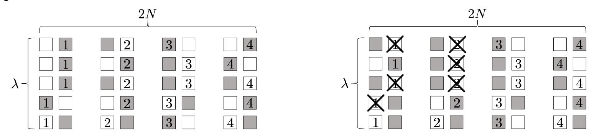

{0}------------------------------------------------

# New Techniques for Traitor Tracing: Size *N*<sup>1</sup>*/*<sup>3</sup> and More from Pairings

Mark Zhandry Princeton University & NTT Research, USA

### **Abstract**

The best existing pairing-based traitor tracing schemes have *O*( √ *N*)-sized parameters, which has stood since 2006. This intuitively seems to be consistent with the fact that pairings allow for degree-2 computations, yielding a quadratic compression.

In this work, we show that this intuition is false by building a tracing scheme from pairings with *O*( <sup>√</sup><sup>3</sup> *<sup>N</sup>*)-sized parameters. We additionally give schemes with a variety of parameter size trade-offs, including a scheme with constant-size ciphertexts and public keys (but linear-sized secret keys). All of our schemes make black-box use of the pairings. We obtain our schemes by developing a number of new traitor tracing techniques, giving the first significant parameter improvements in pairings-based traitor tracing in over a decade.

# **1 Introduction**

Traitor tracing [\[CFN94\]](#page-66-0) allows a content distributor to trace the source of a pirate decoder. Every user is given a unique secret key that allows for decrypting ciphertexts. A "traitor" might distribute their key to un-authorized users, or even hide their key inside a pirate decoder capable of decrypting. A tracing algorithm can be run on the decoder that will identify the traitor. In a collusion-resistant scheme, even if several traitors collude, the tracing algorithm will be able to identify at least one of them[1](#page-0-0) , without ever falsely identifying an honest user. Much of the traitor tracing literature considers *fully collusion-resistant* schemes, where the coalition of traitors can be arbitrarily large. In this work, we will only consider fully collusion-resistant schemes.

The main goal of traitor tracing is to build schemes with short parameters, in particular short ciphertexts that depend minimally on the number *N* of users. Boneh, Sahai, and Waters [\[BSW06\]](#page-65-0) demonstrated the first collusion-resistant scheme with *O*( √ *N*)-sized parameters using pairings[2](#page-0-1) . Shortly after their work, Boneh and Waters [\[BW06\]](#page-65-1) augmented the construction with a broadcast functionality, achieving a so-called broadcast and trace scheme also with *O*( √ *N*)-sized parameters. These works remain the state-of-the-art in pairings-based collusion-resistant traitor tracing. Using other tools such as obfuscation or LWE, better parameters are possible [\[GGH](#page-66-1)+13, [BZ14,](#page-66-2) [GKW18\]](#page-66-3).

<span id="page-0-1"></span><span id="page-0-0"></span><sup>1</sup>A traitor could be completely passive, so it is impossible to identify *all* traitors.

<sup>2</sup>Following convention, the Big-Oh notation throughout this paper will hide constants that depend on the security parameter, and focus on the dependence on *N*. This is made precise in Section [2.](#page-4-0)

{1}------------------------------------------------

# **1.1 Some Existing Approaches to Traitor Tracing**

**Fingerprinting Codes.** One of the earliest approaches to collusion-resistant tracing was shown by Boneh and Naor [\[BN08\]](#page-65-2) [3](#page-1-0) , who construct traitor tracing using an object called *fingerprinting codes* [\[BS95\]](#page-65-3). Their scheme is combinatorial, relying simply on generic public key encryption, and ciphertexts have optimal *O*(1) size.

The Boneh-Naor scheme, however, is generally not considered to resolve the traitor tracing problem. Curiously, different authors seem to have different interpretations of why. Some works (e.g. [\[BZ14,](#page-66-2) [GKSW10,](#page-66-4) [TZ17\]](#page-68-0)) note that Boneh-Naor requires very large secret keys — namely quadratic in the number of users — which is inherent to fingerprinting codes [\[Tar03\]](#page-67-0). The main limitation according to these works appears to be simultaneously achieving small ciphertext *and* small secret/public keys. Other works more or less ignore the secret key size limitation (e.g. [\[GKW18,](#page-66-3) [KW19,](#page-67-1) [GQWW19\]](#page-67-2) [4](#page-1-1) ), suggesting the main limitation of Boneh-Naor is that it is a *threshold* scheme: it can only trace decoders whose decryption probability exceeds some a priori threshold. These latter works appear to consider it an open problem, for example, to build *non-threshold* tracing with *o*( √ *N*)-sized ciphertexts (and any secret/public key size) from anything implied by pairings.

**Private Linear Broadcast Encryption (PLBE).** A Private Linear Broadcast Encryption (PLBE) scheme is a limited type of functional encryption that allows for encrypting to ranges of user identities, and is known to imply traitor tracing [\[BSW06\]](#page-65-0). Algebraic constructions of PLBE achieve simultaneously smaller parameters, and are not subject to the threshold restriction. PLBE is by far the most popular approach to traitor tracing today, being taken by the current best pairings-based constructions [\[BSW06,](#page-65-0) [BW06\]](#page-65-1), as well as the obfuscation and LWE-based constructions [\[GGH](#page-66-1)+13, [BZ14,](#page-66-2) [GKW18\]](#page-66-3). In fact, in the last five years (2014-2019) of traitor tracing papers, we could identify ten papers appearing at EUROCRYPT, CRYPTO, ASIACRYPT, TCC, STOC, and FOCS giving positive results for traitor tracing. With perhaps one exception (discussed next) *every single one* can be seen as following the PLBE or closely related approaches [\[BZ14,](#page-66-2) [LPSS14,](#page-67-3) [NWZ16,](#page-67-4) [KMUZ16,](#page-67-5) [GKRW18,](#page-66-5) [KMUW18,](#page-67-6) [CVW](#page-66-6)+18, [GKW18,](#page-66-3) [GQWW19,](#page-67-2) [GKW19\]](#page-66-7).

**Risky Traitor Tracing.** Recently, Goyal et al. [\[GKRW18\]](#page-66-5) define a relaxed notion of "risky traitor tracing" where the pirate decoder is only guaranteed to be traced with some non-zero probability, say *α* for some *α* 1. Their approach follows the PLBE framework, but actually *strengthens* PLBE. Essentially, their scheme constructs PLBE for *αN* users, but then since *α <* 1, it must assign multiple users to the same identity. In order to get tracing to work, however, it must be that users cannot tell what identity they were assigned to. This requires strengthening PLBE, as in standard PLBE every user knows their identity.

## **1.2 This work: New Techniques for Traitor Tracing**

In this work, we explore the use of different structures to build traitor tracing, giving rich set of traitor tracing techniques beyond the usual approaches. We then use these techniques to build several new schemes from pairings and weaker primitives that offer new trade-offs that were not possible before. Below we describe our results, with a summary given in Table [1.](#page-3-0)

<span id="page-1-1"></span><span id="page-1-0"></span><sup>3</sup>The work originated from 2002, but was not published until 2008.

<sup>4</sup>Example: Goyal, Koppula, and Waters [\[GKW18\]](#page-66-3) make the central claim of achieving a "secure traitor tracing with [constant]-sized ciphertexts from standard assumptions," without discussing the secret key size at all.

{2}------------------------------------------------

In the following, we will say a traitor tracing system has size (*P, K, C*) if its public key, secret keys, and ciphertexts have sizes at most *O*(*P*)*, O*(*K*), and *O*(*C*), respectively, where constants hidden in the Big Oh notation are allowed to depend on the security parameter[5](#page-2-0) . We abbreviate size (*A, A, A*) as simply *A*.

- The first scheme of size (*N*<sup>2</sup> *, N*<sup>2</sup> *,* 1), or more generally (*N*2−*<sup>a</sup> , N*2−2*<sup>a</sup> , N<sup>a</sup>* ), *without the threshold limitation* from the minimal assumption of general public key encryption[6](#page-2-1) . Thus, we remove the threshold limitation of fingerprinting code-based tracing schemes. The main limitation of these schemes is then the large public and secret key sizes. We note that we easily can compress the public keys to get a scheme of size (1*, N*<sup>2</sup> *,* 1), or more generally (1*, N*2−2*<sup>a</sup> , N<sup>a</sup>* ), relying on the stronger assumption of identity-based encryption.
- The first pairings-based scheme of size (1*, N,* 1), or more generally (1*, N*1−*<sup>a</sup> , N<sup>a</sup>* ) for any constant *a* ∈ [0*,* 1]. For all constants *a <* 1, this gives a new parameter trade-off that was not possible before from pairings.
- An (*N*1−*<sup>a</sup> , N*1−*<sup>a</sup> , N<sup>a</sup>* )-sized scheme from pairings, attaining the stronger notion of broadcast and trace [\[BW06\]](#page-65-1), which augments traitor tracing with a broadcast functionality. For *a* = 0, this gives the first broadcast and trace scheme with constant-size ciphertexts from pairings. This improves on the recent work of [\[GQWW19\]](#page-67-2) which attained arbitrarily-small polynomial ciphertext size, while also requiring lattices in addition to pairings.
- A new model for traitor tracing, which we call the *shared randomness model* (SRM), where encryption, decryption, and the decoder have access to a large source of randomness that is not included in the communication costs. While we define the model as a stepping stone toward a full tracing algorithm in the plain model, our shared randomness model may be useful in its own right. For example, the shared randomness could be derived from some publicly available data, such as stock market fluctuations or blockchains.
- A broadcast and trace scheme of size (*N,* 1*,* 1), or more generally (*N*1−*<sup>a</sup> ,* 1*, N<sup>a</sup>* ) for any constant *a* ∈ [*N*], in the shared randomness model from pairings. The size of the shared randomness is *N*1−*<sup>a</sup>* ; thus, for *a* ≥ 1*/*2, the shared randomness can simply be included in the ciphertext, in which case we get a scheme in the plain model. We note that for *a* = 1*/*2, we get the first broadcast and trace scheme of size (*N*1*/*<sup>2</sup> *,* 1*, N*1*/*<sup>2</sup> ) from pairings, improving on the (*N*1*/*<sup>2</sup> *, N*1*/*<sup>2</sup> *, N*1*/*<sup>2</sup> )-sized scheme of [\[BW06\]](#page-65-1).
- Putting it all together: a traitor tracing (non-broadcast) scheme of size <sup>√</sup><sup>3</sup> *<sup>N</sup>*.

Our results are obtained by a number of new techniques that may have applications beyond the immediate scope of this work:

- A compiler which increases the number of users by expanding the ciphertext size, but in many cases keeping the other parameters fixed (Theorem [1\)](#page-5-0).
- A compiler which converts any threshold scheme into a non-threshold scheme without affecting the dependence on *N* (Theorem [2\)](#page-5-1).

<span id="page-2-0"></span><sup>5</sup>We will also suppress log *N* terms. This is without loss of generality since it is always the case that log *N < λ*, and the Big-Oh already hides poly(*λ*) terms.

<span id="page-2-1"></span><sup>6</sup>Our definition of traitor tracing has public encryption, which in particular implies public key encryption.

{3}------------------------------------------------

- A compiler which converts a risky scheme into a non-risky scheme, without asymptotically affecting ciphertext size (Theorem 3).
- A compiler from a certain broadcast functionality into a traitor tracing scheme, in the shared shared randomness model (Theorem 4).
- New instantiations of broadcast encryption from pairings (Theorem 5).

<span id="page-3-0"></span>

| Scheme  | pk          | sk                  | ct                  | Broadcast? | Tool    | Limitations |
|---------|-------------|---------------------|---------------------|------------|---------|-------------|
| Trivial | N           | 1                   | N                   | ✓          | PKE     |             |
|         | 1           | 1                   | N                   |            | IBE     |             |
| [BN08]  | $N^2$       | $N^2$               | 1                   | X          | PKE     | Threshold   |
|         | 1           | $N^2$               | 1                   |            | IBE     |             |
| [BSW06] | $\sqrt{N}$  | 1                   | $\sqrt{N}$          | X          | Pairing |             |
| [BW06]  | $\sqrt{N}$  | $\sqrt{N}$          | $\sqrt{N}$          |            |         |             |
| Cor 1   | $N^{2-a}$   | $N^{2-2a}$          | $N^a$               | X          | PKE     |             |
|         | 1           | $N^{2-2a}$          | $N^a$               |            | IBE     |             |
| Cor 2   | 1           | $N^{1-a}$           | $N^a$               |            |         |             |
| Cor 3   | $N^{1-a}$   | $N^{1-a}$           | $N^a$               | <b>✓</b>   | Pairing |             |
| Cor 4   | $N^{1-a}$   | 1                   | $N^{\max(a,1-a)}$   |            |         |             |
| Cor 5   | $N^{1-a-b}$ | $N^{\max(b,1-a-b)}$ | $N^{\max(a,1-a-b)}$ | Х          |         |             |

Table 1: Comparing parameters sizes of our schemes to some existing protocols. This table only includes schemes based on pairings or weaker assumptions implied by pairings. N is the number of users. All sizes hide multiplicative constants dependent on the security parameter (but not N).  $a, b \in [0, 1]$  are any constants such that  $a + b \le 1$ .

## 1.3 Organization

The organization of the rest of the paper is as follows:

- Section 2 gives a high-level technical overview.
- Section 3 discusses the implications and takeaways from our work.
- Section 4 defines the various notions of traitor tracing we will be using.
- Sections 5, 6, 7, and 8 give our four main compilers.
- Section 9 gives new algebraic instantiations of various primitives, which together with our compilers yield our results.

{4}------------------------------------------------

## 1.4 Acknowledgments

We thank Susan Hohenberger and Arush Chhatrapati for fixing a bug in Construction 7.

# <span id="page-4-0"></span>2 Technical Overview

In order to abstract and modularize the discussion, the central object we will consider is a generalization of a traitor tracing system, which we call a "multi-scheme," which can roughly be seen as a scaled-down version of "identity-based traitor tracing" as defined in  $[ADM^+07]$ . Intuitively, a multi-scheme is M essentially independent tracing systems running in parallel, each with distinct secret keys and ciphertexts. All N users within a single instance can decrypt ciphertexts to that instance, but not to other instances. Tracing also works within an instance: any pirate decoder that decrypts for an instance can be traced to traitors within that instance. A plain traitor tracing scheme implies a multi-scheme by simply setting up M separate instances of the scheme. The point of a multi-scheme, however, is that the M schemes are allowed share a common public key, which may be smaller than M copies of a single public key. See Definition 1.

We will also consider broadcast and trace schemes [BW06], which augment plain traitor tracing with a broadcast functionality. That is, the encrypter can specify a subset  $S \subseteq [N]$ , and only users in S should be able to decrypt the ciphertext. S is also incorporated into the tracing definition; see Definition 4.

We will say that a scheme  $\Pi$  has size (P, K, C) for functions P = P(N, M), K = K(N, M), and C = C(N, M), if there is a polynomial  $\mathsf{poly}(\lambda)$  such that, for all polynomials  $N = N(\lambda)$  and  $M = M(\lambda)$ , we have  $|\mathsf{pk}| \leq P(N, M) \times \mathsf{poly}(\lambda)$ ,  $|\mathsf{sk}_{j,i}| \leq K(N, M) \times \mathsf{poly}(\lambda)$ , and  $|c| \leq C(N, M) \times \mathsf{poly}(\lambda)$ . For example, if  $|\mathsf{pk}| = |\mathsf{sk}_{j,i}| = |c| = 2N^{1/2}M\lambda^2 + \lambda^5$ , we could set  $\mathsf{poly}(\lambda) = 2\lambda^5$ , which shows that the protocol has size  $(N^{1/2}M, N^{1/2}M, N^{1/2}M)$ . Here, we follow the convention that both encryption and decryption take the public key as input.

We will also analyze the run-times of our algorithms. We will assume a RAM model of computation. Additionally, for notational convenience, we will not require an algorithm to read its entire input; instead, it can query the bit positions of its input at unit cost per bit. We will use a similar notation for run-times as we did for parameter sizes: we will say a scheme  $\Pi$  runs in time (E, D) for functions E, D if there is a polynomial  $\mathsf{poly}(\lambda)$  such that, for all polynomials  $N = N(\lambda)$  and  $M = M(\lambda)$ , Enc, and Dec run in time at most  $E(N, M) \times \mathsf{poly}(\lambda)$  and  $D(N, M) \times \mathsf{poly}(\lambda)$ , respectively.

We will say that a protocol is asymptotically efficient if the running times of Enc and Dec are, up to  $poly(\lambda)$  factors, bounded by the sum of their input and output sizes. For traitor tracing schemes, this is equivalent to requiring  $E \leq P + C$  and  $D \leq P + K + C^{-7}$ ; for a broadcast and trace protocol (where Enc, Dec take as input the N-bit specification of a subset  $S \subseteq [N]$ ), this is equivalent to  $E \leq P + C + N$  and  $D \leq P + K + C + N$ . Since our computational model does not require an algorithm to read its entire input, asymptotic efficiency may not be optimal. However, any asymptotically efficient scheme will then have optimal running time if we switch to the model where we require algorithms to read their entire input.

<span id="page-4-1"></span><sup>&</sup>lt;sup>7</sup>Recall that our convention that decryption takes the public key as input.

{5}------------------------------------------------

# **2.1 User Expansion Compiler**

Our first result shows how to expand the number of users by grouping different instances together. That is, we compile a scheme with *N/T* users and *MT* instances into a scheme with *N* users and *M* instances. Essentially, we just partition the *MT* instances into *M* sets of size *T*. Within each set, there are now *N* users (*N/T* for each instance, *T* instances). We then encrypt the message separately to each of the *T* instances within the set, ensuring that all *N* users in the set can decrypt. This conversion blows up the ciphertext size by a factor of *T*, but hopefully results in smaller public/secret keys.

Our compiler can be seen as a generalization of the most basic traitor tracing scheme, which simply gives each user a different secret key for a public key encryption scheme and encrypts to each user separately. Abstracting the ideas behind this scheme will lead to useful results later in this paper. Concretely, we prove:

<span id="page-5-0"></span>**Theorem 1** (User Expansion)**.** *Let P* = *P*(*N, M*)*, K* = *K*(*N, M*)*, C* = *C*(*N, M*)*, T* = *T*(*N, M*) *be polynomials such that T*(*N, M*) ≤ *N. Suppose there exists a secure multi-scheme* Π<sup>0</sup> *with size* (*P, K, C*)*. Then there exists a secure multi-scheme* Π *with size*

$$(P(N/T, MT), K(N/T, MT), T \times C(N/T, MT))$$
.

*If* Π<sup>0</sup> *runs in time* (*E, D*) *for polynomials E*(*N, M*)*, D*(*N, M*)*, then* Π *runs in time*

$$(T \times E(N/T, MT), D(N/T, MT))$$
.

*If* Π<sup>0</sup> *is a broadcast and trace scheme, then so is* Π*.*

Note that, in almost all the schemes we will see, *P, K, C* are all independent of *M*. Our compiler then shrinks *P, K* by reducing the dependence on *N*, at the expense of expanding *C*.

The tracing algorithm in our compiler essentially views the construction as an instance of *private linear broadcast encryption* (PLBE), and then uses a tracing algorithm analogous to [\[BSW06\]](#page-65-0). Given a decoder *D* for the compiled scheme, we test the decoder on invalid ciphertexts where the first *t* components have been modified to encrypt gibberish, and see if the decoder still decrypts. For a good decoder, a simple hybrid argument shows that there will be some *t* where the decoder decrypts *t* − 1 with probability noticeably higher than it decrypts *t*. This will allow us to construct from the original decoder *D* a new decoder *D<sup>t</sup>* for Π0, targeting the *t*'th instance. We then run Π0's tracing algorithm on *D<sup>t</sup>* , which will accuse a set *A* ⊆ [*N/T*]. For each *i* ∈ *A*, we then accuse the user who was assigned index *i* within instance *t*. See Section [5](#page-19-0) for details.

## **2.2 Threshold Elimination Compiler**

The usual model for traitor tracing ensures that even a decoder that succeeds in decrypting with arbitrary inverse-polynomial probability can be traced. In contrast, Naor and Pinkas [\[NP98\]](#page-67-7) consider a weaker "threshold" tracing, where tracing is only guaranteed to work on decoders whose decryption probability exceeds some a priori bound. In this paper, we will assume this bound is any *constant* decryption probability. See Definition [2](#page-17-1) for a formal definition.

<span id="page-5-1"></span>Our next compiler converts any threshold tracing scheme into a plain tracing scheme, without asymptotically affecting parameters:

{6}------------------------------------------------

**Theorem 2** (Threshold Elimination)**.** *Let P, K, C be polynomials in N, M. If there exists a* threshold *secure multi-scheme* ΠThr *with size* (*P, K, C*)*, then there exists a (non-threshold) secure multi-scheme* Π *with size* (*P, K, C*)*. If* Π<sup>0</sup> *runs in time* (*E, D*) *for polynomials E*(*N, M*)*, D*(*N, M*)*, then so does* Π*. If* ΠThr *is a broadcast and trace scheme, then so is* Π*.*

As an application, the Boneh-Naor traitor tracing scheme [\[BN08\]](#page-65-2), when instantiated with "robust" Tardos fingerprinting codes [\[Tar03,](#page-67-0) [BKM10\]](#page-65-5), yields a threshold scheme of size (*N*<sup>2</sup> *, N*<sup>2</sup> *,* 1), or a multi-scheme of size (*MN*<sup>2</sup> *, N*<sup>2</sup> *,* 1). Applying Theorem [2](#page-5-1) gives a non-threshold scheme with the same size. This gives the first non-threshold scheme from generic public key encryption to achieve constant-sized ciphertexts.

We can also eliminate the public key size by using identity-based encryption (IBE) instead of public key encryption. Finally, applying Theorem [1](#page-5-0) with *T* = *N<sup>a</sup>* gives:

<span id="page-6-0"></span>**Corollary 1.** *Assuming public key encryption, there exists a (non-threshold) secure asymptotically efficient multi-scheme of size* (*MN*2−*<sup>a</sup> , N*2−2*<sup>a</sup> , N<sup>a</sup>* )*. Assuming IBE, there exists a (non-threshold) secure asymptotically efficient multi-scheme of size* (1*, N*2−2*<sup>a</sup> , N<sup>a</sup>* )*.*

Setting *a* = 2*/*3 and *M* = 1 gives a traitor tracing scheme of size (*N*4*/*<sup>3</sup> *, N*2*/*<sup>3</sup> *, N*2*,*<sup>3</sup> ) from general public key encryption, or (1*, N*2*/*<sup>3</sup> *, N*2*/*<sup>3</sup> ) from general IBE. This gives the first construction simultaneously achieving sublinear secret keys and ciphertexts from general public key encryption. It also gives the first construction where all parameters are simultaneously sublinear from general IBE. Instantiating IBE using Cocks IBE [\[Coc01\]](#page-66-8)) gives the first sublinear traitor tracing scheme from quadratic residuosity. Using the recent construction of IBE from CDH [\[DG17\]](#page-66-9) gives the first sublinear traitor tracing scheme from CDH in pairing-free groups, which in particular gives the first such a scheme factoring.

**Remark 1.** *We note that Theorem [1](#page-5-0) does* not *work directly on a threshold scheme: the hybrid argument in the proof results in a decoder whose decryption probability is reduced by a factor of T, which will typically be non-constant. Thus, our threshold elimination compiler is crucial for achieving the parameter trade-offs above, even if we were willing to accept a threshold scheme as the end result.*

**Proving Theorem [2.](#page-5-1)** Our goal is to design Π such that any decoder *D* for the scheme — even one with small but noticeable decryption probability — can be converted into a decoder *D*<sup>0</sup> that decrypts with high probability, for the original scheme ΠThr. Importantly, we cannot asymptotically expand the parameters in therms of *N*.

To encrypt a message *m*, our basic idea is to choose random *m*1*, . . . , m<sup>n</sup>* such that *m*<sup>1</sup> ⊕ *m*<sup>2</sup> ⊕ · · · ⊕ *m<sup>n</sup>* = *m*. We encrypt each of the *m<sup>i</sup>* separately using ΠThr, the final ciphertext for Π being the *n* encryptions of the *m<sup>i</sup>* . To decrypt, simply decrypt each component to recover *m<sup>i</sup>* , and then reconstruct *m*.

Since the *m<sup>i</sup>* are an *n*-out-of-*n* secret sharing of *m*, a decoder needs to, in some sense, be able to recover *all* of the *m<sup>i</sup>* in order to compute *m*. Supposing the "decryptability" of the *n* individual ciphertexts were independent events, then the decryptability of the individual ciphertexts must very high in order to have noticeable chance at decrypting all *n* ciphertexts simultaneously.

To turn this intuition into a proof, we show how to extract the *m<sup>i</sup>* whenever the individual ciphertext is decryptable, in order to build a decoder *D*<sup>0</sup> for Π<sup>0</sup> with high-enough decryption probability so that it can be traced using Π0. On input a ciphertext *c*, *D*<sup>0</sup> chooses a random *i* ∈ [*n*] 

{7}------------------------------------------------

and sets  $c_i = c$ . It then fills in a ciphertext tuple  $(c_1, \ldots, c_n)$  where the  $c_j, j \neq i$  are encryptions of random messages  $m_j$ . When D gives a guess m' for m, D' can compute a guess  $m'_i$  for  $m_i$  using m' and the  $m_j, j \neq i$ . D' decrypts with the same probability as D, and by repeating the process many times on the same ciphertext c, the hope is to amplify the decryption probability.

Unfortunately, there are a few issues. For a fixed ciphertext c, the various trials share a common ciphertext, and therefore their success probabilities are not independent. Also, there is no obvious way to tell which of the trials produced the correct message. Finally, recent traitor tracing definitions [NWZ16, GKRW18, GKW18] actually require tracing to hold in the stronger indistinguishability setting, which means roughly that D does not have to actually produce the message, but only needs to distinguish it from, say, a random message.

We resolve these issues in a couple steps. We use Goldreich-Levin [GL89] to convert an indistinguishability decoder into a predicting decoder. We analyze the decoder's decryption probability on the correlated instances, and show that the success probability over multiple trials amplifies as necessary, when  $n = \mathsf{poly}(\lambda)$ . Finally, we leverage the indistinguishability security of  $\Pi_{\mathsf{Thr}}$  — meaning D' only needs to distinguish the correct message from random — which allows D' to tell when a trial produces the correct output. Details are given in Section 6.

Putting everything together, if D distinguishes with non-negligible probability, D' will distinguish with probability 1 - o(1). Our compiler leaves public and secret keys intact, and blows up the ciphertext by a factor independent of the number of users N, as desired.

## 2.3 Risk Mitigation Compiler

The standard tracing model requires any decoder capable of decrypting (potentially with inverse-polynomial success probability) can be traced with probability negligibly-close to 1. An  $\alpha$ -risky scheme scheme [GKRW18], in contrast, only guarantees that a good decoder will be traced with probability (negligible-close) to  $\alpha$ . See Definition 3 for a formal definition.

Our next result is a compiler that reduces or eliminates risk from risky traitor tracing schemes, while preserving ciphertext size.

<span id="page-7-0"></span>**Theorem 3** (Risk Mitigation). Let P = P(N, M), K = K(N, M), C = C(N, M) be polynomials. Let  $\alpha = \alpha(N), \beta = \beta(N)$  be inverse polynomials with  $\alpha < \beta$ . If there exists an  $\alpha$ -risky multi-scheme  $\Pi_{\mathsf{Risk}}$  with size (P, K, C), then there exists a  $\beta$ -risky multi-scheme  $\Pi$  with size

$$(P(N, M\beta\alpha^{-1}), \beta\alpha^{-1} \times K(N, M\beta\alpha^{-1}), C(N, M\beta\alpha^{-1}))$$
.

If  $\Pi_0$  runs in time (E,D) for polynomials E(N,M), D(N,M), then  $\Pi$  runs in time

$$(E(N, M\beta\alpha^{-1}), D(N, M\beta\alpha^{-1}))$$
.

If  $\Pi_{\mathsf{Risk}}$  is a broadcast and trace scheme, then so is  $\Pi$ .

Thus, by multiplying M by  $O(\beta \alpha^{-1})$  and increasing the secret key size by a factor of  $O(\beta \alpha^{-1})$ , one can improve  $\alpha$ -riskiness to  $\beta$ -riskiness.

We note that [GKRW18] give a 1/N-risky (non-multi) scheme of size (1,1,1), and more generally give a  $\beta$ -risky scheme of size  $(\beta N, \beta N, \beta N)$ . In Section 7.2, we extend the risky scheme from [GKRW18] into a 1/N-risky multi-scheme of size (1,1,1). For any desired level of riskiness  $\beta \geq 1/N$ , Theorem 3 then gives a scheme of size  $(1,\beta N,1)$ , thus improving on [GKRW18].

<span id="page-7-1"></span>Setting  $\beta = 1$  eliminates risk all together, yielding a scheme of size (1, N, 1). Applying our user expansion compiler (Theorem 1) with  $T = N^a$  gives:

{8}------------------------------------------------

**Corollary 2.** *For any a* ∈ [0*,* 1]*, if Assumptions 1 and 2 from [\[GKRW18\]](#page-66-5) hold, there exists a secure asymptotically efficient multi-scheme of size* (1*, N*1−*<sup>a</sup> , N<sup>a</sup>* )*.*

Note that the computational assumptions are exactly the same as in [\[GKRW18\]](#page-66-5). Also, for any *a <* 1, such parameters were not known before from pairings.

We also demonstrate how to add a broadcast functionality to the risky scheme of [\[GKRW18\]](#page-66-5), at the cost of increasing the public key size and relying on the generic group model for security. Running through our compilers gives:

<span id="page-8-0"></span>**Corollary 3.** *For any a* ∈ [0*,* 1]*, there exists an asymptotically efficient broadcast and trace multischeme of size* (*N*1−*<sup>a</sup> , N*1−*<sup>a</sup> , N<sup>a</sup>* ) *from pairings, with security in the generic group model.*

For *a* = 0, this gives the first broadcast and trace scheme with constant-sized ciphertexts from standard tools, and improves on [\[GQWW19\]](#page-67-2), which attained *N* ciphertext size for any  *>* 0, while also requiring lattices in addition to pairings[8](#page-8-1) .

**Proving Theorem [3.](#page-7-0)** Our compiler is inspired by viewing the fingerprinting code solution to traitor tracing [\[BN08\]](#page-65-2) as a form of risk mitigation. Concretely, [\[BN08\]](#page-65-2) can be seen as follows. First, built a simple 2-user traitor tracing scheme from public key encryption; since the number of users is constant, the parameter sizes are constant. Then, extend this to *N* users by assigning each of the *N* users to one of the two identities of the 2-user system. The result is essentially a risky scheme with 2-sided error, where tracing helps narrow down the possible traitors, but does not let us actually determine the traitor with certainty. [\[BN08\]](#page-65-2) then remove the error by running many instances of the scheme and assigning users to identities by using the combinatorics of the underlying fingerprinting code, thereby removing the riskiness. Crucially, the compiled scheme is set up to not significantly expand the ciphertext size.

In our setting, the compiler is actually much simpler, since an *α*-risky scheme has only *one-sided* error; honest users are never accused. Let ΠRisk be an *α*-risky multi-scheme. Consider a new protocol Π which runs ΠRisk with *T* = *ω*(log *λ*)*/α* instances. The secret key for a user consists of the all the secret keys for that user across the *T* instances. To encrypt, encrypt to a *single* random instance from ΠRisk. The overall ciphertext is simply the label of the instance (a number in [*T*]), and a ciphertext from ΠRisk. Since each user has a secret key from each instance, each user can decrypt.

Thus, we expand the secret key by a factor of *O*(1*/α*), and add log *T* = log *λ*+log(1*/α*) = *O*(log *λ*) bits to the ciphertext. We can easily extend the above to yield a riskless *multi*-scheme for *M* instances, by increasing the number of instances of ΠRisk to *M* × *T* and grouping them into sets of size *T*.

**Analysis.** Suppose a pirate decoder *D* for Π decrypts with *certainty*. Then it must decrypt, no matter which instance of ΠRisk is chosen during encryption. Thus, a perfect decoder for Π actually yields a decoder for each of the *T* instances of ΠRisk. *α*-riskiness means that each of the *T* decoders has an *α* chance of being traced to a traitor, and intuitively the probabilities should be independent. Over all *T* instances, we expect the tracing probability to be 1 − (1 − *α*) *<sup>T</sup>* = 1 − negl(*λ*).

Toward tracing imperfect decoders, suppose *D* instead only decrypts for a single instance of Π0, rejecting ciphertexts for any other instance; *D* has non-negligible decryption probability 1*/T*, but

<span id="page-8-1"></span><sup>8</sup>The size of the broadcast and secret keys are never explicitly calculated in [\[GQWW19\]](#page-67-2). From personal communication with the authors of [\[GQWW19\]](#page-67-2), we understand that the public key has size Ω(*N*) and the secret keys have size Ω(*N* 2 ). Thus, our scheme also improves on the secret key size from their work.

{9}------------------------------------------------

will only be traced with probability *α*. Thus, we cannot trace arbitrary decoders[9](#page-9-0) . We will instead aim for a threshold scheme; we can then apply Theorem [2](#page-5-1) to get a full tracing scheme.

Even in the threshold setting, however, difficulties arise. The decoder may only decrypt, say, half of the instances, which we will call "good" instances. The good instances are chosen adaptively, *after* the adversary interacts with the many instances of the scheme. This means that the tracing probabilities for the various good instances will not be independent. Nevertheless, we show by a careful argument that, for the right definition of security for a multi-scheme, the tracing probabilities cannot be too correlated, which is sufficient to get our proof to go through. More details are given in Section [7.](#page-27-0)

**Remark 2.** *All three of the compilers discussed so far — user expansion and risk mitigation, which in turn relies on threshold elimination — are necessary to achieve Corollaries [2](#page-7-1) and [3.](#page-8-0) We note that there are only two valid orderings of the three compilers: risk mitigation*→*threshold elimination*→*user expansion, or user expansion*→*risk mitigation*→*threshold elimination. Any other order will either result in the final scheme being a threshold scheme, or will incorrectly apply user expansion to a threshold scheme.*

# **2.4 Traitor Tracing from Threshold Broadcast Encryption**

We next turn to constructing traitor tracing from a certain type of attribute-based encryption which we call threshold broadcast encryption (this notion of "threshold" not to be confused with the notion of "threshold" for traitor tracing). A (plain) broadcast encryption scheme allows for broadcasting a ciphertext to arbitrary subsets of users with a single constant-sized ciphertext. Broadcast encryption with constant sized secret keys and ciphertexts (but linear-sized public keys) is possible using pairings, as first shown by Boneh, Gentry, and Waters [\[BGW05\]](#page-65-6).

Describing an arbitrary subset of recipients takes linear space; therefore, broadcast schemes obtain sub-linear ciphertexts by assuming *S* is *public* and not counted in the ciphertext. On the other hand, traitor tracing typically requires a "private" broadcast, where the recipient set is at least partially hidden. For example, private linear broadcast encryption (PLBE) [\[BSW06\]](#page-65-0) allows for encrypting to sets [*i*], and only user *i* can distinguish between [*i* − 1] and [*i*].

Our goal is to show how to use broadcast functionalities — with *public* recipient sets — to enable a *private* broadcast structure that allows for tracing.

**Our Idea.** To trace *N* users, we will instantiate a broadcast scheme with *NT* users, for some parameter *T*. We will think of the *NT* identities as being pairs (*i, x*) ∈ [*N*] × [*T*]. For each user *i* ∈ [*N*], we will choose a random *x<sup>i</sup>* ∈ [*T*], and give that user the secret key for broadcast identity (*i, xi*). Only user *i* knows *x<sup>i</sup>* . To encrypt, we will simply broadcast to a random subset *S* ⊆ [*N*]×[*T*].

For tracing, consider choosing *S* uniformly at random conditioned on (*i, xi*) ∈*/ S*; doing so "turns off" user *i*, preventing them from decrypting. If *i* is honest, the adversary does not know *x<sup>i</sup>* and hopefully cannot distinguish between this distribution and a truly uniform *S*. If turning off a user causes a change in decryption probability, we then accuse that user.

The description so far has several issues. First, in regular execution of the above scheme, any (*i, xi*) will only be in the recipient set with probability 1*/*2, meaning honest users can only decrypt half the time. Second, an attacker may guess *x<sup>i</sup>* with non-negligible probability 1*/T*, and create a decoder that fails if (*i, xi*) ∈*/ S*, thus fooling the tracing algorithm into accusing an honest user with

<span id="page-9-0"></span><sup>9</sup>This is similar to the reason behind why Boneh-Naor [\[BN08\]](#page-65-2) is a threshold scheme.

{10}------------------------------------------------

non-negligible probability. Finally, encoding an arbitrary subset S takes NT bits, meaning we have (at least) linear-sized ciphertexts.

**Threshold Broadcast.** To rectify the first two issues, we will rely on a stronger version of broadcast encryption, which we call *threshold* broadcast encryption<sup>10</sup>. Here, every secret key is associated with a set U; this key can decrypt a ciphertext to set S if and only if  $|U \cap S| \ge t$  for some threshold t.

We now give users the secret key for disjoint sets U of identities. The size of  $S \cap U$  for a random set S will concentrate around |U|/2; by setting t slightly smaller than |U|/2, users will be able to decrypt with overwhelming probability. For tracing, the attacker can only guess a small fraction of an honest user's identities. We turn off the identities the attacker does not guess, which will drop  $|S \cap U|$  below t, thereby turning off the user while keeping the decoder on.

In slightly more detail, we set  $T = 2\lambda$ . We interpret the  $N \times 2\lambda$  identities as triples  $(i, j, b) \in [N] \times [\lambda] \times [2]$ . For each user, we will choose a random vector  $x^i \in \{0, 1\}^{\lambda}$ , and give the user the secret key for set  $U_i = \{(i, j, x_j^i)\}_{j \in [\lambda]}$ . When we trace, for each user i, we will iterate over all  $j \in [\lambda]$ , trying to turn off identity  $(i, j, x_j^i)$  by removing that element from S. If removing that element causes too-large a decrease in the decoder's decryption probability, we keep it in S; otherwise we remove it. We demonstrate that, if the user is outside the adversary's control (meaning in particular the adversary does not know  $x^i$ ), that with high probability we can remove enough of the elements to completely turn off that user. A diagram illustrating our idea is given in Figure 1.

Interestingly, our tracing algorithm makes adaptive queries to the decoder: which elements are in the set S depends on the results of previous queries to the decoder. This is unlike the vast majority of tracing techniques (including both fingerprinting codes and PLBE), where all queries can be made in parallel.

<span id="page-10-1"></span>

Figure 1: An illustration in the case  $\lambda = 5$ , N = 4, t = 2. Here, the *i*th pair of columns corresponds to the identities  $(i, j, b), j \in [\lambda], b \in \{0, 1\}$ .  $U_i$  is the set of boxes with the number *i* in them. Gray boxes are those contained in S. Left: Normal usage. In this case, if t = 2, all users would be able to decrypt. Right: An example tracing attempt. An "X" represents an element that has been explicitly removed from S. Here, removing (1, 2, 1) (1st pair of columns, 2nd row) failed, and so (1, 2, 1) was left in S. Tracing succeeds in fully turning off users 1 and 2.

The Shared Randomness Model. For now, we side-step the need to communicate S by considering a new model for traitor tracing, which we call the *shared randomness model*. Here, every ciphertext is encrypted using a large public source of randomness (in addition to private random

<span id="page-10-0"></span><sup>&</sup>lt;sup>10</sup>Prior literature such as [AHL<sup>+</sup>12] uses the terminology of "threshold attribute based encryption". We use the broadcast terminology to emphasize the goal of short ciphertexts, which is the main objective in broadcast encryption.

{11}------------------------------------------------

coins). This public randomness is also available for decryption, but we will not count it as part of the ciphertext. In this model, we simply have S be derived from the shared randomness.

We update our size notation, to include a fourth term R which bounds the size of the shared randomness; C now only bounds the ciphertext component excluding the shared randomness. For example, a scheme of size (P, K, C; R) = (N, N, 1; N) would have linear-sized public and secret keys, constant-sized ciphertexts, and linear-sized shared randomness. We note that a scheme of size (P, K, C; R) in the shared randomness model is also a scheme of size (P, K, C + R) in the plain model. We prove the following in Section 8:

<span id="page-11-0"></span>**Theorem 4** (Informal). If there exists a secure threshold broadcast scheme  $\Pi_0$  of size (P, K, C) and run-time (G, E, D), then there exists a secure broadcast and trace scheme  $\Pi$  of size (P, K, C; N) and run-time (G, E, D) in the shared randomness model. If  $\Pi_0$  has run time (E, D), then so does  $\Pi$ .

Instantiation. We now turn to constructing a threshold broadcast scheme. Existing pairing-based constructions such as  $[AHL^+12]$  have size (N, N, 1), allowing us to match Corollary 3 with entirely different techniques, but in the weaker shared randomness model. We observe, however, that we do not need a full threshold broadcast scheme. Prior works required security to hold, even if multiple users had overlapping sets  $U_i$ . In our case, all users have disjoint  $U_i$ . This turns out to let us strip away much of the secret key material, arriving at smaller secret keys.

In slightly more detail, the secret key for a set U consists of terms roughly of the form  $g^{\beta}\prod_{i\in U}(\gamma-i)^{-1}$  where  $\beta, \gamma$  are hidden. The problem with overlapping U is that one can combine different secret keys to generate new keys for other subsets. For example, one can combine  $\mathsf{sk}_{12} = g^{\beta(\gamma-1)^{-1}(\gamma-2)^{-1}}$  and  $\mathsf{sk}_{13} = g^{\beta(\gamma-1)^{-1}(\gamma-3)^{-1}}$  into  $\mathsf{sk}_{23} = \mathsf{sk}_{12}^{-1} \times \mathsf{sk}_{13}^2 = g^{\beta(\gamma-2)^{-1}(\gamma-3)^{-1}}$  without knowing  $\beta, \gamma$ . This invalidates security, since  $\mathsf{sk}_{23}$  may be able to decrypt, even if  $\mathsf{sk}_{12}$  and  $\mathsf{sk}_{13}$  are not allowed to. Therefore, existing schemes add additional randomization to the secret key to prevent combinations; each user then needs a personalized version of the public key in order to strip away this extra randomization during decryption. This expands the secret keys to size O(N).

Our main observation is that no such randomization is necessary if the U's are disjoint; we describe our scheme in Section 8. We justify the security of our scheme (for disjoint U) in the generic group model for pairings:

<span id="page-11-1"></span>**Theorem 5** (Informal). There exists a threshold broadcast scheme with size (N, 1, 1) and run time (N, N) from pairings with security for disjoint U in the generic group model.

Combining Theorems 4 and 5, we obtain an asymptotically efficient pairing-based scheme of size (N, 1, 1; N) in the shared randomness model.

While potentially interesting as a shared-randomness model scheme, our scheme is not useful as a plan-model scheme, since the shared randomness of size N makes the overall plain-model ciphertext linear sized. Our next observation will show how to nevertheless use our scheme to arrive at an interesting plain-model scheme.

User Expansion in the Shared Randomness Model. Interestingly, in the shared randomness model, user expansion (Theorem 1) increases the ciphertext size, but *not* shared randomness size. Theorem 1 then becomes:

<span id="page-11-2"></span>**Theorem 1** (User Expansion with Shared Randomness). Let P = P(N, M), K = K(N, M), C = C(N, M), R = R(N, M) and T = T(N, M) be polynomials such that  $T(N, M) \leq N$ . If there exists

{12}------------------------------------------------

*a secure multi-scheme* Π<sup>0</sup> *with size* (*P, K, C*; *R*) *in the shared randomness model, then there exists a secure multi-scheme* Π *with size*

$$(P(N/T, MT), K(N/T, MT), T \times C(N/T, MT); R(N/T, MT))$$

*in the shared randomness model. If* Π<sup>0</sup> *runs in time* (*E, D*) *for polynomials E*(*N, M*)*, and D*(*N, M*)*, then* Π *runs in time*

$$(T \times E(N/T, MT), D(N/T, MT))$$
.

*If* Π<sup>0</sup> *is a broadcast and trace scheme, then so is* Π*.*

By applying our user expansion compiler, we decrease the dependence of *P, K, R* on *N*, while increasing *C*. Eventually, *R* ≤ *C*, in which case a shared-randomness scheme of size (*P, K, C*; *R*) actually gives a plain model scheme of size (*P, K, C*). Combining Theorems [4](#page-11-0) and [5,](#page-11-1) and then applying our updated Theorem [1](#page-5-0) with *T* = *N<sup>a</sup>* thus gives:

<span id="page-12-0"></span>**Corollary 4.** *For any constant a* ∈ [0*,* 1]*, there exists an asymptotically efficient broadcast and trace scheme of size* (*N*1−*<sup>a</sup> ,* 1*, N<sup>a</sup>* ; *N*1−*<sup>a</sup>* ) *from pairings in the shared randomness model, whose security is justified in the generic group model. For a* ∈ [1*/*2*,* 1]*, the scheme has size* (*N*1−*<sup>a</sup> ,* 1*, N<sup>a</sup>* ) *in the* plain *model.*

Thus, by using the shared randomness model as an intermediate step, we are able to achieve interesting tracing results in the plain model. Note that setting *a* = 1*/*2 gives the first pairing-based broadcast and trace scheme with size (*N*1*/*<sup>2</sup> *,* 1*, N*1*/*<sup>2</sup> ), improving on (*N*1*/*<sup>2</sup> *, N*1*/*<sup>2</sup> *, N*1*/*<sup>2</sup> ) from [\[BW06\]](#page-65-1).

**Asymptotically Efficient Standard Tracing.** We note that while a broadcast and trace implies standard traitor tracing with the same parameter sizes, an *asymptotically efficient* broadcast and trace scheme does *not* imply an asymptotically efficient standard traitor tracing scheme. The reason is that the required running times for broadcast and trace are looser, owing to having the set *S* of size *N* as input to Enc*,* Dec.

Concretely, for our scheme above, our compilers give a running time of (*N, N*1−*<sup>a</sup>* ), which gives an asymptotically efficient scheme for broadcast and trace, since Enc*,* Dec run in time at most *N*, the length of the input set *S* ⊆ [*N*]. However, for standard traitor tracing, asymptotic efficiency would require a run-time of at most (*N<sup>a</sup>* + *N*1−*<sup>a</sup> , N<sup>a</sup>* + *N*1−*<sup>a</sup>* ), meaning the scheme described above is then not asymptotically efficient due to the large running time of encryption.

Looking deeper, the issue is that, when we apply Theorem [1,](#page-5-0) we create *N<sup>a</sup>* ciphertext components, and each component requires time *N*1−*<sup>a</sup>* to compute since, at a minimum, the shared randomness of size *N*1−*<sup>a</sup>* must be read. The result is an overall encryption running time of *N*. In Section [8,](#page-40-0) we explain how to set up the system so that the *N<sup>a</sup>* ciphertext components can be computed in tandem, taking the optimal time *N<sup>a</sup>* +*N*1−*<sup>a</sup>* . Intuitively, we can set the system up so that the computation of the ciphertexts amounts to evaluating a single polynomial *Q* of degree *N*1−*<sup>a</sup>* at *N<sup>a</sup>* points, with the wrinkle that the coefficients of this polynomial, and the result of evaluation, are *in the exponent* of the pairing. Nevertheless, we show that standard algorithms for multi-point polynomial evaluation also work in the exponent, thus compressing the running time. This multi-point polynomial evaluation incurs a logarithmic overhead over the sum of input and output sizes, which can be absorbed into the poly(*λ*) terms. Thus, we achieve asymptotic efficiency for standard traitor tracing:

{13}------------------------------------------------

**Theorem 6.** For any constant  $a \in [0,1]$ , there exists an asymptotically efficient traitor tracing scheme of size  $(N^{1-a}, 1, N^a; N^{1-a})$  from pairings in the shared randomness model, whose security is justified in the generic group model. For  $a \in [1/2, 1]$ , the scheme has size  $(N^{1-a}, 1, N^a)$  in the plain model.

# 2.5 Putting it All Together: Our $\sqrt[3]{N}$ Construction

Finally, we combine all of the ideas above to yield a traitor tracing scheme where all parameters have size  $\sqrt[3]{N}$ . At a high level, we take our shared randomness scheme of size (N,1,1;N) for N users, augment the construction with ideas from [GKRW18] to expand it to  $N^2$  users while hopefully keeping the size (N,1,1;N), at the expense of only achieving 1/N-riskiness. If this worked, scaling down  $N^2 \mapsto N$  would give  $1/\sqrt{N}$ -risky scheme of size  $(\sqrt{N},1,1;\sqrt{N})$  for N users. Then we apply Theorem 3 to eliminate the risk, then Theorem 1 with  $T = \sqrt[3]{N}$  to balance the number of users, and finally including the shared randomness in the ciphertext, achieving size  $\sqrt[3]{N}$  in the plain model.

We follow the above idea, but unfortunately there are some subtle issues with the above approach which make the combination non-trivial. Concretely, when adding riskiness to our shared randomness scheme, we multiply the number of users by N. However, we cannot expand the set of recipients for the threshold broadcast scheme, since doing so would require expanding the public key. Since the recipient set is limited, the sets  $U_i$  for the various users will actually need to overlap. As discussed above, overlapping  $U_i$  requires expanding the secret key size, preventing us from achieving our goal.

While we are unable to achieve a  $1/\sqrt{N}$ -risky scheme of size  $(\sqrt{N}, 1, 1; \sqrt{N})$ , we build a scheme with large but redundant secret keys, so that the secret keys resulting from Theorem 3 can then be compressed by eliminating the redundancy. The result is a secure multi-scheme with size  $(\sqrt{N}, \sqrt{N}, 1; \sqrt{N})$  in the shared randomness model from pairings with security proved in the generic group model. We also give a more general parameter size trade-off in Section 9. Finally, we apply the shared randomness version of Theorem 1 to obtain:

<span id="page-13-0"></span>**Corollary 5.** For any constants  $a, b \ge 0$  such that  $a + b \le 1$ , there exists an asymptotically efficient secure multi-scheme with size  $(N^{1-a-b}, N^{\max(b,1-a-b)}, N^{\max(a,1-a-b)})$  from pairings with security proved in the generic group model.

In particular, for  $a, b \ge 1 - a - b$ , the scheme has size  $(N^{1-a-b}, N^b, N^a)$ . Setting a = b = 1/3 gives a scheme of size  $\sqrt[3]{N}$ , as desired.

As with our threshold broadcast-based scheme, the straightforward application of Theorem 1 will give a scheme where encryption a long time to run, resulting in a scheme that is not asymptotically efficient. Nevertheless, just as with the prior scheme, we can achieve asymptotic efficiency by using multi-point polynomial evaluation techniques.

# <span id="page-13-1"></span>3 Discussion, Other Related Work, and Open Problems

## 3.1 Takeaways

Beyond PLBE and Fingerprinting Codes. PLBE has been the stalwart abstraction in traitor tracing literature for some time, and PLBE and fingerprinting codes make up the vast majority of the fully collusion-resistant tracing literature. Our work demonstrates other useful approaches, and in doing so we hope motivate the further study of alternative approaches to traitor tracing.

{14}------------------------------------------------

Mind your public and secret key sizes. As a result of our work, the threshold limitation of fingerprinting code-based traitor tracing is eliminated. The only remaining limitation is the size of the other parameters. What is important for traitor tracing, therefore, is the *trade-off* between the various parameter sizes, rather than any one parameter on its own.

With this view in mind, perhaps a sub-quadratic scheme from pairings could have been anticipated. After all, the  $\sqrt{N}$  scheme of Boneh, Sahai, and Waters [BSW06] has some "slack", in the sense that its secret keys are constant sized. On the other hand, Boneh and Naor [BN08] show that ciphertexts can potentially be compressed by expanding the secret key size. However, prior to our work there was no clear way to actually leverage this slack to get a  $\sqrt[3]{N}$  scheme.

 $|pk| \times |sk| \times |ct| = N$  for pairings?: Many of our pairing-based traitor tracing schemes, as well as [BSW06], have size  $(N^a, N^b, N^c)$  where a+b+c=1. We conjecture that any setting of  $a, b, c \ge 0$  such that a+b+c=1 should be possible from pairings. We partially solve this conjecture, by demonstrating schemes with a+b+c=1 for the special cases (1)  $b=0, c \ge a$  (Corollary 4) and (2)  $b, c \ge a$  (Corollary 5). However, there are still a number of gaps: for example, is a  $(\sqrt{N}, \sqrt{N}, 1)$  scheme possible?

For broadcast and trace, we conjecture that any setting where  $a + c \ge 1$  and b = 0 is satisfiable, matching what is known for plain broadcast from pairings. We achieve this in the shared randomness model, and for  $c \ge 1/2$  in the plain model (Corollary 4). We also achieve any  $a + c \ge 1$  without restrictions on c, but with non-zero b (Corollary 3).

### 3.2 Limitations

**Generic Groups.** Some of our constructions, including our  $\sqrt[3]{N}$ -size scheme, have security proofs in the generic group model, as opposed to concrete assumptions on pairings. We believe the results are nevertheless meaningful. Our schemes are based on new attribute-based encryption-style primitives, and generic groups have been used in many such cases [BSW07, AY20]. We hope that further work will demonstrate a  $\sqrt[3]{N}$  scheme based on concrete assumptions.

Concrete efficiency. While our schemes improve the dependence on N, they may be worse in terms of the dependence on the security parameter. We therefore view our schemes more as a proof-of-concept that improved asymptotics are possible, and leave as an important open question achieving better concrete efficiency. The same can be said of the prior LWE and obfuscation-based constructions, which incur enormous overhead (much worse than ours) due to non-black box techniques and other inefficiencies.

**Private tracing.** Our schemes all achieve only private traceability, meaning the tracing key must be kept secret. Most schemes from the literature, including the recent LWE schemes, also have private tracing. On the other hand, some schemes have public tracing, allowing the tracing key to be public [BW06, GGH<sup>+</sup>13, BZ14].

## 3.3 Other Related Work

(1,1,1) **traitor tracing.** Recent developments have given the first traitor tracing schemes where *all* parameters are independent of the number of users. These schemes, however, require tools other than pairings, namely LWE [GKW18, CVW<sup>+</sup>18] or obfuscation-related objects [GGH<sup>+</sup>13, BZ14, GVW19].

{15}------------------------------------------------

**Embedded identities.** Some tracing schemes [\[NWZ16,](#page-67-4) [KW19,](#page-67-1) [GKW19\]](#page-66-7) allow for information beyond an index to be embedded into an identity and extracted during tracing. It is not obvious how to extend our techniques to handle embedded identities, and we leave this as an open question.

**Bounded collusions.** In this work, we only consider the unbounded collusion setting, where all users may conspire to build a pirate decoder that defeats tracing. It is also possible to consider bounded collisions, which often result in more efficient schemes [\[CFN94,](#page-66-0) [BF99,](#page-65-10) [KY02,](#page-67-9) [ADM](#page-65-4)+07, [LPSS14,](#page-67-3) [ABP](#page-64-0)+17].

# <span id="page-15-0"></span>**4 Traitor Tracing Definitions**

In this section, we define traitor tracing, as well as some variants. The central object we will study is actually a slight generalization of traitor tracing, which we call a a "multi-scheme." Here, there are many separate instances of the traitor tracing scheme being run, but the public keys of the different instances are aggregated into a single common public key. Yet, despite this aggregation, the separate instances must behave as essentially independent traitor tracing schemes. Multi-schemes similar to *identity-based* traitor tracing [\[ADM](#page-65-4)+07], except that identity-based traitor tracing has an exponential number of instances.

In this work, we consider a key encapsulation variant of traitor tracing. A traitor tracing multi-scheme is a tuple Π = (Gen*,* Enc*,* Dec*,*Trace) of PPT algorithms with the following syntax:

- Gen(1*<sup>N</sup> ,* 1*M,* 1 *λ* ) takes as input a security parameter, a number of users *N*, and a number of instances *M*. It outputs a public key pk, a (secret) tracing key tk, and *N* × *M* user secret keys {sk*j,i*}*i*∈[*N*]*,j*∈[*M*] .
- Enc(pk*, j*) takes as input the public key bk and an instance number *j*, and outputs a ciphertext *c* together with a key *k*.
- Dec(pk*,*sk*j,i, c*) takes as input the public key pk, the secret key sk*j,i* for user *i* in instance *j*, and a ciphertext *c*; it outputs a message *k*.
- TraceD(tk*, j,* ) takes as input the tracing key tk, and instance *j*, and an advantage . It then makes queries to a decoder D. Finally, it outputs a set *A* ⊆ [*N*]. We require that the running time of Trace, when counting queries as unit cost, is poly(*λ, N, M,* 1*/*).

We require that Dec recovers *k*: for any polynomials *N* = *N*(*λ*)*, M* = *M*(*λ*), there exists a negligible function negl such that for all *i* ∈ [*N*]*, j* ∈ [*M*]*, λ >* 0:

$$\Pr\left[\mathsf{Dec}(\mathsf{pk},\mathsf{sk}_{j,i},c) = k: \frac{(\mathsf{pk},\mathsf{tk},(\mathsf{sk}_{j',i'})_{i'\in[N],j'\in[M]}) \leftarrow \mathsf{Gen}(1^N,1^M,1^\lambda)}{(c,k) \leftarrow \mathsf{Enc}(\mathsf{pk},j)}\right] \geq 1 - \mathsf{negl}(\lambda)$$

For security, we generalize [\[GKRW18\]](#page-66-5) to the case of multi-schemes. Let A be an adversary, and an inverse polynomial. Consider the following experiment:

- A receives the security parameter *λ*, written in unary.
- A sends numbers *N, M* (in unary) and commits to an instance *j* <sup>∗</sup> ∈ [*M*]. In response, run (pk*,*tk*,* {sk*j,i*}*i*∈[*N*]*,j*∈[*M*] ) ← Gen(1*<sup>N</sup> ,* 1*M,* 1 *λ* ) and send pk to A.
- A then makes two kinds of queries, in an arbitrary order.

{16}------------------------------------------------

- Secret key queries, on pairs  $(j,i) \in [M] \times [N]$ . In response, it receives  $\mathsf{sk}_{j,i}$ . For  $j \in [M]$ , let  $C_j \subseteq [N]$  be the set of queries (j,i) of this type.
- Tracing queries, on pairs (j, D); D is a poly-sized circuit and  $j \in [M] \setminus \{j^*\}$ . All tracing queries must be on distinct j. Return  $A_j \leftarrow \mathsf{Trace}^D(\mathsf{tk}, j, \epsilon)$ .
- $\mathcal{A}$  produces a decoder  $D^*$ , and the challenger outputs  $A_{j^*} \leftarrow \mathsf{Trace}^{D^*}(\mathsf{tk}, j^*, \epsilon)$ .

We define the following events. BadTr is the event  $A_{j^*} \nsubseteq C_{j^*}$ . Let GoodDec be the event that  $\Pr[D^*(c, k^b) = b] \ge 1/2 + \epsilon(\lambda)$ , where  $(c, k^0) \leftarrow \operatorname{Enc}(\mathsf{pk}, j^*)$ ,  $k^1$  is chosen uniformly at random from the key space, and  $b \leftarrow \{0, 1\}$ . In this case, we call  $D^*$  a "good" decoder. Finally, let GoodTr be the event that  $|A_{j^*}| > 0$ .

<span id="page-16-0"></span>**Definition 1.** A traitor tracing multi-scheme  $\Pi$  is secure if, for all PPT adversaries  $\mathcal{A}$  and all inverse-polynomials  $\epsilon$ , there exists a negligible function negl such that  $\Pr[\mathsf{BadTr}] \leq \mathsf{negl}(\lambda)$  and  $\Pr[\mathsf{GoodTr}] \geq \Pr[\mathsf{GoodDec}] - \mathsf{negl}(\lambda)$ .

Remark 3. Most works require a secure traitor tracing scheme to additionally be a semantically secure encryption scheme: an attacker who has no secret keys cannot learn anything about the encrypted message. We note, however, that such a requirement is redundant, given the security requirement above. Indeed, for any semantic security attacker with non-negligible advantage, we can take the attacker's state after receiving the public key and interpret this state as a decoder for ciphertexts. Let  $2\epsilon$  be the inverse polynomial which lower bounds the adversary's advantage infinitely often. Then for infinitely-many security parameters, if we run the tracing experiment above with parameter  $\epsilon$ , we will have  $\Pr[\mathsf{GoodDec}] \geq \epsilon$ . Therefore, by the tracing security requirement, we will have  $\Pr[\mathsf{GoodTr}] \geq \epsilon - \mathsf{negl}$  for these security parameters, which is in particular shows that  $\Pr[\mathsf{GoodTr}]$  is non-negligible. But since the attacker has no user secret keys,  $\mathsf{GoodTr}$  implies  $\mathsf{BadTr}$ , and therefore  $\Pr[\mathsf{BadTr}]$  is non-negligible, contradicting tracing security.

In order to simplify our security proofs, we therefore only prove security according to Definition 1 above, and will ignore semantic security.

Remark 4. The definition given in [GKRW18] is somewhat more complicated than ours: it states that for all PPT adversaries  $\mathcal{A}$ , non-negligible  $\epsilon$ , and inverse polynomial p, there exists a negligible function negl such that the following holds: for all  $\lambda$  where  $\epsilon(\lambda) > p(\lambda)$ ,  $\Pr[\mathsf{BadTr}] \leq \mathsf{negl}(\lambda)$  and  $\Pr[\mathsf{GoodTr}] \geq \Pr[\mathsf{GoodDec}] - \mathsf{negl}(\lambda)^{11}$ . We observe that their definition is equivalent to ours, and thus we prefer our definition for its simplicity. To disambiguate the  $\epsilon$  in our definition from theirs, call ours  $\epsilon$  and theirs  $\epsilon'$ . To see that their definition implies ours, for an inverse polynomial  $\epsilon$  in our definition, simply set  $\epsilon' = \epsilon, p = \epsilon/2$  so that  $\epsilon' < p$  always. Invoking their definition on  $\epsilon'$ , p gives the necessary inequalities. In the other direction, given an  $\epsilon'$ , p for their definition, set  $\epsilon(\lambda) = \max(p(\lambda), \epsilon'(\lambda))$ , which is an inverse polynomial regardless of  $\epsilon'$ . Then whenever  $\epsilon'(\lambda) > p(\lambda)$ , we have that  $\epsilon'(\lambda) = \epsilon(\lambda)$ , and invoking our definition with  $\epsilon$  implies the desired inequalities for such  $\epsilon$ ; for all other  $\epsilon$ , no quarantees are required.

#### 4.1 Variations, Special Cases, and Extensions

**Standard Traitor Tracing.** A standard tracing scheme is obtained by setting M=1 in the multi-scheme definition. By a straightforward hybrid argument, a standard traitor tracing scheme

<span id="page-16-1"></span><sup>&</sup>lt;sup>11</sup>The authors actually have two different negligible functions, one for each inequality, but this is readily seen to be equivalent to a single negligible function.

{17}------------------------------------------------

also gives a multi-scheme by running independent instances for each  $j \in [M]$ . The result is that, if there exists a standard tracing scheme of size (P, K, C), then there exists a secure multi-scheme of size  $(M \times P, K, C)$ .

**Threshold Schemes.** A threshold scheme [NP98] is one where a malicious user is accused only for very good decoders that succeed a constant fraction of the time.

<span id="page-17-1"></span>**Definition 2.** A multi-scheme  $\Pi$  is threshold secure if there exists a constant  $\epsilon \in (0, 1/2)$  such that, for all PPT adversaries  $\mathcal{A}$ , there exists a negligible function negl such that  $\Pr[\mathsf{BadTr}] \leq \mathsf{negl}(\lambda)$  and  $\Pr[\mathsf{GoodTr}] \geq \Pr[\mathsf{GoodDec}] - \mathsf{negl}(\lambda)$ .

In the case of threshold secure schemes, the constant  $\epsilon$  is hard-coded into the algorithm Trace, and we omit  $\epsilon$  as an input to Trace.

**Risky Schemes.** In a risky scheme [GKRW18], a traitor is only accused with some small but noticeable probability. Let  $\alpha = \alpha(N, M, \lambda)$  be a polynomial.

<span id="page-17-2"></span>**Definition 3.** A traitor tracing multi-scheme  $\Pi$  is  $\alpha$ -risky if, for all PPT adversaries  $\mathcal{A}$  and all inverse-polynomials  $\epsilon$ , there exists a negligible function negl such that  $\Pr[\mathsf{BadTr}] \leq \mathsf{negl}(\lambda)$  and  $\Pr[\mathsf{GoodTr}] \geq \alpha \Pr[\mathsf{GoodDec}] - \mathsf{negl}(\lambda)$ .

**Broadcast and Trace.** A broadcast and trace multi-scheme [BW06] is a multi-scheme augmented with a broadcast functionality. Enc, Dec, Trace and the decoder all take as input a subset  $S \subseteq [N]$ . The security experiment is updated to the following:

- $\mathcal{A}$  receives the security parameter  $\lambda$ , written in unary.
- $\mathcal{A}$  sends numbers N, M (in unary) and commits to an instance  $j^* \in [M]$ . In response, run  $(\mathsf{pk}, \mathsf{tk}, \{\mathsf{sk}_{j,i}\}_{i \in [N], j \in [M]}) \leftarrow \mathsf{Gen}(1^N, 1^M, 1^\lambda)$  and send  $\mathsf{pk}$  to  $\mathcal{A}$ .
- $\mathcal{A}$  then makes two kinds of queries, in an arbitrary order.
  - Secret key queries, on pairs  $(j,i) \in [M] \times [N]$ . In response, it receives  $\mathsf{sk}_{j,i}$ . For  $j \in [M]$ , let  $C_j \subseteq [N]$  be the set of queries (j,i) of this type.
  - Tracing queries, on triples (j, S, D); D is a poly-sized circuit and  $j \in [M] \setminus \{j^*\}$ . All tracing queries must be on distinct j. Return  $A_j \leftarrow \mathsf{Trace}^D(\mathsf{tk}, j, S, \epsilon)$ .
- $\mathcal{A}$  produces a decoder  $D^*$  and set  $S^* \subseteq [N]$ ; the challenger outputs  $A_{j^*} \leftarrow \mathsf{Trace}^{D^*}(\mathsf{tk}, j^*, S^*, \epsilon)$ .

BadTr is now the event  $A_{j^*} \nsubseteq C_{j^*} \cap S^*$ . GoodDec be the event that  $\Pr[D^*(c, k^b) = b] \ge 1/2 + \epsilon(\lambda)$ , where  $(c, k^0) \leftarrow \mathsf{Enc}(\mathsf{pk}, j^*, S^*)$ ,  $k^1$  is chosen uniformly at random from the key space, and  $b \leftarrow \{0, 1\}$ . GoodTr is as before:  $|A_{j^*}| > 0$ .

<span id="page-17-0"></span>**Definition 4.** A broadcast and trace multi-scheme  $\Pi$  is secure if, for all PPT adversaries  $\mathcal{A}$  and all inverse-polynomials  $\epsilon$ , there exists a negligible function negl such that  $\Pr[\mathsf{BadTr}] \leq \mathsf{negl}(\lambda)$  and  $\Pr[\mathsf{GoodTr}] \geq \Pr[\mathsf{GoodDec}] - \mathsf{negl}(\lambda)$ .

We can analogously define risky and threshold tracing for broadcast and trace schemes.

{18}------------------------------------------------

# **4.2 Parameter Sizes and Running Times**

We will say that a scheme Π has size (*P, K, C*) for functions *P* = *P*(*N, M*), *K* = *K*(*N, M*), and *C* = *C*(*N, M*), if there is a polynomial poly(*λ*) such that, for all polynomials *N* = *N*(*λ*) and *M* = *M*(*λ*), we have |pk| ≤ *P*(*N, M*)×poly(*λ*), |sk*j,i*| ≤ *K*(*N, M*)×poly(*λ*), and |*c*| ≤ *C*(*N, M*)×poly(*λ*). Here, we assume both encryption and decryption take the public key as input.

**Remark 5.** *Our syntax for traitor tracing allows the decryption algorithm to have access to the public key. If we were to ignore parameter sizes, the public key input to decryption could be removed, and instead a copy of the public key be included in the secret key. On the other hand, this transformation will result in larger secret keys in settings where the secret key is much shorter than the public key. Both conventions—including and not including the public key in decryption—are followed throughout the traitor tracing and broadcast encryption literature (e.g. [\[BGW05\]](#page-65-6) which includes the public key, and [\[BSW06\]](#page-65-0) which does not).*

*Looking at Corollaries [1,](#page-6-0) [2,](#page-7-1) [3,](#page-8-0) and [5,](#page-13-0) the distinction between the two conventions does not matter, as the public key will be at least as short as the secret key for these schemes. For Corollary [4,](#page-12-0) on the other hand, it is crucial for our claimed secret key sizes that decryption has explicit access to the public key.*

We will also analyze the run-times of our algorithms. We will assume a RAM model of computation. We will not require an algorithm to read its entire input; instead, it can query the bit positions of its input at unit cost per bit. We will use a similar notation for run-times as we did for parameter sizes: we will say a scheme Π runs in time (*E, D*) for functions *E, D* if there is a polynomial poly(*λ*) such that, for all polynomials *N* = *N*(*λ*) and *M* = *M*(*λ*), Enc and Dec run in time at most *E*(*N, M*) × poly(*λ*) and *D*(*N, M*) × poly(*λ*), respectively.

We will say that a protocol is *asymptotically efficient* if the running times of Enc, and Dec are, up to poly(*λ*) factors, bounded by the sum of their input and output sizes. For traitor tracing schemes, this is equivalent to requiring *E* ≤ *P* + *C* and *D* ≤ *P* + *K* + *C*; for a broadcast and trace protocol (where Enc*,* Dec take as input the *N*-bit specification of a subset *S* ⊆ [*N*]), this is equivalent to *E* ≤ *P* + *C* + *N* and *D* ≤ *P* + *K* + *C* + *N*. Since our computational model does not require an algorithm to read its entire input, asymptotic efficiency may not be optimal. However, any asymptotically efficient scheme will then have optimal running time if we switch to the model where we require algorithms to read their entire input.

**Remark 6.** *A broadcast and trace multi-scheme is in particular a standard traitor tracing multischeme, by setting S* = [*N*]*. However, note that asymptotic efficiency for broadcast and trace allows for potentially larger run-times than standard tracing, since E, D are allowed to be as large as N, while the various parameter sizes may be much smaller than N. Thus, an asymptotically efficient broadcast and trace multi-scheme is not necessarily asymptotically efficient when used as a standard tracing scheme.*

## **4.3 New Notion: The Shared Randomness Model**

We now give a new model for traitor tracing, which we call the *shared randomness model*. In the shared randomness model, encryption has the form (*c* = (*r, c*<sup>0</sup> )*, k*) ← Enc(bk*, j* ; *r, s*). That is, some of the random coins for Enc are *public*, and included in the output of Enc. In this model, we will consider the "ciphertext length" to exclude the public random coins, and just be the length of *c* 0 .

{19}------------------------------------------------

The shared randomness model captures a setting where the sender and receiver have access to a common source of randomness, for example randomness beacons, stock market fluctuations, etc. The sender can use this randomness as *r* during encryption, but then does not actually need to send *r* to the receiver. Thus, communication costs depend only on *c* 0 , rather than the entire length of (*r, c*<sup>0</sup> ).

For our parameter size notation, we will explicitly consider the size of *c* <sup>0</sup> and *r* separately. That is, for a traitor tracing multi-scheme in the shared randomness model, we say the scheme has parameter size (*P, S, C, R*) for functions *P, K, C, R*, where *C* × poly(*λ*) is a bound on the size of *c* 0 and *R* × poly(*λ*) is a bound on the size of *r*. We note that any multi-scheme with parameter size (*P, K, C, R*) in the shared randomness model is also a scheme with parameter size (*P, K, C* + *R*) in the plain model, by having the encrypter choose *r* and send it as part of the ciphertext. We also note that any plain-model scheme with parameter size (*P, K, C*) is also a shared-randomness scheme with parameter size (*P, K, C,* 0).

We also update our notion of asymptotic efficiency to *E* ≤ *P* + *C* + *R*, *D* ≤ *P* + *K* + *C* + *R* for standard traitor tracing and *E* ≤ *P* + *C* + *R* + *N* and *D* ≤ *P* + *K* + *C* + *R* + *N* for broadcast and trace.

# <span id="page-19-0"></span>**5 User Expansion Compiler**

We now prove Theorem [1,](#page-5-0) which offers a trade-off between ciphertext size and number of users. For convenience, we copy the shared-randomness version of Theorem [1](#page-5-0) here:

<span id="page-19-1"></span>**Theorem [1](#page-5-0)** (User Expansion)**.** *Let P* = *P*(*N, M*)*, K* = *K*(*N, M*)*, C* = *C*(*N, M*)*, R* = *R*(*N, M*) *and T* = *T*(*N, M*) *be polynomials such that T*(*N, M*) ≤ *N. If there exists a secure multi-scheme* Π<sup>0</sup> *with size* (*P, K, C*; *R*) *in the shared randomness model, then there exists a secure multi-scheme* Π *with size*

$$(P(N/T, MT), K(N/T, MT), T \times C(N/T, MT); R(N/T, MT))$$

*in the shared randomness model. If* Π<sup>0</sup> *runs in time* (*E, D*) *for polynomials E*(*N, M*)*, and D*(*N, M*)*, then* Π *runs in time*

$$(T \times E(N/T, MT), D(N/T, MT))$$
.

*If* Π<sup>0</sup> *is a broadcast and trace scheme, then so is* Π*.*

In order for the cleanest exposition, we prove the case of standard tracing; extending to broadcast and trace is straightforward. Let Π<sup>0</sup> = (Gen0*,* Enc0*,* Dec0*,*Trace0) be a traitor tracing multi-scheme in the shared randomness model. We will assume without loss of generality that the encapsulated key has length at most the size of the ciphertext.

<span id="page-19-2"></span>As described in Section [2,](#page-4-0) the idea of our comppiler is to instantiate Π<sup>0</sup> with *M*<sup>0</sup> = *MT* instances, but each instance having *N*<sup>0</sup> = *N/T* users. To obtain *N* users, we group the *M*<sup>0</sup> instances into *M* collections of *T* instances each. Over the *T* instances within a collection, there are now *N*<sup>0</sup> × *T* = *N* users. In order to ensure that each of the users can decrypt, we encrypt separately to each of the *T* instances. Note that in many cases the parameter sizes will depend minimally on *M*. Thus we decrease *N* and hence reduce all parameter sizes, but then multiply the ciphertext size by *T*. The result is that we shrink public key and secret key sizes, and the expense of a larger ciphertext. We now give the construction:

{20}------------------------------------------------

**Construction 1** (User Expansion Compiler). Let T = T(N, M) be a polynomial. Let  $\Pi = (\mathsf{Gen}, \mathsf{Enc}, \mathsf{Dec}, \mathsf{Trace})$  be the tuple of PPT algorithms:

- $\operatorname{Gen}(1^N, 1^M, 1^{\lambda})$ :  $\operatorname{Run}(\operatorname{pk}', \operatorname{tk}', (\operatorname{sk}'_{j',i'})_{i' \in [N'], j' \in [M']}) \leftarrow \operatorname{Gen}_0(1^{N'}, 1^{M'}, 1^{\lambda})$  where N' = N/T and  $M' = M \times T$ . Set  $\operatorname{pk} = \operatorname{pk}', \operatorname{tk} = \operatorname{tk}'$ . Interpret [M'] as  $[M] \times [T]$  and [N] as  $[N'] \times [T]$ . Then  $\operatorname{set} \operatorname{sk}_{j,(i,t)} = \operatorname{sk}'_{(j,t),i}$
- $\mathsf{Enc}(\mathsf{pk},j,r)$ : Here, r is the shared randomness, which is taken from the same space of shared randomness as in  $\Pi_0$ . For each  $t \in [T]$ ,  $run\ (c_t,k_t) \leftarrow \mathsf{Enc}_0(\mathsf{pk},(j,t),r)$ , again using our interpretation of [M'] as  $[M] \times [T]$ . Choose a random key k from the key space. Output  $c = (\ (c_t)_{t \in [T]}\ ,\ (k_t \oplus k)_{t \in [T]}\ )$  as the ciphertext and k as the key.
- $\mathsf{Dec}(\mathsf{pk},\mathsf{sk}_{j,i},c,r)$ : Write i as (i',t) and  $c=((c_t)_{t\in[T]},(u_t)_{t\in[T]})$ . Compute  $k'_t\leftarrow \mathsf{Dec}_0(\mathsf{pk},\mathsf{sk}_{j,i},c_t,r)$ . Output  $k'=u_t\oplus k'_t$ .
- Trace<sup>D</sup>(tk, j,  $\epsilon$ ): For each  $t \in [T]$  run  $A_t \leftarrow \text{Trace}_0^{D_t}(\text{tk}, (j, t), \epsilon/4T)$ , and output  $A = \bigcup_{t \in [T]} \{(i, t) : i \in A_t\}$ . Here,  $D_t$  be the following decoder for instance (j, t) of  $\Pi_0$ : on input (c, r), u, do the following:
  - For  $t' \neq t$ , compute  $(c_{t'}, k_{t'}) \leftarrow \mathsf{Enc}_0(\mathsf{pk}, (j, t'), r)$ . Set  $c_t = c$ .
  - Choose a random bit  $b \leftarrow \{0,1\}$ , and random keys  $k^0, k^1$ .
  - For t' < t, choose random  $u_{t'}$ . For t' > t,  $u_{t'} = k_{t'} \oplus k^0$ . Set  $u_t = u \oplus k^0$ .
  - Set  $c' = ((c_{t'})_{t' \in [T]}, (u_{t'})_{t' \in [T]})$ . Output  $b \oplus D((c', r), k^b)$  We will expand on the role of XORing with b in the proof of security (Theorem 7). Intuitively, XORing with b has the effect of converting a distinguisher for a bit into an actual predictor for the bit..

By the correctness of  $\Pi_0$ , we will have that  $k'_t = k_t$ , and therefore  $k' = u_t \oplus k'_t = u_t \oplus k_t = k$ , so  $\Pi$  is correct. Since the encapsulated key in  $\Pi_0$  is at most the size of the ciphertext, we see that the desired sizes hold. We see that the desired run-times hold as well.

#### 5.1 Security of Our Compiler

We now state and prove the security of Construction 1, which is enough to justify Theorem 1.

**Theorem 7.** If  $\Pi_0$  is a secure multi-scheme, then so is  $\Pi$ .

*Proof.* Let  $\mathcal{A}$  and  $\epsilon$  be a PPT adversary and inverse-polynomial, as in Definition 1. Let GoodTr, BadTr, and GoodDec be the corresponding events.

We first show that  $\Pr[\mathsf{BadTr}] \leq \mathsf{negl}(\lambda)$ . Intuitively, this holds since a user (i,t) of instance  $j^*$  of  $\Pi$  is only accused if user i of instance  $(j^*,t)$  of  $\Pi_0$  is accused; on the other hand, user (i,t) of instance  $j^*$  is honest if and only if user i of instance  $(j^*,t)$  is honest. We now formalize this intuition.

Let  $\mathcal{A}_0$  be the following adversary. It runs  $\mathcal{A}$  as a sub-routine, playing the role of challenger to  $\mathcal{A}$ :

- On input  $1^{\lambda}$ ,  $\mathcal{A}_0$  forwards  $1^{\lambda}$  to  $\mathcal{A}$ .
- When  $\mathcal{A}$  sends  $1^N, 1^M, j^*$ , let N' = N/T and M' = M/T. Also choose a random  $t^* \in [T]$  and set  $J^* = (j^*, t^*)$ .  $\mathcal{A}_0$  then sends  $1^{N'}, 1^{M'}$  and  $J^*$  to its challenger.

{21}------------------------------------------------

- In response,  $A_0$  receives a public key pk, which it forwards to A.
- When  $\mathcal{A}$  makes a secret key query on pair  $(j,i) \in [M] \times [N]$ ,  $\mathcal{A}_0$  will interpret  $i = (i',t) \in [N'] \times [T]$ . It will then let j' = (j,t), which will be interpreted as an element of [M']. It makes a query to it's challenger on the pair (j',i'). Upon receiving  $\mathsf{sk}_{j',i'}$ , it sets  $\mathsf{sk}_{j,i} = \mathsf{sk}_{j',i'}$  and responds to  $\mathcal{A}$  with  $\mathsf{sk}_{j,i}$ .
- When  $\mathcal{A}$  makes a tracing query on a pair (j, D),  $\mathcal{A}_0$  will simulate running Trace by making tracing queries to Trace<sub>0</sub>. It will construct the decoders  $D_t$  as in Trace, and then make a tracing query on j' = (j, t),  $D_t$ , obtaining a set  $A_t$ . Then it sends to  $\mathcal{A}$  the set  $A = \bigcup_{t \in [T]} \{(i, t) : i \in A_t\}$ .
- Finally, when  $\mathcal{A}$  outputs a decoder  $D^*$ ,  $\mathcal{A}_0$  will construct and output  $D_{t^*}^*$ .

Let  $\epsilon' = \epsilon/4T$ . Define the events GoodDec<sub>0</sub>, GoodTr<sub>0</sub>, BadTr<sub>0</sub> for  $\mathcal{A}_0$ , using parameter  $\epsilon'$ .

Notice that  $\mathcal{A}_0$  perfectly simulates the view of  $\mathcal{A}$ ; therefore the events BadTr, GoodTr, BadTr<sub>0</sub> happen for  $\mathcal{A}$  as a subroutine with the same probability as they do in Definition 1. Also notice that the view of  $\mathcal{A}$  is independent of  $t^*$ .

Notice that when  $D_{t^*}^*$  outputted by  $\mathcal{A}_0$  is traced by Trace<sub>0</sub>, this is identical to generating  $A_{t^*}$  when running Trace on  $D^*$  outputted by  $\mathcal{A}$ . BadTr<sub>0</sub> means that, except with negligible probability, for every  $i' \in A_{t^*}$ ,  $\mathcal{A}_0$  made a secret key query on  $(J^*, i')$  where  $J^* = (j^*, t^*)$ . This is equivalent to  $\mathcal{A}$  making secret key a query on  $(j^*, i)$  where  $i = (i', t^*)$ .

Suppose BadTr happens. Then there is some t such that  $A_t$  contains i' such that A did not make a secret key query on  $(j^*, (i', t))$ . Since BadTr is independent of  $t^*$ , there is a 1/T probability that  $t^* = t$ , in which case BadTr<sub>0</sub> happens. Thus,  $\Pr[\mathsf{BadTr}] \leq T\Pr[\mathsf{BadTr}_0] \leq \mathsf{negl}$ .

Next, we show that  $\Pr[\mathsf{GoodTr}] \geq \Pr[\mathsf{GoodDec}] - \mathsf{negl}(\lambda)$ . The intuition is that, by a hybrid argument, if a decoder D can distinguish ciphertexts from  $\Pi$ , then it can also distinguish ciphertexts from  $\Pi_0$ , and hence will be traced. We now formalize this intuition. To do so, we first show that if  $\mathsf{GoodDec}$  happens, then at least one of the decoders  $D_t$  are good for  $\Pi_0$ . The idea is then that such a good  $D_t$  will be traced.

In more detail, suppose GoodDec happens. This means that  $\Pr[D^*((c',r),k^b)=b] \geq 1/2+\epsilon$ . Here, r is a random value fo the shared randomness,  $b \leftarrow \{0,1\}$ ,  $k^0, k^1 \leftarrow \mathcal{K}$ ,  $(c_t,k_t) \leftarrow \mathsf{Enc_0}(\mathsf{pk},(j^*,t),r)$  for each  $t \in [T]$ ,  $u_t = k_t \oplus k^0$ , and  $c' = ((c_t)_{t \in [T]}, (u_t)_{t \in [T]})$ .

Now, consider the distribution  $X_t(b)$  on  $((c',r),k^b)$ : the bit b is fixed, and  $u_{t'}$  is changed to be uniformly random for  $t' \leq t$ ;  $u_{t'}$  for t' > t remain as above. Let  $p_t := \Pr[D^*(X_t(b)) = b : b \leftarrow \{0,1\}]$ . Note that  $X_0(0)$  is the same as choosing a random r and running  $\operatorname{Enc}(\operatorname{pk}, j^*, r)$ , whereas  $X_0(1)$  is the same distribution, but the encapsulated key is replaced with a random string. Thus, GoodDec is equivalent to the condition  $p_0 \geq 1/2 + \epsilon$ . On the other hand, in  $X_T(b)$ , the ciphertext is independent of  $k^0, k^1$ , and so  $X_T(0)$  and  $X_T(1)$  are identical distributions. Thus  $p_T = 1/2$ . This means, if GoodDec happens, there must be some  $t \in [T]$  such that  $p_t \leq p_{t-1} - \epsilon/T$ . Let  $t^*$  be such a t.

Now consider the decoder  $D_t^*$  on input (c, r), u. If u is set to the correct key, then  $D_t^*$  runs  $D^*$  on the distribution  $X_{t-1}(b)$  for a random bit b, and then XORs the output of  $D^*$  with b. Thus  $D_t^*$  outputs 0 exactly when D correctly guesses b. Therefore, in the case of u being the correct key,  $D_t^*$  outputs 0 with probability  $p_{t-1}$ . On the other hand, if u is set to be random, then  $D_t$  runs D on the distribution  $X_t(b)$  for a random bit b.  $D_t$  outputs 1 exactly when D incorrectly guesses b. Thus,  $D_t$  outputs 1 in this case with probability  $1 - p_t$ . The probability  $D_t$  correctly guesses whether u is the

{22}------------------------------------------------

correct key or random is then  $p_{t-1}/2 + (1-p_t)/2 = 1/2 + (p_{t-1}-p_t)/2$ . For  $t=t^*$ , this probability is at least  $1/2 + \epsilon/2T$ .

With the above analysis in hand, we define a sequence of events. Let  $Q = (T/\epsilon)^2 \omega(\log \lambda)$ . Consider the random variables  $\mathsf{test}_t, t \in [T]$ , sampled from the following process:

- Repeat Q times: sample  $(c, u^0) \leftarrow \mathsf{Enc}_0(\mathsf{pk}, (j^*, t), r), \ u^1 \leftarrow \mathcal{K}, \ \mathrm{and} \ b \leftarrow \{0, 1\}. \ \mathrm{Run} \ b' \leftarrow D_t((c, r), u^b).$
- Set  $test_t = 1$  if at least  $1/2 + 3\epsilon/8T$  of the Q trials above have b' = b. Otherwise, set  $test_t = 0$

We will overload notation, and also define event  $\mathsf{test}_t$ , which occurs if the random variable  $\mathsf{test}_t = 1$ . If  $\mathsf{test}_t$  happens, we will say that the decoder  $D_t$  has "tested good." We now have the following:

<span id="page-22-0"></span>Claim 1. If GoodDec happens, then, except with negligible probability, there will be some t such that test<sub>t</sub> happens.

*Proof.* By the above analysis, if GoodDec happens, there will be a  $t^*$  such that  $D_{t^*}$  has advantage  $\epsilon/2T$  in distinguishing the correct u from random. Then by Hoeffding's inequality, we will have  $\mathsf{test}_{t^*}$  happen, except with probability  $e^{-2Q((\epsilon/8T)/2)^2}$ , which is negligible by our choice of Q.

We also have the following:

<span id="page-22-1"></span>Claim 2. The probability that test<sub>t</sub> happens, but  $D_t$  is not "good" for  $\Pi_0$  using parameter  $\epsilon/4T$ , is negligible.

*Proof.* If  $D_t$  is not good with parameter  $\epsilon/4T$ , then by Hoeffding's inequality, the fraction of trials that have b' = b will be less than  $1/2 + 3\epsilon/8T$ , except with probability  $e^{-2Q((\epsilon/8T)/2)^2}$ , which is negligible.

We now derive an adversary  $\mathcal{A}_0$  from  $\mathcal{A}$ , and use the tracing guarantee on  $\mathcal{A}_0$  in order to establish the tracing guarantee of  $\mathcal{A}$ . One issue is that while one of the  $D_t^*$  must be good decoders, we do not know which one when committing to  $t^*$ . By choosing a random  $t^*$ , we will output a good  $D_{t^*}$  with probability  $\Pr[\mathsf{GoodDec}]/T$ , but this is only enough to guarantee that  $\mathsf{GoodTr}$  happens with  $\mathsf{Pr}[\mathsf{GoodDec}]/T$ , which is too weak.

Instead, we will more carefully design  $A_0$ :  $A_0$  will be identical to the above adversary, except that we replace the final step with:

• Finally, when  $\mathcal{A}$  outputs a decoder D,  $\mathcal{A}$  will construct the decoders  $D_t$ . It will compute the variables  $\mathsf{test}_t$  as above. If  $t^*$  is the first t such that  $\mathsf{test}_t$  happens, it will output the decoder  $D_{t^*}^*$ . Otherwise, abort and output the dummy decoder that always outputs 0.

If the abort happens, then GoodDec<sub>0</sub> must *not* happen, since the decoder will make a correct guess with probability exactly 1/2. Also, notice that Trace<sub>0</sub> must output the empty set (with high probability) when tracing the dummy decoder: since the dummy decoder is information-theoretically independent of the queries made by the adversary, if Trace<sub>0</sub> outputted a non-empty set with non-negligible probability, then Trace<sub>0</sub> must accuse an honest user with non-negligible probability. Therefore, if the abort happens, no user is accused.

Let  $q_t$  be the probability that  $\mathsf{test}_t$  happens, and  $\mathsf{test}_{t'}$  does not happen for any t' < t. By Claim 1, we have that  $\sum_t q_t \ge \Pr[\mathsf{GoodDec}] - \mathsf{negl}$ . Then by Claim 2,  $\Pr[\mathsf{GoodDec}_0] \ge \frac{1}{T} \sum_{t=1}^T q_t - \mathsf{negl} \ge \Pr[\mathsf{GoodDec}]/T - \mathsf{negl}$ . Thus, by the security of  $\Pi_0$ ,  $\Pr[\mathsf{GoodTr}_0] \ge \Pr[\mathsf{GoodDec}]/T - \mathsf{negl}$ .

{23}------------------------------------------------

Finally, the events  $\mathsf{test}_t$  are independent of the choice of  $t^*$ . Therefore conditioned on at least on  $\mathsf{test}_t$  happening, with probability 1/T,  $t^*$  will be "correct", in the sense of being the lowest t for which  $\mathsf{test}_t$  happens. If  $t^*$  is incorrect, then  $\mathsf{GoodDec}_0$ , and hence  $\mathsf{GoodTr}_0$ , will not happen. If  $t^*$  is  $\mathsf{correct}$ , then  $\mathsf{GoodTr}_0$  implies  $\mathsf{GoodTr}$ . Thus,  $\mathsf{Pr}[\mathsf{GoodTr}_0] \leq \mathsf{Pr}[\mathsf{GoodTr}]/T$ . Putting everything  $\mathsf{together}$  shows that  $\mathsf{Pr}[\mathsf{GoodTr}] \geq \mathsf{Pr}[\mathsf{GoodDec}] - \mathsf{negl}$ , as desired.

# <span id="page-23-0"></span>6 Threshold Elimination Compiler

We now prove Theorem 2, generically removing thresholds from tracing schemes. For convenience, we copy Theorem 2 here, but updated to handle shared-randomness:

<span id="page-23-2"></span>**Theorem 2** (Threshold Elimination). Let P, K, C, R be polynomials in N, M. If there exists a threshold secure multi-scheme  $\Pi_{\mathsf{Thr}}$  with size (P, K, C; R) in the shared randomness model, then there exists a (non-threshold) secure multi-scheme  $\Pi$  with size (P, K, C; R). If  $\Pi_0$  runs in time (E, D) for polynomials E(N, M) and D(N, M), then so does  $\Pi$ . If  $\Pi_{\mathsf{Thr}}$  is a broadcast and trace scheme, then so is  $\Pi$ . If  $\Pi_{\mathsf{Thr}}$  is an  $\alpha$ -risky scheme, then so is  $\Pi$ .

As described in Section 2, the basic idea of our compiler is to n-out-of-n secret share the message, and then encrypt each share using  $\Pi_{\mathsf{Thr}}$ . The intuition is that any ciphertext under  $\Pi_{\mathsf{Thr}}$  is "hard" to decrypt without being traced with constant probability, meaning decrypting all n ciphertext components without being traced is "hard", except with negligible probability. Our tracing algorithm, however, only guarantees that the message is un-computable, not that it is entirely hidden. Therefore, we actually encrypt a random message and extract a hardcore bit from the message. This allows for encrypting a single bit; to encrypt more bits, we simply encrypt each bit separately.

We note that our compiler treats any shared randomness identically to the ciphertext component. Therefore, for notational simplicity, we give our compiler for plain-model traitor tracing. Let  $\Pi_{\mathsf{Thr}} = (\mathsf{Gen}_{\mathsf{Thr}}, \mathsf{Enc}_{\mathsf{Thr}}, \mathsf{Dec}_{\mathsf{Thr}}, \mathsf{Trace}_{\mathsf{Thr}})$  be a multi-scheme.

<span id="page-23-1"></span>**Construction 2** (Threshold Elimination Compiler). Assume the encapsulated key space of  $\Pi_{\mathsf{Thr}}$  is  $\mathcal{K} = \{0,1\}^\ell$ . Let  $t = t(\lambda)$  be any polynomial. Let  $\Pi = (\mathsf{Gen}, \mathsf{Enc}, \mathsf{Dec}, \mathsf{Trace})$  be the tuple of the following PPT algorithms:

- $\bullet \ \operatorname{Gen}(1^N,1^M,1^\lambda) = \operatorname{Gen}_{\mathsf{Thr}}(1^N,1^M,1^\lambda)$
- Enc(pk, j): Let  $n = \omega(\log \lambda)$ . For each  $u \in [n], v \in [t]$ ,  $run(c_{u,v}, k_{u,v}) \leftarrow \text{Enc}_{\mathsf{Thr}}(\mathsf{pk}, j)$ . Choose a random  $s \leftarrow \mathcal{K}$ . For each  $v \in [t]$ , let  $k_v = k_{1,v} \oplus \cdots \oplus k_{n,v}$  and let  $b_v = s \cdot k_v \mod 2$  be the bit-wise inner product of s and  $k_v$ . Let  $k = k_1 k_2 \cdot k_t$ . Let  $c = (s, (c_{u,v})_{u \in [n], v \in [t]})$ . Output (c,k).
- $\mathsf{Dec}(\mathsf{pk},\mathsf{sk}_{j,i},c)\colon \mathit{Write}\ c=(s,\ (c_{u,v})_{u\in[n],v\in[t]}\ ).$  For each  $u\in[n],v\in[t],\ run\ k'_{u,v}\leftarrow \mathsf{Dec}_{\mathsf{Thr}}(\mathsf{pk},\mathsf{sk}_i,c_{u,v}).$  For each  $v\in[t],\ compute\ k'_v=k'_{1,v}\oplus\cdots\oplus k'_{n,v}\ and\ b'_v=r\cdots k'_v\ \mathrm{mod}\ 2.$   $\mathit{Output}\ k'=b'_1b'_2\cdots b'_t.$
- The algorithm  $\mathsf{Trace}^D(\mathsf{tk},\epsilon)$  will be described below.

By the correctness of  $\Pi_{\mathsf{Thr}}$ , we have with overwhelming probability that  $k'_{u,v} = k_{u,v}$  for all  $u \in [n], v \in [t]$ . This implies  $k'_v = k_v$  and hence  $b'_v = b_v$  for all  $v \in [t]$ , meaning k' = k. Thus  $\Pi$  is

{24}------------------------------------------------

correct. We also see that  $\Pi$  has the desired parameter size: only the ciphertext is increased by a factor of  $n \times t \leq \mathsf{poly}(\lambda)$ . We now give our algorithm  $\mathsf{Trace}^D(\mathsf{tk}, j, \epsilon)$ , which proceeds in several stages:

**Target Single Bit:** First, we define a decoder  $D_1(s, (c_u)_{u \in [n]})$ , where  $s \in \{0, 1\}^{\ell}$ ,  $c_u$  are ciphertexts from  $\Pi_{\mathsf{Thr}}$ . The goal of  $D_1$  is to predict the bit  $s \cdot k$  where k is the XOR of all the keys encapsulated in the  $c_u$ . It does so by embedding its challenge into a random position of an input for D:

- Choose a random  $v \in [t]$ .
- Let  $c_{u,v} = c_u$  and choose  $(c_{u,v'}, k_{u,v'}) \leftarrow \mathsf{Enc}_{\mathsf{Thr}}(\mathsf{pk}, j)$  for  $u \in [n]$  and  $v' \in [t] \setminus \{v\}$ . Let  $c = (s, (c_{u,v})_{u \in [n], v \in [t]})$ .
- For each  $v' \in [t] \setminus \{v\}$ , compute  $k_{v'} = k_{1,v'} \oplus \cdots \oplus k_{n,v'}$ . For  $v' \leq v$ , choose random  $b_{v'} \leftarrow \{0,1\}$ , and for v' > v, set  $b_{v'} = r \cdot k'_{u,v'} \mod 2$ . Set  $k = b_1 \cdots b_t$ .
- Output  $b_v \oplus D(c,k)$  (XORing with  $b_v$  turns a distinguisher into a predictor)

**Apply Goldreich-Levin.** Next, we will need the following theorem:

**Theorem 8** ([GL89]). There exists a constant  $\Gamma$  and oracle algorithm  $\mathsf{GL}^D(\ell, \epsilon')$  running in time  $\mathsf{poly}(\ell, \log(1/\epsilon'))$  and making  $\mathsf{poly}(\ell, \log(1/\epsilon'))$  queries to D, such that the following holds. If there exists an  $x \in \{0,1\}^{\ell}$  such that  $\Pr[D(r) = x \cdot r \mod 2 : r \leftarrow \{0,1\}^{\ell}] \geq 1/2 + \epsilon'$ , then  $\Pr[\mathsf{GL}^D(\ell, \epsilon') = x] \geq \Gamma \times (\epsilon')^2$ .

Trace will define  $D_2((c_u)_{u \in [n]}) := \mathsf{GL}^{D_1(\cdot,(c_u)_{u \in [n]})}(\ell,\epsilon'=\epsilon/t); D_2$  is given  $(c_u)_{u \in [n]}$  that encrypt  $k_1,\ldots,k_n$ , and its goal is to compute  $k_1 \oplus \cdots \oplus k_n$ .

Generate List of Potential Decryptions: Let  $D_3(c,k)$  be the following, where c is a ciphertext for  $\Pi_{\mathsf{Thr}}$  and  $k \in \{0,1\}^{\ell}$ . For  $z = 1, \ldots, \xi = (2nt^3/\Gamma\epsilon^3) \times \omega(\log \lambda)$ :

- Choose a random  $u \in [n]$ , and set  $c_u = c$ .
- Then for each  $u' \in [n] \setminus \{u\}$ , run  $(c_{u'}, k_{u'}) \leftarrow \mathsf{Enc}_{\mathsf{Thr}}(\mathsf{bk}, j)$ .
- Run  $k' \leftarrow D'_{v,b}((c_u)_{u \in [n]})$ , and set  $k^{(z)} = k' \oplus k_1 \oplus \cdots \oplus k_{u-1} \oplus k_{u+1} \cdots \oplus k_n$ .

Next, if  $k = k^{(z)}$  for any  $z \in [\xi]$ , output 0. Otherwise, output 1.

**Trace.** Finally, run and output  $A \leftarrow \mathsf{Trace}_{\mathsf{Thr}}^{D_3}(\mathsf{tk}, j)$ 

# 6.1 Security of Our Compiler

<span id="page-24-0"></span>We now state and prove the security of Construction 2, which is enough to justify Theorem 2.

**Theorem 9.** Set  $n = \omega(\log \lambda)$ ,  $\epsilon' = \epsilon/t$ ,  $\xi = (2nt^3/\Gamma\epsilon^3) \times \omega(\log \lambda)$ . Suppose  $\ell = \omega(\log \lambda)$ . If  $\Pi_{\mathsf{Thr}}$  is a secure threshold multi-scheme, then  $\Pi$  is a secure (non-threshold) multi-scheme. If  $\Pi_{\mathsf{Thr}}$  is an  $\alpha$ -risky threshold multi-scheme, then  $\Pi$  an  $\alpha$ -risky (non-threshold) multi-scheme.

{25}------------------------------------------------

*Proof.* We prove the non-risky version, the risky version being essentially identical. Fix an adversary  $\mathcal{A}$  for  $\Pi$  and inverse-polynomial  $\epsilon$ . Let GoodTr, BadTr, GoodDec be the events as in Definition 1. That Pr[BadTr] is negligible follows readily from an analogous argument to the proof of Theorem 7.

To show that  $\Pr[\mathsf{GoodTr}] \ge \Pr[\mathsf{GoodDec}] - \mathsf{negl}$ , we assume  $\mathsf{GoodDec}$  happens  $(D^* \text{ guesses } b \text{ with probability } \ge 1/2 + \epsilon)$  and analyze the decoders  $D_1^*, D_2^*, D_3^*$  constructed by Trace. First, we have the following:

<span id="page-25-0"></span>Claim 3. If GoodDec happens, then  $\Pr[D_1^*(s,(c_u)_{u\in[n]})=s\cdot k \bmod 2]\geq 1/2+2\epsilon/t$ , where  $s\leftarrow\{0,1\}^\ell$ ,  $(c_u,k_u)\leftarrow \mathsf{Enc}_{\mathsf{Thr}}(\mathsf{pk},j)$  for  $u\in[n]$ , and  $k=k_1\oplus\cdots\oplus k_n$ .

*Proof.* If GoodDec happens, then  $\Pr[D^*(c, k^{\beta}) = \beta] \ge 1/2 + \epsilon$ , where  $(c, k^0) \leftarrow \mathsf{Enc}(\mathsf{pk}, j)$  and  $k^1 \leftarrow \{0, 1\}^t$ . Let k(v) be the following string:

$$k(v)_i = \begin{cases} k_i^1 & i \le v \\ k_i^0 & i > v \end{cases}$$

Then a routine calculation shows that  $\Pr[D^*(c, k(v-b)) = b] \ge 1/2 + \epsilon/t$ , where the probability is over a random  $v \in [n]$  and random  $b \in \{0,1\}$ . Notice that the only difference between  $D^*(c, k(v-1))$  and D(c, k(v)) is that, in the first case the vth bit of K is random, whereas in the second case it is  $k_v^0$ . Thus,  $D^*$  is in some sense distinguishing  $k_v^0$  from random, with advantage  $\epsilon/t$ . Then we use the standard trick of turning a bit distinguisher into a bit predictor, by running the distinguisher on a random bit, and then XORing the output with the same random bit. The result is exactly equivalent to running  $D_1^*$ , and a routine calculation shows that  $\Pr[D_1^*(s, (c_u)_{u \in [n]}) = k] \ge 1/2 + 2\epsilon/t$  as desired.

Next, the following claim shows that  $D_2^*$  actually guesses k:

<span id="page-25-1"></span>Claim 4. Assuming GoodDec happens, then  $\Pr[D_2^*((c_u)_{u\in[n]})=k] \geq \Gamma \times (\epsilon')^3$ , where  $(c_u,k_u) \leftarrow \operatorname{Enc}_{\mathsf{Thr}}(\mathsf{pk},j)$  and  $k=k_1\oplus\cdots\oplus k_n$ .

*Proof.* For this claim, we will use Goldreich-Levin (Theorem 8). We call a ciphertext vector  $(c_u)_{u \in [n]}$  "good" if  $\Pr[D_1^*(s,(c_u)_{u \in [n]}) = s \cdot k \mod 2] \ge 1/2 + \epsilon'$ , where the probability is over the random choice of s and the random coins in  $D_1^*$ . Applying Goldreich-Levin, we have that for any good  $(c_u)_{u \in [n]}$ ,  $D_2^*$  will compute k with probability  $\Gamma \times (\epsilon')^2$ .

Claim 3 states that the overall probability  $\Pr[D_1^*(s,(c_u)_{u\in[n]})=s\cdot k \bmod 2]$  including the randomness of sampling  $(c_u,k_u)$  is at least  $1/2+2\epsilon'$ . Therefore, with probability at least  $\epsilon'$ , we have that  $(c_u)_{u\in[n]}$  is good. Thus, the overall probability  $D_2^*$  will compute k is at least  $\Gamma\times(\epsilon')^3$ , as desired.

Next, we need to show that  $D_3^*$  can decrypt with high probability. Let  $\gamma > 0$ . Let x denote the secret random coins of  $\mathsf{Enc}_{\mathsf{Thr}}$ . Define  $S_{\gamma}$  to be the set of x for  $\mathsf{Enc}_{\mathsf{Thr}}$  such that the following experiment, named  $\mathsf{CorrectDecrypt}(x)$ , outputs 1 with probability at least  $\delta$ :

- Choose a random  $u \in [n]$  and let  $(c_u, k_u) \leftarrow \mathsf{Enc}_{\mathsf{Thr}}(\mathsf{bk}, j; x)$ .
- Choose random  $(c_{u'}, k_{u'}) \leftarrow \mathsf{Enc}_{\mathsf{Thr}}(\mathsf{bk}, j)$  for each  $u' \neq u$ .
- Run  $k \leftarrow D_2^*((c_{u'})_{u' \in [n]})$ . Output 1 if  $k_1 \oplus k_2 \oplus \cdots \oplus k_n = k$

{26}------------------------------------------------

In other words,  $S_{\gamma}$  is the set of random coins (which correspond to a message/key pair) such that, if that message/key pair were extended into an entire vector  $(c_u)_{u \in [n]}$  by randomly filling in the other ciphertexts, then  $D_2^*$  will decrypt correctly with probability at least  $\gamma$ . Let  $x_{u'}$  be the random coins used to produce the various  $(c_{u'}, k_{u'})$ 

Let  $\eta$  be the fraction of  $s \in S_{\gamma}$ . Let p be the overall probability that  $D_2^*$  outputs the correct key k. Let  $\sigma$  be a random permutation on [n].

Claim 5. 
$$p \leq \eta^n + n(1-\eta)\gamma$$

*Proof.* The intuition is that either (1) all n of the randomnesses are in  $S_{\gamma}$ , or (2) at least on of the randomnesses is not in  $S_{\gamma}$ . Case (1) happens with probability  $\gamma^n$ . On the other hand, there are n possible positions for the randomness that is not in  $S_{\gamma}$ ; for each choice, the probability of being outside of  $S_{\gamma}$  is  $(1 - \eta)$ , and conditioned on being outside of  $S_{\gamma}$ , the probability of decryption is at most  $\gamma$ . More formally, we have the following sequence of inequalities:

$$p = \Pr[D_2^*((c_u)_{u \in [n]}) = k] = \Pr[D_2^*((c_{\sigma(u)})_{u \in [n]}) = k]$$

$$= \Pr[D_2^*((c_{\sigma(u)})_{u \in [n]}) = k \land (x_u \in S_\gamma \forall u)]$$

$$+ \Pr[D_2^*((c_{\sigma(u)})_{u \in [n]}) = k \land \neg (x_u \in S_\gamma \forall u)]$$

$$\leq \eta^n + \Pr[D_2^*((c_{\sigma(u)})_{u \in [n]}) = k \land \neg (x_u \in S_\gamma \forall u)]$$

$$\leq \eta^n + \sum_{u^*} \Pr[D_2^*((c_{\sigma(u)})_{u \in [n]}) = k \land x_{u^*} \notin S_\gamma]$$

$$\leq \eta^n + n \Pr[\mathsf{CorrectDecrypt}(s) \land x \notin S_\gamma]$$

$$\leq \eta^n + n (1 - \eta) \gamma$$

Using Claim 4, this means that if GoodDec happens, then  $\Gamma(\epsilon')^3 \leq \eta^n + n(1-\eta)\gamma$ . We now choose  $\gamma = \Gamma(\epsilon')^3/2n$ . This implies that  $\eta^n \geq \Gamma(\epsilon')^3/2$ , meaning  $\eta \geq (\Gamma(\epsilon')^3)^{1/n} = (\Gamma\epsilon^3/2n^3)^{1/n}$ . By our choice of  $n = \omega(\log \lambda)$ , since  $\epsilon$  is inverse polynomial in  $\lambda$ , we have that  $\eta \geq \mathsf{poly}(\lambda)^{-1/\omega(\log \lambda)} = 2^{-1/\omega(1)} = 1 - o(1)$ .

This means that, conditioned on GoodDec, when running  $D_3^*$  on a fresh ciphertext from  $\operatorname{Enc}_{\mathsf{Thr}}$ , the input ciphertext will come from a "good" set of random coins with probability 1-o(1). In this case, every time  $D_3^*$  runs  $D_2^*$ , the probability  $D_2^*$  outputs the correct k is at least  $\gamma$ . Since  $\xi = \omega(\log \lambda)/\gamma$ , the probability  $D_2^*$  will output the correct k in at least one of the runs is then  $1-(1-\gamma)^{\omega(\log \lambda)/\gamma} \geq 1-e^{-\omega(\log \lambda)} = 1-\operatorname{negl}(\lambda)$ , provided the input to  $D_3^*$  was good. If  $D_3^*$  is given the correct key as input, and the ciphertext is good, it will correctly output 0 with probability  $1-\operatorname{negl}(\lambda)$ . Over all ciphertexts, it will therefore output 0 with probability at least 1-o(1) when given the correct key.

On the other hand, if  $D_3^*$  is given a random key as input, then the probability it outputs 0 is the probability the random key matches one of the outputs of  $D_2^*$ . Regardless of whether the input to  $D_2^*$  is good or bad, this probability is at most  $\xi/2^{\ell}$ , which is negligible since  $\ell = \omega(\log \lambda)$ . Thus, in this case it correctly outputs 1 with probability  $1 - \text{negl}(\lambda)$ .

The result is that, provided GoodDec happens,  $D_3^*$  predicts the correct bit with probability at least  $1/2(1-o(1))+1/2(1-\mathsf{negl}(\lambda))=1-o(1)$ . From here, it is straightforward to construct an adversary  $\mathcal{A}_\mathsf{Thr}$  from  $\mathcal{A}$  which simulates  $\mathcal{A}$ , except that when  $\mathcal{A}$  produces  $D^*$ ,  $\mathcal{A}_\mathsf{Thr}$  will construct and output  $D_3^*$ . By the analysis above,  $\Pr[\mathsf{GoodDec}_\mathsf{Thr}] = \Pr[\mathsf{GoodDec}]$ . Moreover, since Trace simply outputs whatever  $\mathsf{Trace}_\mathsf{Thr}$  outputs, we have that  $\Pr[\mathsf{GoodTr}_\mathsf{Thr}] = \Pr[\mathsf{GoodTr}]$ . Finally, by the

{27}------------------------------------------------

security of ΠThr, we have that Pr[GoodTrThr] ≥ Pr[GoodDecThr] − negl(*λ*), and hence Pr[GoodTr] ≥ Pr[GoodDec] − negl(*λ*). This completes the proof.

# <span id="page-27-0"></span>**7 Risk Mitigation Compiler**

We now prove Theorem [3,](#page-7-0) which we have reproduced here for convenience, and updated to work with shared randomness schemes:

<span id="page-27-1"></span>**Theorem [3](#page-7-0)** (Risk Mitigation)**.** *Let P* = *P*(*N, M*)*, K* = *K*(*N, M*)*, C* = *C*(*N, M*)*, R* = *R*(*N, M*) *be polynomials. Let α* = *α*(*N*)*, β* = *β*(*N*) *be inverse polynomials with α < β. If there exists an α-risky multi-scheme* ΠRisk *with size* (*P, K, C*; *R*) *in the shared randomness model, then there exists a β-risky multi-scheme* Π *with size*

$$(P(N, M\beta\alpha^{-1}), \beta\alpha^{-1} \times K(N, M\beta\alpha^{-1}), C(N, M\beta\alpha^{-1}); R(N, M\beta\alpha^{-1}))$$
.

*If* Π<sup>0</sup> *runs in time* (*E, D*) *for polynomials E*(*N, M*)*, D*(*N, M*)*, then* Π *runs in time*

$$(E(N, M\beta\alpha^{-1}), D(N, M\beta\alpha^{-1}))$$
.

*If* ΠRisk *is a broadcast and trace scheme, then so is* Π*.*

**Implications.** As an immediate application, we apply Theorem [3](#page-7-0) to [\[GKRW18\]](#page-66-5). They give a 1*/N*-risky (non-multi) scheme of size (1*,* 1*,* 1), and more generally give a *β*-risky scheme of size (*βN, βN, βN*). By repeating their scheme in parallel *M* times, their construction readily gives a 1*/N*-risky multi-scheme of size (*M,* 1*,* 1). Then applying Theorem [3](#page-7-0) yields a *β*-risky multi-scheme of size (*M* × (*βN*)*, βN,* 1); setting *M* = 1 gives a non-multi-scheme of size (*βN, βN,* 1), thus improving on their work. Moreover, setting *β* = 1 gives a scheme with constant-size ciphertext and linear public/secret keys, the first such scheme from pairings.

In Section [7.2,](#page-32-0) we show to improve the public key size even further. Namely, we show that the underlying building block in [\[GKRW18\]](#page-66-5) — which they instantiate using pairings — actually readily gives a 1*/N*-risky multi-scheme of size (1*,* 1*,* 1) (no dependence on *M*). This then gives a *β*-risky scheme of size (1*, βN,* 1) and a non-risky scheme of size (1*, N,* 1). Plugging into our user expansion compiler with *T* = *N<sup>a</sup>* gives a secure multi-scheme of size (1*, N*1−*<sup>a</sup> , N<sup>a</sup>* ), thus proving Corollary [2.](#page-7-1)

In Section [8.2,](#page-45-0) we additional give a new algebraic instantiation, combining [\[GKRW18\]](#page-66-5) with broadcast encryption techniques, to yield a 1*/N*-risky broadcast and trace multi-scheme of size (*N,* 1*,* 1). Running through our compilers gives a full broadcast and trace scheme of size (*N*1−*<sup>a</sup> , N*1−*<sup>a</sup> , N<sup>a</sup>* ), thus proving Corollary [3.](#page-8-0)

**The Compiler.** We now give our compiler. As discussed in Section [2,](#page-4-0) the idea is to group instances into collections of size *T*; these collections will represent the separate instances in the compiler scheme. To encrypt to a particular collection, we choose a *random* instance from the collection and encrypt to that instance. Each user for a given collection will receive a secret key for each instance within that collection, thereby allowing them to decrypt. The intuition is that, a decoder which decrypts with high probability must essentially decrypt ciphertexts for many of the constituent instances. Each instance gives a probability *α* of being traced; over all instances the probability of evading tracing is therefore low, provided *T* is set large enough.

{28}------------------------------------------------

One wrinkle is that the above only works for decoders with high — say constant — success probability. As a result we only achieve a *threshold* scheme. We can then combine with our threshold elimination compiler (Theorem 2) to obtain a full tracing scheme.

We note that our compiler treats any shared randomness identically to the ciphertext component. Therefore, for notational simplicity, we give our compiler for plain-model traitor tracing. Let  $\Pi_{\mathsf{Risk}}$  be an  $\alpha(N)$ -risky multi-scheme. For full generality, we will only assume that  $\Pi_{\mathsf{Risk}}$  is a *threshold* scheme.

<span id="page-28-0"></span>**Construction 3** (Risk Mitigation Compiler). Let  $\Pi_{\mathsf{Thr}} = (\mathsf{Gen}_{\mathsf{Thr}}, \mathsf{Enc}_{\mathsf{Thr}}, \mathsf{Dec}_{\mathsf{Thr}}, \mathsf{Trace}_{\mathsf{Thr}})$  be the tuple of PPT algorithms where:

- $\mathsf{Gen}_{\mathsf{Thr}}(1^N, 1^M, 1^\lambda)$ :  $set \ T = (\beta/\alpha) \times \omega(\log \lambda), \ M' = M \times T. \ Interpret \ [M'] \ as \ [M] \times [T]. \ Run \ (\mathsf{pk}, \mathsf{tk}, \{\mathsf{sk}_{(j,t),i}\}_{i \in [N], j \in [M], t \in [T]}) \leftarrow \mathsf{Gen}_{\mathsf{Risk}}(1^N, 1^{M'}, 1^\lambda). \ Output \ (\mathsf{pk}, \mathsf{tk}, (\mathsf{sk}_{j,i})_{i \in [N], j \in [M]}), \ where \ \mathsf{sk}_{j,i} = (\mathsf{sk}_{(j,t),i})_{t \in [T]}.$
- $\operatorname{Enc}_{\mathsf{Thr}}(\mathsf{pk},j)$ :  $Run\ (c,k) \leftarrow \operatorname{Enc}_{\mathsf{Risk}}(\mathsf{pk},(j,t))$  for a random choice of  $t \in [T]$ . Output the ciphertext (t,c) and encapsulated key k.
- $\mathsf{Dec}_{\mathsf{Thr}}(\mathsf{pk},\mathsf{sk}_{j,i},(j,c)) \colon \mathit{Run} \ \mathit{and} \ \mathit{output} \ k' \leftarrow \mathsf{Dec}_{\mathsf{Risk}}(\mathsf{pk},\mathsf{sk}_{(j,t),i},c).$
- Trace<sub>Thr</sub>  $^D(\mathsf{tk},j)$ : Let  $D_t$  be the decoder  $D_t(c,k) = D((t,c),k)$ . For  $t \in [T]$ , run  $A_t \leftarrow \mathsf{Trace}_{\mathsf{Risk}}^{D_t}(\mathsf{tk},(j,t))$ . Output  $A = \cup_t A_t$ .

Correctness follows readily from the correctness of  $\Pi_{Risk}$ . We also see that the desired parameter sizes and run-times hold.

## 7.1 Security of Our Compiler

We now state and prove the *threshold* security of Construction 3. As stated above, Construction 3 will only be guaranteed to be a threshold scheme. We then combined with our threshold elimination compiler (Theorem 2), which justifies Theorem 3.

**Theorem 10.** Assume  $T = (\beta/\alpha) \times \omega(\log \lambda)$ . If  $\Pi_{\mathsf{Risk}}$  is an  $\alpha$ -risky threshold multi-scheme, then  $\Pi_{\mathsf{Thr}}$  is a  $\beta$ -risky secure threshold tracing scheme.

Proof. Consider a decoder  $D^*$  outputted by an adversary. We say that  $t \in [T]$  is "good" if  $D_t^*$  has a high chance of decrypting ciphertexts for instance (j,t) of  $\Pi_{\mathsf{Risk}}$ .  $D^*$  can only decrypt ciphertexts for t where  $D_t^*$  is good; thus  $\mathsf{GoodDec}_{\mathsf{Thr}}$  implies that the fraction of good t is large. Since each t represents a different instance of the risky scheme, each of the decoders  $D_t^*$  should intuitively have an  $\alpha$  chance of being traced to some user. As long as the number of good t is larger than  $\omega(\log \lambda)/\alpha$ , then we would expect that, with overwhelming probability, at least one of the  $D_t^*$  traces. One challenge is that, for general decoders with arbitrary inverse-polynomial success probability, the number of good t may be small. In particular, if  $D^*$  has advantage 1/T, then it could be that only a single t is good. We resolve this by only guaranteeing t has advantage t, which implies that a constant fraction of t are good. Another challenge is that the attacker can choose adaptively which of the t will good and hence traceable, so the tracing probabilities are not independent events. Nevertheless, by a careful analysis, we are able to prove security. We now give the formal proof.

By the assumption that  $\Pi_{\mathsf{Risk}}$  is threshold secure, there exists a constant  $\epsilon$  as guaranteed by Definition 2. Let  $\epsilon'$  be any constant such that  $\epsilon' > \epsilon$ . How goal is to show that  $\Pi_{\mathsf{Thr}}$  is a threshold scheme with respect to  $\epsilon'$ .

{29}------------------------------------------------

Let  $\mathcal{A}_{\mathsf{Thr}}$  be a PPT adversary. Let  $\mathsf{GoodDec}_{\mathsf{Thr}}$ ,  $\mathsf{GoodTr}_{\mathsf{Thr}}$ ,  $\mathsf{BadTr}_{\mathsf{Thr}}$  be the events from Definition 2 with respect to parameter  $\epsilon'$ . Let  $D^*$  be the decoder outputted by  $\mathcal{A}_{\mathsf{Thr}}$ , and  $D_t^*$  the various decoders constructed when tracing  $D^*$ .

First, that  $\Pr[\mathsf{BadTr}_{\mathsf{Thr}}] < \mathsf{negl}(\lambda)$  follows from an analogous argument to the proofs of Theorems 7 and 9. Next, we argue that  $\Pr[\mathsf{GoodTr}_{\mathsf{Thr}}] \geq \Pr[\mathsf{GoodDec}_{\mathsf{Thr}}] - \mathsf{negl}(\lambda)$ . Let  $\eta$  be any constant,  $\epsilon < \eta < \epsilon'$ . let  $\delta = (\epsilon' - \eta)/2$ , and let  $m = \lceil \delta T \rceil$ . Let  $Q = \omega(\log \lambda)$ . Consider the random variables  $\mathsf{test}_t, t \in [T]$ , sampled from the following process:

- Repeat Q times: sample  $(c, k^0) \leftarrow \mathsf{Enc}_{\mathsf{Risk}}(\mathsf{pk}, (j^*, t)), \ k^1 \leftarrow \mathcal{K}, \ \mathrm{and} \ b \leftarrow \{0, 1\}. \ \mathrm{Run} \ b' \leftarrow D_t^*(c, k^b).$
- Set  $test_t = 1$  if at least  $1/2 + \eta$  of the Q trials above have b' = b. Otherwise, set  $test_t = 0$

We will overload notation, and also define event  $\mathsf{test}_t$ , which occurs if the random variable  $\mathsf{test}_t = 1$ . If  $\mathsf{test}_t$  happens, we will say that the decoder  $D_t$  has "tested good." Let  $\mathsf{mGood}$  be the probability that at least m of the events  $\mathsf{test}_t$  happen.

<span id="page-29-0"></span>Claim 6.  $Pr[mGood] \ge Pr[GoodDec_{Thr}] - negl(\lambda)$ .

Proof. Recall that  $D^*((t,c),k) = D_t^*(c,k)$ . For  $t \in [T]$ , let  $p_t := \Pr[D_t^*(c,k^b) = b]$ , where the probability is taken over the randomness of  $(c,k^0) \leftarrow \operatorname{Enc}_{\mathsf{Risk}}(\mathsf{bk},(j^*,t))$ , the choice of  $k^1$ , and the choice of b. By a standard argument, if we fix a decoder  $D^*$  such that  $\mathsf{GoodDec}_{\mathsf{Thr}}$  happens, then  $\Pr_{t\leftarrow [T]}[p_t \geq 1/2 + (\epsilon' + \eta)/2] \geq (\epsilon' - \eta)/2$  where  $t\leftarrow [T]$  is uniform. In other words, conditioned on  $\mathsf{GoodDec}_{\mathsf{Thr}}$ , we have  $(\epsilon' - \eta)T/2 \geq \delta T$  of the  $p_t$  will be at least  $1/2 + (\epsilon' + \eta)/2$ .

Now, consider a t such that  $p_t \geq 1/2 + (\epsilon' + \eta)/2$ . By Hoeffding's inequality, the fraction of the Q trials for  $D_t^*$  where b' = b will be at least  $1/2 + \eta$ , except with probability  $e^{-2Q((\epsilon' - \eta)/2)^2}$ . This is negligible by our choice of Q and the fact that  $\epsilon' - \eta$  is a constant. By union bounding over all T decoders, at least  $\delta T$  of the decoders will test good, except with negligible probability. Since the number of decoders that test good must be an integer, at least  $\lceil \delta T \rceil = m$  must therefore test good.

Now, consider the sequence of decodes  $D_1^*, D_2^*, \ldots, D_T^*$ . Define the event  $\mathsf{Bad}_n$  as  $\mathsf{mGood}$  happens, plus the first n good decoders from this sequence all produced empty sets while tracing. Then

$$\Pr[\mathsf{GoodTr}_\mathsf{Thr}] \ge \Pr[\mathsf{GoodTr}_\mathsf{Thr} \land \mathsf{mGood}] = \Pr[\mathsf{mGood}] - \Pr[\mathsf{Bad}_m]$$

Based on Claim 6, our goal therefore is to upper bound  $Pr[\mathsf{Bad}_m]$ . Towards our goal, consider the following adversary  $\mathcal{A}_{\mathsf{Risk}}$ :

- On input  $1^{\lambda}$ , run  $\mathcal{A}_{\mathsf{Thr}}(1^{\lambda})$  until it produces  $1^{N}, 1^{M}, j^{*} \in [M]$ .
- Let M' = TM, and interpret [M'] as  $[M] \times [T]$ . Choose a random  $t^* \in [T]$ . Also choose an integer  $n \in [1, m]$  with probability  $\Pr[n] = \gamma (1 \alpha)^{m-n}$ , where  $\gamma$  is a normalization constant

$$\gamma = \frac{\alpha}{1 - (1 - \alpha)^m}$$

so that  $\sum_{n=1}^{m} \Pr[n] = 1$ .

• Send  $1^N, 1^{M'}, (j^*, t^*)$  to the risky mult-scheme challenger.

{30}------------------------------------------------

- Continue running  $\mathcal{A}_{\mathsf{Thr}}$ . Whenever  $\mathcal{A}_{\mathsf{Thr}}$  makes a secret key query on instance j and index i,  $\mathcal{A}_{\mathsf{Risk}}$  makes T secret key queries on  $((j,t),i),t\in[T]$  to get the secret keys  $\mathsf{sk}_{(j,t),i}$ . Return to  $\mathcal{A}_{\mathsf{Thr}}$  the secret key  $\mathsf{sk}_{(j,t),i})=(\mathsf{sk}_{(j,t),i})_{t\in[T]}$ . If  $C_j$  is the set of i queried by  $\mathcal{A}_{\mathsf{Thr}}$  to instance j, then  $C_{(j,t)}$  (the set of queries  $\mathcal{A}_{\mathsf{Risk}}$  makes for a given j) is equal to  $C_j$ , for all t. Whenever  $\mathcal{A}_{\mathsf{Thr}}$  makes a tracing query on  $(j \neq j^*, D)$ ,  $\mathcal{A}_{\mathsf{Risk}}$  makes T tracing queries on  $((j,t),D_t)$  where  $D_t$  is constructed as in  $\mathsf{Trace}_{\mathsf{Thr}}$ , obtaining the sets  $A_t, t \in [T]$ . It replies with  $A = \cup_t A_t$ .
- When  $\mathcal{A}_{\mathsf{Thr}}$  outputs the decoder  $D^*$ , construct the T decoders  $D_t^*$  as above.
- For each  $t \in [T]$ , sample the random variable  $\mathsf{test}_t$  as above.
- Perform the following checks; if any of the checks fail, immediately abort and output a dummy decoder which simply always responds with 0.
  - Check that at least m of the  $D_t^*$  test good.
  - Check that  $D_{t^*}^*$  tests good.
  - Check that exactly n of the  $D_t^*$  for  $t \leq t^*$  test good.
  - For the good  $D_t, t < t^*$  (of which there must be n-1 by the checks above), make a tracing query on  $((j^*, t), D_t^*)$ . Check that all the tracing queries result in empty sets.
- Finally, of all the checks pass, output  $D_{i^*}^*$ .

Let  $\mathsf{GoodTr}_{\mathsf{Risk}}$ ,  $\mathsf{BadTr}_{\mathsf{Risk}}$ ,  $\mathsf{GoodDec}_{\mathsf{Risk}}$  be the events for  $\mathcal{A}_{\mathsf{Risk}}$  as in Definition 3 for parameter  $\epsilon$ . Now let  $\mathsf{Output}$  be the probability that  $\mathcal{A}_{\mathsf{Risk}}$  actually outputs  $D_{j^*}^*$ , as opposed to producing a dummy decoder. Fix n, and consider the sequence  $D_1^*, D_2^*, \ldots$  and corresponding variables  $\mathsf{test}_t$ . Suppose the guess  $t^*$  was correct, in the sense that the  $n\mathsf{th}$   $D_t^*$  that tested good is  $D_{t^*}^*$ . In this case,  $\mathsf{Output}$  happens exactly when  $\mathsf{Bad}_{n-1}$  happens. Thus, averaging over all n and the random choice of  $t^*$  (which are independent of the view of  $\mathcal{A}_{\mathsf{Thr}}$ ), we have that

$$\Pr[\mathsf{Output}] = \frac{1}{T} \sum_{n=1}^m \Pr[n] \Pr[\mathsf{Bad}_{n-1}]$$

Next, if Output happens, then  $\mathcal{A}_{\mathsf{Risk}}$  outputs the decoder  $D_{j^*}^*$ . Suppose  $D_{j^*}^*$  has probability less than  $1/2 + \epsilon$  in predicting b. Then by Hoeffding's inequality, the probability that  $D_{j^*}^*$  tests good is at most  $e^{-2Q(\eta-\epsilon)^2}$ , which is negligible. Hence,  $\Pr[\mathsf{Output} \land \neg \mathsf{GoodDec}_{\mathsf{Risk}}]$  is negligible. Thus,

<span id="page-30-0"></span>
$$\Pr[\mathsf{GoodDec}_{\mathsf{Risk}}] \geq \Pr[\mathsf{Output}] - \mathsf{negl}(\lambda)$$

By the security of the risky multi-scheme, we have that

$$\Pr[\mathsf{GoodTr}_{\mathsf{Risk}}] \ge \alpha \Pr[\mathsf{GoodDec}_{\mathsf{Risk}}] - \mathsf{negl}(\lambda) \ge \alpha \Pr[\mathsf{Output}] - \mathsf{negl}(\lambda) \tag{1}$$

Now, notice that if  $\mathcal{A}_{\mathsf{Risk}}$  aborts, the decoder information-theoretically contains no information about the keys queried by  $\mathcal{A}_{\mathsf{Risk}}$ . In this case, we can conclude that  $\mathsf{Trace}_{\mathsf{Risk}}$  accuses no one, except with negligible probability, since otherwise an honest user will be accused with non-negligible probability. Therefore, if we fix n, and assume a correct guess of  $t^*$ , a successful trace of  $\mathcal{A}_{\mathsf{Risk}}$  occurs

{31}------------------------------------------------

exactly when Bad*n*−<sup>1</sup> happens, but Bad*<sup>n</sup>* does not. Notice that Bad*<sup>n</sup>* implies Bad*n*−1. Averaging over the choice of *n, t*<sup>∗</sup> , we have:

$$\begin{split} \Pr[\mathsf{GoodTr}_{\mathsf{Risk}}] &= \frac{1}{T} \sum_{n=1}^{m} \Pr[n](\Pr[\mathsf{Bad}_{n-1}] - \Pr[\mathsf{Bad}_{n}]) \\ &= \frac{1}{T} \sum_{n=2}^{m} (\Pr[n] - \Pr[n-1]) \Pr[\mathsf{Bad}_{n-1}] + \frac{\Pr[1]}{T} \Pr[\mathsf{Bad}_{0}] - \frac{\Pr[m]}{T} \Pr[\mathsf{Bad}_{m}] \end{split}$$

Now, note that Bad<sup>0</sup> is just mGood, that Pr[*n* − 1] = (1 − *α*) Pr[*n*], and Pr[*m*] = *γ*. Thus

$$\begin{aligned} \Pr[\mathsf{GoodTr}_{\mathsf{Risk}}] &= \frac{\alpha}{T} \sum_{n=2}^{m} \Pr[n] \Pr[\mathsf{Bad}_{n-1}] + \frac{\Pr[1]}{T} \Pr[\mathsf{mGood}] - \frac{\gamma}{T} \Pr[\mathsf{Bad}_{m}] \\ &= \frac{\alpha}{T} \sum_{n=1}^{m} \Pr[n] \Pr[\mathsf{Bad}_{n-1}] + \frac{(1-\alpha)\Pr[1]}{T} \Pr[\mathsf{mGood}] - \frac{\gamma}{T} \Pr[\mathsf{Bad}_{m}] \\ &= \alpha \Pr[\mathsf{Output}] + \frac{(1-\alpha)\Pr[1]}{T} \Pr[\mathsf{mGood}] - \frac{\gamma}{T} \Pr[\mathsf{Bad}_{m}] \end{aligned} \tag{2}$$

Combining Equations [1](#page-30-0) and [2](#page-31-0) and canceling the *α* Pr[Output] from both sides gives

<span id="page-31-0"></span>
$$\frac{(1-\alpha)\Pr[1]}{T}\Pr[\mathsf{mGood}] - \frac{\gamma}{T}\Pr[\mathsf{Bad}_m] \geq -\mathsf{negl}(\lambda)$$

which rearranges to

$$\Pr[\mathsf{Bad}_m] \leq \frac{(1-\alpha)\Pr[1]}{\gamma}\Pr[\mathsf{mGood}] + \frac{T}{\gamma}\mathsf{negl}(\lambda)$$

Note that (1 − *α*)Pr[1]*/γ* = (1 − *α*) *<sup>m</sup>*. Also note that 1*/γ* = (1*/α*)(1 − (1 − *α*) *<sup>m</sup>*) ≤ 1*/α*, meaning *T γ* negl(*λ*) ≤ (*T /α*)negl(*λ*) ≤ negl(*λ*). Putting everything together,

$$\begin{split} \Pr[\mathsf{GoodTr}_\mathsf{Thr}] & \geq \Pr[\mathsf{mGood}] - \Pr[\mathsf{Bad}_m] \geq (1 - (1 - \alpha)^m) \Pr[\mathsf{mGood}] - \mathsf{negl}(\lambda) \\ & = (1 - (1 - \alpha)^{(\beta/\alpha)\omega(\log\lambda)}) \Pr[\mathsf{mGood}] - \mathsf{negl}(\lambda) \\ & \geq (1 - e^{-\beta\omega(\log\lambda)}) \Pr[\mathsf{mGood}] - \mathsf{negl}(\lambda) \\ & \geq (1 - e^{-\beta\omega(\log\lambda)}) \Pr[\mathsf{GoodDec}_\mathsf{Thr}] - \mathsf{negl}(\lambda) \end{split}$$

Next, consider the function *f*(*β*) := 1 − *e* <sup>−</sup>*βx* − *β* for *β* ∈ [0*,* 1].

Claim 7. 
$$f(\beta) \geq -e^{-x}$$
 for  $\beta \in [0,1]$ 

*Proof.* The second derivative of *f* is −*x* 2 *e* <sup>−</sup>*βx <* 0, so this function is concave. Therefore, on the interval *β* ∈ [0*,* 1], *f*(*β*) ≥ min(*f*(0)*, f*(1)). Observe that that *f*(0) = 0 and *f*(1) = −*e* −*x* .

Setting *x* = *ω*(log *λ*), this means

$$\begin{split} \Pr[\mathsf{GoodTr}_\mathsf{Thr}] &\geq (\beta + f(\beta)) \Pr[\mathsf{GoodDec}_\mathsf{Thr}] - \mathsf{negl}(\lambda) \\ &\geq (\beta - e^{-\omega(\log \lambda)}) \Pr[\mathsf{GoodDec}_\mathsf{Thr}] - \mathsf{negl}(\lambda) \\ &= (\beta - \mathsf{negl}(\lambda)) \Pr[\mathsf{GoodDec}_\mathsf{Thr}] - \mathsf{negl}(\lambda) \\ &\geq \beta \Pr[\mathsf{GoodDec}_\mathsf{Thr}] - \mathsf{negl}(\lambda) \end{split}$$

This completes the proof on Theorem [10.](#page-27-1)

{32}------------------------------------------------

# <span id="page-32-0"></span>**7.2 How to Build a Risky Multi-Scheme**

We now prove the following, which suffices to prove Corollary [2:](#page-7-1)

**Theorem 11.** *If Assumptions 1 and 2 of [\[GKRW18\]](#page-66-5) on pairings hold, there exists a* 1*/N-risky multi-scheme of size* (1*,* 1*,* 1) *and run-time* (1*,* 1)*.*

As a starting point, [\[GKRW18\]](#page-66-5) build a 1*/N*-risky traitor tracing scheme of size (1*,* 1*,* 1), based on pairing assumptions that they call Assumption 1 and 2. By tweaking the construction of [\[GKRW18\]](#page-66-5), we show how to obtain a 1*/N*-risky *multi*-scheme of size (1*,* 1*,* 1) under the same computational assumptions. The idea is that the underlying object from [\[GKRW18\]](#page-66-5), which they call *mixed bit matching encryption*, readily gives an identity-based functionality, which is then used to create the *M* different instances with a single short public key.

**Mixed Bit Matching Encryption.** We now describe a variant of the Mixed Bit Matching Encryption (MBME) primitive that [\[GKRW18\]](#page-66-5) use to build traitor tracing. We describe their primitive a bit differently than in [\[GKRW18\]](#page-66-5), taking advantage of some additional functionalities of their MBME scheme, which we will elaborate on below.

An MBME scheme ΠMBME = (GenMBME*,* ExtractMBME*,* EncMBME*,* DecMBME*,* ReRandMBME) is a tuple with the following syntax:

- GenMBME(1*<sup>n</sup> ,* 1 *λ* ) takes as input an integer *n* and security parameter *λ*. It outputs a master secret key msk and master public key mpk.
- ExtractMBME(msk*,* **x**) takes as input the master secret key msk, and a vector **x** ∈ {0*,* 1} *n* . It produces a secret key sk.
- EncMBME(msk*,* **y**) takes as input the master secret key msk, and a vector **y** ∈ {0*,* 1} *n* . It produce a ciphertext *c* and encapsulated key *k*
- DecMBME(sk*, c*) takes as input a secret key and a ciphertext, and produces a key *k* 0 .
- ReRandMBME(mpk*,* {(*c<sup>i</sup> , ki*)}*i*∈[*`*] ) takes as input a list of ciphertext/encapsulated key pairs, and produces a new ciphertext/encapsulated key pair (*c, k*).

There will be two correctness requirements. First, decryption should recover the encapsulated key *k*, as long as **x** · **y** = 0 *over the integers*. Concretely, for any polynomial *n* = *n*(*λ*), there exists a negligible function negl(*λ*) such that, for all *λ* and for all **x***,* **y** ∈ {0*,* 1} *n* such that **x** · **y** = 0,

$$\Pr[\mathsf{Dec}_{\mathsf{MBME}}(\mathsf{sk},c) = k : \overset{(\mathsf{msk},\mathsf{mpk}) \leftarrow \mathsf{Gen}_{\mathsf{MBME}}(1^n,1^\lambda), \ \mathsf{sk} \leftarrow \mathsf{Extract}_{\mathsf{MBME}}(\mathsf{msk},\mathbf{x})}{(c,k) \leftarrow \mathsf{Enc}_{\mathsf{MBME}}(\mathsf{msk},\mathbf{y})}] \geq 1 - \mathsf{negl}(\lambda)$$

The second correctness requirement concerns ReRandMBME. Intuitively, we ask that ReRandMBME, on input ciphertexts with attributes **x***<sup>i</sup> , i* ∈ [*`*], produces a new ciphertext with attribute **x** = max*i*(**x***i*). Here, max is applied bit-wise, so that max( (0*,* 1*,* 0) *,* (1*,* 0*,* 0) ) = (1*,* 1*,* 0).

In more detail, we say that a vector **x** is *generated* by a list *L* = (**x***i*)*i*∈[*`*] if the following two conditions hold: first, **x** = max*i*(**x***i*). Second, let *S* ⊆ [*n*] be the set of indices where **x** has a 1. Then, there exists an injective function *f* : *S* → [*`*] such that, for each *j* ∈ *S*, the vector **x***f*(*j*) has a 1 in position *j*. This second condition is a technical condition, which roughly says that for each 1 in **x**, we can identify a distinct **x***<sup>i</sup>* that "leads to" **x** having a 1 in that position. For example,

{33}------------------------------------------------

the list ((1,1,0), (1,1,0)) generates  $\mathbf{x} = (1,1,0)$ , where f assigns each 1 bit to one of the two copies of (1,1,0). The list ((0,1,0), (1,1,0)) also generates (1,0,0). On the other hand, the list L = ((1,1,0), (0,0,1)) does not generate  $\mathbf{x} = (1,1,1)$ , despite  $\max(L) = \mathbf{x}$ , since there are only two vectors in L but three positions with 1.

We now give the second requirement formally. For any polynomials  $n = n(\lambda), \ell = \ell(\lambda)$ , there exists a negligible function  $\operatorname{negl}(\lambda)$  such that, for all lists  $L = (\mathbf{x}_i)_{i \in [\ell]} \subseteq (\{0,1\}^n)^{\ell}$  and all  $\mathbf{x} \in \{0,1\}^n$  such that L generates  $\mathbf{x}$ , the following two distributions over  $(\operatorname{msk}, \operatorname{mpk}, (c_i, k_i)_{i \in [\ell]}, c, k)$  are  $\operatorname{negl}(\lambda)$ -close in statistical distance:

```
 (\mathsf{msk}, \mathsf{mpk}) \leftarrow \mathsf{Gen}_{\mathsf{MBME}}(1^n, 1^{\lambda}) \qquad (\mathsf{msk}, \mathsf{mpk}) \leftarrow \mathsf{Gen}_{\mathsf{MBME}}(1^n, 1^{\lambda}) \\ (c_i, k_i) \leftarrow \mathsf{Enc}_{\mathsf{MBME}}(\mathsf{msk}, \mathbf{x}_i) \qquad \text{and} \qquad (c_i, k_i) \leftarrow \mathsf{Enc}_{\mathsf{MBME}}(\mathsf{msk}, \mathbf{x}_i) \\ (c, k) \leftarrow \mathsf{Enc}_{\mathsf{MBME}}(\mathsf{msk}, \mathbf{x}) \qquad (c, k) \leftarrow \mathsf{ReRand}_{\mathsf{MBME}}(\mathsf{mpk}, (c_i, k_i)_{i \in [\ell]})
```

We note that only the special case of  $ReRand_{MBME}$  where L is empty is explicitly discussed in [GKRW18]; in this case, it allows for public generation of ciphertext to attribute  $0^n$  (which all secret keys can decrypt), with a distribution statistically close to that generated using msk. This is the "pk-sk ciphertext indistinguishability" notion from [GKRW18].

Nevertheless, the full ReRand<sub>MBME</sub> as needed above is easily constructed for their scheme. Essentially, each ciphertext and encapsulated key is a vector of group elements; for each  $(c_i, k_i)$ , choose a random exponent  $z_i$ , and set  $c = \prod_i c_i^{z_i}$  (where exponentiation and multiplication is component-wise) and  $k = \prod_i k_i^{z_i}$ .

Security for MBME. We make three security requirements. The first is ciphertext indistinguishability which, roughly, says that, given a ciphertext with attribute  $\mathbf{y}$ , a secret key for attribute  $\mathbf{x}$  such that  $\mathbf{x} \cdot \mathbf{y} > 0$  reveals nothing about the encapsulated key; this holds even if multiple such secret keys are controlled by the adversary. Second, we will have a ciphertext attribute hiding and secret key attribute hiding property. These requirements roughly state that and adversary, who gets many secret keys and ciphertexts, learns nothing about the  $\mathbf{x}$  or  $\mathbf{y}$  vectors that were used to generate the secret keys/ciphertexts. Of course, for any secret key/ciphertext pair, the adversary learns whether or not  $\mathbf{x} \cdot \mathbf{y} = 0$  by running the decryption algorithm and seeing if it succeeds; the requirement is roughly that no other information is revealed.

We note that [GKRW18] define slightly different notions, where they combine ciphertext indistinguishability and ciphertext attribute hiding into a single experiment. Nevertheless, their notions readily imply ours.

Ciphertext Indistinguishability. Let A be an adversary, and consider the following experiment:

- $\mathcal{A}$ , on input  $1^{\lambda}$ , produces an integer  $1^n$  and a ciphertext attribute  $\mathbf{y}^*$ .
- In response, run (msk, mpk)  $\leftarrow$  Gen<sub>MBME</sub> $(1^n, 1^\lambda)$  and sample  $(c, k^0) \leftarrow$  Enc<sub>MBME</sub>(msk,  $\mathbf{y}^*$ ),  $k^1 \leftarrow \mathcal{K}$ , and  $b \leftarrow \{0, 1\}$ . Reply with (mpk,  $c, k^b$ ).
- Now, A can make two kinds of queries:
  - Ciphertext queries on attribute  $\mathbf{y}$ ; in response it receives a sample from  $\mathsf{Enc}_{\mathsf{MBME}}(\mathsf{msk},\mathbf{y})$ .
  - Secret key queries on attributes  $\mathbf{x}$  such that  $\mathbf{x} \cdot \mathbf{y}^* > 0$ ; in response it receives a sample from  $\mathsf{Extract}_{\mathsf{MBME}}(\mathsf{msk}, \mathbf{x})$

{34}------------------------------------------------

• Finally, A outputs a guess *b* 0 for *b*.

We say that ΠMBME has ciphertext indistinguishability if, for all PPT adversaries A, there exists a negligible function negl(*λ*) such that, for all *λ*, Pr[*b* <sup>0</sup> = *b*] ≤ 1*/*2 + negl(*λ*).

**Ciphertext Attribute Hiding.** Let A be an adversary, and consider the following experiment:

- A, on input 1 *λ* , produces an integer 1 *<sup>n</sup>* and two ciphertext attributes **y** ∗ 0 *,* **y** ∗ 1 .
- In response, run (msk*,* mpk) ← GenMBME(1*<sup>n</sup> ,* 1 *λ* ) and sample (*c, k*) ← EncMBME(msk*,* **y** ∗ *b* ) where *b* ← {0*,* 1}. Reply with (mpk*, c, k*).
- Now, A can make two kinds of queries:
  - **–** Ciphertext queries on attribute **y**; in response it receives a sample from EncMBME(msk*,* **y**).
  - **–** Secret key queries on attributes **x** such that either (1) both **x** · **y** ∗ <sup>0</sup> *>* 0 and **x** · **y** ∗ <sup>1</sup> *>* 0, or (2) **x** · **y** ∗ <sup>0</sup> = **x** · **y** ∗ <sup>1</sup> = 0; in response it receives a sample from ExtractMBME(msk*,* **x**)
- Finally, A outputs a guess *b* 0 for *b*.

We say that ΠMBME has ciphertext attribute hiding if, for all PPT adversaries A, there exists a negligible function negl(*λ*) such that, for all *λ*, Pr[*b* <sup>0</sup> = *b*] ≤ 1*/*2 + negl(*λ*).

**Secret Key Attribute Hiding.** Let A be an adversary, and consider the following experiment:

- A, on input 1 *λ* , produces an integer 1 *<sup>n</sup>* and two secret key attributes **x** ∗ 0 *,* **x** ∗ 1 .
- In response, run (msk*,* mpk) ← GenMBME(1*<sup>n</sup> ,* 1 *λ* ) and sample sk ← ExtractMBME(msk*,* **x** ∗ *b* ) where *b* ← {0*,* 1}. Reply with (mpk*,*sk).
- Now, A can make two kinds of queries:
  - **–** Ciphertext queries on attribute **y** such that either (1) both **x** ∗ 0 · **y** *>* 0 and **x** ∗ 1 · **y** *>* 0, or (2) **x** ∗ 0 · **y** = **x** ∗ 1 · **y** = 0; in response it receives a sample EncMBME(msk*,* **y**).
  - **–** Secret key queries on attribute **x**; in response it receives a sample ExtractMBME(msk*,* **x**)
- Finally, A outputs a guess *b* 0 for *b*.

We say that ΠMBME has secret key attribute hiding if, for all PPT adversaries A, there exists a negligible function negl(*λ*) such that, for all *λ*, Pr[*b* <sup>0</sup> = *b*] ≤ 1*/*2 + negl(*λ*).

**Definition 5.** *An MBME scheme* ΠMBME *is secure if it has ciphertext indistinguishability, ciphertext attribute hiding, and secret key attribute hiding.*

**Existence of MBME.** We now state the following theorem, which is proved in [\[GKRW18\]](#page-66-5):

**Theorem 12** (Adapted from [\[GKRW18\]](#page-66-5))**.** *If Assumptions 1 and 2 of [\[GKRW18\]](#page-66-5) on pairings hold, for n* ≤ *λ, there exists a secure MBME of size* (1*,* 1*,* 1) *and run-time* (1*,* 1)*.*

{35}------------------------------------------------

### 7.2.1 From MBME to Risky Traitor Tracing

Here, we demonstrate that MBME (as defined above) implies risky traitor tracing. Most of the proof will follow from the techniques of [GKRW18]; our main insight is simply that we can get a multi-scheme by using the MBME functionality to implement an identity-based functionality.

In slightly more detail, [GKRW18] demonstrate that MBME with n=2 implies risky traitor tracing. Their idea is to choose a random user  $i^*$ , and give user  $i^*$  a secret key with attribute (1,0). Users  $i < i^*$  get attribute (1,1), and users  $i > i^*$  get attribute (0,0). With this setup, only user  $i^*$  can distinguish ciphertext attributes (0,1) from (1,1); users  $i < i^*$  fail to decrypt in either case, whereas users  $i > i^*$  successfully decrypt in both cases. Tracing therefore tests whether the decoder can distinguish (0,1) from (1,1), and accuses user  $i^*$  if so. Then, by secret key attribute hiding, a coalition of users actually cannot tell which user is  $i^*$ . By a careful analysis, [GKRW18] leverage the fact that  $i^*$  is hidden to show the desired tracing guarantee.

In our setting, we will instantiate an MBME scheme with n = 2n' + 2, for  $n' = \log_2 M$ . Since we require a multi-scheme, we will choose an independent  $i^*$  for each instance. The extra 2 "slots" are used to implement the risky tracing idea from [GKRW18]. The 2n' slots are then used to implement an identity-based functionality to separate the j instances. Essentially, we map each j to a subset of  $S_j \subseteq [2n']$  in a containment free way, such that there is no  $j_0 \neq j_1$  where  $S_{j_0} \subseteq S_{j_1}$ . We then interpret  $S_j$  as its incident vector in  $\{0,1\}^{2n'}$ . The secret key for user i in instance j then sets the 2n' slots to be the vector  $S_j$ , and the remaining two slots to be the appropriate pair for risky tracing.

To encrypt to an instance j, set the 2n' slots to be the complement of  $S_j$ , and the remaining two slots to be 0. This allows users in the instance to decrypt, and by the containment free property, users outside the instance cannot. In order to facilitate *public* encryption, we give out a set of "basis" ciphertexts, and then use the re-randomization property to generate the desired ciphertexts.

We now give the construction. Let  $\Pi_{MBME} = (Gen_{MBME}, Extract_{MBME}, Enc_{MBME}, Dec_{MBME})$  be an MBME scheme.

**Construction 4** (MBME to Tracing). Let  $\Pi_{Risk} = (Gen_{Risk}, Enc_{Risk}, Dec_{Risk}, Trace_{Risk})$  be the following tuple of algorithms:

•  $\operatorname{Gen}_{\mathsf{Risk}}(1^N, 1^M, 1^\lambda)$ :  $\operatorname{run}\ (\mathsf{mpk}, \mathsf{msk}) \leftarrow \operatorname{Gen}_{\mathsf{MBME}}(1^n, 1^\lambda)$  where n = 2n' + 2 and  $n' = \lceil \log_2 M \rceil$ . Interpret  $[2n']\ as\ [n'] \times \{0, 1\}$ . We will then interpret the set  $[n]\ as\ ([n'] \times \{0, 1\}) \cup [2]$ ; consisting of 2n' pairs  $(\ell, b)$  as well as two singletons 1, 2.

For  $(\ell, b) \in [n'] \times \{0, 1\}$ , let  $\mathbf{e}_{\ell, b} \in \{0, 1\}^{2n' + 2}$  be the vector with a 1 in position  $(\ell, b)$  and zeros everywhere else (including the two singleton positions)

For each  $(\ell, b) \in [n'] \times \{0, 1\}$ , let  $p_{\ell, b} \leftarrow \mathsf{Enc}_{\mathsf{MBME}}(\mathsf{msk}, \mathbf{e}_{\ell, b})$ ; note that  $p_{\ell, b}$  denotes the ciphertext/encapsulated key pair. The public key is  $\mathsf{pk} = (\mathsf{mpk}, \{p_{\ell, b}\}_{\ell \in [n'], b \in \{0, 1\}})$ .

For each  $j \in [M]$ , choose a random  $i_j^* \in [N]$ . Let  $\mathsf{tk} = (\mathsf{msk}, \{i_j^*\}_{j \in [M]})$ . Write j in binary as  $j_1 j_2 \dots j_{n'}$ . Let  $\mathbf{v}_j \in \{0,1\}^n$  be the vector such that  $(\mathbf{v}_j)_{\ell,b} = j_\ell \oplus b$  for  $\ell \in [n'], b \in \{0,1\}$ , and (0,0) in the singleton positions. Let  $\mathbf{w}_{j,i} \in \{0,1\}^n$  be the following vector: it is 0 in all positions  $(\ell,b)$ . The two singleton positions are (1,1), (1,0), (0,0) for  $i < i_j^*, i = i_j^*, i > i_j^*$ , respectively.

For each  $i \in [N], j \in [M], compute \operatorname{sk}_{j,i} \leftarrow \operatorname{Extract}_{\mathsf{MBME}}(\mathsf{msk}, \mathbf{v}_j + \mathbf{w}_{j,i}).$ 

{36}------------------------------------------------

- Enc<sub>Risk</sub>(pk, j): As above, write j in binary, and let  $\mathbf{u}_j \in \{0,1\}^n$  be the vector such that  $(\mathbf{u}_j)_{\ell,b} = 1 \oplus j_\ell \oplus b$  for  $\ell \in [n'], b \in \{0,1\},$  and (0,0) in the singleton positions. Note that  $\mathbf{u}_j$  is generated by  $(\mathbf{e}_{\ell,j_\ell})_{\ell \in [n']}$ .
  - Compute  $p \leftarrow \mathsf{ReRand}_{\mathsf{MBME}}(\mathsf{mpk}, (p_{\ell, j_\ell})_{\ell \in [n']})$ . Note that p is statistically close to being sampled by  $\mathsf{Enc}_{\mathsf{MBME}}(\mathsf{msk}, \mathbf{u}_i)$ . Output p.
- $Dec_{Risk}(pk, sk_{j,i}, c)$ :  $Output \ k \leftarrow Dec_{MBME}(sk_{j,i}, c)$ .
- Trace<sub>Risk</sub> $^{D}(\mathsf{tk}, j, \epsilon)$  will be described below.

Before describing Trace<sub>Risk</sub>, be briefly justify correctness. As mentioned above, a cipher-text/encapsulated key pair (c, k) produced by  $\operatorname{Enc}_{\mathsf{Risk}}(\mathsf{pk}, j)$  will be distributed statistically close to a pair produced by  $\operatorname{Enc}_{\mathsf{MBME}}(\mathsf{msk}, \mathbf{u}_j)$ . Note that  $\mathbf{u}_j \cdot \mathbf{v}_j = 0$  and  $\mathbf{u}_j \cdot \mathbf{w}_{j,i} = 0$ , meaning  $\mathbf{u}_j \cdot \mathbf{v}_j + \mathbf{w}_{j,i} = 0$ . Hence, by the correctness of  $\Pi_{\mathsf{MBME}}$ , if (c, k) were produced by  $\operatorname{Enc}_{\mathsf{MBME}}(\mathsf{msk}, \mathbf{u}_j)$ , then  $\operatorname{Dec}_{\mathsf{Risk}}(\mathsf{pk}, \mathsf{sk}_{j,i}, c)$  would correctly output k. Therefore,  $\operatorname{Dec}_{\mathsf{Risk}}(\mathsf{pk}, \mathsf{sk}_{j,i}, c)$  also outputs k when (c, k) is sampled from  $\operatorname{Enc}_{\mathsf{Risk}}(\mathsf{pk}, j)$ .

The Algorithm Trace<sub>Risk</sub><sup>D</sup>(tk, j,  $\epsilon$ ): Let  $\mathbf{z}_1 \in \{0,1\}^n$  be 0 in all positions  $(\ell, b)$  and (0,1) in the singleton positions. Let  $\mathbf{z}_2$  be the same, except that it is (1,1) in the singleton positions.

Let  $\zeta = (8N)^2 \times \omega(\log \lambda)$ . Run  $\zeta$  trials of  $b'_i \leftarrow D(c_i, k_i^b), (c_i, k_i^0) \leftarrow \mathsf{Enc}_{\mathsf{MBME}}(\mathsf{msk}, \mathbf{u}_j + \mathbf{z}_1), k^1 \leftarrow \mathcal{K}, b \leftarrow \{0, 1\}$ . Let  $\tilde{p}_1$  be the fraction of trials where  $b'_i = b_i$ .  $\tilde{p}_1$  is an estimate of  $p_1$ , the probability D is correct, given an encryption with attribute  $\mathbf{u}_j + \mathbf{z}_1$ 

Analogously compute  $\tilde{p}_2$ , and estimate of  $p_2$ , the probability D is correct, given an encryption with attribute  $\mathbf{u}_j + \mathbf{z}_2$ .

Output  $A = \emptyset$  if  $\tilde{p}_2 \geq \tilde{p}_1 - \epsilon/2N$ . Otherwise, output  $A = \{i_j^*\}$ .

## 7.2.2 Security of $\Pi_{Risk}$

We now prove the security of  $\Pi_{Risk}$ , which follows from a straightforward adaptation of the security proof from [GKRW18].

<span id="page-36-0"></span>**Theorem 13.** If  $\Pi_{\mathsf{MBME}}$  is secure, then  $\Pi_{\mathsf{Risk}}$  is 1/N-risky.

*Proof.* Let  $A_{Risk}$  be an adversary for  $\Pi_{Risk}$ , and let  $\epsilon$  be an inverse polynomial. Let  $GoodDec_{Risk}$ ,  $GoodTr_{Risk}$ , and  $BadTr_{Risk}$  be the events as defined in Definition 3.

Let  $p_1, p_2, \tilde{p}_1, \tilde{p}_2$  be as above. We first show that  $\Pr[\mathsf{BadTr}_{\mathsf{Risk}}]$  is negligible. Consider the following adversary  $\mathcal{A}_{\mathsf{MBME}}$ :

- On input  $1^{\lambda}$ , it simulates  $\mathcal{A}_{\mathsf{Risk}}$  on  $1^{\lambda}$ , obtaining  $1^{N}, 1^{M}, j^{*}$ .
- $\mathcal{A}_{\mathsf{MBME}}$  then samples  $i_j^*$  and computes  $n', n, \mathbf{e}_{\ell,b}, \mathbf{v}_j, \mathbf{w}_{j,i}, \mathbf{z}_1, \mathbf{z}_2$  as in  $\mathsf{Gen}_{\mathsf{Risk}}$ . It then commits to attributes  $\mathbf{y}_0 = \mathbf{u}_{j^*} + \mathbf{z}_1$  and  $\mathbf{y}_1 = \mathbf{u}_{j^*} + \mathbf{z}_2$ .
- In response,  $\mathcal{A}_{\mathsf{MBME}}$  receives the master public key  $\mathsf{mpk}$ , as well as a ciphertext/encapsulated key pair  $(c, k^0)$ , which is either an encryption to attribute  $\mathbf{y}_0$  or  $\mathbf{y}_1$ . It computes  $p_{\ell,b} \leftarrow \mathsf{Enc}_{\mathsf{MBME}}(\mathsf{msk}, \mathbf{e}_{\ell,b})$  by making ciphertext queries to  $\mathbf{e}_{\ell,b}, \ell \in [n'], b \in \{0,1\}$ . It sends  $\mathcal{A}_{\mathsf{Risk}}$  the public key  $\mathsf{pk} = (\mathsf{mpk}, \{p_{\ell,b}\}_{\ell \in [n'], b \in \{0,1\}})$ .
- Now  $A_{Risk}$  makes secret key queries and tracing queries, which  $A_{MBME}$  answers as follows:

{37}------------------------------------------------

- On a secret key query (j, i), if  $(j, i) = (j^*, i^*_{j^*})$ ,  $\mathcal{A}_{\mathsf{MBME}}$  will immediately abort and output a random bit b'. Otherwise,  $\mathcal{A}_{\mathsf{MBME}}$  will respond with  $\mathsf{sk}_{j,i} \leftarrow \mathsf{Extract}_{\mathsf{MBME}}(\mathsf{msk}, \mathbf{v}_j + \mathbf{w}_{j,i})$  by making a secret key query to  $\mathsf{Extract}_{\mathsf{MBME}}$  on  $\mathbf{v}_j + \mathbf{w}_{j,i}$ .
- On a tracing query (j, D),  $\mathcal{A}_{\mathsf{MBME}}$  will simulate running  $\mathsf{Trace}^D(\mathsf{tk}, j, \epsilon)$ ; whenever it needs to run  $\mathsf{Enc}_{\mathsf{MBME}}(\mathsf{msk}, \mathbf{u}_j + \mathbf{z}_1)$  or  $\mathsf{Enc}_{\mathsf{MBME}}(\mathsf{msk}, \mathbf{u}_j + \mathbf{z}_2)$ , it simply makes ciphertext queries on  $\mathbf{u}_j + \mathbf{z}_1$  or  $\mathbf{u}_j + \mathbf{z}_2$ , respectively.
- When  $\mathcal{A}_{\mathsf{Risk}}$  produces a decoder  $D^*$ ,  $\mathcal{A}_{\mathsf{MBME}}$  will simulate  $A \leftarrow \mathsf{Trace}^{D^*}(\mathsf{tk}, j^*, \epsilon)$ , again making ciphertext queries to  $\mathbf{u}_{j^*} + \mathbf{z}_1, \mathbf{u}_{j^*} + \mathbf{z}_2$  as needed. If  $A = \emptyset$ ,  $\mathcal{A}_{\mathsf{Risk}}$  outputs a random bit and aborts. Otherwise,  $\mathcal{A}_{\mathsf{MBME}}$  runs  $b' \leftarrow D^*(c, k^b)$  for  $k^1 \leftarrow \mathcal{K}$  and  $b \leftarrow \{0, 1\}$ . It outputs  $b \oplus b'$ .

Note that  $\mathcal{A}_{\mathsf{MBME}}$  does not abort exactly when  $\mathsf{BadTr}_{\mathsf{Risk}}$  happens, and notice that this event is independent of whether  $(c, k^0)$  is an encryption to attribute  $\mathbf{y}_0$  or  $\mathbf{y}_1$ . Let  $\mathbb{E}[p_1], \mathbb{E}[p_2], \mathbb{E}[\tilde{p}_1], \mathbb{E}[\tilde{p}_2]$  be the expected values of  $p_1, p_2, \tilde{p}_1, \tilde{p}_2$ , respectively, conditioned on no abort (equiv.  $\mathsf{BadTr}_{\mathsf{Risk}}$ ).

Now, if  $\mathcal{A}_{\mathsf{MBME}}$  is given  $(c, k^0)$  that is an encryption to attribute  $\mathbf{y}_0$  and no abort happens, then b = b' with probability  $p_1$ . If the abort does not happen, then b = b' with probability 1/2. Thus,  $\mathcal{A}_{\mathsf{MBME}}$  outputs 0 with probability

$$1/2(1-\Pr[\mathsf{BadTr}_{\mathsf{Risk}}]) + \Pr[\mathsf{BadTr}_{\mathsf{Risk}}] \, \mathbb{E}[p_1] = 1/2 + \Pr[\mathsf{BadTr}_{\mathsf{Risk}}] (\mathbb{E}[p_1] - 1/2)$$

On the other hand, if  $\mathcal{A}_{\mathsf{MBME}}$  is given  $(c, k^0)$  that is an encryption to attribute  $\mathbf{y}_1$ , then  $\mathcal{A}_{\mathsf{MBME}}$  outputs 1 with probability  $1/2 - \Pr[\mathsf{BadTr}_{\mathsf{Risk}}](\mathbb{E}[p_2] - 1/2)$ . Overall, the probability that  $\mathcal{A}_{\mathsf{MBME}}$  correctly predicts the attribute is therefore  $1/2 + \tau$  where

$$\tau = \Pr[\mathsf{BadTr}_{\mathsf{Risk}}](\mathbb{E}[p_1] - \mathbb{E}[p_2]) = \Pr[\mathsf{BadTr}_{\mathsf{Risk}}](\mathbb{E}[p_1 - p_2])$$

and  $\mathbb{E}[p_1 - p_2]$  is the expected value of  $p_1 - p_2$  conditioned on no abort.

Now, if no abort happens, then we know that  $\tilde{p}_2 < \tilde{p}_1 - \epsilon/2N$ , meaning  $\mathbb{E}[\tilde{p}_1 - \tilde{p}_2] > \epsilon/2N$ , where  $\mathbb{E}[\tilde{p}_1 - \tilde{p}_2]$  is the expected value of  $\tilde{p}_1 - \tilde{p}_2$  conditioned on no abort. By Hoeffding's inequality,  $\Pr[|p_1 - \tilde{p}_1| > \epsilon/8N] \le \mathsf{negl}(\lambda)$  and  $\Pr[|p_2 - \tilde{p}_2| > \epsilon/8N] \le \mathsf{negl}(\lambda)$ .

This implies that  $|\Pr[\mathsf{BadTr}_{\mathsf{Risk}}] \mathbb{E}[\tilde{p}_1] - \Pr[\mathsf{BadTr}_{\mathsf{Risk}}] \mathbb{E}[p_1]| \leq \Pr[\mathsf{BadTr}_{\mathsf{Risk}}] \epsilon / 8N + \mathsf{negl}(\lambda)$  and similarly for  $\mathbb{E}[\tilde{p}_1]$  and  $\mathbb{E}[p_1]$ . Thus

$$\tau \geq \Pr[\mathsf{BadTr}_{\mathsf{Risk}}](\mathbb{E}[\tilde{p}_1 - \tilde{p}_2] - 2\epsilon/8N) - \mathsf{negl}(\lambda) \geq \Pr[\mathsf{BadTr}_{\mathsf{Risk}}]\epsilon/4N - \mathsf{negl}(\lambda)$$

Now, observe that  $\mathcal{A}_{\mathsf{MBME}}$  only makes secret key queries on vectors  $\mathbf{v}_j + \mathbf{w}_{j,i}$  for  $j \neq j^*$ , as well as  $\mathbf{v}_j j^* + \mathbf{w}_{j^*,i}$  for  $i \neq i^*_{j^*}$ . Observe that  $\mathbf{v}_j \cdot \mathbf{u}_{j^*} \geq 0$  for  $j \neq j^*$ , and therefore  $(\mathbf{v}_j + \mathbf{w}_{j,i}) \cdot \mathbf{y}_b > 0$  for both b = 0 and b = 1. Moreover, for  $i < i^*_{j^*}$ ,  $\mathbf{w}_{j,i} = (0,0)$ ; since  $\mathbf{v}_{j^*} \cdot \mathbf{u}_{j^*} = 0$  we have that  $(\mathbf{v}_j + \mathbf{w}_{j,i}) \cdot \mathbf{y}_b = 0$  for both b = 0 and b = 1. Lastly, for  $i > i^*_{j^*}$ ,  $\mathbf{w}_{j,i} = (1,1)$ ; meaning that  $(\mathbf{v}_j + \mathbf{w}_{j,i}) \cdot \mathbf{y}_b > 0$  for both b = 0 and b = 1. Since  $\mathcal{A}_{\mathsf{MBME}}$  never makes a query on  $(j^*, i^*_{j^*})$ , we therefore have that  $\mathcal{A}_{\mathsf{MBME}}$  satisfies the conditions of secret key attribute hiding. As a result, we know that  $\tau = \mathsf{negl}(\lambda)$ . This implies that  $\mathsf{Pr}[\mathsf{BadTr}_{\mathsf{Risk}}] \leq 8N/\epsilon \mathsf{negl}(\lambda) = \mathsf{negl}(\lambda)$ .

Now we prove that  $\Pr[\mathsf{GoodTr}_{\mathsf{Risk}}] \geq (1/N) \Pr[\mathsf{GoodDec}_{\mathsf{Risk}}] - \mathsf{negl}(\lambda)$ . For a decoder D and ciphertext attribute  $\mathbf{y}$ , let  $p(D, \mathbf{y})$  be the probability D correctly guesses b when given  $(c, k^b)$  where  $(c, k^0) \leftarrow \mathsf{Enc}_{\mathsf{MBME}}(\mathsf{mpk}, \mathbf{y}), k^1 \leftarrow \mathcal{K}$  and  $b \leftarrow 0, 1$ . Let  $\tilde{p}(D, \mathbf{y})$  denote the estimate of  $p(D, \mathbf{y})$  resulting from running  $\zeta$  trials.

We define a sequence of experiments:

{38}------------------------------------------------

- $E_{n,0}$ : Run  $\mathcal{A}_{\mathsf{Risk}}$ , setting  $i_{j^*}^* = N$ , meaning  $\mathbf{w}_{j^*,i}$  is set to (1,1), (1,0), (0,0) for i < n, i = n, i > n. All other terms are generated as in  $\mathsf{Gen}_{\mathsf{Risk}}$ . Set  $p_{n,0} = p(D^*, \mathbf{u}_{j^*} + \mathbf{z}_1)$  and  $\tilde{p}_{n,0} = \tilde{p}(D^*, \mathbf{u}_{j^*} + \mathbf{z}_1)$
- $E_{n,1}$ : Run  $\mathcal{A}_{\mathsf{Risk}}$ , setting  $i_{j^*}^* = n$  as in  $E_{n,1}$ . The only difference is that, when  $\mathcal{A}_{\mathsf{Risk}}$  outputs a decoder  $D^*$ , let  $p_{n,1} = p(D^*, \mathbf{u}_{j^*} + \mathbf{z}_2)$  and define  $\tilde{p}_{n,1}$  accordingly.
- $E_{n,2}$ : Run  $\mathcal{A}_{\mathsf{Risk}}$ , where we set  $\mathbf{w}_{j^*,i}$  to (1,1), (0,0) for  $i \leq n, i > n$ . The only difference from  $E_{n,1}$  is that  $\mathbf{w}_{j^*,n}$  is changed from (1,0) to (1,1). When  $\mathcal{A}_{\mathsf{Risk}}$  outputs a decoder  $D^*$ , let  $p_{n,2} = p(D^*, \mathbf{u}_{j^*} + \mathbf{z}_2)$  and define  $\tilde{p}_{n,2}$  accordingly.
- $E_{n,3}$ : As in  $E_{n,2}$ , run  $\mathcal{A}_{\mathsf{Risk}}$  where we set  $\mathbf{w}_{j^*,i}$  to (1,1), (0,0) for  $i \leq n, i > n$ . However, now set  $p_{n,3} = p(D^*, \mathbf{u}_{j^*} + \mathbf{z}_1)$  and define  $\tilde{p}_{n,3}$  accordingly. Notice that, for n < N, the only difference between  $E_{n,3}$  and  $E_{n+1,0}$  is that in  $E_{n+1,0}$ , we change  $\mathbf{w}_{j^*,n+1}$  to be (1,0).

Additionally, define the following experiment:

•  $E_{0,3}$ : Run  $\mathcal{A}_{\mathsf{Risk}}$ , setting  $i_{j^*}^* = 1$ , and setting  $p_0 = p(D^*, \mathbf{u}_j)$  and  $\tilde{p}_0$  accordingly. Thus,  $p_{0,3}, \tilde{p}_{0,3}$  correspond to running  $D^*$  on honest ciphertexts.

Let  $\mathsf{Gap}_n$  be the event that  $\tilde{p}_{n,1} < \tilde{p}_{n,0} - \epsilon/2N$ . Notice that  $\mathsf{Gap}_n$  happens with the same probability as  $\mathsf{GoodTr}_{\mathsf{Risk}}$ , conditioned on  $i_{j^*}^* = n$ . Hence,  $\Pr[\mathsf{GoodTr}_{\mathsf{Risk}}] = \frac{1}{N} \sum_n \Pr[\mathsf{Gap}_n]$ .

Now, let  $\tilde{E}_{n,b}$  for  $b \in 0, 1$  be the event that  $\tilde{p}_{n,b} \geq 1/2 + \epsilon - \epsilon(2n + b - 3/2)/(2N)$ . We now give the following claims:

<span id="page-38-0"></span>Claim 8.  $Pr[\tilde{E}_{1,0}] \ge \Pr[\mathsf{GoodDec}_{\mathsf{Risk}}] - \mathsf{negl}(\lambda)$ 

Proof. First,  $\Pr[\mathsf{GoodDec}_{\mathsf{Risk}}] = \Pr[p_{0,3} \ge 1/2 + \epsilon]$ . Then by Hoeffding's inequality, we have that  $\Pr[\tilde{p}_{0,3} \ge 1/2 + \epsilon - \epsilon/8N] \ge \Pr[p_{0,3} \ge 1/2 + \epsilon] - \mathsf{negl}(\lambda)$ . Then, note that the only difference between  $E_{0,3}$  and  $E_{1,0}$  is that the decoder  $D^*$  is run switched from being tested on ciphertext attribute  $\mathbf{u}_{j^*}$  to attribute  $\mathbf{u}_{j^*} + \mathbf{z}_1$ . Recall that  $\mathbf{z}_1 = (0,1)$ . On the other hand, all secret keys the adversary has are either

- Of the form  $\mathbf{v}_j + \mathbf{w}_{j,i}$  for  $j \neq j^*$ . Since  $\mathbf{v}_j \cdot \mathbf{u}_{j^*} > 0$  for such j, these secret keys are not allows to decrypt  $either\ \mathbf{u}_{j^*}$  or  $\mathbf{u}_{j^*} + \mathbf{z}_1$ .
- Of the form  $\mathbf{v}_{j^*} + \mathbf{w}_{j^*,i}$ ; notice that since  $i_{j^*}^* = 1$ , that  $\mathbf{w}_{j^*,i} \in \{(1,0),(0,0)\}$ . These secret keys are allowed to decrypt both  $\mathbf{u}_{i^*}$  and  $\mathbf{u}_{i^*} + \mathbf{z}_1$ .

Hence, for all the secret keys the adversary obtains, either that secret key is allowed to decrypt both attributes or neither. Thus, by a straightforward reduction ciphertext attribute hiding,  $\Pr[\tilde{E}_{1,0}] = \Pr[\tilde{p}_{1,0} \ge 1/2 + \epsilon - \epsilon/4N] \ge \Pr[\tilde{p}_{0,3} \ge 1/2 + \epsilon - \epsilon/8N] - \mathsf{negl}(\lambda)$ . This completes the proof of Claim 8.

<span id="page-38-1"></span>Claim 9.  $Pr[\tilde{E}_{n,1}] \geq Pr[\tilde{E}_{n,0}] - Pr[\mathsf{Gap}_n]$ 

{39}------------------------------------------------

*Proof.* Consider the following sequence of inequalities

$$\begin{split} & Pr[\tilde{E}_{n,0}] = \Pr[\tilde{E}_{n,0} \wedge \mathsf{Gap}_n] + \Pr[\tilde{E}_{n,0} \wedge \neg \mathsf{Gap}_n] \\ & \leq \Pr[\mathsf{Gap}_n] + \Pr[\tilde{E}_{n,0} \wedge \neg \mathsf{Gap}_n] \\ & = \Pr[\mathsf{Gap}_n] + \Pr[\tilde{p}_{n,0} \geq 1/2 + \epsilon - \epsilon(2n - 3/2)/(2N) \wedge \tilde{p}_{n,1} \geq \tilde{p}_{n,0} - \epsilon/2N] \\ & \leq \Pr[\mathsf{Gap}_n] + \Pr[\tilde{p}_{n,1} \geq 1/2 + \epsilon - \epsilon(2n - 1/2)/(2N)] \\ & = \Pr[\mathsf{Gap}_n] + \Pr[\tilde{E}_{n,1}] \end{split}$$

<span id="page-39-2"></span>**Claim 10.** Pr[*E*˜ *<sup>n</sup>*+1*,*0] ≥ Pr[*E*˜ *n,*1] − negl(*λ*)*.*

*Proof.* The claim is proved by considering the intermediate experiments *En,*2*, En,*3. Note that the only difference between *En,*<sup>1</sup> and *En,*<sup>2</sup> is that we change **w***<sup>j</sup>* <sup>∗</sup>*,n* from being (1*,* 0) to (1*,* 1). **w***<sup>j</sup>* <sup>∗</sup>*,n* only appears in sk*<sup>j</sup>* <sup>∗</sup>*,n*, which has attribute **v***<sup>j</sup>* <sup>∗</sup> + **w***<sup>j</sup>* <sup>∗</sup>*,n*. The ciphertexts available in the experiment are:

- Those in the public key with attribute **e***`,b*.
- Those with attributes **u***<sup>j</sup>* + **z**<sup>1</sup> or **u***<sup>j</sup>* + **z**<sup>2</sup> for *j* =6 *j* ∗ , which are used for answering trace queries.
- Those with attribute **u***<sup>j</sup>* <sup>∗</sup> + **z**2, used during the final computation of *p*˜.

Notice that **e***`,b* · **w***<sup>j</sup>* <sup>∗</sup>*,n* = 0 for both possibilities of **w***<sup>j</sup>* <sup>∗</sup>*,n*, and so the decryptability of **e***`,b* by **v***j* <sup>∗</sup> + **w***<sup>j</sup>* <sup>∗</sup>*,n* is independent of the choice of **w***<sup>j</sup>* <sup>∗</sup>*,n*. Recall that for *j* =6 *j* ∗ , **v***<sup>j</sup>* <sup>∗</sup> · **u***<sup>j</sup> >* 0; hence **v***j* <sup>∗</sup> + **w***<sup>j</sup>* <sup>∗</sup>*,n* cannot decrypt either **u***<sup>j</sup>* + **z**<sup>2</sup> or **u***<sup>j</sup>* + **z**1, regardless of the value of **w***<sup>j</sup>* <sup>∗</sup>*,n*. Also, (**v***<sup>j</sup>* <sup>∗</sup> +**w***<sup>j</sup>* <sup>∗</sup>*,n*)·(**u***<sup>j</sup>* <sup>∗</sup> +**z**2) = 0 for either choice of **w***<sup>j</sup>* <sup>∗</sup>*,n*, so the decryptability of **u***<sup>j</sup>* <sup>∗</sup> +**z**<sup>2</sup> by **v***<sup>j</sup>* <sup>∗</sup> +**w***<sup>j</sup>* <sup>∗</sup>*,n* is independent of the choice of **w***<sup>j</sup>* <sup>∗</sup>*,n* as well. Therefore, by a straightforward reduction to secret key attribute hiding,

<span id="page-39-0"></span>
$$\Pr[\tilde{p}_{n,2} \ge 1/2 + \epsilon - \epsilon(2n - 1/2 + 1/3)/(2N)] \ge \Pr[\tilde{p}_{n,1} \ge 1/2 + \epsilon - \epsilon(2n - 1/2)/(2N)] - \mathsf{negl}(\lambda)$$

$$= \Pr[\tilde{E}_{n,1}] - \mathsf{negl}(\lambda)$$
(3)

Next, note that the only difference between *En,*<sup>2</sup> and *En,*<sup>3</sup> is that we change the attribute being encrypted when computing *p, p*˜ from **u***<sup>j</sup>* <sup>∗</sup> + **z**<sup>2</sup> to **u***<sup>j</sup>* <sup>∗</sup> + **z**1. Notice that the secret keys available in this experiment are one of the following:

- **v***<sup>j</sup>* + **w***j,i* for *j* 6= *j* ∗ . Notice that these cannot decrypt either **u***<sup>j</sup>* <sup>∗</sup> + **z**<sup>2</sup> or **u***<sup>j</sup>* <sup>∗</sup> + **z**2, since **v***<sup>j</sup>* · **u***<sup>j</sup>* <sup>∗</sup> *>* 0
- **v***<sup>j</sup>* <sup>∗</sup> + **w***j,i*, where **w***j,i* is either (1*,* 1) (for *i* ≤ *n*) or (0*,* 0) (for *i > n*). In the first case, **w***j,i* · **z**<sup>2</sup> and **w***j,i* · **z**<sup>1</sup> are both *>* 0, meaning the secret key cannot decrypt either ciphertext attribute. In the second case, **w***j,i* · **z**<sup>2</sup> = **w***j,i* · **z**<sup>1</sup> = 0, meaning the secret key can decrypt both attributes.

Therefore, the decryptability of the attributes **u***<sup>j</sup>* <sup>∗</sup> +**z**<sup>2</sup> and **u***<sup>j</sup>* <sup>∗</sup> +**z**<sup>1</sup> is the same for all the secret keys the adversary controls. Therefore, by a striaghtforward reduction to ciphertext attribute hiding,

<span id="page-39-1"></span>
$$\Pr[\tilde{p}_{n,3} \ge 1/2 + \epsilon - \epsilon(2n - 1/2 + 2/3)/(2N)] \ge \Pr[\tilde{p}_{n,2} \ge 1/2 + \epsilon - \epsilon(2n - 1/2 + 1/3)/(2N)] - \mathsf{negl}(\lambda) \tag{4}$$

Next, note that the only difference between *En,*<sup>3</sup> and *En*+1*,*<sup>0</sup> is that we change **w***<sup>j</sup>* <sup>∗</sup>*,n*+1 from (0*,* 0) to (1*,* 0). **w***<sup>j</sup>* <sup>∗</sup>*,n*+1 only occurs in the secret key sk*<sup>j</sup>* <sup>∗</sup>*,n*+1, which has attribute **v***<sup>j</sup>* <sup>∗</sup> + **w***<sup>j</sup>* <sup>∗</sup>*,n*+1. The only ciphertexts available in the experiment are:

{40}------------------------------------------------

- Those in the public key with attribute  $\mathbf{e}_{\ell,b}$ .
- Those with attributes  $\mathbf{u}_j + \mathbf{z}_1$  or  $\mathbf{u}_j + \mathbf{z}_2$  for  $j \neq j^*$ , which are used for answering trace queries.
- Those with attribute  $\mathbf{u}_{j^*} + \mathbf{z}_1$ , used in the final computation of  $\tilde{p}$ .

Notice that  $\mathbf{e}_{\ell,b} \cdot \mathbf{w}_{j^*,n+1} = 0$  for both possibilities of  $\mathbf{w}_{j^*,n+1}$ , and so the decryptability of  $\mathbf{e}_{\ell,b}$  by  $\mathbf{v}_{j^*} + \mathbf{w}_{j^*,n+1}$  is independent of the choice of  $\mathbf{w}_{j^*,n+1}$ . Recall that for  $j \neq j^*$ ,  $\mathbf{v}_{j^*} \cdot \mathbf{u}_j > 0$ ; hence  $\mathbf{v}_{j^*} + \mathbf{w}_{j^*,n+1}$  cannot decrypt either  $\mathbf{u}_j + \mathbf{z}_2$  or  $\mathbf{u}_j + \mathbf{z}_1$ , regardless of the value of  $\mathbf{w}_{j^*,n+1}$ . Also,  $(\mathbf{v}_{j^*} + \mathbf{w}_{j^*,n+1}) \cdot (\mathbf{u}_{j^*} + \mathbf{z}_1) = 0$  for either choice of  $\mathbf{w}_{j^*,n+1}$ , so the decryptability of  $\mathbf{u}_{j^*} + \mathbf{z}_1$  by  $\mathbf{v}_{j^*} + \mathbf{w}_{j^*,n+1}$  is independent of the choice of  $\mathbf{w}_{j^*,n+1}$  as well. Therefore, by a straightforward reduction to secret key attribute hiding,

$$\Pr[\tilde{p}_{n+1,0} \ge 1/2 + \epsilon - \epsilon(2n - 1/2 + 3/3)/(2N)] \ge \Pr[\tilde{p}_{n,3} \ge 1/2 + \epsilon - \epsilon(2n - 1/2 + 2/3)/(2N)] - \mathsf{negl}(\lambda)$$
(5)

Finally, notice that (2n-1/2+3/3)=(2(n+1)-3/2), and therefore  $\Pr[\tilde{p}_{n+1,0} \geq 1/2+\epsilon-\epsilon(2n-1/2+3/3)/(2N)]=\Pr[\tilde{E}_{n+1,0}]$ . Piecing together Equations 3, 4, and 5 gives Claim 10.

<span id="page-40-2"></span>Claim 11. 
$$\Pr[\tilde{E}_{N,1} \ge 1/2 + \epsilon/4N] < \text{negl}(\lambda)$$

Proof. In  $E_{N,1}$ , the decoder is tested on ciphertexts with attribute  $\mathbf{u}_{j^*} + \mathbf{z}_2$ . Since  $i_{j^*}^* = N$  in this experiment, all secret keys for the adversary for instance  $j^*$  have attributes  $\mathbf{v}_{j^*} + \mathbf{w}_{j^*,i}$  where  $\mathbf{w}_{j^*,i}$  is either (1,0) or (1,1). Hence,  $(\mathbf{v}_{j^*} + \mathbf{w}_{j^*,i}) \cdot (\mathbf{u}_{j^*} + \mathbf{z}_2) > 0$ , meaning none of the secret keys the adversary has can decrypt the ciphertexts the decoder is tested on. The claim then follows from straightforward reduction to ciphertext hiding.

Now we are ready to complete the proof of Theorem 13: Putting together Claims 8, 9, 10, and 11, we have that

$$\sum_n \Pr[\mathsf{Gap}_n] \ge \Pr[\mathsf{GoodDec}_{\mathsf{Risk}}] - \mathsf{negl}(\lambda)$$

<span id="page-40-1"></span>

Recalling that  $\Pr[\mathsf{GoodTr}_{\mathsf{Risk}}] = \frac{1}{N} \sum_{n} \Pr[\mathsf{Gap}_n]$ , the theorem follows.

# <span id="page-40-0"></span>8 Traitor Tracing from Threshold Broadcast

Here, we demonstrate how to construct traitor tracing from a certain broadcast functionality, formalizing and proving Theorem 4. Concretely, we will be using a notion that we call *threshold broadcast encryption*. A threshold broadcast scheme is a tuple  $\Pi = (\mathsf{Gen}, \mathsf{Enc}, \mathsf{Extract}, \mathsf{Dec})$  of PPT algorithms where:

- Gen $(1^u, 1^v, 1^t, 1^{\lambda})$  takes as input a security parameter, bounds  $u, v \leq 2^{\lambda}$ , and a threshold  $t \leq u, v$ . It outputs a public key pk and a master secret key msk.
- $\mathsf{Enc}(\mathsf{pk},S)$  takes as input the public key  $\mathsf{pk}$  and a set of users  $S\subseteq[2^\lambda]$  of size at most v. It outputs a ciphertext c and key k.
- Extract(msk, U) takes as input the master secret key and a subset  $U \subseteq [2^{\lambda}]$  of size at most u. It outputs a secret key  $\mathsf{sk}_U$ .

{41}------------------------------------------------

• Dec(pk*,*sk*<sup>U</sup> , S, c*) takes as input the public key pk, the secret key sk*<sup>U</sup>* for set *U*, and a ciphertext *c*; it outputs a key *k*.

For correctness, we require that Dec correctly recovers *k*, provided |*U* ∩ *S*| ≥ *t*: for any polynomials *v* = *v*(*λ*)*, u* = *u*(*λ*), there exists a negligible function negl such that for all *t* ≤ *u, v* and all *S, U* ⊆ [2*<sup>λ</sup>* ] where |*U*| ≤ *u,* |*S*| ≤ *v* and |*U* ∩ *S*| ≥ *t*:

$$\Pr\left[\mathsf{Dec}(\mathsf{pk},\mathsf{sk}_U,c) = k : \underset{\mathsf{sk}_U \leftarrow \mathsf{Extract}(\mathsf{msk},U),(c,k) \leftarrow \mathsf{Enc}(\mathsf{pk},S)}{(\mathsf{pk},\mathsf{msk}) \leftarrow \mathsf{Gen}(1^u,1^v,1^t,1^\lambda)}\right] \geq 1 - \mathsf{negl}(\lambda)$$

We also use the same size notation as for traitor tracing schemes, except that the size parameters depend on *u, v* instead of *M, N*. For security, let A be an adversary, and consider the following experiment:

- A receives the security parameter *λ*, written in unary.
- A chooses numbers *u, v, t*, written in unary. It also chooses an arbitrary number *N* of *disjoint* sets *U<sup>i</sup>* ⊆ [2*<sup>λ</sup>* ]*,* |*U<sup>i</sup>* | ≤ *u* such that |*U<sup>i</sup>* ∩ *S*| *< t*. Send *u, v, t,*(*Ui*)*i*∈[*N*] *, S* to the challenger.
- The challenger runs (pk*,* msk) ← Gen(1*<sup>u</sup> ,* 1 *v ,* 1 *t ,* 1 *λ* ), and for each *i* runs sk*U<sup>i</sup>* ← Extract(msk*, Ui*). It sends the adversary (sk*U<sup>i</sup>* )*i*∈[*N*] .
- A chooses a set *S* ⊆ [2*<sup>λ</sup>* ]*,* |*S*| ≤ *v*, such that |*U<sup>i</sup>* ∩ *S*| *< t* for all *i*. It sends *S* to the challenger.
- The challenger chooses a random bit *b*, samples random *k* 1 , runs (*c, k*<sup>0</sup> ) ← Enc(pk*, S*), and sends the adversary (*c, k<sup>b</sup>* ).
- Finally, the adversary produces a guess *b* 0 for *b*.

**Definition 6.** *A threshold broadcast scheme is adaptively secure if, for all PPT adversaries* A*, there exists a negligible* negl *such that* Pr[*b* <sup>0</sup> = *b*] ≤ 1*/*2 + negl(*λ*)*.*

**Remark 7.** *We note that what we call threshold broadcast encryption is typically called threshold* attribute-based *encryption (e.g. [\[AHL](#page-65-7)*+*12]). However, we choose the name threshold broadcast for two reasons. The first is that our security requirement is weaker: we require that the U<sup>i</sup> sets are* disjoint*, whereas prior literature on the topic allows the adversary to have overlapping Ui. As we will see, this distinction is critical to achieving shorter parameter sizes using current techniques. Using a new name will avoid some confusion with our definitions.*

*The second reason is a philosophical one: the attribute-based encryption literature typically focuses on* functionality*, with parameter sizes being a secondary concern; in contrast the main concern in broadcast encryption literature is the parameter sizes. In more detail, it is trivial to achieve the broadcast* functionality *by giving each user an independent key for a public key encryption scheme, resulting in linear-sized parameters. Analogously, it is straightforward to achieve the* threshold *broadcast functionality for disjoint Ui, again with linear-sized parameters. From an attribute-based encryption perspective, the main challenge is then to enhance the functionality, which entails achieving security for overlapping Ui. From a broadcast encryption perspective, the challenge is to reduce parameter sizes. Since we require small parameters but only need security for disjoint Ui, our setting is philosophically aligned with the broadcast encryption literature.*

{42}------------------------------------------------

### 8.1 The Theorem

<span id="page-42-1"></span>Here, we formalize and prove Theorem 4:

**Theorem 4** (Formal Version). Suppose there exists an adaptively secure threshold broadcast scheme  $\Pi_0$ , which for  $u \leq \lambda$  has size (P = P(v), S = S(v), C = C(v)). Then there exists a secure broadcast and trace multi-scheme  $\Pi$  in the shared randomness model with size (P(N), S(N), C(N); N). If the running time of  $\Pi_0$  for  $u \leq \lambda$  is (E(v), D(v)), then the running time of  $\Pi$  is (E(N), D(N))

**Implications.** Attrapadung [Att16] builds an adaptively secure attribute-based encryption for monotone span programs, which in particular include threshold functions, based on certain bilinear-map assumptions. This implies a threshold broadcast scheme of size (v, v, 1). Applying Theorem 4 gives a shared-randomness broadcast and trace (multi-)scheme of size (N, N, 1; N).

The resulting scheme on it's own is un-interesting outside the shared randomness model, as incorporating the shared randomness into the ciphertexts results in linear-sized parameters. However, we can apply our user expansion compiler (Theorem 1) with  $T = N^{1/2}$ , which yields a broadcast and trace scheme of size  $(N^{1/2}, N^{1/2}, N^{1/2}; N^{1/2})$ ; now we can incorporate the shared randomness into the ciphertext, yielding  $(N^{1/2}, N^{1/2}, N^{1/2}, N^{1/2})$  in the plain model, under the same assumptions as in [Att16]. This matches the parameters achieved by [BW06], but using entirely different means.

In Section 8.2, we observe that existing pairing-based constructions of threshold broadcast encryption are "too strong", in the sense that they maintain security even for overlapping  $U_i$ . We give a new construction, closely related to [AHL<sup>+</sup>12], achieving an improved size (v, 1, 1). Our construction is *insecure* if the  $U_i$  overlap, but for non-overlapping  $U_i$ , we prove security in the generic group model for pairings. Running through our compilers gives a broadcast and trace scheme of size  $(N^{1/2}, 1, N^{1/2})$  from pairings, the first such scheme.

**The Construction.** To prove the theorem, let  $\Pi_0 = (\mathsf{Gen}_0, \mathsf{Enc}_0, \mathsf{Extract}_0, \mathsf{Dec}_0)$  be a threshold broadcast scheme satisfying the given size requirement.

As discussed in Section 2, the intuition for our construction is to give each user a secret key for a set U; all users' sets will be disjoint. The shared randomness will specify a random subset T. Then  $|T \cap U|$  will concentrate around |U|/2. By setting the threshold slightly lower, we guarantee users can decrypt with overwhelming probability. During tracing, we will "turn off' various users by choosing S so that  $|T \cap U|$  is much smaller than |U|/2, and accuse any user for which this significantly changes the decryption probability. We now give the construction:

<span id="page-42-0"></span>Construction 5. Let  $\Pi = (Gen, Enc, Dec, Trace)$  be the tuple of the following PPT algorithms:

- Gen(1<sup>N</sup>, 1<sup>M</sup>, 1<sup>\lambda</sup>): run (pk, msk)  $\leftarrow$  Gen<sub>0</sub>(1<sup>u</sup>, 1<sup>v</sup>, 1<sup>t</sup>, 1<sup>\lambda</sup>), where  $u = \omega(\log \lambda)$ , v = Nu, and t = (2/5)u. Let  $\llbracket \cdot \rrbracket$  be an arbitrary efficient injection from  $[M] \times [N] \times [u] \times \{0,1\}$  into the identity space  $[2^{\lambda}]$ . For each  $i \in [N], j \in [M]$ , choose a random  $x_{j,i} \in \{0,1\}^u$ . Set  $U_{j,i} = \{\llbracket j,i,\ell,x_{i,j,\ell}\rrbracket\}_{\ell \in [u]} \subseteq [2^{\lambda}]$  and run  $\operatorname{sk}_{j,i} \leftarrow \operatorname{Extract}_0(\operatorname{msk}, U_{j,i})$ . Output  $\operatorname{pk}$  as the public key,  $\operatorname{tk} = (x_{j,i})_{i \in [N], j \in [M]}$  as the tracing key, and  $(\operatorname{sk}_{j,i})_{i \in [N], j \in [M]}$  as the secret keys.
- $\operatorname{Enc}(\operatorname{pk}, j, S, r)$ : here,  $r \in \{0, 1\}^{N \times u}$  is the shared randomness, which will be interpreted as the list  $r = (r_{i,\ell})_{i \in [N], \ell \in [u]}$ ,  $r_{i,\ell} \in \{0, 1\}$ . Let  $T_{j,S,r} = \{[\![j,i,\ell,r_{i,\ell}]\!]\}_{i \in S, \ell \in [u]}$ . Run and output  $(c,k) \leftarrow \operatorname{Enc}_0(\operatorname{pk}, T_{j,S,r})$ .
- $Dec(pk, sk_{j,i}, S, r, c)$ :  $Output \ k' \leftarrow Dec_0(pk, sk_{j,i}, T_{j,S,r}, c) \ for \ T_{j,S,r} \ as \ above.$

{43}------------------------------------------------

• Trace  $^D(\mathsf{tk}, j, S, \epsilon)$  will be described below.

Notice that  $|U_{j,i}| = u$  and  $|T_{j,r}| = Nu$  to that  $|T_{j,S,r}| \leq Nu = v$ . Also, notice that if we set  $u \leq \lambda$ ,  $\Pi$  will have the desired parameter size and running times, since the factor of  $u \leq \lambda$  can be absorbed into the terms hidden by the notation. Next, notice that, by the correctness of  $\Pi_0$ , we must have that k' = k, provided  $|T_{j,S,r} \cap U_{j,i}| \geq t = (2/5)u$ . For users  $i \in S$  of instance j, each element in  $U_{j,i}$  will be placed in  $T_{j,S,r}$  with probability 1/2. As a result,  $|T_{j,S,r} \cap U_{j,i}|$  will be distributed as a Binomial distribution with u samples and probability 1/2. This value will concentrate around u/2 > t; in particular, for  $u = \omega(\log \lambda)$ , Hoeffding's inequality implies that the desired inequality will hold, except with negligible probability. Thus  $\Pi$  is correct.

Trace<sup>D</sup>(tk, j, S,  $\epsilon$ ). We now explain how to trace. For a probability distribution Z over  $\{0,1\}^{Nu}$ , let  $p_Z = \Pr[D(c,r,k^b) = b : r \leftarrow Z, (c,k^0) \leftarrow \mathsf{Enc_0}(\mathsf{pk},T_{j,S,r}), k^1 \leftarrow \mathcal{K}, b \leftarrow \{0,1\}]$  denote the probability that D correctly distinguishes a random ciphertext using the set  $T_{j,S,r}$  for  $r \leftarrow Z$ .

Let  $\zeta = (4Nu/\epsilon)^2 \times \omega(\log \lambda)$ . We will use the following procedure, which on input (an efficient representation of) a distribution Z, will compute an estimate of  $p_Z$ : run  $\zeta$  trials of  $b_i' \leftarrow D(c+i,r+i,k_i^{b+i}): r_i \leftarrow Z, (c+i,k_i^0) \leftarrow \mathsf{Enc}_0(\mathsf{pk},T_{j,S,r_i}), k_i^1 \leftarrow \mathcal{K}, b_i \leftarrow \{0,1\}$ . Output  $\tilde{p}_Z$ , the fraction of the trials where  $b_i' = b_i$ .

We now describe our algorithm Trace:

- 1. Initialize an empty set A.
- 2. We will associate vectors  $Z \in \{0, 1, *\}^{Nu}$  with the following probability distribution over  $\{0, 1\}^{Nu}$ : replace each \* with a uniformly random bit, leaving all other bits as specified. We will initialize a vector  $Z = *^{Nu}$ , corresponding to the uniform distribution over  $\{0, 1\}^{Nu}$ . Using the estimation procedure above, compute estimate  $\tilde{p}$  of  $p = p_Z$ .
- <span id="page-43-0"></span>3. For each  $i \in S$  do the following:
  - (a) Initialize a counter  $\mathsf{ctr}_i = 0$ .
  - (b) For  $\ell = 1, \ldots, u$  do the following:
    - i. Let  $Z_b$  denote the current value of Z, except that  $Z_{i,\ell}$  is replaced with b (note that up to this point,  $Z_{i,\ell} = *$ ). Compute estimates  $\tilde{p_0}, \tilde{p_1}$  of the probabilities  $p_0 = p_{Z_0}$  and  $p_1 = p_{Z_1}$ .
    - ii. If  $\tilde{p}_{1-x_{j,i,\ell}} \geq \tilde{p} (\epsilon/2Nu)$ , update Z to  $Z_{1-x_{j,i,\ell}}$ ,  $\tilde{p}$  to  $\tilde{p}_{1-x_{j,i,\ell}}$ , and set  $\mathsf{ctr}_i = \mathsf{ctr}_i + 1$ . Otherwise do not update Z,  $\tilde{p}$ , or  $\mathsf{ctr}_i$ .
  - (c) If  $\operatorname{ctr}_i/u < 2/5$ , add user i to A.
- 4. Output A.

The following theorem then establishes the security of Construction 5, thereby proving Theorem 4:

**Theorem 14.** Assuming  $\Pi_0$  is a secure threshold broadcast scheme and  $u = \omega(\log \lambda)$ , Construction 5 is a secure broadcast and trace multi-scheme.

{44}------------------------------------------------

Proof. The idea is the following. Supposing that our estimates  $\tilde{p}$  were exact, we have that a good decoder means  $\tilde{p}$  starts off at least  $1/2 + \epsilon$ . Moreover, in Step 3(b)i, we thus have  $(p_0 + p_1)/2 = p$ , meaning at least one of  $p_0$  or  $p_1$  are at least p. If user i of instance j is honest,  $x_{j,i,\ell}$  is independent of the attacker's view and therefore  $p_{1-x_{j,i,\ell}} \geq p$  with probability  $\geq 1/2$ . For honest users,  $\operatorname{ctr}_i$  will therefore concentrate around  $\geq u/2$ , and be larger than (2/5)u with overwhelming probability. Thus honest users are not accused.

On the other hand, consider a user i of instance j that is not accused. Consider the set  $T_{j,S,r} \cap \{ [j,i,\ell,b] \}_{\ell \in [u],b \in \{0,1\}}$ . Once we have finished processing user i, the distribution Z fixes at least (2/5)u of the entries within this set to be outside of  $U_{j,i}$ , and the remaining  $\leq (3/5)u$  of the entries are randomly chosen to be either in the set or outside. Therefore, the size of the overlap with  $U_{j,i}$  will concentrate around  $(3/10)u \leq (2/5)u$ . Thus, any user that is not accused will, with overwhelming probability, be unable to decrypt by the end. Note that for a good decoder, by our assumption of perfect estimation,  $\tilde{p}$  starts off  $\leftarrow 1/2 + \epsilon$ . In each step,  $\tilde{p}$  drops by at most  $\epsilon/2Nu$  and there are only Nu steps; the result is that, by the end,  $\tilde{p}$  remains at least  $1/2 + \epsilon/2$ . Thus, by the end of tracing, a good decoder still decrypts, meaning some user must still be able to decrypt, and hence some user is accused.

We now give the formal proof. For each estimate  $\tilde{p}_Z$  made by Trace, Hoeffding's inequality implies that  $\Pr[|\tilde{p}_Z - p_Z| > \epsilon/4Nu] \le 2e^{-2(\epsilon/4Nu)^2\zeta} = 2e^{-\omega(\log\lambda)} = \mathsf{negl}(\lambda)$ . Thus, over the  $\le Nu$  such estimates, except with negligible probability,  $\Pr[|\tilde{p}_Z - p_Z| > \epsilon/4Nu]$  for all estimates.

Consider an honest user i of instance j. Consider a single run of Step 3(b)i for this user, for some  $\ell \in [u]$ . We know that  $(p_0 + p_1)/2 = p$ , and thus, with overwhelming probability,  $\tilde{p}_0 + \tilde{p}_1 \ge p_0 + p_1 - 2\epsilon/4Nu \ge 2(p - \epsilon/4Nu) \ge 2(\tilde{p} - \epsilon/2Nu)$ . Thus, at least one of  $\tilde{p}_0$  or  $\tilde{p}_1$  are at least  $(\tilde{p} - \epsilon/2Nu)$  (except with negligible probability).

Now, up until this step, tracing has not read the bit  $x_{j,i,\ell}$ , and therefore  $x_{j,i,\ell}$  is independent of the attacker's view so far. Let  $C_{i,\ell}$  be the random variable that is 1 if  $\tilde{p}_{1-x_{j,i,\ell}} \geq \tilde{p} - (\epsilon/2Nu)$ , and 0 otherwise. The above shows that, even conditioned on  $C_{i,\ell'}$  for  $\ell' < \ell$  (as well as  $C_{i',\ell'}$  for i' < i), we have  $C_{i,\ell}$  is 1 with probability at least  $1/2 - \text{negl}(\lambda)$ . We note, however, that the various  $C_{i',\ell}$  may not be independent. However, we can define another set of random variables  $C'_{i,\ell}$  which are all independent random variables that equal 1 with probability  $1/2 - \text{negl}(\lambda)$ , such that  $\Pr[C_{i,\ell} \geq C'_{i,\ell}] = 1$ .

The final value of  $\operatorname{ctr}_i$  is at least  $\sum_{\ell \in [u]} C_{i,\ell} \geq \sum_{\ell \in [u]} C'_{i,\ell} =: C'_i$ . By Hoeffding's inequality,  $\Pr[C'_i/u < 2/5] = \Pr[(C'_i/u - (1/2 - \operatorname{negl}(\lambda))) < -1/10 + \operatorname{negl}(\lambda)] \leq e^{-2(1/10 - \operatorname{negl}(\lambda))^2 u} = \operatorname{negl}(\lambda)$ . Thus,  $\operatorname{ctr}_i/u \geq 2/5$ , except with negligible probability. Therefore,  $\Pr[\mathsf{BadTr}] < \operatorname{negl}(\lambda)$ .

We now show that some user is accused, provided D is a good decoder. By being a good decoder, we know that initially  $p_Z \geq 1/2 + \epsilon$ , and therefore  $\tilde{p}_Z \geq 1/2 + (1-1/2Nu)\epsilon$ , except with negligible probability. Since every step of the algorithm drops  $\tilde{p}_Z$  by at most  $\epsilon/2Nu$  and there are at most Nu steps, we have that, by the end,  $\tilde{p}_Z \geq 1/2 + (1/2 - 1/2Nu)\epsilon$ . Thus, by the end,  $p_Z \geq 1/2 + (1/2 - 1/Nu)\epsilon$ . In particular, D still predicts b with inverse-polynomial advantage.

On the other hand, at the end of tracing, for any user i of instance j that is not accused, we know that at least 2/5u of the elements of  $U_{j,i}$  lie in  $T_{j,S,r}$  for the final distribution of Z over r. The remaining  $\leq 3/5u$  are in  $T_{j,S,r}$  with probability 1/2. By Hoeffding's inequality again,  $\Pr[|U_{j,i} \cap T_{j,S,r}| \geq (2/5)u] = \Pr[(|U_{j,i} \cap T_{j,S,r}| - (3/10)u) \geq 1/10u] \leq e^{2(1/10)^2u} = \operatorname{negl}(\lambda)$ . Therefore, any user that is not accused is unable to decrypt. Yet, the decoder decrypts with inverse-polynomial probability. If no user is accused (meaning no user can decrypt), but the decoder constructed from those keys can decrypt, it is straightforward to construct an adversary which breaks the assumed

{45}------------------------------------------------

security of  $\Pi_0$ . Hence, except with negligible probability, some user is accused.

We note that, in the proof above, adaptive security of  $\Pi_0$  is necessary, even if one only aims for selective security for  $\Pi$ ; the reason is that the recipient set  $T_{j,S,r}$  at the end of tracing depends on the decoder itself (since various users were turned off as a result of querying the decoder), and the decoder is constructed from the secret keys. Therefore, the et  $T_{j,S,r}$  is not known until *after* secret key queries are made, necessitating adaptive security.

## <span id="page-45-0"></span>8.2 Instantiating Threshold Broadcast

In this section, we give a new algebraic instantiation of threshold broadcast from pairings. Before giving our construction, give some notation for pairings, and recall a pairing-based construction from the literature, upon which our schemes will be built.

Let  $\mathbb{G}_1, \mathbb{G}_2, \mathbb{G}'$  be groups of prime order p with pairing operation  $e : \mathbb{G}_1 \times \mathbb{G}_2 \to \mathbb{G}'$ . Let  $g_1, g_2$  be generators of  $\mathbb{G}_1, \mathbb{G}_2$ , respectively. For a (row) vector  $\mathbf{v} \in \mathbb{Z}_p^n$ , we use the notation  $g^{\mathbf{v}} = (g^{v_1}, \dots, g^{v_n})$ . We also use the notation  $e(\mathbf{g}, \mathbf{h}) = \prod_i e(g_i, h_i)$ , so that  $e(g_1^{\mathbf{v}}, g_2^{\mathbf{w}}) = e(g_1, g_2)^{\mathbf{v} \cdot \mathbf{w}^T}$ .

Next, we briefly recall two pairings-based schemes from the literature, which will be the basis for our new instantiations.

The Delerablée Broadcast Scheme. We briefly recall Delerablée's scheme [Del07]. The set of possible user identities is  $\mathbb{Z}_p \setminus \{0\}$ . The public and secret keys are

$$\mathsf{pk} = (e(g_1, g_2)^{\beta}, g_1^{\beta \gamma}, (g_2^{\gamma^i})_{i \in [0, N]}) \quad \mathsf{sk}_i = g_1^{\beta/(1 - \gamma/i)}$$

for random secrets  $\beta, \gamma \in \mathbb{Z}_p$ . The public key allows for computing  $J(P) := g_2^{P(\gamma)}$ , for any polynomial P of degree at  $\leq N$ . The ciphertext to a set S is:

$$c_1 = g_1^{\alpha\beta\gamma} \ , \ c_2 = \left[ J\left( \prod_{i \in S} (1 - \gamma/i) \right) \right]^{\alpha} = g_2^{\alpha \prod_{i \in S} (1 - \gamma/i)}$$

where  $\alpha \in \mathbb{Z}_p$  is random. The encapsulated key is  $k = e(g_1, g_2)^{\alpha\beta}$ . Notice that any user in  $\mathbb{Z}_p \setminus \{0\}$  (which has exponential size) can be a recipient, as long as the number of recipients is at most N.

To decrypt, let  $Q(\gamma) = \prod_{j \in S \setminus \{i\}} (1 - \gamma/j)$  and  $P(\gamma) = (1 - Q(\gamma))/\gamma$ . Notice that 1 - Q(0) = 0, meaning  $1 - Q(\gamma)$  is a polynomial of degree  $\leq N - 1$  with a 0 constant term; thus  $P(\gamma)$  is also a polynomial. Therefore, compute

$$e(c_1, J(P)) \cdot e(\mathsf{sk}_i, c_2) = e(g_1, g_2)^{\alpha\beta\gamma P(\gamma) + \alpha\beta Q(\gamma)} = e(g_1, g_2)^{\alpha\beta} = k$$

The intuition for security is that, for any  $i \notin S$ , pairing  $\mathsf{sk}_i$  with  $c_2$  will leave a pole in  $\gamma$ , which cannot be canceled; thus users outside of S cannot decrypt.

Note that Delerablée's scheme has size (N, N, 1) and running time (N, N).

### 8.2.1 A Threshold Broadcast Scheme

<span id="page-45-1"></span>Here, we show how to construct a threshold broadcast scheme from pairings. Concretely, we formalize and prove Theorem 5:

{46}------------------------------------------------

**Theorem [5](#page-11-1)** (Formal Version)**.** *There exists a secure threshold broadcast scheme of size* (*v,* 1*,* 1) *for u* ≤ *λ and run-time* (*v, v*) *from pairings, with security proved in the generic group model.*

Combined with Theorem [4,](#page-11-0) Theorem [5](#page-11-1) gives a broadcast and trace scheme of size (*N,* 1*,* 1; *N*) and run-time (*N, N*) in the shared-randomness model. Then applying Theorem [1](#page-5-0) and including the shared randomness in the ciphertext gives Corollary [4.](#page-12-0)

Our construction is a modification to Delerablée's broadcast scheme, inspired by threshold ABE schemes such as [\[AHL](#page-65-7)+12] but with modifications to ensure small secret keys.

<span id="page-46-0"></span>**Construction 6** (Threshold Broadcast Scheme)**.** *Let* Π = (Gen*,* Enc*,* Extract*,* Dec) *be the following tuple of algorithms:*

*•* Gen(1*<sup>u</sup> ,* 1 *v ,* 1 *t ,* 1 *λ* ) *will be identical to Delerablée's scheme: choose random β, γ* ∈ **Z***p. Set the master secret key to be* msk = (*β, γ*)*, and the public key to be:*

$$\mathsf{pk} = (e(g_1, g_2)^\beta, g_1^{\beta\gamma}, (g_2^{\gamma^j})_{j \in [0, v]})$$

*Note that* Gen *is independent of the upper bound u on secret key attribute size and the threshold t. This means our scheme technically handles un-bounded sets for secret keys and arbitrary thresholds, but we do not need this feature.*

*•* Enc(pk*, S*) *will also be identical to Delerablée: choose a random α* ∈ **Z***p. The ciphertext is set to*

$$c_1 = g_1^{\alpha\beta\gamma}$$
,  $c_2 = J\left(\prod_{i \in S} (1 - \gamma/i)\right)^{\alpha} = g_2^{\alpha \prod_{i \in S} (1 - \gamma/i)}$ 

*while the encapsulated key is k* = *e*(*g*1*, g*2) *αβ .*

*•* Extract(msk*, U*)*: output*

$$\mathrm{sk}_U = \left(g_1^{\beta\gamma^j \big/ \prod_{i \in U} (1-\gamma/i)}\right)_{j=0,\dots,|U|-t}$$

*Note that for* |*U*| = *t* = 1*, the secret key is identical to a secret key from Delerablée for a single index.*

*Notice that, from* sk*<sup>U</sup> , one can compute H*(*R*) := *g βR*(*γ*)/ Q *i*∈*U* (1−*γ/i*) 1 *for any polynomial R of degree at most* |*U*| − *t.*

*•* Dec(pk*,*sk*<sup>U</sup> , S, c*)*: parse c as* (*c*1*, c*2)*. Define the following functions:*

$$P(\gamma) = (1 - Q(\gamma))/\gamma$$

$$Q(\gamma) = \prod_{j \in S \setminus U} (1 - \gamma/j)$$

$$R(\gamma) = \prod_{i \in U \setminus S} (1 - \gamma/i)$$

*Since U* ∩ *S has size at least t, R*(*γ*) *is a polynomial of degree at most* |*U*| − *t. Therefore, using* sk*<sup>U</sup> , it is possible to compute*

$$H(R) = g_1^{\beta / \prod_{i \in U \cap S} (1 - \gamma/i)}$$

{47}------------------------------------------------

Notice that

$$e(H(R), c_2) = e(g_1, g_2)^{\alpha\beta Q(\gamma)}$$

Next, notice that 1 - Q(0) = 0, meaning  $1 - Q(\gamma)$  is a polynomial of degree  $\leq N$  with a 0 constant term; thus  $P(\gamma)$  is also a polynomial. Therefore, it is possible to compute J(P). Thus, to decrypt, compute

$$e(c_1, J(P)) \cdot e(H(R), c_2) = e(g_1, g_2)^{\alpha\beta\gamma P(\gamma) + \alpha\beta Q(\gamma)} = e(g_1, g_2)^{\alpha\beta} = k$$

Correctness follows from the calculations above. Notice that secret keys have size O(u), and in particular do not grow with v. Thus, our scheme has the desired size and running time. We omit the proof of security in the generic group model, as it follows readily from our proof of security for Construction 7; see Section 9. The intuition is that, to use a secret key for a set U for decryption, one must cancel out all the poles not in S. The secret key allows for canceling out any choice of all but t poles, but always t poles remain. Therefore,  $S \cap U$  must have size at least t in order to decrypt. These t poles can also not be canceled out by combining with other secret keys, since those secret keys will have a disjoint set of poles (by our assumption that the U are disjoint). Note that if the U's overlap and contain common poles, then they can be canceled out, and hence the scheme would not be secure in this case.

## 8.3 Fast Evaluation

Corollary 4 gives a broadcast and trace scheme of size  $(N^{1-a}, 1, N^a)$  for any a > 1/2, with run-time  $(N, N^a)$ . Since the input to Enc and Dec for broadcast and trace has size N due to describing the recipient set, the run-time is asymptotically efficient. However, if we wish to derive a *standard* traitor tracing scheme, an asymptotically efficient scheme would have encryption run-time being  $N^a$ , as opposed to N, since now S = [N] as does not need to be communicated. Thus, we do not yet have an asymptotically efficient standard tracing scheme.

Digging a bit deeper, Corollary 4 instantiates Construction 6 above with  $v = N^{1-a} \times \omega(\log \lambda)$ . We then (roughly) embed  $[v] \times [N^a]$  into  $\mathbb{Z}_p \setminus \{0\}$ . Then, to encrypt, a random string  $r \in 2^v$  is chosen, which is used to specify set  $S \subseteq [v]$ . For  $j \in [N^a]$ , let  $S_j = \{(s,j) : s \in S\} \subseteq [v] \times [N^a] \subseteq \mathbb{Z}_p \setminus \{0\}$ . Then we encrypt separately to each of the  $N^a$  sets  $S_j$ , obtaining ciphertext  $c_j$  and encapsulated key  $k_j$ . The encapsulated key is a random key k. The ciphertext consists of the  $N^a$  values  $(c_j, k_j \oplus k)$ , as well as r.

The problem is that, while each  $c_j$  value is short (just a constant number of group elements), generating  $c_j$  requires combining  $N^{1-a}$  terms of the public key and hence each  $c_j$  takes time  $N^{1-a}$  to compute. Over all  $N^a$  values, this gives a linear time algorithm for generating the ciphertext.

Here, we prove Theorem 6, showing that our construction can be made asymptotically efficient. We accomplish this by carefully choosing how  $[v] \times [N^a]$  is embedded into  $\mathbb{Z}_p$ , we can use techniques from fast multi-point polynomial evaluation to evaluate all  $N^a$  ciphertext components in total time approximately  $N^a$  (recall that  $N^a \geq N^{1-a}$ ).

#### 8.3.1 Our Embedding.

Recall that, for Construction 5 (our conversion from threshold broadcast to broadcast and trace), we embed the set  $[M] \times [N] \times [u] \times \{0,1\}$  into the identity space, which for Construction 6 is  $\mathbb{Z}_p \setminus \{0\}$ . For Corollary 4, we set  $M = N^a$  and  $u = \omega(\log \lambda)$ .

{48}------------------------------------------------

Choose a random linear function  $L(z) = \mu z + \psi$  over  $\mathbb{Z}_p$ . Let  $\{\cdot\}$  be an arbitrary injection from  $[N] \times [u] \times \{0,1\}$  into  $\mathbb{Z}_p \setminus \{0\}$ . Then define  $[j,i,x,b] = L(j) \times (i,x,b)$ .

Claim 12. With overwhelming probability over the choice of  $\mu, \psi$ ,  $[\cdot]$  is injective and the image does not include 0.

*Proof.* For any fixed j, i, x, b, [j, i, x, b] = 0 if and only if L(j) = 0, since  $(\cdot)$  is never 0. The probability, for fixed j, that L(j) = 0 is exactly 1/p. By a union bound, the probability any output is 0 is at most M/p, which is negligible. This shows that the image does not include 0.

To show that  $\llbracket \cdot \rrbracket$  is injective, fix a pair of distinct inputs  $(j_0, i_0, x_0, b_0) \neq (j_1, i_1, x_1, b_1)$ . We now bound the probability that they collide; that is, that  $\llbracket j_0, i_0, x_0, b_0 \rrbracket = \llbracket j_1, i_1, x_1, b_1 \rrbracket$ . We split into two cases:

- $(i_0, x_0, b_0) = (i_1, x_1, b_1)$ . Note that in this case,  $j_0 \neq j_1$  since the points are distinct. In this case, using the definition of  $\llbracket \cdot \rrbracket$  and  $L(\cdot)$ , a collision is equivalent to  $L(j_0) = L(j_1)$ , which occurs with probability 1/p.
- $(i_0, x_0, b_0) \neq (i_1, x_1, b_1)$ . By the injectivity of  $(\cdot)$ , this means  $(i_0, x_0, b_0) \neq (i_1, x_1, b_1)$ . In this case, we can use the definition of  $[\cdot]$  and  $L(\cdot)$  to solve for  $\psi$  as

$$\psi = -\mu \frac{j_0 \times (i_0, x_0, b_0) - j_1 \times (i_1, x_1, b_1)}{(i_0, x_0, b_0) - (i_1, x_1, b_1)}$$

For any choice of  $\mu$ , there is thus exactly one choice of  $\psi$  that will make this true; as such, the probability of a collision is at most 1/p.

Finally, by union-bounding over all  $(2MNu)^2$  possible pairs of inputs, we get that the overall probability of a collision is at most  $O((2MNu)^2/p)$ , which is negligible.

#### 8.3.2 Multi-Point Polynomial Evaluation In the Exponent

Here, we describe the multi-point polynomial evaluation in the exponent (MPPEE) problem. Let  $P(\cdot)$  be a polynomial of degree d over  $\mathbb{Z}_p$ ,  $P(x) = \sum_{i=0}^d a_i x^i$ . For a group  $\mathbb{G}$  of order p with generator g, let  $g^{P(\cdot)} = (g^{a_i})_{i \in [0,d]}$ . Note that given  $g^{P(\cdot)}$  and an input  $x \in \mathbb{Z}_p$ , it is possible to compute  $g^{P(x)}$  as  $\prod_{i=0}^d (g^{a_i})^{x^i}$ .

**Definition 7.** The MPPEE problem is to, given  $g^{P(\cdot)}$  for some (potentially unknown) polynomial P of degree d, and n points  $x_1, \ldots, x_n \in \mathbb{Z}_p$ , to compute  $(g^{P(x_j)})_{j \in [n]}$ .

We note that the MPPEE problem can easily be solved using  $\tilde{O}(nd)$  group operations, by simply computing each term  $g^{P(x_j)}$  separately. However, this is much larger than the input or output of the problem, and ideally once could solve the MPPEE problem in time roughly  $\tilde{O}(n+d)$ .

We now explain how evaluating Enc resulting from Corollary 4 reduces to the MPPEE problem, over the group  $\mathbb{G}_2$ . Recall that, for our broadcast and trace scheme (Construction 5), to encrypt to the set of all users within an instance j, we choose a random string  $r \in \{0,1\}^{N^{1-a}u}$  12. Then we define  $T_{j,r} = \{[j,i,\ell,r_{i,\ell}]\}_{i\in[N^{1-a}],\ell\in[u]}$ . Finally, we output  $(c,k) \leftarrow \mathsf{Enc}_0(\mathsf{pk},T_{j,r})$ .

<span id="page-48-0"></span>Recall that the total number of users per instance is being set to  $N^{1-a}$ 

{49}------------------------------------------------

When we instantiate with Construction 6, we have that  $T_{j,r} = \{L(j) \times s : s \in S_r\}$ , where  $S_r = \{(i, \ell, r_{i,\ell})\}$ . The ciphertext for instance j is:

$$c_{1,j} = g_1^{\alpha_j \beta \gamma}$$
,  $c_{2,j} = J \left( \prod_{s \in T_{j,r}} (1 - \gamma/s) \right)^{\alpha_j}$ 

while the encapsulated key is  $k_j = e(g_1, g_2)^{\alpha_j \beta}$ . Here,  $\alpha_j$  is a random scalar for each ciphertext component. Recall that  $c_{2,j}$  is computed by taking an approximate linear combination of the  $N^{1-a}$  public key elements  $g_2^{\gamma^t}$ .

In the construction resulting from Corollary 4, we therefore choose a random r and random  $\alpha_j$  for each  $j \in N^a$ . Computing  $c_{1,j}$  and  $k_j$  in time  $N^a$  is trivial. Now, expand out

$$d_j := J(\left(\prod_{s \in T_{j,r}} (1 - \gamma/s)\right) = g_2^{\prod_{s \in S_r} (1 - \gamma/L(j)s)}$$

From the  $d_j$ , we can easily compute  $c_{2,j}$  in total time  $N^a$  as well. Let  $P'(x) = \prod_{s \in S_r} (1 - x/s)$ . This is a polynomial of degree  $|S_r| = N^{1-a}u$ . The coefficients of this polynomial can easily be computed in time  $\tilde{O}(|S_r|)$  using standard polynomial multiplication techniques. Let the coefficients be  $a'_i$ . Then consider the polynomial  $P(x) = P'(\gamma x)$ , which has coefficients  $a_i := a'_i \gamma^i$ . Since we know the values  $a'_i$  and have terms  $g_2^{\gamma^i}$ , we can therefore compute  $g^{P(\cdot)}$  in time  $\tilde{O}(|S_r|)$ 

Then we have that  $d_j = g^{P(x_j)}$ , where  $x_j = L(j)^{-1}$ . So if we can compute all  $N^a$  of the  $d_j$  in time  $\tilde{O}(|S_r|)$ , then we use the fact that we can bound log factors by the security parameter, obtaining that the run-time of encryption is  $N^a \times \mathsf{poly}(\lambda)$ , as desired.

### 8.3.3 Algorithm for the MPPEE Problem

Here, we briefly show that the MPPEE problem can be solved by known techniques for solving the plain multi-point polynomial evaluation problem. This is essentially a special case of the result of Mohassel [Moh11], who show analogous statements for additively homomorphic encryption. The main observation (specialized to our setting) is that the plain problem can be solved completely algebraically, and only performs linear operations on the coefficients  $a_i$ . We can therefore apply these linear operations "in the exponent" to the terms  $g^{a_i}$ . For completeness, we now sketch the ideas.

Fast Fourier Transform (FFT) in the exponent. Let d' be the smallest power of 2 that is larger than 2d. We will assume d' divides p. Given  $g^{P(\cdot)}$  for a degree-d polynomial P, we can compute  $(g^{P(\omega^j)})_{j\in[d']}$  in time  $\tilde{O}(d)$ , by running a standard FFT algorithm — such as CooleyâĂŞTukey — "in the exponent". Here,  $\omega$  is a primitive d'-roots of 1, mod p, which lie in  $\mathbb{Z}_p$  since d' divides p-1.

Here, we briefly sketch the details. Interpret P as a polynomial of degree d'-1. Write  $P(x) = P_0(x^2) + xP_1(x^2)$ , where  $P_0, P_1$  represent the even and odd parts of P, and have degrees at most d'/2-1. From  $g^{P(\cdot)}$ , we can easily compute  $g^{P_0(\cdot)}$  and  $g^{P_1(\cdot)}$ , since the latter two vectors are just a partition of the vector  $g^{P(\cdot)}$ . Now, recursively compute  $(g^{P_0(\omega^{2j})})_{j \in [d'/2]}$  and  $(g^{P_1(\omega^{2j})})_{j \in [d'/2]}$ . Then we let  $g^{P(\omega^j)} = g^{P_0(\omega^{2j})} \times (g^{P_1(\omega^{2j})})^{\omega^j}$ . Solving the recursion running time easily give  $\tilde{O}(d)$  running time.

We note that we can also compute the inverse FFT in time  $\tilde{O}(d)$ , as the inverse FFT is essentially just the FFT.

{50}------------------------------------------------

**Polynomial Multiplication in the exponent.** Let  $P(\cdot), Q(\cdot)$  be two polynomials of degree at most d, and let R(x) = P(x)Q(x). Given  $P(\cdot)$  and  $g^{Q(\cdot)}$ , we can compute  $g^{R(\cdot)}$  in time  $\tilde{O}(d)$  using the standard FFT approach. Indeed, by applying the FFT to P, and the FFT in the exponent to  $g^{Q(\cdot)}$ , we obtain  $P(\omega^j)$  and  $g^{Q(\omega^j)}$ . Then we can compute  $g^{R(\omega^j)} = (g^{Q(\omega^j)})^{P(\omega^j)}$ . Finally, we apply the inverse FFT to the  $g^{R(\omega^j)}$  to obtain  $g^{R(\cdot)}$ .

**Polynomial Division in the exponent.** Let  $Q(\cdot)$  be a polynomial of degree at most d, and let  $P(\cdot)$  be a polynomial of degree at most  $e+1 \le d$ . Then there exist unique polynomials  $a(\cdot), r(\cdot)$  such that Q(x) = a(x)P(x) + r(x) and r(x) has degree at most e. Given  $P(\cdot)$  and  $g^{Q(\cdot)}$ , the goal is to compute  $g^{a(\cdot)}$  and  $g^{r(\cdot)}$ .

For a polynomial H, let  $\hat{H}(x) = x^{\deg(H)}H(1/x)$ , which is also a polynomial, obtained by reversing the coefficients of H. We can then write  $\hat{Q}(x) = \hat{a}(x)\hat{P}(x) + x^{\deg(Q) - \deg(r)}\hat{r}(x)$ . Thus, we have that  $\hat{Q} = \hat{a}\hat{P} \mod x^{d-e}$ , which re-arranges to

$$\hat{a} = \hat{Q}(\hat{P})^{-1} \bmod x^{d-e}$$

We can therefore compute the polynomial  $P' = (\hat{P})^{-1} \mod x^{d-e}$  over  $\mathbb{Z}_p$  using standard techniques in time  $\tilde{O}(d)$ . Then we compute  $g^{a(\cdot)}$  using our polynomial multiplication in the exponent, combining  $P'(\cdot)$  and  $g^{Q(\cdot)}$ . Then we can compute  $g^{r(\cdot)} = g^{(Q-aP)(\cdot)}$ .

**The MPPEE Algorithm.** For polynomial  $P(\cdot)$  and points  $x_1, \ldots, x_n$ , define  $P_0 = P \mod (x - x_1)(x - x_2) \cdots (x - x_{n/2})$  and  $P_1 = P \mod (x - x_{n/2+1})(x - x_{n/2+2}) \cdots (x - x_n)$ . Note that  $P(x_i) = P_0(x_i)$  if  $i \le n/2$ , and  $P(x_i) = P_1(x_i)$  if i > n/2.

Therefore, given  $g^{P(\cdot)}$  and  $x_1, \ldots, x_n$ , we perform the following procedure:

- Compute the polynomials  $(x-x_1)(x-x_2)\cdots(x-x_{n/2})$  and  $(x-x_{n/2+1})(x-x_{n/2+2})\cdots(x-x_n)$ . This is done by recursively computing  $(x-x_1)(x-x_2)\cdots(x-x_{n/4})$ ,  $(x-x_{n/4})(x-x_{n/4})\cdots(x-x_{n/4})$ , etc, and then using polynomial multiplication in  $\mathbb{Z}_p$  to combine the polynomials. Solving the recurrence gives an run-time of  $\tilde{O}(n)$  for this step.
- Compute  $g^{P_0(\cdot)}$  and  $g^{P_1(\cdot)}$  using the polynomial division algorithm. This takes time  $\tilde{O}(n+d)$
- Recursively apply the MPPEE algorithm to evaluate  $g^{P_0(x_i)}$  for  $i=1,\dots,n/2$  and also to evaluate  $g^{P_1(x_i)}$  for  $i=n/2+1,\dots,n$ .

Solving the recurrence gives an overall run-time of  $\tilde{O}(n+d)$ .

By applying the MPPEE algorithm to computing ciphertexts, we prove Theorem 6.

Remark 8. The above sketch assumes that the modulus p is such that p-1 is divisible by a sufficiently large power of 2, as needed for computation of the FFT. We can always choose p to have this property, but it may be desirable to use a given p rather than a chosen p-say, if using a standardize elliptic curve for the pairing. In such cases, performing an FFT may not be possible. Instead, it is straightforward to re-interpret the Schönhage-Strassen integer multiplication algorithm [SS71] as a fast polynomial multiplication algorithm. The algorithm is completely linear in each input polynomial, meaning we can use the algorithm in place of the "Polynomial Multiplication in the exponent" procedure above. The rest of the algorithm proceeds as above, and no longer needs the FFT. Hence an arbitrary p can be used. We omit the details.

{51}------------------------------------------------

# <span id="page-51-0"></span>**9 Putting It All Together**

In this section, we give a new algebraic instantiation that combines threshold broadcast with risky tracing techniques of [\[GKRW18\]](#page-66-5). By carefully applying our various compilers, this will prove Corollaries [3](#page-8-0) and [5.](#page-13-0)

# **9.1 Mixed Bit Matching with Threshold Broadcast**

Here, we define a new primitive, which will combine the functionality of Mixed Bit Matching encryption with Threshold Broadcast encryption. We therefore call the primitive Mixed Bit Matching with Threshold Broadcast (MTB). The mixed bit matching functionality will allow us to realize a risky-tracing scheme on top of our threshold broadcast. This will ultimately lead to our broadcast and trace scheme with short ciphertexts (Corollary [3\)](#page-8-0) and ultimately for our *N*1*/*<sup>3</sup> construction (Corollary [5\)](#page-13-0).

An MTB scheme is a tuple ΠMTB = (GenMTB*,* ExtractMTB*,* EncMTB*,* DecMTB*,* ReRandMTB) with the following syntax:

- GenMTB(1*<sup>u</sup> ,* 1 *v ,* 1 *t ,* 1 *n ,* 1 *λ* ) takes as input integers *u, v, t, n* and security parameter *λ*. It outputs a master secret key msk and master public key mpk.
- ExtractMTB(msk*, U,* **x**) takes as input the master secret key msk, a set *U* ⊆ [2*<sup>λ</sup>* ] of size at most *u*, and a vector **x** ∈ {0*,* 1} *n* . It produces a secret key sk.
- EncMTB(msk*, S,* **y**) takes as input the master secret key msk, a set *S* ⊆ [2*<sup>λ</sup>* ] of size at most *v*, and a vector **y** ∈ {0*,* 1} *n* . It produce a ciphertext *c* and encapsulated key *k*.
- EncMTB(mpk*, S*) is a public key version of EncMTB, which takes as input the master public key mpk, a set *S* ⊆ [2*<sup>λ</sup>* ], and produces a ciphertext/encapsulated key pair (*c, k*).
- DecMTB(sk*, S, c*) takes as input a secret key, a set *S* ⊆ [2*<sup>λ</sup>* ] and a ciphertext, and produces a key *k* 0 .

As with an MBME scheme, there will be two correctness requirements. First, decryption should recover the encapsulated key *k*, as long as both **x** · **y** = 0 *over the integers* and |*U* ∩ *S*| ≥ *t*. Concretely, for any polynomials *u* = *u*(*λ*)*, v* = *v*(*λ*)*, t* = *t*(*λ*)*, n* = *n*(*λ*), there exists a negligible function negl(*λ*) such that, for all *λ*, for all **x***,* **y** ∈ {0*,* 1} *n* such that **x** · **y** = 0, all sets *U, S* ⊆ [2*<sup>λ</sup>* ] with |*U*| ≤ *u,* |*S*| ≤ *v,* |*U* ∩ *S*| ≥ *t*, we have:

$$\Pr[\mathsf{Dec}_{\mathsf{MTB}}(\mathsf{sk},c) = k : \overset{(\mathsf{msk},\mathsf{mpk}) \leftarrow \mathsf{Gen}_{\mathsf{MTB}}(1^u,1^v,1^t,1^n,1^\lambda), \, \mathsf{sk} \leftarrow \mathsf{Extract}_{\mathsf{MTB}}(\mathsf{msk},U,\mathbf{x})}{(c,k) \leftarrow \mathsf{Enc}_{\mathsf{MTB}}(\mathsf{msk},S,\mathbf{y})}] \geq 1 - \mathsf{negl}(\lambda)$$

The second correctness requirement concerns the public and secret key versions of EncMTB. In the case of MBME in Section [7.2,](#page-32-0) we had a re-randomization algorithm, which re-randomized a list of ciphertexts. To keep things simpler, for MTB, we will only consider the case where the list of ciphertexts is empty (this corresponds to the setting considered in [\[GKRW18\]](#page-66-5)). It is more natural in this setting to think of the algorithm as an encryption algorithm, and the requirement is that the public key version of encryption has the same distribution as the secret key, using attribute 0 *n* .

We now give the correctness requirement: for any polynomials *u* = *u*(*λ*)*, v* = *v*(*λ*)*, t* = *t*(*λ*)*, n* = *n*(*λ*), there exists a negligible function negl(*λ*) such that, for all sets *S* ⊆ [2*<sup>λ</sup>* ] of size at most *v*, the 

{52}------------------------------------------------

following two distributions over  $(\mathsf{msk}, \mathsf{mpk}, c, k)$  are  $\mathsf{negl}(\lambda)$ -close in statistical distance:

$$(\mathsf{msk}, \mathsf{mpk}) \leftarrow \mathsf{Gen}_{\mathsf{MTB}}(1^u, 1^v, 1^t, 1^n, 1^\lambda), (c, k) \leftarrow \mathsf{Enc}_{\mathsf{MTB}}(\mathsf{msk}, S, 0^n), \text{ and } \\ (\mathsf{msk}, \mathsf{mpk}) \leftarrow \mathsf{Gen}_{\mathsf{MTB}}(1^u, 1^v, 1^t, 1^n, 1^\lambda), (c, k) \leftarrow \mathsf{Enc}_{\mathsf{MTB}}(\mathsf{mpk}, S)$$

Security for MTB. We make three security requirements, as with MBME. The first is ciphertext indistinguishability which, roughly, says that, given a ciphertext to set S with attribute  $\mathbf{y}$ , a secret key for set U and attribute  $\mathbf{x}$  such that either (1)  $|U \cap S| < t$  or (2)  $\mathbf{x} \cdot \mathbf{y} > 0$  reveals nothing about the encapsulated key. This holds even if multiple such secret keys are controlled by the adversary. Second, we will have a ciphertext attribute hiding and secret key attribute hiding property. These requirements roughly state that and adversary, who gets many secret keys and ciphertexts, learns nothing about the  $\mathbf{x}$  or  $\mathbf{y}$  vectors that were used to generate the secret keys/ciphertexts. Of course, for any secret key/ciphertext pair for set U and set S where  $|U \cap S| \geq t$ , the adversary learns whether or not  $\mathbf{x} \cdot \mathbf{y} = 0$  by running the decryption algorithm and seeing if it succeeds; the requirement is roughly that no other information is revealed.

Ciphertext Indistinguishability. Let A be an adversary, and consider the following experiment:

- $\mathcal{A}$ , on input  $1^{\lambda}$ , produces integers  $1^{u}, 1^{v}, 1^{n}$  and a ciphertext attribute  $\mathbf{y}^{*}$ .
- In response, run (msk, mpk)  $\leftarrow \mathsf{Gen}_{\mathsf{MTB}}(1^u, 1^v, 1^n, 1^\lambda)$ . Reply with mpk.
- Now, A can make three kinds of queries:
  - A single Challenge query on a set  $S^*$ . We require that, for any previous secret key query (described below) on  $U, \mathbf{x}$ , either (1)  $|U \cap S^*| < t$  or (2)  $\mathbf{x} \cdot \mathbf{y}^* > 0$ . In response, sample  $(c, k^0) \leftarrow \mathsf{Enc}_{\mathsf{MTB}}(\mathsf{msk}, S^*, \mathbf{y}^*), \ k^1 \leftarrow \mathcal{K}, \ \mathsf{and} \ b \leftarrow \{0, 1\}$ . Reply with  $(\mathsf{mpk}, c, k^b)$ .
  - Ciphertext queries on set  $S, |S| \leq v$  and attribute  $\mathbf{y}$ ; respond by sampling from  $\mathsf{Enc}_{\mathsf{MTB}}(\mathsf{msk}, S, \mathbf{y}).$
  - Secret key queries on set  $U, |U| \le u$  attributes  $\mathbf{x}$  such that either (1)  $|U \cap S^*| < t$  or (2)  $\mathbf{x} \cdot \mathbf{y}^* > 0$ ; in response it receives a sample from  $\mathsf{Extract}_{\mathsf{MTB}}(\mathsf{msk}, U, \mathbf{x})$
- Finally,  $\mathcal{A}$  outputs a guess b' for b.

We say that  $\Pi_{\mathsf{MTB}}$  has ciphertext indistinguishability if, for all PPT adversaries  $\mathcal{A}$ , there exists a negligible function  $\mathsf{negl}(\lambda)$  such that, for all  $\lambda$ ,  $\Pr[b'=b] \leq 1/2 + \mathsf{negl}(\lambda)$ .

Ciphertext Attribute Hiding. Let  $\mathcal{A}$  be an adversary, and consider the following experiment:

- $\mathcal{A}$ , on input  $1^{\lambda}$ , produces integers  $1^{u}, 1^{v}, 1^{n}$  and two ciphertext attributes  $\mathbf{y}_{0}^{*}, \mathbf{y}_{1}^{*}$ .
- In response, run (msk, mpk)  $\leftarrow \mathsf{Gen}_{\mathsf{MTB}}(1^u, 1^v, 1^n, 1^\lambda)$ . Reply with mpk.
- Now, A can make three kinds of queries:
  - A single Challenge query on a set  $S^*$ . We require that, for any previous secret key query (described below) on  $U, \mathbf{x}$ , either (1)  $|U \cap S^*| < t$ , (2) both  $\mathbf{x} \cdot \mathbf{y}_0^* > 0$  and  $\mathbf{x} \cdot \mathbf{y}_1^* > 0$ , or (3) both  $\mathbf{x} \cdot \mathbf{y}_0^* = \mathbf{x} \cdot \mathbf{y}_1^* = 0$ . In response, reply with a sample from  $\mathsf{Enc}_{\mathsf{MTB}}(\mathsf{msk}, S^*, \mathbf{y}_b^*)$

{53}------------------------------------------------

- Ciphertext queries on set  $S, |S| \leq v$  and attribute  $\mathbf{y}$ ; respond by sampling from  $\mathsf{Enc}_{\mathsf{MTB}}(\mathsf{msk}, S, \mathbf{y})$ .
- Secret key queries on set  $U, |U| \le u$  attributes  $\mathbf{x}$  such that either (1)  $|U \cap S^*| < t$ , (2) both  $\mathbf{x} \cdot \mathbf{y}_0^* > 0$  and  $\mathbf{x} \cdot \mathbf{y}_1^* > 0$ , or (3) both  $\mathbf{x} \cdot \mathbf{y}_0^* = \mathbf{x} \cdot \mathbf{y}_1^* = 0$ ; in response it receives a sample from  $\mathsf{Extract}_{\mathsf{MTB}}(\mathsf{msk}, U, \mathbf{x})$
- Finally,  $\mathcal{A}$  outputs a guess b' for b.

We say that  $\Pi_{MTB}$  has ciphertext indistinguishability if, for all PPT adversaries  $\mathcal{A}$ , there exists a negligible function  $negl(\lambda)$  such that, for all  $\lambda$ ,  $Pr[b'=b] \leq 1/2 + negl(\lambda)$ .

**Secret Key Attribute Hiding.** Let  $\mathcal{A}$  be an adversary, and consider the following experiment:

- $\mathcal{A}$ , on input  $1^{\lambda}$ , produces integers  $1^{u}, 1^{v}, 1^{n}$ , two secret key attributes  $\mathbf{x}_{0}^{*}, \mathbf{x}_{1}^{*}$ , and a set  $U^{*}$ .
- In response, run (msk, mpk)  $\leftarrow$  Gen<sub>MTB</sub> $(1^u, 1^v, 1^n, 1^\lambda)$  and sk  $\leftarrow$  Extract<sub>MTB</sub>(msk,  $U^*, \mathbf{x}_b^*)$  where  $b \leftarrow \{0, 1\}$ . Reply with (mpk, sk).
- Now, A can make two kinds of queries:
  - Ciphertext queries on set  $S, |S| \leq v$  and attribute  $\mathbf{y}$ , such that either (1)  $|S \cap U^*| < t$ , (2) both  $\mathbf{x}_0^* \cdot \mathbf{y} > 0$  and  $\mathbf{x}_1^* \cdot \mathbf{y} > 0$ , or (3)  $\mathbf{x}_0^* \cdot \mathbf{y} = \mathbf{x}_1^* \cdot \mathbf{y} = 0$ . In response it receives a sample from  $\mathsf{Enc}_{\mathsf{MTB}}(\mathsf{msk}, S, \mathbf{y})$ .
  - Secret key queries on set  $U, |U| \le u$  attributes  $\mathbf{x}$ ; in response it receives a sample from  $\mathsf{Extract}_{\mathsf{MTB}}(\mathsf{msk}, U, \mathbf{x})$
- Finally,  $\mathcal{A}$  outputs a guess b' for b.

We say that  $\Pi_{MTB}$  has ciphertext indistinguishability if, for all PPT adversaries  $\mathcal{A}$ , there exists a negligible function  $negl(\lambda)$  such that, for all  $\lambda$ ,  $Pr[b'=b] \leq 1/2 + negl(\lambda)$ .

**Definition 8.** An MTB scheme  $\Pi_{MTB}$  is secure if it has ciphertext indistinguishability, ciphertext attribute hiding, and secret key attribute hiding.

## 9.2 Our MTB Scheme from Pairings

Here, we give our MTB scheme. Our construction extends our threshold broadcast scheme above by augmenting it with a mixed bit matching functionality, following our simplified view of [GKRW18].

As before, let  $\mathbb{G}_1, \mathbb{G}_2, \mathbb{G}'$  be groups of prime order p with pairing operation  $e: \mathbb{G}_1 \times \mathbb{G}_2 \to \mathbb{G}'$ . Let  $g_1, g_2$  be generators of  $\mathbb{G}_1, \mathbb{G}_2$ , respectively. For a (row) vector  $\mathbf{v} \in \mathbb{Z}_p^n$ , we use the notation  $g^{\mathbf{v}} = (g^{v_1}, \dots, g^{v_n})$ . We also use the notation  $e(\mathbf{g}, \mathbf{h}) = \prod_i e(g_i, h_i)$ , so that  $e(g_1^{\mathbf{v}}, g_2^{\mathbf{w}}) = e(g_1, g_2)^{\mathbf{v} \cdot \mathbf{w}^T}$ .

A Simplified View of [GKRW18]. We also give an overly simplified view of the MBME scheme of [GKRW18] that we used in Section 7.2 to build our risky multi-scheme. During Gen<sub>MBME</sub>, a matrix  $R \leftarrow \mathbb{Z}_q^{(n+2)\times(n+2)}$  is chosen. This R allows us to create "slots", similar to composite-order pairings.

{54}------------------------------------------------

The secret key contains R, as well as a random secret  $\alpha$ . The secret key for attribute  $\mathbf{x} \in \{0,1\}^n$  (represented as a row vector) is generated as:

$$g_1^{(\alpha, \mathbf{x} \cdot D, \eta) \cdot R^{-1}}$$

where D is a diagonal matrix  $D \in \mathbb{Z}_q^{n \times n}$  whose diagonal entries are uniformly random, and  $\eta$  is a random scalar.  $D, \eta$  are chosen independently for each key. Similarly, a ciphertext for attribute  $\mathbf{y} \in \{0,1\}^n$  (also represented as a row vector) is generated as:

$$g_2^{(s,\mathbf{y}\cdot E,0)\cdot R^T}$$

for a random  $s \leftarrow \mathbb{Z}_q$  and diagonal matrix  $E \in \mathbb{Z}_q^{n \times n}$  whose diagonal entries are uniformly random. The encapsulated key is  $e(g_1, g_2)^{s\alpha}$ . The public key is simply ciphertext/encapsulated key pair for attribute  $0^n$ .

To decrypt a ciphertext  $c \in \mathbb{G}_2^{n+2}$  with secret key  $\mathsf{sk} \in \mathbb{G}_1^{n+2}$ , simply compute  $e(\mathsf{sk}, c)$ , using our notation for pairing vectors form above. The result is that the  $R^{-1}$  and R terms cancel, leaving  $e(g_1, g_2)^{s\alpha + \mathbf{x} \cdot D \cdot E^T \cdot \mathbf{y}^T}$ . Recall that  $\mathbf{x}, \mathbf{y} \in \{0, 1\}^n$  and  $D \cdot E^T$  is diagonal. As long as the diagonal entries of  $D \cdot E^T$  are all non-zero, we then have that  $\mathbf{x} \cdot D \cdot E^T \cdot \mathbf{y}^T$  is 0 if any only if  $\mathbf{x} \cdot \mathbf{y} = 0$ . Thus, decryption recovers the encapsulated key  $e(g_1, g_2)^{s\alpha}$  exactly when  $\mathbf{x} \cdot \mathbf{y} = 0$ .

The R matrices bind the different "slots" together, and essentially enforce that the only meaningful way to combine a secret key  $\mathsf{sk}$  with a ciphertext c is to compute  $e(\mathsf{sk},c)$ ; any other combination of the various elements will fail to cancel out the  $R^{-1}$  and R terms, yield a pseudorandom group element.

Remark 9. We note that [GKRW18] does not explicitly describe their construction in this way, but nevertheless their construction can be interpreted as above, with a few differences. First, they have an additional slot, that is always set to zero. Moreover, their matrix R is not chosen uniformly random, but instead with some structure. These facilitate their reduction to the underlying computational assumption. We note that it is always possible to "re-randomize" R by left- and right- multiplying by a random matrix S and it's inverse. As such, the only material difference in our description is that we eliminate the extra slot. Our constructions in the following sections will be proved secure in the generic group model, and in this model security holds even without the extra slot.

Our Idea. The high-level idea of our construction is the following: we will assign some "slots" to form a mixed bit matching functionality, as in our simplified view of [GKRW18] above. Meanwhile, the remaining slots will be used to run our threshold broadcast protocol from Section 8.2. One wrinkle is that, for our  $N^{1/3}$  construction, we will need some flexibility to have secret keys with overlapping sets U for the threshold component. As discussed previously, overlapping U would cause our scheme to be insecure. We resolve this issue by including additional randomization in the secret key, to prevent difference keys from being combined. This separation technique is essentially that used in [AHL+12].

Unfortunately, this additional randomization will break decryption. To overcome this issue, we include a "helper" key along with the secret key. This helper key is used during decryption just as the public key was above, but the helper key has appropriately been modified so that it works with the given secret key. This is also analogous to [AHL<sup>+</sup>12]. However, one difference is that we will give some flexibility to allow *some* secret keys to share helper keys. In particular, if two secret keys

{55}------------------------------------------------

have U that are disjoint, we can randomize them the same way, and therefore give the same helper key to both secret keys. This will be important for keeping parameter sizes small, when running through our compilers, as redundant helper keys can be eliminated.

We will assume a polynomial-sized upper bound is known on the number of helper keys that will be used; this will be the case for all schemes we consider. Let  $\mathcal{X}$  be a polynomial-sized index set for the helper keys. Let  $\mathcal{U}$  be the set of subsets U of size at most u. Let  $f: \mathcal{U} \to \mathcal{X}$  be an arbitrary function.

<span id="page-55-0"></span>Construction 7.  $\Pi_{MTB} = (Gen_{MTB}, Extract_{MTB}, Enc_{MTB}, Dec_{MTB}, ReRand_{MTB})$  be the following:

• Gen<sub>MTB</sub> $(1^u, 1^v, 1^t, 1^n, 1^{\lambda})$ : Choose random  $\beta, \gamma \in \mathbb{Z}_p$ . Choose random  $R \in \mathbb{Z}_q^{(n+2)\times(n+2)}$ . For each  $\theta \in \mathcal{X}$ , choose random  $\tau_{\theta} \in \mathbb{Z}_p$ . The secret key is  $(\beta, \gamma, R, (\tau_{\theta})_{\theta \in \mathcal{X}})$ . The public key is:

$$\mathsf{pk} = \left( e(g_1, g_2)^\beta, g_1^{(\beta\gamma \,,\, \mathbf{0} \,,\, 0) \cdot R^{-1}}, \left( g_2^{(\gamma^i \,,\, \mathbf{0} \,,\, 0) \cdot R^T} \right)_{j \in [0,v]} \right)$$

• Extract<sub>MTB</sub>(msk, U,  $\mathbf{x}$ ): Let  $\theta \leftarrow f(U)$ . Let

$$\mathsf{sk} = \left(g_1^{\left(\tau_{\theta} \gamma^{\ell} \middle/ \prod_{s \in U} (1 - \gamma/s) \;,\; \mathbf{x} \cdot D_{\ell} \;,\; \eta_{\ell}\right) \cdot R^{-1}}\right)_{\ell = 0, \dots, u - t}$$

where the  $D_{\ell}$  are diagonal matrices with random entries, chosen freshly for each secret key, and the  $\eta_{\ell}$  are chosen randomly for each secret key. Additionally, compute the "helper key":

$$\mathsf{hk}_{\theta} = \left(h_{\theta} := g_2^{\left(\frac{\beta - \tau_{\theta}}{\beta \gamma} \,,\, \mathbf{0} \,,\, 0\right) \cdot R^T}, \left(g_2^{\left(\frac{\tau_{\theta}}{\beta} \gamma^i \,,\, \mathbf{0} \,,\, 0\right) \cdot R^T}\right)_{j \in [0,v]}\right)$$

Output (sk, hk $_{\theta}$ ) as the secret key.

•  $Enc_{MTB}(msk, S, y)$ : Compute the ciphertext

$$c_1 = g_1^{(\alpha\beta\gamma, \mathbf{0}, 0) \cdot R^{-1}}, c_2 = g_2^{(\alpha\prod_{s \in S} (1 - \gamma/s), \mathbf{y} \cdot E, 0) \cdot R^T}$$

for uniformly random  $\alpha \in \mathbb{Z}_p$  and diagonal matrix E with random entries. The encapsulated key is  $e(g_1, g_2)^{\alpha\beta}$ .

•  $Enc_{MTB}(mpk, S)$ : Choose random  $\alpha \in \mathbb{Z}_p$ . Compute the ciphertext

$$c_1 = g_1^{(\alpha\beta\gamma, \mathbf{0}, 0) \cdot R^{-1}}, c_2 = g_2^{(\alpha\prod_{s \in S} (1 - \gamma/s), \mathbf{0}, 0) \cdot R^T}$$

The encapsulated key is  $e(g_1, g_2)^{\alpha\beta}$ . Notice that  $c_2$  can be computed from the public key terms.

•  $\mathsf{Dec}_{\mathsf{MTB}}((\mathsf{sk},\mathsf{hk}_{\theta}),S,c)\colon Define\ J_{\theta}(P) := g_2^{(\tau_{\theta}P(\gamma^i)/\beta\,,\,\mathbf{0}\,,\,0)\cdot R^T}\ for\ any\ polynomial\ P.\ Notice\ that\ the\ components\ of\ \mathsf{hk}_{\theta}\ allow\ for\ compute\ J_{\theta}(P)\ for\ any\ P\ of\ degree\ at\ most\ v.\ Also,\ let\ H_{\theta}(R) := g_1^{(\tau_{\theta}R(\gamma)/\prod_{s\in U}(1-\gamma/s)\,,\,\mathbf{x}\cdot D\,,\,\eta)\cdot R^{-1}}\ for\ some\ diagonal\ matrix\ D\ and\ scalar\ \eta.\ Notice\ that\ H_{\theta}(R)\ can\ be\ computed\ from\ \mathsf{sk},\ as\ long\ as\ R\ has\ degree\ at\ most\ u-t.$ 

{56}------------------------------------------------

*Define the following functions:*

$$P(\gamma) = (1 - Q(\gamma))/\gamma$$

$$Q(\gamma) = \prod_{j \in S \setminus U} (1 - \gamma/j)$$

$$R(\gamma) = \prod_{i \in U \setminus S} (1 - \gamma/i)$$

*Since U* ∩*S has size at least t, R*(*γ*) *is a polynomial of degree at most* |*U*|−*t* ≤ *u*−*t. Therefore, Hθ*(*R*) *has the form*

$$H_{\theta}(R) = g_1^{\left(\tau_{\theta}/\prod_{s \in U \cap S} (1 - \gamma/s), \mathbf{x} \cdot D, \eta\right) \cdot R^{-1}}$$

*for some diagonal D and scalar η.*

*Now suppose* **x** · **y** = 0*. Then* **x** · *D* · *E<sup>T</sup>* · **y** = 0 *for any diagonal matrices D, E (recall that* **x***,* **y** *are binary). Thus:*

$$e(H_{\theta}(R), c_2) = e(g_1, g_2)^{\alpha \tau_{\theta} Q(\gamma)}$$

*Next, notice that* 1 − *Q*(0) = 0*, meaning* 1 − *Q*(*γ*) *is a polynomial of degree* ≤ *v with a 0 constant term; thus P*(*γ*) *is also a polynomial. Therefore, it is possible to compute Jθ*(*P*)*. Thus, to decrypt, compute*

$$e(c_1, h_\theta) \cdot e(c_1, J_\theta(P)) \cdot e(H_\theta(R), c_2) = e(g_1, g_2)^{\alpha(\beta - \tau_\theta) + \alpha \tau_\theta \gamma P(\gamma) + \alpha \tau_\theta Q(\gamma)} = e(g_1, g_2)^{\alpha\beta} = k$$

The correctness of Construction [7](#page-55-0) follows from the above discussion. We briefly give the security statement, which will be formally proved in Section [9.5.](#page-61-0)

**Theorem 15.** *Suppose it is guaranteed that that, for any secret key queries on U*1*, U*<sup>2</sup> *with nonempty intersection, f*(*U*1) 6= *f*(*U*2)*. Then Construction [9](#page-58-0) is a secure MTB scheme, with security justified in the generic group model for pairings.*

# **9.3 Risky Broadcast and Trace from MTB: Proving Corollary [3](#page-8-0)**

Here, we show that MTB implies a risky broadcast and trace. The idea is to use the mixed bit matching functionality to create a 1*/N*-risky tracing scheme, and use the broadcast functionality to enable broadcasting to an arbitrary subset of users. Note that we will not be using the threshold broadcast functionality: all sets *U* will be disjoint singletons and the threshold will be set to 1, corresponding to standard broadcast encryption. The result is the following theorem:

**Theorem 16.** *Suppose there exists a secure MTB scheme* Π0*, which for u* = *t* = 1 *has size* (*P* = *P*(*v*)*, S* = *S*(*v*)*, C* = *C*(*v*))*. Then there exists a* 1*/N-risky broadcast and trace multi-scheme* Π *with size* (*P*(*N*)*, S*(*N*)*, C*(*N*))*. If the running time of* Π<sup>0</sup> *for u* ≤ *λ is* (*E*(*v*)*, D*(*v*))*, then the running time of* Π *is* (*E*(*N*)*, D*(*N*))

**The Construction.** To prove the theorem, let Π<sup>0</sup> = (Gen0*,* Enc0*,* Extract0*,* Dec0) be a threshold broadcast scheme satisfying the given size requirement

<span id="page-56-0"></span>**Construction 8.** *Let* Π = (Gen*,* Enc*,* Dec*,*Trace) *be the tuple of the following PPT algorithms:*

{57}------------------------------------------------

- Gen $(1^N, 1^M, 1^{\lambda})$ : Let n = 2, v = N, u = t = 1. Run  $(\mathsf{pk}, \mathsf{msk}) \leftarrow \mathsf{Gen}_0(1^u, 1^v, 1^t, 1^n, 1^{\lambda})$ . For each  $j \in [M]$ , choose a random  $i_j^* \in [N_0]$ . Let  $\mathbf{w}_{j,i} \in \{0,1\}^2$  be (1,1), (1,0), (0,0) for  $i < i_j^*, i = i_j^*, i > i_j^*$ , respectively.
  - Let  $\llbracket \cdot \rrbracket$  be an arbitrary efficient injection from  $[M] \times [N]$  into the identity space  $[2^{\lambda}]$ . Run  $\mathsf{sk}_{j,i} \leftarrow \mathsf{Extract}_0(\mathsf{msk}, \{\llbracket j,i \rrbracket\}, \mathbf{w}_{j,i})$ . Output  $\mathsf{pk}$  as the public key,  $\mathsf{tk} = \mathsf{msk}, (i_j^*)_{j \in [M]}$  as the tracing key, and  $(\mathsf{sk}_{j,i})_{i \in [N], j \in [M]}$  as the secret keys.
- $\operatorname{Enc}(\operatorname{pk}, j, S)$ : Let  $T_{j,S} = \{[j, i]\}_{i \in S}$ . Run and output  $(c, k) \leftarrow \operatorname{Enc}(\operatorname{pk}, T_{j,S})$ .
- $Dec(pk, sk_{j,i}, S, c)$ :  $Output \ k' \leftarrow Dec_0(pk, sk_{j,i}, T_{j,S}, c) \ for \ T_{j,S} \ as \ above.$
- Trace  $^D(\mathsf{tk}, j, S, \epsilon)$  will be described below.

Since encryption always sets y = 0, correctness immediately follows.

The Algorithm Trace<sub>Risk</sub><sup>D</sup>(tk, j, S,  $\epsilon$ ): If  $i_j^* \notin S$ , output  $\emptyset$ . Otherwise, do the following. Let  $\mathbf{z}_1 = (0,1)$  and  $\mathbf{z}_2 = (1,1)$ . Let  $\zeta = (8N)^2 \times \omega(\log \lambda)$ . Run  $\zeta$  trials of  $b_i' \leftarrow D(c_i, k_i^b), (c_i, k_i^0) \leftarrow \text{Enc}_0(\text{msk}, \mathbf{z}_1), k^1 \leftarrow \mathcal{K}, b \leftarrow \{0,1\}$ . Let  $\tilde{p}_1$  be the fraction of trials where  $b_i' = b_i$ .  $\tilde{p}_1$  is an estimate of  $p_1$ , the probability D is correct, given an encryption with attribute  $\mathbf{z}_1$ 

Analogously compute  $\tilde{p}_2$ , and estimate of  $p_2$ , the probability D is correct, given an encryption with attribute  $\mathbf{u}_j + \mathbf{z}_2$ .

Output  $A = \emptyset$  if  $\tilde{p}_2 \geq \tilde{p}_1 - \epsilon/2N$ . Otherwise, output  $A = \{i_i^*\}$ .

The following theorem then establishes Theorem 18:

**Theorem 17.** Assuming  $\Pi_0$  is a secure MTB scheme, Construction 8 is an 1/N-risky broadcast and trace multi-scheme.

*Proof.* The proof is basically the same as the proof of Theorem 13, and is omitted.  $\Box$ 

To prove Corollary 3, we plug Construction 7 into Construction 8. Note that Construction 8 assigns every user a disjoint set, meaning we can use a single helper key for all users. This helper key can simply be included in the public parameters. The result is a 1/N-risky broadcast multi-scheme of size (N, 1, 1). We then apply our risk mitigation compiler to et a non-risky scheme of size (N, N, 1), and finally our user expansion compiler to get  $(N^{1-a}, N^{1-a}, N^a)$  for any constant  $a \in [0, 1]$ .

#### 9.4 Risky Tracing from MTB: Proving Corollary 5

Here, we show that MTB implies a risky traitor tracing multi-scheme. While weaker than our broadcast and trace scheme from the preceding section, our scheme here will offer smaller parameters as necessary for Corollary 5. The idea is to use the mixed bit matching functionality to create a  $1/N_0$ -risky tracing scheme for  $N_0$  users, and the threshold broadcast functionality to create a tracing scheme for  $N_1$  users. By layering the tracing of the two schemes correctly, we obtain a  $1/N_0$ -risky scheme for  $N_0 \times N_1$  users. The result is the following theorem:

<span id="page-57-0"></span>**Theorem 18.** Suppose there exists a secure MTB scheme  $\Pi_0$ , which for  $u \leq \lambda$  has size (P = P(v), S = S(v), C = C(v)). Let  $\alpha = \alpha(N)$  be an inverse polynomial. Then there exists an  $\alpha$ -risky multi-scheme  $\Pi$  in the shared randomness model with size  $(P(\alpha N), S(\alpha N), C(\alpha N); \alpha N)$ . If the running time of  $\Pi_0$  for  $u \leq \lambda$  is (E(v), D(v)), then the running time of  $\Pi$  is  $(E(\alpha N), D(\alpha N))$ 

{58}------------------------------------------------

**The Construction.** To prove the theorem, let  $\Pi_0 = (\mathsf{Gen}_0, \mathsf{Enc}_0, \mathsf{Extract}_0, \mathsf{Dec}_0)$  be a threshold broadcast scheme satisfying the given size requirement

<span id="page-58-0"></span>Construction 9. Let  $\Pi = (Gen, Enc, Dec, Trace)$  be the tuple of the following PPT algorithms:

•  $\operatorname{Gen}(1^N, 1^M, 1^{\lambda})$ : Let  $n = 2, N_0 = 1/\alpha, N_1 = \alpha N, u = \omega(\log \lambda), v = N_1 u, \text{ and } t = (2/5)u$ .  $\operatorname{Run}\left(\operatorname{pk}, \operatorname{msk}\right) \leftarrow \operatorname{Gen}_0(1^u, 1^v, 1^t, 1^n, 1^{\lambda})$ .

We will interpret identities  $i \in [N]$  as pairs  $(i_0, i_1) \in [N_0] \times [N_1]$ .  $i_0$  will correspond to the "risky identity" which will be traced using risky tracing techniques of [GKRW18]/Section 7.2, and  $i_1$  will be the "threshold broadcast identity" which will be traced using our techniques from Section 8.

For each  $j \in [M]$ , choose a random  $i_{0,j}^* \in [N_0]$ . Let  $\mathbf{w}_{j,i_0} \in \{0,1\}^2$  be (1,1), (1,0), (0,0) for  $i_0 < i_{0,j}^*$ ,  $i_0 = i_{0,j}^*$ ,  $i_0 > i_{0,j}^*$ , respectively.

Let  $\llbracket \cdot \rrbracket$  be an arbitrary efficient injection from  $[M] \times [N_1] \times [u] \times \{0,1\}$  into the identity space  $[2^{\lambda}]$ . For each  $i \in [N], j \in [M]$ , choose a random  $x_{j,i} \in \{0,1\}^u$ . Set  $U_{j,i} = \{\llbracket j, i_1, \ell, x_{i,j,\ell} \rrbracket\}_{\ell \in [u]} \subseteq [2^{\lambda}]$  and run  $\mathsf{sk}_{j,i} \leftarrow \mathsf{Extract}_0(\mathsf{msk}, U_{j,i}, \mathbf{w}_{j,i_0})$ . Output  $\mathsf{pk}$  as the public key,  $\mathsf{tk} = \mathsf{msk}, (i^*_{0,j})_{j \in [M]}, (x_{j,i})_{i \in [N], j \in [M]}$  as the tracing key, and  $(\mathsf{sk}_{j,i})_{i \in [N], j \in [M]}$  as the secret keys.

- $\operatorname{Enc}(\operatorname{pk},j,r)$ : here,  $r \in \{0,1\}^{N_1 \times u}$  is the shared randomness, which will be interpreted as the list  $r = (r_{i_1,\ell})_{i_1 \in [N_1], \ell \in [u]}$ ,  $r_{i_1,\ell} \in \{0,1\}$ . Let  $T_{j,r} = \{[j,i_1,\ell,r_{i_1,\ell}]]\}_{i_1 \in [N_1], \ell \in [u]}$ . Run and output  $(c,k) \leftarrow \operatorname{Enc}_0(\operatorname{pk},T_{j,r})$ .
- $Dec(pk, sk_{j,i}, r, c)$ :  $Output \ k' \leftarrow Dec_0(pk, sk_{j,i}, T_{j,r}, c) \ for \ T_{j,r} \ as \ above.$
- Trace  $^{D}(\mathsf{tk}, j, \epsilon)$  will be described below.

Since encryption always sets  $\mathbf{y} = 0$ , correctness is essentially the same as our traitor tracing construction from threshold broadcast encryption (Construction 5). We now discuss tracing.

#### 9.4.1 Tracing

Our tracing algorithm essentially combines the tracing algorithm for risky tracing with our tracing algorithm for threshold broadcast. That is, we first apply the risky tracing technique from [GKRW18]/Section 7.2 to trace an identity  $i_0$ . Assuming this succeeds, we then move to tracing  $i_1$ , which we accomplish by using our threshold broadcast-based tracing strategy.

We note that it is critical that tracing proceeds in this order. The problem is that there are  $N_0$  users for a particular  $i_1$  value, and we cannot "turn off" all such users simultaneously since they share a common identity space. This means there is no way to directly apply our tracing algorithm from Section 8, if we trace  $i_1$  first. On the other hand, if we trace  $i_0$  first, then we can turn off the users for that  $i_0$  (leaving the users for  $i'_0 \neq i_0$  on). The result is that we successfully trace to an identity  $(i_0, i_1)$ .

We now give the algorithm  $\mathsf{Trace}^D(\mathsf{tk},j,\epsilon)$  in more detail.

{59}------------------------------------------------

**Tracing**  $i_0$ . Define the following "helper" algorithm  $\mathsf{Enc}(\mathsf{msk}, j, \mathbf{z}; r)$  for  $\mathbf{z} \in \{0, 1\}^2$  and shared randomness r: Let  $T_{j,r} = \{[j, i_1, \ell, r_{i_1,\ell}]\}_{i_1 \in [N_1], \ell \in [u]}$ . Run and output  $(c, k) \leftarrow \mathsf{Enc}_0(\mathsf{msk}, T_{j,r}, \mathbf{z})$ . This is just a secret key version of  $\mathsf{Enc}$ , which allows for specifying an attribute vector  $\mathbf{z}_1$ .

Let  $\mathbf{z}_1 = (0,1)$  and  $\mathbf{z}_2 = (1,1)$ . Let  $\zeta = (8N)^2 \times \omega(\log \lambda)$ . Run  $\zeta$  trials of  $b'_i \leftarrow D(c_i, k_i^b), (c_i, k_i^0) \leftarrow \mathsf{Enc}(\mathsf{msk}, \mathbf{z}_1), k^1 \leftarrow \mathcal{K}, b \leftarrow \{0,1\}$ . Let  $\tilde{p}_1$  be the fraction of trials where  $b'_i = b_i$ .  $\tilde{p}_1$  is an estimate of  $p_1$ , the probability D is correct, given an encryption with attribute  $\mathbf{z}_1$ 

Analogously compute  $\tilde{p}_2$ , and estimate of  $p_2$ , the probability D is correct, given an encryption with attribute  $\mathbf{z}_2$ . If  $\tilde{p}_2 \geq \tilde{p}_1 - \epsilon/2N_0$ , immediately stop tracing and output an empty set A. Otherwise, we will accuse the "half user" identity  $i_0 = i_{0,j}^*$ , and proceed to the next round to accuse the second half of the user identity  $i_1$ .

**Tracing**  $i_1$ . For a probability distribution Z over  $\{0,1\}^{N_1u}$  and  $o \in \{1,2\}$ , let

$$p_{Z,o} = \Pr[D(c,r,k^b) = b : r \leftarrow Z, (c,k^0) \leftarrow \mathsf{Enc_0}(\mathsf{msk},T_{j,r},\mathbf{z}_o), k^1 \leftarrow \mathcal{K}, b \leftarrow \{0,1\}]$$

denote the probability that D correctly distinguishes a random ciphertext using the set  $T_{j,r}$  for  $r \leftarrow Z$ . Let  $\Delta p_Z = p_{Z,1} - p_{Z,2}$ .

Let  $\zeta = (16Nu/\epsilon)^2 \times \omega(\log \lambda)$ . We will use the following procedure, which on input (an efficient representation of) a distribution Z, will compute an estimate of  $\Delta p_Z$ : for  $o \in \{1, 2\}$ , run  $\zeta$  trials of  $b'_i \leftarrow D(c+i, r+i, k_i^{b+i}) : r_i \leftarrow Z, (c+i, k_i^0) \leftarrow \mathsf{Enc_0}(\mathsf{msk}, T_{j,r_i}, \mathbf{z}_o), k_i^1 \leftarrow \mathcal{K}, b_i \leftarrow \{0, 1\}$ . Let  $\tilde{p}_{Z,o}$ , the fraction of the trials where  $b'_i = b_i$ . Then output  $\Delta \tilde{p}_Z = \tilde{p}_{Z,1} - \tilde{p}_{Z,2}$ .

We now describe how to trace  $i_1$ , following our algorithm from Section 8, but using the estimates  $\Delta \tilde{p}_Z$  instead of  $\tilde{p}_Z$ :

- 1. Initialize an empty set A.
- 2. We will associate vectors  $Z \in \{0, 1, *\}^{Nu}$  with the following probability distribution over  $\{0, 1\}^{N_1u}$ : replace each \* with a uniformly random bit, leaving all other bits as specified. We will initialize a vector  $Z = *^{N_1u}$ , corresponding to the uniform distribution over  $\{0, 1\}^{N_1u}$ . Using the estimation procedure above, compute estimate  $\Delta \tilde{p}$  of  $\Delta p = \Delta p_Z$ .
- 3. For each  $i_1 \in |N_1|$  do the following:
  - (a) Let  $i = (i_{0,i}^*, i_1)$ .
  - (b) Initialize a counter  $\mathsf{ctr}_i = 0$ .
  - (c) For  $\ell = 1, \dots, u$  do the following:
    - i. Let  $Z_b$  denote the current value of Z, except that  $Z_{i_1,\ell}$  is replaced with b (note that up to this point,  $Z_{i_1,\ell} = *$ ). Compute estimates  $\Delta \tilde{p_0}$ ,  $\Delta \tilde{p_1}$  of the values  $\Delta p_0 = \Delta p_{Z_0}$  and  $\Delta p_1 = \Delta p_{Z_1}$ .
    - ii. If  $\Delta \tilde{p}_{1-x_{j,i,\ell}} \geq \Delta \tilde{p} (\epsilon/8Nu)$ , update Z to  $Z_{1-x_{j,i,\ell}}$ ,  $\Delta \tilde{p}$  to  $\Delta \tilde{p}_{1-x_{j,i,\ell}}$ , and set  $\mathsf{ctr}_i = \mathsf{ctr}_i + 1$ . Otherwise do not update Z,  $\Delta \tilde{p}$ , or  $\mathsf{ctr}_{i_1}$ .
  - (d) If  $\operatorname{ctr}_i/u \leq 2/5$ , add user i to A.

Finally, after tracing both  $i_0$  and  $i_1$ , output A.

The following theorem then establishes Theorem 18:

{60}------------------------------------------------

**Theorem 19.** Assuming  $\Pi_0$  is a secure MTB scheme and  $u = \omega(\log \lambda)$ , Construction 5 is an  $\alpha$ -risky multi-scheme.

*Proof.* We only sketch the proof, since it follows almost verbatim from a combination of the proofs of Theorem 10 and Theorem 14.

Let  $\mathsf{GoodTr}_0$  be the probability that tracing  $i_0$  actually accuses the half-identity  $i_{0,j}^*$ . Following the proof of Theorem 10, by relying on the Ciphertext Indistinguishability, Ciphertext Attribute Hiding, and Secret Key Attribute Hiding, we have that  $\Pr[\mathsf{GoodTr}_0] \geq \alpha \Pr[\mathsf{GoodDec}] - \mathsf{negl}(\lambda)$ .

Now, if  $\mathsf{GoodDec}_0$  happens, we know  $\tilde{p}_1 - \tilde{p}_2 \ge \epsilon/2N_1$ . But since  $\Delta \tilde{p}_Z$  is initially estimating exactly  $\tilde{p}_1 - \tilde{p}_2$ , we have by Hoeffding's inequality that  $\Delta \tilde{p}_Z \ge \epsilon/4N_1$  initially, with overwhelming probability. We then follow an essentially identical argument as in the proof of Theorem 14 to show that, except with negligible probability:

- If  $(i_{0,j}^*, i_1)$  is not controlled by the attacker, then that user will not be accused. This follows since, for any user not controlled by the attacker, we will succeed in "turning off" that user, and will not decrease  $\Delta \tilde{p}_Z$  by too much.
- Some user will be accused. This is because, if no user is accused, then we will turn off all users with half-identity  $i_{0,j}^*$ . But these are the only users that can distinguish ciphertext attribute  $\mathbf{z}_1$  from  $\mathbf{z}_2$ , meaning turning off all users results in the final  $\Delta p_Z$  being negligible. But then the final  $\Delta \tilde{p}_Z$  will be small. But this is a contradiction, since our tracing algorithm guarantees that  $\Delta \tilde{p}_Z$  does not change too much.

Thus, we have that  $\Pr[\mathsf{GoodTr}] \geq \Pr[\mathsf{GoodTr}_0] - \mathsf{negl}(\lambda) \geq \alpha \Pr[\mathsf{GoodDec}] - \mathsf{negl}(\lambda)$ , and that  $\Pr[\mathsf{BadTr}] \leq \mathsf{negl}(\lambda)$ .

#### 9.4.2 Proving Corollary 5

Here, we discuss how Construction 7 and 9 gives Corollary 5, which will in particular require specifying the function f.

Note that, if we ignore the size of the helper key  $\mathsf{hk}_{\theta}$ , Construction 7 has size (v, 1, 1) for  $u \leq \lambda$  and n = 2. When we plug into Theorem 18, we obtain an  $\alpha$ -risky scheme of size  $(\alpha N, 1, 1; \alpha N)$  in the shared randomness model.

We can then apply our risk reduction compiler (Theorem 3) to get a non-risky scheme of size  $(\alpha N, \alpha^{-1}, 1; \alpha N)$ . Then we apply our user expansion compiler (Theorem 1) to get a scheme of size  $(\alpha N/T, \alpha^{-1}, T; \alpha N/T)$ . Now we set  $T = N^a$  and  $\alpha = N^{-b}$ , giving a scheme of size  $(N^{1-a-b}, N^b, N^a; N^{1-a-b})$ , still in the shared randomness model. Including the shared randomness in the ciphertext would then give a scheme of size  $(N^{1-a-b}, N^b, N^a + N^{1-a-b})$ .

Unfortunately, we have so far ignored the size of  $\mathsf{hk}_{\theta}$ , which has size v. Naively, running though our compilers would multiply the secret key size by  $N^{1-a-b}$ , which would give too-big of a secret key.

Instead, we recall that our risk reduction compiler gives each user many secret keys from the underlying risky scheme. If all the secret keys from the underlying scheme happened to have the same helper key  $hk_{\theta}$ , then we only need to include one copy of  $hk_{\theta}$  in the combined key. Thus, instead of multiplying the secret key size by  $N^{1-a-b}$ , we would only  $add\ N^{1-a-b}$  to the secret key size. The result is a scheme of size  $(N^{1-a-b}, N^b + N^{1-a-b}, N^a + N^{1-a-b})$ .

{61}------------------------------------------------

**Choosing** f. There are two requirements we need from f. First, for security, we need that no two secret keys with overlapping U get mapped to the same  $\theta$ , in order to rely on Theorem 15. Looking at Construction 9, we see that the secret keys which overlap are those for the same j and same  $i_1$  value, but potentially different  $i_0$ . Therefore, to ensure that such secret keys get mapped to different  $\theta$ , we need that  $f(j,(i_0,i_1)) \neq f(j,(i'_0,i_1))$  for any  $j,i_1$  and  $i_0 \neq i'_0$ .

Second, in order to get the desired size outcome, we need all secret keys that are handed to a single user after risk reduction compiler is applied to have the same  $\theta$ . Looking at Construction 3, we interpret instances as  $j = (j_0, j_1)$ , and user i of instance  $j_0$  will get secret keys for user i in each of the instances  $(j_0, j_1)$  as  $j_1$  varies. Thus, we need that  $f((j_0, j_1), i) = f((j_0, j'_1), i)$  for all  $j_1, j'_1$ . We can accomplish both requirements by setting  $f((j_0, j_1), i) = (j_0, i)$ .

**Efficiency.** Finally, we briefly discuss the computational efficiency. As with Section 8, the straightforward application of our compilers will give a scheme where the run-time of encryption is larger than it's input and output size. However, encryption and decryption essentially have the same form as in Section 8, just with each group element being replaced with a vector of group elements. Nevertheless, it is straightforward though tedious to choose an appropriate embedding  $[\cdot]$  such that the encryption run-time can be made optimal using fact polynomial evaluation in the exponent.

Putting everything together, we get an asymptotically efficient scheme of size  $(N^{1-a-b}, N^b + N^{1-a-b}, N^a + N^{1-a-b})$  from pairings, with security proved in the generic group model. This gives Corollary 5.

## <span id="page-61-0"></span>9.5 Proof of Theorem 15

Here, we prove Theorem 15, justifying the security of Construction 7 in the generic group model, provided  $f(U_1) \neq f(U_2)$  for any overlapping  $U_1, U_2$  queries by the adversary. Our proof follows standard techniques for proving security in the generic group model.

We first briefly recall the generic group model for pairings. Here, the groups  $\mathbb{G}_1, \mathbb{G}_2, \mathbb{G}'$  are modeled as random embeddings  $G_1, G_2, G'$  from the additive group  $\mathbb{Z}_p$  into  $\{0, 1\}^m$ . The generators  $g_1, g_2$  of  $\mathbb{G}_1, \mathbb{G}_2$  are modeled as  $G_1(1), G_2(1)$ , respectively, and  $e(g_1, g_2)$  is modeled as G'(1). Then  $g_1^a$  is modeled as  $G_1(a)$ , with analogous statements for  $g_2^a, e(g_1, g_2)^a$ . These embedding are provided as oracles to the adversary. The group action and pairing operation are provided as additional oracles. All queries will be unit cost, and any local computations will be considered free. Thus, a polynomial time algorithm in this setting is simply one that makes a polynomial number of queries.

Our proof will follow standard techniques for proving security in the generic group model. In Construction 7, all the exponents are rational functions in underlying random values sampled from  $\mathbb{Z}_p$ . At any stage in the security experiment, let  $L_1 = (v_{1,i}(\cdot))_i$  be the list of rational functions  $v_{1,i}$  the adversary has so far corresponding to elements in  $\mathbb{G}_1$ , with  $L_2, L'$  defined analogously. Here, the  $v_{1,i}, v_{2,i}, v'_i$  are multivariate rational functions in some underlying random values, which we will denote  $\mathbf{x}$ . Thus, at any stage of the experiment, the adversary sees the strings  $G(L_1) = (G(v_{1,i}(\mathbf{x})))_i$ , and analogously  $G(L_2), G(L')$ .

By a standard argument, generic group interface is equivalent to allowing the attacker to submit bilinear polynomials P over the terms in  $L_1, L_2, L'$ :  $P(L_1, L_2, L') = \sum_{i,j} a_{i,j} v_{1,i} v_{2,i} + \sum_i b_i v_i'$ . We will write  $P(L_1, L_2, L')(\mathbf{x}) = \sum_{i,j} a_{i,j} v_{1,i}(\mathbf{x}) v_{2,i}(\mathbf{x}) + \sum_i b_i v_i'(\mathbf{x})$ . In response to the query, the attacker learns whether or not  $P(L_1, L_2, L')(\mathbf{x}) = 0$ . Additionally, the adversary can submit linear functions  $P_1(L_1), P_2(L_2)$ , or P'(L').

{62}------------------------------------------------

We can write any rational function P as Q/R, for polynomials Q, R that are relatively prime. We will say that a rational function  $P(\cdot)$  is identically 0, denoted  $P \equiv 0$ , if Q is the identically 0 polynomial. Note that, for Construction 7, writing any polynomial P in this way will result in Q, R of polynomial total degree. By another standard argument, except with negligible probability, over all queries the adversary makes,  $P(L_1, L_2, L')(\mathbf{x}) = 0$  exactly when  $P(L_1, L_2, L') \equiv 0$  as a polynomial, with analogous statements for  $P_1, P_2, P'$  queries.

It is straightforward that for all linear polynomials  $P_1, P_2, P'$ , the polynomials are *not* identically 0, in any of the experiments for ciphertext indistinguishability, ciphertext attribute hiding, or secret key attribute hiding. This is because each term has its own randomness that cannot be canceled out by linear combinations. Only by computing bilinear polynomials P is it possible to be identically 0. Therefore, for the rest of the section, we only need to focus on bilinear P.

We observe that the variables in R only ever occur in the form  $g_1^{\mathbf{v} \cdot R^{-1}}$  or  $g_2^{\mathbf{v} \cdot R^T}$  for some vector of rational functions v. Moreover, all terms given out in  $\mathbb{G}_1$ ,  $\mathbb{G}_2$  have this form and no terms in  $\mathbb{G}'$  depend on R. The choice of b only affects  $\mathbf{v}$ , but not R. Therefore, we will group the polynomials in  $L_1, L_2$  together accordingly, writing  $L_1 = (\mathbf{v}_{1,i} \cdot R^{-1})_i$  and  $L_2 = (\mathbf{v}_{2,i} \cdot R^T)_i$ . We will then write the adversary's polynomials P as

$$P(L_1, L_2, L') = \sum_{i,j} a_{i,j,k,\ell} (\mathbf{v}_{1,i} \cdot R^{-1})_k (\mathbf{v}_{2,i} \cdot R^T)_\ell + \sum_i b_i v_i'$$

We will say that P is "well formed" if  $a_{i,j,k,\ell} = a_{i,j}\delta_{k,\ell}$ , for some values  $a_{i,j}$ , where  $\delta_{k,\ell}$  is 1 if  $k = \ell$  and 0 otherwise. For such P, the  $R^{-1}$  and  $R^T$  terms will cancel out leaving

$$P(L_1, L_2, L') = \sum_{i,j} a_{i,j} (\mathbf{v}_{1,i} \cdot \mathbf{v}_{2,j}) + \sum_{i} b_i v'_i$$

For all other P,  $P(L_1, L_2, L')$  will have terms that are rational in the entries of R, and hence cannot be identically 0.

In each of the experiments for ciphertext indistinguishability, ciphertext attribute hiding, and secret key attribute hiding, the attacker "sees" polynomials that depend on b; call these polynomials  $L_{1,b}, L_{2,b}, L'_b$ . Thus, proving security of Construction 7 reduces to demonstrating that, for any P the adversary can construct,  $P(L_{1,0}, L_{2,0}, L'_0) \equiv 0$  if and only if  $P(L_{1,1}, L_{2,1}, L'_1) \equiv 0$ . Based on the above, we can restrict our attention to only well-formed P.

We now examine some consequences of P being well-formed.

• Consider a vector  $\mathbf{v}_{1,i}$  corresponding to a secret key component  $\mathbf{sk}_{\ell}$  with attribute  $\mathbf{y}$ , and a vector  $\mathbf{v}_{2,j}$  corresponding to a ciphertext component  $c_2$  with attribute  $\mathbf{x}$ . Suppose  $\mathbf{x} \cdot \mathbf{y} > 0$ , meaning there is some k such that  $x_k = y_k = 1$ . Then  $\mathbf{v}_{1,i} \cdot \mathbf{v}_{2,j}$  will contain a term of the form  $(D_{\ell})_k E_k$ , where  $D_{\ell}$ , E are the random diagonal matrices created when generating  $\mathbf{sk}_{\ell}$ ,  $c_2$ , respectively. Note that  $D_{\ell}$  only appears in  $\mathbf{v}_{1,i}$  and E only appears in  $\mathbf{v}_{2,j}$ , meaning  $(D_{\ell})_k E_k$  only appears in the product  $\mathbf{v}_{1,i} \cdot \mathbf{v}_{2,j}$  and no other product of two vector (nor in any of the  $v'_i$ ). Thus, if  $a_{i,j} \neq 0$ , then  $P \not\equiv 0$ .

We will call P "attribute respecting" if  $a_{i,j} = 0$  for all i, j corresponding to secret keys and ciphertexts with attributes  $\mathbf{x}, \mathbf{y}$  such that  $\mathbf{x} \cdot \mathbf{y} > 0$ .

• Consider  $\mathbf{v}_{1,i_0}, \mathbf{v}_{1,i_1}, \cdots, \mathbf{v}_{1,i_{u-t}}$  corresponding to the secret key components  $\mathsf{sk}_1, \mathsf{sk}_2, \cdots, \mathsf{sk}_\ell$  of a secret key for set U. Consider a vector  $\mathbf{v}_{2,j}$  corresponding to a ciphertext component

{63}------------------------------------------------

*c*<sup>2</sup> for set *S*, and suppose |*S* ∩ *U*| *< t*. Also suppose for simplicity that the corresponding attributes **x***,* **y** satisfy **x** · **y** = 0. Then

$$\sum_{\ell} a_{i_{\ell},j} \mathbf{v}_{1,i_{\ell}} \cdot \mathbf{v}_{2,j} = \alpha \tau_{\theta} \frac{\left(\sum_{\ell} a_{i_{\ell},j} \gamma^{\ell}\right) \prod_{s \in S} (1 - \gamma/s)}{\prod_{s \in U} (1 - \gamma/s)} = \alpha \tau_{\theta} \frac{\left(\sum_{\ell} a_{i_{\ell},j} \gamma^{\ell}\right) \prod_{s \in S \setminus U} (1 - \gamma/s)}{\prod_{s \in U \setminus S} (1 - \gamma/s)}$$

for any constants *ai`,j* . If **x** · **y** *>* 0, then P *` ai`,j***v**1*,i`* · **v**2*,j* has the same form, but with some extra additive terms containing (*D`*)*kEk*.

Notice that by the requirement |*S* ∩ *U*| *< t*, Q *s*∈*U*\*S* (1 − *γ/s*) has degree *> u* − *t*. On the other hand, P *` ai`,jγ `* has degree at most *u* − *t*. Therefore, regardless of the choice of *ai`,j* , P *` ai`,j***v**1*,i`* · **v**2*,j* has the form

$$\sum_{\ell} a_{i_{\ell},j} \mathbf{v}_{1,i_{\ell}} \cdot \mathbf{v}_{2,j} = \alpha \tau_{\theta} \frac{Q(\gamma)}{\prod_{s \in U'} (1 - \gamma/s)}$$

for some polynomial *Q*(*γ*) and a non-empty set *U* 0 .

Notice that there is no other way to construct terms of this form. Indeed, since *α* is unique to the given ciphertext, the only way to get *ατ<sup>θ</sup>* terms is to either (1) pair *c*<sup>2</sup> with a secret key component using the given *θ* value, or (2) pair the corresponding *c*<sup>1</sup> with a helper key component using the given *θ*. In case (1), using our requirement that secret keys have disjoint *U*, so there is no way to create the pole 1*/* Q *<sup>s</sup>*∈*U*<sup>0</sup>(1 − *γ/s*), except to use the given secret key components. For case (2), there is also no way to create the pole, since the helper keys only divide by *γ* and not 1 − *γ/s*.

Therefore, unless *ai`,j* = 0 for all *`*, *P* 6≡ 0. We will therefore call *P* "threshold respecting" if, for any secret key and ciphertext with |*S* ∩ *U*| *< t*, the corresponding terms *ai`,j* = 0 for all *`*.

We note that the requirements for the experiments for ciphertext indistinguishability, ciphertext attribute hiding, and secret key attribute hiding all result in the following: *P* is both attribute respecting and threshold respecting in *b* = 0 if and only if *P* is both attribute respecting and threshold respecting in *b* = 1. Thus, it suffices to restrict our attention to well formed, attribute respecting, threshold respecting polynomials, as all other polynomials will be non-identically 0 for both *b* = 0 and *b* = 1. We now examine each of the three experiments for Construction [7,](#page-55-0) and demonstrate that the desired condition holds for such polynomials.

**Ciphertext Attribute Hiding.** The only difference between *b* = 0 and *b* = 1 is a single ciphertext, consisting of components *c*1*, c*<sup>2</sup> and encapsulated key *K*; the only difference is that the attribute **y** changes. Only *c*<sup>2</sup> depend on the attribute; *c*<sup>2</sup> can be paired with public key components or with secret key components. Notice that by being well formed, pairing with public key components will zero out the terms depending on the attribute. On the other hand, by being attribute respecting and threshold respecting, *c*<sup>2</sup> can only be paired with secret keys that are "allowed" to decrypt the ciphertext. In particular, this means that if the secret key attribute is **x**, it must be that **x** · **y** = 0, regardless of *b*. But again, this means that the terms depending on **y** are zeroed out when pairing with such secret keys. The result is that any well formed, attribute respecting, threshold respecting *P* is actually identical in both *b* = 0 and *b* = 1.

{64}------------------------------------------------

Secret Key Attribute Hiding. Secret key attribute hiding is almost identical to ciphertext attribute hiding, with the roles of ciphertext and secret key flipped. The only difference between b = 0 and b = 1 is a single secret key, consisting of components  $\mathsf{sk}_\ell$ , with a different attribute  $\mathbf{x}$  for b = 0 and b = 1.  $\mathsf{sk}_\ell$  can be paired with helper key components, public key components, or the  $c_2$  part of a ciphertext. Notice that by being well formed, pairing with helper or public key components, the terms depending on  $\mathbf{x}$  are zeroed out. On the other hand, by being attribute respecting and threshold respecting,  $\mathsf{sk}_\ell$  can only be paired with  $c_2$  that it is "allowed" to decrypt. In particular, this means that is  $c_2$  has attribute  $\mathbf{y}$ , it must be that  $\mathbf{x} \cdot \mathbf{y} = 0$ , regardless of b. But again, this means that the terms depending on  $\mathbf{y}$  are zeroed out when pairing with such ciphertext. The result is that any well formed, attribute respecting, threshold respecting P is actually identical in both b = 0 and b = 1.

Ciphertext Indistinguishability. Here, the only difference between b = 0 and b = 1 is that a single encapsulated key is changed from  $K = e(g_1, g_2)^{\alpha\beta}$  to  $K = e(g_1, g_2)^{\eta}$  for a fresh random variable  $\eta$ . Let  $(c_1, c_2)$  be the associated ciphertext components. The only way a polynomial P will have a different behavior on the two is if (1) the  $b_i$  coefficient corresponding to this K is non-zero, and (2) in the case  $K = e(g_1, g_2)^{\alpha\beta}$ ,  $P \equiv 0$ . By scaling the  $a_{i,j}, b_i$ , we can assume the  $b_i$  corresponding to K is -1. Then let P' be P, but with this  $b_i$  changed to 0. Then  $P' \equiv P + \alpha\beta$ . Since  $P \equiv 0$  in the case  $K = e(g_1, g_2)^{\alpha\beta}$ , we therefore have that  $P' \equiv \alpha\beta$  in this case. If P is well formed, attribute respecting, and threshold respecting, then so is P'.

We now show that such a P' is impossible. Note that the only way to get  $\alpha\beta$  (without an extra  $\gamma$  multiplier) from the terms in  $\mathbb{G}_1$ ,  $\mathbb{G}_2$  is to pair the ciphertext components  $c_1$  with a combination of the  $h_{\theta}$  terms from a helper key. Let  $a_{2,i_{\theta}}$  be the coefficients for the various  $h_{\theta}$ . Carrying out the pairing results in

$$(\sum_{\theta} a_{2,i_{\theta}}) \alpha \beta - \alpha \sum_{\theta} a_{2,i_{\theta}} \tau_{\theta}$$

Therefore, in order to obtain  $\alpha\beta$ , we need  $\sum_{\theta} a_{2,i_{\theta}} = 1$ , which in particular means that at least one of the  $a_{2,i_{\theta}} \neq 0$ . But then we have a term of the form  $\alpha\tau_{\theta}$  which needs to be canceled out by other terms. There are only two possible ways to compute such terms:

- Pair  $c_1$  with other components from  $hk_{\theta}$ . But this actually results in  $\alpha\beta\gamma^z$ ; the presence of  $\beta$  means this has the wrong form.
- Pair  $c_2$  with components of a secret key that uses  $\theta$ . However, by being attribute respecting and threshold respecting, we can only pair  $c_2$  with secret keys that are "allowed" to decrypt the ciphertext. But the ciphertext indistinguishability experiment requires that the adversary does not have any secret keys that are allowed to decrypt.

This shows that such a P' is impossible, thereby establishing ciphertext indistinguishability. This completes the proof of Theorem 15.

# References

<span id="page-64-0"></span>[ABP<sup>+</sup>17] Shweta Agrawal, Sanjay Bhattacherjee, Duong Hieu Phan, Damien Stehlé, and Shota Yamada. Efficient public trace and revoke from standard assumptions: Extended abstract. In Bhavani M. Thuraisingham, David Evans, Tal Malkin, and Dongyan Xu, editors, ACM CCS 2017, pages 2277–2293. ACM Press, October / November 2017.

{65}------------------------------------------------

- <span id="page-65-4"></span>[ADM+07] Michel Abdalla, Alexander W. Dent, John Malone-Lee, Gregory Neven, Duong Hieu Phan, and Nigel P. Smart. Identity-based traitor tracing. In Tatsuaki Okamoto and Xiaoyun Wang, editors, *PKC 2007*, volume 4450 of *LNCS*, pages 361–376. Springer, Heidelberg, April 2007.
- <span id="page-65-7"></span>[AHL+12] Nuttapong Attrapadung, Javier Herranz, Fabien Laguillaumie, Benoît Libert, Elie de Panafieu, and Carla Ràfols. Attribute-based encryption schemes with constant-size ciphertexts. 2012.
- <span id="page-65-11"></span>[Att16] Nuttapong Attrapadung. Dual system encryption framework in prime-order groups via computational pair encodings. In Jung Hee Cheon and Tsuyoshi Takagi, editors, *ASI-ACRYPT 2016, Part II*, volume 10032 of *LNCS*, pages 591–623. Springer, Heidelberg, December 2016.
- <span id="page-65-9"></span>[AY20] Shweta Agrawal and Shota Yamada. Optimal broadcast encryption from pairings and lwe. In *EUROCRYPT 2020*, 2020.
- <span id="page-65-10"></span>[BF99] Dan Boneh and Matthew K. Franklin. An efficient public key traitor tracing scheme. In Michael J. Wiener, editor, *CRYPTO'99*, volume 1666 of *LNCS*, pages 338–353. Springer, Heidelberg, August 1999.
- <span id="page-65-6"></span>[BGW05] Dan Boneh, Craig Gentry, and Brent Waters. Collusion resistant broadcast encryption with short ciphertexts and private keys. In Victor Shoup, editor, *CRYPTO 2005*, volume 3621 of *LNCS*, pages 258–275. Springer, Heidelberg, August 2005.
- <span id="page-65-5"></span>[BKM10] Dan Boneh, Aggelos Kiayias, and Hart William Montgomery. Robust fingerprinting codes: A near optimal construction. In *Proceedings of the Tenth Annual ACM Workshop on Digital Rights Management*, DRM'10, page 3âĂŞ12. Association for Computing Machinery, 2010.
- <span id="page-65-2"></span>[BN08] Dan Boneh and Moni Naor. Traitor tracing with constant size ciphertext. In Peng Ning, Paul F. Syverson, and Somesh Jha, editors, *ACM CCS 2008*, pages 501–510. ACM Press, October 2008.
- <span id="page-65-3"></span>[BS95] Dan Boneh and James Shaw. Collusion-secure fingerprinting for digital data (extended abstract). In Don Coppersmith, editor, *CRYPTO'95*, volume 963 of *LNCS*, pages 452–465. Springer, Heidelberg, August 1995.
- <span id="page-65-0"></span>[BSW06] Dan Boneh, Amit Sahai, and Brent Waters. Fully collusion resistant traitor tracing with short ciphertexts and private keys. In Serge Vaudenay, editor, *EUROCRYPT 2006*, volume 4004 of *LNCS*, pages 573–592. Springer, Heidelberg, May / June 2006.
- <span id="page-65-8"></span>[BSW07] John Bethencourt, Amit Sahai, and Brent Waters. Ciphertext-policy attribute-based encryption. In *2007 IEEE Symposium on Security and Privacy*, pages 321–334. IEEE Computer Society Press, May 2007.
- <span id="page-65-1"></span>[BW06] Dan Boneh and Brent Waters. A fully collusion resistant broadcast, trace, and revoke system. In Ari Juels, Rebecca N. Wright, and Sabrina De Capitani di Vimercati, editors, *ACM CCS 2006*, pages 211–220. ACM Press, October / November 2006.

{66}------------------------------------------------

- <span id="page-66-2"></span>[BZ14] Dan Boneh and Mark Zhandry. Multiparty key exchange, efficient traitor tracing, and more from indistinguishability obfuscation. In Juan A. Garay and Rosario Gennaro, editors, *CRYPTO 2014, Part I*, volume 8616 of *LNCS*, pages 480–499. Springer, Heidelberg, August 2014.
- <span id="page-66-0"></span>[CFN94] Benny Chor, Amos Fiat, and Moni Naor. Tracing traitors. In Yvo Desmedt, editor, *CRYPTO'94*, volume 839 of *LNCS*, pages 257–270. Springer, Heidelberg, August 1994.
- <span id="page-66-8"></span>[Coc01] Clifford Cocks. An identity based encryption scheme based on quadratic residues. In Bahram Honary, editor, *8th IMA International Conference on Cryptography and Coding*, volume 2260 of *LNCS*, pages 360–363. Springer, Heidelberg, December 2001.
- <span id="page-66-6"></span>[CVW+18] Yilei Chen, Vinod Vaikuntanathan, Brent Waters, Hoeteck Wee, and Daniel Wichs. Traitor-tracing from LWE made simple and attribute-based. In Amos Beimel and Stefan Dziembowski, editors, *TCC 2018, Part II*, volume 11240 of *LNCS*, pages 341–369. Springer, Heidelberg, November 2018.
- <span id="page-66-11"></span>[Del07] Cécile Delerablée. Identity-based broadcast encryption with constant size ciphertexts and private keys. In Kaoru Kurosawa, editor, *ASIACRYPT 2007*, volume 4833 of *LNCS*, pages 200–215. Springer, Heidelberg, December 2007.
- <span id="page-66-9"></span>[DG17] Nico Döttling and Sanjam Garg. Identity-based encryption from the Diffie-Hellman assumption. In Jonathan Katz and Hovav Shacham, editors, *CRYPTO 2017, Part I*, volume 10401 of *LNCS*, pages 537–569. Springer, Heidelberg, August 2017.
- <span id="page-66-1"></span>[GGH+13] Sanjam Garg, Craig Gentry, Shai Halevi, Mariana Raykova, Amit Sahai, and Brent Waters. Candidate indistinguishability obfuscation and functional encryption for all circuits. In *54th FOCS*, pages 40–49. IEEE Computer Society Press, October 2013.
- <span id="page-66-5"></span>[GKRW18] Rishab Goyal, Venkata Koppula, Andrew Russell, and Brent Waters. Risky traitor tracing and new differential privacy negative results. In Hovav Shacham and Alexandra Boldyreva, editors, *CRYPTO 2018, Part I*, volume 10991 of *LNCS*, pages 467–497. Springer, Heidelberg, August 2018.
- <span id="page-66-4"></span>[GKSW10] Sanjam Garg, Abishek Kumarasubramanian, Amit Sahai, and Brent Waters. Building efficient fully collusion-resilient traitor tracing and revocation schemes. In Ehab Al-Shaer, Angelos D. Keromytis, and Vitaly Shmatikov, editors, *ACM CCS 2010*, pages 121–130. ACM Press, October 2010.
- <span id="page-66-3"></span>[GKW18] Rishab Goyal, Venkata Koppula, and Brent Waters. Collusion resistant traitor tracing from learning with errors. In Ilias Diakonikolas, David Kempe, and Monika Henzinger, editors, *50th ACM STOC*, pages 660–670. ACM Press, June 2018.
- <span id="page-66-7"></span>[GKW19] Rishab Goyal, Venkata Koppula, and Brent Waters. New approaches to traitor tracing with embedded identities. In Dennis Hofheinz and Alon Rosen, editors, *TCC 2019, Part II*, volume 11892 of *LNCS*, pages 149–179. Springer, Heidelberg, December 2019.
- <span id="page-66-10"></span>[GL89] Oded Goldreich and Leonid A. Levin. A hard-core predicate for all one-way functions. In *21st ACM STOC*, pages 25–32. ACM Press, May 1989.

{67}------------------------------------------------

- <span id="page-67-2"></span>[GQWW19] Rishab Goyal, Willy Quach, Brent Waters, and Daniel Wichs. Broadcast and trace with *N* ciphertext size from standard assumptions. In Alexandra Boldyreva and Daniele Micciancio, editors, *CRYPTO 2019, Part III*, volume 11694 of *LNCS*, pages 826–855. Springer, Heidelberg, August 2019.
- <span id="page-67-8"></span>[GVW19] Rishab Goyal, Satyanarayana Vusirikala, and Brent Waters. Collusion resistant broadcast and trace from positional witness encryption. In Dongdai Lin and Kazue Sako, editors, *PKC 2019, Part II*, volume 11443 of *LNCS*, pages 3–33. Springer, Heidelberg, April 2019.
- <span id="page-67-6"></span>[KMUW18] Lucas Kowalczyk, Tal Malkin, Jonathan Ullman, and Daniel Wichs. Hardness of non-interactive differential privacy from one-way functions. In Hovav Shacham and Alexandra Boldyreva, editors, *CRYPTO 2018, Part I*, volume 10991 of *LNCS*, pages 437–466. Springer, Heidelberg, August 2018.
- <span id="page-67-5"></span>[KMUZ16] Lucas Kowalczyk, Tal Malkin, Jonathan Ullman, and Mark Zhandry. Strong hardness of privacy from weak traitor tracing. In Martin Hirt and Adam D. Smith, editors, *TCC 2016-B, Part I*, volume 9985 of *LNCS*, pages 659–689. Springer, Heidelberg, October / November 2016.
- <span id="page-67-1"></span>[KW19] Sam Kim and David J. Wu. Collusion resistant trace-and-revoke for arbitrary identities from standard assumptions. Cryptology ePrint Archive, Report 2019/984, 2019. <https://eprint.iacr.org/2019/984>.
- <span id="page-67-9"></span>[KY02] Aggelos Kiayias and Moti Yung. Self-tallying elections and perfect ballot secrecy. In David Naccache and Pascal Paillier, editors, *PKC 2002*, volume 2274 of *LNCS*, pages 141–158. Springer, Heidelberg, February 2002.
- <span id="page-67-3"></span>[LPSS14] San Ling, Duong Hieu Phan, Damien Stehlé, and Ron Steinfeld. Hardness of k-LWE and applications in traitor tracing. In Juan A. Garay and Rosario Gennaro, editors, *CRYPTO 2014, Part I*, volume 8616 of *LNCS*, pages 315–334. Springer, Heidelberg, August 2014.
- <span id="page-67-10"></span>[Moh11] Payman Mohassel. Fast computation on encrypted polynomials and applications. In Dongdai Lin, Gene Tsudik, and Xiaoyun Wang, editors, *CANS 11*, volume 7092 of *LNCS*, pages 234–254. Springer, Heidelberg, December 2011.
- <span id="page-67-7"></span>[NP98] Moni Naor and Benny Pinkas. Threshold traitor tracing. In Hugo Krawczyk, editor, *CRYPTO'98*, volume 1462 of *LNCS*, pages 502–517. Springer, Heidelberg, August 1998.
- <span id="page-67-4"></span>[NWZ16] Ryo Nishimaki, Daniel Wichs, and Mark Zhandry. Anonymous traitor tracing: How to embed arbitrary information in a key. In Marc Fischlin and Jean-Sébastien Coron, editors, *EUROCRYPT 2016, Part II*, volume 9666 of *LNCS*, pages 388–419. Springer, Heidelberg, May 2016.
- <span id="page-67-11"></span>[SS71] A. Schönhage and V. Strassen. Schnelle multiplikation großer zahlen. *Computing*, 7(3):281–292, 1971.
- <span id="page-67-0"></span>[Tar03] Gábor Tardos. Optimal probabilistic fingerprint codes. In *35th ACM STOC*, pages 116–125. ACM Press, June 2003.

{68}------------------------------------------------

<span id="page-68-0"></span>[TZ17] Bo Tang and Jiapeng Zhang. Barriers to black-box constructions of traitor tracing systems. In Yael Kalai and Leonid Reyzin, editors, *TCC 2017, Part I*, volume 10677 of *LNCS*, pages 3–30. Springer, Heidelberg, November 2017.