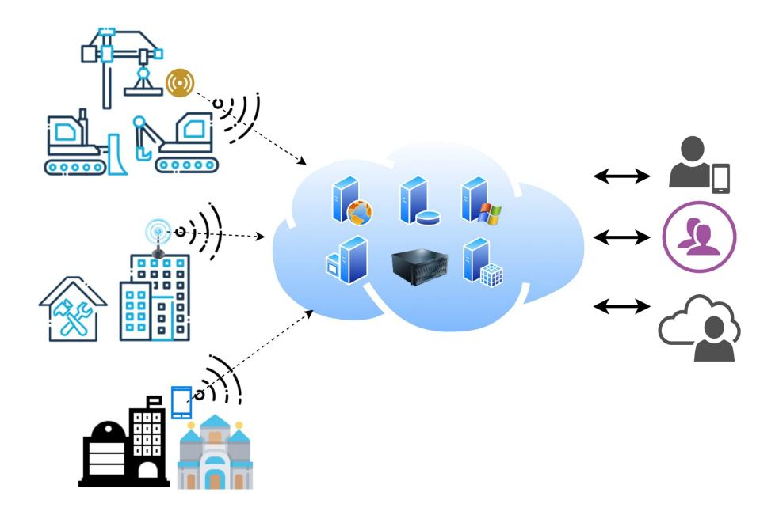
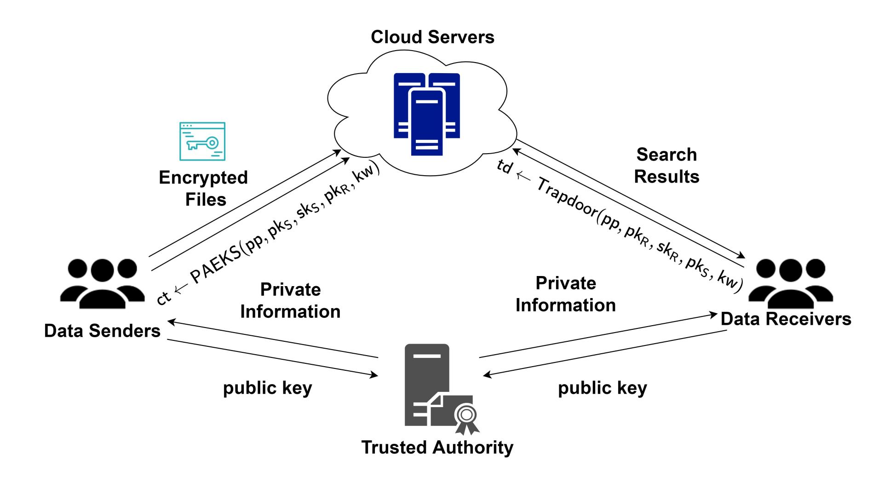
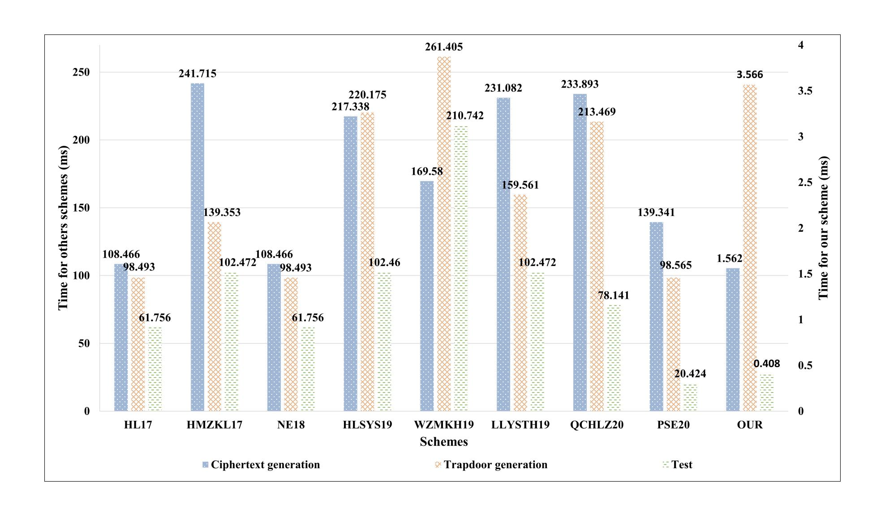

{0}------------------------------------------------

# Public-key Authenticated Encryption with Keyword Search: A Generic Construction and Its Quantum-resistant Instantiation

Zi-Yuan Liu1 , Yi-Fan Tseng1∗ , Raylin Tso1 , Masahiro Mambo2 , Yu-Chi Chen3

1Department of Computer Science, National Chengchi University, Taipei 11605, Taiwan {zyliu, yftseng, raylin}@cs.nccu.edu.tw 2 Institute of Science and Engineering, Kanazawa University, Kakuma-machi, Kanazawa 920-1192, Japan 3Department of Computer Science and Engineering, Yuan Ze University, Taoyuan 32003, Taiwan

July 29, 2021

#### Abstract

The industrial Internet of Things (IIoT) integrates sensors, instruments, equipment, and industrial applications, enabling traditional industries to automate and intelligently process data. To reduce the cost and demand of required service equipment, IIoT relies on cloud computing to further process and store data. Public-key encryption with keyword search (PEKS) plays an important role, due to its search functionality, to ensure the privacy and condentiality of the outsourced data and the maintenance of exibility in the use of the data. Recently, Huang and Li proposed the "public-key authenticated encryption with keyword search" (PAEKS) to avoid the insider keyword guessing attacks (IKGA) in the previous PEKS schemes. However, all current PAEKS schemes are based on the discrete logarithm assumption and are therefore vulnerable to quantum attacks. In this study, we rst introduce a generic PAEKS construction, with the assistance of a trusted authority, that enjoys the security against IKGA in the standard model, if all building blocks are secure under standard model. Based on the framework, we further propose a novel instantiation of quantum-resistant PAEKS that is based on NTRU assumption under random oracle. Compared with its state-of-the-art counterparts, the experiment result indicates that our instantiation is more ecient and secure.

Keywords— Public-key Authenticated Encryption with Keyword Search; Insider Keyword Guessing Attacks; Generic Construction; Quantum-resistant

## 1 Introduction

The Internet of Things (IoT) is a system that connects a large set of devices to a network, where these devices can communicate with each other over the network. Industrial IoT (IIoT) is a particular type of IoT that fully utilizes the advantages of IoT for remote detection, monitoring, and management in the industry. Because the volume of data and computation in the industry is very large, and long-term storage is required, IIoT is highly reliant on cloud computing technology to reduce the cost of storage and computing environments (Figure [1\)](#page-1-0). Despite the numerous benets of processing IIoT data through cloud computing, industrial data typically have commercial value and thus necessitate privacy protection when such sensitive data are ooaded to the cloud. Therefore, to ensure data condentiality, sensitive data should be encrypted before being uploaded to the cloud.

In addition to data condentiality, data sharing is indispensable in IIoT. For instance, in an industrial organization, the administrator in the information department (i.e., the data sender) must share the data collected from IoT devices with an administrator from another department (i.e., the data receiver). To ensure data con dentiality, the data sender encrypts the data by using the public key of the data receivers. However, in such a method, if the data receiver wants to retrieve the data from the ciphertext stored in the cloud, the data receiver must download all the ciphertext and further decrypt it, which consumes considerable time and resources.

∗Corresponding author

{1}------------------------------------------------

Figure 1: Typical network architecture for IIoT.

Public-key encryption with keyword search (PEKS), first introduced by Boneh et al. [BCOP04], is highly suited to the aforementioned application environment because PEKS makes the ciphertext searchable. Furthermore, in PEKS, a data sender not only uploads encrypted data but also and uploads the encrypted keywords related to the data using the data receiver's public key. To download the data related to a specified keyword, the data receiver can use his/her private key to generate a corresponding trapdoor and submit the trapdoor to the cloud server. The cloud server can then identify encrypted keywords corresponding to the trapdoor and then returns the corresponding encrypted data to the data receiver. A secure PEKS scheme is required to ensure that the ciphertext and trapdoor will not leak any keyword information to malicious outsiders. However, Byun et al. [BRPL06] noted that having only the two aforementioned security requirements is insufficient because the cloud server may be malicious, where the malicious cloud server guesses the keyword hiding in the trapdoor a type of attack called insider keyword guessing attacks (IKGA). More concretely, because the cloud server can adaptively generate a ciphertext for any keyword by using the data receiver's public key, through trial and error, test for that self-made ciphertext that is matched with the trapdoor received from the data receiver. As mentioned in [BRPL06], because the keyword space is not large enough, the keyword-related information searched by the data receiver is very likely to be leaked to the malicious cloud server. Hence, if the malicious cloud server has the ability to perform encryption and test, such as [LLW21, ZCH21, ZLW+21, EIO20], then such PEKS schemes cannot resist IKGA.

To prevent IKGA, recently, Huang and Li [HL17] introduced a new cryptography primitive called public-key authenticated encryption with keyword search (PAEKS). In this primitive, the data sender not only generates but also authenticates ciphertext, whereas a trapdoor generated from the data receiver is only valid to the ciphertext authenticated by the specific data sender. Therefore, the cloud server cannot perform IKGA. In addition, for the same reason, the cloud server also cannot obtain any keyword information from the receiver's search pattern [LZWT14] because he/she cannot generate ciphertext to test his/her guess. Furthermore, many PAEKS schemes [HMZ+18, LLY+19, NE19, PSE20, QCH+20, LHS+19, WZM+19, LTT+21] have been formulated for further application in IoT and IIoT as well as in cloud computing environments.

Shor [Sho99, Sho94] reported on quantum algorithms that can violate the traditional number-theoretic assumptions, such as the integer factoring assumption and discrete logarithm assumption. In particular, the advent of the 53-qubit quantum computer, proposed by Arute *et al.* [AAB+19], may improve quantum computing technology and affect the existing cryptographic systems. Because the security of existing PAEKS schemes [HMZ+18, LLY+19, NE19, PSE20, LHS+19, QCH+20, WZM+19] is based on the discrete logarithm assumption, quantum computers can come to pose a potential threat to existing schemes. Hence, the means of constructing a quantum-resistant PEAKS scheme is an emerging issue among scholars and practitioners.

## 1.1 Our Contribution

In this paper, we introduce a novel solution for constructing a quantum-resistant PAEKS scheme for IIoT. At a high level, the original keyword space is commonly found and easy to test. Our strategy is to allow a data sender and data receiver to generate an "extended keyword" from an original keyword without interacting with each other. Then, the ciphertext and trapdoor are generated using the extended keyword instead of the original keyword. Since the extended keyword is high-entropy, the malicious cloud server cannot generate a valid ciphertext to match the trapdoor to perform IKGA.

Accordingly, we provide a generic PAEKS construction by leveraging an identity-independent 2-tier

{2}------------------------------------------------

identity-based key encapsulation mechanism (IBKEM), a pseudorandom generator (PRG), and an anonymous identity-based encryption (IBE). Our generic construction is modeled by a variant PAEKS system model. That is, in addition to the same model as the original PAEKS system model, this model requires a trusted authority to help the data sender and data receiver to obtain their full private keys.

We also present two rigorous proofs to show that our construction satisfies the security requirements of PAEKS. These requirements are indistinguishability against chosen keyword attacks (IND-CKA) and indistinguishability against IKGA (IND-IKGA) under a multi-user setting in the standard model. Because our construction is IND-IKGA secure, there is no adversary who can infer any information about the queried keyword from the given trapdoor. Therefore, there is no search pattern privacy concern [LZWT14] in our construction.

Furthermore, we first employ Ducas *et al.*'s anonymous IBE [DLP14] to obtain an identity-independent 2-tier IBKEM under the NTRU assumption. We then combine the scheme with [DLP14] to obtain an instantiation of PAEKS. Because the security of [DLP14] is inherited, we obtain the first quantum-resistant instantiation of PAEKS.

The comparison results of our scheme with other state-of-the-art PAEKS schemes are presented in Table 2 and FIGURE 3; our instantiation was demonstrated to be not only more secure but also more efficient with respect to ciphertext generation, trapdoor generation, and testing.

#### 1.2 Related Work

The PEKS schemes that are secure against IKGA can be separated into three categories: dual-server PEKS, PAEKS, and witness-based searchable encryption.

The concept of dual-server PEKS was first introduced by Chen *et al.* [CMY+15, CMY+16b, CMY+16a], which is secure against IKGA if the cloud server and key server do not collude with each other. However, Huang [HT17] indicates that [CMY+15, CMY+16b] are susceptible to IKGA. Recently, Chen *et al.* [CWZH19] introduced an efficient dual-server scheme that is resistant to IKGA without needing any pairing computations. In addition, Mao *et al.* [MFGW19] suggested a quantum-resistant dual-server PEKS scheme, which is also the first lattice-based PEKS that is protected from IKGA. Although dual-server PEKS is a successful solution to IKGA, the two servers in the system are related to the function of processing keywords, so they are not independent. Therefore, in many cases, it is difficult to guarantee that two servers will not collude.

Considering the above limitations, scholars thus began to study methods for constructing trapdoors that are only valid for certain ciphertexts. Fang *et al.* [FSGW09, FSGW13] first considered using a one-time signature to authenticate the ciphertext while having the trapdoor be valid only for the authenticated ciphertext, a method that improved resistance to IKGA. Huang and Li [HL17] formally defined the system model and security model for PAEKS. Noroozi and Eslami [NE19] first considered Huang and Li's scheme [HL17] is not secure against IKGA and further improved [HL17] without incurring additional cost complexity. To resist quantum attacks, Zhang *et al.* [ZXW+21, ZTW+19] proposed two lattice-based PAEKS schemes; however, Liu *et al.* [LTT20, LTTL21] recently demonstrated that the security models of these works are flawed and therefore cannot withstand IKGA. Pakniat *et al.* [PSE20] introduced the first certificateless PAEKS scheme for an IoT environment. Moreover, Qin *et al.* [QCH+20] and Li *et al.* [LHS+19] further prevented malicious adversary eavesdrops on the transmission channel of ciphertext and trapdoor, and executes the test algorithm to determine whether the two ciphertexts shared the same keyword. Although the aforementioned PAEKS schemes resist IKGA, these schemes are based on the discrete logarithm assumption, which makes them vulnerable to attacks from quantum computers.

Ma et al. [MMSY18] introduced a cryptographic primitive called "witness-based searchable encryption," in which the trapdoor is valid only when the ciphertext has a witness relation to the trapdoor. Chen et al. [CXWT19] formulated an improvement to reduce the complexity of the trapdoor size. Inspired by [MMSY18], Liu et al. [LTTM21] introduced a new concept called "designated-ciphertext searchable encryption," where the trapdoor is designated to a ciphertext; this concept affords users with a quantum-resistant instantiation. Despite their advantages, however, these schemes require the data sender to interact with the data receiver; moreover, they incur additional communication costs and are inapplicable to many scenarios.

## 1.3 Organization of the Paper

The rest of the paper is organized as follows. Section 2 introduces the preliminaries, and Section 3 recalls the definition of the building blocks used in our generic construction. Moreover, Section 4 provides the definition and security requirement of the PAEKS. Next, Sections 5 and 6 introduce our generic constriction and the security proofs, respectively. Section 7 elaborates on the first quantum-resistant PAEKS instantiation, and

{3}------------------------------------------------

Table 1: Notations

| Notation                           | Description                                 |  |
|------------------------------------|---------------------------------------------|--|
| λ                                  | Security parameter                          |  |
| П                                  | PAEKS                                       |  |
| Ψ                                  | IBE                                         |  |
| Ω                                  | Identity-independent 2-tier IBKEM           |  |
| F                                  | Pseudorandom generator                      |  |
| IDS                                | Identity space                              |  |
| CS                                 | Ciphertext space                            |  |
| KS                                 | Shared key space                            |  |
| PS                                 | Plaintext space                             |  |
| W                                  | Keyword space                               |  |
| $\mathbb{N},\mathbb{Z},\mathbb{R}$ | Natural number, integer number, real number |  |
| $\mathbb{G}_1,\mathbb{G}_T$        | Cyclic group                                |  |
| v, V                               | Vector, matrix                              |  |
| a  b                               | Concatenation of element $a$ and $b$        |  |
|                                    | Sampling an element s from S                |  |
| $s \leftarrow S$                   | uniformly at random                         |  |
| $\widetilde{\mathtt{T}}$           | Gram-Schmidt orthogonalization of T         |  |
| -  v                            | The bit length of element $v$               |  |
| $\ \mathbf{v}\ , \ \mathbf{V}\ $   | The Euclidean norm of <b>v</b> and <b>V</b> |  |
| $negl(\cdot), poly(\cdot)$         | Negligible function, polynomial function    |  |
| PPT                                | Probabilistic polynomial-time               |  |

Section 8 details the analysis of the communication cost and computation cost incurred in the related PAEKS schemes. Finally, Section 9 concludes this study.

## 2 Preliminary

For simplicity and readability, we use the notations defined in Table 1 throughout the paper.

### 2.1 Lattices

We now introduce the basic concepts underlying lattices that are used in our instantiation. An m-dimension lattice  $\Lambda$  is an additive discrete subgroup of  $\mathbb{R}^m$ , which can be defined as follows.

**Definition 1** (Lattices). We say that a m-dimension lattice  $\Lambda$  generated by a basis  $\mathbf{B} = [\mathbf{b}_1| \cdots |\mathbf{b}_n] \in \mathbb{R}^{m \times n}$  is defined by

$$\Lambda(\mathbf{B}) = \Lambda(\mathbf{b}_1, \dots, \mathbf{b}_n) = \left\{ \sum_{i=1}^n \mathbf{b}_i a_i \mid a_i \in \mathbb{Z} \right\},\,$$

where  $\mathbf{b}_1, \dots, \mathbf{b}_n \in \mathbb{R}^m$  are n linear independent vectors.

In addition, for a prime q, a matrix  $\mathbf{A} \in \mathbb{Z}_q^{n \times m}$ , and a vector  $\mathbf{u} \in \mathbb{Z}_q^n$ , we can define the following three sets [GPV08, ABB10]:

- $\Lambda_q := \{ \mathbf{e} \in \mathbb{Z}^m \mid \exists \mathbf{s} \in \mathbb{Z}^n \text{ where } \mathbf{A}^\top \mathbf{s} = \mathbf{e} \bmod q \}.$
- $\Lambda_q^{\perp} := \{ \mathbf{e} \in \mathbb{Z}^m \mid \mathbf{A}\mathbf{e} = 0 \bmod q \}.$
- $\Lambda_q^{\mathbf{u}} := \{ \mathbf{e} \in \mathbb{Z}^m \mid \mathbf{A}\mathbf{e} = \mathbf{u} \bmod q \}.$

## 2.2 Discrete Gaussian Distributions

For any vector  $\mathbf{c} \in \mathbb{R}^n$  and any positive real number s, we define the following two notations:

• 
$$\rho_{s,c}(\mathbf{x}) = \exp\left(-\pi \frac{\|\mathbf{x} - \mathbf{c}\|^2}{s^2}\right)$$
.

{4}------------------------------------------------

• 
$$\rho_{s,c}(\Lambda) = \sum_{\mathbf{x} \in \Lambda} \rho_{s,c}(\mathbf{x}).$$

The discrete Gaussian distribution over the lattice  $\Lambda$  with center  $\mathbf{c}$  and parameter s can then be defined as  $D_{\Lambda,s,\mathbf{c}}(\mathbf{x}) = \rho_{s,\mathbf{c}}(\mathbf{x})/\rho_{s,\mathbf{c}}(\Lambda)$  for any  $\mathbf{x} \in \Lambda$ . Note that we usually omit  $\mathbf{c}$  if  $\mathbf{c}$  is 0.

## 2.3 Rings and NTRU Lattices

Here, we briefly introduce rings and NTRU lattices, as formulated in previous studies [LPR10, LPR13]. Let N be a power of 2. The ring can then be defined as  $\mathcal{R} = \mathbb{Z}[x]/\Phi(x)$ , where  $\Phi(x) = x^N + 1$ . Furthermore, for some

integer 
$$q$$
, we use  $\mathcal{R}_q$  to denote  $\mathcal{R}/q\mathcal{R} = \mathbb{Z}[x]/(q,\Phi(x))$ . For two polynomials  $f = \sum_{i=0}^{N-1} f_i x^i$  and  $g = \sum_{i=0}^{N-1} g_i x^i$ ,

fg denotes polynomial multiplication in  $\mathbb{Q}[x]$  and f \* g is defined as the convolution product of f and g, *i.e.*,  $f * g \coloneqq fg \mod (x^N + 1)$ . Additionally,  $\lfloor f \rfloor$  denotes the coefficient-wise rounding of f.

The first NTRU-based public-key encryption is introduced in 1996 by Hoffstein *et al.* [HPS98], and later Stehlé and Steinfeld [SS11] presents a new variant that has been proven to be secure in the worst-case lattice problem. Compared with integer lattices, the operations of NTRU are based on the ring of polynomials  $\mathcal{R}$ , and can be defined as follows.

**Definition 2** (Anticirculant Matrix [DLP14]). An N-dimensional anticirculant matrix of f is the following Toeplitz matrix:

$$\mathcal{A}_{N}(f) = \begin{pmatrix} f_{0} & f_{1} & \ddots & f_{N-1} \\ -f_{N-1} & f_{0} & \ddots & f_{N-2} \\ \vdots & \ddots & \ddots & \ddots \\ -f_{1} & -f_{2} & \ddots & f_{0} \end{pmatrix} = \begin{pmatrix} (f) \\ (x * f) \\ \vdots \\ (x^{N-1} * f) \end{pmatrix}.$$

**Definition 3** (NTRU Lattices [BOY20]). For prime integer q and  $f, g \in \mathcal{R}, h = g * f^{-1} \mod q$ , the NTRU lattices with h and q is defined as

$$\Lambda_{h,q} = \{(u,v) \in \mathcal{R}^2 \mid u+v*h = 0 \bmod q.$$

Here,  $\Lambda_{h,q}$  is a full-rank lattice generated by the rows of  $\mathbf{A}_{h,q} = \begin{pmatrix} -\mathcal{A}_N(h) & \mathbf{I}_N \\ q\mathbf{I}_N & \mathbf{O}_N \end{pmatrix}$ , where  $\mathbf{I}_N$  is an N by N identity matrix and  $\mathbf{O}_N$  is an N by N zero matrix.

As mentioned by Hoffstein et al. [HHP+03], although one can generate the lattice from basis  $\mathbf{A}_{h,q}$  by using a single polynomial  $h \in \mathcal{R}_q$ ,  $\mathbf{A}_{h,q}$  has a large orthogonal defect and therefore inefficiency in standard lattice operation. Therefore, to solve the issue, They further showed that another short basis  $\mathbf{B}_{f,g} = \begin{pmatrix} \mathcal{A}_N(g) & -\mathcal{A}_N(f) \\ \mathcal{A}_N(G) & -\mathcal{A}(F) \end{pmatrix}$  generates the same lattice  $\Lambda_{h,q}$  as  $\mathbf{A}_{h,q}$ , where  $f,g,F,G\in\mathcal{R}$  and f\*G-g\*F=q.

**Definition 4** (Statistical Distance [ABB10]). Given two random variables X and Y taking values in a finite set S, the statistical distance is defined as:

$$\Delta(X, Y) = \frac{1}{2} \sum_{s \in S} |\Pr[X = s] - \Pr[Y = s]|.$$

Due to the efficient of NTRU, Ducas *et al.* [DLP14] introduced a NTRU-based IBE scheme. In their scheme, they provided an algorithm that can efficiently obtain the pair of basis  $(h, \mathbf{B}_{f,g})$ , as shown in Algorithm 1. Additionally, since  $\mathbf{B}_{f,g}$  is a short basis, based on the results of [DLP14, GPV08], there exists an algorithm Gaussian\_Sampler( $\mathbf{B}_{f,g}, \sigma, \mathbf{c}$ ) (Algorithm 2) that can sample a vector  $\mathbf{v}$  without leaking any information of the basis  $\mathbf{B}_{f,g}$  such that  $\Delta(D_{\Lambda(\mathbf{B}_{f,g}),\sigma,\mathbf{c}}, \text{Gaussian}_{Sampler}(\mathbf{B}_{f,g}, \sigma, \mathbf{c})) \leq 2^{-\lambda}$ , where  $\sigma > 0$  and  $\mathbf{c} \in \mathbb{Z}^N$ .

## 3 Building Blocks

In this section, we recall three crucial cryptographic primitives, namely identity-independent 2-tier IBKEM, IBE, and PRG, which are used as the building blocks in our generic construction.

{5}------------------------------------------------

## Algorithm 1 Basis\_Generation [DLP14]

## Input: N, q

Output:  $h \in \mathcal{R}_q$ ,  $B_{f,g} \in \mathbb{Z}_q^{2N \times 2N}$ .

Initialization : 
$$\sigma_f = 1.17 \sqrt{\frac{q}{2N}}$$
.

- 1:  $f, g \leftarrow D_{N, \sigma_f}$ .
- 2: Norm  $\leftarrow \max\left(\|g, -f\|, \left\|\frac{g\bar{f}}{f * \bar{f} + g * \bar{g}}, \frac{g\bar{g}}{f * \bar{f} + g * \bar{g}}\right\|\right)$ .
- 3: **if** (Norm >  $1.17\sqrt{q}$ ) **then**
- 4: Go to Step 1.
- 5: **end if**
- 6: Using extended Euclidean algorithm, compute  $\rho_f, \rho_g \in \mathcal{R}$  and  $R_f, R_g \in \mathbb{Z}$  such that  $-\rho_f \cdot f = R_f$  and  $-\rho_g \cdot g = R_g$ .
- 7: **if**  $(GCD(R_f, R_g) \neq 1 \text{ or } GCD(R_f, q) \neq 1)$  **then**
- 8: Go to Step 1.
- 9: end if
- 10: Using extended Euclidean algorithm, compute  $u, v \in \mathbb{Z}$  such that  $u \cdot R_f + v \cdot R_g = 1$ , and  $F \leftarrow qv\rho_g, G \leftarrow -qu\rho_f$ .
- 11: Compute  $k = \left\lfloor \frac{F * \bar{f} + G * \bar{g}}{f * \bar{f} + g * \bar{g}} \right\rfloor \in \mathcal{R}$ , and compute  $F \leftarrow F k * f$  and  $G \leftarrow G k * g$ .
- 12: Compute  $h = g * f^{-1} \mod q$  and  $\mathbf{B}_{f,g} = \begin{pmatrix} \mathcal{A}_N(g) & -\mathcal{A}_N(f) \\ \mathcal{A}_N(G) & -\mathcal{A}(F) \end{pmatrix}$ .
- 13: **return** h and  $\mathbf{B}_{f,g}$ .

### Algorithm 2 Gaussian\_Sampler [DLP14]

Input:  $B_{f,g}, \sigma, c$ 

Output:  $\mathbf{v} \in \mathbb{Z}_q^{2N}$ .

- 1:  $\mathbf{v}_{2N} \leftarrow \mathbf{0}$ .
- 2:  $\mathbf{c}_{2N} \leftarrow \mathbf{c}$ .
- 3: **for**  $i \leftarrow 2N, \cdots, 1$  **do**
- 4:  $c'_i \leftarrow \langle \mathbf{c}_i, \tilde{\mathbf{b}}_i \rangle / \|\tilde{\mathbf{b}}_i\|^2$ .
- 5:  $\sigma_i' \leftarrow \sigma / \|\tilde{\mathbf{b}}_i\|^2$ .
- 6:  $z_i \leftarrow \text{SampleZ}(\sigma_i', c_i')$ .
- 7:  $\mathbf{c}_{i-1} \leftarrow \mathbf{c}_i z_i \mathbf{b}_i, \mathbf{v}_{i-1} \leftarrow \mathbf{v}_i + z_i \mathbf{b}_i.$
- 8: end for
- 9: return  $\mathbf{v}_0$ .

{6}------------------------------------------------

## 3.1 Identity-independent 2-tier IBKEM

An identity-independent 2-tier IBKEM  $\Omega$  comprises the five algorithms: (Setup, Extract, Enc1, Enc2, Dec) along with an identity space *IDS*, ciphertext space *CS*, and symmetric key space *KS*. These algorithms are described as follows.

- Setup( $1^{\lambda}$ )  $\rightarrow$  (msk, mpk): This is the *setup* algorithm that takes the security parameter  $\lambda$  as its input and outputs a master private key msk and a master public key mpk.
- Extract(msk, id)  $\rightarrow$  skid: This is the *extraction* algorithm that takes the two inputs of a master private key msk and identity id  $\in$  *IDS* and outputs a private key skid for the identity.
- $Enc_1(mpk) \rightarrow (ct, r)$ : This is the *first encapsulation* algorithm that takes the input of a master public key mpk and outputs a ciphertext  $ct \in CS$  and a randomness r.
- Enc2(mpk, id, r)  $\rightarrow$  k/ $\bot$ : This is the *second encapsulation* algorithm that takes the three inputs of a master public key mpk, identity id, and randomness r and outputs either a symmetric key k  $\in$  KS or the reject symbol  $\bot$ .
- Dec(skid, id, ct)  $\rightarrow$  k/ $\bot$ : This is the *decryption* algorithm that takes the three inputs of a private key skid, identity id, and ciphertext ct and outputs either symmetric key k  $\in$  KS or a reject symbol  $\bot$ .

**Definition 5** (Correctness). An identity-independent 2-tier IBKEM  $\Omega$  is correct if for all security parameters  $\lambda$ , all master key pairs (msk, mpk) output by Setup( $1^{\lambda}$ ), all private keys skid for identity id output by Extract(msk, id), all (ct, r) pairs output by Enc1(mpk), and all k values output by Enc2(mpk, id, r), the following equation holds:

$$Pr[Dec(sk_{id}, id, ct) = k] = 1 - negl(\lambda).$$

The basis security requirement of identity-independent 2-tier IBKEM is to meet the indistinguishability under adaptively-identity chosen-plaintext attacks (IND-ID-CPA), which ensures that no PPT adversary can distinguish whether the challenge ciphertext is generated from the  $Enc_1$  and  $Enc_2$  algorithm or is randomly chosen from the ciphertext space CS. This security requirement can be modeled by the following security game played between an adversary  $\mathcal{A}$  and a challenger  $\mathcal{B}$ .

#### **Game - IND-ID-CPA:**

- **Initialization.** The challenger  $\mathcal{B}$  first runs (msk, mpk)  $\leftarrow$  Setup(1 $^{\lambda}$ ).  $\mathcal{B}$  then sends the master public key mpk to  $\mathcal{A}$  and keeps the master private key msk secret.
- **Phase 1.** The adversary  $\mathcal{A}$  is given access to query the extract oracle with any identity id, and  $\mathcal{B}$  returns a valid private key skid for identity id by using Extract algorithm.
- Challenge.  $\mathcal{A}$  submits  $\mathcal{B}$  an identity id\* that has not been queried to extract oracle in **Phase 1**.  $\mathcal{B}$  randomly selects a bit  $b \in \{0, 1\}$ . If b = 0,  $\mathcal{B}$  generate a true ciphertext by using  $\operatorname{Enc}_1$  and  $\operatorname{Enc}_2$ . Otherwise,  $\mathcal{B}$  randomly selects a ciphertext from the ciphertext space.  $\mathcal{B}$  then returns the ciphertext as a challenge to  $\mathcal{A}$ .
- **Phase 2.**  $\mathcal{A}$  can continue querying the extract oracle as **Phase 1**. The only restriction is that  $\mathcal{A}$  cannot query the extract oracle with the identity  $id^*$ .
- Guess.  $\mathcal{A}$  outputs a bit  $b' \in \{0, 1\}$ .

The advantage of  $\mathcal{A}$  is defined as

$$\mathbf{Adv}_{\Omega,\mathcal{A}}^{\mathsf{IND-CPA}}(\lambda) \coloneqq |\Pr[b=b'] - \frac{1}{2}|.$$

**Definition 6** (IND-ID-CPA Security of IBKEM). An identity-independent 2-tier IBKEM scheme  $\Omega$  is IND-ID-CPA secure if for all PPT adversaries  $\mathcal{A}$ ,  $\mathbf{Adv}_{\Omega,\mathcal{A}}^{\mathsf{IND-CPA}}(\lambda)$  is negligible.

{7}------------------------------------------------

#### 3.2 **IBE**

An IBE scheme  $\Psi$  comprises four algorithms (Setup, Extract, Enc, Dec) along with an identity space IDS, ciphertext space CS, and plaintext space PS, described as follows.

- Setup( $1^{\lambda}$ )  $\rightarrow$  (msk, mpk): This is the *setup* algorithm that takes the security parameter  $\lambda$  as its input and outputs a master private key msk and master public key mpk.
- Extract(msk, id)  $\rightarrow$  skid: This is the *extraction* algorithm that takes the two inputs of a master private key msk and identity id  $\in$  *IDS* and outputs a private key skid for the identity.
- Enc(mpk, id, m)  $\rightarrow$  ctid: This is the *encryption* algorithm that takes the three inputs of a master public key mpk, identity id, and plaintext m  $\in$  *PS* and outputs a ciphertext ctid  $\in$  *CS*.
- Dec( $sk_{id}$ ,  $ct_{id}$ )  $\rightarrow$  m: This is the *decryption* algorithm that takes the two inputs of a private key  $sk_{id}$  (for identity id) and ciphertext  $ct_{id}$  and outputs a plaintext  $m \in PS$ .

**Definition** 7 (Correctness of IBE). An IBE  $\Psi$  is correct if, for all security parameters  $\lambda$ , all master key pairs (msk, mpk) output by Setup(1 $^{\lambda}$ ), all private keys skid for identity id output by Extract(msk, id), and all ciphertexts (ctid) output by Enc(mpk, id, m), the following equation holds:

$$Pr[Dec(sk_{id}, ct_{id}) = m] = 1 - negl(\lambda).$$

The basic requirement of IBE is to meet IND-ID-CPA which is similar to the IND-ID-CPA game of identity-independent 2-tier IBKEM in Section 3.1. The difference is as follows: In **Challenge** phase,  $\mathcal{A}$  sends (id\*, m\*\_0, m\*\_1) to  $\mathcal{B}$  instead of only a challenge identity id\*, where m\*\_0, m\*\_1 are two messages with the same length. Then, according to the bit b,  $\mathcal{B}$  returns ct\*  $\leftarrow$  Enc(mpk, id\*, m\*\_b).

Our instantiation requires a stronger security requirement called indistinguishability and anonymity against chosen plaintext and chosen identity attacks (IND-ANON-ID-CPA), which ensures that no PPT adversary can retrieve any information pertaining to the identity and the message from a challenge ciphertext, as modeled by the following game.

#### Game - IND-ANON-ID-CPA:

- Initialization. The challenger  $\mathcal{B}$  first runs (msk, mpk)  $\leftarrow$  Setup(1 $^{\lambda}$ ) and then sends the master public key mpk to  $\mathcal{A}$  and keeps master private key msk secret.
- **Phase 1.** The adversary  $\mathcal{A}$  is given access to query the extract oracle with any identity id, and  $\mathcal{B}$  returns a valid private key skid for identity id by using the Extract algorithm.
- **Challenge.**  $\mathcal{A}$  submits  $\mathcal{B}$  two messages  $\mathsf{m}_0^*, \mathsf{m}_1^*$  and two identities  $\mathsf{id}_0^*, \mathsf{id}_1^*$  that have not been queried to extract the oracle.  $\mathcal{B}$  randomly chooses a bit  $b \in \{0,1\}$  and then computes  $\mathsf{ct}^* \leftarrow \mathsf{Enc}(\mathsf{mpk}, \mathsf{id}_b^*, \mathsf{m}_b^*)$ . Finally,  $\mathcal{B}$  returns the challenge ciphertext  $\mathsf{ct}^*$  to  $\mathcal{A}$ .
- **Phase 2.**  $\mathcal{A}$  can continue querying the oracle as **Phase 1**. The only restriction is that  $\mathcal{A}$  cannot query the extract oracle with  $id_0^*$  and  $id_1^*$ .
- Guess.  $\mathcal{A}$  outputs a bit  $b' \in \{0, 1\}$ .

The advantage of  $\mathcal{A}$  is defined as

$$\mathbf{Adv}_{\Psi,\mathcal{A}}^{\mathsf{IND-ANON-ID-CPA}}(\lambda) \coloneqq |\Pr[b=b'] - \frac{1}{2}|.$$

**Definition 8** (IND-ANON-ID-CPA Security of IBE). An IBE scheme Ψ is IND-ANON-ID-CPA secure if  $\mathbf{Adv}_{\Psi,\mathcal{A}}^{\mathsf{IND-ANON-ID-CPA}}(\lambda)$  is negligible for all PPT adversaries  $\mathcal{A}$ .

For analytical convenience, in this work, we consider an IBE to be anonymous if the IBE is IND-ANON-ID-CPA secure.

{8}------------------------------------------------

Figure 2: System model for the proposed PAEKS scheme.

### 3.3 Pseudorandom Generator (PRG)

Informally, suppose that a distribution  $\mathcal{D}$  is pseudorandom if no PPT distinguisher that can distinguish a string s is either selected from the distribution  $\mathcal{D}$  or randomly selected from a uniform distribution. We provide the following definition of the pseudorandom generator in [KL20].

**Definition 9** (Pseudorandom Generator). Let  $F : \{0,1\}^n \to \{0,1\}^m$  be a deterministic PPT algorithm, where m = poly(n) and m > n. We say that F is a pseudorandom generator if the following two conditions are satisfied:

- Expansion: For every n, it holds that m > n.
- Pseudorandomness: For all PPT distinguishers  $\mathcal{D}$ ,

$$|\Pr[\mathcal{D}(r) = 1] - \Pr[\mathcal{D}(\mathsf{F}(s)) = 1]| \le \mathsf{negl}(n),$$

where  $r \leftarrow \{0,1\}^m$  and seed  $s \leftarrow \{0,1\}^n$ .

## 4 PAEKS

In this section, we introduce the system model and the security requirements of PAEKS.

### 4.1 System Model

The system model introduced here is a "variant" system model of PAEKS. Compared with the system model in previous PAEKS schemes [HL17, QCH+20], this system model also requires a certificate authority for issuing certificates for public keys but requires an additional trusted authority. In more detail, in addition to the certificate authority, there have four entities: a trusted authority, data sender, data receiver, and cloud server (FIGURE 2). The data sender and data receiver need to interact with the trusted authority to obtain their full private keys.

A PAEKS scheme  $\Pi$  comprises six algorithms: (Setup, KeyGenS, KeyGenR, PAEKS, Trapdoor, Test) together with a keyword space W, which are detailed as follows.

• Setup( $1^{\lambda}$ )  $\rightarrow$  (pp, msk): This is the *setup* algorithm that takes the security parameter  $\lambda$  as input, and outputs a system parameter pp and a master private key msk. Note that the master private key is hold by trusted authority.

{9}------------------------------------------------

- KeyGenS(pp, msk)  $\rightarrow$  (pkS, skS): This is the *data sender key generation* algorithm interacted between data sender and trusted authority. It takes a system parameter pp and master private key msk, and outputs data sender's public key pkS and private key skS.
- KeyGenR(pp, msk)  $\rightarrow$  (pkR, skR): This is the *data receiver key generation* algorithm interacted between data receiver and trusted authority. It takes a system parameter pp and master private key msk, and outputs data receiver's public key pkR and private key skR.
- PAEKS(pp, pkS, skS, pkR, kw)  $\rightarrow$  ct: This is the *authenticated encryption* algorithm that takes a system parameter pp, data sender's public key pkS and private key skS, data receiver's public key pkR, and a keyword kw  $\in$  W, and outputs a searchable ciphertext ct.
- Trapdoor(pp, pkR, skR, pkS, kw)  $\rightarrow$  td: This is the *trapdoor* algorithm that takes a system parameter pp, data receiver's public key pkR and private key skR, data sender's public key pkS, and a keyword kw  $\in$  W, and outputs a trapdoor td.
- Test(pp, ct, td)  $\rightarrow$  1/0: This is the *test* algorithm that takes a system parameter pp, searchable ciphertext ct, and a trapdoor td, and outputs 1 if ct and td correspond to the same keyword; outputs 0, otherwise.

**Definition 10** (Correctness of PAEKS). A PAEKS scheme  $\Pi$  is correct if, for all security parameters  $\lambda$ , all system parameter/master private key pairs (pp, msk) output by  $Setup(1^{\lambda})$ , all data sender's key pairs (pkS, skS) output by  $Setup(1^{\lambda})$ , all data sender's key pairs (pkS, skS) output by  $Setup(1^{\lambda})$ , all data receiver's key pairs (pkR, skR) output by  $Setup(1^{\lambda})$ , all searchable ciphertexts ct output by  $Setup(1^{\lambda})$ , and all trapdoors td output by  $Setup(1^{\lambda})$ , all searchable ciphertexts ct output by  $Setup(1^{\lambda})$ , and all trapdoors td output by  $Setup(1^{\lambda})$ , skR, pkS, kw), the following equation holds with overwhelming probability:

$$Test(pp, ct, td) = \begin{cases} 1, & if ct, td contains the same kw; \\ 0, & otherwise. \end{cases}$$

### 4.2 Security Requirements

The security requirements of our variant PAEKS follow the security requirements in the original PAEKS scheme: IND-CKA and IND-IKGA. Specifically, IND-CKA and IND-IKGA securities ensure that no PPT adversary can obtain any information regarding the keyword from the searchable ciphertext and trapdoor, respectively. We follow the method of [NE19] to model the aforementioned two security requirements in the multi-user context by using two security games featuring interaction between an adversary  $\mathcal A$  and a challenger  $\mathcal B$ . Because the malicious insider has more power than the malicious outsider has, we only consider the IND-IKGA in this work. Here we note that to capture multi-user context, we use  $pk_U$  and  $sk_U$  to denote some user U's public key and private key, respectively. In addition, oracle  $O_{PAEKS}(kw, pk_U)$  means that  $\mathcal A$  wants to obtain a ciphertext that is authenticated by the data sender S and can be tested by the user U's trapdoors; oracle  $O_{Trapdoor}(kw, pk_U)$  means that  $\mathcal A$  wants to obtain a trapdoor generated by the data receiver R where this trapdoor can test a ciphertext authenticated by the user U and encrypted for the data receiver R.

#### Game - IND-CKA:

- **Initialization.** The challenger  $\mathcal{B}$  first runs  $(pp, msk) \leftarrow Setup(1^{\lambda})$ . The algorithm then runs  $(pk_S, sk_S) \leftarrow KeyGen_S(pp, msk)$  and  $(pk_R, sk_R) \leftarrow KeyGen_R(pp, msk)$ . Finally,  $\mathcal{B}$  sends the system parameter pp, data sender's public key  $pk_S$ , and data receiver's public key  $pk_R$  to  $\mathcal{A}$  while keeping secret the master private key msk, data sender's private key  $sk_S$ , and data sender's private key  $sk_R$ .
- **Phase 1.**  $\mathcal{A}$  can make polynomially many queries to oracles  $O_{\mathsf{PKGen}_{\mathsf{S}}}, O_{\mathsf{PKGen}_{\mathsf{R}}}, O_{\mathsf{PAEKS}}$ , and  $O_{\mathsf{Trapdoor}}, \mathcal{B}$  then responds as follows.
  - $O_{PKGen_S}(U)$ : For U ∉ {S, R},  $\mathcal{B}$  runs (pkU, skU) ← KeyGenS(pp, msk). Then,  $\mathcal{B}$  returns pkU to  $\mathcal{A}$ , and keeps skU secret.
  - $O_{PKGen_R}(U)$ : For U ∉ {S, R},  $\mathcal{B}$  runs (pkU, skU) ← KeyGenR(pp, msk). Then,  $\mathcal{B}$  returns pkU to  $\mathcal{A}$ , and keeps skU secret.
  - $O_{PAEKS}$ (kw, pkU):  $\mathcal{B}$  computes ct ← PAEKS(pp, pkS, skS, pkU, kw) and returns ct to  $\mathcal{A}$ .
  - $O_{\mathsf{Trapdoor}}(\mathsf{kw},\mathsf{pk}_\mathsf{U})$ : 𝔞 computes td ←  $\mathsf{Trapdoor}(\mathsf{pp},\mathsf{pk}_\mathsf{R},\mathsf{sk}_\mathsf{R},\mathsf{pk}_\mathsf{U},\mathsf{kw})$  and returns td to 𝔞.

{10}------------------------------------------------

- **Challenge.** After the end of **Phase 1**,  $\mathcal{A}$  outputs two keywords  $\mathsf{kw}_0^*, \mathsf{kw}_1^* \in W$  with the following restriction: for i = 0, 1,  $(\mathsf{kw}_i^*, \mathsf{pk}_S)$  have not been queried to oracle  $O_{\mathsf{Trapdoor}}$  in **Phase 1**.  $\mathcal{B}$  then chooses a random bit  $b \in \{0, 1\}$  and returns  $\mathsf{ct}^* = (\Psi.\mathsf{ct}^*, \mathsf{h}) \leftarrow \mathsf{PAEKS}(\mathsf{pp}, \mathsf{pk}_S, \mathsf{sk}_S, \mathsf{pk}_R, \mathsf{kw}_b^*)$  to  $\mathcal{A}$ .
- **Phase 2.**  $\mathcal{A}$  can continue to make queries, as was the case in **Phase 1**. The only restriction is that  $\mathcal{A}$  cannot make any query to  $O_{\mathsf{Trapdoor}}$  on  $(\mathsf{kw}_i^*, \mathsf{pk}_\mathsf{S})$  for i = 0, 1.
- Guess.  $\mathcal{A}$  outputs its guess  $b' \in \{0, 1\}$ . The advantage of  $\mathcal{A}$  is defined as

$$\mathbf{Adv}_{\Pi,\mathcal{A}}^{\mathsf{IND-CKA}}(\lambda) \coloneqq |\Pr[b=b'] - \frac{1}{2}|.$$

**Definition 11** (IND-CKA security of PAEKS). A PAEKS scheme  $\Pi$  is IND-CKA secure if for all PPT adversaries  $\mathcal{A}$ ,  $\mathbf{Adv}_{\Pi,\mathcal{A}}^{\mathsf{IND-CKA}}(\lambda)$  is negligible.

#### Game - IND-IKGA:

- **Initialization.** The challenger  $\mathcal{B}$  first runs  $(pp, msk) \leftarrow Setup(1^{\lambda})$  and then runs  $(pk_S, sk_S) \leftarrow KeyGen_S(pp, msk)$  and then runs  $(pk_R, sk_R) \leftarrow KeyGen_R(pp, msk)$ . Finally,  $\mathcal{B}$  sends the system parameter pp, data sender's public key  $pk_S$ , and data receiver's public key  $pk_R$  to  $\mathcal{A}$  while keeping secret the master private key msk, data sender's private key  $sk_S$ , and data sender's private key  $sk_R$ .
- **Phase 1.**  $\mathcal{A}$  can make polynomially many queries to oracles  $O_{\mathsf{PKGen}_{\mathsf{S}}}$ ,  $O_{\mathsf{PKGen}_{\mathsf{R}}}$ ,  $O_{\mathsf{PAEKS}}$ , and  $O_{\mathsf{Trapdoor}}$ ,  $\mathcal{B}$  then responds as follows.
  - $O_{PKGen_S}(U)$ : For U ∉ {S, R},  $\mathcal{B}$  runs (pkU, skU) ← KeyGenS(pp, msk). Then,  $\mathcal{B}$  returns pkU to  $\mathcal{A}$ , and keeps skU secret.
  - $O_{PKGen_R}(U)$ : For U ∉ {S, R},  $\mathcal{B}$  runs (pkU, skU) ← KeyGenR(pp, msk). Then,  $\mathcal{B}$  returns pkU to  $\mathcal{A}$ , and keeps skU secret.
  - $O_{PAEKS}$ (kw, pkU):  $\mathcal{B}$  computes ct ← PAEKS(pp, pkS, skS, pkU, kw) and returns ct to  $\mathcal{A}$ .
  - $O_{\mathsf{Trapdoor}}(\mathsf{kw},\mathsf{pk}_{\mathsf{U}})$ : 𝔞 computes td ←  $\mathsf{Trapdoor}(\mathsf{pp},\mathsf{pk}_{\mathsf{R}},\mathsf{sk}_{\mathsf{R}},\mathsf{pk}_{\mathsf{U}},\mathsf{kw})$  and returns td to 𝔞.
- **Challenge.** After the end of **Phase 1**,  $\mathcal{A}$  outputs two keywords  $\mathsf{kw}_0^*, \mathsf{kw}_1^* \in W$  with the following restriction: for i = 0, 1,  $(\mathsf{kw}_i^*, \mathsf{pk}_R)$  have not been queried to oracle  $O_{\mathsf{PAEKS}}$  in **Phase 1**.  $\mathcal{B}$  then selects a random bit  $b \in \{0, 1\}$  and returns  $\mathsf{td}^* \leftarrow \mathsf{Trapdoor}(\mathsf{pp}, \mathsf{pk}_R, \mathsf{sk}_R, \mathsf{pk}_S, \mathsf{kw}_h^*)$  to  $\mathcal{A}$ .
- **Phase 2.**  $\mathcal{A}$  can continue to make queries, as was the case in **Phase 1**. The only restriction is that  $\mathcal{A}$  cannot make any query to  $O_{PAEKS}$  on  $(kw_i^*, pk_R)$  for i = 0, 1.
- Guess.  $\mathcal{A}$  outputs its guess  $b' \in \{0, 1\}$ . The advantage of  $\mathcal{A}$  is defined as

$$\mathbf{Adv}_{\Pi,\mathcal{A}}^{\mathsf{IND}\mathsf{-}\mathsf{IKGA}}(\lambda) \coloneqq |\Pr[b=b'] - \frac{1}{2}|.$$

**Definition 12** (IND-IKGA security of PAEKS). A PAEKS scheme  $\Pi$  is IND-IKGA secure if for all PPT adversaries  $\mathcal{A}$ ,  $\mathbf{Adv}_{\Pi,\mathcal{A}}^{\mathsf{IND-IKGA}}(\lambda)$  is negligible.

## **5 Generic PAEKS Construction**

Abdalla *et al.* [ABC+08] proposed a generic construction that allows any anonymous IBE to be converted to a PEKS scheme. In their construction, they took each keyword as an identity and use "identity" to generate ciphertext; while taking the trapdoor as the identity's private key. If the cloud server can use the trapdoor to "decrypt" the ciphertext, that means that the trapdoor and the ciphertext are associated with the same keyword. Unfortunately, schemes constructed in this way cannot withstand IKGA because the malicious cloud server can adaptively generate ciphertext with any keyword. Inspired by [ABC+08], we construct a generic PAEKS to further against IKGA. Specifically, we demonstrate how a PAEKS scheme can be constructed by combing an anonymous IBE, PRG, and identity-independent 2-tier IBKEM.

The core conception of our construction to resist IKGA is that we use identity-independent 2-tier IBKEM, allowing data sender and data receiver can obtain a shared key without interaction. If they can obtain a shared

{11}------------------------------------------------

key, we say that they authenticate each other. The data sender and data receiver then use this shared key to extend the keyword to a high-entropy randomness by using PRG. Rather than using the original keyword, they use the extended keyword to generate a ciphertext and trapdoor, respectively. Following the idea of [ABC+08], the data sender takes the randomness as an "identity" to generate a ciphertext for the data receiver. The data receiver can extract a private key for this identity and take this private key as the corresponding trapdoor. After receiving the trapdoor uploaded by the data receiver, the cloud server can search for the ciphertext containing keywords which is the same as in the trapdoor.

Since the malicious cloud server cannot obtain any information of the shared key, he/she cannot adaptively generate valid ciphertexts for IKGA. In addition, because the keywords in the ciphertext and the trapdoor are the output of PRG with the shared key as input, and because the IBE is anonymous, the malicious cloud server cannot obtain any information regarding the keyword from the ciphertext and trapdoor.

To construct a PAEKS scheme  $\Pi = (\text{Setup}, \text{KeyGen}_S, \text{KeyGen}_R, \text{PAEKS}, \text{Trapdoor}, \text{Test})$  with the keyword space W, we use the following cryptosystems as the building block. Let  $\Psi = (\text{Setup}, \text{Extract}, \text{Enc}, \text{Dec})$  be an anonymous IBE scheme with the identity space  $\Psi.IDS$ , ciphertext space  $\Psi.CS$ , and plaintext space  $\Psi.PS$ . Let  $\Omega = (\text{Setup}, \text{Extract}, \text{Enc}_1, \text{Enc}_2, \text{Dec})$  be an identity-independent 2-tier IBKEM scheme with the identity space  $\Omega.IDS$ , ciphertext space  $\Omega.CS$ , and symmetric key space  $\Omega.KS$ . In addition, let  $F: \mathcal{X} \to \mathcal{Y}$  be a PRG that maps  $\mathcal{X}$  to  $\mathcal{Y}$ , where  $\mathcal{X} = \{\text{kw} | \text{shk} \mid \text{kw} \in \mathcal{W} \land \text{shk} \in \Omega.KS\}$  and  $\mathcal{Y} = \Psi.IDS$ . The generic construction is detailed in the subsequent paragraphs. Note that although our construction is based on identity-based cryptosystems, the entire construction remains in the public key setting.

- Setup( $1^{\lambda}$ )  $\rightarrow$  (pp, msk): Given a security parameter  $\lambda$ , this algorithm runs as follows.
  - 1. Choose a proper PRG  $F: X \to \mathcal{Y}$ .
  - 2. Choose a secure hash function  $H: \{0,1\}^{\alpha} \to \{0,1\}^{\beta}$ , where  $\alpha, \beta \in \mathbb{Z}^+$ .
  - 3. Generate  $(\Omega.\mathsf{msk}, \Omega.\mathsf{mpk}) \leftarrow \Omega.\mathsf{Setup}(1^{\lambda})$ .
  - 4. Output system parameter  $pp := (\lambda, \Omega.mpk, H, F)$  and master private key msk  $:= \Omega.msk$ . Note that msk is kept secret by the trusted authority.
- KeyGenS(pp, msk)  $\rightarrow$  (pkS, skS): Given a system parameter pp = ( $\lambda$ ,  $\Omega$ .mpk, H, F) and a master private key msk =  $\Omega$ .msk, data sender and trusted authority interact as follows.
  - 1. The data sender first computes  $(\Omega.ct_S, \Omega.r_S) \leftarrow \Omega.Enc_1(\Omega.mpk)$ , randomly chooses  $ran_S \leftarrow \Omega.IDS$ , and submits  $ran_S$  to the trusted authority.
  - 2. The trusted authority then returns  $\Omega.\mathsf{sk}_{\mathsf{ran}_S} \leftarrow \Omega.\mathsf{Extract}(\Omega.\mathsf{msk},\mathsf{ran}_S)$  to the data sender via private channel.
  - 3. Data sender outputs his/her public key  $pk_S := (ran_S, \Omega.ct_S)$  and private key  $sk_S := (\Omega.sk_{ran_S}, \Omega.r_S)$ .
- KeyGenR(pp, msk)  $\rightarrow$  (pkR, skR): Given a system parameter pp = ( $\lambda$ ,  $\Omega$ .mpk, H, F) and a master private key msk =  $\Omega$ .msk, data receiver and trusted authority interact as follows.
  - 1. The data receiver first computes  $(\Omega.ct_R, \Omega.r_R) \leftarrow \Omega.Enc_1(\Omega.mpk)$ , randomly chooses  $ran_R \leftarrow \Omega.IDS$ , and submits  $ran_R$  to the trusted authority.
  - 2. The trusted authority then returns  $\Omega.sk_{ran_R} \leftarrow \Omega.Extract(\Omega.msk, ran_R)$  to the data receiver via private channel.
  - 3. Data receiver computes  $(\Psi.mpk, \Psi.msk) \leftarrow \Psi.Setup(1^{\lambda})$ .
  - 4. Finally, data receiver outputs data receiver's public key  $pk_R := (ran_R, \Omega.ct_R, \Psi.mpk)$  and private key  $sk_R := (\Omega.sk_{ran_R}, \Omega.r_R, \Psi.msk)$ .
- PAEKS(pp, pkS, skS, pkR, kw)  $\rightarrow$  ct: Given a system parameter pp =  $(\lambda, \Omega.mpk, H, F)$ , a data sender's public key pkS =  $(ran_S, \Omega.ct_S)$  and private key skS =  $(\Omega.sk_{ran_S}, \Omega.r_S)$ , a data receiver's public key pkR =  $(\Omega.ran_R, \Omega.ct_R, \Psi.mpk)$ , and a keyword kw  $\in W$ , data sender works as follows.
  - 1. Compute  $k_{S,R,1} \leftarrow \Omega.Dec(\Omega.sk_{ran_S}, ran_S, \Omega.ct_R)$ .
  - 2. Compute  $k_{S,R,2} \leftarrow \Omega.Enc_2(\Omega.mpk, ran_R, \Omega.r_S)$ .
  - 3. Compute  $shk_S \leftarrow k_{S,R,1} \oplus k_{S,R,2}$ , where  $\oplus$  is an operation compatible with the key space.
  - 4. Compute  $f_S \leftarrow F(kw||shk_S)$ .

{12}------------------------------------------------

- 5. Choose a random  $\xi \leftarrow \Psi.PS$  and compute  $\Psi.ct \leftarrow \Psi.Enc(\Psi.mpk, f_S, \xi)$ .
- 6. Compute  $h = H(\Psi.ct, \xi)$ .
- 7. Output a searchable ciphertext  $ct := (\Psi.ct, h)$ .
- Trapdoor(pp, pkR, skR, pkS, kw)  $\rightarrow$  td: Given a system parameter pp = ( $\lambda$ ,  $\Omega$ .mpk, H, F), a data receiver's public key pkR = (ranR,  $\Omega$ .ctR,  $\Psi$ .mpk) and private key skR = ( $\Omega$ .skranR,  $\Omega$ .rR,  $\Psi$ .msk), a data sender's public key pkS = (ranS,  $\Omega$ .ctS), and a keyword kw  $\in$  W, data receiver works as follows.
  - 1. Compute  $k_{R,S,1} \leftarrow \Omega.Dec(\Omega.sk_{rang}, ran_R, \Omega.ct_S)$ .
  - 2. Compute  $k_{R,S,2} \leftarrow \Omega.Enc_2(\Omega.mpk, ran_S, \Omega.r_R)$ .
  - 3. Compute  $\mathsf{shk}_\mathsf{R} \leftarrow \mathsf{k}_\mathsf{R,S,1} \oplus \mathsf{k}_\mathsf{R,S,2}$ , where  $\oplus$  is an operation compatible with the key space.
  - 4. Compute  $f_R \leftarrow F(kw||shk_R)$ .
  - 5. Compute  $\Psi$ .sk  $\leftarrow \Psi$ .Extract( $\Psi$ .msk,  $f_R$ ).
  - 6. Output a trapdoor  $td := \Psi.sk$  for keyword kw.
- Test(pp, ct, td): Given a system parameter pp =  $(\lambda, \Omega.mpk, H, F)$ , a searchable ciphertext ct =  $(\Psi.ct, h)$ , and a trapdoor td =  $\Psi.sk$  for keyword kw, cloud server works as follows.
  - 1. Compute  $\xi' \leftarrow \Psi$ .Dec( $\Psi$ .sk,  $\Psi$ .ct).
  - 2. Output 1 if  $H(\Psi.ct, \xi') = h$ ; outputs 0, otherwise.

**Correctness.** Notably, the data sender and data receiver rely on the underlying identity-independent 2-tier IBKEM to exchange an extended keyword and the extended keyword acts as an identity in the underlying IBE scheme. Therefore, the proposed construction is correct if and only if the underlying anonymous IBE and identity-independent 2-tier IBKEM are correct.

## **6** Security Proofs

The following provides two security proofs to show that our generic construction is IND-CKA secure and IND-IKGA secure under the standard model.

**Theorem 1.** The proposed PAEKS scheme  $\Pi$  is IND-CKA secure if the underlying IBE scheme  $\Psi$  is IND-ANON-ID-CPA secure.

*Proof of Theorem 1.* If adversary  $\mathcal{A}$  can win the IND-CKA game with a non-negligible advantage, then challenger  $\mathcal{B}$  can win the IND-ANON-ID-CPA game of the underlying IBE scheme  $\Psi$  with a non-negligible advantage. Their interaction is described as follows.

- **Initialization.** Given the security parameter  $\lambda$ ,  $\mathcal{B}$  first chooses a proper secure hash function H and pseudorandom generator F and invokes the IND-ANON-ID-CPA game of  $\Psi$  to obtain  $\Psi$ .mpk. Next,  $\mathcal{B}$  executes the following steps.
  - Compute  $(\Omega.\mathsf{msk}, \Omega.\mathsf{mpk}) \leftarrow \Omega.\mathsf{Setup}(1^{\lambda})$ .
  - Compute  $(\Omega.ct_S, \Omega.r_S) \leftarrow \Omega.Enc_1(mpk)$  and  $(\Omega.ct_R, \Omega.r_R) \leftarrow \Omega.Enc_1(mpk)$ .
  - Randomly choose ranS and ranR from  $\Omega.IDS$ .
  - Compute  $\Omega.\text{sk}_{\text{ran}_S} \leftarrow \Omega.\text{Extract}(\Omega.\text{msk}, \text{ran}_S)$  and  $\Omega.\text{sk}_{\text{ran}_R} \leftarrow \Omega.\text{Extract}(\Omega.\text{msk}, \text{ran}_R)$ .

Finally,  $\mathcal{B}$  sends the data sender's public key  $pk_S := (ran_S, \Omega.ct_S)$ , data receiver's public key  $pk_R := (ran_R, \Omega.ct_R, \Psi.mpk)$ , and system parameter  $pp := (\lambda, \Omega.mpk, H, F)$  to  $\mathcal{A}$ , and keeps  $(\Omega.msk, \Omega.sk_{ran_S}, \Omega.sk_{ran_R})$  secret.

- **Phase 1.**  $\mathcal{A}$  can make polynomially many queries to oracles  $O_{PKGen_S}(U)$ ,  $O_{PKGen_R}(U)$ ,  $O_{PKGen_R}(U)$ ,  $O_{PAEKS}(kw, pk_U)$ , and  $O_{Trapdoor}(kw, pk_U)$ ,  $\mathcal{B}$  then responds as follows.
  - $O_{PKGen_S}(U)$ : For  $U \notin \{S, R\}$ ,  $\mathcal{B}$  first computes  $(\Omega.ct_U, \Omega.r_U) \leftarrow \Omega.Enc_1(mpk)$ , randomly chooses  $ran_U$  from  $\Omega.IDS$ , and computes  $\Omega.sk_{ran_U} \leftarrow \Omega.Extract(\Omega.msk, ran_U)$ .  $\mathcal{B}$  then returns  $pk_U := (ran_U, \Omega.ct_U)$  to  $\mathcal{A}$  and keeps  $sk_U := (\Omega.sk_{ran_U}, \Omega.r_U)$  secret.

{13}------------------------------------------------

- $O_{PKGen_R}(U)$ : For U ∉ {S, R},  $\mathcal{B}$  first computes  $(\Omega.ct_U, \Omega.r_U) \leftarrow \Omega.Enc_1(mpk)$ , randomly chooses ranU from  $\Omega.IDS$ , and computes  $\Omega.sk_{ran_U} \leftarrow \Omega.Extract(\Omega.msk, ran_U)$ .  $\mathcal{B}$  also computes  $(\Psi.mpk_U, \Psi.msk_U) \leftarrow \Psi.Setup(1^{\lambda})$ . Finally,  $\mathcal{B}$  returns  $pk_U := (ran_U, \Omega.ct_U, \Psi.mpk_U)$  to  $\mathcal{A}$  and keeps  $sk_U := (\Omega.sk_{ran_U}, \Omega.r_U, \Psi.msk_U)$  secret.
- $O_{PAEKS}$ (kw, pkU):  $\mathcal{B}$  first computes kS,U,1 ←  $\Omega.Dec(\Omega.sk_{rans}, rans, \Omega.ct_U)$  and kS,U,2 ←  $\Omega.Enc_2(\Omega.mpk, ran_U, \Omega.r_S)$ . Then,  $\mathcal{B}$  computes shkS ← kS,U,1 ⊕ kS,U,2 and computes fS ← F(kw||shkS). Next,  $\mathcal{B}$  randomly chooses  $\xi$  ← Ψ.PS, computes Ψ.ct ← Ψ. $Enc(\Psi.mpk_U, f_S, \xi)$  and computes h = H(Ψ.ct,  $\xi$ ). Finally,  $\mathcal{B}$  returns ct := (Ψ.ct, h) to  $\mathcal{A}$ .
- $O_{Trapdoor}(kw, pk_U)$ :  $\mathcal{B}$  first computes  $k_{R,U,1} \leftarrow \Omega.Dec(\Omega.sk_{ran_R}, ran_R, \Omega.ct_U)$  and  $k_{R,U,2} \leftarrow \Omega.Enc_2(\Omega.mpk, ran_U, \Omega.r_R)$ . Then,  $\mathcal{B}$  computes  $shk_R \leftarrow k_{R,U,1} \oplus k_{R,U,2}$  and computes  $f_R \leftarrow F(kw||shk_R)$ . Next,  $\mathcal{B}$  invokes Ψ.Extract oracle of the IND-ANON-ID-CPA game on  $f_R$ , and is given Ψ.skkw. Finally,  $\mathcal{B}$  returns a trapdoor td = Ψ.skkw to  $\mathcal{A}$ .
- **Challenge.** After the end of **Phase 1**,  $\mathcal{A}$  outputs two keywords  $\mathsf{kw}_0^*, \mathsf{kw}_1^* \in W$  with the following restriction: for i = 0, 1,  $(\mathsf{kw}_i^*, \mathsf{pk}_S)$  have not been queried to oracle  $O_{\mathsf{Trapdoor}}$  in **Phase 1**.  $\mathcal{B}$  then selects a bit  $b \in \{0, 1\}$  and runs the subsequent steps.
  - 1. Compute  $k_{S,R,1} \leftarrow \Omega.Dec(\Omega.sk_{ran_S}, ran_S, \Omega.ct_R)$ .
  - 2. Compute  $k_{S,R,2} \leftarrow \Omega.Enc_2(\Omega.mpk, ran_R, \Omega.r_S)$ .
  - 3. Compute  $shk_S \leftarrow k_{S,R,1} \oplus k_{S,R,2}$ .
  - 4. Compute  $f_{S,0} \leftarrow F(kw_0^* || shk_S)$  and  $f_{S,1} \leftarrow F(kw_1^* || shk_S)$ .
  - 5. Invoke the Challenge phase of the IND-ANON-ID-CPA game on  $(f_{S,0}, f_{S,1}, \xi_0, \xi_1)$ , where  $\xi_0$  and  $\xi_1$  are randomly chosen from  $\Psi.PS$ , and is given  $\Psi.ct^*$ .
  - 6. Compute  $h = H(\Psi.ct^*, \xi^*)$ , where  $\xi^*$  is randomly chosen from  $\Psi.PS$ ,
  - 7. Return  $ct^* = (\Psi.ct^*, h)$  to  $\mathcal{A}$ .
- **Phase 2.**  $\mathcal{A}$  can continue to make queries, as was the case in **Phase 1**. The only restriction is that  $\mathcal{A}$  cannot make any query to  $O_{\mathsf{Trapdoor}}$  regarding  $(\mathsf{kw}_i^*, \mathsf{pk}_\mathsf{S})$ , for i = 0, 1.
- Guess.  $\mathcal{A}$  outputs its guess b'. Then,  $\mathcal{B}$  follows  $\mathcal{A}$ 's answer and outputs b'.

Regardless of whether  $\Psi.ct^*$  is generated from  $f_{S,0}$  or  $f_{S,1}$ , from  $\mathcal{A}$ 's perspective,  $ct^* = (\Psi.ct^*, h)$  is a valid searchable ciphertext. Thus, if  $\mathcal{A}$  can whether distinguish  $\Psi.ct^*$  is generated from  $f_{S,0}$  or  $f_{S,1}$  and win the IND-CKA game with non-negligible advantage. Then,  $\mathcal{B}$  can follow  $\mathcal{A}$ 's answer to win the IND-ANON-ID-CPA of the underlying IBE scheme  $\Psi$  with the non-negligible advantage. Therefore, we have

$$Adv_{\Pi,\mathcal{A}}^{\mathsf{IND\text{-}CKA}}(\lambda) \leq Adv_{\Psi,\mathcal{B}}^{\mathsf{IND\text{-}ANON\text{-}ID\text{-}CPA}}(\lambda).$$

This completes the proof.

**Theorem 2.** The proposed PAEKS scheme  $\Pi$  is IND-IKGA secure if the underlying pseudorandom generator F satisfies pseudorandomness and identity-independent 2-tier IBKEM is IND-ID-CPA secure.

*Proof of Theorem 2.* Let  $\mathcal{A}$  be a PPT adversary that attacks the IND-IKGA security of the PAEKS scheme  $\Pi$  with advantage  $\mathbf{Adv}_{\Pi,\mathcal{A}}^{\mathsf{IND-IKGA}}(\lambda)$ . We prove Theorem 2 through the following three games, where we define  $\mathsf{E}_i$  to be the event that  $\mathcal{A}$  wins  $\mathsf{Game}_i$ .

Game0: This is the original IND-IKGA game, defined in Section 4. By the definition, we have

$$\mathbf{Adv}_{\Pi,\mathcal{A}}^{\mathsf{IND}\text{-IKGA}}(\lambda) = \left| \mathsf{Pr}[\mathsf{E}_0] - \frac{1}{2} \right|.$$

Game1: This game is identical to Game0, except that  $k_{R,S,2}$  is randomly chosen from the output range of  $\Omega$ . Enc2.

**Lemma 1.** For all PPT algorithms,  $\mathcal{A}_{01}$ ,  $|\Pr[\mathsf{E}_0] - \Pr[\mathsf{E}_1]|$  is negligible if the underlying identity-independent 2-tier IBKEM scheme  $\Omega$  is IND-ID-CPA secure.

*Proof of Lemma 1.* Suppose there exists an adversary  $\mathcal{A}_{01}$  such that  $|\Pr[E_0] - \Pr[E_1]|$  is non-negligible, then there exists another challenger  $\mathcal{B}_{01}$  that can win the IND-ID-CPA game of the underlying identity-independent 2-tier IBKEM with non-negligible advantage.

{14}------------------------------------------------

- Initialization. Given a master private key  $\Omega$ .msk of the underlying identity-independent 2-tier IBKEM,  $\mathcal{B}_{01}$  first chooses two randomness  $\operatorname{ran}_S$  and  $\operatorname{ran}_R$  from  $\Omega.IDS$ , a proper secure hash function H, and a pseudorandom generator F.  $\mathcal{B}_{01}$  runs  $(\Psi.\operatorname{mpk}, \Psi.\operatorname{msk}) \leftarrow \Psi.\operatorname{Setup}(1^{\lambda})$ . Then,  $\mathcal{B}_{01}$  invokes the IND-ID-CPA game of  $\Omega$  with  $\operatorname{ran}_R$  to obtain  $(\Omega.\operatorname{mpk}, C^*, K^*)$ .  $\mathcal{B}_{01}$  then computes  $(\Omega.\operatorname{ct}_S, \Omega.\operatorname{r}_S) \leftarrow \Omega.\operatorname{Enc}_1(\Omega.\operatorname{mpk})$ . Additionally,  $\mathcal{B}$  invokes  $\Omega.\operatorname{Extract}$  oracle of the IND-ID-CPA game on  $\operatorname{ran}_S$ , and is given  $\Omega.\operatorname{sk}_{\operatorname{ran}_S}$ . Finally,  $\mathcal{B}_{01}$  sends the data sender's public key  $\operatorname{pk}_S \coloneqq (\operatorname{ran}_S, \Omega.\operatorname{ct}_S)$ , data receiver's public key  $\operatorname{pk}_R \coloneqq (\operatorname{ran}_R, \Omega.\operatorname{ct}_R = C^*, \Psi.\operatorname{mpk})$ , and system parameter  $\operatorname{pp} \coloneqq (\lambda, \Omega.\operatorname{mpk}, H, F)$  to  $\mathcal{A}_{01}$ , and keeps  $(\Psi.\operatorname{msk}, \Omega.\operatorname{rs}, K^*)$  secret.
- **Phase 1.**  $\mathcal{A}_{01}$  can make polynomially many queries to oracles as was the case in a previous game,  $\mathcal{B}_{01}$  responds as follows.
  - $O_{PKGen_S}$ (U): For U ∉ {S, R},  $\mathcal{B}_{01}$  first randomly chooses ranU from Ω.IDS and runs (Ω. $ct_U$ , Ω. $r_U$ ) ← Ω. $Enc_1$ (Ω.mpk).  $\mathcal{B}_{01}$  then invokes Ω.Extract oracle of the IND-ID-CPA game on ranU, and is given Ω. $sk_{ran_U}$ . Finally,  $\mathcal{B}_{01}$  returns  $pk_U := (ran_U, \Omega.ct_U)$  to  $\mathcal{A}_{01}$  and keeps  $sk_U := (\Omega.sk_{ran_U}, \Omega.r_U)$  secret.
  - $O_{PKGen_R}(U)$ : For U ∉ {S, R},  $\mathcal{B}_{01}$  first randomly chooses ranU from Ω.IDS and runs (Ω. $ct_U$ , Ω. $r_U$ ) ← Ω. $Enc_1(\Omega.mpk)$ . Then  $\mathcal{B}_{01}$  invokes Ω.Extract oracle of the IND-ID-CPA game on ranU, and is given Ω. $sk_{ran_U}$ .  $\mathcal{B}_{01}$  also computes (Ψ. $mpk_U$ , Ψ. $msk_U$ ) ← Ψ. $Setup(1^\lambda)$ . Finally,  $\mathcal{B}_{01}$  returns  $pk_U := (ran_U, \Omega.ct_U, \Psi.mpk_U)$  to  $\mathcal{A}_{01}$  and keeps  $sk_U := (\Omega.sk_{ran_U}, \Omega.r_U, \Psi.msk_U)$  secret.
  - $O_{PAEKS}$ (kw, pkU):  $\mathcal{B}_{01}$  first computes kS,U,1 ←  $\Omega.Enc_2(\Omega.mpk, ran_S, \Omega.r_U)$  and kS,U,2 ←  $\Omega.Dec(\Omega.sk_{ran_U}, ran_U, \Omega.ct_S)$ . Then,  $\mathcal{B}_{01}$  computes shkS ← kS,U,1 ⊕ kS,U,2 and computes fS ← F(kw||shkS). Next,  $\mathcal{B}_{01}$  randomly chooses  $\xi$  ← Ψ.PS, computes Ψ.ct ← Ψ.Enc(Ψ.mpkU, fS,  $\xi$ ), and computes h = H(Ψ.ct,  $\xi$ ). Finally,  $\mathcal{B}_{01}$  returns ct := (Ψ.ct, h) to  $\mathcal{A}_{01}$ .
  - $O_{Trapdoor}(kw, pk_U)$ :  $\mathcal{B}_{01}$  first computes  $k_{R,U,1} \leftarrow \Omega.Enc_2(\Omega.mpk, ran_R, \Omega.r_U)$  and  $k_{R,U,2} \leftarrow \Omega.Dec(\Omega.sk_{ran_U}, ran_U, \Omega.ct_R)$ . Then,  $\mathcal{B}_{01}$  computes  $shk_R \leftarrow k_{R,U,1} \oplus k_{R,U,2}$  and computes  $f_R \leftarrow F(kw||shk_R)$ . Next,  $\mathcal{B}_{01}$  computes Ψ.sk ← Ψ.Extract(Ψ.msk,  $f_R$ ). Finally,  $\mathcal{B}_{01}$  returns a trapdoor  $td := \Psi.sk \ to \mathcal{A}_{01}$ .
- **Challenge.** After the end of **Phase 1**,  $\mathcal{A}_{01}$  outputs two keywords  $\mathsf{kw}_0^*, \mathsf{kw}_1^* \in W$  with the following restriction: for i = 0, 1,  $(\mathsf{kw}_i^*, \mathsf{pk}_\mathsf{R})$  have not been queried to oracle  $O_{\mathsf{PAEKS}}$  in **Phase 1** in **Phase 1**.  $\mathcal{B}_{01}$  then runs the following steps:
  - 1. Random choose a bit  $\beta \in \{0, 1\}$ .
  - 2. Compute  $k_{R,S,1} = \Omega.Enc_2(\Omega.mpk, ran_R, \Omega.r_S)$ .
  - 3. Set  $k_{R,S,2} \leftarrow K^*$ .
  - 4. Compute  $shk_R \leftarrow k_{R,S,1} \oplus k_{R,S,2}$ , where  $\oplus$  is an operation compatible with the key space.
  - 5. Compute  $f_R \leftarrow F(kw_\beta^* || shk_R)$ .
  - 6. Return a challenge trapdoor  $td^* \leftarrow \Psi.Extract(\Psi.msk, f_R)$  to  $\mathcal{A}_{01}$ .
- **Phase 2.**  $\mathcal{A}_{01}$  can continue to make queries, same as in **Phase 1**. The only restriction is that  $\mathcal{A}_{01}$  cannot make any query to  $O_{PAEKS}$  on  $(kw_i^*, pk_R)$ , for i = 0, 1.
- Guess.  $\mathcal{A}_{01}$  outputs its guess b'.

If  $k_{R,S,2} = K^*$  is generated from  $\Omega.Enc_2(\Omega.mpk, ran_S, \Omega.r_R)$ ,  $\mathcal{B}_{01}$  provides the view of Game0 to  $\mathcal{A}_{01}$ ; if  $k_{R,S,2} = K^*$  is a random string sampled from the output range of  $\Omega.Enc_2$  algorithm, then  $\mathcal{B}_{01}$  provides the view of Game1 to  $\mathcal{A}_{01}$ . Hence, if  $|Pr[E_0] - Pr[E_1]|$  is non-negligible,  $\mathcal{B}_{01}$  has a non-negligible advantage against the IND-ID-CPA game of the underlying identity-independent 2-tier IBKEM scheme. Therefore, the advantage of  $\mathcal{A}_{01}$  is

$$|\Pr[\mathsf{E}_0] - \Pr[\mathsf{E}_1]| \le \mathbf{Adv}_{\Omega,\mathcal{B}_{01}}^{\mathsf{IND-ID-CPA}}(\lambda).$$

Game2: In this game, we make the following minor conceptual change to the aforementioned game. In the challenge phase, the challenger  $\mathcal{B}$  substitutes the value  $td^* \leftarrow \Psi.Enc(pk_R, f_R, \xi)$  with  $td^* \leftarrow \Psi.Enc(pk_R, f_R', \xi)$ , where  $f_R'$  is randomly selected from the output space  $\mathcal{Y}$  of the underlying pseudorandom generator F.

**Lemma 2.** For all PPT algorithms  $\mathcal{A}_{12}$ ,  $|\Pr[\mathsf{E}_1] - \Pr[\mathsf{E}_2]|$  is negligible if the underlying pseudorandom generator F satisfies pseudorandomness.

{15}------------------------------------------------

*Proof of Lemma 2.* If  $\mathcal{A}_{12}$  can win the IND-IKGA game with non-negligible advantage, then there exists a challenger  $\mathcal{B}_{12}$  that can win the pseudorandom game of the underlying pseudorandom generator with non-negligible advantage.  $\mathcal{B}_{12}$  constructs a hybrid game, interacting with  $\mathcal{A}_{12}$  as follows. Given a challenge string  $T \in \mathcal{Y}$  and the description of a pseudorandom generator F',  $\mathcal{B}_{12}$  constructs a hybrid game, interacting with  $\mathcal{A}_{12}$  as follows.

- Initialization.  $\mathcal{B}_{12}$  chooses the public parameter following the proposed construction, with the following exception: rather than selecting a proper pseudorandom generator from the pseudorandom generator family,  $\mathcal{B}_{12}$  sets F' as the underlying pseudorandom generator.  $\mathcal{B}_{12}$  then follows the previous game to generate the system parameter pp, data sender's key pair (pkS, skS), and data receiver's key pair (pkR, skR). Finally,  $\mathcal{B}_{12}$  sends (pp, pkS, pkR) to  $\mathcal{A}_{12}$  and keeps (msk, skS, skR) secret.
- **Phase 1.**  $\mathcal{A}_{12}$  can make polynomially many queries to oracles as was the case in Game1.
- **Challenge.** After the end of **Phase 1**,  $\mathcal{A}_{12}$  outputs two keywords  $\mathsf{kw}_0^*$ ,  $\mathsf{kw}_1^* \in W$  with the following restriction: for i = 0, 1,  $(\mathsf{kw}_i^*, \mathsf{pk}_\mathsf{R})$  have not been queried to oracle  $O_\mathsf{PAEKS}$  in **Phase 1**.  $\mathcal{B}_{12}$  then runs the subsequent steps.
  - 1. Set  $f^* = T$ .
  - 2. Compute  $td^* = \Psi.Extract(\Psi.msk, f^*)$ .
  - 3. Return  $td^*$  to  $\mathcal{A}_{12}$ .
- **Phase 2.**  $\mathcal{A}_{12}$  can continue to make queries, same as in **Phase 1**. The only restriction is that  $\mathcal{A}_{12}$  cannot make any query to  $O_{PAEKS}$  on  $(kw_i^*, pk_R)$  for i = 0, 1.
- Guess.  $\mathcal{A}_{12}$  outputs its guess b'.

If T is generated from F',  $\mathcal{B}_{12}$  provides the view of  $Game_1$  to  $\mathcal{A}_{12}$ ; if T is a random string sampled from  $\mathcal{Y}$ , then  $\mathcal{B}_{12}$  provides the view of  $Game_2$  to  $\mathcal{A}_{12}$ . Hence, if  $|\Pr[E_1] - \Pr[E_2]|$  is non-negligible,  $\mathcal{B}_{12}$  has a non-negligible advantage against the pseudorandom generator security game. Therefore, the advantage of  $\mathcal{A}_{12}$  is

$$|\Pr[\mathsf{E}_1] - \Pr[\mathsf{E}_2]| \leq \mathbf{Adv}_{\mathsf{F},\mathcal{B}_{12}}^{\mathsf{PRG}}(\lambda).$$

**Lemma 3.**  $Pr[E_2] = \frac{1}{2}$ .

*Proof of Lemma 3.* The proof of this lemma is intuitive. Because the trapdoor  $td^*$  contains no information regarding the keyword, the adversary can only return b' by guessing.

Combining Lemmas 1, 2, and 3, we can conclude that the advantage of  $\mathcal A$  in winning the IND-IKGA game is

$$\begin{split} &\mathbf{Adv}_{\Pi,\mathcal{A}}^{\mathsf{IND-IKGA}}(\lambda) \\ &= \left| \Pr[\mathsf{E}_0] - \frac{1}{2} \right| \\ &= \left| \Pr[\mathsf{E}_0] - \Pr[\mathsf{E}_1] + \Pr[\mathsf{E}_1] - \Pr[\mathsf{E}_2] + \Pr[\mathsf{E}_2] - \frac{1}{2} \right| \\ &\leq \mathbf{Adv}_{\Omega,\mathcal{B}_{01}}^{\mathsf{IND-ID-CPA}}(\lambda) + \mathbf{Adv}_{\mathsf{F},\mathcal{B}_{12}}^{\mathsf{PRG}}(\lambda). \end{split}$$

This completes the proof.

{16}------------------------------------------------

Table 2: Comparison of Security Properties with Other PAEKS Schemes

| Schemes                        | IKGA         | QR | NTA          | Security |
|--------------------------------|--------------|----|--------------|----------|
| HL17 [HL17]                    | Х            | Х  | ✓            | ROM      |
| HMZKL17 [HMZ + 18]  | $\checkmark$ | X  | $\checkmark$ | ROM      |
| NE18 [NE19]                    | ✓            | X  | ✓            | ROM      |
| LHSYS19 [LHS + 19]  | ✓            | X  | ✓            | ROM      |
| WZMKH19 [WZM + 19]  | ✓            | X  | ✓            | ROM      |
| LLYSTH19 [LLY + 19] | ✓            | X  | ✓            | ROM      |
| QCHLZ20 [QCH + 20]  | ✓            | X  | ✓            | ROM      |
| PSE20 [PSE20]                  | ✓            | X  | ✓            | ROM      |
| Ours                           | ✓            | ✓  | Х            | SM*      |

 $\checkmark$ : the scheme supports the corresponding feature.

Table 3: Notations of Operations and Their Running Time (ms)

| Notations        | ations Operations                   |        |
|------------------|-------------------------------------|--------|
| $\overline{T_H}$ | Hash-to-point                       | 47.312 |
| $T_{BP}$         | Bilinear pairing                    | 30.829 |
| $T_{GM}$         | General multiplication over point   | 0.098  |
| $T_{EX}$         | Modular exponentiation              | 20.352 |
| $T_{PA}$         | Addition over point                 | 0.006  |
| $T_{HA}$         | General hash function               | 0.072  |
| $T_{PRG}$        | Pseudorandom generation             | 0.047  |
| $T_{PRM}$        | Multiplication over polynomial ring | 0.309  |
| $T_{PRA}$        | Addition over polynomial ring       | 0.027  |
| $T_{SAM}$        | Gaussian_Sampler function           | 2.847  |

Table 4: Experimentation Platform Information

| Data                         |  |  |
|------------------------------|--|--|
| ARMv7 Processor rev 4 1.2GHz |  |  |
| 4                            |  |  |
| Raspbian GNU/Linux 8         |  |  |
| Raspberrypi 4.4.34-v7+       |  |  |
| 1GB                          |  |  |
| 16GB                         |  |  |
|                              |  |  |

**X**: the scheme fails in supporting the corresponding feature.

ROM: random oracle model.

SM: standard model.

QR: Quantum-resistance.

NTA: No trusted authority.

\*Our generic construction supports standard model, while our instantiation only supports ROM since the underlying scheme [DLP14] is only proven secure under ROM.

{17}------------------------------------------------

Table 5: Comparison of Needing Operations with Other PAEKS Schemes

| Schemes                        | Ciphertext generation                         | Trapdoor generation                          | Testing                                                                                               |
|--------------------------------|-----------------------------------------------|----------------------------------------------|-------------------------------------------------------------------------------------------------------|
| HL17 [HL17]                    | $T_H + 3T_{EX} + T_{GM}$                      | $T_H + T_{BP} + T_{EX}$                      | $2T_{BP} + T_{GM}$                                                                                    |
| HMZKL17 [HMZ + 18]  | $T_H + 3T_{BP} + 5T_{EX} + 2T_{PA} + 2T_{HA}$ | $T_H + T_{BP} + 3T_{EX} + 2T_{PA} + 2T_{HA}$ | $ \begin{array}{r}     \hline     2T_{BP} + 2T_{EX} \\     + T_{GM} + 2T_{PA} + 2T_{PA} \end{array} $ |
| NE18 [NE19]                    | $T_H + 3T_{EX} + T_{GM}$                      | $T_H + T_{BP} + T_{EX}$                      | $2T_{BP} + T_{GM}$                                                                                    |
| LHSYS19 [LHS + 19]  | $2T_H + 2T_{BP} + 3T_{EX}$                    | $4T_H + T_{BP} + T_{GM}$                     | $2T_{BP} + T_{GM} + 2T_{EX}$                                                                          |
| WZMKH19 [WZM + 19]  | $T_H + 6T_{EX} + 2T_{PA} + 2T_{HA}$           | $T_H + T_{BP} + 9T_{EX} + 4T_{PA} + T_{HA}$  | $2T_{BP} + +5T_{EX}$ $+2T_{PA} + T_{HA}$                                                              |
| LLYSTH19 [LLY + 19] | $T_H + 3T_{EX} + T_{PA}$                      | $T_H + T_{BP} + 4T_{EX} + 2T_{PA}$           | $\frac{2T_{BP} + 2T_{EX} + T_{GM}}{+2T_{PA}}$                                                         |
| QCHLZ20 [QCH + 20]  | $3T_H + 2T_{BP} + 3T_{EX} + T_{HA}$           | $3T_H + T_{BP} + 2T_{EX}$                    | $T_H + T_{BP}$                                                                                        |
| PSE20 [PSE20]                  | $T_H + T_{BP} + 3T_{EX} + 2T_{HA}$            | $T_H + T_{BP} + T_{EX} + T_{HA}$             | $T_{EX} + T_{HA}$                                                                                     |
| Ours                           | $2T_{HA} + T_{PRG} + 4T_{PRM} + 5T_{PRA}$     | $T_{PRG} + 2T_{PRM} + 2T_{PRA} + T_{SAM}$    | $T_{HA} + T_{PRA} + T_{PRM}$                                                                          |

Figure 3: Comparison of computational costs with other PAEKS schemes.

{18}------------------------------------------------

Table 6: Comparison of Communication Costs with Other PAEKS Schemes

| Schemes                        | Ciphertext                       | Trapdoor                           |  |
|--------------------------------|----------------------------------|------------------------------------|--|
| HL17 [HL17]                    | $2 \mathbb{G}_1 $                | $ \mathbb{G}_T $                   |  |
| HMZKL17 [HMZ + 18]  | $ \mathbb{G}_1 $                 | $ \mathbb{G}_T $                   |  |
| NE18 [NE19]                    | $ \mathbb{G}_1 $                 | $ \mathbb{G}_T $                   |  |
| LHSYS19 [LHS+19]               | $2 \mathbb{G}_1 + \mathbb{G}_T $ | $ \mathbb{G}_1  +  \mathbb{G}_T $  |  |
| WZMKH19 [WZM + 19]  | $2 \mathbb{G}_1 $                | $2 \mathbb{G}_1  +  \mathbb{G}_T $ |  |
| LLYSTH19 [LLY + 19] | $ \mathbb{G}_1 $                 | $ \mathbb{G}_T $                   |  |
| QCHLZ20 [QCH + 20]  | $ \mathbb{G}_1  +  r $           | $ \mathbb{G}_T $                   |  |
| PSE20 [PSE20]                  | $2 \mathbb{G}_1 $                | $ \mathbb{G}_T $                   |  |
| Ours                           | 2N q +N                          | N q                                |  |

*N*: lattice dimension.

### 7 Concrete Instantiation

In this section, we give a concrete instantiation by adopting Ducas *et al.*'s IBE [DLP14], which is secure under the NTRU assumption and has proved anonymous by [BOY20]. More preciously, following the idea in [BC18], we tweak [DLP14] to obtain an NTRU-based identity-independent 2-tier IBKEM. Then, we combine this IBKEM scheme with Ducas *et al.*'s anonymous IBE [DLP14] to instantiate a quantum-resistant PAEKS scheme.

- Setup( $1^{\lambda}$ ): Given a security parameter  $\lambda$ , this algorithm runs as follows.
  - 1. Select  $N = \text{poly}(\lambda)$ , and a large prime q.
  - 2. Compute  $(h, \mathbf{B}) \leftarrow \text{Basis\_Generation}(N, q)$ .
  - 3. Choose a proper PRG F and two secure hash functions  $H_1: \{0,1\}^* \to \mathbb{Z}_q^N$  and  $H_2: \{0,1\}^* \to \{0,1\}^N$ .
  - 4. Outputs  $pp := (N, q, h, F, H_1, H_2)$  and master private key msk := B. Note that msk is kept secret by the trusted authority.
- KeyGenS(pp, msk): Given a system parameter pp and a master private key msk, data sender and trusted authority interact as follows.
  - 1. Data sender first chooses  $r_S, e_S \leftarrow \{-1, 0, 1\}^N$ ,  $v_S \leftarrow \mathcal{R}_q$ , computes  $u_S \leftarrow r_S * h + e_S \in \mathcal{R}_q$ , and randomly choose  $t_S \leftarrow \mathbb{Z}_q^N$ . Then, he/she submits  $(t_S, u_S, v_S)$  to trusted authority. The trusted authority computes the following steps.
    - (a) Compute  $(s_{S,1}, s_{S,2}) \leftarrow (t_S, 0)$  Gaussian\_Sampler( $\mathbf{B}, \sigma, (t_S, 0)$ ), such that  $s_{S,1} + s_{S,2} * h = t_S$ .
    - (b) Return  $(s_{S,1}, s_{S,2})$  to data sender.
  - 2. Data sender outputs his/her public key  $pk_S := (t_S, u_S, v_S)$  and keeps private key  $sk_S := (s_{S,1}, s_{S,2}, r_S)$  secret.
- $KeyGen_R(pp, msk)$ : Given a system parameter pp and a master private key msk, data receiver and trusted authority interact as follows.
  - 1. Data receiver first chooses  $r_R$ ,  $e_R \leftarrow \{-1, 0, 1\}^N$ ,  $v_R \leftarrow \mathcal{R}_q$ , computes  $u_R \leftarrow r_R * h + e_R \in \mathcal{R}_q$ , and randomly chooses  $t_R \leftarrow \mathbb{Z}_q^N$ . Then, he/she submits  $(t_R, u_R, v_R)$  to trusted authority. The trusted authority computes the following steps.
    - (a) Compute  $(s_{R,1}, s_{R,2}) \leftarrow (t_R, 0)$  Gaussian\_Sampler(B,  $\sigma$ ,  $(t_R, 0)$ ), such that  $s_{R,1} + s_{R,2} * h = t_R$ .
    - (b) Return  $(s_{R,1}, s_{R,2})$  to data receiver.
  - 2. Data receiver then computes  $(h_R, \mathbf{B}_R) \leftarrow \text{Basis\_Generation}(N, q)$ .
  - 3. Data receiver outputs his/her public key  $pk_R = (t_R, u_R, v_R, h_R)$  and keeps private key  $sk_R = (s_{R,1}, s_{R,2}, r_R, \mathbf{B}_R)$  secret.

 $\mathbb{G}_1$ ,  $\mathbb{G}_T$ : cyclic group.

*r*: group order.

*q*: module.

{19}------------------------------------------------

- PAEKS(pp, pkS, skS, pkR, kw): Given a system parameter pp, data sender's public key pkS and private key skS, data receiver's public key pkR, and a keyword kw  $\in \{0, 1\}^*$ , data sender runs the following steps.
  - 1.  $k_{S,R,1} = \lfloor (2/q) \cdot (v_R u_R * s_{S,2}) \rfloor$ .
  - 2.  $k_{S,R,2} = \lfloor (2/q) \cdot (v_S r_S * t_R) \rfloor$
  - 3.  $\mathsf{shk}_\mathsf{S} \leftarrow \mathsf{k}_{\mathsf{S},\mathsf{R},1} \oplus \mathsf{k}_{\mathsf{S},\mathsf{R},2}$ .
  - 4. Compute  $f_S \leftarrow F(kw||shk_S)$ .
  - 5. Choose a random  $\xi \leftarrow \{0,1\}^N$ , and randoms  $r, e_1, e_2 \leftarrow \{-1,0,1\}^N$ ;
  - 6. Compute  $u_{kw} \leftarrow r * h_R + e_1 \in \mathcal{R}_q$ .
  - 7. Compute  $v_{kw} \leftarrow r * H_1(f_S) + e_2 + \lfloor q/2 \rfloor \cdot \xi \in \mathcal{R}_q$ .
  - 8. Compute  $h = H_2(u_{kw}, v_{kw}, \xi)$ .
  - 9. Output a searchable ciphertext ct :=  $(u_{kw}, v_{kw}, h)$ .
- Trapdoor(pp, pkR, skR, pkS, kw): Given a system parameter pp, data receiver's public key pkR and private key skR, data sender's public key pkS, and a keyword kw  $\in \{0, 1\}^*$ , data receiver runs the following steps.
  - 1.  $k_{R.S.1} = \lfloor (2/q) \cdot (v_S u_S * s_{R.2}) \rfloor$ .
  - 2.  $k_{R,S,2} = \lfloor (2/q) \cdot (v_R r_R * t_S) \rceil$ .
  - 3.  $\mathsf{shk}_\mathsf{R} \leftarrow \mathsf{k}_{\mathsf{R},\mathsf{S},1} \oplus \mathsf{k}_{\mathsf{R},\mathsf{S},2}$ .
  - 4. Compute  $f_R \leftarrow F(kw||shk_R)$ .
  - 5. Compute  $(s_{kw,1}, s_{kw,2}) \leftarrow (H_1(f_R), 0) Gaussian\_Sampler(B_R, \sigma, (H_1(f_R), 0)).$
  - 6. Output a trapdoor  $td := s_{kw,2}$ .
- Test(pp, ct, td): Given a system parameter pp, a searchable ciphertext ct =  $(u_{kw}, v_{kw}, h)$ , and a trapdoor td =  $s_{kw,2}$ , cloud server works as follows.
  - 1. Compute  $\xi' = \lfloor (2/q) \cdot (v_{kw} u_{kw} * s_{kw,2}) \rfloor$ .
  - 2. If  $H_2(u_{kw}, v_{kw}, \xi') = h$ , output 1; otherwise, output 0.

**Lemma 4.** Our concrete instantiation is correct if the parameter q is large enough to remove the noise items.

*Proof.* First of all, we show that  $k_{S,R,1} = k_{R,S,2}$  and  $k_{S,R,2} = k_{R,S,1}$ :

$$k_{S,R,1} = \lfloor (2/q) \cdot (v_R - u_R * s_{S,2}) \rceil$$

$$= \lfloor (2/q) \cdot (v_R - (r_R * h + e_R) * s_{S,2}) \rceil$$

$$= \lfloor (2/q) \cdot (v_R - r_R * h * s_{S,2} - e_R * s_{S,2}) \rceil$$

$$= \lfloor (2/q) \cdot (v_R - r_R * t_S - s_{S,1}) - e_R * s_{S,2}) \rceil$$

$$= \lfloor (2/q) \cdot (v_R - r_R * t_S + r_R * s_{S,1} - e_R * s_{S,2}) \rceil$$

$$= \lfloor (2/q) \cdot (v_R - r_R * t_S) \rceil$$

$$= \lfloor (2/q) \cdot (v_R - r_R * t_S) \rceil$$

$$= k_{R,S,2}$$
(1)

$$k_{S,R,2} = \lfloor (2/q) \cdot (v_S - r_S * t_R) \rceil$$

$$= \lfloor (2/q) \cdot (v_S - r_S * (s_{R,1} + s_{R,2} * h)) \rceil$$

$$= \lfloor (2/q) \cdot (v_S - r_S * s_{R,1} - r_S * s_{R,2} * h) \rceil$$

$$= \lfloor (2/q) \cdot (v_S - r_S * s_{R,1} - (u_S * s_{R,2} - e_S * s_{R,2}) \rceil$$

$$= \lfloor (2/q) \cdot (v_S - u_S * s_{R,2} - r_S * s_{R,1} + e_S * s_{R,2}) \rceil$$

$$= \lfloor (2/q) \cdot (v_S - u_S * s_{R,2}) \rfloor$$

$$= \lfloor (2/q) \cdot (v_S - u_S * s_{R,2}) \rfloor$$

$$= k_{R,S,1}$$
(2)

{20}------------------------------------------------

Then, if the keywords kw in ct and td are the same, since Eq. (1) and Eq. (2) are holds, we have:

$$f_{S} = F(kw||shk_{S}) = F(kw||(k_{S,R,1} \oplus k_{S,R,2}))$$

$$= F(kw||(k_{R,S,1} \oplus k_{R,S,2})) = F(kw||shk_{R})$$

$$= f_{R}$$
(3)

With the result of Eq. (3), we have:

$$\xi' = \lfloor (2/q) \cdot (v_{kw} - u_{kw} * s_{kw,2}) \rceil$$

$$= \lfloor (2/q) \cdot (r * H_1(f_S) + e_2 + \lfloor q/2 \rfloor \cdot \xi$$

$$- r * h_R * s_{kw,2} - e_1 * s_{kw,2}) \rceil$$

$$= \lfloor (2/q) \cdot (r * H_1(f_S) + e_2 + \lfloor q/2 \rfloor \cdot \xi$$

$$- r * (H_1(f_R) - s_{kw,1}) - e_1 * s_{kw,2}) \rceil$$

$$= \lfloor (2/q) \cdot (r * H_1(f_S) - r * H_1(f_R) + \lfloor q/2 \rfloor \cdot \xi$$

$$+ e_2 - r * s_{kw,1} - e_1 * s_{kw,2}) \rceil$$

$$= \lfloor (2/q) \cdot (\lfloor q/2 \rfloor \cdot \xi + e_2 - r * s_{kw,1} - e_1 * s_{kw,2}) \rceil$$

$$= \lfloor (2/q) \cdot (\lfloor q/2 \rfloor \cdot \xi + e_2 - r * s_{kw,1} - e_1 * s_{kw,2}) \rceil$$
noise
$$= \xi$$

Therefore,  $H_2(u_{kw}, v_{kw}, \xi') = \xi$  holds.

## 8 Comparison and Analysis

To the best of our knowledge, there is no quantum-resistant PAEKS currently. Although existing PAEKS schemes [HMZ+18, LLY+19, NE19, PSE20, QCH+20, LHS+19, WZM+19] can defend against IKGA, these schemes cannot defend against quantum attacks because the security of these schemes is based on the discrete logarithm assumption. In this section, we first compare our proposed instantiation with these existing schemes with respect to their security properties. We then compared these schemes with respect to their computational and communication complexities.

Table 2 lists the results of our comparison between our instantiation and its counterpart PAEKS schemes with respect to their security properties. Because our instantiation inherits the security of [DLP14], it can be considered to be based on the lattice hard assumption. In other words, only our instantiation has the ability to resist quantum attacks and IKGA simultaneously. However, our current construction requires a trusted authority to generate the user's private key, which other PAEKS schemes do not require it.

We subsequently conducted such a comparison with respect to computational complexity when generating searchable ciphertexts and trapdoors and testing. For simplicity, we only considered the time-consuming operations listed in Table 3. Experiments simulating these operations were performed on an IoT device (Raspberry Pi 3 Model B) where the specification of the device is detailed in Table 4. In particular, the operations of  $T_H$ ,  $T_{BP}$ ,  $T_{GM}$ ,  $T_{EX}$ , and  $T_{PA}$  were obtained by using a pairing-based cryptography library (PBC)—under Type-A pairing with a 160-bit group order, 512-bit base field, and 1024-bit group element for  $\mathbb{G}_1$  and  $\mathbb{G}_T$  [Lyn07]. As for  $T_{SAM}$ ,  $T_{PRM}$ ,  $T_{PRM}$ , we simulated it by using SAFEcrypto project [OOM+16] that implementing [DLP14] with its suggested parameters, *i.e.*, N=512, q=4206593, l=18, and  $N^{\text{th}}$  root of unity = 990. Moreover,  $T_{PRG}$  was obtained using the AES-256 algorithm2, and  $T_{HA}$  was simulated using the SHA3-256 algorithm3. The computational costs for the methods are compared in Table 5. The results indicate that our instantiation took the least time to generate the ciphertext and trapdoor as well as to perform tests (only take 1.562, 3.566, 0.408 (ms), respectively); such speed was due to our method not requiring any time-consuming operations, such as hash-to-point, bilinear pairing, and modular exponentiation.

Additionally, we also conducted such a comparison with respect to communication complexity (which was indicated by the size of the ciphertext and trapdoor). The comparison results are detailed in Table 6. For the pairing-based schemes, the pairing operation is represented by  $e: \mathbb{G}_1 \times \mathbb{G}_1 \to \mathbb{G}_T$ , where  $\mathbb{G}_1$  and  $\mathbb{G}_T$  are

1https://github.com/safecrypto/libsafecrypto

&lt;sup>2https://github.com/kokke/tiny-AES-c

3https://github.com/brainhub/SHA3IUF

{21}------------------------------------------------

1024-bit elements. Moreover, because the group order of the pairing 𝑟 is 160 bit; therefore, |𝑟| = 160. For our instantiation, 𝑁 = 512 and |𝑞| = 23. To ensure security, our instantiation must be set in high dimensions. Therefore, in contrast to its counterpart schemes, our instantiation yielded larger ciphertext and trapdoor sizes, which are 2𝑁 |𝑞| + 𝑁 = 24064 bits and 𝑁 |𝑞| = 11776 bits, respectively.

## 9 Conclusion and Future Work

In this work, we introduced a new method for constructing a generic PAEKS scheme, which is secure against IND-CKA and IND-IKGA under multi-user context in standard model, if the underlying building blocks are secure under the standard model. In addition, we provided a concrete instantiation based on the lattice hard assumption which is secure under ROM. Compared with current PAEKS schemes, our instantiation is not only the rst PAEKS scheme that is quantum-resistant but also the most ecient scheme with respect to computational cost. Because the current construction is modeled by a variant public-key model that requires an additional trusted authority. We will continue to investigate how to remove this requirement to reduce communication costs and increase security.

## Acknowledgment

The authors thank the anonymous reviewers for their insightful suggestions on this work. This research was supported by the Ministry of Science and Technology, Taiwan (ROC), under project numbers MOST 108-2218- E-004-002-MY2, MOST 109-2628-E-155-001-MY3, MOST 109-2221-E-004-011-MY3, MOST 109-3111-8-004-001- , MOST 110-2218-E-004-001-MBK, and MOST 110-2221-E-004-003-.

## References

- [AAB+ 19] Frank Arute, Kunal Arya, Ryan Babbush, Dave Bacon, Joseph C Bardin, Rami Barends, Rupak Biswas, Sergio Boixo, Fernando GSL Brandao, David A Buell, et al. Quantum supremacy using a programmable superconducting processor. Nature, 574(7779):505–510, 2019.
- [ABB10] Shweta Agrawal, Dan Boneh, and Xavier Boyen. Ecient lattice (H)IBE in the standard model. In Henri Gilbert, editor, Proceedings of the 29th Annual International Conference on the Theory and Applications of Cryptographic Techniques, EUROCRYPT 10, volume 6110 of Lecture Notes in Computer Science, pages 553–572, Monaco / French Riviera, 30 May - 3 June 2010. Springer, Berlin, Heidelberg.
- [ABC+ 08] Michel Abdalla, Mihir Bellare, Dario Catalano, Eike Kiltz, Tadayoshi Kohno, Tanja Lange, John Malone-Lee, Gregory Neven, Pascal Paillier, and Haixia Shi. Searchable encryption revisited: Consistency properties, relation to anonymous IBE, and extensions. J. Cryptol., 21(3):350–391, 2008.
- [BC18] Olivier Blazy and Céline Chevalier. Non-interactive key exchange from identity-based encryption. In Sebastian Doerr, Mathias Fischer, Sebastian Schrittwieser, and Dominik Herrmann, editors, Proceedings of the 13th International Conference on Availability, Reliability and Security, ARES 18, pages 1–10, Hamburg, Germany, 27-30 August 2018. ACM, New York.
- [BCOP04] Dan Boneh, Giovanni Di Crescenzo, Rafail Ostrovsky, and Giuseppe Persiano. Public key encryption with keyword search. In Christian Cachin and Jan Camenisch, editors, Proceedings of the International Conference on the Theory and Applications of Cryptographic Techniques, EUROCRYPT 04, volume 3027 of Lecture Notes in Computer Science, pages 506–522, Interlaken, Switzerland, 2-6 May 2004. Springer, Berlin, Heidelberg.
- [BOY20] Rouzbeh Behnia, Muslum Ozgur Ozmen, and Attila Altay Yavuz. Lattice-based public key searchable encryption from experimental perspectives. IEEE Trans. Dependable Secur. Comput., 17(6):1269–1282, 2020.
- [BRPL06] Jin Wook Byun, Hyun Suk Rhee, Hyun-A Park, and Dong Hoon Lee. O-line keyword guessing attacks on recent keyword search schemes over encrypted data. In Willem Jonker and Milan Petkovic, editors, Proceedings of the Third VLDB Workshop on Secure Data Management, SDM 06,

{22}------------------------------------------------

- volume 4165 of Lecture Notes in Computer Science, pages 75–83, Seoul, Korea, 10-11 September 2006. Springer, Berlin, Heidelberg.
- [CMY+ 15] Rongmao Chen, Yi Mu, Guomin Yang, Fuchun Guo, and Xiaofen Wang. A new general framework for secure public key encryption with keyword search. In Ernest Foo and Douglas Stebila, editors, Proceedings of the 20th Australasian Conference on Information Security and Privacy, ACISP 15, volume 9144 of Lecture Notes in Computer Science, pages 59–76, Brisbane, QLD, Australia, 29 June - 1 July 2015. Springer, Cham.
- [CMY+ 16a] Rongmao Chen, Yi Mu, Guomin Yang, Fuchun Guo, Xinyi Huang, Xiaofen Wang, and Yongjun Wang. Server-aided public key encryption with keyword search. IEEE Trans. Inf. Forensics Secur., 11(12):2833–2842, 2016.
- [CMY+ 16b] Rongmao Chen, Yi Mu, Guomin Yang, Fuchun Guo, and Xiaofen Wang. Dual-server public-key encryption with keyword search for secure cloud storage. IEEE Trans. Inf. Forensics Secur., 11(4):789– 798, 2016.
- [CWZH19] Biwen Chen, Libing Wu, Sherali Zeadally, and Debiao He. Dual-server public-key authenticated encryption with keyword search, 2019. IEEE Trans. Cloud Comput., Early Access.
- [CXWT19] Yu-Chi Chen, Xin Xie, Peter Shaojui Wang, and Raylin Tso. Witness-based searchable encryption with optimal overhead for cloud-edge computing. Future Gener. Comput. Syst., 100:715–723, 2019.
- [DLP14] Léo Ducas, Vadim Lyubashevsky, and Thomas Prest. Ecient identity-based encryption over NTRU lattices. In Palash Sarkar and Tetsu Iwata, editors, Proceedings of the 20th International Conference on the Theory and Application of Cryptology and Information Security, ASIACRYPT 14, volume 8874 of Lecture Notes in Computer Science, pages 22–41, Kaoshiung, Taiwan, 7-11 December 2014. Springer, Berlin, Heidelberg.
- [EIO20] Keita Emura, Katsuhiko Ito, and Toshihiro Ohigashi. Secure-channel free searchable encryption with multiple keywords: A generic construction, an instantiation, and its implementation. J. Comput. Syst. Sci., 114:107–125, 2020.
- [FSGW09] Liming Fang, Willy Susilo, Chunpeng Ge, and Jiandong Wang. A secure channel free public key encryption with keyword search scheme without random oracle. In Juan A. Garay, Atsuko Miyaji, and Akira Otsuka, editors, Proceedings of the 8th International Conference on Cryptology and Network Security, CANS 09, volume 5888 of Lecture Notes in Computer Science, pages 248–258, Kanazawa, Japan, 12-14 December 2009. Springer, Berlin, Heidelberg.
- [FSGW13] Liming Fang, Willy Susilo, Chunpeng Ge, and Jiandong Wang. Public key encryption with keyword search secure against keyword guessing attacks without random oracle. Inf. Sci., 238:221– 241, 2013.
- [GPV08] Craig Gentry, Chris Peikert, and Vinod Vaikuntanathan. Trapdoors for hard lattices and new cryptographic constructions. In Cynthia Dwork, editor, Proceedings of the 40th Annual ACM Symposium on Theory of Computing, STOC 08, pages 197–206, Victoria, British Columbia, Canada, 17-20 May 2008. ACM, New York.
- [HHP+ 03] Jerey Hostein, Nick Howgrave-Graham, Jill Pipher, Joseph H. Silverman, and William Whyte. NTRUSIGN: Digital signatures using the NTRU lattice. In Marc Joye, editor, Proceedings of the Cryptographers' Track at the RSA Conference CT-RSA 03, volume 2612 of Lecture Notes in Computer Science, pages 122–140, San Francisco, CA, USA, 13-17 April 2003. Springer, Berlin, Heidelberg.
- [HL17] Qiong Huang and Hongbo Li. An ecient public-key searchable encryption scheme secure against inside keyword guessing attacks. Inf. Sci., 403:1–14, 2017.
- [HMZ+ 18] Debiao He, Mimi Ma, Sherali Zeadally, Neeraj Kumar, and Kaitai Liang. Certicateless public key authenticated encryption with keyword search for industrial Internet of Things. IEEE Trans. Ind. Informatics, 14(8):3618–3627, 2018.
- [HPS98] Jerey Hostein, Jill Pipher, and Joseph H. Silverman. NTRU: A ring-based public key cryptosystem. In Joe Buhler, editor, Proceedings of the Third International Symposium on Algorithmic Number Theory, ANTS 98, volume 1423 of Lecture Notes in Computer Science, pages 267–288, Portland, Oregon, USA, 21-25 June 1998. Springer-Verlag Berlin Heidelberg.

{23}------------------------------------------------

- [HT17] Kaibin Huang and Raylin Tso. Provable secure dual-server public key encryption with keyword search. In Proceedings of the IEEE 2nd International Verication and Security Workshop, IVSW 17, pages 39–44, Thessaloniki, Greece, 3-5 July 2017. IEEE, New York.
- [KL20] Jonathan Katz and Yehuda Lindell. Introduction to Modern Cryptography, Third Edition. CRC Press, Boca Raton, Florida, 2020.
- [LHS+ 19] Hongbo Li, Qiong Huang, Jian Shen, Guomin Yang, and Willy Susilo. Designated-server identitybased authenticated encryption with keyword search for encrypted emails. Inf. Sci., 481:330–343, 2019.
- [LLW21] Yang Lu, Jiguo Li, and Fen Wang. Pairing-free certicate-based searchable encryption supporting privacy-preserving keyword search function for IIoTs. IEEE Trans. Ind. Informatics, 17(4):2696– 2706, 2021.
- [LLY+ 19] Xueqiao Liu, Hongbo Li, Guomin Yang, Willy Susilo, Joseph Tonien, and Qiong Huang. Towards enhanced security for certicateless public-key authenticated encryption with keyword search. In Ron Steinfeld and Tsz Hon Yuen, editors, Proceedings of the 13th International Conference on Provable Security, ProvSec 19, volume 11821 of Lecture Notes in Computer Science, pages 113–129, Cairns, QLD, Australia, 1-4 October 2019. Springer Cham.
- [LPR10] Vadim Lyubashevsky, Chris Peikert, and Oded Regev. On ideal lattices and learning with errors over rings. In Henri Gilbert, editor, Proceedings of the 29th Annual International Conference on the Theory and Applications of Cryptographic Techniques, EUROCRYPT 10, volume 6110 of Lecture Notes in Computer Science, pages 1–23, Monaco / French Riviera, 30 May - 3 June 2010. Springer, Berlin, Heidelberg.
- [LPR13] Vadim Lyubashevsky, Chris Peikert, and Oded Regev. On ideal lattices and learning with errors over rings. J. ACM, 60(6):43:1–43:35, 2013.
- [LTT20] Zi-Yuan Liu, Yi-Fan Tseng, and Raylin Tso. Cryptanalysis of "FS-PEKS: Lattice-based forward secure public-key encryption with keyword search for cloud-assisted industrial internet of things", 2020. IACR Cryptol. ePrint Arch., 2020/651.
- [LTT+ 21] Zi-Yuan Liu, Yi-Fan Tseng, Raylin Tso, Yu-Chi Chen, and Masahiro MamboZi. Identity-certifying authority-aided identity-based searchable encryption framework in cloud system, 2021. IACR Cryptol. ePrint Arch., 2021/337.
- [LTTL21] Zi-Yuan Liu, Yi-Fan Tseng, Raylin Tso, and Cheng-Yi Lee. Notes on a lattice-based proxy-oriented identity-based encryption with keyword search, 2021. IACR Cryptol. ePrint Arch., 2021/007.
- [LTTM21] Zi-Yuan Liu, Yi-Fan Tseng, Raylin Tso, and Masahiro Mambo. Designated-ciphertext searchable encryption. J. Inf. Secur. Appl., 58:102709, 2021.
- [Lyn07] B Lynn. On the Implementation of Pairing-based Cryptosystems. PhD thesis, Stanford University, 2007. <https://crypto.stanford.edu/pbc/>.
- [LZWT14] Chang Liu, Liehuang Zhu, Mingzhong Wang, and Yu-an Tan. Search pattern leakage in searchable encryption: Attacks and new construction. Inf. Sci., 265:176–188, 2014.
- [MFGW19] Yaojun Mao, Xingbing Fu, Chen Guo, and Guohua Wu. Public key encryption with conjunctive keyword search secure against keyword guessing attack from lattices. Trans. Emerg. Telecommun. Technol., 30(11), 2019.
- [MMSY18] Sha Ma, Yi Mu, Willy Susilo, and Bo Yang. Witness-based searchable encryption. Inf. Sci., 453:364– 378, 2018.
- [NE19] Mahnaz Noroozi and Ziba Eslami. Public key authenticated encryption with keyword search: Revisited. IET Inf. Secur., 13(4):336–342, 2019.

{24}------------------------------------------------

- [OOM+ 16] Máire O'Neill, Elizabeth O'Sullivan, Gavin McWilliams, Markku-Juhani O. Saarinen, Ciara Moore, Ayesha Khalid, James Howe, Rafaël Del Pino, Michel Abdalla, Francesco Regazzoni, Felipe Valencia, Tim Güneysu, Tobias Oder, Adrian Waller, Glyn Jones, Anthony Barnett, Robert Grin, Andrew Byrne, Bassem Ammar, and David Lund. Secure architectures of future emerging cryptography SAFEcrypto. In Gianluca Palermo and John Feo, editors, Proceedings of the ACM International Conference on Computing Frontiers, CF 16, pages 315–322, Como, Italy, 16-19 May 2016. ACM, New York.
- [PSE20] Nasrollah Pakniat, Danial Shiraly, and Ziba Eslami. Certicateless authenticated encryption with keyword search: Enhanced security model and a concrete construction for industrial IoT. J. Inf. Secur. Appl., 53:102525, 2020.
- [QCH+ 20] Baodong Qin, Yu Chen, Qiong Huang, Ximeng Liu, and Dong Zheng. Public-key authenticated encryption with keyword search revisited: Security model and constructions. Inf. Sci., 516:515– 528, 2020.
- [Sho94] Peter W. Shor. Algorithms for quantum computation: Discrete logarithms and factoring. In Proceedings of the 35th Annual Symposium on Foundations of Computer Science, FOCS 94, pages 124– 134, Santa Fe, New Mexico, USA, 20-22 November 1994. IEEE Computer Society, Washington, D.C.
- [Sho99] Peter W. Shor. Polynomial-time algorithms for prime factorization and discrete logarithms on a quantum computer. SIAM Rev., 41(2):303–332, 1999.
- [SS11] Damien Stehlé and Ron Steinfeld. Making NTRU as secure as worst-case problems over ideal lattices. In Kenneth G. Paterson, editor, Proceedings of the 30th Annual International Conference on the Theory and Applications of Cryptographic Techniques, EUROCRYPT 11, volume 6632 of Lecture Notes in Computer Science, pages 27–47, Tallinn, Estonia, 15-19 May 2011. Springer, Berlin, Heidelberg.
- [WZM+ 19] Libing Wu, Yubo Zhang, Mimi Ma, Neeraj Kumar, and Debiao He. Certicateless searchable public key authenticated encryption with designated tester for cloud-assisted medical Internet of Things. Ann. des Télécommunications, 74(7-8):423–434, 2019.
- [ZCH21] Mingwu Zhang, Yu Chen, and Jiajun Huang. SE-PPFM: A searchable encryption scheme supporting privacy-preserving fuzzy multikeyword in cloud systems. IEEE Syst. J., 15(2):2980–2988, 2021.
- [ZLW+ 21] Ke Zhang, Jiahuan Long, Xiaofen Wang, Hong-Ning Dai, Kaitai Liang, and Muhammad Imran. Lightweight searchable encryption protocol for industrial Internet of Things. IEEE Trans. Ind. Informatics, 17(6):4248–4259, 2021.
- [ZTW+ 19] Xiaojun Zhang, Yao Tang, Huaxiong Wang, Chunxiang Xu, Yinbin Miao, and Hang Cheng. Latticebased proxy-oriented identity-based encryption with keyword search for cloud storage. Inf. Sci., 494:193–207, 2019.
- [ZXW+ 21] Xiaojun Zhang, Chunxiang Xu, Huaxiong Wang, Yuan Zhang, and Shixiong Wang. FS-PEKS: Lattice-based forward secure public-key encryption with keyword search for cloud-assisted industrial internet of things. IEEE Trans. Dependable Secur. Comput., 18(3):1019–1032, 2021.