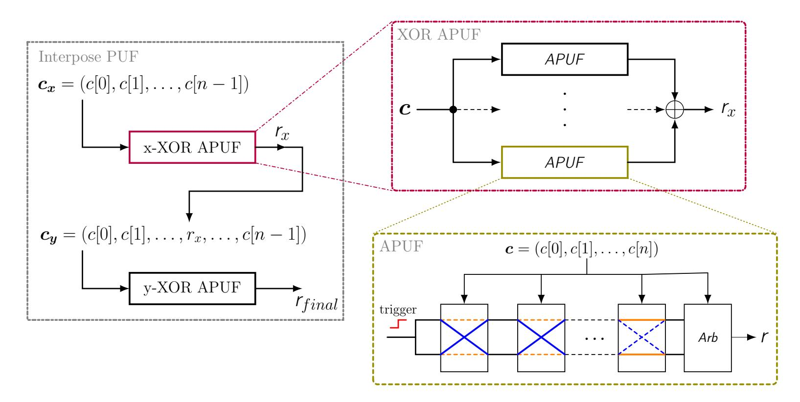
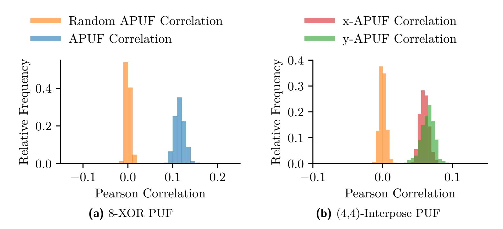
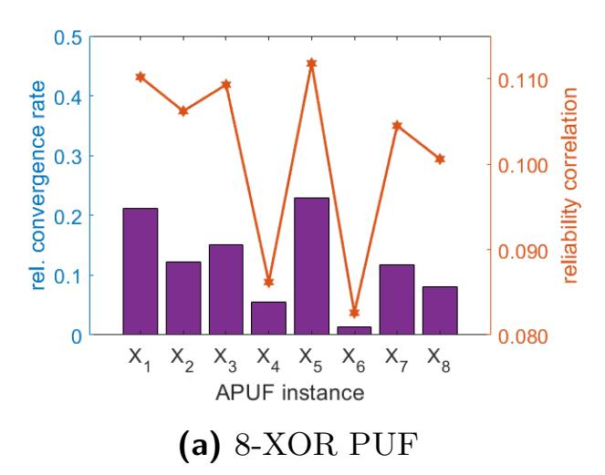
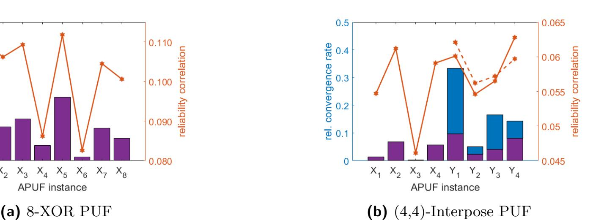
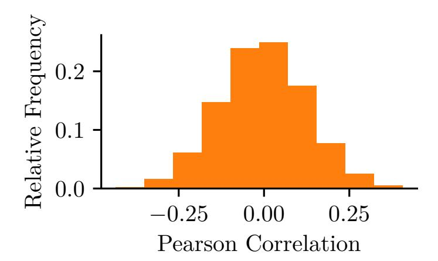
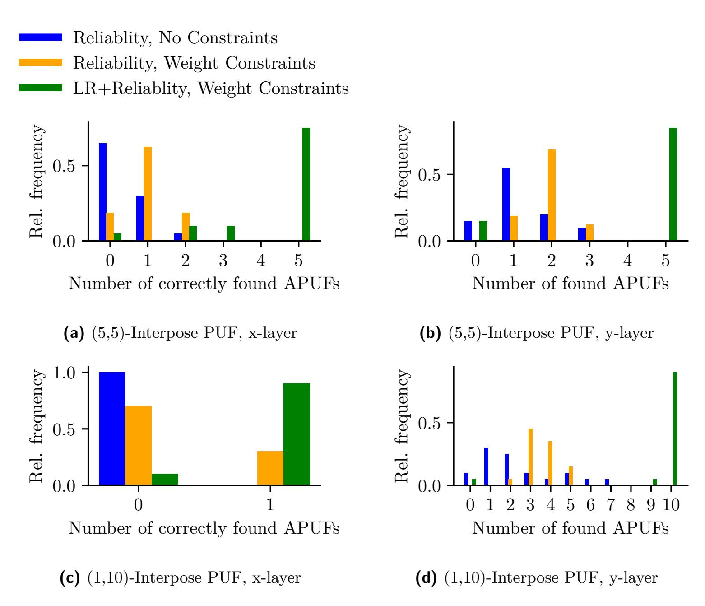
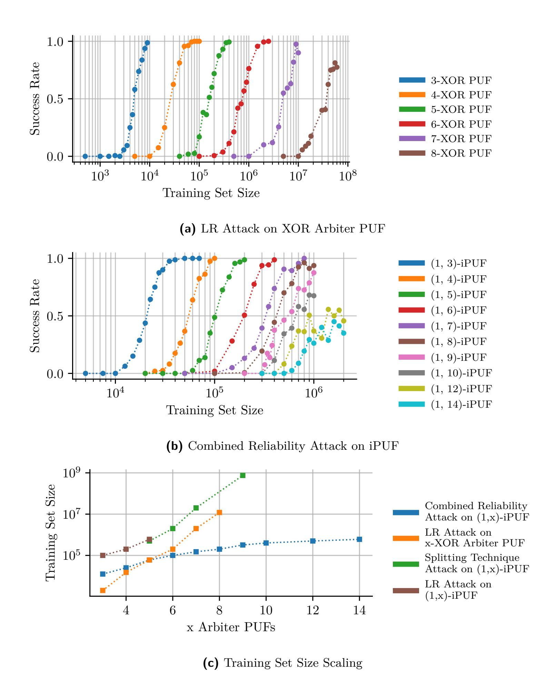
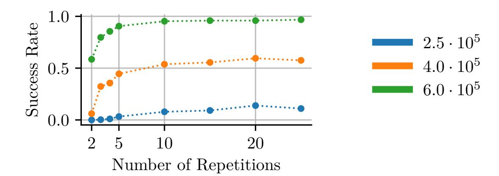

{0}------------------------------------------------

## **Combining Optimization Objectives: New Machine-Learning Attacks on Strong PUFs**

Johannes Tobisch1 , Anita Aghaie2 and Georg T. Becker3

1 Max Planck Institute for Security and Privacy, Bochum, Germany, [johannes.tobisch@csp.mpg.de](mailto:johannes.tobisch@csp.mpg.de)

**Abstract.** Strong Physical Unclonable Functions (PUFs), as a promising security primitive, are supposed to be a lightweight alternative to classical cryptography for purposes such as device authentication. Most of the proposed candidates, however, have been plagued by machine-learning attacks breaking their security claims. The Interpose PUF (iPUF), which has been introduced at CHES 2019, was explicitly designed with state-of-the-art machine-learning attacks in mind and is supposed to be impossible to break by classical and reliability attacks.

In this paper, we analyze its vulnerability to reliability attacks. Despite the increased difficulty, these attacks are still feasible, against the original authors' claim. We explain how adding constraints to the machine-learning objective streamlines reliability attacks and allows us to model all individual components of an iPUF successfully. In order to build a practical attack, we give several novel contributions. First, we demonstrate that reliability attacks can be performed not only with CMA-ES but also with gradient-based optimization. Second, we show that the switch to gradient-based reliability attacks makes it possible to combine reliability attacks, weight constraints, and Logistic Regression (LR) into a single optimization objective. This framework makes machine-learning attacks more efficient, as it exploits knowledge of responses and reliability information at the same time. Third, we show that a differentiable model of the iPUF exists and how it can be utilized in a combined reliability attack. We confirm that iPUFs are harder to break than regular XOR Arbiter PUFs. However, we are still able to break (1,10)-iPUF instances, which were originally assumed to be secure, with less than 107 PUF response queries.

**Keywords:** Physical Unclonable Function, Reliability Attack, LR Attack, Interpose PUF, Gradient-based Reliability Attack

### **1 Introduction**

Process variations at transistor-level are a primarily detrimental factor in integrated circuit (IC) manufacturing as they negatively impact performance and yield-rates. They can, however, be used as a source of entropy for *Physical Unclonable Functions* (PUFs), which provide chip "fingerprints" derived from their inherent physical features [\[HYKD14,](#page-24-0) [RH14,](#page-25-0) [LLG](#page-24-1)+04]. These fingerprints can be used in different protocols and applications to achieve security goals such as device authentication.

PUFs act as one-way physical functions that behave uniquely and generate unpredictable outputs or responses when queried for inputs or challenges. They are mainly divided into two categories based on the size of their challenge space. Weak PUFs have a very limited challenge space whose size is only polynomial in the PUF area. This type of PUF can be

2 Ruhr University Bochum, Horst Görtz Institute for IT Security, Bochum, Germany, [anita.aghaie@rub.de](mailto:anita.aghaie@rub.de)

3 Digital Society Institute at the ESMT Berlin, Berlin, Germany, [georg.becker@rub.de](mailto:georg.becker@rub.de)

{1}------------------------------------------------

used to derive cryptographic keys which are supposedly better secured by being encoded in the physical structure of the PUF instead of being stored in traditional non-volatile memory. In contrast, so-called Strong PUFs posses an exponentially large challenge space, which enables the use of challenge-response protocols without costly traditional cryptographic primitives. They are supposed to be a lightweight solution, for example, for RFID-tag authentication. The attack vectors for both types are quite different. Weak PUF responses are used as a source of key material to be used in classical cryptographic protocols and are not directly accessible to an attacker [\[MVHV12,](#page-25-1) [YSS](#page-27-0)+12]. Therefore, an attacker can either target the employed protocol and helper data algorithms [\[DV14,](#page-23-0) [DGSV14,](#page-23-1) [BWG15,](#page-23-2) [Bec17\]](#page-23-3) or use side-channel attacks to extract key material [\[KS10,](#page-24-2) [MSSS11,](#page-25-2) [HBNS13,](#page-24-3) [MHH](#page-24-4)+13]. Strong PUF responses, on the other hand, are directly exposed to an attacker. In the standard adversarial model, it is either assumed that an attacker can passively eavesdrop a number of protocol runs or is even able to query responses directly from the PUF for arbitrary challenges. The main attacker goal is to build clones of Strong PUF instances which are able to generate correct responses for arbitrary challenges. Mathematical cloning performed with machine-learning is the most common way to meet this goal and so far, powerful machine-learning attacks have prevented Strong PUFs from being adopted in real applications [\[RSS](#page-25-3)+10, [RSS](#page-25-4)+13, [Bec15,](#page-23-4) [Del19,](#page-23-5) [WBM](#page-26-0)+19]. However, Strong PUFs are also susceptible to side-channel attacks [\[DV13,](#page-23-6) [RXS](#page-25-5)+14, [BK](#page-23-7)+14, [TDF](#page-26-1)+14, [AM20\]](#page-23-8).

Thus far, Strong PUF candidates predominantly rely on delayed-based Arbiter PUFs (APUFs) as their main building blocks for PUF constructs and protocols [\[GCVDD02,](#page-23-9) [SD07,](#page-26-2) [MKP08,](#page-24-5) [VHKM](#page-26-3)+12, [DPGV15,](#page-23-10) [YHD](#page-26-4)+16, [SMCN17,](#page-26-5) [Del19\]](#page-23-5). These can be modeled by a linear function which is the basis for a host of machine-learning attacks that use collected challenge-response pairs (CRPs) or challenge-reliability pairs to build complete mathematical clones of the complete PUF construction [\[RSS](#page-25-4)+13, [Bec15\]](#page-23-4). Utilizing information about the reliability of responses has greatly amplified the threat posed by machine-learning attacks by reducing the scaling of the required training set size from exponential to linear in the number of APUFs [\[Bec15\]](#page-23-4). To counter this reliability based attack protocol level countermeasures have been proposed that prevent an attacker to collect the reliability information by limiting the number of challenges by using a software model [\[YHD](#page-26-4)+16]. Nguyen et al. [\[NSJ](#page-25-6)+19] proposed a new lightweight APUF-based construction which uses a domino structure to be especially resistant against reliability-based machine-learning attacks without protocol level countermeasures. In brief, the Interpose PUF (iPUF) consists of two XOR Arbiter PUFs, the x- (upper) and y-(lower) PUF. The x-XOR PUF response is used as an additional challenge bit for the y-XOR PUF. In their security analysis, the authors claim that the constituent APUFs of the x-XOR PUF cannot be recovered by reliability attacks. Therefore, given that the y-XOR PUF is large enough, the complete iPUF is supposed to be secure. However, recently direct modeling attacks on the iPUF have been proposed, raising first doubts regarding its security [\[SBC19,](#page-25-7) [WMP](#page-26-6)+20]

In this work, we show that the individual x-APUFs still show enough correlation with the PUF reliability and can indeed be learned given enough data. In order to provide a practical attack, we develop a reliability attack in the gradient-based optimization framework which allows us to conveniently combine different optimization goals into a single objective. This new attack is more efficient than the commonly used CMA-ESbased approach. While using multiple optimization objectives and constraints in machine learning is nothing new [\[HTF09\]](#page-24-6), it is the first time that this technique has been applied to machine learning attacks. We strongly believe that such a machine learning strategy has application outside of reliability based attacks used in this paper and will inspire other machine learning attacks with different objectives in the future.

{2}------------------------------------------------

#### **1.1 Related Work**

The field of machine-learning attacks on APUF-based Strong PUFs has been heavily influenced by two approaches. Logistic regression (LR) as introduced by Rührmair et al. [\[RSS](#page-25-3)+10, [RSS](#page-25-4)+13] has been shown to work well for attacking XOR PUFs, leaving only very large instances secure that can hardly be efficiently realized in hardware. Becker [\[Bec15\]](#page-23-4) showed that attacks can be performed with Covariance Matrix Adaptation Evolution Strategy (CMA-ES) using much smaller datasets if reliability information is available. Our work uses ideas from both approaches. More information about them are given in Section [2.3.](#page-5-0) Nguyen et al. [\[NSJ](#page-25-6)+19] analyzed the iPUF in light of both approaches and found the construction to be secure. Afterward, new publications showed that the iPUF is not quite as hard to break as initially assumed. Santikellur et al. [\[SBC19\]](#page-25-7) showed deep learning results up to (4,4)-iPUFs with a high accuracy of more than 0.97 and a moderate CRP set size of 319*,* 000. Wisiol et al. [\[WMP](#page-26-6)+20] showed that the original LR attack can be adapted to the iPUF by "splitting" it, i.e., considering its two XOR PUFs individually. The x-XOR PUF and y-XOR PUF can be learned iteratively, which effectively reduces the security of a (k,k)-iPUF to a k-XOR PUF. Even though we show that a differentiable model of the iPUF exists and can be used for a regular LR attack, we believe that the splitting technique is the de facto state-of-the-art-approach in terms of efficiency, *if no reliability information is available*. If, however, reliability information can be used, our novel contributions lead to a more efficient attack.

In addition to the mentioned attacks, there is a line of research that draws from learning theory and examines model building the Probably Approximately Correct (PAC) framework [\[GTS16,](#page-24-7) [GTFS16,](#page-24-8) [GTS15\]](#page-24-9). In [\[GTS18\]](#page-24-10), Ganji et al. enhanced their PAC learning method by introducing a weak learner low degree algorithm (LMN) based on Fourier analysis in the form of Boolean functions of PUF. It is claimed that it is able to model single 64-and 128-bit APUFs with less required CRPs compared to the previous methods.

Several approaches for increasing the security of Strong PUFs against modeling attacks have been explored. Sahoo et al. [\[SMCN18\]](#page-26-7) proposed a multiplexer-based alternative to the XOR Arbiter PUF. It was claimed that this construction provides more reliability and security but as argued in [\[NSJ](#page-25-6)+19] still falls victim to reliability attacks. Wisiol et al. [\[WGM](#page-26-8)+17] suggested to increase the reliability of individual APUFs by averaging their response, which in turn makes larger XOR Arbiter PUFs feasible. Drawbacks of this approach are the hardware overhead and its vulnerability to reliability attacks.

Noise-bifurcation as introduced by Yu et al. [\[YMVD14\]](#page-27-1) is a technique that introduces additional noise into the training set of the attacker which, however, can be mitigated by increasing the training set size [\[TB15\]](#page-26-9). The lockdown protocol by Yu et al. [\[YHD](#page-26-4)+16] addresses reliability attacks by preventing the adversary from collecting reliability information. This is achieved by introducing mutual-authentication due to which the same challenge cannot be queried repeatedly, unless the challenger is already in possession of a valid PUF model. The protocol requires additional hardware overhead, such as a true random number generator, which makes it hard to apply in lightweight solutions.

#### **1.2 Contributions**

In this paper, we present several novel contributions in the scope of machine learning attacks:

• We show that the iPUF is, against claims in its initial security analysis, still susceptible to reliability modeling attacks. In particular, we can break the (1,10)-iPUF, which was proposed as a secure instantiation, with a training set size that is orders of magnitude lower than what would be required for LR-based machine-learning attacks.

{3}------------------------------------------------

- In order to facilitate this attack, we improve the reliability attack on XOR Arbiter PUFs by Becker [\[Bec15\]](#page-23-4) by combining multiple objectives and constraints. This approach significantly improves the attack performance and can in general be applied to other APUF-based constructions.
- In particular, we show how one can add constraints to learning objectives in a reliability-based attack such that all APUF instances can be found in a single run. This is especially important for constructs with many individual APUF instances, as it prevents the algorithm from always converging to the same APUF instance. We further improve upon the attack by combining the objective used in direct modeling attacks with those of the reliability based attack.
- In previous work, reliability attacks have always been performed using CMA-ES. We show that utilizing gradient-based optimization is a good alternative. We use a modern machine learning library (PyTorch) for our implementation.
- Additionally, we show that a differentiable model of the iPUF exist which can be used for a classic LR attack, at least for smaller iPUF instances (for larger instances, it is outperformed by the split PUF technique by Wisiol et al. [\[WMP](#page-26-6)+20]).

## **2 Background**

In this chapter, we review the mathematical model of Arbiter-based PUFs and give an overview of the state-of-the-art machine learning modeling attacks, LR and CMA-ES reliability attacks.

#### **2.1 Notation**

In this paper, we denote scalar values with italic characters *x*, vectors are printed in lowercase bold *v* and matrices are set in upper-case bold *M*. To access individual elements and slices of vectors and matrices, we use the square bracket notation. Slices are selected by the first and last index, divided by a colon. If either start or end index is omitted, then the slice starts at the first element or ends at the last element, respectively. The index is one-based, i.e., the first element is indexed by [1]. If the start and end index are not explicitly given in a sum, it is assumed that sum runs over the maximum range of values (which can for example be the number of elements in a vector). Variable names, that are consistently used in the next sections, are listed in Table [1.](#page-3-0) Subscripts are used to give additional context for variables.

**Table 1:** Commonly used variable names.

| Variable | Meaning                                                          |
|----------|------------------------------------------------------------------|
| n        | Number of stages in an Arbiter PUF. For the Interpose PUF, it is |
|          | the number of stages in the x-XOR APUF.                          |
| k        | Number of Arbiter Chains in an XOR APUF.                         |
| c        | A challenge vector of length n.                                  |
| φ        | A feature vector that was derived from a challenge c.            |
| W        | Matrix of delay values or weights that characterize an XOR APUF. |
| r        | Response bit.                                                    |
| i        | In iPUF context, the challenge index at which a response bit     |
|          | is inserted to create the lower layer challenge.                 |

{4}------------------------------------------------

Figure 1: Overview of Interpose PUF, XOR APUF, and APUF schematics.

Additionally, a number of simple functions are used through the paper which are given by Equation 1.

$$step(x) = \begin{cases} 0, & \text{if } x < 0 \\ 1, & \text{if } x \ge 0 \end{cases}, sign(x) = \begin{cases} -1, & \text{if } x < 0 \\ 1, & \text{if } x \ge 0 \end{cases}, sigmoid(x) = \frac{1}{1 + e^{-x}}$$
 (1)

#### 2.2 PUF Models

In this section, we briefly describe the APUF and two constructions, the XOR APUF and the iPUF which make use of multiple individual APUFs to increase the machine-learning resistance. Our description includes the delay-based mathematical model of the APUF that has been introduced by Lim [Lim04] for APUF analysis.

#### 2.2.1 Additive Model of Arbiter-based PUFs

Arbiter PUFs consist of n consecutive stages that carry two paths, see Figure 1. Each stage has an associated challenge bit, which determines whether or not the stage flips the paths. To query the PUF, a rising signal is applied two both paths. The upper and lower signal race through all stages. At the end, an arbiter measures which of the two signals arrives first and translates the result in the binary PUF response r.

Lim [Lim04] proposed a linear additive model that captures the APUF behavior properly. This model requires the map  $f(\mathbf{c}) = \boldsymbol{\phi}$  of the applied challenge  $\mathbf{c}$  of length n to a feature or parity vector  $\boldsymbol{\phi}$  of length n+1:

$$\phi[j] = \prod_{l=j}^{n} (-1)^{c[l]} \text{ for } 1 \le j \le n , \ \phi[n+1] = 1$$
 (2)

A vector of delay values, which are also later referred to as weights,  $\mathbf{w}$  of length n+1 encodes all information that is required to compute responses of an APUF [Lim04]:

$$r = \text{step}(d) = \text{step}(\boldsymbol{w}\boldsymbol{\phi}) \tag{3}$$

Note that the main goal of PUF modeling attacks is learning these weights  $\boldsymbol{w}$ . Additionally, a Gaussian-distributed term  $d_{\text{noise}} \sim \mathcal{N}(0, \sigma^2)$  can be added to this model to consider

{5}------------------------------------------------

transient environmental noise which inevitably affects actual PUF implementations:

$$r = \text{step}(d_{\text{total}}) = \text{step}(\boldsymbol{w}\boldsymbol{\phi} + d_{\text{noise}})$$
 (4)

*XOR Arbiter PUFs* are the most common APUF-based construction in which a nonlinear XOR sum is computed over individual APUF responses to increase machine-learning difficulty. Let the weights of all *k* individual APUFs be the row vectors of matrix *W*. Then, XOR APUFs can be modeled as a multiplication of individual APUF delays, with the sign of the product being the response:

$$r_{\text{XOR}} = \text{sign}(d_{\text{XOR}}) = \text{sign}(\prod_{j=1}^{k} \mathbf{W}[j,:]\phi)$$
 (5)

*Interpose PUFs*, as shown in Figure [1,](#page-4-1) consist of two distinct XOR APUFs, which are labeled with x and y for the upper and lower layer. The upper layer response *r*x is added as an additional challenge bit into the challenge vector *c* at index *i* which is then applied to the lower layer. The final PUF response bit is the response *r*y of the lower layer XOR APUF. The iPUF is parametrized by two matrices *W*x and *W*y, one for each layer, and can be mathematically described as:

$$\boldsymbol{c}_{\mathrm{x}} = \boldsymbol{c}, \quad \boldsymbol{c}_{\mathrm{y}} = \boldsymbol{c}[1:i-1] \parallel r_{\mathrm{x}} \parallel \boldsymbol{c}[i:n]$$
 (6)

$$r_{\mathbf{x}} = \operatorname{step}(d_{\mathbf{x}}), \text{ in which: } d_{\mathbf{x}} = \prod_{j=1}^{k_{\mathbf{x}}} \mathbf{W}_{\mathbf{x}}[j, :] \mathbf{f}(\mathbf{c}_{\mathbf{x}}) = \prod_{j=1}^{k_{\mathbf{x}}} \mathbf{W}_{\mathbf{x}}[j, :] \boldsymbol{\phi}_{\mathbf{x}}$$
 (7)

$$r_{\mathbf{y}} = \operatorname{step}(d_{\mathbf{y}}), \text{ in which: } d_{\mathbf{y}} = \prod_{j=1}^{k_{\mathbf{y}}} \mathbf{W}_{\mathbf{y}}[j, :] \mathbf{f}(\mathbf{c}_{\mathbf{y}}) = \prod_{j=1}^{k_{\mathbf{y}}} \mathbf{W}_{\mathbf{y}}[j, :] \boldsymbol{\phi}_{\mathbf{y}}$$
 (8)

The insertion index *i* is a free design parameter, however, according to the security analysis of Nguyen et al. [\[NSJ](#page-25-6)+19], the best position is in the middle of the challenge vector and we use this position as the default in this work. Hence, we also later refer to *halves* of weight vectors which are the two sets of elements that are divided by index *i*.

#### **2.3 Machine Learning Attack Background**

In the regular machine learning attacker model, that is typically used [\[RSS](#page-25-3)+10, [TB15,](#page-26-9) [NSJ](#page-25-6)+19, [WMP](#page-26-6)+20], the goal is to find a function that predicts responses correctly for arbitrary challenges. It is assumed that the attacker has access to a device for a limited time and can query the PUF for chosen challenges[1](#page-5-1) . Based on the collected set of challengeresponse pairs, she then tries to find a model whose responses pass as authentic in future protocol runs. The required size of this set is a measure of the security of a Strong PUF construction. The two most important categories of machine-learning attacks on APUFbased constructions are direct-modeling and reliability-based attacks. Direct-modeling, which is also referred to as classical machine learning attacks by Nguyen et al.[\[NSJ](#page-25-6)+19], only uses challenge-response pairs to learn the PUF behavior and is, therefore, more generic than reliability-attacks, which observe multiple responses[2](#page-5-2) for each challenge and use this additional information to more efficiently build accurate models. For both categories, there is a standard choice for the machine-learning algorithm, LR and CMA-ES. In the following, we briefly review both approaches which are the basis for our new attack.

1Without further restrictions in the PUF design, the challenge interface is deterministic and the attacker can query the same challenge multiple times.

2The classic challenge-response protocol requires a deterministic challenge interface which enables the repeated observation of the noisy response for a particular challenge. An example that uses a nondeterministic interface is the lockdown protocol by Yu et al.[\[YHD](#page-26-4)+16] which requires a software model of the PUF on the authentication server.

{6}------------------------------------------------

#### 2.3.1 Direct-Modeling Attack Using Logistic Regression

It has been shown by Lim [Lim04] that APUFs can be described by a linear model which makes them trivially learnable. XOR APUFs were introduced by Suh and Devadas [SD07] as a harder-to-learn non-linear composition of single APUFs, but Rührmair et al. [RSS+10] showed that these can be attacked with LR. This approach uses gradient descent to find model parameters and, therefore, requires a differentiable model $\boldsymbol{W}$  that maps a challenge  $\boldsymbol{c}$  to a predicted response3 based on parameters  $\boldsymbol{W}$ . The binary cross-entropy function lossbin is used to measure how well a predicted response  $r_{\rm p}$  matches the actual binary response  $r_{\rm a}$ :

$$loss_{bin}(r_{p}, r_{a}) = -r_{a} \cdot log(r_{p}) - (1 - r_{a}) \cdot log(1 - r_{p})$$

$$\tag{9}$$

If a training set, consisting of a challenge matrix C, corresponding feature vector matrix  $\Phi$ , and a response vector r, is given, one can compute the total loss of the training set for a given model parameter:

$$loss_{total}(\boldsymbol{W}) = \sum_{j} loss_{bin}(model_{\boldsymbol{W}}(\boldsymbol{\Phi}[j,:]), \boldsymbol{r}[j])$$
(10)

The total loss is iteratively minimized by gradient descent. For this, the gradient  $\frac{\text{loss}_{\text{total}}}{\partial \boldsymbol{W}}$  is evaluated and used to determine an update direction and magnitude for  $\boldsymbol{W}$ . Gradient descent is not guaranteed to find a global minimum if the optimized function is non-linear which is the case, for example, for XOR PUFs. Instead, the algorithm only converges with a certain probability to a good optimum and usually has to be run multiple times to achieve successful learning. Different optimization algorithms for the weight update exist. RPROP [RB93], which computes the complete gradient in each step, has been used by Rührmair et al. [RSS+10]. It is also possible to evaluate only small batches of the training set for a single parameter update. This stochastic gradient descent is the default choice, especially for large neural networks, due to faster training. One iteration through the complete training set is called an epoch. In the LR attack on XOR APUFs by Rührmair et al. [RSS+10], the machine-learning model is very close to the simulation model, the only difference being the substitution of the sign function by the continuous sigmoid function:

$$\operatorname{model}_{\boldsymbol{W}}^{XOR}(\boldsymbol{\phi}) = \operatorname{sigmoid}(\prod_{j=1}^{k} \boldsymbol{W}[j,:]\boldsymbol{\phi})$$
(11)

The LR approach has been shown to work well [RSS $^+10$ , TB15] for reasonable sized XOR APUF instances, even though the required training set size scales exponentially with the number of XORs k. This is due to the fact that in practice k cannot be increased too high due to increasing unreliability and hardware overhead.

#### 2.3.2 Reliability-based Attack Using CMA-ES

The potential of using reliability-information4 for PUF modeling has been shown by Delvaux and Verbauwhede [DV13] and was later developed by Becker [Bec15] into a comprehensive attack on XOR APUFs. The number of required CRPs for this reliability attack only increases linearly as opposed to exponentially with the number of XORs k and is hence much more efficient. The underlying observation of the attack is that the overall reliability

&lt;sup>3Due to the requirement of differentiability, the model does not map to either 0 or 1 but to the range [0, 1]. This output can be interpreted as a probability for the binary output 0 or 1, respectively.

&lt;sup>4In contrast to direct-modeling attacks, reliability attacks use additional information and can be classified as a form of side-channel modeling attack. It should be noted, however, that this side-channel is a natural part of the general Strong PUF attack model, which features a deterministic challenge interface and the possibility for an attacker to query chosen challenges (and therefore, the same challenge multiple times).

{7}------------------------------------------------

of the PUF output linearly correlates with the reliability of the output of single APUF. The attack as proposed by Becker [Bec15] requires two measures of reliability, one for queried PUF responses and one for the model predictions. The model consists of a single candidate APUF, described by delay vector  $\tilde{\boldsymbol{w}}$ . For a single challenge  $\boldsymbol{c}$  and associated feature vector  $\boldsymbol{\phi}$ , the magnitude of  $\tilde{\boldsymbol{d}} = \tilde{\boldsymbol{w}} \boldsymbol{\phi}$  is indicative for how reliable the corresponding response is. A binary model reliability measure, parametrized with an error boundary  $\epsilon$ , is given as:

$$\widetilde{h} = \text{step}(|\widetilde{\boldsymbol{w}}\boldsymbol{\phi}| - \epsilon) = \begin{cases} 0, & \text{if } |\widetilde{\boldsymbol{w}}\boldsymbol{\phi}| \le \epsilon \\ 1, & \text{if } |\widetilde{\boldsymbol{w}}\boldsymbol{\phi}| > \epsilon \end{cases}$$
(12)

For measuring PUF reliability, the PUF is queried for each challenge  $\boldsymbol{c}$  for a number of l repetitions and the corresponding responses are collected in a vector  $\boldsymbol{r}$ . Then, scalar h gives a per-challenge reliability measure:

$$h = \left| \frac{l}{2} - \sum_{j=1}^{l} \boldsymbol{r}[j] \right| \tag{13}$$

The goal of the attack is then to find accurate values for  $\widetilde{w}$  and  $\epsilon$  that show a high Pearson correlation over the whole training set between  $\widetilde{h}$  and h. Becker [Bec15] used CMA-ES, a gradient-free black-box optimization method, to converge to a solution. The optimization process is non-deterministic and its outcome depends on the random initialization of  $\widetilde{w}$ . The process of optimization has to be repeated several times to gain candidates for all individual APUFs of the attacked XOR APUF.

## 3 Reliability-based Attacks on the Interpose PUF

The iPUF was explicitly designed by Nguyen et al. [NSJ+19] to provide resistance against reliability-based attacks. They state, as a requirement for the CMA-ES reliability attack to work, that "each APUF must contribute equal reliability information to the output". Based on this statement, a mathematical proof is provided to show that x-APUFs and y-APUFs do contribute differently. The conclusion, therefore, is made that the iPUF should be secure against the CMA-ES reliability attack. However, in this section, we will show that this conclusion is not correct. If individual APUFs contribute differently to the reliability information, they can still be learned.

#### 3.1 Correlation between Overall Reliability and Individual APUFs

In the CMA-ES reliability attack paper [Bec15], it was noted that when attacking an XOR APUF, some APUF instances are learned more often than others. This resulted in a larger number of required machine learning runs to fully learn all individual Arbiter PUFs. To better understand this observation, we simulated 100 unique 64-stage 8-XOR APUFs and 10,000 challenge and responses with a noise variance of  $\sigma^2 = 0.5$  which equals a mean accuracy of 0.97 for each APUF. We then computed the absolute delay difference  $h^*$  for each challenge and each APUF using the APUF delay model (mentioned in Section2.2.1). Next, we computed the correlation coefficient between this absolute delay difference  $h^*$  and the overall XOR APUF reliability. It is known that the absolute delay difference  $h^*$  of a PUF is correlated with the reliability (see e.g. [DV13]) and this fact is used in a reliability attack to learn the PUF models. The absolute delay difference can be computed with:

$$h^* = |\phi w| \tag{14}$$

{8}------------------------------------------------

**Figure 2:** Correlations between 8-XOR PUFs and (4,4)-iPUFs reliability and the reliability to their individual APUF reliabilities. Additional, the correlation to random APUF instances is given. Both PUFs use APUFs with 64 stages and a mean APUF accuracy of 0.97. The correlations were computed for 10,000 challenge-reliability pairs.

We repeated this computation with an equivalent amount of random APUF instance whose correlation between model reliability and XOR APUF reliability was collected. Figure 2a shows the histograms of the resulting correlation coefficients. One can clearly see that the actual individual APUFs correlate to the reliability, unlike the random PUFs. However, we can also see that the distribution of the correlation has a significant variance and that some instances have a larger or smaller correlation than others. We also performed the same kind of experiment for a population of (4,4)-iPUFs. The simulation can be performed equivalently for the x-APUF instances, as their full challenge is known. The same, however, is not true for the y-APUF instances as the challenge bit at position i is not known as it depends on the x-APUF. In our modeling, we therefore omitted the PUF stage at position i. We call this delay vector  $\mathbf{w}_{y-\text{red}}$  reduced as it has one stage less:

$$\mathbf{w}_{y-\text{red}}[1:i-1] = \mathbf{w}_{y}[1:i-1]$$
  
 $\mathbf{w}_{y-\text{red}}[i+:n+1] = \mathbf{w}_{y}[i+1:n+2]$  (15)

A further point, that is important for an actual attack on the iPUF, is the fact that there is some ambiguity in regard to vector  $\boldsymbol{w}_{\text{y-red}}$ . The inclusion of the x-PUF response  $r_{\text{x}}$  into challenge  $c_{\text{y}}$  effectively leads to the bit-wise inversion of the first half of the feature vector for the y-PUF for approximately half of all challenges (when the x-PUF response is 1). Since an attacker does not know the output of the x-APUF we have to approximate the y-APUF output by assuming that either the x-APUF is always 1 or 0. Therefore each y-PUF has actually two candidates, one is  $\boldsymbol{w}_{\text{y-red}}$  and the other is  $\overline{\boldsymbol{w}}_{\text{y-red}}$  in which the first half of the delay vector is inverted:

$$\overline{\boldsymbol{w}}_{\text{y-red}}[1:i-1] = -\boldsymbol{w}_{\text{y}}[1:i-1]$$

$$\overline{\boldsymbol{w}}_{\text{v-red}}[i:i+1] = \boldsymbol{w}_{\text{y}}[i+1:n+2]$$
(16)

Histogram 2b shows the correlation between the iPUF reliability and the individual APUFs from the x-PUFs and the flipped and not flipped models from the y-PUF. One can clearly observe that the correlation of x-APUFs on average is smaller than that of the y-APUFs. However, it is important to note that some of the x-APUFs actually have a larger correlation than many of the y-APUFs. Hence, one cannot directly say that x-APUFs will always be harder to learn than y-PUFs based on the correlation analysis. Note that the

{9}------------------------------------------------

**Figure 3:** The left y-axis depicts the number of times a machine learning run converged to a given APUF instance while the right y-axis shows the correlation coefficient of the delay model with the reliability information. In a) a 8-XOR APUF is used and in b) a (4,4)-iPUFs is depicted. For the iPUF the correlation of the flipped delay model is depicted in dashed lines. The lower part of the stacked bar chart shows how often *w*y-red was learned and the top shows how often the flipped delay model *w*y-red was learned.

correlation distribution between x-APUFs and y-APUFs depends on the level of noise such that the difference can increase or decrease for different noise levels. Furthermore, in the analysis performed by Nguyen et al. [\[NSJ](#page-25-6)+19] the fact that in a CMA-ES only partially correct y-APUF models *w*y-red and *w*y-red are learned was not considered. Therefore, the difference between x-APUF correlation and y-APUF correlation is smaller in practice than assumed by Nguyen [\[NSJ](#page-25-6)+19]. Note that the correlation coefficient for both y-PUFs and x-PUFs is smaller than that of the XOR-PUF, indicating that XOR APUFs should be learnable with less CRPs than iPUFs with an equivalent amount of individual APUFs.

#### **3.2 Interplay between Correlation and Convergence Rate**

To verify in how far an APUF's correlation coefficient can directly be linked to the convergence probability during a CMA-ES attack, we performed the attack on an 8-XOR PUF and an (4,4) iPUF with 1000 independent CMA-ES runs and counted to which APUF a run converged how often. We used a noise level of *σ* = 0*.*5 with resulted in roughly 97% unreliability for an individual 64-stage Arbiter PUF. The result is depicted in Figure [3.](#page-9-0) Looking at the 8-XOR PUF in Figure [3a](#page-9-0) one can clearly see that the correlation and convergence rate are strongly related to each other and that some instances are harder to learn than others. One can also observe the relationship between correlation and convergence rate for the (4,4)-iPUF in Figure [3b.](#page-9-0) Recall that for the y-PUFs the algorithm can converge to the correct or flipped delay model and hence the overall convergence rate of the y-APUFs is higher than that of the x-PUFs when the correlation is similar. Nevertheless, there are some x-APUF instances that are easier to learn that some y-APUF instances (e.g. the second x-PUF). The smallest correlation in Figure [3b](#page-9-0) is 0.0461 for the third x-APUF instance which resulted in the smallest convergence rate of only 2 out of 1000. Hence, the convergence rate can become very small, but it is still higher than zero. Therefore, unlike claimed in [\[NSJ](#page-25-6)+19], the iPUF *can* be attacked using a reliability based machine learning attack. However, compared to the 8-XOR PUF, the (4,4)-iPUF has a much smaller correlation which also results in a overall smaller convergence rate of 831/1000 for (4,4)-iPUF compared to 981/1000 for 8-XOR APUF. Hence, attacking the iPUF using a reliability attack is harder than attacking an XOR PUF. Please note that the correlation and hence the machine learning resistance for each PUF instance is different. Therefore testing only a single instance can be misleading. The conclusion from this analysis is that the iPUF is insecure, but it can take a lot of simulation time and a lot

{10}------------------------------------------------

of CRPs to attack some iPUF instances using a CMA-ES attack. If one can ensure that the machine learning algorithm does not converge to already discovered PUF instances, the attack would be greatly improved. Furthermore, while CMA-ES has been used in the first reliability based attack [Bec15], it does not mean that CMA-ES is necessarily the most efficient algorithm for this type of attack.

#### 4 A Differentiable Model for the Interpose PUF

Before developing an efficient reliability attack that can break large iPUF instances with a high success rate, we first deal with a prerequisite, namely building a differentiable model of the iPUF. This model, which was not given by Nguyen et al. [NSJ+19], can be used in an LR attack on the iPUF. More importantly, it serves as a building block for our full reliability attack.

Looking at the structure of the iPUF as described in Section 2.2.1, there seems to be an obstacle in the way of formulating a differentiable model for iPUF. The binary response  $r_x$  of the x-XOR PUF is inserted into the challenge c to create the challenge  $c_y$ . Computing a binary response from continuous delay values requires the discontinuous sign function which is unsuitable for gradient-based optimization5. However, we show that it is not necessary to use the binary  $r_x$  but that its continuous equivalent  $d_x$  is sufficient to build a differentiable model. As a preliminary step for the full model description, we first note that the computation of the feature vector  $\phi_y$  can be done on basis of the feature vector  $\phi_x$  and the binary response  $r_x$ :

$$\phi_{y}[1:i] = (-1)^{r_{x}} \cdot \phi_{x}[1:i]$$

$$\phi_{y}[i+1:n+2] = \phi_{x}[i:n+1]$$
(17)

Now suppose you have the continuous response  $d_x$ :

$$d_{\mathbf{x}} = \prod_{j=1}^{k_{\mathbf{x}}} \mathbf{W}_{\mathbf{x}}[j,:] \boldsymbol{\phi}_{\mathbf{x}}$$
 (18)

$$(-1)^{r_{\mathbf{x}}} = (-1)^{\operatorname{step}(d_{\mathbf{x}})} = -\operatorname{sign}(d_{\mathbf{x}}) = \operatorname{sign}(-d_{\mathbf{x}})$$
 (19)

Based on the observation the sign of  $-d_x$  is the same as that of  $(-1)^{r_x}$ , one might be led to a naive computation of  $\phi_v$ :

$$\phi_{y}[1:i] = -d_{x} \cdot \phi_{x}[1:i]$$

$$\phi_{y}[i+1:n+2] = \phi_{x}[i:n+1]$$
(20)

This formulation of  $\phi$ , however, is not correct as it does not allow for correct computation of  $r_y$ . Suppose only a single APUF, characterized by  $\mathbf{w}_y$  is used in the y-component.

$$\hat{r_{y}} = \operatorname{step}(\hat{\phi_{y}} \boldsymbol{w}_{y}) 
= \operatorname{step}(\hat{\phi_{y}} [1:i] \boldsymbol{w}_{y} [1:i] + \hat{\phi_{y}} [i+1:n+2] \boldsymbol{w}_{y} [i+1:n+2]) 
= \operatorname{step}(-d_{x} \cdot \boldsymbol{\phi}_{x} [1:i] \boldsymbol{w}_{y} [1:i] + \boldsymbol{\phi}_{x} [i:n+1] \boldsymbol{w}_{y} [i+1:n+2]) 
= \operatorname{step}(-|d_{x}| \cdot \operatorname{sign}(d_{x}) \cdot \boldsymbol{\phi}_{x} [1:i] \boldsymbol{w}_{y} [1:i] + \boldsymbol{\phi}_{x} [i:n+1] \boldsymbol{w}_{y} [i+1:n+2])$$
(21)

One half of terms of the scalar product  $\phi_y^* w_y$  is scaled by  $|d_x|$ . The magnitude of  $d_x$  varies from challenge to challenge and therefore no  $w_y$  can be found that consistently leads to

&lt;sup>5The sign function's derivative is zero everywhere except at the point 0, where it is undefined. This does not yield any useable information for gradient-descent.

{11}------------------------------------------------

the correct response  $r_y$  for all challenges. However, there exists an easy fix for the problem. The second half of  $\phi_y$  can simply also be multiplied by  $|d_x|$ :

$$\phi_{\mathbf{y}}^{*}[1:i] = -d_{\mathbf{x}} \cdot \phi_{\mathbf{x}}[1:i]$$

$$= -|d_{\mathbf{x}}| \cdot \operatorname{sign}(d_{\mathbf{x}}) \cdot \phi_{\mathbf{y}}[1:i]$$
(22)

$$\phi^*_{v}[i+1:n+2] = |d_{x}| \cdot \phi_{x}[i:n+1]$$
(23)

That way, the sign of  $\phi_y w_y$  and thereby the response  $r_y$  can be computed correctly, for all applied challenges and independently of the magnitude of  $|d_x|$ :

$$r_{y} = \operatorname{step}(\phi_{y}^{*} \boldsymbol{w}_{y})$$

$$= \operatorname{step}(\phi_{y}^{*}[1:i] \boldsymbol{w}_{y}[1:i] + \phi_{y}^{*}[i+1:n+2] \boldsymbol{w}_{y}[i+1:n+2])$$

$$= \operatorname{step}(-d_{x} \cdot \boldsymbol{\phi}_{x}[1:i] \boldsymbol{w}_{y}[1:i] + |d_{x}| \cdot \boldsymbol{\phi}_{x}[i:n+1] \boldsymbol{w}_{y}[i+1:n+2])$$

$$= \operatorname{step}(|d_{x}| \cdot (-\operatorname{sign}(d_{x}) \cdot \boldsymbol{\phi}_{x}[1:i] \boldsymbol{w}_{y}[1:i] + \boldsymbol{\phi}_{x}[i:n+1] \boldsymbol{w}_{y}[i+1:n+2]))$$

$$= \operatorname{step}(-\operatorname{sign}(d_{x}) \cdot \boldsymbol{\phi}_{x}[1:i] \boldsymbol{w}_{y}[1:i] + \boldsymbol{\phi}_{x}[i:n+1] \boldsymbol{w}_{y}[i+1:n+2])$$

$$= \operatorname{step}((-1)^{r_{x}} \cdot \boldsymbol{\phi}_{x}[1:i] \boldsymbol{w}_{y}[1:i] + \boldsymbol{\phi}_{x}[i:n+1] \boldsymbol{w}_{y}[i+1:n+2])$$

$$= \operatorname{step}(\boldsymbol{\phi}_{y}[1:i] \boldsymbol{w}_{y}[1:i] + \boldsymbol{\phi}_{y}[i:n+1] \boldsymbol{w}_{y}[i+1:n+2])$$

$$= \operatorname{step}(\boldsymbol{\phi}_{y} \boldsymbol{w}_{y})$$

Taking the absolute value is a continuous operation and can be used in models that are optimized by gradient descent6. The complete model for the LR attack on the iPUF,  $\text{model}_{\mathbf{W}_{\mathbf{x}},\mathbf{W}_{\mathbf{y}}}^{\text{IPUF}}$ , which computes a continuous (probability) response r for a challenge  $\mathbf{c}$ , is as given below:

$$\phi_{x} = f(c)$$

$$d_{x} = \prod_{j=1}^{k_{x}} \mathbf{W}_{x}[j, :] \phi_{x}$$

$$\phi_{y}[1:i] = -d_{x} \cdot \phi_{x}[1:i]$$

$$\phi_{y}[i+1:n+2] = |d_{x}| \cdot \phi_{x}[i:n+1]$$

$$d_{y} = \prod_{j=1}^{k_{y}} \mathbf{W}_{y}[j, :] \phi_{y}$$

$$r = r_{y} = \operatorname{sigmoid}(d_{y})$$

$$(25)$$

# 5 Constraints and Combined Objectives - Streamlining the Reliability Attack

In Section 3, we showed that reliability attacks are harder to perform on the iPUF than on classical XOR PUFs. Attacking large iPUF instances with a regular CMA-ES reliability attack requires large training sets and many repeated trials. We use this as a motivation to develop a more efficient approach.

The first main idea is to prevent repeated convergence of the reliability attack to the same APUF. This can be done by starting the reliability attack on all APUFs at the same

&lt;sup>6Technically, the operation |x| is not differentiable at point x=0. However, in the setting of gradient descent it is highly unlikely that the point x=0 is evaluated. If it is, it can be heuristically evaluated by a one-sided derivative. The popular ReLU activation function used in neural networks features the same type of "non-differentiability".

{12}------------------------------------------------

time while penalizing their similarity. Thus, the optimization for each APUF candidate follows two objectives: Achieve a high correlation with the global PUF reliability and stay away from the other candidates. Given this formulation, it seems logical to include another target, that all candidates should achieve *together*: Compute the correct PUF response. This way, reliability and PUF response information are used at the same time.

This abstract goal of combining different targets at the same time needs to be translated into a practical optimization problem. Normally, the goal of optimization algorithms is to find a minimum (or maximum, respectively) of a function  $f(x) \to \mathbb{R}$ . In gradient descent, f measures the loss, in CMA-ES it's a measure of fitness. In our case, we now have multiple functions  $f_1, \ldots, f_n$  that we want to optimize at the same time. The easiest way to do this, is to aggregate them into a single function:  $f_{\text{total}} = f_1 + \cdots + f_n$ . This function  $f_{\text{total}}$  can now be optimized with one of the readily available algorithms for real-valued functions. One problem, however, is that the individual functions can have different scales which could lead to one function dominating their sum. Thus, it makes sense to introduce hyper-parameter  $\epsilon_1, \ldots, \epsilon_n$  that weight the importance of each target:  $f_{\text{total}} = \epsilon_1 f_1 + \cdots + \epsilon_n f_n^{-7}$ .

In the following, we describe step-by-step our formulation of a combined attack on the XOR Arbiter PUF and the iPUF. The first step is the introduction of weight constraints to reliability attacks which is then combined with the direct-modeling objective. We describe this attack in the framework of gradient-descent, thus speaking of losses and the inclusion of the LR objective. In theory, the same approach of combined objectives can also be followed in CMA-ES. However, our preliminary experiments on reliability attacks and the clear prevalence of gradient-descent in direct-modeling attacks, lead to our choice of optimization algorithm.

#### 5.1 Learning with Weight Constraints

As described in Section 3.2, each APUF has a different probability to be learned, depending on its correlation with the PUF output reliability. Large PUF instance with many individual APUFs are therefore hard to learn. To mitigate this, it is possible to simply add a term to the objective function which measures the similarity of the candidates for the single APUFs and incurs a penalty for a high degree of similarity. One possible way to measure the similarity is the Pearson correlation coefficient which we use in our implementation8. Typically, the weights of an APUF are modeled as i.i.d. random normal variables with zero mean. With increasing dimensionality, it rapidly becomes improbable that any two such random vectors are strongly linearly correlated. In Figure 4, we provide a sampled distribution for vectors with 64 elements. The largest correlation is far from the maximum of 1.0 or -1.0, respectively. However, it should also be clear that not all correlations are tightly packed around zero. Therefore, one should not enforce strict orthogonality between vectors but one has to find a balance between the optimization goals of high correlation between model and PUF output and low correlation between APUF weight candidates.

In general, there are two main approaches to incorporating constraints into an attack. First, one can keep the iterative approach of the original CMA-ES attack. This way, one adds a new APUF weight candidate to a set in each iteration. The new candidate is constrained to be dissimilar to each previously attained candidate. The second approach is to compute all candidates at once, enforcing pair-wise dissimilarity simultaneously. In

&lt;sup>7The use of a weighted sum is not the only option for multi-target optimization. For example, there is a line of work that targets the broader goal of finding sets of Pareto optimal solution, which can be used to explore different trade-offs between objectives (cf. [CLvV07, IHR07] in the context of evolution strategies). This more general approach is, however, not necessary for our attack, as we are only interested in finding a single optimum.

&lt;sup>8One could also use cosine similarity, which is mathematically similar to Pearson correlation, but we do not expect there to be a large difference for the attack performance.

{13}------------------------------------------------

**Figure 4:** The distribution of the pair-wise Pearson correlation coefficient for 100 vectors of 64 i.i.d. normal distributed elements, which represent random APUF instances. The expected correlation between pairs is rather low which can be used as an argument for constraining APUF candidates in a reliability attack to have low correlation. However, the constraint should not be enforced too strictly, which would be detrimental as the true correlation has some expected deviation from zero.

our actual implementation, we follow the second approach which allows us to combine it with a direct-modeling approach.

#### 5.2 Gradient-based Reliability Attacks with Constraints

In Section 2.3.2, we briefly summarized the reliability attack as presented Becker [Bec15]. In this section, we show that CMA-ES can be replaced with a gradient-based optimization and more importantly how to constraint the optimization goal such that all candidate APUFs can be found iteratively.

The general framework of gradient-based optimization was described in Section 2.3.1 in the context of the LR direct-modeling attack. In order to move from the direct-modeling to the reliability domain, a loss function different from binary cross-entropy is required. Analog to the CMA-ES setting, we define a loss function based on Pearson correlation:

$$loss_{PC}(\boldsymbol{a}, \boldsymbol{b}) = \frac{cov(\boldsymbol{a}, \boldsymbol{b})}{\sqrt{var(\boldsymbol{a}) \cdot var(\boldsymbol{b})}}$$
(26)

Next assume, we are give a training set with challenge matrix C and corresponding feature vector matrix  $\Phi$  and a reliability information vector h whose elements are computed as in Equation 13. Our model consists of only a single APUF instance and is equal to the unreliability measure as defined in Equation 14:

$$\operatorname{model}_{\boldsymbol{w}}^{\operatorname{Arbiter}}(\boldsymbol{\phi}) = |\boldsymbol{w}\boldsymbol{\phi}| \tag{27}$$

This model does differ from the one defined for the original CMA-ES attack, as given in Equation 12, which would not be useable in gradient-based optimization due its inclusion of the step() function. The threshold parameter  $\epsilon$  is not required anymore. With this, the total loss function losstotal can be defined:

$$loss_{total} = -\sum_{j} loss_{PC}(model_{\boldsymbol{w}}^{Arbiter}(\boldsymbol{\Phi}[j,:]), \boldsymbol{h}[j])$$
(28)

Please note that the larger the output of  $\operatorname{model}_{\boldsymbol{w}}$  is, the more reliable the response is assumed to be. An output closer to zero indicates lower reliability, as the delay is closer to decision threshold at which the response bit flips from 0 to 1 and vice versa. The same holds true for reliability values computed according to Equation 13. As the loss

{14}------------------------------------------------

function in gradient descent is canonically set up to be *minimized*, the above sum has to have multiplicative factor of −1. If this loss function is optimized repeatedly, one receives different candidates depending on the random initialization of *w*. In the next step, we want to transform this non-deterministic process into an iterative process.

Suppose, you already have a number of candidates for the weight *w* that presumably belong to the different APUF instances within the attacked XOR or iPUF instance. Let these candidates be the rows of matrix *W***cand**. The idea now is to add a constraints term to losstotal that discourages the convergence of the next learned weight *w* to already established candidates in *W***cand** [9](#page-14-0) :

$$loss_{total} = -\sum_{j_1} loss_{PC}(model_{\boldsymbol{w}}^{Arbiter}(\boldsymbol{\Phi}[j_1,:]), \boldsymbol{h}[j_1]) + \epsilon_a \sum_{j_2} |loss_{PC}(\boldsymbol{w}, \boldsymbol{W_{cand}}[j_2,:])|$$
(29)

Due to taking the absolute value in [Equation 27,](#page-13-1) the model reliability output is invariant to multiplying *w* by −1. Therefore, one has to prevent both positive and negative correlation between *W***cand** and *w*. The constant a enables balancing between both optimization goals and has to be adjusted, depending on the attacked PUF and the size of the set of candidates.

#### **5.3 Combining Reliability Attack and Logistic Regression**

In practice, we found it to be more optimal to change the approach from learning one candidate APUF weight at a time to learning all weights at the same time. In this case, the APUF weights are not constrained by a fixed set of reference weights. Instead, all APUF weights are prevented from forming pair-wise correlations. This is computationally more efficient, as parallelism can be exploited. To further optimize the learning problem, we included a loss term for the actual response, thereby combining direct LR modeling with a reliability attack.

Suppose now, you are given a feature vector matrix **Φ** and the corresponding reliability vector *h* and PUF response vector *r*. The goal is to find *W* which contains the weights of all *k* APUFs. Two model functions, modeltotal and modelArbiter, are required. The first describes the complete PUF and outputs a response probability and the second is equal to Equation [27,](#page-13-1) returning the reliability measure of a single APUF. Then, one can set up a loss function that encompasses reliability and LR:

$$loss_{combined} = \sum_{j} loss_{bin}(model_{\boldsymbol{W}}^{total}(\boldsymbol{\Phi}[j,:]), \boldsymbol{r}[j])$$

$$-\epsilon_{a} \sum_{j_{1}} \sum_{j_{2}} loss_{PC}(model_{\boldsymbol{W}[j_{1},:]}^{Arbiter}(\boldsymbol{\Phi}[j_{2},:]), \boldsymbol{h}[j_{2}])$$

$$+\epsilon_{b} \sum_{j_{1}=1}^{k-1} \sum_{j_{2}=j_{1}+1}^{k} |loss_{PC}(\boldsymbol{W}[j_{1},:], \boldsymbol{W}[j_{2},:])|$$

$$(30)$$

The first term gives an incentive for better prediction accuracy, while the second rewards correlation between the individual APUFs and the output reliability. The third term discourages similarity between the individual APUFs. If this term is not included, it is possible that multiple APUFs converge to the same weight vector. The constants a and b have to be adjusted to each attack scenario.

The combined loss as shown above can be directly applied to learning XOR-APUFs. The iPUF, however, requires slight technical modifications that stem from the fact that

9 Imposing constraints on weights is common in machine-learning algorithms, for example in ridge or lasso regression or in neural networks [\[HTF09\]](#page-24-6).

{15}------------------------------------------------

APUFs from the x-and y-XOR PUFs are not interchangeable and the ambiguity of the y-APUFs that was mentioned in Section 3.1.

#### 5.4 Combined Attack on Interpose PUFs

Based on the analysis in Section 3.1, it is clear that one can generally apply the reliability attack on iPUFs and find candidates for the x-APUFs and reduced-form candidates for the y-APUFs. However, as previously noted there is ambiguity regarding the y-APUF weights. Inverting one half of a y-APUF weight vector does not change its reliability loss. When you learn all y-weights iteratively, it is therefore possible that you end up with a set of weights of which only some are partially inverted. Inserting this set into an iPUF model would not lead to high accuracy. Instead, one would have to devise a search strategy that finds a set of coherent y-weights. Learning all y-weights at the same time, while also optimizing prediction accuracy, as described in the previous section solves this problem. However, one still has to amend the constraints term that prevents convergence to similar weights. This term now has to be split into two, one of which discourages similarity between the first half of all APUF weight candidates and the other acting on the second half of all APUF weight candidates. The correlation coefficient over complete vectors cannot distinguish between a vector and its partially inverted copy which would lead to ineffectively constrained y-weights. Another issue that can come up, is the mixing of x and y-APUF candidates. The regular reliability loss cannot readily differentiate between the x-APUFs and y-APUFs which can lead to weight candidates ending up in the wrong XOR PUF which prevents successful learning. To combat this, we extended the reliability loss term and added extra loss if x-stage candidates show high reliability correlation if their weight vector is partially inverted. Conversely, the y-stage candidates are rewarded in terms of loss when they show high reliability correlation if their weight vector is partially inverted. We give the complete loss function as a reference in Appendix A.1. With this loss function it is possible to directly learn an iPUF based on response and reliability information. We used this single-pass approach to successfully learn up to (1,10) and (4,4)-iPUFs.

#### 5.5 Multi-pass Attack on Interpose PUFs

When scaling up the number of x-PUFs we came upon the same observation that had been previously made by Wisiol et al. [WMP+20] and was leveraged by them into a direct-modeling attack, namely that the y-PUFs can be learned without learning the X-PUFs. This is possible because for a subset of all challenges, the x-response has no effect on the overall PUF response. This subset is informative enough for successfully learning y-APUFs. Instead of further optimizing the *single-pass* approach for larger number of x-PUFs, we followed an approach that is reminiscent of the attack by Wisiol et al. [WMP+20]. Our *multi-pass* approach consists of three steps:

- 1. Optimize lossIPUFcombined until the model accuracy stagnates10.
- 2. Extract the y-weights from the first step. Compute hypothetical x-responses for the whole training set, based on the y-weights and PUF responses. Optimize lossXORcombined for the hypothetical x-responses and actual PUF reliability. Use the y-weights as additional constraints.
- 3. Use the learned weights from the second step as x-PUF candidates and the y-weights from the first stage to further optimize lossIPUFcombined.

&lt;sup>10Depending on the iPUF instantiation, model accuracy stagnates around 0.6 to 0.7 when the y-PUFs have been learned while the x-PUFs are still essentially random.

{16}------------------------------------------------

After the first step, the y-APUF weights are already modeled very well with a correlation coefficient of more than 0.99 to their respective PUF weights. The x-APUFs, however, have on average a weaker reliability correlation signal and are less likely to be found and, despite constraints, tended to mistakenly converge to y-APUFs. Increasing the constraint loss in the first step did not help convergence in our experiments but showed rather quickly detrimental effects on learning of the y-weights. In the second step, the adapted constraints setup is more helpful. Recall that in the first step, the weights are constrained to not become too similar to each other. From the point of view of a single APUF candidate, the set of weights to which it is supposed to be dissimilar changes every optimization step. This is quite different to the second step, in which the already learned y-weights are used as *fixed* constraints. These provide a stable feedback and we found them to be more important than the hypothetical x-responses which usually had a rather high mismatch with the actual x-responses. In our experiments, the second step usually provided x-APUFs with a much lower correlation to their model weights, compared to their first step y-APUF counterparts. However, these x-APUF weights turned out to be good enough as a starting point to resume the optimization of all weights in the third step.

We want to note that the description of the multi-pass approach resembles our actual implementation and shows its experimentally-driven evolution. The exact details such as whether to use iPUF or XOR PUF models in the first and second step provide some flexibility. The main point is that learning a set of coherent y-weights first can enable more efficient learning of the x-weights.

## **6 Simulation Results and Analysis**

In this section, we show various simulation-based attack results. Of these results, the two main points we make are that the combined optimization objectives perform better than the classical reliability attack, and that the iPUF can be attack be attacked with much smaller training set sizes than those required in classic non-reliability attacks.

We have followed an approach on simulated PUF attacks as stated in previous publications like [\[RSS](#page-25-3)+10, [TB15\]](#page-26-9) by drawing Arbiter stage delays from an i.i.d. normal distribution with a variance of one. Based on the Arbiter PUF delay model, we generate (noisy) challenge-response pairs for the training and test sets. The attacker model follows the description in Section [2.3,](#page-5-0) i.e., a training set of challenge-response pairs is collected while the attacker has time-limited direct access to the PUF, which is used to build a model that is supposed to pass future authentication attempts. All APUFs in our simulations have 64 stages. In the following, we state the variance of the APUF noise *σ* 2 noise where necessary. The model accuracy was evaluated on a test set, independent from the training set, of 5*,* 000 CRPs in all simulations. The PUF accuracy was estimated by computing the average match between noise-free responses and noisy responses. The model accuracy was computed between noisy responses and the model predictions. We used an Intel Xeon E5-2650 v3 CPU clocked at 2.30GHz for our attack simulations. Many experiments ran single-threaded and the number of threads is stated where this was not the case.

#### **6.1 Notes on Attack Implementation**

The popularity of deep-learning has lead to very powerful software frameworks, such as Tensorflow or Pytorch, that support automatic gradient computation. These accessible tools make it much easier to experiment with the kind of machine-learning approaches that we propose in this work. We chose Pytorch [\[PGM](#page-25-9)+19] for our implementation[11](#page-16-0). We used Adadelta and ADAM as optimization routines with a default batch size of 256 and didn't find them to be different from each other in performance. In general, PUF models

11Link to our implementation, to be added in final version.

{17}------------------------------------------------

are much smaller in parameter size than neural networks which leads, together with small batch sizes, to little advantage for parallelization which suffers from too much overhead. Due to this reason, we performed all computations on CPU and didn't use GPUs. To mitigate this circumstance, however, we implemented parallelization at the level of trials. As the chance of success for an attack depends on the random initialization of the model, it is often required to run multiple trials for a single PUF instance. One can simply initialize multiple models and optimize them in the same loop over the same training set. This is the reason why we give the run time for our attack for a number or parallel trials in the next sections.

The combination of different optimization goals, as described in the previous sections, requires the attacker to define appropriate constants that scale the different optimization terms. The general rule is that increasing the loss of one of the terms scales its importance up in comparison to the other terms. We do not state exact guidelines on how to set these constants, as we resorted to manual optimization. First, we disabled LR and weight constraints and observed how well individual APUF instances were found. If this unconstrained reliability attack did not converge to actual APUF instances, we increased the training set size. Once convergence did happen at all, we enabled weight constraints and scaled their loss up, observing whether the set of APUF candidates started converging to a more diverse set of APUF instances. Once achieved, we enabled the LR term, scaling up its loss until all individual APUFs could be found.

A good choice for the value of the constants depends both on PUF parameters, training set size, noise level and the numerical implementation of the attack itself. We give our choices for the constants for the experiments of Section [6.2](#page-17-0) in Appendix [A.2](#page-29-0) as a reference but do not consider them optimal. We assume that further fine-tuning, especially in the case of the multi-pass approach, can lead to better success rates and higher model accuracy.

#### **6.2 Comparison of Optimization Objectives**

In Section [5.3,](#page-14-1) we described how multiple optimization objectives such as single APUF reliability correlation and LR can be combined. In this section, we show that this approach is more efficient than a regular reliability attack. To this end, we performed three attacks on two iPUF types, (5,5)-and (1,10)-PUFs. For each type we created a population of 20 PUFs. The same training set of challenges, responses, and reliability values was used in all three attacks for each individual PUF. The first attack mirrors the original reliability attack, in which APUFs are targeted individually without constraints. In the second attack, we modeled all individual APUFs at the same time and used constraints to prevent them from converging to the same weights. In the third attack, we additionally included the LR objective and used the single-pass approach for (1,10)-PUF and the multi-pass approach for the (5,5)-PUF. In Figure [5,](#page-18-0) we show how many individual APUFs for each PUF instance were found by the different approaches. It can be seen that learning with constraints outperforms the regular reliability-attack, while both are clearly beaten by the optimized combined-approach. We also attacked the same (5,5)-PUF instances with a CMA-ES reliability attack but only had a two convergences in 12k trials which shows that for such a hard PUF instance, gradient descent clearly outperforms CMA-ES.

#### **6.3 Scaling of Reliability-Attacks**

The previous results already show that the combined attack can break large iPUF instances. To give a better overview of how the attack scales, we ran experiments for many instance sizes for both the regular XOR PUF and the iPUF. We generally kept the same approach of creating 20 PUFs for each instance size and running multiple trials for each individual PUF.

{18}------------------------------------------------

**Figure 5:** Result of different machine learning attacks on iPUF constructs. In each experiment, 20 PUFs were attacked with eight trials in parallel in which the best trial was chosen for the attacks with constrains and 8(x + y) trials for the unconstrained reliability attack which targets a single PUF model. An APUF is considered to be found when the Pearson correlation between PUF and model is larger than 0.99. The (5,5)-iPUF was learned with 200,000 unique challenges, (1,10) with 500,000. In both cases  $\sigma^2$  was set to 0.1 and reliability information was collected over 10 repetitions.

The first point, we want to make is the fact that reliability attacks require much less training data than LR attacks, not only for XOR-Arbiter PUFs but also for the iPUF. To this end, we perform a comparison of the required training set size between the split PUF technique by Wisiol et al. [WMP+20] and our attack on the (1,X)-iPUF. We did not implement the split PUF technique ourselves but rather give a lower bound of its complexity by performing the regular LR attack on X-XOR Arbiter PUFs instead. This approach is motivated by the analysis of Wisiol et al. [WMP+20] that their attack essentially reduces the security of an (X,Y)-iPUF to that of a  $\max(X,Y)$ -XOR Arbiter PUF. In a first step, we computed the success rate of both attacks for a large range of training set sizes for differently-sized PUF instances. For the reliability attack, we fixed the noise level  $\sigma_{\text{noise}}^2$  of a single APUF to 0.1 and varied the size of the lower layer to up to fourteen APUFs. The largest LR attacked featured an 8-XOR Arbiter PUF. The resulting learning curves can be found in Figures 6a and 6b. These figures already give an impression of the difference in scaling between the attacks which becomes more obvious if one compares the required training set for a specific success rate over the different instance sizes. We provide this in Figure 6c for the lowest success rate greater than zero that we found in our experiments. Additionally we show the same result for our LR attack 

{19}------------------------------------------------

on the iPUF and results given by Wisiol et al. [WMP+20] for their split PUF technique. The curves for the latter two attacks show the training set for success rates significantly higher than zero but are still informative in this context. In case of all LR-based attacks, one can clearly see the exponential scaling of the training set size while the reliability attack only shows linear scaling. This enables attacks on even larger instances such as the (1,14)-iPUF with training set sizes that are orders of magnitude lower. Please note that here the training set size denotes the number of unique challenges and does not include the number of PUF queries that are required to compute reliability values. The number of repeated queries, however, does not grow with larger PUF instances. Still, the question remains which impact this number has on the success rate of the attack. To answer this, we conducted an experiment in which we varied the number of queries in the range from 2 to 25. The results are shown in Figure 7. It can be seen that more repetitions quickly provide only diminishing returns and that the success rate levels off between 5 and 10 repetitions. For consistency reasons, we set the number of repetitions to 10 in all other experiments.

To give further insight into the performance of our reliability attack we give further details in tabular form. First, we show the performance for regular XOR Arbiter PUFs in Table 2. This result is very much in line with previous publications (cf. [Bec15]) and also shows that reliability attacks on XOR Arbiter PUFs can be modeled with a training set that grows linearly with respect to the number of XORs. Next, in Table 3, we give results for our single-pass attack on iPUFs. As previously seen, the attacks scales well and we show in particular that (1,10)-iPUFs, which were proposed as potentially secure configuration by Nguyen et al. [NSJ+19], can be broken with less than 107 PUF queries. In comparison, based on numbers by Tobisch and Becker [TB15] or our experiments in Figure 6a, one can estimate that a 10-XOR APUF alone would require several hundred million CRPs in the LR setting. Table 3 also contains results for our multi-pass attack for instances up to (7,7)-iPUFs. These attacks are still feasible but finding good constraint constants for each step can take some time. Increasing the number of x-XOR APUFs makes the attack harder, though it is hard to say to which degree and how it compares to increasing the number of y-XOR PUFs.

**Table 2:** Simulation results for the combined LR-reliability attack on XOR APUFs. For each instance size, 20 PUF instances were attacked. Please note that we state the number of unique challenges. Each challenge was queried ten times to get a reliability estimate. All attacks were performed using a single thread.

| k  | # Challenges | $\sigma_{\rm noise}^2$ | PUF Accuracy | Model Accuracy | Time         | # Trials | Success Rate | #Epochs |
|----|--------------|------------------------|--------------|-------------------|--------------|----------|-----------------|---------|
|    | 20,000       | 0.5                    | J.           | <u> </u>          | 2.29 min     | 6        | 1.0             | 25      |
| 4  | 20,000       | 0.5                    | 0.90         | 0.87              | 2.29 IIIIII  | 0        | 1.0             | 23      |
| 6  | 40,000       | 0.5                    | 0.85         | 0.84              | $6.52 \min$  | 6        | 0.96            | 25      |
| 8  | 60,000       | 0.5                    | 0.82         | 0.79              | $12.09 \min$ | 6        | 0.97            | 25      |
| 10 | 100,000      | 0.5                    | 0.78         | 0.74              | $22.78 \min$ | 12       | 0.82            | 25      |
| 10 | 200,000      | 0.25                   | 0.84         | 0.79              | $83.15 \min$ | 12       | 0.97            | 40      |
| 10 | 200,000      | 0.1                    | 0.89         | 0.84              | $79.83 \min$ | 12       | 0.98            | 40      |
| 10 | 200,000      | 0.025                  | 0.94         | 0.89              | 84.09 min    | 12       | 0.79            | 40      |

#### 6.4 Results for the LR Attack on iPUFs

In Section 4, we showed that a differentiable model of the iPUF exist. We use this as one element of our combined reliability attack but it can also be used in a direct-modeling LR attack without reliability information. As it is shown in Table 4, we applied this adapted LR attack on instances up to (1,5)- and (4,4)-iPUFs with the reasonable CRP

{20}------------------------------------------------

Figure 6: For the learning curves in (a) and (b), we have attacked at least 20 PUF instances with 8 tries per instance for each point. The constraint constants for the reliability attack are given in Table 6. For the experiments in (b), we have fixed the noise  $\sigma_{\text{noise}}^2$  per single APUF to 0.1 and the number or reliability queries per challenge to 10 for all instances. All other experiments were run noise-free. In (c), we compare the training size complexity for different attacks. The curves for the LR attack on XOR-Arbiter PUFs and the reliability attack on iPUFs are taken from the data presented in (a) and (b) and show the lowest training set size for which the success rate was above 0. The LR attack on the iPUF is given for a higher success rate (see Table 4). The values for the LR-based split attack are as given by Wisiol et al. [WMP+20]. The success rate for these values was one, except for the (1,9)-iPUF where it is 0.26. Please note that the training set size in all three figures denotes the number of unique challenges in the training set which does not include the additional PUF queries that are required for the reliability attack. The number of additional queries does not grow with the number of single APUFs.

{21}------------------------------------------------

**Figure 7:** The impact of selecting different repetition numbers for the reliability computation on the success rate is shown for an attack on the (1,8)-iPUF. Per point, 20 PUF instances with eight trials were attacked. Each curve depicts the success rate for a different training set size.

sizes. For larger instance, learning became less successful. Usually, the y-PUF could still be learned but the x-PUF remained rather random, leading to an accuracy distinctly above 0.5 but much below the targeted accuracy of above 0.95. It is possible to further investigate why the x-PUF is hard to learn in the complete model and one could try to adopt techniques from the context of neural networks to ease training. We did not attempt this, given the fact that Wisiol et al. [WMP+20] have already presented a well-working direct-modeling approach which does not require a complete differentiable iPUF model. Their approach shows, like our combined attack framework, that domain knowledge can be used to craft efficient attacks that are tailored to a specific PUF construction. It remains an open question, whether more generic models such as neural networks can be set up to automatically gather this domain knowledge. If this was possible, it would make it easier to adapt attacks to new PUF constructions but analysis would not necessarily be easier to due to the opaque nature of generic models.

#### 7 Conclusion

In this work, we showed how reliability attacks on APUF-based Strong PUFs can be considerably improved by the addition of constraints and the combination of different optimization goals. Gradient-based optimization provides a flexible framework for the applications of these ideas and powerful software packages such as Pytorch of Tensorflow ease the implementation. The inclusion of multiple objectives, however, introduces a need for weighing these objectives. Overconstraining the solution by giving too much weight to one of the objectives can limit model accuracy or overall prevent successful learning. Therefore, our solution does require the tuning of constraint constants whose optimum is differently instantiated PUFs.

We analyzed the iPUF in regard to susceptibility to reliability-attacks. The original CMA-ES-based approach is not entirely disabled by the iPUF design, unlike its original security analysis suggested. The probability of finding a specific APUF depends on its reliability correlation magnitude in relation to the other APUFs. Overall, the probability of finding all APUFs is greater than zero and a CMA-ES attack can be conducted, if the training set is large and enough computational time is spent. The application of our novel gradient-based approach increases the attack efficiency dramatically in comparison to CMA-ES. This allows us to break large instances like the (1,10)-iPUF, which were

{22}------------------------------------------------

**Table 3:** Simulation results for the combined LR-reliability attack on iPUFs. For each instance size, 20 PUF instances were attacked with eight trials each. Instances marked with an asterisks were attacked with the multi-pass approach, all other instances with the single-pass approach. Please note that we state the number of unique challenges. Each challenge was queried ten times to get a reliability estimate. All single-pass attacks used a single thread, while multi-pass runs were run on two threads.

| (x, x)    | # Chal- | $\sigma^2$             | PUF      | Model    | T:            | Success | #Epochs  |
|-----------|---------|------------------------|----------|----------|---------------|---------|----------|
| (x,y)     | lenges  | $\sigma_{\rm noise}^2$ | Accuracy | Accuracy | Time          | Rate    | # Epochs |
| (1,4)     | 40,000  | 0.5                    | 0.90     | 0.87     | $3.65 \min$   | 0.54    | 15       |
| (1,6)     | 150,000 | 0.5                    | 0.85     | 0.82     | $14.70 \min$  | 0.62    | 15       |
| (1,8)     | 200,000 | 0.5                    | 0.81     | 0.77     | $37.50 \min$  | 0.24    | 25       |
| (1,10)    | 500,000 | 0.5                    | 0.77     | 0.73     | $56.21 \min$  | 0.59    | 25       |
| (1,10)    | 500,000 | 0.1                    | 0.88     | 0.83     | $81.92 \min$  | 0.34    | 25       |
| (1,10)    | 800,000 | 0.01                   | 0.96     | 0.89     | $125.03 \min$ | 0.50    | 25       |
| $(4,4)^*$ | 80,000  | 0.1                    | 0.93     | 0.91     | 47.49 min     | 0.22    | 40/25/40 |
| $(5,5)^*$ | 200,000 | 0.1                    | 0.91     | 0.88     | $88.61 \min$  | 0.19    | 25/25/25 |
| $(6,6)^*$ | 300,000 | 0.1                    | 0.89     | 0.84     | $167.10 \min$ | 0.19    | 30/25/30 |
| $(7,7)^*$ | 600,000 | 0.1                    | 0.87     | 0.81     | $402.10 \min$ | 0.17    | 40/25/40 |

**Table 4:** Simulation results for LR, without reliability information, on noise-free iPUFs. For each instance size, 20 PUF instances were attacked with four trials each.

| (x,y) | # Chal- lenges | Model   Accuracy | Time         | Success Rate | # Epochs | Batch Size |
|-------|-------------------|---------------------|--------------|-----------------|----------|------------|
| (1,3) | 100,000           | 0.98                | 7.1 min      | 0.30            | 20       | 256        |
| (1,4) | 200,000           | 0.99                | $11.15 \min$ | 0.45            | 20       | 256        |
| (1,5) | 600,000           | 0.98                | $36.5 \min$  | 0.425           | 20       | 512        |
| (3,3) | 300,000           | 0.98                | 14.45 min    | 0.65            | 50       | 512        |
| (4,4) | 900,000           | 0.99                | $58 \min$    | 0.40            | 50       | 512        |

previously thought to be secure.

We note that the iPUF design does make reliability-attacks harder to perform and increases the required size of the training set, compared to similarly parametrized XOR PUFs. The reason for this, however, does not so much lie in the difference between the reliability correlation magnitudes for x-XOR PUF and y-XOR PUF which was thought to be critical by Nguyen et al. [NSJ+19]. Instead, the advantage of the iPUF lies in the overall decrease in the reliability correlation magnitude. We believe that this advantage is not big enough to make secure iPUF implementations feasible in practice.

Our methodology of measuring correlation magnitudes, can be used by PUF designers to gauge the resistance against reliability attacks before actually performing any concrete attacks. Ideally, one would find a construction that requires an exponentially growing training set size to achieve high correlation magnitudes. An open question is to what degree asymmetric designs such as the iPUF in which APUFs contribute differently are a viable to path to more secure constructions. As demonstrated in our work and in the attack by Wisiol et al. [WMP+20], machine learning attacks are very flexible and can target individual components, effectively reducing the security level to that of the most-resilient single component. We hope that our presented multi-objective attack framework is helpful to other researchers. In future work, it might be desirable to further streamline the process of setting up a successful attack. This includes, for example, finding good constraint constants in an automatic fashion rather than by manual search.

{23}------------------------------------------------

## **References**

- [AM20] Anita Aghaie and Amir Moradi. TI-PUF: Toward Side-Channel Resistant Physical Unclonable Functions. *IEEE Transactions on Information Forensics and Security*, 2020.
- [Bec15] Georg T. Becker. The Gap Between Promise and Reality: On the Insecurity of XOR Arbiter PUFs. In Tim Güneysu and Helena Handschuh, editors, *Cryptographic Hardware and Embedded Systems - CHES 2015 - 17th International Workshop, Saint-Malo, France, September 13-16, 2015, Proceedings*, volume 9293 of *Lecture Notes in Computer Science*, pages 535–555. Springer, 2015.
- [Bec17] Georg T Becker. Robust Fuzzy Extractors and Helper Data Manipulation Attacks Revisited: Theory vs Practice. *IEEE Transactions on Dependable and Secure Computing*, 2017.
- [BK+14] Georg T Becker, Raghavan Kumar, et al. Active and passive side-channel attacks on delay based puf designs. *IACR Cryptology ePrint Archive*, 2014:287, 2014.
- [BWG15] Georg T Becker, Alexander Wild, and Tim Güneysu. Security Analysis of Index-based Syndrome Coding for PUF-based Key Generation. In *2015 IEEE International Symposium on Hardware Oriented Security and Trust (HOST)*, pages 20–25. IEEE, 2015.
- [CLvV07] Carlos Artemio Coello Coello, Gary B. Lamont, and David A. van Veldhuizen. *Evolutionary Algorithms for Solving Multi-Objective Problems, Second Edition*. Genetic and evolutionary computation series. Springer, 2007.
- [Del19] J. Delvaux. Machine-learning attacks on polypufs, ob-pufs, rpufs, lhs-pufs, and puf–fsms. *IEEE Transactions on Information Forensics and Security*, 14(8):2043–2058, 2019.
- [DGSV14] Jeroen Delvaux, Dawu Gu, Dries Schellekens, and Ingrid Verbauwhede. Helper data algorithms for puf-based key generation: Overview and analysis. *IEEE Transactions on Computer-Aided Design of Integrated Circuits and Systems*, 34(6):889–902, 2014.
- [DPGV15] Jeroen Delvaux, Roel Peeters, Dawu Gu, and Ingrid Verbauwhede. A survey on lightweight entity authentication with strong pufs. *ACM Computing Surveys (CSUR)*, 48(2):1–42, 2015.
- [DV13] Jeroen Delvaux and Ingrid Verbauwhede. Side Channel Modeling Attacks on 65nm Arbiter PUFs Exploiting CMOS Device Noise. In *2013 IEEE International Symposium on Hardware-Oriented Security and Trust, HOST 2013, Austin, TX, USA, June 2-3, 2013*, pages 137–142. IEEE Computer Society, 2013.
- [DV14] Jeroen Delvaux and Ingrid Verbauwhede. Key-recovery Attacks on Various RO PUF Constructions via Helper Data Manipulation. In *2014 Design, Automation & Test in Europe Conference & Exhibition (DATE)*, pages 1–6. IEEE, 2014.
- [GCVDD02] Blaise Gassend, Dwaine Clarke, Marten Van Dijk, and Srinivas Devadas. Controlled physical random functions. In *18th Annual Computer Security Applications Conference, 2002. Proceedings.*, pages 149–160. IEEE, 2002.

{24}------------------------------------------------

- [GTFS16] Fatemeh Ganji, Shahin Tajik, Fabian Fäßler, and Jean-Pierre Seifert. Strong Machine Learning Attack Against PUFs with No Mathematical Model. In *Cryptographic Hardware and Embedded Systems - CHES 2016*, volume 9813 of *Lecture Notes in Computer Science*, pages 391–411. Springer, 2016.
- [GTS15] Fatemeh Ganji, Shahin Tajik, and Jean-Pierre Seifert. Why Attackers Win: On the Learnability of XOR Arbiter PUFs. In Mauro Conti, Matthias Schunter, and Ioannis G. Askoxylakis, editors, *Trust and Trustworthy Computing - 8th International Conference, TRUST 2015, Heraklion, Greece, August 24-26, 2015, Proceedings*, volume 9229 of *Lecture Notes in Computer Science*, pages 22–39. Springer, 2015.
- [GTS16] Fatemeh Ganji, Shahin Tajik, and Jean-Pierre Seifert. PAC learning of arbiter pufs. *J. Cryptographic Engineering*, 6(3):249–258, 2016.
- [GTS18] Fatemeh Ganji, Shahin Tajik, and Jean-Pierre Seifert. A Fourier Analysis Based Attack against Physically Unclonable Functions. In *Financial Cryptography and Data Security - FC 2017*, Lecture Notes in Computer Science. Springer, 2018.
- [HBNS13] Clemens Helfmeier, Christian Boit, Dmitry Nedospasov, and Jean-Pierre Seifert. Cloning Physically Unclonable Functions. In *2013 IEEE International Symposium on Hardware-Oriented Security and Trust (HOST)*, pages 1–6. IEEE, 2013.
- [HTF09] Trevor Hastie, Robert Tibshirani, and Jerome H. Friedman. *The Elements of Statistical Learning: Data Mining, Inference, and Prediction, 2nd Edition*. Springer Series in Statistics. Springer, 2009.
- [HYKD14] Charles Herder, Meng-Day (Mandel) Yu, Farinaz Koushanfar, and Srinivas Devadas. Physical Unclonable Functions and Applications: A Tutorial. *Proceedings of the IEEE*, 102(8):1126–1141, 2014.
- [IHR07] Christian Igel, Nikolaus Hansen, and Stefan Roth. Covariance Matrix Adaptation for Multi-objective Optimization. *Evol. Comput.*, 15(1):1–28, 2007.
- [KS10] Deniz Karakoyunlu and Berk Sunar. Differential Template Attacks on PUF Enabled Cryptographic Devices. In *2010 IEEE International Workshop on Information Forensics and Security*, pages 1–6. IEEE, 2010.
- [Lim04] Daihyun Lim. Extracting Secret Keys from Integrated Circuits. Master's thesis, Massachusetts Institute of Technology, 2004.
- [LLG+04] Jae W Lee, Daihyun Lim, Blaise Gassend, G Edward Suh, Marten Van Dijk, and Srinivas Devadas. A Technique to Build a Secret Key in Integrated Circuits for Identification and Authentication Applications. In *VLSI Circuits. Digest of Technical Papers*, pages 176–179. IEEE, 2004.
- [MHH+13] Dominik Merli, Johann Heyszl, Benedikt Heinz, Dieter Schuster, Frederic Stumpf, and Georg Sigl. Localized Electromagnetic Analysis of RO PUFs. In *2013 IEEE International Symposium on Hardware-Oriented Security and Trust (HOST)*, pages 19–24. IEEE, 2013.
- [MKP08] Mehrdad Majzoobi, Farinaz Koushanfar, and Miodrag Potkonjak. Lightweight Secure PUFs. In Sani R. Nassif and Jaijeet S. Roychowdhury, editors, *2008 International Conference on Computer-Aided Design, ICCAD 2008, San Jose, CA, USA, November 10-13, 2008*, pages 670–673. IEEE Computer Society, 2008.

{25}------------------------------------------------

- [MSSS11] Dominik Merli, Dieter Schuster, Frederic Stumpf, and Georg Sigl. Sidechannel Analysis of PUFs and Fuzzy Extractors. In *International Conference on Trust and Trustworthy Computing*, pages 33–47. Springer, 2011.
- [MVHV12] Roel Maes, Anthony Van Herrewege, and Ingrid Verbauwhede. Pufky: A fully functional puf-based cryptographic key generator. In *International Workshop on Cryptographic Hardware and Embedded Systems*, pages 302–319. Springer, 2012.
- [NSJ+19] Phuong Ha Nguyen, Durga Prasad Sahoo, Chenglu Jin, Kaleel Mahmood, Ulrich Rührmair, and Marten van Dijk. The Interpose PUF: Secure PUF Design against State-of-the-art Machine Learning Attacks. *IACR Trans. Cryptogr. Hardw. Embed. Syst.*, 2019(4):243–290, 2019.
- [PGM+19] Adam Paszke, Sam Gross, Francisco Massa, Adam Lerer, James Bradbury, Gregory Chanan, Trevor Killeen, Zeming Lin, Natalia Gimelshein, Luca Antiga, Alban Desmaison, Andreas Köpf, Edward Yang, Zachary De-Vito, Martin Raison, Alykhan Tejani, Sasank Chilamkurthy, Benoit Steiner, Lu Fang, Junjie Bai, and Soumith Chintala. PyTorch: An Imperative Style, High-Performance Deep Learning Library. In Hanna M. Wallach, Hugo Larochelle, Alina Beygelzimer, Florence d'Alché-Buc, Emily B. Fox, and Roman Garnett, editors, *Advances in Neural Information Processing Systems 32: Annual Conference on Neural Information Processing Systems 2019, NeurIPS 2019, 8-14 December 2019, Vancouver, BC, Canada*, pages 8024–8035, 2019.
- [RB93] Martin Riedmiller and Heinrich Braun. A direct adaptive method for faster backpropagation learning: the RPROP algorithm. In *Proceedings of International Conference on Neural Networks (ICNN'88), San Francisco, CA, USA, March 28 - April 1, 1993*, pages 586–591. IEEE, 1993.
- [RH14] Ulrich Rührmair and Daniel E. Holcomb. PUFs at a Glance. In *Design, Automation & Test in Europe Conference & Exhibition – DATE 2014*, pages 1–6. European Design and Automation Association, 2014.
- [RSS+10] Ulrich Rührmair, Frank Sehnke, Jan Sölter, Gideon Dror, Srinivas Devadas, and Jürgen Schmidhuber. Modeling Attacks on Physical Unclonable Functions. In *Computer and Communications Security, CCS 2010*, pages 237–249. ACM, 2010.
- [RSS+13] Ulrich Rührmair, Jan Sölter, Frank Sehnke, Xiaolin Xu, Ahmed Mahmoud, Vera Stoyanova, Gideon Dror, Jürgen Schmidhuber, Wayne Burleson, and Srinivas Devadas. PUF Modeling Attacks on Simulated and Silicon Data. *IEEE Trans. Information Forensics and Security*, 8(11):1876–1891, 2013.
- [RXS+14] Ulrich Rührmair, Xiaolin Xu, Jan Sölter, Ahmed Mahmoud, Mehrdad Majzoobi, Farinaz Koushanfar, and Wayne Burleson. Efficient Power and Timing Side Channels for Physical Unclonable Functions. In *International Workshop on Cryptographic Hardware and Embedded Systems*, pages 476–492. Springer, 2014.
- [SBC19] Pranesh Santikellur, Aritra Bhattacharyay, and Rajat Subhra Chakraborty. Deep Learning Based Model Building Attacks on Arbiter PUF Compositions. Cryptology ePrint Archive, Report 2019/566, 2019.

{26}------------------------------------------------

- [SD07] G. Edward Suh and Srinivas Devadas. Physical Unclonable Functions for Device Authentication and Secret Key Generation. In *Proceedings of the 44th Design Automation Conference, DAC, 2007*, pages 9–14. IEEE, 2007.
- [SMCN17] Durga Prasad Sahoo, Debdeep Mukhopadhyay, Rajat Subhra Chakraborty, and Phuong Ha Nguyen. A multiplexer-based arbiter puf composition with enhanced reliability and security. *IEEE Transactions on Computers*, 67(3):403– 417, 2017.
- [SMCN18] Durga Prasad Sahoo, Debdeep Mukhopadhyay, Rajat Subhra Chakraborty, and Phuong Ha Nguyen. A Multiplexer-Based Arbiter PUF Composition with Enhanced Reliability and Security. *IEEE Trans. Computers*, 67(3):403–417, 2018.
- [TB15] Johannes Tobisch and Georg T. Becker. On the Scaling of Machine Learning Attacks on PUFs with Application to Noise Bifurcation. In Stefan Mangard and Patrick Schaumont, editors, *Radio Frequency Identification. Security and Privacy Issues - 11th International Workshop, RFIDsec 2015, New York, NY, USA, June 23-24, 2015, Revised Selected Papers*, volume 9440 of *Lecture Notes in Computer Science*, pages 17–31. Springer, 2015.
- [TDF+14] Shahin Tajik, Enrico Dietz, Sven Frohmann, Jean-Pierre Seifert, Dmitry Nedospasov, Clemens Helfmeier, Christian Boit, and Helmar Dittrich. Physical characterization of arbiter pufs. In *International Workshop on Cryptographic Hardware and Embedded Systems*, pages 493–509. Springer, 2014.
- [VHKM+12] Anthony Van Herrewege, Stefan Katzenbeisser, Roel Maes, Roel Peeters, Ahmad-Reza Sadeghi, Ingrid Verbauwhede, and Christian Wachsmann. Reverse fuzzy extractors: Enabling lightweight mutual authentication for pufenabled rfids. In *International Conference on Financial Cryptography and Data Security*, pages 374–389. Springer, 2012.
- [WBM+19] Nils Wisiol, Georg T. Becker, Marian Margraf, Tudor A. A. Soroceanu, Johannes Tobisch, and Benjamin Zengin. Breaking the lightweight secure PUF: understanding the relation of input transformations and machine learning resistance. In Sonia Belaïd and Tim Güneysu, editors, *Smart Card Research and Advanced Applications - 18th International Conference, CARDIS 2019, Prague, Czech Republic, November 11-13, 2019, Revised Selected Papers*, volume 11833 of *Lecture Notes in Computer Science*, pages 40–54. Springer, 2019.
- [WGM+17] Nils Wisiol, Christoph Graebnitz, Marian Margraf, Manuel Oswald, Tudor A. A. Soroceanu, and Benjamin Zengin. Why Attackers Lose: Design and Security Analysis of Arbitrarily Large XOR Arbiter PUFs. In *Security Proofs for Embedded Systems - PROOFS 2017*, volume 49 of *EPiC Series in Computing*, pages 68–83. EasyChair, 2017.
- [WMP+20] Nils Wisiol, Christopher Mühl, Niklas Pirnay, Phuong Ha Nguyen, Marian Margraf, Jean-Pierre Seifert, Marten van Dijk, and Ulrich Rührmair. Splitting the Interpose PUF: A Novel Modeling Attack Strategy. *IACR Trans. Cryptogr. Hardw. Embed. Syst.*, 2020(3):97–120, 2020.
- [YHD+16] Meng-Day (Mandel) Yu, Matthias Hiller, Jeroen Delvaux, Richard Sowell, Srinivas Devadas, and Ingrid Verbauwhede. A Lockdown Technique to Prevent Machine Learning on PUFs for Lightweight Authentication. *IEEE Trans. Multi-Scale Computing Systems*, 2(3):146–159, 2016.

{27}------------------------------------------------

- [YMVD14] Meng-Day (Mandel) Yu, David M'Raïhi, Ingrid Verbauwhede, and Srinivas Devadas. A noise bifurcation architecture for linear additive physical functions. In *2014 IEEE International Symposium on Hardware-Oriented Security and Trust, HOST, VA, USA, 2014*, pages 124–129. IEEE Computer Society, 2014.
- [YSS+12] Meng-Day Yu, Richard Sowell, Alok Singh, David M'Raïhi, and Srinivas Devadas. Performance metrics and empirical results of a puf cryptographic key generation asic. In *2012 IEEE International Symposium on Hardware-Oriented Security and Trust*, pages 108–115. IEEE, 2012.

{28}------------------------------------------------

## **A Appendix**

#### **A.1 Combined Attack Implementation Details**

Assuming that an Interpose PUF is characterized by weight matrices *W*x and *W*y, one can define matrices *W*x, *W*y-red and *W*y-red based on Equations [15](#page-8-1) and [16.](#page-8-2) Based on these weights one can create a loss function for the iPUF that includes all relevant loss terms that are explained in Section [5.4:](#page-15-1)

$$\begin{split} & \text{loss}_{\text{combined}}^{\text{PUF}} = \epsilon_{1}^{\text{IPUF}} \sum_{j} \text{loss}_{\text{bin}}(\text{model}_{\boldsymbol{W}_{\mathbf{x}}, \boldsymbol{W}_{\mathbf{y}}}^{\text{IPUF}}(\boldsymbol{\Phi}[j,:]), \boldsymbol{r}[j]) \\ & - \epsilon_{2}^{\text{IPUF}} \sum_{j_{1}} \sum_{j_{2}} \text{loss}_{\text{PC}}(\text{model}_{\boldsymbol{W}_{\mathbf{x}}[j_{1},:]}^{\text{Arbiter}}(\boldsymbol{\Phi}[j_{2},:]), \boldsymbol{h}[j_{2}]) \\ & + \epsilon_{2}^{\text{IPUF}} \sum_{j_{1}} \sum_{j_{2}} \text{loss}_{\text{PC}}(\text{model}_{\boldsymbol{W}_{\mathbf{y}\text{-red}}[j_{1},:]}^{\text{Arbiter}}(\boldsymbol{\Phi}[j_{2},:]), \boldsymbol{h}[j_{2}]) \\ & - \epsilon_{3}^{\text{IPUF}} \sum_{j_{1}} \sum_{j_{2}} \text{loss}_{\text{PC}}(\text{model}_{\boldsymbol{W}_{\mathbf{y}\text{-red}}[j_{1},:]}^{\text{Arbiter}}(\boldsymbol{\Phi}[j_{2},:]), \boldsymbol{h}[j_{2}]) \\ & - \epsilon_{3}^{\text{IPUF}} \sum_{j_{1}} \sum_{j_{2}} \sum_{j_{2}} \text{loss}_{\text{PC}}(\text{model}_{\boldsymbol{W}_{\mathbf{y}\text{-red}}[j_{1},:]}^{\text{Arbiter}}(\boldsymbol{\Phi}[j_{2},:]), \boldsymbol{h}[j_{2}]) \\ & + \epsilon_{4}^{\text{IPUF}} \sum_{j_{1}=1}^{k_{x}} \sum_{j_{2}=j_{1}+1}^{k_{x}} \text{loss}_{\text{PC}}(\boldsymbol{W}_{\mathbf{x}}[j_{1},:], \boldsymbol{W}_{\mathbf{x}}[j_{2},:])| \\ & + \epsilon_{4}^{\text{IPUF}} \sum_{j_{1}=1}^{k_{y}} \sum_{j_{2}=j_{1}+1}^{k_{y}} \text{loss}_{\text{PC}}(\boldsymbol{W}_{\mathbf{y}\text{-red}}[j_{1},i+1:], \boldsymbol{W}_{\mathbf{y}\text{-red}}[j_{2},i+1:])| \\ & + \epsilon_{4}^{\text{IPUF}} \sum_{j_{1}=1}^{k_{x}} \sum_{j_{2}=1}^{k_{y}} \text{loss}_{\text{PC}}(\boldsymbol{W}_{\mathbf{x}}[j_{1},:i], \boldsymbol{W}_{\mathbf{x}}[j_{2},:i])| \\ & + \epsilon_{4}^{\text{IPUF}} \sum_{j_{1}=1}^{k_{x}} \sum_{j_{2}=1}^{k_{y}} \text{loss}_{\text{PC}}(\boldsymbol{W}_{\mathbf{x}}[j_{1},i+1:], \boldsymbol{W}_{\mathbf{y}\text{-red}}[j_{2},i+1:])| \\ & + \epsilon_{4}^{\text{IPUF}} \sum_{j_{1}=1}^{k_{x}} \sum_{j_{2}=1}^{k_{y}} \text{loss}_{\text{PC}}(\boldsymbol{W}_{\mathbf{x}}[j_{1},i+1:], \boldsymbol{W}_{\mathbf{y}\text{-red}}[j_{2},i+1:])| \\ & + \epsilon_{4}^{\text{IPUF}} \sum_{j_{1}=1}^{k_{x}} \sum_{j_{2}=1}^{k_{y}} \text{loss}_{\text{PC}}(\boldsymbol{W}_{\mathbf{x}}[j_{1},i+1:], \boldsymbol{W}_{\mathbf{y}\text{-red}}[j_{2},i+1:])| \\ & + \epsilon_{4}^{\text{IPUF}} \sum_{j_{1}=1}^{k_{x}} \sum_{j_{2}=1}^{k_{y}} \text{loss}_{\text{PC}}(\boldsymbol{W}_{\mathbf{x}}[j_{1},i+1:], \boldsymbol{W}_{\mathbf{y}\text{-red}}[j_{2},i+1:])| \\ & + \epsilon_{4}^{\text{IPUF}} \sum_{j_{1}=1}^{k_{x}} \sum_{j_{2}=1}^{k_{y}} \text{loss}_{\text{PC}}(\boldsymbol{W}_{\mathbf{x}}[j_{1},i+1:], \boldsymbol{W}_{\mathbf{y}\text{-red}}[j_{2},i+1:])| \\ & + \epsilon_{4}^{\text{IPUF}} \sum_{j_{1}=1}^{k_{x}} \sum_{j_{2}=1}^{k_{x}} \text{loss}_{\text{PC}}(\boldsymbol{W}_{\mathbf{x}}[j_{1},i+1:], \boldsymbol{W}_{\mathbf{y}\text{-red}}[j_{2},i+1:])| \\ \end{pmatrix}$$

Furthermore, we give the complete loss function for XOR Arbiter PUFs that we used to attack plain XOR PUFs and for the intermediate second step in the multi-pass attack in iPUFs. The XOR PUF consists of *k* individual APUFs whose weights are stored in matrix *W*. Optionally, a fixed constraint matrix *W*const consisting of *k*const weights may be given.

$$loss_{\text{combined}}^{\text{XOR}} = \epsilon_{1}^{\text{XOR}} \sum_{j} loss_{\text{bin}} (\text{model}_{\boldsymbol{W}}^{\text{total}}(\boldsymbol{\Phi}[j,:]), \boldsymbol{r}[j]) 
- \epsilon_{2}^{\text{XOR}} \sum_{j_{1}} \sum_{j_{2}} loss_{\text{PC}} (\text{model}_{\boldsymbol{W}[j_{1},:]}^{\text{single}}(\boldsymbol{\Phi}[j_{2},:]), \boldsymbol{h}[j_{2}]) 
+ \epsilon_{3}^{\text{XOR}} \sum_{j_{1}=1}^{k-1} \sum_{j_{2}=j_{1}+1}^{k} |loss_{\text{PC}}(\boldsymbol{W}[j_{1},:], \boldsymbol{W}[j_{2},:])| 
+ \epsilon_{4}^{\text{XOR}} \sum_{j_{1}=1}^{k} \sum_{j_{2}=1}^{k} |loss_{\text{PC}}(\boldsymbol{W}[j_{1},:], \boldsymbol{W}_{\text{const}}[j_{2},:])|$$
(32)

Please note that we have added a multiplicative constraint to each term even though

{29}------------------------------------------------

one less constant would be sufficient. We found the full set of constants helpful for experimentation and manual setting.

The complexity of some constraint terms scales quadratically in the number of APUFs which in practice does not lead to unreasonable computation times if the loss function is implemented efficiently using vectorization. Parallelization, especially at the level of trials, helps to further speed up attacks.

#### **A.2 Constraint Constants**

Here, we provide our settings for the constraint constants that we used in the experiments whose results are given in Section [6.2.](#page-17-0)

**Table 5:** Constraints for experiments in Table [2.](#page-19-0)

| k             | 2     | XOR   | XOR  | XOR  | XOR  |
|---------------|-------|-------|------|------|------|
|               | σ     |       |      |      |      |
|               | noise | 1     | 2    | 3    | 4    |
| all instances | 0.5   | 12.00 | 1.00 | 0.20 | 0.00 |

**Table 6:** Constraints for single-pass experiments in Table [3](#page-22-0) and the combined reliability attack in Figure [6.](#page-20-0)

| (x,y)         | 2     | IPUF   | IPUF | IPUF | IPUF |
|---------------|-------|--------|------|------|------|
|               | σ     |        |      |      |      |
|               | noise | 1      | 2    | 3    | 4    |
| all instances | 0.5   | 240.00 | 0.50 | 1.00 | 0.20 |

**Table 7:** Constraints for the first and third step of multi-pass experiments in Table [3.](#page-22-0)

| (x,y)   | # Challenges | 2 σ noise | IPUF  1 | IPUF  2 | IPUF  3 | IPUF  4 |
|---------|--------------|-----------------|---------------|---------------|---------------|---------------|
| (4, 4)∗ | 80,000       | 0.1             | 30.00         | 0.50          | 1.00          | 0.20          |
| (5, 5)∗ | 200,000      | 0.1             | 24.00         | 0.50          | 1.00          | 0.20          |
| (6, 6)∗ | 300,000      | 0.1             | 48.00         | 0.50          | 1.00          | 0.20          |
| (7, 7)∗ | 600,000      | 0.1             | 196.00        | 0.50          | 1.00          | 0.20          |

{30}------------------------------------------------

**Table 8:** Constraints for the second step of multi-pass experiments in Table [3.](#page-22-0)

| (x,y)   | # Challenges | 2 σ noise | XOR  1 | XOR  2 | XOR  3 | XOR  4 |
|---------|--------------|-----------------|--------------|--------------|--------------|--------------|
| (4, 4)∗ | 80,000       | 0.1             | 20.00        | 5.00         | 0.20         | 1.00         |
| (5, 5)∗ | 200,000      | 0.1             | 20.00        | 5.00         | 0.20         | 1.00         |
| (6, 6)∗ | 300,000      | 0.1             | 20.00        | 5.00         | 0.20         | 1.00         |
| (7, 7)∗ | 600,000      | 0.1             | 20.00        | 7.00         | 0.60         | 1.00         |