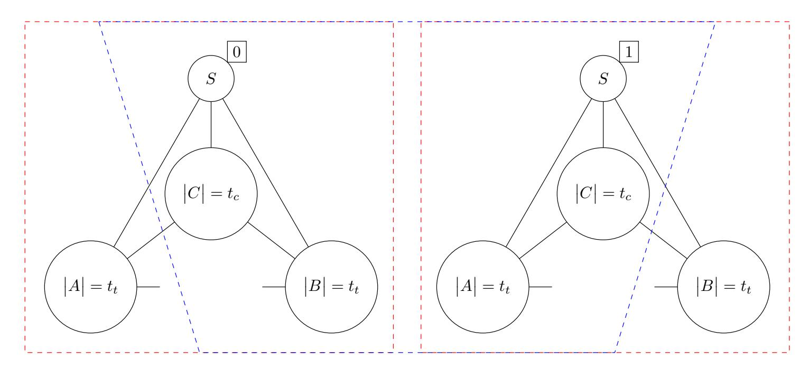
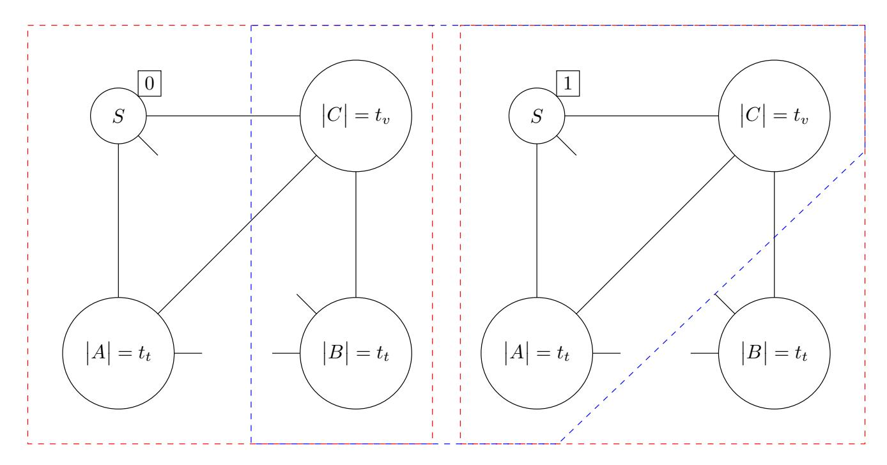
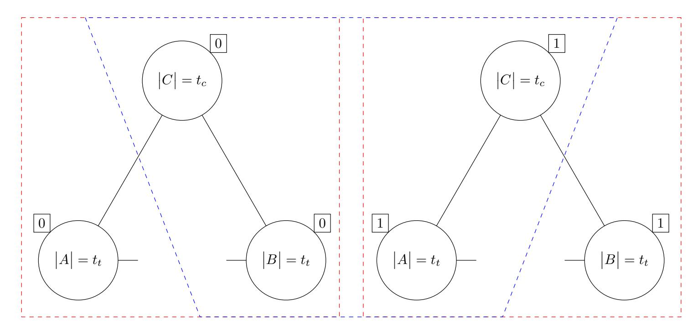
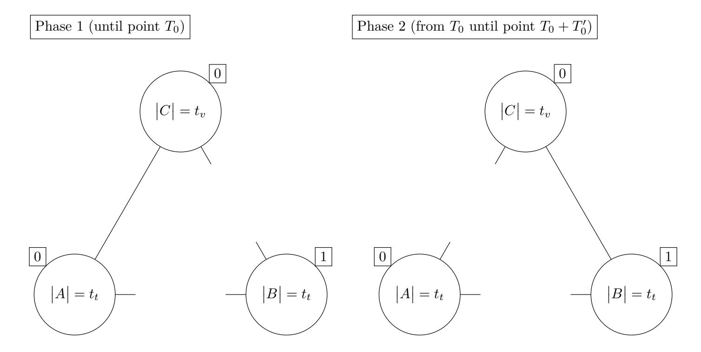
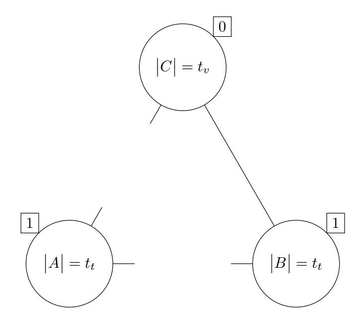
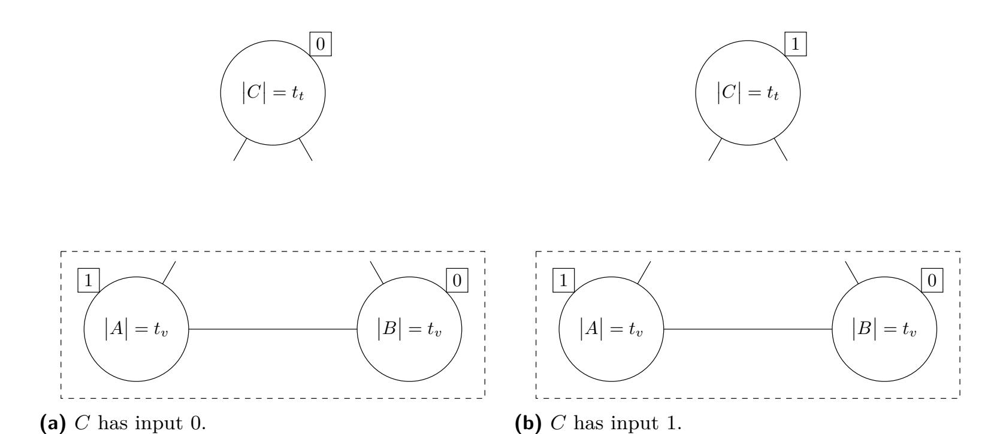

{0}------------------------------------------------

# **Multi-Threshold Asynchronous Reliable Broadcast and Consensus**

### **Martin Hirt**

Department of Computer Science, ETH Zurich, Switzerland hirt@inf.ethz.ch

### **Ard Kastrati**

Department of Computer Science, ETH Zurich, Switzerland ard.kastrati@inf.ethz.ch

### **[Chen-Da L](mailto:hirt@inf.ethz.ch)iu-Zhang**

Department of Computer Science, ETH Zurich, Switzerland lichen@inf.ethz.ch

#### **Abstract**

Classical protocols for reliable broadcast and consensus provide security guarantees as long as [the number of corr](mailto:lichen@inf.ethz.ch)upted parties *f* is bounded by a single given threshold *t*. If *f > t*, these protocols are completely deemed insecure. We consider the relaxed notion of *multi-threshold* reliable broadcast and consensus where validity, consistency and termination are guaranteed as long as *f ≤ tv*, *f ≤ tc* and *f ≤ tt* respectively. For consensus, we consider both variants of (1 *− ϵ*)-consensus and *almost-surely terminating* consensus, where termination is guaranteed with probability (1 *− ϵ*) and 1, respectively. We give a very complete characterization for these primitives in the asynchronous setting and with no signatures:

- Multi-threshold reliable broadcast is possible if and only if max*{tc, tv}* + 2*tt < n*.
- Multi-threshold almost-surely consensus is possible if max*{tc, tv}* + 2*tt < n*, 2*tv* + *tt < n* and *tt < n/*3. Assuming a global coin, it is possible if and only if max*{tc, tv}* + 2*tt < n* and 2*tv* + *tt < n*.
- Multi-threshold (1*−ϵ*)-consensus is possible if and only if max*{tc, tv}*+ 2*tt < n* and 2*tv* +*tt < n*.

**2012 ACM Subject Classification** Theory of computation *→* Computational complexity and cryptography; Theory of computation *→* Design and analysis of algorithms; Security and privacy *→* Cryptography

**Keywords and phrases** broadcast, byzantine agreement, multi-threshold

**Digital Object Identifier** 10.4230/LIPIcs.CVIT.2016.23

### **1 Introduction**

Consensus and reliable [broadcast are fundamental](https://doi.org/10.4230/LIPIcs.CVIT.2016.23) building blocks in fault-tolerant distributed computing. Consensus allows a set of parties, each holding an input, to agree on a common value *v ′* , where, if all honest parties hold the same input *v*, *v ′* = *v*. Reliable broadcast allows a designated party, called the sender, to consistently distribute a value *v* among a set of recipients such that all honest recipients output *v* in case the sender is honest. If the sender is dishonest, either all honest recipients output the same value or none of them terminates. Both primitives are used typically in the design of more complex applications, including multi-party computation, verifiable secret-sharing or voting, just to name a few.

The first consensus protocol was introduced in the seminal work of Lamport et al. [20] for the model where parties have access to a complete network of point-to-point authenticated channels, and where at most *t < n/*3 parties are corrupted. Reliable broadcast was first introduced by Bracha [5] as a useful primitive to construct building blocks in asynchronous 

{1}------------------------------------------------

environments. Since then, both primitives has been extensively studied in many different settings [6, 7, 5, 2, 24].

Most known fault-tolerant distributed protocols provide security guarantees in an *all-ornothing* fashion: if up to *t* parties are corrupted, all security guarantees remain. However, if more than *t* parties are corrupted, the protocols do not provide any security guarantees. Multi-thr[es](#page-14-1)[ho](#page-15-0)l[d](#page-14-0) [pr](#page-14-2)o[toc](#page-16-0)ols (also known as hybrid security) provide different security guarantees depending on the amount of corruption, thereby allowing a graceful degradation of security.

In this work, we consider consensus and reliable broadcast protocols with separate thresholds *tv*, *tc* and *tt* for *validity*, *consistency* and *termination*, respectively. For consensus, we consider both variants of (1 *− ϵ*)-consensus and *almost-surely terminating* consensus, where termination is guaranteed with probability (1 *− ϵ*) and 1, respectively. Our protocols work without the use of signatures and in the purely asynchronous model without the need to make any timing assumptions. Our contributions give a very complete picture of feasibility and impossibility results, which can be summarized as follows:

- Multi-threshold reliable broadcast is possible if and only if max*{tc, tv}* + 2*tt < n*.
- Multi-threshold almost-surely consensus is possible if max*{tc, tv}* + 2*tt < n*, 2*tv* + *tt < n* and *tt < n/*3. The first two conditions are shown to be necessary as well. The question whether *tt < n/*3 is necessary is left as an open problem. However, we give a protocol assuming a global coin that does not require this condition.
- Multi-threshold (1 *− ϵ*)-consensus is possible if and only if max*{tc, tv}* + 2*tt < n* and 2*tv* + *tt < n*.

The impossibility proofs are simple and follow the lines of [8].

### **1.1 Related Work**

There is a large literature devoted to achieving different types [of](#page-15-1) hybrid security guarantees under different settings for agreement primitives and multi-party computation (MPC). We are only able to list an incomplete summary of related work.

The work in [10] provides constructions in the synchronous model for Byzantine broadcast with extended validity or consistency, where Byzantine broadcast is achieved up to a threshold *t*, and validity / consistency is achieved up to an extended threshold *T ≥ t*, and then apply such constructions to achieve multi-party computation with full security up to *t* corruptions, and *[un](#page-15-2)animous abort* up to *T ≥ t*. The above constructions exists if and only if *t* = 0 or *t* + 2*T < n*. The works in [18, 19] focus on the question of achieving multi-party computation with full security under an honest majority, and *security with abort* under a dishonest majority. The line of works in [12, 23] provide constructions that achieve tradeoffs that include information-theoretic security up to a certain threshold, and computational security up to a larger threshold, with [diff](#page-15-3)[ere](#page-15-4)nt types of guarantees. A different line of works provide security against different types of corruption (also known as mixed adversaries). The works [11, 17] consider multi-party compu[tat](#page-15-5)i[on](#page-16-1) protocols where security holds even when up to *tp*, *tf* , *ta* parties can be passively, fail-stop, actively corrupted, respectively. Finally, there are works that combine mixed adversaries with hybrid security [15, 16, 14].

A recent line of works [22, 25, 21] achieve trade-offs between *responsiveness*, where parties obtain [ou](#page-15-6)t[put](#page-15-7) as fast as the network allows, and other security guarantees, for consensus, SMR and MPC, assuming a synchronous network. The work [13] considers to networks that tolerate some level of disconnection between the parties, as long a[s th](#page-15-8)[ere](#page-15-9) [is a](#page-15-10) connected

{2}------------------------------------------------

component with an honest majority of the parties. Finally, the works [3, 4] provide protocols that achieve security guarantees under a synchronous network up to *ts* corruptions, and under an asynchronous network up to *ta* corruptions.

### **1.2 Comparison to Prior Work**

Although with a different goal in mind, some works use as building blocks asynchronous consensus and reliable broadcast primitives. In particular, the works in [22, 21, 13] make use of an asynchronous multi-threshold consensus protocol with increased validity and consistency. Their constructions differ from ours in two aspects: 1) they operate in a setting where parties have access to a public-key infrastructure and 2) their constructions inherently require that the termination threshold is below *n/*3.

The constructions for consensus and reliable broadcast in [3, 4] considers different thresholds. In [3], the authors design a consensus protocol with increased *validity with termination* (where validity also ensures termination in case of pre-agreement) assuming a global common coin, based on the protocol in [24]. Similarly, in [4], the authors provide a construction for reliable broadcast with two thresholds allowing for validi[ty](#page-14-3) [w](#page-14-4)ith termination in the honest [se](#page-14-3)nder case, and consistency with *reliable* termination (where either all honest parties terminate or none), in the dishonest sender case. We provide constructions without assuming a global coin, which in addition [al](#page-16-0)low to have the [t](#page-14-4)ermination threshold above validity and consistency.

## **2 Model**

We consider a setting in which parties have access to a complete network of authenticated channels. We assume that the adversary has full control over the network and can schedule the messages in an arbitrary manner. However, each message must be eventually delivered. Moreover, we consider the setting where parties do not have any setup available.

We consider an *adaptive* adversary who can gradually corrupt parties and take full control over them. Note, however, that our impossibility proofs hold even with respect to a *static* adversary that is assumed to choose the corrupted parties at the beginning of the protocol execution.

We require our protocols to be *unconditionally secure*, meaning that security holds even against a computationally unbounded adversary. On the other hand, our impossibility results hold even against a computationally bounded adversary.

### **3 Multi-Threshold Reliable Broadcast**

Reliable broadcast is a fundamental primitive in distributed computing which allows a sender to consistently distribute a message towards a set of recipients. We consider a setting with *n* + 1 parties, one sender *S* and *n* recipients *R* = *{R*1*, ..., Rn}*. Let us denote the number of corrupted recipients (not including the sender) at the end of the protocol execution by *f*.

- I **Definition 1** (**Reliable Broadcast**)**.** *Let M be a finite message space and f be the number of corrupted recipients at the end of the execution. A protocol π where initially the sender S has an input m ∈ M and every recipient Ri upon termination outputs mi ∈ M, is a reliable broadcast protocol, with respect to thresholds tc, tv, and tt, if it satisfies the following:*
- **Consistency**. *If f ≤ tc, then every honest recipient that terminates outputs the same message. That is, ∃m′ ∈ M* : *∀ honest Ri that terminate mi* = *m′ .*

{3}------------------------------------------------

- **Validity**. *If f ≤ tv and the sender is honest, then every honest recipient Ri that terminates outputs the sender's message. That is, ∀ honest Ri that terminate mi* = *m.*
- **Termination**.
  - **1.** *An honest sender always terminates.*
  - **2.** *If f ≤ tt and an honest recipient terminates, then every honest recipient eventually terminates.*
  - **3.** *If f ≤ tt and the sender is honest, then eventually every honest recipient terminates.*

### **3.1 Protocol**

In the following, we present a reliable broadcast protocol with respect to thresholds *tc*, *tv* and *tt*, as long as max*{tv, tc}* + 2*tt < n*. The protocol is a generalization of Bracha's broadcast protocol [5].

#### **Protocol** Π *tc,tv,tt* rbc

The sender *S* holds input *m ∈ M*. Upon termination every recipient *Ri ∈ R* outputs a message.

- **Code for the sender** *S*
  - **1.** Send the message (MSG, *m*) to all recipients in *R* and terminate.
- **Code for recipient** *Ri ∈ R*
  - **1.** Upon receiving *first* (MSG, *m*) from the sender, send (ECHO, *m*) to all recipients.
  - **2.** Upon receiving (ECHO, *m′* ) from *n − tt* parties that agree on the value *m′ ∈ M*, send (READY, *m′* ) to all recipients.
  - **3.** Upon receiving (READY, *m′* ) from max*{tv, tc}* + 1 parties that agree on the value *m′ ∈ M*, send (READY, *m′* ) to all recipients.
  - **4.** Upon receiving (READY, *m′* ) or (TERMINATE) from *n − tt* parties from which at least max*{tv, tc}* + 1 are READY messages and (they all) agree on the value *m′ ∈ M*, send (TERMINATE), output *m′* and terminate.
- I **Lemma 2.** *If f ≤* max*{tv, tc}, ∀m′ ∈ M the first honest recipient that sends* (READY, *m′* ) *received at least n − tt* (ECHO, *m′* ) *messages.*
- **Proof.** For any *m′ ∈ M*, (READY, *m′* ) messages are sent by honest recipients either in line 2 or 3 of the recipient's code. However, *∀m′ ∈ M* the first (READY, *m′* ) message can only be sent in line 2. This is due to the fact that if *f ≤* max*{tv, tc}*, line 3 implies that there must be some other honest recipient that previously sent a (READY, *m′* ) message too. J
- I **Lemma 3.** *If f ≤* max*{tv, tc}, the messages* (READY, *m′* ) *sent by honest recipients are consistent. That is, there ∃m′′ ∈ M such that for every honest recipient Ri that sends* (READY, *m′* )*, m′* = *m′′ .*
- **Proof.** Suppose not; let *Ri* and *Rj* be the *first* honest recipients that send (READY, *m′* ) and (READY, *m′′*) with *m′ ̸*= *m′′*. Due to Lemma 2, *Ri* received at least *n − tt* (ECHO, *m′* ) messages whereas *Rj* received at least *n − tt* (ECHO, *m′′*) messages. It follows, at least 2(*n − tt*) *− n* = *n −* 2*tt >* max*{tv, tc}* players dishonestly sent inconsistent ECHO messages to *Ri* and *Rj* . However, each honest recipient sends an ECHO message at most once and there are at most *f ≤* max*{tv, tc}* dishonest recipien[ts.](#page-3-0) A contradiction. J
- I **Lemma 4.** *If f ≤* max*{tv, tc} and an honest sender broadcasts m, for every honest recipient that sends* (READY, *m′* )*, m′* = *m.*

{4}------------------------------------------------

**Proof.** Suppose not; Let *Ri* be the first honest recipient that sends (READY, *m′* ) with *m′ ̸*= *m*. Due to Lemma 2, *Ri* received at least *n − tt* (ECHO, *m′* ) messages. However, in case the sender is honest and broadcasts *m* every honest recipient will ECHO only the sender's value (*m*). Hence there can be at most *f ≤* max*{tv, tc} < n − tt* (ECHO, *m′* ) with *m ̸*= *m′* . A contradiction. J

I **Lemma 5.** *If f ≤ tt and an honest recipient terminates, then every honest recipient eventually terminates.*

**Proof.** Let *Ri* be the first honest recipient that terminates. Then, *Ri* received (READY, *m′* ) or (TERMINATE) from *n−tt* messages from which at least max*{tv, tc}*+ 1 are READY messages. Furthermore, all READY messages agree on *m′* . Under the assumption that no other honest recipient has terminated so far, we know that no (TERMINATE) messages were sent from the honest recipients. Hence, by taking into account that *n−tt >* max*{tv, tc}*+*tt* and *f ≤ tt*, it follows that at least max*{tv, tc}* + 1 recipients have sent (READY, *m′* ) to all other parties. Every honest recipient will eventually either receive these (READY, *m′* ) messages and send a (READY, *m′* ) as well or terminate before receiving them and send a (TERMINATE) message instead. Since there are at least *n − tt* honest recipients, it follows that eventually every honest recipient *Rl* that didn't terminate yet will receive *n−tt* messages (READY, *m′* ) or (TERMINATE) from which at least max*{tv, tc}*+ 1 are READY messages and they all agree on *m′* . Thus, every honest recipient *Rl* will eventually terminate as well. J

I **Lemma 6.** *If f ≤ tt and the sender is honest, at least one honest recipient eventually terminates.*

**Proof.** Since every honest recipient echoes the sender's value, there will be at least *n − tt* (ECHO, *m*) messages. With the same argument, since there are *n−tt* (ECHO, *m*) messages in the network, every honest recipient will eventually send a (READY, *m*). Finally, since there are *n − tt* (READY, *m*) messages in the network, at least one honest recipient will terminate. J

I **Theorem 7.** *Let* 0 *≤ tc, tv, tt < n.* Π *tc,tv,tt* rbc *is a multi-threshold broadcast according to Definition 1 if* max*{tv, tc}* + 2*tt < n.*

### **Proof.**

*Consistency & Validity*.

Assume *[f](#page-2-0) ≤* max*{tv, tc}*. Every honest recipient that outputs a message, has received at least max*{tv, tc}* + 1 (READY, *m*). Since *f ≤* max*{tv, tc}*, it follows at least one is sent from an honest party. From Lemma 3 we know that READY messages are consistent, hence we achieve consistency. From Lemma 4 we know that the READY messages from honest parties contain only the sender's value, hence we achieve validity.

*Termination*.

We prove all three requirements of th[e](#page-3-1) termination property from the Definition 1.

- **1.** For the first requirement, it is trivial to s[ee](#page-3-2) that an honest sender always terminates.
- **2.** The second requirement is proven in Lemma 5.
- **3.** For the third requirement, from Lemma 6 we know that if the sender is honest, at least one honest recipient terminates. We can apply Lemma 5 again, and s[ee](#page-2-0) that every honest recipient terminates.

J

{5}------------------------------------------------

#### 3.2 Impossibility Proofs

In this section, we show that the protocol  $\Pi_{\text{rbc}}^{t_c,t_v,t_t}$  presented above is optimal. That is, there is no reliable broadcast protocol with  $\max\{t_v,t_c\}+2t_t\geq n$ , where  $t_c,t_v,t_t\geq 0$ . We prove each bound separately.

**Figure 1** The same configuration can be viewed as: a) (in red) two independent runs of the protocol on the left and the right side, where messages between A and B are delayed: One where the sender has input 0 and one where the sender has input 1; b) (in blue) the sender and the set C is corrupted and behaves differently towards A and B.

▶ Theorem 8. There exists no multi-threshold broadcast protocol with  $t_c + 2t_t \ge n$ .

**Proof.** Suppose not; let  $\pi$  be a multi-threshold broadcast protocol with  $t_c + 2t_t = n$ . We partition the set of all recipients into three sets A, B and C with size  $|A| = |B| = t_t$  and  $|C| = t_c$ . We build the network as in Figure 1.

Figure 1(in red) on the left side, we can see an independent run where all parties are honest and messages between A and B are delayed by the scheduler. Since A and B are of size  $t_t$ , all parties terminate with an output. Moreover, since all parties are honest, the output is 0. In particular, parties in A output 0. With the same argument, B outputs 1 on the right side.

Now consider an attacker that corrupts the sender and C, and emulates the protocol as in the scenario in Figure 1(in blue). Since this configuration is exactly the same as the red one, A outputs 0 and B outputs 1. This results in a contradiction to the consistency property of the multi-threshold broadcast.

▶ Theorem 9. For any  $t_v > 0$ , there exists no multi-threshold broadcast protocol with  $t_v + 2t_t \ge n$ .

**Proof.** Suppose not; let  $\pi$  be a multi-threshold broadcast protocol with  $t_v + 2t_t = n$ . We partition the set of all recipients into three sets A, B and C with  $|A| = |B| = t_t$  and  $|C| = t_v$ . We build the a configuration as in Figure 2.

Consider Figure 2(in red), on the left side, where messages between S and B, or between A and B are delayed. Since B is of size  $t_t$ , all parties must output a value without waiting for the messages from B (as B could be corrupted). Moreover, since all parties are honest, A and C output 0. Furthermore, since C outputs 0, because of the second requirement of the termination of broadcast — if one recipient terminates, then every recipient terminates —

{6}------------------------------------------------

**Figure 2** The same configuration can be viewed as: a) (in red) two independent runs of the protocol on the left and the right side, where messages between A and B are delayed, and also between S and B. One where the sender has input 0 and one where the sender has input 1; b) (in blue) the set C is corrupted and behaves differently towards S and A on the left side and differently towards B on the right side.

B outputs 0 as well. Note that A and S have together size  $t_t + 1$ , but the second requirement of termination requires B to terminate even if the sender is corrupted. The same argument can be applied on the right side of Figure 2(in red).

Now, consider an attacker that corrupts the parties in C and emulates the protocol as in the scenario in Figure 2(in blue). Because both scenarios are the same setup, A outputs 0 on the left side, whereas B outputs 1 on the right side. Since B does not output the sender's input, validity is violated.

### 4 Almost-Surely Multi-Threshold Consensus

Stated in simple terms, consensus allows a set of parties to agree on a common value. More formally, the protocol starts with every party having an input and ends with every party having a consistent output. Moreover, if every honest party starts with the same input, they keep it. Due to the FLP impossibility proof [9], non-terminating executions are inevitable for every consensus protocol. Hence, we require the parties to terminate only with probability 1, termed in the literature as *almost-surely terminating* consensus.

- ▶ **Definition 10 (Consensus).** Let  $\mathcal{M}$  be a finite message space and f be the number of corrupted parties at the end of the execution. A protocol  $\pi$  where initially each party has an input  $x_i \in \mathcal{M}$  and finally every party  $P_i$  upon termination has an output  $y_i \in \mathcal{M}$ , is a consensus protocol, with respect to thresholds  $t_c$ ,  $t_v$ ,  $t_t$ , if it satisfies the following:
- **Consistency**. If  $f \leq t_c$ , then the output of every honest party is the same value. That is,  $\exists y \in \mathcal{M} : \forall \text{ honest } P_i \text{ that output } y_i = y$ .
- Validity. If  $f \le t_v$  and every honest party has the same input value  $x \in \mathcal{M}$ , then the output of every honest party  $P_i$  is x. That is,  $\forall$  honest  $P_i$  that output  $y_i = x$ .
- **Termination**. If  $f \leq t_t$ , then with probability 1 eventually every honest party outputs and terminates.

In the following, we present a multi-threshold consensus protocol with respect to thresholds  $t_c$ ,  $t_v$  and  $t_t$ , where  $\max\{t_c, t_v\} + 2t_t < n$ ,  $2t_v + t_t < n$  and  $t_t < n/3$ . In Appendix E, we

{7}------------------------------------------------

show that the bounds  $\max\{t_c, t_v\} + 2t_t < n$  and  $2t_v + t_t < n$  are required. We leave the feasibility of almost-surely multi-threshold consensus with  $t_t \ge n/3$  as an open question. However, in Section F, we provide a construction that overcomes the n/3 bound for the case where parties have access to a global coin.

The protocol is an adaptation of Bracha's consensus [5] protocol. The main idea of Bracha's consensus is to use a reliable broadcast primitive and build a correctness enforcement scheme, where only messages that are intended by the protocol design are accepted. The only difference in our protocol is that we plug our multi-threshold broadcast protocol described in the previous section into the correctness enforcement scheme proposed by Bracha. We choose to use a multi-threshold reliable broadcast  $\Pi_{\text{rbc}}^{t_s,t_s,t_t}$  that achieves validity and consistency up to  $t_s = n - 2t_t - 1$  corruptions (which is achievable since  $t_s + 2t_t < n$ ). Note that  $t_t < n/3$  imply that  $t_s \ge t_t$ .

#### 4.1 Multi-Threshold Correctness Enforcement

For completeness and readability of our protocols, we include a summary of the correctness enforcement mechanism. Further details can be found in [5]. The following constructions and proof techniques are very similar to [5] with the only difference that we plug our multithreshold broadcast protocol  $\Pi_{\text{rbc}}^{t_s,t_s,t_t}$ . Furthermore, we assume  $t_s \geq t_t$ .

**Round-Based Asynchronous Protocols.** We consider protocols that are composed by rounds. In each round k, every party uses the multi-threshold broadcast protocol to send a value to all parties. Subsequently, every party waits to receive a set S of the values (of size at most  $n - t_t$ ) and computes a new value according to some function  $F^k(\cdot)$  for the next round.

Validation Sets. Each party  $P_i$  keeps for each round k a set of values  $\mathcal{V}_i^k$ , called a validation set, with the values that are broadcast in round k. Each value  $x_i$  broadcasted in round k by  $P_i$  is stored as  $(P_i, k, x_i)$ . When a value is broadcast by some party at round k+1, every party checks locally whether there exists a subset of values in  $\mathcal{V}_i^k$  that explains the broadcast value. That is,  $\mathcal{V}_i^k$  is defined as follows:

- For k = 1,  $(P_j, 1, x_j) \in \mathcal{V}_i^1$  if  $x_j$  is received by  $P_i$  from a multi-threshold broadcast protocol with sender  $P_j$  at round 1.
- For k > 1,  $(P_j, k, x_j) \in \mathcal{V}_i^k$ , if  $x_j$  is received by  $P_i$  from a multi-threshold broadcast protocol with sender  $P_j$  at round k, and there is a subset  $S \subseteq \mathcal{V}_i^{k-1}$  such that  $x_j = F^{k-1}(S)$ .

We say a party  $P_i$  validates a message  $x_j$  in round k if  $(P_j, k, x_j) \in \mathcal{V}_i^k$ . The parties update their  $\mathcal{V}$  sets whenever they validate a message. If a party  $P_i$  outputs a value during a broadcast protocol but the message is still not validated it is ignored in the protocol, although it is stored for future validation.

**Protocol** A round with correctness enforcement

Code for the party  $P_i$  with input  $x_i$  at round k

- 1. Multi-Threshold Broadcast $(x_i)$  to all the parties.
- **2.** Wait until a set S of messages have been validated.
- **3.** Set  $x_i = F^k(S)$ .

We state a list of lemmas that are guaranteed from the correctness enforcement mechanism. The proofs can be found in Appendix A.

{8}------------------------------------------------

I **Lemma 11.** *If f ≤ ts, in every round k of the protocol the added values in the validation sets of all honest parties are consistent. That is:*

$$\forall \text{ honest } P_i, P_j : \forall P_l : (P_l, k, x_l) \in \mathcal{V}_i^k \land (P_l, k, \tilde{x}_l) \in \mathcal{V}_j^k \implies x_l = \tilde{x}_l$$

I **Lemma 12.** *If f ≤ ts and an honest sender Pi broadcasts* (*Pi , k, xi*) *in a round k of the protocol, the validation sets of all honest parties contain only the sender's value. That is:*

$$\forall$$
 honest  $P_i, P_j : (P_i, k, x_i) \in \mathcal{V}_j^k \implies P_i$  broadcast  $x_i$  in round  $k$ .

I **Lemma 13.** *If f ≤ tt every party will eventually go from round k to round k* + 1*.*

### **4.2 Protocol**

We formally describe the protocol, which is a generalization of Bracha's consensus [5].

#### **Protocol** Π *tc,tv,tt* as*−*con

*Input.* Every party *Pi* holds input *xi*.

*Variable. yi* = *⊥*.

#### **Reaching agreement.**

- **Code for the party** *Pi* **at phase** *k***.**
  - **1.** Π *ts,ts,tt* rbc (*xi*). Wait until *n − tt* messages are validated.
    - *xi* = majority of the validated elements.
  - **2.** Π *ts,ts,tt* rbc (*xi*). Wait until *n − tt* messages are validated.
    - If all of the validated messages have the same value *x*, *xi* = (propose*, x*)
    - Otherwise, keep the same *xi*.
  - **3.** Π *ts,ts,tt* rbc (*xi*). Wait until *n − tt* messages are validated.
    - (i) If at least *n − tt* of the validated messages have the same value (propose*, x*), then update *yi* = *x* and run the protocol for only one more round.
    - (ii) Else if at least *tt* + 1 of the validated messages have the same value (propose*, x*), then *xi* = *x*.
  - (iii) Otherwise, choose 0 or 1 with probability 1/2 for *xi* (coin toss).
  - **4.** Go to phase *k* + 1.

#### **Termination.**

- Upon updating *yi*, send (READY, *yi*) to all parties.
- Upon receiving (READY, *m′* ) messages from max*{tc, tv}* + 1 parties that agree on the value *m′* , send (READY, *m′* ) to all parties.
- Upon receiving (READY, *m′* ) from *n − tt* parties that agree on the value *m′* , output *m′* and terminate.
- I **Lemma 14.** *If f ≤ ts, it is impossible for an honest party to propose* 0 *and an honest party to propose* 1 *in the same phase k.*
- **Proof.** The proof is by contradiction. Suppose that party *Pi* and *Pj* propose 0 and 1, respectively, in phase *k*. Thus in line 2 of the phase *k*, *Pi* validated *n − tt* messages with the same value 0 and *Pj* validated *n − tt* messages with the same value 1. Since *n −* 2*tt >* 0, it follows that *Pi* and *Pj* have inconsistent messages in their validation sets. Due to Lemma 11, this is impossible. J

{9}------------------------------------------------

We say that a phase *k* is *x*-fixed (for *x ∈ {*0*,* 1*}*), if honest parties that starts phase *k* validate only *x* as an input value broadcast by any party.

I **Lemma 15.** *If f ≤ ts and an honest party Pi updates yi* = *x ∈ {*0*,* 1*} at some phase k, phase k* + 1 *is x-fixed.*

**Proof.** Suppose that some party *Pi* updates *yi* = *x ∈ {*0*,* 1*}* at phase *k*. *Pi* must have validated at least *n−tt* proposals for *x* in step 3 of phase *k*. Let *Pj* be any party that starts phase *k* + 1. In phase *k*, since *Pi* validated *n−tt* proposals for *x* and *tt < n/*3, *Pj* must have validated at least *tt* + 1 for *x*. Moreover by Lemma 14, *Pj* does not validate any proposals for *x ′ ̸*= *x*. So any *Pj* can only set its variable *xj* to *x* in step 3. Hence, no honest party can validate *x ′ ̸*= *x* in the next phase as an input. Therefore, phase *k* + 1 is *x*-fixed. J

I **Lemma 16.** *If a phase k is x-fixed then every ho[nes](#page-8-0)t party Pi that reaches step 3 of the phase k updates yi* = *x at the end of the phase.*

**Proof.** Suppose a phase *k* is *x*-fixed. Then, all honest parties validate only *x* as an input value. Hence, every honest party can only propose *x* as their input. Consider a party *Pi* that reaches step 3 of phase *k*. Clearly, *Pi* can only validate proposals with *x*. Hence, from line 3 of the *reaching agreement* part of the protocol we can see that *Pi* updates *yi* = *x*. J

I **Lemma 17** (Liveness)**.** *If f ≤ tt and if no honest party updated yi, the parties will eventually go from phase k to phase k* + 1*.*

**Proof.** Immediate from Lemma 13. J

I **Lemma 18.** *If f ≤ tt every honest party with probability* 1 *will update yi to the same value.*

*Proof.* First note that we assume *tt ≤ ts*. From Lemma 17 as long as no parties updated *yi* , it follows that honest parties don't get stuck in rounds. Every honest party that doesn't update *yi* in phase *k*, sets its value *xi* for the next phase either based on step 3(ii) or step 3(iii). Let *Pi* be the first honest party that completed round 3*k* + 3. There are two cases:

- Party *Pi* has validated at least one (propose*, x*). With probability *p ≥* 1*/*2 *n−tt* all honest parties that toss a coin choose *x*. By Lemma 14, the remaining honest parties that set their value deterministically, are forced to set their value to *x*.
- Party *Pi* has validated no (propose*, x*). Since *Pi* validated *n − tt* messages and *tt < n/*3, no other honest party *Pj* can validate more than *tt* values of the form (propose*, x*). Hence, every honest party tosses a coin. The probabili[ty](#page-8-0) that every honest party tosses the same value is again *p ≥* 1*/*2 *n−tt* .

Hence, in either case after each phase the probability that honest parties have the same value is greater or equal then 1*/*2 *n−tt* . If at some phase *k* every honest party has the same value then it follows that in the next round there can be at most *tt* parties will input *x*¯ (the ones that maliciously change the outcome of the local coin). However, by Lemma 15 (note that we have *tt ≤ ts*) and since *n −* 2*tt > tt*, it follows that the majority of each subset of size *n − tt* in the next round will result in *x*. Hence, next phase is *x*-fixed. By Lemma 16 it follows that every honest party will update *yi* after that phase. Hence, the probability of not updating *yi* is 0.

{10}------------------------------------------------

▶ Theorem 19. Let  $0 \le t_c, t_v, t_t < n$ .  $\Pi_{\mathtt{as-con}}^{t_c, t_v, t_t}$  is an almost-surely terminating multi-threshold consensus according to Definition 10 if  $\max\{t_c, t_v\} + 2t_t < n$ ,  $2t_v + t_t < n$  and  $t_t < n/3$ .

Proof.

- Validity. Suppose all honest parties have the same input x. In the first round, since there are at most  $f \leq t_v$ , at most  $t_v$  elements with value  $\bar{x}$  can be broadcast by corrupted parties. By Lemma 15 (note that  $t_v \leq \max\{t_c, t_v\} = t_s$ ) and since  $n t_t t_v > t_v$ , it follows that honest parties can only validate x as the outcome of the first round. Hence, the first phase is x-fixed. Due to Lemma 16, it follows that every honest party updates  $y_i = x$  at the end of the first phase. Furthermore, by applying Lemma 15 and 16 recursively, one can easily see that once a phase is x-fixed it always remains so. Hence, parties can never change the value. Furthermore, in the termination part of the protocol it is not hard to see that READY messages are unique (see Section 3 for a detailed proof) and contain only x. Hence, every honest party that outputs, outputs x.
- Consistency Suppose some party  $P_i$  and  $P_j$  update different values  $y_i = x$  and  $y_j = x'$  in phase k and k' respectively. There are two cases:
  - 1. k = k'. Since a party can update a value in phase k only if that value was proposed in round k, it follows both x and x' were proposed in phase k. By Lemma 14 this is impossible.
  - 2. k < k'. Since  $P_i$  updates  $y_i$  in phase k then due to Lemma 15 phase k + 1 is x-fixed. Similar to previous arguments, by applying Lemma 15 and 16 recursively, one can easily see that once a phase is x-fixed it always remains so. It follows that all parties can only update  $y_i = x$  in the next phases.

This proves that the update of  $y_i$  by all parties is unique. In return this implies that READY messages are unique as well. By similar arguments as in Section 3, it is not hard to see that the consistency is achieved also in the termination part of the protocol.

From Lemma 18 it follows that with probability 1 every honest party will update  $y_i$  to the same value (say x). Since, after updating  $y_i = x$  parties take part only in one more round, with probability 1 every honest party will "get out" of the infinite loop. By simply setting the message space  $\mathcal{M} = \{0,1\}$  one can easily prove now termination similar to Section 3. It follows, like in multi-threshold broadcast protocol, every party will eventually send the same (READY, x) with  $x \in \{0,1\}$ . Hence eventually there will be  $n - t_t$  (READY, x) messages that agree on a value and thus at least an honest party with probability 1 terminates. Again, similar to broadcast one can see that if an honest party terminates, then every honest party eventually terminates. Thus with probability 1 eventually everyone terminates.

## **5** $(1-\epsilon)$ Multi-Threshold Consensus

The general idea in the previous section is to use randomness such that by chance the parties reach agreement. Once they do, agreement is preserved. However, in the regime where  $t_t \geq n/3$ , the following challenges arise. First, note that if  $t_t \geq n/3$  and  $\max\{t_c, t_v\} + 2t_t < n$ , then  $\max\{t_c, t_v\} < t_t$ . As a consequence, there is a region where the multi-threshold broadcast protocol only guarantees termination, but does not guarantee the consistency and validity of the outputs. This is problematic, because the adversary can change the outputs of

{11}------------------------------------------------

each broadcast instance such that no messages are validated in the correctness enforcement scheme. As a consequence, parties get stuck in a phase and never terminate. The second challenge is with respect to the coin. If *tt ≥ n/*3, even when all honest parties obtain the same value *v* as local coin, the adversary can schedule messages so that the majority decision among *n−tt* values is inconsistent among the parties. Finally, as pointed out in [1], the correctness proof for *n/*3 *≤ tt < n/*2 is more subtle and requires reasoning about two consecutive phases. Moreover, they show that the global-variant of Ben-Or *doesn't work* for the case *n/*3 *≤ tt < n/*2.

We overcome the first challenge by plugging in a *detectable broadcast* primitive into t[h](#page-14-5)e correctness enforcement mechanism, which allows parties to eventually detect misbehavior in the case where they obtain different values. The second challenge is resolved by cycling through all sets *S* of *tt* + 1 parties, where only parties in *S* sample a random coin. This way, if all parties in *S* are honest and chooses the same local coin, then everyone adopts the same value. Finally, the last challenge is resolved by adding one round for each phase, which allows to analyse the phases independently of each other.

We show that with these techniques, one can construct a (1*−ϵ*) multi-threshold consensus protocol if max*{tc, tv}* + 2*tt < n* and 2*tv* + *tt < n*, where the termination property holds with probability (1*−ϵ*) (instead of 1). The bounds are optimal, as shown in Appendix E. In contrast to the almost-surely-terminating version, it is possible to achieve this notion with *tt ≥ n/*3.

- I **Definition 20** ((1 *− ϵ*)**-Consensus**)**.** *The consistency and validity property of* (1 *[−](#page-22-0) ϵ*) *consensus are the same as in Definition 10. We only change the termination property.*
- **Termination**. *If f ≤ tt, then with probability* 1 *− ϵ eventually every honest party outputs and terminates.*

### **5.1 Detectable Correctness Enforcement**

As mentioned above, if *tt >* max*{tv, tc}*, in the region where the adversary corrupts max*{tv, tc} < f ≤ tt*, the multi-threshold broadcast does not guarantee any consistency among messages, allowing the adversary to make parties reach a state where no messages are validated and thus all honest parties get stuck.

Instead, we use a *detectable* multi-threshold broadcast, which guarantees consistent outputs when *f ≤* max*{tc, tv}* as in multi-threshold broadcast, but in addition allows parties to detect potential misbehavior if *f ≤ tt*. We note, however, that we don't require the parties to terminate, i.e., parties may need to run forever. The protocol is based on the one in Section 3, so we defer its description and analysis to Appendix B.

- I **Definition 21** (**Detectable Multi-Threshold Broadcast**)**.** *Let M be a finite message space and f be the number of corrupted parties. A protocol π, where initially the sender S has an input m[es](#page-2-1)sage m ∈ M and subsequently every recipient Ri ∈ R p[ot](#page-17-0)entially outputs a message mi ∈ M and/or a detection flag* DETECT*, is a detectable multi-threshold broadcast protocol with respect to thresholds tc, tv and tt, if it satisfies the following:*
- **Consistency.** *If f ≤ tc, ∃m′ ∈ M* : *∀ honest Ri that output the message mi, the value of mi* = *m′ . Furthermore, no honest recipient Ri outputs the detection flag* DETECT*.*
- **Validity.** *If f ≤ tv and the sender is honest, ∀ honest Ri that output the message mi, the value of mi* = *m. Furthermore, no honest recipient Ri outputs the detection flag* DETECT*.*

{12}------------------------------------------------

#### **Totality-or-Detection**.

- **1.** *If f ≤ tt and an honest recipient outputs the message m′ ∈ M then eventually every honest recipient outputs the message m′ or every honest recipient outputs the detection flag* DETECT*.*
- **2.** *If f ≤ tt and the sender is honest, then eventually every honest recipient outputs the message m or every honest recipient outputs the detection flag* DETECT*.*

**Notation.** We say that "*Pi* detects Byzantine behaviour" to denote that *Pi* outputs the detection flag DETECT in an execution of detectable multi-threshold broadcast. Note that detectable multi-threshold broadcast guarantees that either all honest recipients eventually output DETECT, or none of them does.

Plugging the detectable multi-threshold broadcast in the correctness enforcement results in detectable correctness enforcement, where the properties of correctness enforcement hold or parties detect Byzantine behavior. See Appendix C for more details.

### **5.2 Common Coin**

In the protocol presented in Section 4, all parti[es](#page-18-0) toss a coin until they reach by chance agreement. If *tt ≥ n/*3, the adversary can maliciously change the local coins for some of the parties and break termination. We show a protocol that allows parties to output the same value, even if the adversary maliciously changes the outcome of the local coin of some of the parties. If *tt < n/*3, this is easily don[e b](#page-6-2)y allowing each party to broadcast a random value and choosing the majority among the *n − tt* values that are received. For *n/*3 *≤ tt < n/*2, one cannot take the majority value. The idea is to let only a subset *R* of *tt* + 1 parties toss a local coin:

**Protocol** Coin(R), 
$$f \le t_t < n/2$$
,  $|R| = t_t + 1$ 

- **1.** If *Pi ∈ R*: choose 0 or 1 with probability 1*/*2 and detectable-broadcast the outcome to everyone.
- **2.** Every party outputs the value of the first broadcast that output.

If all the parties in *R* are honest and toss the same coin, then every party outputs the same value. During the consensus protocol, we *cycle* through all subsets of size *tt* + 1. If *tt < n/*2, one of them contains only honest parties, and in that phase, if all parties toss the same coin (we denote it a *lucky* phase), all honest parties obtain the same value.

### **5.3 Protocol**

The protocol is very similar to the one in Section 4, but with four changes: 1) it is executed a fixed number of phases, 2) the broadcast protocols are replaced by detectable broadcast protocols (allowing parties for detectable correctness enforcement), 3) the coin is replaced by the one in Section 5.2 and 4) a termination protocol which works even if *tt >* max*{tc, tv}*. In addition, the protocol has a special initial majori[ty](#page-6-2) round that allows for a simpler analysis of validity and one *lock-round* for each phase that allows the deterministic value of a phase to be fixed before the coins are revealed.

The intuition [behi](#page-12-0)nd fixing the number of phases is that if the protocol runs indefinitely, it may happen that some messages are *never* scheduled. In particular, even though the detectable broadcast *eventually* detects misbehavior, such messages are never scheduled

{13}------------------------------------------------

because there are always other messages that the adversary can schedule1. However, this cannot happen if the number of phases is fixed. Then, by setting a "large enough" number of phases, the parties should reach agreement with high probability  $(1-\epsilon)$ , unless the adversary misbehaved in a detectable broadcast protocol, in which case parties detect it and eventually reach agreement.

We call a batch B an iteration over all subsets of size  $t_t+1$ , i.e.  $B=\binom{n}{t_t+1}$ . Furthermore, we set an upper bound K+1 on the number of batches (hence we have (K+1)B phases in total), so that the probability that parties are not in agreement after (K+1)B phases is at most  $\epsilon$ .

## Protocol $\Pi_{(1-\epsilon)-\mathtt{con}}^{t_c,t_v,t_t}$

Input. Every party  $P_i$  holds input  $x_i \in \{0, 1\}$ . Variable.  $y_i = \bot$ .

Initial majority round // This initial round is necessary to ensure validity.

- Detectable-Broadcast( $x_i$ ) to every party. Wait until  $n-t_t$  messages have been validated.
  - Set  $x_i$  = majority of the  $n t_t$  validated messages.

**Reaching agreement.** Repeat at most K+1 times: //K+1 batches.

- For every subset R of size  $|R| = t_t + 1$  do: // we call this loop one batch.
  - 1. Detectable-Broadcast $(x_i)$  to every party. Wait until  $n-t_t$  messages have been validated.
    - If all validated messages have the same value x, update  $x_i = (lock, x)$ , else update  $x_i = (lock, ?)$ .
  - **2.** Detectable-Broadcast $(x_i)$  to every party. Wait until  $n-t_t$  messages have been validated.
    - If all messages are (lock, x) with the same  $x \in \{0, 1\}$ , update  $x_i = (\text{propose}, x)$ , else update  $x_i = (\text{propose}, ?)$ .
  - 3. Set  $c_i = \operatorname{Coin}(R)$ .
  - **4.** Detectable-Broadcast $(x_i)$  to every party. Wait until  $n-t_t$  messages have been validated.
    - If all messages are (propose, x) with  $x \in \{0, 1\}$ , update  $y_i = x$ .
    - Else if at least one of the messages is (propose, x) with  $x \in \{0, 1\}$ , then  $x_i = x$ .
    - Otherwise, set  $x_i = c_i$ .

#### Termination.

- Upon updating  $y_i$ , send (READY,  $y_i$ ) to all parties.
- Upon detecting a Byzantine behaviour, send (READY,  $\perp$ ) to all parties.
- Upon receiving (READY, d') messages from  $\max\{t_c, t_v\} + 1$  parties that agree on the value  $m' \in \{0, 1, \bot\}$  during the consensus protocol, send (READY, m') to all parties.
- Upon receiving (READY, m') or (TERMINATE) from  $n t_t$  parties from which at least  $\max\{t_v, t_c\} + 1$  are READY messages and (they all) agree on the value  $m' \in \{0, 1, \bot\}$ , send (TERMINATE) to all recipients, output m' and terminate.

In the following we present a high level idea of the proof for the correctness of the protocol. A formal analysis of the protocol can be found in Appendix D. Intuitively, if  $f \leq \max\{t_c, t_v\}$ , correctness enforcement ensures the same properties as in the protocol  $\Pi_{as-con}^{t_c,t_v,t_t}$ , making the proofs of validity and consistency similar to those. However, the termination property involves a bit more careful analysis.

&lt;sup>1 This is the main challenge that one needs to overcome to design an almost-surely terminating consensus for  $t_t \ge n/3$ .

{14}------------------------------------------------

Validity. Similar to  $\Pi_{\mathsf{as-con}}^{t_c,t_v,t_t}$ , assume all honest parties have the same input x. In the initial majority round, since there are at most  $f \leq t_v$ , at most  $t_v$  elements with value other than x can be broadcasted by corrupted parties. Because of the validity of the detectable broadcast protocol and since  $n - t_t - t_v > t_v$ , it follows that honest parties can only validate x as the outcome of the first round. This implies that in the next phases only x is a valid message and no other value can be "locked" or "proposed". The rest of the proof follows mainly from the fact Byzantine behavior is prevented due to correctness enforcement and  $f \leq \max\{t_c, t_v\}$ . Finally, the termination part is argued similarly as the multi-threshold broadcast from Section 3, which guarantees that all honest parties send consistent READY messages.

Consistency. Again similar to  $\Pi_{as-con}^{t_c,t_v,t_t}$ , the proof relies on two facts: 1) honest parties cannot propose or lock different values within one phase, and 2) if an honest party  $P_i$  updates  $y_i$  in some phase, then honest parties can only validate  $y_i$  in the following phases. Assume that honest parties  $P_i$  and  $P_j$  update  $y_i \neq y_j$  in phases  $k_i$  and  $k_j \geq k_i$ . It cannot be that  $k_i = k_j$ , since because both values would need to be proposed, contradicting fact 1). Moreover, if  $k_j > k_i$ , parties can only output  $y_i$  by fact 2).

**Termination.** The idea is that either each honest party  $P_i$  updates to the same value  $y_i = y$ , or Byzantine behavior is detected. This is because with high probability, there is a phase where honest parties reach agreement by chance (they obtain the same value from the coin, and the coin coincides with the deterministic value of that phase), unless the adversary tampered the outputs from a detectable broadcast protocol in which case it will eventually be detected. As a result, one can argue that there is an honest party that terminates (every honest party eventually sends the same READY message), which in turn implies that eventually everyone terminates by a similar argument as for the broadcast protocol in Section 3. Note that parties send a READY message also when they detect Byzantine behaviour, which intuitively states that the parties are READY to terminate without a decision value. In other words, in the region  $\max\{t_c, t_v\} < f \le t_t$  parties are able to reach an agreement for termination, even though they cannot reach an agreement for a consistent output.

#### References

- 1 Marcos K. Aguilera and Sam Toueg. The correctness proof of Ben-Or's randomized consensus algorithm. *Distributed Computing*, 25(5):371–381, 2012. doi:10.1007/s00446-012-0162-z.
- Michael Ben-Or. Another advantage of free choice: Completely asynchronous agreement protocols (extended abstract). In *Proceedings of the Second Annual ACM SIGACT-SIGOPS Symposium on Principles of Distributed Computing*, pages 27–30. ACM, 1983. doi:10.1145/800221.806707.
- 3 Erica Blum, Jonathan Katz, and Julian Loss. Synchronous consensus with optimal asynchronous fallback guarantees. In Dennis Hofheinz and Alon Rosen, editors, *TCC 2019*, *Part I*, volume 11891 of *LNCS*, pages 131–150. Springer, Heidelberg, December 2019. doi: 10.1007/978-3-030-36030-6\_6.
- 4 Erica Blum, Jonathan Katz, and Julian Loss. Network-agnostic state machine replication. Cryptology ePrint Archive, Report 2020/142, 2020. https://eprint.iacr.org/2020/142.
- 5 Gabriel Bracha. Asynchronous Byzantine agreement protocols. *Information and Computation*, 75(2):130-143, 1987. URL: http://dx.doi.org/10.1016/0890-5401(87)90054-X, doi:10.1016/0890-5401(87)90054-X.
- **6** Danny Dolev and H. Raymond Strong. Authenticated algorithms for byzantine agreement. SIAM Journal on Computing, 12(4):656–666, 1983.

{15}------------------------------------------------

- **7** Pesech Feldman and Silvio Micali. An optimal probabilistic protocol for synchronous byzantine agreement. *SIAM Journal on Computing*, 26(4):873–933, 1997.
- **8** Michael J. Fischer, Nancy A. Lynch, and Michael Merritt. Easy impossibility proofs for distributed consensus problems. In Michael A. Malcolm and H. Raymond Strong, editors, *4th ACM PODC*, pages 59–70. ACM, August 1985. doi:10.1145/323596.323602.
- **9** Michael J. Fischer, Nancy A. Lynch, and Michael S. Paterson. Impossibility of distributed consensus with one faulty process. *Journal of the ACM*, 32(2):374–382, 1985. doi:10.1145/ 3149.214121.
- **10** Matthias Fitzi, Martin Hirt, Thomas Holenstein, [and Jürg Wullschleger. Two-th](https://doi.org/10.1145/323596.323602)reshold broadcast and detectable multi-party computation. In Eli Biham, editor, *EUROCRYPT 2003*, volume 2656 of *LNCS*, pages 51–67. Springer, Heidelberg, May 2003. [doi:10.1007/](https://doi.org/10.1145/3149.214121) [3-540-39200](https://doi.org/10.1145/3149.214121)-9\_4.
- **11** Matthias Fitzi, Martin Hirt, and Ueli M. Maurer. Trading correctness for privacy in unconditional multi-party computation (extended abstract). In Hugo Krawczyk, editor, *CRYPTO'98*, volume 1462 of *LNCS*, pages 121–136. Springer, Heidelberg, [August 1998.](https://doi.org/10.1007/3-540-39200-9_4) [doi:10.1007/BFb0](https://doi.org/10.1007/3-540-39200-9_4)055724.
- **12** Matthias Fitzi, Thomas Holenstein, and Jürg Wullschleger. Multi-party computation with hybrid security. In Christian Cachin and Jan Camenisch, editors, *EUROCRYPT 2004*, volume 3027 of *LNCS*, pages 419–438. Springer, Heidelberg, May 2004. doi:10.1007/ [978-3-540-24676-3\\_25](https://doi.org/10.1007/BFb0055724).
- **13** Yue Guo, Rafael Pass, and Elaine Shi. Synchronous, with a chance of partition tolerance. In Alexandra Boldyreva and Daniele Micciancio, editors, *CRYPTO 2019, Part I*, volume 11692 of *LNCS*, pages 499–529. Springer, Heidelberg, August 2019. [doi:10.1007/](https://doi.org/10.1007/978-3-540-24676-3_25) [978-3-030-26948-7\\_18](https://doi.org/10.1007/978-3-540-24676-3_25).
- **14** Martin Hirt, Christoph Lucas, and Ueli Maurer. A dynamic tradeoff between active and passive corruptions in secure multi-party computation. In Ran Canetti and Juan A. Garay, editors, *CRYPTO 2013, Part II*, volume 8043 of *LNCS*, pages 203–219. Spring[er, Heidelberg,](https://doi.org/10.1007/978-3-030-26948-7_18) [August 2013.](https://doi.org/10.1007/978-3-030-26948-7_18) doi:10.1007/978-3-642-40084-1\_12.
- **15** Martin Hirt, Christoph Lucas, Ueli Maurer, and Dominik Raub. Graceful degradation in multi-party computation (extended abstract). In Serge Fehr, editor, *ICITS 11*, volume 6673 of *LNCS*, pages 163–180. Springer, Heidelberg, May 2011. doi:10.1007/978-3-642-20728-0\_ 15.
- **16** Martin Hirt, Christoph Lucas, Ueli Maurer, and Dominik Raub. Passive corruption in statistical multi-party computation - (extended abstract). In Adam Smith, editor, *ICITS 12*, volume 7412 of *LNCS*, pages 129–146. Springer, Heide[lberg, August 2012.](https://doi.org/10.1007/978-3-642-20728-0_15) doi:10.1007/ [97](https://doi.org/10.1007/978-3-642-20728-0_15)8-3-642-32284-6\_8.
- **17** Martin Hirt, Ueli M. Maurer, and Vassilis Zikas. MPC vs. SFE: Unconditional and computational security. In Josef Pieprzyk, editor, *ASIACRYPT 2008*, volume 5350 of *LNCS*, pages 1–18. Springer, Heidelberg, December 2008. doi:10.1007/978-3-540-89255-[7\\_1](https://doi.org/10.1007/978-3-642-32284-6_8).
- **18** [Yuval Ishai, Eyal Kush](https://doi.org/10.1007/978-3-642-32284-6_8)ilevitz, Yehuda Lindell, and Erez Petrank. On combining privacy with guaranteed output delivery in secure multiparty computation. In Cynthia Dwork, editor, *CRYPTO 2006*, volume 4117 of *LNCS*, pages 483–500. Springer, Heidelberg, August 2006. doi:10.1007/11818175\_29.
- **19** Jonathan Katz. On achieving the "best of both worlds" in secure multiparty computation. In David S. Johnson and Uriel Feige, editors, *39th ACM STOC*, pages 11–20. ACM Press, June 2007. doi:10.1145/1250790.1250793.
- **20** [Leslie Lamport, Robert Sho](https://doi.org/10.1007/11818175_29)stak, and Marshall Pease. The byzantine generals problem. *ACM Transactions on Programming Languages and Systems*, 4(3):382–401, 1982.
- **21** Chen-Da Liu-Zhang, Julian Loss, Ueli Maurer, Tal Moran, and Daniel Tschudi. Robust MPC: Async[hronous responsiveness yet sync](https://doi.org/10.1145/1250790.1250793)hronous security. Cryptology ePrint Archive, Report 2019/159, 2019. https://eprint.iacr.org/2019/159.

{16}------------------------------------------------

- Julian Loss and Tal Moran. Combining asynchronous and synchronous byzantine agreement: The best of both worlds. Cryptology ePrint Archive, Report 2018/235, 2018. https://eprint.iacr.org/2018/235.
- Christoph Lucas, Dominik Raub, and Ueli M. Maurer. Hybrid-secure MPC: trading information-theoretic robustness for computational privacy. In Andréa W. Richa and Rachid Guerraoui, editors, 29th ACM PODC, pages 219–228. ACM, July 2010. doi:10.1145/1835698.1835747.
- Achour Mostéfaoui, Moumen Hamouma, and Michel Raynal. Signature-free asynchronous Byzantine consensus with t < n/3 and  $O(n^2)$  messages. In ACM Symposium on Principles of Distributed Computing, pages 2–9. ACM, 2014. doi:10.1145/2611462.2611468.
- Rafael Pass and Elaine Shi. Thunderella: Blockchains with optimistic instant confirmation. In Jesper Buus Nielsen and Vincent Rijmen, editors, *EUROCRYPT 2018*, *Part II*, volume 10821 of *LNCS*, pages 3–33. Springer, Heidelberg, April / May 2018. doi:10.1007/978-3-319-78375-8\_1.
- Michael O. Rabin. Randomized Byzantine generals. In 24th Annual Symposium on Foundations of Computer Science, pages 403–409. IEEE Computer Society, 1983. doi:10.1109/SFCS.1983.48.

#### A Multi-Threshold Correctness Enforcement

We include the properties that a multi-threshold correctness enforcement has. We assume  $t_s \geq t_t$ .

 $\triangleright$  **Lemma 11**. If  $f \le t_s$ , in every round k of the protocol the added values in the validation sets of all honest parties are consistent. That is:

$$\forall \text{ honest } P_i, P_j : \forall P_l : (P_l, k, x_l) \in \mathcal{V}_i^k \land (P_l, k, \tilde{x}_l) \in \mathcal{V}_i^k \implies x_l = \tilde{x}_l$$

**Proof.** Assume for some  $P_l$  in round k,  $(P_l, k, x_l) \in \mathcal{V}_i^k$  and  $(P_l, k, \tilde{x}_l) \in \mathcal{V}_j^k$ . By consistency property of the multi-threshold broadcast protocol it follows that  $x_l = \tilde{x}_l$ .

 $\triangleright$  Lemma 12. If  $f \le t_s$  and an honest sender  $P_i$  broadcasts  $(P_i, k, x_i)$  in a round k of the protocol, the validation sets of all honest parties contain only the senders value. That is:

$$\forall$$
 honest  $P_i, P_j : (P_i, k, x_i) \in \mathcal{V}_i^k \implies P_i$  broadcast  $x_i$  in round  $k$ .

**Proof.** Assume for some  $P_i, P_j$  in round  $k, (P_i, k, x_i) \in \mathcal{V}_j^k$ . By validity property of the multi-threshold broadcast protocol it follows that  $P_i$  broadcast  $x_i$ .

▶ Lemma 22. If  $f \le t_t$ , in every round k, if a value  $(P_l, k, x_l)$  is added in the validation set  $\mathcal{V}_i^k$  of some honest party  $P_i$ , then eventually it is added to the validation set of every other honest party. That is:

$$\forall \text{ honest } P_i, P_j : \text{ eventually } \mathcal{V}_i^k = \mathcal{V}_j^k$$

**Proof.** We use induction for the proof. If k = 1 and if  $(P_l, 1, x_l)$  is added in  $\mathcal{V}_i^1$  then it follows  $x_l$  is outputted by the honest party  $P_i$  in round 1 during the broadcast by sender  $P_l$ . By termination and consistency property (recall that  $t_t \leq t_s$ ) of the broadcast protocol it follows that  $x_l$  is eventually outputted by every other honest party and thus also added in every other validation set  $\mathcal{V}_j^1$ . Let us assume,  $(P_l, k, x_l)$  is added in  $\mathcal{V}_i^k$  of some honest party  $P_i$  in some round k > 1. Then it follows, there exists a subset  $S \subseteq \mathcal{V}_i^{k-1}$  such that  $x_l = F^{k-1}(S)$ . By induction, it follows for every other party eventually  $\mathcal{V}_i^{k-1} = \mathcal{V}_i^{k-1}$  and

{17}------------------------------------------------

thus  $S \subseteq \mathcal{V}_j^{k-1}$ . Again by termination and consistency property of the broadcast protocol it follows,  $x_l$  is outputted for every honest party  $P_j$  in round k during the broadcast protocol with sender  $P_l$  and thus  $(P_l, k, x_l)$  added to the validation set  $\mathcal{V}_j^k$  of every other party  $P_j$ .

▶ Lemma 23. If  $f \le t_t$ , in every round k if an honest party  $P_i$  broadcasts  $x_i$ , then  $(P_i, k, x_i)$  is added in the validation set  $\mathcal{V}_j^k$  of every honest party  $P_j$ .

**Proof.** We use induction for the proof. If k=1 from termination and validity property of the multi-threshold broadcast protocol it follows that  $x_i$  is outputted by every other honest party  $P_j$  during the broadcast protocol with sender  $P_i$  and thus also added in every validation set  $\mathcal{V}_j^1$ . Suppose a party  $P_i$  broadcasts  $x_i$  at some round k>1. Since party  $P_i$  is honest, there exists a subset  $S\subseteq \mathcal{V}_i^{k-1}$  such that  $x_i=F^{k-1}(S)$ . By Lemma 22, eventually for every party  $P_j$ ,  $\mathcal{V}_i^{k-1}=\mathcal{V}_j^{k-1}$ . Thus,  $S\subseteq \mathcal{V}_j^{k-1}$ . Again by termination and validity property of the broadcast protocol it follows that  $x_i$  is eventually validated by every other honest party  $P_j$  as well or Byzantine behaviour is eventually detected.

 $\triangleright$  Lemma 13. If  $f \le t_t$  every party will eventually go from round k to round k+1.

**Proof.** Suppose not; let k be the earliest round in which some party  $P_i$  is blocked. Since, every other honest party reached round k, all honest parties broadcast their inputs. Since  $f \leq t_t$  by Lemma 23, it follows the messages are added in every validation set of each party. Since there are  $f \leq t_t$ , it follows every party will either pass the step 2 and hence go to the next round. A contradiction.

### **B** Multi-Threshold Detectable Broadcast

In the following we present a protocol that achieves detectable multi-threshold broadcast protocol if  $\max\{t_v, t_c\} + 2t_t < n$ .

## Protocol $\Pi_{\text{drbc}}$

Input. The sender S holds input  $m \in \mathcal{M}$ .

Variable. Every recipient keeps a variable for his output message  $m_i = \bot$ .

#### Code for the sender S

1. Send the message (MSG, m) to all recipients in  $\mathcal{R}$  and terminate.

#### Code for recipient $R_i \in \mathcal{R}$

- 1. Upon receiving first (MSG, m') from the sender, send (ECHO, m') to all recipients.
- **2.** Upon receiving  $n t_t$  messages (ECHO, m') that agree on the value  $m' \in \mathcal{M}$ , send (READY, m') to all recipients.
- 3. Upon receiving  $\max\{t_c, t_v\} + 1$  messages (READY, m') that agree on the value  $m' \in \mathcal{M}$ , send (READY, m') to all recipients.
- **4.** Upon receiving  $n t_t$  messages (READY, m') that agree on the value  $m' \in \mathcal{M}$ ,
  - **a.** if  $m_i = \bot$ , set  $m_i = m'$  and output  $m_i$ .
  - **b.** else output DETECT.

#### Analysis of the protocol

▶ Theorem 24. The Protocol  $\Pi_{drbc}$  is a detectable multi-threshold broadcast according to Definition 21 if  $\max\{t_v, t_c\} + 2t_t < n$ .

{18}------------------------------------------------

**Proof.** The proof of validity and consistency property are the same as in the multi-threshold broadcast protocol at Section 3 (in particular the parties don't output the detection flag DETECT because the READY messages are unique, see Lemma 3). We only prove that if *f ≤ tt* the protocol achieves the totality-or-detection property.

- **1.** Assume *f ≤ tt* and an h[on](#page-2-1)est party *Pi* outputs *m*. Then *Pi* received at least *n − tt* (READY, *m*). Since *f ≤ tt* and *n −* 2*tt >* max*{tv, tc}*[,](#page-3-1) it follows that at least max*{tv, tc}* + 1 honest parties sent (READY, *m*). Thus, eventually every honest party will send (READY, *m*) in line 3 of the protocol. Hence, eventually every honest party will output *m* in line 4. In case an honest party *Pj* outputs *m′* , with the same argument it follows that every honest party eventually will output *m′* . However, since two values cannot be outputted, it follows in this case eventually every honest party detects Byzantine behaviour (and thus outputs the flag DETECT).
- **2.** Assume *f ≤ tt* and an honest sender broadcasts *m*. Then, since every honest recipient echoes the sender's value, there will be at least *n − tt* (ECHO, *m*) messages. With the same argument, since there are *n − tt* (ECHO, *m*) messages in the network, every honest recipient will eventually send a (READY, *m*). Finally, since there are *n − tt* (READY, *m*) messages in the network, eventually every honest party outputs *m*. In case an honest party *Pi* outputs *m′* then eventually (with the same argument as before) all honest parties detect Byzantine behaviour (and thus output the flag DETECT).

### **C Multi-Threshold Detectable Correctness Enforcement**

In Section 5, instead of multi-threshold broadcast protocol we use the detectable version to build detectable correctness enforcement. In the following we describe the main properties of this slightly different variant.

The main idea is that for *f ≤ tt*, even if *tt > ts* the protocol still guarantees detection of Byzantine behaviour. More concretely we have the following construction of round-based protocols. The main difference is that in case during a broadcast protocol honest parties detect Byzantine behaviour, then the parties abort the protocol. Observe that even if all the parties detect Byzantine behaviour or finish all the rounds, we don't require the parties to terminate (since *detectable broadcast* doesn't terminate either).

**Protocol** A round with detectable correctness enforcement

**Code for the party** *Pi* **with input** *xi* **at round** *k*

- **1.** Detectable-Broadcast(*xi*) to all the parties.
- **2.** Wait until a set *S* of messages have been validated.
- **3.** Set *xi* = *F k* (*S*).

#### **Detection.**

Upon detecting Byzantine behaviour (during the broadcast protocol), don't execute further rounds in the protocol.

The properties are similar, with the only change that additionally we have Byzantine behaviour detection at the expense of termination.

J

**C V I T 2 0 1 6**

{19}------------------------------------------------

I **Lemma 25.** *If f ≤ ts, in every round k of the protocol the added values in the validation sets of all honest parties are consistent.*

$$\forall \text{ honest } P_i, P_j : \forall P_l : (P_l, k, x_l) \in \mathcal{V}_i^k \land (P_l, k, \tilde{x}_l) \in \mathcal{V}_j^k \implies x_l = \tilde{x}_l$$

**Proof.** Identical to Lemma 11. J

I **Lemma 26.** *If f ≤ ts and an honest sender Pi broadcasts* (*Pi , k, xi*) *in a round k of the protocol, the validation sets of all honest parties contain only the senders value. That is:*

*∀* honest *Pi , Pj* : (*Pi , k, xi*) *∈ Vk j* =*⇒ Pi* broadcast *xi* in round *k.*

**Proof.** Identical to Lemma 12. J

I **Lemma 27.** *If f ≤ tt, in every round k, if a value* (*Pl , k, xl*) *is added in the validation set V k i of some honest party Pi, then eventually it is added to the validation set of every other honest party or Byzantine b[eha](#page-8-2)viour is detected by every honest party. That is:*

*∀* honest *Pi , Pj* : eventually *V k i* = *V k j* or Byzantine behaviour is detected*.*

**Proof.** Again, the proof is similar to Lemma 22 with the only difference that if *tt > ts* at least Byzantine behaviour is detected. J

I **Lemma 28.** *If f ≤ tt, in every round k if an honest party Pi broadcasts xi, then* (*Pi , k, xi*) *is added in the validation set V k j of every hone[st p](#page-16-2)arty Pj or Byzantine behaviour is detected.*

**Proof.** As before, the proof is similar to Lemma 23 with the only difference that if *tt > ts* at least Byzantine behaviour is detected. J

I **Lemma 29.** *If f ≤ tt every party will eventually go from round k to round k* + 1 *or Byzantine behaviour is detected.*

**Proof.** The same reasoning applies here as well. The parties cannot stuck since in that case Byzantine behaviour is eventually detected. The rest of the proof is similar to Lemma 13. J

## **D Correctness Proof of** (1 *− ϵ*) **Multi-Threshold Consensus Protocol**

[In](#page-8-1) the following we prove the correctness of (1 *− ϵ*) multi-threshold consensus. Many ideas are taken from [1] for the following analysis.

Let *ts* = max*{tc, tv}*. In the following we assume a detectable-broadcast with *ts*+2*tt < n* (the concrete protocol can be found in Appendix B). That is, our detectable broadcast achieves consistency *and* validity if *f ≤ ts* and totality-or-detection if *f ≤ tt*.

I **Lemma 30.** *If f ≤ ts, it is impossible for an honest party to lock (propose)* 0 *and an honest party to lock (propose)* 1 *in the same phase k.*

**Proof.** The proof is by contradiction. Suppose that party *Pi* and *Pj* lock 0 and 1, respectively, in phase *k*. Thus in line 2 of the phase *k*, *Pi* validated *n − tt* messages with the same value 0 and *Pj* validated *n − tt* messages with the same value 1. Since *n −* 2*tt >* 0, it follows that *Pi* and *Pj* have inconsistent messages in their validation sets. Due to Lemma 25, this is impossible. Since the lock messages are unique, analogously so are the propose messages. J

{20}------------------------------------------------

We say that a phase *k* is *x*-fixed (for *x ∈ {*0*,* 1*}*), if honest parties that starts phase *k* validate only *x* as an input value broadcast by any party.

I **Lemma 31.** *If f ≤ ts and an honest party Pi updates yi* = *x ∈ {*0*,* 1*} at some phase k, phase k* + 1 *is x-fixed.*

**Proof.** Suppose that some party *Pi* updates *yi* = *x ∈ {*0*,* 1*}* at phase *k*. *Pi* must have validated at least *n−tt* proposals for *x* in step 4 of phase *k*. Let *Pj* be any party that starts phase *k* + 1. In phase *k*, since *Pi* validated *n − tt* proposals for *x*, *Pj* must have validated at least one proposal for *x*. Moreover by Lemma 30, *Pj* does not validate any proposals for *x ′ ̸*= *x*. So any *Pj* can only set its variable *xj* to *x* in step 4. Hence, no honest party can validate *x ′ ̸*= *x* in the next phase as an input. Therefore, phase *k* + 1 is *x*-fixed. J

I **Lemma 32.** *If a phase k is x-fixed then every [ho](#page-19-0)nest party Pi that reaches step 4 of the phase k updates yi* = *x at the end of the phase.*

**Proof.** Suppose a phase *k* is *x*-fixed. Then, all honest parties validate only *x* as an input value. Hence, every honest party can only lock *x* as their input. Therefore, in step 2 of phase *x* all values validated can only be for *x* as well. Hence, every party that proposes some value in step 2 of phase *k*, proposes *x*. Consider a party *Pi* that reaches step 4 of phase *k*. Clearly, *Pi* can only validate proposals with *x*. Hence, from line 4 of the *reaching agreement* part of the protocol we can see that *Pi* updates *yi* = *x*. J

I **Lemma 33** (Liveness)**.** *If f ≤ tt and if no honest party terminated, the parties will eventually go from phase k to phase k* + 1 *≤* (*K* + 1)*B or detect Byzantine behaviour.*

**Proof.** Immediate from Lemma 29. J

We call the first honest party that validates *n − tt* messages of step 2 at some phase *k*, a *witness Wk* of phase *k*. Furthermore, we denote the value that honest parties can deterministically2 get in phase *k* [as](#page-19-1) *dk*. We say a phase *k* is *lucky* if in phase *k* only honest parties throw a coin during the common-coin protocol and the outcome of all parties is the same as the *dk ∈ {*0*,* 1*}*.

Assume *f ≤ tt*. We first describe that, the *dk ∈ {*0*,* 1*}* is fixed before any honest party throws a coin. [Th](#page-20-0)at means, it is impossible for the adversary to first learn the outcome of the local coins (global coin) of a phase and then choose different value for parties to obtain deterministically in that phase without eventually being detected3 . Let *Wk* be a witness of phase *k*. The values *Wk* validated at step 2 can be either:

- **1.** All messages are (*lock,* ?).
- **2.** At least one message is (*lock,* 0).
- **3.** At least one message is (*lock,* 1).

In case 1, since *Wk* validated *n − tt* values ?, it follows that every party *Pj* at step 2 of phase *k* validated at least one (*lock,* ?) or Byzantine behaviour is eventually detected. Hence, they all propose ? at step 3, which in return implies that all honest parties throw a

2 This is the proposed value in *{*0*,* 1*}* that can be validated by some honest party. The case where all the parties validate only proposals with ? is not relevant, since either way all parties throw a coin and don't get a value deterministically on that phase.

3 This is called in [1] *early binding* property. This is also precisely the reason why we have an additional round with lock messages in the beginning of each phase.

{21}------------------------------------------------

coin. Hence, before the honest party throws a coin, the adversary cannot force the parties to deterministically get another value (or eventually it will be detected). In case 2, since  $W_k$  validated at least one value (lock, 0). If a party locks 1 at the same phase Byzantine behaviour is eventually detected. This implies that no honest party can validate a proposal for 1 without eventually being detected. Hence, the adversary cannot force the honest parties to deterministically get 1 in step 3 of phase k or otherwise it will eventually be detected. Case (3) is analogous to case (2).

▶ **Lemma 34.** If  $f \le t_t$ , after parties reach batch K, the probability that a phase is lucky is at least  $1 - 2^{-\frac{K}{2^n}}$ .

**Proof.** The result is immediate from the following observation: for every phase k in which only honest parties throw a coin during the common-coin protocol, the probability that the phase k is lucky is  $2^{-(t_t+1)} \geq 2^{-n}$ . On top of that, during a batch at least one of the subsets contains only honest parties. Thus we have that the probability that in each phase is *not* lucky4:  $(1-2^{-n})^K \leq 2^{-\frac{K}{2^n}}$ .

▶ Lemma 35. If  $f \le t_t$  and if phase k is lucky, then phase k+1 is x-fixed for some value  $x \in \{0,1\}$  or Byzantine behaviour is eventually detected.

**Proof.** This follows from the fact that if phase k is lucky, then all parties update  $y_i = x$  for some value  $x \in \{0, 1\}$  in phase k or Byzantine behaviour is eventually detected.

▶ **Lemma 36.** If  $f \le t_t$ , the probability that all parties output or Byzantine behaviour is detected after batch K + 1 is  $1 - 2^{-\frac{K}{2^n}}$ .

**Proof.** Immediate from Lemma 35, 34 and 32.

▶ Theorem 37. Let  $0 \le t_c, t_v, t_t < n$ .  $\Pi_{(1-\epsilon)-\text{con}}^{t_c, t_v, t_t}$  is a  $(1-\epsilon)$  multi-threshold consensus protocol if  $2t_v + t_t < n$  and  $\max\{t_c, t_v\} + 2t_t < n$ .

◂

#### Proof.

■ Validity

Suppose all honest parties have the same input x. In the initial majority round, since there are at most  $f \leq t_v$ , at most  $t_v$  elements with value  $\bar{x}$  can be broadcast by corrupted parties. Because of the validity of the multi-threshold broadcast protocol and since  $n - t_t - t_v > t_v$ , it follows that honest parties can only validate x as the outcome of the first round. Hence, the first phase is x-fixed. Due to Lemma 32, it follows that every honest party outputs x at the end of the first phase. By Lemma 31 once a phase is x-fixed it always remains so. Hence, parties can never change the value. Furthermore, in the termination part of the protocol it is not hard to see that READY messages are unique (see Section 3 for a detailed proof) and contain only x. Hence, every honest party that outputs, outputs x.

■ Consistency

Suppose some party  $P_i$  and  $P_j$  update different values  $y_i = x$  and  $y_j = x'$  in phase k and k' respectively. There are two cases:

1. k = k'. Since a party can update a value in phase k only if that value was proposed in round k, it follows both x and x' were proposed in phase k. By Lemma 30 this is impossible.

&lt;sup>4 This comes from the known inequality  $(1-1/x)^x \le (1/e) < 1/2$ 

{22}------------------------------------------------

2. k < k'. Since  $P_i$  updates  $y_i$  in phase k then due to Lemma 31 phase k + 1 is x-fixed. It follows that all parties can only update  $y_i = x$  in the next phases.

This proves that the update of  $y_i$  by all parties is unique. In return this implies that READY messages are unique as well. By similar arguments as in Section 3, it is not hard to see that the consistency is achieved also in the termination part of the protocol.

 $= (1 - \epsilon)$ -Termination

By setting the number of batches accordingly such that  $\epsilon = 2^{-\frac{K}{2^n}}$ , from Lemma 36 it follows that with probability  $1-\epsilon$  every honest party will update  $y_i$  to the same value or detect Byzantine behaviour. By simply setting the message space  $\mathcal{M} = \{0,1,\bot\}$  one can easily prove now termination similar to Section 3. It follows, like in multithreshold broadcast protocol, every party will eventually send the same (READY, d) with  $d \in \{0,1,\bot\}$  (note that they might send multiple values as well). Hence eventually there will be  $n-t_t$  READY messages that agree on a value and thus at least an honest party with probability  $1-\epsilon$  terminates. Again, similar to broadcast one can see that if an honest party terminates, then every honest party eventually terminates (more detailed proof in Section 3). Thus with probability  $1-\epsilon$  eventually everyone terminates. Note that it might happen that the parties are unlucky and never reach an agreement (and thus never terminate). Furthermore, even if the last phase (K+1) is lucky, this is not enough for the parties to terminate (one needs one more phase to guarantee that all parties update  $y_i$ ). However, this happens only with probability at most  $\epsilon$ .

**4** 

▶ Remark 38. Note that in Protocol 5.3 even if the parties output a value they participate in the next rounds. This simplifies the analysis of the protocol. Even though the number of rounds is bounded, if a party outputs at some phase  $k \leq BK$  it is enough for the party to participate in only one more round (similar to  $\Pi_{as-con}^{t_c,t_v,t_t}$ ). This is due to the fact that in the next round every party "should" output the same value or Byzantine behaviour is eventually detected. This is advantageous especially if the  $t_c, t_v \geq t_t$ . In case the parties are lucky (by chance) in the earlier phases, they break out of the loop earlier. In case  $t_c, t_v \leq t_t$  then the adversary can force the parties to participate in all phases and hide all the messages that show Byzantine behaviour (until there are no more messages to be scheduled).

## E Impossibility Proofs for Multi-Threshold Consensus

In this section we prove that the bounds for (almost-surely /  $(1 - \epsilon)$ ) multi-threshold consensus protocol  $\max\{t_v, t_c\} + 2t_t < n$  and  $2t_v + t_t < n$  are optimal. The bounds also apply even when parties have access to a global coin, i.e., also apply to the protocol in Appendix sec:app-assuming-global-coin.

Similar to the broadcast proofs in Section 3, the proof is by contradiction. We prove each bound separately.

▶ Theorem 39. There exists no multi-threshold consensus protocol with  $t_c + 2t_t \ge n$ .

**Proof.** Suppose not; let  $\pi$  be a multi-threshold consensus protocol with  $t_c + 2t_t = n$ . We partition the set of all recipients into three sets A, B and C with size  $|A| = |B| = t_t$  and  $|C| = t_c$ . We build the network as in Figure 3.

Figure 3(in red) on the left side, we can see an independent run where all parties are honest and messages between A and B are delayed by the scheduler. Since A and B are

{23}------------------------------------------------

**Figure 3** The same configuration can be viewed as: a) (in red) two independent runs of the protocol on the left and the right side, where messages between A and B are delayed. One where everyone has input 0 and one where every one has input 1; b) (in blue) the set C is corrupted and behaves differently towards A and B.

of size  $t_t$ , all parties terminate with an output5. Moreover, since all parties are honest, the output is 0. In particular, parties in A output 0. With the same argument, B outputs 1 on the right side. Now consider an attacker that corrupts C, and emulates the protocol as in the scenario in Figure 1(in blue). Since this configuration is exactly the same as the red one, A outputs 0 and B outputs  $1^6$ . This results in a contradiction to the consistency property of the multi-threshold consensus.

**Figure 4** Scenario 1: All parties are honest. During the first phase only messages between A and C are scheduled, until C terminates and outputs (we denote this as point  $T_0$ ). Next, only messages between C and B are scheduled until B terminates and outputs (point  $T_0 + T'_0$ ).

&lt;sup>5 Note that in case of  $(1 - \epsilon)$ -terminating multi-threshold consensus, this happens only with at least probability  $(1 - \epsilon)$ . Nonetheless, the general structure of the proof remains the same.

&lt;sup>6 Again, in case of  $(1 - \epsilon)$ -terminating multi-threshold consensus, this happens only with probability  $(1 - \epsilon)^2$ .

{24}------------------------------------------------

**Figure 5** Scenario 2: C is corrupted and behaves towards B as in Scenario 1 (during the both phases).

▶ Theorem 40. There exists no multi-threshold consensus protocol with  $t_v + 2t_t \ge n$ .

**Proof.** Suppose not; let  $\pi$  be a multi-threshold consensus protocol with  $t_v + 2t_t = n$ . We partition the set of all recipients into three sets A, B and C with size  $|A| = |B| = t_t$  and  $|C|=t_v$ . We start with the first scenario which consist of two phases as in Figure 4.

In Figure 4, all parties are honest. A and C have input 0. Since B is of size  $t_t$ , at some point  $T_0$ , A and C must terminate7. Furthermore, A and C output must be 0, because A and C cannot distinguish whether B has input 0 or not (if B has input 0, because of validity requirement no matter how messages are scheduled the output of parties must be 0.)

Now consider the phase two (after point  $T_0$ ). Since C already terminated with output 0 and since A is of size  $t_t$ , B terminates8. Furthermore, because consistency holds when all parties are honest, the output of B must be 0. Note that so far we only argued about the order of scheduling of messages. Hence, even if  $t_c = t_v = 0$  the above arguments hold. Now we proceed with our second scenario as in Figure 5.

In the Scenario 2 (Figure 5), because of validity, the output of A and B must be 1. However, until time  $T_0 + T'_0$ , since C acts towards B as in Scenario 1, B cannot distinguish whether it is in the first or second scenario. Hence, B outputs 0 and terminates9. A contradiction to validity requirement.  $\blacktriangleleft$ 

▶ Theorem 41. There exists no multi-threshold consensus protocol with  $2t_v + t_t \ge n$ .

**Proof.** Suppose not; let  $\pi$  be a multi-threshold consensus protocol with  $2t_v + t_t = n$ . We partition the set of all recipients into three sets A, B and C with  $|A| = |B| = t_v$  and  $|C| = t_t$ . We build the network as in Figure 6.

In the Figure 6 since C has size  $t_t$ , A and B must terminate10 and output a value. Furthermore because of consistency they output the same value. Let x be the value that A and B output. If x = 1 then assume A is corrupted. It follows that in Figure 6(a), B outputs 1. However B must have outputted 0 because of the validity requirement. Analogously if

&lt;sup>7 In case of  $(1 - \epsilon)$ -terminating multi-threshold consensus, this happens only with at least probability  $(1-\epsilon)$ .

Again, in case of  $(1 - \epsilon)$ -terminating multi-threshold consensus, this happens only with probability 9 In case of  $(1 - \epsilon)$ -terminating consensus, this happens only with probability  $(1 - \epsilon)$ 

&lt;sup>10 In case of  $(1-\epsilon)$ -terminating multi-threshold consensus, this happens only with probability  $1-\epsilon$ .

{25}------------------------------------------------

**Figure 6** For A and B both scenarios are identical as no interaction happens with C.

x=0 then assume B is corrupted. It follows that in Figure 6(b), A outputs 0. However A must have outputted 1 because of the validity requirement. Hence with probability 1/2 the protocol doesn't achieve validity. A contradiction.

## F Almost-Surely Multi-Threshold Consensus from Global coin

We show how to construct an almost-surely multi-threshold consensus that allows for termination  $t_t \geq n/3$  assuming that parties have access to a global common coin. The global common-coin setup was first presented by Rabin [26]. In contrast to the coin in Section 5.2, the global coin guarantees that parties have agreement on the outcome of the coin. The main idea is if the coin coincides with the value that parties can get deterministically in that phase, parties should reach agreement and have the same input in the next phase. Hence, if this is the case, we simply allow  $P_i$  to output this value and execute one more iteration. In other words, every party  $P_i$ , locally, with the help of the global common-coin knows whether an agreement is reached.

If  $P_i$  validates a (lock, x) message with  $x \in \{0,1\}$  at phase k,  $P_i$  stores this value as the deterministic value  $d_i \in \{0,1\}$ . If all parties lock?, then the deterministic value is not relevant because either way all parties throw a coin.

# Protocol $\Pi^{t_c,t_v,t_t}_{\mathsf{con},\mathsf{GC}}$

Input. Every party  $P_i$  holds input  $x_i \in \{0, 1\}$ .

Initial majority round // This initial round is necessary to ensure validity.

- Detectable-Broadcast( $x_i$ ) to every party. Wait until  $n-t_t$  messages have been validated.
  - Set  $x_i$  = majority of the  $n t_t$  validated messages.

Reaching agreement. Repeat phases:

Variable. Update  $d_i = \bot$  for the new phase.

1. Detectable-Broadcast $(x_i)$  to every party. Wait until  $n-t_t$  messages have been validated.

&lt;sup>11 In case of  $(1-\epsilon)$ -terminating multi-threshold consensus, with probability  $(1-\epsilon)/2$ 

{26}------------------------------------------------

- If all validated messages have the same value *x*, update *xi* = (lock*, x*), else update *xi* = (lock*,* ?).
- **2.** Detectable-Broadcast(*xi*) to every party. Wait until *n − tt* messages have been validated.
  - If all messages are (lock*, x*) with the same *x ∈ {*0*,* 1*}*, update *xi* = (propose*, x*), else update *xi* = (propose*,* ?).
  - If at least one of the messages is (lock*, x*) with *x ∈ {*0*,* 1*}*, then *di* = *x*.
- **3.** Set *ci* = Global-Common-Coin(). *// Here we use the global common coin.*
- **4.** Detectable-Broadcast(*xi*) to every party. Wait until *n − tt* messages have been validated.
  - If all messages are (propose*, x*) with *x ∈ {*0*,* 1*}* or *di* = *⊥* or *di* = *ci* output *x* and participate in only one more round.
  - If at least one of the messages is (propose*, x*) with *x ∈ {*0*,* 1*}*, then *xi* = *x*.
  - Otherwise, set *xi* = *ci*.

#### **Termination.**

- Upon updating *yi*, send (READY, *yi*) to all parties.
- Upon detecting a Byzantine behaviour, send (READY, *⊥*) to all parties.
- Upon receiving (READY, *d ′* ) messages from max*{tc, tv}*+1 parties that agree on the value *m′ ∈ {*0*,* 1*, ⊥}* during the consensus protocol, send (READY, *m′* ) to all parties.
- Upon receiving (READY, *m′* ) or (TERMINATE) from *n − tt* parties from which at least max*{tv, tc}* + 1 are READY messages and (they all) agree on the value *m′ ∈ {*0*,* 1*, ⊥}*, send (TERMINATE) to all recipients, output *m′* and terminate.

The proof of all the properties related to the consistency and validity are very similar as in the (1 *− ϵ*)-detectable consensus protocol. Here we only prove that the parties with probability 1 output the same value or eventually they detect Byzantine behaviour.

Let *Wk* be the first honest party that gets the outcome of the global coin. As before, we call *Wk* the witness of phase *k*. One can see that before the witness gets the outcome of the global coin, he already defined the variable *dk* for that phase. In other words, after the outcome of the global coin the value *dk* of the witness *Wk* doesn't change. We say that *Wk* is lucky if *dk* = *⊥* or the output of the global common coin is the same as *dk*. Hence, the main intuition is that if the witness is lucky he updates *yi* in that phase and participates in only one more round. In the next round all parties "should" update *yi* . If that is not the case, by induction, other parties will be witnesses (and thus break out of the loop) and eventually detect Byzantine behaviour.

I **Lemma 42.** *Let Wk be the witness of phase k. The probability that Wk is lucky at phase k is 1/2.*

**Proof.** If *dk* = *⊥* at the point when *Wk* gets the outcome of the global coin then no matter what the output of the global coin is, *Wk* is lucky. If *dk ∈ {*0*,* 1*}* then because *Wk* is the first honest party that gets the outcome of the global coin (the adversary cannot predict this value), the probability that the outcome is the same as *dk* is 1*/*2. J

I **Lemma 43.** *A witness Wk can be lucky at most twice.*

**Proof.** The idea is that once a witness is lucky, he only participates in one more round. Hence, he can be lucky at most only one more time. J

I **Lemma 44.** *If f ≤ tt and if phase k is lucky, then phase k* + 1 *is x-fixed for some value x ∈ {*0*,* 1*} or Byzantine behaviour is eventually detected.*

{27}------------------------------------------------

**Proof.** This follows from the fact that if phase *k* is lucky, then all parties have the same input in phase *k* + 1 or Byzantine behaviour is eventually detected. J

I **Lemma 45.** *The probability that at least one party updates yi is* 1*.*

**Proof.** From Lemma 42 it follows that in each phase the probability that the witness of phase *k* to output is 1*/*2. Hence the probability that in every phase the witness is unlucky is lim*k→∞*(1 *−* 1*/*2)*k* = 0. J

I **Lemma 46.** *The p[rob](#page-26-0)ability that all parties update yi to the same value or eventually Byzantine behaviour is detected is* 1*.*

**Proof.** This follows by an inductive argument. From Lemma 45 we know that the probability that at least one honest party updates *yi* is 1. However, from Lemma 43 we know that once a party is lucky, he outputs and participates in only one more round. Hence, for all the parties that continue for further phases, we can apply Lemma 45 recursively and see that all other parties will eventually output and break out of the loo[p. F](#page-27-0)urthermore, we can see from Lemma 44, that in case that honest parties update *yi* to different valu[es t](#page-26-1)hen eventually this is detected. J

From the previous Lemma we can see that eventually all parties "get out" of the loop and update *y[i](#page-26-2)* to the same value. The rest of the proof is the same as in (1 *− ϵ*) multi-threshold consensus. More concretely, similar to multi-threshold broadcast protocol in Section 3, one can show that eventually every honest party terminates in the termination part of the protocol.