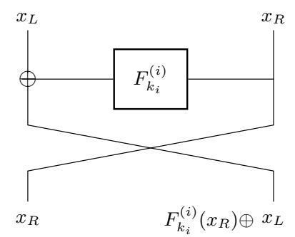
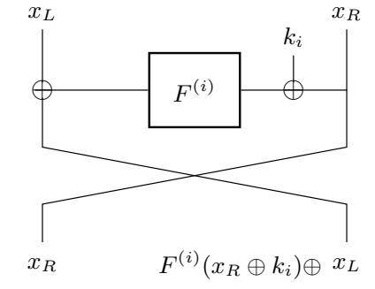
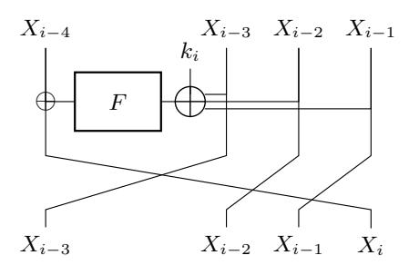

{0}------------------------------------------------

## Quantum Cryptanalysis on Contracting Feistel Structures and Observation on Related-key Settings (Full version)

Carlos Cid1,<sup>2</sup> , Akinori Hosoyamada<sup>3</sup> , Yunwen Liu<sup>4</sup> , and Siang Meng Sim<sup>5</sup>

> <sup>1</sup> Royal Holloway University of London, UK <sup>2</sup> Simula UiB, Norway carlos.cid@rhul.ac.uk <sup>3</sup> NTT Secure Platform Laboratories, Tokyo, Japan akinori.hosoyamada.bh@hco.ntt.co.jp <sup>4</sup> National University of Defense Technology, Changsha, China univerlyw@hotmail.com <sup>5</sup> DSO National Laboratories, Singapore crypto.s.m.sim@gmail.com

Abstract. In this paper we show several quantum chosen-plaintext attacks (qCPAs) on contracting Feistel structures. In the classical setting, a d-branch r-round contracting Feistel structure can be shown to be PRP-secure when d is even and r ≥ 2d − 1, meaning it is secure against polynomial-time chosen-plaintext attacks. We propose a polynomial-time qCPA distinguisher on the d-branch (2d − 1)-round contracting Feistel structure, which solves an open problem by Dong et al. In addition, we show a polynomial-time qCPA that recovers the keys of the d-branch r-round contracting Feistel structure when each round function F (i) ki has the form F (i) ki (x) = Fi(x⊕ki) for a public random function Fi. This is applicable to the Chinese block cipher standard SM4, which is a special case where d = 4. Finally, in addition to quantum attacks under single-key setting, we also show related-key quantum attacks on balanced Feistel structures in the model that adversaries can only control part of the key difference in quantum superposition. Our related-key attacks on balanced Feistel structures can easily be extended to ones on contracting Feistel structures.

Keywords: symmetric-key cryptography · quantum cryptanalysis · contracting Feistel structures · SM4 · related-key attacks.

## 1 Introduction

These days, due to recent progress in the development of quantum computers, many cryptographic researchers, developers and users are increasingly paying more attention to post-quantum security of cryptosystems. It is well known that quantum computers will efficiently break the most widely used public-key cryptosystems. As a result, NIST launched in late 2017 a multi-year process 

{1}------------------------------------------------

for the standardization of public-key cryptosystems to replace the current standards [22].

Recent studies revealed that there exist non-trivial quantum attacks not only on public-key cryptosystems but also on *symmetric-key* cryptosystems. Surprisingly, some symmetric-key schemes that are proven to be *classically* secure can be broken in polynomial time when adversaries are allowed to make quantum superposition queries to keyed oracles [16,17,15], by using Simon's period finding algorithm [24]. Among these, one of the most interesting results is the quantum distinguishing attack on the 3-round (balanced) Feistel structure by Kuwakado and Morii [16].

**Balanced Feistel structure.** The Feistel structure is one of two fundamental design constructions of block ciphers. Many schemes such as DES [20] and Camellia [1] use the balanced Feistel structure.

Given r keyed functions  $F_{k_i}^{(i)}: \mathbb{F}_2^n \to \mathbb{F}_2^n$   $(1 \leq i \leq r)$ , the i-th round state update function  $R_{k_i}^{(i)}$  of the r-round 2-branch<sup>6</sup> balanced Feistel structure (or, just simply the r-round Feistel structure) is defined as the mapping

$$R_{k_i}^{(i)}: x_L || x_R \mapsto x_R || (x_L \oplus F_{k_i}^{(i)}(x_R)),$$
 (1)

where  $x_L, x_R \in \mathbb{F}_2^n$ . The encryption of the r-round Feistel structure  $\operatorname{Enc}_{k_1,\dots,k_r}$  is defined by  $\operatorname{Enc}_{k_1,\dots,k_r}(x_L||x_R) := (R_{k_r}^{(r)} \circ \cdots \circ R_{k_1}^{(1)})(x_L||x_R)$ .

When the round functions  $F_{k_i}^{(i)}(x)$  are defined as

<span id="page-1-2"></span>
$$F_{k_i}^{(i)}(x) := F^{(i)}(x \oplus k_i) \tag{2}$$

for a public function  $F^{(i)}$ , we call the r-round Feistel structure an r-round Feistel-KF structure; see Figure 2. When the round functions are not necessarily represented as in Equation 2, we sometimes call the r-round Feistel structure an r-round Feistel-F structure to explicitly indicate that we do not assume any specific structure on the round functions; see Figure  $1^7$ .

<span id="page-1-3"></span>



Fig. 1: 1-round Feistel-F

<span id="page-1-1"></span>Fig. 2: 1-round Feistel-KF

<span id="page-1-0"></span><sup>&</sup>lt;sup>6</sup> Feistel structures divide internal states into some words and update the states iteratively by applying word-wise operations. Each word is referred to as a *branch* and depicted as a single wire in the figures.

<span id="page-1-4"></span><sup>&</sup>lt;sup>7</sup> In this work, we adopt the Feistel structure notation used in [14].

{2}------------------------------------------------

When the keyed F-functions for each round only differ by the round key  $k_i$ , and assuming there is no ambiguity, we will simply denote  $F_i = F_{k_i}^{(i)}(x)$ .

In the classical setting, it has been proved that a 2-branch balanced Feistel-F structure becomes a secure pseudo random permutation (PRP) for  $r \geq 3$  and a secure strong pseudo random permutation (SPRP) for  $r \geq 4$ , when  $F_{k_1}^{(1)}, \ldots, F_{k_r}^{(r)}$  are secure PRFs, and  $k_1, \ldots, k_r$  are chosen independently and uniformly at random [19]<sup>8</sup>.

However, in the quantum setting Kuwakado and Morii showed that the 3-round balanced Feistel structure can be distinguished in polynomial time by quantum chosen-plaintext attacks (qCPAs). That is, the 3-round balanced Feistel structure is not a quantum pseudo-random permutation (qPRP).

Several subsequent works extended Kuwakado and Morii's distinguisher. For instance, some have developed quantum key-recovery attacks on balanced Feistel structures [9,13], and have showed quantum attacks on generalised Feistel structures [8,12,21]. In addition, a polynomial-time qCCA distinguisher is constructed on 4-round balanced Feistel structures in [14]. However, very few researchers have so far focused on an important variant of Feistel construction: the contracting Feistel structure<sup>9</sup>.

Contracting Feistel structure. A contracting Feistel structure is a class of unbalanced Feistel structure with  $d \geq 3$  branches of same word size n. In each round, only one of the branches is updated by a PRF, where the input to the PRF is the XOR of all other d-1 branches. When the number of branches is 2, the contracting Feistel structures exactly match the balanced Feistel structures. We use the terminology contracting Feistel-F and contracting Feistel-KF in the same way as we do for balanced Feistel structures (see Figure 3).



<span id="page-2-2"></span>Fig. 3: One round of a 4-branch Feistel-KF structure (SM4).

One of the most prominent representation for 4-branch contracting Feistel-KF structure is SM4 [7], the block cipher for Chinese National Standard for

<span id="page-2-0"></span><sup>&</sup>lt;sup>8</sup> A keyed permutation is said to be a secure PRP (resp., SPRP) if it cannot be distinguished from a random permutation by polynomial-time chosen-plaintext attacks (CPAs) (resp., chosen-ciphertext attacks (CCAs)).

<span id="page-2-1"></span><sup>&</sup>lt;sup>9</sup> We note that a previous work [3] has shown a quantum attack on a contracting Feistel structure (GMiMC-crf), but the attack only works when all the round keys are identical.

{3}------------------------------------------------

Wireless LAN Wired Authentication and Privacy Infrastructure (WAPI), it is formerly known as SMS4. We sometimes refer to the 4-branch contracting Feistel-KF structure and 4-branch contracting Feistel-F structure as SM4 and SM4-like structure, respectively.

Zhang and Wu proved that, for d even, a d-branch r-round contracting Feistel-F structure becomes a secure PRP against polynomial-time CPAs when r ≥ 2d − 1, and a secure SPRP against polynomial-time CCAs when r ≥ 3d − 2 [\[25\]](#page-22-11). In particular, a 7-round SM4 and SM4-like structure is PRP-secure. They also showed that if d is odd, then a contracting Feistel-F structure will never be pseudorandom. Therefore, our analysis only focus on Feistel structures which have an even number of branches.

The open problem by Dong et al. In [\[8\]](#page-21-2), Dong et al. mentioned that they found a quantum distinguisher under CPA on a 5-round SM4-like structure. However, this does not break the classical security claim that the 7-round SM4-like structure is PRP-secure. The authors left finding a quantum distinguisher on 7 or more rounds as an open problem.

Related-key setting. Let Enc<sup>K</sup> denote the encryption function of a block cipher. R¨otteler and Steinwandt showed that, when an adversary can obtain the ciphertext EncK⊕∆(P) for arbitrary plaintext P and arbitrary value (differential) ∆, and is allowed to make queries on both of P and ∆ in quantum superposition, the adversary can recover the secret key K in polynomial time [\[23\]](#page-22-12).

To the best of our knowledge, there has been no studies in the setting where an adversary can choose only a part of the differences on the key in quantum superposition[10](#page-3-0) .

### 1.1 Our Contributions

Our paper contains two main contributions.

Contracting Feistel structure attacks. We show a polynomial-time qCPA distinguisher and a polynomial-time key-recovery attack on the 7-round SM4( like structure), which solves the open problem posed by Dong et al. [\[8\]](#page-21-2). More precisely, we show a polynomial-time quantum distinguishing attack on the 7 round contracting Feistel-F structure, and a polynomial-time key-recovery attack on the 7-round contracting Feistel-KF structure. [11](#page-3-1)

<span id="page-3-0"></span><sup>10</sup> A previous work (Section 6.1 of [\[4\]](#page-21-5)) does study a related-key attack in the quantum setting where an adversary can choose only a part of the differences on the key. However that attack does not make superposition queries to keyed oracles.

<span id="page-3-1"></span><sup>11</sup> After this paper was accepted to INDOCRYPT 2020, a concurrent work on quantum attacks on SMS4 (or, SM4) was published [\[11\]](#page-22-13). It also shows a quantum distinguisher on the 7-round SM4, but does not provide polynomial-time key-recovery attack on the 7-round SM4 nor related-key attacks. Note that our paper and [\[11\]](#page-22-13) are completely independent works.

{4}------------------------------------------------

Our attacks can be further extended to the general case, polynomial-time distinguisher on the d-branch (2d−1)-round contracting Feistel-F structure and a polynomial-time key-recovery attack on the d-branch (2d−1)-round contracting Feistel-KF structure.

Related-key attacks. We also show the distinguishing attacks and key-recovery attacks on balanced and contracting Feistel-KF structures can be extended to related-key attacks.

We introduce a related-key attack model that allows adversaries to insert differences into the k-bit secret key K for particular ` bits (` < k), and conjecture that the generic key-recovery attack will require Ω(2(k−`)/<sup>2</sup> ) time.

In R¨otteler and Steinwandt's related-key attack model, the generic attack breaks arbitrary block cipher in polynomial time. Hence meaningful dedicated quantum attacks are impossible in their model. On the other hand, in our model, the generic attack requires exponential time and meaningful dedicated quantum attacks may be possible. In particular, if a polynomial-time dedicated attack breaks a cipher in our model, it demonstrates that the cipher has an exploitable non-ideal property.

We first show attacks on balanced Feistel-KF structures, and then extend some of them to attacks on contracting Feistel-KF structures. The number of attacked rounds varies depending on which part of the key the adversary is allowed to choose differences.

For example, we show that there exists a polynomial-time qCPA distinguisher on the d-branch (3d − 1)-round contracting Feistel-KF structure when the adversary can arbitrarily choose the n-bit difference for the d-th round key (in addition to plaintexts) in quantum superposition. Since the generic quantum attack requires Ω(2(3d−2)n/<sup>2</sup> ) time[12](#page-4-0) to recover the key in this related-key setting (under the assumption that our conjecture holds), our attack achieves an exponential speed-up.

For simplicity, in both the single-key and related-key attacks, we assume that the round functions are random. That is, we assume that the round function F (i) ki in Feistel-F structures is a random function for each key k<sup>i</sup> , and the public function F (i) in Feistel-KF structures is a random function. In addition, we assume that all round keys are chosen independently at random.

#### 1.2 Paper Organization

Section [2](#page-5-0) explains the basic notation and definitions that will be used throughout the paper. Section [3](#page-8-0) gives an overview of previous works. In Section [4](#page-12-0) we describe our quantum single-key attacks on contracting Feistel structures. Section [5](#page-16-0) extends the single-key attacks from Section [4](#page-12-0) to related-key attacks. We close our paper in Section [6](#page-20-0) with a discussion of future work.

<span id="page-4-0"></span><sup>12</sup> Here, n denotes the branch size and the round key size.

{5}------------------------------------------------

## <span id="page-5-0"></span>2 Preliminaries

In this section we define the notation adopted in our paper and review the two main quantum algorithms of interest (including variants), which we use to derive our results. We assume that readers have basic knowledge on quantum algorithms.

#### 2.1 Notation

We identify the set {0, 1} <sup>n</sup> with the vector space F n 2 . For x, y ∈ F n 2 , let x · y denote their inner product, i.e. x · y = (x1y1) ⊕ · · · ⊕ (xnyn).

### 2.2 Grover's Algorithm

Consider the following problem.

Problem 1. Let f : {0, 1} <sup>n</sup> → {0, 1} be a Boolean function, and suppose that there exists a unique x<sup>0</sup> ∈ {0, 1} <sup>n</sup> such that f(x0) = 1. Given an oracle access to f, find x0.

The problem above can be seen as a search problem over an unordered set of 2 <sup>n</sup> elements, to find the unique element x<sup>0</sup> satisfying a particular condition. In the classical setting, solving this problem requires one to make O(2n) queries to the oracle. However, Grover showed that with access to a quantum oracle for f, there is an algorithm which solves the problem by making O(2n/<sup>2</sup> ) quantum queries [\[10\]](#page-21-6). In the context of cryptography, Grover's algorithm can be used to mount an exhaustive key search attack on a k-bit secret key in time O(2k/<sup>2</sup> ) in the quantum setting. In this paper we will employ Grover's algorithm as a black-box, and therefore we will not discuss its details in what follows; we refer the reader to [\[10\]](#page-21-6) for full details on how the algorithm works.

#### <span id="page-5-2"></span>2.3 Simon's Algorithm and its Generalisations

<span id="page-5-1"></span>Let n be a positive integer. Now consider the following problem.

Problem 2. Let s ∈ {0, 1} <sup>n</sup> \ {0 <sup>n</sup>}, and f : {0, 1} <sup>n</sup> → {0, 1} <sup>n</sup> be a function that satisfies the following two conditions: (1) f(x⊕s) = f(x) for all x ∈ {0, 1} <sup>n</sup>, and (2) if f(x) = f(x 0 ), then either x <sup>0</sup> = x or x <sup>0</sup> = x ⊕ s. Given an oracle access to f, find s.

The first condition is equivalent to function f being periodic, with period s 6= 0<sup>n</sup>. Therefore we call the above problem (black-box) period-finding problem.

While one can show that any classical algorithm requires exponentially many queries to solve the problem, Simon showed that there exists a quantum algorithm that solves the problem in polynomial time [\[24\]](#page-22-4). See Section [A.1](#page-23-0) for details on how Simon's algorithm works.

{6}------------------------------------------------

Application of Simon's algorithm to symmetric-key cryptanalysis. A quantum attack on a symmetric-key scheme S based on Simon's algorithm needs first to derive a periodic function f from the scheme's keyed oracles – for example, the encryption and decryption oracles if S is a block cipher – in such a way that the period contains some secret information. The attack can then apply Simon's algorithm on f to recover this secret information.

We note that the function f derived from a symmetric-key scheme usually does not satisfy the second condition in Problem [2.](#page-5-1) However Kaplan et al. [\[15\]](#page-22-3) showed that Simon's algorithm still usually works (in particular, the failure probability can be made exponentially small on n) even if the second condition is relaxed to the following variant:

(2') 
$$\Pr_{x \leftarrow \$\{0,1\}^n} [f(x \oplus \tilde{s}) = f(x)] \le 1/2 \text{ holds for any } \tilde{s} \in \{0,1\}^n \setminus \{0^n, s\}^{13}.$$

Intuitively, this condition says that there does not exist any ˜s 6= 0<sup>n</sup> (other than s) such that "f is almost periodic on ˜s".

Getting rid of intermediate measurements. To combine a quantum algorithm with another quantum algorithm, it is convenient (or, likely necessary) that the algorithm does not need to perform any intermediate measurements. Simon's original period-finding algorithm requires intermediate measurements, but it can be converted into an algorithm without intermediate measurements by running subroutines in parallel. The details are explained in Section [A.2,](#page-24-0) following the idea by Leander and May [\[18\]](#page-22-14).

Simon's algorithm on functions with multiple periods. Suppose that a function f : {0, 1} <sup>n</sup> → {0, 1} <sup>n</sup> has multiple periods, i.e., there exists a linear subspace V ⊂ {0, 1} <sup>n</sup> such that f(x ⊕ s) = f(x) holds for all s ∈ V and x ∈ {0, 1} n. [14](#page-6-1) Even in this case, we can compute V in polynomial time with Simon's algorithm given the quantum oracle of f. See Section [A.3](#page-25-0) for more details.

Strictly speaking, if we wish to apply Simon's algorithm on a periodic function f, we need to check that f satisfies the condition (2'), as discussed above[15](#page-6-2) . However, for each periodic function in later sections, we can expect that the condition will hold with high probability (when round functions of Feistel structures are random). Hence, to simplify our discussions, in what follows we focus on showing how periodic functions are derived from symmetric-key schemes in such a way that the period contains some secret information of interest, and we do not explicitly mention that the condition (2') is satisfied for each periodic function.

<span id="page-6-0"></span><sup>13</sup> We can use any constant p such that 0 < p < 1 as the threshold instead of 1/2. We use the value 1/2 just for convenience.

<span id="page-6-1"></span><sup>14</sup> The set of multiple periods of f forms a linear space because, if s and s 0 are periods of f, s ⊕ s 0 is also a period of f.

<span id="page-6-2"></span><sup>15</sup> If f has multiple periods, we have to consider a generalization of (2'). See Section [A.3](#page-25-0) for details.

{7}------------------------------------------------

#### <span id="page-7-1"></span>2.4 Models of Related-Key Attacks in the Quantum Setting

In this section we describe our attack model for quantum related-key attacks. Since our attack model is an extension of the one by Rötteler and Steinwandt [23], we first give an overview on their attack model. Throughout the section we assume that k is in  $\Theta(n)$ .

**Rötteler and Steinwandt's model.** Let E be an n-bit block cipher with k-bit keys. Rötteler and Steinwandt introduced a model for related-key attacks in the quantum setting that allows adversaries to access the quantum oracle of the functions  $\mathcal{O}_K$  and  $\mathcal{O}_K^{-1}$  defined by  $\mathcal{O}_K: (x,M) \mapsto E_{x \oplus K}(M)$  and  $\mathcal{O}_K^{-1}: (x,C) \mapsto E_{x \oplus K}^{-1}(C)$ . In their model, intuitively, the adversary can flip the bits of the secret key K arbitrarily, and query both of bit-flip patterns and messages in quantum superpositions.

Rötteler and Steinwandt showed that, in their attack model, an adversary can recover the secret key in polynomial time even if E is an ideally random block cipher: Let  $f: \{0,1\}^k \to \{0,1\}^n$  be the function defined by  $f(x) := \mathcal{O}_K(x,M) \oplus E_x(M) = E_{x \oplus K}(M) \oplus E_x(M)$ , where M is an arbitrarily chosen plaintext. Obviously f is a periodic function with period K; moreover there does not exist  $\tilde{s}$  such that  $\tilde{s} \notin \{0^k, K\}$  and  $\Pr_{x \leftarrow \$\{0,1\}^k} [f(x \oplus \tilde{s}) = f(x)] > 1/2$  when E is an ideally random block cipher. Hence we can recover K in polynomial time by using Simon's algorithm.

In other words, the generic attack recovers the secret key in polynomial time in Rötteler and Steinwandt's model. Thus it seems less interesting to study quantum attacks in this exact same model.

Our attack model. Our attack model is similar to Rötteler and Steinwandt's, except that we impose restrictions on bit-flip patterns that adversaries can choose.

More precisely, let  $b = b_1 || \cdots || b_k$  be a fixed k-bit string, and let  $\mathsf{Mask}_b := \{x = x_1 || \cdots || x_k \in \{0,1\}^k \mid x_i = 0 \text{ if } b_i = 0\}$ . In our attack model, we allow adversaries to access the quantum oracles of  $\mathcal{O}_K(x,M)$  and  $\mathcal{O}_K^{-1}(x,M)$ , but we assume that adversaries can choose x only from  $\mathsf{Mask}_b$ .

The generic attack. In our model, Rötteler and Steinwandt's polynomial-time attack no longer works due to the restriction of bit-flip patterns (when  $b \neq 11 \cdots 1$ ). Nevertheless, we can mount a simple quantum key-recovery attack by using the technique by Leander and May which combines Grover's and Simon's algorithms [18].

<span id="page-7-0"></span>**Lemma 1.** Suppose that the Hamming weight of b (the bit-flip pattern) is w, and w is in  $\Omega(\log n)$ . In our quantum related-key attack model, there exists a quantum attack that recovers the secret key in time  $\tilde{O}(2^{(k-w)/2})$ .

The proof of the lemma is given in Section A.4.

{8}------------------------------------------------

<span id="page-8-4"></span>It seems that there is no quantum attack that is significantly faster than our attack for ideally random block ciphers. Therefore we pose the following conjecture.

Conjecture 1. In our quantum related-key attack model, when the Hamming weight of b (bit-flip pattern) is w, and w is in  $\Omega(\log n)$ , there is no key recovery attack<sup>16</sup> that runs in time  $o(2^{(k-w)/2})$ .

Under the assumption that this conjecture holds, theoretically then it is worth studying dedicated quantum attacks on concrete block ciphers that run in time  $o(2^{(k-w)/2})$ : if there exists such an attack on a block cipher E, it follows that E does not behave like an ideally random block cipher in the quantum setting. In later sections we introduce such dedicated quantum related-key attacks on some Feistel structures.

We refer the reader to Section A.5 for more details on attack models.

#### <span id="page-8-0"></span>3 Previous Works

This section gives an overview of previous works and results on quantum query attacks against Feistel structures.

## <span id="page-8-2"></span>3.1 Kuwakado and Morii's Quantum Distinguisher on the 3-round Feistel Structure

Kuwakado and Morii showed a quantum chosen-plaintext attack that distinguishes the 3-round Feistel-F structure from a 2n-bit random permutation in polynomial time [16]. Let  $\mathcal{O}$  denote the quantum encryption oracle of the 3-round Feistel-F structure. In addition, let  $\mathcal{O}_L(x_L, x_R)$  and  $\mathcal{O}_R(x_L, x_R)$  be the most and least significant n-bits of  $\mathcal{O}(x_L, x_R)$ , respectively. Kuwakado and Morii's distinguisher works as follows.

First, let  $\alpha_0$  and  $\alpha_1$  be fixed *n*-bit strings such that  $\alpha_0 \neq \alpha_1$ . Define a function  $f: \mathbb{F}_2 \times \mathbb{F}_2^n \to \mathbb{F}_2^n$  by  $f(b,x) := \mathcal{O}_L(x,\alpha_b) \oplus \alpha_b = F_{k_2}^{(2)}(F_{k_1}^{(1)}(\alpha_b) \oplus x)$ . Then  $f((b,x) \oplus (1,s)) = f(b,x)$  holds for all  $(b,x) \in \mathbb{F}_2 \times \mathbb{F}_2^n$ , where  $s = F_{k_1}^{(1)}(\alpha_0) \oplus F_{k_1}^{(1)}(\alpha_1)$ , i.e., f is a periodic function and the period is (1,s). Thus, when the quantum oracle of  $\mathcal{O}$  is available, we can apply Simon's algorithm on f and recover the period (1,s).

<span id="page-8-3"></span>Remark 1. It is shown in [13] that the quantum oracle of  $\mathcal{O}_L$  (i.e., the truncation of  $\mathcal{O}$ ) can be implemented by making one query to the quantum oracle of  $\mathcal{O}$  because  $\mathcal{O}|x_L\rangle|x_R\rangle|y\rangle|+^n\rangle = |x_L\rangle|x_R\rangle|y\oplus\mathcal{O}_L(x_L,x_R)\rangle|+^n\rangle$  holds for arbitrary  $x_L, x_R, y \in \mathbb{F}_2^n$ , where  $|+^n\rangle := H^{\otimes n}|0^n\rangle$ .

<span id="page-8-1"></span>It is desirable to show that the conjecture holds, but proving quantum query lower bounds is quite difficult when quantum queries are made to both of E and  $E^{-1}$ .

{9}------------------------------------------------

On the other hand, when we make a function f in the same way by using a 2n-bit random permutation instead of the 3-round Feistel-F structure, the function is not periodic with an overwhelming probability. In particular, even if we apply Simon's algorithm on the function, the algorithm fails to find a period (since the function does not have any period).

Therefore, we can distinguish the 3-round Feistel-F structure from a random permutation in polynomial time by checking the function f (made from the given quantum oracle that is either of the 3-round Feistel-F structure or a random permutation as  $f(b,x) := \mathcal{O}_L(x,\alpha_b) \oplus \alpha_b$  has a period, by using Simon's algorithm.

Later, the distinguishing attack was extended to a polynomial-time quantum chosen-ciphertext distinguishing attack on the 4-round Feistel-F structure [14]. In addition, it has been shown that the keys of a 3-round Feistel-KF structure can be recovered by a polynomial time qCPA [6].

## <span id="page-9-0"></span>3.2 Extension of the Distinguishers to Key Recovery Attacks with the Grover Search

Generally, classical distinguishing attacks on block ciphers can be extended to key recovery attacks. Here, we give an overview on how we can also extend the quantum chosen-plaintext distinguishing attack by Kuwakado and Morii to a quantum chosen-plaintext key recovery attack by using Grover's algorithm, as shown by Hosoyamada and Sasaki [13] and Dong and Wang [9]. The time complexity of their attack on the r-round Feistel structure is in  $\tilde{O}(2^{(r-3)n/2})$  when the round keys  $k_1, \ldots, k_r$  are randomly chosen from  $\{0, 1\}^n$ . The basic strategy is to apply the combination of Grover's algorithm and Simon's algorithm shown by Leander and May [18]: guess the partial keys  $k_4, \ldots, k_r$  by using Grover's algorithm, and check whether the guess is correct by applying Kuwakado and Morii's algorithm on the first three rounds.

Suppose that the quantum encryption oracle  $\mathcal{O}$  of the r-round Feistel structure is given  $(r \geq 4)$ , and let  $k_1, \ldots, k_r$  be the round keys that we want to recover. Then, we can check whether a guess  $k'_4, \ldots, k'_r$  for the 4-th, ..., r-th round keys is correct as follows.

- 1. Implement the quantum oracle of  $\mathcal{O}' := (R_{k'_4}^{(4)} \circ \cdots \circ R_{k'_r}^{(r)})^{-1} \circ \mathcal{O}$ . The  $\mathcal{O}'$  oracle performs the encryption with  $\mathcal{O}$  and then the partial decryption by using  $k'_4, \ldots, k'_r$ . If the guess is correct, then  $\mathcal{O}'$  matches the partial encryption  $R_{k_1}^{(1)} \circ R_{k_2}^{(2)} \circ R_{k_3}^{(3)}$  with the first three rounds. If the guess is incorrect,  $\mathcal{O}'$  is expected to behave like a random permutation.
- 2. Run Kuwakado and Morii's quantum distinguisher on  $\mathcal{O}'$ . If we can distinguish the 3-round Feistel structure, with very high probability the key guess is correct. Otherwise, the key guess is incorrect.

Since Simon's algorithm can be implemented without any intermediate measurements (see Section 2.3 for details), we can implement a quantum circuit to

{10}------------------------------------------------

calculate the Boolean function

$$G: (k'_4, \dots, k'_r) \mapsto \begin{cases} 1 & (\text{if } (k'_4, \dots, k'_r) = (k_4, \dots, k_r)) \\ 0 & (\text{if } (k'_4, \dots, k'_r) \neq (k_4, \dots, k_r)) \end{cases}$$

with a small error. By applying Grover's algorithm on G, we can then recover the round keys  $k_4, \ldots, k_r$  in time  $\tilde{O}(2^{(r-3)n/2})$ . The remaining keys  $k_1, k_2$ , and  $k_3$  can be easily recovered once  $k_4, \ldots, k_r$  are known.

The above key-recovery attack is a quantum chosen-plaintext attack that is based on the 3-round chosen-plaintext distinguisher. If both the quantum encryption and decryption oracles are available, a quantum chosen-ciphertext attack recovers the keys in time  $\tilde{O}(2^{(r-4)n/2})$  in the same way by using the 4-round chosen-ciphertext distinguisher [14].

#### <span id="page-10-1"></span>3.3 Quantum Advanced Slide Attack and Nested Simon's Algorithm

Consider the special case that there is a public random function  $F: \{0,1\}^n \to \{0,1\}^n$  and each round function  $F_{k_i}^{(i)}$  of the r-round Feistel structure is defined as

<span id="page-10-0"></span>
$$F_{k_i}^{(i)}(x) := F(x \oplus k_i) \tag{3}$$

for all  $1 \leq i \leq r$ . Assume also that the number of rounds r is divisible by 4, and the cyclic key-schedule is such that  $k_i = k_{i+4}$  holds for each i is used  $(k_1, k_2, k_3, k_4)$  are chosen independently and uniformly at random). In the classical setting, Biryukov and Wagner showed a chosen-ciphertext attack that recovers the keys with time  $O(2^{n/2})$  in this case [2]. In the quantum setting, Bonnetain et al. showed that the classical attack by Biryukov and Wagner can be exponentially sped up by nesting Simon's algorithm [5], proposing a quantum attack that recovers keys in polynomial time. This section gives an overview on how Bonnetain et al.'s quantum chosen-ciphertext key-recovery attack works when r = 4.

Let  $\mathcal{O}$  and  $\mathcal{O}^{-1}$  be the quantum encryption and decryption oracles of the 4-round Feistel structure of which the round functions are defined as in (3). In addition, let  $\mathcal{O}_L(x_L, x_R)$  (resp.,  $\mathcal{O}_L^{-1}(x_L, x_R)$ ) and  $\mathcal{O}_R(x_L, x_R)$  (resp.,  $\mathcal{O}_R^{-1}(x_L, x_R)$ ) denote the left and right n bits of  $\mathcal{O}(x_L, x_R)$  (resp.,  $\mathcal{O}^{-1}(x_L, x_R)$ ), respectively.

First, suppose that we can simulate the quantum oracle of the function

$$g(x) := F(x \oplus k_1) \oplus k_2 \oplus k_4. \tag{4}$$

Then, since F is a public function, we can evaluate the function  $H: \mathbb{F}_2^n \to \mathbb{F}_2^n$  defined by  $H(x) := F(x) \oplus g(x)$  in quantum superposition, and can thus recover the key  $k_1$  by Simon's algorithm on H because  $H(x) = F(x) \oplus F(x \oplus k_1) \oplus k_2 \oplus k_4$  holds, and  $k_1$  is a period of H.

Now, the problem is how to simulate the quantum oracle of such a function g(x) by using the quantum oracles of  $\mathcal{O}$  and  $\mathcal{O}^{-1}$ . For each fixed  $x \in \mathbb{F}_2^n$ , define

{11}------------------------------------------------

a function  $G_x: \mathbb{F}_2 \times \mathbb{F}_2^n \to \mathbb{F}_2^n$  by

$$G_x(b,y) := \begin{cases} \mathcal{O}_R^{-1}(y,x) & \text{if } b = 0, \\ \mathcal{O}_R(y,x) & \text{if } b = 1. \end{cases}$$

Then, straightforward calculations show that  $G_x((b,y) \oplus (1,g(x))) = G_x(b,y)$  holds for all  $(b,y) \in \mathbb{F}_2 \times \mathbb{F}_2^n$ , i.e.,  $G_x$  is a periodic function and the period is (1,g(x)), for arbitrarily fixed x. Therefore, by performing Simon's algorithm on  $G_x$  without measurement (see Section 2.3 for details), we can implement a quantum circuit that evaluates g(x) in quantum superposition with some small error.

In summary, we can recover  $k_1$  as follows:

- 1. Implement a quantum circuit  $C_g$  that simulates the quantum oracle of g with some small error. This can be done by applying Simon's algorithm on  $G_x$  for each  $|x\rangle$ .
- 2. Implement a quantum circuit that simulates the quantum oracle of H(x) by using  $C_q$ , and apply Simon's algorithm on H to recover  $k_1$ .

Note that Simon's algorithm is nested in the above attack: when we apply Simon's algorithm on H, another instance of Simon's algorithm is called to evaluate the function H. Once we recover  $k_1$ , other subkeys  $k_2, k_3, k_4$  can be recovered easily. Eventually, we can recover all the keys in polynomial time.

A polynomial-time key recovery attack on the 3-round Feistel structure. Later, we use the technique of nested Simon's algorithm to mount various attacks. Here we explain that Kuwakado and Morii's distinguishing attack in Section 3.1 can easily be extended to a polynomial-time qCPA that recovers the key of the 3-round Feistel-KF structure, as another example on application of nested Simon's algorithm, so that the readers will grasp the basic idea of the technique better<sup>17</sup>.

When Kuwakado and Morii's attack in Section 3.1 is applied to the 3-round Feistel-KF structure, it recovers the value  $F_{k_1}^{(1)}(\alpha_0) \oplus F_{k_1}^{(1)}(\alpha_1) = F^{(1)}(\alpha_0 \oplus k_1) \oplus F^{(1)}(\alpha_1 \oplus k_1)$ , where  $\alpha_0$  and  $\alpha_1$  are arbitrarily chosen constants such that  $\alpha_0 \neq \alpha_1$ . Now, choose  $x \in \{0,1\}^n \setminus \{0^n\}$  arbitrarily, and set  $\alpha_0 := x$  and  $\alpha_1 := 0^n$ . Then, given the quantum oracle of the 3-round Feistel-KF structure, Kuwakado and Morii's attack allows us to compute the value  $f_{k_1}(x) := F^{(1)}(x \oplus k_1) \oplus F^{(1)}(k_1)$  for each  $x \neq 0^n$ . In particular, we can evaluate the function  $f_{k_1}(x)$  in quantum superpositions by using Simon's algorithm without intermediate measurements (note that  $f_{k_1}(0^n) = 0^n$  holds). Next, define a function  $G_{k_1}(x)$  by  $G_{k_1}(x) := f_{k_1}(x) \oplus F^{(1)}(x)$ . Then, since  $F^{(1)}$  is a public function and we can evaluate  $f_{k_1}(x)$  in quantum superpositions, we can also evaluate the function  $G_{k_1}(x)$  in quantum superpositions. In addition, it is easy to check that  $G_{k_1}(x) = G_{k_1}(x)$ 

<span id="page-11-0"></span>The previous polynomial-time qCPA on 3-round Feistel-KF structure [6] recovers the keys without nested Simon's algorithm.

{12}------------------------------------------------

<span id="page-12-2"></span>Table 1: Polynomial-time qCPAs on contracting Feistel structures. The key-recovery attacks are applicable only to Feistel-KF structures.

| Rounds | Branch   | Attack type   | Complexity | Ref.        |
|--------|----------|---------------|------------|-------------|
| 3      | 2        | distinguisher | poly(n)    | [16]        |
| 3      | 2        | key-recovery  | poly(n)    | [6]         |
| 7      | 4        | distinguisher | poly(n)    | Section 4.2 |
| 7      | 4        | key-recovery  | poly(n)    | Section 4.3 |
| 2d-1   | d (even) | distinguisher | poly(n)    | Section 4.4 |
| 2d-1   | d (even) | key-recovery  | poly(n)    | Section 4.5 |

 $G_{k_1}(x \oplus k_1)$  holds for all  $x \in \{0,1\}^n$ , i.e.,  $G_{k_1}$  is a periodic function and the period is  $k_1$ . Hence we can recover the value  $k_1$  by applying Simon's algorithm to  $G_{k_1}$ . Once we recover  $k_1$ , the remaining keys  $k_2$  and  $k_3$  can be recovered easily.

### <span id="page-12-0"></span>4 Contracting Feistel Structures

In this section we show the following theorem.

**Theorem 1.** There exists a (single-key) quantum chosen-plaintext attack that distinguishes SM4-like structure (resp., recovers the key of SM4) in polynomial time. More generally, there exists a polynomial-time quantum chosen-plaintext attack that distinguishes (resp., recovers the key of) (2d-1)-round d-branch contracting Feistel-F (resp., Feistel-KF) structures for even d.

First, we present a 7-round quantum distinguisher for SM4-like structure under CPA setting in polynomial time. We further extend it to a polynomial time quantum key-recovery attack on 7-round SM4. Then we show the attacks can be generalised to attacks on (2d-1)-round d-branch contracting Feistel structures. See Table 1 for a summary of the results in this section.

#### 4.1 Specification

We denote the i-th round function SM4-like as follows:

$$X_i = X_{i-4} \oplus F_i(X_{i-3} \oplus X_{i-2} \oplus X_{i-1}),$$
 (5)

where  $F_i$ 's are keyed functions, the input plaintext is  $(X_{-3}, X_{-2}, X_{-1}, X_0)$  and the output ciphertext after r rounds is  $(X_{r-3}, X_{r-2}, X_{r-1}, X_r)$ .

Let  $\mathcal{O}^r$  denote the r-round SM4-like quantum oracle, and  $\mathcal{O}^r_{\Lambda}(x_A, x_B, x_C, x_D)$  denote the branch  $x_{\Lambda}$  of  $\mathcal{O}^r(x_A, x_B, x_C, x_D)$ , where  $\Lambda \in \{A, B, C, D\}$ .

#### <span id="page-12-1"></span>4.2 SM4-like Structure 7-round Distinguisher under CPA setting

Idea of the attack. The most important point of the quantum distinguishing attack on the 3-round balanced Feistel structure in Section 3.1 is that, given the

{13}------------------------------------------------

encryption oracle, we can compute  $F_2(x \oplus \beta_a)$  for arbitrary x by appropriately choosing plaintexts. Here,  $\beta_a$  (a = 0, 1) is the constant such that we do not know its exact value and  $\beta_0 \neq \beta_1$ . Since the function  $f : \mathbb{F}_2 \times \mathbb{F}_2^n \to \mathbb{F}_2^n$  defined by  $f(a, x) := F_2(x \oplus \beta_a)$  has the period  $(1, \beta_0 \oplus \beta_1)$ , we can mount the distinguishing attack by applying Simon's algorithm on f.

The basic strategy of our attack on SM4-like structure is similar. We try to compute the value  $F_i(x \oplus \beta_a)$  for arbitrary x for some i. After some consideration we found that, given the encryption oracle of 7-round SM4-like structure, we can compute  $F_4(x \oplus \beta_a)$  by setting  $X_{-3} = X_{-2} = X_{-1} = x$  and  $X_0 = \alpha_a$ , where  $\alpha_0$  and  $\alpha_1$  are distinct constants.

Details of the attack. Let  $X_{-3} = X_{-2} = X_{-1} = x$  and  $X_0 = \alpha_a$ , where  $\alpha_a, a = 0, 1$  are distinct constants. The branch values of each round function are as follows.

| Table        | Table 2. Values of branch $\mathcal{H}_i$ for 4-branch contracting resour-1 structure. |                                                                                                                       |  |  |  |  |
|--------------|----------------------------------------------------------------------------------------|-----------------------------------------------------------------------------------------------------------------------|--|--|--|--|
| Round        | $X_i$                                                                                  | Notation                                                                                                              |  |  |  |  |
| $-3 \sim -1$ | x                                                                                      |                                                                                                                       |  |  |  |  |
| 0            | $\alpha_a$                                                                             |                                                                                                                       |  |  |  |  |
| 1            | $x\oplus g_{1,a}$                                                                      | $g_{1,a} = F_1(\alpha_a)$                                                                                             |  |  |  |  |
| 2            | $x\oplus g_{2,a}$                                                                      | $g_{2,a} = F_2(\alpha_a \oplus g_{1,a})$                                                                              |  |  |  |  |
| 3            | $x\oplus g_{3,a}$                                                                      | $g_{3,a} = F_3(\alpha_a \oplus g_{12,a}), \ g_{12,a} = g_{1,a} \oplus g_{2,a}$                                        |  |  |  |  |
| 4            | $\alpha_a \oplus g_{4,a}(x)$                                                           | $g_{4,a}(x) = F_4(x \oplus g_{123,a}), \ g_{123,a} = g_{12,a} \oplus g_{3,a}$                                         |  |  |  |  |
| 5            | $x \oplus g_{1,a} \oplus g_{5,a}(x)$                                                   | $g_{5,a}(x) = F_5(\alpha_a \oplus g_{23,a} \oplus g_{4,a}(x)), \ g_{23,a} = g_{2,a} \oplus g_{3,a}$                   |  |  |  |  |
| 6            | $x \oplus g_{2,a} \oplus g_{6,a}(x)$                                                   | $g_{6,a}(x) = F_6(\alpha_a \oplus g_{13,a} \oplus g_{4,a}(x) \oplus g_{5,a}(x)), \ g_{13,a} = g_{1,a} \oplus g_{3,a}$ |  |  |  |  |
| 7            | $ x \oplus g_{3,a} \oplus g_{7,a}(x) $                                                 | $g_{7,a}(x) = F_7(\alpha_a \oplus g_{12,a} \oplus g_{4,a}(x) \oplus g_{5,a}(x) \oplus g_{6,a}(x))$                    |  |  |  |  |

<span id="page-13-0"></span>Table 2: Values of branch  $X_i$  for 4-branch contracting Feistel-F structure

From Table 2, we see that the 7-round ciphertext is  $(X_4, X_5, X_6, X_7)$ . Define a function  $f^7: \mathbb{F}_2 \times \mathbb{F}_2^n \to \mathbb{F}_2^n$  by

$$f^{7}(a,x) := \mathcal{O}_{A}^{7}(x,x,x,\alpha_{a}) \oplus \alpha_{a}$$

$$= F_{4}(x \oplus g_{123,a})$$
(6)

Then  $f^7((a,x) \oplus (1,s)) = f^7(a,x)$  holds for all  $(a,x) \in \mathbb{F}_2 \times \mathbb{F}_2^n$ , where  $s = g_{123,0} \oplus g_{123,1}$ . One can see that

$$f^{7}(a \oplus 1, x \oplus g_{123,0} \oplus g_{123,1}) = F_{4}(x \oplus g_{123,0} \oplus g_{123,1} \oplus g_{123,a\oplus 1})$$

$$= F_{4}(x \oplus g_{123,a})$$

$$= f^{7}(a, x).$$
(7)

Thus, when the quantum oracle of  $\mathcal{O}^7$  is available, we can apply Simon's algorithm on  $f^7$  and recover the period  $(1, s)^{18}$ .

<span id="page-13-1"></span>To be more precise, we have to simulate  $\mathcal{O}_A^7$  (truncation) by using  $\mathcal{O}^7$ . This can be done by using the technique explained in Remark 1.

{14}------------------------------------------------

#### <span id="page-14-0"></span>4.3 7-round SM4 Key-recovery under CPA setting

Recall that SM4 is a Feistel-KF structure. In other words, it deploys as round function

$$F_i(x) = F(x \oplus k_i),$$

where F is a public function<sup>19</sup> and  $k_i$  is the round key.

The key-recovery attack is similar as the distinguisher described in the previous section, except that we introduce 3 more variables and additional constraints on these variables. Let  $X_{-3} = x \oplus \beta_a$ ,  $X_{-2} = x \oplus \gamma_a$ ,  $X_{-1} = x \oplus \delta_a$  and  $X_0 = \alpha_a$ , where  $a \in \{0,1\}$ . For all symbols  $\Lambda \in \{\alpha,\beta,\gamma,\delta\}$ , we set  $\Lambda_0 = \Lambda \in \mathbb{F}_2^n \setminus \{0^n\}$  and  $\Lambda_1 = 0^n$ .

Table 3 shows the value  $X_i$  at various round. Like before, although we consider 7-round SM4-like Feistel, we only need to know the value of  $X_4$ .

| $M_i$ of 4-branch contracting relater Struct |                                      |                                                                                                            |  |  |  |  |
|----------------------------------------------|--------------------------------------|------------------------------------------------------------------------------------------------------------|--|--|--|--|
| Round                                        | $X_i$                                | Notation                                                                                                   |  |  |  |  |
| -3                                           | $x \oplus \beta_a$                   |                                                                                                            |  |  |  |  |
| -2                                           | $x \oplus \gamma_a$                  |                                                                                                            |  |  |  |  |
| -1                                           | $x \oplus \delta_a$                  |                                                                                                            |  |  |  |  |
| 0                                            | $\alpha_a$                           |                                                                                                            |  |  |  |  |
| 1                                            | $x \oplus \beta_a \oplus g_{1,a}$    | $g_{1,a} = F(\alpha_a \oplus \gamma_a \oplus \delta_a \oplus k_1)$                                         |  |  |  |  |
| 2                                            | $x \oplus \gamma_a \oplus g_{2,a}$   | $g_{2,a} = F(\alpha_a \oplus \beta_a \oplus \delta_a \oplus g_{1,a} \oplus k_2)$                           |  |  |  |  |
| 3                                            | $x \oplus \delta_a \oplus g_{3,a}$   | $g_{3,a} = F(\alpha_a \oplus \beta_a \oplus \gamma_a \oplus g_{1,a} \oplus g_{2,a} \oplus k_3)$            |  |  |  |  |
| $\boxed{4}$                                  | $\alpha_a \oplus F(x \oplus h_4(a))$ | $h_4(a) = \beta_a \oplus \gamma_a \oplus \delta_a \oplus g_{1,a} \oplus g_{2,a} \oplus g_{3,a} \oplus k_4$ |  |  |  |  |

<span id="page-14-2"></span>Table 3: Values of branch  $X_i$  for 4-branch contracting Feistel-KF structure.

Define a function  $f^7: \mathbb{F}_2 \times \mathbb{F}_2^n \to \mathbb{F}_2^n$  by

$$f^{7}(a,x) := \mathcal{O}_{A}^{7}(x \oplus \beta_{a}, x \oplus \gamma_{a}, x \oplus \delta_{a}, \alpha_{a}) \oplus \alpha_{a}$$

$$= F(x \oplus h_{4}(a))$$
(8)

Then  $f^7((a,x) \oplus (1,s)) = f^7(a,x)$  holds for all  $(a,x) \in \mathbb{F}_2 \times \mathbb{F}_2^n$ , where  $s = h_4(0) \oplus h_4(1)$ . One can see that

$$f^{7}(a \oplus 1, x \oplus h_{4}(0) \oplus h_{4}(1)) = F(x \oplus h_{4}(0) \oplus h_{4}(1) \oplus h_{4}(a \oplus 1))$$
$$= F(x \oplus h_{4}(a)) = f^{7}(a, x)$$

Thus, when the quantum oracle of  $\mathcal{O}^7$  is available, we can apply Simon's algorithm on  $f^7$  and recover the period  $(1, h_4(0) \oplus h_4(1))$ . In addition, this allows us to compute the value  $h_4(0) \oplus h_4(1)$ .

Let 
$$\Lambda^4 := (\alpha, \beta, \gamma, \delta)$$
 and  $T(\Lambda^4) := \beta \oplus \gamma \oplus \delta \oplus g_1(\Lambda^4) \oplus g_2(\Lambda^4) \oplus g_3(\Lambda^4)$ , where  $g_1(\Lambda^4) := F(\alpha \oplus \gamma \oplus \delta), g_2(\Lambda^4) := F(\alpha \oplus \beta \oplus \delta \oplus g_1(\Lambda^4))$  and  $g_3(\Lambda^4) := F(\alpha \oplus \beta \oplus \delta)$ 

<span id="page-14-1"></span>Here, we assume it to be the same public function for all rounds. In fact, every round can be an arbitrary public function and the attack still works.

{15}------------------------------------------------

 $F(\alpha \oplus \beta \oplus \gamma \oplus g_1(\Lambda^4) \oplus g_2(\Lambda^4))$ . Then  $h_4(0) = \mathsf{T}(\Lambda^4 \oplus \mathsf{key})$  and  $h_4(1) = \mathsf{T}(\mathsf{key})$  hold, where  $\mathsf{key} = (k_1 \oplus k_2 \oplus k_3, k_2 \oplus k_3 \oplus k_4, k_1 \oplus k_3 \oplus k_4, k_1 \oplus k_2 \oplus k_4)$ . In addition, let  $H(\Lambda^4) := \mathsf{T}(\Lambda^4 \oplus \mathsf{key}) \oplus \mathsf{T}(\mathsf{key}) \oplus \mathsf{T}(\Lambda^4)$ . Then H can be computed in quantum superposition since  $\mathsf{T}((\alpha, \beta, \gamma, \delta) \oplus \mathsf{key}) \oplus \mathsf{T}(\mathsf{key}) = h_4(0) \oplus h_4(1)$  can be computed by using Simon's algorithm on  $f^7$  as above, and  $\mathsf{T}(\Lambda^4)$  does not depend on keys.

Now, it is straightforward to check that the following conditions for  $s' \in (\mathbb{F}_2^n)^4$  are equivalent<sup>20</sup>:

- 1. s' is in the vector space  $V \subset (\mathbb{F}_2^n)^4$  that is spanned by key and  $(0, \eta, \eta, \eta)$  for  $\eta \in \mathbb{F}_2^n$ .
- 2.  $H(\Lambda^4 \oplus s') = H(\Lambda^4)$  holds for all  $\Lambda^4 = (\alpha, \beta, \gamma, \delta) \in (\mathbb{F}_2^n)^4$ .

Thus, by applying Simon's algorithm on H, we can compute the vector space V. Once we determine the space V, we can recover the keys  $k_1$ ,  $k_2$ , and  $k_3$  since  $k_1 = \alpha_s \oplus \gamma_s \oplus \delta_s$ ,  $k_2 = \alpha_s \oplus \beta_s \oplus \delta_s$ , and  $k_3 = \alpha_s \oplus \beta_s \oplus \gamma_s$  hold for arbitrary  $(\alpha_s, \beta_s, \gamma_s, \delta_s) \in V$  with  $\alpha_s \neq 0^n$ . Once we have these round keys, the remaining round keys  $k_4, k_5, k_6, k_7$  can be recovered easily.

## <span id="page-15-0"></span>4.4 Generic (2d-1)-round Distinguisher on even branches Contracting Feistel Structures under CPA setting

As mentioned earlier, the authors of [25] proved that when d is even, a d-branch r-round contracting Feistel-F structure is PRP-secure when  $r \geq 2d-1$  rounds. Here, we show that it is not qPRP for r=2d-1 rounds for any even d.

Let  $\mathcal{O}^r$  denote the r-round d-branch contracting Feistel-F quantum oracle. In addition, let  $\mathcal{O}_{\Lambda}^r(b_1,\ldots,b_d)$  denote the branch  $b_{\Lambda}$  of  $\mathcal{O}^r(b_1,\ldots,b_d)$ , where  $\Lambda \in \{1,2,\ldots,d\}$ .

We denote the value of each branch as a recursive function

$$X_i = X_{i-d} \oplus F_i(X_{i-(d-1)} \oplus \cdots \oplus X_{i-1}), \tag{9}$$

where the input is  $(X_{1-d}, \ldots, X_0)$  and output after r rounds is  $(X_{r-(d-1)}, \ldots, X_r)$ . The distinguisher is a generalisation of what is described in Section 4.2. In a nutshell, we show that if we let  $X_{1-d} = \cdots = X_1 = x$  and  $X_0 = \alpha_a$ , where  $\alpha_0$  and  $\alpha_1$  are distinct constants, and define a function  $f^{2d-1}: \mathbb{F}_2 \times \mathbb{F}_2^n \to \mathbb{F}_2^n$  by

<span id="page-15-3"></span>
$$f^{2d-1}(a,x) := \mathcal{O}_1^{2d-1}(x,\dots,x,\alpha_a) \oplus \alpha_a$$

$$= X_d \oplus \alpha_a$$
(10)

we can apply Simon's algorithm on  $f^{2d-1}$  and find a period, hence a distinguisher. The following theorem is the key observation to show the periodicity of  $f^{2d-1}$ .

<span id="page-15-2"></span><span id="page-15-1"></span>To be more precise, the conditions become equivalent with an overwhelming probability when the round function F is a random function.

{16}------------------------------------------------

**Theorem 2.** Given a d-branch contracting Feistel structure, where d is even. Now let  $X_{1-d} = \cdots = X_1 = x$  and  $X_0 = \alpha_a$ , where  $\alpha_a$  is constant. Then for  $1 \le i \le d-1$ , we have  $X_i = x \oplus T_i(\alpha_a)$ . Here,  $T_i(\alpha_a)$  denotes a constant value that consists of fixed keyed functions  $F_i$  and  $\alpha_a$ , and does not contain variable x.

See Section B for a proof. From Theorem 2, we can compute

$$X_{d} = X_{0} \oplus F_{d}(X_{1} \oplus \cdots \oplus X_{d-1})$$

$$= \alpha_{a} \oplus F_{d}(\underbrace{x \oplus \cdots \oplus x}_{d-1 \text{ times}} \oplus T_{\$}(\alpha_{a})) = \alpha_{a} \oplus F_{d}(x \oplus T_{\$}(\alpha_{a}))$$

where  $T_{\$}(\alpha_a) = T_1(\alpha_a) \oplus \cdots \oplus T_{d-1}(\alpha_a)$ .

Going back to Eq.(10), we have  $f^{2d-1}(a,x) = F_d(x \oplus T_{\$}(\alpha_a))$ . Therefore, it is trivial to see that  $f^{2d-1}((a,x) \oplus (1,s)) = f^{2d-1}(a,x)$  holds for all  $(a,x) \in \mathbb{F}_2 \times \mathbb{F}_2^n$ , where  $s = T_{\$}(\alpha_0) \oplus T_{\$}(\alpha_1)$ .

## <span id="page-16-1"></span>4.5 Generic (2d-1)-round Key-recovery on even branches Contracting Feistel-KF Structures under CPA setting

The key-recovery attack described in Section 4.3 can be easily extended to any even branches contracting Feistel-KF structures. The number of introduced variables, the analysis and recovered round keys will simply scale up linearly with the number of branches. For the sake of brevity, we omit the details of the key-recovery attack for the generic case.

#### <span id="page-16-0"></span>5 Related-Key Attacks

We first show related-key attacks on the balanced Feistel-KF structures in Section 5.1, and then extend some of them to contracting Feistel-KF structures in Section 5.2. The related-key attacks on contracting Feistel-KF structures (especially, the distinguishing attack) are based on the single-key attacks in Section 4.

#### <span id="page-16-2"></span>5.1 Related-Key Attacks on the Balanced Feistel-KF Structures

Recall that a bit-mask pattern is specified in our related-key setting. Adversaries do not know any information of the key itself, but can add an arbitrary value that is consistent with the bit-mask pattern when they make encryption queries (in quantum superposition).

The focus of this subsection is related-key attacks on r-round Feistel-KF structures, which have rn-bit keys. Each key is denoted as  $(k_1, \ldots, k_r) \in \mathbb{F}_2^{rn}$ , where  $k_i$  is the i-th round key.

In our attacks, we fix a set of indices  $1 \leq i_1 < i_2 < \cdots < i_u \leq r$ , and assume that adversaries can add any value in  $\{0,1\}^n$  to  $k_{i_j}$  for all  $1 \leq j \leq u$  (in quantum superpositions). For instance, we will consider an attack on the 4-round

{17}------------------------------------------------

<span id="page-17-0"></span>Table 4: Attack complexity of qCPAs on balanced Feistel-KF structures.

| Rounds | Key model                  | Attack type                | Complexity    | Ref.         |
|--------|----------------------------|----------------------------|---------------|--------------|
| 3      | (0, 0, 0)                  | distinguisher              | poly(n)       | [16]         |
| 3      | (0, 0, 0)                  | key-recovery               | poly(n)       | [6]          |
| 4      | (∆, ∆, ∆, ∆)               | key-recovery               | poly(n)       | [23]         |
| 4      | (∆, 0, 0, 0)               | key-recovery               | poly(n)       | This section |
| 5      | (0, ∆, 0, 0, 0)            | distinguisher              | poly(n)       | This section |
| 5      | (∆, 0, ∆, 0, 0)            | key-recovery               | poly(n)       | This section |
| r      | (0, , 0)                   | key-recovery               | (r−3)n/2<br>2 | [9,13]       |
| r      | (∆, , ∆)                   | key-recovery               | poly(n)       | [23]         |
| r      | (∆, 0, , 0, 0, 0)          | key-recovery               | poly(n)       | This section |
|        |                            | (only the first round key) |               |              |
| r      | (∆, , ∆, 0, 0, 0)          | key-recovery               | poly(n)       | This section |
| r      | (0, , 0, ∆, 0, 0, 0)       | key-recovery               | (r−5)n/2<br>2 | This section |
| 2` + 3 | `<br>((0, ∆)<br>, 0, 0, 0) | distinguisher              | poly(n)       | This section |
| 2` + 2 | ({0, }(∆, 0)`<br>, 0{, 0}) | distinguisher              | poly(n)       | This section |

Feistel-KF structure where adversaries can add n-bit values to the first round key k1. For ease of notation, we denote this related-key setting by (∆, 0, 0, 0). Other related-key settings are denoted in the same way: the related-key setting on the 5-round Feistel-KF structure where adversaries can add values to k<sup>1</sup> and k<sup>3</sup> are denoted by (∆, 0, ∆, 0, 0). Note that the pattern (0, . . . , 0) corresponds to the single-key setting, and (∆, ∆, . . . , ∆) corresponds to the previous related-key setting by R¨otteler and Steinwandt. See Table [4](#page-17-0) for the summary of the results in this subsection and a comparison with other attacks.

We denote the most and least significant n bits of a 2n-bit string X by X<sup>L</sup> and XR, respectively.

Polynomial-time 5-round qCPA distinguisher for pattern (0, ∆, 0, 0, 0). Here we show the following proposition.

Proposition 1. There exists a polynomial-time related-key qCPA that distinguishes the 5-round balanced Feistel-KF structures from a random permutation for the related-key pattern (0, ∆, 0, 0, 0).

Assume that the quantum oracle of

$$\mathcal{O}^{5,(0,\Delta,0,0,0)}: \mathbb{F}_2^n \times \mathbb{F}_2^n \times \mathbb{F}_2^n \to \mathbb{F}_2^n \times \mathbb{F}_2^n, (L,R,\Delta) \mapsto \operatorname{Enc}_{k_1,k_2 \oplus \Delta,k_3,k_4,k_5}(L,R)$$

is available to adversaries. Here, Enc is the encryption of the 5-round Feistel-KF structure or an ideally random cipher such that Enc<sup>k</sup>1,...,k<sup>5</sup> is a random permutation for each key (k1, . . . , k5). The goal of an adversary is to distinguish whether Enc is the 5-round Feistel-KF structure or an ideally random cipher.

{18}------------------------------------------------

Define  $G: \mathbb{F}_2^n \to \mathbb{F}_2^n$  by  $G(x) := \mathcal{O}_L^{5,(0,\Delta,0,0,0)}(x,\alpha_0,x) \oplus \mathcal{O}_L^{5,(0,\Delta,0,0,0)}(x,\alpha_1,x)$ . If Enc is the 5-round Feistel-KF structure, we have

$$G(x) = \alpha_0 \oplus \alpha_1 \oplus F^{(2)}(k_2 \oplus F^{(1)}(k_1 \oplus \alpha_0)) \oplus F^{(2)}(k_2 \oplus F^{(1)}(k_1 \oplus \alpha_1))$$

$$\oplus F^{(4)}(k_4 \oplus x \oplus F^{(1)}(k_1 \oplus \alpha_0) \oplus F^{(3)}(k_3 \oplus \alpha_0 \oplus F^{(2)}(k_2 \oplus F^{(1)}(k_1 \oplus \alpha_0))))$$

$$\oplus F^{(4)}(k_4 \oplus x \oplus F^{(1)}(k_1 \oplus \alpha_1) \oplus F^{(3)}(k_3 \oplus \alpha_1 \oplus F^{(2)}(k_2 \oplus F^{(1)}(k_1 \oplus \alpha_1)))).$$

In particular, G is a periodic function and  $s := F^{(3)}(k_3 \oplus \alpha_0 \oplus F^{(2)}(k_2 \oplus F^{(1)}(k_1 \oplus \alpha_0))) \oplus F^{(3)}(k_3 \oplus \alpha_1 \oplus F^{(2)}(k_2 \oplus F^{(1)}(k_1 \oplus \alpha_1))) \oplus F^{(1)}(k_1 \oplus \alpha_0) \oplus F^{(1)}(k_1 \oplus \alpha_1)$  is the period. On the other hand, when Enc is an ideally random cipher, G is not periodic with overwhelming probability.

Hence the 5-round Feistel function can be distinguished from an ideally random cipher in polynomial time by checking whether G(x) is periodic, if the quantum related-key oracle of the pattern  $(0, \Delta, 0, 0, 0)$  is given to adversaries.

<span id="page-18-0"></span>Remark 2. The above attack can also be used to mount a 4-round polynomial-time qCPA related-key distinguisher for the pattern  $(\Delta, 0, 0, 0)$ .

Polynomial-time qCPA distinguisher for the pattern  $((0, \Delta)^{\ell}, 0, 0, 0)$ . The polynomial-time 5-round distinguisher for the related-key pattern  $(0, \Delta, 0, 0, 0)$  can easily be extended to a polynomial-time r-round qCPA distinguisher for the pattern  $((0, \Delta)^{\ell}, 0, 0, 0)$ , where  $r = 2\ell + 3$  for some  $\ell \geq 2$ . That is, the following proposition holds.

**Proposition 2.** There exists a polynomial-time related-key qCPA that distinguishes the  $(2\ell+3)$ -round balanced Feistel-KF structures from a random permutation for the related-key pattern  $((0, \Delta)^{2\ell}, 0, 0, 0)$ .

See Section C.1 for details.

Remark 3. The attack can also be used to mount a  $(2\ell + 2)$ -round polynomial-time qCPA related-key distinguisher for pattern omitting either the first or last round (denoted in parenthesis) ( $\{0, \}(\Delta, 0)^{\ell}, 0\{, 0\}$ ).

Polynomial-time r-round qCPA key-recovery attack for related-key pattern  $(\Delta, 0, ..., 0)$ . Here we show the following proposition.

**Proposition 3.** There exists a polynomial-time related-key qCPA that recovers the key of the r-round balanced Feistel-KF structure for the related-key pattern  $(\Delta, 0, ..., 0)$ . The attack recovers all the keys when r = 4, and only the first round key when r > 4.

Let  $\operatorname{Enc}_{k_1,\ldots,k_r}^{(r)}$  denote the encryption function of the r-round Feistel-KF structure with the key  $(k_1,\ldots,k_r)\in\mathbb{F}_2^{rn}$ . Assume that the quantum oracle of  $\mathcal{O}^{r,(\Delta,0,\ldots,0)}:\mathbb{F}_2^n\times\mathbb{F}_2^n\times\mathbb{F}_2^n\times\mathbb{F}_2^n\to\mathbb{F}_2^n\times\mathbb{F}_2^n$ ,  $(L,R,\Delta)\mapsto\operatorname{Enc}_{k_1\oplus\Delta,k_2,\ldots,k_r}^{(r)}(L,R)$  is available to adversaries.

{19}------------------------------------------------

Define a function  $G: \mathbb{F}_2^n \to \mathbb{F}_2^n \times \mathbb{F}_2^n$  by  $G(x) := \mathcal{O}_L^{r,(\Delta,0,\dots,0)}(F^{(1)}(x),0,x)$ . Then  $G(x) = \operatorname{Enc}_{k_1 \oplus x, k_2,\dots,k_4}^{(r)}(F^{(1)}(x),0) = \operatorname{Enc}_{k_2,\dots,k_r}^{(r-1)}(0,F^{(1)}(x) \oplus F^{(1)}(x \oplus k_1))$  holds. In particular, G(x) is periodic function with the period  $k_1$ . Thus we can recover the key  $k_1$  in polynomial time by applying Simon's algorithm on G(x).

When r = 4, once we recover  $k_1$ , other subkeys  $k_2, k_3, k_4$  can be recovered easily by using the 3-round key-recovery attack in Section 3.3. Since the generic key-recovery attack in this related-key setting requires time  $\tilde{O}(2^{3n/2})$  (under the assumption that Conjecture 1 holds), our attack is exponentially faster than the generic attack.

Remark 4. By iteratively applying the above attack, we can also recover all the keys of r-round Feistel-FK structure in polynomial time when the related-key oracle of pattern  $(\Delta, \ldots, \Delta, 0, 0, 0)$  is available.

Polynomial-time 5-round qCPA key-recovery attack for the pattern  $(\Delta, 0, \Delta, 0, 0)$ . On the 5-round Feistel-KF structure and the related-key pattern  $(\Delta, 0, \Delta, 0, 0)$ , the following proposition holds.

**Proposition 4.** There exists a polynomial-time related-key qCPA that recovers the key of the 5-round balanced Feistel-KF structure for the related-key pattern  $(\Delta, 0, \Delta, 0, 0)$ .

See Section C.2 for details.

Attack on more rounds with Grover's algorithm. The polynomial-time attacks introduced above can be used to mount key-recovery attacks on more rounds with the technique in Section 3.2, which converts key-recovery attacks and distinguishers into key-recovery attacks on more rounds by using the Grover search.

For instance, assume that we are given the r-round related-key oracle of the pattern  $(0, \ldots, 0, \Delta, 0, 0, 0)$ . Then, by guessing the first (r-5) round keys  $k_1, \ldots, k_{r-5}$  with the Grover search, and applying the polynomial-time 5-round distinguisher for the pattern  $(0, \Delta, 0, 0, 0)$  on the remaining 5-rounds, we can recover  $k_1, \ldots, k_{r-5}$  in time  $\tilde{O}(2^{(r-5)n/2})$ . Once we recover  $k_1, \ldots, k_{r-5}$ , we can recover  $k_{r-4}$  in time  $\tilde{O}(2^{n/2})$  by applying the Grover search to guess  $k_{r-4}$  and the 4-round distinguisher for the pattern  $(\Delta, 0, 0, 0)$  on the last 4-rounds (see Remark 2). The remaining keys  $k_{r-3}, \ldots, k_r$  can be recovered in polynomial time by using the 4-round key-recovery attack for the pattern  $(\Delta, 0, 0, 0)$  on the last 4-round. Eventually, all the keys can be recovered in time  $\tilde{O}(2^{(r-5)n/2})$ .

#### <span id="page-19-0"></span>5.2 Related-Key Attacks on the Contracting Feistel Structures

For contracting Feistel-KF structures, let us use the same notation  $(0, \Delta, 0, 0, 0)$  to denote related-key patterns under consideration, as in Section 5.1. Since contracting Feistel structures are much more complex than balanced Feistel structures, we focus on the setting that inserting differential is allowed for only a single

{20}------------------------------------------------

round-key (that is, we do not consider the patterns such as (∆, 0, ∆, 0, 0)). To avoid the awkward long notations for related-key patterns, we use an abbreviated notation as follows: we denote the pattern (0, ∆, 0, 0, 0) by ∆d,2/5, where "d" means that we are considering d-branch contracting Feistel structure, "5" means that we are considering 5-round construction, and "2" means that differentials are inserted into the second round key. Then, we can show that:

- 1. The polynomial-time qCPA related-key distinguisher on the 5-round balanced Feistel structure for the related-key pattern (0, ∆, 0, 0, 0) can be extended to a polynomial-time qCPA related-key distinguisher on the d-branch (3d − 1)-round contracting Feistel structure for the pattern ∆d,d/3d−1.
- 2. The polynomial-time related-key qCPA that recovers the first round key k<sup>1</sup> of the r-round balanced Feistel structure for the related-key pattern (∆, 0, . . . , 0) can be extended to a polynomial-time related-key qCPA that recovers the first round key k<sup>1</sup> of the d-branch (3d − 1)-round contracting Feistel structure for the related-key pattern ∆d,1/r.

That is, we can show that the following proposition holds.

Proposition 5. Let d > 0 be an even integer. There exists a polynomial-time qCPA related-key distinguisher on the d-branch (3d−1)-round contracting Feistel-KF structure for the pattern ∆d,d/3d−1. In addition, there exists a polynomialtime related-key qCPA that recovers the first round key k<sup>1</sup> of the d-branch (3d−1) round contracting Feistel-KF structure for the related-key pattern ∆d,1/r.

Since it is straightforward to show the above extensions, we refrain from writing the full proofs here. We refer the reader to Section [C.3](#page-31-0) for details. As in Section [4,](#page-12-0) it is also assumed that the number of the branch d is even.

Attack on more rounds with Grover's algorithm. The polynomial-time attacks introduced above can be used to mount key-recovery attacks on more rounds with the technique in Section [3.2,](#page-9-0) as well as the attacks on balanced Feistel structures in Section [5.1.](#page-16-2)

## <span id="page-20-0"></span>6 Future Work

Over and over again, we have seen polynomial-time quantum distinguisher breaking the classical PRP bound [\[16,](#page-22-1)[8\]](#page-21-2) (as well as the classical SPRP bound [\[14\]](#page-22-6)) for Feistel structures. Our intuition is that the classical PRP or SPRP bounds represent the minimum number of rounds necessary for the last distinguishable branch to be masked by some pseudorandom value through a direct XOR. This is sufficient for the classical setting. However, in the quantum setting and with the right configuration and control over the input branches, we see that Simon's algorithm is often able to find this masking value in polynomial time. Therefore we feel inclined to conjecture that if r is the minimum number of rounds for a Feistel structure to be classical PRP (resp. SPRP) secure, then there exists a 

{21}------------------------------------------------

r-round polynomial-time qCPA (resp. qCCA) distinguisher for that Feistel structure. Having said that, it would be interesting see if we can find (3d − 2)-round polynomial-time qCCA distinguisher for d-branch contracting Feistel structure.

## Acknowledgement

This work was initiated during the group sessions of the 9th Asian Workshop on Symmetric Key Cryptography (ASK 2019) held in Kobe, Japan. Yunwen Liu is supported by National Natural Science Foundation of China (No.61902414) and Natural Science Foundation of Hunan Province (No. 2020JJ5667).

## References

- <span id="page-21-0"></span>1. Aoki, K., Ichikawa, T., Kanda, M., Matsui, M., Moriai, S., Nakajima, J., Tokita, T.: Camellia: A 128-bit block cipher suitable for multiple platforms - design and analysis. In: Stinson, D.R., Tavares, S.E. (eds.) Selected Areas in Cryptography, 7th Annual International Workshop, SAC 2000, Waterloo, Ontario, Canada, August 14-15, 2000, Proceedings. Lecture Notes in Computer Science, vol. 2012, pp. 39– 56. Springer (2000). [https://doi.org/10.1007/3-540-44983-3](https://doi.org/10.1007/3-540-44983-3_4) 4, [https://doi.org/](https://doi.org/10.1007/3-540-44983-3_4) [10.1007/3-540-44983-3\\_4](https://doi.org/10.1007/3-540-44983-3_4)
- <span id="page-21-8"></span>2. Biryukov, A., Wagner, D.A.: Advanced slide attacks. In: Advances in Cryptology - EUROCRYPT 2000, International Conference on the Theory and Application of Cryptographic Techniques, Bruges, Belgium, May 14-18, 2000, Proceeding. pp. 589–606 (2000)
- <span id="page-21-4"></span>3. Bonnetain, X.: Collisions on Feistel-MiMC and univariate GMiMC. IACR Cryptol. ePrint Arch. 2019, 951 (2019)
- <span id="page-21-5"></span>4. Bonnetain, X., Hosoyamada, A., Naya-Plasencia, M., Sasaki, Y., Schrottenloher, A.: Quantum Attacks Without Superposition Queries: The Offline Simon's Algorithm. In: Galbraith, S.D., Moriai, S. (eds.) Advances in Cryptology - ASIACRYPT 2019 - 25th International Conference on the Theory and Application of Cryptology and Information Security, Kobe, Japan, December 8-12, 2019, Proceedings, Part I. Lecture Notes in Computer Science, vol. 11921, pp. 552–583. Springer (2019)
- <span id="page-21-9"></span>5. Bonnetain, X., Naya-Plasencia, M., Schrottenloher, A.: On quantum slide attacks. In: Selected Areas in Cryptography - SAC 2019 - 26th International Conference, Waterloo, ON, Canada, August 12-16, 2019, Revised Selected Papers. pp. 492–519 (2019)
- <span id="page-21-7"></span>6. Daiza, T., Kurosawa, K.: Quantum/classical key recovery attack on 3-round Feistel-KF structure (2020), unpublished manuscript
- <span id="page-21-3"></span>7. Diffie, W., Ledin, G.: SMS4 encryption algorithm for wireless networks. IACR Cryptology ePrint Archive 2008, 329 (2008), <http://eprint.iacr.org/2008/329>
- <span id="page-21-2"></span>8. Dong, X., Li, Z., Wang, X.: Quantum cryptanalysis on some generalized feistel schemes. Sci. China Inf. Sci. 62(2), 22501:1–22501:12 (2019)
- <span id="page-21-1"></span>9. Dong, X., Wang, X.: Quantum key-recovery attack on feistel structures. Sci. China Inf. Sci. 61(10), 102501:1–102501:7 (2018)
- <span id="page-21-6"></span>10. Grover, L.K.: A fast quantum mechanical algorithm for database search. In: Proceedings of the Twenty-Eighth Annual ACM Symposium on the Theory of Computing, Philadelphia, Pennsylvania, USA, May 22-24, 1996. pp. 212–219 (1996)

{22}------------------------------------------------

- <span id="page-22-13"></span>11. Hodzic, S., Knudsen, L.R.: A quantum distinguisher for 7/8-round SMS4 block cipher. Quantum Inf. Process. 19(11), 411 (2020). [https://doi.org/10.1007/s11128-](https://doi.org/10.1007/s11128-020-02929-6) [020-02929-6,](https://doi.org/10.1007/s11128-020-02929-6) <https://doi.org/10.1007/s11128-020-02929-6>
- <span id="page-22-9"></span>12. Hodzic, S., Knudsen, L.R., Kidmose, A.B.: On quantum distinguishers for type-3 generalized feistel network based on separability. In: Ding, J., Tillich, J. (eds.) Post-Quantum Cryptography - 11th International Conference, PQCrypto 2020, Paris, France, April 15-17, 2020, Proceedings. Lecture Notes in Computer Science, vol. 12100, pp. 461–480. Springer (2020)
- <span id="page-22-8"></span>13. Hosoyamada, A., Sasaki, Y.: Quantum demiric-sel¸cuk meet-in-the-middle attacks: Applications to 6-round generic feistel constructions. In: Security and Cryptography for Networks - 11th International Conference, SCN 2018, Amalfi, Italy, September 5-7, 2018, Proceedings. pp. 386–403 (2018)
- <span id="page-22-6"></span>14. Ito, G., Hosoyamada, A., Matsumoto, R., Sasaki, Y., Iwata, T.: Quantum chosenciphertext attacks against feistel ciphers. In: Topics in Cryptology - CT-RSA 2019 - The Cryptographers' Track at the RSA Conference 2019, San Francisco, CA, USA, March 4-8, 2019, Proceedings. pp. 391–411 (2019)
- <span id="page-22-3"></span>15. Kaplan, M., Leurent, G., Leverrier, A., Naya-Plasencia, M.: Breaking symmetric cryptosystems using quantum period finding. In: Advances in Cryptology - CRYPTO 2016 - 36th Annual International Cryptology Conference, Santa Barbara, CA, USA, August 14-18, 2016, Proceedings, Part II. pp. 207–237 (2016)
- <span id="page-22-1"></span>16. Kuwakado, H., Morii, M.: Quantum distinguisher between the 3-round Feistel cipher and the random permutation. In: ISIT 2010, Proceedings. pp. 2682–2685. IEEE (2010)
- <span id="page-22-2"></span>17. Kuwakado, H., Morii, M.: Security on the quantum-type Even-Mansour cipher. In: ISITA 2012. pp. 312–316. IEEE (2012)
- <span id="page-22-14"></span>18. Leander, G., May, A.: Grover Meets Simon - Quantumly Attacking the FXconstruction. In: Advances in Cryptology - ASIACRYPT 2017 - 23rd International Conference on the Theory and Applications of Cryptology and Information Security, Hong Kong, China, December 3-7, 2017, Proceedings, Part II. pp. 161–178 (2017)
- <span id="page-22-7"></span>19. Luby, M., Rackoff, C.: How to construct pseudo-random permutations from pseudorandom functions (abstract). In: Williams, H.C. (ed.) Advances in Cryptology - CRYPTO '85, Santa Barbara, California, USA, August 18-22, 1985, Proceedings. Lecture Notes in Computer Science, vol. 218, p. 447. Springer (1985)
- <span id="page-22-5"></span>20. National Bureau of Standards: Data encryption standard. FIPS 46 (January 1977)
- <span id="page-22-10"></span>21. Ni, B., Ito, G., Dong, X., Iwata, T.: Quantum attacks against type-1 generalized feistel ciphers and applications to CAST-256. In: Hao, F., Ruj, S., Gupta, S.S. (eds.) Progress in Cryptology - INDOCRYPT 2019 - 20th International Conference on Cryptology in India, Hyderabad, India, December 15-18, 2019, Proceedings. Lecture Notes in Computer Science, vol. 11898, pp. 433–455. Springer (2019)
- <span id="page-22-0"></span>22. NIST: Announcing request for nominations for public-key post-quantum cryptographic algorithms. National Institute of Standards and Technology (2016)
- <span id="page-22-12"></span>23. R¨otteler, M., Steinwandt, R.: A note on quantum related-key attacks. Inf. Process. Lett. 115(1), 40–44 (2015)
- <span id="page-22-4"></span>24. Simon, D.R.: On the power of quantum computation. In: 35th Annual Symposium on Foundations of Computer Science, Santa Fe, New Mexico, USA, 20-22 November 1994. pp. 116–123 (1994)
- <span id="page-22-11"></span>25. Zhang, L.T., Wu, W.L.: Pseudorandomness and super pseudorandomness on the unbalanced feistel networks with contracting functions. China Journal of Computers 32(7), 1320–1330 (2009), [http://cjc.ict.ac.cn/eng/qwjse/view.asp?id=](http://cjc.ict.ac.cn/eng/qwjse/view.asp?id=2909) [2909](http://cjc.ict.ac.cn/eng/qwjse/view.asp?id=2909)

{23}------------------------------------------------

## A Missing Details on Basics on Quantum Attacks

We use the traditional Dirac notation to represent size-n quantum states

$$|\psi\rangle = \sum_{x \in \{0,1\}^n} a_x |x\rangle,$$

with  $\sum |a_x|^2 = 1$ . For  $x \in \{0,1\}$ , we define the single-qubit Hadamard operator H as

$$H|x\rangle := \sum_{x' \in \{0,1\}} \frac{(-1)^{x \cdot x'}}{\sqrt{2}} |x'\rangle.$$

For a positive integer n, we denote by  $H^{\otimes n}$  the n-tensor product  $H \otimes ... \otimes H$ , and by  $I_n$  the identity operator, both operating on n-qubit quantum states. Finally, for a function  $f: \{0,1\}^m \to \{0,1\}^n$ , we denote by  $U_f$  the quantum oracle of f operating on (m+n)-qubit states as follows:

$$U_f: |x\rangle |y\rangle \mapsto |x\rangle |y \oplus f(x)\rangle.$$

#### <span id="page-23-0"></span>A.1 Details on Simon's Algorithm

Here we explain how Simon's algorithm works. The algorithm runs the following procedure:

Simon's algorithm.

- 1. Let  $c \geq 3$  be a constant positive integer. Then repeat the following procedure cn times to obtain the vectors  $u_1, \ldots, u_{cn} \in \{0, 1\}^n$ :
  - (a) Apply the operator  $H^{\otimes n} \otimes I_n$  to  $|0^n\rangle |0^n\rangle$  to obtain the quantum state

$$\left(\sum_{x \in \{0,1\}^n} \frac{1}{\sqrt{2^n}} |x\rangle\right) \otimes |0^n\rangle. \tag{11}$$

(b) Query the quantum oracle of f, i.e. apply the unitary operator  $U_f$  to the quantum state) above, to obtain

$$\sum_{x \in \{0,1\}^n} \frac{1}{\sqrt{2^n}} |x\rangle |f(x)\rangle. \tag{12}$$

(c) Apply apply the unitary operator  $H^{\otimes n} \otimes I_n$  to the resulting quantum state to obtain

$$\sum_{x,u\in\{0,1\}^n} \frac{(-1)^{x\cdot u}}{2^n} |u\rangle |f(x)\rangle. \tag{13}$$

(d) Measure the most significant n qubits to obtain a (classical) bit string  $u_i \in \{0,1\}^n$ .

{24}------------------------------------------------

- 2. Compute the dimension d of the vector space spanned by  $u_1, \dots, u_{cn}$ . If  $d \neq n-1$ , return  $0^n$  (which means that the algorithm failed to find the period  $s \neq 0^n$ ). If d = n-1, proceed to the next step.
- 3. Compute the bit string  $s' \in \{0,1\}^n \setminus \{0^n\}$  such that  $s' \cdot u_i = 0$  for all  $1 \le i \le cn$ . If d = n 1, there exists exactly one such string  $s' \ne 0^n$ . Return s' as the period of f.

It is evident that the above algorithm runs in polynomial time, making O(n) queries to the quantum oracle for f (we are assuming that an evaluation of f in quantum superposition can be done in a constant time). Steps (a)-(d) can be viewed as a sampling procedure in which classical bit strings  $u_i \in \{0,1\}^n$  are chosen according to a distribution D on  $\{0,1\}^n$ . One can show that in fact D is the uniform distribution on  $s^{\perp}$ , the orthogonal complement of the subspace generated by s. In particular, it can be shown that the vectors  $u_1, \ldots, u_{cn}$  span the space  $s^{\perp}$  and the algorithm returns the period s' = s with an overwhelming probability.

#### <span id="page-24-0"></span>A.2 Simon's Algorithm without Intermediate Measurements

Here we briefly explain below how to make Simon's algorithm measurement-free, following the idea proposed by Leander and May [18], who showed how we may combine Simon's algorithm with Grover's algorithm.

First, let us define  $U_{\mathsf{SSub}}^f := (H^{\otimes n} \otimes I_n) \cdot U_f \cdot (H^{\otimes n} \otimes I_n)$ . Then Steps (a)-(d) in Simon's algorithm can be summarised as:

<u>Subroutine SSub.</u> Measure the first register (the most significant n qubits) of the quantum state  $U_{\mathsf{SSub}}^f(|0^n\rangle |0^n\rangle)$ .

Now, note that we can get the vectors  $u_1, \ldots, u_{cn}$  all at once by running cn copies of the subroutine SSub in parallel instead of sequentially running it cn times. In addition, since Steps 2 and 3 of Simon's algorithm are just deterministic classical computations, we can perform them in quantum superpositions of  $|u_1\rangle, \ldots, |u_{cn}\rangle$ . Thus, we can modify Simon's algorithm so that it does not perform any intermediate measurements as follows:

Simon's algorithm without intermediate measurements.

1. Compute the state  $\bigotimes_{i=1}^{cn} \left( U_{\mathsf{SSub}}^f | 0^n \rangle \otimes | 0^n \rangle \right)$ . Note that

$$\bigotimes_{i=1}^{cn} \left( U_{\mathsf{SSub}}^f \left| 0^n \right\rangle \otimes \left| 0^n \right\rangle \right) = \sum_{\substack{u_1, \dots, u_{cn} \\ y_1, \dots, y_{cn}}} \alpha_{u_1, \dots, u_{cn}, y_1, \dots, y_{cn}} \left| u_1 \right\rangle \left| y_1 \right\rangle \cdots \left| u_{cn} \right\rangle \left| y_{cn} \right\rangle$$

holds for some complex number  $\alpha_{u_1,...,u_{cn},y_1,...,y_{cn}}$ .

{25}------------------------------------------------

#### 2. Compute the state

$$\sum_{\substack{u_1,\ldots,u_{cn}\\y_1,\ldots,y_{cn}}} \alpha_{u_1,\ldots,u_{cn},y_1,\ldots,y_{cn}} |u_1\rangle |y_1\rangle \cdots |u_{cn}\rangle |y_{cn}\rangle \otimes |s'(u_1,\ldots,u_{cn})\rangle,$$

where s 0 (u1, . . . , ucn) is 0<sup>n</sup> if the dimension of the vector space V spanned by u1, . . . , ucn is not (n − 1), and s 0 (u1, . . . , ucn) is the unique non-zero vector that is orthogonal to V if dim(V ) = n − 1.

When we measure the |s 0 (u1, . . . , ucn)i register, we obtain the period s with an overwhelming probability. Moreover, by appropriately performing uncomputations[21](#page-25-1), we can run Simon's algorithm (without intermediate measurements) as a subroutine of another quantum algorithm.

Remark 5. Simon's algorithm may fail to return the period with a probability in O(2n(3/4)cn). In particular, Simon's algorithm as a quantum subroutine always contains an error , and the error accumulates to O(N ) when it is repeatedly called N times (without intermediate measurements) in another quantum algorithm. Some readers may be concerned that, when a quantum algorithm such as Grover's algorithm calls Simon's algorithm exponentially many times as a subroutine (e.g., N = 2O(n) ), the accumulated error N may become significantly large. However, we can still ensure that N is exponentially small by setting the parameter c to be in Θ(n) even if N is in 2O(n) .

#### <span id="page-25-0"></span>A.3 Details on Simon's Algorithm for Multiple Periods

Consider the following problem.

Problem 3. Let d be a fixed integer such that 1 ≤ d ≤ n, f : {0, 1} <sup>n</sup> → {0, 1} n be a function, and V ⊂ {0, 1} <sup>n</sup> be a vector space of dimension d. Suppose that the following conditions hold:

```
(1m) f(x ⊕ s) = f(x) for all x ∈ {0, 1}
                                        n and s ∈ V .
(2m) There does not exist ˜s such that Prx←${0,1}n [f(x ⊕ s˜) = f(x)] > 1/2
and ˜s 6∈ V .
```

Given access to the quantum oracle of f, find the vector space V .

Here, the condition (1m) corresponds to the condition (1) in Problem [2,](#page-5-1) while the condition (2m) corresponds to the condition (2') (which is the relaxed version of (2) in Problem [2\)](#page-5-1).

When f is a function with a single period s, i.e., when V = {0 <sup>n</sup>, s}, and we apply Step 1 of Simon's algorithm on f, we obtain a vector u ∈ {0, 1} <sup>n</sup> such that u ⊥ s. Now, even if f has multiple periods (i.e., when dim(V ) > 1), we will

<span id="page-25-1"></span><sup>21</sup> Roughly speaking, for a computational step that is represented with a unitary operation U, the computation represented with its conjugate U ∗ is called uncomputation of U.

{26}------------------------------------------------

also obtain a vector  $u \in \{0,1\}^n$  such that  $u \perp V$  when we apply Step 1 of the algorithm.

Moreover, recall that when f has a single period s, the condition (2') guarantees that we will obtain vectors  $u_1, u_2, \ldots$  that span the vector space  $s^{\perp}$  with an overwhelming probability by applying Step 1 of Simon's algorithm at most polynomially many times. Similarly, when f has multiple periods, by using the condition (2m) it can be shown that we will also obtain  $u_1, u_2, \ldots$  that span the vector space  $V^{\perp}$  with an overwhelming probability by applying Step 1 of Simon's algorithm at most polynomially many times<sup>22</sup>, which means that we can compute V in polynomial time. Note that in this variant, the success condition in Step 2 of Simon's algorithm should be that the dimension of the vector space spanned by  $u_1, u_2, \cdots$  is n - d. A basis for this space can then be used in Step 3 to construct an underdefined system of linear equations (n - d equations on n variables), which we solve to recover a basis of V.

#### <span id="page-26-0"></span>A.4 Proof of Lemma 1

The technique used below is essentially the same as the one by Leander and May [18].

*Proof* (of Lemma 1). It suffices to show the claim when  $b_1 = \cdots = b_w = 1$  and  $b_{w+1} = \cdots = b_k = 0$ . Let  $f: \{0,1\}^w \times \{0,1\}^{k-w} \to \{0,1\}^n$  be the function defined by  $f(y,x) := \mathcal{O}_K(x||0^{k-w}, M) \oplus E_{x||y}(M) = E_{(x||0^{k-w}) \oplus K}(M) \oplus E_{x||y}(M)$ , where M is an arbitrarily chosen plaintext. Note that we can evaluate the function f in quantum superpositions in our attack model. Let  $K_L$  and  $K_R$  be the most significant w bits and the least significant (k-w) bits of K, respectively. Then, the function  $f(\cdot,y):\{0,1\}^w\to\{0,1\}^n$  is an almost random function if  $y \neq K_R$ . On the other hand, if  $y = K_R$ ,  $f(\cdot, y)$  is a periodic function with the period  $K_L$ , and we can expect that there does not exist  $\tilde{s}$  such that  $\tilde{s} \notin \{0^k, K_L\}$  and  $\Pr_{x \leftarrow \$\{0,1\}^k} [f(x \oplus \tilde{s}, K_R) = f(x, K_R)] > 1/2$  when E is an ideally random block cipher. In particular, by applying Simon's algorithm (without measurement), we can implement a quantum circuit of the Boolean function  $F: \{0,1\}^{k-w} \to \{0,1\}$  such that F(y) = 1 if and only if  $f(\cdot,y)$  is periodic (which is equivalent to  $y = K_R$ ). Since the Grover search on F finds  $y = K_R$ with  $O(2^{(k-w)/2})$  evaluations of F and one evaluation of F(y) (one application of Simon's algorithm on  $f(\cdot,y)$  can be done in a polynomial time, we can recover  $K_R$  in time  $\tilde{O}(2^{(k-w)/2})$ . Once we recover  $K_R$ , we can easily recover  $K_L$ by applying Simon's algorithm on  $f(\cdot, K_R)$ . 

#### <span id="page-26-1"></span>A.5 Details on Attack Models

This section provides formal models and definitions of distinguishing attacks and key-recovery attacks on block-ciphers for both of single-key and relatedkey settings. We consider only the adversaries that use quantum computers of

<span id="page-26-2"></span>This can be shown in the same way as Kaplan et al. showed Theorem 1 in [15].

{27}------------------------------------------------

polynomial size, and do not take parallelized computations into account. All queries to keyed oracles are performed in quantum superposition. We denote the quantum oracle of a function F by the same symbol F.

Let  $E: \{0,1\}^k \times \{0,1\}^n \to \{0,1\}^n$  denote an *n*-bit block cipher with *k*-bit keys (i.e.,  $E_K(\cdot) := E(K,\cdot)$  is an *n*-bit permutation for each key  $K \in \{0,1\}^k$ ). Let  $\mathsf{Perm}(n)$  denote the set of permutations on  $\{0,1\}^n$ . Let  $\mathsf{BC}(k,n)$  denote the set of *n*-bit block ciphers with *k*-bit keys.

#### Single-Key Settings.

Distinguishing Attacks. In distinguishing attacks, adversaries are given an oracle access to  $E_K$  or a random permutation P, and their goal is to distinguish  $E_K$  from P.

Let  $\mathcal{A}$  be an oracle-aided quantum algorithm. Define the advantage of  $\mathcal{A}$  on (single-key) distinguishing attack on E by

$$\mathsf{Adv}_E^{\mathsf{dist-s}}(\mathcal{A}) := \left| \Pr_{K \xleftarrow{\$} \{0,1\}^k} \left[ 1 \leftarrow \mathcal{A}^{E_K(\cdot)} \right] - \Pr_{P \xleftarrow{\$} \mathsf{Perm}(n)} \left[ 1 \leftarrow \mathcal{A}^{P(\cdot)} \right] \right|.$$

We say that  $\mathcal{A}$  distinguishes E in time T if  $\mathcal{A}$  runs in time T and  $\mathsf{Adv}_E^{\mathsf{dist-s}}(\mathcal{A})$  is in  $\Theta(1)$ .

Key-Recovery Attacks. In key-recovery attacks, adversaries are given an oracle access to  $E_K$ , and their goal is to recover the key K.

Define the advantage of A on (single-key) key-recovery attack on E by

$$\mathsf{Adv}_E^{\mathsf{kr-s}}(\mathcal{A}) := \Pr_{K \xleftarrow{\$} \{0,1\}^k} \left[ K' \leftarrow \mathcal{A}^{E_K(\cdot)}() : K = K' \right]. \tag{14}$$

We say that  $\mathcal{A}$  recovers the key in time T if  $\mathcal{A}$  runs in time T and  $\mathsf{Adv}_E^{\mathsf{kr-s}}(\mathcal{A})$  is in  $\Theta(1)$ .

**Related-Key Settings.** Let  $b = b_1 || \cdots || b_k$  be a fixed k-bit string (bit-mask pattern in Section 2.4). Let w be the Hamming weight of b and  $i_1, \ldots, i_w$  be the bit positions of b of which value is set to be 1 (i.e.,  $b_{i_j} = 1$  for  $1 \le j \le w$ ). Let  $R: \{0,1\}^w \to \{0,1\}^k$  denote the map such that bit  $i_j$  of R(x) is equal to bit j of x for  $1 \le j \le w$  and bit u of R(x) is always 0 for  $u \in \{1,\ldots,k\} \setminus \{i_1,\ldots,i_w\}$ .

Distinguishing Attacks. In distinguishing attacks, adversaries are given an oracle access to  $E(K \oplus \mathsf{R}(\cdot), \cdot) : \{0, 1\}^w \times \{0, 1\}^n \to \{0, 1\}^n$  or  $\Pi(K \oplus \mathsf{R}(\cdot), \cdot) : \{0, 1\}^w \times \{0, 1\}^n \to \{0, 1\}^n$ , where  $\Pi$  is chosen from  $\mathsf{BC}(k, n)$  uniformly at random, and their goal is to distinguish  $E_K$  from  $\Pi$  ( $\Pi$  is an ideally random block cipher).

{28}------------------------------------------------

Let  $\mathcal{A}$  be an oracle-aided quantum algorithm. Define the advantage of  $\mathcal{A}$  on (related-key) distinguishing attack on E for the bit-mask pattern b by

$$\mathsf{Adv}_E^{\mathsf{dist-r}}(\mathcal{A}) := \left| \Pr_{\substack{K \overset{\$}{\leftarrow} \{0,1\}^k}} \left[ 1 \leftarrow \mathcal{A}^{E(K \oplus \mathsf{R}(\cdot), \cdot)} \right] - \Pr_{\substack{\Pi \overset{\$}{\leftarrow} \mathsf{BC}(k, n) \\ K \overset{\$}{\leftarrow} \{0,1\}^k}} \left[ 1 \leftarrow \mathcal{A}^{\Pi(K \oplus \mathsf{R}(\cdot), \cdot)} \right] \right|.$$

We say that  $\mathcal{A}$  distinguishes E in time T if  $\mathcal{A}$  runs in time T and  $\mathsf{Adv}_E^{\mathsf{dist-r}}(\mathcal{A})$  is in  $\Theta(1)$ .

Key-Recovery Attacks. In key-recovery attacks, adversaries are given an oracle access to  $E(K \oplus \mathsf{R}(\cdot), \cdot) : \{0, 1\}^w \times \{0, 1\}^n \to \{0, 1\}^n$  and their goal is to recover the key K.

Let  $\mathcal{A}$  be an oracle-aided quantum algorithm. Define the advantage of  $\mathcal{A}$  on (related-key) key-recovery attack on E for the bit-mask pattern b by

$$\mathsf{Adv}_{E}^{\mathsf{kr-r}}(\mathcal{A}) := \Pr_{K \overset{\$}{\leftarrow} \{0,1\}^{k}} \left[ K' \leftarrow \mathcal{A}^{E(K \oplus \mathsf{R}(\cdot), \cdot)} : K = K' \right]. \tag{15}$$

We say that  $\mathcal{A}$  recovers the key in time T if  $\mathcal{A}$  runs in time T and  $\mathsf{Adv}_E^{\mathsf{kr-r}}(\mathcal{A})$  is in  $\Theta(1)$ .

Remark 6. In Section 5, simplified notations are used to denote bit-mask patterns, but models and definitions on the related-key attacks are essentially the same. In addition, some key-recovery attacks in Section 5 recover only a part of the key. For such attacks, the advantage of  $\mathcal{A}$  is defined to be the probability that  $\mathcal{A}$  outputs the part of the correct key.

### <span id="page-28-0"></span>B Proof of Theorem 2

*Proof* (of Theorem 2). We prove by mathematical induction. For i = 1, we have

$$X_{1} = X_{1-d} \oplus F_{1}(X_{2-d} \oplus \cdots \oplus X_{0})$$

$$= x \oplus F_{1}(\underbrace{x \oplus \cdots \oplus x}_{d-2 \text{ times}} \oplus \alpha_{a})$$

$$= x \oplus F_{1}(\alpha_{a})$$

$$= x \oplus T_{1}(\alpha_{a})$$

Recall that d is even, hence the even copies of x terms cancel each other out. Suppose it is true for i = k, where  $1 \le k \le d - 2$ , that is to say

$$X_j = \begin{cases} x & 1 - d \le j \le -1 \\ \alpha_a & i = 0 \\ x \oplus \mathsf{T}_j(\alpha_a) \ 1 \le j \le k \end{cases}$$

{29}------------------------------------------------

We show that it is also true for i = k + 1, we have

$$X_{k+1} = X_{k+1-d} \oplus F_{k+1}(X_{k+2-d} \oplus \cdots \oplus X_k)$$

$$= x \oplus F_{k+1}(\underbrace{x \oplus \cdots \oplus x}_{d-2 \text{ times}} \oplus T_*(\alpha_a) \oplus \alpha_a)$$

$$= x \oplus F_{k+1}(T_*(\alpha_a) \oplus \alpha_a)$$

$$= x \oplus T_{k+1}(\alpha_a)$$

where  $T_*(\alpha_a)$  is a collection of constants  $T_i(\alpha_a)$ .

This is because among the d-1 terms  $\{X_{k+2-d}, \ldots, X_k\}$ , when  $1 \le k \le d-2$ , exactly 1 term is  $X_0 = \alpha_a$  while other d-2 terms are either x or  $x \oplus T_i(\alpha_a)$ . Therefore, it is true for  $1 \le i \le d-1$ .

### C Detailed Discussions on Related-Key Attacks

# <span id="page-29-0"></span>C.1 Polynomial-time qCPA distinguisher for the pattern $(0, \Delta, ..., 0, \Delta, 0, 0, 0)$

Here we explain details on how to extend the polynomial-time 5-round distinguisher for the related-key pattern  $(0, \Delta, 0, 0, 0)$  to a polynomial-time r-round qCPA distinguisher for the pattern  $(0, \Delta, \dots, 0, \Delta, 0, 0, 0)$ , where  $r = 2\ell + 3$  for some  $\ell \geq 2$ .

Assume that the quantum oracle of  $\mathcal{O}^{r,(2,4,\ldots,2\ell)}:(\mathbb{F}_2^n)^2\times(\mathbb{F}_2^n)^\ell\to(\mathbb{F}_2^n)^2$  defined by

$$\mathcal{O}^{r,(2,4,\ldots,2\ell)}((L,R),(\Delta_2,\ldots,\Delta_{2\ell})) = \operatorname{Enc}_{k_1,k_2\oplus\Delta_2,\ldots,k_{2\ell-1},k_{2\ell}\oplus\Delta_{2\ell},k_{2\ell+1},k_{2\ell+2},k_{2\ell+3}}(L,R)$$

is available to adversaries. Here, Enc is the encryption of the r-round Feistel-KF structure or an ideally random cipher such that  $\operatorname{Enc}_{k_1,\ldots,k_r}$  is a random permutation for each key  $(k_1,\ldots,k_r)$ . Here, the goal of an adversary is to distinguish whether Enc is the r-round Feistel-KF structure or an ideally random cipher.

Define 
$$G: \mathbb{F}_2^n \to \mathbb{F}_2^n$$
 by

$$G(x) := \mathcal{O}_L^{r,(2,4,\ldots,2\ell)}((x,\alpha_0),(x,\ldots,x)) \oplus \mathcal{O}_L^{r,(2,4,\ldots,2\ell)}((x,\alpha_1),(x,\ldots,x)).$$

Here,  $\alpha_0$  and  $\alpha_1$  are distinct *n*-bit constants, and  $\mathcal{O}_L^{r,(2,4,\ldots,2\ell)}$  denotes the most significant *n* bits of the output of  $\mathcal{O}^{r,(2,4,\ldots,2\ell)}$ .

Suppose that Enc is the r-round Feistel-KF structure, and we encrypt the message  $(\alpha_b, x)$  when x is added to  $k_2, \ldots, k_{2\ell}$ . Then, for  $1 \leq i \leq \ell$ , the state of the cipher after the 2i-th round becomes  $(x, \alpha_b) \oplus \left(\beta_b^{(2i)}, \gamma_b^{(2i)}\right)$ , where  $\beta_b^{(2i)}$  and  $\gamma_b^{(2i)}$  (b = 0, 1) are constants that are dependent on  $\alpha_b$  and  $\beta_0^{(2i)} \neq \beta_1^{(2i)} \wedge \gamma_0^{(2i)} \neq \gamma_1^{(2i)}$ . Therefore,  $\mathcal{O}_L^{r,(2,4,\ldots,2\ell)}((x,\alpha_b),(x,\ldots,x)) = \alpha_b \oplus \gamma_b^{(2\ell)} \oplus F^{(r-1)}\left(k_{r-1} \oplus x \oplus \beta_b^{(2\ell)} \oplus F^{(r-2)}(k_{r-2} \oplus \alpha_b \oplus \gamma_b^{(2\ell)})\right)$  holds. In particular, G(x) becomes a periodic function with the period  $\beta_0^{(2\ell)} \oplus F^{(r-2)}\left(k_{r-2} \oplus \alpha_0 \oplus \gamma_0^{(2\ell)}\right) \oplus F^{(r-2)}\left(k_{r-2} \oplus \alpha_0 \oplus \gamma_0^{(2\ell)}\right)$ 

{30}------------------------------------------------

 $\beta_1^{(2\ell)} \oplus F^{(r-2)}\left(k_{r-2} \oplus \alpha_1 \oplus \gamma_1^{(2\ell)}\right)$ . On the other hand, when Enc is an ideally random cipher, G is not periodic with an overwhelming probability.

Hence we can distinguish  $r = (2\ell + 3)$ -round Feistel structure from an ideally random cipher in polynomial time by checking whether G(x) is periodic, if the quantum related-key oracle of the pattern  $(0, \Delta, \dots, 0, \Delta, 0, 0, 0)$  is given to adversaries.

## <span id="page-30-0"></span>C.2 Details on the Attack on the Balanced Feistel Structure for the Pattern $(\Delta, 0, \Delta, 0, 0)$

Assume that the quantum oracle of

$$\mathcal{O}^{5,(\Delta,0,\Delta,0,0)}: \mathbb{F}_2^n \times \mathbb{F}_2^n \times \mathbb{F}_2^n \to \mathbb{F}_2^n \times \mathbb{F}_2^n, (L,R,(\Delta,\Delta')) \mapsto \operatorname{Enc}_{k_1 \oplus \Delta,k_2,k_3 \oplus \Delta',k_4}(L,R)$$

is available to adversaries, where  $\operatorname{Enc}_{k_1,\ldots,k_5}$  denotes the encryption function of the 5-round Feistel-KF structure with the key  $(k_1,k_2,k_3,k_4,k_5) \in \mathbb{F}_2^{5n}$ .

Let  $\alpha_0, \alpha_1, \beta_0, \beta_1 \in \mathbb{F}_2^n$  be constants such that  $\alpha_0 \neq \alpha_1$  and  $\beta_0 \oplus \beta_1 = 1$ . For each fixed  $x, y \in \mathbb{F}_2^n$ , define a function  $G_{x,y} : \mathbb{F}_2^n \to \mathbb{F}_2^n$  by  $G_{x,y}(z) := \mathcal{O}_L^5(y, 0, (x \oplus \alpha_0, z \oplus \beta_0)) \oplus \mathcal{O}_L^5(y, 0, (x \oplus \alpha_1, z \oplus \beta_1))$ . Then

$$G_{x,y}(z) = F^{(4)}(k_4 \oplus y \oplus F^{(1)}(k_1 \oplus x \oplus \alpha_0) \oplus F^{(3)}(k_3 \oplus z \oplus \beta_0 \oplus F^{(2)}(k_2 \oplus y \oplus F^{(1)}(k_1 \oplus x \oplus \alpha_0))))$$

$$\oplus F^{(4)}(k_4 \oplus y \oplus F^{(1)}(k_1 \oplus x \oplus \alpha_1) \oplus F^{(3)}(k_3 \oplus z \oplus \beta_1 \oplus F^{(2)}(k_2 \oplus y \oplus F^{(1)}(k_1 \oplus x \oplus \alpha_1))))$$

$$\oplus F^{(2)}(y \oplus k_2 \oplus F^{(1)}(k_1 \oplus x \oplus \alpha_0)) \oplus F^{(2)}(y \oplus k_2 \oplus F^{(1)}(k_1 \oplus x \oplus \alpha_1))$$

holds. In particular,  $G_{x,y}$  is a periodic function with multiple periods:  $G_{x,y}(z \oplus s) = G_{x,y}(z)$  holds for all  $z \in \mathbb{F}_2^n$  and  $s \in V := \{0, \beta_0 \oplus \beta_1, F^{(2)}(k_2 \oplus y \oplus F^{(1)}(k_1 \oplus x \oplus \alpha_0)) \oplus F^{(2)}(k_2 \oplus y \oplus F^{(1)}(k_1 \oplus x \oplus \alpha_1)), \beta_0 \oplus \beta_1 \oplus F^{(2)}(k_2 \oplus y \oplus F^{(1)}(k_1 \oplus x \oplus \alpha_0)) \oplus F^{(2)}(k_2 \oplus y \oplus F^{(1)}(k_1 \oplus x \oplus \alpha_1))\}.$ 

Since  $\beta_0 \oplus \beta_1 = 1$ , by applying Simon's algorithm on  $G_{x,y}(z)$  without intermediate measurements, for each  $x \in \mathbb{F}_2^n$  we can compute the function  $H_x : \mathbb{F}_2^n \to \mathbb{F}_2^{n-1}$  defined by

$$H_x(y) = \left[ F^{(2)}(k_2 \oplus y \oplus F^{(1)}(k_1 \oplus x \oplus \alpha_0)) \oplus F^{(2)}(k_2 \oplus y \oplus F^{(1)}(k_1 \oplus x \oplus \alpha_1)) \right]_{\mathsf{msb}(n-1)}$$

in quantum superposition, where  $[X]_{\mathsf{msb}(n-1)}$  denotes the most significant (n-1) bits for  $X \in \mathbb{F}_2^n$ .

 $H_x(y)$  is also periodic with a period  $F^{(1)}(k_1 \oplus x \oplus \alpha_0) \oplus F^{(1)}(k_1 \oplus x \oplus \alpha_1)$  for each x. Since  $H_x(y)$  can be evaluated in quantum superposition, we can also compute the function  $I(x) := F^{(1)}(k_1 \oplus x \oplus \alpha_0) \oplus F^{(1)}(k_1 \oplus x \oplus \alpha_1)$  in quantum superposition by using Simon's algorithm without intermediate measurements.

Since  $F^{(1)}$  is a public function, we can compute the function  $J(x) := I(x) \oplus F^{(1)}(x \oplus \alpha_0) \oplus F^{(1)}(x \oplus \alpha_1)$  in quantum superposition. Now, we can recover the key  $k_1$  by applying Simon's algorithm on J because  $J(x \oplus s) = J(x)$  for all  $x \in \mathbb{F}_2^n$  and  $s \in \{0, k_1, \alpha_0 \oplus \alpha_1, k_1 \oplus \alpha_0 \oplus \alpha_1\}$ .

Remark 7. Note that Simon's algorithm is nested into three layers in the above attack.

{31}------------------------------------------------

On the other hand, with the knowledge of  $k_1$ , one can recover  $k_2$  by evaluating the function

$$P(b,y) = \begin{cases} H_x(y) & (b=0), \\ \left[ F^{(2)}(y \oplus F^{(1)}(k_1 \oplus x \oplus \alpha_0)) \oplus F^{(2)}(y \oplus F^{(1)}(k_1 \oplus x \oplus \alpha_1)) \right]_{\mathsf{msb}(n-1)} & (b=1). \end{cases}$$

It is clear that P(b, y) has a period  $(1, k_2)$ , therefore, the recovery of  $k_2$  can be achieved in polynomial time as well.

Once  $k_1$  and  $k_2$  are recovered, the remaining subkeys  $k_3, k_4, k_5$  can be recovered easily by using the 3-round key-recovery attack in Section 3.3.

#### <span id="page-31-0"></span>C.3 Details on Related-Key Attacks on Contracting Feistel-KF

Here we show the details on how the related-key attacks on balanced Feistel-KF structures are extended to those on contracting Feistel-KF structures.

Polynomial-time qCPA distinguisher for the pattern  $\Delta_{d,d/3d-1}$ . Here we show a polynomial-time related-key qCPA that distinguishes the d-branch (3d-1)-round contracting Feistel-KF structures from a random permutation for the related-key pattern  $\Delta_{d,d/3d-1}$ . The attack is a simple extension of the distinguishing attack on the 5-round balanced Feistel-KF structure for the pattern  $(0, \Delta, 0, 0, 0)$  in Section 5.1. The existence of this attack shows that, compared to the single-key attack in Section 4.4, we can increase the number of attacked rounds by d when adversaries are allowed to insert differentials into a single round key.

Assume that the quantum oracle of  $\mathcal{O}^{\Delta_{d,d/3d-1}}: (\mathbb{F}_2^n)^d \times \mathbb{F}_2^n \to (\mathbb{F}_2^n)^d$  that maps  $((X_{-(d-1)}, \ldots, X_0), \Delta)$  to  $\operatorname{Enc}_{k_1, \ldots, k_{d-1}, k_d \oplus \Delta, k_{d+1}, \ldots, k_{3d-1}}(X_{-(d-1)}, \ldots, X_0)$  is available to adversaries. Here, Enc is the encryption of the d-branch (3d-1)-round contracting Feistel-KF structure or an ideally random cipher such that  $\operatorname{Enc}_{k_1, \ldots, k_{3d-1}}$  is a random permutation for each key  $(k_1, \ldots, k_{3d-1})$ . Here, the goal of an adversary is to distinguish whether Enc is the contracting Feistel structure or an ideally random cipher.

Let  $\alpha_0$  and  $\alpha_1$  be distinct n-bit constants, and define  $G: \mathbb{F}_2^n \to \mathbb{F}_2^n$  by  $G(x) := \mathcal{O}_{\mathsf{msb}(n)}^{\Delta_{d,d/3d-1}}((x,\ldots,x,\alpha_0),x) \oplus \mathcal{O}_{\mathsf{msb}(n)}^{\Delta_{d,d/3d-1}}((x,\ldots,x,\alpha_1),x)$ , where  $\mathcal{O}_{\mathsf{msb}(n)}^{\Delta_{d,d/3d-1}}$  denotes the most significant n-bits of  $\mathcal{O}^{\Delta_{d,d/3d-1}}$ . Suppose that  $\mathcal{O}^{\Delta_{d,d/3d-1}}$  is the related-key oracle of the contracting Feistel structure. Then, the following claim holds.

Claim. For all  $(b, x) \in \mathbb{F}_2^n \times \mathbb{F}_2^n$ ,

$$\mathcal{O}_{\mathsf{msb}(n)}^{\Delta_{d,d/3d-1}}((x,\ldots,x,\alpha_b),x) = F^{(2d)}(x \oplus k_{2d} \oplus \beta_b) \oplus \gamma_b \tag{16}$$

holds. Here,  $\beta_0, \beta_1, \gamma_0, \gamma_1$  are *n*-bit constants such that  $\beta_0 \neq \beta_1$  and  $\gamma_0 \neq \gamma_1$ .

*Proof.* We show the equation for the case d=4. That is, we consider the situation that the message  $(x, x, x, \alpha_b)$  is encrypted with the key  $(k_1, \ldots, k_{d-1}, k_d \oplus x, k_{d+1}, \ldots, k_{3d-1})$ . Other cases  $(d \ge 6)$  can be shown in the same way.

{32}------------------------------------------------

First, it is easy to confirm that, after the first 3-rounds (=(d-1)-rounds) of the encryption, the state of the cipher changes from  $(x, x, x, \alpha_b)$  to  $(\alpha_b, x, x, x) \oplus (0, \eta'_b, \eta''_b, \eta'''_b)$ , where  $\eta'_b, \eta''_b, \eta'''_b$  are n-bit constants, and each of them depend on the round keys and  $\alpha_b$ . Thus, after the 4th round (= the d-th round), the state becomes  $(x, x, x, \alpha_b) \oplus (\eta'_b, \eta''_b, \eta''_b, \eta''_b)$ , where  $\zeta_b = F^{(4)}((k_4 \oplus x) \oplus (x \oplus \eta'_b) \oplus (x \oplus \eta''_b)) \oplus (x \oplus \eta''_b) \oplus (x \oplus \eta''_b) \oplus (x \oplus \eta''_b) \oplus (x \oplus \eta''_b) \oplus (x \oplus \eta''_b) \oplus (x \oplus \eta''_b) \oplus (x \oplus \eta''_b)$  is a constant that depend on the round keys and  $\alpha_b$ . (Recall that the difference x is inserted into  $k_d = k_4$ .)

Now, the state  $(x, x, x, \alpha_b) \oplus (\eta'_b, \eta''_b, \eta'''_b, \zeta_b)$  after the fourth round (=the *d*-th round) is the sum of the plaintext  $(x, x, x, \alpha_b)$  and a constant. Hence, we can similarly show that the state after the 7th round (= the (2d-1)-th round) becomes  $(\alpha_b, x, x, x) \oplus (\xi_b, \xi'_b, \xi''_b, \xi'''_b)$  for *n*-bit constants  $\xi_b, \xi'_b, \xi''_b, \xi'''_b$  that dependent on the round keys and  $\alpha_b$ .

Now, the least significant n bits of the state after the 8th round (=2d-th round) becomes  $F_8(x \oplus k_8 \oplus \beta_b) \oplus \gamma_b$ , where  $\beta_b$  and  $\gamma_b$  are dependent on the round keys and  $\alpha_b$ . Since  $\beta_b$  and  $\gamma_b$  (non-linearly) depends on  $\alpha_b$  and  $\alpha_0 \neq \alpha_1$ , we have  $\beta_0 \neq \beta_1$  and  $\gamma_0 \neq \gamma_1$ . In addition, since the least significant n bits of the state after the 8th round (=the 2d-th round) is equal to the most significant n bits of the state after the 11th round (=the (3d-1)-st, final round), the desired equation holds.

From the above claim, it follows that G(x) is a periodic function when  $\mathcal{O}^{\Delta_{d,d/3d-1}}$  is the related-key oracle of the contracting Feistel structure. On the other hand, G becomes an almost random function when  $\mathcal{O}^{\Delta_{d,d/3d-1}}$  is the related-key oracle of an ideally random cipher.

Hence we can distinguish the contracting Feistel structure from the ideally random cipher by applying Simon's algorithm on G.

Polynomial-time qCPA key-recovery attack for the pattern  $\Delta_{d,1/r}$ . Here we show a polynomial-time related-key qCPA that recovers the key of the d-branch r-round contracting Feistel-F/-KF structure for the related-key pattern  $\Delta_{d,1/r}$  for any r. The attack is a simple extension of the key-recovery attack on the r-round balanced Feistel structure for the pattern  $(\Delta, 0, \ldots, 0)$  in Section 5.1. Our attack recovers all the keys when r = 2d, and only the first round key when r > 2d.

Assume that the quantum oracle of  $\mathcal{O}^{\Delta_{d,1/r}}:(\mathbb{F}_2^n)^d\times\mathbb{F}_2^n\to(\mathbb{F}_2^n)^d$  that maps  $((X_{-(d-1)},\ldots,X_0),\Delta)$  to  $\operatorname{Enc}_{k_1\oplus\Delta,k_2,\ldots,k_r}^{(r)}(X_{-(d-1)},\ldots,X_0)$  is available to adversaries. Here,  $\operatorname{Enc}_{k_1,\ldots,k_r}^{(r)}$  denotes the encryption function of the (d-branch) r-round contracting Feistel-KF structure under the key  $(k_1,k_2,\ldots,k_r)$ .

Define a function  $G: \mathbb{F}_2^n \to (\mathbb{F}_2^n)^d$  by  $G(x) = \mathcal{O}^{\Delta_{d,1/r}}((F^{(1)}(x), 0, \dots, 0), x)$ . Then we have that

$$G(x) = \operatorname{Enc}_{k_1 \oplus x, k_2, \dots, k_r}^{(r)}(F^{(1)}(x), 0, \dots, 0)$$
  
=  $\operatorname{Enc}_{k_2, \dots, k_r}^{(r-1)}(0, \dots, 0, F^{(1)}(x) \oplus F^{(1)}(x \oplus k_1))$ 

{33}------------------------------------------------

holds. In particular, G(x) is a periodic function with the period k1. Therefore we can recover the key k<sup>1</sup> in polynomial time by applying Simon's algorithm on G(x).

When r = 2d, once k<sup>1</sup> is recovered, the remaining keys k2, . . . , k<sup>r</sup> can be recovered with the polynomial-time key recovery attack in Section [4.4.](#page-15-0)