{0}------------------------------------------------

# **Retrofitting Leakage Resilient Authenticated Encryption to Microcontrollers**

Florian Unterstein1∗ , Marc Schink<sup>1</sup><sup>∗</sup> , Thomas Schamberger<sup>2</sup><sup>∗</sup> , Lars Tebelmann<sup>2</sup><sup>∗</sup> , Manuel Ilg<sup>1</sup> and Johann Heyszl<sup>1</sup>

<sup>1</sup> Fraunhofer Institute for Applied and Integrated Security (AISEC), Germany [florian.unterstein@infineon.com](mailto:florian.unterstein@infineon.com), [firstname.surname@aisec.fraunhofer.de](mailto:marc.schink@aisec.fraunhofer.de,manuel.ilg@aisec.fraunhofer.de,johann.heyszl@aisec.fraunhofer.de)

**Abstract.** The security of Internet of Things (IoT) devices relies on fundamental concepts such as cryptographically protected firmware updates. In this context attackers usually have physical access to a device and therefore side-channel attacks have to be considered. This makes the protection of required cryptographic keys and implementations challenging, especially for commercial off-the-shelf (COTS) microcontrollers that typically have no hardware countermeasures. In this work, we demonstrate how unprotected hardware AES engines of COTS microcontrollers can be efficiently protected against side-channel attacks by constructing a leakage resilient pseudo random function (LR-PRF). Using this side-channel protected building block, we implement a leakage resilient authenticated encryption with associated data (AEAD) scheme that enables secured firmware updates. We use concepts from leakage resilience to retrofit side-channel protection on unprotected hardware AES engines by means of software-only modifications. The LR-PRF construction leverages frequent key changes and low data complexity together with key dependent noise from parallel hardware to protect against side-channel attacks. Contrary to most other protection mechanisms such as time-based hiding, no additional true randomness is required. Our concept relies on parallel S-boxes in the AES hardware implementation, a feature that is fortunately present in many microcontrollers as a measure to increase performance. In a case study, we implement the protected AEAD scheme for two popular ARM Cortex-M microcontrollers with differing parallelism. We evaluate the protection capabilities in realistic IoT attack scenarios, where non-invasive EM probes or power consumption measurements are employed by the attacker. We show that the concept provides the side-channel hardening that is required for the long-term security of IoT devices.

**Keywords:** leakage resilience · SCA · AEAD · AES · microcontroller

# **1 Introduction**

[DOI:XXXXXXXX](https://doi.org/XXXXXXXX)

The information security of inexpensive IoT devices is especially important due to their high quantity, prevalence, and high threat potential. Arguably the most important feature for such devices are secure firmware updates. They are needed to mitigate software vulnerabilities, which are likely uncovered while a device is in the field. Secured updates can either be achieved by digital signatures or by symmetric AEAD schemes. In case of symmetric cryptography, the secret keys are stored in memory that is protected against malicious read-outs. The protection of secret keys against extraction is required in the IoT


<sup>2</sup> Technical University of Munich, Germany, Department of Electrical and Computer Engineering, Chair of Security in Information Technology [{t.schamberger,lars.tebelmann}@tum.de](mailto:t.schamberger@tum.de,lars.tebelmann@tum.de)

<sup>∗</sup>The authors contributed equally to this work.

{1}------------------------------------------------

context because attackers are potentially capable of performing physical attacks such as side-channel attacks on cryptographic operations. Ronen et al. [\[1\]](#page-20-0) highlight the implications of unprotected update mechanisms by using a side-channel attack to extract an AES master key from a smart light bulb which is used to protect firmware updates for an entire device family. Using the update master key, a worm is created that automatically infects and maliciously replaces the firmware of similar devices within a 100 m radius. Evidently, the root of trust, i.e., cryptographic keys and operations used for secured updates, requires hardening against hardware attacks. The authors of [\[1\]](#page-20-0) suggest using digital signatures as mitigation, however, that only provides authentication. AEAD schemes have the additional benefit that they also provide confidentiality which is often necessary to, e.g., protect intellectual property (IP) or credentials in the firmware.

Unfortunately, protecting cryptographic implementations against side-channel attacks is challenging, especially when dealing with existing hardware implementations without built-in protection. So far, the only countermeasure that can be retrofitted without giving up hardware acceleration and therefore significantly reducing performance is simple time-based hiding, i.e., inserting random delays or dummy operations before or after the critical operation. Such countermeasures require true randomness and are very limited in their effectiveness because deliberate timing variations can be filtered by signal processing. Particularly for COTS devices it has been shown that the cryptographic operation can be identified despite hiding countermeasures [\[2\]](#page-21-0). An alternative is to use a hardened software implementation instead of the existing cryptographic hardware accelerator and giving up its provided efficiency. The inherent difficulty of this task is evident in the following example. A team from the French ANSSI published an open-source implementation of a side-channel protected AES targeted for COTS microcontrollers [\[3\]](#page-21-1). As it is state of the art, they combine masking and shuffling countermeasures to protect against side-channel attacks and provide leakage tests that do not show significant leakage after 100,000 traces. Despite these seemingly positive results, Bronchain and Standaert [\[4\]](#page-21-2) published an attack that succeeds with only 2,000 traces, which highlights the issues of combined countermeasures on these devices. In the same paper, they also put forward the general difficulty of securing COTS microcontrollers using masking or shuffling due to the lack of noise when countermeasures are implemented in software.

In this work, we therefore make use of existing hardware accelerators for cryptographic operations and use concepts from leakage resilience that leverage algorithmic noise and limited data complexity. We show the soundness of our proposal through actual sidechannel attacks and give concrete security levels. Contrary to the previous example, there is no easy way to circumvent parts of the countermeasure. Our contribution is twofold: First, we provide and analyze an LR-PRF as a side-channel secured building block. Second, we implement a leakage resilient AEAD (LR-AEAD) scheme from this primitive to enable applications such as secured firmware updates.

For the LR-PRF, we utilize the concept proposed by Medwed et al. [\[5,](#page-21-3) [6\]](#page-21-4) that uses frequent key changes and low data complexity combined with key dependent noise from parallel hardware to protect against side-channel attacks. The LR-PRF requires parallelism of the implementation, e.g., parallel AES S-boxes. This is a feature that is fortunately already present on many popular microcontrollers to increase performance. Therefore, we propose leakage resilience as a countermeasure that is implemented purely in software but uses existing hardware accelerators. The approach does not require changes to the underlying block cipher and can be implemented using, e.g., AES accelerators.

Using this LR-PRF primitive we implement a full LR-AEAD scheme. Krämer and Struck showed that an LR-AEAD scheme can be constructed from an LR-PRF, a pseudo random generator (PRG) and a hash function [\[7\]](#page-21-5). Interestingly, the only part of the scheme that needs to be protected against side-channel attacks is the LR-PRF. Our proposed design uses an AES hardware accelerator to instantiate both the LR-PRF and the PRG, 

{2}------------------------------------------------

which means that most of the work load is handled in hardware. Existing hardware accelerators for the hash function can be used where available, otherwise the hash function can be implemented in software. The fact that the only hardware requirement is an AES accelerator with parallel S-boxes makes this solution applicable to a wide range of microcontrollers. It is therefore highly relevant when retrofitting side-channel protection to existing devices, especially when no true random noise sources are available. In such cases, masking or hiding is even impossible and this concept is without alternatives.

As a proof of concept we implement the AES-based LR-PRF on two ARM Cortex-M microcontrollers and evaluate the side-channel security. We chose two representative microcontrollers with 4 and 16 parallel S-boxes, two common implementation options. We evaluate the security of the LR-PRF construction in both cases and find effective protection. For comparison, the AES engines on both tested microcontrollers can be broken after 2,500 traces. After implementing the LR-PRF on the same hardware, the cryptographic operation withstands similar side-channel attacks using the same measurement setup and results in security levels above 100 bits at a reasonable security vs. efficiency trade-off.

We also provide an implementation[1](#page-2-0) and performance evaluation of the full LR-AEAD scheme for both microcontrollers. On one controller we can make use of an existing SHA-256 accelerator to instantiate the hash function, on the other we use an existing software implementation. The resulting LR-AEAD construction serves as a crucial building block for the root of trust of a device. It enables, e.g., side-channel secured firmware updates which makes long-term security possible for IoT devices. Since all modifications are software-only, our concept can be used to retrofit existing designs.

**Outline** In Sec. [2,](#page-2-1) we provide the background on LR-PRFs and the LR-AEAD scheme. Section [3](#page-6-0) defines the attacker model and explains how to assess the side-channel security of such constructions. In Sec. [4](#page-8-0) we outline the implementation details and trade-offs of LR-PRFs on microcontrollers with hardware acceleration. We also describe the implementation of the LR-AEAD scheme and discuss relevant attack vectors. Subsequently, Sec. [5](#page-10-0) gives details about the two microcontrollers that are evaluated. We present the results of our side-channel evaluation in Sec. [6.](#page-11-0) After introducing the measurement setup in Sec. [6.1,](#page-12-0) we show in Sec. [6.2](#page-12-1) that the key transfer to the hardware accelerators is protected, which is a necessary requirement for the proposed solution. Next, Sec. [6.3](#page-14-0) demonstrates that the accelerators are in fact vulnerable to Template Attacks (TAs) illustrating the need for countermeasures. Finally, Sec. [6.4](#page-15-0) discusses the side-channel evaluation of the LR-AEAD, which is reduced to an analysis of the LR-PRF with different configurations. Section [7](#page-17-0) assesses the runtime and code size of the implementations. We conclude our findings in Sec. [8.](#page-20-1)

# <span id="page-2-1"></span>**2 Background on leakage resilience**

Side-channel analysis (SCA) exploits physical observations such as timing, power consumption or EM emanations during the execution of a cryptographic algorithm to retrieve the secret key. There are well-known side-channel countermeasures such as boolean masking, threshold implementations and hiding to prevent or reduce this leakage. Leakage resilience is a different approach to side-channel protection which does, contrary to the mentioned measures, not require randomness or significant hardware overhead. Formally, the leakage behavior of devices is captured in a generic model and algorithmic countermeasures are designed that are provably secure in the established model. The goal is to limit the exposure of the secret key such that it prevents an attacker from accumulating information about the key over multiple observations. This is typically achieved by designing algorithms

<span id="page-2-0"></span><sup>1</sup>The code is available under Apache License Version 2.0 at [https://github.com/fraunhofer-aisec/](https://github.com/fraunhofer-aisec/leakres-aead-microcontroller) [leakres-aead-microcontroller](https://github.com/fraunhofer-aisec/leakres-aead-microcontroller).

{3}------------------------------------------------

that limit the control an attacker has over the inputs of critical operations and incorporate re-keying mechanisms.

### <span id="page-3-1"></span><span id="page-3-0"></span>**2.1 Leakage resilient pseudo random functions**

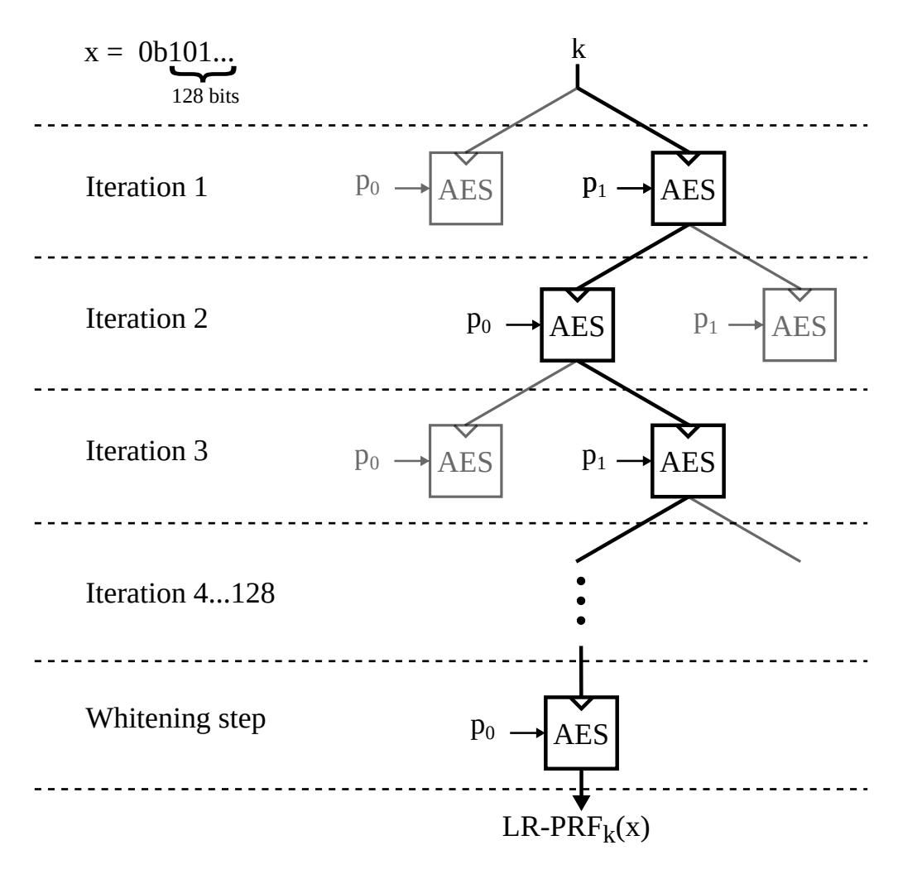

Figure 1: Dataflow graph of an LR-PRF execution for *n*= 1, i.e., with data complexity of 2 *<sup>n</sup>* = 2, and input *x* of length 128 bits. In each iteration only the AES path highlighted in black is executed depending on the respective bit of *x*.

Pseudorandom functions are functions that take a key *k* and input *x* and output a fixedlength pseudorandom string. They have an application in, e.g., the secure initialization from public inputs or, as in our case, as building block for larger cryptographic protocols such as AEAD. There have been multiple proposals for LR-PRFs, yet the one proposed by Medwed et al. [\[5\]](#page-21-3) and later improved in [\[6\]](#page-21-4) is particularly relevant for our use case because it is based on a standard block cipher (AES). It achieves side-channel protection by frequently changing the encryption key and limiting the usage of each key to a certain number of encryptions. The input of the LR-PRF *x* is processed in chunks of *n* bits. Depending on the value of the *n* bits of *x* being processed in a given iteration, a plaintext is chosen out of a set of 2 *<sup>n</sup>* plaintexts and is encrypted. The number of possible plaintexts 2 *<sup>n</sup>* is also denoted as *data complexity*.

The execution in case of *n*= 1 is depicted as a dataflow graph for an example input in Fig. [1.](#page-3-0) In each iteration, one out of the 2 *<sup>n</sup>* = 2 possible plaintexts *p*<sup>0</sup> and *p*<sup>1</sup> is encrypted. The plaintext is chosen dependent on the bits of the input *x*. For example, in iteration 1 the plaintext *p*<sup>1</sup> is encrypted according to the first bit of *x*, which is 1. The initial encryption uses the long-term secret key *k*, subsequently the ciphertext is used as the key for the next iteration. Finally, after all bits of the input have been processed, an additional whitening step is performed with a constant input. The whitening protects against differential attacks on the output. The LR-PRF takes d*i/n*e + 1 block cipher encryptions to process an input with length of *i* bits. Consequently, the number of bits *n* processed per iteration has a direct impact on the security and the performance of the construction. On the one hand, the data complexity for an attack is determined by *n*, as

{4}------------------------------------------------

each key is only used with 2 *<sup>n</sup>* different plaintexts. Therefore, from a security point of view, *n* has to be kept low. On the other hand, the performance of the LR-PRF deteriorates with lower *n* because more iterations are necessary to process the input.

In the original proposal of the LR-PRF [\[5\]](#page-21-3), the set of input plaintexts to the underlying block cipher are known to the attacker. Furthermore, all plaintext bytes have the same value and the S-boxes are implemented in parallel hardware. As a result, an attacker can not differentiate between the subkeys during a divide-and-conquer attack because the plaintext input to each S-box is identical. Even if all key bytes are recovered, choosing identical plaintext bytes adds enumeration effort to find the correct order. However, the enumeration effort is only increased if the attacker can not resolve the processing of single subkeys (i.e., S-boxes) in the measured traces. In case of the AES, all 16 S-boxes need to be implemented in parallel hardware and are therefore computed at the same time. An additional benefit of parallel hardware implementations is the added key dependent algorithmic noise that reduces the signal-to-noise ratio of a side-channel attack. In case of limited parallelism, i.e., if not all S-boxes are implemented in parallel and an AES round is computed over multiple clock cycles, these effects are still present but with reduced effectiveness.

In the improved LR-PRF with unknown inputs [\[6\]](#page-21-4), the plaintexts are unknown to an attacker because they are generated in an additional preprocessing step using a leakage resilient pseudo random generator (LR-PRG) proposed by Standaert et al. [\[8\]](#page-21-6). A PRG differs from a pseudorandom function (PRF) in that it takes no input except for an initial seed or key of fixed length and that it outputs a pseudorandom string of variable length. The LR-PRG by Standaert et al. [\[8\]](#page-21-6) can be implemented using AES and is shown in Fig. [2.](#page-4-0) Similar to one stage of the LR-PRF, two plaintexts *p*<sup>0</sup> and *p*<sup>1</sup> are initially encrypted with key *k*. The result of one encryption is used as key for the next iteration, the result of the other forms the pseudorandom string *y*. In the unknown-input LR-PRF construction, the LR-PRG generates the plaintexts that are used in the actual LR-PRF stage. In contrast to the original proposal, these plaintexts are kept secret. As a consequence, the attacker does not know the inputs to the block cipher operations and is unable to perform attacks as in case of the original construction. Attackers instead have to target the LR-PRG step where *p*<sup>0</sup> and *p*<sup>1</sup> are still public and known to them. This attack is equivalent to attacking the original LR-PRF construction with *n*= 1, i.e., a data complexity of two. The advantage of this design is that it allows higher data complexities in the LR-PRF stage, and therefore increased performance, without increasing the attack surface.

<span id="page-4-0"></span>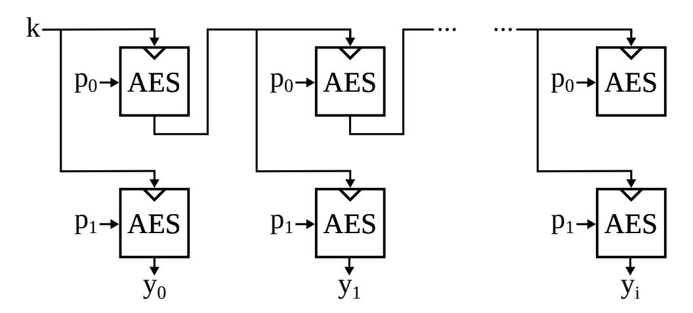

Figure 2: AES based PRG based on [\[8\]](#page-21-6).

Both LR-PRF constructions are vulnerable to high-end invasive EM attacks with high spatial resolution (sub-millimeter coils) when implemented on FPGA devices [\[9\]](#page-21-7). Unterstein et al. [\[9,](#page-21-7) [10\]](#page-21-8) demonstrate that the spatial localization and high time resolution of such setups allows for the isolation of individual S-boxes in a divide-and-conquer attack and additionally removes the key dependent noise from parallel S-boxes to a certain extent. The feasibility of such attacks is highly dependent on the integration density of the device. 

{5}------------------------------------------------

Contrary to our use-case they analyze an FPGA device where the integration density is generally low compared to ASIC designs. In a later work [\[11\]](#page-21-9), they provide results of a similar investigation on a newer FPGA with smaller feature size and higher integration density where the security level is still high after the attack. Therefore, we believe that the high integration density of an ASIC hardware accelerator will provide at least some resistance to such attacks. In any case, we consider such costly invasive attacks as presented in [\[9\]](#page-21-7) out of scope for this work because we aim at providing side-channel security to previously unprotected low-cost devices. To provide protection against localized attacks, Unterstein et al. [\[10\]](#page-21-8) add a method to the LR-PRF construction that 'refills' the key entropy by introducing additional key material in a preprocessing step. This comes at the cost of increased key length and a significant performance penalty because the data complexity in the PRF tree is fixed to 2. Similar to the unknown-inputs LR-PRF, the relevant attack vector is an attack of data complexity 2 on the AES during preprocessing.

In summary, to implement any of the presented LR-PRF, the necessary requirement is that an AES core resists side-channel attacks with a data complexity of 2. For our analysis we use the original LR-PRF since it has the least implementation overhead and is best suited to analyze the security impact of the different data complexity configuration. However, we emphasize that the analysis of this LR-PRF with data complexity 2 also covers the other two variants since the best attack vector is identical for all constructions. As long as this case is shown to be appropriately secure for a given implementation, all variants of the LR-PRF can be used. Furthermore, depending on the outcome of the SCA for higher data complexities, more efficient configurations of the original LR-PRF can be considered.

#### <span id="page-5-1"></span>**2.2 Leakage resilient authenticated encryption**

Authenticated encryption (with associated data) schemes can be implemented using dedicated constructions or built from common primitives such as block ciphers and message authentication codes (MACs) through generic composition. An AEAD scheme takes a key *k*, a message *msg*, associated data *adata* and a nonce *nonce* as input and outputs a tag *tag* and a ciphertext *ctxt*. For our use case, we use a composition scheme that can be instantiated using existing hardware accelerators and make use of the results of Krämer and Struck [\[7\]](#page-21-5). In their work they revisit the so called *F GHF*<sup>0</sup> construction that was proposed by Degabriele et al. [\[12\]](#page-21-10) in the context of sponge based constructions. The *F GHF*<sup>0</sup> construction is an LR-AEAD scheme and comprises four building blocks: Two functions F and F 0 , a PRG G and a hash function H. In order for the construction to be leakage resilient, the security analysis of Degabriele et al. originally requires both F and F 0 to be pseudorandom under leakage and F 0 to be unpredictable under leakage in addition[2](#page-5-0) . The hash function and PRG can be instantiated with unprotected primitives. However, Krämer and Struck simplify this and show that for the *F GHF*<sup>0</sup> construction the unpredictability is actually not required and that both F and F 0 can be implemented using LR-PRFs. In the context of our work, this allows us to use one of the AES based LR-PRF that are discussed in Sec. [2.1](#page-3-1) as building block for both F and F 0 .

The PRG G can be implemented using the AES based LR-PRG of Standaert et al. [\[8\]](#page-21-6) (Fig. [2\)](#page-4-0). Note that following the security analysis of Degabriele et al., G is not required to be leakage resilient. The main reason we use this LR-PRG is that it also makes use of the AES hardware accelerator. We discuss the security implication of using a block cipher based construction for G in Sec. [4.](#page-8-0) The hash function H, e.g., SHA-256, can either be realized using hardware accelerators, if they are present, or implemented in software. An overview of the *F GHF*<sup>0</sup> scheme when implemented with these building blocks is shown

<span id="page-5-0"></span><sup>2</sup>Without considering leakage these two notions imply each other. However, under leakage this is not the case as discussed in, e.g., [\[7\]](#page-21-5).

{6}------------------------------------------------

<span id="page-6-1"></span>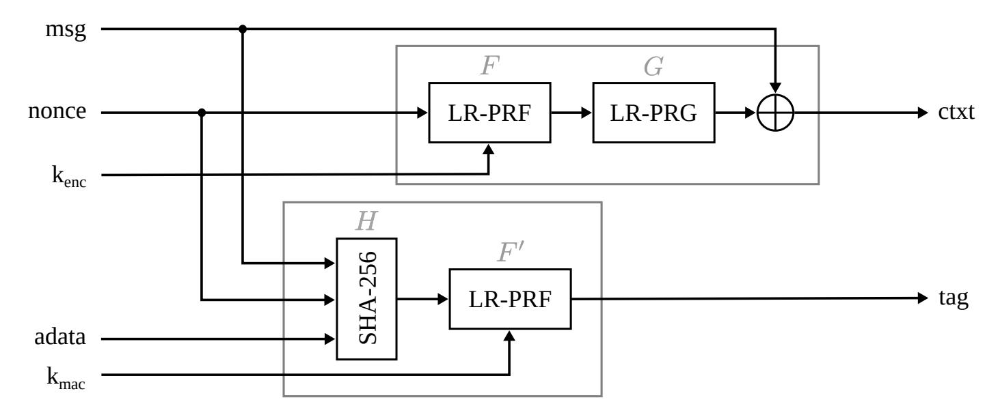

Figure 3: LR-AEAD implementation (adapted from [\[7\]](#page-21-5)).

in Fig. [3.](#page-6-1) Note that the key *k* in this case consists of two keys *kenc* and *kmac* which are used for the stream cipher and MAC part of the scheme, respectively.

# <span id="page-6-0"></span>**3 Attacker model and evaluation methodology**

In this section we first define the attacker model and then outline the methodology for our side-channel evaluations. Specifically, we describe the security assessment of the LR-PRF construction. In practice, this assessment consists of profiled side-channel attacks against AES with limited data complexity.

#### <span id="page-6-2"></span>**3.1 Attacker model**

The intended targets for bringing leakage resilience to COTS microcontrollers are low-cost IoT devices. Since these microcontrollers are not marketed, nor intended, to be used in high security applications, modeling an attacker with high-end laboratory resources does not seem justified. For that reason, we do not consider invasive, high-precision EM analyses, as described in [\[10\]](#page-21-8), that use equipment worth around 100,000 USD, excluding the equipment for decapping the chips before analyses. Instead, we assume attackers with considerable technical know-how, but moderate capabilities in terms of laboratory equipment. We assume that attackers have access to EM measurement probes allowing measurements close to the packaged chips with manual positioning of the probe. Along with a preamplifier and a USB oscilloscope, such a setup can be built for a few thousand USD.

Since the analyzed devices can be bought without restrictions, attackers can perform profiling with known keys on one or more devices under their control. To reflect this fact in our analysis and in order to avoid inter-device deviations, we perform profiling and attacks on the same device (can be seen as worst case), even though this would not be possible in a real scenario where an attacker has limited control over the attacked device.

#### **3.2 Assessing the side-channel security**

Considering the different variations of LR-PRFs, the side-channel security is always reduced to a side-channel attack on the initial usage of the long-term key with varying data complexity. In case of the original proposal [\[5\]](#page-21-3), the available data complexity in an attack depends on the configuration of the LR-PRF and ranges from 2 up to 256. For the unknown-input [\[6\]](#page-21-4) and the key refreshing [\[10\]](#page-21-8) LR-PRF, attacks are limited to a data complexity of 2.

{7}------------------------------------------------

All proposed constructions are able to use a varying number of parallel S-boxes that determine the amount of algorithmic noise. These contributions assume dedicated hardware designs where this choice can be made deliberately, whereas in our case the level of parallelism depends on the choice of the controller. Hence, an evaluator's goal is to determine the security of a hardware implementation (with a fixed number of parallel S-boxes) in relation to the data complexity. Then, the LR-PRF construction with the best trade-off between security (security level subject to an attack) and efficiency (implementation cost and runtime) is chosen.

When implementing LR-PRFs on microcontrollers through the use of a hardware accelerator, the key inevitably has to be transferred from the CPU over the bus to the accelerator. In the case of commercial security controller, these bus transfers are masked by random values. In our case of unprotected microcontrollers this attack vector needs to be considered. Wouters et al. [\[13\]](#page-21-11) demonstrate the effectiveness of such attacks and recover the transponder key of a car immobilizer in a profiled attack on the key transfer to a coprocessor. Therefore, to establish SCA secure LR-PRFs on such microcontrollers we evaluate two attack vectors in this work: *i)* Attacks on the bus transfer of the key in Sec. [6.2](#page-12-1) and *ii)* attacks on the AES accelerator with different data complexity in Sec. [6.4.](#page-15-0) To have a baseline for comparison, we attack the accelerator with unlimited data complexity in Sec. [6.3.](#page-14-0)

## <span id="page-7-0"></span>**3.3 Profiled side-channel attacks with limited data complexity**

To assess the worst case security of a device it is common practice to use multivariate Gaussian template attacks [\[14,](#page-21-12)[15\]](#page-21-13). Due to the high computational complexity, the number of samples which are included in the multivariate templates has to be kept low. The most informative time samples from a trace, called points of interest (POIs), are extracted in a preprocessing step. We use the correlation-based leakage test described by Durvaux and Standaert [\[16\]](#page-21-14) as a first order, profiled leakage test.

After identifying POIs, Gaussian templates are calculated on the reduced trace. This *profiling phase* requires that the attacker has full control over the device, most importantly the secret key and the inputs, e.g., the plaintexts in case of encryption algorithms. Key bytes are profiled and attacked separately in a divide-and-conquer manner. While profiling one byte, all other bytes are randomized. During the *attack phase*, the attacker only controls the inputs and matches the templates with the measured traces in order to find the secret key. Due to the design of the LR-PRF, the input controlled by the attacker is not directly used as input to the AES. Instead, each execution of the LR-PRF consists of multiple AES executions and for each of those the plaintext is chosen depending on certain bits of the LR-PRF input. Therefore, the input that is provided by the attacker only allows to choose between a limited set of plaintexts for each execution of the AES. This is different from a regular TA, where the input bytes can be chosen randomly by the attacker. This random input allows a divide-and-conquer approach to work well because each byte behaves independently of the others and the attacker may target specific bytes one at a time. When the data complexity is limited, as in the LR-PRF case, the key bytes are no longer independent and this separation is hindered. As a result, the individual bytes are affected by each others correlated leakage and this so-called algorithmic noise impedes side-channel attacks. It is therefore expected that correct key byte candidates are not always determined without doubt and that the attacker has to try the most probable combinations until the full key is recovered. Attacks on the key transfer can be considered a corner case of this scenario where the data complexity is limited to one.

To assess the security level from the lists of key candidates, the key rank estimation algorithm by Glowacz et al. [\[17\]](#page-22-0) is used. It gives an estimation of the remaining security level which we denote in bits. A security level of *x* bit means that an attacker has to try 2 *x* keys out of the most probable combinations until the correct one is found. An additional

{8}------------------------------------------------

<span id="page-8-1"></span>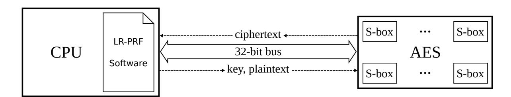

Figure 4: Microcontroller running an LR-PRF using an integrated AES hardware accelerator.

side effect of the limited data complexity is that certain combinations of key bytes are easier to attack than others, depending on the leakage behavior of the device. Hence, we test several keys and estimate the distribution of the resulting security level.

## <span id="page-8-0"></span>4 Leakage resilient AEAD on COTS microcontrollers

This section describes how to achieve LR-AEAD for COTS microcontrollers. First, we explain how to implement an LR-PRF and LR-PRG utilizing a hardware AES engine. We specifically describe the partitioning between software and hardware accelerators. Second, we describe how to use this protected building block together with an LR-PRG and hash function in the LR-AEAD scheme of Degabriele et al. [12]. We provide pseudo code for all operations and point out the security critical operations which we analyze in the side-channel evaluation in Sec. 6.

The main aspect of our proposal is to benefit from existing hardware accelerators with parallel S-boxes on microcontrollers to realize an LR-PRF. A typical architecture of a microcontroller with integrated cryptographic coprocessor is outlined in Fig. 4. The AES coprocessor is attached to the main CPU via a bus and can run independently and in parallel. It is typically controlled through memory-mapped registers. Commands and data values are exchanged over the bus.

#### **Algorithm 1:** LR-PRF

```
1 Function LR-PRF(x, k, n):
       /* Initialize with long term key */
       \text{key} \leftarrow \text{k};
 2
       /* Iterate through the PRF stages */
       for i \leftarrow 1 to 128/n do
 3
           nbits \leftarrow read_next_n_bits(x);
 4
           plaintext \leftarrow (nbits|...|nbits)<sup>128</sup>;
 5
           write_to_accelerator(key, plaintext);
 6
            ciphertext \leftarrow \texttt{AES\_encrypt}(key, plaintext)
 7
           read_from_accelerator(ciphertext);
 8
           key \leftarrow ciphertext;
 9
       end
10
       /* Whitening step */
       plaintext \leftarrow 0^{128};
11
       write_to_accelerator(key, plaintext);
12
        ciphertext ← AES_encrypt(key, plaintext)
13
       read from accelerator(ciphertext);
14
15 return ciphertext;
```

{9}------------------------------------------------

#### **Algorithm 2:** LR-PRG

```
1 global key;
 2 Function LR-PRG_seed(s):
      /* Initialize with seed */
      \text{key} \leftarrow \text{s};
 3
 4 return
 5 Function LR-PRG_iterate():
      /* Update key */
      plaintext \leftarrow 0^{128};
 6
      write_to_accelerator(key, plaintext);
 7
       ciphertext \leftarrow AES\_encrypt(key, plaintext)
 8
      read_from_accelerator(ciphertext);
 9
      key \leftarrow ciphertext;
10
      /* Generate output block */
      plaintext \leftarrow 1^{128};
11
      write_to_accelerator(key, plaintext);
12
       ciphertext ← AES_encrypt(key, plaintext);
13
      read_from_accelerator(ciphertext);
14
15 return ciphertext;
```

```
Algorithm 3: LR-AEAD
 1 Function LR-AEAD_encrypt(msg, adata, nonce, k_{\rm enc},\,k_{\rm mac},\,n):
       /* Encrypt message block by block */
       seed \leftarrow LR-PRF (nonce, k_{enc}, n);
 \mathbf{2}
       LR-PRG_seed(seed);
 3
       foreach msg_block in msg do
 4
           ctxt\_block \leftarrow LR-PRG\_iterate() \oplus msg\_block;
 \mathbf{5}
           ctxt \leftarrow ctxt|ctxt\_block;
 6
       end
 7
       /* Calculate tag */
       hash \leftarrow SHA-256 (nonce, adata, ctxt);
 8
       tag \leftarrow LR-PRF(hash, k_{mac}, n);
 9
10 return ctxt, tag;
11 Function LR-AEAD_decrypt(ctxt, adata, nonce, tag, k<sub>enc</sub>, k<sub>mac</sub>, n):
       /* Calculate and compare tag */
       hash \leftarrow SHA-256 (nonce, adata, ctxt);
12
       tag' \leftarrow LR-PRF(hash, k_{mac}, n);
13
       if tag' \neq tag then
14
           return \perp;
15
       end
16
       /* Decrypt message block by block */
       seed \leftarrow LR-PRF (nonce, k_{enc}, n);
17
       LR-PRG_seed(seed);
18
       foreach ctxt block in ctxt do
19
           msg\_block \leftarrow LR-PRG\_iterate() \oplus ctxt\_block;
20
           msg \leftarrow msg | msg block;
\mathbf{21}
       \mathbf{end}
22
23 return msg;
```

{10}------------------------------------------------

The LR-PRF program is executed on the CPU and the hardware accelerator is queried for the necessary block cipher encryptions. The process follows Algorithm [1,](#page-8-2) where the boxed operations are executed inside the hardware accelerator, while the rest is executed by the CPU. Inputs are the key *k*, the data input *x* and the data complexity expressed in the number of bits *n* that are processed per stage (e.g., for data complexity 4, *n* equals 2). The expression (nbits| *. . .* |nbits) <sup>128</sup> denotes a concatenation of bits *nbits* until the string contains 128 bits, 0 <sup>128</sup> is an all zero bitstring with length 128.

We give the pseudocode description of the used LR-PRG in Algorithm [2.](#page-9-0) The functionality is split in two functions: An initial seeding of the LR-PRG that sets the key for the first iteration and an iterate function that returns one block of pseudorandom data and updates the key internally. There are two types of security critical operations in Algorithms [1](#page-8-2) and [2.](#page-9-0) The first type are the AES encryptions (AES\_encrypt). This is expected from all conceptual considerations. The second type is implementation-specific, i.e., the bus transfers (write\_to/read\_from\_accelerator) of the key.

We give a detailed SCA of both types of operations in Sec. [6.](#page-11-0) Algorithm [3](#page-9-1) puts the building blocks together and describes the encrypt and decrypt operations of the LR-AEAD. This does not add any additional attack vectors, as all sensitive operations are located within the LR-PRF and LR-PRG.

**A cautionary note** According to the security analysis of the LR-AEAD scheme by the authors of [\[12\]](#page-21-10) the PRG is not required to be secured against differential side-channel attacks since its seed is generated on the fly and is only valid for one message. Thus, if we consider the PRG as a black box, each seed is only used for one operation and the only valid attacks are attacks with data complexity 1, i.e., simple power analysis (SPA) attacks. However, since we use a block cipher based PRG, this single operation in fact consists of multiple sensitive block cipher encryptions which increases the data complexity for an attack. It is intuitively clear that the seed to the PRG, i.e., the initial key to the AES, must not be leaked in order to protect the confidentiality of the individual message. Note that leaking this seed would only disclose this one message, neither *kenc* nor *kmac* are affected so an attack on the seed would have to be mounted for every message.

Fortunately, the *practical* security of the PRG equals the security of the LR-PRF in our case because one iteration of the PRG has the identical side-channel attack surface as one iteration of the LR-PRF in case of data complexity 2. The *theoretical* side-channel security is not equivalent since the security proof for the LR-PRG requires use of the random oracle model whereas the LR-PRF is provably secure in the standard model. However, this is only to prevent so called future computation attacks and has no practical significance[3](#page-10-1) . In other words, if we can realize a secure LR-PRF with data complexity 2, and we successfully do so, then it implies the security of the LR-PRG.

# <span id="page-10-0"></span>**5 Devices under test: STM32 and EFM32**

We chose two COTS microcontrollers for our proof of concept, namely the STM32F215RET6 (STM32) ARM Cortex-M3 and EFM32PG12B500F1024 (EFM32) ARM Cortex-M4 microcontrollers which are both widely used in IoT applications. Both devices feature a 32-bit processor manufactured in a 90 nm process and include an AES hardware cryptographic accelerator that is not specifically hardened against side-channel attacks. The cryptographic accelerators are different in their level of internal parallelism.

Based on the number of clock cycles the cryptographic coprocessors take for a single AES operation we assume that the STM32 implements 16 parallel S-boxes to perform the

<span id="page-10-1"></span><sup>3</sup>For a more detailed discussion see [\[18\]](#page-22-1).

{11}------------------------------------------------

10 rounds of an 128-bit AES (AES-128) and the EFM32 implements four parallel S-boxes. This assumption is confirmed by the results of a correlation-based leakage test shown in Fig. [5a](#page-11-1) for the STM32 and in Fig. [5b](#page-11-2) for the EFM32.

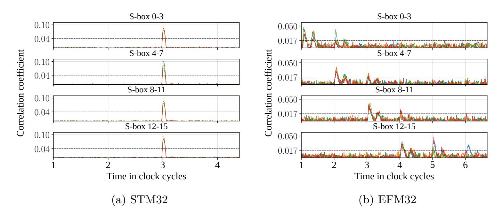

<span id="page-11-2"></span><span id="page-11-1"></span>Figure 5: Correlation-based leakage test on the AES S-box input for 100,000 traces with known plaintexts and keys.

In both figures the correlation for the input of the different S-boxes of an AES-128 encryption is depicted for known plaintext and key values. In Fig. [5a](#page-11-1) the maximum correlations for all 16 S-boxes occur at the same point in time indicating a fully parallel design. In Fig. [5b](#page-11-2) it can be observed that groups of 4 S-boxes behave similarly. This confirms that the accelerator implementation of the EFM32 processes 32-bit words of the AES state simultaneously which corresponds to four parallel S-boxes. The words exhibit two distinct peaks in subsequent clock cycles which overlap with the following word. This behavior is consistent with leakage caused by writing or overwriting a shared buffer register. For some S-boxes, e.g., S-box 12-15 at clock cycle 6, additional correlation peaks can be observed. This behavior is also visible several cycles after the computation of the current AES round. A reasonable explanation for these additional peaks is the complex structure of the cryptographic coprocessor of the EFM32, which contains an ALU with dedicated instruction memory and data registers. The peaks could stem from internal buffers or the switching of multiplexers between register banks.

In order to implement the LR-AEAD as described in Sec. [2.2](#page-5-1) we utilize the SHA-256 hardware accelerator of the EFM32. In contrast, the STM32 only provides a SHA-1 accelerator that we opted to ignore, as practical attacks against SHA-1 have already been shown [\[19\]](#page-22-2). Instead, we use a software implementation of SHA-256 provided by the open source library *tinycrypt* [\[20\]](#page-22-3), which is designed for constrained devices.

# <span id="page-11-0"></span>**6 Side-channel evaluation**

In this section we present the results of a side-channel analysis of LR-AEADs on two microcontrollers. As explained in Sec. [4,](#page-8-0) the analysis of the LR-AEADs is reduced to an analysis of the LR-PRFs with different data complexity configurations. We are covering two attack vectors on the LR-PRF: Attacks on key transfers from CPU to hardware accelerator and attacks on the AES accelerator which is used as part of the LR-PRF implementation. In that regard we first demonstrate that the key can be fully recovered if the AES is used in a standard mode where the data complexity for the attack is not limited. Within the LR-PRF, however, the AES is only used with limited data complexity, i.e., with a limited number of different plaintext inputs under one key. Thus, we provide results of attacks

{12}------------------------------------------------

with different data complexities and give estimates of the remaining security level. We find that attacks on the key transfer do not lead to exploitable security levels. For the attacks on the AES, we observe that the security level decreases with rising data complexity. However, for both microcontrollers we find configurations that, under our test conditions, lead to high security levels greater than 100 bit. We describe our measurement setup in Sec. [6.1.](#page-12-0) In Sec. [6.2](#page-12-1) we provide result of the attack on the key transfer, Sec. [6.3](#page-14-0) and Sec. [6.4](#page-15-0) cover attacks on the AES with unlimited and limited data complexity, respectively.

#### <span id="page-12-0"></span>**6.1 Measurement setups**

The measurement setup for the STM32 is depicted in Fig. [6a](#page-12-2) and consists of a CW308T-STM32F target board mounted on a CW308 UFO Board running at a clock frequency of 10 MHz. A PicoScope 6402D USB-oscilloscope is used for the data acquisition at a sampling rate of 1*.*25 GHz. The EM emanations are captured using a passive Langer RF-U 2.5-2 near-field probe that is connected to a Langer PA 303 preamplifier adding a gain of 30 dB. The EFM32 setup consists of an EFM32 Pearl Gecko PG12 Starter Kit running at its default clock frequency of 19 MHz. A LeCroy WavePro 7 Zi-A 2*.*5 GHz oscilloscope operating at a sampling rate of 5 GHz is used for the data acquisition. We use the same near-field probe and preamplifier as in the STM32 setup.

According to the attacker model in Sec. [3.1](#page-6-2) the probes are positioned manually. Different positions close to pins, capacitors and on top of the package were tested by inspecting signal amplitudes and qualitative indicators, e.g., if the AES round structure is visible. In case of the CW308T-STM32F target board, the probe is located on Pin 31 (c.f. Fig. [6a\)](#page-12-2). For the EFM32 the probe is located in between two decoupling capacitors as shown in Fig. [6b.](#page-12-3)

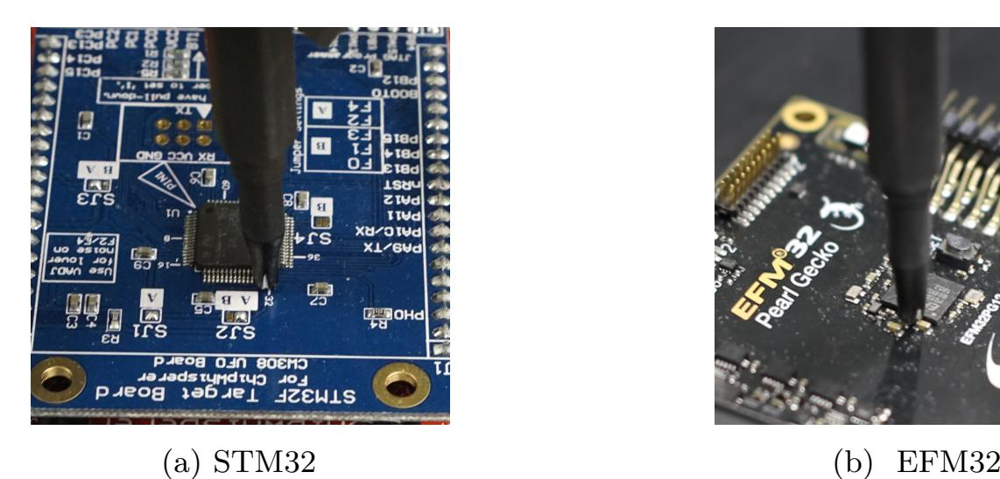

<span id="page-12-3"></span>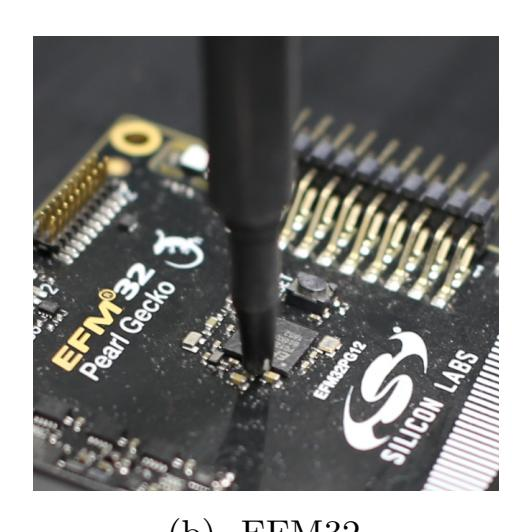

Figure 6: Positioning of the EM probes.

#### <span id="page-12-2"></span><span id="page-12-1"></span>**6.2 Template attacks on key transfer**

Protecting a cryptographic operation against physical attacks is only feasible if the key is not easily recovered through SCA of the key transfer from the CPU to the cryptographic accelerator. We perform an evaluation of the key transfer for both microcontrollers and confirm that under our conditions, the leakage cannot be exploited to recover the key.

{13}------------------------------------------------

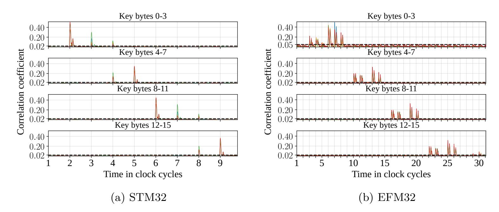

<span id="page-13-1"></span><span id="page-13-0"></span>Figure 7: Correlation-based leakage test on the key transfer for 100,000 traces with known random keys.

The AES hardware accelerator on both devices is connected to the CPU as a memory-mapped device. During the initialization the key has to be written to a register of the accelerator as four 32-bit words for a key size of 128 bits. The key transfer on the internal bus can be observed by an attacker, enabling a TA on the key bytes with a data complexity of 1. As the key is static, differential attacks are excluded. Although the key is transferred in words of 32 bits, building templates for 32-bit values, under the chosen conditions, is not feasible due to the time which is required to collect a sufficient number of measurements for all 2<sup>32</sup> templates. With the acquisition rate of our setup of about 50 traces per second, it takes roughly 10,000 years to collect the required traces, even for 16-bit values it takes over 60 days. The TAs carried out in the following sections are therefore based on 8-bit templates instead.

In a first step, a correlation-based leakage test on the key transfer is conducted to find the POIs for the TA. The correlation for the values of the different key bytes is depicted in Fig. 7a for the STM32, and in Fig. 7b for the EFM32. For both figures we use 100,000 traces with known random keys. Both devices show relatively high correlation values of approximately 0.4, which is expected for unprotected microcontrollers. Figure 7a shows that the duration of the entire key transfer is eight clock cycles and the leakage of the words is partly overlapping. The leakage test for the EFM32 looks similar except for the difference that the four 32-bit transfers do not overlap at all.

The POIs for the TA on the different words are obtained by using all samples that exhibit a correlation higher than 0.02 for the STM32. For the EFM32 we use a threshold of 0.05 for the first four key bytes and 0.02 for the other key bytes. Both thresholds have been determined visually as being just above the noise floor and are marked with a dashed line. The templates for the 256 possible values are generated from a total of 2,000,000 traces with known random keys in the case of the STM32, and 1,000,000 traces in the case of the EFM32. The difference in the number of traces stems from different acquisition rates on the two setups. To evaluate the entropy reduction by the TA, 1,000 attacks with different random keys are performed where for each key 1,000 traces are recorded. We found that already for this number of traces per key, the results are stable and more traces per key do not further improve results.

{14}------------------------------------------------

<span id="page-14-1"></span>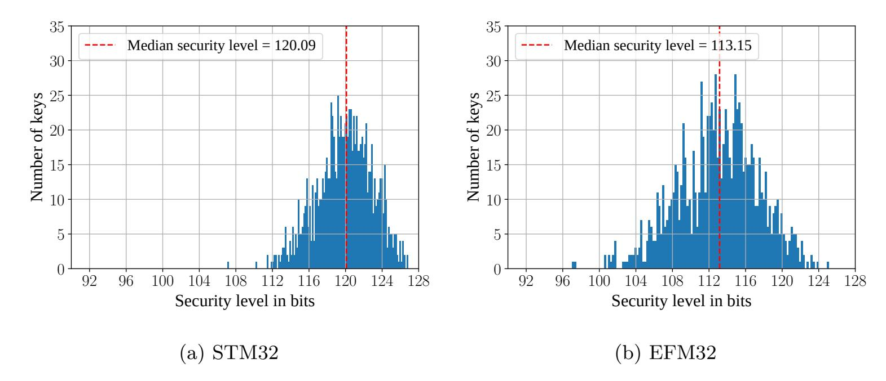

Figure 8: Security level for 1,000 random keys subject to a Template Attack on the key transfer.

The results for both devices are depicted in Fig. 8. The median security level under our attack conditions is 120.09 bits for the STM32 and 113.15 bits for the EFM32. Even the key with the worst security level has a remaining entropy of 107 bits and 97 bits for the STM32 and EFM32, respectively. Summing up, while a TA on the key transfer reduces the entropy of the key, it does not compromise the security to an extent where a protection of the cryptographic operation would be pointless.

### <span id="page-14-0"></span>6.3 Template attack on unprotected AES

The idea of retrofitting protection for AES hardware accelerators is motivated by the assumption that the devices are vulnerable to SCA. Hence, we perform TAs on the hardware AES of the EFM32 and the STM32 to verify this assumption. Additionally, a successful attack result serves as a confirmation that the side-channel measurement setup including the manual positioning of the probe is effective. The evaluation also provides a baseline for comparison during the evaluation of the applied protection mechanism in Sec. 6.4.

As an intermediate value we target the S-box input of the first AES round, which is common practice for attacks on AES. The results of a correlation-based leakage test depicted in Figs. 5a and 5b are used to select suitable POIs. Again, the dashed line marks the threshold for the POI selection. For the STM32 and the EFM32 the threshold is set to 0.04 and 0.017, respectively. In the profiling phase, we acquired 2,000,000 traces (STM32) and 1,000,000 traces (EFM32) with random keys and random plaintexts. Multivariate templates are computed for each of the 256 possible intermediate values of all 8-bit templates. During the attack phase, 10 random keys are evaluated using up to 30,000 traces with random plaintext inputs.

In contrast to the attack on the key transfer in Sec. 6.2, where all processed values are constant and increasing measurements merely reduce noise effects, variable input values allow the attacker to increase the success probability by increasing the number of traces. Figures 9a and 9b depict the median key rank based on 10 random keys for an increasing number of traces. Each line represents the median key rank for one of the 16 key bytes (S-boxes). The key rank denotes the position of the correct value if the results are sorted according to their likelihoods. A rank of 1 equals a successful recovery, while higher ranks require key enumeration effort by the attacker. For the STM32 the key byte ranks decrease to 1 after about 2,500 traces, i.e., a full key recovery is achieved. In the case of the EFM32, more traces are needed to achieve low key ranks. However, not all key bytes converge to a rank of 1 and therefore a low effort in key rank enumeration is still necessary. Summarizing,

{15}------------------------------------------------

<span id="page-15-4"></span>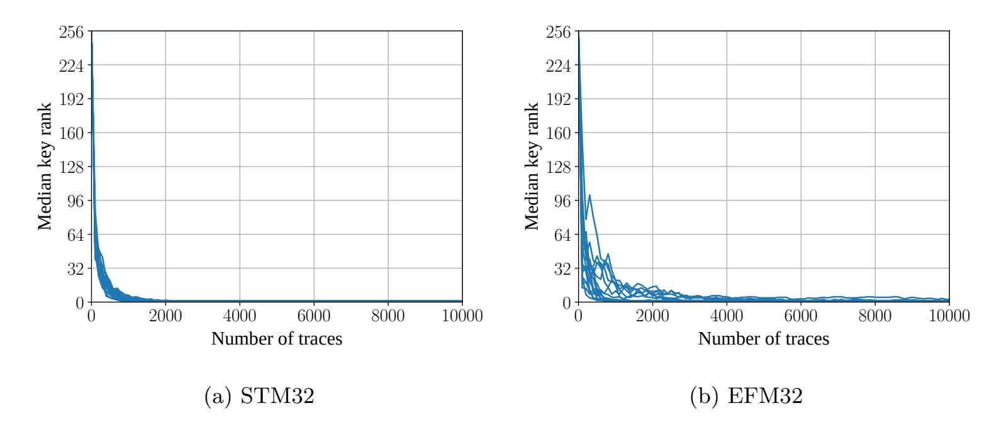

<span id="page-15-2"></span><span id="page-15-1"></span>Figure 9: Median key rank of the 16 key bytes subject to a Template Attack on the AES S-box input for 10 random keys with random plaintexts for varying number of traces.

both AES engines are vulnerable to SCA and protection mechanisms are required.

#### <span id="page-15-0"></span>6.4 Template attacks on LR-PRFs with different data complexities

This section provides the side-channel evaluation of the proposed retrofitted protection mechanism based on LR-PRFs. As outlined in Sec. 2, the security is determined by a side-channel attack on the initial use of the long-term secret. The number of different plaintexts which are used in the LR-PRF construction is a trade-off and affects the data complexity of a side-channel attack and the runtime. We analyze the security level of the implemented concept for different trade-offs by performing TAs with different data complexities.

The same profiling set as described in Sec. 6.3 can be used. Data complexities of  $\{2,4,8,16,32,64,128,256\}$  are used and for each 300 different random keys are attacked. All plaintexts are of the form that all 16 bytes are equal as described by Medwed et al. [5]. For each of the 300 attacked keys, we collected a high number of traces to reduce the measurement noise. Specifically, we recorded 30,000 traces in case of the STM32 and 10,000 traces in case of the EFM32. We found that the attack does not achieve further significant improvement with higher numbers of traces.

Figures 10a and 10b present the attack results as a median security level<sup>4</sup> of the full key in bits (after key rank estimation) over the number of traces and for different data complexities. As expected, the security level generally decreases with increased numbers of traces. However, importantly, the security levels do not approach 0 bit security because of the protection mechanism. Contrarily, the security levels stagnate and do not decrease further after a certain number of traces, which proves that the protection mechanism is effective. Note that a data complexity of 256 does mean that all values are used per plaintext byte. However, all plaintext bytes are still equal. This is the important difference to a regular attack scenario as described in Sec. 6.3 and the prevalent reason for the working protection in these cases.

<span id="page-15-3"></span> $<sup>^4</sup>$ The median is used instead of the mean as it denotes the security level that an attacker achieves in 50% of the cases. However, as the security levels are nearly normally distributed depicting the mean would result in similar values.

{16}------------------------------------------------

<span id="page-16-4"></span>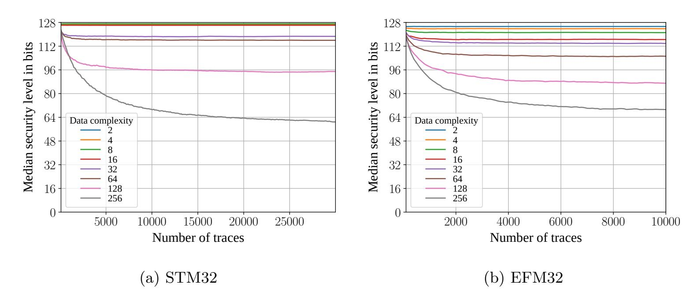

<span id="page-16-1"></span><span id="page-16-0"></span>Figure 10: Median security levels from 300 random keys subject to a Template Attack on the AES S-box input for varying number of traces and data complexities.

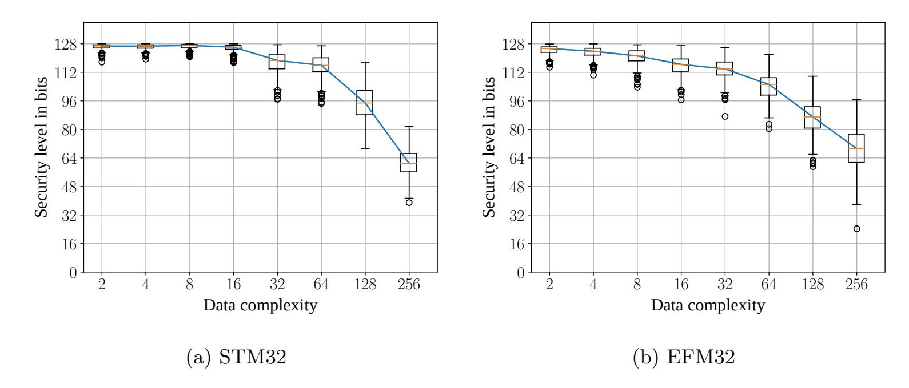

<span id="page-16-3"></span><span id="page-16-2"></span>Figure 11: Security levels of 300 random keys subject to a Template Attack on the AES S-box input for 30,000 (STM32) respectively 10,000 (EFM32) traces and different data complexities.

As explained in Sec. 3.3, the security level of individual keys depends on their concrete value in the case of limited data complexity. Keys are chosen at random and the resulting security levels of attacks vary accordingly. It is therefore important to not only consider the median security level but the whole distribution as the outliers determine the worst case security level. We show this variance in Figs. 11a and 11b. The figures present attack results after the maximum number of traces, i.e., 30,000 traces for the STM32 and 10,000 traces for the EFM32. Hence, this focuses on the rightmost verticals of Fig. 10. Each vertical on the x-axis contains the security levels from 300 attacks for this data complexity and the fixed number of attack traces. The distribution of the 300 attack results is visualized as a box plot. The red lines in the center of the boxes denote the median for the respective data complexity (this corresponds to the data shown previously on the rightmost vertical). The boxes include 50 % of the values within the quartiles Q1 and Q3. All whiskers of the boxplots are drawn at 1.5 Interquartile Range (IQR) or at the extrema. Outliers that diverge more than 1.5 IQR from the box edges are denoted as circles.

As most important observation it can be noted that for data complexities up to 16,

{17}------------------------------------------------

security levels including outliers are higher than 96 bits, which is a very positive result. For this number of attack traces, the attack on the unprotected AES results in a security level close to 0 bit. As expected and observed in the previous results, the security level decreases with increasing data complexity, i.e., if the number of observable plaintexts is extended. Interestingly, the distribution is rather broad with high differences between the median security level and the worst case of individual keys. Considering, e.g., the STM32 with data complexity 128, a median security level above 90 bits is achieved under our attack conditions but individual cases are as low as 70 bits. The variance is similar for both microcontrollers which reinforces the assumption that the choice of key values, not the measurement setup is the main reason for this observation.

The two AES engines have different numbers of parallel hardware S-boxes. The EFM32 includes four parallel S-boxes while the STM32 is fully parallel with 16 S-boxes. This means that the desired key dependent noise (algorithmic noise) from parallel structures is higher for the STM32. This explains the observation of higher resulting security levels at lower data complexities (2 to 64) as can be observed when comparing Figs. [10a](#page-16-0) and [10b.](#page-16-1) The results confirm that the higher parallelism provides better protection. For the EFM32 with four parallel S-boxes the algorithmic noise provides less protection. Nevertheless, the security level still remains above 100 bits for data complexities smaller than 16.

Note that the median security level for the data complexity of 256 is lower for the STM32. This is in contrast to the described reasoning and can in our opinion be explained using Fig. [9,](#page-15-4) which shows that the TA on the unprotected EFM32 does not converge to a key rank of 1 for single bytes. For higher data complexities, attacks generally become more comparable to attacks on the unprotected AES. The results in Fig. [9](#page-15-4) for the unprotected case show that the EFM32 is harder to attack judging by the required number of traces and the partially imperfect key recovery. This could be the reason why the security level of the EFM32 does not decrease at the same rate for high data complexities. As a conclusion, the device which was easier to attack without any countermeasures, the STM32, proves to be the more secure platform to implement LR-PRFs due to the higher level of parallelism of the hardware accelerator. In other words, the higher parallelism clearly leads to comparably better protection with the LR-PRF concept despite the fact that the same device is less secure when unprotected.

In summary this evaluation shows that secured LR-PRFs, and consequentially secured LR-AEAD, can be achieved on both devices. High security levels above 100 bit are achieved for all experiments with data complexities up to 16 on the STM32 and up to 8 on the EFM32. This shows that for protection in the targeted IoT scenarios, it is sufficient to use the original LR-PRF as long as the data complexity is within the discussed boundaries for the targeted security level. The fully parallel AES implementation of the STM32 allows for more efficient constructions while retaining a higher security level. Naturally, the unknown-inputs and key refreshing LR-PRF that are limited to data complexity 2 by design could also be used, but come with the downside of additional preprocessing steps and the requirement to temporarily store secret plaintexts.

# <span id="page-17-0"></span>**7 Performance analysis**

In this section we evaluate the performance of our LR-PRF and LR-AEAD implementation with respect to execution time and code size on both microcontrollers. We analyze the impact of different data complexities, however, we only consider LR-PRF configurations that process a number of bits per stage that is a divider of 128 (i.e., *n*= 1*,* 2*,* 4*,* 8 corresponding to data complexities of 2*,* 4*,* 16*,* 256). This avoids having a last LR-PRF iteration that does not use the full data complexity. In order to measure the execution time of the LR-PRF and LR-AEAD, we use the data watchpoint and trace (DWT) debug component of the Cortex-M processor. This feature allows for non-invasive and cycle accurate execution

{18}------------------------------------------------

<span id="page-18-0"></span>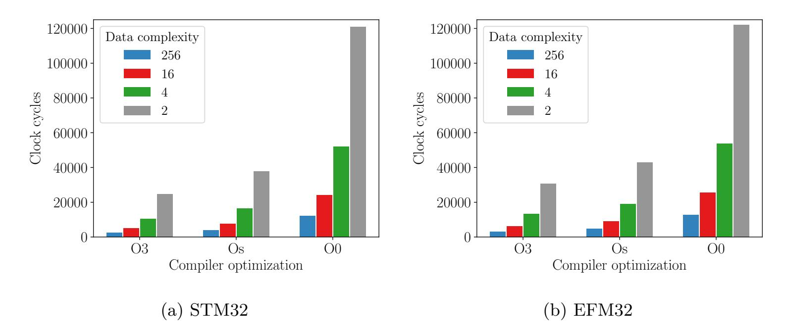

Figure 12: Performance evaluation of the LR-PRF implementation for different optimization levels and varying data complexities.

time measurements. Non-invasive in this case means that it is not necessary to modify the code under test to perform the timing measurements.

**Single LR-PRF execution** Figure [12](#page-18-0) depicts the number of clock cycles required for a single LR-PRF execution with varying data complexities and different compiler optimization levels. We use three different optimization levels: no optimization (O0), optimization for size (Os) and performance and size (O3). The results are also included in tabular format in Table [3](#page-23-0) in the appendix. Note that a particular optimization level choice does not have an impact on the side-channel security, as the AES hardware accelerator is not influenced by the compiler. The same holds for the key transfer over the bus. The diagram shows that the number of clock cycles grows logarithmically with increasing data complexity (i.e., linearly with the number of input bits processed per iteration). This is expected since an increasing data complexity leads to a decreasing number of required iterations in the LR-PRF tree. Contrary to our expectation, Fig. [12](#page-18-0) does not reflect the performance difference between the AES coprocessors of the devices. Even though the STM32 has a fully parallel AES core, the LR-PRF implementation is only slightly faster than the one on the EFM32. We would expect a factor of about four because a fully parallel implementation is capable of calculating an AES round in one cycle whereas an implementation with four S-boxes requires four cycles. We assume that the difference results from the different low-level software libraries used on both devices and differences in the interfacing. For both microcontrollers, the optimizations Os and O3 result in a 2 and 3 times faster execution time, respectively, in comparison to the baseline without optimization (O0). Given the fact that the difference in performance is only marginal we suggest using the optimization Os as it comes with the additional benefit of a reduced code size. Therefore, we evaluate the LR-AEAD performance with optimization level Os.

**Complete LR-AEAD execution** For the evaluation of the complete LR-AEAD, we measure its execution time for different data complexities and varying ciphertext sizes on both microcontrollers. We use the Os optimization level for the evaluation depicted in Fig. [13.](#page-19-0) We evaluate the LR-PRF with the minimum and maximum data complexity of 2 and 256 on both devices. Additionally, we evaluate the LR-PRF with a data complexity of 4 and 16 for the EFM32 and STM32, respectively. These values turned out to be a suitable trade off between execution time and security in Sec. [6.4.](#page-15-0) These results and additionally the required clock cycles to process a single 16-Byte block of data are also listed in Table [4.](#page-23-1) The necessary clock cycles for the basic function calls, AES\_encrypt(), LR-PRG\_seed() and LR-PRG\_iterate(), are given in Table [2.](#page-23-2)

{19}------------------------------------------------

<span id="page-19-0"></span>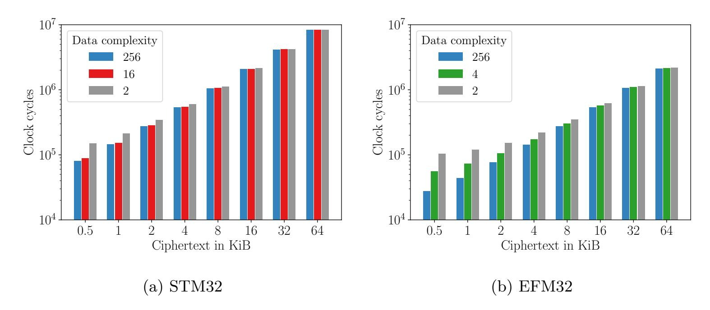

Figure 13: Performance evaluation of the LR-AEAD implementation for different data complexities and varying ciphertext sizes.

On the EFM32 the implementation makes use of the SHA-256 hardware accelerator whereas on the STM32 the hash is implemented in software [20]. This leads to a decreased performance of the STM32 in the LR-AEAD case despite the fact that it has a slightly faster AES core. For smaller ciphertexts one can clearly see the advantage of a higher data complexity, however, the difference vanishes with increasing ciphertext lengths. The reason is that the LR-PRF is only evaluated twice, regardless of the length of the ciphertext, and thus the overhead amortizes with increased length. In the context of firmware updates, we usually deal with encrypted firmware images larger than 16 KiB, hence, the performance penalty from decreased data complexity is low. Assuming a core clock frequency of 4 MHz, a data complexity of two and a firmware update size of 64 KiB, the decryption process take around two seconds on the STM32 and less than a second on the EFM32. These results are quite practical for a secure firmware update in IoT applications.

Code size Besides the execution time of the LR-PRF and the LR-AEAD, their code size is an important parameter, especially for constrained embedded devices. In order to determine the code size required to retrofit the LR-AEAD to an existing application, we look at the additional code size of both functions when added to a simple baseline application. This application consists of only a main function with an endless while loop together with the necessary initialization routines such as stack initialization. We use the example code from the microcontroller manufacturers as a template for the baseline application and implement both the LR-PRF and LR-AEAD on top. The additional code size, i.e., the code size required for the LR-PRF and the LR-AEAD is listed in Table 1.

<span id="page-19-1"></span>Table 1: Code size in bytes of the LR-PRF and LR-AEAD implementations.

|                   |              | STM32        |              |    | EFM32 |                |  |
|-------------------|--------------|--------------|--------------|----|-------|----------------|--|
| Code              | 0s           | 03           | O0           | Os | О3    | O0             |  |
| LR-PRF<br>LR-AEAD | 544<br>2,236 | 604<br>3,236 | 976<br>3,992 |    |       | 1,144<br>3,076 |  |

The LR-AEAD implementation occupies between 0.49~% and 0.76~% of the STM32's 512 KiB flash memory, depending on the optimization level. For the EFM32, the implementation needs between 0.72~% and 1.04~% of the microcontroller's 1024~KiB flash memory.

Comparison to protected software implementation As a comparison, we measure the performance of a side-channel protected software implementation of AES developed

{20}------------------------------------------------

by the ANSSI [\[3\]](#page-21-1). They implement affine masking as described in [\[21\]](#page-22-4) in combination with several hiding countermeasures. We measured around 108,000 cycles for one call to the protected aes() function on an ARM Cortex-M4 microcontroller similar to their reference platform (optimization Os). For the example of 64 KiB firmware updates, we can give a rough estimate of the runtime by considering only the AES calls that are required to decrypt the firmware. This significantly underestimates the real runtime because it neglects the overhead that arises when implementing a block cipher mode of operation and the MAC calculation. It does also not include the collection of the randomness that is required for the countermeasures. Nevertheless, with an estimate of more than 442 Mio. clock cycles this alone is a factor 208 and 45 slower compared to the complete LR-AEAD with data complexity 2 on the EFM32 and STM32, respectively[5](#page-20-2) . This means that a secured firmware update would take in the range of minutes instead of single seconds which is significant. The code size of 6,392 bytes is also about three times larger.

In summary, the runtime overhead and the flash memory footprint of the LR-PRF and the LR-AEAD implementation are low in comparison and thus applicable for secure firmware updates in resource constrained scenarios such as IoT applications. The overhead of using lower data complexities to achieve higher security levels becomes less significant if the length of the payload increases.

# <span id="page-20-1"></span>**8 Conclusion**

In this work we use concepts from leakage resilient cryptography to tackle the difficult problem of securing COTS microcontrollers against side-channel attacks. We propose to implement an LR-AEAD scheme using a block cipher based LR-PRF as the underlying side-channel hardened primitive. Specifically, we implement the LR-PRF in software and use existing hardware accelerators to leverage the algorithmic noise of parallel implementations to protect against side-channel attacks. In a case study on two ARM Cortex-M microcontrollers with AES accelerators we analyze the side-channel security of our construction and find that it resists profiled attacks and retains security levels above 100 bits. We give concrete results for a configuration parameter that allows a trade-off between security level and performance. The overhead in code size is small and occupies only about 1 percent of the available memory on the two devices. Compared to an exemplary side-channel protected software AES implementation, the runtime of our proposal is up to 200 times faster with a memory footprint of only one third. Our solution is applicable to any microcontroller that has an AES accelerator with parallel S-boxes. Therefore, it enables retrofitting side-channel protection to a wide range of devices. This will help to realize root of trust security mechanisms such as secured firmware updates for low-cost IoT devices.

**Acknowledgments** The work presented in this contribution was supported by the German Federal Ministry of Education and Research in the project ALESSIO through grant number 16KIS0629 and 16KIS0632.

# **References**

<span id="page-20-0"></span>[1] E. Ronen, A. Shamir, A. Weingarten, and C. O'Flynn, "IoT goes nuclear: Creating a ZigBee chain reaction," in *IEEE Symposium on Security and Privacy*. IEEE Computer Society, 2017, pp. 195–212.

<span id="page-20-2"></span><sup>5</sup>Note that none of our implementations were optimized for performance and our aim was not to compare to the fastest possible implementation. The numbers given only serve the purpose of estimating the overhead of our solution compared to software-only countermeasures.

{21}------------------------------------------------

- <span id="page-21-0"></span>[2] B. Heinz, J. Heyszl, and F. Stumpf, "Side-channel analysis of a high-throughput AES peripheral with countermeasures," in *ISIC*. IEEE, 2014, pp. 25–29.
- <span id="page-21-1"></span>[3] R. Benadjila, L. Khati, E. Prouff, and A. Thillard, "Hardened library for AES-128 encryption/decryption on ARM Cortex M4 achitecture," [https://github.com/](https://github.com/ANSSI-FR/SecAESSTM32) [ANSSI-FR/SecAESSTM32,](https://github.com/ANSSI-FR/SecAESSTM32) Commit: 39af47f.
- <span id="page-21-2"></span>[4] O. Bronchain and F. Standaert, "Side-channel countermeasures' dissection and the limits of closed source security evaluations," *IACR Trans. Cryptogr. Hardw. Embed. Syst.*, vol. 2020, no. 2, pp. 1–25, 2020.
- <span id="page-21-3"></span>[5] M. Medwed, F. Standaert, and A. Joux, "Towards super-exponential side-channel security with efficient leakage-resilient PRFs," in *CHES*, ser. Lecture Notes in Computer Science, vol. 7428. Springer, 2012, pp. 193–212.
- <span id="page-21-4"></span>[6] M. Medwed, F. Standaert, V. Nikov, and M. Feldhofer, "Unknown-input attacks in the parallel setting: Improving the security of the CHES 2012 leakage-resilient PRF," in *ASIACRYPT*, ser. Lecture Notes in Computer Science, vol. 10031, 2016, pp. 602–623.
- <span id="page-21-5"></span>[7] J. Krämer and P. Struck, "Leakage-resilient authenticated encryption from leakageresilient pseudorandom functions," in *COSADE 2020*, April 2020.
- <span id="page-21-6"></span>[8] F. Standaert, O. Pereira, and Y. Yu, "Leakage-resilient symmetric cryptography under empirically verifiable assumptions," in *CRYPTO*, ser. Lecture Notes in Computer Science, vol. 8042. Springer, 2013, pp. 335–352.
- <span id="page-21-7"></span>[9] F. Unterstein, J. Heyszl, F. De Santis, and R. Specht, "Dissecting leakage resilient PRFs with multivariate localized EM attacks - A practical security evaluation on FPGA," in *COSADE*, ser. Lecture Notes in Computer Science, vol. 10348. Springer, 2017, pp. 34–49.
- <span id="page-21-8"></span>[10] F. Unterstein, J. Heyszl, F. De Santis, R. Specht, and G. Sigl, "High-resolution EM attacks against leakage-resilient PRFs explained - and an improved construction," in *CT-RSA*, ser. Lecture Notes in Computer Science, vol. 10808. Springer, 2018, pp. 413–434.
- <span id="page-21-9"></span>[11] F. Unterstein, N. Jacob, N. Hanley, C. Gu, and J. Heyszl, "SCA secure and updatable crypto engines for FPGA SoC bitstream decryption," in *ASHES@CCS*. ACM, 2019, pp. 43–53.
- <span id="page-21-10"></span>[12] J. P. Degabriele, C. Janson, and P. Struck, "Sponges resist leakage: The case of authenticated encryption," in *ASIACRYPT*, ser. Lecture Notes in Computer Science, vol. 11922. Springer, 2019, pp. 209–240.
- <span id="page-21-11"></span>[13] L. Wouters, J. V. den Herrewegen, F. D. Garcia, D. Oswald, B. Gierlichs, and B. Preneel, "Dismantling DST80-based immobiliser systems," *IACR Trans. Cryptogr. Hardw. Embed. Syst.*, vol. 2020, no. 2, pp. 99–127, 2020.
- <span id="page-21-12"></span>[14] S. Chari, J. R. Rao, and P. Rohatgi, "Template attacks," in *CHES*, ser. Lecture Notes in Computer Science, vol. 2523. Springer, 2002, pp. 13–28.
- <span id="page-21-13"></span>[15] O. Choudary and M. G. Kuhn, "Efficient template attacks," in *CARDIS*, ser. Lecture Notes in Computer Science, vol. 8419. Springer, 2013, pp. 253–270.
- <span id="page-21-14"></span>[16] F. Durvaux and F. Standaert, "From improved leakage detection to the detection of points of interests in leakage traces," in *EUROCRYPT*, ser. Lecture Notes in Computer Science, vol. 9665. Springer, 2016, pp. 240–262.

{22}------------------------------------------------

- <span id="page-22-0"></span>[17] C. Glowacz, V. Grosso, R. Poussier, J. Schüth, and F. Standaert, "Simpler and more efficient rank estimation for side-channel security assessment," in *FSE*, ser. Lecture Notes in Computer Science, vol. 9054. Springer, 2015, pp. 117–129.
- <span id="page-22-1"></span>[18] Y. Yu, F. Standaert, O. Pereira, and M. Yung, "Practical leakage-resilient pseudorandom generators," in *Proceedings of the 17th ACM Conference on Computer and Communications Security, CCS 2010, Chicago, Illinois, USA, October 4-8, 2010*, E. Al-Shaer, A. D. Keromytis, and V. Shmatikov, Eds. ACM, 2010, pp. 141–151.
- <span id="page-22-2"></span>[19] G. Leurent and T. Peyrin, "From collisions to chosen-prefix collisions application to full SHA-1," in *EUROCRYPT*, ser. Lecture Notes in Computer Science, vol. 11478. Springer, 2019, pp. 527–555.
- <span id="page-22-3"></span>[20] R. Misoczki, "Tinycrypt cryptographic library," [https://github.com/intel/tinycrypt/,](https://github.com/intel/tinycrypt/) Commit: 5969b0e.
- <span id="page-22-4"></span>[21] G. Fumaroli, A. Martinelli, E. Prouff, and M. Rivain, "Affine masking against higherorder side channel analysis," in *Selected Areas in Cryptography*, ser. Lecture Notes in Computer Science, vol. 6544. Springer, 2011, pp. 262–280.

{23}------------------------------------------------

# **A Performance numbers in tabular format**

<span id="page-23-2"></span>Table 2: Execution time in clock cycles of the function calls used by the LR-AEAD, including input/output.

|                  |     | STM32 |     |     | EFM32 |     |  |
|------------------|-----|-------|-----|-----|-------|-----|--|
| Function call    | O3  | Os    | O0  | O3  | Os    | O0  |  |
| AES_encrypt()    | 87  | 87    | 207 | 126 | 132   | 319 |  |
| LR-PRG_seed()    | 20  | 19    | 49  | 18  | 17    | 44  |  |
| LR-PRG_iterate() | 217 | 227   | 479 | 309 | 327   | 716 |  |

<span id="page-23-0"></span>Table 3: Execution time in clock cycles of the LR-PRF implementation for different optimization levels and varying data complexities.

|                 | STM32  |        |         | EFM32  |        |         |  |
|-----------------|--------|--------|---------|--------|--------|---------|--|
| Data complexity | O3     | Os     | O0      | O3     | Os     | O0      |  |
| 256             | 2,491  | 3,908  | 11,973  | 3,094  | 4,636  | 12,750  |  |
| 16              | 4,875  | 7,668  | 24,149  | 6,134  | 9,036  | 25,469  |  |
| 4               | 10,411 | 16,244 | 51,861  | 13,142 | 18,892 | 53,790  |  |
| 2               | 24,558 | 37,620 | 120,725 | 30,573 | 42,847 | 121,972 |  |

<span id="page-23-1"></span>Table 4: Execution time in clock cycles of the LR-AEAD implementation (optimization level Os) for different data complexities (DCs) and varying ciphertext sizes.

|                 |           | STM32     |           |           | EFM32     |           |  |  |
|-----------------|-----------|-----------|-----------|-----------|-----------|-----------|--|--|
| Ciphertext size | DC 256    | DC 16     | DC 2      | DC 256    | DC 4      | DC 2      |  |  |
| 16 B            | 15,194    | 22,746    | 82,842    | 10,429    | 19,214    | 21,165    |  |  |
| 0.5 KiB         | 80,777    | 88,329    | 148,425   | 27,578    | 55,898    | 103,514   |  |  |
| 1 KiB           | 145,441   | 152,993   | 213,089   | 44,008    | 72,328    | 119,944   |  |  |
| 2 KiB           | 274,769   | 282,321   | 342,417   | 76,968    | 105,288   | 152,904   |  |  |
| 4 KiB           | 533,425   | 540,977   | 601,073   | 142,888   | 171,208   | 218,824   |  |  |
| 8 KiB           | 1,050,737 | 1,058,289 | 1,118,385 | 274,728   | 303,048   | 350,664   |  |  |
| 16 KiB          | 2,085,361 | 2,092,913 | 2,153,009 | 538,408   | 566,728   | 614,344   |  |  |
| 32 KiB          | 4,154,609 | 4,162,161 | 4,222,257 | 1,065,768 | 1,094,088 | 1,141,704 |  |  |
| 64 KiB          | 8,293,105 | 8,300,657 | 8,360,753 | 2,120,488 | 2,148,808 | 2,196,424 |  |  |