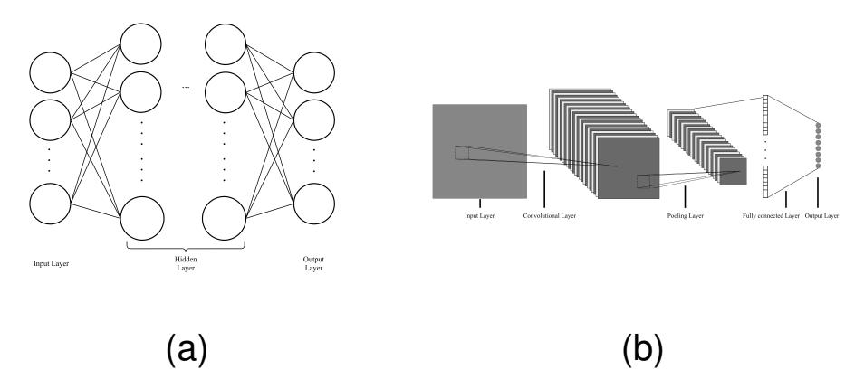
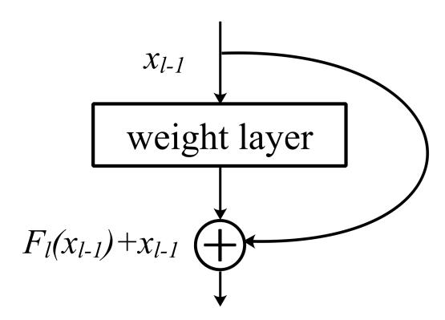
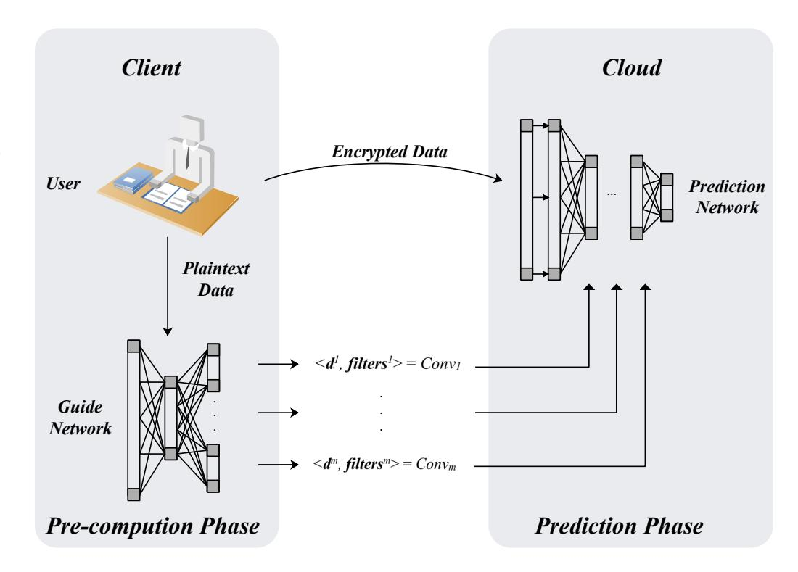
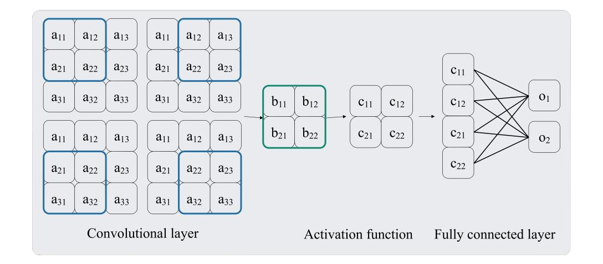
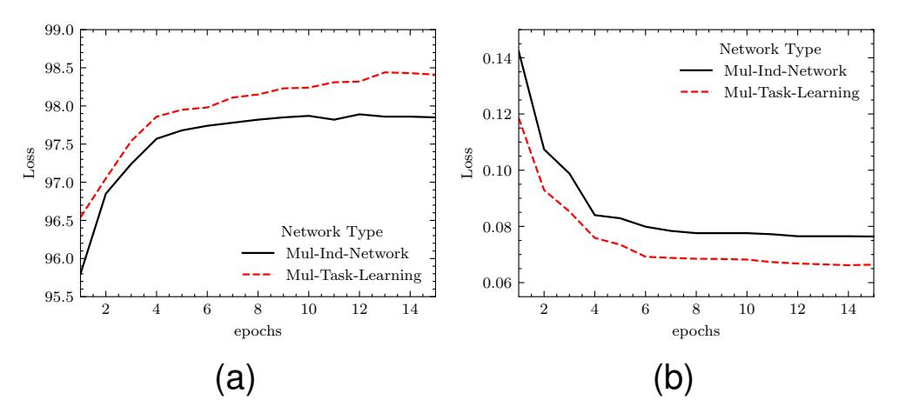
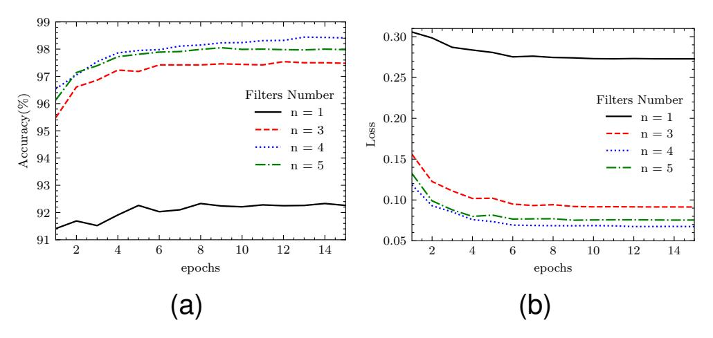
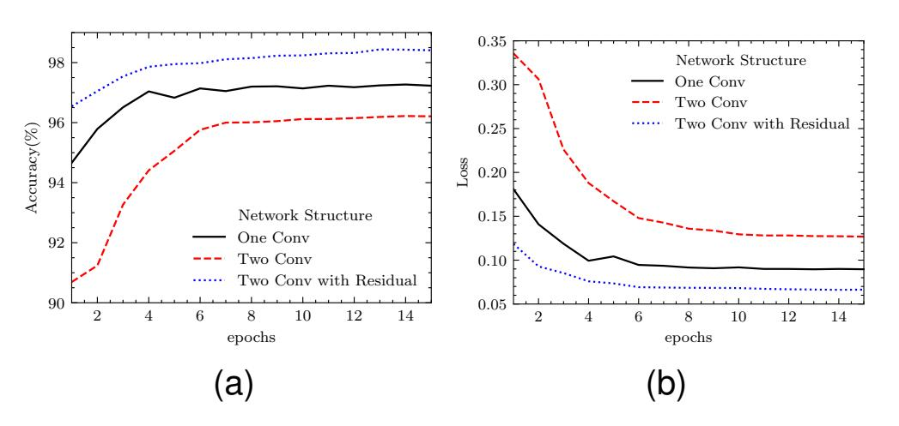
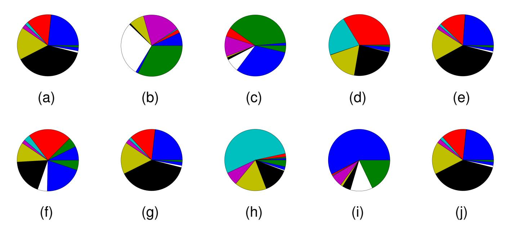
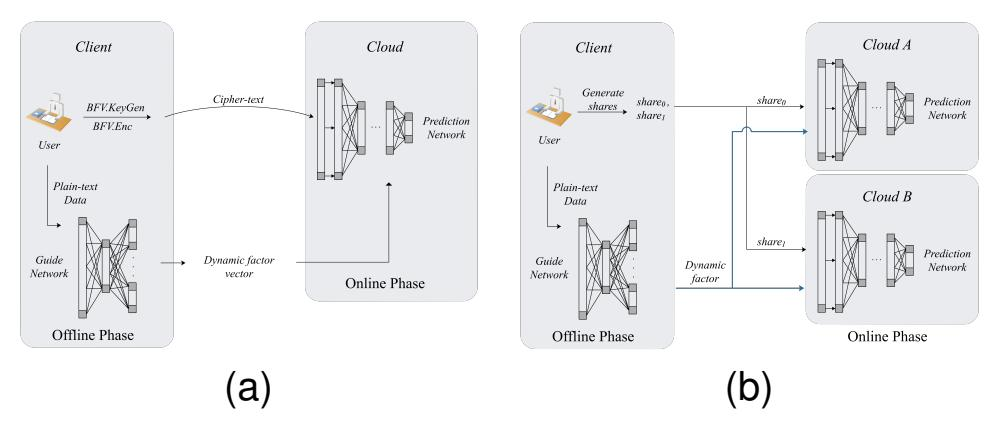
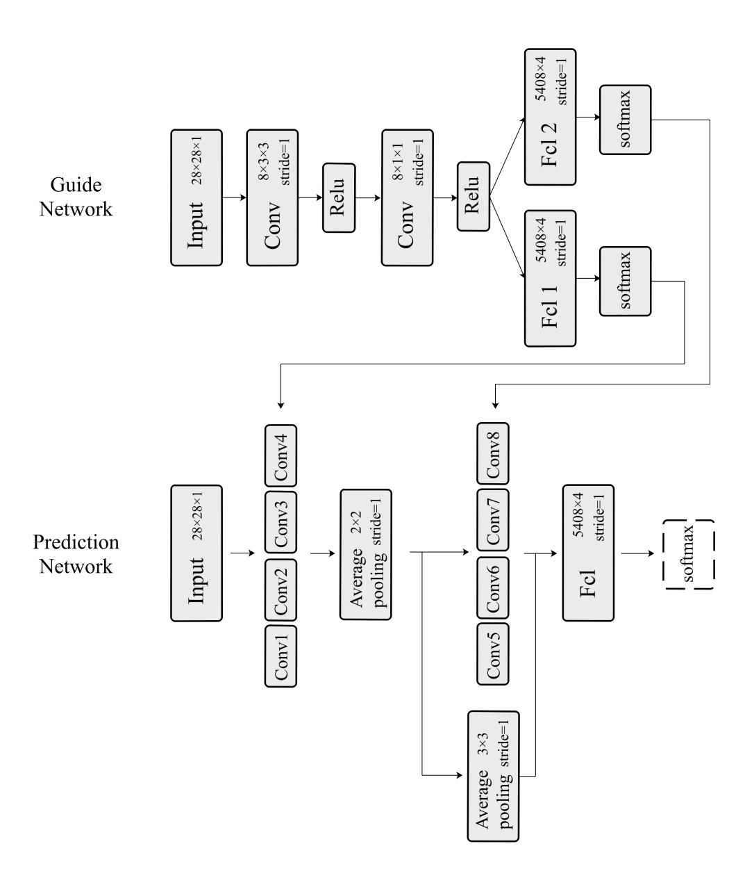

{0}------------------------------------------------

# Enable Dynamic Parameters Combination to Boost Linear Convolutional Neural Network for Sensitive Data Inference

Qizheng Wang, Wenping Ma, Jie Li, and Ge Liu

*Abstract*—As cloud computing matures, Machine Learning as a Service(MLaaS) has received more attention. In many scenarios, sensitive information also has a demand for MLaaS, but it should not be exposed to others, which brings a dilemma. In order to solve this dilemma, many works have proposed some privacyprotected machine learning frameworks. Compared with plaintext tasks, cipher-text inference has higher computation and communication overhead. In addition to the difficulties caused by cipher-text calculations, the nonlinear activation functions in machine learning models are not friendly to Homomorphic Encryption(HE) and Secure Multi-Party Computation(MPC). The nonlinear activation function can effectively improve the performance of the network, and it seems that the high overhead brought by it is inevitable. In order to solve this problem, this paper re-explains the mechanism of the nonlinear activation function in forward propagation from another perspective, and based on this observation, proposed a dynamic parameters combination scheme as an alternative, called DPC. DPC allows the decoupling of nonlinear operations and linear operations in neural networks. This work further uses this feature to design the HE-based framework and MPC-based framework, so that nonlinear operations can be completed locally by the user through pre-computation, which greatly improves the efficiency of privacy protection data prediction. The evaluation result shows that the linear neural networks with DPC can perform high accuracy. Without other optimizations, the HE-based proposed in this work shows 2x faster executions than CryptoNets only relying on the advantage of the DPC. The MPC-based framework proposed in this work can achieve similar efficiency to plain-text prediction, and has advantages over other work in terms of communication complexity and computational complexity.

*Index Terms*—Cloud Computing, Machine Learning, Privacy Protection, Activation Function.

# I. INTRODUCTION

#### *A. Background*

I N recent years, machine learning has been widely used in various fields, such as pattern recognition[1], face recognition[2], machine translation[3], and sentiment analysis[4]. As a special machine learning model, neural network has received much attention because of its excellent performance in various tasks. The great success of neural networks is inseparable from the support of powerful computing resources and huge volume data, which is unreachable for many individuals and small companies. Machine learning as a service(MLaaS) provides a solution for this group[5].

Neural networks usually include a two-stage process: (1) the training phase, which uses a large amount of data to guide the model to learn the mapping relationship between data and labels, and (2) the prediction phase, which uses the trained model to complete the classification or regression task of the given data[6]. As a new cloud service paradigm, MLaaS provides services in these two phase. In this paper, we mainly consider the prediction service provided by the cloud. Although the prediction service provided by the cloud has obvious advantages, it will expose users' sensitive information to the risk of leakage. An intuitive solution is that users download models to make predictions locally, but they have the following defects: (1) resource-constrained devices may not be able to bear the computational overhead; (2) model parameters contain training set information, which may cause the training set information disclosure[7], [8]; (3) this facilitates the adversary to launch adversarial attacks[9], [10]; (4) this will weaken the competitive advantage of the model provider.

The mistrust between the user and the cloud server brings difficulties to the task of inferring sensitive data. In order to solve this dilemma, some work has been devoted to using cryptographic tools to solve the computational problems of neural networks, and has achieved some results. But compared with the inference in plain-text, it has increased the computational and communication overhead. Some MPCbased frameworks are not even available in real-world WAN scenarios. The operation of neural networks can be divided into linear and non-linear according to the nature. Linear operations in neural networks include convolutional layers, average-pooling and fully connected layers, and nonlinear operations are activation functions and max-pooling. For a certain computation protocols or encryption schemes, the cost of linear operation is fixed and inevitable, while the non-linear operation is a bottleneck restricting efficiency. CryptoNets[11] is the earliest privacy-protected neural network framework based on Homomorphic Encryption(HE). It uses x 2 as the activation function and selects linear average-pooling in the pooling operation. Such a network structure also become the mainstream option for the subsequent HE-based framework. Chameleon[12], SecureML[13], MiniONN[14], etc. are representative works using Secure Multi-Party Computation(MPC) to achieve nonlinear operation. Previous work was devoted to design elaborate protocols and algorithms to achieve nonlinear functions in prediction phase. But we thought from another perspective and try to design a completely linear network structure for the online prediction phase.

{1}------------------------------------------------

## *B. Our Contributions*

In this paper, we re-explained the working mechanism of nonlinear activation function and max-pooling in forward propagation, and proposed a dynamic parameter combination scheme as a substitute for nonlinear operation, called DPC. The linear network with DPC decouples the nonlinear operation from the linear operation in the network. The *prediction network* that obtains the prediction results is completely linear, and the non-linear *guide network* is responsible for generating dynamic factors that act on the *prediction network*. This means that the *prediction network* and the *guide network* can be executed asynchronously. In addition to the original prediction network, DPC introduced a lightweight network to guide the parameter combination of the prediction network. Compared with the overhead caused by the nonlinear function in the online prediction phase, the additional overhead caused by the *guide network* is negligible. DPC is a general method with almost zero cost and does not depend on a specific network structure. The decoupling of linear operations and non-linear operations in linear networks with DPC is suitable for privacypreserving data prediction scenarios, so we designed HEbased framework and MPC-based framework separately. The evaluation results show that the framework based on linear framework with DPC proposed in this work can maintain both efficiency and accuracy. Our main contributions are summarized as follows.

- From another perspective, we re-explained the working mechanism of nonlinear activation function and maxpooling in forward propagation in neural networks.
- Based on the observation of the working mechanism of nonlinear operation, we propose a dynamic parameters combination method called DPC, which can replace the activation function and max-pooling in the neural networks to a certain degree. It means that DPC can make the linear networks achieve the same performance.
- We have analyzed the information leakage problems that DPC may cause in the privacy-protected data prediction scenario, and proved that DPC will not expose user data and *prediction network* information.
- We use the decoupling characteristics of linear operation and non-linear operation of linear network with DPC to design HE-based framework and MPC-based framework respectively. The evaluation results show that the efficiency performance of these two types of frameworks is better than other similar work.

# II. PROBLEM STATEMENT AND PRELIMINARIES

## *A. Problem Statement*

In this paper, we focus on the neural network-based sensitive data prediction task in MLaaS. By observing 5 privacyprotected machine learning frameworks, we found that nonlinear activation functions and max-pooling bring major communication and computational overheads. At the same time, the overhead of the convolutional layers, fully connected layers, and average-pooling are acceptable.

The mainstream choice for HE-based frameworks is to use x 2 as the activation function and to choose

TABLE I COMPARISON OF CIPHERTEXT OPERATION

| Scheme | Poly-Mod-Degree | Add  | C-P-Mul | Square | C-C-Mul |
|--------|-----------------|------|---------|--------|---------|
| BFV    | 1024            | 2ms  | 98ms    | 526ms  | 807ms   |
| BFV    | 4096            | 10ms | 555ms   | 3280ms | 4469ms  |
| CKKS   | 1024            | 1ms  | 6ms     | 14ms   | 22ms    |
| CKKS   | 4096            | 10ms | 52ms    | 98ms   | 144ms   |

average-pooling as pooling operation. Obviously, the efficiency performance of the HE-based framework mostly depends on the HE scheme itself. As shown in Table I, we select two HE schemes and compared the speeds of cipher-text addition(Add), ciphertext-plaintext multiplication(C-P-Mul), cipher-text multiplication(C-C-Mul) and cipher-text square(Square) under different polynomial modulus degree(Poly-Mod-Degree). Regardless of the additional cost caused by the noise growth associated with ciphertext multiplication, one Square in BFV[15], [16] is as expensive as a close to 6x C-P-Mul or 300x Add. In CKKS[17], Square requires lower overhead, which is only equivalent to 2x C-P-Mul or 10x Add. However, the shortcomings of CKKS are also obvious, and only results with a certain accuracy can be obtained. It means that the high efficiency of CKKS may pay the price of accuracy in deeper networks. Another option for the activation function of the HE-based frameworks is to use a polynomial to approximate the non-linear function. This solution requires the use of a more expensive C-C-Mul. In Table II we show the time cost of the linear and nonlinear parts of CryptoNets and CryptoDL[18], which are representative work of HE-based frameworks. CryptoNets use x 2 as the activation function because square is the most efficient non-linear operation in homomorphic encryption. Even so, the time cost of non-linear operations still accounts for 49.6% of the total cost. The network structure design of CryptoDL is optimized for cipher-text operations, placing nonlinear operations very far behind the network and using the activation function only once. This makes the network only need to perform 500 cipher-text multiplications when using the quadratic polynomial activation function, which significantly reduces the amount of calculation of the activation function, so that the time cost of non-linear operations only accounts for 6.6% of the total cost. The disadvantage is that this approach limits the flexibility of the network. In many mission scenarios, CryptoDL will lose this advantages because under the same conditions, the efficiency of polynomials will not be better than x 2 . We will show more specific data in the experimental results section.

The MPC-based framework handles activation functions in two ways: (1) approximate activation functions using polynomials or piecewise functions (Sigmoid, etc.) and perform calculations by MPC protocol. (2) Use MPC for calculations directly(Relu)[19]. As far as we know, in privacy-protected inference scenarios, max-pooling is not a universal choice. Just MiniONN has proposed a solution based on garbled circuits. We analyze three representative MPC-based works, MiniONN, SecureML, and Chameleon, and show the time cost of the linear part and the nonlinear part in Table II respectively.

{2}------------------------------------------------

| Framework  | Protocol Based  | Linear Time Cost | Non-Linear Time Cost | Total Time Cost | Non-Linear Cost Ratio |
|------------|-----------------|------------------|----------------------|-----------------|-----------------------|
| CryptoNets | LHE             | 230.9s           | 225.3s               | 456.2s          | 49.3%                 |
| CryptoDL   | LHE             | 139.2s           | 9.8s                 | 148.9s          | 6.6%                  |
| MiniONN    | GC, SS          | <5.74s           | >3.58s               | 9.32s           | >38.4%                |
| SecureML   | ABY, GC         | <0.18s           | >4.7s                | 4.88s           | >96.3%                |
| Chameleon  | A2GMW,GMW,GMW2A | <0.99s           | >1.25s               | 2.24s           | >55.8%                |

TABLE II NON-LINEAR OPERATION PERFORMANCES OF DIFFERENT FRAMEWORKS

Fig. 1. (a) represents the fully connected neural network and (b) represents a convolutional neural network.

The cost of non-linear operation not only comes from MPC, but also from the conversion algorithm cost of different MPC protocols, such as the conversion protocol of A-SS and GMW in Chameleon, and the conversion protocol of ABY and GC in SecureML. In addition, there is time overhead from precomputation. The following is a necessary description of Table II. Experiments uses the MNIST dataset and the time performance comes from single sample. Experiments use the LAN environment, although this may weaken the disadvantages of some frameworks. "Protocol Based" represents the scheme used by the framework to achieve nonlinear operation, "Linear Time Cost" is the time cost of linear operations in the framework, "Non-Linear Time Cost" means non-linear time cost, "Total Time Cost" means total time cost for one prediction and "Non-Linear Ratio" is the time cost proportion of the non-linear part in one prediction task.

The goal of this work is to improve the efficiency of sensitive data prediction. Based on the existing knowledge and the above observations, we can extract two cognitions: (1) Nonlinear operations are indispensable for improving the network accuracy. (2) The privacy-protected non-linear operation is inefficient. Unlike previous work, we focus on neural networks and try to solve problems from the perspective of network structure. More specifically, our model is completely linear in the online prediction phase.

# *B. Neural Networks*

Neural network is a data processing model with a multilayer structure that can reflect the relationship between input and output[20]. As shown in Figure 1.(a), in general, the input of current layer comes from the output of the previous layer. The first layer of input is raw data, such as image pixels and encoded text. The output of the last layer is the result of the model inferring the input data. The values of the nodes in the layer record the tendency of the model to process the data. As shown in Figure 1.(b), compared with ordinary neural networks, Convolutional Neural Networks(CNN) have a complex network structure, which can more accurately describe the relationship between input and output. Because our work is based on CNN, we only describe the structure of CNN in detail:

• Convolution layer. The convolutional layer has a set of matrices with different weights, called the convolution kernels. The convolution kernel slides at a certain stride on the output of the previous layer, and the kernel performs an operation with each window to generate a value, which reflects the similarity between the current window and the kernel. One operation of the convolutional layer is to reflect the similarity by calculating the L1 distance between the kernel and the current window[21]. Another more mainstream method is the traditional convolution[22]. Convolution is formally equivalent to the sum of Hadamard product, defined as follows, where W ∈ Rm×n is the weight matrix of the filter and I ∈ Rm×n is the current window:

$$Conv(\boldsymbol{I}, \boldsymbol{W}) = \sum_{y=1}^{m} \sum_{x=1}^{n} \boldsymbol{I}[x][y] \cdot \boldsymbol{W}[x][y]$$
 (1)

- Pooling layer. Max-pooling and average-pooling are the most common operations in the pooling layer[23]. In addition to reducing the size of the data, it is more important to provide rotation-invariance, translation-invariance and scale-invariance for the network. Max-pooling picks the maximum value in the current region, and averagepooling calculates the average value of the current region.
- Fully connected layer. Before entering the fully connected layer (Fcl), the data(feature map) is flattened into a one-dimensional array, and the Fcl weights are multiplied by the data elements and summed. Defined as follows, where i ∈ Ru , I = {i, i, ...} k is the input matrix, w ∈ Rk is the weight array of FCL and b ∈ Ru is the bias:

$$Fcl(\mathbf{I}, \mathbf{w}) = \mathbf{I} \cdot \mathbf{w} + \mathbf{b} \tag{2}$$

In fact, the fully connected layer is not necessary in many models. One view is that Fcl may destroy the spatial structure of the data to a certain extent. It is an option to use the 1 × 1 filter instead of the fully connected layer [24].

• Activation function. Activation function can improve the non-linear expression ability of the model. Typical examples are sigmoid, Relu, and tanh.

{3}------------------------------------------------

Fig. 2. Residual Block

#### C. Residual Network

He et al.[25] proposes that if there is a K-layer network  $f_1$  that is the optimal network for the current task, then a deeper K+N-layer network  $f_2$  can be constructed, and the final N-layer is only the identity map output by the network  $f_1$ , the same result as  $f_1$  can be achieved. When  $f_1$  is not the best network, then the deeper network  $f_2$  should get better results. It means that deeper networks should not perform worse than the shallow one. But in fact, the deeper network may perform worse than the shallow network, that is, the network degradation phenomenon. The residual network provides a solution to this problem.

In ResNet, the residual block includes the two-layer structure and the three-layer structure. To simplify the representation, one layer is used to represent the residual block. As shown in Figure 2, suppose the output of layer l is  $F_l(x_{l-1})$ , and the residual network introduces a shortcut from the input of the layer to connect to the output, then the output of the layer is:

$$x_l = F_l(x_{l-1}) + x_{l-1} (3)$$

According to the universal approximation theorem, if a feedforward neural network has a linear output layer and there is at least one squeezing activation function, as long as the network is given a sufficient number of parameters, any Borel measurable function that from one finite dimensional space to another finite dimensional space can be approximated with arbitrary precision. This means that when constructing a network to learn a function, we know that there must be a multi-layer perceptron that can represent this function, but there is no guarantee that the network can be successfully trained, because (1) the network structure is not sufficient to accurately describe the function, and (2) The optimization algorithm cannot find suitable parameters.

For (1), even if a narrow network is very deep, the expressive power of the network is limited by the width of the network, and it cannot approximate an area with boundaries. For residual networks, the ability to approximate the function is not affected by the width of the network. For (2), iteratively use the formula (3) to express the output of the l+n layer, which can be expressed as:

$$x_{l+n} = \sum_{i=l}^{l+n} F_i(x_i) + x_l \tag{4}$$

This reflects the friendly back-propagation characteristics. Let the loss be  $\epsilon$ , according to the chain derivation rule:

$$\frac{\partial \epsilon}{\partial x_{l}} = \frac{\partial \epsilon}{\partial x_{l+n}} \frac{\partial x_{l+n}}{\partial x_{l}}$$

$$= \frac{\partial \epsilon}{\partial x_{l+n}} \left(1 + \frac{\partial}{\partial x_{l}} \sum_{i=l}^{l+n} F_{i}(x_{i})\right) \tag{5}$$

It shows that the gradient  $\frac{\partial \epsilon}{\partial x_l}$  in the residual network is composed of two parts, one part is  $\frac{\partial \epsilon}{\partial x_{l+n}}$  without adding any weight information, and the other part is weighted  $\frac{\partial \epsilon}{\partial x_{l+n}} (\frac{\partial}{\partial x_l} \sum_{i=l}^{l+n} F_i(x_i))$ . The gradient composed of these two parts ensures that the information can be directly propagated back to the shallow layer without the gradient disappearing. Therefore, the residual module is an effective method to solve the network degradation phenomenon.

#### D. Homomorphic Encryption

Homomorphic Encryption(HE) scheme preserve the structure of the plain-text space, so we can perform addition and multiplication operations in the cipher-text space to get the corresponding result in the plain-text. Since Gentry introduced the first homomorphic encryption scheme, a lot of progress has been made in this area.

Fully Homomorphic Encryption(FHE) allows any number of additions and multiplications[26], and is suitable for arithmetic circuits of unknown depth, but it lacks efficiency. Leveled Homomorphic Encryption(LHE)[27]can only select parameters to adapt to a limited number of additions and multiplications. It is suitable for arithmetic circuits with certain depths and has higher efficiency. In our scenario, the depth of the arithmetic circuit depends on the structure of the neural network, which is known in advance. So we choose to use LHE, and the specific encryption scheme we use is BFV scheme. The design of BFV scheme is based on Ring-LWE, which can be described according to the following 6 functions:

- $ParamGen(\lambda, PT, K, B) \rightarrow Params$ . Among them,  $\lambda$  is the security parameter, PT is the plain-text space, K is the length of the integer vector, and B is the integer that determines the depth of the homomorphic multiplication supported by the encryption algorithm. For example, for the homomorphic operation of  $c_1c_2+c_3c_4$ , the multiplicative depth is 1 and B can be set to 1. Params includes prime p and prime q. The corresponding plain-text ring  $R_p = R/pR$  and cipher-text ring  $R_q = R/qR$ , where R = Z[x]/f(x). Params also includes key distribution  $D_1$  and error distribution  $D_2$  over R that conform to Gaussian distribution. The integer T in Params satisfies  $L = \log_T q$  and T is the bit-decomposition modulus.
- $KeyGen(Params) \rightarrow SK, PK, EK$ . s is a random element from distribution  $D_1$ , a is a random element in the cipher-text ring  $R_q$ , and error e from the distribution  $D_2$ . Setting: private key SK = s and public key PK = (-(as + e), a). EK stands for evaluation key, unlike SK and PK, EK represents a set of keys. Set  $i = 1, 2, \ldots, L$ ,  $a_i$  are random elements in the cipher-text

{4}------------------------------------------------

ring  $R_q$  and  $e_i$  are random elements of the distribution  $D_2$ .  $EK_i$  can be expressed as:  $EK_i = (-(a_is + e_i) + T^is^2, a_i)$ , and  $EK = \{EK_1, EK_2, \dots, EK_i\}$ .

- $Enc(PK, m) \rightarrow c$ . m is an element in the plain-text ring  $R_p$  and PK is expressed as  $(pk_0, pk_1)$ . Set  $\mu$  is a random element in  $D_1$ , and c can be expressed as:  $c = (pk_0\mu + e_1 + m\lfloor q/p\rfloor, pk_1\mu + e_2)$ , where  $e_1$ ,  $e_2$  are sampled from  $D_2$ .
- $Dec(SK,c) \to m$ . Set  $c(SK) = pk_0\mu + e_1 + m\lfloor q/p \rfloor + (pk_1\mu + e_2)s = m\lfloor q/p \rfloor + e$ , where e represents a "small" error. The plain-text m can be recovered by dividing the above formula by  $\lfloor q/p \rfloor$  and rounding up. Because m is an integer and the error e is not large enough to affect the value of m, and  $m = Dec(SK,c) = \lfloor c(SK)mod\lfloor q/p \rfloor \rceil$
- $Add(c_1, c_2, EK) \to c_3$ . Suppose the plain-text corresponding to  $c_1$ ,  $c_2$  is  $m_1$ ,  $m_2$ , and  $c_3 = c_1 + c_2 = (pk_0(\mu_1 + \mu_2) + (e_{11} + e_{21}) + \lfloor q/p \rfloor (m_1 + m_2), pk_1(\mu_1 + \mu_2) + (e_{12} + e_{22}))$ . It is easy to get that  $c_3(SK) = (m_1 + m_2) \lfloor q/p \rfloor + e$ , and e represents the "small" error.
- $Mult(c_1, c_2, EK) \rightarrow c_3$ . Express  $c_1$ ,  $c_2$  as  $(c_{10}, c_{11})$  and  $(c_{20}, c_{21})$ ,  $c'_3$  can be expressed as  $(c_{10}c_{20}, c_{10}c_{21} + c_{11}c_{20}, c_{11}c_{21})$ . And then  $c_3 = \lfloor ((p/q)c'_3)modq \rfloor$ , it is easy to verify that  $c_3(SK) = \lfloor (p/q) \rfloor (m_1 * m_2) + e$ .

#### E. Additive Secret Sharing

In this protocol, a value is divided into two shares and distributed to two parties respectively[28]. The two parties perform the operations supported by the protocol on the shares they hold, and the results obtained are added to obtain the result of the corresponding calculation of the original value. The original value and the shares are on the ring  $Z_{2^l}$ , and each number is represented as a 1-bit integer. Obviously the ring  $Z_{2^l}$  is closed for multiplication and addition.

Suppose there is a secret value x, first select a random number  $x_0$  on the ring  $Z_{2^l}$ , and the two shares are created as  $\langle x \rangle_0^A = x_0$  and  $\langle x \rangle_1^A = (x - x_0) mod 2^l$ . The two parties perform the operations supported by the protocol on their own shares. When they want to restore data, one party sends their own share to the other party, or sends the shares together to the third party (specifically based on privacy requirements), and execute  $f(x) = f(\langle x \rangle_0^A) + f(\langle x \rangle_1^A) mod 2^l$  to restore the calculation result of the secret value, where  $f(\cdot)$  represents the operation supported by the protocol.

This protocol supports addition, subtraction, constant multiplication and multiplication of two secret shares. In the scenario of this work, only constant multiplication and addition are involved, so other operations are not introduced here. Addition and constant multiplication can be done locally on both parties and do not require additional communication and pre-computation. Constant multiplication can be expressed as  $\langle z \rangle_i^A = \langle x \rangle_i^A \cdot constant \, mod 2^l$  and addition can be expressed as  $\langle z \rangle_i^A = (\langle x \rangle_i^A + \langle y \rangle_i^A) \, mod 2^l$ .

#### III. DYNAMIC PARAMETERS COMBINATION

#### A. Motivation

In sensitive data prediction scenarios, the privacy-protected activation function is generally inefficient. Therefore, we study

Fig. 3. Security outsourcing prediction framework based on linear network with DPC.

Fig. 4. Schematic diagram of neural network with basic structure

the mechanism of activation function in the forward propagation phase and try to re-explain it from another perspective.

Our conclusion is given first. The nonlinear activation function introduces a dynamic factor to the network. For each sample, the network can dynamically generate a linear model. It means that a well-predicted prediction network can be understood as a nonlinear model, or a set of linear models.

Lemma 3.1: For any continuous function  $Act(x) \in \mathbf{R}$  and  $x, b \in \mathbf{R}, \exists dym(x)$  satisfying:  $Act(x) = x \times dym(x) + b$ , and  $dym(x) \in \mathbf{R}$ .

*Proof 3.1:* Because  $x, b \in \mathbf{R}$  and Act(x) is continuous, therefore  $\exists b$  satisfying Act(x) - b over origin. Set  $dym(x) = \frac{Act(x) - b}{x}$ , when  $x \in \{x | x \in \mathbf{R}, x \neq 0\}$ , and dym(x) = 0 when x = 0. Therefore, when  $dym(x), x, b \in \mathbf{R}$ ,  $\exists dym(x)$  satisfying  $Act(x) = x \times dym(x) + b$ .

According to Lemma 3.1, any non-linear activation function Act(x) can be expressed as  $x \cdot dym(x) + b$ . Specifically for Relu, Act(x) is a step function and b = 0. We take Figure 4 as an example to verify the conclusion that the activation function introduces a dynamic factor. Figure 4 is a basic example of neural network, including a  $1 \times 3 \times 3 \times 1$  convolution layer, an activation function, and a fully connected layer. Pooling operations will not affect our conclusions, but will make the expressions lengthy, so it is not reflected here.

Set  $k_{ij}$  be the weight of the fully connected layer, where i, j represent the indexes of c and o respectively. Forward

{5}------------------------------------------------

propagation can be described as equation 1:

$$o_{1} = k_{11} \cdot c_{11} + k_{21} \cdot c_{12} + k_{31} \cdot c_{21} + k_{41} \cdot c_{22}$$

$$= k_{11} \cdot Act(b_{11}) + k_{21} \cdot Act(b_{21}) + k_{31} \cdot Act(b_{21}) + k_{41} \cdot Act(b_{22})$$

$$= k_{11}(b_{11}dym(b_{11}) + b) + k_{21}(b_{21}dym(b_{21}) + b) + k_{31}(b_{21}dym(b_{21}) + b) + k_{41}(b_{22}dym(b_{22}) + b)$$
(6)

We regard dym() as the dynamic factor  $dym\_factor$ , and the polynomials about  $\{a_{11}, a_{12}, \ldots, a_{33}\}$  can be obtained by combining coefficients, and sets the coefficients to  $\{p_1, p_2, \ldots, p_9\}$ , the forward propagation phase for a single sample can be described as equation 2:

$$o_1 = dym\_factor \cdot p_1 \cdot a_{11} + dym\_factor \cdot p_2 \cdot a_{12} + \dots + dym\_factor \cdot p_9 \cdot a_{33} + constant$$

$$(7)$$

Through the same processing, we can get a similar expression of  $o_2$ . By observing Table II, we find that  $dym\_factor$  is the main bottleneck that affects the performance of frameworks, and we know that it comes from the activation function. Different from previous works that try to improve the execution efficiency of  $dym\_factor$  by designing elaborate protocols and algorithms, we decouple  $dym\_factor$  from the prediction network. In the prediction task, if the  $dym\_factor$  does not need to be calculated in the forward propagation phase, but can be directly obtained through pre-computation, the inefficient non-linear network can be converted into a friendly linear model. To avoid ambiguity, we emphasize once again that  $dym\_factor$  is not a fixed function, but a dynamic element that changes with different examples.

#### B. Method Design

We design a dual-network model that includes one lightweight non-linear network running on the client provides dynamic factors, and another linear network on the cloud server to provides prediction services. The network running on the client is called the *guide network*, and the one running on the cloud server is called the *prediction network*. We decouple the dynamic factor from the prediction network and reduce the computational overhead of encrypted data through precomputation.

To perform the prediction task of sensitive data, the user first receives the *guide network* from a non-conclusion third party and generates a dynamic factor, and then encrypts his data according to different frameworks. For example, when the API document provided by the cloud server informs that the service is based on CryptoNet, users will use YASHE to encrypt their data; if the SecureML framework is used, users will divide the data into two shares and send them to two servers. The complete process is shown in Figure 3.

We were inspired by SENet[29] to apply dynamic factors to convolutional layers. We set up multiple groups of filters in each convolutional layer in the *prediction network*. In the same convolutional layers, the multiple groups of filters have the same size, input channels and output channels. In the forward propagation stage, the multiple groups of filters use the output of the *guide network* as the weight, and the convolutional layer

that is ultimately involved in the calculation is the weighted sum of multi-group filters.

The *guide network* is a lightweight network that performs pre-computation at the client, generates dynamic factors and sends them to the *prediction network*. Compared with the privacy-protected non-linear operation, the overhead of *guide network* is almost zero cost. When the *prediction network* has m convolutional layers, and each layer has n groups of filters, m groups of dynamic factors are generated by *guide network*, and each group is an n-dimensional vector. Because each set of filters in the *prediction network* relies on n-dimensional vectors for combination, a natural idea is that the sum of all elements in one vector is equal to 1. The more intuitive connection between the two networks is shown in equation 7:

$$\begin{cases} \sum_{i=1}^{n_1} d_i^1 = 1 \\ \vdots \\ \sum_{i=1}^{n_m} d_i^m = 1 \\ Conv_1 = \sum_{i=1}^{n_1} d_i^1 \cdot filters_i^1 \\ \vdots \\ Conv_m = \sum_{i=1}^{n_m} d_i^m \cdot filters_i^m \end{cases}$$

$$(8)$$

#### C. Networks Structure

The evaluation results in this chapter are all performed on MNIST[30].

The m convolutional layers of the prediction network all depend on the m sets of vectors generated by the guide network. We considered two structures of guide network: (1) use m independent networks to generate vectors separately, and (2) use the multiple-task learning model[31]. We fixed the *prediction network* and tried above two types of guide *network* separately. In Figure 5 we show the evaluation results on MNIST. Compared with the structure of multiple independent networks, the multiple-task learning model has fewer parameters and less computational overhead, which is more friendly to edge devices. Moreover, the guide network of the multiple-task learning model can make the *prediction network* perform better. With the same *prediction network* structure, the accuracy of the *guide network* using a multiple-task learning model can reach 98.44%, while the guide network of multiple independent networks can only reach 97.89%.

In the prediction network, each convolutional layer contains n sets of filters, which requires additional n-1 convolutional computational overhead. When n is a small integer, the cost paid in the forward propagation phase is negligible. Proper value of n can greatly improve the performance of the *prediction model*. Too few filters cannot flexibly form a new convolution kernel, and too many filters will affect the *guide network* learning the weight. Figure 6 shows the effect of different values of n on the performance of *prediction network* on MNIST, where n=1 represents the model that does not use DPC for optimization. In fact, the number of filter groups in each convolutional layer can be different. In order to express

{6}------------------------------------------------

Fig. 5. The influence of two types of *guide network* on *prediction network*, Mul-Ind-Network represents the structure of multiple independent networks, and Mul-Task-Learning represents the multiple-task learning model.

Fig. 6. The influence of the number of filters in the convolutional layer on the *prediction network* on the model performance.

Fig. 7. The influence of the number of convolutional layers and residual block in the *prediction network* on the model performance.

concisely, we assume that the number of filter groups in each convolutional layer is n. On MNIST, n=4 can make the network perform better, but there may be a better option in other tasks.

In traditional non-linear models, when the depth of the network is not deep enough, more convolutional layers generally improve the ability to extract high-dimensional features and improve performance. He ea al. proposed that if there is a K-layer optimal network f, then a deeper K+1-layer network can be constructed. When the additional layer and the output of previous layer is identity mapping, the network of K+1 layer can achieve the same result as the K-layer network. This means that when f is not the best network, the K+1 layer network should at least not perform worse, but it is not the case. It can be observed in Figure 7 that the linear model has a model degradation phenomenon when it is added to the second convolutional layer, which

often appears in deep non-linear models. The accuracy of the network with one convolutional layer is 97.27\%, but the network with two convolutional layers can only reach 96.22%. Therefore, a reasonable guess is that for linear neural networks using DPC, identity mapping is not easy to approximate. We introduced the structure of the residual network and treated the two convolutional layers as a residual module, which greatly eased the model degradation. The network without the residual module can also reach 98.19\%, but requires multiple rounds of fine parameter adjustment and training with fixed part of parameter, which is unacceptable in many scenarios. The network structure in this chapter will be shown in Appendix A. Softmax is difficult to achieve in the privacy protection data prediction task. But *Softmax* only changes the distribution of output results, and does not change the size relationship. Therefore, the model retains *Softmax* during the training phase and is removed during the prediction phase.

# IV. SECURITY ANALYSIS AND SECURITY INFERENCE FRAMEWORK

In this section, we conducted a security analysis of the linear network with DPC and designed two linear network security inference frameworks based on HE and MPC respectively. The efficiency of the HE-based framework is largely rely on the efficiency of the homomorphic encryption scheme. In order to make it easier to compare with CryptoNet to reflect the superiority of the linear network structure, we also chose BFV as the data encryption scheme. Because our network structure is completely linear, there is no need for complex secure multiparty computing protocols, and only the most basic additive secret sharing can complete the computing tasks.

#### A. Security Analysis

Compared with the traditional non-linear model, our prediction model adds an additional *guide network*. In the security outsourcing prediction task of sensitive data, the *guide network* will be executed on the client, and the output vector will be sent in plain-text to the *prediction network* on the cloud server.

Security has two meanings, one is data security, and the other is model security. Data security means that the cloud server should know nothing about the data and the predicted results. Model security means that users should not get any information about the *prediction network* from the local *guide network*, and cannot get help about retraining the new prediction network from the *guide network*.

Users will send data to the cloud server twice, once to send encrypted sensitive data, and another time to send dynamic factor vectors in plain-text. The security of sensitive data depends on the schemes used by different frameworks, such as LHE in CryptoNet and Additive Sharing in Chameleon. Compared with the framework based on traditional linear networks, the security of dynamic factors requires additional discussion. In some scenarios, the *guide network* is sent to the user by a semi-honest third party(STP), and in some scenarios, it is sent by the cloud server holding the *prediction network*. When the STP sends the *guide network*, the dynamic factor vector cannot provide additional information for the

{7}------------------------------------------------

Fig. 8. The prediction result of unsupervised clustering of dynamic factors, each pie chart represents the composition of one cluster, and one color represents samples with one type of label. For example, (a) represents samples that are classified into one category in K-Means clustering, and black represents samples with the same label.

cloud server holding the prediction network to guess user data. When the cloud server holding the prediction network sends the *guide network*, the difficulty of guessing the user data is equivalent to solving the x-ary linear equation system through n × m equations. Taking the model in Appendix A as an example, the difficulty of guessing user data is equivalent to solving 784-element linear equations through 8 equations. Although the cloud server cannot obtain additional information through the dynamic factor vector when guessing the user data, a reasonable assumption is that the dynamic factor vector will expose the inter-class information of the data. In other words, the cloud server may use dynamic factor vectors to infer whether different samples belong to the same category, although it is not known which category. As shown in Figure 8, in the MNIST task, we use unsupervised K-Means clustering[32] to process dynamic factor vectors. One pie chart represents one cluster, and the same color represents samples with the same label. We tested 10,000 samples, and we can observe that the dynamic factor vector reflects some interclass information of user data, but the cloud server can only judge whether the two samples belong to the same class with a probability of less than 50%, and it is not higher than the probability of guessing without prior knowledge. Therefore, the cloud server cannot obtain additional information of user data through the dynamic factor vector.

The user holds the *guide network*, which is only related to the combined weight of the convolutional layer of the *prediction network*. The user can only infer the number of *prediction network* convolutional layers based on the *guide network*, and has no knowledge of other information.

#### *B. HE-Based Framework*

As shown in Figure 9.(a), the HE-based framework conforms to the structure of Figure 3, including offline and online stages. In the offline phase, users locally use a lightweight *guide network* to generate dynamic factor vectors for each sample, and use the BFV scheme to encrypt sensitive data. In the online phase, the dynamic factors of the plain-text and the encrypted original data(including EK) are sent to the cloud server that holding the *prediction network*. The prediction network completes the prediction task on the cloud, and sends the cipher-text prediction result to the user. The user can use the private key to recover the cipher-text and get the prediction result.

The homomorphic encryption scheme is a non-interactive secure computing protocol, and HE-based framework is secure against semi-honest adversaries. This is the standard security definition in the literature, considering adversaries who follow the protocol but try to extract more information based on the data they receive and process.

The linear network using DPC only contains the convolutional layer, average pooling layer and fully connected layer, and does not contain the nonlinear activation function that is difficult to handle under cipher-text, which is very friendly to homomorphic operations. The convolutional layer contains multiple sets of filters, which seems to increase computational overhead. But in fact, convolution is a linear calculation, and multiple sets of filters can be combined according to dynamic factors before forward propagation, so DPC will not bring additional computational overhead. As mentioned in Section III.C, *Softmax* is only retained during the training phase, and *Softmax* does not change the result during the prediction phase, so we removed it from the *prediction network*.

Sensitive data and network parameters are real numbers, but the basic data unit in the BFV scheme is a polynomial ring Rq, so we need to encode the data and parameters to adapt to the BFV scheme. We fix the precision of the real number and encode it as a constant polynomial. In CryptoNets, ciphertext package is applied to improve efficiency, and multiple ciphertexts are placed in different slots of a polynomial. Assuming that the highest degree of the polynomial is j, and encoding j real numbers into one polynomial, multiple sets of data can be paralleled without additional cost, thereby reducing the average processing time of a single sample. The feasible reason is that traditional networks have the same parameters for different samples. However, the parameters of our linear network with DPC are adaptively changed,and ciphertext package cannot be used for parallel computing to achieve acceleration. The evaluation results will be given in Section.V.

{8}------------------------------------------------

| TABLE III                                           |
|-----------------------------------------------------|
| COMPARISON OF HE-BASED FRAMEWORK WITH SIMILAR WORKS |

| Framework                      | Methodology | Encryption Timing | Prediction Timing | Accuracy(%) | Machine Configuration (CPU+RAM) |
|--------------------------------|-------------|-------------------|-------------------|-------------|---------------------------------|
| CryptoDL                       | BGV         | 18.3s             | 148.8s            | 99.52%      | Xeon E5-2640@2.4GHz+16GB        |
| CryptoNets                     | BFV         | 15.7s             | 474.5s            | 98.86%      | Core i5-8300H@2.3GHz+8GB        |
| HE-based framework (This work) | BFV         | 18.3s             | 249.2s            | 98.44%      | Core i5-8300H@2.3GHz+8GB        |

TABLE IV COMPARISON OF MPC-BASED FRAMEWORK WITH SIMILAR WORKS

| Framework           | Methodology   | Prediction Timing | Communication Volume | Accuracy(%) | Machine Configuration (CPU+RAM) |
|---------------------|---------------|-------------------|----------------------|-------------|---------------------------------|
| MiniOnn             | HE, GC, SS    | 1.04s, 9.32s      | 15.8MB, 657.5MB      | 97.6%, 99%  | Xeon ES-1620@3.5GHz+16GB        |
| Chameleon           | GC, GMW, A-SS | 2.24s             | 10.5MB               | 98.86%      | Xeon ES-1620@3.5GHz+16GB        |
| SecureML            | HE, GC, SS    | 4.88s             | >1.49MB              | 93.1%       | Xeon ES-1620@3.5GHz+16GB        |
| MPC-based framework |               |                   |                      |             |                                 |
| (This work)         | A-SS          | 0.0049s           | 16.6KB               | 98.44%      | Core i5-8300H@2.3GHz+8GB        |

Fig. 9. (a) describes the HE-based framework and (b) describes the MPCbased framework.

# *C. MPC-Based Framework*

Different from the previous MPC-based framework, the linear network with DPC proposed in this work only needs to use basic additive secret sharing to complete the privacy protection prediction task, and does not require additional communication and pre-computation. As shown in Figure 9.(b), the MPC-based framework in this work requires the participation of two additional cloud servers, including the offline phase and the online phase. In the offline phase, the user locally uses a lightweight *guide network* to generate dynamic factor vectors, and generates two shares hxi A 0 and hxi A 1 over the ring Z2 l for sensitive data x. In the online phase, the two shares and dynamic factors are sent to different cloud servers. The cloud server calculates the share it receives according to the dynamic factor and the *prediction network*, and sends the calculation result to the user after the calculation is completed. The user adds the calculation results of the two shares received to get the prediction result of the original data.

We assume that the semi-honest adversary E can only corrupt one of the two cloud servers, which requires that the two servers are not colluding. In other words, when one server is corrupted, the other one must be honest. The security definition require that such an adversary E should only learns the data of the server it has corrupted and the final output but nothing else about the data of the remaining honest server.

Like the network in the HE-based framework, the network in the MPC-based framework also removes the *softmax* in the output layer. Although *softmax* is a linear function, it has no effect on the result during the forward propagation phase. Using of additive secret sharing to complete the privacy protection prediction task can reflect the advantages of the linear network model. There is no need to design sophisticated protocols that support nonlinear calculations and conversion protocols between different protocols. What is more attractive is the need for zero communication between the two parties, and only one communication between the cloud server and the user is require. If l is large enough, the MPC-based framework can achieve the same efficiency as the plain-text prediction task. The evaluation results will be given in Section.V.

# V. EXPERIMENT RESULTS

In the MPC-based framework, we perform our experiment on the LAN network environment composed of 3 machines. 2 of the machines with 8GB of RAM and Intel Core i5- 8300H CPU @ 2.30GHz act as a cloud servers to perform the *prediction network*, and 1 machine with 8GB of RAM and Intel Core i5-7360U CPU @ 2.3GHz acts as the client to generate data shares and perform the *guide network*. In the HE-based framework, we preform our experiment on the LAN network environment composed of 2 machines. One machine with with 8GB of RAM and Intel Core i5-8300H CPU @ 2.30GHz act as a cloud servers to perform the *prediction network*, and the other one with 8GB of RAM and Intel Core i5-7360U CPU @ 2.3GHz acts as the client to generate ciphertext of data and perform the *guide network*.

MPC-based framework is implemented in Python and apply Pytorch to speed up the efficiency of the network. We observed that regular arithmetic is much faster than the modular arithmetic in any number theoretic library. Therefore, we use the skill in SecureML. In a sufficiently large ring Z2 l , integer addition (multiplication) can be used instead of modular addition (multiplication), which brings a 100x speed increase. HE-based framework is implemented in C# and and uses the BFV provided by SEAL[33].

We choose to perform a prediction task on the MNIST dataset to evaluate our scheme. MNIST dataset contains 60, 000 examples of handwritten digits, and each sample contains 28 × 28 × 1 pixels. We use Pytorch to train the linear network with DPC on 50, 000 samples and use 10, 000 samples for testing. The structure of the network is described in Appendix A and consists of the following parts: *Guide network*, (a) Convolutional layer with filers of size 8 × 3 × 3 

{9}------------------------------------------------

and stride is 1. (b) Use Relu as the activation function. (c) Convolutional layer with filers of size 8 × 1 × 1 and stride is 1. (d) Use Relu as the second activation function. (e) This layer contains two side-by-side fully connected layers, each with a size of 5408 × 4. (f) After each fully connected layer, there is a softmax to ensure that the output vector d satisfies ||d||1 = 1. *Prediction network*, (a) Convolutional layer with 4 sets of filters of size 16 × 5 × 5 and stride is 1. (b) Average pooling with the size of 2 × 2. (c) Convolutional layer with 4 sets of filters of size 16 × 3 × 3 and stride is 1. (d) Average pooling with the size of 3 × 3. (e) Fully connected layer with the size of 1600×10. We use the residual block and the input of this layer not only from the previous layer but also the layer (b). We removed the softmax in the *prediction network* and use the fully connected layer output ||output||∞ as the prediction result. This is because the prediction result is determined by the maximum value of the output, and softmax is a monotonic function, so softmax will not affect the result during forward propagation.

# *A. Comparison of HE-based Framework with Similar Works*

The performance comparison of HE-based framework in this work with CryptoNets and CryptoDL is shown in Table 3. This table shows the performance of one samples on the MNIST dataset processed by different frameworks, including the applied homomorphic encryption scheme, the time cost of different phase and the accuracy over 10, 000 test samples. The machine configuration of CryptoDL is different from the other two frameworks. This is because we did not successfully reproduce the CryptoDL experiment, so we used the evaluation results given in this article.

We report the encryption time, prediction time and accuracy of different frameworks. Our work uses the same encryption scheme and the same machine configuration as CryptoNets, but instead of x 2 and relying on the superiority of the linear network structure, we have achieved a double efficiency improvement. CryptoDL is another work based on homomorphic encryption. It uses BGV as the encryption scheme and uses low-degree polynomials to approximate arbitrary activation functions. Compared with x 2 , the polynomial requires more computing resources, but the prediction time of CryptoDL is shorter. This is because the position of the polynomial replacing the activation function is deeper in the network and fewer elements need to be processed. Another reason is that the machine configuration of E5-2640+16GB is better than our experimental environment.

# *B. Comparison of MPC-based Framework with Similar Works*

Table 4 shows the performance comparison between the MPC-based framework in this work and other similar work. The reported data is the performance of processing oen sample from MNIST dataset. The table further shows the applied security computation protocols, the prediction time cost, the total volume of communication and the accuracy over 10, 000 test samples. The evaluation results of other frameworks come from Riazi et al. This makes the experimental environment of our scheme at a disadvantage and cannot fully reflect the superiority of our scheme.

MiniOnn uses GC(garbled circuits), HE(homomorphic encryption) and SS(secret share), and proposes two versions of the network structure. The network accuracy rate using Relu activation function and max pooling can reach 99%, but it requires extremely high computational cost and communication volume. Using x 2 as the activation function reduces some overhead, but also reduces the expressive ability of the model, and the accuracy rate can only reach 97.6%. Despite the sacrifice of accuracy, there is still a big gap between the prediction speed and the plaintext task. Chameleon uses GC, GMW and SS. The prediction network uses Relu activation function and average pooling. Chameleon uses different secure computing protocols in different calculation phase, and designs conversion protocols between different protocols. This can take into account the framework efficiency and network expression ability to a certain extent, but in the prediction phase, GMW still needs the communication between the two servers, which is the bottleneck of efficiency. SecureML uses HE, GC and SS, and proposes a new segmented activation function with an accuracy rate of 93.1%.

SecureML has the same constraints as Chameleon and MiniOnn, that communication cannot be avoided when performing non-linear operations. This is a limitation from the secure multi-party computing protocols. In the test environment with LAN network, the communication process greatly reduces the efficiency of these three frameworks. In an actual WAN network, when two servers performing computing tasks are physically far apart, it is conceivable that the time overhead of the security prediction task is unacceptable. SecureML reports the difference of 2 orders of magnitude between the time overhead in the LAN network and the WAN network, which provides guidance for us to infer the impact of the network environment on efficiency.

The MPC-based framework in this work only requires the client to communicate with the server in the online phase to send the shares and dynamic factor vector once, and there is no need to communicate between the servers during the calculation process, which makes the prediction time of our scheme close to the plain-text prediction tasks. Another advantage is that the communication volume is very small. In the plain-text prediction task, it takes 8.3KB to transmit one sample. In the framework of this work, only 8.3KB×2 of shares and 32Byte of dynamic factor are required for one task.

# VI. RELATED WORK

We will summarize the previous work according to the secure computation scheme used.

#### *A. HE-Based Frameworks*

CryptoNets is one of the earlier work to carry out privacy protection data processing model, using YASHE [34] Layered homomorphic encryption scheme (LHE). This work proposes to use x 2 to replace the conventional non-linear activation 

{10}------------------------------------------------

function, and proposes to pack the same pixels of multiple images into one ciphertext to improve the calculation efficiency. CryptoDL focuses on CNN, and its main contribution is to find polynomials that can approximate the nonlinear activation function, and provides a theoretical basis. The accuracy of the securely inference model based on this work is only 0.04% lower than the original model. HCNN [35] follows the framework proposed by CryptoNets and proposes the first GPU-accelerated homomorphic convolutional neural networks (HCNNs), which uses low-precision training and a series of methods to reduce the computational overhead. Similarly, their work also uses polynomials to approximate the activation function.

#### *B. MPC-Based Frameworks*

DeepSecure [36] is a deep learning framework that uses garbled circuits to protect data privacy. SecureML proposes to use the dual server model to solve the problem of secure machine learning, uses secret sharing and garbled circuit to implement secure computing, and accelerates the multiplication process in secret sharing by pre-computing triples. In this work, instead of using a polynomial fitting method to represent the nonlinear activation function, the role of the activation function in the process of machine learning inference is considered, and a piecewise linear function is used instead of the original activation function. MiniOnn uses homomorphic encryption, garbled circuit and secret sharing to achieve inexplicable inference. Chameleon uses the GMW protocol, garbled circuit and secret sharing for SVM and DNN security calculations. Specifically, the GMW protocol is used to calculate shallow functions, the garbled circuit is used to calculate deep functions, and secret sharing is used to perform linear calculations. XONN [37] considers the Bool neural network and relies on the garbled circuit to realize inexplicable inference. The expensive matrix multiplication in the traditional neural network is replaced by XNOR in the Bool neural network. This kind of calculation has very little overhead in the garbled circuit. CrypTFlow [38] design three important components. *Athos* is the compiler of the original model to various secure computing protocols. *Porthos* is a semi-honest and secure three-party computing protocol. It can safely perform indeterminate inferences. *Aramis* assumes that there is at least one trusted hardware. In this case, the semihonest MPC protocol can be compiled into a malicious secure MPC protocol.

# *C. Others*

The scheme of Jiang et al. [39] uses a homomorphic encryption scheme to encrypt the model and data, which can protect the privacy of the data and the model parameters at the same time. The main contribution of this work is to design a parallel scheme for matrix multiplication, which converts matrix multiplication to the sum of *n* times Hadamard product. Using the idea of homomorphism, Xiang et al. [40] put real number features in complex numbers to hide through rotation, and use GAN model to generate confusion samples to achieve k-anonymity.

#### VII. CONCLUSION

In this work, we reinterpreted the mechanism of nonlinear activation function and max-pooling in the forward propagation phase from another angle, and based on this observation, we designed a method called DPC for decouple the linear operation and the non-linear operation in the network. In the outsourcing prediction task of privacy protection data, DPC allows users to pre-compute the non-linear parts of the network locally, and only need to perform linear operations of the network in the online phase. We designed HE-based and MPC-based frameworks for linear networks using DPC respectively. The evaluation results show that our scheme has obvious advantages in terms of computational complexity and communication complexity compared with previous work.

# APPENDIX A LINEAR CNN WITH DPC ARCHITECTURE

In Figure 10, we show the structure of the linear network used to identify the MNIST dataset in this article. The dashed box represents that it only appears in the training phase and will be removed in the test phase. The size of Conv1, Conv2, Conv3, Conv4 is 16 × 5 × 5, and the stride is 1. The size of Conv5, Conv6, Conv7, Conv8 is 16 × 16 × 3 × 3, stride is 1.

Fig. 10. The architecture of the dual network model used to classify the MNIST data set in this article, and the necessary description of the structure of each layer.

{11}------------------------------------------------

#### REFERENCES

- [1] A. Moran, C. F. Frasser, M. Roca, and J. L. Rossell ´ o, "Energy-efficient ´ pattern recognition hardware with elementary cellular automata," *IEEE Transactions on Computers*, vol. 69, no. 3, pp. 392–401, 2020.
- [2] S. Ge, S. Zhao, C. Li, Y. Zhang, and J. Li, "Efficient low-resolution face recognition via bridge distillation," *IEEE Transactions on Image Processing*, vol. 29, pp. 6898–6908, 2020.
- [3] M. Ghazvininejad, V. Karpukhin, L. Zettlemoyer, and O. Levy, "Aligned Cross Entropy for Non-Autoregressive Machine Translation," *arXiv eprints*, p. arXiv:2004.01655, Apr. 2020.
- [4] N. Maheswaranathan and D. Sussillo, "How recurrent networks implement contextual processing in sentiment analysis," *arXiv e-prints*, p. arXiv:2004.08013, Apr. 2020.
- [5] M. Ribeiro, K. Grolinger, and M. A. M. Capretz, "Mlaas: Machine learning as a service," in *2015 IEEE 14th International Conference on Machine Learning and Applications (ICMLA)*, 2015, pp. 896–902.
- [6] S. Haykin, *Neural Networks: A Comprehensive Foundation (3rd Edition)*. Macmillan, 1994.
- [7] M. Fredrikson, E. Lantz, S. Jha, S. Lin, D. Page, and T. Ristenpart, "Privacy in pharmacogenetics: An end-to-end case study of personalized warfarin dosing," in *Proceedings of the 23rd USENIX Conference on Security Symposium*, ser. SEC'14. USA: USENIX Association, 2014, p. 17–32.
- [8] M. Fredrikson, S. Jha, and T. Ristenpart, "Model inversion attacks that exploit confidence information and basic countermeasures," 10 2015, pp. 1322–1333.
- [9] M. Sharif, S. Bhagavatula, L. Bauer, and M. K. Reiter, "Accessorize to a crime: Real and stealthy attacks on state-of-the-art face recognition," in *Proceedings of the 2016 ACM SIGSAC Conference on Computer and Communications Security*, ser. CCS '16. New York, NY, USA: Association for Computing Machinery, 2016, p. 1528–1540. [Online]. Available: https://doi.org/10.1145/2976749.2978392
- [10] K. Grosse, N. Papernot, P. Manoharan, M. Backes, and P. McDaniel, "Adversarial Perturbations Against Deep Neural Networks for Malware Classification," *arXiv e-prints*, p. arXiv:1606.04435, Jun. 2016.
- [11] N. Dowlin, R. Gilad-Bachrach, K. Laine, K. Lauter, M. Naehrig, and J. Wernsing, "Cryptonets: Applying neural networks to encrypted data with high throughput and accuracy," Tech. Rep. MSR-TR-2016-3, February 2016. [Online]. Available: https://www.microsoft.com/en-us/research/publication/cryptonetsapplying-neural-networks-to-encrypted-data-with-high-throughput-andaccuracy/
- [12] M. S. Riazi, C. Weinert, O. Tkachenko, E. M. Songhori, T. Schneider, and F. Koushanfar, "Chameleon: A hybrid secure computation framework for machine learning applications," in *Proceedings of the 2018 on Asia Conference on Computer and Communications Security*, ser. ASIACCS '18. New York, NY, USA: Association for Computing Machinery, 2018, p. 707–721. [Online]. Available: https://doi.org/10.1145/3196494.3196522
- [13] P. Mohassel and Y. Zhang, "Secureml: A system for scalable privacypreserving machine learning," in *2017 IEEE Symposium on Security and Privacy (SP)*, 2017, pp. 19–38.
- [14] J. Liu, M. Juuti, Y. Lu, and N. Asokan, "Oblivious neural network predictions via minionn transformations," in *Proceedings of the 2017 ACM SIGSAC Conference on Computer and Communications Security*, ser. CCS '17. New York, NY, USA: Association for Computing Machinery, 2017, p. 619–631. [Online]. Available: https://doi.org/10.1145/3133956.3134056
- [15] Z. Brakerski, "Fully homomorphic encryption without modulus switching from classical gapsvp," in *Advances in Cryptology – CRYPTO 2012*, R. Safavi-Naini and R. Canetti, Eds. Berlin, Heidelberg: Springer Berlin Heidelberg, 2012, pp. 868–886.
- [16] J. Fan and F. Vercauteren, "Somewhat practical fully homomorphic encryption," *IACR Cryptology ePrint Archive*, p. 2012.
- [17] J. H. Cheon, A. Kim, M. Kim, and Y. Song, "Homomorphic encryption for arithmetic of approximate numbers," in *ASIACRYPT (1)*. Springer, 2017, pp. 409–437.
- [18] E. Hesamifard, H. Takabi, and M. Ghasemi, "CryptoDL: Deep Neural Networks over Encrypted Data," *arXiv e-prints*, p. arXiv:1711.05189, Nov. 2017.
- [19] H. JIANG, Y. LIU, X. SONG, H. WANG, Z. ZHENG, and Q. XU, "Cryptographic approaches for privacy-preserving machine learning," *Journal of Electronics and Information Technology*, vol. 42, p. 1068, 2020. [Online]. Available: http://jeit.ie.ac.cn//article/id/39804d5b-1ab9- 469b-8c74-f9a275c9b6f8
- [20] C. Bishop, *Neural Networks For Pattern Recognition*, 01 2005, vol. 227.

- [21] H. Chen, Y. Wang, C. Xu, B. Shi, C. Xu, Q. Tian, and C. Xu, "AdderNet: Do We Really Need Multiplications in Deep Learning?" *arXiv e-prints*, p. arXiv:1912.13200, Dec. 2019.
- [22] Y. Lecun, L. Bottou, Y. Bengio, and P. Haffner, "Gradient-based learning applied to document recognition," *Proceedings of the IEEE*, vol. 86, no. 11, pp. 2278–2324, 1998.
- [23] D. Yu, H. Wang, P. Chen, and Z. Wei, "Mixed pooling for convolutional neural networks," 10 2014, pp. 364–375.
- [24] S. Ren, K. He, R. Girshick, and J. Sun, "Faster r-cnn: Towards real-time object detection with region proposal networks," *IEEE Transactions on Pattern Analysis and Machine Intelligence*, vol. 39, 06 2015.
- [25] K. He, X. Zhang, S. Ren, and J. Sun, "Deep residual learning for image recognition," in *2016 IEEE Conference on Computer Vision and Pattern Recognition (CVPR)*, 2016, pp. 770–778.
- [26] C. Gentry, "Fully homomorphic encryption using ideal lattices," in *Proceedings of the Forty-First Annual ACM Symposium on Theory of Computing*. New York, NY, USA: Association for Computing Machinery, 2009, p. 169–178. [Online]. Available: https://doi.org/10.1145/1536414.1536440
- [27] Z. Brakerski, C. Gentry, and V. Vaikuntanathan, "(leveled) fully homomorphic encryption without bootstrapping," *ACM Trans. Comput. Theory*, vol. 6, no. 3, Jul. 2014. [Online]. Available: https://doi.org/10.1145/2633600
- [28] D. Demmler, T. Schneider, and M. Zohner, "Aby a framework for efficient mixed-protocol secure two-party computation," in *22. Annual Network and Distributed System Security Symposium (NDSS'15)*. Internet Society, Februar 2015. [Online]. Available: http://tubiblio.ulb.tudarmstadt.de/101761/
- [29] J. Hu, L. Shen, S. Albanie, G. Sun, and E. Wu, "Squeeze-and-Excitation Networks," *arXiv e-prints*, p. arXiv:1709.01507, Sep. 2017.
- [30] C. J. B. Yann LeCun, Corinna Cortes, "Mnist database," 1998. [Online]. Available: http://yann.lecun.com/exdb/mnist/
- [31] R. Caruana, *Multitask Learning*. USA: Kluwer Academic Publishers, 1998, p. 95–133.
- [32] T. Kanungo, D. M. Mount, N. S. Netanyahu, C. D. Piatko, R. Silverman, and A. Y. Wu, "An efficient k-means clustering algorithm: Analysis and implementation," *IEEE Trans. Pattern Anal. Mach. Intell.*, vol. 24, no. 7, p. 881–892, Jul. 2002. [Online]. Available: https://doi.org/10.1109/TPAMI.2002.1017616
- [33] "Microsoft SEAL (release 3.2)," https://github.com/Microsoft/SEAL, Feb. 2019, microsoft Research, Redmond, WA.
- [34] J. W. Bos, K. E. Lauter, J. Loftus, and M. Naehrig, "Improved security for a ring-based fully homomorphic encryption scheme," *Springer US*, pp. 45–64, 2013.
- [35] A. A. Badawi, J. Chao, J. Lin, C. F. Mun, S. J. Jie, B. H. M. Tan, X. Nan, K. M. M. Aung, and V. R. Chandrasekhar, "The alexnet moment for homomorphic encryption: Hcnn, the first homomorphic cnn on encrypted data with gpus," *arXiv: Cryptography and Security*, 2018.
- [36] B. D. Rouhani, M. S. Riazi, and F. Koushanfar, "Deepsecure: Scalable provably-secure deep learning." *IACR Cryptology ePrint Archive*, vol. 2017, p. 502, 2017.
- [37] M. S. Riazi, M. Samragh, H. Chen, K. Laine, K. E. Lauter, and F. Koushanfar, "Xonn: Xnor-based oblivious deep neural network inference," *arXiv: Cryptography and Security*, 2019.
- [38] N. Kumar, M. Rathee, N. Chandran, D. Gupta, A. Rastogi, and R. Sharma, "CrypTFlow: Secure TensorFlow Inference," *arXiv e-prints*, p. arXiv:1909.07814, Sep. 2019.
- [39] X. Jiang, M. Kim, K. Lauter, and Y. Song, "Secure outsourced matrix computation and application to neural networks," vol. 2018, 10 2018, pp. 1209–1222.
- [40] L. Xiang, H. Ma, H. Zhang, Y. Zhang, J. Ren, and Q. Zhang, "Interpretable Complex-Valued Neural Networks for Privacy Protection," *arXiv e-prints*, p. arXiv:1901.09546, Jan. 2019.