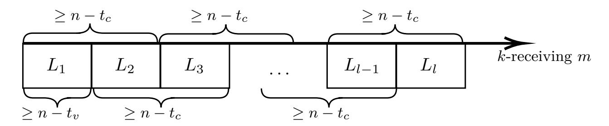
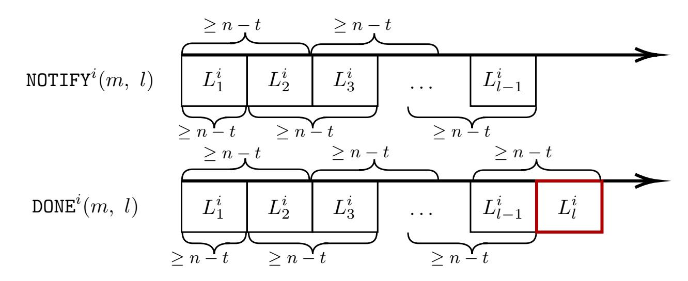
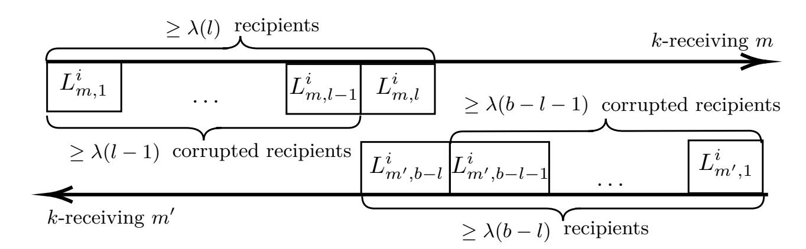
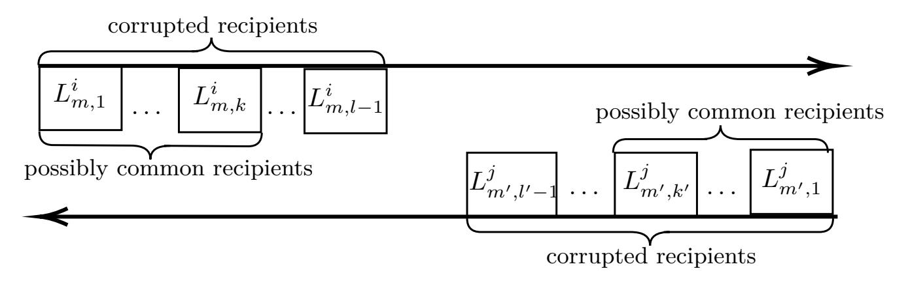
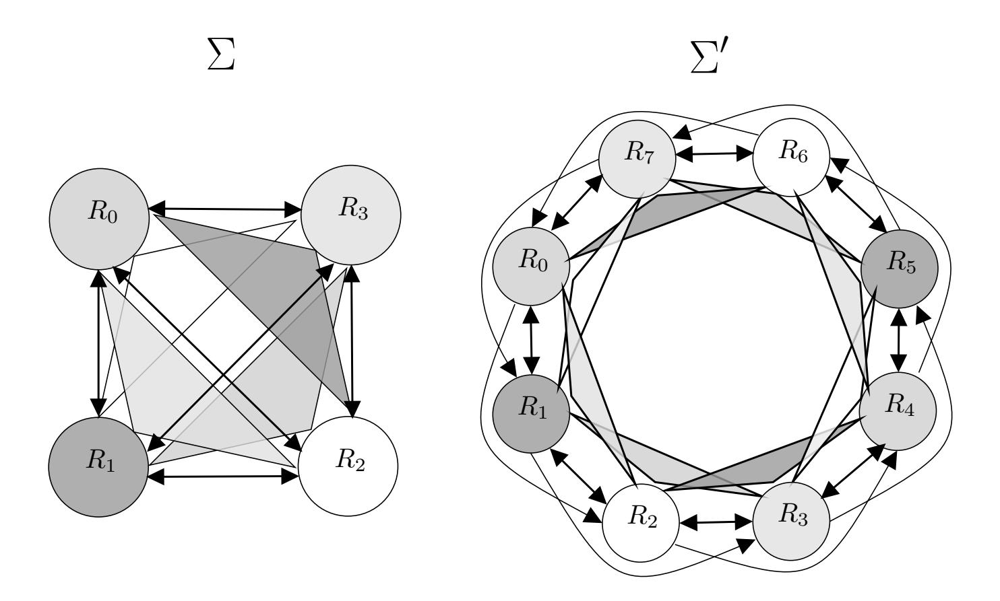
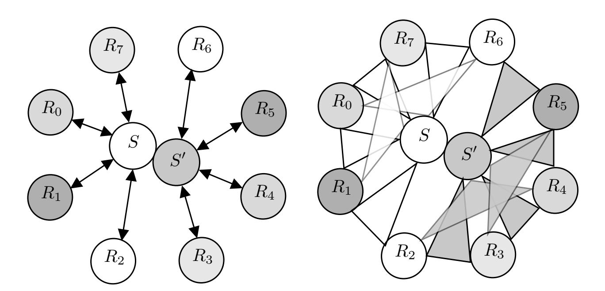
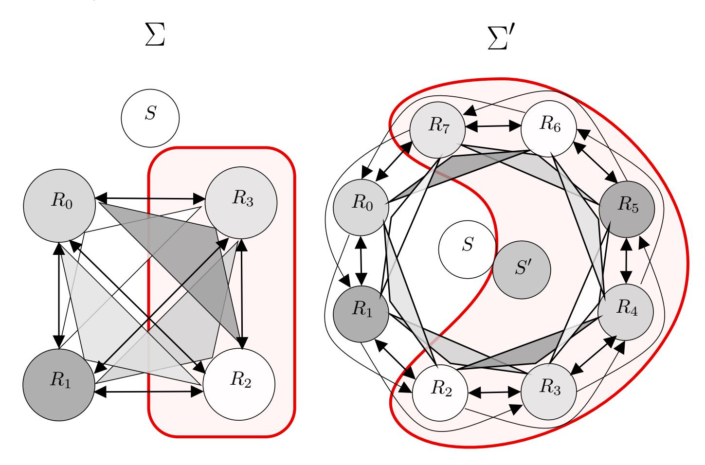

{0}------------------------------------------------

# From Partial to Global Asynchronous Reliable Broadcast

#### Diana Ghinea

Department of Computer Science, ETH Zurich, Switzerland ghinead@student.ethz.ch

#### **Martin Hirt**

Department of Computer Science, ETH Zurich, Switzerland hirt@inf.ethz.ch

#### Chen-Da Liu-Zhang

Department of Computer Science, ETH Zurich, Switzerland lichen@inf.ethz.ch

#### — Abstract -

Broadcast is a fundamental primitive in distributed computing. It allows a sender to consistently distribute a message among n recipients. The seminal result of Pease et al. [JACM'80] shows that in a complete network of synchronous bilateral channels, broadcast is achievable if and only if the number of corruptions is bounded by t < n/3. To overcome this bound, a fascinating line of works, Fitzi and Maurer [STOC'00], Considine et al. [JC'05] and Raykov [ICALP'15], proposed strengthening the communication network by assuming partial synchronous broadcast channels, which guarantee consistency among a subset of recipients.

We extend this line of research to the asynchronous setting. We consider reliable broadcast protocols assuming a communication network which provides each subset of b parties with reliable broadcast channels. A natural question is to investigate the trade-off between the size b and the corruption threshold t. We answer this question by showing feasibility and impossibility results:

- A reliable broadcast protocol  $\Pi_{RBC}$  that:
  - For  $3 \le b \le 4$ , is secure up to t < n/2 corruptions.
  - For b > 4 even, is secure up to  $t < \left(\frac{b-4}{b-2}n + \frac{8}{b-2}\right)$  corruptions.
  - For b > 4 odd, is secure up to  $t < (\frac{b-3}{b-1}n + \frac{6}{b-1})$  corruptions.
- A nonstop reliable broadcast  $\Pi_{nRBC}$ , where parties are guaranteed to obtain output as in reliable broadcast but may need to run forever, secure up to  $t < \frac{b-1}{b+1}n$  corruptions.
- There is no protocol for (nonstop) reliable broadcast secure up to  $t \geq \frac{b-1}{b+1}n$  corruptions, implying that  $\Pi_{RBC}$  is an asymptotically optimal reliable broadcast protocol, and  $\Pi_{nRBC}$  is an optimal nonstop reliable broadcast protocol.

**2012 ACM Subject Classification** Theory of computation  $\rightarrow$  Computational complexity and cryptography; Theory of computation  $\rightarrow$  Design and analysis of algorithms; Security and privacy  $\rightarrow$  Cryptography

Keywords and phrases asynchronous broadcast, partial broadcast

Digital Object Identifier 10.4230/LIPIcs.CVIT.2016.23

# 1 Introduction

Broadcast protocols constitute a fundamental building block in distributed computing. They allow a designated party, the sender, to consistently distribute a message among n recipients, even if some of them exhibit arbitrary behaviour. It is used as an important primitive in many applications, such as verifiable secret-sharing or secure-multiparty computation [9, 2, 5, 13].

{1}------------------------------------------------

The seminal result of Pease et al. [12] shows that in the standard communication model of a complete synchronous network of pairwise authenticated channels, perfectly-secure Byzantine broadcast is achievable if and only if less than a third of the parties are corrupted (i.e., *t < n/*3). To overcome this bound, a line of works [8, 6, 15] have considered using stronger communication primitives s[uch](#page-16-0) as *partial broadcast channels*, which guarantee that a message is consistent among all recipients on the channel. Hence, a natural question is to investigate a generalization of the classical broadcast problem, namely the trade-off between the strength of the communication primitives and the corru[p](#page-16-1)ti[ve](#page-16-2) [po](#page-16-3)wer from the adversary.

To the best of our knowledge, all works investigating such trade-offs for broadcast achievability [8, 6, 15] operate in the so-called *synchronous* model, where parties have access to synchronized clocks and there is a known upper bound on the network delay.

A more realistic setting is the so-called *asynchronous* model, where no timing assumption is made. In the asynchronous model, the classical notion of synchronous Byzantine broadcast, where t[er](#page-16-1)[mi](#page-16-2)[nati](#page-16-3)on is guaranteed, is not achievable, since one cannot distinguish between a dishonest sender not sending a message or an honest sender being slow [4, 3, 1]. Hence, one considers the weaker notion of *reliable* broadcast, where parties may not obtain output if the sender is dishonest; however, if an honest party obtains output, every honest party does as well. To the best of our knowledge, constructions of reliable broadcast [3] in the asynchronous setting are only known up to *t < n/*3 corruptions.

A natural question is then to investigate such trade-offs between the communication network and the corruptive power of the adversary in the asynchronous model.1

*In the asynchronous communication network Nb where parties can reliably broadcast to any subset of b parties, for which t is there a reliable broadcast protocol secure up to t corruptions?*

We answer this question by showing feasibility and impossibility results:

**Feasibility Results.** In the network communication *Nb*, we show:

- A reliable broadcast protocol ΠRBC that satisfies:
  - For *b ≤* 4, secure up to *t < n/*2 corruptions.
  - For *b >* 4 even, secure up to *t < b−*4 *b−*2 *n* + 8 *b−*2 corruptions.
  - For *b >* 4 odd, secure up to *t < b−*3 *b−*1 *n* + 6 *b−*1 corruptions.
- A *nonstop* reliable broadcast ΠnRBC, where parties are guaranteed to obtain output as in reliable broadcast but may need to run forever, secure up to *t < b−*1 *b*+1*n* corruptions.

**Impossibility Result.** We show that in the network *Nb*, there is no protocol for (nonstop) reliable broadcast secure up to *t ≥ b−*1 *b*+1*n* corruptions, implying that ΠRBC is an asymptotically optimal reliable broadcast protocol when *n → ∞* and *b* = *O*(*n*), and that ΠnRBC is an optimal nonstop reliable broadcast protocol.

1 Investigating such trade-off is additionally motivated as a natural way to overcome the *n/*3-bound of constructing reliable broadcast in the pairwise channels setting. Note that this bound holds even assuming public-key infrastructure (PKI), in contrast to the synchronous counterpart, where Byzantine broadcast (and reliable broadcast) can be achieved under arbitrary many corruptions with PKI [7].

{2}------------------------------------------------

## **1.1 Related Work**

All previous results in this realm operate in the synchronous model, where parties operate in *rounds*. Parties then proceed synchronously, and messages sent at round *r* are guaranteed to be delivered by round (*r* + 1).

Fitzi and Maurer [8] showed that assuming partial Byzantine broadcast channels among every triplet of parties, global Byzantine broadcast can be realized securely if and only if *t < n/*2. Considine et al. [6] generalized this result to the *b*-cast model, i.e. a partial Byzantine broadcast channel among any *b* parties, where it was shown that Byzantine broadcast is achievable if and onl[y](#page-16-1) if *t < b−*1 *b*+1*n*. Raykov [15] generalized this result to the setting of *general adversaries* [10] proving that broadcast is achievable from *b*-cast channels against adversary structures *[A](#page-16-2)* if and only if *A* satisfies the so-called (*b* + 1)-chain-free condition.

Some additional works focus on the setting of *incomplete* communication networks, where some of the partial *b*-cast channels might be m[issi](#page-16-3)ng. Ravikant et al. [14] provide necessary and sufficient condit[ion](#page-16-4)s for 3-cast networks to satisfy so that Byzantine agreement can be achieved while tolerating threshold adversaries in the range *n/*3 *≤ t < n/*2. In a follow-up work, Jaffe et al. [11] provide asymptotically tight bounds on the number of necessary and sufficient 3-cast channels to construct Byzantine agreement for the sam[e t](#page-16-5)hreshold adversary.

# **1.2 Compari[son](#page-16-6) to Previous Work**

We argue that the asynchronous setting has different challenges from those that arise in the synchronous setting. Compared to previous works which assume and construct Byzantine broadcast, in this work we assume and construct reliable broadcast. That is, although our constructed primitive, reliable broadcast, is weaker than the traditional Byzantine broadcast primitive, as it does not guarantee termination in the dishonest sender case, it is also the case that we assume weaker primitives, which poses new challenges. For example, in the synchronous model, the primitive *proxcast* [6] which provides a weak form of consistency where parties output a level of confidence, and is used as a core building block to construct Byzantine broadcast, can be achieved simply by allowing the sender to partially broadcast the input value via all possible *b*-casts, and letting each recipient *Ri* take a deterministic decision based on all the outputs: *Ri* decide[s o](#page-16-2)n level *ℓi* as the minimum number of parties with whom *Ri* sees only zeros. However, in the asynchronous model, parties cannot wait for the outcome of all partial reliable broadcasts from the sender, because the sender may be dishonest and so some of the partial channels may not output a value. As a consequence, *Ri* would need to make a decision *without* knowing the outcome of all partial channels. In general, parties have to make progress in the protocol after seeing the messages from *n − t* parties, as all other parties could be corrupted. This is especially troublesome in the dishonest majority region, where parties need to make progress after seeing messages from *n − t ≤ t* parties, i.e., even when potentially no message from any honest party is received. The key idea to overcome this is by observing that honest parties can actually wait for messages from *n − t* parties that are *consistent*, i.e., it is allowed to wait for more than *n − t* parties if inconsistency is received. This prevents the adversary, with the help of partial channels, to send arbitrary inconsistent messages.

## **2 Model and Definitions**

We consider a setting with *n* + 1 parties, where a designated party, called the sender *S*, distributes a value to a set of *n* recipients *R* = *{R*1*, . . . , Rn}*. We note that the *insider-* 

{3}------------------------------------------------

sender setting where the sender is also a recipient is a special case, as it can run in parallel both processors, acting as sender and as recipient simultaneously.

## 2.1 Communication, Adversary and Setup

In this work, we generalize the communication model where, in addition to a complete network of pair-wise authenticated channels, parties have access to partial reliable broadcast channels as well. We refer to such a partial reliable broadcast channel RBC(S, { $R_1$ ,..., $R_{b-1}$ }) with a sender S and b-1 additional recipients { $R_1$ ,..., $R_{b-1}$ } a b-cast channel. We denote by  $\mathcal{N}_b$  the generalized communication model where each party P, sender or recipient, in addition has access to all channels RBC(P, { $R_{i_i}$ ,..., $R_{i_{b-1}}$ }), where  $R_{i_i}$ ,..., $R_{i_{b-1}}$  are b-1 additional recipients.

The network is fully asynchronous. That is, we assume that the adversary has full control over the network and can schedule the messages in an arbitrary manner. However, each message must be eventually delivered.

We consider the same adversarial model and setup as in [6]. That is, we consider an adaptive adversary who can gradually corrupt parties and take full control over them. Moreover, we require our protocols to be unconditionally secure, meaning that security holds even against a computationally unbounded adversary. Note, however, that our impossibility proofs hold even with respect to a static adversary that is assumed to choose the corrupted parties at the beginning of the protocol execution and in addition is computationally bounded. Finally, we consider the setting where parties have no public-key infrastructure available.

#### 2.2 Reliable Broadcast

Reliable broadcast is a fundamental primitive in distributed computing which allows a designated party S, called the sender, to consistently distribute a message towards a set of recipients  $\mathcal{R} = \{R_1, \dots, R_n\}$ .

- ▶ **Definition 1.** A protocol  $\pi$  where initially the sender S holds an input m and every recipient  $R_i$  terminates upon generating output is a reliable broadcast protocol up to t corruptions, if the following properties are satisfied:
- Validity: If the sender is honest, the sender terminates and every honest recipient terminates with output m.
- **Consistency**: If an honest recipient terminates with output m, every honest recipient terminates with the same value.

We additionally define a slightly weaker version of broadcast, which requires the recipients to obtain outputs like in reliable broadcast, but may need to run forever.

- ▶ **Definition 2.** A protocol  $\pi$  where initially the sender S holds an input m is a nonstop reliable broadcast protocol up to t corruptions, if the following properties are satisfied:
- Validity: If the sender is honest, every honest recipient outputs m.
- **Consistency**: If an honest recipient outputs m, every honest recipient outputs m.

{4}------------------------------------------------

# **3 A Warm-Up Protocol in** *N*3

In this section, we consider the model *N*3, where the parties have access to 3-cast channels. That is, any party can reliably broadcast messages to any subset of 2 recipients.

We present a reliable broadcast protocol Π *n,*3 RBC in the communication network *N*3 secure up to *t < n/*2 corruptions inspired by Brachas reliable broadcast protocol [3]. In Section E, we show that the construction is optimal with respect to the corruption threshold.

Π *n,*3 RBC first lets the sender *S mega-send* its input message *m* (distribute *m* to any two recipients, via all available 3-cast channels). Any recipient *Ri* that *mega-receives* the same message (MSG*, m*) from *S* (receives consistently (MSG*, m*) via all (in total *n [−](#page-16-7)* 1) 3-cast ch[an](#page-22-0)nels from *S*), mega-sends a message (READY*, m*) notifying all recipients that it is ready to output *m*. Any recipient *Ri* that receives consistent notification messages (READY*, m*) from *t* + 1 different recipients mega-sends (READY*, m*). Finally, any recipient *Ri* that mega-sent (READY*, m*) and mega-received consistent notification messages (READY*, m*) from *n − t −* 1 other different recipients than himself, outputs *m* and terminates.

Intuitively, the usage of 3-cast channels guarantees that honest parties send consistent READY messages, because two recipients cannot mega-receive different messages from the sender (they have a common 3-cast channel with the sender). Moreover, note that if an honest recipient *Ri* mega-receives (READY*, m*) from *Rj* , then any honest recipient *Rk* receives (READY*, m*) from *Rj* via the 3-cast containing *Rj* as the sender and *{Ri , Rk}* as the recipients. This ensures that if an honest recipient outputs a message *m*, meaning that it sent (READY*, m*) and mega-received (READY*, m*) from *n − t −* 1 different recipients, then any honest recipient eventually receives (READY*, m*) from *n − t ≥ t* + 1 different recipients. It then follows that all honest parties mega-send (READY*, m*), so all honest parties mega-receive (READY*, m*) from at least *n − t −* 1 parties and terminates. The protocol is described below, and a formal analysis of it can be found in Appendix A.

#### **Protocol** Π *n,*3 RBC

#### **Code for the sender** *S*

1: On input *m*, send (MSG*, m*) to ever[y p](#page-17-0)air of recipients via 3-cast and terminate with output *m*.

#### **Code for recipient** *Ri*

- 1: Upon receiving (MSG*, m*) via all 3-cast RBC(*S, {Ri, Rj}*), *Rj ∈ R*, send (READY*, m*) to every pair of recipients via 3-cast.
- 2: Upon receiving (READY*, m*) from *t* + 1 different recipients, i.e. from RBC(*Rj , {Ri, ·}*), *Rj ∈ T*, *|T| ≥ t* + 1, if no READY message was sent, send (READY*, m*) to every pair of recipients via 3-cast.
- 3: Upon receiving (READY*, m*) via all 3-cast RBC(*Rk, {Ri, Rj}*), *Rj ∈ R*, *Rk ∈ T*, *|T| ≥ n − t −* 1, if (READY*, m*) was sent, output *m* and terminate.

# **4 Notation for Protocols in** *Nb*

We consider the model *Nb* where parties, sender or recipients, have access to *b*-cast channels. That is, any party can reliably broadcast a message to any subset of *b −* 1 recipients.

We introduce some definitions that will be convenient to describe our protocols. Generalizing the terminology of parties mega-receiving messages in Section 2.2, we add a definition for parties that receive a message via all *b*-cast channels including a certain subset of recipients.

{5}------------------------------------------------

▶ **Definition 3.** Let  $P \in \{S\} \cup \mathcal{R}$  be a party and  $U \subseteq \mathcal{R} \setminus \{P\}$ . We denote  $\mathcal{B}_P(U) :=$  $\{\mathsf{RBC}(P,V):\ U\subseteq V\subseteq \mathcal{R}\ \land\ |V|=b-1\}\ the\ set\ of\ b\text{-}cast\ channels\ that\ include\ P\ as\ the$ sender and any subset of b-1 recipients that includes U as receivers.

In particular, note that if  $U' \subseteq U$ , then  $\mathcal{B}_P(U) \subseteq \mathcal{B}_P(U')$ .

- ▶ **Definition 4.** We say that a party  $P \in \{S\} \cup \mathcal{R}$  U-sends a message m if it sends m through every channel in  $\mathcal{B}_P(U)$ .
- **Definition 5.** We say that a recipient  $R \in \mathcal{R}$  U-receives a message m from a party P if it receives m through every channel  $\mathcal{B}_P(U)$ . Moreover, we say that R l-receives m if such  $U \subseteq \mathcal{R} \text{ with } |U| = l \text{ exists.}$
- ▶ Remark 6. Note that if  $|U| \ge b$ ,  $\mathcal{B}_P(U) = \emptyset$ , and any recipient b-receives any message. With these definitions, we prove some properties about l-receiving values among parties.
- ▶ Lemma 7. Let  $l \leq b$ . If a recipient  $R_i$  l-receives m from P, then all recipients eventually (l+1)-receive m.
- **Proof.** If  $l \ge b-1$ , then by definition every recipient b-receives m. If l < b-1, this means that if  $R_i$  receives m from all channels containing a fixed set of l recipients, then any recipient  $R_j$  received m via all channels containing the same set and  $R_j$ . More formally, let U be the set such that  $R_i$  U-receives m from P. Then, any  $R_j$  eventually  $(U \cup \{R_j\})$ -receives m, since  $\mathcal{B}_P(U \cup \{R_j\}) \subseteq \mathcal{B}_P(U)$ . 4
- ▶ Lemma 8. If  $R_i \in \mathcal{R}$  U-receives m from P and  $R_j \in \mathcal{R}$  V-receives m' from P, with  $m \neq m'$ , then  $|U \cup V| \geq b$ .

**Proof.** If  $|U \cup V| < b$ , then  $\exists c \in \mathcal{B}_P(U \cup V)$ . Hence, c outputs m to  $R_i$  and m' to  $R_j$ , contradicting the consistency of the b-cast channel c.

#### 4.1 **Predicate** LEVELS

Our protocols follow a specific pattern. They first allow the sender S to send its input m to each subset of b-1 recipients. From now on, only the recipients interact with each other. Whenever a condition  $C_1$  is met for  $R_i$ , it sends a message via all available b-cast channels, and as soon as a (stricter) condition  $C_2$  is met, it outputs its final message.

At the core of the conditions is the predicate LEVELS, which is reminiscent of the notion of proxest [6]. Intuitively, the predicate LEVELS can be understood as an indicator of the consistency level achieved so far. Level 1 is the strongest, and indicates that from the view of  $R_i$ , the sender "looks honest". Level 2 indicates that there might be an honest receiver  $R_j$  for whom the sender looks honest, i.e., that  $R_j$  is at level 1. Level 3 indicates that there might be an honest  $R_k$  at level 2, and so on.

Roughly speaking, to achieve level 1,  $R_i$  checks that it 1-received a message m from the sender S, and that n-t parties confirm to be at level 1 as well. Intuitively, a recipient  $R_i$  is at level l > 1 if from its point of view there could be an honest recipient that is at level k-1. Note that if an honest recipient is at level l-1, then all the n-t honest recipients eventually receive enough messages from the sender and enough confirmations to place themselves on level l-1 or l. Hence, for level l,  $R_i$  needs to l-receive m from Sand there must be a sequence of subsets of parties  $L_1, \ldots, L_l$ , where  $L_k$  can be interpreted as a set containing parties confirming to be at level k, that satisfies  $|L_1| \geq n-t$  and

{6}------------------------------------------------

 $\blacktriangleleft$ 

**Figure 1** A visual representation of the LEVELS predicate.

 $\forall 1 \leq k \leq l-1: |L_k| + |L_{k+1}| \geq n-t.$  For technical reasons, it will be useful to consider different sizes for each of the two conditions above (see Figure 1).

More concretely, the predicate satisfies level l for parameters n,  $t_v$  and  $t_c$  if:

$$\mathsf{LEVELS}_{n,t_v,t_c}(L_1,\ldots,L_l) = (\forall \ 1 \le k < k' \le l : L_k \cap L_{k'} = \varnothing) \land \\ \left( \left| L_1 \right| \ge n - t_v \right) \land \left( \forall \ 2 \le k \le l : \left| L_k \right| \ge 1 \right) \land \\ \left( \forall \ 1 \le k \le l - 1 : \left| L_k \right| + \left| L_{k+1} \right| \ge n - t_c \right)$$

For l = 0, the predicate is true by default.

We include a few properties of the predicate, which will be useful in the proofs.

▶ **Lemma 9.** If LEVELSn,tv,tc  $(L_1,\ldots,L_l)$  holds, then LEVELSn,tv,tc  $(L_1,\ldots,L_k)$  holds for any  $0 \le k \le l$ .

**Proof.** Follows from the definition of the LEVELS predicate.

We denote  $\lambda(l)$  the minimum number of recipients that can be placed into sets  $L_1, \ldots, L_l$ satisfying LEVELS $n,t_v,t_c$   $(L_1,\ldots,L_l)$ . That is, the minimum  $\left|\bigcup_{k=1}^l L_k\right|$ , for sets  $L_1,\ldots,L_l$ satisfying LEVELS $n,t_v,t_c$   $(L_1,\ldots,L_l)$ . Naturally,  $\lambda(0)=0$ . The next lemma computes  $\lambda(l)$ , l > 0. The proof can be found in Appendix B.

▶ Lemma 10. Given  $0 \le t_c \le t_v < n$  and l > 0,  $\lambda(l)$  can be computed as follows.

$$If t_v = t_c = t:$$

$$\lambda(l) = \begin{cases} \frac{l+1}{2}(n-t) & \text{if } l \text{ is odd,} \\ \frac{l}{2}(n-t)+1 & \text{if } l \text{ is even.} \end{cases}$$

$$\lambda(l) = \begin{cases} (n-t_v) + \frac{l-1}{2}(n-t_c) & \text{if } l \text{ is odd,} \\ \frac{l}{2}(n-t_c) & \text{if } l \text{ is even.} \end{cases}$$

#### 5 Asymptotically Optimal Reliable Broadcast Protocol

We present a protocol for any finite input space achieving reliable broadcast in  $\mathcal{N}_b$  that is:

- for  $3 \le b \le 4$ , secure up to t < n/2 corruptions;
- for b > 4 even, secure up to  $t < \left(\frac{b-4}{b-2}n + \frac{8}{b-2}\right)$  corruptions;
- for b > 4 odd, secure up to  $t < \left(\frac{b-3}{b-1}n + \frac{6}{b-1}\right)$  corruptions.

#### **Protocol Description** 5.1

The protocol generalizes the simple protocol for 3-cast presented in Section 2.2. In the region of dishonest majority, n-t < t confirmations are not sufficient to make a decision since all confirmations could come from dishonest parties. Instead, we store the recipients that send confirmations and make use of the LEVELS predicate to evaluate the consistency level.

{7}------------------------------------------------

Initially, the sender forwards its input m to every subset of b-1 recipients via all available b-cast channels. If S is honest, once a recipient  $R_i$  1-receives m from S, it sends (READY, m) via all b-cast channels to notify the other recipients. It outputs m when in addition it 1-receives (READY, m) from n-t-1 other recipients, completing the protocol at level 1.

If S is corrupted, it is possible that  $R_i$  is the only honest recipient that 1-receives m from S and 1-receives (READY, m) from the other n-t-1 recipients, which are corrupted. However, any other honest recipient  $R_j$  eventually 2-receives m from S, 2-receives (READY, m) from the n-t-1 corrupted recipients and 1-receives (READY, m) from  $R_i$ . Once  $R_j$  receives these messages, it sends (READY, m) and outputs m, completing the protocol at level 2.

Following this line of reasoning, for l > 1, an honest recipient  $R_i$  that l-receives m from S sends (READY, m) when it believes that an honest recipient  $R_j$  completed the protocol on level l - 1. Then,  $R_i$  outputs m when it is sure that any honest recipient that eventually (l + 1)-receives m from S will have enough evidence that  $R_i$  terminated at level l. This guarantees that when an honest recipient  $R_i$  completes the protocol with output m, every honest recipient eventually sends (READY, m). Additionally, we set the threshold so that it ensures that honest recipients cannot send READY for different messages, and moreover, if all honest recipients send (READY, m), all honest recipients complete the protocol with output m.

Each recipient  $R_i$  keeps sets  $\mathbf{R}^i(m,k)$ ,  $1 \leq k \leq b$ , where it stores the recipients from whom it k-received (READY, m). We define two predicates which will be helpful when describing the protocol. Predicate  $\mathtt{DONE}^i(m,l)$  indicates that the l levels have been completed for the message m, and hence  $R_i$  can complete the protocol. Predicate  $\mathtt{NOTIFY}^i(m,l)$  indicates that there is a seemingly honest recipient  $R_j$  who satisfied the predicate  $\mathtt{DONE}^j(m,l-1)$ , meaning that  $R_i$  should send a notification for level l and message m. In the following, we formally describe the two predicates  $\mathtt{NOTIFY}$ ,  $\mathtt{DONE}$  (see Figure 2).

$$\begin{split} \text{NOTIFY}^i(m,1) &= \text{true} \\ \text{NOTIFY}^i(m,l) &= \exists \ L_1^i \subseteq \mathbf{R}^i(m,l), ..., L_k^i \subseteq \mathbf{R}^i(m,l-k+1), ..., L_{l-1}^i \subseteq \mathbf{R}^i(m,2) \text{ s.t.} \\ & \left( \forall \ 1 \leq k \leq l-1 : L_k^i \cap \mathbf{R}^i(m,l-k) \neq \varnothing \right) \wedge \\ \text{LEVELS}_{n,t,t}(L_1^i, ..., L_{l-1}^i) \text{ holds.} \\ \\ \text{DONE}^i(m,l) &= \exists \ L_1^i \subseteq \mathbf{R}^i(m,l), ..., L_k^i \subseteq \mathbf{R}^i(m,l-k+1), ..., L_l^i \subseteq \mathbf{R}^i(m,1) \text{ s.t.} \\ & \left( \forall \ 1 \leq k \leq l-1 : L_k^i \cap \mathbf{R}^i(m,l-k) \neq \varnothing \right) \wedge \\ \text{LEVELS}_{n,t,t}(L_1^i, ..., L_l^i) \text{ holds.} \end{split}$$

**Figure 2** The condition NOTIFY $^i(m,l)$ , in contrast to the condition DONE $^i(m,l)$ .

We hereby formally describe the protocol.

{8}------------------------------------------------

# Protocol $\Pi^{n,b}_{\mathtt{RBC}}$

#### Code for the sender S

1: On input m, send m to every subset of b-1 recipients via b-cast and terminate.

#### Code for recipient $R_i$

Initialize  $\mathbf{R}^i(m,k) = \emptyset$  for any m and  $1 \le k \le b$ .

- 1: Upon k-receiving (READY, m) from  $R_j$ , add  $R_j$  to  $\mathbf{R}^i(m,k)$ .
- 2: As soon as NOTIFYi(m, l) holds and m was l-received from S (for a message m), send (READY, m) to every set of b-1 recipients via b-cast and add  $R_i$  to  $\mathbf{R}^i(m, k)$  for  $1 \le k \le b$ .
- 3: As soon as  $\mathtt{DONE}^i(m, l)$  holds and m was l-received from S (for a message m), output m and terminate.

#### **5.2** Resilience Proof

We first state a number of intermediate lemmas that help in proving validity and consistency.

▶ Lemma 11. If  $R \in \mathbf{R}^i(m,k)$  for an honest recipient  $R_i$  and for k < b, then for any honest recipient  $R_j$ , eventually  $R \in \mathbf{R}^j(m,k+1)$  and also  $R \notin \mathbf{R}^j(m',k')$ , for any  $m' \neq m$  and k' < b - k.

**Proof.** Follows from Lemmas 7 and 8.

▶ Lemma 12. Assume that  $t < \lambda(b-2)$  and let U denote the smallest set containing an honest recipient such that the sender U-sends m. If  $|U| \ge b-1$ , then no honest recipient can send (READY, m) or complete the protocol with output m.

**Proof.** Assume that  $R_i$  is the first honest recipient that sends (READY, m).

Then,  $\mathtt{NOTIFY}^i(m,b-1)$  holds based on messages sent by corrupted recipients only. The definition of the  $\mathtt{NOTIFY}$  predicate hence implies that  $t \geq \lambda(b-2)$ , contradicting the hypothesis. Since  $\mathtt{NOTIFY}^i(m,b-1)$  is false,  $\mathtt{DONE}^i(m,b-1)$  is false as well, and therefore  $R_i$  cannot output m.

▶ Lemma 13. If  $t < \lambda(b-2)$  and an honest recipient  $R_i$  completes the protocol with output m, then any other honest recipient eventually sends (READY, m).

**Proof.** Assume that  $R_i$  is the first honest recipient that completes the protocol with output m. Then, it l-received m from the sender and  $DONE^i(m,l)$  holds, which implies that  $NOTIFY^i(m,l)$  also holds. According to Lemma 12, l < b - 1. Hence, from Lemma 11 and from the definitions of DONE and NOTIFY, it follows that  $NOTIFY^j(m,l+1)$  eventually holds for every other honest recipient  $R_j$ . In addition, according to Lemma 7, every honest recipient eventually (l+1)-receives m from the sender, and hence sends (READY, m).

▶ Lemma 14. If  $t < \lambda(b-2)$  and every honest recipient sends (READY, m), then every honest recipient can output m.

**Proof.** Let  $R_i$  denote the first honest recipient that sends (READY, m). Then,  $R_i$  l-receives m and NOTIFY $^i(m,l)$  holds for l < b-1, according to Lemma 12. From the definition of NOTIFY $^i(m,l)$ , it follows that  $\exists L_1^i \subseteq \mathbf{R}^i(m,l), ..., L_k^i \subseteq \mathbf{R}^i(m,l-k+1), ..., L_{l-1}^i \subseteq \mathbf{R}^i(m,2)$  such that  $L_k^i \cap \mathbf{R}^i(m,l-k) \neq \emptyset$  for every  $1 \le k \le l-1$  and LEVELS $_{n,t,t}(L_1^i,...,L_{l-1}^i)$  holds. Since  $R_i$  is the first honest recipient to send (READY, m), every recipient in  $\bigcup_{k=1}^{l-1} L_k^i$  is corrupted.

{9}------------------------------------------------

**Figure 3** All the honest recipients have sent (READY, m).

As shown in Figure 3, since every honest recipient sends (READY, m), eventually  $\left|\mathbf{R}^{j}(m,1)\right|$   $\left(\bigcup_{k=1}^{l-1}L_{k}^{i}\right)\right|\geq n-t$ , for any honest recipient  $R_{j}$ . We can assign  $n-t-\left|L_{l-1}^{i}\right|$  honest recipients to  $L_{l}^{i}$ . Then,  $\mathtt{DONE}^{i}(m,l)$  holds and  $R_{i}$  can output m. Every honest recipient  $R_{j}$  can achieve  $\mathtt{DONE}^{j}(m,l+1)$  by assigning  $L_{k}^{j}=L_{k}^{i}$ , according to Lemma 11, and by assigning to  $L_{l+1}^{j}$  the honest recipients that are not in  $L_{l}^{i}$ . Then,  $\left|L_{l}^{j}\cup L_{l+1}^{j}\right|\geq n-t$  and  $\mathtt{DONE}^{j}(m,l+1)$  holds. Additionally, from Lemma 7,  $R_{j}$  (l+1)-receives m and therefore it can output m.

## **5.2.1** Resilience for $3 \le b \le 4$

▶ Lemma 15. If  $t < \lambda(1)$ , validity is satisfied.

**Proof.** Let m denote the input of the honest sender and let  $m' \neq m$ . Since the recipients only b-receive m and  $t < \lambda(1) \leq \lambda(b-2)$ , no honest recipient sends (READY, m') or outputs m', according to Lemma 12. Every recipient can 1-receive m from S, hence every honest recipient eventually sends (READY, m). From Lemma 14, we obtain that every honest recipient eventually outputs m.

▶ Lemma 16. If  $t < \lambda(1)$ , consistency is satisfied.

**Proof.** Assume that an honest recipient  $R_i$  completes the protocol with output m. Since  $t < \lambda(1)$ , we can assume without loss of generality that  $R_i$  has 1-received m.

According to Lemma 8, no honest recipient can (b-2)-receive  $m' \neq m$  and since  $t < \lambda(1) \leq \lambda(b-2)$ , we obtain from Lemma 12 that no honest recipient sends (READY, m') or outputs m'. According to Lemma 13, every honest recipient sends (READY, m). It follows from Lemma 14 that every honest recipient outputs m.

▶ Theorem 17. If  $t < \lambda(1)$ ,  $\Pi_{RBC}^{n,b}$  achieves reliable broadcast in  $\mathcal{N}_b$ .

**Proof.** We obtain from Lemma 15 that  $\Pi_{RBC}^{n,b}$  achieves validity, and it follows from Lemma 16 that  $\Pi_{RBC}^{n,b}$  achieves consistency.

Since from Lemma 10 t < n-t and therefore  $t < \frac{n}{2}$ , then Theorem 17 implies:

▶ Corollary 18. If  $3 \le b \le 4$ ,  $\Pi_{RBC}^{n,b}$  is a reliable broadcast protocol secure up to  $t < \frac{n}{2}$  corruptions in  $\mathcal{N}_b$ .

#### **5.2.2** Resilience for b > 4

The following lemma shows that for certain thresholds, the READY messages that honest parties send are unique. The proof is enclosed in Appendix C.

▶ Lemma 19. Assume that  $t < \lambda(l-1) + \lambda(l'-1) - \lambda(l+l'-b+1) + 2$  for any l > 0, l' > 0 such that  $l+l' \geq b$ . Then, if NOTIFYi(m,l) holds for an honest recipient  $R_i$ , NOTIFYj(m',l') is false for any honest recipient  $R_j$ , where  $m \neq m'$ .

{10}------------------------------------------------

- ▶ Lemma 20. Assume that  $t < \lambda(l-1) + \lambda(l'-1) \lambda(l+l'-b+1) + 2$  for any l > 0, l' > 0 such that  $l + l' \ge b$ . Then, if an honest recipient  $R_i$  outputs m, it sent (READY, m).
- **Proof.**  $R_i$  outputs m, there is an l such that  $DONE^i(m, l)$  holds and  $R_i$  has l-received m, which implies that  $NOTIFY^i(m, l)$  holds. According to Lemmas 19 and 8,  $NOTIFY^i(m', l')$  is false for any  $m' \neq m$  and l' such that  $R_i$  can l'-receive m'. Hence,  $R_i$  cannot send (READY, m') and therefore it sent (READY, m) before completing the protocol.
- ▶ Lemma 21. Assume that  $t < \lambda(l-1) + \lambda(l'-1) \lambda(l+l'-b+1) + 2$  for any l > 0, l' > 0 such that  $l+l' \geq b$ . Then, if an honest recipient  $R_i$  sends (READY, m), no honest recipient completes the protocol with output  $m' \neq m$ .
- **Proof.** If an honest recipient  $R_j$  outputs m', then according to Lemma 20,  $R_j$  sent (READY, m'), which contradicts Lemma 19.
- ▶ Lemma 22. If  $t < \lambda(b-2)$ , validity is satisfied.
- **Proof.** Let m denote the input of the honest sender and let  $m' \neq m$ . According to Lemma 12 and since the recipients only b-receive m', no honest recipient sends (READY, m') or outputs m'. Every recipient can 1-receive m from S, hence every honest recipient eventually sends (READY, m). From Lemma 14, we obtain that every honest recipient eventually outputs m.
- ▶ Lemma 23. If  $t < \lambda(b-2)$  and  $t < \lambda(l-1) + \lambda(l'-1) \lambda(l+l'-b+1) + 2$  for every l, l' > 0 such that  $l + l' \ge b$ , consistency holds.
- **Proof.** Assume an honest recipient  $R_i$  completes the protocol with output m. According to Lemmas 19 and 21, no honest recipient sends (READY, m') or outputs m', where  $m' \neq m$ . Consequently, it follows from Lemmas 20 and 13, that every honest recipient sends (READY, m). Then, we obtain from Lemma 14 that every honest recipient outputs m.
- ▶ Theorem 24. If b > 4,  $t < \lambda(b-2)$  and  $t < \lambda(l-1) + \lambda(l'-1) \lambda(l+l'-b+1) + 2$  for any l, l' > 0 such that  $l + l' \ge b$ ,  $\Pi_{RBC}^{n,b}$  achieves reliable broadcast in  $\mathcal{N}_b$ .
- **Proof.** We obtain from Lemma 22 that  $\Pi_{RBC}^{n,b}$  achieves validity, and it follows from Lemma 23 that  $\Pi_{RBC}^{n,b}$  achieves consistency.

Since from Lemmas 52 and 53  $t < \frac{b-4}{b-2}n + \frac{8}{b-2}$  (resp.  $t < \frac{b-3}{b-1}n + \frac{6}{b-1}$ ) implies the hypothesis of Theorem 24, we obtain the following:

- ▶ Corollary 25. If b > 4 is even,  $\Pi_{\text{RBC}}^{n,b}$  achieves resilient reliable broadcast in  $\mathcal{N}_b$  secure against  $t < \frac{b-4}{b-2}n + \frac{8}{b-2}$  corruptions.
- ▶ Corollary 26. If b > 4 is odd,  $\Pi_{RBC}^{n,b}$  achieves resilient reliable broadcast in  $\mathcal{N}_b$  secure against  $t < \frac{b-3}{b-1}n + \frac{6}{b-1}$  corruptions.

# 6 Optimal Nonstop Broadcast

In this section, we present a protocol that achieves nonstop reliable broadcast secure against  $t < \frac{b-1}{b+1}n$  corruptions. In Appendix E, we show that the construction is optimal with respect to the corruption threshold.

{11}------------------------------------------------

The construction follows an information gathering approach, where parties recursively invoke a two-threshold nonstop reliable broadcast, along the lines of [6]. We denote a  $(t_v, t_c)$ -nonstop reliable broadcast a protocol achieving validity (resp. consistency) up to  $t_v$  (resp.  $t_c$ ) corrupted recipients.

For simplicity, in this section we focus on protocols with binary input domain. One can always extend it to any finite domain by invoking the protocol in parallel for each bit of the message to be sent.

## 6.1 Protocol Description

Initially, the sender forwards his input via b-cast to every subset of b-1 recipients. Each recipient  $R_i$ , now as sender, recursively invokes the two-threshold broadcast protocol with parameters  $t'_v = t_v$  and  $t'_c = t_c - 1$  towards the n-1 left recipients, to distribute messages. The idea is that if  $R_i$  is honest, then validity holds in the recursive calls, and this will be enough to achieve validity. On the other hand, if the sender is dishonest, it means that among the n-1 recipients, there is one less corrupted party, and so resilience up to  $t'_c$  corruptions is enough.

The message that each  $R_i$  distributes indicates a level l of confidence on a message m, meaning that it l-receives m from the sender, and did not send a message for (b-l)-receiving  $m' \neq m$ . In particular,  $R_i$  sends (READY,  $k, m_k, l_k$ ) to announce that it  $l_k$ -received  $m_k$  from the sender and that this is the k-th message that it sends. We think about the protocol as the recipients having available a designated channel for each level, so that any receiver can verify the order of the messages. Following the reasoning presented in Section 4.1, a recipient outputs once it receives enough confirmations that other recipients achieved the same consistency level. Given that the recursive broadcast works, it is then guaranteed that when an honest recipient outputs m with level l, every other recipient confirms with level l+1, and eventually every recipient outputs at level l+1. Intuitively, the reason why the protocol does not allow parties to terminate, is because recipients do not know whether they will need to confirm messages for other recursive calls of the protocol (there might be some honest recipient still waiting for a confirmation message to terminate).

Formal condition to output. Formally, a recipient  $R_i$  outputs m on level l when it l-receives m from the sender and the following predicate is satisfied:

$$\mathtt{DONE}^i(m,l) = \exists L_1 \subseteq \mathbf{R}^i(m,1), \ldots, L_l \subseteq \mathbf{R}^i(m,l) \text{ s.t. } \mathtt{LEVELS}_{n,t_n,t_n}(L_1,\ldots,L_l) \text{ holds.}$$

- ▶ Definition 27. A message (READY,  $k, m_k, l_k$ ) is consistent with respect to the set of messages {(READY,  $k', m_{k'}, l_{k'}$ ) |  $1 \le k' < k$ } if for every such k',  $l_k + l_{k'} > b$  when  $m_{k'} \ne m_k$  and  $l_k \ne l_{k'}$  when  $m_{k'} = m_k$ .
- ▶ Definition 28. A recipient  $R_i$  accepts a message (READY,  $k, m_k, l_k$ ) from a recipient  $R_j$  if it has received the messages  $\{(\text{READY}, k', m_{k'}, l_{k'}) \mid 1 \leq k' \leq k\}$  from  $R_j$  and  $(\text{READY}, k, m_k, l_k)$  is consistent with respect to them.
- ▶ Definition 29.  $\mathbf{R}^i(m,l) \subseteq \mathcal{R}$  denotes the set of recipients that  $R_i$  has accepted a message (READY, ·, m, l) from. We use  $\mathbf{R}^i(m, \leq l)$  to denote  $\bigcup_{j=1}^l \mathbf{R}^i(m,j)$ .

We now formally present our protocol  $\Pi_{nRBC}^{n,b}(t_v, t_c, S, \mathcal{R})$  for n recipients in the communication network  $\mathcal{N}_b$ , where S is the sender, and  $\mathcal{R}$  is the set of recipients.

{12}------------------------------------------------

Protocol  $\Pi_{\mathtt{nRBC}}^{n,b}(t_v,t_c,S,\mathcal{R})$ 

#### Code for the sender S

1: On input m, send m via b-cast to every subset of b-1 recipients.

#### Code for recipient $R_i \in \mathcal{R}$

Initialize k = 0 and  $\mathbf{R}^i(m, l) = \emptyset$  for every m and  $1 \le l \le b$ .

- 1: if n = b then
- 2: Upon receiving a value from the *b*-cast with S as sender and  $\mathcal{R}$  as recipients, output m.
- 3: end if
- 4: When receiving  $(\mathtt{READY}, p, m_p, l_p)$  from  $R_j$ , wait until receiving  $M_j = \{(\mathtt{READY}, p', m_{p'}, l_{p'}) \mid 1 \leq p' < p\}$  from  $R_j$ . If  $(\mathtt{READY}, p, m_p, l_p)$  is consistent with respect to  $M_j$ , add  $R_j$  to  $\mathbf{R}^i(m_p, l_p)$ .
- 5: When *l*-receiving m from the sender such that (READY, k+1, m, l) is consistent with respect to your previously sent messages, send (READY, k+1, m, l) to the other recipients by invoking  $\prod_{n \in \mathbb{N}}^{n-1,b} (\min(t_v, |\mathcal{R} \setminus \{R_i\}| 1), t_c 1, R_i, \mathcal{R} \setminus \{R_i\})$ , add  $R_i$  to  $\mathbf{R}^i(m, l)$ , and increment k.
- 6: When observing for the first time that  $\mathtt{DONE}^i(m,l)$  holds and you have l-received m from the sender, output m.

#### 6.2 Resilience Proof

In this section, we define a predicate  $\mathbb{Q}_n^b(t_v, t_c)$  which reflects the conditions that  $t_v$  and  $t_c$  must satisfy such that  $\Pi_{\mathtt{nRBC}}^{n,b}$  achieves  $(t_v, t_c)$ -nonstop reliable broadcast.

 $Q_b^b(t_v, t_c) = \text{true since } \Pi_{nRBC}^{n,b} \text{ implements an ideal } b\text{-cast. Then, for } n > b, Q_n^b(t_v, t_c) =$  $\bigwedge_{k=0}^{n-b-1} P_{n-k}^b(\min(t_v, n-k-1), t_c), \text{ where } P_n^b(t_v, t_c) \text{ denotes a } local \text{ predicate enclosing the conditions that } t_v \text{ and } t_c \text{ must satisfy assuming that } \Pi_{nRBC}^{n-1,b} \text{ achieves } (t_v, t_c)\text{-nonstop reliable broadcast. We prove that } P_n^b(t_v, t_c) \text{ can be defined as follows.}$ 

$$P_n^b(t_v, t_c) = [t_v < \lambda(b-1) \lor n < \lambda(b)] \land$$

$$[\forall 1 \le l \le b : (t_c < \lambda(l-1) + \lambda(b-l-1) \lor n < \lambda(l) + \lambda(b-l))]$$

## 6.2.1 Validity

In each result enclosed in this subsection, we assume that the sender is honest, that there are at most  $t_v$  corrupted recipients, and that  $\mathbb{Q}_{n-1}^b(\min(t_v, |\mathcal{R}|-2), t_c-1)$  holds, i.e., that  $\Pi_{\mathsf{nRBC}}^{n-1,b}(\min(t_v, |\mathcal{R}\setminus\{R_i\}|-1), t_c-1, R_i, \mathcal{R}\setminus\{R_i\})$  achieves validity (resp. consistency) up to  $\min(t_v, |\mathcal{R}\setminus\{R_i\}|-1)$  (resp.  $t_c-1$ ) corruptions. We show that satisfying  $\mathbb{P}_n^b(t_v, t_c)$  suffices for  $\Pi_{\mathsf{nRBC}}^{n,b}$  to achieve validity.

▶ Lemma 30. If an honest recipient  $R_i$  sends (READY, i, m, l), then eventually  $R_i \in \mathbf{R}^{\jmath}(m, l)$  for any honest recipient  $R_j$ .

**Proof.**  $R_i$  invokes  $\Pi_{\mathsf{nRBC}}^{n-1,b}(\min(t_v, |\mathcal{R}\setminus\{R_i\}|-1), t_c-1, R_i, \mathcal{R}\setminus\{R_i\})$  with at most  $t_v$  corrupted recipients. It follows that  $\Pi_{\mathsf{nRBC}}^{n-1,b}$  achieves validity. Hence, every honest recipient  $R_j$  eventually receives the messages sent by  $R_i$  and, since  $R_i$  is honest,  $R_j$  accepts each such message and adds  $R_i$  to  $\mathbf{R}^j(m,l)$ .

▶ **Lemma 31.** If m is the input of the honest sender, then every recipient eventually outputs m.

{13}------------------------------------------------

- **Proof.** Let m denote the input of the honest sender. Hence, the recipients eventually 1-receive m from S and never l-receive  $m' \neq m$  for l < b. Then, the honest recipients can send (READY,  $\cdot$ , m, 1) as it is consistent with respect to any messages they sent beforehand. Eventually,  $|\mathbf{R}^i(m,1)| \geq n t_v$  and therefore  $\mathtt{DONE}^i(m,1)$  holds according to Lemma 30 for any honest recipient  $R_i$ . It follows that any honest recipient  $R_i$  eventually outputs m.
- ▶ Lemma 32. If  $P_n^b(t_v, t_c)$  holds and m is the input of the honest sender, then no honest recipient outputs  $m' \neq m$ .
- **Proof.** Assume that an honest recipient  $R_i$  outputs m'.  $\mathtt{DONE}^i(m',b)$  must hold since no recipient can l-receives m' from the sender for l < b, implying that  $n \ge \lambda(b)$ . Additionally,  $\mathbf{R}^i(m', \le b-1)$  consists entirely of corrupted recipients, and since  $\mathtt{DONE}^i(m',b)$  implies  $\mathtt{DONE}^i(m',b-1)$ , it follows that  $t_v \ge \lambda(b-1)$ . Hence,  $t_v \ge \lambda(b-1) \land n \ge \lambda(b)$ , which contradicts  $\mathtt{P}^b_n(t_v,t_c)$ .
- ▶ Lemma 33. If  $P_n^b(t_v, t_c)$  holds, then  $\Pi_{nRBC}^{n,b}(t_v, t_c, S, \mathcal{R})$  achieves validity.

**Proof.** Follows from Lemmas 31 and 32.

#### 6.2.2 Consistency

In each result enclosed in this section, we assume that there are at most  $t_c$  corrupted recipients, and that  $\mathbb{Q}_{n-1}^b(\min(t_v, |\mathcal{R}|-2), t_c-1)$  holds. We show that  $\mathbb{P}_n^b(t_v, t_c)$  suffices for  $\Pi_{\mathtt{nRBC}}^{n,b}$  to achieve consistency.

◂

#### Properties of READY Messages

- ▶ Lemma 34. If an honest recipient receives m from  $R_i$ , all the other honest recipients eventually receive m. Additionally, if  $R_i$  is honest, m is the message that  $R_j$  sent.
- **Proof.**  $R_i$  invokes  $\Pi_{nRBC}^{n-1,b}(\min(t_v, |\mathcal{R} \setminus \{R_i\}| - 1), t_c - 1, R_i, \mathcal{R} \setminus \{R_i\})$ . There are at most  $t_c \leq t_v$  corrupted recipients in  $\mathcal{R} \setminus \{R_i\}$  if  $R_i$  is honest, and at most  $t_c - 1$  otherwise. Since  $\mathbb{Q}_{n-1}^b(\min(t_v, |\mathcal{R}| - 2), t_c - 1)$  holds,  $\Pi_{nRBC}^{n-1,b}$  achieves  $(t_v, t_c)$ -nonstop broadcast.
- ▶ Lemma 35. If  $R_j \in \mathbf{R}^i(m,l)$  for an honest recipient  $R_i$ , then eventually  $R_j \in \mathbf{R}^k(m,l)$  for any honest recipient  $R_k$ .
- **Proof.**  $R_i$  has received the messages  $M_j = \{(\text{READY}, p', m_p', l_{p'}) \mid 1 \leq p' < p\}$  from  $R_j$ , along with a message (READY, p, m, l) that is consistent with respect to  $M_j$ , since  $R_j \in \mathbf{R}^i(m, l)$ , From Lemma 34, it follows that any other honest recipient  $R_k$  eventually receives the same messages, and therefore add  $R_j$  to  $\mathbf{R}^k(m, l)$ .
- ▶ Lemma 36. Let  $U \subseteq \mathcal{R}$  be the smallest set containing an honest recipient such that S Usends m. Then, for any honest  $R_i \in \mathcal{R}$ , there is no honest party in  $\mathbf{R}^i(m, \leq l-1) \cup \mathbf{R}^i(m', \leq b-l-1)$ , where l = |U|.
- **Proof.** Assume that  $R_j$  is an honest recipient in  $\mathbf{R}^i(m, \leq l-1) \cup \mathbf{R}^i(m', \leq b-l-1)$ . Since Lemma 34 guarantees that  $R_i$  receives the messages that  $R_j$  sends,  $R_j$  has (l-1)-received m, which contradicts the hypothesis, or has (b-l-1)-received m', contradicting Lemma 8.
- ▶ Lemma 37. Let  $U \subseteq \mathcal{R}$  be the smallest set containing an honest recipient such that S U-sends m and let l = |U|. Then, it eventually holds that  $|\mathbf{R}^i(m, \leq l+1) \setminus \mathbf{R}^i(m, \leq l-1)| \geq n - t_c$  for any honest recipient  $R_i$ .

{14}------------------------------------------------

**Proof.** Let  $R_j$  denote an arbitrary honest recipient. From Lemma 36,  $R_j \notin \mathbf{R}^i(m, \leq l-1) \cup \mathbf{R}^i(m', \leq b-l-1)$ .  $R_j$  eventually (l+1)-receives m according to Lemma 7, and it sends (READY,  $\cdot$ , m, l+1) since it is consistent with respect to any messages it previously sent. Consequently,  $R_j \in \mathbf{R}^i(m, \leq l+1) \setminus \mathbf{R}^i(m, \leq l-1)$  since according to Lemma 34,  $R_i$  eventually receives each message that  $R_j$  sends.

▶ Lemma 38. If  $m \neq m'$  and  $l + l' \leq b$ ,  $\mathbf{R}^i(m, \leq l) \cap \mathbf{R}^i(m', \leq l') = \emptyset$  for any honest  $R_i$ .

**Proof.** Suppose that there is an honest  $R_j \in \mathbf{R}^i(m, \leq l) \cap \mathbf{R}^i(m', \leq l')$ . It follows from Lemma 34 that  $R_j$  sent (READY,  $\cdot, m, l_1$ ) such that  $l_1 \leq l$  and (READY,  $\cdot, m', l_2$ ) such that  $l_2 \leq l' \leq b - l$ . However, as  $l_1 + l_2 \leq b$ ,  $R_i$  only accepts one of these messages.

#### Properties of the DONE Predicate

▶ Lemma 39. If DONEi(m,l) holds for an honest recipient  $R_i$ , then DONEj(m,l) eventually holds for any other honest  $R_j$ .

**Proof.** Follows from Lemma 35, as  $R_j$  eventually receives the same messages as  $R_i$ .

▶ Lemma 40. Let  $U \subseteq \mathcal{R}$  be the smallest set containing an honest recipient such that S U-sends m and let l = |U|. Assume that  $DONE^i(m, l)$  holds for an honest  $R_i$ . If  $P_n^b(t_v, t_c)$  holds, then  $DONE^i(m', b - l)$  cannot be satisfied for  $m' \neq m$ .

**Proof.** Assume that  $\mathtt{DONE}^i(m',b-l)$  holds. Note that, according to Lemma 38,  $\mathbf{R}^i(m, \leq l) \cap \mathbf{R}^i(m', \leq b-l) = \varnothing$ . Then,  $n \geq \left|\mathbf{R}^i(m, \leq l) \cup \mathbf{R}^i(m', \leq b-l)\right| \geq \lambda(l) + \lambda(b-l)$ , as shown in Figure 4. Additionally, using Lemma 36, we obtain that every recipient in  $\mathbf{R}^i(m, \leq l-1) \cup \mathbf{R}^i(m', \leq b-l-1)$  is corrupted. It follows that  $t \geq \left|\mathbf{R}^i(m, \leq l-1) \cup \mathbf{R}^i(m', \leq b-l-1)\right| \geq \lambda(l-1) + \lambda(b-l-1)$ , contradicting  $\mathbf{P}^b_n(t_v, t_c)$ .

**Figure 4** Levels if both DONE $^{i}(m, l)$  and DONE $^{i}(m', b - l)$  hold.

#### Achieving Consistency

▶ Lemma 41. If an honest recipient  $R_i$  outputs m, every honest recipient eventually outputs m.

**Proof.** Since  $R_i$  has output m, it l-received m such that  $DONE^i(m, l)$  holds. If every honest recipient can l-receive m,  $DONE^i(m, l)$  is enough to guarantee their output, by Lemma 39.

Otherwise, l must be the size of the smallest set  $U \subseteq \mathcal{R}$  containing an honest recipient such that S U-sends m, and there is at least one honest recipient that does not belong to any  $V \subseteq \mathcal{R}$  such that S V-sends m and |V| = l. This recipient however eventually (l+1)-receives m, by Lemma 7.

**CVIT 2016** 

{15}------------------------------------------------

According to Lemma 37,  $|\mathbf{R}^{j}(m, \leq l+1) \setminus \mathbf{R}^{j}(m, \leq l-1)| \geq n-t$  eventually holds for any honest  $R_{j}$ , and, since  $|\mathbf{R}^{j}(m, l+1)| \geq 1$ ,  $\mathtt{DONE}^{j}(m, l+1)$  holds. It follows that every honest recipient eventually outputs m.

▶ Lemma 42. If  $P_n^b(t_v, t_c)$  and an honest recipient  $R_i$  outputs m, then no honest recipient outputs  $m' \neq m$ .

**Proof.** Assume that an honest recipient  $R_j$  outputs  $m' \neq m$ .

Let  $U \subseteq \mathcal{R}$  be the smallest set containing an honest recipient such that S U-sends m and let l = |U|. Since  $R_i$  completed the protocol, and according to Lemma 9,  $\mathtt{DONE}^i(m,l)$  holds. It follows from Lemma 39 that  $\mathtt{DONE}^j(m,l)$  eventually holds as well. According to Lemma 40,  $\mathtt{DONE}^j(m,b-l)$  must be false. Then,  $R_j$  has completed the protocol by (b-l-1)-receiving m', contradicting Lemma 8.

▶ Lemma 43. If  $P_n^b(t_v, t_c)$  holds, then  $\Pi_{nRBC}^{n,b}(t_v, t_c, S, \mathcal{R})$  achieves consistency.

**Proof.** Follows from Lemmas 41 and 42.

## 6.2.3 Corruption Threshold

We assemble the results proved in the sections 6.2.1 and 6.2.2.

▶ Theorem 44. If  $Q_n^b(t_v, t_c)$  holds, then  $\Pi_{nRBC}^{n,b}$  achieves  $(t_v, t_c)$ -nonstop reliable broadcast.

**Proof.** Follows from Lemmas 33 and 43.

In Appendix D, we show the technical lemmas that prove that if  $2t_v + (b-1)t_c < (b-1)n$ , then predicate  $\mathbb{Q}_n^b(t_v, t_c)$  holds, leaving us with the next theorem.

▶ Theorem 45. If  $2t_v + (b-1)t_c < (b-1)n$ , then  $\Pi_{\mathtt{nRBC}}^{n,b}(t_v,t_c)$  achieves  $(t_v,t_c)$ -nonstop reliable broadcast in  $\mathcal{N}_b$ . Additionally,  $\Pi_{\mathtt{nRBC}}^{n,b}(t,t)$  is a t-resilient nonstop reliable broadcast in  $\mathcal{N}_b$ , for any  $t < \left(\frac{b-1}{b+1}n\right)$ .

{16}------------------------------------------------

#### **References**

- **1** Michael Ben-Or, Ran Canetti, and Oded Goldreich. Asynchronous secure computation. In *25th ACM STOC*, pages 52–61. ACM Press, May 1993. doi:10.1145/167088.167109.
- **2** Michael Ben-Or, Shafi Goldwasser, and Avi Wigderson. Completeness theorems for noncryptographic fault-tolerant distributed computation (extended abstract). In *20th ACM STOC*, pages 1–10. ACM Press, May 1988. doi:10.1145/62212.62213.
- **3** Gabriel Bracha. Asynchronous byzantine agreement protocols. *[Information and Compu](https://doi.org/10.1145/167088.167109)tation*, 75(2):130–143, 1987.
- **4** Gabriel Bracha and Sam Toueg. Asynchronous consensus and broadcast protocols. *Journal of the ACM (JACM)*, 32(4):824–840, 1985.
- **5** David Chaum, Claude Crépeau, and Ivan Damgård. Multiparty unconditionally secure protocols (extended abstract). In *20th ACM STOC*, pages 11–19. ACM Press, May 1988. doi:10.1145/62212.62214.
- **6** Jeffrey Considine, Matthias Fitzi, Matthew K. Franklin, Leonid A. Levin, Ueli M. Maurer, and David Metcalf. Byzantine agreement given partial broadcast. *Journal of Cryptology*, 18(3):191–217, July 2005. doi:10.1007/s00145-005-0308-x.
- **7** [Danny Dolev and H. Raym](https://doi.org/10.1145/62212.62214)ond Strong. Authenticated algorithms for byzantine agreement. *SIAM Journal on Computing*, 12(4):656–666, 1983.
- **8** Matthias Fitzi and Ueli M. Maurer. From partial consistency to global broadcast. In *32nd ACM STOC*, pages 494–5[03. ACM Press, May 2000.](https://doi.org/10.1007/s00145-005-0308-x) doi:10.1145/335305.335363.
- **9** Oded Goldreich, Silvio Micali, and Avi Wigderson. How to play any mental game or A completeness theorem for protocols with honest majority. In Alfred Aho, editor, *19th ACM STOC*, pages 218–229. ACM Press, May 1987. doi:10.1145/28395.28420.
- **10** Martin Hirt and Ueli M. Maurer. Player simulatio[n and general adversary stru](https://doi.org/10.1145/335305.335363)ctures in perfect multiparty computation. *Journal of Cryptology*, 13(1):31–60, January 2000. doi: 10.1007/s001459910003.
- **11** Alexander Jaffe, Thomas Moscibroda, and Si[ddhartha Sen. On the pric](https://doi.org/10.1145/28395.28420)e of equivocation in byzantine agreement. In Darek Kowalski and Alessandro Panconesi, editors, *31st ACM PODC*, pages 309–318. ACM, July 2012. doi:10.1145/2332432.2332491.
- **12** [Marshall Pease, Robert S](https://doi.org/10.1007/s001459910003)hostak, and Leslie Lamport. Reaching agreement in the presence of faults. *Journal of the ACM (JACM)*, 27(2):228–234, 1980.
- **13** Tal Rabin and Michael Ben-Or. Verifiable secret sharing and multiparty protocols with honest majority (extended abstract). In *21st ACM STOC*[, pages 73–85. ACM](https://doi.org/10.1145/2332432.2332491) Press, May 1989. doi:10.1145/73007.73014.
- **14** D. V. S. Ravikant, M. Venkitasubramaniam, V. Srikanth, K. Srinathan, and C. P. Rangan. On byzantine agreement over (2,3)-uniform hypergraphs. In R. Guerraoui, editor, *Distributed Computing, 18th International Conference, DISC 2004, Amsterdam, The Netherlands, Octo[ber 4-7, 2004, Proceedings](https://doi.org/10.1145/73007.73014)*, volume 3274 of *Lecture Notes in Computer Science*, pages 450–464. Springer, 2004.
- **15** Pavel Raykov. Broadcast from minicast secure against general adversaries. In Magnús M. Halldórsson, Kazuo Iwama, Naoki Kobayashi, and Bettina Speckmann, editors, *ICALP 2015, Part II*, volume 9135 of *LNCS*, pages 701–712. Springer, Heidelberg, July 2015. doi:10.1007/ 978-3-662-47666-6\_56.

{17}------------------------------------------------

## **Appendix**

# **A** Resilience proof for $\Pi_{RBC}^{n,3}$

We show that protocol  $\Pi_{RBC}^{n,3}$  is a reliable broadcast protocol secure up to  $t < \frac{n}{2}$  corruptions. Throughout the results of this section, we assume that  $t < \frac{n}{2}$ .

▶ Lemma 46. If a recipient  $R_i$  consistently receives (MSG, m) from the sender, then no honest recipient sends (READY, m') for  $m' \neq m$ .

**Proof.** Let  $R_j$  denote the first honest recipient that sends (READY, m'). Note that  $R_j$  did not send this message in Step 2, since it requires that t+1 recipients sent such a message, while  $R_j$  is the first honest receiver that sends (READY, m'). However,  $R_j$  cannot send (READY, m') in Step 1 either, since it receives at least one message (MSG, m).

▶ Lemma 47. If an honest recipient sends (READY, m), then no honest recipient can send (READY, m'), for  $m' \neq m$ .

**Proof.** Let  $R_i$  denote the first honest recipient that sends (READY, m). This implies that  $R_i$  consistently received the message (MSG, v) from the sender. According to Lemma 46, no honest recipient can send (READY, m'), for  $m' \neq m$ 

▶ Lemma 48.  $\Pi_{RBC}^{n,3}$  achieves validity.

**Proof.** Let m denote the input of the honest sender and let  $m' \neq m$ . According to Lemma 46, the honest recipients cannot send (READY, m') and hence it follows that no honest recipient completes the protocol with output m'. Moreover, every honest recipient eventually receives (MSG, m) from the sender via all 3-cast channels and hence sends (READY, m). Therefore, all the honest recipients output m and terminate.

▶ Lemma 49.  $\Pi_{RBC}^{n,3}$  achieves consistency.

**Proof.** Assume that an honest recipient  $R_i$  outputs m. It follows that  $R_i$  sent (READY, m), and hence, according to Lemma 47, no honest recipient sends (READY, m'). Hence, no honest recipient can output m'.

Since  $R_i$  outputs m, it received (READY, m) via all 3-cast from other n-t-1 recipients and it also sent (READY, m) via all 3-cast. It follows that all the honest recipients eventually execute Step 2 (as they receive from the n-t-1 and  $R_i$ ) and send (READY, m) via all 3-cast. Therefore, every honest recipient sends (READY, m) via all 3-cast. Eventually, each honest recipient receives these messages and outputs m and terminates.

▶ Theorem 50.  $\Pi_{RBC}^{n,3}$  is an asynchronous reliable broadcast protocol in  $\mathcal{N}_3$  secure up to  $t < \frac{n}{2}$  corruptions.

**Proof.** Follows from Lemmas 48 and 49.

## B Technical Lemmas for LEVELS

We give the proof of Lemma 10, that computes  $\lambda(l)$ .

{18}------------------------------------------------

 $\rightharpoonup$  Lemma 10. Given  $0 \le t_c \le t_v < n$  and l > 0,  $\lambda(l)$  can be computed as follows. If  $t_v = t_c = t$ :

Otherwise, if  $t_v > t_c$ :

$$\lambda(l) = \begin{cases} \frac{l+1}{2}(n-t) & \text{if l is odd,} \\ \frac{l}{2}(n-t)+1 & \text{if l is even.} \end{cases} \qquad \lambda(l) = \begin{cases} (n-t_v) + \frac{l-1}{2}(n-t_c) & \text{if l is odd,} \\ \frac{l}{2}(n-t_c) & \text{if l is even.} \end{cases}$$

**Proof.** For any  $0 \le t_c \le t_v < n$ , assuming the existence of the pair-wise disjoint sets  $L_1, L_2, \ldots, L_l$  such that  $\mathsf{LEVELS}_{n, t_v, t_c}(L_1, L_2, \ldots, L_l)$  holds and  $\left|\bigcup_{k=1}^l L_k\right| < \lambda(l)$  leads to a contradiction. Hence, we need to show that it is possible to construct  $L_1, L_2, \ldots, L_l$  such that  $\left|\bigcup_{k=1}^l L_k\right| = \lambda(l)$  and the predicate  $\mathsf{LEVELS}_{n, t_v, t_c}(L_1, L_2, \ldots, L_l)$  is satisfied.

If  $t_v = t_c = t$ , let  $L_1, L_2, \ldots, L_l$  be pair-wise disjoint sets such that  $|L_1| = n - t$ ,  $|L_{2k}| = 1$  for  $2 \le 2k \le l$ , and  $|L_{2k+1}| = n - t - 1$  for  $3 \le 2k + 1 \le l$ . Since n > t, the sets are non-empty.

Otherwise, if  $t_v > t_c$ , let  $L_1, L_2, \ldots, L_l$  be pair-wise disjoint sets such that  $|L_{2k-1}| = n - t_v$  for  $1 \le 2k - 1 \le l$  and  $|L_{2k}| = t_v - t_c$  for  $2 \le 2k \le l$ . Since  $n > t_v > t_c$ , the sets are non-empty.

In both cases, it is easy to see that  $\mathtt{LEVELS}_{n,t_v,t_c}(L_1,L_2,\ldots,L_l)$  is satisfied, and, since the sets are pair-wise disjoint,  $\left|\bigcup_{k=1}^{l}L_k\right|=\sum_{k=1}^{l}\left|L_k\right|=\lambda(l)$ .

Consider a sequence of sets  $L_1, \ldots, L_l$  satisfying  $\mathtt{LEVELS}_{n,t_v,t_c}(L_1, \ldots, L_l)$ . The following lemma allows us to bound the total number of parties in  $\bigcup_{k=1}^{l} L_k$ , even when a subsequence of sets  $L_1, \ldots, L_{l'}, l' < l$  has non-minimal assignment of parties, i.e.,  $|\bigcup_{k=1}^{l'} L_k| > \lambda(l')$ . The proof of the following lemma is enclosed in Appendix B.

▶ Lemma 51. Let  $L_1, L_2, \ldots, L_l$  such that  $\text{LEVELS}_{n,t_v,t_c}(L_1,\ldots,L_l)$  is satisfied and let  $x_1 = |L_1| - n - t$ ,  $x_{2k} = |L_{2k}| - 1$  for  $2 \le 2k \le l$ , and  $x_{2k+1} = |L_{2k+1}| - n - t + 1$  for  $3 \le 2k + 1 \le l$ . Then, for any  $l' \le l$ , if l and l' have the same parity, then  $\left|\bigcup_{k=1}^{l} L_k\right| \ge \lambda(l) + \sum_{k=1}^{l'} x_k$ , and otherwise  $\left|\bigcup_{k=1}^{l} L_k\right| \ge \lambda(l) + \sum_{k=1}^{l'} x_k - x_{l'}$ .

**Proof.** Using the definition of the LEVELS predicate, we obtain that  $x_1 \ge 0$  and  $x_k + x_{k+1} \ge 0$  for any k < l. Additionally, the following inequalities hold.

- $(1) \qquad |L_1| \ge n t + x_1$
- (2)  $|L_1| + |L_2| \ge n t + 1 + x_1 + x_2$
- (3)  $|L_2| + |L_3| \ge n t + x_2 + x_3$

. . .

- $|L_{l'-1}| + |L_{l'}| \ge n t + x_{l'-1} + x_{l'}$
- $|l'| + |l'| + |l'| + |l'| \ge n t + x_{l'} + x_{l'+1}$

. . .

$$|L_{l-1}| + |L_l| \ge n - t + x_{l-1} + x_l$$

We can obtain a lower bound for  $\left|\bigcup_{k=1}^{l} L_{k}\right|$  by adding the inequalities indexed with even numbers if l is even, and by adding the inequalities indexed with odd numbers if l is odd. In both cases, we obtain that  $\left|\bigcup_{k=1}^{l} L_{k}\right| \geq \lambda(l) + (x_{1} + x_{2} + ... + x_{l'}) + (x_{l'+1} + ... + x_{l})$ .

If l-l' is even, we obtain that  $x_{l'+1}+...+x_l \ge 0$  and therefore  $\left|\bigcup_{k=1}^{l} L_k\right| \ge \lambda(l) + \sum_{k=1}^{l'} x_k$ . If l-l' is odd, we can write  $x_{l'+1}+...+x_l = x_{l'}+x_{l'+1}+...+x_l-x_{l'} \ge -x_{l'}$  and therefore  $\left|\bigcup_{k=1}^{l} L_k\right| \ge \lambda(l) + \sum_{k=1}^{l'} x_k - x_{l'}$ .

{19}------------------------------------------------

# C Technical Lemmas for $\Pi_{\mathtt{RBC}}^{n,b}$

▶ **Lemma 19**. Assume that  $t < \lambda(l-1) + \lambda(l'-1) - \lambda(l+l'-b+1) + 2$  for any l > 0, l' > 0 such that  $l + l' \ge b$ . Then, if NOTIFYi(m, l) holds for an honest recipient  $R_i$ , NOTIFYj(m', l') is false for any honest recipient  $R_j$ , where  $l + l' \ge b$  and  $m \ne m'$ .

**Proof.** We argue by contradiction. Assume that  $R_i$   $(R_j)$  is the first honest recipient for whom  $NOTIFY^i(m,l)$  (resp.  $NOTIFY^j(m',l')$ ) holds.

Let  $L_1^i, \ldots, L_{l-1}^i$  be sets satisfying the conditions in NOTIFYi(m, l) such that  $\left|\bigcup_{k=1}^l L_k^i\right|$  is minimal. That is, such that (1) LEVELSn,t,t $(L_1^i, \ldots, L_{l-1}^i)$  holds, and for each  $k \in [1, l-1]$ : (2)  $L_k^i \subseteq \mathbf{R}^i(m, l-k+1)$  and (3)  $L_k^i \cap \mathbf{R}^i(m, l-k) \neq \varnothing$ . Similarly, let  $L_1^j, \ldots, L_{l'-1}^j$  be sets satisfying the conditions in NOTIFYj(m', l') such that  $\left|\bigcup_{k'=1}^{l'} L_k^j\right|$  is minimal.

Since  $R_i$  and  $R_j$  are the first honest recipients to send (READY, m), respectively (READY, m'), each recipient in  $\bigcup_{k=1}^{l-1} L_k^i$  or  $\bigcup_{k'=1}^{l'-1} L_{k'}^j$  is corrupted. Hence,  $t \ge \left| \left( \bigcup_{k=1}^{l-1} L_k^i \right) \cup \left( \bigcup_{k'=1}^{l'-1} L_{k'}^j \right) \right| = \left| \bigcup_{k=1}^{l-1} L_k^i \right| + \left| \bigcup_{k'=1}^{l'-1} L_{k'}^j \right| - \left| \bigcup_{k=1}^{l-1} L_k^i \cap \bigcup_{k'=1}^{l'-1} L_{k'}^j \right|.$ 

From Lemma 11, it follows that  $L_k^i \cap L_{k'}^j = \varnothing$  if (l-k+1) + (l'-k'+1) < b (i.e. k+k'>l+l'-b+2). Hence, recipients in  $L_k^i$  can intersect with  $\bigcup_{k'=1}^{l'-1} L_{k'}^j$  only if  $k \leq l+l'-b+1$ . Hence,  $\left(\bigcup_{k=1}^{l-1} L_k^i\right) \cap \left(\bigcup_{k'=1}^{l'-1} L_{k'}^j\right) \subseteq \left(\bigcup_{k=1}^{l+l'-b+1} L_k^i\right) \cap \left(\bigcup_{k'=1}^{l+l'-b+1} L_{k'}^j\right)$ . Figure 5 displays the levels of  $R_i$  and  $R_j$ .

**Figure 5** Levels if  $R_i$  sends (READY, m), while  $R_j$  sends (READY, m').

Condition (3) from the NOTIFY predicate implies that there is a recipient  $R_1 \in L^i_{l+l'-b+1} \cap \mathbf{R}^i(m,b-l'-1)$ .  $R_i$  (b-l'-1)-received m from  $R_1$ , and so by Lemma 8,  $R_j$  cannot l'-receive m' from  $R_1$ , implying that  $R_1 \notin \bigcup_{k'=1}^{l+l'-b+1} L^j_{k'}$ . Similarly, there is a recipient  $R_2 \in L^j_{l+l'-b+1} \cap \mathbf{R}^j(m',b-l-1)$ , such that  $R_2 \notin \bigcup_{k=1}^{l+l'-b+1} L^i_k$ .

Hence, these two recipients are different and not in  $\left(\bigcup_{k=1}^{l+l'-b+1} L_k^i\right) \cap \left(\bigcup_{k'=1}^{l+l'-b+1} L_{k'}^j\right)$ .

Using Lemma 9, we obtain that both  $\left|\bigcup_{k=1}^{l+l'-b+1} L_k^i\right|$  and  $\left|\bigcup_{k'=1}^{l+l'-b+1} L_{k'}^j\right|$  are at least  $\lambda(l+l'-b+1)$ .

We use Lemma 51 to obtain a lower bound on the total number of corrupted recipients involved. Hence, consider the sets  $L'_1, ..., L'_l$  such that  $|L'_1| = n - t$ ,  $|L'_{2k}| = 1$  and  $|L'_{2k+1}| = n - t - 1$  and we compare the size of each level  $L^i_k$  to the size of  $L'_k$ . It is easy to see that the sets satisfy the LEVELS predicate and, additionally,  $|L'_1 \cup \cdots \cup L'_k| = \lambda(k)$  for any  $k \leq l$ . Then, we use  $x_k$  to denote  $|L^i_k| - |L'_k|$ . Hence,  $x_1 = |L^i_1| - n - t$ ,  $x_{2k} = |L^i_{2k}| - 1$ , and  $x_{2k+1} = |L^i_{2k+1}| - (n-t-1)$ . Since  $L^i_1, ..., L^i_{l-1}$  satisfy the LEVELS predicate,  $x_1 \geq 0$  and  $x_k + x_{k+1} \geq 0$ . Using a similar approach, we define  $x'_1 = |L^j_1| - n - t$ ,  $x'_{2k} = |L^j_{2k}| - 1$ , and  $x'_{2k+1} = |L^j_{2k+1}| - (n-t-1)$ .

We show that each of the following cases contradicts the hypothesis, using Lemma 51. We mention that since the sets  $L_1^i, \ldots, L_l^i$  and  $L_1^i, \ldots, L_{l'}^j$  are minimal, it follows that if

{20}------------------------------------------------

if l+l'-b+1 is odd, then  $x_{l+l'-b+1} \leq 0$  and  $x'_{l+l'-b+1} \leq 0$ , while if l+l'-b+1 is even, then  $x_{l+l'-b+1} \leq n-t-2$  and  $x'_{l+l'-b+1} \leq n-t-2$ . Moreover, if l+l'-b+1 is even,  $x \geq x_{l+l'-b+1}$ . Otherwise, if  $x = \sum_{k=1}^{l+l'-b} x_k < 0$ , we obtain that  $x_1 < -(x_2 + x_3) - \dots -(x_{l+l'-b-1} + x_{l+l'-b}) \leq 0$ , which contradicts the LEVELS predicate. A similar argument implies that  $x' \geq x'_{l+l'-b+1}$ .

#### b even

- If l and l' are both even, then l+l'-b+1 is odd. Since l-1, l'-1, and l+l'-b+1 are odd,  $\left|\bigcup_{k=1}^{l-1} L_k^i\right| \ge \lambda(l-1) + x$  and  $\left|\bigcup_{k=1}^{l'-1} L_k^j\right| \ge \lambda(l'-1) + x'$ . Therefore,  $t \ge \lambda(l-1) + x' + \lambda(l'-1) + x' \lambda(l+l'-b-1) \min(x,x') + 2 \ge \lambda(l-1) + \lambda(l'-1) \lambda(l+l'-b-1) + 2$ .
- If l and l' are both odd, then l + l' b + 1 is odd, which implies that  $x_{l+l'-b+1} \leq 0$  and  $x'_{l+l'-b+1} \leq 0$ . Then,  $\left|\bigcup_{k=1}^{l-1} L_k^i\right| \geq \lambda(l-1) + x x_{l+l'-b+1} \geq \lambda(l-1) + x$ , while  $\left|\bigcup_{k=1}^{l'-1} L_k^j\right| \geq \lambda(l'-1) + x' x'_{l+l'-b+1} \geq \lambda(l'-1) + x'$ . It follows that  $t \geq \lambda(l-1) + x + \lambda(l'-1) + x' \lambda(l+l'-b-1) \min(x,x') + 2 \geq \lambda(l-1) + \lambda(l'-1) \lambda(l+l'-b-1) + 2$ .
- If l is even and l' is odd, then l+l'-b+1 is even. Then,  $\left|\bigcup_{k=1}^{l-1} L_k^i\right| \geq \lambda(l-1)$  since the predicate LEVELS is satisfied, while  $\left|\bigcup_{k=1}^{l'-1} L_k^j\right| \geq \lambda(l'-1) + x'$  since l'-1 and l+l'-b+1 are both even. We obtain that  $t \geq \lambda(l-1) + \lambda(l'-1) + x' \lambda(l+l'-b-1) \min(x,x') + 2 \geq \lambda(l-1) + \lambda(l'-1) \lambda(l+l'-b-1) + 2$ .

#### b odd

- If l and l' are odd, then l + l' b + 1 is even. Since l 1, l' 1 and l + l' b + 1 are even,  $\left|\bigcup_{k=1}^{l-1} L_k^i\right| \ge \lambda(l-1) + x$  and  $\left|\bigcup_{k=1}^{l'-1} L_k^j\right| \ge \lambda(l'-1) + x'$ . It follows that  $t \ge \lambda(l-1) + x + \lambda(l'-1) + x' \lambda(l+l'-b-1) \min(x,x') + 2 \ge \lambda(l-1) + \lambda(l'-1) \lambda(l+l'-b-1) + 2$ .
- If l and l' are both even, then l+l'-b+1 is even We obtain that  $\left|\bigcup_{k=1}^{l-1} L_k^i\right| \ge \lambda(l-1) + x x_{l+l'-b+1}$  and  $\left|\bigcup_{k=1}^{l'-1} L_k^i\right| \ge \lambda(l'-1) + x' + x'_{l+l'-b+1}$ . Then,  $t \ge \lambda(l-1) + x x_{l'+l'-b+1} + \lambda(l'-1) + x' x'_{l'+l'-b+1} \lambda(l+l'-b-1) \min(x,x') + 2 = \lambda(l-1) + \lambda(l'-1) \lambda(l+l'-b-1) + 2 + \max(x,x') x_{l+l'-b+1} x'_{l+l'-b+1}$ . Since l'+l'-b+1 is even,  $x_{l+l'-b+1} \le x$  and  $x_{l+l'-b+1} \le n-t-2$ , while  $x'_{l+l'-b+1} \le x'$  and  $x'_{l+l'-b+1} \le n-t+2$ . It follows that  $t \ge \lambda(l-1) + \lambda(l'-1) \lambda(l+l'-b-1) + 2 x'_{l+l'-b+1} \ge \lambda(l-1) + \lambda(l'-1) \lambda(l+l'-b+1) (n-t) + 4$ . Using Lemma 10, we obtain that  $t \ge \frac{l}{2}(n-t) + \lambda(l'-1) \frac{l+l'-b-1}{2} 1 (n-t) + 4 = \frac{l-2}{2}(n-t) + 1 + \lambda(l'-1) \frac{l+l'-b+1}{2}(n-t) + 2 = \lambda((l-1)-1) + \lambda(l'-1) \lambda((l-1)+l'-b+1) + 2$ , which contradicts our hypothesis since  $(l-1)+l' \ge b$ , as l and l' are even, while b is odd.
- If l is even and l' is odd, then l+l'-b+1 is odd. Since l-1 and l+l'-b+1 are both odd, we obtain that  $\left|\bigcup_{k=1}^{l-1} L_k^i\right| \geq \lambda(l-1) + x$ . Additionally, since l+l'-b+1 is odd,  $x'_{l+l'-b+1} \leq 0$ , which implies that  $\left|\bigcup_{k'=1}^{l'-1} L_k^j\right| \geq \lambda(l'-1) + x' x'_{l+l'-b+1} \geq \lambda(l'-1) + x'$ . It follows that  $t \geq \lambda(l-1) + x + \lambda(l'-1) + x' \lambda(l+l'-b-1) \min(x,x') + 2 \geq \lambda(l-1) + \lambda(l'-1) \lambda(l+l'-b-1) + 2$ .

▶ Lemma 52. If b > 4 is even and  $t < \frac{b-4}{b-2}n + \frac{8}{b-2}$ , then  $t < \lambda(b-2)$  and  $t < \lambda(l-1) + \lambda(l'-1) - \lambda(l+l'-b+1) + 2$  for any l, l' > 0 such that  $l+l' \ge b$ .

**Proof.** The result follows from Lemma 10

Firstly  $t < \lambda(b-2) = \frac{b-2}{2}(n-t) + 1$  is equivalent to  $t < \frac{b-2}{b}n + \frac{2}{b}$ , which is implied by  $t < \frac{b-4}{b-2}n + \frac{8}{b-2}$ .

For the second inequality, we need to consider the following cases.

**CVIT 2016** 

**4** 

{21}------------------------------------------------

- If l and l' are even, then l + l' b + 1 is odd and we obtain that  $t < \frac{l}{2}(n-t) + \frac{l'}{2}(n-t) \frac{l+l'-b+2}{2}(n-t) + 2 = \frac{b-2}{2}(n-t) + 2$ , which is equivalent to  $t < \frac{b-2}{b}n + \frac{4}{b}$ .
- If l is odd and l' is even, then l + l' b + 1 is even and we obtain that  $t < \frac{l-1}{2}(n-t) + 1 + \frac{l'}{2}(n-t) \frac{l+l'-b+1}{2}(n-t) 1 + 2 = \frac{b-2}{2}(n-t) + 2$ , which is equivalent to  $t < \frac{b-2}{b}n + \frac{4}{b}$ .
- If l and l' are odd, then l+l'-b+1 is odd and we obtain that  $t < \frac{l-1}{2}(n-t)+1+\frac{l'-1}{2}(n-t)+1+\frac{l'-1}{2}(n-t)+1-\frac{l+l'+b+2}{2}(n-t)+2=\frac{b-4}{2}(n-t)+4$ , which is equivalent to  $t<\frac{b-4}{b-2}n+\frac{8}{b-2}$ .

Hence, if  $t < \frac{b-4}{b-2}n + \frac{8}{b-2}$ , then  $t < \lambda(l-1) + \lambda(l'-1) - \lambda(l+l'-b+1) + 2$  for any l, l' > 0 such that  $l + l' \ge b$ .

▶ **Lemma 53.** If b > 4 is odd and  $t < \frac{b-3}{b-1}n + \frac{6}{b-1}$ , then  $t < \lambda(b-2)$  and  $t < \lambda(l-1) + \lambda(l'-1) - \lambda(l+l'-b+1) + 2$  for any l, l' > 0 such that  $l+l' \ge b$ .

**Proof.** The result follows from Lemma 10

Firstly  $t < \lambda(b-2) = \frac{b-1}{2}(n-t)$  is equivalent to  $t < \frac{b-1}{b+1}n$ , which is implied by  $t < \frac{b-3}{b-1}n + \frac{6}{b-1}$ .

For the second inequality, we need to consider the following cases.

- If l and l' are even, then l + l' b + 1 is even and we obtain that  $t < \frac{l}{2}(n-t) + \frac{l'}{2}(n-t) \frac{l+l'-b+1}{2}(n-t) 1 + 2 = \frac{b-1}{2}(n-t) + 1$ , which is equivalent to  $t < \frac{b-1}{b+1}n + \frac{2}{b+1}$ .
- If l is odd and l' is even, then l + l' b + 1 is odd and we obtain that  $t < \frac{l-1}{2}(n-t) + 1 + \frac{l'}{2}(n-t) \frac{l+l'-b+2}{2}(n-t) + 2 = \frac{b-3}{2}(n-t) + 3$ , which is equivalent to  $t < \frac{b-3}{b-1}n + \frac{6}{b-1}$ .
- If l and l' are odd, then l+l'-b+1 is even and we obtain that  $t < \frac{l-1}{2}(n-t)+1+\frac{l'-1}{2}(n-t)+1+\frac{l'-1}{2}(n-t)+1+\frac{l'+b+1}{2}(n-t)-1+2=\frac{b-3}{2}(n-t)+3$ , which is equivalent to  $t < \frac{b-3}{b-1}n+\frac{6}{b-1}$ .

Hence, if  $t < \frac{b-3}{b-1}n + \frac{6}{b}$ , then  $t < \lambda(l-1) + \lambda(l'-1) - \lambda(l+l'-b+1) + 2$  for any l, l' > 0 such that  $l + l' \ge b$ .

# **D** Technical Lemmas for $Q_n^b(t_v, t_c)$

In this section, we provide an expression implying  $\mathbb{Q}_n^b(t_v, t_c)$ . We will have to consider two separate cases: when b is odd and when b is even.

####  $\mathbf{Odd}\ b$

If b is odd, we show that if  $t_v$  and  $t_c$  satisfy  $2t_v + (b-1)t_c < (b-1)n$ , then  $\Pi_{\tt nRBC}^{n,b}$  achieves  $(t_v, t_c)$ -asynchronous broadcast.

Firstly, we compute  $P_n^b(t_v, t_c)$ .

$$P_n^b(t_v, t_c) = \begin{cases} (b+1)t < (b-1)n+2 & \text{if } t_v = t_c = t, \\ 2t_v + (b-1)t_c < (b-1)n & \text{if } t_v > t_c. \end{cases}$$

▶ Lemma 54. If b is odd and  $2t_v + (b-1)t_c < (b-1)n$ , then  $Q_n^b(t_v, t_c)$  holds.

**Proof.** We have to show that  $P_{n-k}^b(\min(t_v, n-k-1), t_c-k)$  is satisfied for every  $0 \le k < n-b$ . For  $t_v > t_c$  or k > 0,  $2 \cdot \min(t_v, n-k-1) + (b-1)(t_c-k) \le 2t_v + (b-1)t_c - k(b-1) < (b-1)n - k(b-1) = (b-1)(n-k)$ . Hence,  $P_{n-k}^b(\min(t_v, n-k-1), t_c-k)$  is satisfied. If  $t_v = t_c = t$ ,  $P_n^b(t, t)$  is satisfied since (b+1)t < (b-1)n < (b-1)n + 2.

▶ Theorem 55. If b is odd and  $2t_v + (b-1)t_c < (b-1)n$ , then  $\Pi_{nRBC}^{n,b}(t_v,t_c)$  achieves  $(t_v,t_c)$ -nonstop reliable broadcast.

{22}------------------------------------------------

**Proof.** From Lemma 54, it follows that  $\mathbb{Q}_n^b(t_v, t_c)$  holds. Using Theorem 44, we obtain that  $\Pi_{\mathtt{nRBC}}^{n,b}(t_v,t_c)$  achieves  $(t_v,t_c)$ -nonstop reliable broadcast.

#### Even b

For even b, we show that if  $t_v$  and  $t_c$  satisfy  $[2t_v + (b-1)t_c < (b-1)n] \lor [bt_c < (b-2)n]$ , then  $\Pi_{nRBC}^{n,b}$  achieves  $(t_v, t_c)$ -asynchronous broadcast.

If b is even, we can write  $P_n^b(t_v, t_c)$  as follows.

$$P_n^b(t_v, t_c) = \begin{cases} (b+2)t < bn & \text{if } t_v = t_c = t, \\ [bt_c < (b-2)n] \lor [4t_v + (b-2)t_c < bn] & \text{if } t_v > t_c. \end{cases}$$

▶ Lemma 56. If  $bt_c < (b-2)n$ , then  $b(t_c - k) < (b-2)(n-k)$  for every  $0 \le k < n-b$ .

**Proof.** 
$$b(t_c - k) < (b-2)n - bk < (b-2)n - (b-2)k = (b-2)(n-k)$$
.

▶ Lemma 57. If  $2t_v + (b-1)t_c < (b-1)n$ , then  $b(t_c - k) < (b-2)(n-k)$  or  $4 \cdot \min(t_v, n-k-1) + (b-2)(t_c - k) < b(n-k)$ .

**Proof.** We can write  $2t_v + (b-1)t_c < (b-1)n$  as  $4t_v + (b-2)t_c < bn - 2n + 2\frac{b}{b-1}t_v$ . If  $\frac{b}{b-1}t_v \le n$ , then  $4t_v + (b-2)t_c < (b-2)n$ . It follows that  $4 \cdot \min(t_v, n-k-1) + (b-2)(t_c-k) < 4t_v + (b-2)t_c - (b-2)k < (b-2)n - (b-2)k < bn$ .

If  $\frac{b}{b-1}t_v > n$ , then  $2\frac{b-1}{b}n + (b-1)t_c < 2t_v + (b-1)t_c < (b-1)n$ , which implies that  $bt_c < (b-2)n$ . From Lemma 56, it follows that  $b(t_c - k) < (b-2)(n-k)$ .

▶ **Lemma 58.** If b is even and  $2t_v + (b-1)t_c < (b-1)n$  or  $bt_c < (b-2)n$ , then  $Q_n^b(t_v, t_c)$  holds.

**Proof.** We have to show that  $P_{n-k}^b(\min(t_v, n-k-1), t_c-k)$  is satisfied for every  $0 \le k < n-b$ . If  $t_v > t_c$  or k > 1, the result follows from Lemmas 56 and 57. For  $t_v = t_c = t$ , we obtain that (b+1)t < (b-1)n or bt < (b-2)n, both implying  $P_n^b(t,t)$ .

▶ Theorem 59. If b is even and  $2t_v + (b-1)t_c < (b-1)n$  or  $bt_c < (b-2)n$ , then  $\Pi_{\mathtt{nRBC}}^{n,b}(t_v,t_c)$  achieves  $(t_v,t_c)$ -nonstop reliable broadcast.

**Proof.** From Lemma 58, it follows that  $\mathbb{Q}_n^b(t_v, t_c)$  holds. Using Theorem 44, we obtain that  $\Pi_{\mathtt{nRBC}}^{n,b}(t_v,t_c)$  achieves  $(t_v,t_c)$ -nonstop reliable broadcast.

#### Conclusion

To close this chapter, we add the following result.

▶ Theorem 60. If  $2t_v + (b-1)t_c < (b-1)n$ , then  $\Pi_{nRBC}^{n,b}(t_v,t_c)$  achieves  $(t_v,t_c)$ -nonstop reliable broadcast in  $\mathcal{N}_b$ .

Additionally,  $\Pi_{\mathtt{nRBC}}^{n,b}(t,t)$  achieves nonstop reliable broadcast secure against  $t < \frac{b-1}{b+1}n$  corruptions in  $\mathcal{N}_b$ .

**Proof.** Follows from Theorems 55 and 59.

# **E** Impossibility

We consider the network  $\mathcal{N}_b$ , with sender S and n recipients. We closely follow the proof of Considine et al. [6] to show that nonstop reliable broadcast is unachievable if the number of corrupted recipients  $t \geq \frac{b-1}{b+1}n$ . Since nonstop reliable broadcast is impossible, it follows that achieving reliable broadcast is also impossible. We start with the concrete case n = b + 1 and t = b - 1. Then, we generalize the result.

◀

{23}------------------------------------------------

# **E.1 Impossibility for** *n* = *b* + 1 **and** *t* = *b −* 1

Let Π denote an arbitrary nonstop reliable broadcast protocol for *n* = *b* + 1 recipients *R* = *{R*0*, R*1*, . . . , Rn−*1*}*. We show that there is an admissible adversary that can make Π fail by corrupting *t* = *b −* 1 recipients and, in some cases, the sender. We denote *πS* the sender's program and *πi* the recipient *Ri* 's program according to protocol Π.

We execute these programs in two different systems: Σ and Σ *′* . Σ denotes the original system with *n* recipients and up to *t* corruptions, where Π is secure. The system Σ *′* extends Σ by making an identical copy of each party and adjusting the connections between them. The idea is that for certain sets of honest parties, their joint views are indistinguishable with respect to systems Σ and Σ *′* . Σ *′* simulates an admissible adversary in Σ with respect to specific sets of parties, implying that the validity and consistency conditions hold even in system Σ *′* .

*S ′* denotes the identical copy of the sender in Σ *′* , running the same program *πS*, however with different input. We use *m* and *m′* to denote the input of *S*, respectively the input of *S ′* . *Ri*+*n* denotes the identical copy of the recipient *Ri* , running the same program *πi* . *R′* = *{R*0*, R*1*, . . . , R*2*n−*1*}* denotes the set of 2*n* = 2*b* + 2 recipients in Σ *′* .

# **E.1.1 Defining the Communication Ports**

Firstly, we define the type of a recipient *Ri ∈ R′* as *i* mod *n*.

We assume that each party has ports for the communication channels it shares with other parties.

**Bilateral Ports** The *bilateral port of type i* of a party *P ∈ {S}∪R* denotes the port *P* uses to communicate via pair-wise asynchronous channels with *Rk* in Σ. Similarily, the *bilateral port of type S* of *Ri* denotes the port *Ri* uses to communicate via pair-wise asynchronous channels with *S* in Σ.

*b***-cast Ports** *Ri* 's *b-cast port of type k* denotes the port *Ri* uses to communicate via *b*-cast channels with *R \ {Ri , Rk}* in Σ. *Ri* 's *b-cast port of type* (*S, j, k*) (*j < k*) denotes the port *Ri* uses to communicate via *b*-cast channels with *S ∪ R \ {Ri , Rj , Rk}* in Σ.

The *b-cast port of type* (*j, k*) (*j < k*) of *S* denotes the port *S* uses for its communication via *b*-cast channels with *R \ {Rj , Rk}* in Σ.

#### **E.1.2 Connecting the Recipients and their Copies in** Σ *′*

Figure 6 shows how the recipients are connected in Σ and in Σ *′* , for *b* = 3.

Σ *′* places the recipients in a circle and connects their channels in a cyclically identical manner. It is enough to describe the reconnection of the channels of *R*0: for 1 *≤ k ≤ b −* 1, each bilateral write port of type *k* of *R*0 is connected to the bilateral read port of type 0 of *Rk*, w[hil](#page-24-0)e *R*0's bilateral write port of type *b* is connected to the bilateral read port of type 0 of *R*2*n−*1. *R*0's *b*-cast port of type 1 *≤ k ≤ b* is connected to the *b*-cast port of type *k* of *R*1*, R*2*, . . . , Rk−*1 and *Rk*+1+*n, Rk*+2+*n, . . . , R*2*n−*1.

#### **E.1.3 Connecting the Sender and its Copy in** Σ *′*

Σ *′* connects *S* and *S ′* to the recipients by following the connections of *R*0 and of *Rn*. Figure 7 shows how the copies of the sender are connected to the recipients in Σ *′* for *b* = 3.

The pair-wise channels of *S* and *S ′* follow the pair-wise channels of *R*0, respectively of *Rn*. Hence, each bilateral write (read) port of type 0 *≤ k ≤ b −* 1 of *S* is connected to the

{24}------------------------------------------------

**Figure 6** Connecting the recipients in  $\Sigma$  and  $\Sigma'$ , for b=3. The arrows represent the pair-wise channels, while the triangles represent the 3-cast channels.

Figure 7 Connecting S and S' in  $\Sigma'$ , for b = 3. The arrows represent the pair-wise channels, while the triangles represent the 3-cast channels.

bilateral read (write) port of type S of  $R_k$ , and S's bilateral write (read) port of type b is connected to the bilateral read (write) port of type S of  $R_{2n-1}$ . Then, each bilateral write (read) port of type  $0 \le k \le b-1$  of S' is connected to the bilateral read (write) port of type S of  $R_{n+k}$ , and S's bilateral write (read) port of type b is connected to the bilateral read (write) port of type S of S0 of S1.

Similarly, the b-cast ports of S follow the connections of  $R_0$ . Each b-cast port of type (0,k) of S is hence connected to the same b-1 parties as  $R_0$ 's b-cast port of type k. Then, for  $0 < j < k \le b$ , the b-cast port of type (j,k) of S is connected to the b-cast ports of type (S,j,k) of  $R_0$  and of the set of parties  $R_0$ 's b-cast port of type k is connected to, excluding the recipients of type j.

Then, the b-cast ports of S' follow the connections of  $R_n$ . Each b-cast port of type (0, k) of S' is hence connected to the same b-1 parties as  $R_n$ 's b-cast port of type k. Then, for  $0 < j < k \le b$ , the b-cast port of type (j, k) of S' is connected to the b-cast ports of type

{25}------------------------------------------------

(*S, j, k*) of *Rn* and of the set of parties *Rn*'s *b*-cast port of type *k* is connected to, excluding the recipients of type *j*.

#### **E.1.4 Properties of the Connections in** Σ *′*

**Exclusive Assignment of Bilateral Ports** The cyclical symmetry of the structure guarantees that the bilateral ports among the recipients are exclusively connected. More precisely, *Ri* 's bilateral read (write) port of type *j* mod *n* is exclusively connected to *Rj* 's bilateral write (read) port of type *i* mod *n*.

Similarly, the bilateral write (read) port of type *S* of each recipient *Ri* is either exclusively connected to the bilateral read (write) port of type *i* of *S* or of *S ′* .

**Exclusive Assignment of** *b***-cast Ports** *Ri* 's *b*-cast port of type *j* is exclusively connected to the *b*-cast ports of type *j* of *b −* 1 recipients of distinct types *k /∈ {i* mod *n, j}*. The assignment guarantees that *Ri* 's *b*-cast port of type *k* is connected to *Rj* 's *b*-cast port of type *j* if and only if *Rj* 's *b*-cast port of type *k* is connected to *Ri* 's *b*-cast port of type *k*.

Similarily, *Ri* 's *b*-cast port of type (*S, j, k*) is connected to the *b*-cast port of type (*j, k*) of *S* (*S ′* ) if and only if the *b*-cast port of type (*j, k*) of *S* (*S ′* ) is connected to the *Ri* 's *b*-cast port of type (*S, j, k*).

**Mutual assignment of bilateral ports** For every pair *Ri , R*(*i*+1) mod 2*n*, *Ri* 's bilateral read (write) port of type (*i*+ 1) mod *n* is connected to *R*(*i*+1) mod 2*n*'s bilateral write (read) port of type *i*.

**Mutual Assignment of** *b***-cast Ports** For every pair *Ri , R*(*i*+1) mod 2*n*, and for every *j /∈ {i,*(*i* + 1) mod *n}*, their *b*-cast ports of type *j* are mutually connected. Similarily, for every *j, k /∈ {i,*(*i* + 1) mod *n}* such that *j < k*, their *b*-cast ports of type (*S, j, k*) are mutually connected.

## **E.1.5 Identical Joint View of Adjacent Recipients**

We show that the joint view in Σ *′* of any two recipients *Ri* , *R*(*i*+1) mod 2*n* can be simulated by an admissible adversary in the original system Σ.

If in Σ *′ Ri* and *R*(*i*+1) mod 2*n* are not connected to the same copy of the sender, the adversary *A* corrupts the sender to simulate the virtual *S* and *S ′* towards *Ri* mod *n* and *R*(*i*+1) mod *n*. Then, *A* corrupts the *b −* 1 recipients in *R \ {Ri* mod *n, R*(*i*+1) mod *n}* to simulate the virtual recipients in *R′ \ {Ri , R*(*i*+1) mod 2*n}*, with the inputs that they would receive from *S* and *S ′* in Σ *′* .

Section E.1.4 guarantees that *Ri* and *R*(*i*+1) mod 2*n* are consistently interconnected in Σ *′* . Any message received (sent) by a recipient *Ri* via its bilateral port of type (*i* + 1) mod *n* is sent (eventually received) by *R*(*i*+1) mod 2*n*. The same holds for the *b*-cast ports: any message sent through a *b*-cast channel not excluding recipients of type *i* mod *n* and (*i* + 1) mod *[n](#page-25-0)* is either eventually received by both *Ri* and *R*(*i*+1) mod 2*n*, or by none of them. Hence, *A* can ensure that the communication of *Ri* mod *n* and *R*(*i*+1) mod *n* in Σ is identical to the interactions that *Ri* and *R*(*i*+1) mod 2*n* would have in Σ *′* , by forwarding the messages from and to the virtual recipients accordingly to the connections in Σ *′* .

Therefore, this adversary strategy guarantees that the joint view of *Ri* and *R*(*i*+1) mod 2*n* in Σ *′* is identical to the joint view of *Ri* mod *n* and *R*(*i*+1) mod *n* in Σ.

{26}------------------------------------------------

## **E.1.6** Identical Joint View of the Sender and Special Recipients

Note that in  $\Sigma'$ , the bilateral ports of type S and the b-cast ports of type (S, i, j) of  $R_{2n-1}$ ,  $R_0$  and  $R_1$  are only connected to S. Similarly, the bilateral ports of type S, and the b-cast ports of type (S, i, j) of  $R_{n-1}$ ,  $R_n$  and  $R_{n+1}$  are only connected to S'.

Hence, to simulate  $\Sigma'$  towards  $R_0, R_1, S$ , or  $R_0, R_{n-1}, S$  in  $\Sigma$ , the adversary corrupts the remaining b-1 recipients to simulate the system  $\Sigma'$  as described in Section E.1.5. Figure 8 displays the parties that  $\mathcal{A}$  has to corrupt to achieve the identical joint view of  $R_0$  and  $R_1$  in  $\Sigma$  and  $\Sigma'$ , for b=3.

Figure 8 Parties corrupted to achieve the identical joint view of S,  $R_0$  and  $R_1$  in  $\Sigma$  and  $\Sigma'$ , for b=3. The arrows represent the pair-wise channels, while the triangles represent the 3-cast channels, and the channels of the senders are omitted. On the left side, the red area encloses the parties that  $\mathcal{A}$  corrupts to simulate the system  $\Sigma'$  towards S,  $R_0$  and  $R_1$ . On the right side, the red area includes the parties that  $\mathcal{A}$  simulates using the corrupted recipients in  $\Sigma$ .

In  $\Sigma'$ , any message S receives through its bilateral port of type 0 (1) is guaranteed to be sent by  $R_0$  ( $R_1$ ). Additionally, any message S received from a recipient of type  $k \in \{0, 1\}$  through its b-cast port of type (i, j) such that  $i \neq k$  or  $j \neq k$ , is guaranteed to be sent by  $R_k$ . Therefore, this adversary strategy guarantees that the joint view of S,  $R_0$  and  $R_1$  in  $\Sigma'$  is identical to the joint view of S,  $R_0$  and  $R_1$  in  $\Sigma$ .

The same holds for S': any message S' receives through its bilateral port of type 0 (n-1) is guaranteed to be sent by  $R_n$   $(R_{n-1})$ . Additionally, any message S' received from a recipient of type  $k \in \{0, n-1\}$  through its b-cast port of type (i, j) such that  $i \neq k$  or  $j \neq k$ , is guaranteed to be sent by  $R_{n-1}$  if k = n-1, respectively  $R_n$  if k = 0. Therefore, this adversary strategy guarantees that the joint view of S',  $R_{n-1}$  and  $R_n$  in  $\Sigma'$  is identical to the joint view of S,  $R_{n-1}$  and  $R_0$  in  $\Sigma$ .

#### **E.1.7** Contradiction

Let  $y_i \in \{0,1\}$  denote the value that  $R_i \in \mathcal{R}'$  eventually outputs in  $\Sigma'$ , if any. If  $R_i$  never outputs a value, we assume that  $y_i = \bot$ .

{27}------------------------------------------------

▶ Lemma 61. Assuming that  $\Pi$  is secure against b-1 corrupted recipients,  $y_0 = y_1 = m$ , and  $y_{n-1} = y_n = m'$  in  $\Sigma'$ .

**Proof.** We only need to prove the result for  $R_0$  and  $R_1$ , since the same argument applies for  $R_{n-1}$  and  $R_n$ , where we obtain that  $y_{n-1} = y_n = m'$ .

Section E.1.6 shows that the joint view of S,  $R_0$  and  $R_1$  in  $\Sigma$  is identical to their joint view in  $\Sigma'$ . Since  $\Pi$  achieves validity,  $R_0$  and  $R_1$  output m in  $\Sigma$ , including when the adversary corrupts the other b-1 recipients to simulate the system  $\Sigma'$ . Hence, as  $R_0$  and  $R_1$  cannot distinguish between  $\Sigma$  and  $\Sigma'$ ,  $y_0 = y_1 = m$ .

▶ **Lemma 62.** Achieving nonstop reliable broadcast for n = b+1 recipients  $\mathcal{R} = \{R_0, R_1, \dots, R_{n-1}\}$  in  $\mathcal{N}_b$  is impossible if, for any pair of recipients  $\{R_i, R_{(i+1) \mod n}\}$ , the adversary can corrupt the sender and the recipients in  $\mathcal{R} \setminus \{R_i, R_{(i+1) \mod n}\}$ .

**Proof.** Since the joint view of any adjacent recipients in  $\Sigma'$  can be simulated by an admissible adversary in  $\Sigma$ , the consistency property of broadcast requires that  $y_i = y_{i+1}$  for any  $0 \le i < n-1$  both in  $\Sigma$  and in  $\Sigma'$ , assuming that  $R_i$  and  $R_{i+1}$  are honest in  $\Sigma$ .

According to Lemma 61,  $y_0 = y_1 = m$ , while  $y_{n-1} = m' \neq m$ . It follows that  $\exists i \in [n-2]$  such that  $y_i \neq y_{i+1}$  in  $\Sigma'$ . The adversary can corrupt the b-1 parties in  $\mathcal{R} \setminus \{R_i, R_{i+1}\}$  to simulate the system  $\Sigma'$ , contradicting that consistency is achieved.

## **E.2** Extending the Result

We now generalize the result obtained in the previous section.

▶ Lemma 63. Assume Q is a finite set and n = |Q|. Then, we can partition Q into b+1 sets  $Q_0, \ldots, Q_b$  such that  $|Q_i \cup Q_{(i+1) \mod (b+1)}| \ge n-t$  for every  $0 \le i < b$ .

**Proof.**  $\mathcal{Q}$  can be partitioned arbitrarily in b+1 sets  $\mathcal{Q}_i$  of at least  $\left\lfloor \frac{n}{b+1} \right\rfloor$  elements. If  $n \mod (b+1) < \frac{b+1}{2}, \ \left| \mathcal{Q}_i \cup \mathcal{Q}_{i+1} \right| \ge 2 \left\lfloor \frac{n}{b+1} \right\rfloor = \left\lfloor \frac{2n}{b+1} \right\rfloor \ge n-t$ .

Otherwise, when  $n \mod (b+1) \ge \frac{b+1}{2}$ , we can enforce that if  $|Q_i| = \left\lfloor \frac{n}{b+1} \right\rfloor$ , then  $|Q_{(i+1) \mod (b+1)}| \ge \left\lceil \frac{n}{b+1} \right\rceil$ . It follows that  $|Q_i \cup Q_{i+1}| \ge \left\lfloor \frac{n}{b+1} \right\rfloor + \left\lceil \frac{n}{b+1} \right\rceil \ge \left\lfloor \frac{2n}{b+1} \right\rfloor \ge n-t$ .

▶ Theorem 64. Nonstop reliable broadcast for n > b recipients in  $\mathcal{N}_b$  cannot be achieved if  $t \ge \frac{b-1}{b+1}n$ .

**Proof.** Assume that a protocol  $\Pi$  achieves nonstop reliable broadcast for n recipients  $Q = \{Q_0, \ldots, Q_{n-1}\}$ . We show that  $\Pi$  serves as a basis for constructing a (b-1)-resilient nonstop reliable broadcast protocol  $\Pi'$  for b+1 recipients  $\mathcal{R} = \{R_0, \ldots, R_{b+1}\}$ .

According to Lemma 63, we can partition  $\mathcal{Q}$  into b+1 sets  $\mathcal{Q}_0, \ldots, \mathcal{Q}_b$  such that  $\left|\mathcal{Q}_i \cup \mathcal{Q}_{(i+1) \mod (b+1)}\right| \geq n-t$  for every  $0 \leq i < b$ . In  $\Pi'$ , each recipient  $R_i$  simulates the recipients in  $\mathcal{Q}_i$ , in an instance of  $\Pi$ . Similarly, the sender of  $\Pi'$  simulates the sender of  $\Pi$ . Each party in  $\Pi'$  simulates the message system for  $\Pi$  as follows: when a simulated recipient  $Q \in \mathcal{Q}_i$  (or the simulated sender) sends a message m to  $Q_0 \in \mathcal{Q}_{i_0}, Q_1 \in \mathcal{Q}_{i_1}, \ldots, Q_{b-2} \in \mathcal{Q}_{i_{b-2}}$ , then  $R_i$  (respectively the sender) will forward m through a b-cast channel having  $R_{i_0}, \ldots R_{i_{b-2}}$  as recipients, together with the identities of Q (respectively of the sender) and of the receivers  $Q_0, \ldots, Q_{b-2}$ . Once a recipient  $R_j$  receives such a message, it forwards m as expected in  $\Pi$  to any simulated recipient  $Q' \in \mathcal{Q}_j \cap \{Q_0, \ldots, Q_{b-2}\}$ .

{28}------------------------------------------------

According to Lemma 62,  $\exists R_i, R_{(i+1) \mod (b+1)} \in \mathcal{R}$  such that  $\Pi'$  cannot achieve nonstop reliable broadcast if the adversary corrupts the parties in  $\mathcal{R} \setminus \{R_i, R_{(i+1) \mod (b+1)}\}$ . Since  $|\mathcal{Q}_i \cup \mathcal{Q}_{(i+1) \mod (b+1)}| \geq n-t$ , we contradict that  $\Pi$  achieves nonstop reliable broadcast secure against t corrupted recipients.

▶ Corollary 65. Reliable broadcast for n > b recipients in  $\mathcal{N}_b$  cannot be achieved for  $t \ge \frac{b-1}{b+1}n$ .

**Proof.** Follows from Theorem 64, since any protocol that achieves reliable broadcast also achieves nonstop reliable broadcast.