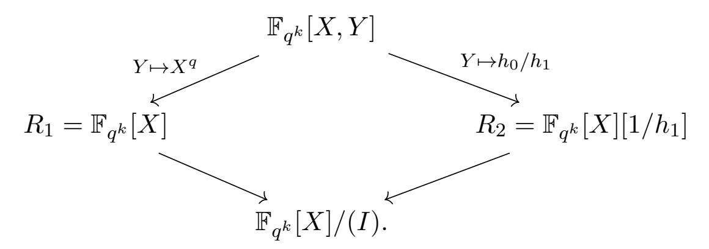
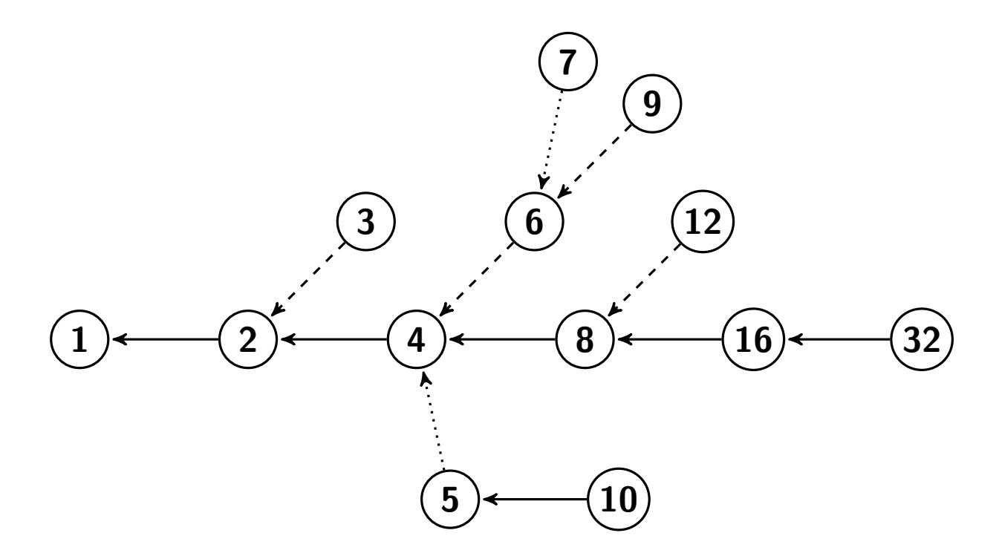

{0}------------------------------------------------

# Computation of a 30 750-Bit Binary Field Discrete Logarithm

Robert Granger<sup>1</sup>, Thorsten Kleinjung<sup>2</sup>, Arjen K. Lenstra<sup>2</sup>, Benjamin Wesolowski<sup>3</sup>, and Jens Zumbrägel<sup>4</sup>

<sup>1</sup> Surrey Centre for Cyber Security
Department of Computer Science, University of Surrey, United Kingdom
r.granger@surrey.ac.uk

<sup>2</sup> Laboratory for Cryptologic Algorithms,

School of Computer and Communication Sciences, EPFL, Switzerland

thorsten.kleinjung@epfl.ch

<sup>3</sup> Univ. Bordeaux, CNRS, Bordeaux INP, IMB, UMR 5251, F-33400, Talence, France INRIA, IMB, UMR 5251, F-33400, Talence, France

benjamin.wesolowski@math.u-bordeaux.fr

<sup>4</sup> Faculty of Computer Science and Mathematics, University of Passau, Germany jens.zumbraegel@uni-passau.de

**Abstract.** This paper reports on the computation of a discrete logarithm in the finite field  $\mathbb{F}_{2^{30750}}$ , breaking by a large margin the previous record, which was set in January 2014 by a computation in  $\mathbb{F}_{2^{9234}}$ . The present computation made essential use of the elimination step of the quasi-polynomial algorithm due to Granger, Kleinjung and Zumbrägel, and is the first large-scale experiment to truly test and successfully demonstrate its potential when applied recursively, which is when it leads to the stated complexity. It required the equivalent of about 2900 core years on a single core of an Intel Xeon Ivy Bridge processor running at 2.6 GHz, which is comparable to the approximately 3100 core years expended for the discrete logarithm record for prime fields, set in a field of bitlength 795, and demonstrates just how much easier the problem is for this level of computational effort. In order to make the computation feasible we introduced several innovative techniques for the elimination of small degree irreducible elements, which meant that we avoided performing any costly Gröbner basis computations, in contrast to all previous records since early 2013. While such computations are crucial to the  $L(\frac{1}{4} + o(1))$  complexity algorithms, they were simply too slow for our purposes. Finally, this computation should serve as a serious deterrent to cryptographers who are still proposing to rely on the discrete logarithm security of such finite fields in applications, despite the existence of two quasi-polynomial algorithms and the prospect of even faster algorithms being developed.

Keywords: Discrete logarithm problem, finite fields, binary fields, quasi-polynomial algorithm

# 1 Introduction

Let  $\mathbb{F}_2$  denote the finite field consisting of two elements, let  $\mathbb{F}_{2^{30}} := \mathbb{F}_2[T]/(T^{30} + T + 1)$  and let t be a root of the irreducible polynomial defining the extension. Furthermore, let  $\mathbb{F}_{2^{30750}} := \mathbb{F}_{2^{30}}[X]/(X^{1025} + X + t^3)$  and let x be a root of the irreducible polynomial defining this extension, and consider the presumed generator  $g := x + t^9$  of the multiplicative group of  $\mathbb{F}_{2^{30750}}$ . To select a target element that cannot be 'cooked up' we follow the traditional approach of using the digits of the mathematical constant  $\pi$ , which in the present case leads to

$$h_{\pi} := \sum_{i=0}^{30749} \left( \lfloor \pi \cdot 2^{i+1} \rfloor \mod 2 \right) \cdot t^{29 - (i \mod 30)} \cdot x^{\lfloor i/30 \rfloor} \in \mathbb{F}_{2^{30750}}.$$

On 28th May 2019 we completed the computation of the discrete logarithm of  $h_{\pi}$  with respect to the base g, i.e., an integer solution  $\ell$  to  $h_{\pi} = g^{\ell}$ . The smallest non-negative solution is given in Appendix B, along with a verification script for the computational algebra system Magma [3]. The total running time for this computation was the equivalent of about 2900 core years on a single core of an Intel Xeon Ivy Bridge or Haswell processor running at 2.6 GHz or 2.5 GHz. For the sake of comparison, the previous record, which was set in  $\mathbb{F}_{2^{9234}}$  in January 2014, required about 45 core years [19]. Other large scale computations of this type include: the

{1}------------------------------------------------

factorisation of a 768-bit RSA modulus, which took about 1700 core years and was completed in 2009 [26]; the factorisation of 17 Mersenne numbers with bit-lengths between 1007 and 1199 using Coppersmith's 'factorisation factory' idea [8], which took about 7500 core years and was completed in early 2015 [27]; the computation of a discrete logarithm in a 768-bit prime field, which took about 5300 core years and was completed in 2016 [28]; the computation of a discrete logarithm in a 795-bit prime field, which took about 3100 core years, and the factorisation of a 795-bit RSA modulus, which took about 900 core years, both completed in December 2019 [4]; and finally, the factorisation of an 829-bit RSA modulus, which took about 2700 core years and was completed in February 2020 [5].

A natural question that the reader may have is why did we undertake such a large-scale computation? The answer to this question is threefold. Firstly, between 1984 and 2013, the fastest algorithm for solving the discrete logarithm problem (DLP) in characteristic two (and more generally in fixed characteristic) fields was due to Coppersmith [7]. It has heuristic complexity  $L_Q(\frac{1}{3})$ , where for  $\alpha \in [0,1]$  and Q the cardinality of the field, this notation is defined by

$$L_Q(\alpha) := \exp\left(O((\log Q)^{\alpha}(\log\log Q)^{1-\alpha})\right)$$

as  $Q \to \infty$ ; this is the usual complexity measure that interpolates between polynomial time (for  $\alpha = 0$ ) and exponential time (for  $\alpha = 1$ ), and is said to be subexponential when  $0 < \alpha < 1$ . In 2013 and 2014 a series of breakthroughs occurred, indicating that the DLP in fixed characteristic fields was considerably easier to solve than had previously been believed [10,20,11,1,15,17,24,16]. These techniques were demonstrated with the setting of several world records for computations of this type [21,13,23,12,22,18,19], using algorithms that had heuristic complexity at most  $L_Q(\frac{1}{4} +$ o(1), where  $o(1) \to 0$  as  $Q \to \infty$ . Amongst all of the breakthroughs from this period, the standout results were two independent and distinct quasi-polynomial algorithms for the DLP in fixed characteristic: the first due to Barbulescu, Gaudry, Joux and Thomé (BGJT) [1]; and the second due to Granger, Kleinjung and Zumbrägel (GKZ) [17,16]. Both algorithms have heuristic complexity  $L_Q(o(1))$ , although the latter is rigorous once an appropriate field representation is known. As further discussed below, such representations exist, for instance, for Kummer extensions. While the computational records demonstrated the practicality of the  $L(\frac{1}{4} + o(1))$ techniques, it was the promise of the quasi-polynomial algorithms that effectively killed off the use of small characteristic fields in discrete logarithm-based cryptography, even though these algorithms had not been seriously tested. In particular, the descent step, or 'building block' of the BGJT method has to our knowledge never been used for the individual logarithm stage. The descent step of the GKZ method, on the other hand, has been used during the individual logarithm stage for some small degree eliminations for relatively small fields [25,24], but not with a view to properly testing its applicability recursively, as it is intended to be used. Since the GKZ algorithm becomes practical for far smaller bit-lengths than the BGJT algorithm, one aspect of our motivation was to test its practicality by seeing in how large a field we could solve discrete logarithms, within a reasonable time. The act of doing so allows one to assess the practical impact of the algorithm and indeed, its success in this case demonstrates that it can be applied effectively at a large scale. It also demonstrates just how much easier the DLP is in binary fields than for prime fields, for this level of computational effort. We note that a recent paper of the second and fourth listed authors proves that the complexity of the DLP in fixed characteristic fields is at most quasi-polynomial, without restriction on the form of the extension degree – in contrast to the GKZ algorithm – thus complementing the practical impact of the present computation with a rigorous theoretical algorithm for the general case [29].

Secondly, we wanted to set a significant new record because in our experience of attempting such computations, one almost always encounters many unexpected obstacles that necessitate having new insights and developing new techniques in order to overcome them, both of which enrich our knowledge and understanding, as well as the state of the art. Indeed, it was the solving of a DLP in  $\mathbb{F}_{2^{4404}}$  in 2014 [15] that led to the discovery of the GKZ algorithm. As Knuth has

{2}------------------------------------------------

stated, "The best theory is inspired by practice. The best practice is inspired by theory.", which is as true in this field as it is in any other. In this work, we developed several innovative techniques for the elimination of small degree irreducible polynomials, which were absolutely vital to the feasibility of computing a discrete logarithm within such an enormous field. In particular, our new insights and contributions include the following.

- A simple theoretical and efficient algorithmic characterisation of all so-called Bluher values.
- A highly efficient direct method for eliminating degree 2 polynomials over  $\mathbb{F}_{q^3}$  on the fly, which applies with probability  $\approx \frac{1}{2}$ .
- A highly efficient backup method for eliminating degree 2 polynomials over  $\mathbb{F}_{q^3}$  when the direct method fails, making the bottleneck of the computation feasible. In addition we found an interesting theoretical explanation for the observed probabilities.
- A fast probabilistic elimination of degree 2 polynomials over  $\mathbb{F}_{q^k}$  for k > 3.
- A novel use of interpolation to efficiently compute roots of the special polynomials that arise.
- An extremely efficient and novel degree 3 elimination method, thus mollifying the new bottleneck in the computation, which was also applied to polynomials of degree 6, 9 and 12.
- A new technique for eliminating polynomials of degrees 5 and 7, which together with the techniques for the other small degree polynomials meant that no costly Gröbner basis computations were performed at all. Although such computations are essential to the  $L_Q(\frac{1}{4} + o(1))$  complexity algorithms, they were simply too slow for our purposes.
- A highly optimised classical descent using the above elimination costs as input in order to apply a dynamic programming approach.

Finally, although discrete logarithm-based cryptography in small characteristic finite fields has effectively been rendered unusable, there are constructive applications in cryptography for fast discrete logarithm algorithms. For example, knowledge of certain discrete logarithms in binary fields can be exploited to create highly efficient, constant time masking functions for tweakable blockciphers [14]. Further afield, there are several applications which would benefit from efficient discrete logarithm algorithms, although not necessarily in the fixed characteristic case. For example, in matrix groups a problem in GL(n,q) can often be mapped to  $GL(1,q^n)$ and naturally becomes a DLP in  $\mathbb{F}_{q^n}$ . Also, discrete logarithms are needed in various scenarios when reducing the unit group of an order of a number field modulo a prime. In finite geometry one encounters near-fields, where multiplication usually requires computing discrete logarithms, and there are other applications in representation theory, group theory and Lie algebras in the modular case. The relevance of the DLP to computational mathematics therefore extends far beyond cryptography. Despite the existence of the quasi-polynomial algorithms, the use of prime degree extensions of  $\mathbb{F}_2$  has recently been proposed in the design of a secure compressed encryption scheme of Canteaut et al. [6, Sec. 5]. For 80 bits of security a prime extension of degree  $\approx 16\,000$  was suggested (and of degree  $4\,000\,000$  for 128-bit security), very conservatively based on the polynomial time first stage of index calculus as described in [24], but ignoring the dominating quasi-polynomial individual logarithm stage. Even though the security of such fields is massively underestimated and the resulting schemes are prohibitively slow, it is interesting, to say the least, that these proposals were made. Although the computation reported here is not for a prime degree extension of  $\mathbb{F}_2$ , our result should nevertheless be regarded as a serious deterrent against such applications. Indeed, the central remaining open problem in this area, which is to find a polynomial time algorithm for the DLP in fixed characteristic fields (either rigorous or heuristic) is far more likely to be solved now than it was before 2013.

Another natural question that the reader may have is why 30 750, exactly? In contrast to the selection of  $h_{\pi}$ , this extension degree was most certainly 'cooked up' specifically for setting a new record<sup>5</sup>. In particular,  $30 750 = 3 \cdot 10 \cdot (2^{10} + 1)$  so that the field is of the form  $\mathbb{F}_{q^{3(q+1)}}$ , thus

<span id="page-2-0"></span>The fact that 30 750 is precisely the seating capacity of the first listed author's home football stadium is purely a coincidence; see https://en.wikipedia.org/wiki/Falmer\_Stadium.

{3}------------------------------------------------

permitting the use of a twisted Kummer extension, in which it is much easier to solve logarithms than in other extensions of the same order of magnitude. Firstly, as explained in §5 the factor base which consists of all monic degree one elements possesses an automorphism of order 3075. This reduces the cardinality of the factor base from  $2^{30}$  to a far more manageable 349 185. Secondly, such field representations ensure that when eliminating an element during the descent step, the cofactors have minimal degree and therefore will be smooth with maximum probability (under a uniformity assumption when not using the GKZ elimination step). Thirdly, there are no so-called 'traps' during the descent, i.e., elements which can not be eliminated [16]. The first two reasons explain why Kummer and twisted Kummer extensions have been used for all of the records since 2013. Observe that for the previous record we have  $9234 = 2 \cdot 9 \cdot (2^9 + 1)$ . However, whereas for the 9234-bit computation the factor base consisted of all degree one and irreducible degree two elements, for the present computation it would be too costly to compute and store the logarithms of such a factor base, even when incorporating the automorphism. So it was essential that the logarithms of degree two elements could be computed 'on the fly', i.e., as and when needed, without batching. For a base field of the form  $\mathbb{F}_{q^3}$  this is non-trivial as each degree two element only has a half chance of being eliminable when the method of [10] is applied. For our target field, a backup approach similar in spirit to that used for the  $6120 = 3.8 \cdot (2^8 - 1)$ -bit record can be used [12,11], and the chosen parameters allow for this with an acceptable probability. However, in order to make the computation feasible, as already mentioned it was essential to develop new techniques for the elimination of degree two and other small degree polynomials and to optimise them algorithmically, arithmetically and implementation-wise. For the number of core years used we therefore believe with high confidence that we have solved as large a DLP as is possible with current state of the art techniques.

The sequel is organised as follows. In §2 we present some results on so-called Bluher polynomials that are essential to the theory and practice of our computation. In §3 we recall the GKZ algorithm, explaining the importance of degree two elimination and how this leads to a quasi-polynomial algorithm. We describe the field setup in §4, and in §5 describe how we computed the logarithms of the factor base elements, namely the degree one elements. Subsequently we present our degree two elimination methods in §6 and more generally even degree element elimination in §7, and in §8 detail how we eliminated small odd degree elements. In §9 we explain how we efficiently compute the roots of Bluher polynomials in various scenarios, while in §10 we detail the classical descent strategy, analysis and timings. In §11 we briefly discuss the security of the proposal of Canteaut et al., and finally in §12 we make some concluding remarks.

### <span id="page-3-0"></span>2 Bluher Polynomials and Values

Let q be a prime power, let  $k \geq 3$  and consider the polynomial  $F_B(X) \in \mathbb{F}_{q^k}[X]$  defined by

<span id="page-3-2"></span><span id="page-3-1"></span>
$$F_B(X) := X^{q+1} - BX + B. (1)$$

We call such a polynomial a Bluher polynomial. A basic question that arises repeatedly for us is for what values  $B \in \mathbb{F}_{q^k}^{\times}$  does  $F_B(X)$  split over  $\mathbb{F}_{q^k}$ , i.e., factor into a product of q+1 linear polynomials in  $\mathbb{F}_{q^k}[X]$ ? With this in mind we define  $\mathcal{B}_k$  to be the set of all  $B \in \mathbb{F}_{q^k}^{\times}$  such that  $F_B(X)$  splits over  $\mathbb{F}_{q^k}$ , and call the members of  $\mathcal{B}_k$  Bluher values. It turns out that there are some simple characterisations of  $\mathcal{B}_k$  which enable various computations to be executed very efficiently. We first recall a result of Bluher.

**Theorem 1.** [2] The number of elements  $B \in \mathbb{F}_{q^k}^{\times}$  such that the polynomial  $F_B(X)$  splits completely over  $\mathbb{F}_{q^k}$  equals

$$\frac{q^{k-1}-1}{q^2-1}$$
 if  $k$  odd,  $\frac{q^{k-1}-q}{q^2-1}$  if  $k$  even.

{4}------------------------------------------------

<span id="page-4-1"></span>One characterisation of  $\mathcal{B}_k$  is the following generalisation of a theorem due to Helleseth and Kholosha.

Theorem 2. [16, Lemma. 4.1] We have

$$\mathcal{B}_k = \left\{ \frac{(u - u^{q^2})^{q+1}}{(u - u^q)^{q^2+1}} \, \middle| \, u \in \mathbb{F}_{q^k} \setminus \mathbb{F}_{q^2} \right\}.$$

Theorem 2 is useful for sampling from  $\mathcal{B}_k$ . However, sometimes it is desirable to test whether a given element of  $\mathbb{F}_{q^k}$  is a Bluher value, without factorising (1) and without first enumerating  $\mathcal{B}_k$  and checking membership, which may be intractable when k is so large that there are prohibitively many Bluher values to precompute. To this end, we define the following polynomials. Let  $P_1(X) = 1$ ,  $P_2(X) = 1$ , and for  $i \geq 3$  define  $P_i(X)$  by the recurrence

<span id="page-4-2"></span>
$$P_i(X) = P_{i-1}(X) - X^{q^{i-3}} P_{i-2}(X).$$
(2)

<span id="page-4-5"></span>**Theorem 3.** An element  $B \in \mathbb{F}_{q^k}^{\times}$  is a Bluher value if and only if  $P_k(\frac{1}{B}) = 0$ .

*Proof.* A simple induction shows that the degree of  $P_k$  equals the number of Bluher values given in Theorem 1, so it suffices to prove the only if part. Let B be a Bluher value and  $C = \frac{1}{B}$ . Using  $X^q \equiv \frac{X-1}{CX} \pmod{F_B}$  and induction, for  $i \geq 2$  one obtains

$$X^{q^{i}} \equiv \frac{P_{i+1}(C)X - P_{i}^{q}(C)}{C^{q^{i-1}}(P_{i}(C)X - P_{i-1}^{q}(C))} \pmod{F_{B}}.$$

Since  $X \equiv X^{q^k} \pmod{F_B}$  by assumption,  $C^{q^{k-1}}(P_k(C)X - P_{k-1}^q(C))X \equiv P_{k+1}(C)X - P_k^q(C)$  (mod  $F_B$ ) and thus  $P_k^q(C) = 0$ .

One can efficiently test if an element  $B \in \mathbb{F}_{q^k}^{\times}$  is a Bluher value simply by evaluating  $P_k(\frac{1}{B})$  using the recurrence (2). By rewriting the recurrence in a matrix form it is possible to apply fast methods for evaluating it. However, since k is quite small for most of the computations, we did not use this. Furthermore, one can obviously compute  $\mathcal{B}_k$  by applying the recurrence (2) and factorising  $P_k$ .

#### <span id="page-4-0"></span>3 The GKZ Algorithm

In this section we sketch the main idea behind the GKZ algorithm, referring the reader to the original paper for rigorous statements and proofs [16].

Assume there exist coprime  $h_0, h_1 \in \mathbb{F}_{q^k}[X]$  of degree at most two such that there exists a monic irreducible polynomial I of degree n with  $I \mid h_1 X^q - h_0$ . Let  $\mathbb{F}_{q^{kn}} := \mathbb{F}_{q^k}[X]/(I) = \mathbb{F}_{q^k}(x)$  where x is a root of I. Then we have the following commutative diagram:



Assume further for the moment that for any  $d \ge 1$ , it is possible in time polynomial in q and d to express a given irreducible degree two element  $Q \in \mathbb{F}_{q^{kd}}[X]$  as a product of at most q+2 linear elements in  $\mathbb{F}_{q^{kd}}[X] \mod I$ , i.e.,

<span id="page-4-4"></span><span id="page-4-3"></span>
$$Q \equiv \prod_{i=1}^{q+2} (X + a_i) \pmod{I}, \quad \text{with } a_i \in \mathbb{F}_{q^{kd}}.$$
 (3)

We have the following.

{5}------------------------------------------------

**Proposition 1.** [16, Prop. 3.2] For the stated field representation, let  $d \ge 1$  and let  $Q \in \mathbb{F}_{q^k}[X]$  be an irreducible polynomial of degree 2d. Then Q can be rewritten in terms of at most q+2 irreducible polynomials of degrees dividing d in an expected running time polynomial in q and in d.

We now sketch the proof. Over  $\mathbb{F}_{q^{kd}}$ , we have the factorisation  $Q = \prod_{i=1}^d Q_i$ , where  $Q_i \in \mathbb{F}_{q^{kd}}[X]$  are irreducible quadratics. Applying the above rewriting assumption to any one of the elements  $Q_i$  gives an instance of the product in (3), with  $Q_i$  on the l.h.s. Taking the norm map, i.e., the product of all conjugates of each term under  $\operatorname{Gal}(\mathbb{F}_{q^{kd}}/\mathbb{F}_{q^k})$ , produces the original Q on the l.h.s. and for each term on the r.h.s., a  $d_1$ -th power of an irreducible polynomial in  $\mathbb{F}_{q^k}[X]$  of degree  $d_2$ , where  $d_1d_2 = d$ , which is what the proposition states.

Now, if one begins with an irreducible polynomial Q of degree  $2^e$  with  $e \ge 1$ , then recursively applying Proposition 1 allows one to express Q as a product of at most  $(q+2)^e$  linear polynomials. Moreover, given  $g \in \mathbb{F}_{q^{kn}}^{\times}$  and  $h \in \langle g \rangle$  an element whose logarithm with respect to g is to be computed, one can efficiently find an irreducible representative of h mod I of degree  $2^e$ , provided that  $2^e > 4n$ , by adding random multiples of I to h so that the degree of h+rI is  $2^e$  [16, Lem. 3.3].

The logarithms of the linear elements – the factor base – remain to be computed, but this can be accomplished in polynomial time in various ways [10,20], or can be obviated altogether by repeating the descent to linear elements as many times as the cardinality of the factor base [9], but the latter is usually only of theoretical interest. Note that in practice the above descent method is not optimal as for high degree element elimination the classical methods are more efficient, since they produce far fewer descendants.

The crux of this approach, namely eliminating a degree two element as expressed in (3), can be achieved in various ways originating with [10], as follows. Let  $a, b, c \in \mathbb{F}_{q^k}$  and consider the polynomial  $X^{q+1} + aX^q + bX + c$ . Firstly, since  $X^q \equiv h_0/h_1 \pmod{I}$  we have

<span id="page-5-0"></span>
$$X^{q+1} + aX^q + bX + c \equiv \frac{1}{h_1} \left( (X+a)h_0 + (bX+c)h_1 \right) \pmod{I},\tag{4}$$

with the numerator of the r.h.s. of (4) of degree at most three. We would like to impose that this numerator is divisible by Q. Therefore, let  $L_Q \in \mathbb{F}_{q^k}[X]^2$  be the lattice defined by

$$L_Q := \{(w_0, w_1) \in \mathbb{F}_{q^k}[X]^2 \mid w_0 h_0 + w_1 h_1 \equiv 0 \pmod{Q}\}.$$

In general,  $L_Q$  has a basis of the form  $(1, u_0X + u_1), (X, v_0X + v_1)$  with  $u_i, v_i \in \mathbb{F}_{q^k}$  and thus in order for the r.h.s. of (4) to be divisible by Q we must choose a, b, c such that

<span id="page-5-1"></span>
$$(X + a, bX + c) = a(1, u_0X + u_1) + (X, v_0X + v_1).$$
(5)

When this is so, the cofactor of Q has degree at most one.

Secondly, provided that  $b \neq a^q$  and  $c \neq ab$ , the polynomial  $X^{q+1} + aX^q + bX + c$  may be transformed by using the substitution

<span id="page-5-3"></span>
$$X \longmapsto \frac{ab - c}{b - a^q} X - a \tag{6}$$

into a scalar multiple of the Bluher polynomial  $X^{q+1} - BX + B$ , where

<span id="page-5-2"></span>
$$B := \frac{(b - a^q)^{q+1}}{(c - ab)^q}. (7)$$

Thus, if these two conditions on a, b, c hold then  $X^{q+1} + aX^q + bX + c$  splits whenever  $B \in \mathcal{B}_k$ . Combining (5) and (7) yields the condition

<span id="page-5-4"></span>
$$B = \frac{(-a^q + u_0 a + v_0)^{q+1}}{(-u_0 a^2 + (u_1 - v_0)a + v_1)^q}.$$
(8)

{6}------------------------------------------------

In order to eliminate Q, one chooses  $B \in \mathcal{B}_k$  to obtain a univariate polynomial in a, which can be checked for roots in  $\mathbb{F}_{q^k}$  in various ways, for instance by computing the GCD with  $a^{q^k} - a$ . Note that the more Bluher values there are, the higher the chance is of eliminating Q. By Theorem 1 the hardest case is for k=3 as there is only one such Bluher value, namely 1, which is the case we address in this paper, using a backup elimination method à la [11]. By this rationale, in general when Proposition 1 is applied, the elimination of degree two  $Q_i$  over  $\mathbb{F}_{q^{kd}}$  becomes 'easier' as d grows, although the computational cost per Bluher value increases as the base field increases in size.

### <span id="page-6-1"></span>4 Field Setup and Factors

Recall that the group in which we look at the discrete logarithm problem is the (cyclic) unit group of the finite field  $\mathbb{F}_{2^{30750}}$ , thus its group order is  $N := 2^{30750} - 1$ . We used the factorisation algorithm of Magma, which is assisted by the 'Cunningham tables' for Mersenne numbers, to obtain the 58 known prime factors of N up to bit-length 135 (see Appendix A).<sup>6</sup>

Also recall that to represent the field  $\mathbb{F}_{2^{30750}}$ , we first let  $\mathbb{F}_{2^{30}} := \mathbb{F}_2[t] = \mathbb{F}_2[T]/(T^{30} + T + 1)$  where  $t := [T] \in \mathbb{F}_{2^{30}}$ , and then, setting  $\gamma := t^3$ , we define the target field as the extension

$$\mathbb{F}_{2^{30750}} := \mathbb{F}_{2^{30}}[x] = \mathbb{F}_{2^{30}}[X]/(X^{1025} + X + \gamma)$$

where  $x := [X] \in \mathbb{F}_{2^{30750}}$ . The field element  $g := x + t^9$  is then a supposed generator for the group, as  $g^{N/p} \neq 1$  for the 58 listed prime factors  $p \mid N$ .

The schedule and the running times of our computation of the discrete logarithm of the target element  $h_{\pi} \in \mathbb{F}_{2^{30750}}$  from the introduction are summarised in Table 1. In the subsequent sections we present the corresponding steps in more detail.

<span id="page-6-4"></span>**Table 1.** Overall schedule and running times.

| Step                 | when                      | core hours |
|----------------------|---------------------------|------------|
| Relation Generation  | 23 Feb 2016               | 1          |
| Linear Algebra       | 27 Feb 2016 - 24 Apr 2016 | 32498      |
| Initial Split        | 09 Sep 2016 - 20 Sep 2016 | 248140     |
| Classical Descent    | 13 Oct 2016 - 23 Jan 2019 | 17077836   |
| Small Degree Descent | 27 Jan 2019 - 28 May 2019 | 8122744    |
| total running time   |                           | 25481219   |

### <span id="page-6-0"></span>5 Logarithms of Degree 1 Elements

As usual this consists of relation generation followed by a linear algebra elimination.

#### 5.1 Relation Generation

The relation generation step is based on the following. As before, let  $\mathbb{F}_q$  be a finite field, let  $k \geq 3$  and let  $a, b, c \in \mathbb{F}_{q^k}$ . Then over  $\mathbb{F}_{q^k}$ , the polynomial  $X^{q+1} + aX^q + bX + c$  splits if and only if its affine transformation  $X^{q+1} - BX + B$  splits, with B as given in (7). According to

<sup>&</sup>lt;sup>6</sup> We remark that this partial factorisation is sufficient, since the expected running time of a generic discrete logarithm algorithm on a subgroup of order the largest listed prime already exceeds our total running time.

<span id="page-6-3"></span><span id="page-6-2"></span><sup>&</sup>lt;sup>7</sup> Note that this convenient field representation for the discrete logarithm problem can be assumed without loss of generality, as it is possible to efficiently map between arbitrary field representations given by irreducible polynomials, cf. [32].

{7}------------------------------------------------

Theorem 1, for random a, b, c this occurs with probability about  $q^{-3}$ , in which case the set of roots of  $X^{q+1} + aX^q + bX + c$  is, by the transformation (6), given by

$$\{\lambda z - a \mid z \in \mathbb{F}_{q^k} \text{ a root of } X^{q+1} - BX + B\}, \text{ where } \lambda := \frac{ab - c}{b - a^q}.$$

In our case we have  $\mathbb{F}_{q^k} = \mathbb{F}_{2^{30}}$  and regard all linear polynomials x + u, for  $u \in \mathbb{F}_{2^{30}}$ , as the factor base. Since in the target field one has

$$x^{1024} = \frac{x+\gamma}{x},$$

one could use  $q=2^{10}$  and k=3 for a fast relation generation. However, in order to decrease the row-weight of the resulting matrix, we prefer to choose  $\tilde{k}=6$  and  $\tilde{q}=2^5$ , so that  $x^{\tilde{q}^2}=\frac{x+\gamma}{x}$ . The relation generation then makes use of the identity

$$(x^{\tilde{q}+1} + ax^{\tilde{q}} + bx + c)^{\tilde{q}} = \frac{1}{x} ((b^{\tilde{q}} + 1)x^{\tilde{q}+1} + \gamma x^{\tilde{q}} + (a^{\tilde{q}} + c^{\tilde{q}})x + a^{\tilde{q}}\gamma),$$

which provides a relation of weight 66 each time both sides split.

Letting again  $q = 2^{10}$ , the Galois group  $Gal(\mathbb{F}_{2^{30750}}/\mathbb{F}_q)$  of order 3075 acts on the factor base elements. Indeed, we have

$$(x+u)^q = \frac{u^q+1}{x}(x+\frac{\gamma}{u^q+1}),$$

by which we can express all logarithms in a Galois orbit, up to a small cofactor, in terms of the logarithms of a single representative (and of x). This way we only need to consider the 349 185 orbits as variables. Within a running time of 63 minutes on an ordinary desktop computer the relation generation was finished.

### 5.2 Linear Algebra

The relation generation produced a  $349\,195 \times 349\,184$  matrix with 66 nonzero entries in each row, each being of the form  $\pm 2^e \in \mathbb{Z}/N\mathbb{Z}$  with some  $e \in \mathbb{Z}/30750\mathbb{Z}$ . We solved the linear algebra system for this matrix using the Lanczos method [31,30]. More precisely, with the intention to speed up modular computations, we used the factorisation

$$N = N_1 \cdot N_2 \cdot N_3 := (2^{10250} - 1) \cdot (2^{10250} + 2^{5025} + 1) \cdot (2^{10250} - 2^{5025} + 1)$$

and computed a solution vector for each of three moduli  $M_i \mid N_i$  having small cofactors. This took 30 393 core hours on single computing nodes having 16 or 24 cores.

Then by the Chinese Remainder Theorem we combined the resulting solutions with the logarithms modulo the 38 prime factors of N up to bit-length 43, listed in Appendix A. For the 18 larger ones of these moduli – the smallest being  $2\,252\,951$  – we computed the logarithms using the Lanczos algorithm as well. For the remaining 20 small factors, i.e., up to 165 313, we simply generated the corresponding subgroups in the target field and read off the discrete logarithms from the table. This way, and making use of the Galois orbits, we obtained the logarithms  $\log(x+u)$  for all factor base elements, where  $u \in \mathbb{F}_{2^{30}}$ . The remaining computations accounted for a total of 2105 core hours on a single 16-core computing node.

# <span id="page-7-0"></span>6 Degree 2 Elimination Methods

As it is the bottleneck, in order to have a feasible computation it is indispensable to have an extremely efficient degree 2 elimination algorithm and implementation. In this section we apply the sketch of degree 2 elimination given in §3 to our target field and describe algorithms which are more efficient than those presented in [11,15]. Most of the techniques are more general and are presented in the setting of an arbitrary finite field  $\mathbb{F}_{q^k}$  and  $x^{q+1} - x - \gamma = 0$ . Let  $Q = X^2 + q_1X + q_0 \in \mathbb{F}_{q^k}[X]$  be an arbitrary irreducible quadratic polynomial to be eliminated, i.e., to be written as a product of linear elements.

{8}------------------------------------------------

#### 6.1 Direct Method

Recall that  $x^q = \frac{x+\gamma}{x}$ , so that

<span id="page-8-0"></span>
$$x^{q+1} + ax^{q} + bx + c = \frac{1}{x} \left( (b+1)x^{2} + (a+c+\gamma)x + \gamma a \right)$$

$$= \frac{b+1}{x} \left( x^{2} + \frac{a+c+\gamma}{b+1}x + \frac{\gamma a}{b+1} \right).$$
(9)

Since the denominator x on the r.h.s. of (9) is in the factor base, we know its logarithm. There is also no lattice to consider as the quadratic term must be Q, leading to the equations  $q_1 = \frac{a+c+\gamma}{b+1}$  and  $q_0 = \frac{\gamma a}{b+1}$ . In order for the l.h.s. of (9) to split over  $\mathbb{F}_{q^3}$ , since there is only one Bluher value we must have  $(b-a^q)^{q+1} = (c-ab)^q$ . Writing  $b = \frac{1}{q_0}(\gamma a - q_0)$  and  $c = \frac{1}{q_0}(-q_0a - \gamma q_0 + \gamma q_1a)$  leads to a univariate polynomial equation in a, namely

$$(-q_0a^q + \gamma a - q_0)^{q+1} - q_0(-\gamma a^2 + q_1\gamma a - \gamma q_0)^q = 0.$$

This equation may be solved by computing the GCD with  $a^{q^3} - a$ , by writing a using a basis for  $\mathbb{F}_{q^3}$  over  $\mathbb{F}_q$  and solving the resulting quadratic system using a Gröbner basis computation [11], or using the following much faster technique which exploits the fact that B = 1.

Since B=1 is the only Bluher value for k=3, writing  $b=\frac{1}{q_0}(\gamma a-q_0)=u_0a+v_0$  and  $c=\frac{1}{q_0}(-q_0a-\gamma q_0+\gamma q_1a)=u_1a+v_1$  as in (5), the equation (8) becomes

<span id="page-8-1"></span>
$$(-a^{q} + u_{0}a + v_{0})^{q+1} - (-u_{0}a^{2} + (u_{1} - v_{0})a + v_{1})^{q} = 0.$$
(10)

By setting  $X_i = a^{q^i}$  we can rewrite this as E = 0 with

$$E := (-X_1 + u_0 X_0 + v_0)(-X_2 + u_0^q X_1 + v_0^q) - (-u_0^q X_1^2 + (u_1^q - v_0^q) X_1 + v_1^q)$$

where E is considered as a polynomial in the  $X_i$ . Notice that the coefficient of  $X_1^2$  vanishes, a consequence of B = 1. Raising (10) to the power q while substituting  $X_i^q$  with  $X_{i+1}$  (and  $X_3$  with  $X_0$ ) yields the equation  $\tilde{E} = 0$  with

$$\tilde{E} := (-X_2 + u_0^q X_1 + v_0^q)(-X_0 + u_0^{q^2} X_2 + v_0^{q^2}) - (-u_0^{q^2} X_2^2 + (u_1^{q^2} - v_0^{q^2}) X_2 + v_1^{q^2}).$$

Since the factors  $-X_2 + u_0^q X_1 + v_0^q$  coincide in E and  $\tilde{E}$  (essentially by construction) and  $X_0$  occurs only in their cofactors, it is easy to see that  $E + u_0 \tilde{E} = \alpha_{12} X_1 X_2 + \alpha_1 X_1 + \alpha_2 X_2 + \alpha$  with  $\alpha_*$  being simple expressions in  $u_0, u_1, v_0, v_1$ . The special case  $\alpha_{12} = 0$  can be handled easily so we assume that  $\alpha_{12} \neq 0$  and rewrite the equation  $\alpha_{12} X_1 X_2 + \alpha_1 X_1 + \alpha_2 X_2 + \alpha = 0$  as

$$X_1 = -\frac{\alpha_2 X_2 + \alpha}{\alpha_{12} X_2 + \alpha_1}.$$

By raising this equation to the power q (with the usual substitution of  $X_i^q$  with  $X_{i+1}$ ) one can express  $X_2$  in terms of  $X_0$ , and after doing this again  $X_0$  in terms of  $X_1$ . Substituting these three equations into each other gives an equation of the form  $X_0 = \frac{\beta_2 X_0 + \beta}{\beta_{12} X_0 + \beta_1}$  or, equivalently,

<span id="page-8-2"></span>
$$\beta_{12}X_0^2 + (\beta_1 - \beta_2)X_0 - \beta = 0. \tag{11}$$

In the rare case that the l.h.s. of (11) is identically zero we abort the direct elimination method and apply the backup method; otherwise we check whether (11) has solutions in  $\mathbb{F}_{2^{30}}$  and when it does so, we check whether they satisfy (10). It is not easy to classify which solutions of (11) lead to solutions of (10), although in practice almost all of them do so.

Experimentally we found that a randomly chosen Q is eliminable by this method with probability very close to 1/2. A heuristic argument supporting this observation is that the derived equation (11) presumably behaves as a random degree 2 equation, which therefore has a solution in  $\mathbb{F}_{2^{30}}$  with probability  $\approx 1/2$ .

Before explaining the backup method we first introduce three efficient techniques that we employed for solving related problems.

{9}------------------------------------------------

# <span id="page-9-0"></span>6.2 Finding a Degree 2 Elimination with Probability $q^{-2}$

A simple method for eliminating a degree 2 element Q in  $\mathbb{F}_{q^k}[X]$  consists of picking a random  $a \in \mathbb{F}_{q^k}$ , computing  $b = u_0 a + v_0 = \frac{1}{q_0} (\gamma a - q_0)$  and  $c = u_1 a + v_1 = \frac{1}{q_0} (-q_0 a - \gamma q_0 + \gamma q_1 a)$  as before, and then checking whether the triple (a, b, c) leads by (7) to a Bluher value  $B \in \mathcal{B}_k$  using Theorem 3, i.e., whether  $P_k(\frac{1}{B}) = 0$  for the polynomials  $P_i$  defined by (2). The success probability is expected to be about  $q^{-3}$  per trial by Theorem 1.

A better success rate is achieved by guessing a root r of the polynomial  $X^{q+1} + aX^q + bX + c$  first (with b and c as above) and testing if the polynomial splits completely. Note that when r is a root and we plug in b and c, we have  $r^{q+1} + ar^q + (u_0a + v_0)r + (u_1a + v_1) = 0$  from which we recover

$$a = -\frac{r^{q+1} + v_0 r + v_1}{r^q + u_0 r + u_1}.$$

From this we again compute  $B = \frac{(b-a^q)^{q+1}}{(c-ab)^q} \in \mathbb{F}_{q^k}$  and check by Theorem 3 whether  $B \in \mathcal{B}_k$ . With this method the probability that the corresponding B is a Bluher value has been increased (heuristically) to about  $q^{-2}$  by [2, Thm. 5.6].

The recurrence (2) for computing  $P_k(\frac{1}{B})$  as per Theorem 3 can be modified by

$$P_1^* = 1, \ P_2^* = b - a^q,$$
  
 $P_i^* = (b - a^q)^{q^{i-2}} P_{i-1}^* - (c - ab)^{q^{i-2}} P_{i-2}^*,$ 

where  $P_k^*$  provides (after clearing denominators) a polynomial P in r having the same roots as  $P_k(\frac{1}{B})$ , and which may be used for the interpolation approach described next.

#### <span id="page-9-1"></span>6.3 Using Interpolation to Find Roots of Featured Polynomials

When encountering the task of finding a root in  $\mathbb{F}_{q^k}$  of a polynomial P of high degree in one variable X which can be written as a low degree polynomial in the variables  $X, X^q, X^{q^2}, \ldots$ , the method of picking random  $r \in \mathbb{F}_{q^k}$  until P(r) = 0 can sometimes be sped up as follows.

Let  $r_0, r_1, \ldots, r_\ell \in \mathbb{F}_{q^k}$  such that  $r_1, \ldots, r_\ell$  are linearly independent over  $\mathbb{F}_q$  (in particular  $\ell \leq k$ ) and let  $\mathcal{R} := \{r_0 + \sum_{i=1}^\ell c_i r_i \mid c_1, \ldots, c_\ell \in \mathbb{F}_q\}$ . Then there is a low degree polynomial  $\tilde{P}$  satisfying  $\tilde{P}(c_1, \ldots, c_\ell) = P(r_0 + \sum_{i=1}^\ell c_i r_i)$ ; let  $D = \deg(\tilde{P})$  and assume D < q. The polynomial  $\tilde{P}$  can be computed by evaluating P at  $\binom{D+\ell}{\ell}$  elements of  $\mathcal{R}$  and interpolating, after which the  $q^\ell$  values P(r) for  $r \in \mathcal{R}$  can be obtained by evaluating  $\tilde{P}$ . Notice that still  $q^\ell$  operations are needed to cover the set  $\mathcal{R}$  but if evaluating P is sufficiently more expensive than evaluating  $\tilde{P}$ , this method is faster. The optimal value of  $\ell$  depends on q, D and the evaluation costs for the two polynomials.

#### 6.4 Using GCD Computations

In certain situations we have to find an element in  $\mathbb{F}_{q^k}$  which is a root of two polynomials  $P_1$  and  $P_2$ . In this case one can speed up the interpolation approach as follows.

Let  $\tilde{P}_1$  and  $\tilde{P}_2$  be the low degree polynomials corresponding to  $P_1$  and  $P_2$  and let their degrees be  $D_1$  and  $D_2$ , respectively. If a tuple  $(c_1, \ldots, c_\ell)$  leads to a root of  $P_1$  and  $P_2$  then  $c_1$  is a root of  $\tilde{P}_i(c_1, \ldots, c_\ell)$ , i = 1, 2, considered as a polynomial in the variable  $c_1$ . Therefore  $c_1$  is also a root of the greatest common divisor of these two univariate polynomials. If  $q^k$  is much bigger than  $D_1D_2$ , the degree of the GCD is usually not bigger than 1 so that one trades q evaluations of  $\tilde{P}_1$  (and/or  $\tilde{P}_2$ ) for one GCD computation.

{10}------------------------------------------------

### 6.5 Backup Method

When the direct method fails, which occurs with probability  $\approx 1/2$ , we use the following backup approach, based on the idea from [11]; for the remainder of this section we assume  $\mathbb{F}_{q^k} = \mathbb{F}_{2^{30}}$ . Instead of using  $q = 2^{10}$ , k = 3 we use  $q = 2^6$ , k = 5, which by Theorem 1 means there are  $q^2 + 1 = 4097$  Bluher values, but now the r.h.s. of the relevant equation will have higher degree and thus a smaller chance that the cofactor is 1-smooth.

Let  $y=x^{1024}$  and  $\overline{x}=x^{16}$ , so that  $y=\overline{x}^{64}$ . As  $x^{1025}+x+\gamma=0$  we have  $x=\frac{\gamma}{y+1}$  and  $\overline{x}=\left(\frac{\gamma}{y+1}\right)^{16}$ . We therefore have

$$\overline{x}^{65} + a\overline{x}^{64} + b\overline{x} + c = y\left(\frac{\gamma}{y+1}\right)^{16} + ay + b\left(\frac{\gamma}{y+1}\right)^{16} + c$$

$$= \frac{1}{(y+1)^{16}} \left(ay^{17} + cy^{16} + (\gamma^{16} + a)y + (b\gamma^{16} + c)\right). \tag{12}$$

Now let  $\widetilde{Q}(X) := (X+1)^2 Q\left(\frac{\gamma}{X+1}\right)$  so that  $Q(x) = \frac{\widetilde{Q}(y)}{(y+1)^2}$ , and consider the lattice

<span id="page-10-0"></span>
$$L_{\widetilde{Q}} := \{(w_0, w_1) \in \mathbb{F}_{q^5}[X]^2 \mid w_0 + \frac{(X+1)^{16}}{\gamma^{16}} w_1 \equiv 0 \pmod{\widetilde{Q}}\}.$$

In general,  $L_{\widetilde{Q}}$  has a basis of the form  $(X + u_0, u_1), (v_0, X + v_1)$  with  $u_i, v_i \in \mathbb{F}_{q^5}$ . Thus for  $a \in \mathbb{F}_{q^5}$  we have  $(X + u_0 + av_0, aX + u_1 + av_1) \in L_{\widetilde{Q}}$ . Substituting this element into  $w_0, w_1$  and evaluating the resulting expression at y leads to the r.h.s. of (12) being

$$\frac{1}{(y+1)^{16}} \left( ay^{17} + (u_1 + av_1)y^{16} + (\gamma^{16} + a)y + \gamma^{16}(u_0 + av_0) + u_1 + av_1 \right)$$

and thus  $b = av_0 + u_0$  and  $c = av_1 + u_1$ . The l.h.s. of (12) transforms into a Bluher polynomial provided that  $(a^{64} + b)^{65} = B(ab + c)^{64}$  for some  $B \in \mathcal{B}_5$ . This results in the equation

<span id="page-10-1"></span>
$$(a^{64} + v_0 a + u_0)^{65} + B(v_0 a^2 + (u_0 + v_1)a + u_1)^{64} = 0.$$
(13)

As before,  $\mathbb{F}_{q^5}$ -roots of (13) can be computed, if they exist, via a GCD computation or using a basis for  $\mathbb{F}_{q^5}$  over  $\mathbb{F}_q$  and solving the resulting quadratic system using a Gröbner basis approach. Instead of solving (13) directly, we used the probability  $q^{-2}$  method and interpolation with  $\ell = 3$  so that we expect to find about  $q = 2^6$  completely splitting l.h.s. of (12) per interpolation.

For each of these we check whether the r.h.s. of (12) is 2-smooth as follows. Denote by R the polynomial corresponding to its numerator and let m be a linear fractional transformation over  $\mathbb{F}_{2^{60}}$  mapping the two roots of  $\widetilde{Q}$  to 0 and  $\infty$ . Then the polynomial R becomes (up to a scalar)  $X^{16} - \alpha X$  for some  $\alpha \in \mathbb{F}_{2^{60}}^{\times}$ , and the transformation  $\overline{m}$  maps R to  $X^{16} - \overline{\alpha} X$ , where  $\overline{\cdot}$  denotes the  $\mathbb{F}_{2^{60}}/\mathbb{F}_{2^{30}}$  Galois conjugate, i.e., powering by  $2^{30}$ . If and only if  $\alpha \in \mathbb{F}_{2^{60}}$  is a fifteenth power, does the r.h.s. of (12) split completely over  $\mathbb{F}_{2^{60}}$  and is thus 2-smooth over  $\mathbb{F}_{2^{30}}$ . As  $\widetilde{Q}$  is irreducible, the transformation  $\overline{m}^{-1}m$  exchanges 0 and  $\infty$  and is thus of the form  $X \mapsto \frac{\beta}{X}$  for some  $\beta \in \mathbb{F}_{2^{60}}^{\times}$ , while mapping  $X^{16} - \overline{\alpha} X$  (up to a scalar) to  $X^{16} - \alpha X$  and hence  $\alpha \overline{\alpha} = \beta^{15}$ , which implies that  $\alpha = \alpha^{2+2^{30}}\beta^{-15}$  is already a third power. Therefore, we expect the r.h.s. of (12) to be 2-smooth with probability  $\frac{1}{5}$ , which is much higher than for a random polynomial of this degree, thanks to it being transformable to a Bluher polynomial.

Furthermore, whenever the r.h.s. is 2-smooth it must factorise into a product of five linear polynomials and five degree two polynomials. In particular, assume that the polynomial R on the r.h.s. of (12) splits completely over  $\mathbb{F}_{2^{60}}$ . Similarly as above, denote by m a linear fractional transformation mapping R to  $X^{16}-X$  and the two roots of  $\widetilde{Q}$  to 0 and  $\infty$ . Then the fifteen other roots of R are  $r_i=m(\zeta_{15}^i)$ ,  $i=0,\ldots,14$ , with  $\zeta_{15}\in\mu_{15}$  a fixed primitive fifteenth root of unity. Notice that  $\overline{\zeta_{15}}=\zeta_{15}^4$ . In order to find the roots  $r_i$  contained in the subfield  $\mathbb{F}_{2^{30}}$  one has to solve  $m(\zeta_{15}^i)=\overline{m}(\zeta_{15}^{4i})=\overline{m}(\zeta_{15}^{4i})$  or equivalently  $\overline{m}^{-1}m(\zeta_{15}^i)=\zeta_{15}^{4i}$ ; let  $n=\overline{m}^{-1}m$ . Since n exchanges 0 and  $\infty$ , and because  $n\overline{n}=I_2$  holds, n is actually a transformation of the form  $X\mapsto\frac{b}{X}$  for some  $b\in\mathbb{F}_{2^{30}}^{\times}$ . Furthermore n maps  $X^{16}-X$  to itself which implies  $n(\mu_{15})\subset\mu_{15}$ ,

{11}------------------------------------------------



<span id="page-11-1"></span>**Fig. 1.** Overview of the small-degree, 'non-classical' descent methods. The encircled numbers represent the degrees of elements. Solid arrows indicate two-to-one descents (including the backup strategy for  $2 \to 1$ ), dashed arrows depict three-to-two descents, and dotted arrows represent specific odd-degree methods.

hence  $b \in \mu_{15} \cap \mathbb{F}_{2^{30}} = \mu_3$ . Therefore the equation  $n(\zeta_{15}^i) = \zeta_{15}^{4i}$  from above becomes  $\zeta_{15}^{5i} = b$  which has exactly five solutions. Thus the cofactor of  $\widetilde{Q}$  splits into five polynomials of degree one and five of degree two. We remark that the same reasoning can be applied to determine the possible splitting pattern for a general Bluher polynomial in positive characteristic.

For each set of five degree two polynomials, we attempt to eliminate each of them using the direct method, which succeeds with probability  $1/2^5$ , assuming these eliminations are independent. One thus expects to eliminate such degree two elements after trying 160 Bluher values, a figure which was borne out by our experiments. One also expects the approach to fail for a given irreducible of degree two with probability  $(1-\frac{1}{160})^{4097} \approx 7 \cdot 10^{-12}$ . If this happened, we simply restarted the elimination at an ancestor with a different seed for randomness. In terms of timings per degree two elimination, on average these ranged between 1.1ms on some machines and just less than 1ms on others.

### <span id="page-11-0"></span>7 Small Even Degree Elimination Techniques

An overview of the various descent methods that we applied for the smaller degrees is depicted in Figure 1. In this short section we explain those methods for even degrees that are based on degree 2 elimination, and in the next section we detail the methods for odd degrees.

#### 7.1 Degree 4 Elimination

By Proposition 1 this case is reduced to the elimination of a degree 2 polynomial over  $\mathbb{F}_{q^6} = \mathbb{F}_{2^{60}}$ . We use the probability  $q^{-2}$  method and interpolation with  $\ell = 1$  to obtain a polynomial  $\tilde{P}$  of degree 15 over  $\mathbb{F}_{q^6}$  and search for its zeroes in  $\mathbb{F}_q$  as follows. By choosing an  $\mathbb{F}_q$  basis of  $\mathbb{F}_{q^6}$  the polynomial  $\tilde{P}$  can be expressed as a linear combination of six polynomials  $\tilde{P}_1, \ldots, \tilde{P}_6 \in \mathbb{F}_q[X]$  so that an  $\mathbb{F}_q$ -zero of  $\tilde{P}$  is also a zero of  $GCD(\tilde{P}_1, \ldots, \tilde{P}_6)$ . In the rare case that the degree of this GCD is bigger than 1 we evaluate  $\tilde{P}$  at all elements of  $\mathbb{F}_q$ . Usually it is sufficient to compute the GCD of at most three of the  $\tilde{P}_i$ .

#### 7.2 Degree 2d to Degree d

For  $2d \in \{8, 10, 16, 32\}$  we rewrite an irreducible in  $\mathbb{F}_{q^3}[X]$  of degree 2d into factors of degree (at most) d, using the algorithm outlined in the proof sketch of Proposition 1. This method is based on degree 2 elimination over the fields  $\mathbb{F}_{q^{3d}}$ , which we perform using the technique already described in §6.2, since the subsequent costs dominate the elimination costs by a large factor.

{12}------------------------------------------------

### <span id="page-12-0"></span>8 Small Odd Degree Elimination Techniques

In this section we explain the methods employed for eliminating irreducible polynomials in  $\mathbb{F}_{q^k}[X]$  of small odd degree d into polynomials of degrees  $d-1,\ldots,1$ . In the same way that the degree 2 elimination extends to any even degree polynomial these techniques allow to eliminate irreducible polynomials of degree nd into polynomials of degrees  $n(d-1),\ldots,n$ .

#### 8.1 Degree 3 Elimination

We show in this section how the degree 2 elimination technique can be extended to eliminate degree 3 polynomials. Instead of eliminating degree 2 polynomials into linear polynomials, we eliminate degree 3 polynomials into degree 2 polynomials: it is a 3-to-2 elimination.

As in §3 we use the field representation  $\mathbb{F}_{q^{kn}} = \mathbb{F}_{q^k}[X]/(I)$ , where I divides  $h_1X^q - h_0$ . We may assume that  $h_0$  and  $h_1$  have degree at most 1, since in our setup  $h_0 = X + \gamma$  and  $h_1 = X$ . The 3-to-2 elimination takes as input a cubic polynomial Q in  $\mathbb{F}_{q^k}[X]$  and rewrites it into a product of linear and quadratic polynomials  $Q_i \in \mathbb{F}_{q^k}[X]$  such that  $Q \equiv \prod_i Q_i \mod I$ .

In our setup, the base case consists in eliminating cubic polynomials over  $\mathbb{F}_{2^{30}}$  into quadratic and linear polynomials over  $\mathbb{F}_{2^{30}}$ , so  $q=2^{10}$  and k=3. As mentioned, this technique allows to eliminate irreducible polynomials of degree 3d over  $\mathbb{F}_{2^{30}}$  into polynomials of degree 2d and d over  $\mathbb{F}_{2^{30}}$  in the same way that the degree 2 elimination extends to any even degree polynomials. Concretely, let  $Q \in \mathbb{F}_{2^{30}}[X]$  be an irreducible polynomial of degree 3d. Then Q splits in  $\mathbb{F}_{2^{30d}}[X]$  into d Galois-conjugate irreducible factors, each of degree 3. Let  $\hat{Q}$  be any of these factors. Let  $N \colon \mathbb{F}_{2^{30d}}[X] \to \mathbb{F}_{2^{30}}[X]$  be the norm map. Then  $Q = N(\hat{Q})$ . Applying the degree 3 elimination to  $\hat{Q}$  yields a product  $\prod_i \hat{Q}_i$  such that each  $\hat{Q}_i$  is linear or quadratic in  $\mathbb{F}_{2^{30d}}[X]$ , and  $\hat{Q} \equiv \prod_i \hat{Q}_i$  mod I. Thus each  $Q_i = N(\hat{Q}_i)$  is of degree d or 2d in  $\mathbb{F}_{2^{30}}[X]$ , and  $Q \equiv \prod_i Q_i \mod I$ .

This method is used in our computation to eliminate polynomials of degree 6, 9 and 12.

**Degree 3 to Degree 2 Elimination** Let  $k \geq 3$ . We now show how to eliminate a cubic polynomial Q over  $\mathbb{F}_{q^k}$  into a product of linear and quadratic polynomials over  $\mathbb{F}_{q^k}$ . As previously, let  $\mathcal{B}_k$  be the set of all values  $B \in \mathbb{F}_{q^k}$  such that  $X^{q+1} - BX + B$  splits completely in  $\mathbb{F}_{q^k}[X]$ . Any polynomial of the form  $X^{q+1} + aX^q + bX + c$  with  $c \neq ab$  and  $b \neq a^q$  splits completely in  $\mathbb{F}_{q^k}[X]$  whenever  $B = \frac{(b-a^q)^{q+1}}{(c-ab)^q}$  is in  $\mathcal{B}_k$ . Consider the polynomial

$$H_0(X,Y) = XY + aY + bX + c \in \mathbb{F}_{a^k}[X,Y],$$

and define the transformation

$$T_{\delta} \colon X \longmapsto \frac{X^2 + X + \delta}{X + 1} \, .$$

Let  $H_{\delta}(X,Y) = H_0(T_{\delta}(X), T_{\delta^q}(Y))$ . Whenever  $B = \frac{(b-a^q)^{q+1}}{(c-ab)^q} \in \mathcal{B}_k$ , the numerator of  $H_{\delta}(X,X^q)$  splits into linear and quadratic polynomials in  $R_1 = \mathbb{F}_{q^k}[X]$ . The denominator of  $H_{\delta}$  equals (X+1)(Y+1), and the polynomial  $(X+1)(Y+1)H_{\delta}$  is of degree 2 in Y. Therefore the image of  $(X+1)(Y+1)H_{\delta}$  in  $R_2 = \mathbb{F}_{q^k}[X][1/h_1]$  has denominator  $h_1^2$ , so to get rid of all the denominators, we will work with the polynomial

$$G_{\delta} = h_1^2(X+1)(Y+1)H_{\delta}$$
.

On one hand, we want  $G_{\delta}$  to split into linear and quadratic polynomials in  $R_1$ , i.e., B should be an element of  $\mathcal{B}_k$ . On the other hand, we want Q to divide the image of  $G_{\delta}$  in  $R_2$ . The latter is of degree at most  $2 + 2 \max(\deg h_0, \deg h_1)$ . When  $h_0$  and  $h_1$  are of degree 1, and Q divides the image of  $G_{\delta}$  in  $R_2$ , the cofactor is of degree at most 1.

{13}------------------------------------------------

We shall now describe how to find suitable values of  $\delta$ , a, b and c in  $\mathbb{F}_{q^k}$ . First, observe that  $G_{\delta}$  is a linear combination of the polynomials

$$I_0 = h_1^2(X+1)(Y+1)T_{\delta}(X)T_{\delta^q}(Y),$$

$$J_0 = h_1^2(X+1)(Y+1)T_{\delta^q}(Y),$$

$$K_0 = h_1^2(X+1)(Y+1)T_{\delta}(X),$$

$$L_0 = h_1^2(X+1)(Y+1),$$

as  $G_{\delta} = I_0 + aJ_0 + bK_0 + cL_0$ . Let I, J, K and L be the reductions modulo Q of the images in  $R_2$  of  $I_0, J_0, K_0$  and  $L_0$  respectively; in particular, these are polynomials in  $R_2$  of degrees at most 2. Then, Q divides  $G_{\delta}$  in  $R_2$  if and only if I + aJ + bK + cL = 0. The latter is a linear system for the three variables a, b and c, in the 3-dimensional vector space of polynomials of degree 2. Solving this linear system with  $\delta$  as a symbolic variable yields a solution  $a, b, c \in \mathbb{F}_{q^k}[\delta]$ . Choosing random values for  $\delta$ , the resulting B is expected to fall in  $\mathcal{B}_k$  with an expected probability of  $q^{-3}$ . For k = 3, there is only one element in  $\mathcal{B}_k$ , so it might happen that no good value of  $\delta$  exists. In that case, we start again with the transformation

$$T_{\delta,\alpha}\colon X\longmapsto \frac{X^2+X+\delta}{X+\alpha}\,$$

in place of  $T_{\delta}$ , for random values  $\alpha \in \mathbb{F}_{q^k}$ .

Optimising the Elimination Suppose we have computed  $a, b, c \in \mathbb{F}_{q^k}[\delta]$ , and are looking for values of  $\delta$  that give rise to a Bluher value. Instead of trying random values for  $\delta$ , one can directly find these which yield a B in  $\mathcal{B}_k$  via the characteristic polynomial of inverse Bluher values as per Theorem 3. By using the recurrence in §6.2 and interpolation (cf. §6.3, in our practical setting we use  $\ell = 1$ ) the random guessing approach could be sped up considerably.

### 8.2 Eliminating Polynomials of Degree 5 and Degree 7

Let Q be a polynomial of degree d. Consider two polynomials  $F = \sum_{i=0}^{d_F} f_i X^i$  and  $G = \sum_{i=0}^{d_G} g_i X^i$  in  $\mathbb{F}_{q^k}[X]$  with  $d_F, d_G < d$ . We have

$$F^{q}G - FG^{q} \equiv \frac{1}{h_{1}^{d-1}} \left( F^{(q)} \left( \frac{h_{0}}{h_{1}} \right) h_{1}^{d-1} G - FG^{(q)} \left( \frac{h_{0}}{h_{1}} \right) h_{1}^{d-1} \right) \pmod{I},$$

with the numerator of the r.h.s. of degree at most 2d-2. The coefficients of this numerator are simple polynomials in the  $f_i$ ,  $f_i^q$ ,  $g_i$  and  $g_i^q$ , in particular, they are linear in each of these variables. If the polynomial G is fixed, it is easy to find all polynomials F such that the r.h.s. is zero modulo Q. Indeed, for an  $\mathbb{F}_q$ -basis  $(\alpha_i)$  of  $\mathbb{F}_{q^k}$  one can write  $f_i = \sum_{j=1}^k f_{ij}\alpha_j$  with  $f_{ij} \in \mathbb{F}_q$  (implying  $f_i^q = \sum_{j=1}^k f_{ij}\alpha_j^q$ ) and reducing the r.h.s. modulo Q to obtain a linear system of dk equations in the dk unknowns  $f_{ij}$ . Since F = G is always a solution, the corresponding matrix has rank at most dk-1; if its rank is smaller, a non-trivial pair (F,G) exists which leads to an elimination of Q into polynomials of degrees smaller than d.

Heuristic arguments suggest that the probability of finding a non-trivial pair (F,G) for a randomly chosen G is about  $q^{-2}$ . Namely, discarding the  $1 + (q+1)(q^{dk}-1)$  trivial solutions  $\{(F,G) \mid c_F F = c_G G \text{ for some } c_F, c_G \in \mathbb{F}_q\}$ , one expects that about a  $q^{-dk}$  part of the roughly  $q^{2dk}$  remaining pairs (F,G) give rise to a r.h.s. divisible by Q. Since one non-trivial solution (F,G) entails  $q^2-q$  non-trivial solutions (aF+bG,G), with  $a,b\in\mathbb{F}_q$ ,  $a\neq 0$ , the probability of finding a non-trivial solution for a fixed G is heuristically about  $q^{-2}$ .

The cost of the algorithm as presented is  $O(q^2(dk)^3)$  (with a lower exponent if fast matrix multiplication is used; since the subsequent costs of the elimination dominate, we did not do

{14}------------------------------------------------

this). If q is big compared to dk, the following variants might be advantageous. If the rank of the matrix corresponding to the linear system obtained from a randomly chosen G has rank at most dk-2 then all its minors vanish. Thus, instead of directly computing the rank of the matrix, one can check whether a few minors vanish and, if so, compute the rank. Since the minors are polynomials of degree dk-1 in the  $g_{ij} \in \mathbb{F}_q$  defined by  $g_i = \sum_{j=1}^k g_{ij}\alpha_j$ , the interpolation approach as well as the GCD approach may be used. For an  $\ell = 1$  interpolation the cost is  $O(q(dk)^4)$  and for  $\ell = 2$  it is  $O((dk)^5 + q(dk)^2)$ .

In our computation we used this method for degrees 5 and 7 for which the  $\ell=2$  interpolation was optimal (q=1024 and dk=15,21). We remark that the subsequent costs for this method are much bigger than for the Gröbner basis method, but this was not a significant concern as the resulting costs for these degrees were relatively inexpensive.

### <span id="page-14-0"></span>9 Computing Roots of Bluher Polynomials and Their Transformations

In order to find all roots of a Bluher polynomial or a transformation thereof, which is known to split completely, we use two different methods.

If a transformation is known which maps the polynomial to an explicit polynomial with known roots, this transformation is used to obtain the roots. This applies to the following cases:

- the direct method in degree 2 and degree 3 elimination, where we transform to the only Bluher polynomial  $X^{q+1} X + 1$  and use its pre-computed roots;
- the backup method in degree 2 elimination for which the r.h.s. polynomial can be transformed to  $X^{16} \beta^{15}X$ ;
- and the degree nd to  $n(d-1), \ldots, n$  elimination where the splitting of the polynomial is obvious.

In the other cases of degree  $2^t$  elimination, one root of the polynomial is known so that by sending this root to  $\infty$  we have to find the roots of a polynomial  $\tilde{P} = X^q + a_1X + a_0$ . The case  $a_1 = 0$  is trivial so we assume that  $\tilde{P}$  has no multiple roots. Let  $r_0, r_1 \in \mathbb{F}_{q^k}$  be random elements and compute  $s_1X + s_0 \equiv \sum_{i=0}^{k-1} (r_1X + r_0)^{q^i} \pmod{\tilde{P}}$ . By construction  $(s_1X + s_0)^q \equiv s_1X + s_0 \pmod{\tilde{P}}$  holds so that  $\tilde{P}$  divides  $(s_1X + s_0)^q - (s_1X + s_0)$ . If  $s_1$  does not vanish, the roots of  $\tilde{P}$  are  $\frac{\beta - s_0}{s_1}$ ,  $\beta \in \mathbb{F}_q$ ; otherwise one tries other random pairs  $(r_0, r_1)$ .

Finally, for the degree 6, 9, 10 and 12 eliminations, the polynomials are also a transformation of a Bluher polynomial. Three roots of the Bluher polynomial are found with the Cantor–Zassenhaus algorithm, from which all the roots of the original polynomial are recovered.

# <span id="page-14-1"></span>10 Classical Descent

As stated in the introduction, we set ourselves a discrete logarithm challenge using the digit expansion (to the base  $2^{30}$ ) of the mathematical constant  $\pi$ , which is viewed, as is common, as a source of pseudorandomness. Specifically, the target element  $h_{\pi} \in \mathbb{F}_{2^{30750}}$  is represented by a polynomial over  $\mathbb{F}_{2^{30}}$  of degree 1024.

In the individual logarithm phase, or the 'descent' phase, of the index calculus method, we seek to rewrite this polynomial, modulo  $X^{1025} + X + \gamma$ , step-by-step as a product of polynomials having smaller degrees, until we have expressed the target element as a product of factor base elements.

#### 10.1 Descent Analysis

Performing a descent starting from degree 1024 constitutes a substantial challenge. In order to optimise the overall computational cost we employ a bottom-up approach in our analysis. This means that for every degree  $d = 2, 3, 4, \ldots$  we determine the expected cost of computing a

{15}------------------------------------------------

logarithm of an element represented by a polynomial of degree d. This cost is the sum of finding a (good) representation as a product of lower degree polynomials (the 'direct cost'), plus the expected total cost of the factors appearing in the product, based on the earlier cost estimations for degrees < d (the 'subsequent cost').

When computing the expected direct and subsequent costs, one needs statistical information about the degree pattern distribution and the resulting cost distribution for a random polynomial over  $\mathbb{F}_{2^{30}}$  of a given degree. These can be obtained using formulas for the number of irreducible polynomials and an approach involving formal power series. As the analysis becomes more difficult when the degrees increase, we round the input costs appropriately and sometimes replace the field  $\mathbb{F}_{2^{30}}$  by the field  $\mathbb{F}_{2}$  (without much loss of accuracy). Assisted by Magma for the power series computations, we list in Table 2 the expected costs for each of the degrees up to 40.8

<span id="page-15-0"></span>**Table 2.** Rounded cost estimations used in the descent phase. The cost unit is normalised to the equivalent of one degree 16 elimination.

| $\deg$ | $\cos t$ | method and degrees                                |  |
|--------|----------|---------------------------------------------------|--|
| 2      | 0        | two-to-one: → 1                                   |  |
| 3      | 0        | three-to-two: $\rightsquigarrow 2, 1$             |  |
| 4      | 0        | two-to-one: $\rightsquigarrow 2$                  |  |
| 5      | 0        | five-to-four: $\rightsquigarrow 4, 3, 2, 1$       |  |
| 6      | 0        | three-to-two $\rightsquigarrow 4, 2$              |  |
| 7      | 0        | seven-to-six: $\rightsquigarrow$ 6, 5, 4, 3, 2, 1 |  |
| 8      | 0        | two-to-one: $\rightsquigarrow 4$                  |  |
| 9      | 0.3      | three-to-two: $\rightsquigarrow$ 6, 3             |  |
| 10     | 0.3      | two-to-one: $\rightsquigarrow 5$                  |  |
| 11     | 10       | classical: $\rightsquigarrow$ 86, 70              |  |
| 12     | 0.5      | three-to-two: $\rightsquigarrow 8, 4$             |  |
| 13     | 44       | classical: $\rightsquigarrow 100, 71$             |  |
| 14     | 120      | classical: $\rightsquigarrow$ 99, 71, or 115, 72  |  |
| 15     | 160      | classical: $\rightsquigarrow 114, 72$             |  |
| 16     | 1        | two-to-one: $\rightsquigarrow 8$                  |  |
| 17, 18 | 250      | classical: $\rightsquigarrow$ 73, 120             |  |
| 19, 20 | 360      | classical: $\rightsquigarrow$ 81, 119             |  |
| 21, 22 | 480      | classical: $\rightsquigarrow$ 89, 118             |  |
| 23, 24 | 630      | classical: $\rightsquigarrow$ 97, 117             |  |
| 25, 26 | 790      | classical: $\rightsquigarrow 105, 116$            |  |
| 27, 28 | 960      | classical: $\rightsquigarrow 113, 115$            |  |
| 29, 30 | 1150     | classical: $\rightsquigarrow$ 121, 114            |  |
| 31     | 1350     | classical: $\rightsquigarrow$ 129, 113            |  |
| 32     | 1000     | two-to-one: $\rightsquigarrow 16$                 |  |
| 33, 34 | 1580     | classical: $\rightsquigarrow$ 137, 112            |  |
| 35, 36 | 1830     | classical: $\rightsquigarrow 145, 111$            |  |
| 37, 38 | 2000     | classical: $\rightsquigarrow 116, 147$            |  |
| 39, 40 | 2300     | classical: $\rightsquigarrow 122, 148$            |  |

#### 10.2 Initial Split and Classical Descent

Having finished the bottom-up analysis, starting from lowest degrees, the actual descent computation was performed top-down, starting with the target element of degree 1024.

In the first phase, referred to as 'initial split', the target element  $\beta$  is rewritten as a fraction

$$g^i h_{\pi} = r(x)/s(x),$$

<span id="page-15-1"></span><sup>&</sup>lt;sup>8</sup> In common descent algorithms, a smaller degree usually means a lower cost, which however is not generally true in our case. So in fact, our bottom-up analysis starts with the degrees for which the non-classical descent methods apply, cf. Fig. 1.

{16}------------------------------------------------

where  $\deg r + \deg s = 1024$  and the integer i should be chosen so that the polynomials  $r, s \in \mathbb{F}_{2^{30}}[X]$  have a favourable factorisation pattern. The descent analysis suggested that a split with unbalanced degrees is preferable, so we searched for splittings with  $\deg r = 205$  and with  $\deg r = 256$ . The most promising initial split we found was using  $\deg r = 205$ ,  $\deg s = 819$  and where i = 47611005802, resulting in a factorisation with largest irreducible factor being of degree 672.

Next the 'classical descent' was performed, which is based on the following rewriting method. Choose some  $a \in \{0, 1, ..., 10\}$  and define  $\overline{x} := x^{2^{10-a}}$  and  $y := \overline{x}^{2^a}$ , so that  $\overline{x} = (\gamma/(y+1))^{2^{10-a}}$ . Then for polynomials  $u, v \in \mathbb{F}_{2^{30}}[X]$  we have

$$u(\overline{x}^{2^a})\overline{x} + v(\overline{x}^{2^a}) = u(y)\left(\frac{\gamma}{y+1}\right)^{2^{10-a}} + v(y).$$

If a target field element represented by a polynomial  $Q \in \mathbb{F}_{2^{30}}[X]$  of degree d is to be eliminated, we choose the polynomials u, v such that Q divides one of the sides. Now balancing the degrees such that  $\deg u + \deg v = d + e$  (for  $e \in \{0,1\}$ ) gives  $2^{30(e+1)}$  trials for obtaining a smooth cofactor and a smooth other side.

We refer to Table 3 for computational details of the initial split and the classical descent. This phase resulted in a number of polynomials to be eliminated by the non-classical descent methods, the timings of which are summarised in Table 4.

Table 3. Initial split and classical descent: schedule and running times.

<span id="page-16-0"></span>

| is                     | when                               | degree 7  | #polys i      | terations of | core hours       |
|------------------------|------------------------------------|-----------|---------------|--------------|------------------|
|                        | 09 Sep - 20 Sep 2016               | 1024      | 1             | 60 G         | 248 140          |
| ad                     | whon                               | domao     | #nolva        | itorations   | aoro hours       |
| $\frac{\mathrm{cd}}{}$ | when 20 Oct 2016                   |           |               |              | core hours       |
|                        | 13 Oct - 30 Oct 2016               |           | 1             | 80 G         | 220 406          |
|                        | 31 Oct - 02 Dec                    | 466       | 1<br>1        | 80 G         | 395 216          |
|                        | 08 Dec - 03 Jan<br>17 Dec - 26 Dec | 130       | $\frac{1}{1}$ | 80 G<br>40 G | 121 988          |
|                        | 14 Jan - 22 Jan 2017               | 106<br>64 | 1             | 40 G<br>40 G | 120 821          |
|                        |                                    | _         | 1             |              | 85 721<br>52 127 |
|                        | 22 Jan - 28 Jan                    | 45        | 1             | 26 G         | 52 127           |
|                        | 28 Jan - 01 Feb                    | 40        | 1             | 32 G         | 56 721           |
|                        | 01 Feb - 02 Feb                    | 38        |               | 16 G<br>16 G | 26 620           |
|                        | 03 Feb - 04 Feb<br>04 Feb - 07 Feb | 35        | $\frac{1}{3}$ |              | 23298            |
|                        | 08 Feb - 11 Feb                    | 34        | 3             | 48 G<br>48 G | 69 144           |
|                        |                                    | 31        |               |              | 70381            |
|                        | 11 Feb - 14 Feb                    | 30        | $\frac{3}{2}$ | 96 G         | 143208           |
|                        | 18 Feb - 21 Feb<br>22 Feb - 04 Mar | 29        |               | 32 G<br>64 G | 47 987           |
|                        |                                    | 28        | 4             |              | 96 933           |
|                        | 05 Mar - 08 Mar                    | 27        | 3             | 48 G         | 72982            |
|                        | 10 Mar - 13 Mar                    | 26<br>25  | 2             | 32 G         | 38 565           |
|                        | 14 Mar - 18 Mar                    | 25        | 4             | 40 G         | 43820            |
|                        | 18 Mar - 26 Mar                    | 24        | 8             | 100 G        | 110 932          |
|                        | 29 Mar - 01 Apr                    | 23        | 5             | 60 G         | 59 165           |
|                        | 01 Apr - 09 Apr                    | 22        | 9             | 108 G        | 108 868          |
|                        | 11 Apr - 24 Apr                    | 21        | 12            | 173 G        | 153994           |
|                        | 24 Apr - 08 May                    | 20        | 12            | 216 G        | 192121           |
|                        | 12 May - 30 May                    | 19        | 19            | 486 G        | 347 169          |
|                        | 31 May - 09 Jul                    | 18        | 43            | 1143 G       | 788 765          |
|                        | 19 Jul - 02 Aug                    | 17        | 39            | 879 G        | 588 148          |
|                        | 05 Aug - 11 Oct                    | 15        | 116           | 2761 G       |                  |
|                        | 14 Oct - 19 May 2018               |           | 209           | 6558 G       |                  |
|                        | 20 May - 10 Sep                    | 13        | 592           | 6961 G       |                  |
|                        | 10 Sep - 23 Jan 2019               | 11        | 1687          | 4647 G       |                  |
|                        | $total\ running\ time$             |           |               |              | 17077836         |

{17}------------------------------------------------

Table 4. Timings of the non-classical descent methods.

<span id="page-17-2"></span>

| degree             | #polys | core hours |
|--------------------|--------|------------|
| 32                 | 8      | 2800053    |
| 16                 | 8622   | 2944153    |
| 12                 | 5644   | 976533     |
| 10                 | 4694   | 790316     |
| 9                  | 4184   | 372762     |
| 8                  | 3998   | 1388       |
| 7                  | 3671   | 236195     |
| 6                  | 3467   | 615        |
| 5                  | 3384   | 719        |
| 3                  | 3744   | 8          |
| 0,1,2,4            | 22973  | 2          |
| $\overline{total}$ |        | 8 122 744  |

### <span id="page-17-0"></span>11 Reflections on the Security of the Proposal of Canteaut et al.

One question which has a direct bearing on the security of the secure compressed encryption scheme of Canteaut *et al.* [6], is what is the complexity of solving discrete logarithms in the fields  $\mathbb{F}_{2^n}$  with n prime and  $\approx 16\,000$ ?

In fact  $n \approx 10\,322 > 2^{80/6}$  would suffice for their security condition, which is that the first stage of index calculus – which has complexity  $O((2^{\log_2 n})^6)$  when using the approach of Joux-Pierrot – should have 80-bit security. Firstly, one can reduce this slightly by using a degree n irreducible factor of  $h_1(X^q)X - h_0(X^q)$  with  $\deg(h_1) = 2$  and  $\deg(h_0) = 1$ , allowing  $q = 2^{13}$  to be used rather than the stipulated  $2^{14}$ . Secondly, ignoring the descent is an overly conservative approach as one is then effectively assuming that logarithms can be computed in polynomial time, which partly explains why the performance of the scheme is so slow. Thirdly, one can instead use  $q = 2^{12}$  and  $h_1 := X^3 + X^2 + X + 1$ ,  $h_0 := X^5 + X^4 + X^2$  as  $h_1(X^q)X - h_0(X^q)$  has an irreducible factor of degree 10 333, which is the next prime after 10 322. For such  $h_1, h_0$ , the analysis of Joux-Pierrot does not apply in its entirety, but the alternative used by Kleinjung for the computation of discrete logarithms in  $\mathbb{F}_{2^{1279}}$  [25] gives an  $O(q^7)$  algorithm for computing the logarithms of all irreducible elements of  $\mathbb{F}_{q^{10333}}$  of degree  $\leq 4$ .

Given that a target discrete logarithm is in  $\mathbb{F}_{2^{10333}}$ , any irreducible elements of degree d obtained during the descent can be split into some degree d/GCD(d, 12) irreducibles over  $\mathbb{F}_q$  (or a subfield). Hence for the initial split one can expect to obtain only elements of degree, say < 200, in a reasonable time. Furthermore, since the logarithms of elements of degree up to 4 are known, d/GCD(d, 12) need only be a small power of 2 times 1, 2, 3 or 4 in order to apply the GKZ step, so that, e.g., d = 288, 384, 576 or 768 are also favourable degrees to search for during the initial split. Note that since the degrees of  $h_i$  are larger than in the present case, finding cofactors that are 1-smooth will be more costly for each elimination. However, whether an individual logarithm can be computed in this field more efficiently than the factor base logarithms would require a detailed model and analysis of both parts, and we leave this as an open, but not particularly pressing question.

More generally, finding the optimal field representation, factor base logarithm method, and descent strategy for any given extension degree is an interesting open problem, with the understanding that optimal here means subject to the current state of the art.

### <span id="page-17-1"></span>12 Concluding Remarks

We have presented the first large-scale experiment which makes essential recursive use of the elimination step of the GKZ quasi-polynomial algorithm and in doing so have set a new discrete logarithm record, in the field  $\mathbb{F}_{2^{30750}}$ . We have contributed novel algorithmic and arithmetic

{18}------------------------------------------------

improvements to degree two elimination – the core of the GKZ algorithm – as well as to other small degree eliminations, which together made the computation feasible.

Regarding open problems, the remaining major open problem in fixed characteristic discrete logarithm research is whether or not there is a polynomial time algorithm, either rigorous or heuristic. Since we now have L(o(1)) algorithms, one might hope that L(0) complexity is not only possible, but may be discovered in the not too distant future.

# Acknowledgements

The authors would like to thank EPFL's Scientific IT and Application Support (SCITAS) as well as the School of Computer and Communication Sciences (IC) for providing computing resources and support. The first and fourth listed authors were supported by the Swiss National Science Foundation via grant number 200021-156420.

# <span id="page-18-0"></span>Appendix A

This Magma script displays the partial factorisation of the group order N = 230750−1 by listing the known prime factors of bit-length up to 135, in increasing order.

```
M := [
  < 1, 1.5850, 3^2 >, < 21, 21.103, 2252951 >,
  < 2, 2.8074, 7 >, < 22, 21.488, 2940521 >,
  < 3, 3.4594, 11 >, < 23, 21.862, 3813001 >,
  < 4, 4.9542, 31 >, < 24, 21.890, 3887047 >,
  < 5, 6.3750, 83 >, < 25, 21.945, 4036451 >,
  < 6, 7.2384, 151 >, < 26, 23.333, 10567201 >,
  < 7, 7.9715, 251 >, < 27, 27.091, 142958801 >,
  < 8, 8.3707, 331 >, < 28, 27.294, 164511353 >,
  < 9, 9.2312, 601 >, < 29, 27.775, 229668251 >,
 < 10, 9.5294, 739 >, < 30, 31.188, 2446716001 >,
 < 11, 9.5527, 751 >, < 31, 31.342, 2721217151 >,
 < 12, 10.266, 1231 >, < 32, 33.040, 8831418697 >,
 < 13, 10.815, 1801 >, < 33, 36.030, 70171342151 >,
 < 14, 11.136, 2251 >, < 34, 36.276, 83209081801 >,
 < 15, 11.984, 4051 >, < 35, 37.969, 269089806001 >,
 < 16, 12.587, 6151 >, < 36, 39.774, 940217504251 >,
 < 17, 13.706, 13367 >, < 37, 40.044, 1133836730401 >,
 < 18, 15.586, 49201 >, < 38, 42.576, 6554658923851 >,
 < 19, 16.621, 100801 >,
 < 20, 17.335, 165313 >,
 < 39, 50.143, 1243595348645401 >,
 < 40, 53.551, 13194317913029593 >,
 < 41, 55.544, 52546634194528801 >,
 < 42, 56.364, 92757531554705041 >,
 < 43, 57.302, 177722253954175633 >,
 < 44, 62.031, 4710883168879506001 >,
 < 45, 70.172, 1330118582061732221401 >,
 < 46, 70.838, 2110663691901109218751 >,
 < 47, 72.225, 5519485418336288303251 >,
 < 48, 74.080, 19963778429046466946251 >,
 < 49, 76.045, 77939577667619953038001 >,
 < 50, 81.503, 3427007094604641668368081 >,
 < 51, 81.757, 4086509101824283902341251 >,
 < 52, 93.333, 12477521332302115738661504201 >,
 < 53, 101.53, 3655725065508797181674078959681 >,
 < 54, 104.02, 20518738199679805487121435835001 >,
 < 55, 112.04, 5346075695594340248521086884817251 >,
 < 56, 114.78, 35758633131596900685051378954141001 >,
 < 57, 118.65, 519724488223771351357906674152638351 >,
 < 58, 134.30, 26815123266670488105926669652266381711401 >
];
```

{19}------------------------------------------------

# <span id="page-19-0"></span>Appendix B

The following Magma script verifies the solution of the chosen DLP.

```
F2 := GF(2);
F2T<T> := PolynomialRing(F2);
F2_30<t> := ext< F2 | T^30 + T + 1 >;
F2_30X<X> := PolynomialRing(F2_30);
Xmod := X^1025 + X + t^3;
Fqx<x> := ext<F2_30 | Xmod >;
g := x + t^9;
pi := Pi(RealField(10000));
hpi := &+[ (Floor(pi * 2^(e+1)) mod 2) * t^(29-(e mod 30)) * x^(e div 30): e in [0..30749]];
```

log := 434390305789220128646032802928291982609103161559747835324845605488213355998660010229578378323680044\ 0571584572618313992806371868198456791470780901419468919256264610453977016300076786167025822973048136833959\ 0878467665466064152674655005652391637172013760770875176099662721206898645595263358736804087462977533382123\ 2315131302891705001977748686889293319050071302409681861799652568296307597232351849866431934746650875959245\ 0602671902187767401641781122604884838159314317487374378474672999763614677474730173878428493505419425791684\ 6080161797788800050724547671213175949346909556874373705952104416698537444077761851591676796872323549138052\ 3860665679424853707376856018873612183306770743192368627402259495347102152380263014405374835550410654239197\ 2667845361799733363853947533351689470293301908054825769739572700652663971847149309353094674466286132575048\ 6187657364509285871639479941370825143070270437660054019341835416260494645090240963521011103532544777046509\ 1536191332904005087393896035530112997428238902910085725829585776641211605578600005263072054373393644877392\ 6092004218334931938197619823713312568419369762209936082131923515369320441227699207625633325372043664307456\ 4913221288187928934798264321289556576125416743751949748194132954432802514401212656718856068337071850239970\ 2404331435381835036334725327407131866871748723856409267697576442746918982975062281036365566776392363298081\ 2441781745674206200681802792267540028884393074308326228892657039366990569450742219627256186766938021938287\ 9603656906564416733268275319957309740551923358198579176153287555764242904421472114283709899984255314466433\ 0404904384027745746605272709406214394077281827572339426136219640847421087300602695383542220029909328375886\ 1578377116422763381665249724400816279085274871402772270510531188789749167205672072687459257990843335596742\ 6187686671538912268649519154377368715898151933453098793172504084315911799081035232913127062198736711334781\ 0717626923247021660901044216022764408942571761295771074530551783174567208344889504350258107462608534235119\ 4675706868776366076465146991376300418892571221113976403998862864418344276135357701865874422973325150079746\ 7501768483718237370025106218993825551076290245046680872681272148350815794759887912260683290899795915060880\ 6013703943664419505621194228118231762212387888732953199508746830128029948251456319475543776092009178577716\ 1082923337630423567924243041896820260802567577362671623460935438739035558414434183224164944201556049287907\ 7991851307804633615629952757339246701775647067870966974093224634621910071023645348714835033340680626583962\ 7181858720737793092568995339096500863883774440128094638960588682858167109320517538894030840557729910897452\ 9052457258146806504479844312652933963934345039782920981316618021343753492261904833585652640510839540488804\ 2612252670230526071211952938402703448682872325061917710133401179762443544506255485207598674924919709543956\ 0480318790321161740832292030651151185976169256536200664790380139143032263888546981729200401142632103111392\ 4064098599256006448009481354912118594842305295497311552816436214605893674831740404346654366643331475581457\ 0822194809284724892831668254137875554607269348302940906636745391929777748817519335123765508977700051204383\ 7533687288787877793156906985983015300658329325070253772068595074557067328255774593601995026745153779206686\ 9650673586669794934924840022405511994813571337865722286519034198754214510515702993605481375015502086300325\ 6018159355825032772167691770136544296756481710603864268227290506733859544325189994664233703918695556790811\ 1315610210026763626186928192211646594444420509444892574914158485329039723865366746184767175008863773048656\ 3446785524791116048212398255867963984760609741691455610921644482449200626753586774752932974017167339582031\ 0790239779275945029198240056627738432662859945002357653451740145284785560911363996991203626319546870871705\ 6808021878700216950298153005486414427596641552441541768460669711145598361205051763664490759041169284429599\ 0365865929732392357857132459614529052060995248089072034429436921566507819543803237192871948024141916518736\ 8418902014641978184855013104500221707838776463634643068277947172681309403115147907824510756707893774449421\ 9207948930511720262176341738723606892094105170119994279261501743156994561213126256648627608227947223213849\ 5013861890264189122129401515436677143878765049187831537840274254424382439643469154213721491144269067296361\ 6051432753779913538873113633936518574532486982523322988706677914219270407026556650524538565864371064774748\ 4867602003344929825895687057572953680017482076645977509597091659601823250525835336256115596721455871414374\ 6351560051626179272980584314925670111185042232817880467226026682913911023733784867852189640489302773537683\ 5717196907350765540368510887811021602414497973745995443737338335533027023950567389671881860493290854194750\ 4545177330607937383529015834991073224632423885343798187392846024451158898698310032950777455747923800905182\ 5392779456539720775448781391228678148890742424968562845987995586524902058280079962717162582155370835454789\ 1650133177176132154040253188770800869123676869923554635172224567587671587185280855086810932854774829377859\ 5404816312158436596143115062781708882448796023559409240906080947320967881759405195787139063876234354405964\ 8235535589706649686543556212160299922543798489873871039814453052217419176811991881558223042302400904599466\ 1066469178877447920337377742826574991181933695267091497918364089854392183039262391590917835160240205653970\ 7517008929290929045177138658046268536040641420459151077068958543533667447527529852899548554504385661263910\ 5169467841260768876286409103241121712596014243949615914988012323302604935241664873668009690540503022580253\ 0092886885087913039140486583595252772751948108253829710122682656841190662323010434904953320922715075445544\ 6953400512189316233150957313253295522784402751547898491983980946849472304171863600101812018288349972305434\ 3675142359984931348757366084586724591785291993492794862287163922674152530252243396245896594675979483293876\ 9882519662053824434839355757065422108074744179224763763393756442105145442912635588510161124874921305214834\ 

{20}------------------------------------------------

2613297513712007218064275799534932941517688671218664648593181312993033897256815354597112618020047499280393\ 9314831200808631865510984083167559533814842373674105290245276488614557715526996385085352272913099523432935\ 5790186423594446518896790756017039684508062634380893783856349512454804012364368801029663757192460525897738\ 2957221568396487363503721741774449928007113090443864568563345791384313987988281295492162647792435761530022\ 8229477443941100330578127970839153609400825917728711687262962264320440663300044409692211867133192177593701\ 8843683810819813013716303795350336907369442796944580198184702129321621587922971310761603777486510459327119\ 2098239336790041115235586652951234405020171727222920596506810093182173017789351842956657267087708147399802\ 4289560797711850480242923609318460380224180343465101563776259867176310949318750072922431757429976110774286\ 8319099581165622517990548728856574852630398033109865849741898667555480248902390455159311671366818475253743\ 1389753030284509611133126252437483447692037906219577854313866400847113429253378800186340188422282717267127\ 7446941798800013407885056007128597789494624864915276343900031559421621386286951816040749879863665006223642\ 7968379231155553986145475983719319768342461793856748215620959021016826718981496550260969470147755379501057\ 0871078487319635714406159784123823414856661308135128869641959971454171764830607476314368599309283532459596\ 5162378531656065526671721943167070640678895986993179177522970315614823290252473278902992788632382975491694\ 6259458765628161322779364284162695955187356750719648087830969366509301924478254916602649933197145644072612\ 2600806094874162284575537023725967774911598430990616206995450998388691312826080455593244677227883664939275\ 8743180667668711574566000192267748090068027010989237133174686693964296948580295080846432971836162538329165\ 8956561964586437217020653914769113466389652583356840517121256081905679039871845071608742600937525438683301\ 8871827428814665985538970185165001685612286274232074507320409785004642623288826337885633979749912868706827\ 6298410776568323986384042579084030981280330613384202187554063920566492475619142508184504623103906907672760\ 7424143260838778880463280247926523086954407994413817029467952210485710953835097102601108914410928658908288\ 0396435205077411942021811533708204269970649977576717948908847573576676954706746170190144031913873215938734\ 0097237305451204681534395237703226173175970189661527784957348564658268714614824589610076901495742866042611\ 9905873978506289509569105562696245065699417421049512196559480177396582198913305505623780221356128417075902\ 4890105123324292379564366528567637506886724818617247421447487120021274588245933610907789638096241131835623\ 9186120471694496329116157762037371412190559327054446415787317053180263168201722831458633332659136449725605\ 9284059436561013892147593994240444728220732223547725918339421897287125251936596528047937761314579761653696\ 9142116584642816766414682450602232199282492689140335667980313897844036321338008062813277715242334981388978\ 6345671961228643084164192194436687494583669751177632032292347816867892619444681624062612125673635499520281\ 7403944778558726503738384256595284958566765722626112432529877044003057744040222897210799267196210596030326\ 587734997713203691232075812702157475856209;

// If the following is true then the verification was successful hpi eq g^log;

# <span id="page-20-7"></span>References

- 1. Razvan Barbulescu, Pierrick Gaudry, Antoine Joux, and Emmanuel Thom´e. A heuristic quasi-polynomial algorithm for discrete logarithm in finite fields of small characteristic. In Advances in Cryptology— EUROCRYPT 2014, volume 8441 of LNCS, pages 1–16. Springer, 2014.
- <span id="page-20-12"></span><span id="page-20-0"></span>2. Antonia W. Bluher. On x <sup>q</sup>+1 + ax + b. Finite Fields Appl., 10(3):285–305, 2004.
- 3. Wieb Bosma, John Cannon, and Catherine Playoust. The Magma algebra system. I. The user language. J. Symbolic Comput., 24(3-4):235–265, 1997.
- <span id="page-20-2"></span>4. Fabrice Boudot, Pierrick Gaudry, Aurore Guillevic, Nadia Heninger, Emmanuel Thom´e, and Paul Zimmermann. 795-bit factoring and discrete logarithms. NMBRTHRY list, 02/12/2019.
- <span id="page-20-3"></span>5. Fabrice Boudot, Pierrick Gaudry, Aurore Guillevic, Nadia Heninger, Emmanuel Thom´e, and Paul Zimmermann. Factorization of RSA-250. NMBRTHRY list, 28/02/2020.
- <span id="page-20-11"></span>6. Anne Canteaut, Sergiu Carpov, Caroline Fontaine, Tancr`ede Lepoint, Mar´ıa Naya-Plasencia, Pascal Paillier, and Renaud Sirdey. Stream ciphers: A practical solution for efficient homomorphic-ciphertext compression. J. Cryptology, 31(3):885–916, 2018.
- <span id="page-20-4"></span>7. Don Coppersmith. Fast evaluation of logarithms in fields of characteristic two. IEEE Trans. Inform. Theory, 30(4):587–593, 1984.
- <span id="page-20-13"></span><span id="page-20-1"></span>8. Don Coppersmith. Modifications to the number field sieve. J. Cryptology, 6(3):169–180, 1993.
- 9. Andreas Enge and Pierrick Gaudry. A general framework for subexponential discrete logarithm algorithms. Acta Arith., 102:83–103, 2002.
- <span id="page-20-5"></span>10. Faruk G¨olo˘glu, Robert Granger, Gary McGuire, and Jens Zumbr¨agel. On the function field sieve and the impact of higher splitting probabilities: Application to discrete logarithms in F2<sup>1971</sup> and F2<sup>3164</sup> . In Advances in Cryptology—CRYPTO 2013, volume 8043 of LNCS, pages 109–128. Springer, 2013.
- <span id="page-20-6"></span>11. Faruk G¨olo˘glu, Robert Granger, Gary McGuire, and Jens Zumbr¨agel. Solving a 6120-bit DLP on a desktop computer. In Selected Areas in Cryptography—SAC 2013, volume 8282 of LNCS, pages 136–152. Springer, 2014.
- <span id="page-20-9"></span>12. Faruk G¨olo˘glu, Robert Granger, Gary McGuire, and Jens Zumbr¨agel. Discrete Logarithms in GF(2<sup>6120</sup>). NMBRTHRY list, 11/4/2013.
- <span id="page-20-8"></span>13. Faruk G¨olo˘glu, Robert Granger, Gary McGuire, and Jens Zumbr¨agel. Discrete Logarithms in GF(2<sup>1971</sup>). NMBRTHRY list, 19/2/2013.
- <span id="page-20-10"></span>14. Robert Granger, Philipp Jovanovic, Bart Mennink, and Samuel Neves. Improved masking for tweakable blockciphers with applications to authenticated encryption. In Advances in Cryptology—EUROCRYPT 2016, pages 263–293. Springer, 2016.

{21}------------------------------------------------

- <span id="page-21-5"></span>15. Robert Granger, Thorsten Kleinjung, and Jens Zumbr¨agel. Breaking '128-bit secure' supersingular binary curves - (or how to solve discrete logarithms in F24·<sup>1223</sup> and F212·<sup>367</sup> ). In Advances in Cryptology—CRYPTO 2014, volume 8617 of LNCS, pages 126–145. Springer, 2014.
- <span id="page-21-8"></span>16. Robert Granger, Thorsten Kleinjung, and Jens Zumbr¨agel. On the discrete logarithm problem in finite fields of fixed characteristic. Trans. Amer. Math. Soc., 370:3129–3145, 2018.
- <span id="page-21-6"></span>17. Robert Granger, Thorsten Kleinjung, and Jens Zumbr¨agel. On the powers of 2. Available from <eprint.iacr.org/2014/300>, 29th Apr 2014.
- <span id="page-21-12"></span>18. Robert Granger, Thorsten Kleinjung, and Jens Zumbr¨agel. Discrete logarithms in the Jacobian of a genus 2 supersingular curve over GF(2<sup>367</sup>). NMBRTHRY list, 30/1/2014.
- <span id="page-21-0"></span>19. Robert Granger, Thorsten Kleinjung, and Jens Zumbr¨agel. Discrete Logarithms in GF(2<sup>9234</sup>). NMBRTHRY list, 31/1/2014.
- <span id="page-21-4"></span>20. Antoine Joux. A new index calculus algorithm with complexity L(1/4 + o(1)) in very small characteristic. In Selected Areas in Cryptography—SAC 2013, volume 8282 of LNCS, pages 355–379. Springer, 2014.
- <span id="page-21-11"></span><span id="page-21-9"></span>21. Antoine Joux. Discrete Logarithms in GF(2<sup>1778</sup>). NMBRTHRY list, 11/2/2013.
- <span id="page-21-10"></span>22. Antoine Joux. Discrete Logarithms in GF(2<sup>6168</sup>). NMBRTHRY list, 21/5/2013.
- <span id="page-21-7"></span>23. Antoine Joux. Discrete Logarithms in GF(2<sup>4080</sup>). NMBRTHRY list, 22/3/2013.
- 24. Antoine Joux and C´ecile Pierrot. Improving the polynomial time precomputation of Frobenius representation discrete logarithm algorithms. In Advances in Cryptology—ASIACRYPT 2014, pages 378–397. Springer, 2014.
- <span id="page-21-13"></span><span id="page-21-1"></span>25. Thorsten Kleinjung. Discrete Logarithms in GF(2<sup>1279</sup>). NMBRTHRY list, 17/10/2014.
- 26. Thorsten Kleinjung, Kazumaro Aoki, Jens Franke, Arjen K. Lenstra, Emmanuel Thom´e, Joppe W. Bos, Pierrick Gaudry, Alexander Kruppa, Peter L. Montgomery, Dag Arne Osvik, Herman te Riele, Andrey Timofeev, and Paul Zimmermann. Factorization of a 768-bit RSA modulus. In Advances in Cryptology—CRYPTO 2010, pages 333–350. Springer, 2010.
- <span id="page-21-2"></span>27. Thorsten Kleinjung, Joppe W. Bos, and Arjen K. Lenstra. Mersenne factorization factory. In Advances in Cryptology—ASIACRYPT 2014, LNCS, pages 358–377. Springer, 2014.
- <span id="page-21-3"></span>28. Thorsten Kleinjung, Claus Diem, Arjen K. Lenstra, Christine Priplata, and Colin Stahlke. Computation of a 768-bit prime field discrete logarithm. In Advances In Cryptology—EUROCRYPT 2017, Pt I, volume 10210 of LNCS, pages 185–201. Springer, 2017.
- <span id="page-21-14"></span>29. Thorsten Kleinjung and Benjamin Wesolowski. Discrete logarithms in quasi-polynomial time in finite fields of fixed characteristic. Available from <eprint.iacr.org/2019/751>, 25th June 2019.
- <span id="page-21-17"></span>30. Brian A. LaMacchia and Andrew M. Odlyzko. Solving large sparse linear systems over finite fields. In Advances in Cryptology—CRYPTO '90, volume 537 of LNCS, pages 109–133. Springer, 1991.
- <span id="page-21-16"></span>31. Cornelius Lanczos. An iteration method for the solution of the eigenvalue problem of linear differential and integral operators. J. Research Nat. Bur. Standards, 45:255–282, 1950.
- <span id="page-21-15"></span>32. Hendrik W. Lenstra, Jr. Finding isomorphisms between finite fields. Math. Comp., 56:329–347, 1991.