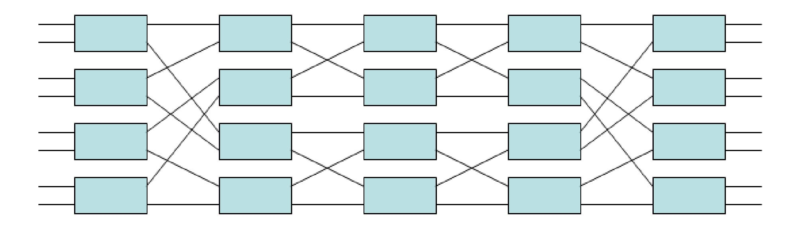
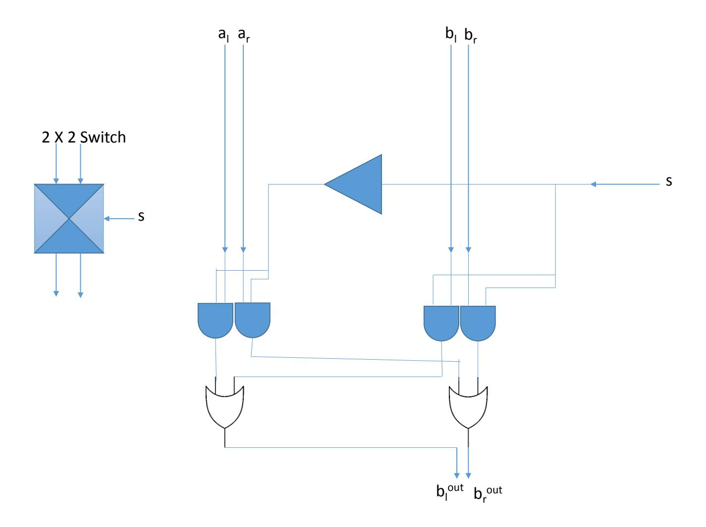

{0}------------------------------------------------

# EM-Side-Channel Resistant Symmetric-Key Authentication Mechanism for Small Devices

Rick Boivie, Charanjit S. Jutla, Daniel Friedman and Ghavam Shahidi IBM T. J. Watson Research Center Yorktown Heights, NY 10598, USA csjutla@us.ibm.com

#### Abstract

We provide a novel electro-magnetic (EM) side-channel resistant symmetric-key authentication mechanism for small devices that uses a Benes network to permute the on-board authentication-key before computing a MAC of a challenge with the key. The permutation itself is derived from the challenge using a hash function acting as a random oracle. The solution has interesting applications such as forgery detection of currency bills.

## <span id="page-0-0"></span>1 Introduction

With widespread deployment of small devices such as in the "Internet of things" paradigm, it is increasingly important to devise new authentication mechanisms for such devices which have a small silicon footprint as well as other complexity measures. Such devices are also required to hold a secret key to authenticate themselves to a legitimate server. Unfortunately, side channel leakage [\[3\]](#page-6-0) during the computation of authentication tag from this secret usually leaks too much information to easily reveal the secret.

There are two well known solutions to this problem. One is to use a public key mechanism, where the server holds a signing key, and each authentication request to the small device is signed by the server, and the signature verified by the small device. Only if the signature verifies does the small device actually process its secret. Unfortunately, this requires the small device to implement a public key operation (such as an RSA signature verification). The other solution is to implement the computation of authentication tag from the secret in a side-channel resistant manner [\[3,](#page-6-0) [2\]](#page-5-0). However, such an implementation can be rather costly, cumbersome and still not very resistant to side-channel leakage.

In this paper, we propose a new side-channel resistant implementation, specifically tailored for symmetric-key authentication mechanisms. To motivate the solution, as well as to make the presentation less abstract, we specifically discuss a particular real-world problem. The real-world problem is that of embedding a small device in each bank note (bill), such that when the bills come into a legitimate bank or inspection center, the bills can be scanned for counterfeit bills.

We will refer to the chip embedded in the bill as the chip. Wand will refer to a device held at each local bank which supplies power to the chip and also has the capability to do computations and interact with both the chip and a central authority (henceforth called the Fed).

The new scheme is based on the simple idea of using a Benes network to permute the secret key, where the permutation itself is defined by hashing the challenge. Thereafter, the authentication tag 

{1}------------------------------------------------

is computed using the challenge and the permuted secret key. The scheme requires only a SHA-2 implementation and a Benes network implementation on the chip.

We now briefly discuss the solution based on public key operations and its down-side. This scheme requires a public-key based signature scheme (with the signing key held by the Fed – and not the wand). The corresponding public key is embedded in each chip. The chip must do signature verifications. Also, a challenge-response protocol requires that the chip have a (pure) random number generator. The down side of this implementation is three-fold:

- 1. The same signing key will have to be used for the lifetime of the bills (20 years?). This signing key will be used rather extensively every day for 20 years. For a partial transition after 10 years, both signing keys will be have to be around to deal with two kinds of bills (the older and the newer).
- 2. Before a batch of bills can be verified, the Wand must interact with the batch of chips (bills), obtain a nonce for each, communicate with the Fed to get one signature (for the whole batch of bills), and then communicate with each chip again and retrieve authentication information which is then shipped back to the Fed (for verification).
- 3. The chip requires an RNG.

#### 1.1 Symmetric-Key Authentication Mechanism

The main idea of the symmetric-key authentication mechanism is to use an on-chip secret k to authenticate the chip (or bill). This secret is different for each chip and is randomly chosen or set during either manufacturing time or by the Fed after the chip has been manufactured. The secret value once set should not be malleable (other than small errors introduced due to use and mis-handling over multiple years). Regardless, the secret k for each bill is also kept at the Fed (and this is how the Fed authenticates a bill to be authentic). Modern silicon processes work at such a low micron level that it is impossible to read off the secret from the chip unless using highly expensive procedures and instrumentation. If an extremely expensive procedure (per chip) does allow an Adversary to get to the secret, then that should be fine, as then the Adversary can possibly produce multiple bills with same serial number and secret (but not too many, as that would easily be detected as an anomaly).

Each chip also has a serial number s (maximum 128-bit). We will refer to the secret k on a chip with serial no. s as ks. These values are stored as pairs on a Fed database.

In each authentication procedure, the wand will choose a random 128-bit number c (it is fine if the same no. is used for all chips/bills in a batch), and send c to the chips. The chip then naively computes

$$v \leftarrow \text{SHA-2}(c); u \leftarrow \text{SHA-2}(\langle v, s, k_s \rangle); \text{Output} \leftarrow \text{SHA-2}(u, v)$$

and sends the Output (along with s) to the wand, which then forwards it to the Fed (along with c and serial numbers s) for verification. The output will be referred to as the MAC. However, this naive solution is easily attacked using side-channel information.

The main new idea is to compute a permutation π (of 128-bits) from c. Then, instead of computing output as above, the chip computes

$$v \leftarrow \text{SHA-2}(c); u \leftarrow \text{SHA-2}(\langle v, s, \pi(k_s) \rangle); \text{Output} \leftarrow \text{SHA-2}(u, v).$$

{2}------------------------------------------------

More precisely, the steps are as follows:

```
v1 ← SHA-2(c);
Use 128 ∗ log 128 bits from v1 to define a 128-bit permutation π.
v2 ← SHA-2(v1);
ps = Benes-Network(π, ks);
u ← SHA-2(hv2, s, psi);
Output ← SHA-2(u, v2).
```

Each bit in k<sup>s</sup> (i.e. 128 bits) will be stored in a 2-bit encoding; a bit with value 0 will be stored as 01 and a bit with value 1 will be stored as 10. The Benes-network will thus operate on 128 2-bit words. Thus, in the above, the value p<sup>s</sup> will be a 256-bit quantity (or all odd-numbered bits can be dropped to get back a 128-bit quantity). All steps in each level of the Benes-network should preferably be done simultaneously. If this is not possible, as many steps as possible should be done in parallel.

Note that the Fed can compute the exact same (MAC) Output given c and the serial number s (as long as corresponding k<sup>s</sup> in its database is same as the k<sup>s</sup> on the chip).

#### 1.1.1 Benes Network

A permutation of the secret k (considering two consecutive bits as a nibble) is performed as follows. In other words, k[0..1] , k[2..3],....etc are considered as 128 nibbles and permuted using π. The actual permutation is implemented as 13 rounds of a Benes network (each round taking 64 bits from description of π). Each round of a Benes network is a parallel set of 64 2-by-2 switches (the switch being decided by the 64 bits of π for this round). A following recursive definition of a Benes network is sufficient. A Benes network on 2<sup>r</sup> bits consists of three divisions: two outer layers of 2r−<sup>1</sup> 2 by 2 switches (call them left and right layers), and an inner division consisting of two independent Benes networks on 2r−<sup>1</sup> bits. The output of the left layer is fed into the two smaller Benes networks as follows: All odd number output bits are sent to the first smaller Benes network, and all even numbered output bits are sent to the second smaller Benes Network. The outputs from the smaller Benes network are then symmetrically fed into the right layer. Note that this leads to a total of (2r − 1) layers of 2r−<sup>1</sup> parallel 2 by 2 switches.

For simplicity, Fig [1](#page-3-0) describes a 8-bit Benes Network (i.e. r = 3).

#### 1.2 Handling errors in secret bits kept on the Chip

We also describe a scheme which is robust against errors in the secrets stored on the chip. This does not require any error-correcting codes (over and above what is already standard in chip design). The initial description of the scheme in the following sections will not mention this error-handling capabilities.

# 2 Security Analysis

#### <span id="page-2-0"></span>2.0.1 EM-Attack

An adversary can supply the chip a challenge c and observe the EM radiation emanating from the chip. Specifically, the first time the secret k<sup>s</sup> is involved at all is in computation of p<sup>s</sup> in the Benes-

{3}------------------------------------------------



<span id="page-3-0"></span>Figure 1: 8-Bit Benes Network

<span id="page-3-1"></span>

Figure 2: Two by Two Switch

{4}------------------------------------------------

network. Note, the permutation π is known to the adversary. Thus, if the EM radiation profile on switching a 0 value (i.e. 01 encoding) is different from switching a 1 value (i.e. 10 encoding), say in bit location one of ks, the the adversary is in business. Clearly, this radiation profile is muddled by all the other simultaneous switchings happening (and by many other environmental factors emanating from inside and outside the chip). A simple implementation of a two-by-two switch used in the Benes network is shown in Fig [2.](#page-3-1) Each bit is encoded as two bits. Note that for each gate outputting a one, there is another gate outputting a zero. Moreover the two gates are always in close proximity, and hence directional radiation capture is extremely expensive if not infeasible. Thus, the adversary is left with capturing amplitude modulated signal [\[1\]](#page-5-1). But, the above design ensures that amplitude modulated signal, which is an aggregate modulation of the clock signal (for instance), does not leak any information about the secret key – either by simple of differential EM attacks.

The next place that the secret key is used is in the hash function SHA-2. However, the secret key is already permuted here. Let's assume that the SHA-2 implementation uses a rather poor 8-bit architecture. Then, the first non-linear step involving the secret key (i.e. the permuted secret key ps) is the following step in the SHA-2 compression function's main loop (which is really a block cipher with the round keys coming from the the expanded input w which in this case is ps): We assume the reader is familiar with SHA-2 description.

```
for i from 0 to 63
S1 := (e rightrotate 6) xor (e rightrotate 11) xor (e rightrotate 25)
ch := (e and f) xor ((not e) and g)
temp1 := h + S1 + ch + k[i] + w[i]
S0 := (a rightrotate 2) xor (a rightrotate 13) xor (a rightrotate 22)
maj := (a and b) xor (a and c) xor (b and c)
temp2 := S0 + maj
h := g
g := f
f := e
e := d + temp1
d := c
c := b
b := a
a := temp1 + temp2
```

Note that it is the step of computing "temp1" that can cause differential leakage which can reveal, say the bottom bit of w[0]. However, this requires that the same 8 bits of k<sup>s</sup> show up at w[0] after permutation. The probability of this happening over random challenge values is 120!/128! which is about 2−50. Note that the challenge values need not be random for this analysis to hold, as SHA-2 itself acts as a randomizer, and the permutation is computed from the challenge and salt in each chip using SHA-2 [1](#page-4-0) . Thus, it would require about n ∗ 2 <sup>50</sup> work to get n useful side-channel samples.

<span id="page-4-0"></span><sup>1</sup> for simplicity, the above description of the EM-resistant authentication mechanism did not use a salt. However, each chip should have a 64 bit salt value, i.e. a random but non-secret value, which is hashed together with the challenge to produce the permutation bits. This salt value is also transmitted to the Fed server, or the Fed could have it pre-stored along with the secret for this chip id.

{5}------------------------------------------------

More comprehensive analysis will be given in the full version of the paper.

# 3 Error Handling

There are many places that errors can happen. There can be errors in communication (between the chip and the wand), but these can be handled by hashing the whole message (using SHA-2) and requesting the message to be sent again if the hash of the message does not match (either direction).

More challenging is handing errors in the stored value of ks. Any attempt to error-correct k<sup>s</sup> while reading it may give a strong EM signal to an Adversary[2](#page-5-2) . This is not a concern in the public-key based solution, as no processing of k<sup>s</sup> is done till the wand is authenticated. However, in the non-public-key solution this is definitely a serious issue. However, after the bits are permuted, then error-correcting codes decoding can be used and will work if the syndrome calculator is also given access to the permutation π and it incorporates π in the syndrome calculation.

Another way to handle errors is to have a 256-bit key k<sup>s</sup> instead of the 128-bit key required above. Next, as usual in the 2-bit encoding it will be represented by 512 bits. Use the Benes network to permute the 256 bits of k<sup>s</sup> now. However, instead of doing the rest of the SHA-2 MAC computation on this permuted k<sup>s</sup> (i.e. ps), compute the MAC only on the first 128 bits of p<sup>s</sup> (i.e. ignore the last 128 bits). Now, note that if there was a single bit error in ks, then after the permutation, with probability 1/2 that erroneous bit will just get dropped.

The Fed will do the identical MAC computation (i.e. by dropping the last 128 bits of the permuted secret).

If the erroneous bit(s) was in the front 128-bits, clearly the MACs will not match, but the whole protocol can be repeated, and a new c will lead to a completely new permutation.

This methodology can also be used in the public-key signature based scheme, but now that scheme must also implement a permutation. Alternatively, it can compute a 256 bit mask from c or v (using SHA-2) and with high probability it will have about 128-bits ON. Then the masked can be AND-ed with the 256-bit key k<sup>s</sup> , and hash computed on this masked 256-bit quantity. Again, with probability 1/2 an erroneous bit will just get masked-off and hence MAC computation will come out matching the one performed by the Fed.

## References

- <span id="page-5-1"></span>[1] Dakshi Agrawal, Bruce Archambeault, Josyula R. Rao, and Pankaj Rohatgi. The EM sidechannel(s). In Cryptographic Hardware and Embedded Systems - CHES 2002, 4th International Workshop, Redwood Shores, CA, USA, August 13-15, 2002, Revised Papers, pages 29–45, 2002. [2.0.1](#page-2-0)
- <span id="page-5-0"></span>[2] Suresh Chari, Charanjit S. Jutla, Josyula R. Rao, and Pankaj Rohatgi. Towards sound approaches to counteract power-analysis attacks. In Advances in Cryptology - CRYPTO '99, 19th Annual International Cryptology Conference, Santa Barbara, California, USA, August 15-19, 1999, Proceedings, pages 398–412, 1999. [1](#page-0-0)

<span id="page-5-2"></span><sup>2</sup>However, it is worth investigating if decoding procedures of Reed-Solomon codes and BCH codes do not give a differential EM signal, especially with the 2 bit encoding and the fact that syndrome calculation is a linear operation over GF2.

{6}------------------------------------------------

<span id="page-6-0"></span>[3] Paul C. Kocher, Joshua Jaffe, and Benjamin Jun. Differential power analysis. In Michael J. Wiener, editor, Advances in Cryptology - CRYPTO '99, 19th Annual International Cryptology Conference, Santa Barbara, California, USA, August 15-19, 1999, Proceedings, volume 1666 of Lecture Notes in Computer Science, pages 388–397. Springer, 1999. [1](#page-0-0)