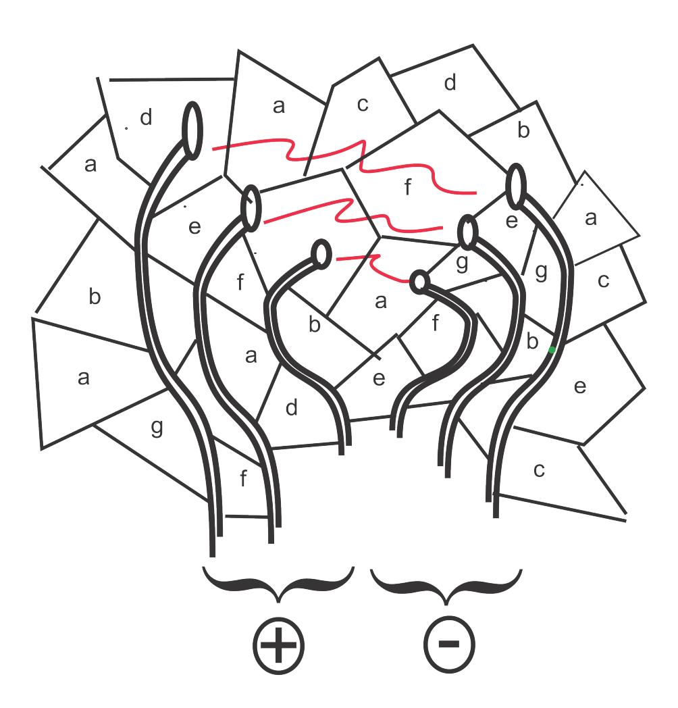

{0}------------------------------------------------

## **Feeding Cryptographic Protocols with Rich and Reliable Supply of Quantum-Grade Randomness**

*Nanotechnology captures quantum-grade randomness off the digital grid, accessible by cryptographic protocols*

> Gideon Samid Department of Electrical Engineering and Computer Science Case Western Reserve University, Cleveland, OH BitMint, LLC Gideon@BitMint.com

*Abstract:* Presenting a new technology to fit quantum-randomness into a lump of matter where the randomness is held through the molecular bonds of seeded macromolecules, and reliably measured in two or more sufficiently exact duplicates, serving as a large reservoir for quantum-grade randomness to support cryptographic protocols.

\* \* \*

Secure exchange and tight safeguarding of master keys is the underlying challenge for symmetric cryptography. Our team has been addressing this challenge in a novel way. Manufacturing a small lump of matter, the "Rock of Randomness," which captures quantum-grade randomness in the chemical bonds in the lump. The quantum electromechanical forces within the lump are measured and converted to a digital string that retains the quality of randomness in the lump. The lump is manufactures in d duplicates, before the die is discarded, and no more duplicates can be issued. The communicating parties (e.g. corresponding banks) hold each a copy of this 'rock of randomness'. They decide on a protocol for how to extract the randomness from the rock. This extraction is extremely versatile. The rock is constructed as compendium of a large number of differently seeded polymers, such that each ingredient polymer has a distinct electrical conductivity. A laboratory source of quantum randomness (e.g. radiation monitors) determines the randomized mixture of the ingredient polymers so that the measured electrical conductivity between any two randomized points within the rock reflects the randomness used for its construction. Some n conducting-pathways extend from an electrical pad (contact ports) attached to the rock, and penetrate into it. To get a randomized reading a rock holder will designate arbitrary p < n ports as one electrical pole, and an arbitrary number q ≤ n - p ports as the opposite pole. The measured conductivity will be digitized. By communicating the identities of the p ports and the

{1}------------------------------------------------

identities of the q ports, the rock holder will guide the corresponding party to do the same with its exact duplicate of the rock, and hence extract from the rock the same randomized value.

Any third party not in possession of the rock will not have a rock to measure, and will not be able to compromise the shared new key. For even a modest size rock, with few ports (low value of n), the number of possible readings, N, of the rock is so large that the rock can serve its users for a long time without any fear of repetition.

$$N = \sum_{i=1}^{i=n-1} C_n^i \, 2^{n-i}$$

The 'rock of randomness' is robust, tight, no moving parts. Can easily fit in mobile devices, and used in harsh environmental conditions.

Randomized Rock Resistance

## Reference:

١

The "Rock of Randomness: a physical oracle for securing data off the digital grid" Gideon Samid and Gary E. Wnek <a href="https://www.cambridge.org/core/journals/mrs-communications/article/rock-of-randomness-a-physical-oracle-for-securing-data-off-the-digital-grid/0147A6AFD0EA8D84D7BFFEE409A21641">https://www.cambridge.org/core/journals/mrs-communications/article/rock-of-randomness-a-physical-oracle-for-securing-data-off-the-digital-grid/0147A6AFD0EA8D84D7BFFEE409A21641</a>