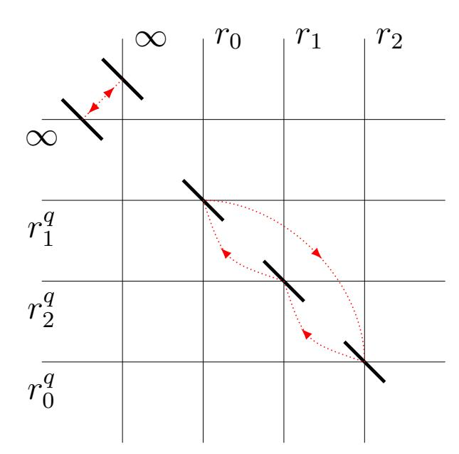

{0}------------------------------------------------

# Hashing to elliptic curves of j = 0 and quadratic imaginary orders of class number 2

#### Dmitrii Koshelev1

Versailles Laboratory of Mathematics, Versailles Saint-Quentin-en-Yvelines University Center for Research and Advanced Development, Infotecs

Abstract. In this article we produce the simplified SWU encoding to some Barreto–Naehrig curves, including BN512, BN638 from the standards ISO/IEC 15946-5 and TCG Algorithm Registry respectively. Moreover, we show (for any j-invariant) how to implement the simplified SWU encoding in constant time of one exponentiation in the basic field, namely without quadratic residuosity tests and inversions. Thus in addition to the protection against timing attacks, the new encoding turns out to be much more efficient than the (universal) SWU encoding, which generally requires to perform two quadratic residuosity tests.

**Key words:** Barreto-Naehrig curves, constant-time implementation, hashing to elliptic curves, Kummer surfaces, pairing-based cryptography, quadratic imaginary orders, rational curves and their parametrization, vertical isogenies.

#### Introduction

Let  $\mathbb{F}_q$  be a finite field of characteristic p > 5 and  $E_b \colon y_0^2 = x_0^3 + b$  be an elliptic  $\mathbb{F}_q$ -curve of j-invariant 0. To be definite we will suppose everywhere that  $E_b$  is ordinary. According to [1, Example V.4.4] this exactly means that  $p \equiv 1 \pmod{3}$ , i.e.,  $\omega := \sqrt[3]{1} \in \mathbb{F}_p$ , where  $\omega \neq 1$ . Many protocols of pairing-based cryptography [2] use a hash function of the form  $\{0,1\}^* \to E_b(\mathbb{F}_q)$ . It is often constructed by means of an auxiliary map  $h \colon \mathbb{F}_q \to E_b(\mathbb{F}_q)$  called encoding such that  $\#\operatorname{Im}(h) = \Theta(q)$ , where, as is well known,  $q \approx r := \#E_b(\mathbb{F}_q)$ . A survey of how to hash to elliptic curves is well represented in [2, §8]. By the way, the priority is given to the curves  $E_b$ , because the pairing computation on them is the most efficient (see, e.g., [2, §4]).

For  $c \in \mathbb{F}_q^* \setminus (\mathbb{F}_q^*)^2$  denote by  $E_b' \colon y_1^2 = c(x_1^3 + b)$  the (unique) quadratic  $\mathbb{F}_q$ -twist of  $E_b$ . Consider the *Kummer surface* 

$$K'_b := (E_b \times E'_b)/[-1]$$
  $K'_b : y^2 = c(x_0^3 + b)(x_1^3 + b) \subset \mathbb{A}^3_{(x_0, x_1, y)},$ 

where  $y := y_0 y_1$ , of the direct product  $E_b \times E_b'$  (for details see, e.g., [3, §2]). The *simplified*  $SWU\ encoding\ [4,\S7]$  is based on a rational non-constant  $\mathbb{F}_q$ -map

$$par = (x_0(t), x_1(t), y(t)) : \mathbb{A}^1_t \dashrightarrow K'_b$$

such that  $y(t) \not\equiv 0$  or, equivalently,  $x_0(t), x_1(t) \not\equiv -\sqrt[3]{b}$ . In other words, par is an  $\mathbb{F}_q$ -parametrization of a (possibly singular) rational  $\mathbb{F}_q$ -curve [5] on  $K_b' \setminus \{y = 0\}$ , i.e., that of geometric genus 0.

&lt;sup>1web page: https://www.researchgate.net/profile/Dimitri\_Koshelev email: dimitri.koshelev@gmail.com

This work was supported by a public grant as part of the FMJH project.

{1}------------------------------------------------

This article actively uses the theory of isogenies between elliptic curves and orders of imaginary quadratic fields (see its basic notions, e.g., in [6]). Recall that for  $\ell \in \mathbb{N}$  s.t.  $p \nmid \ell$  isogenies  $\varphi \colon E_b \to E$  of degree  $\ell$  bijectively correspond (up to an isomorphism) to subgroups  $G \subset E_b$  of order  $\ell$ . Moreover,  $\varphi$  is defined over  $\mathbb{F}_{q^n}$  (where  $n \in \mathbb{N}$ ) if and only if G is  $\mathbb{F}_{q^n}$ -invariant. As is well known, the  $(\mathbb{F}_{q^n})$ -endomorphism ring  $\operatorname{End}(E_b) \simeq \mathbb{Z}[\omega]$  and hence its fraction field  $\operatorname{End}(E_b) \otimes_{\mathbb{Z}} \mathbb{Q} \simeq \mathbb{Q}(\sqrt{-3})$ . The isogeny  $\varphi$  is said to be *vertical* whenever the inclusion  $\operatorname{End}(E) \hookrightarrow \mathbb{Z}[\omega]$  induced by  $\varphi$  (cf. [6, Theorem 33]) is not an isomorphism. In this case, if  $\ell$  is prime, then it equals the conductor of  $\operatorname{End}(E)$  according to [6, Proposition 36]. By virtue of [1, Theorem III.10.1] every non-vertical isogeny  $\varphi$  is an endomorphism on  $E_b$ . As a result,  $\varphi$  is a vertical isogeny if and only if  $j(E) \neq 0$ .

As is known, e.g., from [1, §III.6], the isogeny  $\varphi$  always has the dual one  $\widehat{\varphi} \colon E \to E_b$  with the same degree and field of definition. Therefore provided that  $\varphi$  is a vertical  $\mathbb{F}_q$ -isogeny (in this case,  $\widehat{\varphi}$  is also called vertical) of small degree the problem of constructing the map par clearly reduces to the analogous problem for  $j \neq 0$  (already solved in [4, §7]). This reduction first appeared in Article [7] of Wahby and Boneh for some elliptic curve, but without using the language of Kummer surfaces and rational  $\mathbb{F}_q$ -curves on them.

In fact, in order to construct par, it is sufficient for the curve  $E_b$  to have a vertical  $\mathbb{F}_{q^2}$ -\nisogeny. And if its degree is lower, then the computation of par (and hence h) is more efficient.

This circumstance was realized in [3], where we use a vertical  $\mathbb{F}_{q^2}$ -isogeny of degree 2, which\nexists for any curve of j-invariant 1728. In comparison, the frequent restriction  $\sqrt[3]{b} \notin \mathbb{F}_q$ , that\nis  $2 \nmid r$  excludes the possibility of such isogenies for j = 0. By the way, if  $\sqrt[3]{b} \in \mathbb{F}_q$  we can use
Elligator 2 [8, §5] as an encoding.

The 3-division polynomial [1, Exercise 3.7] of the curve  $E_b$  equals  $\psi_3(x) = 3x(x^3 + 4b)$ . Using  $V\acute{e}lu's$  formulas [6, Proposition 38], we can readily check that the quotient by the order 3 point  $(0, \sqrt{b}) \in E_b(\mathbb{F}_{q^2})$  gives an endomorphism. Similarly, if  $\sqrt[3]{4b} \in \mathbb{F}_q$ , then  $E_b$  also has a vertical  $\mathbb{F}_q$ -isogeny of degree 3 to the curve of j-invariant  $-2^{15}3\cdot 5^3$ . Nevertheless, in practice very often  $\sqrt[3]{4b} \notin \mathbb{F}_q$ . Besides, any vertical  $\mathbb{F}_{q^2}$ -isogeny of degree 4 is clearly the composition of two  $\mathbb{F}_q$ -isogenies of degree 2. Thus this article is devoted to the first non-trivial case, namely that of degree 5 vertical  $\mathbb{F}_{q^2}$ -isogenies. See Remark 1 about why it is similar to the degree 7 case.

As usual (see, e.g., [6, §7]), let  $t_1 = q + 1 - r$  be the trace and  $D_1 = t_1^2 - 4q = -3f_1^2$  be the discriminant of the Frobenius endomorphism Fr on  $E_b$ , where  $f_1 \in \mathbb{N}$  is the conductor of the quadratic order  $\mathbb{Z}[Fr]$ . Since for  $Fr^2$  the trace  $t_2 = t_1^2 - 2q$  [1, Exercise 5.13], its discriminant  $D_2 = t_2^2 - 4q^2 = t_1^2D_1 = -3f_2^2$ , where  $f_2 = t_1f_1$  is the conductor of  $\mathbb{Z}[Fr^2]$ .

Pick  $i \in \{1, 2\}$  and a prime  $\ell \notin \{2, p\}$ . According to [6, Proposition 37] some (or, equivalently, any) degree  $\ell$  vertical isogeny  $E_b \to E$  (equally  $E \to E_b$ ) is defined over  $\mathbb{F}_{q^i}$  if and only if  $\ell \mid f_i$ , that is  $\mathbb{Z}[\operatorname{Fr}^i] \hookrightarrow \operatorname{End}(E)$ . Such an  $\mathbb{F}_{q^2}$ -isogeny is not defined over  $\mathbb{F}_q$  if and only if  $\ell \mid t_1$  and  $\ell \nmid f_1$ . However  $\ell$  cannot simultaneously divide  $t_1$  and  $f_1$ , hence the second condition is superfluous. By the way, it is easy to check that quite popular Barreto-Naehrig (BN)  $\mathbb{F}_p$ -curves (of prime order) [2, Example 4.2] do not have vertical  $\mathbb{F}_p$ -isogenies of degree  $\ell$  whenever the Legendre symbol  $\left(\frac{-2}{\ell}\right) = -1$ . Finally, [6, Proposition 37] also claims that there are exactly  $1 + \left(\frac{-3}{\ell}\right)$  endomorphisms of degree  $\ell$  on  $E_b$ . In particular,  $\left(\frac{-2}{5}\right) = \left(\frac{-3}{5}\right) = -1$ .

For example, the condition  $5 \mid t_1$  is fulfilled for the  $\mathbb{F}_p$ -curves BN512 (b=3) from [9] and BN638 (b=257) from [10, §5.2.8] (both are also represented in [11, §4.1]). Here the numbers

{2}------------------------------------------------

in the notation are equal to  $\lceil \log_2(p) \rceil$ . Such bit lengths will become actual for pairing-based cryptography in the future, hence these curves are potentially useful. At the same time, factorizing  $f_1$ , we see that the smallest (prime) degree  $\ell$  of a vertical  $\mathbb{F}_p$ -isogeny for BN512 (resp. BN638) equals 1291 (resp. 1523). Therefore in the given situation the Wahby–Boneh idea does not work in an efficient way. Indeed, as fas as we know, the fastest method to evaluate such an isogeny is computing Vélu's formulas, which generally consists of  $\Theta(\ell)$  basic field multiplications.

We analysed many j-invariant 0 elliptic  $\mathbb{F}_q$ -curves (not only pairing-friendly) existing in various cryptographic sources. It is remarkable that almost all of them have either a vertical isogeny of degree < 100 over  $\mathbb{F}_q$  or that of degree 5 or 7 over  $\mathbb{F}_{q^2}$ . Unfortunately, our approach is not efficiently extended to all desired curves. For instance, for the  $\mathbb{F}_p$ -curve BN384 (also from the standard ISO/IEC 15946-5) the minimal divisors of  $f_1$  and  $f_2$  are 1521964025171 and 131 respectively. According to [12, §6.3] this curve provides exactly the 128-bit security level, taking into account recent advances in the number field sieve (NFS) algorithm. In turn, in [13, §6.1] it is stated that for this level a 384-bit p is not enough for Barreto–Naehrig curves and p must have at least 461 bits.

## 1 Constructing the rational $\mathbb{F}_q$ -map par

It is readily seen that the 5-division polynomial of the curve  $E_b$  equals

$$\psi_5(x) = f_5(x^3)$$
, where  $f_5(z) := 5z^4 + 380bz^3 - 240b^2z^2 - 1600b^3z - 256b^4$ .

Denote by  $z_i \in \mathbb{F}_{q^4}^*$   $(0 \le i \le 3)$  the roots of the polynomial  $f_5$ . Using Ferrari's method [14, Theorem 3.2] for expressing  $z_i$  in radicals, we obtain for  $k, \ell \in \{0, 1\}$  the expressions

$$z_{k+2\ell} = (-1)^k 3b (3 + (-1)^\ell \sqrt{\alpha_k}/5) \sqrt{5} - 19b, \quad \text{where} \quad \alpha_k := 6(65 - (-1)^k 29\sqrt{5}).$$

By definition of  $\psi_5$ , any order 5 point on  $E_b$  has the form  $P_i := (\sqrt[3]{z_i}, \sqrt{z_i + b})$ . It generates the subgroup  $G_i := \{\mathcal{O}, \pm P_i, \pm 2P_i\}$ , where  $\mathcal{O} := (0:1:0)$ .

For the sake of convenience let us formulate a folklore

**Lemma 1.** For any  $k \in \{2,3\}$ ,  $n \in \mathbb{N}$ , and  $\gamma \in \mathbb{F}_{q^n}^*$  we have  $\sqrt[k]{\gamma} \in \mathbb{F}_{q^n}$  if and only if  $\sqrt[k]{\mathrm{N}_{n,q}(\gamma)} \in \mathbb{F}_q$ , where  $\mathrm{N}_{n,q}(\gamma)$  is the norm of  $\gamma$  with respect to the extension  $\mathbb{F}_{q^n}/\mathbb{F}_q$ .

**Lemma 2.** If  $\sqrt{5} \notin \mathbb{F}_q$  and  $5 \mid t_1$ , then the Kummer surfaces  $K'_b, K'_{10}$  are isomorphic over  $\mathbb{F}_q$ .

Proof. Under the condition  $\sqrt{5} \notin \mathbb{F}_q$  the norm  $N_{2,q}(\alpha_k) = 2^4 3^2 5$ . Applying Lemma 1, we see that  $z_i \notin \mathbb{F}_{q^2}$  and hence  $\sqrt[3]{z_i} \notin \mathbb{F}_{q^2}$ . By assumption  $5 \mid t_1$ , the subgroup  $G_i$  is  $\mathbb{F}_{q^2}$ -invariant. Since the points  $\pm P_i$  (resp.  $\pm 2P_i$ ) have the same x-coordinate,  $\sqrt[3]{z_i} \in \mathbb{F}_{q^4}$ , i.e.,  $P_i \in E_b(\mathbb{F}_{q^8})$ . Besides,  $N_{4,q}(z_i) = -2^8 b^4 / 5$ . Again, Lemma 1 implies that  $\sqrt[3]{4b/5} \in \mathbb{F}_q$  or, equivalently,  $\sqrt[3]{b/10} \in \mathbb{F}_q$ . As a consequence, the curves  $E_b$ ,  $E_{10}$  are isomorphic at most over  $\mathbb{F}_{q^2}$  (elementary formulas see, e.g., in  $[2, \S 2.3.6]$ ). Thus the lemma is proved.

For convenience, recall the parameters of Barreto-Naehrig curves:

$$r(u) = 36u^4 + 36u^3 + 18u^2 + 6u + 1,$$
  $t_1(u) = 6u^2 + 1,$   $p(u) = 36u^4 + 36u^3 + 24u^2 + 6u + 1,$   $f_1(u) = 6u^2 + 4u + 1$ 

{3}------------------------------------------------

for some  $u \in \mathbb{Z}$ . According to the quadratic reciprocity law the condition  $\sqrt{5} \notin \mathbb{F}_p$  exactly means that  $p \equiv \pm 2 \pmod{5}$ . As is easily checked, for BN curves the latter automatically follows from the fact that  $5 \mid t_1$ . For that reason let us exclude the case  $\sqrt{5} \in \mathbb{F}_q$  from our consideration. Therefore by virtue of Lemma 2 we can put b = 10 without loss of generality.

Let's formulate the main result of the article.

**Theorem 1.** Let  $\mathbb{F}_q$  be a finite field of characteristic  $p \equiv 1 \pmod{3}$  such that  $\sqrt{5} \notin \mathbb{F}_q$ . If an elliptic  $\mathbb{F}_q$ -curve  $E_b$  has an  $\mathbb{F}_{q^2}$ -isogeny of degree 5, then (except for maybe a finite number of p) there is a rational non-constant  $\mathbb{F}_q$ -map  $par: \mathbb{A}^1_t \dashrightarrow K'_b \setminus \{y = 0\}$ . Moreover, it can be found explicitly.

Proof. Consider any two  $\mathbb{F}_q$ -conjugate isogenies  $\widehat{\varphi_{\pm}} : E_b \to E_{\pm}$  of degree 5. By definition,  $\widehat{\varphi_{\pm}} = \operatorname{Fr} \circ \widehat{\varphi_{\mp}} \circ \operatorname{Fr}^{-1}$ , the kernel  $\ker(\widehat{\varphi_{\pm}}) = \operatorname{Fr}(\ker(\widehat{\varphi_{\mp}}))$ , and  $j(E_{\pm}) = j(E_{\mp})^q$ . An explicit form of these isogenies and then their dual ones  $\varphi_{\pm} : E_{\pm} \to E_b$ , where  $\ker(\varphi_{\pm}) = \widehat{\varphi_{\pm}}(E_b[5])$ , can be readily found by means of Vélu's formulas. Besides, we need to clarify Figure 1. Denote by  $K_{\pm}$  (resp.  $K_b$ ) the Kummer surface of the direct product  $E_{+} \times E_{-}$  (resp.  $E_b \times E_b$ ). In addition,  $\varphi := \varphi_{+} \times \varphi_{-}$ , the isogeny  $\psi$  is defined in §[3, §1], and  $\rho$  is the natural quotient map. Further,  $\overline{\varphi}$  (resp.  $\overline{\psi}$ ) is the restriction of  $\varphi$  (resp.  $\psi$ ) to the Kummer surfaces and pr is the projection to the x-coordinates of  $K_{\pm}$ . Finally,  $\chi$  is a map we are going to construct.

$$E_{+} \times E_{-} \stackrel{\varphi}{\to} E_{b} \times E_{b} \stackrel{\psi}{\to} E_{b} \times E'_{b}$$

$$\rho \downarrow \qquad \rho \downarrow \qquad \downarrow \rho$$

$$\mathbb{P}^{1} \stackrel{\chi}{\to} K_{\pm} \stackrel{\overline{\varphi}}{\to} K_{b} \stackrel{\overline{\psi}}{\to} K'_{b}$$

$$pr \downarrow$$

$$\mathbb{P}^{1} \times \mathbb{P}^{1}$$

Figure 1: A commutative diagram of the surfaces and morphisms

Figure 2: The curve  $C_1$  and the action of  $\pi$ 

By substituting zero in the modular polynomial [1, §C.13] of level 5, we obtain

$$\Phi_5(0,j) = H_D(j)^3$$
, where  $H_D(j) = j^2 + 654403829760 \cdot j + 5209253090426880$ 

is the Hilbert class polynomial of discriminant  $D = -3.5^2$  due to [15, Table 2]. Its roots equal

$$j(E_{\pm}) = \pm 146329141248 \cdot \sqrt{5} - 327201914880.$$

The integer ring  $\mathbb{Z}[(1+\sqrt{5})/2]$  of the real quadratic field  $\mathbb{Q}(\sqrt{5})$  is known to be a unique factorization domain. Therefore the curves  $E_{\pm}$  considered over  $\mathbb{Q}(\sqrt{5})$  have a global minimal model [16]. It turns out that the latter is a short Weierstrass form, for instance

$$E_{\pm} : y_{\pm}^2 = g_{\pm}(x_{\pm}) := x_{\pm}^3 + 60(\pm 9\sqrt{5} - 25)x_{\pm} - 50(\pm 252\sqrt{5} - 521) \tag{1}$$

{4}------------------------------------------------

whose the discriminant is factored into prime elements as follows:

$$\Delta(E_+) = -2^6 3^3 (\pm 72\sqrt{5} + 161)(\sqrt{5})^8.$$

Consider the decompositions

$$g_{+}(x_{+}) = (x_{+} - r_{0})(x_{+} - r_{1})(x_{+} - r_{2}), \qquad g_{-}(x_{-}) = (x_{-} - r_{0}^{q})(x_{-} - r_{1}^{q})(x_{-} - r_{2}^{q}).$$

Since the curves  $E_{\pm}$ ,  $E_b$  are  $\mathbb{F}_{q^2}$ -isogenous and  $\sqrt[3]{b} \notin \mathbb{F}_q$  (or, equivalently,  $\sqrt[3]{10} \notin \mathbb{F}_q$ ) by our assumption, we have  $r_i, r_i^q \notin \mathbb{F}_{q^2}$  for  $i \in \mathbb{Z}/3$ . Without lost of generality, one can suppose that  $(\sqrt[3]{10})^q = \omega \sqrt[3]{10}$  and  $r_i^{q^2} = r_{i+1}$ . It is readily checked that

$$r_i = (a_1 \omega^{2i} \sqrt[3]{10} + a_0) \cdot \omega^{2i} \sqrt[3]{10}, \qquad r_i^q = (a_1^q \omega^{2i+1} \sqrt[3]{10} + a_0^q) \cdot \omega^{2i+1} \sqrt[3]{10},$$

where  $a_0 := 4\sqrt{5} - 5$  and  $a_1 := 2\sqrt{5} - 2$ .

The uniquely defined curve on  $\mathbb{P}^1 \times \mathbb{P}^1$  of bidegree (1,1) passing through the points  $(r_i, r_{i+1}^q)$  has the affine form

$$C_1: -4x_+x_- + (9\sqrt{5} + 100)x_+ + (-9\sqrt{5} + 100)x_- - 2400 = 0.$$

This curve (represented in Figure 2) is invariant under the "twisted" Frobenius endomorphism  $\pi$  from [3, §1].

Using the CAS Magma, we derive in [17] a non-trivial map  $\chi: \mathbb{A}^1_t \dashrightarrow K_{\pm}$  with respect to the global minimal model (1) (to get the formulas as compact as possible). Moreover,  $\chi$  (as well as  $\overline{\varphi}$ ) is  $\pi$ -invariant and  $\operatorname{Im}(pr \circ \chi) = C_1$ . The arguments given when finding it are almost the same as those of [3, §3.1]. The fundamental difference lies only in another action of  $\pi$  on  $C_1$ . Thus we obtain the map  $par := \overline{\psi} \circ \overline{\varphi} \circ \chi \colon \mathbb{A}^1_t \dashrightarrow K'_{10}$  (for the quadratic non-residue c = 5), which is explicitly written also in [17]. Using [3, Theorem 2.1], [5, §6.1.2], one can easily check that it is birational with its own image.

Technically, our map par is defined over the field of rationals  $\mathbb{Q}$ . A theoretical substantiation of this circumstance is given in [3, Theorem 1]. We admit the existence of characteristics p, reduction to which gives some degenerate cases. Namely, y(t) or one of the denominators of  $x_0(t)$ ,  $x_1(t)$ , y(t) may become identically equal to zero, not to mention that possibly  $par \in K'_{10}(\mathbb{F}_p)$ . However this is an elementary exercise that such bad reductions may arise only for a finite number of p.

Consider an elliptic curve  $E/\overline{\mathbb{Q}}$  with complex multiplication by some order of  $\mathbb{Q}(\sqrt{-3})$ , that is  $\operatorname{End}(E) \hookrightarrow \mathbb{Z}[\omega]$ . According to [15, §1] the extension degree  $[\mathbb{Q}(j(E)):\mathbb{Q}]$  equals the class number  $h(\operatorname{End}(E))$ . In turn, by virtue of [15, Tables 1, 2] there are exactly 5 non-maximal (i.e.,  $\subsetneq \mathbb{Z}[\omega]$ ) orders of  $\mathbb{Q}(\sqrt{-3})$  with the class number 1 or 2. Their conductors are equal to 2, 3 and 4, 5, 7 respectively. Thus we have

**Remark 1.** There remains only the case of a vertical  $\mathbb{F}_{q^2}$ -isogeny of degree 7 to (from)  $E_b$ , for which, apparently, it is possible to construct a rational  $\mathbb{F}_q$ -map par in a similar way as for the degree 5, carrying out reasoning regardless of q, that is over a number field.

{5}------------------------------------------------

# 2 Simplified SWU encoding in constant time of one exponentiation in $\mathbb{F}_q$

In this paragraph we explain how a rational non-constant  $\mathbb{F}_q$ -map  $par: \mathbb{A}^1_t \dashrightarrow K'_b \setminus \{y = 0\}$  gives the simplified SWU encoding  $h: \mathbb{F}_q \to E_b(\mathbb{F}_q)$ , where  $b \in \mathbb{F}_q^*$ . In fact, any elliptic  $\mathbb{F}_q$ -curve of  $j \neq 1728$  can be further considered and not only  $E_b$ . In practice, one almost always takes  $q \equiv 3 \pmod{4}$ , that is  $\sqrt{-1} \notin \mathbb{F}_q$ . Let  $f_i := x_i^3 + b$  and  $y := y_0 y_1$ . Then the Kummer surface can be taken in the form  $K'_b: y^2 = -f_0 f_1 \subset \mathbb{A}^3_{(x_0, x_1, y)}$ . Denote by U the domain of definition of par. Also, put  $\theta := f_0^{(q+1)/4}$ .

Consider the auxiliary map

$$h': K'_b(\mathbb{F}_q) \to E_b(\mathbb{F}_q)$$
  $h'(x_0, x_1, y) := \begin{cases} (x_0, \theta) & \text{if} & \theta^2 = f_0, \\ (x_1, y/\theta) & \text{otherwise, i.e.,} & \theta^2 = -f_0. \end{cases}$ 

Since

$$\theta^2 = f_0^{(q+1)/2} = f_0^{(q-1)/2} \cdot f_0 = \pm f_0,$$

this map is well defined everywhere on  $K'_b(\mathbb{F}_q)$ . We can thus put

$$h := h' \circ par \colon U(\mathbb{F}_q) \to E_b(\mathbb{F}_q).$$

The set  $\mathbb{F}_q \setminus U(\mathbb{F}_q)$  containing only  $\mathbb{F}_q$ -roots of the denominators of the functions  $x_0(t)$ ,  $x_1(t)$ , y(t) has an insignificant (for a large q) cardinality  $\leq \deg(x_0(t)) + \deg(x_1(t)) + \deg(y(t))$ . Therefore, if necessary, the value of h on its elements can be specified manually. It only remains to notice the equality  $\#\operatorname{Im}(h) = \Theta(q)$ , which immediately follows from the fact that the map par is non-constant, i.e., its image  $\operatorname{Im}(par)$  is a curve.

We emphasize that in the definition of h' the Legendre symbol  $(\frac{\gamma}{q})$  for  $\gamma \in \mathbb{F}_q^*$  (in other words, the quadratic residuosity test in  $\mathbb{F}_q$ ) does not appear. In turn, the element  $\theta$  can be computed without the inversion operation in  $\mathbb{F}_q$  even if the function  $x_0(t)$  is not polynomial (see [7, §4.2]). Therefore, by returning the value of h in (weighted) projective coordinates, we entirely avoid inversions. Thus the encoding h works in constant time (of one exponentiation in  $\mathbb{F}_q$ ), that is the computation time of its value is independent of an input argument.

The latter circumstance is considered as a great advantage over the (universal) SWU encoding [2, §8.3.4, §8.4.2], which, on the contrary, generally requires the computation of two Legendre symbols. The point is that time-constant implementations protect cryptographic protocols against timing attacks [2, §8.2.2, §12.1.1]. And the operations  $(\frac{\gamma}{q})$ ,  $\gamma^{-1}$  are possible sources of such attacks.

By virtue of Lemma 1 computing the Legendre symbol in  $\mathbb{F}_q$  reduces to the same task in  $\mathbb{F}_p$ . There are two common methods for computing this symbol in  $\mathbb{F}_p$ . One uses Euler's criterion  $\left(\frac{\delta}{p}\right) = \delta^{(p-1)/2}$  (for  $\delta \in \mathbb{F}_p^*$ ), but requires the inefficient exponentiation operation in  $\mathbb{F}_p$ . The second is based on the quadratic reciprocity law for the Jacobi symbol. This method is much more efficient, but difficult to implement in constant time. Identical conclusions are also made in [2, §2.2.9, §8.4.2].

For our map par [17] the functions  $x_0(t)$ ,  $x_1(t)$  are rational ones of degree 20 and y(t) is that of degree 60. If Horner's method is used to evaluate their numerators and denominators at  $t \in \mathbb{F}_q$ , then for computing the point par(t) it is sufficient  $\approx 2(2 \cdot 20 + 60) = 200$ 

{6}------------------------------------------------

multiplications in  $\mathbb{F}_q$ . Moreover, analysing more deeply the structure of the obtained rational functions, this number can even be slightly reduced.

As is well known, one general exponentiation in  $\mathbb{F}_q$  costs at least  $\approx \log_2(q)$  multiplications in  $\mathbb{F}_q$ . It is readily checked (e.g., with the help of Magma) that for the  $\mathbb{F}_p$ -curves BN512 and BN638 the reduction to p of our map par is good. Consequently if we deal with the simplified SWU encoding described above, then for BN512 (resp. BN638) it performs  $\approx 2 \cdot \lceil \log_2(p) \rceil - 200 = 824$  (resp. 1076) less multiplications in  $\mathbb{F}_p$  than the constant-time SWU encoding.

In fact, the encoding  $h: \mathbb{F}_q \to E_a(\mathbb{F}_q)$  from [3, §4] to an elliptic  $\mathbb{F}_q$ -curve  $E_a: y^2 = x^3 - ax$  (where  $\sqrt{a} \notin \mathbb{F}_q$ ) of j-invariant 1728 can also be implemented in constant time of one exponentiation in  $\mathbb{F}_q$ . Let  $q \equiv 1 \pmod 4$  (or, equivalently,  $i := \sqrt{-1} \in \mathbb{F}_q$ ) and  $q \not\equiv 1 \pmod 8$ . In other words,  $q \equiv 5 \pmod 8$ . The first condition is necessary for the curve  $E_a$  to be ordinary. And second is sufficient to implement the square root extraction in  $\mathbb{F}_q$  by means of one exponentiation in  $\mathbb{F}_q$ . As it is easy to see, under the given conditions we have  $\sqrt{i} \notin \mathbb{F}_q$ .

Let  $par: \mathbb{A}^1_t \dashrightarrow K'_a$  be the rational  $\mathbb{F}_q$ -map built in [3, §3.1], where  $K'_a$  is the Kummer surface of the direct product of  $E_a$  and its (unique) quadratic  $\mathbb{F}_q$ -twist. Without lost of generality this surface can be given in the form  $K'_a: y^2 = if_0f_1 \subset \mathbb{A}^3_{(x_0,x_1,y)}$ , where  $f_k = x_k^3 - ax_k$ . As above, U denotes the domain of definition of par. Also, put  $\theta := f_0^{(q+3)/8}$ .

Consider the auxiliary map

$$h' \colon K'_a(\mathbb{F}_q) \to E_a(\mathbb{F}_q) \qquad h'(x_0, x_1, y) := \begin{cases} \left(x_0, \theta\right) & \text{if} & \theta^2 = f_0, \\ \left(x_0, i\theta\right) & \text{if} & \theta^2 = -f_0, \\ \left(x_1, y/\theta\right) & \text{if} & \theta^2 = if_0, \\ \left(x_1, y/(i\theta)\right) & \text{otherwise, i.e.,} & \theta^2 = -if_0. \end{cases}$$

Since

$$\theta^2 = f_0^{(q+3)/4} = f_0^{(q-1)/4} \cdot f_0 \in \{\pm f_0, \pm i f_0\},$$

this map is well defined everywhere on  $K'_a(\mathbb{F}_q)$ . Besides, the element  $\theta$  can be computed without the inversion operation in  $\mathbb{F}_q$ . Indeed,

$$(u/v)^{(q+3)/8} = u^{(q+3)/8}v^{(7q-11)/8} = uv^3(uv^7)^{(q-5)/8}$$

for any  $u \in \mathbb{F}_q$ ,  $v \in \mathbb{F}_q^*$ . Thus we obtain the encoding

$$h = h' \circ par : U(\mathbb{F}_q) \to E_a(\mathbb{F}_q).$$

As before, the negligible set  $\mathbb{F}_q \setminus U(\mathbb{F}_q)$  can be processed separately.

Acknowledgements. The author expresses his deep gratitude to his scientific advisor M. Tsfasman.

### References

[1] J. Silverman, *The arithmetic of elliptic curves*, Graduate Texts in Mathematics, **106**, Springer, New York, 2009.

{7}------------------------------------------------

- [2] N. El Mrabet, M. Joye, *Guide to pairing-based cryptography*, Cryptography and Network Security Series, Chapman and Hall/CRC, New York, 2016.
- [3] D. Koshelev, Hashing to elliptic curves of j-invariant 1728, eprint IACR 2019/1294, accepted in Cryptography and Communications, 2019.
- [4] E. Brier et al., "Efficient indifferentiable hashing into ordinary elliptic curves", Advances in Cryptology — CRYPTO 2010, LNCS, **6223**, ed. T. Rabin, Springer, Berlin, 2010, 237–254.
- [5] J. Sendra, F. Winkler, S. Pérez-Díaz, Rational algebraic curves: A computer algebra approach, Algorithms and Computation in Mathematics, 22, Springer, Berlin, 2008.
- [6] L. De Feo, Mathematics of isogeny based cryptography, arXiv:1711.04062, 2017.
- [7] R. Wahby, D. Boneh, "Fast and simple constant-time hashing to the BLS12-381 elliptic curve", IACR Transactions on Cryptographic Hardware and Embedded Systems, **2019**:4 (2019), 154–179.
- [8] D. Bernstein et al., "Elligator: Elliptic-curve points indistinguishable from uniform random strings", ACM SIGSAC Conference on Computer & Communications Security, 2013, 967–980.
- [9] ISO/IEC, Cryptographic techniques based on elliptic curves — Part 5: Elliptic curve generation (ISO/IEC 15946-5), https://www.iso.org/standard/69726.html, 2017.
- [10] Trusted Computing Group, TCG algorithm registry, https://trustedcomputinggroup.org/resource/tcg-algorithm-registry/, 2020.
- [11] FIDO Alliance, FIDO ECDAA algorithm, https://fidoalliance.org/specs/fido-v2.0-id-20180227/fido-ecdaa-algorithm-v2.0-id-20180227.html, 2018.
- [12] A. Menezes, P. Sarkar, S. Singh, "Challenges with assessing the impact of NFS advances on the security of pairing-based cryptography", Paradigms in Cryptology – Mycrypt 2016, LNCS, **10311**, eds. R. Phan, M. Yung, Springer, Cham, 2017, 83–108.
- [13] R. Barbulescu, S. Duquesne, "Updating key size estimations for pairings", Journal of Cryptology, **32**:4 (2019), 1298–1336.
- [14] S. Janson, Roots of polynomials of degrees 3 and 4, arXiv:1009.2373, 2010.
- [15] Y. Bilu, F. Luca, A. Pizarro-Madariaga, "Rational products of singular moduli", *Journal of Number Theory*, **158** (2016), 397–410.
- [16] J. Jones, J. Cremona, Global minimal model, https://www.lmfdb.org/knowledge/show/ec.global \_minimal\_model, 2018.
- [17] D. Koshelev, Magma code, https://github.com/dishport/Hashing-to-elliptic-curves-of-j-0-and-quadratic-imaginary-orders-of-class-number-2, 2020.