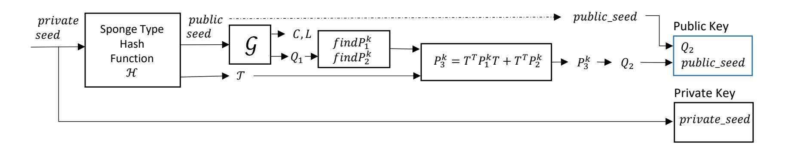
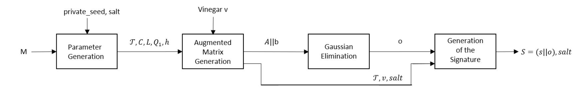
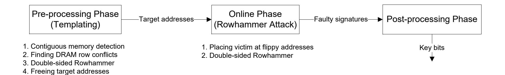
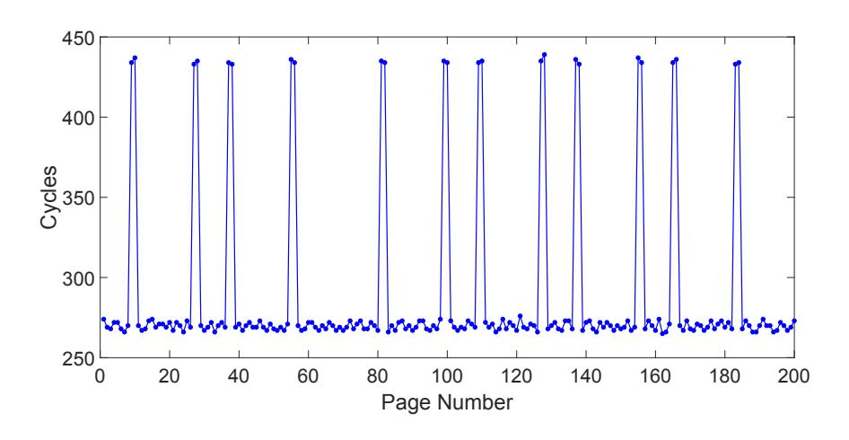
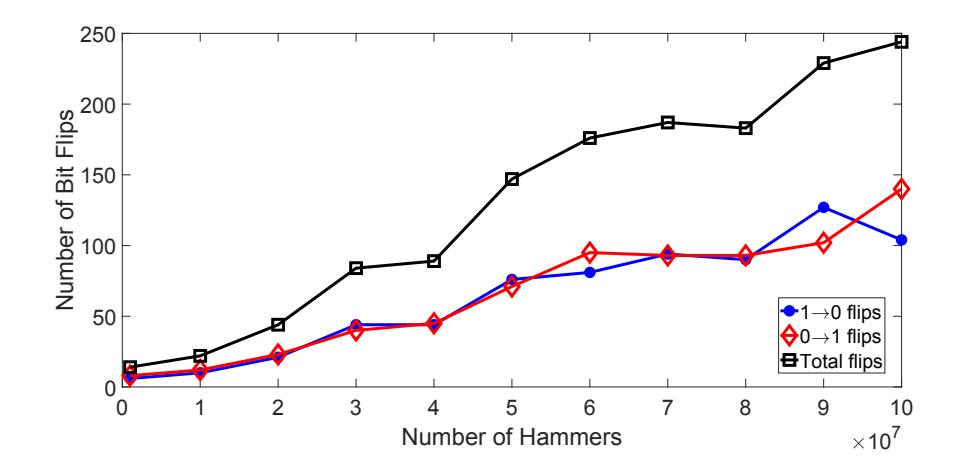
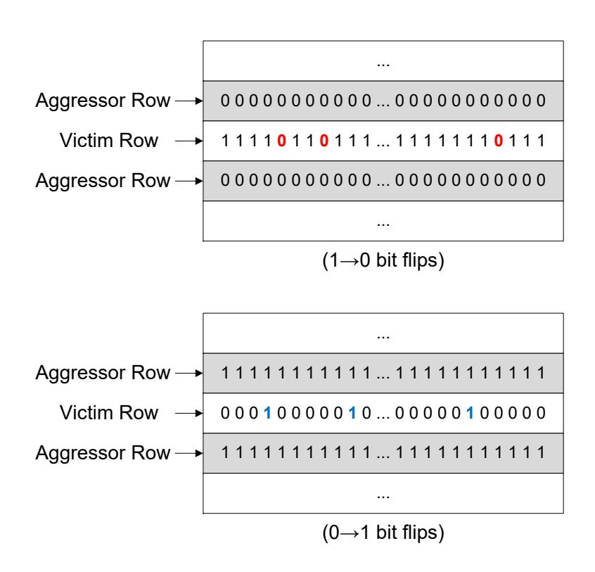
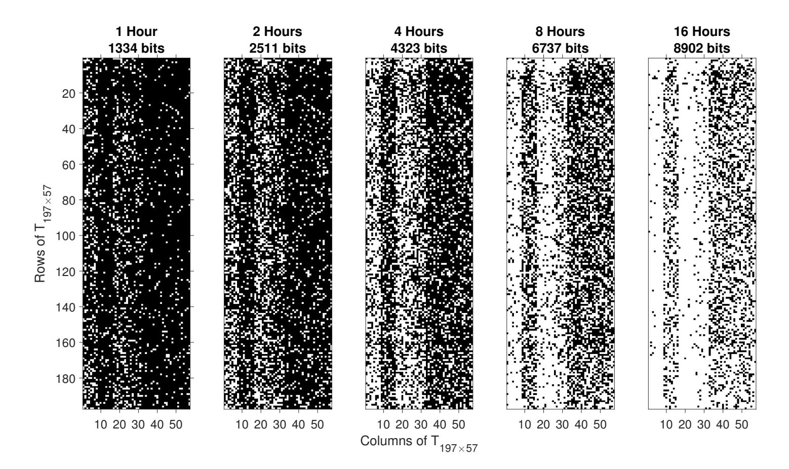
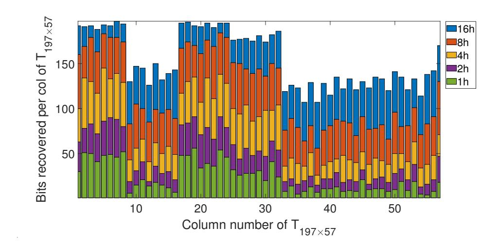
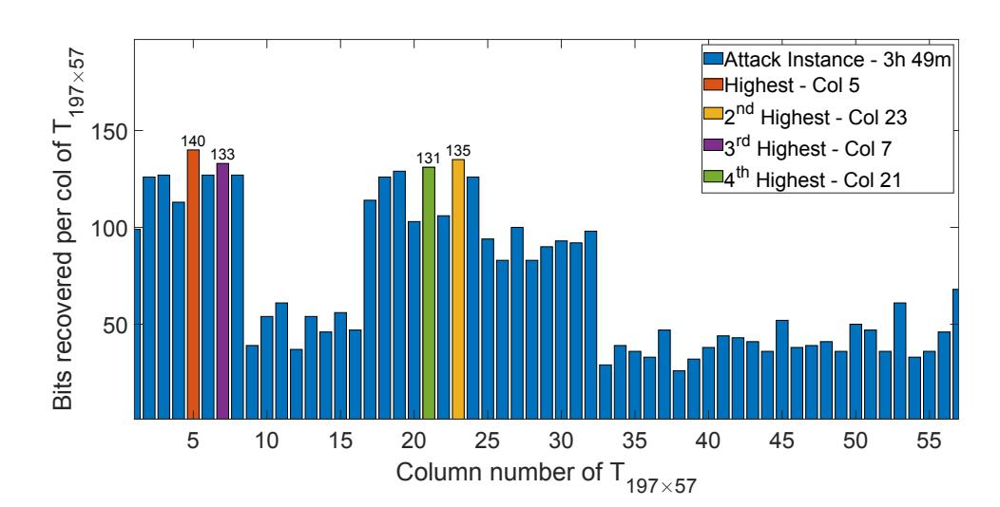

{0}------------------------------------------------

# QuantumHammer: A Practical Hybrid Attack on the LUOV Signature Scheme

Koksal Mus† ∗ Saad Islam<sup>∗</sup>

{kmus,sislam}@wpi.edu <sup>∗</sup> Worcester Polytechnic Institute, MA, USA

† Istanbul Aydin University, Istanbul, Turkey

Berk Sunar sunar@wpi.edu Worcester Polytechnic Institute, MA, USA

# ABSTRACT

Post-quantum schemes are expected to replace existing public-key schemes within a decade in billions of devices. To facilitate the transition, the US National Institute for Standards and Technology (NIST) is running a standardization process. Multivariate signatures is one of the main categories in NIST's post-quantum cryptography competition. Among the four candidates in this category, the LUOV and Rainbow schemes are based on the Oil and Vinegar scheme, first introduced in 1997 which has withstood over two decades of cryptanalysis. Beyond mathematical security and efficiency, security against side-channel attacks is a major concern in the competition. The current sentiment is that post-quantum schemes may be more resistant to fault-injection attacks due to their large key sizes and the lack of algebraic structure. We show that this is not true.

We introduce a novel hybrid attack, QuantumHammer, and demonstrate it on the constant-time implementation of LUOV currently in Round 2 of the NIST post-quantum competition. The QuantumHammer attack is a combination of two attacks, a bittracing attack enabled via Rowhammer fault injection and a divide and conquer attack that uses bit-tracing as an oracle. Using bittracing, an attacker with access to faulty signatures collected using Rowhammer attack, can recover secret key bits albeit slowly. We employ a divide and conquer attack which exploits the structure in the key generation part of LUOV and solves the system of equations for the secret key more efficiently with few key bits recovered via bit-tracing.

We have demonstrated the first successful in-the-wild attack on LUOV recovering all 11K key bits with less than 4 hours of an active Rowhammer attack. The post-processing part is highly parallel and thus can be trivially sped up using modest resources. QuantumHammer does not make any unrealistic assumptions, only requires software co-location (no physical access), and therefore can be used to target shared cloud servers or in other sandboxed environments.

# KEYWORDS

Rowhammer attack, fault attacks, post-quantum cryptography, multivariate cryptography, algebraic attack.

# 1 INTRODUCTION

The emergence of quantum computers will render traditional publickey schemes such as RSA and ECC insecure. Shor's algorithm [\[41\]](#page-13-0) will be able to break the underlying hard factorization and discrete

log problems. Quantum computers will also affect symmetric-key cryptosystems, but their impact can be overcome by mildly increasing key sizes. For instance, using Grover's search algorithm [\[20\]](#page-12-0) one may brute force a 128-bit secure system in 2 <sup>64</sup> iterations. In general, Grover's algorithm reduces the complexity of symmetrickey schemes from () to ( √ ), where log<sup>2</sup> () is the security level in bits. Hence, doubling the key size may be a solution to retain the security level.

The US NIST has recently started a competition for quantum secure public-key cryptosystems for digital signatures, Public-Key Encryption (PKE) and Key-Establishment Mechanisms (KEMs) [\[33\]](#page-13-1). In the NIST Post-Quantum Cryptography (PQC) Standardization process [\[1\]](#page-12-1), 26 schemes passed the first round and are currently competing in the second round, of which 9 are digital signature schemes. The evaluation criteria consists of three major components security, cost and performance and algorithm and implementation characteristics.

Based on the underlying hard problems, the submissions are divided into 5 broad categories: lattice-based, code-based, hash-based, isogeny-based and multivariate schemes. These categories have different characteristics with varying key sizes and performances. Multivariate is one of the main categories which is known to be very efficient for resource constraint devices but on the other hand, the key sizes are quite large. Under this category, there are four signature schemes namely GeMSS, LUOV, MQDSS and Rainbow. MQDSS is based on the Fiat-Shamir construction and GeMSS is a faster variant of QUARTZ. Lifted Unbalanced Oil and Vinegar (LUOV) is an improvement of the Unbalanced Oil and Vinegar (UOV) scheme with smaller public keys. Rainbow is an extension of UOV with an additional oil layer.

A number of side-channel attacks have been performed on PQC schemes. Bruinderink et al. [\[8\]](#page-12-2) performed the first side-channel attack on lattice-based signature schemes in 2016, specifically a flush and reload attack on BLISS. The attack was extended to BLISS-B by Pessl et al. [\[36\]](#page-13-2). Both of these attacks targeted the Bernoulli and CDT sampling. An extension to this work was presented by Bootle et al. [\[6\]](#page-12-3) which manages to recover 100% of the secret key compared to only 7% in the previous work [\[17\]](#page-12-4). Another side-channel attack by Ravi et al. [\[37\]](#page-13-3) achieving existential forgery targeted Dilithium, a lattice-based signature scheme.

A more recent timing attack focused on the error-correcting codes used in lattice-based schemes by D'Anvers et al. [\[12\]](#page-12-5) in 2019. Correlation Power Analysis (CPA) attack has also been shown to be effective by Park et al. [\[34\]](#page-13-4) on Rainbow and UOV. The early timing attacks motivated a number of efforts to design constanttime discrete gaussian samplers, i.e. [\[25,](#page-13-5) [26,](#page-13-6) [49\]](#page-13-7). In fact, many of

<sup>∗</sup>Both authors contributed equally to this research.

{1}------------------------------------------------

the NIST submissions, including LUOV, provided constant-time implementations to eliminate any passive side-channel attacks. The NIST Round 2 version of LUOV, specifically added a random salt for every message and required randomly generated vinegars to defend against the side-channel and fault injection attacks.

A more recent noteworthy work by Ding et al. [13, 15] presented a (purely) algebraic attack, i.e. the subfield differential attack. Without any side-channel information, the attack managed to significantly reduce the security level of LUOV. Specifically, for LUOV-8-58-237, the complexity is reduced from  $2^{146}$  to  $2^{105}$  which is lower than the minimum security level criteria established by NIST for the post-quantum competition. The updated version of LUOV now uses finite fields  $GF(2^r)$ , where r is a prime, which renders the subfield differential attack inapplicable<sup>1</sup>

There is some research aimed at evaluating the resilience of post-quantum schemes against fault attacks. Genet et al. [19] have demonstrated a fault attack on a hash-based digital signature scheme SPHINCS. Another differential fault attack was introduced by Bruinderink et al. [9] on deterministic lattice signatures. Espitau et al. [16] have presented fault attacks on lattice based signature schemes BLISS, GLP, PASSSign and Ring-TESLA. Blindel et al. [4] have also applied fault attacks on lattice based signature schemes namely BLISS, ring-TESLA and GLP. Ravi et al. [38] have presented fault attacks on lattice based schemes NewHope, Kyber, Frodo and Dilithium. This research is based on hardware faults like electromagnetic fault injections and clock glitches. Post-quantum schemes are more difficult to attack via side-channel or fault attacks due to their massive keys that run into many KBytes in many cases and the lack of algebraic structure. Collecting KBytes through slow bit-flips or leakages observed by the attacker over extended durations is impractical since its highly unlikely for a victim to be present and continuously running the target cryptographic primitive. Therefore, small side-channel leakages and fewer faults may not entirely break the scheme. On the other hand, these schemes are based on strong post-quantum (conjectured) hard problems which have withstood years of cryptanalysis. Here we opt for a different attack strategy, i.e., we analyze LUOV using a combination of fault injections while simultaneously targeting the algebraic structure. Hence we follow a hybrid attack strategy.

# 1.1 Our Contribution

We have discovered a *practical* technique which recovers all secret key bits in LUOV. QUANTUMHAMMER proceeds by injecting faults, collecting faulty signatures, followed by the divide and conquer attack. The faults are achieved using a realistic software only approach via a Rowhammer attack. In summary, in this work:

- (1) We introduce a simple technique that uses faulty signatures to mathematically trace and recover key bits. Each faulty signature yields a key bit. While not efficient, the technique gives us a tool we then amplify the efficiency of our attack using a analytical approach.
- (2) The analytical attack exploits structures in the generation of the public key using a small number of recovered key bits (using a modest number of faults injections), the complexity of attacking the overall multivariate system reduced to a

- number of much smaller MV problems, which are tractable with modest resources using brute force.
- (3) Our attack is software only, i.e. we do not assume any physical access to the device. This also permits remote attacks on shared cloud servers or in browsers. We assume that the memory module is susceptible to Rowhammer and that faulty signatures can be recovered.
- (4) Earlier fault attacks on post-quantum schemes assumed hypothetical faults. We present a successful end-to-end Rowhammer attack on *constant-time* AVX2 optimized implementation of the multivariate post-quantum signature scheme LUOV.
- (5) We have demonstrated full key recovery of 11,229 bits for LUOV-7-57-197 in less than 4 hours of online Rowhammer attack and 49 hours of offline post-processing.
- (6) This attack is applicable to all the variants of LUOV Scheme currently competing in Round 2 of NIST's competition including the updates [44] after Ding et al. attack [15].

#### 1.2 Outline

In Section 1.3, we explain the related work in detail. In Section 2, we give a brief explanation of Rowhammer attack and Oil and Vinegar Schemes, specifically LUOV Scheme. In Section 3, our novel bit-tracing attack on LUOV is explained with experiments and results. Section 4 details our QUANTUMHAMMER on LUOV. Section 5 contains experimental results of QUANTUMHAMMER. Section 6 proposes the countermeasures. We provide a discussion in Section 7 and Section 8 concludes the work.

#### <span id="page-1-1"></span>1.3 Related Work

On Rainbow-like schemes, Ding et al. [14] introduced an algebraic Reconciliation attack as an early work in 2008. Afterwards, as for fault attacks on multivariate schemes, only a few results exist: In 2011 by Hashimoto et al. [23] on Big Field type and Stepwise Triangular System (STS) including UOV and Rainbow. In 2019, Kramer et al. [30] have also worked on UOV and Rainbow extending the earlier work. We will only talk about UOV and Rainbow in this section and not the Big Field type schemes. Reconciliation is an algebraic attack whereas other two works assume physical fault attacks, first introduced by Boneh et al. [5] but there are no details on fault injection technique. Kramer et al. claimed that randomness of vinegar variables and also the layers in Rainbow provide good protection against fault attacks. These studies consider there attack scenarios:

**Scenario 1 (Algebraic Attack)** In this scenario [14], we assume a purely algebraic attack that improves on brute force but does not assume any physical fault or any side channel information. Specifically, the aim is to invert the public map  $\mathcal{P}$  by finding a sequence of change of basis matrices.  $\mathcal{P}$  is decomposed into a series of linear transformations which are recovered step by step which significantly reduces the security level.

**Scenario 2 (Central Map)** It assumes that a coefficient of the secret quadratic central map  $\mathcal F$  has been faulted. By signing randomly chosen messages with the faulty  $\mathcal F'$  and verifying the signatures with the correct public key  $\mathcal P$ , partial information about the secret linear transformation matrix  $\mathcal S$  can be recovered using

<span id="page-1-0"></span><sup>&</sup>lt;sup>1</sup>The updated version is available at the author's website [44].

{2}------------------------------------------------

 $\delta = S \circ (\mathcal{F}' - \mathcal{F}) \circ \mathcal{T}$ , where  $\mathcal{T}$  is another secret linear transformation matrix. As  $(\mathcal{F}' - \mathcal{F})$  is sparse, S can be partially recovered. At least m-1 faults are required to recover some part of the secret key matrix S, where m is the number of equations in the system. Both [23] and [30] have an assumption that the attack can induce faults in either S,  $\mathcal{F}$  or  $\mathcal{T}$  and provided the success probabilities of hitting the central map  $\mathcal{F}$ . Kramer et al. have additionally assumed a stronger attacker who can directly attack  $\mathcal{F}$  or even specific coefficients of  $\mathcal{F}$  to avoid unwanted scenarios. Kramer et al. [30] refute a claim made earlier by Hashimoto et al. [23] and claim that UOV is immune to the fault attack on the central map. It is because the attack is recovering part of S and not T, which is not present in the UOV scheme.

**Scenario 3 (Fixed Vinegar)** This scenario assumes that the attacker is able to fix part of randomly chosen vinegar variables from  $(x_{v-u+1}, \ldots, x_v)$ , where u is the number of vinegar variables fixed out of total v vinegar variables during multiple signature computation sessions. After that, message/signature pairs are generated and utilized to recover the secrets. n - u + 1 pairs are needed to recover part of  $\mathcal{T}$ . As the attack recovers partial information about  $\mathcal{T}$ , it is applicable to both the UOV and Rainbow schemes but still not sufficient to recover the secret key.

Shim et al. [40] have recently presented an algebraic fault analysis attack on the UOV and Rainbow schemes. They have assumed a similar scenario of fixed (reused) vinegar but they have two more scenarios as well: revealed and set to zero vinegar. They are also assuming physical faults and there are no details on how the faults are injected. Based upon the number of faulty vinegar values, they give the complexities for the attacks. For UOV, 59 Bytes of faulty vinegar are needed for full key recovery. They also provide the results for LUOV which are the only fault attack results so far on LUOV scheme. Due to the large parameter sizes, the results are not very promising to obtain a practical attack to target real life deployments. Assuming 171 Bytes and 169 Bytes of faulty vinegar values for LUOV-8-63-256 and LUOV-8-49-242, the complexities drop from 2<sup>181</sup> and 2<sup>192</sup> to 2<sup>127</sup> and 2<sup>109</sup>, respectively.

The authors have not demonstrated the fault attack. In practice, fixing a large contiguous portion of vinegar values by physical fault injection or Rowhammer is very hard to achieve if at all possible.

**Our attack scenario** is different from those presented in existing works [5, 14, 23, 30]. We are inducing faults in the last stage of the signing algorithm in the linear transformation  $\mathcal T$  of LUOV scheme. We have actually verified the assumption, i.e., we implemented an attack that induces bit flips in  $\mathcal{T}$ . Note that the attack does not have any control in the position of the bit flips as within  ${\mathcal T}$ as assumed by our attack scenario. Also, we have the ability to detect if the bit flip was in  $\mathcal{T}$  or not. We have practically demonstrated this model by inducing the bit flips using the Rowhammer attack and not just assuming the faults as in previous research. To the best of our knowledge, this is the first work which actually induces bit flips (faults) through software in post-quantum cryptographic schemes. The goal here is to make use of the faulty signatures to track back to the flipped bits and leak the secret bits of  $\mathcal{T}$ . We do not need any correct and faulty signature pairs. Rather we are able to correct the faulty signature by modifying the public signature

values and verifying the modified signatures using signature verification mechanism as an oracle. Some recovered bits from this bit-tracing attack are used to decrease the complexity of the solution of Multivariate Quadratic (MQ) system to a practically solvable smaller MQ and Multivariate Linear (ML) systems by using a divide and conquer attack to recover the rest of the private key bits. We call this hybrid attack as QUANTUMHAMMER.

#### <span id="page-2-0"></span>2 BACKGROUND

#### 2.1 Rowhammer Attack

The Rowhammer attack is a software-induced hardware-fault attack discovered in 2014 by Kim et al. [27]. Data is stored in the form of bits in the DRAMs in memory cells, composed of capacitors and transistors. A charged capacitor represents a binary one and a discharged capacitor a binary zero or vice versa according to the convention. There is a threshold to decide the value of the bit according to the voltage level. These cells are placed very close to each other, generally 64K cells in a row. As capacitors leak charge over time, they need to be refreshed after a certain time period, typically after every 64 ms. But if a DRAM row is activated rapidly, it can affect the neighboring rows due to induction and refresh rate of 64 ms might not be enough to maintain the state of the capacitor. This phenomena causes the voltage levels to cross the threshold which results in bit flips.

As, the DRAM is shared between different processes or virtual machines, this bit flipping can lead to serious consequences. To perform a successful Rowhammer attack from an attacker process to a victim process sharing the same DRAM, the victim has to be located at one of the vulnerable DRAM rows identified by the attacker. Therefore, the attacker first identifies the rows vulnerable to Rowhammer and then free them from the process. Next step is to either wait for the victim to get that memory space assigned by the OS or force the victim to be placed at these rows. There are various techniques in the literature to achieve this, i.e. spraying [22, 39, 46], grooming [43] and memory-waylaying [21, 31, 47]. The attack works because the bit flips are highly reproducible, which means once the attacker has identified a list of bad cells in the DRAM, she can flip the values of the same cells causing a bit flip in the victim process. Previous research shows that Rowhammer attack is applicable in cloud scenarios [10] and heterogeneous FPGA-CPU platforms[45]. It can be launched remotely over the network [32, 42]. Rowhammer is even applicable on ECC chips [11] and DDR4 memories with Target Row Refresh (TRR) mitigations [18].

#### 2.2 Oil and Vinegar Schemes

Consider a system of m Multivariate Quadratic (MQ) polynomials with n variables  $x_1, \ldots, x_n$ 

$$p^{k}(x_{1},...,x_{n}) = \sum_{i=1}^{n} \sum_{j=i}^{n} p_{ij}^{k} \cdot x_{i}x_{j} + \sum_{i=1}^{n} p_{i}^{k} \cdot x_{i} + p_{0}^{k}$$
 (1)

Note that, since we are using boolean equations, we reserved the exponent for use as an index.

Solving the MQ system is conjectured hard for sufficiently large m and n. The MQ challenge by Yasuda et al. [48] gives a way to gauge the difficulty of solving real-life MQ instances with moderate size instances. A multivariate signature scheme may be build around

{3}------------------------------------------------

the MQ system: the coefficients represent the public key  $\mathcal{P}$ , the system is solved for the hash of the message, the variable values that satisfy the equation (the solution to the MQ system) represents the signature. It is hard to solve this system and find a signature for a desired message unless we have a trapdoor  $\mathcal{P} = \mathcal{S} \circ \mathcal{F} \circ \mathcal{T}$ , where  $\mathcal{S}$  and  $\mathcal{T}$  are the secret invertible linear transformations and  $\mathcal{F}$  is the secret quadratic map having a special structure given as

$$f^{k}(x_{1},...,x_{n}) = \sum_{i=1}^{v} \sum_{j=i}^{n} \alpha_{ij}^{k} \cdot x_{i}x_{j} + \sum_{i=1}^{n} \beta_{i}^{k} \cdot x_{i} + \gamma^{k}$$
 (2)

Here, n variables  $x_1, \ldots, x_n$  are divided into two parts,  $x_1, \ldots, x_v$  as the vinegar variables and  $x_{v+1}, \ldots, x_n$  as the m oil variables where n = v + m. The parameters  $\alpha_{ij}^k$ ,  $\beta_i^k$  and  $\gamma^k$  are chosen randomly from a finite field  $\mathbb F$  where k ranges from 1 to m. The specialty of this structure is that there is no quadratic term with multiplication of two oil variables. So, if vinegar variables are chosen randomly and inserted into the system, it collapses to a linear system which can be easily solved for the remaining oil variables using Gaussian elimination. Note that, oil variables are public whereas vinegars are kept secret. The structure of  $\mathcal F$  is then hidden using a secret linear transformation  $\mathcal T$ . The detailed explanation of the LUOV signature schemes which utilize this structure is given in Section 2.3.

The first Oil and Vinegar scheme was proposed by Patarin [35] in 1997 which was broken by Kipnis and Shamir [29] in 1998. The modified version of the scheme named UOV was then proposed by Kipnis et al. [28] in 1999. The main difference was to unbalance the number of oil and vinegar variables by increasing the number of vinegar variables to render the attack ineffective.

# <span id="page-3-1"></span>**2.3 LUOV**

The public keys of UOV are prohibitively large to prevent wide-scale deployment. This motivated another proposal named LUOV by Beullens et al. [2]. LUOV was submitted to NIST for the PQC standardization process and is currently competing in Round 2. One of the main innovation of LUOV is to reduce the large key sizes in UOV in the way that keys are generated and stored. Instead of storing and transferring large public keys every time, LUOV makes use of the idea that generating the keys whenever needed using a sponge type hash function and using a private seed for the private key and public seed and additional  $Q_2 \in \mathbb{F}_2^{m \times m(m+1)/2}$  matrix for the public key. Here we give a brief description of the LUOV scheme. A detailed description and supporting documentation can be found in [3].

<span id="page-3-3"></span>2.3.1 **Key Generation.** process is depicted in Figure 1. Briefly,  $private\_seed$  is hashed by a sponge type hash function  $\mathcal{H}$  generating  $public\_seed$  and  $v \times m$  private binary secret linear transformation matrix  $\mathcal{T}$ . Another hash function  $\mathcal{G}$  generates public parameters  $C \in \mathbb{F}_2^m$ ,  $L \in \mathbb{F}_2^{m \times n}$  and  $Q_1 \in \mathbb{F}_2^{m \times v(v+1)/2+vm}$  by hashing the  $public\_seed$ . A  $v \times v$  upper triangular matrix  $P_1^k$  and  $v \times m$  matrix  $P_2^k$  are generated by  $findP_1^k$  and  $findP_2^k$  algorithms respectively using  $Q_1$  and an integer counter k. The details of the algorithms can be found in [3]. In this work, we do not need the details of generation of  $P_1^k$  and  $P_2^k$ , hence, we will consider  $P_1^k$  and  $P_2^k$  as given fixed

random binary matrices.  $P_1^k$  and  $P_2^k$  are given as:

$$P_{1}^{k} = \begin{pmatrix} a_{1,1}^{k} & a_{1,2}^{k} & \cdots & a_{1,v}^{k} \\ 0 & a_{2,2}^{k} & \cdots & a_{2,v}^{k} \\ \vdots & \vdots & \ddots & \vdots \\ 0 & 0 & \cdots & a_{v,v}^{k} \end{pmatrix}_{v,v}, P_{2}^{k} = \begin{pmatrix} b_{1,1}^{k} & b_{1,2}^{k} & \cdots & b_{1,m}^{k} \\ b_{2,1}^{k} & b_{2,2}^{k} & \cdots & b_{2,m}^{k} \\ \vdots & \vdots & \ddots & \vdots \\ b_{v,1}^{k} & b_{v,2}^{k} & \cdots & b_{v,m}^{k} \end{pmatrix}_{v,m}$$

Intermediate  $m \times m$  matrix  $P_3^k$  is generated by the formula  $P_3^k = -T^T P_1^k T + T^T P_2^k$  where k = 1, ..., m. Therefore,  $(i, j)^{th}$  element of  $P_2^k$  is

<span id="page-3-4"></span>
$$p_3^k(i,j) = \sum_{\alpha=1}^v t_{\alpha,j} \sum_{l=1}^\alpha t_{l,i} a_{l,\alpha} + \sum_{\nu=1}^v t_{\gamma,i} b_{\gamma,j} \text{ for } i,j \in \{1,\cdots,m\}.$$
 (3)

 $m \times \frac{m(m+1)}{2}$  binary public key matrix  $Q_2$  is generated by Equation 4. It is important to emphasize that  $P_3^k$  constitutes the  $k^{th}$  row of  $Q_2$ .

<span id="page-3-2"></span>
$$Q_{2(k,\beta_{i,j})} = \begin{cases} p_3^k(i,j) & ,i = j \\ p_3^k(i,j) \oplus p_3^k(j,i) & ,i < j \end{cases}$$
(4)

where  $\beta_{i,j} = (i-1)m + j - \sum_{\alpha=0}^{i-1} \alpha, i, j, k \in \{1, \dots, m\}$  and  $\beta_{i,j} = 1, \dots, m(m+1)/2$ .

For instance the  $k^{th}$  row of  $Q_2$  is of the following form:

$$(p_3^k(1,1), p_3^k(1,2) \oplus p_3^k(2,1), p_3^k(1,3) \oplus p_3^k(3,1), \cdots, p_3^k(2,2), p_3^k(2,3) \oplus p_3^k(3,2), \cdots, p_3^k(3,3), \cdots, p_3^k(m,m)).$$

Key generation algorithm outputs  $private\_seed$  as the private key and  $public\_seed$  and  $Q_2$  as the public key. Public map  $\mathcal{P}$  needed for signature verification is the concatenation of C, L,  $Q_1$  and  $Q_2$ .

- 2.3.2 **Signature Generation.** primitive of LUOV is shown in Figure 2 and explained in Algorithm 1. The binary linear transformation  $\mathcal{T}$  and  $public\_seed$  are generated by the hash of random  $private\_seed$ . Then, the hash of public\\_seed outputs C, L and  $Q_1$ . Concatenation of message M and a random salt hashed by  $\mathcal{H}$  produces message h to be signed. The solution of the MQ system  $\mathcal{F}(s') = h$  is found by inserting randomly chosen vinegar variables v into the system. Since  $\mathcal{F}$  has a special structure, MQ collapses to a linear system which can be easily solved which gives oil variables v by Gaussian elimination. Finally, the signature v is the concatenation of v is publicly available in the signature. Therefore, it is known to the adversary. Algorithm 1 is divided into four parts, Parameter Generation, Augmented Matrix Generation, Gaussian Elimination and Generation of the Signature for the sake of simplicity.
- 2.3.3 **Signature Verification.** The verifier generates C, L and  $Q_1$  from the *public\_seed* using the hash function G. These parts are then combined with the publicly available  $Q_2$  to form the public map P. Similar to the signing algorithm, the message M and the salt are concatenated, then hashed using H to form the digest H. If P(s) = h, then the signature is verified, otherwise rejected.

#### <span id="page-3-0"></span>3 A NOVEL BIT-TRACING ATTACK ON LUOV

In this section we outline a novel fault injection attack on LUOV. The attack succeeds in efficiently recovering secret key bits from

{4}------------------------------------------------

<span id="page-4-0"></span>

Figure 1: LUOV public and private key generation processes.

<span id="page-4-1"></span>

Figure 2: Signature generation algorithm explained in four steps.

Algorithm 1: LUOV Signature Generation

Input: private\_seed

Message M

**Output:** Signature (S||salt)

- 1 Parameter Generation: Binary linear transformation  $\mathcal{T}$  and  $public\_seed$  are generated by the hash of random  $private\_seed$ . Then, the hash of  $public\_seed$  outputs C, L and  $Q_1$ . Concatenation of the message M and a random salt hashed by  $\mathcal{H}$  produces message h to be signed.
- <sup>2</sup> Augmented Matrix Generation: Insert randomly chosen vinegar variables v into the MQ system  $\mathcal{F}(s') = h$  which collapses to a linear system. The augmented matrix generation algorithm is explained in Appendix A.
- 3 Gaussian Elimination: Linear system can be easily solved by Gaussian elimination which gives oil variables *o*. Note that, oil variables depend on *h* and *v* since the other parameters are generated by the same *private\_seed*.
- <span id="page-4-2"></span>4 Generation of the Signature: Signature S is the concatenation of  $s = \mathcal{T} \cdot o + v$ , o and salt. **return** (S, salt)

faulty signatures whereas faults may be injected through software only Rowhammer attack. The attack consists of three main phases, pre-processing, online and post-processing phase.

The pre-processing phase which includes templating, needs to be carried out on the same machine on which victim will be running. The purpose of this phase is to collect the physical addresses of the memory locations susceptible to Rowhammer. The victim does not need to be present or running in the pre-processing phase. The victim can then be placed at those addresses in the online phase when the victim process starts running. In the online phase the victim is first forced to be placed at the target addresses and then

the Rowhammer attack induces bit flips in a particular area of the victim while the victim is carrying out the signing operations. This causes the victim to generate faulty signatures which are public and collected by the attacker. After collecting a number of faulty signatures, our novel bit tracing algorithm is carried out in the post-processing phase which can be done offline on any other machine or cluster.

The DRAM modules installed in the system are susceptible to Rowhammer attack. The attacker and victim processes are colocated on the same DRAM chip. The attacker can induce bit flips in the linear transformation  $\mathcal T$  of LUOV scheme and is able to collect the faulty signatures. The attacker has no control or knowledge over the position of the bit flips within  ${\mathcal T}$  and the  ${\mathcal T}$  matrix is huge e.g. 11,229 bits for LUOV-7-57-197 [44]. Also, the attacker does not know the value of the flipped bit. The target of the attacker is to trace back to the position of the flipped bit as well as to recover the value of the bit by just using the faulty signatures. The attacker has no knowledge of the correct signatures and can only use the public parameters to perform the attack. Moreover, the attacker is not using huge pages for contiguous memory. Also, she does not have any knowledge of the DRAM mappings which convert physical addresses to DRAM ranks, banks, rows and columns. The bit-tracing is summarized in Figure 3 and then each step is explained in detail along-with results.

#### 3.1 Pre-processing Phase (Templating)

The pre-processing (templating) phase of the attack is carried out on the machine where the attacker and the victim are co-located, sharing the same DRAM module. The victim does not need to be present or running in this phase. As double-sided Rowhammer requires contiguous chunk of physical memory, we allocate a 256 MBytes buffer and look for an 8 MBytes of contiguous memory using Spoiler [24]. After that, row conflicts are found to identify the virtual addresses mapped to the same DRAM bank. This is achieved using a side channel since the data coming from the same bank will take longer as compared to the data coming from the other

{5}------------------------------------------------

<span id="page-5-0"></span>

Figure 3: Phases of novel bit-tracing attack on LUOV

banks. As the data from the row buffer needs to be copied back to the original row before the data from another row within the same bank is loaded into the row buffer, it creates additional delay. The measurements are shown in Figure 4 and a threshold value of 380 cycles is set in our experiments. This threshold value may vary from one machine to another.

<span id="page-5-1"></span>

Figure 4: Row conflicts for the pages from the detected contiguous memory. The higher timings indicate that the pages are mapped to the same DRAM bank which are the target for the Rowhammer attack.

Once we find the virtual addresses mapped to the same DRAM bank, we start the process of double-sided Rowhammer to find the DRAM rows suitable for Rowhammer. We found 125 rows in 8 MBytes of contiguous memory which are mapped to the same bank. Our results indicate that the rows in the DRAM are ordered sequentially if the targeted memory is contiguous. These rows are then taken 3 at a time with aggressor rows on the sides and the victim row in the middle and aggressor rows are accessed (hammered) repeatedly to get flips in the victim row. The number of bit flips found within this contiguous chunk can be seen in Figure 5 against the number of hammers. It is observed that the number of bit flips increase with the number of hammers. To find the susceptible memory locations in the pre-processing phase we set a value for number of hammers as 10<sup>6</sup>. The other observation is that there is not much difference between the number of  $1 \rightarrow 0$  flips and  $0 \rightarrow 1$  flips. To achieve bidirectional flips, we fill the aggressor rows with all zeros and the victim row with all ones for  $1 \rightarrow 0$  flips and aggressor rows with all ones and the victim with all zeros for  $0 \rightarrow 1$  flips as explained in Figure 6.

The final step of the pre-processing phase is to free the vulnerable memory pages from the attacker process so that the victim can be placed at that location for the online attack. We do this by using *munmap* instruction for every 8 KBytes row. As the bit flips are

<span id="page-5-2"></span>

Figure 5: Number of bit flips increases with the increase in number of hammers. The experiment is repeated 30 times for each number of hammers on an 8 MBytes contiguous chunk of memory and the results are then averaged out.

<span id="page-5-3"></span>

Figure 6: Double-sided Rowhammer with different data patterns. If the attacker rows are filled with all zeros, the bit flips occur in  $1 \to 0$  direction and if the attacker rows are filled with all ones, the bits are flipped from  $0 \to 1$ . This strategy helps to recover the values of the bit positions of  $\mathcal{T}$  traced by the bit-tracing attack.

highly reproducible, Rowhammer will flip the same bits again but in the victim process in the online phase.

The experiments are carried out on a Haswell system with DDR3 memory, running Ubuntu OS. 17,129 vulnerable physical addresses are found in 5.7 hours. These experiments are done repeatedly

{6}------------------------------------------------

using a script as 8 MBytes of contiguous memory is not enough for gathering these many addresses. So, 256 MBytes of memory is allocated again and again out of which 8 MBytes of contiguous chunk is detected. Each chunk is then checked for all possible bit flips. A big single chunk of contiguous memory is hard to find in a live system running various processes.

# 3.2 Online Phase (Rowhammer attack)

The pre-processing phase gives a list of vulnerable physical addresses and the goal of the online phase is to first place the target linear transformation  $\mathcal{T}$  of LUOV scheme at one of those physical addresses and then do the double-sided rowhammer again to get bit flips in  $\mathcal{T}$ . For experimental purposes, we achieve this by keep allocating memory pages for the  $\mathcal{T}$  with in the victim process until it either gets in one of the target addresses or one page next to a target address. This is because one DRAM row comprises 8 KBytes having two 4 KBytes pages and the size of the  $\mathcal{T}$  matrix is less than a 4 KBytes page. For LUOV-7-57-197, the size of the linear transformation matrix  $\mathcal{T}$  is  $(57 \times 197)/8 = 1,404$  Bytes. Hence, if  $\mathcal{T}$  gets in either of the two pages of the target row, we can start doing the Rowhammer attack. This process is time consuming as a large number of memory pages are allocated until  $\mathcal{T}$  is mapped to the desired target address.

The placement of victim can also be achieved by using other techniques present in the literature like spraying [22, 39, 46], grooming [43] and memory-waylaying [21, 31, 47]. Figure 7 shows the number of  $\mathcal T$  bits flipped against time. The number of bit flips do not increase linearly with time as we start getting the same bit flips over and over again. Out of 25,335 bit flips, only 8,902 were unique in 16 hours of the online phase. We can see that in the first hour we get 1,334 bit flips, little less than a double in two hours and after that the bit flips are getting repeated more often. Still, we are able to recover approximately 80% of the  $\mathcal T$  bits in 16 hours. Figure 8 indicates the number of bit flips per column of  $\mathcal T$  which will be used by QuantumHammer in Section 4. The working of the attack is verified when the victim and attacker process are running independently in different terminals but due to the system crashes, memory constraints, disk errors and synchronization problems, the attacker and the victim process are combined as we needed to run the experiments for l6 hours continuously. For example, in a 2GB memory in which only 25% memory is available in a running system, two separate processes start taking the swap partition. This makes the system slow and unresponsive.

#### 3.3 Post-processing Phase

The post-processing phase takes the faulty signatures collected in the online phase and is able to recover the key bits of  $\mathcal{T}$ . We consider it a weakness of the LUOV scheme because the faulty public signatures should not lead back to the secret key bits of  $\mathcal{T}$ . In the LUOV scheme, if  $\mathcal{T}$  is recovered, the secret central map  $\mathcal{F}$  can be easily computed using the public map  $\mathcal{P}$ , as  $\mathcal{P} = \mathcal{F} \circ \mathcal{T}$ . Thus, recovering  $\mathcal{T}$  is enough to break the scheme and forging any signature. The bit-tracing algorithm can be executed offline on any other system or cluster independently.

In the last stage of LUOV, there is a linear transformation  $\mathcal{T}$  which gives the signature as the output. The intuition behind the

bit-tracing attack is to flip bits in  $\mathcal{T}$  and observe the effect on the signature values. Once we get a faulty signature, the signature verification algorithm is utilized as an oracle to correct the signature by iteratively modifying the faulty signature. When the correct signature is found and the verification test is passed, bit-tracing algorithm mathematically tracks back to the flipped bit and is able to get information about the position of the flipped bit. By filling the attacker rows with all ones and the victim row with all zeros, we can tell that the flipped bit was a zero or vice versa.

We target the last part of the signature generation algorithm of LUOV which is a linear transformation  $s_{v\times 1} = \mathcal{T}_{v\times m} \times o_{m\times 1} \oplus v_{v\times 1}$  or in the matrix form as Equation 5.

<span id="page-6-0"></span>
$$\begin{bmatrix} s_1 \\ \vdots \\ s_v \end{bmatrix} = \begin{bmatrix} t_{11} & \dots & t_{1m} \\ \vdots & \ddots & \vdots \\ t_{v1} & \dots & t_{vm} \end{bmatrix} \times \begin{bmatrix} o_1 \\ \vdots \\ o_m \end{bmatrix} \oplus \begin{bmatrix} v_1 \\ \vdots \\ v_v \end{bmatrix}$$
 (5)

Our bit-tracing algorithm for LUOV is given in Algorithm 2 which takes  $v \times m$  signature verifications to trace 1 bit of  $\mathcal{T}$  for 1 bit flip. The inputs to the algorithm are all public parameters: 1) the faulty signature S which we get after flipping the bit using Rowhammer attack, 2) the message M, 3) public map  $\mathcal{P}$ . The algorithm finds the correct signature by replacing each element of S with the XOR of itself and each element of the oil variables. On successful verification, the indexes of the bit flip (r,c) in  $\mathcal{T}$  are returned which indicates the bit flip position in  $\mathcal{T}$ . If there is a bit

#### **Algorithm 2:** Bit-tracing algorithm for LUOV - Offline

```
Input: (S, salt) - Faulty signature
            M - Message
            \mathcal{P} - Public map
   Output: (r, c) - Recovered bit flip position in \mathcal{T}
1 h \leftarrow \mathcal{H}(M||0x00||salt)
2 for r from 1 to v do
       for c from 1 to m do
3
            S[r] \leftarrow S[r] \oplus S[c+v]
4
            if P(S) \neq h then
5
                S[r] \leftarrow S[r] \oplus S[c+v]
 6
            else
7
                 return r, c
 8
                 break
 9
            end
10
       end
11
12 end
```

<span id="page-6-1"></span>flip somewhere in  $\mathcal{T}$ , say at index (r,c), multiplication of  $r^{th}$  row of  $\mathcal{T}$  and o results in a difference in s which is  $o_c$  at the term  $s_c$ . As the o and s are public, we can try all potential differences which are the elements of o XORed with all elements of the s to check which one of the oil variable caused the error due to a bit flip in  $\mathcal{T}$ . We achieve this by replacing each element of s with its XOR of all elements of o one by one and pass it to the signature verification oracle. Once, the signature gets verified, we get the indexes of the flipped bit in  $\mathcal{T}$ , which are (r,c). The value of the bit can be recovered by knowing the direction of the bit flip. A  $o \to o$  1 flip means that the

{7}------------------------------------------------

<span id="page-7-0"></span>

Figure 7: Online phase of Rowhammer attack. The plot depicts the bit flips in the  $\mathcal{T}$  matrix in the form of pixels, where white pixels indicate the flipped bits. Approximately 80% of the key bits are flipped in 16 hours.

<span id="page-7-1"></span>

Figure 8: Number of bits recovered per column of  $\mathcal T$  in 16 hours of online phase.

key bit was originally 0 and a  $1 \rightarrow 0$  bit flip means that the key bit was 1. The amount of time needed for this offline post processing bit-tracing algorithm is shown in Table 1 for all variants of LUOV AVX2 optimized implementations.

For 2-bit scenario, Algorithm 2 can be modified to recover 2 bits of  $\mathcal{T}$  if  $v \times m$  verifications fails to correct the signature. In this scenario, there are two cases. First one is that 2 bit flips are in the different rows of  $\mathcal{T}$  which requires us to take all combinations of elements of s, 2 at a time which is  $\binom{v}{2}$ . For each combination, we need  $m^2$  verifications by XORing both elements of the combination with all elements of o. The first scenario hence needs  $m^2 \times \binom{v}{2}$  verifications. For 2 bit flips in the same row, the error is just in one element of s. For each element of s, we need to XOR all combinations of o, 2 at a time with the element of s, until we find the correct signature. This scenario requires  $v \times \binom{m}{2}$  verifications. In total, we need  $vm + m^2\binom{v}{2} + v\binom{m}{2}$  signature verifications for 1 bit and 2 bit scenarios combined. If there are multiple bit flips in  $\mathcal{T}$  in the online

phase, they can be controlled by changing the data patterns in the aggressor rows and turning on and off certain bit flips. We have successfully tested this method via an independent experiment. But found that it increases the duration of the online phase. It was more efficient to just ignore the rare cases of more than 2 bit flips.

<span id="page-7-2"></span>

| Implementation | LUOV Variant          | 1-bit Tracing |  |  |
|----------------|-----------------------|---------------|--|--|
| _              |                       | Offline(Sec)  |  |  |
| AVX2           | luov-7-57-197-chacha  | 1.58          |  |  |
|                | luov-7-57-197-keccak  | 11.44         |  |  |
|                | luov-7-83-283-chacha  | 10.46         |  |  |
|                | luov-7-83-283-keccak  | 58.22         |  |  |
|                | luov-7-110-374-chacha | 35.19         |  |  |
|                | luov-7-110-374-keccak | 239.34        |  |  |
| AVX2           | luov-7-57-197-chacha  | 0.36          |  |  |
| (precompute)   | luov-7-57-197-keccak  | 0.36          |  |  |
|                | luov-7-83-283-chacha  | 1.64          |  |  |
|                | luov-7-83-283-keccak  | 1.63          |  |  |
|                | luov-7-110-374-chacha | 4.98          |  |  |
|                | luov-7-110-374-keccak | 4.99          |  |  |

Table 1: Post computation times for bit-tracing attack, Algorithm 2 on LUOV. This computation is done offline and can easily be parallelized and distributed. The measurements are taken on a single machine with a Skylake Intel Core i5-6440HQ CPU @2.6GHz processor. Note that these timings are for  $v \times m$  verifications which is the worst case scenario. In practice, the bits are traced in fewer iterations depending upon the position of the bit flip in  $\mathcal{T}$ .

{8}------------------------------------------------

# 3.4 Performance

Table 1 summarizes the time it takes to perform the post-processing time, i.e. the bit-tracing step. The computation is performed offline and can easily be parallelized since all this step does is to search for the fault location using the faulty signature. Enabled by Rowhammer, the bit-tracing attack manages to effectively recover bits of  $\mathcal{T}$ , the secret key matrix. Assuming single faults, each recovered secret key bit requires a successful Rowhammer fault injection, which takes significant amount of time, i.e. we get about 23 flips per minute on our target platform in the first hour, while the flipping performance degrades with time, see Figure 5. Remember that for LUOV-7-57-197 we have 11,229 key bits to recover. Recovering the entire signature key bit-by-bit would take more than 16 hours of live observation which is unrealistic.

Alternatively, if we try to reduce the complexity of the LUOV MQ equation system to enable SAT solving then the best strategy would be to target specific rows of  $\mathcal{T}$  using Rowhammer. Using each fully recovered row, we can recover a vinegar variable. As the original oil and vinegar scheme with equal number of oil and vinegar variables already was shown to be breakable by Patarin, we need to eliminate v-m variables which means v-m rows of  $\mathcal{T}$  need to be recovered using Rowhammer attack. This approach too is costly.

Rather than trying to recover the entire key or to eliminate vinegar variables until the security collapses, we introduce a novel attack, i.e., QUANTUMHAMMER as described in the following section, that uses the bit-tracing attack as an oracle.

#### <span id="page-8-0"></span>4 QUANTUMHAMMER

We present QuantumHammer attack that significantly reduces the complexity to the LUOV MQ system by splitting it into smaller MQ problems. This is achieved by using the bit-tracing attack as an oracle to recover a small number of specifically chosen key bits. Overall attack complexity is drastically reduced compared to an attack that only uses bit-tracing. Next we delve into the details of the LUOV construction. Specifically we analyze the key generation process to obtain a simpler formulation.

# 4.1 Divide and Conquer Attack

Let MQ(v, m) and ML(v, m) represent systems of m quadratic and m linear equations of v unknowns, respectively. Our aim is to attack key generation part of LUOV explained in Section 2.3.1 and recover boolean private linear transformation matrix  $\mathcal{T}$ . The public parameter  $Q_2$  is generated from the intermediate  $m \times m$  the boolean matrix  $P_3^k$  by Equation 4.  $P_3^k$  is formulated in terms of  $P_1^k$ ,  $P_2^k$  and  $\mathcal{T}$  where  $P_1^k$  and  $P_2^k$  are publicly re-generatable from public parameter  $Q_1$ . Therefore, for a direct attack, we need to solve a  $MQ(v \cdot m, \frac{m^3+m^2}{2})$  in which equations are from Equation 4 and unknowns are the elements of  $\mathcal{T}$ . For the NIST Round 2 submission LUOV-7-57-197, with parameters m=57 and v=197 solving the overall quadratic system appears infeasible unless there is a major breakthrough.

Instead of trying to attack the mv-bit secret key matrix  $\mathcal{T}$  as a whole, or recovering some part of  $\mathcal{T}$  by bit-tracing attack and applying exhaustive search to the rest, we gain a more powerful attack, QUANTUMHAMMER, by exploiting the relation between the

public matrices  $P_1^k$ ,  $P_2^k$ ,  $Q_2$ , where k from 1 to m and private linear transformation matrix  $\mathcal{T}$  (remember the LUOV key generation process in Figure 1).

We start by making some observations on the structure of  $Q_2$ .

# <span id="page-8-1"></span>4.2 Observations on the structure of $Q_2$

Even though  $Q_2$  yields a large  $MQ(v \cdot m, \frac{m^3 + m^2}{2})$  system, one can divide  $Q_2$  column by column and consider it as a set of combination of discrete, smaller MQ systems in terms of columns of  $\mathcal{T}$ , i.e., set of MQ(v, m) and MQ(2v, m) systems by Equation 4 and Equation 3.

Assuming bit-tracing attack recovers x bits from a column of  $\mathcal{T}$ , it is possible to reduce the related systems into one of MQ(v-x,m), ML(v-x,m) and ML(v,m) systems. These equations have certain structure that we wish to exploit to recover the entire  $\mathcal{T}$ , column by column. The following definitions and observations will lead us to divide and conquer attack:

- (1) Define  $\mathcal{A}_i$  as the set of m equations of v variables, MQ(v, m) where equations are  $Q_{2k,\beta_{i,i}} = p_3^k(i,i)$  for k from 1 to m and variables are the  $i^{th}$  column of  $\mathcal{T}$ , i.e.,  $t_{1i}, \dots, t_{vi}$ .
- <span id="page-8-2"></span>(2) Suppose x elements of  $i^{th}$  column of  $\mathcal{T}$  are known/recovered. Define  $\mathcal{A}_i(x)$  as a reduced system of  $\mathcal{A}_i$  by inserting the x recovered bits into  $\mathcal{A}_i$ . Note that, inserting x variables into  $\mathcal{A}_i$  reduces the system to MQ(v-x,m) from MQ(v,m).
- <span id="page-8-3"></span>(3) Define  $\mathcal{B}_{i,j}$  as the set of m equations of 2v variables, MQ(2v, m) where the equations are  $Q_{2(k,\beta_{i,j})} = p_3^k(i,j) \oplus p_3^k(j,i)$  for k from 1 to m and variables are the  $i^{th}$  and  $j^{th}$  columns of  $\mathcal{T}$ , i.e.,  $t_{1i}, \dots, t_{vi}, t_{1j}, \dots, t_{vj}$ .
- (4) Suppose  $i^{th}$  column of  $\mathcal{T}$ , i.e.  $t_{1i}, \dots, t_{vi}$ , is known. Inserting these variables into  $\mathcal{B}_{i,j}$  reduces the system from quadratic MQ(2v, m) system to a linear ML(v, m) system, where the unknowns are  $t_{1j}, \dots, t_{vj}$ . We denote the insertion of the  $i^{th}$  column of  $\mathcal{T}$  into  $\mathcal{B}_{i,j}$  by  $\mathcal{B}_{i,j}(t_i, 0)$ . Note that, this reduces the hard problem MQ(2v, m) into underdetermined linear ML(v, m) system.
- <span id="page-8-4"></span>(5) Suppose x elements of the  $j^{th}$  column of  $\mathcal{T}$  and the entire  $i^{th}$  column of  $\mathcal{T}$  are known. Inserting these known variables into  $\mathcal{B}_{i,j}$  reduces the system from MQ(2v,m) to ML(v-x,m). The new system is denoted by  $\mathcal{B}_{i,j}(t_i,x)$ . If  $x \geq v-m$  then the system reduces to an overdetermined linear system from an underdetermined one. Therefore, the new system has a unique solution and is efficiently solvable.

#### 4.3 A Practical Divide and Conquer Attack

We are going to use bit-tracing attack as an oracle to recover some bits of some column in matrix  $\mathcal{T}$ . Informally, QUANTUMHAMMER proceeds as follows:

4.3.1 **Bit-tracing (Section 3):** Suppose x bits in some column of  $\mathcal{T}$  is enough to reduce MQ(v, m) system into a solvable MQ(v-x, m) system. When x bits are recovered via bit-tracing in some column, we stop bit-tracing and recover the bits as explained in Section 3. Apply bit-tracing attack, and recover bits of  $\mathcal{T}$  until the highest number of recovered bits from a column is v-m. Pick the highest  $\lceil \frac{v}{m} \rceil$  columns. Assume the highest number of recovered bits are  $x_1, x_2, x_3$  and  $x_4$  bits in  $\alpha_1, \alpha_2, \alpha_3$  and  $\alpha_4$  columns of  $\mathcal{T}$ ,

{9}------------------------------------------------

respectively. Note that, bit-tracing recovers additional bits from different columns of  $\mathcal{T}$ . But, having  $\lceil \frac{v}{m} \rceil$  columns of  $\mathcal{T}$  is enough to reduce the MQ systems into ML systems and can efficiently solve it. Therefore, we do not need to use the remaining bits recovered by bit-tracing in different columns of  $\mathcal{T}$ .

#### 4.3.2 Quadratic Steps (Algorithm 3):

- (1) Consider  $\mathcal{A}_{\alpha_1}$ , more specifically, consider the elements of  $\beta_{\alpha_1,\alpha_1} = (\alpha_1 1)m + \frac{\alpha_1(\alpha_1+1)}{2}th$  column of  $Q_2$  which are  $p_3^k(\alpha_1,\alpha_1)$  terms of  $P_3^k$  for k from 1 to m and  $\alpha_1$  is the highest column of  $\mathcal{T}$ . Inserting  $x_1$  recovered bits into the system  $\mathcal{A}_{\alpha_1}$  reduces the MQ(v,m) system into  $MQ(v-x_1,m)$ . We recover the remaining  $v-x_1$  elements of  $\alpha_1^{th}$  column  $\mathcal{T}$  which are  $t_{1\alpha_1}, \dots, t_{v\alpha_1}$ .
- (2) Insert recovered  $\alpha_1^{th}$  column of  $\mathcal{T}$  into  $\mathcal{B}_{\alpha_1,\alpha_2}$  and  $x_2$  recovered bits of  $\alpha_2^{th}$  column of  $\mathcal{T}$  into the systems  $\mathcal{B}_{\alpha_1,\alpha_2}$  and  $\mathcal{A}_{\alpha_2}$  reducing the systems into  $\mathcal{B}_{\alpha_1,\alpha_2}(t_{\alpha_1,x_2})$  and  $\mathcal{A}_{\alpha_2}(x_2)$ , respectively. Thus, the system reduces to practically solvable  $MQ(v-x_2,m) \cup ML(v-x_2,m)$ . The solution of the reduced system gives the full  $\alpha_2^{nd}$  column of  $\mathcal{T}$  which are  $t_{1\alpha_2}, \cdots, t_{v\alpha_2}$ . Note that, even though solving  $MQ(v-x_2,m)$  is harder than solving  $MQ(v-x_1,m)$ , there are m additional linear equations from  $ML(v-x_2,m)$  which decrease the number of unknowns from  $v-x_2$  to  $v-x_2-m$ . Therefore,  $MQ(v-x_2,m) \cup ML(v-x_2,m)$  is a much easier system to solve than  $MQ(v-x_1,m)$ .
- (3) Apply the same strategy to  $\alpha_3^{th}$  column of  $\mathcal{T}$ , i.e., insert  $\alpha_1$  and  $\alpha_2^{th}$  columns of  $\mathcal{T}$  which are recovered in the first two steps, into the systems  $\mathcal{B}_{\alpha_1,\alpha_3}$ ,  $\mathcal{B}_{\alpha_2,\alpha_3}$  and  $\mathcal{A}_{\alpha_3}$ . The complexity reduces to  $\mathcal{B}_{\alpha_1,\alpha_3}(t_1,x_3) \cup \mathcal{B}_{\alpha_2,\alpha_3}(t_2,x_3) \cup \mathcal{A}_{\alpha_3}(x_3)$ . Thus, the system reduces to  $ML(v-x_3,2m) \cup MQ(v-x_3,m)$  which has the solution of  $x_3^{th}$  unknowns from the  $\alpha_3$  column which are  $t_{1\alpha_3}, \cdots, t_{v\alpha_3}$ . Note that, the solution of the system is equivalent to the solution of  $MQ(v-x_3-2m,m)$  which is much easier than the previous steps.
- (4) The same strategy can be applied to recover  $\alpha_4^{th}$  column of  $\mathcal{T}$  by using previously recovered columns of  $\mathcal{T}$  in addition to recovered  $x_4$  bits of the  $\alpha_4^{th}$  column in bit-tracing attack. Inserting the known elements will reduce the complexity to  $ML(v-x_4,3m) \cup MQ(v-x_4,m)$ . This is a solvable system since it is equivalent to  $MQ(v-x_4-3m,m)$ . The solution gives us  $\alpha_4^{th}$  column elements  $t_{1\alpha_3}, \cdots, t_{v\alpha_3}$ .

After  $\left\lceil \frac{v}{m} \right\rceil$  steps,  $\left\lceil \frac{v}{m} \right\rceil$  recovered columns of  $\mathcal{T}$  are enough to reduce the smaller MQ systems of remaining columns into overdetermined ML systems. In the following steps, we are going to explain how one can reduce any small MQ system to a ML if  $\left\lceil \frac{v}{m} \right\rceil$  columns are recovered.

4.3.3 **Linear Steps (Algorithm 4):** Suppose there are  $\left|\frac{v}{m}\right|$  recovered columns of  $\mathcal{T}$  from the quadratic steps. Inserting the bits of recovered columns into the related systems will give us the following reduced ML system:

$$\bigcup_{i=1}^{\left\lceil\frac{v}{m}\right\rceil} \mathcal{B}_{\alpha_i,\beta}(t_i,0)$$

where  $\alpha_i$ 's are the column numbers of recovered columns of  $\mathcal{T}$  and  $\beta$  is the column number of attacked column of  $\mathcal{T}$ . This gives us an overdetermined  $ML(v, \left\lceil \frac{v}{m} \right\rceil \cdot m)$  system which can be solved efficiently.

Note that, by the linear steps, we can recover the rest of  $\mathcal{T}$  columns one by one in  $m - \left\lceil \frac{v}{m} \right\rceil$  steps.

#### **Algorithm 3:** Quadratic\_Steps

```
Input: (\alpha_1, x_1), \cdots, (\alpha_K, x_K)
                                                                ▶ high recovered columns
                                                                            ▶ from Bit-tracing
    Output: (t_{\alpha_i}, \cdots, t_{\alpha_{\kappa}}) - entire columns of input vectors
 1 \mathcal{A}_{\alpha_1}(x_1) \leftarrow MQ\_Gen(\alpha_1, x_1)
 z \ t_{\alpha_1} \leftarrow Eqn\_Solver(\mathcal{A}_{\alpha_1}(x_1), \emptyset)
 3 for i from 2 to \kappa = \left\lceil \frac{v}{m} \right\rceil do
           \mathcal{A}_{\alpha_i}(x_i) \leftarrow MQ\_Gen(\alpha_i, x_i)
 4
                                                                                > Quadratic Part
           for j from 1 to i-1 do
 5
                  \mathcal{B}_{\alpha_i,\alpha_j}(x_i,t_j) \leftarrow ML\_Gen((\alpha_i,x_i),(\alpha_j,t_j))
 6
                                                                                      Linear Part
 7
           end
 8
           t_i \leftarrow Eqn\_Solver(\mathcal{A}\alpha_i(x_i), \bigcup_{i=1}^{i-1} \mathcal{B}_{\alpha_i,\alpha_j}(x_i, t_j))
 9
10 end
```

#### <span id="page-9-1"></span>**Algorithm 4:** Linear\_Steps

```
Input: (\alpha_{1}, t_{\alpha_{1}}), \cdots, (\alpha_{\kappa}, t_{\alpha_{\kappa}})  \triangleright Recovered Columns
Output: (t_{1}, \cdots, t_{m})  \triangleright Columns of \mathcal{T}

1 For i from 1 to m  \triangleright except \{\alpha_{1}, \cdots, \alpha_{\kappa}\}
2 for j from 1 to \kappa do
3 \mid \mathcal{B}_{i,\alpha_{j}}(\emptyset, t_{\alpha_{j}}) \leftarrow ML\_Gen((i, \emptyset), (\alpha_{j}, t_{\alpha_{j}})) \triangleright \sim ML(v, m)
4 end
5 t_{i} \leftarrow Eqn\_Solver(\emptyset, \bigcup_{j=1}^{\kappa} \mathcal{B}_{i,\alpha_{j}}(0, t_{\alpha_{j}})) \triangleright \sim ML(v, \kappa \cdot m)
return t_{i}
```

#### <span id="page-9-2"></span>Algorithm 5: MQ\_Gen

```
Input: i, x \rightharpoonup i: column# in \mathcal{T},

\rightharpoonup x: known elements in i^{th} column of \mathcal{T}

Output: \mathcal{A}_i(x)

1 A_i \leftarrow GenMQ(i) \rightharpoonup use Equation 3 for <math>i = j

2 A_i(x) \leftarrow InsertVec(A_i, x) \rightharpoonup Section 4.2, item 2

3 return A_i(x)
```

# <span id="page-9-0"></span>5 EXPERIMENTAL RESULTS

#### **Bit-tracing:**

We have attacked the constant-time AVX2 reference implementation of LUOV-7-57-197 [44] on a Haswell system equipped with Intel Core i7-4770 CPU @ 3.40GHz, 2 GBytes DDR3 DRAM, model Samsung (M378B5773DH0-CH9). Pre-processing (templating) step is performed in 5.7 hours to find 17,129 physical addresses vulnerable to the bit-tracing attack. After that, 16 hours of online phase is carried out in which the victim is running and performing signing

{10}------------------------------------------------

# Algorithm 6: ML\_Gen Input: (i, x), (j, y) $\Rightarrow i, j$ : column# in $\mathcal{T}$ , $\Rightarrow x, y$ : known elements in the $\Rightarrow x, y^{th}$ columns of $\mathcal{T}$ , respectively Output: $\mathcal{B}_{i,j}(x,y)$ 1 $B_{i,j} \leftarrow EqnGen(i,j)$ $\Rightarrow$ Section 4.2,item 3 2 $B_{i,j}(x,y) \leftarrow InsertVec(B_{i,j},x,y)$ $\Rightarrow$ Section 4.2,item 5 3 return $\mathcal{B}_{i,j}(x,y)$

```
Algorithm 7: Eqn_Solver

Input: \mathcal{A}_{i}(x), \bigcup_{j=1}^{i-1} \mathcal{B}_{i,j}(x,y_{j})
Output: t_{j} or No Result

1 if v - x \leq m then Solve \mathcal{A}_{i}(x)
\Rightarrow \sim MQ(v - x, m)
2 if v - x - (i - 1)m \leq 0 then Solve \bigcup_{j=1}^{i-1} \mathcal{B}_{i,j}(x,y_{j})
3 \Rightarrow \sim MQ((i - 1)m, v - x)
4 if 0 \leq v - x - (i - 1)m \leq m then Solve
\mathcal{A}_{i}(x) \cup \bigcup_{j=1}^{i-1} \mathcal{B}_{i,j}(x,y_{j})
\Rightarrow \sim MQ(v - x - m, m)
5 else break
\Rightarrow No Solvable System
6 return t_{i}
```

# Algorithm 8: Matrix\_Gen

```
Input: Q_1
Output: P_k^3, Q_2

1 Pk1 \leftarrow findPk1(Q_1, k) \triangleright [3]

2 Pk2 \leftarrow findPk2(Q_1, k) \triangleright [3]

3 Pk3 \leftarrow GenPk3(Pk1, Pk2, k) \triangleright \sim MQ(v - x, v - x)

4 Q_2 \leftarrow GenQ2(Pk3) \triangleright Equation 4

5 return P_k^3, Q_2
```

<span id="page-10-2"></span>

| n = m | Time    | n=m | Time   | n=m | Time    |
|-------|---------|-----|--------|-----|---------|
| 40    | 2.7s    | 52  | 1h 32m | 55  | 6h 15m  |
| 43    | 12s     | 53  | 3h 3m  | 56  | 24h 45m |
| 49    | 11m 33s | 54  | 3h 6m  | 57  | 49h 30m |

Table 2: Exhaustive search timing for is different sizes for MQ(n, n) taken on Nvidia GTX 1080Ti GPU.

operations. Using bit-tracing attack, we recover 4,116 bits with 3 hours and 49 minutes of online observation. The faulty signatures are processed offline on a separate machine to recover the key bits 2

Note that the attack recovers up to 140 bits in any column of  $\mathcal T$  which is enough for a successful QuantumHammer attack. The distribution of the bits in the 57 columns of  $\mathcal T$  is given in Figure 9. Some columns of  $\mathcal T$  have been located in DRAM buffers that are more flippy than others.

<span id="page-10-1"></span>

Figure 9: Bit-tracing attack recovers up to 140 key bits per column of  $\mathcal{T}$  in less than 4 hours of Rowhammer on a 2 GBytes DDR3 Samsung DRAM (M378B5773DH0-CH9).

# **Quadratic Steps:**

In preparation for QuantumHammer,  $p_3^k(i,j)$  were generated by the Equation 3 using the coefficients from  $P_1^k$  and  $P_2^k$ . MQ systems are generated by Equation 4 using  $p_3^k(i,j)$  equations. To solve the generated system of equations, we focused on  $\left\lceil \frac{v}{m} \right\rceil = \left\lceil \frac{197}{57} \right\rceil = 4$  columns with the highest number of recovered bits: columns 5, 23, 7 and 21 with 140, 135, 133 and 131 recovered bits, respectively. In every step of quadratic and linear steps, we recover a column of  $\mathcal{T}$ . Experimental results of quadratic steps are given in Table 3.

It is important to note that, in the first step, we recover the  $5^{th}$  column of  $\mathcal{T}$ , by solving a MQ(57,57) system reduced from the underdetermined MQ(197,57) thanks to 140 recovered bits obtained by the bit-tracing attack. Without it, it would not be possible to recover the rest of the  $5^{th}$  column. The system is solved by exhaustive search in roughly 49 hours on i7 Intel CPU with Nvidia GTX 1080 Ti GPU. In Table 2 exhaustive search timing for different sizes of MQ(n,n) is given. We used the GPU implementation of [7] compiled using the Nvidia CUDA 10.0 framework. The offline exhaustive search can be trivially sped up by employing multiple GPUs since the search is fully parallelizable.

In the second step, we targeted  $23^{rd}$  column with the 135 bits recovered bits from bit-tracing. With these 135 bits, the system starts out as MQ(62, 57). Next, we insert the values obtained from the  $5^{th}$  column to reduce the complexity to MQ(5, 57). We can instantly solve this system via exhaustive search. At this point, by inserting the recovered bits in the first two steps, we reduced the remaining equations into (over-defined) linear systems only.

# **Linear Steps:**

In the quadratic steps, we recovered 4 columns of  $\mathcal{T}$ . Inserting these values into remaining equations will give us an under determined ML(197,57) system. We end up with 228 linear equations with 197 unknowns which can be solved via Gaussian elimination. Even though we can generate more linear equations by using more bits of  $\mathcal{T}$  previously recovered by bit-tracing, we do not need any extra equations to solve the system. In 53 steps, all the remaining columns of  $\mathcal{T}$  are recovered as summarized in Table 4.

<span id="page-10-0"></span> $<sup>^2{\</sup>rm The}$  source code for QUANTUMHAMMER is made available at http://github.com/VernamLab/QuantumHammer.

{11}------------------------------------------------

<span id="page-11-2"></span>

|       | Num. Linear Part |          |          |                                |                    | Quadratic Part |                   |                         |            |           |     |                     |
|-------|------------------|----------|----------|--------------------------------|--------------------|----------------|-------------------|-------------------------|------------|-----------|-----|---------------------|
| Step  | Target           | of       | Insrtd   | Equation Commission            |                    |                | L System Equation |                         |            | MQ System |     | Overall             |
| Josep | Col              | Rec. Col |          | System                         | Complexity         | Linear         | Unk               | System                  | Complexity | Quad      | Unk | Complexity          |
|       | bits             |          | - System | Eqns                           |                    |                | Eqns              |                         |            |           |     |                     |
| 1     | 5                | 140      | _        | _                              | -                  | -              | -                 | $\mathcal{A}_5(140)$    | MQ(57,57)  | 57        | 57  | MQ(57,57)           |
| 2     | 23               | 135      | 5        | $\mathcal{B}_{5,23}(197,135)$  | ML(62, 57)         | 57             | 62                | $\mathcal{A}_{23}(135)$ | MQ(62,57)  | 5         | 62  | MQ(5,57)            |
| 3     | 7                | 133      | 5        | $\mathcal{B}_{5,7}(197,133)$   | <i>ML</i> (64, 57) | 11/            | 114 64            | 64 $\mathcal{A}_7(133)$ | MQ(64, 57) | 57        | 64  | <i>ML</i> (64, 114) |
|       | 5 / 133          | 133      | 23       | $\mathcal{B}_{23,7}(197,133)$  | ML(64, 57)         | 114            |                   |                         |            |           |     |                     |
|       |                  |          | 5        | $\mathcal{B}_{5,21}(197,131)$  | ML(66, 57)         | ·              |                   |                         |            |           |     |                     |
| 4     | 21               | 131      | 23       | $\mathcal{B}_{23,21}(197,131)$ | <i>ML</i> (66, 57) | 171            | 66                | $\mathcal{A}_{21}(131)$ | MQ(66,57)  | 57        | 66  | ML(66, 171)         |
|       |                  |          | 7        | $\mathcal{B}_{7,21}(197,131)$  | ML(66, 57)         |                |                   |                         |            |           |     |                     |

Table 3: Quadratic steps in our experimental QUANTUMHAMMER on LUOV-7-57-197. In every step, table lists the targeted column of  $\mathcal{T}$ , number of recovered bits during bit-tracing, size of ML system obtained after inserting previously recovered columns, complexity of the solution for the linear part, number of linear equations and unknowns, parameters for the quadratic part, and the complexity of the overall system after using ML to reduce the unknowns in quadratic part.

<span id="page-11-3"></span>

|                      | 1      | 1        |                              |                               |                             |     | 1             |  |
|----------------------|--------|----------|------------------------------|-------------------------------|-----------------------------|-----|---------------|--|
| Chan                 | Towark |          | Linear Part                  |                               |                             |     |               |  |
| Step Target Nmbr Col |        | Inserted | Equation                     | Equation Equivalent ML System |                             | em  | Overall       |  |
|                      |        | Col      | System                       | System                        | Linear Equations   Unknowns |     | Complexity    |  |
|                      |        | 5        | $\mathcal{B}_{5,1}(197,0)$   | <i>ML</i> (197, 57)           |                             |     |               |  |
| 5                    | 1      | 23       | $\mathcal{B}_{23,1}(197,0)$  | ML(197, 57)                   | 228                         | 197 | ML(197, 228)  |  |
|                      |        | 7        | $\mathcal{B}_{7,1}(197,0)$   | ML(197, 57)                   |                             |     | ML(197, 228)  |  |
|                      |        | 21       | $\mathcal{B}_{21,1}(197,0)$  | ML(197, 57)                   |                             |     |               |  |
|                      |        | 5        | $\mathcal{B}_{5,2}(197,0)$   | ML(197, 57)                   |                             |     |               |  |
| 6                    | 2      | 23       | $\mathcal{B}_{23,2}(197,0)$  | ML(197, 57)                   | 228                         | 197 | ML(197, 228)  |  |
|                      |        | 7        | $\mathcal{B}_{7,2}(197,0)$   | ML(197, 57)                   |                             |     | WIL(197, 220) |  |
|                      |        | 21       | $\mathcal{B}_{21,2}(197,0)$  | ML(197,57)                    |                             |     |               |  |
| :                    | :      |          |                              |                               | ÷                           | •   | :             |  |
|                      |        | 5        | $\mathcal{B}_{5.57}(197,0)$  | ML(197, 57)                   |                             |     |               |  |
| 57                   | 57     | 23       | $\mathcal{B}_{23,57}(197,0)$ | ML(197, 57)                   | 228                         | 197 | MI (107, 200) |  |
|                      |        | 7        | $\mathcal{B}_{7,57}(197,0)$  | ML(197, 57)                   |                             |     | ML(197, 228)  |  |
|                      |        | 21       | $\mathcal{B}_{21,57}(197,0)$ | ML(197, 57)                   |                             |     |               |  |

Table 4: Linear steps in our experimental QUANTUMHAMMER on LUOV-7-57-197. In every step, table lists the targeted column of  $\mathcal{T}$ , inserted columns used to generate ML system, and resultant equation systems, the size of the generated ML systems, and the number of equations and unknowns in the overall linear system and overall complexity are given.

#### <span id="page-11-0"></span>**6 COUNTERMEASURES**

The effectiveness of QUANTUMHAMMER requires us to consider practical countermeasures at various levels:

**Preventing Rowhammer:** The most effective solution to prevent any Rowhammer fault-injection attack is to implement stronger isolation, such as using dedicated instances for any sensitive processes. If isolation is not possible, an effective alternative approach to reduce the impact of Rowhammer is increasing the DRAM row refresh rate. DDR3 and DDR4 refresh each row at least every 64 ms. That said many systems permit the refresh rates at 32 or 16 ms for better memory stability.

**Online Detection of Rowhammer:** One may also seek to employ active countermeasures for online detection of Rowhammer. For

this, Hardware Performance Counters (HPCs) can be used to monitor counters like cache hits and cache misses to detect Rowhammer.

**Suppressing Faulty Signatures:** Another way to counter faults in the signature schemes is to verify the signatures at sender side before sending it but that will involve additional processing. A faster approach can be to repeat the final linear transformation stage of the signing operation with an independently generated  $\mathcal T$  and check if the signatures are identical. Clearly, in this case one must ensure that the checking mechanism itself does not become a target itself.

# <span id="page-11-1"></span>7 DISCUSSION

The first algebraic attack targeting UOV type schemes which does not require any physical access is Reconciliation attack introduced 

{12}------------------------------------------------

by Ding et al. [\[14\]](#page-12-13). The attack aims to invert the public map. Decomposing the public map P into the multiplication of a series of specific linear transformations allows the attacker to recover every transformation one-by-one by exhaustive search algorithms such as F4/F5 or FXL. The result is a purely algebraic attack that significantly reduces the assumed security margin of LUOV.

In the Divide-and-Conquer Attack, we follow a similar approach in the sense that we exploit one of the innovations of LUOV, i.e. the structure of the public key 2. Being empowered by Rowhammer and the bit-tracing attack, we take the attack further into full recovery of all key bits. This is achieved by converting the MQ system into smaller under-determined MQ systems which are in the same form as the original MQ system. Instead of decomposing the matrix, we regroup the equations into a discrete set of variables. Without the amplification of the fault attack, it would not be possible to solve the smaller MQ systems since they are underdetermined. In this sense, our overall QuantumHammerattack represent a novel approach.

Preventing Algebraic Collapse: What enables QuantumHammer is that the MQ equations use a small subset of the key bits in the way the key generation primitive is defined for LUOV. Hence, recovering a small fraction of the key bits via Rowhammer and the bit-tracing attack was sufficient to collapse the MQ system to smaller size tractable MQ systems. In many scenarios, a small fraction of the key bits may be recovered using side-channel attacks. Hence this attack poses a serious threat to real-life deployments. To prevent such collapse it would be prudent to check the resulting MQ system underlying the security of the scheme at design time under the assumption that any fixed size subset of the key bits are compromised.

# <span id="page-12-12"></span>8 CONCLUSION

Rowhammer attack can lead to serious consequences by flipping bits in other processes and leaking key information. Post-quantum schemes are expected to replace the existing public-key schemes in near future. This research shows that both hardware and cryptographic security are of utmost importance for cryptosystems. LUOV signature scheme, currently in round two of NIST's PQC standardization process is based on the well known oil and vinegar scheme which withstood over two decades of cryptanalysis. We have analyzed the scheme both mathematically and implementation wise and found weaknesses in both areas. The QuantumHammerattack combines both weaknesses to launch a successful attack recovering the full secret key of the scheme. There is a need to evaluate the hardware and software implementations of the cryptosystems in combination with the mathematical evaluation.

# ACKNOWLEDGMENTS

We thank our anonymous reviewers for their insightful comments for improving the quality of this paper. This work is supported by U.S. Department of State, Bureau of Educational and Cultural Affair's Fulbright Program and by the National Science Foundation under grant CNS-1814406.

# REFERENCES

- <span id="page-12-1"></span>[1] Gorjan Alagic, Gorjan Alagic, Jacob Alperin-Sheriff, Daniel Apon, David Cooper, Quynh Dang, Yi-Kai Liu, Carl Miller, Dustin Moody, Rene Peralta, et al. 2019. Status report on the first round of the NIST post-quantum cryptography standardization process. US Department of Commerce, National Institute of Standards and Technology.
- <span id="page-12-20"></span>[2] Ward Beullens and Bart Preneel. 2017. Field lifting for smaller UOV public keys. In International Conference on Cryptology in India. Springer, 227–246.
- <span id="page-12-21"></span>[3] Ward Beullens, Alan Szepieniec, Frederik Vercauteren, and Bart Preneel. 2017. LUOV: Signature scheme proposal for NIST PQC project. (2017).
- <span id="page-12-11"></span>[4] Nina Bindel, Johannes Buchmann, and Juliane Krämer. 2016. Lattice-based signature schemes and their sensitivity to fault attacks. In 2016 Workshop on Fault Diagnosis and Tolerance in Cryptography (FDTC). IEEE, 63–77.
- <span id="page-12-14"></span>[5] Dan Boneh, Richard A. DeMillo, and Richard J. Lipton. 1997. On the Importance of Checking Cryptographic Protocols for Faults. In Advances in Cryptology — EU-ROCRYPT '97, Walter Fumy (Ed.). Springer Berlin Heidelberg, Berlin, Heidelberg, 37–51.
- <span id="page-12-3"></span>[6] Jonathan Bootle, Claire Delaplace, Thomas Espitau, Pierre-Alain Fouque, and Mehdi Tibouchi. 2018. LWE without modular reduction and improved sidechannel attacks against BLISS. In International Conference on the Theory and Application of Cryptology and Information Security. Springer, 494–524.
- <span id="page-12-22"></span>[7] Charles Bouillaguet, Hsieh-Chung Chen, Chen-Mou Cheng, Tung Chou, Ruben Niederhagen, Adi Shamir, and Bo-Yin Yang. 2010. Fast Exhaustive Search for Polynomial Systems in F2. In Cryptographic Hardware and Embedded Systems, CHES 2010, Stefan Mangard and François-Xavier Standaert (Eds.). Springer Berlin Heidelberg, Berlin, Heidelberg, 203–218.
- <span id="page-12-2"></span>[8] Leon Groot Bruinderink, Andreas Hülsing, Tanja Lange, and Yuval Yarom. 2016. Flush, Gauss, and Reload–a cache attack on the BLISS lattice-based signature scheme. In International Conference on Cryptographic Hardware and Embedded Systems. Springer, 323–345.
- <span id="page-12-9"></span>[9] Leon Groot Bruinderink and Peter Pessl. 2018. Differential fault attacks on deterministic lattice signatures. IACR Transactions on Cryptographic Hardware and Embedded Systems (2018), 21–43.
- <span id="page-12-17"></span>[10] Lucian Cojocar, Jeremie Kim, Minesh Patel, Lillian Tsai, Stefan Saroiu, Alec Wolman, and Onur Mutlu. 2020. Are We Susceptible to Rowhammer? An End-to-End Methodology for Cloud Providers. arXiv[:2003.04498](https://arxiv.org/abs/2003.04498) [cs.CR]
- <span id="page-12-18"></span>[11] Lucian Cojocar, Kaveh Razavi, Cristiano Giuffrida, and Herbert Bos. 2019. Exploiting correcting codes: On the effectiveness of ecc memory against rowhammer attacks. In 2019 IEEE Symposium on Security and Privacy (SP). IEEE, 55–71.
- <span id="page-12-5"></span>[12] Jan-Pieter D'Anvers, Marcel Tiepelt, Frederik Vercauteren, and Ingrid Verbauwhede. 2019. Timing attacks on Error Correcting Codes in Post-Quantum Secure Schemes. IACR Cryptology ePrint Archive 2019 (2019), 292.
- <span id="page-12-6"></span>[13] Jintai Ding, Joshua Deaton, Kurt Schmidt, Vishakha, and Zheng Zhang. 2019. Cryptanalysis of The Lifted Unbalanced Oil Vinegar Signature Scheme. Cryptology ePrint Archive, Report 2019/1490. [https://eprint.iacr.org/2019/1490.](https://eprint.iacr.org/2019/1490)
- <span id="page-12-13"></span>[14] Jintai Ding, Bo-Yin Yang, Chia-Hsin Owen Chen, Ming-Shing Chen, and Chen-Mou Cheng. 2008. New Differential-Algebraic Attacks and Reparametrization of Rainbow. In Applied Cryptography and Network Security, Steven M. Bellovin, Rosario Gennaro, Angelos Keromytis, and Moti Yung (Eds.). Springer Berlin Heidelberg, Berlin, Heidelberg, 242–257.
- <span id="page-12-7"></span>[15] Jintai Ding, Zheng Zhang, Joshua Deaton, Kurt Schmidt, and F Vishakha. 2019. New attacks on lifted unbalanced oil vinegar. In The 2nd NIST PQC Standardization Conference.
- <span id="page-12-10"></span>[16] T. Espitau, P. Fouque, B. Gérard, and M. Tibouchi. 2018. Loop-Abort Faults on Lattice-Based Signature Schemes and Key Exchange Protocols. IEEE Trans. Comput. 67, 11 (2018), 1535–1549.
- <span id="page-12-4"></span>[17] Thomas Espitau, Pierre-Alain Fouque, Benoît Gérard, and Mehdi Tibouchi. 2017. Side-channel attacks on BLISS lattice-based signatures: Exploiting branch tracing against strongswan and electromagnetic emanations in microcontrollers. In Proceedings of the 2017 ACM SIGSAC Conference on Computer and Communications Security. 1857–1874.
- <span id="page-12-19"></span>[18] Pietro Frigo, Emanuele Vannacci, Hasan Hassan, Victor van der Veen, Onur Mutlu, Cristiano Giuffrida, Herbert Bos, and Kaveh Razavi. 2020. TRRespass: Exploiting the Many Sides of Target Row Refresh. In S&P. [Paper=https://download.vusec.net/papers/trrespass\\_sp20.pdfWeb=https:](Paper=https://download.vusec.net/papers/trrespass_sp20.pdf Web=https://www.vusec.net/projects/trrespass Code=https://github.com/vusec/trrespass) [//www.vusec.net/projects/trrespassCode=https://github.com/vusec/trrespass](Paper=https://download.vusec.net/papers/trrespass_sp20.pdf Web=https://www.vusec.net/projects/trrespass Code=https://github.com/vusec/trrespass)
- <span id="page-12-8"></span>[19] Aymeric Genêt, Matthias J Kannwischer, Hervé Pelletier, and Andrew McLauchlan. 2018. Practical Fault Injection Attacks on SPHINCS. IACR Cryptology ePrint Archive 2018 (2018), 674.
- <span id="page-12-0"></span>[20] Lov K Grover. 1996. A fast quantum mechanical algorithm for database search. arXiv preprint quant-ph/9605043 (1996).
- <span id="page-12-16"></span>[21] Daniel Gruss, Moritz Lipp, Michael Schwarz, Daniel Genkin, Jonas Juffinger, Sioli O'Connell, Wolfgang Schoechl, and Yuval Yarom. 2018. Another flip in the wall of rowhammer defenses. In 2018 IEEE Symposium on Security and Privacy (SP). IEEE, 245–261.
- <span id="page-12-15"></span>[22] Daniel Gruss, Clémentine Maurice, and Stefan Mangard. 2016. Rowhammer. js: A remote software-induced fault attack in javascript. In International Conference

{13}------------------------------------------------

- on Detection of Intrusions and Malware, and Vulnerability Assessment. Springer, 300–321.
- <span id="page-13-10"></span>[23] Yasufumi Hashimoto, Tsuyoshi Takagi, and Kouichi Sakurai. 2011. General Fault Attacks on Multivariate Public Key Cryptosystems. In *Post-Quantum Cryptogra-phy*, Bo-Yin Yang (Ed.). Springer Berlin Heidelberg, Berlin, Heidelberg, 1–18.
- <span id="page-13-27"></span>[24] Saad Islam, Ahmad Moghimi, Ida Bruhns, Moritz Krebbel, Berk Gulmezoglu, Thomas Eisenbarth, and Berk Sunar. 2019. SPOILER: Speculative Load Hazards Boost Rowhammer and Cache Attacks. In *28th USENIX Security Symposium* (*USENIX Security 19*). USENIX Association, Santa Clara, CA, 621–637. https://www.usenix.org/conference/usenixsecurity19/presentation/islam
- <span id="page-13-5"></span>[25] Angshuman Karmakar, Sujoy Sinha Roy, Oscar Reparaz, Frederik Vercauteren, and Ingrid Verbauwhede. 2018. Constant-time discrete gaussian sampling. *IEEE Trans. Comput.* 67, 11 (2018), 1561–1571.
- <span id="page-13-6"></span>[26] Angshuman Karmakar, Sujoy Sinha Roy, Frederik Vercauteren, and Ingrid Verbauwhede. 2019. Pushing the speed limit of constant-time discrete Gaussian sampling. A case study on the Falcon signature scheme. In *Proceedings of the 56th Annual Design Automation Conference 2019*. ACM, 88.
- <span id="page-13-13"></span>[27] Yoongu Kim, Ross Daly, Jeremie Kim, Chris Fallin, Ji Hye Lee, Donghyuk Lee, Chris Wilkerson, Konrad Lai, and Onur Mutlu. 2014. Flipping Bits in Memory Without Accessing Them: An Experimental Study of DRAM Disturbance Errors. In Proceeding of the 41st Annual International Symposium on Computer Architecuture (Minneapolis, Minnesota, USA) (ISCA '14). IEEE Press, Piscataway, NJ, USA, 361–372. http://dl.acm.org/citation.cfm?id=2665671.2665726
- <span id="page-13-25"></span>[28] Aviad Kipnis, Jacques Patarin, and Louis Goubin. 1999. Unbalanced oil and vinegar signature schemes. In *International Conference on the Theory and Applications of Cryptographic Techniques*. Springer, 206–222.
- <span id="page-13-24"></span>[29] Aviad Kipnis and Adi Shamir. 1998. Cryptanalysis of the oil and vinegar signature scheme. In *Annual International Cryptology Conference*. Springer, 257–266.
- <span id="page-13-11"></span>[30] Juliane Krämer and Mirjam Loiero. 2019. Fault Attacks on UOV and Rainbow. In *Constructive Side-Channel Analysis and Secure Design*, Ilia Polian and Marc Stöttinger (Eds.). Springer International Publishing, Cham, 193–214.
- <span id="page-13-17"></span>[31] Andrew Kwong, Daniel Genkin, Daniel Gruss, and Yuval Yarom. 2020. RAMBleed: Reading Bits in Memory Without Accessing Them. In 41st IEEE Symposium on Security and Privacy (S&P).
- <span id="page-13-20"></span>[32] Moritz Lipp, Misiker Tadesse Aga, Michael Schwarz, Daniel Gruss, Clémentine Maurice, Lukas Raab, and Lukas Lamster. 2018. Nethammer: Inducing rowhammer faults through network requests. *arXiv preprint arXiv:1805.04956* (2018).
- <span id="page-13-1"></span>[33] NIST. 2017. Post-Quantum Cryptography Standardization. https://csrc.nist.gov/projects/post-quantum-cryptography/post-quantum-cryptography-standardization.
- <span id="page-13-4"></span>[34] Aesun Park, Kyung-Ah Shim, Namhun Koo, and Dong-Guk Han. 2018. Side-Channel Attacks on Post-Quantum Signature Schemes based on Multivariate Quadratic Equations - Rainbow and UOV -. *IACR Trans. Cryptogr. Hardw. Embed. Syst.* 2018 (2018), 500–523.
- <span id="page-13-23"></span>[35] Jacques Patarin. 1997. The oil and vinegar signature scheme. In *Dagstuhl Workshop on Cryptography September*, 1997.
- <span id="page-13-2"></span>[36] Peter Pessl, Leon Groot Bruinderink, and Yuval Yarom. 2017. To BLISS-B or not to be: Attacking strongSwan's Implementation of Post-Quantum Signatures. In *Proceedings of the 2017 ACM SIGSAC Conference on Computer and Communications Security.* ACM, 1843–1855.
- <span id="page-13-3"></span>[37] Prasanna Ravi, Mahabir Prasad Jhanwar, James Howe, Anupam Chattopadhyay, and Shivam Bhasin. 2018. Side-channel Assisted Existential Forgery Attack on Dilithium-A NIST PQC candidate. *IACR Cryptology ePrint Archive* 2018 (2018), 821.
- <span id="page-13-8"></span>[38] Prasanna Ravi, Debapriya Basu Roy, Shivam Bhasin, Anupam Chattopadhyay, and Debdeep Mukhopadhyay. 2019. Number "Not Used" Once-Practical Fault Attack on pqm4 Implementations of NIST Candidates. In *International Workshop on Constructive Side-Channel Analysis and Secure Design*. Springer, 232–250.
- <span id="page-13-14"></span>[39] Mark Seaborn and Thomas Dullien. 2015. Exploiting the DRAM rowhammer bug to gain kernel privileges. *Black Hat* 15 (2015).
- <span id="page-13-12"></span>[40] K. Shim and N. Koo. 2020. Algebraic Fault Analysis of UOV and Rainbow with the Leakage of Random Vinegar Values. *IEEE Transactions on Information Forensics and Security* (2020), 1–1.
- <span id="page-13-0"></span>[41] Peter W Shor. 1999. Polynomial-time algorithms for prime factorization and discrete logarithms on a quantum computer. *SIAM review* 41, 2 (1999), 303–332.
- <span id="page-13-21"></span>[42] Andrei Tatar, Radhesh Krishnan Konoth, Elias Athanasopoulos, Cristiano Giuffrida, Herbert Bos, and Kaveh Razavi. 2018. Throwhammer: Rowhammer attacks over the network and defenses. In 2018 {USENIX} Annual Technical Conference ({USENIX} {ATC} 18). 213–226.
- <span id="page-13-16"></span>[43] Victor Van Der Veen, Yanick Fratantonio, Martina Lindorfer, Daniel Gruss, Clementine Maurice, Giovanni Vigna, Herbert Bos, Kaveh Razavi, and Cristiano Giuffrida. 2016. Drammer: Deterministic rowhammer attacks on mobile platforms. In *Proceedings of the 2016 ACM SIGSAC conference on computer and communications security*. ACM, 1675–1689.
- <span id="page-13-9"></span>[44] Beullens Ward, Preneel Bart, Szepieniec Alan, and Vercauteren Fréderik. 2020. *LUOV - MQ signature scheme*. https://www.esat.kuleuven.be/cosic/pqcrypto/luov/.

- <span id="page-13-19"></span>[45] Zane Weissman, Thore Tiemann, Daniel Moghimi, Evan Custodio, Thomas Eisenbarth, and Berk Sunar. 2019. JackHammer: Efficient Rowhammer on Heterogeneous FPGA-CPU Platforms. arXiv:1912.11523 [cs.CR]
- <span id="page-13-15"></span>[46] Yuan Xiao, Xiaokuan Zhang, Yinqian Zhang, and Radu Teodorescu. 2016. One bit flips, one cloud flops: Cross-vm row hammer attacks and privilege escalation. In 25th {USENIX} Security Symposium ({USENIX} Security 16). 19–35.
- <span id="page-13-18"></span>[47] Lai Xu, Rongwei Yu, Lina Wang, and Weijie Liu. 2019. Memway: in-memorywaylaying acceleration for practical rowhammer attacks against binaries. Tsinghua Science and Technology 24, 5 (2019), 535–545.
- <span id="page-13-22"></span>[48] Takanori Yasuda, Xavier Dahan, Yun-Ju Huang, Tsuyoshi Takagi, and Kouichi Sakurai. 2015. MQ Challenge: Hardness Evaluation of Solving Multivariate Quadratic Problems. *IACR Cryptology ePrint Archive* 2015 (2015), 275.
- <span id="page-13-7"></span>[49] Raymond K Zhao, Ron Steinfeld, and Amin Sakzad. 2018. FACCT: FAst, Compact, and Constant-Time Discrete Gaussian Sampler over Integers. *IACR Cryptology ePrint Archive* 2018 (2018), 1234.

# <span id="page-13-26"></span>A LUOV - BUILD AUGMENTED MATRIX

#### Algorithm 9: LUOV - Build Augmented Matrix

```
Input: C, L, Q_1, \mathcal{T}, h, v
Output: LHS||RHS = (A||b)

1 RHS \leftarrow h - C - L_s(v||0)^T

2 LHS \leftarrow L\begin{pmatrix} -T \\ 1_m \end{pmatrix}

3 for k from 1 to m do

4 P_{k_1} \leftarrow findPK1(k, Q_1)

5 P_{k_2} \leftarrow findPK2(k, Q_1)

6 RHS[k] \leftarrow RHS[k] - v^t P_{k,1} v

7 F_{k,2} \leftarrow (P_{k,1} + P_{k,1}^T)\mathcal{T} + P_{k,2}

8 LHS[k] \leftarrow LHS[k] + vF_{k,2}

9 end

10 return LHS||RHS
```