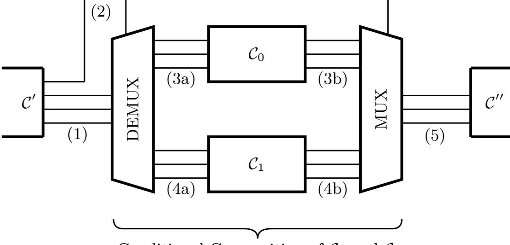
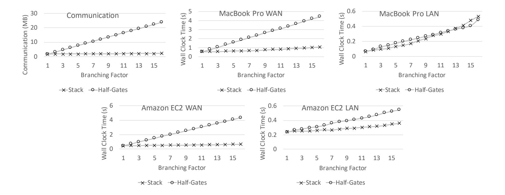

{0}------------------------------------------------

# Stacked Garbling

# Garbled Circuit Proportional to Longest Execution Path

David Heath and Vladimir Kolesnikov

Georgia Institute of Technology, Atlanta, GA, USA {heath.davidanthony,kolesnikov}@gatech.edu

Abstract. Secure two party computation (2PC) of arbitrary programs can be efficiently achieved using garbled circuits (GC). The bottleneck of GC efficiency is communication. It is widely believed that for direct 2PC evaluation of a Boolean circuit, it is necessary to transmit the entire GC, including garbled truth tables corresponding to subcomputations whose output is ultimately discarded by conditional logic.

This folklore belief is false.

We propose a novel GC technique, stacked garbling, that eliminates the communication cost of inactive conditional branches. We extend the ideas of conditional GC evaluation explored in (Kolesnikov, Asiacrypt 18) and (Heath and Kolesnikov, Eurocrypt 20). Unlike these works, ours is for general 2PC where no player knows which conditional branch is taken.

Our garbling scheme, Stack, requires communication proportional to the longest execution path rather than to the entire circuit. Stack is compatible with state-of-the-art techniques, such as free XOR and half-gates.

Stack is a garbling scheme. As such, it can be plugged into a variety of existing protocols, and the resulting round complexity is the same as that of standard GC. The approach does incur computation cost quadratic in the conditional branching factor vs linear in standard schemes, but the tradeoff is beneficial for most programs: GC computation even on weak hardware is faster than GC transmission on fast channels.

We implemented Stack in C++. Stack reduces communication cost by approximately the branching factor: for 16 branches, communication is reduced by 10.5×. In terms of wall-clock time for circuits with branching factor 16 over a 50 Mbps WAN on a laptop, Stack outperforms state-ofthe-art half-gates-based 2PC by more than 4×.

# 1 Introduction

Secure Multiparty Computation (MPC) allows mutually untrusting parties to compute a function of their private inputs while revealing only the function output. Two-party computation (2PC) is a special case of MPC that has received wide attention due both to the importance of the setting and to the efficiency of Yao's garbled circuit (GC) technique.

{1}------------------------------------------------

In GC, the parties represent functions as Boolean circuits. One player, the circuit generator, encrypts the circuit's gates and inputs and sends the encryptions to the other player, the circuit evaluator. We refer to the collection of encrypted gates as material (following [Kol18]) and to the encryptions of wire values as labels. Given material and input labels, the evaluator computes each gate under encryption and obtains output labels. Finally, the players jointly decrypt the output labels to compute the cleartext output. The key invariant is that the labels hide the truth values on the circuit wires, and thus nothing is learned except the output.

The bottleneck in GC performance is communication: the material is a large string that must be sent from generator to evaluator. Despite significant interest and considerable effort, reducing the amount of necessary material has proved challenging. Nonetheless, a persistent line of GC research has improved communication by reducing the number of ciphertexts needed to encrypt individual gates [NPS99,KS08,PSSW09,KMR14,ZRE15]. Our work is orthogonal to these gate-level improvements.

In this work, we reduce communication for circuits that include conditional branching. Under standard GC techniques, the circuit generator sends material for each branch; it is widely believed that, for security, sending separate branch material is required so as to hide which branch is taken<sup>1</sup> .

This folklore belief is false. The generator need only send enough material for the longest program execution path. That is, separate material need not be sent for each conditional branch. Instead, one string of material can be reused across the branches, greatly reducing communication. Prior work has demonstrated this possibility [HK20,Kol18], but only in the case where one of the players knows the execution path. Our approach is for general 2PC: neither player knows which branches are taken, yet material for conditionals can be efficiently transmitted without compromising security or correctness.

At a high level, our generator bitwise XORs, or stacks, material from exclusive branches together. Then, the evaluator reconstructs from seeds the material for all branches except the taken branch, XORs these strings with the stacked material to extract the material for the taken branch, and evaluates the taken branch. For security, the evaluator performs these actions obliviously, meaning that she attempts to evaluate each branch. By stacking material, the generator sends much shorter messages to the evaluator. Hence we improve communication and overall performance.

#### 1.1 Contribution

We refute the widely held belief that inactive GC branches must be transmitted. We construct a practically efficient stacked garbling scheme Stack, which improves communication for circuits with conditional branching. Stack omits

<sup>1</sup> Garbled RAM [LO13] facilitates improved branching, but requires heavy CPUemulation machinery; see Section 2. Additionally, universal circuits can implement branching, but have impractical overhead, both in circuit size and in the cost of the gadgets required [KKW17].

{2}------------------------------------------------

transmission of inactive branches and produces GC material proportional to the size of the longest program execution path rather than to the entire circuit. Stack improves GC communication by up to the branching factor: i.e., up to the ratio of the size of the longest execution path over the size of the entire circuit.

For each conditional with branching factor b, our computation cost is (less than) b times that of standard GC. Because fixed key garbling is typically much faster than GC transmission, the decrease in communication typically outweighs the increase in computation. The added computation is easily parallelized.

Stack is fully compatible with prior GC advancements, such as free XOR [KS08] and state-of-the-art half-gates [ZRE15].

Stack is extremely generic: it can improve the performance of any application that includes conditional branching. We note that one exciting direction is to use Stacked Garbling to build an efficient 'MPC machine'. An MPC machine would, similar to a hardware processor, execute programs by handling individual program instructions one-by-one. This style of machine requires conditional dispatch on the type of instruction in order to optionally perform one instruction from the instruction set, an ideal case for Stacked Garbling to be used.

We built and evaluated a C++ implementation of Stack (see Sections 9 and 10). Our evaluation confirms that Stack indeed reduces communication over the prior state-of-the-art by the branching factor. This communication improvement reduces wall-clock time, especially on slower or shared networks. In terms of wallclock time for circuits with branching factor 16 over 50 Mbps WAN on a laptop, Stack outperforms state-of-the-art half-gates-based 2PC by more than 4×.

We plan to release our software as open-source.

# 2 Related Work

GC is the most popular and often the fastest approach to secure two-party computation (2PC). GC is effective for functions that include conditional statements: alternative arithmetic representations must convert values to a Boolean representation at high cost before performing integer comparisons that frequently appear as branch conditions.

We review and compare related work in the area of GC. The most relevant works, [Kol18] and [HK20], are background to our approach and are reviewed in Sections 3.1 and 3.2.

Garbling schemes formalize the subcomponents used in GC, and are defined in a number of works, including [FKN94,KO04]. [BHR12] developed a systematic and detailed garbling scheme framework. The BHR formalization is popular and useful; it allows researchers to streamline and simplify their presentation of work in the GC area. At the same time, BHR groups material (i.e. garbled gates) together with the circuit for which it was generated. Our approach relies on a separation of material from circuit topology. Therefore, while we formalize our approach in the BHR framework, some definitions are adjusted to explicitly separate material from topology.

{3}------------------------------------------------

GC communication improvements. Since Yao's original work, the community has achieved only modest improvements in communicating a single GC; even the na¨ıve construction is bare-bones and leaves little room for communication reduction. Additionally, most GC research has instead focused on orthogonal performance concerns in the malicious model.

Still, improvements have been made. Most communication reduction has come in the form of improvements to individual gates. In its original construction, GC required the transmission of four ciphertexts per gate. Chronologically, the following improvements were made:

- [NPS99] achieved three ciphertexts per gate (3 garbled row reduction, GRR3).
- A decade later, 'free XOR' eliminated the cost of XOR gates [KS08].
- Shortly after, [PSSW09] unified GRR3 and free XOR. The same work also introduced an interpolation-based technique that uses only two ciphertexts per gate, but that is incompatible with free XOR.
- Subsequently, [KMR14] proposed a heuristic for combining different row reduction techniques with free XOR.
- Finally, improvements to individual gates culminated in 'half-gates', a garbling scheme built on and compatible with free XOR that achieves two ciphertexts per AND gate [ZRE15]. The same work also established a matching lower bound on the size of individual gates that is hard to circumvent.

Free XOR based schemes, including half-gates, assume the existence of a hash function that is correlation robust [IKNP03] and circular secure [CKKZ12]. [GLNP18] specify an efficient scheme built on standard assumptions. Their technique uses two ciphertexts per AND gate and one ciphertext per XOR gate.

Our work is orthogonal to these gate-level improvements and our construction uses them. In particular, we focus on conditional branching only and leverage the existing half-gates technique to handle individual gates.

Universal circuits. In this work, we use cryptographic techniques to reduce the cost of conditionals. Another direction attempts to instead reduce cost by choosing alternate Boolean circuit representations. Universal circuits (UCs) can be programmed to implement any circuit in the entire universe of circuits of a given size n [Val76]. Researchers continue to search for smaller UC constructions; recent work achieves size ≈ 4.5n log n [LMS16,KS16,GKS17,ZYZL18,AGKS19]. UCs implement conditionals by programming the UC to be the taken branch. When the GC generator knows the evaluated branch, the cost of UC programming is free as the generator directly programs the UC; otherwise programming is sent via O(n log n) OTs. However, even in the former "free programming" case, implementing conditionals via UCs usually does not pay off. Even for branches with only 2<sup>10</sup> gates, the UC is 4.5·10 = 45 times larger than a single branch. For typical conditionals with only 2-3 branches, it is cheaper to separately encrypt and send each branch.

Motivated in part by branching, [KKW17] proposed a generalization of UCs called set universal circuits (S-UCs). An S-UC implements a fixed set of circuits S rather than an entire size-n universe. [KKW17] focuses on the special case where |S| is small, capturing the case where S is a set of conditional branches. 

{4}------------------------------------------------

Their approach applies heuristics to embed S into one programmable circuit. [KKW17] reports the performance of this heuristic for specific sets of circuits, achieving up to 6× GC size reduction for 32 branches. However, some sets did not improve over their original representations. Our work achieves up to 32× GC size reduction for 32 branches and requires no per-gate overhead, which is significant in [KKW17] (about 22 garbled rows per gate). The work of [Kol18] (Section 3.2) supersedes [KKW17] when the GC generator knows the taken branch.

Topology-decoupling circuit garbling, i.e. GC evaluation under different topologies, is a promising direction in GC research. It was introduced by [Kol18], extended in [HK20], and is further explored in this work. We present detailed reviews of [Kol18] and [HK20] as preliminaries in Sections 3.1 and 3.2. Our work generalizes these existing techniques from special cases where one player knows the executed branch to general 2PC. We believe topology-decoupling and stacked garbling can be further fine-tuned and applied, especially with specific functionalities in mind.

Garbled RAM and CPU-emulation-based 2PC. Garbled RAM is a powerful technique that augments GC with sublinear cost oblivious random access memory [LO13,GHL+14,GLOS15,GLO15]. It enables CPU-emulation-based 2PC, which in particular can conditionally execute branches without paying separately for each branch. Stacked Garbling achieves improved branching without the overhead needed to emulate a CPU and, moreover, can itself be effectively used as a low-level primitive in CPU emulation.

### 3 Preliminaries

We present an efficient technique for garbling circuits with conditional branches. Two prior works also address GC conditionals, but both focus on special cases where one player knows the target branch. I.e., one player knows which branch is taken a priori. Specifically, [Kol18] requires the circuit generator to know the target, while [HK20] requires the circuit evaluator to know the target. Our approach uses key ideas from both works to efficiently handle conditionals without either party knowing the target, so we review both works.

#### 3.1 'Free If ' Review [Kol18]

Consider a GC with conditional branching. If the circuit generator Gen knows the target branch, then [Kol18] reduces communication needed to send the GC by combining two keys ideas:

- 1. The circuit description (the topology) can be separated from the GC material (i.e., the gate encryptions), and material can be used with a non-matching topology. [Kol18] formalizes topology-decoupling circuit garbling, where circuit topology is conveyed separately from material.
- 2. Material can be re-used if it is used at most once with valid labels. The same material can be re-used with garbage labels. Garbage labels are not

{5}------------------------------------------------

the encryptions of truth values, but are instead pseudorandom strings. Put another way, the evaluator may 'decrypt' a gate table with keys unrelated to the table encryption multiple times. Successful and unsuccessful decryption attempts must be indistinguishable.

The [Kol18] approach is as follows:

Let C~ = {C1, ..., Cn} be a set of Boolean circuits, where each circuit represents a different branch of a conditional statement. For simplicity, suppose all GCs are of the same size ([Kol18] pads material to accommodate branches of different sizes). Let C<sup>t</sup> be the target circuit, and let Gen know t. Gen encrypts C<sup>t</sup> but does not encrypt the other n−1 circuits. Let M be the material constructed by encrypting Ct. Gen sends M to the evaluator Eval. Furthermore, Gen conveys to Eval input labels for each circuit via oblivious transfer. Eval knows the topology of each branch, since she knows C~, but does not know and must not learn t. Therefore, she evaluates each branch C<sup>i</sup> , interpreting M as the collection of encrypted truth tables for that branch. When she evaluates Ct, she therefore obtains correct output labels. But M is valid material only for Ct, not for the other branches. The input labels that Eval uses for all Ci6=<sup>t</sup> are garbage with respect to M, and Eval obtains garbage labels for each wire. [Kol18] demonstrates it is possible to re-use material in this way without compromising security. Namely, Eval cannot distinguish the garbage labels from the valid labels and hence does not learn t. Eval and Gen obliviously discard garbage labels from Ci6=<sup>t</sup> and propagate valid labels from C<sup>t</sup> via an output selection protocol. In this manner, the parties compute the correct output labels for branch C<sup>t</sup> which can be decrypted or used as input for another circuit.

By computing the protocol above, the two parties securely evaluate 1-out-ofn branches while transmitting material for only 1 branch rather than for all n. This reduces communication and hence improves performance.

Our approach also optimizes conditional branching and also relies on the key ideas of topology decoupling and garbage labels. However, our approach differs from [Kol18] in two key respects:

- 1. [Kol18] relies on Gen knowing the target branch. We consider the general case where neither Gen nor Eval know the target. Despite this generalization, we similarly avoid transmitting separate material for each branch.
- 2. [Kol18] requires the parties to interact via the output selection protocol. We discard garbage labels without interaction.

#### 3.2 'Privacy-Free Stacked Garbling' Review [HK20]

[HK20] is in a line of work that uses garbled circuits to construct zero-knowledge proofs [JKO13,FNO15]. [HK20] differs from [Kol18] primarily in that the circuit evaluator Eval knows the target branch rather than the circuit generator Gen. This is a critical distinction that requires a different approach. [HK20] builds this new approach on two key ideas:

{6}------------------------------------------------

- 1. Material can be managed as a bitstring. In particular, material from different circuits can be XORed together. This is a different use of topologydecoupling from that of [Kol18]. [Kol18] decouples topology from material so that the same material can be used to evaluate many topologies. [HK20] decouples topology from material so that material from different circuits can be XORed, or stacked, to reduce communication.
- 2. Material can be viewed as the expansion of a pseudorandom seed. Circuit encryption is a pseudorandom process, but if all random choices are derived from a seed, then material is the deterministic expansion of that seed. Hence, material can be compactly sent as a seed.

In general, we cannot send material via a seed, as the seed also includes all wire labels. In the [HK20] setting of GC-based zero-knowledge, this extra information would allow the evaluator to forge a proof. [HK20] shows that it is secure to reveal a seed to Eval if the seed only generates material for a non-target branch.

[HK20] combines these ideas to reduce the cost of proving in zero-knowledge (ZK) 1-out-of-n different statements. The approach is as follows (we elide many ZK-specific details):

Let C~ = {C1, ..., Cn} be a set of Boolean circuits that each implement a proof statement. Let C<sup>t</sup> be the target circuit (i.e. the circuit for which ZK Prover Eval has a witness) and let Eval know t. The ZK Verifier Gen knows C~, but does not know and must not learn t. Gen uses n different seeds to construct material for each circuit C<sup>i</sup> . He stacks these n strings by XORing them together, with appropriate padding, and sends the result to Eval. Eval selects the target circuit during n instances of 1-out-of-2 oblivious transfer. In each instance i 6= t, she selects the first secret and receives the ith seed. In instance t, she chooses the second secret and so does not receive the seed for Ct. <sup>2</sup> Eval uses the n−1 seeds to reconstruct material for circuits Ci6=<sup>t</sup> and uses the result to 'undo' the stacking. As a result, she obtains material needed to evaluate Ct. She evaluates and is able to construct a proof of Ct, which she sends to Gen.

By running this protocol, Eval and Gen perform a zero-knowledge proof of 1-out-of-n statements, but at the cost of sending only one proof challenge rather than sending n. This reduces communication and hence improves performance.

Our approach leverages the key ideas from [HK20]. We also stack cryptographic material using XOR and also allow the circuit evaluator to expand seeds for non-target branches. Our approach differs from [HK20] in that:

- 1. [HK20] relies on Eval knowing the target branch. Our approach assumes that neither Eval nor Gen knows the target.
- 2. [HK20] is a technique for ZK. Our approach addresses general 2PC where both players have private input.

<sup>2</sup> The second secret allows Eval to prove that she did not retrieve one of the seeds and hence obtained the output label by GC evaluation of one branch. This prevents Eval from taking all n seeds and using them to forge a proof.

{7}------------------------------------------------

3. [HK20] requires Gen to send pseudorandom seeds to Eval via oblivious transfer. Our approach embeds the seeds in the GC itself and hence does not require additional interaction.

## 4 Notation and Assumptions

#### Notation

- 'Gen' is the circuit generator. We refer to Gen as he, him, his, etc.
- 'Eval' is the circuit evaluator. We refer to Eval as she, her, hers, etc.
- 'C' is a circuit. Subcircuits are distinguished using annotations, e.g. C0, C1, C 0 ...
- Lowercase variables, e.g. x, y, refer to unencrypted wire values. That is, x and y are two different Boolean values held by two different wires.
- Uppercase variables, e.g. X, Y , refer to wire labels which are the encryption of a wire value. E.g., X is the encryption of the value x.
- This work discusses projective garbling schemes, where each wire has two labels. When the corresponding truth value for a label is known, we place the value as a superscript. For example, we use X<sup>0</sup> to refer to the encryption of the bit 0 on wire x. Symmetrically, X<sup>1</sup> refers to the encryption of bit 1. Unannotated variables, e.g. X, refer to unknown wire encryptions: X could be either X<sup>0</sup> or X<sup>1</sup> , but it is unspecified or unknown in the given context.
- The variables s, S, S<sup>0</sup> , S<sup>1</sup> refer to the branch condition wire. In the context of a conditional, s decides which branch is taken.
- Following [Kol18], M refers to GC material. Informally, material is the data which, in conjunction with input labels, is used to compute output labels. In standard garbling schemes, material is a vector of encrypted gate tables. In this work, material can be encrypted gate tables or the XOR stacking of material from different branches. In our work, material does not include the circuit topology or labels.
- In the context of a conditional, subscripts 0 and 1 associate values with the first (resp. second) branch. For example, M<sup>0</sup> is the material for branch C0.
- The variables n and m respectively denote the number of input wires and output wires of a given circuit.
- Variables that represent vectors are written in bold. For example, ~x is a vector of unencrypted truth values. We use bracket notation to access indexes of vectors: ~x[0] accesses the 0th index of ~x.
- We work with explicit pseudorandom seeds. We write a ←\$<sup>S</sup> A to indicate that we pseudorandomly draw a value from the domain A using the seed S as a source of randomness and store the result in a. When a seed S is used to draw multiple values, we assume that each draw uses a nonce to ensure independent randomness. For simplicity, we leave the counter implicit.
- We write a ←\$ A to denote that a is drawn uniformly from A.
- <sup>c</sup>= denotes computational indistinguishability.
- κ denotes the computational security parameter and can be understood as the length of encryption keys (e.g. 128).

{8}------------------------------------------------

 $-\lambda$  denotes the empty string.

In this work, we evaluate GCs with input labels that are generated independently of the GC. I.e., these independent labels do not match the GC. We call such labels *garbage labels*. During GC evaluation, garbage labels propagate and must eventually be obliviously dropped in favor of valid labels. We call the process of canceling out garbage labels *garbage collection*.

Assumptions. We assume a function H modeled as a random oracle (RO). We note it is likely that Stacked Garbling can be achieved without use of a RO. However, our particular construction interfaces with another garbling scheme in a black-box manner. Because we place few requirements on this 'underlying' garbling scheme, interfacing requires care; we leave reducing assumptions needed to achieve Stacked Garbling as future work.

### 5 High Level Approach

Our main contribution is a circuit garbling scheme that compacts material for conditional branches. In Section 7, we present this garbling scheme in technical detail. For now, we present our approach at a high level.

Section 3 covered four key ideas from prior work regarding material: material can be (1) separated from circuit topology, (2) used with garbage input labels, (3) stacked with XOR, and (4) compactly transmitted as a seed. To this list, we add one additional key idea that allows us to obliviously and without interaction discard garbage labels that emerge from the evaluation of inactive branches; we ensure that all garbage is *predictable* to Gen. Gen precomputes the possible garbage values and uses this knowledge to build garbled circuit gadgets that collect garbage obliviously. We begin with a high level approach that omits garbage collection (which is explained later):

Let  $C_0$  and  $C_1$  be two subcircuits that are conditionally composed as part of some larger circuit. Let there be a wire s that encodes the branch condition: if s = 0, then  $C_0$  should be executed and otherwise  $C_1$  should be executed. Let  $S^0, S^1$  be the pair of labels encrypting the possible values of s. I.e.,  $S^0$  encrypts 0 and  $S^1$  encrypts 1. Let S be Eval's label encrypting s. Eval does not know whether  $S = S^0$  or  $S = S^1$ . Suppose neither Gen nor Eval knows s and hence neither player knows the target branch. At a high level, our approach is as follows:

- 1. Gen uses  $S^1$  as a seed to encrypt  $C_0$ . As we will see, this allows Eval to evaluate  $C_1$ . Symmetrically, he uses  $S^0$  as a seed to encrypt  $C_1$ . Let  $M_0, M_1$  be the respective resultant material.
- 2. Gen uses XOR to stack the material. The result is the material for the conditional:  $M_{cond} = M_0 \oplus M_1$ . Gen sends  $M_{cond}$  to Eval.
- 3. Recall, Eval has a label S. She assumes  $S = S^0$  and uses S to encrypt  $\mathcal{C}_1$ .
  - (a) Suppose Eval's assumption is correct. Then since she encrypts with the same seed as Gen, she constructs  $M_1$ . She computes  $M_{cond} \oplus M_1 = M_0$ , the correct material for  $C_0$ . She evaluates  $C_0$  with her input labels and obtains valid output.

{9}------------------------------------------------

(b) Suppose Eval's assumption is not correct, i.e. S = S 1 . Then she constructs garbage material instead of M1. Correspondingly, she obtains garbage material for C<sup>0</sup> and hence computes garbage output.

Critically, Eval cannot distinguish between her correct and incorrect assumptions. That is, she cannot distinguish valid material/labels from garbage: from Eval's perspective both valid and garbage material/labels are indistinguishable from random strings. We elaborate on this point in our security proofs (Section 8).

4. Eval symmetrically assumes S = S 1 , encrypts C0, and evaluates C1.

Since S must be either S <sup>0</sup> or S 1 , one of Eval's assumptions is right and one is wrong. That is, she computes valid output from one subcircuit and garbage output from the other.

The remaining task is to obliviously discard the garbage output labels. This could be achieved using an output selection protocol [Kol18], but our goal is to discard garbage non-interactively. To realize this goal, we introduce two new GC 'gadgets': a demultiplexer gadget (demux) and a multiplexer gadget (mux). The demux ensures that when Eval makes the wrong assumption, her garbage labels are predictable to Gen. The mux disposes of predictable output garbage labels. In practice, the demux and mux are built from garbled tables. We describe their constructions in Section 7.6.

Additional details and garbage collection. We now rewind and present Eval's actions at a lower level of detail, including her handling of the demux and mux. In our explanation, we assume S = S 0 . The symmetric scenario (S = S 1 ) has a symmetric explanation. We stress that the protocol is unchanged, and only the explanation is affected by the assumption.

Figure 1 depicts a conditional subcircuit that includes a demux and mux. Wirings in the diagram are numbered. Each of the following numbered steps refers to a correspondingly numbered wiring in the diagram.

- 1. The input labels to the conditional are the output of some other subcircuit. All input wires are passed to the demux.
- 2. The first input label is S, the encryption of the branch condition, by convention. Both the demux and the mux take S as an argument that controls their operation.
- 3. Eval assumes S = S <sup>0</sup> and evaluates C<sup>0</sup> as described in the above higher-level explanation.
  - (a) Since this is a correct assumption (recall, we assumed S = S 0 ), the demux yields valid input labels for C0.
  - (b) As before, Eval encrypts C<sup>1</sup> using S, computes Mcond ⊕ M<sup>1</sup> = M0, evaluates C0, and obtains valid output labels.
- 4. Eval symmetrically assumes that S = S <sup>1</sup> and evaluates C1.
  - (a) Since this is an incorrect assumption, the demux yields garbage input labels for C1. One challenge is that there are an exponential number of possible inputs to C1. Each input wire can carry two different labels, and all wires are potentially independent. The demux eliminates this

{10}------------------------------------------------



Conditional Composition of C<sup>0</sup> and C<sup>1</sup>

Fig. 1. A circuit with conditional evaluation. Subcircuit C 0 is evaluated before the conditional. By convention, the first wire out of C 0 is the branch condition and controls which conditional subcircuit is to be evaluated. C<sup>0</sup> and C<sup>1</sup> are the conditionally composed subcircuits. Our approach introduces garbage labels, and the demux and mux circuit components allow us to collect garbage non-interactively. Outputs of conditionals can be used as inputs to subsequent subcircuits (e.g., C <sup>00</sup>).

uncertainty by processing the input wire-by-wire, where there are only two options for a wire label. That is, the demux, applying garbled tables, obliviously translates both input wire labels to the same garbage label. There is a corresponding translation performed for the target branch C0, but in that case the demux keeps the two wire labels distinct. The demux uses S to control which branch receives valid labels and which receives garbage.

One can think of this uncertainty elimination as obliviously multiplying the input wires by either 0 or 1 depending on S.

- (b) As before, Eval computes garbage outputs by attempting to evaluate C1. The output garbage labels are independent of the conditional circuit inputs because (1) the demux ensures there is only one possible garbage input per wire and (2) the evaluator's actions are deterministic. That is, we have guaranteed that C<sup>1</sup> has only one possible garbage output label per wire, and these garbage labels can be computed/predicted by Gen.
- 5. Garbage Collection. Eval passes both sets of output labels to the mux, along with S. The mux collects garbage and yields valid outputs. These outputs can be used as input to a subsequent subcircuit.

Garbage collection (Step 5) is possible because Gen predicts the garbage output from C<sup>1</sup> (recall, we assumed that the target branch is C0). By construction, the output labels depend on garbling randomness only, and are independent of the inputs to C1. Gen predicts this garbage by emulating Eval's actions when making a bad assumption. More precisely, he predicts both possible wrong assumptions:

{11}------------------------------------------------

- 1. Gen emulates Eval in the case where she assumes  $S = S^1$ , while in fact  $S = S^0$ . Gen encrypts  $C_0$  with  $S^0$ , yielding garbage material  $M'_0$ , and evaluates  $C_1$  using  $M_{cond} \oplus M'_0$ .
- 2. Gen emulates Eval in the case where she assumes  $S = S^0$ , while in fact  $S = S^1$ . Gen encrypts  $\mathcal{C}_1$  with  $S^1$  and evaluates  $\mathcal{C}_0$  using  $M_{cond} \oplus M'_1$ .

These emulations compute the possible garbage output from both branches. Gen uses the garbage output labels to construct encrypted truth tables for the mux.

By our approach, Gen and Eval compactly represent the conditional composition of  $\mathcal{C}_0$  and  $\mathcal{C}_1$ . In particular, Gen sends  $M_{cond} = M_0 \oplus M_1$  instead of  $M_0 || M_1$ . The XOR-stacked material is shorter than the concatenated material and hence more efficient to transmit. Both the demux and mux require additional material, but the amount required is linear in the number of inputs/outputs and is usually small compared to the amount of material needed for the branches.

### 6 Formalization of Circuits

We formalize our technique as a *garbling scheme* [BHR12]. Before defining our scheme, we specify the syntactic objects that it manipulates. Specifically, we formalize circuits that include explicit conditional branching.

A circuit is typically understood as the composition of many Boolean gates together with specified input and output wires. We refer to this representation as a *netlist*. We do not specify the syntax of netlists and instead leave the handling of netlists to another *underlying* garbling scheme, which we refer to as Base. In practice, our implementation instantiates Stack with the half-gates technique, the state-of-the-art scheme for securely computing netlists [ZRE15].

Unfortunately, netlists alone are insufficient for our approach because they do not explicate conditional branching. Therefore, we add the notion of a conditional. A conditional is parameterized over two circuits,  $C_0$  and  $C_1$ . Conditionals with more than two branches can be constructed by nesting. In Supplementary Material, we also provide a vectorized construction that conditionally composes any number of branches without nesting. This vectorized construction is a simple generalization and is concretely more efficient yet notationally more complex. Thus, we now formalize our approach for branching factor two. The first bit of input to a conditional is, by convention, the condition bit s. The condition bit decides which of the two parameterized circuits should be executed. As an example, Figure 1 depicts the conditional composition of  $C_0$  and  $C_1$ . We add one requirement to conditionals: the two subcircuits must use the same input and output wires. This requirement can be met without loss of generality by disposing of unused inputs or adding constant-valued outputs. From here on, we assume this requirement has been met.

We also add a third type of circuit that we call *sequences*. Sequences, while uninteresting, are necessary for our approach. Sequences allow us to place conditional circuits 'in the middle' of the overall circuit. As an example, Figure 1 depicts a sequence of three circuits: the leftmost circuit that provides input to the conditional, the conditional circuit, and the rightmost circuit. Without

{12}------------------------------------------------

sequences, we could not formalize the circuit in Figure 1. A sequence is parameterized over two subcircuits. Vectors of circuits are constructed by nesting sequences. When executed, a sequence passes its input to its first subcircuit and uses the resulting output as input to its second subcircuit. We add one requirement to sequences: the number of output wires from the first subcircuit must match the number of input wires into the second subcircuit. We assume that this requirement is met in future discussion.

Let C0, C<sup>1</sup> be two arbitrary circuits. The space of circuits is defined as follows:

```
C ::= Netlist(·) | Cond(C0, C1) | Seq(C0, C1)
```

That is, a circuit is either a netlist, a conditional, or a sequence. By nesting conditionals and sequences, this small language can achieve complex branching control structure. As an example, we formalize Figure 1 as:

$$\mathsf{Seq}(\mathcal{C}',\mathsf{Seq}(\mathsf{Cond}(\mathcal{C}_0,\mathcal{C}_1),\mathcal{C}''))$$

# 7 Our Garbling Scheme

```
1 En(e, ~x):
2 X~ ← λ
3 for i ∈ 0..n−1 :
4

        X
          0
          , X1

                ← e[i]
5 if ~x[i] = 0 then X~ [i] ← X
                                0
                                 ;
6 else X~ [i] ← X
                     1
                      ;
7 return X~
                                        1 De(d, Y~ ):
                                        2 ~y ← λ
                                        3 for i ∈ 0..m−1 :
                                        4

                                                Y
                                                  0
                                                   , Y 1

                                                        ← d[i]
                                        5 if Y~ [i] = Y
                                                          0
                                                           then ~y[i] ← 0;
                                        6 else if Y~ [i] = Y
                                                               1
                                                                then
                                        7 ~y[i] ← 1
                                        8 else return ⊥;
                                        9 return ~y
```

Fig. 2. The input encoding algorithm En and the output decoding algorithm De. En specifies how to encrypt input values, resulting in input labels. Symmetrically, De specifies how to decrypt output labels into cleartext output values. En and De are generic and work for any projective garbling scheme.

In this section, we formalize our garbling scheme, Stack, presented in Construction 1. Stack securely evaluates functions represented by circuits as defined in Section 6. Furthermore, if a circuit has conditional branching, then Stack compactly represents the material for the conditional, reducing communication cost.

Garbling schemes abstract the detail of encrypted circuit evaluation such that protocols can be written generically and new garbled circuit advancements can be quickly integrated [BHR12]. That is, a garbling scheme is a specification,

{13}------------------------------------------------

```
1 Stack. Gb(1^{\kappa}, \mathcal{C}, S):
  1 Stack.ev(C, \vec{x}):
                                                                                                                (M', e, d') \leftarrow \mathsf{Gb}'(1^k, \mathcal{C}, S)
           switch C:
  \mathbf{2}
                                                                                                      \mathbf{2}
                                                                                                                d \leftarrow \mathsf{GenProjection}(m, S)
                case Netlist(\cdot):
  3
                                                                                                      3
                     return Base.ev(C, \vec{x})
                                                                                                                M_{tr} \leftarrow trans.\mathsf{Gb}(d',d)
  4
                                                                                                      4
                case Seq(\mathcal{C}_0,\mathcal{C}_1):
                                                                                                                M \leftarrow M' || M_{tr}
                                                                                                      5
  5
                                                                                                                return (M, e, d)
                     \vec{y}_0 \leftarrow \mathsf{Stack.ev}(\mathcal{C}_0, \vec{x})
                                                                                                      6
  6
                     \vec{y} \leftarrow \mathsf{Stack.ev}(\mathcal{C}_1, \vec{y}_0)
  7
                                                                                                      1 Gb'(1^{\kappa}, \mathcal{C}, S):
                     return \vec{y}
  8
                                                                                                                switch C:
                                                                                                      2
                case Cond(\mathcal{C}_0, \mathcal{C}_1):
  9
                                                                                                                     case Netlist(\cdot):
                                                                                                      3
                     if \vec{x}[0] = 0 then
10
                                                                                                                         return Base. Gb(1^{\kappa}, \mathcal{C}, S)
                                                                                                      4
                          return Stack.ev(\mathcal{C}_0, \vec{x})
11
                                                                                                                     case Seq(\mathcal{C}_0,\mathcal{C}_1):
                                                                                                      5
                     else
12
                                                                                                                          (M_0, e_0, d_0) \leftarrow \mathsf{Gb}'(1^{\kappa}, \mathcal{C}_0, S)
                                                                                                      6
                          return Stack.ev(C_1, \vec{x})
13
                                                                                                                          (M_1, e_1, d_1) \leftarrow \mathsf{Gb}'(1^{\kappa}, \mathcal{C}_1, S)
                                                                                                      7
  1 Stack. Ev(C, M, \vec{X}):
                                                                                                                         M_{tr} \leftarrow trans.\mathsf{Gb}(d_0, e_1)
                                                                                                      8
                                                                                                                         M \leftarrow (M_0||M_{tr}||M_1)
           (M'||M_{tr}) \leftarrow M
                                                                                                      9
  \mathbf{2}
                                                                                                                         return (M, e_0, d_1)
                                                                                                    10
           \vec{Y}' \leftarrow \mathsf{Ev}'(\mathcal{C}, M', \vec{X})
  3
                                                                                                                     case Cond(\mathcal{C}_0, \mathcal{C}_1):
                                                                                                    11
           \vec{Y} \leftarrow trans.\mathsf{Ev}(\vec{Y}', M_{tr})
  4
                                                                                                                         e \leftarrow \mathsf{GenProjection}(n,S)
                                                                                                    12
           return \vec{Y}
  \mathbf{5}
                                                                                                                          d \leftarrow \mathsf{GenProjection}(m, S)
                                                                                                    13
                                                                                                                         (S^0, S^1) \leftarrow e[0]
                                                                                                    14
  1 EV(C, M, \vec{X}):
                                                                                                                          (M_0, e_0, d_0) \leftarrow \mathsf{Gb}'(1^\kappa, \mathcal{C}_0, S^1)
                                                                                                    15
           switch C:
  \mathbf{2}
                                                                                                                          (M_1, e_1, d_1) \leftarrow \mathsf{Gb}'(1^{\kappa}, \mathcal{C}_1, S^0)
                                                                                                    16
                case Netlist(\cdot):
  3
                                                                                                                          (M_{dem}, \perp_0, \perp_1) \leftarrow
                                                                                                    17
                     Y \leftarrow \mathsf{Base}.\mathsf{Ev}(\mathcal{C},M,X)
  4
                                                                                                                            demux.\mathsf{Gb}(S^0,S^1,e,e_0,e_1)
                     return \vec{Y}
  \mathbf{5}
                                                                                                                         M_{cond} \leftarrow M_0 \oplus M_1
                                                                                                    18
                case Seq(\mathcal{C}_0,\mathcal{C}_1):
  6
                                                                                                                         (M'_0,\cdot,\cdot) \leftarrow \mathsf{Gb}'(1^\kappa,\mathcal{C}_0,S^0)
                                                                                                    19
                     (M_0||M_{tr}||M_1) \leftarrow M
  7
                                                                                                                         (M'_1,\cdot,\cdot) \leftarrow \mathsf{Gb}'(1^{\kappa},\mathcal{C}_1,S^1)
                                                                                                    20
                     \vec{Y}_0 \leftarrow \mathsf{Ev}'(\mathcal{C}_0, M_0, \vec{X})
  8
                                                                                                                         \vec{\perp}_0' \leftarrow \mathsf{Ev}(\mathcal{C}_0, M_{cond} \oplus M_1', \vec{\perp}_0)
                                                                                                    \mathbf{21}
                     \vec{X}_1 \leftarrow trans. \mathsf{Ev}(\vec{Y}_0, M_{tr})
  9
                                                                                                                          \vec{\perp}_1' \leftarrow \mathsf{Ev}(\mathcal{C}_1, M_{cond} \oplus M_0', \vec{\perp}_1)
                                                                                                    \mathbf{22}
                     \vec{Y} \leftarrow \mathsf{Ev}'(\mathcal{C}_1, M_1, \vec{X}_1)
10
                                                                                                                         M_{mux} \leftarrow
                                                                                                    \mathbf{23}
                     return \vec{Y}
11
                                                                                                                            mux.\mathsf{Gb}(S^0, S^1, d, d_0, d_1, \vec{\perp}_0', \vec{\perp}_1')
                case Cond(\mathcal{C}_0,\mathcal{C}_1):
12
                                                                                                                         M \leftarrow (M_{dem}||M_{cond}||M_{mux})
                                                                                                    \bf 24
                     (M_{dem}||M_{cond}||M_{mux}) \leftarrow M
13
                                                                                                                         return (M, e, d)
                                                                                                    25
                     S \leftarrow X[0]
14
                                                                                                      1 GenProjection(n, S):
                     (\vec{X}_0, \vec{X}_1) \leftarrow
15
                                                                                                               p \leftarrow \lambda
                                                                                                      \mathbf{2}
                        demux.\mathsf{Ev}(S,\vec{X},M_{dem})
                                                                                                                for i \in 0..n-1:
                                                                                                      3
                     (M_0,\cdot,\cdot) \leftarrow \mathsf{Gb}'(1^\kappa,\mathcal{C}_0,S)
16
                                                                                                                     X^{0} \leftarrow_{\$S} \{0,1\}^{\kappa}
                                                                                                      4
                     (M_1,\cdot,\cdot) \leftarrow \mathsf{Gb}'(1^{\kappa},\mathcal{C}_1,S)
17
                                                                                                                     X^{1} \leftarrow_{\$S} \{0,1\}^{\kappa}
                                                                                                      5
                     \vec{Y}_0 \leftarrow \mathsf{Ev}'(\mathcal{C}_0, M_{cond} \oplus M_1, \vec{X}_0)
18
                                                                                                                     c \leftarrow_{\$S} \{0,1\}
                                                                                                      6
                                                                                                                    p \leftarrow p||((X^{\hat{0}}||c), (X^1||1 \oplus c))
                     \vec{Y}_1 \leftarrow \mathsf{Ev}'(\mathcal{C}_1, M_{cond} \oplus M_0, \vec{X}_1)
                                                                                                      7
19
                     \vec{Y} \leftarrow mux.\mathsf{Ev}(S, \vec{Y}_0, \vec{Y}_1, M_{mux})
                                                                                                                return p
                                                                                                      8
20
                     return \vec{Y}
21
```

**Fig. 3.** Our garbling scheme Stack. Let Stack.En = En and Stack.De = De as defined in Figure 2. Ev and Gb are written in terms of recursive sub-procedures Ev' and Gb' respectively. The procedure GenProjection draws a pseudorandom input or output projection (à la projective garbling schemes). Gb, Gb', and GenProjection each take an explicit pseudorandom seed S. Recall that when using S as a pseudorandom seed, there is an implicit counter that ensures drawn values are independent.

{14}------------------------------------------------

not a protocol. For completeness, Supplementary Material provides a reference protocol that uses the garbling scheme abstraction to achieve semihonest 2PC.

A garbling scheme is a tuple of five algorithms:

(ev, Gb, En, Ev, De)

ev is a reference function that describes cleartext circuit semantics. The remaining four algorithms securely achieve the same result as ev. The idea is that if (1) the circuit is encrypted using Gb, (2) the players' cleartext inputs are encoded using En, (3) the encoded inputs and garbled circuit are evaluated using Ev, and (4) the encoded outputs are decoded using De, then the output should be the same as obtained by invoking ev directly.

Construction 1 (Stack garbling scheme). Stack is the tuple of algorithms (Stack.ev, Stack.Gb, Stack.En, Stack.Ev, Stack.De) presented in Figures 2 to 4.

Construction 1 supports any number of branches via nested conditionals. We also provide a construction (with a proof) that conditionally composes arbitrary numbers of branches without nesting in Supplementary Material. This vectorized construction and its proofs are immediate given Construction 1.

In the following subsections, we present the interface to and our instantiation of each algorithm. In Section 8, we prove that our instantiation is correct, oblivious, private, and authentic, as defined in [BHR12]. Formal definitions of these properties are included in Section 8.

Lemmas and theorems proved in Section 8 imply the following:

Theorem 1. If H is modeled as a RO and the underlying scheme Base is halfgates [ZRE15], then Construction 1 is correct, oblivious, private, and authentic.

#### 7.1 Projective garbling schemes, encoding, and decoding

We consider projective garbling schemes [BHR12]. In a projective scheme, each circuit wire is encrypted by one of two possible labels, where one label corresponds to 0 and the other to 1. Correspondingly, a projection is a vector of pairs of labels. Stack is projective.

Due to projectivity, encrypting inputs and decrypting outputs is simple. In particular, En and De are implemented as straightforward mappings between truth values and labels. Our instantiations of En and De (Figure 2) are generic to all projective garbling schemes:

En maps cleartext inputs to encrypted inputs. More precisely, it maps an encoding string e and a vector of cleartext inputs ~x to a vector of input labels X~ . In a projective scheme, e is a vector of pairs of labels (a projection). Our specification of En 'walks' ~x and e together. At each index, it checks the value of the ith input bit and appends the correponding label to X~ . When instantiated in a protocol, En is typically implemented via OT; we do this as well.

De maps encrypted outputs to cleartext outputs. More precisely, it maps a decoding string d and a vector of output labels Y~ to a vector of cleartext outputs 

{15}------------------------------------------------

~y. Like e, d is a vector of pairs of labels (a projection) when the garbling scheme is projective. Our specification of De is dual to our construction of En. The algorithm walks Y~ and d together. At each index, it checks if the ith output is equal to the 0 label or to the 1 label and appends the appropriate truth value to the output vector. If any output does not correspond to a label, then the algorithm outputs ⊥ to indicate that an error has occurred.

#### 7.2 Underlying garbling scheme

Stack directly handles conditionals and sequences but leaves the handling of netlists to another garbling scheme. That is, Stack is parameterized over an underlying garbling scheme Base. In practice, we implement Base using the stateof-the-art half-gates technique [ZRE15]. Our formalization assumes that Base is a package that includes all garbling scheme algorithms. For example, Base.Gb is the underlying scheme's procedure for encrypting netlists.

We place the following requirements on Base:

- Base is correct, oblivious, private, and authentic ([BHR12] definitions are stated in Section 8).
- Base is projective [BHR12]. That is, each wire has two possible labels.
- Base provides a color procedure that assigns a different Boolean value to the two labels on each wire. In practice, color is implemented via the traditional point-and-permute technique [BMR90]. This requirement allows Stack to manipulate labels chosen by Base.
- Base produces labels and material that are indistinguishable from random strings. This property is critical for securely stacking material and is discussed at length in our proofs (Section 8).

#### 7.3 Circuit Semantics

ev specifies cleartext semantics. More precisely, ev maps a circuit C and an input ~x to an output ~y. The correctness of a garbling scheme is defined with respect to ev: evaluating a circuit under encryption should yield the same output as evaluating the circuit in cleartext.

Stack.ev (Figure 3) conditionally dispatches on the structure of C:

- If C is a netlist, then Stack.ev delegates to Base.ev.
- If C is a sequence Seq(C0, C1), then Stack.ev recursively evaluates C0, uses the output as input to a recursive evaluation of C1, and returns the result.
- If C is a conditional Cond(C0, C1), then Stack.ev dispatches based on the condition bit. If the condition bit is 0, then Stack.ev recursively evaluates C<sup>0</sup> and otherwise recursively evaluates C1.

#### 7.4 Circuit encryption

Gb encrypts circuits. More precisely, Gb maps a circuit C to material M, an encoding string e, and a decoding string d. e contains the input labels that are 

{16}------------------------------------------------

encryptions of the input bits, and d contains output labels that describe how to decrypt the output bits.

Our presentation of Gb differs from [BHR12]'s in two ways:

- 1. [BHR12]'s presentation requires  $\mathsf{Gb}$  to include the circuit topology as part of its output, i.e. the output of  $\mathsf{Gb}$  must include  $\mathcal{C}$ . We opt to omit this because we assume both parties know the entire topology a priori and so this added information is not needed. Furthermore, omitting the topology results in a shorter and simpler garbling scheme. This omission requires the procedure  $\mathsf{Ev}$  to take the circuit topology  $\mathcal{C}$  as an explicit argument.
- 2. [BHR12]'s presentation models  $\mathsf{Gb}$  as a pseudorandom procedure. Since we deal with explicit randomness, we instead define  $\mathsf{Gb}$  as a deterministic procedure that takes a pseudorandom seed S as an additional argument.

Stack.Gb captures many of the key ideas of our approach. The core of the specification is a delegation to  $\mathsf{Gb}'$ , an algorithm that recursively descends over the structure of the circuit. We first explain  $\mathsf{Gb}'$  before returning to the top level  $\mathsf{Stack}.\mathsf{Gb}.\mathsf{Gb}'$  processes  $\mathcal C$  by case analysis:

- If  $\mathcal{C}$  is a netlist,  $\mathsf{Gb}'$  delegates to  $\mathsf{Base}.\mathsf{Gb}$ . Netlists are the "leaves" of the tree  $\mathsf{Gb}'$  constructs. Ultimately, netlists produce the material that we stack.
- If  $\mathcal{C}$  is a sequence  $\mathsf{Seq}(\mathcal{C}_0, \mathcal{C}_1)$ , then  $\mathsf{Gb}'$  recursively encrypts both subcircuits. However, this is not a complete construction: the output encoding of  $\mathcal{C}_0$ , i.e.  $d_0$ , is *independent* of the input encoding of  $\mathcal{C}_1$ , i.e.  $e_1$ . Thus, we *translate*  $d_0$  to  $e_1$ . The procedure trans.  $\mathsf{Gb}$  constructs material for a gadget that implements this translation. trans.  $\mathsf{Gb}$  is described in Section 7.6.
- If  $\mathcal{C}$  is a conditional, then  $\mathsf{Gb'}$  recursively encrypts both subcircuits and stacks the resultant material.  $\mathsf{Gb'}$  also constructs material for the mux and demux, whose operation is described formally in Section 7.6.
  - We begin by calling GenProjection to draw uniform input encoding e and output decoding d. GenProjection uses a pseudorandom seed to sample a projection (i.e. a vector of pairs of labels).<sup>3</sup> The sampled projections e and d contain the input and output labels for the overall conditional.

By convention, the first input to the conditional is the branch condition. Therefore, we extract both condition labels  $S^0$  and  $S^1$  by looking in the first index of the input encoding e. Gb' uses these condition labels as seeds to recursively encrypt both subcircuits. There is an important detail that we do not explicate in the code: if the string of material from one branch is shorter than the other, then Gb' pads the shorter material with uniform bits until it is of the same length. That is, if  $M_0$  is shorter, then it is padded with uniform bits drawn from  $S^1$ , and vice versa. Padding is critical for security (see Section 8).

Next,  $\mathsf{Gb}'$  encrypts the demux. The demux has two roles. First, the demux inputs predictable garbage to the branch not taken. Second, the demux

<sup>&</sup>lt;sup>3</sup> We use point-and-permute [BMR90] to encode a color bit in the least significant bit of each label. Color bits instruct Eval how to decrypt encrypted truth tables.

{17}------------------------------------------------

translates labels in e to labels in either  $e_0$  or  $e_1$ , depending on s. The demux gadget is encrypted using a call to demux. Gb. demux. Gb outputs the demux material as well as two sets of labels  $\vec{\perp}_0$  and  $\vec{\perp}_1$ . These sets contain the garbage inputs that Eval obtains when evaluating the branch not taken.

Next,  $\mathsf{Gb}'$  encrypts the mux. To do so,  $\mathsf{Gb}'$  computes the two possible sets of garbage output labels by emulating both bad assumptions  $\mathsf{Eval}$  can make (Line 19 through Line 22). That is,  $\mathsf{Gb}'$  encrypts both circuits using the wrong seeds and then evaluates using garbage material and garbage inputs. Now,  $\mathsf{Gb}'$  has (1) both condition labels  $S^0$  and  $S^1$ , (2) the conditional output projection d, (3) the output projections of each branch  $d_0$  and  $d_1$ , and (4) both garbage outputs  $\vec{\bot}'_0$  and  $\vec{\bot}'_1$ . This information suffices to encrypt the mux, which is done by calling  $mux.\mathsf{Gb}$ . The mux collects garbage outputs and translates valid branch outputs to labels in d.

Finally,  $\mathsf{Gb}'$  returns all material and the input/output projections.

Next, we return to the top level Stack.Gb algorithm. After encrypting  $\mathcal{C}$  using Gb', we translate the output encoding d' to a fresh, randomly generated (via a call to GenProjection) encoding d. This top level translator gadget ensures that Eval learns nothing about the circuit input except what can be deduced from the output. More practically, our proof of privacy relies on this top level translator. Finally, Stack.Gb concatenates material and returns.

#### 7.5 Evaluation under encryption

Ev evaluates circuits under encryption. More precisely, Ev maps a circuit C, material M, and inputs X to outputs Y.

Like Stack.Gb, Stack.Ev delegates to a recursive subprocedure, Ev':

- If C is a netlist, Ev' delegates to Base. Ev.
- If  $\mathcal{C}$  is a sequence, then  $\mathsf{Ev}'$  recursively evaluates both subcircuits. First, the material is broken up into pieces corresponding to the two subcircuits and the intervening translator. These three components are evaluated in order. The translator is evaluated by calling trans. Ev.
- If  $\mathcal{C}$  is a conditional, then  $\mathsf{Ev}'$  (1) encrypts the branch not taken, (2) unstacks material for the branch taken, and (3) evaluates the branch taken. Of course, these steps are completed obliviously.

First,  $\mathsf{Ev'}$  decomposes the material into material for the demux, for the conditional, and for the mux. The first input is S by convention.  $\mathsf{Ev'}$  uses S to demultiplex the inputs by calling  $demux.\mathsf{Ev}$ . Let s be the taken branch. That is,  $\vec{X}_s$  holds valid inputs while  $\vec{X}_{\neg s}$  holds garbage inputs.  $\mathsf{Ev'}$  uses S to encrypt both subcircuits, padding the shorter encryption with uniform bits drawn from S. Next,  $\mathsf{Ev'}$  recursively evaluates both subcircuits by unstacking material. One resultant output is valid and the other is garbage. Finally,  $mux.\mathsf{Ev}$  collects garbage output.

{18}------------------------------------------------

```
1 trans.Ev(\vec{Y}, M):
                                                            1 trans.Gb(d,e):
                                                                                                                              1 trans.S(\vec{Y}, \vec{X}):
        \vec{X} \leftarrow \lambda
                                                                     M \leftarrow \lambda
                                                                                                                                       M \leftarrow \lambda
                                                            \mathbf{2}
                                                                                                                              \mathbf{2}
2
                                                                    for i \in 0..|d|-1:
        for i \in 0..|\vec{Y}| - 1:
                                                            3
                                                                                                                                      for i \in 0..|\vec{Y}| - 1:
                                                                                                                              3
3
                                                                        (Y^0, Y^1) \leftarrow d[i](X^0, X^1) \leftarrow e[i]
                                                            4
            (row_0||row_1||M) \leftarrow M
                                                                                                                                          Y \leftarrow \vec{Y}[i]
                                                                                                                              4
4
                                                            5
                                                                                                                                           X \leftarrow \vec{X}[i]
5
                                                                                                                              5
                                                            6
                                                                         c \leftarrow \mathsf{color}(Y^0)
               M
                                                                                                                                           c \leftarrow \mathsf{color}(Y)
                                                                                                                              6
                                                                         row_0 \leftarrow H(Y^c) \oplus X^c
                                                            7
             c \leftarrow \mathsf{color}(Y)
6
                                                                                                                                           row_c \leftarrow H(Y) \oplus X
                                                                                                                              7
                                                                         row_1 \leftarrow
                                                            8
             \vec{X} \leftarrow \vec{X} || H(Y) \oplus row_c
                                                                                                                                           row_{1\oplus c} \leftarrow_{\$S} \{0,1\}^{\kappa}
                                                                                                                              8
7
                                                                          H(Y^{1\oplus c}) \oplus X^{1\oplus c}
                                                                                                                                           M \leftarrow
                                                                                                                              9
        return \vec{X}
8
                                                                         M \leftarrow M||row_0||row_1
                                                            9
                                                                                                                                             M||row_0||row_1
                                                                     return M
                                                          10
                                                                                                                                       return M
                                                                                                                            10
```

**Fig. 4.** The algorithms associated with the translator gadget. trans.Ev and trans.Gb describe the actions taken respectively by Eval and Gen. trans.S is a simulator used to prove that Stack is private.

#### 7.6 Circuit gadgets

Stack introduces three circuit gadgets which 'glue together' circuits: (1) the translator aligns the output and input labels of sequentially composed circuits, (2) the demux obliviously inputs garbage to non-target branches, and (3) the mux collects garbage outputs.

**Translator.** Consider the sequence  $Seq(\mathcal{C}_0, \mathcal{C}_1)$ . In Gb', Stack recursively generates encryptions of both subcircuits. This results in input/output encodings for both subcircuits. Our semantics require that the output labels of  $\mathcal{C}_0$  are used as inputs for  $\mathcal{C}_1$ . However, the output labels of  $\mathcal{C}_0$  are not aligned with the input encoding for  $\mathcal{C}_1$ : the two circuits are generated by independent calls to Gb'.

Fortunately, we can resolve this mismatch. We *translate* the output labels of  $C_0$  to align with the inputs encoding for  $C_1$ . This translation is implemented as a garbled circuit gadget. Consider an individual output  $y_0$  of  $C_0$  and a corresponding input  $x_1$  of  $C_1$ . The translation from  $y_0$  to  $x_1$  is explained by the following encrypted truth table:

$$\begin{array}{c|c} \mathcal{C}_0 & \mathbf{output} & \mathcal{C}_1 & \mathbf{input} \ Y_0^0 & X_1^0 & X_1^1 \ Y_0^1 & X_1^1 \ \end{array}$$

That is, Eval decrypts an input label that encodes the same truth value as the output label. This table is implemented by the following two strings<sup>4</sup>:

$$H(Y_0^0) \oplus X_1^0$$
  
 $H(Y_0^1) \oplus X_1^1$ 

<sup>&</sup>lt;sup>4</sup> Formally, each garbled row is given a unique ID, and calls to H for that row take the ID as an extra argument. We omit this for simplicity of notation.

{19}------------------------------------------------

We assume that the underlying scheme provides a color procedure (Section 7.2). Gen permutes the two rows according to the color of  $Y_0^0$ . Eval decrypts a row according to the color of her Y label. Recall that H is modeled as a random oracle (Section 4). Further, Eval views either  $Y_0^0$  or  $Y_0^1$ , but not both. Therefore, Eval can decrypt only one of the rows and hence cannot determine which truth value she has decrypted.

A vector of output wires is translated to a vector of input wires by many translation components. The procedures trans. Gb and trans. Ev (Figure 4) describe the actions taken by Gen and Eval respectively in handling vectors of translation components. Translation gadgets use two ciphertexts per wire.

**Demux.** Consider a conditional  $Cond(C_0, C_1)$ . Recall, Eval evaluates the branch taken by reconstructing material for the branch not taken. However, this evaluation must prevent Eval from learning which branch is taken, so we require Eval to evaluate both branches in this manner. When Eval attempts to evaluate the branch not taken she obtains garbage outputs. We ensure these outputs are fixed values that can be garbage collected by fixing the garbage inputs. Garbage inputs are computed by a demux gadget.

Like the translator, we construct the demux wire-by-wire. Each component of the demux takes two inputs: the input wire to demultiplex and the branch condition wire s. A component that demultiplexes an individual wire implements the following encrypted truth table:

| condition | input | $\mathcal{C}_0$ label | $\mathcal{C}_1$ label |
|-----------|-------|-----------------------|-----------------------|
| $S^0$     | $X^0$ | $X_0^0$               | $\perp_1$             |
| $S^0$     | $X^1$ | $X_0^1$               | $\perp_1$             |
| $S^1$     | $X^0$ | $\perp_0$             | $X_{1}^{0}$           |
| $S^1$     | $X^1$ | $\perp_0$             | $X_1^{\overline{1}}$  |

That is, if  $S = S^0$ , then Eval decrypts (1) a valid input label for  $\mathcal{C}_0$  corresponding to the input label X and (2) a garbage input for  $\mathcal{C}_1$ . Note that Eval receives the same label  $\bot_1$  regardless of the input label X. If  $S = S^1$ , the component acts symmetrically, providing valid labels to  $\mathcal{C}_1$  and garbage to  $\mathcal{C}_0$ . Like the translator, we mechanically convert this encrypted truth table into two sets of four ciphertexts and permute the sets according to input colors. The functions demux. Ev respectively encrypt and evaluate a demux. These functions are implemented similarly to trans. Gb and trans. Ev and, in particular, require use of a function H modeled as a random oracle.

Mux. In the case of a conditional circuit, Eval uses garbage material to evaluate the branch not taken. Furthermore, this branch receives fixed garbage inputs, thanks to the demux. Therefore, the output labels of the branch not taken are deterministic and independent of the conditional's input labels. That is, each output wire has only one possible garbage label. The remaining task is to collect the garbage labels. This garbage collection is handled by the mux gadget.

{20}------------------------------------------------

Like the other gadgets, the mux handles outputs wire-by-wire. The mux component for each wire takes three inputs: one output wire from each branch and the branch condition wire s. The individual wire components implement the following encrypted truth table:

| condition | $\mathcal{C}_0$ label | $\mathcal{C}_1$ label | output |
|-----------|-----------------------|-----------------------|--------|
| $S^0$     | $Y_0^0$               | $\perp_1$             | $Y^0$  |
| $S^0$     | $Y_0^1$               | $\perp_1$             | $Y^1$  |
| $S^1$     | $\perp_0$             | $Y_1^0$               | $Y^0$  |
| $S^1$     | $\perp_0$             | $Y_1^1$               | $Y^1$  |

That is, Eval decrypts either  $Y^0$  or  $Y^1$  according to whichever valid output label is available. This table can be achieved using four ciphertexts, similar to the previous gadgets. The functions  $mux.\mathsf{Gb}$  and  $mux.\mathsf{Ev}$  respectively encrypt and evaluate a mux. These functions use a function H modeled as a RO.

#### 8 Proofs

Now that we have presented our construction both at a high level and in detail, we prove that it is correct and secure. The [BHR12] framework requires garbling schemes to be **correct**, **oblivious**, **private**, and **authentic**. Stack satisfies these properties. The formal definitions we use are derived from [BHR12], but adjusted to our notation; we adjust Gb such that it does not output a circuit topology and Ev such that it takes a circuit topology as a parameter (see Section 7).

#### 8.1 Correctness

**Definition 1 (Correctness).** A garbling scheme is **correct** if for all circuits C, all input strings  $\vec{x}$  of length n, and all pseudorandom seeds S:

$$De(d, Ev(C, M, En(e, \vec{x}))) = ev(C, \vec{x})$$

where 
$$(M, e, d) = Gb(1^{\kappa}, \mathcal{C}, S)$$

Correctness requires the scheme to realize the semantics specified by ev.

**Theorem 2.** If Base is correct, then Stack is correct.

**Proof** of correctness of Stack tracks the structure of  $\mathcal{C}$  and can be inferred from discussion in Section 5. Due to a lack of space, the full proof is presented in Supplementary Material.

#### 8.2 Security

The [BHR12] notion of a garbling scheme is general, and an arbitrary scheme is not a candidate underlying scheme for Stack. Therefore, we build on a smaller class of schemes, which is nevertheless general and includes all standard schemes,

{21}------------------------------------------------

such as half-gates [ZRE15]. Specifically, we define stackable garbling schemes, which are the candidate underlying schemes for Stack. A stackable scheme (1) produces random looking (to a polytime distinguisher) wire labels and material and (2) allows interoperation with our circuit gadgets.

#### Definition 2 (Stackability). A garbling scheme is stackable if:

1. For all circuits C and all inputs ~x,

$$(\mathcal{C}, M, \mathit{En}(e, \vec{x})) \stackrel{c}{=} (\mathcal{C}, M', \vec{X}')$$

where S is uniformly drawn, (M, e, ·) = Gb(1<sup>κ</sup> , C, S), X~ <sup>0</sup> ←\$ {0, 1} |X~ | , and M<sup>0</sup> ←\$ {0, 1} |M| .

- 2. The scheme is projective [BHR12].
- 3. There exists an efficient deterministic procedure color that maps strings to {0, 1} such that for all projective label pairs A<sup>0</sup> , A<sup>1</sup>

$$color(A^0) \neq color(A^1)$$

We informally explain this definition. When Eval evaluates a conditional, it is critical that she cannot distinguish which branch is taken. This is why circuit encryptions must 'look random' to Eval. In particular, recall that Eval tries to reconstruct material for both branches; in one case she succeeds and in the other she fails and constructs garbage material. It is these two strings of material that she should not distinguish. By ensuring both strings are random-looking, Definition 2 ensures that Eval cannot distinguish which branch is taken. We note that this indistinguishability is similar in flavor to the topology-decoupling property of [Kol18].

Projectivity and wire coloring allow our translator, mux, and demux to interface with stackable schemes. Because stackable schemes are projective, we know that input encoding and output decoding strings are vectors of pairs of labels. This allows us to encrypt our gadgets. For example, trans.Gb in Figure 4 assumes d and e are projective. Notice also that this procedure, as well as the procedures that encrypt the mux and demux, makes use of the color procedure to determine row order and allow Eval to decrypt. color must be defined for all bitstrings, which is significant because it means that color is defined even for garbage labels.

Many traditional garbling schemes are stackable. We focus on two. First, we sketch a proof that the half-gates construction [ZRE15] is stackable. This allows us to use half-gates as Base. Second, we show that if Base is stackable, then Stack itself is stackable. This allows us to arbitrarily nest conditional circuits.

Lemma 1. Let H be the hash function used in [ZRE15]. If H is modeled as a random oracle, then the half-gates garbling scheme of [ZRE15] is stackable.

Proof. By the fact that half-gates uniformly draws input labels and the properties of the hash function used to construct material for individual gates. Halfgates is secure given a correlation-robust function, and hence its [BHR12] security properties hold in the stronger RO model. Half-gates is a projective scheme and implements the color procedure via point-and-permute [BMR90].

{22}------------------------------------------------

**Lemma 2.** If Base is stackable and H is modeled as a random oracle, then Stack is stackable.

*Proof.* By induction on the structure of the target circuit  $\mathcal{C}$ . We rely on the RO properties of H for the mux, demux, and translator. In the following, we use the phrase 'x looks random' to mean that x is indistinguishable from a uniform string of the same length.

- Suppose  $\mathcal{C}$  is a netlist. Then Stack.Gb delegates to Base, which is assumed to be stackable. Netlists are stackable.
- Suppose  $\mathcal{C}$  is a sequence  $Seq(\mathcal{C}_0, \mathcal{C}_1)$ . By induction, both  $\mathcal{C}_0$  and  $\mathcal{C}_1$  are stackable. It remains to demonstrate that the intervening translation gadget preserves stackability. Consider a subcomponent of the translator that translates one wire. This subcomponent is implemented as an encrypted truth table with two ciphertexts of material (Section 7.6). Each row is the XOR of an input label with the output of H. H is modeled as a random oracle and hence its output looks random. Furthermore, correctly decrypting one row yields an input label for  $\mathcal{C}_1$  which, by induction, looks random. Therefore, the ciphertexts constructed by trans. Gb look random, so the translation component preserves stackability. Sequences are stackable.
- Suppose  $\mathcal{C}$  is a conditional  $\mathsf{Cond}(\mathcal{C}_0, \mathcal{C}_1)$ .

First, we examine the demux. The demux inputs are pseudorandomly chosen by GenProjection and hence look random. Further, by a similar argument to the translator (the demux is implemented by H), the demux material looks random. Therefore the demux preserves stackability.

Next, we look at  $C_0$  and  $C_1$  together. By induction, both  $C_0$  and  $C_1$  individually preserve stackability, so the materials  $M_0$  and  $M_1$  look random. If we ignore the inputs  $\vec{X}$ , then  $M_0 \oplus M_1$  also looks random. It remains to show that  $\vec{X}$  does not allow a distinguisher. Consider the actions taken by Ev' when handling a conditional. Eval makes one good assumption and one bad assumption. That is, she uses the seed S to encrypt both  $C_{\neg s}$  and  $C_s$ . In both cases, the target circuit is stackable, and hence the resultant material looks random. Here, it is critical that we pad the shorter of the two strings of material; if  $M_s$  were shorter than  $M_{\neg s}$ , then a distinguisher could textually compare  $M_{\neg s}$  to the trailing bits of  $M_0 \oplus M_1$ . Since we pad with random bits until both strings are the same length, such a comparison is impossible. The good and bad assumptions both lead to random looking material, so the two cases are indistinguishable from one another.

Finally, we examine the mux. Because  $C_0$  and  $C_1$  are stackable, the mux inputs look random. Additionally, the output of the mux preserves stackability: the output labels are randomly chosen by GenProjection. By a similar argument to the translator and demux components (the mux material is an encrypted truth table constructed by H), the material looks random. Therefore, the mux preserves stackability.

| Stack is stackable. |  |  |
|---------------------|--|--|
| Stack is stackable. |  |  |

{23}------------------------------------------------

**Obliviousness.** Stackability allows us to prove the necessary security properties of our scheme. The first property specified by [BHR12] is *obliviousness*. The following definition is adjusted to our notation:

**Definition 3 (Obliviousness).** A garbling scheme is **oblivious** if there exists a simulator  $S_{obv}$  such that for any circuit C and all inputs  $\vec{x}$  of length n, the following are indistinguishable:

$$(\mathcal{C}, M, \vec{X}) \stackrel{c}{=} \mathcal{S}_{obv}(1^{\kappa}, \mathcal{C})$$

where S is uniform,  $(M, e, \cdot) = \mathsf{Gb}(1^{\kappa}, \mathcal{C}, S)$  and  $\vec{X} = \mathsf{En}(e, \vec{x})$ .

Informally, obliviousness ensures that the material M and encoded input labels  $\vec{X}$  reveal no information about the input  $\vec{x}$  or about the output  $ev(\mathcal{C}, \vec{x})$ . Obliviousness follows trivially from stackability:

Lemma 3. Every stackable scheme is oblivious.

*Proof.* Choose  $S_{obv}$  to be a procedure that draws uniform pseudorandom strings  $(M', \vec{X}')$  of the correct length. By stackability,  $(C, M, \vec{X}) \stackrel{c}{=} (C, M', \vec{X}')$ .

An immediate corollary of Lemma 3 is:

**Theorem 3.** If H is modeled as a RO and Base is stackable, Stack is oblivious.

**Privacy.** Next, we demonstrate that Stack satisfies [BHR12]'s definition of *privacy*, adjusted to our notation:

**Definition 4 (Privacy).** A garbling scheme is **private** if there exists a simulator  $S_{prv}$  such that for any circuit C and all inputs  $\vec{x}$  of length n, the following are computationally indistinguishable:

$$(M, \vec{X}, d) \stackrel{c}{=} \mathcal{S}_{prv}(1^{\kappa}, \mathcal{C}, \vec{y}),$$

where S is uniform,  $(M, e, d) = \mathsf{Gb}(1^{\kappa}, \mathcal{C}, S), \ \vec{X} = \mathsf{En}(e, \vec{x}), \ and \ \vec{y} = \mathsf{ev}(\mathcal{C}, \vec{x}).$ 

Privacy ensures that Eval, who is given access to  $(M, \vec{X}, d)$ , learns nothing about the input  $\vec{x}$  except what can be learned from the output  $\vec{y}$ .

**Theorem 4.** If Base is stackable and H is modeled as a random oracle, then Stack is private.

*Proof.* By obliviousness of  $\mathsf{Stack}$ , properties of the top level translator gadget ( $\mathsf{Stack}.\mathsf{Gb}$  Line 4), and a hybrid simulator argument. We rely on the RO properties of H for the mux, demux and translator.

Consider the hybrid simulators listed in Figure 5. The first,  $hybrid_0$ , corresponds to the real execution of Gb and En and the last,  $S_{prv}$ , is the privacy simulator. The intermediate hybrids demonstrate the indistinguishability of the real and ideal executions and hence demonstrate privacy. We argue indistinguishability of each hybrid:

{24}------------------------------------------------

```
1 hybrid_0(\mathcal{C}, \vec{x}, S):
                                                                                                 1 hybrid<sub>2</sub>(\mathcal{C}, \vec{x}, S):
             (M', e, d') \leftarrow \mathsf{Gb}'(1^k, \mathcal{C}, S)
                                                                                                            \vec{y} \leftarrow \text{ev}(\mathcal{C}, \vec{x})
  2
                                                                                                 \mathbf{2}
                                                                                                           (M',e,d') \leftarrow \mathsf{Gb}'(1^k,\mathcal{C},S)
             d \leftarrow \mathsf{GenProjection}(m, S)
  3
                                                                                                 3
             M_{tr} \leftarrow trans.\mathsf{Gb}(d',d)
                                                                                                            d \leftarrow \mathsf{GenProjection}(m, S)
  4
                                                                                                 4
             \vec{X} \leftarrow \mathsf{En}(e, \vec{x})
                                                                                                            \vec{X} \leftarrow \mathsf{En}(e, \vec{x})
  5
                                                                                                 5
             M \leftarrow M' || M_{tr}
  6
                                                                                                            (M', \vec{X}) \leftarrow \mathcal{S}'_{obv}(1^{\kappa}, \mathcal{C})
                                                                                                 6
             return (M, \vec{X}, d)
  7
                                                                                                            \vec{Y}' \leftarrow \mathsf{Ev}(\mathcal{C}, M', \vec{X})
                                                                                                 7
                                                                                                            \vec{Y} \leftarrow \mathsf{En}(d, \vec{y})
                                                                                                 8
  1 hybrid_1(\mathcal{C}, \vec{x}, S):
                                                                                                            M_{tr} \leftarrow trans.\mathcal{S}(\vec{Y}', \vec{Y})
            \vec{y} \leftarrow \text{ev}(\mathcal{C}, \vec{x})
                                                                                                 9
  2
                                                                                                            M \leftarrow M' || M_{tr}
            (M', e, d') \leftarrow \mathsf{Gb}'(1^k, \mathcal{C}, S)
                                                                                               10
  3
                                                                                                            return (M, \vec{X}, d)
             d \leftarrow \mathsf{GenProjection}(m, S)
  4
                                                                                               11
             M_{tr} \leftarrow trans.\mathsf{Gb}(d',d)
  5
                                                                                                 1 \mathcal{S}_{prv}(1^{\kappa}, \mathcal{C}, \vec{y}):
             \vec{X} \leftarrow \mathsf{En}(e, \vec{x})
  6
                                                                                                            \vec{y} \leftarrow \text{ev}(\mathcal{C}, \vec{x})
                                                                                                 \mathbf{2}
            \vec{Y}' \leftarrow \mathsf{Ev}(\mathcal{C}, M', \vec{X})
  7
                                                                                                            d \leftarrow \mathsf{GenProjection}(m, S)
                                                                                                 3
             \vec{Y} \leftarrow \mathsf{En}(d, \vec{y})
  8
                                                                                                            (M', \vec{X}) \leftarrow \mathcal{S}'_{obv}(1^{\kappa}, \mathcal{C})
                                                                                                 4
            M_{tr} \leftarrow trans.\mathcal{S}(\vec{Y}', \vec{Y})
  9
                                                                                                            \vec{Y}' \leftarrow \mathsf{Ev}(\mathcal{C}, M', \vec{X})
                                                                                                 5
            M \leftarrow M' || M_{tr}
10
                                                                                                            \vec{Y} \leftarrow \mathsf{En}(d, \vec{y})
                                                                                                 6
            return (M, \vec{X}, d)
11
                                                                                                            M_{tr} \leftarrow trans.\mathcal{S}(\vec{Y}', \vec{Y})
                                                                                                 7
                                                                                                            M \leftarrow M' || M_{tr}
                                                                                                 8
                                                                                                            return (M, X, d)
                                                                                                 9
```

Fig. 5. Hybrid simulators that demonstrate Stack is private.  $hybrid_0$  is identical to the real execution, and each subsequent hybrid is indistinguishable from the previous. The final 'hybrid' is the privacy simulator  $S_{prv}$ . Differences between the hybrids are indicated by highlighting added lines and striking removed lines.

- $hybrid_0 \stackrel{c}{=} hybrid_1$ :  $hybrid_1$  replaces the call to  $trans. \mathsf{Gb}$  with a call to  $trans. \mathcal{S}$ . This simulator uses the input/output label pairs to construct material for the rows that can be decrypted given  $\vec{X}$ . These rows are identical to those constructed by  $trans. \mathsf{Gb}$  and so are trivially indistinguishable.  $trans. \mathcal{S}$  populates the remaining rows, which cannot be decrypted, with random strings while  $trans. \mathsf{Gb}$  uses calls to H to populate these rows. Since H is modeled as a random oracle these two sets of rows are indistinguishable. The remaining changes add calls to deterministic procedures in order to set up the call to the simulator. Therefore,  $hybrid_0 \stackrel{c}{=} hybrid_1$ .
- $hybrid_1 \stackrel{c}{=} hybrid_2$ :  $hybrid_2$  replaces calls to  $\mathsf{Gb}'$  and  $\mathsf{En}$  with a call to  $\mathcal{S}'_{obv}$ .  $\mathcal{S}'_{obv}$  is the oblivousness simulator that simulates the garbling of the entire circuit except for the top level translator gadget. Since  $\mathsf{Stack}$  is stackable, this simulator simply draws random strings of the appropriate length. Because  $\mathsf{Stack}$  is oblivious and because all other objects in scope are independent of the garbling (note d' is no longer in scope since we replaced the translator by its simulator),  $hybrid_2 \stackrel{c}{=} hybrid_1$ .
- $-hybrid_2 \stackrel{c}{=} \mathcal{S}_{prv}$ : In fact, the outputs of these two hybrids are identical. The key difference between the two hybrids is a change in interface. Additionally,

{25}------------------------------------------------

the pseudorandom string S is now implicit since  $S_{prv}$  is a pseudorandom algorithm.

By transitivity,  $hybrid_0 \stackrel{c}{=} \mathcal{S}_{prv}$ . Since the real and ideal executions are indistinguishable, Stack is private.

**Authenticity.** Finally, we prove that Stack satisfies [BHR12]'s definition of authenticity, adjusted to our notation:

**Definition 5 (Authenticity).** A garbling scheme is **authentic** if for all circuits C, all inputs  $\vec{x}$  of length n, and all poly-time adversaries A the following probability is negligible in  $\kappa$ :

$$\textstyle{Pr}\left(\vec{Y}' \neq \textstyle{Ev}(\mathcal{C}, M, \vec{X}) \wedge \textstyle{De}(d, \vec{Y}') \neq \bot\right)$$

where S is uniform,  $(M,e,d)=\mathrm{Gb}(1^\kappa,\mathcal{C},S),\ \vec{X}=\mathrm{En}(e,\vec{x}),\ and\ \vec{Y}'=\mathcal{A}(\mathcal{C},M,\vec{X})$ 

Authenticity ensures that even an adversarial evaluator cannot construct labels that successfully decode except by running Ev as intended.

**Theorem 5.** If Base is authentic and H is modeled as a random oracle, then Stack is authentic.

*Proof.* We proceed backwards across the circuit C, at each step showing that A cannot obtain valid labels except by running the previous parts of the circuit. We rely on the RO properties of H for the mux, demux, and translator.

First, we examine the final top level translator gadget (Stack.Ev Line 4 and Stack.Gb Line 4). The output of the translator is determined by using H to decrypt garbled rows (Section 7.6). To break authenticity,  $\mathcal{A}$  must guess the output of H. But H is a random oracle and hence this is infeasible. Therefore,  $\mathcal{A}$  cannot obtain a decodable output except by running trans.Ev on valid translator input labels.

Now, it suffices to show that  $\mathcal{A}$  cannot obtain input to the final translator except by running the recursive procedure  $\mathsf{Ev}'(\mathcal{C},M,\vec{X})$ . We demonstrate this by induction on the structure of the target circuit  $\mathcal{C}$ .

- Suppose  $\mathcal C$  is a netlist.  $\mathsf{Gb}'$  and  $\mathsf{Ev}'$  delegate to  $\mathsf{Base}$  which is assumed to be authentic. Therefore,  $\mathcal A$  cannot obtain valid output of  $\mathcal C$  without running  $\mathsf{Base}.\mathsf{Ev}.$  Netlists are authentic.
- Suppose  $\mathcal{C}$  is a sequence  $Seq(\mathcal{C}_0, \mathcal{C}_1)$ . By induction,  $\mathcal{A}$  cannot obtain valid output from  $\mathcal{C}_1$  except by running Ev'. We have already shown that the translator gadget preserves authenticity, so  $\mathcal{A}$  cannot obtain input to  $\mathcal{C}_1$  except by running trans. Ev on valid input. Finally,  $\mathcal{C}_0$  also inductively preserves authenticity. Therefore,  $\mathcal{A}$  cannot obtain input to the translator except by running Ev' on  $\mathcal{C}_0$  with valid input. Sequences are authentic.

{26}------------------------------------------------

– Suppose C is a conditional Cond(C0, C1). First, we examine the mux. Using the same argument as for the translator (the mux is built using H), valid output cannot be obtained except by running mux.Ev on valid inputs. Inputs to the mux component are constructed by evaluating C<sup>0</sup> and C1. Consider the branch condition s. By induction, A cannot generate outputs of C<sup>s</sup> except by running Ev<sup>0</sup> on Cs. C<sup>¬</sup><sup>s</sup> is not supported by our inductive argument: neither the inputs to nor the outputs from C<sup>¬</sup><sup>s</sup> are valid. Fortunately, we do not need C<sup>¬</sup><sup>s</sup> to preserve authenticity. Even if A can forge ⊥-values from the non-target branch, she still needs valid output from the target branch to

Finally, we examine the demux. A cannot construct valid input to C<sup>s</sup> except by running demux.Ev: the demux is built using H. Conditionals are authentic.

Stack is authentic.

### 9 Instantiating Our Scheme

evaluate the mux.

We implemented Stack in C++ and used it to instantiate a semihonest 2PC protocol. We instantiate the underlying garbling scheme using the state-of-theart half-gates technique [ZRE15]. That is, XOR gates require no material or encryption while AND gates are implemented using fixed-key AES [BHKR13]. Each AND gate requires 2 ciphertexts, 4 AES encryptions to encrypt, and 2 AES encryptions to evaluate. We use computational security parameter κ = 127; the 128th bit is reserved for point and permute.

Construction 1 supports conditionals with two branches. While we can nest conditionals to achieve greater branching factors, this is somewhat inefficient; recall that to support branching, Eval must generate both branches and Gen must emulate Eval on both branches. If those branches themselves contain conditionals, then recursively both players must emulate themselves, and so on as the branching factor grows. This recursive behavior has quadratic complexity for both players and constant factor overhead that we would like to avoid.

In our implementation, we therefore instantiate a vectorized version of Construction 1, whereby n branches can be composed without nesting. In practice, this means that only the generator has quadratic computation, while the evaluator has computation linear in the number of branches. The constant factors are also lower. We formally present the vectorized construction in Supplementary Material, where we state the corresponding security theorem and its proof (by reference to the proofs of Theorems 2 to 5 and enumeration and discussion of the differences with the binary branching of Construction 1).

Our implementation uses inherent parallelism available in Gb and Ev: while garbling/evaluating branches, the implementation spawns additional threads.

{27}------------------------------------------------



Fig. 6. Performance comparison of Stack and half-gates [ZRE15]. Each experiment tests both schemes on a circuit that conditionally executes one of n copies of the SHA-256 netlist. The number of copies of SHA-256, i.e. the branching factor, was varied between 1 and 16. The top-left plot shows total communication required to complete the protocol. The remaining plots depict total wall clock time in the WAN and LAN settings on a MacBook Pro and on an Amazon EC2 instance.

### 10 Evaluation

Our evaluation compares Stack to the state-of-the-art half-gates scheme [ZRE15]. We constructed an experiment that conditionally composes evaluations of SHA-256 (47, 726 AND gates per branch). We ensured that branches are processed independently and that there are no shortcuts due to branch similarity. While a more realistic circuit would include a variety of branches, our goal is to isolate a precise performance impact of Stack. We varied the number of branches between 1 and 16 and ran the experiment using half-gates and of Stack.

We ran experiments on two different machines:

- A MacBook Pro laptop with an Intel Dual-Core i5 3.1 GHz processor and 8GB of RAM. This machine demonstrates Stack's performance on commodity hardware.
- An Amazon EC2 c4.8xlarge instance with 36 virtual cores and 60GB of RAM (< 300MB RAM were needed for the 16 branch experiment). This machine explores inherent parallelism available in Stack's algorithms.

Both Gen and Eval were run on the same machine, reducing the available parallelism. Experiments were performed on two simulated network settings: (1) a simulated WAN with 50Mbps bandwidth and 20ms latency and (2) a simulated LAN with 1Gbps bandwidth and 2ms latency. For each experiment, we measured total communication and wall-clock time. Results from each experiment were averaged over 10 runs and are plotted in Figure 6.

{28}------------------------------------------------

- Communication: Stack greatly outperforms half-gates in total communication. Advantage grows with branching factor: at 1 branch, Stack uses the same amount of communication, while at 16 branches Stack enjoys a 10.6× advantage. We do not achieve a 16× improvement for two reasons. First, Stack implements a demux/mux which are not stacked. Second, both schemes use the same amount of communication to transfer the circuit inputs.
- WAN wall-clock, MacBook Pro: Stack has a clear advantage. Computation is more than made up for by reduced communication, even on commodity hardware. At 16 branches, Stack outperforms half-gates > 4×.
- LAN wall-clock, MacBook Pro: In the LAN setting, Stack's computational overhead means that performance is comparable to raw half-gates. A 1Gbps network is very fast, and computation overhead diminishes the importance of reduced communication. We therefore explore how Stack performs on more powerful hardware, focusing on how inherent parallelism in Stack's algorithms impacts performance.
- WAN wall-clock, Amazon EC2: On this highly parallel machine, Stack's advantage is made more prominent. In fact, Stack's total wall-clock time at branching factor 16 is less than 50% higher than that at branching factor 1. At 16 branches, Stack outperforms half-gates by more than 6.4×.
- LAN wall-clock, Amazon EC2: On this more powerful hardware, Stack clearly outperforms half-gates. Still, the improvement is modest. We believe that future work will reduce the asymptotic and/or concrete overhead of the stacking technique and thus further improve overall performance.

Acknowledgement. This work was supported in part by NSF award #1909769 and by the Office of the Director of National Intelligence (ODNI), Intelligence Advanced Research Projects Activity (IARPA), via 2019-1902070008. The views and conclusions contained herein are those of the authors and should not be interpreted as necessarily representing the official policies, either expressed or implied, of ODNI, IARPA, or the U.S. Government. The U.S. Government is authorized to reproduce and distribute reprints for governmental purposes notwithstanding any copyright annotation therein. This work was also supported in part by Sandia National Laboratories, a multi-mission laboratory managed and operated by National Technology and Engineering Solutions of Sandia, LLC., a wholly owned subsidiary of Honeywell International, Inc., for the U.S. Department of Energy's National Nuclear Security Administration under contract DE-NA-0003525.

# References

- [AGKS19] Masaud Y. Alhassan, Daniel G¨unther, Agnes Kiss, and Thomas Schneider. ´ Efficient and scalable universal circuits. Cryptology ePrint Archive, Report 2019/348, 2019. https://eprint.iacr.org/2019/348.
- [BHKR13] Mihir Bellare, Viet Tung Hoang, Sriram Keelveedhi, and Phillip Rogaway. Efficient garbling from a fixed-key blockcipher. In 2013 IEEE Symposium on Security and Privacy, pages 478–492. IEEE Computer Society Press, May 2013.

{29}------------------------------------------------

- [BHR12] Mihir Bellare, Viet Tung Hoang, and Phillip Rogaway. Foundations of garbled circuits. In Ting Yu, George Danezis, and Virgil D. Gligor, editors, ACM CCS 2012, pages 784–796. ACM Press, October 2012.
- [BMR90] Donald Beaver, Silvio Micali, and Phillip Rogaway. The round complexity of secure protocols. In 22nd Symposium on Theory of Computing, 1990.
- [CKKZ12] Seung Geol Choi, Jonathan Katz, Ranjit Kumaresan, and Hong-Sheng Zhou. On the security of the "free-XOR" technique. In Ronald Cramer, editor, TCC 2012, volume 7194 of LNCS, pages 39–53. Springer, Heidelberg, March 2012.
- [FKN94] Uriel Feige, Joe Kilian, and Moni Naor. A minimal model for secure computation (extended abstract). In 26th ACM STOC, pages 554–563. ACM Press, May 1994.
- [FNO15] Tore Kasper Frederiksen, Jesper Buus Nielsen, and Claudio Orlandi. Privacy-free garbled circuits with applications to efficient zero-knowledge. In Elisabeth Oswald and Marc Fischlin, editors, EUROCRYPT 2015, Part II, volume 9057 of LNCS, pages 191–219. Springer, Heidelberg, April 2015.
- [GHL<sup>+</sup>14] Craig Gentry, Shai Halevi, Steve Lu, Rafail Ostrovsky, Mariana Raykova, and Daniel Wichs. Garbled RAM revisited. In Phong Q. Nguyen and Elisabeth Oswald, editors, EUROCRYPT 2014, volume 8441 of LNCS, pages 405–422. Springer, Heidelberg, May 2014.
- [GKS17] Daniel G¨unther, Agnes Kiss, and Thomas Schneider. More efficient universal ´ circuit constructions. In Tsuyoshi Takagi and Thomas Peyrin, editors, ASI-ACRYPT 2017, Part II, volume 10625 of LNCS, pages 443–470. Springer, Heidelberg, December 2017.
- [GLNP18] Shay Gueron, Yehuda Lindell, Ariel Nof, and Benny Pinkas. Fast garbling of circuits under standard assumptions. Journal of Cryptology, 31(3):798–844, July 2018.
- [GLO15] Sanjam Garg, Steve Lu, and Rafail Ostrovsky. Black-box garbled RAM. In Venkatesan Guruswami, editor, 56th FOCS, pages 210–229. IEEE Computer Society Press, October 2015.
- [GLOS15] Sanjam Garg, Steve Lu, Rafail Ostrovsky, and Alessandra Scafuro. Garbled RAM from one-way functions. In Rocco A. Servedio and Ronitt Rubinfeld, editors, 47th ACM STOC, pages 449–458. ACM Press, June 2015.
- [HK20] David Heath and Vladimir Kolesnikov. Stacked garbling for disjunctive zero-knowledge proofs. In Vincent Rijmen and Yuval Ishai, editors, EURO-CRYPT 2020, Part III, LNCS, pages 569–598. Springer, Heidelberg, May 2020.
- [IKNP03] Yuval Ishai, Joe Kilian, Kobbi Nissim, and Erez Petrank. Extending oblivious transfers efficiently. In Dan Boneh, editor, CRYPTO 2003, volume 2729 of LNCS, pages 145–161. Springer, Heidelberg, August 2003.
- [JKO13] Marek Jawurek, Florian Kerschbaum, and Claudio Orlandi. Zero-knowledge using garbled circuits: how to prove non-algebraic statements efficiently. In Ahmad-Reza Sadeghi, Virgil D. Gligor, and Moti Yung, editors, ACM CCS 2013, pages 955–966. ACM Press, November 2013.
- [KKW17] W. Sean Kennedy, Vladimir Kolesnikov, and Gordon T. Wilfong. Overlaying conditional circuit clauses for secure computation. In Tsuyoshi Takagi and Thomas Peyrin, editors, ASIACRYPT 2017, Part II, volume 10625 of LNCS, pages 499–528. Springer, Heidelberg, December 2017.
- [KMR14] Vladimir Kolesnikov, Payman Mohassel, and Mike Rosulek. FleXOR: Flexible garbling for XOR gates that beats free-XOR. In Juan A. Garay and

{30}------------------------------------------------

- Rosario Gennaro, editors, CRYPTO 2014, Part II, volume 8617 of LNCS, pages 440–457. Springer, Heidelberg, August 2014.
- [KO04] Jonathan Katz and Rafail Ostrovsky. Round-optimal secure two-party computation. In Matthew Franklin, editor, CRYPTO 2004, volume 3152 of LNCS, pages 335–354. Springer, Heidelberg, August 2004.
- [Kol18] Vladimir Kolesnikov. Free IF: How to omit inactive branches and implement S-universal garbled circuit (almost) for free. In Thomas Peyrin and Steven Galbraith, editors, ASIACRYPT 2018, Part III, volume 11274 of LNCS, pages 34–58. Springer, Heidelberg, December 2018.
- [KS08] Vladimir Kolesnikov and Thomas Schneider. Improved garbled circuit: Free XOR gates and applications. In Luca Aceto, Ivan Damg˚ard, Leslie Ann Goldberg, Magn´us M. Halld´orsson, Anna Ing´olfsd´ottir, and Igor Walukiewicz, editors, ICALP 2008, Part II, volume 5126 of LNCS, pages 486–498. Springer, Heidelberg, July 2008.
- [KS16] Agnes Kiss and Thomas Schneider. Valiant's universal circuit is practical. ´ In Marc Fischlin and Jean-S´ebastien Coron, editors, EUROCRYPT 2016, Part I, volume 9665 of LNCS, pages 699–728. Springer, Heidelberg, May 2016.
- [LMS16] Helger Lipmaa, Payman Mohassel, and Saeed Sadeghian. Valiant's universal circuit: Improvements, implementation, and applications. Cryptology ePrint Archive, Report 2016/017, 2016. http://eprint.iacr.org/2016/017.
- [LO13] Steve Lu and Rafail Ostrovsky. How to garble RAM programs. In Thomas Johansson and Phong Q. Nguyen, editors, EUROCRYPT 2013, volume 7881 of LNCS, pages 719–734. Springer, Heidelberg, May 2013.
- [NPS99] Moni Naor, Benny Pinkas, and Reuban Sumner. Privacy preserving auctions and mechanism design. In Proceedings of the 1st ACM conference on Electronic commerce, pages 129–139. ACM, 1999.
- [PSSW09] Benny Pinkas, Thomas Schneider, Nigel P. Smart, and Stephen C. Williams. Secure two-party computation is practical. In Mitsuru Matsui, editor, ASI-ACRYPT 2009, volume 5912 of LNCS, pages 250–267. Springer, Heidelberg, December 2009.
- [Val76] Leslie G. Valiant. Universal circuits (preliminary report). In STOC, pages 196–203, New York, NY, USA, 1976. ACM Press.
- [ZRE15] Samee Zahur, Mike Rosulek, and David Evans. Two halves make a whole - reducing data transfer in garbled circuits using half gates. In Elisabeth Oswald and Marc Fischlin, editors, EUROCRYPT 2015, Part II, volume 9057 of LNCS, pages 220–250. Springer, Heidelberg, April 2015.
- [ZYZL18] Shuoyao Zhao, Yu Yu, Jiang Zhang, and Hanlin Liu. Valiant's universal circuits revisited: an overall improvement and a lower bound. Cryptology ePrint Archive, Report 2018/943, 2018. https://eprint.iacr.org/2018/ 943.

{31}------------------------------------------------

# Supplementary Material

#### A Garbled Circuit Protocol from Garbling Schemes

We formalize Stack as a *garbling scheme*. That is, Stack is a specification, not a protocol. For reference, we present a protocol that uses a projective garbling scheme as a black box to implement secure function evaluation. The following is secure against semihonest adversaries.

**Protocol 1.** This protocol achieves two party secure function evaluation between the parties Gen and Eval.

- Inputs: Gen and Eval agree on a function f and on a circuit representation of f, C. Gen inputs a private bitstring  $\vec{x}_{\mathsf{Gen}}$  and Eval a private bitstring  $\vec{x}_{\mathsf{Eval}}$ .
- Output: Gen and Eval both output  $f(\vec{x}_{Gen}, \vec{x}_{Eval})$ .
- Protocol:
  - 1. Gen samples a pseudorandom seed S.
  - 2. Gen computes  $(M, e, d) \leftarrow \mathsf{Gb}(1^{\kappa}, \mathcal{C}, S)$  and sends M and d to Eval.
  - 3. Recall, e is a vector of pairs of labels (the garbling scheme is assumed to be projective). For each of his input bits, Gen selects a label from the appropriate pair: if his input bit is 0 he chooses the first label and otherwise the second. Call this vector  $\vec{X}_{\text{Gen}}$ . Gen sends  $\vec{X}_{\text{Gen}}$  to Eval.
  - 4. For each of Eval's inputs, Gen and Eval engage in a 1-out-of-2 oblivious transfer protocol where Gen is the sender and Eval is the receiver. In each instance, Gen provides a label pair from e and Eval provides her corresponding input bit. Thus Eval receives labels corresponding to each of her input bits. Call this vector of labels  $\vec{X}_{\text{Eval}}$ .
  - 5. Eval now knows C, M, d,  $\vec{X}_{Gen}$ , and  $\vec{X}_{Eval}$ . She computes the vector of output labels:  $\vec{Y} \leftarrow \text{Ev}(C, M, \vec{X}_{Gen} || \vec{X}_{Eval})$
  - 6. Eval decrypts the circuit output:  $y \leftarrow De(\vec{Y}, d)$ . Eval sends y to Gen.
  - 7. Eval and Gen both output y.

#### **B** Proof of Correctness

In the main part of the paper, we postponed the proof of correctness due to a lack of space. The proof of Theorem 2 is as follows:

*Proof.* By the correctness of Base and induction on  $\mathcal{C}$ . First, En is a straightforward mapping from cleartext to labels, and thus is correct. Next, we examine Ev and Gb together to show that all circuits correctly map inputs to outputs.

- Suppose C is a netlist. In this case, both Ev and Gb delegate to Base. Since Base is correct, netlists are correct.

{32}------------------------------------------------

- Suppose  $\mathcal{C}$  is a sequence  $Seq(\mathcal{C}_0, \mathcal{C}_1)$ . Both subcircuits are correct by induction and it remains only to show that the outputs of  $\mathcal{C}_0$  are correctly translated to inputs for  $\mathcal{C}_1$ . This is the role of the translator gadget (Section 7.6). The translator gadget is implemented via garbled rows that are the mechanical translation of an encrypted truth table. This encrypted truth table is a straightforward mapping of output labels to input labels and hence is correct. Sequences are correct.
- Suppose  $\mathcal{C}$  is a conditional  $\mathsf{Cond}(\mathcal{C}_0, \mathcal{C}_1)$ . First, note that in ev, there are two symmetric cases depending on the condition bit  $\vec{x}[0]$ : if the value is 0, ev recurses on  $\mathcal{C}_0$  and otherwise recurses on  $\mathcal{C}_1$ . The following assumes that the condition bit is 0. The argument for the 1 case is symmetric.
  - Because inputs are correct, the evaluator has the condition label  $S^0$ .
  - The demux (Ev' Line 8) yields valid inputs  $\vec{X}_0$  for  $\mathcal{C}_0$  and fixed garbage inputs  $\vec{\perp}_1$  for  $\mathcal{C}_1$ . Like the translator, the demux is the implementation of a trivial encrypted truth table (Section 7.6) and hence is correct. We emphasize that  $\vec{\perp}_1$  is fixed and independent of  $\vec{x}$ .
  - Eval computes the correct material  $M_0$  for  $C_0$ . (we assume  $\vec{x}[0] = 0$ ). Indeed, by the definition of Gb, Gen constructs  $M_0$  by encrypting  $C_0$  and  $M_1$  by encrypting  $C_1$ . He stacks these strings using XOR (Gb' Line 18):  $M_{cond} = M_0 \oplus M_1$ . He sends this material to Eval. The material  $M_1$  can be viewed as the pseudorandom expansion of  $S^0$ . Therefore, when Eval uses  $S^0$  to garble  $C_1$  (Ev' Line 17), she obtains the same material  $M_1$  as constructed by Gen. She XORs this material with  $M_{cond}$ , thereby reconstructing  $M_0$ :  $(M_0 \oplus M_1) \oplus M_1 = M_0$ .
  - Eval recursively evaluates  $C_0$ . By induction, she obtains outputs  $\vec{Y}_0$ .
  - Eval obtains the wrong material  $M'_1$  for  $\mathcal{C}_1$ . She uses the seed  $S^0$  to expand  $\mathcal{C}_0$  (Ev' Line 16), but Gen uses  $S^1$ . Therefore, Eval obtains garbage material  $M'_0$  from this expansion. She XORs this with  $M_{cond}$  and gets garbage. Gen precomputes the same garbage by emulating Eval's bad assumption.
  - Eval incorrectly evaluates  $C_1$ . She recursively invokes Ev on  $C_1$  using fixed garbage input labels  $\vec{\perp}_1$  and garbage material. She therefore obtains garbage output labels.
  - Gen precomputes  $\vec{\perp}'_1$  and  $M'_1$  by emulating the evaluator (Gb' Line 19 to Line 22) Symmetrically, he precomputes  $\vec{\perp}'_0$  and  $M'_0$  by assuming the condition bit is 1. He uses these values to encrypt the multiplexer.
  - By the correctness of the multiplexer (Section 7.6), and the fact that the evaluator has (1)  $S^0$ , (2)  $\vec{Y}_0$ , and (3) fixed garbage  $\vec{\bot}'_1$ , she obtains valid outputs  $\vec{Y}$ .

Conditionals are correct.

Finally, De is a straightforward mapping of labels to clear text and hence is correct. Stack is correct.  $\Box$ 

{33}------------------------------------------------

# C Vectorized Stack

Construction 1 handles conditionals with branching factor 2. We formalized this special case because it is simple yet general: arbitrary branching is achieved by nesting conditionals. In main, we noted that a generalization to an arbitrary number of branches is immediate.

We now present this generalization, which directly handles conditionals with arbitrary branching factor b. As discussed, the scheme is nearly identical Construction 1 but is notationally more complex. In particular, the key ideas of stacking material and reconstructing material from seeds carry to this enhanced construction. The key change is in our circuit definition:

$$\mathcal{C} ::= \mathsf{Netlist}(\cdot) \mid \mathsf{Cond}(\vec{\mathcal{C}}) \mid \mathsf{Seq}(\mathcal{C}_0, \mathcal{C}_1)$$

Conditionals are now parameterized over a vector of subcircuits. We specify that the first b inputs to a conditional are a bit map that specifies which branch is taken. That is, of the first b inputs, exactly one encodes a logical 1.

To account for this change, we adjust our garbling scheme implementations as well as our proofs. The changes to the garbling scheme are listed in Figure 7. We now enumerate and explain them:

- Stack.ev now inspects each conditional bit and recursively evaluates the branch whose condition bit is 1.
- Ev<sup>0</sup> now requires Eval to encrypt all b circuits and then to evaluate all b circuits by attempting to unstack the material for the evaluated branch. The interface to demux.Ev and mux.Ev have also changed: the demux now take all condition bits as arguments and produces a vector of vectors of input bits, one vector per branch. The demux is still implemented via straightforward encrypted truth tables. Similarly, the mux now takes all condition bits and a vector of vectors of output bits, one vector from each branch. The mux uses encrypted truth tables to eliminate garbage from all non-taken branches. Each component of the mux takes b inputs, one from each branch.
- Gb<sup>0</sup> now requires Gen to encrypt all b circuits both with 'good' seeds, corresponding to the valid material, and 'bad' seeds, corresponding to bad assumptions made by Eval. Gen emulates all possible bad assumptions made by Eval. That is, for each possible branch taken he considers the garbage computed on all branches. He incurs quadratic computation to compute all possible garbage. This garbage precomputation allows him to encrypt the generalized mux.

Formally, Stack is defined as follows:

Construction 2 (Stack garbling scheme for arbitrary branching factor). Stack is the tuple of algorithms

(Stack.ev, Stack.Gb, Stack.En, Stack.Ev, Stack.De)

where:

{34}------------------------------------------------

- Stack.En, Stack.De are defined exactly as in Construction 1.
- Stack.ev is defined in Figure 7.
- Stack.Gb and Stack.Ev are defined as in Construction 1, but with calls to procedures Gb' and Ev' defined in Figure 7.

**Theorem 6.** If Base is correct, stackable, and authentic and H is a random oracle, then Construction 2 is correct, stackable, private, oblivious, and authentic.

*Proof.* The proof follows from proofs of Theorems 2 to 5, except that we slightly adjust the proofs for conditionals. I.e., proofs of Construction 2 follow from proofs of Construction 1 with the following adjustments:

- Correctness. The mux and demux are still straightforward encrypted truth tables and hence are correct. The key difference is that Eval now correctly encrypts all circuits except the taken branch and hence unstacks material for the taken branch. Further, Eval computes garbage on all branches except the taken branch. But Gen precomputes these values and uses them to construct the mux. Therefore, vectorized conditionals are correct.
- Stackability. The mux and demux still preserve stackability since they are built using H (a random oracle). By the same argument as for binary-branching Stack (Construction 1), the material from all branches looks random because all material is padded to be of the same length: that is, the material from one branch masks the material from others. Hence vectorized conditionals are stackable.
- Obliviousness. Obliviousness follows trivially from stackability.
- Authenticity. The argument for authenticity is identical to that of for binary-branching Stack (Construction 1 of the main paper): the authenticity of the taken branch is ensured by induction. While the other branches are unsupported, an adversarial evaluator must construct outputs for *all* branches to decrypt the mux. Therefore, vectorized conditionals are authentic.

35

{35}------------------------------------------------

```
1 Stack.ev(C, ~x):
2 switch C :
3 · · ·
4 case Cond(C~) :
5 b ← |C| ~
6 for i ∈ [0..b] :
7 if ~x[i] then
8 return Stack.ev(C~[i], ~x)
1 Ev0
     (C, M, X~ ):
2 switch C :
3 · · ·
4 case Cond(C~) :
5 b ← |C| ~
6 (Mdem||Mcond||Mmux) ← M
7 S~ ← X~ [0..b]
8 X~ 0 ← demux.Ev(S, ~ X, M ~ dem)
9 M~ ← λ
10 for i ∈ [0..b] :
11 . Encrypt each branch w/
           seed
           M~ [i] ← Gb0
                    (1κ
                       , C~[i], S~[i])
12 M0 ←
              LM~
13 Y~ 0 ← λ
14 for i ∈ [0..b] :
15 Mi ← Mcond ⊕ M0 ⊕ M~ [i]
16 Y~0
            [i] ← Ev0
                   (C~[i], Mi, X~ 0
                             [i])
17 Y~ ← mux.Ev(S, ~ Y~ 0
                       , Mmux)
18 return Y~
                                       1 Gb0
                                           (1κ
                                              , C, S):
                                       2 switch C :
                                       3 · · ·
                                       4 case Cond(C~) :
                                       5 b ← |C| ~
                                       6 e ← GenProjection(n, S)
                                       7 d ← GenProjection(m, S)
                                       8 S~ ← X~ [0..b]
                                       9 . "Good" (valid) material
                                      10 G~ ← λ
                                      11 . "Bad" (garbage) material
                                      12 B~ ← λ
                                      13 ~e ← λ
                                      14 d~ ← λ
                                      15 for i ∈ [0..b] :
                                      16 . Encrypt w/ good and bad seeds
                                      17 (S
                                                  0
                                                   , S1
                                                      ) ← S~[i]
                                      18 (G~ [i], ~e[i], d~[i]) ← Gb0
                                                                 (1κ
                                                                    , C~[i], S0
                                                                          )
                                      19 (B~ [i], ·, ·) ← Gb0
                                                             (1κ
                                                                , C~[i], S1
                                                                      )
                                      20 (Mdem, ⊥~ ) ← demux.Gb(S, e, ~e ~ )
                                      21 Mcond ←
                                                      LG
                                      22 ⊥~ 0 ← λ
                                      23 for i ∈ [0..b] :
                                      24 . For each taken branch...
                                      25 for j ∈ [0..b] :
                                      26 . Consider all bad assumptions
                                      27 if i 6= j then
                                      28 Mi ← G~ [j] ⊕ G~ [i] ⊕ B~ [i]
                                      29 ⊥~ 0
                                                      [i][j] ← Ev(C~[i], Mi, ⊥~ [i])
                                      30 Mmux ← mux.Gb(S, d, ~ d, ~ ⊥~ 0
                                                                     )
                                      31 M ← (Mdem||Mcond||Mmux)
                                      32 return (M, e, d)
```

Fig. 7. The adjusted instantations of Ev<sup>0</sup> and Gb<sup>0</sup> that allows Stack to handle conditionals with arbitrary branching factor b, rather than branching factor 2. In Ev<sup>0</sup> , Eval encrypts all b branches, then evaluates all b branches. In Gb<sup>0</sup> , Gen encrypts all b branches both with 'good' seeds, to construct the valid material, and with 'bad' seeds, to emulate Eval when making a bad assumption and obtaining garbage material. Then, Gen computes the garbage labels given all possible scenarios.