{0}------------------------------------------------

# On the Influence of Optimizers in Deep Learning-based Side-channel Analysis

Guilherme Perin and Stjepan Picek

Delft University of Technology, The Netherlands

Abstract. The deep learning-based side-channel analysis represents a powerful and easy to deploy option for profiled side-channel attacks. A detailed tuning phase is often required to reach a good performance where one first needs to select relevant hyperparameters and then tune them. A common selection for the tuning phase are hyperparameters connected with the neural network architecture, while those influencing the training process are less explored.

In this work, we concentrate on the optimizer hyperparameter, and we show that this hyperparameter has a significant role in the attack performance. Our results show that common choices of optimizers (Adam and RMSprop) indeed work well, but they easily overfit, which means that we must use short training phases, small profiled models, and explicit regularization. On the other hand, SGD type of optimizers works well on average (slower convergence and less overfit), but only if momentum is used. Finally, our results show that Adagrad represents a strong option to use in scenarios with longer training phases or larger profiled models.

Keywords: Side-channel Analysis · Profiled Attacks · Neural Networks · Optimizers

# 1 Introduction

Side-channel attacks (SCA) are non-invasive attacks against security-sensitive implementations [\[16\]](#page-18-0). When running on embedded devices, cryptographic implementations need to be protected against such attacks by implementing countermeasures at software and hardware levels. If not sufficiently SCA-resistant, an adversary can measure side-channel leakages like power consumption [\[12\]](#page-18-1) or electromagnetic emanation [\[25\]](#page-19-0). Then, the attacker can apply statistical analysis to recover secrets, including cryptographic keys, and compromise the product. Side-channel attacks can be mainly divided into unsupervised (or non-profiled) and supervised (or profiled) attacks. Unsupervised methods include simple analysis, differential analysis [\[12\]](#page-18-1), correlation analysis [\[1\]](#page-17-0), and mutual information analysis [\[6\]](#page-17-1). Supervised attacks are mainly template attacks [\[3\]](#page-17-2), stochastic attacks [\[27\]](#page-19-1), and machine learning-based attacks [\[10,](#page-18-2)[22\]](#page-19-2). The profiling or training phase in supervised attacks assumes that the adversary has a device under control that is identical (or close to identical) to the target device. This way, he can 

{1}------------------------------------------------

query multiple cryptographic executions with different keys and inputs to create a training set and learn a statistical model from side-channel leakages. The test or attack phase is then applied to a new device identical to the profiling device. If the profiled model provides satisfactory generalization, the adversary can recover secrets from the target device.

Recently, deep learning methods have been applied to side-channel analysis [\[15,](#page-18-3)[2](#page-17-3)[,11\]](#page-18-4). The main deep learning algorithms used in profiled SCA are multilayer perceptron (MLP) and convolutional neural networks (CNNs). The application of these techniques opened new perspectives for SCA-based security evaluations mainly due to the following advantages: 1) CNNs demonstrated to be more robust against desynchronized side-channel measurements [\[2\]](#page-17-3), 2) CNNs and MLPs show the capacity of learning high-order leakages from protected targets [\[11\]](#page-18-4), 3) preprocessing phases for feature extraction (points of interest) are done implicitly by the deep neural network, and 4) techniques like visualization [\[17,](#page-18-5)[8\]](#page-17-4) can help to identify where a complex learning algorithm detects leakages from side-channel measurements.

Despite all the success, the research in the field of deep learning-based SCA continuously seeks for improvements. There, a common option is to optimize the behavior of neural networks by tuning their hyperparameters. Some of those hyperparameters are commonly explored, like the number of layers/neurons and activation functions [\[29](#page-19-3)[,24\]](#page-19-4). Some other hyperparameters receive much less attention. Unfortunately, it is not easy to select all the hyperparameters relevant to a specific problem or decide how to tune them. Indeed, the selection of optimal hyperparameters for deep neural networks in SCA requires understanding each of them in the learning phase. The modification of one hyperparameter may have a strong influence on other hyperparameters, making deep neural networks extremely difficult to be tuned.

We can informally divide the hyperparameters into those that influence the architecture (e.g., number of neurons and layers, activation functions) and those that influence the training process (e.g., optimizer, loss function, learning rate). Interestingly, the first category is well-explored in SCA with papers discussing methodologies or providing extensive experimental results [\[31,](#page-19-5)[24\]](#page-19-4). The second category is much less explored, see, e.g., [\[13\]](#page-18-6). One of those less explored (or, not explored) hyperparameters is the optimizer. With the learning rate, the optimizer minimizes the loss function and, thus, improves neural networks' performance. Despite its importance, this hyperparameter is commonly overlooked in SCA, and researchers usually either do not tune it at all or provide only a limited set of options to investigate.

There are several reasons why to explore the influence of optimizers on the performance of deep learning-based SCA:

1. As already stated, the optimizer is an important hyperparameter for tuning neural networks, but up to now, it did not receive much attention. More precisely, the researchers investigated its significance in the context of SCA only marginally.

{2}------------------------------------------------

- 2. Recent works showed that even relatively shallow deep learning architectures could reach top performance in SCA [\[31,](#page-19-5)[11\]](#page-18-4). This means that we do not have issues with the network capacity (i.e., the network's ability to find a good mapping between inputs and outputs and generalize to the new measurements). This makes the search for a good neural network architecture easier as it limits the number of hyperparameter tuning experiments one needs to conduct. Simultaneously, we need to be careful to train the neural networks well, which means finding good weight parameter values that will not cause getting stuck in local optima.
- 3. Finally, there is a well-known discrepancy between machine learning and side-channel analysis metrics [\[21\]](#page-19-6). It is far from trivial to decide when to stop the training process to avoid overfitting. Different optimizers show different behavior where overfitting does not occur equally easy. Instead of finding new ways to indicate when to stop the training [\[19\]](#page-18-7), we can also explore whether there is a more suitable choice of optimizers that are more aligned with the SCA goals.

To provide detailed results, we run experiments on two datasets and numerous scenarios, which resulted in more than 700 hours of continuous GPU runtime. We analyze two categories of optimizers: stochastic gradient descent (SGD) and adaptive gradient methods (Adam, RMSprop, Adagrad, and Adadelta). Our results show that when using SGD optimizers, momentum should always be used. What is more, with Nesterov, it additionally reduces the chances to overfit. At the same time, these optimizers require a relatively long training process to converge. While less pronounced, such optimizers can also overfit, especially for long training phases.

From adaptive optimizers, Adam and RMSprop work the best if one uses short training phases. Unfortunately, these optimizers also easily overfit, which means extra care needs to be taken (for instance, to develop an appropriate early stopping mechanism). Since those two optimizers overfit for longer training phases, they also work better for smaller profiled models. Finally, if one requires longer training phases or larger profiled models, Adagrad behaves the best. We consider this to be very interesting as Adagrad is not commonly used in profiled SCA. This finding could be especially relevant in future research when more complex datasets are considered, and we are forced to use profiled models that have a larger capacity. Interestingly, in some of our results, we also observe a deep double descent phenomenon [\[18\]](#page-18-8), which indicates that longer training is not always better. This is the first time this phenomenon is observed in the SCA domain to the best of our knowledge.

# 2 Background

### 2.1 Profiled SCA and Deep Learning

We consider a typical profiled side-channel analysis setting. A powerful attacker has a device (clone device) with knowledge about the secret key implemented. The attacker can obtain a set of N profiling traces X1, . . . , XN (where each 

{3}------------------------------------------------

trace corresponds to the processing or plaintext or ciphertext  $T_p$ ). With this information, he calculates a leakage model  $Y(T_p, k^*)$ . Then, the attacker uses that information to build a profiling model f (thus, this phase is commonly known as the profiling phase). The attack is carried out on another device by using the mapping f. The attacker measures an additional Q traces  $X_1, \ldots, X_Q$  from the device under attack to guess the unknown secret key  $k_a^*$  (this is known as the attack phase).

To evaluate the performance of an attack, we need evaluation metrics. The most common evaluation metrics in SCA are success rate (SR) and guessing entropy (GE) [28]. GE states the average number of key candidates an adversary needs to test to reveal the secret key after conducting a side-channel analysis. More precisely, let Q be the number of measurements in the attack phase and that the attack outputs a key guessing vector  $g = [g_1, g_2, \ldots, g_{|\mathcal{K}|}]$  in decreasing order of probability with  $|\mathcal{K}|$  being the size of the keyspace. The guessing entropy is the average position of  $k_a^*$  in g over multiple experiments.

One can observe that the same process is followed in the supervised learning paradigm, enabling us to use supervised machine learning for SCA. More precisely, the profiling phase is the same as the training, while the attack phase represents the testing. There are three essential components of machine learning algorithms: 1) model, 2) loss function (by convention, most objective functions in machine learning are intended to be minimized), and 3) optimization procedure to minimize the loss. To build a good profiling model (i.e., one that generalizes well to unseen data), we train a set of its parameters  $\theta$  such that the loss is minimal1. Finally, to define the learning model, we use a set of hyperparameters  $\lambda^2$ . In our experiments, we consider two neural network types: multilayer perceptron and convolutional neural networks. As evident from related works (Section 3), these methods represent common choices in SCA. Note that we provide additional info on those methods in Appendix A.

#### 2.2 Optimizers

There are multiple ways how to minimize the objective function, i.e., to minimize the loss function. A common assumption in machine learning is to assume that the objective function is differentiable, and thus, we can calculate the gradient at each point to find the optimum. More precisely, gradients point toward higher values, so we need to consider the gradient's opposite to find the minimal value. In the context of unconstrained optimization, we can apply gradient descent as the first-order optimization algorithm. To find a local minimum, we take steps proportional to the negative of the gradient of the function at the current point. In gradient descent, one conducts a "batch" optimization. More precisely, using the full training set N to update  $\theta$  (i.e., one update for the whole training set).

&lt;sup>1 The parameters are the configuration variables internal to the model and whose values can be estimated from data.

&lt;sup>2 The hyperparameters are all those configuration variables that are external to the model.

{4}------------------------------------------------

When the model training dataset is large, the cost of gradient descent for each iteration will be high. For additional information about optimizers, we refer interested readers to [\[4\]](#page-17-5).

SGD. Stochastic gradient descent is a stochastic approximation of the gradient descent algorithm that minimizes the objective function written as a sum of differentiable functions. SGD reduces computational cost at each iteration as it uniformly samples an index i ∈ 1, . . . , N at random and computes the gradient to update θ (one update of parameters for each training example). Due to the frequent updates with a high variance for SGD, this can cause large fluctuations of the loss function. Instead of taking only a single example to update the parameters, we can also take a fixed number of them: a mini-batch. In that case, we talk about mini-batch SGD.

Momentum. SGD can have problems converging around the local optima due to the shape of the surface curves. Momentum (also called classical momentum) is a technique that can help alleviate this and accelerate SGD in the relevant direction. It does this by adding a fraction γ (momentum term) of the update vector of the past time step to the current update vector. The momentum term increases for dimensions whose gradients point in the same directions and reduces updates for dimensions whose gradients change directions.

Nesterov. Nesterov (Nesterov accelerated gradient) improves upon momentum by approximating the next position of the parameters. More precisely, we can calculate the gradient for the approximate future position of parameters. This anticipatory step prevents momentum from going too fast, increasing the performance of the neural network.

Adagrad. Adagrad adapts the learning rate to the parameters, performing smaller updates (small learning rates) for parameters associated with frequently occurring features, and larger updates (high learning rates) for parameters associated with less frequent features. One of Adagrad's main benefits is that it eliminates the need to tune the learning rate manually. On the other hand, during the training process, the learning rates shrink (due to the accumulation of the squared gradients), up to the point where the algorithm cannot obtain further knowledge.

Adadelta. Adadelta represents an extension of the Adagrad method. In Adadelta, we aim to reduce its monotonically decreasing learning rate. More precisely, instead of accumulating all past squared gradients, Adadelta restricts the window of accumulated past gradients to some fixed size. The sum of gradients is recursively defined as a decaying average of all past squared gradients to avoid storing those squared gradients.

RMSprop. RMSprop is an adaptive learning rate method that aims to resolve Adagrad's aggressively decreasing learning rates (like Adadelta). RMSprop divides the learning rate by an exponentially decaying average of squared gradients.

Adam. Adam (Adaptive Moment Estimation) is one more method that computes adaptive learning rates for each parameter. This method combines the benefits of Adagrad and RMSprop methods. This way, it stores an exponentially 

{5}------------------------------------------------

decaying average of past squared gradients, but it also keeps an exponentially decaying average of past gradients, which is similar to the momentum method.

#### 2.3 Datasets

We consider two publicly available datasets, representing software AES implementations protected with the first-order Boolean masking - the ASCAD database [\[24\]](#page-19-4). The traces were measured from an implementation consisting of a software AES implementation running on an 8-bit microcontroller. The AES is protected with the first-order masking, where the two first key bytes (index 1 and 2) are not protected with masking (e.g., masks set to zeros) and the key bytes 3 to 16 are masked.

The first dataset is the ASCAD dataset with the fixed key. For the data with fixed key encryption, we use a time-aligned dataset in a prepossessing step. There are 60 000 EM traces (50 000 training/cross-validation traces and 10 000 test traces), and each trace consists of 700 points of interest (POI).

For the second dataset, we use ASCAD with random keys, where there are 200 000 traces in the profiling dataset and 100 000 traces in the attack dataset. A window of 1 400 points of interest is extracted around the leaking spot. We use the raw traces and the pre-selected window of relevant samples per trace corresponding to masked S-box for i = 3.

The first dataset can be considered as a small dataset, while the second one is large. This difference is important for the performance of the optimizers, as seen in the next sections. Since the ASCAD dataset leaks mostly in the Hamming weight leakage model, we consider it in our experiments. The ASCAD dataset is available at <https://github.com/ANSSI-FR/ASCAD>.

# 3 Related Works

In recent years, the number of works considering machine learning (and especially deep learning) in SCA has grown rapidly. This is not surprising as most of those works report excellent attack performance and breaking targets protected with countermeasures [\[2,](#page-17-3)[11\]](#page-18-4). From a wide plethora of available deep learning techniques, multilayer perceptron and convolutional neural networks are commonly used and achieve top performance. To achieve such top results, one needs to (carefully) tune the neural network architecture. We can informally divide research works based on the amount of attention that the tuning takes. Indeed, the first works do not discuss how detailed tuning is done, or even what are the final hyperparameters selected [\[7,](#page-17-6)[9\]](#page-18-9).

More recently, researchers give more attention to the tuning process, and they report the best settings selected from a wide pool of tested options. To find such good hyperparameters, common choices are random search, grid search, or grid search within specific ranges [\[24](#page-19-4)[,23,](#page-19-8)[20\]](#page-19-9). A more careful look at those works reveals that most of the attention goes toward the architecture hyperparameters [\[24\]](#page-19-4), and only rarely toward the training process hyperparameters [\[13\]](#page-18-6). 

{6}------------------------------------------------

What is more, those works commonly conduct hyperparameter tuning as the necessary but less "interesting" step, which means there are no details about performance for various settings nor how difficult it was to find good hyperparameters. Still, we note works are investigating how to find a good performing neural network [\[31\]](#page-19-5), but even then, the training process hyperparameters receive less attention. Differing from those works, we 1) concentrate on the hyperparameter tuning process, and 2) investigate the optimizer hyperparameter as one of the essential settings of the training process. First, in Section [4,](#page-6-0) we concentrate on the influence of optimizers regardless of the selection of other hyperparameters (thus, we present averaged results over numerous profiled models). In Section [5,](#page-10-0) we investigate the influence of optimizers on specific neural network architectures.

# 4 The General Behavior of Optimizers in Profiled SCA

To understand the influence of optimizers, we analyze the results based on GE's evolution concerning the number of epochs. Note that such an analysis is computationally very expensive, as it requires to calculate GE for every epoch. Additionally, to explore the influence of optimizers in combination with the architecture size, we divide the architectures into small (less than 400 000 trainable parameters) and large (more than 1 000 000 trainable parameters).

As shown next, the selection of an optimizer in SCA mostly depends on the model size and the regularization (implicit or explicit). What is more, most related works use Adam or RMSprop in MLP or CNN architectures. This choice is possibly related to the nature of the attacked dataset and the fast convergence provided by these two optimizers. Moreover, we also demonstrate that the capacity of a model to generalize (here, generalization is measured with GE of correct key byte candidate) or overfit is directly related to implicit and explicit regularization. Implicit regularization can be provided by the optimization algorithm itself or by the model size concerning the number of profiling traces. Smaller models trained on larger datasets show implicit regularization, and the models tend to generalize better. On the other hand, larger models, even on larger datasets, tend to provide less implicit regularization, allowing the model to overfit very fast. The results in this section are obtained from a random hyperparameter search, both for MLPs and CNNs. Tables [1](#page-20-1) and [2](#page-21-0) in Appendix [B](#page-20-2) specify the range of hyperparameters we investigated. To calculate the average GE, we run the experiments for 1 000 independent profiled models, and then we average those results.

All results show the ASCAD dataset results for fixed key or random keys. In the first case, there are 50 000 traces in the profiling phase. The guessing entropy is computed from a separate test set of 1 000 traces, having a fixed key. For the ASCAD random key datasets, it consists of 200 000 training traces with random keys, while the attack phase uses 2 000 traces with a fixed key.

{7}------------------------------------------------

### 4.1 Stochastic Gradient Descent Optimizers

We tested SGD optimizer in four different configurations: SGD, SGD with Nesterov, SGD with momentum (0.9), and SGD with both momentum (0.9) and Nesterov. Note that we take the default value for the momentum.

Figures [1a](#page-7-0) and [1b](#page-7-0) show results for guessing entropy for the ASCAD fixed key for small and large models, respectively. Figures [2a](#page-7-1) and [2b](#page-7-1) provide results for the guessing entropy evolution for the ASCAD random keys datasets, for small and large models, respectively.

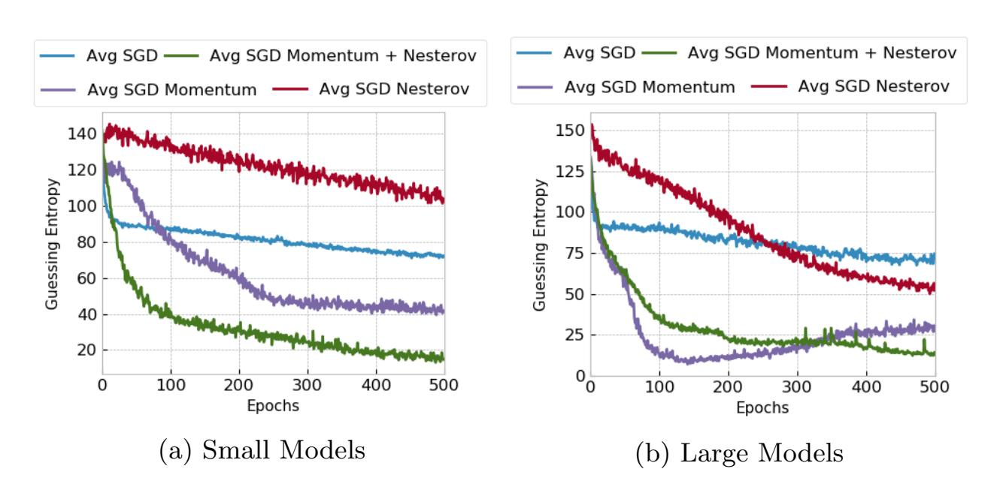

Fig. 1: SGD optimizers and model size for the ASCAD fixed key dataset.

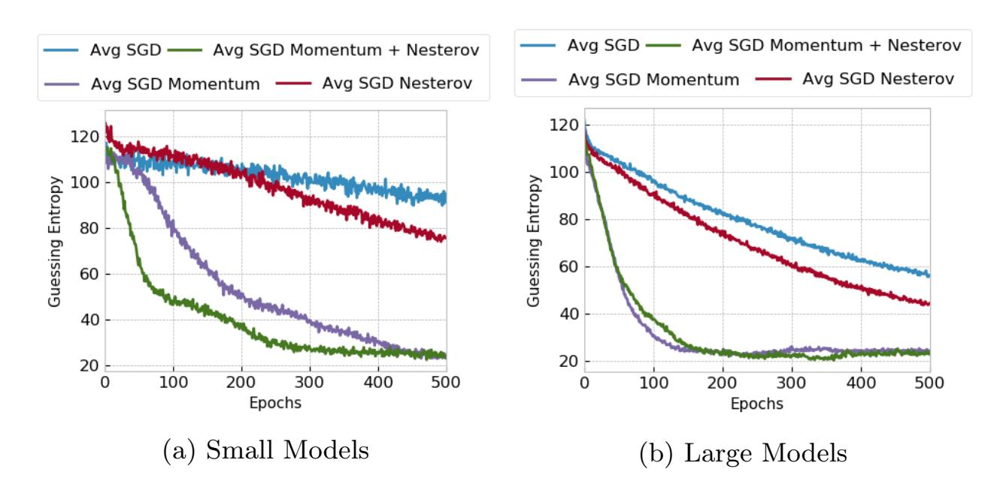

Fig. 2: SGD optimizers and model size for the ASCAD random keys dataset.

Results for both datasets for SGD optimizers indicate that SGD performs better on small and large datasets when momentum is considered. Without mo

{8}------------------------------------------------

mentum, we verified that SGD performs relatively better for large models, especially when Nesterov is applied. Moreover, we observe that SGD with momentum tends to perform better for large datasets and large models, as seen in Figure [2b.](#page-7-1) Additionally, for ASCAD with a fixed key, we observe a slower convergence for small models but no overfitting. On the other hand, for large models, SGD with momentum reaches top performance around epoch 150, and afterward, GE increases, indicating model overfit. For ASCAD with random keys, we do not observe overfitting even if using large models, which is a clear indication that random keys make the classification problem more difficult, and the model needs more capacity to fit the data. Interestingly, small models show a similar trend for the ASCAD fixed key dataset, demonstrating that such models already reach the top of their capacity for the simpler dataset.

#### 4.2 Adaptive Gradient Descent Methods

In [\[30\]](#page-19-10), the authors analyze the empirical generalization capability of adaptive methods. They conclude that overparameterized models can easily overfit with adaptive optimizers. As demonstrated in [\[14\]](#page-18-10), adaptive optimizers such as Adam and RMSprop display faster progress in the initial portion of training, and the performance usually degrades if the number of training epochs is too large. As a consequence, the model overfits. This leaves the need for additional (explicit) regularization in order to overcome the overfitting.

We analyze the behavior of adaptive optimizers for profiled SCA, and we show that the easy overfitting of adaptive methods reported in [\[30\]](#page-19-10) happens for Adam and RMSprop, but not for Adagrad and Adadelta. In particular, we show that Adagrad and Adadelta tend to work better for larger models and longer training times.

Figures [3a](#page-9-0) and [3b](#page-9-0) show the averaged guessing entropy results for the ASCAD with fixed key for small and large models, respectively. Figures [4a](#page-9-1) and [4b](#page-9-1) show GE evolution during training for small and large models for ASCAD with random keys.

The general behavior of guessing entropy evolution during training with adaptive optimizers is similar for both datasets, indicating that this could be a typical optimizer behavior regardless of the attacked dataset. Adam and RM-Sprop usually converge very fast. In these cases, guessing entropy for correct key candidates tends to drop to a low value (under 20) when the model can provide some level of generalization. However, after the guessing entropy reaches its minimum value (i.e., maximum generalization), the processing of more epochs does not benefit and only degrades the model generalization. This means that Adam optimizer tends to overfit very fast, and early stopping would be highly beneficial to deal with this problem. A long training process is not beneficial when Adam optimizer is considered for profiled SCA. RMSprop tends to work less efficiently than Adam for larger models and larger datasets.

Adagrad provides a slighter decrease in guessing entropy if the model can provide some generalization. Unlike Adam and RMSprop, it does not degrade the guessing entropy with the processing of more epochs, which indicates that a

{9}------------------------------------------------

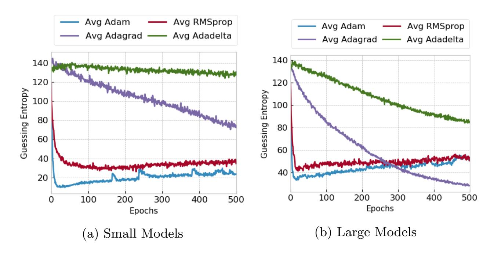

Fig. 3: Adaptive optimizers and model size for the ASCAD fixed key dataset.

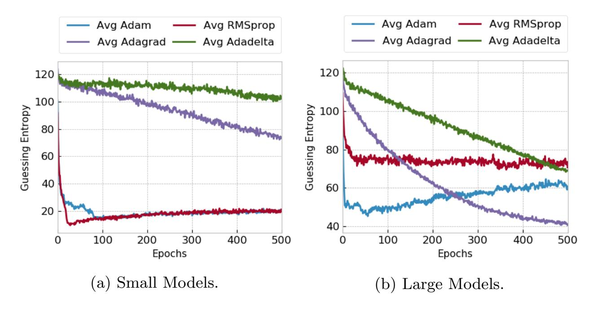

Fig. 4: Adaptive optimizers and model size for the ASCAD random keys dataset.

long training process is beneficial when Adagrad is selected as an optimization algorithm. Normally, generalization can happen very late in the training process, which means that a larger number of epochs might be necessary for Adagrad. Adadelta shows less capacity to generalize in different deep neural network configurations. Like Adagrad, once the generalization starts to occur, it does not degrade with the processing of more epochs. Generalization can start very late in the training process. Our results indicate that Adagrad should be the optimizer of choice, especially if using larger models (thus, if expecting that the dataset is difficult, so we require large profiled model capacity) and, uncertain how to tune other hyperparameters. Besides the above observations, we also verified that, on average, MLPs tend to provide a faster convergence (faster dropping in guessing entropy) for Adam and RMSprop in comparison to CNNs for the ASCAD 

{10}------------------------------------------------

random keys dataset. On the other hand, for Adagrad and Adadelta, we did not observe a significant difference in performance for MLPs and CNNs.

# 5 Optimizers and Specific Profiled Models

In the previous section, we provided averaged different optimizers behaviors if other hyperparameters are randomly selected. This type of analysis can indicate the typical behavior of the optimizers independently of the rest of the hyperparameters. We aim to confirm if a fixed neural network architecture can show specific behavior for different optimizers, i.e., whether the selection of optimizer influences another hyperparameter. For that, we define small and large MLPs as well as small and large CNNs. All neural network models (MLP or CNN) are trained with a batch size of 400, a learning rate of 0.001, and default Keras library initialization for weight and biases.

The small MLP and CNN models are defined as follows:

- A small MLP: four hidden layers, each having 200 neurons.
- A small CNN: one convolutional layer (10 filters, kernel size 10, and stride 10) and two fully-connected layers with 200 neurons.
- A large MLP: ten hidden layers, each having 1000 neurons.
- A large CNN: four convolutional layers (10, 20, 40, and 80 filters, kernel size 4, and stride 2 in all the four convolutional layers) and four fully-connected layers with 1 000 neurons each.

The output layers for MLP and CNN contain nine neurons (the Hamming Weight leakage model) with the Softmax activation function. Unless specified otherwise, all neural networks have the RelU activation function in all the layers. For adaptive optimizers and large profiled models, we also provide results for the ELU activation function. We train these neural networks on both ASCAD datasets, with fixed and random keys in the training data. For every neural network and dataset, we run the analysis ten times (10 experiments with the same architecture) and then average GE results from these ten executions.

### 5.1 SGD Optimizers on Small MLP and CNN

Shallow neural networks with only a few hidden layers implement learning models with a relatively small number of trainable parameters. As a result, a large amount of training data would hardly overfit these models. Thus, a small model implements an implicit regularization given by its reduced capacity to completely fit the training data. Empirical results observed in this work lead us to conclude that some optimizers pose no additional regularization effect on the learning process, while some other optimizers present a more significant implicit regularization.

The behaviors of SGD optimizers on a small MLP and a small CNN are shown in Figures [5](#page-11-0) and [6.](#page-11-1) Without momentum, SGD shows limited capacity to learn side-channel leakages. For CNN, GE for the scenario without momentum remains at the same level during the processing of 500 epochs. For MLP, we see

{11}------------------------------------------------

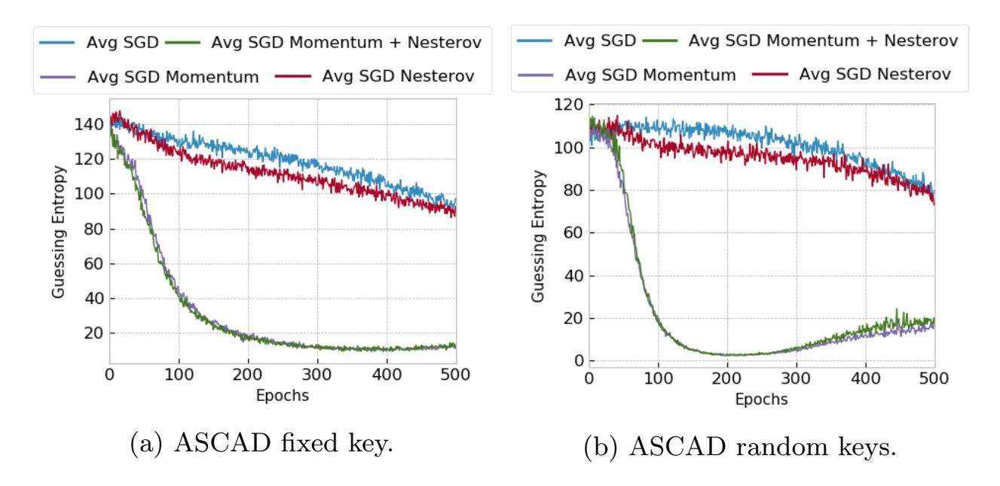

Fig. 5: SGD optimizers on small MLP models.

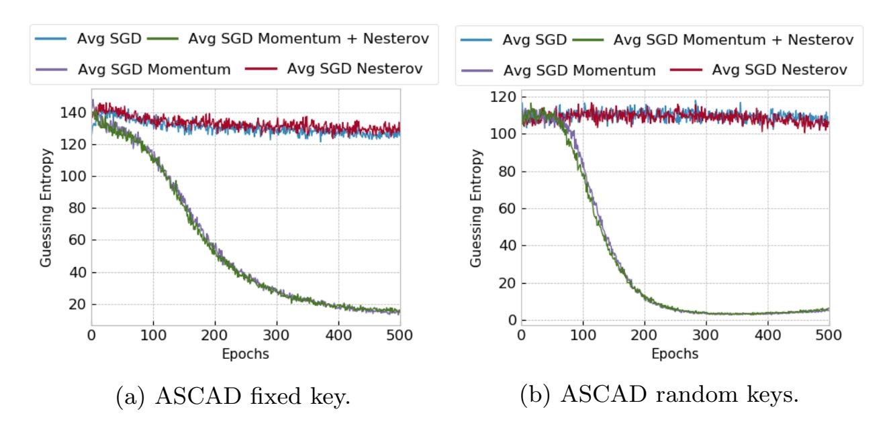

Fig. 6: SGD optimizers on small CNN models.

a small convergence, indicating that the model can learn without momentum. However, it takes a large number of epochs. When momentum, with or without Nesterov, is considered, we observe a smooth convergence of the guessing entropy during training for small MLP and small CNN. When the training set is larger, as is the case of the ASCAD random keys dataset, the convergence is slightly faster. To conclude, we can assume that small MLP and CNN models with SGD as the optimizer requires momentum to improve model learnability. What is more, we see that we generally require a large number of epochs to converge to small GE (observing related works, most of them do not consider such long training processes).

### 5.2 SGD Optimizers on Large MLP and CNN

Again, SGD optimizers on large models present better performance when momentum is used, either with or without Nesterov. As for CNN models, without 

{12}------------------------------------------------

momentum, GE stays around the same level during the whole training. Although large MLP models show better capacity to fit side-channel leakage for SGD without momentum, the results from Figures [7](#page-12-0) and [8](#page-12-1) show once more that SGD works much better with momentum in the side-channel context.

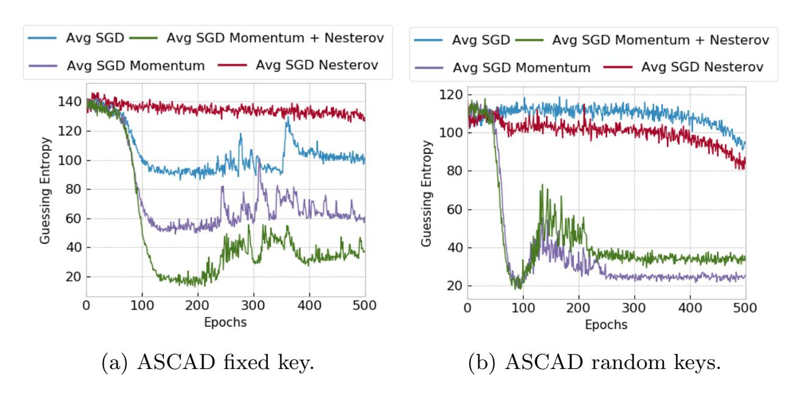

Fig. 7: SGD optimizers on large MLP models.

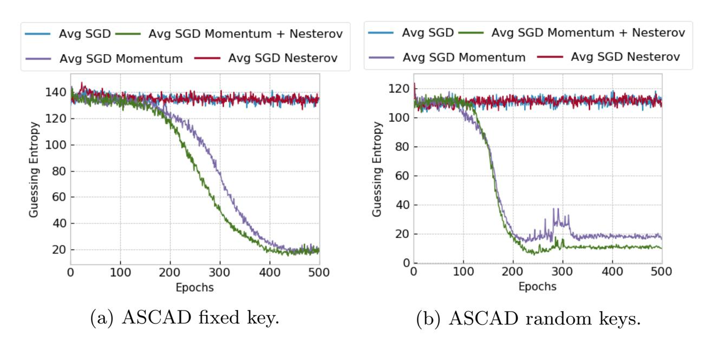

Fig. 8: SGD optimizers on large CNN models.

Note, that the results observed in Figures [7](#page-12-0) and [8](#page-12-1) for the SGD optimizers with momentum are representative of the recently described behavior of neural networks called the deep double descent [\[18\]](#page-18-8). Interestingly, these results indicate that longer training phases, larger profiled models, or more training examples do not necessarily improve the classification process. The results first show convergence (decrease of GE), after which there is a GE increase, and then, again, GE 

{13}------------------------------------------------

decreases (thus, double descent). Interestingly, comparing the results for small and large models shows that the final GE values are very similar. This means that it makes more sense to invest extra computational time into longer training phases than larger models.

### 5.3 Adaptive Optimizers on Small MLP and CNN

From adaptive optimizers, results indicate that Adam and RMSprop are the only ones that provide successful attack results, as the guessing entropy drops consistently in the first epochs, as indicated by Figures [9a](#page-13-0) and [9b](#page-13-0) on the ASCAD fixed key and ASCAD random keys, respectively. On the other hand, Adagrad and Adadelta cannot provide GE decrease during training, emphasizing that these optimizers do not work well for small models.

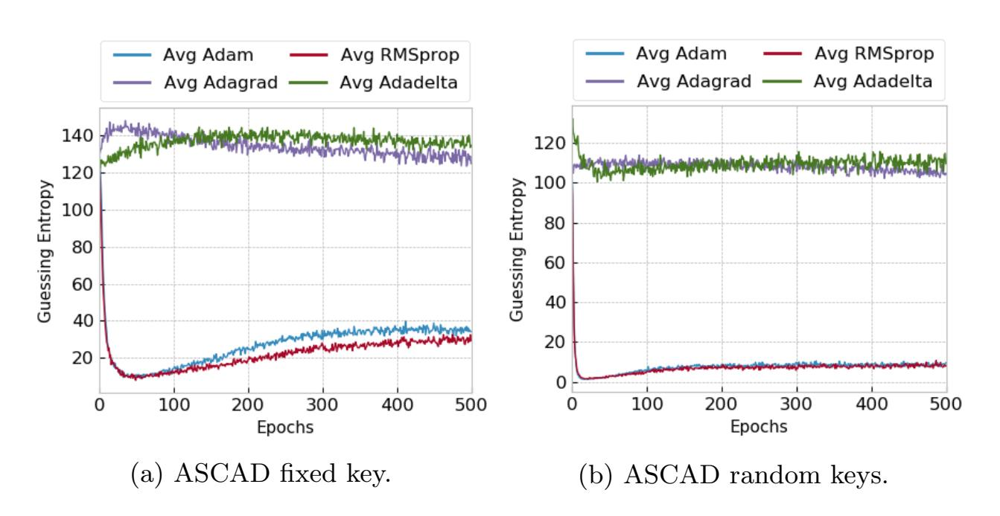

Fig. 9: Adaptive optimizers on small MLP model.

As expected, for the model trained on the ASCAD fixed key, containing 50 000 training traces, the guessing entropy evolution for Adam and RMSprop increases after the processing of 50 epochs. For the ASCAD random keys scenario, where 200 000 traces are used for training, the increase in GE for Adam and RMSprop is less distinct. Consequently, small models with larger training sets tend to work well for Adam and RMSprop optimizers. However, these two optimizers require additional regularization mechanisms to ensure that the model is not over-trained. In the results provided in Figures [9a](#page-13-0) and [9b,](#page-13-0) early stopping would be a good alternative, as already discussed [\[19,](#page-18-7)[26\]](#page-19-11).

As shown in Figures [10a](#page-14-0) and [10b,](#page-14-0) Adam and RMSprop also provided faster guessing entropy convergence for a small CNN model. Adagrad shows slightly better results for a small CNN compared to a small MLP, indicating that this type of adaptive optimizer may provide successful attack results if the number of epochs is very large (guessing entropy decreases up to epoch 500). For the Adadelta optimizer, a small CNN model shows no convergence at all.

{14}------------------------------------------------

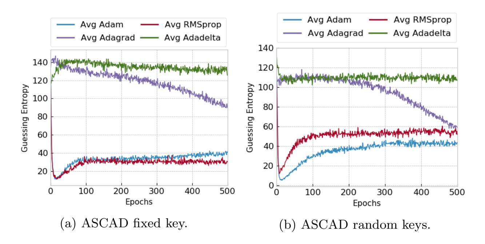

Fig. 10: Adaptive optimizers on small CNN model.

### 5.4 Adaptive Optimizers on Large MLP and CNN

Here, we observe different behavior for adaptive optimizers and different activation functions. Adam and RMSprop tend to show poor performance in comparison to small MLP models, especially when ELU is selected as the activation function, as shown in Figure [11b.](#page-15-0) For the ReLU activation function (see Figure [11a\)](#page-15-0), which is commonly employed in state-of-art neural network architectures, these two optimizers tend to perform relatively better, even though they are very sensitive to overfitting, as GE increases if the amount of training epochs is too large.

For Adagrad and Adadelta, we observed that a large MLP performs relatively well if ELU activation function is selected for hidden layers, as shown in Figure [11b.](#page-15-0) In this case, the network requires more training epochs to converge to a low guessing entropy (approx. 400 epochs in Figure [11b\)](#page-15-0). The advantage of Adagrad and Adadelta with large MLP models and ELU is that guessing entropy stays low even if the number of epochs is very large (e.g., 500 epochs). Results for the four studied adaptive optimizers for large MLP on ReLU and ELU activation functions are shown in Figures [11a](#page-15-0) and [11b,](#page-15-0) respectively.

Similar behavior is observed for the ASCAD fixed key dataset. Figures [12a](#page-15-1) and [12b](#page-15-1) show results for a large MLP model with ReLU and ELU activation functions, respectively. As the analysis in this section suggests, large MLP models work better with Adagrad and Adadelta as optimizers and ELU activation function. For Adam and RMSprop cases, even carefully selecting the activation function was insufficient to achieve a stable convergence of guessing entropy during training. Once more, we verify that Adam and RMSprop may provide better performance by adding extra regularization artifacts, such as early stopping. When the training set consists of a small number of measurements, as is the case of the ASCAD fixed key dataset, Adam and RMSprop tend to provide a narrow generalization interval. As Figure [12a](#page-15-1) shows, low guessing entropy for Adam and RMSprop last for less than 10 epochs and after that, guessing entropy

{15}------------------------------------------------

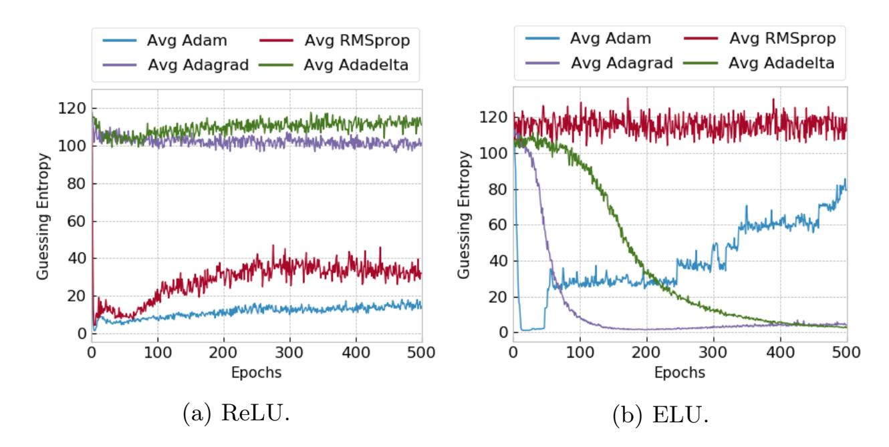

Fig. 11: Adaptive optimizers on large MLP models for the ASCAD with random keys.

only increases. For larger training sets, as provided by the ASCAD random keys dataset, the interval in which guessing entropy is low is wider, as seen in the example of Figure [11b.](#page-15-0) In this case, the guessing entropy remains low until at least the processing of 50 epochs.

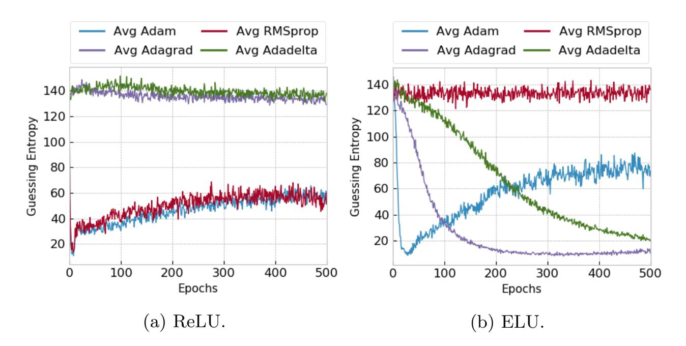

Fig. 12: Adaptive optimizers on large MLP models for the ASCAD fixed key dataset.

As shown in Figures [13](#page-16-0) and [14,](#page-16-1) Adagrad shows superior performance for large CNN models with ELU activation function in a long training process. This is even more clear in Figure [13b](#page-16-0) where large CNN is trained on a large dataset. Although Figures [13b](#page-16-0) and [14b](#page-16-1) show guessing entropy convergence for Adam and RMSprop in the first epochs, a large CNN model seems to provide worse 

{16}------------------------------------------------

performance than a large MLP for these two adaptive optimizers. One possible explanation for this behavior could be that large CNNs simply have too large capacity and cannot conduct sufficient feature selection for a good attack. For Adadelta, we observed a slow GE convergence after 400 epochs in the scenario illustrated in Figure [13b.](#page-16-0) Besides that, Adadelta provided no promising results in the evaluated large CNN.

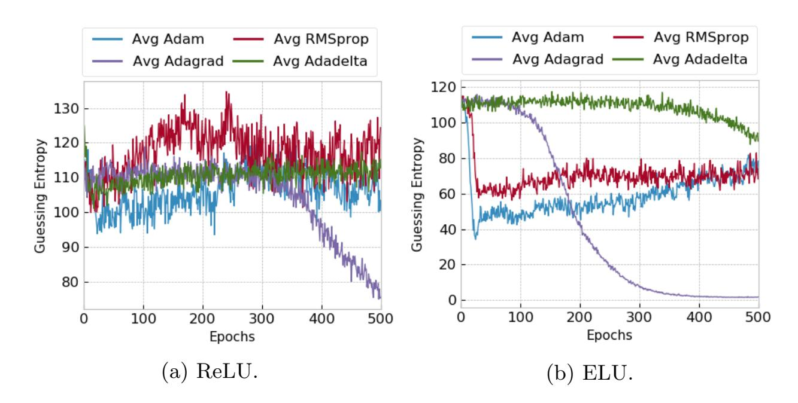

Fig. 13: Adaptive optimizers on large CNN models for the ASCAD random keys dataset.

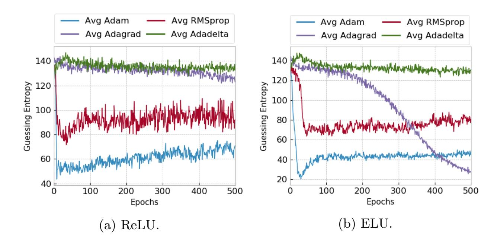

Fig. 14: Adaptive optimizers on large CNN models for the ASCAD fixed key dataset.

{17}------------------------------------------------

# 6 Conclusions

The selection of an optimizer algorithm for the training process during the profiled SCA has a significant influence on the attack results. In this work, we provide results for eight different optimizers, separated into adaptive and SGD groups. We verified that Adam and RMSprop optimizers show better performance when the neural network is small, and the training process is short. The adaptive Adagrad and Adadelta show good performance when large models are considered. Additionally, we confirmed that the selection of adaptive optimizer strictly depends on the activation function for hidden layers.

In future work, we plan to investigate the behavior of different optimizers and identity value leakage model. Besides that, in this work, we concentrate on two datasets only. To confirm our findings, we aim to extend the analysis with more publicly available datasets. Finally, we are interested in exploring the double descent behavior in SCA. While we observed that longer training does not necessarily mean better performance, we are interested in observing that larger models are not necessarily better or that larger profiling phases improve the behavior.

# References

- 1. Brier, E., Clavier, C., Olivier, F.: Correlation power analysis with a leakage model. In: Joye, M., Quisquater, J.J. (eds.) Cryptographic Hardware and Embedded Systems - CHES 2004. pp. 16–29. Springer Berlin Heidelberg, Berlin, Heidelberg (2004)
- 2. Cagli, E., Dumas, C., Prouff, E.: Convolutional Neural Networks with Data Augmentation Against Jitter-Based Countermeasures - Profiling Attacks Without Preprocessing. In: Cryptographic Hardware and Embedded Systems - CHES 2017 - 19th International Conference, Taipei, Taiwan, September 25-28, 2017, Proceedings. pp. 45–68 (2017)
- 3. Chari, S., Rao, J.R., Rohatgi, P.: Template attacks. In: International Workshop on Cryptographic Hardware and Embedded Systems. pp. 13–28. Springer (2002)
- 4. Choi, D., Shallue, C.J., Nado, Z., Lee, J., Maddison, C.J., Dahl, G.E.: On empirical comparisons of optimizers for deep learning (2019)
- 5. Collobert, R., Bengio, S.: Links Between Perceptrons, MLPs and SVMs. In: Proceedings of the Twenty-first International Conference on Machine Learning. pp. 23–. ICML '04, ACM, New York, NY, USA (2004). [https://doi.org/10.1145/1015330.1015415,](https://doi.org/10.1145/1015330.1015415) [http://doi.acm.org/10.1145/](http://doi.acm.org/10.1145/1015330.1015415) [1015330.1015415](http://doi.acm.org/10.1145/1015330.1015415)
- 6. Gierlichs, B., Batina, L., Tuyls, P., Preneel, B.: Mutual information analysis. In: Oswald, E., Rohatgi, P. (eds.) Cryptographic Hardware and Embedded Systems – CHES 2008. pp. 426–442. Springer Berlin Heidelberg, Berlin, Heidelberg (2008)
- 7. Gilmore, R., Hanley, N., O'Neill, M.: Neural network based attack on a masked implementation of aes. In: 2015 IEEE International Symposium on Hardware Oriented Security and Trust (HOST). pp. 106–111 (May 2015). <https://doi.org/10.1109/HST.2015.7140247>
- 8. Hettwer, B., Gehrer, S., G¨uneysu, T.: Deep neural network attribution methods for leakage analysis and symmetric key recovery. In: Paterson, K.G.,

{18}------------------------------------------------

- Stebila, D. (eds.) Selected Areas in Cryptography SAC 2019 26th International Conference, Waterloo, ON, Canada, August 12-16, 2019, Revised Selected Papers. Lecture Notes in Computer Science, vol. 11959, pp. 645– 666. Springer (2019). [https://doi.org/10.1007/978-3-030-38471-5](https://doi.org/10.1007/978-3-030-38471-5_26) 26, [https://](https://doi.org/10.1007/978-3-030-38471-5_26) [doi.org/10.1007/978-3-030-38471-5\\_26](https://doi.org/10.1007/978-3-030-38471-5_26)
- 9. Heuser, A., Picek, S., Guilley, S., Mentens, N.: Side-channel analysis of lightweight ciphers: Does lightweight equal easy? In: Hancke, G.P., Markantonakis, K. (eds.) Radio Frequency Identification and IoT Security. pp. 91–104. Springer International Publishing, Cham (2017)
- 10. Heuser, A., Zohner, M.: Intelligent Machine Homicide - Breaking Cryptographic Devices Using Support Vector Machines. In: Schindler, W., Huss, S.A. (eds.) COSADE. LNCS, vol. 7275, pp. 249–264. Springer (2012)
- 11. Kim, J., Picek, S., Heuser, A., Bhasin, S., Hanjalic, A.: Make some noise. unleashing the power of convolutional neural networks for profiled side-channel analysis. IACR Transactions on Cryptographic Hardware and Embedded Systems 2019(3), 148–179 (May 2019). [https://doi.org/10.13154/tches.v2019.i3.148-179,](https://doi.org/10.13154/tches.v2019.i3.148-179) <https://tches.iacr.org/index.php/TCHES/article/view/8292>
- 12. Kocher, P.C., Jaffe, J., Jun, B.: Differential power analysis. In: Proceedings of the 19th Annual International Cryptology Conference on Advances in Cryptology. pp. 388–397. CRYPTO '99, Springer-Verlag, London, UK, UK (1999), [http://dl.](http://dl.acm.org/citation.cfm?id=646764.703989) [acm.org/citation.cfm?id=646764.703989](http://dl.acm.org/citation.cfm?id=646764.703989)
- 13. Li, H., Krcek, M., Perin, G.: A comparison of weight initializers in deep learningbased side-channel analysis. IACR Cryptol. ePrint Arch. 2020, 904 (2020), [https:](https://eprint.iacr.org/2020/904) [//eprint.iacr.org/2020/904](https://eprint.iacr.org/2020/904)
- 14. Luo, L., Xiong, Y., Liu, Y., Sun, X.: Adaptive gradient methods with dynamic bound of learning rate. In: 7th International Conference on Learning Representations, ICLR 2019, New Orleans, LA, USA, May 6-9, 2019. OpenReview.net (2019), <https://openreview.net/forum?id=Bkg3g2R9FX>
- 15. Maghrebi, H., Portigliatti, T., Prouff, E.: Breaking cryptographic implementations using deep learning techniques. In: Security, Privacy, and Applied Cryptography Engineering - 6th International Conference, SPACE 2016, Hyderabad, India, December 14-18, 2016, Proceedings. pp. 3–26 (2016)
- 16. Mangard, S., Oswald, E., Popp, T.: Power Analysis Attacks: Revealing the Secrets of Smart Cards. [Springer](http://www.springer.com/) (December 2006), ISBN 0-387-30857-1, [http:](http://www.dpabook.org/) [//www.dpabook.org/](http://www.dpabook.org/)
- 17. Masure, L., Dumas, C., Prouff, E.: Gradient visualization for general characterization in profiling attacks. In: Polian, I., St¨ottinger, M. (eds.) Constructive Side-Channel Analysis and Secure Design - 10th International Workshop, COSADE 2019, Darmstadt, Germany, April 3-5, 2019, Proceedings. Lecture Notes in Computer Science, vol. 11421, pp. 145–167. Springer (2019). [https://doi.org/10.1007/978-3-030-16350-1](https://doi.org/10.1007/978-3-030-16350-1_9) 9, [https://doi.org/10.1007/](https://doi.org/10.1007/978-3-030-16350-1_9) [978-3-030-16350-1\\_9](https://doi.org/10.1007/978-3-030-16350-1_9)
- 18. Nakkiran, P., Kaplun, G., Bansal, Y., Yang, T., Barak, B., Sutskever, I.: Deep double descent: Where bigger models and more data hurt. In: 8th International Conference on Learning Representations, ICLR 2020, Addis Ababa, Ethiopia, April 26-30, 2020. OpenReview.net (2020), <https://openreview.net/forum?id=B1g5sA4twr>
- 19. Perin, G., Buhan, I., Picek, S.: Learning when to stop: a mutual information approach to fight overfitting in profiled side-channel analysis. Cryptology ePrint Archive, Report 2020/058 (2020), <https://eprint.iacr.org/2020/058>

{19}------------------------------------------------

- 20. Perin, G., Chmielewski, L., Picek, S.: Strength in numbers: Improving generalization with ensembles in profiled side-channel analysis. Cryptology ePrint Archive, Report 2019/978 (2019), <https://eprint.iacr.org/2019/978>
- 21. Picek, S., Heuser, A., Jovic, A., Bhasin, S., Regazzoni, F.: The curse of class imbalance and conflicting metrics with machine learning for side-channel evaluations. IACR Trans. Cryptogr. Hardw. Embed. Syst. 2019(1), 209– 237 (2019). [https://doi.org/10.13154/tches.v2019.i1.209-237,](https://doi.org/10.13154/tches.v2019.i1.209-237) [https://doi.org/](https://doi.org/10.13154/tches.v2019.i1.209-237) [10.13154/tches.v2019.i1.209-237](https://doi.org/10.13154/tches.v2019.i1.209-237)
- 22. Picek, S., Heuser, A., Jovic, A., Ludwig, S.A., Guilley, S., Jakobovic, D., Mentens, N.: Side-channel analysis and machine learning: A practical perspective. In: 2017 International Joint Conference on Neural Networks, IJCNN 2017, Anchorage, AK, USA, May 14-19, 2017. pp. 4095–4102 (2017)
- 23. Picek, S., Samiotis, I.P., Kim, J., Heuser, A., Bhasin, S., Legay, A.: On the performance of convolutional neural networks for side-channel analysis. In: Chattopadhyay, A., Rebeiro, C., Yarom, Y. (eds.) Security, Privacy, and Applied Cryptography Engineering. pp. 157–176. Springer International Publishing, Cham (2018)
- 24. Prouff, E., Strullu, R., Benadjila, R., Cagli, E., Dumas, C.: Study of deep learning techniques for side-channel analysis and introduction to ascad database. Cryptology ePrint Archive, Report 2018/053 (2018), <https://eprint.iacr.org/2018/053>
- 25. Quisquater, J.J., Samyde, D.: Electromagnetic analysis (ema): Measures and counter-measures for smart cards. In: Attali, I., Jensen, T. (eds.) Smart Card Programming and Security. pp. 200–210. Springer Berlin Heidelberg, Berlin, Heidelberg (2001)
- 26. Robissout, D., Zaid, G., Colombier, B., Bossuet, L., Habrard, A.: Online performance evaluation of deep learning networks for side-channel analysis. Cryptology ePrint Archive, Report 2020/039 (2020), <https://eprint.iacr.org/2020/039>
- 27. Schindler, W., Lemke, K., Paar, C.: A stochastic model for differential side channel cryptanalysis. In: International Workshop on Cryptographic Hardware and Embedded Systems. pp. 30–46. Springer (2005)
- 28. Standaert, F.X., Malkin, T., Yung, M.: A Unified Framework for the Analysis of Side-Channel Key Recovery Attacks. In: EUROCRYPT. LNCS, vol. 5479, pp. 443–461. Springer (April 26-30 2009), Cologne, Germany
- 29. Weissbart, L.: On the performance of multilayer perceptron in profiling sidechannel analysis. Cryptology ePrint Archive, Report 2019/1476 (2019), [https:](https://eprint.iacr.org/2019/1476) [//eprint.iacr.org/2019/1476](https://eprint.iacr.org/2019/1476)
- 30. Wilson, A.C., Roelofs, R., Stern, M., Srebro, N., Recht, B.: The marginal value of adaptive gradient methods in machine learning. In: Guyon, I., von Luxburg, U., Bengio, S., Wallach, H.M., Fergus, R., Vishwanathan, S.V.N., Garnett, R. (eds.) Advances in Neural Information Processing Systems 30: Annual Conference on Neural Information Processing Systems 2017, 4-9 December 2017, Long Beach, CA, USA. pp. 4148–4158 (2017), [http://papers.nips.cc/paper/](http://papers.nips.cc/paper/7003-the-marginal-value-of-adaptive-gradient-methods-in-machine-learning) [7003-the-marginal-value-of-adaptive-gradient-methods-in-machine-learning](http://papers.nips.cc/paper/7003-the-marginal-value-of-adaptive-gradient-methods-in-machine-learning)
- 31. Zaid, G., Bossuet, L., Habrard, A., Venelli, A.: Methodology for efficient cnn architectures in profiling attacks. IACR Transactions on Cryptographic Hardware and Embedded Systems 2020(1), 1–36 (Nov 2019). [https://doi.org/10.13154/tches.v2020.i1.1-36,](https://doi.org/10.13154/tches.v2020.i1.1-36) [https://tches.iacr.org/index.](https://tches.iacr.org/index.php/TCHES/article/view/8391) [php/TCHES/article/view/8391](https://tches.iacr.org/index.php/TCHES/article/view/8391)

{20}------------------------------------------------

# A Machine Learning Classifiers

We consider two neural network types that are standard techniques in the profiled SCA: multilayer perceptron and convolutional neural networks.

Multilayer Perceptron. The multilayer perceptron (MLP) is a feed-forward neural network that maps sets of inputs onto sets of appropriate outputs. MLP consists of multiple layers of nodes in a directed graph, where each layer is fully connected to the next one (thus, layers are called fully-connected or dense layers). An MLP consists of three or more layers (since input and output represent two layers) of nonlinearly-activating nodes [\[5\]](#page-17-7).

Convolutional Neural Networks. Convolutional neural networks(CNNs) are feed-forward neural networks commonly consisting of three types of layers: convolutional layers, pooling layers, and fully-connected layers. The convolution layer computes neurons' output connected to local regions in the input, each computing a dot product between their weights and a small region connected to the input volume. Pooling decrease the number of extracted features by performing a down-sampling operation along the spatial dimensions. The fully-connected layer (the same as in multilayer perceptron) computes either the hidden activations or the class scores.

# B Neural Networks Hyperparameter Ranges

In Table [1,](#page-20-1) we show the hyperparameter ranges we explore for the MLP architectures, while in Table [2,](#page-21-0) we show the hyperparameter ranges for CNNs.

| Hyperparameter                 | min         | max   | step   |
|--------------------------------|-------------|-------|--------|
| Learning Rate                  | 0.0001 0.01 |       | 0.0001 |
| Mini-batch                     | 400         | 1 000 | 100    |
| Dense (fully-connected) layers | 1           | 10    | 1      |
| Neurons (for dense layers)     | 100         | 1 000 | 10     |
|                                |             |       |        |

Activation function (all layers) ReLU, Tanh, ELU, or SELU

Table 1: Hyperparameter search space for multilayer perceptron.

{21}------------------------------------------------

| min | max   | step        |
|-----|-------|-------------|
|     |       | 0.0001      |
| 400 | 1 000 | 100         |
| 1   | 4     | 1           |
| 4*l | 8*l   | 1           |
| 1   | 40    | 1           |
| 1   | 4     | 1           |
| 1   | 10    | 1           |
| 100 | 1 000 | 10          |
|     |       | 0.0001 0.01 |

Activation function (all layers) ReLU, Tanh, ELU, or SELU

Table 2: Hyperparameters search space for convolutional neural network (l = convolution layer index).