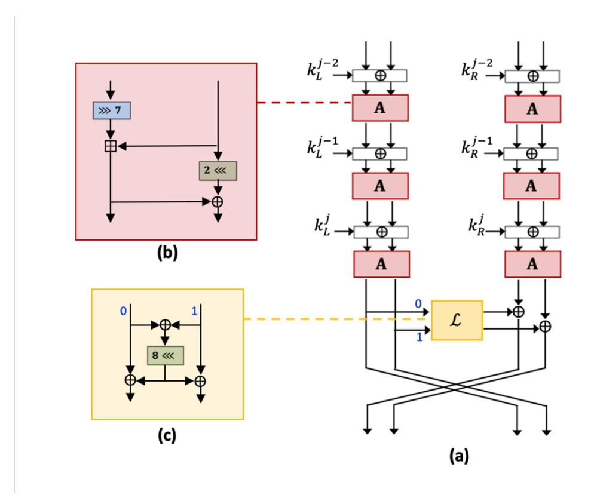
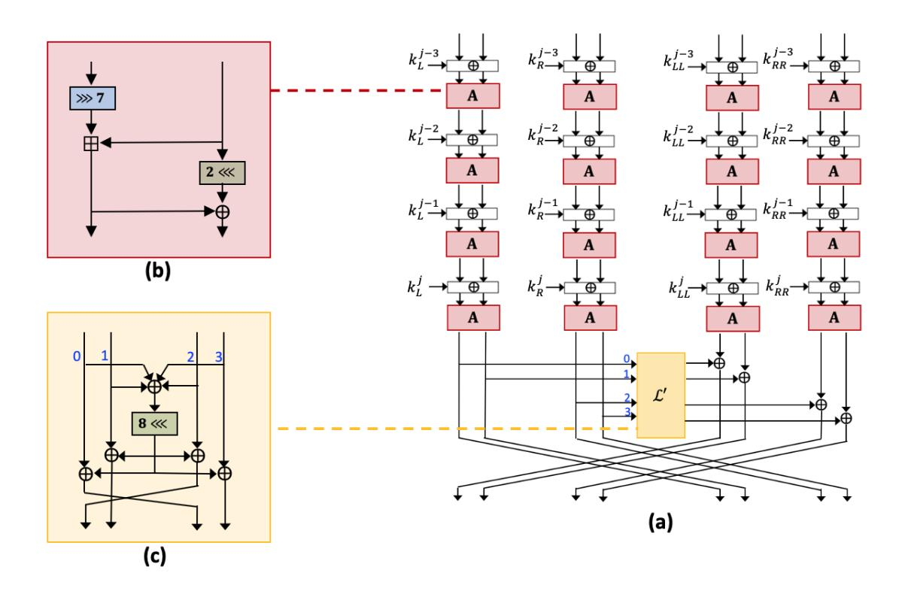
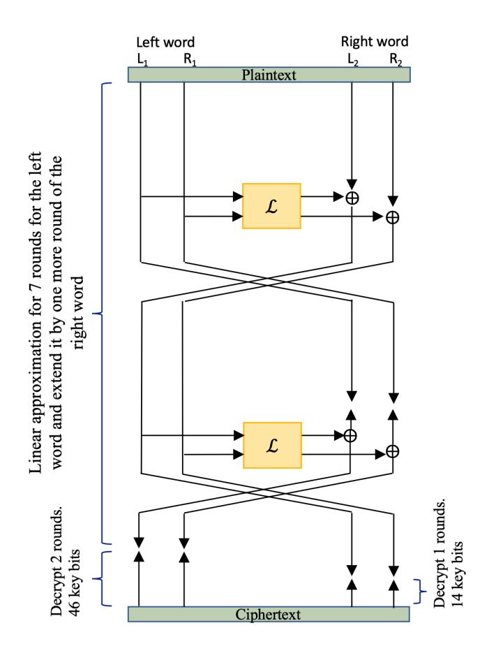
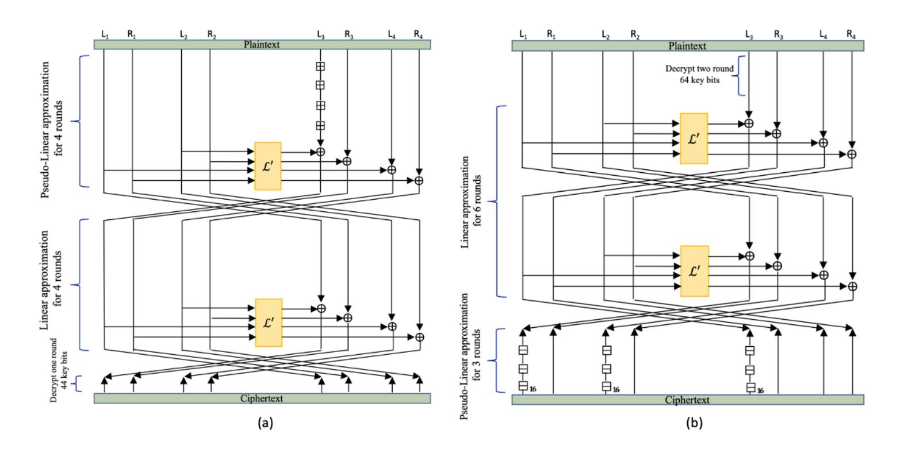

{0}------------------------------------------------

## Linear and Partly-Pseudo-Linear Cryptanalysis of Reduced-Round SPARX Cipher

Sarah Alzakari and Poorvi Vora

The George Washington University, Washington DC 20052, USA

Abstract. We propose a new cryptanalytic technique and key recovery attack for the Sparx cipher, Partly-Pseudo-Linear Cryptanalysis, a meet-in-the-middle attack combining linear and pseudo-linear approximations. We observe improvements over the linear hull attacks in the literature for Sparx 128/128 and 128/256. Additionally, we generate another attack for comparison purposes, using the Cho-Pieprzyk property for a fully-linear approximation and a corresponding key recovery attack. We observe improvements on the data complexity, bias, and number of recovered key bits, over all variants of Sparx, when compared to the use of only the Cho-Pieprzyk approximation.

Keywords: Sparx · Pseudo-Linear cryptanalysis · Linear Cryptanalysis · Partly-Pseudo-Linear cryptanalysis.

## 1 Introduction

Sparx is a lightweight cipher, intended for use in cryptographic applications on devices with power constraints. It is designed to have low memory, computational capacity and power requirements. It is an instance of an ARX block cipher which rely on Addition-Rotation-XOR operations performed a number of times, and provide a common approach to lightweight cipher design. The use of addition makes ARX ciphers more robust to traditional linear cryptanalysis, and new approaches to cryptanalysis are necessary to analyze ARX ciphers. This paper presents a new approximation and corresponding key recovery attack, the Partly-Pseudo-Linear Attack on the Sparx family.

## 1.1 Our Contributions

We propose the Partly-Pseudo-Linear Attack which combines pseudo-linear approximation with a linear approximation of addition modulo 2n using Cho and Pieprzyk's property of modular addition [4, 3]. We are able to demonstrate an improvement over linear hull attacks on Sparx in the literature. In particular, our contributions are as follows:

1. For the purposes of comparison with our main contribution, the Partly-Pseudo-Linear Attack, we apply fully linear cryptanalysis on the Sparx family using the Cho-Pieprzyk property to obtain a linear approximation 

{1}------------------------------------------------

and a corresponding key recovery attack. We use the approach presented by Ashur and Bodden for Speck [1].

- 2. We propose the Partly-Pseudo-Linear Attack on Sparx: a combination of a pseudo-linear approximation for a few rounds and a linear approximation for the rest. We describe and analyze the corresponding key recovery attacks and perform the following comparisons:
  - We are not aware of linear key recovery attacks for Sparx in the literature. We compare our key recovery attacks to recent contributions of linear trails on Sparx using linear hulls, by extending the linear trails in a natural way to include as many decryption rounds as allowed by computational complexity considerations. Our results are better for the larger variants.
  - We observe improvements across all variants due to our partly-pseudolinear approximation when compared to the use of only the Cho-Pieprzyk approximation.

## 1.2 Comparison with Closest Other Work

The Sparx cipher is a very recent design, proposed in 2016 [8, 5]. The literature on Sparx is hence limited. Most of the literature is focused on differential and linear (hull) cryptanalysis. The closest work is a 2020 report on linear hull cryptanalysis [7]. Huang and Wang present an automatic algorithm to search for the optimal linear (hull) characteristics on ARX ciphers using Wallen's algorithm for modular addition [12]. Table 1 summarizes the comparison between our contributions and [7].

| Table 1. The results of this work and the linear hull cryptanalysis on Sparx cipher. |
|-----------------------------------------------------------------------------------------|
|-----------------------------------------------------------------------------------------|

| N   | Ref.      | Type        | Number of | Guessed   | Bias        |         | Data Time |
|-----|-----------|-------------|-----------|-----------|-------------|---------|-----------|
|     |           |             | Rounds    | Key Bit/K |             |         |           |
| 64  | [7]       | Linear Hull | 11        | LT        | −28 2    | N/A     | N/A       |
|     | [7]       | Linear Hull | 10        | LT        | −22 2    | N/A     | N/A       |
|     | This work | LC          | 9         | 60/128    | −23 2    | 46 2 | 106 2  |
|     | This work | PPLC        | 9         | 93/128    | −15.84 2 | 32 2 | 125 2  |
| 128 | [7]       | Linear Hull | 10        | LT        | −23 2    | N/A     | N/A       |
|     | [7]       | Linear Hull | 9         | LT        | −18 2    | N/A     | N/A       |
|     | This work | LC          | 9         | 44/128    | −19 2    | 38 2 | 82 2   |
|     | This work | LC          | 10        | 140/256   | −19 2    | 38 2 | 178 2  |
|     | This work | PPLC        | 9         | 98/128    | −13.73 2 | 28 2 | 126 2  |
|     | This work | PPLC        | 11        | 195/256   | −20.42 2 | 42 2 | 237 2  |

∗ N is the block size and K is the key size.

∗ LT refers to a Linear Trail used as a distinguisher and NA refers to Not Available.

∗ PPLC refers to the Partly-Pseudo-Linear Cryptanalysis and LC refers to the Linear Cryptanalysis

{2}------------------------------------------------

Huang and Wang do not describe key recovery, but their work could possibly be extended to key recovery attacks by appending rounds of decryption.

- Sparx 64/128: The linear approximation of [7] is already deeper than our key recovery attack.
- Sparx 128/128: The linear approximation of [7] cannot be used as a key recovery attack since the round has 128 key bits.
- Sparx 128/256: [7] can add one more round to recover 128 key bits. Thus the number of rounds they would be able to attack would be the same as ours, but our attack provides more recovered key bits and has lower data complexity.

#### 1.3 Organization

This paper is organized as follows. In section 2, we present a brief description of the SPARX cipher and the notation used in this paper. In section 3 we review linear cryptanalysis and pseudo-linear cryptanalysis. In section 4, we present our first contribution by applying the linear cryptanalysis on SPARX family. In section 5, we present our proposed Partly-Pseudo-Linear attack on the SPARX cipher. We conclude in section 6.

## 2 Preliminaries

This section presents our notation and briefly describes the Sparx cipher.

#### 2.1 Notation

The following describes notation used in this paper.

- $\boxplus_n$ : Addition modulo  $2^n$
- $\boxminus_n$ : Subtraction modulo  $2^n$
- -PL(CL): Left word of the Plaintext (Ciphertext)
- -PR(CR): Right word of the Plaintext (Ciphertext)
- $-xl^{j-1}$ : Left half of input to the  $j^{th}$  round
- $-xr^{j-1}$ : Right half of input to the  $j^{th}$  round
- $-xl_t^j(i,i+w)$ : window t with size w of the Left word x, where the MSB is at i and the LSB is at i+w-1, for  $0 \le i < \frac{n}{2}$  and  $1 \le w \le \frac{n}{2}$
- $xr_t^j(i, i + w)$ : window t with size w of the Right word x, where the MSB is at i and the LSB is at i + w 1, for  $0 \le i < \frac{n}{2}$  and  $1 \le w \le \frac{n}{2}$

#### 2.2 The SPARX Cipher

In 2016, Dinu et al. proposed the SPARX family of ARX block ciphers [8, 5]. The instance of the SPARX family with block size n and key size k is denoted SPARX n/k. The only operations needed to implement an instance of SPARX are:

{3}------------------------------------------------

#### 4 Sarah Alzakari and Poorvi Vora

- Addition modulo  $2^{16},$  denoted  $\boxplus$
- 16-bit Rotation: right rotation by i, denoted  $\ggg i$  and left rotation by i, denoted  $i \lll$
- 16-bit exclusive-or (XOR), denoted  $\oplus$

The non-linearity in SPARX is provided by Speckey; a 32-bit block cipher identical to Speck 32 except for its key injection (Speckey is denoted by A in Figure 1 and Figure 2). The round function consists of exclusive-or with the key, followed by Speckey. In SPARX 64/128, a linear permutation (denoted by  $\mathfrak L$  in Figure 1) follows three rounds. In SPARX 128/128 and SPARX 128/256, the linear permutation (denoted by  $\mathfrak L'$  in Figure 2) follows four rounds.

Table 2. The Sparx Cipher Family.

| Block Size, n | No. Words, $n/32$ | Key Size | Steps | No. Rounds/Step |
|---------------|-------------------|----------|-------|-----------------|
| 64            | 2                 | 128      | 8     | 3               |
| 128           | 4                 | 128      | 8     | 4               |
|               | 4                 | 256      | 10    | 4               |

Fig. 1. Sparx 64/128. (a) Three rounds function, (b) Speckey and (c) Linear permutation.

{4}------------------------------------------------

Fig. 2. Sparx 128/128 and Sparx 128/256. (a) Four rounds function, (b) Speckey and (c) Linear permutation.

## 3 Related Work

In this section, We review linear cryptanalysis and pseudo-linear cryptanalysis, as we will use these two approaches for our attack.

Linear cryptanalysis [9] is one of the most powerful and widely used attacks on block ciphers. It was introduced by Matsui in 1998, and is a known plaintext attack where the attacker has access to both the plaintext and its encrypted version ciphertext [9, 6]. Using linear cryptanalysis, an adversary is able to find a linear expression that approximates a non-linear function which connects plaintext, ciphertext, and key bits with high probability.

The quality of the linear approximation is measured by the bias which is defined as = |p − 1 2 |; a higher bias implies a better approximation and a more efficient attack. The number of required known plaintexts and ciphertexts (data complexity) is O( −2 ) [9, 6].

Our work relies on Cho and Pieprzyk's [4, 3] linear approximation of modular addition. They provide the following expression

$$P[\lambda.(a \boxplus b) = \lambda.(a \oplus b)] = \frac{3}{4}$$
 (1)

where λ is a mask identifying the consecutive bits we are interested in. Importantly, one may use this approximation over multiple rounds in an ARX cipher only so long as any masks encountered in the round function entering into the modular addition do not containing non-consecutive bits.

McKay and Vora [11, 10] present pseudo-linear cryptanalysis which aims to overcome the limitations of traditional linear cryptanalysis by approximating 

{5}------------------------------------------------

addition modulo  $2^n$  with addition modulo  $2^w$  where,  $0 < w \le n$ . In other words, the pseudo-linear approximations use addition modulo  $2^w$  and exclusive-or over w-bit strings of contiguous bits (or windows) instead of using the whole n-bit strings.

This approximation is in error only when the carry into the last bit of the window is one. If the value of the carry is equally likely to be zero or one, the approximation is correct with probability slightly greater than a half, which is much larger than the probability of a random guess which is  $\frac{1}{2^w}$ . The approximation involves the use of some key bits in non-linear operations, but enables attacks more efficient than the brute force attack because it reduces the number of key bits from those required by the cipher.

The only linear cryptanalysis available to date on SPARX is that of Huang and Wang [7], described in section 1.2.

## 4 Linear Cryptanalysis on SPARX cipher

The purpose of this contribution is to explore the improvement of our proposed *Partly-Pseudo-Linear Cryptanalysis* on a fully-linear attack. In particular, we study the effect of replacing some rounds of linear cryptanalysis with pseudo-linear cryptanalysis. For this reason, we first study the fully-linear attack.

In this section, we analyze the ARX lightweight block cipher family, SPARX, to determine its resistance to the Cho-Pieprzyk approximation of modular addition. In the next section, section 5, we demonstrate the improvement in this cryptanalysis if a couple of rounds of linear approximations are replaced with pseudo-linear approximations.

For linear cryptanalysis, we take the approach of Ashur and Bodden's cryptanalysis of the SPECK family [1]. We search for the best approximation using Cho-Pieprzyk's property. The left word is divided into two blocks, left and right block. We start by fixing one mask (left block)  $\lambda_x^L$  with a pair of consecutive bits (0x3, 0x6, ...) and zeroing the other mask (right block)  $\lambda_y^L$ . For the right word, we zero both left and right block masks. We check how the masks evolve both in the forward and backward direction taking into consideration the linear permutation after every three (or four, for the larger variants) rounds.

First we present the linear approximation and the corresponding key recovery attack on SPARX 64/128 then on SPARX 128/128 and SPARX 128/256.

The longest linear trail we were able to find for SPARX 64/128 covers 7 rounds (we are able to go to 8 rounds for the right word). Table 9 shows how the mask changes:  $\lambda_{x^i}^L$  represents the input mask of the left block of the left word of SPARX and  $\lambda_{y^i}^L$  represents the input mask of the right block of the left word of SPARX. Similarly,  $\lambda_{x^i}^R$  and  $\lambda_{y^i}^R$  are input masks for the left and right blocks of the right word. We observe that the first linear permutation does not change anything since the left word is masked by zero.

With  $\lambda = 0 \times 0000 = 0000000000000000000000000$ 

{6}------------------------------------------------

To implement a key recovery attack over nine rounds, we decrypt two more rounds for the left word, trying all possibilities for the active key bits in our linear approximation. For the right word, we need to decrypt a single round by trying all possibilities for the key bits that lead to the mask of the eighth round of the right word (see Figure 3). Table 9 in the Appendix summarizes the progression of the mask for the linear key recovery attack on SPARX 64/128.

As for Sparx 64/128, we begin by searching for the best Cho-Pieprzyk approximation for Sparx 128/128 and 128/256. With

#### $\lambda = 0$ x000c00000000000000000000000000000000

we can approximate 8 rounds, 4 in each direction. To implement a key recovery attack, we decrypt one more round by trying all possibilities for the key bits that lead to the mask of the eighth rounds for SPARX 128/128 and decrypt two rounds for SPARX 128/256. Table 3 summarizes the results of linear key recovery with Cho-Pieprzyk approximations on the SPARX family.

Fig. 3. Key Recovery Attack on Sparx 64/128 - 9 rounds

# 5 Partly-Pseudo-Linear Cryptanalysis on the SPARX Family

In this section, we present a new attack for the ARX block cipher which we term the *Partly-Pseudo-Linear Attack*.

{7}------------------------------------------------

| N/K     | No. Rounds of Linear Trail Key Recovery | No. Rounds | Guessed Bias Bits |          | Data Complexity Complexity | Time     |  |
|---------|--------------------------------------------|------------|----------------------|----------|-------------------------------|----------|--|
| 64/128  | 8                                          | 9          | 60                   | −23 2 | 46 2                       | 106 2 |  |
| 128/128 | 8                                          | 9          | 44                   | −19 2 | 38 2                       | 82 2  |  |
| 128/256 | 8                                          | 10         | 140                  | −19 2 | 38 2                       | 178 2 |  |

Table 3. Linear Key Recovery Attack on Sparx family

Definition 1. Partly-Pseudo-Linear Attack is a meet-in-the-middle combination of pseudo-linear and linear attacks.

We show that linear cryptanalysis relying on Cho-Pieprzyk approximations of modular addition is improved by replacing some rounds of linear approximation with pseudo-linear approximations. Using the approach of Bodden and Ashur [2, 1], we find the longest linear trails to approximate a window of two consecutive bits in each direction (forward and backward). Of these, we choose the trail(s) that would combine with a lower-error pseudo-linear attack.

The bias of the resulting Partly-Pseudo-Linear approximation hence consists of two parts. The first part is the bias of the xor of the bits of the window when the window is computed using the pseudo-linear approximation; this is determined experimentally. The second part is the bias for the linear approximation computed using traditional linear approaches. The combination of these two biases using the piling up lemma allows us to determine the number of plaintext and ciphertext pairs that we should use in our experiments. We illustrate and analyze the efficiency of our Partly-Pseudo-Linear cryptanalysis attack on all variants of the Sparx family.

## 5.1 The Partly-Pseudo-Linear Attack on Sparx 64/128

We first describe the Partly-Pseudo-Linear attack obtained by approximating nine rounds of Sparx 64/128. In the 9-round attack, we encrypt one round using all possibilities of the key bits that leads to our linear approximation (32 key bits of the right word). Then we approximate five rounds in the forward direction using linear approximation and three rounds in the backward direction using pseudo-linear approximation.

For the pseudo-linear approximation, the window size is two, w = 2, and 61 key bits are required for the approximation. In the last round the addition operation (subtraction) is before the key round injection; thus, it can be performed exactly for the full word without any need for an approximation.

For the linear approximation, we start the mask with λ L x = 0x0000 and λ L y = 0x0000 for the left word and λ R x = 0x07f8 and λ R y = 0xfdf4 for the right word. Table 4 shows how the mask changes through the five rounds and the approximation for the Partly-Pseudo-Linear attack for 9 rounds is available in the appendix (see Table 8).

∗ N is the block size and K is the key size.

{8}------------------------------------------------

Table 4. Linear trail of Sparx 64/128 for 6 rounds

| Round         | Cost               | Left Word         |                   |                         |                       | Right Word        |                   |                         |                       |  |
|---------------|--------------------|-------------------|-------------------|-------------------------|-----------------------|-------------------|-------------------|-------------------------|-----------------------|--|
|               |                    | $\lambda_{x^i}^L$ | $\lambda^L_{y^i}$ | $\lambda_{x^{i+1}}^{L}$ | $\lambda^L_{y^{i+1}}$ | $\lambda_{x^i}^R$ | $\lambda_{y^i}^R$ | $\lambda_{x^{i+1}}^{R}$ | $\lambda_{y^{i+1}}^R$ |  |
| 1             | 0                  | 0x0000            | 0x0000            | 0x0000                  | 0x0000                | Encrypt           | trying            | all key                 | possibilities         |  |
| $\parallel$ 2 | 4                  | 0x0000            | 0x0000            | 0x0000                  | 0x0000                | 0x07f8            | 0xfdf4            | 0xc7e3                  | 0x37ec                |  |
| 3             | 5                  | 0x0000            | 0x0000            | 0x0000                  | 0x0000                | 0xc7e3            | 0x37ec            | 0x0600                  | 0xc18f                |  |
|               | Linear Permutation |                   |                   |                         |                       |                   |                   |                         |                       |  |
| 4             | 1                  | 0x0600            | 0xc18f            | 0x0603                  | 0x060f                | 0x0000            | 0x0000            | 0x0000                  | 0x0000                |  |
| 5             | 2                  | 0x0603            | 0x060f            | 0x0600                  | 0x000c                | 0x0000            | 0000x0            | 0x0000                  | 0x0000                |  |
| 6             | 1                  | 0x0600            | 0x000c            | 0x000c                  | 0x0000                | 0x0000            | 0000x0            | 0x0000                  | 0x0000                |  |
|               | Linear Permutation |                   |                   |                         |                       |                   |                   |                         |                       |  |
|               |                    | 0х0с0с            | 0x0c00            |                         |                       | 0x000c            | 0x0000            |                         |                       |  |

# 5.2 The Partly-Pseudo-Linear Attack on Sparx 128/128 and Sparx 128/256

The Partly-Pseudo-Linear attack on SPARX 128/128 is obtained by approximating 9 rounds: 4 in the forward direction using pseudo-linear approximation, 4 in the backward direction using linear approximation and one decryption round using all possibilities of the key bits that lead to our linear approximation (44 key bits of the first, second, and third words). For the pseudo-linear approximation, the window size is two, w = 2, and 54 key bits are required for the approximation. Table 5 shows how the mask for the linear approximation changes through the four rounds.

The Partly-Pseudo-Linear attack on SPARX 128/256 is obtained by approximating 11 rounds: two encryption rounds using all possibilities of the key bits leading to our linear approximation (64 key bits of the third word), 6 rounds in the forward direction using linear approximation and three rounds in the backward direction using pseudo-linear approximation. For the pseudo-linear approximation, the window size is two, w=2, and 124 key bits are required for the approximation. In the last round the addition operation (subtraction) is before the key round injection; thus, it can be performed exactly for the full word without any need for an approximation. Table 6 shows how the mask for the linear approximation changes through the 6 rounds. Figure 4 describes the Partly-Pseudo-Linear attack on SPARX 128/128 and SPARX 128/256 and Table 7 summarizes the characteristics of the Partly-Pseudo-Linear attack on SPARX family.

{9}------------------------------------------------

10

**Table 5.** Linear trail of Sparx 128/128 for 9-round Partly-Pseudo-Linear Approximation

| Round              | Cost | First                | Word                 | Second               | Word                 | Third            | Word                 | Fourth               | Word                 |
|--------------------|------|----------------------|----------------------|----------------------|----------------------|------------------|----------------------|----------------------|----------------------|
|                    |      | $\lambda_{x^i}^{L1}$ | $\lambda_{y^i}^{R1}$ | $\lambda_{x^i}^{L2}$ | $\lambda_{y^i}^{R2}$ | $\lambda_x^{L3}$ | $\lambda_{y^i}^{R3}$ | $\lambda_{x^i}^{L4}$ | $\lambda_{y^i}^{R4}$ |
| 5                  | 1    | 0x000c               | 0x0000               | 0x0000               | 0x0000               | 0x0000           | 0x0000               | 0x0000               | 0x0000               |
|                    | 1    | 0x7800               | 0x6000               | 0x0000               | 0000x0               | 0x0000           | 0x0000               | 0x0000               | 0x0000               |
| 6                  | 2    | 0x7800               | 0x6000               | 0x0000               | 0x0000               | 0x0000           | 0x0000               | 0x0000               | 0x0000               |
|                    |      | 0x8331               | 0x83c1               | 0x0000               | 0000x0               | 0x0000           | 0x0000               | 0x0000               | 0x0000               |
| 7                  | 3    | 0x8331               | 0x83c1               | 0x0000               | 0x0000               | 0x0000           | 0x0000               | 0x0000               | 0x0000               |
| '                  |      | 0xe019               | 0x831f               | 0x0000               | 0000x0               | 0x0000           | 0x0000               | 0x0000               | 0x0000               |
| 8                  | 3    | 0xe019               | 0x831f               | 0x0000               | 0x0000               | 0x0000           | 0x0000               | 0x0000               | 0x0000               |
|                    |      | 0xf0be               | 0xc37e               | 0x0000               | 0000x0               | 0x0000           | 0x0000               | 0x0000               | 0x0000               |
| Linear Permutation |      |                      |                      |                      |                      |                  |                      |                      |                      |
|                    |      | 0x308d               | 0xc033               | 0xc033               | 0x034d               | 0xf0be           | 0xc37e               | 0x0000               | 0x0000               |

**Table 6.** Linear trail of Sparx 128/256 for 11-round Partly-Pseudo-Linear approximation

| Dound | Cost               | First                | Word                 | Second               | Word                 | Third            | Word                 | Fourth               | Word                 |
|-------|--------------------|----------------------|----------------------|----------------------|----------------------|------------------|----------------------|----------------------|----------------------|
| Round |                    | $\lambda_{x^i}^{L1}$ | $\lambda_{y^i}^{R1}$ | $\lambda_{x^i}^{L2}$ | $\lambda_{y^i}^{R2}$ | $\lambda_x^{L3}$ | $\lambda_{y^i}^{R3}$ | $\lambda_{x^i}^{L4}$ | $\lambda_{y^i}^{R4}$ |
| 1     | 0                  | 0x0000               | 0x0000               | 0x0000               | 0x0000               | Thur all 26      | 32 key bits          | 0x0000               | 0x0000               |
|       |                    | 0x0000               | 0x0000               | 0x0000               | 0000x0               | Try an o.        |                      | 0x0000               | 0x0000               |
| 2     | 0                  | 0x0000               | 0x0000               | 0x0000               | 0x0000               | True all 26      | 32 key bits          | 0x0000               | 0x0000               |
|       |                    | 0x0000               | 0x0000               | 0x0000               | 0000x0               | 1ry all 3        |                      | 0x0000               | 0x0000               |
| 3     | 4                  | 0x0000               | 0x0000               | 0x0000               | 0x0000               | 0x07f8           | 0xfdf4               | 0x0000               | 0x0000               |
| 3     |                    | 0x0000               | 0x0000               | 0x0000               | 0000x0               | 0xc7e3           | 0x37ec               | 0x0000               | 0x0000               |
| 4     | 5                  | 0x0000               | 0x0000               | 0x0000               | 0x0000               | 0xc7e3           | 0x37ec               | 0x0000               | 0x0000               |
| 4     |                    | 0x0000               | 0x0000               | 0x0000               | 0000x0               | 0x0600           | 0xc18f               | 0x0000               | 0x0000               |
|       |                    |                      |                      | Linear 1             | Permuta              | tion             |                      |                      |                      |
| 5     | 1                  | 0x0600               | 0xc18f               | 0x0000               | 0x0000               | 0x0000           | 0x0000               | 0x0000               | 0x0000               |
|       |                    | 0x0603               | 0x060f               | 0x0000               | 0000x0               | 0x0000           | 0x0000               | 0x0000               | 0x0000               |
| 6     | 2                  | 0x0603               | 0x060f               | 0x0000               | 0x0000               | 0x0000           | 0x0000               | 0x0000               | 0x0000               |
|       |                    | 0x0600               | 0x000c               | 0x0000               | 0000x0               | 0x0000           | 0x0000               | 0x0000               | 0x0000               |
| 7     | 1                  | 0x0600               | 0x000c               | 0x0000               | 0x0000               | 0x0000           | 0x000x0              | 0x0000               | 0x0000               |
| '     |                    | 0x000c               | 0x0000               | 0x0000               | 0000x0               | 0x0000           | 0000x0               | 0x0000               | 0x0000               |
| 8     | 1                  | 0x000c               | 0x0000               | 0x0000               | 0x0000               | 0x0000           | 0x000x0              | 0x0000               | 0x0000               |
|       |                    | 0x7800               | 0x6000               | 0x0000               | 0000x0               | 0x0000           | 0000x0               | 0x0000               | 0x0000               |
|       | Linear Permutation |                      |                      |                      |                      |                  |                      |                      |                      |
|       |                    | 0x7818               | 0x0018               | 0x0018               | 0x6018               | 0x7800           | 0x6000               | 0x0000               | 0x0000               |

{10}------------------------------------------------

**Fig. 4.** The Partly-Pseudo-Linear Cryptanalysis on (a) Sparx 128/128 and (b) Sparx 128/256

Table 7. The Partly-Pseudo-Linear Attack on SPARX family

No. Rounds Guessed Data Time

|   | N/K     | No. Rounds Key Recovery |     |              | Data Complexity | Time Complexity |  |
|---|---------|----------------------------|-----|--------------|--------------------|--------------------|--|
|   | 64/128  | 9                          | 93  | $2^{-15.84}$ | $2^{32}$           | $2^{125}$          |  |
|   | 128/128 | 9                          | 98  | $2^{-13.73}$ | $2^{28}$           | $2^{126}$          |  |
| ľ | 128/256 | 11                         | 195 | $2^{-20.42}$ | $2^{42}$           | $2^{237}$          |  |

\* N is the block size and K is the key size.

## 6 Conclusion

We present a new key recovery attack on the Sparx block cipher: Partly-Pseudo-Linear cryptanalysis. We illustrate it by combining linear approximations using the Cho-Pieprzyk property and McKay's pseudo-linear approximations to design a key recovery attack. We are able to recover 93 encryption key bits for 9 rounds of Sparx 64/128, 98 key bits for 9 rounds of Sparx 128/128 and 195 key bits for 11 rounds of Sparx 128/256. We see that we are able to improve on the current literature on linear cryptanalysis of larger variants of Sparx.

We compare our results with those using only Cho-Pieprzyk approximations, extended to key recovery attacks, and observe improvements. For all variants of the SPARX family, we recover more encryption key bits with better bias and lower data complexity by replacing some rounds of Cho-Pieprzyk approximations with pseudo-linear approximations.

{11}------------------------------------------------

## References

- [1] Tomer Ashur and Dani´el Bodden. "Linear Cryptanalysis of Reduced-Round Speck". In: 2016.
- [2] Dani´el Bodden. "Linear Cryptanalysis of Reduced-Round Speck with a Heuristic Approach: Automatic Search for Linear Trails". In: Information Security - 21st International Conference, ISC 2018. Vol. 11060. doi: 10. 1007/978-3-319-99136-8\\_8.
- [3] Joo Yeon Cho and Josef Pieprzyk. "Algebraic Attacks on SOBER-t32 and SOBER-t16 without Stuttering". In: Fast Software Encryption, 11th International Workshop, FSE 2004, Delhi, India, February 5-7, 2004, Revised Papers. Vol. 3017. doi: 10.1007/978-3-540-25937-4\\_4.
- [4] Joo Yeon Cho and Josef Pieprzyk. "Multiple Modular Additions and Crossword Puzzle Attack on NLSv2". In: Information Security, 10th International Conference, ISC 2007, Valparaiso, Chile, October 9-12, 2007, Proceedings. Ed. by Juan A. Garay et al. Vol. 4779. doi: 10.1007/978- 3- 540-75496-1\\_16.
- [5] Daniel Dinu et al. "Design Strategies for ARX with Provable Bounds: Sparx and LAX". In: Advances in Cryptology - ASIACRYPT 2016 - 22nd International Conference. Vol. 10031. doi: 10.1007/978-3-662-53887- 6\\_18.
- [6] Howard M. Heys. "A Tutorial on Linear and Differential Cryptanalysis". In: Cryptologia 26 (2002). doi: 10.1080/0161-110291890885.
- [7] Mingjiang Huang and Liming Wang. "Automatic Search for the Linear (Hull) Characteristics of ARX Ciphers: Applied to SPECK, SPARX, Chaskey, and CHAM-64". In: Security and Communication Networks (2020). doi: 10.1155/2020/4898612.
- [8] Yunwen Liu, Qingju Wang, and Vincent Rijmen. "Automatic Search of Linear Trails in ARX with Applications to SPECK and Chaskey". In: Applied Cryptography and Network Security - 14th International Conference, ACNS 2016. Vol. 9696. doi: 10.1007/978-3-319-39555-5\\_26.
- [9] Mitsuru Matsui. "Linear Cryptanalysis Method for DES Cipher". In: Advances in Cryptology - EUROCRYPT '93, Workshop on the Theory. Ed. by Tor Helleseth. Vol. 765. Springer, 1993. doi: 10.1007/3-540-48285- 7\\_33.
- [10] Kerry A. McKay. "Analysis of ARX Round Functions in Secure Hash Functions". In: Doctoral Dissertation, The George Washington University, Gelman Library. 2014.
- [11] Kerry A. McKay and Poorvi L. Vora. "Analysis of ARX Functions: Pseudolinear Methods for Approximation, Differentials, and Evaluating Diffusion". In: IACR Cryptology ePrint Archive (2014).
- [12] Johan Wall´en. "Linear Approximations of Addition Modulo 2n". In: Fast Software Encryption, 10th International Workshop, FSE 2003. Vol. 2887. doi: 10.1007/978-3-540-39887-5\\_20.

{12}------------------------------------------------

# Appendix

Table 8 shows the pseudo-linear approximation for the left word of the Sparx 64/128 and same way, we can write the pseudo-linear approximation of the right word. Table 9 shows how the linear mask changes through the 8 rounds. Additionally, for Sparx 128/128 and Sparx 128/256, we can write the pseudo-linear approximation that leads to the active bits of the mask of the linear trail.

**Table 8.** The pseudo-linear approximation for Partly-pseudo-Linear 9-round attack - Left word of the Sparx 64/128.

| Round | Decryption                                                                                                                                                         |
|-------|--------------------------------------------------------------------------------------------------------------------------------------------------------------------|
| 7     | $xl_1^7 = ((xl_3^8 \boxminus ((xr_3^8 \oplus xl_5^8) \ggg 2)) \ll 7) \oplus kl_1^7 (12, 14)$                                                                       |
|       | $xl_2^7 = ((xl_1^8 \boxminus ((xr_1^8 \oplus xl_2^8) \ggg 2)) \lll 7) \oplus kl_2^7(4,6)$                                                                          |
|       | $xr_1^7 = ((xl_4^8 \oplus xr_2^8) \gg 2) \oplus kr_1^7(4,6)$                                                                                                       |
| 8     | $xl_{\frac{1}{2}}^{8} = ((xl_{\frac{7}{2}}^{9} \boxminus ((xr_{\frac{5}{2}}^{9} \oplus xl_{\frac{8}{2}}^{9}) \ggg 2)) \lll 7) \oplus kl_{\frac{1}{2}}^{8}(11, 13)$ |
|       | $xl_{\frac{9}{2}}^{8} = ((xl_{\frac{9}{2}}^{9} \boxminus ((xr_{\frac{1}{2}}^{9} \oplus xl_{\frac{1}{2}}^{9}) \ggg 2)) \lll 7) \oplus kl_{\frac{9}{2}}^{8}(9,11)$   |
|       | $xl_3^8 = ((xl_2^9 \boxminus ((xr_2^9 \oplus xl_4^9) \ggg 2)) \lll 7) \oplus kl_3^8(3,5)$                                                                          |
|       | $xl_4^8 = ((xl_3^9 \boxminus ((xr_3^9 \oplus xl_5^9) \ggg 2)) \lll 7) \oplus kl_4^8(2,4)$                                                                          |
|       | $xl_5^8 = ((xl_4^9 \boxminus ((xr_4^9 \oplus xl_6^9) \ggg 2)) \lll 7) \oplus kl_5^8(1,3)$                                                                          |
|       | $xr_1^8 = ((xl_5^9 \oplus xr_3^9) \gg 2) \oplus kr_1^8(9,11)$                                                                                                      |
|       | $xr_2^8 = ((xl_2^9 \oplus xr_2^9) \gg 2) \oplus kr_2^8(2,4)$                                                                                                       |
|       | $xr_3^8 = ((xl_9^9 \oplus xr_6^9) \gg 2) \oplus kr_3^8(1,3)$                                                                                                       |
| $\ 9$ | $NewCR = (CL \oplus CR) \gg 2$                                                                                                                                     |
|       | $NewCL = (CL \boxminus NewCR) \ll 7$                                                                                                                               |
|       | $ xl_1^9 = NewCL(14, 16) \oplus kl_1^9(14, 16)$                                                                                                                    |
|       | $ xl_2^9 = NewCL(10, 12) \oplus kl_2^9(10, 12)$                                                                                                                    |
|       | $ xl_3^9 = NewCL(9,11) \oplus kl_3^9(9,11)$                                                                                                                        |
|       | $ xl_4^9 = NewCL(8, 10) \oplus kl_4^9(8, 10)$                                                                                                                      |
|       | $ xl_{19}^{9} = NewCL(7,9) \oplus kl_{19}^{9}(7,9)$                                                                                                                |
|       | $x_{19}^{6} = NewCL(6,8) \oplus k_{19}^{6}(6,8)$                                                                                                                   |
|       | $xl_7^9 = NewCL(2,4) \oplus kl_7^9(2,4)$                                                                                                                           |
|       | $ xl_8^9 = NewCL(0,2) \oplus kl_8^9(0,2)$                                                                                                                          |
|       | $xl_9^9 = NewCL(15, 17 \mod 16) \oplus kl_9^9(15, 17 \mod 16)$                                                                                                     |
|       | $xr_1^9 = NewCR(14, 16) \oplus kr_1^9(14, 16)$                                                                                                                     |
|       | $xr_2^9 = NewCR(8, 10) \oplus kr_2^9(8, 10)$                                                                                                                       |
|       | $xr_3^9 = NewCR(7,9) \oplus kr_3^9(7,9)$                                                                                                                           |
|       | $xr_4^9 = NewCR(6,8) \oplus kr_4^9(6,8)$                                                                                                                           |
|       | $xr_5^9 = NewCR(0,2) \oplus kr_5^9(0,2)$                                                                                                                           |
|       | $xr_6^9 = NewCR(15, 17 \mod 16) \oplus kr_6^9(15, 17 \mod 16)$                                                                                                     |

{13}------------------------------------------------

## 14 Sarah Alzakari and Poorvi Vora

Table 9. Linear trail of Sparx 64/128 for 6 rounds - Linear key recovery attack.

| Round         | Cost               | Left Word         |                     |                         | Right Word            |                   |                   |                       |                       |
|---------------|--------------------|-------------------|---------------------|-------------------------|-----------------------|-------------------|-------------------|-----------------------|-----------------------|
|               |                    | $\lambda_{x^i}^L$ | $\lambda_{y^i}^L$   | $\lambda_{x^{i+1}}^{L}$ | $\lambda^L_{y^{i+1}}$ | $\lambda_{x^i}^R$ | $\lambda_{y^i}^R$ | $\lambda_{x^{i+1}}^R$ | $\lambda_{y^{i+1}}^R$ |
| 1             | 4                  | 0x0000            | 0x0000              | 0x0000                  | 0x0000                | 0x07f8            | 0xfdf4            | 0xc7e3                | 0x37ec                |
| $\parallel 2$ | 5                  | 0x0000            | 0x0000              | 0x0000                  | 0x0000                | 0xc7e3            | 0x37ec            | 0x0600                | 0xc18f                |
| 3             | 1                  | 0x0000            | 0x0000              | 0x0000                  | 0x0000                | 0x0600            | 0xc18f            | 0x0603                | 0x060f                |
|               | Linear Permutation |                   |                     |                         |                       |                   |                   |                       |                       |
| 4             | 2                  | 0x0603            | 0x060f              | 0x0600                  | 0x000c                | 0x0000            | 0x0000            | 0x0000                | 0x0000                |
| $\parallel$ 5 | 1                  | 0x0600            | 0x000c              | 0x000c                  | 0x0000                | 0x0000            | 0x0000            | 0x0000                | 0x0000                |
| $\parallel$ 6 | 1                  | 0x000c            | 0x0000              | 0x7800                  | 0x6000                | 0x0000            | 0x0000            | 0x0000                | 0x0000                |
|               | Linear Permutation |                   |                     |                         |                       |                   |                   |                       |                       |
| 7             | 5                  | 0x7818            | 0x6018              | 0x7351                  | 0x43a1                | 0x7800            | 0x6000            | 0x8331                | 0x83c1                |
| 8             | 3                  |                   | $\operatorname{St}$ | op                      |                       | 0x8331            | 0x83c1            | 0xe019                | 0x831f                |