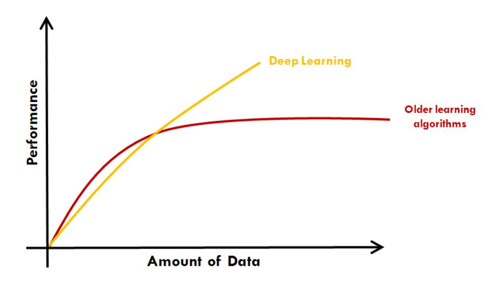
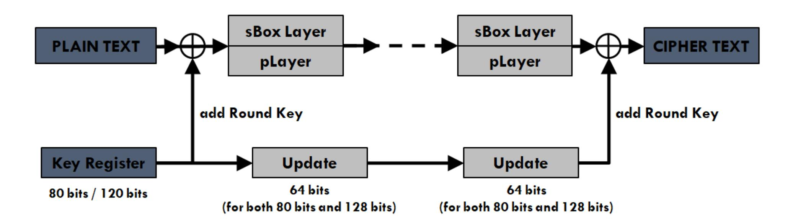
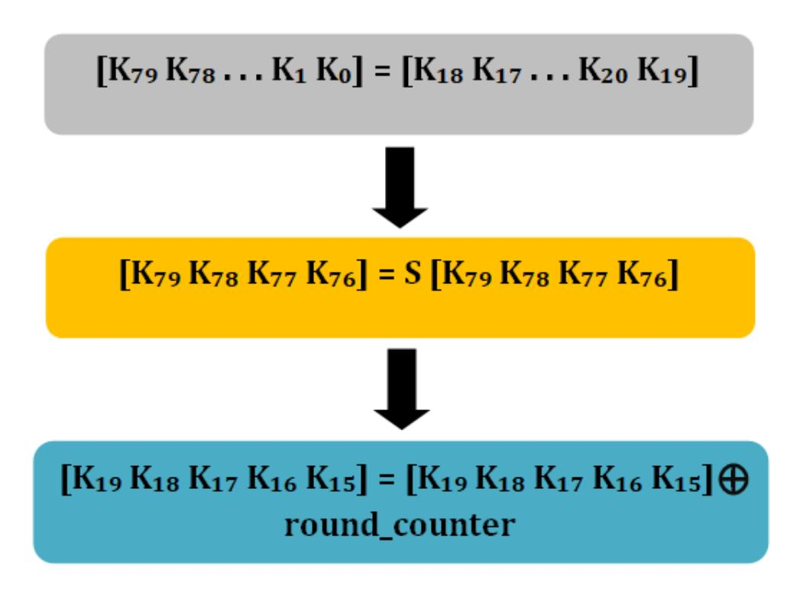
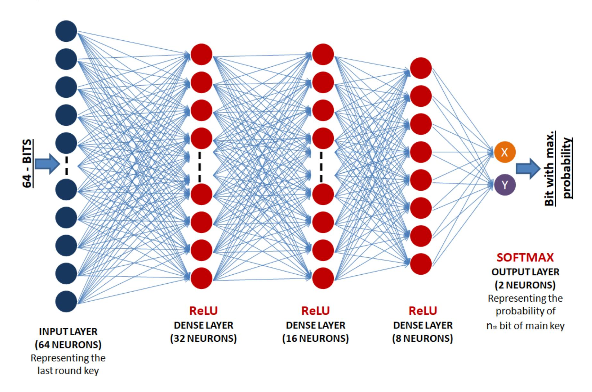

{0}------------------------------------------------

# Deep Learning based Analysis of the Key Scheduling Algorithm of PRESENT cipher

Manan Pareek

Varun Kohli

Girish Mishra

pareekramanan15@gmail.com

varunkohli2013@gmail.com

mishrag@gmail.com

August 19, 2020

# Abstract

The lightweight block cipher PRESENT has become viable for areas like IoT (Internet of Things) and RFID tags, due to its compact design and low power consumption, while providing a sufficient level of security for the aforementioned applications. However, the key scheduling algorithm of a cipher plays a major role in deciding how secure it is. In this paper we test the strength of the key scheduling algorithm (KSA) of the 80-bit key length variant of PRESENT by attempting to retrieve the main key register from the final round key register, using deep learning.

# 1 Introduction

PRESENT is a lightweight block cipher developed in 2007 by the joint collaboration of Orange Labs (France), Ruhr University Bochum (Germany) and the Technical University of Denmark, designed by the Bogdanov et al in 2007 [Bog+07]. Due to its compact size (almost 2.5 times the size of AES [Sta06]), it was also included in the international standard for the lightweight cryptography by the International Organization for Standardization and the International Electrotechnical Commission. PRESENT employs the substitution/permutation (S/P) network and key scheduling for a 31-round encryption.

Several attacks have been conducted in the past to test its security. In 2014, a truncated differential attack on 26-round PRESENT was suggested [BN14]. Using biclique cryptanalysis several full-round attacks were also done on 80 bit PRESENT cipher in [Lee14] and [FDS16]. A set of results of the KSA of PRESENT are combined into a single number to showcase the strength of the cipher in [HPA11]. A statistical saturation attack was also done by Collard in [CS09].

With advances in the field of Deep Learning, Deep Learning techniques have shown to give better results compared to other machine learning techniques. Aron Gohr proposed a neural network based differential distinguisher for round-reduced Speck in [Goh19]. A similar study was conducted by Baksi et al in [Bak+20] 

{1}------------------------------------------------

on Gimli cipher and Gimli Hash. The mentioned studies by Gohr and Baksi further inspired the application of deep learning based differential distinguishers on round reduced PRESENT cipher by Jain et al in [JKM20].

Contribution: In this study we test the sterngth of the KSA of PRESENT by attempting to extract the main keystream of the cipher from the last round key.

Organisation: The paper first discusses Deep Learning in section 2. Followed by the cipher PRESENT and its encryption algorithm in section 3, and a discussion on its KSA in section 4. Section 5 presents our approach to extract the main keystream. Results are shown in section 6 and our study is concluded in section 7.

# 2 Deep Learning Network

Deep Learning(DL) is a sub-field of machine learning (ML) inspired by the structure and function of the brain. It allows machines to solve complex problems even when using diverse, unstructured and inter-connected data sets. DL can be used for various complex tasks such as object detection, speech recognition, medical diagnosis and so on. As the amount of training data increases, so does the performance of a DL model. Fig-1 shows a comparison between the performance DL and other ML models for increasing amount of adta.



Figure 1: Other algorithms vs Deep learning

In Deep Learning technique we create an Artificial Neural Network(ANN) and train that ANN model on the provided dataset. A basic ANN model is basically divided in 3 parts, (i) Input Layer, (ii) Hidden Layers, (iii) Output Layer. Training of a DL model includes two process. Firstly, forward propagation in which the output is generated and second, backward propagation in which first the error is calculated between the target value and the output of the model, and after that the weights are updated in order to minimize the error in next forward propagation. This whole iteration is referred as one EPOCH. The weights are updated as shown below:

$$w_{new} = w_{old} - a * \frac{\partial L(y)}{\partial w_{old}}$$

where wnew and wold are new and old weights respectively, L(y) is the loss and a is the learning rate. Model for this experiment is trained for a total of 3 iteration(EPOCH = 3). As the layers in a simple DL network are linear so to improve the efficiency non linearization is done with the help of Activation funcitons (such as ReLU, Sigmoid, SOFTMAX, etc). The process of forward propagation and then propagating backward is a complex 

{2}------------------------------------------------

task and so is its coding. To simplify it, optimizer is used which completes this whole process for a single iteration. In this experiment Adam optimizer is taken into account and Mean Square Error(MSE) function L(y) = <sup>1</sup> 2 ∗ (Ytarget − Y ) 2 (where Ytarget and Y are the target output and output from the model respectively) is used to calculate the loss with learning rate of 0.001.

# 3 PRESENT block cipher

PRESENT employs an S/P(substitution and permutation) network. S-box used in this cipher is a 4-bit to 4-bit mapping keeping in mind the optimized hardware requirements. This algorithm includes 31 rounds of encryption using key of 80 and 128 bits. In this we will discuss about the 80-bits key version. A block diagram showing the structure of PRESENT is shown in Fig-2.



Figure 2: Structure of PRESENT

```
Algorithm 1: PRESENT Algorithm
GenerateRoundKey()
i=1
while 1 ≤ i ≤ 31 do
   addRound Key(STATE, Ki)
   sBox Layer(STATE)
   pLayer(STATE)
   i=i+1
end
addRoundKey(STATE,K32)
```

In each round, the Key is first XORed to introduce a round key K (1 ≤ i ≤ 32), after which the plain text is passed through the sBOX (non linear substitution layer) Layer and the pLayer (permutation layer). The non-linear layer uses a single 4-bit S-box S which is applied 16 times in parallel in each round. The algorithm for PRESENT is shown in Algorithm-1. The following subsections explains the terms used in the algorithm.

{3}------------------------------------------------

#### 3.1 Terminology

1. addRound Key: In this, the key K<sup>i</sup> = ki<sup>63</sup> ...ki<sup>0</sup> for 1 ≤ i ≤ 32 and current STATE b63....b0, are XORed with each other bit by bit :

$$b_t \to b_t \oplus k_t^i$$

2. sBox Layer: S-box used in this cipher is a 4-bit to 4-bit mapping S : F 4 <sup>2</sup> → F 4 2 . The non-linear layer uses a single 4 X 4 S-box S which is applied 16 times in parallel. The action of this box in hexadecimal notation is given in Table-1. For sBox Layer the current STATE b63...b<sup>0</sup> is considered as sixteen 4-bit words w15...w<sup>0</sup> where w<sup>i</sup> = b4×i+3 || b4×i+2 || b4×i+1 || b4×<sup>i</sup> for 0 ≤ i ≤ 15 and the output nibble S[w<sup>i</sup> ] provides the updated STATE values.

| x    | 0 | 1 | 2 | 3 | 4 | 5 | 6 | 7 | 8 | 9 | A | B | C | D | E | F |  |
|------|---|---|---|---|---|---|---|---|---|---|---|---|---|---|---|---|--|
| S[x] | C | 5 | 6 | B | 9 | 0 | A | D | 3 | E | F | 8 | 4 | 7 | 1 | 2 |  |

Table 1: sBox mapping

3. pLayer: Bit permutation in the PRESENT is done according to the table given below. i th bit of the STATE is moved to the position P(i) as given by the permutation box in Table-2.

| i    | 0  | 1  | 2  | 3  | 4  | 5  | 6  | 7  | 8  | 9  | 10 | 11 | 12 | 13 | 14 | 15 |
|------|----|----|----|----|----|----|----|----|----|----|----|----|----|----|----|----|
| P(i) | 0  | 16 | 32 | 48 | 1  | 17 | 33 | 49 | 2  | 18 | 34 | 50 | 3  | 19 | 35 | 51 |
| i    | 16 | 17 | 18 | 19 | 20 | 21 | 22 | 23 | 24 | 25 | 26 | 27 | 28 | 29 | 30 | 31 |
| P(i) | 4  | 20 | 36 | 52 | 5  | 21 | 37 | 53 | 6  | 22 | 38 | 54 | 7  | 23 | 39 | 55 |
| i    | 32 | 33 | 34 | 35 | 36 | 37 | 38 | 39 | 40 | 41 | 42 | 43 | 44 | 45 | 46 | 47 |
| P(i) | 8  | 24 | 40 | 56 | 9  | 25 | 41 | 57 | 10 | 26 | 42 | 58 | 11 | 27 | 43 | 59 |
| i    | 48 | 49 | 50 | 51 | 52 | 53 | 54 | 55 | 56 | 57 | 58 | 59 | 60 | 61 | 62 | 63 |
| P(i) | 12 | 28 | 44 | 60 | 13 | 29 | 45 | 61 | 14 | 30 | 46 | 62 | 15 | 31 | 47 | 63 |

Table 2: pBox mapping

# 4 Key Scheduling Algorithm

The KSA of any cipher plays an important role in determining its strength. As the size of Key increases so does the complexity, reducing its chances to get attacked and decrypted easily. PRESENT cipher accepts key sizes of either 80-bits or 128-bits. In this paper we will discuss only the KSA for 80-bits key version of PRESENT.

{4}------------------------------------------------



Figure 3: Key Updation in PRESENT

First, the user inputs the 80-bit key in the key register (K). After this for each round (i) the left-most 64-bits of the current key register are taken as the round key (kr) for that round.

$$K_r = k_{63}k_{62}...k_0 = K_{79}K_{78}...K_{16}$$

After every round (i) the key register is rotated by 61-bit positions to the left. Then the rotated key register is updated by passing the leftmost 4 bits through the S-Box and the round-counter value (i) is XORed with bits K19K18K17K16K<sup>15</sup> of K with the least significant bit of round-counter on the right. Fig-3 shows how the key updation for 80-bit PRESENT variation.

# 5 Data Generation and Construction of Deep Learning model

Data generation is an important task as without the proper data, model can not be trained in an efficient manner. To prepare the data set, we generate an 80-bit main keystream randomly and then pass it through the Key Scheduling Algorithm of PRESENT to obtain the final round 64-bit key. Simmilarly, a dataset of 1,00,000 randomly generated samples are created and stored in the form of an array. Then a DL model is created to be trained on this dataset as described below (as shown in Fig-4):

- 1. Input layer containing 64 neurons, each neuron for the individual bit of the final round key.
- 2. 3 fully connected hidden layers of 32 neurons, 16 neurons, 8 neurons respectively each activated by the Rectified Linear Unit (ReLU) function.
- 3. Output layer is activated by the SOFTMAX activation function, and consists of 2 neurons to match the one hot vectors for the predicted bit (0 as [1 0] and 1 as [0 1]).

{5}------------------------------------------------

Once the model is created, the samples were passed in a batch size of 200 as input and trained accordingly. The trained model is then tested by passing 40,000 randomly generated samples of the main keystream and last round key, and accuracies are noted down for each bit. The obtained bit-wise accuracies are shown in Table-3.



Figure 4: Neural Network Structure

X and Y representing the probability of [0 1] respectively at any i th position in main keystream.

# 6 Result

i th position of the master key, which we are trying to predict, may have either bit '0' or bit '1'. Now, if the key scheduling algorithm is perfectly designed with keeping in mind the cryptographic design, it should behave randomly. This means, no model should be able to predict the occurrence of i th bit of master key with better than 1/2 probability. This equivalently means, in only 50% validation samples, a model would do the correct prediction.

On the other hand, the meaning of prediction accuracy for a bit position of the master key being significantly deviating from 0.5 is that the algorithm is not strong enough to ensure randomness. The results obtained in our case are shown in Table-3. The results clearly show that correctly predicting the individual bits of the main keystream with a high probability is not possible with such a method employing deep learning. This shows the resistance of the PRESENT cipher KSA against deep learning based attacks. The key scheduling algorithm is not vulnerable to our deep learning method and it is strong enough in providing the desired security to crypto algorithm of PRESENT cipher.

{6}------------------------------------------------

| th Bit<br>n | Accuracy | th Bits<br>n | Accuracy | th Bit<br>n | Accuracy | th Bit<br>n | Accuracy |
|-------------|----------|--------------|----------|-------------|----------|-------------|----------|
| 1           | 0.514    | 21           | 0.481    | 41          | 0.478    | 61          | 0.489    |
| 2           | 0.499    | 22           | 0.482    | 42          | 0.491    | 62          | 0.491    |
| 3           | 0.475    | 23           | 0.523    | 43          | 0.511    | 63          | 0.493    |
| 4           | 0.493    | 24           | 0.497    | 44          | 0.508    | 64          | 0.512    |
| 5           | 0.512    | 25           | 0.511    | 45          | 0.507    | 65          | 0.489    |
| 6           | 0.489    | 26           | 0.476    | 46          | 0.534    | 66          | 0.508    |
| 7           | 0.501    | 27           | 0.525    | 47          | 0.492    | 67          | 0.507    |
| 8           | 0.508    | 28           | 0.494    | 48          | 0.487    | 68          | 0.534    |
| 9           | 0.505    | 29           | 0.489    | 49          | 0.468    | 69          | 0.476    |
| 10          | 0.508    | 30           | 0.479    | 50          | 0.493    | 70          | 0.525    |
| 11          | 0.479    | 31           | 0.492    | 51          | 0.478    | 71          | 0.511    |
| 12          | 0.492    | 32           | 0.506    | 52          | 0.485    | 72          | 0.485    |
| 13          | 0.507    | 33           | 0.527    | 53          | 0.52     | 73          | 0.487    |
| 14          | 0.479    | 34           | 0.508    | 54          | 0.542    | 74          | 0.493    |
| 15          | 0.522    | 35           | 0.518    | 55          | 0.491    | 75          | 0.481    |
| 16          | 0.533    | 36           | 0.478    | 56          | 0.479    | 76          | 0.482    |
| 17          | 0.478    | 37           | 0.511    | 57          | 0.52     | 77          | 0.523    |
| 18          | 0.53     | 38           | 0.485    | 58          | 0.49     | 78          | 0.497    |
| 19          | 0.526    | 39           | 0.487    | 59          | 0.498    | 79          | 0.511    |
| 20          | 0.529    | 40           | 0.493    | 60          | 0.513    | 80          | 0.52     |

Table 3: Test accuracy of getting n th Bit in main keystream.

# 7 Conclusion

In this work we have analysed the cryptographic strength for key scheduling algorithm of PRESENT cipher and tested if it can be decrypted easily applying DL attacks. Through our results, we have shown that the KSA is strong enough to support the crypto algorithm of PRESENT as expected in any cryptographic design and provides enough security for the applications requiring secure, low cost, low resource, and compact block ciphers. Our analysis is based on a deep learning model and there is a scope of applying other types of DL algorithms to assess the vulnerabilities in PRESENT cipher.

# References

[Sta06] William Stallings. Cryptography and network security, 4/E. Pearson Education India, 2006.

[Bog+07] Andrey Bogdanov et al. "PRESENT: An ultra-lightweight block cipher". In: International workshop on cryptographic hardware and embedded systems. Springer. 2007, pp. 450–466.

{7}------------------------------------------------

- [CS09] Baudoin Collard and F-X Standaert. "A statistical saturation attack against the block cipher PRESENT". In: Cryptographers' Track at the RSA Conference. Springer. 2009, pp. 195–210.
- [HPA11] Julio Cesar Hernandez-Castro, Pedro Peris-Lopez, and Jean-Philippe Aumasson. "On the key schedule strength of present". In: Data Privacy Management and Autonomous Spontaneus Security. Springer, 2011, pp. 253–263.
- [BN14] C´eline Blondeau and Kaisa Nyberg. "Links between truncated differential and multidimensional linear properties of block ciphers and underlying attack complexities". In: Annual International Conference on the Theory and Applications of Cryptographic Techniques. Springer. 2014, pp. 165– 182.
- [Lee14] Changhoon Lee. "Biclique cryptanalysis of PRESENT-80 and PRESENT-128". In: The Journal of Supercomputing 70.1 (2014), pp. 95–103.
- [FDS16] Mohammad Hossein Faghihi Sereshgi, Mohammad Dakhilalian, and Mohsen Shakiba. "Biclique cryptanalysis of MIBS-80 and PRESENT-80 block ciphers". In: Security and Communication Networks 9.1 (2016), pp. 27–33.
- [Goh19] Aron Gohr. "Improving Attacks on Round-Reduced Speck32/64 Using Deep Learning". In: Annual International Cryptology Conference. Springer. 2019, pp. 150–179.
- [Bak+20] Anubhab Baksi et al. "Machine Learning Assisted Differential Distinguishers For Lightweight Ciphers." In: IACR Cryptol. ePrint Arch. 2020 (2020), p. 571.
- [JKM20] Aayush Jain, Varun Kohli, and Girish Mishra. Deep Learning based Differential Distinguisher for Lightweight Cipher PRESENT. Cryptology ePrint Archive, Report 2020/846. https://eprint. iacr.org/2020/846. 2020.