{0}------------------------------------------------

# Orienting supersingular isogeny graphs

## Leonardo Col`o and David Kohel

August 15, 2020

#### Abstract

We introduce a category of O-oriented supersingular elliptic curves and derive properties of the associated oriented and nonoriented `-isogeny supersingular isogeny graphs. As an application we introduce an oriented supersingular isogeny Diffie-Hellman protocol (OSIDH), analogous to the supersingular isogeny Diffie-Hellman (SIDH) protocol and generalizing the commutative supersingular isogeny Diffie-Hellman (CSIDH) protocol.

# 1 Introduction

In this paper we introduce a category of supersingular elliptic curves oriented by an imaginary quadratic order O, and derive properties of the associated oriented and non-oriented supersingular `-isogeny graphs. This permits one to derive a faithful group action on a subset of oriented supersingular curves, equipped with a forgetful map to the set of non-oriented supersingular curves. As an application we introduce an oriented supersingular isogeny Diffie-Hellman protocol (OSIDH), analogous to the supersingular isogeny Diffie-Hellman (SIDH) of De Feo and Jao [18] and generalizing the commutative supersingular isogeny Diffie-Hellman (CSIDH) of Castryck, Lange, Martindale, Panny and Renes [5], the latter based on the idea of group actions on sets by Couveignes [9] and Rostovtsev-Stolbunov [25]. Renewed interest in these isogeny-based protocols is motivated by their presumed resistance to quantum attacks, and this work both enlarges the class of isogeny-based protocols and provides a framework for their security analysis.

We study some theoretical and practical aspects of the endomorphism ring of a supersingular elliptic curve and their connection with isogeny graphs. The central idea is to use an embedding of a quadratic imaginary order into the endomorphism ring of a supersingular elliptic curve, a maximal order in a quaternion algebra, to introduce an orientation on the curve. This extra piece of information permits one to impose compatible actions of the class groups of the suborders of this quadratic order on the descending isogeny chains and therefore on the isogeny volcano of oriented curves.

We observe that the starting vertex of the chain can be chosen to have a special orientation (by an order of class number one) and that computations can be performed using modular polynomials. This motivates us to introduce a 

{1}------------------------------------------------

Diffie-Hellman key exchange protocol that avoids limitations imposed by earlier constructions.

The idea of SIDH is to fix a large prime number p of the form  $p = \ell_A^{e_A} \ell_B^{e_B} f \pm 1$  for a small cofactor f and to let the two parties Alice and Bob take random walks (i.e., isogenies chains) of length  $e_A$  (or  $e_B$ ) in the  $\ell_A$ -isogeny graph (or the  $\ell_B$ -isogeny graph, respectively) on the set of supersingular j-invariants defined over  $\mathbb{F}_{p^2}$ . In order to have the two key spaces of similar size  $\ell_A^{e_A} \approx \ell_B^{e_B}$ , we need to take  $\ell_A^{e_A} \approx \ell_B^{e_B} \approx \sqrt{p}$ . Since the total number of supersingular j-invariants is around p/12, this implies that, for each party, the space of choices for the secret key is limited to  $1/\sqrt{p}$  of the whole set of supersingular j-invariants over  $\mathbb{F}_{p^2}$ . In other words, in choosing their secrets, Alice and Bob can go only "halfway" around the graph from the starting vertex  $j_0$ .

Recently, Castryck, Lange, Martindale, Panny and Renes proposed another key exchange protocol based on supersingular isogeny graphs over the prime field  $\mathbb{F}_p$ . We fix a prime of the form  $p=4\ell_1\cdot\ldots\cdot\ell_t-1$  and an elliptic curve  $E/\mathbb{F}_p$  defined by the equation  $E:y^2=x^3+ax^2+x$ . The peculiarity of CSIDH is that it works with curves defined over  $\mathbb{F}_p$  and restricts the endomorphism rings of such curves to the commutative subring consisting of  $\mathbb{F}_p$ -rational endomorphisms. Starting from this setup, the scheme is an adaptation of the Couveignes and Rostovtsev-Stolbunov idea. Observe that the choice of looking at curves defined over  $\mathbb{F}_p$ , instead of  $\mathbb{F}_{p^2}$ , limits the key spaces for Alice and Bob to  $\#\mathcal{C}\ell(\mathbb{Z}[\sqrt{-p}])$  supersingular points. For a given p, this is the same order of magnitude,  $O(\sqrt{p}\log(p))$ , as for SIDH, but the class group is transitive on this subset.

In this paper we want to describe a new cryptographic protocol, the OSIDH, defined over an arbitrarily large subset of oriented supersingular elliptic curves over  $\mathbb{F}_{p^2}$ , which combines features of SIDH and CSIDH, and permits one to cover an arbitrary proportion of all isomorphism classes of supersingular elliptic curves.

A feature shared by SIDH and CSIDH is that the isogenies are constructed as quotients of rational torsion subgroups: the secret path of length  $e_A$  in the  $\ell_A$ -isogeny graph corresponds to a secret cyclic subgroup  $\langle A \rangle \subseteq E[\ell^{e_A}]$  where A is a rational  $\ell_A^{e_A}$ -torsion point on E. The need for rational points imposes limits on the choice of the prime p and, thus, of the finite field we work on. In contrast OSIDH relies on constructions that can be carried out only with the use of modular polynomials hence avoiding conditions on the rational torsion subgroup.

In summary, an orientation provides a class group action on lifts of an arbitrarily large subset of supersingular points. Exploiting an effective subring  $\mathcal{O}$  of the full endomorphism ring we obtain an effective action by the class group of this subring on the isogeny volcano (whirlpool). This approach generalizes the class group action of CSIDH where supersingular elliptic curves are oriented by the commutative subring  $\mathbb{Z}[\pi]$  generated by Frobenius  $\pi = \sqrt{-p}$ . To avoid subexponential (or polynomial) time reductions, in the OSIDH protocol, as detailed in Section 5, the orientation and associated class group action is hidden in the intermediate data exchanged by Alice and Bob. This gives a protocol for

{2}------------------------------------------------

which the best known attacks at present are fully exponential.

## 2 Orientations, isogeny chains, and ladders

In this section, we recall the definition of an isogeny graph and introduce the notion of orienting supersingular elliptic curves and their isogenies by an imaginary quadratic field K and its orders  $\mathcal{O}$ . Finally, we describe how to impose a structure on an isogeny graph by means of isogeny chains and how to carry out an effective class group action, by means of ladders.

## Isogeny graphs

Given an elliptic curve E over a field k, and a finite set of primes S, we can associate an isogeny graph  $\Gamma = \Gamma_S(E)$ , whose vertices are elliptic curves  $\bar{k}$ -isogenous to E, with fixed vertex E, and whose directed edges are isogenies of degree  $\ell \in S$ . The vertices are defined up to  $\bar{k}$ -isomorphism, and the edges from a given vertex are defined up to a  $\bar{k}$ -isomorphism of the codomain. If  $S = {\ell}$ , then we call  $\Gamma$  an  $\ell$ -isogeny graph, which we write as  $\Gamma_{\ell}(E)$ .

An  $\ell$ -isogeny graph  $\Gamma$  is equiped with an action of  $\mathcal{G} = \operatorname{Gal}(\bar{k}/k)$ , with the vertex [E] a fixed point, as follows. We have

$$E[\ell] = \{ P \in E(\bar{k}) \mid \ell P = O \} \cong (\mathbb{Z}/\ell\mathbb{Z})^2.$$

The set of cyclic subgroups is in bijection with  $\mathbb{P}(E[\ell]) \cong \mathbb{P}^1(\mathbb{Z}/\ell\mathbb{Z})$ , which in turn is in bijection with the set of  $\ell$ -isogenies from E. The  $\mathcal{G}$ -action on  $E[\ell]$  induces an action by  $\mathcal{G}$  on the  $\ell+1$  cyclic subgroups. This action extends to paths without backtracking of length n, via the action on the cyclic subgroups G of order  $\ell^n$  in

$$E[\ell^n] = \{ P \in E(\bar{k}) \mid \ell^n P = O \} \cong (\mathbb{Z}/\ell^n \mathbb{Z})^2.$$

which are in bijection with  $\mathbb{P}(E[\ell^n]) \cong \mathbb{P}^1(\mathbb{Z}/\ell^n\mathbb{Z})$ . This determines a compatible Galois action on vertices [E/G] and edges  $\varphi : E/G_i \to E/G_{i+1}$  where  $G_i \subset G_{i+1}$  is of index  $\ell$ . The action on infinite paths from E is thus determined by the Galois action on the projective Tate module  $\mathbb{P}(T_{\ell}(E)) \cong \mathbb{P}^1(\mathbb{Z}_{\ell})$ . In the same way we define the  $\mathcal{G}$ -action on  $\Gamma_S(E)$  derived from the  $\mathcal{G}$ -set structure of  $\mathbb{P}(T_S(E))$ , where

$$T_S(E) = \prod_{\ell \in S} T_\ell(E).$$

The choice of base curve E determines a Galois action on  $\Gamma$ , conjugate to the Galois action induced by a twist of E.

Thus an  $\ell$ -isogeny graph is  $(\ell + 1)$ -regular for outgoing edges. The existence of curves of j-invariant 0 or  $12^3$  with additional automorphisms in the graph implies a reduced number of incoming edges at these vertices. We define an

{3}------------------------------------------------

undirected graph  $\overline{\Gamma}_{\ell}(E)$  by identifying an isogeny  $\varphi: E_0 \to E_1$  with its dual  $\hat{\varphi}: E_1 \to E_0$ , and if  $\operatorname{Aut}(E_0) \neq \{\pm 1\}$  or  $\operatorname{Aut}(E_1) \neq \{\pm 1\}$  the orbits

$$\operatorname{Aut}(E_1)\varphi\operatorname{Aut}(E_0)$$
 and  $\operatorname{Aut}(E_0)\hat{\varphi}\operatorname{Aut}(E_1)$ 

are identified, which gives a non-bijective correspondence between edges and dual edges.

**Lemma 1.** Let E be an elliptic curve over k with endomorphism ring  $\mathcal{O}$ , and for a prime  $\ell \neq \operatorname{char}(k)$  let  $\overline{\Gamma}_{\ell}(E)$  be its undirected  $\ell$ -isogeny graph.

- 1. If  $\mathcal{O} = \mathbb{Z}$ , then each component of  $\overline{\Gamma}_{\ell}(E)$  is an infinite tree.
- 2. If  $\mathcal{O}$  is an order in a CM field K, then each component  $\overline{\Gamma}$  of  $\overline{\Gamma}_{\ell}(E)$  is infinite and either
  - the prime  $\ell$  is split in K and  $\overline{\Gamma}$  has a unique cycle, or
  - the prime  $\ell$  is ramified or inert in K and  $\overline{\Gamma}$  is a tree.
- 3. If  $\mathcal{O}$  is an order in a quaternion algebra, then  $\overline{\Gamma}_{\ell}(E)$  is finite and connected.

If E is defined over a number field, then case (1) is the generic case and in the CM case (2), every curve admits an embedding of an order of K in its endomorphism ring, and the Galois action is determined by CM theory (see Shimura [27]). If E is defined over a finite field, then only case (2) (ordinary) or case (3) (supersingular) can hold. The ordinary case gives rise to an  $\ell$ -isogeny graph in bijection with the CM graph with CM field  $K = \mathbb{Q}(\pi)$ , where  $\pi$  is the Frobenius endomorphism. In the supersingular case we have more precisely that there are

$$\frac{(p-1)}{12} + \frac{1}{3} \left( 1 - \left( \frac{-3}{p} \right) \right) + \frac{1}{4} \left( 1 - \left( \frac{-4}{p} \right) \right)$$

vertices. In the next section we introduce the notion of a K-orientation by an imaginary quadratic field K, which allows us to canonically lift the finite supersingular graph to an infinite oriented CM graph.

## **Orientations**

Suppose now that E is a supersingular elliptic curve over a finite field k of characteristic p, and denote by  $\operatorname{End}(E)$  the full endomorphism ring. We assume moreover that k contains  $\mathbb{F}_{p^2}$  and E is in an isogeny class such that  $\operatorname{End}_k(E) = \operatorname{End}(E)$ .

We denote by  $\operatorname{End}^0(E)$  the  $\mathbb{Q}$ -algebra  $\operatorname{End}(E) \otimes_{\mathbb{Z}} \mathbb{Q}$ . In particular,  $\operatorname{End}^0(E)$  is the unique quaternion algebra over  $\mathbb{Q}$  ramified at p and  $\infty$ .

Let K be a quadratic imaginary field of discriminant  $\Delta_K$  with maximal order  $\mathcal{O}_K$ . Then there exists an embedding  $\iota: K \to \operatorname{End}^0(E)$  if and only if p is inert or ramified in  $\mathcal{O}_K$ , and there exists an order  $\mathcal{O} \subseteq \mathcal{O}_K$  such that  $\iota(\mathcal{O}) = \iota(K) \cap \operatorname{End}(E)$ .

{4}------------------------------------------------

**Definition 2.** A K-orientation on a supersingular elliptic curve E/k is a homomorphism  $\iota: K \hookrightarrow \operatorname{End}^0(E)$ . An  $\mathcal{O}$ -orientation on E is a K-orientation such that the image of the restriction of  $\iota$  to  $\mathcal{O}$  is contained in  $\operatorname{End}(E)$ . We write  $\operatorname{End}((E,\iota))$  for the order  $\operatorname{End}(E) \cap \iota(K)$  in  $\iota(K)$ . An  $\mathcal{O}$ -orientation is primitive if  $\iota$  induces an isomorphism of  $\mathcal{O}$  with  $\operatorname{End}((E,\iota))$ .

Let  $\phi: E \to F$  be an isogeny of degree  $\ell$ . A K-orientation  $\iota: K \hookrightarrow \operatorname{End}^0(E)$  determines a K-orientation  $\phi_*(\iota): K \hookrightarrow \operatorname{End}^0(F)$  on F, defined by

$$\phi_*(\iota)(\alpha) = \frac{1}{\ell} \phi \circ \iota(\alpha) \circ \hat{\phi}.$$

Conversely, given K-oriented elliptic curves  $(E, \iota_E)$  and  $(F, \iota_F)$  we say that an isogeny  $\phi : E \to F$  is K-oriented if  $\phi_*(\iota_E) = \iota_F$ , i.e. if the orientation on F is induced by  $\phi$ . The restriction to K-oriented isogenies determines a category of K-oriented elliptic curves, hence of K-oriented isomorphism classes, and a subcategory of  $\mathcal{O}$ -oriented elliptic curves.

If E admits a primitive  $\mathcal{O}$ -orientation by an order  $\mathcal{O}$  in K,  $\phi: E \to F$  is an isogeny then F admits an induced primitive  $\mathcal{O}'$ -orientation for an order  $\mathcal{O}'$  satisfying

$$\mathbb{Z} + \ell \mathcal{O} \subseteq \mathcal{O}'$$
 and  $\mathbb{Z} + \ell \mathcal{O}' \subseteq \mathcal{O}$ .

We say that an isogeny  $\phi: E \to F$  is an  $\mathcal{O}$ -oriented isogeny if  $\mathcal{O} = \mathcal{O}'$ .

If  $\ell$  is prime, as direct analogue of Proposition 4.2.23 of [19], one of the following holds:

- $\mathcal{O} = \mathcal{O}'$  and we say that  $\phi$  is horizontal,
- $\mathcal{O} \subset \mathcal{O}'$  with index  $\ell$  and we say that  $\phi$  is ascending,
- $\mathcal{O}' \subset \mathcal{O}$  with index  $\ell$  and we say that  $\phi$  is descending.

Moreover if the discriminant of  $\mathcal{O}$  is  $\Delta$ , then there are exactly  $\ell - \left(\frac{\Delta}{\ell}\right)$  descending isogenies. If  $\mathcal{O}$  is maximal at  $\ell$ , then there are  $\left(\frac{\Delta}{\ell}\right) + 1$  horizontal isogenies, and if  $\mathcal{O}$  is non-maximal at  $\ell$ , then there is exactly one ascending  $\ell$ -isogeny and no horizontal isogenies.

For an oriented class  $(E, \iota)$  with endomorphism ring  $\mathcal{O} = \operatorname{End}((E, \iota))$ , we define  $(E, \iota)$  to be at the *surface* (or depth 0) if  $\mathcal{O}$  is  $\ell$ -maximal, and to be at depth n if the valuation at  $\ell$  of  $[\mathcal{O}_K : \mathcal{O}]$  is n. In the next section we introduce  $\ell$ -isogeny chains linking oriented curves at the surface to oriented curves at depth n.

The oriented graph  $\Gamma_S(E, \iota)$  is the graph whose vertices are K-oriented isomorphism classes, with fixed base vertex  $(E, \iota)$ , and whose edges are K-oriented  $\ell$ -isogenies for  $\ell$  in S.

### Isogeny chains and ladders

Let  $E_0/k$  be a fixed supersingular elliptic curve, equipped with an  $\mathcal{O}$ -orientation, and let  $\ell \neq p$  be a prime.

{5}------------------------------------------------

**Definition 3.** We define an  $\ell$ -isogeny chain of length n from  $E_0$  to E to be a sequence of isogenies of degree  $\ell$ :

$$E_0 \xrightarrow{\phi_0} E_1 \xrightarrow{\phi_1} E_2 \xrightarrow{\phi_2} \dots \xrightarrow{\phi_{n-1}} E_n = E.$$

We say that the  $\ell$ -isogeny chain is without backtracking if  $\ker(\phi_{i+1} \circ \phi_i) \neq E_i[\ell]$  for each i = 0, ..., n-1, and say that the isogeny chain is descending (or ascending, or horizontal) if each  $\phi_i$  is descending (or ascending, or horizontal, respectively).

**Remark.** Since the dual isogeny of  $\phi_i$ , up to isomorphism, is the only isogeny  $\phi_{i+1}$  satisfying  $\ker(\phi_{i+1} \circ \phi_i) = E_i[\ell]$ , an isogeny chain is without backtracking if and only if the composition of two consecutive isogenies is cyclic. Moreover, we can extend this characterization in terms of cyclicity to the entire  $\ell$ -isogeny chain.

**Lemma 4.** The composition of the isogenies in an  $\ell$ -isogeny chain is cyclic if and only if the  $\ell$ -isogeny chain is without backtracking.

**Remark.** If an isogeny  $\phi$  is descending, then the unique ascending isogeny from  $\phi(E)$ , up to isomorphism, is the dual isogeny  $\hat{\phi}$ , satisfying  $\hat{\phi}\phi = [\ell]$ . As an immediate consequence, a descending  $\ell$ -isogeny chain is automatically without backtracking, and an  $\ell$ -isogeny chain without backtracking is descending if and only if  $\phi_0$  is descending.

Suppose that  $(E_i, \phi_i)$  is an  $\ell$ -isogeny chain, with  $E_0$  equipped with an  $\mathcal{O}_K$ orientation  $\iota_0 : \mathcal{O}_K \to \operatorname{End}(E_0)$ . For each i, let  $\iota_i : K \to \operatorname{End}^0(E_i)$  be the\ninduced K-orientation on  $E_i$ ; we note  $\mathcal{O}_i = \operatorname{End}(E_i) \cap \iota_i(K)$  with  $\mathcal{O}_0 = \mathcal{O}_K$  and  $\Delta_i = \operatorname{discr}(\mathcal{O}_i)$  with  $\Delta_0 = \Delta_K$ .

In particular, if  $(E_i, \phi_i)$  is a descending  $\ell$ -chain, then  $\iota_i$  induces an isomorphism

$$\iota_i: \mathbb{Z} + \ell^i \mathcal{O}_K \longrightarrow \mathcal{O}_i.$$

Let q be a prime different from p and  $\ell$  that splits in  $\mathcal{O}_K$ , let  $\mathfrak{q}$  be a fixed prime over q. For each i we set  $\mathfrak{q}_{(i)} = \iota_i(\mathfrak{q}) \cap \mathcal{O}_i$ , and define

$$C_i = E_i[\mathfrak{q}_{(i)}] = \{ P \in E_i[q] \mid \psi(P) = 0 \text{ for all } \psi \in \mathfrak{q}_{(i)} \}.$$

We define  $F_i = E_i/C_i$ , and let  $\psi_i : E_i \to F_i$ , an isogeny of degree q. By construction, it follows that  $\phi_i(C_i) = C_{i+1}$  for all  $i = 0, \ldots, n-1$ . In particular, if  $(E_i, \phi_i)$  is a descending  $\ell$ -ladder, then  $\iota_i$  induces an isomorphism

$$\iota_i: \mathbb{Z} + \ell^i \mathcal{O}_K \longrightarrow \mathcal{O}_i.$$

The isogeny  $\psi_0: E_0 \to F_0 = E/C_0$  gives the following diagram of isogenies:

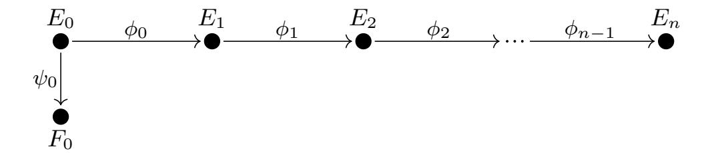

{6}------------------------------------------------

and for each i = 0, ..., n-1 there exists a unique  $\phi'_i : F_i \to F_{i+1}$  with kernel  $\psi_i(\ker(\phi_i))$  such that the following diagram commutes:

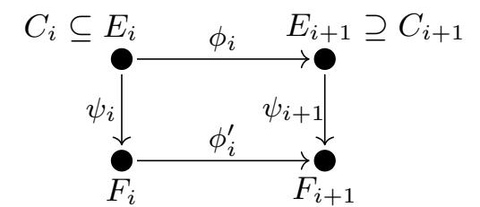

The isogenies  $\psi_i: E_i \to F_i$  induce orientations  $\iota'_i: \mathcal{O}'_i \to \operatorname{End}(F_i)$ . This construction motivates the following definition.

**Definition 5.** An  $\ell$ -ladder of length n and degree q is a commutative diagram of  $\ell$ -isogeny chains  $(E_i, \phi_i)$  and  $(F_i, \phi'_i)$  of length n connected by q-isogenies  $(\psi_i : E_i \to F_i)$ :

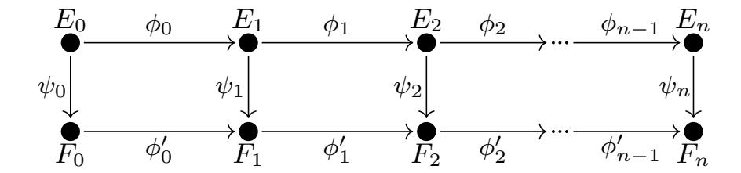

We also refer to an  $\ell$ -ladder of degree q as a q-isogeny of  $\ell$ -isogeny chains, which we express as  $\psi: (E_i, \phi_i) \to (F_i, \phi'_i)$ .

We say that an  $\ell$ -ladder is ascending (or descending, or horizontal) if the  $\ell$ -isogeny chain  $(E_i, \phi_i)$  is ascending (or descending, or horizontal, respectively). We say that the  $\ell$ -ladder is level if  $\psi_0$  is a horizontal q-isogeny. If the  $\ell$ -ladder is descending (or ascending), then we refer to the length of the ladder as its depth (or, respectively, as its height).

**Lemma 6.** An  $\ell$ -ladder  $\psi: (E_i, \phi_i) \to (F_i, \phi_i')$  of oriented elliptic curves is level if and only if  $\operatorname{End}((E_i, \iota_i))$  is isomorphic to  $\operatorname{End}((F_i, \iota_i'))$  for all  $0 \le i \le n$ . In particular, if the  $\ell$ -ladder is level, then  $(E_i, \phi_i)$  is descending (or ascending, or horizontal) if and only if  $(F_i, \phi_i')$  is descending (or ascending, or horizontal).

**Remark.** In the sequel we will assume that  $E_0$  is oriented by a maximal order  $\mathcal{O}_K$ . In Section 3 we investigate using the effective horizontal isogenies of  $E_0$  to derive an effective class group action, and introduce a modular version of this action in Section 4. Walking down a descending isogeny chain, each elliptic curve will be oriented by an order of decreasing size and the final elliptic curve, which will be our final object of study, will have an orientation by an order of large index in  $\mathcal{O}_K$  with action by a large class group.

Since the supersingular  $\ell$ -isogeny graph is connected, every supersingular elliptic curve admits an  $\ell$ -isogeny chain back to a curve oriented by any given maximal order  $\mathcal{O}_K$ , so such a construction exists for any supersingular elliptic curve.

{7}------------------------------------------------

## 3 Oriented curves and class group action

Let SS(p) denote the set of supersingular elliptic curves over  $\overline{\mathbb{F}}_p$  up to isomorphism, and let  $SS_{\mathcal{O}}(p)$  be the set of  $\mathcal{O}$ -oriented supersingular elliptic curves up to K-isomorphism over  $\overline{\mathbb{F}}_p$ , and denote the subset of primitive  $\mathcal{O}$ -oriented curves by  $SS_{\mathcal{O}}^{pr}(p)$ .

### Class group action

The set  $SS_{\mathcal{O}}(p)$  admits a transitive group action:

$$\mathcal{C}\ell(\mathcal{O}) \times \mathrm{SS}_{\mathcal{O}}(p) \longrightarrow \mathrm{SS}_{\mathcal{O}}(p)$$

$$([\mathfrak{a}], E) \longmapsto [\mathfrak{a}] \cdot E = E/E[\mathfrak{a}]$$

where  $\mathfrak{a}$  is any representative ideal coprime to the index  $[\mathcal{O}_K : \mathcal{O}]$  so that the isogeny  $E \to E/E[\mathfrak{a}]$  is horizontal. When restricted to primitive  $\mathcal{O}$ -oriented curves, we obtain the following classical result, extending the standard result for CM elliptic curves.

**Theorem 7.** The class group  $\mathcal{C}\ell(\mathcal{O})$  acts faithfully and transitively on the set of  $\mathcal{O}$ -isomorphism classes of primitive  $\mathcal{O}$ -oriented elliptic curves.

In particular, for fixed primitive  $\mathcal{O}$ -oriented E, we hence obtain a bijection of sets:

$$\mathcal{C}\ell(\mathcal{O}) \longrightarrow \mathrm{SS}^{pr}_{\mathcal{O}}(p)$$

$$[\mathfrak{a}] \longmapsto [\mathfrak{a}] \cdot E$$

For any ideal class  $[\mathfrak{a}]$  and generating set  $\{\mathfrak{q}_1,\ldots,\mathfrak{q}_r\}$  of small primes, coprime to  $[\mathcal{O}_K:\mathcal{O}]$ , we can find an identity  $[\mathfrak{a}]=[\mathfrak{q}_1^{e_1}\cdot\ldots\cdot\mathfrak{q}_r^{e_r}]$ , in order to compute the action via a sequence of low-degree isogenies.

For an ordinary  $\ell$ -isogeny isogeny graph  $\Gamma_{\ell}(E)$ , the points defined over  $\mathbb{F}_{p^n}$  are determined by the condition  $\mathbb{Z}[\pi^n] \subseteq \operatorname{End}(E)$ . Since the class numbers of orders  $\mathcal{O}$  in K are unbounded, the previous theorem implies that the oriented supersingular graphs are infinite. While all supersingular curves and isogenies can be defined over  $\mathbb{F}_{p^2}$ , we can use the inclusion of an order  $\mathcal{O} \subset \operatorname{End}(E)$  to restrict to a finite subgraph.

Corollary 8. Let  $(E, \iota)$  be a K-oriented elliptic curve. The  $\ell$ -isogeny graph  $\Gamma_{\ell}(E, \iota)$  is an infinite graph which is the union of the finite subgraphs whose vertices are restricted to  $SS_{\mathcal{O}}(p)$  for an order  $\mathcal{O}$  in K.

The subrings  $\mathcal{O}_n = \mathbb{Z} + \ell^n \mathcal{O}$  are a linearly ordered family which serve to bound the depth of K-oriented curves relative to a curve at the surface with orientation by an  $\ell$ -maximal order  $\mathcal{O}$ .

{8}------------------------------------------------

## On vortices and whirlpools

Instead of considering the union of different isogeny graphs as in Couveignes [9] and Rostovtsev-Stolbunov [25], we focus on a fixed prime  $\ell$  and we think of the other primes as acting on the  $\ell$ -isogeny graph. The resulting object is the union of  $\ell$ -isogeny volcanoes mixing under the action of  $\mathcal{C}\ell(\mathcal{O})$ . This action stabilizes the subgraph at the surface (the craters) and preserves descending paths. This view is consistent with the construction of orientations by  $\ell$ -isogeny chains (paths in the  $\ell$ -isogeny graph) anchored at the surface, with action of the class group determined by ladders.

**Definition 9.** A vortex is defined to be an  $\ell$ -isogeny subgraph whose vertices are isomorphism classes of  $\mathcal{O}$ -oriented elliptic curves with  $\ell$ -maximal endomorphism ring, equipped with the action of  $\mathcal{C}\ell(\mathcal{O})$ . A whirlpool is defined to be a complete  $\ell$ -isogeny graph of K-oriented elliptic curves whose subgraphs of  $\mathcal{O}_n$ -oriented classes are acted on by  $\mathcal{C}\ell(\mathcal{O}_n)$ .

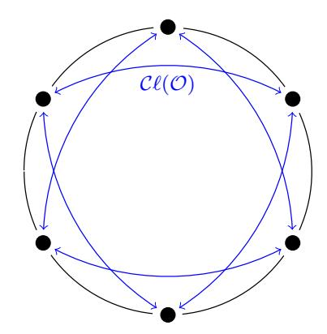

Figure 1: A vortex consists of  $\ell$ -isogeny cycles at the surface acted on by the class group  $\mathcal{C}\ell(\mathcal{O})$  of an  $\ell$ -maximal order  $\mathcal{O}$ .

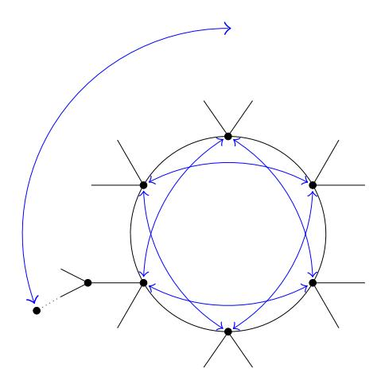

Figure 2: A whirlpool is an  $\ell$ -isogeny graph equipped with compatible actions on its subgraphs by  $\mathcal{C}\ell(\mathcal{O}_n)$ . The depicted 4-regular graph arises from  $\ell=3$ , and the cycle length is the order of a prime over  $\ell$  in the  $\ell$ -maximal order.

The underlying graph of a whirlpool is composed of multiple connected com-

{9}------------------------------------------------

ponents, with the class group acting transitively on components with the same  $\ell$ -maximal order of its vortex. The existence of multiple components of  $\ell$ -volcanoes is studied in [21] and [15], where the set of  $\ell$ -volcanoes is called an  $\ell$ -cordillera. A general whirlpool can be depicted as in Figure 3, as an  $\ell$ -cordillera (black lines) acted on by the class group, as represented by colored arrows.

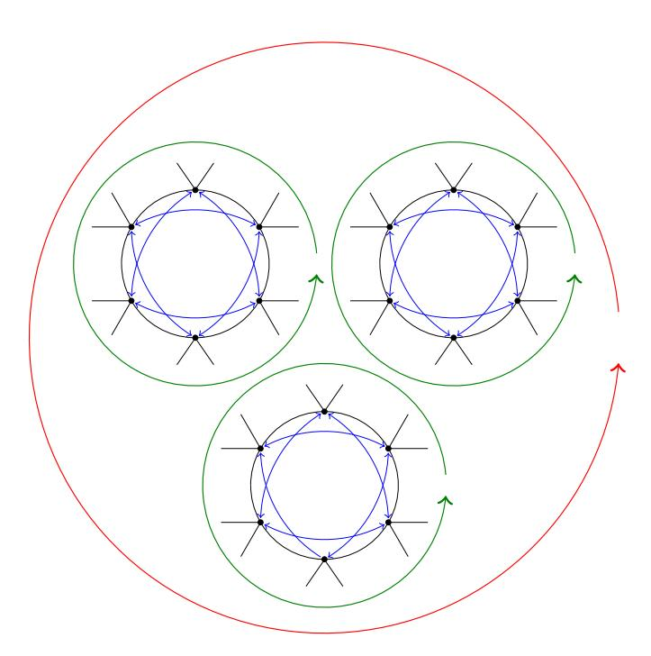

Figure 3: An  $\ell$ -isogeny graph of a whirlpool may have multiple components. The action depicts the subgraph acted on by a class group  $\mathcal{C}\ell(\mathcal{O})$  of order 18, in which  $\ell = 3$  has order six, such as for discriminants -1691, -2291, and -2747.

### Whirlpool examples

We give examples of both ordinary and supersingular whirlpool structures of  $\ell$ -isogeny graphs with induced class group actions.

**Definition 10.** Let  $E/\mathbb{F}_{353}$  be a ordinary elliptic curve with 344 rational points, and consider the subgraph of  $\Gamma_2(E)$  of curves defined over  $\mathbb{F}_{353}$ . The ring  $\mathbb{Z}[\pi]$  generated by Frobenius  $\pi$  has index 2 in the maximal order  $\mathcal{O}_K \cong \mathbb{Z}[\sqrt{-82}]$  of class number 4. The set of j-invariants of such curves at the surface is  $\{160, 230, 270, 298\}$ , and the j-invariants of curves at depth 1 are  $\{66, 182, 197, 236, 253, 264, 304, 330\}$ .

This graph, depicted in Figure 4, consists of two 2-volcanoes, and hence the whirlpool consists of two components permuted by the transitive action of  $\mathcal{C}\ell(\mathbb{Z}[\pi])$ .

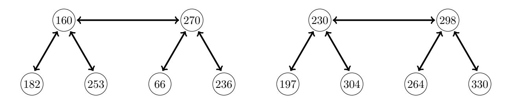

Figure 4: A 2-cordillera.

{10}------------------------------------------------

Figure 5 represents the whirlpool, with blue lines indicating the 7-isogenies and red lines corresponding to the 13-isogenies.

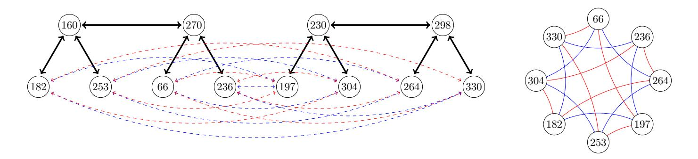

Figure 5: A whirlpool with two components.

**Definition 11.** Let  $E_0/\mathbb{F}_{71}$  be the supersingular elliptic curve with j(E) = 0, oriented by the order  $\mathcal{O}_K = \mathbb{Z}[\omega]$ , where  $\omega^2 + \omega + 1 = 0$ . The unoriented 2-isogeny graph is the finite graph:

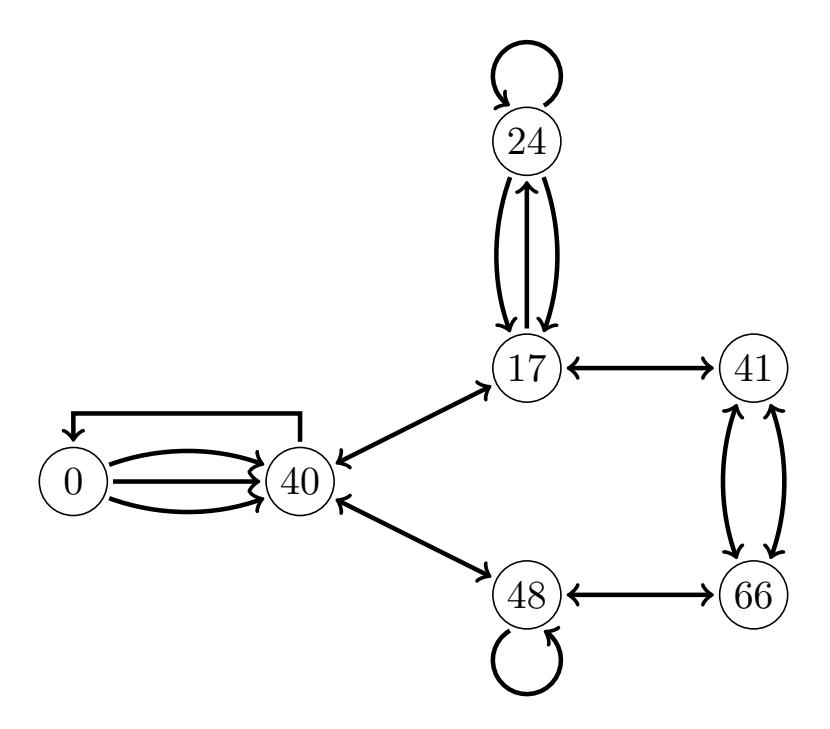

The orietation by  $K = \mathbb{Q}[\omega]$  differentiates vertices in the descending paths from  $E_0$ , determining an infinite graphy shown here to depth 4:

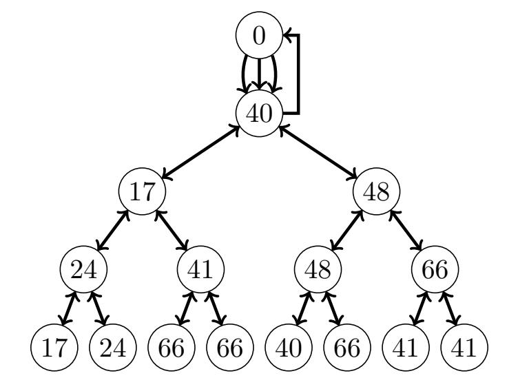

{11}------------------------------------------------

Consider the descending path along vertex j-invariants (0, 40, 17, 41, 66), and let  $\mathfrak{p}_7$  be a prime over the split prime 7. Since  $\Delta_K = -3$  and  $\Delta_1 = \mathrm{disc}(\mathcal{O}_1) = -12$  are of class number one,  $\mathfrak{p}_7 \sim 1$ , and the 7-isogenous chain is likewise of the form  $(0, 40, \ldots)$ .

At depth 2, the class number of  $\mathcal{O}_2$  of discriminant -48 is 2, and a Minkowski reduction of  $\mathfrak{p}_7$  is an equivalent prime  $\mathfrak{p}_3$  over 3. In particular, this prime is nonprincipal of order 2, so the image chain extends  $(0, 40, 48, \ldots)$ .

At depth 3, the class number of  $\mathcal{O}_3$  is 4, and  $\mathfrak{p}_7 \sim \bar{\mathfrak{p}}_7$  are primes of order 2 in the class group, hence the two 7-isogenies are to the same chain  $(0,40,48,48,\ldots)$ . Finally at depth 4 we differentiate the two primes  $\mathfrak{p}_7$  and  $\bar{\mathfrak{p}}_7$  in  $\mathcal{O}_4$  each of order 4. The two extensions (0,40,48,48,66) and (0,40,48,48,40), each of which corresponds to one of the primes over 7. For a choice of prime  $\mathfrak{p}_7$  we have thus determined the following ladder inducing the action of  $\mathfrak{p}_7$  on the  $\ell$ -isogeny chain.

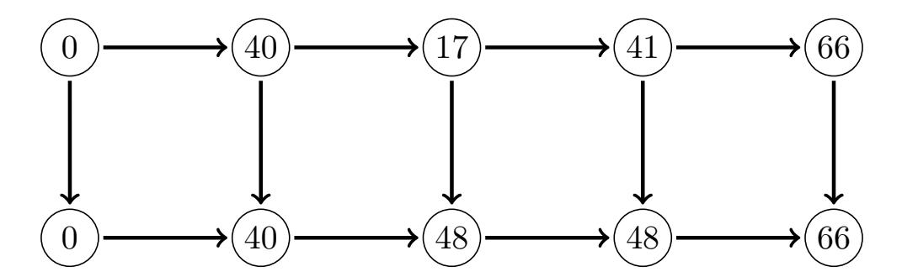

#### The forgetful map to unoriented isogeny graphs

In this section we address the extent of non-injectivity of the forgetful map from oriented curves in the infinite oriented supersingular  $\ell$ -isogeny graphs to the finite supersingular graph.

By Theorem 7, we have a bijection (isomorphism of sets with  $\mathcal{C}(\mathcal{O})$ -action):

$$\mathcal{C}\ell(\mathcal{O}) \cong SS_{\mathcal{O}}^{pr}(\mathcal{O}) \subseteq SS_{\mathcal{O}}(p)$$

determined by any choice of base point. On the other hand, for a descending chain of imaginary quadratic orders of index  $\ell$ ,

$$\mathcal{O}_K = \mathcal{O}_0 \supset \mathcal{O}_1 \supset \cdots \supset \mathcal{O}_i \supset \cdots$$

determined by a descending  $\ell$ -isogeny chain, the class numbers satisfy the geometric growth  $h(\mathcal{O}_{i+1}) = \ell h(\mathcal{O}_i)$  for all  $i \geq 1$ . In particular, the inclusion  $\mathcal{O}_{i+1} \subset \mathcal{O}_i$  determines an inclusion  $SS_{\mathcal{O}_i}(p) \subset SS_{\mathcal{O}_{i+1}}(p) = SS_{\mathcal{O}_i}(p) \cup SS_{\mathcal{O}_{i+1}}^{pr}(p)$ . Consequently we have an unbounded chain of sets

$$SS_{\mathcal{O}_K}(p) \subset SS_{\mathcal{O}_1}(p) \subset \cdots \subset SS_{\mathcal{O}_i}(p) \subset \cdots$$

equipped with forgetful maps  $SS_{\mathcal{O}_i}(p) \to SS(p)$  sending the  $\mathcal{O}_i$ -isomorphism class  $[(E, \mathcal{O}_i)]$  to the isomorphism class [E] determined by the j-invariant j(E).

This motivates the questions of when the map  $SS_{\mathcal{O}_i}(p) \to SS(p)$  and its restriction to  $SS_{\mathcal{O}_i}^{pr}(p)$  are injective, and when these maps are surjective. We

{12}------------------------------------------------

adopt the notation H(p) for the cardinality |SS(p)| of supersingular curves, denote by  $X_i$  the image of  $SS_{\mathcal{O}_i}(p)$  in SS(p) and write  $Y_i$  for the image of  $SS_{\mathcal{O}_i}^{pr}(p)$ . Moreover we write  $\lambda_i = \log_p(|\Delta_i|)$  where  $\Delta_i = \ell^{2i}\Delta_K = \mathrm{disc}(\mathcal{O}_i)$ . With this notation Figure 6 and Figure 7 give tables of values for  $|Y_i|$ ,  $|X_i|$ , and  $\lambda_i$ , for primes of 10 and 12 bits respectively, depicting the boundary line for injectivity at  $\lambda_i = 1$  and the critical line for surjectivity at  $\lambda_i = 2$ . We conclude this section with a general proposition, which follows from the following algebraic lemma, in order to justify the injectivity bound.

**Lemma 12.** Let  $\alpha_1$  and  $\alpha_2$  be elements of a maximal quaternion order in a quaternion algebra over  $\mathbb{Q}$  ramified at a prime p. Set  $\Delta_i = \operatorname{disc}(\mathbb{Z}[\alpha_i])$  for  $i \in \{1,2\}$ , and define  $\omega$  to be the commutator  $[\alpha_1,\alpha_2] = \alpha_1\alpha_2 - \alpha_2\alpha_1$ . Then  $\omega$  satisfies  $\operatorname{Tr}(\omega) = 0$ ,  $\operatorname{Nr}(\omega) = (\Delta_1\Delta_2 - T^2)/4$  where  $T = 2\operatorname{Tr}(\alpha_1\alpha_2) - \operatorname{Tr}(\alpha_1)\operatorname{Tr}(\alpha_2)$ , and  $\operatorname{Nr}(\omega) \equiv 0 \mod p$ .

Proof. The equality  $\operatorname{Tr}(\omega) = 0$  follows from the relation  $\operatorname{Tr}(\alpha_1 \alpha_2) = \operatorname{Tr}(\alpha_2 \alpha_1)$  and linearity of the reduced trace. The expression for the reduced norm  $\operatorname{Nr}(\omega)$  is an elementary calculation. The congruence  $\operatorname{Nr}(\omega) = 0 \mod p$  holds since the unique maximal ideal  $\mathfrak{P}$  over p in the quaternion order is the subset of elements  $\alpha$  with  $\operatorname{Nr}(\alpha) \equiv 0 \mod p$ , and the quotient by  $\mathfrak{P}$  is isomorphic to the (commutative) finite field  $\mathbb{F}_{p^2}$ . Hence  $\alpha_1 \alpha_2 \equiv \alpha_2 \alpha_1 \mod \mathfrak{P}$  which implies  $\omega \mod \mathfrak{P} = 0$ , from which  $\operatorname{Nr}(\omega) \equiv 0 \mod p$  holds.

**Proposition 13.** Let  $\mathcal{O}$  be an imaginary quadratic order of discriminant  $\Delta$  and p a prime which is inert in  $\mathcal{O}$ . If  $|\Delta| < p$ , then the map  $SS_{\mathcal{O}}(p) \to SS(p)$  is injective.

*Proof.* If the map is not injective, there exists a supersingular elliptic curve  $E/\overline{\mathbb{F}}_p$ , such that  $\operatorname{End}(E)$  admits distinct embeddings  $\iota_i: \mathcal{O} = \mathbb{Z}[\alpha] \to \operatorname{End}(E)$ , for  $i \in \{1, 2\}$ . Let  $\alpha_i = \iota_i(\alpha)$  and set  $\omega = [\alpha_1, \alpha_2]$ . By the previous lemma, we have

$$Nr(\omega) = \frac{\Delta^2 - T^2}{4} \equiv 0 \mod p.$$

Since p is prime, and  $T \equiv \Delta \mod 2$ , we have either  $|\Delta| - |T| \equiv 0 \mod 2p$  or  $|\Delta| + |T| \equiv 0 \mod 2p$ . Moreover, since  $\operatorname{End}(E)$  is an order in a definite quaternion algebra, we have  $\operatorname{Nr}(\omega) > 0$ , hence  $|T| < |\Delta|$ . It follows that  $2p \leq |\Delta| + |T| \leq 2|\Delta|$ , and hence  $p \leq |\Delta|$ . As a consequence, we conclude that if the map is injective, then  $|\Delta| < p$ .

# 4 Modular isogenies

In this section we consider the way in which we effectively represent and compute isogenies. With the view to oriented isogenies, we focus on horizontal isogenies with kernel  $E[\mathfrak{q}]$ , where E is a primitive  $\mathcal{O}$ -oriented elliptic curve and  $\mathfrak{q}$  a prime ideal of  $\iota(\mathcal{O})$ . In what follows we suppress  $\iota$  and identify  $\mathcal{O}$  with  $\iota(\mathcal{O})$ .

{13}------------------------------------------------

| p = 1013 |          |         |         |      |             | p = 1019 |    |          |         |         |      |             |
|----------|----------|---------|---------|------|-------------|----------|----|----------|---------|---------|------|-------------|
| i        | $h(O_i)$ | $ Y_i $ | $ X_i $ | H(p) | $\lambda_i$ |          | i  | $h(O_i)$ | $ Y_i $ | $ X_i $ | H(p) | $\lambda_i$ |
| 1        | 1        | 1       | 1       | 85   | 0.3590      | •        | 1  | 1        | 1       | 1       | 86   | 0.3587      |
| 2        | 2        | 2       | 3       | 85   | 0.5593      |          | 2  | 2        | 2       | 3       | 86   | 0.5588      |
| 3        | 4        | 4       | 7       | 85   | 0.7596      |          | 3  | 4        | 4       | 7       | 86   | 0.7590      |
| 4        | 8        | 8       | 15      | 85   | 0.9599      |          | 4  | 8        | 8       | 15      | 86   | 0.9591      |
| 5        | 16       | 16      | 29      | 85   | 1.1603      |          | 5  | 16       | 15      | 30      | 86   | 1.1593      |
| 6        | 32       | 26      | 47      | 85   | 1.3606      |          | 6  | 32       | 29      | 49      | 86   | 1.3594      |
| 7        | 64       | 43      | 66      | 85   | 1.5609      |          | 7  | 64       | 46      | 69      | 86   | 1.5595      |
| 8        | 128      | 70      | 82      | 85   | 1.7612      |          | 8  | 128      | 64      | 81      | 86   | 1.7597      |
| 9        | 256      | 79      | 85      | 85   | 1.9615      |          | 9  | 256      | 83      | 84      | 86   | 1.9598      |
| 10       | 512      | 83      | 85      | 85   | 2.1618      | •        | 10 | 512      | 86      | 86      | 86   | 2.1600      |

Figure 6: Sizes of images of oriented classes mapping to supersingular curves

| p = 4079 |          |           |           |      |             | p = 4091 |    |          |           |         |      |             |
|----------|----------|-----------|-----------|------|-------------|----------|----|----------|-----------|---------|------|-------------|
| i        | $h(O_i)$ | $  Y_i  $ | $  X_i  $ | H(p) | $\lambda_i$ |          | i  | $h(O_i)$ | $  Y_i  $ | $ X_i $ | H(p) | $\lambda_i$ |
| 1        | 1        | 1         | 1         | 341  | 0.2988      |          | 1  | 1        | 1         | 1       | 342  | 0.2987      |
| 2        | 2        | 2         | 3         | 341  | 0.4656      |          | 2  | 2        | 2         | 3       | 342  | 0.4654      |
| 3        | 4        | 4         | 7         | 341  | 0.6323      |          | 3  | 4        | 4         | 7       | 342  | 0.6321      |
| 4        | 8        | 8         | 15        | 341  | 0.7991      |          | 4  | 8        | 8         | 15      | 342  | 0.7988      |
| 5        | 16       | 16        | 31        | 341  | 0.9658      |          | 5  | 16       | 16        | 31      | 342  | 0.9655      |
| 6        | 32       | 31        | 62        | 341  | 1.1326      | •        | 6  | 32       | 30        | 59      | 342  | 1.1322      |
| 7        | 64       | 61        | 113       | 341  | 1.2993      |          | 7  | 64       | 59        | 110     | 342  | 1.2989      |
| 8        | 128      | 111       | 196       | 341  | 1.4661      |          | 8  | 128      | 107       | 182     | 342  | 1.4656      |
| 9        | 256      | 180       | 276       | 341  | 1.6328      |          | 9  | 256      | 186       | 263     | 342  | 1.6323      |
| 10       | 512      | 258       | 326       | 341  | 1.7996      |          | 10 | 512      | 266       | 326     | 342  | 1.7990      |
| 11       | 1024     | 318       | 340       | 341  | 1.9663      |          | 11 | 1024     | 314       | 341     | 342  | 1.9657      |
| 12       | 2048     | 340       | 341       | 341  | 2.1331      |          | 12 | 2048     | 339       | 342     | 342  | 2.1323      |

Figure 7: Sizes of images of oriented classes mapping to supersingular curves

## Effective endomorphism rings and isogenies

We say a subring of  $\operatorname{End}(E)$  is effective if we have explicit polynomial or rational functions which represent its generators. The subring  $\mathbb{Z}$  in  $\operatorname{End}(E)$  is thus effective. Examples of effective imaginary quadratic subrings  $\mathcal{O} \subset \operatorname{End}(E)$ , are the subring  $\mathcal{O} = \mathbb{Z}[\pi]$  generated by Frobenius, for either an ordinary elliptic curve, or a supersingular elliptic curve defined over  $\mathbb{F}_p$ , or an elliptic curve obtained by CM construction for an order  $\mathcal{O}$  of small discriminant (in absolute value).

In the Couveignes [9] or the Rostovtsev-Stolbunov [25] constructions, or in the CSIDH protocol [5], one works with the ring  $\mathcal{O} = \mathbb{Z}[\pi]$ . The disadvantage is that for large finite fields, the class group of  $\mathcal{O}$  is large and the primes  $\mathfrak{q}$  in  $\mathcal{O}$  have no small degree elements. For large p and small q, the smallest degree element of a prime  $\mathfrak{q}$  of norm q is the endomorphism [q], of degree  $q^2$ . The

{14}------------------------------------------------

division polynomial  $\psi_q(x)$ , which cuts out the torsion group E[q], is of degree  $(q^2-1)/2$ . Consequently factoring  $\psi_q(x)$  to find the kernel polynomial (see Kohel [19, Chapter 2]) of degree (q-1)/2 for  $E[\mathfrak{q}]$  is relatively expensive. As a result, in the SIDH protocol [18], the ordinary protocol of De Feo, Smith, and Kieffer [11], or the CSIDH protocol [5], the curves are chosen such that the points of  $E[\mathfrak{q}]$  are defined over a small degree extension  $\kappa/k$ , particularly  $[\kappa/k] \in \{1,2\}$ , and working with rational points in  $E(\kappa)$ .

In the OSIDH protocol outlined below, we propose the use of an effective CM order  $\mathcal{O}_K$  of class number 1. In particular every prime  $\mathfrak{q}$  of norm q is generated by an endomorphism of the minimal degree q. For example we may take  $\mathcal{O}_K$  to be the Eisenstein or Gaussian integers of discriminant -3 or -4, generated by an automorphism. The kernel polynomial of degree (q-1)/2 can be computed directly without need for a splitting field for  $E[\mathfrak{q}]$ , and the computation of a generator isogeny is a one-time precomputation. Using an analog of the construction of division polynomials, the computation of the kernel polynomial requires O(q) field operations.

### Push forward isogenies

The extension of an isogeny (or, as we will see in the next section, of an endomorphism) of  $E_0$  to an  $\ell$ -isogeny chain  $(E_i, \phi_i)$  reduces to the construction of a ladder. At each step we are given  $\phi_i : E_i \to E_{i+1}$  and  $\psi_i : E_i \to F_i$  of coprime degrees, and need to compute

$$\psi_{i+1}: E_{i+1} \to F_{i+1} \text{ and } \phi_i': F_i \to F_{i+1}.$$

Rather than working with elliptic curves and isogenies, we construct the oriented graphs directly as points on a modular curve linked by modular correspondences defined by modular polynomials.

#### Modular curves and isogenies

The use of modular curves for efficient computation of isogenies has an established history (see Elkies [14]). For this purpose we represent isogeny chains and ladders as finite sequences of points on the modular curve  $\mathcal{X} = X(1)$  preserving the relations given by a modular equation.

We recall that the modular curve  $X(1) \cong \mathbb{P}^1$  classifies elliptic curves up to isomorphism, and the function j generates its function field. The family of elliptic curves

$$E: y^2 + xy = x^3 - \frac{36}{(j-1728)}x - \frac{1}{(j-1728)}$$

covers all isomorphism classes  $j \neq 0, 12^3$  or  $\infty$ , such that the fiber over  $j_0 \in k$  is an elliptic curve of j-invariant  $j_0$ . The curves  $y^2 + y = x^3$  and  $y^2 = x^3 + x$  deal with the cases j = 0 and j = 1728.

{15}------------------------------------------------

The modular polynomial  $\Phi_m(X,Y)$  defines a correspondence in  $X(1) \times X(1)$  such that  $\Phi_m(j(E), j(E')) = 0$  if and only if there exists a cyclic m-isogeny  $\phi$  from E to E', possibly over some extension field. The curve in  $X(1) \times X(1)$  cut out by  $\Phi_m(X,Y) = 0$  is a singular image of the modular curve  $X_0(m)$  parametrizing such pairs  $(E,\phi)$ .

**Remark.** The modular curve X(1) can be replaced by any genus 0 modular curve  $\mathcal{X}$  parametrizing elliptic curves with level structure. Lifting the modular polynomials back to  $\mathcal{X}$  of higher level (but still genus 0) has an advantage of reducing the coefficient size of the corresponding modular polynomials  $\Phi_m(X,Y)$ .

In the case of CSIDH, the authors use  $\mathcal{X} = X_0(4)$ , with a modular function  $a \in k(X_0(4))$  to parametrize the family of curves

$$E: y^2 = x(x^2 + ax + 1),$$

together with a cyclic subgroup  $C \subset E$  of order 4, whose generators are cut out by x = 1. The map  $\mathcal{X} \to X(1)$  is given by

$$j = \frac{2^8(a^2 - 3)^3}{(a - 2)(a + 2)}.$$

The approach via modular isogenies of this section can be adapted as well to the CSIDH protocol.

**Definition 14.** A modular  $\ell$ -isogeny chain of length n over k is a finite sequence  $(j_0, j_1, \ldots, j_n)$  in k such that  $\Phi_{\ell}(j_i, j_{i+1}) = 0$  for  $0 \le i < n$ . A modular  $\ell$ -ladder of length n and degree q over k is a pair of modular  $\ell$ -isogeny chains

$$(j_0, j_1, \ldots, j_n)$$
 and  $(j'_0, j'_1, \ldots, j'_n)$ ,

such that  $\Phi_q(j_i, j_i') = 0$ .

Clearly an  $\ell$ -isogeny chain  $(E_i, \phi_i)$  determines the modular  $\ell$ -isogeny chain  $(j_i = j(E_i))$ , but the converse is equally true.

**Proposition 15.** If  $(j_0, ..., j_n)$  is a modular  $\ell$ -isogeny chain over k, and  $E_0/k$  is an elliptic curve with  $j(E_0) = j_0$ , then there exists an  $\ell$ -isogeny chain  $(E_i, \phi_i)$  such that  $j_i = j(E_i)$  for all  $0 \le i \le n$ .

Given any modular  $\ell$ -isogeny chain  $(j_i)$ , elliptic curve  $E_0$  with  $j(E_0) = j_0$ , and isogeny  $\psi_0 : E_0 \to F_0$ , it follows that we can construct an  $\ell$ -ladder  $\psi : (E_i, \phi_i) \to (F_i, \phi'_i)$  and hence a modular  $\ell$ -isogeny ladder. In fact the  $\ell$ -ladder can be efficiently constructed recursively from the modular  $\ell$ -isogeny chain  $(j_0, \ldots, j_n)$  and  $(j'_0, \ldots, j'_n)$ , by solving the system of equations

$$\Phi_{\ell}(j_i', Y) = \Phi_q(j_{i+1}, Y) = 0,$$

for  $Y = j'_{i+1}$ .

**Remark.** The modular polynomial  $\Phi_q(X,Y)$  is degree q+1 in X and Y. The evaluation at  $X=j\in\mathbb{F}_{p^2}$  requires  $O(q^2)$  field multiplications. The subsequent gcd requires  $O(\ell q)$  operations, and these operations are repeated to depth n.

{16}------------------------------------------------

## 5 OSIDH

We consider an elliptic curve  $E_0/k$   $(k = \mathbb{F}_{p^2})$  with an  $\mathcal{O}_K$ -orientation by an effective ring  $\mathcal{O}_K$  of class number 1, e.g. j = 0 or  $j = 12^3$  (for which  $\mathcal{O}_K = \mathbb{Z}[\zeta_3]$  or  $\mathbb{Z}[i]$ ), small prime  $\ell$ , and a descending  $\ell$ -isogeny chain from  $E_0$  to  $E = E_n$ . The  $\mathcal{O}_K$ -orientation on  $E_0$  and  $\ell$ -isogeny chain induces isomorphisms

$$\iota_i: \mathbb{Z} + \ell^i \mathcal{O}_K \to \mathcal{O}_i \subset \operatorname{End}(E_i),$$

and we set  $\mathcal{O} = \mathcal{O}_n$ . By hypothesis on  $E_0/k$  (the class number of  $\mathcal{O}_K$  is 1), any horizontal isogeny  $\psi_0 : E_0 \to F_0$  is, up to isomorphism  $F_0 \cong E_0$ , an endomorphism.

For a small prime q, we push forward a q-endomorphism  $\phi_0 \in \text{End}(E_0)$ , to a q-isogeny  $\psi : (E_i, \phi_i) \to (F_i, \phi'_i)$ .

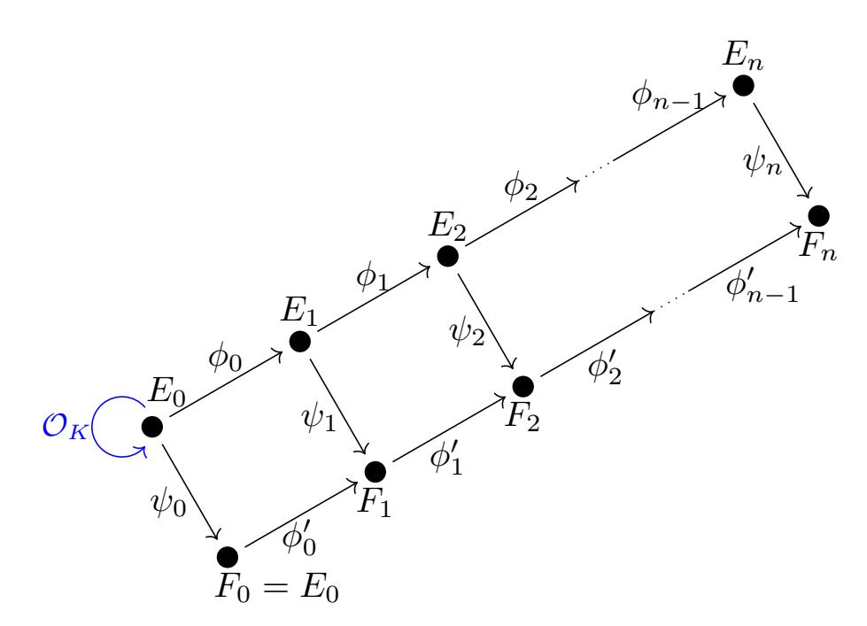

By sending  $\mathfrak{q} \subset \mathcal{O}_K$  to  $\psi_0 : E_0 \to F_0 = E_0/E_0[\mathfrak{q}] \cong E_0$ , and pushing forward to  $\psi_n : E_n \to F_n$ , we obtain the effective action of  $\mathcal{C}\ell(\mathcal{O})$  on  $\ell$ -isogeny chains of length n from  $E_0$ . In other words, the action of an ideal  $\mathfrak{q}$  becomes non trivial while pushing it down along a descending isogeny chain due to the fact that  $\mathfrak{q} \cap \mathcal{O}_i$  becomes "less and less principal".

In order to have the action of  $\mathcal{C}\ell(\mathcal{O})$  cover a large portion of the supersingular elliptic curves, we require  $\ell^n \sim p$ , i.e.,  $n \sim \log_{\ell}(p)$ .

**Recall.** The previous estimates are based on two very important results. Observe that the number of oriented elliptic curves that we can reach after n steps equals the class number  $h(\mathcal{O}_n)$  of  $\mathcal{O}_n = \mathbb{Z} + \ell^n \mathcal{O}_K$ . It is well-known [10, §7.D] that:

$$h(\mathbb{Z} + m\mathcal{O}_K) = \frac{h(\mathcal{O}_K)m}{\left[\mathcal{O}_K^{\times} : \mathcal{O}^{\times}\right]} \prod_{p|m} \left(1 - \left(\frac{\Delta_K}{p}\right) \frac{1}{p}\right) \tag{1}$$

{17}------------------------------------------------

where [8, VI.3]

$$\mathcal{O}_{K}^{\times} = \begin{cases}
\{\pm 1\} & \text{if } \Delta_{K} < -4 \\
\{\pm 1, \pm i\} & \text{if } \Delta_{K} = -4 \\
\{\pm 1, \pm \zeta_{3}, \pm \zeta_{3}^{2}\} & \text{if } \Delta_{K} = -3
\end{cases} \Rightarrow \begin{bmatrix}
\mathcal{O}_{K}^{\times} : \mathcal{O}^{\times} \\
\mathcal{O}_{K}^{\times} : \mathcal{O}^{\times}
\end{bmatrix} = \begin{cases}
1 & \text{if } \Delta_{K} < -4 \\
2 & \text{if } \Delta_{K} = -4 \\
3 & \text{if } \Delta_{K} = -3
\end{cases}$$

On the other hand, we know that the number of supersingular elliptic curves over  $\mathbb{F}_{p^2}$  is given by the following formula [28, V.4]:

$$\#SS(p) = \left[\frac{p}{12}\right] + \begin{cases} 0 & \text{if } p \equiv 1 \mod 12\\ 1 & \text{if } p \equiv 5,7 \mod 12\\ 2 & \text{if } p \equiv 11 \mod 12 \end{cases}$$

Therefore, in our case

$$h(\ell^n \mathcal{O}_K) = \frac{1 \cdot \ell^n}{2 \text{ or } 3} \left( 1 - \left( \frac{\Delta_K}{\ell} \right) \frac{1}{\ell} \right) = \left[ \frac{p}{12} \right] + \epsilon \implies p \sim \ell^n$$

To realise the class group action, it suffices to replace the above  $\ell$ -ladder with its modular  $\ell$ -ladder.

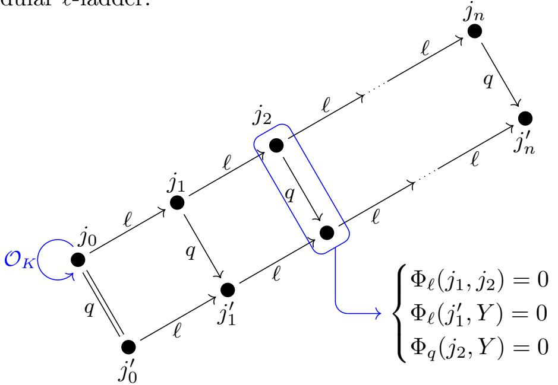

At the first index for which  $j'_i = j(E_i/E_i[\mathfrak{q}_i])$  is different from  $j''_i = j(E_i/E_i[\bar{\mathfrak{q}}_i])$ , that is,  $[\mathfrak{q}_i] \neq [\bar{\mathfrak{q}}_i]$  in  $\mathcal{C}\ell(\mathcal{O}_i)$ , we can solve iteratively for  $j'_{i+1}$  from  $j'_i$  and  $j_{i+1}$  using the equations:

$$\Phi_{\ell}(j_i', Y) = \Phi_q(j_{i+1}, Y) = 0.$$

The action of primes  $\mathfrak{q}$  through  $\mathcal{C}\ell(\mathcal{O})$  can be precomputed by its action on these initial segments which permits us to separate the action of  $\mathfrak{q}$  and  $\bar{\mathfrak{q}}$ , hence assures a unique solution to the above system.

{18}------------------------------------------------

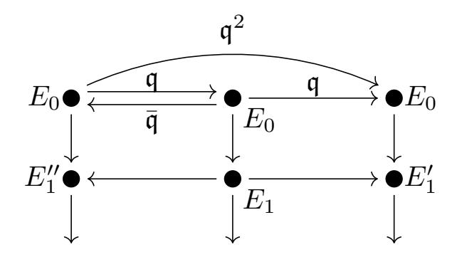

Thus,  $E'_i \neq E''_i$  if and only if  $\mathfrak{q}^2 \cap \mathcal{O}_i$  is not principal and the probability that a random ideal in  $\mathcal{O}_i$  is principal is  $1/h(\mathcal{O}_i)$ . In fact, we can do better; we write  $\mathcal{O}_K = \mathbb{Z}[\omega]$  and we observe that if  $\mathfrak{q}^2$  was principal, then

$$q^2 = N(\mathfrak{q}^2) = N(a + b\ell^i\omega)$$

since it would be generated by an element of  $\mathcal{O}_i = \mathbb{Z} + \ell^i \mathcal{O}_K$ . Now

$$N(a+b\ell^i) = a^2 \pm abt\ell^i + b^2s\ell^{2i}$$
 where  $\omega^2 + t\omega + s = 0$ 

Thus, as soon as  $\ell^{2i} > q^2$  we are guaranteed that  $\mathfrak{q}^2$  is not principal.

### 5.1 A first naive protocol

We now present the OSIDH cryptographic protocol based on this construction. We first describe a simplified version as intermediate step. The reason for doing that is twofold. On one hand it permits us to observe how the notions introduced so far lead to a cryptographic protocol, and on the other hand it highlights the critical security considerations and identifies the computationally hard problems on which the security is based.

As described at the beginning of the section, we fix a maximal order  $\mathcal{O}_K$  in a quadratic imaginary field K of small discriminant  $\Delta_K$  and a large prime p such that  $\left(\frac{\Delta_K}{p}\right) \neq 1$ . Further, the two parties agree on an elliptic curve  $E_0$  with effective maximal order  $\mathcal{O}_K$  embedded in the endomorphism ring and a descending  $\ell$ -isogeny chain:

$$E_0 \longrightarrow E_1 \longrightarrow E_2 \longrightarrow \cdots \longrightarrow E_n.$$

Each constructs a power smooth horizontal endomorphism  $\psi$  of  $E_0$  as the product of generators of small principal ideals in  $\mathcal{O}_K$ . A power smooth isogeny, for which the prime divisors and exponents of its degree are bounded, ensures that  $\psi$  can be efficiently extended to a ladder.

**Remark.** In practice, we will fix  $\mathcal{O}_K$  to be either the Eisenstein integers  $\mathbb{Z}[\zeta_3]$  or the Gaussian integers  $\mathbb{Z}[\zeta_4](=\mathbb{Z}[i])$ . Since the ladder is descending, we have that  $\operatorname{End}((E_i, \iota_i)) \cong \mathbb{Z} + \ell^i \mathcal{O}_K$  for all  $i = 0, \ldots, n$ .

Alice privately chooses a horizontal power smooth endomorphism  $\psi_A = \psi_0$ :  $E_0 \to F_0 = E_0$ , and pushes it forward to an  $\ell$ -ladder of length n:

{19}------------------------------------------------

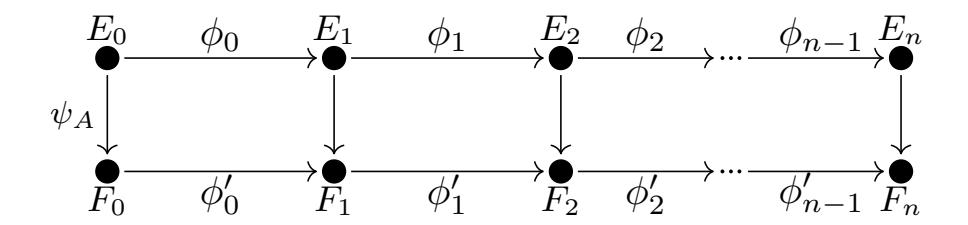

By Lemma 6, this  $\ell$ -ladder is level, hence  $\operatorname{End}((E_i, \iota_i)) = \operatorname{End}((F_i, \iota_i'))$ .

The  $\ell$ -isogeny chain  $(F_i)$  is sent to Bob, who chooses a horizontal smooth endomorphism  $\psi_B$ , and sends the resulting  $\ell$ -isogeny chain  $(G_i)$  to Alice. Each applies (and, eventually, push forward) the private endomorphism to obtain  $(H_i) = \psi_B \cdot (F_i) = \psi_A \cdot (G_i)$ , and  $H = H_n$  is the shared secret.

In the following picture the blue arrows correspond to the orientation chosen throughout by Alice while the red ones represent the choice made by Bob.

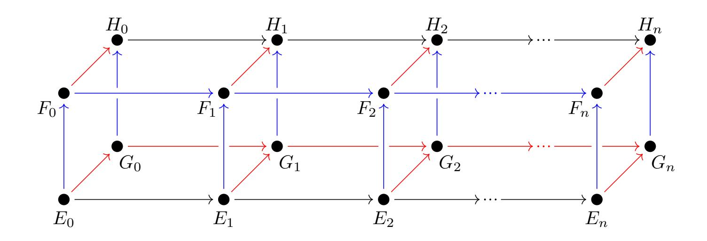

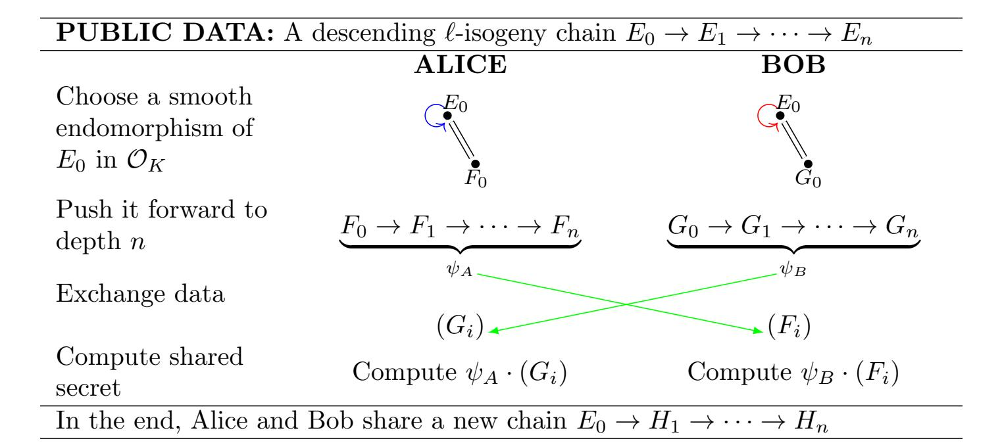

This naive protocol reveals too much information and is susceptible to attack by computing the endomorphism rings of the end curves  $\operatorname{End}(E_n)$ ,  $\operatorname{End}(F_n)$ , and  $\operatorname{End}(G_n)$ . In general, the problem of computing an isogeny between two supersingular elliptic curves E and F knowing  $\operatorname{End}(E)$  is broadly equivalent to the task of computing  $\operatorname{End}(F)$  [17, 13]. Kohel's algorithm [19], and the refinement of Galbraith [16], compute several paths in the isogeny graph to find 

{20}------------------------------------------------

isogenies  $F \to F$ . Thus, as noted in [17], computing  $\operatorname{End}(F)$  can be reduced to finding an endomorphism  $\phi: F \to F$  that is not in  $\mathbb{Z}[\pi]$ .

**Remark.** Observe that in SIDH and CSIDH the endomorphism ring of the starting elliptic curve is known since the shared initial curve is chosen to have special form. In OSIDH the situation changes: we need to find an isogeny starting from  $E_n$ , and not the curve  $E_0$  for which we have an explicit description of the endomorphism ring. However, knowing  $\text{End}(E_0)$ , we can deduce at each step

$$\mathbb{Z} + \ell \operatorname{End}(E_i) \cong \mathbb{Z} + \phi_i \operatorname{End}(E_i) \hat{\phi}_i \subset \operatorname{End}(E_{i+1})$$

and thus we obtain the inclusion  $\mathbb{Z} + \ell^n \operatorname{End}(E_0) \hookrightarrow \operatorname{End}(E_n)$ .

Notice that, in general, knowing the existence of a copy of an imaginary quadratic order inside the maximal order of a quaternion algebra does not guarantee the knowledge of the embedding as there might be many [12, II.5]. In this case, from the knowledge of a subring  $\mathbb{Z} + \ell \operatorname{End}(E_i)$  of finite index  $\ell^3$  we can reconstruct  $\operatorname{End}(E_{i+1})$  step-by-step from the  $\ell$ -isogeny chain  $E_0 \to E_1 \to \ldots \to E_n$ , and hence compute  $\operatorname{End}(E_n)$ .

In the naive protocol we also share the full isogeny chain  $(F_i)$  (or their j-invariant sequence), which allows an adversary to deduce the oriented endomorphism ring

$$\mathbb{Z} + \ell^n \mathcal{O}_K \hookrightarrow \operatorname{End}(F_n)$$

of the terminal elliptic curve  $F = F_n$ . This gives enough information to deduce Hom(E, F) and construct a representative smooth ideal in  $\mathcal{C}(O)$  sending E to F.

We observe that there is another approach to this problem which uses only properties of the ideal class group. Suppose we have a K-descending  $\ell$ -isogeny chain  $E_0 \longrightarrow E_1 \longrightarrow \ldots \longrightarrow E_n$  with

$$\operatorname{End}(E_0) \supseteq \mathcal{O}_K = \mathcal{O}_0 \supset \mathcal{O}_1 \supset \ldots \supset \mathcal{O}_n \simeq \mathbb{Z} + \ell^n \mathcal{O}_K$$

This induces a sequence at the level of class groups

$$\mathcal{C}\ell(\mathcal{O}_n) \longrightarrow \cdots \longrightarrow \mathcal{C}\ell(\mathcal{O}_i) \longrightarrow \cdots \longrightarrow \mathcal{C}\ell(\mathcal{O}_K)$$

$$\downarrow | \qquad \qquad \downarrow | \qquad \qquad \downarrow |$$

$$\frac{(\mathcal{O}_K/\ell^n\mathcal{O}_K)^{\times}}{\overline{\mathcal{O}}_K^{\times}(\mathbb{Z}/\ell^n\mathbb{Z})^{\times}} \longrightarrow \cdots \longrightarrow \frac{(\mathcal{O}_K/\ell^i\mathcal{O}_K)^{\times}}{\overline{\mathcal{O}}_K^{\times}(\mathbb{Z}/\ell^i\mathbb{Z})^{\times}} \longrightarrow \cdots \longrightarrow \{1\}$$

In particular, there exists a surjection

$$\mathcal{C}\!\ell(\mathcal{O}_{i+1}) \simeq \frac{\left(\mathcal{O}_K/\ell^{i+1}\mathcal{O}_K\right)^{\times}}{\overline{\mathcal{O}}_K^{\times} \left(\mathbb{Z}/\ell^{i+1}\mathbb{Z}\right)^{\times}} \longrightarrow \frac{\left(\mathcal{O}_K/\ell^{i}\mathcal{O}_K\right)^{\times}}{\overline{\mathcal{O}}_K^{\times} \left(\mathbb{Z}/\ell^{i}\mathbb{Z}\right)^{\times}} \simeq \mathcal{C}\!\ell(\mathcal{O}_i)$$

whose kernel is easily described. First, the map  $\psi : \mathcal{C}\ell(\mathcal{O}_1) \to \mathcal{C}\ell(\mathcal{O}_K)$  has kernel

$$\begin{cases} \mathbb{F}_{\ell^2}^{\times}/\mathbb{F}_{\ell}^{\times} & \text{of order } \ell+1 & \text{if } \ell \text{ is inert} \\ \left(\mathbb{F}_{\ell}^{\times} \times \mathbb{F}_{\ell}^{\times}\right)/\mathbb{F}_{\ell}^{\times} & \text{of order } \ell-1 & \text{if } \ell \text{ splits} \\ \left(\mathbb{F}_{\ell}\left[\xi\right]\right)^{\times}/\mathbb{F}_{\ell}^{\times} & \text{of order } \ell & \text{if } \ell \text{ is ramified} \end{cases}$$

{21}------------------------------------------------

where  $\xi^2 = 0$  (see [10, §7.D] and [22, §12]). Thereafter, for each i > 1, the surjection  $\mathcal{C}\ell(\mathcal{O}_{i+1}) \to \mathcal{C}\ell(\mathcal{O}_i)$  has cyclic kernel of order  $\ell$  by virtue of the class number formula (1), and hence we have a short exact sequence

$$1 \to \mathbb{Z}/\ell\mathbb{Z} \to \mathcal{C}\ell(\mathcal{O}_{i+1}) \to \mathcal{C}\ell(\mathcal{O}_i) \to 1$$

Thus if we have already constructed some representative for  $\psi_A$  modulo  $\ell^i \mathcal{O}_K$ , we can lift it to find  $\psi_A \mod \ell^{i+1} \mathcal{O}_K$  from  $\ell$  possible preimages. For each candidate lift  $\psi_A \mod \ell^{i+1} \mathcal{O}_K$ , we search for an smooth representative

$$\psi_A \equiv \psi_1^{e_1} \psi_2^{e_2} \cdot \ldots \cdot \psi_t^{e_t} \bmod \ell^{i+1} \mathcal{O}_K$$

with  $\deg(\psi_j) = q_j$  small. The candidate smooth lift can be applied to  $E_{i+1}$  and the correct lift is that which sends  $E_{i+1}$  to  $F_{i+1}$  in the  $\ell$ -isogeny chain (see Figure 8). This yields an algorithm involving multiple instances of the discrete logarithm problem in a group of order  $\ell$  as in Pohlig-Hellman algorithm [23] and in the generalization of Teske [29].

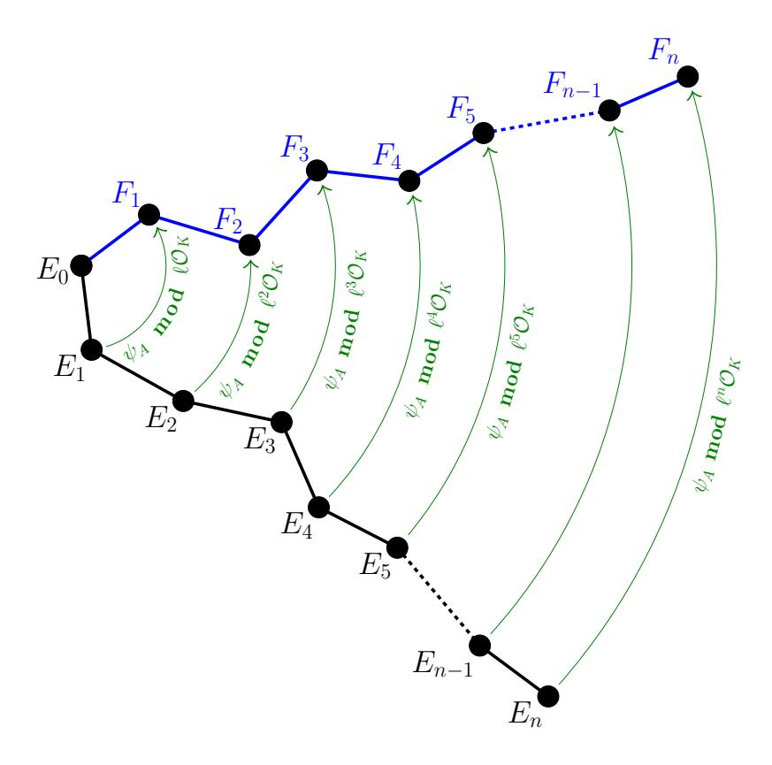

Figure 8: Construction of Alice's secret key

In conclusion, this naïve protocol is insecure because two parties share the knowledge of the entire chains  $(F_i)$  and  $(G_i)$ . The question becomes: how can we avoid sharing the  $\ell$ -isogeny chains while still giving the other party enough information to carry out their isogeny walk?

## 5.2 The OSIDH protocol

We now detail how to send enough public data to compute the isogenies  $\psi_A$  and  $\psi_B$  on  $G = G_n$  and  $F = F_n$ , respectively, without revealing the  $\ell$ -isogeny chains

{22}------------------------------------------------

 $(F_i)$  and  $(G_i)$ . The setup remains the same with a public choice of  $\mathcal{O}_K$ -oriented elliptic curve  $E_0$  and  $\ell$ -isogeny chain

$$E_0 \to E_1 \to \cdots \to E_n$$
.

Moreover, a set of primes  $\mathfrak{q}_1, \ldots, \mathfrak{q}_t$  (above  $q_1, \ldots, q_t$ ) splitting in  $\mathcal{O}_K$  is fixed.

The first step consists of choosing the secret keys; these are represented by a sequence of integers  $(e_1, \ldots, e_t)$  such that  $|e_i| \leq r$ . The bound r is taken so that the number  $(2r+1)^t$  of curves that can be reached is sufficiently large. This choice of integers enables Alice to compute a new elliptic curve

$$F_n = \frac{E_n}{E_n \left[ \mathfrak{q}_1^{e_1} \cdots \mathfrak{q}_t^{e_t} \right]}$$

by means of constructing the following commutative diagram

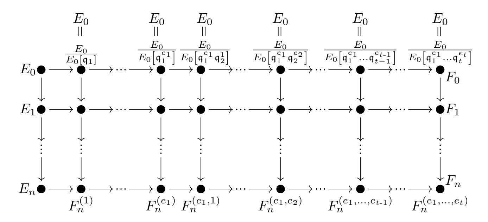

**Remark.** Observe that this is just a union of  $q_i$ -ladders.

At this point the idea is to exchange curves  $F_n$  and  $G_n$  and to apply the same process again starting from the elliptic curve received from the other party. Unfortunately, this is not enough to get to the same final elliptic curve. Once Alice receives the unoriented curve  $G_n$  computed by Bob she also needs additional information for each prime  $\mathfrak{q}_i$ :

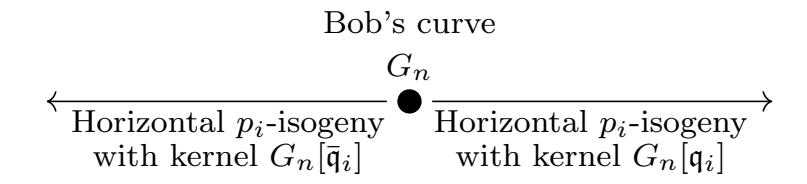

but she has no information as to which directions — out of  $q_i+1$  total  $q_i$ -isogenies — to take as  $\mathfrak{q}_i$  and  $\bar{\mathfrak{q}}_i$ . For this reason, once that they have constructed their elliptic curves  $F_n$  and  $G_n$ , they precompute, for each prime  $\mathfrak{q}_i$ , the  $q_i$ -isogeny chains coming from  $\bar{\mathfrak{q}}_i^j$  (denoted by the class  $\mathfrak{q}_i^{-j}$ ) and  $\mathfrak{q}_i^j$ :

$$F_{n,i}^{(-r)} \leftarrow \cdots \leftarrow F_{n,i}^{(-1)} \leftarrow F_n \to F_{n,i}^{(1)} \to \cdots \to F_{n,i}^{(r-1)} \to F_{n,i}^{(r)}$$

{23}------------------------------------------------

$$G_{n,i}^{(-r)} \leftarrow \cdots \leftarrow G_{n,i}^{(-1)} \leftarrow G_n \to G_{n,i}^{(1)} \to \cdots \to G_{n,i}^{(r-1)} \to G_{n,i}^{(r)}$$

Now Alice obtains from Bob the curve  $G_n$  and, for each i, the horizontal  $q_i$ -isogeny chains determined by the isogenies with kernels  $G_n[\mathfrak{q}_i^j]$ . With this information Alice can take  $e_1$  steps in the  $\mathfrak{q}_1$ -isogeny chain and push forward all the  $\mathfrak{q}_i$ -isogeny chains for i > 1.

**Remark.** We recall that pushing forward means constructing a ladder which transmits all the information about the commutative action of  $\mathfrak{q}_i^{e_i}$  in the class group.

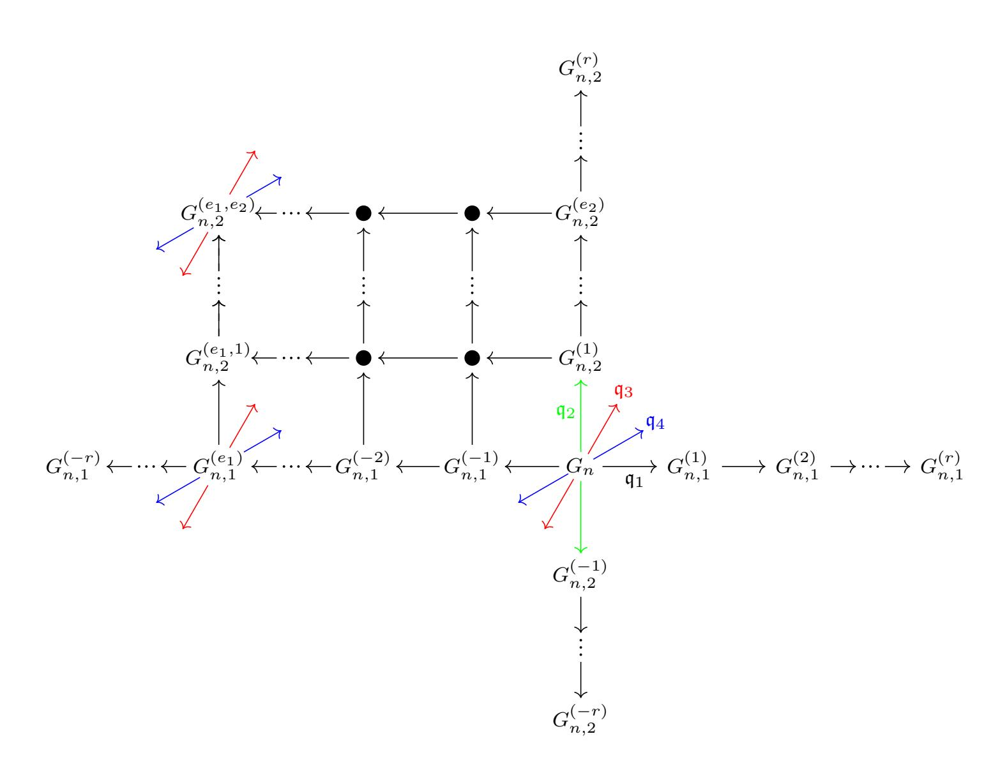

Alice repeats the process for all the  $\mathfrak{q}_i$ 's every time pushing forward the isogenies for the primes with index strictly bigger than i. Finally, she obtains a new elliptic curve

$$H_n = \frac{E_n}{E_n \left[ \mathfrak{q}_1^{e_1 + d_1} \cdots \mathfrak{q}_t^{e_t + d_t} \right]}$$

Bob follows the same process with the public data received from Alice, in order to compute the same curve  $H_n$ . Recall that, in the naive protocol, Alice and Bob compute the group action on the full  $\ell$ -isogeny chains:

{24}------------------------------------------------

$$\begin{array}{cccccccccccccccccccccccccccccccccccc$$

In the refined OSIDH protocol, Alice and Bob share sufficient information to determine the curve  $H_n$  without knowledge of the other party's  $\ell$ -isogeny chain  $(G_i)$  and  $(F_i)$ , nor the full  $\ell$ -isogeny chain  $(H_i)$  from the base curve  $E_0$ .

| <b>PUBLIC DATA:</b> A descending $\ell$ -isogeny chain $E_0 \to E_1 \to \cdots \to E_n$                                                                     |                                                                                                                                                          |                                                                                              |  |  |  |  |  |  |
|-------------------------------------------------------------------------------------------------------------------------------------------------------------|----------------------------------------------------------------------------------------------------------------------------------------------------------|----------------------------------------------------------------------------------------------|--|--|--|--|--|--|
| and a set of splitting primes $\mathfrak{q}_1, \ldots, \mathfrak{q}_t \subseteq \mathcal{O} = \operatorname{End}(E_n) \cap K \hookrightarrow \mathcal{O}_K$ |                                                                                                                                                          |                                                                                              |  |  |  |  |  |  |
|                                                                                                                                                             | ALICE                                                                                                                                                    | BOB                                                                                          |  |  |  |  |  |  |
| Choose integers in an interval $[-r, r]$                                                                                                                    | $(e_1,\ldots,e_t)$                                                                                                                                       | $(d_1,\ldots,d_t)$                                                                           |  |  |  |  |  |  |
| Construct an isogenous curve                                                                                                                                | $F_n = \frac{E_n}{E_n \left[ \mathfrak{q}_1^{e_1} \cdots \mathfrak{q}_t^{e_t} \right]}$                                                                  | $G_n = \frac{E_n}{E_n \left[ \mathfrak{q}_1^{d_1} \cdots \mathfrak{q}_t^{d_t} \right]}$      |  |  |  |  |  |  |
| Precompute all directions $\forall i$                                                                                                                       | $F_n \to F_{n,i}^{(1)} \to \cdots \to F_{n,i}^{(r)}$                                                                                                     | $G_n \to G_{n,i}^{(1)} \to \cdots \to G_{n,i}^{(r)}$                                         |  |  |  |  |  |  |
| and their conjugates                                                                                                                                        | $\underbrace{F_{n,i}^{(-r)} \leftarrow \cdots \leftarrow F_{n,i}^{(-1)} \leftarrow F_n}_{}$                                                              | $\underbrace{G_{n,i}^{(-r)} \leftarrow \cdots \leftarrow G_{n,i}^{(-1)} \leftarrow G_n}_{r}$ |  |  |  |  |  |  |
| Exchange data                                                                                                                                               |                                                                                                                                                          |                                                                                              |  |  |  |  |  |  |
|                                                                                                                                                             | $G_n$ +directions                                                                                                                                        | $F_n$ +directions                                                                            |  |  |  |  |  |  |
|                                                                                                                                                             | Takes $e_i$ steps in                                                                                                                                     | Takes $d_i$ steps in                                                                         |  |  |  |  |  |  |
| Compute shared                                                                                                                                              | $\mathfrak{q}_i$ -isogeny chain & push                                                                                                                   | $\mathfrak{q}_i$ -isogeny chain & push                                                       |  |  |  |  |  |  |
| data                                                                                                                                                        | forward information                                                                                                                                      | forward information                                                                          |  |  |  |  |  |  |
|                                                                                                                                                             | for all $j > i$ .                                                                                                                                        | for all $j > i$ .                                                                            |  |  |  |  |  |  |
| In the end, Alice and Bob share the same elliptic curve_                                                                                                    |                                                                                                                                                          |                                                                                              |  |  |  |  |  |  |
| Н —                                                                                                                                                         | $F_n$ $=$ $G_n$                                                                                                                                          | $ E_n$ .                                                                                     |  |  |  |  |  |  |
| $F_n = \frac{1}{F_n}$                                                                                                                                       | $\frac{F_n}{\left[\mathfrak{q}_1^{d_1}\cdots\mathfrak{q}_t^{d_t}\right]} = \frac{G_n}{G_n\left[\mathfrak{q}_1^{e_1}\cdots\mathfrak{q}_t^{e_t}\right]} =$ | $= E_n[\mathfrak{q}_1^{e_1+d_1}\cdots\mathfrak{q}_t^{e_t+d_t}]$                              |  |  |  |  |  |  |

**Remark.** We can read this scheme using the terminology of section 3.

After the choice of the secret key, we observe a vortex: Alice (respectively Bob) acts on an isogeny crater (that in the case of  $\mathcal{O}_K = \mathbb{Z}\left[\zeta_3\right]$  or  $\mathbb{Z}\left[i\right]$  consists of a single points) with the primes  $\mathfrak{q}_1^{e_1} \cdot \ldots \cdot \mathfrak{q}_t^{e_t}$  (respectively  $\mathfrak{q}_1^{d_1} \cdot \ldots \cdot \mathfrak{q}_t^{d_t}$ ).

This action is eventually transmitted along the  $\ell$ -isogeny chain and we get a whirlpool. We can think of the isogeny volcano as rotating under the action of the secret keys and the initial  $\ell$ -isogeny path transforming into the two secret isogeny chains.

{25}------------------------------------------------

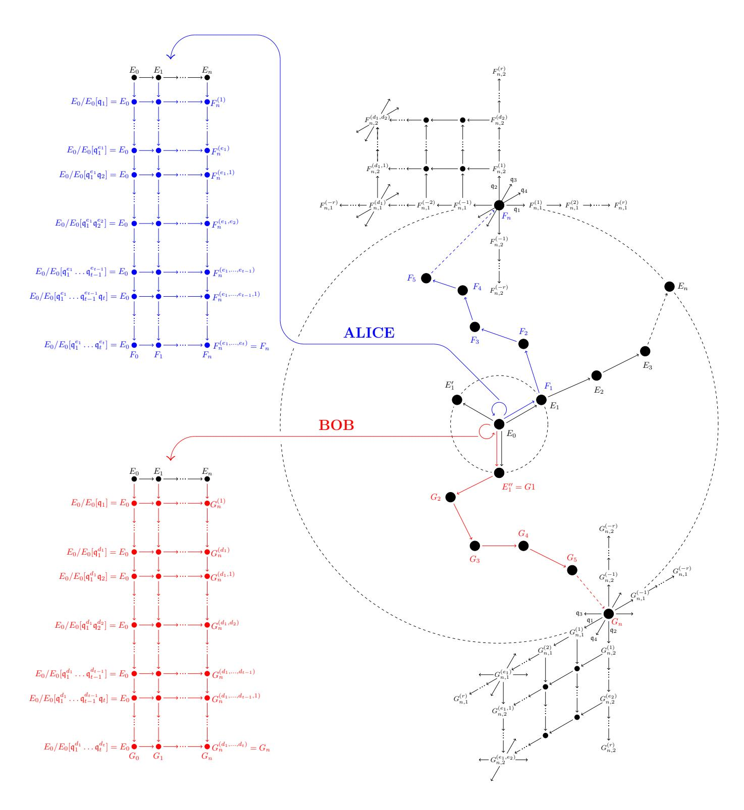

Figure 9: Graphic representation of OSIDH

# 6 Security considerations

In order to ensure security of the system, we have seen that the data giving the orientation must remain hidden. A second consideration is the proportion of curves attained by the action of the class group  $\mathcal{C}\ell(\mathcal{O})$ , and by the private walks  $\psi_A$  and  $\psi_B$  of Alice and Bob in that class group. The size of the orbit of  $\mathcal{C}\ell(\mathcal{O})$  is controlled by the chain length n, and the number of curves attained by the private walks is further limited by the prime power data, up to exponent bounds, which we allow ourselves to transmit.

{26}------------------------------------------------

## Chain length

Suppose that  $(E_i)$  is an isogeny chain of length n, from a supersingular elliptic curve  $E_0$  oriented by  $\mathcal{O}_K$  of class number one, and consider

$$\operatorname{Hom}(E_0, E_n) = \phi \mathcal{O}_K + \psi \mathcal{O}_K.$$

As a quadratic module with respect to the degree map, its determinant is  $p^2$ . If the length n is of sufficient length such that  $E_n$  represents a general curve in SS(p), then a set of reduced basis elements  $\phi$  and  $\psi$  satisfies

$$\deg(\phi) \approx \deg(\psi) \approx \sqrt{p}$$
.

Now suppose that  $\phi: E_0 \to E_n$  is the isogeny giving the  $\ell$ -isogeny chain. If  $\deg(\phi) = \ell^n$  is less than  $\sqrt{p}$ , then  $\phi \mathcal{O}_K$  is a submodule generated by short isogenies, and  $E_n$  is special. We conclude that we must choose n to be at least  $\log_{\ell}(p)/2$  in order to avoid an attack which seeks to determine  $\phi \mathcal{O}_K$  as a distinguished submodule of low degree isogenies.

We extend this argument to consider the logarithmic proportion  $\lambda$  of supersingular elliptic curves we can reach. In order to cover  $p^{\lambda}$  supersingular curves, out of  $|SS(p)| = p/12 + \varepsilon_p$  curves,  $deg(\phi)$  must be such that

$$|\mathcal{C}\ell(\mathcal{O})| = \left| \frac{(\mathcal{O}_K/\ell^n \mathcal{O}_K)^*}{\mathcal{O}_K^* (\mathbb{Z}/\ell^n \mathbb{Z})^*} \right| \approx \ell^n = \deg(\phi) \approx p^{\lambda}.$$

In particular, choosing  $\lambda = 1$ , we find that  $n = \log_{\ell}(p)$  is the critical length for reaching all supersingular curves.

#### Degree of private walks

Suppose now that  $E = E_n$  is a generic supersingular curve and F another. Without an  $\mathcal{O}_K$ -module structure, we have a basis  $\{\psi_1, \psi_2, \psi_3, \psi_4\}$  such that

$$\operatorname{Hom}(E,F) = \mathbb{Z}\psi_1 + \mathbb{Z}\psi_2 + \mathbb{Z}\psi_3 + \mathbb{Z}\psi_4.$$

Assuming that E and F are generic relative to one another, a reduced basis satisfies  $\deg(\psi_i) \approx \sqrt{p}$ , as above. Thus the private walk  $\psi_A$  should satisfy

$$\log_p(\deg(\psi_A)) \ge \frac{1}{2}$$

in order that  $\mathbb{Z}\psi_A$  is not a distinguished submodule of  $\operatorname{Hom}(E,F)$ . This critical distance is the maximal that can be attained by the SIDH protocol.

As above, another measure of the generality of  $\psi_A$  is the number of curves that can be reached by different choices of the isogeny  $\psi_A$ . For a fixed degree m, the number of curves which can be attained is

$$|\mathbb{P}(E[m])| \cong |\mathbb{P}^1(\mathbb{Z}/m\mathbb{Z})| \approx m.$$

{27}------------------------------------------------

For the SIDH protocol, on has  $\ell_A^{n_A} \approx \ell_B^{n_B} \approx \sqrt{p}$ , and only  $\sqrt{p}$  curves out of p/12 can be reached.

In the CSIDH or OSIDH protocols, the degree of the isogeny is not fixed. The total number of isogenies of any degree d up to m is

$$\sum_{d=1}^{m} |\mathbb{P}(E[d])| \approx m^2,$$

but the choice of  $\psi_A$  is restricted to a subset of  $\mathcal{O}$ -oriented isogenies in  $\mathcal{C}\ell(\mathcal{O})$ . Such isogenies are restricted to a class proportional to m. Specifically, in the OSIDH construction, if we let  $S_m \subset \mathcal{O}_K$  be the set of endomorphisms of degree up to m, and consider the map

$$S_m \subset \mathcal{O}_K \longrightarrow \frac{(\mathcal{O}_K/\ell^n \mathcal{O}_K)^*}{\mathcal{O}_K^*(\mathbb{Z}/\ell^n \mathbb{Z})^*} \cong \mathcal{C}\ell(\mathcal{O}).$$

Since  $|S_m| \approx m$ , to cover a subset of  $p^{\lambda}$  classes, we need  $\log_p(\deg(\psi_A)) \geq \lambda$ .

### Private walk exponents

In practice, rather than bounding the degree, for efficient evaluation one fixes a subset of small split primes, and the space of exponent vectors is bounded. The instantiation CSIDH-512 (see [5]) uses a prime of 512 bits such that for each of 74 primes one has a choice of 11 exponents in [-5,5]. This gives 256 bits of freedom which is of the order of magnitude to cover  $h(-p) \approx \sqrt{p}$  classes (up to logarithmic factors). In this instance the class number h(-p) was computed [2] and found to be 252 bits.

For the general OSIDH construction, we choose exponent vectors  $(e_1, \ldots, e_t)$  in the space  $I_1 \times \cdots \times I_t \subset \mathbb{Z}^t$ , where  $I_j = [-r_j, r_j]$ , defining  $\psi_A$  with kernel

$$\ker(\psi_A) = E[\mathfrak{q}_1^{e_1} \cdots \mathfrak{q}_t^{e_t}].$$

We thus express the map to SS(p) as the composite of the map of exponent vectors to the class group and the image of  $\mathcal{C}(\mathcal{O})$ :

$$\prod_{j=1}^{t} I_j \longrightarrow \mathcal{C}\ell(\mathcal{O}) \longrightarrow SS(p).$$

In order to avoid revealing any cycles, we want the former map to be effectively injective — either injective or computationally difficult to find a nontrivial element of the kernel in

$$(I_1 \times \cdots \times I_t) \cap \ker(\mathbb{Z}^t \to \mathcal{C}\ell(\mathcal{O}))$$

In order to cover as many classes as possible, the latter should be nearly surjective. Supposing that the former map is injective with image of size  $p^{\lambda}$  in  $SS(\mathcal{O})$ , this gives  $p^{\lambda} < \prod_{j=1}^{t} (2r_j + 1) < |\mathcal{C}(\mathcal{O})| \approx \ell^n$ . For fixed  $r = r_j$ , this gives

$$n > t \log_{\ell}(2r+1) > \lambda \log_{\ell}(p)$$
.

{28}------------------------------------------------

Setting  $\lambda = 1$ ,  $\ell = 2$  and  $\log_{\ell}(p) = 256$ , the parameters t = 74 and r = 5 give critical values as in CSIDH-512, with group action mapping to the full set of supersingular points SS(p).

## 7 Conclusion

By imposing the data of an orientation by an imaginary quadratic ring  $\mathcal{O}$ , we obtain an augmented category of supersingular curves on which the class group  $\mathcal{C}\ell(\mathcal{O})$  acts faithfully and transitively. This idea is already implicit in the CSIDH protocol, in which supersingular curves over  $\mathbb{F}_p$  are oriented by the Frobenius subring  $\mathbb{Z}[\pi] \cong \mathbb{Z}[\sqrt{-p}]$ . In contrast we consider an elliptic curve  $E_0$  oriented by a CM order  $\mathcal{O}_K$  of class number one. To obtain a nontrivial group action, we consider descending  $\ell$ -isogeny chains in the  $\ell$ -volcano, on which the class group of an order  $\mathcal{O}$  of large index  $\ell^n$  in  $\mathcal{O}_K$  acts. The map from an  $\ell$ -isogeny chain to its terminal node forgets the structure of the orientation, giving rise to a generic curve in the supersingular isogeny graph. Within this general framework we define a new oriented supersingular isogeny Diffie-Hellman (OSIDH) protocol, which has fewer restrictions on the proportion of supersingular curves covered and on the torsion group structure of the underlying curves. Moreover, the group action can be carried out effectively solely on the sequences of modular points (such as j-invariants) on a modular curve, thereby avoiding expensive isogeny computations, and is further amenable to speedup by precomputations of endomorphisms on the base curve  $E_0$ .

## References

- [1] J.F. Biasse, D. Jao and A. Sankar. A quantum algorithm for computing isogenies between supersingular elliptic curves, In *International Conference in Cryptology in India* (2014), Springer, 428–442.
- [2] W. Beullens, T. Kleinjung and F. Vercauteren. CSI-FiSh: Efficient isogeny based signatures through class group computations, https://eprint.iacr.org/2019/498.pdf.
- [3] A. Bostan, F. Morain, B. Salvy and É. Schost. Fast algorithms for computing isogenies between elliptic curves, In *Mathematics of Computation* **77** (2008), 1755–1778.
- [4] R. Bröker, D. Charles and K. Lauter. Evaluating Large Degree Isogenies and Applications to Pairing Based Cryptography, In *Galbraith*, S.D., Paterson, K.G. (eds.) Pairing 2008, Lecture Notes in Computer Science **5209** (2008), Springer, 100–112.
- [5] W. Castryck, T. Lange, C. Martindale, L. Panny, and J. Renes. CSIDH: an efficient post-quantum commutative group action, In *Advances in Cryptology*

{29}------------------------------------------------

- ASIACRYPT 2018, Lecture Notes in Computer Science 11274 (2018), Springer, 395–427.
- [6] D. Charles, E. Goren, and C. Lauter. Cryptographic hash functions from expander graphs, J. Cryptography 22 (2009), 93–113.
- [7] A. Childs, D. Jao, and V. Soukharev. Constructing elliptic curve isogenies in quantum subexponential time, In Journal of Mathematical Cryptology 8 (2014), 1–29.
- [8] H. Cohn. Advanced Number Theory, Courier Corporation, 1980.
- [9] J.M. Couveignes. Hard Homogeneous Spaces, In IACR Cryptology ePrint Archive 2006/291 (2006), https://eprint.iacr.org/2006/291.
- [10] D.A. Cox. Primes of the form x 2 + ny2 : Fermat, class field theory, and complex multiplication, In Pure and applied mathematics, Wiley, 1997.
- [11] L. De Feo, J. Kieffer, and B. Smith. Towards practical key exchange from ordinary isogeny graphs, In Advances in Cryptology - ASIACRYPT 2018, Lecture Notes in Computer Science 11274 (2018), Springer, 365–394.
- [12] M. Eichler. The basis problem for modular forms and the traces of the Hecke operators. In Lecture Notes in Mathematics 320 (1973), Springer, 75–152.
- [13] K. Eisentr¨ager, S. Hallgren, K. Lauter, T. Morrison, and C. Petit. Supersingular Isogeny Graphs and Endomorphism Rings: Reductions and Solutions, In Advances in Cryptology - EUROCRYPT 2018, J. B. Nielsen and V. Rijmen, eds., Lecture Notes in Computer Science 10822 (2018), Springer, 329–368.
- [14] N.D. Elkies. Elliptic and modular curves over finite fields and related computational issues, In Computational Perspectives in Number Theory: Conference in Honor of A. O. L. Atkin, D. A. Buell and J. T. Teitelbaum, eds., American Mathematical Society (1998), 21–76.
- [15] M. Fouquet and F. Morain. Isogeny Volcanoes and the SEA Algorithm, In Algorithmic Number Theory. ANTS 2002, C. Fieker and D. R. Kohel, eds., Lecture Notes in Computer Science 2369 (2002), Springer, 276–291.
- [16] S.D. Galbraith. Constructing isogenies between elliptic curves over finite fields, LMS Journal of Computation and Mathematics 2 (1999), 118–138.
- [17] S.D. Galbraith and F. Vercauteren. Computational problems in supersingular elliptic curve isogenies, In Quantum Information Processing 17, 265 (2018). https://eprint.iacr.org/2017/774.

{30}------------------------------------------------

- [18] D. Jao and L. De Feo. Towards quantum-resistant cryptosystems from supersingular elliptic curve isogenies, In Post-Quantum Cryptography, Lecture Notes in Computer Science 7071 (2011), Springer, 19–34. https: //eprint.iacr.org/2011/506.
- [19] D. Kohel. Endomorphism rings of elliptic curves over finite fields, Ph.D. thesis, U.C. Berkeley, 1996.
- [20] G. Kuperberg. A subexponential-time quantum algorithm for the dihedral hidden subgroup problem. In SIAM Journal of Computing 35, 1 (2005), 170–188.
- [21] J. Miret, D. Sadornil, J. Tena, R. Tom`as and M. Valls Isogeny cordillera algorithm to obtain cryptographically good elliptic curves, In ACSW Frontiers 2007, Conferences in Research and Practice in Information Technology 68 (2007), 127–131.
- [22] J. Neukirch. Algebraische Zahlentheorie, In Masterclass, Springer Berlin Heidelberg, 1992.
- [23] S.C. Pohlig, M.E. Hellman. An improved algorithm for computing logarithms over GF(p) and its cryptographic significance, In IEEE-Transactions on Information Theory 24 (1978), 106–110.
- [24] O. Regev. A subexponential time algorithm for the dihedral hidden subgroup problem with polynomial space, 2004. http://arxiv.org/abs/ quant-ph/0406151.
- [25] A. Rostovtsev and A. Stolbunov. Public-key cryptosystem based on isogenies, In IACR Cryptology ePrint Archive 2006/145 (2006) https://eprint. iacr.org/2006/145.
- [26] R. Schoof. Quadratic fields and factorization, In Computation Methods in Number Theory, Math. Centrum Tract 154 (1982), 235–286.
- [27] G. Shimura. Abelian Varieties with Complex Multiplication and Modular Functions, Princeton Mathematical Series 46, 1998.
- [28] J.H. Silverman. The Arithmetic of Elliptic Curves, Springer-Verlag, 1986.
- [29] E. Teske. The Pohlig-Hellman method generalized for group structure computation, In Journal of symbolic computation 11 (1999), 1–14.