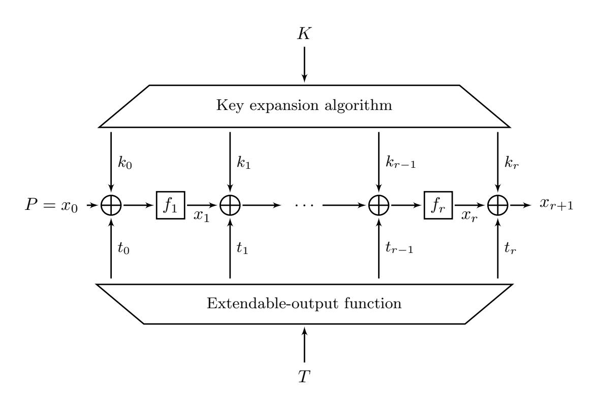
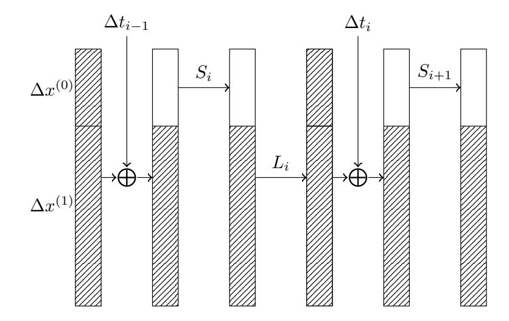
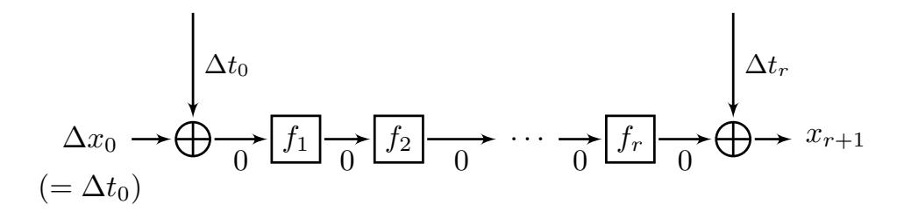
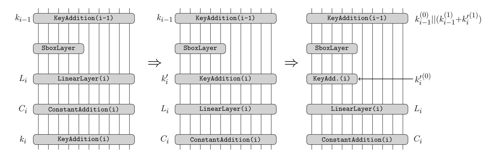
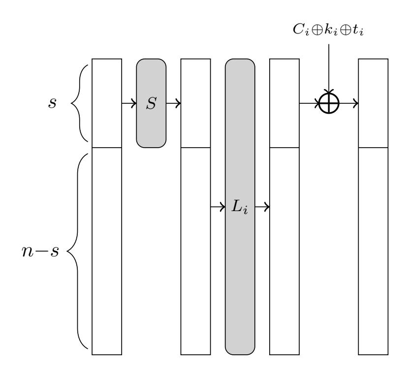
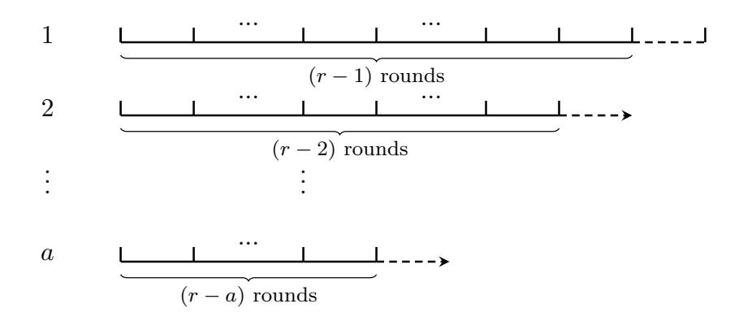

{0}------------------------------------------------

# **The MALICIOUS Framework: Embedding Backdoors into Tweakable Block Ciphers**

Thomas Peyrin and Haoyang Wang

School of Physical and Mathematical Sciences, Nanyang Technological University, Singapore thomas.peyrin@ntu.edu.sg, wang1153@e.ntu.edu.sg

**Abstract.** Inserting backdoors in encryption algorithms has long seemed like a very interesting, yet difficult problem. Most attempts have been unsuccessful for symmetric-key primitives so far and it remains an open problem how to build such ciphers.

In this work, we propose the MALICIOUS framework, a new method to build tweakable block ciphers that have backdoors hidden which allows to retrieve the secret key. Our backdoor is differential in nature: a specific related-tweak differential path with high probability is hidden during the design phase of the cipher. We explain how any entity knowing the backdoor can practically recover the secret key of a user and we also argue why even knowing the presence of the backdoor and the workings of the cipher will not permit to retrieve the backdoor for an external user. We analyze the security of our construction in the classical black-box model and we show that retrieving the backdoor (the hidden high-probability differential path) is very difficult.

We instantiate our framework by proposing the LowMC-M construction, a new family of tweakable block ciphers based on instances of the LowMC cipher, which allow such backdoor embedding. Generating LowMC-M instances is trivial and the LowMC-M family has basically the same efficiency as the LowMC instances it is based on.

**Keywords:** tweakable block cipher, backdoor, differential cryptanalysis, LowMC-M

# **1 Introduction**

A backdoor in an encryption algorithm enables an entity who knows it to circumvent the security guarantees so that he can obtain the secret information more efficiently than with a generic black-box attack. There are two categories of backdoors. The first one is the backdoor implemented in a security product at the protocol or key-management level, which is generally considered in practice.

In this article, we focus on the second type: a cryptographic backdoor. A cryptographic backdoor is embedded directly during the design phase of a cryptographic primitive and renders the cipher susceptible to some dedicated cryptanalysis. Cryptographic backdoors have been extensively studied by Young and Yung, 

{1}------------------------------------------------

introducing the term "Kleptography" [\[44,](#page-31-0) [47\]](#page-32-0). However, despite some interest from the academic community about this topic, there are very few publicly known backdoored primitives. A concrete example is the pseudorandom number generator Dual\_EC\_DBRG [\[8\]](#page-29-0) designed by NSA, whose backdoor was revealed by Edward Snowden in 2013 and also in some research works [\[10,](#page-29-1) [39\]](#page-31-1).

Embedding backdoors into block ciphers is a challenging problem since block ciphers are deterministic and thus it is complex to exploit randomness in computations. Young and Yung have designed several backdoors in secret block ciphers [\[45,](#page-31-2)[46,](#page-32-1)[48\]](#page-32-2), where it is assumed that the cipher specifications are unknown to the adversary. In this work, we will not make such assumption and we will consider the specifications of the cipher to be fully public.

A backdoor should be computationally difficult to retrieve, even if its general form is known. More concretely, the backdoor security (the cost of retrieving the backdoor) should be the same as the security generically provided by the cipher (otherwise the backdoor would naturally reduce the security of the block cipher). Besides, the backdoor should ideally lead to a practical key recovery attack, or at least reduce the brute force search cost for the adversary. For example, if a backdoor could reduce the security of AES-256 to 2 <sup>128</sup>, it would be a great theoretical advance, but would be unusable in practice. Last but not least, the resulting block cipher also has to be secure in the classical sense, that is, it is able to resist state-of-the-art cryptanalysis techniques.

There have been only limited works focusing on this direction and to the best of the authors' knowledge there is no such design satisfying the above requirements simultaneously. In 1997, Rijmen and Preneel proposed a special Sbox design strategy which was used to hide a high-probability linear approximation in an Sbox [\[37\]](#page-31-3). The knowledge of this backdoor leads to an efficient key recovery attack based on linear cryptanalysis, but only a part of the key information can be obtained. They presented concrete instantiations by applying the Sbox design to CAST and LOKI91 ciphers and claimed that the embedded backdoors are undetectable even if the general form of the backdoor is known. However, this design was broken subsequently in 1998 [\[42\]](#page-31-4) by Wu *et al.* who found a way to easily recover the backdoor and showed that the security and practicability of the backdoor can't be guaranteed at the same time. Later in 1999, Paterson suggested that if the group generated by round functions acts imprimitively on the message group, then it is possible to create a backdoor in the cipher [\[33\]](#page-31-5). Built upon this mechanism, he introduced a DES-like cipher which allows an entity knowing the backdoor to retrieve the key with 2 <sup>41</sup> computations. However, as mentioned by the author, the backdoor is detectable and the cipher is vulnerable to differential attacks. Following on this idea, a backdoor based on partitioning cryptanalysis was studied in [\[5\]](#page-29-2) and a concrete instance of an AES-like cipher called BEA-1 was later proposed in [\[6\]](#page-29-3), but no explicit backdoor security was provided. One can also mention the work from Patarin and Goubin [\[31,](#page-31-6) [32\]](#page-31-7) who proposed "2R–schemes", basically Sbox-based asymmetric schemes secretly consisting of a 2-round secret Substitution-Permutation Network (SPN) but publicly represented as its corresponding algebraic equations. However, this research direction also 

{2}------------------------------------------------

suffered from attacks [\[13,](#page-30-0) [43\]](#page-31-8). Two more backdoor designs [\[4,](#page-29-4) [14\]](#page-30-1) have been introduced, but neither of them provide solid proof for the backdoor security and even the security of the cipher itself is questionable. Lastly, in a different setting, a backdoored version of the SHA-1 hash function was proposed in [\[1\]](#page-29-5), where the attacker is allowed to pre-choose the constants used in the design, so he can prepare in advance some specific collision messages for that particular instance.

Apart from these public researches, one can naturally question if there are some public block ciphers that might contain backdoors not claimed by the designers. In particular, primitives whose detailed design rationale is not provided are naturally more suspicious, especially when the ciphers have been designed by governmental agencies (as can be seen by the difficulties encountered by the NSA lightweight block ciphers SIMON and SPECK [\[9\]](#page-29-6) to become ISO standards). For example, Perrin found a very strong algebraic structure [\[34\]](#page-31-9) that is hidden inside the Sbox employed in both the block cipher Kuznyechik [\[38\]](#page-31-10) and the hash function Streebog [\[29\]](#page-31-11), both primitives being selected as Russian standards (GOST). Even though there is currently no attack based on this result, it illustrates the issue of potential backdoor in foreign encryption algorithms and more research is required to better understand the possibilities and implications of cryptographic backdoor.

We emphasize that inserting backdoors in an encryption algorithm itself is very different from inserting backdoors in an implementations, being in software or in hardware (like hardware trojans).

**Our Contributions.** In this paper, we propose a new method to generate backdoor encryption algorithms. We bring together tweakable block ciphers (TBC) and Extendable-Output Function (XOF) in a common framework called MALICIOUS, which enables the designer to embed backdoors into the TBC. The general representation of our construction is similar to that of the TWEAKEY framework [\[23\]](#page-30-2), but the tweak is handled separately by a XOF and the round function has to be partially non-linear.

Our backdoor is based on differential cryptanalysis: due to the partial nonlinear layer, the designer can embed related-tweak differential characteristics with probability 1 over many rounds. In particular, the sub-tweak difference employed in an embedded differential characteristic is generated from a specific tweak pair that is chosen in advance by the designer. This malicious tweak pair **is** the backdoor, and the XOF applied in the tweak schedule is used to protect the malicious tweak pair: even knowing the high-probability related-tweak differential characteristic, it will remain computationally difficult to find a tweak pair that triggers it. More importantly, the backdoor security is ensured by the targetdifference resistance ability of the chosen XOF. An attacker with the knowledge of the backdoor is able to retrieve the full key with negligible effort under the chosen-tweak scenario.

Based on the MALICIOUS framework, we also propose a concrete instantiation that we call LowMC-M. Our family of TBC LowMC-M is created based on some instances of the block cipher LowMC [\[2\]](#page-29-7). Compared to LowMC, our proposal 

{3}------------------------------------------------

LowMC-M has an additional sub-tweak addition in each round and the tweak schedule is a XOF, but the other parts of the round function and the number of rounds remain unchanged. Apart from its backdoor security that is naturally inherited from the MALICIOUS framework, we claim that its classical black-box security against state-of-the-art cryptanalysis is the same as the corresponding LowMC variants.

We believe this work is a first step in a new direction for the study of backdoors in encryption algorithms. We are confident that more exotic (based on other types of cryptanalysis techniques than plain differential cryptanalysis) and potentially more efficient instances following the MALICIOUS would be possible.

**Paper Organization.** In Section [2,](#page-3-0) we present the attacking scenario and some security notions for backdooring cryptographic primitives. In Section [3](#page-4-0) the MALICIOUS framework is described and its backdoor security and design rationale are explained. We introduce a concrete instantiation of MALICIOUS (so-called LowMC-M) in Section [4.](#page-13-0) We then analyze LowMC-M with respect to the backdoor security and the classical black-box security in Section [5](#page-20-0) and Section [6](#page-26-0) respectively. Finally, we present our conclusions in Section [7.](#page-28-0)

# <span id="page-3-0"></span>**2 Preliminaries**

#### **2.1 Attacking Scenario**

For classical (tweakable) block ciphers, the attacking scenario considers only two entities: the *user* (or pair of users) who owns the secret key and the *attacker* who tries to break the cryptosystem, *i.e.*, to find out the secret key. For (tweakable) block ciphers with a backdoor, another entity has to be involved in the attacking scenario: the *designer*, who inserts the backdoor into the primitive. Thus, we have in total three entities: the designer (knows the backdoor, but not the secret key), the user (knows the secret key, but not the backdoor) and the attacker (neither backdoor nor key is known).

One can see that both the user and the attacker have some motivation to find out what is the backdoor. More importantly, in our model the backdoor is independent of the secret key, and therefore the user and the attacker possess the same capability in trying to uncover the backdoor (the cipher specifications are public known, so they can test the cipher with any chosen key they want). For the rest of this article, when considering the recovery of the backdoor, we will simply refer to both of them as the attacker.

#### <span id="page-3-1"></span>**2.2 Security Notions and More**

We introduce below various notions regarding the security and the practicability of a backdoor:

**–** *Undetectability:* this security notion represents the inability for an external entity to realize the existence of the hidden backdoor.

{4}------------------------------------------------

- **–** *Undiscoverability:* it represents the inability for an attacker to find the hidden backdoor, even if the general form of the backdoor is known.
- **–** *Untraceability:* it states that an attack based on the backdoor should not reveal any information about the backdoor itself.
- **–** *Practicability:* this usability notion stipulates that the backdoor is practical, in the sense that it is easy to recover the secret key once the backdoor is known.

If a cipher is publicly claimed as potentially backdoored, it will naturally increase the watchfulness of users, even if they do not know whether there is indeed backdoored or not embedded in the primitive. In this scenario, the undetectability notion models the incapacity of a user to find any hard evidence that a backdoor indeed exists.

For our proposal LowMC-M, the backdoor is claimed to be undetectable, undiscoverable and practicable, but not untraceable.

#### **2.3 Notations**

Given a bit string *x*, we will denote by *x*[*i*] its *i*-th bit, counting from the least significant bit (LSB). Given two bit strings *x* and *y*, *x*||*y* will represent the concatenation of *x* and *y*. Finally, we denote by *k<sup>j</sup>* (respectively by *t<sup>j</sup>* ) the subkey (respectively sub-tweak) incorporated during the *j*-th round of the cipher, while *k*<sup>0</sup> and *t*<sup>0</sup> are added in as whitening material.

# <span id="page-4-0"></span>**3 The MALICIOUS Framework**

In this section, we introduce the MALICIOUS framework which allows to generate tweakable block ciphers that are embedded with hidden high-probability differential characteristics. This framework is based on partial non-linear layers for the internal state transformation and a tweak schedule based on an extendable-output function (XOF).

#### **3.1 Block Ciphers with Partial Non-Linear Layers**

SPN-based block ciphers are usually designed to apply linear layers (*Li*) and non-linear layers (*Si*) to the entire state at every round *i*. In 2013, an irregular design was suggested by Gérard *et al.* [\[19\]](#page-30-3), where the non-linear layer is only applied to a subpart of the state at each round. We consider such design with block size *n* bits and partial non-linear layers of size *s* (*< n*) bits. Assume, without loss of generality, that the non-linear layer is always applied before the linear layer at every round. Then, we can write *fi*(*x*) = *Li*(*Si*(*x* (0))||*x* (1)) the round function *f<sup>i</sup>* that transforms the state *x* at round *i*, the state being partitioned into two parts where the non-linear layer only operates on the part *x* (0) and not on the part *x* (1) .

Such design allows efficient masking and thus can improve security against side-channel attacks. A concrete instantiation of this methodology named ZORRO 

{5}------------------------------------------------

was then proposed [\[19\]](#page-30-3). Even though ZORRO was rapidly broken [\[7,](#page-29-8)[21,](#page-30-4)[35,](#page-31-12)[41\]](#page-31-13), the general design strategy continued to attract interest from the research community: in 2015, another such design LowMC was proposed [\[2\]](#page-29-7). Its aim was to minimize the multiplicative complexity and depth of the cipher in order to have performance advantages in certain applications, including multi-party computation (MPC), fully homomorphic encryption (FHE) and zero-knowledge proofs (ZK). After a few tweaks due to security concerns, the current version v3 of LowMC remains solid after the several third party analysis [\[16,](#page-30-5) [17,](#page-30-6) [36\]](#page-31-14).

Compared to a full non-linear layer, a partial non-linear layer inevitably weakens the security of a cipher. One notable property is that there will exist non-trivial differential characteristics that will not activate any Sboxes over one or more rounds of the cipher. In a single round, by setting the difference on *x* (0) to be 0, there are 2 *<sup>n</sup>*−*<sup>s</sup>* differences of *x* that do not differentially activate any Sboxes. Assuming a well designed linear layer with good mixing properties, one can still expect around 2 *<sup>n</sup>*−2*<sup>s</sup>* differences that will also not differentially activate any Sboxes in the second round. This reasoning can be continued until no difference survives and thus the maximal expected number of rounds that a deterministic differential characteristic can cover is b *n s* c. Note that this number would of course vary depending on the specificities of the linear layers.

#### **3.2 Tweakable Block Ciphers**

The first formal treatment of tweakable block ciphers (TBC) was proposed by Liskov, Rivest and Wagner in [\[26,](#page-30-7)[27\]](#page-30-8). The signature of a conventional block cipher can be described as *E* : {0*,* 1} *<sup>k</sup>* × {0*,* 1} *<sup>n</sup>* → {0*,* 1} *<sup>n</sup>* where an *n*-bit plaintext is encrypted to an *n*-bit ciphertext using a *k*-bit secret key. A tweakable block cipher accepts an additional *t*-bit public input called tweak, its signature thus being *E* : {0*,* 1} *<sup>k</sup>* × {0*,* 1} *<sup>t</sup>* × {0*,* 1} *<sup>n</sup>* → {0*,* 1} *<sup>n</sup>*. The introduction of a tweak input provides the ability for the user to select a permutation among a family of permutations even when the key is fixed.

Due to this extra degree of freedom that can potentially be leveraged by the attacker, designing a TBC is not straightforward. Block cipher-based TBC constructions have been studied, but comes with a non-negligible efficiency penalty. We can mention the TWEAKEY framework, a recent design strategy to build ad-hoc TBCs, that was proposed at ASIACRYPT 2014 by Jean *et al.* [\[23\]](#page-30-2). In this framework, the key and tweak inputs are treated equivalently in terms of design and this material is called tweakey: the tweakey input can be used as key or tweak value, which is up to the choice of the user.

Unlike the key input, the tweak does not need to be kept secret and therefore one should assume that an adversary has full control over it. Thus, besides the attack models of single-key (no difference in the key or tweak), related-key (difference in the key, but no difference in the tweak), related-tweak (no difference in the key, but difference in the tweak) and related-tweakey (difference in both the key and tweak), it is reasonable to consider the chosen-tweak model as a meaningful model in practice.

{6}------------------------------------------------

#### 3.3 Extendable-Output Function

An extendable-output function (XOF) is a generalization of a hash function, where the output can be extended to any desired length. Similar to a hash function, it should be collision, preimage and second-preimage resistant. A XOF is a natural choice when an application requires a hash function to have non-standard digest length. Technically, it is also possible to use a XOF as a generic hash function by setting the output length fixed. Besides, it has some other applications, such as key derivation functions and stream ciphers.

Currently, there are many instances of XOF, such as SHAKE128 and SHAKE256 (defined in SHA-3 standard [18]) and the more efficient variant Kangaroo Twelve [11].

#### 3.4 The MALICIOUS Construction

Motivation. Differential and linear cryptanalysis are among the most efficient and well-understood attacks against block ciphers, both in theory and in practice. Thus, it seems natural to try creating backdoors using these techniques. Yet, there have been only a few works focusing on this research direction. For example, [3] and [30] explored backdoors in hash functions based on differential cryptanalysis. As for block ciphers, to the best of our knowledge, there is only one work from 1997 [37] using linear cryptanalysis. In that paper, special Sboxes are designed to hide high-probability linear approximations, which then enable a practical linear cryptanalysis. However, this construction was easily broken by Wu et al. in the subsequent year [42]. The attack against this cipher shows that the higher the probability of the embedded linear approximation, the weaker the backdoor security. Consequently, the authors claimed that it is infeasible for such a cipher to build a practical backdoor while keeping acceptable backdoor security. They further noted that "it seems that hiding differentials is more difficult than hiding linear relations".

Even though other block ciphers embedding backdoors have been proposed [4, 5, 6, 14, 33], their design methodologies are usually very dedicated. On the other hand, as the topic of backdoor ciphers has not drawn much attention from the cryptography community, the backdoor security of these ciphers has not been well analyzed yet.

Considering the above facts, we introduce the MALICIOUS framework which allows to build efficient backdoors based on differential cryptanalysis. Moreover, we will show that the backdoor security can be reduced to a variation of the collision resistance notion of the XOF used in the tweak schedule.

**The Construction.** MALICIOUS is a framework to build a tweakable block cipher with n-bit blocksize, k-bit key and tweak of arbitrary size. It consists of three components:

- a round function  $f_i$  with partial non-linear layer, which can be expressed as  $f_i(x) = L_i(S_i(x^{(0)})||x^{(1)}),$
- a tweak schedule based on a XOF,

{7}------------------------------------------------

**–** a key schedule.

The sub-tweak and sub-key values are XORed only to the non-linear part of the state, but are XORed to full state at the whitening stage[1](#page-7-0) . The cipher is composed of *r* consecutive rounds. The framework is depicted in Figure [1.](#page-7-1)

<span id="page-7-1"></span>

**Figure 1:** The MALICIOUS framework

The backdoor introduced by MALICIOUS are related-tweak differential characteristics with probability 1 (deterministic). With the knowledge of this backdoor, a key recovery attack can be performed using various methods of differential cryptanalysis. It is to be noted that the attack is under the *chosen-tweak* model: both the designer and the attacker have complete freedom over the tweak values. This model is classical for TBC and realistic in practice.

We now describe how the backdoor can be embedded in the cipher. The core idea is that the sub-tweak difference of the backdoor chosen tweaks is used to cancel the difference of the non-linear part of the state in each round, so that the resulting differential characteristics will have no differentially active Sbox (as illustrated in Figure [2\)](#page-8-0). In Algorithm [1,](#page-8-1) we present the general steps to construct a MALICIOUS instance, in which a deterministic differential characteristic over *r*<sup>0</sup> (≤ *r*) rounds is embedded.

The key of the backdoor is the tweak pair generating these particular subtweak differences and the plaintext difference used in the embedded differential characteristic. We will use the prefix *malicious* to denote them. We also note that it is possible to embed multiple differential characteristics simultaneously. Then, the key recovery complexity will depend on the number of embedded differential characteristics and the cryptanalysis method.

<span id="page-7-0"></span><sup>1</sup> This is equivalent to a full state addition for all rounds, see Section [4.2](#page-13-1) for details.

{8}------------------------------------------------

<span id="page-8-0"></span>

**Figure 2:** Transitions of state difference in the embedded related-tweak differential characteristic. The differences of the hashed blocks can be zero or non-zero, while the differences of the white blocks are necessarily zero.

# **Algorithm 1:** Constructing a MALICIOUS instance with an embedded deterministic differential characteristic over $r_0$ rounds

```
Select a XOF as the tweak schedule.
```

```
Choose uniformly at random a pair of tweak values (T_1, T_2) of arbitrary length.
```

Compute 
$$t_0^1 || \dots || t_r^1 \leftarrow \text{XOF}(T_1)$$
 and  $t_0^2 || \dots || t_r^2 \leftarrow \text{XOF}(T_2)$ .

Evaluate the differences  $\Delta t_i = t_i^1 \oplus t_i^2$  for all  $i \in \{0, \dots, r\}$ .

Randomly select a plaintext difference  $\Delta P = \Delta x_0$  for the linear part  $x_0^{(1)}$  and set  $\Delta x_0^{(0)} = \Delta t_0^{(0)}$ .

#### for i from 1 to r do

Determine a round function  $f_i$  with partial non-linear layers such that:

#### if $i < r_0$ then

<span id="page-8-1"></span>Given the input difference  $(\Delta x_{i-1} \oplus \Delta t_{i-1})$ , the output difference after  $f_i$  has to satisfy  $\Delta x_i^{(0)} = \Delta t_i$ .

# $\mid$ end end

Output the cipher description and the  $r_0$ -round related-tweak differential characteristic that is embedded into it (with related tweaks  $T_1$  and  $T_2$ ).

{9}------------------------------------------------

We emphasize that the framework only focuses on the requirements of the cipher to embed a backdoor. However, a concrete instantiation would also have to take into account many other design principles so that the cipher could resist all state-of-the-art cryptanalysis as well as the attack against the backdoor described in the following section.

#### <span id="page-9-0"></span>**3.5 The Backdoor Security**

In this section, we will evaluate two particular aspects of the backdoor security: (1) the complexity for the attacker to find the embedded differential characteristics, (2) whether additional backdoors exist in the resulting primitives, and if so, what is the complexity to find them.

Firstly, we will discuss the relation between the malicious tweak pair and its corresponding plaintext difference. We consider in this article that the number of rounds for the embedded differential characteristic is publicly known. On the one hand, if the malicious tweak pair is known to the attacker, then the corresponding sub-tweak differences can of course be computed. From these sub-tweak differences, he can obtain partial information about the state differences expected during the differential characteristic. Note that the embedded differential characteristic being deterministic indicates that the transformations of state differences are linear. Hence, by reversing the linear transformations, the malicious plaintext difference can eventually be recovered. That is, the leakage of the malicious tweak pair reveals the malicious plaintext difference.

On the other hand, if the malicious plaintext difference is known to the attacker, he can compute its transformation through the linear layer and obtain the required value for the sub-tweak difference such that it cancels the non-linear layer difference (since the sub-tweak is only XORed to the non-linear part, there is only one such candidate), and continue this process in the following rounds. Eventually, the embedded differential characteristic will be revealed. However, it remains difficult to recover the actual malicious tweak pair due to the XOF-based tweak schedule: given the embedded related-tweak differential characteristic, finding a tweak pair that leads to it through the XOF will be difficult. We define this new security notion as *target-difference resistance*:

**Definition 1 (Target-difference resistance).** *A hash function H is targetdifference resistant if it is hard to find two inputs x and y such that H*(*x*)⊕*H*(*y*) = *∆, where ∆ is a given non-zero constant.*

To better understand target-difference resistance, we introduce the limitedbirthday problem, which was first proposed in [\[20\]](#page-30-10):

**Definition 2 (The limited-birthday problem[\[22\]](#page-30-11)).** *Let H be an n-bit output hash function that can be randomized by some input (IV or tweak or etc.) and that processes any input message of fixed size m bits, where m > n. Let IN be a set of admissible input differences and OUT be a set of admissible output differences, with the property that IN and OUT are closed sets with respect to* ⊕ *operation. Then, for the limited-birthday problem, the goal of the adversary is to* 

{10}------------------------------------------------

generate a message pair (x, y) such that  $x \oplus y \in IN$  and  $H(x) \oplus H(y) \in OUT$  for a randomly chosen instance of H.

Let  $2^I$  and  $2^O$  denote the sizes of IN and OUT respectively. The lower bound on the time complexity to find a solution for the limited-birthday problem is  $\max(2^{\frac{n-O+1}{2}}, 2^{n-I-O+1})^2$ . If I is small, the complexity is  $2^{n-I-O+1}$ . However, even if I is very big, the complexity cannot be below  $2^{\frac{n-O+1}{2}}$ .

Target-difference resistance can be seen as a special case of the limited-birthday problem (as well as a generalisation of the classical collision resistance) where OUT is limited to a single value ( $2^O = 1$ ) and IN is the full input space. Therefore, target-difference resistance has the same generic complexity as the classical collision resistance notion, that is the birthday bound  $O(2^{n/2})$ .

More generally, instead of the exact malicious tweak pair, the attacker could try to find another tweak pair whose sub-tweak differences are also the desired ones for the embedded differential characteristic. Yet, its complexity is still covered by the expected target-difference resistance of the XOF.

The above attack can possibly be applied to other plaintext differences. According to the construction of the MALICIOUS framework, the size of the input (tweak) to the XOF can be arbitrary long and thus any output of the XOF can potentially be obtained. For instance, if SHAKE128 is used as XOF, it can produce at most  $2^b$  output streams (b being the state size between absorbing and squeezing phases in the sponge construction). Hence the number of possible sub-tweaks values is bounded by  $2^b$ , no matter how many rounds it covers, and the number of sub-tweak differences is accordingly bounded by a greater value  $N \ (\geq 2^b)$ . Thus, given a random plaintext difference and a certain number of rounds, if the size of the required sub-tweak differences for the deterministic related-tweak differential characteristic does not exceed log N, then there will be a tweak pair matching the differential characteristic. We summarize this finding as follows:

<span id="page-10-1"></span>Property 1. In addition to the embedded differential characteristics, there might exist other deterministic differential characteristics that would threaten the cipher security.

Consequently, we have to evaluate the security of the cipher with respect to all the potential deterministic differential characteristics, not only the planned ones. We consider a MALICIOUS instance that has a key size of 128 bits and employs SHAKE128 as tweak schedule. The security strength of SHAKE128 against collision attack is  $\min(l/2, 128)$  bits, where l is the output length (or the length of the colliding part). In order to recover an  $r_0$ -round deterministic differential characteristic, the attacker has to find a tweak pair whose sub-tweak differences are the desired ones. The total size of these sub-tweak differences is  $n+s\cdot(r_0-1)$  bits, but for the whitening tweak only the first s bits are considered, thus the generic attack complexity is  $2^{\min(s\cdot r_0/2,128)}$ , which becomes  $2^{128}$  when

<span id="page-10-0"></span><sup>&</sup>lt;sup>2</sup> The success probability here is about 0.63.

{11}------------------------------------------------

*s* · *r*0*/*2 ≥ 128. The analysis is similar for the case where the key size is 256 bits and SHAKE256 is employed. We define *r* 0 to represent the value of *r*<sup>0</sup> that turns this inequality into an equality:

<span id="page-11-0"></span>
$$s \cdot r'/2 = k \tag{1}$$

All the deterministic related-tweak differential characteristics smaller than *r* 0 rounds can be recovered with a complexity smaller than the actual key size. Therefore, in order to prevent these differential characteristics to weaken the cipher, *r* 0 must be taken into consideration when determining the number of rounds of the MALICIOUS instance. Actually, these related-tweak differential characteristics will decay exponentially in the remaining rounds as the corresponding sub-tweak differences are basically random.

#### **3.6 Rationale Underlying the MALICIOUS Construction**

When designing a backdoor for block ciphers, the first question that comes into mind is probably *what type of backdoor should be used ?* While some existing backdoor designs directly insert a backdoor inside Sboxes or some other parts of the round function, we found out that the additional input tweak capability of a tweakable block cipher could be a perfect carrier of the backdoor. Suppose that a tweakable block cipher has a special property only when it is initiated with very specific tweak values, while it performs normally for all the other tweak values, then this property could be used as a backdoor. Moreover, if the tweak size is large enough, finding these special tweak values could be as hard as finding the secret key in the ideal case. One straightforward example of the special property is to build related-tweak differential characteristics using these tweaks. In the following, we provide more in-depth explanations on the design choices in MALICIOUS.

**Components Rationale.** When instantiating the MALICIOUS framework, some (security) notions have to be taken into account. The first and most important one is the undiscoverability: an entity who does not know the backdoor should not have increased chances to break the cipher. This requires that the backdoor security has to be as high as the cipher security. Thus, the MALICIOUS framework should provide a valid and solid security evaluation for the backdoor.

Another important notion is the practicability of the backdoor, and we will aim to make it as efficient as possible.

We detail in the following how the components of the MALICIOUS framework do follow these principles.

*Tweak Schedule Based on XOF.* As the malicious tweak values are the backdoor, the main task of the tweak schedule is to protect the malicious tweaks. According to the security analysis from Section [3.5,](#page-9-0) the backdoor security relies on the target-difference problem, where the attacker tries to find a tweak pair whose sub-tweak differences are the desired ones. This notion is simply a variation

{12}------------------------------------------------

of the classical collision resistance for a hash function, so we expect a good cryptographic hash function to naturally provide this resistance.

Since MALICIOUS is a generalized framework, the total number of rounds will vary according to the different instantiations, so does the length of the sub-tweaks. Hence, the output length of the tweak schedule is expected to be flexible. Besides, if the tweak schedule was designed specifically for each MALICIOUS instantiation, it will render the backdoor evaluation much more difficult. Thus, for sake of simplicity of the analysis, it seems a better idea to make the tweak schedule uniform in the framework.

For all these reasons, a XOF seemed to be the best choice for our tweak schedule. The security of actual XOF functions such as SHAKE128 or SHAKE256 is rather well-analyzed and it can provide many choices in terms of security level.

*Partial Non-Linear Layers.* The probability of a differential characteristic is determined by the number of differentially active Sboxes. Hence, in order to embed an efficient backdoor based on a differential characteristic, the best case is that the differential characteristic activates no Sbox at all. This is obviously very unlikely to happen in the MALICIOUS framework if the round functions are fully non-linear layers. Indeed, unless the related-key model is considered, a non-zero difference inserted in the plaintext would have to be cancelled by the first sub-tweak difference. However, when inserting differences in the tweak input, as the sub-tweak differences produced by the XOF will be random, they will force many active Sboxes in the subsequent rounds. Thus, it is unlikely for the MALICIOUS framework to be able to embed a deterministic related-tweak differential characteristic that covers more than a few rounds if full non-linear layers are utilized. Of course, it is possible to construct a differential characteristic with limited number of active Sboxes, but this is not the efficiency we are targeting.

We have also tried to modify the framework such that the sub-tweak addition is not performed every round. For example, an *r* rounds deterministic relatedtweak differential characteristic can be realized by applying the tweak addition only once at the beginning, see Figure [3.](#page-12-0) This way, the sub-tweak difference *∆t*<sup>0</sup> could neutralize the plaintext input difference *∆x*<sup>0</sup> and the resulting zero difference would get through the *r* rounds with probability 1. However, this candidate has an obvious fatal flaw: for any tweak pair the attacker can always set the plaintext input difference to be equal to *∆t*0.

<span id="page-12-0"></span>

**Figure 3:** A defective variant of the MALICIOUS framework. Key addition is omitted.

{13}------------------------------------------------

The above analysis shows that full non-linear layers seem not suitable for the MALICIOUS framework. On the contrary, partial non-linear layers satisfy our requirements. As in that case the Sbox only applies to a part of the internal state, the round function is able to map a non-zero input difference to a non-zero output difference while no active Sbox is activated. In term of building deterministic differential characteristics, we only have to set the difference of the non-linear part of the internal state to be zero rather than the full state. This allows to choose the linear transformation so that the output difference could satisfy the requirements from Algorithm [1.](#page-8-1)

# <span id="page-13-0"></span>**4 Instantiating the MALICIOUS Framework with LowMC**

In this section, we introduce a concrete instantiation of the MALICIOUS framework, called LowMC-M, which is based on the family of block ciphers LowMC.

#### **4.1 LowMC**

LowMC [\[2\]](#page-29-7) is a family of block ciphers based on SPN structure with partial non-linear layers. The parameters are flexible and we denote the block size by *n*, the key size by *k*, the number of Sboxes applied each round by *m* and the maximum allowed data complexity by *d* (*d* is the log<sup>2</sup> of the allowable data complexity up to which the cipher is expected to give the claimed security). In order to reach the security claims, the number of rounds *r* is then derived from all these parameters using a round formula, the latest version being given in [\[36\]](#page-31-14).

At the beginning of the encryption process, a key whitening is performed. The round function at round *i* consists of four operations in the following order:

- **–** SboxLayer. A 3-bit Sbox is applied in parallel on the *s* = 3*m* LSBs of the state, while the transformation for the remaining *n* − *s* bits is the identity.
- **–** LinearLayer(*i*). The state is multiplied in GF(2) with an invertible *n* × *n* binary matrix *L<sup>i</sup>* which is chosen independently and uniformly at random.
- **–** ConstantAddition(*i*). The state is XORed with an *n*-bit round constant *C<sup>i</sup>* which is chosen independently and uniformly at random.
- **–** KeyAddition(*i*). The state is XORed with an *n*-bit round key *k<sup>i</sup>* . To generate *ki* , the master key *K* is multiplied in GF(2) with an *n* × *k* binary matrix *KL<sup>i</sup>* . This matrix is chosen independently and uniformly at random with rank min(*n, k*).

#### <span id="page-13-1"></span>**4.2 Equivalent Representation of LowMC**

As discussed in [\[15,](#page-30-12)[24,](#page-30-13)[36\]](#page-31-14), round keys and constants in LowMC can be compressed due to the fact that the non-linear layer is partial.

In the round function, it is possible to exchange the order of consecutive linear operations. We swap the order of LinearLayer and KeyAddition operations while keeping ConstantAddition as the last step in round *i*. Then, the equivalent round 

{14}------------------------------------------------

key can be written as  $k'_i = L_i^{-1}(k_i)$ . We observe that the Sbox only operates on the first s bits of the state and does not change the rest of the n-s bits. Thus, we split  $k'_i$  into  $k'^{(0)}_i$  and  $k'^{(1)}_i$ , and we can move the addition of  $k'^{(1)}_i$  to the beginning of the round. Next, we observe that  $k'^{(1)}_i$  can move further up to be combined with  $k_{i-1}$  in the previous round. The procedure is illustrated in Figure 4. In general, if we start from the last round and iterate this procedure recursively until all the additions to the linear part have been moved to the beginning of the algorithm, we will end up with an equivalent representation where all the round keys are reduced to s bits apart from the whitening key. We remark that the same reasoning can be applied to the round constants.

This optimized representation can also reduce the implementation cost of the key schedule. Since all transformations performed during the optimization are linear and since the key schedule is itself linear, these transformations can be composed with the key schedule in order to compute the new 3m-bit round keys directly. We refer to [15] for details.

<span id="page-14-0"></span>

Figure 4: Simplified representation of LowMC.

#### 4.3 LowMC-M

We will directly use the simplified representation of LowMC as a starting point in our design, with a further modification: we move LinearLayer behind SboxLayer in every round<sup>3</sup>.

LowMC-M is a family of tweakable block ciphers built upon LowMC with an additional transformation in each round:

- TweakAddition(i). The non-linear part of the state is XORed with an s-bit sub-tweak  $t_i$  just after KeyAddition.  $t_i$  is generated from a XOF whose input is the tweak value T of k bits.

<span id="page-14-1"></span><sup>&</sup>lt;sup>3</sup> The resulting primitive is an equivalent representation of a LowMC instantiation with different linear layers, key schedule and round constants, because these components are chosen randomly.

{15}------------------------------------------------

The XOF is based on SHAKE128 or SHAKE256, depending on the key size. All the other transformations of the round function are the same as for LowMC. The round function is finally composed of the following operations:

 $\texttt{TweakAddition}(i) \circ \texttt{KeyAddition}(i) \circ \texttt{ConstantAddition}(i) \circ \texttt{LinearLayer}(i) \circ \texttt{SboxLayer}$ 

The encryption starts with a key and tweak whitening and the sizes of  $k_0$  and  $t_0$  are both n. The number of rounds is  $r + \lceil \frac{2k}{s} \rceil$ , where r is the number of rounds derived for LowMC with the same parameters.



**Figure 5:** A single round of LowMC-M.

**Notations for LowMC-M.** During a differential cryptanalysis, we denote by  $X_i$  the *i*-th round state difference before the LinearLayer transformation. Given a matrix  $L_i$ , we denote its *j*-th row by  $L_i[j,*]$ , and partition  $L_i$  into four submatrices:

$$L_i = \left[ \frac{L_i^{00} | L_i^{01}}{L_i^{10} | L_i^{11}} \right]$$

where  $L_i^{00} \in GF(2)^{s \times s}$ ,  $L_i^{01} \in GF(2)^{s \times (n-s)}$ ,  $L_i^{10} \in GF(2)^{(n-s) \times s}$ ,  $L_i^{11} \in GF(2)^{(n-s) \times (n-s)}$ . With this notation,  $L_i^{00}$  and  $L_i^{01}$  will map  $X_i^{(0)}$  and  $X_i^{(1)}$  to the non-linear part of the state, respectively. And  $L_i^{10}$  and  $L_i^{11}$  will map  $X_i^{(0)}$  and  $X_i^{(1)}$  to the linear part of the state, respectively.

**Version History of LowMC-M.** The first version (called v1 in this paper) of LowMC-M was published at CRYPTO 2020 and its number of rounds is set to be the same as that of LowMC. After its publication, two works [12,28] exploited the power of the tweak in an attack. The attack reported in [12] shows that within less than the time complexity of  $2^k$ , the tweak can be used to find a  $(\frac{2k+n}{s})$ -round

{16}------------------------------------------------

differential characteristic with probability 1. Then, they applied the differential-linear technique to extend the trail to  $\frac{2k+2n}{s}$  rounds with probability 1. Finally, an additional  $\frac{k}{s}$  rounds is added to launch a key recovery attack. Thus, they can attack at most  $\frac{3k+2n}{s}$  rounds of LowMC-M. Besides, they also proposed a difference enumeration attack. Based on the work in [12], the recent attack [28] proposed several attacks on the latest version of LowMC and LowMC-M. Considering these attacks, we propose new parameter sets for LowMC-M by increasing the number of rounds by  $\lceil \frac{2k}{s} \rceil$ , and we refer to this version as LowMC-Mv2. Last but not least, we have to emphasize that the differential characteristics found in these works are shorter than the differential characteristics of the backdoors, thus we believe that the security of the backdoor remains solid. For reference, the instances of LowMC-Mv1 can be found in Appendix A.

Considering a potential threat from a limited-birthday style attack, we decide to move LowMC-M to a new version LowMC-Mv3 by setting the tweak size equal to the key size. The reasoning for doing so is described in Section 5.2. In the rest of the paper, we use LowMC-M to refer to LowMC-Mv3 for simplicity.

#### <span id="page-16-0"></span>4.4 Embedding a Backdoor into LowMC-M

There are many forms of differential cryptanalysis that can perform a key recovery attack, such as the impossible differential attack, the boomerang attack, etc. For LowMC-M, we use the plain version where the attacker can deduce full or partial information about the r-th round key from a differential characteristic over r-1 rounds.

Since an (r-1)-round deterministic differential characteristic can only reveal the s-bit sub-key  $k_r$  of the r-th round, more deterministic differential characteristics should be added in order to eventually recover the full key. After  $k_r$  has been retrieved, the cipher can be reduced to r-1 rounds and thus another s-bit sub-key  $k_{r-1}$  can be recovered from an (r-2)-round deterministic differential characteristic. Finally, assume that there are a total of a such deterministic differential characteristics embedded in LowMC-M (one on r-1 rounds, one on r-2 rounds, etc., see Figure 6), then  $a \cdot s$  sub-key bits can be recovered. As the key schedule is fully linear and each matrix inside the key schedule is generated independently and uniformly at random, it implies that one will recover  $a \cdot s$  bits of information about the key by solving a system of linear equations. Therefore, at most  $a = \lceil k/s \rceil$  deterministic differential characteristics are needed to recover the full key.

Now, we explain how to embed such differential characteristics into an instantiation of LowMC-M. The general procedure is given in Algorithm 1. The a malicious tweak pairs are chosen by the designer at the very beginning and the corresponding sub-tweak differences are computed. Then, the linear layer matrix  $L_i$  is generated along with the generation of the deterministic differential characteristics, round by round.

Firstly, we explain how to generate the linear layer matrices. Note that in order to have a deterministic differential characteristic over i rounds, only the

{17}------------------------------------------------

<span id="page-17-0"></span>

Figure 6: The deterministic differential characteristics embedded into LowMC-M.

linear layer matrices of the first i-1 rounds have to be specifically designed as the matrix  $L_i$  has no impact on the differences of the i-th round Sboxes. Assuming we have already embedded a deterministic differential characteristics over i rounds, then all the linear layer matrices of the first i-1 rounds of LowMC-M have been fixed accordingly. If we plan to extend b ( $b \le a$ ) of the a deterministic differential characteristics by one more round, the matrix  $L_i$  should be specified. Denote by  $SX_i$  the set of  $X_i^{(1)}$  of those deterministic differential characteristics that will be extended in the next round. Here,  $SX_i$  refers to the b differential characteristics. Since the non-linear state difference  $X_i^{(0)}$  equals to zero for all the b differential characteristics, the set  $SX_i$  will determine the differential in the following round. Given the difference set  $SX_i$ , the output differences after the multiplication by the matrix  $L_i^{(0)}$  should cancel the following sub-tweak differences so that the b differential characteristics will activate no Sbox in round i+1. We detail the generation of  $L_i$  in Algorithm 2.

Denote the  $b \times (n-s)$  matrix in Equation (2) by  $MX_i$ . We emphasize that the rank of  $MX_i$  should be  $\min(b, n-s)$ , otherwise Equation (2) is likely to have no solution. In practice, b is always smaller than n-s for a normal parameters set of LowMC-M. Thus, this requirement also means that the binary vectors of  $X_i^{(1)}$  in  $SX_i$  should be linearly independent.

The whole process of generating an instance of LowMC-M is given here:

- 1. Select a different pairs of tweaks of any desired length and compute the corresponding sub-tweak differences in all rounds for each pair of tweaks.
- 2. For each tweak pair, choose an *n*-bit value of the plaintext difference  $\Delta P$  as the input difference for the embedded differential characteristic, while setting the first s bits of  $\Delta P$  to be equal to  $\Delta t_0^{(0)}$ .
- 3. For the *a* differential characteristics, compute  $X_1^{(1)} = \Delta P^{(1)} \oplus \Delta t_0^{(1)}$  and if the binary vectors of  $SX_1$  are not linearly independent, then go back to step 2.
- 4. For round i from 1 to r-2:
  - Generate the matrix  $L_i$  using Algorithm 2 with  $SX_i$  and the corresponding sub-tweak differences as inputs<sup>4</sup>.

<span id="page-17-1"></span><sup>&</sup>lt;sup>4</sup> Starting from round r - a + 1, the number of deterministic differential characteristics decrements by 1 at every loop.

{18}------------------------------------------------

#### **Algorithm 2:** Generate linear layer matrix $L_i$ .

```
Input : The set SX_i = (X_{i,1}^{(1)}, X_{i,2}^{(1)}, \cdots, X_{i,b}^{(1)}) and the sub-tweak differences (\Delta t_i^1, \Delta t_i^2, \cdots, \Delta t_b^b) for the b differential characteristics. Output: Matrix L_i while True do

for j from 1 to s do

Solve the following system of linear equations and randomly pick one solution of x = (x_1, x_2, ..., x_n) as L_i^{01}[j, *].

\begin{pmatrix}
X_{i,1}^{(1)}[1] \ X_{i,1}^{(1)}[2] \ ... \ X_{i,1}^{(1)}[n-s] \\
X_{i,2}^{(1)}[1] \ X_{i,2}^{(1)}[2] \ ... \ X_{i,b}^{(1)}[n-s]
\end{pmatrix} \cdot \begin{pmatrix} x_1 \\ x_2 \\ \vdots \\ x_{n-s} \end{pmatrix} = \begin{pmatrix} \Delta t_i^1[j] \\ \Delta t_i^2[j] \\ \vdots \\ \Delta t_i^b[j] \end{pmatrix}
\nend

Randomly select the sub-matrices L_i^{00}, L_i^{10} and L_i^{11}.
\nif L_i is full rank then

| return L_i\nend\nend
```

- <span id="page-18-0"></span>• Except for the last loop, compute the set of  $SX_{i+1}$  through the matrix multiplication of  $L_i$ . If the binary vectors of  $SX_{i+1}$  are not linearly independent, repeat this loop.
- 5. Choose  $L_{r-1}$  and  $L_r$  independently and uniformly at random from all invertible  $n \times n$  binary matrices.
- 6. For all rounds i, choose  $KL_i$  independently and uniformly at random from all  $n \times k$  binary matrices of rank  $\min(n, k)$  and the round constants  $C_i$  as well.

Recovering the Secret Key With the Backdoor. The backdoor is the a malicious tweak pairs and the corresponding plaintext differences. With the knowledge of these related-tweak differential characteristics, the designer can recover the full key in a very short time. To create the a plaintext differences, the designer can firstly choose a random P, then compute  $P_i = P \oplus \Delta P_i$  for  $i \in \{1, \dots, a\}$ . We note the fact that for any non-zero probability differential  $(\Delta_1, \Delta_2)$  of LowMC-M Sbox, where  $\Delta_1 \neq 0$  and  $\Delta_2 \neq 0$ , there is only one unordered pair of inputs/outputs of the Sbox satisfying the differential. If each plaintext difference is used only once in the attack, then two sub-key candidates will remain for each Sbox as we cannot determine which order of the input/output pair of the targeted Sbox should be in the attack. The wrong sub-key candidate can be filtered by repeating the attack with another pair of plaintexts of the same difference. By doing so,  $a \cdot s$  bits of information of the key can be retrieved

{19}------------------------------------------------

<span id="page-19-1"></span>**Table 1:** A range of different parameters sets of LowMC-M instantiations. For each instantiation, the malicious tweak pair that triggers each embedded differential characteristic is unique. *d* is the *log*<sup>2</sup> of the allowed data complexity, *a* is the number of differential characteristics embedded.

| block size<br>n | non-linear<br>s | key size<br>k | data<br>d | rounds<br>r | #differentials<br>a | XOF      |
|-----------------|-----------------|---------------|-----------|-------------|---------------------|----------|
| 128             | 3               | 128           | 64        | 294         | 43                  | SHAKE128 |
|                 | 6               | 128           | 64        | 147         | 21                  | SHAKE128 |
|                 | 9               | 128           | 64        | 99          | 14                  | SHAKE128 |
|                 | 30              | 128           | 64        | 32          | 5                   | SHAKE128 |
|                 | 90              | 128           | 64        | 17          | 2                   | SHAKE128 |
| 256             | 3               | 256           | 64        | 555         | 85                  | SHAKE256 |
|                 | 9               | 256           | 64        | 186         | 28                  | SHAKE256 |
|                 | 60              | 256           | 64        | 30          | 5                   | SHAKE256 |
|                 | 120             | 256           | 64        | 19          | 3                   | SHAKE256 |

in the end. Later, the remaining (*k* − *a* · *s*) key bits, if they exist, can be brute forced. Finally, the key recovery requires 2(*a* + 1) + max(*k* − *a* · *s,* 0) encryptions and the data complexity is 2(*a* + 1).

Note that the bit length of *X* (1) *i* is *n* − *s*. In order to ensure that Equation [\(2\)](#page-18-1) is solvable, the number of differential characteristics that are embedded in LowMC-M should not be higher than *n* − *s*. Generally, this bound is much higher than the number of differential characteristics that is actually needed in a concrete instantiation. Last but not least, one may wonder why we chose different malicious tweak pairs for the *a* related-tweak differential characteristics (indeed using a single malicious tweak pair would work), but we recommend doing so for security reasons as we will explain in Section [5.1.](#page-20-1)

### **4.5 Parameters**

The design goal of LowMC-M is to keep the backdoor and the cipher secure, but also to ensure the efficiency of the key recovery using the backdoor. Based on these principles, we selected some instantiation parameters[5](#page-19-0) and we present them in Table [1.](#page-19-1) The security analysis is given in Section [5](#page-20-0) and Section [6.](#page-26-0)

Regarding the performances, without considering the tweak schedule, the efficiency of LowMC-M will be basically the same as LowMC but will have an additional cost for the extra number of rounds.

<span id="page-19-0"></span><sup>5</sup> The reference code of LowMC-M generation can be found at [https://github.com/](https://github.com/MaliciousLowmc/LowMC-M) [MaliciousLowmc/LowMC-M](https://github.com/MaliciousLowmc/LowMC-M).

{20}------------------------------------------------

#### <span id="page-20-0"></span>5 Backdoor Security

In this section, we will discuss the backdoor security of LowMC-M with respect to the notions mentioned in Section 2.2: undetectability, undiscoverability, untraceability and practicability.

#### <span id="page-20-1"></span>5.1 Undetectability

In this subsection, we discuss whether a LowMC-M instance containing a backdoor is distinguishable from a random LowMC-M with no backdoor embedded, and explore it from two different perspectives.

**Perspective 1.** Note that the only difference between the backdoor and the non-backdoor versions of LowMC-M lies in the way the linear layer matrices are generated, we will investigate the properties of these matrices in the following.

We now would like to show that all embedded differential characteristics must use distinct tweak pairs in order to maintain undetectability. Assuming there is a backdoored LowMC-M instance that is generated following the steps described in Section 4.4 and a total of a deterministic related-tweak differential characteristics are embedded, while only a' (< a) different tweak pairs are used during the generation phase. Let  $c_j$  denote the number of embedded differential characteristics triggered by the same tweak pair, with  $j \in \{1, \ldots, a'\}$ . We will show that some dependency will exist in the linear layer matrices for the first i ( $\le r - a$ ) rounds, consequently some additional deterministic related-tweak differential characteristics over the first i rounds can be recovered.

**Definition 3.** For a LowMC-M instance,  $A_i$  is the matrix of dimension  $(i \cdot s) \times (n-s)$  defined as:

$$\begin{pmatrix} L_1^{01} \\ L_2^{01} \cdot L_1^{11} \\ L_3^{01} \cdot L_2^{11} \cdot L_1^{11} \\ \vdots \\ L_i^{01} \cdot L_{i-1}^{11} \cdot \dots \cdot L_1^{11} \end{pmatrix}$$

We remark that a malicious plaintext difference  $\Delta P$  can be retrieved if the corresponding malicious tweak pair is provided: in order to have a deterministic differential characteristic all Sboxes must be differentially inactive (i.e., the input difference of each Sbox should be zero) and thus for a malicious tweak pair that takes any of the a' different values, recovering  $\Delta P^{(0)}$  (the non-linear part of  $\Delta P$ ) is straightforward as it is equal to the sub-tweak difference  $\Delta t_0^{(0)}$ . After that, one just needs to retrieve the remaining part  $\Delta P^{(1)}$ . In order to have a deterministic differential characteristic over the first two rounds,  $L_1^{01}(X_1^{(1)})$  should be equal to  $\Delta t_1$ , where  $X_1^{(1)} = \Delta P^{(1)} \oplus \Delta t_0^{(1)}$ . To extend the differential characteristic to the third round,  $L_2^{01} \cdot L_1^{11}(X_1^{(1)})$  should be equal to  $\Delta t_2$ . Continuing this process

{21}------------------------------------------------

until the *i*-th round, we can create a system of linear equations with n-s binary variables:

<span id="page-21-0"></span>
$$\begin{pmatrix}
L_1^{01} \\
L_2^{01} \cdot L_1^{11} \\
L_3^{01} \cdot L_2^{11} \cdot L_1^{11} \\
\vdots \\
L_{i-1}^{01} \cdot L_{i-2}^{11} \cdot \dots \cdot L_1^{11}
\end{pmatrix} \cdot (X_1^{(1)}) = A_{i-1} \cdot (X_1^{(1)}) = \begin{pmatrix}
\Delta t_1 \\
\Delta t_2 \\
\Delta t_3 \\
\vdots \\
\Delta t_{i-1}
\end{pmatrix}$$
(3)

Solving Equation (3) will output the solution of  $X_1^{(1)}$ , then the remaining part  $\Delta P^{(1)}$  can be recovered naturally. However, there may be more solutions as the number of solutions is determined by the rank of  $A_{i-1}$ .

In cases where the number of rounds i is large enough such that  $(i-1) \cdot s \gg (n-s)$ , if all the linear layer matrices are chosen independently and uniformly at random, the rank of  $A_{i-1}$  will be n-s with very high probability. However, for a LowMC-M instance with backdoor embedded, since the linear layer matrices are specially designed, the rank of  $A_{i-1}$  can not be determined similarly.

**Determining the Rank of A\_{i-1}.** We first introduce the following definition.

**Definition 4.** If M is an  $n \times m$  binary matrix and v is an n-bit vector, the solution space sol(M, v) is defined as:  $sol(M, v) = \{x^T \in \{0, 1\}^m : Mx = v\}$ .

Assume that a special LowMC-M instance is generated with c related-tweak deterministic differential characteristics over i rounds while only one malicious tweak pair is used. During the generation of  $L_j^{01}$ ,  $j \in \{1, \ldots, i-1\}$ , Equation (2) could be simplified as:

<span id="page-21-1"></span>
$$MX_i \cdot x = \mathbf{1} \text{ or } MX_i \cdot x = \mathbf{0}$$
 (4)

where  $\mathbf{0}$  and  $\mathbf{1}$  are c-bit vectors full of zeros and ones, respectively.

Denote by V the union of  $sol(MX_1, \mathbf{1})$  and  $sol(MX_1, \mathbf{0})$ , the rows of  $L_1^{01}$  are chosen from V. Since the dimensions of  $sol(MX_1, \mathbf{1})$  and  $sol(MX_1, \mathbf{0})$  are both n-s-c, then the dimension of V is n-s-c+1. When j=2, Equations (4) can be represented by:

$$MX_1 \cdot (L_1^{11})^T \cdot x = \mathbf{1} \ or \ MX_1 \cdot (L_1^{11})^T \cdot x = \mathbf{0}$$

because  $X_2^{(1)} = L_1^{11} \cdot X_1^{(1)}$ . The rows of  $L_2^{01}$  are chosen from  $sol(MX_1 \cdot (L_1^{11})^T, \mathbf{1})$  or  $sol(MX_1 \cdot (L_1^{11})^T, \mathbf{0})$ . Before we continue, we will use the following lemma.

<span id="page-21-2"></span>**Lemma 1.** Let  $M_1$  and  $M_2$  be two binary matrices of dimension  $(n \times m)$  and  $(m \times m)$  respectively. If  $x \in sol(M_1 \cdot M_2, v)$ , then  $x \cdot M_2^T \in sol(M_1, v)$  for any n-bit vector v.

{22}------------------------------------------------

**Proof.** For any  $x \in sol(M_1 \cdot M_2, v)$ , we have  $(M_1 \cdot M_2) \cdot x^T = v$ . It can be represented by  $M_1 \cdot (M_2 \cdot x^T) = v$ , thus  $(M_2 \cdot x^T)^T = x \cdot M_2^T \in sol(M_1, v)$ .  $\square$ 

According to Lemma 1, if  $x \in sol(MX_1 \cdot (L_1^{11})^T, \mathbf{1})$ , then  $x \cdot L_1^{11} \in sol(MX_1, \mathbf{1})$  and also if  $x \in sol(MX_1 \cdot (L_1^{11})^T, \mathbf{0})$ , then  $x \cdot L_1^{11} \in sol(MX_1, \mathbf{0})$ . Thus, all the rows of  $L_2^{01} \cdot L_1^{11}$  are in the space V. Similarly, we can get the same results for  $L_3^{01} \cdot L_2^{11} \cdot L_1^{11}, \cdots, L_{i-1}^{01} \cdot L_{i-2}^{11} \cdot \ldots \cdot L_1^{11}$ . To summarize, all the rows of  $A_{i-1}$  for this special LowMC-M instance are chosen from the space V of dimension n-s-c+1. Thus, the rank of  $A_{i-1}$  is n-s-c+1.

Let us return back to the previous LowMC-M instance mentioned at the beginning of this subsection. We can divide the a differential characteristics into a' sub-groups where each sub-group includes  $c_j$  differential characteristics that are triggered with the same tweak pair,  $j \in \{1, ..., a'\}$ . Then, the space V will be the intersection of all the spaces that are determined by the a' sub-groups. We summarize the result as follows.

<span id="page-22-0"></span>**Proposition 1.** If there is a total of a' different malicious tweak pairs and each of them is used to build  $c_j$  deterministic differential characteristics over i rounds in an instance of LowMC-M, with  $(i-1) \cdot s \gg (n-s)$ , then the rank of  $A_{i-1}$  will be  $n-s-\sum_{j=1}^{a'}(c_j-1)$ .

As a result, the rank of  $A_{i-1}$  is  $n-s-\sum_{j=1}^{a'}(c_j-1)$  and a total of  $2^{\sum_{j=1}^{a'}(c_j-1)}$  deterministic differential characteristics for each of the a' tweak pairs can be recovered by the designer. Note that the rank of  $A_{i-1}$  can be easily computed by any entity. Compared to the full rank  $A_{i-1}$  for a random LowMC-M with no backdoor embedded, the unusual property of  $A_{i-1}$  for the backdoored LowMC-M will uncover the existence of the backdoor if a' < a. However, if a' = a, that is,  $c_j = 1$  for all  $j \in \{1, \ldots, a'\}$ , then  $A_{i-1}$  will be full rank. Therefore, in order to keep the backdoor of LowMC-M undetectable, we recommend to not use the same tweak pair for building more than one differential characteristics in the generation phase.

Perspective 2. Instead of defining undetectability in the above way, we can rethink it from the following perspective. Note that the linear layer matrices of the backdoor version of LowMC-M are generated from the sub-tweak differences, which are obtained from the output of the XOF given specific pairs of tweaks that are only known by the designer. We now define the non-backdoor version of LowMC-M in such a way that the sub-tweak differences are generated uniformly at random rather than from the XOF, then the linear layer matrices are generated similarly according to these sub-tweak differences. In this way, no one knows the tweak pair leading to these specific sub-tweak differences, that is, no backdoor is embedded. On the other hand, since the linear layer matrices for both the non-backdoor and the backdoor versions are produced exactly by the same method, they are indistinguishable.

{23}------------------------------------------------

#### <span id="page-23-2"></span>5.2 Undiscoverability

In this subsection, we discuss whether the backdoor from a LowMC-M instance can be efficiently recovered by an attacker. Recall that some unknown deterministic related-tweak differential characteristics potentially exist in LowMC-M, according to Property 1. Instead of considering the embedded backdoor exclusively, we evaluate the complexity of finding any useful deterministic related-tweak differential characteristics for an attacker. Basically, the complexity is based on the XOF security properties.

We simply adopt the security analysis for the general MALICIOUS framework in Section 3.5. For any LowMC-M instance, the bound r' derived from Formula 1 is much smaller compared to the total number of rounds, which poses no threat to the backdoor. We list the evaluation for some instances in Table 2.

We can examine the undiscoverability security from another perspective. Note that deterministic related-tweak differential characteristics can be derived as long as Equation (3) is solvable. The requirement for the equation to be solvable is that the ranks of the coefficient matrix  $A_{i-1}$  and the augmented matrix of Equation (3) are equal, which means that the vector on the right side of the equation, denoted as v, has to be a combination of the columns of  $A_{i-1}$ . Observe that the number of such combinations is  $2^{\alpha}$ ,  $\alpha$  being the rank of  $A_{i-1}$  and it can be computed according to Proposition 1. As for vector v, it is random due to the XOF and its size is  $s \cdot (i-1)$ . In conclusion, Equation (3) is solvable with probability  $2^{\alpha-s\cdot(i-1)}$ , that is, the complexity of finding an i-round deterministic related-tweak differential characteristic is  $2^{s\cdot(i-1)-\alpha}$ . We define r'' to represent the value of i that turns the complexity to be equal to the key space size

<span id="page-23-1"></span><span id="page-23-0"></span>
$$r'' = \frac{k+\alpha}{s} + 1\tag{5}$$

The maximal value is  $r'' = \frac{k+n}{s}$  when  $A_{i-1}$  is full rank of n-s, and it equals to  $r' = \frac{2k}{s}$  as defined in Formula 1 when n = k. Still, r'' is much smaller than the number of rounds of any LowMC-M instance, see examples in Table 2.

**Collision Search.** The bound derived here is from [12], it applies a parallel collision search [40] to a modified version of Equation (3).

Note that  $A_{i-1}$  is a binary matrix of size  $s \cdot (i-1) \times (n-s)$  and  $s \cdot (i-1) \gg n-s$ , we can perform a matrix multiplication B of size  $s \cdot (i-1) \times s \cdot (i-1)$  to the both side of Equation (3):

$$B \cdot A_{i-1} \cdot (X_1^{(1)}) = B \cdot (\Delta t_1, \Delta t_2, \cdots, \Delta t_{i-1})$$

$$\tag{6}$$

such that the first n-s rows of  $B \cdot A_{i-1}$  is an identity matrix while the remaining  $s \cdot i - n$  rows are all zeros. By doing so, we can only focus on solving the last  $s \cdot i - n$  equations of the linear equation system as its solution implies a unique solution for Equation 6. Finally, we can apply a parallel collision search [40] to find the solution of  $(\Delta t_1, \Delta t_2, \dots, \Delta t_{i-1})$  and the corresponding tweak pair. The time complexity is  $2^{(s \cdot i - n)/2}$  and negligible memory is required. Therefore,

{24}------------------------------------------------

<span id="page-24-1"></span>**Table 2:** Backdoor security evaluation for LowMC-M-*n*/*s* with block size *n*, key size *n*, non-linear layer size *s* and *log*<sup>2</sup> data complexity 64. *r* is the actual number of rounds of the instance, *r* 0 and *r* <sup>00</sup> are defined in Formulas [1](#page-11-0) and [5](#page-23-1) respectively.

| Parameters      | r   | 0<br>00)<br>r<br>(r |  |
|-----------------|-----|---------------------|--|
| LowMC-M-128/3   | 294 | 86                  |  |
| LowMC-M-128/6   | 147 | 43                  |  |
| LowMC-M-128/9   | 99  | 29                  |  |
| LowMC-M-128/30  | 32  | 9                   |  |
| LowMC-M-128/90  | 17  | 3                   |  |
| LowMC-M-256/3   | 555 | 171                 |  |
| LowMC-M-256/9   | 186 | 57                  |  |
| LowMC-M-256/60  | 30  | 9                   |  |
| LowMC-M-256/120 | 19  | 5                   |  |

the maximum number of *i* can be obtained by setting (*s* · *i* − *n*)*/*2 = *k*, and *i* = b(2*k* + *n*)*/s*c.

In terms of the usage of deterministic differential characteristic in an attack, LowMC is able to provide b*n/s*c rounds at most, while LowMC-M allows the attacker to recover extra b2*k/s*c rounds, which then would be used to improve the involved attack. Thus, compared to LowMC, we determine to add additional d2*k/s*e rounds to LowMC-M in order to compensate this weakness brought by the tweak.

To summarize, the backdoor and the other potential deterministic relatedtweak differential characteristics of the same length are protected by the XOF, and its recovery is as hard as brute forcing the key.

<span id="page-24-0"></span>**The Overall Influence of All Potential Backdoors.** In the following, we will study the generic algorithm that is used in the limited-birthday problem trying to evaluate the difficulty of recovering a high probability (including probability 1) differential characteristic for as many rounds as possible.

When constructing an *r*-round differential characteristic, we have 2 *<sup>n</sup>*+*rs* freedom degrees in total, out of which 2 *<sup>n</sup>* freedom degrees are from the plaintext difference and 2 *rs* freedom degrees are from the sub-tweaks differences. In case of building *r*-round probability 1 differential characteristic, since there are (*rs*)-bit constraint which is used to ensure the match between the sub-tweak difference and the internal state difference during the TweakAddition operation, the number of all possible differential characteristics with probability 1 is 2 *<sup>n</sup>*+*rs*−*rs* = 2*<sup>n</sup>*. Besides the differential characteristics with probability 1, those differential characteristics with high probability could also be useful in an attack. For a differential characteristic with *x* active Sboxes, the number of all such differential characteristics

{25}------------------------------------------------

will be around  $2^n \cdot {rs/3 \choose x} \cdot 2^{5x}$ , where the term  ${rs/3 \choose x} \cdot 2^{5x}$  is the additional factor considering all the possibilities of the x active Sboxes, of which the term  ${rs/3 \choose x}$  represents the number of the combinations of the locations of the x active Sboxes and the term  $2^{5x}$  represents all the possible non-trivial differential transitions of a single Sbox. More precisely, a LowMC Sbox can have  $2^3 - 1$  non-zero input differences and each has  $2^2$  possible output differences. Therefore, the number of all differential characteristics including the number of active Sboxes from 0 up to x is  $N_d = 2^n \cdot \sum_{i=0}^x {rs/3 \choose i} \cdot 2^{5i}$ .

Next, we can apply the generic algorithm for the limited-birthday problem to evaluate the complexity of recovering one of the  $N_d$  differential characteristics. The output size considered here is rs bits and the size of the set of admissible output difference is  $N_d$ , thus the complexity is supposed to be  $2^{(rs-log_2^{N_d})/2}$ . If we set this complexity to be equal to k, then the minimum number of rounds r obtained will be much larger than the bound derived from the previous analysis, which will threaten the security of LowMC-M. However, this analysis makes an assumption that is very likely not met in practice, because the generic algorithm that solves the limited-birthday problem assumes that the output set is nicely aligned to perform maximal usage of local birthday-type search. It is not exactly the case for our problem as the set of the targeted sub-tweak differences are unlikely nicely aligned. Thus, the estimated complexity represents the best case for the attacker, it will definitely be worse than that in practice.

In any case, we prefer to adopt a security-first approach and treat this kind of attack as a potential threat. Compared with the previous versions of LowMC-M, in LowMC-Mv3 we limit the tweak size and set it to be equal to the key size. In this case, the freedom degrees for constructing differential characteristics is reduced to  $2^{2k+n}$ , specifically the part from the sub-tweaks differences is reduced from  $2^{rs}$  to  $2^{2k}$  (assuming  $rs \gg 2k$ ). In the following, we provide a rough analysis of the existence of a differential characteristic with probability  $2^{-k}$  (or greater) and the maximal number of rounds r it can reach. If we require y inactive Sboxes in a differential characteristic without considering the values of the active Sboxes, then the probability of at least one such differential characteristic existing will be  $P' = 1 - (1 - 1/2^{3y})^{2^{2k+n}}$ . For a r-round differential characteristic with probability  $2^{-k}$ , the number of active Sboxes will be k/2 as the differential probability of each active Sbox is  $2^{-2}$  and thus the number of inactive Sboxes will be (rs/3 - k/2). Hence, the number of combinations of the positions of these inactive Sboxes in the differential characteristic is  $N'_d = \binom{rs/3}{rs/3-k/2}$ , which is also the number of r-round differential characteristics with (rs/3 - k/2) inactive Sboxes. In the end, the probability of at least one of such differential characteristics existing is  $P_0 = 1 - (1 - P')^{N'_d}$  when y = rs/3 - k/2. Given a value of  $P_0$ , we can compute the number of rounds r of the differential characteristic with probability  $2^{-k}$ . Next, by fixing r to the computed value, we can compute the corresponding probability  $P_i$  of another r-round differential characteristic with probability higher than  $2^{-k}$ . Afterwards, we can compute the probability that at least one of the differential characteristics with probability no lower than  $2^{-k}$  exists, which is  $P_{sum} = 1 - \prod_{i} (1 - P_i).$ 

{26}------------------------------------------------

In our experiment, we chose a very low probability *P*<sup>0</sup> = 2<sup>−</sup><sup>10</sup> so that the existence of the above differential characteristics is an unlikely event. After the number of rounds *r* is computed, we found that it is less than the total number of rounds of LowMC-M for each parameter set, and we also have the probability *Psum* ≈ 2 −10 . [6](#page-26-1) Take LowMC-M-128/3 for example, the computed *r* equals to 265 while the total number of rounds of the cipher is 294. Thus, we believe that LowMC-Mv3 is able to resist the attack discussed in this section.

#### **5.3 Untraceability and Practicability**

As for practicability, only negligible data and computation are required to launch a full key recovery attack with the knowledge of the backdoor, as explained in Section [4.4.](#page-16-0) Thus, the full key can be recovered within seconds.

Since the usage of the backdoor requires chosen tweaks, the malicious tweaks can be detected by the user once the designer makes queries to attack him, which means the backdoor is traceable. Besides, as only a few queries are needed to launch an attack with the knowledge of the backdoor, the user is able to quickly brute force the queries to find out the malicious tweak pairs.

# <span id="page-26-0"></span>**6 Cipher Security**

In this section, we study the security of LowMC-M as a tweakable block cipher.

#### **6.1 Attacks Based on Tweak**

In comparison to LowMC, an additional tweak addition is introduced in LowMC-M. Theoretically, this feature will provide extra degrees of freedom for the attacker and might naturally weaken LowMC-M when compared to LowMC. Actually, this is true in practice and has been confirmed in Section [5.2,](#page-23-2) and two attacks based on the tweak has been proposed [\[12,](#page-30-14)[28\]](#page-30-15). Thus, we update LowMC-M to version 2 so that it is able to resist this kind of attack.

#### **6.2 Attacks without Tweak**

All the current attacks [\[16,](#page-30-5) [17,](#page-30-6) [36\]](#page-31-14) on LowMC have been conducted under the assumption that the linear layer matrices of LowMC are chosen independently and uniformly at random. Except the tweak addition, LowMC-M has the equivalent specification to LowMC. The only difference lies in the way the linear layer matrices *L<sup>i</sup>* are chosen during the generation phase. In order to prove that the security of LowMC-M is on par with that of LowMC, we need to show that the linear layer matrices of LowMC-M are indistinguishable from those of LowMC-M from the perspective of the attacker. We will evaluate this with respect to the randomness and independence.

<span id="page-26-1"></span><sup>6</sup> We also ran a test on *P*<sup>0</sup> = 2<sup>−</sup><sup>48</sup>, it works as well.

{27}------------------------------------------------

Randomness of Linear Layer Matrices. The randomness of the linear layer matrix  $L_i$  is analyzed by scrutinizing its four sub-matrices one by one.

 $L_i^{00}$  and  $L_i^{10}$ . As described in Algorithm 2, the two sub-matrices  $L_i^{00}$  and  $L_i^{10}$  of  $L_i$  are chosen independently and uniformly at random for each round.

 $L_i^{11}$ . Even though  $L_i^{11}$  is chosen randomly in Algorithm 2, there is a supplementary requirement during the generation phase. That is, the binary vectors of  $SX_{i+1}$  have to be linearly independent, which adds an extra constraint to  $L_i^{11}$  since each binary vector of  $SX_{i+1}$  is obtained by:

<span id="page-27-0"></span>
$$X_{i+1}^{(1)} = L_i^{11} \cdot X_i^{(1)} \tag{7}$$

and thus the transformation of  $L_i^{11}$  should map a set of linearly independent vectors to another set of linearly independent vectors. Since  $L_i^{11}$  is chosen randomly and all the  $X_i^{(1)}$  involved are linearly independent, every  $X_{i+1}^{(1)}$  in  $SX_{i+1}$  produced by Formula 7 can be regarded as random binary vectors and are independent from each other. On the other hand, note that at most  $a = \lceil k/s \rceil$  differential characteristics are embedded in LowMC-M, which means that the size of  $SX_{i+1}$  is  $\lceil k/s \rceil$  at most. For any reasonable parameter set, we will have  $\lceil k/s \rceil \ll (n-s)$ . Based on Lemma 2 below, we can compute the probability that the set  $SX_{i+1}$  is linearly independent. As a result, the probability is almost 1, which is also verified from our experiments.

Hence, the constraint on  $L_i^{11}$  is very loose. The final selection of  $L_i^{11}$  will not introduce any special property.

<span id="page-27-1"></span>**Lemma 2.** [25, adapted] For m random n-bit vectors over  $\mathbb{F}_2$   $(m \leq n)$ , the probability that they are linearly independent is  $p(m) = \prod_{k=0}^{m-1} (1 - 2^{k-n})$ . In particular, p(n) > 0.2887.

 $L_i^{01}$ .  $L_i^{01}$  is the essential part for embedding backdoors, and thus it is the one specially designed. The row length of  $L_i^{01}$  is n-s bits, while in the generation phase each row is chosen from a sub-space of dimension n-s-b which is determined by the corresponding Equation (2), b being the size of  $SX_i$ . However, we will show that for the attacker this special chosen  $L_i^{01}$  is still indistinguishable from a randomly chosen one.

Observe that both  $MX_i$  and the sub-tweak difference vector in Equation (2) are unknown for the attacker, thus the solution space is unidentified. Moreover, the solution space for each row of  $L_i^{01}$  could be different due to the sub-tweak difference. Therefore, it is impossible for the attacker to trace some rows of  $L_i^{01}$  to the targeted hidden sub-space.

To summarize, the four sub-matrices are indistinguishable from random matrices for the attacker. The only connection between these four sub-matrices is that the combined matrix  $L_i$  should be invertible, which is also the same for LowMC, so it reveals no additional information. Hence, we conclude that for the attacker the matrix  $L_i$  is indistinguishable from a random matrix.

{28}------------------------------------------------

Independence between Linear Layer Matrices. The definition of  $A_r$  captures partial information of the matrices that includes  $L_i^{10}$  and  $L_i^{11}$  over r consecutive rounds. If the linear layer matrices are chosen independently and uniformly at random, the resultant  $A_r$  should be random, thus the rank of  $A_r$  will be n-s when  $r \cdot s \gg (n-s)$ . If the rank for a LowMC-M instance is smaller than n-s, it will imply a connection between these matrices. As suggested in Proposition 1, the rank of  $A_r$  can be computed by  $n-s-\sum_{i=1}^{a'}(c_i-1)$ . In order to eliminate the connections, each  $c_i$  should equal to 1, that is, different malicious tweak pairs should be used to build different differential characteristics during the generation phase.

The two sub-matrices  $L_i^{00}$  and  $L_i^{10}$  are chosen randomly and independently, so it will not impose any connection between the matrices.

We remark that even if there is some dependence existing between the linear layer matrices, the cipher security is still unlikely to be threatened. Yet, we conservatively recommend to avoid such dependency in a LowMC-M instance.

# <span id="page-28-0"></span>7 Conclusion

In this article, we proposed the MALICIOUS framework for embedding backdoors into tweakable block ciphers. The backdoor is a set of related-tweak differential characteristics with probability 1, from which the secret key can be recovered fully and efficiently. Besides, the backdoor security of our proposal is reduced to the target-difference resistance (a variant of the classical collision resistance, with the same generic complexity) of the XOF employed in the cipher. We also proposed several concrete instances LowMC-M, which are directly inspired from the block cipher LowMC.

We have proved that it is possible to build a secure and efficient backdoor into tweakable block ciphers. Third party analysis is of course required to fully understand its security, but our proposal could be a new interesting direction towards building backdoors in symmetric-key primitives.

Not only this result will increase the community's awareness to potential backdoors in symmetric-key primitives, but it can also lead to new applications. It has been shown in [37] that a backdoored block cipher is equivalent to a public key encryption where the backdoor is regarded as the secret key. Even though our proposal does not yet reach the usability of a public encryption scheme, building public-key primitives out of symmetric-key ones has been a long standing open problem.

We envision several future works after this first step. Other cryptanalysis techniques than just a plain differential attack (such as impossible differential attacks, boomerang attacks, integral attacks, etc.) might also be used to build backdoors and could allow us to build more efficient or more usable designs. It would also be interesting to build other types of backdoored primitives, such as Message Authentication Codes (MAC), Authenticated Encryption (AE), etc. which might require totally different design strategies. Finally, our proposal remains somewhat traceable (once the backdoor used against him, a user could

{29}------------------------------------------------

try to check all of its tweak values queried and check which tweaks pair leads to a related-tweak differential with a very good probability) and it would be interesting to study new techniques or protocols to reduce this detection surface as much as possible.

# **Acknowledgements**

The authors would like to thank the anonymous referees and Eik List for their helpful comments. We also thank Shiyao Chen for his help on automatic search tools. We furthermore thank the Picnic team for providing standalone optimized implementations of LowMC.

# **References**

- <span id="page-29-5"></span>1. Albertini, A., Aumasson, J.P., Eichlseder, M., Mendel, F., Schläffer, M.: Malicious Hashing: Eve's Variant of SHA-1. In: Joux, A., Youssef, A.M. (eds.) SAC 2014: 21st Annual International Workshop on Selected Areas in Cryptography. LNCS, vol. 8781, pp. 1–19. Springer, Heidelberg, Germany (2014)
- <span id="page-29-7"></span>2. Albrecht, M.R., Rechberger, C., Schneider, T., Tiessen, T., Zohner, M.: Ciphers for MPC and FHE. In: Oswald, E., Fischlin, M. (eds.) Advances in Cryptology – EUROCRYPT 2015, Part I. LNCS, vol. 9056, pp. 430–454. Springer, Heidelberg, Germany (2015)
- <span id="page-29-10"></span>3. AlTawy, R., Youssef, A.M.: Watch your Constants: Malicious Streebog. Cryptology ePrint Archive, Report 2014/879 (2014), <https://eprint.iacr.org/2014/879>
- <span id="page-29-4"></span>4. Angelova, V., Borissov, Y.: Plaintext Recovery in DES-like Cryptosystems Based on S-boxes with Embedded Parity Check. Serdica Journal of Computing 7(3), 257p–270p (2013)
- <span id="page-29-2"></span>5. Bannier, A., Bodin, N., Filiol, E.: Partition-Based Trapdoor Ciphers. Cryptology ePrint Archive, Report 2016/493 (2016), <http://eprint.iacr.org/2016/493>
- <span id="page-29-3"></span>6. Bannier, A., Filiol, E.: Mathematical Backdoors in Symmetric Encryption Systems-Proposal for a Backdoored AES-like Block Cipher. arXiv preprint arXiv:1702.06475 (2017)
- <span id="page-29-8"></span>7. Bar-On, A., Dinur, I., Dunkelman, O., Lallemand, V., Keller, N., Tsaban, B.: Cryptanalysis of SP Networks with Partial Non-Linear Layers. In: Oswald, E., Fischlin, M. (eds.) Advances in Cryptology – EUROCRYPT 2015, Part I. LNCS, vol. 9056, pp. 315–342. Springer, Heidelberg, Germany (2015)
- <span id="page-29-0"></span>8. Barker, E.B., Kelsey, J.M.: Recommendation for Random Number Generation Using Deterministic Random Bit Generators (revised). US Department of Commerce, Technology Administration, National Institute of Standards and Technology, Computer Security Division, Information Technology Laboratory (2007)
- <span id="page-29-6"></span>9. Beaulieu, R., Shors, D., Smith, J., Treatman-Clark, S., Weeks, B., Wingers, L.: The SIMON and SPECK Families of Lightweight Block Ciphers. Cryptology ePrint Archive, Report 2013/404 (2013), <http://eprint.iacr.org/2013/404>
- <span id="page-29-1"></span>10. Bernstein, D.J., Lange, T., Niederhagen, R.: Dual EC: A Standardized Back Door. In: The New Codebreakers, pp. 256–281. Springer (2016)
- <span id="page-29-9"></span>11. Bertoni, G., Daemen, J., Peeters, M., Assche, G.V., Keer, R.V., Viguier, B.: KangarooTwelve: Fast hashing based on keccak-p. In: Preneel, B., Vercauteren, F. (eds.) ACNS 18: 16th International Conference on Applied Cryptography and Network Security. LNCS, vol. 10892, pp. 400–418. Springer, Heidelberg, Germany (2018)

{30}------------------------------------------------

- <span id="page-30-14"></span>12. Beyne, T., Li, C.: Cryptanalysis of the MALICIOUS Framework. Cryptology ePrint Archive, Report 2020/1032 (2020), <http://eprint.iacr.org/2020/1032>
- <span id="page-30-0"></span>13. Biham, E.: Cryptanalysis of Patarin's 2-Round Public Key System with S Boxes (2R). In: Preneel, B. (ed.) Advances in Cryptology - EUROCRYPT 2000, International Conference on the Theory and Application of Cryptographic Techniques, Bruges, Belgium, May 14-18, 2000, Proceeding. LNCS, vol. 1807, pp. 408–416. Springer (2000), [https://doi.org/10.1007/3-540-45539-6\\_28](https://doi.org/10.1007/3-540-45539-6_28)
- <span id="page-30-1"></span>14. Calderini, M., Sala, M.: On Differential Uniformity of Maps that May Hide an Algebraic Trapdoor. In: International Conference on Algebraic Informatics. pp. 70–78. Springer (2015)
- <span id="page-30-12"></span>15. Dinur, I., Kales, D., Promitzer, A., Ramacher, S., Rechberger, C.: Linear Equivalence of Block Ciphers with Partial Non-Linear Layers: Application to LowMC. In: Ishai, Y., Rijmen, V. (eds.) Advances in Cryptology – EUROCRYPT 2019, Part I. LNCS, vol. 11476, pp. 343–372. Springer, Heidelberg, Germany (2019)
- <span id="page-30-5"></span>16. Dinur, I., Liu, Y., Meier, W., Wang, Q.: Optimized Interpolation Attacks on LowMC. In: Iwata, T., Cheon, J.H. (eds.) Advances in Cryptology – ASIACRYPT 2015, Part II. LNCS, vol. 9453, pp. 535–560. Springer, Heidelberg, Germany (2015)
- <span id="page-30-6"></span>17. Dobraunig, C., Eichlseder, M., Mendel, F.: Higher-Order Cryptanalysis of LowMC. In: Kwon, S., Yun, A. (eds.) ICISC 15: 18th International Conference on Information Security and Cryptology. LNCS, vol. 9558, pp. 87–101. Springer, Heidelberg, Germany (2016)
- <span id="page-30-9"></span>18. Dworkin, M.J.: SHA-3 Standard: Permutation-Based Hash and Extendable-Output Functions. Tech. rep. (2015)
- <span id="page-30-3"></span>19. Gérard, B., Grosso, V., Naya-Plasencia, M., Standaert, F.X.: Block Ciphers That Are Easier to Mask: How Far Can We Go? In: Bertoni, G., Coron, J.S. (eds.) Cryptographic Hardware and Embedded Systems – CHES 2013. LNCS, vol. 8086, pp. 383–399. Springer, Heidelberg, Germany (2013)
- <span id="page-30-10"></span>20. Gilbert, H., Peyrin, T.: Super-Sbox Cryptanalysis: Improved Attacks for AES-Like Permutations. In: Hong, S., Iwata, T. (eds.) Fast Software Encryption – FSE 2010. LNCS, vol. 6147, pp. 365–383. Springer, Heidelberg, Germany (2010)
- <span id="page-30-4"></span>21. Guo, J., Nikolic, I., Peyrin, T., Wang, L.: Cryptanalysis of Zorro. Cryptology ePrint Archive, Report 2013/713 (2013), <http://eprint.iacr.org/2013/713>
- <span id="page-30-11"></span>22. Iwamoto, M., Peyrin, T., Sasaki, Y.: Limited-Birthday Distinguishers for Hash Functions - Collisions beyond the Birthday Bound Can Be Meaningful. In: Sako, K., Sarkar, P. (eds.) Advances in Cryptology – ASIACRYPT 2013, Part II. LNCS, vol. 8270, pp. 504–523. Springer, Heidelberg, Germany (2013)
- <span id="page-30-2"></span>23. Jean, J., Nikolic, I., Peyrin, T.: Tweaks and Keys for Block Ciphers: The TWEAKEY Framework. In: Sarkar, P., Iwata, T. (eds.) Advances in Cryptology – ASI-ACRYPT 2014, Part II. LNCS, vol. 8874, pp. 274–288. Springer, Heidelberg, Germany (2014)
- <span id="page-30-13"></span>24. Kales, D., Perrin, L., Promitzer, A., Ramacher, S., Rechberger, C.: Improvements to the Linear Operations of LowMC : A Faster Picnic (2018)
- <span id="page-30-16"></span>25. Kolchin, V.: Random Graphs. Cambridge University Press (1999)
- <span id="page-30-7"></span>26. Liskov, M., Rivest, R.L., Wagner, D.: Tweakable Block Ciphers. In: Yung, M. (ed.) Advances in Cryptology – CRYPTO 2002. LNCS, vol. 2442, pp. 31–46. Springer, Heidelberg, Germany (2002)
- <span id="page-30-8"></span>27. Liskov, M., Rivest, R.L., Wagner, D.: Tweakable Block Ciphers. Journal of Cryptology 24(3), 588–613 (Jul 2011)
- <span id="page-30-15"></span>28. Liu, F., Isobe, T., Meier, W.: Cryptanalysis of Full LowMC and LowMC-M with Algebraic Techniques. Cryptology ePrint Archive, Report 2020/1034 (2020), [http:](http://eprint.iacr.org/2020/1034) [//eprint.iacr.org/2020/1034](http://eprint.iacr.org/2020/1034)

{31}------------------------------------------------

- <span id="page-31-11"></span>29. Matyukhin, D., Rudskoy, V., Shishkin, V.: A Perspective Hashing Algorithm. In: Materials of XII scientific conference RusCrypto'2010 (2010)
- <span id="page-31-15"></span>30. Morawiecki, P.: Malicious Keccak. Cryptology ePrint Archive, Report 2015/1085 (2015), <https://eprint.iacr.org/2015/1085>
- <span id="page-31-6"></span>31. Patarin, J., Goubin, L.: Asymmetric Cryptography with S-Boxes. In: Han, Y., Okamoto, T., Qing, S. (eds.) ICICS 97: 1st International Conference on Information and Communication Security. LNCS, vol. 1334, pp. 369–380. Springer, Heidelberg, Germany (1997)
- <span id="page-31-7"></span>32. Patarin, J., Goubin, L.: Trapdoor One-Way Permutations and Multivariate Polynominals. In: Han, Y., Okamoto, T., Qing, S. (eds.) ICICS 97: 1st International Conference on Information and Communication Security. LNCS, vol. 1334, pp. 356–368. Springer, Heidelberg, Germany (1997)
- <span id="page-31-5"></span>33. Paterson, K.G.: Imprimitive Permutation Groups and Trapdoors in Iterated Block Ciphers. In: Knudsen, L.R. (ed.) Fast Software Encryption – FSE'99. LNCS, vol. 1636, pp. 201–214. Springer, Heidelberg, Germany (1999)
- <span id="page-31-9"></span>34. Perrin, L.: Partitions in the S-Box of Streebog and Kuznyechik. IACR Transactions on Symmetric Cryptology 2019(1), 302–329 (2019)
- <span id="page-31-12"></span>35. Rasoolzadeh, S., Ahmadian, Z., Salmasizadeh, M., Aref, M.R.: Total Break of Zorro using Linear and Differential Attacks. Cryptology ePrint Archive, Report 2014/220 (2014), <http://eprint.iacr.org/2014/220>
- <span id="page-31-14"></span>36. Rechberger, C., Soleimany, H., Tiessen, T.: Cryptanalysis of Low-Data Instances of Full LowMCv2. IACR Transactions on Symmetric Cryptology 2018(3), 163–181 (2018)
- <span id="page-31-3"></span>37. Rijmen, V., Preneel, B.: A Family of Trapdoor Ciphers. In: Biham, E. (ed.) Fast Software Encryption – FSE'97. LNCS, vol. 1267, pp. 139–148. Springer, Heidelberg, Germany (1997)
- <span id="page-31-10"></span>38. Shishkin, V., Dygin, D., Lavrikov, I., Marshalko, G., Rudskoy, V., Trifonov, D.: Low-Weight and Hi-End: Draft Russian Encryption Standard. CTCrypt 14, 05–06 (2014)
- <span id="page-31-1"></span>39. Shumow, D., Ferguson, N.: On the Possibility of a Back Door in the NIST SP800-90 Dual Ec Prng. In: Proc. Crypto. vol. 7 (2007)
- <span id="page-31-16"></span>40. Van Oorschot, P.C., Wiener, M.J.: Parallel Collision Search with Cryptanalytic Applications. Journal of cryptology 12(1), 1–28 (1999)
- <span id="page-31-13"></span>41. Wang, Y., Wu, W., Guo, Z., Yu, X.: Differential Cryptanalysis and Linear Distinguisher of Full-Round Zorro. Cryptology ePrint Archive, Report 2013/775 (2013), <http://eprint.iacr.org/2013/775>
- <span id="page-31-4"></span>42. Wu, H., Bao, F., Deng, R.H., Ye, Q.Z.: Cryptanalysis of Rijmen-Preneel Trapdoor Ciphers. In: Ohta, K., Pei, D. (eds.) Advances in Cryptology – ASIACRYPT'98. LNCS, vol. 1514, pp. 126–132. Springer, Heidelberg, Germany (1998)
- <span id="page-31-8"></span>43. Ye, D., Lam, K., Dai, Z.: Cryptanalysis of "2 R" Schemes. In: Wiener, M.J. (ed.) Advances in Cryptology - CRYPTO '99, 19th Annual International Cryptology Conference, Santa Barbara, California, USA, August 15-19, 1999, Proceedings. LNCS, vol. 1666, pp. 315–325. Springer (1999), [https://doi.org/10.1007/3-540-48405-1\\_20](https://doi.org/10.1007/3-540-48405-1_20)
- <span id="page-31-0"></span>44. Young, A., Yung, M.: The Dark Side of "Black-Box" Cryptography, or: Should We Trust Capstone? In: Koblitz, N. (ed.) Advances in Cryptology – CRYPTO'96. LNCS, vol. 1109, pp. 89–103. Springer, Heidelberg, Germany (1996)
- <span id="page-31-2"></span>45. Young, A., Yung, M.: Monkey: Black-Box Symmetric Ciphers Designed for MONopolizing KEYs. In: Vaudenay, S. (ed.) Fast Software Encryption – FSE'98. LNCS, vol. 1372, pp. 122–133. Springer, Heidelberg, Germany (1998)

{32}------------------------------------------------

- <span id="page-32-1"></span>46. Young, A., Yung, M.: A Subliminal Channel in Secret Block Ciphers. In: Handschuh, H., Hasan, A. (eds.) SAC 2004: 11th Annual International Workshop on Selected Areas in Cryptography. LNCS, vol. 3357, pp. 198–211. Springer, Heidelberg, Germany (2004)
- <span id="page-32-0"></span>47. Young, A., Yung, M.: Malicious Cryptography: Exposing Cryptovirology. John Wiley & Sons (2004)
- <span id="page-32-2"></span>48. Young, A.L., Yung, M.: Backdoor Attacks on Black-Box Ciphers Exploiting Low-Entropy Plaintexts. In: Safavi-Naini, R., Seberry, J. (eds.) ACISP 03: 8th Australasian Conference on Information Security and Privacy. LNCS, vol. 2727, pp. 297–311. Springer, Heidelberg, Germany (2003)

# <span id="page-32-3"></span>**A LowMC-Mv1**

The first version of LowMC-M was published at CRYPTO 2020. The formula deriving the number of rounds is the same as LowMC. The suggested parameters are listed in Table [3.](#page-32-4)

<span id="page-32-4"></span>**Table 3:** A range of different parameters sets of LowMC-Mv1 instantiations. For each instantiation, the malicious tweak pair that triggers each embedded differential characteristic is unique. *d* is the *log*<sup>2</sup> of the allowed data complexity, *a* is the number of differential characteristics embedded.

| block size<br>n | non-linear<br>s | key size<br>k | data<br>d | rounds<br>r | #differentials<br>a | XOF      |
|-----------------|-----------------|---------------|-----------|-------------|---------------------|----------|
| 128             | 3               | 128           | 64        | 208         | 43                  | SHAKE128 |
|                 | 6               | 128           | 64        | 104         | 21                  | SHAKE128 |
|                 | 9               | 128           | 64        | 70          | 14                  | SHAKE128 |
|                 | 30              | 128           | 64        | 23          | 5                   | SHAKE128 |
|                 | 90              | 128           | 64        | 14          | 2                   | SHAKE128 |
| 256             | 3               | 256           | 64        | 384         | 85                  | SHAKE256 |
|                 | 9               | 256           | 64        | 129         | 28                  | SHAKE256 |
|                 | 60              | 256           | 64        | 21          | 5                   | SHAKE256 |
|                 | 120             | 256           | 64        | 14          | 3                   | SHAKE256 |