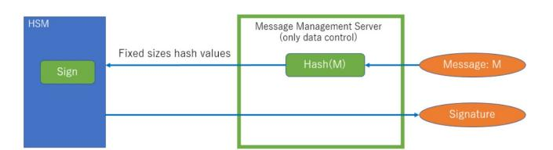
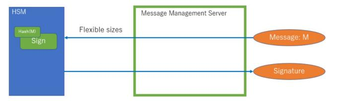
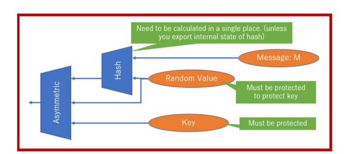
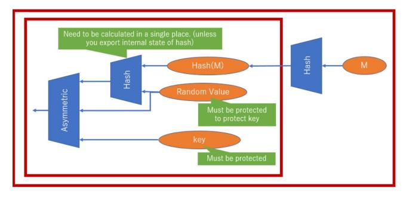
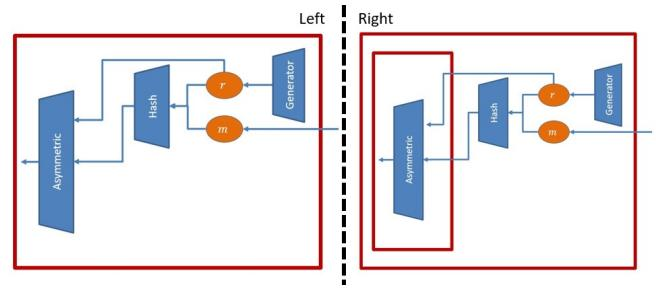
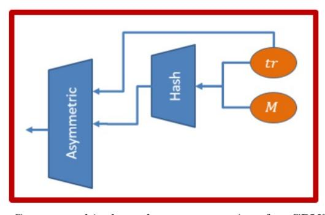
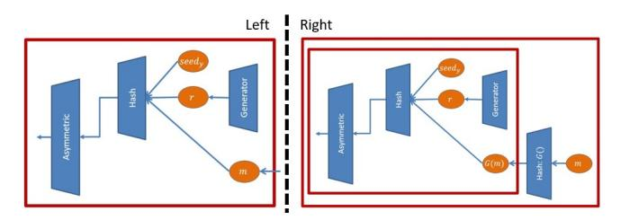
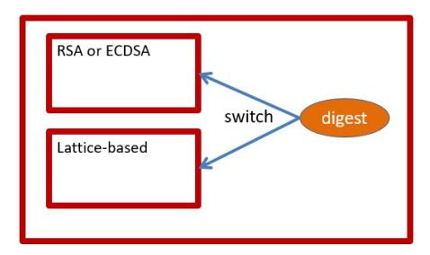

{0}------------------------------------------------

# Performance Comparisons and Migration Analyses of Lattice-based Cryptosystems on Hardware Security Module

Junting Xiao1,a) Tadahiko Ito1,b)

Abstract: Migration issues of Post-Quantum Cryptography (PQC) has been attracting more and more attentions ever since the National Institute of Standards and Technology (NIST) published round 3 candidates of its PQC standardization project in July, 2020. Many candidates' quantum-resistant capability had been measured by researchers. Meanwhile, it is also indispensable to point out limitations and give proposals to those candidates' migration issues, especially for migrating PQC to constrained environments. In this paper, we assume the cases of using PQC on hardware security module (HSM), which is designed to provide a trusted environment to perform cryptographic operations. Our comparisons includes the cases of not only small data (e.g. less than Kilobytes data) which is often used for key encryption or authentication, but also large data (e.g. several Gigabytes data) which is often used for document signing or code signing. We focus on and evaluate hashing and asymmetric operations of three lattice-based cryptosystems which are strong candidates of NIST's PQC standardization project. Then we construct two kinds of cryptographic boundaries for those cryptosystems that make their hashing operations inside or outside of a HSM. We compare their performances with several data sizes under different cryptographic boundary constructions, and discuss how much efficiency versus security we gain or lose with internal or external hashing. This problem already exists today with RSA/ECC and our result indicates that it is also acute with the new lattice-based schemes from the NIST round 3 finalists.

Keywords: Lattice-based cryptography, hardware security module, cryptographic boundary

# 1. Introduction

A hardware security module (HSM) is a physical computing device that provides a trusted environment to perform cryptographic operations such as encryption, decryption, authentication, etc. HSMs typically satisfy the FIPS 140-2 [12] and/or Common Criteria standard to achieve a high security. Relying on secure mechanisms to create an isolated environment from normal computing environments, HSM ensures reliable generation, protection, and management of keys and sensitive data. They are now widely used in some critical infrastructure, for instance, be used as a part of public key infrastructure (PKI) or Internet banking infrastructure. On the other hand, Shor introduced an algorithm [20] to solve integer factorization problem and discrete logarithms problem that can break RSA and elliptic curve cryptography (ECC) on quantum computers. HSMs which are using traditional cryptography would not be able to protect and manage their keys and sensitive data securely under quantum attacks according to Shor's algorithm. To prevent this risk fundamentally, migration from traditional cryptography to quantum-resistant cryptography is necessary.

Post-Quantum Cryptography (PQC) regarded as an effective way to resist attacks from quantum computers. Since National Institute of Standards and Technology (NIST) proposed its PQC standardization project in 2016, many candidates have been submitted and the quantum-resistant capabilities of each post-quantum cryptography scheme had been evaluated by researchers. There are several different ways to construct quantum-resistant cryptographic schemes, such as lattice-based cryptography [17], multivariate-based cryptography [22], hash-based cryptography [15] [3], code-based cryptography [14], etc. Comparing with traditional digital signature schemes such as RSA and ECDSA, post-quantum digital signature schemes generate much larger key pairs or signatures, and they spend more time for key generation, signing and verification. These features are likely to restrict migrating procedures from RSA or ECDSA to PQC, especially when apply digital signature scheme to constrained environments (including environments with HSMs).

Lattice-based cryptography is one of the competitive candidates because of its high efficiency and reliability. For many lattice-based cryptographic schemes, polynomial multiplication and discrete Gaussian sampling are two main challenges on devices with constrained memory and limited computing power. Albrecht et al. [1] implemented "Kyber", presented in [4] on some smart card platforms by

<sup>1</sup> Intelligent Systems Laboratory, SECOM CO., LTD.

a) shu-sho@secom.co.jp

b) tadahi-ito@secom.co.jp

{1}------------------------------------------------

using RSA/ECC co-processor and APIs. Yuan et al. [23] proposed a memory-constrained implementation of several lattice-based cryptographic schemes on a standard Java Card platform by improving Montgomery modular multiplication (MMM) [16] and number theoretic transform (NTT) for polynomial multiplication and modifying several discrete Gaussian sampling algorithms. On the other hand, another factor that is likely to affect efficiency and security of latticebased cryptosystems on constrained environments (typically environments with HSM), is the way of processing hash functions. The way of processing hashing operation (i.e. internal or external hashing) could affect resource consumption, and then it affects trade-off between security and efficiency dramatically. This factor have not been evaluate much with context of PQC. Trade-off between internal and external hashing already exists today with RSA/ECC, but will increase influence for PQC.

Most of the wildly used cryptographic algorithms such as RSA and ECDSA allow separation of hashing and asymmetric operations as default. Sugiyama et al. [21] implemented and evaluated performances of one of such separable algorithm, TESLA#, on Safenet ProtectServer Network HSM, and showed applicability of PQC on HSMs.

On the other hand, utilization of SHA3 hash function is not able to be separated with asymmetric operations in some lattice-based cryptographic schemes. Because of that, those non-separable implementations of PQC may have limited performance according to varied sizes of inputed messages. We aim to evaluate performances of lattice-based cryptographic schemes which are using SHA3 hash functions on HSM, then we analyze migration limitation and costs. The details will be introduced in Section 2 to 5.

#### 1.1 Use cases

HSM is used not only for authentication operations, but also used for protecting legally binding agreement, medical data, CAD data, timestamps, etc. For the latter case, data controller and key manager are likely to be different stakeholders, and different information management policy and operations are applied to their devices. If devices of each stakeholder are unified to a same security level, a same information management policy has to be selected, and each stakeholder needs to share operations of their devices. It can be operationally and legally challenging to deal with such a change.

## 1.2 Our Contributions

Firstly, we gave performance comparisons of three latticebased digital signature schemes in HSM. To perform trusted cryptographic operations in HSM, the way of applying each component of digital signature schemes should be clearly designed. Therefore, we constructed suitable cryptographic boundaries as defined in FIPS 140-2 [12] for these schemes in HSM. Then, we compared performance differences between schemes with internal or external hashing.

Our result shows that when the construction of cryp-

tographic boundaries that processes internal hashing in a HSM, time consumption for hashing operations rose linearly as message size raised. On the other hand, when the construction of cryptographic boundaries that processes external hashing outside of a HSM, time consumption for hashing operations were almost the same no matter what the message size was. For instance, when message size is 1MB, time consumption for hashing operations of qTESLA digital signature scheme [2] with internal hashing is almost 150 times slower than it with external hashing. After the performance comparisons, we analyzed migration limitations and costs.

Although it seems like this issue could be solved by just using fixed-length digests of a message instead of the message itself, precondition of such approach should be the unification of APIs. API Unification should be done in advances, otherwise it will cause an interoperability issue. However, there haven't been much discussion about unification of APIs among PQC operations. In addition, it is conceivable that the role of hashing operations of a cryptosystem running in HSM is different from the role of hashing operations of a cryptosystem not running in HSM. If that's the case, we may not be able to have interoperability between internal and external hashing processing cryptosystems. Changes in the role of hashing can also affect theoretical proof. Moreover, it is hard to say that there is no possibility that a new patent risk would not occur due to changes on the way of using hash functions.

Our results help to define cryptographic boundaries for PQC, where theoretical proof and clearance of patents should be done. We also introduce some real world use cases with evaluations and relative challenges.

The rest of this paper is organized as follows. We give a brief mathematical background of lattice and an introduction to HSM and cryptographic boundary in Section 2. We describe the details of three lattice-based digital signature schemes and analyze challenges for applying them to HSM in Section 3. Evaluation of results is given in Section 4. We then evaluate migration costs in Section 5. Finally, we conclude the paper in Section 6. We believe that our paper helps to notice that the problem which already exists today with RSA/ECC will also affect the migration to lattice-based schemes from the NIST round 3 finalists.

## 2. Preliminaries

In this section, we give a brief mathematical description of lattice-based cryptography in Section 2.1. In Section 2.2, we introduce the general way of using digital signature schemes in HSM and point out the challenges of our work. Then in Section 2.3, we introduce the concept of cryptographic boundary which help us to design the way of processing hashing and asymmetric operations of a cryptosystem running in HSM.

As defined below, bold italic letters denote polynomials (e.g. *f*), bold upper-case letters denote matrices (e.g. A), and bold lower-case denote vectors (e.g. v). For a probability distribution *S*, *s* ← *S* denotes that *s* is chosen according 

{2}------------------------------------------------

to *S*. Let *n* and *q* be positive integers, R represents the field of real numbers, Z*<sup>q</sup>* is the set of integers 0*,* 1*, ..., q* − 1, and R*<sup>q</sup>* = Z*q*[*x*]*/*(*x<sup>n</sup>* + 1) is the quotient polynomial ring.

#### 2.1 Lattice

A lattice is a subgroup of the Euclidean space. Let <sup>A</sup> <sup>=</sup> *{*a1*,* <sup>a</sup>2*, ...,* <sup>a</sup>*n}* <sup>∈</sup> <sup>R</sup>*m*×*<sup>n</sup>* (*m, n* <sup>∈</sup> <sup>N</sup>+) be a set of linearly independent vectors, the lattice generated by A is the set *L*(A) = *{* !*<sup>n</sup> <sup>i</sup>*=1 a*ixi|x<sup>i</sup>* ∈ Z*}*. A is referred to as a basis of the lattice *L*(A), where *m* and *n* are dimension and rank of the lattice, respectively. In this paper, we will be concerned with full rank integer lattices, i.e. *n* = *m* and *<sup>L</sup>*(A) <sup>∈</sup> <sup>Z</sup>*m*.

Many provably secure lattice-based cryptographic schemes are based on the hardness of lattice problems in the worst-case. Besides the most classical problems which are shortest vector problem (SVP) and closest vector problem (CVP), other problems such as learning with error's problem (LWE) [18] or ring learning with error's problem (R-LWE) [13] are also used to construct provably secure cryptographic schemes.

## 2.2 HSM and Hash Functions

A hardware security module (HSM) is a physical computing device that provides a trusted environment to perform cryptographic operations such as encryption, decryption and authentication, etc. HSM typically satisfies FIPS 140-2 [12] and/or Common Criteria standard to achieve high security. Relying on secure mechanisms to create an isolated environment from normal computing environments, HSM ensures reliable generation, protection, and management of keys and sensitive data.

Most of the current digital signing schemes allow separation of hashing and asymmetric operations. Figure 1 shows that message is hashed in a message management server and a fixed length hash value is sent into a HSM. Transmission of a fixed length hash value between message management server and HSM by a secure channel can be quite efficient. Then, signature generation is accomplished inside of the HSM. Traditional cryptography such as RSA or ECDSA that use SHA2 families of hash functions is able to be executed in HSM with external hashing like this way.



Fig. 1 In general cases, a message is hashed in a message management server and then a fixed length hash value is sent to HSM. Signature generation is accomplished in the HSM.

On the other hand, an alternative of SHA2, which is called SHA3 [10] families of hash functions, began to be applied to many PQC cryptographic schemes to improve their security against quantum attacks. In many of these PQC cryptographic schemes, message is hashed with other values together. In some cases, the "other values" are some values be generated randomly. In other cases, the "other values" are some values that related to private keys.

When the "other values" need to be kept in secret, we may introduce HSM for protecting that value. In that case, the whole message (instead of a fixed length hash value) has to be transmitted into HSM directly, and therefore the call for hash functions is calculated inside of the HSM. Under this situation, the secret values and message locate in a same level of cryptographic boundary whose introduction is given in Section 2.3.

Figure 2 shows the operations that has flexible length message (which could be very large) as a direct input of HSM directly. In this case, much more resources are necessary for the HSM because that digest generation and signature generation have to be accomplished inside of the HSM no matter what the message size is.



Fig. 2 For some cryptographic schemes in which the message is hashed with secret values, digest generation and signature generation should be accomplished inside of a HSM.

#### 2.3 Cryptographic boundary

Cryptographic boundary is defined in FIPS 140-2 [12]. For a cryptographic module used within a cyber system, cryptographic boundary establishes physical bounds that contain all the software, hardware, and firmware of this cryptographic module. It is essential to clearly define the range of cryptographic boundary in order to guarantee the security of a cryptographic module. In this section, we describe method to construct cryptographic boundaries for hashing and asymmetric operations.

The way of processing hashing operations of a digital signature scheme would be similar to Figure 1 or Figure 2. In both cases, hashing and asymmetric operations/components of this scheme may need to be placed in a single cryptographic boundary (as illustrated at Figure 3). Then each component inside the cryptographic boundary shares the same security level. On the other hand, access control mechanisms tend to be costly for a cryptographic module in general. In addition, if more components of a cryptographic module are placed inside of that cryptographic boundary, operations across the perimeter of cryptographic boundary would increase. It will lead to a more complex access control mechanism, which would increase implementation cost furthermore.

It is considered to be more efficient to build more than one cryptographic boundary for a given cryptographic module. To be more precise, a system can be implemented and located in several cryptographic boundaries like the way 

{3}------------------------------------------------

shown in Figure 4. By this implementation, processes related to key objects are stored in the inner cryptographic boundary, and data management of to-be-signed data would be achieved with access control of the outer cryptographic boundary. Benefits of such an implementation include the following.

- *•* Access control mechanism of keys and their meta-data should be extremely strict. This implementation can minimize the scope of such strict access control mechanism.
- *•* Basically, data flows across the inner cryptographic boundary are fixed size data. Therefore, it is much easier to facilitate data into the cryptographic boundary.
- *•* System migration is accomplished easier. Transition of the whole cryptosystem can be divided into the migrations of components in inner boundary and components in outer boundaries. Although APIs for the components in inner boundary need to solve the interoperability challenge, migration can be divided into non-dependent steps, and costs of migration can be reduced.

In Section 3 and Section 4, we will give introductions of three lattice-based digital signature schemes and analyze the way of constructing appropriate cryptographic boundaries when running them on HSM. We will then introduce our analyses of migration costs in Section 5.



Fig. 3 Message locates in the same cryptographic boundary with signature generation operations, especially for cryptographic schemes in which the message digest is derived by hashing the conjunction of a message and some secret random value.



Fig. 4 Message locates in different boundary from signature generation operations, especially for those cryptographic schemes whom allow the separation of hashing and asymmetric operations.

# 3. Lattice-based Digital Signature Schemes

In this section, we will first give introductions to three lattice-based digital signature schemes which are called FAL-CON, CRYSTALS-DILITHIUM and qTESLA. Then we analyze their signature generation operations and design suitable cryptographic boundary constructions of internal or external hashing for them when these signature schemes are running on HSMs.

All of these three schemes were selected as the second round's candidates of NIST's PQC standardization project. FALCON and CRYSTALS-DILITHIUM were selected into the newly third round submissions in July, 2020. Although qTESLA could not be chosen into the third round candidate list, the authors had modified the signature generation of qTESLA in its' version 2.8, so that a message is hashed once before the hashing operation of deriving a message digest. This change may make qTESLA from version 2.8 be possible to perform external hashing when running on a HSM. Therefore, qTESLA was included in our comparisons to help to analyze future migration issues.

## 3.1 FALCON

Fouque et al. [11] proposed the fast Fourier lattice-based compact signatures (FALCON) which is based on NTRU lattices. Algorithm 1 shows the signature generation of FALCON. Function *HashT oP oint*() referred to as algorithm 7 in [11] is based on a SHAKE-256 hash function. *ffSampling*() represents the fast Fourier sampling algorithm which is referred to as algorithm 19 in [11]. Compression function *Compress*() is referred to as algorithm 21 in [11]. Function *FFT*() is the fast Fourier transform representation and *invF F T*() is to compute its inverse.

In step 1 of Algorithm 1, a salt value <sup>r</sup> <sup>∈</sup> *{*0*,* <sup>1</sup>*}*<sup>320</sup> is generated uniformly at random. In step 2, a message digest c is derived by hashing the conjunction of r and a message m. Salt value r is not necessarily to be kept in secret, therefore two kinds of cryptographic boundary constructions can be designed for FALCON. First of all, asymmetric operations are accomplished inside of HSM because that the private key was generated and stored in it. In order to ensure a secure random generation of r, the components "Generator", "Hash" and "Asymmetric" can be included into a single cryptographic boundary to share the same security level of protection as shown in the left side of Figure 5. In this case, hashing and asymmetric operations locate in the same cryptographic boundary. On the other hand, if a secure execution environment for random generation of r can be prepared carefully, step 1 and step 2 of algorithm 1 can be accomplished in an outer cryptographic boundary which is out of HSM as shown in the right side of Figure 5.

{4}------------------------------------------------

#### **Algorithm 1:** Signature Generation of FALCON

```
Input: Private key \mathbf{sk}; Message \mathbf{m}; A bound \beta.

Output: The signature sig = (\mathbf{r}, \mathbf{s}).

1 \mathbf{r} \in \{0, 1\}^{320} uniformly
2 \mathbf{c} = HashToPoint(\mathbf{r}||\mathbf{m})
3 \mathbf{t} = (FFT(\mathbf{c}), FFT(0)) \cdot \widehat{\mathbf{B}}^{-1}
4 do
5 \mathbf{z} = ffSampling_n(\mathbf{t}, \mathbf{T})
6 \mathbf{s} = (\mathbf{t} - \mathbf{z})\widehat{\mathbf{B}}
7 while ||\mathbf{s}|| > \beta;
8 (s_1, s_2) = invFFT(\mathbf{s})
9 \mathbf{s} = Compress(s_2)
10 return sig = (\mathbf{r}, \mathbf{s})
```



Fig. 5 Cryptographic boundary constructions for FALCON (Left: hashing operation locates in same cryptographic boundary as asymmetric operations. Right: hashing operation locates in different cryptographic boundary from asymmetric operations.)

#### 3.2 CRYSTALS-DILITHIUM

Ducas et al. [9] proposed the CRYSTALS-DILITHIUM digital signature scheme which is based on the hardness of the Shortest Vector Problem (SVP) in lattice. Algorithm 2 shows the signature generation of DILITHIUM. Let  $k, l, \gamma_1, q \in \mathbb{Z}$ ,  $ExpandA: \{0,1\}^{256} \to R_q^{k \times l}$ ,  $CRH(): \{0,1\}^* \to \{0,1\}^{384}$ , ExpandMask() maps a seed  $\rho'$  and a nonce k to  $y = S_{\gamma_1-1}^l$ . NTT() and  $NTT^{-1}()$  compute the number theoretic transform representation and its inverse. Functions HighBits(),  $Decompose_q()$  and  $MakeHint_q()$  refer to figure 3 in [9].

In step 2 of Algorithm 2, digest  $\mu$  is derived by hashing the conjunction of  $\mathbf{tr}$  and message  $\mathbf{m}$ . Because that  $\mathbf{tr}$  is a part of private key which was generated and stored in HSM, hash function CRH() has to be accomplished inside of HSM. Therefore, message  $\mathbf{m}$  needs to be sent into the HSM directly, and digest  $\mu$  is derived inside of the HSM. Under this case, the structure of cryptographic boundary related to DILITHIUM is as shown in Figure 6 that hashing and asymmetric operations locate in the same cryptographic boundary

#### 3.3 qTESLA

Akleylek et al. proposed the qTESLA digital signature scheme [2] which is based on the hardness of the decisional ring learning with errors (R-LWE). Algorithm 3 shows the signature generation of qTESLA.  $PRF_2(): \{0,1\}^k \times \{0,1\}^k \times \{0,1\}^{320} \rightarrow \{0,1\}^k$  is performed as a pseudorandom function.  $ySampler(): \{0,1\}^k \times \mathbb{Z} \rightarrow R_{[B]}$  is referred to as algorithm 12 in [2].  $GenA(): \{0,1\}^k \rightarrow R_q^k$  is referred to as algorithm 10 in [2].

#### Algorithm 2: Signature Generation for Dilithium

```
Input : \mathbf{sk} = (\boldsymbol{\rho}, \mathbf{K}, \mathbf{tr}, \mathbf{s}_1, \mathbf{s}_2, \mathbf{t}_0); Message \mathbf{m}.
      Output: The signature \sigma = (\mathbf{z}, \mathbf{h}, c).
  1 \mathbf{A} \in R_q^{k \times l} = ExpandA(\boldsymbol{\rho})
  \mu \in \{0,1\}^{384} = CRH(\mathbf{tr}||\mathbf{m})
  3 k = 0, (z, h) = \perp
  4 \rho' \in \{0,1\}^{384} = CRH(\mathbf{K}||\mu) \text{ (or } \rho' \leftarrow \{0,1\}^{384} \text{ for }
        randomized signing)
  5
      while (z, h) = \perp do
            \mathbf{y} \in S_{\gamma_1-1}^l = ExpandMask(\mathbf{\rho}', k)
  6
            w = Au
  7
            \mathbf{w}_1 = HighBits_q(\mathbf{w}, 2\gamma_2)
  8
 9
            \mathbf{c} \in B_{60} = H(\boldsymbol{\mu}, \boldsymbol{w}_1)
10
            z = y + cs_1
11
             (r_1, r_0) = Decompose_q (w - cs_2, 2\gamma_2)
12
            if ||z||_{\infty} \geq \gamma_1 - \beta or ||r_0||_{\infty} \geq \gamma_2 - \beta or r_1 \neq w_1 then
13
                   (z, h) = \perp
14
            end
15
            else
                   h = MakeHint_q(-\mathbf{c}t_0, \mathbf{w} - \mathbf{c}s_2 + \mathbf{c}t_0, 2\gamma_2)
16
17
                   if ||ct_0||_{\infty} \geq \gamma_2 or the # of 1's in h is greater
                     than \ \omega \ {\bf then}
18
                          (z,h) = \perp
19
                   end
20
            end
21
            k = k + 1
22 end
23 return \sigma = (z, h, c)
```



Fig. 6 Cryptographic boundary construction for CRYSTALS-DILITHIUM: hashing operation locates in the same cryptographic boundary as asymmetric operations)

In step 3, function  $PRF_2()$  hashes message **m** with secret data **seed**<sub>u</sub> and a random value **r**. Function  $G(): \{0,1\}^* \to$  $\{0,1\}^{320}$  was first introduced in Ver. 2.8 (11/08/2019) of qTESLA in [2], which made it possible to transmit a fixed length digest  $G(\mathbf{m})$ , instead of  $\mathbf{m}$ , into a HSM. This modification made it possible to redesign the cryptographic boundary structure for qTESLA in HSM. The difference is shown in Figure 7. Since secret value  $\mathbf{seed}_y$  needs to be stored in the HSM, without the modification in Ver. 2.8, the original message m is transferred into HSM directly and the structure of the cryptographic boundary is designed as shown in the left part of Figure 7. After the Ver. 2.8, cryptographic boundaries can be constructed in the way as shown in the right part of Figure 7. The performance comparison of qTESLA using these two cryptographic boundary structures will be introduced in next section.

{5}------------------------------------------------

#### Algorithm 3: Signature Generation for qTESLA

```
Input : sk = (s, e_1, ..., e_k, \mathbf{seed}_a, \mathbf{seed}_y, \mathbf{g}); Message m.
    Output: The signature sig = (z, c').
 1 \text{ counter} = 1
 2 \mathbf{r} \in \{0,1\}^k
 \operatorname{rand} = PRF_2(\operatorname{seed}_y, \mathbf{r}, G(\mathbf{m}))
 4 y = ySampler(rand, counter)
 a_1, ..., a_k \leftarrow GenA(\mathbf{seed}_a)
 6 for i = 1, ..., k do
          v_i = a_i y \bmod^{\pm} q
 7
 s end
 9 c' = H(v_1, ..., v_k, G(\mathbf{m}), \mathbf{g})
10 c = \{pos\_list, sign\_list\} \leftarrow Enc(c')
11 z = u + sc
12 if z \notin R_{[B-S]} then
          counter = counter + 1
13
          Restart as step 4
14
15
    end
16
    for i = 1, ..., k do
17
          w_i = v_i - e_i c \bmod^{\pm} q
          if ||[w_i]_L||_{\infty} \geq 2^{d-1} - E \vee ||w_i||_{\infty} \geq \lfloor q/2 \rfloor - E then
18
               counter = counter + 1
19
20
               Restart as step 4
21
          end
22 end
23 return (z, c')
```



Fig. 7 The structure of cryptographic boundaries for qTESLA (Left: the hashing operation locates in the same cryptographic boundary as asymmetric operations in HSM for old version. right: the hashing operation locates in different cryptographic boundary from asymmetric operations in HSM from Ver. 2.8)

# 4. Evaluation

In this section, we evaluate the performances of FAL-CON, DILITHIUM, and qTESLA when running on HSM. Our method is to implement hashing operations for three lattice-based digital signature schemes. We compare the performances of internal and external hashing of these digital signature schemes, regrading with cryptographic boundary constructions described in Section 3. The results of this section will be an evidence of migration-issue analysis in Section 5.

#### 4.1 HSM Specification

Throughout the paper, two types of HSMs are chosen for our experiments. One is the Protect Server External 2 (PSE-2), and the other one is the LUNA NETWORK HSM A750 (LunaSA-7), both of which are owned by Thales S.A.. Table 1 gives some descriptions of PSE-2 and LunaSA-7. In order to make use of the SHA3 hash functions in our experiments, suitable version of HSM's software and firmware were selected and installed\*1.

## 4.2 Experimental Results

We call it "type A cryptographic boundary" when message (no matter how long the length is) is sent to a HSM directly, and there is only one cryptographic boundary constructed for signature generation. This structure is similar to Figure 3. The "type B cryptographic boundaries" represents that only the fixed length message digest is transformed into the HSM, and there is another cryptographic boundary for protecting the generation of message digest from message. This structure is similar to Figure 4.

Table 2 and table 3 show the time consumption of hashing operations executed inside of PSE-2 ans LunaSA-7 with different constructions of cryptographic boundary. The time is measured as milliseconds (ms). The size of message is measured as kilobytes (K) or megabytes (M). For FALCON, when message is hashed in another cryptographic boundary from HSM, time consumption of hashing operations inside of the HSM is 0. However, for "type A cryptographic boundary", when message size becomes larger and larger, time consumption rises linearly. For instance, if the message size is 10M, the time consumption of hashing operation is about  $11667.19 \text{ms} (\approx 11.7 \text{s}) \text{ in PSE-2, and about } 4911.52 \text{ms} (\approx 4.9 \text{s})$ in LunaSA-7. For CRYSTALS-DILITHIUM, because that message digest is derived by hashing the conjunction of message and components of private key together, all operations of signature generation locate in the same cryptographic boundary and therefore time consumption rises with the extension of message size. For instance, if the message size is 10M, the time consumption of hashing operation is about  $12727.83 \text{ms} (\approx 12.7 \text{s})$  in PSE-2, and about  $6294.30 \text{ms} (\approx 6.3 \text{s})$  in LunaSA-7. For qTESLA, when "type A cryptographic boundary" is selected, time consumption grows with the extension of message size. For instance, if the message size is 10M, the time consumption of hashing operation is about  $11810.52 \text{ms} (\approx 11.8 \text{s})$  in PSE-2, and about  $4922.03 \text{ms} (\approx 4.9 \text{s})$  in LunaSA-7. After the modification from Ver. 2.8 of qTESLA, no matter how long the size of original message, a fixed length digest is generated and sent into the HSM. Therefore, the time consumption is almost the same for each case, as shown in the second row of the experiment results for qTESLA. Comparing the performance of "type A cryptographic boundary" and "type B cryptographic boundaries" applied to qTESLA, it is clear that the latter one has better performance, especially for big size data. For instance, when message size is 10M, the speed of hashing operations in "type B cryptographic boundaries" is about three-hundred times faster in "type A cryptographic boundary" in PSE-2, and more than one-thousand times faster in LunaSA-7.

## 4.3 Consideration on security proof

We can construct type B cryptographic boundaries by adding one more hash function before the execution of PQC's signature generation algorithm. In this section, we introduce our concerns on security proof of deploying this approach.

<sup>\*1</sup> For PSE-2, HSM appliance version and client software version are 5.6. For LunaSa-7, HSM appliance version is 7.4, client software version is 10.2

{6}------------------------------------------------

Table 1 Some descriptions of PSE-2 and LunaSA-7

| Features                   | PSE-2                                                                                          | LunaSA-7                                                                                                                                                                                                                                                                                                |  |  |
|----------------------------|------------------------------------------------------------------------------------------------|---------------------------------------------------------------------------------------------------------------------------------------------------------------------------------------------------------------------------------------------------------------------------------------------------------|--|--|
| Operating<br>Systems       | Windows, Linux, AIX,<br>HP_UX, Solaris                                                         | Windows, Linux, Solaris, AIX     Virtual: VMware, Hyper-V, Xen, KVM                                                                                                                                                                                                                                     |  |  |
| APIs                       | PKCS#11, CAPI/CNG,<br>JCA/JCE, JCProv,<br>OpenSSL                                              | PKCS#11, CAPI/CNG, JCA/JCE, JCProv, OpenSSL     REST API for administration                                                                                                                                                                                                                             |  |  |
| Security<br>Certifications | • FIPS 140-2 Level 3                                                                           | FIPS 140-2 Level 3  IDAS CC EAL4+ (AVA_VAN.5 and ALC_FLR.2) against the Protection Profle 419221-5 *                                                                                                                                                                                                    |  |  |
| Cryptography               | Asymmetric     Symmetric     Hash/Message     Digest/HMAC     Message Authentication     Codes | <ul> <li>Asymmetric</li> <li>Symmetric</li> <li>Hash/Message Digest/HMAC</li> <li>Full Suite B support</li> <li>Key Derivation</li> <li>Key Wrapping</li> <li>Random Number Generation</li> <li>Digital Wallet Encryption</li> <li>5G Cryptographic Mechanisms for Subscriber Authentication</li> </ul> |  |  |

 Table 2
 The time consumption of hashing operations executed inside of HSM (PSE-2) with different constructions of cryptographic boundary

| Scheme    | Cryptography Boundary Type | Time (millisecond) |       |        |         |          |  |
|-----------|----------------------------|--------------------|-------|--------|---------|----------|--|
|           |                            | 1k                 | 10k   | 100k   | 1M      | 10M      |  |
| FALCON    | A                          | 33.36              | 38.08 | 142.26 | 1240.59 | 11667.19 |  |
|           | В                          | 0                  |       |        |         |          |  |
| DILITHIUM | A                          | 34.67              | 45.79 | 156.19 | 1351.4  | 12727.83 |  |
| qTESLA    | A (before Ver. 2.8)        | 34.78              | 44.78 | 138.05 | 1196.26 | 11810.52 |  |
|           | B (from Ver. 2.8)          | 30.84              | 38.25 | 38.63  | 38.63   | 31.42    |  |

This approach would improve the efficiency of latticebased digital signature schemes deployed in HSM. It would have a greater impact on Dilithium, but also be applicable to Falcon and other digital signature schemes. Two modes of PQC algorithms utilizing this approach will be able to exist, namely, a PQC algorithm without an additional hash (i.e. original PQC algorithm) and a PQC algorithm with an additional hash. If there are two modes of a digital signature scheme, then the asymmetric operation for those two modes must not be identical. The reason is that, obtaining a signature from the mode with an additional hash function would help attackers who can attack another mode which is without the additional hash function. There are ways to avoid this kind of attack, for instance, the step 2 in Dilithium's signature generation algorithm can be changed to  $\mu \in \{0,1\}^{384} = CRH(0||\mathbf{tr}||\mathbf{m})$  for the mode without an additional hash, and  $\mu \in \{0,1\}^{384}$  $CRH(1||\mathbf{tr}||\mathbf{m})$  for the mode with an additional hash. However, it would increase implementation complexity and the necessity of choosing mode may confuse users.

# 5. Migration costs for each cryptographic boundary

RSA (with SHA2) and ECDSA (with SHA2) signing systems using HSMs typically utilize "type B cryptographic boundaries". This section describes costs of migrating from those signing systems to lattice-based signatures under cryptographic boundaries of type A or type B.

#### 5.1 Migration costs for boundary type A

To migrate to type A, many more components of lattice-

based signatures are contained in a single cryptographic boundary, so as a general rule, it is expected that the access control mechanism has to be designed to be more complicated, which is likely to require much more processing resources for access control. These changes should be done after a thorough threat analysis, redefining of threat models, and redefining of human operations. In addition, as described in Section 4, a lot of hashing calculations are accomplished inside of the type A cryptographic boundary for key management, so much more protected computing resources inside of the boundary may be required to sign large files.

#### 5.2 Migration costs for boundary type B

To migrate to type B, it is possible to utilize the same kind of cryptographic boundary as traditional systems like RSA/ECDSA. In this case, although it is necessary to support lattice-based cryptographic algorithms with corresponding object ID, the change in architecture of cryptographic boundary between lattice-based and traditional implementations is likely to be limited. As shown in Figure 8, if it were possible to place both lattice-based and traditional cryptographic modules into the same boundary, or if it were possible to switch the lattice-based-signatures-related inner boundary and traditional-signatures-related inner boundary from inside of their common outer boundary, changes of human operation would also be limited. This approach also requires interoperability and standardization of APIs, but the benefits of success would be great.

{7}------------------------------------------------

Table 3 The time consumption for hashing operations executed inside of the HSM (LunaSA-7)with different constructions of cryptographic boundary

| Scheme    | Cryptography Boundary Type | Time (millisecond) |      |       |        |         |
|-----------|----------------------------|--------------------|------|-------|--------|---------|
|           |                            | 1k                 | 10k  | 100k  | 1M     | 10M     |
| FALCON    | A                          | 4.29               | 9.06 | 52.40 | 501.48 | 4911.52 |
|           | B                          | 0                  |      |       |        |         |
| DILITHIUM | A                          | 3.13               | 8.57 | 65.94 | 630.73 | 6294.30 |
| qTESLA    | A (before Ver. 2.8)        | 3.99               | 8.78 | 53.53 | 507.02 | 4922.03 |
|           | B (from Ver. 2.8)          | 2.27               | 3.49 | 3.15  | 3.42   | 2.99    |



Fig. 8 A mechanism that allows both lattice-based-signaturesrelated inner boundary and traditional-signatures-related inner boundary to be located in same outer boundary

# 5.3 Migration costs from type B with multistakeholders

In the real world, it is quite common that organization which manages data and organization which provides signing service (with HSM) are different. In general, signing service providers use their HSM resources to sign data for different customers (or data controllers). That separation is efficient, because the signing provider and data controller would have very different data management and control policies, but each stakeholder can only focus on their resource for each policy. If each stakeholder can make their devices to a same security level, each operation can be regarded as located in a single cryptographic boundary similar to type A, when communication channels with strict secure principles are prepared to transfer data. However, two main challenges are likely to destroy this solution. The first one is that it is resource-consuming for each data controller to run their devices in a same security level as signing provider, and also it can be impossible for signing provider to make their system compliant with every data controller's policy. Even if the first challenge was solved, the second challenge of the time consumption of transferring data with secure communication channels is also unavoidable. As shown in Table 4, medical data or CAD data are quite big, so the type A cryptographic boundaries would be very inefficient. Therefore, it is more realistic to construct more than one cryptographic boundary for multi-stakeholders. Under this circumstance, each stakeholder has its own security solutions for its devices, and a strict access mechanism is designed for the HSM service provider.

#### 5.4 Use cases, requirements and migration plan

It is desirable to formulate a migration plan through several procedures. These procedures include clarification of a use case, requirement organization, and pitfall prediction. In this subsection, we describe some use cases which should be took care, a pitfall that can increase long-term management costs dramatically, and an example of determining principles of a plan.

As shown in Table 4, the data size is small for authentication purposes, and service provider for authentication may not need to store that data at all. On the contrary, a legally binding agreement's PDF file is typically several hundreds KB. and that file needs to be preserved during the period of the agreement, which can be several decades. Another notable use case is medical data. Some medical data can be on the order of GBs. For instance, raw data for Multi-slice CT can be 2GB for a single inspection (2MB/slice, 1000 slices). That data may need to be stored for a patient's lifetime. In addition, some PDF file for CAD data can be several GBs. Notice that HSM has the limitation on available RAM resource, therefore, it is hard to process the GB files in it. The structure of cryptographic boundaries should be type B for this case. On the one hand, choice of type A or type B dose not matter a lot for authentication of time stamp purpose, on the other hand, it is better to use type B for sign purpose. There is another requirement regarding with protection period. Time stamp and sign purposes sometime have much longer protection period, and that characteristic can be troublesome for the migration of PQC. AS the lifetime of data becomes longer, you need to protect the data longer, and it would be desirable to prepare the implementation and migration of PQC further in advance.

As shown in this subsection, the implementation and migration of PQC are troublesome especially for sign purpose. Therefore, we focus on the sign purpose and evaluate it on the below. The following scenario is a pitfall (in terms of the cost after a migration) scenario for sign purpose in a HSM \*2.

Let us assume that a service provider needs to protect Personal Health Information (PHI). That PHIs are currently protected by RSA and need to be protected through customers' lifetime. It is assumed that keys need to be protected by HSM according to national policy. Under this situation, the service provider is likely to have type B boundaries because of resource limitation on HSM. Therefore, we assume that the service provider decides to migrate to PQC for PHI, and an additional hash function is used to create a fixed length digest in the outer cryptographic bound-

<sup>\*2</sup> Note that, there would be some pitfalls which would occur regardless of the shape of constructed cryptographic boundaries, but we focus on the pitfall scenario that related to cryptographic boundary construction as an example.

{8}------------------------------------------------

Table 4 Some use cases that can be applied to HSM

| Purpose        | Usecase                   | Lifetime of Data  | Data Sizes               |  |
|----------------|---------------------------|-------------------|--------------------------|--|
| Authentication | Authentication            | days              | several Kilobytes        |  |
|                | Legally binding agreement |                   | hundreds Kilobytes       |  |
| Sign           | Medical data              | can be decades    | can be several Gigabytes |  |
|                | CAD data                  |                   |                          |  |
| Time stamp     | Time stamp                | around one decade | several Kilobytes        |  |

ary. (This trick is shown in Ver. 2.8 of qTESLA.) Then, the service provider can apply the additional hash function outside of inner boundary and apply PQC function in the inner boundary. Architectures before and after migration are both type B and migration did not cost much. However, potential costs may occur for this choice. Unless that trick is standardized, the service provider needs to maintain security and integrity of cryptographic libraries. In particular, maintenance of verification application (include delivery of application, support for OSs, etc.) tends to be very costly. Even if that trick is standardized, complexities of cryptographic libraries increase. The complexity increase will be in contradict with the idea that many cryptographic implementers are trying to make their implementations as simple as possible to reduce bugs. Type B boundaries would be likely to result in a damage of cryptography implementations ecosystem and cryptography implementation sector needs to pay for that extra complexity for their ecosystem.

In the above scenario, that service provider ends up to choose 1) migrating to non-tricked style of PQC, 2) paying extra costs to maintain cryptographic libraries, 3) standardizing that trick. The choice of 1) includes challenges described in subsection 5.2. Costs in choice of 2) and 3) generally increases as time passes. The choice of 3) sometimes becomes impossible as time passes. Above scenario will occur if we only pay attention to the short-term security and cost trade-off, but not care about efficiency and interoperability among many types of cryptographic boundary constructions. We should decide a migration plan while paying attention to such scenario, so that migrated system could have an efficient use of cryptographic libraries. To be more precise, hashing operations in PQC should be unified and interoperable for any usecase.

# 6. Conclusion

In this paper, we compared the performances and discussed the migration issue of lattice-based cryptography, which is one of a strong candidate of NIST's PQC standardization project. We focused on the implementation with constrained environment such as Hardware Security Module (HSM). We described the features of three lattice-based digital signature schemes selected from NIST's PQC standardization project, and compared performance between internal and external hashing with HSM. Then we pointed out that the way of using hash functions would lead to different constructions of cryptographic boundary, and restrict the efficiency of selected digital signature schemes. To be more precise, the way of processing hash functions (i.e. internal or external hashing) could affect resource consumption, and then affect the trade-off between security and efficiency dramatically. Based on the experimental results, we analyzed the migration costs to lattice-based cryptography with internal or external hashing. Moreover, we analyzed several migration challenges for some real world use cases which involve many stakeholders, and we introduced our considerations on them. These challenges had existed in RSA/ECC, and it would influence more in the migration issues of latticebased schemes from the NIST's PQC round 3 finalists. Additionally, our paper helps to define cryptographic boundary constructions for PQC, where theoretical proof and clearance of patents should be done before planning to use PQC.

# References

- [1] Martin R. Albrecht, Christian Hanser, Andrea Hoeller, Thomas=P¨oppelmann, Fernando Virdia, and Andreas Wallner. "Implementing RLWE-based schemes using an RSA coprocessor." In Cryptology ePrint Archive, 2018/425, 2018.
- [2] Nina Bindel, Sedat Akeylek, Erdem Alkim, Paulo SLM Barreto, Johannes Buchmann, Edward Eaton, Gus Gutoski, Julaine Kramer, Patrick Longa, Harun Polat, Jefferson E. Richardini, and Gustavo Zanon. qtesla. submission to the nist's post-quantum cryptography standardization process.(2018), 2018.
- [3] Johannes Buchmann, Erik Dahmen, and Andreas H¨ulsing. "XMSS - a practical forward secure signature scheme based on minimal security assumptions." In Bo-Yin Yang, editor, *Post-Quantum Cryptography*, volume 7071 of *Lecture Notes in Computer Science*, pp. 117-129. Springer Berlin / Heidelberg, 2011.
- [4] Joppe Bos, L´eo Ducas, Eike Kiltz, Tancr`ede Lepoint, Vadim Lyubashevsky, John M. Schanck, Peter Schwabe, and Damien Stehl´e. "CRYSTALS - Kyber: a CCA-secure modulelattice-based KEM." In IACR Cryptology ePrint Archive, Report 2017/634, 2017.
- [5] Daniel J. Bernstein, Andreas H¨ulsing, Stefen K¨olbl, Ruben Niederhagen, Joost Rijneveld, and Peter Schwabe. "The SPHINCS+ Signature Framework." submission to the nist's post-quantum cryptography standardization process, 2019. https://sphincs.org/data/sphincs+-paper.pdf.
- [6] Ward Beullens, Bart Preneel, Alan Szepieniec, and Frederik Vercauteren. LUOV, Csrc.nist.gov, Jun 2019, [online] Available: https://csrc.nist.gov/Projects/Post-Quant um-Cryptography/Round-2-Submissions.
- [7] A. Casanova, J.-C. Faugere, G. Macario-Rat, J. Patarin, L. Perret, and J. Ryckeghem. "GeMSS: A great multivariate short signature." Jun 2019, [online] Available: https://csrc.nist.gov/Projects/Post-Quantum-C ryptography/Round-2-Submissions.
- [8] Jintai Ding, Ming-Shing Chen, Albrecht Petzoldt, Dieter Schmidt, and Bo-Yin Yang. Rainbow specifications. NIST PQC Round 2 Submission (2019).
- [9] L´eo Ducas, Eike Kiltz, Tancr`ede Lepoint, Vadim Lyubashevsky, Peter Schwabe, Gregor Seiler, and Damien Stehl´e. "CRYSTALS-Dilithium: A lattice-based digital signature scheme." *IACR Transactions on Cryptographic Hardware and Embedded Systems*, 2018(1):238-268, 2018. https://tches. iacr.org/index.php/TCHES/article/view/839.
- [10] Morris J. Dworkin. "SHA-3 Standard: Permutation-Based Hash and Extendable-Output Functions." https://www.ni st.gov/publications/sha-3-standard-permutation-based -hash-and-extendable-output-functions?pub\_id=919061, 2015.
- [11] Pierre-Alain Fouque, Jeffrey Hoffstein, Paul Kirchner, Vadim Lyubashevsky, Thomas Pornin, Thomas Prest,

{9}------------------------------------------------

- Thomas Ricosset, Gregor Seiler, William Whyte, and Zhenfei Zhang. "Falcon: Fast-fourier lattice-based compact signatures over ntru." submission to the nist's post-quantum cryptography standardization process.(2018), 2018.
- [12] FIPS 140-2. "Security Requirements for Cryptographic Modules." https://nvlpubs.nist.gov/nistpubs/FIPS/NIST.FI PS.140-2.pdf.
- [13] Vadim Lyubashevsky, Chris Peikert, and Oded Regev. "On Ideal Lattices and Learning with Errors Over Rings." In IACR Cryptology ePrint Archive, Report 2012/230, 2012.
- [14] Robert J. McEliece. "A public key cryptosystem based on algebraic coding theory." *DSN progress report*, 42-44:114-116, 1978.
- [15] Ralph Merkle. "A certified digital signature." In Gilles Brassard, editor, *Advances in Cryptology - CRYPTO?89 Proceedings, volume 435 of Lecture Notes in Computer Science*, pp. 218-238. Springer Berlin / Heidelberg, 1990.
- [16] Peter L. Montgomery. "Modular multiplication without trial division." In *Mathematics of Computation*, Vol. 44, No. 170, pp. 519-521, 1985.
- [17] Daniele Micciancio and Oded Regev. "Lattice-based cryptography." In *Post-Quantum Cryptography*, pp. 147-191. Springer, 2008
- [18] Oded Regev, "On lattices, learning with errors, random linear codes, and cryptography." In Proceedings of the thirtyseventh annual ACM symposium on Theory of computing (Baltimore, MD, USA: ACM, 2005), 84-93, http://portal .acm.org/citation.cfm?id=1060590.1060603.
- [19] Simona Samardjiska, Ming-Shing Chen, Andreas Hulsing, Joost Rijneveld, and Peter Schwabe. MQDSS specifications. NIST PQC Round 2 Submission (2019).
- [20] Peter Williston Shor. "Algorithms for quantum computation: discrete logarithms and factoring." In *Proceedings of the 35th Annual Symposium on Fundamentals of Computer Science (FOCS)*, pp. 124-134, 1994.
- [21] Shotaro Sugiyama, Tadahiko Ito, and Kohei Isobe. "Implementation and Evaluation of Post Quantum Cryptography on Hardware Security Module." In *2019 Symposium on Cryptography and Information Security*, Shiga, Japan. Jan. 22-25, 2019.
- [22] Matsumoto Tsutomu and Imai Hideki. "Public Quadratic Polynomial-Tuples for Efficient Signature-Verification and MessageEncryption." *Lecture Notes in Computer Science*. Berlin / Heidelberg. Springer, 1988.
- [23] Ye Yuan, Kazuhide Fukushima, Junting Xiao, Shinsaku Kiyomoto, and Tsuyoshi Takagi. "Memory-Constrained Implementation of Lattice-based Encryption Scheme on the Standard Java Card Platform." In IACR Cryptology ePrint Archive, Report 2018/1238, 2018.
- [24] Greg Zaverucha, Melissa Chase, David Derler, Steven Goldfeder, Claudio Orlandi, Sebastian Ramacher, Christian Rechberger, Daniel Slamanig, Jonathan Katz, Xiao Wang, Vladmir Kolesnikov, and Daniel Kales. Picnic. submission to the nist's postquantum cryptography standardization process, 2018. https://microsoft.github.io/Picnic/.