{0}------------------------------------------------


Received September 18, 2020, accepted September 27, 2020, date of publication October 8, 2020, date of current version October 19, 2020.

Digital Object Identifier 10.1109/ACCESS.2020.3029521

# Single-Trace Attacks on Message Encoding in Lattice-Based KEMs

BO-YEON SIM<sup>[D]</sup>, JIHOON KWON<sup>[D]</sup>, JOOHEE LEE<sup>2</sup>, IL-JU KIM<sup>[D]</sup>, TAE-HO LEE<sup>[D]</sup>, JAESEUNG HAN<sup>[D]</sup>, HYOJIN YOON<sup>2</sup>, JIHOON CHO<sup>2</sup>, AND DONG-GUK HAN<sup>[D]</sup>, Department of Mathematics, Kookmin University, Seoul 02707, South Korea

Corresponding author: Dong-Guk Han (christa@kookmin.ac.kr)

This work was supported by the Institute for Information and communications Technology Promotion (IITP) grant funded by the Korean Government (MSIT) (Development of SCR-Friendly Symmetric Key Cryptosystem and Its Application Modes) under Grant 2017-0-00520.

**ABSTRACT** In this article, we propose single-trace side-channel attacks against lattice-based key encapsulation mechanisms (KEMs) that are the third-round candidates of the national institute of standards and technology (NIST) standardization project. Specifically, we analyze the message encoding operation in the encapsulation phase of lattice-based KEMs to obtain an ephemeral session key. We conclude that a singletrace leakage implies a whole key recovery: the experimental results realized on a ChipWhisperer UFO STM32F3 target board achieve a success rate of 100% for CRYSTALS-KYBER and SABER regardless of an optimization level and those greater than 79% for FrodoKEM. We further demonstrate that the proposed attack methodologies are not restricted to the above algorithms but are widely applicable to other NIST post-quantum cryptography (PQC) candidates, including NTRU Prime and NTRU.

**INDEX TERMS** Key encapsulation mechanism, lattice-based cryptography, message encoding, side-channel attack, single-trace attack.

#### <span id="page-0-0"></span>I. INTRODUCTION

The key encapsulation mechanism (KEM) is a public-key cryptosystem aimed at establishing key sharing between two parties. It is widely adopted in Internet protocols to provide secure communications. In 1994, Shor [48] proposed an algorithm that effectively defeats the underlying hard problems of all the widely adopted public-key cryptosystems, such as RSA, Diffie-Hellman, and ECC, using a quantum computer. Hence, KEMs become vulnerable once a large-scale quantum computation is available. Experts estimated that RSA, with the public-key size of 2000-bit, would become insecure by 2030 [13], [34], [35].

To address this issue, the national institute of standards and technology (NIST) launched a project to standardize postquantum cryptography (PQC). The third-round candidates were announced on July 22, 2020, and there were seven finalists and eight alternatives [36]. Accordingly, 15 (when except alternatives, it is 7) candidates are included in the third-round

The associate editor coordinating the review of this manuscript and approving it for publication was Tyson Brooks.

of NIST PQC project, and 9 (when except alternatives, it is 4) of them are KEMs [36].

Lattice-based KEMs [1], [6], [8]–[10], [14], [15], [29] have attracted increasing attention owing to their balanced performance in terms of sizes and speed. Lattice-based KEMs can be categorized into two classes: the schemes that comply security based on the hardness of some variants of the learning with errors (LWE) problem [43], and the schemes based on the NTRU problem [22]. The first class includes FrodoKEM, CRYSTALS-KYBER, and SABER, which have its security reduction to the respective variants of the LWE problem. The second class comprises NTRU and NTRU Prime which has its strength in sizes. Both classes have adopted optimization techniques, such as number theoretic transform (NTT) and advanced vector extensions (AVX), achieving relatively low computational costs among the third-round PQC candidates.

Side-channel attacks (SCAs) [27] allow extracting cryptographic keys using side-channel information, such as power consumption, electromagnetic radiation, and execution time, when cryptographic devices are in operation. Power analysis represents a well-known category of SCAs, including simple

<sup>&</sup>lt;sup>2</sup>Security Research Center, Samsung SDS, Inc., Seoul 05510, South Korea

<sup>&</sup>lt;sup>3</sup>Department of Financial Information Security, Kookmin University, Seoul 02707, South Korea

{1}------------------------------------------------


power analysis (SPA), differential power analysis (DPA), and template attack [12], [27], [28], [33]. SPA allows recovering secret keys using only one or a few traces obtained from running cryptographic algorithms. DPA analyzes multiple power consumption traces using statistical methods, for example, evaluating the correlation between the actual and hypothetical power models. A template attack is a type of profiling attack (PA) that implies creating a profile of a programmable device that is identical to a target device and exploiting this profile to obtain a secret key. Machine learning techniques, such as *k*-means clustering and support vector machine, are also adopted to improve the performance of SCAs [7], [21], [24], [31].

#### <span id="page-1-0"></span>A. RELATED WORKS

Lattice-based cryptography is considered to provide quantum resistance; however, its practical implementations still have vulnerabilities against SCAs. Silverman and Whyte [49] presented a timing attack against NTRUEncrypt, which was based on a variation in the number of hash calls in decryption. Timing leakage information about error-correcting codes in a decoding algorithm allows extracting an entire secret key of LAC [16]. Park and Han [38] reported an SPA attack against the decryption of the ring-LWE encryption scheme performed on an AVR processor.

DPA attacks on the NTRU implementations were also discussed [4], [30]. Aysu *et al.* [5] mounted horizontal DPA attacks on the hardware implementations of NewHope and FrodoKEM, extracting secret keys with a success rate of over 99% using a single trace. Bos *et al.* [11] extended this attack considering ring-less LWE-based constructions by utilizing a single-trace template attack and reported the experimental results for a Frodo key-exchange protocol, which was later updated to FrodoKEM. More DPA attacks targeting the multiplications of the decryption phase in lattice-based PKE can be found in [37], [44], [45].

Primas *et al.* [40] proposed a single-trace template attack on NTT in the ring-LWE decryption phase, extracting an entire secret key. Pessl and Primas [39] introduced an improved single-trace attack on NTT targeting an optimized constant-time implementation of CRYSTALS-KYBER. Various power analysis attacks were applied to NTRU Prime [25], including vertical correlation power analysis, horizontal in-depth correlation power analysis, online template attack, and chosen-input SPA. Ravi *et al.* [41], [42] proposed chosen-ciphertext attacks (CCAs) on Round5, LAC, CRYSTALS-KYBER, NewHope, SABER, and FrodoKEM. They targeted error-correcting codes and message decoding operations in the decapsulation phase to extract secret keys. One bit (byte) could be recovered using one chosen-ciphertext; in other words, it employed multiple chosen-ciphertext to recover a secret key bit-by-bit (byte-bybyte). Amiet *et al.* [2] recently proposed a single-trace attack against NewHope, targeting the message encoding operation in the encapsulation phase.

If an adversary succeeds in obtaining a shared ephemeral session key by exploiting the vulnerabilities of KEM, it can eavesdrop all communications encrypted using this key. While attacking the encapsulation phase of KEM, it is only possible to use a single trace, as it encrypts a random secret message every time. Several research works were aimed at recovering random secret messages using a single trace [2], [5], [11]; however, the studies based on vulnerabilities of the message encoding operation in the encapsulation phase presented limitedly [2].

# <span id="page-1-1"></span>B. MAIN CONTRIBUTIONS

In this work, we present comprehensive analysis on several state-of-the-art lattice-based KEMs by focusing on the message encoding operation in the encapsulation phase. The main contributions of this article can be summarized as follows.

# 1) **Novel single-trace attacks on** CRYSTALS**-**KYBER**,** SABER**, and** FrodoKEM

We introduce single-trace attacks on the message encoding operation in the encapsulation phase. We target lattice-based KEMs corresponding to the thirdround candidates of the NIST PQC standardization project and classify the proposed attack methodologies into three types based on the computational characteristics of each algorithm. We present the attack methodologies and the corresponding experimental results concerning CRYSTALS-KYBER, SABER, and FrodoKEM as respective representatives for these three types. We demonstrate that the proposed attacks on CRYSTALS-KYBER and SABER can recover an entire secret message with a success rate of 100% using only a single trace regardless of an optimization level. Therefore, we can generate a shared ephemeral session key using the recovered secret message and public values. Concerning FrodoKEM, we manage to recover a secret message with a success rate greater than 79%.

# 2) **Application to the other 3rd round lattice-based KEMs**

We demonstrate how the proposed three types of single-trace attacks can be applied to other latticebased KEMs considered in the NIST PQC standardization project. As vulnerabilities in Streamlined NTRU Prime, NTRU LPRime, and NTRU are similar to those in CRYSTALS-KYBER, the proposed singletrace attack on CRYSTALS-KYBER can be applied to them. Concerning Streamlined NTRU Prime and NTRU, they also have vulnerabilities that are similar to those in SABER. Therefore, it is possible to extract secret messages by combining the attack methodologies that apply to CRYSTALS-KYBER and SABER.

The obtained experimental results are specific to the implementations of the analyzed algorithms. We utilize reference codes provided by submitters on the NIST website. All reference codes are based on C language; therefore, we employ the Hamming weight power consumption model, which is

{2}------------------------------------------------


generally assumed in software implementations. The experiments are conducted according to the request from NIST to focus on Cortex-M4 with all options.

Additionally, we recommend the countermeasures that can be realized to increase the attack complexity. The countermeasure proposed by Amiet *et al.* [2], combining masking and shuffling schemes, can be applied not only to NewHope but also to CRYSTALS-KYBER. We present the modifications of the existing countermeasure [2] so as to make it applicable to the computational structure of SABER and FrodoKEM.

#### <span id="page-2-2"></span>C. TECHNICAL OVERVIEW

The proposed attack strategy depends on the presence of an intermediate value determined by a sensitive bit value in the targeted reference C implementation. We refer to this intermediate value as a **determiner**. Accordingly, the number of cases of the **determiner** is two. In particular, the **determiner** is defined in a context that the difference between the Hamming weights of two **determiner** values is greater than or equal to two. Here the Hamming weight is the number of '1' bits of the intermediate value stored in a register.

Definition 1: The determiner is an intermediate value that is defined according to a sensitive bit value, and the difference between the Hamming weights of the elements of the determiner domain is greater than or equal to 2. The cardinal number of the determiner domain is 2.

We introduce the three types of attack methodologies and show that the experimental results on CRYSTALS-KYBER, SABER, and FrodoKEM, respectively. The first type of attack utilizes a **determiner** and can be applied to CRYSTALS-KYBER. In this case, a clustering-based attack is realized due to the significant differences in side-channel leakage. The second type of attack corresponds to targeting algorithms that are used to scan one sensitive bit at a time during encoding operations, and therefore, it can be applied to SABER. The third type of attack comprises targeting algorithms that scan multiple sensitive bits at a time during encoding operations, and accordingly, it can be applied to FrodoKEM. In the second and third types of attacks, we apply a machine learning-based PA (ML-based PA) since a **determiner** does not exist.

As seen from the obtained experimental results, the presence of a **determiner** introduces a huge security hole, and therefore, we recommend developers not to use it. Moreover, the existence of a determiner can serve to select which types of attack can be attempted, namely, either clustering (if it exists) or ML-based PA otherwise.

#### D. ORGANIZATION

The rest of the paper is organized as follows. In Section II, we briefly describe the theoretical basics of lattice-based KEMs. We describe the proposed single-trace attack methodologies and the results of the experiments conducted on three lattice-based KEMs in Section III, Section IV, and Section V. In Section VI, we discuss the applicability of the proposed

attacks to other lattice-based KEMs and recommend countermeasures. We finally outline a conclusion in Section VII.

#### <span id="page-2-0"></span>**II. PRELIMINARIES**

#### A. NOTATION

- All logarithms are base 2 unless otherwise indicated.
- For a positive integer q, we use  $\mathbb{Z} \cap (-q/2, q/2]$  as a representative of  $\mathbb{Z}_q$ .
- We use  $x \leftarrow D$  to denote sampling x according to distribution D. It denotes a uniform sampling when D is a finite set.
- For two bitstrings v and w,  $(v \parallel w)$  denotes their concatenation.
- For an  $\ell$ -bit bitstring b of which the i-th most significant bit is  $b_i$  for all  $1 \le i \le \ell$ , we denote  $b = (b_\ell, \dots, b_1)_2$ .

#### B. LATTICE-BASED KEY ENCAPSULATION MECHANISM

<span id="page-2-1"></span>KEM can be implemented by applying the Fujisaki-Okamoto generic transformation [18], [23], [47] on a CPA-secure public key encryption aiming to provide a CCA-security in a (quantum) random oracle model. Most of the lattice-based KEMs included in the NIST PQC standardization project follow this approach, specifically, using the PKE scheme LPR [32] proposed by Lyubashevsky, Peikert, and Regev, as their core algorithms. We briefly discuss the LPR encryption and the message encoding algorithms below.

Let n and q be positive integers. Let  $\mathcal{R}$  be a base ring that can be represented as

$$\left\{ \sum_{i=0}^{n-1} a_i x^i : a_i \in \mathbb{Z}, \ 0 \le i \le n-1 \right\},\,$$

and  $\mathcal{R}_q := \mathcal{R}/q\mathcal{R}$ . For example,  $\mathcal{R}$  can be defined as  $\mathbb{Z}[x]/\langle x^n+1\rangle$  or  $\mathbb{Z}[x]/\langle x^n-x-1\rangle$ . Let  $\chi_s$ ,  $\chi_r$ ,  $\chi_e$ , and  $\chi_{e'}$  be certain distributions over  $\mathcal{R}$  such that an element sampled from any of these distributions has small coefficients as a polynomial, respectively. Let a message space of the PKE scheme be  $\Sigma_n$  of n components.

Then, message encoder encode :  $\Sigma_n \to \mathcal{R}_q$  and decoder decode :  $\mathcal{R}_q \to \Sigma_n$  are the functions satisfying decode(encode( $\mu$ ) + e mod q) =  $\mu$  for any 'sufficiently small'  $e \in \mathcal{R}$ .

- **KeyGen**: Select a uniformly random  $a \leftarrow \mathcal{R}_q$ . Let  $s \leftarrow \chi_s$ , and  $e \leftarrow \chi_e$ . Then, compute  $b \leftarrow -a \cdot s + e \mod q$ . Output the public key pk = (a, b), and secret key sk = (s, 1).
- Enc(pk,  $\mu \in \Sigma_n$ ): Let  $r \leftarrow \chi_r$ , and  $e_0, e_1 \leftarrow \chi_{e'}$ . Compute  $c_0 \leftarrow r \cdot a + e_0 \mod q$  and  $c_1 \leftarrow r \cdot b + \text{encode}(\mu) + e_1 \mod q$ . Output ciphertext  $ct = (c_0, c_1)$ .
- Dec(sk, ct): Compute and output  $\mu' = \text{decode}$   $(\langle sk, ct \rangle \mod q)$ .

In the LPR encryption, errors e,  $e_0$ , and  $e_1$  are sampled from the discrete Gaussian distributions to be secure under the ring-LWE assumption. Moreover, a public key pk has the form of a ring-LWE sample with a secret s and an error e. Similarly, as pk = (a, b) is close to uniform random (under

{3}------------------------------------------------


the ring-LWE assumption), encryption of zero forms the two ring-LWE samples with a secret r. The ring-LWE samples both in key generation and encryption can be altered with those of other security assumptions, such as standard LWE, learning with rounding (LWR), module-LWE, etc.

The lattice-based KEMs that are included in the list of current NIST PQC candidates and use the LPR encryption as their core algorithms can be classified according to the security assumptions of LWE, ring-LWE, module-LWE, LWR, ring-LWR, module-LWR, and integer module-LWR, as stated in Table 1. They use encoders that send message bits to the most significant bits of the modulo q space to derive cryptographically negligible decryption failure rates.

<span id="page-3-1"></span>**TABLE 1.** The LPR-like third-round submissions to the NIST PQC standardization process. In the fourth column, "Encoder" denotes the output of the algorithm encode for given  $\mu$  in the respective plaintext spaces; q is the ciphertext modulus before applying any compression techniques; B, and  $\epsilon_D$  are integers such that  $0 < \epsilon_D$ ,  $B < \log q$ .

| Scheme         | Security assumption | on Base polynomial ring Encoder                                                  |
|----------------|---------------------|----------------------------------------------------------------------------------|
| CRYSTALS-KYBER | Module-LWE          | $   \mathbb{Z}[x]/\langle x^{256} + 1 \rangle   \lfloor (q/2) \cdot \mu \rceil $ |
| FrodoKEM       | LWE                 | - $  (q/2^B) \cdot \mu$                                                          |
| NTRU LPRime    | NTRU                | $\mid \mathbb{Z}[x]/\langle x^n - x - 1 \rangle \mid ((q-1)/2) \cdot \mu$        |
| SABER          | Module-LWR          | $  \mathbb{Z}[x]/\langle x^{256}+1\rangle   2^{\epsilon_p-1} \cdot \mu$          |

# <span id="page-3-0"></span>III. PROPOSED SINGLE-TRACE ATTACK ON CRYSTALS-KYBER

In this section, we describe the message encoding operation of CRYSTALS-KYBER and a corresponding single-trace attack methodology. Besides, we represent the experimental results when the algorithm is operating on ARM Cortex-M4 processors.

# A. MESSAGE ENCODING IN CRYSTALS-KYBER

CRYSTALS-KYBER is based on a polynomial ring  $\mathcal{R}_q = \mathbb{Z}_q[x]/\langle x^n+1\rangle$  of the dimension n=256 and modulus q=3329. For the NIST security level 1, the first component of a ciphertext is of rank 2 over  $\mathcal{R}_q$ , *i.e.*, k=2 in Algorithm 1. Here, p and t for Compress are set to be  $2^{10}$  and  $2^3$ , respectively. The bit length  $\ell$  of message  $\mu$  and shared key K is 256. Hash1 and Hash2 are SHA3-256 and SHA3-512, respectively. KDF is implemented using SHAKE-256. Compress<sub>q,log p</sub>(x) and Compress<sub>q,log t</sub>(x) take an element  $x \in \mathbb{Z}_q$  and output log t- and log t-bit integers, respectively. Algorithm 1 and Listing 1 illustrate message encapsulation and message encoding in CRYSTALS-KYBER, respectively. In Listing 1, byte array msg denotes secret message t.

#### **B. ATTACK METHODOLOGY**

As shown at steps 11 to 12 of Listing 1, a mask value is determined based on a sensitive bit  $\mu_i$  value, where message  $\mu = (\mu_{\ell-1}, \cdots, \mu_1, \mu_0)_2$ . The mask value can be whether  $0 \times 0000$  or  $0 \times \text{ffff}$ ; therefore, the number of cases of the mask value is 2. Moreover, the difference of the Hamming weight between  $0 \times 0000$  and  $0 \times \text{ffff}$  is equal to 16. Accordingly,

<span id="page-3-2"></span>**Algorithm 1** Message Encapsulation of **CRYSTALS-KYBER** (Refer to [10])

```
Require: Public key pk = (a \in \mathcal{R}_q^{k \times k}, b \in \mathcal{R}_q^k)

Ensure: Ciphertext c \in \mathcal{R}_p^k \times \mathcal{R}_t, shared key K \in \{0, 1\}^\ell

1: /*Generate random message*/

2: \mu \leftarrow \{0, 1\}^\ell

3: \mu \leftarrow \mathbf{Hash1}(\mu)

4: (\bar{K}, seed) = \mathbf{Hash2}(\mu \parallel \mathbf{Hash1}(pk))

5: /*Encryption*/

6: Sampling r, e_1 \in \mathcal{R}_q^{k \times 1}, and e_2 \in \mathcal{R}_q using seed

7: c_1 = \mathbf{Compress}_{q, \log p}(ar + e_1 \mod q)

8: c_2 = \mathbf{Compress}_{q, \log p}(b^\intercal r + e_2 + \mathbf{encode}(\mu) \mod q)

9: c = (c_1 \parallel c_2)

10: /*Shared key derivation*/

11: K = \mathbf{KDF}(\bar{K} \parallel \mathbf{Hash1}(c))

12: Return c, K
```

```
1 // Convert 32-byte message to polynomial
void poly_frommsg(poly *r, const unsigned char msg[
       KYBER_SYMBYTES])
3 {
    int i,j;
4
    uint16_t mask;
5
    for(i = 1; i < KYBER_SYMBYTES; i++)</pre>
8
    {
       for(j = 0; j < 8; j++)
9
10
         mask = -((msg[i] \gg j) \& 1);
11
         r \rightarrow coeffs[8 * i + j] = mask & ((KYBER_Q + 1))
12
        / 2);
13
14
    }
15 }
```

<span id="page-3-3"></span>**Listing. 1.** Message Encoding encode( $\mu$ ) of CRYSTALS-KYBER (in C code).

based on Definition 1, the **mask** value is defined as a sensitive bit-dependent **determiner**. Usually, in software implementations, a power consumption model is based on the Hamming weight of an intermediate value. Power consumption traces can be classified into two sets depending on the Hamming weight of a **mask** value, as the number of cases of the **mask** value is 2. Accordingly, the power consumption property at steps 11 to 12 of Listing 1 can be categorized as follows.

<span id="page-3-4"></span>Property 1: In a software implementation, power consumption is affected by the Hamming weight of an intermediate value. A mask value is a 16-bit integer  $-\mu_i$ ; therefore, when  $\mu_i = 0$ , it is equal to  $0 \times 0000$ , and power consumption is proportional to 0. On the contrary, when  $\mu_i = 1$ , the mask value is  $0 \times \text{fff}$ , and power consumption is proportional to 16, corresponding to the Hamming weight of the mask value.

There is a significant difference in performances of analysis depending on the position of an attack. Accordingly, it is important to find specific points of interest (PoIs). For each  $\mu_i$ , we select the points where the **mask** value is calculated, stored, and loaded  $(0 \le i < \ell)$ . We define these points as PoIs. After selecting PoIs, we classify them into

{4}------------------------------------------------


# <span id="page-4-0"></span>Algorithm 2 Single-Trace Attack on Message Encoding in CRYSTALS-KYBER

```
Require: A trace T
Ensure: message \mu
 1: for i = \ell - 1 down to 0 do
        Select points of interest p_i associated with \mu_i
 2:
 3: end for
 4: Classify p_i into two groups, \mathbb{G}_1 and \mathbb{G}_2, using the clus-
     tering algorithm
 5: Calculate the average values E(\mathbb{G}_1) and E(\mathbb{G}_2), respec-
     tively, of \mathbb{G}_1 and \mathbb{G}_2
 6: for i = \ell - 1 down to 0 do
        if p_i \in \mathbb{G}_1 then
 7:
           {assume that E(\mathbb{G}_1) > E(\mathbb{G}_2)}
           \mu_i \leftarrow 0 \{ \mu_i = 0 \text{ when it follows the Property } 1 \}
 8:
        else
 9:
           \mu_i \leftarrow 1 \{ \mu_i = 1 \text{ when it follows the Property } 1 \}
10:
        end if
11:
12: end for
13: Return (\mu_{\ell-1}, \dots, \mu_1, \mu_0)_2
```

two groups using clustering algorithms that aim at partitioning  $\ell$  elements, *i.e.*, power consumption traces of  $\ell$  into k classes of similar elements. Several clustering algorithms can be applied, such as k-means, fuzzy k-means, mean-shift, density-based spatial clustering of applications with noise (DBSCAN), expectation-maximization (EM) using Gaussian mixture models (GMM), and a hierarchical one [3], [17], [19], [46]. Using one of these algorithms, it is possible to classify power consumption traces, which are proportional to the Hamming weight of a **mask** value into two groups,  $\mathbb{G}_1$  and  $\mathbb{G}_2$ . Here,  $\mathbb{G}_1$  and  $\mathbb{G}_2$  denote each clustered group.

As power consumption is affected by the Hamming weight of intermediate values, the average values of respective groups  $\mathbb{G}_1$  and  $\mathbb{G}_2$  are different. Therefore, if we assume that the larger is the Hamming weight, the lower is power consumption, we can distinguish which  $\mu_i$  value each group corresponds based on the average value of the two groups. This assumption is based on the design of a ChipWhisperer-Lite mainboard, which is used to measure the power consumption of the target board [25]. Accordingly, for example, the value of  $\mu_i$  belonging to  $\mathbb{G}_1$  is 0 and that belonging to  $\mathbb{G}_2$  is 1 when  $E(\mathbb{G}_1)$  is larger than  $E(\mathbb{G}_2)$ , where  $E(\mathbb{G}_1)$  and  $E(\mathbb{G}_2)$  are the average values of  $\mathbb{G}_1$  and  $\mathbb{G}_2$ , respectively. As a result, we can recover message  $\mu = (\mu_{\ell-1}, \dots, \mu_1, \mu_0)_2$  and generate secret shared key K. Algorithm 2 describes the single-trace attack flow.

#### C. EXPERIMENTAL RESULTS

The obtained experimental results demonstrated that message  $\mu = (\mu_{\ell-1}, \dots, \mu_1, \mu_0)_2$  could be extracted using only a single trace. We measured 500 power consumption traces for different messages at the sampling rate of 29.54 MS/s when Listing 1 was operating on the ChipWhisperer UFO

<span id="page-4-1"></span>**TABLE 2.** Compiler option: optimization level.

| Optimization Level |  | Description                 |
|--------------------|--|-----------------------------|
| -00                |  | Turn off optimization       |
| -01                |  | Optimize for speed (Low)    |
| -02                |  | Optimize for speed (Medium) |
| -03                |  | Optimize for speed (High)   |
| -0s                |  | Optimize for size           |

STM32F3 target board [26]. Implementations were compiled using gcc-arm-none-eabi-6-2017-q2-update, and we used compiler options as described in Table 2.

To identify PoIs, we calculated the sum of squared pairwise *t*-differences (SOST) [20] of power consumption traces

$$SOST = \sum_{i,j=1}^{k} \left( \frac{E(\mathbb{G}_i) - E(\mathbb{G}_j)}{\sqrt{\frac{\sigma(\mathbb{G}_i)^2}{\#\mathbb{G}_i} + \frac{\sigma(\mathbb{G}_j)^2}{\#\mathbb{G}_j}}} \right)^2 \text{ for } i \ge j,$$

 $E(\cdot)$ ,  $\sigma(\cdot)$ , #, and k denote the mean, standard deviation, the number of elements, and the number of groups, respectively. We selected the points with high SOST values as PoIs. It is possible to refer to Appendix A-A to see a more detailed explanation.

Figure 1 shows the distributions of PoIs of 500 power consumption traces when the most significant bit  $\mu_{\ell-1}$  is

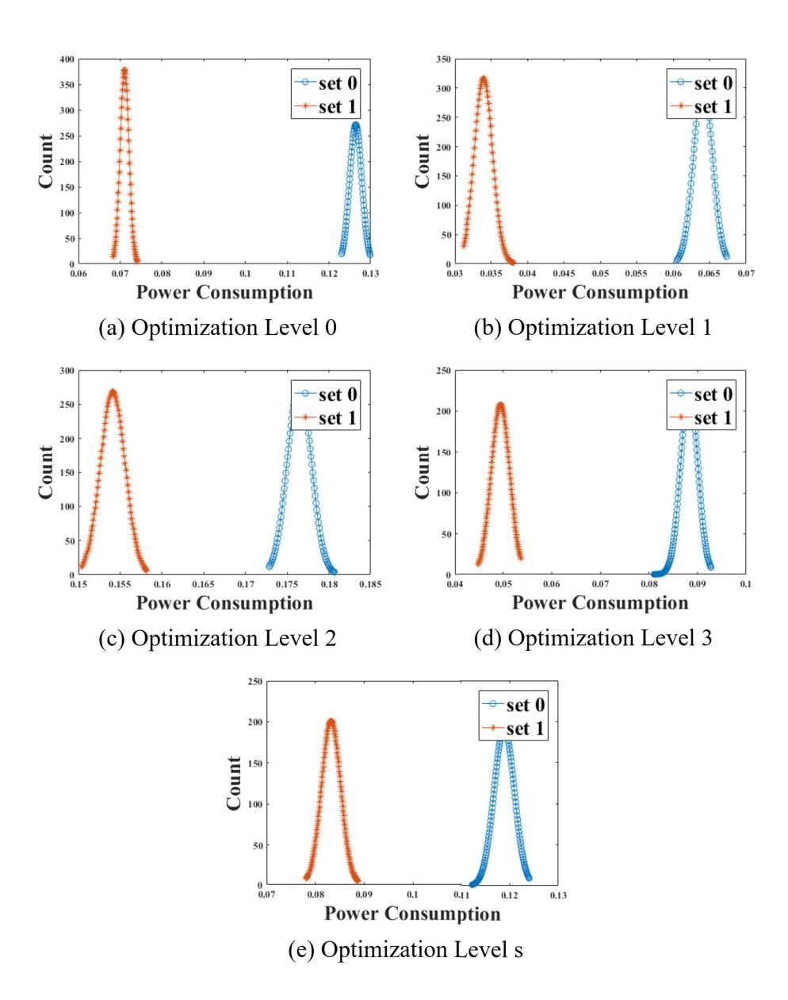

FIGURE 1. Distributions of Pols of message encoding in CRYSTALS-KYBER (set 0 and set 1 are  $\mathbb{G}_1$  and  $\mathbb{G}_2$ , respectively).

{5}------------------------------------------------

<span id="page-5-1"></span>

| Optimization Level | $E(\mathbb{G}_1)$     | $E(\mathbb{G}_2)$     | $ E(\mathbb{G}_1) - E(\mathbb{G}_2) $   SOST value |
|--------------------|-----------------------|-----------------------|----------------------------------------------------|
| -00                | 1.264143e-01          | 7.105207 <i>e</i> -02 | 5.237223 <i>e</i> -02   237970                     |
| -01                | 6.408548 <i>e</i> -02 | 3.397242 <i>e</i> -02 | 3.011306 <i>e</i> -02 70684                        |
| -02                | 1.764538e-01          | 1.541080 <i>e</i> -01 | 2.234580 <i>e</i> -02 29467                        |
| -03                | 8.828891 <i>e</i> -02 | 4.946987 <i>e</i> -02 | 3.881904 <i>e</i> -02   56015                      |
| -Os                | 1.188696e-01          | 8.322993 <i>e</i> -02 | 3.563967 <i>e</i> -02   38600                      |

**TABLE 3.** The Averages and Differences Between Two Sets of Figure 1.

encoded. The distributions are distinctly separated regardless of an optimization level. As shown in Table 3, when the optimization level is 0, *i.e.*, turn off optimization, the difference between  $E(\mathbb{G}_1)$  and  $E(\mathbb{G}_2)$  is the largest one. No error rate is observed as the distributions of PoIs are clearly distinguished, meaning that it is possible to recover the message  $\mu = (\mu_{\ell-1}, \cdots, \mu_1, \mu_0)_2$  with a success rate of 100% using Algorithm 2. In this article, we apply the k-means clustering algorithm, which is the most commonly used. As a result, we could generate a secret shared key K using the recovered  $\mu$ , public key pk, and ciphertext c, as shown in Algorithm 1.

#### <span id="page-5-0"></span>IV. PROPOSED SINGLE-TRACE ATTACK ON SABER

In this section, we describe the message encoding operation of SABER and a single-trace attack methodology on it. Besides, we show the experimental results when the algorithm is operating on ARM Cortex-M4 processors.

#### A. MESSAGE ENCODING IN SABER

SABER is based on a polynomial ring  $\mathcal{R}_q = \mathbb{Z}_q[x]/\langle x^n+1\rangle$  of dimension n=256 and modulus  $q=2^{13}$ . For the NIST security level 1, the first component of a ciphertext is of rank 2 over  $\mathcal{R}_q$ , *i.e.*, k=2 in Algorithm 3, and moduli p and t for Rounding are  $2^{10}$  and  $2^3$ , respectively. The bit length  $\ell$  of message  $\mu$  and shared key K is 256. Hash1 and Hash2 are SHA3-256 and SHA3-512, respectively. KDF is implemented using SHA3-256. Rounding\_{q,p}(x) is defined as rounding from modulus q to modulus p. Rounding\_{p,t}(x) is defined similarly. Algorithm 3 and Listing 2 describe message encapsulation and message encoding in SABER, respectively. In Listing 2, byte array message\_received is secret message  $\mu$ .

#### B. ATTACK METHODOLOGY

As shown at steps 6 to 12 of Listing 2, there is an identification phase of sensitive bit  $\mu_i$  to encode message  $\mu = (\mu_{\ell-1}, \cdots, \mu_1, \mu_0)_2$ . Notably, SABER scans one sensitive bit at a time during message encoding. Therefore, **message** $[i] = \mu_{\ell-1-i}$  after steps 6 to 12 of Listing 2, where  $0 \le i \le \ell - 1$ . In other words, each **message**[i] is 0 or 1. As the moduli of SABER are equal to the power of 2, steps 15 to 18 of Listing 2 are an operation that shifts each sensitive bit  $\mu_i$  by p-1 to the left. As a result, **message**[i] is whether  $0 \times 0000$  or  $0 \times 0200$  after steps 15 to 18 of Listing 2. The number of cases of each **message**[i] is two; however,

<span id="page-5-2"></span>**Algorithm 3** Message Encapsulation of SABER (Refer to [15])

```
Require: Public key pk = (a \in \mathcal{R}_q^{k \times k}, b \in \mathcal{R}_p^k)

Ensure: Ciphertext c \in \mathcal{R}_p^k \times \mathcal{R}_t, shared key K \in \{0, 1\}^\ell

1: /*Generate random message*/

2: \mu \leftarrow \{0, 1\}^\ell

3: \mu \leftarrow \text{Hash1}(\mu)

4: (\bar{K}, seed) = \text{Hash2}(\mu \parallel \text{Hash1}(pk))

5: /*Encryption*/

6: Sampling r \in \mathcal{R}_q^{k \times 1} using seed

7: c_1 = \text{Rounding}_{q,p}(ar \mod q)

8: c_2 = \text{Rounding}_{p,t}(b^\intercal(r \mod p) - \text{encode}(\mu) \mod p)

9: c = (c_1 \parallel c_2)

10: /*Shared key derivation*/

11: K = \text{KDF}(\bar{K} \parallel c)

12: Return c, K
```

```
void indcpa_kem_enc(unsigned char *message_received,
       unsigned char *noiseseed, const unsigned char *pk
       , unsigned char *ciphertext)
2 {
    uint16_t message[SABER_KEYBYTES * 8];
3
    // (omit)
4
    // unpack message received
5
    for(j = 0; j < SABER_KEYBYTES; j++)</pre>
6
7
    {
      for (i = 0; i < 8; i++)
8
        message[8 * j + i] = ((message_received[j] >> i)
10
        & 0x01);
11
12
    }
13
    // message encoding
14
    for(i = 0; i < SABER_N; i++)
15
16
    {
      message[i] = (message[i] \ll (SABER_EP - 1));
17
18
    // (omit)
19
20 }
```

<span id="page-5-3"></span>**Listing. 2.** Message Encoding encode( $\mu$ ) of SABER (in C code).

the difference in the Hamming weight between cases of each message[i] is 1. Accordingly, the **determiner** does not exist, and the power consumption property at steps 8 to 14 of Listing 2 can be categorized as follows.

<span id="page-5-4"></span>Property 2: Sensitive bit  $\mu_i$  is 0 or 1. Therefore, if  $\mu_i = 0$ , power consumption is proportional to 0 while extracting or

{6}------------------------------------------------


manipulating a  $\mu_i$  value. Similarly, if  $\mu_i = 1$ , then power consumption is proportional to 1.

The power consumption property at steps 15 to 18 of Listing 2 is the same as that represented at steps 6 to 12 of Listing 2. Unlike in the case of CRYSTALS-KYBER, the difference between the cases of each **message**[i] is only 1; therefore, we apply the ML-based PA. That is, we construct a template for each  $\mu_i$  value in the profiling phase and calculate a probability that a power consumption trace belongs to each template in the extraction phase. Thereafter, we find the value of  $\mu_i$  by selecting a template that has the highest probability. The ML-based PA automatically finds and combines specific PoIs by repeating the learning procedure. Therefore, we divide an attack range into two areas, rather than selecting specific points; the computational range in which  $\mu_i$  is extracted is defined as the first PoIs; the computational range in which  $\mu_i$  is shifted by p-1 to the left is defined as the second PoIs. As a result, we can recover message  $\mu = (\mu_{\ell-1}, \cdots, \mu_1, \mu_0)_2$  and generate secret shared key K.

#### C. EXPERIMENTAL RESULTS

The obtained experimental results indicated that message  $\mu = (\mu_{\ell-1}, \cdots, \mu_1, \mu_0)_2$  could be extracted using only a single trace. We measured 10,000 power consumption traces corresponding to different messages at a sampling rate of 29.54 MS/s when Listing 2 was operating on the ChipWhisperer UFO STM32F3 target board [26]. Implementations were compiled using gcc-arm-none-eabi-6-2017-q2-update, and we used compiler options as described in Table 2.

To identify the presence of leakage based on the value of sensitive bit  $\mu_i$ , we calculated the SOST values of power consumption traces. We divided power consumption traces into two groups,  $\mathbb{G}_1$  and  $\mathbb{G}_2$ , corresponding to  $\mu_i = 0$  and  $\mu_i = 1$ , respectively. It is possible to refer to Appendix A-B for a more detailed explanation. Figure 2 and Figure 3 illustrate the distributions of PoIs for 500 power consumption traces when the most significant bit  $\mu_{\ell-1}$  is encoded. Unlike in Figure 1, the distributions are overlapped. On average, the SOST values represented in Table 5 and Table 6 were respectively 110 times and 40 times smaller than those reported in Table 3. Accordingly, it was difficult to perfectly divide them into two groups using the clustering algorithms.

We constructed a network architecture, as shown in Table 4, to apply the ML-based PA. Here, x denotes the number of points of PoIs, and y is the number of classification labels. Power consumption corresponding to Property 2 occurred, and the information from multiple points was automatically combined while training. Therefore, we utilized three types of labels for training: 1-bit, 2-bit, and 8-bit values. In other words, we analyzed units of  $\mu_i$ ,  $(\mu_i, \mu_{i-1})_2$ , and  $(\mu_i, \dots, \mu_{i-7})_2$  at once for each type. Accordingly, y was set equal to 2, 4, and 256 for each label. We evaluated each ML model using 9-fold cross-validation, dividing the datasets for training and validation into 8,000 and 1,000 traces, respectively. After considering each profiling, we conducted 1,000 single-trace attacks. In other words, the number of

<span id="page-6-0"></span>**TABLE 4.** Network structure for ML-based PA.

| Layer               | node (in, out) | 1 | kernel initializer |
|---------------------|----------------|---|--------------------|
| InputLayer          | (x,x)          |   | -                  |
| Batch Normalization | (x,x)          |   | -                  |
| Dense               | (x, 32)        |   | he_uniform         |
| Batch Normalization | (32, 32)       |   | -                  |
| ReLU                | (32, 32)       |   | -                  |
| Dense               | (32, y)        |   | he_uniform         |
| Softmax             | (y,y)          |   | -                  |

- \* Input Normalization: all values are within the range of -1 and 1
- \* Loss function: categorical\_crossentropy
- \* Optimizer: Nadam (lr=0.0001, epsilon=1e-08)
- \* Label encoding: one-hot encoding
- \* Batch size and epochs: 10 and maximum 200, respectively
- \* 9-fold cross-validation (training: 8000, validation: 1000)

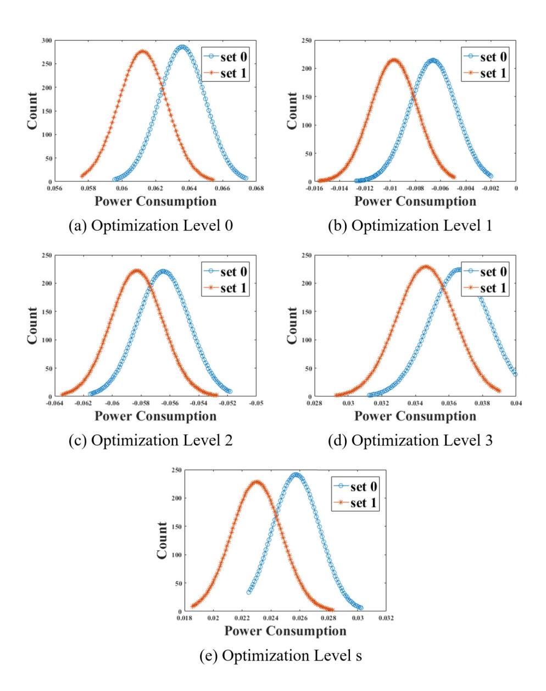

**FIGURE 2.** Distributions of the first Pols of message encoding in SABER (set 0 and set 1 are  $\mathbb{G}_1$  and  $\mathbb{G}_2$ , respectively).

traces to attack was 1,000, and we demonstrated the average values of success rates for nine profiled models in Table 4.<sup>1</sup> Besides, the experimental results included the average values of the success rates of attacks for the first eight most significant bits  $(\mu_{\ell-1}, \dots, \mu_{\ell-8})_2$ .

<span id="page-6-1"></span><sup>1</sup>We considered the generally used parameter sets and narrowed them by conducted several experiments. We focused on presenting the success possibility of the proposed ML-based PA using the parameters that resulted in achieving adequate performance. Finding optimal parameters would be an important and interesting topic, and we plan to investigate it in future research work.

{7}------------------------------------------------


| <b>TABLE 5.</b> The averages and differences between | n two sets of Fig | zure 2. |
|------------------------------------------------------|-------------------|---------|
|------------------------------------------------------|-------------------|---------|

<span id="page-7-2"></span>

| Optimization Level | $E(\mathbb{G}_1)$      | $E(\mathbb{G}_2)$      | $E(\mathbb{G}_1) - E(\mathbb{G}_2) $ | SOST value |
|--------------------|------------------------|------------------------|--------------------------------------|------------|
| -00                | 6.359049 <i>e</i> -02  | 6.123422 <i>e</i> -02  | 2.356270 <i>e</i> -03                | 344        |
| -01                | -6.598499 <i>e</i> -03 | -9.693878 <i>e</i> -03 | 3.095379 <i>e</i> -03                | 347        |
| -02                | -5.644457 <i>e</i> -02 | -5.830823 <i>e</i> -02 | 1.863660 <i>e</i> -03                | 134        |
| -03                | 3.662884 <i>e</i> -02  | 3.462072 <i>e</i> -02  | 2.008120 <i>e</i> -03                | 163        |
| -Os                | 2.574050 <i>e</i> -02  | 2.299686e-02           | 2.743640 <i>e</i> -03                | 326        |

**TABLE 6.** The averages and differences between two sets of Figure 3.

<span id="page-7-3"></span>

| Optimization Level | $E(\mathbb{G}_1)$      | $E(\mathbb{G}_2)$      | $ E(\mathbb{G}_1) - E(\mathbb{G}_2) $ SOST v |
|--------------------|------------------------|------------------------|----------------------------------------------|
| -00                | 5.484788 <i>e</i> -02  | 5.288561 <i>e</i> -02  | 1.962270 <i>e</i> -03 490                    |
| -01                | 2.096737 <i>e</i> -02  | 1.885364 <i>e</i> -02  | 2.113730 <i>e</i> -03 396                    |
| -02                | -4.135224 <i>e</i> -02 | -4.503360 <i>e</i> -02 | 3.681360 <i>e</i> -03 664                    |
| -03                | -9.629991 <i>e</i> -03 | -1.309303 <i>e</i> -02 | 3.463039 <i>e</i> -03   1025                 |
| -Os                | 1.176719 <i>e</i> -01  | 1.145635 <i>e</i> -01  | 3.108400 <i>e</i> -03   865                  |

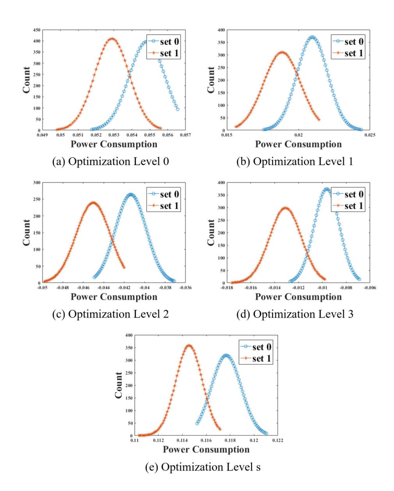

<span id="page-7-1"></span>FIGURE 3. Distributions of the second Pols of message encoding in SABER (set 0 and set 1 are  $\mathbb{G}_1$  and  $\mathbb{G}_2$ , respectively).

On average, the SOST values represented in Table 6 were 2.6 times larger than those provided in Table 5. The reason was that more information was generated at the second PoIs due to the operation that shifted each sensitive bit  $\mu_i$  by p-1 to the left. Therefore, in the case of using the second PoIs, it was possible to extract each 1-bit value

of  $\mu = (\mu_{\ell-1}, \dots, \mu_1, \mu_0)_2$  with a 100% success rate regardless of an optimization level (refer to Figure 9 (b) and Figure 10 (b) in Appendix A-B). Therefore, we could generate secret shared key K using recovered message  $\mu$ , public key pk, and ciphertext c, as shown in Algorithm 3. Whereas, in the case of using the first PoIs, it was difficult to recover each 1-bit value of  $\mu$  with a 100% success rate (refer to Figure 9 (a) and Figure 10 (a) in Appendix A-B). Accordingly, to identify the 1-bit value  $\mu_i$ , we combined the results of the 1-bit, 2-bit, and 8-bit value analysis, and applied the majority rule. Consequently, we could discover each 1-bit value  $\mu_i$  with over a 96.71% success rate. Then, we applied an exhaustive search of candidates to recover secret shared key K with a complexity  $2^{11}$  ( $\ell * 0.04 = 256 * 0.04 \approx 11$ ).

#### <span id="page-7-0"></span>V. PROPOSED SINGLE-TRACE ATTACK ON FrodoKEM

In this section, we describe the message encoding operation of FrodoKEM and a corresponding single-trace attack methodology. Besides, we show experimental results when the algorithm is operating on ARM Cortex-M4 processors.

#### A. MESSAGE ENCODING OF FrodoKEM

FrodoKEM is based on lattices over  $\mathbb{Z}_q$ . For the NIST security level 1, modulus  $q=2^{15}$  and dimension n=640. The secret key consists of  $\bar{n}=8$  vectors, and parameter  $\bar{m}=8$ . The bit length  $\ell$  of message  $\mu$  and shared key K is 128. Hash1 and KDF are SHAKE-128. Algorithm 4 and Listing 3 represent message encapsulation and message encoding in FrodoKEM, respectively. In Listing 3, in that is 16-bit integer array is secret message  $\mu$ .

#### B. ATTACK METHODOLOGY

As shown at steps 15 to 20 of Listing 3, there was an identification phase of sensitive bits  $(\mu_i, \mu_{i-1})_2$  to encode message

{8}------------------------------------------------


| <b>TABLE 7.</b> The success rates of the single-trace attacks on SAB | TABLE 7. | The success | rates of th | e single-trace | attacks or | SABER. |
|----------------------------------------------------------------------|----------|-------------|-------------|----------------|------------|--------|
|----------------------------------------------------------------------|----------|-------------|-------------|----------------|------------|--------|

<span id="page-8-1"></span>

| Optimization | First PoIs  |  |             |  |             |  |          | Second PoIs |
|--------------|-------------|--|-------------|--|-------------|--|----------|-------------|
| Level        | 1-bit value |  | 2-bit value |  | 8-bit value |  | Combined | 1-bit value |
| -00          | 100%        |  | -           |  | -           |  | -        | 100%        |
| -01          | 99.97%      |  | 99.89%      |  | 99.83%      |  | 99.97%   | 100%        |
| -02          | 99.90%      |  | 99.56%      |  | 99.53%      |  | 99.87%   | 100%        |
| -03          | 95.87%      |  | 83.12%      |  | 86.96%      |  | 96.71%   | 100%        |
| -0s          | 99.99%      |  | 99.96%      |  | 99.96%      |  | 99.98%   | 100%        |

<span id="page-8-0"></span>**Algorithm 4** Message Encapsulation of FrodoKEM (Refer to [9])

```
Require: Public key pk = (a \in \mathbb{Z}_q^{n \times n}, b \in \mathbb{Z}_q^{n \times \bar{n}})

Ensure: Ciphertext c \in \mathbb{Z}_q^{\bar{m} \times n} \times \mathbb{Z}_q^{\bar{m} \times \bar{n}}, shared key K \in \{0, 1\}^{\ell}

1: /*Generate random message*/

2: \mu \leftarrow \{0, 1\}^{\ell}

3: (seed, \bar{K}) = \text{Hash1}(\text{Hash1}(pk) \parallel \mu)

4: /*Encryption*/

5: Sampling r, e_1 \in \mathbb{Z}^{\bar{m} \times n} and e_2 \in \mathbb{Z}^{\bar{m} \times \bar{n}} using seed

6: c_1 = ra + e_1 \mod q

7: c_2 = rb + e_2 + \text{encode}(\mu) \mod q

8: c = (c_1 \parallel c_2)

9: /*Shared key derivation*/

10: K = \text{KDF}(c \parallel \bar{K})

11: Return c, K
```

```
void frodo_key_encode(uint16_t *out, const uint16_t *
        in)
2 {
    // Encoding
    unsigned int i, j, npieces_word = 8;
    unsigned int nwords = (PARAMS_NBAR * PARAMS_NBAR) /
5
       8:
    uint64_t temp, mask = ((uint64_t) 1 \ll
6
       PARAMS_EXTRACTED_BITS) - 1;
    uint16_t *pos = out;
    for(i = 0; i < nwords i++)
9
    {
10
      temp = 0;
11
       for(j = 0; j < PARAMS_EXTRACTED_BITS; j++)</pre>
12
          temp | = ((uint64_t)((uint8_t*)in)[i*
13
       PARAMS_EXTRACTED_BITS+j]) \ll (8 * j);
14
       for(j = 0; j < npieces\_word; j++)
15
16
         *pos=(uint16_t)((temp & mask)\ll(PARAMS_LOGQ-
17
       PARAMS_EXTRACTED_BITS));
        temp ≫= PARAMS_EXTRACTED_BITS;
18
19
         pos++;
20
       }
21
    }
22
  }
```

**Listing. 3.** Message Encoding encode( $\mu$ ) of FrodoKEM (in C code).

 $\mu = (\mu_{\ell-1}, \dots, \mu_1, \mu_0)_2$ . We denote  $(\mu_i, \mu_{i-1})_2$  as wvalue. Notably, FrodoKEM scans two sensitive bits at a time during message encoding. Therefore, the number of cases of the

extracted sensitive bits *wvalue* is four. Accordingly, the power consumption property at steps 15 to 20 of Listing 3 can be categorized as follows.

Property 3: The wvalue is in  $\{(00)_2, (01)_2, (10)_2, (11)_2\}$ . Accordingly, if wvalue =  $(00)_2$ , power consumption related to 0 occurs while extracting or saving the wvalue value. Similarly, if wvalue is non-zero, then power consumption is proportional to its Hamming weight.

Similarly to SABER, we apply the ML-based PA and select the computational range, where the *wvalue* is extracted, as PoIs. As a result, we can extract message  $\mu = (\mu_{\ell-1}, \dots, \mu_1, \mu_0)_2$  and generate secret shared key K.

### C. EXPERIMENTAL RESULTS

The results of the conducted experiments indicated that message  $\mu=(\mu_{\ell-1},\cdots,\mu_1,\mu_0)_2$  could be recovered using a single trace. We measured 10,000 power consumption traces of different messages at a sampling rate of 29.54 MS/s while Listing 3 was operating on the ChipWhisperer UFO STM32F3 target board [26]. Implementations were compiled using gcc-arm-none-eabi-6-2017-q2-update, and we used compiler options as described in Table 2.

To identify the presence of leakage based on the sensitive bits wvalue, we calculated the SOST value of power consumption traces. We divided power consumption traces into four groups:  $\mathbb{G}_1$ ,  $\mathbb{G}_2$ ,  $\mathbb{G}_3$ , and  $\mathbb{G}_4$ , associated with wvalue =  $(00)_2$ , wvalue =  $(01)_2$ , wvalue =  $(10)_2$ , and wvalue =  $(11)_2$ , respectively. It is possible to refer to Appendix A-C for a more detailed explanation. Figure 4 shows the distributions of PoIs of 500 power consumption traces when the most significant consecutive two bits  $(\mu_{\ell-1}, \mu_{\ell-2})_2$  are encoded. Four distributions according to the wvalue are overlaped; specifically, it can be seen that the distributions of  $\mathbb{G}_2$  and  $\mathbb{G}_3$  with the Hamming weight of 1 are almost the same. In case when the optimization level was 0, *i.e.*, turn off the optimization, the SOST value was the largest one, as the distributions of  $\mathbb{G}_2$  and  $\mathbb{G}_3$  were distinguishable compared with those of the other optimization levels.

On average, the SOST values represented in Table 8 were 90 times smaller than those indicated in Table 3 of Section III. Therefore, we applied the ML-based PA, which was the same analysis method as described in Section IV, and the labels for training were defined as 2-bit, 4-bit, and 8-bit values. In other

{9}------------------------------------------------


| Optimization Level | $E(\mathbb{G}_1)$ | $E(\mathbb{G}_2)$ | $E(\mathbb{G}_3)$ | $E(\mathbb{G}_4)$ | SOST value |
|--------------------|-------------------|-------------------|-------------------|-------------------|------------|
| -00                | 1.269287e-01      | 1.241036e-01      | 1.248361e-01      | 1.223927e-01      | 2635       |
| -01                | -1.329385e-02     | -1.557993e-02     | -1.593018e-02     | -1.867858e-02     | 395        |
| -02                | -4.104393e-03     | -6.006634e-03     | -6.859564e-03     | -8.867536e-03     | 281        |
| -03                | 8.939756e-02      | 8.808445e-02      | 8.822609e-02      | 8.636975e-02      | 481        |
| -Os                | -2.748210e-02     | -3.013717e-02     | -3.013611e-02     | -3.290936e-02     | 353        |

<span id="page-9-2"></span>**TABLE 8.** The averages and differences between four sets of Figure 4.

**TABLE 9. The success rates of the single-trace attacks on FrodoKEM.** 

<span id="page-9-3"></span>

| Optimization Level | 2-bit value | 4-bit value | 8-bit value | 2-bit HW | Combined 1 (value) | Combined 2 (HW) |
|--------------------|-------------|-------------|-------------|----------|--------------------|-----------------|
| -00                | 99.98%      | 99.93%      | 99.70%      | 99.96%   | 99.77%             | 99.95%          |
| -01                | 97.64%      | 95.50%      | 86.45%      | 99.66%   | 97.72%             | 99.75%          |
| -02                | 97.58%      | 99.84%      | 86.06%      | 94.88%   | 97.55%             | 99.80%          |
| -03                | 79.17%      | 73.60%      | 49.15%      | 85.75%   | 79.15%             | 90.57%          |
| -Os                | 98.56%      | 96.95%      | 91.16%      | 99.90%   | 98.50%             | 99.85%          |

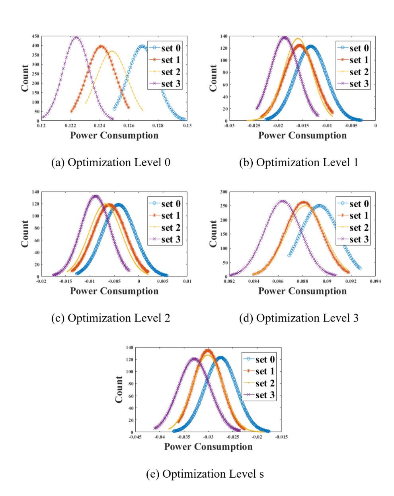

<span id="page-9-1"></span>FIGURE 4. Distributions of Pols of the message encoding of FrodoKEM (set 0, set 1, set2, and set3 are  $\mathbb{G}_1$ ,  $\mathbb{G}_2$ ,  $\mathbb{G}_3$ , and  $\mathbb{G}_4$ , respectively).

words, we analyzed the units of  $(\mu_i, \mu_{i-1})_2, (\mu_i, \dots, \mu_{i-3})_2$ , and  $(\mu_i, \dots, \mu_{i-7})_2$  at once for each type. Accordingly, y was set to 4, 16, and 256 for each label. Similarly to the case using the first PoIs of SABER, it was difficult to recover each *wvalue* with a success rate of 100% (refer to Figure 12 in Appendix A-C). Hence, we combined the results of the 2-bit, 4-bit, and 8-bit value analysis and applied the

majority rule. Consequently, we could discover the *wvalue* with a success rate of over 79.15%. If the optimization level was 0, the success rate increased to more than 99.77%. In the case of analyzing the Hamming weight value of *wvalue*, the success rate was over 90.57%. Accordingly, secret shared key *K* could be recovered by applying an exhaustive search of candidates.

#### <span id="page-9-0"></span>**VI. DISCUSSION**

# <span id="page-9-4"></span>A. APPLICATION TO OTHER 3RD ROUND LATTICE-BASED KEMs

In this section, we discuss the applicability of the proposed single-trace attacks to NTRU and NTRU Prime. We demonstrate how the three types of attacks described in Section III, Section IV, and Section V can be applied to each scheme. Target operations in message encoding of the encapsulation phase are described in Appendix B. There exists a **determiner** in the operations of NTRU and NTRU LPRime. The **determiner** defined in Listing 9 of NTRU LPRime is described as r[i]\*q12. Therefore, it is possible to cluster power consumption traces into two groups using the single-trace attack methodology that can be applied to CRYSTALS-KYBER. Clustered groups  $\mathbb{G}_1$ and  $\mathbb{G}_2$  represent the sensitive bit  $\mu_i$  value. Accordingly, we can recover message  $\mu$  using Algorithm 2 and then, we can generate secret shared key K using recovered  $\mu$  and public values.

$$\mathbf{r[i]*q12} = \begin{cases} 0 \times 0000, & if \ \mu_i = 0; \\ 0 \times 0906, & if \ \mu_i = 1. \end{cases}$$

In the case of NTRU,  $\mu_i$  is the sensitive coefficient corresponding to the set  $\{0, 1, 2\}$ . The **determiner** defined in

{10}------------------------------------------------


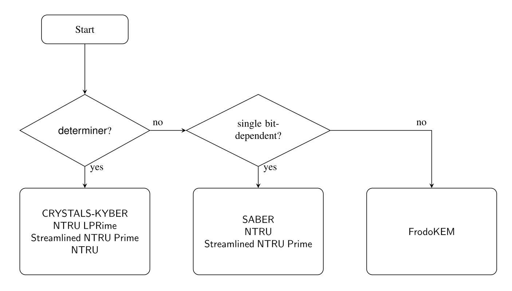

<span id="page-10-0"></span>**FIGURE 5.** Flowchart of our proposed attack.

Listing 7 of NTRU is described as follows.

$$(-(r \rightarrow \mathsf{coeffs[i]} \gg 1)) = \begin{cases} 0 \times 0000, & \textit{if } \mu_i = 0, 1; \\ 0 \times \mathsf{ffff}, & \textit{if } \mu_i = 2. \end{cases}$$

Therefore, the power consumption traces can be classified into two groups,  $\mathbb{G}_1$  and  $\mathbb{G}_2$ . However, unlike in the previous schemes, in the case of NTRU,  $\mathbb{G}_1$  includes both  $\mu_i = 0$  and  $\mu_i = 1$ . Therefore,  $\mathbb{G}_1$  should be divided into two groups, thereby requiring an additional attack methodology. The results of step 6 presented in Listing 7,

$$\begin{split} r \to \text{coeffs[i]} \mid & ((-(r \to \text{coeffs[i]} \gg 1)) \& (\text{NTRU\_Q} - 1)) \\ = \begin{cases} 0 \times 0000, & \textit{if } \mu_i = 0; \\ 0 \times 0001, & \textit{if } \mu_i = 1; \\ 0 \times 03 \text{ff}, & \textit{if } \mu_i = 2; \end{cases} \end{split}$$

can be divided into three groups. Therefore, it is possible to cluster each  $\mu_i$  into three groups by combining the attack methodologies that are applied to CRYSTALS-KYBER and SABER.

In Listing 8 of Streamlined NTRU Prime, secret message  $\mu$  is f and f[i] belongs to the set  $\{0, 1, -1\}$ . As f is an 8-bit integer array, f[i] is defined as below.

$$f[i] = \begin{cases} 0 \times 00, & \text{if } \mu_i = 0; \\ 0 \times 01, & \text{if } \mu_i = 1; \\ 0 \times \text{ff}, & \text{if } \mu_i = -1. \end{cases}$$

Hence, similarly as in NTRU, combining the attack methodologies that are applied to CRYSTALS-KYBER and SABER is required. Figure 5 shows the proposed attack flowchart.

*Remark:* We attached experimental results in Appendix A.

### **B. COUNTERMEASURES**

In this section, we discuss a countermeasure that can be used to increase the attack complexity, namely, to make an

```
1 b = (fyList[i] \gg 3); s = (fyList[i] & 7);
2 mask = -((msg[b] \gg s) \& 0x01);
```

**Listing. 4. Message Encoding with Fisher-Yates Shuffle for NewHope [2].** 

```
b = (fyList[i] >> 3); s = (fyList[i] & 7);\nunpack message received
message[8 * b + s] = ((message_received[b] >> s) & 0
```

**Listing. 5. Message Encoding with Fisher-Yates Shuffle for SABER.** 

```
1 b = (fyList[i] \gg 4);

2 temp |= ((uint64_t)((uint8_t*)in)[b*

PARAMS_EXTRACTED_BITS + j])\ll(8*j);
```

<span id="page-10-1"></span>**Listing. 6. Message Encoding with Fisher-Yates Shuffle for FrodoKEM.** 

attack more difficult. We consider that the masking scheme, which splits secret message  $\mu$  into two random messages  $\mu'$  and  $\mu''$  [37], is not a perfectly secure countermeasure. Since it is possible to recover  $\mu'$  and  $\mu''$  by applying the proposed single-trace attack twice, we can calculate  $\mu = \mu' \oplus \mu''$ . On the other hand, the shuffling scheme can properly counteract against the proposed attack. Listing 4 proposed by Amiet *et al.* [2] corresponds to NewHope; however, it can also be applied to CRYSTALS-KYBER. By modifying Listing 4, we construct Listing 5 and Listing 6 for SABER and FrodoKEM, respectively. Similarly, the shuffling scheme can be applied to NTRU, Streamlined NTRU Prime, and NTRU LPRime.

Although the proposed single-trace attacks can still be applied, however, it is impossible to determine the location of extracted bits as they are encoded in random order.

{11}------------------------------------------------

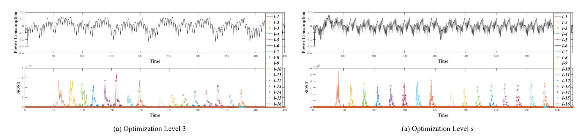

FIGURE 6. The power consumption trace of message encoding in CRYSTALS-KYBER (top) and the SOST values between two groups,  $\mathbb{G}_1$  and  $\mathbb{G}_2$ , of each  $\mu_i$  (bottom).

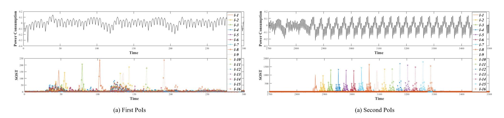

<span id="page-11-2"></span>FIGURE 7. Power consumption trace of message encoding in SABER when optimization level is 3 (top) and the SOST values between two groups,  $\mathbb{G}_1$  and  $\mathbb{G}_2$ , of each  $\mu_i$  (bottom).

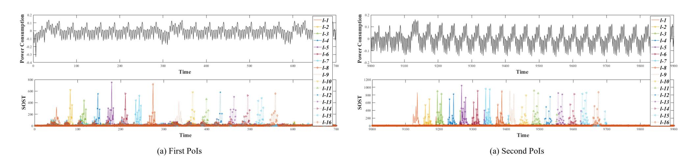

<span id="page-11-3"></span>FIGURE 8. Power consumption trace of message encoding in SABER when optimization level is s (top) and the SOST values between two groups,  $\mathbb{G}_1$  and  $\mathbb{G}_2$ , of each  $\mu_i$  (bottom).

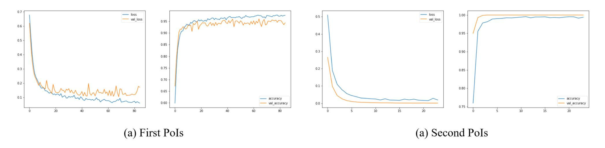

<span id="page-11-1"></span>FIGURE 9. Loss (left) and accuracy (right) over the epochs for training and validation (Optimization level 3, SABER, 1-bit  $\mu_{\ell-1}$  value).

Additional attacks on the shuffling scheme are required. Therefore, as mentioned in [2], by combining the shuffling with masking, it is possible to increase the attack complexity.

### <span id="page-11-0"></span>VII. CONCLUSION

In this article, we proposed the three types of single-trace attacks against CRYSTALS-KYBER, SABER, and FrodoKEM, targeting the message encoding operation of

{12}------------------------------------------------


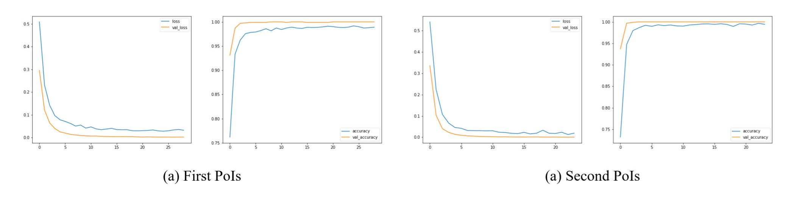

<span id="page-12-0"></span>**FIGURE 10.** Loss (left) and accuracy (right) over the epochs for training and validation (Optimization level s, SABER, 1-bit µ`−<sup>1</sup> value).

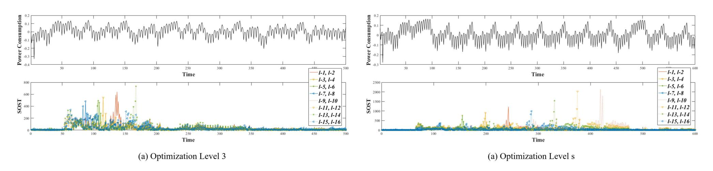

<span id="page-12-2"></span>**FIGURE 11.** Power consumption trace of the message encoding of FrodoKEM (top) and the SOST value between four groups, <sup>G</sup><sup>1</sup> , <sup>G</sup><sup>2</sup> , <sup>G</sup><sup>3</sup> , and <sup>G</sup><sup>4</sup> , of each wvalue (bottom).

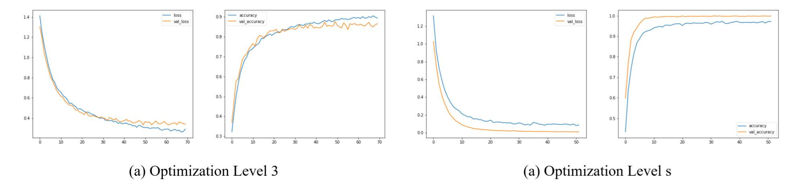

<span id="page-12-1"></span>**FIGURE 12.** Loss (left) and accuracy (right) over the epochs for training and validation (Optimization level 3 and s, FrodoKEM, 2-bit value).

the encapsulation phase. The observed experimental results indicated that it was possible to recover entire secret messages with asuccess rate of 100% for CRYSTALS-KYBER and SABER regardless of an optimization level. The message recovery success rate in FrodoKEM was over 79%. When the optimization level was 0, the success rate increased to more than 99.77%. We also demonstrated that the proposed attack methodologies were applicable to other KEMs including Streamlined NTRU Prime, NTRU LPRime, and NTRU. Finally, we recommended countermeasures, which were combining shuffling and masking schemes to increase the attack complexity.

# **APPENDIX A EXPERIMENT RESULTS**

# A. CRYSTALS-KYBER

Figure [6](#page-10-1) shows the SOST values between two groups, G<sup>1</sup> and G2, of each µ*<sup>i</sup>* , when the optimization levels were 3 and s, respectively. They also show that the PoIs are regularly distributed.

#### B. SABER

To identity the presence of leakage based on the value of sensitive bit µ*<sup>i</sup>* , we calculated the SOST value of power consumption traces. Figure [7](#page-11-2) and Figure [8](#page-11-3) show the SOST values between two groups, G<sup>1</sup> and G2, of each µ*<sup>i</sup>* , when the optimization levels were 3 and s, respectively. As shown in Figure [7](#page-11-2) (a), there was no regularity at the first PoIs when the optimization level was 3. However, when the optimization level was not 3, points with high SOST values in the first PoIs were regularly distributed as shown in Figure [8](#page-11-3) (a).

Figure [9](#page-11-1) and Figure [10](#page-12-0) show the ML-based PA results. In the case of using the second PoIs for profiling 1-bit value, the validation accuracy was 1 in all the optimization level. Hence, 1-bit values of µ = (µ`−1, · · · , µ1, µ0)<sup>2</sup> were

{13}------------------------------------------------

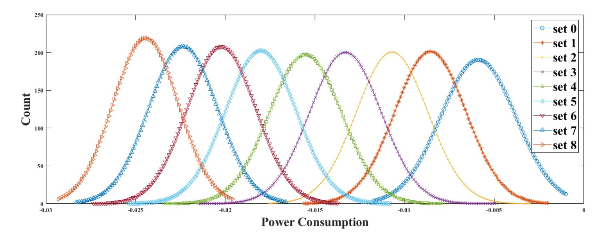

<span id="page-13-0"></span>**FIGURE 13.** Distributions according to the Hamming weight (Optimization Level 3).

**TABLE 10.** The success rates of the single-trace attacks on NTRU LPRime.

<span id="page-13-1"></span>

| Optimization Level | 1-bit value |
|--------------------|-------------|
| -00                | 99.99%      |
| -01                | 98.85%      |
| -02                | 97.37%      |
| -03                | 98.26%      |
| -Os                | 99.85%      |

recovered with a 100% success rate as shown in Table [7.](#page-8-1) Whereas, in the case of using the first PoIs for profiling 1-bit value, the validation accuracy was over 0.95. Thus, 1-bit values of µ = (µ`−1, · · · , µ1, µ0)<sup>2</sup> were recovered with over a 95% success rate as shown in Table [7.](#page-8-1)

# C. FrodoKEM

To identify the presence of leakage based on the sensitive *wvalue*, we calculated the SOST values of power consumption traces. Figure [11](#page-12-2) shows the SOST values between four groups when the optimization levels were 3 and s. As shown in Figure [11](#page-12-2) (a), there was no regularity when the optimization level was 3. However, when the optimization level was not 3, points with high SOST values were regularly distributed as shown in Figure [11](#page-12-2) (b).

Figure [12](#page-12-1) shows the ML-based PA results. For profiling 2-bit value, the validation accuracy was higher than 0.78 and 0.97, when the optimization levels were 3 and s, respectively. Hence, 2-bit values of µ = (µ`−1, · · · , µ1, µ0)<sup>2</sup> were recovered with over 78% and 97% success rates, respectively, as shown in Table [9.](#page-9-3)

#### D. NTRU LPRime

As shown in Figure [13,](#page-13-0) if the difference of the Hamming weight between the two values is greater than or equal to six, it is possible to distinguish two values by visual inspection in this experiment environment. However, in the case of NTRU LPRime, the difference of the Hamming weight of

<span id="page-13-2"></span>**TABLE 11.** The success rates of the single-trace attacks on Streamlined NTRU Prime.

| Optimization | 2-bit value |                     |                   |
|--------------|-------------|---------------------|-------------------|
| Level        |             | $\mu_i$ is 2 or not | $\mu_i$ is 0 or 1 |
| -00          |             | 100%                | 99.98%            |
| -01          |             | 100%                | 99.39%            |
| -02          |             | 100%                | 98.35%            |
| -03          |             | 100%                | 97.66%            |
| -0s          |             | 100%                | 96.15%            |

**Listing. 7.** Message Encoding encode(µ) of NTRU.

the elements of the determiner is 4. Therefore, we applied the ML-based PA to classify into two groups depending on a µ*<sup>i</sup>* value. Table [10](#page-13-1) shows experimental results.

#### E. STREAMLINED NTRU PRIME

In the case of Streamlined NTRU Prime, µ*<sup>i</sup>* is 0, 1, and 2, it is represented as (00)2, (01)2, and (10)2, respectively. Thus, finding µ*<sup>i</sup>* is the same as finding a 2-bit value. As mentioned in Section [VI-A,](#page-9-4) it is possible to distinguish µ*<sup>i</sup>* is 2 or not by using a clustering algorithm. The success rate was a 100% regardless of an optimization level. Therefore, classify the remaining sets, except when µ*<sup>i</sup>* is 2, as 0 and 1 by applying the ML-based PA. Table [11](#page-13-2) shows experimental results.

# F. NTRU

In the case of NTRU, µ*<sup>i</sup>* is 0, 1, and 2, it is represented as (00)2, (01)2, and (10)2, respectively. Thus, finding µ*<sup>i</sup>* is the

{14}------------------------------------------------


**Listing. 8.** Message Encoding encode(µ) of Streamlined NTRU Prime.

**Listing. 9.** Message Encoding encode(µ) of NTRU LPRime.

<span id="page-14-0"></span>**TABLE 12.** The success rates of the single-trace attacks on NTRU.

| Optimization | 2-bit value |                     |                   |
|--------------|-------------|---------------------|-------------------|
| Level        |             | $\mu_i$ is 2 or not | $\mu_i$ is 0 or 1 |
| -00          |             | 100%                | 100%              |
| -01          |             | 100%                | 100%              |
| -02          |             | 100%                | 100%              |
| -03          |             | 100%                | 99.99%            |
| -0s          |             | 100%                | 100%              |

same as finding a 2-bit value. As mentioned in Section [VI-A,](#page-9-4) there is a determiner in the operations of NTRU; thus, it is possible to distinguish µ*<sup>i</sup>* is 2 or not by using a clustering algorithm, with a 100% success rate regardless of an optimization level. Therefore, classify the remaining sets, except when µ*<sup>i</sup>* is 2, as 0 and 1 by applying the ML-based PA. Table [12](#page-14-0) shows experimental results.

# **APPENDIX B MESSAGE ENCODING**

The secret message µ in Listing [7,](#page-11-2) Listing [8,](#page-11-3) and Listing [9](#page-11-1) are r→coeffs, f, and r, respectively.

#### **REFERENCES**

- [1] E. Alkim, L. Ducas, T. Pöppelmann, and P. Schwabe, ''Post-quantum key exchange—A new hope,'' in *Proc. 25th USENIX Secur. Symp. (USENIX Secur.)*, 2016, pp. 327–343.
- [2] D. Amiet, A. Curiger, L. Leuenberger, and P. Zbinden, ''Defeating NewHope with a single trace,'' in *Proc. Int. Conf. Post-Quantum Cryptogr.* Springer 2020, pp. 189–205.
- [3] Y. Anzai, ''Pattern Recognition,'' in *Machine Learning*. Amsterdam, The Netherlands: Elsevier, 1992, doi: [10.1016/c2009-0-22409-3.](http://dx.doi.org/10.1016/c2009-0-22409-3)
- [4] A. Atici, L. Batina, B. Gierlichs, and I. Verbauwhede, ''Power analysis on NTRU implementations for RFIDs: First results,'' in *Proc. RFIDSec*, 2008, pp. 128–139.
- [5] A. Aysu, Y. Tobah, M. Tiwari, A. Gerstlauer, and M. Orshansky, ''Horizontal side-channel vulnerabilities of post-quantum key exchange protocols,'' in *Proc. IEEE Int. Symp. Hardw. Oriented Secur. Trust (HOST)*, Apr. 2018, pp. 81–88.
- [6] H. Baan, S. Bhattacharya, S. R. Fluhrer, O. Garcia-Morchon, T. Laarhoven, R. Rietman, M. O. Saarinen, L. Tolhuizen, and Z. Zhang, ''Round5: Compact and fast post-quantum public-key encryption,'' in *Proc. Int. Conf. Post-Quantum Cryptogr.* Springer, 2019, pp. 83–102.
- [7] T. Bartkewitz and K. Lemke-Rust, ''Efficient template attacks based on probabilistic multi-class support vector machines,'' in *Proc. Int. Conf. Smart Card Res. Adv. Appl.* Springer, 2012, pp. 263–276.
- [8] D. J. Bernstein, C. Chuengsatiansup, T. Lange, and C. van Vredendaal, ''NTRU prime: Reducing attack surface at low cost,'' in *Int. Conf. Sel. Areas Cryptogr.* Springer, 2017, pp. 235–260.
- [9] J. W. Bos, C. Costello, L. Ducas, I. N. M. Mironov, V. Nikolaenko, A. Raghunathan, and D. Stebila, ''Frodo: Take off the ring! practical, quantum-secure key exchange from LWE,'' in *Proc. ACM SIGSAC Conf. Comput. Commun. Secur.*, 2016, pp. 1006–1018.
- [10] J. Bos, L. Ducas, E. Kiltz, T. Lepoint, V. Lyubashevsky, J. M. Schanck, P. Schwabe, G. Seiler, and D. Stehle, ''CRYSTALS–kyber: A CCA-secure Module-Lattice-Based KEM,'' in *Proc. IEEE Eur. Symp. Secur. Privacy (EuroS&P)*, Apr. 2018, pp. 353–367.
- [11] J. W. Bos, S. Friedberger, M. Martinoli, E. Oswald, and M. Stam, ''Assessing the feasibility of single trace power analysis of Frodo,'' in *Int. Conf. Sel. Areas Cryptogr.* Springer, 2018, pp. 216–234.
- [12] S. Chari, J. R. Rao, and P. Rohatgi, ''Template attacks,'' in *Proc. Int. Workshop Cryptograph. Hardw. Embedded Syst.* Springer, 2002, pp. 13–28.
- [13] L. Chen, S. Jordan, Y. K. Liu, D. Moody, R. Peralta, R. Perlner, D. Smith-Tone, *Report on Post-Quantum Cryptography*. Gaithersburg, MD, USA: NIST, 2016. [Online]. Available: https://nvlpubs.nist. gov/nistpubs/ir/2016/NIST.IR.8105.pdf
- [14] J. H. Cheon, D. Kim, J. Lee, and Y. Song, ''Lizard: Cut off the tail! A practical post-quantum public-key encryption from LWE and LWR,'' in *Proc. Int. Conf. Secur. Cryptogr. Netw.* Springer, 2018, pp. 160–177.
- [15] J. D'Anvers, A. Karmakar, S. S. Roy, and F. Vercauteren, ''Saber: Module-LWR based key exchange, CPA-secure encryption and CCA-secure KEM,'' in *Proc. Int. Conf. Cryptol. Africa*. Springer, 2018, pp. 282–305.
- [16] J.-P. D'Anvers, M. Tiepelt, F. Vercauteren, and I. Verbauwhede, ''Timing attacks on error correcting codes in post-quantum schemes,'' in *Proc. ACM Workshop Theory Implement. Secur. Workshop (TIS)*, 2019, pp. 2–9.
- [17] M. Ester, H. Kriegel, J. Sander, and X. Xu, ''A density-based algorithm for discovering clusters in large spatial databases with noise,'' in *Proc. 2nd Int. Conf. Knowl. Discovery Data Mining*, 1996, pp. 226–231.
- [18] E. Fujisaki and T. Okamoto, ''Secure integration of asymmetric and symmetric encryption schemes,'' in *Proc. Annu. Int. Cryptol. Conf.* Springer, 1999, pp. 537–554.
- [19] K. Fukunaga and L. Hostetler, ''The estimation of the gradient of a density function, with applications in pattern recognition,'' *IEEE Trans. Inf. Theory*, vol. 21, no. 1, pp. 32–40, Jan. 1975.
- [20] B. Gierlichs, K. Lemke-Rust, and C. Paar, ''Templates vs. stochastic methods,'' in *Proc. Int. Workshop Cryptogr. Hardw. Embedded Syst.* Springer, 2006, pp. 15–29.
- [21] J. Heyszl, A. Ibing, S. Mangard, F. D. Santis, and G. Sigl, ''Clustering algorithms for non-profiled single-execution attacks on exponentiations,'' in *Proc. Int. Conf. Smart Card Res. Adv. Appl.* Springer, 2013, pp. 79–93.
- [22] J. Hoffstein, J. Pipher, and J. H. Silverman, ''NTRU: A ring-based public key cryptosystem,'' in *Proc. Int. Algorithmic Number Theory Symp.* Springer, 1998, pp. 267–288.
- [23] D. Hofheinz, K. Hövelmanns, and E. Kiltz, ''A modular analysis of the Fujisaki-Okamoto transformation,'' in *Proc. Theory Cryptogr. Conf.* Springer, 2017, pp. 341–371.

{15}------------------------------------------------


- [24] G. Hospodar, B. Gierlichs, E. De Mulder, I. Verbauwhede, and J. Vandewalle, ''Machine learning in side-channel analysis: A first study,'' *J. Cryptograph. Eng.*, vol. 1, no. 4, pp. 293–302, Dec. 2011.
- [25] W. Huang, J. Chen, and B. Yang, ''Power analysis on NTRU prime,'' *IACR Trans. Cryptograph. Hardw. Embedded Syst.*, vol. 1, pp. 123–151, Mar. 2020.
- [26] N.T. *ChipWhisperer UFO*. Accessed: Oct. 8, 2020. [Online]. Available: https://wiki.newae.com/CW308T-STM32F
- [27] P. C. Kocher, ''Timing attacks on implementations of Diffie-Hellman, RSA, DSS, and other systems,'' in *Proc. Annu. Int. Cryptol. Conf.* Springer, 1996, pp. 104–113.
- [28] P. C. Kocher, J. Jaffe, and B. Jun, ''Differential power analysis,'' in *Proc. Annu. Int. Cryptol. Conf.* Springer, 1999, pp. 388–397.
- [29] J. Lee, D. Kim, H. Lee, Y. Lee, and J. H. Cheon, ''RLizard: Post-quantum key encapsulation mechanism for IoT devices,'' *IEEE Access*, vol. 7, pp. 2080–2091, 2019.
- [30] M.-K. Lee, J. E. Song, D. Choi, and D.-G. Han, ''Countermeasures against power analysis attacks for the NTRU public key cryptosystem,'' *IEICE Trans. Fundam. Electron., Commun. Comput. Sci.*, vol. 93, no. 1, pp. 153–163, 2010.
- [31] L. Lerman, G. Bontempi, and O. Markowitch, ''Side channel attack: An approach based on machine learning,'' in *Proc. Int. Workshop Constructive Side-Channel Anal. Secure Design* Springer, 2011, pp. 29–41.
- [32] V. Lyubashevsky, C. Peikert, and O. Regev, ''On ideal lattices and learning with errors over rings,'' in *Proc. Annu. Int. Conf. Theory Appl. Cryptograph. Techn.* Springer, 2010, pp. 1–23.
- [33] S. Mangard, E. Oswald, and T. Popp, *Power Analysis Attacks–Revealing the Secrets of Smart Cards*. Springer, 2007.
- [34] M. Mariantoni. (2014). *Building a Superconducting Quantum Computer*. [Online]. Available: https://www.youtube.com/watch?v=wWHAs–HA1c
- [35] M. Mosca, ''Cybersecurity in an era with quantum computers: Will we be ready?'' *IEEE Secur. Privacy*, vol. 16, no. 5, pp. 38–41, Sep. 2018.
- [36] NIST. (2020). *Post-Quantum Cryptography, Round 3 Submissions, NIST Computer Security Resource Center*. [Online]. Available: https://csrc.nist.gov/News/2020/pqc-third-round-candidateannouncement
- [37] T. Oder, T. Schneider, T. Pöppelmann, and T. Güneysu, ''Practical CCA2-secure and masked ring-LWE implementation,'' *IACR Trans. Cryptograph. Hardw. Embedded Syst.*, vol. 2018, no. 1, pp. 142–174, 2018.
- [38] A. Park and D.-G. Han, ''Chosen ciphertext simple power analysis on software 8-bit implementation of ring-LWE encryption,'' in *Proc. IEEE Asian Hardw.-Oriented Secur. Trust (AsianHOST)*, Dec. 2016, pp. 1–6.
- [39] P. Pessl and R. Primas, ''More practical single-trace attacks on the number theoretic transform,'' in *Proc. Int. Conf. Cryptol. Inf. Secur. Latin Amer.* Springer, 2019, pp. 130–149.
- [40] R. Primas, P. Pessl, and S. Mangard, ''Single-trace side-channel attacks on masked lattice-based encryption,'' in *Proc. Int. Conf. Cryptograph. Hardw. Embedded Syst.* Springer, 2017, pp. 513–533.
- [41] P. Ravi, S. Bhasin, S. S. Roy, and A. Chattopadhyay, ''Drop by Drop you break the rock-Exploiting generic vulnerabilities in Lattice-based PKE/KEMs using EM-based physical attacks,'' IACR Cryptol. ePrint Arch., Tech. Rep. 549, 2020. [Online]. Available: https://eprint.iacr.org/2020/549
- [42] P. Ravi, S. S. Roy, A. Chattopadhyay, and S. Bhasin, ''Generic Sidechannel attacks on CCA-secure lattice-based PKE and KEMs,'' *IACR Trans. Cryptogr. Hardw. Embed. Syst.*, vol. 2020, no. 3, pp. 307–335, 2020.
- [43] O. Regev, ''On lattices, learning with errors, random linear codes, and cryptography,'' in *Proc. 37th Annu. ACM Symp. Theory Comput.*, 2005, pp. 84–93.
- [44] O. Reparaz, C. R. de, S. S. Roy, F. Vercauteren, and I. Verbauwhede, ''Additively homomorphic ring-LWE masking,'' in *Proc. Int. Conf. Post-Quantum Cryptogr.* Springer, 2016, pp. 233–244.
- [45] O. Reparaz, S. S. Roy, R. de Clercq, F. Vercauteren, and I. Verbauwhede, ''Masking ring-LWE,'' *J. Cryptograph. Eng.*, vol. 6, no. 2, pp. 139–153, Jun. 2016.
- [46] L. Rokach and O. Maimon, ''Clustering methods,'' in *The Data Mining and Knowledge Discovery Handbook*. Springer. 2005, pp. 321–352.
- [47] T. Saito, K. Xagawa, and T. Yamakawa, ''Tightly-secure key-encapsulation mechanism in the quantum random oracle model,'' in *Proc. Annu. Int. Conf. Theory Appl. Cryptograph. Techn.* Springer, 2018, pp. 520–551.

- [48] P. W. Shor, ''Algorithms for quantum computation: Discrete logarithms and factoring,'' in *Proc. 35th Annu. Symp. Found. Comput. Sci.*, 1994, pp. 124–134.
- [49] J. H. Silverman and W. Whyte, ''Timing attacks on NTRUEncrypt via variation in the number of hash calls,'' in *Proc. Cryptographers' Track RSA Conf.* Springer, 2007, pp. 208–224.


BO-YEON SIM received the B.S. degree in mathematics and the M.S. and Ph.D. degrees in information security from Kookmin University, Seoul, South Korea, in 2013, 2015, and 2020, respectively. She is currently working as a Research Professor with Kookmin University. Her research interests include side-channel attacks, cryptography, and implementation of information protection technology for the IoT.


JIHOON KWON received the B.S. degree in mathematics and the Ph.D. degree in information security from Korea University, Seoul, South Korea, in 2010 and 2018, respectively. He is currently a Senior Engineer with the Security Algorithm Team, Samsung SDS, Seoul. His research interests include cryptography and information security, and their efficient implementation.


JOOHEE LEE received the B.S. degree in mathematical education from Korea University, Seoul, South Korea, in 2013, and the Ph.D. degree from the Department of Mathematical Science, Seoul National University, South Korea, in 2019. She is currently a Senior Consultant with the Security Algorithm Team, Samsung SDS. Her current research interests include lattice cryptography, cryptographic protocols, and information security.


IL-JU KIM received the B.S. degree in mathematics from Kookmin University, Seoul, South Korea, in 2019, where he is currently pursuing the master's degree in financial information security. His speciality lies in the area of information security. His research interests include the side-channelanalysis, lattice-based cryptography, code-based cryptography, and financial IC card.

{16}------------------------------------------------


TAE-HO LEE received the B.S. degree in information security, cryptology, and mathematics from Kookmin University, Seoul, South Korea, in 2020, where he is currently pursuing the master's degree in financial information security. His speciality lies in the area of information security. His research interests include the side-channel-analysis of symmetric key and post quantum cryptosystems, and SIM card and IC card.


JIHOON CHO received the M.Math. degree in cryptography from the University of Waterloo and the Ph.D. degree in information security from the Royal Holloway University of London. He has worked as a Security Architect for mobile devices with LG Electronics, South Korea. He is currently the Director of the Security Research, Samsung SDS, South Korea.


JAESEUNG HAN received the B.S. degree in information security, cryptology, and mathematics from Kookmin University, Seoul, South Korea, in 2020, where he is currently pursuing the master's degree in financial information security. His research interests include side-channel attacks, symmetric key cryptography, and lattice-based cryptography.


HYOJIN YOON received the master's and Ph.D. degrees in mathematics and cryptography from Seoul National University. She is currently the Team Leader of the Security Algorithm Team, Samsung SDS.


DONG-GUK HAN received the B.S. and M.S. degrees in mathematics and the Ph.D. degree in engineering in information security from Korea University, Seoul, South Korea, in 1999, 2002, and 2005, respectively. He was a Postdoctoral Researcher with Future University Hakodate, Hokkaido, Japan. After finishing his Ph.D. course, he was then an Exchange Student with the Department of Computer Science and Communication Engineering, Kyushu University, Japan, from

April 2004 to March 2005. From 2006 to 2009, he was a Senior Researcher with the Electronics and Telecommunications Research Institute, Daejeon, South Korea. He is currently working as a Professor with the Department of Information Security, Cryptology, Mathematics, Kookmin University, Seoul. He is a member of KIISC, IEEK, and IACR.