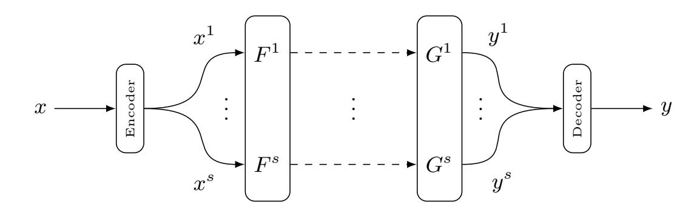
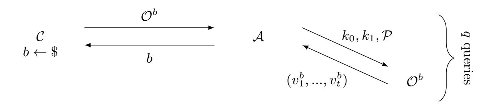
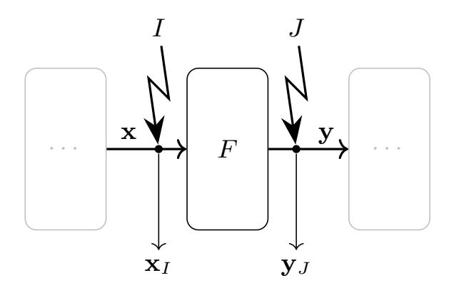
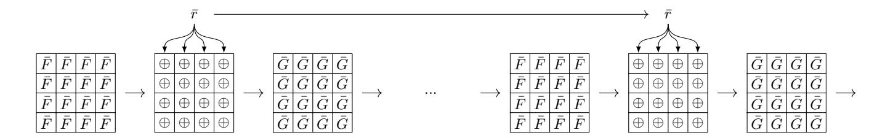
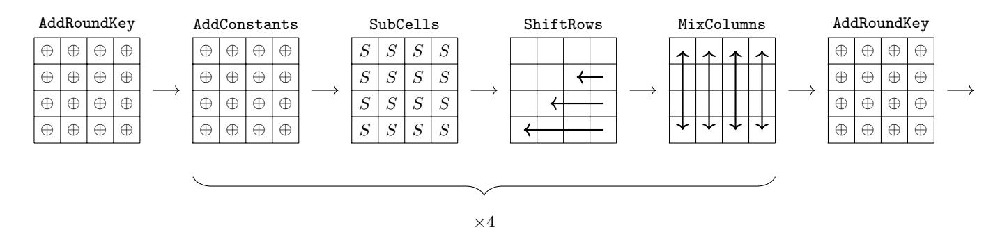
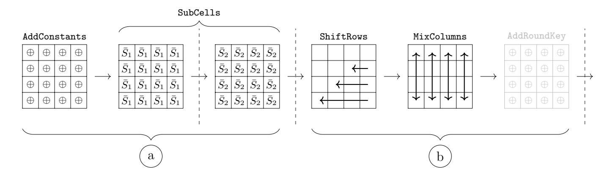
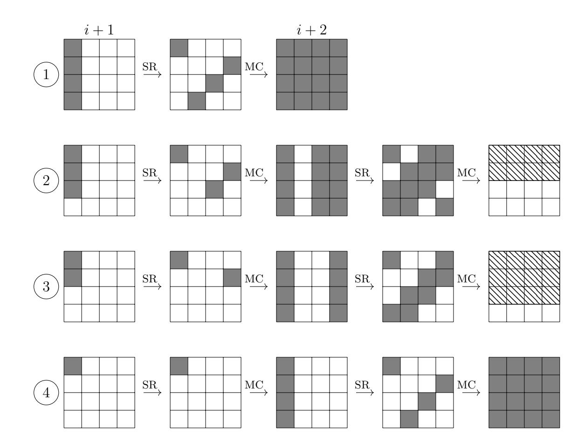
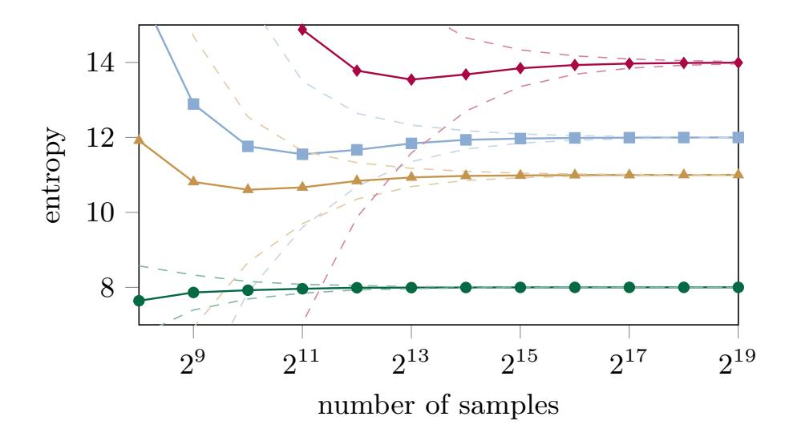

{0}------------------------------------------------

# Cryptanalysis of Masked Ciphers: A not so Random Idea

Tim Beyne, Siemen Dhooghe, and Zhenda Zhang

imec-COSIC, ESAT, KU Leuven, Belgium name.lastname@esat.kuleuven.be

Abstract A new approach to the security analysis of hardware-oriented masked ciphers against second-order side-channel attacks is developed. By relying on techniques from symmetric-key cryptanalysis, concrete security bounds are obtained in a variant of the probing model that allows the adversary to make only a bounded, but possibly very large, number of measurements. Specifically, it is formally shown how a boundedquery variant of robust probing security can be reduced to the linear cryptanalysis of masked ciphers. As a result, the compositional issues of higher-order threshold implementations can be overcome without relying on fresh randomness. From a practical point of view, the aforementioned approach makes it possible to transfer many of the desirable properties of first-order threshold implementations, such as their low randomness usage, to the second-order setting. For example, a straightforward application to the block cipher LED results in a masking using less than 700 random bits including the initial sharing. In addition, the cryptanalytic approach introduced in this paper provides additional insight into the design of masked ciphers and allows for a quantifiable trade-off between security and performance.

Keywords: Linear Cryptanalysis · Masking · Probing Security · Side-Channel Analysis · Threshold Implementations

## 1 Introduction

Side-channel attacks such as differential power analysis [\[29\]](#page-29-0) are an important concern for the security of implementations of cryptographic primitives in hardware and software. Accordingly, several adversarial models and side-channel countermeasures have been developed during the past two decades. Many of these countermeasures attempt to achieve security in the probing model of Ishai, Sahai and Wagner [\[28\]](#page-28-0), or slight variants thereof.

A common theme among different countermeasures is that they rely on splitting all secret variables in the circuit into d + 1 or more random shares. As demonstrated by Ishai et al. [\[28\]](#page-28-0), this approach can be used to achieve probing security against adversaries who can observe the values of up to d wires in the circuit. However, the probing security model is not quite sufficient for hardware-oriented countermeasures. Indeed, glitches may allow the adversary to 

{1}------------------------------------------------

obtain more than one wire value from a single probe. To counter this, Nikova, Rechberger, and Rijmen [\[35\]](#page-29-1) introduced the threshold implementation approach. From a formal point of view, the security of hardware-oriented countermeasures should be analyzed in a glitch-extended or robust probing model as formalized by Faust et al. [\[23\]](#page-28-1) and it can be shown that threshold implementations achieve such first-order robust probing security [\[21\]](#page-28-2).

Unsurprisingly, achieving probing security often comes at a cost with respect to area usage, latency, energy consumption, and so on. This paper is primarily concerned with another important cost factor, namely the reliance of many countermeasures on the availability of a large number of random bits. Creating these bits can be quite expensive, especially since their generation should also be gray-box secure. In this regard, first-order threshold implementations provide an efficient countermeasure. In particular, if one ensures that each circuit layer satisfies the so-called uniformity property, glitch-extended first-order probing security can be achieved without using any randomness beyond what is necessary to share the state. If instead good randomness is readily available, threshold implementations allow trading this off for reduced area [\[7\]](#page-27-0). At ASIACRYPT 2014, Bilgin et al. [\[6\]](#page-27-1) proposed a higher-order variant of threshold implementations. However, Reparaz [\[36\]](#page-29-2) later demonstrated that it succumbs to multivariate attacks. In further work at CRYPTO 2015, Reparaz et al. [\[37\]](#page-29-3) propose to use remasking with fresh randomness to address this issue. However, as pointed out by Moos et al. [\[32\]](#page-29-4), this and other schemes still lack a formal security analysis in the robust probing model.

As proposed by Faust et al. [\[23\]](#page-28-1), an alternative approach is to design sharings based on a robust variant of the strong non-interference framework of Barthe et al. [\[2\]](#page-27-2). This has the benefit of allowing formal security proofs, which rely on establishing the composability of different gadgets in the shared circuit. However, ensuring composability unfortunately comes at an inherent randomness cost. Amortizing this cost is possible to some extend, but remains nontrivial – see for instance the work of Faust, Paglialonga, and Schneider [\[24\]](#page-28-3) in the context of software-oriented masking. In addition, as for example pointed out by De Meyer, Wegener, and Moradi [\[20\]](#page-28-4), it is often desirable to mask Boolean functions directly as opposed to falling back to a gate-level approach. Although verifying larger gadgets directly is possible within the strong non-interference framework, it requires nontrivial tools such as maskVerif due to Barthe et al. [\[1\]](#page-27-3). Of course, this does not directly address how to design efficient sharings. Also, one might hope to quantify to what extend verification fails; in the words of Barthe et al.: "It would be interesting to extend our work beyond purely qualitative security definitions, and to consider quantitative definitions that upper bound how much leakage reveals about secrets – using total variation distance or more recent metrics that directly or indirectly relate to noisy leakage security" [\[1,](#page-27-3) §7].

Contribution. This paper overcomes the composability problem for second-order threshold implementations without relying on fresh randomness. As a result, second-order probing secure masked ciphers that require no or almost no randomness beyond what is necessary to share the input are obtained. In order to 

{2}------------------------------------------------

achieve these results, we introduce a variant of the probing model in which the adversary can make only a bounded number of queries. Our approach is based on a completely formal reduction from this model to the security of the masked cipher against linear cryptanalysis and leads to concrete upper bounds on the advantage (i.e. total variation distance) of such bounded-query adversaries.

From a practical point of view, our methods provide a means to reason about and to correct potential flaws in the higher-order threshold implementations of Bilgin et al. [\[6\]](#page-27-1). Importantly, the additional requirements imposed by our analysis are relatively easy to satisfy when the underlying cipher has been designed with linear cryptanalysis in mind. As a result, one can benefit from the desirable properties of first-order threshold implementations – in particular their low randomness requirements – while simultaneously maintaining demonstrable security in the second-order probing model with glitches.

From a theoretical point of view, this paper introduces a radically different approach to the security-evaluation of masked ciphers. Rather than attempting to show perfect probing security against adversaries making an arbitrary number of queries, we allow for a limited amount of leakage but show that it can not be exploited unless the adversary makes an infeasibly large number of measurements. In this approach, the concrete security bound of a masked cipher directly depends on the maximum absolute correlation of certain linear approximations over parts of the design. To estimate correlation upper bounds, standard techniques from linear cryptanalysis can be used. In particular, one can use the piling-up approximation. Although the latter is only a heuristic, it is an integral part of the security argument of essentially all modern symmetric-key primitives and is widely accepted to result in meaningful estimates if properly used. In a sense, the piling-up lemma acts as a substitute for the strong composability requirements that are typically imposed. An important advantage of this approach is that it provides additional insight into the design of masked ciphers, and allows for a quantifiable trade-off between performance and security. In addition, one can benefit from the large literature on the theory and practice of linear cryptanalysis.

After introducing a number of preliminaries in Section [2,](#page-3-0) a bounded-query variant of the glitch-extended probing model is formalized in Section [3.](#page-6-0) The reduction to linear cryptanalysis is spread over Sections [4](#page-8-0) and [5.](#page-11-0) To limit the scope of the paper, only second-order probing adversaries are considered. The possibility of further extensions to higher orders is discussed in Section [9.](#page-26-0)

Section [6](#page-14-0) presents a high-level overview of the properties the masked cipher needs to satisfy and the cryptanalytic process that should be followed to obtain concrete security bounds. Roughly speaking, for probes that are separated by a small number of rounds of the cipher, zero-correlation linear approximations can be exploited. If the adversary places its probes further apart, the analysis relies on upper bounds for the absolute correlation of linear approximations.

In Section [7,](#page-16-0) the framework developed in Sections [4](#page-8-0) to [6](#page-14-0) is illustrated by the design and analysis of a second-order masking of the block cipher LED [\[27\]](#page-28-5). The implementation requires a total 664 bits of randomness, i.e. 24 bits more 

{3}------------------------------------------------

than what is needed to share the plaintext and key, but no serious attempt was made to optimize this number. Note that the choice for LED was mainly motivated by didactical reasons: LED is a classical wide-trail design with 4-bit S-boxes, which results in a very transparent security analysis. A software-based simulation, which allows experimenting with our security claims, is found on GitLab [40].

The broader applicability of our approach is illustrated in Section 8. Finally, Section 9 summarizes several directions for future work and concludes the paper.

### 2 Preliminaries

This section introduces key concepts related to linear cryptanalysis and threshold implementations. The reader is assumed to have some, but not necessarily extensive, familiarity with these concepts. For convenience, all random variables in this paper are denoted in boldface. All other nonstandard notation will be introduced as necessary.

#### 2.1 Fourier Analysis

The relation between linear cryptanalysis and the Fourier transformation on vector spaces over  $\mathbb{F}_2$  is well-established [5,11,17]. This section introduces the necessary notation for two important concepts that will be used throughout this work. The first is the Fourier transformation of a probability distribution, or more generally any complex-valued function, on a vector space V over  $\mathbb{F}_2$ . The second is the notion of the correlation matrix of a function  $F: V \to V$ , the coordinates of which coincide with the correlations of linear approximations over F.

The definitions below are formulated for functions on an arbitrary subspace  $V \subseteq \mathbb{F}_2^n$ , as opposed to functions on  $\mathbb{F}_2^n$  itself – as is commonly the case. Since any vector space over  $\mathbb{F}_2$  is isomorphic to  $\mathbb{F}_2^n$  for some n, this generalization is mostly a matter of notation. Nevertheless, this extended notation will be very beneficial later on in this work.

Recall that the orthogonal complement of a subspace V of  $\mathbb{F}_2^n$  is the vector space  $V^{\perp} = \{x \in \mathbb{F}_2^n \mid \forall v \in V : v^{\top}x = 0\}$ . The quotient space  $\mathbb{F}_2^n/V^{\perp}$  is by definition the vector space of cosets of  $V^{\perp}$ . For convenience, an element  $x + V^{\perp} \in \mathbb{F}_2^n/V^{\perp}$  will simply be denoted by x. For  $x \in \mathbb{F}_2^n/V^{\perp}$  and  $v \in V$ , the expression  $x^{\top}v$  is well-defined. Consequently, the following definition is proper.

**Definition 1.** Let  $V \subseteq \mathbb{F}_2^n$  be a vector space and  $f: V \to \mathbb{C}$  be a complex-valued function on V. The Fourier transformation of f is a function  $\widehat{f}: \mathbb{F}_2^n/V^{\perp} \to \mathbb{C}$  defined by

$$\widehat{f}(u) = \sum_{x \in V} (-1)^{u^{\top} x} f(x),$$

where we write u for  $u + V^{\perp}$ . Equivalently,  $\widehat{f}$  is the representation of f in the basis of functions  $x \mapsto (-1)^{u^{\top} x}$  for  $u \in \mathbb{F}_2^n/V^{\perp}$ .

{4}------------------------------------------------

Remark 1. Unlike in standard treatments of the Fourier transformation on finite abelian groups [22,38], Definition 1 introduces  $\widehat{f}$  as a function on  $\mathbb{F}_2^n/V^{\perp}$  rather than on the Pontryagin dual group  $\widehat{V}$ . Throughout this document, the isomorphism  $\widehat{V} \cong \mathbb{F}_2^n/V^{\perp}$  is used to simplify notation. Other choices are possible, but this one is the most convenient.

As one often encounters transformations of random variables, it is convenient to encode the action of a function  $F:V\to V$  on probability distributions as a linear operator. The coordinate representation of this operator with respect to the standard basis  $\{\delta_x\}_{x\in V}$  may be called the transition matrix of F. Following [4,5], the correlation matrix of F is then the same operator expressed with respect to the Fourier basis. Note that correlation matrices were first introduced by Daemen et al. [17], where their definition is given in terms of concepts from linear cryptanalysis.

**Definition 2 (Transition matrix).** Let V be a set and  $F: V \to V$  a function. The transition matrix  $T^F$  of F is a real  $|V| \times |V|$  matrix such that, in the standard basis, if  $\mathbf{x}$  has probability mass function  $p_{\mathbf{x}}: V \to [0,1]$ , then  $F(\mathbf{x})$  has probability mass function  $T^F p_{\mathbf{x}}$ . Equivalently, indexing the coordinates of  $T^F$  by elements of V, we have  $T^F_{v,x} = \delta_{v,F(x)}$ .

**Definition 3 (Correlation matrix).** Let  $V \subseteq \mathbb{F}_2^n$  be an  $\mathbb{F}_2$ -vector space and  $F: V \to V$  a function. The correlation matrix  $C^F$  of F is the coordinate representation of the linear map defined by  $T^F$  with respect to the basis of character functions  $x \mapsto (-1)^{u^{\top}x}$  for  $u \in \mathbb{F}_2^n/V^{\perp}$ . Equivalently, indexing the coordinates of  $C^F$  by elements of  $\mathbb{F}_2^n/V^{\perp}$ , we have

$$C_{v,u}^F = \frac{1}{|V|} \sum_{x \in V} (-1)^{u^\top x + v^\top F(x)}.$$

The relation between Definition 3 and linear cryptanalysis is as follows: the coordinate  $C_{v,u}^F$  is equal to the correlation of a linear approximation over F with input mask u and output mask v. That is,  $C_{v,u}^F = 2 \Pr[v^\top F(\mathbf{x}) = u^\top \mathbf{x}] - 1$  for  $\mathbf{x}$  uniform random on V.

#### 2.2 Boolean Masking and Threshold Implementations

Boolean masking was independently introduced by Goubin and Patarin [25] and Chari et al. [12]. It serves as a sound and widely-deployed countermeasure against side-channel attacks. The technique is based on splitting each secret variable x in the circuit into shares  $\bar{x} = (x^1, x^2, \dots, x^{s_x})$  such that  $x = \sum_{i=1}^{s_x} x^i$  over a finite field K. If the field K is binary, this masking approach is referred to as Boolean masking. A random Boolean masking of a fixed secret is uniform if all sharings of that secret are equally likely.

There are many ways to modify a given circuit in order to ensure that it operates on shared inputs and intermediates. For example, this can be done at the

{5}------------------------------------------------

level of individual gates, or at a higher level involving generic Boolean functions. However, care must be taken to ensure that the sharing of the circuit is not only correct but also secure. This is especially challenging in hardware implementations due to the presence of glitches. Nikova et al. [35] introduced threshold implementations as a particular approach to share circuits. This approach achieves first-order glitch-extended probing security in the sense defined in Section 3 below. Later Bilgin et al. [6] generalized the threshold implementation approach in order to achieve higher-order univariate security. In the following, the main properties of threshold implementations are reviewed.

A threshold implementation consists of several layers of Boolean functions, as shown in Figure 1. As for any masked implementation, a black-box encoder function generates a uniform random sharing of the input before it enters the shared circuit and the output shares are recombined by a decoder function. At the end of each layer, synchronization is ensured by means of registers.

Figure 1. Schematic illustration of a threshold implementation assuming an equal number of input and output shares.

Let  $\bar{F}$  be a layer in the threshold implementation corresponding to a part of the circuit  $F: \mathbb{F}_2^n \to \mathbb{F}_2^m$ . For example, F might be the linear layer of a block cipher. The function  $\bar{F}: \mathbb{F}_2^{ns_x} \to \mathbb{F}_2^{ms_y}$ , where we assume  $s_x$  shares per input bit and  $s_y$  shares per output bit, will be called a *sharing* of F. Sharings can have a number of properties that are relevant in the security argument for a threshold implementation; these properties are summarized in Definition 4.

**Definition 4 (Properties of sharings [6, 35]).** Let  $F : \mathbb{F}_2^n \to \mathbb{F}_2^m$  be a function and  $\bar{F} : \mathbb{F}_2^{ns_x} \to \mathbb{F}_2^{ms_y}$  a sharing of F. The sharing  $\bar{F}$  is said to be

- 1. correct if  $\sum_{i=1}^{s_y} F^i(x^1, \dots, x^{s_x}) = F(x)$  for all  $x \in \mathbb{F}_2^n$  and for all shares  $x^1, \dots, x^{s_x} \in \mathbb{F}_2^n$  such that  $\sum_{i=1}^{s_x} x^i = x$ ,
- 2.  $d^{\text{th}}$ -order non-complete if any function in d or fewer component functions  $\bar{F}_i$  depends on at most  $s_x 1$  input shares,
- 3. uniform if  $\overline{F}$  maps a uniform random sharing of any  $x \in \mathbb{F}_2^n$  to a uniform random sharing of  $F(x) \in \mathbb{F}_2^m$ .

The correctness property from Definition 4 is an absolute minimum requirement to obtain a meaningful implementation. Furthermore, if all layers of a

{6}------------------------------------------------

threshold implementation are first-order non-complete and uniform, the resulting shared circuit can be proven secure in the first-order probing model considering glitches [\[21\]](#page-28-2). In the higher-order setting, the situation is more complicated. Using higher-order non-completeness and uniformity, one can secure a threshold implementation against higher-order univariate attacks. Nevertheless, perfect multivariate security can not be guaranteed using uniform sharings alone [\[36\]](#page-29-2). Instead, the threshold implementation approach was generalized to use fresh randomness [\[37\]](#page-29-3). However, even this last work has been shown to exhibit flaws against higher-order attacks [\[32\]](#page-29-4).

In Section [3,](#page-6-0) a variant of the probing model – which we call the boundedquery probing model – will be introduced. In the main body of this work, we will then show that the issues surrounding higher-order threshold implementations can be overcome if the bounded-query probing model is adopted.

## 3 A Bounded-Query Probing Model

Section [3.1](#page-6-1) introduces a variant of the threshold probing model of Ishai et al. [\[28\]](#page-28-0) in which the adversary can make only a bounded number of queries. In addition, Section [3.2](#page-7-0) discusses a further extension of this model in order to account for the effect of glitches.

### 3.1 Threshold Probing

Let ` ≥ t be positive integers. A t-threshold-probing adversary on F ` 2 is an algorithm A that interacts as follows with an oracle that holds an arbitrary sequence (x1, ..., x`) ∈ F ` 2 :

- 1. A may specify a set I = {i1, ..., i|I|} ⊂ {1, ..., `} of cardinality at most t,
- 2. A then receives (xi1 , . . . , xi|I| ).

Note in particular that the adversary A is computationally unbounded, and must specify the location of the probes before querying the oracle. However, the adversary can change the location of the probes over multiple queries.

Ishai et al. [\[28\]](#page-28-0) define a randomized stateless circuit C to be t-probing secure if it can be simulated from scratch such that no t-threshold probing adversary can distinguish Dec ◦ C ◦ Enc from the simulation. Importantly, the adversary's interaction with the circuit or simulator is mediated through the encoder and decoder algorithms Enc and Dec, neither of which can be probed.

In this work, the security of a circuit C with input k against a t-thresholdprobing adversary will be quantified by means of a left-or-right security game as depicted in Figure [2.](#page-7-1) The challenger picks a random bit b and provides the oracle Ob , to which adversary A is given query access. The adversary queries the oracle by choosing up to t wires to probe, we denote this set by P, and sends it to the oracle along with the inputs k0 and k1. Note that we consider the input of the circuit to consist of both the plaintext and the key. The oracle responds by giving back the probed wire values of C(kb). After a total of q queries, the 

{7}------------------------------------------------

adversary responds to the challenger with a guess for b. For  $b \in \{0,1\}$ , denote the result of the adversary after interacting with the oracle  $\mathcal{O}^b$  using q queries by  $\mathcal{A}^{\mathcal{O}^b}$ . For left-or-right security, the advantage of the adversary  $\mathcal{A}$  is then as defined as

$$Adv_{t-\mathsf{thr}}(\mathcal{A}) = |\Pr[\mathcal{A}^{\mathcal{O}^0} = 1] - \Pr[\mathcal{A}^{\mathcal{O}^1} = 1]|.$$

We refer to this security notion as the bounded-query probing model.

**Figure 2.** The privacy model for t-threshold-probing security consisting of a challenger C, an adversary A, a left-right oracle  $O^b$ , two inputs  $k_0, k_1$ , a set of probes P, and a set of probed wire values  $(v_1^b, ..., v_t^b)$  of the circuit  $C(k_b)$ .

If an arbitrary number of queries is allowed, the above security definition is equivalent to the simulation-based definition of Ishai et~al.~[28] for stateless circuits. Indeed, if the simulator simply evaluates the circuit for an arbitrary choice of the secret inputs, no adversary can distinguish the simulation from the real circuit with advantage higher than  $\mathrm{Adv}_{t\text{-thr}}(\mathcal{A})$ . We opt for the left-or-right formulation as this leads to a slightly more direct proof of Theorem 1 in Section 4. However, note that there exist stronger notions of security such as the strong non-interference model of Barthe et~al.~[2]. In the latter model, the adversary controls not only the unshared input of the circuit but also some of its shares. This is useful since probing security does not necessarily allow composition, as illustrated by Coron et~al.~[14]. As the approach developed in Sections 4 and 5 considers the circuit in its entirety, security under composition need not be considered. In fact, as our approach allows for secure sharings that do not use any randomness beyond what is necessary to encode the circuit input, it is clear that arbitrary composability cannot be achieved.

#### 3.2 Modeling Glitches

It has been shown that hardware glitches can result in significant leakage that is not accounted for by the probing model, see for example the attacks of Mangard et al. on several masked AES implementations [31]. Consequently, it is necessary to extend the capabilities of threshold probing adversaries in order to capture the physical effect of glitches on a hardware platform. In this work, we take a conservative approach to the modeling of glitches by bundling groups of wires over which a glitch could carry information from one wire to another. Whereas one of the adversary's probes normally results in the value of a single

{8}------------------------------------------------

wire, a glitch-extended probe allows obtaining the values of all wires in a bundle. This extension of the probing model has been discussed in the work of Reparaz et al. [37] and formalized by Faust et al. [23]. The formulation of the latter work is as follows: "For any  $\epsilon$ -input circuit gadget G, combinatorial recombinations (aka glitches) can be modeled with specifically  $\epsilon$ -extended probes so that probing any output of the function allows the adversary to observe all its  $\epsilon$  inputs."

In the setting of threshold implementations, the above extension can be simplified. Recall that each layer of a threshold implementation consists of Boolean functions  $\bar{F}_i$ , for which the synchronization of the inputs is ensured by means of registers. Thus, a glitch-extended probe placed in the circuit for  $\bar{F}_i$  yields at most all of the input bits on which  $\bar{F}_i$  depends – but no more, since the layers of a threshold implementation are separated by registers.

Note that, apart from the glitch extension of the probing model, other effects such as transition leakage can be considered. More information on other leakage effects can be found in the work of Faust et al. [23]. The scope of this work is limited to the modeling of the effects that are traditionally considered in threshold implementations, thus we only consider hardware implementations in the presence of glitches.

### 4 Bound on the Advantage

This section connects the bounded-query probing model from Section 3 to the cryptanalytic approach that will be developed in Sections 5 and 6. The link is established by means of Theorem 1 below, which provides an upper bound on the advantage of threshold probing adversaries in terms of the nontrivial Fourier coefficients of certain probability distributions associated with probed wire values. As a first step towards this result, the following lemma gives an upper bound on the entropy of a probability distribution in terms of its Fourier transform as defined in Definition 1 from Section 2.

**Lemma 1.** Let  $\mathbf{x}$  be a random variable on  $\mathbb{F}_2^m$  with probability distribution  $p_{\mathbf{x}}$ . It holds that

$$m - \mathsf{H}(\mathbf{x}) \le \|\widehat{p}_{\mathbf{x}} - \delta_0\|_2^2 / \log 2$$

where  $H(\mathbf{x})$  denotes the information entropy of  $\mathbf{x}$  with respect to the binary logarithm.

*Proof.* By definition, the binary information entropy of  $\mathbf{x}$  is the quantity

$$\mathsf{H}(\mathbf{x}) = -\mathbb{E}\log_2 p_{\mathbf{x}}(\mathbf{x}) \le m.$$

The goal is to upper bound the quantity  $m - H(\mathbf{x})$  in terms of the *correlations* of  $\mathbf{x}$ , or equivalently the coordinates of the Fourier transformation of  $p_{\mathbf{x}}$ . It holds that

$$\mathsf{H}(\mathbf{x}) \ge -\log_2 \mathbb{E} \, p_{\mathbf{x}}(\mathbf{x}) = -\log_2 \|p_{\mathbf{x}}\|_2^2,$$

{9}------------------------------------------------

due to Jensen's inequality. Note that the right-hand side is equal to the Rényi entropy of  $\mathbf{x}$ . Let  $\widehat{p}_{\mathbf{x}}$  denote the Fourier transformation of  $p_{\mathbf{x}}$ , then

$$\mathsf{H}(\mathbf{x}) \ge m - \log_2 \|\widehat{p}_{\mathbf{x}}\|_2^2.$$

Remark that  $\widehat{p}_{\mathbf{x}}(0) = 1$ , since  $p_{\mathbf{x}}$  is a probability mass function. Isolating this coefficient, one obtains

$$m - \mathsf{H}(\mathbf{x}) \le \log_2 \left( 1 + \|\widehat{p}_{\mathbf{x}} - \delta_0\|_2^2 \right) \le \|\widehat{p}_{\mathbf{x}} - \delta_0\|_2^2 / \log 2.$$

Note that the inequality in Lemma 1 is rather sharp since  $\|\widehat{p}_{\mathbf{x}} - \delta_0\|_2^2 \ll 1$  for the purposes of this work. Indeed  $\widehat{p}_{\mathbf{x}}$  will typically have a small support, thereby enabling the use of Fourier-analytic methods.

Before turning to the proof of Theorem 1, we briefly consider the content of its statement. The theorem essentially shows that for a bounded-query probing secure circuit, all probed wire values either closely resemble uniform randomness or reveal nothing about the secret input. The usefulness of the result comes from the fact that it allows 'bad' probe values. These are values that might leak information about the secret, but which nevertheless cannot be distinguished from uniform random values unless a very large number of probing queries is made. In practice, the 'bad' values will be shares of the state resulting from probes placed far apart (*i.e.* separated by many rounds). The 'good' values then correspond to probes that are placed in nearby locations, such as within an S-box. As will be clarified in Sections 6 and 7, the 'good' values can also play an important role in the analysis of the key-schedule of a masked cipher.

**Theorem 1.** Let  $\mathcal{A}$  be a t-threshold-probing adversary for a circuit C. Assume that for every query made by  $\mathcal{A}$  on the oracle  $\mathcal{O}^b$ , there exists a partitioning (depending only on the probe positions) of the resulting wire values into two random variables  $\mathbf{x}$  ('good') and  $\mathbf{y}$  ('bad') such that

- 1. The conditional probability distribution  $p_{\mathbf{y}|\mathbf{x}}$  satisfies  $\mathbb{E}_{\mathbf{x}} \|\widehat{p}_{\mathbf{y}|\mathbf{x}} \delta_0\|_2^2 \leq \varepsilon$ ,
- 2. Any t-threshold-probing adversary for the same circuit C and making the same oracle queries as A, but which only receives the 'good' wire values (i.e. corresponding to  $\mathbf{x}$ ) for each query, has advantage zero.

The advantage of A can be upper bounded as

$$Adv_{t-\mathsf{thr}}(\mathcal{A}) \leq \sqrt{2q\,\varepsilon}\,,$$

where q is the number of queries to the oracle  $\mathcal{O}^b$ .

*Proof.* The first part of the proof consists of a standard game-hopping argument. Consider the following two additional games:

1. Game 't-thr-good' is a modification of the t-threshold probing game in which the oracle  $\mathcal{O}^b$  replaces the 'bad' values in each query by uniform random values. In this game,  $\mathcal{A}$  essentially only receives information about 'good' wire values.

{10}------------------------------------------------

2. In the game ' $\Delta$ -bad', the adversary chooses a secret input k and is given access to an oracle with the same t-threshold-probing interface as  $\mathcal{O}^b$ . This oracle is either a t-threshold-probing oracle for the real circuit with input k, or a modification thereof in which the 'bad' values in each query are replaced by uniform random bits. The goal is to distinguish between these two cases.

We construct an adversary  $\mathcal{B}$  for the game ' $\Delta$ -bad' by running  $\mathcal{A}$ . Specifically,  $\mathcal{B}$  picks a uniform random bit b and forwards the corresponding secret  $k_b$  chosen by  $\mathcal{A}$  to its challenger. Adversary  $\mathcal{B}$  reports the oracle as real if and only if  $\mathcal{A}$  correctly recovers b. Hence,

$$\operatorname{Adv}_{t\text{-thr}}(\mathcal{A}) \leq \operatorname{Adv}_{t\text{-thr-good}}(\mathcal{A}) + 2\operatorname{Adv}_{\Delta\text{-bad}}(\mathcal{B}).$$

The factor two in front of  $Adv_{\Delta-bad}(\mathcal{B})$  is due to our definition of 'advantage', *i.e.* the absolute difference between the winning and failure probabilities of  $\mathcal{B}$ . It is given that  $Adv_{t-thr-good}(\mathcal{A}) = 0$ , so it suffices to upper bound  $Adv_{\Delta-bad}(\mathcal{B})$ .

Since  $\mathcal{B}$  makes exactly the same queries to its oracle as  $\mathcal{A}$ , the result of query i made by  $\mathcal{B}$  can also be partitioned into 'good' and 'bad' wire values. Denote these values by  $\mathbf{x}_i$  and  $\mathbf{y}_i$  respectively when  $\mathcal{B}$  is interacting with the real threshold probing oracle, and by  $\mathbf{x}'_i$  and  $\mathbf{y}'_i$  when  $\mathcal{B}$  interacts with the (partially) randomized oracle.

Let  $\delta_{\mathsf{TV}}(\cdot, \cdot)$  denote the total variation distance and  $\bigotimes$  the tensor product. The distinguishing advantage of the adversary  $\mathcal{B}$  is then upper bounded by

$$\operatorname{Adv}_{\Delta\text{-bad}}(\mathcal{B}) \leq \delta_{\mathsf{TV}} \left( \bigotimes_{i=1}^{q} p_{\mathbf{x}_{i}, \mathbf{y}_{i}}, \bigotimes_{i=1}^{q} p_{\mathbf{x}'_{i}, \mathbf{y}'_{i}} \right)$$

$$\leq \sqrt{\frac{1}{2}} D_{\mathsf{KL}} \left( \bigotimes_{i=1}^{q} p_{\mathbf{x}_{i}, \mathbf{y}_{i}} \| \bigotimes_{i=1}^{q} p_{\mathbf{x}'_{i}, \mathbf{y}'_{i}} \right)$$

$$\leq \sqrt{\frac{q}{2}} \max_{1 \leq i \leq q} D_{\mathsf{KL}} \left( p_{\mathbf{x}_{i}, \mathbf{y}_{i}} \| p_{\mathbf{x}'_{i}, \mathbf{y}'_{i}} \right),$$

where  $D_{\mathsf{KL}}$  denotes the Kullback-Leibler divergence and the second inequality is due to Pinsker. By definition of ' $\Delta$ -bad', the random variables  $\mathbf{x}_i$  and  $\mathbf{x}'_i$  have the same probability distribution. Consequently,

$$D_{\mathrm{KL}}(p_{\mathbf{x}_{i},\mathbf{y}_{i}} \| p_{\mathbf{x}_{i}',\mathbf{y}_{i}'}) = \mathbb{E}_{\mathbf{t}} D_{\mathrm{KL}}(p_{\mathbf{y}_{i}|\mathbf{x}_{i}=\mathbf{t}} \| p_{\mathbf{y}_{i}'|\mathbf{x}_{i}'=\mathbf{t}}).$$

Finally, remark that  $\mathbf{y}'_i$  is uniformly distributed and independent of  $\mathbf{x}_i$ . If the number of bits of  $\mathbf{y}_i$  is denoted by  $m_i$ , then

$$D_{\mathrm{KL}}(p_{\mathbf{y}_i|\mathbf{x}_i=t} \| p_{\mathbf{y}_i'|\mathbf{x}_i'=t}) = (m_i - \mathsf{H}(\mathbf{y}_i|\mathbf{x}_i) \log 2 \le \|\widehat{p}_{\mathbf{y}_i|\mathbf{x}_i} - \delta_0\|_2^2.$$

The inequality above follows from Lemma 1. Since it is given that, for all i,  $\mathbb{E}_{\mathbf{x}_i} \|\widehat{p}_{\mathbf{y}_i|\mathbf{x}_i} - \delta_0\|_2^2 \leq \varepsilon$ , we have

$$\mathrm{Adv}_{\Delta\operatorname{-bad}}(\mathcal{B}) \leq \sqrt{\frac{q\,\varepsilon}{2}}.$$

Hence, we conclude that

$$\operatorname{Adv}_{t\text{-thr}}(\mathcal{A}) \leq 2\operatorname{Adv}_{\Delta\text{-bad}}(\mathcal{B}) \leq \sqrt{2q\,\varepsilon}.$$

{11}------------------------------------------------

### 5 Fourier Analysis of Shared Functions

Theorem 1 provides an upper bound on the advantage of t-threshold probing adversaries in terms of the Fourier coefficients of the probability distribution of observed wire values. This section clarifies why it is beneficial to express the advantage upper bound in this particular form. Specifically, it will be shown that this reveals a strong link with the linear cryptanalysis of shared functions.

#### 5.1 Restrictions of Shared Functions

Remark that all probability distributions referred to in Theorem 1 are with respect to a fixed value of the secret inputs. Consequently, it is clear that the relevant Fourier coefficients can not be directly related to the Walsh-Hadamard coefficients (or equivalently, the correlation matrix) of the shared function itself. Instead, the relevant properties are those of restrictions of the shared function to sets of all valid sharings of a specific secret. Below, we argue that these restrictions are indeed well-defined and that they come with a natural notion of linear cryptanalysis.

Recall from Section 2 that Boolean masking and threshold implementations are based on linear secret sharing. In general, any  $\mathbb{F}_2$ -linear secret sharing scheme can be thought of as an algorithm that maps a secret  $x \in \mathbb{F}_2^n$  to a random element of a corresponding coset of a vector space  $\mathbb{V} \subset \mathbb{F}_2^\ell$ . The vector space  $\mathbb{V}$  consists of all possible sharings of  $0 \in \mathbb{F}_2^n$ . Let  $\rho : \mathbb{F}_2^n \to \mathbb{F}_2^\ell$  be a map that sends secrets to their corresponding coset representative.

Example. In Boolean masking, a secret  $x \in \mathbb{F}_2$  is shared as  $(x^1, \dots, x^{\ell})$  where  $x^1, \dots, x^{\ell-1}$  is sampled uniformly at random and  $x^{\ell} = x + \sum_{i=1}^{\ell-1} x^i$ . In this case,  $\mathbb{V}$  corresponds to the parity bit code

$$\mathbb{V} = \{(x^1, \dots, x^\ell) \in \mathbb{F}_2^\ell \mid \sum_{i=1}^\ell x^i = 0\}.$$

Furthermore, one possible choice of  $\rho$  is  $\rho(x) = (x, 0, \dots, 0)$ .

Let  $F: \mathbb{F}_2^n \to \mathbb{F}_2^n$  be any function. A function  $\bar{F}: \mathbb{F}_2^\ell \to \mathbb{F}_2^\ell$  is said to be a correct sharing of F if, for all  $x \in \mathbb{F}_2^n$ ,

$$\bar{F}(\rho(x) + \mathbb{V}) \subseteq \rho(F(x)) + \mathbb{V}.$$
 (1)

If  $\bar{F}$  is a uniform sharing, then the above inclusion is in fact an equality. For convenience, let  $\mathbb{V}_a = a + \mathbb{V}$ . Due to (1), the restriction of  $\bar{F}$  to  $\mathbb{V}_a$  is a well-defined function  $\mathbb{V}_a \to \mathbb{V}_b$  whenever  $a = \rho(x)$  and  $b = \rho(F(x))$  for some  $x \in \mathbb{F}_2^n$ . By slight abuse of notation, the same notation will be used for  $\bar{F}$  and for its restrictions.

Any random variable  $\mathbf{x}$  on  $\mathbb{V}_a$  has a corresponding probability mass function  $p_{\mathbf{x}}: \mathbb{V}_a \to [0,1]$ . Since  $\mathbb{V}$  is a vector space, the Fourier transformation  $\widehat{p}_{a+\mathbf{x}}$  of  $p_{a+\mathbf{x}}$  is well-defined (see Definition 1). In addition, for any restriction  $\overline{F}: \mathbb{V}_a \to \mathbb{V}_b$ , the correlation matrix of  $x \mapsto \overline{F}(a+x) + b$  is well defined by Definition 3. For convenience, we introduce the following definition (with slight abuse of notation). Note that it does not depend on the choice of the coset representatives a and b.

{12}------------------------------------------------

**Definition 5.** For  $\mathbb{V} \subseteq \mathbb{F}_2^{\ell}$ , let  $\bar{F}: \mathbb{V}_a \to \mathbb{V}_b$  be a well-defined restriction of a shared function. Let  $\bar{F}'(x) = \bar{F}(x+a) + b$ . The absolute correlation matrix  $|C^F|$  of  $\bar{F}$  is defined as the matrix with coordinates

$$|C_{v,u}^{\bar{F}}| = |C_{v,u}^{\bar{F}'}|,$$

for  $u, v \in \mathbb{F}_2^{\ell}/\mathbb{V}^{\perp}$ .

#### 5.2 Correlations between Probed Values

As shown in Section 4, the advantage of a probing adversary against the circuit can be upper bounded in terms of  $\|\widehat{p}_{\mathbf{z}} - \delta_0\|_2$  where  $p_{\mathbf{z}}$  is the probability distribution of any measured set of 'bad' wire values, possibly conditioned on several 'good' wire values. Note that the conditioning on 'good' values simply corresponds to fixing some variables in the circuit to constants before applying the results below. This section provides the essential link between  $\widehat{p}_{\mathbf{z}}$  and the linear cryptanalysis of the shared circuit that will enable us to upper bound the quantity  $\|\widehat{p}_{\mathbf{z}} - \delta_0\|_2$  for a concrete masked cipher in Section 7.

For simplicity, from this point on, we only consider second-order probing adversaries. For a brief outlook on how these results could be extended to third-order security and higher, the reader is referred to Section 9. To obtain the desired link with linear cryptanalysis, it will be shown that the coordinates of  $\hat{p}_{\mathbf{z}}$  are entries of the correlation matrix of the state-transformation between the specified probe locations. This is illustrated in Figure 3.

**Figure 3.** Two probes giving the observation  $\mathbf{z} = (\mathbf{x}_I, \mathbf{y}_J)$ .

The main result is stated in Theorem 2. To obtain it, the following property of correlation matrices will be used.

**Lemma 2.** Let  $\mathbb{V} \subset \mathbb{F}_2^{\ell}$  be a set of correct sharings and  $L: \mathbb{V} \to \mathbb{F}_2^m$  a linear map. If  $\mathbf{x}$  is a random variable with probability distribution  $p_{\mathbf{x}}$ , then it holds that

$$\widehat{p}_{L\mathbf{x}}(u) = \widehat{p}_{\mathbf{x}}(L^{\top}u),$$

where we write  $L^{\top}u = L^{\top}u + \mathbb{V}^{\perp}$  as usual.

{13}------------------------------------------------

*Proof.* The result is a well-known property, see [5, Theorem 3.5] for the general case. For completeness, we provide a short derivation. Remark that  $p_{L\mathbf{x}}(z) = \sum_{x \in \mathbb{V}} p_{\mathbf{x}}(x) \, \delta_{Lx}(z)$ . Hence, by the definition of the Fourier transformation, it holds that

$$\widehat{p}_{L\mathbf{x}}(u) = \sum_{z \in \mathbb{F}_2^m} (-1)^{u^{\top} z} p_{L\mathbf{x}}(z) = \sum_{x \in \mathbb{V}} p_{\mathbf{x}}(x) \left( \sum_{z \in \mathbb{F}_2^m} (-1)^{u^{\top} z} \delta_{Lx}(z) \right).$$

This simplifies to

$$\widehat{p}_{L\mathbf{x}}(u) = \sum_{x \in \mathbb{V}} (-1)^{u^{\top}Lx} p_{\mathbf{x}}(x) = \widehat{p}_{\mathbf{x}}(L^{\top}u).$$

For an index set  $I = \{i_1, \ldots, i_m\}$ , we denote the restriction of  $x \in \mathbb{V}$  to I by  $x_I = (x_{i_1}, \ldots, x_{i_m}) \in \mathbb{F}_2^{|I|}$ . Note that the maps  $x \mapsto x_I$  and its restriction to  $\mathbb{V}$  are linear.

**Theorem 2.** Let  $F: \mathbb{V}_a \to \mathbb{V}_b$  be a function with  $\mathbb{V} \subset \mathbb{F}_2^{\ell}$  and  $I, J \subset \{1, \dots, \ell\}$ . For  $\mathbf{x}$  uniform random on  $\mathbb{V}_a$  and  $\mathbf{y} = F(\mathbf{x})$ , let  $\mathbf{z} = (\mathbf{x}_I, \mathbf{y}_J)$ . The Fourier transformation of the probability mass function of  $\mathbf{z}$  then satisfies

$$|\widehat{p}_{\mathbf{z}}(u,v)| = |C_{\widetilde{v},\widetilde{u}}^F|,$$

where  $\widetilde{u}, \widetilde{v} \in \mathbb{F}_2^{\ell}/\mathbb{V}^{\perp}$  are such that  $\widetilde{u}_I = u$ ,  $\widetilde{u}_{[\ell]\setminus I} = 0$ ,  $\widetilde{v}_J = v$  and  $\widetilde{v}_{[\ell]\setminus J} = 0$ .

*Proof.* Note that  $(a + \mathbf{x}, b + \mathbf{y})$  is a well-defined random variable on  $\mathbb{V}^2$ . Let  $\mathbf{z}' = (a_I, b_J) + \mathbf{z}$ , then  $|\widehat{p}_{\mathbf{z}}(u, v)| = |\widehat{p}_{\mathbf{z}'}(u, v)|$ . Due to Lemma 2, the distribution of  $\mathbf{z}'$  satisfies

$$\widehat{p}_{\mathbf{z}'}(u,v) = \widehat{p}_{a+\mathbf{x},b+\mathbf{y}}(\widetilde{u},\widetilde{v}).$$

The probability distribution of  $(a + \mathbf{x}, b + \mathbf{y})$  satisfies

$$p_{a+\mathbf{x},b+\mathbf{y}} = (I \otimes T^G)p_{a+\mathbf{x},a+\mathbf{x}},$$

where G(x) = F(x+a) + b. Taking the Fourier transformation, one obtains

$$\widehat{p}_{a+\mathbf{x},b+\mathbf{y}} = (I \otimes C^G)\widehat{p}_{a+\mathbf{x},a+\mathbf{x}}.$$

Note that, by the definition of  $|C^F|$ , it holds that  $|C^F_{\widetilde{v},\widetilde{u}}| = |C^G_{\widetilde{v},\widetilde{u}}|$ . Combining the results above, one obtains

$$\widehat{p}_{\mathbf{z}'}(u,v) = \sum_{u',v' \in \mathbb{F}_2^{\ell}/\mathbb{V}^{\perp}} \delta_{\widetilde{u},u'} C_{\widetilde{v},v'}^G \widehat{p}_{a+\mathbf{x},a+\mathbf{x}}(u',v')$$

$$= \sum_{v' \in \mathbb{F}_2^{\ell}/\mathbb{V}^{\perp}} C_{\widetilde{v},v'}^G \widehat{p}_{a+\mathbf{x},a+\mathbf{x}}(\widetilde{u},v')$$

$$= \sum_{v' \in \mathbb{F}_2^{\ell}/\mathbb{V}^{\perp}} C_{\widetilde{v},v'}^G \widehat{p}_{a+\mathbf{x}}(\widetilde{u}+v').$$

{14}------------------------------------------------

Since  $p_{a+\mathbf{x}}$  is the uniform distribution on  $\mathbb{V}$ , it holds that  $\widehat{p}_{a+\mathbf{x}} = \delta_0$ . It follows that all terms except  $v' = \widetilde{u}$  in the sum above vanish, whence  $|\widehat{p}_{\mathbf{z}}(u,v)| = |C_{\widetilde{v},\widetilde{u}}^F|$ .

Theorem 2 relates the linear approximations of F to  $\widehat{p}_{\mathbf{z}}(u)$  and hence provides a method to upper bound  $\|\widehat{p}_{\mathbf{z}} - \delta_0\|_2$  based on linear cryptanalysis. However, it should be noted that the result relates to linear cryptanalysis with respect to  $\mathbb{V}$  rather than  $\mathbb{F}_2^{\ell}$ . The differences are mostly minor, but there is a subtle difference in relation to the important notion of 'activity'. In standard linear cryptanalysis, an S-box is said to be active if its output mask is nonzero. The same definition applies for linear cryptanalysis with respect to  $\mathbb{V}$ , but one must take into account that the mask is now an element of the quotient space  $\mathbb{F}_2^{\ell}/\mathbb{V}^{\perp}$ . In particular, if the mask corresponding to the shares of a particular bit can be represented by an all-one vector  $(1,1,\ldots,1)^{\top}$ , it may be equivalently represented by the zero vector. It is still true that a valid linear approximation for a permutation must have either both input masks equivalent to zero or neither equivalent to zero. More generally, this condition is ensured by any uniform sharing.

Finally, note that Theorem 2 assumes that all intermediate states of the shared implementation are uniformly distributed on a coset of V. This condition is guaranteed by the uniformity property of threshold implementations. In fact, it corresponds to the fact that the approximation with – up to equivalence – an all-zero input mask, must also have an all-zero output mask in order to have nonzero correlation. In particular, this is achieved if all shared functions are permutations. Accounting for a non-uniform distribution would require similar modifications to Theorem 2 as would be necessary to achieve higher than second-order security. In addition, if non-uniform sharings are used, the standard wide-trail argument [18] that will be used in later sections breaks down. For these reasons, our masking of LED in Section 7 relies on uniform sharings. A complete assessment of the consequences of non-uniformity on first and second order security is left as future work. Regarding this, we note that an analysis of the security degradation for non-uniform mappings has been made by Daemen [15] and has been tested in practice by Wegener et al. [39]. An interesting direction for future work would be to combine our methods in order to further increase the efficiency of shared implementations.

#### 6 Cryptanalysis of Masked Ciphers

Theorems 1 and 2 provide the basic tools by which the security analysis of a masked cipher can be reduced to its linear cryptanalysis. This section provides a high-level overview of the analytic process. In addition, for each component of a typical masked cipher, the cryptanalytical properties that play a prominent role in the security analysis are discussed. This discussion can be useful not only to determine an appropriate masking of a cipher, but also as a factor in the design strategy of the cipher itself.

Our analysis of a masked cipher begins by partitioning the set of possible probe positions into three parts. This is closely related to the labeling of wire 

{15}------------------------------------------------

values as 'good' or 'bad' as required by Theorem [1.](#page-9-0) Each part corresponds to a different level of 'locality' and is analyzed by different methods. Specifically, the following cases can be distinguished:

S-box level. If both probes are placed within an S-box, we ensure perfect probing security and consequently such wire values are labeled 'good' in the proof. Hence, the S-box must be shared such that it is higher-order probing secure. Based on this, one can verify the probing security of one cipher round.

Nearby rounds. If the probes are separated by a small number of rounds, we rely on zero-correlation linear cryptanalysis. If the probe positions lead to zero-correlation approximations, then the probed values are uniformly distributed. In this case, from the point of view of Theorem [1,](#page-9-0) it does not matter if the values are marked as 'good' or 'bad'. Indeed, since the distribution of the values is perfectly uniform in this case, one also has perfect probing security. This part of the analysis strongly depends on the linear layer of the cipher.

Distant rounds. When the probes are separated by many rounds, we rely on Theorem [2](#page-13-0) and upper bound the absolute correlations of linear approximations. This is done using traditional techniques from linear cryptanalysis, in particular the piling-up principle. As discussed in more detail in Section [7.5,](#page-20-0) this is where we truly leave the realm of information-theoretical arguments and enter the domain of statistical cryptanalysis. Needless to say, all such wire values must be labeled as 'bad' from the point of view of Theorem [1.](#page-9-0)

For the key-schedule, the situation is slightly more complicated. If the keyschedule is sufficiently simple, as in the case of LED, one can label all key bits as 'good'. It then suffices – but is not necessary – to perform the analysis above for a fixed key. Several reasons for using this simplified approach are mentioned below. For more complicated key-schedules, a similar analysis as above for the key-schedule is likely to be necessary.

A detailed example of the design of a secure sharing and its complete security evaluation is given in Section [7](#page-16-0) for the block cipher LED. The remainder of this section briefly discusses how the analysis above translates to each of the components of a masked cipher.

Figure 4. The addition of static randomness with the S-box decomposed as S¯ = G¯ ◦F¯.

S-box sharing and static randomness. The S-box should be shared following the threshold implementation approach. For efficiency reasons, the S-box is often 

{16}------------------------------------------------

decomposed into several lower degree functions. The sharing of these functions should satisfy the uniformity property without using randomness, and be secondorder non-complete. If the S-box is decomposed, the security of the composition must also be ensured. A simple way to achieve this is to add randomness between the decomposed functions. This randomness can be re-used in every S-box. We call this static randomness as it is generated by the black-box encoder and is used throughout the masked cipher. This is illustrated in Figure [4.](#page-15-0)

As discussed in Section [5.2,](#page-12-2) due to the uniformity of the shared S-box, the wide-trail strategy can be applied. In order to lower the potential advantage of the adversary, the sharing of the S-box is required to have strong nonlinear properties.

Linear layer. The linear layer of the cipher affects the security of the masked cipher for two reasons. The first is the diffusion between shares, resulting in zero-correlation trails. The second is that the layer ensures a minimum number of active S-boxes when probing distant rounds, resulting in correlation upper bounds.

Key schedule. In our analysis, we opt for simplicity by analyzing the key-schedule and state-transformation separately. This comes at a potential loss in the upper bounds, since many linear approximations will have correlation zero when averaged over some of the unknown key-bits. Nevertheless, there are several good reasons for making such a simplification:

- It allows us to stick as closely as possible to the basic wide-trail approach. Indeed, conventional linear cryptanalysis of block ciphers does not usually consider the combined effect of the key-schedule and state-transformation.
- Although many trails have average correlation zero for a random sharing of the key, this can be quite difficult to analyze as it depends not only on which key-bits the adversary can measure but also on the details of the key-schedule (the key-dependence of the sign of trail correlations can cancel out).
- No additional arguments are required for cryptographic permutations. In particular, the masked cipher can be used with a fixed key in order to obtain a secure implementation of a cryptographically strong permutation – provided of course that the cipher allows for such usage.

## 7 Application to LED

This section applies the techniques developed in Section [4](#page-8-0) to Section [5](#page-11-0) to the block cipher LED. This results in a masking requiring less than 700 bits of randomness while attaining second-order probing security.

#### 7.1 Description of LED

LED is a 64-bit block cipher designed by Guo et al. [\[27\]](#page-28-5). The cipher's state is divided into 16 four-bit cells. The variant considered here has a 128-bit master 

{17}------------------------------------------------

key, from which subkeys are derived using a nibble-wise permutation. The cipher consists of 12 steps, each comprising four rounds. The step function is shown in Figure [5.](#page-17-0) For further details, we refer the reader to the work of Guo et al. [\[27\]](#page-28-5).

Figure 5. The step function of LED.

### 7.2 Sharing Second-Order LED

Following the principles outlined in Section [6,](#page-14-0) this section constructs a sharing of the LED cipher. Figure [6](#page-17-1) gives an overview of the shared round function.

Masking state and key. For the sharing of LED we use classical Boolean masking. The 64-bit state is shared using seven shares per bit, requiring 384 random bits. The 128-bit key is shared using three shares, which costs 256 random bits.

Sharing affine components. The masking of LED's linear components such as ShiftRows, MixColumns, and the key schedule are simply done share-wise. Constants are added to the first share of the concerning variable. The key addition is done by adding the key shares to the first three shares of the state.

Figure 6. One round of masked LED. The locations of the registers are indicated by dashed lines. The round key addition is depicted in gray to show that it only happens every four rounds.

{18}------------------------------------------------

Sharing the S-box. LED uses the PRESENT S-box. Following the decomposition given by Kutzner et al. [30], this S-box can be decomposed into two quadratic maps  $S_1 = G \circ C$  and  $S_2 = B \circ G$  where B and C are affine. Further details on this decomposition are given in Appendix A.1. The sharing of the S-box is constructed from the sharing of G which we detail in Appendix A.2 and has been verified to be uniform and second-order non-complete. In between the two G functions, a layer of static randomness consisting of zero sharings is added1. This randomness is re-used in every S-box call and consists of 24 bits.

Alternative sharings. The S-box could be shared using fewer shares. For example, the work of Moradi et al. [34] constructs a uniform sharing using five input shares. Additionally, a uniform three-sharing is presented in Appendix A.3. However, both sharings achieve second-order probing security by first expanding their inputs and then re-compressing the cross products. Due to this expansion phase, there is an intermediate layer which is not uniform. As discussed in Section 5.2, the use of non-uniform functions would require a more thorough security analysis.

The sharing of the S-box can also be adapted to give better linear properties improving the security bounds. One such option based on composing with a nontrivial sharing of the identity function, is explored in Appendix A.4.

Security. In Sections 7.3 to 7.6 below, the following concrete security claim will be established.

**Security Claim 1.** For the masked LED described in this section, the following bound on the advantage of the adversary (assuming piling-up) in the probing model is claimed:

$$Adv_{2\text{-thr}}(\mathcal{A}) \le \sqrt{\frac{q}{2^{121}}} \,.$$

#### 7.3 Probing Security of One Round

This section establishes the second-order probing security of one round of masked LED, such that all wire values corresponding to such probing queries can be labeled as 'good'. Recall that, since each layer of the masked cipher is uniformly shared, the input distribution to the round is uniform. To establish the probing-security claim, it suffices to consider all possible probe positions. If both probes are placed in the same layer, the claim follows directly from the second-order non-completeness of each function.

When both probes are placed in part ⓐ in Figure 6, the only nontrivial new case corresponds to placing one probe in  $\bar{S}_1$  and one in  $\bar{S}_2$ . Due to the refreshing layer  $\bar{R}$ , the input to  $\bar{S}_2$  is uniformly random even if  $\bar{S}_1$  is probed. Since  $\bar{S}_2$  is second-order non-complete, placing the second probe in  $\bar{S}_2$  then reveals no information about the secret.

The randomness can be avoided by using a second-order sharing of the entire S-box. However, as this would increase the number of shares, we did not pursue this option.

{19}------------------------------------------------

If one probe is placed in part a and another in part b , then the second probe reveals at most a single share (the same) of each variable by the linearity of part b . Due to a consistent choice of the covering scheme used for non-completeness, the previous arguments are not limited to the bit-level. Consequently, the analysis is the same as for the case with two probes in part a .

Every four rounds, a round key is also added to the state. The effect of the key-schedule and key addition is discussed in Section [7.6.](#page-23-0)

### 7.4 Probing Nearby Rounds: Zero Correlation

This section shows the distribution of any pair of measurements from probes which are at most three rounds apart almost always conforms to one of two cases: either the observations are uniformly distributed, or they do not reveal anything about the secret. To prove the uniformity claim of our observations, we rely on techniques from zero-correlation linear cryptanalysis. The latter case, i.e. independence of the secret for possibly non-uniform observations, was discussed in the previous section. For these cases, the advantage of the adversary is zero as specified in the proof of Theorem [1.](#page-9-0) All other cases will be considered in Section [7.5.](#page-20-0)

The argument consists of an analysis of all possible probe placements. As noted above, the analysis in this section is restricted to probes that are at most three rounds apart. This results in the following cases:

Rounds i and i + 1. If the adversary probes in part a of round i, then the MDS matrix ensures that a full column of the state will be active at the input of round i + 1. A measurement in part a of round i + 1 can activate shares from at most one cell of the state such that the corresponding approximations have correlation zero. Similarly, due to the shift rows operation, by probing in part b of round i+ 1, the adversary can never activate all cells of a single column at the input of round i + 1. Hence, approximations with nonzero correlation can only be obtained by probing in part b of round i. However, in this case only a single share of each bit is learned, such that a second probe in part a or b of round i + 1 reveals nothing about the secret by the same argument for the case where both probes are placed in round i.

Rounds i and i + 2. If either part a or b of round i are probed, this results (up to symmetry) in one of the four activity patterns shown in Figure [7](#page-20-1) for rounds i + 1 and on. By probing anywhere in round i + 2, the adversary can clearly activate at most four cells at the input of this round. In cases 1 – 3 in Figure [7,](#page-20-1) at least eight S-boxes are active at the input of round i + 2 such that the correlation of such approximations is zero. In the remaining case, i.e. activity pattern 4 , only a single column of the state is active at the input of round i + 2. However, by probing in part a of round i + 2, only a single cell can be activated. Probing part b allows activating four cells but never from the same column due to the shift rows step.

Rounds i and i + 3. It is easy to see that activity patterns 2 - 4 in Figure [7](#page-20-1) lead to correlation zero since at least eight S-boxes are then active at the 

{20}------------------------------------------------

input of round i+ 3. Indeed, if the second probe is placed anywhere in round i + 3, at most four cells of the state can be activated. For pattern 1 in Figure [7,](#page-20-1) the correlation may be nonzero and will be bounded in Section [7.5.](#page-20-0)

The above case analysis shows that, when the probes are placed in nearby rounds, perfect security is obtained. The only remaining cases are probes in rounds i and i + r for r > 4 and the activity pattern 1 in Figure [7](#page-20-1) when probes are placed in rounds i and i + 3. These cases are analyzed in Section [7.5.](#page-20-0)

Figure 7. Activity patterns for masked LED, corresponding (up to symmetry) the four possible patterns created by a probe placed in round i. SR is short for ShiftRows and MC for MixColumns. White cells are inactive, cells in gray are active, and hatched cells correspond to an example trail with a minimum number of active cells.

### 7.5 Five Rounds or More: Low Correlation

As discussed in Section [7.4,](#page-19-0) if the probes are placed in rounds that are far apart, the observed values are usually not uniformly distributed. Nevertheless, it is possible to show that they will be nearly uniform in the sense that all nontrivial coordinates of the Fourier transform of their probability distribution are small. To show this, we rely on standard techniques from linear cryptanalysis: we bound the correlation of all linear trails whose activity pattern is compatible with the probe positions.

{21}------------------------------------------------

Remark 2. The analysis in this section relies on the piling-up approximation, i.e. we use upper bounds on the correlation of trails as an approximation for upper bounds on the correlation of linear approximations. This heuristic is widely used in symmetric-key cryptanalysis, and is an integral part of the security argument of essentially all contemporary symmetric-key primitives. In addition, as detailed in Section 7.6, our correlation upper bounds need not hold for all key and refreshing variables but only in the average over the unobserved variables. Finally, any adversary that can distinguish the probed wire values from uniform randomness gives rise to a linear distinguisher. Consequently, we believe it is reasonable to apply the piling-up heuristic in this setting.

To upper bound absolute trail correlations, we rely on the standard wide-trail argument [18]. Specifically, the fact that any linear trail over four rounds of (shared) LED activates at least 25 S-boxes will be used. Additionally, an upper bound on the correlation of the best linear approximations over the shared S-box from Section 7.2 is required. Since the shared S-box is quite large, a direct calculation of its nonlinearity is nontrivial. Instead, the following lemma for quadratic Boolean functions can be used. A slight restatement of this result can be found in the book by Carlet [11, Chapter 6].

**Lemma 3 (Proposition 16 [11]).** Let  $f: \mathbb{F}_2^n \to \mathbb{F}_2$  be a quadratic Boolean function. Denote the rank of its symplectic form by r. That is,  $r = \operatorname{rank}(S)$  where  $S \in \mathbb{F}_2^{n \times n}$  is the symmetric matrix for which  $y^{\top}Sx = f(x+y) + f(x) + f(y)$ . Then

$$\frac{1}{2^n} \Big| \sum_{x \in \mathbb{F}_2^n} (-1)^{f(x)} \Big| \le 2^{-r/2}.$$

**Lemma 4.** Let  $\bar{G}: \mathbb{V}_a \to \mathbb{V}_b$  be any restriction of the sharing of G defined in Section 7.2. Denote its absolute correlation matrix by  $|C^{\bar{G}}|$ . For any  $u, v \in \mathbb{F}_2^{\ell}/\mathbb{V}^{\perp}$  such that  $u_i^j \neq 0$  for some  $i \neq 3$ , it holds that  $|C_{u,v}^{\bar{G}}| \leq 2^{-3}$ .

*Proof.* Since  $\bar{G}$  is a function of 28 variables, bounding all of its correlations is nontrivial. However, one can use the fact that  $\bar{G}$  is a quadratic function. Indeed, if  $B \in \mathbb{F}_2^{\ell \times d}$  is a basis matrix for  $\mathbb{V}$ , then

$$\begin{aligned} \left| C_{u,v}^{\bar{G}} \right| &\leq \max_{w \in \mathbb{F}_2^{\ell}/\mathbb{V}^{\perp}} \frac{1}{|\mathbb{V}|} \left| \sum_{x \in \mathbb{V}} (-1)^{u^{\top} \bar{G}(x+a) + w^{\top} x} \right| \\ &\leq \max_{w \in \mathbb{F}_2^{\ell}/\mathbb{V}^{\perp}} \frac{1}{2^d} \left| \sum_{x \in \mathbb{F}_2^d} (-1)^{u^{\top} \bar{G}(Bx+a) + w^{\top} Bx} \right|. \end{aligned}$$

Since  $u^{\top}\bar{G}(Bx+a)+w^{\top}Bx$  is a quadratic Boolean function, Lemma 3 is applicable. Let  $S_{i,j}$  denote the symplectic form matrix of  $G_i^j(Bx+a)$ . Since  $S_{3,j}=0$  for  $j=1,\ldots,7$ , we must require that  $u_i^j$  is nonzero for some  $i\neq 3$  to obtain a nonzero minimum rank. Specifically, it suffices to verify that for all nonzero  $u\in \mathbb{F}_2^{\ell}/\mathbb{V}^{\perp}$  with  $u_3^j=0$  for  $j=1,\ldots,7$ ,

$$\operatorname{rank}\left(\sum_{i=1}^{4} \sum_{j=1}^{7} u_i^j S_{i,j}\right) \ge 6.$$

{22}------------------------------------------------

Lower bounding the left-hand side above reduces to the MinRank problem. For our purposes, a brute force search over all representative choices of u is feasible. The verification code can be found on GitLab [40].

**Theorem 3.** Let  $\bar{S} = \bar{S}_2 \circ \bar{S}_1 : \mathbb{V}_{a_1} \to \mathbb{V}_{a_3}$  be the sharing of  $S = S_2 \circ S_1$  defined in Section 7.2. Denote the absolute correlation matrix of  $\bar{S}_i : \mathbb{V}_{a_i} \to \mathbb{V}_{a_{i+1}}$  by  $|C^{\bar{S}_i}|$ . For any  $u, v \in \mathbb{F}_2^{\ell}/\mathbb{V}^{\perp}$  not both equal to zero and for all  $w \in \mathbb{F}_2^{\ell}/\mathbb{V}^{\perp}$ , it holds that  $|C_{u,w}^{\bar{S}_2}| |C_{w,v}^{\bar{S}_1}| \leq 2^{-3}$ .

*Proof.* Since  $\bar{S}$  is affine equivalent to  $\bar{G} \circ \bar{G}$ , it suffices to analyze the latter function. By Lemma 4, it holds that  $|C_{u,w}^{\bar{G}}| \leq 2^{-3}$  unless  $u_i^j = 0$  for  $j = 1, \ldots, 7$  and for all  $i \neq 3$ . However, for such u,  $|C_{u,w}^{\bar{G}}| = 0$  whenever w also satisfies  $w_i^j = 0$  for  $j = 1, \ldots, 7$  and for all  $i \neq 3$ . Indeed, the  $i^{\text{th}}$ -share of the third bit  $G_3^i$  does not depend on any shares from the third input variable. It follows that  $|C_{u,w}^{\bar{G}}| |C_{w,v}^{\bar{G}}| \leq 2^{-3}$ .

Remark 3. Experimentally, we find that the piling-up approximation gives the correct upper bound  $2^{-3}$  for the maximum absolute correlation of the shared S-box. Due to resource constraints, the experiment was limited to the verification for one choice of static randomness.

For probes placed in rounds i and i + r with  $r \ge 4$ , the relevant linear trails all have at least 25 active S-boxes. This is a consequence of the wide-trail design strategy and can be derived in exactly the same way as for the AES [18]. Hence, by Theorem 3, the correlations of these trails are bounded by  $2^{-75}$ . By Theorem 2, it then follows that the 2-norm of the nontrivial Fourier coefficients of the observed bits  $\mathbf{z}$  can be upper bounded by

$$\varepsilon := \|\widehat{p}_{\mathbf{z}} - \delta_0\|_2^2 \le |\operatorname{supp}\widehat{p}_{\mathbf{z}}| \|\widehat{p}_{\mathbf{z}} - \delta_0\|_{\infty}^2 \le 2^{22} 2^{-150} = 2^{-128},$$

where we have used the inequality  $|\sup \widehat{p}_{\mathbf{z}}| \leq 2^{22}$ , which follows from the fact that the observed value  $\mathbf{z}$  consists of at most 22 bits in the glitch-extended probing model: if an output coordinate of  $\overline{G}$  is read, at most 10 shares are learned; if an output of the shared linear layer is probed, at most 11 shares are observed. The latter number of shares is due to the fact that LED's MDS matrix has at least five zeros per row when viewed over  $\mathbb{F}_2$ . Note that, in practice, the upper bound above is not likely to be tight, because it is unlikely that a glitch will reveal the exact value of all 11 bits in a single measurement.

The only remaining case is when the adversary probes in rounds i and i+3, assuming the activity pattern in case  $\widehat{1}$  from Figure 7. In this case, only 24 S-boxes are active. Furthermore, we again have  $|\operatorname{supp} \widehat{p}_{\mathbf{z}}| \leq 2^{22}$ . Hence,

$$\varepsilon := \|\widehat{p}_{\mathbf{z}} - \delta_0\|_2^2 \le 2^{22} \, 2^{-144} = 2^{-122}.$$

Note that a more careful analysis results in slightly improved bounds. Nevertheless, since we believe the bound on  $\varepsilon$  is sufficiently small for all practical purposes, we avoid such an analysis and opt for simplicity instead.

{23}------------------------------------------------

### 7.6 Influence of the Key-Schedule

The arguments in Sections [7.4](#page-19-0) and [7.5](#page-20-0) directly establish the security of our proposed masked LED design against an adversary which does not look at shares of the key or the bits which are added in the refreshing layer. Indeed, for such an adversary, we may mark all wire values for queries with probe positions considered in Section [7.4](#page-19-0) as 'good' and all others (considered in Section [7.5\)](#page-20-0) as 'bad'. Theorem [1](#page-9-0) then provides the desired upper bound. However, showing the conventional security where all wires in the circuit can be probed requires a slightly more careful choice of 'good' and 'bad' wire values.

Fortunately, the LED key-schedule consists only of bit-permutations. Hence, its sharing is perfectly secure against second-order threshold-probing adversaries. The same holds for the random bits used in the refreshing layer. Hence, Theorem [1](#page-9-0) can be applied with the following labeling of wire values:

Probes discussed in § [7.3](#page-18-1)[–7.4.](#page-19-0) For all these probe positions, all wire values can be considered as 'good'. This includes any key bits (and additional randomness in the refreshing layer) that might be observed by the adversary. Indeed, even with glitch-extended probes, the adversary can observe at most two shares of each key bit.

Probes discussed in § [7.5.](#page-20-0) For these probe positions, all wire values corresponding to state shares should be marked as 'bad'; shares of the key (or additional randomness used in the refreshing layer) are labeled 'good'. The arguments in Section [7.5](#page-20-0) then apply directly.

At least one probe in the key-schedule. In this case, all wire values may be considered 'good'. Indeed, recall that any non-complete subset of state bits at a particular layer is uniformly distributed and the adversary observes at most two shares of each key bit.

For the upper bound ε, the values derived in Section [7.5](#page-20-0) may be used directly – as the analysis of the trails there is valid for any choice of the key. Note that the latter assumption is stronger than necessary; it suffices to assume that the bounds derived in Section [7.5](#page-20-0) are valid in the average over all unobserved randomness and key variables.

## 7.7 Simulation-Based Verification

This section verifies the assumptions of Theorem [1](#page-9-0) using a software simulation of the masked LED. Measurements of wire values are taken and their entropy is estimated. In case a serious vulnerability would be present, there would be probing positions where the estimated entropy would deviate from the number of observed bits. For some choices of probe positions, the results are shown in Figure [8.](#page-24-1) The confidence intervals clearly converge to the number of observed bits in each case. This software is found on GitLab [\[40\]](#page-29-5). More information on our estimators and software can be found in Appendix [C.](#page-32-0)

{24}------------------------------------------------

Figure 8. The solid lines show the entropy estimates, the dashed lines represent a 95% confidence interval. The bottom curve corresponds to probing the first bit of MixColumns in rounds i and i + 3. For the blue curve (squares), the third bits of MixColumns from rounds i and i + 4 are observed. For the yellow curve (triangles) a linear layer in round i and an S-box in round i + 4 were probed. For the top curve, probes are in an S-box in round i and the linear layer of round i + 4.

## 8 Application to Other Primitives

The approach developed in Sections [3](#page-6-0) to [6](#page-14-0) of this paper was illustrated in Section [7](#page-16-0) by applying it to the block cipher LED. This section briefly discusses the broader applicability of our techniques to various other block ciphers and cryptographic permutations. In fact, as will be shown in Section [8.1](#page-24-2) below, the analysis for LED from Section [7](#page-16-0) carries over to several other ciphers with only minor changes. However, for different ciphers, the arguments need to be adapted more significantly or there are obstacles which prevent a direct application of our techniques. In Section [8.2,](#page-25-0) the main difficulties for a number of relevant ciphers are identified. This section may also be of relevance from the point-of-view of the design of block ciphers and permutations.

### 8.1 Immediate Applications

As discussed above, the security analysis and masking choice of LED can be directly adapted to several other primitives. In general, our approach is often directly applicable to primitives following the wide-trail design strategy. Two illustrative examples, one permutation and one block cipher, are given below.

Photon. Photon is a family of lightweight sponge-based hash functions introduced by Guo et al. [\[26\]](#page-28-12) at CRYPTO 2011. The state of the Photon permutation corresponds to a d × d array of four or eight bit cells. The design of the permutation follows the wide-trail strategy: the linear layer consists of the parallel application of d MDS matrices and a ShiftRows operation. For four bit cells, the Present S-box is used. Using the S-box sharing introduced in Section [7.2](#page-17-2) 

{25}------------------------------------------------

and a straightforward splitting of the linear layer, a second-order probing secure sharing of the Photon permutation is obtained. The security analysis is essentially the same as for LED, subject to the simplification that there is no key-schedule. By verifying that at least (d + 1)2 − 1 S-boxes must be active in any relevant trail with non-zero correlation, one directly obtains the bound ε ≤ 2 4d−6[(d+1)2−1]. Note that the latter result assumes that each output bit of the linear layer depends on at most 4d input bits – this is a rough bound which can easily be improved. Accordingly, a rough upper bound on the advantage of a second-order threshold probing adversary model making at most q queries is √ 2q/2 d(3d+4). The sharing uses only 24 bits of randomness beyond what is necessary to share the state.

Prince. Prince is a low-latency block cipher introduced by Borghoff et al. [\[10\]](#page-27-8). The Prince S-box can be decomposed into three quadratic functions in the affine equivalence class Q294 [\[8\]](#page-27-9). In Appendix [B,](#page-32-1) a uniform seven-sharing for this class is given. By using similar techniques as in Section [7.5,](#page-20-0) it can be verified that the sharing for this class has a maximal correlation of 2−3 . Using the piling-up principle, the same upper bound is obtained for linear trails through the shared Prince S-box.

Contrary to LED and Photon, the linear layer of Prince is based on quasi-MDS matrices rather than an MDS matrix. However, the zero-correlation argument still works for up to three rounds in most cases. For all other cases, the wide-trail approach taken by Prince guarantees that at least 15 S-boxes are active. Thus, a direct application of our approach would result in an advantage of p q/2 65 which for a large number of queries admits a lower advantage than the security achieved by the cipher in most modes of operation. The state sharing would need a total of 408 random bits, including the initial sharing and static randomness. In case more security is desired, techniques such as the one presented in Appendix [A.4](#page-31-1) can be applied in order to improve the properties of the S-box sharing.

### 8.2 Applications Requiring Additional Techniques

Some ciphers do not follow the wide-trail strategy. Consequently, their linear cryptanalysis will look somewhat different compared to the analysis in Sections [7.4](#page-19-0) and [7.5](#page-20-0) for LED. For example, automated tools might be necessary to find good bounds on the minimum number of active S-boxes. As mentioned above, there are also a number of ciphers that present some obstacles to a direct application of our techniques. Two examples are given below.

Present. Since LED uses the same S-box as Present, an application to the Present cipher by Bogdanov et al. [\[9\]](#page-27-10) seems like the natural next step. However, due to the cipher's linear layer and well-known weaknesses with respect to linear cryptanalysis [\[13\]](#page-27-11), it becomes challenging to design a sharing with reduced randomness cost. Since the output bits of the Present S-box layer are piped directly into the next layer using a bit-permutation, the zero-correlation 

{26}------------------------------------------------

argument covers fewer rounds. Furthermore, the linear layer of Present guarantees only 10 active S-boxes over five rounds [\[9\]](#page-27-10). In order to securely reduce randomness costs, one would need to significantly improve the linear properties of its S-box sharing. Alternatively, one could attempt to improve the diffusion of the shared cipher without affecting correctness.

AES. Another natural application is the AES, due to Daemen and Rijmen [\[19\]](#page-28-13). Since AES is a wide-trail design, the security analysis would be very similar to the analysis for LED in Section [7.](#page-16-0) However, currently we are not aware of any uniform sharing of the AES S-box. Note that a direct application of the changing of the guards method by Daemen [\[16\]](#page-28-14) would alter the diffusion of the shared cipher and consequently demand a more detailed security analysis. We thus wish to re-highlight the merit of finding a uniform sharing of the AES S-box.

## 9 Conclusion and Future Work

This paper has tilted the security paradigm for side-channel countermeasures from perfect security arguments in a simulation-based model to a bounded-query cryptanalytic framework. It was shown that bounded-query probing security can be reduced to the linear cryptanalysis of masked ciphers. As the security analysis presented in our work is new, it allows for several directions for future work.

While the scope of this paper was limited to second-order protection, we believe the theoretical framework for higher-order security would remain largely the same. However, as the adversary gains the ability to place more probes, it will be able to exploit non-zero correlations even over a small number of rounds. Thus, to achieve adequate levels of security, a more detailed analysis of the trails in the masked cipher will typically be required.

In addition to generalizing to higher-orders, it would be worthwhile to apply our techniques to other ciphers. In Section [8](#page-24-0) potential difficulties with AES and Present were discussed. Overcoming these would require innovations in the design and analysis of masked ciphers. One such technique involves finding sharings with high non-linearity.

Finally, in our example of LED, we have carefully analyzed possible trails to derive an upper bound on the advantage of the adversary. However, a more holistic approach would involve the practical verification of this bound on hardware and the real-world security level.

Acknowledgment. We thank Joan Daemen for pointing us to his paper [\[15\]](#page-28-11), which renewed our interest in working on this problem and eventually led us to a random idea. Dusan Bozilov kindly answered our questions about sharing Prince's S-box. Finally, we acknowledge Svetla Nikova and Vincent Rijmen for helpful comments. Tim Beyne and Siemen Dhooghe are supported by a PhD Fellowship from the Research Foundation – Flanders (FWO).

{27}------------------------------------------------

## References

- 1. Barthe, G., Bela¨ıd, S., Cassiers, G., Fouque, P.A., Gr´egoire, B., Standaert, F.X.: maskVerif: Automated verification of higher-order masking in presence of physical defaults. In: Sako, K., Schneider, S., Ryan, P.Y.A. (eds.) ESOR-ICS 2019, Part I. LNCS, vol. 11735, pp. 300–318. Springer, Heidelberg (Sep 2019). [https://doi.org/10.1007/978-3-030-29959-0˙15](https://doi.org/10.1007/978-3-030-29959-0_15)
- 2. Barthe, G., Bela¨ıd, S., Dupressoir, F., Fouque, P.A., Gr´egoire, B., Strub, P.Y.: Verified proofs of higher-order masking. In: Oswald, E., Fischlin, M. (eds.) EURO-CRYPT 2015, Part I. LNCS, vol. 9056, pp. 457–485. Springer, Heidelberg (Apr 2015). [https://doi.org/10.1007/978-3-662-46800-5˙18](https://doi.org/10.1007/978-3-662-46800-5_18)
- 3. Basharin, G.P.: On a statistical estimate for the entropy of a sequence of independent random variables. Theory of Probability & Its Applications 4(3), 333–336 (1959)
- 4. Beyne, T.: Block cipher invariants as eigenvectors of correlation matrices. In: Peyrin, T., Galbraith, S. (eds.) ASIACRYPT 2018, Part I. LNCS, vol. 11272, pp. 3–31. Springer, Heidelberg (Dec 2018). [https://doi.org/10.1007/978-3-030-03326-](https://doi.org/10.1007/978-3-030-03326-2_1) [2˙1](https://doi.org/10.1007/978-3-030-03326-2_1)
- 5. Beyne, T.: Linear cryptanalysis in the weak key model (2019), [https://homes.](https://homes.esat.kuleuven.be/~tbeyne/masterthesis/thesis.pdf) [esat.kuleuven.be/~tbeyne/masterthesis/thesis.pdf](https://homes.esat.kuleuven.be/~tbeyne/masterthesis/thesis.pdf)
- 6. Bilgin, B., Gierlichs, B., Nikova, S., Nikov, V., Rijmen, V.: Higher-order threshold implementations. In: Sarkar, P., Iwata, T. (eds.) ASIACRYPT 2014, Part II. LNCS, vol. 8874, pp. 326–343. Springer, Heidelberg (Dec 2014). [https://doi.org/10.1007/978-3-662-45608-8˙18](https://doi.org/10.1007/978-3-662-45608-8_18)
- 7. Bilgin, B., Gierlichs, B., Nikova, S., Nikov, V., Rijmen, V.: Trade-offs for threshold implementations illustrated on AES. IEEE Trans. on CAD of Integrated Circuits and Systems 34(7), 1188–1200 (2015)
- 8. Bilgin, B., Nikova, S., Nikov, V., Rijmen, V., St¨utz, G.: Threshold implementations of all 3×3 and 4×4 S-boxes. In: Prouff, E., Schaumont, P. (eds.) CHES 2012. LNCS, vol. 7428, pp. 76–91. Springer, Heidelberg (Sep 2012). [https://doi.org/10.1007/978-](https://doi.org/10.1007/978-3-642-33027-8_5) [3-642-33027-8˙5](https://doi.org/10.1007/978-3-642-33027-8_5)
- 9. Bogdanov, A., Knudsen, L.R., Leander, G., Paar, C., Poschmann, A., Robshaw, M.J.B., Seurin, Y., Vikkelsoe, C.: PRESENT: An ultra-lightweight block cipher. In: Paillier, P., Verbauwhede, I. (eds.) CHES 2007. LNCS, vol. 4727, pp. 450–466. Springer, Heidelberg (Sep 2007). [https://doi.org/10.1007/978-3-540-74735-2˙31](https://doi.org/10.1007/978-3-540-74735-2_31)
- 10. Borghoff, J., Canteaut, A., G¨uneysu, T., Kavun, E.B., Kneˇzevi´c, M., Knudsen, L.R., Leander, G., Nikov, V., Paar, C., Rechberger, C., Rombouts, P., Thomsen, S.S., Yal¸cin, T.: PRINCE - A low-latency block cipher for pervasive computing applications - extended abstract. In: Wang, X., Sako, K. (eds.) ASIAC-RYPT 2012. LNCS, vol. 7658, pp. 208–225. Springer, Heidelberg (Dec 2012). [https://doi.org/10.1007/978-3-642-34961-4˙14](https://doi.org/10.1007/978-3-642-34961-4_14)
- 11. Carlet, C., Crama, Y., Hammer, P.L.: Boolean functions for cryptography and error correcting codes. Boolean models and methods in mathematics, computer science, and engineering 2, 257–397 (2010)
- 12. Chari, S., Jutla, C.S., Rao, J.R., Rohatgi, P.: Towards sound approaches to counteract power-analysis attacks. In: Wiener, M.J. (ed.) CRYPTO'99. LNCS, vol. 1666, pp. 398–412. Springer, Heidelberg (Aug 1999). [https://doi.org/10.1007/3-540-](https://doi.org/10.1007/3-540-48405-1_26) [48405-1˙26](https://doi.org/10.1007/3-540-48405-1_26)
- 13. Cho, J.Y.: Linear cryptanalysis of reduced-round PRESENT. In: Pieprzyk, J. (ed.) CT-RSA 2010. LNCS, vol. 5985, pp. 302–317. Springer, Heidelberg (Mar 2010). [https://doi.org/10.1007/978-3-642-11925-5˙21](https://doi.org/10.1007/978-3-642-11925-5_21)

{28}------------------------------------------------

- 14. Coron, J.S., Prouff, E., Rivain, M., Roche, T.: Higher-order side channel security and mask refreshing. In: Moriai, S. (ed.) FSE 2013. LNCS, vol. 8424, pp. 410–424. Springer, Heidelberg (Mar 2014). [https://doi.org/10.1007/978-3-662-43933-3˙21](https://doi.org/10.1007/978-3-662-43933-3_21)
- 15. Daemen, J.: Spectral characterization of iterating lossy mappings. In: SPACE. Lecture Notes in Computer Science, vol. 10076, pp. 159–178. Springer (2016)
- 16. Daemen, J.: Changing of the guards: A simple and efficient method for achieving uniformity in threshold sharing. In: Fischer, W., Homma, N. (eds.) CHES 2017. LNCS, vol. 10529, pp. 137–153. Springer, Heidelberg (Sep 2017). [https://doi.org/10.1007/978-3-319-66787-4˙7](https://doi.org/10.1007/978-3-319-66787-4_7)
- 17. Daemen, J., Govaerts, R., Vandewalle, J.: Correlation matrices. In: Preneel, B. (ed.) FSE'94. LNCS, vol. 1008, pp. 275–285. Springer, Heidelberg (Dec 1995). [https://doi.org/10.1007/3-540-60590-8˙21](https://doi.org/10.1007/3-540-60590-8_21)
- 18. Daemen, J., Rijmen, V.: The wide trail design strategy. In: Honary, B. (ed.) 8th IMA International Conference on Cryptography and Coding. LNCS, vol. 2260, pp. 222–238. Springer, Heidelberg (Dec 2001)
- 19. Daemen, J., Rijmen, V.: Advanced Encryption Standard (AES). National Institute of Standards and Technology (NIST), FIPS PUB 197, U.S. Department of Commerce (Nov 2001)
- 20. De Meyer, L., Wegener, F., Moradi, A.: A note on masking generic Boolean functions. Cryptology ePrint Archive, Report 2019/1247 (2019), [https://eprint.](https://eprint.iacr.org/2019/1247) [iacr.org/2019/1247](https://eprint.iacr.org/2019/1247)
- 21. Dhooghe, S., Nikova, S., Rijmen, V.: Threshold implementations in the robust probing model. In: Bilgin, B., Petkova-Nikova, S., Rijmen, V. (eds.) Proceedings of ACM Workshop on Theory of Implementation Security Workshop, TIS@CCS 2019, London, UK, November 11, 2019. pp. 30–37. ACM (2019). [ht](https://doi.org/10.1145/3338467.3358949)[tps://doi.org/10.1145/3338467.3358949](https://doi.org/10.1145/3338467.3358949)
- 22. Diaconis, P.: Group representations in probability and statistics, Lecture Notes– Monograph Series, vol. 11. Institute of Mathematical Statistics, Hayward, CA (1988). <https://doi.org/10.1214/lnms/1215467418>
- 23. Faust, S., Grosso, V., Pozo, S.M.D., Paglialonga, C., Standaert, F.X.: Composable masking schemes in the presence of physical defaults & the robust probing model. IACR TCHES 2018(3), 89–120 (2018). [https://doi.org/10.13154/tches.v2018.i3.89-120,](https://doi.org/10.13154/tches.v2018.i3.89-120) [https://tches.iacr.org/](https://tches.iacr.org/index.php/TCHES/article/view/7270) [index.php/TCHES/article/view/7270](https://tches.iacr.org/index.php/TCHES/article/view/7270)
- 24. Faust, S., Paglialonga, C., Schneider, T.: Amortizing randomness complexity in private circuits. In: Takagi, T., Peyrin, T. (eds.) ASIACRYPT 2017, Part I. LNCS, vol. 10624, pp. 781–810. Springer, Heidelberg (Dec 2017). [https://doi.org/10.1007/978-3-319-70694-8˙27](https://doi.org/10.1007/978-3-319-70694-8_27)
- 25. Goubin, L., Patarin, J.: DES and differential power analysis (the "duplication" method). In: Ko¸c, C¸ etin Kaya., Paar, C. (eds.) CHES'99. LNCS, vol. 1717, pp. 158–172. Springer, Heidelberg (Aug 1999). [https://doi.org/10.1007/3-540-48059-](https://doi.org/10.1007/3-540-48059-5_15) [5˙15](https://doi.org/10.1007/3-540-48059-5_15)
- 26. Guo, J., Peyrin, T., Poschmann, A.: The PHOTON family of lightweight hash functions. In: Rogaway, P. (ed.) CRYPTO 2011. LNCS, vol. 6841, pp. 222–239. Springer, Heidelberg (Aug 2011). [https://doi.org/10.1007/978-3-642-22792-9˙13](https://doi.org/10.1007/978-3-642-22792-9_13)
- 27. Guo, J., Peyrin, T., Poschmann, A., Robshaw, M.J.B.: The LED block cipher. In: Preneel, B., Takagi, T. (eds.) CHES 2011. LNCS, vol. 6917, pp. 326–341. Springer, Heidelberg (Sep / Oct 2011). [https://doi.org/10.1007/978-3-642-23951-9˙22](https://doi.org/10.1007/978-3-642-23951-9_22)
- 28. Ishai, Y., Sahai, A., Wagner, D.: Private circuits: Securing hardware against probing attacks. In: Boneh, D. (ed.) CRYPTO 2003. LNCS, vol. 2729, pp. 463–481. Springer, Heidelberg (Aug 2003). [https://doi.org/10.1007/978-3-540-45146-4˙27](https://doi.org/10.1007/978-3-540-45146-4_27)

{29}------------------------------------------------

- 29. Kocher, P.C., Jaffe, J., Jun, B.: Differential power analysis. In: Wiener, M.J. (ed.) CRYPTO'99. LNCS, vol. 1666, pp. 388–397. Springer, Heidelberg (Aug 1999). [https://doi.org/10.1007/3-540-48405-1˙25](https://doi.org/10.1007/3-540-48405-1_25)
- 30. Kutzner, S., Nguyen, P.H., Poschmann, A., Wang, H.: On 3-share threshold implementations for 4-bit S-boxes. In: Prouff, E. (ed.) COSADE 2013. LNCS, vol. 7864, pp. 99–113. Springer, Heidelberg (Mar 2013). [https://doi.org/10.1007/978-3-642-](https://doi.org/10.1007/978-3-642-40026-1_7) [40026-1˙7](https://doi.org/10.1007/978-3-642-40026-1_7)
- 31. Mangard, S., Pramstaller, N., Oswald, E.: Successfully attacking masked AES hardware implementations. In: Rao, J.R., Sunar, B. (eds.) CHES 2005. LNCS, vol. 3659, pp. 157–171. Springer, Heidelberg (Aug / Sep 2005). [ht](https://doi.org/10.1007/11545262_12)[tps://doi.org/10.1007/11545262˙12](https://doi.org/10.1007/11545262_12)
- 32. Moos, T., Moradi, A., Schneider, T., Standaert, F.X.: Glitchresistant masking revisited. IACR TCHES 2019(2), 256–292 (2019). [https://doi.org/10.13154/tches.v2019.i2.256-292,](https://doi.org/10.13154/tches.v2019.i2.256-292) [https://tches.iacr.org/](https://tches.iacr.org/index.php/TCHES/article/view/7392) [index.php/TCHES/article/view/7392](https://tches.iacr.org/index.php/TCHES/article/view/7392)
- 33. Moradi, A., Schneider, T.: Side-channel analysis protection and low-latency in action – case study of PRINCE and Midori –. In: Cheon, J.H., Takagi, T. (eds.) ASIACRYPT 2016, Part I. LNCS, vol. 10031, pp. 517–547. Springer, Heidelberg (Dec 2016). [https://doi.org/10.1007/978-3-662-53887-6˙19](https://doi.org/10.1007/978-3-662-53887-6_19)
- 34. Moradi, A., Wild, A.: Assessment of hiding the higher-order leakages in hardware - what are the achievements versus overheads? In: G¨uneysu, T., Handschuh, H. (eds.) CHES 2015. LNCS, vol. 9293, pp. 453–474. Springer, Heidelberg (Sep 2015). [https://doi.org/10.1007/978-3-662-48324-4˙23](https://doi.org/10.1007/978-3-662-48324-4_23)
- 35. Nikova, S., Rechberger, C., Rijmen, V.: Threshold implementations against sidechannel attacks and glitches. In: Ning, P., Qing, S., Li, N. (eds.) ICICS 06. LNCS, vol. 4307, pp. 529–545. Springer, Heidelberg (Dec 2006)
- 36. Reparaz, O.: A note on the security of higher-order threshold implementations. Cryptology ePrint Archive, Report 2015/001 (2015), [http://eprint.iacr.org/](http://eprint.iacr.org/2015/001) [2015/001](http://eprint.iacr.org/2015/001)
- 37. Reparaz, O., Bilgin, B., Nikova, S., Gierlichs, B., Verbauwhede, I.: Consolidating masking schemes. In: Gennaro, R., Robshaw, M.J.B. (eds.) CRYPTO 2015, Part I. LNCS, vol. 9215, pp. 764–783. Springer, Heidelberg (Aug 2015). [https://doi.org/10.1007/978-3-662-47989-6˙37](https://doi.org/10.1007/978-3-662-47989-6_37)
- 38. Serre, J.P.: Linear representations of finite groups, vol. 42. Springer Science & Business Media (2012). <https://doi.org/10.1007/978-1-4684-9458-7>
- 39. Wegener, F., Baiker, C., Moradi, A.: Shuffle and mix: On the diffusion of randomness in threshold implementations of Keccak. In: Polian, I., St¨ottinger, M. (eds.) COSADE 2019. LNCS, vol. 11421, pp. 270–284. Springer, Heidelberg (Apr 2019). [https://doi.org/10.1007/978-3-030-16350-1˙15](https://doi.org/10.1007/978-3-030-16350-1_15)
- 40. Zhang, Z.: LED SHARING (2020), [https://gitlab.esat.kuleuven.be/Zhenda.](https://gitlab.esat.kuleuven.be/Zhenda.Zhang/LED_SHARING) [Zhang/LED\\_SHARING](https://gitlab.esat.kuleuven.be/Zhenda.Zhang/LED_SHARING)

{30}------------------------------------------------

## A Sharings of the Present S-Box

This appendix gives a decomposition of the Present S-box and two possible sharings. One uses seven shares and is detailed in the main text, the other uses three shares and verifying its security would require more analysis. Appendix A.3 gives a construction to improve the non-linearity of the shared S-box.

Concerning the PRESENT S-box, (x, y, z, w) denotes the input nibble from most significant to least significant bit. Similarly,  $(G_1, ..., G_4)$  denotes the output from most significant to least significant bit.

#### A.1 Decomposition

The Present S-box S can be decomposed as follows

$$S(x, y, z, w) = B'(G(G(C'(x, y, z, w) + d)) + e).$$

In the above, the nonlinear function G(x, y, z, w) is given as

$$G_1 = x + yz + yw$$
  $G_2 = w + xy$   $G_3 = y$   $G_4 = z + yw$ ,

the linear transformations as

$$B' = \begin{bmatrix} 1 & 0 & 1 & 0 \\ 0 & 1 & 0 & 0 \\ 1 & 0 & 0 & 0 \\ 1 & 0 & 1 & 1 \end{bmatrix}, \ C' = \begin{bmatrix} 1 & 1 & 0 & 0 \\ 0 & 1 & 1 & 0 \\ 0 & 0 & 1 & 0 \\ 0 & 1 & 0 & 1 \end{bmatrix},$$

and the constants as

$$d = [0\ 0\ 0\ 1], e = [0\ 1\ 0\ 1].$$

#### A.2 Seven-Sharing of G(x, y, z, w)

For each share  $i \in \{1, ..., 7\}$ , the permutation G(x, y, z, w) is shared as

$$\begin{split} G_1^i &= x^i + y^i z^i + y^i z^{i+1} + y^{i+1} z^i + y^i z^{i+3} + y^{i+3} z^i + y^{i+1} z^{i+3} + y^{i+3} z^{i+1} \\ &+ y^i w^i + y^i w^{i+1} + y^{i+1} w^i + y^i w^{i+3} + y^{i+3} w^i + y^{i+1} w^{i+3} + y^{i+3} w^{i+1} \,, \\ G_2^i &= w^i + x^i y^i + x^i y^{i+1} + x^{i+1} y^i + x^i y^{i+3} + x^{i+3} y^i + x^{i+1} y^{i+3} + x^{i+3} y^{i+1} \,, \\ G_3^i &= y^i \,, \\ G_4^i &= z^i + y^i w^i + y^i w^{i+1} + y^{i+1} w^i + y^i w^{i+3} + y^{i+3} w^i + y^{i+1} w^{i+3} + y^{i+3} w^{i+1} \,, \end{split}$$

where the convention is used that superscripts wrap around at seven.

{31}------------------------------------------------

### A.3 Three-Sharing of G(x, y, z, w)

For each share  $i \in \{1, 2, 3\}$ , the permutation G(x, y, z, w) is shared as

$$\begin{split} G_1^i &= x^i + y^i z^i + y^i z^{i+1} + y^{i+1} z^i + y^i w^i + y^i w^{i+1} + y^{i+1} w^i \,, \\ G_2^i &= w^i + x^i y^i + x^i y^{i+1} + x^{i+1} y^i \,, \\ G_3^i &= y^i \,, \\ G_4^i &= z^i + y^i w^i + y^i w^{i+1} + y^{i+1} w^i \,, \end{split}$$

where the convention is used that superscripts wrap around at three. Whereas the above sharing is verified to be uniform, it is not second-order non-complete. Instead one can achieve second-order probing security by calculating each cross product separately, XORing them with randomness, and finally registering the result. Afterwards, one then re-compresses the cross products back to 3 output shares. In case one uses static randomness, further analyses should be performed to ensure the security of the construction.

The above sharing was verified to have a maximal absolute correlation of  $2^{-2}$ . In case randomness is used to make the sharing second-order probing secure, one should re-verify this correlation for all possible choices of the static randomness.

#### A.4 Improved Linear Properties

The following method can be used to improve the linear properties of the shared S-box from Appendix A.2. A sharing  $\bar{P}$  of the identity function is composed with the S-box such that  $\bar{S}_2 \circ \bar{P} \circ \bar{S}_1$  is still a sharing of the PRESENT S-box. One can choose any permutation  $\bar{P}$  and verify the linear properties of  $\bar{S}_2 \circ \bar{P} \circ \bar{S}_1$ . As an example, we consider a function which adds the first shared output bit of  $\bar{S}_1$  to the second and third bits. The addition of the shares is done such that correctness still holds. More specifically, for each share  $i \in \{1, ..., 7\}$ , the permutation  $\bar{P}(\bar{x}, \bar{y}, \bar{z}, \bar{w})$  is

$$P_1^i = x^i$$
  $P_2^i = y^i + x^i + x^{i+1}$   $P_3^i = z^i + x^i + x^{i+1}$   $P_4^i = w^i$ ,

where the convention is used that superscripts wrap around at seven.

Since  $\bar{P}$  is a permutation, it is clearly uniform. Additionally,  $\bar{P}$  is second-order non-complete. This choice of  $\bar{P}$  ensures that one can not find an optimal trail with  $2^{-3}$  through the shared S-box. From experiments, we conclude that the maximum absolute correlation of  $\bar{S}_2 \circ \bar{P} \circ \bar{S}_1$  is  $2^{-4.3}$ . Again, due to resource constraints, the experiment was limited to the verification for one choice of static randomness.

Whereas the addition of  $\bar{P}$  significantly increases our security margin, it requires an extra register stage as  $\bar{P} \circ \bar{S}_1$  nor  $\bar{S}_2 \circ \bar{P}$  is second-order non-complete. A more thorough search for a better permutation could result in a further increase in security as well as potential performance improvements.

{32}------------------------------------------------

## B Seven-Sharing of the Prince S-Box

Moradi and Schneider [\[33\]](#page-29-11) show that the inverse Prince S-box can be decomposed as

$$S^{-1} = D \circ \mathcal{Q}_{294} \circ C \circ \mathcal{Q}_{294} \circ B \circ \mathcal{Q}_{294} \circ A,$$

with A, B, C, D affine layers and Q294 a representative of a particular affine equivalence class. The affine layers with input (x, y, z, w) are given as follows

$$A_1 = y$$
  $A_2 = x$   $A_3 = z$   $A_4 = 1 + x + w$ ,  
 $B_1 = w$   $B_2 = z$   $B_3 = 1 + y$   $B_4 = 1 + x$ ,  
 $C_1 = z$   $C_2 = z + w$   $C_3 = y$   $C_4 = x + y$ ,  
 $D_1 = x + y$   $D_2 = 1 + x + z$   $D_3 = y + w$   $D_4 = z$ .

We can write S = E ◦ S −1 ◦ E with E,

$$E_1 = 1 + x + y + w$$
  $E_2 = 1 + x$   $E_3 = w$   $E_4 = 1 + z$ .

The above affine layers are straightforwardly shares by applying the functions to each share separately. The algebraic normal form of Q294(x, y, z, w) is given by

$$Q_1 = x + yw \qquad Q_2 = y + zw \qquad Q_3 = z \qquad Q_4 = w.$$

This function is shared into 7 shares by

$$\begin{split} Q_1^i &= x^i + y^i w^i + y^i w^{i+1} + y^{i+1} w^i + y^i w^{i+3} + y^{i+3} w^i + y^{i+1} w^{i+3} + y^{i+3} w^{i+1} \,, \\ Q_2^i &= y^i + z^i w^i + z^i w^{i+1} + z^{i+1} w^i + z^i w^{i+3} + z^{i+3} w^i + z^{i+1} w^{i+3} + z^{i+3} w^{i+1} \,, \\ Q_3^i &= z^i \,, \\ Q_4^i &= w^i \,, \end{split}$$

for the shares i ∈ {1, ..., 7}, where the convention is used that superscripts wrap around at seven. The above sharing is verified to be second-order non-complete and uniform.

The sharing is made second-order probing secure by adding two layers of static randomness between the nonlinear functions.

## C Entropy Estimators and Software Details

On GitLab one can find software to measure the entropy of probed values in a C simulation of the masked LED from Section [7](#page-16-0) [\[40\]](#page-29-5). The software accepts six arguments specifying which round, operation, and share each probe targets. The best probing location, giving the most advantage to the adversary, is found by searching for the best trails in the masked cipher. For example, the bottom curve of Figure [8](#page-24-1) is related to the first activity pattern of Figure [7.](#page-20-1) As discussed in Section [7.5,](#page-20-0) this activity pattern would constitute a promising trail.

{33}------------------------------------------------

Further-on, the entropy estimator used in the simulation is discussed. Since the variance of the estimator scales exponentially with the number of observed bits, significantly more samples are needed to get a narrow confidence interval if more bits are observed. Note that in our experiments, we used  $2^{19}$  samples. However, given sufficient computational power, this number is easily increased.

The reader is encouraged to verify our results using the C simulation for their own choice of probe locations and sample size.

#### C.1 Entropy Estimation and Confidence Intervals

To estimate the entropy of an m-bit random variable given N samples with replacement, we use the straightforward 'plug-in' estimator with first-order bias correction. One first estimates the probability  $\mathbf{q}(x)$  of each observation  $x \in \mathbb{F}_2^m$  by counting the number of occurrences of each x in the sample. Note that  $\mathbb{E} \mathbf{q} = p$  where p is the true probability distribution. The entropy can then be estimated as

$$\widehat{\mathbf{H}} = -\sum_{x \in \mathbb{F}_2^m} \mathbf{q}(x) \log_2 \mathbf{q}(x).$$

Unfortunately, this results in a negatively biased estimator with bias  $\Omega(1/N)$ . Specifically, taking a Taylor series expansion, one gets

$$\mathbb{E}\,\widehat{\mathbf{H}} = H - \frac{1}{2N} \sum_{x \in \mathbb{F}_2^m} \frac{\mathsf{Var}\left[\mathbf{q}(x)\right]}{p(x)} + \mathcal{O}(1/N^2).$$

Since  $Var[\mathbf{q}(x)] = p(x)(p(x) + 1)$ , we obtain

$$\mathbb{E}\,\widehat{\mathbf{H}} = H - \frac{2^m + 1}{2N} + \mathcal{O}(1/N^2).$$

For the variance, a similar but more technical argument [3] shows that

$$\operatorname{Var} \widehat{\mathbf{H}} = -\frac{H^2}{N} + \frac{1}{N} \sum_{x \in \mathbb{F}_2^m} p(x) \log_2^2 p(x) + \mathcal{O}(1/N^2).$$

For the bias-corrected estimator, the variance is thus

$$\sigma^2 = \frac{(2^m + 1)^2}{4N^2} - \frac{H^2}{N} + \frac{1}{N} \sum_{x \in \mathbb{F}_2^m} p(x) \log_2^2 p(x) + \mathcal{O}(1/N^2).$$

Assuming asymptotic normality, an asymptotic two-sized 95% confidence interval can be obtained by adding  $\pm 1.96\sigma$  to the estimate.