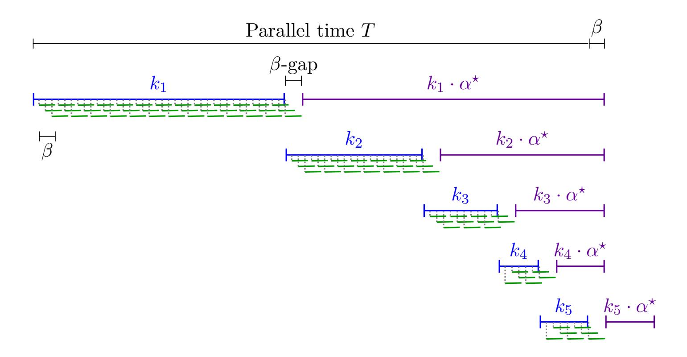

{0}------------------------------------------------

# SPARKs:

# Succinct Parallelizable Arguments of Knowledge<sup>∗</sup>

Naomi Ephraim† Cody Freitag‡ Ilan Komargodski§ Rafael Pass¶

#### Abstract

We introduce the notion of a Succinct Parallelizable Argument of Knowledge (SPARK). This is an argument of knowledge with the following three efficiency properties for computing and proving a (non-deterministic, polynomial time) parallel RAM computation that can be computed in parallel time T with at most p processors:

- The prover's (parallel) running time is T + polylog(T · p). (In other words, the prover's running time is essentially T for large computation times!)
- The prover uses at most p · polylog(T · p) processors.
- The communication and verifier complexity are both polylog(T · p).

The combination of all three is desirable as it gives a way to leverage a moderate increase in parallelism in favor of near-optimal running time. We emphasize that even a factor two overhead in the prover's parallel running time is not allowed.

Our main contribution is a generic construction of SPARKs from any succinct argument of knowledge where the prover's parallel running time is T · polylog(T · p) when using p processors, assuming collision-resistant hash functions. When suitably instantiating our construction, we achieve a four-round SPARK for any parallel RAM computation assuming only collision resistance. Additionally assuming the existence of a succinct non-interactive argument of knowledge (SNARK), we construct a non-interactive SPARK that also preserves the space complexity of the underlying computation up to polylog(T · p) factors.

We also show the following applications of non-interactive SPARKs. First, they immediately imply delegation protocols with near optimal prover (parallel) running time. This, in turn, gives a way to construct verifiable delay functions (VDFs) from any sequential function. When the sequential function is also memory-hard, this yields the first construction of a memory-hard VDF.

<sup>∗</sup>A preliminary version of this work was published in the proceedings of EUROCRYPT 2020.

<sup>†</sup>Cornell Tech, nephraim@cs.cornell.edu

<sup>‡</sup>Cornell Tech, cfreitag@cs.cornell.edu

<sup>§</sup>NTT Research, ilan.komargodski@ntt-research.com

<sup>¶</sup>Cornell Tech, rafael@cs.cornell.edu

{1}------------------------------------------------

## Contents

| 1 | Introduction                                                 | 1  |
|---|--------------------------------------------------------------|----|
|   | 1.1<br>Our Results                                           | 2  |
|   | 1.2<br>Applications                                          | 3  |
|   | 1.3<br>Related Work                                          | 5  |
| 2 | Technical Overview                                           | 6  |
|   | 2.1<br>Warmup: SPARKs for Iterated Functions<br>             | 6  |
|   | 2.2<br>Extending SPARKs to Arbitrary Computations            | 6  |
|   | 2.3<br>Our SPARK Construction                                | 11 |
| 3 | Preliminaries                                                | 12 |
|   | 3.1<br>RAM Model                                             | 13 |
|   | 3.2<br>Universal and NP Relations                            | 14 |
|   | 3.3<br>Interactive Arguments<br>                             | 15 |
| 4 | Succinct Parallelizable Arguments of Knowledge               | 15 |
| 5 | Concurrently Updatable Hash Functions                        | 19 |
|   | 5.1<br>Hash Function Building Blocks<br>                     | 21 |
|   | 5.2<br>Construction<br>                                      | 24 |
|   | 5.3<br>Proofs<br>                                            | 26 |
| 6 | From Succinct Arguments to SPARKs                            | 37 |
|   | 6.1<br>The Update Language<br>                               | 37 |
|   | 6.2<br>Interactive Protocol<br>                              | 39 |
|   | 6.3<br>Proofs<br>                                            | 42 |
|   | 6.4<br>Non-interactive Protocol                              | 59 |
| 7 | Main Results                                                 | 60 |
|   | 7.1<br>Four-Round SPARKs                                     | 60 |
|   | 7.2<br>Non-interactive SPARKs                                | 64 |
| 8 | Extensions                                                   | 65 |
|   | 8.1<br>Space-preserving Interactive SPARKs<br>               | 65 |
|   | 8.2<br>Proof Composition<br>                                 | 66 |
|   | 8.3<br>Efficiency Tradeoffs                                  | 67 |
| 9 | Applications to Verifiable Hard Functions                    | 67 |
|   | 9.1<br>Defining Verifiable Hard Functions<br>                | 67 |
|   | 9.2<br>Verifiable Hard Functions from Non-interactive SPARKs | 69 |
|   | 9.3<br>Applications to VDFs<br>                              | 71 |
|   | 9.4<br>Applications to Memory-Hard VDFs                      | 73 |
|   | References                                                   | 76 |
| A | Succinct Arguments of Knowledge                              | 80 |
|   | A.1<br>Witness-Extended Emulation<br>                        | 83 |
| B | Proofs from Section 6.4                                      | 86 |

{2}------------------------------------------------

## <span id="page-2-0"></span>1 Introduction

Interactive proof systems, introduced by Goldwasser, Micali, and Rackoff [GMR89], are one of the most fundamental concepts in theoretical computer science. Such systems consist of a prover who is able to convince a verifier of the validity of some statement if and only if it is true. The "if" direction is called *completeness* and the "only if" direction is called *soundness*. Proof systems where soundness is only guaranteed to hold for efficient (i.e., polynomial-time) provers are called *argument* systems.

We focus on *succinct* argument systems for NP: argument systems where the total communication is essentially independent of the size of the verification circuit of the language and even shorter than the statement. Since their introduction [Kil92, Mic00, BCC<sup>+</sup>17], succinct argument systems have drawn significant attention due to their appealing efficiency properties. Nowadays they are widely implemented and used in various systems, most notably in numerous blockchain platforms.

One aspect of such argument systems that has been the center of many recent works (e.g., [BC12, CFH<sup>+</sup>15, WZC<sup>+</sup>18, HR18] to name a few) is *prover efficiency*. Consider the application of succinct arguments to delegating (possibly non-deterministic) computation, where a prover performs some expensive computation and then uses a succinct argument to convince an efficient verifier of the validity of the output. If computing a proof takes much longer than the computation (even, say, a multiplicative factor of two), this would cause a significant delay making the system useless in various realistic settings. This motivates the following question:

Is it possible to compute a proof in parallel to the computation while incurring no additional delay?

**SPARKs.** In this work, we answer the above question affirmatively for any non-deterministic parallel RAM computation. We introduce succinct *parallelizable* arguments of knowledge (SPARKs) where the prover's running time is "essentially" optimal. More precisely, an interactive argument  $(\mathcal{P}, \mathcal{V})$  is a SPARK if instances solvable in (non-deterministic) parallel time T using p processors can be proven with the following efficiency requirements (ignoring dependence on the security parameter or statement size):

- The prover's parallel time is  $T + \text{polylog}(T \cdot p)$ . (In other words, the prover's running time is essentially T for large computations!)
- The prover uses at most  $p \cdot \text{polylog}(T \cdot p)$  processors. In other words, the prover preserves the total work and parallelism of the underlying computation up to polylogarithmic factors.
- The communication and verifier complexity are polylog $(T \cdot p)$ .

We note that the third property is standard for succinct arguments. The first two properties stipulate that the running time of a prover, with only a moderate number of parallel processors over those used by the computation, is optimal—even a factor two overhead in terms of a prover running time is not allowed. Without the first property, there are existing succinct arguments with time  $T \cdot p \cdot \text{polylog}(T \cdot p)$  using only a single processor (e.g., [BS08, BCGT13]). Without the second property, there are existing constructions with parallel time  $T + \text{polylog}(T \cdot p)$  but require roughly  $T \cdot p$  processors (e.g., [BCGT13]). No prior construction achieves all three properties simultaneously.

<span id="page-2-1"></span>Only the additive polylog $(T \cdot p)$  term is allowed to additionally depend on the security parameter or statement size.

{3}------------------------------------------------

#### <span id="page-3-0"></span>1.1 Our Results

Our main results consider succinct arguments for arbitrary non-deterministic polynomial-time PRAM computation. Specifically, we consider machines M that run in parallel time T when using p processors.

For our main technique, we give a generic transformation which starts with any succinct argument of knowledge, and shows how to transform *multiplicative* prover overhead to only *additive* overhead. Specifically, given a succinct argument of knowledge where the prover has  $\alpha^*$  multiplicative overhead (over the depth of the underlying computation) when using p processors, we show how to obtain an argument with  $poly(\alpha^*)$  additive overhead when using roughly  $p \cdot \alpha^*$  processors. More precisely, we prove the following theorem.

<span id="page-3-1"></span>**Theorem 1.1** (Informal; see Theorems 6.1 and 6.18). Assuming collision-resistant hash functions, any succinct argument of knowledge for NP where the prover runs in parallel time  $T \cdot \alpha^*$  when using p processors can be generically transformed into a succinct argument where the prover runs in parallel time  $T + (\alpha^*)^2 \cdot \operatorname{polylog}(T \cdot p)$  when using  $p \cdot \alpha^* \cdot \operatorname{polylog}(T \cdot p)$  processors. Additionally, if the original argument is non-interactive, then so is the resulting one.

We refer to arguments with multiplicative prover overhead  $\alpha^* \in \text{polylog}(T \cdot p)$  when using p processors as depth-preserving as they preserve the parallelism and depth of the underlying computation up to  $\text{polylog}(T \cdot p)$  multiplicative factors. It immediately follows that any depth-preserving succinct argument of knowledge implies a SPARK, assuming collision resistance.

**Theorem 1.2** (Informal; see Theorems 7.2 and 7.6). Assuming collision-resistant hash functions, any depth-preserving succinct argument of knowledge for NP can be generically transformed into a SPARK. Additionally, if the underlying argument is non-interactive, then so is the resulting SPARK.

By instantiating the underlying succinct arguments in the above theorem, we get the following main results. First, by using Kilian's succinct argument [Kil92] with a depth-preserving PCP (which can be obtained from the PCP of Ben-Sasson et al. [BCGT13]), we construct four-round SPARKs based on the existence of collision-resistant hash functions alone.

<span id="page-3-2"></span>**Theorem 1.3** (Informal; see Theorem 7.4). Assuming collision-resistant hash functions, there exists a four-round SPARK for non-deterministic polynomial-time PRAM computation.

Additionally assuming the existence of any SNARK (not necessarily depth-preserving), we can construct depth-preserving SNARKs based on the construction of Bitansky et al. [BCCT13]. Their SNARK construction also has the property that it is space-preserving, meaning that the space used to construct the proof is at most a polylog $(T \cdot p)$  multiplicative overhead over the space of the computation. The resulting SPARK is therefore also space-preserving, which yields the following theorem.

**Theorem 1.4** (Informal; see Theorem 7.8). Assuming collision-resistant hash functions and any SNARK, there exists a space-preserving, non-interactive SPARK for non-deterministic polynomial-time PRAM computation.

Model of Computation. We define and build SPARKs for PRAM computations, where our SPARK prover is also a PRAM machine. While the PRAM model of computation is very expressive in theory, there is clearly not an exact one-to-one correspondence with real computers. For example, we do not take into account the performance of caches or other optimizations in modern processors

{4}------------------------------------------------

that can easily result in additional overhead. As such, we view the results in this paper as showing a theoretical feasibility for practical implementations of SPARKs. We next briefly discuss and justify both the model of computation and the notion of time used in this work. For further details, see Section 3.1.

Recall that a RAM machine is a Turing machine with random access to its memory string. Between accesses, the machine applies some transition function to determine its next memory access. Each access is either a read or write, and we additionally assume that every time a process writes a value to a location in memory, it receives the previous value at that location. We define the running time of a RAM machine as the number of memory accesses it makes. For parallel RAM machines, we define the parallel running time as the number of "rounds" of memory accesses made by all processors, so if two processors access memory during the same logical round, we only count it as a single unit of parallel time. In other words, a SPARK proves a PRAM computation that makes T rounds of parallel memory accesses with  $T + \text{polylog}(T \cdot p)$  rounds of parallel accesses.

Similar models have been used in other contexts for delegating RAM computation (see e.g., [KP16, HR18]), but they were less sensitive to the model since they did not care about small multiplicative overheads. However, we believe that the above timing model we propose is reflective of real programs. For memory-intensive programs, our model captures the fact that memory accesses are practically the most time-consuming operations. For compute-intensive tasks, where the memory accesses are more sparse, it is only better that the overhead of a SPARK scales with the number of memory accesses and not the computation time itself.

### <span id="page-4-0"></span>1.2 Applications

Below, we present applications of SPARKs, which rely on the fact that in a SPARK, the prover both computes and prove the validity of a computation in parallel time which is essentially as efficient as possible. While our focus here is on establishing theoretical feasibility results, we expect that our ideas may also be useful in practical constructions, which we leave for future work.

Time-tight delegation of PRAM computation. In the problem of verifiable delegation of computation [GKR15, RRR16, KP16], there is a client who wishes to outsource an expensive (possibly non-deterministic) computation M on an input x to a powerful yet untrusted server. The server should not only produce the output y but also a proof that the computation was done correctly.

A non-interactive SPARK for a class of PRAM computations directly gives a delegation protocol for the same class. This is because SPARKs satisfy a "delayed-output" property—the output y of the computation need not be known to the SPARK prover or verifier in advance, as it is computed in parallel to the proof. Therefore, using a non-interactive SPARK, a server can perform a PRAM computation as well as compute a proof with essentially no overhead in running time. Specifically, for T-time computations with p processors, the server runs in time T + polylog( $T \cdot p$ ) and uses at most  $p \cdot \text{polylog}(T \cdot p)$  processors. We call delegation schemes with this property time-tight.

We emphasize that our non-interactive SPARK construction yields a time-tight delegation protocol for non-deterministic computations that use any amount of parallelism. For example, consider the case where a client wants to outsource a PRAM computation over a large database (stored at the server) but only knows a hash of the database. The server can perform the computation while proving both that the output is correct and the database is consistent with the client's hash. Furthermore, if both the server and the client have agreed upon the hash at the beginning of the protocol, the running time depends only on the time of the PRAM computation (otherwise,

{5}------------------------------------------------

the server will need to prove that the initial database hashes to the correct value, which requires computing a hash over the whole database and will be expensive if the database is large).

VDFs from sequential functions. Verifiable delay functions (VDFs) are functions that require some "long" time T to compute (where T is a parameter given to the function), yet the answer to the computation can be efficiently verified given a proof that can be jointly generated with the output (with only small overhead) [\[BBBF18,](#page-77-1) [BBF18,](#page-77-2) [Pie19,](#page-80-3) [Wes19\]](#page-80-4). The original work of Boneh et al. [\[BBBF18\]](#page-77-1) suggests a theoretical construction of VDFs based on succinct non-interactive arguments (SNARGs) and any iteratively sequential function (ISF).[2](#page-5-0) Other known constructions of VDFs [\[Pie19,](#page-80-3) [Wes19\]](#page-80-4) rely on the repeated squaring assumption—a concrete ISF.

Let us recall what ISFs are. A sequential function (SF) is a function that takes a long time to compute, even if one has many parallel processors. An ISF is the iteration of some round function and the assumption is that iterating the round function is the fastest way to evaluate the ISF, even if one has many parallel processors. Clearly, any VDF implies an SF and so any construction of VDFs will necessarily rely on such (but this is not the case for an ISF[3](#page-5-1) ). It is thus a very natural question whether we can get a VDF based on only SFs and SNARGs. Note that the construction of Boneh et al. [\[BBBF18\]](#page-77-1) inherently relies on the iterated structure of the underlying sequential function.[4](#page-5-2)

We observe that any non-interactive SPARK for computing and proving an SF implies a VDF: simply compute the non-interactive SPARK for the SF. Therefore by our main result, any SF, SNARK, and collision-resistant hash function imply a VDF.

Theorem 1.5 (Informal; see Theorem [9.4](#page-71-0) and Corollary [9.8\)](#page-73-0). Assuming the existence of a collisionresistant hash function, a SNARK, and a sequential function, there exists a VDF.

In fact, one way to view our main construction is by improving existing techniques for constructing verifiable computation for iterated functions from SNARGs to arbitrary functions using SNARKs (and collision-resistant hash functions). An interesting open question is how to construct verifiable computation for arbitrary functions from only SNARGs, rather than SNARKs.

Memory-hard VDFs. A particularly appealing extension of the application above is to the existence of memory-hard VDFs. Recall that VDFs only guarantee that a long computation has been performed (and anyone can verify this publicly). It is very natural to require that not only a timeconsuming computation was performed but also that the computation required many resources, for example, a large portion of the memory across time.

Clearly any VDF that is based on an ISF is not memory hard. The reason is that even if the basic round function is memory-hard, upon every iteration the memory consumption goes to zero! Since the VDF construction discussed above does not necessarily have to be instantiated with an ISF but rather any SF (and a SPARK for computing it), we can use a memory hard sequential function (e.g., [\[DGN03,](#page-79-5) [DNW05,](#page-79-6) [AS15,](#page-77-3) [ACK](#page-77-4)+16, [ABP17,](#page-77-5) [ABP18,](#page-77-6) [DLP18\]](#page-79-7)) and get a VDF where the computation not only takes a long time, but also requires large memory throughout.

<span id="page-5-0"></span><sup>2</sup>Actually, their original construction relied on incremental verifiable computation [\[Val08\]](#page-80-5), which exists based on SNARKs [\[BCC](#page-78-0)<sup>+</sup>17], and any ISF. In an updated version they show that actually SNARGs, along with ISFs, are sufficient.

<span id="page-5-2"></span><span id="page-5-1"></span><sup>3</sup>However, a continuous VDF [\[EFKP20\]](#page-79-8) does imply an ISF.

<sup>4</sup> In the construction based on SNARGs and ISFs, they need to be able to "break" the computation of the function in various mid-points of the computation and the internal "state" in those locations has to be small for efficiency of the construction. In the construction based on SNARKs and ISFs, they rely on a tight construction of incremental verifiable computation but the number of parallel processors required for the latter is as large as the cost of a single step [\[BCCT13,](#page-78-4) [BCG](#page-78-5)<sup>+</sup>13, [PHGR16\]](#page-80-6), and so many steps are needed.

{6}------------------------------------------------

**Theorem 1.6** (Informal; see Theorem 9.4 and Corollary 9.11). Assuming the existence of a collision-resistant hash functions, a SNARK, and a memory-hard sequential function, there exists a memory-hard VDF.

Lastly, we note that sequentiality and memory-hardness are two examples of functions that are hard to compute with bounded resources. Since a SPARK computes a function and constructs the proof in parallel, then the above transformations can be used to preserve *any* hardness property of a PRAM computation, so long as the function remains hard after an additive increase in the parallel running time (and an small increase in the number of parallel processors). This enables generically turning hard functions into verifiable hard functions (see Theorem 9.4 for a formal version of this claim).

#### <span id="page-6-0"></span>1.3 Related Work

Succinct arguments with efficient provers. We elaborate on the existing succinct arguments that focus on prover efficiency. We consider the general setting of proving computation that take T parallel time using p processors (although most works only explicitly consider the setting where p = 1 and T is the total time).

First, we recall that Kilian's succinct argument consists of a prover who commits to a PCP using a Merkle tree and locally opens a set of random locations specified by the verifier. As such, efficient PCP constructions immediately give rise to succinct arguments with an efficient prover. Specifically in [BS08, BCGT13], they show how to construct PCPs in quasi-linear time, which yield succinct arguments with a prover running in  $T \cdot p \cdot \text{polylog}(T \cdot p)$  time for computation with total work  $T \cdot p$ . In [BCGT13], they show how to construct a quasi-linear size PCP that can be computed in polylog $(T \cdot p)$  depth with roughly  $T \cdot p$  processors, when given the transcript of the computation. This results in a succinct argument where the prover runs in parallel time  $T + \text{polylog}(T \cdot p)$  using roughly  $T \cdot p$  processors. When restricting the prover to use at most  $p \cdot \text{polylog}(T \cdot p)$  processors, as required by SPARKs, this yields a succinct argument where the prover runs in parallel time  $T \cdot p \cdot \text{polylog}(T \cdot p)$ . Furthermore, the above arguments can be made non-interactive by applying the Fiat-Shamir transformation [FS86, Mic00].

A different line of work has focused additionally on the prover's *space complexity*. Bitansky et al. [BCCT13] (following Valiant's [Val08] incrementally verifiable computation framework using recursive proof composition) construct complexity-preserving SNARKs, in which both the time and space of the underlying computation up to (multiplicative) polynomial factors in the security parameter. For the task of delegating deterministic  $(T \cdot p)$ -time S-space computation, Holmgren and Rothblum [HR18] give a prover with  $T \cdot p \cdot \text{polylog}(T \cdot p)$  total time and S + o(S) space assuming sub-exponential LWE.

**Tight VDFs.** As we describe shortly in Section 2, our construction splits the computation into "chunks" and proves each of them in parallel. This idea is inspired by the recent transformations of Boneh et al. and Döttling et al. [BBBF18, DGI+19] in the context of verifiable delay functions (VDFs) [BBBF18, BBF18]. Those works show how to use a VDF for an iterated sequential function where the honest evaluator has some overhead, into a VDF where the honest evaluator uses multiple parallel processors and has essentially no parallel time overhead. However, iterated functions can be naturally split into chunks and so most of the technical difficulty in our work does not arise in that context. See Section 2 for more details.

{7}------------------------------------------------

**IOPs.** In an effort to bring down the quasi-linear overhead of PCPs, Ben-Sasson et al. [BCS16] and Reingold et al. [RRR16] introduced the concept of interactive oracle proofs (IOPs).<sup>5</sup> IOPs are a type of proof system that combines aspects of interactive proofs (IPs) and PCPs: in every round a prover sends a possibly long message but the verifier is allowed to read only a few bits. IOPs also generalize Interactive PCPs [KR08]. The most recent IOP is due to Ron-Zewi and Rothblum [RZR19] (improving Ben-Sasson et al. [BCG<sup>+</sup>17]) and achieves nearly optimal overhead in proof length (i.e., a  $1+\epsilon$  factor for an arbitrary  $\epsilon > 0$ ) and constant rounds and query complexity, however the prover's running time is some unspecified polynomial.

## <span id="page-7-0"></span>2 Technical Overview

In this section, we present the main techniques underlying our transformation from succinct arguments of knowledge with small multiplicative prover overhead to SPARKs.

### <span id="page-7-1"></span>2.1 Warmup: SPARKs for Iterated Functions

Our starting point stems from the recent works of Boneh et al. and Döttling et al. [BBBF18, DGMV19]. For concreteness, we describe the setting of [BBBF18], which focuses on the simplified case of proving correctness of the output of an iterated function  $g^{(T)}(x_0) = (g \circ \ldots \circ g)(x_0)$  for some  $T \in \mathbb{N}$ . Rather than proving that  $g^{(T)}(x_0) = x_T$  directly, they split the computation into different sub-computations of geometrically decreasing size such that the proof for every sub-computation completes by time T.

To demonstrate this idea, suppose for simplicity that each iteration takes one unit of time to compute and that there is a succinct argument that can non-interactively prove any computation of k iterations of g in 2k additional time. Then, in order to prove that  $g^{(T)}(x_0) = x_T$ , they first perform 1/3 of the computation to obtain  $g^{(T/3)}(x_0) = x_{T/3}$  and then prove its correctness. Observe that  $x_{T/3}$  can be computed in time T/3 and the proof can be generated in time 2T/3 by assumption, so the proof that  $g^{(T/3)}(x_0) = x_{T/3}$  completes by time T. In parallel to proving that  $g^{(T/3)}(x_0) = x_{T/3}$ , they additionally compute and prove 1/3 of the remaining computation (namely, that  $g^{(T-T/3)/3}(x_{T/3}) = x_{5T/9}$ ) in a separate parallel thread, which also will finish by time T. They continue in this fashion recursively until the remaining computation can be verified directly.

In this construction, the prover only needs to start at most  $O(\log T)$  parallel computation threads and finishes in essentially parallel time T. The final proof consists of  $O(\log T)$  proofs of the intermediate sub-computations. The verifier checks each proof for the sub-computations independently and accepts if all checks pass and the proposed inputs and outputs are consistent with each other. More generally, if the given non-interactive argument had  $\alpha^*$  multiplicative overhead, the resulting number of threads needed would be  $O(\alpha^* \cdot \log T)$ . So, when the overhead is quasi-linear (i.e.  $\alpha^* \in \text{polylog } T$ ), the resulting argument is still succinct.

#### <span id="page-7-2"></span>2.2 Extending SPARKs to Arbitrary Computations

The focus of this work is extending the above example to handle arbitrary non-deterministic polynomial-time computation (possibly with a long output) which introduces many complications. For now, we focus on the case of RAM computation that uses only a single processor (we later show how to extend this to arbitrary parallel RAM computations). Specifically, suppose we are

<span id="page-7-3"></span><sup>&</sup>lt;sup>5</sup>To clarify notation, IOPs (introduced by [BCS16]) are equivalent to the notion of Probabilistically Checkable Interactive Proofs (introduced concurrently and independently by [RRR16]).

{8}------------------------------------------------

given a statement (M, x, T) with witness w, where M is a RAM machine and we want to prove that M(x, w) outputs some value y within T steps. We emphasize that our goal is to capture general non-deterministic, polynomial-time computation where the output y is not known in advance, so we would like to simultaneously compute y given (M, x, T) and w, and prove its correctness. Since M is a RAM machine, it has access to some (potentially large) memory D consisting of n words in memory. We let  $\lambda$  be the security parameter and size of a word, and T be an arbitrary polynomial in  $\lambda$ . Let us try to employ the above strategy in this more general setting.

As M does not necessarily implement an iterated function, the first problem we encounter is that there is no natural way to split the computation into many sub-computations with small input and output. For intermediate statements, the naïve solution would be to prove that running the RAM machine M for k steps starting at some initial memory  $D_{\text{start}}$  results in final memory  $D_{\text{final}}$ . However, this is a problem because the size of the memory, n, may be large—perhaps even as large as the full running time T—so the intermediate statements we need to prove may be huge!

A natural attempt to mitigate this would be to instead provide a succinct digest of the memory at the beginning and end of each sub-computation, and then have the prover additionally prove that it knows a memory string consistent with each digest. Concretely, each sub-computation corresponding to k steps of computation would contain digests  $c_{\text{start}}$ ,  $c_{\text{final}}$ . The prover would show that there exist strings  $D_{\text{start}}$ ,  $D_{\text{final}}$  such that (1)  $c_{\text{start}}$ ,  $c_{\text{final}}$  are digests of  $D_{\text{start}}$ ,  $D_{\text{final}}$ , respectively, and (2) starting with memory  $D_{\text{start}}$  and running RAM machine M for k steps results in memory  $D_{\text{final}}$ . This seems like a step in the right direction, since the statement size for each sub-computation would only depend on the output size of the digest and not the size of the memory. However, the prover's witness—and hence running time to prove each sub-computation—still scales linearly with the size of the memory in this approach. Therefore, the main challenge we are faced with is removing the dependence on the memory size in the witness of the sub-computations.

Using local updates. To overcome the above issues, we observe that in each sub-computation the prover only needs to prove that the transition from the initial digest  $c_{\mathsf{start}}$  to the final digest  $c_{\mathsf{final}}$  is consistent with k steps of computation done by M. At a high level, we do so by proving that there exists a sequence of k local updates to  $c_{\mathsf{start}}$  which result in  $c_{\mathsf{final}}$ . Then in order to verify a sub-computation corresponding to k steps, we can simply check the k local updates to the digest of the memory, rather than checking the memory in its entirety. To formalize this idea, we rely on short hash functions that allow for local updates which can be efficiently computed in parallel to the main computation. We call these concurrently updatable hash functions.

Given such hash functions, will use a succinct argument of knowledge ( $\mathcal{P}_{\mathsf{sARK}}, \mathcal{V}_{\mathsf{sARK}}$ ) for an NP language  $\mathcal{L}_{\mathsf{upd}}$  that corresponds to checking that a sequence of local updates are valid. Specifically, a statement  $(M, x, k, c_{\mathsf{start}}, c_{\mathsf{final}}) \in \mathcal{L}_{\mathsf{upd}}$  if and only if there exists a sequence of updates  $u_1, \ldots, u_k$  such that, starting with short digest  $c_{\mathsf{start}}$ , running M on input x for k steps specifies the updates  $u_1, \ldots, u_k$  that result in a digest  $c_{\mathsf{final}}$ . Then, as long as the updates are themselves succinct, the size of the witness scales only with the number of steps of the computation and not with the size of the memory.

In order to make the above approach work, we need updatable hash functions that satisfy the following two properties:

- 1. Updates can be computed efficiently in parallel to the main computation.
- 2. Updates can be verified as modifying only the specified locations in memory.

We next explain how we obtain the required hash functions satisfying the above properties. We believe that this primitive and the techniques used to obtain it are of independent interest.

{9}------------------------------------------------

Concurrently Updatable Hash Functions. Roughly speaking, concurrently updatable hash functions are computationally binding hash functions that supports updating parts of the underlying message without re-hashing the whole message. For efficiency, we additionally require that one can perform several sequential updates concurrently. For soundness, we require that no efficient adversary can find two different openings for the same location even if it is allowed to perform polynomially many update operations. A formal definition appears in Section 5.

We focus on the case where each update is local (a single word per time step), but we show how to extend this to updating many words in parallel in Section 5. Our construction relies on Merkle trees [Mer89] and hence can be instantiated with any collision resistant hash function. Recall that a Merkle tree uses a compressing hash function, which we assume for simplicity is given by  $h: \{0,1\}^{2\lambda} \to \{0,1\}^{\lambda}$ , and is obtained via a binary tree structure where nodes are associated with values. The leaves are associated with arbitrary values and each internal node is associated with a value that is the hash of the concatenation of its children's values.

It is well known that Merkle trees, when instantiated with a collision resistant hash function h, act as short (binding) commitments with local opening. The latter property enables proving claims about specific blocks in the input without opening the whole input, by revealing the authentication path from some input block to the root (i.e. the hashes corresponding to sibling nodes along the path from the leaf to the root). Not only do Merkle trees have the local opening property, but the same technique allows for local updates. Namely, one can update the value of a specific word in the input and compute the new root value without recomputing the whole tree (by updating the hashes along the authentication path of the updated block). All of these local procedures cost time which is proportional to the depth of the tree,  $\log_2 n$ , as opposed to the full memory n. We denote this update time as  $\beta$  (which may additionally depend polynomially on  $\lambda$ , for example, to compute the hash function at each level in the tree).

Let us see what happens when we use Merkle trees as our hash function. Recall that the Merkle tree contains the hash of the memory at every step of the computation, and we update its value after each such step. The latter operation, as mentioned above, takes  $\beta$  time. So even with local updates, using Merkle trees naïvely incurs a  $\beta$  delay for every update operation which implies a  $\beta$  multiplicative delay for the whole computation (which we want to avoid)! To handle this, we use a pipelining technique to perform the local updates in parallel.

Pipelining updates. Consider two updates  $u_1$  and  $u_2$  that we want to apply to the current Merkle tree sequentially. We observe that since Merkle trees updates work "level by level," we can first update the first level of the tree (corresponding to the leaves) according to  $u_1$ . Then, update the second layer according to  $u_1$  and in parallel update the first layer using  $u_2$ . Continuing in this fashion, we can update the third layer according to  $u_1$  and in parallel update the second layer using  $u_2$ , and so on. The idea can be generalized to pipeline  $u_1, \ldots, u_k$ , so that the final update  $u_k$  completes after  $(k-1) + \beta$  steps, and the memory is consistent with the Merkle tree given by performing update operations  $u_1, \ldots, u_k$  sequentially. The implementation of this idea requires  $\beta$  additional parallel threads since the computation for at most  $\beta$  updates will overlap at a given time. A key point that allows us to pipeline these concurrent updates is that the operations at each level in the tree are data-independent in a standard Merkle tree. Namely, each processor can perform all of the reads/writes to a given level in the tree at a single time step, and the next processor can continue in the next time step without incurring any delay.

Verifying that updates are local. With regards to the soundness of this primitive, a subtle—yet important—point that we need in our application is that it must be possible to prove that a valid update only modifies the locations it specifies. For example, suppose a cheating prover updates

{10}------------------------------------------------

the digest with respect to one location in memory while simultaneously rewriting other locations in memory in a way that does not correspond to the memory access done by the machine M. Then, the prover will later be able to open inconsistent values and prove that M computes whatever it wants. Moreover, the prover could gradually make these changes across many different updates. Fortunately, the structure of Merkle trees allow us to prove that a local update only changes a single location. At a high level, this is because the authentication path for a leaf in a Merkle tree effectively binds the root of the tree to the entire memory. Thus, we show that if a Merkle tree is updated at some location, one can use the authentication path to prove that no other locations were modified. Furthermore, we show in the general case how to extend this for updating many locations in a single update.

Ensuring optimal prover run-time. Using the above ingredients, we discuss how to put everything together to ensure optimal prover run-time. Concretely, suppose we have a concurrently updatable hash function where each update takes time  $\beta$ , and a succinct non-interactive argument of knowledge with quasilinear prover overhead for the language  $\mathcal{L}_{upd}$ . Recall that a statement  $(M, x, k, c_{start}, c_{final}) \in \mathcal{L}_{upd}$  if there exists a sequence of k hash function updates such that (1) the updates are consistent with the computation of M and (2) applying these updates to  $c_{start}$  results in  $c_{final}$ . Let  $\alpha^*$  be the multiplicative overhead of the succinct argument with respect to the number of updates (so a computation with  $k \leq T$  updates takes time  $k \cdot \alpha^*$  to prove). Note that  $\alpha^* \in \text{poly}(\beta, \log T)$ , as we require that the total time to prove a  $\mathcal{L}_{upd}$  statement is quasilinear in the work, and a statement for at most T updates requires  $T \cdot \beta$  total work.

As discussed above, to prove that M(x, w) outputs a value y in T steps, we split the computation into m sub-computations which all complete by time T. The ith sub-computation will consist of a "compute" phase, where we compute  $k_i$  steps of the total T computation steps, and a "proof" phase, where we use the succinct argument to prove correctness of those  $k_i$  steps. For the "compute" phase, recall that performing  $k_i$  steps of computation while also updating the digest takes  $k_i \cdot \beta$  total work. However, as described above, we can pipeline these updates so that the parallel time to compute these updates is only  $(k_i - 1) + \beta$ .

For the "proof" phase to complete in the desired amount of time, we need to set the values of  $k_i$  appropriately. Each proof for  $k_i \leq T$  steps of computation takes at most  $k_i \cdot \alpha^*$  time. Therefore, the largest "chunk" of computation we can compute and prove by roughly time T is  $T/(\alpha^* + 1)$ . For convenience, let  $\gamma \triangleq \alpha^* + 1$ . Then, in the first sub-computation, we can compute and prove  $k_1 = T/\gamma$  steps of computation. In each subsequent computation, we compute and prove a  $\gamma$  fraction of the remaining computation. Putting everything together, we get that  $k_i = (T/\gamma) \cdot (1 - 1/\gamma)^{i-1}$  for  $i \in [m-1]$  and then  $k_m < \gamma$  is the number of remaining steps such that  $\sum_{i=1}^m k_i = T$ . This results in roughly  $\gamma \log T \in \text{poly}(\beta, \log T)$  total sub-proofs, meaning that the proof size depends only polylogarithmically on T.

In Figure 1 we show the structure of the compute and proof phases for all m sub-computations. We emphasize that the entire protocol completes within  $T + \alpha^* \cdot \gamma + \beta$  parallel time, since the first m-1 sub-proofs complete by time  $T+\beta$ , and the proof of the final  $\gamma$  steps takes roughly  $\alpha^* \cdot \gamma + \beta$  time to prove. Since  $\alpha^*$ ,  $\gamma$ , and  $\beta$  are in poly $(\lambda, \log T)$ , this implies that we only have a small additive rather than multiplicative overhead.

We note that in the overview where we construct SPARKs for iterated functions, we have the verifier directly check the final sub-computation itself. Rather than having the prover send the witness in the clear for the verifier to check, we instead have the prover provide a succinct proof for the last sub-computation. The main reason for this is since in the case of general parallel RAM computations, having the verifier directly verify the computation would require that the verifier

{11}------------------------------------------------



<span id="page-11-0"></span>Figure 1: The "compute" and "proof" phases for each of m sub-computations. The ith sub-computation consists of  $k_i$  steps, while pipelining updates which each take  $\beta$  time. After finishing all updates, the prover computes the proof which takes  $k_i \cdot \alpha^*$  time.

also use parallelism and also would require greater communication.

Next, we note that we have a  $\beta$  gap between the time that the "compute" phase ends and the "proof" phase begins for a particular sub-computation. This is because we have to wait  $\beta$  additional time to finish computing the updates before we can start the proofs. However, we can immediately start computing the next sub-computation without waiting for the updates to complete. Lastly, the number of processors used in the protocol is  $\beta$  at all times in the constantly running "compute" phase which is additionally computing updates to the digest in parallel. Then, to run each of the m sub-proofs in parallel, we get at most a factor of m times the number of processors used by a single sub-proof.

Computing the initial digest. Before giving the full protocol, we address a final issue, which is for the prover to compute the digest of the initial memory string. Specifically, the prover needs to hash a string  $D \in \{0,1\}^n$ , which the RAM machine M assumes contains its inputs (x,w). Directly hashing to the string x||w would require roughly |x|+|w| additional time, which could be as large as T. To circumvent the need to compute the initial digest, we simply do not compute a digest of the initial memory! Instead, we start with a digest of an uninitialized memory that can be computed efficiently and allows each position to be initialized exactly once whenever it is first accessed.

We extend our hash function definition to enable this as follows. We start with a dummy value  $\bot$  for the leaves of the Merkle tree. Because the leaves all have the same value, we can compute the root of the Merkle tree efficiently without touching all of the nodes in the tree. Specifically, if the leaves have the value  $\operatorname{dummy}(0)$ , we can define the value of the nodes at level j recursively as  $\operatorname{dummy}(j) = h(\operatorname{dummy}(j-1)||\operatorname{dummy}(j-1))$ . Then the initial digest is just the root  $\operatorname{dummy}(\log n)$ . Note that here, the prover does not need to initialize the whole tree in memory with dummy values, it simply needs to compute  $\operatorname{dummy}(\log n)$  as the initial digest.

Whenever the prover accesses a location in D for the first time, it performs the corresponding local update to the Merkle tree. However, performing this update is non-trivial as many of the nodes in the Merkle tree may still be uninitialized. What saves us is that any uninitialized node must correspond to leaves that are also uninitialized, so they still have the value  $\bot$ . As such, we

{12}------------------------------------------------

can compute the value of any uninitialized node at level j efficiently as dummy(j). To maintain efficiency, the prover can keep track of a bit for each node to check if it has been initialized or not.

Given a single authentication path for a newly initialized location in memory, the verifier can check that this path is a valid opening for  $\bot$  with the previous digest and for the new value with the updated digest. This guarantees that only the newly initialized value was modified, and the verifier can make sure each location is updated at most once by disallowing the prover from updating locations to  $\bot$ . Furthermore, the verifier can check that any initialized value not part of the witness (corresponding to the input x) is consistent with what M expects.

### <span id="page-12-0"></span>2.3 Our SPARK Construction

We now summarize our full SPARK construction. Suppose that we have (1) a concurrently updatable hash function that starts as uninitialized where each update takes time  $\beta$  and (2) a succinct non-interactive argument of knowledge ( $\mathcal{P}_{\mathsf{sARK}}, \mathcal{V}_{\mathsf{sARK}}$ ) for the update language  $\mathcal{L}_{\mathsf{upd}}$  with  $\alpha^* \in \mathsf{poly}(\lambda, \log T)$  multiplicative overhead. Let  $\gamma \triangleq \alpha^* + 1$ , as described above, which is the fraction of remaining computation done at each step. The protocol ( $\mathcal{P}, \mathcal{V}$ ) for a statement (M, x, T) is as follows:

- 1.  $\mathcal{V}$  samples public parameters pp for the hash function and sends them to  $\mathcal{P}$ .
- 2. Using pp,  $\mathcal{P}$  computes the digest  $c_{\mathsf{start}}$  for the uninitialized memory  $D_{\mathsf{start}} = \bot^n$ .
- 3.  $\mathcal{P}$  computes  $T/\gamma$  steps of M(x, w) while in parallel updating  $D_{\mathsf{start}}$  and performing the corresponding local updates to digest  $c_1 = c_{\mathsf{start}}$ .
- 4. After completing the  $T/\gamma$  steps of the computation (but not necessarily completing all corresponding updates),  $\mathcal{P}$  starts recursively computing and proving the remaining  $T T/\gamma$  steps in parallel.
- 5. Let  $u_1, \ldots, u_{T/\gamma}$  be the current updates, which result in digest  $c'_1$ . After computing the current updates,  $\mathcal{P}$  uses  $\mathcal{P}_{\mathsf{sARK}}(u_1, \ldots, u_{T/\gamma})$  for language  $\mathcal{L}_{\mathsf{upd}}$  to prove that starting with digest  $c_1$ , running M on input x for  $T/\gamma$  steps results in digest  $c'_1$ .
- 6.  $\mathcal{P}$  continues until there are at most  $\gamma$  steps of the computation, at which point  $\mathcal{P}$  computes and proves the remaining steps and sends the proof to  $\mathcal{V}$ .
- 7. After finishing the computation and all corresponding updates,  $\mathcal{P}$  uses the final digest to open the output y and give a proof of its correctness.  $\mathcal{V}$  accepts if the proof certifying y verifies and  $\mathcal{V}_{\mathsf{sARK}}$  accepts all sub-protocols, which are consistent with each other.

Handling interactive protocols. The same transformation described above applies to interactive r-round succinct argument of knowledge. However, since the protocol is interactive, the prover starts an interactive protocol in order to prove that sub-computations were performed correctly. It is not necessarily the case that the messages in the various interactive arguments will be "synced" up, and so our transformation suffers from (at most) a polylog T factor increase in the round complexity. For specific underlying succinct arguments, however, it may be the case that we can synchronize the rounds to reduce the round complexity. Indeed, this is the case for Kilian's succinct argument, which we discuss in Section 7.1.

{13}------------------------------------------------

Extending to PRAM computation. We next discuss how to extend the protocol given above to deal with parallel RAM computation with any number of processors. We assume for simplicity that in the given machine no two processors access the same location in memory concurrently. Suppose M is a PRAM machine where M(x,w) runs in parallel time T using p processors. In the above protocol, we emulate each step of M while performing the corresponding hash function updates in parallel. The SPARK prover can use p processors to emulate M, but as M might access p locations in memory at each step, the hash function needs to support updating any set of p positions concurrently. We show how to generalize the updatable hash function scheme described above to handle such updates while still supporting pipelining for each set of updates. As for efficiency, we observe that this naively increases the overhead to compute each sub-proof by a factor of p (if the overhead scales with the total work rather than the depth of the underlying computation). As such, we need to use an underlying succinct argument that has overhead  $\alpha^* \in \text{polylog}(T \cdot p)$  in the depth of the underlying computation while using at most p processors. We refer to such arguments as depth-preserving and discuss how to construct them using known techniques in Sections 7.1 and 7.2.

Security proof and argument of knowledge definition. We note that proving security in the above construction is somewhat non-trivial. The key issue is that we need to simultaneously extract witnesses from super logarithmically many concurrent or parallel arguments of knowledge, without causing a blow-up in the complexity of the resulting extractor. In the non-interactive case, it is pretty straightforward to deal with this since the statements are all "fixed" and so concurrent composition just works. However, the interactive setting is more challenging since there are more dependencies. This issue came up and was resolved in previous works, e.g., [Lin03, PR08], where new extraction techniques and definitions were introduced. In our case, we introduce yet another argument of knowledge definition, which (1) enables dealing with this issue in our proof of security, (2) is equivalent to common definitions of proofs of knowledge, and (3) we believe is conceptually simpler and much easier to work with. We view this definition as an additional independent contribution. See Section 4 for additional details in the context of SPARKs and Appendix A in the context of standard notions of succinct arguments of knowledge.

## <span id="page-13-0"></span>3 Preliminaries

**Basic notation.** For a distribution X we denote by  $x \leftarrow X$  the process of sampling a value x from the distribution X. For a set  $\mathcal{X}$ , we denote by  $x \leftarrow \mathcal{X}$  the process of sampling a value x from the uniform distribution on  $\mathcal{X}$ . Supp(X) denotes the support of the distribution X. For an integer  $n \in \mathbb{N}$  we denote by [n] the set  $\{1, 2, \ldots, n\}$ . We use PPT as an acronym for *probabilistic polynomial time*.

A function  $\operatorname{negl}: \mathbb{N} \to \mathbb{R}$  is  $\operatorname{negligible}$  if it is asymptotically smaller than any inverse-polynomial function, namely, for every constant c > 0 there exists an integer  $N_c$  such that  $\operatorname{negl}(\lambda) \le \lambda^{-c}$  for all  $\lambda > N_c$ . Two sequences of random variables  $X = \{X_\lambda\}_{\lambda \in \mathbb{N}}$  and  $Y = \{Y_\lambda\}_{\lambda \in \mathbb{N}}$  are computationally indistinguishable if for any non-uniform PPT algorithm  $\mathcal{A} = \{\mathcal{A}_\lambda\}_{\lambda \in \mathbb{N}}$  there exists a negligible function  $\operatorname{negl}$  such that  $\left|\operatorname{Pr}\left[\mathcal{A}_\lambda(1^\lambda, X_\lambda) = 1\right] - \operatorname{Pr}\left[\mathcal{A}_\lambda(1^\lambda, Y_\lambda) = 1\right]\right| \le \operatorname{negl}(\lambda)$  for all  $\lambda \in \mathbb{N}$ . For a language L with relation  $R_L$ , we let  $R_L(x)$  denote the set of witnesses w such that  $(x, w) \in R_L$ . We say that an ensemble  $\{X_n\}_{n \in \mathbb{N}}$  is uniformly computable if there exists a Turing Machine M such that  $M(1^n)$  outputs  $X_n$  in time polynomial in n.

{14}------------------------------------------------

### <span id="page-14-0"></span>3.1 RAM Model

Random Access Memory (RAM) computation consists of a machine M which keeps some local state state and has read/write access to memory  $D \in (\{0,1\}^{\lambda})^n$  (equivalent to the tape of a Turing machine). Here,  $\lambda$  is the security parameter and length of a word,<sup>6</sup> and  $n \leq 2^{\lambda}$  is the number of words in memory used by M. We assume that M specifies n and that  $|(M,x)| \leq n$ . When we write M(x) to denote running M on input x, this means that M expects its initial memory D to be equal to  $x||0^{n\lambda-|x|}$ . The computation is defined using a function step, which has the following syntax:

$$(\mathsf{state}', \mathsf{op}, \ell, v^{\mathsf{wt}}) = \mathsf{step}(M, \mathsf{state}, v^{\mathsf{rd}}).$$

Specifically, step takes as input the description of the machine M, the current state state, and a word  $v^{\mathsf{rd}}$  that was read in the last step from memory. Then, it outputs the next state state', the operation  $\mathsf{op} \in \{\mathsf{rd}, \mathsf{wt}\}$  to do next, the next location  $\ell \in [n]$  to access, and the word  $v^{\mathsf{wt}}$  to write next if  $\mathsf{op} = \mathsf{wt}$  (or  $\bot$  if  $\mathsf{op} = \mathsf{rd}$ ).

Using step, we can define each step of RAM computation to run step, and then either do a read or a write. We assume that each write operation returns the value in the memory location before the write. Formally, starting with an initially empty state  $\mathsf{state}_0$  and letting  $v_0^{\mathsf{rd}} = \bot$ , the ith step of computation for  $i \ge 1$  is defined as:

- 1. Compute  $(\mathsf{state}_i, \mathsf{op}_i, \ell_i, v_i^{\mathsf{wt}}) = \mathsf{step}(M, \mathsf{state}_{i-1}, v_{i-1}^{\mathsf{rd}})$ .
- 2. If  $op_i = rd$ , let  $v_i^{rd}$  be the word in location  $\ell_i$  of D.
- 3. If  $\mathsf{op}_i = \mathsf{wt}$ , let  $v_i^{\mathsf{rd}}$  be the word at location  $\ell_i$  in D and write  $v_i^{\mathsf{wt}}$  to that location.

The computation halts when step outputs a special halting value with the output y of M(x) written at the start of the memory, where we assume that the final state specifies the output length. Without loss of generality, we assume that the state size can hold  $O(\log n)$  bits.

**Parallel RAM Computation.** Our main results will be in the parallel-RAM (PRAM) setting, where each step of the machine can potentially branch to multiple processes that have access to the same memory D. This can be formalized by allowing step to output multiple tuples (state', op,  $\ell$ ,  $v^{\text{wt}}$ ), each associated with a process identifier specifying the process to continue the computation from that state. Then, each process continues by running step at each step, as above. The computation halts when there are no running processes.

For convenience, we define an algorithm parallel-step which logically runs step for all active processes. It has the following syntax:

$$(\mathsf{State}', \mathsf{Op}, S, V^{\mathsf{wt}}) = \mathsf{parallel\text{-}step}(M, \mathsf{State}, V^{\mathsf{rd}}).$$

Here, all inputs and outputs are tuples containing a value for each process. Specifically, if there are p active processes before the step, and p' resulting processes, then  $\mathsf{State} = (\mathsf{state}_i)_{i \in [p]}, \ V^{\mathsf{rd}} = (v_i^{\mathsf{rd}})_{i \in [p]}, \ \mathsf{State}' = (\mathsf{state}_i')_{i \in [p']}, \ \mathsf{Op} = (\mathsf{op}_i)_{i \in [p']}, \ S = (\ell_i)_{i \in [p']}, \ V^{\mathsf{wt}} = (v_i^{\mathsf{wt}})_{i \in [p']}.$  For each  $i \in [p]$ , in the previous step the ith process had state  $\mathsf{state}_i$  and read (or overwrote) value  $v_i^{\mathsf{rd}}$ . For each  $i \in [p']$ , the ith process after the step has state  $\mathsf{state}_i'$ , and accesses location  $\ell_i$  in memory by either writing  $v_i^{\mathsf{wt}}$  to it when  $\mathsf{op}_i = \mathsf{wt}$ , or reads from it when  $\mathsf{op}_i = \mathsf{rd}$ . Note that  $V^{\mathsf{wt}}$  contains  $\bot$  for each

<span id="page-14-1"></span><sup>&</sup>lt;sup>6</sup>We note that the length of a word only needs to be greater than  $\log n$ , but can be as large as any fixed polynomial in  $\lambda$ . We set it to  $\lambda$  for simplicity.

{15}------------------------------------------------

element corresponding to a read operation. Also, note that if process i was spawned in this step, then  $\mathsf{state}_i'$  will be its initial state.

For ease of notation, we will also define an algorithm access, which accesses a set of locations in memory, and then reads and writes to them as specified. Specifically,  $access^D(Op, S, V^{wt})$  has memory access to D, takes as input Op, S, and  $V^{wt}$  as defined above, and does the following for each  $i \in [|Op|]$ :

- 1. If  $op_i = rd$ , let  $v_i^{rd}$  be the word at location  $\ell_i$  of D.
- 2. If  $op_i = wt$ , let  $v_i^{rd}$  be the word at location  $\ell_i$  in D and write  $v_i^{wt}$  to that location.

It then outputs  $V^{\mathsf{rd}} = (v_1^{\mathsf{rd}}, \dots, v_{|\mathsf{Op}|}^{\mathsf{rd}}).$ 

Using parallel-step and access, we can then formalize a full PRAM computation as follows. Starting with  $\mathsf{State}_0 = (\mathsf{state}_0)$ , where  $\mathsf{state}_0$  is an initially empty state, and  $V_0^{\mathsf{rd}} = (\bot)$ , the *i*th step of the PRAM computation M for  $i \ge 1$  is defined as:

- $1. \ \operatorname{Compute} \ (\mathsf{State}_i, \mathsf{Op}_i, S_i, V_i^{\mathsf{wt}}) = \mathsf{parallel-step}(M, \mathsf{State}_{i-1}, V_{i-1}^{\mathsf{rd}}).$
- 2. Let  $V_i^{\mathsf{rd}} = \mathsf{access}^D(\mathsf{Op}_i, S_i, V_i^{\mathsf{wt}})$ .

The computation halts when all running processes reach a halting state, and the output y of M(x) is written to the start of the memory, where we additionally assume that the output length is encoded in the final state(s).

We are in the exclusive-read exclusive-write (EREW) model, i.e., the most restrictive PRAM model, where if some process accesses a location (either a read or a write) in memory while another process accesses the same location (either a read or a write), there are no guarantees for the resulting effect. In addition to specifying the memory size n, we also assume that a PRAM machine specifies the number of concurrent processes p it uses, and that  $p \leq n$ , as we are in the EREW model. Lastly, we assume that all processes in a PRAM computation have local registers that can be used to communicate the results of each step.

(P)RAM Complexity. Each step of RAM computation is allowed to make a single access to memory. We think of step, which computes the transition function from state to state', as being implemented by an efficient CPU algorithm with access to a constant number of words.

As a result, we define the running time of a RAM machine M as the number of accesses it makes to its working memory. For PRAM machines, each step of computation may make multiple parallel accesses to memory via different processors.

To model the complexity of a (P)RAM machine M, we consider two complexity measures: work and depth. Specifically, we let  $\mathsf{work}_M(x)$  denote the total amount of computation done by all processors measured in steps (or equivalently memory accesses). When M is a non-deterministic machine, we denote this by  $\mathsf{work}_M(x,w)$  where w is the witness. We let  $\mathsf{depth}_M(x)$  (analogously,  $\mathsf{depth}_M(x,w)$ ) denote the number of sequential steps until M halts, where steps that occur in parallel are counted as one step. For a (non-parallel) RAM machine, we simply denote its running time by  $\mathsf{work}_M(x)$ .

We also assume that n words in memory can be allocated and initialized to zeros for free.

#### <span id="page-15-0"></span>3.2 Universal and NP Relations

Next, we define a variant of the universal relation, introduced by [BG08]. For efficiency reasons, it will be helpful to define this relative to different computational models, so we give definitions for Turing machine computation and RAM machine computation.

{16}------------------------------------------------

**Definition 3.1.** [Universal Relation] The universal relation for Turing machines  $\mathcal{R}_{\mathcal{U}}^{\mathsf{TM}}$  is the set of instance-witness pairs ((M, x, y, L, t), w) where M is a Turing machine such that M(x, w) outputs y within t steps, and additionally  $|y| \leq L$ . We let  $\mathcal{L}_{\mathcal{U}}^{\mathsf{TM}}$  be the corresponding universal language. We similarly define  $\mathcal{R}_{\mathcal{U}}^{\mathsf{PRAM}}$  and  $\mathcal{L}_{\mathcal{U}}^{\mathsf{PRAM}}$  to the be universal relation and language, respectively, for PRAM computation, where the given machine M is a PRAM machine.

The main difference between our definition and the standard universal relation of [BG08] is that we consider computation with long outputs y, and we also include an upper bound L on the length of y. We include y so as to have a definition which captures both deterministic and non-deterministic polynomial-time computation. A similar relation was given in [CLP13] to define a canonical relation for P. Moreover, the universal relation of [BG08] is linear-time reducible to our definition above. With regards to L, we include this because in our main construction of SPARKs, the output y of the computation will not be known in advance. However, the complexity of the scheme inherently depends on L (as the output of the protocol is y).

Finally, we note that for a statement (M, x, y, L, t) with respect to PRAM computation, we do not place any restriction on the length of the witness w. Specifically, the machine M may only access t positions in w, but it could be the case that |w| is significantly greater than t.

## <span id="page-16-0"></span>3.3 Interactive Arguments

We consider interactive (P)RAM machines and interactive protocols. Formally, we assume there is a specified part of a machine's memory for input from and output to another interactive machine, so the time for an interactive machine to send a message is simply the time to write it to its output tape. Given a pair of interactive machines  $\mathcal{P}$  and  $\mathcal{V}$ , we denote by  $\langle \mathcal{P}(x), \mathcal{V}(y) \rangle(z)$  the random variable representing the output of  $\mathcal{V}$  with common input z and private input y, when interacting with  $\mathcal{P}$  with private input x, when the random tape of each machine is uniformly and independently chosen. The round complexity of the protocol is the number of distinct messages sent between  $\mathcal{P}$  and  $\mathcal{V}$ . We say that a protocol is non-interactive if it consists of one message from  $\mathcal{P}$  to  $\mathcal{V}$  and then  $\mathcal{V}$  computes its output. To define the complexity of an interactive machine A, we let  $\mathsf{work}_A(x)$  denote the maximum amount of work done by A(x) over any possible interactions.

We defer the formal definition of a succinct argument of knowledge to Appendix A.

# <span id="page-16-1"></span>4 Succinct Parallelizable Arguments of Knowledge

In this section we define succinct parallelizable arguments of knowledge for non-deterministic polynomial-time PRAM computation, using the following syntax for interactive protocols. We denote by  $\langle \mathcal{P}(w), \mathcal{V} \rangle$  the output of  $\mathcal{V}$  in the interaction, which may be of arbitrary (polynomial) length. Furthermore, we let  $\mathcal{V}$  output  $\bot$  to indicate reject, and output  $y \neq \bot$  to accept the output y.

<span id="page-16-2"></span>**Definition 4.1** (SPARKs for NP Relations). A Succinct Parallelizable Argument of Knowledge (SPARK) for a relation  $R \subseteq \mathcal{R}_{\mathcal{U}}^{\mathsf{PRAM}}$  is a tuple of probabilistic interactive machines  $(\mathcal{P}, \mathcal{V})$  where  $\mathcal{P}$  is a PRAM machine, satisfying the following properties.

• Completeness: For every  $\lambda \in \mathbb{N}$  and  $((M, x, y, L, t), w) \in R$  where M has access to  $n \leq 2^{\lambda}$  words in memory,

$$\Pr\left[\langle \mathcal{P}(w), \mathcal{V}\rangle(1^{\lambda}, (M, x, t, L)) = y\right] = 1,$$

where the probability is over the random coins of  $\mathcal{P}$  and  $\mathcal{V}$ .

{17}------------------------------------------------

• Argument of Knowledge for NP: There exists a probabilistic oracle machine  $\mathcal{E}$  and a polynomial q such that for every non-uniform polynomial-time prover  $\mathcal{P}^* = \{\mathcal{P}_{\lambda}^*\}_{\lambda \in \mathbb{N}}$  and every constant  $c \in \mathbb{N}$ , there exists a negligible function negl such that for every  $\lambda \in \mathbb{N}$ ,  $z, s \in \{0, 1\}^*$ , and  $(M, x, t, L) \in \{0, 1\}^*$  with  $|M, x, t| \leq \lambda$ ,  $L \leq \lambda$ , M having access to  $n \leq 2^{\lambda}$  words in memory and  $p_M$  processors, and  $t \cdot p_M \leq |x|^c$ , the following hold.

Let  $\mathcal{P}_{\lambda,z,s}^{\star}$  denote the machine  $\mathcal{P}_{\lambda}^{\star}$  with auxiliary input z and randomness s fixed, let  $\mathcal{V}_r$  denote the verifier  $\mathcal{V}$  using randomness  $r \in \{0,1\}^{l(\lambda)}$  where  $l(\lambda)$  is a bound on the number of random bits used by  $\mathcal{V}(1^{\lambda},\cdot)$ . Then:

- 1. The expected time of  $\mathcal{E}^{\mathcal{P}^{\star}_{\lambda,z,s},\mathcal{V}_r}(1^{\lambda},(M,x,t,L))$  is bounded by  $q(\lambda,t\cdot p_M)$ , where the expectation is over  $r\leftarrow\{0,1\}^{l(\lambda)}$  and the random coins of  $\mathcal{E}$ .
- 2. It holds that

$$\Pr\left[\begin{array}{l} r \leftarrow \{0,1\}^{l(\lambda)} \\ y = \langle \mathcal{P}^{\star}_{\lambda,z,s}, \mathcal{V}_r \rangle (1^{\lambda}, (M,x,t,L)) : y \neq \bot \wedge ((M,x,y,L,t),w) \not \in R \\ w \leftarrow \mathcal{E}^{\mathcal{P}^{\star}_{\lambda,z,s},\mathcal{V}_r} (1^{\lambda}, (M,x,t,L)) \end{array}\right] \leq \mathsf{negl}(\lambda).$$

• Succinctness: There exist polynomials  $q_1, q_2$  such that for any  $\lambda \in \mathbb{N}$ ,  $(M, x, t, L) \in \{0, 1\}^*$  where M has access to  $n \leq 2^{\lambda}$  words in memory and  $p_M$  processors, it holds that

$$\operatorname{work}_{\mathcal{V}}(1^{\lambda}, (M, x, t, L)) \leq q_1(\lambda, |(M, x)|, L, \log(t \cdot p_M))$$

and the length of the transcript produced in the interaction between  $\mathcal{P}(w)$  and  $\mathcal{V}$  on common input  $(1^{\lambda}, (M, x, t, L))$  is bounded by  $q_2(\lambda, L, \log(t \cdot p_M))$ .

• Optimal prover depth: There exist polynomials  $q_1, q_2$  such that for all  $\lambda \in \mathbb{N}$  and  $((M, x, y, L, t), w) \in R$  where M has access to  $n \leq 2^{\lambda}$  words in memory and  $p_M$  processors, it holds that

$$\mathsf{depth}_{\mathcal{P}}(1^{\lambda}, (M, x, t, L), w) \le t + q_1(\lambda, |(M, x)|, L, \log(t \cdot p_M))$$

and the total number of processors used by  $\mathcal{P}$  is at most  $p_M \cdot q_2(\lambda, \log(t \cdot p_M))$ .

If the above holds for  $R = \mathcal{R}_{\mathcal{U}}^{\mathsf{PRAM}}$ , we say that  $(\mathcal{P}, \mathcal{V})$  is a SPARK for non-deterministic polynomial-time PRAM computation.

We next remark about some subtleties in our definition and compare to related notions.

Remark 1 (Delayed output). We note that our definition of SPARKs has a "delayed output" property where the prover picks the output of the protocol rather than it being known a priori to both the prover and verifier. For typical NP languages, this distinction is not important because the prover is always trying to prove that the relation outputs 1. However, for proving more general polynomial-time computation, the output may not be known in advance, so the prover must compute both the output and a proof.

Remark 2 (Execution by execution extraction). Since there may be many possible outputs y of the computation, it is very important that the extractor finds a witness for the actual output y that  $\mathcal{V}$  accepts in the interaction. Morally, this definition should capture the fact that the prover actually knows a witness for that output, instead of a witness for an arbitrary output y' that the prover may never convince the verifier of. This is particularly relevant for NP relations, since when a prover convinces a verifier of an accepting witness (i.e., one where the relation outputs 1) it is not

{18}------------------------------------------------

meaningful to extract a witness which makes the relation output 0. Note that it does not suffice to run the protocol and simply give the extractor y (and require the extractor to provide a witness for that output), as the malicious prover may only convince V of any particular y with small probability.

A similar challenge motivated the work on precise proofs of knowledge [\[MP06\]](#page-80-12), where they defined arguments of knowledge where the extractor's behavior depended on a specific instance of the protocol.[7](#page-18-0) To capture this, their extractor receives a uniformly sampled view of the prover in the protocol and extracts a consistent witness. In our definition above, we choose to give the extractor oracle access to the fixed prover as well as the verifier with fixed randomness which results in accepting a particular output y. This is akin to giving the extractor an oracle version of the view, while additionally making the extractor black-box in both the malicious prover and (fixed) verifier. As such, the extractor can emulate the interaction to deterministically figure out the output y it needs to extract for.

Remark 3 (On composition). It is often important for arguments of knowledge to be composable that is, to be able to be used as a sub-protocol (possibly many times). Indeed, we require this for our transformation from arguments of knowledge to SPARKs. Often, the challenge with composing proofs of knowledge is obtaining the desired running time of the final extractor.

One definition which composes well is precise argument of knowledge [\[MP06\]](#page-80-12). As explained above, in that definition the extractor receives the prover's view in the protocol, and for every view, the running time of the extractor is a fixed polynomial (in the prover's running time on that view). However, this notion is quite strong, and hence is not known to hold for standard arguments of knowledge. A more standard notion is witness-extended emulation [\[Lin03\]](#page-80-10), where the extractor is not given a view, but instead must output a uniformly distributed view of the verifier as well as a witness. Moreover, the extractor only needs to run in expected polynomial time, and may use rewinding. However, when this is used as a sub-protocol, the view picked by the extractor may not be compatible with the external view in the rest of the protocol.

To fix this issue, our definition essentially gives the extractor a uniformly sampled view, and we require that the extractor runs in expected polynomial time over the choice of the view. This can be seen as a relaxation of precise argument of knowledge, since it doesn't need to be efficient for every view, but also as a (conceptual) strengthening of witness-extended emulation, because the extractor must work on a given view, rather than being able to sample one itself.

Remark 4 (On the dependence on parallelism). An important contribution of our SPARK definition is decoupling the time of a PRAM computation from the total work done. As such, we briefly discuss the dependence on the number of processors used by the underlying PRAM machine.

For a PRAM machine M that uses p<sup>M</sup> processors and runs in time t, we note that the work of M can be generically bounded by t · pM. Therefore, we use t · p<sup>M</sup> in place of the usual notion of work for succinctness and prover efficiency.

The only other dependence on p<sup>M</sup> in our SPARK definition is in the amount of processors we allow the prover to use. As the prover must emulate M(x, w) in roughly the same depth that M uses, the prover needs to at least use p<sup>M</sup> processors. Furthermore, we require in our definition that the parallelism is preserved up to multiplicative poly(λ, log(t · pM)) factors, following similar definitions for complexity-preserving arguments [\[BC12\]](#page-78-1).

Non-interactive SPARKs. Next, we define non-interactive SPARKs for non-deterministic polynomial time PRAM computation. Non-interactive SPARKs differ from SNARKs (Definition [A.3\)](#page-82-0) in two key ways, analogously to the interactive setting. First, a non-interactive SPARK

<span id="page-18-0"></span><sup>7</sup>They considered instances with different running times, whereas we consider instances with different outputs.

{19}------------------------------------------------

must compute the output of the (possibly non-deterministic) computation while computing the proof, and second, we require near-optimal prover efficiency. However, the other requirements, most notably the argument of knowledge definition, are nearly the same as in SNARKs.

**Definition 4.2** (Non-interactive SPARKs for NP Relations). A Non-interactive Succinct Parallelizable Argument of Knowledge (niSPARK) for a relation  $R \subseteq \mathcal{R}_{\mathcal{U}}^{\mathsf{PRAM}}$  is a tuple of probabilistic algorithms  $(\mathcal{G}_{\mathsf{ni}}, \mathcal{P}_{\mathsf{ni}}, \mathcal{V}_{\mathsf{ni}})$  with the following syntax:

- (crs, st)  $\leftarrow \mathcal{G}_{ni}(1^{\lambda})$ : A PPT algorithm that on input a security parameter  $\lambda$  outputs a common reference string crs and a verification state st.
- $(y,\pi) \leftarrow \mathcal{P}_{\mathsf{ni}}(\mathsf{crs},(M,x,t,L),w)$ : A probabilistic algorithm that on input a common reference string  $\mathsf{crs}$ , a statement (M,x,t,L), and a witness w, outputs a value y and a proof  $\pi$ .
- $b \leftarrow \mathcal{V}_{ni}(\mathsf{st}, (M, x, y, L, t), \pi)$ : A PPT algorithm that on input a verification state  $\mathsf{st}$ , a statement (M, x, y, L, t), and a proof  $\pi$ , outputs a bit b indicating whether to accept or reject.

We require the following properties:

• Completeness: For every  $\lambda \in \mathbb{N}$  and  $((M, x, y, L, t), w) \in R$  where M has access to  $n \leq 2^{\lambda}$  words in memory,

$$\Pr \left[ \begin{array}{l} (\mathsf{crs}, \mathsf{st}) \leftarrow \mathcal{G}_{\mathsf{ni}}(1^{\lambda}) \\ (y, \pi) \leftarrow \mathcal{P}_{\mathsf{ni}}(\mathsf{crs}, (M, x, t, L), w) : b = 1 \\ b \leftarrow \mathcal{V}_{\mathsf{ni}}(\mathsf{st}, (M, x, y, L, t), \pi) \end{array} \right] = 1.$$

• Adaptive Argument of Knowledge for NP: For all non-uniform polynomial-time provers  $\mathcal{P}^* = \{\mathcal{P}^*_{\lambda}\}_{\lambda \in \mathbb{N}}$ , there exists a probabilistic machine  $\mathcal{E}$  and a polynomial q such that for every constant  $c \in \mathbb{N}$ , there is a negligible function negl such that for every  $\lambda \in \mathbb{N}$  and  $z, s \in \{0, 1\}^*$ , the following hold.

Let  $\mathcal{P}_{\lambda,z,s}^{\star}$  denote the machine  $\mathcal{P}_{\lambda}^{\star}$  with auxiliary input z and randomness s fixed. Then:

- 1. The running time of  $\mathcal{E}(\mathsf{crs}, z, s)$  is bounded by  $q(\lambda, t \cdot p_M)$ , where t is given by the statement (M, x, y, L, t) output by  $\mathcal{P}^{\star}_{\lambda, z, s}(\mathsf{crs})$  and  $p_M$  is the number of processors used by M.
- 2. It holds that

$$\Pr\left[\begin{array}{ll} (\mathsf{crs},\mathsf{st}) \leftarrow \mathcal{G}_{\mathsf{ni}}(1^{\lambda}) & b = 1 \land \\ ((M,x,y,L,t),\pi) \leftarrow \mathcal{P}^{\star}_{\lambda,z,s}(\mathsf{crs}) & b = 1 \land \\ b \leftarrow \mathcal{V}_{\mathsf{ni}}(\mathsf{st},(M,x,y,L,t),\pi) & : ((M,x,y,L,t),w) \not\in R \land \\ w \leftarrow \mathcal{E}(\mathsf{crs},z,s) & t \cdot p_M \leq |x|^c \end{array}\right] \leq \mathsf{negl}(\lambda),$$

where  $p_M$  is the number of processors used by M.

- Succinctness: There exist polynomials  $q_1, q_2$  such that for any  $\lambda \in \mathbb{N}$ , (crs, st) in the support of  $\mathcal{G}_{\mathsf{ni}}(1^{\lambda})$ ,  $(M, x, t, L) \in \{0, 1\}^*$  where M uses  $n \leq 2^{\lambda}$  words in memory and  $p_M$  processors, witness w, and  $(y, \pi)$  in the support of  $\mathcal{P}_{\mathsf{ni}}(\mathsf{crs}, (M, x, t, L), w)$ , it holds that
  - $\operatorname{work}_{\mathcal{V}_{\operatorname{ni}}}(\operatorname{st},(M,x,y,L,t),\pi) \leq q_1(\lambda,|(M,x)|,L,\log(t\cdot p_M)),$
  - $|y| \leq L$ , and
  - $|\pi| \leq q_2(\lambda, L, \log(t \cdot p_M)).$

{20}------------------------------------------------

• Optimal prover depth: There exists polynomials  $q_1$  and  $q_2$  such that for all  $\lambda \in \mathbb{N}$  and  $((M, x, t, L, y), w) \in R$  where M has access to  $n \leq 2^{\lambda}$  words in memory and  $p_M$  processors, it holds that

$$\mathsf{depth}_{\mathcal{P}_{\mathsf{ni}}}(\mathsf{crs}, (M, x, t, L), w) = t + q_1(\lambda, |(M, x)|, L, \log(t \cdot p_M))$$

and the total number of processors used by  $\mathcal{P}_{\mathsf{ni}}$  is in  $p_M \cdot q_2(\lambda, \log(t \cdot p_M))$ .

If the above holds for  $R = \mathcal{R}_{\mathcal{U}}^{\mathsf{PRAM}}$ , we say that  $(\mathcal{G}_{\mathsf{ni}}, \mathcal{P}_{\mathsf{ni}}, \mathcal{V}_{\mathsf{ni}})$  is a non-interactive SPARK for non-deterministic polynomial-time PRAM computation. When  $\mathsf{st} = \mathsf{crs}$  for  $\mathcal{G}_{\mathsf{ni}}(1^{\lambda})$ , we say that the non-interactive SPARK is publicly verifiable and write  $\mathsf{crs} \leftarrow \mathcal{G}_{\mathsf{ni}}(1^{\lambda})$ .

## <span id="page-20-0"></span>5 Concurrently Updatable Hash Functions

In this section, we define and construct a hash function that (1) allows concurrently updating arbitrary positions in the string underlying the digest (2) has the property that different updates can be computed concurrently using multiple processors in a pipelined fashion (described in more detail below). This can be seen as a strengthening of locally updatable hash functions, with extra efficiency properties. We define our construction in the PRAM model.

For a security parameter  $\lambda \in \mathbb{N}$ , our hash function will be for strings D consisting of  $n \leq 2^{\lambda}$  words of length  $\lambda$ . It will be helpful for us to capture the case when D is not defined at every location, that is, some words are set to  $\bot$ . To formalize this, below we define the notion of a partial string, which is simply a succinct way to represent strings over  $(\{0,1\}^{\lambda} \cup \{\bot\})^n$ .

**Definition 5.1** (Partial string). For any string  $s \in (\{0,1\}^{\lambda} \cup \{\bot\})^*$  of words, the partial string D representing s is defined as follows. D is given by tuple (n, I, A), where n is the number of words (or  $\bot$  elements) in s,  $I \subseteq [n]$  is the set of non- $\bot$  locations in s, and  $A \in \{0,1\}^{|I|}$  is the assignment to those indices. We let  $D_i$  denote the ith word in s.

Next, we define the hash functions used in this paper. A concurrently updatable hash function is a tuple of algorithms (C.Gen, C.Hash, C.Open, C.Update, C.VerOpen, C.VerUpd) with the following syntax.<sup>8</sup>

- $pp \leftarrow C.Gen(1^{\lambda}, n)$ : A PPT algorithm that on input the security parameter  $\lambda$  in unary and an integer n, outputs public parameters pp.
- (ptr, digest) = C.Hash(pp, D): A deterministic algorithm that on input public parameters pp and a partial string D, outputs a pointer ptr to a location in memory and a string digest.
- $(V, \pi) = \mathsf{C.Open}(\mathsf{pp}, \mathsf{ptr}, S)$ : A read-only deterministic algorithm that on input public parameters  $\mathsf{pp}$ , a pointer  $\mathsf{ptr}$ , and an ordered set  $S = (\ell_1, \dots, \ell_p)$  of locations  $\ell_i \in [n]$ , outputs a tuple  $V = (v_1, \dots, v_p)$  of values  $v_i \in \{0, 1\}^{\lambda} \cup \{\bot\}$ , and a proof  $\pi$ .
- (digest,  $\tau$ ) = C.Update(pp, ptr, S, V): A deterministic algorithm that on input public parameters pp, a pointer ptr, an ordered set  $S = (\ell_1, \ldots, \ell_p)$  of locations  $\ell_i \in [n]$ , and a tuple  $V = (v_1, \ldots, v_p)$  of words  $v_i \in \{0, 1\}^{\lambda}$ , outputs a digest digest and a proof  $\tau$ .

<span id="page-20-1"></span><sup>&</sup>lt;sup>8</sup>For simplicity, the only randomized algorithm in our definition is the key generation algorithm, and the rest are deterministic. However, with minor modifications to our main protocol, we could use a scheme where all algorithms may be randomized.

{21}------------------------------------------------

- $b = \mathsf{C.VerOpen}(\mathsf{pp},\mathsf{digest},S,V,\pi)$ : A deterministic algorithm that on input public parameters  $\mathsf{pp}$ , a digest digest, an ordered set  $S = (\ell_1,\ldots,\ell_p)$  of locations  $\ell_i \in [n]$ , a tuple  $V = (v_1,\ldots,v_p)$  of values  $v_i \in \{0,1\}^\lambda \cup \{\bot\}$ , and a proof  $\pi$ , outputs a bit b.
- $b = \mathsf{C.VerUpd}(\mathsf{pp}, \mathsf{digest}, S, V, \mathsf{digest}', \tau)$ : A deterministic algorithm that on input public parameters  $\mathsf{pp}$ , a digest digest, an ordered set  $S = (\ell_1, \ldots, \ell_p)$  of locations  $\ell_i \in [n]$ , a tuple  $V = (v_1, \ldots, v_p)$  of words  $v_i \in \{0, 1\}^{\lambda}$ , a digest digest', and a proof  $\tau$ , outputs a bit b.

We assume for simplicity the there are no duplicate locations specified by the set S in the above algorithms. We note that when S is a single location  $\ell$  and V is a single word v, to simplify notation we let C.Open, C.Update, C.VerOpen, and C.VerUpd take  $\ell$  and v as input rather than the singleton ordered set  $(\ell)$  and tuple (v). We require the following completeness, soundness, and efficiency properties.

At a high level, completeness says that opening or updating an honestly generated digest gives a valid proof, and that the string underlying the digest is correct. Moreover, this holds after any sequence of updates to the digest.

**Definition 5.2** (Completeness). Let  $\lambda, n \in \mathbb{N}$  with  $n \leq 2^{\lambda}$ , pp be in the support of  $\mathsf{C.Gen}(1^{\lambda}, n)$ , D = (n, I, A) be a partial string, and  $m \geq 0$ . For any ordered sets  $S^{(i)} \subseteq [n]$  and tuples  $V^{(i)} \in (\{0, 1\}^{\lambda})^{|S^{(i)}|}$  for  $i \in [m]$ , do the following:

- 1.  $Compute (ptr, digest^{(0)}) = C.Hash(pp, D)$ .
- 2. For  $i = 1, \ldots, m$ , compute  $(digest^{(i)}, \tau^{(i)}) = C.Update(pp, ptr, S^{(i)}, V^{(i)})$ .

Let D' be the partial string resulting from writing each word in  $V^{(i)}$  to D at the corresponding location in  $S^{(i)}$  for i = 1, ..., m. Then, the following hold for any  $p \in \mathbb{N}$  and ordered set  $S = (\ell_1, ..., \ell_p)$  of locations in [n]:

• Open Completeness. Let  $(V, \pi) = \mathsf{C.Open}(\mathsf{pp}, \mathsf{ptr}, S)$  where  $V = (v_1, \dots, v_p)$ . Then,

C.VerOpen(pp, digest<sup>(m)</sup>, 
$$S, V, \pi$$
) = 1  $\land D'_{\ell_i} = v_i \ \forall i \in [p]$ .

• Update Completeness. For any tuple  $V \in (\{0,1\}^{\lambda})^p$ , let  $(\text{digest}, \tau) = \text{C.Update}(\text{pp}, \text{ptr}, S, V)$ . It holds that

C.VerUpd(pp, digest
$$^{(m)}$$
,  $S$ ,  $V$ , digest,  $\tau$ ) = 1.

Next, we define soundness, which informally says that no PPT adversary can give a digest and a sequence of valid updates which update some position  $\ell$  to a word  $v^{\mathsf{prev}}$ , and then open  $\ell$  to a different value  $v^{\mathsf{final}} \neq v^{\mathsf{prev}}$ .

**Definition 5.3** (Soundness). For all non-uniform PPT adversaries  $\mathcal{A} = \{\mathcal{A}_{\lambda}\}_{\lambda \in \mathbb{N}}$ , there exists a negligible function negl such that for all  $\lambda \in \mathbb{N}$ , it holds that for all with  $n \leq 2^{\lambda}$ ,

$$\Pr\left[\begin{array}{l} \mathsf{C.VerOpen}(\mathsf{pp},\mathsf{digest}^{(0)},S^{(0)},V^{(0)},\pi^{(0)}) = 1 \; \land \\ \forall i \in [m] : \mathsf{C.VerUpd}(\mathsf{pp},\mathsf{digest}^{(i-1)},S^{(i)},V^{(i)},\mathsf{digest}^{(i)},\tau^{(i)}) = 1 \; \land \\ \mathsf{C.VerOpen}(\mathsf{pp},\mathsf{digest}^{(m)},S,V,\pi) = 1 \; \land \\ \exists \ell \in S \cap S^{(0)} : v^{\mathsf{prev}} \neq v^{\mathsf{final}} \end{array}\right] \leq \mathsf{negl}(\lambda),$$

 $\label{eq:condition} \begin{array}{l} \textit{the probability is over the choice of } \mathsf{pp} \leftarrow \mathsf{C.Gen}(1^\lambda, n) \ \textit{and} \ (m, \left\{ (\mathsf{digest}^{(i)}, S^{(i)}, V^{(i)}, \tau^{(i)}) \right\}_{i \in [m]}, \\ \mathsf{digest}^{(0)}, S^{(0)}, V^{(0)}, \pi^{(0)}, S, V, \pi) \leftarrow \mathcal{A}_\lambda(\mathsf{pp}), \ \textit{and} \ v^{\mathsf{prev}} \ \textit{and} \ v^{\mathsf{final}} \ \textit{are defined as follows:} \\ \end{array}$ 

{22}------------------------------------------------

- $v^{\mathsf{prev}}$  is the value in  $V^{(i)}$  at the index of  $\ell$  in  $S^{(i)}$ , where  $i \in \{0, \ldots, m\}$  is the largest index with  $\ell \in S^{(i)}$ .
- $v^{\text{final}}$  is the value in V at the index of  $\ell$  in S.

Lastly, we require the following efficiency properties, which at a high level say that any sequence of k updates can be computed (while opening the previous values) in a pipelined fashion with only additive overhead.

<span id="page-22-1"></span>**Definition 5.4** (Parallel Efficiency). Let  $\beta \colon \mathbb{N} \to \mathbb{N}$ . We say that a concurrently updatable hash function satisfies  $\beta$ -parallel efficiency if the following hold for all  $\lambda, n \in \mathbb{N}$  with  $n \leq 2^{\lambda}$ , pp in the support of  $\mathsf{C.Gen}(1^{\lambda}, n)$ , and ordered sets  $S \subseteq [n]$ :

- The algorithms C.Open, C.Update, C.VerOpen and C.VerUpd when given public parameters pp and locations S can each be computed with  $|S| \cdot \beta(\lambda)$  work, which can be decoupled into depth  $\beta(\lambda)$  with  $|S| \cdot \beta(\lambda)$  processors.
- Computing C.Hash(pp, D) for any partial string D = (n, I, A) can be done with  $|I| \cdot \beta(\lambda)$  work, which can be decoupled into depth  $\beta(\lambda)$  with  $|I| \cdot \beta(\lambda)$  processors.
- For any pointer ptr, and tuple  $V \in (\{0,1\}^{\lambda})^{|S|}$ , define  $(V', \pi, \mathsf{digest}, \tau)$  as follows:

```
- (V', \pi) = \mathsf{C.Open}(\mathsf{pp}, \mathsf{ptr}, S)- (\mathsf{digest}, \tau) = \mathsf{C.Update}(\mathsf{pp}, \mathsf{ptr}, S, V)
```

There exists an algorithm OpenUpdate(pp, ptr, S, V) which outputs  $(V', \pi, digest, \tau)$ , such that k sequential calls to OpenUpdate, each on at most  $p_{max}$  locations, can be computed with  $p_{max} \cdot \beta(\lambda)$  work, which can be decoupled into depth  $(k-1)+\beta(\lambda)$  using at most  $p_{max}\cdot\beta(\lambda)$  processors.

When  $\beta$  is a polynomial, we say the scheme satisfies parallel efficiency.

Remark 5. We emphasize that the completeness and soundness properties we give for concurrently updatable hash functions must hold for any sequence of m "valid" updates. At a high level, these notions stipulate that an opening will always give the correct values (with a proof) and that no adversary can find an opening for a value you wouldn't expect (based on the updates). Furthermore, we require C.VerUpd to ensure that an update to a set of locations does not affect any other locations.

We note that even when viewed as a hash function with local updates (i.e., updates to a single location rather than a set) our definition generalizes some previous notions. Specifically, this applies to standard notions of completeness and position binding for vector commitments [CF13], as when there are no updates (i.e., m = 0), they are equivalent. Our definition also generalized the read and write security properties of other Merkle tree commitments, such as those in [KP16].

We note that it does not suffice to consider the properties to hold with respect to a single update (i.e., when m=1). This is because our hash functions keep state, so it may be the case that it internally keeps a counter and artificially breaks completeness or soundness after some m>1 updates have occurred.

## <span id="page-22-0"></span>5.1 Hash Function Building Blocks

Before giving our concurrently updatable hash function construction, we provide some preliminary definitions and building blocks.

{23}------------------------------------------------

**Binary trees.** When we discuss complete binary trees with n leaves, we refer to each node having a level, where the leaves are level 0 and the root is level  $\log n$ . For a node at level i, its children are the two nodes adjacent to it at level i-1, and its parent is the node adjacent to it at level i+1.

**Definition 5.5** (Ancestor nodes). For a complete binary tree and a set of leaves S, we define the set ancestors (S) to be the set containing all nodes that are ancestors of any node in S, including S. For a single node  $\ell$ , we simply write ancestors  $(\ell)$  to denote the ancestors of the node  $\ell$ .

<span id="page-23-1"></span>**Definition 5.6** (Dangling nodes). Let T be a complete binary tree and S be a set of leaves in MT. The dangling nodes with respect to S, denoted  $\mathsf{dangling}(S)$ , is the set consisting of all siblings of nodes in  $\mathsf{ancestors}(S)$  that themselves are not contained in  $\mathsf{ancestors}(S)$ . For a single leaf  $\ell$ , we simply write  $\mathsf{dangling}(\ell)$  to denote the dangling nodes relative to  $\{\ell\}$ .

We remark that the notion of dangling nodes for a set S is a generalization of an authentication path for a single location  $\ell$ . Specifically, just like an authentication path gives a proof for opening a single location in a Merkle tree, the values for nodes in  $\operatorname{dangling}(S)$  can similarly be used to certify an opening for the locations in S. Next, we bound the size of a dangling set.

<span id="page-23-2"></span>Claim 5.7. Consider a complete binary tree with n leaves and let  $S \subseteq [n]$ . If  $0 < |S| \le p$ , then  $|\mathsf{dangling}(S)| \le p \log(n/p)$ .

*Proof.* A similar observation and proof were given in [NNL01]. We give the full proof with our notation here for completeness.

We prove the claim by induction on i where  $n=2^i$  for any  $p \in [n]$ . In the base case, when i=0 so  $n=2^0=1$ ,  $|\mathsf{dangling}(S)|=0 \le p\log(n/p)$  for all  $p \in [2^0]=\{1\}$  as required. We next show the claim for  $n=2^i$  for i>0 assuming it for  $n/2=2^{i-1}$ . Let  $S\subseteq [n]$  be a set of leaves for the complete binary tree with n leaves. Let  $S_L=S\cap\{1,\ldots,n/2\}$  and  $S_R=S\cap\{n/2+1,\ldots,n\}$ , where we consider  $S_L$  to be a set of leaves in the sub-tree of height i-1 rooted at the left child of the root, and similarly  $S_R$  to be a set of leaves in the sub-tree rooted at the right child of the root.

We first consider the case when  $|S_L|, |S_R| > 0$ . By the inductive hypothesis, there are at most  $|S_L| \log(n/(2|S_L|))$  nodes in dangling $(S_L)$  and similarly at most  $|S_R| \log(n/(2|S_R|))$  nodes in dangling $(S_R)$ . This implies that

$$\begin{split} &|\mathsf{dangling}(S_L)| + |\mathsf{dangling}(S_R)| \\ &\leq |S_L| \log \left(\frac{n}{2|S_L|}\right) + |S_R| \log \left(\frac{n}{2|S_R|}\right) \\ &= (|S_L| + |S_R|) \log n - (|S_L| \log |S_L| + |S_R| \log |S_R|) - (|S_L| + |S_R|) \,. \end{split}$$

Using the fact that  $a \log a + b \log b \ge (a+b)(\log(a+b)-1)$  for any  $a,b>0^9$ , this implies that

$$\begin{aligned} |\mathsf{dangling}(S_L)| + |\mathsf{dangling}(S_R)| &\leq p \log n - p(\log p - 1) - p \\ &= p \log(n/p). \end{aligned}$$

Furthermore, note that this covers all nodes in dangling(S) as the roots of both ancestors( $S_L$ ) and ancestors( $S_R$ ) (when viewed as sub-trees) are in ancestors(S) (since  $|S_L|, |S_R| > 0$ ), and there are no other siblings that cross between the two sub-trees ancestors( $S_L$ ) and ancestors( $S_R$ ).

$$a \log a + b \log b = \frac{f(a)}{2} + \frac{f(b)}{2} \ge f\left(\frac{a+b}{2}\right) = (a+b) \log\left(\frac{a+b}{2}\right) = (a+b) (\log(a+b) - 1).$$

<span id="page-23-0"></span><sup>&</sup>lt;sup>9</sup>This follows by an application of Jensen's inequality to the function  $f(x) = 2x \log x$ , which is convex on all x > 0. Specifically,

{24}------------------------------------------------

Now consider the case where either  $|S_L| = 0$  or  $|S_R| = 0$ . Note that because we assume p > 0, it cannot be the case that both  $|S_L|$  and  $|S_R|$  are 0. Without loss of generality we consider the case where  $|S_R| = 0$ . In this case, it must be that  $|S_L| = p \le n/2$ . Then by the inductive hypothesis there are at most  $p \log(n/(2p))$  nodes in dangling $(S_L)$ . Furthermore, dangling $(S_L)$  consists of all nodes in dangling $(S_L)$  plus the root of  $S_R$ . So,

$$\begin{aligned} |\mathsf{dangling}(S)| &\leq 1 + p \log(n/(2p)) = p \log(n/p) + (1-p) \\ &\leq p \log(n/p), \end{aligned}$$

which holds given that  $p \geq 1$ .

Next, we give the following helpful claim, which follows from the definition of a dangling set, which will be helpful in our concurrently updatable hash function construction. Recall that a *proper* tree is one where every node has either zero children or two children.

<span id="page-24-0"></span>Claim 5.8. For any set S of leaves in a complete binary tree with n leaves, ancestors  $(S) \cup \text{dangling}(S)$  is a proper sub-tree with leaves  $S \cup \text{dangling}(S)$ .

Proof. Note that if S is empty, the claim holds vacuously, so henceforth we assume S is non-empty. Let T be the sub-tree consisting of  $\operatorname{ancestors}(S) \cup \operatorname{dangling}(S)$ . Note that T is a tree since  $\operatorname{ancestors}(S)$  is a tree, and every node in  $\operatorname{dangling}(S)$  is a child of a node in  $\operatorname{ancestors}(S)$ . To show that T is proper and that its leaves are  $S \cup \operatorname{dangling}(S)$ , we will show that every node in T is either in  $S \cup \operatorname{dangling}(S)$ , in which case it is a leaf, or is in  $\operatorname{ancestors}(S) \setminus S$  and has both of its children in T, which suffices for the claim. Consider any node node in T. If  $\operatorname{node} \in \operatorname{dangling}(S)$ , then its children are not in T, since neither child is an  $\operatorname{ancestor}(S) \setminus S$ , then it is a leaf in the complete binary tree and is in T, so is a leaf in T. If  $\operatorname{node} \in S$ , then it is children are in  $\operatorname{ancestors}(S) \cup \operatorname{dangling}(S)$ , and so are both in T.

**Merkle trees.** Let  $h: \{0,1\}^{2\lambda} \to \{0,1\}^{\lambda}$  be a compressing hash function. A Merkle tree [Mer89] for a string  $D \in \{0,1\}^{n\lambda}$  consists of a complete binary tree of  $\log n + 1$  levels labelled  $0, \ldots, \log n$  where level i consists of  $n/2^i$  nodes. Each node is associated with a value in  $\{0,1\}^{\lambda}$ . The leaves at level 0 correspond to D, split into n blocks of length  $\lambda$ . The value of each node at level i > 0 is defined to be the hash (using h) of the concatenation of its children's values at level i - 1. The single node at level  $\log n$  is referred to as the root or digest of the Merkle tree.

An authentication path  $\pi = (\pi_0, \dots, \pi_{\log n-1})$  for a leaf  $i \in [n]$  consists of the values in the tree corresponding to the siblings of all nodes along the path from the leaf to the root, ordered from level 0 to  $\log n - 1$ . An authentication path  $\pi = (\pi_0, \dots, \pi_{\log n-1})$  for a leaf i is said to be a valid opening for  $v \in \{0,1\}^{\lambda}$  with respect to a digest digest if when hashing the value v at leaf i with  $\pi_0$ , hashing the resulting value with  $\pi_1$ , and so on for all values in  $\pi$ , the final value equals digest. Whenever updating the value of a leaf i with block block, we additionally re-compute the hash values along the path to the root using its authentication path. The overall size needed to store the Merkle tree in memory is  $2n\lambda$  bits. In our construction, rather than using an authentication path, we will use the notion of a dangling set (5.6) which generalizes an authentication path for multiple leaves.

Assuming the underlying hash function h is collision resistant, it is well known that a Merkle tree is binding to a fully defined string that allows for local opening and updates. Moreover, it is known that a standard Merkle tree satisfies the standard completeness and binding properties of a commitment.

{25}------------------------------------------------

In our construction, we will want to use a Merkle tree for values  $v \in \{0, 1\}^{\lambda} \cup \{\bot\}$ . Therefore, we will use a Merkle tree for  $2\lambda$ -bit values, so that we can uniquely encode each element of  $\{0, 1\}^{\lambda} \cup \{\bot\}$  as a string of length  $2\lambda$  and each node in the Merkle tree corresponds to two consecutive words in memory.

**Segment Tree.** A segment tree is a data structure that provides a way for the prover to efficiently check if a range of indices in the partial string D = (n, I, A) are  $\bot$ . To this end, we want to represent the set I (which will be constantly updated) in a way that allows us to check if  $[i_1, i_2] \cap I = \emptyset$  in  $O(\log n)$  time and independent of |I| and  $|i_2 - i_1|$ .

To do so, we use a segment tree which mirrors the Merkle tree and consists of a complete binary tree with n leaves. Each node has an associated bit which is 1 if the corresponding node in the Merkle tree has been initialized and 0 otherwise. Every time a leaf in the Merkle tree is updated, we initialize all nodes in the tree along the path to the root, meaning we set the corresponding bits in the segment tree to 1. Then, if any node in the segment tree has a bit of 0, it guarantees that all indices corresponding to the leaves that are descendants of this node are  $\bot$ . This implies that for any range  $[i_1, i_2]$ , we can check if  $[i_1, i_2] \cap I = \emptyset$  by checking the bits of  $O(\log n)$  nodes in the tree that cover this range of indices. This data structure only requires 2n additional bits to store.

### <span id="page-25-0"></span>5.2 Construction

Let  $\mathcal{H} = \{\mathcal{H}_{\lambda}\}_{{\lambda} \in \mathbb{N}}$  be a collision-resistant hash function family ensemble with  $h \colon \{0,1\}^{4\lambda} \to \{0,1\}^{2\lambda}$  for each  $h \in \mathcal{H}_{\lambda}$ . We also assume that we have a canonical, deterministic encoding of each value in  $\{0,1\}^{\lambda} \cup \{\bot\}$  to  $2\lambda$ -bit strings, denoted by  $\mathsf{block}(v)$  for  $v \in \{0,1\}^{\lambda} \cup \{\bot\}$ , which can efficiently decoded (for example, we could represent  $v \in \{0,1\}^{\lambda}$  as  $v||0^{\lambda}$  and  $\bot$  as  $1^{2\lambda}$ ).

We now give our full concurrently updatable hash function construction C = (C.Gen, C.Hash, C.Open, C.Update, C.VerOpen, C.VerUpd).

- pp  $\leftarrow$  C.Gen $(1^{\lambda}, n)$ : Sample  $h \leftarrow \mathcal{H}_{\lambda}$  and output pp = (h, n).
- (ptr, digest) = C.Hash(pp, D):
  - 1. Parse pp = (h, n). Allocate  $4n\lambda + 2n + 2\lambda \log n$  bits of memory at a pointer ptr, starting with a Merkle tree with n leaves at ptr, a corresponding segment tree at pointer segtree, and  $\log n$  extra blocks of size  $2\lambda$  at pointer aux.

We assume that all memory is initialized to 0.

- 2. Define  $\mathsf{dummy}(0) = \mathsf{block}(\bot)$ . Let  $h = \mathsf{pp}$ , and for  $j = 1, \ldots, \log n$ , compute  $\mathsf{dummy}(j) = h(\mathsf{dummy}(j-1)||\mathsf{dummy}(j-1)|)$  and write it to the next block of free memory at  $\mathsf{aux}$ .
- 3. Recall that D = (n, I, A) specifies a set I of non- $\bot$  indices with values given in A. Run the update procedure defined below by  $\mathsf{C.Update}(\mathsf{pp},\mathsf{ptr},I,A)$ .
- 4. Let digest be the value of the root in ptr, or  $\operatorname{dummy}(\log n)$  if it is uninitialized, and output (ptr, digest).
- $(V,\pi) = \text{C.Open}(pp,ptr,S)$ : Parse pp = (h,n). Let p = |S| and let  $S = (\ell^{(1)},\ldots,\ell^{(p)})$ . Let segtree be the pointer to the segment tree in memory.
  - 1. Compute the set  $\mathsf{dangling}(S)$ .
  - 2. Let R be an initially empty set, which will store all read values.
  - 3. For each level  $j = 0, \ldots, \log n 1$ , do the following:

{26}------------------------------------------------

- (a) In parallel for each node  $\ell \in S \cup \mathsf{dangling}(S)$  at level j:
  - Read  $\ell$  in ptr, and let its value be  $u_{\ell}^{\mathsf{rd}}$ .
  - Read  $\ell$  in segtree, and let its value be  $b_{\ell}^{\mathsf{rd}}$ .
- (b) For every  $\ell \in S \cup \mathsf{dangling}(S)$  at level j, if  $b_{\ell}^{\mathsf{rd}} = 0$ , let  $u_{\ell}^{\mathsf{rd}} = \mathsf{dummy}(j)$ . Add  $(\ell, u_{\ell}^{\mathsf{rd}})$  to R.

To form the output, do the following:

- 1. For each  $i \in [p]$ , let  $v^{(i)} \in \{0,1\}^{\lambda} \cup \{\bot\}$  be the value such that  $(\ell^{(i)}, \mathsf{block}(v^{(i)})) \in R$ .
- 2. Let  $\pi$  be a list containing all  $(\ell, u)$  in R such that  $\ell \in \mathsf{dangling}(S)$ .
- 3. Note that the above values exist in R since it contains an entry for each node in  $S \cup \mathsf{dangling}(S)$ . Output  $(V, \pi)$  where  $V = (v^{(1)}, \dots, v^{(p)})$ .
- (digest,  $\tau$ ) = C.Update(pp, ptr, S, V): Let  $p = |S|, S = (\ell^{(1)}, \dots, \ell^{(p)}),$  and  $V = (v^{(1)}, \dots, v^{(p)}).$  Parse pp = (h, n). Let segtree be the pointer to the segment tree in memory.

### Preprocessing Steps.

- 1. Compute the sets of nodes dangling(S) and ancestors(S).
- 2. Let R, W be sets, initially empty, which will contain the read and written values (respectively).
- 3. Add  $(\ell^{(i)}, \mathsf{block}(v^{(i)}))$  to W for all  $i \in [p]$ .

For each level  $j = 0, \dots, \log(n) - 1$ :

#### Access Step. Do the following in parallel:

- For every node  $\ell \in \mathsf{ancestors}(S)$  at level j, in parallel:
  - Let u be the value with  $(\ell, u) \in W$ , and write u to  $\ell$  in ptr. Let  $u_{\ell}^{\mathsf{prev}}$  be the value overwritten.
  - Write 1 to  $\ell$  in segtree, and let the value overwritten be  $b_{\ell}^{\mathsf{prev}}$ .
- For every  $\ell \in \mathsf{dangling}(S)$  at level j, in parallel:
  - Read  $\ell$  in ptr, and let its value be  $u_{\ell}^{\mathsf{rd}}$ .
  - Read  $\ell$  in segtree, and let its value be  $b_{\ell}^{\mathsf{rd}}$ .

#### Compute Steps.

- 1. In parallel for every  $\ell \in \mathsf{ancestors}(S)$  at level j, if  $b_\ell^{\mathsf{prev}} = 0$ , set  $u^{\mathsf{prev}} = \mathsf{dummy}(j)$ . Add  $(\ell, u^{\mathsf{prev}})$  to R.
- 2. In parallel for every  $\ell \in \mathsf{dangling}(S)$  at level j, if  $b_{\ell}^{\mathsf{rd}} = 0$ , set  $u^{\mathsf{rd}} = \mathsf{dummy}(j)$ . Add  $(\ell, u^{\mathsf{rd}})$  to R.
- 3. In parallel for every node  $\ell \in \mathsf{ancestors}(S)$  at level j+1, do the following:
- (a) For its left child and right child, let  $u_L$  and  $u_R$ , respectively, be the values given by W if they exist and by R otherwise. If neither, abort and output  $\perp$ .
- (b) Compute u as the hash of  $u_L||u_R$  using h, and add  $(\ell, u)$  to W.

#### Form Output.

- 1. For each  $i \in [p]$ , let  $v_{\mathsf{prev}}^{(i)} \in \{0,1\}^{\lambda} \cup \{\bot\}$  be the value such that  $(\ell^{(i)}, \mathsf{block}(v_{\mathsf{prev}}^{(i)})) \in R$ .
- 2. Let  $\pi$  be a list containing all  $(\ell, u)$  in R such that  $\ell \in \mathsf{dangling}(S)$ .
- 3. If any of the above values cannot be found, output  $\bot$ . Otherwise, output (digest,  $\tau$ ) where digest is the value of the root given by W and  $\tau = (v_{\mathsf{prev}}^{(1)}, \ldots, v_{\mathsf{prev}}^{(p)}, \pi)$ .

{27}------------------------------------------------

- $b = \text{C.VerOpen}(\mathsf{pp},\mathsf{digest},S,V,\pi)$ : Parse  $\mathsf{pp} = (h,n)$  and output 1 if and only if the following steps are successful:
  - 1. Check that |S| = |V|, each element of S is in [n], each value in V is in  $\{0,1\}^{\lambda} \cup \{\bot\}$ , and each element of  $\pi$  is a pair  $(\ell, u) \in [n] \times \{0, 1\}^{2\lambda}$ .
  - 2. Compute  $\mathsf{dangling}(S)$  and check that the set of locations in  $\pi$  is equal to  $\mathsf{dangling}(S)$ .
  - 3. Let R be a set, initialized with all elements  $\pi$  and  $(\ell^{(i)}, \mathsf{block}(v^{(i)}))$ , where  $\ell^{(i)}$  is the ith location in S and  $v^{(i)}$  is the ith value in V.
  - 4. For each level  $j = 0, \ldots, \log n 1$ , do the following:
    - (a) For each pair of sibling nodes  $\ell_L, \ell_R$  in  $S \cup \mathsf{dangling}(S)$  at level j, let  $\ell$  be the location of their parent node.
    - (b) Compute u as the hash of the values for  $\ell_L$  and  $\ell_R$  given by R using h.
    - (c) Add  $(\ell, u)$  to R.
  - 5. Check that the value in R corresponding to the root is equal to digest.
- $b = \mathsf{C.VerUpd}(\mathsf{pp}, \mathsf{digest}, S, V, \mathsf{digest}', \tau)$ : Parse  $\mathsf{pp} = (h, n)$  and output 1 if and only if the following hold:
  - 1.  $\tau$  can be parsed as  $V'||\pi|$  where |V'| = |S|.
  - 2. Each value of V is in  $\{0,1\}^{\lambda}$ .
  - 3. C.VerOpen(pp, digest,  $S, V', \pi$ ) = 1.
  - 4. C.VerOpen(pp, digest',  $S, V, \pi$ ) = 1.

<span id="page-27-1"></span>**Theorem 5.9.** Assuming the existence of collision-resistant hash function families, there exists a concurrently updatable hash function.

We prove Theorem 5.9 in Section 5.3, where we show that the construction C satisfies completeness in Lemma 5.10, soundness in Lemma 5.13, and efficiency in Lemma 5.16.

### <span id="page-27-0"></span>5.3 Proofs

<span id="page-27-2"></span>**Lemma 5.10** (Completeness). The construction C satisfies completeness.

*Proof.* Fix any  $\lambda, n \in \mathbb{N}$  with  $n \leq 2^{\lambda}$  and pp in the support of  $\mathsf{C.Gen}(1^{\lambda}, n)$ . To show the completeness properties, recall that the hash function algorithms keep track of a Merkle tree at ptr and a segment tree at segtree to keep track of which nodes are initialized. We start by defining a notion which captures when memory at (ptr, segtree) is consistent with a Merkle tree for a partial string D. Formally, we say that (ptr, segtree) is consistent with a partial string D = (n, I, A) if the following hold:

- 1. For every  $i \in I$ , leaf i has value 1 in segtree,
- 2. For every node with value 1 in segtree, the values of its ancestors in segtree are set to 1, and
- 3. For every node node with value 1 in segtree, its value in ptr is equal to the value of node in the Merkle tree for  $\mathsf{block}(D_1)||\ldots||\mathsf{block}(D_n)$  using the hash function given by  $\mathsf{pp}$ .

<span id="page-27-3"></span>We start by showing that doing an update preserves consistency.

{28}------------------------------------------------

Claim 5.11. Suppose that (ptr, segtree) is consistent with a partial string D. For any ordered set  $S = (\ell^{(1)}, \ldots, \ell^{(p)})$  of locations  $\ell^{(i)} \in [n]$  and tuple  $V = (v^{(1)}, \ldots, v^{(p)})$  of words  $v^{(i)} \in \{0,1\}^{\lambda}$ , let (ptr', segtree') be pointers to memory after computing C.Update(pp, ptr, S, V). Then, (ptr', segtree') is consistent with the partial string D', where  $D'_{\ell^{(i)}} = v^{(i)}$  for all  $i \in [p]$ , and D' agrees with D at all other locations.

Proof. When C.Update(pp, ptr, S, V) is computed, the only nodes updated in ptr and segtree are those in ancestors(S). In segtree, every node in ancestors(S) is set to 1. This immediately gives the first two properties of consistency. To show the third property, let MT be the Merkle tree for the string  $block(D_1)||\dots||block(D_n)$  using the hash function given by pp. We need to show that every node with value 1 in segtree' has the same value in ptr' and MT. Since (ptr, segtree) are consistent with D, and the only changes are to nodes in ancestors(S), it suffices to show that this holds for every node in ancestors(S). Throughout this proof, we will refer to iteration j of C.Update as the iteration which updates the jth level of the tree, for  $j = 0, \dots, \log n$ .

Consider any node node  $\in$  ancestors(S). We show by induction on the level of node that its value in ptr' is equal to its value in MT. For the base case, when node is at level 0 (i.e., it is a leaf), it follows that node =  $\ell^{(i)}$  for some index i. It is only updated at iteration 0, where it is set to  $\mathsf{block}(v^{(i)}) = \mathsf{block}(D_{\ell^{(i)}})$ , which gives the base case.

Next, assume that every node at level j has the same value in  $\mathsf{ptr}'$  and  $\mathsf{MT}$ , and suppose node is at level j+1. For convenience, let  $\ell_L, \ell_R$  be the locations for the left and right child of node, respectively. During the update, node is only written to in the (j+1)st iteration, where it is set to the hash of the concatenation of values corresponding to its children, found in sets R, W maintained by the algorithm. Let  $u_L, u_R$  be the values used for the left and right child, respectively. To show that the value for node is indeed its value in  $\mathsf{MT}$ , it therefore suffices to show that  $u_L, u_R$  are the values for  $\ell_L, \ell_R$  in  $\mathsf{MT}$ . Without loss of generality, we show this for the value  $u_L$  used for  $\ell_L$ .

To prove that  $u_L$  is indeed the value of  $\ell_L$  in MT, we claim the following:

(\*) If  $\ell_L$  is initialized before the (j+1)st iteration, then  $u_L$  is the value of  $\ell_L$  in ptr'. If it is not initialized, then  $u_L$  is set to dummy(j).

We complete the proof assuming (\*), and then show that (\*) holds. The only time that  $\ell_L$  is accessed by C.Update is during the jth iteration. There are two cases to consider:

- Case 1:  $\ell_L$  is in ancestors(S). In this case, it is initialized during iteration j, so it follows by (\*) that  $u_L$  is its value in ptr'. Since it is at level j, then by the inductive hypothesis, this is equal to the value in MT.
- Case 2:  $\ell_L$  is in dangling(S). In this case, it is not changed by C.Update. If it was already initialized before the update, then the inductive hypothesis applies as in the previous case. If not, then  $u_L = \operatorname{dummy}(j)$  by (\*). Moreover, since (ptr, segtree) is consistent with D before the update, then the fact that  $\ell_L$  is uninitialized in segtree implies that  $D_\ell = \bot$  for every leaf  $\ell$  that is a descendant of  $\ell_L$ . Therefore, the value of  $\ell_L$  in MT is  $\operatorname{dummy}(j)$ , so  $u_L$  is indeed equal to the value of  $\ell_L$  in MT.

Since node is an ancestor of a leaf in S, these are the only two cases. Therefore, assuming (\*), the value  $u_L$  agrees with MT. To complete the proof, it remains to show (\*).

To prove that (\*) holds, recall that the algorithm C.Update first checks if  $\ell_L$  is in the set W, and then checks the set R. Both children are only accessed and modified in R, W in iteration j. Between the two children, at least one child must be in ancestors(S). In this case, in iteration j it is initialized and its final value in memory is added to W, which is the value used. If either child is

{29}------------------------------------------------

not in ancestors(S), then it is in dangling(S) by definition. In this case, it follows that in iteration j it is added to R (and not W), where either its value in memory is used, or dummy(j) if it is not initialized. This completes the proof of (∗), which in turn gives the claim.

Next, we show that the memory after initially hashing a partial string is consistent with that partial string.

<span id="page-29-0"></span>Claim 5.12. Let Dstart = (n, I, A) be a partial string, and let (ptr,segtree) be the pointers to the Merkle tree and segment tree in memory after running C.Hash(pp, Dstart). Then, (ptr,segtree) are consistent with Dstart.

Proof. Running C.Hash(pp, Dstart) results in the same memory as running:

- 1. (ptr, digest) = C.Hash(pp, D⊥), where D<sup>⊥</sup> is the empty partial string.
- 2. C.Update(pp, ptr, I, A), where we recall that I specifies the set of non-⊥ locations in Dstart and A is the assignment to those locations.

After C.Hash(pp, D⊥), it is vacuously true that the resulting memory is consistent with D<sup>⊥</sup> since there are no non-⊥ words in D⊥. Therefore, by Claim [5.11,](#page-27-3) the memory after C.Update(pp, ptr, I, A) is consistent with Dstart.

We are now ready to prove completeness. Fix any partial string Dstart = (n, I, A), integer m ≥ 0, ordered sets S (i) <sup>⊆</sup> [n] and tuples <sup>V</sup> (i) <sup>∈</sup> ({0, <sup>1</sup>} λ ) |S (i) | for i ∈ [m]. Compute

- 1. (ptr, digest<sup>0</sup> ) = C.Hash(pp, Dstart).
- 2. For i = 1, . . . , m, compute (digest(i) , τ (i) ) = C.Update(pp, ptr, S(i) , V (i) ).

Let D be the partial string formed by writing each word in V (i) to Dstart at the corresponding location in S (i) for i = 1, . . . , m, and let MT be the Merkle tree for D. We start by noting that (ptr,segtree) is consistent with D after all m updates. This following by induction on m: for the base case, when m = 0, this follows from Claim [5.12.](#page-29-0) For the inductive step, assuming this holds for m updates, then Claim [5.11](#page-27-3) implies that it holds after the (m+ 1)st update. Using the fact that (ptr,segtree) is consistent with D, we proceed to show open completeness and update completeness.

Open Completeness. Fix any p ≥ 0 and ordered set S = (` (1), . . . , `(p) ). Compute

$$(V,\pi) = \mathsf{C.Open}(\mathsf{pp},\mathsf{ptr},S),$$

and parse V = (v (1), . . . , v(p) ). To show open completeness, we first make the following assertions about the values in MT:

- For all ` (i) <sup>∈</sup> <sup>S</sup>, the value at leaf ` (i) in MT is equal to block(v (i) ).
- For all ` ∈ dangling(S), the value in MT is equal to the value u such that (`, u) ∈ π.
- The value of the root in MT is equal to digest(m) .

{30}------------------------------------------------

These assertions hold by consistency of (ptr, segtree) with D. Specifically, each of these values is either given by the node's value in ptr, or is set to dummy(j) if uninitialized and at level j. Each initialized node agrees with MT by consistency, and for any uninitialized node, consistency implies that all of the leaves that are descendants of that node must be uninitialized and thus have the value  $\bot$ . Therefore, dummy(j) is the value at the corresponding location in MT. Therefore, in either case, the value given above is equal to the corresponding value in MT.

Using this, we proceed to show open completeness. We need to show (1) that D agrees with V at the locations in S, and (2) that  $\mathsf{C.VerOpen}(\mathsf{pp},\mathsf{digest}^{(m)},S,V,\pi)$  accepts. (1) follows immediately from our observation that V correspond to the values at S in  $\mathsf{MT}$ .

For (2), recall that C.VerOpen does syntactic checks on V and  $\pi$ , and then iteratively hashes values down the tree to obtain a digest digest\*. It accepts if all syntactic checks pass and digest\* = digest<sup>(m)</sup>. By construction, V consists of a value  $v^{(i)}$  for  $i \in [p]$ , and the proof  $\pi$  contains a pair  $(\ell, u)$  for each  $\ell \in \mathsf{dangling}(S)$ , so the syntactic checks pass.

To show that  $\operatorname{digest}^* = \operatorname{digest}^{(m)}$ , we have that  $\operatorname{digest}^*$  is derived from the values in V and  $\pi$ , which constitute a set of values for  $S \cup \operatorname{dangling}(S)$ . Specifically,  $\operatorname{digest}^*$  is obtained by iteratively hashing each pair of siblings at each level until reaching the root. By Claim 5.8, there is a sub-tree containing  $\operatorname{ancestors}(S)$  whose leaves are all in  $S \cup \operatorname{dangling}(S)$ . It follows that having values for every node in  $S \cup \operatorname{dangling}(S)$  suffices to obtain a value for the root. Moreover, since the values given for  $S \cup \operatorname{dangling}(S)$  are equal to the corresponding values in MT, then  $\operatorname{digest}^*$  is equal to the root of MT. Since  $\operatorname{digest}^{(m)}$  is also equal to the root of MT, then  $\operatorname{digest}^* = \operatorname{digest}^{(m)}$ , which concludes the proof of open completeness.

**Update Completeness.** Fix any  $p \ge 0$ , ordered set  $S = (\ell^{(1)}, \dots, \ell^{(p)})$ , and tuple  $V = (v^{(1)}, \dots, v^{(p)})$ . Compute

$$(digest, \tau) = C.Update(pp, ptr, S, V).$$

To show update completeness, we need to show that  $\mathsf{C.VerUpd}(\mathsf{pp},\mathsf{digest}^{(m)},S,V,\mathsf{digest},\tau)=1,$  which consists of syntactic checks and two inner verifications. The syntactic checks pass by definition of  $\mathsf{C.Update}$ , which in particular state that  $\tau$  can be parsed as  $V'||\pi$  where V' is a tuple of p values. For the verifications, we need to show that both of the following hold:

- <span id="page-30-1"></span>(A)  $\mathsf{C.VerOpen}(\mathsf{pp},\mathsf{digest}^{(m)},S,V',\pi)=1$
- <span id="page-30-2"></span>(B) C.VerOpen(pp, digest,  $S, V, \pi$ ) = 1

For (A), we claim that  $(V', \pi)$  would be the output of C.Open(pp, ptr, S), had it been run before the final update. Specifically, for each  $i \in S$ , V' consists of a value  $v_{\mathsf{prev}}^{(i)}$  with  $\mathsf{block}(v_{\mathsf{prev}}^{(i)})$  equal to the value in memory at each leaf in S before the update, or  $\bot$  if the leaf is uninitialized, just as what would be output by C.Open. For  $\pi$ , it consists of the values read for each node in  $\mathsf{dangling}(S)$ , or the dummy values if uninitialized. Since C.Update never writes to the nodes in  $\mathsf{dangling}(S)$ , then these values are exactly what would be returned by C.Open. Therefore, (A) holds by open completeness.

For (B), we claim that  $(V, \pi)$  would be the output of running C.Open(pp, ptr, S) after this final update. To see this, we observe that V consists of a value  $v^{(i)}$  for each  $\ell^{(i)} \in S$  where  $\mathsf{block}(v^{(i)})$  is equal to its value in ptr after the update. Moreover, each of these nodes is initialized, and so these are the values that would be returned by C.Open. For  $\pi$ , the same logic as above holds (namely, that the nodes in  $\mathsf{dangling}(S)$  are not changed by C.Update, and so are determined exactly as by C.Open). Therefore, (B) accepts by open completeness, concluding the proof.

<span id="page-30-0"></span>**Lemma 5.13** (Soundness). The construction C satisfies soundness.

{31}------------------------------------------------

*Proof.* Suppose for contradiction there exists a non-uniform PPT adversary  $\mathcal{A} = \{\mathcal{A}_{\lambda}\}_{{\lambda} \in \mathbb{N}}$  and a polynomial q such that for infinitely many  ${\lambda} \in \mathbb{N}$ , there exists an integer  $n \leq 2^{\lambda}$  such that

$$\Pr\left[\begin{array}{l} \mathsf{C.VerOpen}(\mathsf{pp},\mathsf{digest}^{(0)},S^{(0)},V^{(0)},\pi^{(0)}) = 1 \land \\ \forall i \in [m] : \mathsf{C.VerUpd}(\mathsf{pp},\mathsf{digest}^{(i-1)},S^{(i)},V^{(i)},\mathsf{digest}^{(i)},\tau^{(i)}) = 1 \land \\ \mathsf{C.VerOpen}(\mathsf{pp},\mathsf{digest}^{(m)},S,V,\pi) = 1 \land \\ \exists \ell \in S \cap S^{(0)} : v^{\mathsf{prev}} \neq v^{\mathsf{final}} \end{array}\right] \geq \frac{1}{q(\lambda)}, \tag{5.1}$$

the probability is over  $\mathsf{pp} \leftarrow \mathsf{C}.\mathsf{Gen}(1^\lambda, n)$  and  $(m, \left\{(\mathsf{digest}^{(i)}, S^{(i)}, V^{(i)}, \tau^{(i)})\right\}_{i \in [m]}, \mathsf{digest}^{(0)}, S^{(0)}, V^{(0)}, \sigma^{(0)}, S, V, \pi) \leftarrow \mathcal{A}_\lambda(\mathsf{pp}) \text{ and } v^{\mathsf{prev}} \text{ and } v^{\mathsf{final}} \text{ are defined as follows:}$ 

- $v^{\mathsf{prev}}$  is the value in  $V^{(j)}$  at the position of  $\ell$  in  $S^{(j)}$ , where  $j \in \{0, \ldots, m\}$  is the largest index with  $\ell \in S^{(j)}$ . "
- $v^{\text{final}}$  is the words in V at the index of  $\ell$  in S.

We show that whenever  $\mathcal{A}$  succeeds, we can construct authentication paths certifying that  $\ell$  can be opened to two different values in  $\mathsf{digest}^{(m)}$ , which breaks the binding of standard Merkle trees assuming collision resistance.

The outline of the proof is as follows. First, in Claim 5.14, we will show that given a valid opening for many locations, we can efficiently construct a valid with respect to each individual location, which in fact is just a single Merkle tree authentication path. This claim actually suffices for the case of no updates, i.e. m=0. To deal with m>0, we show in Claim 5.15 how, given an opening under for  $\ell$  under digest<sup>(i)</sup> and a valid update proof to digest<sup>(i+1)</sup>, we can construct an opening for  $\ell$  under digest<sup>(i+1)</sup> (or otherwise break collision resistance). At a high level, applying Claim 5.14 and then Claim 5.14 m times yields two Merkle tree authentication paths for  $v^{\mathsf{prev}} \neq v^{\mathsf{final}}$  with respect to digest<sup>(m)</sup>, which contradicts collision resistance of  $\mathcal{H}$  as required.

We next formally state these general claims, then prove the lemma assuming they hold, and finally prove each of the claims to complete the proof of the lemma.

<span id="page-31-0"></span>Claim 5.14. For any  $\lambda, n \leq 2^{\lambda}, p \in \mathbb{N}$ , pp in the support of  $\mathsf{C.Gen}(1^{\lambda}, n)$ , ordered set  $S = (\ell^{(1)}, \dots, \ell^{(p)})$ , tuple  $V = (v^{(1)}, \dots, v^{(p)})$ , digest digest, and proof  $\pi$ , if

C. Ver Open (pp. digest, 
$$S, V, \pi$$
) = 1.

then there exist proofs  $\pi^{(1)}, \ldots, \pi^{(p)}$  such that

C.VerOpen(pp, digest, 
$$\ell^{(i)}, v^{(i)}, \pi^{(i)}) = 1$$

for all  $i \in [p]$ . Moreover, they can be computed from  $(S, V, \pi)$  in polynomial time.

<span id="page-31-1"></span>Claim 5.15. There exists a polynomial time algorithm  $\mathcal{A}'$  that on input (pp, digest,  $\ell$ , v,  $\pi$ , digest', S, V,  $\tau$ ), if

- 1. C. VerOpen(pp, digest,  $\ell$ , v,  $\pi$ ) = 1 and
- 2. C.VerUpd(pp, digest, S, V, digest',  $\tau$ ) = 1,

then  $\mathcal{A}'$  either outputs a collision in  $\mathcal{H}$  under h, where h is given by pp, or outputs a proof  $\pi^*$  such that

C.VerOpen(pp, digest', 
$$\ell$$
,  $v^*$ ,  $\pi^*$ ) = 1

where  $v^* = v$  if  $\ell \notin S$  and otherwise  $v^*$  is the value in V at the index of  $\ell$  in S.

{32}------------------------------------------------

**Proving the lemma assuming the above claims.** We next prove the lemma assuming that Claims 5.14 and 5.15 hold. We condition on the event that  $\mathcal{A}$  succeeds, which occurs with probability at least  $1/p(\lambda)$ .

First for the case of m=0, we apply Claim 5.14 for  $(S^{(0)},V^{(0)},\pi^{(0)})$  and  $\ell\in S^{(0)}$  to efficiently compute a proof  $\pi_\ell^{(0)}$  such that C.VerOpen(pp, digest<sup>(0)</sup>,  $\ell,v_\ell^{(0)},\pi_\ell^{(0)})=1$  where  $v_\ell^{(0)}$  is the value in  $V^{(0)}$  corresponding to location  $\ell\in S^{(0)}$ . Note that since m=0, then  $v_\ell^{(0)}=v^{\mathsf{prev}}$  by definition. Next, we apply the claim for  $(S,V,\pi)$  and  $\ell\in S$  to efficiently compute a proof  $\pi_\ell^{\mathsf{final}}$  such that C.VerOpen(pp, digest<sup>(0)</sup>,  $\ell,v^{\mathsf{final}},\pi_\ell^{\mathsf{final}})=1$ . By definition of C.VerOpen,  $\pi_\ell^{(0)}$  and  $\pi_\ell^{\mathsf{final}}$  both give valid Merkle tree authentication paths with respect to the same location but different values  $v^{\mathsf{prev}}\neq v^{\mathsf{final}}$ . This contradicts collision resistance of  $\mathcal H$  as this event occurs with probability  $1/p(\lambda)$  by assumption.

Next we consider the case when m>0. Again, we start by applying Claim 5.14 for  $(S^{(0)},V^{(0)},\pi^{(0)})$  and  $\ell\in S^{(0)}$  to efficiently compute  $\pi_\ell^{(0)}$  such that C.VerOpen(pp, digest<sup>(0)</sup>,  $\ell,v_\ell^{(0)},\pi_\ell^{(0)})=1$  where  $v_\ell^{(0)}$  is the value for  $\ell$  in  $V^{(0)}$ . Now we apply Claim 5.15 for  $i=1,\ldots,m$  in order to either find a collision or construct a proof  $\pi_\ell^{(i)}$  for the value  $v_\ell^{(i)}$  specified by the first i updates. Specifically, for the first case of i=1, note that (pp, digest<sup>(i-1)</sup>,  $\ell,v_\ell^{(i-1)},\pi_\ell^{(i-1)}$ , digest<sup>(i)</sup>,  $S^{(i)},V^{(i)},\tau^{(i)}$ ) satisfy the conditions for Claim 5.15. As a result, we either find a collision or compute a proof  $\pi_\ell^{(i)}$  for the value  $v_\ell^{(i)}$  with respect to digest<sup>(i)</sup>. Assuming we do not find a collision, this implies that the conditions for the claim also hold for general i>1 as well. As such, after applying the claim at most m times, we will either find a collision or have computed a proof  $\pi_\ell^{(m)}$  such that C.VerOpen(pp, digest<sup>(m)</sup>,  $\ell, v_\ell^{(m)}, \pi_\ell^{(m)}$ ) = 1. Note that  $v_\ell^{(m)} = v^{\text{prev}}$  by definition. Finally, we apply Claim 5.14 for  $(S, V, \pi)$  and  $\ell \in S$  to efficiently compute efficiently compute a proof  $\pi_\ell^{\text{final}}$  such that C.VerOpen(pp, digest<sup>(m)</sup>,  $\ell, v_\ell^{\text{final}}, \pi_\ell^{\text{final}}$ ) = 1. Again, by definition of C.VerOpen,  $\pi_\ell^{(m)}$  and  $\pi_\ell^{\text{final}}$  both give valid authentication paths for  $\ell$  but for different values  $v_\ell^{\text{prev}} \neq v_\ell^{\text{final}}$ . Thus, in the case where applying Claim 5.15 does not directly find a collision with respect to  $\mathcal{H}$ , we still find a collision by the binding property of Merkle trees. As this event occurs with probability  $1/p(\lambda)$  by assumption, this contradicts the collision resistance of  $\mathcal{H}$ .

**Proving the claims.** We now continue to prove Claims 5.14 and 5.15. Towards this, we start by defining a helpful criteria for when C.VerOpen accepts. This requires defining an algorithm extend and the notion of an induced value. To define these, fix any  $\lambda, n, p \in \mathbb{N}$  with  $p \leq n \leq 2^{\lambda}$ , pp in the support of C.Gen $(1^{\lambda}, n)$ , ordered set  $S = (\ell^{(1)}, \ldots, \ell^{(p)})$ , tuple  $V = (v^{(1)}, \ldots, v^{(p)})$ , and list  $\pi$  of values for nodes in dangling(S).

Define  $\mathsf{extend}(\mathsf{pp}, S, V, \pi)$  to do the following. Parse  $\mathsf{pp} = (h, n)$  and let T be the proper sub-tree of the complete binary tree given by Claim 5.8 whose leaves are  $S \cup \mathsf{dangling}(S)$ . Assign values to the nodes in T as follows:

- For each leaf  $\ell^{(i)}$  in S, let its value be given by  $\mathsf{block}(v^{(i)})$ .
- For each node in dangling(S), let its value be given by  $\pi$ .
- For the remaining nodes, iteratively hash each pair of siblings using h at each level to assign a value to their parent, until reaching the root.

Let MT be the resulting (proper) Merkle tree on T, and define  $extend(pp, S, V, \pi) = MT$ .

Using this algorithm, we define an induced value as follows. For any node  $\ell$  and value u, we say that  $(\ell, u)$  is *induced* by  $(S, V, \pi)$  if the value of  $\ell$  in MT is u, where MT = extend $(S, V, \pi)$ . Note that this implies that u is the value of  $\ell$  in any Merkle tree which agrees with the above values at

{33}------------------------------------------------

 $S \cup \mathsf{dangling}(S)$ . Our main observation for this proof is that when  $S, V, \pi$  have the correct syntax, the following holds:

(\*) C.VerOpen(pp, digest,  $S, V, \pi$ ) accepts if and only if digest is the value for the root induced by  $(S, V, \pi)$ .

This follows immediately from the definition of C.VerOpen. Specifically, C.VerOpen(pp, digest,  $S, V, \pi$ ) implicitly runs extend(pp,  $S, V, \pi$ ), compares the value of the resulting root to digest, and accepts when they are equal. Using  $(\star)$ , we are now ready to prove the two claims above.

Proof of Claim 5.14. Fix  $\lambda$ , pp, S, V, digest, and  $\pi$  as in the statement of the claim. Let  $\mathsf{MT} = \mathsf{extend}(\mathsf{pp}, S, V, \pi)$ . For each  $i \in [p]$ , let  $\pi^{(i)}$  contain all pairs  $(\ell, u)$  such that  $\ell \in \mathsf{dangling}(\ell^{(i)})$  and u is the value of  $\ell^{(i)}$  in MT. Note that these values exist as  $\mathsf{dangling}(\ell^{(i)}) \subseteq \mathsf{ancestors}(S) \cup \mathsf{dangling}(S)$ , and MT contains the latter nodes.

For each  $i \in [p]$ , we show first that  $\pi^{(i)}$  is efficiently computable, and then we show that it gives a valid opening proof. For efficiency, note that  $\mathsf{extend}(\mathsf{pp}, S, V, \pi)$  runs in time  $\mathsf{poly}(\lambda, p, \log n)$ , since it requires computing at most  $|S \cup \mathsf{dangling}(S)|$  hashes, each taking time polynomial in  $\lambda$ , and  $|S \cup \mathsf{dangling}(S)| \in \mathsf{poly}(p, \log n)$  by Claim 5.7. Moreover, the input to extend has length polynomial in  $\lambda$ , p, and  $\log n$ , so it follows that  $\pi^{(i)}$  can be computed in polynomial time based on  $S, V, \pi$ .

Next, we show that C.VerOpen(pp, digest,  $\ell^{(i)}, v^{(i)}, \pi^{(i)}) = 1$ . By  $(\star)$ , this accepts whenever digest is the value for the root induced by  $(\ell^{(i)}, v^{(i)}, \pi^{(i)})$ . Let  $\mathsf{MT}' = \mathsf{extend}(\mathsf{pp}, \ell^{(i)}, v^{(i)}, \pi^{(i)})$ . We want to show that digest is the value of the root in  $\mathsf{MT}'$ . Note that the values of  $\ell^{(i)}$  and of dangling( $\ell^{(i)}$ ) agree between  $\mathsf{MT}$  and  $\mathsf{MT}'$  by definition. It follows that the values for each ancestor of  $\ell^{(i)}$  agree between the two Merkle trees. Finally, we note that since C.VerOpen(pp, digest,  $S, V, \pi$ ) accepts, then digest is the value of the root of  $\mathsf{MT}$ , and hence is the value of the root of  $\mathsf{MT}'$ , which completes the proof.

Proof of Claim 5.15. Since C.VerUpd(pp, digest, S, V, digest',  $\tau$ ) = 1, then  $\tau$  can be parsed as  $V_{\mathsf{prev}}||\pi'$  such that C.VerOpen(pp, digest,  $S, V_{\mathsf{prev}}, \pi'$ ) = 1 and C.VerOpen(pp, digest',  $S, V, \pi'$ ) = 1. In the case that  $\ell \in S$ , then by Claim 5.14,  $\mathcal{A}'$  can use  $(S, V, \pi')$  to compute and output a proof  $\pi^*$  in polynomial time such that C.VerOpen(pp, digest',  $\ell, v^*, \pi^*$ ) accepts, where  $v^*$  is the value of  $\ell$  given by V. As a result, we focus on the case that  $\ell \notin S$ , and thus  $v^* = v$ .

Consider running the verifications C.VerOpen(pp, digest,  $\ell, v, \pi$ ), C.VerOpen(pp, digest,  $S, V_{\text{prev}}, \pi'$ ), and C.VerOpen(pp, digest',  $S, V, \pi'$ ). They all accept by assumption, and from the inputs to each we can define a Merkle tree with all the induced values. Specifically, let MT = extend(pp,  $\ell, v, \pi$ ), let MT<sup>prev</sup> = extend(pp,  $S, V_{\text{prev}}, \pi'$ ), and let MT<sup>final</sup> = extend(pp,  $S, V, \pi'$ ). By (\*), the root of MT and MT<sup>prev</sup> is digest, and the root of MT<sup>final</sup> is digest'. Note that MT contains all nodes in ancestors( $\ell$ )  $\cup$  dangling( $\ell$ ), and both MT<sup>prev</sup> and MT<sup>final</sup> contain ancestors(S)  $\cup$  dangling(S).

To construct a proof  $\pi^*$  corresponding to opening location  $\ell$  to value  $v^*$  in digest', we need to construct values for dangling( $\ell$ ), which are simply the nodes in the authentication path for  $\ell$ . Before defining  $\pi^*$ , we introduce some notation. For  $j \in \{0, \ldots, \log n - 1\}$ , let  $\mathsf{node}_j$  be the ancestor of  $\ell$  at level j and let  $\mathsf{sib}_j$  be its sibling. Also, let  $i \in [\log n]$  be the level in a binary tree containing the closest common ancestor of leaf  $\ell$  and any leaf in S.

Next, define  $\pi^*$  to contain all pairs  $(\mathsf{sib}_j, u_j)$  for  $j \in \{0, \dots, \log n - 1\}$  where  $u_j$  is defined as follows:

• If j < i - 1, then  $u_j$  is the value of  $\mathsf{sib}_j$  in MT (or  $\bot$  if it does not exist).

{34}------------------------------------------------

• If  $j \geq i - 1$ , then  $u_j$  is the value of  $\operatorname{sib}_j$  in  $\mathsf{MT}^\mathsf{final}$  (or  $\bot$  if it does not exist).

We claim that either C.VerOpen(digest',  $\ell$ ,  $v^*$ ,  $\pi^*$ ) = 1, in which case  $\mathcal{A}'$  outputs  $\pi^*$ , or we can find a collision in the hash function. Recall that C.VerOpen can be split into syntactic checks, and checking the value of digest'. We first show that the syntactic checks done by C.VerOpen pass, and then we show that either  $\mathcal{A}'$  outputs a collision, or the rest of the verification succeeds.

For the syntactic checks, it follows that the inputs to C.VerOpen are formatted correctly, so we only need to show that  $\pi^*$  contains a value for all nodes in dangling( $\ell$ ) = ( $\mathsf{sib}_1, \ldots, \mathsf{sib}_{\log n-1}$ ). To show this, we have the following:

- For j < i 1,  $sib_j \in dangling(\ell)$  by definition and so is successfully found in MT.
- For j = i 1, we note that  $\mathsf{node}_i$  is the closest common ancestor of  $\ell$  and S, and is not a leaf since  $\ell \notin S$ . Therefore, the children of  $\mathsf{node}_i$ , namely  $\mathsf{sib}_{i-1}$  or  $\mathsf{node}_{i-1}$ , must be in  $\mathsf{ancestors}(S) \cup \mathsf{dangling}(S)$ . This implies that  $\mathsf{sib}_j$  is found successfully in  $\mathsf{MT}^\mathsf{final}$ .

We note that this also implies that  $\mathsf{node}_{i-1}$  is in  $\mathsf{dangling}(S)$ , since it cannot be in  $\mathsf{ancestors}(S)$  by definition of i, which is will be helpful later on in the proof.

• For j > i - 1, we have that  $\mathsf{node}_j \in \mathsf{ancestors}(\mathsf{node}_i) \in \mathsf{ancestors}(S)$ , and so its sibling  $\mathsf{sib}_j \in \mathsf{ancestors}(S) \cup \mathsf{dangling}(S)$ .

This shows that  $\pi^*$  contains a value for every node in  $\mathsf{dangling}(\ell)$ , so the syntactic checks done by verification pass.

Next, C.VerOpen(digest',  $\ell$ ,  $v^*$ ,  $\pi^*$ ) checks digest' by computing the root induced by  $(\ell, v^*, \pi^*)$ . Along the way, it computes a value for each node in  $ancestors(\ell^{(i)})$ . Let  $c_1, \ldots, c_{\log n}$  be these values. We will show that either  $c_{\log n} = \mathsf{digest'}$ , and so verification accepts, or we can find a collision. Towards this, we have the following observations.

- <span id="page-34-0"></span>1.  $c_{i-1}$  is the value of  $\mathsf{node}_{i-1}$  in MT.
  - This holds since  $c_{i-1}$  is computed based on leaf values for  $\ell$  and for  $\mathsf{sib}_0, \ldots, \mathsf{sib}_{i-2}$  from MT, and so it agrees with MT.
- <span id="page-34-1"></span>2. Either  $\mathsf{node}_{i-1}$  has the same value in MT and MT<sup>prev</sup>, or we can find a collision.
  - Both Merkle trees MT and MT<sup>prev</sup> have digest as the root. They also both contain  $\mathsf{node}_{i-1}$ , since it is in both  $\mathsf{ancestors}(\ell)$  by definition and in  $\mathsf{dangling}(S)$  as shown above. This implies that they also contain the nodes in its authentication path. If the values for  $\mathsf{node}_{i-1}$  between the two trees are not the same, then this would give two different openings for  $\mathsf{node}_{i-1}$  relative to digest, which can be used to find a collision.
- <span id="page-34-2"></span>3.  $node_{i-1}$  has the same value in  $MT^{prev}$  and  $MT^{final}$ .
  - $\mathsf{MT}^{\mathsf{prev}}$  is induced by  $(S, V_{\mathsf{prev}}, \pi')$ , while  $\mathsf{MT}^{\mathsf{final}}$  is induced by  $(S, V, \pi')$ . Therefore, these trees agree at all nodes in  $\pi'$ , which consists of all nodes in  $\mathsf{dangling}(S)$ , and in particular contains  $\mathsf{node}_{i-1}$  as shown above. Therefore,  $\mathsf{MT}^{\mathsf{prev}}$  and  $\mathsf{MT}^{\mathsf{final}}$  have the same value for  $\mathsf{node}_{i-1}$ .
- <span id="page-34-3"></span>4.  $(c_i, \ldots, c_{\log n})$  are the values for  $\mathsf{node}_i, \ldots, \mathsf{node}_{\log n}$ , respectively, in  $\mathsf{MT}^\mathsf{final}$ .
  - By combining observation 1, 2, and 3, we have that  $c_{i-1}$  is the value of  $\mathsf{node}_{i-1}$  in  $\mathsf{MT}^\mathsf{final}$ . Moreover, the values for  $\mathsf{sib}_{i-1}, \ldots, \mathsf{sib}_{\log n-1}$  in  $\pi^*$  are defined to be the values from  $\mathsf{MT}^\mathsf{final}$ . For  $j = i, \ldots, \log n$ , the value  $c_j$  is computed as the hash of these values for  $\mathsf{sib}_{j-1}$  and  $\mathsf{node}_{j-1}$ , so  $c_j$  is the value of  $\mathsf{node}_j$  in  $\mathsf{MT}^\mathsf{final}$ .

{35}------------------------------------------------

Observation 4 implies that  $c_{\log n} = \mathsf{digest}'$ , so C.VerOpen(pp, digest',  $\ell, v^*, \pi^*$ ) = 1, as required.

This completes the proof of Lemma 5.13.

<span id="page-35-0"></span>**Lemma 5.16** (Parallel Efficiency). There exists a polynomial  $\beta$  such that the construction C satisfies  $\beta$ -parallel efficiency.

*Proof.* We show the three required efficiency properties in the following claims. The lemma then follows by letting the polynomial  $\beta$  be any polynomial larger than  $q_1$ ,  $q_2$ , and  $q_3$  given in the claims.

For the following claims, let  $t_{\mathsf{hash}}(\lambda)$  denote the time it takes to hash each pair of  $2\lambda$ -bit words, and note that  $t_{\mathsf{hash}}(\lambda) \in \mathsf{poly}(\lambda)$ . It will also be helpful to note that for any set S of p locations,  $\mathsf{ancestors}(S) \cup \mathsf{dangling}(S)$  contains at most  $p \log n$  nodes by definition.

<span id="page-35-1"></span>Claim 5.17. There exists a polynomial  $q_1$  such that for any  $\lambda, n \in \mathbb{N}$  with  $n \leq 2^{\lambda}$  and pp in the support of C.Gen $(1^{\lambda}, n)$ , the algorithms C.Open, C.Update, C.VerOpen, and C.VerUpd, when given a set S of p locations and public parameters pp, can each be computed in with work  $p \cdot q_1(\lambda)$ , or with depth  $q_1(\lambda)$  using  $p \cdot q_1(\lambda)$  processors.

*Proof.* We analyze C.Update, and we observe that the analyses for C.Open and C.VerOpen follow similarly as the algorithms have the same overall structure. Furthermore, C.VerUpd simply calls C.VerOpen twice. Thus, it suffices to argue the claim for C.Update.

We note that C.Update can be split into (1) preprocessing, (2) access and compute steps at each level in the tree, and (3) forming the output. Before analyzing the complexity of each of these, we discuss how to implement each of the relevant sets in order to achieve efficiency. The sets S, dangling(S), ancestors(S), R, and W each contain at most  $p \cdot \log n \in p \cdot \operatorname{poly}(\lambda)$  nodes, and R,W additionally contain  $2\lambda$ -bit values for each node. We would like each set to support concurrent reads and writes to distinct locations. This is done by allocating  $2n \cdot \operatorname{poly}(\lambda)$  bits in memory for each set (initialized to zeroes) and using an indicator bit to say if an element is in the set or not followed by its value (if any).

This can be done as there are 2n nodes in the tree, and each location can be encoded with  $\log(2n)$  bits (and so with the above implementation, there are  $\operatorname{poly}(\lambda)$  bits in memory for each node). Specifically, the root is encoded as 0, and for each node with index i, its left and right children are encoded as 2i+1 and 2i+2, respectively. The exact encoding is not important for our application, only that each location requires  $\log(2n)$  bits and that it gives a way to find a node's parent or child in time  $\operatorname{poly}(\lambda)$ . Note that with this encoding and at most  $p \cdot \operatorname{poly}(\lambda)$  processors for each of the above sets, every location in each set can be accessed concurrently.

Next, we analyze the running time of (1), (2), and (3). For (1), the preprocessing steps require computing the relevant sets, which can be done in depth  $poly(\lambda)$  using p processors with the implementation described above. Specifically, computing R and W is straightforward, where for W, we assume that each  $block(v^{(i)})$  can be encoded (and decoded) in  $poly(\lambda)$  time. For ancestors(S), we can use p processors as follows. Each of the p processors can start at the leaf nodes (where each processor know its starting leaf index). Subsequently, they can move down the tree and update the sets. To make sure only one process is accessing a single location at a time, after each processor adds node at level i of the tree, it can check if that node's sibling was also added to ancestors(S). If so, only the processor accessing the sibling with the larger index can move on to the next level. Once a node stops (because its corresponds to the smaller of the two nodes), it can stop checking nodes further down the tree. Thus, at most two processors might be trying to access a node at each step, and each processor can efficiently check if it should continue. After determining ancestors(S),

{36}------------------------------------------------

the set  $\mathsf{dangling}(S)$  can be computed in depth  $\mathsf{poly}(\lambda)$  with p processors, where each processor is initially assigned to a leaf node in S, and adds that node's sibling to  $\mathsf{dangling}(S)$  whenever the sibling is not given by  $\mathsf{ancestors}(S)$ . Each processor can stop making updates exactly as above, so that each memory location is only accessed by a single process.

For (2), we would like each access step to take a single time slot, as specified by the algorithm. To do this, at the end of the pre-processing steps, we can compute the locations for each leaf in  $S \cup \mathsf{dangling}(S)$ , which only adds an additional  $\mathsf{poly}(\lambda)$  depth using  $p \log n$  processors, and then spawn  $p \log n$  processors to access these locations in Merkle tree in the subsequent access step. Then, during the compute steps, using depth  $\mathsf{poly}(\lambda)$  and at most p processors, the locations for the next access step can be computed as above. Continuing in this fashion ensures that each access step is indeed a single step, with at most p processors. The compute steps additionally require updating R and W, as well as computing a hash per each of the p processors. This takes depth  $\mathsf{poly}(\lambda)$  using  $p \cdot \mathsf{poly}(\lambda)$  processors, where  $\mathsf{poly}(\lambda)$  extra processors are possibly needed to compute the hash efficiently. These access and compute steps are repeated  $\log n \leq \lambda$  times for each level in the tree.

For (3), forming the output requires reading R with at most  $\operatorname{poly}(\lambda)$  work per element in the set which can be distributed as above. Obtaining the value of digest from W requires an additional  $O(\lambda)$  depth.

Thus, it holds that there is a polynomial  $q_1$  such that C.Update, C.Open, C.VerOpen, and C.VerUpd can be computed with work  $p \cdot q_1(\lambda)$ , or with depth  $q_1(\lambda)$  using at most  $p \cdot q_1(\lambda)$  processors.

Claim 5.18. There exists a polynomial  $q_2$  such that for any  $\lambda, n \in \mathbb{N}$  with  $n \leq 2^{\lambda}$ , pp in the support of  $\mathsf{C.Gen}(1^{\lambda}, n)$ , and partial string D = (n, I, A) computing  $\mathsf{C.Hash}(\mathsf{pp}, D)$  can be done in work  $|I| \cdot q_2(\lambda)$ , or with depth  $q_2(\lambda)$  with  $|I| \cdot q_2(\lambda)$  processors.

Proof. Recall that computing C.Hash(pp, D) consists of allocating memory initialized to 0 (which we assume is free), computing  $\log n$  hashes to compute dummy values, and running C.Update(pp, ptr, I, A). As shown in the previous claim, running C.Update takes either work  $|I| \cdot q_1(\lambda)$ , or depth  $q_1(\lambda)$  using  $|I| \cdot q_1(\lambda)$  processors, and computing  $\log n \leq \lambda$  hashes requires  $t_{\mathsf{hash}}(\lambda) \cdot \log n \in \mathrm{poly}(\lambda)$  work. Thus, we let  $q_2$  be a polynomial such that  $q_2(\lambda)$  is at least as large as  $q_1(\lambda) + t_{\mathsf{hash}}(\lambda) \cdot \lambda$  to cover the depth requirement.

Claim 5.19. There exists a polynomial  $q_3$  and an algorithm OpenUpdate such that the following holds. For any  $\lambda, p, n \in \mathbb{N}$  with  $n \leq 2^{\lambda}$ , pp in the support of C.Gen $(1^{\lambda}, n)$ , pointer ptr, ordered set  $S \subseteq [n]$  of p locations, and tuple of words  $V \in (\{0,1\}^{\lambda})^p$ , define  $(V', \pi, \mathsf{digest}, \tau)$  as follows:

•  $(V',\pi) = \mathsf{C.Open}(\mathsf{pp},\mathsf{ptr},S)$  and

•  $(digest, \tau) = C.Update(pp, ptr, S, V).$ 

It holds that  $\mathsf{OpenUpdate}(\mathsf{pp},\mathsf{ptr},S,V)$  outputs  $(V',\pi,\mathsf{digest},\tau)$  and computing k sequential calls to  $\mathsf{OpenUpdate},\ each\ on\ at\ most\ p_{\mathsf{max}}\ locations,\ can\ be\ done\ with\ k\cdot p_{\mathsf{max}}\cdot q_3(\lambda)\ work,\ or\ with\ depth\ (k-1)+q_3(\lambda)\ using\ at\ most\ p_{\mathsf{max}}\cdot q_3(\lambda)\ processors.$ 

*Proof.* For the algorithm OpenUpdate, we note that C.Update already computes the values for S before the update and the values for dangling(S). We therefore define OpenUpdate to run C.Update to obtain (digest,  $\tau$ ), parse  $\tau = V'||\pi$  where  $V' \in (\{0,1\}^{\lambda} \cup \{\bot\})^p$  and output  $(V', \pi, \text{digest}, \tau)$ . Since V' gives value for each location in S in the Merkle tree before being updated (or  $\bot$  is

{37}------------------------------------------------

uninitialized), then V' is the tuple of values for S given by  $\mathsf{C.Open}(\mathsf{pp},\mathsf{ptr},\ell)$  before the update. Additionally, because the node values for  $\mathsf{dangling}(S)$  are unchanged by  $\mathsf{C.Update}$ , the proof  $\pi$  output by  $\mathsf{OpenUpdate}$  will be the same as in  $\mathsf{C.Open}$ . Therefore, the output of  $\mathsf{OpenUpdate}$  is correct.

To perform k sequential updates to the Merkle tree, we observe that it is possible to pipeline them, as we describe next. Note that each update only needs to share memory corresponding to the Merkle tree and segment tree. All other memory used by the algorithm specified in Claim 5.17 can be allocated per updated. Consider a sequence of k sequential calls to OpenUpdate, denoted Upd<sup>i</sup> for  $i \in \{0, \ldots, k-1\}$ , each updating at most  $p_{\text{max}}$  locations. Recall that OpenUpdate pre-processes its input, then iterates over the levels of a binary tree doing a single access step and then compute steps at each level, and then forms its output. In what follows, it will be helpful to denote the phases of computation done by Upd<sup>i</sup> as the sequence:

$$P^{i}, A_{0}^{i}, C_{0}^{i}, A_{1}^{i}, C_{1}^{i}, \dots, A_{\log(n)-1}^{i}, C_{\log(n)-1}^{i}, F^{i}$$

where  $P^i$  denotes the pre-processing steps,  $A^i_j$  is the access step at iteration j,  $C^i_j$  denotes the compute steps at iteration j, and  $F^i$  corresponds to the steps for forming the output.

To perform the updates in parallel, we will pipeline them in different processes so that one starts after the other: specifically,  $\mathsf{Upd}^0$  will start at time 0,  $\mathsf{Upd}^1$  will start at time 1, and in general  $\mathsf{Upd}^i$  will start at time *i*. Each process remembers the node values it sees during the procedure. The value of the root node, when all operations finish, is the new digest. Additionally, even if some update is given less than  $p_{\mathsf{max}}$  positions, we require that certain phases of the update whose running time depends on  $p_{\mathsf{max}}$  (namely, the preprocessing steps and compute steps) still take time as if they were given  $p_{\mathsf{max}}$  positions. Namely, each of these takes fixed polynomial time in  $\lambda$  and  $p_{\mathsf{max}}$ , so this can be easily implemented by doing dummy operations until the right amount of time has elapsed. This ensures that for each update  $P^i$  takes the same amount of time for each update i, and  $C_i^j$  takes the same amount of time for each i, j.

In terms of correctness, we want to show that for every  $i \in [k]$ , the output of  $\mathsf{Upd}^i$  in the concurrent execution is the identical to its output in a sequential execution where the operations are run sequentially (using the number of processors specified by the C.Update description). To do so, we will show that for each block of memory shared between different operations, the memory accesses to that block occur in the same order in both executions. The shared memory is that in  $\mathsf{ptr}$  and  $\mathsf{segtree}$ . Note that the only steps which access this memory are the access steps  $A_i^i$ .

Consider any memory location in level j of ptr or segtree. This is only accessed by  $A_j^i$  for each i. Therefore, consider any  $A_j^i$  and  $A_j^{i'}$  such that such that  $A_j^i$  occurs before  $A_j^{i'}$  in the sequential execution. We will show that this is preserved in the concurrent execution.

To show this, let  $t_P$  be the depth of the preprocessing steps in single call to C.Update and let  $t_C$  be the depth of the compute steps in a single C.Update, and note that  $t_P, t_C$  are functions of  $\lambda, p_{\text{max}}$ . In the concurrent execution,  $A^i_j$  occurs at time  $t \triangleq i + t_P + j \cdot (t_C + 1)$ . This is because Upd<sup>i</sup> starts at time i, and before  $A^i_j$  occurs, there are  $t_P$  steps for the pre-processing  $P^i$ , j access steps  $A^i_0, \ldots, A^i_{j-1}$ , and j groups of  $t_C$  compute steps  $C^i_0, \ldots, C^i_{j-1}$ . Let  $t' \triangleq i' + t_P + j \cdot (t_C + 1)$  be the time that  $A^{i'}_j$  occurs. Since  $A^i_j$  occurs first in the sequential execution, then i < i', which implies that t < t'. Since this holds for every  $i \neq i'$ , it follows that every memory access to level j of the tree occurs in the same order in both the concurrent and sequential executions, which implies correctness. Note that this crucially relied on the fact that each access step indeed is a single step.

Lastly, we show efficiency for the pipelined operations. We note that since <code>OpenUpdate</code> requires running <code>C.Update</code> and then formatting the output, a single invocation to <code>OpenUpdate</code> requires depth

{38}------------------------------------------------

 $2 \cdot q_1(\lambda)$  using at most  $p_{\mathsf{max}} \cdot q_1(\lambda)$  processors by Claim 5.17, and can be done with  $2p_{\mathsf{max}} \cdot q_1(\lambda)$  total work. This implies that the total work to do all k operations is  $k \cdot p_{\mathsf{max}} \cdot 2q_1(\lambda)$ . To decouple this into depth and processors, we note that since we pipeline the operations such that in every step a new OpenUpdate begins, the total depth of this sequence of operations can be bounded by  $2 \cdot q_1(\lambda) + (k-1)$ . Moreover, there can be a total of  $2 \cdot q_1(\lambda)$  operations occurring concurrently, and so  $(2 \cdot q_1(\lambda)) \cdot (p_{\mathsf{max}} \cdot q_1(\lambda))$  bounds the total number of processors needed at any given time. Letting  $q_3(\lambda) = 2 \cdot (q_1(\lambda))^2$  completes the proof.

This completes the proof of Lemma 5.16.

## <span id="page-38-0"></span>6 From Succinct Arguments to SPARKs

In this section, we present our main transformation, which will be instrumental in our construction of SPARKs. Specifically, we show a generic transformation from any concurrently updatable hash function and succinct argument of knowledge for NP, to an argument which satisfies the SPARK completeness and argument of knowledge properties, and where the provers overhead depends additively on the multiplicative overhead of the original succinct argument. As we show in Section 8, when instantiating this transformation with a succinct argument whose prover overhead is sufficiently small (which is indeed satisfied by existing succinct arguments), this transformation yields a SPARK.

We first give the transformation in the interactive setting. To do so, we start by describing a helper language in Section 6.1, and then give the interactive protocol in Section 6.2. We then prove completeness, argument of knowledge, optimal prover depth, and succinctness in Section 6.3. Finally, we show the transformation in the non-interactive setting in Section 6.4.

## <span id="page-38-1"></span>6.1 The Update Language

Let (M, x, y, L, t) be any statement in  $\mathcal{L}_{\mathcal{U}}^{\mathsf{PRAM}}$ , where M is a PRAM program with access to a string  $D \in \{0, 1\}^{n\lambda}$  in memory for  $n \leq 2^{\lambda}$ . To help with our construction, we define the language  $\mathcal{L}_{\mathsf{upd}}$  in Figure 2. This language corresponds to k steps of a PRAM computation where at each step we additionally update a digest corresponding to the memory of M. Specifically, a statement

$$(M, x, k, pp, h, digest_0, hash_0, digest_k, hash_k)$$

is in  $\mathcal{L}_{upd}$  if there exist a sequence of k consistent updates which start with digest  $digest_0$  and end with digest  $digest_k$ . Here, each update may correspond to concurrently reading or writing multiple positions. The ith update ( $digest_i$ ,  $V_i^{\mathsf{prev}}$ ,  $V_i^{\mathsf{rd}}$ ,  $\pi_i$ ,  $\tau_i$ ) specifies the digest  $digest_i$  after that step, the values  $V_i^{\mathsf{prev}}$  at the updated locations in the digest before the update, the values  $V_i^{\mathsf{rd}}$  read from or overwritten in D during that step, and proofs  $\pi_i$ ,  $\tau_i$  validating the operations performed at that step.

The relation of this language is defined relative to a starting PRAM configuration (State<sub>0</sub>,  $V_0^{\mathsf{rd}}$ ) and the values given by

$$(\mathsf{State}_i, \mathsf{Op}_i, S_i, V_i^{\mathsf{wt}}) = \mathsf{parallel\text{-}step}(M, \mathsf{State}_{i-1}, V_{i-1}^{\mathsf{rd}})$$

for  $i \in [k]$ . For every step i, the relation checks (1) that the update from  $\mathsf{digest}_{i-1}$  to  $\mathsf{digest}_i$  is valid (using proof  $\tau_i$  and the values  $V^{\mathsf{rd}}$  and  $V^{\mathsf{wt}}$ ) and (2) there is a valid opening for  $\mathsf{digest}_{i-1}$  at locations in  $S_i$  (using proof  $\pi_i$  and the values  $V_i^{\mathsf{prev}}$ ). Specifically, this check guarantees that

{39}------------------------------------------------

```
Language \mathcal{L}_{\text{upd}}:

Statement. (M, x, k, \text{pp}, h, \text{digest}_0, \text{hash}_0, \text{digest}_k, \text{hash}_k)

Witness. (State<sub>0</sub>, V_0^{\text{rd}}) and updates (u_1, \dots, u_k), where u_i = (\text{digest}_i, V_i^{\text{prev}}, V_i^{\text{rd}}, \pi_i, \tau_i) for all i \in [k].

Relation R_{\text{upd}}. For each i \in [k]:

- Compute (State<sub>i</sub>, \text{Op}_i, S_i, V_i^{\text{wt}}) = parallel-step(M, \text{State}_{i-1}, V_{i-1}^{\text{rd}}).

- Let v_j^{\text{rd}}, v_j^{\text{yt}}, v_j^{\text{prev}}, \ell_j, and \text{op}_j be the jth values in V_i^{\text{rd}}, V_i^{\text{wt}}, V_i^{\text{prev}}, S_i, and \text{Op}_i, respectively, for each j \in [|S_i|]. The following hold:

1. C.VerUpd(pp, digest_{i-1}, S_i, V_i, digest_i, \tau_i) = 1, where V_i is a tuple of |S_i| values, where the jth element of V_i is v_j^{\text{op}_j}.

2. C.VerOpen(pp, digest_{i-1}, S_i, V_i^{\text{prev}}, \pi_i) = 1.

3. For each j \in [|S_i|], v_j^{\text{prev}} \in \{\bot, v_j^{\text{rd}}\}.

4. For each j \in [|S_i|], if v_j^{\text{prev}} = \bot and \ell_j < |x|, then v_j^{\text{rd}} = x_{\ell_j}.

Lastly, it holds that hash<sub>0</sub> = h(\text{State}_0, V_0^{\text{rd}}), hash<sub>k</sub> = h(\text{State}_k, V_k^{\text{rd}}).
```

<span id="page-39-4"></span><span id="page-39-3"></span><span id="page-39-2"></span><span id="page-39-1"></span><span id="page-39-0"></span>Figure 2: A language for verifying k steps of a RAM computation M on input x from initial state  $\mathsf{State}_0$  to final state  $\mathsf{State}_\mathsf{final}$ .

the value in  $V_i^{\mathsf{rd}}$  claimed to have been read for each position either already appeared there under  $\mathsf{digest}_{i-1}$ , or that the position was  $\bot$  before step i and was initialized correctly in step i. Lastly, it checks that the values before the sequence of updates  $\mathsf{State}_0, V_0^{\mathsf{rd}}$  and those after the final update  $\mathsf{State}_k, V_k^{\mathsf{rd}}$  hash (using h) to the values  $\mathsf{hash}_0$ ,  $\mathsf{hash}_k$ , respectively, given by the statement.

We emphasize that for each step i, the values  $V_i^{\mathsf{rd}}$ ,  $V_i^{\mathsf{wt}}$ , and  $V_i^{\mathsf{prev}}$  each serve a difference purpose: for each wt operation in the update,  $V_i^{\mathsf{wt}}$  contains the value written to D, and  $V_i^{\mathsf{rd}}$  contains the value overwritten in D. For each rd operation,  $V_i^{\mathsf{rd}}$  contains the read value (and  $V_i^{\mathsf{wt}}$  contains  $\bot$ ). Finally,  $V_i^{\mathsf{prev}}$  contains the values underlying the digest before the update, at all the positions in question.

The key properties of this language are (1) the witness scales with the length of the computation and *not* the size of the memory, and (2) witnesses for consecutive  $\mathcal{L}_{upd}$  computations can be merged into a single witness for a larger  $\mathcal{L}_{upd}$  computation. This allows us to prove that  $(M, x, y, L, t) \in \mathcal{L}_{\mathcal{U}}^{\mathsf{PRAM}}$  with witness w by splitting a proof that M(x, w) = 1 into proofs of many subcomputations, where the proof of each sub-computation will correspond to a statement in  $\mathcal{L}_{upd}$ .

The complexity of  $\mathcal{L}_{upd}$ . Note that the language  $\mathcal{L}_{upd}$  is a standard NP language. In particular, verifying that an instance-witness pair corresponding to  $k \leq t$  updates is in the relation for  $\mathcal{L}_{upd}$  can be done by a circuit with depth  $k \cdot \beta(\lambda) \cdot q(\lambda, |(M, x)|, \log t)$  for a polynomial q using  $\beta(\lambda) \cdot p_M$  processors, where  $\beta$  is the efficiency of the concurrently updatable hash function, whenever the number of positions changed in each update is at most  $p_M$  (this follows from the efficiency of the concurrently updatable hash function). When using a succinct argument to prove statements in  $\mathcal{L}_{upd}$ , we can either view the relation as a circuit, Turing machine, or PRAM machine that uses  $\beta(\lambda) \cdot p_M$  processors.

{40}------------------------------------------------

#### Compute-and-prove

Input: T, State<sub>0</sub>,  $V_0^{\mathsf{rd}}$ 

**Prover Input:** Witness w, ptr

**Hardcoded Values:**  $1^{\lambda}$ , M, x, t,  $\gamma$ , pp, h

#### **Protocol:**

- 1. If  $T \ge \gamma \log t + 1$ , set  $k = \lfloor T/\gamma \rfloor$ , which will be the number of steps to compute, and otherwise set k = T.
- <span id="page-40-2"></span>2.  $\mathcal{P}$  does the following for  $i = 1, \ldots, k$ :
  - (a) Compute  $(\mathsf{State}_i, \mathsf{Op}_i, S_i, V_i^\mathsf{wt}) = \mathsf{parallel-step}(M, \mathsf{State}_{i-1}, V_{i-1}^\mathsf{rd})$
  - (b) Update D by running  $V_i^{\mathsf{rd}} = \mathsf{access}^D(\mathsf{Op}_i, S_i, V_i^{\mathsf{wt}})$ .
  - (c) Spawn a parallel process to compute  $\mathsf{OpenUpdate}(\mathsf{pp},\mathsf{ptr},S_i,V_i)$ , where  $V_i$  is a tuple of  $|S_i|$  values where the jth value is given by that of either  $V_i^{\mathsf{rd}}$  or  $V_i^{\mathsf{wt}}$  according to the corresponding operation in  $\mathsf{Op}_i$ . Let  $(V_i^{\mathsf{prev}},\pi_i,\mathsf{digest}_i,\tau_i)$  be the output.
- 3. Without waiting for Step 2c to halt, if  $T \ge \gamma \log t + 1$  then  $\mathcal{P}$  spawns a process to run Compute-and-prove with  $\mathcal{V}$  on input  $(T k, \mathsf{State}_k, V_k^{\mathsf{rd}})$ .
- 4. Without waiting for Step 2c to halt,  $\mathcal{P}$  computes  $\mathsf{hash}_k = h(\mathsf{State}_k, V_k^{\mathsf{rd}})$ .
- 5. Once step 2c halts,  $\mathcal{P}$  sets statement =  $(M, x, k, \mathsf{pp}, h, \mathsf{digest}_0, \mathsf{hash}_0, \mathsf{digest}_k, \mathsf{hash}_k)$  and wit =  $((\mathsf{State}_0, V_0^\mathsf{rd}), (\mathsf{digest}_1, V_1^\mathsf{prev}, V_1^\mathsf{rd}, \pi_1, \tau_1), \ldots, (\mathsf{digest}_k, V_k^\mathsf{prev}, V_k^\mathsf{rd}, \pi_k, \tau_k))$ . In the statement,  $\mathsf{digest}_0$ ,  $\mathsf{hash}_0$  are the final digest and hash computed in the previous call to Compute-and-prove, or  $\mathsf{digest}_{\mathsf{start}}$ ,  $\mathsf{hash}_{\mathsf{start}}$  in the case that this is the first one.
- 6.  $\mathcal{P}$  spawns a process to run an interactive argument of knowledge with  $\mathcal{V}$  to send statement to  $\mathcal{V}$  and prove that statement  $\in \mathcal{L}_{upd}$  using  $(\mathcal{P}_{sARK}(wit), \mathcal{V}_{sARK})$ .

Figure 3: A parallel algorithm, used in the protocol in Figure 4, that computes and proves T steps of RAM computation.

### <span id="page-40-0"></span>6.2 Interactive Protocol

In this section, we give our protocol in Figures 3 and 4. It relies on the following ingredients:

- A succinct argument of knowledge  $(\mathcal{P}_{\mathsf{sARK}}, \mathcal{V}_{\mathsf{sARK}})$  for  $\mathcal{L}_{\mathsf{upd}}$  with  $(\alpha, \rho)$ -prover efficiency.
- A concurrently updatable hash function C with  $\beta$ -parallel efficiency.
- A collision-resistant hash function family ensemble  $\mathcal{H} = \{\mathcal{H}_{\lambda}\}_{{\lambda} \in \mathbb{N}}$  with  $h \colon \{0,1\}^* \to \{0,1\}^{\lambda}$  for each  $h \in \mathcal{H}_{\lambda}$ . We note that this is implied by  $\mathsf{C}$ .

We refer to Section 2 for a high level overview of the construction, and next give the formal details.

**Parameters.** For ease of readability for the protocol and corresponding proofs, we define the parameters for the protocol with respect to the relation  $\mathcal{R}_{\mathcal{U}}^{\mathsf{PRAM}}$ , security parameter  $\lambda \in \mathbb{N}$ , and statement  $(M, x, t, L) \in \{0, 1\}^*$  as follows. Note that we assume that all functions defined below are computable in polynomial time in their input length.

<span id="page-40-3"></span><span id="page-40-1"></span><sup>&</sup>lt;sup>a</sup>The definitions of parallel-step and access can be found in Section 3.1, and the definition of OpenUpdate is specified by Definition 5.4.

{41}------------------------------------------------

- $n \leq 2^{\lambda}$  is the amount of words in memory needed to run M, and  $p_M$  is the number of parallel processors used by M.
- $\beta \triangleq \beta(\lambda)$  is the "hash efficiency" of our construction. Namely,  $\beta$  upper bounds the parallel efficiency of C on security parameter  $\lambda$  and the time to compute a hash from  $\mathcal{H}_{\lambda}$ . Specifically, we will be using the hash function  $h \in \mathcal{H}_{\lambda}$  on inputs containing k RAM states and k words, for  $k \in \mathbb{N}$ , and we require that this takes time  $\beta$  using  $k \cdot \beta$  processors. For example, this can be achieved by using C for  $\mathcal{H}$ .
- $\alpha$  and  $\rho$  are functions defining the prover efficiency of  $(\mathcal{P}_{\mathsf{sARK}}, \mathcal{V}_{\mathsf{sARK}})$ . For any security parameter  $\Lambda$ , machine, input, and output of total length X, and bound on time T to verify a statement in  $\mathcal{L}_{\mathsf{upd}}$  using P processors, without loss of generality we assume  $\alpha(\Lambda, X, T, P)/T$  and  $\rho(\Lambda, X, T, P)$  are increasing functions in X, T, and P. For any statement in  $\mathcal{L}_{\mathsf{upd}}$  corresponding to k updates, we note that T can be written as  $k \cdot f(k)$  where f is increasing in k (and also depends on  $\lambda, |(M, x)|$ ), and so  $\alpha(\Lambda, X, T, P)/k$  is also increasing as a function of k.
- $\ell_{\sf upd}$ ,  $t_{\sf upd}$ ,  $p_{\sf upd}$  are functions determining the complexity of an  $\mathcal{L}_{\sf upd}$  instance on at most t updates. Define  $\ell_{\sf upd} \triangleq \ell_{\sf upd}(\lambda, |(M, x)|, t)$  to be an upper bound on the statement length, and note that  $\ell_{\sf upd} \in |(M, x)| + \log t + \operatorname{poly}(\lambda)$  by definition of  $\mathcal{L}_{\sf upd}$ . We let  $t_{\sf upd} \triangleq t_{\sf upd}(\lambda, |(M, x)|, t)$  upper bound the time to verify the instance using  $p_{\sf upd} \triangleq p_{\sf upd}(\lambda, p_M)$  processors. Note that  $t_{\sf upd} \in t \cdot \beta \cdot |(M, x)| \cdot \operatorname{poly}(\lambda, \log t)$  when  $p_{\sf upd} = \beta \cdot p_M$ .
- $\alpha^* \triangleq \alpha(\lambda, \ell_{\sf upd}, t_{\sf upd}, p_{\sf upd})/t$  is the worst-case multiplicative overhead (with respect to the depth t) of the depth of running  $\mathcal{P}_{\sf sARK}$  to prove a statement in  $\mathcal{L}_{\sf upd}$  corresponding to at most t steps of computation, when using  $\rho^* \triangleq \rho(\lambda, \ell_{\sf upd}, t_{\sf upd}, p_{\sf upd})$  processors. Note that this implies that any valid  $\mathcal{L}_{\sf upd}$  statement with  $k \leq t$  steps can be proven in parallel time  $\alpha^* \cdot k$  with  $\rho^*$  processors.
- $\gamma \triangleq \alpha^* + 1$  is such that a  $1/\gamma$  fraction of remaining computation is done at each recursive call to Compute-and-prove. We note that  $\gamma$  can be efficiently computed as a function of the common inputs to the protocol.

We formalize the protocol in Figures 3 and 4. We are now ready to state our main theorem.

<span id="page-41-0"></span>**Theorem 6.1.** [Restatement of Theorem 1.1] Suppose there exists a concurrently updatable hash function and a succinct argument of knowledge ( $\mathcal{P}_{\mathsf{sARK}}, \mathcal{V}_{\mathsf{sARK}}$ ) with  $(\alpha, \rho)$ -prover efficiency for the NP language  $\mathcal{L}_{\mathsf{upd}}$ . Then, there exists an interactive protocol ( $\mathcal{P}, \mathcal{V}$ ) for  $\mathcal{R}_{\mathcal{U}}^{\mathsf{PRAM}}$  satisfying SPARK completeness and argument of knowledge for NP, as well as the following efficiency properties.

There exists a polynomial q such that for all  $\lambda \in \mathbb{N}$  and  $((M, x, y, L, t), w) \in \mathcal{R}_{\mathcal{U}}^{\mathsf{PRAM}}$  where M has access to  $n \leq 2^{\lambda}$  words in memory and  $p_M$  processors, the following hold. Let  $\alpha^*$  and  $\rho^*$  (formally defined above based on  $\alpha$  and  $\rho$ ) be the multiplicative overhead in depth (with respect to the number of steps) and number of parallel processors used, respectively, by  $\mathcal{P}_{\mathsf{sARK}}$  to prove a statement in  $\mathcal{L}_{\mathsf{upd}}$  corresponding to at most t steps of computation. Then:

• The depth of the prover is bounded by  $t + (\alpha^*)^2 \cdot |(M, x)| \cdot L \cdot q(\lambda, \log(t \cdot p_M))$  when using  $(p_M + \alpha^* \cdot \rho^*) \cdot q(\lambda, \log(t \cdot p_M))$  processors.

<span id="page-41-1"></span>For example, if  $\alpha(\Lambda, X, T, P)/T$  were not increasing in T, we could define an upper bound  $\alpha'(\Lambda, X, T, P) = T \cdot \max_{t \leq T} (\alpha(\Lambda, X, t, P)/t)$  which is increasing in T and preserves asymptotic behavior.

{42}------------------------------------------------

Protocol  $(\mathcal{P}, \mathcal{V})$  for  $\mathcal{R}_{\mathcal{U}}^{\mathsf{PRAM}}$  between  $\mathcal{P}(w)$  and  $\mathcal{V}$  on common input  $(1^{\lambda}, (M, x, t, L))$ :

- 1.  $\mathcal{V}$  samples  $\mathsf{pp} \leftarrow \mathsf{C}.\mathsf{Gen}(1^{\lambda}, n)$  and  $h \leftarrow \mathcal{H}_{\lambda}$ , and then computes  $(*, \mathsf{digest}_{\mathsf{start}}) = \mathsf{C}.\mathsf{Hash}(\mathsf{pp}, D_{\perp})$ , where  $D_{\perp}$  is the empty partial string.  $\mathcal{V}$  sends  $(\mathsf{pp}, h)$  to  $\mathcal{P}$ .
- <span id="page-42-7"></span>2. Both parties compute  $\gamma$  (as in the parameters paragraph), initialize  $\mathsf{State}_{\mathsf{start}}$  as a tuple containing the initial (empty) state of M, set  $V^{\mathsf{rd}}_{\mathsf{start}} = (\bot)$ , and compute  $\mathsf{hash}_{\mathsf{start}} = h(\mathsf{State}_{\mathsf{start}}, V^{\mathsf{rd}}_{\mathsf{start}})$ .
- <span id="page-42-8"></span>3.  $\mathcal{P}$  computes (ptr, digest<sub>start</sub>) = C.Hash(pp,  $D_{\perp}$ ).  $\mathcal{P}$  additionally allocates memory for M, denoted D, and initialized to zeros (which we assume is free), and copies x to the start of the D. Whenever  $\mathcal{P}$  needs to access a location  $\ell$  in D that would correspond to the witness (i.e.,  $|x| < \ell < |x| + |w|$ ), it instead accesses the corresponding location in w in its own memory. For simplicity, when we write that  $\mathcal{P}$  accesses a location in D, we implicitly assume it translates the location appropriately.
- <span id="page-42-10"></span>4.  $\mathcal{P}$  runs the sub-protocol Compute-and-prove with  $\mathcal{V}$  on input  $(t, \mathsf{State}_{\mathsf{start}}, V_{\mathsf{start}}^{\mathsf{rd}})$ . For  $i \in [m]$ , let  $\Pi_i$  be the ith sub-protocol proving  $\mathsf{statement}_i := (M_i, x_i, k_i, \mathsf{pp}_i, h_i, \mathsf{digest}_i', \mathsf{hash}_i')$ .
- <span id="page-42-9"></span>5.  $\mathcal{P}$  computes  $(Y, \pi_{\mathsf{final}}) = \mathsf{C.Open}(\mathsf{pp}, \mathsf{ptr}, [L'])$ , where  $L' = \lceil L/\lambda \rceil$ , and sends  $(Y, \pi_{\mathsf{final}}, \mathsf{State}_{\mathsf{final}}, V_{\mathsf{final}}^{\mathsf{rd}})$  to  $\mathcal{V}$  where  $\mathsf{State}_{\mathsf{final}}, V_{\mathsf{final}}^{\mathsf{rd}}$  are the final PRAM states and words read in the last iteration of Compute-and-prove.
- <span id="page-42-5"></span><span id="page-42-4"></span><span id="page-42-3"></span><span id="page-42-1"></span>6. V lets y be the concatenation of the first outlen bits of Y, where outlen is the output length specified by  $\mathsf{State}_{\mathsf{final}}$ . Then, V outputs y if the following hold, and outputs  $\bot$  otherwise:
  - (a)  $V_{\mathsf{sARK}}$  accepts in  $\Pi_1, \ldots, \Pi_m$ .
  - (b) For all  $i \in [m]$ , it holds that  $(M_i, x_i, pp_i, h_i) = (M, x, pp, h)$ .
  - (c)  $\sum_{i=1}^{m} k_i = t$ .
  - (d)  $(digest_1, hash_1) = (digest_{start}, hash_{start}), and <math>hash'_m = h(State_{final}, V_{final}^{rd}).$
  - (e)  $(\mathsf{digest}_i', \mathsf{hash}_i') = (\mathsf{digest}_{i+1}, \mathsf{hash}_{i+1}) \text{ for all } i \in [m-1].$
  - (f) State<sub>final</sub> is a halting state, Y consists of  $L' = \lceil L/\lambda \rceil$  words, and C.VerOpen(pp, digest'<sub>m</sub>,  $\lfloor L' \rfloor$ , Y,  $\pi_{final}$ ) accepts.

<span id="page-42-0"></span>Figure 4: Protocol  $(\mathcal{P}, \mathcal{V})$  for  $\mathcal{R}_{\mathcal{U}}^{\mathsf{PRAM}}$ .

<span id="page-42-6"></span><span id="page-42-2"></span>• The work of the verifier is bounded by  $\alpha^* \cdot |(M, x)| \cdot L \cdot q(\lambda, \log(t \cdot p_M))$ , and the length of the transcript produced in the interaction between  $\mathcal{P}(w)$  and  $\mathcal{V}$  is bounded by  $\alpha^* \cdot L \cdot q(\lambda, \log(t \cdot p_M))$ .

We prove Theorem 6.1 by showing that the protocol in Figure 4 is a SPARK for  $\mathcal{R}_{\mathcal{U}}^{\mathsf{PRAM}}$  with  $\rho$ -succictness for every  $\rho$  with  $\rho(\lambda,t) \in \mathsf{poly}(\lambda,\log t)$ . The proof is given in Section 6.3. Specifically, we show completeness in Lemma 6.2, argument of knowledge in Lemma 6.3, prover efficiency in Lemma 6.13, and succinctness in Lemmas 6.16 and 6.17. Before giving the proofs, we give the following remarks about the construction.

<span id="page-42-11"></span>**Remark 6** (On the size of M and x). We note that when we bound the communication complexity (Lemma 6.17), we assume without loss of generality that the machine M and input x are a priori bounded by a fixed polynomial in  $\lambda$ . This enables us to bound the number of sub-protocols, and hence the communication complexity, independently of |(M,x)|. A similar observation was made

{43}------------------------------------------------

by [BCCT13] to achieve succinctness. This assumption is without loss of generality since  $\mathcal{P}$ , when given a large input (M,x), could instead compute digest =h(M,x) where h is a hash function and prove the instance  $(U_h, (h, \text{digest}), t', L)$  using witness (M, x, w). Here,  $U_h$  is a universal RAM machine for  $p_M$  bounded parallelism with the hash function h hardcoded.  $U_h$  receives input digest, witness (M, x, w), and checks that digest =h(M, x) and if so, computes and outputs y=M(x, w). U has size  $\text{poly}(\lambda)$  independent of |(M, x)|, and because it is a RAM machine, it can perform the hash and simulate M in time  $t'=t+|(M,x)|\cdot \text{poly}(\lambda)$ . Additionally, U uses the same amount of parallelism as M and  $n+|(M,x)|\cdot \text{poly}(\lambda)$  memory, where the additional memory is used to compute the hash (note that if the resulting memory size is larger than  $2^{\lambda}$ , then  $\mathcal{P}$  and  $\mathcal{V}$  can simply use a polynomially larger security parameter to prove the resulting statement).

To formalize this transformation, both  $\mathcal{P}$  and  $\mathcal{V}$  would be changed to compute digest and run the SPARK protocol with statement  $(U_h, (h, \mathsf{digest}), t', L)$ . As such, the running times of the prover and verifier incur a delay of  $|(M, x)| \cdot \operatorname{poly}(\lambda)$ , but the remaining complexity would be based on having a statement of size  $\operatorname{poly}(\lambda)$  and a time bound of  $t' = t + |(M, x)| \cdot \operatorname{poly}(\lambda)$ .

Remark 7 (On the dependence on t and  $p_M$ ). We note that our construction when used for a PRAM machine M needs to know the time bound t and the bound on number of processors  $p_M$  ahead of time. Specifically, the parameter  $\gamma$ , which determines how the prover divides up the computation, depends on both t and  $p_M$ . This assumption is standard for universal arguments [BG08], but for some applications, a bound on time or processors may not be a priori known. Existing techniques for constructing efficient SNARKs based on incremental verifiable computation (e.g. [Val08, BCCT13]) do not require this assumption, but it is not clear how to extend this approach to the interactive setting (starting from weaker assumptions). We leave it as an open question to construct a SPARK where the prover does not know t and  $p_M$  in advance.

### <span id="page-43-0"></span>6.3 Proofs

<span id="page-43-1"></span>In this section, we prove completeness, argument of knowledge, succinctness, and prover efficiency.

**Lemma 6.2** (Completeness). For every  $\lambda \in \mathbb{N}$  and  $((M, x, y, L, t), w) \in \mathcal{R}_{\mathcal{U}}^{\mathsf{PRAM}}$  where M has access to  $n \leq 2^{\lambda}$  words in memory, it holds that

$$\Pr\left[\langle \mathcal{P}(w), \mathcal{V}\rangle(1^{\lambda}, (M, x, t, L)) = y\right] = 1,$$

where the probability is over the random coins of  $\mathcal{P}$  and  $\mathcal{V}$ .

*Proof.* Let  $\Pi_i$  be as defined by the protocol for  $i \in [m]$ , with statement

$$\mathsf{statement}_i = (M_i, x_i, k_i, \mathsf{pp}_i, h_i, \mathsf{digest}_i, \mathsf{hash}_i, \mathsf{digest}_i', \mathsf{hash}_i').$$

Recall that  $\mathcal{V}$  accepts and outputs  $y \neq \bot$  if and only if conditions 6a through 6f from Figure 4 are valid with respect to these statements. Conditions 6b, 6c, 6d, and 6e follow immediately by definition of  $\mathcal{P}$ . Therefore, we focus on conditions 6a and 6f.

For conditions 6a and 6f, we first show that the sequence of t updates  $u_i = (\mathsf{digest}_i, V_i^{\mathsf{prev}}, V_i^{\mathsf{rd}}, \pi_i, \tau_i)$  for  $i \in [t]$  that the prover computes at each step (across all statements) are valid. In particular, let  $(\mathsf{State}_i, \mathsf{Op}_i, S_i, V_i^{\mathsf{wt}}) = \mathsf{parallel-step}(M, \mathsf{State}_{i-1}, V_{i-1}^{\mathsf{rd}})$  for all  $i \in [t]$  where we initialize  $\mathsf{State}_0, V_0^{\mathsf{rd}}$  as  $\mathsf{State}_{\mathsf{start}}, V_{\mathsf{start}}^{\mathsf{rd}}$ , as in the protocol. We show that all conditions specified in  $\mathcal{L}_{\mathsf{upd}}$  hold for each update  $u_i$  according to the computation of M.

To show this, recall that the digest and proofs in each update i of the full computation are computed as  $(V_i^{\mathsf{prev}}, \pi_i, \mathsf{digest}_i, \tau_i) = \mathsf{OpenUpdate}(\mathsf{pp}, \mathsf{ptr}, S_i, V_i)$ , where  $V_i$  is defined from  $V_i^{\mathsf{rd}}, V_i^{\mathsf{wt}}$ 

{44}------------------------------------------------

as in the protocol. By the efficiency property of Definition 5.4, the values computed are equivalent to computing  $(V_i^{\mathsf{prev}}, \pi_i) = \mathsf{C.Open}(\mathsf{pp}, \mathsf{ptr}, S_i)$  and then  $(\mathsf{digest}_i, \tau_i) = \mathsf{C.Update}(\mathsf{pp}, \mathsf{ptr}, S_i, V_i)$  sequentially at each step. Given this, it holds that before step i of the full computation, the prover has computed  $(\mathsf{ptr}, \mathsf{digest}_0) = \mathsf{C.Hash}(\mathsf{pp}, D_\perp)$ , where  $D_\perp$  is the empty partial string, and then computed i-1 updates. Let  $D^*$  be the true string resulting from the first i-1 updates, and let  $D^\mathsf{C}$  be the partial string underlying the digest. Namely,  $D^*$  starts as  $x||w||0^{n\lambda-|x|-|w|}$ ,  $D^\mathsf{C}$  starts as  $D_\perp$ , and we apply the same i-1 logical updates to both strings. Note that  $D^\mathsf{C} = \bot$  for all positions j that have not yet been accessed, and  $D_j^\mathsf{C} = D_j^*$  for all other locations.

Next, we will use  $D^*$  and  $D^\mathsf{C}$  to show that update  $u_i$  satisfies conditions 1, 2, 3, and 4 of  $\mathcal{L}_{\mathsf{upd}}$ . First, by update completeness, since  $V_i$  is defined from  $V_i^{\mathsf{rd}}, V_i^{\mathsf{wt}}$  exactly as in the definition of  $\mathcal{L}_{\mathsf{upd}}$ , and (digest<sub>i</sub>,  $\tau_i$ ) = C.Update(pp, ptr,  $S_i$ ,  $V_i$ ) then it follows that C.VerUpd(pp, digest<sub>i-1</sub>,  $S_i$ ,  $V_i$ , digest<sub>i</sub>,  $\tau_i$ ) accepts as required by condition 1. Next, by open completeness of C, since  $(V_i^{\mathsf{prev}}, \pi_i) = \mathsf{C.Open}(\mathsf{pp}, \mathsf{ptr}, S_i)$ , then C.VerOpen(pp, digest<sub>i-1</sub>,  $S_i$ ,  $V_i^{\mathsf{prev}}$ ,  $\pi_i$ ) accepts. This satisfies condition 2 of  $\mathcal{L}_{\mathsf{upd}}$ . Open completeness also implies that  $V_i^{\mathsf{prev}}$  are the values of  $S_i$  in  $D^\mathsf{C}$ . This gives condition 3, since the value of each location in  $D^\mathsf{C}$  is equal to  $\bot$  if it has not been accessed yet, and otherwise  $\mathcal{P}$  sets it to the corresponding value in  $V_i^{\mathsf{rd}}$  given for that location in  $D^*$ . Lastly, for each location  $\ell_j \in S_i$ , when the corresponding value in  $V_i^{\mathsf{prev}}$  is set to  $\bot$  and  $\ell_j \leq |x|$ , then  $D_{\ell_i}^\mathsf{C} = \bot$  and so location  $\ell_i$  has never been accessed. This implies that  $D_{\ell_i}^* = x_{\ell_i}$ , which gives condition 4. Thus, all conditions specified by  $\mathcal{L}_{\mathsf{upd}}$  hold for each update  $u_i = (\mathsf{digest}_i, V_i^{\mathsf{prev}}, V_i^{\mathsf{rd}}, \pi_i, \tau_i)$  as required.

We now show that  $\mathcal{V}$  accepts condition 6a for the full protocol of Figure 4. Because each update is valid with respect to  $\mathcal{L}_{upd}$ , it follows that the prover  $\mathcal{P}_{sARK}$  for sub-protocol  $\Pi_i$  receives a valid witness with respect to statement<sub>i</sub> for  $i \in [m]$ . Specifically, it receives the  $k_i$  consecutive updates corresponding to the *i*th sub-computation performed by  $\mathcal{P}$ , where the starting hash corresponds to the starting states and words read in the witness, and the ending hash corresponds to the final states and words read resulting from the sequence of updates, both by definition of  $\mathcal{P}$ . Completeness of  $(\mathcal{P}_{sARK}, \mathcal{V}_{sARK})$  implies that  $\mathcal{V}_{sARK}$  accepts in protocols  $\Pi_i$ .

For condition 6f, we have that  $\mathcal{P}$  honestly steps through the computation of M(x,w). To see that  $\mathcal{P}$  reaches the final state, recall that each sub-computation corresponds to  $k_i$  steps of the original computation and  $\sum_{i=1}^m k_i = t$  (by condition 6c). Therefore, the final state  $\mathsf{State}_m$  corresponds to the state of M(x,w) after t steps. Since  $((M,x,y,L,t),w) \in \mathcal{R}^{\mathsf{PRAM}}_{\mathcal{U}}$ , then after t steps the final state will be the halting state. We showed above that the prover performs all updates correctly and consistent with memory, so it follows by open completeness that  $\mathsf{C.VerOpen}(\mathsf{pp},\mathsf{digest}'_m,[\lceil L/\lambda \rceil],Y,\pi_{\mathsf{final}})=1$  and that Y is the right length, and hence that the output is equal to y.

<span id="page-44-0"></span>**Lemma 6.3** (Argument of Knowledge). (P, V) satisfies the argument of knowledge for NP property of Definition 4.1.

Proof. To show that  $(\mathcal{P}, \mathcal{V})$  is an argument of knowledge for  $\mathcal{R}^{\mathsf{PRAM}}_{\mathcal{U}}$ , consider any non-uniform polynomial-time prover  $\mathcal{P}^{\star} = \{\mathcal{P}^{\star}_{\lambda}\}_{\lambda \in \mathbb{N}}$ , integer  $c \in \mathbb{N}$ , security parameter  $\lambda \in \mathbb{N}$ , and statement (M, x, t, L) where M accesses at most  $n \leq 2^{\lambda}$  memory and  $p_{M}$  processors, with  $|M, x, t| \leq \lambda$ ,  $L \leq \lambda$ , and  $t \cdot p_{M} \leq |x|^{c}$ . Let  $\mathcal{P}^{\star}_{\lambda,z,s}$  denote  $\mathcal{P}^{\star}_{\lambda}$  with auxiliary input z and hardcoded randomness s for any  $z, s \in \{0, 1\}^{*}$ . Let  $\mathcal{V}_{r}$  denote the verifier  $\mathcal{V}$  with hardcoded randomness  $r \in \{0, 1\}^{l(\lambda)}$ , where  $l(\lambda)$  is an upper bound on the randomness used by the verifier. Note that l is a function of  $\lambda$  since by Lemma 6.16, the verifier runs in time polynomial in  $\lambda, |(M, x)| L, p_{M}, \log t$ , each of which are bounded by a fixed polynomial in  $\lambda$ .

Recall that  $(\mathcal{P}, \mathcal{V})$  consists of m sub-protocols  $\Pi_1, \ldots, \Pi_m$ , where each is an instance of the protocol  $(\mathcal{P}_{\mathsf{sARK}}, \mathcal{V}_{\mathsf{sARK}})$ . Let  $\mathcal{E}_{\mathsf{sARK}}$  be the extractor for  $(\mathcal{P}_{\mathsf{sARK}}, \mathcal{V}_{\mathsf{sARK}})$  with expected running time

{45}------------------------------------------------

bounded by a polynomial  $q_{\mathsf{sARK}}$ , which exists by assumption that  $(\mathcal{P}_{\mathsf{sARK}}, \mathcal{V}_{\mathsf{sARK}})$  is an argument of knowledge. As a subroutine to our full extractor, we first construct a probabilistic oracle machine  $\mathcal{E}^{\mathcal{P}^{\star}_{\lambda,z,s},\mathcal{V}_r}_{\mathsf{inner}}$  that uses  $\mathcal{E}_{\mathsf{sARK}}$  to extract witnesses for the statements in each sub-protocol defined by the interaction  $(\mathcal{P}^{\star}_{\lambda,z,s},\mathcal{V}_r)$ , as follows.

$$\mathcal{E}_{\mathsf{inner}}^{\mathcal{P}^{\star}_{\lambda,z,s},\mathcal{V}_r}(1^{\lambda},(M,x,t,L))$$
:

- 1. Emulate the interaction between  $\mathcal{P}_{\lambda,z,s}^{\star}$  and  $\mathcal{V}_r$  on common input  $(1^{\lambda}, (M, x, t, L))$ , which uniquely determines the statement statement<sub>i</sub> used for sub-protocol  $\Pi_i$  for all  $i \in [m]$ . Let Y be the values in the opening sent in the final message of the protocol.
- 2. For all  $i \in [m]$ , define the prover  $\mathcal{P}_i^{\star}$  and verifier  $\mathcal{V}_{\mathsf{sARK},r_i}$  for the protocol  $(\mathcal{P}_{\mathsf{sARK}},\mathcal{V}_{\mathsf{sARK}})$  on common input  $(1^{\lambda},\mathsf{statement}_i)$  as follows:
  - $\mathcal{P}_{i}^{\star}$  emulates the interaction between  $\mathcal{P}_{\lambda,z,s}^{\star}$  and  $\mathcal{V}_{r}$  on common input  $(1^{\lambda}, (M, x, t, L))$  until the start of  $\Pi_{i}$ .  $\mathcal{P}_{i}^{\star}$  then interacts with  $\mathcal{V}_{\mathsf{sARK}}$  as part of  $\Pi_{i}$  for statement statement while continuing to use  $\mathcal{P}_{\lambda,z,s}^{\star}$  and  $\mathcal{V}_{r}$  to emulate messages for all other sub-protocols.
  - $\mathcal{V}_{\mathsf{sARK},r_i}$  is the verifier  $\mathcal{V}_r$  on common input  $(1^{\lambda},(M,x,t,L))$  restricted to its interaction in sub-protocol  $\Pi_i$ . Namely,  $\mathcal{V}_{\mathsf{sARK},r_i}$  uses fixed randomness  $r_i$  determined by r for  $\Pi_i$ .

Note that  $\mathcal{P}_i^{\star}$  and  $\mathcal{V}_{\mathsf{sARK},r_i}$  can be emulated using oracles  $\mathcal{P}_{\lambda,z,s}^{\star}$  and  $\mathcal{V}_r$ .

- 3. For  $i \in [m]$ , let  $\operatorname{wit}_i \leftarrow \mathcal{E}_{\mathsf{sARK}}^{\mathcal{P}_i^{\star}, \mathcal{V}_{\mathsf{sARK}, r_i}}(1^{\lambda}, \mathsf{statement}_i)$ , where all queries made by  $\mathcal{E}_{\mathsf{sARK}}$  to  $\mathcal{P}_i^{\star}$  and  $\mathcal{V}_{\mathsf{sARK}, r_i}$  are emulated by  $\mathcal{E}_{\mathsf{inner}}$  using its own oracles  $\mathcal{P}_{\lambda, z, s}^{\star}$  and  $\mathcal{V}_r$ .
- 4. Output  $(wit_1, \ldots, wit_m, Y)$ .

In the following claims, we show that (1)  $\mathcal{E}_{inner}$  runs in expected polynomial time (over r and its own random coins) and (2) with all but negligible probability (over r and the coins of  $\mathcal{E}_{sARK}$ ), either  $\mathcal{P}_{\lambda,z,s}^{\star}$  fails to convinces  $\mathcal{V}_r$  or for all  $i \in [m]$  the witness wit<sub>i</sub> extracted by  $\mathcal{E}_{sARK}$  is valid for statement<sub>i</sub> with respect to  $\mathcal{L}_{upd}$ .

<span id="page-45-0"></span>Claim 6.4. There exists a polynomial  $q_{\mathsf{inner}}$  such that for every non-uniform probabilistic polynomial time prover  $\mathcal{P}^{\star} = \{\mathcal{P}_{\lambda}^{\star}\}_{\lambda \in \mathbb{N}}$ ,  $\lambda, c \in \mathbb{N}$ , statement (M, x, t, L) where M has access to  $n \leq 2^{\lambda}$  words in memory and  $p_{M}$  processors, with  $|M, x, t| \leq \lambda$ ,  $L \leq \lambda$ , and  $t \cdot p_{M} \leq |x|^{c}$ , and  $z, s \in \{0, 1\}^{*}$ , the expected running time (with a single processor) of  $\mathcal{E}_{\mathsf{inner}}^{\mathcal{P}_{\lambda,z,s}^{\star},\mathcal{V}_{r}}(1^{\lambda}, (M, x, t, L))$  is at most  $q_{\mathsf{inner}}(\lambda, t \cdot p_{M})$ .

Proof. We first analyze the time to emulate a full interaction between  $\mathcal{P}_{\lambda,z,s}^{\star}$  and  $\mathcal{V}_r$ , which is used to determine the statements statement<sub>i</sub> and to emulate the oracle calls of  $\mathcal{E}_{\mathsf{sARK}}$  to  $\mathcal{P}_i^{\star}$  and  $\mathcal{V}_{\mathsf{sARK},r_i}$ . Since each oracle call takes a single step by assumption, it follows that the emulation time is at most  $\mathsf{work}_{\mathcal{V}}(1^{\lambda}, (M, x, t, L))$  to receive and read each message. By the succinctness of  $(\mathcal{P}, \mathcal{V})$  (given by Lemma 6.16) this is bounded by a polynomial  $q_{\mathcal{V}}(\lambda, |(M, x)|, L, p_M, \log(t \cdot p_M))$  independent of  $\mathcal{P}^{\star}$  and the statement.

Next, we analyze the expected running time of  $\mathcal{E}_{\mathsf{sARK}}^{\mathcal{P}_i^\star, \mathcal{V}_{\mathsf{sARK}, r_i}}$  for each  $i \in [m]$ . Recall that  $t_{\mathsf{upd}} \cdot p_{\mathsf{upd}}$  is an upper bound on the amount of work to verify a statement with at most t updates in  $\mathcal{L}_{\mathsf{upd}}$ . Since  $\mathcal{E}_{\mathsf{sARK}}$  is extracting a witness for an  $\mathcal{L}_{\mathsf{upd}}$  statement, then for each  $i \in [m]$ , the expected running time of  $\mathcal{E}_{\mathsf{sARK}}^{\mathcal{P}_i^\star, \mathcal{V}_{\mathsf{sARK}, r_i}}$  is at most  $q_{\mathsf{sARK}}(\lambda, t_{\mathsf{upd}} \cdot p_{\mathsf{upd}})$  for some polynomial  $q_{\mathsf{sARK}}$  when given oracle access to  $\mathcal{P}_i^\star$  and  $\mathcal{V}_{\mathsf{sARK}, r_i}$  assuming  $r_i$  is uniformly distributed. As the random coins for  $\mathcal{V}_r$  are uniform and

{46}------------------------------------------------

 $\mathcal{V}$  invokes m independent instances of  $\mathcal{V}_{\mathsf{sARK}}$ , this implies that the randomness  $r_i$  used by  $\mathcal{V}_{\mathsf{sARK},r_i}$  is uniform. Thus, the expected running time of  $\mathcal{E}_{\mathsf{sARK}}^{\mathcal{P}_i^{\star},\mathcal{V}_{\mathsf{sARK},r_i}}$  is at most  $q_{\mathsf{sARK}}(\lambda,t_{\mathsf{upd}}\cdot p_{\mathsf{upd}})$ . Putting everything together, we have that  $\mathcal{E}_{\mathsf{inner}}$  first emulates the interaction between  $\mathcal{P}_{\lambda,z,s}^{\star}$ 

Putting everything together, we have that  $\mathcal{E}_{inner}$  first emulates the interaction between  $\mathcal{P}_{\lambda,z,s}^{\star}$  and  $\mathcal{V}_r$  and then runs  $\mathcal{E}_{sARK}$  to extract a witness m times while emulating the oracle calls of  $\mathcal{E}_{sARK}$  (and the resulting oracle calls made to  $\mathcal{P}_{\lambda,z,s}^{\star}$  and  $\mathcal{V}_r$ ). Thus, the full expected running time is bounded by

$$q_{\mathcal{V}}(\lambda, L, p_M, \log(t \cdot p_M)) + m \cdot q_{\mathcal{V}}(\lambda, L, p_M, \log(t \cdot p_M)) \cdot q_{\mathsf{sARK}}(\lambda, t_{\mathsf{upd}} \cdot p_{\mathsf{upd}}).$$

We can bound  $t_{\sf upd}(\lambda, |(M, x)|, t) \in \operatorname{poly}(\lambda, |(M, x)|, t)$  and  $p_{\sf upd}(\lambda, p_M) \in \operatorname{poly}(\lambda, p_M)$ , as well as  $|(M, x)| \leq \lambda$ , and  $L \leq \lambda$ . For m, by succinctness (Lemma 6.16) we have that  $m \leq \alpha^* \cdot \operatorname{poly}(\lambda, |(M, x)|, L, \log(t \cdot p_M))$  and  $\alpha^*$  can be bounded by a polynomial in  $\lambda, |(M, x)|, t, p_M$  by definition. Putting these bounds together, this implies that the expected running time is bounded by a polynomial  $q_{\sf inner}(\lambda, t \cdot p_M)$ .

<span id="page-46-1"></span>Claim 6.5. For every non-uniform probabilistic polynomial-time prover  $\mathcal{P}^* = \{\mathcal{P}^*_{\lambda}\}_{\lambda \in \mathbb{N}}$  and constant  $c \in \mathbb{N}$ , there exists a negligible function  $\operatorname{negl}_{\mathsf{inner}}$  such that for all  $\lambda \in \mathbb{N}$ , statement (M, x, t, L) where M has access to  $n \leq 2^{\lambda}$  and  $p_M$  processors, and with  $|M, x, t| \leq \lambda$ ,  $L \leq \lambda$ , and  $t \cdot p_M \leq |x|^c$ , and every  $z, s \in \{0, 1\}^*$ , it holds that

$$\Pr\left[\begin{array}{l} r \leftarrow \{0,1\}^{l(\lambda)} \\ y = \langle \mathcal{P}_{\lambda,z,s}^{\star}, \mathcal{V}_r \rangle(1^{\lambda}, (M,x,t,L)) \\ (\mathsf{wit}_1, \dots, \mathsf{wit}_m, Y) \leftarrow \mathcal{E}_{\mathsf{inner}}^{\mathcal{P}_{\lambda,z,s}^{\star}, \mathcal{V}_r}(1^{\lambda}, (M,x,t,L)) \end{array} \right] : \underbrace{\begin{array}{l} y \neq \bot \land \\ \exists i \in [m] : (\mathsf{statement}_i, \mathsf{wit}_i) \not \in R_{\mathsf{upd}} \end{array}}_{\mathsf{supd}} \right]$$

$$\leq \mathsf{negl}_{\mathsf{inner}}(\lambda)$$

where statement<sub>i</sub> is defined to be the statement of the ith sub-protocol in the interaction  $(\mathcal{P}_{\lambda,z,s}^{\star},\mathcal{V}_r)$ .

Proof. To analyze the above probability, we start by formalizing an algorithm  $\mathcal{S}$ , which is implicit in the description of  $\mathcal{E}_{\mathsf{inner}}$ . The algorithm  $\mathcal{S}$  takes as input  $r \in \{0,1\}^{l(\lambda)}$ , and emulates the interaction  $(\mathcal{P}_{\lambda,z,s}^{\star}, \mathcal{V}_r)$ . It then outputs  $(y, \mathsf{statement}_1, \ldots, \mathsf{statement}_m)$ , where  $\mathsf{statement}_i$  is the ith statement in the interaction and y is the output of the protocol. Note that these statements are the same as the ones computed by  $\mathcal{E}_{\mathsf{inner}}$  in the first step of its description. We can then write the above probability as

$$\Pr\left[\begin{array}{l} r \leftarrow \{0,1\}^{l(\lambda)} \\ (y, \mathsf{statement}_1, \dots, \mathsf{statement}_m) = \mathcal{S}(r) \\ (\mathsf{wit}_1, \dots, \mathsf{wit}_m, Y) \leftarrow \mathcal{E}^{\mathcal{P}^{\star}_{\lambda, z, s}, \mathcal{V}_r}_{\mathsf{inner}}(1^{\lambda}, (M, x, t, L)) \end{array} \right] : \underbrace{\begin{array}{l} y \neq \bot \land \\ \exists i \in [m] : (\mathsf{statement}_i, \mathsf{wit}_i) \not \in R_{\mathsf{upd}} \end{array}}_{} \right].$$

Next we apply a union bound to upper bound this by

<span id="page-46-0"></span>
$$\sum_{i \in [m]} \Pr \left[ \begin{array}{l} r \leftarrow \{0,1\}^{l(\lambda)} \\ (y, \mathsf{statement}_1, \dots, \mathsf{statement}_m) = \mathcal{S}(r) \\ (\mathsf{wit}_1, \dots, \mathsf{wit}_m, Y) \leftarrow \mathcal{E}_{\mathsf{inner}}^{\mathcal{P}_{\lambda,z,s}^{\star}, \mathcal{V}_r} (1^{\lambda}, (M, x, t, L)) \end{array} \right] \quad : \quad \begin{cases} y \neq \bot \land \\ (\mathsf{statement}_i, \mathsf{wit}_i) \notin R_{\mathsf{upd}} \end{cases}$$
 (6.1)

We now upper bound the above probability for any particular  $i \in [m]$ . We notice that whenever  $y \neq \bot$ , that implies that  $\mathcal{V}$  accepts in protocol  $\Pi_i$  for statement<sub>i</sub>.

By definition of  $\mathcal{E}_{\mathsf{inner}}^{\mathcal{P}_{\lambda,z,s}^{\star},\mathcal{V}_r}$ , for each  $i \in [m]$ , the witness wit<sub>i</sub> is computed by running  $\mathcal{E}_{\mathsf{sARK}}^{\mathcal{P}_{i}^{\star},\mathcal{V}_{\mathsf{sARK},r_{i}}}$ , where  $\mathcal{E}_{\mathsf{inner}}$  uses its oracles  $\mathcal{P}_{\lambda,z,s}^{\star}$  and  $\mathcal{V}_{r}$  to emulate all queries that  $\mathcal{E}_{\mathsf{sARK}}$  makes to  $\mathcal{P}_{i}^{\star}$  and  $\mathcal{V}_{\mathsf{sARK},r_{i}}$ .

{47}------------------------------------------------

Specifically, emulating  $\mathcal{P}_i^{\star}$  requires querying  $\mathcal{P}_{\lambda,z,s}^{\star}$  for every sub-protocol, and querying  $\mathcal{V}_r$  for all protocols other than i.

Let  $r_{-i}$  be the randomness of  $\mathcal{V}_r$  used in all protocols other than i, where it uses  $r_i$ . Note that  $\mathcal{P}_i^{\star}$  only depends on  $r_{-i}$ , since it only uses  $\mathcal{V}_r$  in protocols other than i. Another way to state this is to view  $\mathcal{P}_i^{\star}$  as an randomized prover which emulates the verifier in all sub-protocols other than i using its internal randomness, where in the above execution, its internal randomness is  $r_{-i}$ . To make this clear, let  $\mathcal{P}_{i,r_{-i}}^{\star}$  denote the prover  $\mathcal{P}_i^{\star}$  (viewing it as a randomized algorithm) that uses randomness  $r_{-i}$  to emulate the verifier in all protocols other than i, and note that  $\mathcal{P}_{i,r_{-i}}^{\star}$  can still be emulated using the oracles  $\mathcal{P}_{\lambda,z,s}^{\star}$  and  $\mathcal{V}_r$ . We can then write the above probability as

<span id="page-47-0"></span>
$$\Pr\left[\begin{array}{l} r \leftarrow \{0,1\}^{l(\lambda)} \\ (y, \mathsf{statement}_1, \dots, \mathsf{statement}_m) = \mathcal{S}(r) \\ \mathsf{wit}_i \leftarrow \mathcal{E}_{\mathsf{sARK}}^{\mathcal{P}^\star_{i,r_{-i}}, \mathcal{V}_{\mathsf{sARK}, r_i}}(1^\lambda, \mathsf{statement}_i) \end{array} \right] \cdot \underbrace{\begin{array}{l} y \neq \bot \land \\ (\mathsf{statement}_i, \mathsf{wit}_i) \not \in R_{\mathsf{upd}} \end{array}}_{} \right].$$

Whenever  $y \neq \bot$ , it must be the case that  $\mathcal{V}$  accepts in all sub-protocols, and therefore by definition of  $\mathcal{P}_{i}^{\star}$ , it follows that  $\mathcal{V}_{\mathsf{sARK},r_{i}}$  accepts in protocol  $\Pi_{i}$  with  $\mathcal{P}_{i,r_{-i}}^{\star}$ . We can therefore upper bound the above probability by

$$\Pr\left[\begin{array}{l} r \leftarrow \{0,1\}^{l(\lambda)} \\ (y, \mathsf{statement}_1, \dots, \mathsf{statement}_m) = \mathcal{S}(r) \\ \mathsf{wit}_i \leftarrow \mathcal{E}_{\mathsf{sARK}}^{P_{i,r_{-i}}^{\star}, V_{\mathsf{sARK}, r_i}} (1^{\lambda}, \mathsf{statement}_i) \end{array} \right] : \begin{array}{l} \langle \mathcal{P}_i^{\star}, \mathcal{V}_{\mathsf{sARK}, r_i} \rangle (1^{\lambda}, \mathsf{statement}_i) = 1 \\ \wedge (\mathsf{statement}_i, \mathsf{wit}_i) \notin R_{\mathsf{upd}} \end{array}\right]$$

$$(6.2)$$

We can now use the argument of knowledge property of  $(\mathcal{P}_{\mathsf{sARK}}, \mathcal{V}_{\mathsf{sARK}})$ . Let  $l'(\lambda)$  be the length of the randomness used by  $\mathcal{V}_{\mathsf{sARK}}$ . For any  $r = (r_{-i}, r_i) \in \{0, 1\}^{l(\lambda)}$ , using  $r_{-i}$  as the randomness for  $\mathcal{P}_{i,r_{-i}}^{\star}$ , by the argument of knowledge property of  $(\mathcal{P}_{\mathsf{sARK}}, \mathcal{V}_{\mathsf{sARK}})$  there exists a negligible function  $\mu_i$  (which depends on the algorithm  $\mathcal{P}_i^{\star}$  but is independent of its randomness) such that for every randomness  $r_{-i}$  for  $\mathcal{P}_i^{\star}$ , and for the statement statement<sub>i</sub> (which in this case is determined by  $r_{-i}$ ) it holds that

$$\Pr\left[\begin{array}{l} r_i \leftarrow \{0,1\}^{l'(\lambda)} \\ \operatorname{wit}_i \leftarrow \mathcal{E}_{\mathsf{sARK}}^{\mathcal{P}_{i,r_{-i}}^{\star},\mathcal{V}_{\mathsf{sARK},r_i}}(1^{\lambda},\mathsf{statement}_i) \end{array} \right] \leq \mu_i(\lambda).$$

$$\land (\mathsf{statement}_i,\mathsf{wit}_i) \not\in R_{\mathsf{upd}}$$

By using the law of total probability in (6.2) (to sum over each choice of  $r_{-i}$ ), and by applying the above inequality, we obtain that (6.2) is bounded above by  $\mu_i(\lambda)$ . Finally, by plugging this back into (6.1), we obtain that the probability in the statement of the claim is upper bounded by  $\sum_{i \in [m]} \mu_i(\lambda)$ . As in the analysis of the previous claim, we can bound m by  $\operatorname{poly}(\lambda, |(M, x)|, L, t, p_M)$ . As  $|(M, x)| \leq \lambda$ , and  $t \cdot p_M \leq |x|^c$ , then  $m \in \operatorname{poly}(\lambda)$ , so this is negligible as required.

Using  $\mathcal{E}_{inner}$  to extract the witnesses in the sub-protocols, we now define the full extractor  $\mathcal{E}$  that outputs a witness w for (M, x, y, L, t) given oracle access to  $\mathcal{P}_{\lambda, z, s}^{\star}$  and  $\mathcal{V}_r$ , where y is the value output by  $\mathcal{V}_r$  when interacting with  $\mathcal{P}_{\lambda, z, s}^{\star}$ .

$$\underline{\mathcal{E}^{\mathcal{P}^{\star}_{\lambda,z,s},\mathcal{V}_r}(1^{\lambda},(M,x,t,L))}$$
:

- 1. Run  $(\text{wit}_1, \dots, \text{wit}_m, Y) \leftarrow \mathcal{E}_{\text{inner}}^{\mathcal{P}_{\lambda,z,s}^{\star}, \mathcal{V}_r}(1^{\lambda}, (M, x, t, L)).$
- 2. Parse each wit<sub>i</sub> as containing an initial set of states and values read ( $\mathsf{State}^{(i)}, V^{\mathsf{rd},(i)}$ ) as well as a sequence of updates, where the updates across all m witnesses together yield an overall sequence of t updates  $u_j = (\mathsf{digest}_j, V_j^{\mathsf{prev}}, V_j^{\mathsf{rd}}, \pi_j, \tau_j)$  for  $j \in [t]$  (abort if this is not the case).

{48}------------------------------------------------

- 3. For  $j=1,\ldots,t$ , compute  $(\mathsf{State}_j,\mathsf{Op}_j,S_j,V_j^\mathsf{wt})=\mathsf{parallel\text{-}step}(M,\mathsf{State}_{j-1},V_{j-1}^\mathsf{rd})$  where  $\mathsf{State}_0$  is the tuple containing the initial RAM state and  $V_0^\mathsf{rd}=(\bot)$ .
- 4. Let  $D^{\mathsf{Init}} \in \{0,1\}^{n\lambda}$  be the string where for each  $\ell \in [n]$ , the  $\ell$ th word is set to its value in  $V_i^{\mathsf{rd}}$ , where i is the first iteration with  $\ell \in S_i$ , or the  $\ell$ th word in Y if  $\ell$  is never accessed and  $\ell \leq \lceil L/\lambda \rceil$ , or  $0^{\lambda}$  otherwise.
- 5. Output w to be the string of length  $n\lambda |x|$  starting at position |x| in  $D^{\mathsf{Init}}$ .

We note that while  $D^{\mathsf{Init}}$  and w above may be as large as  $n \cdot \lambda$  bits, they can be specified while running M by using at most  $\lambda + \log n$  bits for each non-zero value. Furthermore, they can have at most  $t + \lceil L/\lambda \rceil$  non-zero values since M makes at most t memory accesses, and at most  $\lceil L/\lambda \rceil$  additional positions are accessed in specifying the output. Thus,  $D^{\mathsf{Init}}$  and w can be computed with at most  $\mathsf{poly}(\lambda, L, t, \log n)$  additive overhead in time and space.

Claim 6.6. There exists a polynomial q such that  $\mathcal{E}^{\mathcal{P}_{\lambda,z,s}^{\star},\mathcal{V}_r}(1^{\lambda},(M,x,t,L))$  has expected running time at most  $q(\lambda,t\cdot p_M)$ .

*Proof.*  $\mathcal{E}$  first runs  $\mathcal{E}_{inner}$ , which has expected running time bounded by a polynomial  $q_{inner}(\lambda, t \cdot p_M)$  by Claim 6.4. We bound the remaining running time of  $\mathcal{E}$  by a polynomial in  $\lambda$  and  $t \cdot p_M$ , which completes the claim.

 $\mathcal{E}$  parses the output as containing m sets of states and words which together have size  $m \cdot p_M \cdot \text{poly}(\lambda)$ , as well as a sequence of t updates, where each update has size at most  $2\beta \cdot p_M \cdot \lambda \in \text{poly}(\lambda)$  by the efficiency of the underlying concurrently updatable hash function. As  $m \in \text{poly}(\lambda)$  as discussed in the previous claims, together this takes time  $t \cdot p_M \cdot \text{poly}(\lambda)$ . Using these updates to determine which values to read,  $\mathcal{E}$  emulates M for t steps, which can be done in time  $t \cdot p_M \cdot \text{poly}(\lambda)$ . Finally  $\mathcal{E}$  computes the initial memory  $D^{\text{Init}}$  to output a witness w, which, as discussed above, requires specifying at most  $t + \lceil L/\lambda \rceil$  positions and therefore takes at most  $\text{poly}(\lambda, L, t) \in \text{poly}(\lambda, t)$  time. Altogether,  $\mathcal{E}$  runs in expected time at most  $q_{\text{inner}}(\lambda, t \cdot p_M) + t \cdot p_M \cdot \text{poly}(\lambda) + t \cdot p_M \cdot \text{poly}(\lambda) + \text{poly}(\lambda, t)$  which can be bounded by a polynomial  $q(\lambda, t \cdot p_M)$ .

<span id="page-48-0"></span>Claim 6.7. For every non-uniform probabilistic polynomial-time prover  $\mathcal{P}^* = \{\mathcal{P}_{\lambda}^*\}_{\lambda \in \mathbb{N}}$  and constant  $c \in \mathbb{N}$ , there exists a negligible function negl such that for all  $\lambda \in \mathbb{N}$ , statement (M, x, t, L) where M has access to  $n \leq 2^{\lambda}$  and  $p_M$  processors, and with  $|(M, x, t)| \leq \lambda$ ,  $L \leq \lambda$ , and  $t \cdot p_M \leq |x|^c$ , and all  $z, s \in \{0, 1\}^*$ , it holds that

$$\Pr\left[\begin{array}{l} r \leftarrow \{0,1\}^{l(\lambda)} \\ y = \langle \mathcal{P}^{\star}_{\lambda,z,s}, \mathcal{V}_r \rangle (1^{\lambda}, (M,x,t,L)) \\ w \leftarrow \mathcal{E}^{\mathcal{P}^{\star}_{\lambda,z,s},\mathcal{V}_r} (1^{\lambda}, (M,x,t,L)) \end{array} \right] \leq \mathsf{negl}(\lambda).$$

*Proof.* In the following, all probabilities are over  $r \leftarrow \{0,1\}^{l(\lambda)}$  and  $w \leftarrow \mathcal{E}^{\mathcal{P}_{\lambda,z,s}^{\star},\mathcal{V}_r}(1^{\lambda},(M,x,t,L))$ , and we let y and statement<sub>i</sub> for  $i \in [m]$  be determined by r in each probability, namely  $y = \langle \mathcal{P}_{\lambda,z,s}^{\star}, \mathcal{V}_r \rangle (1^{\lambda},(M,x,t,L))$  and statement<sub>i</sub> is the statement used by  $\mathcal{P}_{\lambda,z,s}^{\star}$  for the *i*th subprotocol with  $\mathcal{V}_r$ . Additionally, we let wit<sub>1</sub>,..., wit<sub>m</sub>, Y be the output of  $\mathcal{E}_{inner}$  during the execution of  $\mathcal{E}$  in each probability.

Suppose by way of contradiction that there exists a polynomial p such that for infinitely many  $\lambda \in \mathbb{N}$ ,

$$\Pr\left[\begin{array}{c} y \neq \bot \ \land \ ((M, x, y, L, t), w) \not\in \mathcal{R}_{\mathcal{U}}^{\mathsf{PRAM}} \end{array}\right] > 1/p(\lambda).$$

{49}------------------------------------------------

We can rewrite this probability as

$$\Pr\left[\begin{array}{l} y \neq \bot \land \\ \forall i \in [m] \text{ (statement}_i, \mathsf{wit}_i) \in R_{\mathsf{upd}} \land \\ ((M, x, y, L, t), w) \not \in \mathcal{R}^{\mathsf{PRAM}}_{\mathcal{U}} \end{array}\right] + \Pr\left[\begin{array}{l} y \neq \bot \land \\ \exists i \in [m] \text{ (statement}_i, \mathsf{wit}_i) \not \in R_{\mathsf{upd}} \land \\ ((M, x, y, L, t), w) \not \in \mathcal{R}^{\mathsf{PRAM}}_{\mathcal{U}} \end{array}\right] \\ \leq \Pr\left[\begin{array}{l} y \neq \bot \land \\ \forall i \in [m] \text{ (statement}_i, \mathsf{wit}_i) \in R_{\mathsf{upd}} \land \\ ((M, x, y, L, t), w) \not \in \mathcal{R}^{\mathsf{PRAM}}_{\mathcal{U}} \end{array}\right] + \mathsf{negl}_{\mathsf{inner}}(\lambda),$$

by Claim 6.5 above. As  $\mathsf{negl}_{\mathsf{inner}}(\lambda) < 1/(2p(\lambda))$  for infinitely many  $\lambda \in \mathbb{N}$ , this implies that for infinitely many  $\lambda \in \mathbb{N}$ ,

$$\Pr\left[\begin{array}{l} y \neq \bot \land \\ \forall i \in [m] \; (\mathsf{statement}_i, \mathsf{wit}_i) \in R_{\mathsf{upd}} \land \\ ((M, x, y, L, t), w) \not \in \mathcal{R}_{\mathcal{U}}^{\mathsf{PRAM}} \end{array}\right] > \frac{1}{2p(\lambda)}.$$

Furthermore, by a standard averaging argument, it holds that

$$\Pr\left[\begin{array}{l} y \neq \bot \land \\ \forall i \in [m] \; (\mathsf{statement}_i, \mathsf{wit}_i) \in R_{\mathsf{upd}} \land \\ ((M, x, y, L, t), w) \not\in \mathcal{R}_{\mathcal{U}}^{\mathsf{PRAM}} \land \\ \mathcal{E} \; \mathsf{halts} \; \mathsf{after} \; 4 \cdot p(\lambda) \cdot q(\lambda, t \cdot p_M) \; \mathsf{steps} \end{array}\right] \leq \frac{1}{4p(\lambda)}.$$

Otherwise, the expected work done by  $\mathcal{E}$  must be greater than  $q(\lambda, t \cdot p_M)$ , in contradiction with Claim 6.4. This implies that for infinitely many  $\lambda \in \mathbb{N}$ ,

<span id="page-49-0"></span>
$$\Pr\begin{bmatrix} y \neq \bot \land \\ \forall i \in [m] \text{ (statement}_i, \text{wit}_i) \in R_{\text{upd}} \land \\ ((M, x, y, L, t), w) \notin \mathcal{R}_{\mathcal{U}}^{\mathsf{PRAM}} \land \\ \mathcal{E} \text{ halts within } 4 \cdot p(\lambda) \cdot q(\lambda, t \cdot p_M) \text{ steps} \end{bmatrix} > \frac{1}{4p(\lambda)}.$$
 (6.3)

Given this, consider the following non-uniform adversary  $\mathcal{A} = \{\mathcal{A}_{\lambda}\}_{{\lambda} \in \mathbb{N}}$ . At a high level, we will show that on input  $\mathsf{pp} \leftarrow \mathsf{C}.\mathsf{Gen}(1^{\lambda}, n)$  and  $h \leftarrow \mathcal{H}_{\lambda}$ ,  $\mathcal{A}$  will either break the soundness of  $\mathsf{C}$  or the collision-resistance of  $\mathcal{H}$  with at least the probability above. In its non-uniform advice,  $\mathcal{A}_{\lambda}$  will have hardcoded the code of  $\mathcal{P}_{\lambda,z,s}^{\star}$ , the statement (M,x,t,L), and the value of  $p(\lambda)$ .

## $\mathcal{A}_{\lambda}(\mathsf{pp},h)$ :

- 1. Sample  $r \leftarrow \{0,1\}^{l(\lambda)}$ . Let  $\mathcal{V}_{pp,h,r}$  be the verifier that uses (pp,h) as its first message and the string r for all other random bits needed.
- <span id="page-49-1"></span>2. Run the interaction  $y = \langle \mathcal{P}_{\lambda,z,s}^{\star}, \mathcal{V}_{\mathsf{pp},h,r} \rangle (1^{\lambda}, (M,x,t,L))$ . If  $y = \bot$ , abort and output  $\bot$ . Otherwise, let  $Y, \pi$ , State<sub>final</sub>,  $V_{\mathsf{final}}^{\mathsf{rd}}$  be the final message sent by  $\mathcal{P}_{\lambda,z,s}^{\star}$ .
- 3. For at most  $4 \cdot p(\lambda) \cdot q(\lambda, t \cdot p_M)$  steps, run  $w \leftarrow \mathcal{E}^{\mathcal{P}_{\lambda,z,s}^{\star}, \mathcal{V}_{pp,r}}(1^{\lambda}, (M, x, t, L))$ . If  $\mathcal{E}$  does not output within  $4 \cdot p(\lambda) \cdot q(\lambda, t \cdot p_M)$  steps, abort and output  $\perp$ . Otherwise, let wit<sub>1</sub>,..., wit<sub>m</sub> be the witnesses output by  $\mathcal{E}_{inner}$  for statements statement<sub>1</sub>,..., statement<sub>m</sub>.
- <span id="page-49-2"></span>4. If there exists an  $j \in [m]$  such that (statement<sub>j</sub>, wit<sub>j</sub>)  $\notin R_{upd}$ , abort and output  $\bot$ . Otherwise, parse each witness wit<sub>j</sub> as containing an initial set of states and words read (State<sup>(j)</sup>,  $V^{rd,(j)}$ ), as well as a sequence of updates. Let  $u_1, \ldots, u_t$  be the sequence of t updates obtained across all m witnesses. For each update  $i \in [t]$  we now have the following values and notation:

{50}------------------------------------------------

- The values  $\mathsf{State}_i, \mathsf{Op}_i, S_i, V_i^{\mathsf{wt}}$  from each step of  $\mathcal{E}$ 's emulation.
- The extracted update  $u_i = (\mathsf{digest}_i, V_i^{\mathsf{prev}}, V_i^{\mathsf{rd}}, \pi_i, \tau_i)$ .
- Let  $V_i$  be a tuple of  $|S_i|$  values, where the jth value is that of  $V_i^{\mathsf{rd}}$  or  $V_i^{\mathsf{wt}}$  according to the corresponding operation given by  $\mathsf{Op}_i$ .

Lastly, we have the following starting values:

- The starting values (State<sub>0</sub>,  $V_0^{\mathsf{rd}}$ ) defined by  $\mathcal{E}$ .
- The initial digest computed by  $\mathcal{V}$ , denoted digest<sub>0</sub>.

We will be using this notation throughout the proof.

- <span id="page-50-0"></span>5. Check that  $\mathcal{E}$ 's emulation is consistent with the extracted updates. Specifically, let  $K_0 = 0$  and let  $K_j$  be the number of updates in sub-statements 1 through j for each  $j \in [m]$ . If there exists a  $j \in [m]$  such that  $(\mathsf{State}^{(j)}, V^{\mathsf{rd},(j)})$  is not equal to  $(\mathsf{State}_{K_{j-1}}, V^{\mathsf{rd}}_{K_{j-1}})$ , let j be the smallest such index and output  $((\mathsf{State}^{(j)}, V^{\mathsf{rd},(j)}), (\mathsf{State}_{K_{j-1}}, V^{\mathsf{rd}}_{K_{j-1}}))$ . Similarly, if  $(\mathsf{State}_{\mathsf{final}}, V^{\mathsf{rd}}_{\mathsf{final}}) \neq (\mathsf{State}_t, V^{\mathsf{rd}}_t)$ , output these four values.
- <span id="page-50-4"></span>6. Next,  $\mathcal{A}_{\lambda}$  emulates the computation of M(x,w). To avoid confusion with the values in the extracted update, we will use a superscript " $\star$ " to denote the values computed in this emulation. Let  $\mathsf{State}_0^{\star}$  be a tuple containing the initial RAM state,  $V_0^{\mathsf{rd}\star} = (\bot)$ , and  $D^{\star} = x||w|$  be the initial memory string for use by M.

For i = 1, ..., t, do the following:

- $\text{(a) Compute } (\mathsf{State}_i^\star, \mathsf{Op}_i^\star, S_i^\star, V_i^{\mathsf{wt}\star}) = \mathsf{parallel-step}(M, \mathsf{State}_{i-1}^\star, V_{i-1}^{\mathsf{rd}\star}).$
- (b) Read from and write to  $D^*$  by running  $V_i^{\mathsf{rd}*} = \mathsf{access}^{D^*}(\mathsf{Op}_i^*, S_i^*, V_i^{\mathsf{wt}})$

Let  $Y^*$  be the tuple containing the first  $L' = \lceil L/\lambda \rceil$  words of  $D^*$ , and let  $y^*$  be the concatenation of the first outlen bits from  $Y^*$ , where outlen is the output length specified by  $\mathsf{State}_t^*$ .

<span id="page-50-1"></span>7. If there exists an index i such that  $V_i^{\mathsf{rd}} \neq V_i^{\mathsf{rd}\star}$ , let i be the smallest such index. Compute a digest of the empty partial string  $(\mathsf{ptr}^{\star}, \mathsf{digest}_0^{\star}) = \mathsf{C.Hash}(\mathsf{pp}, D_{\perp})$  and then compute  $(*, \pi^{\star}) = \mathsf{C.Open}(\mathsf{pp}, \mathsf{ptr}^{\star}, S_i)$ . Output

$$(i-1,\{(\mathsf{digest}_j,S_j,V_j,\tau_j)\}_{j\in[i-1]},\mathsf{digest}_0,S_i,(\perp)^{|S_i|},\pi^\star,V_i^{\mathsf{prev}},\pi_i).$$

<span id="page-50-2"></span>8. If  $Y \neq Y^*$ , compute a digest of the empty partial string  $(\mathsf{ptr}^*, \mathsf{digest}_0^*) = \mathsf{C.Hash}(\mathsf{pp}, D_\perp)$  and then compute  $(*, \pi^*) = \mathsf{C.Open}(\mathsf{pp}, \mathsf{ptr}^*, [L'])$ . Output

$$(t, \{(\mathsf{digest}_j, S_j, V_j, \tau_j)\}_{j \in [t]}, \mathsf{digest}_0, [L'], (\bot)^{L'}, \pi^{\star}, Y, \pi_{\mathsf{final}}).$$

<span id="page-50-3"></span>9. Otherwise, abort and output  $\perp$ .

To analyze the success of  $\mathcal{A}$  in breaking the soundness of  $\mathcal{H}$  and  $\mathsf{C}$ , in the subsequent subclaims, we argue that (1)  $\mathcal{A}_{\lambda}$  runs in (strict) polynomial time, (2) if  $\mathcal{A}_{\lambda}$  outputs in step 5 then  $\mathcal{A}_{\lambda}$  finds a collision in h, (3) if  $\mathcal{A}_{\lambda}$  outputs in steps 7 or 8 then  $\mathcal{A}_{\lambda}$  finds values that breaking the soundness of  $\mathsf{C}$ , and (4) if  $\mathcal{A}_{\lambda}$  reaches step 9, it must be the case that  $((M, x, y, L, t), w) \in \mathcal{R}^{\mathsf{PRAM}}_{\mathcal{U}}$ .

{51}------------------------------------------------

Given these subclaims, we can conclude the proof as follows. First, note that  $\mathcal{A}_{\lambda}$  outputs in steps 5, 7, 8, or 9 whenever  $y \neq \bot$ , (statement<sub>i</sub>, wit<sub>i</sub>)  $\in R_{upd}$  for all  $i \in [m]$ , and  $\mathcal{E}$  halts within  $4 \cdot p(\lambda) \cdot q(\lambda, t \cdot p_M)$  steps. We can break this event into two cases as

$$\Pr \left[ \begin{array}{l} y \neq \bot \land \\ \forall i \in [m] \; (\mathsf{statement}_i, \mathsf{wit}_i) \in R_{\mathsf{upd}} \land \\ \mathcal{E} \; \mathsf{halts} \; \mathsf{within} \; 4 \cdot p(\lambda) \cdot q(\lambda, t \cdot p_M) \; \mathsf{steps} \land \\ ((M, x, y, L, t), w) \in \mathcal{R}^{\mathsf{PRAM}}_{\mathcal{U}} \end{array} \right] \\ + \Pr \left[ \begin{array}{l} y \neq \bot \land \\ \forall i \in [m] \; (\mathsf{statement}_i, \mathsf{wit}_i) \in R_{\mathsf{upd}} \land \\ \mathcal{E} \; \mathsf{halts} \; \mathsf{within} \; 4 \cdot p(\lambda) \cdot q(\lambda, t \cdot p_M) \; \mathsf{steps} \land \\ ((M, x, y, L, t), w) \not \in \mathcal{R}^{\mathsf{PRAM}}_{\mathcal{U}} \end{array} \right].$$

By Subclaim 6.12, the first term is greater than the probability that  $\mathcal{A}_{\lambda}$  outputs in step 9. By Equation 6.3, the second term is greater than  $1/(4p(\lambda))$ . Putting these together, we get that the probability that  $\mathcal{A}_{\lambda}$  outputs in step 5, 7 or 8 is greater than  $1/(4p(\lambda))$ . It then follows from Subclaims 6.8, 6.9, and 6.11 that for infinitely many  $\lambda \in \mathbb{N}$ ,  $\mathcal{A}_{\lambda}$  runs in polynomial time and either outputs a collision in  $\mathcal{H}$  or in C with probability at least  $1/(4p(\lambda))$ . As  $\mathcal{A}$  directly implies an adversary that either gets pp or h as input and simulates the other input for  $\mathcal{A}$ , this implies that  $\mathcal{A}$  can be used to break the soundness of  $\mathcal{H}$  or of C with probability at least  $1/(4p(\lambda))$ , in contradiction.

<span id="page-51-0"></span>**Subclaim 6.8.** There exists a polynomial  $q_{\mathcal{A}}$  such that for every  $h \in \mathcal{H}_{\lambda}$  and pp in the support of  $C.Gen(1^{\lambda}, n)$ , the running time of  $\mathcal{A}_{\lambda}(pp, h)$  is at most  $q_{\mathcal{A}}(\lambda)$  for all  $\lambda \in \mathbb{N}$ .

Proof. The running time of  $\mathcal{A}_{\lambda}$  is bounded by the sum of (1) the time to run  $\langle \mathcal{P}_{\lambda,z,s}^{\star}, \mathcal{V}_{pp,h,r} \rangle (1^{\lambda}, (M, x, t, L))$ , (2) the total amount of time  $\mathcal{A}_{\lambda}$  spends running  $\mathcal{E}$ , (3) the time to check that all (statement<sub>i</sub>, wit<sub>i</sub>) pairs are in  $R_{upd}$ , (4) the time to check for an output in step 5, (5) the time to emulate the execution of M, and (6) the time to check for and compute an output in steps 7 and 8. We separately argue that each of these run in at most polynomial time in  $\lambda$ ,  $|(M, x)|, L, p_M, t$  which are each bounded by a fixed polynomial in  $\lambda$  as  $|(M, x)| \leq \lambda$ , and  $t \cdot p_M \leq |x|^c$ .

First, (1) is bounded by a polynomial in  $\lambda$  since  $\mathcal{P}_{\lambda,z,s}^{\star}$  runs in polynomial time for any  $z,s \in \{0,1\}^{*}$  and both the communication complexity and running time of  $\mathcal{V}_{pp,h,r}$  are bounded by a fixed polynomial  $\operatorname{poly}(\lambda,|(M,x)|,L,p_M,t)$  by Lemmas 6.16, 6.17, and by definition of  $\alpha^{\star}$ . Next, (2) is bounded by  $4 \cdot p(\lambda) \cdot q(\lambda,t \cdot p_M)$  by definition of  $\mathcal{A}_{\lambda}$ , and p,q are polynomials. For (3), it requires checking the at most t updates are valid where each check requires a polynomial amount of work in  $\lambda, |(M,x)|, p_M, \log t$  by definition of  $\mathcal{L}_{upd}$  and the efficiency of C. Next, (4) requires comparing m+1 values of containing at most  $p_M$  states, where each state is a constant number of words, and  $p_M$  words of length  $\lambda$ , and so takes time  $\operatorname{poly}(\lambda,p_M)$ . Next, (5) takes t steps of computation, each of which takes time bounded by a fixed polynomial in  $\lambda, p_M$  by the definition of PRAM computation. Lastly, (6) requires  $(t+L) \cdot p_M \cdot \lambda$  time to check equality of all corresponding values. Computing the initial digest and opening requires  $2\beta(\lambda) \cdot p_M \in \operatorname{poly}(\lambda)$  by efficiency of C. Then, the full output has size at most  $t \cdot p_M \cdot \operatorname{poly}(\lambda) \in \operatorname{poly}(\lambda)$  and takes at most  $t \cdot p_M \cdot \operatorname{poly}(\lambda) \in \operatorname{poly}(\lambda)$  time to compute.

As  $|(M,x)|, L, p_M, t$  are bounded fixed polynomials in  $\lambda$  as above, the (strict) running time of  $\mathcal{A}_{\lambda}$  is bounded by some polynomial  $q_{\mathcal{A}}(\lambda)$  for all  $\lambda \in \mathbb{N}$ .

<span id="page-51-1"></span>**Subclaim 6.9.** If  $A_{\lambda}(pp, h)$  outputs in step 5, then  $A_{\lambda}$  finds values which break the collision-resistance of  $\mathcal{H}$ .

{52}------------------------------------------------

Proof. Let  $K_0 = 0$  and let  $K_j$  for  $j \in [m]$  be the number of updates in witnesses 1 through j. Let  $\mathsf{hash}^{(j)}$ ,  $\mathsf{hash}^{(j)\prime}$  be the hashes given in  $\mathsf{statement}_j$  for all  $j \in [m]$ . Suppose that  $\mathcal{A}_\lambda$  outputs in step 5, meaning that either there exists some  $j \in [m]$  such that  $(\mathsf{State}^{(j)}, V^{\mathsf{rd},(j)}) \neq (\mathsf{State}_{K_{j-1}}, V^{\mathsf{rd}}_{K_{j-1}})$  or  $(\mathsf{State}_{\mathsf{final}}, V^{\mathsf{rd}}_{\mathsf{final}}) \neq (\mathsf{State}_t, V^{\mathsf{rd}}_t)$ . We first discuss the former case, and then the latter.

In the first case, let j be the smallest index with  $(\mathsf{State}^{(j)}, V^{\mathsf{rd},(j)}) \neq (\mathsf{State}_{K_{j-1}}, V^{\mathsf{rd}}_{K_{j-1}})$ . Since  $\mathcal{A}_{\lambda}$  reached step 5, then the output y of  $\mathcal{V}_{\mathsf{pp},h,r}$  is not equal to  $\bot$ , which in particular implies that  $\mathsf{hash}^{(j-1)\prime} = \mathsf{hash}^{(j)}$ , and that all m extracted witnesses are valid. Since  $\mathsf{wit}_{j-1}$  is a valid witness for  $\mathsf{statement}_{j-1}$  (and  $\mathsf{State}_{K_{j-1}}$  corresponds to the  $\mathsf{state}$  after the first  $K_{j-1}$  updates), then by definition of  $\mathcal{L}_{\mathsf{upd}}$  it holds that  $h(\mathsf{State}_{K_{j-1}}, V^{\mathsf{rd}}_{K_{j-1}}) = \mathsf{hash}^{(j-1)\prime}$ . Since  $\mathsf{wit}_j$  is a valid witness for  $\mathsf{statement}_j$ , then  $\mathsf{hash}^{(j)} = h(\mathsf{State}^{(j)}, V^{\mathsf{rd},(j)})$ . Lastly, since  $y \neq \bot$ , then  $\mathsf{hash}^{(j-1)\prime} = \mathsf{hash}^{(j)}$ . Therefore,  $\mathcal{A}_{\lambda}$  successfully finds a collision.

In the second case,  $y \neq \bot$  implies that  $\mathsf{hash}^{(m)\prime} = h(\mathsf{State}_{\mathsf{final}}, V_{\mathsf{final}}^{\mathsf{rd}})$ , and the fact that  $\mathsf{wit}_m$  is valid for  $\mathsf{statement}_m$  implies that  $h(\mathsf{State}_t, V_t^{\mathsf{rd}}) = \mathsf{hash}^{(m)\prime}$ , so this also results in a collision.

Next, we show that whenever  $\mathcal{A}$  reaches step 6, rather than viewing the extracted witnesses as m separate  $\mathcal{L}_{upd}$  instances, they can be viewed as a single instance corresponding to all t updates. This will show that all t updates are in fact being applied to consecutive digests, which will help us show the subsequent claims analyzing  $\mathcal{A}$ 's attack. In the subsequent claims, we say that (State,  $V^{rd}$ ) is a PRAM configuration if during any step of a PRAM evaluation, the set of states after that step are State and the words read in that step are  $V^{rd}$ .

<span id="page-52-0"></span> $\textbf{Subclaim 6.10.} \ \ Let \ \ \text{hash}_{\mathsf{start}} = h(\mathsf{State}_0, V_0^{\mathsf{rd}}) \ \ and \ \ \text{hash}_{\mathsf{final}} = h(\mathsf{State}_{\mathsf{final}}, V_{\mathsf{final}}^{\mathsf{rd}}). \ \ Define$ 

$$\mathsf{statement}_{\mathsf{comb}} = (M, x, t, \mathsf{pp}, h, \mathsf{digest}_0, \mathsf{hash}_{\mathsf{start}}, \mathsf{digest}_t, \mathsf{hash}_{\mathsf{final}}),$$

and  $\operatorname{wit_{comb}} = (\operatorname{State}_0, V_0^{\operatorname{rd}}, u_1, \dots, u_t)$ . If  $\mathcal{A}_{\lambda}(\operatorname{pp}, h)$  reaches step 6, then  $(\operatorname{statement_{comb}}, \operatorname{wit_{comb}}) \in \mathcal{L}_{\operatorname{upd}}$ .

*Proof.* We start with an independent fact about the  $\mathcal{L}_{upd}$  language, which we will then apply to show that the combined statement in the claim is indeed a valid  $\mathcal{L}_{upd}$  statement. Consider any two  $R_{upd}$  instances

$$(\mathsf{statement}_1, \mathsf{wit}_1) = ((M, x, k_1, \mathsf{pp}, h, \mathsf{digest}_0, \mathsf{hash}_0, \mathsf{digest}_1, \mathsf{hash}_1), (\mathsf{State}_1, V_1^\mathsf{rd}, u_1^1, \dots, u_{k_1}^1)),$$

$$(\mathsf{statement}_2, \mathsf{wit}_2) = ((M, x, k_2, \mathsf{pp}, h, \mathsf{digest}_1, \mathsf{hash}_1, \mathsf{digest}_2, \mathsf{hash}_2), (\mathsf{State}_2, V_2^\mathsf{rd}, u_1^2, \dots, u_{k_2}^2))$$

that agree on  $M, x, \mathsf{pp}, h$ , and such that the final digest and hash (digest<sub>1</sub>, hash<sub>1</sub>) in the first statement matches the initial ones in the second statement. Let  $\mathsf{State}_{1,\mathsf{final}}$  be the final state computed when verifying (statement<sub>1</sub>, wit<sub>1</sub>) and let  $V_{1,\mathsf{final}}^{\mathsf{rd}}$  be the final words read, given by update  $u_{k_1}^1$ . In other words, ( $\mathsf{State}_{1,\mathsf{final}}, V_{1,\mathsf{final}}^{\mathsf{rd}}$ ) is the final PRAM configuration in the first  $R_{\mathsf{upd}}$  instance. We claim that if ( $\mathsf{State}_{1,\mathsf{final}}, V_{1,\mathsf{final}}^{\mathsf{rd}}$ ) is equal to ( $\mathsf{State}_{2}, V_{2}^{\mathsf{rd}}$ ) (that is, the initial configuration of the second statement), then we can combine the statements together to get a new valid instance with statement

$$\mathsf{statement}' = (M, x, k_1 + k_2, \mathsf{pp}, h, \mathsf{digest}_0, \mathsf{hash}_0, \mathsf{digest}_2, \mathsf{hash}_2)$$

and witness wit' = (State<sub>1</sub>,  $V_1^{\mathsf{rd}}, u_1^1, \dots, u_{k_1}^1, u_1^2, \dots, u_{k_2}^2$ ).

To show this, we first show that every update  $i \in [k_1 + k_2]$  in wit' satisfies conditions 1, 2, 3, and 4, of  $\mathcal{L}_{upd}$ . These four conditions are defined by starting with (State<sub>1</sub>,  $V_1^{rd}$ ) as the starting PRAM configuration for M and using the updates in the witnesses to iteratively compute  $k_1 + k_2$ 

{53}------------------------------------------------

PRAM steps. Then, for each step i, checks are done which depend on the values of the ith step, the input x, the initial digest digest<sub>1</sub> given by the statement, and the values in the ith update. Since (statement', wit') and (statement<sub>1</sub>, wit<sub>1</sub>) have the same machine M and input x, start with the same initial values digest<sub>1</sub>, State<sub>1</sub>,  $V_1^{\rm rd}$ , and agree at the first  $k_1$  updates, this implies that conditions 1, 2, 3, and 4 hold for the first  $k_1$  steps. For the remaining  $k_2$  steps, we observe that since the final state PRAM configuration of the first statement matches (State<sub>2</sub>,  $V_2^{\rm rd}$ ), then the values computed for each step of verifying (statement<sub>2</sub>, wit<sub>2</sub>) are the same as those computed when verifying the final  $k_2$  steps of the combined statement. It follows that every all  $k_1 + k_2$  updates satisfy the required conditions.

It remains to show that the  $\mathcal{L}_{upd}$  requirements for  $\mathsf{hash}_0$ ,  $\mathsf{hash}_2$  are satisfied. We have that  $\mathsf{hash}_0 = h(\mathsf{State}_1, V_1^\mathsf{rd})$  as this is a requirement of the first statement being valid. We have that  $\mathsf{hash}_2$  is a hash of the final configuration for the combined statement, because this final configuration is the same as that of the second statement, as shown above. It follows that (statement', wit') is a valid  $\mathcal{L}_{upd}$  instance.

We observe that the above holds for any number of statements by the same logic, which we will use to show the claim. Suppose that  $\mathcal{A}_{\lambda}$  reaches step 6 and consider any  $j \in [m]$ . Let

$$\mathsf{statement}_j = (M^{(j)}, x^{(j)}, k^{(j)}, \mathsf{pp}^{(j)}, h^{(j)}, \mathsf{digest}^{(j)}, \mathsf{hash}^{(j)}, \mathsf{digest}^{(j)\prime}, \mathsf{hash}^{(j)\prime})$$

be the jth statement in the interaction between  $\mathcal{P}_{\lambda,z,s}^{\star}$  and  $\mathcal{V}_{\mathsf{pp},h,r}$ . Since  $\mathcal{A}_{\lambda}$  did not output in step 2, then the output y of the interaction is not equal to  $\bot$ , which implies that  $(M^{(j)}, x^{(j)}, \mathsf{pp}^{(j)}, h) = (M, x, \mathsf{pp}, h)$ . Since  $\mathcal{A}_{\lambda}$  did not output in step 4, then wit<sub>j</sub> is valid for statement<sub>j</sub>. Since  $\mathcal{A}_{\lambda}$  did not output in step 5, then the PRAM configuration ( $\mathsf{State}_{K_{j-1}}, V_{K_{j-1}}^{\mathsf{rd}}$ ) before the start of the j sub-statement matches ( $\mathsf{State}^{(j)}, V^{\mathsf{rd},(j)}$ ). Therefore, the m witnesses satisfy all conditions above to "combine" them into a new witness. Based on our claim above, the new statement is

$$\mathsf{statement}'' = (M, x, t, \mathsf{pp}, h, \mathsf{digest}^{(1)}, \mathsf{hash}^{(1)}, \mathsf{digest}^{(m)\prime}, \mathsf{hash}^{(m)\prime})$$

with witness

wit" = (State<sup>(1)</sup>, 
$$V^{(1),rd}, u_1, \dots, u_t$$
),

where the new instance corresponds to t updates since  $\sum_{j=1}^{m} k^{(j)} = t$  by the fact that  $y \neq \bot$ .

Recall that our goal is to show that (statement<sub>comb</sub>, wit<sub>comb</sub>) (given in the claim statement) is in  $R_{upd}$ . The difference between statement<sub>comb</sub> and statement" is in the digests and hashes.

The initial digest and both hashes in statement" are equal to those in statement<sub>comb</sub> since these are included in the checks done by the verifier, and so are implied by  $y \neq \bot$ . For the final digest, we have that  $\mathsf{digest}^{(m)'}$  (given by  $\mathsf{statement}_m$ ) is equal to the digest given by  $\mathsf{update}\ u_t$ , which is  $\mathsf{digest}_t$ , since the extracted witnesses are valid. It follows that  $\mathsf{statement}'' = \mathsf{statement}_{\mathsf{comb}}$ .

For the witnesses, the difference between wit" and wit<sub>comb</sub> is that for the initial configuration, wit" has  $(\mathsf{State}^{(1)}, V^{(1),\mathsf{rd}})$ , while wit<sub>comb</sub> has  $(\mathsf{state}_0, V^{\mathsf{rd}}_0)$ . Since  $\mathcal{A}_{\lambda}$  did not output in step 5, these are equal, which concludes the claim.

<span id="page-53-0"></span>**Subclaim 6.11.** If  $A_{\lambda}(pp, h)$  outputs in step 7 or 8, then  $A_{\lambda}$  finds values which violate the soundness of C.

*Proof.* We first show the claim for the case that  $\mathcal{A}_{\lambda}$  outputs in step 7, and at the end discuss how to modify the proof in the case that  $\mathcal{A}_{\lambda}$  outputs in step 8.

{54}------------------------------------------------

Suppose  $\mathcal{A}_{\lambda}$  outputs in step 7, meaning that there exists an index i such that  $V_i^{\mathsf{rd}} \neq V_i^{\mathsf{rd}\star}$ . Moreover, let i be the smallest such index. In this case,  $\mathcal{A}_{\lambda}$  outputs

$$(i-1, \{(\mathsf{digest}_j, S_j, V_j, \tau_j)\}_{i \in [i-1]}, \mathsf{digest}_0, S_i, (\perp)^{|S_i|}, \pi^{\star}, V_i^{\mathsf{prev}}, \pi_i).$$

Informally, the values output by  $\mathcal{A}_{\lambda}$  correspond to i-1 updates, an opening of locations  $S_i$  in  $\mathsf{digest}_0$ , and an opening of location  $S_i$  in  $\mathsf{digest}_{i-1}$  (the digest before the ith update). To show that this breaks the soundness of  $\mathsf{C}$ , we need to show that (A) all updates and openings are valid, yet (B)  $V_i^{\mathsf{prev}}$  is not equal to set of values at locations  $S_i$  consistent with the i-1 updates.

For (A), we first show that the initial opening of digest<sub>0</sub> at locations  $S_i$  to  $(\bot)^{|S_i|}$  with proof  $\pi^*$  is valid. Note that  $\mathcal{A}_{\lambda}$  computes  $(\mathsf{ptr}^*, \mathsf{digest}_0^*) = \mathsf{C.Hash}(\mathsf{pp}, D_{\bot})$  and then  $\pi^* = \mathsf{C.Open}(\mathsf{pp}, \mathsf{ptr}^*, S_i)$ . By completeness of  $\mathsf{C}$ , it follows that  $\pi^*$  is valid for  $(\bot)^{|S_i|}$  at locations  $S_i$  with respect to the digest digest<sub>0</sub>\* computed by  $\mathcal{A}_{\lambda}$ . Since  $\mathsf{C.Hash}$  is deterministic, it follows that digest<sub>0</sub> = digest<sub>0</sub>\*, so we conclude that

C. VerOpen(pp, digest<sub>0</sub>, 
$$S_i$$
,  $(\bot)^{|S_i|}$ ,  $\pi^*$ ) = 1.

Next, using the fact that  $\mathcal{A}$  reaches step 6, by Claim 6.10 the extracted witnesses form a combined statement (statement<sub>comb</sub>, wit<sub>comb</sub>) in  $R_{upd}$  containing all t extracted updates. This implies that the sequence of updates from  $digest_0$  up until  $digest_{i-1}$  are all valid. Namely,

C.VerUpd(pp, digest<sub>i-1</sub>, 
$$S_j$$
,  $V_j$ , digest<sub>i</sub>,  $\tau_j$ ) = 1 for all  $j \in [i-1]$ .

This also implies that the proof  $\pi_i$  is a valid opening proof for  $V_i^{\mathsf{prev}}$  at locations  $S_i$  with respect to  $\mathsf{digest}_{i-1}$ . Namely,

C.VerOpen(pp, digest<sub>i-1</sub>, 
$$S_i$$
,  $V_i^{\mathsf{prev}}$ ,  $\pi_i$ ) = 1.

Thus, the openings and updates output by  $\mathcal{A}_{\lambda}$  are valid.

For the rest of the proof, it will be helpful to define the following notation. Let ind be an index where  $V_i^{\mathsf{rd}}$  and  $V_i^{\mathsf{rd}\star}$  are not equal (which must exist by assumption). Let  $v^{\mathsf{rd}}$ ,  $v^{\mathsf{rd}\star}$ ,  $v^{\mathsf{prev}}$ , and  $\ell$  be the corresponding values at index ind of  $V_i^{\mathsf{rd}}$ ,  $V_i^{\mathsf{rd}\star}$ ,  $V_i^{\mathsf{prev}}$ , and  $S_i$ , respectively. Before showing (B), we make the following simplifying observations, which make use of the assumption that  $V_i^{\mathsf{rd}} \neq V_i^{\mathsf{rd}\star}$ .

- <span id="page-54-0"></span>1. The first i updates and the first i steps in the emulation correspond to the same values, that is,  $(\mathsf{Op}_j^\star, S_j^\star, V_j^{\mathsf{wt}\star}) = (\mathsf{Op}_j, S_j, V_j^{\mathsf{wt}})$  for all  $j \leq i$ .
  - This holds because of the following. The values  $(\mathsf{Op}_j^\star, S_j^\star, V_j^{\mathsf{wt}\star})$  are computed as a deterministic function of the initial configuration  $(\mathsf{State}_0^\star, V_0^{\mathsf{rd}\star})$  and the words read in every step of the emulation done by  $\mathcal{A}$ . The values  $(\mathsf{Op}_j, S_j, V_j^{\mathsf{wt}})$  are computed as a deterministic function of the initial configuration  $(\mathsf{State}_0, V_0^{\mathsf{rd}})$  and words read in the emulation done by  $\mathcal{E}$ . The initial configurations are equal by definition, that is,  $(\mathsf{State}_0^\star, V_0^{\mathsf{rd}\star}) = (\mathsf{State}_0, V_0^{\mathsf{rd}})$ . Since i is the first iteration where  $V_i^{\mathsf{rd}\star} \neq V_i^{\mathsf{rd}}$ , then the words read in both are the same. The observation follows.
- <span id="page-54-1"></span>2. There exists an update i' < i with  $\ell \in S_{i'}$ .

This means that update i cannot be the first iteration which accesses location  $\ell$ . This holds because if i was the first such iteration, then  $v^{\mathsf{rd}}$  would be the value in location  $\ell$  of x||w by definition of w, as would  $v^{\mathsf{rd}\star}$ , in contradiction. Note that this relies on observation 1 above to use the fact that the locations accessed in the extracted updates and the emulation are the same.

{55}------------------------------------------------

Now to show (B), we claim that  $v^{\mathsf{prev}} \neq v^{\mathsf{rd}\star}$ , yet  $v^{\mathsf{rd}\star}$  is the value consistent with the updates that we "expect" to open at location  $\ell$  with respect to  $\mathsf{digest}_{i-1}$ . To show that  $v^{\mathsf{prev}} \neq v^{\mathsf{rd}\star}$ , we note that because the *i*th update is valid with respect to  $R_{\mathsf{upd}}$ , this implies that  $v^{\mathsf{prev}}$  is either equal to  $\bot$  or  $v^{\mathsf{rd}}$ . However,  $v^{\mathsf{rd}\star}$  is not equal to  $v^{\mathsf{rd}}$  by assumption. Additionally,  $v^{\mathsf{rd}\star}$  cannot be equal to  $\bot$  since it starts off as a value in x|w and is never updated to a non- $\bot$  value.

To formalize the notion that  $v^{\mathsf{rd}\star}$  is the value we expect to open, recall that  $v^{\mathsf{rd}\star}$  is the value in location  $\ell$  of  $D^\star$  at step i. We argue that at every step starting from the first time  $\ell$  is accessed, the value at location  $\ell$  in  $D^\star$  is consistent with the i-1 extracted updates above. This will show that  $v^{\mathsf{rd}\star}$  is the value we expect to be at  $\ell$ . Consider the first such update  $i_0 < i$  which accesses location  $\ell$ , which is guaranteed to exist by observation 2 above. If  $\ell$  is read during update  $i_0$  (as specified by  $\mathsf{Op}_{i_0}$ ), then the corresponding update value is the value at location  $\ell$  in x||w by definition of w, which by definition is given by  $V^{\mathsf{rd}}_{i_0}$ . Otherwise (when update  $i_0$  writes to  $\ell$ ), the value written to  $D^\star$  at location  $\ell$  is given by  $V^{\mathsf{rd}}_{i_0}$ , and  $V^{\mathsf{wt}\star}_{i_0} = V^{\mathsf{wt}}_{i_0}$  by observation 1 above. By the way that  $\mathcal{A}_\lambda$  updates  $D^\star$  throughout the emulation, all subsequent reads and writes to  $\ell$  in  $D^\star$  are consistent with the extracted updates. This implies that  $v^{\mathsf{rd}\star}$  is the value read from or written to  $\ell$  during the last update i' < i that accessed  $\ell$ , which in turn is the value to which we expect  $\ell$  to open.

This completes the proof of the claim that if  $\mathcal{A}_{\lambda}$  outputs in step 7, then it finds values that violate soundness of C. We conclude by discussing the case where  $\mathcal{A}_{\lambda}$  outputs in step 8, which follows by similar logic. In this case, we are given that  $Y \neq Y^*$  (rather than  $V_i^{\text{rd}} \neq V_i^{\text{rd}*}$  as above). To show that the output in step 8 violates soundness, we need to argue all updates and openings are valid, yet for some  $\ell \leq L'$ , the  $\ell$ th value Y is not the value we expect to open at location i with respect to digest<sub> $\ell$ </sub>. Let  $Y_{\ell}$  be this value, and let  $Y_{\ell}^*$  be the corresponding value in  $Y^*$ . The initial opening and all t updates (before location  $\ell$  is opened to its value in Y) are valid by identical logic as above. The final opening  $\pi_{\text{final}}$  is accepting since  $\mathcal{V}_{pp,h,r}$  outputs a non- $\perp$  value. Next, to argue that  $Y_{\ell}$  is not the value we expect to open, we can show that  $Y_{\ell}^*$  is the value we expect to open. If location  $\ell$  is never accessed, then it would follow that  $Y_{\ell} = Y_{\ell}^*$ , since both would be the corresponding word in x|w, so it follows that there must be some previous access for location  $\ell$ . Therefore, the same logic used in the above argument holds.

<span id="page-55-1"></span>**Subclaim 6.12.** If  $A_{\lambda}$  outputs  $\perp$  in step g, then it holds that  $((M, x, y, L, t), w) \in \mathcal{R}_{\mathcal{U}}^{\mathsf{PRAM}}$ .

*Proof.* When  $\mathcal{A}_{\lambda}$  does not output in step 2, it holds that  $y \neq \bot$ , so the final state  $\mathsf{State}_{\mathsf{final}}$  must be halting. Since  $\mathcal{A}_{\lambda}$  does not output in step 5, then  $\mathsf{State}_{\mathsf{final}}$  is equal to the final state  $\mathsf{State}_{t}$  computed by  $\mathcal{E}$  in the extraction. It follows that  $\mathsf{State}_{t}$  is a halting state.

When  $\mathcal{A}_{\lambda}$  does not output in step 7, it holds that  $V_i^{\mathsf{rd}} = V_i^{\mathsf{rd}\star}$  for all  $i \in [t]$ . Since  $\mathsf{State}_0 = \mathsf{State}_0^{\star}$ ,  $V_0^{\mathsf{rd}} = V_0^{\mathsf{rd}\star}$ , and parallel-step is a deterministic function, this implies that  $\mathsf{State}_t^{\star}$  computed by  $\mathcal{A}_{\lambda}$  is equal to  $\mathsf{State}_t$ , which corresponds to a halting state as argued above. Moreover, the emulation done by  $\mathcal{A}_{\lambda}$  perfectly emulates the computation of M(x,w), so it is the case that  $M(x,w) = y^{\star}$  within t steps, so  $((M,x,t,y^{\star}),w) \in \mathcal{R}_{\mathcal{U}}^{\mathsf{PRAM}}$ . To show that  $y=y^{\star}$ , recall that  $y^{\star}$  is the first outlen bits of  $Y^{\star}$ , where outlen is the output length specified by  $\mathsf{State}_t^{\star} = \mathsf{State}_t$ . We have that  $Y = Y^{\star}$  whenever  $\mathcal{A}_{\lambda}$  does not output in step 8. Moreover, y is the concatenation of the first outlen bits of Y, which follows because  $\mathcal{A}$  does not abort in step 2. It follows that  $y=y^{\star}$ . Putting everything together, if  $\mathcal{A}_{\lambda}$  outputs in step 9, it follows that  $((M,x,y,L,t),w) \in \mathcal{R}_{\mathcal{U}}^{\mathsf{PRAM}}$ , as required.

This completes the proof of Claim 6.7.

<span id="page-55-0"></span>This completes the proof of Lemma 6.3.

{56}------------------------------------------------

**Lemma 6.13** (Prover efficiency). There exists a polynomial q such that for any  $\lambda \in \mathbb{N}$  and  $((M, x, y, L, t), w) \in \mathcal{R}_{\mathcal{U}}^{\mathsf{PRAM}}$  where M uses  $p_M$  processors and has access to  $n \leq 2^{\lambda}$  words in memory, it holds that

$$\mathsf{depth}_{\mathcal{P}}(1^{\lambda}, (M, x, t, L), w) \leq t + (\alpha^{\star})^{2} \cdot |(M, x)| \cdot L \cdot q(\lambda, \log(t \cdot p_{M}))$$

using at most  $4 \cdot p_M \cdot \beta + \rho^* \cdot \gamma \log t \leq (p_M + \alpha^* \cdot \rho^*) \cdot q(\lambda, \log(t \cdot p_M))$  processors.

*Proof.* The work of  $\mathcal{P}$  can be split into initialization, running Compute-and-prove, and then proving the output. We first focus on the prover's complexity for initialization and proving the output, specified in Steps 2, 3, and 5 in Figure 4.

For Step 2 of initialization, the prover computes the initial state State<sub>start</sub> for M, the set  $V_{\mathsf{start}}^{\mathsf{rd}} = (\bot)$ , the parameter  $\gamma$ , and the hash  $\mathsf{hash}_{\mathsf{start}}$ . Both  $\mathsf{State}_{\mathsf{start}}$  and  $V_{\mathsf{start}}^{\mathsf{rd}}$  can be computed in time  $O(\lambda)$ , and since  $\mathsf{hash}_{\mathsf{start}}$  corresponds to hashing a single state and word, it can also be in time  $\beta \in \mathsf{poly}(\lambda)$  (see parameters paragraph). In order to compute  $\gamma$ , the prover needs to compute the following parameters. First, the prover can compute the hash efficiency parameter  $\beta = \beta(\lambda)$  given the security parameter  $\lambda$ . Next, we recall the following parameters based on the definition of  $\mathcal{L}_{\mathsf{upd}}$ , which can be efficiently computed at the start of the protocol given the security parameter  $\lambda$ , time bound t, and processors  $p_M$  used by the machine M. The length of  $\mathcal{L}_{\mathsf{upd}}$  statements for at most t updates is at most  $\ell_{\mathsf{upd}}(\lambda, |(M, x)|, t) \in \log t + |(M, x)| + \mathsf{poly}(\lambda)$ , and when using  $p_{\mathsf{upd}}(\lambda, p_M) = \beta \cdot p_M$  processors, the verification procedure takes time at most  $t_{\mathsf{upd}}(\lambda, |(M, x)|, t) = t \cdot \beta \cdot |(M, x)| \cdot \mathsf{poly}(\lambda, \log t)$ . Given these parameters, we can compute  $\alpha^* = \alpha(\lambda, \ell_{\mathsf{upd}}, t_{\mathsf{upd}}, p_{\mathsf{upd}})/t$  and finally  $\gamma = \alpha^* + 1$ , which the rest of the protocol depends on. All of these parameters can be efficiently computed in polynomial time in the input length on a single processor, so in total this step requires  $\mathsf{poly}(\lambda) + \mathsf{polylog}(\lambda, |(M, x)|, p_M, t) \in \mathsf{poly}(\lambda, \log(t \cdot p_M))$  work with a single processor.

For Step 3 of initialization, the prover needs to compute the initial digest  $\mathsf{digest}_{\mathsf{start}}$  and allocate memory to run M. By Definition 5.4, the work to compute  $\mathsf{digest}_{\mathsf{start}}$  is  $\beta$ . To allocate memory and copy the input x, this takes at most  $|x| \in \mathsf{poly}(\lambda)$  time.

In Step 5, the prover needs to open  $\lceil L/\lambda \rceil$  locations in the concurrently updatable hash function, which takes  $\lceil L/\lambda \rceil \cdot \beta$  work by Definition 5.4. The prover additionally sends  $\mathsf{State}_\mathsf{final}$  and  $V_\mathsf{final}^\mathsf{rd}$  which have size  $O(\lambda)$  as they correspond to a halting state for the PRAM computation M. As  $\beta \in \mathsf{poly}(\lambda)$ , this step takes at most  $L \cdot \mathsf{poly}(\lambda)$  time to compute.

Combining the above, everything other than Compute-and-prove requires an additive overhead in depth (with just a single processor) of at most  $L \cdot |x| \cdot \text{poly}(\lambda, \log(t \cdot p_M))$ .

It remains to analyze Compute-and-prove. Recall that Compute-and-prove starts m sub-protocols  $\Pi_1, \ldots, \Pi_m$ . We start by bounding the number of sub-protocols m by  $\gamma \log t$  in Claim 6.14. We then argue in Claim 6.15 that, starting at Step 4,  $\mathcal{P}$  completes all sub-protocols in depth at most  $t + \gamma^2 \cdot (\log t + 1) + \beta$  while using a total of  $3 \cdot p_M \cdot \beta + m \cdot \rho^*$  processors. As  $\gamma = \alpha^* + 1$ , this implies that the total depth of  $\mathcal{P}$  is  $t + (\alpha^*)^2 \cdot |x| \cdot L \cdot \text{poly}(\lambda, \log(t \cdot p_M))$  when using a total of  $3 \cdot p_M \cdot \beta + \rho^* \cdot \gamma \log t \leq (p_M + \alpha^* \cdot \rho^*) \cdot \text{poly}(\lambda, \log(t \cdot p_M))$  processors.

Lastly, we recall Remark 6, which states that we can assume without loss of generality that |(M,x)| is bounded by an a priori fixed polynomial in  $\lambda$  when proving  $\mathcal{L}_{upd}$  statements regarding M,x, as long as the statements are proven relative to the time bound t'=t+|(M,x)| rather than t. If not, the prover (and verifier) can incur an additive  $|(M,x)| \cdot \text{poly}(\lambda)$  delay in depth using a single processor and prove a related statement where it is the case. Therefore, combining this with the above, it follows that there exists a polynomial q such that the total depth of  $\mathcal{P}$  can be bounded by  $t+(\alpha^*)^2\cdot|(M,x)|\cdot L\cdot \text{poly}(\lambda,\log(t\cdot p_M))$  when using a total of  $(p_M+\alpha^*\cdot\rho^*)\cdot \text{poly}(\lambda,\log(t\cdot p_M))$  processors, as required.

<span id="page-56-0"></span>Claim 6.14. The number of protocols m started by  $\mathcal{P}$  is at most  $\gamma \log t$ .

{57}------------------------------------------------

Proof. Recall that  $k_i$  is the number of steps in the *i*th sub-protocol. By definition of the protocol, it holds that  $k_1 = \lfloor t/\gamma \rfloor$ . Then at each subsequent call to Compute-and-prove, the number of steps  $k_i$  in the *i*th sub-protocol is equal to  $1/\gamma$  times the number of remaining steps (rounding down if necessary), until the number of remaining steps is less than  $\gamma$ . Thus, we can recursively define  $k_i = \lfloor (1/\gamma) \cdot (t - \sum_{j=1}^{i-1} k_j) \rfloor$  for all *i* less than the number of sub-protocols m. For notational convenience, we define  $K_i = \sum_{j=1}^{i} k_j$  to be the number of steps computed in the first *i* sub-protocols.

In order to bound m, we lower bound the number of steps computed by the first i sub-protocols before hitting the base case. Namely, we show for any  $i \in [m-1]$ ,

$$K_i \ge t \cdot \left(1 - \left(1 - \frac{1}{\gamma}\right)^i\right) - i.$$

We prove this lower bound on  $K_i$  via induction on i. The base case of i = 1 holds as  $(1 - (1 - 1/\gamma)^1) - 1 = 1/\gamma - 1$  and  $K_1 = k_1 = \lfloor t/\gamma \rfloor \ge t/\gamma - 1$ . For the inductive step, assume the bound holds for j = i - 1. Then, the claim follows by the following set of inequalities.

$$K_{i} = K_{i-1} + k_{i} = K_{i-1} + \left[\frac{1}{\gamma}\left(t - K_{i-1}\right)\right]$$

$$\geq K_{i-1}\left(1 - \frac{1}{\gamma}\right) + \frac{t}{\gamma} - 1$$

$$\geq t \cdot \left(1 - \left(1 - \frac{1}{\gamma}\right)^{i-1}\right)\left(1 - \frac{1}{\gamma}\right) + \frac{t}{\gamma} - (i-1) \cdot \left(1 - \frac{1}{\gamma}\right) - 1$$

$$\geq t \cdot \left(1 - \left(1 - \frac{1}{\gamma}\right)^{i}\right) - i$$

Note that m is then defined to be the smallest value such that the number of steps remaining is smaller than  $\gamma \log t + 1$ , so  $t - K_m < \gamma \log t + 1$ . Using the above lower bound, we note that for any arbitrary value  $m^*$ , it holds that  $t - K_{m^*} \le t \cdot (1 - 1/\gamma)^{m^*} + m^*$ . Therefore, if  $t \cdot (1 - 1/\gamma)^{m^*} + m^* \le \gamma \log t + 1$  for some  $m^*$ , then  $t - K_{m^*} \le \gamma \log t + 1$ . As m is the smallest value for which  $t - K_m \le \gamma \log t + 1$ , this would imply that  $m \le m^*$  since we would have hit the base case before  $m^*$ .

Plugging in  $m^* = \gamma \log t$ , we get that  $t \cdot (1 - 1/\gamma)^{m^*} + m^* \le \gamma \log t + 1$ . Thus, it follows that  $m \le \gamma \log t$ .

<span id="page-57-0"></span>Claim 6.15. The prover completes all protocols  $\Pi_1, \ldots, \Pi_m$  in depth at most  $t + \gamma^2 \cdot (\log t + 1) + \beta$  while using at most  $3 \cdot p_M \cdot \beta + m \cdot \rho^*$  processors in total.

Proof. For  $i \in [m]$ , let the *i*th sub-protocol  $\Pi_i$  have statement statement<sub>i</sub> and witness wit<sub>i</sub> as defined by the protocol. The prover's depth when considering  $\Pi_i$  consists of (1)  $k_i$  steps of computation corresponding to running M, (2) computing the witness wit<sub>i</sub> for  $\mathcal{P}_{\mathsf{sARK}}$ , (3) computing the hash hash'<sub>i</sub> for the statement statement<sub>i</sub>, and (4) running  $\mathcal{P}_{\mathsf{sARK}}$  to prove the computation.

In order to compute wit<sub>i</sub> for  $\mathcal{P}_{\mathsf{sARK}}$ ,  $\mathcal{P}$  makes  $k_i$  pipelined calls to OpenUpdate in parallel to the computation. It follows that performing the computation in (1) and the  $k_i$  concurrent calls to OpenUpdate in (2) can together be computed in depth  $k_i + \beta$  using  $p_M + p_M \cdot \beta$  processors by Definition 5.4. For (3), we note that this corresponds to hashing at most  $p_M$  states and words, and so hash<sub>k</sub> can be computed in parallel in time  $\beta$  with  $p_M \cdot \beta$  processors (see parameters paragraph).

{58}------------------------------------------------

As the hash is computed in parallel to the final update in (2) (which also takes  $\beta$  steps), it follows that together (1), (2), and (3) can be done in depth  $k_i + \beta$  with  $3p_M \cdot \beta$  processors.

We note that steps (1), (2), and (3) happen consecutively for all m protocols, which all together consist of t steps of computation while computing the corresponding updates and hash on the side. Thus, across all protocols, a total of  $3 \cdot p_M \cdot \beta$  processors are used for these three steps and these steps all finish by time  $t + \beta$ .

For (4), we claim that any valid  $\mathcal{L}_{upd}$  statement corresponding to  $k \leq t$  updates can be proven in time  $k \cdot \alpha^*$  using  $\rho^*$  processors. Let  $\widehat{\alpha}(k)$  and  $\widehat{\rho}(k)$  be the function representing the depth and processors used to prove valid statements corresponding to k updates. It follows that the time to prove such a statement is  $(\widehat{\alpha}(k)/k) \cdot k \leq (\widehat{\alpha}(t)/t) \cdot k$  with  $\widehat{\rho}(k) \leq \widehat{\rho}(t)$  processors, since it holds without loss of generality that  $\widehat{\alpha}(k)/k$  is an increasing function in k and that  $\widehat{\rho}$  is increasing (see parameters paragraph for more discussion). However, we defined  $\alpha^*$  as  $\widehat{\alpha}(t)/t$  and  $\rho^* = \widehat{\rho}(t)$ , which implies the claim. Furthermore, all of these proofs happen simultaneously, so this adds a factor of  $m \cdot \rho^*$  processors to the total computation. It follows that running  $\mathcal{P}_{\mathsf{SARK}}$  requires depth  $k_i \cdot \alpha^*$  (with one processor) for sub-protocol i.

Putting everything together, at the start of some sub-computation i with T steps remaining, we compute and prove  $\lfloor T/\gamma \rfloor$  steps of computation for  $i \leq m-1$ , or T steps when i=m, where recall that we defined  $\gamma \triangleq \alpha^* + 1$ . By the above, for each  $i \leq m-1$  this requires depth bounded by

$$|T/\gamma| + \beta + \alpha^* \cdot |T/\gamma| = |T/\gamma|(\alpha^* + 1) + \beta \le T + \beta.$$

For i = m, this requires depth bounded by

$$T + \beta + \alpha^{\star} \cdot T = T \cdot (\alpha^{\star} + 1) + \beta = T \cdot \gamma + \beta.$$

For all sub-protocols  $\Pi_i$ , we start recursively computing and proving the remaining  $t - \sum_{i=1}^{i-1} k_j$  steps at depth  $\sum_{i=1}^{i-1} k_j$ . By the above, this implies that protocol  $\Pi_i$  for  $i \leq m-1$  finishes at depth

$$\sum_{i=1}^{i-1} k_j + (t - \sum_{i=1}^{i-1} k_j) + \beta = t + \beta.$$

For protocol  $\Pi_m$ , note that it starts at depth  $\sum_{i=1}^{m-1} k_i$  and takes  $k_m \cdot \gamma + \beta$  depth to compute and prove by the above. Thus, it completes at depth

$$\sum_{i=1}^{m-1} k_i + k_m \cdot \gamma + \beta = t + k_m \cdot (\gamma - 1) + \beta \le t + (\gamma \log t + 1)(\gamma - 1) + \beta \le t + \gamma^2 \cdot (\log t + 1) + \beta$$

as  $k_m \leq \gamma \log t + 1$ . Thus, all protocols finish within depth  $t + \gamma^2 \cdot (\log t + 1) + \beta$ , as required.

This completes the proof of Lemma 6.13.

<span id="page-58-0"></span>**Lemma 6.16** (Verifier efficiency). There exists a polynomial q such that for any  $\lambda \in \mathbb{N}$ ,  $(M, x, t, L) \in \{0, 1\}^*$  where M has access to  $n \leq 2^{\lambda}$  words in memory and  $p_M$  processors, it holds that

$$\operatorname{work}_{\mathcal{V}}(1^{\lambda}, (M, x, t, L)) \leq \alpha^{\star} \cdot |(M, x)| \cdot L \cdot q(\lambda, \log(t \cdot p_M)).$$

*Proof.* To bound the work of the verifier, we note that a bound on the length of each message is known to the verifier in advance (as they depend on  $\alpha^*$ , L,  $\gamma$ , and  $\beta$  which are all known), so we can assume that the verifier aborts if it receives a message of the wrong length.

{59}------------------------------------------------

To analyze the verifier's efficiency, we have that the verifier first samples  $pp \leftarrow C.Gen(1^{\lambda}, n)$  and  $h \leftarrow \mathcal{H}_{\lambda}$ , and then computes  $\gamma$ ,  $State_{start}$ , and  $V_{start}^{rd}$ . Sampling pp, h take time  $poly(\lambda)$ , and as discussed in the proof of Lemma 6.13, the rest of the values can be computed in in time  $poly(\lambda, \log(t \cdot p_M))$ .

The rest of the verifier's running time is in running and checking consistency of the m subprotocols, checking the starting and ending hashes, and verifying the output. The m sub-protocols are computed using  $(\mathcal{P}_{\mathsf{sARK}}, \mathcal{V}_{\mathsf{sARK}})$ , and by succinctness, there exists a polynomial  $q_{\mathsf{sARK}}$  such that  $\mathcal{V}_{\mathsf{sARK}}$  runs in time

$$q_{\mathsf{sARK}}(\lambda, \ell_{\mathsf{upd}}, \log(t_{\mathsf{upd}} \cdot p_{\mathsf{upd}})) \in \mathrm{poly}(\lambda, |(M, x)|, \log(t \cdot p_M)),$$

where we recall that  $\ell_{\sf upd}(\lambda, |(M, x)|, t) \in \operatorname{poly}(\lambda, |(M, x)|, \log t)$  upper bounds the  $\mathcal{L}_{\sf upd}$  statement length,  $t_{\sf upd}(\lambda, |(M, x)|, t) \in t \cdot \operatorname{poly}(\lambda, |(M, x)|, \log t)$  upper bounds the depth to verify a  $\mathcal{L}_{\sf upd}$  statement with at most t updates when using  $p_{\sf upd}(\lambda, p_M) = p_M \cdot \beta$  processors.

Next, checking consistency between the sub-protocols is mostly syntactic and can be done in time  $m \cdot |(M,x)| \cdot \operatorname{poly}(\lambda, \log t)$ . Checking  $\operatorname{digest}_0$  and  $\operatorname{hash}_0$  can be done in time  $\operatorname{poly}(\lambda)$ , as well as checking  $\operatorname{hash}_m'$ , since it corresponds to hashing a halting state and single word for the end of the PRAM computation. Similarly, checking that  $\operatorname{state}_{\operatorname{final}}$  is a halting state can be done in time  $O(\lambda)$  as halting states consist of a single PRAM state with a constant number of words. Verifying the output y can be done in time  $\lceil L/\lambda \rceil \cdot \beta \in L \cdot \operatorname{poly}(\lambda)$  by the efficiency of the hash function and the fact that  $|y| \leq L$ .

Putting everything together, we get that the verifier runs in time  $m \cdot L \cdot \text{poly}(\lambda, |(M, x)|, \log(t \cdot p_M))$ . Since  $m \leq \gamma \log t$  by Claim 6.14 and  $\gamma = \alpha^* + 1$ , this is bounded by

$$\alpha^{\star} \cdot L \cdot \text{poly}(\lambda, |(M, x)|, \log(t \cdot p_M)).$$

Lastly, by Remark 6, we note that we can assume without loss of generality that the  $\mathcal{L}_{upd}$  statements are relative to a machine M' and input x' with length bounded by a fixed polynomial in  $\lambda$  and a time bound  $t' = t + \text{poly}(\lambda, |(M, x)|)$ , so long as  $\mathcal{V}$  has an additional  $|(M, x)| \cdot \text{poly}(\lambda)$  factor in its running time to hash (M, x). Therefore, combining this with the above and noting that  $\log(t') \in \text{poly}(\lambda, \log t)$ , the verifier's total running time is at most  $\alpha^* \cdot |(M, x)| \cdot L \cdot q(\lambda, \log(t \cdot p_M))$  for a fixed polynomial q.

<span id="page-59-0"></span>**Lemma 6.17** (Communication complexity). There exists a polynomial q such that for any  $\lambda \in \mathbb{N}$ ,  $(M, x, t, L) \in \{0, 1\}^*$  where M has access to  $n \leq 2^{\lambda}$  words in memory and  $p_M$  processors, it holds that the length of the transcript produced between  $\mathcal{P}(w)$  and  $\mathcal{V}$  on common input  $(1^{\lambda}, (M, x, t, L))$  is bounded by

$$\alpha^{\star} \cdot L \cdot q(\lambda, \log(t \cdot p_M)).$$

*Proof.* The dominating part of the communication comes from the communication in all subprotocols defined by Compute-and-prove. The rest of the communication has size at most  $\operatorname{poly}(\lambda)$  to send  $\operatorname{pp}$  and h, size  $\operatorname{poly}(\lambda)$  to send  $\operatorname{State}_{\mathsf{final}}, V^{\mathsf{rd}}_{\mathsf{final}}$  (as they correspond to the final state of the computation), and at most  $\lambda \cdot \lceil L/\lambda \rceil + L \cdot \beta \in L \cdot \operatorname{poly}(\lambda)$  to send the final proof. Put together, this is at most  $L \cdot \operatorname{poly}(\lambda)$ .

The m sub-protocols in Compute-and-prove are computed using  $(\mathcal{P}_{\mathsf{sARK}}, \mathcal{V}_{\mathsf{sARK}})$ , so they have communication bounded by some fixed polynomial  $q_{\mathsf{sARK}}$  in  $\lambda$  and  $\log(t_{\mathsf{upd}} \cdot p_{\mathsf{upd}})$  by succinctness of  $(\mathcal{P}_{\mathsf{sARK}}, \mathcal{V}_{\mathsf{sARK}})$ , where recall  $t_{\mathsf{upd}}$  upper bounds the tome to verify the ith  $\mathcal{L}_{\mathsf{upd}}$  statement when using  $p_{\mathsf{upd}}$  processors. Since  $t_{\mathsf{upd}}(\lambda, |(M, x)|, t) \leq t \cdot \mathrm{poly}(\lambda, |(M, x)|, \log t)$  when  $p_{\mathsf{upd}}(\lambda, p_M) = p_M \cdot \beta$ , then this implies that the communication across all protocols is at most  $m \cdot q_{\mathsf{sARK}}(\lambda, \log(t_{\mathsf{upd}} \cdot p_{\mathsf{upd}})) \in m \cdot \mathrm{poly}(\lambda, \log(t \cdot p_M))$ , where we additionally used the fact that  $|(M, x)| \leq n \leq 2^{\lambda}$ . The prover also

{60}------------------------------------------------

has to send the statement for each sub-protocol, which adds  $m \cdot \ell_{\sf upd} \in m \cdot \operatorname{poly}(\lambda, |(M, x)|, \log t)$  to the communication complexity, where we recall that  $\ell_{\sf upd}$  is the upper bound on the  $\mathcal{L}_{\sf upd}$  statement length. By Claim 6.14,  $m \leq \gamma \log t$  and  $\gamma = \alpha^* + 1$ , so all together Compute-and-prove adds

$$\alpha^{\star} \cdot \operatorname{poly}(\lambda, |(M, x)|, \log(t \cdot p_M))$$

to the communication complexity.

Putting everything together, we get a bound of  $\alpha^* \cdot L \cdot \text{poly}(\lambda, |(M, x)|, \log(t \cdot p_M))$ . Finally, by Remark 6, without loss of generality we can assume that |(M, x)| is bounded by a fixed polynomial in  $\lambda$  when used in the  $\mathcal{L}_{\text{upd}}$  statements, as long as the statements are proven relative to a time bound  $t' = t + \text{poly}(\lambda, |(M, x)|)$  (rather than t) and the prover and verify incur an additional delay of  $|(M, x)| \cdot \text{poly}(\lambda)$  delay (which was taken into account in the proofs of prover and verifier efficiency). Therefore, this implies that  $\log t' \in \text{poly}(\lambda, \log t)$  (since  $|(M, x)| \leq n \leq 2^{\lambda}$ ), and so the number of rounds and total communication is bounded by  $\alpha^* \cdot L \cdot q(\lambda, \log(t \cdot p_M))$  for a fixed polynomial q.

### <span id="page-60-0"></span>6.4 Non-interactive Protocol

In this section, we give the protocol from Section 6 in the non-interactive setting. Specifically, we show a transformation from any concurrently updatable hash function and succinct non-interactive argument of knowledge (SNARK) to an argument where the multiplicative overhead of the SNARK prover translates into only additive overhead for the resulting prover. Our construction is nearly the same as in the interactive case, though we additionally need to assume that the underlying succinct argument is a SNARK. We formally define SNARKs in Appendix A.

Let C be a concurrently updatable hash function, let  $(\mathcal{G}_{\mathsf{snark}}, \mathcal{P}_{\mathsf{snark}}, \mathcal{V}_{\mathsf{snark}})$  be a SNARK for  $\mathcal{L}_{\mathsf{upd}}$  with  $(\alpha, \rho)$ -prover efficiency, and let  $\mathcal{H} = \{\mathcal{H}_{\lambda}\}_{\lambda \in \mathbb{N}}$  be a collision-resistant hash function family ensemble. When we mention the prover and verifier  $(\mathcal{P}, \mathcal{V})$ , we refer to the construction of Section 6.2. We now give the high level details of our construction  $(\mathcal{G}_{\mathsf{ni}}, \mathcal{P}_{\mathsf{ni}}, \mathcal{V}_{\mathsf{ni}})$  for  $\mathcal{R}_{\mathcal{U}}^{\mathsf{PRAM}}$ , emphasizing the key differences from our interactive construction.

- (crs, st)  $\leftarrow \mathcal{G}_{\mathsf{ni}}(1^{\lambda})$ : Let  $\mathsf{pp} \leftarrow \mathsf{C}.\mathsf{Gen}(1^{\lambda}, n)$  where  $n = 2^{\lambda}, h \leftarrow \mathcal{H}_{\lambda}, \text{ and } (\mathsf{crs}_{\mathsf{snark}}, \mathsf{st}_{\mathsf{snark}}) \leftarrow \mathcal{G}_{\mathsf{snark}}(1^{\lambda})$ . Output (crs, st) where  $\mathsf{crs} = (\mathsf{crs}_{\mathsf{snark}}, \mathsf{pp}, h)$  and  $\mathsf{st} = (\mathsf{st}_{\mathsf{snark}}, \mathsf{pp}, h)$ .
- $(y,\pi) \leftarrow \mathcal{P}_{\mathsf{ni}}(\mathsf{crs}, (M,x,t,L), w)$ : Let  $\mathsf{crs} = (\mathsf{crs}_{\mathsf{snark}}, \mathsf{pp}, h)$ . Let M' be the same as the machine M, except that it specifies  $n = 2^{\lambda}$  as the amount of words in memory it has access to. Without sending any messages, run the prover  $\mathcal{P}(w)$  on common input (M', x, t, L) using  $(\mathsf{pp}, h)$  as the verifier's first message and  $\mathsf{crs}_{\mathsf{snark}}$  as the common reference string for all underlying SNARKs. Let y be the output of the computation and  $\pi$  be all messages that would have been sent in the protocol. Output  $(y,\pi)$ .
- $b \leftarrow \mathcal{V}_{\mathsf{ni}}(\mathsf{st}, (M, x, y, L, t), \pi)$ : Let  $\mathsf{st} = (\mathsf{st}_{\mathsf{snark}}, \mathsf{pp}, h)$ . If M uses more than  $2^{\lambda}$  words in memory, output b = 0. Otherwise, let M' be the same as the machine M, except that it specifies  $n = 2^{\lambda}$  as the amount of words in memory it has access to. Parse  $\pi$  as all messages from  $\mathcal{P}$ , and run the verifier  $\mathcal{V}$  for statement (M', x, t, y, L) using  $(\mathsf{pp}, h)$  as the verifier's first message and  $\mathsf{st}_{\mathsf{snark}}$  to verify all underlying SNARKs. Let y' be the value that  $\mathcal{V}$  would have output. Output b = 1 if y = y' and b = 0 otherwise.

<span id="page-60-2"></span>We get the following theorem.

<span id="page-60-1"></span>Note that if the underlying SNARK is publicly verifiable, then  $\mathsf{st}_{\mathsf{snark}} = \mathsf{crs}_{\mathsf{snark}}$ . Then,  $\mathsf{crs} = \mathsf{st}$ , so the resulting non-interactive argument is also publicly verifiable.

{61}------------------------------------------------

**Theorem 6.18.** Suppose there exists a concurrently updatable hash function and a SNARK ( $\mathcal{G}_{snark}$ ,  $\mathcal{P}_{snark}$ ,  $\mathcal{V}_{snark}$ ) with  $(\alpha, \rho)$ -prover efficiency for the NP language  $\mathcal{L}_{upd}$ . Then, there exists a tuple ( $\mathcal{G}_{ni}$ ,  $\mathcal{P}_{ni}$ ,  $\mathcal{V}_{ni}$ ) satisfying niSPARK completeness and argument of knowledge for NP, as well as the same efficiency properties as Theorem 6.1.

Specifically, there exists a polynomial q such that for all  $\lambda \in \mathbb{N}$  and  $((M, x, y, L, t), w) \in \mathcal{R}_{\mathcal{U}}^{\mathsf{PRAM}}$  where M has access to  $n \leq 2^{\lambda}$  words in memory and  $p_M$  processors, the following hold. Let  $\alpha^{\star}$  and  $\rho^{\star}$  (formally defined based on  $\alpha$  and  $\rho$ ) be the multiplicative overhead in depth (with respect to the number of steps) and number of parallel processors used, respectively, by  $\mathcal{P}_{\mathsf{snark}}$  to prove a statement in  $\mathcal{L}_{\mathsf{upd}}$  corresponding to at most t steps of computation. Then:

- The depth of  $\mathcal{P}_{\mathsf{ni}}$  is bounded by  $t + (\alpha^{\star})^2 \cdot |(M, x)| \cdot L \cdot q(\lambda, \log(t \cdot p_M))$  when using  $(p_M + \alpha^{\star} \cdot \rho^{\star}) \cdot q(\lambda, \log(t \cdot p_M))$  processors.
- The work of  $V_{ni}$  is bounded by  $\alpha^* \cdot |(M, x)| \cdot L \cdot q(\lambda, \log(t \cdot p_M))$ , and the length of the transcript produced in the interaction between  $\mathcal{P}(w)$  and  $\mathcal{V}$  is bounded by  $\alpha^* \cdot L \cdot q(\lambda, \log(t \cdot p_M))$ .

To prove Theorem 6.18, we note that completeness, succinctness, and optimal prover depth follow identically as in the proof of the construction in Section 6. The proof of adaptive argument of knowledge is conceptually similar yet differs in the technical details as the definition of the extractor for both the underlying SNARK and niSPARK are different. As such, we give the full proof of adaptive argument of knowledge in Appendix B.

As we discuss in Remark 10 in Appendix A, the argument of knowledge property of the underlying SNARK may only hold for certain distributions over the auxiliary input of the malicious prover. In this case, the argument of knowledge property in our construction holds for any distribution Z over the auxiliary input of the malicious prover so long as the SNARK is secure with auxiliary input drawn from  $(Z, \mathsf{C.Gen}(1^{\lambda}), \mathcal{H}_{\lambda})$ .

## <span id="page-61-0"></span>7 Main Results

We first construct a four-round SPARK in Section 7.1 assuming only collision resistance. Additionally assuming the existence of a SNARK, we construct a *space-preserving*, non-interactive SPARK in Section 7.2.

#### <span id="page-61-1"></span>7.1 Four-Round SPARKs

We consider general parallel RAM computations consisting of statements (M, x, y, L, t) where M is a parallel RAM machine using any  $p_M$  number of processors. If we instantiate our transformation from Section 6 with a succinct argument where the prover has  $\alpha^* = \text{poly}(\lambda, \log(t \cdot p_M))$  overhead in depth while using at most  $\rho^* = p_M$  processors, the transformation of Theorem 6.1 yields a SPARK for  $\mathcal{R}_{\mathcal{U}}^{\mathsf{PRAM}}$ . To capture the requirements we need, we first formalize and define this notion as a depth-preserving succinct argument of knowledge.

<span id="page-61-3"></span>**Definition 7.1** (Depth-Preserving Succinct Argument of Knowledge). We say that a succinct argument of knowledge  $(\mathcal{P}, \mathcal{V})$  for a relation  $R \subseteq \mathcal{R}_{\mathcal{U}}^{\mathsf{TM}}$  is depth-preserving if there exists a polynomial q such that  $(\mathcal{P}, \mathcal{V})$  satisfies  $(\alpha, \rho)$ -prover efficiency for  $\alpha(\lambda, |(M, x, y, L)|, t, p_M) = (t + |(M, x, y, L)|) \cdot q(\lambda, \log(t \cdot p_M))$  and  $\rho(\lambda, |(M, x, y, L)|, t, p_M) = p_M$ .

<span id="page-61-2"></span>In the following theorem, we show that given any depth-preserving succinct argument of knowledge, this yields a SPARK.

{62}------------------------------------------------

**Theorem 7.2.** Suppose there exists a concurrently updatable hash function and a depth-preserving succinct argument of knowledge for NP. Then, there exists a SPARK for non-deterministic polynomial time PRAM computation.

*Proof.* Let  $(\mathcal{P}_{\mathsf{sARK}}, \mathcal{V}_{\mathsf{sARK}})$  be a depth-preserving succinct argument of knowledge for the language  $\mathcal{L}_{\mathsf{upd}}$  where  $|(M, x)| \in \mathsf{poly}(\lambda)$  by Remark 6. Let  $\alpha$  and  $\rho$  be the efficiency of  $(\mathcal{P}_{\mathsf{sARK}}, \mathcal{V}_{\mathsf{sARK}})$ . We recall that the length of  $\mathcal{L}_{\mathsf{upd}}$  statements for at most t updates is at most  $\ell_{\mathsf{upd}}(\lambda, |(M, x)|, t) \in \mathsf{log}\,t + \mathsf{poly}(\lambda)$ , and when using  $p_{\mathsf{upd}}(\lambda, p_M) \in p_M \cdot \mathsf{poly}(\lambda)$  processors, the verification procedure takes depth at most  $t_{\mathsf{upd}}(\lambda, |(M, x)|, t) = t \cdot \mathsf{poly}(\lambda, \mathsf{log}\,t)$ . Since  $(\mathcal{P}_{\mathsf{sARK}}, \mathcal{V}_{\mathsf{sARK}})$  is depth-preserving, this implies that there exists a polynomial q such that

$$\alpha^{\star} = \alpha(\lambda, \ell_{\sf upd}, t_{\sf upd}, p_{\sf upd})/t \le q(\lambda, \log(t \cdot p_M))$$

and  $\rho^* = \rho(\lambda, \ell_{\text{upd}}, t_{\text{upd}}, p_{\text{upd}}) = p_{\text{upd}} \leq p_M \cdot q(\lambda, \log(t \cdot p_M))$ . Theorem 6.1 implies that there exists an interactive protocol  $(\mathcal{P}, \mathcal{V})$  for  $\mathcal{R}_{\mathcal{U}}^{\mathsf{PRAM}}$  that satisfies SPARK completeness and argument of knowledge for NP. Furthermore, plugging the values for  $\alpha^* = q(\lambda, \log(t \cdot p_M))$  and  $\rho^* = p_M \cdot q(\lambda, \log(t \cdot p_M))$  into the theorem, this implies that there exists a polynomial q' such that the following efficiency properties hold:

- The depth of the prover is bounded by  $t + |(M, x)| \cdot L \cdot q'(\lambda, \log(t \cdot p_M))$  when using  $p_M \cdot q'(\lambda, \log(t \cdot p_M))$  processors.
- The work of the verifier is bounded by  $|(M,x)| \cdot L \cdot q'(\lambda, \log(t \cdot p_M))$  and the length of the transcript produced in the interaction between  $\mathcal{P}(w)$  and  $\mathcal{V}$  is bounded by  $L \cdot q'(\lambda, \log(t \cdot p_M))$ .

This immediately implies the SPARK optimal prover depth and succinctness properties.  $\Box$ 

Using Kilian's protocol [Kil92] with the parallelizable PCP construction of [BCGT13], we construct a four-round depth-preserving succinct argument of knowledge from collision resistance alone. Furthermore, we describe how to instantiate our transformation for this protocol in a way that preserves round complexity. We next recall Kilian's argument and the PCP we use, and then show how this yields a four-round SPARK.

**PCPs and Kilian's succinct argument.** At a high level, Kilian's argument gives a way to compile a probabilistically checkable proof (PCP) into a four-round succinct argument. We start by defining a depth-preserving PCP of knowledge, which we need for our construction of four-round SPARKs.

**Definition 7.3** (Depth-Preserving PCP of Knowledge). A depth-preserving PCP of knowledge (PCP) for a NP relation R is a pair  $(\mathcal{P}_{pcp}, \mathcal{V}_{pcp})$  satisfying the following.

- Completeness: For any  $\lambda \in \mathbb{N}$ ,  $(x, w) \in R$ , and  $\pi \leftarrow \mathcal{P}_{\mathsf{pcp}}(1^{\lambda}, x, w)$ , it holds that  $\mathcal{V}_{\mathsf{pcp}}^{\pi}(1^{\lambda}, x) = 1$ .
- Proof of Knowledge: There exists a PPT extractor  $\mathcal{E}$  and a negligible function negl such that for any  $\lambda \in \mathbb{N}$ ,  $x \in \{0,1\}^*$ , and proof  $\pi \in \{0,1\}^*$ ,

$$\Pr\left[w \leftarrow \mathcal{E}(x,\pi): \begin{array}{c} \mathcal{V}_{\mathsf{pcp}}^{\pi}(1^{\lambda},x) = 1\\ \wedge (x,w) \not\in R \end{array}\right] \leq \mathsf{negl}(\lambda).$$

{63}------------------------------------------------

- Depth-Preserving Prover Efficiency: Let M be the Turing machine that verifies the relation R using  $p_M$  processors. There exists a polynomial q such that for any  $\lambda \in \mathbb{N}$  and  $(x,w) \in R$ , the depth of  $\mathcal{P}_{\mathsf{pcp}}(x,w)$  is bounded by  $t \cdot q(\lambda,|x|,\log(t \cdot p_M))$  when using  $p_M$  processors, where t is the depth of M(x,w).
- Verifier Efficiency: Let M be the Turing machine that verifies the relation R using  $p_M$  processors. There exists a polynomial q such that for any  $\lambda \in \mathbb{N}$ , input  $(x, w) \in \{0, 1\}^*$ , and oracle string  $\pi \in \{0, 1\}^*$ ,  $\mathcal{V}^{\pi}_{\mathsf{pcp}}(1^{\lambda}, x)$  runs in time  $q(\lambda, |x|, \log(t \cdot p_M))$ , where t is the running time of M(x, w).

Ben-sasson et al. [BCGT13] construct a PCP of knowledge which, when viewed as a PCP for a specific NP language, has the following properties. After computing the tableau of the computation, a PCP can be computed in depth poly( $\lambda$ , log( $t \cdot p_M$ )) using  $t \cdot p_M$  processors. Such a PCP implies a depth-preserving PCP of knowledge by restricting the prover to only use  $p_M$  processors at a time, which increases its depth by a factor of t and satisfies the above definition.

Given any PCP system  $(\mathcal{P}_{pcp}, \mathcal{V}_{pcp})$  for NP, Kilian's transformation yields a four-round interactive protocol  $(\mathcal{P}, \mathcal{V})$  defined as follows. Let L be a language with witness relation  $R_L$ . The common input to the protocol is  $(1^{\lambda}, x)$  and  $\mathcal{P}$  receives private input w such that  $(x, w) \in R_L$ .

- 1.  $\mathcal{V}$  samples a function h from a collision-resistant hash function family and sends h to  $\mathcal{P}$ .
- 2.  $\mathcal{P}$  computes  $\pi \leftarrow \mathcal{P}_{pcp}(1^{\lambda}, x, w)$ , computes a Merkle tree on  $\pi$ , and sends the root to  $\mathcal{V}$ .
- 3.  $\mathcal{V}$  samples randomness used by  $\mathcal{V}_{pcp}(1^{\lambda}, x)$  and sends it to  $\mathcal{P}$ .
- 4.  $\mathcal{P}$  opens up the locations specified by the randomness sent by  $\mathcal{V}$  for  $\mathcal{V}_{pcp}$  in the Merkle tree and sends the openings and authentication paths to  $\mathcal{V}$ .
- 5. The verifier accepts if and only if  $\mathcal{V}_{pcp}(1^{\lambda}, x)$  would have accepted given the openings and all authentication paths are valid.

The above protocol is a four-round succinct argument of knowledge if  $(\mathcal{P}_{pcp}, \mathcal{V}_{pcp})$  is a PCP of knowledge and h is a collision-resistant hash function. We note that the second message where  $\mathcal{P}$  computes the PCP proof  $\pi$  with a Merkle tree is the most time consuming step, and is why we need a PCP with an efficient prover. All other steps can be computed in time poly $(\lambda, |x|, \log(t \cdot p_M))$  for any PCP.

Next, we sketch why Kilian's protocol is depth-preserving when using a depth-preserving PCP. The prover  $\mathcal{P}_{\text{kilian}}$  consists of computing a PCP  $\pi$ , computing the Merkle tree root of  $\pi$ , and then opening up locations in the Merkle tree corresponding to the verifier's queries. By definition of a depth-preserving PCP, computing the PCP can be done in depth  $t \cdot \text{poly}(\lambda, |x|, \log(t \cdot p_M))$  with  $p_M$  processors. This results in a PCP of length  $t \cdot p_M \cdot \text{poly}(\lambda, |x|, \log(t \cdot p_M))$ . The Merkle root can then be computed in depth  $t \cdot \text{poly}(\lambda, |x|, \log(t \cdot p_M))$  with  $p_M$  processors. By the bound on the length of the PCP combined with the PCP verifier's efficiency, the query locations can be opened in time  $\text{poly}(\lambda, |x|, \log(t \cdot p_M))$ . It follows that instantiating Kilian's protocol in this way results in a depth-preserving succinct argument of knowledge.

Constructing a four-round SPARK. We now describe our four-round SPARK construction. We assume familiarity with the protocol of Section 6.2, which we denote by  $(\mathcal{P}_{\mathsf{spark}}, \mathcal{V}_{\mathsf{spark}})$  and is the basis for the construction. For the underlying succinct argument of knowledge in that protocol, we use Kilian's succinct argument with a depth-preserving PCP of knowledge as described above, which we denote by  $(\mathcal{P}_{\mathsf{kilian}}, \mathcal{V}_{\mathsf{kilian}})$ .

{64}------------------------------------------------

The protocol  $(\mathcal{P}, \mathcal{V})$  for  $\mathcal{R}_{\mathcal{U}}^{\mathsf{PRAM}}$  is defined as follows. The common input to the protocol is  $(1^{\lambda}, (M, x, t, L))$  and  $\mathcal{P}$  receives private input w such that  $((M, x, y, L, t), w) \in \mathcal{R}_{\mathcal{U}}^{\mathsf{PRAM}}$  where y is the output of M(x, w) within t steps. When we refer to protocol  $(\mathcal{P}_{\mathsf{spark}}, \mathcal{V}_{\mathsf{spark}})$ , we mean the protocol with the same inputs.

- 1. V computes the first message  $\mathsf{msg}_1$  for  $V_{\mathsf{spark}}$  and a hash function h for  $(\mathcal{P}_{\mathsf{kilian}}, V_{\mathsf{kilian}})$ . V sends  $(\mathsf{msg}_1, h)$  to  $\mathcal{P}$ .
- 2. Using  $\mathsf{msg}_1$ ,  $\mathcal{P}$  runs the  $\mathsf{Prove}_{\mathsf{spark}}$  through  $\mathsf{Compute}_{\mathsf{and}\mathsf{-prove}}$ , which determines m subprotocols. For each of the sub-protocols,  $\mathcal{P}$  uses h to compute the second message of  $(\mathcal{P}_{\mathsf{kilian}}, \mathcal{V}_{\mathsf{kilian}})$  for the given statements. Recall that this consists of a Merkle tree digest of the PCP for that part of the computation, which  $\mathcal{P}$  stores explicitly for all protocols. After computing all second messages in parallel,  $\mathcal{P}$  sends them to  $\mathcal{V}$  at the same time.
- 3. V responds with the third message of  $(\mathcal{P}_{kilian}, \mathcal{V}_{kilian})$  for the m sub-protocols, consisting of randomness to specify queries to open in each PCP.
- 4.  $\mathcal{P}$  opens all relevant locations with authentication paths in the PCPs, and sends the results to  $\mathcal{V}$  along with the final message  $\mathsf{msg}_\mathsf{final}$  sent by  $\mathcal{P}_\mathsf{spark}$ .
- 5. V accepts and outputs the value y specified by  $V_{\sf spark}$  if all of the underlying  $(\mathcal{P}_{\sf kilian}, \mathcal{V}_{\sf kilian})$  protocols accept and all conditions checked by  $V_{\sf spark}$  hold.

As  $(\mathcal{P}_{kilian}, \mathcal{V}_{kilian})$  is a depth-preserving succinct argument of knowledge assuming only the existence of collision-resistant hash functions, the above construction yields the following theorem.

<span id="page-64-0"></span>**Theorem 7.4** (Restatement of Theorem 1.3). Suppose there exists a family of collision-resistant hash functions. Then, there exists four-round SPARK for non-deterministic polynomial-time PRAM computation.

*Proof.* We consider the protocol  $(\mathcal{P}, \mathcal{V})$  defined above based which uses a depth-preserving succinct argument of knowledge and a collision resistant hash function family.

The proofs of completeness and argument of knowledge for  $(\mathcal{P}, \mathcal{V})$  follow identically to the analysis of Theorem 6.1, and the protocol above is defined in four rounds.

Succinctness follows from Theorem 7.2, since the underlying argument is depth-preserving. We briefly discuss prover efficiency. The prover complexity in  $(\mathcal{P}_{\mathsf{kilian}}, \mathcal{V}_{\mathsf{kilian}})$ , which dominates the prover complexity in the four round SPARK, comes from the second and fourth messages of the protocol. All other messages by the prover and the verifier can be computed in time  $\mathsf{poly}(\lambda, |(M, x)|, L, \mathsf{log}(t \cdot p_M))$ . Without waiting for all messages of the protocol, all sub-protocols would have finished by depth  $t + \gamma^2 \cdot (\log t + 1) + \beta$  by the analysis of Lemma 6.13. Thus, the second messages of the sub-protocols will finish by this time, so the second message will be sent by time  $(t + \gamma^2 \cdot (\log t + 1) + \beta) \in t + (\alpha^\star)^2 \cdot |(M, x)| \cdot \mathsf{poly}(\lambda, \log(t \cdot p_M))$ . The fourth message simply consists of opening locations in the Merkle trees with authentication paths. Assuming the entire PCP is stored, this can be computed in time  $\mathsf{poly}(\lambda, \log(t \cdot p_M))$  for each of m PCPs in parallel. Thus, the total time for the protocol to finish is  $t + (\alpha^\star)^2 \cdot |(M, x)| \cdot L \cdot \mathsf{poly}(\lambda, \log(t \cdot p_M))$ . Again, as the underlying argument is depth-preserving, this implies that  $\alpha^\star \in \mathsf{poly}(\lambda, \log(t \cdot p_M))$  and  $\rho^\star = p_M \cdot \mathsf{poly}(\lambda)$  as in Theorem 7.2, so the protocol satisfies optimal prover depth. Thus, the resulting protocol is a valid SPARK for  $\mathcal{R}^{\mathsf{PRAM}}_{\mathcal{L}}$ .

{65}------------------------------------------------

#### <span id="page-65-0"></span>7.2 Non-interactive SPARKs

If we instantiate our transformation with a SNARK, as in Section 6.4, then the resulting protocol is non-interactive. Furthermore, if the SNARK is depth-preserving as in Definition 7.1, this implies a non-interactive SPARK. For completeness, we define a depth-preserving SNARK and formally state this result below. We note that the proof follows identically to that of Theorem 7.2.

**Definition 7.5** (Depth-Preserving SNARK). We say that a SNARK  $(\mathcal{G}, \mathcal{P}, \mathcal{V})$  for a relation  $R \subseteq \mathcal{R}_{\mathcal{U}}^{\mathsf{TM}}$  is depth-preserving if there exists a polynomial q such that  $(\mathcal{G}, \mathcal{P}, \mathcal{V})$  satisfies  $(\alpha, \rho)$ -prover efficiency for

$$\alpha(\lambda, |(M, x, y, L)|, t, p_M) = (t + |(M, x, y, L)|) \cdot q(\lambda, \log(t \cdot p_M))$$

and  $\rho(\lambda, |(M, x, y, L)|, t, p_M) = p_M$ .

<span id="page-65-1"></span>**Theorem 7.6.** Assuming there exists a concurrently updatable hash function and a depth-preserving SNARK for NP. Then, there exists a non-interactive SPARK for non-deterministic polynomial-time PRAM computation.

Assuming the existence of collision-resistant hash functions, Bitansky et al. [BCCT13] show how to transform any (possibly inefficient or preprocessing) SNARK into a complexity-preserving SNARK using recursive proof composition (following ideas of Valiant [Val08]). We show that, for parallel RAM machines M using  $p_M$  processors, their construction gives a depth-preserving SNARK when allowing the prover to use  $p_M$  processors as well. The fact that the SNARK is complexity-preserving means that it also preserves the space complexity of the underlying computation up to poly( $\lambda$ , log( $t \cdot p_M$ )) factors. We isolate this property and refer to it as space-preserving, defined as follows.

**Definition 7.7** (Space-preserving). We say that a succinct argument  $(\mathcal{P}, \mathcal{V})$  for a relation  $R \subseteq \mathcal{R}_{\mathcal{U}}^{\mathsf{TM}}$  is space-preserving if there exists a polynomial q such that for any  $\lambda \in \mathbb{N}$ , and  $((M, x, y, L, t), w) \in R$  where M(x, w) uses  $n \leq 2^{\lambda}$  space and  $p_M$  processors, it holds that the space of  $\mathcal{P}$  is at most  $n \cdot q(\lambda, \log(t \cdot p_M))$ . We analogously define space-preserving for succinct non-interactive arguments  $(\mathcal{G}, \mathcal{P}, \mathcal{V})$ .

At a high level, the transformation of [BCCT13] splits the t-time computation into roughly t parts of size  $poly(\lambda)$  and constructs proofs for each part separately. Each of these proofs are treated as independent of each other and can be computed in parallel. At first, this doesn't provide any benefit since the verifier would need to check roughly t distinct proofs. However, they show how to combine multiple proofs by proving the existence of a set of "lower-level" proofs that the verifier would have accepted. Using this idea, they combine proofs recursively in a tree-like fashion of constant-depth until the verifier only has to verify a single proof.

We briefly discuss the proof of this transformation and discuss why the resulting SNARK is depth-preserving. Completeness is straightforward. Proving that this transformation preserves the argument of knowledge property is more subtle and relies on the fact that the SNARK composition only has constant depth (without making stronger assumptions about the knowledge extractor for the underlying SNARK). Succinctness follows as the final proof is simply a single SNARK proof. To show that the resulting SNARK is depth-preserving and space-preserving, we note that even if the underlying SNARK has poly(t) overhead in time and space for a t-time computation, each individual proof will only require  $poly(\lambda)$  overhead since the size of each sub-computation is only  $poly(\lambda)$ . Thus, the "layer one" proofs (corresponding to the proofs of the main computation) only incur a  $poly(\lambda)$  multiplicative overhead in the underlying depth and space, and at most  $poly(\lambda)$  proofs will be processed in parallel at any time. Furthermore, the composed proofs at higher levels

{66}------------------------------------------------

of the tree can be computed as soon as they are ready, and only  $poly(\lambda)$  proofs will be computed at any time. Once computed, the prover can "forget" the previous parts of the computation, so it only needs to keep information about  $poly(\lambda)$  proofs around, consisting of the current "frontier" in this tree. We refer the curious reader to [BCCT13] for more details of this proof.

Using the above SNARK transformation in our non-interactive SPARK construction of Section 6.4, we get the following theorem assuming collision-resistance and any SNARK. We emphasize that if the underlying SNARK is publicly verifiable, then so is the resulting SPARK.

<span id="page-66-2"></span>**Theorem 7.8.** Suppose there exists a family of collision-resistant hash functions and a SNARK. Then, there exists a space-preserving, non-interactive SPARK for non-deterministic polynomial-time PRAM computation.

Completeness, argument of knowledge, succinctness, and optimal prover depth all follow directly from the analysis of Theorems 6.18, 6.1, and 7.2. As a result, we focus on the space complexity of the prover. The space complexity is dominated by the sub-protocols. The space used by the computation is defined to be n, and all other parts is bounded by  $(|M,x|+L) \cdot \text{poly}(\lambda, \log(t \cdot p_M))$ . If the underlying SNARK is space-preserving, it holds that each subprotocol uses at most  $n \cdot \text{poly}(\lambda, \log(t \cdot p_M))$  space. There are at most  $m \leq (\alpha^* + 1) \log t$  sub-protocols, which is bounded by  $\text{poly}(\lambda, \log(t \cdot p_M))$  since the protocol is depth-preserving. Thus, the space used by all sub-protocols is at most  $n \cdot \text{poly}(\lambda, L, \log(t \cdot p_M))$  as required.

## <span id="page-66-0"></span>8 Extensions

In this section, we discuss various extensions of our main result.

### <span id="page-66-1"></span>8.1 Space-preserving Interactive SPARKs

In Section 7.2, we gave a transformation from SNARKs to non-interactive SPARKs which are also space-preserving. As discussed in that section, this relies on a transformation from SNARKs to complexity-preserving SNARKs due to [BCCT13], which only works in the non-interactive setting. Specifically, if each intermediate argument in that transformation requires interaction, this would make the round complexity, and hence communication complexity, depend at least linearly on t. This raises the question, can we construct space-preserving (interactive) SPARKs from weaker assumptions than space-preserving non-interactive SPARKs? We emphasize that the four-round SPARK protocol given in Section 7.1 is not space-preserving. In particular, that construction requires storing an entire PCP for each sub-protocol, so it requires space that depends on the time bound t of the underlying computation rather than the space bound.

Bitanksy and Chiesa [BC12] posed this question for succinct arguments of knowledge (without the optimal prover depth requirement). They construct four-round complexity-preserving succinct arguments of knowledge by adapting Kilian's four-round argument. Instead of relying on PCPs in Kilian's blueprint, they make use of a one-round complexity-preserving multi-prover interactive proof (MIP) of knowledge. In an MIP, there are many provers, and they are crucially not allowed to interact with each other (otherwise it would be equivalent to the setting of a single prover). They show how to compile such an MIP into a succinct argument using function commitments. At a high level, function commitments allow the prover to commit to a function without evaluating it at every point, so they use the function commitments to commit to the MIP prover algorithms. In contrast, in order to commit to a PCP string in Kilian's protocol, the prover needs to compute the full PCP string.

{67}------------------------------------------------

In [BC12], they show how to construct the required function commitments based only on fully homomorphic encryption (FHE), and so the resulting complexity-preserving succinct argument of knowledge is based only on FHE. By instantiating our SPARK construction of Section 6.2 with their succinct argument, we get the following theorem assuming collision resistance and FHE.

<span id="page-67-1"></span>**Theorem 8.1.** Suppose there exists a collision-resistant hash function family and a secure FHE scheme. Then, there exists a space-preserving SPARK for non-deterministic polynomial-time (sequential) RAM computations.

The space-preserving property follows from the same observations as in the non-interactive case. However, we note that the round complexity of the resulting SPARK is  $poly(\lambda, L, log(t \cdot p_M))$ . In short, the trick used in Section 7.1 to construct a four-round SPARK using Kilian's succinct argument does not immediately work to collapse rounds as the prover needs to do quasi-linear work both to commit to the functions of the MIP provers and to homomorphically evaluate their responses. Additionally, we note that the complexity-preserving succinct argument is private-coin, so the resulting space-preserving SPARK is also private-coin.

Lastly, we remark that the complexity-preserving succinct argument of [BC12] is only given for RAM (rather than PRAM computations), so the above theorem is also only stated for sequential RAM computations. We note that it actually holds for computations with moderate parallelism—namely, machines computable in time t with  $\operatorname{poly}(\lambda, \log t)$  parallelism. At a high level, this follows because SPARKs for sequential RAM computation generically give depth-preserving succinct arguments for computation with moderate parallelism, by ignoring the parallelism of the underlying computation and treating it as a  $t \cdot \operatorname{poly}(\lambda, \log t)$ -time sequential computation. Applying our transformation to this results in a SPARK for moderately parallel computations. We leave the extension to full PRAM computation as future work.

Open problems. We comment on open problems left by Bitansky and Chiesa [BC12], which if resolved would immediately give results for space-preserving SPARKs. The first is to construct complexity-preserving PCPs. Using such a PCP in Kilian's argument would yield a complexity-preserving, public-coin, succinct argument. In turn, this can be used to construct a space-preserving, public-coin, four-round SPARK, by the techniques described in Section 7.1. Next, is it possible to construct a complexity-preserving, public-coin, succinct argument without going through PCPs and Kilian's transformation? Again, this would at least give a space-preserving, public-coin SPARK, although not necessarily with constant round complexity.

### <span id="page-67-0"></span>8.2 Proof Composition

We recall that in the transformation from succinct arguments to SPARKs, the prover proves  $m \leq (\alpha^* + 1) \cdot \log t$  separate sub-protocols, where recall  $\alpha^*$  is the overhead in depth of the underlying argument and t is the depth of the computation. This requires that the prover communicate m proofs, and the verifier needs to check all of them. Even when the underlying argument is depth-preserving, the number of protocols  $m \in \text{poly}(\lambda, \log(t \cdot p_M))$  may be undesirable.

In the non-interactive setting, the prover can generically compose proofs such that the prover only has to send—and the verifier only has to verify—a single SNARK proof. Specifically, let  $\Pi_1, \ldots, \Pi_m$  be the m underlying SNARK protocols with statements statement<sub>i</sub> and witnesses wit<sub>i</sub> for each  $i \in [m]$ . The prover will initially compute proofs  $\pi_1, \ldots, \pi_m$  for each statement, which takes at most  $t + \text{poly}(\lambda, \log(t \cdot p_M))$  time. At this point, the prover can send a hash of all m statements, witnesses, and proofs to the verifier and additionally use the SNARK to prove that it knows a set of statements, witnesses, and proofs which (1) the original SPARK verifier

{68}------------------------------------------------

would have accepted and (2) are consistent with the provided hash. This additional work only incurs an additive poly(λ, log(t · pM)) delay by the prover, so the resulting protocol still satisfies the optimal prover depth property required by a SPARK. This is a standard proof composition technique (see [\[Val08,](#page-80-5) [BCCT13\]](#page-78-4) for more details), and because this only requires one level of recursive composition, the argument of knowledge property is preserved.

In the interactive setting, proof composition does not generically work as described above to reduce communication and verifier complexity. However, in the case of Kilian's protocol and our construction in Section [7.1,](#page-61-1) we can do proof composition to reduce communication and verifier complexity at the cost of two extra messages of communication. At a high level, instead of sending the roots of the Merkle tree for all m PCPs, the prover hashes all of the statements and roots together and sends it to the verifier. This takes at most t + poly(λ, log(t · pM)) time to finish the first prover message. At this point in time, the verifier sends randomness to specify challenge queries for the m PCPs (which can be compressed using a pseudo-random generator). The prover then uses a four-round succinct argument of knowledge to prove that it knows a set of openings consistent with the hash answering all of the PCP queries that the verifier would have accepted. The complexity of this statement is only poly(λ, log(t · pM)), so it only incurs an additional poly(λ, log(t · pM)) delay in the protocol as required. The argument of knowledge analysis follows similarly to the non-interactive setting. Furthermore, at the end of the protocol, the verifier only needs to check a single succinct argument of knowledge at the cost of an extra round of communication.

## <span id="page-68-0"></span>8.3 Efficiency Tradeoffs

We note that for some applications, requiring optimal prover depth may not be necessary. There may be a hard constraint on the time to finish the proof (e.g. compute the proof within 1 hour) or on the number of processors (e.g. compute the proof as fast as possible using p processors). We emphasize that the construction in Section [6.2](#page-40-0) is flexible to these varying needs depending on the specific application. Specifically, by choosing γ appropriately (which recall corresponds to the fraction of the remaining computation to compute and prove at each step), we can handle any pre-specified prover running time or achieve the best-possible running time given a fixed number of processors.

# <span id="page-68-1"></span>9 Applications to Verifiable Hard Functions

We observe that any non-interactive SPARK for deterministic computations gives a way to turn any function implemented in the parallel RAM model into a verifiable function that can be computed in roughly the same parallel time. In particular, this implies that any sequential function (one that can be computed in time T but not much faster) can be made into a verifiable delay function (VDF). Furthermore, if the underlying sequential function satisfies some hardness property, such as memory-hardness, this is preserved in the transformation. In the following, we formally define verifiable hard functions and then show how to construct them using publicly-verifiable non-interactive SPARKs for deterministic computations.

## <span id="page-68-2"></span>9.1 Defining Verifiable Hard Functions

In the subsequent definitions, we make use of the following algorithms with the specified syntax:

• pp <sup>←</sup> Gen(1<sup>λ</sup> ): A PPT algorithm that on input a security parameter λ outputs public parameters pp. We assume for simplicity that pp contains 1<sup>λ</sup> .

{69}------------------------------------------------

- $x \leftarrow \mathsf{Sample}(\mathsf{pp})$ : A PPT algorithm that on input a security parameter  $\lambda$  and public parameters  $\mathsf{pp}$  outputs a string  $x \in \{0,1\}^*$ .
- y = Eval(pp, x): A deterministic algorithm that on input a security parameter  $\lambda$ , public parameters pp, and an input  $x \in \{0, 1\}^*$ , outputs a value  $y \in \{0, 1\}^*$ .
- $(y,\pi) \leftarrow \text{EvalWithProof}(pp,x)$ : An algorithm that on input a security parameter  $\lambda$ , public parameters pp, and an input  $x \in \{0,1\}^*$ , outputs a value  $y \in \{0,1\}^*$  and a proof  $\pi \in \{0,1\}^*$ . The value y can be generated by the deterministic algorithm Eval(pp,x). The second output  $\pi$  can be generated using randomness, so it may not be unique.
- $b \leftarrow \mathsf{Verify}(\mathsf{pp}, x, (y, \pi))$ : A probabilistic algorithm that on input a security parameter  $\lambda$ , public parameters  $\mathsf{pp}$ , an input  $x \in \{0,1\}^*$ , a value  $y \in \{0,1\}^*$ , and a proof  $\pi \in \{0,1\}^*$ , outputs a bit b indicating whether to accept or reject.

Using the above syntax, we define a verifiable function in the public parameters model.

**Definition 9.1** (Verifiable Function). A verifiable function is a a tuple (Gen, EvalWithProof, Verify) of algorithms such that the following hold:

• Completeness: For every  $\lambda \in \mathbb{N}$ ,  $pp \in \text{Supp}(\text{Gen}(1^{\lambda}))$ , and  $x \in \{0,1\}^*$ , it holds that

$$\Pr\left[\mathsf{Verify}(\mathsf{pp}, x, \mathsf{EvalWithProof}(\mathsf{pp}, x)) = 1\right] = 1.$$

• Soundness: For every non-uniform PPT algorithm  $\mathcal{A} = \{\mathcal{A}_{\lambda}\}_{{\lambda} \in \mathbb{N}}$ , there exists a negligible function negl such that for every  ${\lambda} \in \mathbb{N}$ , it holds that

$$\Pr\left[\begin{array}{l} \mathsf{pp} \leftarrow \mathsf{Gen}(1^{\lambda}) \\ (x,y',\pi') \leftarrow \mathcal{A}_{\lambda}(\mathsf{pp}) \\ (y,\pi) \leftarrow \mathsf{EvalWithProof}(\mathsf{pp},x) \end{array} : \begin{array}{l} b=1 \\ \land y \neq y' \\ b \leftarrow \mathsf{Verify}(\mathsf{pp},x,y',\pi') \end{array} \right] \leq \mathsf{negl}(\lambda).$$

Before defining a hard function, we define the notion of a class of algorithms. Recall that an algorithm  $\mathcal{A} = \{\mathcal{A}_{\lambda}\}_{{\lambda} \in \mathbb{N}}$  is a actually sequence of algorithms for each  ${\lambda} \in \mathbb{N}$ . A class  $\mathcal{C}$  is a set of algorithms satisfying some predicate as a function of  ${\lambda}$ . Also, we recall the distinction between uniform and non-uniform algorithms  $\mathcal{A} = \{\mathcal{A}_{\lambda}\}_{{\lambda} \in \mathbb{N}}$ .  $\mathcal{A}$  is uniform if for all  ${\lambda} \in \mathbb{N}$ ,  $\mathcal{A}_{\lambda}$  can be computed by a constant-size PPT Turing machine on input  $1^{\lambda}$ . A non-uniform algorithm may not have a constant-size description to efficiently generate  $\mathcal{A}_{\lambda}$  for all  ${\lambda} \in \mathbb{N}$ . At a high level, a hard function can be computed by a uniform algorithm in an "honest" class whereas it cannot be computed even by non-uniform algorithms in an "adversarial" class.

**Definition 9.2** (Hard Function). Let  $C^{\mathsf{Honest}}$  and  $C^{\mathsf{Adv}}$  be classes of algorithms. A  $(C^{\mathsf{Honest}}, C^{\mathsf{Adv}})$ -hard function is a tuple of algorithms (Gen, Sample, Eval) such that the following hold:

• Honest Evaluation: There exists a uniform algorithm  $\mathcal{A} = \{\mathcal{A}_{\lambda}\}_{{\lambda} \in \mathbb{N}} \in \mathcal{C}^{\mathsf{Honest}}$  such that for all  ${\lambda} \in \mathbb{N}$ ,  $\mathsf{pp} \in \mathsf{Supp}(\mathsf{Gen}(1^{\lambda}))$ , and  ${x} \in \mathsf{Supp}(\mathsf{Sample}(\mathsf{pp}))$ ,

$$\mathcal{A}_{\lambda}(\mathsf{pp}, x) = \mathsf{Eval}(\mathsf{pp}, x).$$

{70}------------------------------------------------

• Hardness: For every non-uniform PPT algorithm  $A_0 = \{A_{0,\lambda}\}_{\lambda \in \mathbb{N}}$ , there exists a negligible function negl such that for every  $\lambda \in \mathbb{N}$ , it holds that

$$\Pr\left[\begin{array}{l} \mathsf{pp} \leftarrow \mathsf{Gen}(1^\lambda) \\ \mathcal{A}_1 \leftarrow \mathcal{A}_{0,\lambda}(\mathsf{pp}) \\ x \leftarrow \mathsf{Sample}(\mathsf{pp}) \end{array} : \begin{array}{l} \mathsf{Eval}(\mathsf{pp},x) = y \\ \wedge \mathcal{A}_1 \in \mathcal{C}^\mathsf{Adv} \end{array} \right] \leq \mathsf{negl}(\lambda).$$

We say that a hard function has bounded output if for any pp in the support of  $Gen(1^{\lambda})$  and x in the support of  $Sample(1^{\lambda})$ , it holds that  $|Eval(pp, x)| \leq \lambda$ .

In the above definition, we emphasize that for hardness, the non-uniform algorithm  $\mathcal{A}_0$  is allowed to do arbitrary polynomial-time pre-processing on the public parameters and then must output a valid algorithm  $\mathcal{A}_1$  in the class  $\mathcal{C}^{\mathsf{Adv}}$  that breaks security. In particular, this is stronger than a definition where the same adversary must work for all public parameters while also coming from the restricted class  $\mathcal{C}^{\mathsf{Adv}}$ .

Combining the above two notions, we can define a verifiable hard function in the public parameters model.

**Definition 9.3** (Verifiable Hard Function). Let  $\mathcal{C}^{\mathsf{Honest}}$  and  $\mathcal{C}^{\mathsf{Adv}}$  be classes of algorithms. A verifiable ( $\mathcal{C}^{\mathsf{Honest}}, \mathcal{C}^{\mathsf{Adv}}$ )-hard function is a tuple (Gen, Sample, EvalWithProof, Verify) such that (Gen, Sample, Eval) is a ( $\mathcal{C}^{\mathsf{Honest}}, \mathcal{C}^{\mathsf{Adv}}$ )-hard function and (Gen, EvalWithProof, Verify) is a verifiable function.

Comparison with [AT17]. Alwen and Tackmann [AT17] propose a definitional framework for moderately hard functions, which has been used in subsequent works defining various notions of memory-hard function (e.g. [ABP18]). The main goal of [AT17] is to come up with a definition that composes nicely in applications. As such, they assume that both the honest and adversarial executions of a moderately hard function have bounded access to an idealized oracle. They propose an indifferentiability-style definition so that when analyzing applications using moderately hard functions, it suffices to consider only the resource usage in an "ideal world" scenario. In contrast, our main goal is to show that applying SPARKs to an arbitrary moderately hard function preserves hardness in a "real world" setting, so we do not want to assume that the function has access to an idealized oracle. However, when applying SPARKs to a specific hard function in an idealized model, it would be beneficial to analyze the specific construction within the indifferentiability framework of [AT17]. We leave this as important and interesting future work when using specific verifable hard functions in further applications.

#### <span id="page-70-0"></span>9.2 Verifiable Hard Functions from Non-interactive SPARKs

We next give a generic theorem that, at a high level, shows that *any* hard function that can be implemented by a parallel RAM algorithm in parallel time T can be bootstrapped into a verifiable hard function using a publicly-verifiable non-interactive SPARK for deterministic computations while nearly preserving the parallel running time and number of processors.

To formalize this, we define a class of parallel RAM algorithms that can be computed in roughly time T with p processors. For any functions  $T, p, q \colon \mathbb{N} \to \mathbb{N}$ , let  $\mathcal{P}^{T,p,q}$  be the class of algorithms such that an algorithm  $\mathcal{A} = \{\mathcal{A}_{\lambda}\}_{{\lambda} \in \mathbb{N}}$  is in  $\mathcal{P}^{T,p,q}$  if for all  ${\lambda} \in \mathbb{N}$ ,  $\mathcal{A}_{\lambda}$  is a parallel RAM algorithm

<span id="page-70-1"></span><sup>&</sup>lt;sup>12</sup>We note that we could naturally extend this definition to model hardness with respect to a more expensive preprocessing attack, but we define polynomial-time attackers for simplicity.

{71}------------------------------------------------

running in parallel time  $T(\lambda) + q(\lambda)$  with at most  $p(\lambda) \cdot q(\lambda)$  processors. For any  $T, p \colon \mathbb{N} \to \mathbb{N}$ , we define

$$\mathsf{Honest}\mathcal{P}^{T,p} = \bigcup_{q \in \mathsf{poly}(\lambda + \log(T(\lambda) \cdot p(\lambda)))} \mathcal{P}^{T,p,q}.$$

We assume that for algorithms  $\mathcal{A} = \{\mathcal{A}_{\lambda}\}_{{\lambda} \in \mathbb{N}}$  in Honest $\mathcal{P}^{T,p}$ , the value of  $q(\lambda)$  is given by  $\mathcal{A}_{\lambda}$ . We note that other definitions (e.g. the definition of a sequential function from [BBBF18]) consider honest algorithms that run in time exactly  $T(\lambda)$  with exactly  $p(\lambda)$  processors. We allow for additive poly $(\lambda + \log(T(\lambda) \cdot p(\lambda)))$  terms in the depth (and multiplicative ones in the number of processors) to capture overheads roughly independent of the length of the computation. In particular, we do this to make the class robust under application of a SPARK, which we formalize in the following theorem. One could also separate q into two functions  $q_1$  and  $q_2$  defining the additional overheads in the depth and processors, respectively, but for simplicity we treat these as a single function.

<span id="page-71-0"></span>**Theorem 9.4.** Let  $T, p: \mathbb{N} \to \mathbb{N}$  be efficiently computable functions and let  $C^{\mathsf{Adv}}$  be any class of algorithms. Assuming the existence of publicly-verifiable non-interactive SPARKs for deterministic parallel computations, if there exists a (Honest $\mathcal{P}^{T,p}, C^{\mathsf{Adv}}$ )-hard function with bounded output, then there exists a verifiable (Honest $\mathcal{P}^{T,p}, C^{\mathsf{Adv}}$ )-hard function.

By combining this with Theorem 7.8, we get the following.

<span id="page-71-1"></span>**Corollary 9.5.** Let  $T, p: \mathbb{N} \to \mathbb{N}$  be efficiently computable functions and let  $C^{\mathsf{Adv}}$  be any class of algorithms. Assuming the existence of collision-resistant hash function families, publicly-verifiable SNARKs for NP, and a  $(\mathsf{Honest}\mathcal{P}^{T,p}, C^{\mathsf{Adv}})$ -hard function with bounded output, then there exists a verifiable  $(\mathsf{Honest}\mathcal{P}^{T,p}, C^{\mathsf{Adv}})$ -hard function.

Proof of Theorem 9.4. Let  $(\mathsf{Gen}_{\mathsf{hard}}, \mathsf{Sample}_{\mathsf{hard}}, \mathsf{Eval}_{\mathsf{hard}})$  be a  $(\mathsf{Honest}\mathcal{P}^{T,p}, \mathcal{C}^{\mathsf{Adv}})$ -hard function with bounded output. Let (G, P, V) be a non-interactive SPARK for deterministic computations. We construct  $(\mathsf{Gen}, \mathsf{Sample}, \mathsf{EvalWithProof}, \mathsf{Verify})$  to be a verifiable  $(\mathsf{Honest}\mathcal{P}^{T,p}, \mathcal{C}^{\mathsf{Adv}})$ -hard function, defined as follows.

- pp  $\leftarrow$  Gen $(1^{\lambda})$ : Run crs<sub>SPARK</sub>  $\leftarrow$   $G(1^{\lambda})$  and pp<sub>hard</sub>  $\leftarrow$  Gen<sub>hard</sub> $(1^{\lambda})$ . Output pp = (crs<sub>SPARK</sub>, pp<sub>hard</sub>).
- $x \leftarrow \mathsf{Sample}(\mathsf{pp})$ : Let  $(\mathsf{crs}_{\mathsf{SPARK}}, \mathsf{pp}_{\mathsf{hard}}) = \mathsf{pp}$ , and output  $x \leftarrow \mathsf{Sample}_{\mathsf{hard}}(\mathsf{pp}_{\mathsf{hard}})$ .
- $(y,\pi) \leftarrow \text{EvalWithProof}(\mathsf{pp},x)$ : Let  $(\mathsf{crs}_{\mathsf{SPARK}},\mathsf{pp}_{\mathsf{hard}}) = \mathsf{pp}$  that specifies security parameter  $\lambda$ ,  $M = \{M_\lambda\}_{\lambda \in \mathbb{N}}$  be the uniform algorithm from the honest evaluation property of  $(\mathsf{Gen}_{\mathsf{hard}}, \mathsf{Sample}_{\mathsf{hard}}, \mathsf{Eval}_{\mathsf{hard}})$ , and let  $q(\lambda)$  be the value such that  $M_\lambda$  runs in time  $T'(\lambda) = T(\lambda) + q(\lambda + \log(T(\lambda) \cdot p(\lambda)))$ , where q is a polynomial guaranteed to exist by the definition of  $\mathsf{Honest}\mathcal{P}^{T,p}$ . Output  $(y,\pi) \leftarrow P(\mathsf{crs}_{\mathsf{SPARK}}, (M_\lambda, (\mathsf{pp}_{\mathsf{hard}}, x), \lambda, T'(\lambda)))$ . We additionally define  $\mathsf{Eval}(\mathsf{pp}, x)$  as  $M_\lambda(\mathsf{pp}_{\mathsf{hard}}, x)$ .
- $b \leftarrow \mathsf{Verify}(\mathsf{pp}, x, (y, \pi))$ : Let  $(\mathsf{crs}_{\mathsf{SPARK}}, \mathsf{pp}_{\mathsf{hard}}) = \mathsf{pp}$  and  $M = \{M_{\lambda}\}_{\lambda \in \mathbb{N}}$  be the uniform algorithm from the honest evaluation property of  $(\mathsf{Gen}_{\mathsf{hard}}, \mathsf{Sample}_{\mathsf{hard}}, \mathsf{Eval}_{\mathsf{hard}})$ . Output  $b \leftarrow V(\mathsf{crs}_{\mathsf{SPARK}}, (M_{\lambda}, (\mathsf{pp}_{\mathsf{hard}}, x), y, \lambda, T'(\lambda)), \pi)$ .

We now show that (1) (Gen, Sample, Eval) is a (Honest $\mathcal{P}^{T,p}$ ,  $\mathcal{C}^{\mathsf{Adv}}$ )-hard function and (2) (Gen, EvalWithProof, Verify) is a verifiable function, which completes the proof of the lemma.

For (1), note that, by completeness of (G, P, V), if  $(y, \pi) \leftarrow P(\mathsf{crs}_{\mathsf{SPARK}}, (M_{\lambda}, (\mathsf{pp}_{\mathsf{hard}}, x), \lambda, T'(\lambda)))$ , then  $y = M_{\lambda}(\mathsf{pp}_{\mathsf{hard}}, x) = \mathsf{Eval}_{\mathsf{hard}}(\mathsf{pp}_{\mathsf{hard}}, x)$  where  $|y| \leq \lambda$  since  $\mathsf{Eval}_{\mathsf{hard}}$  has bounded output.

{72}------------------------------------------------

We first argue honest evaluation. Since  $M \in \mathsf{Honest}\mathcal{P}^{T,p}$ , it follows that for all  $\lambda \in \mathbb{N}$ ,  $M_{\lambda}$  runs in time  $T'(\lambda) = T(\lambda) + q(\lambda + \log(T(\lambda) \cdot p(\lambda)))$  using at most  $p'(\lambda) = p(\lambda) \cdot q(\lambda + \log(T(\lambda) \cdot p(\lambda)))$  processors. By efficiency of the non-interactive SPARK, it holds that P runs in time  $T'(\lambda) + \operatorname{poly}(\lambda, |(M_{\lambda}, x)|, \log(T'(\lambda) \cdot p'(\lambda)))$  using at most  $p'(\lambda) \cdot \operatorname{poly}(\lambda, \log(T'(\lambda) \cdot p'(\lambda)))$  processors. As  $x \in \operatorname{Supp}(\mathsf{Sample}(\mathsf{pp}))$ , it holds that  $|x| \in \operatorname{poly}(\lambda)$ . Furthermore,  $|M_{\lambda}|$  is a constant that q may depend on, so we can assume that  $|M_{\lambda}| \in \operatorname{poly}(\lambda, \log T(\lambda))$ . It follows that there exist a polynomial q' such that for all  $\lambda \in \mathbb{N}$ , EvalWithProof runs in time  $T(\lambda) + q'(\lambda + \log(T(\lambda) \cdot p(\lambda)))$  using at most  $p(\lambda) \cdot q'(\lambda + \log(T(\lambda) \cdot p(\lambda)))$  processors.

For hardness, suppose there exists a non-uniform PPT adversary  $\mathcal{A}_0 = \{\mathcal{A}_{0,\lambda}\}_{\lambda \in \mathbb{N}}$  and a polynomial  $p_{\mathcal{A}}$  such that for infinitely many  $\lambda \in \mathbb{N}$ ,

$$\Pr\left[\begin{array}{l} \mathsf{pp} \leftarrow \mathsf{Gen}(1^{\lambda}) \\ \mathcal{A}_1 \leftarrow \mathcal{A}_{0,\lambda}(\mathsf{pp}) \\ x \leftarrow \mathsf{Sample}(\mathsf{pp}) \end{array} \right. \begin{array}{l} \mathsf{Eval}(\mathsf{pp},x) = y \\ \wedge \mathcal{A}_1 \in \mathcal{C}^\mathsf{Adv} \end{array} \right] > 1/p_{\mathcal{A}}(\lambda).$$

Since x is sampled from  $\mathsf{Sample}_{\mathsf{hard}}(\mathsf{Gen}_{\mathsf{hard}}(1^{\lambda}))$  and  $y = \mathsf{Eval}_{\mathsf{hard}}(\mathsf{pp}, x)$ , this implies that  $\mathcal{A}_0$  also breaks the hardness of  $(\mathsf{Gen}_{\mathsf{hard}}, \mathsf{Sample}_{\mathsf{hard}}, \mathsf{Eval}_{\mathsf{hard}})$ , in contradiction.

For (2), we note that completeness of (Gen, EvalWithProof, Verify) follows immediately by completeness of (G, P, V). Soundness follows since the argument of knowledge property of (G, P, V) implies soundness. Specifically, suppose there exists a non-uniform PPT algorithm  $\mathcal{A} = \{\mathcal{A}_{\lambda}\}_{{\lambda} \in \mathbb{N}}$  and a polynomial p such that for all  ${\lambda} \in \mathbb{N}$ ,

$$\Pr\left[\begin{array}{l} \mathsf{pp} \leftarrow \mathsf{Gen}(1^{\lambda}) \\ (x,y',\pi') \leftarrow \mathcal{A}_{\lambda}(\mathsf{pp}) \\ (y,\pi) \leftarrow \mathsf{EvalWithProof}(\mathsf{pp},x) \\ b \leftarrow \mathsf{Verify}(\mathsf{pp},x,y',\pi') \end{array} \right] > 1/p(\lambda).$$

We construct the adversary  $P^* = \{P_{\lambda}^*\}_{\lambda \in \mathbb{N}}$  for the non-interactive SPARK, which has  $\mathcal{A}$  hardcoded as non-uniform advice. For all  $\lambda \in \mathbb{N}$ ,  $P_{\lambda}^*(\mathsf{crs}_{\mathsf{SPARK}})$  samples  $\mathsf{pp}_{\mathsf{hard}} \leftarrow \mathsf{Gen}_{\mathsf{hard}}(1^{\lambda})$ , computes  $(x, y', \pi') \leftarrow \mathcal{A}_{\lambda}((\mathsf{crs}_{\mathsf{SPARK}}, \mathsf{pp}_{\mathsf{hard}}))$ , computes  $M_{\lambda}$  and  $T'(\lambda)$ , and outputs  $((M_{\lambda}, (\mathsf{pp}_{\mathsf{hard}}, x), y', \lambda, T'(\lambda)), \pi')$ . Because  $\mathcal{A}_{\lambda}$  is PPT, and  $\mathsf{Gen}_{\mathsf{hard}}(1^{\lambda})$ ,  $M_{\lambda}$ , and  $T'(\lambda)$  can be computed in polynomial-time, this implies that  $P_{\lambda}^*$  is PPT. Furthermore, by definition of  $\mathcal{A}$ , we can rewrite the above probability statement to conclude that

$$\Pr\left[\begin{array}{l} \operatorname{crs}_{\mathsf{SPARK}} \leftarrow G(1^{\lambda}) \\ ((M_{\lambda}, (\mathsf{pp}_{\mathsf{hard}}, x), y', \lambda, T'(\lambda)), \pi') \leftarrow P_{\lambda}^{\star}(\mathsf{crs}_{\mathsf{SPARK}}) \\ (y, \pi) \leftarrow P(\mathsf{crs}_{\mathsf{SPARK}}, (M_{\lambda}, (\mathsf{pp}_{\mathsf{hard}}, x), \lambda, T'(\lambda))) \\ b \leftarrow V(\mathsf{crs}_{\mathsf{SPARK}}, (M_{\lambda}, (\mathsf{pp}_{\mathsf{hard}}, x), y', \lambda, T'(\lambda)), \pi') \end{array} \right] > 1/p(\lambda).$$

Because Eval is deterministic, the "witness" w is empty, so the output of the computation is unique. By completeness, the output is the value y output by P. Therefore, the argument of knowledge property of (G, P, V) stipulates that any  $y' \neq y$  cannot be accepted with greater than  $1/p(\lambda)$  probability for any polynomial p, in contradiction.

## <span id="page-72-0"></span>9.3 Applications to VDFs

At a high level, a T-sequential function is a function that can be computed in roughly T time with "moderate parallelism" but cannot be computed any quicker with much more parallelism.

{73}------------------------------------------------

To capture this notion, for any  $T: \mathbb{N} \to \mathbb{N}$ , define

$$\mathsf{Honest}\mathcal{P}^{T,\mathrm{polylog}} = \bigcup_{p,q \in \mathrm{poly}(\lambda + \log T(\lambda))} \mathcal{P}^{T,p,q}.$$

Note that this is simply  $\mathsf{Honest}\mathcal{P}^{T,p}$  restricted to the case where the number of processors p is logarithmic in T, and so this class captures the honest execution of a T-sequential function. We next define an adversarial analog, which is allowed to use many parallel processors,

$$\mathsf{Adv}\mathcal{P}^T = \bigcup_{\substack{p \in \operatorname{poly}(\lambda + \log T(\lambda)), \\ q \in \operatorname{poly}(\lambda + T(\lambda))}} \mathcal{P}^{T,p,q}.$$

We now formally define a sequential function.

**Definition 9.6** (Sequential Function). For any  $T: \mathbb{N} \to \mathbb{N}$ , the tuple (Gen, Sample, Eval) is a T-sequential function if there exists an  $\epsilon \in (0,1)$  such that it is a (Honest $\mathcal{P}^{T,\operatorname{polylog}}$ ,  $\operatorname{Adv}\mathcal{P}^{(1-\epsilon)\cdot T}$ )-hard function. We say that a sequential function has bounded output if for any  $\operatorname{\mathsf{pp}} \in \operatorname{Supp}(\operatorname{\mathsf{Gen}}(1^{\lambda}))$  and  $x \in \operatorname{Supp}(\operatorname{\mathsf{Sample}}(1^{\lambda}))$ , it holds that  $|\operatorname{\mathsf{Eval}}(\operatorname{\mathsf{pp}},x)| \leq \lambda$ .

Next, a verifiable delay function is simply a sequential function that is additionally verifiable, formalized as follows.

**Definition 9.7** (Verifiable Delay Function). Let  $T: \mathbb{N} \to \mathbb{N}$ . A T-verifiable delay function (T-VDF) is tuple (Gen, Sample, EvalWithProof, Verify) such that (Gen, Sample, Eval) is a T-sequential function and (Gen, EvalWithProof, Verify) is a verifiable function. In the case where each algorithm takes as input a time bound T, we say the tuple is simply a verifiable delay function if it is a T-verifiable delay function for any input T.

We note that previous definitions of VDFs are functions that take as input a time bound T and require that the resulting function is a T-VDF for any valid input T. This models the scenario in practice where you want to "tune" a function that can be computed in a particular time T but not faster with more parallelism. We define a T-VDF with respect to a particular time bound T in order to capture the case where the underlying sequential function may not be able to be tuned to run in any given time bound.

<span id="page-73-0"></span>**Corollary 9.8.** Let  $T: \mathbb{N} \to \mathbb{N}$ . Assuming the existence of publicly-verifiable non-interactive SPARKs for deterministic computations with moderate parallelism, if there exists a T-sequential function with bounded output, then there exists a T-verifiable delay function.

Proof. Let  $\epsilon \in (0,1)$  be the constant sequentiality gap which is guaranteed to exist for the given T-sequential function. By the definition of a sequential function, there exists a uniform algorithm  $\mathcal{A}$  in  $\mathsf{Honest}\mathcal{P}^{T,\mathrm{polylog}}$  which computes the evaluation algorithm of the sequential function. It follows that there exists a polynomials p,q in  $\mathsf{poly}(\lambda + \log T(\lambda))$  such that  $\mathcal{A}$  is in  $\mathcal{P}^{T,p,q} \subseteq \mathsf{Honest}\mathcal{P}^{T,q}$ . By setting  $\mathcal{C}^{\mathsf{Adv}} = \mathsf{Adv}\mathcal{P}^{(1-\epsilon)\cdot T}$  in Theorem 9.4, we get that there exists a verifiable  $(\mathsf{Honest}\mathcal{P}^{T,p}, \mathsf{Adv}\mathcal{P}^{(1-\epsilon)\cdot T})$ -hard function, which implies a hard function which can be computed by an algorithm in  $\mathcal{P}^{T,p,q'}$  for a function q' in  $\mathsf{poly}(\lambda + \log(T(\lambda) \cdot p(\lambda))) \in \mathsf{poly}(\lambda + \log(T(\lambda)))$  as p is in  $\mathsf{poly}(\lambda + \log T(\lambda))$ . Therefore,  $\mathcal{P}^{T,p,q'} \subseteq \mathsf{Honest}\mathcal{P}^{T,\mathsf{polylog}}$ , which gives the claim.

For the above corollary, we note that in the case where the sequential function takes as input a time bound T, the resulting verifiable delay function can also take in a time bound T. We note that similar to Corollary 9.5, we can instantiate the SPARKs in Corollary 9.8 based on collision-resistant hash functions and SNARKs for NP.

{74}------------------------------------------------

Candidate sequential functions. We briefly discuss existing candidate sequential functions that can be used in Corollary 9.8. We note that in all cases we discuss, it was already known how to construct VDFs, but we emphasize that our transformation is completely independent of the specific details of the underlying sequential function.

Any iterated sequential function is also a sequential function. An iterated sequential function has the additional structure that some small sequential component is repeated T times to obtain a sequential function with respect to any time bound T. The assumption is that any a priori unbounded number of iterations cannot be significantly sped up with parallelism. In other words, it is not possible to make shortcuts in the computation without computing all intermediate outputs in order. Boneh et. al [BBBF18] show how to construct VDFs from any iterated sequential function using any succinct non-interative argument for deterministic computations with quasi-linear prover overhead. Candidate iterated sequential functions include iterated hashing and repeated squaring in groups of unknown order [RSW96]. For repeated squaring, more practically efficient VDF constructions are known that make use of the additional algebraic structure [Wes19, Pie19].

Another approach for constructing sequential functions is using secure hardware. The construction, on input x, simply waits T steps and then outputs the evaluation y of a PRF on x. When implemented using secure hardware, the key for the PRF is kept hidden, so the only way to compute y is to use the hardware, which incurs the time T delay. This construction can be securely realized in software assuming indistinguishability obfuscation and the existence of a sequential de-cision problem (see e.g. [BGJ<sup>+</sup>16, Pan19]). Furthermore, this construction can be turned into a VDF by making the secure function additionally output a signature on the pair (x, y). Soundness follows since the only way to construct valid signatures is to compute the secure function.

It is an interesting open problem to construct new (non-iterated) sequential functions from simpler assumptions. Based on Corollary 9.8, any such construction immediately implies a VDF assuming publicly-verifiable non-interactive SPARKs for deterministic computations with moderate parallelism.

**Remark 8.** We emphasize the importance that the underlying SPARK in the transformation can handle (deterministic) parallel computation that uses  $poly(\lambda, log T)$  processors. For most iterated functions, it is the case that each iteration can be sped up with parallelism, for example, by using ASICs. However, this amount of parallelism scales only polynomially with the input length,  $\lambda$ , and does not depend more than logarithmically on the total time bound T.

### <span id="page-74-0"></span>9.4 Applications to Memory-Hard VDFs

We next show how publicly-verifiable non-interactive SPARKs for deterministic computations can be used to construct memory-hard VDFs. A memory-hard VDF in turn implies a publicly-verifiable, non-interactive proofs of space [DFKP15]. There are various proposed definitions for memory-hardness. Alwen and Serbinenko [AS15] define *cumulative memory complexity* that stipulates that the average memory usage for a function must be large. Alwen, Blocki, and Pietrzak [ABP18] define a conceptually stronger notion of *sustained memory complexity* that stipulates that a function must use large memory for many steps (rather than only on average).

We start by giving an overview of the definitions for cumulative and sustained memory complexity. For a parallel RAM machine M, an input x, and an index  $i \in \mathbb{N}$ , let  $\mathsf{Space}(M, x, i)$  be the number of non-zero words in memory during the ith (parallel) step of the computation of M on input x. The cumulative memory complexity of M is

$$\mathsf{CMC}(M) = \max_{x} \sum_{i=1}^{\mathsf{depth}_{M}(x)} \mathsf{Space}(M, x, i),$$

{75}------------------------------------------------

where recall that  $depth_M(x)$  is the parallel running time of M on input x. The s-sustained memory complexity of M is defined as

$$s\text{-}\mathsf{SMC}(M) = \max_{x} \left| \left\{ i \in \left[ \mathsf{depth}_{M}(x) \right] : \mathsf{Space}(M, x, i) > s \right\} \right|.$$

It was observed in [ABP18] that for any function f, there exists a machine M that implements f with s-SMC  $\in O(T/\log T)$  where T is the depth required to compute f.

For any  $S \colon \mathbb{N} \to \mathbb{N}$ , we define  $\mathsf{CMem}^S$  to be the class of algorithms  $\mathcal{A} = \{\mathcal{A}_{\lambda}\}_{\lambda \in \mathbb{N}}$  such that  $\mathsf{CMC}(\mathcal{A}_{\lambda}) \leq S(\lambda) \cdot \mathsf{depth}_{\mathcal{A}_{\lambda}}$  for all  $\lambda \in \mathbb{N}$ . Similarly, we define  $\mathsf{SMem}^S$  be the class of algorithms  $\mathcal{A} = \{\mathcal{A}_{\lambda}\}_{\lambda \in \mathbb{N}}$  such that as a function of  $\lambda$ ,  $S(\lambda)$ - $\mathsf{SMC}(\mathcal{A}_{\lambda}) \in o(\mathsf{depth}_{\mathcal{A}_{\lambda}})$ .

For simplicity of presentation, we define the following memory-hardness notions with respect to sustained memory complexity using SMem. However, we emphasize that we could analogously define the notion with respect to cumulative memory complexity using CMem or any other recently proposed memory-hardness definitions such as static memory-hardness [DLP18]. We intuitively define an (S,T)-memory-hard sequential function is one that requires T parallel time to compute and cannot be computed using less than S memory for all but o(T) steps. We formalize this as follows.

**Definition 9.9** (Memory-Hard Sequential Function). For any  $S, T: \mathbb{N} \to \mathbb{N}$ , the tuple (Gen, Sample, Eval) is a (S, T)-memory-hard sequential function if there exists an  $\epsilon \in (0, 1)$  such that it is a (Honest $\mathcal{P}^{T,\text{polylog}}$ ,  $Adv\mathcal{P}^{(1-\epsilon)\cdot T} \cup SMem^S$ )-hard function.

A memory-hard VDF is simply a memory-hard sequential function which is also verifiable, formalized as follows.

**Definition 9.10** (Memory-Hard Verifiable Delay Function). Let  $S,T:\mathbb{N}\to\mathbb{N}$ . A (S,T)-memory-hard verifiable delay function is tuple (Gen, Sample, EvalWithProof, Verify) such that (Gen, Sample, Eval) is a (S,T)-memory-hard sequential function and (Gen, EvalWithProof, Verify) is a verifiable function. In the case where  $S\in\Omega(T/\log T)$  and each algorithm takes as input a time bound T, we say the tuple is simply a memory-hard verifiable delay function for any input T.

Similar to Corollary 9.8, it holds that memory-hardness is also preserved under the transformation of Theorem 9.4.

<span id="page-75-0"></span>**Corollary 9.11.** Let  $S, T: \mathbb{N} \to \mathbb{N}$ . Assuming the existence of publicly-verifiable non-interactive SPARKs for deterministic computations with moderate parallelism, if there exists a (S, T)-memory-hard sequential function, then there exists a (S, T)-memory-hard verifiable delay function.

*Proof.* Let  $\epsilon \in (0,1)$  be the constant guaranteed to exist for the given (S,T)-memory-hard sequential function. The corollary follows exactly as in the proof of Corollary 9.8, by setting  $C^{\mathsf{Adv}} = \mathsf{Adv} \mathcal{P}^{(1-\epsilon) \cdot T} \cup \mathsf{SMem}^S$  in Theorem 9.4.

We note that by combining the above corollary with Theorem 8.1, we obtain memory-hard verifiable delay functions based on memory-hard sequential functions, collision-resistant hash functions, and SNARKs for NP.

Candidate memory-hard sequential functions. Most constructions of memory-hard sequential functions are proven secure in the (parallel) random oracle model and then instantiated with a sufficient hash function  $h: \{0,1\}^* \to \{0,1\}^{\lambda}$ , which we will use in the remaining discussion. We

{76}------------------------------------------------

emphasize that, once instantiated with a concrete hash function, the following candidates are only heuristically secure based on the random oracle methodology. As a result, our resulting transformations are secure under the same assumptions.

Percival [Per09] introduced the function Scrypt as a candidate memory-hard function. At a high level, Scrypt on input x first performs T/2 iterated hashes to generate a "database" D of size T/2, where D[0] = x and D[i] = h(D[i-1]) for  $i = 1, \ldots, T/2-1$ . It then continues the hash chain while additionally indexing into this database. Specifically,  $D[i] = h(D[i-1] \oplus D[D[i-1] \mod T/2])$  for  $i = T/2, \ldots, T$ . The output of the function is defined to be D[T]. The honest evaluation of the function stores T words in memory. Intuitively, if an adversary stores much less than T/2 words, then if it encounters an index  $D[i-1] \mod T/2$  that is not stored, it will need to recompute this value from the closest stored position, which will take much more time. Indeed, Alwen et al. [ACP+17] show that Scrypt requires  $\Omega(T^2)$  cumulative memory complexity. Furthermore, Scrypt is also sequential (in the random oracle model) as each subsequent query to h is uniformly random and hard to predict, so it behaves like an iterated random oracle. Using Scrypt, we can construct a VDF with high cumulative memory complexity assuming non-interactive SPARKs for deterministic computations. However, Scrypt does not have high sustained memory complexity since for any S, it can be computed in time  $O(T^2/S)$  using S memory.

A more general class of memory-hard function are based on labellings of directed acyclic graphs (DAGs). Let  $G_n$  be a DAG on n vertices  $\{v_1, \ldots, v_n\}$ . The label of a node  $v_i$ , denoted  $\ell_i$ , is recursively defined as  $\ell_i = h(i, \ell_{p_1}, \dots, \ell_{p_d})$  where  $p_1, \dots, p_d$  are the incoming edges to  $v_i$ . The function is defined by the graph  $G_n$ , the input is a seed to the hash function h, and the output is the label of the sink of the graph. The hash function is evaluated in the parallel random oracle model, so algorithms can query multiple points in parallel in one "round." For honest evaluation, a parallel RAM algorithm can compute the graph labelling function with time complexity that scales with the depth of the graph and parallel complexity that scales with the width.<sup>13</sup> Memory lower bounds in this model are proven via pebbling arguments on the underlying graphs (see, e.g. [AS15] for more information). The depth of the graph also serves as a lower bound for the parallel time to compute such functions. Thus, non-interactive SPARKs for deterministic computations give a way to make such graph labelling functions verifiable. We emphasize that this implies that many works that give graph labelling constructions (e.g. [AS15, ABP18]) that satisfy stricter memory-hardness requirements also are preserved under our framework. Specifically, Alwen et al. [ABP18] construct a function which has s-SMC for  $s \in \Omega(T/\log T)$  where T is the depth required to compute the function. Using this function, Corollary 9.11 implies a memory-hard VDF assuming non-interactive SPARKs for deterministic computation.

Finally, as with sequential functions, another approach for constructing memory-hard sequential functions is via secure hardware. We assume that the secure hardware has some a priori bounded storage capacity of  $poly(\lambda)$  words, and any further required storage is stored externally to the secure enclave. As in the case of sequential functions, the secure hardware waits at least T time and then outputs a PRF evaluation on the input x. Additionally, the secure hardware can externally store a large randomly generated file and perform a simple "proof of storage" to make sure that it is stored for the entire duration of the execution. This can be implemented, for example, using a Merkle tree to verify that random locations of the file are being stored while only keeping the root of the Merkle tree within the secure enclave for authentication. At a high level, security follows because the hardware only computes its output if enough time and memory have been used. As the PRF key is hidden, there is no other way to compute the output without running the secure hardware.

<span id="page-76-0"></span>We additionally need to account for the parallel time to compute the hash function, which increases the time and parallel complexity by at most a factor of  $poly(\lambda)$ .

{77}------------------------------------------------

As for the sequential function, this can be further made verifiable by outputting a signature on the PRF input and output.

We believe it is an interesting open question to construct memory-hard sequential functions in software without random oracles. Based on Corollary [9.11,](#page-75-0) this immediately gives a memory-hard VDF assuming publicly-verifiable non-interactive SPARKs for deterministic computations.

<span id="page-77-0"></span>Acknowledgements. We thank Krzysztof Pietrzak for a useful discussion regarding memory hard functions.

This work was supported in part by NSF Award SATC-1704788, NSF Award RI-1703846, AFOSR Award FA9550-18-1-0267, NSF Award DGE-1650441, and DARPA Award HR00110C0086. This research is based upon work supported in part by the Office of the Director of National Intelligence (ODNI), Intelligence Advanced Research Projects Activity (IARPA), via 2019-19-020700006. The views and conclusions contained herein are those of the authors and should not be interpreted as necessarily representing the official policies, either expressed or implied, of ODNI, IARPA, or the U.S. Government. The U.S. Government is authorized to reproduce and distribute reprints for governmental purposes notwithstanding any copyright annotation therein.

## References

- <span id="page-77-5"></span>[ABP17] Jo¨el Alwen, Jeremiah Blocki, and Krzysztof Pietrzak. Depth-robust graphs and their cumulative memory complexity. In Advances in Cryptology - EUROCRYPT, pages 3–32, 2017.
- <span id="page-77-6"></span>[ABP18] Jo¨el Alwen, Jeremiah Blocki, and Krzysztof Pietrzak. Sustained space complexity. In Advances in Cryptology - EUROCRYPT, pages 99–130, 2018.
- <span id="page-77-4"></span>[ACK+16] Jo¨el Alwen, Binyi Chen, Chethan Kamath, Vladimir Kolmogorov, Krzysztof Pietrzak, and Stefano Tessaro. On the complexity of Scrypt and proofs of space in the parallel random oracle model. In Advances in Cryptology - EUROCRYPT, pages 358–387, 2016.
- <span id="page-77-8"></span>[ACP+17] Jo¨el Alwen, Binyi Chen, Krzysztof Pietrzak, Leonid Reyzin, and Stefano Tessaro. Scrypt is maximally memory-hard. In Advances in Cryptology - EUROCRYPT, pages 33–62, 2017.
- <span id="page-77-3"></span>[AS15] Jo¨el Alwen and Vladimir Serbinenko. High parallel complexity graphs and memoryhard functions. In STOC, pages 595–603. ACM, 2015.
- <span id="page-77-7"></span>[AT17] Jo¨el Alwen and Bj¨orn Tackmann. Moderately hard functions: Definition, instantiations, and applications. In TCC (1), volume 10677 of Lecture Notes in Computer Science, pages 493–526. Springer, 2017.
- <span id="page-77-9"></span>[Bar01] Boaz Barak. How to go beyond the black-box simulation barrier. In 42nd IEEE Symposium on Foundations of Computer Science, FOCS, pages 106–115, 2001.
- <span id="page-77-1"></span>[BBBF18] Dan Boneh, Joseph Bonneau, Benedikt B¨unz, and Ben Fisch. Verifiable delay functions. In Advances in Cryptology - CRYPTO, pages 757–788, 2018.
- <span id="page-77-2"></span>[BBF18] Dan Boneh, Benedikt B¨unz, and Ben Fisch. A survey of two verifiable delay functions. IACR Cryptology ePrint Archive, 2018:712, 2018.

{78}------------------------------------------------

- <span id="page-78-1"></span>[BC12] Nir Bitansky and Alessandro Chiesa. Succinct arguments from multi-prover interactive proofs and their efficiency benefits. In Advances in Cryptology - CRYPTO, pages 255– 272, 2012.
- <span id="page-78-0"></span>[BCC+17] Nir Bitansky, Ran Canetti, Alessandro Chiesa, Shafi Goldwasser, Huijia Lin, Aviad Rubinstein, and Eran Tromer. The hunting of the SNARK. J. Cryptology, 30(4):989– 1066, 2017.
- <span id="page-78-4"></span>[BCCT13] Nir Bitansky, Ran Canetti, Alessandro Chiesa, and Eran Tromer. Recursive composition and bootstrapping for SNARKS and proof-carrying data. In Dan Boneh, Tim Roughgarden, and Joan Feigenbaum, editors, Symposium on Theory of Computing Conference, STOC'13, Palo Alto, CA, USA, June 1-4, 2013. ACM, 2013.
- <span id="page-78-5"></span>[BCG+13] Eli Ben-Sasson, Alessandro Chiesa, Daniel Genkin, Eran Tromer, and Madars Virza. Snarks for C: verifying program executions succinctly and in zero knowledge. In Advances in Cryptology - CRYPTO, pages 90–108, 2013.
- <span id="page-78-7"></span>[BCG+17] Eli Ben-Sasson, Alessandro Chiesa, Ariel Gabizon, Michael Riabzev, and Nicholas Spooner. Interactive oracle proofs with constant rate and query complexity. In 44th International Colloquium on Automata, Languages, and Programming, ICALP, pages 40:1–40:15, 2017.
- <span id="page-78-3"></span>[BCGT13] Eli Ben-Sasson, Alessandro Chiesa, Daniel Genkin, and Eran Tromer. On the concrete efficiency of probabilistically-checkable proofs. In STOC, pages 585–594. ACM, 2013.
- <span id="page-78-12"></span>[BCPR16] Nir Bitansky, Ran Canetti, Omer Paneth, and Alon Rosen. On the existence of extractable one-way functions. SIAM J. Comput., 45(5):1910–1952, 2016.
- <span id="page-78-6"></span>[BCS16] Eli Ben-Sasson, Alessandro Chiesa, and Nicholas Spooner. Interactive oracle proofs. In Martin Hirt and Adam D. Smith, editors, Theory of Cryptography - 14th International Conference, TCC, pages 31–60, 2016.
- <span id="page-78-11"></span>[BG92] Mihir Bellare and Oded Goldreich. On defining proofs of knowledge. In CRYPTO, volume 740 of Lecture Notes in Computer Science, pages 390–420. Springer, 1992.
- <span id="page-78-8"></span>[BG08] Boaz Barak and Oded Goldreich. Universal arguments and their applications. SIAM J. Comput., 38(5):1661–1694, 2008.
- <span id="page-78-10"></span>[BGJ+16] Nir Bitansky, Shafi Goldwasser, Abhishek Jain, Omer Paneth, Vinod Vaikuntanathan, and Brent Waters. Time-lock puzzles from randomized encodings. In Innovations in Theoretical Computer Science, ITCS, pages 345–356, 2016.
- <span id="page-78-13"></span>[BP15] Elette Boyle and Rafael Pass. Limits of extractability assumptions with distributional auxiliary input. In ASIACRYPT (2), volume 9453 of Lecture Notes in Computer Science, pages 236–261. Springer, 2015.
- <span id="page-78-2"></span>[BS08] Eli Ben-Sasson and Madhu Sudan. Short pcps with polylog query complexity. SIAM J. Comput., 38(2):551–607, 2008.
- <span id="page-78-9"></span>[CF13] Dario Catalano and Dario Fiore. Vector commitments and their applications. In Public Key Cryptography, volume 7778 of Lecture Notes in Computer Science, pages 55–72. Springer, 2013.

{79}------------------------------------------------

- <span id="page-79-2"></span>[CFH+15] Craig Costello, C´edric Fournet, Jon Howell, Markulf Kohlweiss, Benjamin Kreuter, Michael Naehrig, Bryan Parno, and Samee Zahur. Geppetto: Versatile verifiable computation. In IEEE Symposium on Security and Privacy, pages 253–270. IEEE Computer Society, 2015.
- <span id="page-79-12"></span>[CLP13] Kai-Min Chung, Huijia Lin, and Rafael Pass. Constant-round concurrent zero knowledge from p-certificates. In 54th Annual IEEE Symposium on Foundations of Computer Science, FOCS, pages 50–59, 2013.
- <span id="page-79-13"></span>[DFKP15] Stefan Dziembowski, Sebastian Faust, Vladimir Kolmogorov, and Krzysztof Pietrzak. Proofs of space. In CRYPTO (2), volume 9216 of Lecture Notes in Computer Science, pages 585–605. Springer, 2015.
- <span id="page-79-10"></span>[DGI+19] Nico D¨ottling, Sanjam Garg, Yuval Ishai, Giulio Malavolta, Tamer Mour, and Rafail Ostrovsky. Trapdoor hash functions and their applications. IACR Cryptology ePrint Archive, 2019:639, 2019.
- <span id="page-79-11"></span>[DGMV19] Nico D¨ottling, Sanjam Garg, Giulio Malavolta, and Prashant Nalini Vasudevan. Tight verifiable delay functions. IACR Cryptology ePrint Archive, 2019:659, 2019.
- <span id="page-79-5"></span>[DGN03] Cynthia Dwork, Andrew V. Goldberg, and Moni Naor. On memory-bound functions for fighting spam. In Advances in Cryptology - CRYPTO, pages 426–444, 2003.
- <span id="page-79-7"></span>[DLP18] Thaddeus Dryja, Quanquan C. Liu, and Sunoo Park. Static-memory-hard functions, and modeling the cost of space vs. time. In TCC (1), volume 11239 of Lecture Notes in Computer Science, pages 33–66. Springer, 2018.
- <span id="page-79-6"></span>[DNW05] Cynthia Dwork, Moni Naor, and Hoeteck Wee. Pebbling and proofs of work. In Advances in Cryptology - CRYPTO, pages 37–54, 2005.
- <span id="page-79-8"></span>[EFKP20] Naomi Ephraim, Cody Freitag, Ilan Komargodski, and Rafael Pass. Continuous verifiable delay functions. In Advances in Cryptology - EUROCRYPT 2020, pages 125–154, 2020.
- <span id="page-79-9"></span>[FS86] Amos Fiat and Adi Shamir. How to prove yourself: Practical solutions to identification and signature problems. In Advances in Cryptology - CRYPTO, pages 186–194, 1986.
- <span id="page-79-14"></span>[GI08] Jens Groth and Yuval Ishai. Sub-linear zero-knowledge argument for correctness of a shuffle. In EUROCRYPT, volume 4965 of Lecture Notes in Computer Science, pages 379–396. Springer, 2008.
- <span id="page-79-4"></span>[GKR15] Shafi Goldwasser, Yael Tauman Kalai, and Guy N. Rothblum. Delegating computation: Interactive proofs for muggles. J. ACM, 62(4):27:1–27:64, 2015.
- <span id="page-79-0"></span>[GMR89] Shafi Goldwasser, Silvio Micali, and Charles Rackoff. The knowledge complexity of interactive proof systems. SIAM J. Comput., 18(1):186–208, 1989.
- <span id="page-79-3"></span>[HR18] Justin Holmgren and Ron Rothblum. Delegating computations with (almost) minimal time and space overhead. In 59th IEEE Annual Symposium on Foundations of Computer Science, FOCS, pages 124–135, 2018.
- <span id="page-79-1"></span>[Kil92] Joe Kilian. A note on efficient zero-knowledge proofs and arguments. In Proceedings of the twenty-fourth annual ACM symposium on Theory of computing, pages 723–732. ACM, 1992.

{80}------------------------------------------------

- <span id="page-80-1"></span>[KP16] Yael Tauman Kalai and Omer Paneth. Delegating RAM computations. In TCC (B2), pages 91–118, 2016.
- <span id="page-80-7"></span>[KR08] Yael Tauman Kalai and Ran Raz. Interactive PCP. In Automata, Languages and Programming, 35th International Colloquium, ICALP, pages 536–547, 2008.
- <span id="page-80-10"></span>[Lin03] Yehuda Lindell. Parallel coin-tossing and constant-round secure two-party computation. J. Cryptology, 16(3):143–184, 2003.
- <span id="page-80-9"></span>[Mer89] Ralph C. Merkle. A certified digital signature. In CRYPTO, volume 435, pages 218– 238. Springer, 1989.
- <span id="page-80-0"></span>[Mic00] Silvio Micali. Computationally sound proofs. SIAM Journal on Computing, 30(4):1253– 1298, 2000.
- <span id="page-80-12"></span>[MP06] Silvio Micali and Rafael Pass. Local zero knowledge. In Proceedings of the 38th Annual ACM Symposium on Theory of Computing, Seattle, WA, USA, May 21-23, 2006, pages 306–315, 2006.
- <span id="page-80-13"></span>[NNL01] Dalit Naor, Moni Naor, and Jeffery Lotspiech. Revocation and tracing schemes for stateless receivers. In CRYPTO, volume 2139 of Lecture Notes in Computer Science, pages 41–62. Springer, 2001.
- <span id="page-80-15"></span>[Pan19] Omer Paneth. Alternative vdf constructions. [https://dci.mit.edu/video-gallery/](https://dci.mit.edu/video-gallery/2019/5/29/alternate-vdf-constructions-by-omer-paneth-of-mit-vdf-day-2019) [2019/5/29/alternate-vdf-constructions-by-omer-paneth-of-mit-vdf-day-2019](https://dci.mit.edu/video-gallery/2019/5/29/alternate-vdf-constructions-by-omer-paneth-of-mit-vdf-day-2019), 2019.
- <span id="page-80-16"></span>[Per09] Colin Percival. Stronger key derivation via sequential memory-hard functions. In BSDCan, 2009.
- <span id="page-80-6"></span>[PHGR16] Bryan Parno, Jon Howell, Craig Gentry, and Mariana Raykova. Pinocchio: nearly practical verifiable computation. Commun. ACM, 59(2):103–112, 2016.
- <span id="page-80-3"></span>[Pie19] Krzysztof Pietrzak. Simple verifiable delay functions. In 10th Innovations in Theoretical Computer Science Conference, ITCS, pages 60:1–60:15, 2019.
- <span id="page-80-11"></span>[PR08] Rafael Pass and Alon Rosen. Concurrent nonmalleable commitments. SIAM Journal on Computing, 37(6):1891–1925, 2008.
- <span id="page-80-2"></span>[RRR16] Omer Reingold, Guy N. Rothblum, and Ron D. Rothblum. Constant-round interactive proofs for delegating computation. In 48th Annual ACM SIGACT Symposium on Theory of Computing, STOC, pages 49–62, 2016.
- <span id="page-80-14"></span>[RSW96] Ronald L Rivest, Adi Shamir, and David A Wagner. Time-lock puzzles and timedrelease crypto, 1996. Manuscript.
- <span id="page-80-8"></span>[RZR19] Noga Ron-Zewi and Ron D. Rothblum. Local proofs approaching the witness length. IACR Cryptology ePrint Archive, 2019:1062, 2019.
- <span id="page-80-5"></span>[Val08] Paul Valiant. Incrementally verifiable computation or proofs of knowledge imply time/space efficiency. In Theory of Cryptography, TCC, pages 1–18, 2008.
- <span id="page-80-4"></span>[Wes19] Benjamin Wesolowski. Efficient verifiable delay functions. In Advances in Cryptology - EUROCRYPT, pages 379–407, 2019.

{81}------------------------------------------------

<span id="page-81-1"></span>[WZC<sup>+</sup>18] Howard Wu, Wenting Zheng, Alessandro Chiesa, Raluca Ada Popa, and Ion Stoica. DIZK: A distributed zero knowledge proof system. In *USENIX Security Symposium*, pages 675–692. USENIX Association, 2018.

## <span id="page-81-0"></span>A Succinct Arguments of Knowledge

In this section, we define succinct arguments of knowledge [Kil92, Mic00, BG08]. We define them for relations  $R \subseteq \mathcal{R}_{\mathcal{U}}^{\mathsf{TM}}$ . We focus on NP languages and relations, where the argument of knowledge definition is restricted to polynomial-time statements.

<span id="page-81-2"></span>**Definition A.1** (Succinct Arguments of Knowledge for NP Relations). Let  $\alpha \colon \mathbb{N}^3 \to \mathbb{N}$ . A pair of interactive machines  $(\mathcal{P}, \mathcal{V})$  is called a succinct argument of knowledge with  $\alpha$ -prover efficiency for a relation  $R \subseteq \mathcal{R}_{\mathcal{U}}^{\mathsf{TM}}$  if the following conditions hold:

• Completeness: For every  $\lambda \in \mathbb{N}$  and  $((M, x, y, L, t), w) \in R$ ,

$$\Pr\left[\langle \mathcal{P}(w), \mathcal{V}\rangle(1^{\lambda}, (M, x, y, L, t)) = 1\right] = 1,$$

where the probability is over the random coins of  $\mathcal{P}$  and  $\mathcal{V}$ .

• Argument of Knowledge for NP: There exists a probabilistic oracle machine  $\mathcal{E}$  and a polynomial q such that for every non-uniform probabilistic polynomial-time prover  $\mathcal{P}^* = \{\mathcal{P}_{\lambda}^*\}_{\lambda \in \mathbb{N}}$  and every constant  $c \in \mathbb{N}$ , there exists a negligible function negl such that for every  $\lambda \in \mathbb{N}$ ,  $M, x, t, L, y \in \{0, 1\}^*$  with  $|M, x, t, y| \leq \lambda$ ,  $L \leq \lambda$ , and  $t \leq |x|^c$ , and every  $z, s \in \{0, 1\}^*$ , the following hold.

Let  $\mathcal{P}_{\lambda,z,s}^{\star}$  denote the machine  $\mathcal{P}_{\lambda}^{\star}$  with auxiliary input z and randomness s fixed, let  $\mathcal{V}_r$  denote the verifier  $\mathcal{V}$  using randomness  $r \in \{0,1\}^{\ell(\lambda)}$  where  $\ell(\lambda)$  is a bound on the number of random bits used by  $\mathcal{V}(1^{\lambda},\cdot)$ . Then:

- 1. The expected running time of  $\mathcal{E}^{\mathcal{P}^{\star}_{\lambda,z,s},\mathcal{V}_r}(1^{\lambda},(M,x,y,L,t))$  is bounded by  $q(\lambda,t)$ , where the expectation is over  $r \leftarrow \{0,1\}^{\ell(\lambda)}$  and the random coins of  $\mathcal{E}$ .
- 2. It holds that

$$\Pr\left[\begin{array}{l}r\leftarrow\{0,1\}^{\ell(\lambda)}\\w\leftarrow\mathcal{E}^{\mathcal{P}^{\star}_{\lambda,z,s},\mathcal{V}_{r}}(1^{\lambda},(M,x,y,L,t))\end{array}:\begin{array}{l}\langle\mathcal{P}^{\star}_{\lambda,z,s},\mathcal{V}_{r}\rangle(1^{\lambda},(M,x,y,L,t))=1\\\wedge\left((M,x,y,L,t),w\right)\not\in R\end{array}\right]\leq \mathsf{negl}(\lambda).$$

• Succinctness: There exist polynomials  $q_1, q_2$  such that for any  $\lambda \in \mathbb{N}$  and  $(M, x, y, L, t) \in \{0, 1\}^*$ , it holds that

$$\operatorname{work}_{\mathcal{V}}(1^{\lambda}, (M, x, y, L, t)) \leq q_1(\lambda, |(M, x, y, L)|, \log t)$$

and the length of the transcript produced in the interaction between  $\mathcal{P}(w)$  and  $\mathcal{V}$  on common input  $(1^{\lambda}, (M, x, y, L, t))$  is bounded by  $q_2(\lambda, \log t)$ .

•  $\alpha$ -Prover Runtime: For all  $\lambda \in \mathbb{N}$  and  $((M, x, y, L, t), w) \in R$ , it holds that

$$\operatorname{work}_{\mathcal{P}}(1^{\lambda}, (M, x, y, L, t), w) \leq \alpha(\lambda, |(M, x, y, L)|, t).$$

If the above holds for  $R = \mathcal{R}_{\mathcal{U}}^{\mathsf{TM}}$ , we say that  $(\mathcal{P}, \mathcal{V})$  is a succinct argument of knowledge for NP.

{82}------------------------------------------------

We note that we could naturally relax the above definition so that completeness and efficiency only hold for statements (M, x, y, L, t) where  $t \leq T(|x|)$  for some slightly super-polynomial function T, as in [Bar01, CLP13]. In our results, if we assume this weaker notion, our resulting SPARK will satisfy the same notion.

We also note that the above definition captures succinct arguments of knowledge for any specific NP language  $\mathcal{L}$  with relation  $R_{\mathcal{L}}$  (not necessarily contained in  $\mathcal{R}^{\mathsf{TM}}_{\mathcal{U}}$ ). The relation  $R_{\mathcal{L}}$  implicitly determines an NP verification machine  $M_{\mathcal{L}}$  with time bound  $T \in \text{poly}(|x|)$ . Then, we can consider the relation  $R = \{((M_{\mathcal{L}}, x, 1, 1, T(|x|)), w) : M_{\mathcal{L}}(x, w) = 1 \text{ within } T(|x|) \text{ steps}\} \subseteq \mathcal{R}^{\mathsf{TM}}_{\mathcal{U}}$ .

**Remark 9** (Comparison with previous definitions). In contrast to the definition of universal arguments of knowledge, the argument of knowledge definition above for NP holds only for all malicious provers  $P^*$  and constants c where the statements (M, x, y, L, t) have  $t \leq |x|^c$ . We also define the extractor to run in expected polynomial time  $q(\lambda, t)$  where q is a polynomial independent of  $P^*$  or the specific time bound  $|x|^c$ . This is in spirit of universal arguments [BG08] where they define a weak extractor that only extracts a single bit of the witness at a time (because they deal with t which is not necessarily bounded by a polynomial)

We note that for NP, our extractor definition differs from the standard notion, which does not give the extractor oracle access to  $V_r$ , runs in expected time proportional to  $\epsilon(\lambda) - \kappa(\lambda)$ , and always extracts a valid witness. Here,  $\epsilon(\lambda)$  is the success probability of  $\mathcal{P}_{\lambda,z,s}^*$  and  $\kappa(\lambda)$  is the knowledge error (see [BG92]). Nevertheless, we show in Section A.1 that our definition for NP is implied by a definition of witness-extended emulation for NP arguments, which is in turn implied by the standard argument of knowledge definition for NP with negligible knowledge error [Lin03] (with minor modifications to fit into our setting).

We emphasize that the above definition is given for relations in  $\mathcal{R}_{\mathcal{U}}^{\mathsf{TM}}$  where the time bound t represents the total work of the computation. We can readily extend this to relations for parallel computations where the machine M runs in depth t and uses  $p_M$  processors, by generically bounding the total work by  $t \cdot p_M$  in the above definition. Below, we more precisely quantify the prover efficiency for parallel computations by decoupling the prover's depth and parallelism, which may depend on the parallelism and depth of the underlying computation.

**Definition A.2** (Decoupling Prover Efficiency for Succinct Arguments). Let  $\alpha, \rho \colon \mathbb{N}^4 \to \mathbb{N}$ . A succinct argument of knowledge  $(\mathcal{P}, \mathcal{V})$  for a relation  $R \subseteq \mathcal{R}_{\mathcal{U}}^{\mathsf{TM}}$  satisfies  $(\alpha, \rho)$ -prover efficiency if for all  $\lambda \in \mathbb{N}$  and  $((M, x, y, L, t), w) \in R$  where M uses at most  $p_M$  processors, it holds that

$$\operatorname{work}_{\mathcal{P}}(1^{\lambda}, (M, x, y, L, t), w) \leq \alpha(\lambda, |(M, x, y, L)|, t)$$

using  $\rho(\lambda, |(M, x, y, L)|, t)$  processors.

We may also consider relations R consisting of parallel machines M that use  $p_M$  processors, in which case  $\alpha$  and  $\rho$  may additionally depend on  $p_M$ .

We note that a succinct argument of knowledge with  $\alpha$ -prover runtime immediately gives a succinct argument of knowledge satisfying  $(\alpha', 1)$ -prover efficiency where  $\alpha'(\lambda, |(M, x, y, L)|, t, p_M) = \alpha(\lambda, |(M, x, y, L)|, t \cdot p_M)$ .

<span id="page-82-1"></span><span id="page-82-0"></span>**SNARKs.** Next, we define succinct non-interactive arguments of knowledge.

**Definition A.3** (SNARKs for NP Relations). A Succinct Non-interactive Argument of Knowledge (SNARK) for a relation  $R \subseteq \mathcal{R}_{\mathcal{U}}^{\mathsf{TM}}$  is a tuple of probabilistic algorithms  $(\mathcal{G}, \mathcal{P}, \mathcal{V})$  with the following syntax:

{83}------------------------------------------------

- (crs, st)  $\leftarrow \mathcal{G}(1^{\lambda})$ : A PPT algorithm that on input a security parameter  $\lambda$  outputs a common reference string crs and a verification state st.
- $\pi \leftarrow \mathcal{P}(\mathsf{crs}, (M, x, y, L, t), w)$ : A probabilistic algorithm that on input a common reference string  $\mathsf{crs}$ , a statement (M, x, y, L, t), and a witness w, outputs a proof  $\pi$ .
- $b \leftarrow \mathcal{V}(\mathsf{st}, (M, x, y, L, t), \pi)$ : A PPT algorithm that on input a verification state  $\mathsf{st}$ , a statement (M, x, y, L, t), and a proof  $\pi$ , outputs a bit b indicating whether to accept or reject.

We require the following properties:

• Completeness: For every  $\lambda \in \mathbb{N}$  and  $((M, x, y, L, t), w) \in R$ ,

$$\Pr\left[\begin{array}{l} (\mathsf{crs},\mathsf{st}) \leftarrow \mathcal{G}(1^{\lambda}) \\ \pi \leftarrow \mathcal{P}(\mathsf{crs},(M,x,y,L,t),w) : b = 1 \\ b \leftarrow \mathcal{V}(\mathsf{st},(M,x,y,L,t),\pi) \end{array}\right] = 1.$$

• Adaptive Argument of Knowledge for NP: For any non-uniform polynomial-time prover  $\mathcal{P}^* = \{\mathcal{P}^*_{\lambda}\}_{\lambda \in \mathbb{N}}$ , there exists a probabilistic machine  $\mathcal{E}$  and a polynomial q, such that for every  $c \in \mathbb{N}$ , there exists a negligible function negl such that for every  $\lambda \in \mathbb{N}$  and  $z, s \in \{0, 1\}^*$ , the following hold.

Let  $\mathcal{P}_{\lambda,z,s}^{\star}$  denote the machine  $\mathcal{P}_{\lambda}^{\star}$  with auxiliary input z and randomness s fixed. Then:

- 1. The running time of  $\mathcal{E}(\mathsf{crs}, z, s)$  is bounded by  $q(\lambda, t)$ , where  $(\mathsf{crs}, \mathsf{st}) \leftarrow \mathcal{G}(1^{\lambda})$ , and t is given by the statement output by  $\mathcal{P}^{\star}_{\lambda, z, s}(\mathsf{crs})$ .
- 2. It holds that

$$\Pr\left[\begin{array}{l} (\mathsf{crs},\mathsf{st}) \leftarrow \mathcal{G}(1^\lambda) \\ ((M,x,y,L,t),\pi) \leftarrow \mathcal{P}^\star_{\lambda,z,s}(\mathsf{crs}) \\ b \leftarrow \mathcal{V}(\mathsf{st},(M,x,y,L,t),\pi) \\ w \leftarrow \mathcal{E}(\mathsf{crs},z,s) \end{array} \right] \leq \mathsf{negl}(\lambda).$$

- Succinctness: There exist polynomials  $q_1, q_2$  such that for any  $\lambda \in \mathbb{N}$ , (crs, st) in the support of  $\mathcal{G}(1^{\lambda})$ ,  $(M, x, y, L, t) \in \{0, 1\}^*$  with  $|y| \leq L$ , witness w, and proof  $\pi$  in the support of  $\mathcal{P}(\mathsf{crs}, (M, x, y, L, t), w)$ , it holds that
  - work<sub> $\mathcal{V}$ </sub>(st,  $(M, x, y, L, t), \pi$ )  $\leq q_1(\lambda, |(M, x, y, L)|, \log t)$  and
  - $|\pi| \leq q_2(\lambda, \log t)$ .
- $\alpha$ -Prover Runtime: For all  $\lambda \in \mathbb{N}$  and  $((M, x, y, L, t), w) \in R$ , it holds that

$$\mathsf{depth}_{\mathcal{P}}(\mathsf{crs}, (M, x, y, L, t), w) = \alpha(\lambda, |(M, x, y, L)|, t)$$

If the above holds for  $R = \mathcal{R}_{\mathcal{U}}^{\mathsf{TM}}$ , we say that  $(\mathcal{G}, \mathcal{P}, \mathcal{V})$  is a SNARK for NP. When  $\mathsf{crs} = \mathsf{st}$  for  $\mathcal{G}(1^{\lambda})$ , we say that the SNARK is publicly verifiable and write  $\mathsf{crs} \leftarrow \mathcal{G}(1^{\lambda})$ .

<span id="page-83-0"></span><sup>&</sup>lt;sup>14</sup>Note that we could additionally require a verifier to be efficient for "dishonest" proofs that are not in the support of an honest prover  $\mathcal{P}$ . However, given any verifier  $\mathcal{V}$  that satisfies succinctness for honest proofs with universal polynomial p, we can construct an efficient verifier  $\mathcal{V}'$  for any proof by running  $\mathcal{V}$  for at most  $p(\lambda, |(M, x, y, L)|, \log t)$  steps and rejecting otherwise.

{84}------------------------------------------------

We note that our definition of adaptive argument of knowledge for NP is implied by the definition of [BCCT13] for NP. As in the interactive setting, we can similarly relax the completeness and efficiency properties to only hold for statements with t bounded by a slightly super-polynomial function T(|x|) as in [BCCT13].

<span id="page-84-1"></span>Remark 10 (On the distribution over the auxiliary input). With regards to auxiliary input, our SNARK definition follows the convention of [BCC<sup>+</sup>17]. However, as they point out, it was shown by [BCPR16, BP15] that this definition is too strong assuming indistinguishability obfuscation. As such, the argument of knowledge definition can be relaxed to consider security with respect to a particular distribution of auxiliary input appropriate for the specific application.

As with interactive arguments, we can also extend the above definition to decouple prover efficiency into prover depth and parallelism.

**Definition A.4** (Decoupling Prover Efficiency for SNARKs). Let  $\alpha, \rho \colon \mathbb{N}^3 \to \mathbb{N}$ . A SNARK  $(\mathcal{G}, \mathcal{P}, \mathcal{V})$  for a relation  $R \subseteq \mathcal{R}_{\mathcal{U}}^{\mathsf{TM}}$  satisfies  $(\alpha, \rho)$ -prover efficiency if for all  $\lambda \in \mathbb{N}$ , (crs, st) in the support of  $\mathcal{G}(1^{\lambda})$ , and  $((M, x, y, L, t), w) \in R$ , it holds that

$$\operatorname{work}_{\mathcal{P}}(\operatorname{crs}, (M, x, y, L, t), w) \leq \alpha(\lambda, |(M, x, y, L)|, t)$$

using  $\rho(\lambda, |(M, x, y, L)|, t)$  processors.

We may also consider relations R consisting of parallel machines M that use  $p_M$  processors, in which case  $\alpha$  and  $\rho$  may additionally depend on  $p_M$ .

#### <span id="page-84-0"></span>A.1 Witness-Extended Emulation

In this section, we define the notion of witness-extended emulation for succinct arguments, and show that this implies the argument of knowledge definition of Definition A.1.

Recall that for a non-uniform prover  $\mathcal{P}^* = \{\mathcal{P}^*_{\lambda}\}_{\lambda \in \mathbb{N}}$ , we let  $\mathcal{P}^*_{\lambda,z,s}$  denote the machine  $\mathcal{P}^*_{\lambda}$  with auxiliary input z and randomness s fixed. Additionally, we let

$$\mathsf{View}_{\mathcal{V}}^{\mathcal{P}^{\star}_{\lambda,z,s}}(1^{\lambda},(M,x,y,L,t))$$

denote the distribution representing the view of  $\mathcal{V}$  when interacting with  $\mathcal{P}_{\lambda,z,s}^{\star}$  on input  $1^{\lambda}$  and (M,x,y,L,t). Additionally, we let  $\mathsf{Acc}_{\mathcal{V}}(\mathsf{view})$  be the predicate that outputs 1 if a view view is accepting for  $\mathcal{V}$  and 0 otherwise. The definition below is based on the definition of Lindell [Lin03] and extended to the case of arguments similar to [GI08]. We additionally modify the definition to capture relations  $R \subseteq \mathcal{R}_{\mathcal{U}}^{\mathsf{TM}}$  similar to [BG08] as discussed above in Appendix A.

<span id="page-84-2"></span>**Definition A.5** (Witness-Extended Emulation for NP Arguments). Let  $(\mathcal{P}, \mathcal{V})$  be an interactive argument for a relation  $R \subseteq \mathcal{R}_{\mathcal{U}}^{\mathsf{TM}}$ . Let WE be a probabilistic machine that is given as input a security parameter  $1^{\lambda}$ , a statement (M, x, y, L, t), and oracle access to a machine  $\mathcal{P}_{\lambda, z, s}^{\star}$ . We let  $\mathsf{WE}_{1}^{\mathcal{P}_{\lambda, z, s}^{\star}}(1^{\lambda}, (M, x, y, L, t))$  and  $\mathsf{WE}_{2}^{\mathcal{P}_{\lambda, z, s}^{\star}}(1^{\lambda}, (M, x, y, L, t))$  denote the first and second outputs of the emulator, respectively.

We say that WE is a witness-extended emulator for  $(\mathcal{P}, \mathcal{V})$  and R if there exists a polynomial q such that for every non-uniform probabilistic polynomial-time prover  $\mathcal{P}^* = \{\mathcal{P}^*_{\lambda}\}_{\lambda \in \mathbb{N}}$  and every constant c, there exists a negligible function negl such that for every  $\lambda \in \mathbb{N}$ , (M, x, y, L, t) with  $|(M, x, t, y)| \leq \lambda$ ,  $L \leq \lambda$ , and  $t \leq \lambda^c$ , and every  $z, s \in \{0, 1\}^*$ , the following hold:

1.  $\mathsf{WE}^{\mathcal{P}^{\star}_{\lambda,z,s}}(1^{\lambda},(M,x,y,L,t))$  runs in expected polynomial time  $q(\lambda,t)$ .

{85}------------------------------------------------

2. The view output by WE<sub>1</sub> is identically distributed to the view of V in a real interaction with  $\mathcal{P}_{\lambda,z,s}^{\star}$ . That is, the corresponding distributions satisfy

$$\mathsf{WE}_1^{\mathcal{P}^\star_{\lambda,z,s}}(1^\lambda,(M,x,y,L,t)) \equiv \mathsf{View}_{\mathcal{V}}^{\mathcal{P}^\star_{\lambda,z,s}}(1^\lambda,(M,x,y,L,t)).$$

3. The probability that  $WE_1$  outputs an accepting view for V, and yet  $WE_2$  does not output a correct witness, is negligible. That is,

$$\Pr\left[\begin{array}{l} \mathsf{Acc}_{\mathcal{V}}\left(\mathsf{WE}_{1}^{\mathcal{P}^{\star}_{\lambda,z,s}}(1^{\lambda},(M,x,y,L,t))\right) = 1 \\ \land \ \left((M,x,y,L,t),\mathsf{WE}_{2}^{\mathcal{P}^{\star}_{\lambda,z,s}}(1^{\lambda},(M,x,y,L,t))\right) \not \in R \end{array}\right] \leq \mathsf{negl}(\lambda).$$

We next show that the above definition of witness-extended emulation implies the argument of knowledge definition in Appendix A for NP relations.

<span id="page-85-0"></span>**Lemma A.6.** Let  $(\mathcal{P}, \mathcal{V})$  be succinct argument for a relation  $R \subseteq \mathcal{R}_{\mathcal{U}}^{\mathsf{TM}}$ . If there exists a witness-extended emulator WE for  $(\mathcal{P}, \mathcal{V})$  and R, then  $(\mathcal{P}, \mathcal{V})$  satisfies the argument of knowledge for NP condition in Definition A.1.

*Proof.* Using WE, we construct a probabilistic oracle machine  $\mathcal{E}$  as required. Recall that both  $\mathcal{E}$  and WE receive as input  $(1^{\lambda}, (M, x, y, L, t))$  and get oracle access to a prover  $P_{\lambda, z, s}^{\star}$ , while  $\mathcal{E}$  additionally gets oracle access to a verifier  $\mathcal{V}_r$  with uniformly sampled randomness fixed to r. Let  $\ell(\lambda)$  denote the length of the randomness r used by  $\mathcal{V}(1^{\lambda}, \cdot)$ . We define  $\mathcal{E}^{\mathcal{P}_{\lambda, z, s}^{\star}, \mathcal{V}_r}$  as follows.

$$\underline{\mathcal{E}^{\mathcal{P}^{\star}_{\lambda,z,s},\mathcal{V}_r}(1^{\lambda},(M,x,y,L,t))}:$$

- 1. Emulate the view between  $P_{\lambda,z,s}^{\star}$  and  $\mathcal{V}_r$  on input  $(1^{\lambda},(M,x,y,L,t))$ . If  $\mathcal{V}_r$  rejects in this view, output  $\perp$ .
- 2. Sample (view, w)  $\leftarrow \mathsf{WE}^{\mathcal{P}^{\star}_{\lambda,z,s}}(1^{\lambda}, (M, x, y, L, t))$  until  $\mathsf{Acc}_{\mathcal{V}}(\mathsf{view}) = 1$  or  $2^{2^{\lambda}}$  iterations have passed.
  - If  $Acc_{\mathcal{V}}(\text{view}) = 1$  at any point, output the corresponding witness w.
  - Otherwise, for all strings  $w \in \{0,1\}^t$ , output the first one such that  $((M,x,y,L,t),w) \in R$  or  $\bot$  if none exist.

It remains to prove that  $\mathcal{E}$  satisfies the argument of knowledge for NP requirements of Definition A.1. Specifically, let  $\mathcal{P}^* = \{\mathcal{P}^*_{\lambda}\}_{\lambda \in \mathbb{N}}$  be a non-uniform probabilistic polynomial-time prover and c be any constant. We need to show that there exists a negligible function negl such that for every  $\lambda \in \mathbb{N}$ ,  $(M, x, y, L, t), z, s \in \{0, 1\}^*$  with  $|(M, x, y, t)| \leq \lambda$ ,  $L \leq \lambda$ , and  $t \leq |x|^c$ , the following hold:

- Running time:  $\mathcal{E}^{\mathcal{P}^{\star}_{\lambda,z,s},\mathcal{V}_r}(1^{\lambda},(M,x,y,L,t))$  runs in expected time  $q(\lambda,t)$  for some polynomial q (independent of  $\mathcal{P}^{\star}$  and c), where the expectation is over a uniformly chosen  $r \leftarrow \{0,1\}^{\ell(\lambda)}$  and the randomness of  $\mathcal{E}$ .
- Correctness: It holds that

$$\Pr\left[\begin{array}{l} r \leftarrow \{0,1\}^{\ell(\lambda)} \\ w \leftarrow \mathcal{E}^{\mathcal{P}^{\star}_{\lambda,z,s},\mathcal{V}_r}(1^{\lambda},(M,x,y,L,t)) \end{array} : \begin{array}{l} \langle \mathcal{P}^{\star}_{\lambda,z,s},\mathcal{V}_r \rangle(1^{\lambda},(M,x,y,L,t)) = 1 \\ \wedge ((M,x,y,L,t),w) \not \in R \end{array} \right] \leq \mathsf{negl}(\lambda).$$

We next focus on each of these conditions.

{86}------------------------------------------------

**Running time.** For the running time, we first note that by succinctness of  $(\mathcal{P}, \mathcal{V})$ , there exists a polynomial  $q_1$  such that the number of messages and total communication between  $\mathcal{P}_{\lambda,z,s}^{\star}$  and  $\mathcal{V}_r$  is bounded by  $q_1(\lambda, \log t)$ . This also bounds the running time of emulating the interaction between  $\mathcal{P}_{\lambda,z,s}^{\star}$  and  $\mathcal{V}_r$  given oracle access to each machine. If  $\mathcal{V}_r$  rejects, we are done.

Otherwise, we define the value

$$\epsilon = \Pr \left[ r \leftarrow \{0, 1\}^{\ell(\lambda)} : \langle \mathcal{P}_{\lambda, z, s}^{\star}, \mathcal{V}_r \rangle (1^{\lambda}, (M, x, y, L, t)) = 1 \right],$$

which is greater than 0 in the case that  $\mathcal{V}_r$  accepts for some choice of r. For the analysis of the expected running time, we note that we continue with probability  $\epsilon$  where  $\mathcal{V}_r$  accepts.

In this case, we first try running WE until its first output is an accepting view. By definition of witness-extended emulation, it holds that the first output of WE is identically distributed to the real interaction between  $\mathcal{P}_{\lambda,z,s}^{\star}$  and  $\mathcal{V}$ , so this means we will run WE at most  $1/\epsilon$  times in expectation. By definition of WE, there exists a polynomial  $q_2$  such that each run of WE takes expected  $q_2(\lambda,t)$  time. So, this contributes at most  $\epsilon \cdot (1/\epsilon) \cdot q_2(\lambda,t) = q_2(\lambda,t)$  to the expected running time.

We lastly consider the case where  $2^{2^{\lambda}}$  independent iterations pass without finding an accepting view. This event occurs with probability  $(1-\epsilon)^{2^{2^{\lambda}}}$  given that  $\mathcal{V}_r$  initially accepted. In this case, we run in time  $2^t \cdot \operatorname{poly}(\lambda,t)$  to emulate M on all choices of w of size at most t. Let B be this time to brute-force, which in particular is bounded by  $2^{2^{\lambda/2}}$  for sufficiently large  $\lambda$ , since  $t \leq |x|^c$ . Thus, this case contributes a factor of at most  $\epsilon \cdot (1-\epsilon)^{2^{2^{\lambda}}} \cdot B$  to the expected running time. We show that this is in fact bounded by 1, at least for sufficiently large  $\lambda$ . In the case that  $\epsilon < 1/B$ , this clearly holds. When  $\epsilon \geq 1/B$ , we can bound  $(1-\epsilon)^{2^{2^{\lambda}}} \leq (1-1/B)^{B \cdot (2^{2^{\lambda}}/B)} \leq (1/e)^{2^{2^{\lambda/2}}} \leq 1/B$ , using the fact that  $B \leq 2^{2^{\lambda/2}}$  for sufficiently large  $\lambda$ . Thus, for any value of  $\epsilon$ , it holds that  $\epsilon \cdot (1-\epsilon)^{2^{2^{\lambda}}} \cdot B \leq 1$  for sufficiently large  $\lambda$ , so in particular is bounded by some polynomial  $q_3(\lambda,t)$  (to account for small values of  $\lambda$  where this is not necessarily bounded by 1).

Putting it all together, we upper bound the expected running time of  $\mathcal{E}$  by

$$q_1(\lambda, \log t) + q_2(\lambda, t) + q_3(\lambda, t) = q(\lambda, t),$$

for some polynomial q, independent of  $\mathcal{P}_{\lambda,z,s}^{\star}$ , as required.

**Correctness.** For correctness, suppose by way of contradiction that there exists a polynomial p such that for infinitely many  $\lambda \in \mathbb{N}$ ,

$$\Pr\left[\begin{array}{l}r \leftarrow \{0,1\}^{\ell(\lambda)} \\ w \leftarrow \mathcal{E}^{\mathcal{P}^{\star}_{\lambda,z,s},\mathcal{V}_r}(1^{\lambda},(M,x,y,L,t))\end{array}:\begin{array}{l}\langle \mathcal{P}^{\star}_{\lambda,z,s},\mathcal{V}_r\rangle(1^{\lambda},(M,x,y,L,t))=1\\ \wedge ((M,x,y,L,t),w) \not\in R\end{array}\right] > 1/p(\lambda).$$

We show this contradicts the correctness property for WE. For notational convenience, we first define the following events:

- We say  $\mathsf{WE}_1$  accepts when  $\mathsf{Acc}_{\mathcal{V}}\left(\mathsf{WE}_1^{\mathcal{P}_{\lambda,z,s}^\star}(1^\lambda,(M,x,y,L,t))\right) = 1$ , and  $\mathsf{WE}_2$  is valid when  $\left((M,x,y,L,t),\mathsf{WE}_2^{\mathcal{P}_{\lambda,z,s}^\star}(1^\lambda,(M,x,y,L,t))\right) \in R$ , where the probabilities are over the randomness of  $\mathsf{WE}$ .
- We say  $\mathcal{V}_r$  accepts when  $\langle \mathcal{P}_{\lambda,z,s}^{\star}, \mathcal{V}_r \rangle (1^{\lambda}, (M, x, y, L, t)) = 1$ , and w is valid when  $((M, x, y, L, t), w) \in R$ , where the probabilities are over a random  $r \leftarrow \{0, 1\}^{\ell(\lambda)}$  and  $w \leftarrow \mathcal{E}^{\mathcal{P}_{\lambda,z,s}^{\star},\mathcal{V}_r}(1^{\lambda}, (M, x, y, L, t))$ .

{87}------------------------------------------------

Towards a contradiction, we consider the event where the witness w output by  $\mathcal{E}$  is valid given that  $\mathcal{V}_r$  accepts. Let BF be the event that WE<sub>1</sub> fails to accept for  $2^{2^{\lambda}}$  iterations, at which point  $\mathcal{E}$  will always output a valid witness w (if one exists). We note that since M is a Turing machine that runs in time at most t, it can only read the first t bits of its input string. Thus, if any valid witness exists, there will exist a witness of length at most t which will be found by brute force search. When BF does not occur,  $\mathcal{E}$  samples a uniformly random output of WE<sub>2</sub> conditioned on WE<sub>1</sub> accepting. In the case where there exists any valid witness w for  $((M, x, y, L, t), w) \in R$ , this implies that

$$\Pr[w \text{ is valid } | \mathcal{V}_r \text{ accepts}] = \Pr[\mathsf{BF}] \cdot 1 + (1 - \Pr[\mathsf{BF}]) \cdot \Pr[\mathsf{WE}_2 \text{ is valid } | \mathsf{WE}_1 \text{ accepts}]$$
  
  $\geq \Pr[\mathsf{WE}_2 \text{ is valid } | \mathsf{WE}_1 \text{ accepts}].$ 

For the case where there does not exist a valid witness, note that this inequality still holds as both terms are simply zero. Considering the complement events, this implies that

$$\Pr[w \text{ is invalid } | \mathcal{V}_r \text{ accepts}] \leq \Pr[\mathsf{WE}_2 \text{ is invalid } | \mathsf{WE}_1 \text{ accepts}].$$

Because  $\Pr[WE_1 \text{ accepts}] = \Pr[\mathcal{V}_r \text{ accepts}]$ , it follows that

$$\Pr\left[\begin{array}{c} \mathcal{V}_r \text{ accepts} \\ \wedge w \text{ is invalid} \end{array}\right] \leq \Pr\left[\begin{array}{c} \mathsf{WE}_1 \text{ accepts} \\ \wedge \mathsf{WE}_2 \text{ is invalid} \end{array}\right].$$

However, this implies that  $\Pr[\mathsf{WE}_1 \text{ accepts} \land \mathsf{WE}_2 \text{ is invalid}] > 1/p(\lambda)$  for some polynomial p, in contradiction.

We conclude this section by relating our argument of knowledge definition for NP (Definition A.1) to the standard definition given by [BG92]. In the standard definition, the extractor  $\mathcal{E}$  has oracle access to  $\mathcal{P}_{\lambda,z,s}^{\star}$ , always extracts a witness, and runs in expected time  $p(\lambda)/(\epsilon(\lambda) - \kappa(\lambda))$  for a polynomial p, where  $\epsilon(\lambda)$  is the success probability of  $\mathcal{P}_{\lambda,z,s}^{\star}$  and  $\kappa(\lambda)$  is the knowledge error (where these functions may additionally depend on the statement length).

Recall that Lindell showed that the standard definition for *proofs* of knowledge implies witness-extended emulation for proofs [Lin03]. The difference between that definition of witness-extended emulation for proofs and ours for NP arguments (Definition A.5) is that, in addition to being for arguments rather than proofs, our requirements are for statements (M, x, y, L, t) with  $|(M, x, t, y)| \le \lambda$ , and  $t \le \lambda^c$ . We also allow the emulator to run in time polynomial in  $\lambda$ , t (similar to universal arguments), rather than simply in  $\lambda$ .

We observe that upon making these same modifications to the standard argument of knowledge definition, it follows by [Lin03] that that resulting definition implies witness-extended emulation for arguments. By combining this with Lemma A.6, we conclude that Definition A.1 is implied by a more standard definition.

## <span id="page-87-0"></span>B Proofs from Section 6.4

<span id="page-87-1"></span>**Lemma B.1** (Adaptive Argument of Knowledge).  $(\mathcal{G}_{ni}, \mathcal{P}_{ni}, \mathcal{V}_{ni})$  is an adaptive argument of knowledge for NP.

*Proof.* Let C be a concurrently updatable hash function, let  $\mathcal{H} = \{\mathcal{H}_{\lambda}\}_{{\lambda} \in \mathbb{N}}$  be a collision-resistant hash function family ensemble, and let  $(\mathcal{G}_{\sf snark}, \mathcal{P}_{\sf snark}, \mathcal{V}_{\sf snark})$  be a SNARK for the language  $\mathcal{L}_{\sf upd}$ , given in Figure 2. Consider any non-uniform polynomial-time prover  $\mathcal{P}^{\star} = \{\mathcal{P}^{\star}_{\lambda}\}_{{\lambda} \in \mathbb{N}}$  and security

{88}------------------------------------------------

parameter  $\lambda \in \mathbb{N}$ . Let  $\mathcal{P}_{\lambda,z,s}^{\star}$  denote  $\mathcal{P}_{\lambda}^{\star}$  with auxiliary input z and hardcoded randomness s for any  $z, s \in \{0, 1\}^*$ .

Let  $(crs, st) \leftarrow \mathcal{G}_{ni}(1^{\lambda})$ . Recall that for a proof in the non-interactive SPARK scheme consists of m sub-proofs, each corresponding to an instance of  $\mathcal{L}_{upd}$ , as well as values certifying the output of the computation. As a subroutine to our full extractor, we first construct a probabilistic oracle machine  $\mathcal{E}_{inner}$  that uses extractors for the SNARK to extract witnesses for each sub-proof.

## $\mathcal{E}_{\mathsf{inner}}(\mathsf{crs},z,s)$ :

- 1. Compute  $((M, x, y, L, t), \pi) = P_{\lambda, z, s}^{\star}(\mathsf{crs})$ . Let m be the number of  $\mathcal{L}_{\mathsf{upd}}$  statements specified by  $\pi$ , and for each  $i \in [m]$ , let (statement<sub>i</sub>,  $\pi_i$ ) be ith  $\mathcal{L}_{\mathsf{upd}}$  statement and proof, and let Y,  $\pi_{\mathsf{final}}$  be the opening and proof certifying the output y, all given by  $\pi$ . Let  $k_i$  be the number of updates in each  $\mathcal{L}_{\mathsf{upd}}$  statement for  $i \in [m]$ , and let M have access to n words in memory and  $p_M$  processors. Check that  $\sum_{i=1}^m k_i = t$ ,  $n \leq 2^{\lambda}$ , and that Y consists of  $\lceil L/\lambda \rceil$  words, and abort and output  $\bot$  if any of these do not hold.
- 2. Parse  $\operatorname{crs} = (\operatorname{crs}_{\operatorname{snark}}, \operatorname{pp}, h)$ . For each  $i \in [m]$ , define  $\mathcal{P}_{i,z',s}^{\star}(\operatorname{crs}_{\operatorname{snark}})$  to be a SNARK prover with auxiliary input  $z' = (\operatorname{pp}, h, z)$  and randomness s hardcoded that runs  $((M, x, y, L, t), \pi) \leftarrow \mathcal{P}_{\lambda,z,s}^{\star}((\operatorname{crs}_{\operatorname{snark}}, \operatorname{pp}, h))$  and outputs (statement<sub>i</sub>,  $\pi_i$ ) given by  $\pi$ . Let  $\mathcal{P}_i^{\star}$  denote this machine without its auxiliary input or randomness specified, and let  $\mathcal{E}_{\operatorname{snark},i}$  be the SNARK extractor for  $\mathcal{P}_i^{\star}$ .
- 3. For  $i \in [m]$ , compute  $\mathsf{wit}_i \leftarrow \mathcal{E}_{\mathsf{snark},i}(\mathsf{crs}_{\mathsf{snark}},z',s)$ . Output  $(\mathsf{wit}_1,\ldots,\mathsf{wit}_m,Y,\pi_{\mathsf{final}})$ .

In the following claims, we show that (1)  $\mathcal{E}_{inner}$  runs in polynomial time (over the randomness of  $\mathcal{G}_{ni}$  and its own random coins) and (2) with all but negligible probability (over randomness of  $\mathcal{G}_{ni}$ , the coins of  $\mathcal{E}_{snark}$ , and randomness for  $\mathcal{V}_{ni}$ ), either  $\mathcal{P}_{\lambda,z,s}^{\star}$  fails to convinces  $\mathcal{V}_{ni}$  or for all  $i \in [m]$  the witness wit<sub>i</sub> extracted by  $\mathcal{E}_{snark,i}$  is valid for statement<sub>i</sub> with respect to  $R_{upd}$ .

<span id="page-88-0"></span>Claim B.2. There exists a polynomial  $q_{\text{inner}}$  such that for every  $\lambda \in \mathbb{N}$  and  $z, s \in \{0, 1\}^*$ , the running time of  $\mathcal{E}_{\text{inner}}(\text{crs}, z, s)$  is at most  $q_{\text{inner}}(\lambda, t \cdot p_M)$ , where  $(\text{crs}, \text{st}) \leftarrow \mathcal{G}_{\text{ni}}(1^{\lambda})$ , t is given by the statement output by  $\mathcal{P}_{\lambda,z,s}^{\star}(\text{crs})$  and  $p_M$  is the number of processors used by the machine M given in the statement.

Proof.  $\mathcal{E}_{\mathsf{inner}}$  runs  $P^{\star}_{\lambda,z,s}$ , does validity checks on its output, and runs  $\mathcal{E}_{\mathsf{snark},i}$  for each  $i \in [m]$ . The running time of  $\mathcal{P}^{\star}_{\lambda,z,s}$  is bounded by a polynomial  $q^{\star}(\lambda)$  where  $q^{\star}$  does not depend on  $\lambda, z, s$ . The checks on the output of  $\mathcal{P}^{\star}_{\lambda,z,s}$  take time polynomial in its output length, which is therefore bounded by  $\mathsf{poly}(\lambda)$ . Note that if these checks pass, it implies that for each  $i \in [m]$ , the number of updates  $k_i$  in the ith sub-statement is at most t and that  $n \leq 2^{\lambda}$ .

When the checks pass,  $\mathcal{E}_{inner}$  continues by running the SNARK extractors. For each  $i \in [m]$ , the running time of  $\mathcal{E}_{snark,i}(crs_{snark},z',s)$  is a polynomial  $q_i(\lambda,w_i)$  independent of  $\lambda,z,s$ , where  $w_i$  is the work to verify the ith  $\mathcal{L}_{upd}$  statement. As discussed in Section 6.2, this is bounded by  $k_i \cdot \beta(\lambda, \log n) \cdot \operatorname{poly}(\lambda, |(M,x)|, p_M, \log t) \in \operatorname{poly}(\lambda, |(M,x)|, p_M, t)$ , since  $k_i \leq t$  and  $n \leq 2^{\lambda}$ . As M, x are part of the output of  $\mathcal{P}_{\lambda,z,s}^{\star}$ , it follows that |(M,x)| is bounded by  $q^{\star}(\lambda)$ , and so the work to verify the ith statement is bounded by a fixed polynomial  $q'(\lambda, p_M, t)$ . Putting everything together,  $\mathcal{E}_{inner}$  runs in time

$$q_{\mathsf{inner}}(\lambda, t \cdot p_M) \in q^{\star}(\lambda) + \mathsf{poly}(\lambda) + \sum_{i=1}^{m} q_i(\lambda, q'(\lambda, p_M, t)).$$

Since the output length of the prover depends multiplicatively on m, then m is also bounded by  $q^*(\lambda)$ , so it follows that  $q_{\mathsf{inner}}(\lambda, t \cdot p_M)$  is polynomial in  $\lambda$  and  $t \cdot p_M$ .

{89}------------------------------------------------

<span id="page-89-2"></span>Claim B.3. There exists a negligible function  $\operatorname{negl}_{\mathsf{inner}}$  such that for all  $\lambda \in \mathbb{N}$  and  $z, s \in \{0, 1\}^*$ , it holds that

$$\Pr \left[ \begin{array}{l} (\mathsf{crs},\mathsf{st}) \leftarrow \mathcal{G}_{\mathsf{ni}}(1^{\lambda}) \\ ((M,x,y,L,t),\pi) = \mathcal{P}^{\star}_{\lambda,z,s}(\mathsf{crs}) \\ b \leftarrow \mathcal{V}_{\mathsf{ni}}(\mathsf{st},(M,x,y,L,t),\pi) \\ (\mathsf{wit}_{1},\ldots,\mathsf{wit}_{m},Y,\pi_{\mathsf{final}}) \leftarrow \mathcal{E}_{\mathsf{inner}}(\mathsf{crs},z,s) \end{array} \right] : b = 1 \land \\ \exists i \in [m] : (\mathsf{statement}_{i},\mathsf{wit}_{i}) \not \in R_{\mathsf{upd}}$$
 
$$\leq \mathsf{negl}_{\mathsf{inner}}(\lambda)$$

where statement<sub>i</sub> is defined to be the statement of the ith sub-proof.

*Proof.* In all of the following probabilities, m is the number of  $\mathcal{L}_{upd}$  statements given in the proof  $\pi$ , and the statements are denoted  $\mathsf{statement}_1, \ldots, \mathsf{statement}_m$ . We start by applying a union bound to upper bound the probability in the statement of the claim by

<span id="page-89-1"></span>
$$\sum_{i \in [m]} \Pr \begin{bmatrix} (\mathsf{crs}, \mathsf{st}) \leftarrow \mathcal{G}_{\mathsf{ni}}(1^{\lambda}) \\ ((M, x, y, L, t), \pi) \leftarrow \mathcal{P}_{\lambda, z, s}^{\star}(\mathsf{crs}) \\ b \leftarrow \mathcal{V}_{\mathsf{ni}}(\mathsf{st}, (M, x, y, L, t), \pi) \\ (\mathsf{wit}_{1}, \dots, \mathsf{wit}_{m}, Y, \pi_{\mathsf{final}}) \leftarrow \mathcal{E}_{\mathsf{inner}}(\mathsf{crs}, z, s) \end{bmatrix} : b = 1 \land (\mathsf{B}.1)$$

We now upper bound the above for any particular  $i \in [m]$ .

By definition of  $\mathcal{E}_{inner}$ , whenever the proof  $\pi$  satisfies  $\sum_{i=1}^{m} k_i = t$ , when M uses at most  $2^{\lambda}$  words in memory, and when Y has the right length, then  $\mathcal{E}_{inner}$  runs a SNARK extractor for each i. Note that these are also requirements for  $\mathcal{V}_{ni}$  to accept (regardless of the randomness for  $\mathcal{V}_{ni}$ ), and so in the event that b = 1,  $\mathcal{E}_{inner}$  attempts to extract a witness for each sub-proof. This implies that the above is equal to the probability where wit $_i$  is sampled using the extractor  $\mathcal{E}_{snark,i}(\lambda, z', s)$  for  $\mathcal{P}_i^*$  where z' = (pp, z). Therefore, using the definitions of  $\mathcal{G}_{ni}$  and  $\mathcal{E}_{inner}$ , we can write the above probability as

$$\Pr \left[ \begin{array}{l} (\mathsf{crs}_{\mathsf{snark}}, \mathsf{st}_{\mathsf{snark}}) \leftarrow \mathcal{G}_{\mathsf{snark}}(1^{\lambda}) \\ \mathsf{pp} \leftarrow \mathsf{C}.\mathsf{Gen}(1^{\lambda}, n) \\ h \leftarrow \mathcal{H}_{\lambda} \\ ((M, x, y, L, t), \pi) \leftarrow \mathcal{P}_{\lambda, z, s}^{\star}((\mathsf{crs}_{\mathsf{snark}}, \mathsf{pp}, h)) \\ b \leftarrow \mathcal{V}_{\mathsf{ni}}((\mathsf{st}_{\mathsf{snark}}, \mathsf{pp}, h), (M, x, y, L, t), \pi) \\ \mathsf{wit}_{i} \leftarrow \mathcal{E}_{\mathsf{snark}}(\mathsf{crs}_{\mathsf{snark}}, (\mathsf{pp}, h, z), s) \end{array} \right].$$

where  $n = 2^{\lambda}$ . Whenever b = 1, then  $\mathcal{V}_{ni}$  accepts all sub-proofs, and therefore by definition of  $\mathcal{P}_{i}^{\star}$ , it follows that  $\mathcal{V}_{snark}$  accepts sub-proof i. We can therefore upper bound the above probability by

<span id="page-89-0"></span>
$$\Pr \begin{bmatrix} (\mathsf{crs}_{\mathsf{snark}}, \mathsf{st}_{\mathsf{snark}}) \leftarrow \mathcal{G}_{\mathsf{snark}}(1^{\lambda}) \\ \mathsf{pp} \leftarrow \mathsf{C}.\mathsf{Gen}(1^{\lambda}, n) \\ h \leftarrow \mathcal{H}_{\lambda} \\ (\mathsf{statement}_{i}, \pi_{i}) \leftarrow \mathcal{P}_{i,(\mathsf{pp},h,z),s}^{\star}(\mathsf{crs}_{\mathsf{snark}}) \\ b_{i} \leftarrow \mathcal{V}_{\mathsf{snark}}(\mathsf{st}_{\mathsf{snark}}, \mathsf{statement}_{i}, \pi_{i}) \\ \mathsf{wit}_{i} \leftarrow \mathcal{E}_{\mathsf{snark}}(\mathsf{crs}_{\mathsf{snark}}, (\mathsf{pp}, h, z), s) \end{bmatrix}$$

$$(\mathsf{B}.2)$$

Next, for any fixed pp in the support of C.Gen and  $h \in \mathcal{H}_{\lambda}$ , the above probability is bounded by a negligible function  $negl_i$  that does not depend on  $\lambda$ , pp, h, z, s by the argument of knowledge property of the SNARK. It follows by the law of total probability (to sum over each choice of pp) that Equation B.2 is bounded by  $negl_i$ .

{90}------------------------------------------------

Finally, by plugging this back into (B.1), we obtain that the probability in the statement of the claim is upper bounded by  $\sum_{i \in [m]} \mathsf{negl}_i(\lambda)$ . Since m determines the length of the output of  $\mathcal{P}_{\lambda,z,s}^{\star}$ , then  $m \in \mathsf{poly}(\lambda)$ , and so this is negligible as required.

Using  $\mathcal{E}_{inner}$  to extract the witnesses in the sub-protocols, we now define the full extractor  $\mathcal{E}$  that outputs a witness w for (M, x, y, L, t).

## $\mathcal{E}(\mathsf{crs},z,s)$ :

- 1. Run (wit<sub>1</sub>,..., wit<sub>m</sub>, Y,  $\pi_{\mathsf{final}}$ )  $\leftarrow \mathcal{E}_{\mathsf{inner}}(\mathsf{crs}, z, s)$ , and abort and output  $\bot$  if the output of  $\mathcal{E}_{\mathsf{inner}}$  is  $\bot$ . Let (M, x, y, L, t) be the statement output by  $\mathcal{P}^{\star}_{\lambda, z, s}$  when computed by  $\mathcal{E}_{\mathsf{inner}}$ .
- 2. Parse each wit<sub>i</sub> as a sequence of updates, which together yield an overall sequence of t updates  $u_j = (\mathsf{digest}_j, V_j^{\mathsf{prev}}, V_j^{\mathsf{rd}}, \pi_j, \tau_j)$  for  $j \in [t]$  (abort if this is not the case). Specifically, let  $(V_1^{\mathsf{rd}}, \ldots, V_t^{\mathsf{rd}})$  be the tuples of values read from these updates.
- 3. For  $j=1,\ldots,t$ , compute  $(\mathsf{State}_j,\mathsf{Op}_j,S_j,V_j^\mathsf{wt})=\mathsf{parallel\text{-}step}(M,\mathsf{State}_{j-1},V_{j-1}^\mathsf{rd})$  where  $\mathsf{State}_0$  is the tuple containing the initial RAM state and  $V_0^\mathsf{rd}=(\bot)$ .
- 4. Let  $D^{\mathsf{Init}} \in \{0,1\}^{n\lambda}$  be the string where for each  $\ell \in [n]$ , the  $\ell$ th word is set to its value in  $V_i^{\mathsf{rd}}$ , where i is the first iteration with  $\ell \in S_i$ , or the  $\ell$ th word in Y if  $\ell$  is never accessed and  $\ell \leq \lceil L/\lambda \rceil$ , or  $0^{\lambda}$  otherwise.
- 5. Output w to be the string of length  $n\lambda |x|$  starting at position |x| in  $D^{\mathsf{Init}}$ .

We note that while  $D^{\mathsf{Init}}$  and w above may be as large as  $n \cdot \lambda$  bits, they can be specified while running M by using at most  $\lambda + \log n$  bits for each non-zero value. Furthermore, they can have at most  $t + \lceil L/\lambda \rceil$  non-zero values since M makes at most t memory accesses, and at most  $\lceil L/\lambda \rceil$  additional positions are accessed in specifying the output. Thus,  $D^{\mathsf{Init}}$  and w can be computed with at most  $\mathsf{poly}(\lambda, L, t, \log n)$  additive overhead in time and space.

<span id="page-90-0"></span>Claim B.4. There exists a polynomial q such that  $\mathcal{E}(crs, z, s)$  runs in time at most  $q(\lambda, t \cdot p_M)$ .

Proof.  $\mathcal{E}$  first runs  $\mathcal{E}_{inner}$ , which has running time bounded by a polynomial  $q_{inner}(\lambda, t \cdot p_M)$  by Claim B.2. Note that if  $\mathcal{E}_{inner}$  does not output  $\bot$ , it implies in particular that the number n of words in memory used by M is at most  $2^{\lambda}$ . It also implies L is bounded by a fixed polynomial in  $\lambda$ , since  $\mathcal{E}_{inner}$  checks that Y, which is part of the proof  $\pi$ , consists of  $\lceil L/\lambda \rceil$  words and hence at least L bits. Using these, we bound the remaining running time of  $\mathcal{E}$  by a polynomial in  $\lambda$  and  $t \cdot p_M$ , which completes the claim.

<span id="page-90-1"></span>After running  $\mathcal{E}_{\mathsf{inner}}$ ,  $\mathcal{E}$  parses its output as a sequence of t updates, where each update has size at most  $2\beta(\lambda, \log n) \cdot p_M \cdot \lambda \in \mathsf{poly}(\lambda)$  by the efficiency of the underlying hash function, which takes time  $t \cdot p_M \cdot \mathsf{poly}(\lambda)$ . Using these updates to determine which values to read,  $\mathcal{E}$  emulates M for t steps, which can be done in time  $t \cdot p_M \cdot \mathsf{poly}(\lambda, |M|)$ . This can be bounded by  $t \cdot p_M \cdot \mathsf{poly}(\lambda)$  since M is part of the output of  $\mathcal{P}_{\lambda,z,s}^*$ , so |M| is bounded by a fixed polynomial in  $\lambda$ . Finally  $\mathcal{E}$  computes the initial memory  $D^{\mathsf{Init}}$  to output a witness w, which, as discussed above, requires specifying at most  $t + \lceil L/\lambda \rceil$  positions and therefore takes at most  $\mathsf{poly}(\lambda, L, t, \log n)$  time. This is bounded by  $\mathsf{poly}(\lambda, t)$  as  $L, \log n$  are in  $\mathsf{poly}(\lambda)$ . Altogether,  $\mathcal{E}$  runs in time at most  $q_{\mathsf{inner}}(\lambda, t \cdot p_M) + t \cdot p_M \cdot \mathsf{poly}(\lambda) + t \cdot p_M \cdot \mathsf{poly}(\lambda) + \mathsf{poly}(\lambda, t)$  which can be bounded by a polynomial  $q(\lambda, t \cdot p_M)$ .

{91}------------------------------------------------

Claim B.5. For every constant  $c \in \mathbb{N}$ , there exists a negligible function negl such that for all  $\lambda \in \mathbb{N}$  and  $z, s \in \{0, 1\}^*$ ,

$$\Pr\left[\begin{array}{l} (\mathsf{crs},\mathsf{st}) \leftarrow \mathcal{G}_{\mathsf{ni}}(1^{\lambda}) \\ ((M,x,y,L,t),\pi) \leftarrow \mathcal{P}^{\star}_{\lambda,z,s}(\mathsf{crs}) \\ b \leftarrow \mathcal{V}_{\mathsf{ni}}(\mathsf{st},(M,x,y,L,t),\pi) \\ w \leftarrow \mathcal{E}(\mathsf{crs},z,s) \end{array} \right] \stackrel{b=1 \ \wedge}{: \ ((M,x,y,L,t),w) \not\in \mathcal{R}^{\mathsf{PRAM}}_{\mathcal{U}} \ \wedge} \left[ \begin{array}{l} \leq \mathsf{negl}(\lambda). \end{array} \right]$$

where  $p_M$  is the number of processors used by M.

*Proof.* In the following, all probabilities are over  $(crs, st) \leftarrow \mathcal{G}_{ni}(1^{\lambda})$ ,  $((M, x, y, L, t), \pi) \leftarrow \mathcal{P}_{\lambda, z, s}^{\star}(crs)$ ,  $b \leftarrow \mathcal{V}_{ni}(st, (M, x, y, L, t), \pi)$ , and  $w \leftarrow \mathcal{E}(crs, z, s)$ . We let statement<sub>i</sub>,  $\pi_i$  for all  $i \in [m]$  be the statement and proof given  $\mathcal{P}_{\lambda, z, s}^{\star}$  for the *i*th  $\mathcal{L}_{upd}$  instance, and we define  $p_M$  to be the number of processors used by M. Additionally, we let  $wit_1, \ldots, wit_m, Y, \pi_{final}$  be the output of  $\mathcal{E}_{inner}$  during the execution of  $\mathcal{E}$  in each probability.

Suppose by way of contradiction that there exists a polynomial p such that for infinitely many  $\lambda \in \mathbb{N}$ ,

$$\Pr\left[\begin{array}{l}b=1 \land\\ ((M,x,y,L,t),w) \not\in \mathcal{R}_{\mathcal{U}}^{\mathsf{PRAM}} \land\\ t \cdot p_M \leq |x|^c\end{array}\right] > \frac{1}{p(\lambda)}.$$

We can rewrite this probability as

$$\Pr\left[\begin{array}{l} b = 1 \land \\ ((M, x, y, L, t), w) \not\in \mathcal{R}_{\mathcal{U}}^{\mathsf{PRAM}} \land \\ t \cdot p_{M} \leq |x|^{c} \land \\ \forall i \in [m] \; (\mathsf{statement}_{i}, \mathsf{wit}_{i}) \in R_{\mathsf{upd}} \end{array}\right] + \Pr\left[\begin{array}{l} b = 1 \land \\ ((M, x, y, L, t), w) \not\in \mathcal{R}_{\mathcal{U}}^{\mathsf{PRAM}} \land \\ t \cdot p_{M} \leq |x|^{c} \land \\ \exists i \in [m] \; (\mathsf{statement}_{i}, \mathsf{wit}_{i}) \not\in R_{\mathsf{upd}} \end{array}\right] \\ \leq \Pr\left[\begin{array}{l} b = 1 \land \\ ((M, x, y, L, t), w) \not\in \mathcal{R}_{\mathcal{U}}^{\mathsf{PRAM}} \\ ((M, x, y, L, t), w) \not\in \mathcal{R}_{\mathcal{U}}^{\mathsf{PRAM}} \\ t \leq |x|^{c} \land \\ \forall i \in [m] \; (\mathsf{statement}_{i}, \mathsf{wit}_{i}) \in R_{\mathsf{upd}} \end{array}\right] + \mathsf{negl}_{\mathsf{inner}}(\lambda),$$

by Claim B.3 above. As  $\mathsf{negl}_{\mathsf{inner}}(\lambda) < 1/(2p(\lambda))$  for infinitely many  $\lambda \in \mathbb{N}$ , this implies that for infinitely many  $\lambda \in \mathbb{N}$ ,

<span id="page-91-2"></span>
$$\Pr\left[\begin{array}{l} b = 1 \land \\ ((M, x, y, L, t), w) \notin \mathcal{R}_{\mathcal{U}}^{\mathsf{PRAM}} \land \\ t \cdot p_{M} \leq |x|^{c} \land \\ \forall i \in [m] \; (\mathsf{statement}_{i}, \mathsf{wit}_{i}) \in R_{\mathsf{upd}} \end{array}\right] > \frac{1}{2p(\lambda)}. \tag{B.3}$$

Given this, consider the following non-uniform adversary  $\mathcal{A} = \{\mathcal{A}_{\lambda}\}_{{\lambda} \in \mathbb{N}}$  which can be used to break the soundness of either C or  $\mathcal{H}$ , where  $\mathcal{A}_{\lambda}$  has z, s and the description of  $\mathcal{P}_{\lambda}^{\star}$  hardcoded.

## $\mathcal{A}_{\lambda}(\mathsf{pp},h)$ :

- <span id="page-91-0"></span>1. Sample  $(\mathsf{crs}_{\mathsf{snark}}, \mathsf{st}_{\mathsf{snark}}) \leftarrow \mathcal{G}_{\mathsf{snark}}(1^{\lambda})$ . Let  $\mathsf{crs} = (\mathsf{crs}_{\mathsf{snark}}, \mathsf{pp}, h)$  and  $\mathsf{st} = (\mathsf{st}_{\mathsf{snark}}, \mathsf{pp}, h)$ .
- <span id="page-91-1"></span>2. Compute  $((M, x, y, L, t), \pi) = \mathcal{P}_{\lambda, z, s}^{\star}(\mathsf{crs})$ . Check that  $t \cdot p_M \leq |x|^c$ , where  $p_M$  is the number of processors used by M. If this does not hold, abort and output  $\bot$ . Let (State<sub>final</sub>,  $V_{\mathsf{final}}^{\mathsf{rd}}$ ) be the final states and words in  $\pi$  (corresponding to those sent in the final message).

{92}------------------------------------------------

- <span id="page-92-4"></span>3. Run  $w \leftarrow \mathcal{E}(\mathsf{crs}, z, s)$ . If  $\mathcal{E}$  outputs  $\bot$ , abort and output  $\bot$ . Otherwise, let  $\mathsf{wit}_1, \ldots, \mathsf{wit}_m$  be the witnesses output by  $\mathcal{E}_{\mathsf{inner}}$  for statements  $\mathsf{statement}_1, \ldots, \mathsf{statement}_m$ .
- <span id="page-92-5"></span>4. Sample  $b \leftarrow \mathcal{V}_{\mathsf{ni}}(\mathsf{st}, (M, x, y, L, t), \pi)$ . If b = 0, abort and output  $\bot$ . If b = 1, let  $\mathsf{statement}_i, \pi_i$  be the statement and proof for the ith  $\mathcal{L}_{\mathsf{upd}}$  instance given by  $\pi$  for  $i \in [m]$  and let  $Y, \pi_{\mathsf{final}}$  be the opening for the final output given by  $\pi$ .
- 5. If there exists a  $j \in [m]$  such that (statement<sub>j</sub>, wit<sub>j</sub>)  $\notin R_{upd}$ , abort and output  $\bot$ . Otherwise, parse each witness wit<sub>j</sub> as containing an initial set of states and words read (State<sup>(j)</sup>,  $V^{rd,(j)}$ ), as well as a sequence of updates. Let  $u_1, \ldots, u_t$  be the sequence of t updates obtained across all m witnesses where  $u_i = (\text{digest}_i, V_i^{\text{prev}}, V_i^{\text{rd}}, \pi_i, \tau_i)$  for all  $i \in [t]$ . Additionally, for each  $i \in [t]$ , let  $V_i$  be a tuple of  $|S_i|$  values, where the jth value is that of  $V_i^{\text{rd}}$  or  $V_i^{\text{wt}}$  according to the corresponding operation given by  $\mathsf{Op}_i$ .

Recall that  $\mathcal{E}$ 's emulation defined the starting values ( $\mathsf{State}_0, V_0^{\mathsf{rd}}$ ) and values ( $\mathsf{State}_i, \mathsf{Op}_i, S_i, V_i^{\mathsf{wt}}$ ) for each RAM step. Lastly, let  $\mathsf{digest}_0$  be the initial digest computed by  $\mathcal{V}$ .

- <span id="page-92-3"></span>6. Check that  $\mathcal{E}$ 's emulation is consistent with the extracted updates. Specifically, let  $K_0 = 0$  and let  $K_j$  be the number of updates in sub-statements 1 through j for each  $j \in [m]$ . If there exists a  $j \in [m]$  such that  $(\mathsf{State}^{(j)}, V^{\mathsf{rd},(j)})$  is not equal to  $(\mathsf{State}_{K_{j-1}}, V^{\mathsf{rd}}_{K_{j-1}})$ , let j be the smallest such index and output  $((\mathsf{State}^{(j)}, V^{\mathsf{rd},(j)}), (\mathsf{State}_{K_{j-1}}, V^{\mathsf{rd}}_{K_{j-1}}))$ . Similarly, if  $(\mathsf{State}_{\mathsf{final}}, V^{\mathsf{rd}}_{\mathsf{final}}) \neq (\mathsf{State}_t, V^{\mathsf{rd}}_t)$ , output these four values.
- 7. Next,  $\mathcal{A}_{\lambda}$  emulates the computation of M(x,w). To avoid confusion with the values in the extracted update, we will use a superscript " $\star$ " to denote the values computed in this emulation. Let  $\mathsf{State}_0^{\star}$  be a tuple containing the initial RAM state,  $V_0^{\mathsf{rd}\star} = (\bot)$ , and  $D^{\star} = x||w|$  be the initial memory string for use by M.

For i = 1, ..., t, do the following:

- $\text{(a) Compute } (\mathsf{State}_i^\star, \mathsf{Op}_i^\star, S_i^\star, V_i^{\mathsf{wt}\star}) = \mathsf{parallel-step}(M, \mathsf{State}_{i-1}^\star, V_{i-1}^{\mathsf{rd}\star}).$
- (b) Read from and write to  $D^*$  by running  $V_i^{\mathsf{rd}*} = \mathsf{access}^{D^*}(\mathsf{Op}_i^*, S_i^*, V_i^{\mathsf{wt}})$ .

Let  $Y^*$  be the tuple containing the first  $L' = \lceil L/\lambda \rceil$  words of  $D^*$ , and let  $y^*$  be the concatenation of the first outlen bits from  $Y^*$ , where outlen is the output length specified by  $\mathsf{State}'_m$ .

<span id="page-92-0"></span>8. If there exists an index i such that  $V_i^{\mathsf{rd}} \neq V_i^{\mathsf{rd}\star}$ , let i be the smallest such index. Compute a digest of the empty partial string  $(\mathsf{ptr}^{\star}, \mathsf{digest}_0^{\star}) = \mathsf{C.Hash}(\mathsf{pp}, D_{\perp})$  and then compute  $(*, \pi^{\star}) = \mathsf{C.Open}(\mathsf{pp}, \mathsf{ptr}^{\star}, S_i)$ . Output

$$(i-1,\left\{(\mathsf{digest}_j,S_j,V_j,\tau_j)\right\}_{j\in[i-1]},\mathsf{digest}_0,S_i,(\bot)^{|S_i|},\pi^\star,V_i^{\mathsf{prev}},\pi_i).$$

<span id="page-92-1"></span>9. If  $Y \neq Y^*$ , compute a digest of the empty partial string  $(\mathsf{ptr}^*, \mathsf{digest}_0^*) = \mathsf{C.Hash}(\mathsf{pp}, D_\perp)$  and then compute  $(*, \pi^*) = \mathsf{C.Open}(\mathsf{pp}, \mathsf{ptr}^*, [L'])$ . Output

$$(t, \{(\mathsf{digest}_j, S_j, V_j, \tau_j)\}_{j \in [t]}, \mathsf{digest}_0, [L'], (\perp)^{L'}, \pi^{\star}, Y, \pi_{\mathsf{final}}).$$

<span id="page-92-2"></span>10. Otherwise, abort and output  $\perp$ .

{93}------------------------------------------------

To analyze the success of  $\mathcal{A}$  in breaking the soundness of  $\mathsf{C}$ , below we argue that (1)  $\mathcal{A}_{\lambda}$  runs in polynomial time, (2) if  $\mathcal{A}_{\lambda}$  outputs in steps 8 or 9 then  $\mathcal{A}_{\lambda}$  finds values that breaking the soundness of  $\mathsf{C}$ , and (3) if  $\mathcal{A}_{\lambda}$  reaches step 10, it must be the case that  $((M, x, y, L, t), w) \in \mathcal{R}_{\mathcal{U}}^{\mathsf{PRAM}}$ .

Given these claims, we can conclude the proof as follows. First, note that  $\mathcal{A}_{\lambda}$  outputs in step 6, 8, 9, or 10 whenever b=1, (statement<sub>i</sub>, wit<sub>i</sub>)  $\in R_{upd}$  for all  $i \in [m]$ ,  $t \cdot p_M \leq |x|^c$ , and  $\mathcal{E}$  does not output  $\bot$ . Note that if (statement<sub>i</sub>, wit<sub>i</sub>)  $\in R_{upd}$ , then the output of  $\mathcal{E}$  is not  $\bot$ . We can therefore break the event that  $\mathcal{A}$  outputs in step 6, 8, 9, or 10 into two cases as

$$\Pr\left[\begin{array}{l} b = 1 \land \\ \forall i \in [m] \; (\mathsf{statement}_i, \mathsf{wit}_i) \in R_{\mathsf{upd}} \land \\ t \cdot p_M \leq |x|^c \land \\ ((M, x, y, L, t), w) \in \mathcal{R}_{\mathcal{U}}^{\mathsf{PRAM}} \end{array}\right] + \Pr\left[\begin{array}{l} b = 1 \land \\ \forall i \in [m] \; (\mathsf{statement}_i, \mathsf{wit}_i) \in R_{\mathsf{upd}} \land \\ t \cdot p_M \leq |x|^c \land \\ ((M, x, y, L, t), w) \not \in \mathcal{R}_{\mathcal{U}}^{\mathsf{PRAM}} \end{array}\right].$$

We observe that the only difference between  $\mathcal{A}_{\lambda}$  and the adversary given in the proof of Lemma 6.3 for the interactive case is in steps 1, 2, 3, and 4. After step 4,  $\mathcal{A}_{\lambda}$  uses the witnesses it obtained identically to the adversary in the interactive case. It therefore follows by the same logic as in Subclaim 6.12 that the first term in the above probability is greater than the probability that  $\mathcal{A}_{\lambda}$  outputs in step 10. The second term is greater than  $1/(2p(\lambda))$  by Equation B.3. Putting these together, we get that the probability that  $\mathcal{A}_{\lambda}$  outputs in steps 6, 8, or 9 is greater than  $1/(2p(\lambda))$ . To obtain a contradiction, we show below that  $\mathcal{A}_{\lambda}$  runs in polynomial time in Subclaim B.6. We observe that by Subclaim 6.9, if  $\mathcal{A}_{\lambda}$  outputs in step 6, then it finds values which violate the soundness of  $\mathcal{H}$ . Similarly, by Subclaim 6.11, if  $\mathcal{A}_{\lambda}$  outputs in step 8 or step 9, then it finds values which violate the soundness of C. Therefore,  $\mathcal{A}_{\lambda}$  can be used to break the soundness of C or of  $\mathcal{H}$  with probability at least  $1/(2p(\lambda))$ , in contradiction.

<span id="page-93-0"></span>**Subclaim B.6.** There exists a polynomial  $q_{\mathcal{A}}$  such that for every  $\mathsf{pp} \in \mathrm{Supp} \left(\mathsf{C}.\mathsf{Gen}(1^{\lambda}, 2^{\lambda})\right)$  and  $h \in \mathcal{H}_{\lambda}$ , the running time of  $\mathcal{A}_{\lambda}(\mathsf{pp}, h)$  is at most  $q_{\mathcal{A}}(\lambda)$  for all  $\lambda \in \mathbb{N}$ .

Proof. The running time of  $\mathcal{A}_{\lambda}$  is bounded by the sum of (1) the time to run  $\mathcal{G}_{\mathsf{snark}}$ , (2) the time to run  $\mathcal{P}_{\lambda,z,s}^{\star}$  and check its output, (3) the total amount of time  $\mathcal{A}_{\lambda}$  spends running  $\mathcal{E}$ , (4) the time to run  $\mathcal{V}_{\mathsf{ni}}$ , (5) the time to check that all (statement<sub>i</sub>, wit<sub>i</sub>) pairs are in  $R_{\mathsf{upd}}$ , (6) the time to check for and compute an output in step 6, (7) the time to emulate the execution of M, and (8) the time to check for and compute an output in steps 8 and steps 9. We separately argue that each of these run in at most polynomial time in  $\lambda$ .

First, (1) is bounded by a polynomial in  $\lambda$  by the efficiency of  $\mathcal{G}_{\mathsf{snark}}$  and C.Gen. (2) is bounded by a polynomial in  $\lambda$  since  $\mathcal{P}_{\lambda,z,s}^{\star}$  runs in fixed polynomial time  $q^{\star}(\lambda)$  for any  $z,s \in \{0,1\}^{\star}$ . Note that since M,x are part of the prover's output, then |(M,x)| is also bounded  $q^{\star}(\lambda)$ . When  $\mathcal{A}_{\lambda}$  does not abort after running the prover, this implies that  $t \cdot p_M \leq |x|^c \in \operatorname{poly}(\lambda)$ . Next, (3) is bounded by a polynomial  $q_{\mathcal{E}}(\lambda,t\cdot p_M)$  by Claim B.4. This is polynomial in  $\lambda$  by the bounds on |x|, t above. Note that if  $\mathcal{A}_{\lambda}$  does not abort after running  $\mathcal{E}$ , then by definition of  $\mathcal{E}_{\mathsf{inner}}$ , this implies that  $L \leq q^{\star}(\lambda)$  and  $n \leq 2^{\lambda}$ . For (4), by succinctness, the running time of  $\mathcal{V}_{\mathsf{n}i}$  is bounded by a fixed polynomial  $\mathsf{poly}(\lambda, |(M,x)|, L, p_M, t) \in \mathsf{poly}(\lambda)$  by the aforementioned bounds. For (5), it requires checking that at most t updates are valid where each check requires a polynomial amount of work in  $\lambda, |(M,x)|, \beta(\lambda, \log n), p_M, \log t$  by definition of  $\mathcal{L}_{\mathsf{upd}}$  and the efficiency of C. By the above bounds, this is in  $\mathsf{poly}(\lambda)$ . Next, (6) requires checking equality of  $(m+1) \cdot \mathsf{poly}(\lambda) \cdot p_M$  values, which is bounded by a polynomial in  $\lambda$  since  $p_M \leq |x|^c$  and because  $m \in \mathsf{poly}(\lambda)$  as the output length of  $\mathcal{P}_{\lambda,z,s}^{\star}$  depends on m. Next, (7) takes t steps of computation, each of which takes time bounded by a fixed polynomial in  $\lambda, |M|, p_M$  by the definition of PRAM computation, which is polynomial in  $\lambda$  by the above. Lastly, (8) requires  $(t+L+1) \cdot p_M \cdot \lambda$  time to check equality of all

{94}------------------------------------------------

| corresponding values. Computing the initial hash and opening requires $2\beta(\lambda, \log n) \cdot p_M \in \text{poly}$                          | $(\lambda)$ |
|----------------------------------------------------------------------------------------------------------------------------------------------------|-------------|
| by efficiency of C. Then, the full output has size at most $t \cdot p_M \cdot \text{poly}(\lambda) \in \text{poly}(\lambda)$ and takes             | s at        |
| most $t \cdot p_M \cdot \text{poly}(\lambda) \in \text{poly}(\lambda)$ time to compute.                                                            |             |
| Therefore, the running time of $\mathcal{A}_{\lambda}$ is bounded by some polynomial $q_{\mathcal{A}}(\lambda)$ for all $\lambda \in \mathbb{N}$ . |             |
|                                                                                                                                                    |             |
| This completes the proof of Claim B.5.                                                                                                             |             |
| This completes the proof of Lemma B.1.                                                                                                             |             |