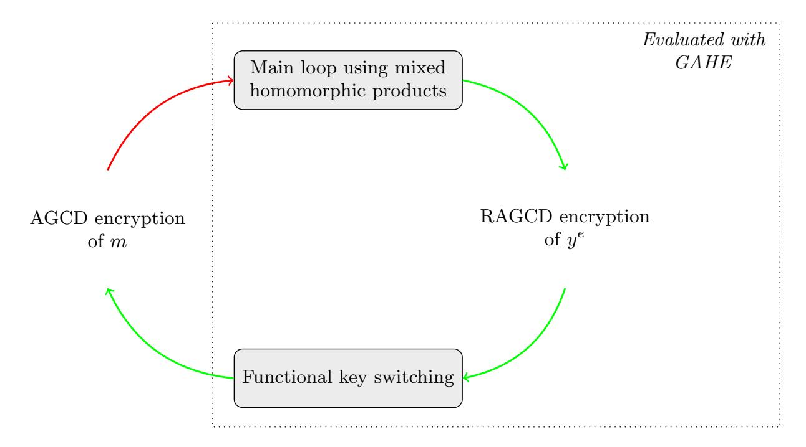

{0}------------------------------------------------

# Bootstrapping fully homomorphic encryption over the integers in less than one second

Hilder Vitor Lima Pereira

COSIC, KU Leuven??

Abstract. One can bootstrap LWE-based fully homomorphic encryption (FHE) schemes in less than one second, but bootstrapping AGCDbased FHE schemes, also known as FHE over the integers, is still very slow. In this work we propose a fast bootstrapping method for FHE over the integers, closing thus this gap between these two types of schemes. We use a variant of the AGCD problem to construct a new GSW-like scheme that can natively encrypt polynomials, then, we show how the single-gate bootstrapping method proposed by Ducas and Micciancio (EUROCRYPT 2015) can be adapted to FHE over the integers using our scheme, and we implement a bootstrapping that, using around 400 MB of key material, runs in less than one second in a common personal computer.

Keywords: Fully Homomorphic Encryption, AGCD, Bootstrapping.

# 1 Introduction

The two main families of fully homomorphic encryption (FHE) schemes are the ones based on lattices, mainly on the Learning with Errors (LWE) problem, and the schemes over the integers, based on the Approximate Greatest Common Divisor (AGCD) problem. Immediately after the first FHE scheme was proposed by Gentry [Gen09], a scheme over the integers was put forth as a simpler alternative [DGHV10]. Thereafter, several techniques were proposed to improve the efficiency of FHE, and one always found ways to apply those techniques to both families of homomorphic schemes. For example, a method to reduce the noise by scaling a ciphertext and switching the modulus of the ciphertext space, known as modulus switching, was proposed in [BV11] and was soon adapted for schemes over the integers [CNT12]. A technique known as batching, which consists in encrypting several messages into a single ciphertext so that each homomorphic operation acts in parallel on all the encrypted messages, has also been applied to RLWE schemes [BGV12,GHS12] and to schemes over the integers [CCK<sup>+</sup>13]. Finally, in 2013, Gentry, Sahai, and Waters introduced a FHE scheme that uses a decomposition technique to turn the noise growth of homomorphic products

<sup>??</sup> This paper was written while the author was working at the University of Luxembourg.

{1}------------------------------------------------

roughly additive [GSW13], i.e., the homomorphic product of two ciphertexts c and c' yields a ciphertext  $c_{mult}$  whose noise is approximately the noise of c plus the noise of c'. Even this technique was adapted to the schemes over the integers [BBL17].

However, new fast bootstrapping techniques, one of the last great achievements of FHE, has only been availed for (R)LWE schemes: In |ASP14|, it was proposed to bootstrap a base scheme whose ciphertext space is  $\mathbb{Z}_q$  by using a GSW-like scheme whose plaintext space contains  $\mathbb{Z}_q$ . Because of the slow noise growth of GSW-like schemes, the final noise accumulated in the refreshed ciphertext is only polynomial in the security parameter  $\lambda$ , therefore, it is not necessary to set large parameters for the base scheme as it was done in previous bootstrapping methods, where the parameters have to allow a scheme to evaluate its own decryption function. Then, in |DM15|, the authors found an efficient way to represent  $\mathbb{Z}_q$ , removed the expensive final step of the method proposed in [ASP14], and implemented a boostrapping that runs in less than one second in a common laptop using a GSW-like scheme based on the RLWE problem. The running times of [DM15] were further improved in [CGGI16] and a base scheme based on LWE was bootstrapped in less than 0.1 second also using a RLWE-based GSW-like scheme. Nevertheless, none of those techniques has been adapted to FHE over the integers.

The main difficulties one has to deal with when trying to create similar bootstrapping methods for FHE over the integers are:

- 1. One needs an efficient GSW-like scheme based on the AGCD problem. For instance, the GSW-like scheme proposed in [BBL17] is far from practical. The scheme of [Per20] has better running times and, at first glance, seems to be a good choice, however, the size of the bootstrapping keys that it produces is huge.
- 2. The modulus p is secret: the decryption function of (R)LWE-based schemes is defined modulo a *public* integer q, thus, all the homomorphic operations performed during the bootstrapping can safely disclose q, but for AGCD-based schemes, we have an integer p which is at the same time the modulus and the secret key, hence, the bootstrapping must hide p.
- 3. The modulus p is exponentially large in  $\lambda$ : in (R)LWE-based schemes, one can set the modulus q to be just polynomially large in the security parameter, while in FHE over the integers we have  $p \in \Omega(2^{\lambda})$ , and the fast bootstrapping of [DM15] would require the message space of the GSW-like scheme to contain polynomials of degree bigger than p. But then, all the homomorphic operations would take exponential time, since they would be performed by adding and multiplying polynomials of degree  $\Omega(2^{\lambda})$ .

Thus, in this work we address these three issues and propose fast bootstrapping methods for FHE over the integers, aiming then to close the gap between LWE- and AGCD-based schemes. Namely, we introduce a new hardness problem that cannot be easier than the AGCD problem, then we use it to construct an efficient GSW-like scheme that works homomorphically on polynomial rings of

{2}------------------------------------------------

the form  $\mathbb{Z}_t[x]/\langle f \rangle$ . Therewith we show how to perform gate bootstrapping, as in [DM15,CGGI16]. We implemented a proof-of-concept in C++ and refreshed ciphertexts of FHE schemes over the integers in less than one second.

#### 1.1 Overview of our techniques and results

New underlying problem and GSW-like scheme: Our first contribution is to use the AGCD problem to construct a GSW-like homomorphic encryption scheme that operates efficiently and natively on polynomial rings. We remark that given N AGCD instances  $c_i := pq_i + r_i$ , one can represent them as a polynomial  $c(x) := \sum_{i=0}^{N-1} c_i x^i$ , which can then be written as c(x) = pq(x) + r(x). Thus, if we extend the AGCD problem to sample polynomials q(x) and r(x) and return pq(x) + r(x), we obtain an equivalent problem. But now, by fixing a polynomial ring R, for example,  $R = \mathbb{Z}[x]/\langle x^N + 1 \rangle$ , and a secret polynomial  $k(x) \in R$ , we can obtain randomized samples of the form (pq(x) + r(x))k(x). Because we are randomizing a problem that is equivalent to the AGCD, we obtain a problem that cannot be easier than the AGCD problem. We call it Randomized (Polynomial) AGCD (RAGCD) problem. Moreover, as it was noticed in |CP19|, solving randomized versions of the AGCD problem seems to be harder than solving the original AGCD problem, therefore, we can select smaller parameters. In particular, each AGCD sample is a  $\gamma$ -bit integer, but in our case each coefficient of the polynomials will be an integer with bit length around  $\gamma/N$ , where N is the degree of k(x). Hence, we can use the RAGCD problem to encrypt a degree-N polynomial m into a degree-N polynomial c whose total bit-length is then  $N \cdot \gamma/N = \gamma$ , while using the AGCD problem would require one  $\gamma$ -bit ciphertext for each coefficient, resulting in a total of  $N\gamma$  bits.

Thus, using the RAGCD problem, we propose a GSW-like scheme that can encrypt a polynomial  $m \in R$  in two formats:

- Scalar format:  $(pq + r + \alpha m) \cdot k \in R$ , for some integer  $\alpha$ .
- Vector format:  $(p\mathbf{q}+\mathbf{r})\cdot k+\mathbf{g}m\in R^{\ell}$ , where  $\mathbf{g}=(b^0,...,b^{\ell-1})$  for some  $b\in\mathbb{Z}$ .

Therewith we can define an efficient mixed homomorphic multiplication from  $R \times R^{\ell}$  to R that is akin to the external product used in [CGGI16]. We notice that the main source of efficiency of the bootstrapping method proposed in [CGGI16] is the use of this external product, hence, we have the first piece of a fast bootstrapping for FHE over the integers.

Fast bootstrapping for FHE over the integers: Firstly, notice that simply trying to implement the bootstrapping procedures of [DM15] or [CGGI16] with our scheme would not work, since it would require us to use  $N > p \in \Omega(2^{\lambda})$ , which is not efficient, and it would also leak p. Therefore, to solve these issues related to the size and the privacy of the modulus used in the decryption of AGCD-based schemes, we propose to perform a "hidden approximate modulus switching". Namely, consider a message  $m \in \mathbb{Z}_t$  and a ciphertext c = pq + r + mp/t to be bootstrapped. Multiplying c by N/p would switch the modulus, resulting in c' = Nq + r' + mN/t, for a potentially small N that could be managed by our 

{3}------------------------------------------------

scheme. Of course, we cannot do it before refreshing because having access to N/p would leak p. Even if we could perform the modulus switching in a secure way, without revealing p, as in [CNT12], the resulting ciphertext c' would leak the message m, because N is known. Thus, we propose that the product  $c \cdot N/p$  be performed as part of the refreshing procedure, so that the secret key p is encrypted in the bootstrapping keys and the resulting ciphertext c' is only produced in an encrypted form.

Essentially, since  $y := x^2$  has order N in  $R := \mathbb{Z}[x]/\langle x^N + 1 \rangle$ , we have  $y^a \cdot y^b = y^{a+b \mod N}$ , so we can use our GSW-like scheme, which we name GAHE, to work homomorphically over  $\mathbb{Z}_N$ . Thus, we would like to define the bootstrapping keys as encryptions of  $y^{2^i N/p}$  for  $0 \le i < \gamma$ , and then, to refresh a  $\gamma$ -bit ciphertext c = pq + r + mp/t of the base scheme, we would decompose c in base two obtaining the bits  $(c_0, ..., c_{\gamma-1})$  and use the homomorphic mixed product to multiply the bootstrapping keys and obtain a GAHE ciphertext  $\tilde{c}$  encrypting

$$\prod_{i=0}^{\gamma-1} y^{c_i 2^i N/p \bmod N} = y^{\sum_{i=0}^{\gamma-1} c_i 2^i N/p \bmod N} = y^{cN/p \bmod N} = y^{r'+mN/t}.$$

After this, we could apply techniques similar to those of [DM15] to transform  $\tilde{c}$  into a base scheme ciphertext encrypting m. The problem now is that  $2^{i}N/p$  is not integer. Hence, we encrypt  $y^{\lfloor 2^{i}N/p \rfloor}$  instead of  $y^{2^{i}N/p}$ . By noticing that  $\lfloor 2^{i}N/p \rfloor = 2^{i}N/p + \epsilon_{i}$  for some  $\epsilon_{i} \in [-1/2, 1/2]$ , we see that computing the same sequence of homomorphic products yields a GAHE encryption of  $y^{r'+mN/t+\epsilon}$  for some term  $\epsilon$  that is not too big. Finally, we propose a functional key-switching to transform this GAHE ciphertext into a base scheme (AGCD-based) encryption of m. By choosing the parameters carefully, the noise term of the final ciphertext is smaller than the initial noise.

Functional key switching: We propose a procedure to transform ciphertexts by switching the secret key under which they are encrypted and also applying some function to the message that is encrypted. Namely, given a ciphertext cencrypting a message m under key sk, our functional key-switching procedure produces a new ciphertext  $\bar{c}$  that encrypts  $\phi(m) \cdot \mathbf{u}$ , where  $\phi(m)$  is the vector of coefficients of m and  $\mathbf{u}$  is an arbitrary vector. Depending on how the parameters are chosen, this procedure can be used to switch the underlying problem from the RAGCD to the original AGCD problem and vice versa; or to reduce the noise of a ciphertext; or to change the message that is encrypted. In our bootstrapping method, the functional key switching is used as follows: for a value  $e \in \mathbb{Z}$  depending on the message m, we transform a GAHE encryption of  $y^e$  into a ciphertext of the base scheme (the scheme that is being bootstrapped) encrypting m. An overview of our bootstrapping procedure is illustrated in Figure 1. Furthermore, when compared to other key- or modulus-switching procedures for AGCD-based schemes, as the one proposed in [CNT12], our procedure is more general and seems more straightforward.

{4}------------------------------------------------



Fig. 1: Two steps of our single-bit bootstrapping. Its input is an encryption of m under the AGCD problem with large noise and the output is an encryption of the same message with less noise.

Implementation and practical results: We implemented our bootstrapping procedures in C++ and executed experiments similar to [DM15] and [CGGI16]. Although our implementation is not optimized, we obtained running times and memory consumption similar to [DM15], i.e., we could bootstrap the base scheme in less than one second. For the best of our knowledge, all the previous bootstrapping methods for FHE over the integers took several seconds (or even minutes). Our implementation is publicly available. All the details are shown in Section 6.

### 2 Theoretical background and related works

#### 2.1 Notation and basic facts

We use R to denote the cyclotomic ring  $\mathbb{Z}[x]/\langle x^N+1\rangle$ , where N is a power of two. When we refer to an element f of R, we always mean the unique representative of degree smaller than N, thus, writing  $f = \sum_{i=0}^{N-1} f_i x^i$  is unambiguous and we can define the coefficient vector of f as  $\phi(f) := (f_0, ..., f_{N-1})$ . The anticirculant matrix of f is the matrix  $\mathbf{\Phi}(f) \in \mathbb{Z}^{N \times N}$  such that the i-th row is equal to  $\phi(x^{i-1} \cdot f)$  for  $1 \le i \le N$ . It is worth noticing that for  $a, b \in \mathbb{Z}$  and  $f, g \in R$ , we have  $\phi(af + bg) = a\phi(f) + b\phi(g)$  and  $\phi(f)\mathbf{\Phi}(g) = \phi(f \cdot g)$ .

We denote vectors by bold lowercase letters and use the infinity-norm  $\|\mathbf{v}\| := \|\mathbf{v}\|_{\infty}$ . For any  $f \in R$ , we define  $\|f\| = \|\phi(f)\|$ . Notice that  $\|fg\| \le N \|f\| \|g\|$ . We denote matrices by bold capital letters and use the max-norm  $\|\mathbf{A}\| := \|\mathbf{A}\|_{\max} = \max\{|a_{i,j}| : a_{i,j} \text{ is an entry of } \mathbf{A}\}$ . If the entries of both  $\mathbf{A}$  and  $\mathbf{B}$  belong to R, then,  $\|\mathbf{A} \cdot \mathbf{B}\| \le mN \|\mathbf{A}\| \cdot \|\mathbf{B}\|$ , where m is the number of rows of  $\mathbf{B}$ . If at least one of the matrices is integral, then  $\|\mathbf{A} \cdot \mathbf{B}\| \le m \|\mathbf{A}\| \cdot \|\mathbf{B}\|$ .

{5}------------------------------------------------

Integer intervals are denoted with double brackets, e.g., an integer interval open on a and closed on b is  $[a,b] = \mathbb{Z} \cap ]a,b]$ . The notation  $[x]_m$  means the only integer y in [-m/2, m/2[ such that  $x=y \mod m$ . When applied to vectors or matrices,  $[\cdot]_m$  is applied entry-wise, when applied to polynomials, it is applied to each coefficient. We define the column vector  $\mathbf{g} := (1,b,b^2,...,b^{\ell-1})^T$ . For any  $a \in ]-b^\ell,b^\ell[$ , let  $g^{-1}(a)$  be the signed base-b decomposition of a such that the inner product  $g^{-1}(a)\mathbf{g}$  is equal to a. For a polynomial f with coefficients in  $[-b^\ell,b^\ell]$ , we define  $g^{-1}(f):=\sum_{i=0}^{\deg(f)}g^{-1}(f_i)x^i$ . Thus,  $g^{-1}(f)\mathbf{g}=f$ . At some points, instead of writing  $r+\lfloor p/t \rfloor m$  with  $r\in \mathbb{Z}$ , we can simply write r'+mp/t. In such cases, we are supposing that  $r'=r-\epsilon m\in \mathbb{Q}$ , where  $\lfloor p/t \rfloor=p/t-\epsilon$ .

### 2.2 Approximate-GCD problem

The Approximate Greatest Common Divisor problem (also known as Approximate Common Divisor problem, ACD) was introduced in [HG01] and since then it has been used to construct several homomorphic encryption schemes [DGHV10,CCK<sup>+</sup>13,CS15]. The best known attacks against it run in exponential time [GGM16] and it is believed to be quantumly hard [BBL17]. Moreover, a variant of the problem in which the noise is sampled from a different distribution is equivalent to the LWE problem [CS15]. Now, we define this problem formally:

**Definition 1.** Let  $\rho$ ,  $\eta$ ,  $\gamma$ , and p be integers such that  $\gamma > \eta > \rho > 0$  and  $2^{\eta-1} \leq p \leq 2^{\eta}$ . The distribution  $\mathcal{D}_{\gamma,\rho}(p)$ , whose support is  $[0,2^{\gamma}]$  is defined as

$$\mathcal{D}_{\gamma,\rho}(p) := \{ Sample \ q \leftarrow \llbracket 0, 2^{\gamma}/p \ \llbracket \ and \ r \leftarrow \rrbracket - 2^{\rho}, 2^{\rho} \llbracket \ : \ Output \ x := pq + r \}.$$

**Definition 2 (AGCD problem).** The  $(\rho, \eta, \gamma)$ -approximate-GCD problem is the problem of finding p, given arbitrarily many samples from  $\mathcal{D}_{\gamma,\rho}(p)$ .

The  $(\rho, \eta, \gamma)$ -decisional-approximate-GCD problem is the problem of distinguishing between  $\mathcal{D}_{\gamma,\rho}(p)$  and  $\mathcal{U}(\llbracket 0, 2^{\gamma} \rrbracket)$ .

#### 2.3 Related work

Fast bootstrapping using polynomial rings In [DM15], the authors observed that in the polynomial ring  $\mathbb{Z}[x]/\langle x^N+1\rangle$ , the element  $y:=x^{2N/q}$  has order q. Thus, the multiplicative group  $\mathcal{G}:=\langle y\rangle$  is isomorphic to  $\mathbb{Z}_q$ , in other words, we can map  $a_i\in\mathbb{Z}_q$  to  $y^{a_i}\in\mathcal{G}$  and  $a_i+a_j \mod q$  corresponds to  $y^{a_i}\cdot y^{a_j} \mod x^N+1=y^{a_i+a_j \mod q}$ . Additionally, representing  $\mathbb{Z}_q$  with  $\mathcal{G}$  is more efficient than using symmetric groups, as it was proposed in [ASP14], since it allows us to instantiate a GSW-like scheme with the RLWE instead of the LWE problem and to evaluate the decryption function of the base scheme by multiplying low-dimensional polynomial matrices instead of high-dimensional integral matrices.

Then, [DM15] proposes a gate bootstrapping, i.e., they propose a simple base scheme that encrypts one bit and can evaluate one binary gate homomorphically, then it has to be bootstrapped. Thus, evaluating a binary circuit with this scheme

{6}------------------------------------------------

requires that we perform the refreshing function after each gate. The binary gates are very efficient as they require only  $\Theta(n)$  simple additions modulo q, hence, refreshing the resulting ciphertext is the expensive part. The base scheme uses the LWE problem to encrypt a message m as  $\mathbf{c} := (\mathbf{a}, b := \mathbf{a}\mathbf{s} + e + mq/t \mod q) \in \mathbb{Z}_q^{n+1}$ . The bootstrapping keys are GSW encryptions of the secret key  $\mathbf{s}$  essentially as follows:  $\mathfrak{K}_{i,j} = \mathsf{GSW}.\mathsf{Enc}(y^{-2^i \cdot s_j})$  for  $0 \le i \le \ell := \lceil \log(q) \rceil$  and  $1 \le j \le n$ . Then, given a ciphertext  $\mathbf{c} = (\mathbf{a}, b)$  to be refreshed, we write  $\mathbf{a} = (a_1, ..., a_n)$ , decompose each  $a_j$  in base 2, obtaining  $(a_{0,j}, ..., a_{\ell-1,j})$ , and the first step consists in using GSW's homomorphic product to compute  $b - \mathbf{a}\mathbf{s} = e + mq/t \mod q$ , i.e.:

$$\mathsf{GSW}.\mathsf{Enc}(y^b) \prod_{j=1}^n \prod_{0 \le i < \ell} \mathfrak{K}_{i,j} = \mathsf{GSW}.\mathsf{Enc}(y^{b - \sum_{j=1}^n a_j s_j \bmod q}).$$

The second step consists in transforming a GSW encryption of  $y^{e+mq/t}$  in a base scheme ciphertext encrypting m. Roughly speaking, this is done by taking the coefficient vector of one specific row of the GSW ciphertext and multiplying it by a fixed vector, then, applying a modulus- and a key-switching.

In [CGGI16], the authors noticed that instead of simply using the GSW homomorphic product, which consists in multiplying matrices of polynomials, we can perform the bootstrapping using a mixed product in which one operand is an RLWE ciphertext (thus, a vector) and the other one is a GSW ciphertext (thus, a matrix), resulting then in an RLWE ciphertext (again a vector). The authors called it an external product. This speeds up the bootstrapping since it replaces matrix-matrix products by vector-matrix multiplications.

Notice that in the context of AGCD-based schemes, q would be replaced by a secret  $p \in \Omega(2^{\lambda})$  and we would need  $N \approx p$ , thus, the degree of the polynomials encrypted by the GSW-like scheme would be exponentially large. Moreover, since N would be public and  $2N \in p\mathbb{Z}$ , it would be possible to recover p.

**GSW-like schemes over the integers** In [BBL17], the authors use the AGCD problem to construct a GSW-like leveled homomorphic encryption scheme that encrypts a single bit m into a vector  $\mathbf{c} := p\mathbf{q} + \mathbf{r} + m\mathbf{g} \in \mathbb{Z}^{\gamma}$  where  $p\mathbf{q} + \mathbf{r} \leftarrow (\mathcal{D}_{\gamma,\rho}(p))^{\gamma}$  and  $\mathbf{g} = (2^0, 2^1, \dots, 2^{\gamma-1})$ . To perform homomorphic products, they define the operator  $\mathbf{G}^{-1}(\mathbf{c}) \in \{0,1\}^{\gamma \times \gamma}$  as a matrix such that each column j is  $g^{-1}(c_j)$ , that is, the binary decomposition of the j-th entry of  $\mathbf{c}$ . Notice that  $\mathbf{g}\mathbf{G}^{-1}(\mathbf{c}) = \mathbf{c}$ , thus, two ciphertexts  $\mathbf{c}_i := p\mathbf{q}_i + \mathbf{r}_i + m_i\mathbf{g}$  (for i = 1, 2) are multiplied homomorphically as

$$\mathbf{c}_{mult} := \mathbf{c}_{1}\mathbf{G}^{-1}(\mathbf{c}_{2})$$

$$= p\mathbf{q}_{1}\mathbf{G}^{-1}(\mathbf{c}_{2}) + \mathbf{r}_{1}\mathbf{G}^{-1}(\mathbf{c}_{2}) + m_{1}\mathbf{g}\mathbf{G}^{-1}(\mathbf{c}_{2})$$

$$= p\underbrace{(\mathbf{q}_{1}\mathbf{G}^{-1}(\mathbf{c}_{2}) + m_{1}\mathbf{q}_{2})}_{\mathbf{q}_{mult}} + \underbrace{(\mathbf{r}_{1}\mathbf{G}^{-1}(\mathbf{c}_{2}) + m_{1}\mathbf{r}_{2})}_{\mathbf{r}_{mult}} + m_{1}m_{2}\mathbf{g}.$$

We see that the noise growth due to the homomorphic product is approximately additive, i.e.,  $\|\mathbf{r}_{mult}\| \leq \|\mathbf{r}_1 \mathbf{G}^{-1}(\mathbf{c}_2)\| + m_1 \|\mathbf{r}_2\| \leq \gamma \|\mathbf{r}_1\| + \|\mathbf{r}_2\|$ . However, this scheme is not practical. Their authors report that performing one single

{7}------------------------------------------------

multiplication takes several seconds in a modern CPU. The main reason for this inefficiency is the huge ciphertext expansion, as it encrypts one bit into γ <sup>2</sup> bits and, typically, γ is much bigger than λ.

Trying to amend this issue, in [Per20] it is proposed to expand the message space of [BBL17] so that instead of encrypting only bits, it is possible to encrypt vectors and matrices with non-binary entries. Furthermore, the ciphertexts are randomized with a hidden matrix K, since, as it was observed in [CP19], all the attacks against the AGCD problem become much more expensive when the AGCD samples are multiplied by a random matrix and, thus, one can choose smaller parameters, in particular, one can decrease the size of γ and have better ciphertext expansion. The resulting scheme is a GSW-like leveled homomorphic scheme that can perform operations with matrices and vectors, in particular, it is possible to do homomorphic vector-matrix products. Notice that by using coefficient vectors and circulant matrices to represent elements of R, we can use this scheme to operate homomorphically over R. In particular, we could, in principle, use it in a bootstrapping procedure `a la [DM15]. However, by doing so, we would encrypt a degree-N polynomial into a matrix ciphertext of dimension N ` × N, with ` = Θ(γ), which would yield very large bootstrapping keys.

Hence, we go one step further and propose to randomize the AGCD problem with a random polynomial k(x) instead of a random matrix. Thereby we can encrypt a polynomial of degree N into an `-dimensional vector whose each entry is a degree-N polynomial, gaining thus a factor N. We also define two types of ciphertexts and we provide an efficient homomorphic product between them. This corresponds to the vector-matrix product of [Per20] and to the external product of [CGGI16].

# 3 Randomized (Polynomial) AGCD problem

We start by extending the AGCD problem to a problem that is strictly equivalent, but that works on polynomials. Then, we propose to randomize this problem with a hidden polynomial k(x), obtaining thus the underlying problem that will be used in our scheme.

Definition 3 (Underlying distribution of PAGCD). Let N, ρ, η, γ, and p be integers such that γ > η > ρ > 0 and p is an η-bit integer. The distribution <sup>P</sup>N,γ,ρ(p), whose support is <sup>J</sup>0, <sup>2</sup> <sup>γ</sup> <sup>−</sup> <sup>1</sup><sup>K</sup> <sup>N</sup> , is defined as

$$\mathcal{P}_{N,\gamma,\rho}(p) := \left\{ Sample \ c_0, ..., c_{N-1} \leftarrow \mathcal{D}_{\gamma,\rho}(p) : \ Output \ c := \sum_{i=0}^{N-1} c_i x^i \right\}$$

.

Definition 4 (PAGCD). The (N, ρ, η, γ)-polynomial-approximate-GCD problem is the problem of finding p, given many samples from PN,γ,ρ(p).

The (N, ρ, η, γ)-decisional-PAGCD problem is the problem of distinguishing between <sup>P</sup>N,γ,ρ(p) and <sup>U</sup>(J0, <sup>2</sup> γ J <sup>N</sup> ).

{8}------------------------------------------------

Because each coefficient of each polynomial output by  $\mathcal{P}_{N,\gamma,\rho}(p)$  is an independent sample of  $\mathcal{D}_{\gamma,\rho}(p)$ , having N samples of the AGCD problem is the same as having one sample of the PAGCD problem, hence, it is clear that the PAGCD and the original AGCD problem are equivalent.

Now, aiming to choose smaller parameters and following the ideas of [CP19] and [Per20], we propose a randomized version of this problem, but instead of randomizing a vector of AGCD samples with a hidden matrix  $\mathbf{K}$ , we randomize a sample of  $\mathcal{P}_{N,\gamma,\rho}(p)$  with a hidden polynomial k, performing the operations in the ring  $R := \mathbb{Z}[x]/\langle f \rangle$ , for some f of degree N.

**Definition 5 (Underlying distribution of RAGCD).** Let  $N, \rho, \eta, \gamma$ , and p be integers such that  $\gamma > \eta > \rho > 0$  and p has  $\eta$  bits. Let f be a degree-N integral polynomial,  $R := \mathbb{Z}[x]/\langle f \rangle$ ,  $x_0$  be a sample from  $\mathcal{D}_{\gamma,\rho}(p)$ , and k be an random invertible polynomial of  $R/x_0R$ . The distribution  $\mathcal{R}_{N,\gamma,\rho,x_0}(p,k)$ , whose support is  $R/x_0R$  is defined as

```
\mathcal{R}_{N,\gamma,\rho,x_0}(p,k) := \{Sample\ c \leftarrow \mathcal{P}_{N,\gamma,\rho}(p):\ Output\ \tilde{c} := c \cdot k \in R/x_0R\}.
```

**Definition 6 (RAGCD).** The  $(x_0, N, \rho, \eta, \gamma)$ -RAGCD problem is the problem of finding p and k, given arbitrarily many samples from  $\mathcal{R}_{N,\gamma,\rho,x_0}(p,k)$ .

The  $(x_0, N, \rho, \eta, \gamma)$ -decisional-RAGCD problem is the problem of distinguishing between  $\mathcal{R}_{N,\gamma,\rho,x_0}(p,k)$  and  $\mathcal{U}(R/x_0R)$ .

We can instantiate this problem using any polynomial ring  $\mathbb{Z}[x]/\langle f \rangle$ , however, one has to carefully choose the polynomial used as the modulus, in particular, if f is not irreducible in  $\mathbb{Z}[x]$ , then its factors can lead to attacks on easier instances of the RAGCD problem. In Section 6.1, a detailed discussion about the choice of f is presented. For our bootstrapping procedure, we use  $f = x^N + 1$  with N being a power of two.

Notice that given many instances of PAGCD problem, we can select one coefficient of any polynomial to be the scalar  $x_0$ , then sample a random invertible k, and multiply each PAGCD instance by k in  $R/x_0R$ , obtaining thus valid instances of the RAGCD problem. Thus, this problem cannot be easier than the PAGCD problem. Therefore, because the PAGCD and the original AGCD problem are equivalent, the RAGCD problem is not easier than the AGCD problem.

However, for the decisional version of the problems, this argument is not valid, since we would still have to prove that the distribution  $\mathcal{U}(\llbracket 0, 2^{\gamma} \llbracket^N)$  from the decisional-PAGCD problem is mapped to the corresponding distribution  $\mathcal{U}(R/x_0R)$  of the decisional-RAGCD. So, in the next lemma, we prove that if we fix  $x_0 \geq 2^{\gamma-1}$  and restrict the distribution  $\mathcal{R}_{N,\gamma,\rho,x_0}(p,k)$  so that it only randomizes polynomials with coefficients smaller than  $x_0$ , then we obtain a distribution that is indistinguishable from  $\mathcal{U}(R/x_0R)$  under the hardness of the decisional AGCD problem. In other words, under the decisional-AGCD assumption, this "restricted version" of the decisional-RAGCD assumption holds.

**Lemma 1.** Let  $x_0$  be a sample of  $\mathcal{D}_{\gamma,\rho}(p)$  such that  $x_0 \geq 2^{\gamma-1}$ . Let  $\mathcal{D}_{< x_0}$  be the distribution obtained by rejecting samples of  $\mathcal{D}_{\gamma,\rho}(p)$  that are bigger than or

{9}------------------------------------------------

equal to  $x_0$ . Let  $\mathcal{R}_{< x_0}$  be defined as  $\mathcal{R}_{N,\gamma,\rho,x_0}(p,k)$ , but randomizing polynomials with coefficients smaller than  $x_0$ , that is:

$$\mathcal{R}_{< x_0} := \left\{ Sample \ c \leftarrow \sum_{i=0}^{N-1} x^i \cdot \mathcal{D}_{< x_0} : \ Output \ \tilde{c} := c \cdot k \in R/x_0 R \right\}.$$

Then, distinguishing between  $\mathcal{R}_{< x_0}$  and  $\mathcal{U}(R/x_0R)$  is computationally hard under the decisional-AGCD assumption.

*Proof.* Let  $x_0 \geq 2^{\gamma-1}$  be an AGCD sample and  $\mathcal{A}$  be a PPT adversary with non-negligible advantage  $Adv(\mathcal{A})$  in distinguishing  $\mathcal{R}_{< x_0}$  and  $\mathcal{U}(R/x_0R)$ . We will show that  $\mathcal{A}$  can be used to distinguish between  $\mathcal{U}(\mathbb{Z}_{x_0})$  and  $\mathcal{D}_{< x_0}$ .

Given samples  $x_1, ..., x_M$  from  $\mathcal{U}(\mathbb{Z}_{x_0})$  or  $\mathcal{D}_{< x_0}$ , we can sample a polynomial k invertible on  $R/x_0R$ , group the samples N by N, represent them as polynomials  $c_1, ..., c_{\lfloor M/N \rfloor} \in R$  and multiply by k on  $R/x_0R$ , obtaining  $\tilde{c_i} := c_i \cdot k \in R/x_0R$ . At last, we output  $\mathcal{A}(\tilde{c_1}, ..., c_{\lfloor \tilde{M}/N \rfloor})$ .

It is clear that if the samples  $x_i$ 's follow  $\mathcal{U}(\mathbb{Z}_{x_0})$ , then, each  $c_i$  is uniform distributed on  $R/x_0R$ . Moreover, because k is invertible modulo  $x_0$ , multiplying by it does not change the uniform distribution, thus,  $\tilde{c}_i$  follows  $\mathcal{U}(R/x_0R)$  as well. On the other hand, if the  $x_i$ 's are sampled from  $\mathcal{D}_{< x_0}$ , then  $\tilde{c}_i$ 's follow  $\mathcal{R}_{< x_0}$  by the definition of  $\mathcal{R}_{< x_0}$ .

Therefore,  $\mathcal{A}$  receives inputs following valid distributions and the advantage we have in distinguishing  $\mathcal{U}(\mathbb{Z}_{x_0})$  from  $\mathcal{D}_{< x_0}$  is also  $\mathsf{Adv}(\mathcal{A})$ .

However, because  $x_0 \geq 2^{\gamma-1}$ , from Lemma 3 of (the full version of) [Per20], we know that the distributions  $\mathcal{D}_{< x_0}$  and  $\mathcal{U}(\mathbb{Z}_{x_0})$  are indistinguishable under the decisional-AGCD assumption, hence, such  $\mathcal{A}$  cannot exist.

#### 4 GSW-like AGCD-based Homomorphic Encryption

In this section, we present the GSW-like AGCD-based Homomorphic Encryption (GAHE) scheme that will be used to perform the bootstrapping. First of all, let N be a power of two and  $R := \mathbb{Z}[x]/\langle x^N+1\rangle$ . We start with a basic scheme that can encrypt a polynomial  $m \in R$  into a vector  $\mathbf{c} \in R^{\ell}$ . Then, by assuming circular security, we extend the definition of the scheme so that we also have scalar ciphertexts. Finally, we define a functional key-switching. For brevity and because in our main applications, the fast bootstrapping procedure, we only use the mixed homomorphic product, we omit the other homomorphic operations, like additions and "vector-vector" product, presenting them only in Appendix A. Furthermore, to ease the presentation, specially the noise-growth analysis, we keep the modulus  $x_0$  private. Hence, the homomorphic operations are performed on R instead of  $R/x_0R$ , which means that the bit length of the ciphertext grows. However, in our bootstrapping procedure, this growth is small and independent of the multiplicative depth of the homomorphic evaluation.

- GAHE.KeyGen( $1^{\lambda}$ , N, t, b): Choose the parameters  $\eta$ ,  $\rho$ , and  $\gamma$ . Sample an  $\eta$ -bit random prime p. Sample  $x_0$  from  $p \cdot \mathcal{U}(\llbracket 1, 2^{\gamma}/p \rrbracket)$ , until  $x_0 \geq 2^{\gamma-1}$ . Then, sample

{10}------------------------------------------------

k uniformly from R/x0R until k −1 exists over R/x0R. Define `<sup>0</sup> := dlog<sup>b</sup> (2<sup>γ</sup> )e and ` := d`<sup>0</sup> + log<sup>b</sup> (N) + 1 + log<sup>b</sup> (`<sup>0</sup> + log<sup>b</sup> (N) + 1)e 1 . The public parameters are params := {N, t, `, b, η, γ, ρ} and secret key is sk := (p, k, x0).

- GAHE.EncVec(sk, m): Given a polynomial m ∈ R/tR, construct a vector x := (pq + r)k ∈ R` by sampling each entry x<sup>i</sup> independently from RN,γ,ρ,x<sup>0</sup> (p, k), then output the following vector c:

$$\mathbf{c} := [\mathbf{x} + \mathbf{g} \cdot m]_{x_0} \in R^{\ell}.$$

- GAHE.DecVec(sk, c): Let α := bp/te. Compute c := hg −1 ([αk]x<sup>0</sup> ), ci over R/x0R. Then do c 0 := c · k <sup>−</sup><sup>1</sup> ∈ R/x0R and output

$$\left\lfloor \frac{t \cdot [c']_p}{p} \right\rfloor \bmod t.$$

# 4.1 Assuming circular security to extend the scheme

In this section we show that, by assuming circular security, we can encrypt an element of R/tR into a single element of R instead of into a vector. We call a ciphertext produced by this new encryption method a scalar ciphertext and the ones produced by the encryption function defined before are vector ciphertexts. Moreover, we define the mixed homomorphic product between a vector and a scalar ciphertext. It is worth noticing that circular security is regarded as a weak assumption and has been used extensively in all types of homomorphic encryption schemes.

Thus, notice that by assuming circular security, we can use GAHE.EncVec to encrypt m · k · bp/te, obtaining c = (pq + r)k + (m · k · bp/te)g = (pq + r + m · bp/te · g)k. But then, because the first entry of g is 1, we see that the first entry of c has the following format: c<sup>1</sup> = (pq<sup>1</sup> + r<sup>1</sup> + m · bp/te)k ∈ R. Thus, we can extend our scheme with the following procedures:

- GAHE.EncScalar(sk, m): Given a polynomial m ∈ R/tR, sample x := (pq + r)k ← RN,γ,ρ,x<sup>0</sup> (p, k) and output

$$c:=[x+m\cdot \lfloor p/t \rceil \cdot k]_{x_0} \in R.$$

- GAHE.DecScalar(sk, c): Output j t·[c 0 ]p p m mod t where c 0 := c · k <sup>−</sup><sup>1</sup> ∈ R/x0R.
- GAHE.MultMix(c, c): to perform a homomorphic mixed product, we decompose and multiply the scalar ciphertext c by the vector ciphertext c, outputting the following inner product over R: cmult := g −1 (c) · c ∈ R.

<sup>1</sup> If we were publishing x0, then the homomorphic operations could be done modulo x<sup>0</sup> and we could set ` = `0, without adding these extra logarithmic terms.

{11}------------------------------------------------

#### 4.2 Correctness of decryption

In this section we define the noise of a ciphertext and show the necessary conditions for the decryption functions to work.

**Definition 7 (Noise of scalar ciphertext).** Let  $c = (pq + r + \lfloor p/t \rfloor m)k$  be a scalar ciphertext encrypting a message  $m \in R/tR$ . We define the noise of c as  $err(c) := [(c \cdot k^{-1} - \lfloor p/t \rfloor m) \mod x_0]_p$ . Notice that err(c) is exactly r if ||r|| < p/2.

**Definition 8 (Noise of vector ciphertext).** Let  $\mathbf{c} = (p\mathbf{q} + \mathbf{r})k + \mathbf{g}m$  be a vector encryption of  $m \in R/tR$ . We define the noise of  $\mathbf{c}$  as  $\text{err}(\mathbf{c}) := [(\mathbf{c} - \mathbf{g}m) \cdot k^{-1} \mod x_0)]_p$ . Notice that  $\text{err}(\mathbf{c})$  is  $\mathbf{r}$  if  $||\mathbf{r}|| < p/2$ .

Lemma 2 (Upper bound on the noises). Let  $c = (pq + r + \alpha m_1)k \in R$  be a scalar ciphertext and  $\mathbf{c} = (p\mathbf{q} + \mathbf{r})k + \mathbf{g}m_2 \in R^{\ell}$  be a vector ciphertext. Assuming that  $\|\operatorname{err}(c)\|$  and  $\|\operatorname{err}(\mathbf{c})\|$  are both smaller than p/2, it holds that  $\|\operatorname{err}(c)\| = \|r\|$  and  $\|\operatorname{err}(\mathbf{c})\| = \|\mathbf{r}\|$ . In particular, if c and  $\mathbf{c}$  are fresh ciphertexts, then  $\|\operatorname{err}(c)\| < 2^{\rho}$  and  $\|\operatorname{err}(\mathbf{c})\| < 2^{\rho}$ .

Let's first analyze GAHE.DecScalar. Then, the correctness of GAHE.DecVec follows basically by the same argument.

Lemma 3 (Correctness of scalar decryption). Let c be a scalar encryption of  $m \in R/tR$ . If  $\|\operatorname{err}(c)\| < \frac{p}{3t}$ , then GAHE.DecScalar(sk, c) outputs m.

Proof. Let  $c = (pq+r+\lfloor p/t \rceil m)k$ . Consider the polynomial  $c' = c \cdot k^{-1} \in R/x_0R$  defined in GAHE.DecScalar. We can write it as  $c' = pq' + r + \lfloor p/t \rceil m \in R$ . Then, when we perform the reduction modulo p, we obtain  $\bar{c} = [r + \lfloor p/t \rceil m]_p = [\text{err}(c) + \lfloor p/t \rceil m]_p = \text{err}(c) + \epsilon + mp/t - pu$  for some  $\epsilon, u \in R$  with  $\|\epsilon\| \leq 1/2$ .

Thus, in the next step of the decryption function, we have

$$\frac{t\bar{c}}{p} = \frac{t(\operatorname{err}(c) + \epsilon)}{p} + m - ut.$$

But because  $\|\operatorname{err}(c)\| < \frac{p}{3t}$ , we have  $\|t(\operatorname{err}(c) + \epsilon)/p\| < 1/3 + \|t\epsilon/p\| < 1/2$ . Hence, since m - ut has integer coefficients, the rounding function outputs

$$\left\lfloor \frac{t\bar{c}}{p} \right\rvert = \left\lfloor \frac{t(\operatorname{err}(c) + \epsilon)}{p} \right\rvert + m - ut = m - ut.$$

Therefore, the reduction modulo t indeed gives us m.

Lemma 4 (Sufficient conditions for correctness of vector decryption). Let  $\mathbf{c}$  be a vector encryption of  $m \in R/tR$ . If  $\|\mathbf{err}(\mathbf{c})\| < \frac{p}{3N\ell bt}$ , then GAHE.DecVec(sk,  $\mathbf{c}$ ) outputs m.

*Proof.* Let  $\alpha := \lfloor p/t \rfloor$ . Notice that GAHE.DecVec(sk, c) can be rewritten as

- 1. Compute a scalar encryption of the same message m, i.e.,  $c := g^{-1}([\alpha k]_{x_0}) \cdot \mathbf{c}$ .
- 2. Output GAHE.DecScalar(sk, c).

But by definitions 7 and 8, we have

$$\operatorname{err}(c) = [(c \cdot k^{-1} - \alpha m \mod x_0)]_p = [g^{-1}([\alpha k]_{x_0}) \cdot \operatorname{err}(\mathbf{c})]_p.$$

But  $\|g^{-1}([\alpha k]_{x_0}) \cdot \operatorname{err}(\mathbf{c})\| \leq N\ell b \|\operatorname{err}(\mathbf{c})\| < p/(3t)$ . Therefore, the output of GAHE.DecScalar(sk, c) is m by Lemma 3.

{12}------------------------------------------------

#### 4.3 Analysis of mixed homomorphic product

L **c** be a vector encryption of v and c be scalar encryption of s. Also, let  $\mathbf{y} := g^{-1}(c) \in \mathbb{R}^{\ell}$ . In the definition of GAHE.MultMix $(c, \mathbf{c})$  we have  $c_{mult} := \mathbf{y} \cdot \mathbf{c}$ , thus, the following holds:

$$c_{mult} = (p\mathbf{y}\mathbf{q} + \mathbf{y}\mathbf{r})k + \mathbf{y}\mathbf{g}v$$

$$= (p\mathbf{y}\mathbf{q} + \mathbf{y}\mathbf{r})k + cv$$

$$= (p(\mathbf{y}\mathbf{q} + qv) + (\mathbf{y}\mathbf{r} + rv) + \lfloor p/t \rfloor sv)k$$
(By definition of c)
$$= (p(\mathbf{y}\mathbf{q} + qv) + (\mathbf{y}\mathbf{r} + rv) + \lfloor p/t \rfloor sv)k$$
(By definition of c)

Therefore, the mixed homomorphic product takes encryptions of s and v and produces  $c_{mult} = (pq_{mult} + r_{mult} + \lfloor p/t \rfloor sv)k \in R$ , which is a valid scalar encryption of the product of the messages, as expected.

As for the noise growth, we now show that a sequence of n mixed homomorphic products increases the noise just linearly in n.

Lemma 5 (Noise growth of mixed products). Let  $n \in \mathbb{N}^*$ . For all  $i \in [1, n]$ , let  $\mathbf{c}_i$  be a vector encryption of  $m_i$ . Let also  $c_0$  be a scalar encryption of  $m_0$ . Assume that B is an upper bound to the norm of the products of plaintexts, i.e.,  $\left\|\prod_{i=j}^n m_i\right\| \leq B$  for  $0 \leq j \leq n$ . Finally, for  $1 \leq i \leq n$ , define  $c_i := \mathsf{GAHE}.\mathsf{MultMix}(c_{i-1}, \mathbf{c}_i) \in R$  (notice that  $c_i$  is a scalar encryption of  $\prod_{j=0}^i m_j$ ). Then,

$$\|\operatorname{err}(c_n)\| < NB \|\operatorname{err}(c_0)\| + \sum_{i=1}^n N^2 B\ell b \|\operatorname{err}(\mathbf{c}_i)\|.$$
 (1)

In particular, if  $c_0$  and all the  $\mathbf{c}_i$ 's are fresh ciphertexts, then

$$\|\operatorname{err}(c_n)\| < 2N^2 B\ell b n 2^{\rho}. \tag{2}$$

*Proof.* By the analysis done above, we know that the term  $r_i$  of  $c_i$  is  $g^{-1}(c_{i-1})\mathbf{r}_i + r_{i-1}m_i$ . Hence, the term  $r_n$  after n homomorphic products is

$$r_n = r_0 \prod_{i=1}^n m_i + \sum_{i=1}^n g^{-1}(\mathbf{c}_{i-1}) \mathbf{r}_i \left( \prod_{j=i+1}^n m_j \right) \in R.$$

Thus,

$$||r_n|| \le N ||r_0|| \left\| \prod_{i=1}^n m_i \right\| + \sum_{i=1}^n N\ell ||g^{-1}(\mathbf{c}_i)|| \left\| \mathbf{r}_i \left( \prod_{j=i+1}^n m_j \right) \right\|$$

$$\le NB ||r_0|| + \sum_{i=1}^n N^2 \ell bB ||\mathbf{r}_i||.$$

Therefore, Inequality 1 holds. By Lemma 2, if all the operands are fresh ciphertexts, then,  $||r_0|| < 2^{\rho}$  and  $||\mathbf{r}_i|| < 2^{\rho}$ , and the particular case also holds.

{13}------------------------------------------------

### 4.4 Functional Key-Switching

In this section we define a procedure that will play a main role in our bootstrapping, namely, a functional key-switching. Therewith we can change the keys and the dimension of the polynomial ring of a ciphertext and at the same time apply some function to the plaintext. That is to say, given two integers  $N_1$  and  $N_2$ , we define two polynomial rings  $R_i := \mathbb{Z}[x]/\langle x^{N_i} + 1 \rangle$ . Then, we can transform a scalar ciphertext  $c_1 \in R_1$  that encrypts a message  $m \in R_1/tR_1$  under key  $(p_1, k_1)$  into a ciphertext  $c_2$  encrypting  $\phi(m) \cdot \mathbf{u}$  under another key  $(p_2, k_2)$  for any  $\mathbf{u} \in R_2^{N_1}$ , where  $\phi(m) \in \mathbb{Z}^{N_1}$  is the coefficient vector of m.

Like the key-switching procedures of LWE-based schemes, our functional key-switching consists in two parts: firstly, we need both private keys to generate a functional key-switching key; then, using this key, we can publicly perform the transformation.

- FuncKeySwtGen(sk<sub>1</sub>, sk<sub>2</sub>, params, **u**): given params =  $(N_1, N_2, \tilde{b}, \tilde{\ell}, \tilde{\gamma}, \tilde{\rho})$ , secret keys sk<sub>i</sub> =  $(p_i, k_i) \in \mathbb{Z} \times R_i$ , and a vector  $\mathbf{u} \in R_2^{N_1}$ , proceed as follows:
  - 1. Define  $\mathbf{g}_{\tilde{b}} := (\tilde{b}^0, ..., \tilde{b}^{\tilde{\ell}-1}) \in \mathbb{Z}^{\tilde{\ell} \times 1}$  and  $\mathbf{G} = \mathbf{I}_{N_1} \otimes \mathbf{g}_{\tilde{b}} \in \mathbb{Z}^{N_1 \tilde{\ell} \times N_1}$ .
  - 2. Let  $\mathbf{v} := \left\lfloor \frac{p_2}{p_1} \mathbf{G} \boldsymbol{\Phi}(k_1^{-1}) \mathbf{u} \right\rceil \in R_2^{N_1 \tilde{\ell}}$ , where  $p_2/p_1$  must be interpreted as a fraction in  $\mathbb{Q}$  and the inverse of  $k_1$  is computed on  $R_1/p_1R_1$ .
  - 3. Sample M from  $p_2 \cdot \mathcal{U}([0, 2^{\tilde{\gamma}}/p_2])$ .
  - 4. Sample **y** from  $(\mathcal{P}_{N_2,\tilde{\gamma},\tilde{\rho}}(p_2))^{N_1\tilde{\ell}}$ .
  - 5. Output swk :=  $[(\mathbf{y} + \mathbf{v}) \cdot k_2]_M$ . Notice that the output is of the form

$$\left(p_2\mathbf{q} + \mathbf{r} + \left| \frac{p_2}{p_1}\mathbf{G}\boldsymbol{\Phi}(k_1^{-1})\mathbf{u} \right| \right) \cdot k_2 \in R_2^{N_1\tilde{\ell}}.$$

- FuncKeySwt $(c_1, \mathsf{swk})$ : Given a scalar ciphertext  $c_1 \in R_1$  and a functional keyswitching key  $\mathsf{swk} \in R_2^{N_1\tilde{\ell}}$ , define  $\mathbf{z} := \boldsymbol{\phi}(c_1) \in \mathbb{Z}^{N_1}$ , decompose each entry of  $\mathbf{z}$ in base  $\tilde{b}$  as  $\mathbf{w} := (g^{-1}(z_1), ..., g^{-1}(z_{N_1})) \in \mathbb{Z}^{N_1\tilde{\ell}}$ , and output  $c_2 := \mathbf{w} \cdot \mathsf{swk} \in R_2$ .

Lemma 6 (Correctness of functional key switching).

Let  $\mathbf{u} \in R_2^{N_1}$ ,  $\mathsf{sk}_i := (p_i, k_i) \in \mathbb{Z} \times R_i$ , and  $\mathsf{params} := (N_1, N_2, \tilde{b}, \tilde{\ell}, \tilde{\gamma}, \tilde{\rho})$ . Let also  $\mathsf{swk} := \mathsf{FuncKeySwtGen}(\mathsf{sk}_1, \mathsf{sk}_2, \mathsf{params}, \mathbf{u})$ . Then, for any  $c_1 \in R_1$  encrypting  $m \in R_1/tR_1$  under key  $\mathsf{sk}_1$ , it holds that  $c_2 := \mathsf{FuncKeySwt}(c_1, \mathsf{swk})$  is a valid encryption of  $\phi(m) \cdot \mathbf{u} \in R_2$  under key  $\mathsf{sk}_2$ , if  $\|c_1\| < \tilde{b}^{\tilde{\ell}}$ . Moreover, the noise term of  $c_2$  is bounded as follows:

$$\|\operatorname{err}(c_2)\| \leq \tilde{\ell} N_1 \tilde{b} 2^{\tilde{\rho}} + 2^{\eta_2 - \eta_1 + 2} N_1 \|\mathbf{u}\| \|\operatorname{err}(c_1)\|$$

where  $\eta_i$  is the bit length of  $p_i$ .

Proof. Let  $c_1 = (p_1q_1 + r_1 + \alpha_1 m)k_1 \in R_1$ , where  $\alpha_1 := \lfloor p_1/t \rfloor$ . Notice that **w** defined in FuncKeySwt satisfies  $\mathbf{wG} = \phi(c_1)$  because  $||c_1|| < \tilde{b}^{\tilde{\ell}}$ . Moreover,

{14}------------------------------------------------

$$\phi(c_1)\Phi(k_1^{-1}) = p_1\mathbf{q}_1 + \phi(r_1) + \alpha_1\phi(m)$$
. Therefore, the output of FuncKeySwt is

$$c_{2} = (p_{2}\mathbf{w}\mathbf{q} + \mathbf{w}\mathbf{r} + \mathbf{w}\boldsymbol{\epsilon} + \frac{p_{2}}{p_{1}}\mathbf{w}\mathbf{G}\boldsymbol{\Phi}(k_{1}^{-1})\mathbf{u}) \cdot k_{2}$$
 (For some  $\|\boldsymbol{\epsilon}\| \leq 1/2$ )
$$= (p_{2}\mathbf{w}\mathbf{q} + \mathbf{w}(\mathbf{r} + \boldsymbol{\epsilon}) + \frac{p_{2}}{p_{1}}(p_{1}\mathbf{q}_{1} + \boldsymbol{\phi}(r_{1}) + \alpha_{1}\boldsymbol{\phi}(m))\mathbf{u})k_{2}$$

$$= (p_{2}q_{2} + \mathbf{w}(\mathbf{r} + \boldsymbol{\epsilon}) + \frac{p_{2}}{p_{1}}(\boldsymbol{\phi}(r_{1}) + \alpha_{1}\boldsymbol{\phi}(m))\mathbf{u}) \cdot k_{2}$$
 (For  $q_{2} := \mathbf{w}\mathbf{q} + \mathbf{q}_{1}\mathbf{u}$ )
$$= (p_{2}q_{2} + \mathbf{w}(\mathbf{r} + \boldsymbol{\epsilon}) + \frac{p_{2}}{p_{1}}(\boldsymbol{\phi}(r_{1}) + \boldsymbol{\epsilon}\boldsymbol{\phi}(m))\mathbf{u} + \frac{p_{2}}{t}\boldsymbol{\phi}(m)\mathbf{u}) \cdot k_{2}$$
 (For some  $\boldsymbol{\epsilon} \in R_{2}$ )

Therefore,  $c_2$  is indeed an encryption of  $\phi(m)\mathbf{u}$  with respect to the key  $\mathsf{sk}_2$ , that is,  $c_2 = (pq_2 + r_2 + p_2\phi(m)\mathbf{u}/t)k_2 \in R_2$  with  $\mathsf{err}(c_2) = r_2 = \mathbf{w}(\mathbf{r} + \boldsymbol{\epsilon}) + \frac{p_2}{p_1}(\phi(r_1) + \epsilon\phi(m))\mathbf{u}$ . Furthermore,

$$\begin{aligned} \|\mathsf{err}(c_{2})\| &\leq \|\mathbf{wr}\| + \|\mathbf{w}\epsilon\| + \left\|\frac{p_{2}}{p_{1}}(\boldsymbol{\phi}(r_{1}) + \epsilon\boldsymbol{\phi}(m))\mathbf{u}\right\| \\ &\leq \tilde{\ell}N_{1}\tilde{b}\,\|\mathbf{r}\| + \tilde{\ell}N_{1}\tilde{b}/2 + 2^{\eta_{2} - \eta_{1} + 1}N_{1}\,\|\mathbf{u}\|\,(\|\mathsf{err}(c_{1})\| + t/2) \\ &\leq \tilde{\ell}N_{1}\tilde{b}2^{\tilde{\rho}} + 2^{\eta_{2} - \eta_{1} + 2}N_{1}\,\|\mathbf{u}\|\,\|\mathsf{err}(c_{1})\|\,. \end{aligned}$$

It turns out that this procedure is very general. For example, if we set  $\mathbf{u}=(1,x,...,x^{N_1})$ , then,  $\phi(m)\mathbf{u}=\sum_{i=0}^{N_1}m_ix^i=m$ , therefore, by using such  $\mathbf{u}$ , our functional key-switching works as an ordinary key-switching, outputting an encryption of the same message m but in the ring  $R_2$  and under the key  $\mathsf{sk}_2$ . By setting  $\mathbf{u}=(1,z,...,z^{N_1})$  for any  $z\in\mathbb{Z}$ , we obtain an encryption of  $\phi(m)\mathbf{u}=m(z)$ , i.e., the evaluation of m at the point z. Also notice that when  $N_i=1$ , we have  $R_i\simeq\mathbb{Z}$ , thus, not only our procedure is well defined for  $N_i=1$ , but it also switches the underlying problem from the AGCD to the RAGCD problem or vice versa. In Table 1, all the possible ways of using our functional key switching are shown. The third column shows the underlying problems used to encrypt the input and the output message depending on whether each  $N_i$  is bigger than one or not. For instance, if  $N_1=1$  and  $N_2>1$ , then the vector  $\mathbf{u}\in R_2^{N_1}$  collapses to a scalar, that is, a polynomial of  $R_2$ , thus we are taking a message  $m\in\mathbb{Z}$  encrypted using the AGCD problem and we are producing a ciphertext that encrypts the polynomial  $m\cdot u$  using the RAGCD problem.

Table 1: Possible usages of the functional key-switching procedure.

|                  |       | 9                                               | υ Θ <b>1</b>                                                                                           |
|------------------|-------|-------------------------------------------------|--------------------------------------------------------------------------------------------------------|
| $\overline{N_1}$ | $N_2$ | Underlying problems                             | Encrypted message                                                                                      |
| > 1              | > 1   | $\mathrm{RAGCD} \longrightarrow \mathrm{RAGCD}$ | $\sum_{i=0}^{N_1-1} m_i x^i \mapsto \sum_{i=0}^{N_1-1} m_i \cdot u_i \text{ with } u_i \in R_2$        |
| > 1              | = 1   | $\mathrm{RAGCD} \longrightarrow \mathrm{AGCD}$  | $\sum_{i=0}^{N_1-1} m_i x^i \mapsto \sum_{i=0}^{N_1-1} m_i \cdot u_i \text{ with } u_i \in \mathbb{Z}$ |
| = 1              | > 1   | $\mathrm{AGCD} \longrightarrow \mathrm{RAGCD}$  | $m \in \mathbb{Z} \mapsto m \cdot u \text{ with } u \in R_2$                                           |
| = 1              | = 1   | $AGCD \longrightarrow AGCD$                     | $m \in \mathbb{Z} \mapsto m \cdot u \text{ with } u \in \mathbb{Z}$                                    |

{15}------------------------------------------------

#### 4.5 Semantic security

The function GAHE.EncVec encrypts a message  $m \in R$  into a vector whose each entry is of the form  $x_i + b^i \cdot m \mod x_0$  for a value  $x_i$  sampled from  $\mathcal{R}_{N,\gamma,\rho,x_0}(p,k)$  and a fixed  $b \in \mathbb{N}$ . Thus, if we assume that it is hard to distinguish between  $\mathcal{U}(R/x_0R)$  and  $\mathcal{R}_{N,\gamma,\rho,x_0}(p,k)$ , we can use a hybrid argument to firstly replace  $x_i$  by  $u_i \leftarrow \mathcal{U}(R/x_0R)$ , then argue that  $u_i + b^i \cdot m \mod x_0$  also follows a uniform distribution, thus, can be replaced in another hybrid by  $u'_i \leftarrow \mathcal{U}(R/x_0R)$ . Because the final hybrid does not depend on m the advantage of an attacker in distinguishing vector encryptions of a pair of messages  $m_0$  and  $m_1$  is negligible. Moreover, our scalar encryption can be viewed as a particular case of vector encryption if we assume circular security. Therefore, we have the following result.

**Lemma 7.** Under the decisional-RAGCD assumption and the circular-security assumption, encryptions of any pair of polynomials are computationally indistinguishable.

Alternatively, it is possible to prove the security relying solely on the decisional-AGCD problem. For this, we have to replace the distribution  $\mathcal{R}_{N,\gamma,\rho,x_0}(p,k)$  by  $\mathcal{R}_{< x_0}$  in GAHE.EncVec and GAHE.EncScalar, then use Lemma 1 to argue that  $\mathcal{R}_{< x_0}$  is computationally indistinguishable from  $\mathcal{U}(R/x_0R)$ , and finally use the same hybrid argument as in Lemma 7.

**Lemma 8.** Replace the distribution  $\mathcal{R}_{N,\gamma,\rho,x_0}(p,k)$  by  $\mathcal{R}_{< x_0}$  in the encryption functions. Then, under the decisional-AGCD assumption and the circular-security assumption, encryptions of any pair of polynomials are computationally indistinguishable.

#### 5 Single-gate bootstrapping

In this section, we show how to use our scheme to bootstrap a simple AGCD-based "single-gate" homomorphic encryption scheme as it was done in the RLWE-based fast bootstrapping methods of [DM15,CGGI16].

#### 5.1 Base scheme

Consider the following simple AGCD-based scheme that will be used as the base scheme, that is, as the scheme that will be bootstrapped. As it is done in [DM15,CGGI16], this base scheme is a leveled scheme with two levels only, thus, fresh ciphertexts are at level-1, we can evaluate one homomorphic binary gate by performing some simple additions, obtaining a ciphertext at level-2, and then we have to refresh the ciphertext to reduce the noise and to go back to level 1. Since all the binary gates can be written as compositions of logical NAND gates, to keep the presentation simple, we just present this binary gate. Furthermore, to avoid confusion, we represent the parameters of the base scheme with an overscore. For instance, the secret key of the base scheme is a prime  $\bar{p}$  of bit length  $\bar{\eta}$ , while GAHE's secret key has an  $\eta$ -bit prime p.

{16}------------------------------------------------

- HE.ParamGen( $\lambda$ ): Choose  $\bar{\rho} = \lambda$ ,  $\bar{\eta} = \bar{\rho} + \beta$  for some small constant  $\beta$ , and  $\bar{\gamma} = \Omega(\beta^2 \lambda / \log(\lambda))$ . Output params :=  $(\bar{\gamma}, \bar{\eta}, \bar{\rho}, \lambda)$ .
- HE.KeyGen(params): Sample a random prime  $\bar{p}$  from  $[2^{\bar{\eta}-1}, 2^{\bar{\eta}}]$  and  $\bar{p}q_{\mathsf{ek}} + r_{\mathsf{ek}} \leftarrow \mathcal{D}_{\bar{\gamma},\bar{\rho}}(\bar{p})$ . Define the evaluation key as  $\bar{\mathsf{ek}} := \bar{p}q_{\mathsf{ek}} + r_{\mathsf{ek}} + \lfloor 5\bar{p}/8 \rceil$  and the secret key as  $\bar{\mathsf{sk}} := \bar{p}$ .
- HE.Enc( $\bar{\mathsf{sk}}, m, L$ ): To encrypt a bit m, sample  $\bar{p}q + r \leftarrow \mathcal{D}_{\bar{\gamma}, \bar{\rho}}(\bar{p})$  and output the level-L ciphertext  $c = \bar{p}q + r + \lfloor L\bar{p}/4 \rfloor m$ .
- $\mathsf{HE.Dec}(\bar{\mathsf{sk}},c)$ : To decrypt a level-1 c, compute  $c':=[c]_{\bar{p}}$ , then output  $\left[\left\lfloor\frac{4c'}{\bar{p}}\right\rfloor\right]_2$ .
- HE.Nand $(c_1, c_2, \bar{\mathsf{ek}})$ : Let  $c_0$  and  $c_1$  be level-1 ciphertexts encrypting  $m_1$  and  $m_2$ , respectively. Output  $c := \bar{\mathsf{ek}} c_1 c_2$ .

The function HE.ParamGen chooses the parameters in a way that guarantees the correctness of HE.Dec. Namely, because  $|r| < 2^{\bar{\rho}}$ , we have  $|r + \lfloor \bar{p}/4 \rfloor \, m| < \bar{p}/2$ , therefore,  $c' = [c]_{\bar{p}} = r + \lfloor \bar{p}/4 \rfloor \, m$  in  $\mathbb{Z}$ . And since  $\lfloor \bar{p}/4 \rfloor > 2^{\bar{p}+1} > 2|r|$ , we have  $\lfloor 4r/\bar{p} \rfloor = 0$ , then, the output is  $\lfloor 4c'/\bar{p} \rfloor = \lfloor 4r/\bar{p} \rfloor + m = m$ .

Our NAND gate is the same of [DM15,CGGI16], thus it outputs

$$c = \bar{p}\underbrace{\left(q_{\mathsf{ek}} - q_1 - q_2\right)}_{q_{nand}} + \underbrace{r_{\mathsf{ek}} - r_1 - r_2 \pm \frac{\bar{p}}{8}}_{r_{nand}} + \lfloor \bar{p}/2 \rceil \left(1 - m_1 m_2\right)$$

which is a level-2 encryption of  $NAND(m_1, m_2)$  with noise  $|r_{nand}| < 3 \cdot 2^{\bar{\rho}} + \bar{p}/8$ . By standard techniques [DGHV10,CS15,BBL17] one can prove that this base scheme is CPA-secure if the AGCD problem is computationally hard. Moreover, the parameters chosen in HE.ParamGen provide security of  $\lambda$  bits.

#### 5.2 Generating the bootstrapping keys

To generate the key material used to bootstrap, we need to fix a base  $B \geq 2$  in which we decompose the ciphertexts of the base scheme when they are refreshed. Then, we define  $L := \lceil \log_B(2^{\bar{\gamma}}) \rceil$ , which is the number of words needed to decompose the given ciphertexts. Moreover, the number of homomorphic mixed products that we perform during the refresh procedure is  $\Theta(L)$ , thus, there is a time-memory tradeoff, as the amount of memory increases in general when we increase B, but at the same time, L decreases.

The bootstrapping procedure consists in two main steps: in the first one, we use the GAHE scheme to homomorphically multiply a given ciphertext  $\bar{c}$  by  $N/\bar{p}$ , obtaining a GAHE's scalar ciphertext c; in the second step, we transform c in a valid base scheme ciphertext c'. To perform the first step, we would like to encrypt values of the form  $y^{sB^iN/\bar{p}}$ , where  $y:=x^2$ , but the exponent would not be integer, thus, we encrypt  $y^{\lfloor sB^iN/\bar{p} \rfloor}$ , that is, we define  $\mathfrak{K}_{s,i}:=\mathsf{GAHE}.\mathsf{EncVec}\left(y^{\lfloor sB^iN/\bar{p} \rfloor}\right)$  for  $1 \leq s < B$  and  $0 \leq i < L$ . In addition, we also encrypt an integer  $\delta$  that is added to the result obtained in the first step, so

{17}------------------------------------------------

#### **Algorithm 1:** GENBOOTSTRAPKEYS

```
Input: Decomposition base B, secret key \bar{p} of the base scheme
         Output: Bootstrapping key bk
   1 y \leftarrow x^2
   2 L \leftarrow \lceil \bar{\gamma} \cdot \log_B(2) \rceil
   3 for s = 1 until B - 1 do
                  for i = 0 until L - 1 do
   4
   5  \left[ \begin{array}{c|c} \mathfrak{K}_{s,i} \leftarrow \mathsf{GAHE}.\mathsf{EncVec}\left(y^{\left\lfloor sB^iN/\bar{p}\right\rceil}\right) \\ \mathbf{6} \end{array} \right] \left[ \begin{array}{c|c} \mathfrak{K}_{s,i} \leftarrow \mathsf{SB}^iN/\bar{p} - \left\lfloor sB^iN/\bar{p}\right\rceil \end{array} \right] 
  7 Choose \Delta \in \mathbb{N} such that |\sum_{i=0}^{L-1} \epsilon_{s_i,i}| < \Delta for any (s_0,...,s_{L-1}), e.g., \Delta = L/2 8 \delta \leftarrow \left[\Delta + (3 \cdot 2^{\bar{\rho}} + \bar{p}/8)N/\bar{p}\right]
  9 \mathfrak{K}_{\delta} \leftarrow \mathsf{GAHE}.\mathsf{EncScalar}(y^{\delta}) \text{ using } \alpha := \lfloor p/8 \rceil
10 \gamma_{\mathsf{ek}} \leftarrow \lfloor \bar{\gamma} - \log(\ell Nb) \rfloor and \rho_{\mathsf{ek}} \leftarrow \lfloor \bar{\rho} - \log(\ell Nb) - 2 \rfloor
11 params \leftarrow (N, 1, b, \ell, \gamma_{\mathsf{ek}}, \rho_{\mathsf{ek}})
12 \mathbf{u} \leftarrow (1, 1, ..., 1) \in \mathbb{Z}^N
13 ek \leftarrow FuncKeySwtGen(sk := (p, k), \bar{\mathsf{sk}} := (\bar{p}, 1), params, \mathbf{u}) \in \mathbb{Z}^{N\ell}
14 \mathfrak{K}_8 \leftarrow \mathcal{D}_{\bar{\gamma},\bar{\rho}-1}(\bar{p}) + \lfloor \bar{p}/8 \rfloor
15 return bk := \left(\mathsf{ek}, \mathfrak{K}_{\delta}, \mathfrak{K}_{8}, \{\mathfrak{K}_{s,i}\}_{\substack{1 \leq s < B \\ 0 \leq i < L}}\right)
```

that the final result is contained in the interval [0, N-1]. Thus, we define  $\mathfrak{K}_{\delta} := \mathsf{GAHE}.\mathsf{EncScalar}(y^{\delta}) \in R$ .

Notice that  $\mathfrak{K}_{\delta}$  is a scalar ciphertext, while  $\mathfrak{K}_{s,i}$ 's are vector ciphertexts. During the refresh procedure, we use the mixed homomorphic product to multiply them. Hence, at the end of the first step, we have a scalar ciphertext  $c = (pq + r + \alpha y^e)k$  for some  $e \in [0, N-1]$  whose value depends on the message m. Then, to extract m, we define a test vector  $\mathbf{u} \in \{0,1\}^N$ , such that  $\phi(y^e) \cdot \mathbf{u} = 1 - 2m$  and use our functional key-switching to transform c into a ciphertext that encrypts  $\phi(y^e) \cdot \mathbf{u}$  under the base scheme key  $\bar{\mathbf{sk}}$ . Thus, we also append the following key to the bootstrapping keys:

$$\mathsf{ek} := \mathsf{FuncKeySwtGen}(\mathsf{sk} := (p, k), \mathsf{sk} := (\bar{p}, 1), \mathbf{u}).$$

In Algorithm 1 we present in detail the procedure to generate the bootstrapping key bk.

### 5.3 Refreshing a ciphertext

The goal of the bootstrapping is to take a level-2 ciphertext  $c = \bar{p}q + r + \lfloor \bar{p}/2 \rfloor$   $m \in \mathbb{Z}$  whose noise term satisfies  $|r| < 3 \cdot 2^{\bar{\rho}} + \bar{p}/8$  and to output a level-1 ciphertext  $c' = \bar{p}q' + r' + \lfloor \bar{p}/4 \rfloor$  m with  $|r'| < 2^{\bar{\rho}}$ . The refreshing procedure is shown thoroughly in Algorithm 2 and it consists in two main steps: in the first one, we decompose c in the base B obtaining  $(c_0, c_1, ..., c_{L-1})$ , then we use the bootstrapping key and GAHE's mixed homomorphic multiplication to obtain a

{18}------------------------------------------------

### **Algorithm 2:** Refresh

```
Input: Level-2 ciphertext c of the base scheme, bootstrapping key bk

Output: Level-1 ciphertext c of the base scheme

1 Let (c_0, c_1, ..., c_{L-1}) be a decomposition of c in base B.

2 z \leftarrow \mathfrak{K}_{\delta}

3 for i = 0 until L - 1 do

4 | if c_i > 0 then

5 | z \leftarrow \mathsf{GAHE}.\mathsf{MultMix}(z, \mathfrak{K}_{c_i,i})

\triangleright Second step: extract the message.

6 \tilde{c} \leftarrow \mathsf{FuncKeySwt}(z, \mathsf{ek})

7 c' \leftarrow \mathfrak{K}_8 - \tilde{c}

8 return c'
```

scalar encryption of  $y^e$ , where  $y := x^2$  and

$$y^e = y^{\delta} \cdot \prod_{i=0}^{\ell-1} y^{\lfloor c_i b^i N/\bar{p} \rfloor} = y^{\delta + cN/\bar{p} + \epsilon \bmod N} = y^{\delta + rN/\bar{p} + mN/2 + \epsilon}$$

for some small value  $\epsilon$ .

Then, notice that  $\phi(y^e) = \phi(x^{2e})$ , thus, if  $0 \le e < N/2$ , then, the only non-zero entry of  $\phi(y^e)$  is 1, otherwise, it is -1. But as we show in Lemma 9, we have  $0 \le e < N/2$  if m = 0 and  $N/2 \le e \le N - 1$  if m = 1, therefore, the vector  $\mathbf{u} := (1, ..., 1) \in \mathbb{Z}^N$  satisfies  $\phi(y^e) \cdot \mathbf{u} = 1 - 2m$ . Thus, because we used  $\mathbf{u}$  to generate ek, when we apply the functional key-switching in the second step of Algorithm 2, we switch from GAHE to the base scheme and we obtain an encryption of  $\phi(x^e) \cdot \mathbf{u} = 1 - 2m$ , that is, we obtain  $\tilde{c} = \bar{p}\tilde{q} + \tilde{r} + (1 - 2m) \cdot \lfloor p/8 \rfloor$ . Therefore, subtracting  $\tilde{c}$  from  $\mathfrak{K}_8$  yields a valid level-one base scheme encryption of m, that is,  $c' := \mathfrak{K}_8 - \tilde{c} = \bar{p}q' + r' + m \mid p/4 \rceil$ .

In which follows, we prove the correctness of the refreshing procedure.

**Lemma 9.** Let c be a level-2 encryption of  $m \in \{0,1\}$  with noise bounded by  $3 \cdot 2^{\bar{p}} + \bar{p}/8$ . Let  $N \geq 4\delta$  where  $\delta$  is the integer defined in Algorithm 1. Then, the ciphertext  $z \in R$  obtained at the end of the main loop of Algorithm 2 is an encryption of  $x^{2e}$  where  $e \in [0, N-1]$ . Moreover,  $m = 0 \iff 0 \leq e < N/2$  and  $m = 1 \iff N/2 < e < N$ .

*Proof.* Let  $y := x^2$ . We initialize z with a scalar encryption of  $y^{\delta}$  and at each iteration i, we add  $\lfloor c_i b^i N/\bar{p} \rfloor$  to the exponent, thus, because y has order N in R, it is clear that at the end of the loop z encrypts  $y^e$  where  $e = \delta + \sum_{i=0}^{L-1} \lfloor c_i B^i N/\bar{p} \rfloor \mod N$ .

Now, let 
$$\epsilon_i := \lfloor c_i B^i N/\bar{p} \rfloor - c_i B^i N/\bar{p}$$
 and  $\epsilon := \sum_{i=0}^{L-1} \epsilon_i$ . Then,

$$e = \delta + \epsilon + (N/\bar{p}) \cdot \sum_{i=0}^{L-1} c_i B^i = \delta + \epsilon + cN/\bar{p} = \delta + \epsilon + rN/\bar{p} + mN/2 \mod N$$

{19}------------------------------------------------

Notice that  $|\epsilon + rN/\bar{p}| < \Delta + (3 \cdot 2^{\bar{p}} + \bar{p}/8)N/\bar{p} \le \delta$ . Also, because  $N \ge 4\delta$  by hypothesis, we have  $2\delta \le N/2$ . Thus, we can see that

$$\delta + \epsilon + rN/\bar{p} + mN/2 < 2\delta + \frac{N}{2} \le N.$$

Similarly,  $\delta + \epsilon + rN/\bar{p} + mN/2 \ge \delta - \Delta - \frac{(3 \cdot 2^{\bar{p}} + \bar{p}/8)N}{\bar{p}} \ge \delta - \delta = 0$ . Therefore, we conclude that  $0 \le e < N$ . But because e is integer, we have  $0 \le e \le N - 1$ , as expected.

Thereby,  $e = \delta + \epsilon + rN/\bar{p} + mN/2$  over  $\mathbb{Z}$ , without the reduction modulo N. Thus,

$$\begin{cases} m = 0 \implies e = \delta + \epsilon + rN/\bar{p} < 2\delta \le N/2 \\ m = 1 \implies e = \delta + \epsilon + rN/\bar{p} + N/2 \ge N/2 \end{cases}$$

**Lemma 10.** Let  $m \in \{0,1\}$  and  $\delta \in \mathbb{N}^*$  as defined in Algorithm 1. Let  $e \in [0, N-1]$  such that  $m=0 \iff 0 \le e < N/2$ . Let z be a scalar encryption of  $x^{2e}$  with  $\alpha = \lfloor p/8 \rfloor$  and noise bounded by some value  $B_z$ . Then, when given z as input, the second step of Algorithm 2 outputs a base scheme level-1 encryption of m with noise bounded by  $2^{\bar{p}-1} + NB_z 2^{\bar{\eta}-\eta+2}$ .

*Proof.* We know that  $z = (pq_z + r_z + \lfloor p/8 \rceil x^{2e})k$  and that ek is a functional switching key from  $\mathsf{sk} = (p, k)$  to  $\bar{\mathsf{sk}} = (\bar{p}, 1)$  with respect to  $\mathbf{u} = (1, ..., 1)$ . Then, by Lemma 6, the output of FuncKeySwt $(z, \mathsf{ek})$  is

$$\tilde{c} = \bar{p}\tilde{q} + \tilde{r} + \left\lfloor \frac{\bar{p}}{8} \right\rceil \phi(x^{2e})\mathbf{u} \in \mathbb{Z},$$

where  $|\operatorname{err}(\tilde{c})| \leq 2^{\bar{\rho}-2} + NB_z 2^{\bar{\eta}-\eta+2}$  and  $\phi(x^{2e})\mathbf{u} = 1 - 2m$ .

Notice that  $\lfloor p/8 \rceil - (1-2m) \lfloor p/8 \rceil = 2m \lfloor p/8 \rceil = m \lfloor p/4 \rceil + \epsilon$ , therefore, the output  $c' := \mathfrak{K}_8 - \tilde{c}$  is indeed of the form  $\bar{p}q' + r' + m \lfloor p/4 \rceil$ , which a valid base scheme level-1 encryption of m. Moreover,  $\operatorname{err}(c') \leq \operatorname{err}(\mathfrak{K}_8) + \operatorname{err}(\tilde{r}) \leq 2^{\bar{\rho}-1} + NB_z 2^{\bar{\eta}-\eta+2}$ 

Theorem 1 (Correctness of bootstrapping). Let c be a level-2 encryption of  $m \in \{0,1\}$  with noise bounded by  $3 \cdot 2^{\bar{\rho}} + \bar{p}/8$ . Let  $N \geq 4\delta$  where  $\delta$  is the integer defined in Algorithm 1. Let  $\bar{\rho} \geq \rho + \bar{\eta} - \eta + \log(N^3\ell bL) + 4$ . Then, the refresh procedure, Algorithm 2, outputs a valid base scheme level-1 encryption of m with noise smaller than  $2^{\bar{\rho}}$ .

Proof. By Lemma 9, we know that the ciphertext z produced at the end of the first step of Refresh is of the form  $(pq_z+r_z+\lfloor p/8 \rceil \ x^{2e})k$  for some  $e \in [0,N-1]$  such that  $m=0 \iff 0 \le e < N/2$ . Therefore, by Lemma 10, the output of Refresh is a base scheme level-1 ciphertext  $c'=\bar{p}q'+r'+\lfloor \bar{p}/4 \rfloor m$  with  $|r'|<2^{\bar{p}-1}+N\cdot\|\text{err}(z)\|\cdot 2^{\bar{\eta}-\eta+2}$ . But because z is computed with a sequence of L mixed homomorphic products, by Lemma 5, we have  $\|\text{err}(z)\|<2N^2\ell bL2^\rho$ , therefore,  $|r'|<2^{\bar{p}-1}+2^{\rho+\bar{\eta}-\eta+\log(N^3\ell bL)+3}<2^{\bar{p}-1}+2^{\bar{p}-1}=2^{\bar{p}}$ .

{20}------------------------------------------------

#### 5.4 Truncating ciphertexts to speed up refreshing

When we encrypt a message m with the base scheme, we multiply it by a constant  $\alpha$  that is bigger than the noise. This has the effect of shifting the message so that it is encrypted "between" the noise and the key. It has already been noticed [Bra12,CS15] that when we use noisy encryption schemes that encrypt messages in this way, we can discard the least significant bits of the ciphertexts, at the expend of increasing the noise, to use less memory to represent encrypted messages. But in our case, because the main loop of Algorithm 2 ignores bits equal to zero, we can also save some homomorphic multiplications and speed up the bootstrapping. Moreover, we do not need to generate bootstrapping keys  $\mathfrak{K}_{s,i}$ 's for these truncated bits.

In detail, given a base scheme ciphertext  $c = \bar{p}q + r + \bar{\alpha}m$ , we can set the first  $\mu$  bits to zero, for example, by subtracting  $s := c \mod 2^{\mu}$  from c. Notice that we obtain then  $c' := c - s = \bar{p}q + (r - s) + \bar{\alpha}m$ , that is a valid encryption m, but with a new noise term potentially bigger, satisfying  $\operatorname{err}(c') \leq \operatorname{err}(c) + 2^{\mu}$ . Then, when we decompose c' in base B in the refreshing procedure, the first  $\mu_B := \lfloor \mu \cdot \log_B(2) \rfloor$  words are ignored and the keys  $\mathfrak{K}_{s,i}$  for  $0 \leq i < \mu_B$  are never used. Thus, we reduce the number of mixed homomorphic products from L to  $L - \mu_B$  and the number of keys from (B - 1)L to  $(B - 1)(L - \mu_B)$ .

# 6 Practical results

In this section we show how to choose the parameters for our scheme, we present the running times and memory usage of our bootstrapping procedure, and we compare our results with previous works. Our proof-of-concept was implemented in C++ using the Number Theory Library<sup>2</sup> (NTL) and the source code is publicly available<sup>3</sup>. We ran the experiments on a single core of a processor Intel Core i5-8600K 3.60GHz, of a machine with 32GB of RAM memory. We stress that our implementation is not optimized and the running times that we present below, although being enough to show that our techniques are practical, can certainly be improved.

# 6.1 Cryptanalysis and parameter selection

Firstly we recall the definitions of the parameters used in our GAHE scheme:

- N: we work over the cyclotomic ring  $R := \mathbb{Z}[x]/\langle x^N + 1 \rangle$ ;
- $\eta$ : we sample the secret prime p uniformly from  $[2^{\eta-1}, 2^{\eta}]$ ;
- $\rho$ : during encryption, we sample the noise terms uniformly from  $] 2^{\rho}, 2^{\rho} [ ]$ ;
- $\gamma$ : the private modulus  $x_0$  satisfies  $2^{\gamma-1} \leq x_0 < 2^{\gamma}$
- t: the message space is  $R/tR = \mathbb{Z}_t[x]/\langle x^N + 1 \rangle$ ;

https://www.shoup.net/ntl/

https://github.com/hilder-vitor/FHEZ/

{21}------------------------------------------------

- b: base in which we perform the decomposition  $g^{-1}$ ;
- $\ell$ : number of words used in  $g^{-1}$ . Vector ciphertexts belong to  $R^{\ell}$ .

In [CP19] and [Per20], the authors analyzed a randomized version of the AGCD problem in which the AGCD samples are arranged as vectors and multiplied by a hidden random matrix  $\mathbf{K} \in \mathbb{Z}^{N \times N}$ . Namely, for fixed p and  $\mathbf{K}$ , an attacker has access to many vectors  $\tilde{\mathbf{v}}_i = \mathbf{v}_i \mathbf{K} \in \mathbb{Z}^N$ , where  $\mathbf{v}_i = p\mathbf{q}_i + \mathbf{r}_i \in \mathbb{Z}^N$ . In our case, an attacker has access to polynomials  $\tilde{c}_i := c_i \cdot k = (pq_i + r_i)k \in R$  output from  $\mathcal{R}_{N,\gamma,\rho,x_0}(p,k)$ . But, denoting by  $\mathbf{K} \in \mathbb{Z}^{N \times N}$  the anti-circulant matrix of k, we can write  $\phi(\tilde{c}_i) = \phi(c_i)\mathbf{K} = (p\phi(q_i) + \phi(r_i))\mathbf{K} \in \mathbb{Z}^N$  which can be viewed as the randomized AGCD problem of [CP19,Per20], but with a structured matrix  $\mathbf{K}$  instead of a completely random. Hence, we use the cryptanalysis done in [CP19,Per20] without taking advantage of the structure of the circulant matrix of k. The parallel with the RLWE problem is worthy of note: the attacks against the RLWE problem are adapted from the cryptanalysis of the LWE problem, since the RLWE can be seen as a structured version of the LWE. Also, in practice, such structure is ignored because there is no known way of exploiting it.

Thus, to guarantee the security, we must set  $\gamma \in \Omega\left(\frac{\lambda(\eta-\rho)^2}{N\log\lambda}\right)$  to rule out orthogonal lattice attacks and  $\rho \in \Omega(\lambda/N)$  to avoid GCD attacks [CP19,Per20]. A simple choice for the modulus polynomial f when instantiating the RAGCD problem is  $f = x^N + 1$  with N being a power of two, because in this case, f is a cyclotomic polynomial, therefore, irreducible on  $\mathbb{Z}[x]$ . However, other choices of f are possible, but we suggest that f must be irreducible, since using a reducible polynomial f makes other attacks possible, as we discuss now.

**Polynomial evaluation:** Consider that we define the ring R as  $\mathbb{Z}[x]/\langle f \rangle$  for some degree-N polynomial f. Given an instance RAGCD  $c:=(pq+r)k\in R$ , there is a polynomial u such that the following holds over  $\mathbb{Z}[x]$ : c=(pq+r)k-uf. Therefore, when we evaluate c at some integer z, we obtain  $c(z)=(pq(z)+r(z))k(z)-u(z)f(z)\in \mathbb{Z}$ . Now, if z is a root of f, we have c(z)=(pq(z)+r(z))k(z), which can be viewed as an instance of the original AGCD problem, but masked by an integer k(z). Even for small values of N, we expect r(z) to be bigger than p in general. For instance, setting  $\lambda=\eta=100$  and N=32, the power  $z^{N-1}$  alone would already be bigger than p for any z such that |z|>10, thus, it is very likely that  $|r(z)|=|\sum_{i=0}^{N-1} r_i \cdot z^i|$  is also bigger than p. In this case, c(z) is an ill formed AGCD sample and we can not recover p from it.

However, if r(z) happens to be small, then c(z) is an AGCD sample with noise term r(z) and we could use the attacks against the original AGCD problem instead of the attacks against the vector AGCD problem. This could be problematic because we would be attacking an AGCD instance with parameters much smaller than what it is needed to guarantee the security, since parameters of the vector AGCD problem (and thus, the ones of the RAGCD problem) are usually equal to the parameters of the AGCD problem divided by the dimension of the vectors, in this case, the value N.

{22}------------------------------------------------

As a concrete example, consider that one tries to instantiate the RAGCD problem using the ring  $R = \mathbb{Z}[x]/\langle x^N - 1 \rangle$ . To achieve security of  $\lambda$  bits, one could set, say,  $\rho = \lambda/N$ . But then, the noise term  $r = \sum_{i=0}^{N-1} r_i \cdot x^i \in \mathbb{Z}[x]$  satisfies  $|r_i| < 2^{\lambda/N}$ . Now, the problem is that  $x^N - 1$  has a very small root, namely, the value 1, thus, it holds that c(1) = (pq(1) + r(1))k(1), and  $|r(1)| \le \sum_{i=0}^{N-1} |r_i| \le N \cdot 2^{\lambda/N}$ . In other words, evaluating any RAGCD instance c at 1 produces a "masked" AGCD instance with small noise term, around  $N \cdot 2^{\lambda/N}$ . One could, for instance, run Lee-Seo's GCD attack [LS14], which would recover the secret p in time and memory  $\tilde{O}(2^{\lambda/N})$ , that is, in much less time than the  $\Omega(2^{\lambda})$  that the chosen security level is supposed to guarantee.

**Dimension reduction:** Actually, evaluating a polynomial c at a point z is equivalent to reducing c modulo (x-z). And assuming that z is an integer and a root of f is the same as assuming that x-z is a factor of f. Thus, we can generalize the previous attack as follows: Consider that one instantiates the RAGCD problem using the ring  $\mathbb{Z}[x]/\langle f \rangle$  for a polynomial f that has a nontrivial factor g, that is, the degree of g is at least one and g divides f on  $\mathbb{Z}[x]$ .

Then, because an RAGCD instance c can be written as c = (pq+r)k-uf, for some  $u \in \mathbb{Z}[x]$ , we can reduce c modulo g obtaining  $c' = (p[q]_g + [r]_g) \cdot [k]_g - vg$ , for some  $v \in \mathbb{Z}[x]$ . But this c' is a new RAGCD instance over the "smaller" ring  $\mathbb{Z}[x]/\langle g \rangle$ , because the degree of g is less than the degree of f. For some polynomials g, the norm of  $[r]_g$  will be bigger than p and c' will be an ill defined RAGCD instance from which we cannot recover p. However, depending on the degree and on the coefficients of g, the infinity norm of  $[r]_g$  can be just slightly larger than the norm of r, which means that c' can be effectively used in an attack in lower dimension (thus, in an easier RAGCD instance).

For example, let N be even and consider that the  $g(x)=x^{N/2}+1$  is a factor of f. Then, reducing c modulo g yields  $c'=(p[q]_g+[r]_g)\cdot [k]_g-vg$ , for some  $v\in\mathbb{Z}[x]$ . But c' is a polynomial with half the degree of the original c. Moreover, by defining  $r:=\sum_{i=0}^{N-1}r_i\cdot x^i$ , we have  $[r]_g=\sum_{i=0}^{N/2-1}(r_i+r_{i+N/2})\cdot x^i$ , hence,  $\|[r]_g\|\leq 2\|r\|$ . The same holds for q, i.e.,  $\|[q]_g\|\leq 2\|q\|$ . Thus, we essentially reduce an RAGCD instance with parameters N,  $\gamma$ ,  $\eta$ , and  $\rho$ , to a much easier RAGCD instance with parameters N/2,  $\gamma+1$ ,  $\eta$ , and  $\rho+1$ . To illustrate that: the time complexity of the GCD attacks would decrease from  $\tilde{O}(2^{N\rho})$  to  $\tilde{O}(2^{N(\rho+1)/2})$  and orthogonal lattice attacks would have their costs reduced from  $2^{\Omega(\gamma N/(\eta-\rho)^2)}$  to  $2^{\Omega\left(\frac{N}{2}\cdot(\gamma+1)/(\eta-\rho-1)^2\right)}$ , thus, attacking this new RAGCD instance would take roughly the square root of the time needed to attack the original instance.

**Parameters for security:** To guarantee the security level of  $\lambda$  bits, we must set  $\gamma \in \Omega\left(\frac{\lambda(\eta-\rho)^2}{N\log\lambda}\right)$  to rule out orthogonal lattice attacks and  $\rho \in \Omega(\lambda/N)$  to avoid GCD attacks (where N=1 for the AGCD problem and N>1 for the RAGCD problem). More concretely, the number of integer operations of the GCD attacks is bigger than  $(N\rho)^2 \cdot 2^{N\rho}$  [Per20], thus, we set  $\rho \geq \lambda/N$ , to guarantee that this type of attack takes more than  $2^{\lambda}$  CPU clock cycles.

{23}------------------------------------------------

Considering several different cryptanalysis [DGHV10,CS15,GGM16,CP19], we see that lattice attacks on the AGCD problem and its variants boil down to running a lattice-basis reduction algorithm on a lattice of dimension t and rank t-N, where t that can be chosen by the attacker, N=1 for the original AGCD problem and N>1 for the randomized versions. The goal is then to find short enough t-dimensional vectors  $\mathbf{v}_i$ 's that are orthogonal to vectors  $\mathbf{r}_i$ 's whose components are  $\rho$ -bit noise terms. We basically need  $\|\mathbf{v}_i\|_2 \cdot \|\mathbf{r}_i\|_2 < p$ . Considering that  $\|\mathbf{r}_i\|_2 \approx 2^{\rho}$ , we obtain then  $\|\mathbf{v}_i\|_2 < 2^{\eta-\rho}$ . Taking into account the root-Hermite factor  $\zeta$  of the lattice-basis reduction algorithm and the determinant of the lattice, we can estimate  $\|\mathbf{v}_i\|_2$  as  $\zeta^t \cdot (2^{\gamma N})^{1/t}$ , thus, we end up with the necessary condition

$$t\log(\zeta) + \gamma N/t < \eta - \rho.$$

This inequality is equivalent to  $\log(\zeta)t^2 - (\eta - \rho)t + \gamma N < 0$  and it has no solution if its discriminant is negative, i.e., if  $(\eta - \rho)^2 - 4\log(\zeta)\gamma N < 0$ . Hence, we obtain the following concrete restriction on  $\gamma$ :

$$\gamma > \frac{(\eta - \rho)^2}{4N \log(\zeta)}.\tag{3}$$

Therefore, to guarantee a security level of  $\lambda$  bits, we just have to choose a small enough  $\zeta$  such that any lattice-basis reduction achieving such root-Hermite factor costs more than  $2^{\lambda}$  operations, then fix  $\gamma = \left\lceil \frac{(\eta - \rho)^2}{4N \log(\zeta)} \right\rceil$ , where N = 1 for the AGCD problem.

**Parameters for correctness:** If we let L be the maximum multiplicative depth to be evaluated, then, the correctness of the decryption functions imposes the following constraint: By lemmas 3 and 4, decryption works if the final noise is smaller than p/(3t). Thus, we can use  $2^{\eta}/(6t) < p/(3t)$  as an acceptable bound to the noise. By Lemma 5, the final noise is upper bounded by  $2N^2BL\ell b2^{\rho}$ , thus, we need  $2N^2BL\ell b2^{\rho} \le 2^{\eta}/(6t)$ , or, equivalently,

$$\eta \ge \rho + \log(tN^2BL\ell b) + \log(12).$$

In Section 6.2 we propose concrete parameters sufficient to evaluate our bootstrapping method.

#### 6.2 Running times and memory requirements of our bootstrapping

In this section we present our practical results for the bootstrapping procedure described in Section 5. Our experiment consisted in encrypting two random bits  $m_1$  and  $m_2$  into  $c_1$  and  $c_2$ , computing  $c_1 = \mathsf{HE.Nand}(c_1, c_2)$ , then refreshing  $c_1 = \mathsf{RE.Nand}(c_1, c_2)$ . The refreshing additions, its running time is negligible and we only measured the refreshing step. To show the time-memory trade-off explicitly, we used several values for

{24}------------------------------------------------

Table 2: We show the practical results of our bootstrapping for three sets of parameters. The two last rows show [DM15] and [CGGI16], which used only one fixed set of parameters. We show the running times they reported on a 3.0 GHz processor and also these timings multiplied by  $\frac{3}{3.6}$  to make the comparison with our results more senseful. The security level is  $\lambda = 100$  for the three schemes and we always used  $\eta = 100$  and  $\gamma \geq \left\lceil (\eta - \rho)^2/(4N \log(1.0064)) \right\rceil$  for our GAHE scheme.

|          | B     | $\Delta$ | L   | N   | $\gamma$ | $\rho$ | $\log b$ | $\ell$                                                                | Size bk | Refreshing                                                            |
|----------|-------|----------|-----|-----|----------|--------|----------|-----------------------------------------------------------------------|---------|-----------------------------------------------------------------------|
|          | $2^6$ | 16       | 114 | 256 | 206      | 56     | 24       | 10                                                                    | 412 MB  | 0.94 s                                                                |
| Ours     | $2^7$ | 14       | 98  | 256 | 206      | 56     | 24       | 10                                                                    | 712 MB  | 0.81 s                                                                |
|          | $2^8$ | 8        | 86  | 128 | 204      | 69     | 11       | 21                                                                    | 1.3 GB  | 0.48 s                                                                |
| [DM15]   |       |          |     |     | -        |        | 1.3 GB   | $0.69 \text{ s} \left( \times \frac{3}{3.6} = 0.57 \text{ s} \right)$ |         |                                                                       |
| [CGGI16] | -     |          |     |     |          |        |          |                                                                       | 52 MB   | $0.05 \text{ s} \left( \times \frac{3}{3.6} = 0.04 \text{ s} \right)$ |

the base B. All the parameters were chosen to guarantee a security level of more than 100 bits. For this, we used the root-Hermite factor  $\zeta = 1.0064$  in Inequality 3, which is the same value used in [DM15]. Notice that the BKZ algorithm requires block size greater than 190 and much more than  $2^{100}$  CPU clock cycles to achieve such root-Hermite factor [CN11,DM15].

For the base scheme, we proceed as described in Section 5.1 by fixing  $\beta = 5$ ,  $\bar{\eta} = 105$ ,  $\bar{\rho} = 100$ , and  $\bar{\gamma} = \left\lceil \frac{(\bar{\eta} - \bar{\rho})^2}{4 \log(\zeta)} \right\rceil = \left\lceil \frac{25}{4 \log(1.0064)} \right\rceil = 680$ . We also truncated  $\mu = \bar{\rho} - 5$  bits of the ciphertexts, as explained in Section 5.4. We recall that when we generate bk, we must choose an upper-bound  $\Delta$  for the sum of the rounding errors  $\epsilon_{s,i}$ 's. Because  $|\epsilon_{s,i}| \leq 1/2$ , it is clear that we can choose  $\Delta = L/2$ , however, this bound is not realistic and we can use much smaller values of  $\Delta$  in practice, thus, we used  $\Delta \approx (L - \lambda \log_B(2))/6$ . Hence, for each B, we defined L and  $\Delta$ , then N was set as the smallest power of two larger than  $16 \cdot \Delta$ . GAHE's parameters are presented in Table 2.

Our running times are comparable with those of [DM15] and around 10 times larger than those of [CGGI16]. A full comparison is presented in Table 2. We stress that this comparison is to be taken with care, because we used a 3.6 GHz processor while they used a 3.0 GHz one. On the other hand, while we used our own (very simple) implementation of the Fast Fourier Transform (FFT) to perform polynomial multiplication, they used very optimized FFT libraries (they work with polynomials whose coefficients are small, thus, they can use well-known FFT libraries implemented with floating-point numbers). Therefore, our running times can surely be improved.

{25}------------------------------------------------

# References

- [ASP14] Jacob Alperin-Sheriff and Chris Peikert. Faster bootstrapping with polynomial error. In Advances in Cryptology – CRYPTO 2014, pages 297–314, Berlin, Heidelberg, 2014. Springer Berlin Heidelberg.
- [BBL17] Daniel Benarroch, Zvika Brakerski, and Tancr`ede Lepoint. FHE over the Integers: Decomposed and Batched in the Post-Quantum Regime. In Public-Key Cryptography – PKC 2017, pages 271–301, Berlin, Heidelberg, 2017. Springer Berlin Heidelberg.
- [BGV12] Zvika Brakerski, Craig Gentry, and Vinod Vaikuntanathan. (Leveled) Fully Homomorphic Encryption Without Bootstrapping. In Proceedings of the 3rd Innovations in Theoretical Computer Science Conference, ITCS '12, pages 309–325, New York, NY, USA, 2012. ACM.
- [Bra12] Zvika Brakerski. Fully Homomorphic Encryption without Modulus Switching from Classical GapSVP. In Advances in Cryptology – CRYPTO 2012, pages 868–886, Berlin, Heidelberg, 2012. Springer Berlin Heidelberg.
- [BV11] Z. Brakerski and V. Vaikuntanathan. Efficient Fully Homomorphic Encryption from (Standard) LWE. In 2011 IEEE 52nd Annual Symposium on Foundations of Computer Science, pages 97–106, Oct 2011.
- [CCK<sup>+</sup>13] Jung Hee Cheon, Jean-S´ebastien Coron, Jinsu Kim, Moon Sung Lee, Tancr`ede Lepoint, Mehdi Tibouchi, and Aaram Yun. Batch fully homomorphic encryption over the integers. In Advances in Cryptology – EURO-CRYPT 2013, pages 315–335, Berlin, Heidelberg, 2013. Springer.
- [CGGI16] Ilaria Chillotti, Nicolas Gama, Mariya Georgieva, and Malika Izabach`ene. Faster Fully Homomorphic Encryption: Bootstrapping in Less Than 0.1 Seconds. In Advances in Cryptology – ASIACRYPT 2016, pages 3–33, Berlin, Heidelberg, 2016. Springer Berlin Heidelberg.
- [CN11] Yuanmi Chen and Phong Q. Nguyen. Bkz 2.0: Better lattice security estimates. In Dong Hoon Lee and Xiaoyun Wang, editors, Advances in Cryptology – ASIACRYPT 2011, pages 1–20, Berlin, Heidelberg, 2011. Springer Berlin Heidelberg.
- [CNT12] Jean-S´ebastien Coron, David Naccache, and Mehdi Tibouchi. Public key compression and modulus switching for fully homomorphic encryption over the integers. In Advances in Cryptology – EUROCRYPT 2012, pages 446– 464, Berlin, Heidelberg, 2012. Springer Berlin Heidelberg.
- [CP19] Jean-Sebastien Coron and Hilder V. L. Pereira. On Kilian's Randomization of Multilinear Map Encodings. In ASIACRYPT 2019, 2019. https:// eprint.iacr.org/2018/1129.
- [CS15] Jung Hee Cheon and Damien Stehl´e. Fully Homomophic Encryption over the Integers Revisited. In EUROCRYPT 2015 - 34th Annual International Conference on the Theory and Applications of Cryptographic Techniques, Sofia, Bulgaria, April 2015.
- [DGHV10] Marten van Dijk, Craig Gentry, Shai Halevi, and Vinod Vaikuntanathan. Fully Homomorphic Encryption over the Integers. In Advances in Cryptology – EUROCRYPT 2010, volume 6110 of Lecture Notes in Computer Science. Springer, 2010.
- [DM15] L´eo Ducas and Daniele Micciancio. FHEW: Bootstrapping Homomorphic Encryption in Less Than a Second. In Advances in Cryptology – EURO-CRYPT 2015, pages 617–640, Berlin, Heidelberg, 2015. Springer.

{26}------------------------------------------------

- [Gen09] Craig Gentry. A fully homomorphic encryption scheme. PhD thesis, Stanford University, 2009. crypto.stanford.edu/craig.
- [GGM16] Steven D. Galbraith, Shishay W. Gebregiyorgis, and Sean Murphy. Algorithms for the approximate common divisor problem. LMS Journal of Computation and Mathematics, 19(A):58–72, 2016.
- [GHS12] Craig Gentry, Shai Halevi, and Nigel P. Smart. Fully homomorphic encryption with polylog overhead. In Proceedings of the 31st Annual International Conference on Theory and Applications of Cryptographic Techniques, EU-ROCRYPT'12, pages 465–482, Berlin, Heidelberg, 2012. Springer-Verlag.
- [GSW13] Craig Gentry, Amit Sahai, and Brent Waters. Homomorphic Encryption from Learning with Errors: Conceptually-Simpler, Asymptotically-Faster, Attribute-Based. In Advances in Cryptology – CRYPTO 2013, pages 75– 92, Berlin, Heidelberg, 2013. Springer Berlin Heidelberg.
- [HG01] Nick Howgrave-Graham. Approximate integer common divisors. In Cryptography and Lattices, pages 51–66, Berlin, Heidelberg, 2001. Springer.
- [LS14] Hyung Tae Lee and Jae Hong Seo. Security analysis of multilinear maps over the integers. In Advances in Cryptology - CRYPTO 2014 - Proceedings, Part I, 2014.
- [Per20] Hilder Vitor Lima Pereira. Efficient AGCD-based homomorphic encryption for matrix and vector arithmetic. Cryptology ePrint Archive, Report 2020/491, 2020. https://eprint.iacr.org/2020/491.

{27}------------------------------------------------

# **Appendix**

# A Other homomorphic operations

- GAHE.AddVec( $\mathbf{c}_1, \mathbf{c}_2$ ): to homomorphically add two ciphertexts, just add them entry-wise:  $\mathbf{c}_{add} := \mathbf{c}_1 + \mathbf{c}_2 \in \mathbb{R}^{\ell}$ .
- GAHE.MultVec( $\mathbf{c}_1, \mathbf{c}_2$ ): to perform a homomorphic product, apply  $g^{-1}$  to each entry of  $\mathbf{c}_1$  obtaining an  $\ell \times \ell$  matrix of polynomials, i.e.,  $\mathbf{A} := (g^{-1}(c_{1,1}) \dots g^{-1}(c_{1,\ell}))$ , then perform a vector-matrix product over  $R: \mathbf{c}_{mult} := \mathbf{c}_2 \cdot \mathbf{A} \in R^{\ell}$ .
- GAHE.AddScalar $(c_1, c_2)$ : to perform a homomorphic addition, just add the ciphertexts:  $c_{add} := c_1 + c_2 \in R$ .
- GAHE.AddPlaintext( $\mathbf{c}_1, h$ ) and GAHE.MultPlaintext( $\mathbf{c}_1, h$ ): to add a plaintext h, output  $\mathbf{c}_1 + \mathbf{g} \cdot h$ . To multiply, simply multiply each entry of  $\mathbf{c}_1$  by h in R, i.e., output  $h \cdot \mathbf{c}_1 \in R^{\ell}$ .

#### A.1 Correctness of homomorphic operations

The mixed homomorphic product was analyzed in Section 4.3. We now show that the other homomorphic operations are also correct. For  $i \in \{1, 2\}$ , let  $\mathbf{c}_i$  a be vector encryption of  $v_i$  and  $c_i$  be a scalar encryption of  $s_i$ . Thus, we have  $\mathbf{c}_i = (p\mathbf{q}_i + \mathbf{r}_i)k + \mathbf{g}v_i$  and  $c_i = (pq_i + r_i + \alpha s_i)k$ .

Hence, it is easy to see that the homomorphic additions produce valid ciphertexts, i.e.,

$$-c_1 + c_2 = (p(q_1 + q_2) + (r_1 + r_2) + \alpha(s_1 + s_2))k \in R.$$
  
-  $\mathbf{c}_1 + \mathbf{c}_2 = (p(\mathbf{q}_1 + \mathbf{q}_2) + (\mathbf{r}_1 + \mathbf{r}_2))k + \mathbf{g}(v_1 + v_2) \in R^{\ell}.$ 

To see that the homomorphic product of two vector ciphertexts is correct, notice that we decompose one of the operands, say,  $\mathbf{c}_1$ , as  $\mathbf{A} = (g^{-1}(c_{1,1}) \dots g^{-1}(c_{1,\ell})) \in \mathbb{R}^{\ell \times \ell}$ , and when we multiply  $\mathbf{A}$  by  $\mathbf{g}$ , we obtain again  $\mathbf{c}_1$ , i.e.,  $\mathbf{g} \cdot \mathbf{A} = \mathbf{c}_1$ . Hence, we have the following:

$$\mathbf{c}_{mult} = \mathbf{c}_2 \cdot \mathbf{A}$$

$$= (p\mathbf{q}_2 \mathbf{A} + \mathbf{r}_2 \mathbf{A})k + \mathbf{g} \mathbf{A} v_2$$

$$= (p\mathbf{q}_2 \mathbf{A} + \mathbf{r}_2 \mathbf{A})k + ((p\mathbf{q}_1 + \mathbf{r}_1)k + \mathbf{g} v_1)v_2$$

$$= (p\underbrace{(\mathbf{q}_2 \mathbf{A} + \mathbf{q}_1 v_2)}_{\mathbf{q}_{mult}} + \underbrace{(\mathbf{r}_2 \mathbf{A} + \mathbf{r}_1 v_2)}_{\mathbf{r}_{mult}})k + \mathbf{g} v_1 v_2$$

Therefore, the homomorphic multiplication yields a valid encryption of the product of the messages.

{28}------------------------------------------------

### A.2 Noise growth of homomorphic operations

In this section we show that the noise in the ciphertexts grows basically additively when we perform any homomorphic operation, including products. Using the analysis done in Section 4.3, it is easy to derive upper bounds to the noise accumulated by the homomorphic operations.

**Lemma 11** (Noise of homomorphic additions). Let n be an integer bigger than or equal to 2. For  $i \in [1, n]$ , let  $c_i$  be a scalar encryption of  $s_i$  and  $\mathbf{c}_i$  be a vector encryption of  $v_i$ . Compute the homomorphic sum of these ciphertexts as follows:  $c := \sum_{i=1}^{n} c_i \in R$  and  $\mathbf{c} := \sum_{i=1}^{n} \mathbf{c}_i \in R^{\ell}$ . Then,  $\operatorname{err}(c) = \sum_{i=1}^{n} \operatorname{err}(c_i)$  and  $\operatorname{err}(\mathbf{c}) = \sum_{i=1}^{n} \operatorname{err}(\mathbf{c}_i)$ . In particular, if all  $c_i$ 's and  $\mathbf{c}_i$ 's are fresh ciphertexts, we have

$$\|\text{err}(c)\| < n2^{\rho} \text{ and } \|\text{err}(\mathbf{c})\| < n2^{\rho}.$$

*Proof.* Because each  $c_i$  is of the form  $(pq_i + r_i + \lfloor p/t \rceil s_i)k$ , it is clear that  $\operatorname{err}(c) = \sum_{i=1}^n r_i = \sum_{i=1}^n \operatorname{err}(c_i)$ . By Lemma 2, if all  $c_i$ 's are fresh ciphertexts, we have  $\|\operatorname{err}(c)\| \leq \sum_{i=1}^n \|\operatorname{err}(c_i)\| < n2^\rho$  and the particular case holds.

Basically the same argument holds for vector ciphertexts.  $\Box$ 

The noise growth of a sequence of homomorphic products involving only vector ciphertexts is essentially equal to the one of mixed products.

Lemma 12 (Noise growth of products of vector ciphertexts). Let n be an integer bigger than or equal to 1. For  $i \in [0, n]$ , let  $\mathbf{c}_i$  be an encryption of  $m_i$ . Let also  $\mathbf{c}'_0 := \mathbf{c}_0$  and  $\mathbf{c}'_i := \mathsf{GAHE}.\mathsf{MultVec}(\mathbf{c}'_{i-1}, \mathbf{c}_i)$  for i > 0. (Notice that  $\mathbf{c}'_i$  is an encryption of  $\prod_{j=0}^i m_j$ ). Assume that B is an upper bound to the product of the plaintexts, i.e.,  $\left\|\prod_{i=j}^n m_i\right\| \leq B$  for  $0 \leq j \leq n$ . Then,

$$\|\operatorname{err}(\mathbf{c}'_n)\| < NB \|\operatorname{err}(\mathbf{c}_0)\| + \sum_{i=1}^n N^2 B\ell b \|\operatorname{err}(\mathbf{c}_i)\|.$$

In particular, if all the products only involve fresh ciphertexts, then

$$\|\operatorname{err}(\mathbf{c}_n')\| < 2N^2 B\ell bn 2^{\rho}.$$

*Proof.* This proof is basically equal to the one of Lemma 5, hence, we omit it.  $\Box$