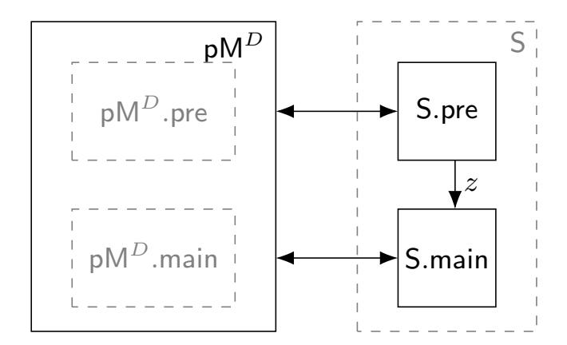
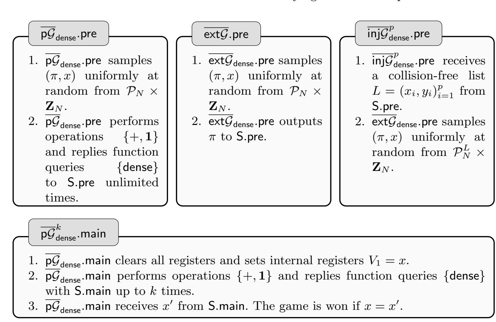
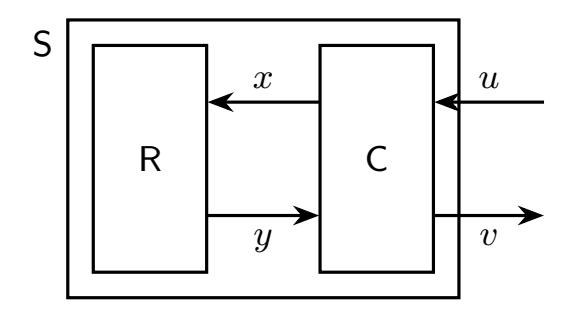
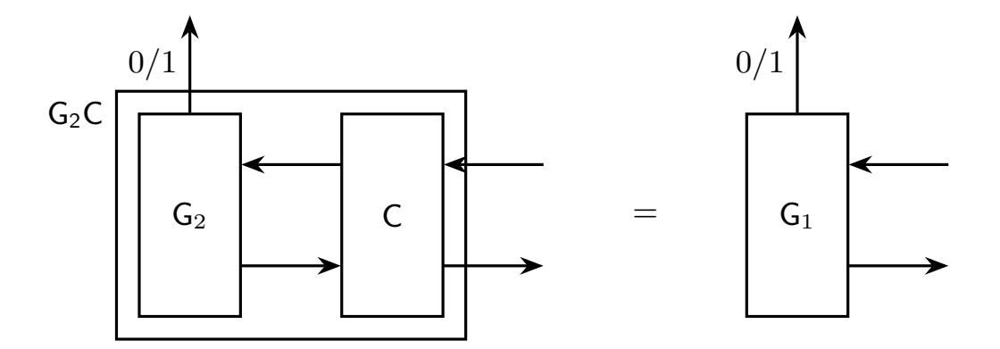
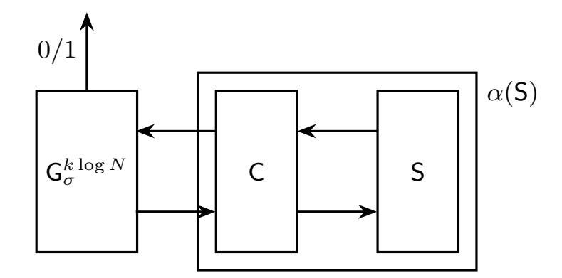

{0}------------------------------------------------

## Unifying Generic Group Models

Ueli Maurer, Christopher Portmann, and Jiamin Zhu

Department of Computer Science ETH Zurich 8092 Zurich, Switzerland {[maurer,](mailto:maurer@inf.ethz.ch)[chportma](mailto:chportma@inf.ethz.ch)[,zhujia](mailto:zhujia@inf.ethz.ch)}@inf.ethz.ch

Abstract. To prove computational complexity lower bounds in cryptography, one often resorts to so-called generic models of computation. For example, a generic algorithm for the discrete logarithm is one which works independently from the group representation—and thus works generically for all group representations. There are a multitude of different models in the literature making comparing different results—and even matching lower and upper bounds proven in different models rather difficult.

In this work we view a model as a set of games with the same type of interactions. Using a standard notion of reduction between two games, we establish a hierarchy between models. Different models may now be classified as weaker and stronger if a reduction between them exists. We propose different extensions of the generic group model with different queries, explicitly capturing different information that an algorithm may need to exploit.

Finally, we use the hierarchy between these models to systematically compare and improve the results in the literature. First we strengthen the model in which the baby-step giant-step algorithm is proven and weaken the model in which the matching lower bound is proven. We then analyse the discrete logarithm with preprocessing. Upper and lower bounds have been proven in the literature in mismatching models. We weaken the model of the lower bound and strengthen the model of the upper bound to close the gap between the two.

## 1 Introduction

#### 1.1 Restricted Models of Computation

The core of theoretical computer science is about computational problems, the algorithms to solve these problems and the complexity and performance of these algorithms. To describe algorithms and capture their complexity, we first need to fix a computational model. A computational model describes a set of operations that can be performed by algorithms. For example, one of the most commonly used models, the standard model, allows bit-wise binary operations AND, OR and NOT. With the standard model we design algorithms for various computational problems. Yet in cryptography, proving the security of certain cryptographic 

{1}------------------------------------------------

schemes means to prove a lower bound on the hardness of a certain computational problem. Unfortunately, few useful lower bound proofs are known in the standard model.

It is therefore interesting to investigate restricted models of computation if meaningful lower bounds can be proved in the model. Shoup [\[Sho97\]](#page-17-0) introduced a restricted model where algorithms have access to group elements via a randomly selected bit-string representation. Maurer [\[Mau05\]](#page-17-1) introduced the Abstract Model of Computation (AMC) where algorithms interact with a black-box via restricted operations and relation queries. Jager and Rupp [\[JR10\]](#page-17-2) considered assumptions over groups equipped with a bilinear map e: G1 × G2 → G3, where G1 and G2 are modeled in Shoup's model and G3 is modeled in the standard model. Aggarwal and Maurer [\[AM09\]](#page-16-0) introduced a black-box model to capture generic algorithms having access to ring operations and their inverses. Fuchsbauer, Kiltz and Loss [\[FKL18\]](#page-16-1) proposed the Algebraic Group Model where an algorithm can take advantage of the group structure but it outputs a group element as a linear combination of the input group elements.

Various upper and lower bound proofs are given in different restricted models of computation. But it is not clear how these models relate to each other. Jagar [\[JS08\]](#page-17-3) argued that models introduced by Maurer [\[Mau05\]](#page-17-1) and Shoup [\[Sho97\]](#page-17-0) are equivalent. Yet in [\[FKL18\]](#page-16-1) these two models are considered not equivalent. Multiple extensions of these two models have been proposed as well, each coming with new lower bounds for various computational problems. But without knowing the relationships between these models, we lack the tools to compare the hardness of these computational problems. We tackle exactly this problem in this work. We introduce a hierarchy over computational models, from the most restricted one to the most general one. We develop a theory of abstract models, in which we study relationships between models and relationships between problems.

#### 1.2 The Preprocessing Models

The models we have mentioned so far captures online-only attacks, in which the adversary simultaneously receives the description of a cyclic group and a problem instance. Yet a real-world adversary may have access to the entire description of the target group in advance. The adversary could potentially perform the following preprocessing attack relative to a target group. In the preprocessing phase, the adversary computes and stores a group-specific advice string. Subsequently in the main phase, when the problem instance is at hand, the adversary could use the advice string to solve the problem with less queries to the group operation. Indeed, generic preprocessing attacks by Mihalcik [\[Mih10\]](#page-17-4), Bernstein and Lange [\[BL13\]](#page-16-2), Lee, Cheon, and Hong [\[LCH11\]](#page-17-5) and Corrigan-Gibbs and Kogan [\[CGK18\]](#page-16-3) solve the discrete logarithm problem in every group of order N using N1/3 bits of advice string and N1/3 queries to the group operation in the main phase. This is a dramatic improvement from generic online-only attacks, which require N1/2 group operations.

{2}------------------------------------------------

To study the power and limits of such preprocessing attacks, a line of work initiated by Unruh [\[Unr07\]](#page-17-6), and followed by Dodis et al. [\[DGK17\]](#page-16-4) and Coretti et al. [\[CDGS18](#page-16-5)[,CDG18\]](#page-16-6) introduce the auxililary-input model and the bix-fixing model in the generic group settings. Matching lower bounds for these attacks are given in [\[CGK18,](#page-16-3)[CDG18\]](#page-16-6), but the models used for the lower bounds are stronger, so the results are not tight. More specifically, the analysis of the attack from [\[CGK18\]](#page-16-3) assumes a shared random oracle (RO) between the preprocessing and online phases of the algorithm, but the lower bounds do not assume access to such a RO.

#### 1.3 Contributions

Our first contribution is to develop a systematic model of abstract computation, which includes many of the models proposed in the literature as special cases. We do this by extending the Abstract Model of Computation (AMC) model of Maurer [\[Mau05\]](#page-17-1) to include parameters with extra information about the group representation and new queries that leak information about this representation. When solving a problem, algorithms usually have some representation of the underlying algebraic structure to work with. Yet it is unclear what properties of the representation are exploited by the algorithm. We use the aforementioned queries to control what information the algorithm gets and thus obtain a finegrained picture of what representation properties the algorithm exploits, e.g., a total order between group elements.

Our second contribution is to establish a natural hierarchy between different models. In our language solving a problem corresponds to winning a game and a model corresponds a set of games that allow the same types of queries. Using a standard notion of reduction between two games, we establish a hierarchy between models. Different models may now be classified as weaker and stronger if a reduction between them exists. Upper bounds in a stronger model are also upper bounds in the weaker model, and lower bounds in a weaker model are also lower bounds in the stronger model.

In this work we propose various extensions of the generic group models that capture different properties of a representation that an algorithm may exploit. The strongest model (which gives the least power to the algorithm) only allows equality check. Relaxing this, we allow the algorithm to compare two representations according to an arbitrary total order (e.g., lexicographically). Relaxing this further, our model may output a concrete (arbitrary) representation of elements. And in an even weaker model, this representation is known to be dense.

We then weaken the model further to capture preprocessing attacks. In the basic model the preprocessing and online phases only share the queries they would in the online-only set-up. But we further weaken this by providing them first with access to a shared t-wise independent hash function oracle, then to a fully random oracle.

Our third contribution is to use the hierarchy between the models mentioned in the paragraphs above to systematically compare and improve the results in the literature. We show that the Baby-step Giant-step algorithm for solving the 

{3}------------------------------------------------

discrete logarithm problem works in a model where only comparing queries are available. We extend the lower bound proven in the generic group model [Mau05] to show that it holds even when given access to a dense representation. This lower bound in a weak model matches the upper bound of the baby-step giant step algorithm in the strong model. This proves that the extra information provided by a dense representation in not useful in solving the discrete logarithm problem and the comparison queries are all that is needed.

In the preprocessing model we show that the RO is not needed in the upper bound from [CGK18] by giving an analysis for a variation of their algorithm that does not require the RO. We also strengthen the lower bound result from [CGK18,CDG18] by showing that it holds even if the preprocessing and online phase have access to a shared RO. This results in two sets of tight upper and lower bounds for the discrete logarithm with preprocessing, one with and one without RO.

#### 1.4 Structure of this paper

In Sect. 2, we introduce the theory of abstract games. In Sect. 3, we extend the abstract model of computation and establish a hierarchy between models. In Sect. 4, we introduce different extensions of the generic group model with different function queries. In Sect. 5, we extend the model futher with preprocessing and strengthen an upper bound and a lower bound result from the literature.

#### 2 Abstract Games

Some of the concepts used in this work can be defined on a more general and abstract level than the application for which they are needed. For example, solving the discrete logarithm problem (DLP) can be seen as playing a game, and results involving reductions between different versions of the DLP correspond to reductions between games. In this section we define these concepts (e.g., games and reductions) in an abstract way, and then use them as tools in the following sections. We believe that this abstract presentation is simpler and clearer than introducing the concepts directly in a more complex model such as generic groups.

In Sect. 2.1 we define games and solvers, and in Sect. 2.2 we define a reduction between games. Then in Sect. 2.3 we introduce a notion of hierarchy between classes of games based on reductions. A recap of the notation used can be found in Appendix A. And in Appendix B we provide a formal definition of probabilisitic, discrete, reactive systems.

## 2.1 Games and Solvers

The problems we consider in this work—e.g., solving the discrete logarithm—are modeled as games. These are abstract objects defined by their performance function, i.e., for a given universal set of solvers S and for every game g, a function  $w_g: S \to [0, 1]$  defines the performance of solvers at winning that game.

{4}------------------------------------------------

Definition 1. For any game g and for a given universal set of solvers S, the performance of a solver s ∈ S playing g is given by a function

$$\mathbf{w}_g: \mathbb{S} \to [0,1].$$

In this work, the value wg(s) may be interpreted as the probability that s wins g. [1](#page-4-1) The set of solvers S will simply be the set of all (finite) probabilisitic, discrete, reactive systems—using the term from [\[Mau02\]](#page-17-8), we call these random systems. [2](#page-4-2) We do not need a notion of computational efficiency, because the number of queries that the games allow (and thus the number of queries to which a solver gets a response) is always bounded, which is the notion of efficiency relevant in this work. The games considered in this work can also all be modeled as random systems, with the exception of worst-case games (see [Definition 2](#page-4-3) below). Once the solver has used up all its queries, the game will apply a predicate to the transcript and output a bit denoting whether the solver won or not. We give [Example 1](#page-22-0) and [Example 2](#page-22-1) in Appendix [D](#page-22-2) to demonstrate two concrete games and their interactions with the solvers.

Often one is not interested in solvers for a single game g, but solvers that are good for a whole set of games G. For example in the permutation inversion problem, as described in [Example 1,](#page-22-0) there exists a solver that has success probability 1, namely one that has the target permutation hard-coded and just submits the pre-image of the problem instance according the hard-coded permutation. Finding the worst-case performance over the whole set of games is a more interesting problem.

Definition 2. For a set of games G, the worst-case game Gb is the game whose performance function is defined as

$$\mathsf{w}_{\widehat{\mathcal{G}}}(s) \coloneqq \inf_{g \in \mathcal{G}} \mathsf{w}_g(s).$$

#### 2.2 Reduction

If one can reduce (solving) a game g2 to (solving) a game g1, that means that given a solver for g1 one can construct a solver for g2 (with similar performance). Formally, a reduction from a game g2 to a game g1 is a pair of a function α mapping any solver for g1 to a solver for g2 and a function λ which computes the performance of the new solver for g2.

Definition 3. The pair (α, λ) of functions α : S → S and λ : R → R is a reduction from game g2 to game g1, denoted as g2 α,λ −−→ g1, if

$$\forall s \in \mathbb{S}, \mathsf{w}_{g_2}(\alpha(s)) \geq \lambda(\mathsf{w}_{g_1}(s)).$$

1One may consider more general theories of games in which the performance of a solver is not given by a single value p ∈ [0, 1] but by a vector of values capturing different criteria of success. But for this work, a single probability p is sufficient.

2Random systems are formalized in Appendix [B](#page-18-0)

{5}------------------------------------------------

One is usually only interested in functions α that preserve the complexity of the solver and functions λ that preserve the performance of the solver, e.g., in an asymptotic setting one might require α to be efficient and λ to be a multiplicative constant. Since we are not interested in asymptotic limits in this work, we give α and λ explicitly instead—asymptotic limits may always be derived from the explicit function if desired. We give [Example 3](#page-22-3) in Appendix [D](#page-22-2) to demonstrate reductions between two concrete games.

#### 2.3 Hierarchies of games

The concept of a reduction introduced in the previous section can be used to define a notion of (relative) hardness of games: if g2 can be reduced to g1, then solving g2 is at least as easy as solving g1. Here we extend this to define a partial order between any sets of games. This is motivated by the fact that we often group games into classes, e.g., by the different queries allowed by the games, and a hierarchy between sets of games can be used to determine which queries are more powerful and which do not improve the success probability of a solver.

Definition 4. For two sets of games G1 and G2, G2 is easier than G1, denoted as G2 D G1, if there exists a function α : S → S such that

$$\forall g_2 \in \mathcal{G}_2, \exists g_1 \in \mathcal{G}_1, g_2 \xrightarrow{\alpha, id} g_1,$$

where id denotes the identity function.

For any two games g1, g2, we also define g2 D g1 if and only {g2} D {g1}.

We give [Example 4](#page-23-0) in Appendix [D](#page-22-2) to demonstrate a hierarchy between two sets of concrete games. We finish the section with few technical lemmas in the theory of abstract games in Appendix [C.](#page-20-0)

## 3 Abstract Models of Computation

#### 3.1 The Model

In order to capture restricted models of computation and give concrete lower bounds on computation complexity, Maurer [\[Mau05\]](#page-17-1) proposed a model of abstract computation: the computation is performed inside a black-box[3](#page-5-2) and the user can only interact with the box via the (abstract) operations that it provides. For example, in the Generic Group Model[4](#page-5-3) (GGM) this black-box has registers that contain values from the group ZN and the user can only perform the group operation on two registers (the result is stored in a third register) or compare two registers (the result is output). By counting the number of group

3 Interacting with the black-box corresponds to playing a game. We use the term black-box in this subsection for compatibility with [\[Mau05\]](#page-17-1), and explain the relation to games in Sect. [3.2.](#page-7-0)

4See also the formal definition in [Definition 5.](#page-6-0)

{6}------------------------------------------------

operations and registers that are used, one can prove upper and lower bounds on the computational and memory requirements of a generic algorithm (i.e., one which does not exploit the group structure).

More precisely, the abstract model of computation (AMC) of Maurer [Mau05] is characterized by a tuple  $\mathcal{M} = \langle S, \Pi, \Sigma, k, m \rangle$ , where S denotes a certain algebraic structure over which the computation is performed (e.g., a group), m is the number of internal registers of the black-box, k is the number of interactions with the box that are allowed,  $\Pi$  is the set of possible computation operations (which store the result in a new register) and  $\Sigma$  is the set of possible function queries (the result is output).

Definition 5 (Generic Group Model (GGM) [Mau05]). Let  $S = \mathbf{Z}_N, \Pi = \{+, 1\}, \Sigma = \{\mathsf{eq}\}, \ where + is the group operation on <math>\mathbf{Z}_N, \mathbf{1}$  is the nullary operation that inserts 1 into a register and the function query  $\mathsf{eq} : \mathbf{Z}_N^2 \to \{0, 1\}$  returns 1 if two arguments are equal and 0 otherwise. The model  $\mathcal{G}_{\mathsf{eq}} = \langle \mathbf{Z}_N, \{+, 1\}, \{\mathsf{eq}\}, k, m \rangle$  is the Generic Group Model (GGM). At most k interactions are allow in the model and at most m internal registers can be used.

In this work we extend the AMC to have an extra element, namely a set P of possible parameter values  $p \in P$ . These capture extra information about the algebraic structure which might be made available to the user, e.g., a total order amongst broup elements or a specific representation of group elements as in Definition 6 below. Thus, we define a model as a tuple  $\mathcal{M} = \langle S, \Pi, \Sigma, k, m, P \rangle$ . As before, S is the algebraic structure over which the computation is performed, and m is the number of internal registers of the black-box which we denote  $V_1, \ldots, V_m$  (m may be set to  $\infty$  if we do not care about the memory bound). An instantiation of the model will also be given a parameter value  $p \in P$ , e.g., a specific representation of group elements (see Sect. 3.2 for details on how the model is instantiated). The computation operations  $\Pi$  and function queries  $\Sigma$  will typically depend on the parameter p and also need to be provided with registers on which to operate:

- Computation operations: For a set  $\Pi$  of operations, a computation operation consist in selecting an operation  $f \in \Pi$  (say t-ary) as well as t indices  $i_1, \ldots, i_t$ . The value  $f(p, V_{i_1}, \ldots, V_{i_{t-1}})$  is computed and the result is stored in the register  $V_{i_t}$ .
- **Function Queries:** For a set  $\Sigma$  of functions, a function query consists in selecting a function  $\rho \in \Sigma$  (say t-ary) as well as t-1 indices  $i_1, \ldots, i_{t-1}$ . The value  $\rho(p, V_{i_1}, \ldots, V_{i_{t-1}})$  is computed and the result output to the user.

The total number of interactions to which a system will respond is bounded by k, but here too we may set k to  $\infty$  if we do not care about this bound.

In the following example we use the parameter p to provide the user with a representation of the group elements. This is essentially Shoup's model [Sho97] rephrased in the AMC language.

**Definition 6 (Shoup's model [Sho97]).** Let  $S = \mathbf{Z}_N$ ,  $\Pi = \{+, \mathbf{1}\}$ ,  $\Sigma = \{\text{rep}\}$  and  $P = \mathcal{I}_{N,M}$ , where  $\mathcal{I}_{N,M}$  is the set of injective functions from  $\mathbf{Z}_N$  to  $\mathbf{Z}_M$ .

{7}------------------------------------------------

MD

- 1. MD samples a pair (p, x) according to the distribution D, and stores x in V1.
- 2. MD responds to at most k computation operations Π and function queries Σ.
- 3. MD receives x 0 from the solver. The game is won if x 0 = x.

Fig. 1. The extraction game in a model M = hS, Π, Σ, k, m, Pi with instance distribution D.

The function rep : IN,M × ZN → ZM takes two inputs σ ∈ IN,M and v and returns the bit-string σ(v). The model Grep = hZN , {+, 1}, {rep}, k, m, IN,Mi is the generic group model with representation queries.

### 3.2 Model as a Set of Games

One may consider many different problems in the AMC, e.g., extraction problems (where a value x ∈ S must be guessed), computation problems (where a value x ∈ S must be computed inside the black-box), or distinction problems (where one must distinguish between two different black-boxes). For concreteness we will focus on extraction games in the rest of this work and refer the interested reader to [\[Mau05\]](#page-17-1) for other applications.

The model introduced in Sect. [3.1](#page-5-4) defines the interaction of the user with the black-box. To instantiate the model with a concrete extraction problem—i.e., to define the corresponding extraction game—one still needs to define the initial state of the black-box. For an extraction game one needs to define the value x ∈ S to be extracted and the parameter p ∈ P. Let V = P ×S denote the set of possible initial states of a model M and D(V) denote the set of all distributions over V. For any distribution D ∈ D(V), the extraction game MD is the random system which first draws a pair (p, x) according to D, writes x in the first register V1, then interacts with the solver via the computation operations Π and function queries Σ, and finally receives a guess x 0 from the solver and outputs a bit 1 or 0 if x 0 = x or not. This is summarized in Fig. [1.](#page-7-1)

Definition 7. A model M = hS, Π, Σ, k, m, Pi for extraction games is the set of games {MD|D ∈ D(V)} where D(V) is the set of all distributions over (p, x) ∈ V = P × S, p is the parameter of the game and x is the value to be extracted (which are drawn according to D), m is the number of internal registers of the game, k is the number of queries and operations from Σ and Π that are executed, and the performance wMD (s) is the probability that a solver s submits a correct guess x 0 = x.

The corresponding worst-case extraction game Mc of model M is defined according to [Definition 2.](#page-4-3) When D is the uniform distribution over V, we call the corresponding extraction game MD the average-case game and write M.

Definition 8. For a model M, the average-case game M is defined as the game MD ∈ M where D is the uniform distribution on V = P × S.

{8}------------------------------------------------

#### 3.3 Hierarchies of Models

Since a model corresponds to a set of extraction games, the hierarchy of sets of games introduced in Sect. 2.3, Definition 4, applies to models. If  $\mathcal{M}_2 \supseteq \mathcal{M}_1$  ( $\mathcal{M}_1 \trianglerighteq \mathcal{M}_2$ ) we will usually say that  $\mathcal{M}_2$  is weaker (stronger) than  $\mathcal{M}_1$ . For example, this means that Shoup's model  $\mathcal{G}_{rep}$  is a weaker model than GGM  $\mathcal{G}_{eq}$ , as illustrated in Example 5 in Appendix D. This means that an algorithm in the GGM model trivially yields an algorithm in Shoup's model, and a lower bound on the number of quieres k that are needed in Shoup's model immediately gives us a lower bound in the GGM. Note that a reduction in the opposite direction is not possible without the number of queries needed blowing up to N, the group order. We also give Example 6 in Appendix D to illustrate that operations that insert constants can also be compensated by a small overhead in the number of interactions.

## 4 Extensions of the Generic Group Model

A generic algorithm for solving the discrete logarithm problem will have access to an (unknown) representation of group elements, and will exploit some properties of this representation. For example, one of the most basic operations it can do is compare two elements to know if they are equal or not. Exactly this operation is captured by the generic group model  $\mathcal{G}_{eq} = \langle \mathbf{Z}_N, \{+, \mathbf{1}\}, \{eq\}, k, m\rangle$  introduced in Definition 5.

We may relax this and provide the solver with more operations, in particular, an algorithm could sort the group elements lexicographically. We obtain a weaker model by using a parameter (see Sect. 3) to capture this total order. We define the function query comp :  $\mathcal{P}_N \times \mathbf{Z}_N^2 \to \{0,1\}$ , that compares two values in  $\mathbf{Z}_N$  according to a permutation  $\pi \in \mathcal{P}_N$ . For any  $v_1, v_2 \in \mathbf{Z}_N$ , comp $(\pi, v_1, v_2) = 1$  if and only if  $\pi(v_1) \leq \pi(v_2)$ . The permutation parameter  $\pi \in \mathcal{P}_N$  captures a total order on  $\mathbf{Z}_N$ , but the solver does not directly have access to it, only to comparing two elements.

**Definition 9.** Let  $S = \mathbf{Z}_N, \Pi = \{+, 1\}, \Sigma = \{\text{comp}\}\$ and  $P = \mathcal{P}_N$ .  $\mathcal{G}_{\text{comp}} = \langle \mathbf{Z}_N, \{+, 1\}, \{\text{comp}\}, k, m, \mathcal{P}_N \rangle$  is the generic group model with comparing queries.

In Sect. 4.1, we introduce the baby-step giant-step algorithm which needs a comparison query and works in the model  $\mathcal{G}_{\mathsf{comp}}$ .

When proving lower bounds on the number of queries and operations k that are needed to win a game, we are interested in proving the bounds in the weakest model possible—even with all operations provided by this weak model, one still needs k operations. The weakest generic model is one in which we do not only give an unknown representation to the solver (as in Definition 6), but the representation is guaranteed to be dense. To this end, we define the function query dense:  $\mathcal{P}_N \times \mathbf{Z}_N \to \mathbf{Z}_N$  which takes two inputs  $\pi \in \mathcal{P}_N$  and  $v \in \mathbf{Z}_N$  and returns  $\pi(v)$ .

{9}------------------------------------------------

Definition 10. Let S = ZN , Π = {+, 1}, Σ = {dense} and P = PN . The model Gdense = hZN , {+, 1}, {dense}, k, m,PN i is the generic group model with dense representation queries.

In Sect. [4.2](#page-9-2) we prove the lower bound of k = Ω(√ N) needed to extract x in the model Gdense.

#### 4.1 The Baby-step Giant-step Algorithm

The baby-step giant-step algorithm requires the ability to compare the order of two group elements, but does not need any other information about the representation, so we prove it in the model with comparison queries Gcomp from [Definition 9.](#page-8-1) Since we would like the algorithm to work regardless of the value x to extract or the choice of total order π, we prove a bound that the success probability of this solver is 1 for the worst-case game Gbcomp. The baby-step giant-step algorithm and the proof of the success probability may be found in Appendix [E.](#page-24-0)

### 4.2 The Lower Bound of Extraction Games

As stated at the beginning of this section, we proving lower bounds on the number of queries and operations k that a needed by a solver, we wish to consider a weak model, in our case this is Gdense. We will also prove that bound for the average case problem, which immediately implies that it is a lower bound for the worst-case problem and in all stronger models as well. The lower bound proven in [\[Mau05\]](#page-17-1) in the model Geq follows from this.

Theorem 1. Let N be a prime number. For any integer k and any solver S interacting with the model G k dense = hZN , {+, 1}, {dense}, k, ∞,PN i,

$$\mathsf{w}_{\overline{\mathcal{G}}_{\mathsf{dense}}^k}(\mathsf{S}) \leq \frac{1}{2}(k+1)^2/N.$$

The proof of [Theorem 1](#page-9-3) appears in Appendix [F.1.](#page-24-1)

Combining with [Lemma 5,](#page-21-0) the lower bound in turn implies a lower bound in winning the worst-case extraction games Gbeq, Gbcomp, Gbrep and Gbdense.

Corollary 1. Let N be a prime number. For any integer k and any solver S interacting with one of the models G k ∈ {Gk eq, G k comp, G k rep, G k dense},

$$\mathsf{w}_{\widehat{\mathcal{G}}^k}(\mathsf{S}) \leq \frac{1}{2}(4k+1)^2/N.$$

## 5 Extraction Games with Preprocessing

The models we have considered so far capture online-only attacks, in which the solver has no information about the group beforehand. We now modify the generic group model to capture preprocessing attacks. In Sect. [5.1](#page-10-0) we explain how to define preprocessing in the AMC. In Sect. [5.2](#page-11-0) we give a new upper bound on the number of queries needed for extraction games in this model, i.e., we give a concrete algorithm and proof. And in Sect. [5.3](#page-13-0) we give a new lower bound matching the upper bound.

{10}------------------------------------------------

#### pMD

- 1. pMD.pre samples an initial state v = (p, x) from the distribution D.
- 2. pMD.pre performs computation operations Π and replies function queries Σ from the solver S up to k.pre times.
- 3. pMD.main clears all registers and sets V1 to be x.
- 4. pMD.main performs computation operations Π and replies function queries Σ from the solver S up to k.main times.
- 5. pMD.main receives x 0 from the solver. The game is won if x = x 0 .

Fig. 2. The extraction game in model pM = hS, Π, Σ,(k.pre, k.main), m, Pi with distribution D

## 5.1 The Abstract Preprocessing Model

To capture preprocessing we divide the interaction between the solver and the game in two phases, the preprocessing phase and the main phase. As before, the game will pick the parameter p and value x according to some distribution D, but x will not be written in any register in the first phase, so it will not be accessible to the solver. In this phase, the solver can interact k.pre times with the game using the operations and queries, and thus learn information about the parameter p. In the second phase the registers are all cleared, then the value x is written to register V1 making it accessible via operations and queries. The solver can have k.main such interactions, then has to make a guess for x. We denote such a model with pM = hS, Π, Σ,(k.pre, k.main), m, Pi, where as before this corresponds to a set of games pM = {pMD|D ∈ D(V)}, where D(V) is the set of all distributions over the pairs (p, x) ∈ V = P ×S, and pMD = (pMD.pre, pMD.main) is the game described above which is summarized in Fig. [2.](#page-10-1)

The solver S interacting with the extraction game pMD is also split in two parts S.pre and S.main. After the preprocessing phase, S.pre sends an advice string z to S.main. We denote by ` = |z| the length of the advice string, and make statements parameterized by this value. To this end, we define by pS ` the set of all solvers split in these two (independent) phases that pass an ` bit advice string from one to the other.

We can extend the generic group models Gcomp, Grep, Gdense to the corresponding preprocessing generic group models.

Definition 11. Let S = ZN , Π = {+, 1}. For Σ = {comp} and P = PN , the model pGcomp = hZN , {+, 1}, {comp},(k.pre, k.main), m,PN i is the preprocessing generic group model with comparing queries. For Σ = {rep} and P = IN,M, the model pGrep = hZN , {+, 1}, {rep},(k.pre, k.main), m, IN,Mi is the preprocessing generic group model with representation queries. For Σ = {dense} and P = PN , the model pGdense = hZN , {+, 1}, {dense},(k.pre, k.main), m,PN i is the preprocessing generic group models with dense representation queries.

{11}------------------------------------------------

Fig. 3. The interaction between  $pM^D$  and S

# 5.2 The Preprocessing Algorithm with t-wise Independent Hash Function

In [CGK18] the authors provide an algorithm in a pre-processing model that uses a hash function to generate a random walk. This algorithm needs  $\ell = \tilde{O}(N^{1/3})$  bits of advice between the preprocessing and main phases, and does  $k.\mathsf{main} = \tilde{O}(N^{1/3})$  operations in the main phase. The assumption is that the hash function behaves like a random oracle (RO), and the proof is done in the RO model [HJKY95]. Corresponding lower bounds are given in [CGK18,CDG18], where it is shown that  $k^2\ell = \Omega(\varepsilon N)$  and  $\varepsilon$  is the probability of correctly guessing the value x. But these lower bounds do not involve ROs, so we have a mismatching in the models and the results are not directly comparable. In this section we focus on the upper bound and prove that if one uses t-wise independent hash functions, then one does not need a RO.

We start by defining the preprocessing model with a RO. This is achieved by including it in the game and allowing the solver to query it. More precisely, we define a model with a dense :  $\mathcal{P}_N \times \mathbf{Z}_N \to \mathbf{Z}_N$  query which takes two inputs  $\pi \in \mathcal{P}_N$  and  $v \in \mathbf{Z}_N$  and returns  $\pi(v)$ , and a ro :  $\mathcal{P}_N \times \mathbf{Z}_N \to \mathbf{Z}_N$  query which takes two inputs  $\pi \in \mathcal{P}_N$  and  $v \in \mathbf{Z}_N$  and returns  $\mathsf{RO}(\pi(v))$  for a random oracle  $\mathsf{RO} : \mathbf{Z}_N \to \mathbf{Z}_N$ .

**Definition 12.** Let  $S = \mathbf{Z}_N$ ,  $\Pi = \{+, \mathbf{1}\}$ ,  $\Sigma = \{\text{dense, ro}\}$  and  $P = \mathcal{P}_N$ . The model  $p\mathcal{G}_{\text{dense,ro}} = \langle \mathbf{Z}_N, \{+, \mathbf{1}\}, \{\text{dense, ro}\}, (k.\text{pre}, k.\text{main}), m, \mathcal{P}_N \rangle$  is the preprocessing generic group model with dense representation queries and random oracle queries.

We will now strengthen this model by first replacing the RO with a t-wise independent hash function, i.e., we introduce another function query hash:  $\mathcal{P}_N \times \mathbf{Z}_N \to \mathbf{Z}_N$  induced from an arbitrary t-wise independent hash function family. More precisely, let  $t \geq 1$  be an integer. Let  $\mathcal{H}^t$  be a collection of functions  $h: \mathbf{Z}_M \to \mathbf{Z}_N$ . We say that  $\mathcal{H}^t$  is t-wise independent if for any distinct

&lt;sup>5Since RO is a random oracle, we could have equally defined ro as returning RO(v). But later when we replace RO with t-wise independent hash functions these two values are not identical anymore (due to extra randomness over the choice of  $\pi$ ), so we already write RO( $\pi$ (v)) here.

{12}------------------------------------------------

 $x_1, x_2, \ldots, x_t \in \mathbf{Z}_M$  and for any  $y_1, y_2, \ldots, y_t \in \mathbf{Z}_N$ , it holds that

$$\Pr_{h \in \mathcal{H}^t} (h(x_t) = y_t | h(x_{t-1}) = y_{t-1} \wedge \ldots \wedge h(x_1) = y_1) = \frac{1}{N},$$

where  $h \in \mathcal{H}^t$  is picked uniformly at random. The first time hash is called, it will pick a  $h \in \mathcal{H}^t$  uniformly, then always use the same h and return  $h(\pi(v))$ .

The second change we make is to note that the algorithm does not need to query dense directly, it only needs the hash values of this representation and to compare the order of two elements. So we can remove dense, and just use comp instead.

**Definition 13.** Let  $S = \mathbf{Z}_N$ ,  $\Pi = \{+, \mathbf{1}\}$ ,  $\Sigma = \{\text{comp, hash}\}$  and  $P = \mathcal{P}_N$ . Let  $\mathcal{H}^t$  denote an arbitary t-wise independent hash function family. The model  $p\mathcal{G}_{\text{comp,hash}} = \langle \mathbf{Z}_N, \{+, \mathbf{1}\}, \{\text{comp, hash}\}, (k.\text{pre}, k.\text{main}), m, \mathcal{P}_N \rangle$  is the preprocessing generic group model with comparing queries and t-wise independent hashing queries.

A simplified version of the algorithm that runs in this model is given in Fig. 4, the details can be found in Appendix F.2. As before, we want the algorithm to work for all x and all p, so we consider the worst-case problem over  $p\mathcal{G}_{comp,hash}$ . The success probability for the worst-case game is given by the following theorem.

**Theorem 2.** Let N be an integer. Let  $\ell = \lceil \frac{1}{2} N^{1/3} \rceil$ . Let  $\mathsf{A}_{\mathsf{hash}}$  denote the algorithm described in Fig. 4. The algorithm interacts with the model  $\mathsf{p}\mathcal{G}_{\mathsf{comp},\mathsf{hash}} = \langle \mathbf{Z}_N, \{+, \mathbf{1}\}, \{\mathsf{comp}, \mathsf{hash}\}, (k.\mathsf{pre}, k.\mathsf{main}), m, \mathcal{P}_N \rangle$  where  $k.\mathsf{pre} = 2\ell t \log N$ ,  $k.\mathsf{main} = 4t \log N$  and  $m = 2t + \ell$ , we have

$$\mathsf{A}_{\mathsf{hash}} \in \mathsf{p}\mathbb{S}^{\ell \log N}$$

and

$$\mathsf{w}_{\widehat{\mathsf{p}\mathcal{G}}_{\mathsf{comp},\mathsf{hash}}}(\mathsf{A}_{\mathsf{hash}}) \geq 1/64.$$

The proof of Theorem 2 appears in Appendix F.2.

We now wish to remove hash from the model. To do this, the solver will choose the hash function itself in the preprocessing phase, then send the bits necessary to describe the function in the advice string to the main phase. For this to work the solver will also need access to some representation of the group elements, so that it can apply the hash to this representation. So we include the query rep in the model, which is now  $p\mathcal{G}_{rep}$ .

Vadhan [V+12] showed an explicit construction for a family of t-wise independent functions  $\mathcal{H}^t = \{h : \mathbf{Z}_M \to \mathbf{Z}_N\}$ , such that sampling a random function in  $\mathcal{H}^t$  takes  $t \log M$  random bits, hence these bits need to be added to the advice string. We now present another extraction algorithm with preprocessing, slightly modified from the algorithm in Fig. 4, that wins the worst-case extraction game  $\widehat{\mathsf{pG}}_{\mathsf{rep}}$  with constant performance—the details of the algorithm appear in Appendix F.3.

{13}------------------------------------------------

#### Ahash.pre

Let  $w: \mathbf{Z}_N \to \mathbf{Z}_N$  denote the mapping  $w(x) = x + \mathsf{hash}(\pi, x)$ .  $A_{hash}$ .pre repeats  $\ell$  times the following steps. In the *i*-th round:

- 1.  $A_{\mathsf{hash}}$ .pre sample a uniform random value  $r_0^i \overset{\$}{\leftarrow} \mathbf{Z}_N$  as the starting value.
- 2. Ahash.pre computes  $r_{j+1}^i = w(r_j^i)$  for all  $j \in \{1, 2, ..., t-1\}$ .
- 3. Ahash.pre stores the end value  $r_t^i = w^t(r_0^i)$  in the advice string.

 $\mathsf{A}_{\mathsf{hash}}.\mathsf{pre}$  sorts all the end values  $r_t^1, r_t^2, \dots, r_t^\ell$  in the advice string according to the permutation  $\pi$ .

#### Ahash.main

Let  $w: \mathbf{Z}_N \to \mathbf{Z}_N$  denote the mapping  $w(x) = x + \mathsf{hash}(\pi, x)$ .

 $A_{hash}$ .main sets  $x_1 = V_1$ , the value to be extracted, and repeats at most 2t - 1 times the following steps. In the *i*-th round:

- 1. If  $x_i \in \{r_t^1, r_t^2, \dots, r_t^\ell\}$ : 2. Let  $x_i = r_t^p$  for some  $p \in \{1, 2, \dots, \ell\}$ 3. Ahash.main outputs  $x' = r_t^p \sum_{j=1}^{p-1} \mathsf{hash}(\pi, x_i)$  and halts.
- 4. Else
- $A_{\mathsf{hash}}.\mathsf{main} \text{ sets } x_{i+1} = w(x_i).$ 5.

 $A_{hash}$ .main fails after repeating the above steps for 2t-1 times.

**Fig. 4.**  $A_{hash} = (A_{hash}.pre, A_{hash}.main)$  interacting with  $p\mathcal{G}_{comp,hash}$ 

Corollary 2. Let N and M be two integers and  $M \ge N$ . Let  $\ell = t = \lceil \frac{1}{2} N^{1/3} \rceil$ . Let  $p\mathcal{G}_{rep} = \langle \mathbf{Z}_N, \{+, \mathbf{1}\}, \{rep\}, (k.pre, k.main), m, \mathcal{I}_{N,M} \rangle$  denote the preprocessing  $generic\ group\ model\ with\ representation\ queries,\ where\ k.\mathsf{pre} = 2\ell t\log N, k.\mathsf{main} =$  $4t \log N$  and  $m = 2t + \ell$ . There exists an algorithm A such that

$$\mathsf{A} \in \mathsf{p}\mathbb{S}^{t\log M + \ell\log N}$$

and

$$\mathsf{w}_{\widehat{\mathsf{p}}\widehat{\mathcal{G}}_{\mathsf{rep}}}(\mathsf{A}) \geq 1/64.$$

The proof of Corollary 2 appears in Appendix F.3.

#### The Lower Bound of Extraction Games with Preprocessing 5.3

In this section we strength the lower bounds from the literature in the preprocessing model [CGK18,CDG18] to show that even when the games provide access to a dense representation and to a common random oracle (RO), the length of the advice string and the number of operations needed in the main phase does change. This means in particular that the RO cannot be exploited to pass information from the preprocessing to the main phase of the algorithm.

{14}------------------------------------------------

Fig. 5. Variations of the average-case extraction game in model  $p\mathcal{G}_{dense}$ 

The model in which we will prove the lower bound was already introduce in Definition 12, namely  $p\mathcal{G}_{dense,ro}$ . More precisely, we will prove the bound for the average case game  $\overline{p}\mathcal{G}_{dense,ro}^k$  which immediately implies the same bound for the worst-case game. We will achieve this by performing various game hops. We related a bound on the game  $\overline{p}\mathcal{G}_{dense,ro}^k$  to a bound on  $\overline{p}\mathcal{G}_{dense}^k$ . We relate this to a bound on  $\overline{ext}\mathcal{G}_{dense}^k$ , a game which gives the parameter  $\pi$  to the solver during the preprocessing phase. We relate this to a bound on  $\overline{inj}\mathcal{G}_{dense}^{p,k}$ , a game which allows the solver to fix p values of  $\pi$ . And finally we compute a bound on the success probability of the best solver for  $\overline{inj}\mathcal{G}_{dense}^{p,k}$  directly. These games all share the common main phase but have different preprocessing phase, and are described in Fig. 5.

In game  $\overline{\operatorname{ext}} \overline{\mathcal{G}}_{\operatorname{dense}}^k$ , the preprocessing phase solver can extract the complete permutation function  $\pi$  from the model. This variation clearly gives more power to the solver than  $\overline{\mathsf{p}} \overline{\mathcal{G}}_{\operatorname{dense}}^k$  does since the only information that can leak in the preprocessing phase is the permutation  $\pi$ . We illustrate this formally with the following proposition.

## Proposition 1. $\overline{\text{ext}}_{\mathsf{dense}}^k \supseteq \overline{\mathsf{p}}_{\mathsf{dense}}^k$

The proof of Proposition 1 appears in Appendix F.4.

Let  $p \leq N$  be an integer. In game  $\overline{\mathsf{inj}}\mathcal{G}_{\mathsf{dense}}^{p,k}$ , instead of extracting information about the permutation, the preprocessing phase solver can inject a list of p input/output pairs of the permutation. Assuming the solver always submits a

{15}------------------------------------------------

collision-free list  $L = \{(x_i, y_i)\}_{i=1}^p$  of maximal length |L| = p, where  $x_i, y_i \in \mathbf{Z}_N$ , all the  $x_i$  are distinct and all the  $y_i$  are distinct, we define the set of permutations  $\mathcal{P}_N^L$  consistent with L as follows:

$$\mathcal{P}_N^L := \left\{ \pi \in \mathcal{P}_N | \pi(x_i) = y_i, \forall i \in \{1, 2, \dots, p\} \right\}.$$

Unruh in [Unr07] proved a general relationship between game  $\overline{\text{ext}}\mathcal{G}_{\text{dense}}^k$  and game  $\overline{\text{inj}}\mathcal{G}_{\text{dense}}^{p,k}$ . The relationship was sharpened by Coretti et al. [CDG18]. We recall their theorem6 now.

**Proposition 2** ([CDG18]). For any integers  $p, k, \ell$  and  $\gamma > 0$  such that  $p \ge (\ell + \log \gamma^{-1})k$ , we have

$$\max_{\mathsf{S}\in\mathsf{p}\mathbb{S}^\ell}\mathsf{w}_{\overline{\mathsf{ext}\mathcal{G}}_{\mathsf{dense}}^k}(\mathsf{S}) \leq 2\max_{\mathsf{S}\in\mathsf{p}\mathbb{S}^\ell}\mathsf{w}_{\overline{\mathsf{inj}\mathcal{G}}_{\mathsf{dense}}^{p,k}}(\mathsf{S}) + \gamma,$$

For any solver S = (S.pre, S.main) interacting with the game  $\overline{inj}\mathcal{G}_{dense}^{p,k}$ , since S.pre gets no information from the game, S.main can learn no information about the permutation via the advice string other than the list L of p input/output correspondences. After interacting with the main phase extraction game up to k times, S.main learns up to k+p+1 input/output correspondence of the permutation function. This yields a bound for the performance of the solver S in the same way as Theorem 1. We present the lemma as follows.

**Proposition 3.** Let N be a prime number. For any integers p and k and any solver  $S \in S$ ,

$$\mathsf{w}_{\overline{\mathsf{inj}}\mathcal{G}^{p,k}_{\mathsf{dense}}}(\mathsf{S}) \leq \frac{1}{2}(k+2p+1)(k+1)/N.$$

The proof of Proposition 3 appears in Appendix F.5.

We are now ready to bound the performance of the average-case extraction game  $\overline{p}\overline{\mathcal{G}}_{dense}$  for all the solvers utilizing limited length of advice string.

**Theorem 3.** Let N be a prime number. Let k and  $\ell$  be two positive integers. For model  $p\mathcal{G}_{\mathsf{dense}}^k = \langle \mathbf{Z}_N, \{+, \mathbf{1}\}, \{\mathsf{dense}\}, (\infty, k), \infty, \mathcal{P}_N \rangle$ ,

$$\forall \mathsf{S} \in \mathsf{p}\mathbb{S}^\ell, \mathsf{w}_{\overline{\mathsf{p}\mathcal{G}}^k_{\mathsf{dense}}}(\mathsf{S}) \leq 3\ell(k+1)^2/N$$

*Proof.* For any solver  $S \in pS^{\ell}$ , choosing  $p = (\ell + \log N)k$  and  $\gamma = 1/N$ , we have  $p \ge (\ell + \log \gamma^{-1})k$ . Therefore,

$$\begin{split} \mathbf{w}_{\overline{\mathsf{p}}\overline{\mathcal{G}}_{\mathsf{dense}}^{k}}(\mathsf{S}) &\leq \mathbf{w}_{\overline{\mathsf{ext}}\overline{\mathcal{G}}_{\mathsf{dense}}^{k}}(\mathsf{S}) \\ &\leq \max_{\mathsf{S} \in \mathsf{p}} \mathsf{S}^{\ell} \, \mathbf{w}_{\overline{\mathsf{ext}}\overline{\mathcal{G}}_{\mathsf{dense}}^{k}}(\mathsf{S}) \\ &\leq 2 \max_{\mathsf{S} \in \mathsf{p}} \mathsf{w}_{\overline{\mathsf{inj}}\overline{\mathcal{G}}_{\mathsf{dense}}^{p,k}}(\mathsf{S}) + \gamma \\ &\leq (k+2p+1)(k+1)/N + \gamma \\ &\leq 3\ell(k+1)^2/N. \end{split}$$

&lt;sup>6The game  $\overline{\text{ext}}\mathcal{G}_{\text{dense}}^k$  corresponds to the AI-RPM model the game  $\overline{\text{inj}}\mathcal{G}_{\text{dense}}^{p.k}$  corresponds to the BF-RPM model in [CDG18]. We adapt the theorem with our notation here.

{16}------------------------------------------------

The first inequality invokes [Proposition 1,](#page-14-1) the third inequality invokes [Propo](#page-15-2)[sition 2](#page-15-2) under the condition that p ≥ (` + log γ −1 )k, the fourth inequality invokes [Proposition 3](#page-15-1) and in the last equality we plug in p = (` + log N)k and γ = 1/N.

We now prove the strongest lower bound statement in the model pGdense,ro. To do this we note that implementing ro essentially corresponds to sharing lots of randomness between the preprocessing and the main phases of the solver. And we show that sharing randomness does not help the solver.

Corollary 3. Let N be a prime number. Let k and ` be two integers. For model pG k dense,ro = hZN , {+, 1}, {dense,ro},(∞, k), ∞,PN i, we have

$$\forall \mathsf{S} \in \mathsf{p}\mathbb{S}^\ell, \mathsf{w}_{\overline{\mathsf{p}\mathcal{G}}^k_{\mathsf{dense},\mathsf{ro}}}(\mathsf{S}) \leq 3\ell(k+1)^2/N$$

The proof of [Corollary 3](#page-16-7) appears in Appendix [F.6.](#page-32-0)

Since pGdense,ro D pGcomp,hash it follows that the upper bound from [Theo](#page-12-0)[rem 2](#page-12-0) matches the lower bound in [Corollary 3](#page-16-7) (up to a factor log N). And since pGdense D pGrep it follows that the upper bound from [Corollary 2](#page-12-1) matches the lower bound from [Theorem 3](#page-15-3) (up to a factor log N).

## References

- AM09. Divesh Aggarwal and Ueli Maurer. Breaking rsa generically is equivalent to factoring. In Annual International Conference on the Theory and Applications of Cryptographic Techniques, pages 36–53. Springer, 2009.
- BL13. Daniel J Bernstein and Tanja Lange. Non-uniform cracks in the concrete: the power of free precomputation. In International Conference on the Theory and Application of Cryptology and Information Security, pages 321–340. Springer, 2013.
- CDG18. Sandro Coretti, Yevgeniy Dodis, and Siyao Guo. Non-uniform bounds in the random-permutation, ideal-cipher, and generic-group models. In Annual International Cryptology Conference, pages 693–721. Springer, 2018.
- CDGS18. Sandro Coretti, Yevgeniy Dodis, Siyao Guo, and John Steinberger. Random oracles and non-uniformity. In Annual International Conference on the Theory and Applications of Cryptographic Techniques, pages 227–258. Springer, 2018.
- CGK18. Henry Corrigan-Gibbs and Dmitry Kogan. The discrete-logarithm problem with preprocessing. In Annual International Conference on the Theory and Applications of Cryptographic Techniques, pages 415–447. Springer, 2018.
- DGK17. Yevgeniy Dodis, Siyao Guo, and Jonathan Katz. Fixing cracks in the concrete: Random oracles with auxiliary input, revisited. In Annual International Conference on the Theory and Applications of Cryptographic Techniques, pages 473–495. Springer, 2017.
- FKL18. Georg Fuchsbauer, Eike Kiltz, and Julian Loss. The algebraic group model and its applications. In Annual International Cryptology Conference, pages 33–62. Springer, 2018.

{17}------------------------------------------------

- HJKY95. Amir Herzberg, Stanis law Jarecki, Hugo Krawczyk, and Moti Yung. Proactive secret sharing or: How to cope with perpetual leakage. In Annual International Cryptology Conference, pages 339–352. Springer, 1995.
- JR10. Tibor Jager and Andy Rupp. The semi-generic group model and applications to pairing-based cryptography. In International Conference on the Theory and Application of Cryptology and Information Security, pages 539– 556. Springer, 2010.
- JS08. Tibor Jager and J¨org Schwenk. On the equivalence of generic group models. In International Conference on Provable Security, pages 200–209. Springer, 2008.
- LCH11. Hyung Tae Lee, Jung Hee Cheon, and Jin Hong. Accelerating id-based encryption based on trapdoor dl using pre-computation. Technical report, Cryptology ePrint Archive, Report 2011/187, 2011.
- Mau02. Ueli Maurer. Indistinguishability of random systems. In International Conference on the Theory and Applications of Cryptographic Techniques, pages 110–132. Springer, 2002.
- Mau05. Ueli Maurer. Abstract models of computation in cryptography. In IMA International Conference on Cryptography and Coding, pages 1–12. Springer, 2005.
- Mih10. Joseph Mihalcik. An analysis of algorithms for solving discrete logarithms in fixed groups. Technical report, NAVAL POSTGRADUATE SCHOOL MONTEREY CA, 2010.
- MPR07. Ueli Maurer, Krzysztof Pietrzak, and Renato Renner. Indistinguishability amplification. In Advances in Cryptology – CRYPTO 2007, volume 4622 of Lecture Notes in Computer Science, pages 130–149. Springer, 2007.
- Sho97. Victor Shoup. Lower bounds for discrete logarithms and related problems. In International Conference on the Theory and Applications of Cryptographic Techniques, pages 256–266. Springer, 1997.
- Unr07. Dominique Unruh. Random oracles and auxiliary input. In Annual International Cryptology Conference, pages 205–223. Springer, 2007.
- V +12. Salil P Vadhan et al. Pseudorandomness. Foundations and Trends R in Theoretical Computer Science, 7(1–3):1–336, 2012.

## A Notation

The notation used in this work is defined in Tables [1,](#page-17-11) [2,](#page-18-1) [3](#page-18-2) and [4.](#page-18-3)

| Symbol        | Explanation                                          |
|---------------|------------------------------------------------------|
| PY  X(y x) | the probability that Y = y given that X = x          |
| i x        | the sequence (x1, , xi)                              |
| ZN            | the additive group which consists of {0, 1, , N − 1} |
| PN            | the set of all permutations on ZN                    |
| IN,M          | the set of injective functions from ZN to ZM      |
| id            | identity function                                    |
| Ht            | a t-wise independent hash function family            |

Table 1. Mathematical notation

{18}------------------------------------------------

| Symbol                 | Explanation                                                |
|------------------------|------------------------------------------------------------|
| S, G (sans serif math) | a random system                                            |
| wg(s)                  | the winning probability of the solver s playing the game g |
| G (caligraphic)        | a set (of games, random systems, etc.)                     |
| Gb                     | the worst-case game over the set G                         |
| G                      | the average-case game over the set G                       |

Table 2. Notation for random systems, games and sets of games.

| Symbol | Explanation                                                    |
|--------|----------------------------------------------------------------|
| +      | performs group operation on ZN                                 |
| 1      | inserts value 1                                                |
| eq     | checks equality                                                |
| comp   | compares according to an order of the representation           |
| rep    | returns a representation                                       |
| dense  | returns a dense representation                                 |
| hash   | hashs a representation with a t-wise independent hash function |
| ro     | queries a random oracle                                        |

Table 3. Computation operations and function queries.

| Symbol | Explanation                                                   |
|--------|---------------------------------------------------------------|
| GΣ     | the generic group model with function queries Σ               |
| pGΣ    | the preprocessing generic group model with function queries Σ |

Table 4. Specific models.

## B Formalising Discrete Systems

When describing an algorithm or a game, one often uses informal descriptions such as pseudo-code. Various formal models for such discrete, reactive systems exist, e.g., interactive turing machines or input/output automata. But the exact model is generally not of interest, since only the input-output behavior of the system is relevant. We refer to the object of concern—a probabilistic, discrete, reactive system defined by its input-output behavior—as a random system [\[Mau02](#page-17-8)[,MPR07\]](#page-17-12). A minimal description of a random system is given by a (sequence of) conditional probability distribution(s), that defines (the probability distribution of) the new output given previous in- and outputs.[7](#page-18-4)

Definition 14 (Random Systems). An (X , Y)-random system S is a probabilistic, discrete, reactive system that takes inputs x ∈ X and produces outputs y ∈ Y. It is uniquely defined by a finite sequence of conditional probability distributions {P S Yi|XiY i−1 }i≥1 defined on all x i = (x1, . . . , xi) ∈ X ×i , all yi ∈ Y and

7Pseudo-code, probabilisitic interactive Turing machines and probabilisitic input/output automata correspond to various (redundant) descriptions of random systems.

{19}------------------------------------------------

**Fig. 6.** Two random systems R and C are connected, resulting in a new random system S = RC, as in Definition 15.

all  $y^{i-1} = (y_1, \ldots, y_{i-1}) \in \mathcal{Y}^{\times (i-1)}$  that have non-zero probability, i.e., such that  $\prod_{j < i} P_{Y_j|X^jY^{j-1}}^{\mathsf{S}}(y_j|x^j, y^{j-1}) > 0$ . Here  $P_{Y_i|X^iY^{i-1}}^{\mathsf{S}}(y_i|x^i, y^{i-1})$  is the probability of observing the output  $y_i$  given the inputs  $x^i = (x_1, \ldots, x_i)$  and previous outputs  $y^{i-1} = (y_1, \ldots, y_{i-1})$ .

If for two systems S and R, we have

$$P_{Y_i|X^iY^{i-1}}^{\mathsf{S}}(y_i|x^i,y^{i-1}) = P_{Y_i|X^iY^{i-1}}^{\mathsf{R}}(y_i|x^i,y^{i-1})$$

for all i and for all  $(x^i, y^i)$  on which they are defined, then S and R are the same random systems and one may write S = R.

Although a minimal description of a random system is given by such a sequence of conditional probability distributions, it is often more convenient to describe them using pseudo-code. We will usually do so in this work, keeping in mind that this is a (redundant) description of a random system, and the mathematical object of interest about which we make statements is the random system.

By "connecting" two random systems—i.e., passing some of the output values of each system as inputs to the other—we obtain a new random system. Although one may imagine random systems being connected in arbitrary ways, in this work we will only need the type of connection illustrated in Fig. 6 and defined here below.

**Definition 15 (Converter).**  $A (\mathcal{X}, \mathcal{Y}) \to (\mathcal{U}, \mathcal{V})$ -converter C is a  $(\mathcal{Y} \sqcup \mathcal{U}, \mathcal{X} \sqcup \mathcal{V})$ -random system, where  $\sqcup$  denotes the disjoint union.8 By passing the  $x_i \in \mathcal{X}$  outputs of C as inputs to a  $(\mathcal{X}, \mathcal{Y})$ -random system C and passing the C outputs from C as inputs to C, we obtain a uniquely defined C of C and C outputs C of C as inputs to C, we obtain a uniquely defined C of C of C of C of C of C of C of C of C of C of C of C of C of C of C of C of C of C of C of C of C of C of C of C of C of C of C of C of C of C of C of C of C of C of C of C of C of C of C of C of C of C of C of C of C of C of C of C of C of C of C of C of C of C of C of C of C of C of C of C of C of C of C of C of C of C of C of C of C of C of C of C of C of C of C of C of C of C of C of C of C of C of C of C of C of C of C of C of C of C of C of C of C of C of C of C of C of C of C of C of C of C of C of C of C of C of C of C of C of C of C of C of C of C of C of C of C of C of C of C of C of C of C of C of C of C of C of C of C of C of C of C of C of C of C of C of C of C of C of C of C of C of C of C of C of C of C of C of C of C of C of C of C of C of C of C of C of C of C of C of C of C of C of C of C of C of C of C of C of C of C of C of C of C of C of C of C of C of C of C of C of C of C of C of C of C of C of C of C of C of C of C of C of C of C of C of C of C of C of C of C of C of C of C of C of C of C of C of C of C of C of C of C of C of C of C of C of C of C of C of C of C of C of C of C of C of C of C of C of C of C of C

We will often say that  $\mathsf{C}$  has two *interfaces*, one accepting the inputs  $y \in \mathcal{Y}$  and producing the outputs  $x \in \mathcal{X}$ , the other accepting the inputs  $u \in \mathcal{U}$  and producing the outputs  $v \in \mathcal{V}$ . In Fig. 6, these two interfaces correspond to the two sides of the box labeled  $\mathsf{C}$ .

&lt;sup>8The disjoint union of set  $\mathcal{X}$  and set  $\mathcal{V}$  is defined as  $(\mathcal{X} \times \{0\}) \cup (\mathcal{V} \times \{1\})$ .

{20}------------------------------------------------

Fig. 7. A special case of a reduction from G2 to G1 used in [Lemma 1.](#page-20-1)

## C Technical Lemmas

A special case of a reduction between two games G2 and G1 illustrated in Fig. [7](#page-20-2) is when there exists a converter C such that G2C = G1. We state this for the case of sets G2 and G1 in [Lemma 1.](#page-20-1)

Lemma 1. For two sets of random system games G1 and G2, if there exists a converter[9](#page-20-3) C such that,

$$\mathcal{G}_2\mathsf{C}\subseteq\mathcal{G}_1$$

where G2C := {G2C|G2 ∈ G2} denotes the set of games in G2 composed with the converter C, then we have

$$\mathcal{G}_2 \trianglerighteq \mathcal{G}_1$$
.

Proof. Since G2C ⊆ G1, for any game G2 ∈ G2, there exists a game G1 ∈ G1 such that G2C = G1, as illustrated in Fig. [7.](#page-20-2) Hence for any solver S,

$$w_{\mathsf{G}_2\mathsf{C}}(\mathsf{S}) = w_{\mathsf{G}_1}(\mathsf{S}).$$

Let α : S 7→ CS, then

$$\mathsf{w}_{\mathsf{G}_2}(\alpha(\mathsf{S})) = \mathsf{w}_{\mathsf{G}_2}(\mathsf{CS}) = \mathsf{w}_{G_2}(\mathsf{S}) = \mathsf{w}_{G_1}(\mathsf{S}).$$

So G2 α,id −−→ G1 which proves that G2 D G1.

The following lemma shows that for any set of games, all games from the set are easier than the corresponding worst-case game.

Lemma 2. For any set of games G, we have ∀g ∈ G, g D Gb.

Proof. For any game g ∈ G, and for any solver s ∈ S,

$$\mathbf{w}_g(s) \ge \inf_{g \in \mathcal{G}} \mathbf{w}_g(s)$$

$$= \mathbf{w}_{\widehat{\mathcal{G}}}(s),$$

which proves that g id,id −−→ Gb and therefore g D Gb.

9The term converter is defined in Appendix [B](#page-18-0) along with the composition GC.

{21}------------------------------------------------

The following lemma shows that if we can compare two sets of games, we can compare the corresponding worst-case games.

**Lemma 3.** For two sets of games  $\mathcal{G}_1$  and  $\mathcal{G}_2$ , if  $\mathcal{G}_2 \succeq \mathcal{G}_1$ , then  $\widehat{\mathcal{G}}_2 \succeq \widehat{\mathcal{G}}_1$ .

*Proof.* If we write out all the quantifies explicitly, we get

$$\mathcal{G}_{2} \trianglerighteq \mathcal{G}_{1} \iff \exists \alpha, \forall g_{2} \in \mathcal{G}_{2}, \exists g_{1} \in \mathcal{G}_{1}, \forall s \in \mathbb{S}, \quad \mathsf{w}_{g_{2}}(\alpha(s)) \geq \mathsf{w}_{g_{1}}(s)$$

$$\implies \exists \alpha, \forall s \in \mathbb{S}, \forall g_{2} \in \mathcal{G}_{2}, \exists g_{1} \in \mathcal{G}_{1}, \quad \mathsf{w}_{g_{2}}(\alpha(s)) \geq \mathsf{w}_{g_{1}}(s)$$

$$\implies \exists \alpha, \forall s \in \mathbb{S}, \quad \inf_{g_{2} \in \mathcal{G}_{2}} \mathsf{w}_{g_{2}}(\alpha(s)) \geq \inf_{g_{1} \in \mathcal{G}_{1}} \mathsf{w}_{g_{1}}(s)$$

$$\iff \widehat{\mathcal{G}}_{2} \trianglerighteq \widehat{\mathcal{G}}_{1}.$$

The following lemma establishes a hierarchy of four models supporting function queries eq, comp, rep and dense.

**Lemma 4.** For any integer k,  $\mathcal{G}_{dense}^{4k} \supseteq \mathcal{G}_{rep}^{4k} \supseteq \mathcal{G}_{comp}^{2k} \supseteq \mathcal{G}_{eq}^{k}$ .

Proof. First  $\mathcal{G}^{2k}_{\mathsf{comp}} \trianglerighteq \mathcal{G}^k_{\mathsf{eq}}$  since the equality check  $(i, j, \mathsf{eq})$  can be emulated by querying  $(i, j, \mathsf{comp})$  and  $(j, i, \mathsf{comp})$  and replying 1 if and only if both replies of the comparing queries are 1. Moreover,  $\mathcal{G}^{2k}_{\mathsf{rep}} \trianglerighteq \mathcal{G}^k_{\mathsf{comp}}$  since the comparing query  $(i, j, \mathsf{comp})$  can be emulated by querying the representation of both registers  $(i, \mathsf{rep})$  and  $(j, \mathsf{rep})$  and comparing the results  $\sigma(V_i)$  and  $\sigma(V_j)$ . Lastly,  $\mathcal{G}^{2k}_{\mathsf{dense}} \trianglerighteq \mathcal{G}^{2k}_{\mathsf{rep}}$  since the non-dense representation query  $\mathsf{rep}$  can always be emulated by the dense representation query  $\mathsf{dense}$ . A dense representation is indeed also a non-dense representation.

Combining Lemma 2, 3 and 4 we can derive that the worst-case extraction games in all four models  $\mathcal{G}_{eq}$ ,  $\mathcal{G}_{comp}$ ,  $\mathcal{G}_{rep}$  and  $\mathcal{G}_{dense}$  can be bounded by the averaged-case extraction game in the weakest model  $\mathcal{G}_{dense}$ .

**Lemma 5.** For any integer k,  $\overline{\mathcal{G}}_{\mathsf{dense}}^{4k} \supseteq \widehat{\mathcal{G}}_{\mathsf{dense}}^{4k} \supseteq \widehat{\mathcal{G}}_{\mathsf{rep}}^{4k} \supseteq \widehat{\mathcal{G}}_{\mathsf{comp}}^{2k} \supseteq \widehat{\mathcal{G}}_{\mathsf{eq}}^{2k}$ .

Since the dense representation query is a special case of the non-dense representation query and the random oracle query ro is a special case of the t-wise independent hash function query, we obtain the following hierarchy in the preprocessing generic group model.

**Lemma 6.** For any integer k,  $p\mathcal{G}_{dense}^k \geq p\mathcal{G}_{rep}^k$ .

**Lemma 7.** For any integer k,  $p\mathcal{G}_{dense,ro}^{2k} \geq p\mathcal{G}_{comp,hash}^{k}$ .

{22}------------------------------------------------

Fig. 8. The reduction discussed in Example 3.

#### D Examples

The following two examples demonstrate two concrete games and their interactions with the solvers.

Example 1. Consider the game of inverting a permutation. Let  $\mathbf{Z}_N$  denote the additive group on  $\{0,\ldots,N-1\}$  and let  $\mathcal{P}_N$  denote the set of permutations of the elements of  $\mathbf{Z}_N$ . We define a random system  $\mathsf{O}^k_\pi$  which contains a fixed permutation  $\pi \in \mathcal{P}_N$ . At the beginning of the game,  $\mathsf{O}^k_\pi$  samples  $x \overset{\$}{\leftarrow} \mathbf{Z}_N$  uniformly at random and outputs  $\pi(x)$  to the solver  $\mathsf{S}$ . The solver  $\mathsf{S}$  can query the permutation  $\pi$  from  $\mathsf{O}^k_\pi$  up to k times, i.e., on input a from  $\mathsf{S}$ ,  $\mathsf{O}^k_\pi$  outputs  $\pi(a)$  to  $\mathsf{S}$ . Then finally the solver sends a guess x' to  $\mathsf{O}^k_\pi$ . The game is won if the solver inputs x. The performance of the solver,  $\mathsf{w}_{\mathsf{O}^k_\pi}(S)$ , is the probability that x' = x.

Example 2. Consider the following abstract discrete logarithm problem. 10 A random system  $\mathsf{G}_{\sigma}^k$  contains a fixed injective function  $\sigma \in \mathcal{I}_{N,M}$ , where  $M \geq N$  and  $\mathcal{I}_{N,M}$  denotes the set of injective functions from  $\mathbf{Z}_N$  to  $\mathbf{Z}_M$ . At the beginning of the game,  $\mathsf{G}_{\sigma}^k$  samples  $x \stackrel{\$}{\leftarrow} \mathbf{Z}_N$  uniformly at random and outputs  $\sigma(x)$  and  $\sigma(1)$  to the solver  $\mathsf{S}$ . The solver  $\mathsf{S}$  can use  $\mathsf{G}_{\sigma}^k$  to perform k group operations, i.e.,

- on input  $(u, v, \mathsf{op})$ , if  $u, v \in \mathrm{Im}(\sigma)$  and  $u = \sigma(a), v = \sigma(b)$ ,  $\mathsf{G}_{\sigma}^{k}$  returns  $\sigma(a+b)$  to  $\mathsf{S}$ , where + is the group operation of  $\mathbf{Z}_{N}$ . Otherwise,  $\mathsf{G}_{\sigma}^{k}$  returns  $\perp$  to  $\mathsf{S}$ .

After k queries, S inputs x' to  $\mathsf{G}_{\sigma}^{k}$ . The game is won if x' = x, and the performance of the solver,  $\mathsf{w}_{\mathsf{G}_{\sigma}^{k}}(S)$ , is the probability that x' = x.

The following example demonstrates reductions between two concrete games.

Example 3. Consider a variation of the game  $\mathsf{G}_{\sigma}^k$  in Example 2. As well as performing group operations, the game  $\mathsf{G}_{\sigma,\mathsf{inv}}^k$  also answers inverse queries. More

&lt;sup>10This is referred to as a discrete logarithm problem, because if we take  $\sigma(x)$  to be a (bit-string) representation of a group element  $g^x$ , then the problem consists in finding the discrete log (namely x) while only being able to perform k group operations  $g^x g^y = g^{x+y}$ .

{23}------------------------------------------------

specifically,  $\mathsf{G}_{\sigma}^{\mathsf{inv}}$  first samples  $x \overset{\$}{\leftarrow} \mathbf{Z}_N$  uniformly at random and outputs  $\sigma(x)$  and  $\sigma(1)$ .

- On input  $(u, v, \mathsf{op})$ , if  $u, v \in \mathrm{Im}(\sigma)$  and  $u = \sigma(a), v = \sigma(b)$ ,  $\mathsf{G}_{\sigma,\mathsf{inv}}^k$  outputs  $\sigma(a+b)$ . Otherwise,  $\mathsf{G}_{\sigma,\mathsf{inv}}^k$  outputs  $\bot$ .
- On input  $(u, \mathsf{inv})$ , if  $u \in \mathrm{Im}(\sigma)$  and  $u = \sigma(a)$ ,  $\mathsf{G}^k_{\sigma,\mathsf{inv}}$  outputs  $\sigma(-a)$ . Otherwise,  $\mathsf{G}^k_{\sigma,\mathsf{inv}}$  outputs  $\bot$ .

As before, after a k queries the solver has to provide a guess for x and wins if guessed correctly.

Since  $G_{\sigma,\text{inv}}^k$  allows an extra type of query, one obviously has  $G_{\sigma,\text{inv}}^k \xrightarrow{\text{id},\text{id}} G_{\sigma}^k$ , where id is the identity function. We will now sketch that the reduction also works in the opposite direction if the number of allowed queries is increased, namely that  $G_{\sigma}^{k \log N}$  can be reduced to  $G_{\sigma,\text{inv}}^k$ . To do this we will define a system C so that for any solver S for  $G_{\sigma,\text{inv}}^k$ , CS (the composition of C and S) is a solver for  $G_{\sigma}^{k \log N}$ —the system C is called a *converter* and the composition CS is defined in Appendix B. So C needs to be defined with one interface that connects to S and the other which connects to  $G_{\sigma}^{k \log N}$ . This is drawn on the right in Fig. 8.

The inverse query can be emulated by at most  $\log N$  times the + operation via repeated doubling. We define C such that upon receiving an input  $(u, \mathsf{inv})$  at one interface (which is connected to a solver S for  $\mathsf{G}^k_{\sigma,\mathsf{inv}}$ ), it uses the repeated doubling algorithm at the other interface (which is connected to the game  $\mathsf{G}^{k\log N}_{\sigma}$ ) to compute the response to the query, which is then output at the first interface. Other queries and responses are directly forwarded between S and  $\mathsf{G}^{k\log N}_{\sigma}$ . One can easily see that CS is a solver for  $\mathsf{G}^{k\log N}_{\sigma}$  that performs as well as S on  $\mathsf{G}^k_{\sigma,\mathsf{inv}}$ .

Thus for  $\alpha: S \mapsto CS$  we have  $G_{\sigma}^{k \log N} \xrightarrow{\alpha, \mathsf{id}} G_{\sigma, \mathsf{inv}}^k$ .

The following example demonstrates a hierarchy between two sets of concrete games.

Example 4. Consider the set of games  $\mathcal{G}^{k \log N} = \{\mathsf{G}^{k \log N}_{\sigma} | \sigma \in \mathcal{I}_{N,M}\}$  from Example 2 and  $\mathcal{G}^{k}_{\mathsf{inv}} = \{\mathsf{G}^{k}_{\sigma,\mathsf{inv}} | \sigma \in \mathcal{I}_{N,M}\}$  from Example 3. We have  $\mathcal{G}^{k \log N} \trianglerighteq \mathcal{G}^{k}_{\mathsf{inv}}$  because the reduction function  $\alpha$  in Example 3 reduces any game  $\mathsf{G}^{k \log N}_{\sigma} \in \mathcal{G}^{k \log N}$  to  $\mathsf{G}^{k}_{\sigma,\mathsf{inv}} \in \mathcal{G}^{k}_{\mathsf{inv}}$  with  $\lambda = \mathsf{id}$ .

The following two examples demonstrate hierarchies between two models. First, the equality query can be emulated by twice the representation query. This example is also part of the hierarchy proved in Lemma 4.

Example 5. Let  $\mathcal{G}_{eq}^k$  and  $\mathcal{G}_{rep}^k$  be the two models from Definitions 5 and 6 with k interactions. Then one has  $\mathcal{G}_{rep}^{2k} \trianglerighteq \mathcal{G}_{eq}^k$ . We define a converter  $\mathsf{C}$  which upon receiving a query  $(i,j,\mathsf{eq})$  from a solver, queries  $(i,\mathsf{rep})$  and  $(j,\mathsf{rep})$  to  $\mathcal{G}_{rep}^{2k}$  obtaining responses  $r_i$  and  $r_j$ , and returns 1 to the solver if  $r_i = r_j$ . It is easy to see that  $\mathcal{G}_{rep}^{2k}\mathsf{C} = \mathcal{G}_{eq}^k$ , so the result follows from Lemma 1.

And second, operations that insert constants can also be compensated by a small overhead in the number of interactions.

{24}------------------------------------------------

#### ${\bf A}_{\sf bsgs}$

- Giant-step: Let  $m = \lceil \sqrt{N} \rceil$ .  $\mathbf{A}_{\text{bsgs}}$  first computes  $0, m, 2m, \ldots, (m-1)m$  in internal registers using the + query, then uses the comp query to sort these m values according to the permutation  $\pi$ .
- Baby-step: for each  $i \in \{0, 1, 2, \ldots, m-1\}$ ,  $\mathbf{A}_{\mathsf{bsgs}}$  computes x-i and compares it with the m values computed in the Giant-step. Once the collision is found, namely x-v=um for some  $u,v\in\{0,1,2,\ldots,m-1\}$ ,  $\mathbf{A}_{\mathsf{bsgs}}$  outputs x=um+v and halts.

Fig. 9.  $A_{bsgs}$  interacting with the model  $\mathcal{G}_{comp}$ 

Example 6. Consider the following two models  $\mathcal{G}_{eq}^k = \langle \mathbf{Z}_N, \{+, \mathbf{1}\}, \{eq\}, k, m \rangle$  (from Definition 5) and  $\mathcal{G}_{eq,\mathcal{C}}^k = \langle \mathbf{Z}_N, \{+, \mathbf{1}\} \cup \mathcal{C}, \{eq\}, k, m \rangle$ , where  $\mathcal{C}$  denotes the set of operations that insert a constant into a register. We trivially have  $\mathcal{G}_{eq,\mathcal{C}}^k \succeq \mathcal{G}_{eq}^k$  because  $\mathcal{G}_{eq}^k$  supports strictly less function queries than  $\mathcal{G}_{eq,\mathcal{C}}^k$ . But we can also show that  $\mathcal{G}_{eq}^{k \log N} \succeq \mathcal{G}_{eq,\mathcal{C}}^k$  because every constant nullary operation in  $\mathcal{G}_{eq,\mathcal{C}}^k$  can be emulated by the operation 1 and at most  $\log N$  times the + operations in  $\mathcal{G}_{eq}^{k \log N}$  via repeated doubling.

## E The Baby-step Giant-step algorithm

**Theorem 4.** Let N be an integer. Let  $A_{bsgs}$  be the algorithm described in Fig. 9, interacting with  $\mathcal{G}_{comp} = \langle \mathbf{Z}_N, \{+, \mathbf{1}\}, \{comp\}, k, m, \mathcal{P}_N \rangle$ , where  $k = 3\sqrt{N} \log N$  and  $m = \lceil \sqrt{N} \rceil$ . The algorithm  $A_{bsgs}$  has performance 1 winning the worst-case extraction game  $\widehat{\mathcal{G}}_{comp}$ , i.e.

$$\mathsf{w}_{\widehat{\mathcal{G}}_{\mathsf{comp}}}(\mathsf{A}_{\mathsf{bsgs}}) = 1.$$

Proof. Let  $p=\pi$  and  $V_1=x$  be any initial state of the extraction game. The value x can be uniquely represented as  $x=um+v, 0 \leq u, v < m$ . The Giant-step queries  $m+\log m$  times the + operation to compute m values in the model and queries  $m\log m$  times the comp query to sort these m values. The Baby-step queries at most m times the + operation and at most  $m\log m$  times the comp query to compute x-i and compare it with all the values computed in the Giant-step, for all  $i \in \{0,1,2,\ldots,m-1\}$ . Overall, the algorithm queries at most  $2m\log m+2m+\log m \leq 3\sqrt{N}\log N$  times and succeeds on all initial state of the model. Therefore, for any distribution D over the initial state,  $\mathsf{w}_{\mathsf{G}_{\mathsf{comp}}^D}(\mathsf{A}_{\mathsf{bsgs}})=1$ , which proves that  $\mathsf{w}_{\widehat{\mathcal{G}}_{\mathsf{comp}}}(\mathsf{A}_{\mathsf{bsgs}})=1$ .

#### F Proofs

#### F.1 Proof of Theorem 1

Since any probabilistic solver can be considered as a distribution of the deterministic solvers and the average case performance of any probabilistic solver cannot

{25}------------------------------------------------

beat the best deterministic solver, we only need to consider the deterministic solvers.

Let S denote a deterministic solver interacting with the average-case extraction game  $\overline{\mathcal{G}}_{\mathsf{dense}}^k$ . Let  $\mathcal{V} = \mathcal{P}_N \times \mathbf{Z}_N$  be the set of all initial states. For any initial state  $v = (\pi, x) \in \mathcal{V}$ , let  $\mathsf{G}_{\mathsf{dense}}^v$  denote the same game as  $\overline{\mathcal{G}}_{\mathsf{dense}}^k$  except that the initial state is fixed to be v. Since v is sampled uniformly at random from  $\mathcal{V}$  in the game  $\overline{\mathcal{G}}_{\mathsf{dense}}^k$ , we have

$$\mathsf{w}_{\overline{\mathcal{G}}^k_{\mathsf{dense}}}(\mathsf{S}) = \frac{1}{|\mathcal{V}|} \sum_{v \in \mathcal{V}} \mathsf{w}_{\mathsf{G}^v_{\mathsf{dense}}}(\mathsf{S}).$$

Since both S and  $G^v_{dense}$  are deterministic,  $w_{G^v_{dense}}(S)$  can only be 0 or 1. We denote by W the set of initial states v such that the game  $G^v_{dense}$  will be won by S, i.e.

$$\mathcal{W} = \left\{ v \in \mathcal{V} \middle| \mathbf{w}_{\mathsf{G}^{v}_{\mathsf{dense}}}(\mathsf{S}) = 1 \right\}$$

and

26

$$\mathsf{w}_{\overline{\mathcal{G}}^k_{\mathsf{dense}}}(\mathsf{S}) = \frac{|\mathcal{W}|}{|\mathcal{V}|}.$$

Clearly  $|\mathcal{V}| = N \cdot N!$ , we now analyze the size of the set  $\mathcal{W}$ . To make the lower bound statement even stronger, we consider all the dense queries and 1 queries free and we only count the number of + operations made by the solver. Without loss of generality, we assume the solver S queries dense on all values in the register immediately after they are computed. The register  $V_1$  is initialized with value x. Let  $V_{i+1}$  be the value computed by the i-th + operation. Since every value computed by S is a linear combination of x and 1, we denote the value  $V_{i+1} = a_{i+1}x + b_{i+1}$ , where coefficients  $a_{i+1}, b_{i+1}$  are chosen by S in each + operation. Based on the replies of the dense queries, S can adaptively choose the coefficients in next + operation. After querying the + operation at most k times, S outputs a value d. S is successful if d = x.

Let  $\mathbf{y} = \{y_i\}_i$  denote the replies of the dense queries of each register. Since S is deterministic, the choices of S, namely  $\{a_i\}_i, \{b_i\}_i$  and d, are determined entirely by the replies  $\mathbf{y}$  and therefore can be denoted as  $\{a_i^{\mathbf{y}}\}_i, \{b_i^{\mathbf{y}}\}_i$  and  $d^{\mathbf{y}}$ . We now define the set of initial states such that replies of the dense queries of each register are  $\mathbf{y}$ ,

$$\mathcal{V}_{y} = \{(\pi, x) \in \mathcal{V} | \pi(a_{i}^{y}x + b_{i}^{y}) = y_{i}, \forall i \in \{1, 2, \dots, k+1\} \}$$

and the subset of  $\mathcal{V}_{\boldsymbol{y}}$  that is in  $\mathcal{W}$ ,

$$\mathcal{W}_{\boldsymbol{u}} = \mathcal{V}_{\boldsymbol{u}} \cap \mathcal{W}.$$

To analyze the size of  $\mathcal{V}_{y}$  and  $\mathcal{W}_{y}$ , we first consider the set of replies where all elements are distinct, namely

$$\mathcal{Y} = \{\{y_i\}_i | y_i \neq y_j, \forall i \neq j \in \{1, 2, \dots, k+1\}\}.$$

{26}------------------------------------------------

For any  $\mathbf{y} \in \mathcal{Y}$ ,  $(\pi, x) \in \mathcal{V}_{\mathbf{y}}$  implies that  $\{a_i^{\mathbf{y}}x + b_i^{\mathbf{y}}\}_i$  are distinct. Since N is a prime number, for any fixed  $a_i^{\mathbf{y}}$  and  $b_i^{\mathbf{y}}$  determined by the solver S, there are at most k(k+1)/2 values x in  $\mathbf{Z}_N$  such that the following equations is true for some  $i, j \in \{1, 2, \dots, k+1\}$ 

$$a_i^{\mathbf{y}}x + b_i^{\mathbf{y}} = a_i^{\mathbf{y}}x + b_i^{\mathbf{y}}.$$

Therefore there are at least N-k(k+1)/2 values of x in  $\mathbf{Z}_N$  such that  $\{a_i^{\boldsymbol{y}}x+b_i^{\boldsymbol{y}}\}_i$  are distinct. Once x is fixed, k+1 locations of the permutation  $\pi$  are fixed with certain values, leaving N-k-1 locations to be arbitrary permutations of rest of the values in  $\mathbf{Z}_N$ . Therefore for any solver  $\mathsf{S}$ ,

$$\forall \boldsymbol{y} \in \mathcal{Y}, |\mathcal{V}_{\boldsymbol{y}}| \ge (N - \frac{1}{2}k(k+1))(N - k - 1)!,$$

Since S outputs  $d^{y}$  in the end, S will only succeed on the initial state  $(\pi, x)$  where  $x = d^{y}$ . Therefore

$$\forall \boldsymbol{y} \in \mathcal{Y}, |\mathcal{W}_{\boldsymbol{y}}| = (N - k - 1)!.$$

Since  $|\mathcal{Y}| = \binom{N}{k+1}(k+1)!$ , we derive that

$$|\cup_{\boldsymbol{y}\in\mathcal{Y}}\mathcal{V}_{\boldsymbol{y}}| \ge (N - \frac{1}{2}k(k+1))N!$$

and

$$|\cup_{\boldsymbol{y}\in\mathcal{Y}}\mathcal{W}_{\boldsymbol{y}}|=N!.$$

For the rest of the initial states that we have not considered, denoted as  $\mathcal{R} = \mathcal{V} \setminus \bigcup_{y \in \mathcal{Y}} \mathcal{V}_y$ , we have

$$|\mathcal{R}| = |\mathcal{V} \setminus \bigcup_{\mathbf{y} \in \mathcal{Y}} \mathcal{V}_{\mathbf{y}}|$$

$$\leq N \cdot N! - (N - \frac{1}{2}k(k+1))N!$$

$$= \frac{1}{2}k(k+1)N!.$$

We assume the solver S wins on all the initial states in  $\mathcal{R}$ , therefore

$$\begin{split} \mathbf{w}_{\overline{\mathcal{G}}_{\mathsf{dense}}^k}(\mathsf{S}) &= \frac{|\mathcal{W}|}{|\mathcal{V}|} \\ &\leq \frac{1}{N \cdot N!} \left| \left( \cup_{\boldsymbol{y} \in \mathcal{Y}} \mathcal{W}_{\boldsymbol{y}} \right) \cup \mathcal{R} \right| \\ &\leq \frac{1}{N \cdot N!} N! + \frac{1}{2} k(k+1) N! \right) \\ &\leq \frac{1}{2} (k+1)^2 / N. \end{split}$$

This concludes the proof.

{27}------------------------------------------------

#### F.2 Proof of Theorem 2

We first analyze the length of the advice string and the number queries made by the algorithm.  $\mathsf{A}_{\mathsf{hash}}.\mathsf{pre}$  stores  $\ell$  end values  $r_t^1, r_t^2, \ldots, r_t^\ell$  in the advice string, which takes  $\ell \log N$  bits. Therefore  $\mathsf{A}_{\mathsf{hash}} \in \mathsf{pS}^{\ell \log N}$ .

Both  $\mathsf{A}_{\mathsf{hash}}.\mathsf{pre}$  and  $\mathsf{A}_{\mathsf{hash}}.\mathsf{main}$  evaluate the mapping  $w(x) = x + \mathsf{hash}(\pi, x)$  multiple times. Each evaluation of the w mapping takes one hash query, one constant insertion and one + operation, altogether  $2 + \log N$  interactions.  $\mathsf{A}_{\mathsf{hash}}.\mathsf{pre}$  interacts with the model  $\ell(t-1)(2 + \log N) + \ell \log \ell$  times, including evaluating the w mapping  $\ell(t-1)$  times and sorting the advice string one time.  $\mathsf{A}_{\mathsf{hash}}.\mathsf{main}$  interacts with the model at most  $(2t-1)(2 + \log N + \log \ell)$  times, including evaluating the w mapping at most 2t-1 times and performing the binary search in the advice string at most 2t-1 times. A will insert  $\ell$  end values  $r_t^1, r_t^2, \ldots, r_t^\ell$  in the advice string and compute at most 2t group elements  $x_1, x_2, \ldots, x_{2t}$ , using at most  $2t + \ell$  registers. Therefore, the parameters  $k.\mathsf{pre} = 2\ell t \log N, k.\mathsf{main} = 4t \log N$  and  $m = 2k + \ell$  are sufficient for A to interact with the model.

We now analyze the performance of A winning the worst-case game  $\widehat{\mathsf{p}\mathcal{G}}_{\mathsf{comp},\mathsf{hash}}$ . We first argue that A.pre computes more than  $\ell t/2$  different values with probability at least 1/2. Recall that  $r^i_j$  is j-th computed value of the i-th round. Let  $A^i_j$  denote the event that  $r^i_j$  is a new value, i.e.

$$A_i^i = 1$$
 if and only if  $r_i^i \notin \{r_k^l | (l < i) \lor (l = i \land k < j)\}$ .

Notice that if one value  $r_j^i$  is not new, then all subsequent values in the same round  $r_k^i, k \geq j$  are not new, i.e.

$$\Pr\left(A_{j+1}^{i} = 0 \middle| A_{j}^{i} = 0\right) = 1.$$

Since h is sampled uniformly at randon from a t-wise independent hash function family, for any permutation  $\pi$ ,  $w(x) = x + h(\pi(x))$  is also a t-wise independent hash function. If one value  $r_j^i$  is new, then the distribution of the next value in the same round is uniform.

$$\Pr\left(r_{j+1}^i = r \middle| A_j^i = 1\right) = \frac{1}{N}, \forall r \in \mathbf{Z}_N.$$

Since the number of computed values in all  $\ell$  rounds can not be larger than  $\ell t$ , therefore the probability of a uniform random value being new is larger than  $1 - \ell t/N$ ,

$$\Pr\left(A_{j+1}^{i} = 1 \middle| A_{j}^{i} = 1\right) \ge 1 - \ell t / N$$

&lt;sup>11Constant insertion can be emulated by at most  $\log N$  times the + and 1 operation via the repeated doubling algorithm.

{28}------------------------------------------------

We now analyze the probability of the event that  $A_{\mathsf{hash}}.\mathsf{pre}$  computes t new values in the i-th round.

$$\Pr\left(\sum_{j=1}^{t} A_{j}^{i} = t\right) = \Pr\left(\bigwedge_{j=1}^{t} (A_{j}^{i} = 1)\right)$$

$$= \prod_{j=1}^{t} \Pr\left(A_{j}^{i} = 1 \middle| \bigwedge_{k=1}^{j-1} (A_{k}^{i} = 1)\right)$$

$$= \prod_{j=2}^{t} \Pr\left(A_{j}^{i} = 1 \middle| A_{j-1}^{i} = 1\right) \Pr(A_{1}^{i} = 1)$$

$$\geq (1 - \frac{\ell t}{N})^{t}$$

$$\geq 3/4.$$

The last equality follows from  $\ell = t = \lceil \frac{1}{2} N^{1/3} \rceil$ . Therefore in every round t new values are computed with probability at least 3/4. This implies that in every round at least 3t/4 new values are expected,

$$\operatorname{E}[\sum_{i=1}^{t} A_j^i] \ge \frac{3}{4}t.$$

By linearity of expectation in all  $\ell$  rounds at least  $3\ell t/4$  different values are expected,

$$E[\sum_{i=1}^{\ell} \sum_{j=1}^{t} A_j^i] \ge \frac{3}{4} \ell t.$$

Since there are at most  $\ell t$  different values, we derive that more than  $\ell t/2$  different values are computed with probability at least 1/2.

$$\Pr(\sum_{i=1}^{\ell} \sum_{j=1}^{t} A_j^i \ge \frac{\ell t}{2}) \ge \frac{1}{2}.$$

In the main phase, if  $A_{\mathsf{hash}}$ .main hits one of the values  $r^i_j$  computed in the preprocessing phase, then in the next t-1 rounds,  $A_{\mathsf{hash}}$ .main will hit one of the values stored in the advice string, namely  $r^i_t$ . The value x will then be successfully derived. The question remains is how likely A.main is to hit one of the values in  $\{r^i_j\}_{i,j}$  in the first t rounds.

Let  $x_1 = V_1$  be any valued to be extracted. Since the mapping w is a t-wise independent hash function, the output of the first t evaluation  $x_2, x_3, \ldots, x_{t+1}$  are distributed uniform at random. If the set  $\{r_j^i\}_{i,j}$  contains at least  $\ell t/2$  elements, then the set  $\{x_2, x_3, \ldots, x_{t+1}\}$  intersects with  $\{r_j^i\}_{i,j}$  with probability at

{29}------------------------------------------------

least

$$1 - (1 - \frac{\ell t}{2N})^t \ge 1 - \exp(-\frac{\ell t^2}{2N})$$
$$\ge \frac{\ell t^2}{4N}$$

The overall worst-case success probability is at least  $\ell t^2/(8N) \geq 1/64$ .

#### F.3 Proof of Corollary 2

Given an construction [V+12] for a family of t-wise independent functions  $\mathcal{H}^t = \{h : \mathbf{Z}_M \to \mathbf{Z}_N\}$ , such that sampling a random function in  $\mathcal{H}^t$  takes  $t \log M$  random bits, we construct the algorithm  $\mathsf{A} = (\mathsf{A.pre}, \mathsf{A.main})$  that behaves identically as  $\mathsf{A}_{\mathsf{hash}}$  described in Fig. 4 except that it emulates the hash and comp query internally in the following way.

- A.pre first samples the function h using  $t \log M$  random bits and include these  $t \log M$  bits in the advice string. This ensures that A.pre and A.main share the same function h.
- To emulate the  $(i, \mathsf{hash})$  query, A queries  $(i, \mathsf{rep})$  from the model  $\mathsf{p}\mathcal{G}_{\mathsf{rep}}$ , gets the reply  $\sigma(V_i)$ , computes  $h(\sigma(V_i))$  internally and use it as the reply to the  $(i, \mathsf{hash})$  query.
- To emulate the  $(i, j, \mathsf{comp})$  query, A queries  $(i, \mathsf{rep})$  and  $(j, \mathsf{rep})$  from the model  $\mathsf{p}\mathcal{G}_{\mathsf{rep}}$  and compares the replies  $\sigma(V_i)$  and  $\sigma(V_j)$ .

Let  $\rho \in \mathcal{P}_N$  denote the permutation on  $\mathbf{Z}_N$  that preserves the total order defined by the injective function  $\sigma$ . That is  $\rho(a) \leq \rho(b) \Leftrightarrow \sigma(a) \leq \sigma(b), \forall a, b \in \mathbf{Z}_N$ . The emulation perfectly simulates the query  $\mathsf{comp}(\rho, V_i, V_j)$  and  $\mathsf{hash}(\rho, V_i)$  with the function family  $\mathcal{H}' := \{h \circ \sigma \circ \rho^{-1} : \mathbf{Z}_N \to \mathbf{Z}_N\}$ . Since  $\sigma \circ \rho^{-1}$  is an injective function and  $\mathcal{H}$  is t-wise independent,  $\mathcal{H}'$  is also t-wise independent. For any t-wise independent hash function family and for any permutation,  $\mathsf{A}_{\mathsf{hash}}$  achieves performance at least 1/64, and therefore so does A winning the worst case game  $\widehat{\mathsf{p}\mathcal{G}}_{\mathsf{rep}}$ .

#### F.4 Proof of Proposition 1

Two games  $\overline{\operatorname{ext}}\mathcal{G}_{\operatorname{dense}}^k$  and  $\overline{\operatorname{p}}\mathcal{G}_{\operatorname{dense}}^k$  share the common main phase. By Lemma 1, we only need to find a converter C to emulate the computation operations +, 1 and the function queries dense in the preprocessing phase. This is straightforward. The converter C first extracts the permutation  $\pi$  from  $\overline{\operatorname{ext}}\mathcal{G}_{\operatorname{dense}}^k$  and keeps an internal list of values  $(v_1, v_2, \ldots, v_m)$ , all initialized to be  $\bot$ .

- On operation (i, 1), C sets  $v_i = 1$ .
- On operation (i, j, k, +), C sets  $v_k = v_i + v_j$ .
- On query (i, dense), C replies  $\pi(v_i)$ .

The converter C simulates perfectly the prepreocessing phase of the game  $\overline{\mathsf{p}}\mathcal{G}^k_{\mathsf{dense}}$ .

{30}------------------------------------------------

#### F.5 Proof of Proposition 3

It is suffice to consider deterministic solvers. Let S denote a deterministic solver interacting with the game  $\overline{\mathsf{inj}}\mathcal{G}_{\mathsf{dense}}^{p,k}$ . In the preprocessing phase, S injects a list of p input/output pairs

$$L = (c_i, z_i)_{i=1}^p,$$

where all the  $c_i$  are distinct and all the  $z_i$  are distinct. Let  $\mathcal{P}_N^L$  be the set of permutations that are consistent with L and  $\mathcal{V}^L = \mathcal{P}_N^L \times \mathbf{Z}_N$  be the set of all initial states that are consistent with L. For any initial state  $v = (\pi, x) \in \mathcal{V}^L$ , let  $\mathsf{G}_{\mathsf{dense}}^v$  denote the same game as  $\overline{\mathsf{inj}}\mathcal{G}_{\mathsf{dense}}^{p,k}$  except that the initial state is fixed to be v. We denote by  $\mathcal{W}^L$  the set of initial states v such that the game  $\mathsf{G}_{\mathsf{dense}}^v$  will be won by  $\mathsf{S}$ , i.e.

$$\mathcal{W}^{L} = \left\{ v \in \mathcal{V}^{L} \middle| \mathsf{w}_{\mathsf{G}^{v}_{\mathsf{dense}}}(\mathsf{S}) = 1 \right\}$$

and

$$\mathsf{w}_{\overline{\mathsf{inj}}\overline{\mathcal{G}}^{p,k}_{\mathsf{dense}}}(\mathsf{S}) = \frac{|\mathcal{W}^L|}{|\mathcal{V}^L|}.$$

Clearly, for any list L,  $|\mathcal{V}^L| = N(N-p)!$ . We now analyze the size of the set  $\mathcal{W}^L$ . In the main phase, the register  $V_1$  is initialized with value x. The solver S interacts with the model up to k times. To make the lower bound statement even stronger, we consider all the dense queries and 1 operations free and only count the number of + operations made by the solver. Without loss of generality, we assume S queries dense on all values in the register immediately after they are computed. Let  $V_{i+1}$  be the value computed by the i-th + operation. Since every value computed by S is a linear combination of x and 1, we denote the value  $V_{i+1} = a_{i+1}x + b_{i+1}$ , where coefficients  $a_{i+1}, b_{i+1}$  are chosen by S in each + operation. Based on the replies of the dense queries, S can adaptively choose the coefficients in next + operation. After querying the + operation at most k times, S outputs a value d. S is successful if d = x.

Let  $\mathbf{y} = \{y_i\}_i$  denote the replies of the dense queries of each register. Since S is deterministic, the choices of S, namely  $\{a_i\}_i, \{b_i\}_i$  and d, are determined entirely by the replies  $\mathbf{y}$  and therefore can be denoted as  $\{a_i^{\mathbf{y}}\}_i, \{b_i^{\mathbf{y}}\}_i$  and  $d^{\mathbf{y}}$ . We now define the set of initial states such that replies of the dense queries of each register are  $\mathbf{y}$ ,

$$\mathcal{V}_{\boldsymbol{y}}^{L} = \left\{ (\pi, x) \in \mathcal{V}^{L} \middle| \pi(a_{i}^{\boldsymbol{y}} x + b_{i}^{\boldsymbol{y}}) = y_{i}, \forall i \in \{1, 2, \dots, k+1\} \right\}$$

and the subset of  $\mathcal{V}_{\boldsymbol{v}}$  that is in  $\mathcal{W}$ ,

$$\mathcal{W}^L_{\bm{y}} = \mathcal{V}^L_{\bm{y}} \cap \mathcal{W}^L.$$

To analyze the size of  $\mathcal{V}^L_{\boldsymbol{y}}$  and  $\mathcal{W}^L_{\boldsymbol{y}}$ , we first consider the set of replies where all elements are distinct and do not interact with the output values of the injection, namely

$$\mathcal{Y} = \left\{ \{y_i\}_i \middle| \begin{array}{l} y_i \neq y_j \land y_i \neq z_l, \\ \forall i \neq j \in \{1, 2, \dots, k+1\}, l \in \{1, 2, \dots, p\} \end{array} \right\}.$$

{31}------------------------------------------------

For any  $\mathbf{y} \in \mathcal{Y}$ ,  $(\pi, x) \in \mathcal{V}_{\mathbf{y}}^{L}$  implies that all the  $\{a_{i}^{\mathbf{y}}x + b_{i}^{\mathbf{y}}\}_{i}$  are distinct and do not intersect with  $\{c_{i}\}_{i}$ . Since N is a prime numebr, for any fixed  $a_{i}^{\mathbf{y}}$  and  $b_{i}^{\mathbf{y}}$  determined by the solver S, there are at most k(k+1)/2 values of x in  $\mathbf{Z}_{N}$  such that for some  $i, j \in \{1, 2, ..., k+1\}$ 

$$a_i^{\mathbf{y}}x + b_i^{\mathbf{y}} = a_j^{\mathbf{y}}x + b_j^{\mathbf{y}}.$$

and at most p(k+1) values of x in  $\mathbf{Z}_N$  such that for some  $i \in \{1, 2, ..., k+1\}$  and  $l \in \{1, 2, ..., p\}$ 

$$a_i^{\mathbf{y}}x + b_i^{\mathbf{y}} = c_l.$$

Therefore there are at least N - (k/2 + p)(k+1) values of x in  $\mathbf{Z}_N$  such that all the  $\{a_i^{\boldsymbol{y}}x + b_i^{\boldsymbol{y}}\}_i$  are distinct and do not intersect with  $\{c_i\}_i$ . Once x is fixed, k+1 locations of the permutation  $\pi$  are fixed with certain values, leaving N-p-k-1 locations to be arbitrary permutations of rest of the values in  $\mathbf{Z}_N$ . For any solver  $\mathsf{S}$ ,

$$\forall y \in \mathcal{Y}, |\mathcal{V}_{y}^{L}| \ge (N - (k/2 + p)(k+1))(N - p - k - 1)!,$$

Since S outputs  $d^{y}$  in the end, S will only succeed on the initial state  $(\pi, x)$  where  $x = d^{y}$ . Therefore

$$\forall \boldsymbol{y} \in \mathcal{Y}, |\mathcal{W}_{\boldsymbol{y}}^{L}| = (N - p - k - 1)!.$$

Since  $|\mathcal{Y}| = {N-p \choose k+1}(k+1)!$ , we derive that

$$\left| \bigcup_{\boldsymbol{y} \in \mathcal{Y}} \mathcal{V}_{\boldsymbol{y}}^{L} \right| \ge \left( N - (k/2 + p)(k+1) \right) (N-p)!$$

and

$$\left| \bigcup_{\boldsymbol{y} \in \mathcal{Y}} \mathcal{W}_{\boldsymbol{y}}^{L} \right| = (N - p)!.$$

For the rest of the initial states that we have not considered, denoted as  $\mathcal{R}^L = \mathcal{V}^L \setminus \bigcup_{y \in \mathcal{Y}} \mathcal{V}^L_y$ , we have

$$|\mathcal{R}^{L}| = |\mathcal{V}^{L} \setminus \bigcup_{y \in \mathcal{Y}} \mathcal{V}_{y}^{L}|$$

$$\leq N(N-p)! - (N - (k/2 + p)(p+1))(N-p)!$$

$$= ((k/2 + p)(p+1))(N-p)!.$$

We assume the solver S wins on all the initial states in  $\mathcal{R}^L$ , therefore

$$\begin{split} \mathbf{w}_{\overline{\mathsf{inj}}\overline{\mathcal{G}}_{\mathsf{dense}}^{p,k}}(\mathsf{S}) &= \frac{|\mathcal{W}^L|}{|\mathcal{V}^L|} \\ &\leq \frac{1}{N(N-p)!} \left| \left( \cup_{\boldsymbol{y} \in \mathcal{Y}} \mathcal{W}_{\boldsymbol{y}}^L \right) \cup \mathcal{R}^L \right| \\ &\leq \frac{1}{N(N-p)!} \left( (N-p)! + (k/2+p)(k+1)(N-p)! \right) \\ &\leq \frac{1}{2} (k+1)(k+2p+1)/N. \end{split}$$

This concludes the proof.

{32}------------------------------------------------

#### F.6 Proof of [Corollary 3](#page-16-7)

For any solver S ∈ pS ` , let S h denote the solver that behaves identically as S except that all the function queries ro made by S is answered internally with a fixed function h. When S queries (i,ro), S h queries (i, dense) from the model, gets the reply π(vi) and computes h(π(vi)) internally. Thus, if the random function used by the query ro is the fixed function h, then S h behaves identically as S. The number of queries made by S h and S are the same. Let H denote the set of functions from ZN to ZN , the performance of S winning the game pG k dense,ro is the performance of S h winning the game pG k dense, taking average over a uniform choice of h from H, i.e.,

$$\mathsf{w}_{\overline{\mathsf{p}\mathcal{G}}^k_{\mathsf{dense},\mathsf{ro}}}(\mathsf{S}) = \frac{1}{|\mathcal{H}|} \sum_{h \in \mathcal{H}} \mathsf{w}_{\overline{\mathsf{p}\mathcal{G}}^k_{\mathsf{dense}}}(\mathsf{S}^h).$$

Since for any fixed function h, the performance of S h winning the game pGdense is bounded in [Theorem 3,](#page-15-3) we conclude that the same bound applies to S winning the game pGdense,ro,

$$W_{\overline{p}\overline{\mathcal{G}}_{\text{dense,ro}}^k}(S) \le 3\ell(k+1)^2/N.$$