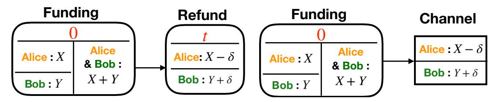
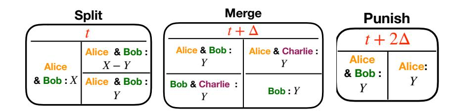
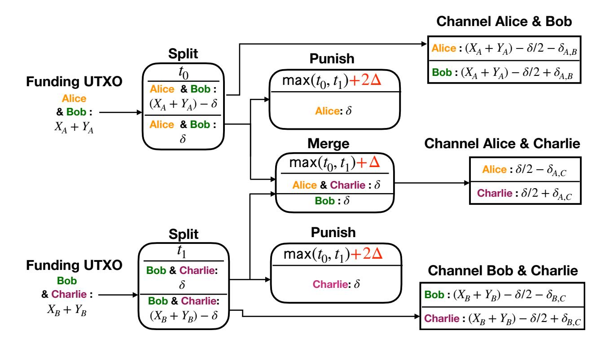
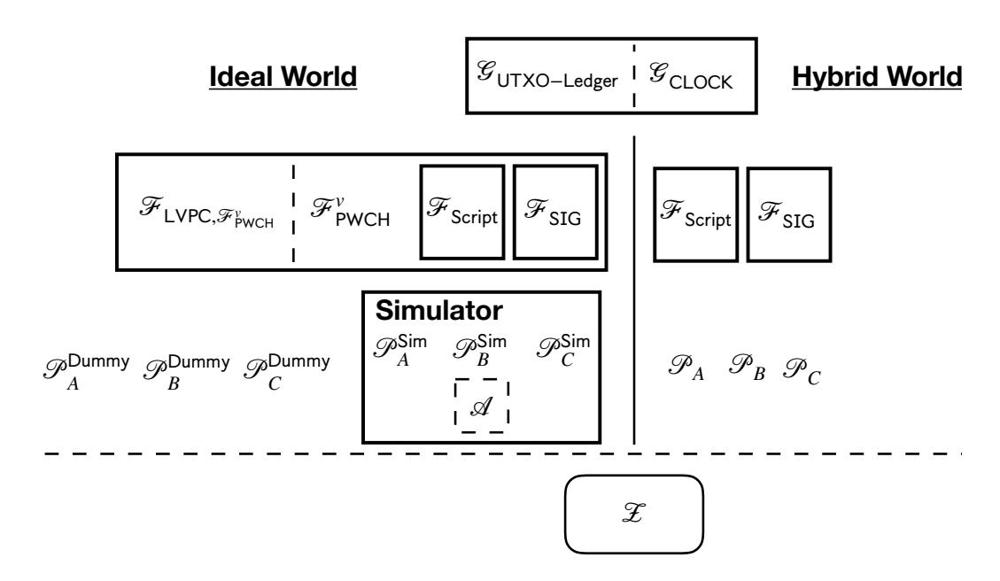

{0}------------------------------------------------

# Lightweight Virtual Payment Channels (Extended Version)

Maxim Jourenko<sup>1</sup> , Mario Larangeira1,<sup>2</sup> , and Keisuke Tanaka<sup>1</sup>

<sup>1</sup> Department of Mathematical and Computing Sciences, School of Computing, Tokyo Institute of Technology. Tokyo-to Meguro-ku Oookayama 2-12-1 W8-55, Japan. {jourenko.m.ab@m, mario@c, keisuke@is}.titech.ac.jp 2 Input Output Hong Kong. mario.larangeira@iohk.io <http://iohk.io>

Abstract. Blockchain systems have severe scalability limitations e.g., long confirmation delays. Layer-2 protocols are designed to address such limitations. The most prominent class of such protocols are payment channel networks e.g., the Lightning Network for Bitcoin where pairs of participants create channels that can be concatenated into networks. These allow payments across the network without interaction with the blockchain. A drawback is that all intermediary nodes within a payment path must be online. Virtual Channels, as recently proposed by Dziembowski et al. (CCS'18), allow payments without this limitation. However, these can only be implemented on blockchains with smart contract capability therefore limiting its applicability. Our work proposes the notion of –Lightweight– Virtual Payment Channels, i.e. only requiring timelocks and multisignatures, enabling Virtual Channels on a larger range of blockchain systems of which a prime example is Bitcoin. More concretely, other contributions of this work are (1) to introduce a fullyfledged formalization of our construction, and (2) to present a simulation based proof of security in Canetti's UC Framework.

## 1 Introduction

Blockchains implement decentralized ledgers via consensus protocols run by mutually distrustful parties. Despite the novelty of such design, it has inherent limitations, for example, effectively all transactions committed to the ledger have to be validated by all parties. Croman et al. [\[6\]](#page-39-0) showed that this severely limits a blockchain's throughput. Moreover, there is a minimal delay between submission of a transaction and verification thereof that is intrinsic to the system's security, e.g. one hour in the case of Bitcoin.

{1}------------------------------------------------

Layer-2 protocols, such as payment channel networks, allow confirmation of transactions outside the consensus protocol while using it as fallback. These protocols are referred as "off-chain" protocols in contrast to processing transactions via the consensus protocol "on-chain". An elementary protocol realizes channels and commonly works as follows: Two (or more) parties put together their funds and lock them on-chain by requiring a 2-out-of-2 (n-out-of-n) multisignature to claim them. Then these funds are spent by another transaction or a tree of transactions. These transactions represent the distribution of funds between both parties and are not committed to the blockchain except when parties enforce the fund distribution on-chain and unlock the funds. The parties can perform a payment, i.e. update the balance distribution within the channel, by recomputing that tree of transactions while invalidating previous transaction trees. Payments between parties are processed immediately and only involve interaction between the two parties. Channels can be extended to form channel networks by using Hashed Time Lock Contracts (HTLC) [\[7](#page-39-1)[,16\]](#page-40-0). Payments are performed by finding a path from payer to payee within the network and atomically replicating the payment on each channel along that path. A drawback of HTLCs is that a payment requires interaction with all intermediary nodes within a path. Virtual State Channels as proposed by Dziembowski et al. [\[8,](#page-39-2)[9\]](#page-39-3) devise a technique for creation of channels that allow execution of state machines instead of being limited to payments, and use an off-chain protocol that expands the network with new channels. The latter reduces the network's diameter yielding shorter payment paths, and allowing parties to perform payments without interacting with any intermediary nodes if they are adjacent in the now extended network. However, this construction requires blockchain with smart-contract capability, therefore not applicable to Bitcoin. Later we will see that this work addresses this limitation with a novel construction.

Use cases for virtual channels are manifold. A virtual payment channel provides the same benefits to the two parties sharing one as pairwise payment channels without the need to set it up by committing transactions to the ledger that can incur expensive fees. Payments can be executed offchain, without interaction with a third party and without incurring any fees, e.g. for routing an HTLC, making rapid micro-payments viable. This could enable new services such as a service-gateway. Such a gateway would consist of a node that sets up payment channels with different service provider that operate using micro-transactions, e.g. Video on Demand (VoD) services that bill by watch-time. A user could then create 

{2}------------------------------------------------

one payment channel with the gateway node and with the use of virtual channels created ad-hoc connections to the different (VoD) services instead of having to set up individual payment channels with each service they want to use. A more general use case is that virtual channels allow payment hubs, that have a high degree within a payment channel network, to interconnect their individual partners in exchange for a fee.

Related Work. HTLCs allow atomic payments across multiple hops. This is done by performing a conditional payment in each channel along a path from payer to payee. Executing a payment requires revealing a secret x ∈ N such that H(x) = y where H is a cryptographic hash function. After setup, starting from the payee each node within the payment path reveals x to its predecessor. This proofs that the payment can be enforced on-chain which allows parties to resolve the payment by performing it offchain. A timelock is used to cancel the transaction after a preset amount of time which unlocks the funds from the conditional payment. Although our construction can be used to enable payments across a payment channel network by creating a virtual channel between payer and payee, we argue that our work is orthogonal to HTLCs and both techniques can be used in tandem. First our construction is used to expand the underlying payment channel network with additional virtual channels and then HTLCs can be used to perform payments across this expanded infrastructure.

Dziembowski et al. introduced Virtual State Channels [\[8\]](#page-39-2) and State Channel Networks [\[9\]](#page-39-3). A state channel depends on a smart contract previously committed to the blockchain. It contains (1) application specific code, and (2) code for state channel management. More specifically parties can send messages to the smart contract changing its state according to (1), or compute a state-transition message where the resulting state is computed by the parties and summarized in the state-transition message for (2). The state-transition message can be kept off-chain, and only committed to the blockchain in case of parties' dispute. A virtual state channel can be built on top of two channels that were previously created in this manner. Similar to our work, virtual channels cannot be open indefinitely but have a fixed lifetime that is decided upon construction. In contrast to our work this technique requires a blockchain with smart-contract capability. Chakravarty et al. proposed Enhanced Unspent Transaction Outputs (EUTxO) [\[4\]](#page-39-4) and constructed the Hydra Protocol [\[5\]](#page-39-5). EUTxO enables running constraint emitting state machines on top of a ledger which is used to setup a Hydra heads among a set of parties. This allows them to take their funds off-chain and confirm transactions with these funds among the participants of the Hydra head. Although parties 

{3}------------------------------------------------

can interact with each other using arbitrary transactions as they would on-chain, no new participants can be added to the Hydra head which is in contrast to payment channel networks. Moreover implementing Hydra requires blockchains with EUTxO capability limiting its applicability.

Our Contributions. This work proposes a new variant of Virtual Channels, we name it Lightweight Virtual Payment Channels, that is based on UTXO and requires only multisignatures and timelocks, that is, it does not require smart-contracts, yielding the first virtual channel construction implementable on blockchains such as Bitcoin, which currently has the highest market capitalization of all cryptocurrencies [3](#page-3-0) and still is the most widely used, and blockchains operating with the recently introduced EUTxO [\[4\]](#page-39-4) effectively improving the state of the art in both cases.

In a nutshell, our Layer-2 protocol for Virtual Payment Channels takes two payment channels between three parties as input, and opens three payment channels, i.e. one for each pair of parties. Our protocol can be applied iteratively allowing for virtual payment channels across multiple hops of the underlying payment channel network. Our construction (1) can be used to expand a payment channel network with virtual payment channels, (2) allows payments without interaction with intermediary nodes if payer and payee share a virtual payment channel, (3) can be used in tandem with HTLCs and (4) can be used with different payment channel implementations as Duplex Payment Channel [\[7\]](#page-39-1), Lightning [\[16\]](#page-40-0), Eltoo [\[15\]](#page-40-1). We formalize our work in Canetti's Universal Composability (UC) Framework [\[1\]](#page-39-6) by introducing a functionality for lightweight virtual payment channels FLVPC,FPWCH . Although formalizations for ledgers, including Bitcoin, within the UC framework exist [\[9](#page-39-3)[,8\]](#page-39-2) we present the first global functionality GUTXO−Ledger for an Unspent Transaction Output (UTXO) based ledger. Moreover we present an auxilliary functionality FScript modeling a scripting language modelling access to timelocks and multisignatures. Our construction makes use of GCLOCK by Katz et al. [\[10\]](#page-39-7), modified by Kiayias et al. [\[12,](#page-39-8)[11\]](#page-39-9) and FSIG by Canetti et al. [\[2\]](#page-39-10). We present pseudo-code protocols Open VC, Close VC and Enforce VC.

Structure of this Work. In the remainder of this work, first, we briefly introduce notation and the model used in this work in Section [2.](#page-4-0) Next we formalize a UTXO based ledger and their components in Section [3](#page-5-0) and review pairwise payment channel in Section [4.](#page-6-0) Afterwards we give a high-level description and analysis of our approach in Section [5](#page-7-0) before presenting pseudo-code protocols in Section [6.](#page-12-0) Following this we formalize

<span id="page-3-0"></span><sup>3</sup> https://coinmarketcap.com

{4}------------------------------------------------

our approach in the UC framework by, first, introducing auxiliary functionalities in Section 7, then the pairwise payment channel functionality  $\mathcal{F}_{\text{PWCH}}$  in Section 8 and the virtual channel functionality  $\mathcal{F}_{\text{LVPC},\mathcal{F}_{\text{PWCH}}}$  in Section 9. Next we introduce formal protocols implementing  $\mathcal{F}_{\text{PWCH}}$  and  $\mathcal{F}_{\text{LVPC},\mathcal{F}_{\text{PWCH}}}$  namely protocols PWCH and LVPC<sub>PWCH</sub> in Section 10 and Section 11 respectively. We provide simulation based proofs that the protocols implement the respective functionalities in Section 12. Lastly we discuss directions for future work in Section 13.

## <span id="page-4-0"></span>2 Preliminaries

Let negl(n) denote the negligible function. Furthermore consider the standard definition for computational indistinguishability  $X \approx_c Y$ , i.e., there is no PPT algorithm D such that D can distinguish between two ensembles of probabilistic distributions  $X = \{X_n\}_{n \in \mathbb{N}}$  and  $Y = \{Y_n\}_{n \in \mathbb{N}}$ , in other words  $\Pr[D(X_n, 1^n) = 1] - \Pr[D(Y_n, 1^n) = 1]| \le negl(n)$ . Moreover let  $\cup$ ,  $\cap$  and  $\setminus$  denote set union, intersection, subtraction, and  $\varnothing$  be the empty set. We make frequent use of tuples to structure data. Assume a tuple of type  $\mathcal{A}$  is defined as  $(a_0, a_1, \ldots, a_n)$  and A is an instantiation of such a tuple. For simplicity we denote the entry labeled  $a_i$  of A as  $A.a_i$ .

The Adversarial and Computational Model. We model the execution of our protocol  $\pi$  via the Universal Composability (UC) Framework with Global Setup by Canetti et al. [3] where all the entities are PPT Interactive Turing Machines (ITM), and the global setup is given by the global functionality  $\mathcal{G}$ , and the execution is controlled by the environment  $\mathcal{Z}$ . In this simulation based model, all parties from  $\pi$  have access to the auxiliary functionality  $\mathcal{F}_{aux}$ , i.e.,  $\pi^{\mathcal{F}_{aux}}$ , in the hybrid world execution  $\mathsf{HYBRID}_{\pi^{\mathcal{F}_{aux}},\mathcal{A},\mathcal{Z}}$  in the presence of the adversary  $\mathcal{A}$  which can see and delay the messages within a communication round. Whereas the ideal execution, i.e.,  $\mathsf{IDEAL}_{\mathcal{F},\mathcal{S},\mathcal{Z}}$ , is composed by the functionality  $\mathcal{F}$  in the presence of the simulator  $\mathcal{S}$ . In both executions, the environment  $\mathcal{Z}$ access the global functionality  $\mathcal{G}$ . We assume static corruption by a malicious adversary. Given the randomness r and input z, the environment  $\mathcal{Z}$  drives both executions  $\mathsf{IDEAL}_{\mathcal{F},\mathcal{S},\mathcal{Z}}$  and  $\mathsf{HYBRID}_{\pi^{\mathcal{F}_{aux}},\mathcal{A},\mathcal{Z}}$ , and output either 1 or 0. Therefore, let  $\mathsf{IDEAL}_{\mathcal{F},\mathcal{S},\mathcal{Z}}$  and  $\mathsf{HYBRID}_{\pi^{\mathcal{F}aux},\mathcal{A},\mathcal{Z}}$  be respectively the ensembles  $\{\mathsf{IDEAL}_{\mathcal{F},\mathcal{S},\mathcal{Z}}(n,z,r)\}_{n\in\mathbb{N},z\in\{0,1\}^*}$  and  $\{\mathsf{HYBRID}_{\pi^{\mathcal{F}_{aux}},\mathcal{A},\mathcal{Z}}(n,z,r)\}_{n\in\mathbb{N},z\in\{0,1\}^*}$  of the outputs of  $\mathcal{Z}$  for both executions. Thus, we say that  $\pi^{\mathcal{F}_{aux}}$  realizes  $\mathcal{F}$  in the  $\mathcal{F}_{aux}$ -Hybrid model when, there exist a PPT simulator  $\mathcal{S}$ , such that for all PPT  $\mathcal{Z}$ , we have  $\mathsf{IDEAL}_{\mathcal{F},\mathcal{S},\mathcal{Z}} \approx_c \mathsf{HYBRID}_{\pi^{\mathcal{F}_{aux}},\mathcal{A},\mathcal{Z}}.$ 

{5}------------------------------------------------

Communication Model. We assume synchronous communication where time is split into communication rounds. If any party sends a message to a receiving party within a round, the message reaches the receiving party at the beginning of the following communication round.

## <span id="page-5-0"></span>3 The UTXO Model

In the following we review the notion of Unspent Transaction Outputs (UTXO), UTXO based ledger and transactions. Thereafter we briefly review payment channel.

Overview. A UTXO wraps an amount of currency and comes with a script. To claim an UTXO, a witness needs to be provided s.t. if provided as input into the script, it evaluates to true. A UTXO based ledger's state is a set of all UTXO that are in circulation. The state can be altered using transactions that contain a set of inputs and a list of outputs. Each input references a UTXO and contains its witness. Each output is a newly defined UTXO. Submitting such a transaction to the ledger alters its state by removing the UTXO referenced in the inputs and adding the UTXO defined in the outputs. Moreover, a transaction might contain a point in time t ∈ N called timelock s.t. it is not possible to submit the transaction to the ledger before time t. Note that in this work we only make use of scripts that verify multisignatures. More formally, we have the following.

The UTXO Tuples. The UTXO are tuples (b, Party), where b ∈ N is the amount of coins and Party is a set of parties. We denote a reference to a UTXO out by ref(out). Note UTXO are uniquely identifiable, e.g. in Bitcoin UTXOs are identifiable by the hash of the transaction in which they were defined, and their index within the transaction's outputs.

Funding UTXO Pattern. A Funding UTXO F UTXO(x,P0,P1) is of the form (x, {P0,P1}) where x ∈ N and P0,P<sup>1</sup> are parties.

Transactions. A transaction is a tuple (t, In, Out) where t ∈ N is a point in time specifying a timelock, Out is a list of UTXO and In is a set of inputs. An input is of the form (ref, Σ) where ref is a reference to an UTXO and Σ is a set of signatures. A transaction is valid and can be committed to the ledger after time t, if all UTXO in Tr.Ref are unique, each input contains a correct witness and it holds that P ref(i)∈Tr.Ref P i.b ≥ <sup>o</sup>∈Tr.Out o.b, i.e. it spends at most as many funds as it claims.

UTXO Ledger. A UTXO ledger's state is represented by a set of UTXO U. Parties may read the ledger's state and change it by submitting a valid transaction. All UTXO referenced by the inputs are removed from U and 

{6}------------------------------------------------

all UTXO in the outputs are added to the ledger. As conventionally done in the literature, in the remainder of this work we assume that any such transaction will be processed on the ledger within duration ∆ ∈ N.

Transactions as Graphs. Transactions submitted to alter a ledger's state form a tree where transactions themselves form nodes, the UTXO specified in their outputs form outgoing edges and UTXO referenced in their inputs form incoming edges. Note that transactions within a tree can only be committed to the ledger if its root is committed to the ledger.

Partial Mappings. We abstract away from transactions and represent them as partial mappings of UTXO of the form (In, Out) where In, Out are UTXO that represent the transaction's inputs and outputs respectively. We assume there is a function φ that takes a mapping (In, Out) and time t and outputs a respective transaction with timelock t. Analogously φ −1 is a function that takes a transaction and outputs a mapping and timelock.

## <span id="page-6-0"></span>4 Pairwise Payment Channel

A pairwise payment channel allows two parties to exchange funds without committing a transaction to the ledger for the individual payments. Such a channel is setup by having parties commit a transaction on the ledger that collects some of each party's UTXO and spends all of it within a Funding UTXO. Committing this transaction on the ledger locks these funds. The Funding UTXO is spent by a transaction subtree representing the channel's state where committing it to the ledger unlocks and returns all of the parties' funds, however, instead, the parties hold off committing them. When executing a payment, they update the transaction subtree to represent the new state while invalidating the previous subtree. Invalidation can be done by spending the Funding UTXO with a transaction that has a timelock of at least ∆ less than the previous subtree. We remark that alternative invalidation methods do exist [\[7,](#page-39-1)[15,](#page-40-1)[16\]](#page-40-0). The channel is closed by committing the transaction subtree or a transaction summarizing it onto the ledger.

We design our construction to be agnostic of the underlying pairwise payment channel construction, however, for the sake of having a complete formal treatment we formalize a simple pairwise payment channel construction based on timelocks. This construction consists of two types of transactions called Funding and Refund transactions.

Funding. A Funding transaction is parametrized with (x, P0, P1) where x ∈ N is an amount of coins and P0, P<sup>1</sup> are parties where P<sup>0</sup> 6= P1. It is an

{7}------------------------------------------------

<span id="page-7-1"></span>

- (a) Simple Payment Channel.
- (b) Abstract representation.

Fig. 1: Figure 1a depicts a possible implementation of a simple pairwise payment channel whereas Figure 1b depicts an implementation independent abstraction.

arbitrary valid transaction Tr for which holds that there exists a Funding UTXO  $f_{-}out \in Tr.Out$  parametrized with  $(x, \mathcal{P}_0, \mathcal{P}_1)$  and its timelock is 0.

Refund. A Refund transaction is parametrized with  $(\text{ref}, t_r, x_r, y_r)$  where ref is a reference to a Funding UTXO  $f_{-}$ out =  $F_{-}$ UTXO $(x_f, \mathcal{P}_0, \mathcal{P}_1), t \in \mathbb{N}$  is a point in time, and  $x_r, y_r \in \mathbb{N}$  are amounts of coins. It is a transaction Tr of form  $(t_r, \{\text{ref}\}, \text{Out}, \Sigma)$  where  $\text{Out} = \{(x, f_{-}\text{out}.\mathcal{P}_0), (y, \mathcal{P}_1)\}, x_f \geq x + y$ . In the following we denote a Refund transaction with these parameters with REFUND\_TR $(f_{-}\text{out}, t_r, x_r, y_r)$  and an analogous mapping with REFUND\_MAP $(f_{-}\text{out}, x_r, y_r)$ .

Pairwise Payment Channel. The implementation of a timelock-based pairwise payment channel is depicted in Figure 1a. It consists of a Funding transaction that locks both parties funds into the channel as well as a Refund transaction that holds the current state, i.e. fund distribution, of the channel. Two parties who want to create such a channel proceed as follows. (1) Create and exchange Funding and Refund transactions, (2) sign and exchange signatures of Refund transaction, (3) sign and commit Funding transaction to the blockchain.

As soon as the Funding transaction is included in the blockchain, a payment can be done by creating a copy of the Refund transaction with a new balance distribution, a timelock that is smaller by at least  $\Delta$  to the previous Refund transaction's timelock, but higher than the current time, and exchanging signatures for it. The channel is closed by either party by committing the latest refund transaction to the blockchain at expiration of its timelock. Alternatively a channel can be closed by creating a Refund transaction with a timelock of 0 and committing it to the blockchain.

#### <span id="page-7-0"></span>5 Overview of the Construction

The construction consists of three protocols, Open\_VC, Close\_VC and Enforce\_VC used for setup, tear-down and dispute of virtual channels

{8}------------------------------------------------

respectively. We remark that the executions of Open VC and Close VC require consent between all involved parties, and Enforce VC can be executed by a party unilaterally.

Types of Transactions. We use three types of transactions, they are are Split, Merge and Punish transactions as illustrated in Figure [2.](#page-10-0) A Split transaction spends a Funding UTXO and creates two new Funding UTXO between the same pair of parties. A Merge transaction takes two Funding UTXO between three parties and equal balance as input, and creates two UTXO with the same amount of funds as the inputs each. One is a Funding UTXO between the two parties that do not share a Funding UTXO within the inputs, and one is a UTXO that gives funds to the third party. Lastly the Punish transaction takes a Funding UTXO as input and creates an UTXO that gives it all to one of the parties.

Assumptions. Timelocks are used to invalidate transactions. That is, a transaction invalidates another one if it spends the same UTXO within its inputs, but has a timelock that is lower by at least ∆. We assume that the original payment channel between Alice and Bob has a timelock of at least t<sup>0</sup> + ∆, and the one between Bob and Charlie has a timelock of at least t<sup>1</sup> + ∆. After tear-down of our construction the timelocks of both channels will be t<sup>0</sup> − ∆ and t<sup>1</sup> − ∆ respectively. We note that this does not make the construction incompatible with pairwise payment channel constructions that do not rely on timelocks for transaction invalidation, such as lightning network style channels. Such channels can perform a state updates using their invalidation method that introduce a timelock before construction, and remove the timelock after tear-down.

Malicious Behavior. Parties abort protocols Open VC and Close VC when they observe another party deviating from the protocol, or if a party delays execution until expiration of the virtual channel, i.e. t<sup>0</sup> − ∆ and t<sup>1</sup> − ∆ respectively.

Open VC takes an amount of coins δ ∈ N and two pairwise payment channel between three parties as input and creates three new pairwise payment channels, one between each pair of parties. In the following we assume the parties are Alice, Bob and Charlie with payment channels between Alice and Bob, and between Bob and Charlie. Our construction creates a set of transactions as illustrated in Figure [3.](#page-10-1) In a nutshell, the purpose of the construction is to allow parties to enforce payout of all of their funds distributed among the offchain channels, while providing fall-back security of their funds in case all other parties misbehave.

{9}------------------------------------------------

First, two Split transactions are created, each spending one of the Funding UTXO that are spent by the original pairwise payment channels. Their timelocks are t<sup>0</sup> and t<sup>1</sup> respectively s.t. they invalidate the original payment channels. One of the UTXO of each Split transaction contains δ coins and is used as input into a Merge transaction. The other UTXO of each Split transaction is used as Funding UTXO to re-create the original payment channels, albeit each party has δ/2 coins less in these channels. The Merge transaction takes the UTXO with δ coins as input, creates a Funding UTXO for a channel between Alice and Charlie where each possess initially δ/2 coins, and another UTXO gives δ coins to only Bob which represents his collateral. Lastly, two Punish transactions spend the same UTXO as the Merge transaction but give all coins to Alice and Charlie respectively. They have a timelock of max(t0, t1) + 2∆ such that they are invalidated by the Merge transaction.

Close VC takes a virtual channel construction as input and closes them while setting up the original pairwise payment channel but with a balance distribution reflecting the balances in the three payment channel built on-top of the construction. Effectively Alice pays Bob the funds she owes Charlie while Bob forwards these funds to Charlie - and vice versa. The channels have timelocks t<sup>0</sup> − ∆ and t<sup>1</sup> − ∆ respectively to invalidate the Split transactions. Note that a virtual channel construction can only be closed until time min(t0, t1) − ∆ as otherwise the newly constructed payment channels cannot invalidate the Split transactions. Note that having Bob take out δ/2 coins out of both of his original channels within the construction ensures that no party has a negative balance within a pairwise payment channel upon tear-down.

Enforce VC lets a party enforce the current state by having it commit a transaction to the blockchain as soon as its timelock expires.

Atomic Construction. We require that all transactions within our construction are created and respectively invalidated atomically. This is enforced by the order in which transactions are signed. First, parties have to exchange signatures for all transactions except of those spending the original Funding UTXO, i.e. the Split transactions in Open VC and the root of the pairwise payment channel sub-trees in Close VC. Afterwards, Alice and Charlie sign these remaining transactions and send the signatures to Bob. Lastly Bob signs them and sends his signatures to Alice and Charlie. Only if a party holds all signatures for all transactions it is 

{10}------------------------------------------------

<span id="page-10-0"></span>involved in, it will consent in performing payments. This ensures security as we will discuss in the following.



Fig. 2: Illustrations of transactions used through out this work represented as nodes of a transaction graph. A transaction's inputs are listed on the left-hand-side whereas a transaction's outputs are on the right-hand-side. The value on top represents the transaction's timelock.

<span id="page-10-1"></span>

Fig. 3: Overview of the virtual channel construction as a transaction tree. On the left-hand side are Funding UTXO either on the ledger or within previous virtual channels. Boxes with round corners represent the transactions of our construction while the boxes on the right-hand side abbreviate pairwise payment channel's transaction sub-trees. We omit stating inputs explicitly as they are clear from context.

Only Alice is honest. (1) As Bob is the last one to sign, he might interrupt the protocol before Alice receives a signature for the Split transaction. In this case Alice will not consent to any payments and the construction does not change her total balance. Alice can receive her funds by waiting for expiration of her original payment channel's timelock or

{11}------------------------------------------------

commitment of the Split transaction by Bob. (2) Bob and Charlie can collude and spend the Funding UTXO that is referenced by their Split transaction. As such the whole transaction sub-tree with the Split transaction as root cannot be committed to the ledger, including the Merge transaction. In that case Alice can commit the Split transaction, and subsequently the Punish transaction. Alice will receive δ coins which is the maximum amount of coins she can receive within her pairwise payment channel with Charlie, as such she does not lose coins. Note that Alice's channel with Bob is unaffected as it is not within the sub-tree that Bob and Charlie invalidated.

Only Bob is honest. (1) As Bob is the last to sign transactions, he can assure either both Split transactions are fully signed and they can be committed to the ledger, or none. Moreover he can assure that either both Split transactions will be invalidated upon lockdown or none. (2) Spending the Funding UTXO referenced by the Split transactions always require Bob's consent by requiring a signature such that Alice and Charlie cannot invalidate any part of the construction's transaction sub-tree, making Bob to pay out his collateral via a Punish transaction.

Iterative Construction. The pairwise payment channels used as input can either have a Funding UTXO located on a ledger, or a Funding UTXO created by a previous virtual channel construction. In that case timelocks have to be chosen such that within its transaction sub-tree any transaction has a timelock larger than its predecessor's timelock by at least ∆ in order to ensure there is sufficient time to commit them to the ledger. Moreover virtual channel constructions have to be torn-down in reverse order in which they were setup. Iterative constructions requires further analysis of security. The key part to make iterative construction work is the design of the Punish transactions as they secure a party's funds, including potential collateral payments, while not over-punishing a potentially honest intermediary party: The punishment amount cannot exceed a party's collateral. Assume the channel between Bob and Charlie is created using a virtual channel construction with channels between Bob and Ingrid and between Ingrid and Charlie. In that case Ingrid and Charlie can collude by spending their Funding UTXO invalidating the Split transaction between Bob and Charlie making Bob have to pay coins within the Punish transaction between him and Alice. However, these funds as well as the funds Bob has in his channel between him and Charlie are covered by a Punish transaction he has between him and Charlie. Indeed this is the reason why the same amount of coins δ has to be paid 

{12}------------------------------------------------

into the Merge transaction from both of its Funding UTXO and only those coins are covered by the Punish transaction. This ensures that all funds are covered while not over-punishing the intermediary party in case of iterative virtual channel construction.

Mitigating Wormhole attacks. Malavolta et al. [\[13\]](#page-40-2) showed an attack in which two colluding parties skip intermediary parties within a HTLC payment within a payment channel network (1) withholding fees that would have been paid to the intermediary parties and (2) obtaining the fees themselves instead. A variant of this attack could be applied to our construction as we do not require parties to verify that all pairwise payment channel but the ones they participate in were validly constructed. We discuss how to mitigate possible attacks. Although detailed discussion about payout of fees is beyond the scope of this work, we suggest that fees are paid to the intermediary party as compensation for locking up collateral. We note that due to this attacker cannot obtain more fees than they are owed (2). However, attackers could still collude to withhold fees of intermediary parties (1). A mitigation to this attack is that parties would need to proof that such a payment channel was previously constructed, but showing the Funding UTXO that were used and are located on the ledger as well as the whole transaction subtree originating those. A party that receives this information can do a sanity check and store the sub-tree in case they have to do the same proof. This poof serves to show that fees have been paid to the intermediate parties, however, we note that the information might be out-of-date as malicious parties can close their pairwise channel effectively invalidating the whole subtrees.

## <span id="page-12-0"></span>6 Protocols

Here we informally introduce the constructions for Open VC, Close VC and Enforce VC for setup, tear-down and dispute protocols of virtual channels. To help intuition these are heavily simplified but derived from the formal protocol LVPCPWCH in Section [11](#page-35-0) that implements Functionality FLVPC,FPWCH from Section [9.](#page-24-1)

In the following protocols we assume that: When executing any protocol all involved honest parties check that execution with the given parameters is permissible, i.e. it will not result in transactions with negative balances, timelocks in the past and that the pairwise payment channel in Open VC or the virtual channel in Close VC are not currently in use with another virtual channel construction. Moreover, for protocols Open VC 

{13}------------------------------------------------

and Close\_VC they check that all parties consent execution. Lastly, they abort execution if they observe a party deviating from the protocol including when their signatures fail verification or when execution times-out. For details we refer to Functionality  $\mathcal{F}_{\mathsf{LVPC},\mathcal{F}_{\mathsf{PWCH}}}$ .

Before introducing the protocols, first we define the individual types of transactions used in our construction as well as pairwise payment channel and virtual payment channel.

**Punish.** A Punish transaction takes a Funding UTXO as input but gives all funds to one party. It is parametrized with (ref,  $\mathcal{P}$ ,  $t_p$ ) where ref is a reference to a Funding UTXO f\_out,  $\mathcal{P} \in f_out.$ Party is a party and  $t_p \in \mathbb{N}$  is a round number. It is of form  $(t_p, \{ref\}, \{out\}, \Sigma)$  where out = (f\_out.b, $\mathcal{P}$ ). In the following we denote a Punish transaction with these parameter by PUNISH\_TR(f\_out,  $\mathcal{P}$ ,  $t_p$ ), and an analogous mapping by PUNISH\_MAP(f\_out,  $\mathcal{P}$ ).

**Split.** A Split transaction takes a Funding UTXO as input and splits funds across two funding UTXO. It is parametrized with (ref,  $\delta$ ,  $t_S$ ) where ref is a reference to a Funding UTXO f\_out,  $\delta \in \mathbb{N}$ ,  $\delta \leq$  f\_out.b is a balance and  $t_S \in \mathbb{N}$  is a point in time. It is of form  $(t_S, \{\text{ref}\}, \{\text{out}_{ch}, \text{out}_{\delta}\}, \Sigma)$  where  $\text{out}_{ch} = (\text{f_out}.b - \delta, \text{f_out.Party})$  and  $\text{out}_{\delta} = (\delta, \text{f_out.Party})$ . In the following we denote a Split transaction with these parameter by SPLIT\_TR(f\_out,  $\delta$ ,  $t_S$ ) and an analogous mapping by SPLIT\_MAP(f\_out,  $\delta$ ). The routines OUT\_CH and OUT\_DELTA take either a Split transaction or analogous mapping as input and return out<sub>ch</sub> and out<sub> $\delta$ </sub> respectively.

Merge. A Merge transaction takes two funding UTXO by three parties and creates a new Funding UTXO. It is parametrized with  $(t_M, f\_out_A, f\_out_B, b)$  where  $t_M \in \mathbb{N}$  is a round number,  $f\_out_A$ ,  $f\_out_B$  are two Funding UTXO and  $b \in \mathbb{N}, b = f\_out_A.b = f\_out_A.b$  is an amount of coins. Moreover for the involved parties  $\mathcal{P}_A, \mathcal{P}_B, \mathcal{P}_C$  holds  $\mathcal{P}_A, \mathcal{P}_B \in f\_out_A.$ Party,  $\mathcal{P}_B, \mathcal{P}_C \in f\_out_B.$ Party. Given,  $out_{ch} = (b, \{\mathcal{P}_A, \mathcal{P}_C\})$  and  $out_B = (b, \{\mathcal{P}_B\})$ , then a Merge transaction is of the form  $(t_M, \{\text{ref}(f\_out_A), \text{ref}(f\_out_B)\}, \{\text{out}_{ch}, \text{out}_B\}, \Sigma)$ . We denote a Merge transaction with these parameter by  $\text{MERGE\_TR}(f\_out_A, f\_out_B, b, t_M)$  and an analogous mapping by  $\text{MERGE\_MAP}(f\_out_A, f\_out_B, b)$ . The routine  $\text{OUT\_CH}$  takes a Merge transaction or analogous mapping as input and returns  $\text{out}_{ch}$ .

Function open\_virtual $(f, \mathcal{P}, \mathcal{P}', b, b', t)$  is used to open a pairwise payment channel with the provided, Funding UTXO f, between the two parties  $\mathcal{P}, \mathcal{P}'$ , respective balance distribution b, b' and optional timelock t. See Section 8 and Section 10 for details.

{14}------------------------------------------------

### Algorithm 1 Open Virtual Channel

```
1: function Open VC(γ0, γ1, δ)
2: tr0,S ← SPLIT TR(γ0.f, δ, γ0.t − ∆)
3: tr1,S ← SPLIT TR(γ1.f, δ, γ1.t − ∆)
4: tr0,p ← PUNISH TR(OUT DELTA(tr0,S), PA, max(γ0.t, γ1.t) + ∆)
5: tr1,p ← PUNISH TR(OUT DELTA(tr1,S), PC , max(γ0.t, γ1.t) + ∆)
6: trmrg ← MERGE TR(OUT DELTA(tr0,S), OUT DELTA(tr0,S), δ, max(γ0.t, γ1.t))
7: (γA,B,trroot,A,B) ← open virtual(OUT CH(tr0,S), PA, PB,
                             balance(γ0, PA) − δ/2, balance(γ0, PB) − δ/2)
8: (γB,C ,trroot,B,C) ← open virtual(OUT CH(tr1,S), PB, PC ,
                             balance(γ1, PB) − δ/2, balance(γ1, PC ) − δ/2)
9: (γA,C ,trroot,A,C) ← open virtual(OUT CH(trmrg), PA, PC , δ/2, δ/2)
10: ∀ transactions except Split: Exchange signatures
11: PA and PC : send Split transactions' signatures to PB
12: PB: Send Split transactions' signatures to PA and PC
13: return γ
                v = (γ0, γ1, γA,B, γB,C , γA,C , PA, PB, PC , δ, min(γ0.t, γ1.t) − 2∆)
14: end function
```

Fig. 4: Creation of a virtual channel. Takes two pairwise payment channel γ<sup>0</sup> and γ1, and an amount of coins δ as input, and outputs a virtual channel γ v .

Definition 1. A pairwise payment channel γ is a tuple of form γ = (id, f,PA,PB, bA, bB, t, t0) where id ∈ N is a unique identifier, f is a funding UTXO, PA,P<sup>B</sup> are parties, bA, b<sup>B</sup> ∈ N are balances of PA,P<sup>B</sup> respectively.

Definition 2. A lightweight virtual payment channel γ v is a tuple of form (id, γ0, γ1, γA,B, γB,C, γA,C, PA, PB, PC, δ, t) where PA,PB,P<sup>C</sup> are three parties, γ0, γ<sup>1</sup> are pairwise payment channel between PA,P<sup>B</sup> and PB,P<sup>C</sup> respectively provided as inputs, γA,B, γB,C, γA,C are pairwise payment channel created by the construction between each pair of parties, δ is the capacity of channel γA,C between PA,P<sup>C</sup> and t ∈ N is a point in time until which the channel can be closed.

For simplicity we omit stating id explicitly.

## 7 The UC Setting

While focusing on the intuition and readability of our approach up until this point, the remainder of this work is about formal treatment of our

{15}------------------------------------------------

### Algorithm 2 Close Virtual Channel

```
1: function Close VC(γ
                           v
                            )
2: sumA = γ
                 v
                  .γA,B.bA + γ
                               v
                                .γA,C .bA
3: sumB = γ
                 v
                  .γA,B.bB + γ
                               v
                                .γA,C .bB
4: sum0
           B = γ
                 v
                  .γB,C .bA + γ
                               v
                                .γA,C .bA
5: sumC = γ
                 v
                  .γB,C .bB + γ
                               v
                                .γA,C .bB
6: (γ0,trroot,A,B) ← open virtual(γ
                                      v
                                       .γ0.f, PA, PB,sumA,sumB, γv
                                                                    .t)
7: (γ1,trroot,B,C) ← open virtual(γ
                                     v
                                       .γ1.f, PB, PC ,sum0
                                                         B,sumC , γv
                                                                    .t)
8: ∀ transactions except trroot,A,B and trroot,B,C: Exchange signatures
9: PA signs trroot,A,B, PC signs trroot,B,C. Send signatures to PB
10: PB signs trroot,A,B and trroot,B,C. Sends signatures to PA and PC respectively
11: return (γ0, γ1)
12: end function
```

Fig. 5: Closing of a virtual channel γ <sup>v</sup> by recreating the original channels γ<sup>0</sup> and γ1. The constructions Split transactions are invalidated by having the roots of the pairwise payment channels have timelocks of at most γ v .t.

### Algorithm 3 Enforce Virtual Channel

```
1: function Enforce VC(γ
                         v
                          )
2: for all tr in transactions of γ
                               v do
3: if tr.t < τ ∧ ∀o ∈ tr.In : o is on the ledger then
4: Commit tr to the ledger
5: end if
6: end for
7: end function
```

Fig. 6: Parties enforce the state presented by the virtual payment channel construction by committing transactions to the ledger whenever possible, i.e. as soon as their timelocks expire and UTXO referenced in their inputs are present on the ledger.

{16}------------------------------------------------

protocol in the UC framework including, potentially harder to read, but necessary detail. First we give an overview of the setting followed by introduction of all auxiliary functionalities used throughout this work. We follow up by detailing the pairwise payment channel functionality  $\mathcal{F}_{\text{PWCH}}$  the lightweight virtual channel functionality  $\mathcal{F}_{\text{LVPC}}$  in the following sections.

<span id="page-16-0"></span>

Fig. 7: Overview of our setup within the UC framework.

Overview. Figure 7 depicts an overview of our construction. The setting is split up in an Ideal world and a ( $\mathcal{G}_{CLOCK}$ ,  $\mathcal{G}_{UTXO-Ledger}$ ,  $\mathcal{F}_{SIG}$ ,  $\mathcal{F}_{Script}$ ) - hybrid world. The global functionality  $\mathcal{G}_{UTXO-Ledger}$  is associated with the global  $\mathcal{G}_{CLOCK}$  functionality and accessible from either world. The lightweight virtual channel functionality  $\mathcal{F}_{LVPC}$  is associated with the pairwise payment channel functionality  $\mathcal{F}_{PWCH}$  receiving access to its internal state and helper functions.  $\mathcal{F}_{PWCH}$  includes and replicates the interfaces and behavior of  $\mathcal{F}_{SIG}$ ,  $\mathcal{F}_{Script}$ .

<span id="page-16-1"></span>The Global Clock Functionality  $\mathcal{G}_{\mathsf{CLOCK}}$ . We adapt the global clock functionality formalized by Katz et al. [10], modified by Kiayias et al. [12,11] and is depicted in Figure 7. The functionality keeps track of a round number  $\tau$  that can be read by any party. After finishing computations a party sends a clock update request to the functionality. The round number is incremented after the functionality receives update requests from all parties as well as the ledger functionality. Parties agree upon a starting time of their protocol as well as a duration for each round, such that time can be derived from the round number.

{17}------------------------------------------------

## Functionality GCLOCK

The functionality is accessible by any entity and associated with a global functionality GUTXO Ledger.

State: Stores time τ ∈ N, a set of parties P, bit dGUTXO Ledger ∈ {0, 1} as well as bits d<sup>P</sup> for each party in P.

Initialization: Sets τ = dGUTXO Ledger = 0 and P = ∅.

Register: Upon receiving message (register, sid) from party P, set P = P ∪ {P}, store a bit d<sup>P</sup> ∈ {0, 1} initialized with d<sup>P</sup> = 0 and send message (register, sid,P) to the adversary.

Clock Update Ledger: Upon receiving message (clock-update, sid) from GUTXO Ledger set dGUTXO Ledger = 1 and send message (clock-update, sid,P) to the adversary.

Clock Update Party: Upon receiving message (clock-update, sid) from party P set d<sup>P</sup> = 1. If dGUTXO Ledger = 1 and d<sup>P</sup> = 1 for all honest parties in P, set τ = τ + 1, dGUTXO Ledger = 0 and d<sup>P</sup> = 0 for all honest parties in P. Lastly send message (clock-update, sid, GUTXO Ledger) to the adversary.

Clock Read: Upon receiving message (clock-read, sid) from any entity reply with message (clock-read, sid, τ ).

The Global Functionality GUTXO−Ledger models a UTXO based ledger maintaining a publicly readable set of UTXO.

The ledger maintains a set U that holds all UTXO. The interface Transaction is used to modify U by providing a UTXO mapping. It can be called by Z modeling transactions done by parties outside the protocol, however, parties themselves are only able to change U indirectly by interacting with the FScript functionality. When receiving a request the functionality checks that all coins within the Outputs of the mapping are covered by the coins referenced in the Inputs. Any party can read U by calling the Check UTXO sub-function.

The differences between GUTXO−Ledger and the ledger functionality by Kiayias et al. [\[12\]](#page-39-8) are twofold. For one instead of using a verification predicate to check the validity of transactions, we move this verification into a second functionality FScript representing required parts of a blockchains scripting language similar to the separation of ledger and smart contract functionalities in the work of Dziembowski et al. [\[9,](#page-39-3)[8\]](#page-39-2). For another we explicitly make use of UTXO as required in our construction.

{18}------------------------------------------------

## Functionality GUTXO−Ledger

State: Stores set of UTXO U.

Initialization: Z sends the initial state U0. Sets U := U0.

Additional interface: The functionality wraps the FScript and FSIG functionalities internally and replicates their interface. Any messages to these functionalities are processed according to their definition.

Transaction: Upon receiving, from either Z or functionalities, the message (transaction, sid, M) where M is a partial UTXO mapping, do : Let (In, Out) = M. Check that In ⊆ U, P <sup>i</sup>∈In i.b ≥ P <sup>o</sup>∈Out o.b. Upon success within ∆ rounds set U = (U \ In) ∪ Out.

Check UTXO: Upon receiving (check, sid, out) where out ∈ Output reply (check okay, sid, out) if out ∈ U and (check failure, sid, out) otherwise.

<span id="page-18-0"></span>The signature functionality FSIG by Canetti et. al. [\[2\]](#page-39-10) as depicted in Figure [7](#page-18-0) provides access to signature generation and verification as well as facilities to create verification keys.

## Functionality FSIG

State: Stores set K which contain tuples of form (P, v) where P is a party and v is a verification key. Set S with entries of form (m, σ, v, b) where m is a message, σ as signature, v a verification key and b ∈ {0, 1}.

Key Generation: Upon receiving message (KeyGen, sid) from party P verify that sid = (P, sid<sup>0</sup> ) for some sid<sup>0</sup> . In that case hand (KeyGen, sid) to the adversary. Upon receiving (VerificationKey, sid, v) from the adversary, forward the message to P and store (P, v) in K.

Signature Generation: Upon receiving message (Sign, sid, m) from party P verify that sid = (P, sid<sup>0</sup> ) for some sid<sup>0</sup> . If that is true, send (Sign, sid, m) to the adversary. Upon receiving (Signature, sid, m, σ) from the adversary, if (m, σ, v, 0) 6∈ S send an error message to P and halt. Otherwise store (m, σ, v, 0) in S and send (Signature, sid, m, σ) to P.

Signature Verification: Upon receiving message (Verify, sid, m, σ, v<sup>0</sup> ) from a party P forward it to the adversary. Upon receiving (Verified, sid, m, φ) from the adversary do:

{19}------------------------------------------------

- 1. If v <sup>0</sup> = v and (m, σ, v, 1) ∈ S set f = 1.
- 2. Else if v <sup>0</sup> = v, (m, σ<sup>0</sup> , v, 1) 6∈ S for any σ <sup>0</sup> and P is not corrupted by the adversary, store (m, σ, v, 0) in S and set f = 0.
- 3. Else if (m, σ, v<sup>0</sup> , f<sup>0</sup> ) ∈ S for any v 0 , f<sup>0</sup> set f = f 0 .
- 4. Else store (m, σ, v<sup>0</sup> , φ) in S and set f = φ. Send (Verified, sid, m, f) to P.

<span id="page-19-0"></span>The Script functionality represents the elements of a blockchain's scripting language we need to enable our construction. Parties interact with it using the Transaction interface providing a transaction as input. Then it does two checks: (1) the time specified in the transaction is lower than the current time. For this matter it interacts with the GCLOCK functionality to derive the current time. (2) It checks whether all parties mentioned in the transaction's referenced UTXO provided as inputs, provide a signature of the transaction. For this it interacts with the FSIG functionality.

## Functionality FScript

State: Stores set K with entries of form (P, v) where P is a party and v is a verification key.

Registering Verification Key: Upon receiving

(VerificationKey, sid, v) from a party P store (P, v) in K.

Transaction: Upon receiving (transaction, sid, tr) from P, let (In, Out, t, Σ) = tr and stub = In, Out,t.

- Update time: Send (get-time, sid, ·) to GCLOCK and receive (get-time, sid, τ )
- Verify that ∀utxo ∈ In: t ≤ τ . Halt, otherwise.
- Verify ∀utxo ∈ In: For each P ∈ utxo.Party retrieve (P, v) from K. Verify that Σ contains a signature of stub from P. For each σ ∈ Σ send (Verify, sid,stub, σ, v) to FSig and verify that FSIG replies with (Verified, sid,stub, 1) exactly once.
- Send (transaction, sid, Removes, Adds) to GUTXO−Ledger

## 8 The Pairwise Payment Channel Functionality

The FPWCH functionality creates, maintains and closes pairwise payment channel between two parties. For simplicity we opt to model a simple payment channel that uses timelocks to update a channel's state. The functionality consists of functions Open, Close, Channel Update and Enforce. The Open function creates a Funding transaction based on a Funding transaction stub provided as input, commits it to the blockchain by 

{20}------------------------------------------------

interacting with  $\mathcal{G}_{\mathsf{UTXO-Ledger}}$  and, after verifying that the mapping was applied on the ledger, stores the channel's state. The  $\mathsf{State\_Update}$  function redistributes the channel's funds while reducing its timelock by at least  $\Delta$  whereas  $\mathsf{Close}$  removes the channel's timelock while disabling any further updates on it. Lastly  $\mathsf{Enforce}$  takes a channel as input and checks whether its timelock is lower or equal than the current round number. If that is the case a mapping representing a refund transaction is committed to the ledger.

**Definition 3.** A pairwise payment channel  $\gamma$  is a tuple of form  $\gamma = (id, f, \mathcal{P}_A, \mathcal{P}_B, b_A, b_B, t, t_0)$  where  $id \in \mathbb{N}$  is a unique identifier, f is a funding UTXO,  $\mathcal{P}_A$ ,  $\mathcal{P}_B$  are parties,  $b_A, b_B \in \mathbb{N}$  are balances of  $\mathcal{P}_A$ ,  $\mathcal{P}_B$  respectively,  $t \in \mathbb{N}$  is a point of time at which the channel has to be committed to the ledger and  $t_0 \in \mathbb{N}$  is the lower limit of t.

For simplicity we omit stating id explicitly.

**General Behavior.** Before we detail the functionality's interface, we describe common non function-specific behavior of both functionalities  $\mathcal{F}_{\text{PWCH}}$  and  $\mathcal{F}_{\text{LVPC},\mathcal{F}_{\text{PWCH}}}$ , which is described in the next section.

**Update time:** At beginning of each round in which functionality is activated send message (clock-read, sid) to  $\mathcal{G}_{CLOCK}$  and receive the reply (CLOCK-READ, sid,  $\tau'$ ). Set internal variable  $\tau = \tau'$ .

**Interactions with simulator:** Whenever the functionality receives a message msg from any party or from  $\mathcal{G}_{UTXO-Ledger}$  it leaks the message to the simulator and appends sender and receiver.

Synchronization with the simulation: Interactions with the ledger are used to read its state as well as trigger a state change. The state on the ledger as well as whether a state change is permissible depends on the moment they are done as transactions that change the set of UTXO on the ledger can be sent by a party at any time. Therefore we need to ensure that the functionality's interaction with the ledger are at the same time as they happen in the simulation to achieve the same results and receive the same replies. Whenever the functionality sends a message msg to the ledger it waits for the simulator to leak a similar message by a honest party. Note that a TRANSACTION tagged message from the simulator is processed by the  $\mathcal{F}_{Script}$  functionality first. Then the functionality sends the message only once and forwards any replies to the simulator.

**Handling corrupted parties:** We assume static corruption by a malicious adversary. At the beginning of execution the functionality asks the simulator which parties are controlled by the adversary and stores this information in set COR. The functionality ignores requests from any party

{21}------------------------------------------------

in the ideal world of which counterpart in the simulation is corrupted by the adversary. The functionality needs to learn whether a party corrupted by the adversary misbehaved or delayed execution of a protocol beyond a channel's lifetime. For this matter as soon as the simulator leaks that any simulated honest party  $\mathcal{P}'_h$  sends message (FAILURE, sid, msg) to  $\mathcal{Z}$  the functionality aborts execution of the function triggered by receiving msg and sends (FAILURE, sid, msg) to  $\mathcal{P}'_h$ 's dummy-party counterpart  $\mathcal{P}_h$  in the ideal world.

### Functionality $\mathcal{F}_{\mathsf{PWCH}}$

**State:** Current time  $\tau$ . Set  $\Gamma$  of existing pairwise payment channel, set  $\Gamma_A$  of active pairwise payment channel. Set CONS with entries of form  $(\mathcal{P}', \mathsf{msg})$  where  $\mathcal{P}'$  is a party and  $\mathsf{msg}$  is a message.

Initialization: Sets  $\tau = 0$ ,  $\Gamma = \Gamma_A = \mathsf{COR} = \mathsf{CONS} = \varnothing$ .

### **Helper subfunctions:**

consent: A call of this sub-function is of form  $consent(\mathcal{P}, Parties, msg)$  where  $\mathcal{P}$  is a party, Parties is a set of parties and msg is a message. Let  $Parties_h = Parties \setminus COR$ .

- 1. If  $\mathcal{P} \notin \mathsf{COR}$ , add  $(\mathcal{P}, \mathsf{msg})$  to  $\mathsf{CONS}$
- 2. If  $\forall \mathcal{P}_h \in \mathsf{Parties}_h : (\mathcal{P}_h, \mathsf{msg}) \in \mathsf{CONS},$ then set  $\mathsf{CONS} = \mathsf{CONS} \setminus \{(\mathcal{P}_h', \mathsf{msg}) | \mathcal{P}_h' \in \mathsf{Parties}_h\}$  and return is\_consent;

Else return no\_consent

state\_update: A call of this sub-function is of form state\_update( $\gamma$ ,  $\mathcal{P}_A$ ,  $b_A$ ,  $\mathcal{P}_B$ ,  $b_B$ ,  $\delta_t$ ).

- 1. Checks:  $\gamma \in \Gamma_A$ ,  $\delta_t \geq \Delta$ ,  $\gamma.t \delta_t > \max(\gamma.t_0, \tau)$ ,  $b_A + b_B = \gamma.b_B + \gamma.b_A$ ; If any check fails halt
- 2. Update channel:  $\gamma = (\gamma.f, \mathcal{P}_A, \mathcal{P}_B, b_A, b_B, \gamma.t \delta_t, \gamma.t_0)$

Revoke: A call of this sub-function is of form  $revoke(\gamma)$ . Set  $\Gamma = \Gamma \setminus \{\gamma\}$ .

Activate: A call of this sub-function is of form  $\operatorname{activate}(\gamma)$ . Set  $\Gamma = \Gamma \cup \{\gamma\}$ .

Balance: A call of this sub-function is of form  $\mathsf{balance}(\gamma, \mathcal{P})$  where  $\gamma$  is a pairwise payment channel and  $\mathcal{P}$  a party.

- 1. if  $\mathcal{P} \notin \{\gamma.\mathcal{P}_A, \gamma.\mathcal{P}_B\}$  halt
- 2. if  $\mathcal{P} = \gamma . \mathcal{P}_A$  return  $\gamma . b_A$
- 3. else  $\mathcal{P} = \gamma . \mathcal{P}_B$  return  $\gamma . b_B$

{22}------------------------------------------------

**Open:** Upon receiving message  $\mathsf{msg} = (\mathsf{OPEN}, sid, m, \mathcal{P}_A, \mathcal{P}_B, b_A, b_B, t)$  from  $\mathcal{P} \in \{\mathcal{P}_A, \mathcal{P}_B\}$  where m is a map,  $b_A, b_B \in \mathbb{N}$  are amounts of coins and  $t \in \mathbb{N}$  is a round number do:

- 1. Let (In, Out) = m, Parties<sub>h</sub> =  $\{P_A, P_B\} \setminus COR$ .
- 2. **if** consent( $\mathcal{P}, \{\mathcal{P}_A, \mathcal{P}_B\}, \text{msg}$ ) = no\_consent: halt
- 3. Verify; if any verification fails send (FAILURE, sid, msg) to all in  $\mathcal{P}_h$ :
  - No overspending:  $\Sigma_{o \in \mathsf{Out}} o.b \leq b_A + b_B + \Sigma_{o \in \mathsf{In}}$
  - Sufficient funds:  $\bigcup_{o \in \{In\}} o.\mathsf{Party} = \{\mathcal{P}_A, \mathcal{P}_B\}$
  - Parties contribute sufficiently: For  $i \in \{A, B\}$  holds  $\Sigma_{o \in \mathsf{In}, o.\mathsf{Party} = \mathcal{P}_i} o.b \geq b_i$
  - Valid timelock:  $t \ge \tau + \Delta + 1$
  - $\forall o \in \mathsf{In} \text{ send } (\mathsf{CHECK}, sid, o) \text{ to } \mathcal{G}_{\mathsf{UTXO-Ledger}}.$  If  $\mathcal{G}_{\mathsf{UTXO-Ledger}}$  replies with  $(\mathsf{CHECK\_OKAY}, sid, o)$  for each  $o \in \mathsf{In}$  continue, otherwise halt
- 4. Funding:  $m_f = (\mathsf{In}, \mathsf{Out} \cup \{f\})$  where  $f = (b_A + b_B, \{\mathcal{P}_A, \mathcal{P}_B\})$  is a funding output
- 5. Send message (TRANSACTION,  $sid, m_f$ ) to  $\mathcal{G}_{\mathsf{UTXO-Ledger}}$
- 6. For all  $o \in (\text{Out} \cup \{f\})$  send message (CHECK, sid, o) to  $\mathcal{G}_{\text{UTXO-Ledger}}$ . If it replies (CHECK\_OKAY, sid, o) for all  $o \in (\text{Out} \cup \{f\})$  continue; otherwise halt and repeat this step next round

Upon receiving message (SUCCESS, sid, msg) from all parties in Parties<sub>h</sub>:

- 1. Update internal state:  $\Gamma = \Gamma \cup \{\gamma\}$ ,  $\Gamma_A = \Gamma_A \cup \{\gamma\}$  where  $\gamma = (f, \mathcal{P}_A, \mathcal{P}_B, b_A, b_B, t, 0)$
- 2. Return message (SUCCESS, sid, msg) to  $\mathcal{P} \in \mathsf{Parties}_h$

Channel\_Update: Upon receiving msg = (CHANNEL\_UPDATE, sid,  $\gamma$ ,  $\mathcal{P}_0$ ,  $b_0$ ,  $\mathcal{P}_1$ ,  $b_1$ ,  $\delta_t$ ) from  $\mathcal{P} \in \{\gamma.\mathcal{P}_A, \gamma.\mathcal{P}_B\}$  where  $b_A, b_B, \delta_t \in \mathbb{N}$ . Do:

- 1. Let  $\mathsf{Parties}_h = \{\gamma.\mathcal{P}_A, \gamma.\mathcal{P}_B\} \setminus \mathsf{COR}$
- 2. **if** consent( $\mathcal{P}, \{\mathcal{P}_A, \mathcal{P}_B\}, \text{msg}$ ) = no\_consent: halt
- 3. Verify:  $\{\mathcal{P}_0, \mathcal{P}_1\} = \{\mathcal{P}_A, \mathcal{P}_B\}$ . Send (FAILURE, sid, msg) to all in  $\mathcal{P}_h$  if it fails

Upon receiving message (SUCCESS, sid, msg) from all parties in Parties<sub>h</sub>:

1. Execute state\_update( $\gamma$ , ( $\mathcal{P}_0$ ,  $b_0$ ), ( $\mathcal{P}_1$ ,  $b_1$ ),  $\delta_t$ )

{23}------------------------------------------------

- 2. Return message (SUCCESS, sid, msg) to all  $\mathcal{P} \in \mathsf{Parties}_h$ **Close:** Upon receiving msg = (CLOSE, sid,  $\gamma$ ) from  $\mathcal{P} \in \{\mathcal{P}_A, \mathcal{P}_B\}$  where  $\mathcal{P}_A = \gamma.\mathcal{P}_A$  and  $\mathcal{P}_B = \gamma.\mathcal{P}_B$  do:
- 1. Let  $\mathsf{Parties}_h = \{\gamma.\mathcal{P}_A, \gamma.\mathcal{P}_B\} \setminus \mathsf{COR}.$
- 2. **if** consent( $\mathcal{P}, \{\mathcal{P}_A, \mathcal{P}_B\}, \text{msg}$ ) = no\_consent: halt
- 3. Verify:  $\{\mathcal{P}_0, \mathcal{P}_1\} = \{\mathcal{P}_A, \mathcal{P}_B\}$ . Send (FAILURE, sid, msg) to all in  $\mathcal{P}_h$  if it fails

Upon receiving message (SUCCESS, sid, msg) from all parties in Parties<sub>h</sub>:

- 1. Execute state\_update( $\gamma$ , ( $\gamma$ . $\mathcal{P}_A$ ,  $\gamma$ . $b_A$ ), ( $\gamma$ . $\mathcal{P}_B$ ,  $\gamma$ . $b_B$ ),  $\gamma$ . $t \gamma$ . $t_0$ )
- 2.  $\Gamma_A = \Gamma_A \setminus \{\gamma\}$
- 3. Return message (SUCCESS, sid, msg) to all  $\mathcal{P} \in \mathsf{Parties}_h$

**Enforce:** Upon receiving  $\mathsf{msg} = (\mathsf{ENFORCE}, sid, \gamma)$  from party  $\mathcal{P}$  do: Let  $\mathcal{P}_A = \gamma.\mathcal{P}_A$  and  $\mathcal{P}_B = \gamma.\mathcal{P}_B$ .

- 1. Do the following. If any check or verification fails, immediately return message (ENFORCE, sid, failure) to  $\mathcal{P}$  and halt.
  - Check:  $\mathcal{P} \in \{\mathcal{P}_A, \mathcal{P}_B\}; \gamma . t \leq \tau$
  - Send message (CHECK, sid,  $\gamma.f$ ) to  $\mathcal{G}_{\mathsf{UTXO-Ledger}}$ . If it replies (CHECK\_OKAY, sid, o) continue, otherwise if it replies (CHECK\_FAILURE, sid, o) halt
- 2.  $m_r = \mathsf{REFUND\_MAP}(\gamma.f, \gamma.b_A, \gamma.b_B)$
- 3. Send message (TRANSACTION,  $sid, m_r$ ) to  $\mathcal{G}_{\mathsf{UTXO-Ledger}}$
- 4.  $\Gamma = \Gamma \setminus \{\gamma\}; \Gamma_A = \Gamma_A \setminus \{\gamma\}$
- 5. Return message (SUCCESS, sid, msg) to  $\mathcal{P}$

Functionality  $\mathcal{F}_{PWCH}^v$  is an extension of functionality  $\mathcal{F}_{PWCH}$  by providing an alternative function to open a pairwise payment channel which is required for the virtual payment channel functionality. This function takes a Funding UTXO instead of a Funding transaction stub as input and creates a pairwise payment channel without committing a Funding transaction to the ledger.

{24}------------------------------------------------

## Functionality $\mathcal{F}^v_{\mathsf{PWCH}}$

Functionality that behaves as  $\mathcal{F}_{PWCH}$  but includes the following helper function to facilitate use with virtual channels.

**Open Virtual:** A call of this sub-function by an associated functionality is of form  $\mathsf{open\_virtual}(f, \mathcal{P}_A, \mathcal{P}_B, b_A, b_B, t, t_0)$  where f is a funding output,  $b_A, b_B \in \mathbb{N}$  are amounts of coins and  $t, t_0 \in \mathbb{N}$  is a round number. Then:

- 1.  $m_r = \mathsf{REFUND\_MAP}(f, b_A, b_B)$
- 2. Channel:  $\gamma = (f, \mathcal{P}_A, \mathcal{P}_B, b_A, b_B, t, t_0)$
- 3. Update internal state:  $M = M \cup \{(\gamma, m_r, t)\}; \Gamma = \Gamma \cup \{\gamma\}; \Gamma_A = \Gamma_A \cup \{\gamma\}$
- <span id="page-24-0"></span>4. Return  $\gamma$

## <span id="page-24-1"></span>9 The Ideal Virtual Channel Functionality

In the following we present formal treatment of our protocol in the UC framework by introducing a functionality for lightweight virtual payment channel  $\mathcal{F}_{\text{LVPC},\mathcal{F}_{\text{PWCH}}}$ , associated with functionality  $\mathcal{F}_{\text{PWCH}}$ . For this we make use of auxiliary functionality  $\mathcal{F}_{\text{Script}}$ , global UTXO ledger functionality  $\mathcal{G}_{\text{UTXO-Ledger}}$ , global clock functionality  $\mathcal{G}_{\text{CLOCK}}$ , and functionality  $\mathcal{F}_{\text{SIG}}$ . These functionalities are defined in Section 7.

The Ideal Virtual Channel Functionality. The lightweight virtual payment channel functionality  $\mathcal{F}_{\mathsf{LVPC},\mathcal{F}_{\mathsf{PWCH}}}$  is used to create and close virtual payment channel between three parties. It provides access to functions VC-OPEN, VC-Close and VC-Enforce. Function VC-OPEN takes two pairwise payment channel between three parties as input, disables state updates on those, and creates three new pairwise payment channel, one between each pair of parties. To be able to enforce these channels it creates and stores mappings that represent Split, Merge and Punish transactions together with the time at which they become valid. Function VC-Close takes a virtual channel as input. First it checks whether no virtual channel have been created using the pairwise payment channel created with it. If positive it disables state updates on these channels, re-enables state updates for the original channels, updates their balance to reflect the latest balance distribution among the three channels and sets the channel's timelocks to be lower than the one of the Split mappings by  $\Delta$ . Function

{25}------------------------------------------------

Enforce is used to commit any mapping representing Split, Merge or Punish transactions if their timelocks have expired. This disables closure of the virtual channel because the funding UTXO of the original pairwise payment channels are removed from the ledger.

The functionality shares the same non-function specific behavior as  $\mathcal{F}_{PWCH}$ , i.e. time management, interactions with the simulator and handling of corrupted parties. We refer to the previous section for details.

# Functionality $\mathcal{F}^v_{\mathsf{LVPC},\mathcal{F}_{\mathsf{PWCH}}}$

Has access to  $\mathcal{F}_{\mathsf{PWCH}}^{v}$ 's helper functions.

**State:** Set of closable virtual payment channel  $\Gamma^v$  of virtual payment channels. List  $M^v$  of entries  $(\gamma'^v, m, t)$  where  $\gamma'^v$  is a virtual payment channel, m is a partial mapping and t is a round number. It has access to the internal state of  $\mathcal{F}^v_{\mathsf{PWCH}}$  including set  $\Gamma$  of pairwise payment channels. Moreover it shares common state with  $\mathcal{F}^v_{\mathsf{PWCH}}$  which is the current round number  $\tau$ , list of corrupted parties COR and set of consent giving parties CONS.

Initialization: Initializes  $\mathcal{F}^v_{\mathsf{PWCH}}$  and shared state  $\tau, \mathsf{COR}, \mathsf{CONS}$ . Sets  $\Gamma^v = M^v = \varnothing$ .

**VC-Open:** Execute upon receiving message  $\mathsf{msg} = (\mathsf{OPEN}, sid, \gamma_0, \gamma_1, \delta, t, \mathcal{P}_A, \mathcal{P}_B, \mathcal{P}_C)$  from  $\mathcal{P} \in \{\mathcal{P}_A, \mathcal{P}_B, \mathcal{P}_C\}$  where  $\gamma_0, \gamma_1 \in \Gamma, \delta \in \mathbb{N}$  is an amount of coins and  $t \in \mathbb{N}$  is a round number. Let  $\mathsf{Parties}_h = \{\mathcal{P}_A, \mathcal{P}_B, \mathcal{P}_C\} \setminus \mathsf{COR}$ :

- 1. if  $cns = consent(\mathcal{P}, \{\mathcal{P}_A, \mathcal{P}_B, \mathcal{P}_C\}, msg) = no\_consent: halt$
- 2. Verify; if any verification fails send (FAILURE, sid, msg) to all in  $\mathcal{P}_h$ :
  - $\{\mathcal{P}_A, \mathcal{P}_B\} = \{\gamma_0.\mathcal{P}_A, \gamma_0.\mathcal{P}_B\} \text{ and } \{\mathcal{P}_B, \mathcal{P}_C\} = \{\gamma_1.\mathcal{P}_A, \gamma_1.\mathcal{P}_B\}$
  - for each  $\gamma \in \{\gamma_0, \gamma_1\}$ : if  $\{\gamma.\mathcal{P}_A, \gamma.\mathcal{P}_B\} \setminus \mathsf{COR} \neq \emptyset$  then
    - $\gamma \in \Gamma$ ;  $\gamma . t > \tau + 2\Delta$ ;  $\gamma . t_0 > \tau + 2\Delta$ ;  $\gamma . b_A \ge \delta/2$  and  $\gamma . b_B \ge \delta/2$

Upon receiving message (SUCCESS, sid, msg) from all parties in Parties<sub>h</sub>:

- 1. Create Mappings
  - Split:  $m_{0,S} = \mathsf{SPLIT\_MAP}(\gamma_0.f, \delta); \ m_{1,S} = \mathsf{SPLIT\_MAP}(\gamma_1.f, \delta)$
  - Merge:  $m_{\text{mrg}} = \text{MERGE\_MAP}(\text{OUT\_DELTA}\ (m_{0,S}), \text{OUT\_DELTA}(\ m_{1,S}), \delta)$
  - Punish:  $m_{0,p} = \text{PUNISH\_MAP}(\text{OUT\_DELTA}(m_{0,S}), \mathcal{P}_A)$
  - $-m_{1,p} = PUNISH\_MAP (OUT\_DELTA(m_{1,S}), \mathcal{P}_C)$

{26}------------------------------------------------

- 2. Create new channel, revoke old
  - $-\gamma_{A,B} = \mathsf{open\_virtual}(f_{A,B}, \mathcal{P}_A, \mathcal{P}_B, \, \mathsf{balance}(\gamma_0, \mathcal{P}_A) \delta/2, \, \mathsf{balance}(\gamma_0, \mathcal{P}_B) \delta/2, \, t, \, \gamma_0.t)$
  - $-\gamma_{B,C} = \mathsf{open\_virtual}(f_{B,C}, \mathcal{P}_B, \mathcal{P}_C, \mathsf{balance}(\gamma_1, \mathcal{P}_B) \delta/2, \mathsf{balance}(\gamma_1, \mathcal{P}_C) \delta/2, t, \gamma_1.t)$
  - $\gamma_{A,C} = \mathsf{open\_virtual}(f_{A,C}, \mathcal{P}_A, \mathcal{P}_C, \delta/2, \delta/2, t, \max(\gamma_0.t, \gamma_1.t) + \Delta)$
  - Revoke old channel:  $revoke(\gamma_0)$  and  $revoke(\gamma_1)$
- 3. Virtual channel:  $\gamma^v = (\gamma_0, \gamma_1, \gamma_{A,B}, \gamma_{B,C}, \gamma_{A,C}, \mathcal{P}_A, \mathcal{P}_B, \mathcal{P}_C, \delta, \min(\gamma_0.t, \gamma_1.t) 2\Delta)$
- 4. Update:  $\Gamma^{v} = \Gamma^{v} \cup \{\gamma^{v}\}$  and  $M^{v} = M^{v} \cup \{(\gamma^{v}, m_{0,S}, \gamma_{0}.t \Delta), (\gamma^{v}, m_{1,S}, \gamma_{1}.t \Delta), (\gamma^{v}, m_{\mathsf{mrg}}, \mathsf{max}(\gamma_{0}.t, \gamma_{1}.t)), (\gamma^{v}, m_{0,p}, \mathsf{max}(\gamma_{0}.t, \gamma_{1}.t) + \Delta), (\gamma^{v}, m_{1,p}, \mathsf{max}(\gamma_{0}.t, \gamma_{1}.t) + \Delta)\}$
- 5. Return message (SUCCESS, sid, msg) to  $\mathcal{P}$

**VC-Close:** Upon receiving message msg = (CLOSE, sid,  $\gamma^v$ ,) from  $\mathcal{P} \in \{\mathcal{P}_A, \mathcal{P}_B, \mathcal{P}_C\}$  where  $\mathcal{P}_A = \gamma^v.\mathcal{P}_A$ ,  $\mathcal{P}_B = \gamma^v.\mathcal{P}_B$  and  $\mathcal{P}_C = \gamma^v.\mathcal{P}_C$ . Let  $(\gamma_0, \gamma_1, \gamma_{A,B}, \gamma_{B,C}, \gamma_{A,C}, \mathcal{P}_A, \mathcal{P}_B, \mathcal{P}_C, \delta, t) = \gamma^v$ . Moreover let Parties<sub>h</sub> =  $\{\mathcal{P}_A, \mathcal{P}_B, \mathcal{P}_C\} \setminus \text{COR. Do:}$ 

- 1. if  $cns = consent(\mathcal{P}, \{\mathcal{P}_A, \mathcal{P}_B, \mathcal{P}_C\}, msg) = no\_consent: halt$
- 2. Verify; if any verification fails send (FAILURE, sid, msg) to all in  $\mathcal{P}_h$ :
  - $-\gamma^{v} \in \Gamma^{v}; \{\gamma_{A,B}, \gamma_{B,C}, \gamma_{A,C}\} \subseteq \mathcal{F}^{v}_{\mathsf{PWCH}}.\Gamma; t > \tau; \gamma_{0}.t_{0} > \tau + 2\Delta, \gamma_{1}.t_{0} > \tau + 2\Delta$

Upon receiving message (SUCCESS, sid, msg) from all parties in Parties<sub>h</sub>:

- 1. Revoke old channel, reactivate and update original channel:
  - activate( $\gamma_0$ ), activate( $\gamma_1$ )
  - state\_update( $\gamma_0$ ,  $\mathcal{P}_A$ ,  $b_A$ ,  $\mathcal{P}_B$ ,  $b_B$ ,  $2\Delta$ ) and state\_update( $\gamma_1$ ,  $\mathcal{P}_B$ ,  $b_B'$ ,  $\mathcal{P}_C$ ,  $b_C$ ,  $2\Delta$ ) where  $b_A = \gamma_{A,B}.b_A + \gamma_{A,C}.b_A$ ;  $b_B = \gamma_{A,B}.b_B + \gamma_{A,C}.b_B$ ;  $b_B' = \gamma_{B,C}.b_A + \gamma_{A,C}.b_A$ ;  $b_C = \gamma_{B,C}.b_B + \gamma_{A,C}.b_B$ .
  - $\operatorname{revoke}(\gamma_{A,B}), \operatorname{revoke}(\gamma_{B,C}), \operatorname{revoke}(\gamma_{A,C})$
- 2. Update internal state:  $\Gamma^v = \Gamma^v \setminus \{\gamma^v\}$
- 3. Return message (SUCCESS, sid, msg) to  $\mathcal{P}$

**VC-Enforce:** Triggered upon receiving  $\mathsf{msg} = (\mathsf{ENFORCE}, sid, \gamma^v)$  from party  $\mathcal{P}$  where  $\gamma^v$  is a lightweight virtual payment channel. Let  $\mathcal{P}_A = \gamma^v.\mathcal{P}_A$ ,  $\mathcal{P}_B = \gamma^v.\mathcal{P}_B$  and  $\mathcal{P}_C = \gamma^v.\mathcal{P}_C$ .

{27}------------------------------------------------

- 1. Check if  $\mathcal{P} \in \{\mathcal{P}_A, \mathcal{P}_B, \mathcal{P}_C\}, \gamma \in \Gamma$
- 2. Let  $M_{\gamma} = \{(\gamma'^v, m', t') | (\gamma'^v, m', t') \in M^v; \gamma'^v = \gamma^v; t' \leq \tau, \exists \mathsf{utxo} \in m'.\mathsf{In} : \mathcal{P} \in \mathsf{utxo}.\mathsf{Party}\}$
- 3. for each  $m \in M_{\gamma}$ 
  - Let  $(\mathsf{In},\mathsf{Out})=m$ . For all  $o\in\mathsf{In}$  send message  $(\mathsf{CHECK},sid,o)$  to  $\mathcal{G}_{\mathsf{UTXO-Ledger}}.$  If it replies  $(\mathsf{CHECK\_OKAY},sid,o)$  for all  $o\in\mathsf{In}:$ 
    - Send message (TRANSACTION, sid, m) to  $\mathcal{G}_{\mathsf{UTXO-Ledger}}$
    - Channel cannot be closed:  $\Gamma^v = \Gamma^v \setminus \{\gamma^v\}$
- 4. Return message (SUCCESS, sid, msg) to  $\mathcal{P}$

**Definition 4.** Balance Security: The sum of a honest party's funds only changes with its consent.

**Definition 5.** Liveness: Eventually all of a party's funds are unlocked and committed to the ledger within UTXO that are spendable by the party alone.

Security of Funds and Liveness. In the following we briefly argue that functionality  $\mathcal{F}_{\mathsf{LVPC},\mathcal{F}_{\mathsf{PWCH}}}$  fulfills these two properties for honest parties by design. We expect a honest party to call sub-function VC-Enforce as soon as they would lead to submission of a mapping to the ledger, i.e. at times  $\gamma^v.\gamma_0.t - \Delta$ ,  $\gamma^v.\gamma_1.t - \Delta$ ,  $\max(\gamma^v.\gamma_0.t,\gamma^v.\gamma_1.t)$  and in case a punish transaction has to be committed at time  $\max(\gamma^v.\gamma_0.t,\gamma^v.\gamma_1.t) + \Delta$ . Eventually all funds that a honest party holds will be accessible over UTXOs on the ledger such that liveness holds. Balance Security holds since only  $\mathcal{F}_{\mathsf{PWCH}}$ 's channel update function, which requires the party's consent, changes a honest parties' balance.

#### 10 The Pairwise Payment Channel Protocol

Analogous to the functionalities we define protocols PWCH and it's extension PWCH $^v$  for pairwise payment channel, as well as a protocol for virtual payment channel LVPC<sub>PWCH $^v$ </sub> in the following section. They are designed similar to their functionality counterparts, however, parties involved in such a protocol need to additionally do:

- Instead of abstract mappings, transactions need to be created. Parties need to exchange signatures as ways to provide consent
- In the Channel\_Update method, in addition to updating an internal state, parties need to create a transaction to make it enforceable

{28}------------------------------------------------

 Order matters: The root of a transaction subtree spending the Funding UTXO needs to be signed last. In VC-Open and VC-Close the intermediary party is allowed to sign the root of the transactions subtree only after receiving signatures of those from the other parties

The following behavior is always performed by any honest party and for either protocol and is the analogous component of the functionalities' common non-function specific behavior:

**Update time:** Sub-function that is executed at the beginning of each round. Send message (clock-read, sid) to  $\mathcal{G}_{\mathsf{CLOCK}}$  and receive reply (CLOCK-READ, sid,  $\tau'$ ). Set internal variable  $\tau = \tau'$ .

**Handling corrupted parties:** During execution as soon as another party is observed deviating from a protocol send message (FAILURE, sid, msg) to  $\mathcal{Z}$  and halt.

**Timeouts:** Upon receiving message(OPEN, sid, m,  $\mathcal{P}_A$ ,  $\mathcal{P}_B$ ,  $b_A$ ,  $b_B$ , t), (STATE\_UPDATE, sid,  $\gamma$ ,  $\delta$ ) or (CLOSE, sid,  $\gamma'$ ), if the execution of the subprotocol triggered by these messages does not finish until round number t,  $\gamma.t$  or  $\gamma'.t$  respectively the counterparty is considered to be unresponsive. Send (FAILURE, sid, msg) to  $\mathcal{Z}$  and halt the sub-protocol's execution.

#### **Protocol PWCH**

**State:** Each party stores current time  $\tau$ , verification key v, set of other party's verification keys V, set  $\Gamma$  of created pairwise payment channel and  $\Gamma_A$  of active pairwise payment channel, set CONS with entries of form  $(\mathcal{P}, \mathsf{msg})$ , Refund transactions  $\mathsf{RFND}(\gamma)$  for each created channel  $\gamma \in \Gamma$ .

Initialization: Send message (register, sid) to  $\mathcal{G}_{\mathsf{CLOCK}}$  followed by (clock-read, sid) to receive (CLOCK-READ, sid,  $\tau'$ , fast). Initialize  $\tau = \tau'$ . Set  $\Gamma = \Gamma_A = \mathsf{CONS} = \varnothing$ . Lastly send message (KeyGen, sid) to  $\mathcal{F}_{\mathsf{SIG}}$  and wait for reply (VERIFICATION KEY, sid, v'). Set verification key v = v'. Send message (VERIFICATION KEY, sid, v) to  $\mathcal{F}_{\mathsf{Script}}$  and broadcast (VERIFICATION KEY, sid, v) to all parties.

**Verification Keys:** Whenever receiving a message (Verification Key, sid, v) from another party  $\mathcal{P}$  store tuple  $(\mathcal{P}, v)$  in V.

**Subprotocol sign\_broadcast:** Takes as input signing parties Parties<sub>S</sub>, transaction tr, set of receiving parties Parties<sub>R</sub>.

1. Set stub = (tr.t, tr.Ref, tr.Out)

{29}------------------------------------------------

- 2. Each  $\mathcal{P} \in \mathsf{Parties}_S$ :
  - send message (Sign, sid, stub) to  $\mathcal{F}_{SiG}$  and receive reply (Signature, sid, stub,  $\sigma$ )
  - $\forall_{(\mathsf{out}, \Sigma) \in \mathsf{Tr.In}} \colon \mathbf{if} \ \mathcal{P} \in \mathsf{out.Party} \ \mathsf{set} \ \mathcal{L} = \mathcal{L} \cup \{\sigma\}$
  - send message (Signature, sid, stub,  $\sigma$ ) to all parties in Parties
- 3. Each party in Parties upon receiving (SIGNATURE, sid, stub,  $\sigma$ ) does:
  - Lookup entry  $(\mathcal{P}, v') \in V$  and send (Verify,  $sid, m, \sigma', v'$ ) to  $\mathcal{F}_{\mathsf{SIG}}$
  - **if** such an entry does not exist, or if  $\mathcal{F}_{SIG}$  replies with (Verified, sid, m, f) where f = 0 **then** return failure
  - else  $\forall_{(\mathsf{out}, \Sigma) \in \mathsf{Tr.In}}$ : if  $\mathcal{P} \in \mathsf{out.Party} \ \mathsf{set} \ \mathcal{L} = \mathcal{L} \cup \{\sigma\}$
- 4. Return success

**Consent:** Whenever a party receives a message of form (REQ, sid, msg) from a party  $\mathcal{P}''$  they store tuple ( $\mathcal{P}''$ , msg) in CONS.

### **Subprotocol consent\_verification:**

Inputs: Parties, msg

- 1. Send message (REQ, sid, msg) to all  $\mathcal{P} \in \mathsf{Parties}$
- 2. If  $\exists (\mathcal{P}, \mathsf{msg}) \not\in \mathsf{CONS}$  wait; proceed upon receiving (REQ, sid,  $\mathsf{msg}$ ) from  $\mathcal{P}$
- 3. Set  $CONS = CONS \setminus \{req\}$

**Request Verifications:** Upon receiving message msg from  $\mathcal{Z}$  triggering execution of a subprotocol below, if any verifications fails send (FAILURE, sid, msg) to  $\mathcal{Z}$ .

**Revoke:** A call of this sub-protocol is of form  $revoke(\gamma)$ . Set  $\Gamma_A = \Gamma_A \setminus \{\gamma\}$ .

**Activate:** A call of this sub-protocol is of form  $\operatorname{activate}(\gamma, \operatorname{tr})$ . Set  $\Gamma_A = \Gamma_A \cup \{\gamma\}$ ;  $\mathsf{RFND}(\gamma) = \operatorname{tr}$ .

**Balance:** A call of this sub-protocol is of form  $\mathsf{balance}(\gamma, \mathcal{P})$  where  $\gamma$  is a pairwise payment channel and  $\mathcal{P}$  a party.

- 1. if  $\mathcal{P} \notin \{\gamma.\mathcal{P}_A, \gamma.\mathcal{P}_B\}$  halt
- 2. if  $\mathcal{P} = \gamma . \mathcal{P}_A$  return  $\gamma . b_A$
- 3. else  $\mathcal{P} = \gamma \mathcal{P}_B$  return  $\gamma b_B$

**Open:** A party  $\mathcal{P}$  upon receiving  $\mathsf{msg} = (\mathsf{OPEN}, sid, m, \mathcal{P}_A, \mathcal{P}_B, b_A, b_B, t)$  from  $\mathcal{Z}$  where  $\mathcal{P}_A$  and  $\mathcal{P}_B$  are parties, m is a map,  $b_A, b_B \in \mathbb{N}$  are amounts of coins and  $t \in \mathbb{N}$  is a round number does:

{30}------------------------------------------------

- 1. Party is addressed: Check  $\mathcal{P} \in \{\mathcal{P}_A, \mathcal{P}_B\}$ . Otherwise ignore request. In the following let  $\mathcal{P}_c$  be  $\mathcal{P}$ 's counterparty.
- 2. Consent: Execute sub-protocol consent\_verification( $\{\mathcal{P}_c\}$ , msg)
- 3. Let (In, Out) = m. Verify:
  - $\Sigma_{o \in \mathsf{Out}} o.b \le b_A + b_B + \Sigma_{o \in \mathsf{In}}; \cup_{o \ in\{In\}} o.\mathsf{Party} = \{\mathcal{P}_A, \mathcal{P}_B\}; \text{ for } i \in \{A, B\} \text{ holds } \Sigma_{o \in \mathsf{In}, o.\mathsf{Party} = \mathcal{P}_i} o.b \ge b_i; \ t \ge \tau + \Delta + 1$
  - $\forall o \in \mathsf{In}$ , after sending message (CHECK, sid, o) to  $\mathcal{G}_{\mathsf{UTXO-Ledger}}$  (CHECK\_OKAY, sid, o) is returned
- 4. If check of verification fails the party sends (FAILURE, sid, msg) to  $\mathcal Z$
- 5. Funding:  $m_f = (\mathsf{In}, \mathsf{Out} \cup \{f\})$  where  $f = (b_A + b_B, \{\mathcal{P}_A, \mathcal{P}_B\})$ . Transaction  $\mathsf{tr}_f = \phi(m_f, 0)$
- 6. Refund:  $tr_r = REFUND_TR(f, t, b_A, b_B)$
- 7. Perform sign\_broadcast( $\{\mathcal{P}_A, \mathcal{P}_B\}$ ,  $\mathsf{tr}_r$ ,  $\{\mathcal{P}_A, \mathcal{P}_B\}$ )
- 8. Perform sign\_broadcast( $\{\mathcal{P}_A, \mathcal{P}_B\}$ ,  $\mathsf{tr}_f$ ,  $\{\mathcal{P}_A, \mathcal{P}_B\}$ )
- 9. Send (TRANSACTION, sid,  $tr_f$ ) to  $\mathcal{F}_{Script}$ .
- 10. Poll result: Send message (CHECK, sid, f) to  $\mathcal{G}_{UTXO-Ledger}$ . If it returns (CHECK\_OKAY, sid, f) continue; otherwise if it returns (CHECK\_FAILURE, sid, f) halt and repeat next round
- 11. Set  $\gamma = (f, \mathcal{P}_A, \mathcal{P}_B, b_A, b_B, t, 0)$
- 12. Update state:  $\Gamma = \Gamma \cup \{\gamma\}$ ;  $\Gamma_A = \Gamma_A \cup \{\gamma\}$ ;  $\mathsf{RFND}(\gamma) = \mathsf{tr}_r$
- 13. Return message (SUCCESS, sid, msg) to  $\mathcal{Z}$

**Channel\_Update:** A party  $\mathcal{P}$ , upon receiving  $\mathsf{msg} = (\mathsf{STATE\_UPDATE}, sid, \gamma, \mathcal{P}_0, b_0, \mathcal{P}_1, b_1, \delta_t)$  from  $\mathcal{Z}$  does: Let  $\mathcal{P}_A = \gamma.\mathcal{P}_A$  and  $\mathcal{P}_B = \gamma.\mathcal{P}_B$ .

- 1. Party is addressed: Check  $\mathcal{P} \in \{\mathcal{P}_A, \mathcal{P}_B\}$ . Otherwise ignore request. In the following let  $\mathcal{P}_c$  be  $\mathcal{P}$ 's counterparty
- 2. Verify  $\mathcal{P} \in \{\mathcal{P}_A, \mathcal{P}_B\}$ . Otherwise ignore request. In the following let  $\mathcal{P}_c$  be  $\mathcal{P}$ 's counterparty
- 3. Perform consent\_verification( $\{\mathcal{P}_c\}$ , msg)
- 4. if  $\mathcal{P}_0 = \mathcal{P}_A$  then  $b_A = b_0, b_B = b_1$  else  $b_A = b_1, b_B = b_0$
- 5. Verify  $(\mathcal{P}_A, \mathcal{P}_B, \gamma) \in \Gamma$ ;  $\gamma \in \Gamma$ ;  $\delta_t \geq \Delta$ ;  $\gamma.t \delta_t > \max(\gamma.t_0, \tau)$ ;  $b_A + b_B = \gamma.b_B + \gamma.b_A$
- 6. Refund:  $tr_r = tr_r = REFUND_TR(\gamma.f, \gamma.t \delta_t, b_A, b_B)$
- 7. Perform sign\_broadcast( $\{P_A, P_B\}$ ,  $\mathsf{tr}_r, \{P_A, P_B\}$ )
- 8. Update state:  $\gamma = (\gamma.f, \mathcal{P}_A, \mathcal{P}_B, b_A, b_B, \gamma.t \delta_t, \gamma.t_0)$ ; RFND $(\gamma) = \operatorname{tr}_r$
- 9. Send message (SUCCESS, sid, msg) to  $\mathcal{Z}$

{31}------------------------------------------------

**Close:** A party  $\mathcal{P}$ , upon receiving  $\mathsf{msg} = (\mathsf{CLOSE}, sid, \gamma)$  from  $\mathcal{Z}$  does: Let  $\mathcal{P}_A = \gamma.\mathcal{P}_A$  and  $\mathcal{P}_B = \gamma.\mathcal{P}_B$ .

- 1. Verify  $\mathcal{P} \in \{\mathcal{P}_A, \mathcal{P}_B\}$ . Otherwise ignore request. In the following let  $\mathcal{P}_c$  be  $\mathcal{P}$ 's counterparty.
- 2. Execute consent\_verification( $\{\mathcal{P}_c\}$ , msg)
- 3. Verify  $(\mathcal{P}_A, \mathcal{P}_B, \gamma) \in \Gamma$
- 4. Refund:  $tr_r = tr_r = REFUND_TR(\gamma.f, \gamma.t, \gamma.b_A, \gamma.b_B)$
- 5. Perform sign\_broadcast( $\{P_A, P_B\}$ ,  $\mathsf{tr}_r$ ,  $\{P_A, P_B\}$ )
- 6. Update state:  $\gamma = (\gamma.f, \mathcal{P}_A, \mathcal{P}_B, \gamma.b_A, \gamma.b_B, 0)$ ; RFND $(\gamma) = \operatorname{tr}_r$
- 7. Return message (SUCCESS, sid, msg) to  $\mathcal{Z}$

**Enforce:** A party  $\mathcal{P}$  upon receiving  $\mathsf{msg} = (\mathsf{ENFORCE}, sid, \gamma)$  from party  $\mathcal{Z}$  does: Let  $\mathcal{P}_A = \gamma.\mathcal{P}_A$  and  $\mathcal{P}_B = \gamma.\mathcal{P}_B$ .

- 1. Verify:
  - $-\gamma \in \Gamma_A; \gamma.t \leq \tau.$  In the following let  $\phi^{-1}(\mathsf{RFND}(\gamma)) = (m, t, \Sigma),$  (In, Out) = m
- 2. Let  $(\mathsf{In},\mathsf{Out}) = m$ . For all  $o \in \mathsf{In}$  send message  $(\mathsf{CHECK},sid,o)$  to  $\mathcal{G}_{\mathsf{UTXO-Ledger}}$ . If it replies  $(\mathsf{CHECK\_OKAY},sid,o)$  for all  $o \in \mathsf{In}$  continue, otherwise if it replies  $(\mathsf{CHECK\_FAILURE},sid,o)$  for any  $o \in \mathsf{In}$  halt
- 3. Set  $\Gamma = \Gamma \setminus {\gamma}$ ,  $\Gamma_A = \Gamma_A \setminus {\gamma}$
- 4. Send (TRANSACTION, sid, tr) to  $\mathcal{F}_{Script}$
- 5. Return message (SUCCESS, sid, msg) to  $\mathcal{Z}$ .

Similar to the functionality we provide an extension of our protocol which is  $\mathsf{PWCH}^v$  that includes an interface of opening a pairwise payment channel that can be used with the virtual channel construction. More specifically it allows for the Funding UTXO to not be committed to the ledger.

{32}------------------------------------------------

## Protocol PWCH<sup>v</sup>

Protocol that behaves as PWCH but is modified to facilitate use with virtual channels by providing following sub-protocol:

Open Virtual: A call of this sub-protocol is of form open virtual(f,PA,PB, bA, bB, t, t0) where f is a funding output, bA, b<sup>B</sup> ∈ N are amounts of coins and t, t<sup>0</sup> ∈ N are round numbers. Let P be caller of this function. Then:

- 1. Set tr<sup>r</sup> = REFUND TR(f, t, bA, bB)
- 2. Perform sign broadcast({PA,PB},trr, {PA,PB})
- 3. Channel: γ = (f,PA,PB, bA, bB, t, t0)
- 4. Update internal state: Γ = Γ ∪ {γ}
- <span id="page-32-0"></span>5. Return γ, tr<sup>r</sup>

## 11 The Formal Virtual Channel Protocol

Protocol LVPCPWCH<sup>v</sup> utilizes protocols PWCH<sup>v</sup> to implement functionality FLVPC,FPWCH . In addition to the sub-protocols stated below, parties perform non-function specific behavior to track time, and handle misbehaving parties. This behavior is shared with protocol LVPCPWCH<sup>v</sup> and we refer to the previous section for details.

Analogous to protocol PWCH<sup>v</sup> the protocols' design is derived from functionality FLVPC,FPWCH and follows its structure, however, in turn it has to handle creation and storage of transactions and it has to handle signatures of transactions as well as their order to enforce atomic setup of our construction.

## Protocol LVPCPWCH<sup>v</sup>

Has access to PWCH<sup>v</sup> 's internal state and helper sub-protocols.

State: Each party P stores the following state. Set of closable virtual payment channel Γ v , set Tr<sup>v</sup> of entries (γ 0v ,tr) where γ 0v is a virtual payment channel, tr is a transaction. It has access to the internal state and helper protocols of PWCH<sup>v</sup> and shares common state with PWCH<sup>v</sup> which is the current round number τ , verification key v list of other parties' verification keys V and set of consent giving parties CONS.

Initialization: Execute PWCH<sup>v</sup> 's Initialization sub-protocol. Moreover set Γ <sup>v</sup> = Tr<sup>v</sup> = ∅.

{33}------------------------------------------------

#### **VC-Open:** Executed upon receiving message msg =

(OPEN, sid,  $\gamma_0$ ,  $\gamma_1$ ,  $\delta$ , t,  $\mathcal{P}_A$ ,  $\mathcal{P}_B$ ,  $\mathcal{P}_C$ ) where  $\gamma_0$ ,  $\gamma_1 \in \Gamma$ ,  $\delta \in \mathbb{N}$  is an amount of coins and  $t \in \mathbb{N}$  is a point in time. In the following let  $\mathcal{P}_{CMP} = \{\mathcal{P}_A, \mathcal{P}_B, \mathcal{P}_C\} \setminus \{\mathcal{P}\}$  and  $\mathsf{Parties}_h = \{\mathcal{P}_A, \mathcal{P}_B, \mathcal{P}_C\} \setminus \mathsf{COR}$ .

- 1. Party is addressed: Check  $\mathcal{P} \in \{\mathcal{P}_A, \mathcal{P}_B, \mathcal{P}_C\}$ , otherwise ignore request
- 2. Perform consent\_verification( $\mathcal{P}_{CMP}$ , msg)
- 3. Verify:
  - $-\{\mathcal{P}_A, \mathcal{P}_B\} = \{\gamma_0.\mathcal{P}_A, \gamma_0.\mathcal{P}_B\} \text{ and } \{\mathcal{P}_B, \mathcal{P}_C\} = \{\gamma_1.\mathcal{P}_A, \gamma_1.\mathcal{P}_B\}$
  - for each  $\gamma \in \{\gamma_0, \gamma_1\}$ : if  $\mathcal{P} \in \{\gamma.\mathcal{P}_A, \gamma.\mathcal{P}_B\}$  then
    - $\gamma \in \mathcal{F}^{v}_{\mathsf{PWCH}}.\Gamma$ ;  $\gamma.t > \tau + 2\Delta$ ;  $\gamma.t_0 > \tau + 2\Delta$ ;  $\gamma.b_A \ge \delta/2$  and  $\gamma.b_B \ge \delta/2$
- 4.  $\mathcal{P}_A$  and  $\mathcal{P}_B$ :  $\mathsf{tr}_{0,S} = \mathsf{SPLIT\_TR}(\gamma_0.f, \, \delta, \, \gamma_0.t \Delta)$  $\mathsf{tr}_{0,p} = \mathsf{PUNISH\_TR}(\mathsf{OUT\_DELTA}(\mathsf{tr}_{0,S}), \, \mathcal{P}_A, \, \mathsf{max}(\gamma_0.t, \gamma_1.t) + \Delta)$
- 5.  $\mathcal{P}_B$  and  $\mathcal{P}_C$ :  $\mathsf{tr}_{0,S} = \mathsf{SPLIT}_{\mathsf{T}}\mathsf{TR}(\gamma_1.f, \, \delta, \, \gamma_1.t \Delta)$  $\mathsf{tr}_{1,p} = \mathsf{PUNISH}_{\mathsf{T}}\mathsf{TR}(\mathsf{OUT}_{\mathsf{D}}\mathsf{ELTA}(\mathsf{tr}_{1,S}), \, \mathcal{P}_C, \, \mathsf{max}(\gamma_0.t, \gamma_1.t) + \Delta)$
- 6.  $\begin{aligned} \text{tr}_{\text{mrg}} &= \text{MERGE\_TR}(\text{OUT\_DELTA}(\text{tr}_{0,S}), \ \text{OUT\_DELTA}(\text{tr}_{0,S}), \ \delta, \\ &\max(\gamma_0.t, \gamma_1.t)) \end{aligned}$
- 7.  $\mathcal{P}_A$  and  $\mathcal{P}_B$ :  $\gamma_{A,B}, \mathsf{tr}_{A,B} = \mathsf{open\_virtual}(\mathsf{OUT\_CH}(\mathsf{tr}_{0,S}), \mathcal{P}_A, \mathcal{P}_B, \mathsf{balance}(\gamma_0, \mathcal{P}_A) \delta/2, \mathsf{balance}(\gamma_0, \mathcal{P}_B) \delta/2, t, \gamma_0.t)$
- 8.  $\mathcal{P}_B$  and  $\mathcal{P}_C$ :  $\gamma_{B,C}$ ,  $\operatorname{tr}_{B,C} = \operatorname{open\_virtual}(\operatorname{OUT\_CH}(\operatorname{tr}_{1,S}), \mathcal{P}_B, \mathcal{P}_C, \operatorname{balance}(\gamma_1, \mathcal{P}_B) \delta/2$ ,  $\operatorname{balance}(\gamma_1, \mathcal{P}_C) \delta/2$ ,  $t, \gamma_1.t)$
- 9.  $\mathcal{P}_A$  and  $\mathcal{P}_C$ :  $\gamma_{A,C}$ ,  $\operatorname{tr}_{A,C} = \operatorname{open\_virtual}(\operatorname{OUT\_CH}(\operatorname{tr}_{\operatorname{mrg}}), \mathcal{P}_A, \mathcal{P}_C, \delta/2, \delta/2, t, \max(\gamma_0.t, \gamma_1.t) + \Delta)$
- 10. Perform sign\_broadcast( $\{\mathcal{P}_A, \mathcal{P}_B, \mathcal{P}_C\}$ ,  $\mathsf{tr}_{\mathsf{mrg}}$ ,  $\{\mathcal{P}_A, \mathcal{P}_B, \mathcal{P}_C\}$ )
- 11. Perform sign\_broadcast( $\{\mathcal{P}_A, \mathcal{P}_B\}$ ,  $\mathsf{tr}_{0,p}$ ,  $\{\mathcal{P}_A, \mathcal{P}_B\}$ )
- 12. Perform sign\_broadcast( $\{\mathcal{P}_B, \mathcal{P}_C\}$ ,  $\mathsf{tr}_{1,p}$ ,  $\{\mathcal{P}_B, \mathcal{P}_C\}$ )
- 13. Perform sign\_broadcast( $\{\mathcal{P}_A\}$ ,  $\mathsf{tr}_{0,S}$ ,  $\{\mathcal{P}_A, \mathcal{P}_B\}$ )
- 14. Perform sign\_broadcast( $\{\mathcal{P}_C\}$ ,  $\mathsf{tr}_{1,S}$ ,  $\{\mathcal{P}_B, \mathcal{P}_C\}$ )
- 15. Perform sign\_broadcast( $\{\mathcal{P}_B\}$ ,  $\mathsf{tr}_{0.S}$ ,  $\{\mathcal{P}_A, \mathcal{P}_B\}$ )
- 16. Perform sign\_broadcast( $\{\mathcal{P}_B\}$ ,  $\mathsf{tr}_{1,S}$ ,  $\{\mathcal{P}_B, \mathcal{P}_C\}$ )
- 17.  $\mathcal{P}_A, \mathcal{P}_B: \Gamma = \Gamma \cup \{\gamma_{A,B}\}; \text{ activate}(\gamma_{A,B}, \text{tr}_{A,B}); \text{ revoke}(\gamma_0)$
- 18.  $\mathcal{P}_B, \mathcal{P}_C: \Gamma = \Gamma \cup \{\gamma_{B,C}\}; \text{ activate}(\gamma_{B,C}, \text{tr}_{B,C}); \text{ revoke}(\gamma_1)$
- 19.  $\mathcal{P}_A, \mathcal{P}_C: \Gamma = \Gamma \cup \{\gamma_{A,C}\}; \operatorname{activate}(\gamma_{A,C}, \operatorname{tr}_{A,C})$
- 20. Setup virtual channel:  $\gamma^v = (\gamma_0, \gamma_0.t, \gamma_1.f, \gamma_1.t, \gamma_{A,B}, \gamma_{B,C}, \gamma_{A,C}, \mathcal{P}_A, \mathcal{P}_B, \mathcal{P}_C), \delta, \min(\gamma_0.t, \gamma_1.t) 2\Delta)$

{34}------------------------------------------------

- 21. State Update:  $\Gamma^{v} = \Gamma^{v} \cup \{\gamma^{v}\}\$ and  $\operatorname{Tr}^{v} = \operatorname{Tr}^{v} \cup \{(\gamma^{v}, \operatorname{tr}_{0,S}, \operatorname{tr}_{0,S}.t), (\gamma^{v}, \operatorname{tr}_{1,S}.t), (\gamma^{v}, \operatorname{tr}_{mrg}.t), (\gamma^{v}, \operatorname{tr}_{0,p}, \operatorname{tr}_{0,p}.t), (\gamma^{v}, \operatorname{tr}_{1,p}, \operatorname{tr}_{1,p}.t)\}$
- 22. Return message (SUCCESS, sid, msg) to  $\mathcal{Z}$

**VC-Close:** Executed upon receiving message  $\mathsf{msg} = (\mathsf{CLOSE}, sid, \gamma^v,)$  from  $\mathcal{Z}$ . Let  $\mathcal{P}_A = \gamma^v.\mathcal{P}_A$ ,  $\mathcal{P}_B = \gamma^v.\mathcal{P}_B$  and  $\mathcal{P}_C = \gamma^v.\mathcal{P}_C$ . Let  $(\gamma_0, \gamma_1, \gamma_{A,B}, \gamma_{B,C}, \gamma_{A,C}, \mathcal{P}_A, \mathcal{P}_B, \mathcal{P}_C, \delta, t) = \gamma^v; \mathcal{P}_{CMP} = \{\mathcal{P}_A, \mathcal{P}_B, \mathcal{P}_C\} \setminus \{\mathcal{P}\}$ . Do:

- 1. Party is addressed: Check  $\mathcal{P} \in \{\mathcal{P}_A, \mathcal{P}_B, \mathcal{P}_C\}$ . Otherwise ignore request.
- 2. Perform consent\_verification( $\mathcal{P}_{CMP}$ , msg)
- 3. Verify:

$$-\gamma^{v} \in \Gamma^{v}; \{\gamma_{A,B}, \gamma_{B,C}, \gamma_{A,C}\} \subseteq \mathcal{F}^{v}_{\mathsf{PWCH}}.\Gamma; t > \tau; \gamma_{0}.t_{0} > \tau + 2\Delta, \gamma_{1}.t_{0} > \tau + 2\Delta$$

- 4.  $\operatorname{revoke}(\gamma_{A,B})$ ,  $\operatorname{revoke}(\gamma_{B,C})$ ,  $\operatorname{revoke}(\gamma_{A,C})$
- 5. For  $\mathcal{P}_A$ ,  $\mathcal{P}_B$  do:  $\mathsf{tr}_{0,r} = \mathsf{REFUND\_TR}(\gamma_0.f, \gamma_0.t 2\Delta, \mathsf{sum}_A, \mathsf{sum}_B)$  where  $\mathsf{sum}_A = \gamma_{A,B}.b_A + \gamma_{A,C}.b_A$  and  $\mathsf{sum}_B = \gamma_{A,B}.b_B + \gamma_{A,C}.b_B$
- 6. For  $\mathcal{P}_B$ ,  $\mathcal{P}_C$  do:  $\mathsf{tr}_{1,r} = \mathsf{REFUND\_TR}(\gamma_1.f, \gamma_1.t 2\Delta, \mathsf{sum}_B', \mathsf{sum}_C)$  where  $\mathsf{sum}_B' = \gamma_{B,C}.b_A + \gamma_{A,C}.b_A$  and  $\mathsf{sum}_C = \gamma_{B,C}.b_B + \gamma_{A,C}.b_B$
- 7. Perform sign\_broadcast( $\{\mathcal{P}_A\}$ ,  $\mathsf{tr}_{0,r}$ ,  $\{\mathcal{P}_A, \mathcal{P}_B\}$ )
- 8. Perform sign\_broadcast( $\{\mathcal{P}_C\}$ ,  $\mathsf{tr}_{1,r}$ ,  $\{\mathcal{P}_B, \mathcal{P}_C\}$ )
- 9. Perform sign\_broadcast( $\{\mathcal{P}_B\}$ ,  $\mathsf{tr}_{0,r}$ ,  $\{\mathcal{P}_A, \mathcal{P}_B\}$ )
- 10. Perform sign\_broadcast( $\{\mathcal{P}_B\}$ ,  $\mathsf{tr}_{1,r}$ ,  $\{\mathcal{P}_B, \mathcal{P}_C\}$ )
- 11.  $\mathcal{P}_A, \mathcal{P}_B$ :
  - (a)  $\gamma_0 = (\gamma_0.f, \mathcal{P}_A, \mathcal{P}_B, b_A, b_B, \gamma_0.t 2\Delta, \gamma_0.t_0)$
  - (b) activate( $\gamma_0$ , tr<sub>0,r</sub>)
- 12.  $\mathcal{P}_B, \mathcal{P}_C$ :
  - (a)  $\gamma_1 = (\gamma_1.f, \mathcal{P}_B, \mathcal{P}_C, b_B, b_C, \gamma_1.t 2\Delta, \gamma_1.t_0)$
  - (b) activate( $\gamma_1$ , tr<sub>1,r</sub>)
- 13. Update internal state:  $\Gamma^v = \Gamma^v \setminus \{\gamma^v\}$
- 14. Return message (SUCCESS, sid, msg) to  $\mathcal{Z}$

**VC-Enforce:** Triggered upon receiving  $\mathsf{msg} = (\mathsf{ENFORCE}, sid, \gamma^v)$  from party  $\mathcal{Z}$  where  $\gamma^v$  is a lightweight virtual payment channel. Let  $\mathcal{P}_A = \gamma^v.\mathcal{P}_A$ ,  $\mathcal{P}_B = \gamma^v.\mathcal{P}_B$  and  $\mathcal{P}_C = \gamma^v.\mathcal{P}_C$ .

1. Check there is an enforceable mapping: Let  $\mathsf{TR}_{\gamma} = (\gamma, \mathsf{tr}) \in \{(\gamma', \mathsf{tr}') | (\gamma', \mathsf{tr}') \in \mathsf{TR}^v, \gamma' = \gamma, \mathsf{tr}'.t \leq \tau\}.$ 

{35}------------------------------------------------

- 2.  $\forall (\gamma, \mathsf{tr}) \in \mathsf{TR}_{\gamma}$ :
  - Let  $\phi^{-1}(\mathsf{tr}) = (m, t, \Sigma)$ ,  $(\mathsf{In}, \mathsf{Out}) = m$ .
  - $\forall o \in In \text{ send message } (CHECK, sid, o) \text{ to } \mathcal{G}_{UTXO-Ledger}$
  - if  $\forall o \in \text{In it replies } (\text{CHECK\_OKAY}, sid, o) \text{ then send message } (\text{TRANSACTION}, sid, \text{tr}) \text{ to } \mathcal{F}_{\text{Script}}.$
  - $\operatorname{Set} \Gamma^v = \Gamma^v \setminus \{\gamma^v\}$
- <span id="page-35-0"></span>3. Return message (SUCCESS, sid, msg) to  $\mathcal{Z}$

### <span id="page-35-1"></span>12 Simulation Based Security Proof

In the following we provide simulation based proof of the security of our protocols. First we construct simulators  $S_{PWCH}$  and  $S_{VLPC}$ . Thereafter, using those we introduce and prove security as stated in Theorems 1 and 2 below.

#### Simulator $S_{PWCH}$

**State:** Simulates protocol PWCH creating the internal states of each party and maintaining their view. Moreover it stores a set of corrupted parties COR.

**Initialization:** Creates and initializes internal state of each of the simulated parties. At beginning of execution the adversary can corrupt any parties in which case the simulator will leak the corrupted parties' internal state to the adversary and stores their identities in COR. Upon request from the functionality, the simulator responds with the set of corrupted parties COR.

**Behavior:** Whenever the functionality leaks a message with sender and receiver appended,  $S_{PWCH}$  simulates sending of that message by the sender to the receiver. If the message's receiver is a corrupted party,  $S_{PWCH}$  forwards the message to the respective party. Whenever any simulated party or the adversary send a message to a functionality, i.e.  $\mathcal{F}_{Script}$ ,  $\mathcal{F}_{SIG}$ ,  $\mathcal{G}_{UTXO-Ledger}$ ,  $\mathcal{G}_{CLOCK}$  or to  $\mathcal{Z}$ , the simulator leaks it to  $\mathcal{F}_{PWCH}$  annotating sender and receiver. If the sending entity expects a reply the simulator waits for  $\mathcal{F}_{PWCH}$  to leak it.

{36}------------------------------------------------

## Simulator SV LP C

State: Simulates protocol LVPCPWCH<sup>v</sup> creating the internal states of each party and maintaining their view. Moreover it stores a set of corrupted parties COR.

Initialization and Behavior are analogous to SPW CH, however it interacts with FLVPC,F<sup>v</sup> PWCH instead of FPWCH.

<span id="page-36-0"></span>Theorem 1. Protocol PWCH realizes FPWCH in the (GCLOCK, GUTXO−Ledger, FSIG, FScript) - hybrid world

Sketch of Proof. First, we show that the probability that the simulated parties and parties in the hybrid world have different state changes with the same requests from Z is in O(negl(n)). The probability that the channel states stored by FPWCH is different to those stored by the parties is in O(negl(n)). The probability that the global functionality GUTXO−Ledger has different state changes depending on whether Z sends the same requests to either the ideal or the hybrid world is in O(negl(n)). We argue that following this the simulation by SPW CH is indistinguishable from the execution in the hybrid world and IDEALF,S,<sup>Z</sup> ≈<sup>c</sup> HYBRIDπFaux,A,Z.

We briefly handle the case that two parties corrupted by the adversary are instructed to setup a pairwise payment channel. Note that FPWCH is aware on which parties are corrupted by the adversary by inquiring this information from SPW CH. In this case FPWCH forwards requests from Z to SPW CH where they are handed to the adversary, but ignores them otherwise. Any communication between corrupted parties and GCLOCK, GUTXO−Ledger, FSIG, FScript or Z are forwarded by SPW CH and FPWCH to the appropriate interfaces, resulting in the same state changes in GUTXO−Ledger and the same messages received by corrupted parties and the adversary as in the hybrid world.

In the following we assume that all pairwise payment channel created by instructions of Z have at least one party participating that is not corrupted by the adversary. Any requests sent by Z are forwarded by FPWCH to SPW CH to be simulated such that all requests are received in the simulation. The same requests are permissible in either world, either by having access to the same functionalities, as FSIG, or by FPWCH providing an interface for the sub-protocols in PWCH. Each request is subject to the same checks in either world. Upon each request, the functionality as well as the protocol verify consent between all honest parties. Consent of corrupted parties is implicit by their cooperation or lack thereof. Afterwards checks on the parameter within a request are performed which are 

{37}------------------------------------------------

the same. Attention has to be paid to verification that an utxo ∈ UTXO is logged on the ledger. These require sending messages to GUTXO−Ledger tagged with check. The replies on these messages are time-dependent as messages tagged to GUTXO−Ledger tagged transaction can alter its state at any time and the adversary might try to delay execution of the protocol to provoke receiving different replies from GUTXO−Ledger. However, FPWCH waits with sending any such message for the simulation to catch up such that they are sent at the same time and the same replies are processed by functionality and simulation. The same holds for messages sent to GUTXO−Ledger tagged transaction in sub-functions open and enforce to account for delays created by the adversary. At the end of execution, successful checks have to lead to the same state changes to be applied between the simulated parties and the analogous state in FPWCH. However, a corrupted party might deviate from the protocol in which case any honest party will abort the sub-protocol. If such behavior is observed any honest party will send a message (failure, sid, msg) to Z where msg is the message with Z's request which is forwarded to FPWCH by the simulator. Respectively FPWCH will abort execution of the respective sub-function and forward the message to the respective dummy party. However, if no such behavior was observed any simulated honest party will output a message to Z of form (success, sid, msg) which indicates to FPWCH that the respective party finished execution by the sub-protocol including performing a state change. Only then FPWCH performs an analogous state change.

In the enforce sub-function a refund mapping is created on the fly depending on the channel's state. This is not possible in the protocol as a corrupted party could refuse collaboration. Respectively, in the protocol when a channel is setup as well as when a channel changes state, a refund transaction representing the latest state has to be created and signed by both involved parties to be able to execute enforce unilaterally by any honest party. We note that whether execution of enforce results in applying a state change to the ledger depends on when it is executed. A honest party always attempts to apply a channel's latest state to the ledger. If enforce is instructed as soon as a channel γ's lifetime expires, i.e. at time γ.t, this will always result in the appropriate state change as there is no transaction with timelock of less than γ.t + ∆. However, if enforce is executed later, a corrupted party might attempt to send a transaction representing an older channel's state applying it to the ledger. Nevertheless, as such a transaction would be simply forwarded by FPWCH this would be the same in either ideal or hybrid world.

{38}------------------------------------------------

Lastly, an adversary can attempt to forge the signature of a honest party to create a transaction that spends a channel's Funding utxo. However it is shown that the probability for this is in  $\mathcal{O}(negl(n))$  [2].

<span id="page-38-1"></span>**Theorem 2.** Protocol LVPC<sub>PWCH</sub> realizes  $\mathcal{F}_{LVPC,\mathcal{F}_{PWCH}}$  in the ( $\mathcal{G}_{CLOCK}$ ,  $\mathcal{G}_{UTXO-Ledger}$ ,  $\mathcal{F}_{SIG}$ ,  $\mathcal{F}_{Script}$ ) - hybrid world.

Sketch of Proof. The proof is analogous to the proof of Theorem 1, however, in addition we need to analyze the interaction between the parties because we moved from a protocol between two parties to a protocol between three parties.

Functionality  $\mathcal{F}_{\mathsf{LVPC},\mathcal{F}^v_{\mathsf{PWCH}}}$  creates and stores all mappings of a virtual channel construction and creates, re-activates and disables pairwise payment channels simultaneously. However, corrupted parties might try to create only a subset of transactions by selectively providing or withholding signatures of transactions. In the protocol, the order in which transactions are signed enforces that from the perspective of a honest party, either all transactions they hold are fully signed or none of the transaction created in a sub-protocol can be committed to the ledger before it successfully terminates.

In the case of the VC-Open protocol, all transactions a honest party is involved in creating depends on whether the split transactions it holds can be committed to the ledger. Respectively the party needs to make sure that it holds all other transactions fully signed before proceeding to sign any split transactions. As the intermediate party holds two split transactions, it has to make sure that either all or no split transaction is signed. For this reason it has to wait signing split transactions and broadcasting these signatures until it received signatures for each split transaction from the respective counterparties. For the same reason, in the case of the VC-Close protocol, the intermediate party has to make sure that it holds the signatures of refund transactions of the reactivated pairwise payment channel before signing any of these itself to ensure that either both or no pairwise payment channel is reactivated.

#### <span id="page-38-0"></span>13 Future Work

We use timelocks to create an order in which transactions in our constructions are valid. However, different techniques for invalidating transactions or replacing transactions offchain might be used instead to have less restrictions on the lifetime of a virtual channel. For this we can adapt techniques as introduced for the Lightning Network [16] or eltoo [15].

{39}------------------------------------------------

Lastly we argue that our construction provides incentive for research into route discovery protocols that yield multiple paths. We reason that while virtual channel expand the payment channel network topology, they also reduce the total capacity of the channels involved. Even though virtual channel allow for shorter paths as well as increase the number of possible paths from a source to a target, larger payments that exceed the capacity of a virtual channel have to be routed through multiple paths to be able to ulitize this, for instance using the AMP protocol [\[14\]](#page-40-3).

## References

- <span id="page-39-6"></span>1. Ran Canetti. Universally composable security: A new paradigm for cryptographic protocols. In 42nd FOCS, pages 136–145. IEEE Computer Society Press, October 2001.
- <span id="page-39-10"></span>2. Ran Canetti. Universally composable signature, certification, and authentication. In Proceedings. 17th IEEE Computer Security Foundations Workshop, 2004., pages 219–233. IEEE, 2004.
- <span id="page-39-11"></span>3. Ran Canetti, Yevgeniy Dodis, Rafael Pass, and Shabsi Walfish. Universally composable security with global setup. In Salil P. Vadhan, editor, TCC 2007, volume 4392 of LNCS, pages 61–85. Springer, Heidelberg, February 2007.
- <span id="page-39-4"></span>4. Manuel MT Chakravarty, James Chapman, Kenneth MacKenzie, Orestis Melkonian, Michael Peyton Jones, and Philip Wadler. The extended utxo model. In 4th Workshop on Trusted Smart Contracts, 2020.
- <span id="page-39-5"></span>5. Manuel MT Chakravarty, Sandro Coretti, Matthias Fitzi, Peter Gazi, Philipp Kant, Aggelos Kiayias, and Alexander Russell. Hydra: Fast isomorphic state channels.
- <span id="page-39-0"></span>6. Kyle Croman, Christian Decker, Ittay Eyal, Adem Efe Gencer, Ari Juels, Ahmed Kosba, Andrew Miller, Prateek Saxena, Elaine Shi, Emin G¨un Sirer, et al. On scaling decentralized blockchains. In International Conference on Financial Cryptography and Data Security, pages 106–125. Springer, 2016.
- <span id="page-39-1"></span>7. Christian Decker and Roger Wattenhofer. A fast and scalable payment network with bitcoin duplex micropayment channels. In Symposium on Self-Stabilizing Systems, pages 3–18. Springer, 2015.
- <span id="page-39-2"></span>8. Stefan Dziembowski, Lisa Eckey, Sebastian Faust, and Daniel Malinowski. PE-RUN: Virtual payment channels over cryptographic currencies. Cryptology ePrint Archive, Report 2017/635, 2017. <http://eprint.iacr.org/2017/635>.
- <span id="page-39-3"></span>9. Stefan Dziembowski, Sebastian Faust, and Kristina Host´akov´a. General state channel networks. In David Lie, Mohammad Mannan, Michael Backes, and XiaoFeng Wang, editors, ACM CCS 2018, pages 949–966. ACM Press, October 2018.
- <span id="page-39-7"></span>10. Jonathan Katz, Ueli Maurer, Bj¨orn Tackmann, and Vassilis Zikas. Universally composable synchronous computation. In Theory of Cryptography Conference, pages 477–498. Springer, 2013.
- <span id="page-39-9"></span>11. Aggelos Kiayias and Orfeas Stefanos Thyfronitis Litos. A composable security treatment of the lightning network. IACR Cryptology ePrint Archive, 2019:778, 2019.
- <span id="page-39-8"></span>12. Aggelos Kiayias, Hong-Sheng Zhou, and Vassilis Zikas. Fair and robust multiparty computation using a global transaction ledger. In Marc Fischlin and Jean-S´ebastien Coron, editors, Advances in Cryptology – EUROCRYPT 2016, pages 705–734, Berlin, Heidelberg, 2016. Springer Berlin Heidelberg.

{40}------------------------------------------------

- <span id="page-40-2"></span>13. Giulio Malavolta, Pedro Moreno-Sanchez, Clara Schneidewind, Aniket Kate, and Matteo Maffei. Anonymous multi-hop locks for blockchain scalability and interoperability. In NDSS, 2019.
- <span id="page-40-3"></span>14. Olaoluwa Osuntokun. [lightning-dev] amp: Atomic multi-path payments over lightning. https://lists.linuxfoundation.org/pipermail/lightning-dev/2018- February/000993.html. Accessed: 2018-10-11.
- <span id="page-40-1"></span>15. Christian PDecker, Rusty Russel, and Olaoluwa Osuntokun. eltoo: A simple layer2 protocol for bitcoin. See https://blockstream.com/eltoo.pdf, 2017.
- <span id="page-40-0"></span>16. Joseph Poon and Thaddeus Dryja. The bitcoin lightning network: Scalable offchain instant payments. See https://lightning. network/lightning-network-paper. pdf, 2016.