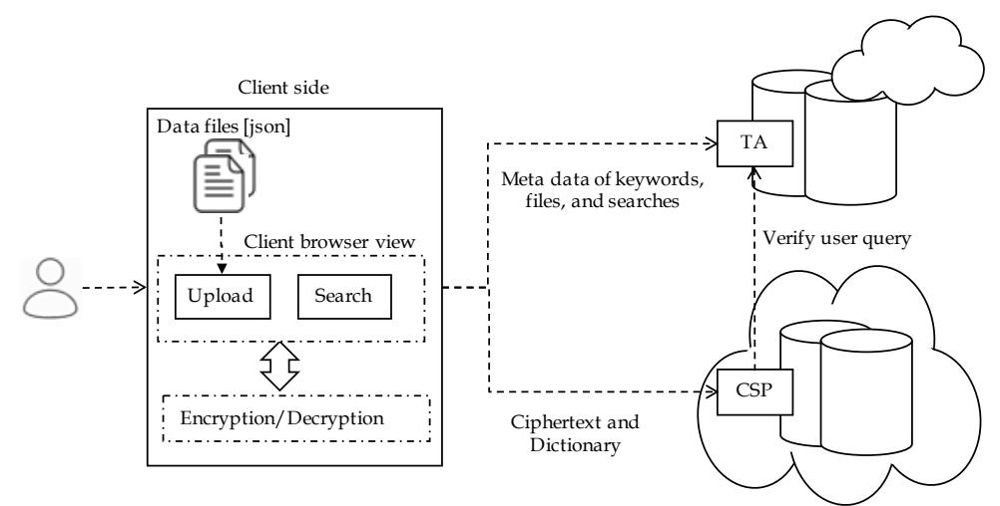
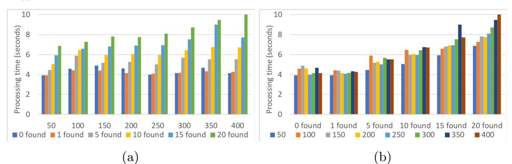
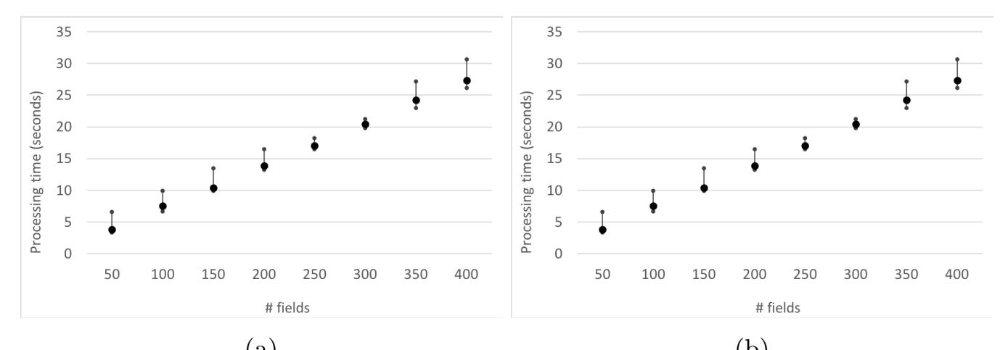
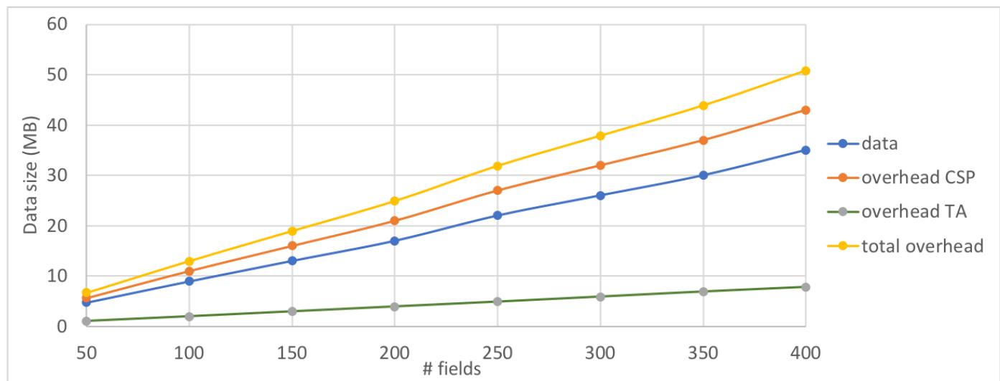

{0}------------------------------------------------

# <span id="page-0-0"></span>Attribute-Based Symmetric Searchable Encryption (Extended Version)?

Hai-Van Dang<sup>2</sup> , Amjad Ullah<sup>2</sup> , Alexandros Bakas<sup>1</sup> , and Antonis Michalas<sup>1</sup>

> <sup>1</sup> University of Westminster, London, United Kingdom {H.Dang,A.Ullah}@westminster.ac.uk <sup>2</sup> Tampere University, Tampere, Finland {antonios.michalas,alexandros.bakas}@tuni.fi

Abstract. Symmetric Searchable Encryption (SSE) is an encryption technique that allows users to search directly on their outsourced encrypted data while preserving the privacy of both the files and the queries. Unfortunately, majority of the SSE schemes allows users to either decrypt the whole ciphertext or nothing at all. In this paper, we propose a novel scheme based on traditional symmetric primitives, that allows data owners to bind parts of their ciphertexts with specific policies. Inspired by the concept of Attribute-Based Encryption (ABE) in the public setting, we design a scheme through which users can recover only certain parts of an encrypted document if and only if they retain a set of attributes that satisfy a policy. Our construction satisfies the important notion of forward privacy while at the same time supports the multi-client model by leveraging SGX functionality for the synchronization of users. To prove the correctness of our approach, we provide a detailed simulation-based security analysis coupled with an extensive experimental evaluation that shows the effectiveness of our scheme.

Keywords: Cloud Security · Database Security · Forward Privacy · Symmetric Searchable Encryption

### 1 Introduction

Symmetric Searchable Encryption (SSE) [\[16,](#page-17-0)[15,](#page-17-1)[19\]](#page-17-2) is a promising encryption technique that squarely fits the cloud paradigm and can pave the way for the development of cloud services that will respect users' privacy even in the case of a compromised Cloud Service Provider (CSP). SSE schemes can be seen as a first, fundamental step for protecting users' data from both external and internal attacks (e.g. a malicious administrator). This is due to the fact that in an SSE scheme, users generate all the secret information (encryption key) locally and encrypt all of their data on client side (i.e. the encryption key is never revealed to the CSP). The service offered by the CSP is only used for storing and retrieving

<sup>?</sup> This work was funded by the ASCLEPIOS EU research project (Project No. 826093).

{1}------------------------------------------------

the generated ciphertexts. In contrast to traditional encryption schemes, SSE offers a remarkable functionality – it allows users to search for specific keywords directly through the stored ciphertexts. However fascinating, SSE schemes [\[16\]](#page-17-0) "suffer" from several disadvantages with most prominent ones being their efficiency and security. Despite the importance of these issues, in this paper we mostly focus on a new problem that, to the best of our knowledge, has not be addressed in the literature. By studying the implementation and application of SSE in important sectors such as the healthcare industry, we realized that the traditional problem of encryption that cannot enforce granular access control is becoming really important. Consider, a patient who has encrypted with an SSE scheme all of her medical information in a single file. Then, assume she wishes to give access to her medical data to a dermatologist. The problem that arises here is that the patient has no way of giving out only the related to a dermatologist examination information from her medical records (i.e. keep the rest of the information private). While this is a well-known limitation of traditional encryption schemes, in SSE is of paramount importance since such schemes are built for the cloud – an environment that supports data sharing between multiple users. We believe that it is time to adopt a new broad vision of cryptosystems that will take advantage of the cloud features without compromising users' privacy. To this end, we explore the concept of granular access control in SSE schemes with the use of trusted hardware.

Apart from focusing on the aforementioned problem, we also try to enhance our scheme with the best security guarantees. Leaked information in SSE schemes has become a problem of paramount importance since it is the main factor in defining the overall level of security. In works such as [\[13\]](#page-17-3) and [\[25\]](#page-17-4) it is pointed out that even a small leakage can lead to several privacy attacks. These works were further extended in [\[33\]](#page-18-0) where the authors assumed that an active adversary can perform file-injection attacks and record the output. This "new" ability allowed the adversary to recover information about past queries only after ten file insertions. This result led researchers to design forward private SSE schemes [\[7](#page-16-0)[,17,](#page-17-5)[10\]](#page-16-1). Forward privacy is a notion introduced in [\[32\]](#page-18-1) and guarantees that that newly added files cannot be related to past search queries. While forward privacy is a very important property, unfortunately it has been shown to also be vulnerable to certain file-injection attacks [\[33\]](#page-18-0). While forward privacy secures the contents of a past query, its binary property, backward privacy, ensures the privacy of future queries. Backward privacy was formalized in [\[11\]](#page-16-2). Informally, an SSE scheme is said to be backward private if whenever a (w, id) is deleted from the database, subsequent search queries for w do not reveal id. More information on backward privacy can be found in [\[11\]](#page-16-2). In our case, our construction does not support a delete function and as a result, there is no need to worry about deleted entries.

Our Contributions: The contribution of this paper is manyfold: (1) We introduce the first SSE scheme that provides granular access control and does not 

{2}------------------------------------------------

fall under the All-or-Nothing category<sup>3</sup>. Using our scheme, a user can only decrypt parts of the ciphertexts based on a policy and a list of attributes. (2) Our construction is among the first SSE schemes that preserve the notion of forward privacy in the multi-client setting — a very challenging problem since we need to ensure that at any given time, all users are synchronized. (3) Our scheme is asymptotically optimal. The update cost is O(m) and the search time is  $O(\ell)$ , where m is the number of unique keywords in a file and  $\ell$  is the number of the resulted files. (4) Our construction is parallelizable. (5) We test the overall performance of the scheme in an experimental test-bed, that realistically imitates a client-server approach. We built an in-house OpenStack private cloud and a client that communicates with the cloud over the Internet. Additionally, for the storage of data we used PostgreSQL — a proper database in contrast to other similar works, that rely on the use of data structures such as arrays, maps, etc.

### <span id="page-2-1"></span>2 Background

**Notation:** Let s be a string. The length of s is denoted by |s|, its prefix of length  $\ell$  by  $\overline{s}(\ell)$ , and its suffix of length  $\ell$  by  $\underline{s}(\ell)$ , where  $\ell \leq |s|$ . The i-th position of s is denoted by s[i]. A function  $negl(\cdot)$  is called negligible if  $\forall c \in \mathbb{N}, \exists n_0 \in \mathbb{N} : \forall n \geq n_0, negl(n) < n^{-c}$ . A file collection  $\mathcal{F}$  is denoted by  $\mathcal{F} = \{f_1, \ldots, f_n\}$ . The unique identifier of a file  $f_i \in \mathcal{F}$  is denoted by  $id(f_i)$  and its corresponding ciphertext is  $c_{id(f_i)}$ . The universe of keywords is denoted by  $\mathcal{W} = \{w_1, \ldots, w_m\}$  and the ciphertext of a keyword  $w_j \in \mathcal{W}$  is  $c_{w_j}$ . A probabilistic polynomial time (PPT) adversary  $\mathcal{ADV}$  is a randomized algorithm for which there exists a polynomial  $p(\cdot)$  such that for all input x, the running time of  $\mathcal{ADV}(x)$  is bounded by p(|x|). Finally, a truth table is a mathematical table used to determine if a statement is true (T) or false (F). In this work, each statement is represented by a binary string and hence, T = 1 and F = 0. The logical conjunction  $(\land)$  of two strings  $s_1$  and  $s_2$  outputs 1 (True) iff  $\exists i : s_1[i] = s_2[i] = 1$ . For example:

| $s_1$ | $s_2$ | $s_1$ | $\wedge s_2$     |
|-------|-------|-------|------------------|
| 001   | 011   | 1     | (T)              |
| 010   | 101   | 0     | (F)              |
| 100   | 010   | 0     | (F)              |
| 111   | 001   | 1     | $\overline{(T)}$ |

Table 1: Truth table for the conjunction of binary strings

**Definition 1 (Symmetric Searchable Encryption).** A Symmetric Searchable Encryption scheme consists of the following PPT algorithms:

- KeyGen( $1^{\lambda}$ ): A probabilistic algorithm that takes as input a security parameter  $\lambda$  and outputs a symmetric key K.

<span id="page-2-0"></span><sup>&</sup>lt;sup>3</sup> All-or-Nothing refers to the restriction of existing SSE to offer granular access control on encrypted data (i.e. once you decrypt a file you get access to all of its information).

{3}------------------------------------------------

- $Add(f_i)$ : A user runs this algorithm whenever she wants to upload a new file  $f_i$  to the CSP.
- Search $(w_j)$ : A user runs this algorithm to search on the encrypted data collection for those files that contain a keyword  $w_i$ .

**Security Definitions:** To formalize the leakage of our scheme, we make use of a leakage function  $\mathcal{L}$  such that  $\mathcal{L} = (\mathcal{L}_{add}, \mathcal{L}_{search})$  where the components  $\mathcal{L}_{add}$  and  $\mathcal{L}_{search}$  correspond to the leakage associated with addition and search operations. The adversary  $\mathcal{ADV}$  has full control of the client and thus, can trigger add and search operations at will.  $\mathcal{ADV}$  issues a polynomial number of queries and for each query she records the output. The scheme is  $\mathcal{L}$ -adaptively secure if there exists a simulator  $\mathcal{S}$  that, given the leakage function  $\mathcal{L}$ , can simulate add and search tokens.

<span id="page-3-1"></span>**Definition 2** ( $\mathcal{L}$ -Adaptive Security). Let SSE = (KeyGen, Add, Search) be a symmetric searchable encryption scheme. Moreover, let  $\mathcal{L} = (\mathcal{L}_{add}.\mathcal{L}_{search})$  be the leakage function of the SSE scheme. We consider the following experiments between an adversary  $\mathcal{ADV}$  and a simulator  $\mathcal{S}$ .

#### $_{\mathsf{L}}\mathbf{Real}_{\mathcal{ADV}}(1^{\lambda})$

 $\mathcal{ADV}$  makes a polynomial time of adaptive queries  $q = \{w, f_1\}$  such that  $f_1$  has not been uploaded to the CSP and for each q she receives back either a search token for w,  $\tau_s(w)$  or an add token  $\tau_{\alpha}(f_1)$  for  $f_1$  and a sequence of ciphertexts  $\{c_{w_1}, \ldots, c_{w_n}\}, \forall w_i \in f_1$ .  $\mathcal{ADV}$  outputs a bit b.

#### $_{\perp}\mathbf{Ideal}_{\mathcal{ADV},\mathcal{S}}(1^{\lambda})$

 $\mathcal{ADV}$  makes a polynomial time of adaptive queries  $q = \{w, f_1\}$  and for each q,  $\mathcal{S}$  is given  $\mathcal{L} = (\mathcal{L}_{add}, \mathcal{L}_{search})$ .  $\mathcal{S}$  then returns a token and, in the case of addition, a sequence of ciphertexts  $c_i$ .  $\mathcal{ADV}$  outputs a bit b.

We say that the DSSE scheme is  $\mathcal{L}$ -i secure if for all probabilistic polynomial adversaries  $\mathcal{ADV}$ , there exists a probabilistic simulator  $\mathcal{S}$  such that:

$$|Pr[(Real) = 1] - Pr[(Ideal) = 1]| \le negl(\lambda)$$

**Definition 3 (Search Pattern).** The Search Pattern is a vector sp that shows which query each keyword corresponds to. For example,  $sp[t] = w_j$  means that  $w_j$  was queried at time t.

**Definition 4 (Access Pattern).** The Access Pattern for a keyword  $w_i$  is the set of all files containing  $w_i$  at a given time t. The set is denoted by  $\mathcal{F}_{w_i,t}$ .

Definition 5 (Leakage Function  $\mathcal{L}$ ). Let  $\mathcal{L} = (\mathcal{L}_{add}, \mathcal{L}_{search})$ .

- $-\mathcal{L}_{add} = (id(f_i), \#w_i \in f_i)$ . This function leaks the unique identifier of each file as well as the number of keywords contained in it.
- $-\mathcal{L}_{search} = (sp[t], \mathcal{F}_{w_i,t})$ . This function leaks the search and access patterns.

**Definition 6 (Forward Privacy).** An SSE scheme is said to be forward private, if for all additions  $\mathcal{L}_{add}$  can be written as  $\mathcal{L}_{add} = (id(f_i), \#w_i \in f_i)^4$ 

<span id="page-3-0"></span><sup>&</sup>lt;sup>4</sup> More details about forward privacy can be found in [11].

{4}------------------------------------------------

### <span id="page-4-2"></span>3 Architecture

<span id="page-4-0"></span>In this section, we introduce the system model by describing the entities participating in our construction. Figure [1](#page-4-0) depicts the high-level architecture of the system, where the core entities and their interaction can be seen.



Fig. 1: High-Level Architecture

Access Control: We design an access control mechanism based on a truth table. In particular, each user has a specific role and each attribute is associated with a rule. These roles and rules are represented as binary strings and thus, if the conjunction of these strings outputs 1, then the underlying role can access the specified attribute. The Roles and Rules tables are defined later in Table [2.](#page-6-0) Registration Authority (RA): We assume the existence of a registration authority RA that generate the SSE key K and share it with registered users[5](#page-4-1) . Additionally, RA generates Roles – a dictionary that contains mappings between roles and their access rights (represented in binary). For example, as can be seen in Table [2a,](#page-6-0) the access rights for the role of a doctor is 001, or R(Doctor) = 001. Upon its generation, Roles is sent to the CSP.

Users: We denote by U = {u1, . . . , un} the set of users that have been registered to a cloud service that supports our scheme. Users are classified into two categories: data owners and users that have not yet uploaded any encrypted data to the CSP. The latter category simply queries the CSP for files containing a specific keyword. The role of the data owner however, is the most important since it is the one that creates and outsources all the necessary indexes that will allow the rest of the users to generate consistent search tokens and search over the stored ciphertexts. A data owner creates the following indexes:

- 1. No.Files[w, att]: Contains a hash of each keyword/attribute pair {w.att}, along with the number of files that each pair can be found at.
- 2. No.Search[w, att]: Contains a hash of each keyword/attribute pair {w.att}, along with the number of files that each pair has been queried for.
- 3. Rules: A dictionary mapping attributes to specific rules (represented in binary values). As an example, in Table [2b,](#page-6-0) the rule for the attribute "Disease" is 010, or A(Disease) = 010. A user u<sup>i</sup> can access an attribute att<sup>j</sup> bound by a specific rule, iff (R(ui)) ∧ ((A(att<sup>j</sup> )) 6= 0.

<span id="page-4-1"></span><sup>5</sup> RA and its key sharing protocol are out of the scope of this paper.

{5}------------------------------------------------

- 4. Dict: A dictionary containing mappings between hash values of keywords and file identifiers.
- 5. EDB: A dictionary containing mappings between file identifiers and encrypted keywords.

Cloud Service Provider (CSP): We consider a cloud computing environment similar to the one described in [\[30\]](#page-18-2). The CSP storage will consist of two tables Dict and EDB. Dict contains a mapping between keywords and file identifiers while EDB contains the inverse mapping (i.e between file identifiers and keywords). Additionally, the CSP stores the Roles and Rules tables, that enable access control on each search query. The CSP verifies each query of the users to make sure that the user is authorised and has access to the TA.

Trusted Authority (TA): TA is an index storage that stores the No.Files[w, att] and No.Search[w, att] values for a keyword w. These values are needed to create the search tokens that will allow users to search directly on the encrypted data. The TA must run inside the trusted execution enviornment in order to guarantee the integrity and confidentiality of its security-sensitive computation. Intel SGX provides such a protected execution environment. Hence, the proposed SSE scheme expects, the TA must support SGX. The TA must remotely attest itself to the Client application and to the CSP service, prior to its use, to prove that it runs in a trusted execution enviornment. A detailed description on SGX functionalities can be found in [\[18\]](#page-17-6).

Structured Data: It is worth noting that the proposed scheme works only with structured data. In particular, we require all files to be presented as lists of attribute/keyword pairs (e.g. "Age = 42", "Surname = Adams", etc). This requirement makes our construction suitable for practical use-cases that normally rely on structured data (e.g. healthcare records).

### 4 Our Construction

This section constitutes the core contribution of our paper as we present a detailed description of the construction. We assume the existence of an IND-CPA secure symmetric key cryptosystem SKE = (Gen, Enc, Dec) and that of a cryptographic hash function h : {0, 1} <sup>∗</sup> → {0, 1} λ . It is important to mention here that for most SSE schemes, retrieving the actual files from the CSP is considered to be a trivial process and as such is not taken into consideration. In our construction, this is essential as the user does not retrieve the entire files but encrypted parts of it. Before we proceed with the formal construction we provide a high-level description in the form of a toy example, with three files, f1, f<sup>2</sup> and f3. Each file contains structured data with multiple keyword/attribute pairs.

Toy Example: We assume a scenario with three different roles, Doctor, Nurse and Researcher and three files (f1, f2, f3) as shown in Table [2](#page-6-0) . The Role table maps each role to a binary value; whereas, the Rule table maps each attribute to a specific rule which is also presented in binary format. An attribute att<sup>j</sup>

{6}------------------------------------------------

is accessible to a user  $u_i$  iff  $R(u_i) \wedge A(att_j) \neq 0$ . For instance, if  $u_i$  is a nurse and  $att_j = surname$ , then  $R(nurse) \wedge A(surname) = 010 \wedge 011 = 010 \neq 0$ . Hence, a nurse can access surnames. Similarly, a nurse can access disease, but not age since  $R(nurse) \wedge A(age) = 010 \wedge 101 = 0$ . We now assume that a nurse  $u_i$  wishes to search for the keyword  $w_1$  that refers to surname. After  $u_i$  requests the No.Files $[w_1, surname]$  and No.Search $[w_1, surname]$  values from the TA, she can create the search token  $\tau_s(w_1)$  that will be sent to the CSP. Upon reception, the CSP verifies that  $u_i$ , as a nurse, is allowed to access surname and disease. As a next step, the CSP locates the files  $f_i$  such that  $w_1 \in f_i$  (in this case,  $f_1$ ). Finally, based on  $f_i$ , the CSP retrieves EDB, and sends back to  $u_i$  the ciphertexts  $c_{w_1}$  and  $c_{w_3}$  (since  $c_{w_2}$  corresponds to an attribute that  $u_i$  is unauthorized to access, it will not be sent back to her).

<span id="page-6-0"></span>

| Role       | Value |
|------------|-------|
| Doctor     | 001   |
| Nurse      | 010   |
| Researcher | 100   |
|            | 100   |

(a) Roles

| Attr    | Rule |
|---------|------|
| Surname | 011  |
| Age     | 101  |
| Disease | 010  |

(b) Rules

| $\mathbf{K}\mathbf{w}$ | File  |  |  |
|------------------------|-------|--|--|
| $h(w_4)$               | $f_2$ |  |  |
| $h(w_5)$               | $f_2$ |  |  |
| $h(w_6)$               | $f_2$ |  |  |
| $h(w_3)$               | $f_1$ |  |  |
| $h(w_2)$               | $f_1$ |  |  |
| $h(w_1)$               | $f_1$ |  |  |
| $h(w_8)$               | $f_3$ |  |  |
| $h(w_7)$               | $f_3$ |  |  |
| $h(w_9)$               | $f_3$ |  |  |

(c) Dict.

| File  | Attr    | Ciphertext |
|-------|---------|------------|
| $f_1$ | Surname | $c_{w_1}$  |
| $f_1$ | Age     | $c_{w_2}$  |
| $f_1$ | Disease | $c_{w_3}$  |
| $f_2$ | Surname | $c_{w_4}$  |
| $f_2$ | Age     | $c_{w_5}$  |
| $f_2$ | Disease | $c_{w_6}$  |
| $f_3$ | Surname | $c_{w_7}$  |
| $f_3$ | Age     | $c_{w_8}$  |
| $f_3$ | Disease | $c_{w_9}$  |

(d) EDB

Table 2: CSP tables

#### 4.1 Formal Construction

**Key Generation.** RA runs the KeyGen algorithm to generate the secret key  $K = (K_1, K_2)$  where  $K_1, K_2 \leftarrow SKE$ .Gen. K will be shared with all users upon their registration to the service, whereas  $K_1$  is used to encrypt/decrypt data (line 9 of Algorithm 1) and  $K_2$  will be sent to TA to generate a proof for search query verification (lines 11-14 of Algorithm 2).

File Addition. To add a new file  $f_i$ , a user  $u_i$  first extracts all the keywords and attributes from  $f_i$ . For each pair of (attribute, keyword), requests the No.Files and No.Search values from the TA. These will allow  $u_i$  to compute the unique keyword key  $K_w$  and the address addr<sub>w</sub> (hash value of the keyword as in lines 5-6 of Algorithm 1). Next,  $u_i$  encrypts the keywords locally and sends them to the CSP who stores them in the EDB dictionary. Additionally,  $u_i$  sends a list  $Map = \{addr_w, id(f_i)\}$  to the CSP that will be inserted in Dict. Finally, an acknowledgement is sent to the TA to update the No.Files and No.Search indexes accordingly.

**Search.** Assume a user  $u_k$  wishes to perform a search operation for a given keyword/attribute pair (e.g. age = 42). To do so, she first contacts the TA to request No.Files $[w_j, att_j]$  and No.Search $[w_j, att_j]$  values, where  $att_j$  and  $w_j$  is the keyword/attribute pair she wishes to search for. Based on No.Search $[w_j, att_j]$ ,

{7}------------------------------------------------

#### <span id="page-7-0"></span>Algorithm 1 File Addition

```
1: Map = {}
2: Cw = {}, Attw = {}
3: for all wj ∈ fi do
4: No.Files[wj , attj ] + +
5: Kwj = SKE.Enc(K2, h(wj )||attj ||No.Search[wj, attj])
6: addrwj = h(Kwj
                      , No.Files[wj , attj ]||0)
7: valwj = id(fi)
8: Map = Map ∪ {addrwj
                            , id(fi)}
9: cwj = SKE.Enc(K1, wj )
10: Cw = Cw ∪ cwj
                      , Attw = Attw ∪ attj
11: Send {No.Files[wj , attj ]} values to be updated at TA
12: Send (Map, id(fi), {Cw}, {Attw}) to the CSP
13: CSP adds Map into Dict and id(fi), {Cw}, {Attw} to EDB
```

u<sup>k</sup> can compute the unique keyword key Kw<sup>j</sup> . Additionally, u<sup>k</sup> also computes the updated addresses for Dict by incrementing the value of No.Search[w<sup>j</sup> , att<sup>j</sup> ] by one (lines 3-8 of Algorithm [2\)](#page-8-0). Finally, u<sup>k</sup> computes and sends to the CSP the search token that consists of the keyword key Kw<sup>j</sup> , No.Files[w<sup>j</sup> , att<sup>j</sup> ] and the updated addresses. Upon reception, the CSP forwards Kw<sup>j</sup> to the TA who decrypts it using K<sup>2</sup> and calculates the updated addresses. The updated addresses will be sent back to the CSP who can verify their correctness[6](#page-7-1) . Then the CSP locates all the Dict entries (file identifiers id(fi)), associated with w<sup>j</sup> .Based on the list of id(fi) and u<sup>k</sup> 's role, the CSP retrieves all encrypted keywords (cw) associated with each f<sup>i</sup> that u<sup>k</sup> is eligible to access. The result is finally sent to u<sup>k</sup> in a result list R.

### <span id="page-7-2"></span>5 Security Analysis

In this section, we prove the security of our construction according to Definition [2.](#page-3-1) We will prove that we can construct a simulator S that can simulate addition and search tokens in a way that no PPT adversary ADV will be able to distinguish between the real and ideal experiments as they were defined in Section [2.](#page-2-1) Note that, similarly to all SSE schemes, our goal is to prove that addition and search tokens can be simulated given only the leakage function L.

Theorem 1. Let SKE = (Gen, Enc, Dec) be a CPA-secure symmetric key cryptosystem. Moreover, let h : {0, 1} <sup>∗</sup> → {0, 1} λ be a secure cryptographic hash function. Then our construction is secure according to definition [2.](#page-3-1)

Proof. To prove the security of our construction, we use a hybrid argument where the simulator S is given as input the leakage function L = (Ladd,Lsearch) and

<span id="page-7-1"></span><sup>6</sup> At a first glance, this extra round of communication between the CSP and the TA seems unnecessary. However, it is essential for preventing an attack in which a malicious user would send to the CSP a list of wrong addresses.

{8}------------------------------------------------

#### <span id="page-8-0"></span>Algorithm 2 Search

```
User uk:
1: Request No.Files[wj , attj ] and No.Search[wj , attj ] values from TA
2: Kwj = SKE.Enc(K2, h(wj )||attj ||No.Search[wj, attj])
3: No.Search[wj , attj ] + +
4: Kwj
      0 = SKE.Enc(K2, h(wj )||attj ||No.Search[wj, attj])
5: Lu = {}
6: for i = 1 to No.Files[wj , attj ] do
7: addrwi = h(Kwi
                     0
                      , i||0)
8: Lu = Lu ∪ {addrwi
                         }
9: Send τs(wj ) = (Kwj
                      , No.Files[wj , attj ], Lu, attj ) to CSP.
   CSP:
10: Forward Kwj
                 to TA
   TA:
11: Decrypt Kwj
               , and repeat steps 3-8 with locally stored values of No.Files, No.Search
   to produce a list LT A = {addrwi
                                  }
   CSP:
12: Send LT A to the CSP
13: if Lu 6= LT A then
14: Output ⊥
15: else
16: Fwj = {}
17: for i = 1 to No.Files[wi, atti] do
18: id(fi) = Dict[h(Kwj
                            , i||0)]
19: Fwj = Fwj ∪ {id(fi)}
20: Remove Dict[h(Kwj
                            , i||0)]
21: Add the new addresses as specified in Lu
22: R = {}
23: for all id(fi) ∈ Fwj do
24: for all cw` ∈ fi do
25: if R(uk) ∧ A(att`) 6= 0 then
26: R = R ∪ {att`, cwl
                                  }
27: Send R to uk
28: Send acknowledgement to TA to update No.Search
```

{9}------------------------------------------------

simulates the SSE functionalities. In a pre-processing phase S generates a key KEXP ← SKE.Gen(1<sup>λ</sup> ) that is given to ADV. Moreover, S creates a dictionary KeyStore to store the last K<sup>w</sup> of each keyword and one dictionary FOracle to reply to random oracle queries.

Hybrid 0: Everything runs as specified in the protocol.

Hybrid 1: Like Hybrid 0 but instead of the addition algorithm, S is given Ladd and proceeds as shown in Algorithm [3.](#page-9-0)

#### <span id="page-9-0"></span>Algorithm 3 Add Token Simulation

```
1: L = {}
2: C = {}
3: for i = 1 to i = #wi ∈ f do
4: Simulate addresses ai such that |ai|= λ
5: Add (id(f), ai) in Dict
6: L = L ∪ {ai}
7: cwi ← SKE.Enc(KEXP, 0
                           λ
                            )
8: C = C ∪ cwi
9: τα(f) = (cid(f), C, L)
```

In particular, S simulates random strings of the correct length as the addresses and stores them in a list L. Apart from that, S encrypts sequences of zeros and stores them in a list C. Since the simulated addresses have the same length as the real ones, ADV cannot distinguish between the list L and Map from Algorithm [1.](#page-7-0) Moreover, the CPA-security of SKE ensures us that ADV cannot distinguish between the encryption of zeros and that of real data. Hence, Hybrid 1 is indistinguishable from Hybrid 0. As a result,

$$Pr[(Hybrid\ 0) = 1] - Pr[(Hybrid\ 1) = 1] \le negl(\lambda) \tag{1}$$

Note that since S successfully simulates τα(f) given only Ladd, our scheme preserves the notion of forward privacy.

Hybrid 2: Like Hybrid 1 but now S is given Lsearch and proceeds as presented in Algorithm [4.](#page-10-0) More Specifically, the KeyStore[w] dictionary is used to keep track of the last key K<sup>w</sup> used for each keyword w. The FOracle[Kw][j][i] dictionary is used to reply to ADV's queries. For example, FOracle[Kw][0][i] represents the address of a Dict entry assigned to the i − th file in the collection. Similarly, FOracle[Kw][1][i] represents id(f). The simulated search token has exactly the same size and format as the real one, and as a result no PPT adversary can distinguish between them. Moreover, ADV cannot tamper with the quotes generated by the enclaves during the execution of the remote attestation protocols. The reason for this, is that these quotes are signed with secret key provided by Intel. As a result, tampering with the quotes implies producing a valid signature without owning the corresponding key, which can only happen with negligible probability. Thus, Hybrid 2 is indistinguishable from Hybrid 1. Hence:

$$Pr[(Hybrid 1) = 1] - Pr[(Hybrid 2) = 1] \le negl(\lambda)$$
 (2)

By combining equations [1](#page-9-0) and [2](#page-9-0) we get:

$$Pr[(Hybrid \ 0) = 1] - Pr[(Hybrid \ 2) = 1] \le negl(\lambda) \tag{3}$$

{10}------------------------------------------------

Which implies:

$$Pr[(Real) = 1] - Pr[(Ideal) = 1] | \le negl(\lambda) \square$$
 (4)

#### <span id="page-10-0"></span>Algorithm 4 Search Token Simulation

```
1: d : Number of file identifiers to be returned
2: R = {}
3: if KeyStore[w] = Null then
4: KeyStore[w] ← {0, 1}
                          λ
5: for i = 1 to i = d do
6: if FOracle[0][i] = Null then
7: Pick a id(f), ai) pair
8: else
9: ai = FOracle[Kw][0][i]
10: Remove ai from the dictionary
11: R = R ∪ {id(f)}
12: U pdatedV al = {}
13: Kw
      0 ← {0, 1}
               λ
14: KeyStore[w] = Kw
                    0
15: for i = 1 to i = d do
16: Generate a new ai such that |ai|= λ
17: Add id(f), ai) to the dictionary
18: U pdatedV al = U pdatedV al ∪ {id(f), ai}
19: FOracle[Kw][0][i] = ai
20: FOracle[Kw][1][i] = id(f)
21: τs(w) = (Kw, d, U pdatedV al)
```

Side-Channel Attacks. Recent works have shown that SGX is vulnerable to software attacks. However, according to [\[18\]](#page-17-6) leakage can be avoided if the programs running in the enclaves do not have memory access patterns or control flow branches that depend on the values of sensitive data. In our case, no sensitive computations occur in the SGX enclave and thus, there is no possibility of leaking encryption keys. Hence, by assuming a constant time implementation our construction is secure against timing attacks.

Does the Removal of TEE Affects the Security of the Scheme? While the use of a TEE can be seen as a subterfuge to improve the security of a scheme this is not true in our case. In contrast to other SGX-based approaches [\[2,](#page-16-3)[24\]](#page-17-7), where the SGX enclave hosts sensitive information such as encryption and decryption keys and hence, removing the SGX would lead to a downgrade in the security of the schemes, in our case the only information stored in the Enclaves are metadata (No.Search and No.Files) about the files. It is clear that in our approach the use of SGX only facilitates the multi-client model and thus, while removing the TEE does not affect the security of the scheme, it results to a single-client model.

{11}------------------------------------------------

### 6 Experimental Results

This section provides an overview of the experimental setup used for the evaluation and reports the obtained computational results. As already stated, our construction works with structured data of a certain form. To this end, and for reasons of simplicity, all of our experiments are conducted with json files.

Experimental Setup. We have setup an experimental testbed, that realistically imitates the system model described in Section [3.](#page-4-2) For this purpose, an in-house OpenStack based private cloud environment has been utilized. Three different virtual machines (VMs) are created, where each VM is used to run service for one of the three entities (i.e. Client, TA and CSP) respectively. The resource configurations of all the three VMs are identical and as follows: [4 virtual CPUs, 8GB RAM, 80GB disk, Ubuntu 18.04 LTS as operating system].

The implementation of all three applications was done in Python with the use of Django framework and Tastypie API. For data storage on the TA and the CSP, we used a PostgreSQL database; therefore, these components also rely on Psycopg PostgreSQL database adapter. The Client is a web application that provides an interface to end-users for uploading and searching data by utilising the TA and the CSP. Since the client encrypts/decrypts data locally, its implementation heavily relies on JavaScript. For this purpose, the Stanford JavaScript Crypto Library (SJCL) [\[31\]](#page-18-3), has been utilized for hashing and encryption. SHA256 has been used for hashing, while the encryption is performed using AES with key size of 128 bits and CCM mode (Counter with CBC-MAC mode of operation, which provides both authentication and confidentiality).

Similar to the Client, the TA also requires hashing, encryption and decryption functions, however different to the Client, it is implemented on the server side. For this purpose, the python package sjcl 0.2.12 of the same library [\[8\]](#page-16-4) has been used. This package allows the TA to encrypt/decrypt messages compatible with the message format of the SJCL library used by the client.

Each application is wrapped in containers and then deployed on the respective VMs. This was mainly done to easily setup and reproduce the experiments. The hosting of each application is handled through the Gunicorn WSGI http server. In the case of CSP and TA, the corresponding PostgreSQL database instances ran in separate containers on same VMs (i.e. on each VM, there are two containers – the service and the database container).

Open Science & Reproducible Research: To support open science and reproducible research and give the opportunity to use, test and extend our scheme, we release all code on GitLab [\[5\]](#page-16-5) and research artifacts on Zenodo [\[4\]](#page-16-6). Additionally, we dockerize the implementation and publish the images on Docker Hub [\[3\]](#page-16-7).

Datasets. To evaluate the computational complexity of the various functions of our scheme, synthetic structural data of different size were generated. As a benchmark, we considered a system consisting of data belonging to 300 individuals, where each individual data is provided through a json file. Hence, the data of 300 individuals means 300 json files, where every json file contains a 

{12}------------------------------------------------

fixed number of attributes and their values. The value of each attribute is also synthetically generated and consists of randomly selected number of characters, (i.e. between 5 to 30). Using these settings, we then considered sub-scenarios, where the number of files remains fixed (i.e 300), but, the number of attributes varies from 50 to 400. Our datasets can be seen in Table [3.](#page-12-0)

Choosing the parameters for the experiments: We used json files, as inputs, due to its simplistic nature and wide adoption. To choose appropriate parameters for the experiments (300 instances with attributes varying from 50 to 400), we relied on popular medical datasets, such as Breast Cancer Wisconsin (Diagnostic) (569 instances, 32 attributes) and Heart Disease Data Set (303 instances, 75 attributes), from the UC Irvine Machine Learning Repository [\[1\]](#page-16-8). The aim of experiments was to evaluate the performance of the scheme. Hence, the actual contents of the data was not important. Therefore, the data were synthetically generated to avoid any data compatibility and/or transformation issues. To get more accurate results, each experiment was run 30 times.

<span id="page-12-0"></span>

|     | No of Attributes Size in Database |
|-----|-----------------------------------|
| 50  | 4.82 MB                           |
| 100 | 9.6 MB                            |
| 150 | 14 MB                             |
| 200 | 19 MB                             |
| 250 | 23 MB                             |
| 300 | 28 MB                             |
| 350 | 33 MB                             |
| 400 | 37 MB                             |

Table 3: Datasets

Computational Time and Overhead. We have used Apache Jmeter, a load testing tool, combined with Selenium WebDriver, a web automation testing framework, and Chrome driver, to automate and measure the execution of web application in Chrome version 78.0.3904.108. The performance tests were conducted on a computer with 8GB RAM, Intel Core i5-6500 CPU 3.20GHz 4 cores, 250GB disk size and Ubuntu 16.04 LTS 64-bit operating system. The reported measurements are the average result of 30 simulation runs.

Search: To measure the performance of Search we focused on (1) Evaluating the impact of the number of attributes per file to the search time. Our measurements included files with a variable number of attributes ranging from 50 to 400 and (2) Evaluating the impact of the size of result list R (as defined in Algorithm [2\)](#page-8-0) to the search processing time for files containing different number of attributes (ranging from 50 to 400). Figures [2a](#page-13-0) and [2b](#page-13-0) present the aggregated results. From Figure [2a,](#page-13-0) we conclude that the processing time increases as the number of matching keywords in a search query increases. For example, for files containing 50 attributes, the completion time for a search query that returned 0 matches was approximately 4 seconds, whereas nearly 7 seconds were required when 20 matches were found. A similar pattern was observed in all the remaining scenarios (i.e. when the number of attributes increases from 100 to 400 per 

{13}------------------------------------------------

file). Figure [2b,](#page-13-0) illustrates the impact of the result list R to the processing time. We observe that the processing time grows almost linearly with the size of R. Note that the times presented in Figures [2a](#page-13-0) and [2b,](#page-13-0) include the generation of the search token, the communication between the CSP and TA, the time required for the CSP to find all matching files and finally, the decryption of the matching files.

<span id="page-13-0"></span>

Fig. 2: Search function processing time for (a) Variable data sizes against number of found occurrences, (b) Number of found occurrences against variable data sizes

Insert: In this part of the experiments, we measured the time required to insert new data in a non-empty database. For the purpose of our experiments, we first ran our tests with a database containing 50 files and then increased the number of files to 300. In each case, different measurements were recorded based on the number of attributes (ranging from 50 to 400). Figures [3a](#page-13-1) and [3b](#page-13-1) present the obtained results. Each measurement, in both plots, represents the average processing time of 30 runs, where the line bar represents the minimum and maximum measurement amongst those runs. The key points from the abovementioned results is that the measurements in both cases are almost identical. However, as the number of attributes per file increases, the processing time increases significantly.

<span id="page-13-1"></span>

(a) (b) Fig. 3: Processing time of new file insertion whilst (a) 300 files present in database, (b) 50 files present in database

Data Storage Overhead: In the last phase of our experiments, we measured the data storage overhead. We recorded the size of the databases for the CSP and the TA. When final measurements were taken, the databases contained data of 300 files with different number of attributes (ranging from 50 to 400). Figure [4](#page-14-0) 

{14}------------------------------------------------

presents the summarized results where data(blue line) refers to the ciphertexts stored in the CSP, the overhead of CSP is the size of the dictionary stored in the CSP, the overhead of the TA is the size of metadata stored in the TA and the total overhead is the sum of the two.

<span id="page-14-0"></span>

Fig. 4: Data table sizes containing data of 300 files

## 7 Related Work and Comparison

Recently, there have been multiple systems that suggest moving beyond the traditional boundaries of encryption and allowing users of a cloud service to search over encrypted data [\[6,](#page-16-9)[29](#page-17-8)[,28\]](#page-17-9). Our construction is based on the scheme presented in [\[17\]](#page-17-5) where authors designed a single-client forward private SSE scheme that achieves optimal search and update costs. Another single-client forward private SSE scheme is proposed in [\[10\]](#page-16-1), where authors designed Sophos. Even though Sophos achieves optimal search (O(`)) and update costs (O(m)), a file addition requires O(m) asymmetric operations on the user's side. In [\[12\]](#page-16-10), authors leverage the functionality offered by Intel's SGX to minimize the leakage. Their construction achieves logarithmic search costs. However, it is static and does not support file insertions after the initial creation of the indexes. Despite their strong points, all the aforementioned schemes provide an "All-or-Nothing" functionality in the sense that the decryptor will either decrypt the whole ciphertext and get access to all the information that is enclosed or will not get access at all. SSE schemes can also be constructed by Oblivious RAM [\[22\]](#page-17-10) as for example in [\[20\]](#page-17-11). However, as mentioned in [\[10\]](#page-16-1), such constructions induce large bandwidth overhead, large client storage and multiple roundtrips and as a result, the use of ORAM-based approaches seems unrealistic. However, despite these inefficiencies, ORAM-based techniques can be leveraged to design even more secure SSE schemes as in the case of [\[11\]](#page-16-2) where there authors presented, among others, Moneta. Moneta is an SSE scheme based on the TWORAM construction presented in [\[20\]](#page-17-11) and satisfies both forward and backward privacy [\[11\]](#page-16-2). However, as argued in [\[21\]](#page-17-12), the use of TWORAM renders Moneta impractical for realistic scenarios and the scheme can serve mostly as a theoretical result for the feasibility of more secure SSE schemes. More recently, in [\[21\]](#page-17-12) authors present Orion, another ORAM-based 

{15}------------------------------------------------

SSE scheme with similar security guarantees as Moneta. While Orion outperforms Moneta, the number of interactions between the user and the CSP depends on the size of the encrypted database. In [2], authors propose an SGX-assisted ORAM-based construction called Bunker-B. While this approach achieves both forward and backward privacy with optimal search and update costs, it does not offer any kind of access control. Finally, in [14], authors present three more forward and backward private schemes that offer small client storage. However, their schemes require multiple rounds of interaction, does not offer access control and only support the single-client model. The idea of enabling access control in keyword search is not novel. However, existing approaches [26,23,27] are based on Public key Encryption with Keyword Search (PEKS), a notion first introduced and formalized in [9], and thus, are not efficient when dealing with large amounts of data. Moreover, in [24], authors propose an access control mechanism based on the use of SGX alongside oblivious data structures such as Circuit-ORAM and Path-ORAM. However, their scheme requires the client to share a key with the SGX enclave that will be used to perform sensitive operations such as encryptions and decryptions. However, as mentioned in Section 5, performing sensitive operations inside an SGX enclave, can lead to the leakage of the encryption key. Given the inadequacy of current searchable encryption schemes to offer granular access on encrypted data, we propose a construction that enables data owners to specify exactly which parts of their encrypted data may be decrypted and by whom. As can be seen in table 4, our construction not only clearly outperforms ORAM-based approaches but also improves the search time by a factor of 1/pin comparison to asymptotical optimal constructions. This is due to the fact that our construction is parallelizable. In particular, each search operation in our scheme is reduced to the problem of locating to  $O(\ell)$  independent hashes on Dict, where  $\ell$  is the result size and p the numbers of the processors. Hence, if the load is distributed to p processors, we achieve optimal search cost  $O(\ell/p)$ . Similarly, the update cost is O(m/p), where m is the number of keywords. Most importantly, our construction is the only one that supports forward privacy in the multi-client model, and the only one providing an access control mechanism.

<span id="page-15-0"></span>

| Comparison         |               |               |    |                                        |                           |                |                |
|--------------------|---------------|---------------|----|----------------------------------------|---------------------------|----------------|----------------|
| Scheme             | $\mathbf{MC}$ | $\mathbf{FP}$ | BP | Search Time                            | Update Time               | Client Storage | Access Control |
| Etemad et al. [17] | X             | 1             | X  | $O(\ell/p)$                            | O(m/p)                    | O(m+n)         | X              |
| HardIDX            | X             | X             | X  | $O(\log k)$                            | -                         | None           | X              |
| Sophos             | X             | 1             | X  | $O(\ell)$                              | O(m)                      | O(m)           | X              |
| Moneta             | X             | 1             | 1  | $\widetilde{O}(a_w \log N + \log^3 N)$ | $\widetilde{O}(\log^2 N)$ | O(1)           | ×              |
| Orion              | X             | 1             | 1  | $O(\ell \log N^2)$                     | $O(logN^2)$               | O(1)           | Х              |
| Bunker-B           | X             | 1             | 1  | $O(\ell)$                              | $O(1)^7$                  | $O(m \log n)$  | Х              |
| Ours               | <b>/</b>      | 1             | X  | $O(\ell/p)$                            | O(m/p)                    | None           | ✓              |

Table 4: N: number of (w, id) pairs, n: total number of files, m: total number of keywords, p: number of processors, k: number of keys,  $a_w$ : number of updates matching w, MC: Multi-Client, FP: Forward Privacy, BP: Backward Privacy.

{16}------------------------------------------------

### 8 Conclusion

In this paper we proposed the first dynamic SSE scheme that provides granular access control on encrypted data and does not fall under the All-or-Nothing category. Our construction, works with structured data in the form of (Attribute: Value) and allows users to encrypt their data and provide a policy defining who can access each part of the encrypted data. Our scheme preserves essential properties of traditional SSE schemes such as forward privacy and constant rounds of interactions.We see this work as a first step towards an Attribute-Based Symmetric Searchable Encryption scheme and we hope that it will inspire researchers to further explore and develop this fascinating and promising field.

# References

- <span id="page-16-8"></span>1. Uc irvine machine learning repository. [https://archive.ics.uci.edu/ml/index.](https://archive.ics.uci.edu/ml/index.php) [php](https://archive.ics.uci.edu/ml/index.php), accessed: 2020-02-25
- <span id="page-16-3"></span>2. Amjad, G., Kamara, S., Moataz, T.: Forward and backward private searchable encryption with sgx. In: Proceedings of the 12th European Workshop on Systems Security. pp. 1–6 (2019)
- <span id="page-16-7"></span>3. Asclepios: Docker images of symmetric searchable encryption (2020), [uowcpc/](uowcpc/asclepios-server) [asclepios-server](uowcpc/asclepios-server),<uowcpc/asclepios-ta>,<uowcpc/asclepios-client>
- <span id="page-16-6"></span>4. Asclepios: Research artifacts of symmetric searchable encryption (2020), [https:](https://zenodo.org/record/3986839#.Xzj7tJNKiqA) [//zenodo.org/record/3986839#.Xzj7tJNKiqA](https://zenodo.org/record/3986839#.Xzj7tJNKiqA)
- <span id="page-16-5"></span>5. Asclepios: Symmetric searchable encryption source code (2020), <https://gitlab.com/asclepios-project/sseta>,[https://gitlab.com/](https://gitlab.com/asclepios-project/symmetric-searchable-encryption-server) [asclepios-project/symmetric-searchable-encryption-server](https://gitlab.com/asclepios-project/symmetric-searchable-encryption-server),[https:](https://gitlab.com/asclepios-project/sseclient) [//gitlab.com/asclepios-project/sseclient](https://gitlab.com/asclepios-project/sseclient),[https://gitlab.com/](https://gitlab.com/asclepios-project/ssemanual) [asclepios-project/ssemanual](https://gitlab.com/asclepios-project/ssemanual),[https://gitlab.com/asclepios-project/](https://gitlab.com/asclepios-project/ssemanual) [ssemanual](https://gitlab.com/asclepios-project/ssemanual),
- <span id="page-16-9"></span>6. Bakas, A., Michalas, A.: Modern family: A revocable hybrid encryption scheme based on attribute-based encryption, symmetric searchable encryption and sgx. In: Chen, S., Choo, K.K.R., Fu, X., Lou, W., Mohaisen, A. (eds.) Security and Privacy in Communication Networks. Springer International Publishing, Cham (2019)
- <span id="page-16-0"></span>7. Bakas, A., Michalas, A.: Multi-client symmetric searchable encryption with forward privacy. Cryptology ePrint Archive, Report 2019/813 (2019), [https://eprint.](https://eprint.iacr.org/2019/813) [iacr.org/2019/813](https://eprint.iacr.org/2019/813)
- <span id="page-16-4"></span>8. Bartel, U.: Python-sjcl (2020), <https://pypi.org/project/sjcl/>
- <span id="page-16-11"></span>9. Boneh, D., Di Crescenzo, G., Ostrovsky, R., Persiano, G.: Public key encryption with keyword search. In: Cachin, C., Camenisch, J.L. (eds.) Advances in Cryptology - EUROCRYPT 2004. pp. 506–522. Springer Berlin Heidelberg (2004)
- <span id="page-16-1"></span>10. Bost, R.: Poϕoς: Forward secure searchable encryption. In: Proceedings of the 2016 ACM SIGSAC Conference on Computer and Communications Security, Vienna, Austria, October 24-28, 2016 (2016)
- <span id="page-16-2"></span>11. Bost, R., Minaud, B., Ohrimenko, O.: Forward and backward private searchable encryption from constrained cryptographic primitives. In: Proceedings of the 2017 ACM SIGSAC Conference on Computer and Communications Security (2017)
- <span id="page-16-10"></span>12. Brasser, F., Hahn, F., Kerschbaum, F., Sadeghi, A.R., Fuhry, B., Bahmani, R.: Hardidx: Practical and secure index with sgx (2017)

{17}------------------------------------------------

- <span id="page-17-3"></span>13. Cash, D., Grubbs, P., Perry, J., Ristenpart, T.: Leakage-abuse attacks against searchable encryption. In: Proceedings of the 22nd ACM SIGSAC conference on computer and communications security. ACM (2015)
- <span id="page-17-13"></span>14. Demertzis, I., Ghareh Chamani, J., Papadopoulos, D., Papamanthou, C.: Dynamic searchable encryption with small client storage. In: NDSS, 2020. (2020)
- <span id="page-17-1"></span>15. Dowsley, R., Michalas, A., Nagel, M.: A report on design and implementation of protected searchable data in iaas. Tech. rep., Swedish Institute of Computer Science (SICS) (2016)
- <span id="page-17-0"></span>16. Dowsley, R., Michalas, A., Nagel, M., Paladi, N.: A survey on design and implementation of protected searchable data in the cloud. Computer Science Review (2017), <http://www.sciencedirect.com/science/article/pii/S1574013716302167>
- <span id="page-17-5"></span>17. Etemad, M., K¨up¸c¨u, A., Papamanthou, C., Evans, D.: Efficient dynamic searchable encryption with forward privacy. popets 2018, 1 (2018), 5–20 (2018)
- <span id="page-17-6"></span>18. Fisch, B., Vinayagamurthy, D., Boneh, D., Gorbunov, S.: Iron: functional encryption using intel sgx. In: Proceedings of the 2017 ACM SIGSAC Conference on Computer and Communications Security. pp. 765–782. ACM (2017)
- <span id="page-17-2"></span>19. Frimpong., E., Bakas., A., Dang., H., Michalas., A.: Do not tell me what i cannot do! (the constrained device shouted under the cover of the fog): Implementing symmetric searchable encryption on constrained devices. In: Proceedings of the 5th International Conference on Internet of Things, Big Data and Security - Volume 1: IoTBDS,. pp. 119–129. INSTICC, SciTePress (2020). <https://doi.org/10.5220/0009413801190129>
- <span id="page-17-11"></span>20. Garg, S., Mohassel, P., Papamanthou, C.: Tworam: efficient oblivious ram in two rounds with applications to searchable encryption. In: Annual International Cryptology Conference. pp. 563–592. Springer (2016)
- <span id="page-17-12"></span>21. Ghareh Chamani, J., Papadopoulos, D., Papamanthou, C., Jalili, R.: New constructions for forward and backward private symmetric searchable encryption. In: Proceedings of the 2018 ACM SIGSAC Conference on Computer and Communications Security. CCS '18, Association for Computing Machinery (2018)
- <span id="page-17-10"></span>22. Goldreich, O., Ostrovsky, R.: Software protection and simulation on oblivious rams. J. ACM 43(3), 431–473 (May 1996)
- <span id="page-17-15"></span>23. Han, J., Yang, Y., Liu, J.K., Li, J., Liang, K., Shen, J.: Expressive attribute-based keyword search with constant-size ciphertext. Soft Computing 22(15) (2018)
- <span id="page-17-7"></span>24. Hoang, T., Ozmen, M.O., Jang, Y., Yavuz, A.A.: Hardware-supported oram in effect: Practical oblivious search and update on very large dataset. Proceedings on Privacy Enhancing Technologies 2019(1), 172–191 (2019)
- <span id="page-17-4"></span>25. Islam, M.S., Kuzu, M., Kantarcioglu, M.: Access pattern disclosure on searchable encryption: Ramification, attack and mitigation. In: Ndss. Citeseer (2012)
- <span id="page-17-14"></span>26. Li, J., Zhang, L.: Attribute-based keyword search and data access control in cloud. Proceedings - 2014 10th International Conference on Computational Intelligence and Security, CIS 2014 pp. 382–386 (01 2015)
- <span id="page-17-16"></span>27. Miao, Y., Liu, X., Choo, K.K.R., Deng, R.H., Li, J., Li, H., Ma, J.: Privacypreserving attribute-based keyword search in shared multi-owner setting. IEEE Transactions on Dependable and Secure Computing (2019)
- <span id="page-17-9"></span>28. Michalas, A., Bakas, A., Dang, H.V., Zalitko, A.: Abstract: Access control in searchable encryption with the use of attribute-based encryption and sgx. In: Proceedings of the 2019 ACM SIGSAC Conference on Cloud Computing Security Workshop. p. 183. CCSW'19, ACM (2019)
- <span id="page-17-8"></span>29. Michalas, A., Bakas, A., Dang, H.V., Zalitko, A.: Microscope: Enabling access control in searchable encryption with the use of attribute-based encryption and

{18}------------------------------------------------

- sgx. In: Askarov, A., Hansen, R.R., Rafnsson, W. (eds.) Secure IT Systems. pp. 254–270. Springer International Publishing, Cham (2019)
- <span id="page-18-2"></span>30. Paladi, N., Gehrmann, C., Michalas, A.: Providing user security guarantees in public infrastructure clouds. IEEE Transactions on Cloud Computing 5(3), 405– 419 (July 2017).<https://doi.org/10.1109/TCC.2016.2525991>
- <span id="page-18-3"></span>31. Stanford: Stanford javascript crypto library (2020), [https://github.com/](https://github.com/bitwiseshiftleft/sjcl) [bitwiseshiftleft/sjcl](https://github.com/bitwiseshiftleft/sjcl)
- <span id="page-18-1"></span>32. Stefanov, E., Papamanthou, C., Shi, E.: Practical dynamic searchable encryption with small leakage. In: NDSS. vol. 71, pp. 72–75 (2014)
- <span id="page-18-0"></span>33. Zhang, Y., Katz, J., Papamanthou, C.: All your queries are belong to us: The power of file-injection attacks on searchable encryption. In: 25th USENIX Security Symposium). pp. 707–720 (2016)