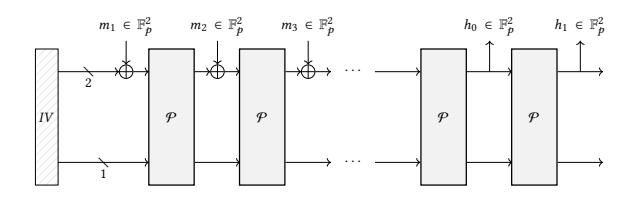
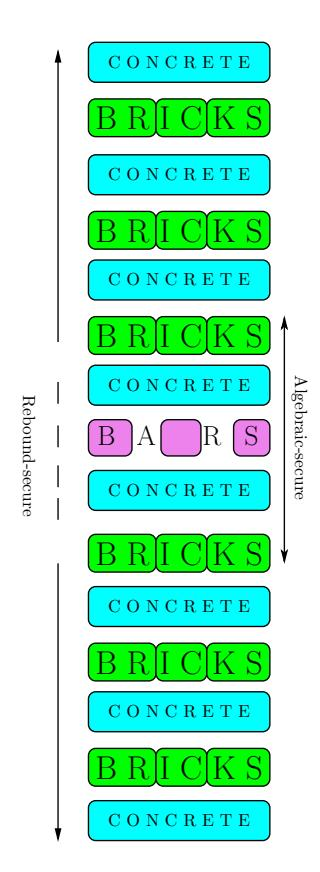
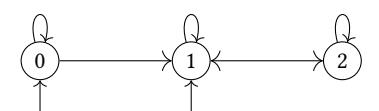

# Reinforced Concrete: A Fast Hash Function for Verifiable Computation

Lorenzo Grassi\* Radboud University Nijmegen, Netherlands l.grassi@cs.ru.nl

Christian Rechberger\*
Graz University of Technology
Graz, Austria
christian.rechberger@tugraz.at

Dmitry Khovratovich\*

Dusk Network

Luxembourg, Luxembourg
khovratovich@gmail.com

Markus Schofnegger\*
Graz University of Technology
Graz, Austria
markus.schofnegger@tugraz.at

Reinhard Lüftenegger\*
Graz University of Technology
Graz, Austria
reinhard.lueftenegger@iaik.tugraz.at

Roman Walch\*
Graz University of Technology
Know-Center GmbH
Graz, Austria
roman.walch@iaik.tugraz.at

#### ABSTRACT

We propose a new hash function Reinforced Concrete, which is the first generic purpose hash that is fast both for a zero-knowledge prover and in native x86 computations. It is suitable for a various range of zero-knowledge proofs and protocols, from set membership to generic purpose verifiable computation. Being up to 15x faster than its predecessor Poseidon hash, Reinforced Concrete inherits security from traditional time-tested schemes such as AES, whereas taking the zero-knowledge performance from a novel and efficient decomposition of a prime field into compact buckets.

The new hash function is suitable for a wide range of applications like privacy-preserving cryptocurrencies, verifiable encryption, protocols with state membership proofs, or verifiable computation. It may serve as a drop-in replacement for various prime-field hashes such as variants of MiMC, Poseidon, Pedersen hash, and others.

# **KEYWORDS**

Hash functions, verifiable computation, zksnarks, finite fields

# 1 INTRODUCTION

SNARKs and hash functions. The recent years have been marked as a thrive of distributed verifiable computation, where the outcome of some algorithm  $\mathcal A$  is accompanied with a succinct proof of correctness, widely known as a SNARK [47, 58, 62]. Performance of those protocols, however, remains a major bottleneck for applications. The reasons are manyfold, but one crucial point is that SNARKs are constructed for statements formulated over prime fields whereas regular computer programs are written for and executed over bitstrings. The necessary translation of code into finite field arithmetic carries a significant overhead. A notable example is the cost of computing 70 SHA-256 hash function calls, which were needed to transfer Zcash [3] cryptocurrency privately back in 2017,

CCS '22, November 7–11, 2022, Los Angeles, CA, USA

This is the author's version of the work. It is posted here for your personal use. Not for redistribution. The definitive Version of Record was published in *Proceedings of the 2022 ACM SIGSAC Conference on Computer and Communications Security (CCS '22), November 7–11, 2022, Los Angeles, CA, USA*, https://doi.org/10.1145/3548606.3560686.

and which took over 40 seconds to create such a SNARK, compared to 10 microseconds of native computation on a PC. Thus, the design of various cryptographic primitives tailored for operating over finite fields is an active research area [6, 7, 41].

In this paper we remove one of such bottlenecks by offering a hash function that is fast both for SNARKs and native computation. There already exist functions that excel in either of those areas, but not in both. The motivation for such a swissarmy tool is the following. To scale, parallelize, and aggregate proofs we employ what is called a recursive proof protocol [21, 25-27], where a party can prove their share of computation together with a verification of proof coming from the predecessor. This also enables wrapping multiple proofs into a single succinct check. Notably, however, many such recursive protocols require both hashing the input of a party with Merkle tree and proving some openings of the tree in zeroknowledge (ZK). Thus, whatever hash function is selected for the tree, it must be fast in both scenarios. To make a concrete example, one of the most ZK-efficient hash functions to date, Poseidon [41], when plugged into the Fractal recursive protocol, makes the prover 100 times more expensive just because it is slow in the native x86 computation [27, Section 13.2].

*Summary of use cases.* In more details, our new hash function will address, among others, the following use cases:

- Fast and efficient set membership proofs based on Merkle tree accumulators. Immensely popular in cryptocurrency protocols [2, 3, 61], this case requires a hash function for the tree. Parties  $P_1, P_2, \ldots, P_n$  add entries  $V_1, V_2, \ldots, V_k$  to some public accumulator  $\mathfrak{A}$ . Then at any point any party  $P_j$  can prove that  $V_i \in \mathfrak{A}$ . For instance, in Zcash [3]  $V_i$  are unspent transactions and  $\mathfrak{A}$  is a Merkle tree over them, so that in order to spend transaction V an owner is required to provide a proof of knowledge that  $V \in \mathfrak{A}$  as well as a proof of knowledge of some secret committed within V. Its ZK circuit should minimize the proof creation time.
- **Verifiable computation** based on recursive proofs. Here the entire computation is a chain of functions  $F_1, F_2, \dots, F_k$  applied consecutively to some state. Starting with X, for each i Party  $P_i$  computes  $F_i$  and carries an intermediate result and a proof of correctness to the next  $P_{i+1}$  so that the last  $P_k$  provides Y and attests X  $\xrightarrow{F_k \circ F_{k-1} \circ \cdots \circ F_1} Y$  being actually aware

 $\label{lem:condition} {\it `Author list in alphabetical order; see https://www.ams.org/profession/leaders/CultureStatement04.pdf.}$

© 2022 Copyright held by the owner/author(s).

only of their own computation and the proof of correctness  $\pi_{k-1}$  from  $P_{k-1}$ . Verifiable computation frameworks such as Halo Infinite [21] or Fractal [27] instruct that the proof  $\pi_k$  asserts the correctness of  $F_k$  and that the code  $C_k$  that verifies  $\pi_{k-1}$  outputs a success. If the inner commitment scheme is Merkle-tree-based (such as FRI [12]), then  $\pi_{k-1}$  consists of several Merkle tree openings, so that  $C_k$  makes a number of calls to the hash function that comprises the tree. Here we minimize both native computation time and the prover time.

Both use cases require a cryptographically secure hash function, i.e., it should resist preimage and collision attacks.

*Summary of requirements.* We summarize the requirements stemming from the use cases as follows.

- Minimal prover time. For many ZK proof systems it is a (super)linear function of the gate count, where each gate is usually a basic field arithmetic operation or, in some systems, a table lookup [13, 34, 35, 47, 62]. Though the actual performance depends significantly on the proof system chosen and an application, the mere number of standard gates is a good approximation. It is known that custom gates (lookup high-degree polynomials) may increase the performance up to the factor of 10, but those are function-specific and can't be reasonably compared across distinct proof systems. In Table 1 we provide a count in R1CS constraints (roughly, the number of field multiplications), in standard Plookup gates (each gate contains either a single multiplication and an arity-4 addition, or a table lookup), and in area-degree product (each custom gate contributes to the cost additively with the product of input size and the degree of the polynomial that describes the gate constraint). Unfortunately, we can't provide a sound prover time benchmark since at the moment of submission no production-ready proof system that supports lookups is available though specifications
- Native performance. A hash function is supposed to run as fast as possible on typical hardware where proofs are created, which are regular laptops and desktops nowadays. The Fractal use case [27] implies that it should be at least 10x faster than Poseidon.
- Security. The common approach [6, 41] is to provide evidence that the existing attacks fail. However, as algebraic attacks [4, 40] are the most natural for finite-field-based designs, it becomes increasingly difficult to estimate the security as the performance of those attacks is highly volatile [11, 64]. It is thus desirable to base the security of a new hash function on a more traditional [60] rather than algebraic security analysis.

State of the art. There already exist several hash functions crafted for the first use-case with the number of circuit gates (or equivalently low-degree polynomial constraints) being the primary metric. Examples include prime-field (Feistel) MiMC versions [5, 6], FRIDAY [8], POSEIDON [41], RESCUE [7] (and its updated version RESCUE-Prime [7]), Griffin [39], Grendel [65], and NEPTUNE [43]. Many of these hash functions share some common features, as the fact that

the non-linear layer is instantiated via a simple power map. Focusing on Poseidon, it is based on the Hades design strategy [42], which makes use of an uneven distribution of the S-boxes, namely, full S-box layers in the external rounds and partial S-box layers in the middle ones, in order to minimize the multiplicative complexity. The external rounds provide security against statistical attacks, while the internal rounds have the goal of increasing the degree of the permutation. A rather recent addition to this set is SINSEMILLA [3, Sec. 5.4.1.9], an instance of the Pedersen hash function[3, Sec. 5.4.1.7] optimized for table lookups in custom gates.

While most of them have withstood public scrutiny [4, 11, 16, 33, 46, 51], the plain performance is not satisfactory (see last column of Table 1), since each round of such schemes requires a finite field multiplication, which is relatively expensive (hundreds of CPU cycles) compared to bit operations utilized in traditional hash functions.

Our design: Reinforced Concrete. We present a new sponge hash function Reinforced Concrete, in short RC, over  $\mathbb{F}_p$  exploiting all the advantages of lookup-equipped proof systems and suitable for both membership proofs and verifiable computation use cases. The permutation that instantiates RC is composed of two types of components:

- (1) outer ones for preventing statistical attacks;
- (2) an inner one for preventing algebraic attacks.

The inner part strengthens the whole construction like steel bars strengthen concrete, hence the name of the function and its components.

For the inner component, instead of using simple power maps as in Poseidon and Rescue, we use a single building block with a complex algebraic structure, which we call Bars. A Bars layer can be seen as a non-linear layer composed of independent high-degree and dense S-boxes. The Bars function combines a layer of S-boxes (such as in AES) with a field element decomposition in just a handful of small operations (or table gates in the circuit), and it admits a very simple representation when using look-up tables, as e.g. in the case of AES [32] and AES-like ciphers. As a result, the security argument we propose for preventing algebraic attacks including interpolation [50] and Grobner basis attacks [30] resembles the one well known and accepted in the literature for AES and more generally AES-like ciphers, for which the algebraic attacks can attack only a tiny fraction of the rounds compared to the statistical attacks [28, 29].

Even if it prevents algebraic attacks, it can be broken by more traditional statistical attacks such as rebound attacks [55, 60]. As those are much better studied, we instantiated the external rounds with other layers which are known to protect against statistical attacks, including affine layers called Concrete that provides full diffusion and low-degree non-linear layer called Bricks, which both provides (non-linear) diffusion and ensure security against statistical attacks.

Our approach to performance. We tackle the performance issue by making the Bars layer fast in the native computation. For this we managed to avoid field multiplications altogether in this layer and do only a bunch modular reductions by small moduli instead, followed by compact S-boxes. The performance of our design varies for different fields we operate on, but is in the range of 2-9x overhead over the popular SHA-256.

*Our approach to compactness.* We tackle the prover time issue by providing an efficient lookup-based implementation of highly-nonlinear Bars, which is therefore one of *main contributions* of this submission. Concretely, it is the first primitive that is highly nonlinear, compact, and fast at the same time. For S-boxes of size  $2^{9.5}$ , we make only 126 lookups to process 510 bits of data, which is not far from the optimal  $510/9.5 \approx 53$ .

Comparison to other designs. When compared to the hash functions tailored to the same use cases, we are on par in the gate metric and are much faster in the native performance.

The performance can be improved in certain fields, and we show how to craft a prime to increase performance further. Even over generic prime fields (such as the scalar fields of the BLS12-381 or BN254 elliptic curves) RC is faster by a factor of 5 compared to Poseidon and by a factor of 140 compared to Rescue and 120 compared to Rescue-Prime. Using specially crafted fields increases these factors to 16, 357, and 289 respectively. RC is, thereby, only by a factor of 5 slower than Blake2, the fastest traditional hash algorithm we benchmarked, but requires 7 times less gates when encoded into a circuit.

Compared to Pedersen hash/SINSEMILLA we provide pre-image resistance in addition to collision resistance. Also we rely on the public scrutiny rather than on (pre-quantum) hardness assumptions.

From the design perspective, one can view the collision resistant but slower Sinsemilla as an alternative to the Bars layer, as both are not preimage resistant in isolation. Whether it is possible to take the best from both designs, remains the subject of future work.

Regarding security analysis, the new design offers reasonably big security margin against statistical attacks, but at the same time much bigger margin against algebraic attacks. Since the latter are less explored, we conclude that RC is more robust against possible breakthroughs in algebraic analysis. On the other hand, the most recent algebraic cryptanalysis of weakened Poseidon and Rescue-Prime [11] has proven to be memory-intensive and thus less practical than can be expected.

Supported proof systems. Whereas some ZK proof systems explicitly work with arithmetic gates (i.e. field additions and multiplications) only [47, 62], a number of protocols also support lookup tables. Those include Arya [22], Plookup [34, 63], Halo2 [3], Cairo [37]. As lookup gates also speed up traditional hash functions like SHA-2, we expect such protocols to become widespread in the near future.

Restrictions and Future Work. Whereas RC clearly brings high native and ZK performance, it also has its own restrictions. First of all, a proof system should support lookup gates, as otherwise the RC circuit would be quite big (we estimate it to be around 5000 constraints). Secondly the Bar's component is specific for each field, which implies a bit of work when carrying it to a proof system with a new curve. Devising a more generic Bar's is the subject of the future work. Another interesting direction is non-sponge instances of RC.

Figure 1: A sponge hash function with a fixed-size output. In our case IV is a 3-tuple of zero  $\mathbb{F}_p$  elements,  $m_i$  are message chunks to be hashed (2  $\mathbb{F}_p$  elements each),  $\oplus$  is the elementwise addition in the field,  $h_i$  are hash outputs.

Summary of the paper. We describe RC on a high level in Section 2. Then we give formal security definitions and claims regarding the security of RC in Section 3. A more detailed rationale and specification follows in Section 4. We proceed with a summary of our own cryptanalysis in Section 5 (which is detailed in Appendix). Then we present a constraint system (needed to build a circuit for ZK proofs) for RC and prove its correctness and soundness (Section 6). We conclude the main body of the paper with the benchmarks. Details of RC instances for different fields and details of cryptanalysis are presented in Appendix.

# 2 RC IN A NUTSHELL

The RC hash function operates in the sponge framework (Fig. 1). The sponge converts a fixed length bijective function (called RC permutation) to a variable-length hash function, which is collision- and preimage-resistant as long as the underlying permutation does not exhibit any 'non-random' properties up to the bound defined by the security level  $2^{\lambda}$  (in our case  $\lambda$  is universally set to 128).

The RC permutation illustrated in Fig. 2, can be considered as a modified 7-round SP network, where input, output and intermediate state elements are from  $\mathbb{F}_p^3$  for a prime number p. More formally,

RC := Concrete(8)  $\circ$  Bricks  $\circ$  Concrete(7)  $\circ$  Bricks  $\circ$  Concrete(6)  $\circ$  Bricks  $\circ$  Concrete(5)  $\circ$  Bars  $\circ$  Concrete(4)  $\circ$  Bricks  $\circ$  Concrete(3)  $\circ$  Bricks  $\circ$  Concrete(2)  $\circ$  Bricks  $\circ$  Concrete(1)

In the following, we refer to Concrete o Bricks as "round".

We define RC for different p, with two (-BN and -BLS) being scalar fields of the curves BN254 [69] and BLS12-3811 and another one (-ST) crafted for a specially chosen field in order to deliver the highest performance. We elaborate how to craft an instance in Section 4.

We reserve 1 field element for the capacity in sponge, thus aiming for the 128-bit security against collision and preimage attacks for all instances. A single call to RC thus suffices for a 2-to-1 compression function.

*Design.* The RC design depicted in Figure 2 is a modification of a traditional word-oriented SP-network (SPN) for constructing (keyed

&lt;sup>1https://electriccoin.co/blog/new-snark-curve/

|                            | Performance                  |              |         |      |
|----------------------------|------------------------------|--------------|---------|------|
|                            |                              | Native       |         |      |
|                            | R1CS   Plookup   Area-degree |              |         |      |
|                            | eq-s                         | reg. gates   | product | (µs) |
| Poseidon                   | 243                          | 633          | 9495    | 19   |
| Rescue                     | 288                          | 480          | 7200    | 480  |
| Rescue-Prime               | 252                          | 252 420 6300 |         | 415  |
| Feistel-MiMC               | 1326                         | 1326         | 19890   | 38   |
| Griffin                    | 96                           | 186          | 2790    | 115  |
| Neptune                    | 228                          | 1137         | 17055   | 20   |
| SHA-256                    | 27534                        | 3000         | 60000   | 0.32 |
| Blake2s                    | 21006                        | 2000         | 40000   | 0.21 |
| Pedersen hash              | 869                          |              | 13035   | 54   |
| Sinsemilla                 |                              | 510          | 1530    | 137  |
| Reinforced Concrete-BN/BLS | -                            | 378          | 5670    | 3.4  |
| Reinforced Concrete-ST     | -                            | 360          | 5400    | 1.09 |

Table 1: Performance of various hash functions in the zero knowledge (preimage proof) and native (hashing 512 bits of data) settings. All native benchmarks are ours (Section 8.2). Poseidon, Rescue, Rescue-Prime, Feistel-MIMC, Neptune, and Griffin gate counts are ours (Section 8.1.2). SHA-256 and Blake2s R1CS gate counts are from Hopwood's notes [49], and their Plookup costs as well as the area-degree product is taken from the report by Williamson [68]. Pedersen hash gate count is taken from the Zcash protocol [3], and the area-degree product is calculated using the same factor of 15 as for Poseidon. The Sinsemilla regular gate count by us is Section 8.1.2, whereas the area-degree optimized version is from [24].

or keyless) cryptographic permutations. The RC design differs from a traditional SPN in two aspects:

- the middle layer of the SP network is replaced by a special component called Bars. This special component effectively reinforces the permutation against cryptanalytic approaches that would cover many more rounds without Bars. It does not admit a low-degree polynomial description but can be implemented as a circuit with reasonable costs in ZK.
- instead of applying independent non-linear transformations on single words, RC uses (low-degree) non-linear layers, called Bricks, that additionally mix different words. Bricks used the same construction as Horst [39]. It provides resistance against statistical cryptanalysis and is cheap in the zero knowledge, i.e. via gate counting.

The third component, Concrete, is an analog of the traditional affine layer but over  $\mathbb{F}$ . It ensures diffusion to make statistical or algebraic properties expand to the entire state, and is also cheap in ZK.

Layout. The Bricks and Concrete layers interleave exactly as in traditional SPN designs [32]. As RC is used in a sponge framework, the Bricks components at either end would bring no security against collision or preimage attacks, so we start and end with Concrete. The middle call to Bricks is replaced with Bars. The rationale behind putting all Bar into a single layer is that start-fromthe-middle attacks are somewhat easier to find and thus we plan to detect them all in the design phase.

# 3 SECURITY REQUIREMENTS AND CLAIMS

Our high-level security claims, which determine the parameter selection for RC, are the following.

- For the sponge hash function with RC, we aim for a collision and preimage resistance up to 2128 field operations for 256-bit fields. We want to be able to instantiate a random oracle in protocols up to 2128 calls.
- For the authenticated encryption scheme using RC, we aim for confidentiality and integrity up to 2128 encrypted messages for 256-bit fields.
- When using the RC in other future schemes, we aim for a 1-element CICO security [48] up to  $2^{128}$  field operations. More concretely, it should be infeasible to find such  $x_1, x_2, y_1, y_2$  such that

$$RC(0, x_1, x_2) = (0, y_1, y_2)$$

# 4 SPECIFICATION AND RATIONALE

The story behind the design of RC, which has determined its inner components is as follows:

- We wanted to design a hash function which has a high degree as a polynomial and would not allow a treatment with algebraic methods such as Grobner basis.
- We were aware how table lookups can be used to implement hash functions that are highly non-linear and resistant to algebraic attacks – such as Blake2 and SHA-256. We seek to have similar functionality but applied to finite field elements rather than 32/64/128/256-bit words. For this we had to design an efficient way to decompose a field element into smaller chunks, apply some nonlinear transformation, and then wrap it back (composition). This was to become Bars.
- It turned out that in order to avoid overflows at composition, the nonlinear transformation within Bars should have a certain number of fixed points, and there must not be many of them for security. This yielded an heuristic method for finding a decomposition.

Figure 2: The RC permutation. The middle Br-C-B-C-Br part is secure against algebraic attacks whereas C-Br-C-Br-C-Br-C-Br-C-Br-C-Br-C is secure against rebounds (more generally, statistical) attacks.

• In order to protect against non-algebraic attacks, we had to wrap Bars with additional confusion and diffusion layers. The number of those was derived from traditional attacks on SPN-based designs such as rebound [60].

# 4.1 The Bricks function

The function Bricks :  $\mathbb{F}_p^3 \to \mathbb{F}_p^3$  is a non-linear permutation of degree d=5 (with the requirement  $\gcd(p-1,d)=1$ ). Following [39], we define Bricks as

Bricks
$$(x_1, x_2, x_3)$$

=  $(x_1^d, x_2(x_1^2 + \alpha_1 x_1 + \beta_1), x_3(x_2^2 + \alpha_2 x_2 + \beta_2)),$

where  $\alpha_1, \alpha_2, \beta_1, \beta_2 \in \mathbb{F}_p$  such that  $\alpha_i^2 - 4\beta_i$  is not a quadratic residue modulo p. We refer to [39, Section 3] for a proof regarding its invertibility, which relies on the fact that  $z^2 + \alpha z + \beta \neq 0$  for each  $z \in \mathbb{F}_p$ .

#### 4.2 The Concrete function

The function  $\mathsf{Concrete}^{(j)}: \mathbb{F}^3_p \to \mathbb{F}^3_p$  denotes the multiplication of the state by a 3  $\times$  3 MDS matrix  $M = \mathsf{circ}(2,1,1)$  with subsequent

addition of the *j*-th round constant vector  $c^{(j)} \in \mathbb{F}_p^3$ , that is

$$\mathsf{Concrete}^{(j)}(x) \coloneqq \begin{pmatrix} 2 & 1 & 1 \\ 1 & 2 & 1 \\ 1 & 1 & 2 \end{pmatrix} \times \begin{pmatrix} x_1 \\ x_2 \\ x_3 \end{pmatrix} + c^{(j)}.$$

Note that M is invertible and MDS for each  $p \geq 3$ . The elements  $c_1^{(j)}, c_2^{(j)}, c_3^{(j)}$  are certain pseudo-random constants, generated using e.g. Shake-128 with rejection sampling.

# 4.3 The Bars Function

The function Bars :  $\mathbb{F}^3_p \to \mathbb{F}^3_p$  is defined as

$$Bars(x_1, x_2, x_3) = (Bar(x_1), Bar(x_2), Bar(x_3)).$$

The function  $\operatorname{Bar}: \mathbb{F}_p \to \mathbb{F}_p$  is designed to be a permutation of  $\mathbb{F}_p$  coming from n smaller permutations acting *independently* on n smaller domains  $\mathbb{Z}_{s_1}, \ldots, \mathbb{Z}_{s_n}$ , where  $s_1, \ldots, s_n$  are defined for each prime p separately, see Section 7. The independence requirement is crucial for the performance of Bar. For this we decompose a field element  $x \in \mathbb{F}_p$  into n smaller  $digits\ x_1, \ldots, x_n$  with  $x_i \in \mathbb{Z}_{s_i}$  with the function Comp, and then compose it back with Decomp. Overall,  $\operatorname{Bar}: \mathbb{F}_p \to \mathbb{F}_p$  is defined as

$$Bar = Comp \circ SBox \circ Decomp. \tag{1}$$

In the following, we define all these components. The invertibility of Bar is proved in Appendix A.2.

4.3.1 Decomposition and Composition. We choose the standard representation  $\mathbb{F}_p = \{0, 1, \dots, p-1\}$  for  $\mathbb{F}_p$ , thus identifying an element  $x \in \mathbb{F}_p$  with an integer  $0 \le x \le p-1$ . Our decomposition  $\mathbb{P}_p \to \mathbb{F}_p \to \mathbb{F}_p \to \mathbb{F}_p$  as

$$x = x_1 \cdot s_2 s_3 \cdots s_n + x_2 \cdot s_3 s_4 \cdots s_n + \cdots$$
$$+ x_{n-1} \cdot s_n + x_n = \sum_{i=1}^n x_i \prod_{i>i} s_j.$$

with  $0 \le x_i < s_i$  and where the  $s_i$  are chosen such that  $\prod_{i=1}^n s_i > p$ . The digits  $x_i \in \mathbb{Z}_{s_i}$  are determined similarly to ordinary base-b expansion:

$$x_n := x \mod s_n,$$

$$x_i := \frac{x - \sum_{j>i} x_j \prod_{k>j} s_k}{\prod_{j>i} s_j} \mod s_i.$$
(2)

It follows directly from the definition in Eq. (2) that the digits  $x_i$  are *unique*. Because of the strong analogy with ordinary base-b expansion and for ease of notation in the following part, we define for  $1 \le i \le n$  the elements

$$b_i := \prod_{j>i} s_j = s_{i+1}s_{i+2}\dots s_n,$$

where  $b_n$  is defined by the empty product and thus  $b_n:=1$ . The inverse process, the composition  $\mathsf{Comp}:\mathbb{Z}_{s_1}\times\cdots\times\mathbb{Z}_{s_n}\to\mathbb{F}_p$  is computed as

$$Comp(y_1, \dots, y_n) := \sum_{i=1}^n y_i b_i \mod p. \tag{3}$$

4.3.2 SBox. Let  $(v_1, v_2, \ldots, v_n) = \text{Decomp}(p-1)$  and let  $p' \leq \min_{1 \leq i \leq n} v_i$ . Then  $x_i$  is converted as follows:

$$y_i := S(x_i) = \begin{cases} f(x_i) & \text{if } x_i < p', \\ x_i & \text{if } x_i \ge p', \end{cases}$$
 (4)

where f denotes a permutation of  $\mathbb{Z}_{p'}$ . In Lemma 3 we prove that Bar is indeed a permutation of  $\mathbb{F}_p$ . The value p' is selected for each p separately.

The f function is derived from the MiMC cipher (which implicitly requires p' being prime). Reference values of p' for various p and tables for f are given in full in the Appendix.

# 4.4 Sponge framework parameters

We suggest the bijective transformation RC being used in the sponge framework [14] similarly to Poseidon [41] and Rescue [7]. The parameters are as follows:

- Rate is two  $\mathbb{F}_p$  elements, capacity is one  $\mathbb{F}_p$  element.
- Claimed preimage and collision security level of 128 bits.
- The padding rule is simply to add the 0 element to any input of odd length. The very first capacity value is initialized by the length-depending constant, e.g. just length *l*. This does not violate the sponge security proof as long as only short lengths (say up to 232) are allowed.

#### **5 SECURITY ANALYSIS**

In this section we summarize our own analysis of RC security and connect it with the requirements outlined in Section 3.

For the latter, we customarily reduce the security of RC hash to its resistance against known cryptanalytic attacks. In particular, we focus on the following two classes of attacks, respectively statistical and algebraic attacks. As already mentioned in the introduction, we make use of the Hades/Poseidon design strategy in order to provide security:

- Statistical attacks (including differential, linear, rebound, truncated, impossible, MiTM, boomerang) cannot be mounted on RC even with the middle component Bricks-Concrete-Bars-Concrete-Bricks replaced with a single Bricks layer up 2128 field operations.
- The middle component Bricks-Concrete-Bars-Concrete-Bricks resists invariant subspace and algebraic (e.g., Gröbner basis) attacks up to 2128 field operations. Due to the high degree and because we are working over prime fields, we also expect ample resistance against higher-order differential attacks (e.g., zero-sum distinguishers or cube attacks).

We give a detailed overview of statistical attack approaches in Appendix B.1, and we focus on algebraic attacks in Appendix B.4. The short summary is the following:

- Differential and linear attacks do not work as long as the Bricks layer is involved.
- We cannot mount rebound attacks for 5 or more rounds thus having at least 2 rounds of security margin.
- No invariant subspace attacks have been found.
- Groebner basis cryptanalysis fails at greatly weakened versions (10-bit fields) already.

Figure 3: Finite-state automaton  $\mathcal{A}$  representing all valid sequences  $c_1, c_2, \ldots, c_n$ .

# 6 LOOKUP TABLES AND SYSTEM OF CONSTRAINTS FOR BAR

In this section we create tables and a set of constraints such that for  $x, y \in \mathbb{F}_p$  it holds y = Bar(x) if and only if this set of constraints is satisfied. We face two challenges:

- (1) The S-box  $S_i$  acts on a domain of size  $s_i$ , which makes each S-box potentially unique. If we specify the behavior of each S-box separately, the table would have  $\sum_i s_i$  entries, which renders it inefficient.
- (2) Since  $\prod_i s_i > p$ , there exist distinct elements  $(x_1, \ldots, x_n) \neq (x'_1, \ldots, x'_n)$  in  $\mathbb{Z}_{s_1} \times \ldots \mathbb{Z}_{s_n}$  that produce the same  $x \in \mathbb{F}_p$ , i.e., for which it holds

$$x = \operatorname{Comp}(x_1, \dots, x_n) = \sum_{i=1}^n x_i b_i \mod p =$$

$$= \sum_{i=1}^n x_i' b_i \mod p = \operatorname{Comp}(x_1', \dots, x_n').$$

We have to ensure that our table and set of constraints prevents this collision from happening.

We address these challenges with two additional sets of variables  $(z_1, \ldots, z_n)$  and  $(c_1, \ldots, c_n)$ , respectively. The variable  $z_i$  encodes if  $x_i < p'$  ( $S_i$  is non-linear function) or  $x_i \ge p'$  ( $S_i$  is identity function) and is defined as

$$z_{i} := \begin{cases} 0, & \text{if } x_{i} < p'; \\ 1, & \text{if } x_{i} \ge p'. \end{cases}$$
 (5)

The purpose of variables  $(c_1,\ldots,c_n)$  is to indicate if a tuple  $(x_1,\ldots,x_n)\in\mathbb{Z}_{s_1}\times\ldots\times\mathbb{Z}_{s_n}$  has the property  $\sum_{i=1}^n x_ib_i\geq p$ , or not. If  $\sum_{i=1}^n x_ib_i\geq p$ , the tuple  $(x_1,\ldots,x_n)$  "overflows" p and thus it is a potential candidate for a collision since by definition composition is unique for all  $(x_1,\ldots,x_n)$  with  $\sum_{i=1}^n x_ib_i< p$ . With our set of constraints we need to exclude all those tuples "overflowing" p. For  $(v_1,\ldots,v_n)=$  Decomp(p-1), we therefore define

$$c_i := \begin{cases} 0, & \text{if } x_j = v_j \text{ for all } 1 \le j \le i; \\ 1, & \text{if } x_i < v_i; \\ 2, & \text{if } x_i \ge v_i \text{ and } x_j \ne v_j \text{ for some } 1 \le j \le i; \end{cases}$$

$$(6)$$

By definition of  $c_i$ , only sequences  $c_1, c_2, \ldots, c_n$  of length n output by the finite-state automaton  $\mathcal{A}$  in Fig. 3 are allowed; they characterize all tuples  $(x_1, \ldots, x_n) \in \mathbb{N}^n$  with  $\sum_{i=1}^n x_i b_i < p$ .

We create the following 4-ary tables for our set of constraints:

• Table  $T_2$  contains all binary sequences of length 4 (Fig. 4) thus providing a means to encode all possible sequences  $(z_1, \ldots, z_n)$  by concatenating as many 4-ary sequences as needed:

$$T_2 = \begin{bmatrix} 0 & 0 & 0 & 0 \\ 0 & 0 & 0 & 1 \\ 0 & 0 & 1 & 0 \\ \vdots & \vdots & & & \\ 1 & 1 & 1 & 0 \\ 1 & 1 & 1 & 1 \end{bmatrix},$$

Figure 4: Lookup Table  $T_2$ .

$$T_1 = \begin{bmatrix} 0 & 0 & f(0) & 1 \\ 1 & 0 & f(1) & 1 \\ p' & 1 & 0 & f(p'-1) & 1 \\ p' & 1 & p' & 1 \\ p' + 1 & 1 & p' + 1 & 1 \\ \cdots & & & & & \\ v_1 - 1 & 1 & v_1 - 1 & 1 \\ v_1 & 1 & v_1 & 0 \\ p' & 2 & p' & 1 \\ \cdots & & & & \\ v_2 - 1 & 2 & v_2 - 1 & 1 \\ v_2 & 2 & v_2 & 2 \\ v_2 + 1 & 2 & v_2 + 1 & 2 \\ \cdots & & & & \\ s_2 - 1 & 2 & s_2 - 1 & 2 \\ \cdots & & & & \\ r_0 & n & p' & 1 \\ \cdots & & & & \\ v_{n} - 1 & n & v_{n} - 1 & 1 \\ v_{n} & n & v_{n} & 0 \\ v_{n} & n & v_{n} & 2 \\ v_{n} + 1 & n & v_{n} + 1 & 2 \\ \vdots & \ddots & & & \\ s_{n} - 1 & n & s_{n} - 1 & 2 \end{bmatrix}$$

Figure 5: Lookup Tables  $T_1$  and  $T_3$ .

- Table  $T_3$  contains all outputs of length 4 of the finite-state automaton  $\mathcal{A}$  in Fig. 3. They are chained together with the last element of one 4-ary sequence matching the first element of the next 4-ary sequence to encode all possible outputs of  $\mathcal{A}$  of length n, see constraints (8),(9);
- Table  $T_1$  encodes the output of the S-Boxes  $S_1, \ldots, S_n$  and indicates whether for an input to S-Box  $S_i$  the non-linear function f or the identity function is applied (Fig. 5).

We claim that y = Bar(x) holds if and only if for  $x, y \in \mathbb{F}_p$  and  $(x_1, \dots, x_n), (y_1, \dots, y_n) \in \mathbb{N}^n$  the following constraints are

satisfied:

$$\forall n \ge i \ge 1: (x_i, i \cdot z_i, y_i, c_i) \in T_1,$$

$$\forall \lceil (n-1)/3 \rceil - 1 \ge i \ge 1:$$
(7)

$$(c_{3i-2}, c_{3i-1}, c_{3i}, c_{3i+1}) \in T_3,$$
 (8)

$$(c_{n-3}, c_{n-2}, c_{n-1}, c_n) \in T_3,$$
 (9)

 $\forall \lceil n/4 \rceil - 1 \ge i \ge 1:$

$$(z_{4i-3}, z_{4i-2}, z_{4i-1}, z_{4i}) \in T_2, \tag{10}$$

$$(z_{n-3}, z_{n-2}, z_{n-1}, z_n) \in T_2, \tag{11}$$

$$x = \sum_{i=1}^{n} x_i b_i \bmod p, \tag{12}$$

$$y = \sum_{i=1}^{n} y_i b_i \bmod p. \tag{13}$$

In particular, we claim for  $x \in \mathbb{F}_p$  there doesn't exist any collision in  $\mathbb{Z}_{s_1} \times \ldots \mathbb{Z}_{s_n}$ . I.e., there is exactly one element  $(x_1, \ldots, x_n)$  in  $\mathbb{Z}_{s_1} \times \ldots \mathbb{Z}_{s_n}$  with  $\mathsf{Comp}(x_1, \ldots, x_n) = x$ . We prove these assertions in Lemma 1 and Lemma 2. As a result, the total number of lookup constraints is

$$n + \lceil (n-1)/3 \rceil + \lceil n/4 \rceil \approx n + n/3 + n/4 \approx 1.59n$$

table lookups with tables of total size  $p' + \sum_i (s_i - p' + 1) + 16 + 23$ .

# 6.1 Soundness and Completeness

Lemma 1. The set of constraints (7) – (13) is complete, i.e., for any  $x,y\in\mathbb{F}_p$  with  $y=\mathsf{Bar}(x)$  it is possible to construct  $\{x_i,y_i,c_i,z_i:1\leq i\leq n\}$  that satisfy them.

*Proof.* We work with the standard representation of  $\mathbb{F}_p$ , that is,  $\mathbb{F}_p=\{0,1,\ldots,p-1\}$ . Suppose for  $x,y\in\mathbb{F}_p$  it holds  $y=\mathsf{Bar}(x)$ . Our proof works as follows:

- 1. We construct  $x_i, y_i$  and show that constraints (12) and (13) are satisfied:
- 2. we define  $z_i$  that satisfy constraints (10) and (11) regarding Table  $T_2$ ;
- 3. we define  $c_i$  that satisfy constraints (8) and (9) regarding Table  $T_3$ ;
- 4. we show that  $(x_i, i \cdot z_i, y_i, c_i)$  satisfy the constraints (7) regarding Table  $T_1$ .

Ist Step. We define  $(x_1,\ldots,x_n):=\mathsf{Decomp}(x)$  and  $(y_1,\ldots,y_n):=\mathsf{SBox}(x_1,\ldots,x_n)=(\mathsf{SBox}\circ\mathsf{Decomp})(x);$  then constraint (12) holds by definition of Decomp and constraint (13) by definition of Bar, i.e.,

$$\begin{split} y &= (\mathsf{Comp} \circ \mathsf{SBox} \circ \mathsf{Decomp})(x) \\ &= \mathsf{Comp} \left( \mathsf{SBox} \circ \mathsf{Decomp}(x) \right) \\ &= \mathsf{Comp}(y_1, \dots, y_n) = \sum_{i=1}^n y_i b_i \bmod p. \end{split}$$

2nd Step. Let p' be according to the definition of the Bar function, i.e., p' is the largest prime smaller than or equal to  $v = \min_{1 \le i \le n} v_i$ , where  $(v_1, \dots, v_n) = \mathsf{Decomp}(p-1)$ . For  $1 \le i \le n$  we define

$$z_i := \begin{cases} 0, & \text{if } x_i < p'; \\ 1, & \text{if } x_i \ge p'; \end{cases}$$

that indicate if  $x_i < p'$  or  $x_i \ge p'$ . The sequence  $(z_1, \ldots, z_n)$  is a binary sequence of length n, where all  $2^n$  combinations are possible: every digit  $x_i$  can be strictly smaller or greater than p'. Since  $T_2$  contains all binary sequences of length 4, we have that the constraints (10) and (11) regarding  $T_2$  are satisfied.

3rd Step. If x = p - 1, or equivalently, if  $x_i = v_i$  for all  $1 \le i \le n$ , we define  $c_i := 0$ , for all  $1 \le i \le n$ . Thus  $(c_1, \ldots, c_n) = (0, \ldots, 0)$  and the corresponding constraints (8) and (9) in Table  $T_3$  are satisfied. If  $x , there exists at least one index <math>1 \le i \le n$  with  $x_i < v_i$ . Let j be the minimal index with that property. We set

$$c_i := \begin{cases} 0, & \text{if } i < j; \\ 1, & \text{if } i \ge j \text{ and } x_i < v_i; \\ 2, & \text{if } i > j \text{ and } x_i \ge v_i. \end{cases}$$

Note that the case i=j and  $x_i \ge v_i$  cannot happen, since this would on the one hand mean  $x_j \ge v_j$  and on the other hand  $x_j < v_j$  (by definition of j), a contradiction. Thus, the above three cases cover all possible situations regarding i. Next, we list all subsequences of  $c_1, \ldots, c_n$  that are *not* possible:

- (a) (2,...); since  $c_1 = 2$  this would mean  $1 \le j < i = 1$ , a contradiction.
- (b)  $(\ldots, 0, 2, \ldots)$ ; this would imply i < j  $(c_i = 0)$  and i + 1 > j  $(c_{i+1} = 2)$ , a contradiction.
- (c)  $(\ldots, 1, 0, \ldots)$ ; a contradiction, since  $i \ge j$   $(c_i = 1)$  and i+1 < j  $(c_{i+1} = 0)$ .
- (d) (..., 2, 0, ...); a contradiction, since i > j  $(c_i = 2)$  and i+1 < j  $(c_{i+1} = 0)$ .

We explicitly note, all other subsequences are valid. In a next step, we model a finite-state automaton  $\mathcal B$  whose outputs of length n characterize all possible sequences  $(c_1,\ldots,c_n)$ . Clearly,  $\mathcal B$  has the states 0, 1, 2 with only 0, 1 being accepting states: due to (a) no sequence can start with 2. According to (b), (c) and (d), all possible transitions are given by

$$\{(0,0),(0,1),(1,1),(1,2),(2,1),(2,2)\}.$$

But this means, that automaton  $\mathcal{B}$  is identical to automaton  $\mathcal{A}$  depicted in Fig. 3. Hence we conclude, all possible sequences  $(c_1,\ldots,c_n)$  of elements as defined above are precisely the outputs of length n of the finite-state automaton  $\mathcal{A}$ . If we divide the sequence  $(c_1,\ldots,c_n)$  into chunks of 4 elements such that the last element of one chunk matches the first element of the next chunk, we see that constraints (8) and (9) regarding  $T_3$  are satisfied.

4th Step. Constraints (7) regarding  $T_1$  are satisfied as well: by definition of  $x_i, z_i, y_i, c_i$  we have  $0 \le x_i \le s_i - 1, z_i \in \{0, 1\}, y_i = S_i(x_i)$  and  $c_i \in \{0, 1, 2\}$ , respectively. This means, the domains of  $x_i, i \cdot z_i, y_i, c_i$  agree with the general conditions in  $T_1$ . Not all combinations are allowed, however. The following arguments show that indeed all possible 4-ary chunks  $(x_i, i \cdot z_i, y_i, c_i)$  satisfy the constraints in  $T_1$ . As in the 3rd Step, for x = p - 1 we define  $c_i := 0$  and thus have  $(x_i, i \cdot z_i, y_i, c_i) = (v_i, i, v_i, 0)$  for  $1 \le i \le n$ . Hence, for x = p - 1 the corresponding constraints (7) in Table  $T_1$  are satisfied. Therefore let x and let again <math>j be the minimal index with  $x_i < v_i$ .

• For  $0 \le x_i < p'$ , we have  $z_i = 0$ ,  $i \cdot z_i = 0$ ,  $y_i = S(x_i) = f(x_i)$  and  $c_i = 1$  (since  $x_i < p' \le v_i$ ) by construction of  $x_i$ ,  $z_i$ ,  $y_i$

and  $c_i$ , respectively. Thus the first p' constraints in  $T_1$  are satisfied.

- For  $p' \le x_i = v_i$  two cases can happen: if i < j, then  $c_i = 0$ ; if i > j, then  $c_i = 2$ . In both cases the corresponding 4-ary chunk  $x_i, i \cdot z_i = i, y_i = x_i, c_i \in \{0, 2\}$  is contained in  $T_1$ . We note, the case  $x_i = v_i$  and i = j cannot happen due to the definition of j.
- For  $p' \le x_i < v_i$ , we have  $z_i = 1$ ,  $i \cdot z_i = i$ ,  $y_i = S(x_i) = x_i$  and  $c_i = 1$  (since  $x_i < v_i$ ). Thus the corresponding  $v_i p'$  constraints in  $T_1$  are satisfied.
- For  $v_i + 1 \le x_i \le s_i 1$  it holds  $z_i = 1$ ,  $i \cdot z_i = i$ ,  $y_i = S(x) = x_i$  and  $c_i = 2$ , which shows that the corresponding  $s_i v_i 1$  constraints in  $T_1$  are fulfilled.

Specifically, for i = 1 there is no entry  $(x_1, i \cdot z_1, y_1, 2)$  in  $T_1$ , therefore we have to argue that this case cannot happen; this is clear, however, since we have already shown that automaton  $\mathcal{B}$ , which represents all valid sequences  $(c_1, \ldots, c_n)$ , guarantees  $c_1 \in \{0, 1\}$ .

LEMMA 2. The set of constraints (7)–(13) is sound, i.e., for any  $x, y \in \mathbb{F}_p$  and any  $\{x_i, y_i, z_i, c_i \in \mathbb{N} : 1 \le i \le n\}$  that satisfy them all it holds  $y = \mathsf{Bar}(x)$ .

*Proof.* We work with the standard representation of  $\mathbb{F}_p$ . For  $\mathcal{R}:=\mathbb{Z}_{s_1}\times\ldots\times\mathbb{Z}_{s_n}$  let

$$\mathcal{R}_{< p} := \{(z_1, \dots, z_n) \in \mathcal{R} : \sum_{i=1}^n z_i b_i < p\}.$$

Our proof consists of the following parts:

- (1) Show that  $(x_1, ..., x_n)$  is a valid decomposition of x, i.e.,  $(x_1, ..., x_n) = Decomp(x)$ .
- (2) Show that for all  $1 \le i \le n$  we have  $y_i = S_i(x_i)$  according to (4) and deduce  $(y_1, \ldots, y_n) = (\mathsf{SBox} \circ \mathsf{Decomp})(x)$ .
- (3) Use the above two facts and deduce y = Bar(x).

Ist Step. Let  $(x'_1,\ldots,x'_n):=\mathsf{Decomp}(x)$  and  $\hat{x}:=\sum_{i=1}^n x_ib_i$ . Suppose  $\hat{x}< p$ , or in other words  $(x_1,\ldots,x_n)\in\mathcal{R}_{< p}$ . Then by (12) we have  $\hat{x}=\hat{x} \bmod p=\sum_{i=1}^n x_ib_i \bmod p=x< p$ , and thus

$$\begin{aligned} & \mathsf{Decomp}(x) = \mathsf{Decomp}\left(\sum_{i=1}^n x_i b_i \bmod p\right) \\ & = (\mathsf{Decomp} \circ \mathsf{Comp})(x_1, \dots, x_n) = (x_1, \dots, x_n) \end{aligned}$$

The last equality uses the fact, that Decomp and Comp are inverse to each other on  $\mathcal{R}_{< p}$  and  $\mathbb{F}_p$ ; we proved this in more detail in Lemma 3.

We show that the case  $\hat{x} \ge p$  leads to a contradiction. For this, suppose  $\hat{x} \ge p$ . This implies that there exists  $1 \le k \le n$  with

$$x_i = v_i$$
 for all  $1 \le i < k$  and  $x_k > v_k$ .

Note that k>1 as  $x_1\leq v_1$  by Table  $T_1$  (constraint (7)). Also, by constraint (7) it holds  $c_i\in\{0,2\}$  for all  $1\leq i< k$  and in particular  $c_1=0$ . Therefore, constraints (8) and (9) regarding Table  $T_3$  ensure that actually all  $c_i=0$  for  $1\leq i< k$  since there is no sequence with  $(\ldots,0,2,\ldots)$  in  $T_3$ . Therefore, again by constraints (8) and (9), we have that  $c_k\in\{0,1\}$ . By constraint (7) this is only possible if  $x_k\leq v_k$ . A contradiction.

2nd Step. Let  $1 \le i \le n$ . We show  $y_i = S(x_i)$ . By constraints (10) and (11) it holds  $z_i \in \{0, 1\}$ . If  $z_i = 0$  then  $i \cdot z_i = 0$  and by constraint (7) we have  $x_i < p'$  and  $y_i = f(x_i)$ . If  $z_i = 1$ , we have  $i \cdot z_i = i > 1$ ,

and again by constraint (7) it holds  $x_i \ge p'$  and  $y_i = x_i$ . Altogether we get that  $y_i = S_i(x_i)$  and thus

$$(y_1, \dots, y_n) = \operatorname{SBox}(x_1, \dots, x_n)$$

$$\stackrel{\operatorname{Part1}}{=} \operatorname{SBox}(\operatorname{Decomp}(x)) = (\operatorname{SBox} \circ \operatorname{Decomp})(x)$$

$$(14)$$

*3rd Step.* For the last part we use the definition of Bar, Part 2, the definition of Comp and constraint (13), which yields

$$\begin{split} \operatorname{Bar}(x) &\stackrel{\text{(1)}}{=} (\operatorname{Comp} \circ \operatorname{SBox} \circ \operatorname{Decomp})(x) \\ &= \operatorname{Comp}(\operatorname{SBox} \circ \operatorname{Decomp}(x)) \\ &\stackrel{\operatorname{Part}}{=} {}^2 \operatorname{Comp}(y_1, \dots, y_n) \\ &\stackrel{\text{(3)}}{=} \sum_{i=1}^n y_i b_i \bmod p \stackrel{\text{(13)}}{=} y. \end{split}$$

# 7 CONCRETE INSTANCES

The values of  $\alpha_1, \alpha_2, \beta_1, \beta_2$  are given by

- $p = p_{\text{BLS381}}$ : (1,3,2,4).
- $p = p_{\text{BN254}}$ : (1,3,2,4)
- $p = p_{ST}$ : (1,2,3,4).

For the Bar function we choose a decomposition into n=27 small S-boxes for p being the order of BLS12-381 or BN254 curves.

*BLS12-381*. The prime p is given by

 $p_{\rm BLS381} = 0$ x73eda753299d7d483339d80809a1d80 553bda402fffe5bfefffffff00000001.

The bucket sizes

for the Bar layer are given by

If  $(v_1, \ldots, v_{27})$  denotes the decomposition of p-1, the largest prime p' smaller than or equal to  $v=\min_{1\leq i\leq 27}v_i$  is p'=659. The values  $s_i$  were found by a variant of branch-and-bound process where we recursively determine from  $s_{27}$  to  $s_1$  under the constraint that  $s_i-v_i$  is not too large for any i.

BN254. The prime p is given by

 $p_{\rm BN254} = 0$ x30644e72e131a029b85045b68181585 d2833e84879b9709143e1f593f0000001.

The bucket sizes for the Bar layer are given by

If  $(v_1, \ldots, v_{27})$  denotes the decomposition of p-1, the largest prime p' smaller than or equal to  $v=\min_{1\leq i\leq 27}v_i$  is p'=641. Decomposition was found in the same way.

*Special prime.* We have crafted a special prime for the proof systems that are not elliptic curve based, so that the decomposition and modular reduction are extremely fast. Concretely, we found out that a 250-bit prime

$$p_{ST} = 0x3fa000...001$$

admits the following representation:

$$p_{ST} = 2^{250} - 3 \cdot 2^{241} + 1 = \sum_{i=0}^{24} (2^{10} - 6)2^{10i} + 1,$$

i.e..

$$s_2 = s_3 = \dots = s_{24} = 1024,$$
 (15)

$$s_{25} = 1023, v_1 = v_2 = \dots = v_{25} = 1018.$$
 (16)

For this decomposition we first selected  $s_i$  to be almost all powers of two, prepared constraints that (p-1) is divisible by  $2^{30}$  for Discrete Fourier Transform, and then tried a few values for  $v_i$  until we find a prime.

#### 8 PERFORMANCE

In this section we consider performance of plain and zero knowledge (circuit) implementations of RC. As the application, we consider a single call to permutation RC, which corresponds to hashing of two  $\mathbb F$  elements, or computing one node of a Merkle tree.

# 8.1 Proof System Performance

8.1.1 Circuit metrics. So far many circuit implementations of hash functions are tailored to the proof system implementation they will be used, so it is extremely difficult to compare apples to apples by just measuring prover time. This is more complicated for proof systems that support lookups as only reference implementations are available2.

Thus we turned to different metrics. First one just count gates and assumes that there are two types of gates: an arithmetic gate and a lookup gate, with the former implementing a quadratic constraint of form

$$a_1x_1x_2 + a_3x_3 + a_4x_4 + a_5x_5 = a_6$$

with  $x_i$  being witness variables and  $a_i$  being values of selector polynomials. It can handle a 2-ary addition. A lookup gate has form

$$(x_1, x_2, x_3, x_4) \in T$$

where T is the lookup table. These two gates are the ones defined in the Plonk and Plookup papers [34, 35] and thus we call it *regular gates* metric.

The second metric applies to custom gates, which implement arbitrary polynomial lookup constraints, and attempts to estimate the prover cost by assuming it is approximated as

$$C_{prover} \sim \text{(number of gates)} \times$$

(max degree of a gate constraint) × (gate arity)

We call it *area-degree* product. The maximum degree of a regular gate constraint is 3, the arity is 5, so each gate contributes with cost 15.

8.1.2 Measuring hash functions.

 $^2 \hbox{E.g. Plonkup https://github.com/dusk-network/plonkup}$

RC.. The regular gates count for the BLS/BN primes.

- Bricks: 8 gates per round (7 for  $p_{ST}$  with d = 3);
- Concrete: 2 gates per element, 6 per round.
- Bars: 94 gates per element, 282 per round
  - decomposition: 26 gates
  - composition: 26 gates
  - table: 42 gates.

Total:  $8 \cdot 6 + 6 \cdot 8 + 282 = 378$  gates to process two  $\mathbb{F}_p$  elements of data. The  $p_{ST}$  case uses only 25  $s_i$  so the total number of gates is 360.

The area-degree product is thus  $378 \cdot 15 = 5670$ .

*Poseidon.* Poseidon-128 [41] with 2 inputs, which needs 633 gates for the same setting: each full round needs 9 quadratic gates and 6 addition gates, whereas each partial round needs 3 quadratic and 6 addition gates. Total count is  $15 \cdot 8 + 57 \cdot 9 = 633$ .

Rescue. Rescue with 2 inputs requires 16 full founds, which together utilize 288 quadratic gates. In addition, each (out of 16) round carries two matrix multiplications, i.e.  $2\cdot 6$  addition gates per round. The total regular gate count is then 480. Rescue-Prime, a new variant of Rescue, requires only 14 rounds and, thus, is 12% cheaper.

Sinsemilla. Sinsemilla is parameterized by k that determines the lookup table length  $2^k$  and the same number of EC generators  $P_0, P_1, \ldots, P_{2k-1}$ . A hash of tk-bit  $M = (M_1, M_2, \ldots, M_t), t < 254$  is defined as

$$H(M) = (Q + \sum_{i < t} [2^{t-i}] P_{M_i})_x,$$

where Q is some EC point, + is EC addition, [a] is the EC scalar multiplication by a,  $()_x$  is the x-coordinate of the curve.

To make a regular gate measurement, we take their system [24] of 5t quadratic equations and a single t-ary addition of message decomposition. Measuring in regular gates, we obtain that SINSEMILLA needs 9t arithmetic gates, and t lookup gates. For k=10 and t=51 we obtain 510-bit message input, for which the total gate count is about 510 regular gates.

The authors also provide an optimized version with 51 custom gates of degree 6 and arity 5. This yields the area-degree product of  $51 \cdot 6 \cdot 5 = 1530$ .

# 8.2 Plain Implementation Performance

We implemented RC in pure Rust using the ff\_ce library3 for field operations. Further, we re-implemented Poseidon, Rescue, and Griffin with a statesize of 3 words, Neptune using a statesize of 4 words, and Feistel-MiMC using ff\_ce to compare them to RC in a fair setting. We further compare RC to pure Rust implementations of traditional hash algorithms4, and compare it to Sinsemilla using an implementation found in the Zcash/Orchard repository on Github5, and to a Pedersen Hash implementation from librustzcash6. We benchmark input sizes of at least 512-bit (i.e., two field elements in RC). We, thus, benchmark one permutation call for all symmetric hash functions, except for Feistel-MiMC for which we require two.

All benchmarks were obtained on a Linux Desktop PC with an Intel i7-4790 CPU (3.6 GHz) and 16 GB RAM using stable Rust version 1.58 and the target-cpu=native flag. The resulting benchmarks can be found in Table 2, code to reproduce them is publicly available at [1].

Table 2: Plain performance comparison in nano-seconds (ns) of different hash functions over prime fields with primes  $p_{\rm BN254}, p_{\rm BLS381}, p_{\rm ST}$ . Implemented in Rust.

| Hashing algorithm |         | BN      | BLS     | ST      |
|-------------------|---------|---------|---------|---------|
|                   | ns      | ns      | ns      | ns      |
| RC                | -       | 3 419   | 3 538   | 1 087   |
| Concrete Layer    | -       | 39.1    | 39.5    | 34.2    |
| Bricks Layer      | -       | 172.4   | 188.0   | 101.67  |
| Bars Layer        | -       | 2 063   | 2062    | 204.9   |
| Poseidon          | -       | 19 944  | 20.423  | 18 185  |
| RESCUE            | -       | 470030  | 498 210 | 388 430 |
| Rescue-Prime      | -       | 408 780 | 431 130 | 314 660 |
| Feistel-MiMC      | -       | 37 980  | 39 883  | 31 894  |
| Griffin           | -       | 113 670 | 120450  | 90 455  |
| Neptune           | -       | 20 265  | 20 453  | 18 825  |
| Sinsemilla        | 137 600 | -       | -       | -       |
| Pedersen Hash     | 54027   | -       | -       | -       |
| SHA-256           | 319.1   | -       | -       | -       |
| Blake2b           | 189.6   | -       | -       | -       |
| Blake2s           | 213.3   | -       | -       | -       |
| SHA3-256          | 419.2   | -       | -       | -       |

As Table 2 shows, the plain performance of RC highly depends on the choice of the prime field, more specifically, how elements can be decomposed. The Bars-layer for  $p_{ST}$  can be evaluated by using only one big-integer division7, whereas a generic decomposition, i.e., for  $p_{BN254}$  and  $p_{BLS12}$ , requires significantly more. The result is a runtime difference by a factor of 3 for the total hashing time. Compared to the previous state-of-the-art one can observe that RC is significantly faster. More concretely, RC is faster than the previously fastest hash function over finite fields (i.e., Poseidon) by a factor of 5 for  $p_{BN254}$  and  $p_{BLS12}$ , and by a factor 16 for the  $p_{ST}$  prime field. The Sinsemilla hash algorithm, which also leverages lookup tables for a faster plain evaluation, is thereby slower than RC by a factor of up to 125, while the traditional Pedersen Hash is only slower by a factor of 49. Compared to fast binary hash function, RC is only slower by a factor of 5 than Blake2, the fastest benchmarked hashing algorithm. Blake2 in turn however requires 7 times more Plookup gates than RC.

To further highlight the requirement for fast plain performance of ZK-friendly hash functions, we compare the runtime to accumulate a Merkle tree with  $2^{20}$  elements in Table 3. One can observer, that using traditional hash function, accumulating the Merkle tree already requires 3 s, the runtime is significantly worse when using ZK-friendly hash functions, such as POSEIDON and RESCUE. RC with

&lt;sup>3https://docs.rs/ff\_ce/0.13.1/ff ce/

 $^4 https://github.com/RustCrypto/hashes \\$

&lt;sup>5https://github.com/zcash/orchard, uses lookup tables to speed up performance.

6https://github.com/zcash/librustzcash

&lt;sup>7We implemented divisions using precomputed reciprocals for all prime fields.

Table 3: Performance comparison in seconds (s) of different hash functions over prime fields with primes  $p_{\rm BN254}, p_{\rm BLS381}, p_{\rm ST}$  for computing a Merkle tree with  $2^{20}$  elements. Implemented in Rust.

| Hashing algorithm |       | BN    | BLS   | ST    |
|-------------------|-------|-------|-------|-------|
|                   | S     | S     | S     | S     |
| RC                | -     | 3.91  | 3.97  | 1.36  |
| Poseidon          | -     | 22.6  | 23.8  | 22.3  |
| RESCUE            | -     | 497.2 | 520.6 | 396.8 |
| Rescue-Prime      | -     | 436.3 | 458.4 | 324.3 |
| Feistel-MiMC      | -     | 42.2  | 44.3  | 34.1  |
| Griffin           | -     | 122.7 | 129.6 | 95.0  |
| Neptune           | -     | 24.4  | 26.1  | 24.1  |
| Sinsemilla        | 144.9 | -     | -     | -     |
| Pedersen Hash     | 60.1  | -     | -     | -     |
| SHA-256           | 0.624 | -     | -     | -     |
| Blake2b           | 0.225 | -     | -     | -     |
| Blake2s           | 0.222 | -     | -     | -     |
| SHA3-256          | 0.439 | -     | -     | -     |

its fast plain performance, however, is only insignificantly slower then traditional hash functions, making it the optimal choice for use case which require fast plain performance, as well as fast ZK-proof generation.

**Acknowledgements.** We express our special thanks to Ferdinand Sauer for valuable discussion on Gröbner basis computations and for his assistance in conducting the practical experiments. We thank Alex Vlasov (Matter Labs) for his modular math optimizations and comments on the earlier version of the paper.

Lorenzo Grassi is supported by the European Research Council under the ERC advanced grant agreement under grant ERC-2017-ADG Nr. 788980 ESCADA. Roman Walch is supported by the "DDAI" COMET Module within the COMET – Competence Centers for Excellent Technologies Programme, funded by the Austrian Federal Ministry for Transport, Innovation and Technology (bmvit), the Austrian Federal Ministry for Digital and Economic Affairs (bmdw), the Austrian Research Promotion Agency (FFG), the province of Styria (SFG) and partners from industry and academia. The COMET Programme is managed by FFG.

# **REFERENCES**

-  Hash functions for zero-knowledge applications zoo. https://extgit.iaik.tugraz.at/ krypto/zkfriendlyhashzoo (Aug 2021), IAIK, Graz University of Technology
- [2] Tornado cash privacy solution version 1.4 (2021), https://tornado.cash/Tornado.cash\_whitepaper\_v1.4.pdf
- [3] ZCash protocol specification (2022, 1st February), https://github.com/zcash/zips/blob/master/protocol/protocol.pdf
- [4] Albrecht, M.R., Cid, C., Grassi, L., Khovratovich, D., Lüftenegger, R., Rechberger, C., Schofnegger, M.: Algebraic Cryptanalysis of STARK-Friendly Designs: Application to MARVELlous and MiMC. In: ASIACRYPT. LNCS, vol. 11923, pp. 371–397 (2019)
- [5] Albrecht, M.R., Grassi, L., Perrin, L., Ramacher, S., Rechberger, C., Rotaru, D., Roy, A., Schofnegger, M.: Feistel Structures for MPC, and More. In: ESORICS. LNCS,

- vol. 11736, pp. 151-171. Springer (2019)
- [6] Albrecht, M.R., Grassi, L., Rechberger, C., Roy, A., Tiessen, T.: MiMC: Efficient Encryption and Cryptographic Hashing with Minimal Multiplicative Complexity. In: ASIACRYPT 2016. LNCS, vol. 10031, pp. 191–219 (2016)
- [7] Aly, A., Ashur, T., Ben-Sasson, E., Dhooghe, S., Szepieniec, A.: Design of symmetric-key primitives for advanced cryptographic protocols. IACR Trans. Symmetric Cryptol. 2020(3), 1–45 (2020)
- [8] Ashur, T., Dhooghe, S.: MARVELlous: a STARK-Friendly Family of Cryptographic Primitives. Cryptology ePrint Archive, Report 2018/1098 (2018)
- Baignères, T., Stern, J., Vaudenay, S.: Linear Cryptanalysis of Non Binary Ciphers.
   In: Adams, C.M., Miri, A., Wiener, M.J. (eds.) Selected Areas in Cryptography –
   SAC 2007. LNCS, vol. 4876, pp. 184–211. Springer (2007)
- [10] Bardet, M., Faugere, J., Salvy, B., Yang, B.: Asymptotic behaviour of the index of regularity of quadratic semi-regular polynomial systems. In: The Effective Methods in Algebraic Geometry Conference (MEGA). pp. 1–14 (2005)
- [11] Bariant, A., Bouvier, C., Leurent, G., Perrin, L.: Practical algebraic attacks against some arithmetization-oriented hash functions (2022), available at https://hal. archives-ouvertes.fr/hal-03518757/document
- [12] Ben-Sasson, E., Bentov, I., Horesh, Y., Riabzev, M.: Fast Reed-Solomon interactive oracle proofs of proximity. In: ICALP. LIPIcs, vol. 107, pp. 14:1–14:17. Schloss Dagstuhl - Leibniz-Zentrum für Informatik (2018)
- [13] Ben-Sasson, E., Chiesa, A., Riabzev, M., Spooner, N., Virza, M., Ward, N.P.: Aurora: Transparent succinct arguments for R1CS. In: EUROCRYPT (1). Lecture Notes in Computer Science, vol. 11476, pp. 103–128. Springer (2019)
- [14] Bertoni, G., Daemen, J., Peeters, M., Assche, G.V.: On the Indifferentiability of the Sponge Construction. In: EUROCRYPT 2008. LNCS, vol. 4965, pp. 181–197 (2008)
- [15] Bertoni, G., Daemen, J., Peeters, M., Van Assche, G.: On alignment in Keccak. https://keccak.team/files/KeccakAlignment.pdf
- [16] Beyne, T., Canteaut, A., Dinur, I., Eichlseder, M., Leander, G., Leurent, G., Naya-Plasencia, M., Perrin, L., Sasaki, Y., Todo, Y., Wiemer, F.: Out of Oddity - New Cryptanalytic Techniques Against Symmetric Primitives Optimized for Integrity Proof Systems. In: CRYPTO. LNCS, vol. 12172, pp. 299–328 (2020)
- [17] Biham, E., Biryukov, A., Shamir, A.: Cryptanalysis of Skipjack Reduced to 31 Rounds Using Impossible Differentials. In: EUROCRYPT. LNCS, vol. 1592, pp. 12–23. Springer (1999)
- [18] Biham, E., Shamir, A.: Differential Cryptanalysis of DES-like Cryptosystems. In: Advances in Cryptology - CRYPTO 1990. LNCS, vol. 537, pp. 2–21. Springer (1990)
- [19] Biham, E., Shamir, A.: Differential Cryptanalysis of the Data Encryption Standard. Springer (1993)
- [20] Bogdanov, A., Wang, M.: Zero Correlation Linear Cryptanalysis with Reduced Data Complexity. In: FSE. LNCS, vol. 7549, pp. 29–48. Springer (2012)
- [21] Boneh, D., Drake, J., Fisch, B., Gabizon, A.: Halo infinite: Proof-carrying data from additive polynomial commitments. In: CRYPTO 2021. LNCS, vol. 12825, pp. 649–680 (2021)
- [22] Bootle, J., Cerulli, A., Groth, J., Jakobsen, S.K., Maller, M.: Arya: Nearly linear-time zero-knowledge proofs for correct program execution. In: ASIACRYPT (1). Lecture Notes in Computer Science, vol. 11272, pp. 595–626. Springer (2018)
- [23] Boura, C., Canteaut, A., De Cannière, C.: Higher-Order Differential Properties of Keccak and Luffa. In: FSE 2011. LNCS, vol. 6733, pp. 252–269 (2011)
- [24] Bowe, S., Hopwood, D.: Zcash Orchard: Sinsemilla Gadget (2021), available at https://zcash.github.io/orchard/design/circuit/gadgets/sinsemilla.html
- [25] Bünz, B., Chiesa, A., Lin, W., Mishra, P., Spooner, N.: Proof-carrying data without succinct arguments. In: CRYPTO (1). Lecture Notes in Computer Science, vol. 12825, pp. 681–710. Springer (2021)
- [26] Bünz, B., Chiesa, A., Mishra, P., Spooner, N.: Recursive proof composition from accumulation schemes. In: TCC (2). Lecture Notes in Computer Science, vol. 12551, pp. 1–18. Springer (2020)
- [27] Chiesa, A., Ojha, D., Spooner, N.: Fractal: Post-quantum and transparent recursive proofs from holography. In: EUROCRYPT (1). Lecture Notes in Computer Science, vol. 12105, pp. 769–793. Springer (2020)
- [28] Cid, C., Leurent, G.: An Analysis of the XSL Algorithm. In: Advances in Cryptology - ASIACRYPT 2005. LNCS, vol. 3788, pp. 333–352. Springer (2005)
- [29] Courtois, N.T., Pieprzyk, J.: Cryptanalysis of Block Ciphers with Overdefined Systems of Equations. In: ASIACRYPT. LNCS, vol. 2501, pp. 267–287. Springer (2002)
- [30] Cox, D.A., Little, J., O'Shea, D.: Ideals, varieties, and algorithms - an introduction to computational algebraic geometry and commutative algebra (2. ed.). Undergraduate texts in mathematics, Springer (1997)
- [31] Daemen, J., Knudsen, L.R., Rijmen, V.: The Block Cipher Square. In: FSE. LNCS, vol. 1267, pp. 149–165 (1997)
- [32] Daemen, J., Rijmen, V.: The Design of Rijndael: AES - The Advanced Encryption Standard. Information Security and Cryptography, Springer (2002)
- [33] Eichlseder, M., Grassi, L., Lüftenegger, R., Øygarden, M., Rechberger, C., Schofnegger, M., Wang, Q.: An algebraic attack on ciphers with low-degree round functions: Application to full mimc. In: ASIACRYPT. LNCS, vol. 12491, pp. 477–506. Springer (2020)
- [34] Gabizon, A., Williamson, Z.J.: plookup: A simplified polynomial protocol for lookup tables. IACR Cryptol. ePrint Arch. 2020, 315 (2020)

- [35] Gabizon, A., Williamson, Z.J., Ciobotaru, O.: Plonk: Permutations over lagrangebases for oecumenical noninteractive arguments of knowledge. IACR Cryptol. ePrint Arch. 2019, 953 (2019)
- [36] Genovese, G.: Improving the algorithms of berlekamp and niederreiter for factoring polynomials over finite fields. J. Symb. Comput. 42(1-2), 159–177 (2007)
- [37] Goldberg, L., Papini, S., Riabzev, M.: Cairo-a turing-complete stark-friendly cpu architecture. Cryptology ePrint Archive (2021)
- [38] Grassi, L.: Mixture Differential Cryptanalysis: a New Approach to Distinguishers and Attacks on round-reduced AES. IACR Trans. Symmetric Cryptol. 2018(2), 133–160 (2018)
- [39] Grassi, L., Hao, Y., Rechberger, C., Schofnegger, M., Walch, R., Wang, Q.: A New Feistel Approach Meets Fluid-SPN: Griffin for Zero-Knowledge Applications. Cryptology ePrint Archive, Report 2022/403 (2022), https://ia.cr/2022/403
- [40] Grassi, L., Khovratovich, D., Rønjom, S., Schofnegger, M.: The legendre symbol and the modulo-2 operator in symmetric schemes over  $\mathbb{F}_p^n$ . Cryptology ePrint Archive (2021)
- [41] Grassi, L., Khovratovich, D., Roy, A., Rechberger, C., Schofnegger, M.: Poseidon: A new hash function for zero-knowledge proof systems. Usenix Security 2021 (2021)
- [42] Grassi, L., Lüftenegger, R., Rechberger, C., Rotaru, D., Schofnegger, M.: On a generalization of substitution-permutation networks: The HADES design strategy. In: EUROCRYPT (2). Lecture Notes in Computer Science, vol. 12106, pp. 674–704. Springer (2020)
- [43] Grassi, L., Onofri, S., Pedicini, M., Sozzi, L.: Invertible Quadratic Non-Linear Layers for MPC-/FHE-/ZK-Friendly Schemes over Fnp. Cryptology ePrint Archive, Report 2021/1695 (2021), https://ia.cr/2021/1695
- [44] Grassi, L., Rechberger, C., Rønjom, S.: Subspace Trail Cryptanalysis and its Applications to AES. IACR Trans. Symmetric Cryptol. 2016(2), 192–225 (2016)
- [45] Grassi, L., Rechberger, C., Rønjom, S.: A New Structural-Differential Property of 5-Round AES. In: EUROCRYPT. LNCS, vol. 10211, pp. 289–317 (2017)
- [46] Grassi, L., Rechberger, C., Schofnegger, M.: Proving Resistance Against Infinitely Long Subspace Trails: How to Choose the Linear Layer. IACR Trans. Symmetric Cryptol. 2021(2) (2021)
- [47] Groth, J.: On the size of pairing-based non-interactive arguments. In: EURO-CRYPT (2). Lecture Notes in Computer Science, vol. 9666, pp. 305–326. Springer (2016)
- [48] Guido, B., Joan, D., Michaël, P., Gilles, V.: Cryptographic sponge functions (2011)
- [49] Hopwood, D.: Zcon0 conference notes (2019), available at https://www.zfnd.org/ zcon/0/workshop-notes/Zcon0%20Circuit%20Optimisation%20handout.pdf
- [50] Jakobsen, T., Knudsen, L.R.: The Interpolation Attack on Block Ciphers. In: FSE 1997. LNCS, vol. 1267, pp. 28–40 (1997)
- [51] Keller, N., Rosemarin, A.: Mind the Middle Layer: The HADES Design Strategy Revisited. In: EUROCRYPT. LNCS, vol. 12697, pp. 35–63. Springer (2021)
- [52] Knudsen, L.R.: Truncated and Higher Order Differentials. In: FSE 1994. LNCS, vol. 1008, pp. 196–211 (1994)
- [53] Knudsen, L.R.: DEAL - A 128-bit Block Cipher. (1998)
- [54] Lai, X.: Higher order derivatives and differential cryptanalysis. In: Communications and Cryptography: Two Sides of One Tapestry. pp. 227–233. Springer US (1994)
- [55] Lamberger, M., Mendel, F., Rechberger, C., Rijmen, V., Schläffer, M.: Rebound Distinguishers: Results on the Full Whirlpool Compression Function. In: ASIACRYPT 2009. LNCS, vol. 5912, pp. 126–143 (2009)
- [56] Leander, G., Abdelraheem, M.A., AlKhzaimi, H., Zenner, E.: A Cryptanalysis of PRINTcipher: The Invariant Subspace Attack. In: CRYPTO. LNCS, vol. 6841, pp. 206–221 (2011)
- [57] Leander, G., Minaud, B., Rønjom, S.: A Generic Approach to Invariant Subspace Attacks: Cryptanalysis of Robin, iSCREAM and Zorro. In: EUROCRYPT. LNCS, vol. 9056, pp. 254–283 (2015)
- [58] Maller, M., Bowe, S., Kohlweiss, M., Meiklejohn, S.: Sonic: Zero-knowledge snarks from linear-size universal and updatable structured reference strings. In: CCS. pp. 2111–2128. ACM (2019)
- [59] Matsui, M.: Linear Cryptanalysis Method for DES Cipher. In: EUROCRYPT 1993. LNCS, vol. 765, pp. 386–397 (1993)
- [60] Mendel, F., Rechberger, C., Schläffer, M., Thomsen, S.S.: The Rebound Attack: Cryptanalysis of Reduced Whirlpool and Grøstl. In: FSE 2009. LNCS, vol. 5665, pp. 260–276 (2009)
- [61] Ozdemir, A., Wahby, R., Whitehat, B., Boneh, D.: Scaling verifiable computation using efficient set accumulators. In: 29th {USENIX} Security Symposium ({USENIX} Security 20). pp. 2075–2092 (2020)
- [62] Parno, B., Howell, J., Gentry, C., Raykova, M.: Pinocchio: Nearly practical verifiable computation. In: IEEE Symposium on Security and Privacy. pp. 238–252. IEEE Computer Society (2013)
- [63] Pearson, L., Fitzgerald, J., Masip, H., Bellés-Muñoz, M., Muñoz-Tapia, J.L.: Plonkup: Reconciling plonk with plookup. Cryptology ePrint Archive (2022)
- [64] Sauer, J.F., Szepieniec, A.: Sok: Gröbner basis algorithms for arithmetization
- oriented ciphers. Cryptology ePrint Archive (2021) [65] Szepieniec, A.: On the use of the legendre symbol in symmetric cipher design. Cryptology ePrint Archive (2021)

- [66] Tramèr, F., Boneh, D., Paterson, K.: Remote side-channel attacks on anonymous transactions. In: USENIX Security Symposium. pp. 2739–2756. USENIX Association (2020)
- [67] Wagner, D.A.: The Boomerang Attack. In: FSE 1999. LNCS, vol. 1636, pp. 156–170 (1999)
- [68] Williamson, Z.: zkSummit: Plookup (2020), available at https://youtu.be/ Vdlc1CmRYRY?t=1564
- [69] Wood, G., et al.: Ethereum: A secure decentralised generalised transaction ledger. ethereum project yellow paper. (2014) (2014)

# A BIJECTIVITY OF RC COMPONENTS

# A.1 Bijectivity of Bricks

Given  $\alpha_1, \alpha_2, \beta_1, \beta_2 \in \mathbb{F}_p$  such that

$$\alpha_i^2 - 4 \cdot \beta_i$$
 is a **non**-quadratic residue mod  $p$ ,

for each  $i \in \{1,2\}$ , the generalized Bricks function is defined as follows:

$$Bricks(x_1, x_2, x_3)$$

$$= (x_1^d, x_2(x_1^2 + \alpha_1 x_1 + \beta_1), x_3(x_2^2 + \alpha_2 x_2 + \beta_2)).$$

This function is invertible. Indeed, given  $Bricks(x_1, x_2, x_3) = (y_1, y_2, y_3)$ , we have

$$x_1 = y_1^{1/d}, \quad x_2 = \frac{y_2}{(x_1^2 + \alpha_1 \cdot x_1 + \beta_1)},$$
$$x_3 = \frac{y_3}{(x_2^2 + \alpha_2 \cdot x_2 + \beta_2)},$$

where

- (1)  $x \mapsto x^d$  is invertible due to the assumption on d,
- (2)  $z^2 + \alpha_i \cdot z + \beta_i \neq 0$  for each  $z \in \mathbb{F}_p$  due to the definition of  $\alpha_i, \beta_i$ . In particular, the only possible solutions of this equation would be

$$z_{\pm} = \left(-\alpha_i \pm \sqrt{\alpha_i^2 - 4 \cdot \beta_i}\right)/2,$$

which do not exist due to the fact that  $\alpha_i^2 - 4 \cdot \beta_i$  is not a square.

# A.2 Bijectivity of Bar

LEMMA 3. The function Bar permutes  $\mathbb{F}_p$ .

*Proof.* We work with the standard representations of  $\mathbb{F}_p$  and  $\mathbb{Z}_{s_1}, \ldots, \mathbb{Z}_{s_n}$ . For  $\mathcal{R} := \mathbb{Z}_{s_1} \times \ldots \times \mathbb{Z}_{s_n}$  let

$$\mathcal{R}_{< p} := \{(z_1, \dots, z_n) \in \mathcal{R} : \sum_{i=1}^n z_i b_i < p\}.$$

The idea of the proof reads as follows: we show that

- (1) Decomp is injective and  $\mathsf{Decomp}(\mathbb{F}_p) \subseteq \mathcal{R}_{< p}$ ;
- (2)  $\operatorname{SBox}(\mathcal{R}_{< p}) \subseteq \mathcal{R}_{< p}$  and deduce that  $\operatorname{SBox}$  permutes  $\mathcal{R}_{< p}$ ;
- (3) Comp is injective on  $\mathcal{R}_{< p}$ .

With these statements, it follows at once that the function Bar :  $\mathbb{F}_p \to \mathbb{F}_p$  given by

$$Bar = Comp \circ SBox \circ Decomp$$

is injective and hence surjective as well. In particular, we see that Decomp and Comp are indeed inverse functions over  $\mathcal{R}_{< p}$  and  $\mathbb{F}_p$ .

Ad (1), (3): the statement  $\mathsf{Decomp}(\mathbb{F}_p) \subseteq \mathcal{R}_{< p}$  is a direct consequence of the definition of  $\mathsf{Decomp}$ . For the injectivity of  $\mathsf{Decomp}$  we

show that it has a left inverse function on  $\mathcal{R}_{< p}$  which is precisely given by Comp restricted to  $\mathcal{R}_{< p}$ . Indeed, for  $x \in \mathbb{F}_p$  it holds

$$(Comp \circ Decomp)(x) = Comp(x_1, \dots, x_n)$$

$$=\sum_{i=1}^{n} x_i b_i \mod p = \sum_{i=1}^{n} x_i b_i = x.$$

The second equality is just the definition of Comp, the third equality uses the fact that  $\mathsf{Decomp}(\mathbb{F}_p) \subseteq \mathcal{R}_{< p}$ , and the fourth equality is true by definition of  $\mathsf{Decomp}$ . Similarly, we obtain for  $(z_1, \ldots, z_n) \in \mathcal{R}_{< p}$

$$\begin{split} &(\mathsf{Decomp} \circ \mathsf{Comp})(z_1, \dots, z_n) \\ &= \mathsf{Decomp}(\sum_{i=1}^n z_i b_i \bmod p) \\ &= \mathsf{Decomp}(\sum_{i=1}^n z_i b_i) = (z_1, \dots, z_n) \end{split}$$

and hence that Comp restricted to  $\mathcal{R}_{< p}$  has the left inverse Decomp. Ad (2): Since SBox is the parallel application of n smaller bijections it is clearly injective. The only assertion to prove is hence the inclusion  $\operatorname{SBox}(\mathcal{R}_{< p}) \subseteq \mathcal{R}_{< p}$ . Let  $(x_1, x_2, \ldots, x_n) \in \mathcal{R}_{< p}$  and let  $(y_1, \ldots, y_n) = (S(x_1), \ldots, S(x_n))$  denote the image under SBox. Now recall that  $v = \min_i v_i$  where  $(v_1, v_2, \ldots, v_n) = \operatorname{Decomp}(p-1)$ , and let m be the smallest index such that  $x_m < v$ . If there is no such m, then all S-boxes S are identity functions and the assertion holds. If such an m exists, then for all i < m we have  $y_i = S(x_i) = x_i$  by the definition of the  $S_i$ . Moreover, for i = m we have  $y_m = S(x_m) < v \le v_m$ . For the remaining part we highlight the following property of our decomposition (which has an analogous counterpart in ordinary base-b expansion): for every  $1 \le k \le n$  it holds

$$\begin{split} &\sum_{i=k+1}^{n}(s_{i}-1)b_{i} = \sum_{i=k+1}^{n}(s_{i}-1)\prod_{l>i}s_{l} \\ &= \sum_{i=k+1}^{n}\left(\prod_{l>i-1}s_{l}-\prod_{l>i}s_{l}\right) = \prod_{l>k}s_{l}-1 = b_{k}-1. \end{split}$$

Informally speaking, this translates to the statement "the sum of the maximal values of the first l = n - k least significant positions equals the value of the next greater significant position minus 1". We use this fact and deduce

$$\sum_{i=1}^{n} y_i b_i = \sum_{i=1}^{m-1} y_i b_i + y_m b_m + \sum_{i=m+1}^{n} y_i b_i$$

$$< \sum_{i=1}^{m-1} x_i b_i + (y_m + 1) b_m \le \sum_{i=1}^{m-1} x_i b_i + v_m b_m$$

$$\le \sum_{i=1}^{m-1} v_i b_i + v_m b_m \le p - 1.$$

Hence,  $\operatorname{SBox}(x_1,\ldots,x_n)\in\mathcal{R}_{< p}$  which implies that SBox permutes  $\mathcal{R}_{< p}$ . The second last inequality uses the property that for  $u\in\mathbb{F}_p$  with  $u\leq p-1$ , the decompositions  $(u_1,\ldots,u_n)$  and  $(v_1,\ldots,v_n)=$

 $\mathsf{Decomp}(p-1) \in \mathcal{R}$  satisfy for any  $1 \le k \le n$  the inequality

$$\sum_{i=1}^k u_i b_i \le \sum_{i=1}^k v_i b_i.$$

In other words, "if u is smaller than or equal to v, the sum of the values of any first k most significant digits of u is smaller than or equal to the corresponding sum for v." For u = v, the statement is obvious. For  $u \neq v$ , there is at least one index  $1 \leq i \leq n$  with  $u_i < v_i$ ; let t denote the minimal index with this property. If k < t, then  $\sum_{i=1}^k u_i b_i = \sum_{i=1}^k v_i b_i$  by definition of t. If  $k \geq t$  then

$$\sum_{i=1}^{k} u_i b_i = \sum_{i=1}^{t-1} u_i b_i + u_t b_t + \sum_{i=t+1}^{k} u_i b_i$$

$$< \sum_{i=1}^{t-1} u_i b_i + (u_t + 1) b_t \le \sum_{i=1}^{t-1} v_i b_i + v_t b_t$$

$$\le \sum_{i=1}^{k} v_i b_i.$$

# A.3 The SBox function

In Eq. (4),  $f: \mathbb{F}_{p'} \to \mathbb{F}_{p'}$  denotes the non-identity part of each S-box  $S_i$ . Since  $S_i$  shall be a permutation of  $\mathbb{Z}_{s_i}$ , we also need f to be a permutation of  $\mathbb{F}_{p'}$ . In particular, when f is represented as a univariate polynomial over  $\mathbb{F}_{p'}$  it needs to have a high degree and a dense polynomial description (i.e., many non-zero coefficients). Other properties (e.g., high nonlinearity) are not needed in this context, because security against the corresponding attacks is already achieved using the Bricks layer (through large-word operations). We apply the following technique to choose the function f.

- (1) We choose the smallest  $d \in \mathbb{N}$  such that d is prime,  $d = 2^n 1$  for some  $n \in \mathbb{N}$ , and  $\gcd(d, p' 1) = 1$ . The last requirement ensures that the resulting polynomial is a permutation polynomial over  $\mathbb{F}_{p'}$ .
- (2) we compute the r-fold composition

$$f(X) := (f_r \circ f_{r-1} \circ \cdots \circ f_1)(X) \in \mathbb{F}_{p'} \left[ X \right],$$

where
$$f_i(X) := (X + c_i)^d$$
 for random  $c_i \in \mathbb{F}_{p'}$ .

In the second step, we set  $r = 2 \lceil \log_d(p') \rceil$ , and we want to reach a degree of p' - 2 and p' - 1 non-zero coefficients. If either of these conditions is not fulfilled, we sample a new set of r constants  $c_1, c_2, \ldots, c_r$  and apply the above function f again until the resulting polynomial is dense and of maximum degree. In our experiments, both conditions are fulfilled after only a small number of trials. We note that the final representation of f is similar to the polynomial representation of the MiMC permutation [6], where the key is set to a known constant.

We practically evaluated the algebraic properties of the resulting S-box  $S_i$  when embedded in  $\mathbb{F}_2^{n'}$ , where  $n' := \lceil \log_2(p') \rceil$ . As expected, in our experiments we observed that the algebraic degree of  $S_i$  is n' (note that  $S_i$  embedded in  $\mathbb{F}_2^{n'}$  is not a permutation).8

For the sake of completeness, the  $\bar{\text{full}}$  S-box definition is given in auxiliary files.

&lt;sup>8The algebraic degree refers to the maximum degree of all component functions.

#### **B** SECURITY ANALYSIS

In this section, we analyze the security of our design against known attacks on bijective transformations relevant in the hash function and encryption settings.

# **B.1 Statistical Attacks**

Firstly, we show that our design is secure against statistical attacks, including the differential one and its variants, the linear attack and the rebound attack. In order to achieve this goal, we make use of the same strategy originally proposed for HADESMIMC and POSEIDON. That is, we make use only of the Bricks and of the Concrete components in order to guarantee security against statistical attack. In particular, here we consider a variant of the RC permutation denoted by RC' in which the middle component Bricks-Concrete-Bars-Concrete-Bricks is replaced with a single Bricks, i.e.,

RC' := Concrete(8)
$$\circ$$
 Bricks  $\circ$  Concrete(7)  $\circ$  Bricks  $\circ$  Concrete(6)  $\circ$  Bricks  $\circ$  Concrete(3)  $\circ$  Bricks  $\circ$  Concrete(1).

We claim that if a sponge hash function instantiated with RC' is secure against the statistical attacks proposed in this section, then it is also secure if it is instantiated with the full RC permutation RC instead. This is a reasonable assumption, since RC exhibits the same structure, but increases the number of nonlinear components.

B.1.1 Differential Cryptanalysis. Differential cryptanalysis [18, 19] and its variations are the most widely used techniques to analyze symmetric-key primitives. Given pairs of inputs with some fixed input differences, differential cryptanalysis considers the probability distribution of the corresponding output differences produced by the cryptographic primitive. Let  $\delta_I$ ,  $\delta_O \in \mathbb{F}_p^t$  be respectively the input and the output differences through a function F over  $\mathbb{F}_p^t$ . The differential probability (DP) of having a certain output difference  $\delta_O$  given a particular input difference  $\delta_I$  is equal to

$$\operatorname{Prob}(\delta_I \to \delta_O) = \frac{|\{x \in \mathbb{F}_p^t \mid F(x + \delta_I) - F(x) = \delta_O\}|}{p^t}.$$

As our design is an iterated scheme, a cryptanalyst searches for ordered sequences of differences over any number of rounds that are called differential characteristics/trails. Assuming the independence of the rounds, the DP of a differential trail is the product of the DPs of its one-round differences. We claim that the security against differential attacks is achieved if every differential characteristic has a probability smaller than  $p^{-2}$ . This is due to the fact that many characteristics can be used together in order to set up the attack, which means that a probability of  $p^{-1}$  may not be sufficient to provide security.

To show that our scheme is secure against this attack, we start by considering the maximum differential probability ( $DP_{max}$ ) of each component of the Bar. As it is well known,

$$DP_{\max}(x \mapsto x^d) = (d-1)/p.$$

In the Bricks layer, the maximum differential probability of  $F(x,y) = x(y^2 + \alpha y + \beta)$  for an input difference  $\delta_I = (\delta_{I,x}, \delta_{I,y}) \in \mathbb{F}_p^2 \setminus \{(0,0)\}$  and an output difference  $\delta_O \in \mathbb{F}_p$  (where  $\alpha, \beta \in \mathbb{F}_p \setminus \{0\}$  s.t.  $\alpha^2 - 4\beta$

is not a square modulo p) is

$$\operatorname{Prob}(\delta_I \to \delta_O) \leq \left\{ \begin{array}{ll} \frac{2}{p} & \text{if} \quad \delta_{I,y} = 0 \quad \text{or} \quad \delta_{I,x} = \delta_O = 0, \\ \frac{p-1}{p^2} < \frac{1}{p} & \text{otherwise}. \end{array} \right.$$

In particular,  $\delta_{I,y}=0 \implies \delta_O \neq 0$ . We refer to [39, Lemma 4] for this result. Here we show that the best differential characteristic over two rounds has probability at most

$$\frac{4(d-1)^2}{p^4} \ll p^{-3}.$$

Roughly speaking, this is due to the facts that

- at least four words are active (due to the branch number of the matrix that defines the linear layer),
- each active word affects the overall probability by a factor proportional to  $p^{-1}$ .

Examples of differential characteristics that achieve a probability of  $\approx p^{-4}$  are the following.

- (1) The third word at the input of the first round is active, while all words at the input of the second round are active, i.e.,  $\begin{pmatrix} 0 \\ 0 \\ \delta_1 \end{pmatrix} \xrightarrow{\text{Br.}(\cdot)} \begin{pmatrix} 0 \\ 0 \\ \delta_2 \end{pmatrix} \xrightarrow{\text{Conc.}(\cdot)} \begin{pmatrix} \delta_2 \\ \delta_2 \\ 2\delta_2 \end{pmatrix} \xrightarrow{\text{Br.}(\cdot)} \begin{pmatrix} \delta_3 \\ \delta_4 \\ \delta_5 \end{pmatrix} \text{ for fixed differences } \delta_1, \ldots, \delta_5 \in \mathbb{F}_p. \text{ Note that if } \delta_2 \text{ is not fixed, then the probability increases by a factor } p \text{ (but it is still much smaller than } p^{-2} \text{)}.}$
- (2) At the input of both rounds, the second and the third words are active, i.e.,  $\begin{pmatrix} 0 \\ \delta_1 \\ \delta_2 \end{pmatrix} \xrightarrow{\mathsf{Br.}(\cdot)} \begin{pmatrix} 0 \\ \delta_3 \\ \delta_4 \end{pmatrix} \xrightarrow{\mathsf{Conc.}(\cdot)} \begin{pmatrix} \delta_3 + \delta_4 \\ 2\delta_3 + \delta_4 \end{pmatrix} \xrightarrow{\mathsf{Br.}(\cdot)} \begin{pmatrix} \delta_5 \\ \delta_6 \\ \delta_7 \end{pmatrix} \text{ for fixed differences } \delta_1, \dots, \delta_7 \in \mathbb{F}_p \text{ such that } \delta_3 + \delta_4 = \delta_5 = 0.$  Note that if  $\delta_3$  is not fixed, then the probability increases by a factor p (but it is still much smaller than  $p^{-2}$ );
- (3) The first word at the input of the first round is active, while the second and third word at the input of the second round are active, i.e.,  $\begin{pmatrix} \delta_1 \\ 0 \\ 0 \end{pmatrix} \xrightarrow{\text{Br.}(\cdot)} \begin{pmatrix} \delta_2 \\ \delta_3 \\ 0 \end{pmatrix} \xrightarrow{\text{Conc.}(\cdot)} \begin{pmatrix} 2\delta_2 + \delta_3 \\ \delta_2 + 2\delta_3 \end{pmatrix} \xrightarrow{\text{Br.}(\cdot)} \begin{pmatrix} \delta_4 \\ \delta_5 \\ \delta_6 \end{pmatrix}$  for fixed differences  $\delta_1, \ldots, \delta_6 \in \mathbb{F}_p$  such that  $2 \cdot \delta_2 + \delta_3 = \delta_4 = 0$ . Note that if  $\delta_2$  is not fixed, then the probability increases by a factor p (but it is still much smaller than  $p^{-2}$ ).

Note that this last case is consistent with the branch number of the matrix. Indeed, note that if the first word is active at the input of Bricks, then the two first words in output are active. This means that the number of active input and output words of the matrix is four

If the difference in the first words is non-zero in both rounds, then the probability of the differential characteristic is much smaller than  $p^{-4}$ , since at least other three words (for a total of five active words) are active at the input of the Bricks layer (in order to satisfy the branch number of the matrix, and due to the definition of the Bricks layer).

As a result, two (consecutive) rounds are sufficient to provide security against differential attacks.

B.1.2 Truncated and Impossible Differential Attacks. Truncated differential cryptanalysis [52] is a variant of classical differential cryptanalysis, in which the attacker can specify only part of the difference between pairs of texts. Impossible differential cryptanalysis was introduced by Biham et al. [17] and Knudsen [53]. It exploits differentials that occur with probability zero.

Working over a single round, we have that

$$\begin{pmatrix} 0 \\ 0 \\ \Delta_1 \end{pmatrix} \xrightarrow{\text{Bricks}(\cdot)} \begin{pmatrix} 0 \\ 0 \\ \Delta_2 \end{pmatrix} \xrightarrow{\text{Concrete}(\cdot)} \begin{pmatrix} \Delta_2 \\ \Delta_2 \\ 2 \cdot \Delta_2 \end{pmatrix}$$

and

$$\begin{pmatrix} \Delta_1 \\ 0 \\ 0 \end{pmatrix} \xrightarrow{\mathsf{Bricks}(\cdot)} \begin{pmatrix} \Delta_2 \\ \Delta_3 \\ 0 \end{pmatrix} \xrightarrow{\mathsf{Concrete}(\cdot)} \begin{pmatrix} 2 \cdot \Delta_2 + \Delta_3 \\ \Delta_2 + 2 \cdot \Delta_3 \\ \Delta_2 + \Delta_3 \end{pmatrix}$$

with probability 1 for (unknown) differences  $\Delta_1, \Delta_2, \Delta_3 \in \mathbb{F}_p$  (the case in which the middle word is active is analogous). In a similar way, if we activate the second and the third words in input, we have

$$\begin{pmatrix} 0 \\ \Delta_1 \\ \Delta_2 \end{pmatrix} \xrightarrow{\mathsf{Bricks}(\cdot)} \begin{pmatrix} 0 \\ \Delta_3 \\ \Delta_4 \end{pmatrix} \xrightarrow{\mathsf{Concrete}(\cdot)} \begin{pmatrix} \Delta_3 + \Delta_4 \\ 2 \cdot \Delta_3 + \Delta_4 \\ \Delta_3 + 2 \cdot \Delta_4 \end{pmatrix}$$

with probability 1 for (unknown) differences  $\Delta_1, \ldots, \Delta_4 \in \mathbb{F}_p$ . If the two active words are in a different position in the input, then no truncated differential with probability 1 exists.

Note that in both these cases, we we have a linear relation among the output differences. Such linear relation is then broken/lost after the next Bricks layer. The only way to extend them is that one output word is equal to zero. However, this happens with with probability 1/p, exactly as in the case in which the outputs are generated by a pseudo-random permutation (besides the fact that p is our security level). Due to this fact and since the Concrete layer is defined via the multiplication with a MDS matrix, it is not possible to extend the truncated differentials just given over more rounds (even when working with a nonzero probability  $\in (1/p, 1)$ ). See also the analysis given in the previous section for the case of differential cryptanalysis in which the middle differences are not fixed.

At the same time, it is possible to set up an impossible differential over two rounds, since  $\begin{pmatrix} 0 \\ 0 \\ \Delta_1 \end{pmatrix} \xrightarrow{\mathsf{Conc.oBr.}(\cdot)} \begin{pmatrix} \Delta_2 \\ \Delta_2 \\ 2\Delta_2 \end{pmatrix} \neq \begin{pmatrix} 0 \\ 0 \\ \Delta_3 \end{pmatrix} \xrightarrow{\mathsf{Conc.oBr.}(\cdot)} \begin{pmatrix} \Delta_4 \\ \Delta_4 \\ 2\Delta_4 \end{pmatrix}$  holds with probability 0 for (unknown) differences  $\Delta_1,\ldots,\Delta_4 \in \mathbb{F}_p$ . It follows that three rounds are sufficient to provide security against truncated and impossible differential attacks.

B.1.3 Meet-in-the-Middle and Boomerang Attacks. Meet-in-the-Middle and boomerang [67] distinguishers (and their variants) rely on chaining two good differential/linear trails. Due to the differential/linear analysis just proposed, we claim that our analyzed scheme RC' with six rounds (composed of Bricks layers) is secure against these attacks.

B.1.4 Rebound Attacks. Rebound attacks were first presented in [55, 60]. The goal of this attack is to find two (input, output) pairs such that the two inputs satisfy a certain (truncated) input difference and the corresponding outputs satisfy a certain (truncated) output difference. The rebound attack consists of two phases, called inbound and outbound phase. According to these phases, the internal permutation of the hash function is split into three subparts. Let  $P:\mathbb{F}_p^t\to\mathbb{F}_p^t$  be the target permutation, then  $P=P_{fw}\circ P_{in}\circ P_{bw}$ . The inbound phase is in the middle of the permutation and the two outbound phases are next to the inbound part. In this inbound part, the attacker tries to cover a middle part in the construction

separately, which would otherwise be expensive in a classical differential attack. Having found input and output differences such that this part is covered in the inbound phase, the attacker now extends the trail in both directions in the outbound phase.

Here we show that RC' (namely, the 6-round variant of the RC permutation in which the middle component is replaced with a single Bricks layer) is secure against the rebound attack.

Inbound Phase. From Appendix B.1.2 we know that there exist truncated differentials with a probability of 1 over a single round. However, these cannot be extended over more rounds, not even when considering probabilities between 1/p and 1. Hence, using an inside-out approach, the attacker can cover two rounds in the inbound phase.

In order to apply the outbound phase and due to the truncated differential trails that we found, it is desirable that the difference in at least one word of the trail found by the inbound phase is equal to zero. Again, this cannot be achieved with a probability larger than 1/p. Hence, we claim that the attacker cannot cover three (or more) rounds in the inbound phase.

Outbound Phase. In order to extend the trails found in the inbound phase, we make use of the results regarding the truncated differentials presented before. Since one round can always be covered with a truncated differential characteristic of probability 1, the attacker can skip two rounds (one in each direction).

Conclusion. Due to the analysis just proposed, we claim that RC' instantiated with six rounds is secure against the rebound attack as we can't find an attack on five rounds or more. Since the hash sponge function instantiated with this weaker permutation is secure with respect to this attack, the same result holds when considering the original permutation RC.

B.1.5 Linear and Zero-Correlation Cryptanalysis. In the case of Boolean functions, linear cryptanalysis [59] searches for a linear combination of input, output and (if present) key bits that is unbalanced, i.e., biased towards 0 or towards 1. In the  $\mathbb{F}_p$  case, linear cryptanalysis [9] consists in the search of a linear combination of input, output, and (if present) key words that is unbalanced, i.e., biased towards an element of  $\mathbb{F}_p$  with probability higher than  $1/|\mathbb{F}_p|=1/p$ . Linear attacks pose no threat to our design instantiated with the same number of rounds previously defined for classical differential cryptanalysis.

Similar to impossible differential attack, zero-correlation attacks are a variant of linear attacks that exploit linear hulls with a zero correlation [20]. In general, those linear hulls are found by a missin-the-middle approach. E.g., the approach is to combine two trails that propagate some deterministic properties in order to ensure that the property cannot be fulfilled. Due to our security analysis against linear and differential cryptanalysis and since our analyzed scheme RC' has four Bricks layers, we claim that finding impossible differentials or zero-correlation linear hulls is infeasible.

B.1.6 Square/Integral & Mixture Differential Attacks. Integral cryptanalysis is an attack first applied on SQUARE [31] and is particularly efficient against block ciphers based on strong-aligned SPN schemes [15], as AES and AES-like schemes. It is based on the analysis the propagation of sums of values. In the case of our

scheme, only one round can be covered with such an attack, e.g.9

$$\begin{pmatrix} C \\ C \\ A \end{pmatrix} \xrightarrow{\mathsf{Bricks}(\cdot)} \begin{pmatrix} C \\ C \\ A \end{pmatrix} \xrightarrow{\mathsf{Concrete}(\cdot)} \begin{pmatrix} A \\ A \\ A \end{pmatrix} \xrightarrow{\mathsf{Bricks}(\cdot)} \begin{pmatrix} ? \\ ? \\ ? \end{pmatrix}, \text{ since both Bricks and }$$

Concrete mix the components of the state.

Other distinguishers that are particular efficient against strongaligned schemes are the "multiple-of-n" one [45] and the mixture differential cryptanalysis [38]. By appropriate choices of a number of input pairs (related by particular linear/differential relations), it is possible to make sure that the number of times that the difference of the resulting output pairs lie in a particular subspace is always a multiple of n. Since both Bricks and Concrete mix the components of the state, we claim that these attacks pose no threat to our design.

# **B.2** Invariant Subspace Attack and Fixed Points

B.2.1 Invariant Subspaces. Following [44], we say that a subspace  $S \subseteq \mathbb{F}_p^t$  is invariant for a function F over  $\mathbb{F}_p^t$  if and only if for each  $a \in \mathbb{F}_p^t$  there exists  $b \in \mathbb{F}_p^t$  such that

$$F(S+a) = S+b$$

For completeness, we mention that this definition is a slightly different from the one proposed in [56, 57], which is based on the existence of weak keys.

Here we analyze the security of our scheme against this attack, since recent proposals have shown vulnerabilities [16, 46]. We start with the Bars layer. Since Bars operates independently on each input word, we have the following:

- All subspaces in which only a single word is active (e.g.,  $S = \langle (0, 1, 0) \rangle$  are invariant through it. In other words, if the difference in one word is equal to zero, it remains equal to zero after Bars.
- The subspaces of the form  $\langle (1,1,0) \rangle$ , or  $\langle (1,0,1) \rangle$ , or  $\langle (0,1,1) \rangle$ , or  $\langle (1,1,1) \rangle$  are invariant since the same function f defined in Eq. (4) is applied on each word.

At the same time, note that the subspaces of the form e.g.  $\langle (1, a, 0) \rangle$  for fixed  $a \in \mathbb{F}_p \setminus \{0, 1\}$  cannot be invariant due to the fact that the initial linear relation is destroyed by the function SBox.

We point out that there are invariant *affine* subspaces even if no word is fully active. In particular, remember that  $\mathsf{Bars} = \mathsf{Comp} \circ \mathsf{SBox} \circ \mathsf{Decomp}$ , where both  $\mathsf{Comp} : \mathbb{Z}_{s_1} \times \ldots \times \mathbb{Z}_{s_n} \to \mathbb{F}_p$  and  $\mathsf{Decomp} : \mathbb{F}_p \to \mathbb{Z}_{s_1} \times \ldots \times \mathbb{Z}_{s_n}$  are linear operations that work at word level, where  $\mathsf{Comp}(x) = (x_1, \ldots, x_n) \in \mathbb{Z}_{s_1} \times \ldots \times \mathbb{Z}_{s_n}$  and where  $\sum_{i=1}^n x_i \cdot b_i = x$  for given  $b_i$ . Furthermore, SBox operates independently on each  $x_i$ . Hence, the affine subspace I defined as

$$I := \left\{ \sum_{i} x_i \cdot b_i \in \mathbb{F}_p : x_1 \in \mathbb{Z}_{s_1} \text{ and } x_2, \dots, x_n \text{ fixed } \right\}$$

is an invariant affine subspace through Bars (note that the values of  $x_i$  for  $i \ge 2$  change, but this would only change the coset and not the subspace itself). Other invariant affine subspaces can be defined similarly.

Due to the analysis just proposed, there is no invariant subspace for Bricks. This means that our scheme is secure against the invariant subspace attack.

*B.2.2 Fixed Points.* For completeness, we also discuss the case of fixed points. We say that a function F over  $\mathbb{F}_p^t$  has a fixed point  $x \in \mathbb{F}_p^t$  if F(x) = x.

The only fixed points for Bricks are (0,0,0),  $(\pm 1,0,0)$  and  $(\pm \sqrt{-1},0,0)$ . Indeed:

- the only fixed points for  $x \mapsto x^5$  are the ones that satisfy  $x \cdot (x^4 1) = 0$ , that is  $\{0, \pm 1, \pm \sqrt{-1}\}$ . Note that -1 is a quadratic residue modulo p if and only if  $p = 1 \mod 4$ , which is exactly the case of  $p_{\text{BLS381}}$  and  $p_{\text{BN254}}$ .
- which is exactly the case of  $p_{\text{BLS381}}$  and  $p_{\text{BN254}}$ .

   the only fixed points for  $x \mapsto x \cdot (y^2 + \alpha \cdot y + \beta)$  for a given fixed  $y \in \mathbb{F}_p^3$  are (1)  $\{(0,y) \in \mathbb{F}_p^2 \mid \forall y \in \mathbb{F}_p\}$  and (2)  $\{(x,y) \in \mathbb{F}_p^2 \mid \forall x \in \mathbb{F}_p \text{ and } y \in \mathbb{F}_p \text{ s.t. } (y^2 + \alpha \cdot y + \beta) = 1\}$ . Since this second condition is never satisfied for  $y \in \{0, \pm 1, \pm \sqrt{-1}\}$  (that is, the fixed points of the first component), it follows that the only fixed points are the ones given before.

In the case of Bar, there are several fixed points for each S-box  $S_i$  as defined in Eq. (4). In particular, the input x of  $S_i$  remains unchanged if  $x \ge p'$ . Since there are n independent S-boxes  $S_i$  for each one of the three words, it follows that the number of fixed points for Bar are

$$\left(\prod_{i=1}^n (s_i - p')\right)^3,$$

over  $p^3$ . As a concrete example, when using  $p_{\text{BLS381}} \approx 2^{256}$ , the probability for a random point to be a fixed point is

$$\left(\frac{2^{134.54}}{2^{256}}\right)^3 \approx 2^{-364.4}.$$

Recall that the Bar's layer plays no role in our security arguments for RC regarding statistical attacks. When considering algebraic attacks on the middle layer, we have not found a way to exploit these fixed points in attacks on the middle part of RC. Since the fixed point property is not described by a low-degree equation, we expect that, for instance, finding a solution to the CICO problem with Bar inputs being fixed points is much higher than without these restrictions.

# **B.3** Gröbner Basis Cryptanalysis

Gröbner Basis Cryptanalysis usually proceeds in two stages: first, one models the (cryptographic) permutation as a system of equations with unknown parameters as variables. Subsequently, a Gröbner basis for the (zero-dimensional) ideal defined by the polynomials describing the equation system is computed. In practice, the second step is divided into a triad of computations, namely

- (1) Compute a Gröbner basis for the (zero-dimensional) ideal with respect to a fast term ordering, usually *degrevlex*;
- (2) convert the *degrevlex*-Gröbner basis into a *lex*-Gröbner basis using the FGLM algorithm;
- (3) factor the univariate polynomial in the lex-Gröbner basis and determine the solutions for the corresponding variable. Backsubstitute those solutions, if needed, to determine solutions for other variables.

Each of the above three steps comes with its own complexity estimate. Under the assumption of a semi-regular input system  $f_1, \ldots, f_k$  in l variables with degrees  $d_1, \ldots, d_m$ , it is well-known

&lt;sup>9We use the standard notation *A*, *C*, *B*,? to denote respectively an active word, a constant one, a balanced one, and an unknown one. We recall that an active word is also balanced.

| p                                | 41    | 61    | 79    | 97    | 107   | 113   | 127   |
|----------------------------------|-------|-------|-------|-------|-------|-------|-------|
| l, n                             | 18,20 | 18,20 | 18,20 | 18,20 | 18,20 | 18,20 | 18,20 |
| υ                                | 5     | 5     | 7     | 7     | 7     | 7     | 7     |
| s 1 , s 2  | 7,7   | 8,9   | 9,10  | 10,11 | 11,12 | 12,13 | 13,13 |
| $d_{\mathrm{reg}}$               | 28    | 35    | 40    | 45    | 50    | 55    | 58    |
| $d_{\mathrm{mag}}$               | 13    | 15    | 15    | 17    | 19    | 21    | 23    |
| $d_{\text{reg}}: d_{\text{mag}}$ | 2.2   | 2.3   | 2.6   | 2.6   | 2.6   | 2.6   | 2.5   |
| T(s)                             | 17    | 23    | 60    | 344   | 462   | 1020  | 1625  |
| C bit : 2             | 28    | 30    | 30    | 32    | 34    | 36    | 38    |

Table 4: Results of Gröbner basis computations on small-scale instances of Concrete  $\circ$ Bars  $\circ$ Concrete in the CICO-setting for various primes p and decompositions into n=2 buckets. The degree of regularity  $d_{\text{reg}}$  is computed under the assumption that the input system is semi-regular, the timings of the Gröbner basis computations T are given in seconds, and the estimated bit complexity  $C_{\text{bit}} := \log_2(C_{GB})$  is divided by 2 (to reflect practical runtimes).

that the Hilbert series of the ideal corresponding to the input system is related to its Gröbner basis, see [10]. The first index with non-positive coefficient of the expression

$$S_{k,l}(z) = \frac{\prod_{i=1}^k (1-z^{d_i})}{(1-z)^l}$$

is the degree of regularity  $d_{\rm reg}$  and it is an upper bound for the highest degree element in a Gröbner basis with respect to a graded ordering. Thus,  $d_{\rm reg}$  helps to establish the following upper bound for the complexity C (counting finite field operations) of computing a Gröbner basis of a semi-regular input system:

$$C_{GB}(l, d_{reg}) \in O\left(\binom{l + d_{reg}}{l}^{\omega}\right),$$
 (17)

where  $\omega$  denotes the linear algebra constant. The terms hidden by  $O(\cdot)$  are relatively small, that's why for our analysis we drop the  $O(\cdot)$  and use the expression directly. Our security analysis consists of following steps:

- (1) We present a system of algebraic equations for the Bar function.
- (2) We give an algebraic model for the three-layer version Concreteo Bars o Concrete in the CICO-setting.
- (3) We run a series of Gröbner basis attacks on the three-layer version Concrete  $\circ$  Bars  $\circ$  Concrete instantiated with much smaller primes p and argue that already for this small-scale versions the attack complexity is at least  $(C_{GB}(l, d_{reg}/3))^{1/2}$ .

Algebraic Representation of Bar. For an algebraic model of Bar, we "embed"  $\mathbb{Z}_{s_i}$  in  $\mathbb{F}_p$  for all  $1 \leq i \leq n$ . This embedding is not an embedding in the strict mathematical sense of a structure preserving injective map. Instead, given the respective standard representations of  $\mathbb{Z}_{s_i}$  and  $\mathbb{F}_p$ , we treat the elements  $0, 1, \ldots, s_i - 1 \in \mathbb{Z}_{s_i}$  as elements in  $\mathbb{F}_p$ . As a result, we suggest the following system of 2n + 2 equations over  $\mathbb{F}_p$  in the 2n + 2 variables  $x, y, x_1, \ldots, x_n, y_1, \ldots, y_n \in \mathbb{F}_p$  to model the Bar function:

$$\begin{cases} x = x_1b_1 + x_2b_2 + \dots + x_nb_n \\ 0 = p_{s_i}(x_i), & 1 \le i \le n \\ y_i = L_i(x_i), & 1 \le i \le n \\ y = y_1b_1 + y_2b_2 + \dots + y_nb_n \end{cases}$$

where

- $p_{s_i}(x_i) := \prod_{k=0}^{s_i-1} (x_i k)$  is a polynomial of degree  $s_i$  that vanishes at  $\{0, 1, \dots, s_i 1\}$ ;  $p_{s_i}$  ensures that  $x_i \in \mathbb{Z}_{s_i}$ ;
- $L_i(x_i)$  is the interpolation polynomial of degree  $s_i 1$  for S-box  $S_i$  ("embedded" in  $\mathbb{F}_p$ ), i.e.

$$L_i(x_i) := \sum_{0 \le k \le s_i - 1} S_i(k) \prod_{\substack{0 \le j \le s_i - 1 \ j \ne k}} \frac{x_i - j}{k - j}.$$

Under regularity assumptions, the entire system has an expected degree of regularity

$$\begin{split} d_{\text{reg}}^{\text{Bar}} &= 1 + \sum_{i=1}^{n} (s_i - 1) + \sum_{i=1}^{n} (s_i - 2) \\ &= 1 - n + 2 \sum_{i=1}^{n} (s_i - 1) \approx 2n \sqrt[n]{p}. \end{split}$$

Algebraic Representation of Concrete  $\circ$  Bars  $\circ$  Concrete. In this part we argue that already the computational cost of the *first* step (i.e., computing a *degrevlex*-Gröbner basis) of Concrete  $\circ$  Bars  $\circ$  Concrete in the CICO-setting far exceeds the 128-bit security requirement. Our arguments are based on empirical observations on small-scale instances of this truncated version.

We model the composition Concrete  $\circ$  Bars  $\circ$  Concrete in the CICO-setting  $^{10}$  and suggest the following system of 6n+8 equations in 6n+6 variables as algebraic model:

$$\text{CBC}_{cico} = \left\{ \begin{array}{l} y_1 = \text{Bar}(x_1) \\ y_2 = \text{Bar}(x_2) \\ y_3 = \text{Bar}(x_3) \\ 0 = \text{Concrete}^{-1}(x_1, x_2, x_3)[1] \\ 0 = \text{Concrete}(y_1, y_2, y_3)[1] \end{array} \right. ,$$

Here, Concrete( $\cdot$ ,  $\cdot$ ,  $\cdot$ )[i] denotes the i-th word of the state (for  $1 \le i \le 3$ ) and n describes the number of buckets  $\mathbb{Z}_{s_1}, \ldots, \mathbb{Z}_{s_n}$  in the decomposition Decomp. The variables  $x_1, x_2, x_3$  and  $y_1, y_2, y_3$ , respectively, denote the input and output to Bars.

Discussion of Practical Results. In our practical experiments we computed Gröbner bases of small-scale instances of  $CBC_{cico}$  for various primes p and decompositions into n=2 buckets. Table 4 we present the results of our experiments. Instead of taking  $d_{reg}$  for establishing the complexity estimates, we computed Gröbner basis of several small-scale instances and observed the maximum degree  $d_{mag}$  reached during these computations using the CAS Magma. Substituting  $d_{reg}$  with  $d_{mag}$  in (17), results in our complexity estimate C. We use  $\omega=2$  and, furthermore, we take the bit-complexity  $C_{bit}:=\log_2(C)$  to write down the complexity estimates in Table 4.

Our practical findings can be summarized as follows: (i) the ratio of the theoretical estimate for the maximum degree  $d_{\rm reg}$  and the maximum degree  $d_{\rm mag}$  reached by Magma during the Gröbner basis computations is approximately (and conservatively estimated) 3; (ii) using the empirical values  $d_{\rm mag}$  for establishing complexity estimates, we observed that our practical experiments run about as

 $\overline{^{10}\text{See}}$  Appendix B.6.1 for further details.

&lt;sup>11We conducted our experiments on a machine with Intel® Xeon® E5-2630 v3 @ 2.40GHz (32 cores) and 378GB RAM under Debian 11 using Magma V2.26-2.

fast as the square root of the complexity estimates. This yields the following estimate for attacking a full-scale instance of  $CBC_{cico}$  with  $p=p_{BN254}$  or  $p=p_{BST381}$  and n=27 via a Groebner basis approach:

$$(C_{GB}(l=170, d_{reg}/3))^{1/2} > 2^{1360},$$

far exceeding the generic CICO security level of  $2^{256}$  function calls (which amounts to  $\approx 2^{267}$  finite field operations for Concrete  $\circ$  Bars  $\circ$  Concrete) and the security level of  $2^{128}$  function calls for collision and preimage resistance. In our experiments we observed that hybrid approaches (guessing certain variables and computing the Gröbner basis for a reduced polynomial system) reduced the above mentioned complexities but never had a complexity close to the generic CICO security level of  $2^{\log_2 p}$  function calls.

# **B.4** Other Algebraic Attacks

Finally we claim that our design is secure against other algebraic attacks, including interpolation as well as higher-order differential distinguishers (we highlight that we do not claim security against zero-sum partitions).

To achieve this goal, we argue that all mentioned methods cannot penetrate Middle. In particular, this implies that the full permutation provides security with respect to above mentioned cryptanalytical methods.

To rule out algebraic attacks, we introduce the following parameters:

- $d_B$  is the degree of the Bar transformation as an operation over  $\mathbb{F}_p$ .
- $d_S$  is the maximum degree of the component functions of the Bricks layer as an operation over  $\mathbb{F}_p$ .

*B.4.1 Interpolation Analysis.* In its basic form, interpolation analysis aims at constructing the polynomial representation of a given (cryptographic) function [50]. To provide resistance against interpolation, a function must exhibit maximal degree (or a degree close to its maximum) and a dense polynomial representation (i.e., a description with many non-zero coefficients).

The total degree of one word of the permutation RC over  $\mathbb{F}_p$  is  $d_B \cdot d_S^6$ . It is enough to require  $d_B > 2^{127}$  for 128-bit security.

A heuristic argument that  $d_B > 2^{127}$  is that the we define Bars on at least  $p'^{27}$  points in a nonlinear way. This accounts to at least  $2^{251}$  points, so the degree should exceed  $2^{251}$ .

We also computed the degree  $d_B$  for small-scale instances of Bar with  $f(x) = x^{-1}$  as internal function f for the small S-Boxes  $S_1, \ldots, S_n$  and n = 2, 3. For every instance we tested, the degree of Bar was maximal, i.e. p-2, with almost all coefficients of the polynomial being non-zero. Extrapolating this trend and since  $\log_2(p) \approx 256$  for the full-scale permutation RC, we conclude that above requirement is far exceeded.

B.4.2 Higher-Order Differential Attack and Zero-Sum Distinguishers. Given a vectorial Boolean function  $\mathcal{F}$  over  $\mathbb{F}_2^n$  of degree d, the higher-order differential attack [52, 54] exploits the fact that

$$\sum_{x \in \mathcal{V} + v} x = \sum_{x \in \mathcal{V} + v} F(x) = 0$$

for each affine subspace  $\mathcal{V}+v\subseteq\mathbb{F}_2^n$  of dimension strictly bigger than d (that is,  $\dim(\mathcal{V})\geq d+1$ ). The corresponding attack in the case of a prime field  $\mathbb{F}_p$  has been recently proposed by Beyne et al. [16]. Since this result is related to the degree of the polynomial that describes the permutation, we claim that the security against the interpolation attack implies security against this attack as well.

A possible variant of higher-order sum in the case of permutations is the zero-sum partition distinguisher [23]. Here we explicitly state that we do not make claims about the security of our scheme against zero-sum partitions. This choice is motivated by the gap present in the literature between the number of rounds of the internal permutation that can be covered by a zero-sum partition and by the number of rounds in the corresponding sponge hash function that can be broken e.g. via a preimage or a collision attack.

# **B.5** Side-channel attacks

Whereas it is clear that ZK protocols might fall apart in the presence of a side-channel adversary, the available literature is scarce ([66] being an exception). Most primitives are not strengthened against side-channels. The reason probably being that performance is critical, and a side-channel protection would slow down and make the protocol less practical. In addition, constant-time implementations of prime arithmetic are hard and not available in many frameworks used by deployed ZK protocols. Naturally, many protocols are competitors and are afraid to lose a market share.

For the RC design, its native execution can be run *without table lookups* as the table is computed as a polynomial. If the prime field operations were implemented in constant-time, our function would be leakage-free. We also note that ZK-friendly hash functions, in contrast to AES, are much less exposed to an attacker as the input messages are rather short.

# **B.6** Every Building Block is Necessary

B.6.1 The Necessity of Bars. We first focus on a design which excludes the Bars layer, and we show that a much higher number of rounds is needed to provide security. In order to do this, we use a Gröbner basis approach. Further, as our permutation is used in a Sponge setting, we consider the CICO (constrained input, constrained output) problem. More specifically, our goal is to find t-k variables such that the first k words of both the input and the output of RC are zero. For a good hash transformation, we expect this to take a workload of  $p^k$  operations when working over  $\mathbb{F}_p$ .

In more detail, we want that

$$x = 0 \| \cdots \| 0 \| x_{k+1} \| \cdots \| x_t$$

is the input of the function (where  $\cdot || \cdot$  denotes the concatenation) and

$$y = RC(x) = 0 \| \cdots \| 0 \| y_{k+1} \| \cdots \| y_t$$

is the output, and our goal is to find  $x_{k+1}, \dots, x_t$ .

Focusing on our function with t=3 and using a single element of approximately 256 bits for the capacity (for a 128-bit security level), let us consider k=1. We then have 2 variables and only one equation. This system is underdetermined, but we can arbitrarily fix one of the variables. In the end, we arrive at a single equation in a single variable.

Full-Round Equations. Using this straight-forward approach, we note that our Bricks layer has a degree of 3. Without further considering the density of the resulting polynomials, our final goal is to find the roots of a univariate equation of degree  $3^r$ , where r is the number of rounds. Since this cost is approximately an element in  $O(d^3)$  [36], we want that

$$3^{3r} \ge p \implies r \ge \log_{27}(p).$$

For example, if  $p \approx 2^{256}$ , this results in  $r \ge 54$ , which is much larger than what our current proposal needs.

Intermediate Variables and Equations. Another possible approach is to keep the degrees low by introducing additional variables. In order to do this, we introduce 3 new variables in each round and we arrive at a system of degree-3 equations.

Let us again assume that we use r rounds. Then, we introduce 3(r-1) new variables and equations. In the end, we arrive at  $n_e = 3(r-1) + 1$  degree-3 equations and the same number of variables  $n_v$  (one additional equation for the final zero element, and the original variable  $x_t$  at the beginning). Generically, the complexity of solving such a system is then in

$$O\left(\binom{D_{\text{reg}}+n_v}{n_v}\right)^{\omega}\right),$$

where we set  $\omega = 2$  and where

$$D_{\text{reg}} = 1 + \sum_{i=1}^{n_e} 2 = 1 + 2 \cdot (3(r-1) + 1).$$

In this case, we want that

$$\binom{1+6(r-1)+2+3(r-1)+1}{3(r-1)+1}^2 = \binom{9r-5}{3r-2}^2 \ge p,$$

which results in  $r \ge 33$  for  $p \approx 2^{256}$ . Note that we are not exploiting the density and general structure of the polynomials. Indeed, when using equations which cover single rounds, we can assume that they do not exhibit strong pseudo-random properties, which means that the above estimation is actually a pessimistic one (from the attacker's perspective). However, this is sufficient to show the efficiency of our current proposal, since any faster attack would only further increase the number of rounds needed for security in the design without the Bars layer.

*B.6.2 The Necessity of* Concrete. Without the Concrete layer, we would have a weaker diffusion over the 3 words. In particular, note that the Bricks layer does not provide any mixing in the first word. Hence, when omitting the Concrete layer, the subspaces  $\langle (0,1,0), (0,0,1) \rangle$  and  $\langle (0,0,1) \rangle$  are invariant through the whole permutation, independent of the number of rounds.

B.6.3 The Necessity of Bricks. Without the Bricks layer, an attacker could work with a system of equations over the smaller fields of the Bars layer. Moreover, the in-word diffusion (i.e., the diffusion in a single word) would only happen in the Bars layer, which is weak. Further, we need the Bricks layer for statistical arguments, since e.g. in a rebound attack both outbound phases would be linear otherwise (when considering the Bars layer in the inbound phase).