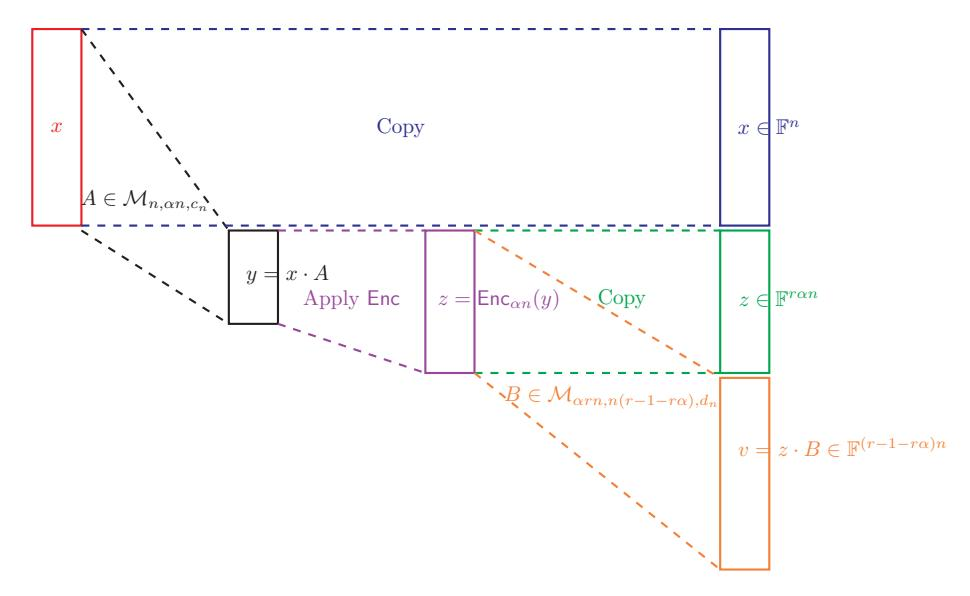
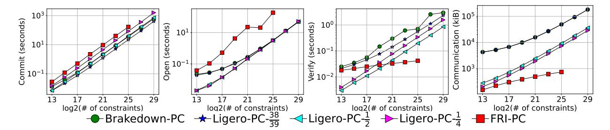
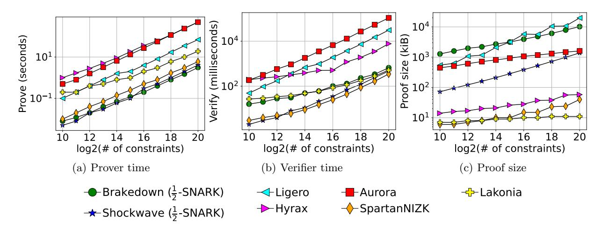
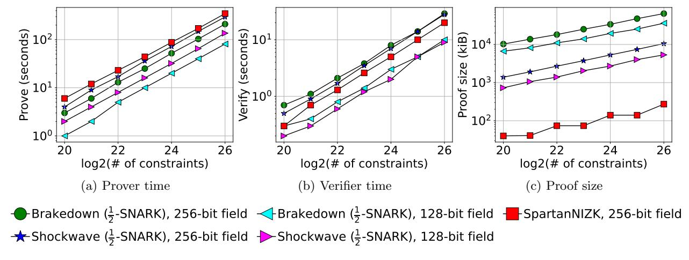
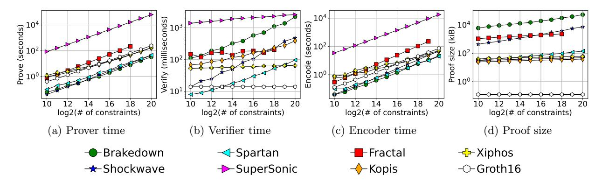
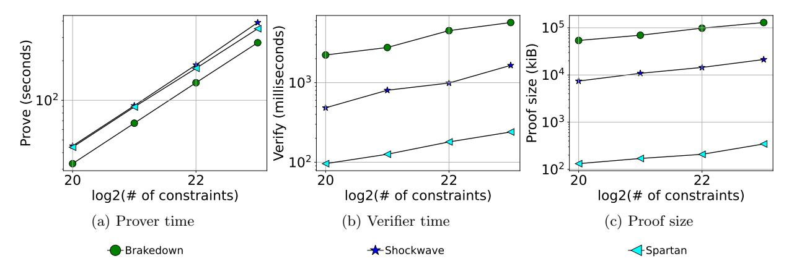

# Brakedown: Linear-time and field-agnostic SNARKs for R1CS

Alexander Golovnev\* Jonathan Lee<sup>†</sup> Srinath Setty<sup>‡</sup> Justin Thaler<sup>§</sup> Riad S. Wahby<sup>¶</sup>

#### Abstract

This paper introduces a SNARK called Brakedown. Brakedown targets R1CS, a popular NP-complete problem that generalizes circuit-satisfiability. It is the first built system that provides a linear-time prover, meaning the prover incurs O(N) finite field operations to prove the satisfiability of an N-sized R1CS instance. Brakedown's prover is faster, both concretely and asymptotically, than prior SNARK implementations. It does not require a trusted setup and may be post-quantum secure. Furthermore, it is compatible with arbitrary finite fields of sufficient size; this property is new among built proof systems with sublinear proof sizes.

To design Brakedown, we observe that recent work of Bootle, Chiesa, and Groth (BCG, TCC 2020) provides a polynomial commitment scheme that, when combined with the linear-time interactive proof system of Spartan (CRYPTO 2020), yields linear-time IOPs and SNARKs for R1CS (a similar theoretical result was previously established by BCG, but our approach is conceptually simpler, and crucial for achieving high-speed SNARKs). A core ingredient in the polynomial commitment scheme that we distill from BCG is a linear-time encodable code. Existing constructions of such codes are believed to be impractical. Nonetheless, we design and engineer a new one that is practical in our context.

We also implement a variant of Brakedown that uses Reed-Solomon codes instead of our linear-time encodable codes; we refer to this variant as *Shockwave*. Shockwave is *not* a linear-time SNARK, but it provides shorter proofs and lower verification times than Brakedown, and also provides a faster prover than prior plausibly post-quantum SNARKs.

## <span id="page-0-0"></span>1 Introduction

A SNARK [57, 66, 45, 18] is a cryptographic primitive that enables a prover to prove to a verifier the knowledge of a satisfying witness to an NP statement by producing a proof  $\pi$  such that the size of  $\pi$  and the cost to verify it are both sub-linear in the size of the witness. Given their many applications, constructing SNARKs with excellent asymptotics and concrete efficiency is a highly active area of research. Still, one of the key bottlenecks preventing application of existing SNARKs to large NP statements is the prover's asymptotic and concrete cost. This has limited the use of SNARKs to practical applications in which NP statements of interest are relatively small (for example, cryptocurrencies).

As with much of the literature on SNARKs, we focus on rank-1 constraint satisfiability (R1CS) over a finite field  $\mathbb{F}$ , an NP-complete problem that generalizes arithmetic circuit satisfiability. An R1CS instance comprises a set of M constraints, with a vector w over  $\mathbb{F}$  said to satisfy the instance if it satisfies all M constraints. The term "rank-1" means that the constraints should have a specific form. Specifically, each constraint asserts that the product of two specified linear combinations of the entries of w equals a third linear combination of those entries. See Definition 2.1 for details. R1CS is amenable to probabilistic checking and is highly expressive. For example, in theory, any non-deterministic random access machine running in time T can be transformed into an R1CS instance of size "close" to T. In practice, there exist efficient transformations and compiler toolchains to transform applications of interest to R1CS [79, 70, 26, 13, 86, 76, 61, 69].

<sup>\*</sup>Georgetown University

<sup>&</sup>lt;sup>†</sup>Nanotronics Imaging

 $<sup>^{\</sup>ddagger} \text{Microsoft Research}$ 

<sup>§</sup>a16z crypto research and Georgetown University

<sup>¶</sup>Carnegie Mellon University

Our focus in this work is designing SNARKs for R1CS with the fastest possible prover. We also wish for the SNARK to be *transparent* (or be without a trusted setup): there should be no need to run a complex multi-party computation to generate a so-called *structured reference string* that is needed for proof generation.

Furthermore, we desire a verifier that runs in time sub-linear in the size of the R1CS instance. Since the verifier must at least read the statement that is being proven, we allow a one-time public preprocessing phase for general (unstructured) R1CS instances. In this phase, the verifier computes a *computation commitment*, a cryptographic commitment to the structure of a circuit or R1CS instance [75]. (For "structured" computations, our SNARKs, like several prior works, can avoid this pre-processing phase.) After the pre-processing phase, the verifier must run in time sub-linear in the size of the R1CS instance. Furthermore, the pre-processing phase should be at least as efficient as the SNARK prover. Subsequent works to Spartan [75] refer to such public preprocessing to achieve fast verification as leveraging holography [35, 36, 22].

A second focus of our work is designing SNARKs that can operate over arbitrary (sufficiently large) finite fields. Prior SNARKs apply over fields that are "discrete-log friendly" or "FFT-friendly", or otherwise require one or many multiplicative or additive subgroups of specified sizes. Yet many cryptographic applications naturally work over fields that do not satisfy these properties. Examples include proofs regarding encryption or signature schemes that themselves work over fields that do not satisfy the properties needed by the SNARK. Indeed, most practically relevant elliptic curve groups are defined over fields that are not FFT-friendly. Even in applications where SNARK designers do have flexibility in field choice, field size restrictions can still create engineering challenges or inconveniences, as well as performance overheads. For example, they may limit the size of R1CS statements that can be handled over the chosen field, or force instance sizes to be padded to a length corresponding to the size of a subgroup.

In this work we design transparent SNARKs that asymptotically have the fastest possible prover, may be post-quantum secure, and work over arbitrary (sufficiently large) finite fields.<sup>2</sup> We refer to this latter property as being *field-agnostic*, and to the best of our knowledge, it is new amongst implemented arguments with sublinear proof size and even *quasi*linear runtime. We optimize and implement our new SNARKs, and demonstrate the fastest prover performance in the SNARK literature (even compared to SNARKs that require FFT-friendly or discrete-log-friendly fields).

Formalizing "fastest possible" provers. How fast can we hope for the prover in a SNARK to be? Letting N denote the size of the R1CS or arithmetic-circuit-satisfiability instance over an arbitrary finite field  $\mathbb{F}$ , a lower bound on the prover's runtime is N operations in  $\mathbb{F}$ . Here, the size of an arithmetic-circuit-satisfiability instance is the number of gates in the circuit. The size of an R1CS instance of the form  $Az \circ Bz = Cz$  is the number of non-zero entries in A, B, C, where  $\circ$  denotes the Hadamard (entry-wise) product. This is because any prover that knows a witness w for the instance has to at least convince itself (much less the verifier) that w is valid. We refer to this procedure as native evaluation of the instance. So the natural goal, roughly speaking, is to achieve a SNARK prover that is only a constant factor slower than native evaluation. Such a prover is said to run in linear-time.

Achieving a linear-time prover may sound like a simple and well-defined goal, but it is in fact subtle to formalize, because one must be precise about what operations can be performed in one "time-step", as well as the soundness error achieved and the choice of the finite field.

In known SNARKs, the bottleneck for the prover (both asymptotically and concretely) is typically one or more of the following operations: (1) Performing an FFT over a vector of length O(N). (2) Building a Merkle-hash tree over a vector consisting of O(N) elements of  $\mathbb{F}$ . (3) Performing a multiexponentiation of size O(N) in a (multiplicative) cryptographic group  $\mathbb{G}$ . In this case, the field  $\mathbb{F}$  is of prime order p and  $\mathbb{G}$  is typically an elliptic curve group (or subgroup) of order p. A multiexponentiation of size N in  $\mathbb{G}$  refers to a product of N exponentiations, i.e.,  $\prod_{i=1}^N g_i^{c_i}$ , where each  $g_i \in \mathbb{G}$  and each  $c_i \in \{0, \ldots, p-1\}$ .

<span id="page-1-0"></span><sup>&</sup>lt;sup>1</sup>It is possible to construct elliptic curves with specified group order [27], which suffices for many discrete log–based SNARKs. Unfortunately, the most efficient elliptic curve implementations are tailored to specific curves—so using a newly constructed curve may entail a performance or engineering cost.

<span id="page-1-1"></span><sup>&</sup>lt;sup>2</sup>For our SNARKs, a field of size  $\exp(\lambda)$  is sufficient to achieve  $\lambda$  bits of security with a linear-time prover. More generally, our SNARK can work over any field  $\mathbb{F}$  of size  $|\mathbb{F}| \geq \Omega(N)$  with a prover runtime that is superlinear by a factor of  $O(\lambda/\log |\mathbb{F}|)$ , where N denotes instance size.

Should any of these operations count as "linear-time"?

**FFTs.** An FFT of length  $\Theta(N)$  over  $\mathbb{F}$  should *not* count as linear-time, because the fastest known algorithms require  $\Theta(N \log N)$  operations over  $\mathbb{F}$ , which is a  $\log N$  factor, rather than a constant factor, larger than native evaluation.

However, the remaining operations are trickier to render judgment upon, because they do not refer to field operations.

**Merkle-hashing.** Build a Merkle tree over a vector of O(N) elements of  $\mathbb{F}$ , computing O(N) cryptographic hashes is necessary and sufficient, assuming the hash function takes as input O(1) elements of  $\mathbb{F}$ . However, this is only "linear-time" if hashing O(N) elements of  $\mathbb{F}$  can be done in time comparable to O(N) operations over  $\mathbb{F}$ . It is not clear whether or not applying a standard hash function such as SHA-256 to hash a field element should be considered comparable to performing a single field operation.

Theoretical work of Bootle et al. [21] sidesteps this issue by observing that (assuming the intractability of certain lattice problems over  $\mathbf{F}_2$ , specifically finding a low-Hamming vector in the kernel of a sparse matrix), a collision-resistant hash family of Applebaum et al. [5] is capable of hashing strings consisting of  $k \gg \lambda$  bits in O(k) bit operations, with security parameter  $\lambda$ . This means that a vector of O(N) elements of  $\mathbb{F}$  can be Merkle-hashed in  $O(N \log |\mathbb{F}|)$  bit operations, which Bootle et al. [21] consider comparable to the cost of O(N) operations in  $\mathbb{F}$ . The aforementioned hash functions appear to be of primarily theoretical interest because they can be orders of magnitude slower than standard hash functions (e.g., SHA-256). Hence, in this paper our implementations make use of standard hash functions, and with this choice, Merkle-hashing is not the concrete bottleneck in our implementations. Accordingly, and to simplify discussion, we consider our implemented Merkle-hashing procedure to be linear-time, even if this may not be strictly justified from a theoretical perspective.

Multiexponentation. Pippenger's algorithm [71] (see also [16, 54]) can perform an O(N)-sized multiexponentiation in a group  $\mathbb{G}$  of size  $\sim 2^{\lambda}$  by performing  $O(N \cdot \lambda/\log(N \cdot \lambda))$  group operations (i.e., group multiplications). Typically, one thinks of the security parameter  $\lambda$  as  $\omega(\log N)$  (so that  $2^{\lambda}$  is superpolynomial in N, ensuring the intractability of problems such as discrete logarithm in  $\mathbb{G}$ ), and so  $O(N \cdot \lambda/\log(N \cdot \lambda))$  group operations is considered  $\omega(N)$  group operations. Each group operation is at least as expensive (in fact, several times slower) than a field operation—typically, an operation in the elliptic-curve group  $\mathbb{G}$  requires performing a constant number of field operations within a field that is of similar size to, but different than, then prime-order field  $\mathbb{F}$  over which the circuit or R1CS instance is defined. Hence, we do *not* consider this to be linear time.

However, note that for a fixed value of the security parameter  $\lambda$ , the cost of a multiexponentiation of size N performed using Pippenger's algorithm scales only linearly (in fact, sublinearly) with N. That is, Pippenger's algorithm incurs  $\Theta(N \cdot (\lambda/\log(N\lambda))) = \Theta_{\lambda}(N/\log N)$  group operations and in turn this cost is comparable up to a constant factor to the same number of operations over a field of size  $\exp(\lambda)$ . In practice, protocol designers fix a cryptographic group (and hence fix  $\lambda$ ), and then apply the resulting protocol to R1CS instances of varying sizes N. For this reason, systems (e.g., Spartan [75]) whose dominant prover cost is a multiexponentiation of size N will scale (sub-)linearly as a function of N. Specifically, in the experimental results [75], Spartan's prover exhibits the behavior of a linear-time prover (as the cost of native evaluation of the instance also scales linearly as a function of N). Nonetheless, since  $\lambda$  should be thought of as  $\omega(\log N)$ , we do not consider a multiexponentation of size N to be a linear-time operation.

In summary, we do not consider FFTs and multiexponentations of size O(N) to be linear-time operations, but do consider Merkle-hashing of vectors of size O(N) to be linear-time.

<span id="page-2-0"></span>Closely related work. Building on Bootle et al. [21], Bootle, Chiesa, and Groth [22] give an interactive oracle proof (IOP) [15] with constant soundness error, in which the prover's work is O(N) finite field operations for an N-sized R1CS instance over any finite field of size  $\Omega(N)$ . Here, an interactive oracle proof (IOP) [15, 72] is a generalization of an interactive proof, where in each round, the prover sends a string as an oracle, and the verifier may read one or more entries in the oracle. To achieve soundness error that is exponentially small in the security parameter  $\lambda$  in the IOP of [22], one must restrict to R1CS instances over a "sufficiently large" finite field i.e., where  $|\mathbb{F}| = 2^{\Theta(\lambda)}$ , or else sacrifice the linear-time prover.

Applying standard transformations to their IOP, one can obtain a SNARG in the random oracle model with similar prover costs, or an interactive argument assuming linear-time computable cryptographic hash functions [\[5\]](#page-41-4). Unlike prior SNARGs (even those with a quasi-linear time prover), the resulting protocol does not require the field to be FFT-friendly nor discrete-log friendly.

Their IOP construction does not achieve zero-knowledge nor polylogarithmic proofs and verification times (the proof sizes and verification times are Oλ(N1/t), where t is a constant, and not Oλ(log N) or Oλ(1)). Bootle, Chiesa, and Liu [\[24\]](#page-41-7) address these issues by achieving zero-knowledge as well as polylogarithmic proof sizes and verification times (a more detailed discussion of the relationship between our results and those of [\[24\]](#page-41-7) can be found in Appendix [C\)](#page-48-0). Both [\[22\]](#page-41-2) and [\[24\]](#page-41-7) are theoretical in nature; they do not implement their schemes nor report performance results.

There is also very recent work related to our goal of working over arbitrary finite fields. Ben-Sasson et al. [\[11,](#page-41-8) [12\]](#page-41-9) improve the efficiency of FFT-like algorithms that apply over fields with no smooth order root of unity, by a factor of exp(log<sup>∗</sup> N). An explicit motivation for their work is to improve the efficiency of known SNARKs that perform FFTs (e.g., Fractal [\[36\]](#page-42-3)) when operating over "non-FFT-friendly" fields. These results do not eliminate the superlinearity of the prover's runtime in their target SNARKs. The algorithms given in [\[11,](#page-41-8) [12\]](#page-41-9) also perform significant pre-computation that is field-specific and have not to date yielded implemented SNARKs. We seek (and achieve) high-speed SNARKs that require only black-box access to the addition and multiplication operations of the field, with the only additional information required being a lower bound on the field size to ensure soundness.

In summary, prior works leave open the problem of achieving concretely efficient SNARKs that support arbitrary (sufficiently large) finite fields, much less one with a linear-time prover.

# 1.1 Results and contributions

We address the above problems with Brakedown, a new linear-time field-agnostic SNARK that we design, implement, optimize, and experimentally evaluate. Concretely, Brakedown achieves the fastest SNARK prover in the literature, even over fields to which prior SNARKs apply. We also implement and evaluate Shockwave, a variant of Brakedown that reduces proof sizes and verification times at the cost of sacrificing a linear-time prover, but nonetheless provides a faster prover than prior plausibly post-quantum SNARKs. Brakedown and Shockwave are unconditionally secure in the random oracle model.

SNARK design background. Modern SNARKs work by combining a type of interactive protocol called a polynomial IOP [\[30\]](#page-42-5) with a cryptographic primitive called a polynomial commitment scheme [\[55\]](#page-43-11). The combination yields succinct interactive argument, which can then be rendered non-interactive via the Fiat-Shamir transformation [\[41\]](#page-42-6), yielding a SNARK.

Roughly, a polynomial IOP is an interactive protocol where, in one or more rounds, the prover "sends" to the verifier a very large polynomial q. Because q is so large, one does not wish for the verifier to read a complete description of q. Instead, the verifier only "queries" q at one point (or a handful of points). This means that the only information the verifier needs about q to check that the prover is behaving honestly is one (or a few) evaluations of q.

In turn, a polynomial commitment scheme enables an untrusted prover to succinctly commit to a polynomial q, and later provide to the verifier any evaluation q(r) for a point r chosen by the verifier, along with a proof that the returned value is indeed consistent with the committed polynomial.

Essentially, a polynomial commitment scheme is exactly the cryptographic primitive that one needs to obtain a succinct argument from a polynomial IOP. Rather than having the prover send a large polynomial q to the verifier as in the polynomial IOP, the argument system prover cryptographically commits to q and later reveals any evaluations of q required by the verifier to perform its checks.

Design of our linear-time SNARK. We first distill from [\[22\]](#page-41-2) a polynomial commitment scheme with a linear-time commitment procedure, and show that it satisfies extractability, a key property required in the context of SNARKs (the commitment scheme itself is little more than a rephrasing of the results in [\[22\]](#page-41-2), though [\[22\]](#page-41-2) did not analyze extractability). This improves over the prior state-of-the-art polynomial commitment schemes [\[55,](#page-43-11) [92,](#page-44-1) [87,](#page-44-2) [91,](#page-44-3) [30,](#page-42-5) [78,](#page-43-12) [60\]](#page-43-13) by offering the first in which the time to commit to a polynomial is linear in the size of the polynomial. We focus on multilinear polynomials over the Lagrange basis, but the scheme generalizes to many other types of polynomials such as univariate polynomials over the standard monomial basis (see e.g., [\[60\]](#page-43-13)).

To obtain linear-time SNARKs for R1CS, we first make explicit a polynomial IOP for R1CS from Spartan [\[75\]](#page-43-7) and then use our new linear-time polynomial commitment scheme in conjunction with prior compilers [\[75,](#page-43-7) [30\]](#page-42-5) to transform it into a SNARK for R1CS.

A new and concretely fast linear-time encodable code. A major component in the linear-time polynomial commitment scheme that we distill from [\[22\]](#page-41-2) is a linear-time encodable linear code. Unfortunately, to the best of our knowledge, existing linear-time encodable codes are highly impractical. We therefore design a new linear-time encodable code that is concretely fast in our context. Our code builds on classic results [\[43,](#page-42-7) [80,](#page-44-4) [40\]](#page-42-8), but designing this code is involved and represents a significant technical contribution. We achieve a fast linear code that works over any (sufficiently large) field by leveraging the following four observations: (1) In our setting, to achieve sublinear sized proofs, it is sufficient for the code to achieve relative Hamming distance only a small constant, rather than very close to 1 (higher minimum distance would improve Brakedown's proof length by a constant factor, but would not meaningfully reduce the prover time); (2) Efficient decoding is not necessary for reasons elaborated upon below; (3) We can (and indeed want to) work over large fields, say, of size at least 2127; and (4) We can use randomized constructions instead of deterministic constructions of pseudorandom objects, so long as the probability that the construction fails to satisfy the necessary distance properties is cryptographically small (e.g., ≤ 2 <sup>−</sup>100).

Observation (2) holds for the following two reasons: (1) the prover and verifier only execute the code's encoding procedure (this observation also appears in prior work [\[22\]](#page-41-2)); (2) we describe an efficient extractor for our polynomial commitment scheme that does not invoke the code's decoding procedure. Hence, efficient decoding is not even needed to establish that our SNARK is knowledge-sound.

Observations (1)–(4) together allow us to strip out much of the complexity of prior constructions. For example, Spielman's celebrated work [\[80\]](#page-44-4) is focused on achieving both linear-time encoding and decoding, while Druk and Ishai [\[40\]](#page-42-8) focus on improving the minimum distance of Spielman's code. On top of this, we further optimize and simplify the code construction, and provide a detailed, quantitative analysis to show that the probability our code fails to achieve the necessary minimum distance is cryptographically small.

Implementation, optimization, and experimental results. We implement the aforementioned lineartime SNARK, yielding a system we call Brakedown. Because our linear-time code works over any (sufficiently large) field, and the polynomial IOP from Spartan does as well, Brakedown is field-agnostic. This is the first built SNARK to achieve this property. It is also the first built system with a linear-time prover and sub-linear proof sizes and verification times.

We also implement Shockwave, a variant of Brakedown that uses Reed-Solomon codes instead of our fast linear-time code. Since Shockwave uses Reed-Solomon codes, it is not a linear-time SNARK and requires an FFT-friendly finite field, but it provides concretely shorter proofs and lower verification times than Brakedown and is faster than prior plausibly post-quantum secure SNARKs.

Both Shockwave and Brakedown contain simple but crucial concrete optimizations to the polynomial commitment scheme to reduce proof sizes. Neither Shockwave's nor Brakedown's implementations are currently zero-knowledge. However, Shockwave can be rendered zero-knowledge using standard techniques with minimal overhead [\[4,](#page-41-10) [89,](#page-44-5) [34\]](#page-42-9). Brakedown could be rendered zero-knowledge while maintaining linear prover time by using one layer of recursive composition with zkShockwave (or another zkSNARK). Indeed, subsequent work, called Orion [\[90\]](#page-44-6), uses Virgo [\[91\]](#page-44-3) to prove in zero-knowledge the knowledge of valid proofs produced by (a variant of) Brakedown. It is also plausible that Brakedown could be rendered zero-knowledge more directly using techniques from [\[24\]](#page-41-7).

In terms of experimental results, Brakedown achieves a faster prover than all prior SNARKs for R1CS. Its primary downside is that its proofs are on the larger side, but they are still far smaller than the size of

the NP-witness for R1CS instance sizes beyond several million constraints. Shockwave reduces Brakedown's proof sizes and verification times by about a factor of  $6\times$ , at the cost of a slower prover (both asymptotically and concretely). Nonetheless, Shockwave already features a concretely faster prover than prior plausibly post-quantum SNARKs. Furthermore, although Shockwave's proof sizes are somewhat larger than most prior schemes with sublinear proof size, they are surprisingly competitive with prior post-quantum schemes such as Fractal [36] and Aurora [14] that have lower asymptotic proof size (polylog(N) rather than  $\Theta_{\lambda}(\sqrt{N})$ ) Its verification times are competitive with discrete-logarithm based schemes, and in fact superior to prior plausibly post-quantum SNARKs.

Public parameter generation. The public parameters of Brakedown include a description of the encoding procedure of our error-correcting code. This involves randomly generating certain sparse matrices (we provide details of this in Section 5.1). Our implementation generates the matrices deterministically using a cryptographic PRG with a public, fixed seed, which could be chosen in a "nothing-up-my-sleeve" way (e.g., as in Bulletproofs [28]). Generating the matrices is concretely fast: our implementation takes under 700 milliseconds to sample parameters suitable for encoding inputs of length 2<sup>20</sup>, and 22 seconds for encoding inputs of length 2<sup>25</sup>. The latter setting is suitable for committing to polynomials of degree over 2<sup>40</sup>, and for giving SNARKs for R1CS instances with roughly 2<sup>40</sup> constraints. Note that any party acting as the prover or verifier in Brakedown need only generate these matrices once, no matter how many times the SNARK is used.

## 1.2 Subsequent work on linear-time provers

Xie et al. [90] compose Brakedown with a different SNARK called Virgo [91] that requires an FFT-friendly field but has smaller proofs. This asymptotically reduces the proof size from  $\Theta_{\lambda}(\sqrt{N})$  to  $\Theta_{\lambda}(\log^2 N)$ . The resulting implementation, called Orion, requires an FFT-friendly field, but has substantially smaller proofs than Brakedown, and a slightly faster prover due to the improved code parameters. Orion+ [33] improves Brakedown (this work) and the work of Xie et al. [90] by providing proofs of  $\approx 10 \text{ KB}$  at the cost of requiring a (universal) trusted setup and giving up plausible post-quantum security. Vortex [7] builds on Brakedown and uses lattice-based hash functions for improved recursion capabilities. Diamond and Posen [38] reduce the proof size and prover time of Brakedown by a factor of close to 2, by showing that the testing and evaluation phases of Brakedown's polynomial commitment scheme can be consolidated if the evaluation queries are random, as they are in Brakedown's SNARKs. Haböck [50] improves the concrete parameters of Brakedown's linear-time encodable code, including over fields as small as 31 bits.

Recent theoretical works have obtained interactive arguments with constant soundness error and a linear-time prover even over small fields [74, 23, 53].

#### 1.3 Roadmap

Section 3 describes a linear-time polynomial IOP for R1CS implicit in Spartan [75]. Section 4 describes a linear-time polynomial commitment scheme distilled from [22] with proof size  $N^{\epsilon}$  for any desired constant  $\epsilon > 0$ . Section 4.1 gives a self-contained description and security analysis (including extractability) of the the polynomial commitment scheme when  $\epsilon = 1/2$ , along with important concrete optimizations. (Appendix B provides a concretely improved security analysis of the polynomial commitment scheme when instantiated with the Reed-Solomon code as used in one of our two implemented systems, namely Shockwave.) Section 5 describes the construction and analysis of our concretely efficient linear-time-encodable linear error-correcting code used in our polynomial commitment scheme implementation within Brakedown. Section 6 extends the polynomial commitment scheme to handle sparse polynomials efficiently using techniques from Spartan [75]. Section 7 obtains linear-time SNARKs for R1CS by combining the polynomial IOP from Spartan with the polynomial commitment schemes derived in Sections 4-6.

Performance results for our implemented SNARKs (Brakedown and Shockwave) are detailed in Section 8.

## 2 Preliminaries

We use  $\mathbb{F}$  to denote a finite field,  $\lambda$  to denote the security parameter, and  $\mathsf{negl}(()\lambda)$  to denote a negligible function in  $\lambda$ . Unless we specify otherwise,  $|\mathbb{F}| = 2^{\Theta(\lambda)}$ .

**Polynomials.** We recall a few basic facts about polynomials. Detailed treatment of these facts can be found elsewhere [82].

- A polynomial over  $\mathbb{F}$  is an expression consisting of a sum of *monomials* where each monomial is the product of a constant and powers of one or more variables (which take values from  $\mathbb{F}$ ); all arithmetic is performed over  $\mathbb{F}$ .
- The degree of a monomial is the sum of the exponents of variables in the monomial; the (total) degree of a polynomial g is the maximum degree of any monomial in g. Also, the degree of a polynomial g in a particular variable  $x_i$  is the maximum exponent that  $x_i$  takes in any of the monomials in g.
- A multivariate polynomial is a polynomial with more than one variable; otherwise it is called a univariate polynomial. A multivariate polynomial is called a multilinear polynomial if the degree of the polynomial in each variable is at most one.

### Rank-1 constraint satisfiability (R1CS).

<span id="page-6-0"></span>**Definition 2.1.** An R1CS instance is a tuple  $(\mathbb{F}, A, B, C, M, N, io)$ , where  $A, B, C \in \mathbb{F}^{M \times M}$ ,  $M \ge |io| + 1$ , io denotes the public input and output, and there are at most  $N = \Omega(M)$  non-zero entries in each matrix.

We denote the set of R1CS (instance, witness) pairs as  $\mathcal{R}_{R1CS}$ , defined as:  $\{\langle (\mathbb{F}, A, B, C, io, M, N), w \rangle : A \cdot (w, 1, io) \circ B \cdot (w, 1, io) = C \cdot (w, 1, io) \}$ .

In the rest of the paper, WLOG, we assume that M and N are powers of 2, and that M = |io| + 1. Throughout this paper, all logarithms are to base 2.

<span id="page-6-1"></span>**SNARKs.** We adapt the definition provided in [59].

**Definition 2.2.** Consider a relation  $\mathcal{R}$  over public parameters, structure, instance, and witness tuples. A non-interactive argument of knowledge for  $\mathcal{R}$  consists of PPT algorithms  $(\mathcal{G}, \mathcal{P}, \mathcal{V})$  and deterministic  $\mathcal{K}$ , denoting the generator, the prover, the verifier and the encoder respectively with the following interface.

- $\mathcal{G}(1^{\lambda}) \to pp$ : On input security parameter  $\lambda$ , samples public parameters pp.
- $\mathcal{K}(pp,s) \to (pk,vk)$ : On input structure s, representing common structure among instances, outputs the prover key pk and verifier key vk.
- $\mathcal{P}(\mathsf{pk}, u, w) \to \pi$ : On input instance u and witness w, outputs a proof  $\pi$  proving that  $(\mathsf{pp}, \mathsf{s}, u, w) \in \mathcal{R}$ .
- $V(vk, u, \pi) \rightarrow \{0, 1\}$ : On input the verifier key vk, instance u, and a proof  $\pi$ , outputs 1 if the instance is accepting and 0 otherwise.

A non-interacive argument of knowledge satisfies completeness if for any PPT adversary A

$$\Pr\left[\begin{array}{c|c} \mathcal{V}(\mathsf{vk},u,\pi) = 1 & \begin{array}{c} \mathsf{pp} \leftarrow \mathcal{G}(1^{\lambda}), \\ (\mathsf{s},(u,w)) \leftarrow \mathcal{A}(\mathsf{pp}), \\ (\mathsf{pp},\mathsf{s},u,w) \in \mathcal{R}, \\ (\mathsf{pk},\mathsf{vk}) \leftarrow \mathcal{K}(\mathsf{pp},\mathsf{s}), \\ \pi \leftarrow \mathcal{P}(\mathsf{pk},u,w) \end{array}\right] = 1.$$

A non-interactive argument of knowledge satisfies knowledge soundness if for all PPT adversaries A there exists a PPT extractor  $\mathcal{E}$  such that for all randomness  $\rho$ 

$$\Pr\left[\begin{array}{c|c} \mathcal{V}(\mathsf{vk},u,\pi) = 1, & \mathsf{pp} \leftarrow \mathcal{G}(1^\lambda), \\ (\mathsf{pp},\mathsf{s},u,w) \not\in \mathcal{R} & (\mathsf{s},u,\pi) \leftarrow \mathcal{A}(\mathsf{pp};\rho), \\ (\mathsf{pk},\mathsf{vk}) \leftarrow \mathcal{K}(\mathsf{pp},\mathsf{s}), \\ w \leftarrow \mathcal{E}(\mathsf{pp},\rho) \end{array}\right] = \mathsf{negl}(\lambda).$$

A non-interactive argument of knowledge is succinct if the size of the proof  $\pi$  and the time to verify it are at most polylogarithmic in the size of the statement proven, where a statement includes both the structure and the instance.

Remark 1. In this paper, we consider an argument system to be succinct as long as the proof sizes and verification times are sublinear in the size of the statement proven. We accept this weakening as proofs produced by such proof systems can be shortened (both asymptotically and concretely) without substantial overheads using depth-1 recursion (e.g., see a subsequent work called Orion [90]).

**Polynomial commitment scheme.** We adapt the definition from [30]. A polynomial commitment scheme for multilinear polynomials is a tuple of four protocols PC = (Gen, Commit, Open, Eval):

- $pp \leftarrow \mathsf{Gen}(1^{\lambda}, \mu)$ : takes as input  $\mu$  (the number of variables in a multilinear polynomial); produces public parameters pp.
- $\mathcal{C} \leftarrow \mathsf{Commit}(pp,\mathcal{G})$ : takes as input a  $\mu$ -variate multilinear polynomial over a finite field  $\mathcal{G} \in \mathbb{F}[\mu]$ ; produces a commitment  $\mathcal{C}$ .
- $b \leftarrow \mathsf{Open}(pp, \mathcal{C}, \mathcal{G})$ : verifies the opening of commitment  $\mathcal{C}$  to the  $\mu$ -variate multilinear polynomial  $\mathcal{G} \in \mathbb{F}[\mu]$ ; outputs  $b \in \{0, 1\}$ .
- $b \leftarrow \text{Eval}(pp, \mathcal{C}, r, v, \mu, \mathcal{G})$  is a protocol between a PPT prover  $\mathcal{P}$  and verifier  $\mathcal{V}$ . Both  $\mathcal{V}$  and  $\mathcal{P}$  hold a commitment  $\mathcal{C}$ , the number of variables  $\mu$ , a scalar  $v \in \mathbb{F}$ , and  $r \in \mathbb{F}^{\mu}$ .  $\mathcal{P}$  additionally knows a  $\mu$ -variate multilinear polynomial  $\mathcal{G} \in \mathbb{F}[\mu]$ .  $\mathcal{P}$  attempts to convince  $\mathcal{V}$  that  $\mathcal{G}(r) = v$ . At the end of the protocol,  $\mathcal{V}$  outputs  $b \in \{0, 1\}$ .

<span id="page-7-1"></span>**Definition 2.3.** A tuple of four protocols (Gen, Commit, Open, Eval) is an extractable polynomial commitment scheme for multilinear polynomials over a finite field  $\mathbb{F}$  if the following conditions hold.

• Completeness. For any  $\mu$ -variate multilinear polynomial  $\mathcal{G} \in \mathbb{F}[\mu]$ ,

$$\Pr\left\{\begin{array}{l} pp \leftarrow \mathsf{Gen}(1^{\lambda},\mu); \ \mathcal{C} \leftarrow \mathit{Commit}(pp,\mathcal{G}); \\ \mathit{Eval}(pp,\mathcal{C},r,v,\mu,\mathcal{G}) = 1 \wedge v = \mathcal{G}(r) \end{array}\right\} \geq 1 - \mathsf{negl}(\lambda)$$

• Binding. For any PPT adversary A, size parameter  $\mu \geq 1$ ,

$$\Pr\left\{\begin{array}{l} pp \leftarrow \mathsf{Gen}(1^{\lambda},m); \ (\mathcal{C},\mathcal{G}_{0},\mathcal{G}_{1}) = \mathcal{A}(pp); \\ b_{0} \leftarrow \mathit{Open}(pp,\mathcal{C},\mathcal{G}_{0}); \ b_{1} \leftarrow \mathit{Open}(pp,\mathcal{C},\mathcal{G}_{1}): \\ b_{0} = b_{1} \neq 0 \land \mathcal{G}_{0} \neq \mathcal{G}_{1} \end{array}\right\} \leq \mathsf{negl}(\lambda)$$

• Knowledge soundness. Eval is a succinct argument of knowledge for the following NP relation given  $pp \leftarrow \mathsf{Gen}(1^{\lambda}, \mu)$ .

$$\mathcal{R}_{\mathsf{Fval}}(pp) = \{ \langle (\mathcal{C}, r, v), (\mathcal{G}) \rangle : \mathcal{G} \in \mathbb{F}[\mu] \land \mathcal{G}(r) = v \land \mathsf{Open}(pp, \mathcal{C}, \mathcal{G}) = 1 \}$$

# <span id="page-7-0"></span>3 A linear-time polynomial IOP for R1CS from Spartan

This section recapitulates the results of Spartan [75] using a subsequent formalism, a polynomial IOP [30]. This is a variant of IOPs [15, 72] where in each round, the prover sends a polynomial as an oracle, and the verifier query may request an evaluation of the polynomial at a point in its domain.

The following theorem formalizes the polynomial IOP at the core of Spartan.

For an R1CS instance,  $\mathbb{X} = (\mathbb{F}, A, B, C, M, N, \text{io})$ , we interpret the matrices A, B, C as functions mapping domain  $\{0,1\}^{\log M} \times \{0,1\}^{\log M}$  to  $\mathbb{F}$  in the natural way. That is, an input in  $\{0,1\}^{\log M} \times \{0,1\}^{\log M}$  is interpreted as the binary representation of an index  $(i,j) \in [M] \times [M]$ , where  $[M] := \{1,\ldots,M\}$  and the function outputs the (i,j)'th entry of the matrix.

<span id="page-8-2"></span>**Theorem 1** ([75]). For any finite field  $\mathbb{F}$ , there exists a polynomial IOP for  $\mathcal{R}_{R1CS}$ , with the following parameters, where M denotes the dimension of the R1CS coefficient matrices, and N denotes the number of non-zero entries in the matrices:

- soundness error is  $O(\log M)/|\mathbb{F}|$
- round complexity is  $O(\log M)$ ;
- at the start of the protocol, the prover sends a single  $(\log M 1)$ -variate multilinear polynomial  $\widetilde{W}$ , and the verifier has a query access to three additional  $2\log M$ -variate multilinear polynomials  $\widetilde{A}$ ,  $\widetilde{B}$ , and  $\widetilde{C}$ ;
- the verifier makes a single evaluation query to each of the four polynomials  $\widetilde{W}, \widetilde{A}, \widetilde{B},$  and  $\widetilde{C},$  and otherwise performs  $O(\log M)$  operations over  $\mathbb{F}$ ;
- the prescribed prover performs O(N) operations over  $\mathbb{F}$  to compute its messages over the course of the polynomial IOP (and to compute answers to the verifier's four queries to  $\widetilde{W}, \widetilde{A}, \widetilde{B}$ , and  $\widetilde{C}$ ).

*Proof.* Let  $s = \log M$ . For an R1CS instance,  $\mathbb{X} = (\mathbb{F}, A, B, C, M, N, io)$  and a purported witness W, let Z = (W, 1, io). As explained prior to the theorem statement, we can interpret A, B, C as functions mapping  $\{0, 1\}^s \times \{0, 1\}^s$  to  $\mathbb{F}$ , and similarly we interpret Z and (1, io) as functions with the following respective signatures in the same manner:  $\{0, 1\}^s \to \mathbb{F}$  and  $\{0, 1\}^{s-1} \to \mathbb{F}$ . It is easy to check that the MLE  $\widetilde{Z}$  of Z satisfies

<span id="page-8-0"></span>
$$\widetilde{Z}(X_1, \dots, X_{\log M}) = (1 - X_1) \cdot \widetilde{W}(X_2, \dots, X_{\log M}) + X_1 \cdot (1, \mathsf{io})(X_2, \dots, X_{\log M}) \tag{1}$$

Indeed, the right hand side of Equation (1) is a multilinear polynomial, and it is easily checked that  $\tilde{Z}(x_1,\ldots,x_{\log M})=Z(x_1,\ldots,x_{\log M})$  for all  $x_1,\ldots,x_{\log M}$  (since the first half of the evaluations of Z are given by W and the second half are given by the vector (1,io)). Hence, the right hand side of Equation (1) must be the unique multilinear extension of Z.

From [75, Theorem 4.1], checking if  $(\mathbb{X}, W) \in \mathcal{R}_{R1CS}$  is equivalent, except for a soundness error of  $\log M/|\mathbb{F}|$  over the choice of  $\tau \in \mathbb{F}^s$ , to checking if the following identity holds:

<span id="page-8-1"></span>
$$0 \stackrel{?}{=} \left( \sum_{x \in \{0,1\}^s} \widetilde{eq}(\tau, x) \cdot \left( \left( \sum_{y \in \{0,1\}^s} \widetilde{A}(x, y) \cdot \widetilde{Z}(y) \right) \cdot \left( \sum_{y \in \{0,1\}^s} \widetilde{B}(x, y) \cdot \widetilde{Z}(y) \right) - \sum_{y \in \{0,1\}^s} \widetilde{C}(x, y) \cdot \widetilde{Z}(y) \right) \right), \tag{2}$$

where  $\widetilde{eq}$  is the MLE of  $eq: \{0,1\}^s \times \{0,1\}^s \to \mathbb{F}$ :

$$eq(x,e) = \begin{cases} 1 & \text{if } x = e \\ 0 & \text{otherwise.} \end{cases}$$

That is, if  $(X, W) \in \mathcal{R}_{R1CS}$ , then Equation (2) holds with probability 1 over the choice of  $\tau$ , and if  $(X, W) \notin \mathcal{R}_{R1CS}$ , then Equation (2) holds with probability at most  $O(\log M/|\mathbb{F}|)$  over the random choice of  $\tau$ . Consider computing the right hand side of Equation (2) by applying the sum-check protocol to the polynomial

$$g(x) \coloneqq \widetilde{eq}(\tau, x) \cdot \left( \left( \sum_{y \in \{0,1\}^s} \widetilde{A}(x, y) \cdot \widetilde{Z}(y) \right) \cdot \left( \sum_{y \in \{0,1\}^s} \widetilde{B}(x, y) \cdot \widetilde{Z}(y) \right) - \sum_{y \in \{0,1\}^s} \widetilde{C}(x, y) \cdot \widetilde{Z}(y) \right).$$

From the verifier's perspective, this reduces the task of computing the right hand side of Equation (2) to the task of evaluating g at a random input  $r_x \in \mathbb{F}^s$ . Note that the verifier can evaluate  $\widetilde{eq}(\tau, r_x)$  unassisted in  $O(\log M)$  field operations, as it is easily checked that  $\widetilde{eq}(\tau, r_x) = \prod_{i=1}^s (\tau_i r_{x,i} + (1 - \tau_i)(1 - r_{x,i}))$ . With  $\widetilde{eq}(\tau, r_x)$  in hand,  $g(r_x)$  can be computed in O(1) time given the three quantities

$$\sum_{y \in \{0,1\}^s} \widetilde{A}(r_x, y) \cdot \widetilde{Z}(y),$$

$$\sum_{y \in \{0,1\}^s} \widetilde{B}(r_x, y) \cdot \widetilde{Z}(y),$$

and

$$\sum_{y \in \{0,1\}^s} \widetilde{C}(r_x, y) \cdot \widetilde{Z}(y).$$

These three quantities can be computed by applying the sum-check protocol three more times in parallel, once to each of the following three polynomials (using the same random vector of field elements,  $r_y \in \mathbb{F}^s$ , in each of the three invocations):

$$\widetilde{A}(r_x, y) \cdot \widetilde{Z}(y),$$

$$\widetilde{B}(r_x, y) \cdot \widetilde{Z}(y),$$

$$\widetilde{C}(r_x, y) \cdot \widetilde{Z}(y).$$

To perform the verifier's final check in each of these three invocations of the sum-check protocol, it suffices for the verifier to evaluate each of the above 3 polynomials at the random vector  $r_y$ , which means it suffices for the verifier to evaluate  $\widetilde{A}(r_x, r_y)$ ,  $\widetilde{B}(r_x, r_y)$ ,  $\widetilde{C}(r_x, r_y)$ , and  $\widetilde{Z}(r_y)$ . The first three evaluations can be obtained via the verifier's assumed query access to  $\widetilde{A}$ ,  $\widetilde{B}$ , and  $\widetilde{C}$ .  $\widetilde{Z}(r_y)$  can be obtained from one query to  $\widetilde{W}$  and one query to  $\widetilde{(1, \text{io})}$  via Equation (1).

In summary, we have the following polynomial IOP:

- 1.  $\mathcal{P} \to \mathcal{V}$ : a  $(\log M 1)$ -variate multilinear polynomial  $\widetilde{W}$  as an oracle.
- 2.  $\mathcal{V} \to \mathcal{P}$ :  $\tau \in_R \mathbb{F}^s$
- 3.  $\mathcal{V} \leftrightarrow \mathcal{P}$ : run the sum-check reduction to reduce the check in Equation (2) to checking if the following hold, where  $r_x, r_y$  are vectors in  $\mathbb{F}^s$  chosen at random by the verifier over the course of the sum-check protocol:
  - $\widetilde{A}(r_x, r_y) \stackrel{?}{=} v_A$ ,  $\widetilde{B}(r_x, r_y) \stackrel{?}{=} v_B$ , and  $\widetilde{C}(r_x, r_y) \stackrel{?}{=} v_C$ ; and
  - $\widetilde{Z}(r_y) \stackrel{?}{=} v_Z$
- 4. V:
  - check if  $\widetilde{A}(r_x, r_y) \stackrel{?}{=} v_A$ ,  $\widetilde{B}(r_x, r_y) \stackrel{?}{=} v_B$ , and  $\widetilde{C}(r_x, r_y) \stackrel{?}{=} v_C$ , with one query to each of  $\widetilde{A}, \widetilde{B}, \widetilde{C}$ ;
  - check if  $\widetilde{Z}(r_y) \stackrel{?}{=} v_Z$  by checking if:  $v_Z = (1 r_y[1]) \cdot v_W + r_y[1] \cdot (io, 1)(r_y[2..])$ , where  $r_y[2..]$  refers to a slice of  $r_y$  without the first element of  $r_y$ , and  $v_W \leftarrow \widetilde{W}(r_y[2..])$  via an oracle query (see Equation (1)).

**Completeness.** Perfect completeness follows from perfect completeness of the sum-check protocol and the fact that Equation (2) holds with probability 1 over the choice of  $\tau$  if  $(X, W) \in \mathcal{R}_{R1CS}$ .

**Soundness.** Applying a standard union bound to the soundness error introduced by probabilistic check in Equation (2) with the soundness error of the sum-check protocol [65], we conclude that the soundness error for the depicted polynomial IOP as at most  $O(\log M)/|\mathbb{F}|$ .

Round and communication complexity. The sum-check protocol is applied 4 times (although 3 of the invocations occur in parallel and in practice combined into one [75]). In each invocation, the polynomial to which the sum-check protocol is applied has degree at most 3 in each variable, and the number of variables is  $s = \log M$ . Hence, the round complexity of the polynomial IOP is  $O(\log M)$ . Since each polynomial has degree at most 3 in each variable, the total communication cost is  $O(\log M)$  field elements.

**Verifier time.** The asserted bounds on the verifier's runtime are immediate from the verifier's runtime in the sum-check protocol, and the fact that  $\widetilde{eq}$  can be evaluated at any input  $(\tau, r_x) \in \mathbb{F}^{2s}$  in  $O(\log M)$  field operations.

**Prover Time.** [75] shows how to implement the prover's computation in the polynomial IOP in O(N) F-ops using prior techniques for linear-time sum-checks [81, 89] (see also [82, Section 7.5.2] for an exposition). This includes the time required to compute  $\widetilde{A}(r_x, r_y)$ ,  $\widetilde{B}(r_x, r_y)$ ,  $\widetilde{C}(r_x, r_y)$ , and  $\widetilde{Z}(r_y)$  (i.e., to compute answers to the verifier's queries to the polynomials  $\widetilde{A}$ ,  $\widetilde{B}$ ,  $\widetilde{C}$ , and  $\widetilde{Z}$ ).

# <span id="page-10-0"></span>4 Linear-time polynomial commitments

We distill from Bootle et al. [22] a result establishing the existence of a linear-time commitment scheme for multilinear polynomials over the Lagrange basis with proofs of size  $O(N^{1/t})$  for any desired integer constant t > 0. Note that this result is implicit in their work.

We then explicitly describe the linear-time polynomial commitment scheme for the case when the parameter t = 2. We additionally describe optimizations and prove that the scheme satisfies knowledge soundness.

### <span id="page-10-1"></span>A general result distilled from Bootle et al. [22].

**Theorem 2.** For security parameter  $\lambda$  and a positive integer t, given a hash function that can compute a Merkle-hash of N elements of  $\mathbb{F}$  with the same time complexity as O(N)  $\mathbb{F}$ -ops, there exists a linear-time polynomial commitment scheme for multilinear polynomials. Specifically, there exists an algorithm that, given as input the coefficient vector of an  $\ell$ -variate multilinear polynomial over  $\mathbb{F}$  over the Lagrange basis, with  $N=2^{\ell}$ , commits to the polynomial, where:

- the size of the commitment is  $O_{\lambda}(1)$ ; and
- the running time of the commit algorithm is O(N) operations over  $\mathbb{F}$ .

Furthermore, there exists a non-interactive argument of knowledge in the random oracle model to prove the correct evaluation of a committed polynomial with the following parameters:

- the prover's running time is O(N) operations over  $\mathbb{F}$ ;
- the verifier's running time is  $O_{\lambda}(N^{1/t})$  operations over  $\mathbb{F}$ ; and
- the proof size is  $O_{\lambda}(N^{1/t})$ .

A proof of this theorem is in Appendix A.

## <span id="page-11-0"></span>Polynomial commitments for t=2

**Notation.** g is a multilinear polynomial with n coefficients. We assume for simplicity that  $n=m^2$  for some integer m. Let u denote the coefficient vector of g in the Lagrange basis (equivalently, u is the vector of all evaluations of g over inputs in  $\{0,1\}^{\log n}$ ). Recalling that  $[m] = \{1,\ldots,m\}$ , we can naturally index entries of u by elements of the set  $[m]^2$ . It is well known that for any input r to g there exist vectors  $q_1, q_2 \in \mathbb{F}^m$ such that  $g(r) = \langle (q_1 \otimes q_2), u \rangle$ .

For each  $i \in [m]$ , let us view u as an  $m \times m$  matrix, and let  $u_i$  denote the ith row of this matrix, i.e.,

 $u_i = \{u_{i,j}\}_{j \in [m]}$ . Let  $N = \rho^{-1} \cdot m$ , and let  $\mathsf{Enc} \colon \mathbb{F}^m \to \mathbb{F}^N$  denote the encoding function of a linear code with constant rate  $\rho > 0$  and constant relative distance  $\gamma > 0$ . We assume that Enc runs in time proportional to that required to perform O(N) operations over  $\mathbb{F}$ . We assume for simplicity that Enc is systematic, since explicit systematic codes with the properties we require are known [80].

Commitment phase. Let  $\hat{u} = \{ \text{Enc}(u_i) \}_{i \in [m]} \in (\mathbb{F}^N)^m$  denote the vector obtained by encoding each row of u. In the IOP setting, the commitment to u is just the vector  $\hat{u}$ , i.e., the prover sends  $\hat{u}$  to the verifier, and the verifier is given point query access to  $\hat{u}$ . In the derived polynomial commitment scheme in the plain or random oracle model, the commitment to u will be the Merkle-hash of the vector  $\hat{u}$ . As with u, we may view  $\hat{u}$  as a matrix, with  $\hat{u}_i \in \mathbb{F}^N$  denoting the *i*th row of  $\hat{u}$  for  $i \in [m]$ .

**Testing phase.** Upon receiving the commitment message, the IOP verifier will interactively test it to confirm that each "row" of u is indeed (close to) a codeword of Enc. We describe this process as occurring in a separate "testing phase" so as to keep the commitment size constant in the plain or random oracle models. In practice, the testing phase can occur during the commit phase, during the evaluation phase, or sometime in between the two.

The verifier sends the prover a random vector  $r \in \mathbb{F}^m$ , and the prover sends a vector  $u' \in \mathbb{F}^m$  claimed to equal the random linear combination of the m rows of u, in which the coefficients of the linear combination are given by r. The verifier reads u' in its entirety.

Next, the verifier tests u' for consistency with  $\hat{u}$ . That is, the verifier will pick  $\ell = \Theta(\lambda)$  random entries of the codeword  $\mathsf{Enc}(u') \in \mathbb{F}^N$  and confirm that  $\mathsf{Enc}(u')$  is consistent with  $v \in \mathbb{F}^N$  at those entries, where v is:

<span id="page-11-1"></span>
$$\sum_{i=1}^{m} r_i \hat{u}_i \in \mathbb{F}^N. \tag{3}$$

Observe that, by definition of v (Equation (3)), any individual entry  $v_i$  of v can be learned by querying m entries of  $\hat{u}$  (we refer to these m entries as the "j'th column" of  $\hat{u}$ ). Meanwhile, since the verifier reads u'in its entirety;  $\mathcal{V}$  can compute  $\mathsf{Enc}(u')_j$  for all desired  $j \in [N]$  in O(m) time.

**Evaluation phase.** Let  $q_1, q_2 \in \mathbb{F}^m$  be such that  $g(r) = \langle (q_1 \otimes q_2), u \rangle$ . The evaluation phase is identical to the testing phase, except that r is replaced with  $q_1$  (and the verifier uses fresh randomness to choose the sets of coordinates used for consistency testing). Let  $u'' \in \mathbb{F}^m$  denote the vector that the prover sends in this phase, which is claimed to equal  $\sum_{i=1}^m q_{1,i} \cdot u_i$ . If the prover is honest, then u'' satisfies  $\langle u'', q_2 \rangle = \langle (q_1 \otimes q_2), u \rangle$ . Hence, if the verifier's consistency tests all pass in the testing and evaluation phases, the verifier outputs  $\langle u'', q_2 \rangle$  as g(r).

Concrete optimizations to the commitment scheme. We discuss optimizations to reduce proof sizes in the testing and evaluation phases by large constant factors without affecting the correctness guarantees of the commitment scheme.

• In settings where the evaluation phase will only be run once, the testing phase and evaluation phase can be run in parallel and the same query set Q can be used for both testing and evaluation. This saves  $\approx 2 \times$ in proof sizes.

Description of polynomial commitment in the language of IOPs. Following standard transformations [57, 66, 83, 15], in the actual polynomial commitment scheme, vectors sent by the prover in the IOP may be replaced with a Merkle-commitment to that vector, and each query the verifier makes to a vector is answered by the prover along with Merkle-tree authentication path for the answer. Each phase of the scheme can be rendered non-interactive using the Fiat-Shamir transformation [41].

#### Commit phase.

•  $\mathcal{P} \to \mathcal{V}$ : a vector  $\hat{u} = (\hat{u}_1, \dots, \hat{u}_m) \in (\mathbb{F}^N)^m$ . If  $\mathcal{P}$  is honest, each "row"  $\hat{u}_i$  of  $\hat{u}$  contains a codeword in Enc.

### Testing phase.

- $\mathcal{V} \to \mathcal{P}$ : a random vector  $r \in \mathbb{F}^m$ .
- $\mathcal{P} \to \mathcal{V}$  sends a vector  $u' \in \mathbb{F}^m$  claimed to equal  $v = \sum_{i=1}^m r_i \cdot u_i \in \mathbb{F}^m$ .
- //Now  $\mathcal{V}$  probabilistically checks consistency between  $\hat{u}$  and u' ( $\mathcal{V}$  reads u' in entirety).
- $\mathcal{V}$ : chooses Q to be a random set of size  $\ell = \Theta(\lambda)$  with  $Q \subseteq [N]$ . For each  $j \in Q$ :
  - $\mathcal{V}$  queries all m entries of the corresponding "column" of  $\hat{u}$ , namely  $\hat{u}_{1,j}, \ldots, \hat{u}_{m,j}$ .
  - $-\mathcal{V}$  confirms that  $\mathsf{Enc}(u')_j = \sum_{i=1}^m r_i \cdot \hat{u}_{i,j}$ , halting and rejecting if not.

### Evaluation phase.

- Let  $q_1, q_2 \in \mathbb{F}^m$  be such that  $g(r) = \langle (q_1 \otimes q_2), z \rangle$ .
- The evaluation phase is identical to the testing phase, except that r is replaced with  $q_1$  (and fresh randomness is used to choose a set Q' of columns for use in consistency checking).
- If all consistency tests pass, then  $\mathcal{V}$  outputs  $\langle u', q_2 \rangle$  as g(r).
- For simplicity, we describe the commitment scheme in the setting where u is indexed by  $[m]^2$ , i.e., u was viewed as a square matrix, this is not a requirement, and the proof size in the testing and evaluation phases can be substantially reduced by exploiting this flexibility. Specifically, if r and c denote the number of rows and columns of u, so that the number of entries in u is  $c \cdot r = N$ , then the proof length of the commitment scheme is roughly  $2c + r \cdot \ell$  field elements where  $\ell$  is the number of columns of the encoded matrix opened by the verifier. Here, the 2c term comes from the prover sending two different linear combination of the rows of u, one in the commitment phase and one in the evaluation phase, while the  $r \cdot \ell$  term comes from the verifier querying  $\ell$  different columns of u in the testing and evaluation phases. (This optimization appeared in Ligero [4] in the context of the Reed-Solomon code.) To minimize proof length, one should set  $c \approx r\ell/2$ , or equivalently, one should set  $r \approx \sqrt{2/\ell} \cdot \sqrt{N}$  and  $c \approx \sqrt{\ell/2} \cdot \sqrt{N}$ . This reduces the proof length from roughly  $\ell \cdot \sqrt{N}$  if a square matrix is used, to roughly  $\sqrt{2\ell} \cdot \sqrt{N}$ , a savings of a factor of  $\sqrt{\ell/2}$ . Asymptotically, this means the proof length falls from  $\Theta(\lambda\sqrt{N})$  if a square matrix is used, down to  $\Theta(\sqrt{\lambda N})$ , a quadratic improvement in the dependence on  $\lambda$ . To achieve soundness error. sav.  $2^{-100}$ .  $\ell$  will be on the order of hundreds or thousands depending on the relative Hamming distance of the code used, and hence this optimization will lead to a reduction in proof length relative to the use of square matrices by one or more orders of magnitude.
- In settings where the commitment is trusted (e.g., applying the polynomial commitment to achieve holography), the testing phase can be omitted. An additional concrete optimization that applies when working over fields of size smaller than  $\exp(\lambda)$  is in Appendix B.
- If  $\mathcal{P}$  commits to the vector  $\hat{u} \in (\mathbb{F}^N)^m$  with a Merkle tree, then revealing  $\ell$  columns of  $\hat{u}$  in the Testing and Evaluation phases would require providing  $m \cdot \ell$  Merkle-authentication paths. Naively, this may require  $\mathcal{P}$  to send up to  $\Theta(m \cdot \ell \cdot \log m)$  hash values. However, by arranging the vector  $\hat{u}$  in column-major order before Merkle-hashing it, the communication cost of revealing  $\ell$  columns of  $\hat{u}$  can be reduced to just the

 $m \cdot \ell$  requested field elements plus  $O(\log m)$  hash values (a similar optimization appears in prior work [9]).

**Soundness analysis for the testing phase.** The following claim roughly states that if  $\hat{u} = (\hat{u}_1, \dots, \hat{u}_m) \in (\mathbb{F}^N)^m$ , then if even a single  $\hat{u}_i$  is far from all codewords in Enc, then a random linear combination of the  $\hat{u}_i$ 's is also far from all codewords with high probability.

<span id="page-13-1"></span>Claim 1. (Ames, Hazay, Ishai, and Venkitasubramaniam [4], Roth and Zémor) Let  $\hat{u} = (\hat{u}_1, \dots, \hat{u}_m) \in (\mathbb{F}^N)^m$  and for each  $i \in [m]$  let  $c_i$  be the closest codeword in Enc to  $\hat{u}_i$ . Let E with  $|E| \leq (\gamma/3)N$  be a subset of the columns  $j \in [N]$  of  $\hat{u}$  on which there is even one row  $i \in [m]$  such that  $\hat{u}_{i,j} \neq c_{i,j}$ . With probability at least  $1 - (|E| + 1)/|\mathbb{F}| > 1 - N/|\mathbb{F}|$  over the choice of  $r \in \mathbb{F}^m$ ,  $\sum_{i=1}^m r_i \cdot \hat{u}_i$  has distance at least |E| from any codeword in Enc.

<span id="page-13-2"></span>**Lemma 1.** If the prover passes all of the checks in the testing phase with probability at least  $N/|\mathbb{F}| + (1-\gamma/3)^{\ell}$ , then there is a sequence of m codewords  $c_1, \ldots, c_m$  in Enc such that

<span id="page-13-0"></span>
$$E := |\{j \in [N] : \exists i \in [m] \text{ such that } c_{i,j} \neq \hat{u}_{i,j}\}| \leq (\gamma/3)N.$$

$$\tag{4}$$

*Proof.* Let d(b,c) denote the relative Hamming distance between two vectors  $b,c \in \mathbb{F}^N$ . Assume by way of contradiction that Equation (4) does not hold. We explain that the prover passes the consistency tests during the testing phase with probability less than  $N/|\mathbb{F}| + (1 - \gamma/3)^{\ell}$ .

Recall that v denotes  $\sum_{i=1}^{m} r_i \hat{u}_i$ . By Claim 1, the probability over the verifier's choice of r that there exists a codeword a satisfying  $d(a,v) > \gamma/3$  is less than  $N/|\mathbb{F}|$ . If no such a exists, then  $d(\mathsf{Enc}(u'),v) \geq \gamma/3$ . In this event, all of the verifier's consistency tests pass with probability at most  $(1-\gamma/3)^{\ell}$ .

#### Completeness and binding. Completeness holds by design.

To argue binding, recall from the analysis of the testing phase that  $c_i$  denotes the codeword in Enc that is closest to row i of  $\hat{u}$ , and let  $w := \sum_{i=1}^m q_{1,i} \cdot c_i$ . We show that, if the prover passes the verifier's checks in the testing phase with probability more than  $N/|\mathbb{F}| + (1 - \gamma/3)^{\ell}$  and passes the verifier's checks in the evaluation phase with probability more than  $(1 - (2/3)\gamma)^{\ell}$ , then w = Enc(u'').

If  $w \neq \mathsf{Enc}(u'')$ , then w and  $\mathsf{Enc}(u'')$  are two distinct codewords in Enc and hence they can agree on at most  $(1-\gamma) \cdot N$  coordinates. Denote this agreement set by A. The verifier rejects in the evaluation phase if there is any  $j \in Q'$  such that  $j \notin A \cup E$ , where E is as in Equation (4).  $|A \cup E| \leq |A| + |E| \leq (1-\gamma) \cdot N + (\gamma/3)N = (1-(2/3)\gamma)N$ , and hence a randomly chosen column  $j \in [N]$  is in  $A \cup E$  with probability at most  $1-(2/3)\gamma$ . It follows that u'' will pass the verifier's consistency checks in the evaluation phase with probability at most  $(1-(2/3)\gamma)^{\ell}$ .

In summary, if the prover passes the verifier's checks in the commitment phase with probability at least

<span id="page-13-3"></span>
$$N/|\mathbb{F}| + (1 - \gamma/3)^{\ell},\tag{5}$$

then, in the following sense, the prover is bound to the polynomial  $g^*$  whose coefficients in the Lagrange basis are given by  $c_{1,1}, \ldots, c_{m,m}$ , where  $c_i \in \mathbb{F}^N$  denotes the closest codeword to row i of the vector  $\hat{u}$  sent in the commitment phase: on evaluation query r, the verifier either outputs  $g^*(r)$ , or else rejects in the evaluation phase with probability at least

<span id="page-13-4"></span>
$$1 - (1 - (2/3)\gamma)^{\ell}$$
. (6)

The polynomial commitment scheme provides standard extractability properties. We show this by giving two different extractors.

Extractability via efficient decoding. The first is a simple straight-line extractor that is efficient if the error-correcting code Enc has a polynomial-time decoding procedure that can correct up to a  $\gamma/4$  fraction of errors. This is because with the IOP-to-succinct-argument transformation of [57, 66, 83, 15], it is known that, given a prover  $\mathcal{P}$  that convinces the argument-system verifier to accept with non-negligible probability, there is an efficient straight-line extractor capable of outputting IOP proof string  $\pi$  that "opens" the Merkle commitment sent by the argument system prover in the commitment phase. Moreover, there is an IOP prover strategy  $\mathcal{P}'$  for the testing and evaluation phases by which  $\mathcal{P}'$  can convince the IOP verifier in those phases to accept with non-negligible probability when the first IOP message is  $\pi$  ( $\mathcal{P}'$  merely simulates  $\mathcal{P}$  in those phases).

Our analysis of the testing phase of the polynomial commitment scheme (Lemma 1) then guarantees that each row of the extracted string  $\pi$  has relative Hamming distance at most  $\gamma/3$  from some codeword. Hence, row-by-row decoding provides the coefficients of the multilinear polynomial that the prover is bound to. If the decoding procedure runs in polynomial time, the extractor is efficient.

Extractability without decoding. If the error-correcting code does not support efficient decoding, then even though one can efficiently extract the IOP proof string  $\pi$  underlying the Merkle-comittment sent in the commitment phase of the commitment scheme, one can not necessarily decode (each row of) the string to efficiently extract from  $\pi$  the polynomial that the committer is bound to.

Instead, the extractor can proceed as follows. We assume throughout the below that Expressions (5) and (6) are negligible (say, exponentially small in the security parameter  $\lambda$ ), which holds so long as  $|\mathbb{F}| \geq \exp(\lambda)$  and the number of column openings is  $\ell = \Theta(\lambda)$ .

The testing phase of the commitment scheme can be viewed as a 3-move public-coin argument in which the verifier moves first. First, the verifier sends a challenge vector  $r \in \mathbb{F}^m$ . Second, the prover responds with a vector claimed to equal  $\sum_{i=1}^m r_i u_i$ . Third, the verifier chooses a set Q of random columns to use in the consistency test, and performs the consistency test by querying the committed proof string  $\pi$  at all entries of the columns in Q.

Given any efficient prover strategy that passes the verifier's checks in the testing phase with non-negligible probability, we show in the following lemma that there is a polynomial-time extraction procedure capable of outputting m linearly independent challenge vectors  $r_1, \ldots, r_m \in \mathbb{F}^m$  from the testing phase of the protocol, and m response vectors  $u'_1, \ldots, u'_m \in \mathbb{F}^m$  of the prover, each of which pass the verifier's consistency checks in the testing phase with non-negligible probability.

<span id="page-14-0"></span>**Lemma 2.** Suppose there is a deterministic prover strategy  $\mathcal{P}$  that, following the commitment phase of the polynomial commitment scheme, passes the verifier's checks in the testing phase of the polynomial commitment scheme with probability  $\epsilon$ . Then there is a randomized extraction procedure  $\mathcal{E}$  that runs in expected time  $poly(m,\lambda,1/\epsilon)$  and such that the following holds. Given the ability to repeatedly rewind  $\mathcal{P}$  to the start of the testing phase, with probability at least  $1-2^{-\Omega(\lambda)}$ ,  $\mathcal{E}$  outputs m linearly independent challenge vectors  $r_1,\ldots,r_m\in\mathbb{F}^m$  from the testing phase, and m corresponding response vectors  $u'_1,\ldots,u'_m\in\mathbb{F}^m$  of the prover, each of which pass the verifier's checks in the testing phase with probability at least  $\epsilon$ .

Before proving Lemma 2, we explain how to extract the desired polynomial given the extracted challenge vectors  $r_1, \ldots, r_m \in \mathbb{F}^m$  and m response vectors  $u'_1, \ldots, u'_m \in \mathbb{F}^m$ . Observe that the testing phase and the evaluation phase of the polynomial commitment scheme are identical up to how the challenge vector is selected. In addition, for each challenge  $r_i$  the prover's response  $u'_i$  passes the verifier's consistency checks with non-negligible probability. Hence, the binding analysis for the commitment scheme implies that  $u'_1, \ldots, u'_m$  are all consistent with the evaluations of a fixed multilinear polynomial  $g^*$ , i.e., for  $i = 1, \ldots, m$ ,  $u'_i = r_i^T \cdot C$  where C is the coefficient matrix of  $g^*$  in the Lagrange basis. Since the  $r_i$  vectors are linearly independent, these m linear equations uniquely specify C, and in fact C can be found in polynomial time using Gaussian elimination.

*Proof.* We begin the proof by assuming that the extractor knows  $\epsilon$ . We later explain how to remove this assumption. We refer to the extraction procedure that depends on  $\epsilon$  as the "base extraction procedure".

If  $\epsilon < 1/\sqrt{|\mathbb{F}|}$ , then the base extractor can simply abort, by assumption that the field size is at least  $\exp(\lambda)$ . Below, we assume that  $\epsilon > 1/\sqrt{|\mathbb{F}|}$ .

Fix the extracted proof string  $\pi = (\pi_1, \dots, \pi_m) \in (\mathbb{F}^N)^m$  that "opens" the Merkle-commitment sent by the committee during the commitment phase.

Observe that for any verifier challenge  $r' \in \mathbb{F}^m$  and prover response u', one can efficiently compute the probability (over the random choice of column set Q) that u' will pass the verifier's consistency checks. Specifically, if  $\eta$  is the the number of columns i such that  $\left(\sum_{j=1}^m r_j'\pi_j\right)_i = u_i'$ , and  $\ell$  is the number of columns selected by the verifier, then this probability is  $(\eta/N)^{\ell}$  (here, for simplicity let us assume columns are selected with replacement, but an exact expression can also be given when columns are selected without replacement).

Let T denote the set of all challenges r such that  $\mathcal{P}$ 's response u to r passes the consistency checks with probability at least  $\epsilon/2$ . By averaging, since  $\mathcal{P}$  passes all checks in the testing phase with probability at least  $\epsilon$ ,  $|T| \geq (\epsilon/2) \cdot |\mathbb{F}|^m$ . The extractor's goal is to efficiently identify a subset  $S = \{r_1, \ldots, r_m\}$  of T that spans  $\mathbb{F}^m$ .

The extractor  $\mathcal E$  works by repeatedly picking challenge vectors r uniformly at random from  $\mathbb F^m$ , and running  $\mathcal P$  on challenge r to get a response u; this enables  $\mathcal E$  to determine whether  $r\in T$ , and if so,  $\mathcal E$  adds r to S. The extractor tries  $\ell=18(m+\lambda)/\epsilon$  vectors r, aborting if it fails to identify at least m vectors in T. We claim that the probability the extractor fails to identify m vectors to add to S is at most  $1-2^{-(m+\lambda)}$ . To see this, model each choice of challenge vector r as a Poisson trial with success probability at least  $\epsilon/2$ . Let  $\mu$  be the expected number of successes after  $\ell$  Poisson trials each with success probability at least  $\epsilon/2$ . Then  $\mu$  is at least  $\ell \cdot \epsilon/2 \geq 9(m+\lambda)$ . Let  $\delta=1/2$ . Since  $m \leq \mu/9 \leq (1-\delta) \cdot \mu$ , standard Chernoff bounds (e.g., [67, Theorem 4.5]) upper bound the probability that the number of successes is less than m by  $e^{-\mu\delta^2/2} \leq e^{-9(m+\lambda)/8} \leq 2^{-(m+\lambda)}$ .

We now argue that with probability at least  $1-(m-1)\cdot(2/\epsilon)\cdot|\mathbb{F}|^{-1}$ , the first m vectors that  $\mathcal{E}$  adds to S are linearly independent (in the event that this is not the case, the extractor aborts). Denote these m vectors by  $r_1,\ldots,r_m\in\mathbb{F}^m$ . Observe that each vector  $r_i$  is a random element of T. We now explain that for each  $i=2,\ldots,m$ , the probability that  $r_i\in \operatorname{span}(r_1,\ldots,r_{i-1})$  is at most  $(m-1)\cdot(2/\epsilon)\cdot|\mathbb{F}|^{-1}$ . To see this, observe that since the dimension of  $\operatorname{span}(r_1,\ldots,r_{i-1})$  is at most i=1, the span contains at most  $|\mathbb{F}|^{i-1}$  vectors. Since  $r_i$  is a uniform random vector from T and  $|T|\geq (\epsilon/2)\cdot\mathbb{F}^m$ , the probability that  $r_i\in\operatorname{span}(r_1,\ldots,r_{i-1})$  is at most  $(2/\epsilon)\cdot|\mathbb{F}|^{i-1}/|\mathbb{F}|^m\leq (2/\epsilon)\cdot|\mathbb{F}|^{-1}$ . The claim then follows by a union bound over all m-1 vectors  $r_2,\ldots,r_m$ . That is, the probability that  $r_1,\ldots,r_m$  are not linearly independent is at most  $(m-1)\cdot(2/\epsilon)\cdot|\mathbb{F}|^{-1}$ .

Since  $\epsilon > 1/\sqrt{|\mathbb{F}|}$ , we conclude that the extractor aborts with probability at most  $2^{-(m+\lambda)} + (m-1)/\sqrt{|\mathbb{F}|}$ . This is a negligible function, by the assumption that  $|\mathbb{F}|$  is at least  $\exp(\lambda)$ .

The above base extraction procedure depends on  $\epsilon$ , because the extractor tries out  $\ell=18(m+\lambda)/\epsilon$  vectors r (aborting if it fails to identify m vectors in T within that many tries). The following modification eliminates this dependence. Iteratively run the base extraction procedure with  $\epsilon$  set to the geometrically decreasing sequence of values  $\epsilon'=2^{-1},2^{-2},\ldots,2^{-\lambda/8}$  halting when the extraction procedure succeeds, and aborting if the extractor reaches  $\epsilon'<2^{-\lambda/8}$  without a witness being identified. The above analysis guarantees that when the extraction procedure is run with  $\epsilon'$  less than or equal to  $\epsilon$ , it successfully outputs a witness with probability at least  $1-2^{-(m+\lambda)}-(m-1)/\sqrt{|\mathbb{F}|} \geq 1-2^{-\lambda/3}$ . The expected runtime of this modified extraction procedure is at most  $36(m+\lambda)/\epsilon+2^{-\lambda/3}\cdot 18(m+\lambda)\cdot 2^{\lambda/8} \leq \operatorname{poly}(m,\lambda,1/\epsilon)$ .

The extraction procedure given in Lemma 2 succeeds with overwhelming probability and runs in expected time  $\operatorname{poly}(m,\lambda,1/\epsilon)$  given access to a prover that produces an accepting proof with probability at least  $\epsilon$ . However, if  $\epsilon$  is not inverse-polynomial in m and  $\lambda$ , this expected runtime is not polynomial in m and  $\lambda$ . The definition of knowledge soundness (Definition 2.2) and extractable polynomial commitments (Definition 2.3) requires that the extractor run in expected polynomial time regardless of  $\epsilon$ , and that whenever the prover succeeds in outputting a convincing proof  $\pi$ , the extractor outputs a witness with all but negligible probability. The lemma below achieves this.

**Lemma 3.** There is a randomized extraction procedure  $\mathcal{E}$  that runs in expected time  $poly(m, \lambda)$  and such that the following holds.  $\mathcal{E}$  first runs  $\mathcal{P}$  once during the testing phase of the above polynomial commitment scheme.

If  $\mathcal{P}$  fails to pass the verifier's checks on the first run, the extractor aborts. Otherwise, with probability at least  $1-2^{-\Omega(\lambda)}$ ,  $\mathcal{E}$  outputs m linearly independent challenge vectors  $r_1,\ldots,r_m\in\mathbb{F}^m$  from the testing phase, and m corresponding response vectors  $u'_1,\ldots,u'_m\in\mathbb{F}^m$  of the prover, each of which pass the verifier's checks in the testing phase with probability at least  $\epsilon$ .

*Proof.* We follow the presentation of Hazay and Lindell [52, Theorem 6.5.6] of an extraction strategy originally due to Goldreich [47].

As described in the statement of the lemma,  $\mathcal{E}$  first runs  $\mathcal{P}$  once during the testing phase, and if  $\mathcal{P}$  does not pass the verifier's checks, then  $\mathcal{E}$  aborts. If  $\mathcal{P}$  does pass the verifier's checks in the testing phase, then  $\mathcal{E}$  proceeds to estimate the value  $\epsilon$  (i.e., the probability that  $\mathcal{P}$  indeed passes the verifier's checks in the testing phase). It does this by rewinding  $\mathcal{P}$  to the start of the testing phase until  $12 \cdot (m + \lambda)$  successful verifications occur. If T runs of  $\mathcal{P}$  are required before  $12 \cdot (m + \lambda)$  successful verifications occur, then the extractor uses  $\epsilon' = 12 \cdot (m + \lambda)/T$  as an estimate of  $\epsilon$ . The extractor then runs the base extraction procedure from the proof of Lemma 2 with  $\epsilon$  set to  $\epsilon'/2$ . Throughout its entire execution, the extractor also keeps a counter of how many times it has run the prover through the testing phase of the polynomial commitment scheme, and if this number ever exceeds  $2^m$ , it aborts. In this event, we say that the extractor has "timed out".

Let us analyze the success probability of the extractor under the assumption that  $\epsilon > 2^{-m/2}$  (if  $\epsilon \le 2^{-m/2}$ , then  $\epsilon$  is negligible, and hence it is acceptable for the extractor to succeed with probability 0). [52, Proof of Theorem 6.5.6] shows that with probability at least  $1 - 2^{-m+\lambda}$ ,  $\epsilon'$  is between  $2\epsilon/3$  and  $2\epsilon$ . We call this the "good event". Since  $\epsilon > 2^{-m/2}$ , if the good event occurs, the extractor runs in fewer than  $2^m$  steps and hence does not time out. And the proof of Lemma 2 shows that, conditioned on the good event occurring, the extractor succeeds with probability at least  $1 - 2^{-(m+\lambda)} - (m-1)/\sqrt{|\mathbb{F}|}$ . Hence, by a union bound, the extractor succeeds with probability at least  $1 - 2^{-(m+\lambda)} - (m-1)/\sqrt{|\mathbb{F}|} - 2^{-m+\lambda} \ge 1 - 2^{-\Omega(\lambda)}$ .

We now explain that the above extractor runs in expected polynomial time, regardless of the value of  $\epsilon$ . Let us first consider the case that  $\epsilon \leq 2^{-m}$ . The probability that the prover passes the verifier's checks in the first prover execution is  $\epsilon$ , and the extractor never runs for more than  $2^m$  steps. So in this case the expected runtime of the extractor is at most  $\epsilon \cdot 2^m \leq 1$ , plus the time required to run the verification procedure of the testing phase, which is polynomial in m and  $\lambda$ .

Now consider the case that  $\epsilon > 2^{-m}$ . The first run of the prover passes the verifier's tests with probability  $\epsilon$ . If this does not happen, the extractor aborts. Otherwise, the extractor proceeds. If the extractor proceeds and the good event occurs, the extractor runs in time at most  $O((m+\lambda)/\epsilon)$ . The good event fails to occur with probability only at most  $2^{-(m+\lambda)}$ , and in this case the extractor still does not run for more than  $2^m$  steps.

Hence, the expected runtime of the extractor is at most

$$O(\epsilon \cdot (m+\lambda)/\epsilon + 2^m \cdot 2^{-(m+\lambda)}) = O(m+\lambda).$$

The runtime of our knowledge extractor that does not perform decoding may imply reduced concrete security, but the effect is small. Compared to the extractor that uses efficient decoding, the rewinding extractor requires m "successful" executions of the prover rather than just one, where  $m = \sqrt{n}$ , for n equal to the degree of the committed polynomial. So, roughly speaking, the runtime of the rewinding extractor is worse by a factor of m, plus an additive term that accounts for the cost of Gaussian elimination.

In the context of Brakedown (our SNARK for R1CS that utilizes this polynomial commitment scheme, see §7), n is roughly equal to the number of R1CS constraints. As an example, when Brakedown is used to prove a statement about a cryptographic primitive, e.g., knowledge of pre-image of a hash function that is implemented in (say)  $1000 \cdot \lambda$  R1CS constraints, then a factor-of-m increase in extractor time corresponds to a loss of roughly  $(1/2) \cdot \log(1000\lambda)$  bits of security, which in practice is less than 10 bits.

# <span id="page-17-1"></span>5 Fast linear codes with linear-time encoding

This section describes our construction of practical linear codes with linear-time encoding that we use in Brakedown's implementation of the polynomial commitment scheme from Section 4.1. We begin with a sketch of our encoding procedure and of the analysis of its minimum distance.

Overview of encoding. In this overview we restrict our attention to a construction of a code with distance  $\delta=1/20$  and rate  $\rho=3/5$ . The encoding procedure is recursive. For a message  $x\in\mathbb{F}^n$  of length n, the codeword consists of three parts  $\mathsf{Enc}(x)=(x,z,v)$ . The first is the "systematic part" that just copies the message x of length n. The other parts (z,v) are obtained via the following three-step process. First, multiply x by a random sparse  $n\times n/5$  matrix to "compress" x to a vector y of length n/5. Then obtain z of length n/3 by recursively encoding y, and finally obtain v of length n/3 by multiplying z by a random sparse  $n/3\times n/3$  matrix B.

Overview of distance analysis. The distance analysis proceeds in three cases. Since the code is linear, we merely need to show that the encoding of any non-zero message x has Hamming weight at least  $\delta n/\rho = n/12$ . We sketch the analysis for a fixed x, but the formal analysis in Section 5.1 below holds with overwhelming probability for all x simultaneously.

- If the Hamming weight of x is > n/12, then the systematic part x of Enc(x) already ensures that Enc(x) has a sufficiently large Hamming weight.
- Otherwise, we show that with overwhelming probability over the random choice of A, y will be non-zero. This, in turn, ensures by induction that z = Enc(y) has "reasonably large" Hamming weight, at least n/60. If the Hamming weight of z is in fact larger than n/12 then we are done because z is part of Enc(x).
- Otherwise, the Hamming weight of z is between n/60 and n/12. In this case, we show that, with overwhelming probability, B "mixes" the non-zero coordinates of z, and results in a v = zB of Hamming weight at least n/12, completing the analysis.

Section 5.1 provides full details of our linear-time codes.

## <span id="page-17-0"></span>5.1 Details of fast linear-time codes

The construction in detail. Let q be a prime power, and  $\mathbb{F} = \mathbb{F}_q$  be the field of size q. For  $p \in [0,1]$ , by  $H(p) = -p \log_2(p) - (1-p) \log_2(1-p)$  we denote the binary entropy function, where we adopt the convention that  $0 \log 0 = 0$ . For  $k \le n/2$ , we'll use the bound  $\sum_{0 \le i \le k} \binom{n}{i} \le 2^{nH(k/n)}$ . We'll also use  $\binom{n}{k} \le 2^{nH(k/n)}$  and  $\binom{n}{k} \le \left(\frac{en}{k}\right)^k$  for  $0 \le k \le n$ .

Let  $\mathcal{G}_{n,m,d}$  be a distribution of bipartite graphs with n vertices in the left part and m vertices in the right part, where each vertex on the left has d distinct uniform random neighbors on the right. Let  $\mathcal{M}_{n,m,d}$  be a distribution of matrices  $M \in \mathbb{F}^{n \times m}$ , where in each row d distinct uniform random elements are assigned uniform random non-zero elements of  $\mathbb{F}$ .

We construct a systematic linear code with efficient encoding procedure. The code uses the parameters  $0 < \alpha < 1, 0 < \beta < \alpha/1.28, r > (1+2\beta)/(1-\alpha) > 1, c_n, d_n \ge 3$  that will be specified later. For a constant r > 1, in Algorithm 1 (see also Figure 1 for a visual depiction of the encoding procedure) we give a construction of a linear map  $\operatorname{Enc}_n \colon \mathbb{F}^n \to \mathbb{F}^{rn}$  such that every non-zero vector  $x \in \mathbb{F}^n$  is mapped to a vector  $w \in \mathbb{F}^{rn}$  of Hamming weight at least  $||w||_0 \ge \beta n$ . Moreover, the linear map  $\operatorname{Enc}_n$  is systematic, that is, the first n coordinates of w equal x. This guarantees that the constructed map has full rank, and, that it defines a linear code of rank n, rate 1/r, and distance  $\delta = \beta n/(rn) = \beta/r$ .

The map  $\mathsf{Enc}_n$  operates recursively, invoking  $\mathsf{Enc}_{\alpha n}$ , where recall that  $\alpha$  is a parameter that is less than 1.  $\mathsf{Enc}_n$  makes use of two sparse matrices, which we denote by  $A^{(n)}$  and  $B^{(n)}$ . In practice, these matrices will be generated in pre-processing for all relevant message lengths, i.e.,  $n, \alpha n, \alpha^2 n, \alpha^3 n, \ldots$  The generation

procedure is randomized. Specifically,  $A^{(n)} \leftarrow \mathcal{M}_{n,\alpha n,c_n} B^{(n)} \leftarrow \mathcal{M}_{\alpha r n,(r-1-r\alpha)n,d_n}$ , for

<span id="page-18-2"></span><span id="page-18-1"></span>
$$c_{n} = \left[\min\left(\max(1.28\beta n, \beta n + 4), \frac{1}{\beta \log_{2} \frac{\alpha}{1.28\beta}} \left(\frac{110}{n} + H(\beta) + \alpha H\left(\frac{1.28\beta}{\alpha}\right)\right)\right)\right],$$

$$d_{n} = \left[\min\left(\left(2\beta + \frac{(r-1) + 110/n}{\log_{2} q}\right)n, D\right)\right],$$

$$D = \max\left(\frac{r\alpha H(\beta/r) + \mu H(\nu/\mu) + 110/n}{\alpha\beta \log_{2} \frac{\mu}{\nu}}, \frac{r\alpha H(\beta/(r\alpha)) + \mu H((2\beta + 0.03)/\mu) + 110/n}{\beta \log_{2} \frac{\mu}{2\beta + 0.03}},$$

$$(2\beta + 0.03)\left(\frac{1}{\alpha r - \beta} + \frac{1}{\alpha\beta} + \frac{1}{\mu - 2\beta - 0.03}\right) + 1\right),$$

$$(7)$$

where  $\mu = r - 1 - r\alpha, \nu = \beta + \alpha\beta + 0.03$ .

Given the above matrices,  $\mathsf{Enc}_n$  operates as follows. First, compute  $y = x \cdot A^{(n)} \in \mathbb{F}^{\alpha n}$ . Recall that the parameter  $\alpha < 1$ , and, thus, we can recursively apply the encoding procedure Enc to y, computing  $z = \mathsf{Enc}_{\alpha n}(y) \in \mathbb{F}^{\alpha r n}$ . Finally, compute  $v = z \cdot B^{(n)} \in \mathbb{F}^{(r-1-r\alpha)n}$ . The resulting codeword is the concatenation

of 
$$x, z$$
, and  $v$ :  $w = \mathsf{Enc}(x) \coloneqq \begin{pmatrix} x \\ z \\ v \end{pmatrix} \in \mathbb{F}^{rn}$ .

It is easy to see that the constructed code is linear and systematic, and has rate 1/r. Therefore, it remains to show that this code has distance  $\delta = \beta/r$ , and to estimate the running time of its encoding procedure. While our analysis of the running time of the encoding procedure is asymptotic (in that it holds for large enough values of n), our analysis of the code distance is concrete and holds for all values of n.

## <span id="page-18-0"></span>**Algorithm 1** Encoding Algorithm $\operatorname{Enc}_n \colon \mathbb{F}^n \to \mathbb{F}^{rn}$

Input:  $x \in \mathbb{F}^n$ 

Parameters:  $\alpha, \beta, r, c_n, d_n$ 

Output:  $w \in \mathbb{F}^{rn}$ 

- 1: Matrices  $A^{(n)} \leftarrow \mathcal{M}_{n,\alpha n,c_n}$  and  $B^{(n)} \leftarrow \mathcal{M}_{\alpha rn,(r-1-r\alpha)n,d_n}$  are chosen in pre-processing, where  $c_n$  and  $d_n$  are defined in Equations (7) and (8).
- 2:  $y = x \cdot A^{(n)} \in \mathbb{F}^{\alpha n}$
- 3:  $z = \operatorname{Enc}_{\alpha n}(y) \in \mathbb{F}^{\alpha r n}$ 4:  $v = z \cdot B^{(n)} \in \mathbb{F}^{(r-1-r\alpha)n}$

5: 
$$w = \begin{pmatrix} x \\ z \\ v \end{pmatrix} \in \mathbb{F}^{rn}$$

Running time. We note that since the encoding procedure consists of a series of multiplications of vectors by sparse matrices, the number of field additions is strictly less than the number of field multiplications. Here we only estimate the number of field multiplications because it's a more resource-intensive operation, and it also gives an essentially tight estimate on the number of field additions. The encoding procedure for a message of length n performs a multiplication of a vector of length n by a matrix of row-sparsity  $c_n$ , a multiplication of a vector of length  $\alpha rn$  by a matrix of row-sparsity  $d_n$ , and a recursive call for a vector of

<span id="page-19-0"></span>

Figure 1: The encoding procedure Enc<sup>n</sup> (with all but negligible probability) maps a non-zero vector x ∈ F n to a vector w = Enc(x) := x z v <sup>∈</sup> <sup>F</sup> rn of Hamming weight at least kwk<sup>0</sup> ≥ βn, resulting in a linear code of rate 1/r and distance δ = β/r.

length αn. Letting T(n) denote the running time of Encn, we have that

$$T(n) \le nc_n + \alpha rnd_n + T(\alpha n) = n(c_n + \alpha rd_n) + T(\alpha n)$$
.

By setting

$$c = \lim_{n \to \infty} c_n = \left\lceil \frac{H(\beta) + \alpha H(\frac{1.28\beta}{\alpha})}{\beta \log_2 \frac{\alpha}{1.28\beta}} \right\rceil,$$

$$d = \lim_{n \to \infty} d_n = \left\lceil \max\left(\frac{r\alpha H(\beta/r) + \mu H(\nu/\mu)}{\alpha\beta \log_2 \frac{\mu}{\nu}}, \frac{r\alpha H(\beta/(r\alpha)) + \mu H((2\beta + 0.03)/\mu)}{\beta \log_2 \frac{\mu}{2\beta + 0.03}}, \frac{r\alpha H(\beta/(r\alpha)) + \mu H((2\beta + 0.03)/\mu)}{\beta \log_2 \frac{\mu}{2\beta + 0.03}}, \frac{(2\beta + 0.03)\left(\frac{1}{\alpha r - \beta} + \frac{1}{\alpha\beta} + \frac{1}{\mu - 2\beta - 0.03}\right) + 1\right) \right\rceil,$$

we have for all large enough n,

$$T(n) \lesssim n(c + \alpha r d) + T(\alpha n) < n \cdot \frac{c + \alpha r d}{1 - \alpha},$$

where the last inequality uses the infinite geometric series formula.

Code distance. We show that for certain choices of the parameters α, β, r, cn, and dn, the following holds with all but negligible probability over the choices of random matrices A, B:

<span id="page-19-1"></span>(i) for every 
$$0 < ||x||_0 < \beta n$$
,  $y = x \cdot A \neq \mathbf{0}$ ;

<span id="page-20-0"></span>(ii) for every  $\alpha \beta n \le ||z||_0 < \beta n$ ,  $v = z \cdot B$  has  $||v||_0 \ge \beta n$ .

Assuming that these two properties hold, we can show that  $\mathsf{Enc}_n$  has distance  $\delta = \beta/r$ , that is, for every  $x \neq \mathbf{0}, \ w = \mathsf{Enc}_n(x)$  satisfies  $\|w\|_0 \geq \beta n$ . To this end, we consider the following three cases.

1. 
$$||x||_0 \ge \beta n$$
. In this case,  $w = \begin{pmatrix} x \\ z \\ v \end{pmatrix}$  trivially satisfies  $||w||_0 \ge ||x||_0 \ge \beta n$ .

- 2.  $z = \mathsf{Enc}_{\alpha n}(x \cdot A)$  satisfies  $||z||_0 \ge \beta n$ . Again, since w contains z, we have  $||w||_0 \ge ||z||_0 \ge \beta n$ .
- 3.  $0 < \|x\|_0 < \beta n$  and  $\|z\|_0 < \beta n$ . In this case, by the Property (i) above, we have that  $y = x \cdot A \neq \mathbf{0}$ . By the code property of  $\mathsf{Enc}_{\alpha n}$ , we have that every non-zero vector y is mapped to  $z = \mathsf{Enc}_{\alpha n}(y)$  of Hamming weight  $\|z\| \ge \delta \cdot (\alpha r n) = \alpha \beta n$ . Now we have that  $\alpha \beta n \le \|z\|_0 < \beta n$ , and by the Property (ii) above,  $\|v\|_0 \ge \beta n$ , which finishes the proof.

It remains to choose the values of the parameters  $\alpha, \beta, r, c_n, d_n$  such that the Property (i) and (ii) are satisfied with, say, probability at least  $1 - 2^{-100}$  over the choice of matrices A and B. We remark that once the code is generated (that is, once we have generated matrices A and B for all relevant values of n), we have the guarantee that with probability  $1 - 2^{-100}$ , all non-zero messages x are mapped to vectors w of Hamming weight  $||w|| \ge \beta n$ .

We bound the probability of not satisfying the Property (i) in two steps. First, for  $0 < k < \beta n$ , let  $E_{n,k}^{(1)}$  be the event that there exists a set of k coordinates of  $x \in \mathbb{F}^n$  that doesn't "expand" into  $b(k) = \max(k+4, 1.28k)$  coordinates of  $y = x \cdot A$ . Formally, let  $E_{n,k}^{(1)}$  be the event that there exists a set of k rows of k that have fewer than k0 non-zero columns. Second, let k0 denote the event that, given that every set of size k1 expands into a set of size at least k2 (that is, conditioned on the complement of k2, there exists an k3 of Hamming weight k4 such that k5 such that k6. We will choose the parameters k6, and k7 such that k8 such that k9 such that k9 such that that with probability at least k9 such that k9 such that the property (i) is satisfied: every k8 with k9 such that k9 such that k9 such that k9 such that k9 such that k9 such that the probability at least k9 such that the property (i) is satisfied: every k8 with k9 such that the property (i) is satisfied: every k1 with k9 such that the property (i) is satisfied: every k1 with k9 such that k9 such that k9 such that k9 such that k9 such that k9 such that k9 such that k9 such that k9 such that k9 such that k9 such that k9 such that k9 such that k9 such that k9 such that k9 such that k9 such that k9 such that k9 such that k9 such that k9 such that k9 such that k9 such that k9 such that k9 such that k9 such that k9 such that k9 such that k9 such that k9 such that k9 such that k9 such that k9 such that k9 such that k9 such that k9 such that k9 such that k9 such that k9 such that k9 such that k9 such that k9 such that k9 such that k9 such that k9 such that k9 such that k9 such that k9 such that k9 such that k9 such that k9 such that k9 such that k9 such that k9 such that k9 such that k9 such that k9 such that k9 such that k9 such that k9 such th

We use a similar strategy to bound the probability that the constructed code doesn't satisfy the Property (ii). Let  $E_{n,k}^{(3)}$  be the event that there exists a set of k coordinates of  $z \in \mathbb{F}^{\alpha rn}$  that doesn't expand into  $b'(k) = \left(\beta + k/n + \frac{(r-1)+110/n}{\log_2 q}\right)n$  coordinates of  $v = z \cdot B$ : there exists a set of k rows of B that have fewer than b'(k) non-zero columns. Then we define  $E_{n,k}^{(4)}$  as the event that, given that all sets of size k expand into at least b'(k) coordinates, there exists a  $z \in \mathbb{F}^{\alpha rn}$  of Hamming weight  $\|z\|_0 = k$  which is mapped to  $v = B \cdot z$  of Hamming weight  $\|b\|_0 < \beta n$ . We will choose the parameters to guarantee that  $\sum_{\alpha\beta n \leq k < \beta n} \Pr[E_{n,k}^{(3)}] + \Pr[E_{n,k}^{(4)}] \ll 2^{-100}$ . This will imply that with probability at least  $1 - 2^{-100}$ , the constructed code satisfies the Property (ii).

In Figure 2 we provide several settings of the parameters and specify the corresponding provable guarantees. These are the parameter settings we use in our implementation, Brakedown. We have chosen parameters in this table to ensure that all guarantees hold for messages of length up to  $2^{30}$ . Recall that in the polynomial commitment scheme of Section 4.1, the messages to be encoded have length  $\Theta(\lambda \cdot N^{1/2})$  where N is the size of the polynomial to be committed. Concretely, messages of length  $2^{30}$  are sufficient for our SNARK to support R1CS instances of size in excess of  $2^{40}$  with the stated failure probability of  $2^{-100}$  of the code failing to satisfy the asserted minimum distance property. Somewhat faster encoding times than those listed in Figure 2 can be achieved if one is satisfied with larger failure probability, smaller messages, larger field size, etc.

<span id="page-20-1"></span>Below, we also describe several conditions on the parameters sufficient for satisfying the Properties (i) and (ii) with high probability. Namely, in Claims 1, 2, 3, and 4, we give conditions sufficient for bounding the probabilities of the events  $E_{n,k}^{(1)}, E_{n,k}^{(2)}, E_{n,k}^{(3)}$ , and  $E_{n,k}^{(4)}$ , respectively. These claims may be useful for readers who wish to optimize code parameters with less stringent requirements than ours (e.g., readers who are satisfied with larger probability, or who need not support messages as large as we do, etc.).

<span id="page-21-0"></span>

| n             | q              | $\Pr[failure]$ | run-time | distance | rate  | $\alpha$ | $\beta$ | r     | $c_n$ | $d_n$ |
|---------------|----------------|----------------|----------|----------|-------|----------|---------|-------|-------|-------|
| $\leq 2^{30}$ | $\geq 2^{127}$ | $\ll 2^{-100}$ | 13.2n    | 0.02     | 0.704 | 0.1195   | 0.0284  | 1.42  | 6     | 33    |
| $\leq 2^{30}$ | $\geq 2^{127}$ | $\ll 2^{-100}$ | 14.3n    | 0.03     | 0.68  | 0.138    | 0.0444  | 1.47  | 7     | 26    |
| $\leq 2^{30}$ | $\geq 2^{127}$ | $\ll 2^{-100}$ | 15.8n    | 0.04     | 0.65  | 0.178    | 0.061   | 1.521 | 7     | 22    |
| $\leq 2^{30}$ | $\geq 2^{127}$ | $\ll 2^{-100}$ | 17.8n    | 0.05     | 0.60  | 0.2      | 0.082   | 1.64  | 8     | 19    |
| $\leq 2^{30}$ | $\geq 2^{127}$ | $\ll 2^{-100}$ | 20.5n    | 0.06     | 0.61  | 0.211    | 0.097   | 1.616 | 9     | 21    |
| $\leq 2^{30}$ | $\geq 2^{127}$ | $\ll 2^{-100}$ | 25.5n    | 0.07     | 0.58  | 0.238    | 0.1205  | 1.72  | 10    | 23    |

Figure 2: Settings of the parameters leading to codes with small probabilities of error. n denotes the length of the message to be encoded. The specified values of  $c_n, d_n$ , and running time hold for all large enough n.

### Claim 1. Let

$$c_n = \left[ \min \left( \max(1.28\beta n, \beta n + 4), \frac{1}{\beta \log_2 \frac{\alpha}{1.28\beta}} \left( \frac{110}{n} + H(\beta) + \alpha H \left( \frac{1.28\beta}{\alpha} \right) \right) \right) \right].$$

If  $\beta < \alpha/1.28$ , then for every n and  $0 < k < \beta n$ ,

$$\begin{split} \Pr[E_{n,k}^{(1)}] & \leq \max \left( 2^{-110}, \\ & 2^{nH(15/n) + \alpha nH(\frac{19.2}{\alpha n}) - 15c_n \log_2(\frac{\alpha n}{19.2})}, \\ & \max_{c_n - 3 \leq k \leq \min(14,\beta n)} \frac{\binom{n}{k} \binom{\alpha n}{k+3} \binom{k+3}{c_n}^k}{\binom{\alpha n}{k}^k} \right). \end{split}$$

*Proof.* First we note that

$$\Pr[E_{n,k}^{(1)}] = \Pr_{G \in \mathcal{G}_{n,\alpha n,c_n}}[G \text{ contains a set of } k \text{ left vertices with fewer than } b(k) \text{ neighbors}] \,.$$

We will show that with all but negligible probability every set of size  $k < \beta n$  will expand into a set of size at least  $b(k) = \max(k+4, 1.28k)$ . If  $c_n \ge \max(1.28\beta n, \beta n+4)$ , then every vertex has  $c_n \ge b(\beta n)$  neighbors, and, thus, every set of  $k < \beta n$  vertices has at least b(k) neighbors.

Now we assume that  $c_n \ge \frac{1}{\beta \log_2 \frac{\alpha}{1.28\beta}} \left( \frac{110}{n} + H(\beta) + \alpha H\left(\frac{1.28\beta}{\alpha}\right) \right)$ . In order to show that every set of size k expands into a set of size at least  $b(k) = \max(k+4, 1.28k)$  with high probability, we'll first bound from above the probability that there exists a set of  $k \ge 15$  vertices with at most 1.28k neighbors, and then we will bound the probability that there exists a set of  $k \le 14$  that has fewer than k+4 neighbors.

The probability that a fixed set of size  $15 \le k < \beta n$  has fewer than 1.28k neighbors is upper-bounded by

<span id="page-21-1"></span>
$$\frac{\binom{\alpha n}{1.28k}\binom{1.28k}{c_n}^k}{\binom{\alpha n}{c_n}^k}.$$

By the union bound over all sets of k left vertices,

$$\Pr[E_{n,k}^{(1)}] \le \frac{\binom{n}{k} \binom{\alpha n}{1.28k} \binom{1.28k}{c_n}^k}{\binom{\alpha n}{c_n}^k} \le \binom{n}{k} \binom{\alpha n}{1.28k} \binom{1.28k}{\alpha n} \le 2^{nH(k/n)} \cdot 2^{\alpha nH(\frac{1.28k}{\alpha n})} \cdot 2^{-kc_n \log_2(\frac{\alpha n}{1.28k})} = 2^{n(H(k/n) + \alpha H(\frac{1.28k}{\alpha n}) - \frac{c_n k}{n} \log_2(\frac{\alpha n}{1.28k}))}. \tag{9}$$

Let  $f(x) = H(x) + \alpha H(1.28x/\alpha) - c_n x \log_2(\frac{\alpha}{1.28x})$  for  $x \in [15/n, \beta]$ . We'll show that for our choice of  $c_n$ , f(x) is convex, and therefore it achieves its maximum at one of the end points of the interval  $x \in [15/n, \beta]$ . Indeed,  $f''(x) = \frac{\log_2 e}{x} \left( c_n - \frac{1}{1-x} - \frac{1.28\alpha}{\alpha - 1.28x} \right)$ . In order to show that f(x) is convex, it's sufficient to show that for every  $x \le \beta$ ,  $c_n \ge \frac{1}{1-x} + \frac{1.28\alpha}{\alpha - 1.28x}$ . Letting  $g(x) = \frac{1}{1-x} + \frac{1.28\alpha}{\alpha - 1.28x}$ , we have that  $g'(x) = \frac{1.28^2\alpha}{(\alpha - 1.28x)^2} + \frac{1}{(x-1)^2} > 0$ . Thus, g(x) is monotone, and it remains to verify that  $c_n \ge \frac{1}{1-x} + \frac{1.28\alpha}{\alpha - 1.28x}$  for  $x = \beta$ . For our choice of  $c_n$ , for every  $\beta < \alpha/1.28$  it can be verified that

$$c_n \ge \frac{1}{\beta \log_2 \frac{\alpha}{1.28\beta}} \left( \frac{110}{n} + H(\beta) + \alpha H\left(\frac{1.28\beta}{\alpha}\right) \right)$$

$$> \frac{1}{\beta \log_2 \frac{\alpha}{1.28\beta}} \left( H(\beta) + \alpha H\left(\frac{1.28\beta}{\alpha}\right) \right)$$

$$\ge \frac{1}{1-\beta} + \frac{1.28\alpha}{\alpha - 1.28\beta}.$$

Now that we established that f(x) is convex, we upper bound the probability from (9) for k = 15 and  $k = \beta n$  as follows. When  $k = \beta n$ ,

$$2^{n\left(H(\beta) + \alpha H(\frac{1.28\beta}{\alpha}) - \beta c_n \log_2(\frac{\alpha}{1.28\beta})\right)} < 2^{n(-110/n)} < 2^{-110}$$

by the choice of  $c_n \ge \frac{1}{\beta \log_2 \frac{\alpha}{1.28\beta}} \left( \frac{110}{n} + H(\beta) + \alpha H\left(\frac{1.28\beta}{\alpha}\right) \right)$ . For the case of k = 15 (assuming that  $k = 15 < \beta n$ ), (9) gives us the following upper bound on the probability of failure

$$2^{nH(15/n) + \alpha nH(\frac{19.2}{\alpha n}) - 15c_n \log_2(\frac{\alpha n}{19.2})}$$

Finally, we show that with high probability every set of size  $k \le 14$  has at least k+4 neighbors. For  $k \le c_n - 4$ , this happens with certainty as every vertex has  $c_n \ge k+4$  neighbors. For a set of size  $c_n - 3 \le k \le \min(14, \beta n)$ , the probability of having at most k+3 neighbors is bounded from above by  $\frac{\binom{\alpha n}{k+3}\binom{k+3}{c_n}^k}{\binom{\alpha n}{c_n}^k}$ . By the union bound over all sets of size k, we obtain the following upper bound on the probability of failure:

$$\frac{\binom{n}{k}\binom{\alpha n}{k+3}\binom{k+3}{c_n}^k}{\binom{\alpha n}{c_n}^k},$$

which finishes the proof.

<span id="page-22-0"></span>**Claim 2.** For every  $n \le 2^{30}$  and every  $q \ge 2^{127}$ , for every n and  $k \le n$ ,  $\Pr[E_{n,k}^{(2)}] \ll 2^{-100}$ .

*Proof.* Let  $x \in \mathbb{F}^n$  and  $||x||_0 = k$ . Let  $K \subseteq [n]$  be the set of indices of non-zero elements of x. Let  $T_K$  be a random variable denoting the number of columns of  $A \leftarrow \mathcal{M}_{n,\alpha n,c_n}$  with at least one non-zero element in the rows with indices from K.

Note that since the event  $E_{n,k}^{(2)}$  is conditioned on the complement of  $E_{n,k}^{(1)}$ , we have that  $T_k \geq b(k) = \max(k+4,1.28k)$ . We have that at least  $T_k$  coordinates of Ax are non-zero linear combinations of the non-zero coordinates of x with indices from  $K_x$ . Since all the coordinates of the linear combinations are uniform random non-zero elements of  $\mathbb{F}$ , each such linear combination equals zero with probability at most 1/q, and all linear combinations equal zero with probability at most  $1/q^{b(k)}$ . Now taking the union bound over all  $< \binom{n}{k} q^k$  vectors x of Hamming weight k, we have that  $\Pr[E_{n,k}^{(2)}] < \binom{n}{k} q^{k-b(k)}$ .

For  $k \geq 15$ , this implies that

$$\Pr[E_{n,k}^{(2)}] \le \binom{n}{k} q^{-0.28k} \le \left(\frac{en}{k}\right)^k \cdot q^{-0.28k} = \left(\frac{en}{kq^{0.28}}\right)^k \le 2^{-120}$$

for every  $n \leq 2^{30}$  and  $q \geq 2^{127}$ .

For  $k \leq 14$ , this gives us that

$$\Pr[E_{n,k}^{(2)}] \leq \binom{n}{k} q^{-4} \leq \left(\frac{en}{k}\right)^k \cdot q^{-4} \leq \left(\frac{e2^{30}}{14}\right)^{14} \cdot 2^{-127 \cdot 4} \leq 2^{-120}$$

for every  $n \leq 2^{30}$  and  $q \geq 2^{127}$ .

<span id="page-23-0"></span>Claim 3. Let  $\mu = r - 1 - r\alpha$ ,  $\nu = \beta + \alpha\beta + 0.03$ , and

$$\begin{split} d_n &= \left\lceil \min \left( \left( 2\beta + \frac{(r-1) + 110/n}{\log_2 q} \right) n, \ D \right) \right\rceil, \\ D &= \max \left( \frac{r\alpha H(\beta/r) + \mu H(\nu/\mu) + 110/n}{\alpha\beta \log_2 \frac{\mu}{\nu}}, \\ &\frac{r\alpha H(\beta/(r\alpha)) + \mu H((2\beta + 0.03)/\mu) + 110/n}{\beta \log_2 \frac{\mu}{2\beta + 0.03}}, \\ &(2\beta + 0.03) \left( \frac{1}{\alpha r - \beta} + \frac{1}{\alpha\beta} + \frac{1}{\mu - 2\beta - 0.03} \right) + 1 \right). \end{split}$$

Then for every n and  $\alpha\beta n \leq k < \beta n$ , if  $\frac{(r-1)+110/n}{\log_2 q} \leq 0.03$ ,  $2\beta + 0.03 \leq r - 1 - r\alpha$ , and  $\beta \leq \alpha r$ , then  $\Pr[E_{n,k}^{(3)}] \ll 2^{-100}$ .

*Proof.* We need to show that with overwhelming probability every set of k coordinates of  $z \in \mathbb{F}^{\alpha rn}$  expands into at least  $b'(k) = \left(\beta + k/n + \frac{(r-1)+110/n}{\log_2 q}\right)n$  coordinates of  $v \in \mathbb{F}^{(1-r-r\alpha)n}$ . Note that

 $\Pr[E_{n,k}^{(3)}] = \Pr_{G \in \mathcal{G} \alpha r n, n(r-1-r\alpha), d_n}[G \text{ contains a set of } k \text{ left vertices with fewer than } b'(k) \text{ neighbors}].$ 

First, if  $d_n \ge \left(2\beta + \frac{(r-1)+110/n}{\log_2 q}\right)n$ , then every left vertex has at least  $d_n \ge b'(\beta n)$  neighbors. Then trivially every set of  $k < \beta n$  left vertices has at least b'(k) neighbors.

Now we assume that  $d_n \ge D$ . Let  $k = \gamma n$  for  $\alpha \beta \le \gamma < \beta$ , and let  $\nu' = \beta + \gamma + 0.03$ . A fixed set of size  $\gamma n$  expands into a set of size less than  $b'(k) = \left(\beta + k/n + \frac{(r-1)+110/n}{\log_2 q}\right)n \le (\beta + \gamma + 0.03)n$  with probability at most

$$\binom{(r-1-r\alpha)n}{b'(k)} \frac{\binom{b'(k)}{d_n}^{\gamma n}}{\binom{(r-1-r\alpha)n}{d_n}^{\gamma n}} \le \binom{(r-1-r\alpha)n}{b'(k)} \binom{\frac{b'(k)}{(r-1-r\alpha)n}}{\binom{(r-1-r\alpha)n}{r-1-r\alpha}}^{d_n\gamma n}$$

$$\le 2^{(r-1-r\alpha)nH(\frac{\beta+\gamma+0.03}{r-1-r\alpha})} \cdot \left(\frac{\beta+\gamma+0.03}{r-1-r\alpha}\right)^{d_n\gamma n}$$

$$= 2^{\mu nH(\frac{\nu'}{\mu})-d_n\gamma n\log_2\frac{\mu}{\nu'}}.$$

where in the second inequality we used  $\beta + \gamma + 0.03 \le 2\beta + 0.03 \le r - 1 - r\alpha$ .

Taking the union bound over all sets of size  $\gamma n$  we have that

$$\Pr[E_{n,k}^{(3)}] \le {\binom{\alpha r n}{\gamma n}} 2^{\mu n H(\frac{\nu'}{\mu}) - d_n \gamma n \log_2 \frac{\mu}{\nu'}}$$
$$< 2^{\alpha r n H(\frac{\gamma}{r \alpha}) + \mu n H(\frac{\nu'}{\mu}) - d_n \gamma n \log_2 \frac{\mu}{\nu'}}.$$

where in the second inequality we used  $\gamma < \beta \le \alpha r$ . Let  $f(\gamma) = \alpha r n H(\frac{\gamma}{r\alpha}) + \mu n H(\frac{\nu'}{\mu}) - d_n \gamma n \log_2 \frac{\mu}{\nu'}$  be the exponent in the above bound. We will show that  $f(\gamma)$  is convex, thus, obtains its maximum value at one of the end points  $\gamma = \alpha \beta$  or  $\gamma = \beta$ . Then we will show that  $f(\alpha\beta), f(\beta) < -100$ . The second derivative of  $f(\gamma)$  is

$$f''(\gamma) = -n \ln 2 \left( \frac{1}{\alpha r - \gamma} + \frac{1}{\mu - \nu'} + \frac{1}{\gamma} + \frac{d_n \gamma}{(\nu')^2} + \frac{1}{\nu'} - \frac{2d_n}{\nu'} \right).$$

The following series of inequalities proves that  $f''(\gamma) \geq 0$  for all  $\alpha\beta \leq \gamma \leq \beta$ .

$$\frac{2d_n}{\nu'} - \frac{d_n \gamma}{(\nu')^2} - \frac{1}{\nu'} = \frac{1}{\nu'} \left( 2d_n - \frac{d_n \gamma}{\nu'} - 1 \right)$$

$$\geq \frac{d_n - 1}{\nu'}$$

$$\geq \frac{d_n - 1}{2\beta + 0.03}$$

$$\geq \frac{1}{\alpha r - \beta} + \frac{1}{\alpha \beta} + \frac{1}{\mu - 2\beta - 0.03}$$

$$\geq \frac{1}{\alpha r - \gamma} + \frac{1}{\gamma} + \frac{1}{\mu - \nu'},$$

where the first inequality uses  $\nu' = \beta + \gamma + 0.03 \ge \gamma$ , the second inequality uses  $\nu' = \beta + \gamma + 0.03 \le 2\beta + 0.03$ , the third inequality uses  $d_n \ge (2\beta + 0.03) \left(\frac{1}{\alpha r - \beta} + \frac{1}{\alpha \beta} + \frac{1}{\mu - 2\beta - 0.03}\right) + 1$ , and the last inequality uses  $\alpha\beta \le \gamma \le \beta$  and  $\nu' \le 2\beta + 0.03$ .

and  $\nu \leq 2\beta + 0.03$ . Finally,  $f(\alpha\beta) = \alpha r n H(\frac{\beta}{r}) + \mu n H(\frac{\nu}{\mu}) - d_n \alpha \beta n \log_2 \frac{\mu}{\nu} \leq -110$  by the choice of  $d_n \geq \frac{r \alpha H(\beta/r) + \mu H(\nu/\mu) + 110/n}{\alpha \beta \log_2 \frac{\mu}{\nu}}$ , and  $f(\beta n) = \alpha r n H(\frac{\beta}{r \alpha}) + \mu H(\frac{2\beta + 0.03}{\mu}) - d_n \beta n \log_2 \frac{\mu}{2\beta + 0.03} \leq -110$  from  $d_n \geq \frac{r \alpha H(\beta/(r \alpha)) + \mu n H((2\beta + 0.03)/\mu) + 110/n}{\beta \log_2 \frac{\mu}{2\beta + 0.03}}$ .

<span id="page-24-0"></span>**Claim 4.** For every n and  $\alpha \beta n \le k \le \beta n$ , if  $2\beta + \frac{(r-1)+110/n}{\log_2 q} \le r-1-r\alpha$ , then  $\Pr[E_{n,k}^{(4)}] \ll 2^{-100}$ .

*Proof.* Assuming that every set of size k expands into a set of size at least  $b'(k) = \left(\beta + k/n + \frac{(r-1)+110/n}{\log_2 q}\right)n$ , we need to show that with overwhelming probability every  $z \in \mathbb{F}^{\alpha rn}$  of Hamming weight  $||z||_0 = k$  is mapped to  $v = B \cdot z \in \mathbb{F}^{(r-1-r\alpha)n}$  of Hamming weight  $||v||_0 \ge \beta n$ .

Fix a  $z \in \mathbb{F}^{\alpha rn}$  of Hamming weight  $||z||_0 = k$ . Similarly to Claim 2, since the set of its non-zero coordinates expands into at least b'(k) coordinates, we have that at least b'(k) coordinates of v are non-zero linear combinations of the non-zero coordinates of z. Each such linear combination equals zero with probability  $\leq 1/q$ , therefore, for a fixed z, the probability that  $||v||_0 < \beta n$  is bounded from above by

$$\frac{\binom{b'(k)}{\geq b'(k)-\beta n}}{q^{b'(k)-\beta n}} \leq \frac{\binom{(r-1-r\alpha)n}{\geq (r-1-r\alpha)n-\beta n}}{q^{b'(k)-\beta n}} \leq \frac{2^{(r-1-r\alpha)n}}{q^{b'(k)-\beta n}}\,,$$

where we used  $b'(k) \leq \left(2\beta + \frac{(r-1)+110/n}{\log_2 q}\right) n \leq (r-1-r\alpha)n$ . Taking the union bound over all  $z \in \mathbb{F}^{\alpha rn}$  of Hamming weight  $||z||_0 = k$ , we have that

$$\Pr[E_{n,k}^{(4)}] \le \binom{r\alpha n}{k} q^k \cdot \frac{2^{(r-1-r\alpha)n}}{q^{b'(k)-\beta n}} \le \frac{2^{r\alpha n + (r-1-r\alpha)n}}{q^{b'(k)-\beta n - k}} \le \frac{2^{(r-1)n}}{q^{\left(\frac{(r-1) + 110/n}{\log_2 q}\right)n}} \ll 2^{-100}.$$

A practical consideration: when to stop recursing. One can modify Algorithm 1 such that for all message sizes less than some parameter  $n_0$ , it simply performs naive (quadratic-time) Reed-Solomon encoding with an appropriate rate parameter (we use naive quadratic-time Reed-Solomon encoding to avoid the need to perform FFTs, and thereby achieve field-agnosticism). For messages of length  $n \gg n_0^2$ , the use of quadratic-time encoding applied just once to a message of size  $n_0$  represents a low-order cost in the total encoding time. In our implementation, we set  $n_0$  to roughly 30.

# <span id="page-25-0"></span>6 Linear-time commitments for sparse multilinear polynomials

To construct SNARKs from polynomial IOPs (§1), we need a commitment scheme for multilinear polynomials  $\widetilde{A}$ ,  $\widetilde{B}$ , and  $\widetilde{C}$  capturing the R1CS instance. Specifically, we desire a polynomial commitment scheme that when applied to these polynomials, the time to commit and prove an evaluation are both O(N).

The previous section gave a commitment scheme for  $\ell$ -variate multilinear polynomials where the prover runs in time  $O(2^{\ell})$ . However,  $\widetilde{A}$ ,  $\widetilde{B}$ , and  $\widetilde{C}$  are each defined over  $\ell = 2 \log M$  variables. So if the commitment scheme is applied naively to these polynomials, the runtime of the committer is  $O(M^2)$ , which is superlinear in the size of the R1CS instance (unless a constant fraction of the entries of the matrices A, B, C are non-zero) We call this an efficient commitment scheme for "dense" polynomials, since the prover's runtime is linear in the number of coefficients of the polynomial, irrespective of how many of those coefficients are non-zero.

Fortunately, for each of these three polynomials, only O(N) of coefficients over the Lagrange basis are non-zero. If  $N \ll M^2$ , we call such polynomials sparse. What we require is a commitment scheme for sparse polynomials in which the committer runs in time proportional to the number of non-zero coefficients in both the commitment phase and the evaluation phase. Spartan [75] gave a technique that transforms any efficient polynomial commitment scheme for dense polynomials into an efficient polynomial commitment scheme of the previous section, we obtain our desired sparse polynomial commitment scheme.

A straw-man approach and a conceptual outline. The following is a natural approach to turning a commitment scheme for dense polynomials into one for sparse polynomials. To commit to a sparse  $\ell$ -variate multilinear polynomial q with  $k \ll 2^{\ell}$  non-zero coefficients, the committer commits to a representation of the non-zero coefficients q using a polynomial commitment for dense polynomials.

In more detail, associate each Lagrange basis polynomial with a bit-vector S in  $\{0,1\}^{\ell}$ , and let  $c_S$  be the coefficient of monomial S in q. Consider the vector  $v \in \mathbb{F}^{k(1+\ell)}$  that simply lists all non-zero (coefficient monomial) pairs, i.e.,  $v = \{(c_S, S) : c_S \neq 0\}$ . The committer commits to the multilinear extension of the vector v using the dense polynomial commitment scheme, which takes  $O(k\ell)$  time. Then when the verifier asks to evaluate the sparse polynomial q at an input r, one applies an interactive proof for the function that takes as input the vector v that describes q and outputs q(r) (for example, one can apply the GKR protocol [48] to the circuit that takes as input v and outputs  $q(r) = \sum_{S} c_S \cdot \chi_S(r)$ , where  $\chi_S$  is the Lagrange basis polynomial corresponding to S). At the end of the interactive proof the verifier needs to evaluate the multilinear extension of v at a random point and can obtain this evaluation from the dense polynomial commitment scheme used to commit to this extension of v.

The problem with this polynomial commitment scheme is that the description of v that is used consists of  $\Theta(k\ell)$  field elements, which is superlinear in the number k of non-zero coefficients of q, and hence the committer in this scheme runs in superlinear time. Spartan [75] identified a way to use memory-checking techniques allowing to use a description of q consisting of only  $\Theta(k)$  field elements, thereby obtaining a linear-time committer. Details follow.

We first state the result from Spartan [75, Lemma 7.6] in a more general form; below, provide a detailed proof of this result for completeness. An alternate perspective on this result is in [82, §13].

<span id="page-25-1"></span>**Theorem 3** ([75]). Given a polynomial commitment scheme for  $\log M$ -variate multilinear polynomials with the following parameters (where M is a positive integer and WLOG a power of 2):

- the size of the commitment is c(M);

- the running time of the commit algorithm is tc(M);
- the running time of the prover to prove a polynomial evaluation is tp(M);
- the running time of the verifier to verify a polynomial evaluation is tv(M); and
- the proof size is p(M),

there exists a polynomial commitment scheme for 2 log M-variate multilinear polynomials that evaluate to a non-zero value at at most N = Ω(M) locations over the Boolean hypercube {0, 1} 2 log <sup>M</sup>, with the following parameters, assuming that the commit algorithm is run by an honest entity:

- the size of the commitment is O(c(N));
- the running time of the commit algorithm is O(tc(N));
- the running time of the prover to prove a polynomial evaluation is O(tp(N));
- the running time of the verifier to verify a polynomial evaluation is O(tv(N)); and
- the proof size is O(p(N)).

The following corollary follows from applying the above theorem to the polynomial commitment scheme for log M-variate multilinear polynomials (Theorem [2\)](#page-10-1).

<span id="page-26-0"></span>Corollary 1. Given a polynomial commitment scheme for log M-variate multilinear polynomials with the following parameters (where M is a positive integer and WLOG a power of 2, t is a constant, and λ is the security parameter):

- the size of the commitment is Oλ(1);
- the running time of the commit algorithm is O(M) operations over F;
- the running time of the prover to prove a polynomial evaluation is O(M) operations over F;
- the running time of the verifier to verify a polynomial evaluation is Oλ(M1/t) operations over F; and
- the proof size is Oλ(M1/t),

there exists a polynomial commitment scheme for 2 log M-variate multilinear polynomials that evaluate to a non-zero value at at most N = Ω(M) locations over the Boolean hypercube {0, 1} 2 log <sup>M</sup>, with the following parameters, assuming that the commit algorithm is run by an honest entity:

- the size of the commitment is Oλ(1);
- the running time of the commit algorithm is O(N) operations over F;
- the running time of the prover to prove a polynomial evaluation is O(N) operations over F;
- the running time of the verifier to verify a polynomial evaluation is Oλ(N<sup>1</sup>/t) operations over F; and
- the proof size is Oλ(N<sup>1</sup>/t).

Representing sparse polynomials with dense polynomials. Let D denote a  $2 \log M$ -variate multilinear polynomial that evaluates to a non-zero value at at most  $N = \Omega(M)$  locations over  $\{0,1\}^{2 \log M}$ . For any  $r \in \mathbb{F}^{2 \log M}$ , we can express the evaluation of D(r) as follows. Interpret  $r \in \mathbb{F}^{2 \log M}$  as a tuple  $(r_x, r_y)$  in a natural manner, where  $r_x, r_y \in \mathbb{F}^{\log M}$ .

<span id="page-27-0"></span>
$$D(r_x, r_y) = \sum_{(i,j) \in \{0,1\}^{\log M} \times \{0,1\}^{\log M} : D(i,j) \neq 0} D(i,j) \cdot \tilde{eq}(i,r_x) \cdot \tilde{eq}(j,r_y).$$
(10)

Claim 2. Let b be the canonical injection from  $\{0,1\}^{\log M}$  to  $\mathbb{F}$  and  $b^{-1}$  be its inverse. Given a  $2\log M$ -variate multilinear polynomial D that evaluates to a non-zero value at at most N locations over  $\{0,1\}^{2\log M}$ , there exist three  $\log N$ -variate multilinear polynomials row, col, val such that the following holds for all  $r_x, r_y \in \mathbb{F}^s$ .

<span id="page-27-1"></span>
$$D(r_x, r_y) = \sum_{k \in \{0,1\}^{\log N}} \operatorname{val}(k) \cdot \widetilde{eq}(\mathsf{b}^{-1}(\mathsf{row}(k)), r_x) \cdot \widetilde{eq}(\mathsf{b}^{-1}(\mathsf{col}(k)), r_y). \tag{11}$$

Moreover, the polynomials' coefficients in the Lagrange basis can be computed in O(N) time.

Proof. Since D evaluates to a non-zero value at at most N locations over  $\{0,1\}^{2\log M}$ , D can be represented uniquely with N tuples of the form  $(i,j,D(i,j))\in (\{0,1\}^{\log M},\{0,1\}^{\log M},\mathbb{F})$ . By using a natural injection (call it b) from  $\{0,1\}^{\log M}$  to  $\mathbb{F}$ , we can view the first two entries in each of these tuples as elements of  $\mathbb{F}$  (let  $\mathbf{b}^{-1}$  denote its inverse). Furthermore, these tuples can be represented with three N-sized vectors  $R, C, V \in \mathbb{F}^N$ , where tuple k (for all  $k \in [N]$ ) is stored across the three vectors at the kth location in the vector, i.e., the first entry in the tuple is stored in R, the second entry in C, and the third entry in V. Take row as the unique MLE of R viewed as a function  $\{0,1\}^{\log N} \to \mathbb{F}$ . Similarly, col is the unique MLE of C, and val is the unique MLE of V. The claim holds by inspection since Equations (10) and (11) are both multilinear polynomials in  $r_x$  and  $r_y$  and agree with each other at every pair  $r_x, r_y \in \{0,1\}^{\log M}$ .

A first attempt at the commit phase. Here is a first attempt at designing the commit phase. To commit to D, the committer can send commitments to the three  $\log N$ -variate multilinear polynomials row, col, val from Claim 2. Using the provided polynomial commitment scheme, this costs O(N) finite field operations, and the size of the commitment to D is  $O_{\lambda}(1)$ . As we will see, to aid in the evaluation phase, we will ultimately have to extend the commit phase to include commitments to several additional polynomials.

A first attempt at the evaluation phase. Given  $r_x, r_y \in \mathbb{F}^{\log M}$ , to prove an evaluation of a committed polynomial, i.e., to prove that  $D(r_x, r_y) = v$  for a purported evaluation  $v \in \mathbb{F}$ , consider the following polynomial IOP, where assume that the verifier has oracle access to the three  $\log N$ -variate multilinear polynomial oracles that encode D (row, col, val):

- 1.  $\mathcal{P} \to \mathcal{V}$ : two log N-variate multilinear polynomials  $E_{\mathsf{rx}}$  and  $E_{\mathsf{ry}}$  as oracles. These polynomials are purported to respectively equal the multilinear extensions of the functions mapping  $k \in \{0, 1\}^{\log N}$  to  $\widetilde{eq}(\mathsf{b}^{-1}(\mathsf{row}(k)), r_x)$  and  $\widetilde{eq}(\mathsf{b}^{-1}(\mathsf{col}(k)), r_y)$ .
- 2.  $\mathcal{V} \leftrightarrow \mathcal{P}$ : run the sum-check reduction to reduce the check that

$$v = \sum_{k \in \{0,1\}^{\log N}} \operatorname{val}(k) \cdot E_{\operatorname{rx}}(k) \cdot E_{\operatorname{ry}}(k)$$

to checking if the following hold, where  $r_z \in \mathbb{F}^{\log N}$  is chosen at random by the verifier over the course of the sum-check protocol:

- $\operatorname{val}(r_z) \stackrel{?}{=} v_{\operatorname{val}};$
- $E_{rx}(r_z) \stackrel{?}{=} v_{E_{rx}}$  and  $E_{ry}(r_z) \stackrel{?}{=} v_{E_{ry}}$ . Here,  $v_{val}$ ,  $v_{E_{rx}}$ , and  $v_{E_{ry}}$  are values provided by the prover at the end of the sum-check protocol.
- 3. V: check if the three equalities hold with an oracle query to each of val,  $E_{rx}$ ,  $E_{ry}$ .

If the prover is honest, it is easy to see that it can convince the verifier about the correct of evaluations of D. Unfortunately, the two oracles that the prover sends in the first step of the depicted polynomial IOP can be completely arbitrary. To fix, this,  $\mathcal{V}$  must additionally check that the following two conditions hold.

- $\forall k \in \{0,1\}^{\log N}$ ,  $E_{rx}(k) = \widetilde{eq}(b^{-1}(row(k)), r_x)$ ; and
- $\forall k \in \{0,1\}^{\log N}, E_{\text{ry}}(k) = \widetilde{eq}(\mathsf{b}^{-1}(\mathsf{col}(k)), r_y).$

A core insight of Spartan [75] is to check these two conditions using memory-checking techniques [20]. In particular, the RHS in each of the above conditions can be viewed as N memory lookups over an M-sized memory, initialized to contain the values  $\{\tilde{eq}(i,r_x): i \in \{0,1\}^{\log M}\}$  and  $\{\tilde{eq}(j,r_y): j \in \{0,1\}^{\log M}\}$  (note that all of these values can be computed in O(M) total time using standard techniques).

Specifically, focusing on the RHS of the first condition, the M-sized memory  $\mathsf{mem}_{\mathsf{rx}}$  is initialized to satisfy  $\mathsf{mem}_{\mathsf{rx}}[i] = \widetilde{eq}(i, r_x)$  for all  $i \in \{0, 1\}^{\log M}$ , and for memory lookup  $k \in [N]$ , the memory address that is read is  $\mathsf{row}(k)$ . Similarly, in the second condition, the M-sized memory  $\mathsf{mem}_{\mathsf{ry}}$  is the evaluations of  $\widetilde{eq}(j, r_y)$  for all  $j \in \{0, 1\}^{\log M}$ , and for memory lookup  $k \in [N]$ , the memory address read is  $\mathsf{col}(k)$ .

We take a detour to introduce prior results that we rely on here.

**Detour: offline memory checking.** Recall that in the offline memory checking algorithm of [20], a trusted checker issues operations to an untrusted memory. For our purposes, it suffices to consider only operation sequences in which each memory address is initialized to a certain value, and all subsequent operations are read operations. To enable efficient checking using set-fingerprinting techniques, the memory is modified so that in addition to storing a value at each address, the memory also stores a timestamp with each address. Moreover, each read operation is followed by a write operation that updates the timestamp associated with that address (but not the value stored there). This is captured in the codebox below.

Local state of the checker:

- a timestamp counter ts initialized to 0;
- Two sets: RS and WS, which are initialized as follows.<sup>3</sup>  $RS = \{\}$ , and for an M-sized memory, WS is initialized to the following set of tuples: for all  $i \in [M]$ , the tuple  $(i, v_i, 0)$  is included in WS, where  $v_i$  is the value stored at address i, and the third entry in the tuple, 0, is an "initial timestamp" associated with the value (intuitively capturing the notion that  $v_i$  was written to address i at time step 0, i.e., at initialization).

Read operations and an invariant. For a read operation at address a, suppose that the untrusted memory responds with a value-timestamp pair (v, t). Then the checker updates its local state as follows:

```
1. RS \leftarrow RS \cup \{(a, v, t)\};
2. ts \leftarrow \max(ts, t) + 1;
```

<span id="page-28-0"></span><sup>&</sup>lt;sup>3</sup>The checker in [20] maintains a fingerprint of these sets, but for our exposition, we let the checker maintain full sets.

- 3. store (v, ts) at address a in the untrusted memory; and
- 4.  $WS \leftarrow WS \cup \{(a, v, ts)\}.$

The following claim captures the invariant maintained on the sets of the checker:

<span id="page-29-1"></span>Claim 3. There exists a set S with cardinality M consisting of tuples of the form  $(k, v_k, t_k)$  for all  $k \in [M]$  such that  $WS = RS \cup S$  if and only if for every read operation the untrusted memory returns the tuple last written to that location.

*Proof.* A proof of a more general claim is at [77, Lemma C.1].

Observe that if the untrusted memory is honest, S can be constructed trivially from the current state of the memory. It is simply the current state of the memory viewed as a set of address-value-timestamp tuples.

**Timestamp polynomials.** To aid the polynomial evaluation proof of the sparse polynomial commitment scheme, the commit algorithm of the sparse polynomial commitment commits to additional multilinear polynomials, beyond val, row, and col. We now describe these additional polynomials and how they are constructed.

Observe that given the size of memory M and a list of N addresses involved in read operations, one can locally compute three vectors  $T_r \in \mathbb{F}^N, T_w \in \mathbb{F}^N, T_f \in \mathbb{F}^M$  defined as follows. For  $k \in [N], T_r[k]$  stores the timestamp that would have been returned by the untrusted memory if it were honest during the kth read operation. Let  $T_w[k]$  store the timestamp that the checker stores in step (3) of its specification when processing the kth read operation. Similarly, for  $k \in [M]$ , let  $T_f[k]$  store the final timestamp stored at memory location k of the untrusted memory (if the untrusted memory were honest) at the termination of the N read operations. Computing these three vectors requires computation comparable to O(N) operations over  $\mathbb{F}$ .

Let  $read = \widetilde{T_r}$ , write  $= \widetilde{T_w}$ , final  $= \widetilde{T_f}$ . We refer these polynomials as timestamp polynomials, which are unique for a given memory size M and a list of N addresses involved in read operations.

The actual commit algorithm. Given a  $2 \log M$ -variate multilinear polynomial D that evaluates to a non-zero value at at most N locations over  $\{0,1\}^{2 \log M}$ , the commitment algorithm commits to D by committing to seven  $\log N$ -variate multilinear polynomials (row, col, val, read<sub>row</sub>, write<sub>row</sub>, read<sub>col</sub>, write<sub>col</sub>), two  $\log M$ -variate multilinear polynomials (final<sub>row</sub>, final<sub>col</sub>), where row, col, val are described in Claim 2, and (read<sub>row</sub>, write<sub>row</sub>, final<sub>row</sub>) and (read<sub>col</sub>, write<sub>col</sub>, final<sub>col</sub>) are respectively the timestamp polynomials for the N addresses specified by row and col over a memory of size M.

There are two crucial subtleties unique to the setting of holography that we are exploiting in the above commitment procedure. First, that the timestamp polynomials (read<sub>row</sub>, write<sub>row</sub>, final<sub>row</sub>, read<sub>col</sub>, write<sub>col</sub>, final<sub>col</sub>) depend only on the sparse polynomial being committed, and in particular not on the evaluation point  $(r_x, r_y)$ . Second, in the holography context, the commit algorithm is run by an honest entity. This means that the commit phase does not need to include any proof that the committed timestamp polynomials actually equal the polynomials  $\widetilde{T_r}$ ,  $\widetilde{T_w}$ , and  $\widetilde{T_f}$  described above. This appears to be essential for avoiding superlinear operations such as sorting.<sup>4</sup>

In total, using the provided polynomial commitment, the commit algorithm incurs O(N) finite field operations, and the commitment size is  $O_{\lambda}(1)$ .

<span id="page-29-0"></span><sup>&</sup>lt;sup>4</sup>If desired in other contexts, such a proof can be produced with  $O(N \log N)$  operations over  $\mathbb{F}$ . We are unaware of a mechanism to produce a proof faster than this. Straightforward approaches either require breaking field elements into their binary representations (which introduces  $\log N$  factor to the number of coefficients of the polynomials being committed) or require the prover to sort a vector of timestamps, which is a superlinear-time operation. The challenging issue is to ensure after every read operation, the timestamp associated with the memory location gets updated to the maximum of the returned timestamp ts and the current timestamp t.

The actual evaluation procedure. To prove the correct evaluation of a  $2 \log M$ -variate multilinear polynomial D, in addition to performing the polynomial IOP depicted earlier in the proof, the core idea is to check if the two oracles sent by the prover satisfy the conditions identified earlier using Claim 3.

<span id="page-30-0"></span>Claim 4. Given a  $2 \log M$ -variate multilinear polynomial, suppose that (row, col, val, read<sub>row</sub>, write<sub>row</sub>, final<sub>row</sub>, read<sub>col</sub>, write<sub>col</sub>, final<sub>col</sub>) denote multilinear polynomials committed by the commit algorithm. Then, for any  $r_x \in \mathbb{F}^{\log M}$ , checking that  $\forall k \in \{0,1\}^{\log N}$ ,  $E_{rx}(k) = \widetilde{eq}(b^{-1}(\text{row}(k)), r_x)$  is equivalent to checking  $WS = RS \cup S$ , where

- $WS = \{(i, \widetilde{eq}(i, r_x), 0) : i \in [M]\} \cup \{(\mathsf{row}(k), E_{\mathsf{rx}}(k), \mathsf{write}_{\mathsf{row}}(k)) : k \in [N]\};$
- $RS = \{(row(k), E_{rx}(k), read_{row}(k)) : k \in [N]\}; and$
- $S = \{(i, \tilde{eq}(i, r_x), \operatorname{final_{row}}(i)) : i \in [M]\}.$

Similarly, for any  $r_y \in \mathbb{F}^{\log M}$ , checking that  $\forall k \in \{0,1\}^{\log N}$ ,  $E_{ry}(k) = \widetilde{eq}(\mathsf{b}^{-1}(\mathsf{col}(k)), r_y)$  is equivalent to checking  $WS' = RS' \cup S'$ , where

- $\bullet \ WS' = \{(j, \widetilde{eq}(j, r_y), 0) \colon j \in [M]\} \cup \{(\operatorname{col}(k), E_{\operatorname{ry}}(k), \operatorname{write}_{\operatorname{col}}(k)) \colon k \in [N]\};$
- $RS' = \{(\operatorname{col}(k), E_{\operatorname{ry}}(k), \operatorname{read}_{\operatorname{col}}(k)) : k \in [N]\}; \ and$
- $S' = \{(j, \widetilde{eq}(j, r_y), \operatorname{final_{col}}(i)) : j \in [M]\}.$

*Proof.* The desired result follows from a straightforward application of the invariant in Claim 3.  $\Box$ 

There is no direct way to prove that the checks on sets in Claim 4 hold. Instead, we rely on public-coin, multiset hash functions to compress RS, WS, and S into a single element of  $\mathbb{F}$  each. Specifically:

<span id="page-30-1"></span>Claim 5 ([75]). Given two multisets A, B where each element is from  $\mathbb{F}^3$ , checking that A = B is equivalent to checking the following, except for a soundness error of  $O(|A| + |B|)/|\mathbb{F}|)$  over the choice of  $\gamma, \tau \colon \mathcal{H}_{\tau,\gamma}(A) = \mathcal{H}_{\tau,\gamma}(B)$ , where  $\mathcal{H}_{\tau,\gamma}(A) = \prod_{(a,v,t)\in A} (h_{\gamma}(a,v,t)-\tau)$ , and  $h_{\gamma}(a,v,t) = a \cdot \gamma^2 + v \cdot \gamma + t$ . That is, if A = B,  $\mathcal{H}_{\tau,\gamma}(A) = \mathcal{H}_{\tau,\gamma}(B)$  with probability 1 over randomly chosen values  $\tau$  and  $\gamma$  in  $\mathbb{F}$ , while if  $A \neq B$ , then  $\mathcal{H}_{\tau,\gamma}(A) = \mathcal{H}_{\tau,\gamma}(B)$  with probability at most  $O(|A| + |B|)/|\mathbb{F}|$ .

We are now ready to depict a polynomial IOP for proving evaluations of a committed sparse multilinear polynomial. Given  $r_x, r_y \in \mathbb{F}^{\log M}$ , to prove that  $D(r_x, r_y) = v$  for a purported evaluation  $v \in \mathbb{F}$ , consider the following polynomial IOP, where assume that the verifier has an oracle access to multilinear polynomial oracles that encode D (namely, row, col, val, read<sub>row</sub>, write<sub>row</sub>, final<sub>row</sub>, read<sub>col</sub>, write<sub>col</sub>, final<sub>col</sub>).

- 1.  $\mathcal{P} \to \mathcal{V}$ : two log N-variate multilinear polynomials  $E_{\mathsf{rx}}$  and  $E_{\mathsf{ry}}$  as oracles.
- 2.  $\mathcal{V} \leftrightarrow \mathcal{P}$ : run the sum-check reduction to reduce the check that

$$v = \sum_{k \in \{0,1\}^{\log N}} \operatorname{val}(k) \cdot E_{\operatorname{rx}}(k) \cdot E_{\operatorname{ry}}(k)$$

to checking that the following equations hold, where  $r_z \in \mathbb{F}^{\log N}$  chosen at random by the verifier over the course of the sum-check protocol:

- $\operatorname{val}(r_z) \stackrel{?}{=} v_{\operatorname{val}}$ ; and
- $E_{rx}(r_z) \stackrel{?}{=} v_{E_{rx}}$  and  $E_{ry}(r_z) \stackrel{?}{=} v_{E_{ry}}$ . Here,  $v_{val}$ ,  $v_{E_{rx}}$  and  $v_{E_{ry}}$  are values provided by the prover at the end of the sum-check protocol.
- 3. V: check if the three obligations hold with an oracle query each to val,  $E_{rx}$ ,  $E_{rv}$ .

- 4. // The following steps check if  $E_{rx}$  is well-formed
- 5.  $\mathcal{V} \to \mathcal{P}$ :  $\tau, \gamma \in_R \mathbb{F}$ .
- 6.  $\mathcal{V} \leftrightarrow \mathcal{P}$ : run the layered sum-check reduction for "grand products" [81, §5.3.1] to reduce the check that  $\mathcal{H}_{\tau,\gamma}(WS) = \mathcal{H}_{\tau,\gamma}(RS) \cdot \mathcal{H}_{\tau,\gamma}(S)$ , where RS, WS, S are as defined in Claim 4 and  $\mathcal{H}$  is defined in Claim 5 to checking if the following hold, where  $r_M \in \mathbb{F}^{\log M}$ ,  $r_N \in \mathbb{F}^{\log N}$  chosen at random by the verifier over the course of the sum-check protocol:
  - $\widetilde{eq}(r_M, r_x) \stackrel{?}{=} v_{eq}$
  - $E_{\mathsf{rx}}(r_N) \stackrel{?}{=} v_{E_{\mathsf{rx}}}$
  - $\operatorname{row}(r_N) \stackrel{?}{=} v_{\operatorname{row}}$ ;  $\operatorname{write}_{\operatorname{row}}(r_N) \stackrel{?}{=} v_{\operatorname{write}_{\operatorname{row}}}$ ;  $\operatorname{read}_{\operatorname{row}}(r_N) \stackrel{?}{=} v_{\operatorname{read}_{\operatorname{row}}}$ ; and  $\operatorname{final}_{\operatorname{row}}(r_M) \stackrel{?}{=} v_{\operatorname{final}_{\operatorname{row}}}$
- 7.  $\mathcal{V}$ : directly check if the first equality holds, which can be done with  $O(\log M)$  field operations; check the remaining equations hold with an oracle query to each of  $E_{rx}$ , row, write<sub>row</sub>, read<sub>row</sub>, final<sub>row</sub>.
- 8. // The following steps check if  $E_{\mathsf{ry}}$  is well-formed
- 9.  $\mathcal{V} \to \mathcal{P}: \tau', \gamma' \in_R \mathbb{F}.$
- 10.  $\mathcal{V} \leftrightarrow \mathcal{P}$ : run the sum-check reduction for "grand products" [81, 78] to reduce the check that  $\mathcal{H}_{\tau',\gamma'}(WS') = \mathcal{H}_{\tau',\gamma'}(RS') \cdot \mathcal{H}_{\tau',\gamma'}(S')$ , where RS',WS',S' are as defined in Claim 4 and  $\mathcal{H}$  is defined in Claim 5 to checking if the following hold, where  $r'_M \in \mathbb{F}^{\log M}, r'_N \in \mathbb{F}^{\log N}$  chosen at random by the verifier over the course of the sum-check protocol:
  - $\widetilde{eq}(r'_M, r_y) \stackrel{?}{=} v'_{eq}$
  - $E_{\text{ry}}(r'_N) \stackrel{?}{=} v_{E_{\text{ry}}}$
  - $\bullet \ \operatorname{col}(r_N') \stackrel{?}{=} v_{\operatorname{col}}; \ \operatorname{write}_{\operatorname{col}}(r_N') \stackrel{?}{=} v_{\operatorname{write}_{\operatorname{col}}}; \ \operatorname{read}_{\operatorname{col}}(r_N') \stackrel{?}{=} v_{\operatorname{read}_{\operatorname{col}}}; \ \operatorname{and} \ \operatorname{final}_{\operatorname{col}}(r_M') \stackrel{?}{=} v_{\operatorname{final}_{\operatorname{col}}};$
- 11.  $\mathcal{V}$ : directly check if the first equality holds, which can be done with  $O(\log M)$  field operations; check the remaining equations hold with an oracle query to each of  $E_{ry}$ , col, write<sub>col</sub>, read<sub>col</sub>, final<sub>col</sub>.

**Completeness.** Perfect completeness follows from perfect completeness of the sum-check protocol and the fact that the multiset equality checks using their fingerprints hold with probability 1 over the choice of  $\tau$ ,  $\gamma$  if the prover is honest.

**Soundness.** Applying a standard union bound to the soundness error introduced by probabilistic multiset equality checks with the soundness error of the sum-check protocol [65], we conclude that the soundness error for the depicted polynomial IOP as at most  $O(N)/|\mathbb{F}|$ .

Round and communication complexity. There are three sum-check reductions. First, it is applied on a polynomial with  $\log N$  variables where the degree is at most 3 in each variable, so the round complexity is  $O(\log N)$  and the communication cost is  $O(\log N)$  field elements.

Second, it is applied to compute four "grand products" in parallel. Two of the grand products are over vectors of size M and the remaining two are over vectors of size N. We use the interactive proof for grand products of [81], for which the round complexity is  $O(\log^2 N)$  with a communication cost of  $O(\log^2 N)$  field elements.

Third, the depicted IOP runs four additional "grand products", which incurs the same costs as above.

In total, the round complexity of the depicted IOP is O(log<sup>2</sup> N) and the communication cost is O(log<sup>2</sup> N) field elements.[5](#page-32-1)

Verifier time. The verifier's runtime is dominated by its runtime in the grand product sum-check reductions, which is O(log<sup>2</sup> N).

Prover Time. Using linear-time sum-checks [\[81,](#page-44-8) [89\]](#page-44-5) in all three sum-check reductions (and exploiting the linear-time prover in the grand product interactive proof [\[81\]](#page-44-8)), the prover's time is O(N) finite field operations.

Finally, to prove Theorem [3,](#page-25-1) applying the compiler of [\[30\]](#page-42-5) to the depicted polynomial IOP with the given polynomial commitment primitive, followed by the Fiat-Shamir transformation [\[41\]](#page-42-6), provides the desired non-interactive argument of knowledge for proving evaluations of committed sparse multilinear polynomials, with efficiency claimed in the theorem statement.

# <span id="page-32-0"></span>7 Linear-time SNARKs for R1CS

The following theorem captures our main result.

<span id="page-32-2"></span>Theorem 4. Assuming that |F| = 2Θ(λ) there exists a preprocessing SNARK for RR1CS in the random oracle model, with the following efficiency characteristics, where M denotes the dimensions of the R1CS matrices, N denotes the number of non-zero entries, and a fixed positive integer t:

- the preprocessing cost to the verifier is O(N) F-ops;
- the running time of the prover is O(N) F-ops;
- the running time of the verifier is Oλ(N1/t) F-ops; and
- the proof size is Oλ(N1/t).

A proof of Theorem [4](#page-32-2) is in Appendix [D.](#page-51-0) In a nutshell, we obtain a SNARK with the claimed performance profile as follows. We first make explicit Spartan's polynomial IOP for R1CS. We then combine our polynomial commitment schemes with Spartan's polynomial IOP to obtain a succinct argument per prior compilers [\[30\]](#page-42-5). Finally, to achieve linear-time computation commitments (also called holography) we invoke prior techniques [\[75\]](#page-43-7) to transform our polynomial commitment scheme from Theorem [2](#page-10-1) into one that handles so-called sparse multilinear polynomials. This step is necessary because the polynomials used in Spartan's IOP to "capture" the R1CS matrices are sparse.

## 7.1 A self-contained description of Brakedown and Shockwave

For an R1CS instance, X = (F, A, B, C, M, N, io) and a purported witness W, let Z = (W, 1, io). For ease of notation, we assume that the vector W and the vector (1, io) have the same length. We interpret the matrices A, B, C as functions mapping domain {0, 1} log <sup>M</sup> × {0, 1} log <sup>M</sup> to F in the natural way. That is, an input in {0, 1} log <sup>M</sup> × {0, 1} log <sup>M</sup> is interpreted as the binary representation of an index (i, j) ∈ [M] × [M], where [M] := {1, . . . , M} and the function outputs the (i, j)'th entry of the matrix. Similarly we interpret Z and (1, io) as functions with the following respective signatures in the same manner: {0, 1} <sup>s</sup> → F and {0, 1} <sup>s</sup>−<sup>1</sup> → F.

<span id="page-32-1"></span><sup>5</sup>Employing the sum-check reduction for grand products in [\[78\]](#page-43-12) results in a complexity of O(log N) with a communication cost of O(log N) field elements and a verifier runtime of O(log N), though it requires the prover to send an additional polynomial of size O(N).

Note that the multilinear extension (MLE) polynomial  $\widetilde{Z}$  of Z satisfies

<span id="page-33-0"></span>
$$\widetilde{Z}(X_1, \dots, X_{\log M}) = (1 - X_1) \cdot \widetilde{W}(X_2, \dots, X_{\log M}) + \widetilde{X_1 \cdot (1, \text{io})}(X_2, \dots, X_{\log M}).$$

$$(12)$$

Here, the MLE refers to the unique multilinear polynomial  $\widetilde{Z}$  satisfying  $\widetilde{Z}(x_1, \ldots, x_{\log M}) = Z(x_1, \ldots, x_{\log M})$  for all  $(x_1, \ldots, x_{\log M}) \in \{0, 1\}^{\log M}$ . Indeed, the RHS of Equation (12) is a multilinear polynomial, and it is easily checked that  $\widetilde{Z}(x_1, \ldots, x_{\log M}) = Z(x_1, \ldots, x_{\log M})$  for all  $x_1, \ldots, x_{\log M}$  (since the first half of the evaluations of Z are given by W and the second half are given by the vector (1, io)).

From [75, Theorem 4.1], checking if  $(\mathbb{X}, W) \in \mathcal{R}_{R1CS}$  is equivalent, except for a soundness error of  $\log M/|\mathbb{F}|$  over the choice of  $\tau \in \mathbb{F}^s$ , to checking if the following identity holds:

$$0 \stackrel{?}{=} \sum_{x \in \{0,1\}^s} \widetilde{eq}(\tau, x) \cdot \left[ \left( \sum_{y \in \{0,1\}^s} \widetilde{A}(x, y) \cdot \widetilde{Z}(y) \right) \cdot \left( \sum_{y \in \{0,1\}^s} \widetilde{B}(x, y) \cdot \widetilde{Z}(y) \right) - \sum_{y \in \{0,1\}^s} \widetilde{C}(x, y) \cdot \widetilde{Z}(y) \right]$$

$$(13)$$

where  $\widetilde{eq}$  is the MLE of  $eq: \{0,1\}^s \times \{0,1\}^s \to \mathbb{F}$ :

<span id="page-33-1"></span>
$$eq(x,e) = \begin{cases} 1 & \text{if } x = e \\ 0 & \text{otherwise.} \end{cases}$$

That is, if  $(X, W) \in \mathcal{R}_{R1CS}$ , then Equation (13) holds with probability 1 over the choice of  $\tau$ , and if  $(X, W) \notin \mathcal{R}_{R1CS}$ , then Equation (13) holds with probability at most  $O(\log M/|\mathbb{F}|)$  over the random choice of  $\tau$ .

Consider computing the right hand side of Equation (13) by applying the well-known *sum-check protocol* [65] to the polynomial

$$\begin{split} g(x) &\coloneqq \widetilde{eq}(\tau, x) \cdot \\ & \left[ \left( \sum_{y \in \{0,1\}^s} \widetilde{A}(x,y) \cdot \widetilde{Z}(y) \right) \cdot \left( \sum_{y \in \{0,1\}^s} \widetilde{B}(x,y) \cdot \widetilde{Z}(y) \right) \right. \\ & \left. - \sum_{y \in \{0,1\}^s} \widetilde{C}(x,y) \cdot \widetilde{Z}(y) \right] \end{split}$$

From the verifier's perspective, this reduces the task of computing the right hand side of Equation (13) to the task of evaluating g at a random input  $r_x \in \mathbb{F}^s$ . Note that the verifier can evaluate  $\widetilde{eq}(\tau, r_x)$  unassisted in  $O(\log M)$  field operations, as it is easily checked that  $\widetilde{eq}(\tau, r_x) = \prod_{i=1}^s (\tau_i r_{x,i} + (1 - \tau_i)(1 - r_{x,i}))$ . With  $\widetilde{eq}(\tau, r_x)$  in hand,  $g(r_x)$  can be computed in O(1) time given the three quantities  $\sum_{y \in \{0,1\}^s} \widetilde{A}(r_x, y) \cdot \widetilde{Z}(y)$ ,  $\sum_{y \in \{0,1\}^s} \widetilde{B}(r_x, y) \cdot \widetilde{Z}(y)$ , and  $\sum_{y \in \{0,1\}^s} \widetilde{C}(r_x, y) \cdot \widetilde{Z}(y)$ . These three quantities can be computed by applying the sum-check protocol three more times in parallel,

These three quantities can be computed by applying the sum-check protocol three more times in parallel, once to each of the following three polynomials (using the same random vector of field elements,  $r_y \in \mathbb{F}^s$ , in each of the three invocations):  $\widetilde{A}(r_x, y) \cdot \widetilde{Z}(y)$ ,  $\widetilde{B}(r_x, y) \cdot \widetilde{Z}(y)$ ,  $\widetilde{C}(r_x, y) \cdot \widetilde{Z}(y)$ .

To perform the verifier's final check in each of these three invocations of the sum-check protocol, it suffices for the verifier to evaluate each of the above 3 polynomials at the random vector  $r_y$ , which means it suffices

for the verifier to evaluate  $\widetilde{A}(r_x, r_y)$ ,  $\widetilde{B}(r_x, r_y)$ ,  $\widetilde{C}(r_x, r_y)$ , and  $\widetilde{Z}(r_y)$ . We present the protocol in this section assuming that the verifier can evaluate  $\widetilde{A}$ ,  $\widetilde{B}$ , and  $\widetilde{C}$  at the point  $(r_x, r_y)$  in time  $O(\sqrt{N})$ —if this is not the case, then as discussed in Section 7.1 and detailed in Section 6, these polynomials can each be committed in pre-processing and the necessary evaluations revealed by the prover, thereby achieving holography.  $\widetilde{Z}(r_y)$  can be obtained from one query to  $\widetilde{W}$  and one query to  $\widetilde{(1, \mathsf{io})}$  via Equation (12).

In summary, we have the following succinct interactive argument. It is public coin, and can be rendered non-interactive via the Fiat-Shamir transformation.

- 1.  $\mathcal{P} \to \mathcal{V}$ : a commitment to the  $(\log M 1)$ -variate multilinear polynomial  $\widetilde{W}$  using the polynomial commitment scheme of §4.1.
- 2.  $\mathcal{V} \to \mathcal{P}$ :  $\tau \in_R \mathbb{F}^s$
- 3.  $\mathcal{V} \leftrightarrow \mathcal{P}$ : run the sum-check reduction to reduce the check in Equation (13) to checking if the following hold, where  $r_x, r_y$  are vectors in  $\mathbb{F}^s$  chosen at random by the verifier over the course of the sum-check protocol:
  - $\widetilde{A}(r_x, r_y) \stackrel{?}{=} v_A$ ,  $\widetilde{B}(r_x, r_y) \stackrel{?}{=} v_B$ , and  $\widetilde{C}(r_x, r_y) \stackrel{?}{=} v_C$ ; and
  - $\widetilde{Z}(r_u) \stackrel{?}{=} v_Z$ .
- <span id="page-34-1"></span>4. V:
- check if  $\widetilde{A}(r_x, r_y) \stackrel{?}{=} v_A$ ,  $\widetilde{B}(r_x, r_y) \stackrel{?}{=} v_B$ , and  $\widetilde{C}(r_x, r_y) \stackrel{?}{=} v_C$ , (recall that we have assumed that each of  $\widetilde{A}, \widetilde{B}, \widetilde{C}$  can be evaluated in  $O(\sqrt{N})$  time).
- check if  $\widetilde{Z}(r_y) \stackrel{?}{=} v_Z$  by checking if:  $v_Z = (1 r_y[1]) \cdot v_W + r_y[1] \cdot (io, 1)(r_y[2..])$ , where  $r_y[2..]$  refers to a slice of  $r_y$  without the first element of  $r_y$  (Equation (12)), and  $v_W \leftarrow \widetilde{W}(r_y[2..])$  is obtained via the evaluation procedure of the polynomial commitment scheme (§4.1).

By composing the SNARK of Theorem 4 with known zkSNARKs [75, 78, 49], we obtain zkSNARKs with shorter proofs (Figure 9 in Appendix E provides detailed cost profiles of the resulting zkSNARKs). Specifically, the prover in the composed SNARKs proves that it knows a proof  $\pi$  that would convince the SNARK verifier in Theorem 4 to accept. Perfect zero-knowledge of the resulting composed SNARK is immediate from the zero-knowledge property of the SNARKs from these prior works [75, 78, 49]. Perfect completeness follows from the perfect completeness properties of these prior works and of Theorem 4. Knowledge soundness follows from a standard argument [83, 19]: one composes the knowledge extractors of the two constituent SNARKs to get a knowledge extractor for the composed SNARK.

# <span id="page-34-0"></span>8 Implementation and evaluation

We evaluate the performance of two polynomial commitment schemes and two SNARKs based on these schemes. Specifically, we evaluate two instantiations of the polynomial commitment scheme of Section 4.1: Ligero-PC, which uses the Reed-Solomon code (this scheme is implicit in Ligero [4]), and Brakedown-PC, which uses the new linear-time error-correcting code described in Section 5.

Implementation. We implement Ligero-PC and Brakedown-PC in  $\approx 3500$  lines of Rust. This includes an implementation of the polynomial commitment of Section 4.1 that is generic over fields, error-correcting codes, and hash functions; implementations of the Reed-Solomon code and our new linear-time code; and a fast parallelized FFT. We also integrate our implementation with Spartan [3], yielding a SNARK library; this took less than 100 lines of glue Rust code.

All reported measurements of our implementation use the BLAKE3 hash function [68]. Because Ligero-PC needs to perform FFTs, our measurements use fields of characteristic p such that p-1 is divisible by  $2^{40}$ , which ensures that reasonably large FFTs are possible in the field; we choose p at random.

<span id="page-35-3"></span>

Figure 3: Microbenchmark results (§8.1); lower is better. Brakedown-PC uses the parameters in the third line of Figure 2; Ligero-PC-<sup>38</sup>/<sub>39</sub>, Ligero-PC-<sup>1</sup>/<sub>2</sub>, Ligero-PC-<sup>1</sup>/<sub>4</sub>, and FRI-PC are instantiated with Reed-Solomon rates of <sup>38</sup>/<sub>39</sub>, <sup>1</sup>/<sub>2</sub>, <sup>1</sup>/<sub>4</sub>, and <sup>1</sup>/<sub>4</sub>, respectively. FRI-PC results are incomplete as the prover ran out of memory for larger instances.

## <span id="page-35-0"></span>8.1 Evaluation of polynomial commitment schemes

This section evaluates the concrete costs of our polynomial commitment schemes and a prior baseline, for univariate polynomials, over the standard monomial basis, of degree  $2^{13}$  to  $2^{29}$  (for our schemes, the costs for such univariate polynomials is identical to the costs for multilinear polynomials having 13 to 29 variables).

Baseline. The FRI protocol [8] underlies all prior IOP-based polynomial commitment schemes and all built post-quantum schemes. (Lattice-based Bulletproofs [25] could also be used to construct post-quantum schemes, but to our knowledge these have not been implemented.) Like Ligero-PC, FRI requires an FFT-friendly field for efficiency. Vlasov and Panarin [84] use FRI to construct a univariate polynomial commitment, which we call FRI-PC; Virgo [91] effectively extends FRI-PC to multilinear polynomials by invoking an interactive proof, increasing costs.<sup>6</sup> We evaluate the C++ FRI implementation in libiop [63]. Following the best known soundness analysis [10, 84], we set the Reed-Solomon rate to <sup>1</sup>/<sub>4</sub> and number of queries to 189.

Parameters of the error-correcting codes. We instantiate Brakedown-PC with the parameters given on the third line of Figure 2. For Ligero-PC, the rate of the Reed-Solomon code trades between proving and verification costs: roughly, a lower rate gives a slower prover but smaller proofs and faster verification. To explore this tradeoff, we test Ligero-PC with three different code rates: <sup>38</sup>/<sub>39</sub> gives proof sizes roughly matching Brakedown-PC, <sup>1</sup>/<sub>2</sub> gives smaller proofs than Brakedown-PC at roughly comparable prover cost, and <sup>1</sup>/<sub>4</sub> gives even smaller proofs at the cost of greater prover computation.<sup>7</sup>

Other parameters. We evaluate all schemes over 255-bit prime fields. We set parameters of the commitment schemes to obtain 128 bits of security (the exception is that the randomized code generation procedure in Brakedown-PC is designed to have at most a 2<sup>-100</sup> probability of failing to satisfy the requisite distance properties according to the analysis of Section 5; this is acceptable because code generation is done in public). To achieve this, we set the number of columns opened in Brakedown-PC to 6593, in Ligero-PC-<sup>38</sup>/<sub>39</sub> to 7054, in Ligero-PC-<sup>1</sup>/<sub>2</sub> to 309, and in Ligero-PC-<sup>1</sup>/<sub>4</sub> to 189.

**Setup and method.** Our testbed for this section is an Azure Standard F64s\_v2 virtual machine (64 Intel Xeon Platinum 8272CL vCPUs, 128 GiB memory) with Ubuntu 18.04. We measure single-threaded speed for committing, opening, and verifying; and we report communication cost. For each experiment, we run the operation 10 times and report the average; in all cases, variation is negligible.

<span id="page-35-1"></span> $<sup>^6</sup>$ RedShift and ethStark [56, 1] use FRI to construct a related primitive called a *list polynomial commitment* with a relaxed notion of soundness, and smaller opening proofs (by up to  $\approx 30\%$  using Reed-Solomon rate  $^{1}$ /4 and existing analyses). That primitive, however, is not a drop-in replacement for polynomial commitments, so we restrict our focus to the latter.

<span id="page-35-2"></span><sup>&</sup>lt;sup>7</sup>Rate parameter <sup>38</sup>/<sub>39</sub> cannot be used in the Ligero-PC scheme for multilinear polynomials (as required by Shockwave; §8.2). This is because Ligero-PC's FFT uses power-of-two-length codewords, and multilinear polynomial evaluation can only be decomposed into tensor products with power-of-two-sized tensors (see §4.1). Since  $\rho$  is the ratio of one tensor's size to codeword length,  $\rho^{-1}$  must be a power of two. As a result,  $\rho = 1/2$  is the highest rate Ligero-PC supports for multilinear polynomials.

**Results.** Figure 3 reports the results. The FRI-PC prover ran out of memory for polynomials of degree greater than  $2^{25}$ .

For Brakedown-PC and Ligero-PC, the dominant cost for the prover is committing to the polynomial. For large enough polynomials, Brakedown-PC's commitment computation is as fast or faster than Ligero-PC- $^{1}/_{2}$ 's, and roughly  $2-3\times$  faster than Ligero-PC- $^{1}/_{4}$ 's. Computing commitments in Ligero-PC- $^{38}/_{39}$  is faster than in Brakedown-PC, but Ligero-PC- $^{38}/_{39}$  does not support multilinear polynomials (see Footnote 7).

For FRI-PC, committing and opening have similar (high) costs: on the sizes where the FRI prover succeeded ( $\leq 2^{25}$ ), committing and opening with FRI-PC is  $\approx 2-9 \times$  slower than Brakedown-PC and  $\approx 3-7 \times$  slower than the slowest Ligero-PC; for Brakedown-PC, the gap widens with increasing size.

Ligero-PC- $^{1}$ /2 and Ligero-PC- $^{1}$ /4 have lower verification cost than Ligero-PC- $^{38}$ /39 and Brakedown-PC, though this advantage shrinks as instances grow. FRI-PC's verification cost is up to  $17 \times$  lower than the other schemes.

Brakedown-PC and Ligero-PC-38/39 have nearly the same communication cost, by design. Ligero-PC-1/2 has  $\approx 5-15\times$  less communication than Brakedown-PC, and Ligero-PC-1/4 has  $\approx 6-21\times$  less than Brakedown-PC; like verification time, their proof size advantage shrinks as instance size grows. FRI-PC's communication is significantly lower:  $\approx 22-66\times$  less than Brakedown-PC or Ligero-PC-38/39,  $\approx 2-13\times$  less than Ligero-PC-1/2, and  $\approx 1.3-10\times$  less than Ligero-PC-1/4.

In sum, Brakedown-PC has a concretely and asymptotically fast prover (especially for multilinear polynomials) but gives large proofs and slower verification than the other schemes. Brakedown-PC's proofs are larger because higher  $\rho$  implies more column openings; for large polynomials, the overhead is  $\approx \sqrt{\ell'}$ , where  $\ell'$  is the ratio of the number of column openings. For these instance sizes, Ligero-PC's prover is competitive with Brakedown-PC's and its proof size and verification cost are lower. FRI-PC gives much smaller proofs and lower verification cost but has a much slower prover. Of course, neither Ligero-PC nor FRI-PC is field-agnostic; Brakedown-PC is.

In Section 8.3 we report on Brakedown-PC and Ligero-PC experiments with 64 threads. For large polynomials, proving times improve by  $\approx 16-34\times$ .

## <span id="page-36-0"></span>8.2 Evaluation of Brakedown and Shockwave SNARKs

Metrics, method, and baselines. As is standard in the SNARKs literature, our metrics are: (1) the prover time to produce a proof; (2) the verifier time to verify a proof; (3) proof sizes; and (4) the verifier's preprocessing costs. As baselines, we consider two types of SNARKs: (1) schemes that achieve verification costs sub-linear in the size of the statement (which implies sub-linear proof sizes); and (2) schemes that only achieve proof sizes that are sub-linear in the size of the statement. We refer to the latter type of schemes as  $\frac{1}{2}$ -SNARKs. Additionally, we focus on schemes that do not require a trusted setup (we refer the reader to Spartan [75] for a comparison between our baselines with state-of-the-art SNARKs with trusted setup).

The reader may wonder why we include results for our  $\frac{1}{2}$ -SNARK given that our implementation is not yet zero-knowledge; after all, the verifier runtime in any non-zero-knowledge  $\frac{1}{2}$ -SNARK is commensurate with that of the trivial proof system in which the prover explicitly sends the NP-witness to the verifier. The answer is three-fold. First, the proof length in our  $\frac{1}{2}$ -SNARK is smaller than the witness size for sufficiently large instances ( $N \geq 2^{13}$  for Shockwave and  $N \geq 2^{18}$  for Brakedown). Second, our  $\frac{1}{2}$ -SNARK actually can save the verifier time relative to the trivial proof system for structured R1CS instances. In particular, if the R1CS is data parallel, then the verifier can run in time proportional to the size of a single sub-computation, independent of the number of times the sub-computation is performed (this is entirely analogous to how prior proof systems save the verifier work for structured computations [81, 9]). Third, we expect that the reported performance results are indicative of the performance of future zero-knowledge implementations.

Unless we specify otherwise, we run our experiments in this section on an Azure Standard F16s\_v2 virtual machine (16 vCPUs, 32 GB memory) with Ubuntu 20.10. We report results from a single-threaded configuration since not all our baselines leverage multiple cores. As with prior work [14, 75, 36, 78], we vary the size of the R1CS instance by varying the number of constraints and variables m and maintain the ratio n/m to approximately 1.

<span id="page-37-0"></span>

Figure 4:  $\frac{1}{2}$ -SNARK results (§8.2); lower is better. Brakedown, Shockwave, Ligero, and Aurora are plausibly post-quantum secure.

<span id="page-37-1"></span>

Figure 5:  $\frac{1}{2}$ -SNARK results for varying field sizes (§8.2); lower is better. Brakedown and Shockwave are plausibly post-quantum secure.

## 8.2.1 Performance of Shockwave's and Brakedown's $\frac{1}{2}$ -SNARK scheme

Prior state-of-the-art  $\frac{1}{2}$ -SNARK schemes include: Ligero [4], Bulletproofs [28], Aurora [14], SpartanNIZK [75], and Lakonia [78]. Note that for uniform computations (e.g., data-parallel circuits), Hyrax [87] and STARK [9] are SNARKs, but for computations without any structure, they are  $\frac{1}{2}$ -SNARKs. We do not compare with Ligero++ [17] since its source code is not public. Broadly speaking, Ligero++ has shorter proofs than Ligero at the cost of a slower prover, so its prover will be significantly slower than both Brakedown and Shockwave. We do not report results from Bulletproofs or STARK as they feature a more expensive prover than other baselines considered here [28, 14]. Hyrax [87] supports only layered arithmetic circuits, so as used in prior work [75] for comparison purposes, we translate R1CS to depth-1 arithmetic circuits (without any structure). None of the  $\frac{1}{2}$ -SNARKs we consider require a preprocessing step for the verifier.

In Section 8.3, we provide a rough comparison with Wolverine [88] and Mac'n'Cheese [6], which unlike schemes considered here do *not* support proof sizes sub-linear in the instance size. Another potential baseline is Virgo [91], which like Hyrax [87] applies only to low-depth circuits as they both share the same information-theoretic component [48, 37, 85, 89].

For Aurora and Ligero, we use their open-source implementations from libiop [63], configured to provide provable security. For Hyrax, we use its reference (i.e., unoptimized) implementation [62]. For SpartanNIZK.

<span id="page-38-0"></span>

Figure 6: SNARK results (§8.2); lower is better. Brakedown, Shockwave, and Fractal are plausibly post-quantum secure. Fractal results are incomplete because the prover and encoder ran out of memory for larger instances.

we use its open-source implementation [3]. Unless we specify otherwise, we use 256-bit prime fields. Hyrax uses curve25519 and SpartanNIZK uses ristretto255 [2, 51] for a group where the discrete-log problem is hard, so R1CS instances are defined over the scalar field of these curves. For Aurora and Ligero, we use the 256-bit prime field option in libiop. Finally, our schemes use the scalar field of BLS12-381, which supports FFTs (Brakedown does not need FFTs but Shockwave does). However, we note that none of these implementations leverages the specifics of the prime field to speed up scalar arithmetic.

We first experiment with Brakedown and Shockwave and their baselines with varying R1CS instance sizes up to  $2^{20}$  constraints defined over a 256-bit prime field. Figures 4a, 4b, and 4c depict respectively the prover time, the verifier time, and the proof size from these experiments. We find the following.

- Brakedown's and Shockwave's provers are faster than prior work at all instance sizes we measure. Compared
  to baseslines that are plausibly post-quantum secure (Ligero and Aurora), Brakedown's and Shockwave's
  provers are over an order of magnitude faster.
- Brakedown's proof size is larger than other depicted systems except for Ligero. Still, its proofs are substantially smaller than the size of the NP-witness for instance sizes  $N \geq 2^{18}$ . Shockwave provides shorter proofs than Brakedown as well as prior post-quantum secure baselines (Ligero and Aurora). Note that Aurora has asymptotically shorter proofs than Shockwave, and hence the proof size comparison would "cross over" at larger instance sizes). Shockwave's proof sizes are smaller than that of the NP-witness for instance sizes  $N > 2^{13}$ .
- Despite their larger proofs, Brakedown's and Shockwave's verifiers are competitive with those of Spartan-NIZK and Lakonia, and is well over an order of magnitude faster than the plausibly post-quantum secure baselines.

**Performance for larger instance sizes.** To demonstrate Brakedown's and Shockwave's scalability to larger instance sizes, we experiment with them and SpartanNIZK for instance sizes beyond  $2^{20}$  constraints.

For these larger-scale experiments, we use an Azure Standard F32s\_v2 VM which has 32 vCPUs and 64 GB memory. Figures 5a, 5b, and 5c depict results from these larger-scale experiments. Our findings from these experiments are similar to results from the smaller-scale results.

**Performance over small fields.** To demonstrate flexibility with different field sizes, we also run Brakedown and Shockwave with a prime field where the prime modulus is 128 bits. For the latter case, our choice of parameters achieve at least 100 bits security. We depict these results together with results from our larger-scale experiments (Figures 5a, 5c, and 5b).

Recall that our asymptotic results require  $|\mathbb{F}| > \exp(\Omega(\lambda))$  to achieve a linear-time prover, because if the field is smaller than this, certain parts of the protocol need to be repeated  $\omega(1)$  times to drive the soundness error below  $\exp(-\lambda)$ . However, Brakedown and Shockwave are quite efficient over small fields. The reason is

<span id="page-39-0"></span>

Figure 7: SNARK results (§8.2); lower is better. Brakedown and Shockwave are plausibly post-quantum secure.

that only some parts of the protocol need to be repeated to drive the soundness error below  $\exp(-\lambda)$  and those repetitions produce only low-order effects on the prover's runtime and the proof length. This means that for a fixed security level, our prover is faster over small fields than large fields, because the effect of faster field arithmetic dominates the overhead due to the need to repeat parts of the protocol to drive down soundness error. Similar observations appear in prior work [9].

#### 8.2.2 Performance of Brakedown's and Shockwave's SNARK scheme

Prior state-of-the-art schemes SNARKs include: Spartan [75], SuperSonic [30], Fractal [36], Kopis [78], and Xiphos [78]. We also give results for Groth16 [49], a SNARK whose preprocessing phase involves secret randomness and is therefore *not* transparent, but which gives very short proofs, fast verification, and fast proving times compared to other systems with similar properties.

For Fractal, we use its open-source implementations from libiop [63], configured to provide provable security. For SuperSonic, there is no prior implementation, so we use prior estimates of their costs based on microbenchmarks (See [78] for a detailed discussion of how they estimate these costs). For Spartan, we use its open-source implementation [3]. For Groth16, we benchmark the libsnark implementation using the BN254 elliptic curve [64]. For preprocessing costs, we ignore the use of "untrusted assistant" technique [78], which applies to all schemes considered here except Groth16.

Figures 6a, 6b, 6c, 6d depict respectively the prover time, the verifier time, the verifier's preprocessing time, and the proof size for varying R1CS instance sizes for our schemes and their baselines. We find the following from these results.

- Brakedown achieves the fastest prover at instance sizes we measure. Shockwave's prover is slower than Brakedown's, both asymptotically and concretely, but Shockwave's prover is still over an order of magnitude faster than prior plausibly post-quantum secure SNARKs (namely Fractal [36]).
- Brakedown and Shockwave have the largest proof sizes amongst the displayed proof systems, but for large enough R1CS instances their proof sizes are sublinear in the size of the NP-witness  $(N > 2^{16})$  for Shockwave and  $N \ge 2^{22}$  for Brakedown).
- Brakedown's verifier is slower than Shockwave and most other schemes, particularly Xiphos [78] which is specifically designed for achieving a fast verifier. However, Shockwave's verifier is competitive with prior plausibly post-quantum secure SNARKs.
- Brakedown's and Shockwave's preprocessing costs for the verifier are competitive with those of prior high-speed SNARKs such as Spartan [75] and Xiphos [78], and an order of magnitude faster than the prior post-quantum secure SNARK (Fractal).

Performance for larger instance sizes. To demonstrate Brakedown's and Shockwave's scalability to larger instance sizes, we experiment with them and Spartan for instance sizes beyond 2<sup>20</sup> constraints.

For these larger-scale experiments, we use an Azure Standard F64s v2 VM which has 64 vCPUs and 128 GB memory. Figures [7a, 7c,](#page-39-0) and [7b](#page-39-0) depict results from these larger-scale experiments. Our findings from these experiments are similar to results from the smaller-scale results.

# <span id="page-40-0"></span>8.3 Additional experimental results

## 8.3.1 Multi-threaded benchmarks.

Figure [8](#page-50-0) lists results for Brakedown-PC and Ligero-PC experiments with 64 threads. The most significant result is that, for large polynomials, proving times improve by ≈16–34×. Our sparse matrix library does not parallelize as well as our FFT library; optimizing this should improve multi-threaded Brakedown-PC performance relative to Ligero-PC.

### 8.3.2 Comparison with Wolverine and Mac'n'Cheese.

There does not appear to be open-source implementations of these baselines, so we rely on prior performance reports. Since we do not measure the performance of all schemes on the same hardware platform, one must treat this as a rough comparison, distinct from the more rigorous comparison to other systems earlier in this section. Note, moreover, that Wolverine and Mac'n'Cheese are targeted at circuits rather than R1CS (R1CS can simulate circuits with addition and multiplication gates of fan-in two, with one R1CS constraint per multiplication gate).

- Both baselines require interaction between the verifier and the prover, so unlike Brakedown and Shockwave, they do not produce proofs that any verifier can verify. In other words, both baselines do not produce publicly-verifiable proofs. The verifier's runtime is asymptotically the same as Brakedown's and Shockwave's verifiers ( <sup>1</sup> 2 -SNARK variants), but Brakedown's and Shockwave's verifier appear to be concretely far cheaper.
- Proof sizes are Oλ(N) for an N-sized instance for both baselines, whereas Brakedown's and Shockwave's proofs are Oλ( √ N). Concretely, Brakedown's and Shockwave's proofs are orders of magnitude shorter than both baselines.
- Asymptotically, the prover in both baselines uses memory proportional to that needed to produce the witness and evaluate the circuit non-cryptographically. Brakedown and Shockwave do not have this property, though for worst-case circuits, Brakedown, Shockwave, and the baselines have the same asymptotic memory consumption (this includes, for example, circuit-satisfiability instances whose witness size is linear in the circuit size). Concretely, both baselines report better memory usage than Brakedown and Shockwave.

# Acknowledgments

We are grateful to Benjamin E. Diamond and Jim Posen for identifying issues with our original extractability analysis for the Brakedown polynomial commitment scheme when using codes without efficient decoding procedures, and suggesting corrections, which we have implemented here. These issues and suggested corrections are described in [\[38\]](#page-42-12). We thank Jonathan Bootle, Alessandro Chiesa, and Jens Groth for answering our questions on [\[22\]](#page-41-2), and Eran Tromer for helpful discussions on recursive composition. Justin Thaler was supported in part by NSF CAREER award CCF-1845125. Both Justin Thaler and Riad Wahby were supported in part by DARPA under Agreement No. HR00112020022. Any opinions, findings and conclusions or recommendations expressed in this material are those of the author and do not necessarily reflect the views of the United States Government or DARPA.

# References

- <span id="page-41-21"></span>[1] ethSTARK. <https://github.com/starkware-libs/ethSTARK>.
- <span id="page-41-24"></span>[2] The Ristretto group. <https://ristretto.group/>.
- <span id="page-41-17"></span>[3] Spartan: High-speed zkSNARKs without trusted setup. <https://github.com/Microsoft/Spartan>.
- <span id="page-41-10"></span>[4] S. Ames, C. Hazay, Y. Ishai, and M. Venkitasubramaniam. Ligero: Lightweight sublinear arguments without a trusted setup. In CCS, 2017.
- <span id="page-41-4"></span>[5] B. Applebaum, N. Haramaty, Y. Ishai, E. Kushilevitz, and V. Vaikuntanathan. Low-complexity cryptographic hash functions. In ITCS, 2017.
- <span id="page-41-23"></span>[6] C. Baum, A. J. Malozemoff, M. Rosen, and P. Scholl. Mac'n'cheese: Zero-knowledge proofs for arithmetic circuits with nested disjunctions. Cryptology ePrint Archive, Report 2020/1410, 2020.
- <span id="page-41-12"></span>[7] A. Belling and A. Soleimanian. Vortex : Building a lattice-based snark scheme with transparent setup. Cryptology ePrint Archive, Paper 2022/1633, 2022.
- <span id="page-41-18"></span>[8] E. Ben-Sasson, I. Bentov, Y. Horesh, and M. Riabzev. Fast Reed-Solomon interactive oracle proofs of proximity. In ICALP, 2018.
- <span id="page-41-14"></span>[9] E. Ben-Sasson, I. Bentov, Y. Horesh, and M. Riabzev. Scalable zero knowledge with no trusted setup. In CRYPTO, 2019.
- <span id="page-41-20"></span>[10] E. Ben-Sasson, D. Carmon, Y. Ishai, S. Kopparty, and S. Saraf. Proximity gaps for Reed-Solomon codes. In FOCS, 2020.
- <span id="page-41-8"></span>[11] E. Ben-Sasson, D. Carmon, S. Kopparty, and D. Levit. Elliptic Curve Fast Fourier Transform (ECFFT) part I: Fast polynomial algorithms over all finite fields. Electronic Colloquium on Computational Complexity, Report 2021/103, 2021.
- <span id="page-41-9"></span>[12] E. Ben-Sasson, D. Carmon, S. Kopparty, and D. Levit. Scalable and transparent proofs over all large fields, via elliptic curves. Electronic Colloquium on Computational Complexity, Report 2022/110, 2022.
- <span id="page-41-1"></span>[13] E. Ben-Sasson, A. Chiesa, D. Genkin, and E. Tromer. Fast reductions from RAMs to delegatable succinct constraint satisfaction problems: Extended abstract. In ITCS, 2013.
- <span id="page-41-11"></span>[14] E. Ben-Sasson, A. Chiesa, M. Riabzev, N. Spooner, M. Virza, and N. P. Ward. Aurora: Transparent succinct arguments for R1CS. In EUROCRYPT, 2019.
- <span id="page-41-6"></span>[15] E. Ben-Sasson, A. Chiesa, and N. Spooner. Interactive Oracle Proofs. In TCC, 2016.
- <span id="page-41-5"></span>[16] D. J. Bernstein, J. Doumen, T. Lange, and J.-J. Oosterwijk. Faster batch forgery identification. Cryptology ePrint Archive, Paper 2012/549, 2012.
- <span id="page-41-22"></span>[17] R. Bhadauria, Z. Fang, C. Hazay, M. Venkitasubramaniam, T. Xie, and Y. Zhang. Ligero++: a new optimized sublinear iop. In CCS, pages 2025–2038, 2020.
- <span id="page-41-0"></span>[18] N. Bitansky, R. Canetti, A. Chiesa, and E. Tromer. From extractable collision resistance to succinct non-interactive arguments of knowledge, and back again. In ITCS, 2012.
- <span id="page-41-16"></span>[19] N. Bitansky, R. Canetti, A. Chiesa, and E. Tromer. Recursive composition and bootstrapping for SNARKs and proof-carrying data. In STOC, 2013.
- <span id="page-41-15"></span>[20] M. Blum, W. Evans, P. Gemmell, S. Kannan, and M. Naor. Checking the correctness of memories. In FOCS, 1991.
- <span id="page-41-3"></span>[21] J. Bootle, A. Cerulli, E. Ghadafi, J. Groth, M. Hajiabadi, and S. K. Jakobsen. Linear-time zero-knowledge proofs for arithmetic circuit satisfiability. In ASIACRYPT, 2017.
- <span id="page-41-2"></span>[22] J. Bootle, A. Chiesa, and J. Groth. Linear-time arguments with sub-linear verification from tensor codes. In TCC, 2020.
- <span id="page-41-13"></span>[23] J. Bootle, A. Chiesa, Z. Guan, and S. Liu. Linear-time probabilistic proofs with sublinear verification for algebraic automata over every field. Cryptology ePrint Archive, 2022.
- <span id="page-41-7"></span>[24] J. Bootle, A. Chiesa, and S. Liu. Zero-knowledge succinct arguments with a linear-time prover. ePrint Report 2020/1527, 2020.
- <span id="page-41-19"></span>[25] J. Bootle, V. Lyubashevsky, N. K. Nguyen, and G. Seiler. A non-PCP approach to succinct quantum-safe zero knowledge. In CRYPTO, 2020.

- <span id="page-42-1"></span>[26] B. Braun, A. J. Feldman, Z. Ren, S. Setty, A. J. Blumberg, and M. Walfish. Verifying computations with state. In SOSP, 2013.
- <span id="page-42-4"></span>[27] R. Br¨oker and P. Stevenhagen. Efficient CM-constructions of elliptic curves over finite fields. Math. Comp., 76(260):2161–2179, Oct. 2007.
- <span id="page-42-10"></span>[28] B. B¨unz, J. Bootle, D. Boneh, A. Poelstra, P. Wuille, and G. Maxwell. Bulletproofs: Short proofs for confidential transactions and more. In S&P, 2018.
- <span id="page-42-20"></span>[29] B. B¨unz, A. Chiesa, P. Mishra, and N. Spooner. Proof-carrying data from accumulation schemes. In TCC, 2020.
- <span id="page-42-5"></span>[30] B. B¨unz, B. Fisch, and A. Szepieniec. Transparent SNARKs from DARK compilers. In EUROCRYPT, 2020.
- <span id="page-42-26"></span>[31] R. Canetti, Y. Chen, J. Holmgren, A. Lombardi, G. N. Rothblum, R. D. Rothblum, and D. Wichs. Fiat-Shamir: from practice to theory. In STOC, 2019.
- <span id="page-42-24"></span>[32] M. Chase, D. Derler, S. Goldfeder, C. Orlandi, S. Ramacher, C. Rechberger, D. Slamanig, and G. Zaverucha. Post-quantum zero-knowledge and signatures from symmetric-key primitives. In CCS, 2017.
- <span id="page-42-11"></span>[33] B. Chen, B. B¨unz, D. Boneh, and Z. Zhang. Hyperplonk: Plonk with linear-time prover and high-degree custom gates. In EUROCRYPT, 2023.
- <span id="page-42-9"></span>[34] A. Chiesa, M. A. Forbes, and N. Spooner. A zero knowledge sumcheck and its applications. CoRR, abs/1704.02086, 2017.
- <span id="page-42-2"></span>[35] A. Chiesa, Y. Hu, M. Maller, P. Mishra, N. Vesely, and N. Ward. Marlin: Preprocessing zkSNARKs with universal and updatable SRS. In EUROCRYPT, 2020.
- <span id="page-42-3"></span>[36] A. Chiesa, D. Ojha, and N. Spooner. Fractal: Post-quantum and transparent recursive proofs from holography. In EUROCRYPT, 2020.
- <span id="page-42-18"></span>[37] G. Cormode, M. Mitzenmacher, and J. Thaler. Practical verified computation with streaming interactive proofs. In ITCS, 2012.
- <span id="page-42-12"></span>[38] B. E. Diamond and J. Posen. Proximity testing with logarithmic randomness. Cryptology ePrint Archive, 2023.
- <span id="page-42-25"></span>[39] S. Dittmer, Y. Ishai, and R. Ostrovsky. Line-point zero knowledge and its applications. Cryptology ePrint Archive, Report 2020/1446, 2020.
- <span id="page-42-8"></span>[40] E. Druk and Y. Ishai. Linear-time encodable codes meeting the Gilbert-Varshamov bound and their cryptographic applications. In ITCS, pages 169–182, 2014.
- <span id="page-42-6"></span>[41] A. Fiat and A. Shamir. How to prove yourself: Practical solutions to identification and signature problems. In CRYPTO, pages 186–194, 1986.
- <span id="page-42-22"></span>[42] A. Gabizon, Z. J. Williamson, and O. Ciobotaru. PLONK: Permutations over Lagrange-bases for oecumenical noninteractive arguments of knowledge. ePrint Report 2019/953, 2019.
- <span id="page-42-7"></span>[43] S. I. Gelfand, R. L. Dobrushin, and M. S. Pinsker. On the complexity of coding. pages 177–184, 1973.
- <span id="page-42-21"></span>[44] R. Gennaro, C. Gentry, B. Parno, and M. Raykova. Quadratic span programs and succinct NIZKs without PCPs. In EUROCRYPT, 2013.
- <span id="page-42-0"></span>[45] C. Gentry and D. Wichs. Separating succinct non-interactive arguments from all falsifiable assumptions. In STOC, pages 99–108, 2011.
- <span id="page-42-23"></span>[46] I. Giacomelli, J. Madsen, and C. Orlandi. ZKBoo: Faster zero-knowledge for Boolean circuits. In USENIX Security, 2016.
- <span id="page-42-15"></span>[47] O. Goldreich and A. Kahan. How to construct constant-round zero-knowledge proof systems for np. Journal of Cryptology, 9(3):167–189, 1996.
- <span id="page-42-16"></span>[48] S. Goldwasser, Y. T. Kalai, and G. N. Rothblum. Delegating computation: Interactive proofs for muggles. In STOC, 2008.
- <span id="page-42-17"></span>[49] J. Groth. On the size of pairing-based non-interactive arguments. In EUROCRYPT, 2016.
- <span id="page-42-13"></span>[50] U. Hab¨ock. Brakedown's expander code. Cryptology ePrint Archive, Paper 2023/769, 2023.
- <span id="page-42-19"></span>[51] M. Hamburg. Decaf: Eliminating cofactors through point compression. In CRYPTO, 2015.
- <span id="page-42-14"></span>[52] C. Hazay and Y. Lindell. Efficient secure two-party protocols: Techniques and constructions. Springer Science & Business Media, 2010.

- <span id="page-43-15"></span>[53] J. Holmgren and R. D. Rothblum. Faster sounder succinct arguments and iop s. In CRYPTO, pages 474–503, 2022.
- <span id="page-43-9"></span>[54] Y. E. Housni and G. Botrel. EdMSM: Multi-Scalar-Multiplication for SNARKs and faster Montgomery multiplication. Cryptology ePrint Archive, Paper 2022/1400, 2022.
- <span id="page-43-11"></span>[55] A. Kate, G. M. Zaverucha, and I. Goldberg. Constant-size commitments to polynomials and their applications. In ASIACRYPT, pages 177–194, 2010.
- <span id="page-43-22"></span>[56] A. Kattis, K. Panarin, and A. Vlasov. RedShift: Transparent SNARKs from list polynomial commitment IOPs. Cryptology ePrint Archive, Report 2019/1400, 2019.
- <span id="page-43-0"></span>[57] J. Kilian. A note on efficient zero-knowledge proofs and arguments (extended abstract). In STOC, 1992.
- <span id="page-43-26"></span>[58] A. Kothapalli, E. Masserova, and B. Parno. A direct construction for asymptotically optimal zkSNARKs. Cryptology ePrint Archive, Report 2020/1318, 2020.
- <span id="page-43-16"></span>[59] A. Kothapalli, S. Setty, and I. Tzialla. Nova: Recursive Zero-Knowledge Arguments from Folding Schemes. In CRYPTO, 2022.
- <span id="page-43-13"></span>[60] J. Lee. Dory: Efficient, transparent arguments for generalised inner products and polynomial commitments. Cryptology ePrint Archive, Report 2020/1274, 2020.
- <span id="page-43-5"></span>[61] J. Lee, K. Nikitin, and S. Setty. Replicated state machines without replicated execution. In S&P, 2020.
- <span id="page-43-23"></span>[62] libfennel. Hyrax reference implementation. <https://github.com/hyraxZK/fennel>.
- <span id="page-43-21"></span>[63] libiop. A C++ library for IOP-based zkSNARK. <https://github.com/scipr-lab/libiop>.
- <span id="page-43-24"></span>[64] libsnark. A C++ library for zkSNARK proofs. <https://github.com/scipr-lab/libsnark>.
- <span id="page-43-17"></span>[65] C. Lund, L. Fortnow, H. Karloff, and N. Nisan. Algebraic methods for interactive proof systems. In FOCS, Oct. 1990.
- <span id="page-43-1"></span>[66] S. Micali. CS proofs. In FOCS, 1994.
- <span id="page-43-18"></span>[67] M. Mitzenmacher and E. Upfal. Probability and computing: Randomization and probabilistic techniques in algorithms and data analysis. Cambridge university press, 2017.
- <span id="page-43-20"></span>[68] J. O'Connor, J.-P. Aumasson, S. Neves, and Z. Wilcox-O'Hearn. BLAKE3: One function, fast everywhere. <https://github.com/BLAKE3-team/BLAKE3-specs/blob/master/blake3.pdf>, Feb. 2020.
- <span id="page-43-6"></span>[69] A. Ozdemir, F. Brown, and R. S. Wahby. Unifying compilers for SNARKs, SMT, and more. Cryptology ePrint Archive, Report 2020/1586, 2020.
- <span id="page-43-3"></span>[70] B. Parno, C. Gentry, J. Howell, and M. Raykova. Pinocchio: Nearly practical verifiable computation. In S&P, May 2013.
- <span id="page-43-8"></span>[71] N. Pippenger. On the evaluation of powers and related problems. In SFCS, 1976.
- <span id="page-43-10"></span>[72] O. Reingold, G. N. Rothblum, and R. D. Rothblum. Constant-round interactive proofs for delegating computation. In STOC, pages 49–62, 2016.
- <span id="page-43-25"></span>[73] N. Ron-Zewi and R. Rothblum. Local proofs approaching the witness length. In Foundations of Computer Science (FOCS), 2020.
- <span id="page-43-14"></span>[74] N. Ron-Zewi and R. D. Rothblum. Proving as fast as computing: succinct arguments with constant prover overhead. In STOC, 2022.
- <span id="page-43-7"></span>[75] S. Setty. Spartan: Efficient and general-purpose zkSNARKs without trusted setup. In CRYPTO, 2020.
- <span id="page-43-4"></span>[76] S. Setty, S. Angel, T. Gupta, and J. Lee. Proving the correct execution of concurrent services in zero-knowledge. In OSDI, Oct. 2018.
- <span id="page-43-19"></span>[77] S. Setty, S. Angel, T. Gupta, and J. Lee. Proving the correct execution of concurrent services in zero-knowledge (extended version). ePrint Report 2018/907, Sept. 2018.
- <span id="page-43-12"></span>[78] S. Setty and J. Lee. Quarks: Quadruple-efficient transparent zkSNARKs. Cryptology ePrint Archive, Report 2020/1275, 2020.
- <span id="page-43-2"></span>[79] S. Setty, V. Vu, N. Panpalia, B. Braun, A. J. Blumberg, and M. Walfish. Taking proof-based verified computation a few steps closer to practicality. In USENIX Security, Aug. 2012.

- <span id="page-44-4"></span>[80] D. A. Spielman. Linear-time encodable and decodable error-correcting codes. IEEE Transactions on Information Theory, 42(6):1723–1731, 1996.
- <span id="page-44-8"></span>[81] J. Thaler. Time-optimal interactive proofs for circuit evaluation. In CRYPTO, 2013.
- <span id="page-44-7"></span>[82] J. Thaler. Proofs, arguments, and zero-knowledge. <http://people.cs.georgetown.edu/jthaler/ProofsArgsAndZK.html>, 2020.
- <span id="page-44-9"></span>[83] P. Valiant. Incrementally verifiable computation or proofs of knowledge imply time/space efficiency. In TCC, pages 1–18, 2008.
- <span id="page-44-10"></span>[84] A. Vlasov and K. Panarin. Transparent polynomial commitment scheme with polylogarithmic communication complexity. Cryptology ePrint Archive, Report 2019/1020, 2019.
- <span id="page-44-12"></span>[85] R. S. Wahby, Y. Ji, A. J. Blumberg, A. Shelat, J. Thaler, M. Walfish, and T. Wies. Full accounting for verifiable outsourcing. In CCS, 2017.
- <span id="page-44-0"></span>[86] R. S. Wahby, S. Setty, Z. Ren, A. J. Blumberg, and M. Walfish. Efficient RAM and control flow in verifiable outsourced computation. In NDSS, 2015.
- <span id="page-44-2"></span>[87] R. S. Wahby, I. Tzialla, A. Shelat, J. Thaler, and M. Walfish. Doubly-efficient zkSNARKs without trusted setup. In S&P, 2018.
- <span id="page-44-11"></span>[88] C. Weng, K. Yang, J. Katz, and X. Wang. Wolverine: Fast, scalable, and communication-efficient zero-knowledge proofs for Boolean and arithmetic circuits. Cryptology ePrint Archive, Report 2020/925, 2020.
- <span id="page-44-5"></span>[89] T. Xie, J. Zhang, Y. Zhang, C. Papamanthou, and D. Song. Libra: Succinct zero-knowledge proofs with optimal prover computation. In CRYPTO, 2019.
- <span id="page-44-6"></span>[90] T. Xie, Y. Zhang, and D. Song. Orion: Zero knowledge proof with linear prover time. In CRYPTO, 2022.
- <span id="page-44-3"></span>[91] J. Zhang, T. Xie, Y. Zhang, and D. Song. Transparent polynomial delegation and its applications to zero knowledge proof. In S&P, 2020.
- <span id="page-44-1"></span>[92] Y. Zhang, D. Genkin, J. Katz, D. Papadopoulos, and C. Papamanthou. vSQL: Verifying arbitrary SQL queries over dynamic outsourced databases. In S&P, 2017.

# <span id="page-45-0"></span>A Linear-time commitments for multilinear polynomials

Overview. In this appendix, we prove Theorem 2 by observing that a core technique in the work of Bootle, Chiesa, and Groth [22] can be used, in a straightforward manner, to build a non-interactive argument of knowledge for a specific type of inner product relations between two vectors over  $\mathbb{F}$ , where one of the vectors is committed with a binding commitment and the other is the tensor product of a constant number of smaller vectors. Specifically, an untrusted prover commits to a vector  $z \in \mathbb{F}^N$  by producing an  $O_{\lambda}(1)$ -sized commitment, and then later proves that  $v = \langle q, z \rangle$ , where  $q \in \mathbb{F}^N$  is any vector that is a tensor product of t vectors of length  $N^{1/t}$  (for a constant t) and  $v \in \mathbb{F}$ . For N-sized vectors, the cost to commit and to later prove an inner product relation are both O(N) operations over  $\mathbb{F}$ ; the size of an evaluation proof and the time to verify are both  $O_{\lambda}(N^{1/t})$  where  $\lambda$  is the security parameter (the verification time is sub-linear because it exploits the tensor structure in q).

We further observe that the above non-interactive proof system implies a polynomial commitment scheme for multilinear polynomials with efficiency characteristics stated earlier. In a nutshell, one can express the evaluations of a multilinear polynomial using the special inner product operation  $(\S 4)$ .

Our focus here is on multilinear polynomials over the Lagrange basis, but the scheme described here generalizes to other polynomials such as univariate polynomials over the standard monomial basis (see e.g., [60]).

Background on tensor IOPs. Recall that an interactive oracle proof (IOP) [15, 72] is a generalization of an interactive proof (IP), in which in each round the i prover sends a (possibly long) message string  $\Pi_i$ , and the verifier is given query access to  $\Pi_i$ . [22] define a generalization of IOPs called tensor IOPs. To distinguish tensor IOPs from the standard notion of IOPs that they generalize, [22] refers to standard IOPs as point-query IOPs.

**Definition A.1** ([22]). A  $(\mathbb{F}, k, t)$ -tensor IOP is an IOP except for the following modifications: (1) the prover's message in each round i consists of a message  $m_i$  that the verifier reads in full, followed optionally by a vector  $\Pi_i \in \mathbb{F}^{k^t}$ ; and (2) a verifier query to  $\Pi_i$  may request the value  $\langle q_1 \otimes q_2 \otimes \ldots \otimes q_t, \Pi_i \rangle$  for a chosen round i and chosen vectors  $q_1, \ldots, q_t \in \mathbb{F}^k$ .

Polynomial evaluation as a tensor query to the coefficient vector. For an  $\ell$ -variate multilinear polynomial g represented in the Lagrange basis via a vector  $z \in \mathbb{F}^n$  (where  $n = 2^{\ell}$ ), given an evaluation point  $r \in \mathbb{F}^{\ell}$ , g(r) can be evaluated using the following tensor product identity:

$$q(r) = \langle ((r_1, 1 - r_1) \otimes (r_2, 1 - r_2) \otimes \ldots \otimes (r_\ell, 1 - r_\ell)), z \rangle.$$

The above equality expresses g(r) as the inner product of the coefficient vector z of the polynomial with another vector described as a tensor product of dimensionality  $\ell$ . However, the identity generalizes to any dimensionality  $t \leq \ell$  (for simplicity of presentation, we assume henceforth that  $t|\ell$ ). Specifically, given  $r \in \mathbb{F}^{\ell}$  and  $t \in (1,\ell)$ , there always exist vectors  $q_1, \ldots, q_t \in \mathbb{F}^{n^{1/t}}$  (which can be computed from r using  $O(n^{1/t})$  operations over  $\mathbb{F}$ ) such that the following holds:

<span id="page-45-2"></span>
$$(r_1, 1 - r_1) \otimes (r_2, 1 - r_2) \otimes \ldots \otimes (r_\ell, 1 - r_\ell) = (q_1 \otimes q_2 \otimes \ldots \otimes q_t). \tag{14}$$

Equation (14) implies:

$$g(r) = \langle (q_1 \otimes q_2 \otimes \ldots \otimes q_t), z \rangle.$$

**Indexed relations.** The completeness and soundness requirements of IPs and IOPs are typically defined with respect to a language  $\mathcal{L}$ . For languages, completeness requires that for every input  $x \in \mathcal{L}$ , there exists a

<span id="page-45-1"></span><sup>&</sup>lt;sup>8</sup>A similar polynomial commitment scheme is implicit in earlier work of Rothblum and Ron-Zewi [73], albeit with a worse dependence of polynomial evaluation proof lengths on both the security parameter  $\lambda$  and the constant parameter t.

prover strategy that causes the verifier to output 1 with high probability. Soundness requires that for every input  $x \notin \mathcal{L}$  and for every prover strategy, the verifier outputs 0 with high probability.

Recall that a relation  $\mathcal{R}$  is a set of tuples  $(\mathbb{X}, W)$ , where  $\mathbb{X}$  is the instance and W is the witness. Moreover, for any relation  $\mathcal{R}$ , there is a corresponding language  $\mathcal{L}_{\mathcal{R}}$ , which is the set of  $\mathbb{X}$  for which there exists a witness W such that  $(\mathbb{X}, W) \in \mathcal{R}$ . In this section, we consider a generalized notion of relations called *indexed relations*, which are implicit in [75] but formalized in [36]. An indexed relation  $\mathcal{R}$  is a set of triples  $(\mathbb{I}, \mathbb{X}, W)$ , where  $\mathbb{I}$  is the index,  $\mathbb{X}$  is the instance, and W is the witness. Naturally, there is an *indexed language*  $\mathcal{L}_{\mathcal{R}}$  associated with an indexed relation, namely the set of tuples  $(\mathbb{I}, \mathbb{X})$  for which there exists a witness W such that  $(\mathbb{I}, \mathbb{X}, W) \in \mathcal{R}$ .

Tensor IOPs for multilinear polynomial evaluation. Consider the following indexed relation.

**Definition A.2** (Multilinear evaluation indexed relation). The indexed relation  $\mathcal{R}_{MLE}$  is the set of all triples

$$(\mathbb{I}, \mathbb{X}, W) = ((\mathbb{F}, Z), (\ell, r, e), \bot),$$

where  $\mathbb{F}$  is a finite field,  $Z \in \mathbb{F}^N$  for  $n = 2^{\ell}$ ,  $r \in \mathbb{F}^{\ell}$ ,  $v \in \mathbb{F}$ , such that

$$e = \langle Z, (r_1, 1 - r_1) \otimes (r_2, 1 - r_2) \otimes \ldots \otimes (r_\ell, 1 - r_\ell) \rangle.$$

<span id="page-46-0"></span>**Theorem 5.** For a finite field  $\mathbb{F}$  and positive integers k, t, there exists a  $(\mathbb{F}, k, t)$ -tensor IOP for  $\mathcal{R}_{MLE}$  with the following parameters, where  $N = 2^{\ell} = k^t$  and  $\ell$  is a parameter in an instance:

- soundness error is 0;
- round complexity is O(1);
- index length is O(N) elements in  $\mathbb{F}$ ;
- query complexity is O(1);
- the prover performs O(N) operations over  $\mathbb{F}$ ; and
- the verifier performs  $O(N^{1/t})$  operations over  $\mathbb{F}$ , given a tensor-query access to the index.

*Proof.* Suppose that the evaluation point is  $r \in \mathbb{F}^{\ell}$ . Consider the following tensor IOP.

- 1. I: a vector  $\Pi$  specifying the coefficients of the  $\ell$ -variate multilinear polynomial in the Lagrange basis.
- 2.  $\mathcal{V} \to \mathcal{P}$ : a tensor query  $(q_1, \ldots, q_t)$  to  $\mathcal{P}$ , where  $(r_1, 1 r_1) \otimes (r_2, 1 r_2) \otimes \ldots \otimes (r_\ell, 1 r_\ell) = (q_1 \otimes q_2 \otimes \ldots \otimes q_t)$ . This query is answered with an evaluation  $e \in \mathbb{F}$  equal to  $\langle (q_1, \ldots, q_t), \Pi \rangle$ .

The index consists of O(N) elements in  $\mathbb{F}$ . The round complexity and the query complexity of the depicted tensor IOP is O(1); soundness error is 0. In terms of time complexity, the verifier starts with an evaluation point  $r \in \mathbb{F}^{\ell}$ , which it transforms to a set of vectors  $(q_1, \ldots, q_t)$ , where each  $q_i \in \mathbb{F}^{N^{1/t}}$ ; this costs  $O(N^{1/t})$  operations over  $\mathbb{F}$  to the verifier. The prover performs O(N) operations over  $\mathbb{F}$  to compute a response to the tensor query.

<span id="page-46-1"></span>The theorem below requires a linear code, and to achieve the stated asymptotics, the linear code must support linear-time encoding.

**Theorem 6.** For security parameter  $\lambda$ , given an  $(\mathbb{F}, k, t)$ -tensor IOP for  $\mathcal{R}_{MLE}$  with  $N = 2^{\ell} = k^t$  (where  $\ell$  is the size parameter) and fixed value of t, and a linear code over  $\mathbb{F}$  with rate  $\rho = k/n$ , relative distance  $\delta = d/n$ , and encoding time k, there exists a point-query IOP for  $\mathcal{R}_{MLE}$  with the following parameters:

- soundness error is  $O(d^t/|\mathbb{F}| + (1 \frac{\delta^t}{2})^{\lambda})$ ;
- round complexity is O(1);
- index length is O(N) elements in  $\mathbb{F}$ ;
- query complexity is  $O(N^{1/t})$ ;
- the indexer performs O(N) operations over  $\mathbb{F}$ ;
- the prover performs O(N) operations over  $\mathbb{F}$ ; and
- the verifier performs  $O(N^{1/t})$  operations over  $\mathbb{F}$ .

*Proof.* Applying [22, Theorem 3] to the tensor IOP from Theorem 5 provides the desired result.  $\Box$ 

### Proof of Theorem 2.

*Proof.* The desired commit algorithm and its claimed efficiency follows from from applying the BCS transform [15] (with a linear-time hash function [5, 21]) to the indexer in the point-query IOP from Theorem 6 (obtained by using any linear-time encodable linear error-correcting code of constant rate and relative distance). Similarly, the non-interactive argument of knowledge along with its claimed efficiency follows from applying the BCS transform [15] (with a linear-time hash function [5, 21]) to the point-query IOP from Theorem 6.  $\Box$ 

# <span id="page-47-0"></span>B Tighter Analysis for the Reed-Solomon Code

By invoking a state of the art analysis in place of Claim 1, one can concretely improve the number of columns that must be opened by the verifier in the polynomial commitment when the error-correcting code used is the Reed-Solomon code. The following claim is a rephrasing of [10, Theorem 3.1].

<span id="page-47-1"></span>Claim 6. (Ben-Sasson, Carmon, Ishai, Kopparty, and Saraf [10]) Let Enc be the encoding function of a Reed-Solomon code over  $\mathbb{F}$  with message length k, blocklength N, and rate  $\rho = (k+1)/N$ . Let  $\hat{u} = (\hat{u}_1, \ldots, \hat{u}_m) \in (\mathbb{F}^N)^m$  and for each  $i \in [m]$  let  $c_i$  be the closest codeword in Enc to  $\hat{u}_i$ . Let  $\delta \in (0, \frac{1-\rho}{2}]$ . Let E with  $|E| < \delta N$  be a subset of the columns  $j \in [N]$  of  $\hat{u}$  on which there is even one row  $i \in [m]$  such that  $\hat{u}_{i,j} \neq c_{i,j}$ . Let  $\epsilon = N/|\mathbb{F}|$ . With probability at least  $1 - \epsilon$  over the choice of  $r \in \mathbb{F}^m$ ,  $\sum_{i=1}^m r_i \cdot \hat{u}_i$  has distance at least |E| from any codeword in Enc.

<span id="page-47-3"></span>**Lemma 4.** Let  $\rho$  and  $\epsilon = N/|\mathbb{F}|$  be as in Claim 6 and let  $\delta \in (0, \frac{1-\rho}{2}]$ . If the prover passes all of the checks in the testing phase with probability at least

$$\epsilon + (1 - \delta)^{\ell},$$

then there is a sequence of m codewords  $c_1, \ldots, c_m$  in Enc such that

<span id="page-47-2"></span>
$$E := |\{j \in [N] : \exists i \in [m] \text{ such that } c_{i,j} \neq \hat{u}_{i,j}\}| \leq \delta N.$$

$$(15)$$

*Proof.* Let d(b,c) denote the relative Hamming distance between two vectors  $b,c \in \mathbb{F}^N$ . Assume by way of contradiction that Equation (15) does not hold. We explain that the prover passes the consistency tests during the testing phase with probability less than  $\epsilon + (1 - \delta)^{\ell}$ .

Recall that v denotes  $\sum_{i=1}^{m} r_i \hat{u}_i$ . By Claim 6, the probability over the verifier's choice of r that there exists a codeword a satisfying  $d(a, v) \leq \delta$  is less than  $\epsilon$ . If no such a exists, then  $d(\mathsf{Enc}(u'), v) > \delta$ . In this event, all of the verifier's consistency tests pass with probability at most  $(1 - \delta)^{\ell}$ .

Completeness and binding of the polynomial commitment scheme. Completeness holds by design. To argue binding, recall from the analysis of the testing phase that  $c_i$  denotes the codeword in Enc that is closest to row i of  $\hat{u}$ , and let  $w := \sum_{i=1}^{m} q_{1,i} \cdot c_i$ . Let  $\rho, \delta$  and  $\epsilon = N/|\mathbb{F}|$  be as in Lemma 4. We show that, if the prover passes the verifier's checks in the testing phase with probability more than  $\epsilon + (1 - \delta)^{\ell}$  and passes the verifier's checks in the evaluation phase with probability more than  $(\rho + \delta)^{\ell}$ , then w = Enc(u'').

If  $w \neq \mathsf{Enc}(u'')$ , then w and  $\mathsf{Enc}(u'')$  are two distinct codewords in  $\mathsf{Enc}$  and hence they can agree on at most  $\rho \cdot N$  coordinates. Denote this agreement set by A. The verifier rejects in the evaluation phase if there is any  $j \in Q'$  such that  $j \notin A \cup E$ , where E is as in Equation (15).  $|A \cup E| \leq |A| + |E| \leq \rho \cdot N + \delta N = (\rho + \delta)N$ , and hence a randomly chosen column  $j \in [N]$  is in  $A \cup E$  with probability at most  $\rho + \delta$ . It follows that u'' will pass the verifier's consistency checks in the evaluation phase with probability at most  $(\rho + \delta)^{\ell}$ .

In summary, we have shown that if the prover passes the verifier's checks in the testing phase with probability at least  $\epsilon + (1 - \delta)^{\ell}$ , then, in the following sense, the prover is bound to the polynomial  $g^*$  whose coefficients in the Lagrange basis are given by  $c_{1,1}, \ldots, c_{m,m}$ , where  $c_i \in \mathbb{F}^N$  denotes the closest codeword to row i of the vector  $\hat{u}$  sent in the commitment phase: on evaluation query r, the verifier either outputs  $g^*(r)$ , or else rejects in the evaluation phase with probability at least  $1 - (\rho + \delta)^{\ell}$ . Setting  $\delta = \frac{1-\rho}{2}$ , we obtain the following theorem.

<span id="page-48-1"></span>**Theorem 7.** Consider the polynomial commitment scheme described in Section 4.1 using the Reed-Solomon code. If the prover passes the verifier's checks in the testing phase with probability at least  $N/|\mathbb{F}| + (\frac{1+\rho}{2})^{\ell}$ , then, in the following sense, the prover is bound to the polynomial  $g^*$  whose coefficients in the Lagrange basis are given by  $c_{1,1},\ldots,c_{m,m}$ , where  $c_i \in \mathbb{F}^N$  denotes the closest codeword to row i of the vector  $\hat{u}$  sent in the commitment phase: on evaluation query r, the verifier either outputs  $g^*(r)$ , or else rejects in the evaluation phase with probability at least  $1-(\frac{1+\rho}{2})^{\ell}$ . The polynomial commitment is extractable.

Furthermore, the polynomial commitment scheme provides standard extractability properties. This is because with the transformation of [57, 66, 83, 15], informally speaking, given a prover in the random oracle model that convinces a verifier, one can efficiently extract the IOP proof strings from the prover. Our analysis of the testing phase of the polynomial commitment scheme (Lemma 4) guarantees that each row of the prover's proof string in the commitment phase has relative Hamming distance at most  $\delta = \frac{1-\rho}{2}$  from some codeword. Hence, row-by-row decoding provides the coefficients of the multilinear polynomial that the prover is bound to (decoding of the Reed-Solomon code can be done in polynomial time via, e.g., the Berlekamp-Welch algorithm).

An optimization over small fields. The probability  $N/|\mathbb{F}| + (\frac{1+\rho}{2})^{\ell}$  appearing in Theorem 7 can be driven arbitrarily close to  $N/|\mathbb{F}|$  by increasing  $\ell$ . However, for small fields,  $N/|\mathbb{F}|$  may be larger than the desired soundness error  $\epsilon = \exp(-\lambda)$ . In this event, one can modify the polynomial commitment scheme as follows so as to replace  $N/|\mathbb{F}| + (\frac{1+\rho}{2})^{\ell}$  with  $(N/|\mathbb{F}|)^{\eta} + \eta \cdot (\frac{1+\rho}{2})^{\ell}$  for any constant  $\eta > 1$ . The Testing Phase is repeated  $\eta$  times in parallel, but with the same random subset  $Q \subseteq [N]$  of columns (with  $|Q| = \ell = \Theta(\lambda)$ ) used in all  $\eta$  repetitions. The proof of Theorem 7 is easily extended to show that Theorem 7 applies to this modification of the polynomial commitment, with  $N/|\mathbb{F}| + (\frac{1+\rho}{2})^{\ell}$  replaced with  $(N/|\mathbb{F}|)^{\eta} + \eta \cdot (\frac{1+\rho}{2})^{\ell}$ .

By using the same set Q in all  $\eta$  invocations of the testing phase, one avoids a factor- $\eta$  blowup in the proof length (as revealing all "columns" in Q of  $\hat{u}$  is the bottleneck in the proof length). When using the Reed-Solomon code, the repetitions of the Testing Phase also do not substantially increase the prover time, because the bottleneck in the prover time is computing  $\hat{u}$  in the Commit Phase, not the Test Phase (this holds both asymptotically when using Reed-Solomon codes, and concretely for large enough instance sizes N).

## <span id="page-48-0"></span>C Additional discussion of related work

On cryptographic assumptions and detailed comparison to [24]. Recall from Section 1 that Bootle, Chiesa, and Liu [24] give a zero-knowledge IOP for R1CS with linear-time prover and polylogarithmic

time verifier. Standard transformations can then translate this IOP into a zero-knowledge SNARG that is unconditionally secure in the random oracle model.

Our implemented SNARKs, Shockwave and Brakedown, satisfy the same type of security property as [\[24,](#page-41-7) [22\]](#page-41-2), in the sense that we give an IOP (of knowledge), and this can be transformed into a SNARK that is unconditionally secure in the random oracle model. However, our other theoretical SNARKs do not, owing to their use of (one layer of) recursive composition. Rather, they are knowledge-sound assuming our first SNARK remains knowledge sound in the plain model when the random oracle is instantiated by the appropriate concrete hash function. This is a well-known issue that arises whenever one recursively composes two SNARKs, where the "inner" SNARK makes use of random oracles [\[83,](#page-44-9) [19,](#page-41-16) [36,](#page-42-3) [29\]](#page-42-20). The random oracle used by the inner SNARK must be instantiated before recursive composition can occur, and knowledge soundness of the composed SNARK requires knowledge soundness of the inner SNARK.

On a technical level, Bootle et al. [\[24\]](#page-41-7) obtain a zero-knowledge IOP with polylogarithmic proof length by applying proof composition to interactive oracle proofs (IOPs) that one can later transform into zkSNARKs via Merkle hashing and the Fiat-Shamir transformation [\[66,](#page-43-1) [83,](#page-44-9) [15\]](#page-41-6). In contrast, we obtain our theoretical zkSNARKs with analogous costs by transforming our first (non-zero-knowledge) IOP into a SNARK before performing recursive proof composition with a suitable existing zkSNARK.

Additional related work. Other than [\[22,](#page-41-2) [24\]](#page-41-7), the following works have come closest to the goals set forth in this paper: (1) Hyrax [\[87\]](#page-44-2) and Libra [\[89\]](#page-44-5) for low-depth, uniform circuits; (2) Spartan [\[75\]](#page-43-7) and Xiphos [\[78\]](#page-43-12) for arbitrary, non-uniform statements represented with R1CS; (3) the recent work of Kothapalli et al. [\[58\]](#page-43-26) for a variant of R1CS. All these schemes combine variants of the sum-check protocol [\[65,](#page-43-17) [14\]](#page-41-11) with cryptographic commitments (e.g., polynomial commitments).

In Hyrax and Libra, beyond performing O(N) finite field operations where N is the size of the circuit, the prover performs O(d log N + W) exponentiations in a group, where W is the size of the witness to the circuit. (Hyrax employs Giraffe [\[85\]](#page-44-12) that shows how to implement the prover via O(N) finite field operations for data-parallel circuits. Libra showed how to achieve this runtime bound for arbitrary circuits.) As a result, these schemes achieve a linear-time prover so long as d log N + W ≤ (N · log W)/λ (i.e., for circuits of sub-linear depth and with sub-linear sized witnesses, and when |F| = 2Θ(λ) ). Two downsides remain. First, their underlying interactive proof [\[48,](#page-42-16) [37,](#page-42-18) [85\]](#page-44-12) has communication cost Θ(d log N), which places a lower bound on the proof length (regardless of the polynomial commitment scheme used). Second, they require uniform circuits (e.g., data-parallel circuits) to achieve verifier's costs that are sub-linear in the circuit size.

In contrast, Spartan and Xiphos apply to arbitrary R1CS (over discrete-logarithm-friendly fields) and when using appropriate polynomial commitment schemes (such as Dory [\[60\]](#page-43-13)), their proof length is O(log N) group elements. Furthermore, they achieve Oλ(log N) verification times, after a one-time preprocessing step to create a commitment to R1CS matrices.However, after performing O(N) operations over F, Spartan's and Xiphos's provers perform an O(N)-sized multiexponentiation, which stems from their use of a polynomial commitment schemes applied to a multilinear polynomial with O(N) coefficients.[9](#page-49-0) As a result, according to our accounting (§[1\)](#page-0-0), they do not achieve a linear-time prover even though concretely these zkSNARKs have a prover time that is in fact the state of the art in most cases for large enough instance sizes.

In a recent theoretical work, Kothapalli et al [\[58\]](#page-43-26) propose a zkSNARK that achieves Oλ(1) proof sizes and verification times for a variant of R1CS, but their prover performs an O(N)-sized multiexponentiation for an N-sized R1CS instance, so it too does not achieve a linear-time prover. Additionally, their scheme requires a one-time trusted setup.

Beyond the above works, GGPR-based zkSNARKs [\[44,](#page-42-21) [70,](#page-43-3) [49\]](#page-42-17) offer the best proof sizes and verification times in practice, but they require the prover to perform an FFT of length Θ(N) and also require a trusted setup (a trusted authority, or a set of authorities of which at least one is honest, that creates public parameters using a secret trapdoor that they later forget). Other approaches to zero-knowledge arguments not discussed above either require the prover to devote Θ(N log N) field operations to FFTs [\[4,](#page-41-10) [14,](#page-41-11) [42,](#page-42-22) [35\]](#page-42-2), or they require

<span id="page-49-0"></span><sup>9</sup>There exist polynomial commitment schemes, e.g., [\[91\]](#page-44-3), that do not require a multiexponentiation, but they require the prover to perform an FFT over a vector of length N, which as discussed is not linear-time, and in practice is slower than an O(N)-sized multiexponentiation for large enough N.

<span id="page-50-0"></span>

|                     | 13<br>2 | 15<br>2 | 17<br>2 | 19<br>2 | 21<br>2 | 23<br>2 | 25<br>2 | 27<br>2 | 29<br>2 |
|---------------------|---------|---------|---------|---------|---------|---------|---------|---------|---------|
| 1 thread            |         |         |         |         |         |         |         |         |         |
| Commit (seconds)    |         |         |         |         |         |         |         |         |         |
| Brakedown-PC        | 0.013   | 0.038   | 0.123   | 0.491   | 2.14    | 8.91    | 36.0    | 150     | 605     |
| Ligero-PC-38/39     | 0.007   | 0.022   | 0.076   | 0.293   | 1.23    | 5.19    | 22.1    | 92.6    | 405     |
| Ligero-PC-1/2       | 0.007   | 0.028   | 0.115   | 0.492   | 2.08    | 8.75    | 39.9    | 169     | 717     |
| Ligero-PC-1/4       | 0.015   | 0.058   | 0.244   | 1.04    | 4.46    | 19.7    | 83.9    | 356     | 1590    |
| FRI-PC              | 0.028   | 0.118   | 0.503   | 2.21    | 9.44    | 39.9    | 168     | —       | —       |
| Open (seconds)      |         |         |         |         |         |         |         |         |         |
| Brakedown-PC        | 0.022   | 0.028   | 0.048   | 0.113   | 0.271   | 0.935   | 3.21    | 13.0    | 48.6    |
| Ligero-PC-38/39     | 0.019   | 0.027   | 0.050   | 0.102   | 0.291   | 0.911   | 3.25    | 12.3    | 48.1    |
| Ligero-PC-1/2       | 0.002   | 0.005   | 0.014   | 0.051   | 0.214   | 0.799   | 3.11    | 12.4    | 50.0    |
| Ligero-PC-1/4       | 0.002   | 0.004   | 0.014   | 0.052   | 0.209   | 0.793   | 3.13    | 12.5    | 51.6    |
| FRI-PC              | 0.039   | 0.108   | 0.527   | 4.21    | 22.5    | 20.9    | 185     | —       | —       |
| Verify (seconds)    |         |         |         |         |         |         |         |         |         |
| Brakedown-PC        | 0.025   | 0.035   | 0.056   | 0.148   | 0.298   | 0.613   | 0.703   | 2.56    | 2.96    |
| Ligero-PC-38/39     | 0.021   | 0.030   | 0.046   | 0.077   | 0.143   | 0.280   | 0.559   | 1.11    | 2.34    |
| Ligero-PC-1/2       | 0.003   | 0.006   | 0.011   | 0.021   | 0.044   | 0.093   | 0.196   | 0.402   | 0.846   |
| Ligero-PC-1/4       | 0.004   | 0.008   | 0.017   | 0.036   | 0.077   | 0.160   | 0.338   | 0.714   | 1.57    |
| FRI-PC              | 0.018   | 0.022   | 0.025   | 0.029   | 0.032   | 0.038   | 0.041   | —       | —       |
| 64 threads          |         |         |         |         |         |         |         |         |         |
| Commit (seconds)    |         |         |         |         |         |         |         |         |         |
| Brakedown-PC        | 0.012   | 0.018   | 0.024   | 0.074   | 0.234   | 0.682   | 2.24    | 10.7    | 38.8    |
| Ligero-PC-38/39     | 0.014   | 0.015   | 0.034   | 0.093   | 0.254   | 0.470   | 2.08    | 7.53    | 28.2    |
| Ligero-PC-1/2       | 0.009   | 0.022   | 0.062   | 0.174   | 0.367   | 1.04    | 3.21    | 11.5    | 45.5    |
| Ligero-PC-1/4       | 0.015   | 0.034   | 0.095   | 0.280   | 0.646   | 1.74    | 5.73    | 21.6    | 94.6    |
| Open (seconds)      |         |         |         |         |         |         |         |         |         |
| Brakedown-PC        | 0.025   | 0.028   | 0.039   | 0.067   | 0.105   | 0.189   | 0.281   | 0.931   | 2.05    |
| Ligero-PC-38/39     | 0.026   | 0.029   | 0.038   | 0.056   | 0.095   | 0.161   | 0.332   | 0.792   | 2.13    |
| Ligero-PC-1/2       | 0.005   | 0.005   | 0.006   | 0.010   | 0.022   | 0.048   | 0.146   | 0.449   | 1.54    |
| Ligero-PC-1/4       | 0.004   | 0.004   | 0.006   | 0.009   | 0.019   | 0.049   | 0.140   | 0.421   | 1.51    |
| Verify (seconds)    |         |         |         |         |         |         |         |         |         |
| Brakedown-PC        | 0.010   | 0.017   | 0.031   | 0.120   | 0.270   | 0.558   | 0.551   | 2.37    | 2.40    |
| Ligero-PC-38/39     | 0.008   | 0.012   | 0.020   | 0.031   | 0.051   | 0.088   | 0.164   | 0.325   | 0.647   |
| Ligero-PC-1/2       | 0.012   | 0.006   | 0.010   | 0.014   | 0.022   | 0.035   | 0.058   | 0.106   | 0.201   |
| Ligero-PC-1/4       | 0.006   | 0.009   | 0.013   | 0.018   | 0.027   | 0.043   | 0.075   | 0.136   | 0.278   |
| Communication (kiB) |         |         |         |         |         |         |         |         |         |
| Brakedown-PC        | 4299    | 5198    | 6739    | 10010   | 15797   | 27112   | 49157   | 93767   | 181948  |
| Ligero-PC-38/39     | 4225    | 5172    | 6799    | 9785    | 15487   | 26837   | 49270   | 93651   | 182359  |
| Ligero-PC-1/2       | 279     | 432     | 727     | 1304    | 2446    | 4718    | 9250    | 18302   | 36394   |
| Ligero-PC-1/4       | 203     | 321     | 551     | 1004    | 1901    | 3689    | 7256    | 14383   | 28631   |
| FRI-PC              | 153     | 221     | 302     | 388     | 492     | 613     | 740     | —       | —       |

Figure 8: Microbenchmark results (§[8.1\)](#page-35-0). Brakedown-PC uses the parameters given on the third line of Figure [2;](#page-21-0) Ligero-PC-38/39, Ligero-PC-1/2, Ligero-PC-1/4, and FRI-PC are instantiated with Reed-Solomon rates of <sup>38</sup>/39, <sup>1</sup>/2, <sup>1</sup>/4, and <sup>1</sup>/4, respectively. For FRI-PC, '—' means that the prover ran out of memory.

a trusted setup [\[42,](#page-42-22) [35\]](#page-42-2), or they do not achieve sub-linear verification costs [\[28,](#page-42-10) [21\]](#page-41-3). Moreover, as mentioned in Section [1,](#page-2-0) all prior succinct argument implementations have placed restrictions on the field used, e.g., discrete-logarithm friendliness, FFT-friendliness, or the need for one or more additive or multiplicative subgroups of a specified size.

Finally, several recent works [\[46,](#page-42-23) [32,](#page-42-24) [88,](#page-44-11) [6,](#page-41-23) [39\]](#page-42-25) do achieve a linear-time prover, but they do not achieve sub-linear verification costs nor proof sizes; many of these works also do not achieve non-interactivity nor publicly-verifiable proofs.

## <span id="page-51-0"></span>D Proof of Theorem 4

*Proof.* From applying [30, Theorem 8] to the polynomial IOP in Theorem 1 using polynomial commitment schemes from Theorem 2 and Corollary 1, there exists a public-coin interactive argument for  $\mathcal{R}_{R1CS}$  with witness-extended emulation. Applying the Fiat-Shamir transform [41] to the public-coin interactive argument results in the claimed SNARK for  $\mathcal{R}_{R1CS}$ .<sup>10</sup>

The verifier, in a preprocessing step, commits to three  $2 \log M$ -variate polynomials that evaluate to a non-zero value at at most N locations over the Boolean hypercube  $\{0,1\}^{2 \log M}$ ; this costs O(N) F-ops.

The prover: (1) commits to a  $O(\log M)$ -variate polynomial (which costs O(M)  $\mathbb{F}$ -ops); (2) participates in the sum-check protocol in the polynomial IOP in Theorem 1 (which costs O(N)  $\mathbb{F}$ -ops); and (3) proves evaluations of one  $(\log M - 1)$ -variate multilinear polynomial and three  $2 \log M$ -variate multilinear polynomials from the preprocessing step (which costs O(N)  $\mathbb{F}$ -ops). Together, the prover incurs O(N)  $\mathbb{F}$ -ops.

The verifier to verify a proof: (1) participates in the sum-check protocol in the polynomial IOP in Theorem 1 (which costs  $O(\log M)$  F-ops); and (2) verifies the proofs of evaluations of one  $(\log M - 1)$ -variate multilinear polynomial and three  $2 \log M$ -variate multilinear polynomials from the preprocessing step (which costs  $O_{\lambda}(N^{1/t})$  F-ops). Together, the verifier incurs  $O_{\lambda}(N^{1/t})$  F-ops.

Finally, the proof size is the sum of the proof sizes from the sum-check protocol in the polynomial IOP from Theorem 1 and the proof sizes from polynomial commitment schemes. In total, the proof size is  $O(\log M) + O_{\lambda}(N^{1/t}) = O_{\lambda}(N^{1/t})$ .

# <span id="page-51-1"></span>E Asymptotic Efficiency of Prior SNARKs

Figure 9 depicts the efficiency of SNARKs from this work and prior works.

<span id="page-51-2"></span><sup>&</sup>lt;sup>10</sup>Because the IOP of Theorem 1 uses logarithmically many rounds rather than constantly many, the transformation into a SNARK in the random oracle model may introduce some loss of security unless one shows the IOP satisfies an additional security property called round-by-round soundness [31, 15]. Our IOP is based on the sum-check protocol [65], which is known to be round-by-round sound [31]; however, for brevity we omit details of a full analysis of round-by-round soundness of our IOP.

<span id="page-52-0"></span>

|                         | prover time                           | encoder time             | proof size/<br>verifier time      | ZK? | assumptions | computational model                       |
|-------------------------|---------------------------------------|--------------------------|-----------------------------------|-----|-------------|-------------------------------------------|
| Hyrax [87]              | $O(W + d \log N)$ G-exp $O(N)$ F-ops  | N/A                      | $O_{\lambda}(\sqrt{W} + d\log N)$ | ✓   | DLOG, RO    | data-parallel circuits with low-depth $d$ |
| Libra [89] <sup>†</sup> | $O(W + d \log N)$ G-exp<br>O(N) F-ops | N/A                      | $O_{\lambda}(d\log N)$            | 1   | q-type, RO  | uniform circuits with low-depth $d$       |
| Virgo [91]              | $O(N + W \log W)$ F-ops $O(W)$ hashes | N/A                      | $O_{\lambda}(d\log N + \log^2 W)$ | ✓   | RO          | uniform circuits with low-depth $d$       |
| Spartan [75]            | O(N) G-exp                            | $O(N)$ $\mathbb{G}$ -exp | $O_{\lambda}(\sqrt{N})$           | /   | DLOG, RO    | R1CS                                      |
| Spartan++ [78]          | O(N) G-exp                            | $O(N)$ $\mathbb{F}$ -ops | $O_{\lambda}(\sqrt{N})$           | 1   | DLOG, RO    | R1CS                                      |
| Xiphos [78]             | O(N) G-exp                            | $O(N)$ $\mathbb{F}$ -ops | $O_{\lambda}(\log N)$             | /   | SXDH, RO    | R1CS                                      |
| [58] <sup>†</sup>       | O(N) G-exp                            | O(N) G-exp               | $O_{\lambda}(1)$                  | ✓   | q-type, RO* | ACS                                       |
| Hyrax*                  | $O(W + d \log N)$ G-exp $O(N)$ F-ops  | O(N) F-ops               | $O_{\lambda}(d\log N)$            | ✓   | SXDH, RO    | non-uniform circuits with low-depth $d$   |
| [22]                    | O(N) F-ops $O(N)$ hashes              | O(N) F-ops $O(N)$ hashes | $O_{\lambda}(N^{\epsilon})$       | Х   | RO          | R1CS                                      |
| [24]                    | O(N) F-ops $O(N)$ hashes              | O(N) F-ops $O(N)$ hashes | $O_{\lambda}(\log^c(N))$          | ✓   | RO          | R1CS                                      |
| This work               | O(N) F-ops $O(N)$ hashes              | O(N) F-ops               | $O_{\lambda}(N^{\epsilon})$       | Х   | RO          | R1CS                                      |
| This work               | O(N) F-ops $O(N)$ hashes              | O(N) F-ops               | $O_{\lambda}(\log^2 N)$           | ✓   | RO*         | R1CS                                      |
| This work               | O(N) F-ops $O(N)$ hashes              | O(N) F-ops               | $O_{\lambda}(\log N)$             | ✓   | RO*, SXDH   | R1CS                                      |
| This work <sup>†</sup>  | O(N) F-ops $O(N)$ hashes              | O(N) F-ops               | $O_{\lambda}(1)$                  | ✓   | RO*, q-type | R1CS                                      |

<sup>†</sup> Requires universal trusted setup

Figure 9: Asymptotic efficiency of zkSNARKs from this work and prior works (we borrow style from [75, 78, 22]). The depicted costs are for an NP statement of size N over a finite field  $\mathbb{F}$ , where  $|\mathbb{F}| = \exp(\Theta(\lambda))$  and  $\lambda \geq \omega(\log N)$ is the security parameter. F-ops refers to field multiplications or additions; G-exp refers to an exponentiation in a group G whose scalar field is F. We focus on zkSNARKs with a linear number of operations of a certain type. We do not depict schemes that do not achieve sub-linear verification costs [28, 21, 88, 6, 39]. For Hyrax [87] and Libra [89], we assume a layered arithmetic circuit, with N gates, depth d, and a non-deterministic witness of size W. The parameters  $\epsilon \in (0,1)$  and c>0 are constants. ACS refers to a specialization of R1CS [58]. Spartan++ and Xiphos use an untrusted assistant (e.g., the prover) to accelerate the encoder, thereby avoiding O(N)  $\mathbb{G}$ -exp operations [78]. Hyrax\* refers to Hyrax with the following modifications from subsequent works: (1) linear-time sum-checks for non-uniform circuits from Libra [89]; (2) computation commitments from Spartan [75] to preprocess the structure of a non-uniform circuit; and (3) polynomial commitment scheme from Dory [60], which is also used in Xiphos [78]. Bootle et al. [22, 24] and our first scheme give IOPs, and the table refers to SNARKs that can be obtained thereof via standard transformations. Our first scheme is Theorem 4. The latter three schemes are obtained by applying one-level of proof composition to our first scheme using one of three existing zkSNARKs as the "outer' proof system: Spartan<sub>RO</sub> [75], Xiphos [78], and Groth16 [49]. RO in the "assumptions" column refers to the random oracle model (rows for which RO is the only assumption yield an unconditionally knowledge sound protocol in the random oracle model, and interactive protocols in the plain model that are knowledge sound assuming CRHFs. Rows for which RO\* appears in the assumption column require assuming plain-model security when the random oracle is instantiated with a concrete hash function). To achieve a linear-time prover by using a linear-time hash function for Merkle hashes, our schemes and the schemes of Bootle et al. [22, 24] require assuming the hardness of certain lattice problems, which are not listed in the "assumptions" column for brevity (§1).