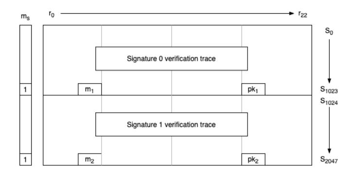
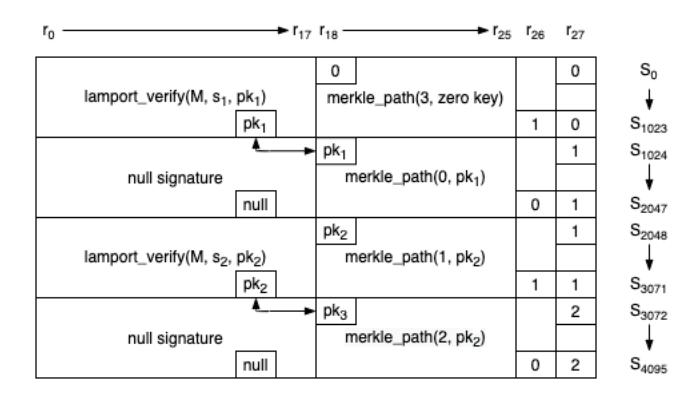
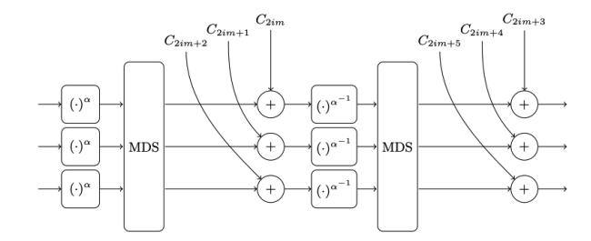
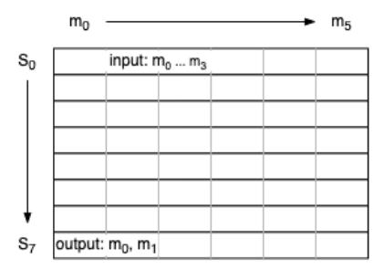
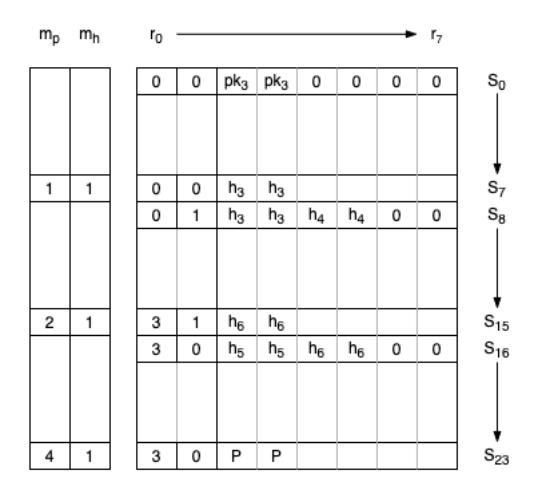

# Aggregating and thresholdizing hash-based signatures using STARKs

Irakliy Khaburzaniya Polygon/Meta irakliy81@gmail.com

> Kevin Lewi Meta klewi@fb.com

Kostantinos Chalkias Meta chalkiaskostas@gmail.com

Harjasleen Malvai UIUC / IC3 hmalvai2@illinois.edu

#### **ABSTRACT**

This work presents an approach for compressing hash-based signatures using STARKs (Ben-Sasson et. al. 18). We focus on constructing a hash-based t-of-n threshold signature scheme, as well as an aggregate signature scheme. In both constructions, an aggregator collects individual one-time hash-based signatures and outputs a STARK proof attesting that the signatures are valid and meet the required thresholds. This proof then serves the role of the aggregate or threshold signature. We demonstrate the concrete performance of such constructions, having implemented the algebraic intermediate representations (AIR) for them, along with an experimental evaluation over our implementation of the STARK protocol.

We find that, even when we aggregate thousands of signatures, the final aggregated size ranges between 100KB and 200KB. This makes our schemes attractive when there exist at least 50 one-orfew-times hash-based signatures – such as in the blockchain setting. We also observe that for STARK-based signature aggregation, the size of individual signatures is less important than the number of hash invocations and the complexity of the signature verification algorithm. This implies that simple hash-based signature variants (e.g. Lamport, HORST, BPQS) are well-suited for aggregation, as their large individual signatures serve only as witnesses to the ZKP circuit and are not needed for aggregate signature verification.

Our constructions are directly applicable as scalable solutions for post-quantum secure blockchains which typically employ blocks of hundreds or thousands of signed transactions. Moreover, stateful hash-based one-or-few-times signatures are already used in some PQ-ready blockchains, as address reuse is typically discouraged for privacy reasons.

#### ACM Reference Format:

Irakliy Khaburzaniya, Kostantinos Chalkias, Kevin Lewi, and Harjasleen Malvai. 2022. Aggregating and thresholdizing hash-based signatures using STARKs. In *Proceedings of the 2022 ACM Asia Conference on Computer and Communications Security (ASIA CCS '22), May 30-June 3, 2022, Nagasaki, Japan.* ACM, New York, NY, USA, 15 pages. https://doi.org/10.1145/3488932. 3524128

Permission to make digital or hard copies of all or part of this work for personal or classroom use is granted without fee provided that copies are not made or distributed for profit or commercial advantage and that copies bear this notice and the full citation on the first page. Copyrights for components of this work owned by others than the author(s) must be honored. Abstracting with credit is permitted. To copy otherwise, or republish, to post on servers or to redistribute to lists, requires prior specific permission and/or a fee. Request permissions from permissions@acm.org.

ASIA CCS '22, May 30-June 3, 2022, Nagasaki, Japan

© 2022 Copyright held by the owner/author(s). Publication rights licensed to ACM. ACM ISBN 978-1-4503-9140-5/22/05...\$15.00 https://doi.org/10.1145/3488932.3524128

# 1 INTRODUCTION

Aggregate and threshold signature schemes are important cryptographic primitives with real-world applications ranging from Public Key Infrastructure (PKI) to blockchains. Roughly speaking, in an aggregate signature scheme, signatures over unrelated messages that are signed individually by different parties are combined into a single signature. In a threshold signature scheme, t out of n parties sign a single message M, and the resulting signature stands in as the signature of all n parties over M.

Of particular interest are schemes where these resulting signatures are *succinct* (poly-logarithmic in the number of individual signatures) and the amount of interaction between signers is minimal. Schemes with minimal interaction are called *one-round* or *non-interactive*. In these non-interactive constructions, a single party (not necessarily one of the signers), usually called the *aggregator*, collects signatures from individual signers and combines them into a single short aggregate or threshold signature. No other interaction is needed.

As discussed in Sec. 1.2, both aggregate and threshold signatures can be constructed as extensions from a variety of popular choices, including: Schnorr signatures, BLS signatures, and others. Of these, pairing-based signatures stand out as the only ones yielding both succinct and non-interactive aggregate and threshold schemes.

**Scaling signatures for blockchains.** There are two primary ways in which digital signatures are used in blockchains today:

- To sign transactions authorizing transfer of funds between accounts. For example, a single Bitcoin block may contain over 2, 500 ECDSA signatures [12], while in some high throughput blockchains, each block may contain upward of 25,000 signatures [43]. Each of these signatures is a one-time-signature and needs to be included in a block. This forms the motivation for aggregate signatures over distinct messages, to compress the footprint of the blockchain.
- In Byzantine Fault Tolerant (BFT) consensus systems, a subset of validators needs to sign the same message to agree on the latest state of the system, and their signatures must be stored on chain. In practical settings, the number of validators could be in the hundreds or even thousands [29]. This informs the need for threshold signatures.
- In particular, compressing the size of threshold signatures allows light clients to verify the evolution of the blockchain, without introducing additional, non-cryptographic trust assumptions. While some work addresses this problem [32], it

remains open in the post-quantum setting. Even bootstrapping regular blockchain clients is becoming increasingly challenging due to the large size of blocks. Aggregating blocks solves this problem.

In both cases, the ability to non-interactively compress thousands of signatures, both with and without thresholds, is instrumental to solving blockchain scalability challenges. Moreover, the blockchain context imposes additional requirements on potential aggregate and threshold signature schemes: public keys of individual signers must be small, and aggregate/threshold signatures must be fast to verify. Small keys are important because even if the signatures are compressed, individual public keys must still be stored on-chain. Fast verification is important because the compressed signatures need to be verified in a variety of settings, including devices with limited capabilities (i.e., light clients).

Note that this setting requires aggregation/thresholdizing to be performed only once, by any third party service which can obtain the individual signatures. Given that providing services to light clients has already proved a viable business model, it is not unreasonable to predict that signature aggregation/thresholdizing for light clients would too. In fact, various (well-funded) businesses already exist [40, 47, 49], which provide zero-knowledge-based solutions for blockchains, including running servers for heavy-weight computations. So, even the need for relatively powerful machines for aggregating/thresholdizing signatures, does not seem to be a hindrance to adoption.

Finally, given the rising threat of quantum computing and the attacks enabled by them against elliptic curve (EC) based signatures, the blockchain community has an increased interest in exploring the implementation of cryptographic primitives that are not as susceptible to quantum adversaries. Due to their information theoretic security guarantees, hash-based signatures make good candidates for long-lasting, post-quantum blockchains, but so far, the absence of practical threshold and aggregate constructions have hindered their wider adoption. To the best of our knowledge, there are currently no signature schemes which meet all of the above requirements: succinctness, non-interactivity, and resistance to quantum attacks. However, a general methodology for constructing such a scheme is well-known: one can use a general-purpose zero-knowledge proof (ZKP) system to generate a proof attesting that a set of signatures is valid and/or meets the required threshold. In fact, these techniques have already been applied in practice to EC-based signatures [32].

In this work, we present the first practical construction and concrete implementation of using a post-quantum ZKP to compress hash-based signatures, which are inherently more resistant to quantum attacks. Although the idea of using ZKPs for compression is not new, in practice these techniques are straightforward neither to implement nor evaluate for concrete performance statistics. We show how to make existing one-time hash-based signatures STARK-friendly by employing optimized encoding techniques. We provide concrete results as well as an open-source framework for performing efficient signature compression that is resistant against quantum attacks. We believe that our work can form the basis of reusing the proposed aggregated and threshold one-time signature gadgets for more complex many-times hash-based signature

schemes (if required), when a zero knowledge proof friendly hash function, such as Rescue[3], is applied. Specifically, all of the presented algorithms are available in our open-sourced [6] STARK library for arbitrary computations, which will hopefully help the community on benchmarking, reusing and modifying the proposed *multi* and *threshold* hash-based signatures via STARK [8] proofs.

Note that while recent work [33] has provided general purpose virtual machines for STARKs, it is well-known that hand optimized representations of STARK programs are significantly more performant. Yet, writing special purpose representations of programs for STARKs programs remains challenging. Writing algrebraic intermediate representations (AIRs) for these constructions is, hence, a useful contribution of this work. We hope that our work will provide useful examples for others in the community.

#### 1.1 Overview of Our Constructions

Our constructions of aggregate and threshold signatures are built using a combination of hash-based signatures and a STARK protocol. In both constructions, individual signers sign messages using a regular hash-based signature scheme, and an aggregator uses the STARK to compress individual signatures into a single succinct proof.

Our aggregate signature scheme is described in Sec. 4, and the threshold scheme is described in Sec. 5. In both cases, aggregate signature sizes are logarithmic in the number of individual signatures, with practical output sizes between 100KB and 200KB. This makes our schemes especially attractive when aggregating over 50 individual signatures. The signature verification is fast (i.e., 5 ms), but the aggregation may require significant time and/or processing power. We provide evaluation of concrete results in Sec. 6.

Our constructions can be immediately applicable to post-quantum resistant blockchains deployed today [31] without requiring users to update their existing private keys. Many of these blockchains use stateful and one-or-few times hash-based signature schemes, resulting in individual signatures of  $\sim$ 2KB in the best case. For example, Quantum Resistant Ledger [51] uses XMSS (recommended by NIST in SP 800-208 [26]) and WOTS+ [20], IOTA [46] depends on a custom hash-based signature called Kerl (based on Keccak, with conversion to ternary) and implements WOTS, and finally Corda [18] supports Sphincs [11] and explores BPQS [22], a blockchain friendly XMSS variant, that starts as one-time, but can be extended to a many-times scheme only when required.

Hash-based signatures. For our underlying signature scheme, we present a one-time signature (OTS) scheme, Lamport+ which is described in detail in Sec. 3 and based on Lamport's original one-time signatures. The primary motivation for using Lamport+ is its efficient encoding in ZKP systems. Our instantiation of plain Lamport+ has 32-byte public keys, produces 8KB signatures, and targets 123 bits of security. We also provide an optimized Lamport+ version applying a "mining" technique to the message hash to be signed, which allows targeting 127 bits of security.

**Extending to many-time signatures.** While Lamport+ is designed to be an OTS scheme primarily to minimize implementation complexity, it is possible to replace it with a many-time hash-based signature scheme at the expense of a slight increase in ZKP circuit

complexity and aggregate signature generation time. After all, Lamport/WOTS variants are the building blocks of many-time schemes like Sphincs [11] and XMSS [20].

STARKs. For the ZKP system used to combine individual hash-based signatures into a single aggregate or threshold signature, we employ STARKs [8]. The primary motivation is that this scheme is hash-based and hence secure against quantum attacks [24]. Although post-quantum security is not unique to STARKs, they yield the best concrete efficiency of all known alternatives [4, 9, 25], especially in terms of proof verification times.

In this work, we do not cover the details of the STARK protocol itself(see for e.g. [8] for more details); however, we provide descriptions of arithmetizations for all computations involved in STARK proof generation. Arithmetization in STARKs consists of defining an intermediate algebraic representation (AIR) for a computation. STARKs are especially performant when proving computations which have a large number of repeated operations. However, translating computations into efficient AIRs is non-trivial, and we anticipate that our presentation of AIRs will motivate developers to using STARKs.

Moreover, we have implemented a fully-featured and performant STARK prover and verifier in Rust, and open-sourced our implementation under the MIT license [6]. In addition to the STARK prover and verifier, our open-source Github repository contains examples of all AIRs described in this work.

#### <span id="page-2-0"></span>1.2 Related Work

Currently some of the most popular signature schemes in both literature and practice include the elliptic curve based ECDSA and EdDSA (or other Schnorr variants), RSA, pairing-based schemes such as BLS, and the many post-quantum (PQ) algorithms proposed in NIST's PQ standardization process i.e., based on hash functions or lattices [1]. Various research efforts have focused on extending the original schemes by supporting faster batch verification, shorter aggregated signatures over the same or different messages and threshold schemes. Two of the most common metrics include signature compression rate and rounds of interactivity, ideally offering a non-interactive solution where signers do not need to engage in any type of communication between them to output a compressed aggregated signature.

Regarding ECDSA, to the best of our knowledge schemes for non-interactive aggregation don't exist, mainly due to the modular inversion involved [41]. Similarly, in RSA the modulus N is different between users, which makes interactivity essential [15]. Aggregating Schnorr-based schemes requires various additional steps such as distributed key generation (DKG) or at least one round of interaction (see, for example [37]). A promising work is that of Musig2 [44], which can support pre-processing of all but the first round, but this still cannot work for blockchain users, since they do not engage in a setup protocol. Two other interesting approaches include the recent non-interactive EdDSA half-aggregation [23] and  $\Gamma$ -signatures [52] (a Schnorr variant), where both achieve 50% signature compression. Of these schemes, BLS aggregation is most notable for its efficiency and the fact that third parties can aggregate public keys as well as signatures. In other words, no interaction

between individual signers is needed. Unfortunately though, all of the above are not PQ-secure.

Recent works construct post-quantum aggregatable signature schemes relying on lattice-based assumptions [13, 30, 45], but also require a setup step such as DKG or an interactive protocol to generate aggregated keys. A few schemes including MMSAT [28], the scheme of Boneh and Kim [16] and that of Boudgoust and Roux-Langlois [17] are aggregatable and don't require setup. These are based on the random oracle model (ROM) and the Short Integer Solution (SIS) problem. In particular, [17] is based on the well-studied Module SIS and Module LWE assumptions. None of [16, 17, 28] provides a threshold signature scheme. Further, the aggregate signatures of [28] grow linearly in the number of parties, even though the constant is small. Various post-quantum constructions for ring and group signatures have also been proposed using lattices [50] as well as the ROM [36]. However, we are not aware of efficient aggregatable constructions for hash-based post-quantum schemes, (e.g. XMSS [20], Sphincs [11], BPOS [22]), although there exist STARK-based signature schemes (e.g. Ziggy [48]), which, with recursive STARKs might be efficiently aggregated; although as far as we know, such a construction has been mentioned in webinars [7], but not yet been published or standardized.

# <span id="page-2-1"></span>2 PRELIMINARIES

#### 2.1 STARKs Protocol

We define a STARK protocol as a tuple of three algorithms STARK = (Setup, Prove, Verify) as follows:

- pp  $\leftarrow$  STARK.Setup(1 $^{\lambda}$ , Prog): Takes in the security parameter  $\lambda$ , and the description of a Prog. $\{0,1\}^* \rightarrow \{0,1\}$  and outputs public parameters pp.
- π ← Prove(pp, stmt, w): Takes in the public parameters, a statement stmt, witness w, such that Prog(stmt||w) = 1 and outputs a proof π.
- b

We also assume that STARK.Setup is *transparent*, meaning that it relies only on public randomness and satisfies standard security definitions for SNARKs including completeness and knowledge soundness (also known as knowledge extraction). We defer to the literature for more details (e.g. see [4, 8, 9, 25, 38]).

<span id="page-2-2"></span>**STARK parameters.** Our instantiation of the STARK protocol uses parameters shown in Table 1. For the base field we use a 128-bit prime field with modulus  $q = 2^{128} - 45 \cdot 2^{40} + 1$ . This choice is motivated by the following factors:

- (1) Modern CPUs can perform arithmetic operations with 128bit integers relatively efficiently, and Rust has native support for u128 integer type.
- (2) This specific field is STARK-friendly as it has high-order roots of unity. (specifically, 2<sup>40</sup> roots of unity).
- (3) This specific field allows computing roots of 5th power, i.e., (M − 1) mod 5 ≠ 0. This is required for our instantiation of Rescue hash function.

<span id="page-3-0"></span>

| Security level   Base field |          | Blowup factor | Query count | Grinding factor | Folding factor | Hash function |  |
|-----------------------------|----------|---------------|-------------|-----------------|----------------|---------------|--|
| 96 bits                     | 128 bits | 8             | 27          | 16              | 8              | BLAKE3        |  |
| 123 bits                    | 128 bits | 8             | 34          | 22              | 8              | BLAKE3        |  |

Table 1: STARK parameters for 96-bit and 123-bit security levels using the same base field. For 96-bit security level, output of BLAKE3 hash function is truncated to 24 bytes to provide up to 96-bit collision resistance. For 123-bit security level, FRI protocol must be run in a quadratic extension of the base field.

# 2.2 Algebraic Intermediate Representation (AIR)

Arithmetization is the reduction of computational statements to a set of algebraic statements involving a set of bounded-degree polynomials. In the STARK protocol, the output of arithmetization is an Algebraic Intermediate Representation of a computation. Formal definition of AIR is provided in [8], but informally, AIR consists of the following three elements:

- (1) execution trace which is a two-dimensional matrix, in which each row represents the state of the computation at a single point in time and each column corresponds to an algebraic register tracked over all steps of the computation. Let T denote the execution trace matrix.
- (2) transition constraints which define algebraic relationships between two (or more) rows of the execution trace.
- (3) boundary constraints which enforce equality between certain cells of the execution trace and a set of constant values. Boundary constraints can be thought of as defining a set of input and output values for the computation.

**Execution trace.** Denote m as the width of the execution trace and n as the number of steps in the execution trace, i.e. T is an  $m \times n$  matrix. We define the *register trace* of a register k as the polynomial interpolation  $f_k$  of the set  $\{(\omega^i, T[i][k]) | i \in [0, n)\}$ , where  $\omega$  is a generator of a multiplicative subgroup of size n in the base field specified for an instantiation of a STARK protocol. The set  $\{f_k | k \in [0, m)\}$  is called the set of *trace polynomials*.

Notice that if  $f_k(x)$  is the value in the execution trace matrix in column k and row i, then  $f_k(x \cdot \omega)$  is the value in k at step i + 1.

For efficient execution of the STARK protocol, n must be a power of two. This allows us to use FFT-based polynomial evaluation and interpolation, which have the complexity of  $O(n \log n)$  Thus, the base field for the STARK protocol must be 2-smooth<sup>1</sup>, which indeed is the case for out selected field with modulus  $q = 2^{128} - 45 \cdot 2^{40} + 1$ .

In addition to registers of the execution trace, we also use *periodic registers* (also called *periodic columns*), which are not included in the execution trace but can be referenced in transition constraints. Periodic columns are typically used in STARKs to encode a small set of values which can be represented by succinct polynomials of size much smaller than *n*. One example is a register where values repeats in a cycle and the length of the cycle is a power of two.

**Constraints.** Both boundary and transition constraints are defined by rational functions of the form:

$$\frac{p(x)}{z(x)}$$

where, p(x) defines the constraint relationship, and z(x) defines the constraint domain (a set of steps at which the constraint should hold). This constraint is said to hold if the polynomial z divides the polynomial p.

For boundary constraints, p(x) has the following form:

$$p(x) = c(f_k(x))$$

where,  $f_k(x)$  is the trace polynomial for register k against which the constraint is enforced. For example, to specify that the value in the first column of the first row in the execution trace must be 1, we could use the following constraint:

$$\frac{f_0(x)-1}{x-1}$$

Similarly, to specify that the value in the 7th row of the second column must be 987, we could use the following constraint:

$$\frac{f_1(x) - 987}{x - \omega^7}$$

For transition constraints, c(x) has the following form:

$$p(x) = c(\{f_0(x), ..., f_{m-1}(x)\}, \{f_0(x \cdot \omega), ..., f_{m-1}(x \cdot \omega)\})$$

that is, c(x) is a function of all register values in two consecutive steps of a computation. For example, the following constraint enforces that a value in the first register of the execution trace must be incremented by 1 at every step:

$$\frac{f_0(x \cdot \omega) - (f_0(x) + 1)}{\prod_{i=0}^{n-1} (x - \omega^i)}$$

Additionally, since trace polynomials are evaluated over a multiplicative subgroup of a field, the denominator of the constraint above can be expressed succinctly, and the constraint can be rewritten as:

$$\frac{f_0(x\cdot\omega)-\left(f_0(x)+1\right)}{x^n-1}$$

Below, we describe transition constraints using the notation c(x) for  $(x^n - 1)/(x - \omega^{n-1})$ , as the denominator for all transitions constraints is the same. This denominator specifies that transition constrains should hold on all but the last steps of the execution trace. The degree of a transition constraint is defined as deg(c(x)).

#### 2.3 Accumulators

Accumulators are well-studied cryptographic primitives used for committing to sets and verifying set membership and non-membership. In particular, we denote an accumulator protocol ACC = (ACC.Setup, ACC.Eval, ACC.WitCreate, ACC.Verify) and require it to be a secure *static* accumulator as defined in Definition 5 of [27].

<span id="page-3-1"></span> $<sup>^1</sup>$ A field is k-smooth if it contains a subgroup (multiplicative or additive) all of whose prime divisors are at most k. For example, a prime field of size q such that q-1 is divisible by a large power of 2, is 2-smooth.

**Accumulator for** Lamport+ **public key.** For the purpose of constructing a Lamport+ public key, we construct ACC using a linear accumulator with minor modifications. Specifically, in a standard linear accumulator, given a random oracle  $\mathcal{H}$  and a set of n elements S, ACC.Eval( $\mathcal{H}, S$ ) outputs a commitment to S as  $\mathcal{H}(s_0||s_1||...||s_{n-1})$  where  $s_i \in S$ . However, in our instantiation, ACC.Eval( $\mathcal{H}, S$ ) outputs  $\mathcal{H}(s_0||s_n/2||s_1||s_n/2+1||...||s_n/2-1||s_{n-1})$ . We call this construction a "zig-zag" accumulator. This construction allows us to simplify the design of AIR for Lamport+ signature verification. Specifically, using zig-zag accumulator, we are able to absorb public sub-keys for message bits which are 128 bits apart in a single execution trace step. This, in turn, allows us to verify sub-keys for both message elements in parallel, with no extra computational overhead.

**Accumulator for key aggregation.** In our implementation, we construct ACC using a Merkle Tree in the standard way i.e., given a random oracle  $\mathcal{H}$ , each of the leaves is a binding commitment to the elements of a set S, and the output of ACC.Eval( $\mathcal{H}$ , S) is root, the root of the Merkle tree. Correspondingly, the output of ACC.WitCreate( $\mathcal{H}$ , root, x) for some  $x \in S$  is the Merkle Tree path to the commitment to x and the opening to that commitment. Ultimately, this implies that the proofs of membership for a set S are logarithmic in |S|.

# <span id="page-4-0"></span>3 Lamport+: THE MODIFIED WOTS SIGNATURE SCHEME

A majority of recent work focuses on stateless many-times hash-based signatures, optimized for both short public keys and signatures. This leads to compromises in efficiency, mainly for key generation and signing. To optimize instead, for the blockchain context and signature aggregation using STARKs, we arrive at the following desiderata: (1) short public keys, ideally one 32-byte hash element; (2) small and easy to implement circuits, optimized for AIR; (3) the fewest possible hash invocations during verification.

The size of the signature is not our primary focus, because the aim of this work is for a powerful prover to aggregate signatures using STARKs and thus, the sizes of the original signatures do not have a bearing on the bandwidth of the end verifier. For this reason, for our proof-of-concept, we use the simplest version of the Winternitz one-time signature (WOTS) [35], which we call Lamport+. For the hash function, we use Rescue, for which no quantum attacks are known and which has a very efficient AIR, which we describe in App. A. We also note that OTS is a powerful primitive used in building most hash-based many-time signatures. Instantiated with the Rescue hash-function, the final Lamport+ algorithm outputs signatures of about 8KB ( $254 \times 32B$  hash elements).

Our proof of concept implementation is based on an OTS algorithm we will refer to as Lamport+, a checksum-based OTS proposed by Merkle (section 4 in [42]) which happens to be an instance of WOTS using w=2 as the Winternitz parameter. We picked this scheme to minimize the number of hash invocations, which otherwise would a) complicate the AIR representation of the algorithm and b) result to slower proof generation. The major difference against the naive Lamport OTS is that instead of requiring two keys per bit, one for the "0" bit and one for the "1" bit, we can by convention only sign the set bits of the signed message. This cuts

the public and secret key sizes in half, while maintaining the same number of hash invocations with the original Lamport scheme. However, an extra checksum is required to prevent an adaptive chosen message attack where adversaries can just flip set bits to "0". The checksum is nothing more than the total number of zero bits in the original message.

#### 3.1 Formal construction

Let M be a bit-string that represents the message of length m to be signed and  $G: \{0,1\}^* \to \{0,1\}^m$  be a hash function in the ROM. The public parameters are pp =  $(pp_{ACC}, G, m)$ , where  $pp^{acc}$  is the public key for an accumulator as described in Sec. 2. The Lamport+construction LP = (LP.KeyGen, LP.Sign, LP.Verify) is defined as:

- (priv, pub)  $\leftarrow$  LP.KeyGen(pp; r). Given the public parameters pp and randomness r as inputs, KeyGen computes the private key, which consists of n = m + log(m) bit-strings of length m chosen randomly from a uniform distribution<sup>2</sup>. For  $i \in [0, n)$  compute a list of tuples ( $pr_i, pb_i = G(pr_i)$ ). Each  $pb_i$  corresponds to the sub-public-key for each the message-hash bit  $m_i$  to be signed. Optionally, we can derive the final public key as pub  $\leftarrow$  ACC.Eval( $pp_{ACC}, \{pb_0, \dots, pb_{n-1}\}$ ) and output (priv, pub). The latter is a commonly used practice in hash-based schemes to compress sub-public-keys into a single short value.
- sig ← LP.Sign(pp, M, priv). On inputs public parameters pp, message M and private key priv, expand the private key to the list of tuples (pri, pbi) similarly to KeyGen <sup>3</sup>.
  Count the number of zeros on the message's m bits (this is the Winternitz checksum) and append this number to M representing it with [log(m)] bits, which will result to a n bit length bit-string. We call the resulted n-sized bitstream as m'. Compute the signature as follows: For i ∈ [0, n) if m'<sub>i</sub> = 1 append pr<sub>i</sub> to sig, else append pb<sub>i</sub>. Output sig, which is a list of size n of m-sized elements.
- $z \leftarrow \text{LP.Verify}(\mathsf{pp}, M, \mathsf{pub}, \mathsf{sig})$ . On input the public parameters  $\mathsf{pp}$ , the signed message M, the public key  $\mathsf{pub}$  and the signature sig, compute m' similarly to Sign and execute the following logic:  $x \leftarrow \mathsf{For}\ i \in [0,n)$  if  $m'_i = 1$  append  $\mathsf{G}(\mathsf{sig}_i)$  to x, else append  $\mathsf{sig}_i$ . The verify algorithm outputs the bit  $z \leftarrow \mathsf{pub} == \mathsf{ACC.Eval}(\mathsf{pp}_{ACC}, \{x_0, \ldots, x_{n-1}\})$ .

**Security intuition.** As already mentioned, Lamport+ is a WOTS instance for w=2 (Winternitz parameter). Buchmann et al. [19] present and prove the security of the WOTS signature scheme. In particular, they include the definition for security of a one-time signature as existential unforgeability under chosen message attacks (EU-CMA), where the attacker has access to a signing oracle but makes only one query. Under the assumption that the used hash function is a PRF, they show that a EU-CMA adversary has negligible advantage, which inherently applies to Lamport+ too. **Compression via mining without security loss** Note that it is possible to further compress the input message to less than m bits and still maintain the security level at m/2 (collision resistance)

as proposed in [21]. That would allow for reducing the size of n,

<span id="page-4-2"></span><span id="page-4-1"></span> $<sup>^2</sup>$ It's a common practice to use a key derivation function instantiated using a random oracle to generate all of the sub-private-key parts with a single seed, such as HKDF [39].  $^3$ In practice we do not need all of the  $(pr_i, pb_i)$  pairs, but only those  $pb_i$  required.

which effectively means less sub-key tuples. Briefly, it is a common practice to sign hashes of the message, which makes sense especially when the message is larger than m bits. The algorithm applies the following "mining" technique to any Lamport or WOTS based scheme: instead of directly using the output of G(M), we could apply an extra HMAC  $H': (\{0,1\}^*,\{0,1\}^*) \to \{0,1\}^{m'}$ , with inputs the M and a counter c. In fact, we retry HMACing (mining) as  $h_m = H'(M, c_1)$ , for a counter c starting from 0, until  $h_m$  starts with k zero bits. Then an application can completely omit the prefix zero-bits and only accept inputs of size m'. Although this reduces the message space, the pre-image and collision resistance do not change, essentially like proof-of-work. The verifier could either try the same mining technique or signers can just attach the counter c to the signature and the verifier will verify (outside the STARK proof) that  $h_m = H'(M, c)$  starts with k zero bits.

# <span id="page-5-1"></span>3.2 Signature verification AIR

LP. Verify procedure, as it is described above, is not particularly "AIR-friendly", neither from the standpoint of circuit design complexity, nor from the standpoint of STARK proof generation complexity. Therefore, we make several adjustments to the original procedure to make it more AIR-friendly.

First, we set hash function G to Rescue-Prime (see App. A). In our instantiation, G accepts a sequence of 128-bit field elements as input, and outputs a hash which is represented by a tuple of 128-bit field elements . This means that all sub-keys  $pr_i$  must be tuples of valid field elements, and thus, we augment the key generation procedure to output tuples of field elements rather than bit strings for  $pr_i$ . This naturally implies that sub-keys  $pb_i$  are also represented by tuples of field elements since  $pb_i = G(pr_i)$ , and G outputs a tuple of field elements as mentioned above.

Second, as described above, LP. Verify accepts message M as a bit string and reduces it to a value h', and then verifies the signature against this value. For AIR-friendly version, we need h' to be a tuple of field elements. However, performing this reduction inside a STARK is expensive. Thus, to minimize complexity of AIR for LP. Verify, we break it into two parts. The first part consists of reducing M to a tuple of field elements  $h' = (m_0, m_1)$  and is done outside of the ZKP circuit (this also includes computing message checksum). The second part verifies the signature against  $(m_0, m_1)$ , and requires at most 381 invocations of hash function G.

Alg. 1 provides a high-level description of an AIR-friendly version of LP.Verify procedure. The algorithm receives pre-processed message  $(m_0, m_1)$  and a public key pub (which is also represented by a tuple of field elements) as public inputs. The signature, as well as arrays with binary decompositions of  $m_0$  and  $m_1$  in little-endian byte order, are passed in as a private witness.

With each iteration of the loop, the algorithm consumes two bits from the message bit arrays (one bit from  $m_0$  and another bit from  $m_1$ ), accumulates these bits in accumulators  $m_0^{\rm acc}$  and  $m_1^{\rm acc}$ , and based on the values of these bits, updates public key accumulator  $pub^{\rm acc}$ . Specifically, when a message bit at position i is one,  $G(sig_i)$  is added to the accumulator; otherwise,  $sig_i$  is added to the accumulator.

The program outputs *true*, iff values of all accumulators are equal to the corresponding values passed in via public inputs. This

ensures that signature verification passes only if a valid signature over the message represented by  $(m_0, m_1)$  was passed in via the private witness.

#### <span id="page-5-0"></span>Algorithm 1 AIR-friendly variant of LP.Verify

```
inputs: m_0, m_1, pub
witness: m_0[], m_1[], sig[]
m_0^{\rm acc} \leftarrow 0, m_1^{\rm acc} \leftarrow 0
pub^{acc} \leftarrow new\_hasher()
for i in 0..128 do
      \begin{aligned} m_0^{\mathsf{acc}} &\leftarrow m_0^{\mathsf{acc}} + m_0[i] * 2^i \\ m_1^{\mathsf{acc}} &\leftarrow m_1^{\mathsf{acc}} + m_1[i] * 2^i \end{aligned}
      if m_0[i] == 1 then
            pub^{acc} \leftarrow pub^{acc}.update(hash(sig[i]))
      else
            pub^{acc} \leftarrow pub^{acc}.update(sig[i])
      end if
      if m_1[i] == 1 then
            pub^{\mathrm{acc}} \leftarrow pub^{\mathrm{acc}}.update(hash(sig[i + 128]))
            pub^{\mathrm{acc}} \leftarrow pub^{\mathrm{acc}}.update(sig[i+128])
      end if
pub^{\mathrm{acc}} \leftarrow pub^{\mathrm{acc}}.finalize()
return m_0 == m_0^{\text{acc}} \&\& m_1 == m_1^{\text{acc}} \&\& pub = pub^{\text{acc}}
```

In our implementation, AIR for the program described in Alg. 1 works over an execution trace of 22 registers and 1024 steps. The highest degree of transition constraints is 6. The registers are grouped into three logical groups:

- (1) Message accumulators: 4 registers for computing  $m_0^{\rm acc}$  and  $m_1^{\rm acc}$  values.
- (2) Signature element hashing: 12 registers for computing  $G(sig_i)$ . Here, we use 12 registers because we hash two signature elements in parallel:  $sig_i$  and  $sig_{i+128}$  for all  $i \in \{0..128\}$ , and each hash requires 6 registers to compute.
- (3) Public key accumulator: 6 registers for computing the value of pub<sup>acc</sup>.

Each of these groups and corresponding transition constraints are described in detail in the following sections.

The length of the execution trace is 1024 steps because for every consumed pair of message bits, we compute hashes of corresponding signature elements. As described in App. A, in our implementation, the AIR for a single invocation Rescue-Prime hash function requires an execution trace of 8 steps long. Thus, for each pair of message bits we need to add 8 steps to the execution trace, and since the total number of bit pairs is 128, we arrive at 1024 total steps.

Our AIR also relies on several periodic columns, two of which are of particular importance:

- Column  $m_h$  encodes a pattern of values which specifies that every  $8^{th}$  step, starting with step 7,  $m_h = 1$ . For all other steps  $m_h = 0$ . This column is used to simulate rudimentary control flow.
- Column  $m_p$  contains increasing powers of two incremented every 8 steps. For example, for the first 8 steps,  $m_p = 2^0$ ,

for the following 8 steps,  $m_p = 2^1$ , for the following 8 steps  $m_p = 2^2$  etc. This column is used by message accumulators.

A simplified schematic of a trace for verifying a signature over a 6-bit message is shown in Fig. 1.

**Message accumulators.** Registers  $\{r_0, ..., r_3\}$  bind the execution trace to the message over which the signature is being verified. Recall that in our case, a message is represented by two elements in a 128-bit field:  $m_0$  and  $m_1$ . Registers  $r_2$  and  $r_3$  contain binary decompositions of  $m_0$  and  $m_1$  respectively, in little-endian byte order such that new bits are inserted into the registers every 8 steps. Registers  $r_0$  and  $r_1$  contain accumulated values of  $m_0$  and  $m_1$  at a given step of the execution trace, such that by the end of the trace,  $r_0 = m_0$  and  $r_1 = m_1$ .

The accumulation is performed as follows: on every  $8^{th}$  step of the computation, the value of register  $r_2$  is multiplied by the value of  $m_p$ , which contains powers of two incremented every 8 steps as described previously. The result is then added into the register  $r_0$ . The same computation is applied to registers  $r_1$  and  $r_3$ . We perform these computations on every  $8^{th}$  step because intermediate steps are needed for Rescue hash computations in other registers, and all registers must have the same number of steps. This effectively "wastes" most of the cells in registers  $r_0$ ,  $r_1$ ,  $r_2$ , and  $r_3$ , however, this is a small penalty to pay for the simplicity of resulting AIR.

Denoting  $r_i$  to be the value of register i at the current step of the computation, and  $r'_i$  to be the value of register i at the next step of the computation, transition constraints for registers  $\{r_0, ..., r_3\}$  are:

$$r_2^2 - r_2 = 0 (1)$$

$$r_3^2 - r_3 = 0 (2)$$

$$r_0' - (r_0 + m_h \cdot m_p \cdot r_2) = 0 \tag{3}$$

$$r_1' - (r_1 + m_h \cdot m_p \cdot r_3) = 0$$
 (4)

The first two constraints enforce that values in registers  $r_2$  and  $r_3$  must be binary (0 or 1). Constraint (3) enforces that when  $m_h = 1$  (which happens on every  $8^{th}$  step), the current value of  $r_2$  is accumulated into  $r_0$ , otherwise, the value of  $r_0$  remains the same. Constraint (4) does the same for registers  $r_1$  and  $r_3$ .

**Signature element hashing.** Registers  $\{r_4, ..., r_9\}$  and  $\{r_{10}, ..., r_{15}\}$  are used to hash signature elements corresponding to 1 bits of the message (the  $pr_i$  elements). Registers  $\{r_4, ..., r_9\}$  do this for elements corresponding to bits 0...127 of the message, while registers  $\{r_{10}, ..., r_{15}\}$  do this for elements corresponding to bits 128...254.

The hashing is performed as follows: on every  $8^{th}$  step of the execution trace, starting with step 0, if the corresponding message bit is 1, a new signature element is copied into registers  $\{r_4, r_5\}$  and  $\{r_{10}, r_{11}\}$ , and all other registers are set to zeros. If message bit is 0, zeros are inserted into all registers, though this will not be enforced via constraints. On all other steps, Rescue-Prime round function is applied. The effect of this is that on the last step of each 8-step cycle, registers  $\{r_4, r_5\}$  and  $\{r_{10}, r_{11}\}$  will contain  $pb_i = G(pr_i)$ , iff corresponding message bits were set to 1.

Using  $r_i$  and  $r'_i$  notation as in the previous section, and denoting  $resc_i$  to be a function which computes transition constraints for a single round for Rescue-XLIX permutation for hash state element i,

we define transition constraints for registers  $\{r_4, ..., r_{15}\}$  as follows:

$$(1 - m_h) \cdot resc_0(r_4, r_4') = 0 \tag{5}$$

$$(1 - m_h) \cdot resc_1(r_5, r_5') = 0 \tag{6}$$

$$m_h \cdot r_6' + (1 - m_h) \cdot resc_2(r_6, r_6') = 0$$
 (7)

$$m_h \cdot r_7' + (1 - m_h) \cdot resc_3(r_7, r_7') = 0$$
 (8)

$$m_h \cdot r_8' + (1 - m_h) \cdot resc_4(r_8, r_8') = 0$$
 (9)

$$m_h \cdot r_0' + (1 - m_h) \cdot resc_5(r_9, r_0') = 0$$
 (10)

$$(1 - m_h) \cdot resc_0(r_{10}, r'_{10}) = 0 \tag{11}$$

$$(1 - m_h) \cdot resc_1(r_{11}, r'_{11}) = 0 \tag{12}$$

$$m_h \cdot r'_{12} + (1 - m_h) \cdot resc_2(r_{12}, r'_{12}) = 0$$
 (13)

$$m_h \cdot r'_{13} + (1 - m_h) \cdot resc_3(r_{13}, r'_{13}) = 0$$
 (14)

$$m_h \cdot r'_{14} + (1 - m_h) \cdot resc_4(r_{14}, r'_{14}) = 0$$
 (15)

$$m_h \cdot r'_{15} + (1 - m_h) \cdot resc_5(r_{15}, r'_{15}) = 0$$
 (16)

Constraints (5), (6), (11), (12) enforce that Rescue-XLIX round function is applied to registers  $r_4$ , ...,  $r_{11}$  whenever  $m_h = 0$ , but don't place any constraints on these registers when  $m_h = 1$ . The remaining constraints also enforce that Rescue-XLIX round function is applied to the corresponding registers when  $m_h = 0$ , but in addition specify that these registers should be set to zeros when  $m_h = 1$ .

**Public key accumulator.** Registers  $\{r_{16},...,r_{21}\}$  are used to accumulate  $pb_i$  elements into Lamport+ public key. The methodology is similar to the one used to hash private key elements described in the previous section, except for the following differences:

- The capacity portion of the state (registers r<sub>20</sub> and r<sub>21</sub>) is not reset on every 8<sup>th</sup> step. Instead, values of these registers are copied over to the next step when m<sub>h</sub> = 1. This means that every new set of pb<sub>i</sub> elements is absorbed into the sponge, and and a single result is squeezed out of the sponge on the last step of the computation.
- On every  $8^{th}$  step, if message bits are 1 (registers  $r_2$  and  $r_3$ ), hashes of the corresponding  $pr_i$  elements (register  $r_4$ ,  $r_5$ , and  $r_{10}$ ,  $r_{11}$ ) must be equal to the  $pb_i$  elements (register  $r_{16}$ ,  $r_{17}$ , and  $r_{18}$ ,  $r_{19}$ ) absorbed into the sponge of the public key hash.

This last set of constraints ties together different parts of the execution trace in such a way that trying to insert invalid values in one of the parts will invalidate constraints in another part.

Using the notations defined in the prior sections, we define transition constraints for registers  $\{r_{16}, ..., r_{21}\}$  as follows:

$$m_h \cdot r_2 \cdot (r'_{16} - r_4) + (1 - m_h) \cdot resc_0(r_{16}, r'_{16}) = 0$$
 (17)

$$m_h \cdot r_2 \cdot (r'_{17} - r_5) + (1 - m_h) \cdot resc_1(r_{17}, r'_{17}) = 0$$
 (18)

$$m_h \cdot r_3 \cdot (r'_{18} - r_{10}) + (1 - m_h) \cdot resc_2(r_{18}, r'_{18}) = 0$$
 (19)

$$m_h \cdot r_3 \cdot (r'_{19} - r_{11}) + (1 - m_h) \cdot resc_3(r_{19}, r'_{19}) = 0$$
 (20)

$$m_h \cdot (r'_{20} - r_{20}) + (1 - m_h) \cdot resc_4(r_{20}, r'_{20}) = 0$$
 (21)

$$m_h \cdot (r'_{21} - r_{21}) + (1 - m_h) \cdot resc_5(r_{21}, r'_{21}) = 0$$
 (22)

**Boundary constraints.** In addition to the transition constraints described above, we also define the following boundary constraints for the computation:

(1) Values in all registers except for  $r_2$ ,  $r_3$ ,  $r_4$ ,  $r_5$ ,  $r_{10}$ ,  $r_{11}$  must be equal to zeros at the first step of the computation ( $s_0$ ).

<span id="page-7-1"></span>

| m <sub>h</sub> | mp | $r_0$ | _ | - | r <sub>3</sub> | $r_4$ | _                      |   |   | - | r <sub>9</sub>         | r <sub>10</sub> | _              |                    |                    | - | r <sub>15</sub> | r <sub>16</sub> | _      |                   |                   | -                | r <sub>21</sub> |                 |
|----------------|----|-------|---|---|----------------|-------|------------------------|---|---|---|------------------------|-----------------|----------------|--------------------|--------------------|---|-----------------|-----------------|--------|-------------------|-------------------|------------------|-----------------|-----------------|
| 0              | 1  | 0     | 0 | - | -              | р     | r <sub>1</sub>         | 0 | 0 | 0 | 0                      | р               | r <sub>4</sub> | 0                  | 0                  | 0 | 0               | 0               | 0      | 0                 | 0                 | 0                | 0               | S <sub>0</sub>  |
|                |    |       |   |   |                |       | hash(pr <sub>1</sub> ) |   |   |   | hash(pr <sub>1</sub> ) |                 |                |                    |                    |   | update(null)    |                 |        |                   |                   |                  |                 |                 |
| 1              | 1  | 0     | 0 | 1 | 1              | pl    | b <sub>1</sub>         | - | - | - | -                      | pl              | 04             | -                  | -                  | - | -               | -               | -      | -                 | -                 | -                | -               | S <sub>7</sub>  |
| 0              | 2  | 1     | 1 | - | -              | р     | r <sub>2</sub>         | 0 | 0 | 0 | 0                      | 0               | 0              | 0                  | 0                  | 0 | 0               | pl              | 01     | pl                | 04                | -                | -               | S <sub>8</sub>  |
|                |    |       |   |   |                |       | hash(pr <sub>2</sub> ) |   |   |   | hash(null)             |                 |                |                    | update(pb₁ II pb₄) |   |                 |                 |        |                   |                   |                  |                 |                 |
| 1              | 2  | 1     | 1 | 1 | 0              | pl    | b <sub>2</sub>         | - | - | - | -                      | -               | -              | -                  | -                  | - | -               | -               | -      | -                 | -                 | -                | -               | S <sub>15</sub> |
| 0              | 4  | 3     | 1 | - | -              | 0     | 0                      | 0 | 0 | 0 | 0                      | р               | r <sub>6</sub> | 0                  | 0                  | 0 | 0               | pl              | 02     | pl                | 05                | -                | -               | S <sub>16</sub> |
|                |    |       |   |   |                |       | hash(null)             |   |   |   |                        |                 | hast           | (pr <sub>6</sub> ) |                    |   |                 | ирс             | late(s | k <sub>2</sub> II | sk <sub>5</sub> ) |                  |                 |                 |
| 1              | 4  | 3     | 1 | 0 | 1              | -     | -                      | - | - | - | -                      | pl              | 06             | 0                  | 0                  | 0 | 0               | -               | -      | -                 | -                 | -                | -               | S <sub>23</sub> |
| 0              | 8  | 3     | 5 | - | -              | 0     | 0                      | 0 | 0 | 0 | 0                      | 0               | 0              | 0                  | 0                  | 0 | 0               | p               | 03     | pi                | 6                 | -                | -               | S <sub>24</sub> |
|                |    |       |   |   |                |       | hash(null)             |   |   |   |                        |                 | hash           | (null)             |                    |   | ир              | date_           | final  | ize(sk            | (g II s           | k <sub>6</sub> ) |                 |                 |
| 1              | 8  | 3     | 5 | - | -              | -     | -                      | - | - | - | -                      | -               | -              | -                  | -                  | - | -               | р               | ıb     | -                 | -                 | -                | -               | S <sub>31</sub> |

Figure 1: A trace table for Lamport+ signature verification over a 6-bit message: 011101. Only the first and the last steps in an 8-step cycle are shown. In this example,  $m_0 = 011$  and  $m_1 = 101$ .

- (2) Values in registers  $r_0$  and  $r_1$  must be equal to message values  $m_0$  and  $m_1$  at step  $s_{1023}$  (the last step of the computation).
- (3) Values in  $r_{16}$  and  $r_{17}$  at step  $s_{1023}$  must be equal to the values of the public key *pub* which was used to sign the message.

#### <span id="page-7-0"></span>4 AGGREGATE SIGNATURES

In this section, we describe our aggregate signature scheme. Our scheme is non-interactive: any party can collect Lamport+ signatures over unrelated messages signed individually by different parties and compress them into a single aggregate signature. The aggregate signature size is logarithmic in the number of individual signatures. The signature is fast to verify, but the aggregation procedure may require significant time and/or processing power (see evaluation of concrete results in Sec. 6).

# <span id="page-7-2"></span>4.1 Formal construction

Given  $M = (M_1, ..., M_n)$ , a tuple of n messages,  $PK = (pk_1, ..., pk_n)$ , a tuple of Lamport+ public keys and  $\Sigma = (\sigma_1, ..., \sigma_n)$ , a tuple of Lamport+ signatures, let LP.pp := a set of public parameters for LP defined in Sec. 3. We define  $Prog_{verif-agg}((n, M, PK, LP.pp), \Sigma)$ :

- (1) verif  $\leftarrow 1$
- (2) For i in 1...n:
  - verif  $\leftarrow \text{LP.Verify}(\text{LP.pp}, M_i, pk_i, \sigma_i) * \text{verif}$
- (3) Output verif.

Now, LP can be augmented with additional operations LP.AggSig and LP.AggSigVerify, given public parameters, pp = (LP.pp, STARK. pp), where LP.pp and STARK.pp  $\leftarrow$  STARK.Setup(1 $^{\lambda}$ , Prog<sub>verif-agg</sub>) are the public parameters for Lamport+ and STARK respectively. Note that given the sets of public parameters LP.pp and STARK.pp, any party can call LP.AggSig.

• AggSig  $\leftarrow$  LP.AggSig(LP.pp,  $n, M, PK, \Sigma$ ): Given public parameters, LP.pp, integer n, messages  $M = (M_1, ..., M_n)$ , public keys  $PK = (pk_1, ..., pk_n)$  and signatures  $\Sigma = (\sigma_1, ..., \sigma_n)$ , let stmt := (n, M, PK, LP.pp) and  $w = \Sigma$  and return STARK.Prove(STARK.pp, stmt, w).

b ← LP.AggSigVerify(pp, n, M, PK, AggSig): On inputs integer n, messages M = (M<sub>1</sub>, ..., M<sub>n</sub>), public keys PK = (pk<sub>1</sub>, ..., pk<sub>n</sub>), aggregated signature AggSig and public parameters pp = (LP.pp, STARK.pp), stmt ← (n, M, PK, LP.pp). Output b ← STARK.Verify(STARK.pp, stmt, AggSig).

# <span id="page-7-3"></span>4.2 Security

We define the security of aggregate signatures in the *aggregate* chosen-key security model akin to [14], but with the adversary being permitted only one signing oracle query. Define Game  $_{\rm H}^{\rm AggSig}(\mathcal{A},N,q_{\rm H})$ , as follows, where H is the hash function used in the signature scheme:

**Setup.** pp is the set of public parameters for the signature scheme. The adversary  $\mathcal{A}$ , is provided with a public key  $pk_1$  chosen at random and pp.

**Query.**  $\mathcal{A}$  makes at most  $q_H$  queries to H and requests a signature on a message  $M^*$  of its choice, that verifies with  $pk_1$ .

**Response.**  $\mathcal{A}$  outputs N-1 distinct public keys  $pk_2,...,pk_N$  and a tuple of messages  $M=(M_1,...,M_N)$ , where  $M_1 \neq M^*$  and an aggregated signature  $\sigma$ .

**Output.** Output AggSigVerify(pp, N, M,  $(pk_1, ..., pk_N)$ ,  $\sigma$ ).

Finally, we define the advantage  $\mathsf{Adv}_{\mathcal{A},\mathsf{H}}^{\mathsf{aggsig}}(N,q_\mathsf{H})$  of  $\mathcal{A}$  as the proba-

bility that  $\mathsf{Game}_\mathsf{H}^{\mathsf{AggSig}}(\mathcal{A}, N, q_\mathsf{H})$  outputs 1. We say that a one-time aggregate signature scheme is secure if, for any efficient adversary  $\mathcal{A}$ ,  $\mathsf{Adv}_{\mathcal{A},\mathsf{H}}^{\mathsf{aggSig}}(N, q_\mathsf{H})$  is negligible in the security parameter.

LEMMA 4.1. The one-time aggregate signature scheme, LP, with operations LP.AggSig and LP.AggSigVerify, is satisfies the security definition above.

PROOF SKETCH. Concretely,  $\operatorname{Adv}_{\mathcal{A},\mathsf{H}}^{\operatorname{aggsig}}(N,q_{\mathsf{H}})$  is given by

$$\begin{split} P[\mathsf{pp} \leftarrow (\mathsf{LP}.\mathsf{pp}, \mathsf{STARK}.\mathsf{pp}), r \leftarrow^{\$} \{0,1\}^{*}, pk_{1} \leftarrow \mathsf{LP}.\mathsf{KeyGen}(pp,r); \\ ((pk_{2}, ..., pk_{N}), M := (M_{1}, ..., M_{N}), \sigma) \leftarrow \mathcal{R}^{H, \mathsf{SigningOracle}(\cdot)} : \\ 1 \leftarrow \mathsf{STARK}.\mathsf{Verify}(\mathsf{STARK}.\mathsf{pp}, (N, M, (pk_{1}, ..., pk_{N}), \mathsf{LP}.\mathsf{pp}), \sigma))] \end{split}$$

To generate a verifying signature, an adversary must do one of the following: (1) generate a verifying a proof  $\sigma$ , without knowledge of  $\sigma_1$ , such that LP.Verify(LP.pp,  $M_1, p_1, \sigma_1$ ) returns 1. (2) forge  $\sigma_1$  such that LP.Verify(LP.pp,  $M_1, pk_1, \sigma_1$ ) returns 1. The probability of (1) is upper bounded by the knowledge soundness error of the STARK protocol, which we assume here to be negligible. The probability of (2) is upper bounded by the advantage of an EU-CMA adversary for LP. In both cases, the argument follows from the fact that an adversary with non-negligible probability of success can be used as a subroutine by a STARK or EU-CMA adversary, respectively. Thus, by the union bound, the advantage of the aggregate signature adversary is negligible in the security parameter.

# <span id="page-8-1"></span>4.3 Aggregate signature verification AIR

The AIR for program Prog<sub>verif-agg</sub> is very similar to the AIR of a single Lamport+ signature verification program described in Sec. 3.2. Specifically, we can concatenate execution traces of individual signatures (as shown in Fig. 2 for a two-signature case), and keep all constraints virtually unchanged. Thus, aggregating n signatures would require an execution trace of 22 registers and  $1024 \cdot \lceil n \rceil$  steps. where  $\lceil n \rceil$  is the number of signatures rounded to the next power of two. The adjustments we need to make transition and boundary constraints are described in the sections below.

**Transition constraint adjustments.** First, we need to ensure that transition constraints are not enforced on steps between the signatures (e.g. between steps 1023 and 1024). To do this, we introduce a new periodic column  $m_s$ , which contains a cycle of 1024 values comprised of 1023 zeros followed by 1 one. We then multiply all transition constraints by the expression  $(1-m_s)$ , which has the effect of enforcing all constraints on steps where  $m_s \neq 1$ , but ignoring them on steps where  $m_s = 1$ . This also increases the degree of transition constraints by one, and, thus, the maximum constraint degree of AIR for Prog<sub>verif-agg</sub> program is 7.

**Boundary constraint adjustments.** Second, we need to place boundary constraints at the end of each signature cycle to ensure that messages (registers  $r_2$  and  $r_3$ ) and public keys (registers  $r_{16}$  and  $r_{17}$ ) at the end of each signature verification trace are indeed equal to the expected values. Such constraints would have the following form:

$$\frac{f(x) - b(x)}{(x - \omega^{1023}) \cdot (x - \omega^{2047}) ... (x - \omega^{(1024 \cdot n - 1)})}$$

where:  $\omega$  is the generator of the trace domain, f(x) is a trace polynomial, and b(x) is the boundary polynomial. For example, for register  $r_2$ ,  $f(\omega^i) = r_2[i]$  for all  $i \in \{0..n \cdot 1024\}$ , and  $b(\omega^{(1024 \cdot i - 1)}) = m_{i,0}$  for all  $i \in \{0..n\}$ .

It should be noted that this constraint cannot be evaluated succinctly by the verifier as complexities b(x) and the denominator of the constraint are linear in the number of signatures. However, there are two mitigating circumstances.

First, because STARK domains are multiplicative subgroups of size equal to a power of two, and we enforce the constraints at intervals equal to powers of two, the denominator has a succinct form and the constraint can be written as:

$$\frac{f(x) - b(x)}{x^n - \omega^{(n+1023)}}$$

Second, and for the same reasons, the verifier can obtain b(x) polynomial using FFT-based interpolation. Even though such interpolation has complexity  $O(n \log n)$ , in practice it can be performed very quickly. For example, for n=8192, interpolating b(x) takes under 0.5ms on a single CPU core. Thus, when aggregating fewer than 10,000 signatures, time needed to evaluate this constraint will be under 2ms, which has a minor impact on the overall verification time. Even for n>100,000 the proofs can be verified in under 50 ms, however, for such large number of signatures, verification of this constraint will dominate the overall proof verification time.

#### <span id="page-8-0"></span>5 THRESHOLD SIGNATURES

This section describes our threshold signature scheme. Signature sizes in our scheme are logarithmic in the total number of signers. The threshold signature is fast to verify but the aggregation procedure may require significant time and/or processing power (see evaluation of concrete results in Sec. 6).

Informally, to generate a t-of-n threshold signature over message M, n signers send their Lamport+ public keys to an aggregator. The aggregator uses the individual public keys to generate a single public key, PK, for this set of signers by outputting an accumulation of their keys. This is the threshold signature scheme's public key. The aggregator, then, distributes M to all signers. The signers sign M with their individual private keys, and send their signatures back to the aggregator. Once the aggregator receives t signatures, they compute a STARK proof attesting that they verified t distinct signatures over M, and that signers of all signatures belong to the original set of signers. This proof serves as the threshold signature of t signers over t0, with respect to the single public key t1.

Note that our threshold signatures provide only *weak anonymity*. That is, for different subsets of t signers, resulting threshold signatures will not be identical. The latter means that anyone with access to all t individual signatures can determine the set of signers included in the threshold signature.

#### 5.1 Formal construction

To construct threshold signatures, we introduce three additional operations to LP: LP.AggregatePublicKeys, LP.ThresholdSigAgg and LP.ThresholdSigVerify. As in Sec. 4.1, we let LP.pp be a set of Lamport+ public parameters, including the parameters for an accumulator ACC. For an integer n and a set  $S = \{pk_1, ..., pk_n\}$ , define

• *PK* ← LP.AggregatePublicKeys(LP.*pp*, *n*, *S*): Output *PK* := acc<sub>S</sub> ← ACC.Eval(ACC.pp, *S*).

Given a threshold t, a set  $PK' \subseteq S$ ,  $PK' = (pk'_1, ..., pk'_{|PK'|})$  such that  $|PK'| \ge t + 1$ , a message M, a tuple of accumulator witnesses Wit =  $(\text{wit}_1, ..., \text{wit}_{|PK'|})$ , a tuple of signatures  $\Sigma = (\sigma_1, ..., \sigma_{|PK'|})$  on M we define  $\text{Prog}_{\text{verif-threshold}}((n, t, PK, M), (PK', \text{Wit}, \Sigma))$  as follows:

- (1) verif  $\leftarrow 0$
- (2) For i in 1...|PK'|:

signature\_verif  $\leftarrow$  LP.Verify(LP.pp, M,  $pk'_i$ ,  $\sigma_i$ ) acc\_verif  $\leftarrow$  ACC.Verify(ACC.pp, PK, wit $_i$ ,  $pk'_i$ ) verif  $\leftarrow$  verif + (signature\_verif \* acc\_verif)

(3) Output verif  $\geq t + 1$ .

Our aggregated threshold signature scheme, therefore, takes the parameters M, n, t, an aggregated public key PK and setting PK',  $\Sigma$ , as

<span id="page-9-0"></span>

Figure 2: A trace table for verification of two Lamport+ signatures.

above. pp = (LP.pp, STARK.pp), where  $STARK.pp \leftarrow STARK.Setup(1^{\lambda}, Prog_{verif-threshold})$ :

- ThresholdSig  $\leftarrow$  LP.ThresholdSigAgg(pp,  $n, t, M, PK, PK', \Sigma$ ): First, get wit $_i \leftarrow$  ACC.WitCreate(ACC.pp, PK, pk'\_i), set Wit  $\leftarrow$  {wit $_1, ...,$  wit $_{|PK'|}$ }, then set stmt  $\leftarrow$  (n, t, PK, M) and  $w \leftarrow$  (PK', Wit,  $\Sigma$ ). Finally, output STARK.Prove(STARK.pp, stmt, w).
- b ← LP.ThresholdSigVerify(LP.pp, n, t, PK, M, ThresholdSig): Let stmt ← (n, t, PK, M, ThresholdSig) and return b ← STARK. Verify(STARK.pp, stmt).

# 5.2 Security

We modify the game from Sec. 4.2, to define the following game,  $Game_{H}^{ThresholdSig}(\mathcal{A}, N, t, q_{H})$ , where H is the hash function used in the signature scheme:

**Setup.** pp is the set of public parameters for the signature scheme. The adversary  $\mathcal{A}$ , is provided with public keys  $pk_1, ..., pk_{N-t}$  chosen at random and pp.

**Query.**  $\mathcal{A}$  makes at most  $q_H$  queries to H and makes a single query to the signing oracle for each  $pk_i$  on message  $M_i^*$  of its choice.

**Key Aggregation.**  $\mathcal{A}$  outputs t distinct public keys  $pk_{N-t+1},...,pk_N$ . Let  $S = \{pk_1,...,pk_N\}$  and  $PK \leftarrow$  Aggregate Public Keys (pp, N, S). **Response.**  $\mathcal{A}$  outputs a message  $M \neq M_i^*$ , for any  $i \in [N-t]$  and an aggregated threshold signature  $\sigma$ .

**Output.** Output ThresholdSigVerify(pp,  $N, t, PK, M, (pk_1, ..., pk_N)$ ,  $\sigma$ ). Define the advantage  $\mathsf{Adv}_{\mathcal{A},\mathsf{H}}^{\mathsf{thresholdsig}}(N, t, q_\mathsf{H})$  of  $\mathcal{A}$  as the probability that  $\mathsf{Game}_\mathsf{H}^{\mathsf{ThresholdSig}}(\mathcal{A}, N, t, q_\mathsf{H})$  outputs 1. A one-time threshold signature scheme is secure if, for any efficient adversary  $\mathcal{A}$ ,  $\mathsf{Adv}_{\mathcal{A},\mathsf{H}}^{\mathsf{thresholdsig}}(N, t, q_\mathsf{H})$ , is negligible in the security parameter.

LEMMA 5.1. The one-time threshold signature scheme, LP, with LP.AggregatePublicKeys, LP.ThresholdSigAgg, LP.ThresholdSigVerify, is satisfies the security definition above.

PROOF SKETCH. We want to show that the following is negligible:

$$\begin{split} P[\mathsf{pp} \leftarrow (\mathsf{LP}.\mathsf{pp}, \mathsf{STARK}.\mathsf{pp}), r_i \leftarrow^\$ & \{0,1\}^*, pk_i \leftarrow \mathsf{LP}.\mathsf{KeyGen}(pp, \\ r_i) \text{ for } i \in [N-t]; (pk_{N-t+1}, ..., pk_N, M, \sigma) \leftarrow \mathcal{A}^{H,\mathsf{SigningOracle}(\cdot)} : \\ & PK \leftarrow \mathsf{ACC}.\mathsf{Eval}(\mathsf{ACC}.\mathsf{pp}, \{pk_i\}_{i \in [N]}) \land \\ & 1 \leftarrow \mathsf{STARK}.\mathsf{Verify}(\mathsf{STARK}.\mathsf{pp}, (N, t, PK, M, \sigma))] \end{split}$$

For the adversary to produce terms such that  $PK \leftarrow ACC$ .Eval( ACC.pp,  $\{pk_i\}_{i \in [N]}$ )  $\land$  1  $\leftarrow$  STARK.Verify(STARK.pp,  $(N, t, PK, \sigma)$ ), it needs to achieve at least one of the following: (1) produce a proof  $\sigma$ , attesting to t + 1 valid signatures on M, while owning only t of the keys committed in PK, i.e. providing a verifying proof without a valid witness. (2) forge a signature by one of the keys generated by the challenger. (3) provide a witness for membership in the accumulated key PK for a key  $pk_{N+1}$ , which was not originally input to ACC. Eval. (1) would violate knowledge soundness of STARK. (2) violates the EU-CMA security of LP, and (3) violates the collision-freeness of ACC. Thus, due to the union bound, adversary's advantage is upper bounded by sum of the knowledge soundness error of STARK, the advantage of an EU-CMA adversary of LP and the probability of an ACC adversary generating a witness for an uncommitted value. Since each of these terms is negligible, the above expression is negligible in the security parameter.

# 5.3 Threshold signature verification AIR

The AIR for program  $Prog_{verif-threshold}$  is similar to the AIR for aggregate signature verification program described in Sec. 4.3, with additional logic for verifying that all individual signatures belong to the members of S. We do this by verifying that public keys for the signatures are leaves in the Merkle tree defined by PK. The AIR for Merkle path verification program described in App. B.

In our implementation, AIR for Prog<sub>verif</sub>—threshold</sub> program works over an execution trace of 28 registers, and requires  $1024 \cdot n$  steps, where n is the total number of signers in the threshold group rounded to the next power of two. For example, if the total number of signers is 7, the execution trace will be 8192 steps long, regardless of the number of individual signatures verified. This means that programs for 1-out-of-7 and 6-out-of-7 signatures will result in execution traces of exactly the same length (8192 steps). A simplified schematic of an execution trace for a 2-out-of-3 signature is shown in Fig. 3. The components of the trace and associated constraints are described in the following sections. **Signature verification**. Registers  $\{r_0, ..., r_{17}\}$  are used to verify individual Lamport+ signatures in a manner similar to the aggregate signature verification AIR, with the following differences:

• Instead of *n* distinct messages only a single message *M* is provided to the program as a public input. Thus, the first 4 registers of Lamport+ signature verification trace are replaced

<span id="page-10-1"></span>

Figure 3: Threshold signature verification trace for n = 3.

with two periodic columns:  $m_0$  and  $m_1$ . These columns will contain binary decomposition of the tuple of field elements describing M.

- Boundary constraints against public key registers (r<sub>12</sub> and r<sub>13</sub>) are removed as ensuring that signature verification trace resolves to a valid public key is enforced by a set of transition constraints described further in this section.
- When a signature from a specific signer is missing, a null signature is inserted in its place. The constraint system is unchanged, as validity of null signatures is not enforced.

**Merkle path verification.** Registers  $\{r_{18},...,r_{25}\}$  are used to verify that all individual public keys against which the signatures are verified are present in the Merkle tree with the root equal to the aggregate public key of all signers. AIR for this registers is almost identical to Merkle path verification program described in App. B, except for the following differences:

- Additional boundary constraints are placed against leaf indices to ensure that all Merkle paths in the tree are verified. The order of indexes is offset by -1. Thus, a Merkle path for the last leaf is verified first, then Merkle path for the first leaf, second leaf etc. This allows for output values of the signature verification segment to align with input values for Merkle path verification segment, and simplifies transition constraint definitions described further in this section.
- The above arrangement also dictates that the last leaf in the Merkle tree of the aggregated public key is always a zero key. Thus, we also impose boundary constraints enforcing that values in registers  $r_{18}$  and  $r_{19}$  at step 0 are set to zero.

**Signature counter.** Registers  $r_{26}$  and  $r_{27}$  are used to count the number of verified signatures. Specifically, the value of register  $r_{26}$  is set to one at the end of each 1024 step cycle (i.e. on steps 1023, 2047 etc.) iff the signature verified in this cycle is valid. If the signature is not valid (i.e., it is a null signature),  $r_{26}$  is set to zero.

Register  $r_{27}$  is used as the actual counter. It is initialized to zero, and its value is incremented whenever value of register  $r_{26} = 1$ . Thus, by the end of the execution trace, the value of register  $r_{27}$  will be equal to the number of valid signatures.

Denoting  $r_i$  to be the value of register i at the current step of the computation, and  $r'_i$  to be the value of register i at the next step of

the computation, transition constraints for registers  $r_{26}$  and  $r_{27}$  are defined as follows:

$$r_{26}^2 - r_{26} = 0 (1)$$

$$r'_{27} - (r_{27} + m_S \cdot r_{26}) = 0 (2)$$

$$m_s \cdot r_{26} \cdot (r'_{18} - r_{12}) = 0 \tag{3}$$

$$m_S \cdot r_{26} \cdot (r'_{19} - r_{13}) = 0$$
 (4)

where,  $m_s$  is periodic column identical to the one described in Sec. 4.3 – a cycle of 1024 values comprised of 1023 zeros followed by 1 one.

The first constraint above enforces that values in  $r_{26}$  must be binary, while the second constraint enforces that value of  $r_{27}$  is incremented only if  $r_{26} = 1$  and we are at the end of a signature verification cycle (i.e.  $m_s = 1$ ). The other two constraints tie the signature verification and the Merkle path verification segments together. They enforce that whenever we are at the end of a signature verification cycle and  $r_{26} = 1$ , the public key resulting from signature verification trace (registers  $r_{12}$  and  $r_{13}$ ) must be equal to the leaf of the Merkle path at the corresponding index (registers  $r_{18}$  and  $r_{19}$ ). Thus,  $r_{26}$  can be set to one iff the prover indeed has a valid signature for the individual public key at the respective index. Boundary constraints. In addition to the boundary constraints required for signature verification and Merkle path verification segments discussed previously, we also need to impose boundary constraints against the signature counter. Specifically, we enforce the following additional constraints:

- (1) Value in register  $r_{27}$  at step 0 must be set to zero.
- (2) Value in register  $r_{27}$  at the last step must be equal to the expected number of valid signatures.

Thus, after verifying the proof, the verifier will learn the total number of valid signatures known to the prover. The verifier can then compute the ratio of valid signatures to the total number of signers and check if the resulting value meets the required threshold – outside of the circuit to reduce circuit complexity.

#### <span id="page-10-0"></span>**6 EVALUATION**

To evaluate concrete performance of our signature schemes, we implemented the following components using Rust programming language: (1) the Rescue hash function, (2) Lamport+ signature

scheme, (3) a generic STARK prover and verifier, and (4) the AIRs for our aggregate and threshold signature schemes. Our implementation of STARK prover supports multi-threaded proof generation, but does not make use of any advanced CPU instructions, leaving room for optimizations in future work. We ran benchmarks on an 8-core Intel Core i9 processor @ 2.4 GHz with 32 GB of RAM.

# 6.1 Rescue and Lamport+

Our implementation of Rescue-Prime hash function achieves about 15,000 hashes per second on a single CPU core when hashing values up to 64 bytes long. This is approximately two orders of magnitude slower than for such widely used hash functions as SHA2/3 or BLAKE2/3. However, this slowdown is expected, given that modern CPUs are not optimized for prime field arithmetic. Even with existing hardware, we believe that this performance can be improved 5x-6x, by instantiating Rescue with different parameters (e.g. smaller field) and optimizing underlying field operations.

Performance of Rescue translates directly to performance of Lamport+ signatures as shown in Table 2. Lamport+ is an OTS, so, key generation time is lumped with signing time. For verification, we show average time, with the worse case time being 30 ms.

It should be noted that if Lamport+ is instantiated with a fast hash function such as BLAKE3, it becomes extremely fast, with a single CPU core capable of verifying almost 45,000 signatures/sec.

# 6.2 Signature aggregation

The concrete performance of our signature schemes is shown in Table 3. We benchmark STARK proof generation at different security levels, by varying the number of queries included in a proof (see Sec. 2.1). Table 4 shows a comparison with other signature schemes.

Aggregate and threshold signature verification times are between 3 ms and 10 ms. As explained in Sec. 4.3, verification time is linear in the number of individual signatures. However, practical impact of this linear complexity is negligible when verifying an aggregation of fewer than 10,000 signatures.

As Table 3 shows, a large number of signatures may take significant time to aggregate. However, STARK proof generation is massively parallelizable, so prover time may be reduced significantly by utilizing more powerful hardware. For example, aggregating 1024 signatures at 96-bit security level can be completed in 3.9 seconds on a 64-core machine (vs. 19.7 seconds on an 8-core machine).

Note that the comparison in Table 4 is not entirely "apples-to-apples", since our schemes are OTS, while other schemes (with the exception of WOTS<sup>4</sup>) support a practically unlimited number of signatures. Nevertheless, this comparison is informative as transforming our scheme to a many-times signature scheme should have relatively minor impact on the resulting signature sizes.

# 6.3 Further optimizations

The results presented above are taken from a stable version of our STARK library, which has since been updated to support STARKs defined over small fields (e.g. 62-bit or 64-bit primes). The benefit of using such small fields is that modular reductions can be performed

very quickly on 64-bit machines – currently the most common CPU architecture. This, in turn, translates into two tangible benefits.

First, we observe a significant improvement in Rescue Prime hash function performance. Specifically, we've implemented a version of Rescue Prime in a 62-bit prime field, which yielded roughly 10x speed up as compared to our implementation in a 128-bit field used in the benchmarks above. We expect this speed up to carry over into faster signing and verification time for Lamport+ signature scheme (i.e., we can expect these times go down from 30ms and 20ms to 3ms and 2ms, respectively).

Second, faster field arithmetic translates directly into faster STARK proof generation. However, the impact here is not as significant as with Rescue Prime hash function. Based on our preliminary benchmarks, we expect proof generation time (and, thus, signature aggregation time) to decrease by a factor between 2x and 4x. Thus, it may be possible to aggregate 1000+ Lamport+ signatures in under a second on a 64-core machine such as Azure HB120-64rs v3.

# Acknowledgements

While working on this project, Harjasleen Malvai was funded in part by the Initiative for Cryptocurrencies and Contracts (IC3).

#### REFERENCES

- <span id="page-11-7"></span> G. Alagic, J. Alperin-Sheriff, D. Apon, D. Cooper, Q. Dang, J. Kelsey, Y.-K. Liu, C. Miller, D. Moody, R. Peralta, et al. Status report on the second round of the nist post-quantum cryptography standardization process. US Department of Commerce. NIST. 2020.
- <span id="page-11-15"></span>[2] M. R. Albrecht, L. Grassi, L. Perrin, S. Ramacher, C. Rechberger, D. Rotaru, A. Roy, and M. Schofnegger. Feistel structures for mpc, and more. In European Symposium on Research in Computer Security, pages 151–171. Springer, 2019.
- <span id="page-11-1"></span>[3] A. Aly, T. Ashur, É. Ben-Sasson, S. Dhooghe, and A. Szepieniec. Design of symmetric-key primitives for advanced cryptographic protocols. IACR Transactions on Symmetric Cryptology, pages 1–45, 2020.
- <span id="page-11-5"></span>[4] S. Ames, C. Hazay, Y. Ishai, and M. Venkitasubramaniam. Ligero: Lightweight sublinear arguments without a trusted setup. In Proceedings of the 2017 acm sigsac conference on computer and communications security, pages 2087–2104, 2017.
- <span id="page-11-17"></span>[5] T. Ashur, S. Dhooghe, and A. Szepieniec. Rescue-prime: a standard specification (sok). IACR Transactions on Symmetric Cryptology, pages 1–16, 2020.
- <span id="page-11-2"></span>[6] A. authors. STARK prover and verifier (Rust implementation). https://github.com/anonauthorsub/asiaccs\_2021\_440.
- <span id="page-11-12"></span>[7] E. Ben-Sasson. Recursive STARKs. https://www.crowdcast.io/e/recursive-starks. 2020.
- <span id="page-11-3"></span>[8] E. Ben-Sasson, I. Bentov, Y. Horesh, and M. Riabzev. Scalable, transparent, and post-quantum secure computational integrity. *IACR Cryptol. ePrint Arch.*, 2018:46, 2018.
- <span id="page-11-6"></span>[9] E. Ben-Sasson, A. Chiesa, M. Riabzev, N. Spooner, M. Virza, and N. P. Ward. Aurora: Transparent succinct arguments for r1cs. In Annual international conference on the theory and applications of cryptographic techniques. Springer, 2019.
- <span id="page-11-16"></span>[10] E. Ben-Sasson, L. Goldberg, and D. Levit. Stark friendly hash-survey and recommendation. Technical report, Cryptology ePrint Archive, Report 2020/948. https://eprint. iacr. org/2020/948, 2020.
- <span id="page-11-4"></span>[11] D. J. Bernstein, D. Hopwood, A. Hülsing, T. Lange, R. Niederhagen, L. Pa-pachristodoulou, M. Schneider, P. Schwabe, and Z. Wilcox-O'Hearn. Sphincs: practical stateless hash-based signatures. In Annual international conference on the theory and applications of cryptographic techniques. Springer, 2015.
- <span id="page-11-0"></span>[12] Blockchain-Charts. Average Transactions Per Block. https://www.blockchain.com/charts/n-transactions-per-block, 2021.
- <span id="page-11-9"></span>[13] D. Boneh, R. Gennaro, S. Goldfeder, and S. Kim. A lattice-based universal thresholdizer for cryptographic systems. *IACR Cryptol. ePrint Arch.*, 2017:251, 2017.
- <span id="page-11-13"></span>[14] D. Boneh, C. Gentry, B. Lynn, and H. Shacham. Aggregate and verifiably encrypted signatures from bilinear maps. In *International Conference on the Theory and Applications of Cryptographic Techniques*, pages 416–432. Springer, 2003.
- <span id="page-11-8"></span>[15] D. Boneh, C. Gentry, B. Lynn, H. Shacham, et al. A survey of two signature aggregation techniques, 2003.
- <span id="page-11-10"></span>[16] D. Boneh and S. Kim. One-time and interactive aggregate signatures from lattices.
- <span id="page-11-11"></span>[17] K. Boudgoust and A. Roux-Langlois. Compressed linear aggregate signatures based on module lattices. Cryptology ePrint Archive, Report 2021/263, 2021. https://eprint.iacr.org/2021/263.

<span id="page-11-14"></span><sup>&</sup>lt;sup>4</sup>For WOTS, we assume instantiation using a PRF with the key collision resistance property and providing strong unforgeability, as defined in Corollary-2(b) of [19].

<span id="page-12-23"></span>

| Private key size | Public key size | Signature size | Signing time | Verification time |
|------------------|-----------------|----------------|--------------|-------------------|
| 16 KB            | 32 bytes        | 8 KB           | 30 ms        | 20 ms             |

Table 2: Performance of Lamport+ signature scheme instantiated with Rescue-Prime hash function. Private key can be generated from a single 32-byte seed.

<span id="page-12-24"></span>

|                  |             | 96-bit security |                | 123-bit security |            |                |  |  |  |  |
|------------------|-------------|-----------------|----------------|------------------|------------|----------------|--|--|--|--|
| n                | Prover Time | Prover RAM      | Signature Size | Prover time      | Prover RAM | Signature Size |  |  |  |  |
| Aggregate signat | tures       |                 |                |                  |            |                |  |  |  |  |
| 128              | 2.5 sec     | 0.9 GB          | 68 KB          | 3.2 sec          | 1.2 GB     | 129 KB         |  |  |  |  |
| 256              | 5.1 sec     | 1.8 GB          | 71 KB          | 6.7 sec          | 2.4 GB     | 140 KB         |  |  |  |  |
| 512              | 10.5 sec    | 3.7 GB          | 77 KB          | 13.6 sec         | 4.8 GB     | 155 KB         |  |  |  |  |
| 1024             | 19.7 sec    | 7.4 GB          | 83 KB          | 25.7 sec         | 9.5 GB     | 165 KB         |  |  |  |  |
| Threshold signa  | tures       |                 |                |                  |            |                |  |  |  |  |
| 127              | 2.9 sec     | 1.0 GB          | 69 KB          | 3.8 sec          | 1.3 GB     | 136 KB         |  |  |  |  |
| 255              | 6.1 sec     | 1.9 GB          | 74 KB          | 7.7 sec          | 2.6 GB     | 146 KB         |  |  |  |  |
| 511              | 12.6 sec    | 3.9 GB          | 80 KB          | 15.6 sec         | 5.1 GB     | 159 KB         |  |  |  |  |
| 1023             | 25.8 sec    | 7.8 GB          | 86 KB          | 32.4 sec         | 10.0 GB    | 170 KB         |  |  |  |  |

Table 3: Performance for our implementations at various parameters.

<span id="page-12-25"></span>

| Scheme        | PQ-Secure | Public Key Size | Individual Sig. Size | Aggregated Sig. Size |
|---------------|-----------|-----------------|----------------------|----------------------|
| Ed25519       | No        | 32 B            | 64 B                 | 62.5 KB*             |
| BLS12-381     | No        | 48 B            | 96 B                 | 96 B                 |
| WOTS (w = 16) | Yes       | 32 B            | 2.14 KB              | 2.09 MB*             |
| Sphincs+-128s | Yes       | 32 B            | 8 KB                 | 7.8 MB*              |
| Falcon-512    | Yes       | 897 B           | 618 B                | 603 KB*              |
| Dilithium3    | Yes       | 1.9 KB          | 3.3 KB               | 3.2 MB*              |
| MMSAT-128     | Yes       | 4.2 KB          | 3 KB                 | 36 KB                |
| This work     | Yes       | 32 B            | 8 KB                 | 165 KB               |

Table 4: Comparison of various schemes, and their aggregation over 1000 signatures. 128-bit security is assumed, but for certain schemes the practical security level is slightly less than 128-bits. Schemes that do not support aggregation are marked with "", in which case we assume concatenating individual signatures.

- <span id="page-12-7"></span>[18] R. G. Brown, J. Carlyle, I. Grigg, and M. Hearn. Corda: an introduction. R3 CEV, August, 1:15, 2016.
- <span id="page-12-20"></span>[19] J. Buchmann, E. Dahmen, S. Ereth, A. Hülsing, and M. Rückert. On the security of the winternitz one-time signature scheme. In *International Conference on Cryptology in Africa*, pages 363–378. Springer, 2011.
- <span id="page-12-6"></span>[20] J. Buchmann, E. Dahmen, and A. Hülsing. Xmss-a practical forward secure signature scheme based on minimal security assumptions. In *International Workshop* on Post-Quantum Cryptography, pages 117–129. Springer, 2011.
- <span id="page-12-21"></span>[21] K. Chalkias, M. Baudet, Y. Sun, and D. Wong. Hash-based signatures for blockchains. Applied Crypto Symposium, 2020. https://drive.google.com/file/d/ 1pPdJhThmJCnTKBlqbEE32G31T5ELzG19.
- <span id="page-12-8"></span>[22] K. Chalkias, J. Brown, M. Hearn, T. Lillehagen, I. Nitto, and T. Schroeter. Blockchained post-quantum signatures. In *IEEE Blockchain Conference*, 2018.
- <span id="page-12-13"></span>[23] K. Chalkias, F. Garillot, Y. Kondi, and V. Nikolaenko. Non-interactive half-aggregation of EdDSA and variants of Schnorr signatures. In CT-RSA, 2021.
- <span id="page-12-9"></span>[24] A. Chiesa, P. Manohar, and N. Spooner. Succinct arguments in the quantum random oracle model. In *Theory of Cryptography Conference*. Springer, 2019.
- <span id="page-12-10"></span>[25] A. Chiesa, D. Ojha, and N. Spooner. Fractal: Post-quantum and transparent recursive proofs from holography. In Annual International Conference on the Theory and Applications of Cryptographic Techniques, pages 769–793. Springer, 2020.
- <span id="page-12-5"></span>[26] D. A. Cooper, D. C. Apon, Q. H. Dang, M. S. Davidson, M. J. Dworkin, and C. A. Miller. Recommendation for stateful hash-based signature schemes. NIST Special Publication, 800:208, 2020.
- <span id="page-12-18"></span>[27] D. Derler, C. Hanser, and D. Slamanig. Revisiting cryptographic accumulators, additional properties and relations to other primitives. In *Cryptographers' track* at the rsa conference, pages 127–144. Springer, 2015.
- <span id="page-12-15"></span>[28] Y. Doröz, J. Hoffstein, J. H. Silverman, and B. Sunar. Mmsat: A scheme for multimessage multiuser signature aggregation. IACR Cryptol. ePrint Arch., 2020.
- <span id="page-12-0"></span>[29] J. Drake. Pragmatic signature aggregation with bls, May 2018.

- <span id="page-12-14"></span>[30] R. El Bansarkhani and J. Sturm. An efficient lattice-based multisignature scheme with applications to bitcoins. In *International Conference on Cryptology and Network Security*, pages 140–155. Springer, 2016.
- <span id="page-12-4"></span>[31] T. M. Fernández-Caramés and P. Fraga-Lamas. Towards post-quantum blockchain: A review on blockchain cryptography resistant to quantum computing attacks. IEEE Access. 8:21091–21116, 2020.
- <span id="page-12-1"></span>[32] A. Gabizon, K. Gurkan, P. Jovanovic, G. Konstantopoulos, A. Oines, M. Olszewski, M. Straka, E. Tromer, and P. Vesely. Plumo: Towards scalable interoperable blockchains using ultra light validation systems, 2020.
- <span id="page-12-3"></span>[33] L. Goldberg, S. Papini, and M. Riabzev. Cairo-a turing-complete stark-friendly cpu architecture. Cryptology ePrint Archive, 2021.
- <span id="page-12-26"></span>[34] L. Grassi, D. Khovratovich, C. Rechberger, A. Roy, and M. Schofnegger. Poseidon: A new hash function for zero-knowledge proof systems. In *Proceedings of the* 30th USENIX Security Symposium. USENIX Association, 2020.
- <span id="page-12-19"></span>[35] A. Hülsing. W-ots+-shorter signatures for hash-based signature schemes. In International Conference on Cryptology in Africa, pages 173–188. Springer, 2013.
- <span id="page-12-16"></span>[36] J. Katz, V. Kolesnikov, and X. Wang. Improved non-interactive zero knowledge with applications to post-quantum signatures. In Proceedings of the 2018 ACM SIGSAC Conference on Computer and Communications Security, 2018.
- <span id="page-12-12"></span>[37] C. Komlo and I. Goldberg. Frost: Flexible round-optimized schnorr threshold signatures. 2020.
- <span id="page-12-17"></span>[38] A. Kosba, Z. Zhao, A. Miller, Y. Qian, H. Chan, C. Papamanthou, R. Pass, abhi shelat, and E. Shi. CØcØ: A framework for building composable zero-knowledge proofs. Cryptology ePrint Archive, 2015. https://eprint.iacr.org/2015/1093.
- <span id="page-12-22"></span>[39] H. Krawczyk. Cryptographic extraction and key derivation: The hkdf scheme. In Annual Cryptology Conference, pages 631–648. Springer, 2010.
- <span id="page-12-2"></span>[40] M. Labs. Matter labs announces \$50m in new funding for zksync. https://blog.matter-labs.io/funding-ea89c1fa731e, 2021.
- <span id="page-12-11"></span>[41] G. Maxwell, A. Poelstra, Y. Seurin, and P. Wuille. Simple schnorr multi-signatures with applications to bitcoin. Cryptology ePrint Archive, Report 2018/068, 2018. https://eprint.iacr.org/2018/068.

- <span id="page-13-11"></span>[42] R. C. Merkle. A certified digital signature. In Conference on the Theory and Application of Cryptology, pages 218–238. Springer, 1989.
- <span id="page-13-0"></span>[43] S. Micali. Algorand 2021 Performance. https://www.algorand.com/resources/blog/algorand-2021-performance, 2021.
- <span id="page-13-5"></span>[44] J. Nick, T. Ruffing, and Y. Seurin. Musig2: Simple two-round schnorr multisignatures. 2020.
- <span id="page-13-7"></span>[45] H. Pilaram, T. Eghlidos, and R. Toluee. An efficient lattice-based threshold signature scheme using multi-stage secret sharing. IET Information Security, 2021
- <span id="page-13-4"></span>[46] S. Popov. The tangle. White paper, 1:3, 2018.
- <span id="page-13-1"></span>[47] S. Reynolds. Starkware launches layer 2 product starknet on ethereum. https://www.coindesk.com/business/2022/02/23/starkware-launches-layer-2-product-starknet-on-ethereum/, 2022.
- <span id="page-13-9"></span>[48] StarkWare. Ziggy signature. https://github.com/starkware-libs/ethSTARK/tree/ziggy#Glossary, 2020.
- <span id="page-13-2"></span>[49] T. A. Team. Aleo raises \$200m in series b to expand private-by-default, blockchain platform. https://www.aleo.org/post/aleo-raises-series-b, 2022.
- <span id="page-13-8"></span>[50] W. A. Torres, R. Steinfeld, A. Sakzad, and V. Kuchta. Post-quantum linkable ring signature enabling distributed authorised ring confidential transactions in blockchain. Technical report, Cryptology ePrint Archive, Report 2020/1121, 2020. https://eprint.jacr.org. 2020.
- <span id="page-13-3"></span>[51] P. Waterland. The QRL Whitepaper. Technical report, Quantum Resistant Ledger.
- <span id="page-13-6"></span>[52] Y. Zhao. Aggregation of gamma-signatures and applications to bitcoin. IACR Cryptol. ePrint Arch., 2018:414, 2018.

#### <span id="page-13-10"></span>A RESCUE HASH FUNCTION

Selection of a hash function for the hash-based signature scheme is critical as it directly impacts design complexity and prover performance. To be efficient within a STARK, a hash function must have simple algebraic representation, and unfortunately, traditional hash functions such as SHA and BLAKE do not fit the bill. This is primarily because these hash functions make extensive use of bit operations (e.g. XOR, bit shifts) which are cheap in modern CPUs, but are very expensive within STARKs and other ZKP systems.

To address these shortcomings a number of arithmetization-friendly hash functions have been developed recently [2, 3, 34]. These new constructions are several orders of magnitude more efficient inside ZKP circuits as compared to their traditional analogues [10]. The main drawbacks of these new constructions is their relative recency, and poor performance outside of ZKP circuits.

For our aggregated signature schemes we have selected Rescue-Prime hash function [5], primarily for simplicity of its AIR. Rescue-Prime employs Rescue-XLIX permutation in a sponge construction to hash strings of arbitrary lengths. Each permutation consists of a number of rounds operating over a state of *m* field elements. As illustrated on Fig. 4, a single round of Rescue-XLIX permutation consists of the following steps:

- Apply the power map to each element of the state.
- Apply the MDS matrix to the state, through matrix-vector multiplication.
- Add the next *m* round constants into the state.
- Apply the inverse power map to each element of the state.
- Apply the MDS matrix to the state, through matrix-vector multiplication.
- Add the next *m* round constants into the state.

Denoting the state before the round function is applied by S, and the state resulting from the application of the round function by S', we can describe a single Rescue-XLIX permutation round by the following AIR constraints:

$$\sum_{j=1}^{m} M[i, j] (S[j]^{\alpha} + C_{2im}[j]^{\alpha})$$
$$- (\sum_{j=1}^{m} M^{-1}[i, j] (S'[j] - C_{2im}[m+j]))^{\alpha} | i \in [m]$$

<span id="page-13-13"></span>

Figure 4: Round i of Rescue Prime permutation with m = 3.

The above expression evaluates to 0 for all i, if and only if S' state results from applying a single round of Rescue-XLIX permutation to state S. It is important to note that we connect S and S' from the middle of the round, and therefore we can replace the inverse power map with a simple power map. Thus, the degree of these constraints is  $\alpha$ 

For our specific instantiation of Rescue-Prime we selected a 128-bit prime field, and set m=6 and  $\alpha=5$ . We also set the number of rounds to 7 to target 128-bit PQ-security against pre-image, second pre-image and collision attacks with an additional 40% security margin. The 40% margin was selected to make the number of rounds be one less than a power of two, which simplifies AIR design for the overall system.

With the above parameters, to hash a 512-bit value into a 256-bit value, we can use a trace table of 6 registers wide and 8 steps long (see Fig. 5). At the initial step  $S_0$ , we populate the rate portion of the state (registers  $m_0..m_3$ ), with the value to be hashed, and set the capacity portion of the state (registers  $m_4, m_5$ ) to 0. We then apply Rescue-XLIX round function 7 times, each time recording the state of the sponge in a separate row. At step  $S_7$ , the permutation is complete, so the hashed value can be read from registers  $m_0, m_1$ .

<span id="page-13-14"></span>

Figure 5: A trace table for one invocation of Rescue-XLIX permutation (7 rounds).

#### <span id="page-13-12"></span>B MERKLE PATH VERIFICATION AIR

We define Merkle path verification procedure merkle\_path as a procedure which takes two parameters: an index of a leaf in a Merkle tree and a Merkle path to the leaf at the specified index, and outputs the root of the Merkle tree as described in Alg. 2.

An AIR-friendly variant of merkle\_path has the following differences from the generic procedure:

### <span id="page-14-1"></span><span id="page-14-0"></span>Algorithm 2 merkle path procedure

```
inputs: index, path[]
r \leftarrow \mathsf{hash}(path[0], 0)
for i in 1..path.length do
    if get_bit(index, i - 1) == 0 then
         r \leftarrow \mathsf{hash}(r, path[i])
         r \leftarrow \mathsf{hash}(path[i], r)
    end if
end for
return r
```

<span id="page-14-2"></span>

Figure 6: Execution trace for merkle\_path procedure for n = 3and index = 3.

- Leaf index is passed into the procedure as a private witness in the form of a bit vector (in little-endian order) and the procedure outputs the index value as a single element.
- In our context, nodes of a Merkle tree are represented by tuples of elements in a 128-bit field. Thus, Merkle path is passed into the procedure as two arrays each containing a single element of a tuple at a corresponding index.
- We use the Rescue-Prime hash function (see App. A), which operates over a state of 6 field elements and requires 7 rounds to compute a hash. After 7 rounds are applied to the state, the resulting hash is located in elements 0 and 1 of the state.

In our implementation, AIR for Merkle path verification works over an execution trace of 8 registers and 8 \* n steps, where n is the depth of the Merkle tree. A simplified schematic of a trace for n = 3 is shown in Fig. 6.

Out of 8 registers, 6 are used for hash computations, and the remaining two are used to bind the execution trace to a leaf index. We also rely on two periodic columns  $m_h$  and  $m_p$  which are identical to the columns described in Sec. 3.2.

# **B.1** Index accumulator

Registers  $r_0$  and  $r_1$  are used to bind the execution trace to a leaf index. Register  $r_1$  contains binary decomposition of the leaf index in little-endian byte order, while register  $r_0$  contains accumulated

value of the index at a given step of the trace, such that at the end of the trace,  $r_0$  contains the full value of the index.

Denote the value of register *i* at the current step of the computation, as  $r_i$  and the value of register i at the next step of the computation as  $r'_i$ . Transition constraints for registers  $r_0$  and  $r_1$  are:

<span id="page-14-4"></span><span id="page-14-3"></span>
$$r_1^2 - r_1 = 0 (1)$$

$$r_1^2 - r_1 = 0 (1)$$

$$r_0' - r_0 - r_1 \cdot m_h \cdot m_p = 0 (2)$$

Constaint 1 enforces that values in register  $r_1$  must be binary (0 or 1). Constraint 2 enforces that on every  $8^{th}$  step (i..e when  $m_h = 1$ ), the next bit of the index is accumulated into register  $r_0$ . Otherwise, the value of  $r_0$  is copied over to the next step unchanged.

# **B.2** Node hashing

Registers  $\{r_2, ..., r_7\}$  are used to compute hashes of nodes in the Merkle path. The hashing is performed as follows: on every  $8^{th}$  step of the execution trace, starting with step 7 (i.e. when  $m_h = 1$ ), when the index bit is 1 (i.e. when  $r_1 = 1$ ) values from registers  $\{r_2, r_3\}$ are moved into registers  $\{r_4, r_5\}$ , and the values corresponding to the next node in the Merkle path are inserted into registers  $\{r_2, r_3\}$ . However, when  $r_1 = 0$ , the next node in the path is inserted into registers  $\{r_4, r_5\}$ , while values of registers  $\{r_2, r_3\}$  are copied over to the next step. On all other steps (i.e. when  $m_h = 0$ ), Rescue-Prime round function is applied.

The effect of the above logic is that depending on the value of the index bit, we compute either hash $(\{r_2, r_3\}, \{r_4, r_5\})$  or hash $(\{r_4, r_5\}, \{r_4, r_5\})$  $\{r_2, r_3\}$ ) in registers  $\{r_2, ..., r_7\}$ , and by the end of the execution trace, registers  $\{r_2, r_3\}$  will contain the root of the Merkle tree implied by the path and the index parameters.

Using  $r_i$  and  $r'_i$  notation as in the previous section, and denoting resci to be a function which computes transition constraints for a single round for Rescue-XLIX permutation for hash state element i, we define transition constraints for registers  $\{r_2, ..., r_7\}$  as follows:

$$\begin{split} & m_h \cdot (r_2' - r_1 \cdot r_4 - (1 - r_1) \cdot r_2) + (1 - m_h) \cdot resc_0(r_2, r_2') = 0 \quad (3) \\ & m_h \cdot (r_3' - r_1 \cdot r_5 - (1 - r_1) \cdot r_3) + (1 - m_h) \cdot resc_1(r_3, r_3') = 0 \quad (4) \\ & m_h \cdot (r_4' - r_1 \cdot r_2 - (1 - r_1) \cdot r_4) + (1 - m_h) \cdot resc_2(r_4, r_4') = 0 \quad (5) \end{split}$$

$$m_h \cdot (r_5' - r_1 \cdot r_3 - (1 - r_1) \cdot r_5) + (1 - m_h) \cdot resc_3(r_5, r_5') = 0$$
 (6)

$$m_h * r_6' + (1 - m_h) * resc_4(r_6, r_6') = 0$$
 (7)

$$m_h * r_7' + (1 - m_h) * resc_5(r_7, r_7') = 0$$
 (8)

In addition to the logic described previously, constraints (7) and (8) also enforce that when  $m_h = 1$ , the capacity portion of the hash state (registers  $r_6$  and  $r_7$ ) must be cleared, to prepare the state for the next round of hashing.

# **B.3** Boundary constraints

In addition to the transition constraints described above, for Merkle path computation to be valid, we need to ensure that the correct binary decomposition of the leaf index was used. We do this by enforcing the following boundary constraints:

- (1) Value in register  $r_0$  at step 0 must be set to 0.
- (2) Value in register  $r_0$  at the last step must equal the leaf index.