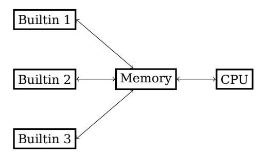
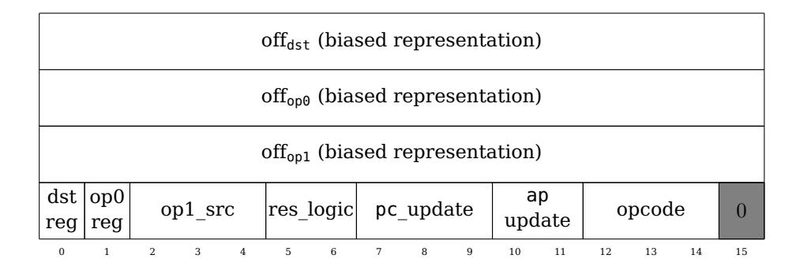
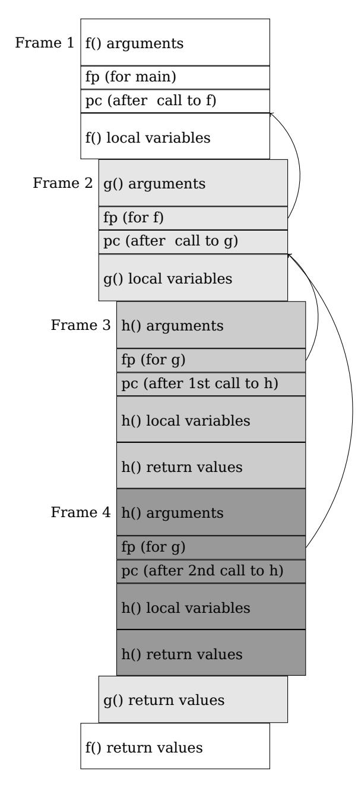

# Cairo – a Turing-complete STARK-friendly CPU architecture

Lior Goldberg Shahar Papini Michael Riabzev February 2025\*

#### **Abstract**

Proof systems allow one party to prove to another party that a certain statement is true. Most existing practical proof systems require that the statement will be represented in terms of polynomial equations over a finite field. This makes the process of representing a statement that one wishes to prove or verify rather complicated, as this process requires a new set of equations for each statement.

Various approaches to deal with this problem have been proposed, see for example [1].

We present Cairo, a practically-efficient Turing-complete STARK-friendly CPU architecture. We describe a single set of polynomial equations for the statement that the execution of a program on this architecture is valid. Given a statement one wishes to prove, Cairo allows writing a program that describes that statement, instead of writing a set of polynomial equations.

## **Contents**

| 1 | Introduction                                                      | 3 |
|---|-------------------------------------------------------------------|---|
|   | 1.1<br>Background<br>                                             | 3 |
|   | 1.2<br>Our contribution<br>                                       | 5 |
|   | 1.3<br>Overview                                                   | 7 |
|   | 1.4<br>Notation<br>                                               | 7 |
|   | 1.5<br>Acknowledgements                                           | 8 |
| 2 | Design principles                                                 | 8 |
|   | 2.1<br>Algebraic Intermediate Representation (AIR) and Randomized |   |
|   | AIR with Preprocessing (RAP)                                      | 8 |
|   | 2.2<br>von Neumann architecture                                   | 9 |
|   | 2.2.1 Bootloading: Loading programs from their hash 11            |   |

<sup>\*</sup>First version: August 2021.

|   |     | 2.2.2 Running several different programs in the same proof<br>11 |      |
|---|-----|------------------------------------------------------------------|------|
|   |     | 2.2.3 Advanced optimizations (just in time compilation and byte  |      |
|   |     | code generation) 12                                              |      |
|   |     | 2.2.4 Incrementally verifiable computation (recursive proofs)    | . 12 |
|   | 2.3 | The instruction set<br>13                                        |      |
|   |     | 2.3.1 Metrics<br>13                                              |      |
|   |     | 2.3.2 Algebraic RISC 14                                          |      |
|   | 2.4 | Registers 15                                                     |      |
|   | 2.5 | Nondeterminism<br>16                                             |      |
|   |     | 2.5.1 Hints<br>17                                                |      |
|   | 2.6 | Memory<br>17                                                     |      |
|   |     | 2.6.1 Public memory 19                                           |      |
|   |     | 2.6.2 Handling on-chain-data in blockchain applications<br>19    |      |
|   | 2.7 | Program input and program output 20                              |      |
|   |     | 2.7.1 Program input<br>21                                        |      |
|   |     | 2.7.2 Program output<br>21                                       |      |
|   | 2.8 | Builtins 21                                                      |      |
|   |     |                                                                  |      |
| 3 |     | The Cairo framework                                              | 23   |
|   | 3.1 | The deterministic Cairo machine<br>23                            |      |
|   | 3.2 | The nondeterministic Cairo machine 25                            |      |
|   | 3.3 | The Cairo program bytecode<br>26                                 |      |
|   | 3.4 | Cairo programs<br>27                                             |      |
|   | 3.5 | The Cairo Runner 28                                              |      |
|   | 3.6 | Generating proofs of computational integrity using Cairo<br>29   |      |
| 4 |     | The CPU architecture                                             | 30   |
|   |     |                                                                  |      |
|   | 4.1 | The registers<br>30                                              |      |
|   | 4.2 | The memory 31                                                    |      |
|   | 4.3 | Execution of a program<br>31                                     |      |
|   | 4.4 | Instruction structure<br>31                                      |      |
|   | 4.5 | The state transition 32                                          |      |
| 5 |     | The Cairo Assembly                                               | 35   |
|   | 5.1 | Common syntax 35                                                 |      |
|   | 5.2 | Assert equal 35                                                  |      |
|   | 5.3 | Conditional and Unconditional Jumps<br>36                        |      |
|   | 5.4 | call and ret<br>37                                               |      |
|   | 5.5 | Advancing ap<br>37                                               |      |
|   |     |                                                                  |      |
| 6 |     | Recommended memory layout                                        | 38   |
|   | 6.1 | Function call stack<br>38                                        |      |
|   | 6.2 | Memory segments<br>39                                            |      |

| 7 | Builtins                                                 |    |    |  |  | 42 |
|---|----------------------------------------------------------|----|----|--|--|----|
|   | 7.1<br>Memory communication<br>42                        |    |    |  |  |    |
| 8 | Cairo Constructs                                         |    |    |  |  | 43 |
|   | 8.1<br>Loops and recursion<br>43                         |    |    |  |  |    |
|   | 8.2<br>Integer arithmetic<br>44                          |    |    |  |  |    |
|   | 8.3<br>Fixed and floating-point arithmetic 45            |    |    |  |  |    |
|   | 8.4<br>Obtaining the values of the registers 46          |    |    |  |  |    |
|   | 8.5<br>Read-write memory 46                              |    |    |  |  |    |
|   | 8.5.1 Append-only array 46                               |    |    |  |  |    |
|   | 8.5.2 Read-write dictionary 47                           |    |    |  |  |    |
|   | 8.5.3 Sorting with permutation checking                  | 47 |    |  |  |    |
| 9 | An Algebraic Intermediate Representation (AIR) for Cairo |    |    |  |  | 48 |
|   | 9.1<br>Notation<br>49                                    |    |    |  |  |    |
|   | 9.2<br>The proven integrity statement<br>50              |    |    |  |  |    |
|   | 9.3<br>Quadratic AIR 50                                  |    |    |  |  |    |
|   | 9.4<br>Instruction flags 50                              |    |    |  |  |    |
|   | 9.5<br>Updating pc<br>52                                 |    |    |  |  |    |
|   | 9.6<br>Permutations and interaction step<br>54           |    |    |  |  |    |
|   | 9.7<br>Nondeterministic continuous read-only memory      |    | 55 |  |  |    |
|   | 9.7.1 Definition 55                                      |    |    |  |  |    |
|   | 9.7.2 Constraints 55                                     |    |    |  |  |    |
|   | 9.8<br>Public memory<br>56                               |    |    |  |  |    |
|   | 9.9<br>Permutation range-checks 57                       |    |    |  |  |    |
|   | 9.10List of constraints 58                               |    |    |  |  |    |
| A | Running untrusted code                                   |    |    |  |  | 60 |

## **1 Introduction**

#### **1.1 Background**

The seminal work of Babai, Fortnow and Lund [8] was the first to show the applications of interactive proof systems to scalability. Informally speaking, such systems allow two parties, named the prover and the verifier, to engage in a protocol where the prover convinces the verifier that a certain statement is correct. The statement has the general form: "I know an input of a certain computation that results in a certain output", where both the computation and the output are known to the prover and the verifier. The naive approach is for the prover to send the input to the verifier and let the verifier repeat the computation. This approach has two potentially undesirable features: (1) the verifier learns the input (lack of privacy), and (2) the verifier needs to re-execute the computation (inefficient). Cryptographic proof systems for computational integrity are protocols that can address these issues by: (1) introducing zero-knowledge [17] for privacy and (2) enabling succinct verification, which is exponentially more efficient than re-execution.

This paper addresses the challenge of representing the proven computation by introducing Cairo, an architecture that allows describing the computation in the form of a computer program and then generating a proof of integrity for that computation. The Cairo architecture is designed for: (1) ease of writing and reading programs to be used as provable statements, and (2) efficient proving, for example, based on the STARK [10] proof system.

In most of the existing practical proof systems, one has to represent the computation being proven in terms of polynomial equations over a finite field. This process is called "arithmetization", and was first used in the context of interactive proofs in [19]. Examples of such representations<sup>1</sup> are arithmetic circuits, Quadratic Span Programs [15] (aka R1CS) and Algebraic Intermediate Representations [10, p. 14] (AIRs).

This requirement, of representing the computation in terms of a system of polynomial equations, makes it very complicated to use these proof systems for practical applications. In addition, some of the approaches for doing the arithmetization process result in unnecessary computation (see the example of branches and loops below).

Consider some examples of how such an arithmetization process may look. Start with the simple task of asserting that x ̸= y. Note that polynomial equations must usually be of the form p = 0 (rather than p ̸= 0) where p is some polynomial in the variables. The assertion x ̸= y may be translated to ∃a: (x − y) · a = 1 (by adding an auxiliary variable a). The slightly more complicated task of addition modulo 2 <sup>64</sup> can be translated to polynomial equations by adding 64 auxiliary variables that capture the binary representation of the sum.

The task gets even more complicated when one has to deal with branches in the computation (for example, do one thing if x = y and another otherwise) and loops (for example, repeat doing something until x = y). One approach for dealing with branches is to translate both of the branches to polynomial equations and add one equation that "selects" the result according to the value of the condition (for example, the equation z = (1−b)·x+b·y enforces that z = x if b = 0 and z = y if b = 1). Loops can be dealt with by bounding the number of iterations by some constant B and executing the body of the loop exactly B times, where if the condition was met at some point, the next iterations would simply pass the result until the end of the loop. Note that the last two cases require additional "unnecessary" compu-

<sup>1</sup>The specific representation depends on the proof system being used.

tation: execute the two branches in the first case and execute B iterations even if the loop ended early in the second case.

One approach to deal with the challenges of the computation's representation is to write a compiler – a computer program that takes code as its input and outputs the list of polynomial equations that represent the execution of the code. Examples of systems that follow this approach include ZKPDL [20], Pinocchio [22], TinyRAM for SNARKs [11] and STARKs [10] and xJsnark [18]. This may make the process simpler, but the result still suffers from several drawbacks, such as the aforementioned inefficiencies of executing unnecessary code, and the necessity of bounding the number of iterations in loops.

Another approach takes its motivation from the invention of CPUs and the von Neumann architecture: One can design a single universal system of polynomial equations representing the execution of an arbitrary computer program written for some fixed instruction set. In the context of preprocessing SNARKs, this approach was used in the vnTinyRAM system [13].

## **1.2 Our contribution**

We present Cairo, an efficient and practical von Neumann architecture that can be used with the STARK proof system to generate proofs of computational integrity. As such, it is the first STARK von Neumann architecture. The main advantages of Cairo are:

**Efficient** The Cairo instruction set was chosen so that the corresponding AIR will be as efficient as possible. For example, the construction of [13] requires around 1000 variables per cycle. Compare this to the 51 variables required by Cairo's AIR (see Section 9). Moreover, we present the idea of builtins (Sections 2.8 and 7), which make the overhead of executing predefined operations negligible (for example, applying a cryptographic hash function).

**Practical** Cairo supports conditional branches, memory, function calls, and recursion.

**Production-grade** Cairo is the backbone of multiple cryptocurrency systems that run over the Ethereum blockchain. Proofs for Cairo programs are generated frequently and verified by an on-chain contract. For more information, see [2].

The following concepts, as presented in this paper, were crucial to achieve the performance of Cairo:

**Algebraic RISC**<sup>2</sup> Cairo uses a small and simple, yet relatively expressive,

<sup>2</sup>Reduced Instruction Set Computer

instruction set; where all of the instructions can be encoded using 15 flags and three integers. See Sections 2.3.2 and 4.5.

**Nondeterministic Continuous Read-Only Random-Access Memory** Instead of using the conventional read-write memory model, Cairo uses a unique memory model (Section 2.6), which is much more restricted – for example, the values of all the memory cells are chosen by the prover and do not change when the code is executed. The additional restrictions allow a very efficient AIR implementation, with only 5 trace cells per memory access (Section 9.7). This is especially important, as each instruction uses 4 memory accesses (one for fetching the instruction and 3 for the 3 operands). In fact, most programming tasks that are usually done using a read-write memory can also be done using this new memory model (see Sections 6 and 8).

**Permutation range-checks** Permutation range-checks, presented in Section 9.9, allow one to check (in an AIR) that a value is in the range [0, 2 <sup>16</sup>) using only 3 trace cells (compared to the 16 trace cells required by the naive approach of using the binary representation). Each instruction uses 3 such range-checked values, so such efficiency is crucial.

**Builtins** The Cairo architecture supports the implementation of predefined operations directly, as a set of equations, instead of implementing them with Cairo code. We call such predefined operations builtins (Sections 2.8 and 7). The advantage of using builtins is that they significantly reduce the overhead which was added due to the transition from hand-written AIR to Cairo code. This allows the programmer to benefit from writing code while not suffering from significant performance overheads.

**Efficient public memory** Cairo's memory implementation has another important feature – each memory cell that should be shared with the verifier (for example, the program's code and output), adds a verification cost of only 4 arithmetic operations (excluding the Fiat-Shamir hash). See Sections 2.6.1 and 9.8.

**Nondeterministic von Neumann advantages** For example, (1) proving programs where only the hash (rather than the code) is known to the verifier and (2) proving multiple different programs in one proof to reduce the amortized verification costs. See Section 2.2.

The name Cairo comes from the term "**C**PU **AIR**" – an AIR implementing the concept of a CPU (Section 9).

### **1.3 Overview**

Section 2 presents the main features of Cairo and explains many of the decisions that were taken in the design of the architecture.

Section 3 gives the formal definition of the Cairo machine and explains how it fits into a proof system.

Section 4 describes the state transition function of the Cairo machine. This section is very technical as it explains how each of the 15 flags that form an instruction affects the state transition. In practice, very few of the 2 <sup>15</sup> possible combinations are used. Its counterpart, Section 5, presents a set of useful instructions that can be implemented using specific flag configurations. Those instructions form the Cairo assembly language (although the exact syntax is out of the scope of this paper).

Section 6 suggests how to arrange the read-only memory to allow handling function calls (including recursion). In other words, how one may implement the function call stack in Cairo.

Section 7 explains the concept of builtins, which are optimized execution units for selected functions.

Section 8 gives a high-level overview of how one can handle common programming tasks (e.g., integer division and simulating read-write memory) given the unique features of Cairo (for example, its unique memory model and the fact that the basic arithmetic operations are evaluated over a finite field, rather than the more common 64-bit integer arithmetic).

As the main purpose of Cairo is to enable the generation of proofs of computational integrity, one must be able to use a proof system in order to prove that the execution of a Cairo program completed successfully. A natural candidate for a proof system is STARK [10] due to its ability to handle uniform computations<sup>3</sup> efficiently.

Section 9 explains how the Cairo machine can be implemented as an Algebraic Intermediate Representation (AIR) [10, p. 14], which is the way the computation is described in the STARK protocol. It includes a detailed description of the polynomial constraints that enforce the behavior of the Cairo machine.

### **1.4 Notation**

Throughout the paper, F is a fixed finite field of size |F| and characteristic P. For two integers a, b ∈ Z, we use the notation [a, b) := {x ∈ Z : a ≤ x < b} and [a, b] := {x ∈ Z : a ≤ x ≤ b}.

<sup>3</sup>Computations where the constraints repeat themselves.

#### **1.5 Acknowledgements**

We thank Eli Ben-Sasson for the helpful comments and discussions during the development of Cairo and writing this paper, StarkWare's engineers who gave useful advice during the design and helped to implement the system, and Jeremy Avigad and Yoav Seginer for giving helpful comments on this paper.

## **2 Design principles**

The Cairo framework enables one to prove the integrity of an arbitrary computation. That is, to convince the verifier that a certain program ran successfully with some given output.

Cairo is designed to provide an intuitive programming framework for efficient proving of valid program executions using the STARK protocol [10]. Even though the STARK protocol can be used by itself (i.e., without Cairo) to prove the integrity of arbitrary computations, Cairo provides a layer of abstraction around STARKs that simplifies the way the computation is described.

In order to use the STARK proof system directly, the computation has to be framed as an AIR (Algebraic Intermediate Representation) [10, p. 14], see Section 2.1, which requires a rather complicated design process. The Cairo framework introduces an assembly language (and on top of which, a full programming language – which is outside the scope of this paper) in which the computation can be described. This is much easier than designing an AIR.

Note that while Cairo was designed to be used with the STARK protocol, it can also be used with many other finite field-based proof systems, such as SNARKs [11].

This section deals with the principles behind Cairo and explains some of the choices that were made during its design.

## **2.1 Algebraic Intermediate Representation (AIR) and Randomized AIR with Preprocessing (RAP)**

Many finite-field-based proof systems [16, 11, 12, 14] work with arithmetic circuits or quadratic span programs [15] (aka R1CS). Consider an arithmetic circuit – a circuit with addition and multiplication gates, where all the values are from some fixed finite field. The prover gets such an arithmetic circuit, together with inputs (the witness), that make it return 0 where 0 is the algebraic representation of "true" or "success". Then, it generates a proof attesting to the fact that some inputs of this particular arithmetic circuit exist that make it return 0.

The STARK proof system is based on AIRs (Algebraic Intermediate Representation, see [10, p. 14]), rather than arithmetic circuits or R1CSs. An AIR can be thought of as a list of polynomial constraints (equations) operating on a (two-dimensional) table of field elements (of some finite field, F) called the "trace" (the witness). A STARK proof proves that there exists a trace satisfying the constraints.

Usually, the number of columns in the table is small (around 20) and the number of rows is a power of 2. Each constraint is assigned a domain, which is a periodic<sup>4</sup> set of the rows to which the constraint applies. For example, a constraint may apply to all the rows, every fourth row, or to a single row.

As we will see in Section 9.6, the Cairo AIR is, in fact, not really an AIR (as per the formal definition in [10, p. 14]), it is a Randomized AIR with Preprocessing (RAP, see [3]). A RAP is a broader definition of the term AIR, that allows an additional step of interaction between the prover and the verifier. This means that:

- 1. The constraints may involve variables c0, . . . , c<sup>m</sup> ∈ F that are not part of the trace cells. We refer to them as the interaction variables.
- 2. The trace columns are split into two sets: before and after the interaction step.
- 3. Instead of requiring one satisfying assignment, we require the existence of a satisfying assignment for most<sup>5</sup> values of (c0, . . . , cm) where the first set of columns are independent of the values (c0, . . . , cm).

The STARK protocol can be modified to prove statements described as RAPs (see Section 9.6).

Since this concept was used in Cairo before the term RAP was coined<sup>6</sup> , we will continue to use the term "Cairo AIR", rather than "Cairo RAP", in this paper.

## **2.2 von Neumann architecture**

The Cairo framework deals with moving from a computation described as a computer program to a computation described as an AIR. The two main approaches that handle this translation are:

**The ASIC approach:** compiling a program to an AIR. In this approach one writes a computer program (the compiler) that takes as an input a

<sup>4</sup>As the period must divide the number of rows, which is a power of 2, the period must also be a power of 2.

<sup>5</sup> If one considers (c0, . . . , cm) as chosen at random, we allow a small probability, say 2−<sup>200</sup> , that there won't be an assignment. This means that the system does not have perfect completeness. In practice, this is not a problem because of the negligible probability, but if required the Cairo AIR can be slightly modified so that it will have perfect completeness.

<sup>6</sup>The first time a Cairo verifier contract was deployed to Ethereum Mainnet was in July 2020.

program written in some language and outputs an AIR (a set of constraints) that represents an equivalent computation. This is similar to a compiler, which takes a program and outputs an ASIC or an FPGA based on the input code.

**The CPU approach:** designing a single AIR (independent of the computation being proven) that behaves like a CPU. This AIR represents a single computation – the loop of fetching an instruction from memory, executing that instruction, and continuing to the next instruction. This is similar to using a single general-purpose CPU chip rather than an application-specific chip.

The main advantage of the ASIC approach is efficiency. Building an AIR based on the computation does not have the overhead of decoding the instructions and using memory. However, as using builtins (see Section 2.8 and Section 7) reduces this overhead, this enables the CPU approach to present similar performance to that of a hand-written AIR for many computations. If a certain computation cannot take advantage of existing builtins, one has a trade-off: you may choose between (1) accepting the performance loss and (2) designing a new builtin that will improve the computation's performance<sup>7</sup> .

The CPU approach has many advantages, including:

- A small constraint set: as the set of constraints is independent of the computation being proven, it has a fixed size. The AIR of the Cairo CPU consists of 30-40 constraints<sup>8</sup> . This improves the verification costs.
- A single AIR: while the ASIC approach requires a computer program that outputs AIR constraints, the CPU approach has a single set of constraints that can run any program. Therefore, the verifier for this AIR has to be implemented only once (rather than per application). In particular, this simplifies the process of auditing the proof system. Once the constraints are checked, the only thing that requires auditing, when considering a new application, is its code (which is much simpler to audit than polynomial equations). Another advantage of the fact the AIR is independent of the application, is that it simplifies the process of building recursive STARK proofs (see Section 2.2.4).

The rest of Section 2.2 describes the advantages of the CPU approach that are an outcome of following the von Neumann architecture. In the von Neumann architecture, the program's bytecode and data are located within the same memory. A register, called the "program counter" (PC), points to

<sup>7</sup>Note that adding a builtin is not free: designing a builtin is usually a complicated task. In addition, it means that the number of AIR constraints increases, which impacts the verification time.

<sup>8</sup>The CPU does not include the builtins.

a memory address. The CPU (1) fetches the value of that memory cell, (2) performs the instruction expressed by that value (which may affect memory cells or change the flow of the program by assigning a different value to PC), (3) moves PC to the next instruction and (4) repeats this process.

#### **2.2.1 Bootloading: Loading programs from their hash**

A program may write the bytecode of another program to memory and then set the PC to point to that memory segment, thus starting the execution of the other program.

One specific use of this idea is "Bootloading from hash": A program, called "the bootloader" computes and outputs the hash of the bytecode of another program and then starts executing it as above. This way, the verifier only needs to know the hash of the program being executed and not its full bytecode.

This improves both privacy and scalability:

**Privacy:** the verifier can verify the execution of a program without knowing what the computation does<sup>9</sup> .

**Scalability:** assuming the program hash is known to the verifier, the verification time does not depend linearly on the program size, as would be the case if the program – rather than its hash – were given as input to the verifier.

#### **2.2.2 Running several different programs in the same proof**

The bootloader described above can be extended to execute several programs one after the other, outputting the bytecode hash of each of the programs, together with the programs' outputs. Note that the programs can describe entirely different computations. As the size of a proof and the cost of verifying it are both sublinear in the size of the computation, one may use such a bootloader to take several programs and generate a single proof attesting to the validity of all of the programs. The verification costs will be shared among these programs.

Let's take a numerical example: In the theoretical construction STARK is based on, STIK<sup>10</sup>, proof-verification scales logarithmically with the trace length, O(log T), see [10, p. 21]. The STARK construction (using a Merkle tree commitment) adds another multiplicative factor of O(log T), resulting

<sup>9</sup>Note that to achieve zero-knowledge: (1) the underlying proof system (for example, STARK) has to have the zero-knowledge property, (2) the program hash must use a cryptographic salt, and (3) one must make sure that the values that are shared with the verifier (such as the number of steps) do not reveal information on the program.

<sup>10</sup>The acronym STIK stands for scalable, transparent IOP of knowledge, and IOP is interactive oracle proof.

in verification time complexity<sup>11</sup> of O(log<sup>2</sup> T). For simplicity, let's assume the verification of an integrity proof for an execution trace of length T is exactly log<sup>2</sup> (T). Verifying the proofs of two programs of 1 million steps each separately will cost 2 log<sup>2</sup> (T) ≈ 794, whereas verifying one proof for both programs will cost log<sup>2</sup> (2T) ≈ 438. One can see that the amortized verification cost of a program in a batch of many programs approaches zero as more programs are added to the batch.

### **2.2.3 Advanced optimizations (just in time compilation and bytecode generation)**

Some advanced optimizations may be implemented via automatic generation of bytecode during the execution of a program. For example, instead of fetching values from the memory in a function, a program may clone the function's bytecode and place some values directly inside the instructions that require them. Consider the instruction "read c and x from memory and compute x + c". Once the value of c is known (let's denote it by C), we may replace the instruction with the, possibly more efficient instruction, "read x from memory and compute x + C", where C is the immediate value of the instruction.

All other forms of bytecode generation are also possible: A program can generate Cairo bytecode according to some rules and then execute it. For example, let's say that we need to compute x c i for multiple xis, we may write a function that gets c and returns the bytecode of a function computing x c using a long sequence of multiplications (rather than the naive implementation which uses recursion and conditional jumps and is, therefore, much less efficient).

#### **2.2.4 Incrementally verifiable computation (recursive proofs)**

A recursive proof is a proof attesting to the validity of another proof. For example, let A<sup>0</sup> denote some statement. The simplest use of a proof system is the prover convincing the verifier that A<sup>0</sup> is true. Now, let's define A<sup>1</sup> to be the statement "I verified a proof attesting to the fact that A<sup>0</sup> is true". One can try generating a proof for A1. We can then continue with statements A2, A3, and so on. This idea, called "incrementally verifiable computation", was first defined and analyzed in [23].

In order to generate a recursive proof, one has to encode the verification process (the algorithm the verifier is running) as the statement being proven. For many proof systems, and in particular, for the ASIC approach, this creates a circular dependency: The verifier depends on the program being proven, which depends on the verifier's code. However, with the CPU

<sup>11</sup>We assign O(1) computational cost to basic field operations and single invocations of the hash function used by the Merkle tree.

approach, the verifier does not depend on the program, which simplifies recursive proving – as the circular dependency breaks. Moreover, using the idea of bootloading from the hash (Section 2.2.1), the entire verification program can be encoded as one hash (say, 256 bits), which allows passing the program as an argument to itself (which is one of the steps for generating recursive proofs).

## **2.3 The instruction set**

The instruction set is the set of operations the Cairo CPU can perform in a single step. This section describes the high-level properties of Cairo's instruction set.

#### **2.3.1 Metrics**

In order to design a good instruction set for Cairo, one first needs to understand what metrics should be optimized. Unlike ordinary instruction sets, which are executed on a physical chip built of transistors, Cairo is executed in an AIR (see Section 2.1)12. Ordinary instruction sets should minimize the latency of the execution of an instruction and the number of required transistors; while maximizing the throughput of the computation. The metrics for an efficient AIR are different: Roughly speaking, the most important constraint when designing an AIR (and, therefore, when designing an instruction set that will be executed by an AIR) is to minimize the **number of trace cells used**13. This is more or less equivalent to the number of variables in a system of polynomial equations.

In order to design an efficient instruction set, one has to understand what property should be optimized. A reasonable measure is the expectation of the number of trace cells an average program (written optimally in the said instruction set) uses. This is an informal measure because, to be accurate, it would require knowledge of the distribution of the programs, and require that each of those programs is written in the most efficient way in all of the compared instruction sets. Nevertheless, one can still use this definition as a guideline for many decisions throughout the design.

As an example, take two instruction sets, A and B. The instruction set A has an instruction "as\_bool" that computes the expression "1 if x ̸= 0, otherwise 0". The instruction set B is an identical instruction set, except that "as\_bool" is missing. Say that the cost, in trace cells, of executing a single step in a CPU based on instruction set A is a (for simplicity we assume all instructions cost the same number of trace cells), and that the cost of a single step when using instruction set B is b (where a > b due to the complexity of adding the additional instruction). On the other hand, a

<sup>12</sup>More precisely, the execution trace is verified using an AIR.

<sup>13</sup>As long as all other parameters are in a reasonable range.

certain program may require k<sup>A</sup> steps if written using instruction set A and k<sup>B</sup> steps if written using instruction set B (here k<sup>B</sup> ≥ k<sup>A</sup> since every time the program needs to use "as\_bool" it might require more than a single instruction from instruction set B). If a · k<sup>A</sup> < b · kB, instruction set A is better for that program, and if a·k<sup>A</sup> > b·kB, instruction set B is better. When one decides whether to include an instruction or not, they should consider the additional cost per step (a/b) against the additional steps (kB/kA), and do so for "typical" programs, with some understanding of what "typical" programs look like.

#### **2.3.2 Algebraic RISC**

In accordance with the guideline described in Section 2.3.1, the Cairo instruction set tries to create a balance between (1) a minimal set of simple instructions that require a very small number of trace cells and (2) powerful enough instructions that will reduce the number of required steps. As such,

- 1. Addition and multiplication are supported over the base field (for example, modulo a fixed prime number) rather than for 64-bit integers.
- 2. Checking whether two values are equal is supported, but there is no instruction for checking whether a certain value is less than another value (such an instruction would have required many more trace cells – since a finite field does not support an algebraic-friendly linear ordering of its elements).

We say that an instruction set with those properties is an Algebraic RISC (Reduced Instruction Set Computer): "RISC" refers to the minimality of the instruction set, and "Algebraic" refers to the fact that the supported operations are field operations. Using an Algebraic RISC allows us to construct an AIR for Cairo with only 51 trace cells per step. The AIR for the Cairo CPU is described in Section 9.

The Cairo instruction set can simulate any Turing Machine and hence is Turing-complete14. As such, it supports any feasible computation. However, implementing some basic operations, such as comparison of elements, using only Cairo instructions would result in a lot of steps. To mitigate this without increasing the number of trace cells per instruction, Cairo introduces the notion of builtins, through which the cost of operations that are not part of the instruction set is not multiplied by the total number of steps, but rather by the number of times the operation was invoked. See Sections 2.8 and 7.

<sup>14</sup> We mean this in an informal way, as one would say the x64 instruction set is Turingcomplete. The Cairo instruction set instantiated over a fixed prime field can decide the bounded halting problem for instances smaller than the field size.

#### **2.4 Registers**

An important question that assists to distinguish between instruction sets is: what values do the instructions operate on? Usually, the instruction operands are either general-purpose registers (e.g., rax in the x64 architecture) or memory cells. Many instructions have more than one operand, and they force some constraints on what those operands are (an example of a possible constraint is: a maximum of one operand may be a memory cell, and the rest must be general purpose registers).

A few examples for different approaches are:

- 1. No general-purpose registers all of the instructions are performed directly on memory cells.
- 2. Some general-purpose registers instructions are performed on those registers and usually, at most, one memory cell.
- 3. Bounded stack machines those can be thought of as machines with many general purpose registers, where the different instructions shift the values between the registers. In many cases, at most one memory cell is involved, and usually, the only instructions that access the memory are simple read/write instructions that do not perform computation.

In physical systems, memory access is usually very expensive, which makes option 1 above inefficient (consider, for example, a summation loop that has to read and write the partial sum to the memory in each iteration). This is not necessarily<sup>15</sup> the case for AIRs: In Cairo, the cost of one memory access is 5 trace cells (See Section 2.6). Compare this to the cost of decoding an instruction, which is 16 trace cells.

Therefore, Cairo implements option 1 above – there are no generalpurpose registers, and all the operands of an instruction are memory cells. Thus, one Cairo instruction may deal with up to 3 values from the memory and perform one arithmetic operation (either addition or multiplication) on two of them, and store the result in the third.

Cairo has 2 address registers, called ap and fp, which are used for specifying which memory cells the instruction operates on. For each of the 3 values in an instruction, you can choose either an address of the form ap + off or fp + off where off is a constant offset in the range [−2 15 , 2 <sup>15</sup>). Thus, an instruction may involve any 3 memory cells out of 2 · 2 <sup>16</sup> = 131072. In many aspects, this is similar to having this many registers (implemented in a much cheaper way).

Accessing memory cells that cannot be described in the form above is possible using an instruction (see Section 5.2) that takes the value of a

<sup>15</sup>It depends on the choice of memory model and the way it's implemented in the AIR. See Section 2.6.

memory cell and treats it as the address of another memory cell. Note that the address space can be as large as the number of steps being executed.

## **2.5 Nondeterminism**

Consider an NP-complete problem, such as SAT, and consider the following two algorithms:

**Algorithm A** gets a SAT instance and an assignment and returns True if the assignment satisfies the formula.

**Algorithm B** gets a SAT instance and enumerates over all possible assignments. If it finds a satisfying assignment, it stops and returns "True". Otherwise, if no such assignment is found, it returns "False".

If the prover wants to convince the verifier that a certain SAT formula is satisfiable, it can use both algorithms. Knowing that either of the algorithms returned "True" for the required SAT-formula means that it's satisfiable. Of course, Algorithm A is much more efficient, so the prover and the verifier will prefer to use it for such a proof. Even if the prover doesn't have a satisfying assignment yet, it can run Algorithm B locally, find a satisfying assignment and then prove that Algorithm A returns "True" (this is usually much more efficient than proving that Algorithm B returns "True", since proving a computation is much more expensive than running the same computation without generating a proof).

We refer to this approach as nondeterministic programming – the prover may do additional work that is not part of the proven computation.

We mentioned before that a Cairo instruction may either add or multiply field elements. What if we want to compute a square root of a certain number x as part of a larger function? The deterministic approach is to use some square-root algorithm to compute y = √ x, which means we need to include its execution trace in our proof. But the nondeterministic approach is much more efficient: the prover computes the square-root y using the same algorithm, but doesn't include this computation in the proved execution trace. Instead, the only thing proved is that y <sup>2</sup> = x, which can be done using a single Cairo (multiplication) instruction. Notice that from the point of view of the verifier, the value y is "guessed", and all the program does is check that the guess is indeed correct (in particular, in certain cases several different guesses are legitimate and valid from the verifier's point of view; in the example above, notice that −y is valid, even though the deterministic square-root algorithm returns y).

An important aspect in the design of Cairo was to allow the programmer to take advantage of nondeterministic programming.

#### **2.5.1 Hints**

To allow taking advantage of nondeterministic programming, Cairo introduces the notion of prover hints or just "hints". Hints are pieces of code that are inserted between Cairo instructions where additional work is required by the prover. Since hints are only used by the prover, and we don't have to prove the execution of the hints to the verifier, hints can be written in any programming language16. When the Cairo Runner (see Section 3.5) needs to simulate a Cairo instruction that is preceded by a hint, it first runs the hint, which may initialize some memory cells and, only then, continue with the execution of the Cairo instruction.

## **2.6 Memory**

Most computer architectures use random-access read-write memory. This means that an instruction may choose an arbitrary memory address and either read the existing value at that address or write a new value to that address, replacing the existing one. However, this is not the only possible memory model. For example, in purely functional programming, once a variable is set, its value cannot change, so a write-once memory model may be enough to efficiently run a program written in a purely functional language.

Below are some memory models which were considered for the Cairo architecture:

**Read-Write Memory** This is the most familiar memory model, described above.

**Write-Once Memory** In this memory model, if you try to write to a memory cell that was already assigned a value, the write operation will fail. Similarly, if you try to read before writing, the operation will fail.

**Nondeterministic Read-Only Memory** In this memory model, the prover chooses all the values of the memory, and the memory is immutable. The Cairo program may only read from it.

The three pieces of pseudo-code in Fig. 1 demonstrate how one can use each memory model to pass information between two points in the program. In all of the examples, the value 7 is written to address 20 and fetched later in the code.

Although Fig. 1a, Fig. 1b share the same code, in fact, Fig. 1b and Fig. 1c have more in common: The first two instructions of Fig. 1c force the prover to initialize address 20 with the value 7, so they function as a write instruction. While in Fig. 1a, we cannot be certain that the value of x will be

<sup>16</sup>The existing implementation of Cairo uses Python as the language for writing hints.

```
write (
  address=20, value=7)
. . .
x = read(address=20)
(a) Read-Write Memory
                          write (
                            address=20, value=7)
                          . . .
                          x = read(address=20)
                           (b) Write-Once Memory
                                                     y = read(address=20)
                                                     assert y == 7
                                                     . . .
                                                     x = read(address=20)
                                                     (c) Nondeterministic Read-
                                                     Only Memory
```

Figure 1: Using various memory models.

7 without reading the code between the two instructions, this property is guaranteed in the other two models. Due to this similarity, we will sometimes refer to an instruction of the form assert read(address=20) == 7 as an assignment instruction.

The main trade-off in choosing a memory model is between allowing efficient implementation of various algorithms and efficient representation of each memory access in the AIR. As we move from Read-Write Memory to Nondeterministic Read-Only Memory, implementation of algorithms becomes more restricted, but the representation of each memory access in the AIR becomes more efficient.

It turns out that, for most of the memory accesses in programs, a Nondeterministic Read-Only Memory is sufficient (for example, Section 6 explains how a function stack may be implemented in the read-only model), and in places where it does not suffice, it's possible to simulate a full read-write memory using it (see Section 8.5). Therefore, Cairo uses a nondeterministic read-only memory as its memory model.

In fact, one more restriction is applied to gain efficiency. The memory address space is continuous, which means that if there is a memory access to address x and another memory access to address y, then for every address x < a < y, there must be a memory access to this address. This additional restriction on the prover allows a very efficient AIR implementation of memory accesses with only 5 trace cells per access (see Section 9.7).

Another interesting aspect is freeing or reusing memory cells. In all of the memory models mentioned above (assuming similar approaches of AIR implementation to the one described in Section 9.7), one has to pay (in terms of trace-cell) per memory access, rather than per used memory address. This means that rewriting over a single cell in the read-write model, or writing to a new cell each time, will have a similar cost. So, the programmer does not have to worry about freeing memory or reusing memory cells to save "space". They need only try to minimize memory accesses.

#### **2.6.1 Public memory**

An important advantage of the way Cairo implements the nondeterministic read-only memory as an AIR is that it allows the prover to efficiently convince the verifier that some memory addresses contain certain values. More formally, given a list of pairs of address a<sup>i</sup> and value v<sup>i</sup> , shared by the prover and the verifier, the verifier can confirm that the memory at address a<sup>i</sup> has the value v<sup>i</sup> . Since this information is shared with the verifier, we refer to it as the public memory. One can think of this list as "boundary constraints" on the memory, which are externalized to the world.

This mechanism is extremely efficient: during the proof generation, two "random"<sup>17</sup> numbers are generated: z, α. Then, the only thing the verifier has to do with the list (a<sup>i</sup> , vi) is to compute the expression

$$\prod_{i} (z - (a_i + \alpha \cdot v_i)), \tag{1}$$

and substitute the result in one of the AIR's constraints. This means that the verification cost per entry is one addition, one subtraction, and two multiplications in the field; in addition to the computation of the hash of the list which is required as part of the Fiat-Shamir transformation.

Compare our approach to the naive approach of adding boundary constraints to an AIR: In the naive approach, one adds a constraint per trace cell that should be fixed. This means one should add two constraints per memory cell (for the address and the value). Since the location of the two trace cells that contain the memory cell for a specific address is usually not known before generating the trace18, the prover will have to send this information to the verifier.

This mechanism can be used for:

- 1. Loading the bytecode (see Section 3.3) of the program into memory (the prover and the verifier should agree on the program being executed).
- 2. Passing the arguments and return values of the program (between the prover and the verifier).

For more information about the way this mechanism is implemented as an AIR, see Section 9.8.

#### **2.6.2 Handling on-chain-data in blockchain applications**

Let's now consider one concrete application of the mechanism described in Section 2.6.1, in which its efficiency is crucial. In some blockchain appli-

<sup>17</sup>as part of the Fiat-Shamir heuristic in the non-interactive case or sent by the verifier in the interactive case.

<sup>18</sup>Recall that the trace cells are ordered chronologically according to the execution of the program.

cations, one of the outputs of a Cairo program that should be accessible to the verifier is a log of all the changes to the state of the application. Its purpose is not to be processed by the verifier, but rather to only be written on-chain so that users will be able to inspect it if needed (this is sometimes referred to as "data availability" or "on-chain data" and used for common constructions such as a "ZK-Rollup"). Usually, this log is very large, and it is extremely important to reduce the linear verification cost (for example, in the Ethereum blockchain, this cost is measured in "gas") that is involved during its processing as much as possible. This can be done using the public memory mechanism: one may put the data in a contiguous segment of memory cells and include those cells in the public memory. Then, the verification cost is the sum of the cost of transmitting the data to the blockchain and the computation cost of only 4 arithmetic operations per data element and the hash of the data.

Note that this is not the only possible solution. An alternative way for handling such data, which has even cheaper verification costs, is to compute the hash of the data by the verifier, using a blockchain-friendly hash function, and make the same hash computation as part of the statement being proven. The problem with this approach, is that typically blockchainfriendly hash functions are not STARK-friendly<sup>19</sup> which means that using this method significantly increases the proving costs.

### **2.7 Program input and program output**

A Cairo program may have:

**Program input** – the input of the program. This data is not shared with the verifier. In terms of proof systems, this is the witness<sup>20</sup> .

**Program output** – the data that is generated during the execution of the program, that is shared with the verifier. It will become part of the data externalized using the public memory mechanism (Section 2.6.1).

It is possible that some data will be both program input and program output? Consider, for example, a Cairo program given (as an input) a number n and computes the n-th Fibonacci number, y. In this case, the program input is n. Let's consider a few options for the program output and the statement each of them induces:

• If the program output contains both n and y, the statement being proven is "the n-th Fibonacci number is y".

<sup>19</sup>This means that computing such a hash function as part of the statement being proven costs a large number of trace cells.

<sup>20</sup>Note that when one proof system is based on another system, each of them has its own witness, and, usually, the outer proof system has to translate its witness to a witness of the inner proof system. Thus, the witness of the Cairo proof system is the program input, and the witness of the STARK proof system is the AIR's trace.

- If the program output contains only y, the statement being proven is "I know n such that the n-th Fibonacci number is y" (but n is not explicitly shared with the verifier).
- If the program output contains only n, the statement being proven is "I have computed the n-th Fibonacci number" (but the result is not explicitly shared with the verifier).

#### **2.7.1 Program input**

Handling the program input is easy – one may use the hint mechanism to parse the input, which may be given in any desired format (recall that hints can be theoretically written in any programming language) and update uninitialized memory cells accordingly. For example, in the current implementation of the Cairo Runner [4], the program input is a JSON file which is read by the program-specific hints.

Consider the Fibonacci example above. The program input may be a JSON file of the form {"n":5}. A hint at the beginning of the program may read this file, fetch the value of n, and place it in a certain memory cell. The Cairo code will then pass the value of that cell to the Fibonacci function.

#### **2.7.2 Program output**

The program output is handled as follows: the Cairo program writes the values of the output data to a contiguous segment of memory cells. The start and end addresses of this segment are stored in the memory in addresses that can be computed by the verifier (for example, relative to the initial and final value of the ap register, which are part of the information available to the verifier. See Section 3.2). The values of all the memory cells involved (the memory cells containing the output data, as well as the two cells containing the start and end addresses of the segment) are externalized to the verifier using the public memory mechanism (Section 2.6.1). In other words, the prover sends the start and end addresses of the segment, as well as all of the values in the segment, and the verifier incorporates them in Eq. (1) to validate their consistency with the proof.

## **2.8 Builtins**

As we have seen in the previous sections, adding a new instruction to the instruction set has a cost even if this instruction is not used. On the other hand, trying to implement some primitives using only Cairo instructions may be inefficient, as a lot of instructions may be required – even for relatively simple tasks such as integer division.

To overcome this conflict, while also supporting predefined tasks without the need to add new instructions, Cairo introduces the concept of builtins. A builtin enforces some constraints (which depend on the builtin) on the Cairo memory. For example, a builtin may enforce that all the values for the memory cells in some fixed address range are within the range [0, 2 <sup>128</sup>). In fact, this is a very useful builtin, as we will see in Section 8. We call it the range-check builtin and the memory cells constrained by the builtin range-checked cells.

Cairo doesn't have a special instruction to invoke a builtin. Instead, one should simply read or write values in the memory cells affected by the builtin. This kind of communication is also known as memory-mapped I/O [21]. Take the range-check builtin, for example, if you want to verify that a value x is within the range [0, 2 <sup>128</sup>), just copy it (using a Cairo instruction) to a range-checked cell. If you want to verify that x is within the range [0, B] where B < 2 <sup>128</sup>, you can write x to one range-checked cell and B − x to another.

In terms of building the AIR, it means that adding builtins does not affect the CPU constraints. It just means that the same memory is shared between the CPU and the builtins. Figure 2 shows the relationship between the CPU, the memory, and the builtins: in order to "invoke" a builtin, the Cairo program "communicates" with certain memory cells, and the builtin enforces some constraints on those memory cells.



Figure 2: The relationship between the Cairo components.

It is important to note that builtins are an optional part of the Cairo architecture: one may replace using a builtin with a piece of pure Cairo code that does the same<sup>21</sup> (taking advantage of nondeterministic programming). For example, to implement the range-check builtin, one could "guess" the 128 field elements b<sup>i</sup> that form the binary representation of x, assert that b 2 <sup>i</sup> = b<sup>i</sup> for all i ∈ [0, 128) and that x = P i 2 i · b<sup>i</sup> . This enforces that x is within the expected range. However, compare the costs of the two approaches: the above computation takes at least 3 · 128 Cairo instructions. Using a builtin (implemented with the range-check techniques presented in Section 9.9), it takes the number of trace cells equivalent to about 1.5 instructions.

<sup>21</sup>Since Cairo is Turing-Complete, even without any builtins.

The Cairo architecture does not specify a specific set of builtins. One may add or remove builtins from the AIR according to one's needs. For example, if a program needs to invoke the Pedersen hash numerous times, it makes sense to run it on an architecture with a builtin that computes the Pedersen hash. On the other hand, a program that uses this builtin will not be able to run on an architecture where this builtin is missing. Note that adding builtins implies adding constraints, which increases the verification time.

## **3 The Cairo framework**

We now give a formal definition to the term "the Cairo machine". In fact, we define two versions: a deterministic and nondeterministic, where the latter is based on the former.

The deterministic Cairo machine by itself does not perform a computation. Instead, it verifies that a given computation trace is valid. One can imagine a machine that is given a sequence of states and a memory function, and checks whether the transition between two consecutive states is valid (according to the rules presented in Section 4.5). It returns "accept" if all the state transitions are valid with respect to the memory; and "reject" otherwise. The term "deterministic" is pertinent due to the fact that the decision problem, whether it accepts or rejects, can be solved efficiently using a deterministic Turing Machine.

The nondeterministic version gets a partial memory function (which can be thought of as boundary constraints on the full memory function) and only the initial and final states (rather than the full list of states). It accepts, if there exist a list of states and a full memory function that are consistent with the inputs that the deterministic version accepts.

We close this section with a description of the Cairo Runner, a concrete realization of those theoretical models, and show how one can use the Cairo Runner to transform a statement, such as "the j-th Fibonacci number is y", into inputs for the deterministic machine (which is used by the prover) and the nondeterministic machine (which is used by the verifier), in such a way that if the machine accepts, this implies that the statement is true. The Cairo AIR, presented in Section 9, allows one to use the STARK protocol in order to prove that the nondeterministic Cairo machine accepts those inputs, thus proving that the original statement is true.

#### **3.1 The deterministic Cairo machine**

Fix a prime field F<sup>P</sup> = Z/P and a finite extension field F of it.

**Definition 1.** The Cairo machine is a function that receives the following inputs

- 1. a number of steps T ∈ N,
- 2. a memory function m: F → F,
- 3. a sequence S of T + 1 states S<sup>i</sup> = (pc<sup>i</sup> , ap<sup>i</sup> , fp<sup>i</sup> ) ∈ F 3 for i ∈ [0, T], 22 and outputs either "accept" or "reject".

It accepts if, and only if, for every i, the state transition from state i to state i + 1 is valid. Section 4.5 describes what constitutes a valid state transition of the machine.

Note that the decision as to whether a single transition is valid depends only on the two states involved (that is S<sup>i</sup> and Si+1) and the memory function m. In particular, the memory function used for the state transition logic is the same for all i. In other words, the Cairo memory is immutable (readonly) rather than read-write.

We call the sequence of states S the Cairo execution trace. We refer to the state S<sup>0</sup> as the initial state and to S<sup>T</sup> as the final state.

The memory function is defined formally as a function m: F → F, but, since in practical applications F is usually huge and at most O(T) values of m are accessed during the computation, we can treat m as a sparse function where almost all the values are zeros.

**Example 1** (The Fibonacci Sequence)**.** Let S<sup>0</sup> = (0, 5, 5) and let m satisfy

$$\begin{split} \mathfrak{m}(0) &= 0x48307 \text{ffe}7 \text{fff}8000, \\ \mathfrak{m}(1) &= 0x010780017 \text{fff}7 \text{fff}, \\ \mathfrak{m}(2) &= -1, \\ \mathfrak{m}(3) &= 1, \\ \mathfrak{m}(4) &= 1, \end{split} \tag{2}$$

In Section 4.5, you will see that the first two constants represent Cairo instructions. The exact way the encoding works is not important for this example.

Note that,

1. For the state transition S<sup>0</sup> → S1, we have

$$\mathfrak{m}(\mathsf{pc}_0) = \mathfrak{m}(0) = \mathsf{0x48307ffe7fff8000}.$$

Careful review of Section 4.5 reveals that this implies that the state transition from S<sup>0</sup> to S<sup>1</sup> is valid if, and only if,

$$\begin{split} &\mathsf{pc}_1 = \mathsf{pc}_0 + 1, \quad \mathsf{ap}_1 = \mathsf{ap}_0 + 1, \quad \mathsf{fp}_1 = \mathsf{fp}_0, \quad \text{and} \\ &\mathfrak{m}(\mathsf{ap}_0) = \mathfrak{m}(\mathsf{ap}_0 - 1) + \mathfrak{m}(\mathsf{ap}_0 - 2). \end{split}$$

<sup>22</sup>pc will function as the program counter register, and ap and fp will function as pointers to the memory. Their exact purpose and behavior will become clear in Section 4.1.

Therefore, if we want the Cairo machine to accept, we must set  $S_1 = (1,6,5)$  and  $\mathfrak{m}(5) = \mathfrak{m}(4) + \mathfrak{m}(3) = 2$ .

2. For the state transition  $S_1 \to S_2$ , we have

$$\mathfrak{m}(\mathsf{pc}_1) = \mathfrak{m}(1) = 0x010780017fff7fff.$$

It will follow from Section 4.5 that the state transition from  $S_1$  to  $S_2$  is valid if, and only if,  $pc_2 = pc_1 + \mathfrak{m}(pc_1 + 1)$  (that is,  $pc_2 = 1 + \mathfrak{m}(2) = 1 + (-1) = 0$ ),  $ap_2 = ap_1$  and  $fp_2 = fp_1$ . So, we must set  $S_2 = (0, 6, 5)$ .

3. For the state transition  $S_2 \to S_3$ , once again the "current" pc is 0, so the constraints are similar to those of the first state transition:  $pc_3 = pc_2 + 1$ ,  $ap_3 = ap_2 + 1$ ,  $p_2 = pc_2$  and  $pc_2 = pc_2 + 1$ ,  $pc_3 = pc_2 + 1$ ,  $pc_3 = pc_2 + 1$ ,  $pc_3 = pc_2 + 1$ ,  $pc_3 = pc_2 + 1$ ,  $pc_3 = pc_2 + 1$ ,  $pc_3 = pc_2 + 1$ ,  $pc_3 = pc_3 + 1$ ,  $pc_3 = pc_3 + 1$ ,  $pc_3 = pc_3 + 1$ ,  $pc_3 = pc_3 + 1$ ,  $pc_3 = pc_3 + 1$ ,  $pc_3 = pc_3 + 1$ ,  $pc_3 = pc_3 + 1$ ,  $pc_3 = pc_3 + 1$ ,  $pc_3 = pc_3 + 1$ ,  $pc_3 = pc_3 + 1$ ,  $pc_3 = pc_3 + 1$ ,  $pc_3 = pc_3 + 1$ ,  $pc_3 = pc_3 + 1$ ,  $pc_3 = pc_3 + 1$ ,  $pc_3 = pc_3 + 1$ ,  $pc_3 = pc_3 + 1$ ,  $pc_3 = pc_3 + 1$ ,  $pc_3 = pc_3 + 1$ ,  $pc_3 = pc_3 + 1$ ,  $pc_3 = pc_3 + 1$ ,  $pc_3 = pc_3 + 1$ ,  $pc_3 = pc_3 + 1$ ,  $pc_3 = pc_3 + 1$ ,  $pc_3 = pc_3 + 1$ ,  $pc_3 = pc_3 + 1$ ,  $pc_3 = pc_3 + 1$ ,  $pc_3 = pc_3 + 1$ ,  $pc_3 = pc_3 + 1$ ,  $pc_3 = pc_3 + 1$ ,  $pc_3 = pc_3 + 1$ ,  $pc_3 = pc_3 + 1$ ,  $pc_3 = pc_3 + 1$ ,  $pc_3 = pc_3 + 1$ ,  $pc_3 = pc_3 + 1$ ,  $pc_3 = pc_3 + 1$ ,  $pc_3 = pc_3 + 1$ ,  $pc_3 = pc_3 + 1$ ,  $pc_3 = pc_3 + 1$ ,  $pc_3 = pc_3 + 1$ ,  $pc_3 = pc_3 + 1$ ,  $pc_3 = pc_3 + 1$ ,  $pc_3 = pc_3 + 1$ ,  $pc_3 = pc_3 + 1$ ,  $pc_3 = pc_3 + 1$ ,  $pc_3 = pc_3 + 1$ ,  $pc_3 = pc_3 + 1$ ,  $pc_3 = pc_3 + 1$ ,  $pc_3 = pc_3 + 1$ ,  $pc_3 = pc_3 + 1$ ,  $pc_3 = pc_3 + 1$ ,  $pc_3 = pc_3 + 1$ ,  $pc_3 = pc_3 + 1$ ,  $pc_3 = pc_3 + 1$ ,  $pc_3 = pc_3 + 1$ ,  $pc_3 = pc_3 + 1$ ,  $pc_3 = pc_3 + 1$ ,  $pc_3 = pc_3 + 1$ ,  $pc_3 = pc_3 + 1$ ,  $pc_3 = pc_3 + 1$ ,  $pc_3 = pc_3 + 1$ ,  $pc_3 = pc_3 + 1$ ,  $pc_3 = pc_3 + 1$ ,  $pc_3 = pc_3 + 1$ ,  $pc_3 = pc_3 + 1$ ,  $pc_3 = pc_3 + 1$ ,  $pc_3 = pc_3 + 1$ ,  $pc_3 = pc_3 + 1$ ,  $pc_3 = pc_3 + 1$ ,  $pc_3 = pc_3 + 1$ ,  $pc_3 = pc_3 + 1$ ,  $pc_3 = pc_3 + 1$ ,  $pc_3 = pc_3 + 1$ ,  $pc_3 = pc_3 + 1$ ,  $pc_3 = pc_3 + 1$ ,  $pc_3 = pc_3 + 1$ ,  $pc_3 = pc_3 + 1$ ,  $pc_3 = pc_3 + 1$ ,  $pc_3 = pc_3 + 1$ ,  $pc_3 = pc_3 + 1$ ,  $pc_3 = pc_3 + 1$ ,  $pc_3 = pc_3 + 1$ ,  $pc_3 = pc_3 + 1$ ,  $pc_3 = pc_3 + 1$ ,  $pc_3 = pc_3 + 1$ ,  $pc_3 = pc_3 + 1$ ,  $pc_3 = pc_3 + 1$ ,  $pc_3 = pc_3 + 1$ ,  $pc_3 = pc_3 + 1$ ,  $pc_3 = pc_3 + 1$ ,  $pc_3 = pc_3 + 1$ ,

One may observe that this behavior repeats itself: fp remains constant, pc alternates between 0 and 1, and each time it is 0 it forces  $\mathfrak{m}(\mathsf{ap}_2) = \mathfrak{m}(\mathsf{ap}_2-1) + \mathfrak{m}(\mathsf{ap}_2-2)$ , and increases ap by 1. Thus, the only way the Cairo machine returns "accpet" is if the memory function continues with the Fibonacci sequence (starting from  $\mathfrak{m}(3)$ ). To be more accurate, the values  $\mathfrak{m}(3), \mathfrak{m}(4), \ldots, \mathfrak{m}(4+\lceil T/2 \rceil)$  should form the Fibonacci sequence.

#### 3.2 The nondeterministic Cairo machine

**Definition 2.** The nondeterministic Cairo machine is a nondeterministic version of the Cairo machine. It is a function that receives the following inputs:

- 1. a number of steps  $T \in \mathbb{N}$ ,
- 2. a partial memory function  $\mathfrak{m}^* \colon A^* \to \mathbb{F}$ , where  $A^* \subseteq \mathbb{F}_P$ ,
- 3. initial and final values for pc and ap:  $pc_I$ ,  $pc_F$ ,  $ap_I$ , and  $ap_F$  ( $ap_I$  is also used as the initial value for fp),

and outputs "accept" or "reject".

It accepts the input  $(T,\mathfrak{m}^*,\mathsf{pc}_I,\mathsf{pc}_F,\mathsf{ap}_I,\mathsf{ap}_F)$  if, and only if, there exists a memory function  $\mathfrak{m}\colon \mathbb{F} \to \mathbb{F}$  extending<sup>23</sup>  $\mathfrak{m}^*$ , and a list of states  $S_i = (\mathsf{pc}_i,\mathsf{ap}_i,\mathsf{fp}_i) \in \mathbb{F}^3$  for  $i \in [0,T]$  satisfying  $(\mathsf{pc}_0,\mathsf{ap}_0,\mathsf{fp}_0) = (\mathsf{pc}_I,\mathsf{ap}_I,\mathsf{ap}_I)$ ,  $\mathsf{pc}_T = \mathsf{pc}_F$  and  $\mathsf{ap}_T = \mathsf{ap}_F$ , such that the deterministic Cairo machine from Definition 1 accepts the input  $(T,\mathfrak{m},S)$ .

Note, the main differences between Definitions 1 and 2:

 $<sup>^{23}\</sup>mbox{We}$  say that  $\mbox{m}$  extends  $\mbox{m}^*$  if both functions agree on  $A^*.$ 

- The deterministic version from Definition 1 gets the full list of states, while the nondeterministic version from Definition 2 only gets the initial and final values of pc and ap.
- The deterministic version gets the full memory function, while the nondeterministic version only gets a partial function.
- Computing whether the deterministic version accepts a particular input or not, can be done in polynomial time using a *deterministic* machine. For the nondeterministic version, one needs a *nondeterministic* machine in order to do it in polynomial time (see the discussion in Section 2.5).

**Example 2.** Let T < P be an even number,  $2 \le j \le T/2$  and  $y \in \mathbb{F}$ . Set  $A^* = \{0,1,2,3,4,j+3\}$ ,  $\operatorname{pc}_I = 0$ ,  $\operatorname{pc}_F = 1, \operatorname{ap}_I = 5, \operatorname{ap}_F = 5 + T/2$ . Let  $\mathfrak{m}^* \colon A^* \to \mathbb{F}$  have the same values that appear in (2) for  $0,\ldots,4$  and set  $\mathfrak{m}^*(j+3) = y$ . We claim that the nondeterministic Cairo machine accepts this input if, and only if, the j-th Fibonacci number is y. In fact, this follows from the last example: the nondeterministic Cairo machine accepts if, and only if, there exists a memory function extending  $\mathfrak{m}^*$  that makes the deterministic version accept. But as we saw, the deterministic version accepts only if the values  $\mathfrak{m}(3), \mathfrak{m}(4), \ldots, \mathfrak{m}(4+T/2)$  form the Fibonacci sequence. In particular,  $\mathfrak{m}(j+3)$  is the j-th Fibonacci number, but it must be equal to  $\mathfrak{m}^*(j+3) = y$ .

Note 1. Due to performance considerations of the Cairo AIR (more specifically, the implementation of the Cairo memory in the AIR. See Section 9.7), the AIR will enforce stricter constraints than just the fact that the nondeterministic Cairo machine accepts: the memory accesses performed during the execution of the code must result in a continuous address range. That is, the set of accessed addresses must be of the form  $\{a_0+i:i\in[0,k)\}$  for some initial address  $a_0$  and some natural number k. In particular, it means that only addresses from  $\mathbb{F}_P$  can be used (rather than addresses from the extension field,  $\mathbb{F}$ ), and this is the reason  $A^*$  is a subset of  $\mathbb{F}_P$ . We treat this additional requirement as follows: the programmer of Cairo code should not rely on this continuity guarantee (from a soundness perspective), but they should write the program such that this requirement will be satisfied if the inputs are valid (for completeness).

#### 3.3 The Cairo program bytecode

The Cairo program bytecode is a sequence of field elements  $\mathfrak{b}=(\mathfrak{b}_0,\ldots,\mathfrak{b}_{|\mathfrak{b}|-1})$  together with two indices  $\operatorname{prog}_{\operatorname{start}},\operatorname{prog}_{\operatorname{end}}\in[0,|\mathfrak{b}|)$  that define the computation we want the Cairo machine to perform. In order to "run" the program, we pick a field element  $\operatorname{prog}_{\operatorname{base}}\in\mathbb{F}_P$ , which is called the  $\operatorname{program}$  base, set the partial memory function  $\mathfrak{m}^*$  so that  $\mathfrak{m}^*(\operatorname{prog}_{\operatorname{base}}+i)=\mathfrak{b}_i$  for  $i\in[0,|\mathfrak{b}|)$ , and set  $\operatorname{pc}_I=\operatorname{prog}_{\operatorname{base}}+\operatorname{prog}_{\operatorname{start}},\operatorname{pc}_F=\operatorname{prog}_{\operatorname{base}}+\operatorname{prog}_{\operatorname{end}}.$ 

In addition to the bytecode of the program, the partial memory function may contain additional entries that provide additional constraints on the execution of the code (for example, input arguments for the execution are handled this way).

**Example 3.** The bytecode of the Fibonacci program in the previous example was:

```
\mathfrak{b} = (0x48307ffe7fff8000, 0x010780017fff7fff, -1), \quad prog_{start} = 0.
```

The bytecode was "loaded" to  $\mathfrak{m}^*(0), \mathfrak{m}^*(1), \mathfrak{m}^*(2)$ , so the program base in that example was  $\text{prog}_{\text{base}} = 0$ .

The values  $\mathfrak{m}^*(3), \mathfrak{m}^*(4), \mathfrak{m}^*(3+j)$  (or, in the more general form:  $\mathfrak{m}^*(\mathsf{ap}_I-2), \mathfrak{m}^*(\mathsf{ap}_I-1), \mathfrak{m}^*(\mathsf{ap}_I-2+j)$ ) are the additional constraints.

#### 3.4 Cairo programs

The following Fibonacci program is written in Cairo assembly (see Section 5 for more detail). For convenience, we added the state transition constraints of each instruction (all of the instructions in the example imply  $fp_{i+1} = fp_i$ ).

#### Example 4.

```
# Initialize the Fibonacci sequence with (1, 1).
[ap] = 1; ap++
            \mathrm{pc}_{i+1} = \mathrm{pc}_i + 2, \quad \mathrm{ap}_{i+1} = \mathrm{ap}_i + 1, \quad \mathfrak{m}(\mathrm{ap}_i) = 1
[ap] = 1; ap++
            \mathrm{pc}_{i+1} = \mathrm{pc}_i + 2, \quad \mathrm{ap}_{i+1} = \mathrm{ap}_i + 1, \quad \mathfrak{m}(\mathrm{ap}_i) = 1
bodv:
# Decrease one from the iteration counter.
 \begin{array}{cll} [{\rm ap}] \ = \ [{\rm ap} \ - \ 3] \ - \ 1; \ {\rm ap++} \\ {\rm pc}_{i+1} \ = \ {\rm pc}_i + 2, \quad {\rm ap}_{i+1} \ = \ {\rm ap}_i + 1, \end{array} 
            \mathfrak{m}(\mathsf{ap}_i) = \mathfrak{m}(\mathsf{ap}_i - 3) - 1
# Copy the last Fibonacci item.
[ap] = [ap - 2]; ap++
            \operatorname{pc}_{i+1} = \operatorname{pc}_i + 1, \operatorname{ap}_{i+1} = \operatorname{ap}_i + 1, \operatorname{m}(\operatorname{ap}_i) = \operatorname{m}(\operatorname{ap}_i - 2)
# Compute the next Fibonacci item.
[ap] = [ap - 3] + [ap - 4]; ap++
            \mathsf{pc}_{i+1} = \mathsf{pc}_i + 1, \quad \mathsf{ap}_{i+1} = \mathsf{ap}_i + 1,
            \mathfrak{m}(\mathsf{ap}_i) = \mathfrak{m}(\mathsf{ap}_i - 3) + \mathfrak{m}(\mathsf{ap}_i - 4)
# If the iteration counter is not zero, jump to body.
jmp body if [ap - 3] != 0
           \mathrm{pc}_{i+1} = \begin{cases} \mathrm{pc}_i - 4, & \mathrm{\mathfrak{m}}(\mathrm{ap}_i - 3) \neq 0 \\ \mathrm{pc}_i + 2, & \mathrm{otherwise} \end{cases}, \quad \mathrm{ap}_{i+1} = \mathrm{ap}_i,
__end__:
imp __end__ # Infinite loop
            pc_{i+1} = pc_i, ap_{i+1} = ap_i
```

This program works as follows: it assumes that m(apI−1) = j is the index of the Fibonacci number we want to compute. After the first two steps, we have (m(ap − 3), m(ap − 2), m(ap − 1)) = (j, 1, 1). After the next three steps, the values are (j −1, 1, 2). Then we check whether j −1 = 0. If not, we jump back to the body label. After another iteration the values are (j − 2, 2, 3), then (j − 3, 3, 5), (j − 4, 5, 8), and so on. When the iteration counter gets to 0, we start an infinite loop. At that point, the result is m(ap − 2). Since the loop keeps the value of ap constant, the result can be found in m(ap<sup>F</sup> − 2).

A Cairo assembler can take this program and turn it into Cairo bytecode:

```
b = (0x480680017fff8000, 1,
     0x480680017fff8000, 1,
     0x482480017ffd8000, −1,
     0x48127ffe7fff8000,
     0x48307ffc7ffd8000,
     0x20680017fff7ffd, −4,
     0x10780017fff7fff, 0)
progstart = 0, progend = 10.
```

Usually, the last instruction of a Cairo program is an infinite loop – this makes the number of steps, T, independent of the program, as long as it is large enough to make the program reach progend.

### **3.5 The Cairo Runner**

The Cairo Runner is a computer program responsible for executing a compiled Cairo program. Executing a Cairo program is different from executing a regular computer program. The main difference is due to the fact that Cairo allows nondeterministic code. For example, the following Cairo instruction "computes" the square root of 25 by asserting that the square of an uninitialized cell is 25:

```
[ap] = 25; ap++
# [ap - 1] is now 25, so the next line enforces that [ap] is the
# square root of 25.
[ap - 1] = [ap] * [ap]; ap++
```

In fact, even if we recognize this particular instruction as saying; "take the square root of [ap − 1]", there are 2 possible values: 5 and −5, and it is possible that only one of them will allow satisfying the rest of the instructions. In a similar way, you can write a Cairo program that solves an NP-complete problem, such as SAT.

This means that some Cairo programs cannot be efficiently executed without some additional information (such as the specific square root of 25 or a satisfying SAT assignment). This information is given by what we call hints. Hints are special instructions for the Cairo Runner; used to resolve nondeterminism where a value cannot be easily deduced. In theory, hints can be written in any programming language24. For example, in the existing implementation of the Cairo Runner (see [4]), the hints are code blocks of Python code.

The output of the Runner consists of

1. an accepting input to the Cairo nondeterministic machine:

$$(T,\mathfrak{m}^*,\operatorname{pc}_I,\operatorname{pc}_F,\operatorname{ap}_I,\operatorname{ap}_F)\text{,}$$

where m<sup>∗</sup> includes the program bytecode (starting at progbase) and any additional information that should be revealed (the hints may specify what memory cells should be added to m<sup>∗</sup> ), pc<sup>I</sup> = progbase + progstart and pc<sup>F</sup> = progbase + progend.

2. an accepting input to the Cairo deterministic machine, (T, m, S) that constitutes the witness to the nondeterministic machine.

Alternatively, the Runner may return a failure in the case that the execution results in a contradiction, or was unable to compute the value of a memory cell due to insufficient hints.

**Example 5.** Continuing with Example 4, the hints will have to set m(ap<sup>I</sup> − 1) = j and add ap<sup>I</sup> − 1 and ap<sup>F</sup> − 2 to A<sup>∗</sup> (in order to reveal which Fibonacci number was computed and what the result was).

## **3.6 Generating proofs of computational integrity using Cairo**

Below is an overview of the process of generating a proof of computational integrity for a given computation. We use the following assertion as an example of what we wish to prove:

"The 
$$j$$
-th Fibonacci number is  $y$ ". (3)

- 1. Write a Cairo program for the computation (either using the Cairo assembly language directly or using any other language that can be compiled to Cairo bytecode); with hints that resolve the nondeterministic components. In our example, we use the code of Example 4 with a hint that set m<sup>∗</sup> (ap<sup>I</sup> − 1) = j.
- 2. Compile the program to Cairo bytecode.

<sup>24</sup>In particular, they don't have to be written in Cairo.

- 3. Run the program using the Cairo Runner to obtain the execution trace S, the partial memory function m<sup>∗</sup> , and the full memory function m. In our case, m<sup>∗</sup> will include the program bytecode, m<sup>∗</sup> (ap<sup>I</sup> − 1) = j for the index, and m<sup>∗</sup> (ap<sup>F</sup> − 2) = y for the result.
- 4. Use a STARK prover for the Cairo AIR to generate a proof for the assertion:

"The nondeterministic Cairo machine accepts given the input 
$$(T, \mathfrak{m}^*, \mathsf{pc}_I, \mathsf{pc}_F, \mathsf{ap}_I, \mathsf{ap}_F)$$
".

We now have to show that the correctness of (4) implies the correctness of (3): The fact that the nondeterministic Cairo machine accepts implies that there exists an input (T, m, S) accepted by the deterministic Cairo machine. Since m extends m<sup>∗</sup> , we know that the bytecode of the Fibonacci program appears in {m(progbase + i)}i∈[0,|b|) . Moreover, since pc<sup>I</sup> = progbase + progstart, we deduce that the first instruction that is executed by the deterministic Cairo machine is the first instruction of the Fibonacci program. Similarly, the rest of the program's instructions will be executed, for T steps. As pc<sup>F</sup> = progbase +progend, we know that the infinite loop at the end of the program was reached, which implies that the program was completed successfully, and that the j-th Fibonacci number is equal to m(ap<sup>F</sup> − 2) = m<sup>∗</sup> (ap<sup>F</sup> − 2) = y.

## **4 The CPU architecture**

The Cairo architecture, which defines the core of the deterministic Cairo machine, presented in Section 3.1, consists of a "CPU" that operates on 3 registers – pc, ap, and fp, and has access to the (read-only) memory, m.

#### **4.1 The registers**

**Program counter (pc)** contains the address in memory of the current Cairo instruction to be executed.

**Allocation pointer (ap)** , by convention, points to the first memory cell that has not been used by the program so far. Many instructions may increase its value by one to indicate that another memory cell has been used by the instruction. Note that this is merely a convention – the Cairo machine does not force that the memory cell ap has not been used, and the programmer may decide to use it in different ways.

**Frame pointer (fp)** points to the beginning of the stack frame of the current function. The value of fp allows a stack-like behavior: When a function starts, fp is set to be the same as the current ap, and when the function returns, fp resumes its previous value. Thus, the value of fp stays the same for all the instructions in the same invocation of a function. Due to this property, fp may be used to address the function's arguments and local variables. See more in Section 6.

### **4.2 The memory**

The CPU has access to a nondeterministic read-only random-access memory. Read-only means that the values of the memory cells do not change during the execution of Cairo code. Nondeterministic means that the prover is allowed to choose the initial and, thus also, final values of all the memory cells. The Cairo code simply consists of assertions on the memory values, which play the role of reading and writing (once) memory values, see Section 2.6. Sections 6 and 8 explain how one can use a nondeterministic read-only memory for common programming tasks, including simulating a read-write memory.

We are using the notations m(a) and [a] to represent the value of the memory at address a.

## **4.3 Execution of a program**

As you have seen in Section 3.1, the input of the deterministic Cairo machine consists of (1) the read-only memory and (2) an execution trace represented by a sequence of register states (pc<sup>i</sup> , ap<sup>i</sup> , fp<sup>i</sup> ). The validity of the transition between two consecutive states is defined by the instruction the pc register is pointing to (m(pci)) and is the main topic covered by this section. Each instruction induces some constraints on the transition from one state to the next. In common CPU architectures, the state transition is deterministic – the CPU must be able to compute the next state, given the current one. Cairo is designed to verify statements, and thus, it can support nondeterministic state transitions. Moreover, there may be states that allow no following states. If such a case happens during the execution of a program, we say that the execution is rejected, and the prover will not be able to generate a proof for it.

## **4.4 Instruction structure**

The CPU's native word is a field element, where the field is some fixed finite field of characteristic P > 2 <sup>63</sup>. Each Cairo instruction spreads over one or two words. Instructions that use an immediate value (such as "[ap] = 123456789") are spread over two words, and the value is stored in the second word. The first word of each instruction consists of: (1) three 16 bit signed integer offsets offdst, offop0, offop1 in the range [−2 15 , 2 <sup>15</sup>) encoded



Figure 3: The structure of the 63-bits that form the first word of each instruction. Bits are ordered in a little-endian-like encoding (least significant bit first): offdst appears as the low 16 bits, and dst\_reg is bit 48 (starting from the least significant bit).

using biased representation25; and (2) 15 bits of flags divided into seven groups as shown in Figure 3.

### **4.5 The state transition**

Cairo's state transition function is designed to have an efficient AIR implementation. We give here one implication of this fact: A valid flag group of three bits (such as op1\_src) may only take the values 0, 1, 2, and 4 (instead of 0, 1, . . . , 7). To understand why, denote the three bits representing op1\_src by b0, b1, b<sup>2</sup> ∈ {0, 1}. Now we have the four linear functionals: b0, b1, b<sup>2</sup> and 1 − b<sup>0</sup> − b<sup>1</sup> − b2, where exactly one of them is 1, and the rest are 0. Such functionals are used in the construction of the AIR, as you will see in Section 9.

The state transition function uses four auxiliary values: op0, op1, dst, and res. The auxiliary values can be computed from the memory values, the three offsets, and the instruction flags.

This section introduces the formal definition of the state transition function. Refer to Section 5 for examples of various ways to set the instruction flags in order to obtain meaningful instructions.

We use the term Unused to describe a variable that will not be used later in the flow. As such, we don't need to assign it a concrete value.

We use the term Undefined Behavior to describe a computation that leads to an undefined behavior of the Cairo machine. This means that the definition of the valid next states in such a case may be different across different implementations of the Cairo machine. Therefore, programmers

<sup>25</sup>The 16 bits b0, b1, ...b<sup>15</sup> ∈ {0, 1} represent the number −2 <sup>15</sup> + P<sup>15</sup> <sup>i</sup>=0 bi2 <sup>i</sup> ∈ [−2 15 , 2 <sup>15</sup>).

should ensure that their programs cannot reach such cases.

We use the notation assert x = y to represent an additional equality requirement between two values. If this requirement does not hold, this is not a valid state transition. In such a case, it may be that no valid state transition exists, in which case the Cairo machine will reject the entire statement, and no proof will be generated.

Note: mathematically, the state transition function may return either a state, undefined or reject.

The state transition is formally defined by the following pseudo-code:

```
# Context: m(.).
# Input state: (pc, ap, and fp).
# Output state: (next_pc, next_ap, and next_fp).
# Compute op0.
if op0_reg == 0:
    op0 = m(ap + offop0)
else:
    op0 = m(fp + offop0)
# Compute op1 and instruction_size.
switch op1_src:
    case 0:
        instruction_size = 1
        op1 = m(op0 + offop1)
    case 1:
        instruction_size = 2
        op1 = m(pc + offop1)
        # If offop1 = 1, we have op1 = immediate_value.
    case 2:
        instruction_size = 1
        op1 = m(fp + offop1)
    case 4:
        instruction_size = 1
        op1 = m(ap + offop1)
    default:
        Undefined Behavior
# Compute res.
if pc_update == 4:
    if res_logic == 0 && opcode == 0 && ap_update != 1:
        res = Unused
    else:
        Undefined Behavior
else if pc_update = 0, 1 or 2:
    switch res_logic:
        case 0: res = op1
        case 1: res = op0 + op1
        case 2: res = op0 * op1
        default: Undefined Behavior
else: Undefined Behavior
# Compute dst.
```

```
if dst_reg == 0:
    dst = m(ap + offdst)
else:
    dst = m(fp + offdst)
# Compute the new value of pc.
switch pc_update:
    case 0: # The common case:
        next_pc = pc + instruction_size
    case 1: # Absolute jump:
        next_pc = res
    case 2: # Relative jump:
        next_pc = pc + res
    case 4: # Conditional relative jump (jnz):
        next_pc =
            if dst == 0: pc + instruction_size
            else: pc + op1
    default: Undefined Behavior
# Compute new value of ap and fp based on the opcode.
if opcode == 1:
    # "Call" instruction.
    assert op0 == pc + instruction_size
    assert dst == fp
    # Update fp.
    next_fp = ap + 2
    # Update ap.
    switch ap_update:
        case 0: next_ap = ap + 2
        default: Undefined Behavior
else if opcode is one of 0, 2, 4:
    # Update ap.
    switch ap_update:
        case 0: next_ap = ap
        case 1: next_ap = ap + res
        case 2: next_ap = ap + 1
        default: Undefined Behavior
    switch opcode:
        case 0:
            next_fp = fp
        case 2:
            # "ret" instruction.
            next_fp = dst
        case 4:
            # "assert equal" instruction.
            assert res = dst
            next_fp = fp
else: Undefined Behavior
```

## **5 The Cairo Assembly**

The previous section described how every possible combination of the flags affects the new state, given the old state and the memory function. Notice that the number of possible combinations is pretty large: there are thousands of valid flag combinations, and 2 <sup>3</sup>·<sup>16</sup> independent possible values for the 3 offsets.

In practice, a programmer needs a better way to describe instructions – rather than listing all the flag values. In this section, we introduce the Cairo assembly syntax that gives textual names to common sets of flag combinations. This section is not a full manual for the Cairo assembly. Instead, it provides a high-level description of the Cairo assembly together with a few examples of instructions. A full manual for the Cairo assembly is out of the scope of this paper. See [5]. Examples of common algorithm implementations can be found in Section 8.

## **5.1 Common syntax**

**Memory access: [x]** The [.] operator refers to the memory value at address x. x can be one of the registers ap or fp or their value added to a constant (e.g., [ap + 5]). The value stored in the given address can be used as an address as well. For example, [[fp + 4] - 2]. Up to two layers of dereferencing are supported by the Cairo machine in a single instruction.

**Increasing ap: ap++** The value of ap can be increased by 1 by most of the instructions by appending the command ap++ to the instruction. The only instruction that may not use ap++ is the call instruction.

#### **5.2 Assert equal**

The assert equal instruction is represented by the syntax:

```
<left_hand_op> = <right_hand_op>
```

It ensures that both sides are equal and rejects the program execution otherwise.

The left-hand side takes the form [fp + offdst] or [ap + offdst] and the right-hand side has a few possible forms (reg<sup>0</sup> and reg<sup>1</sup> can be fp or ap, ◦ can be either addition or multiplication and imm can be any fixed field element):

- imm
- [reg<sup>1</sup> + offop1]
- [reg<sup>0</sup> + offop0] [reg<sup>1</sup> + offop1]

```
• [reg_0 + off_{op0}] \circ imm
```

• 
$$[[reg_0 + off_{op0}] + off_{op1}]$$

**Note 2.** Division and subtraction can be represented as multiplication and addition (respectively) with a different order of operands.

As explained in page 18, an assert instruction can be thought of as an assignment instruction where one of the sides is known and the other one is unknown. For example, [ap] = 4 can be thought of as an assertion that the value of [ap] is 4 or as an assignment setting [ap] to 4, according to the context.

A selected sample of assert equal instructions, and the flag values for each instruction, is given in Fig. 4.

|                                 |      | 6    | ~    |               |     |     |     |   | DC UD.   | ob wate | 900             |
|---------------------------------|------|------|------|---------------|-----|-----|-----|---|----------|---------|-----------------|
|                                 | \$25 | 2100 | Stor | in the second | 250 | 000 | 700 | Ś | 2/<br>0/ | 8       | 90000<br>800000 |
| [fp + 1] = 5                    | 1    | -1   | 1    | 5             | 1   | 1   | 1   | 0 | 0        | 0       | 4               |
| [ap + 2] = 42                   | 2    | -1   | 1    | 42            | 0   | 1   | 1   | 0 | 0        | 0       | 4               |
| [ap] = [fp]; ap++               | 0    | -1   | 0    | Ø             | 0   | 1   | 2   | 0 | 0        | 2       | 4               |
| [fp - 3] = [fp + 7]             | -3   | -1   | 7    | Ø             | 1   | 1   | 2   | 0 | 0        | 0       | 4               |
| [ap - 3] = [ap]                 | -3   | -1   | 0    | Ø             | 0   | 1   | 4   | 0 | 0        | 0       | 4               |
| [fp + 1] = [ap] + [fp]          | 1    | 0    | 0    | Ø             | 1   | 0   | 2   | 1 | 0        | 0       | 4               |
| [ap + 10] = [fp] + [fp - 1]     | 10   | 0    | -1   | Ø             | 0   | 1   | 2   | 1 | 0        | 0       | 4               |
| [ap + 1] = [ap - 7] * [fp + 3]  | 1    | -7   | 3    | Ø             | 0   | 0   | 2   | 2 | 0        | 0       | 4               |
| [ap + 10] = [fp] * [fp - 1]     | 10   | 0    | -1   | Ø             | 0   | 1   | 2   | 2 | 0        | 0       | 4               |
| [fp - 3] = [ap + 7] * [ap + 8]  | -3   | 7    | 8    | Ø             | 1   | 0   | 4   | 2 | 0        | 0       | 4               |
| [ap + 10] = [fp] + 42           | 10   | 0    | 1    | 42            | 0   | 1   | 1   | 1 | 0        | 0       | 4               |
| [fp + 1] = [[ap + 2] + 3]; ap++ | 1    | 2    | 3    | Ø             | 1   | 0   | 0   | 0 | 0        | 2       | 4               |
| [ap + 2] = [[fp]]               | 2    | 0    | 0    | Ø             | 0   | 1   | 0   | 0 | 0        | 0       | 4               |
| [ap + 2] = [[ap - 4] + 7]; ap++ | 2    | -4   | 7    | Ø             | 0   | 0   | 0   | 0 | 0        | 2       | 4               |

Figure 4: Assert equal instruction examples

### 5.3 Conditional and Unconditional Jumps

The jmp instruction allows changing the value of the program counter.

Cairo supports relative jumps (where the operand represents an offset from the current pc) and absolute jumps – represented by the keywords rel and abs, respectively. A jmp instruction may be conditioned, in which case the jump will occur only if a given memory cell is not zero.

The instruction syntax:

```
# Unconditional jumps.
jmp abs <address>
jmp rel <offset>
```

```
# Conditional jumps.
jmp rel <offset> if <op> != 0
```

A selected sample of jump instructions, and the flag values for each instruction, are available in Fig. 5.

|                                              | ************************************** | 200<br>200 | 40° | inn | ₹\$0 | 000 | 700 | 'se' | DC UN. | op age | opcode<br>opcode |
|----------------------------------------------|----------------------------------------|------------|-----|-----|------|-----|-----|------|--------|--------|------------------|
| jmp rel [ap + 1] + [fp - 7]                  | -1                                     | 1          | -7  | Ø   | 1    | 0   | 2   | 1    | 2      | 0      | 0                |
| jmp abs 123; ap++                            | -1                                     | -1         | 1   | 123 | 1    | 1   | 1   | 0    | 1      | 2      | 0                |
| jmp rel [ap + 1] + [ap - 7]                  | -1                                     | 1          | -7  | Ø   | 1    | 0   | 4   | 1    | 2      | 0      | 0                |
| jmp rel [fp - 1] if [fp - 7] != 0            | -7                                     | -1         | -1  | Ø   | 1    | 1   | 2   | 0    | 4      | 0      | 0                |
| <pre>jmp rel [ap - 1] if [fp - 7] != 0</pre> | -7                                     | -1         | -1  | Ø   | 1    | 1   | 4   | 0    | 4      | 0      | 0                |
| jmp rel 123 if [ap] != 0; ap++               | 0                                      | -1         | 1   | 123 | 0    | 1   | 1   | 0    | 4      | 2      | 0                |

Figure 5: Jump instruction examples

#### 5.4 call and ret

The call and ret instructions allow implementation of a function stack. The call instruction updates the program counter (pc) and the frame pointer (fp) registers. The program counter is updated similarly to the jmp instruction. The previous value of fp is written to [ap] to allow the ret instruction to reset the value of fp to the value prior to the call. Similarly, the return pc (the address of the instruction following the call instruction) is written to [ap+1] to allow the ret instruction to jump back and continue the execution of the code following the call instruction. Since two memory cells were written, ap is advanced by 2, and fp is set to the new ap.

The instruction syntax is:

```
call abs <address>
call rel <offset>
ret
```

A selected sample of call and ret instructions, and the flag values for each instruction, are available in Fig. 6.

#### 5.5 Advancing ap

The instruction ap += <op> increases the value of ap by the given operand. A selected sample of this instruction and the corresponding flag values, is available in Fig. 7.

|                   | sto <sup>5</sup> | to de la constant de la constant de la constant de la constant de la constant de la constant de la constant de la constant de la constant de la constant de la constant de la constant de la constant de la constant de la constant de la constant de la constant de la constant de la constant de la constant de la constant de la constant de la constant de la constant de la constant de la constant de la constant de la constant de la constant de la constant de la constant de la constant de la constant de la constant de la constant de la constant de la constant de la constant de la constant de la constant de la constant de la constant de la constant de la constant de la constant de la constant de la constant de la constant de la constant de la constant de la constant de la constant de la constant de la constant de la constant de la constant de la constant de la constant de la constant de la constant de la constant de la constant de la constant de la constant de la constant de la constant de la constant de la constant de la constant de la constant de la constant de la constant de la constant de la constant de la constant de la constant de la constant de la constant de la constant de la constant de la constant de la constant de la constant de la constant de la constant de la constant de la constant de la constant de la constant de la constant de la constant de la constant de la constant de la constant de la constant de la constant de la constant de la constant de la constant de la constant de la constant de la constant de la constant de la constant de la constant de la constant de la constant de la constant de la constant de la constant de la constant de la constant de la constant de la constant de la constant de la constant de la constant de la constant de la constant de la constant de la constant de la constant de la constant de la constant de la constant de la constant de la constant de la constant de la constant de la constant de la constant de la constant de la constant de la constant de la constant de la constant de | \$100 TO | inni | <i>₹\$</i> <sub>0</sub> | 000 | 700 | , es | DC US | op of the op | opcode |
|-------------------|------------------|-------------------------------------------------------------------------------------------------------------------------------------------------------------------------------------------------------------------------------------------------------------------------------------------------------------------------------------------------------------------------------------------------------------------------------------------------------------------------------------------------------------------------------------------------------------------------------------------------------------------------------------------------------------------------------------------------------------------------------------------------------------------------------------------------------------------------------------------------------------------------------------------------------------------------------------------------------------------------------------------------------------------------------------------------------------------------------------------------------------------------------------------------------------------------------------------------------------------------------------------------------------------------------------------------------------------------------------------------------------------------------------------------------------------------------------------------------------------------------------------------------------------------------------------------------------------------------------------------------------------------------------------------------------------------------------------------------------------------------------------------------------------------------------------------------------------------------------------------------------------------------------------------------------------------------------------------------------------------------------------------------------------------------------------------------------------------------------------------------------------------------|----------|------|-------------------------|-----|-----|------|-------|--------------|--------|
| call abs [fp + 4] | 0                | 1                                                                                                                                                                                                                                                                                                                                                                                                                                                                                                                                                                                                                                                                                                                                                                                                                                                                                                                                                                                                                                                                                                                                                                                                                                                                                                                                                                                                                                                                                                                                                                                                                                                                                                                                                                                                                                                                                                                                                                                                                                                                                                                             | 4        | Ø    | 0                       | 0   | 2   | 0    | 1     | 0            | 1      |
| call rel [fp + 4] | 0                | 1                                                                                                                                                                                                                                                                                                                                                                                                                                                                                                                                                                                                                                                                                                                                                                                                                                                                                                                                                                                                                                                                                                                                                                                                                                                                                                                                                                                                                                                                                                                                                                                                                                                                                                                                                                                                                                                                                                                                                                                                                                                                                                                             | 4        | Ø    | 0                       | 0   | 2   | 0    | 2     | 0            | 1      |
| call rel [ap + 4] | 0                | 1                                                                                                                                                                                                                                                                                                                                                                                                                                                                                                                                                                                                                                                                                                                                                                                                                                                                                                                                                                                                                                                                                                                                                                                                                                                                                                                                                                                                                                                                                                                                                                                                                                                                                                                                                                                                                                                                                                                                                                                                                                                                                                                             | 4        | Ø    | 0                       | 0   | 4   | 0    | 2     | 0            | 1      |
| call rel 123      | 0                | 1                                                                                                                                                                                                                                                                                                                                                                                                                                                                                                                                                                                                                                                                                                                                                                                                                                                                                                                                                                                                                                                                                                                                                                                                                                                                                                                                                                                                                                                                                                                                                                                                                                                                                                                                                                                                                                                                                                                                                                                                                                                                                                                             | 1        | 123  | 0                       | 0   | 1   | 0    | 2     | 0            | 1      |
| ret               | -2               | -1                                                                                                                                                                                                                                                                                                                                                                                                                                                                                                                                                                                                                                                                                                                                                                                                                                                                                                                                                                                                                                                                                                                                                                                                                                                                                                                                                                                                                                                                                                                                                                                                                                                                                                                                                                                                                                                                                                                                                                                                                                                                                                                            | -1       | Ø    | 1                       | 1   | 2   | 0    | 1     | 0            | 2      |

Figure 6: call and ret instruction examples

|                       | \$50 | and to | St. St. | to day | <sup>2</sup> 50 | 000 | 700 | ્રે કે | DC U.S. | op mode | opcode |
|-----------------------|------|--------|---------|--------|-----------------|-----|-----|--------|---------|---------|--------|
| ap += 123             | -1   | -1     | 1       | 123    | 1               | 1   | 1   | 0      | 0       | 1       | 0      |
| ap += [fp + 4] + [fp] |      |        |         |        |                 |     |     | 1      | 0       | 1       | 0      |
| ap += [ap + 4] + [ap] | -1   | 4      | 0       | Ø      | 1               | 0   | 4   | 1      | 0       | 1       | 0      |

Figure 7: ap register update instruction examples

## 6 Recommended memory layout

This section describes what we consider to be best practices for managing the memory layout in Cairo programs. The patterns described in this section are not enforced by the Cairo architecture. Rather, they are described here to show how common memory management concepts, such as the function call stack, may be implemented given Cairo's unique memory model – the nondeterministic read-only memory (Section 2.6).

#### **6.1 Function call stack**

This section suggests a way to implement the function call stack in the Cairo architecture. The call stack is a widely-used pattern, which enables programming flows such as recursion. In common architectures, the depth of the call stack is increased, and a new frame is created whenever a function is called; and decreased whenever a function returns – releasing the memory of the frame. The memory can then be overridden with frames of future function calls. This approach cannot be implemented as-is in Cairo, since the memory is read-only. However, only minor adjustments are required.

The frame pointer register (fp) points to the current frame in the "call stack". As you will see, it is convenient not to define fp as the *beginning* of the frame but rather as the beginning of the local variables' section, in a similar way to the behavior of the stack in common architectures. Each

frame consists of four parts (fp refers to the current frame):

- 1. The arguments of the function provided by the caller. For example, [fp - 3], [fp - 4], . . .
- 2. Pointer to the caller function's frame. Located at [fp 2].
- 3. The address of the instruction to be executed once the function returns (the instruction following the call instruction). Located at [fp - 1].
- 4. Local variables allocated by the function. For example, [fp], [fp + 1], . . .

In addition, the return values of the function are placed in the memory at [ap - 1], [ap - 2], . . . , where ap is the value of the ap register at the end of the function.

```
f:
     call g
     ret
g:
     call h
     call h
     ret
h:
     ret
```

Figure 8: Function calls code

Fig. 8 presents a code example of function calls, and Fig. 9 presents the function call stack for this example. Frame 1 is the frame of the function f(), and at the beginning of the code example, fp points to this frame. After the call to g(), the active frame (pointed by fp) is Frame 2. The first call to h() changes the active frame to Frame 3. When h() returns, the value of fp is restored to point to Frame 2 (based on the value of [fp - 2]). The second call to h() creates Frame 4, and when it returns fp moves to point to Frame 2 again. When g() returns, fp is changed back to point to Frame 1.

#### **6.2 Memory segments**

The Cairo machine, as defined in Definition 1, allows random access memory and can support a very big address domain (as big as the field size). On the other hand, in order to gain maximum efficiency in the Cairo AIR implementation, Cairo imposes an additional requirement that the set of accessed memory addresses must be continuous (see Note 1 and Section 9.7).

It is possible to take advantage of Cairo's nondeterminism in order to mitigate the continuity requirement: The Cairo Runner supports the concept of relocatable memory segments. A memory segment is a contiguous



Figure 9: The call stack. Indentation represents the call stack depth at that point.

segment of the memory whose address range is not fixed, and can be chosen by the Cairo Runner (Section 3.5) at the end of the computation. We refer to this process as segment relocation. Before the segment relocation process, addresses of memory cells that belong to a relocatable segment may be represented as a pair (s, t) where s is an integer identifying the segment, and t is a non-negative integer specifying the offset within the segment. At the end of the run, the size of each segment is computed (the size is the least positive integer greater than all t for the given segment identifier s). Then, the Cairo Runner assigns each segment a final base address so that the memory segments will be positioned one after the other. For example, if segment s was assigned a base address a ∈ F, then the relocatable memory address (s, t) will be relocated to a + t.

The segment mechanism provides an effective alternative to the dynamic memory allocation process in other programming languages. Usually, the dynamic memory allocation is a complicated process: the standard library and the operating system have to track the allocated segments, handle releasing the memory, and find the best position to allocate a new segment to reduce fragmentation. In Cairo, this is much simpler; all one has to do is allocate a new memory segment (the Cairo Runner picks an unused s). The programmer doesn't even have to specify the segment size!

As the relocation is done by the Cairo Runner, it will not be proven. For example, a malicious prover may define overlapping segments. In a readwrite memory, this would have been a problem – how can one know that changing a value in one segment will not change the value in another segment? However, since Cairo's memory is read-only, this problem does not exist: as long as the program is agnostic to address differences across segments, overlapping segments are indistinguishable from non-overlapping segments.

There are several common segments defined by the Cairo Runner:

**Program Segment** – stores the bytecode of the executed Cairo program.

**Execution Segment** – stores the execution stack, as described in Section 6.1.

**User Segments** – general purpose segments defined by the program (dynamic allocation).

**Builtin Segments** – segments allocated for builtins, as covered by Section 7.

## **7 Builtins**

Although Cairo is a Turing-complete<sup>26</sup> architecture and can express every computation, it incurs an overhead cost over raw AIRs. In a similar fashion to the approach taken for physical CPUs, a way to overcome this is to add numerous predefined optimized low-level execution units, called builtins.

Examples for such builtins are:

**Range check** Verify that a value is in some bounded range [0, n).

**Cryptographic primitives** such as hash functions, encryption, and signature validation.

**General-purpose builtins** such as a builtin that executes any given arithmetic circuit.

Practically, the use of builtins may tremendously reduce the overhead costs of moving from raw AIRs to Cairo programs – for many common programs. This section describes how builtins work as part of the Cairo architecture, and in particular, how Cairo programs use them.

## **7.1 Memory communication**

Each builtin is assigned a memory segment (see Section 6.2), through which the Cairo program can communicate with the builtin (see Fig. 2 in Section 2.8).

For example, consider a hash builtin, whose purpose is to take 2 inputs x and y, and compute their hash H(x, y). We can divide the "shared" memory segment to triplets (m(3i), m(3i + 1), m(3i + 2)) for i in some range [a, b). The responsibility of the hash builtin is to verify that m(3i+ 2) = H(m(3i), m(3i+ 1)). Then, when the Cairo program wishes to "invoke" the hash function, it could simply write x and y to m(3i) and m(3i+1), respectively, and read<sup>27</sup> the result from m(3i + 2). Once we use the addresses m(3i), m(3i + 1), m(3i + 2) in order to compute the first hash, we cannot use them again to compute a different hash since Cairo's memory is immutable.

Another implication of the immutability of the memory is that one cannot maintain a global pointer to the "last" used memory address in the builtin segment. Instead, one has to pass this pointer to and from each function that uses that builtin. In particular, the main() entry-point should get and return the pointer for each used builtin. It gets the (start) pointer to the beginning of the memory segment and should return the (stop) pointer after the last usage of the builtin.

<sup>26</sup>See footnote on page 14.

<sup>27</sup>From the point of view of the Cairo code, the result is computed nondeterministically.

To check that there was no overflow from the memory segment allocated for the builtin, these two pointers (start and stop) are exported via the public memory mechanism (see Section 9.8) and verified by the verifier. For example, say that the hash builtin has b − a instances and its allocated segment spread over the addresses [3a, 3b) (recall that each instance takes three cells). Then the verifier should check that the pointer sent to main() is 3a and the pointer returned by main() satisfies 3a ≤ returned pointer ≤ 3b.

The Cairo Runner (see Section 3.5) comes with predefined hints to deduce values in some of the builtin memory segments. For example, in the hash builtin, a useful hint is to deduce the value of m(3i + 2) by computing the hash of the previous two elements.

## **8 Cairo Constructs**

In this section, we describe how to construct basic building blocks of modern programming languages using Cairo instructions. Specifically, how to deal with the memory restrictions (immutability) and the fact that the basic type is a field element rather than an integer.

The code examples in this section will be given in pseudo-code assembly, whose syntax will not be explicitly defined. Since Cairo is nondeterministic, the code will employ the concept of nondeterministic "guesses". See Section 2.5.1.

#### **8.1 Loops and recursion**

We have already seen the layout of the Cairo stack and how the Cairo machine supports function calls (see Section 6). For example, consider the following recursive function that computes x · a n.

```
def exp(x, a, n):
    # Compute x * a ** n.
    if n == 0:
        return x
    return exp(x * a, a, n - 1)
```

One can implement it using Cairo instructions as follows:

```
exp:
# [fp - 5], [fp - 4], [fp - 3] are x, a, n, respectively.
jmp body if [fp - 3] != 0
# n == 0. Return x.
[ap] = [fp - 5]; ap++
ret
body:
# Return exp(x * a, a, n - 1).
[ap] = [fp - 5] * [fp - 4]; ap++
```

```
[ap] = [fp - 4]; ap++
[ap] = [fp - 3] - 1; ap++
call exp
ret
```

In particular, note the pattern of a call instruction followed immediately by a ret instruction. This is a tail recursion – where the return values of the called function are forwarded. Functions with loops can be implemented by defining helper functions that use tail recursion. This pattern is common in functional programming languages.

## **8.2 Integer arithmetic**

Since the basic word in Cairo is a field element, one might wonder how to implement primitive integer arithmetic operations over bounded integers or modulo other numbers (such as 2 <sup>64</sup>) as per standard architectures. This can be achieved by using the range check builtin (see Section 2.8). Let M be the bound of the range check builtin. One can treat the range check builtin as if it introduces a new primitive instruction to our pseudo-code, of the form:

```
assert x in [0, M)
```

For the rest of this section, we assume M is much smaller than P (at least by a factor of two).

**Example 6** (Addition bounded by B ≤ M)**.** Given two elements x, y ∈ [0, B), compute their sum, and verify that it is also in [0, B).

```
z := x + y # Field operation.
assert z in [0, M)
assert B - z in [0, M)
```

This shows that two range check invocations are enough to check for any range smaller than B.

**Example 7** (Multiplication modulo B ≤ M assuming (B − 1)<sup>2</sup> + B ≤ P)**.** Computing x · y mod B (where x and y are in the range [0, B)) can be accomplished by guessing residue < B and quotient, and then verifying that x · y = residue + quotient · B. Since the latter is verified in the field, a check that quotient is small enough is required to avoid overflow.

The largest possible quotient we need to support is ⌊(B − 1)<sup>2</sup>/B⌋. This gives rise to the following algorithm:

```
z := x * y
residue := guess
quotient := guess
assert residue in [0, B)
assert quotient in [0, ⌊(B − 1)2/B⌋]
assert z == residue + quotient * B
return residue
```

Note the use of nondeterminism – the line residue := guess should be translated to the use of an uninitialized memory cell (whose value will be set by a hint). For more information about nondeterminism, see Section 2.5.

## **8.3 Fixed and floating-point arithmetic**

Fixed point operations are similar to integer operations except that after each multiplication, one has to divide by 2 b , where b is the fixed precision (in bits). For this, one needs the integer division with remainder operation.

**Notation.** A fixed-point number x with b precision bits is represented by an integer X, where x = X 2 b .

To see how to compute the multiplication of two fixed-point numbers z = xy, note that Z = 2bxy = XY 2 <sup>b</sup> . Since X · Y is not guaranteed to be divisible by 2 b , one needs to use integer division, and we lose b precision bits here – as expected when working with fixed-point arithmetic. Integer division can be implemented almost identically to the multiplication modulo operation in Example 7. Given x, y < B, and assuming (B − 1)<sup>2</sup> + B ≤ P:

```
# Compute x // y.
residue := guess
quotient := guess
assert residue in [0, y)
assert quotient in [0, B)
assert x == residue + quotient * y
return quotient
```

Floating-point numbers are less efficient but still possible. Each floatingpoint number can be represented by 2 words, the exponent and the mantissa. For example, the pair (xe, xm) represents the number (1+xm/2 b )· 2 x<sup>e</sup> .

**Example 8** (Multiplication of floating-point numbers)**.** Given two floatingpoint numbers (xe, xm) and (ye, ym), the following pseudo-code computes their product:

```
z_e := bounded_addition(x_e, y_e)
z_m := fixed_point_multiplication(x_m, y_m)
if fixed_point_less_than(z_m, 2):
    return (z_e, z_m)
else:
    return (bounded_addition(z_e, 1), integer_division(z_m , 2))
```

Addition can be implemented by first shifting one of the numbers so that their exponents will be the same, and then summing the resulting mantissas.

## **8.4 Obtaining the values of the registers**

Cairo has no specialized instruction for obtaining the values of the registers ap, fp, pc. Still, one can retrieve those values and store them in the memory, using the call (Section 5.4) instruction, as follows: The call instruction pushes the values of fp and pc to the memory and then sets fp to ap. Thus, after two consecutive calls, the 4 values at the top of the memory stack (that is, [ap - 4], [ap - 3], [ap - 2], [ap - 1]) are fp, pc, ap + 2, and another value we don't care about.

The following code may be used to obtain the values of the registers:

```
get_registers:
call get_ap
ret
get_ap:
ret
....
call get_registers
# We now have:
# [ap - 4] == fp
# [ap - 3] == pc
# [ap - 2] == prev_ap + 2 == current_ap - 2
```

### **8.5 Read-write memory**

Cairo's memory model does not support read-write memory natively. Instead, one can take advantage of nondeterminism to build a data structure that simulates a random-access read-write memory.

#### **8.5.1 Append-only array**

Before describing how to implement a read-write dictionary in Cairo, we describe an important building block: the append-only array.

An append-only array is a data structure that supports two operations in constant time: appending a value and querying a value at an arbitrary index. It does not support modifying or removing values.

To implement an append-only array in Cairo, one stores the values of the array in a memory segment<sup>28</sup> (see Section 6.2) and maintains two pointers into this segment: array\_start, which points to the beginning of the array, and array\_end, which points to the first cell that hasn't been written yet.

The size of the array can be computed using array\_end - array\_start. In order to access the element at index i, simply take [array\_start + i].

<sup>28</sup>Note that using a memory segment means that one doesn't have to handle memory reallocation when additional elements are added, as done in similar data structures in other architectures.

The append function gets the two pointers and returns the two updated pointers:

```
append_to_array(array_start, array_end, new_value):
    # Write the value at the end of the array.
    [array_end] = new_value
    # Return the updated pointers.
    return (array_start, array_end + 1)
```

An append-only array can function as an operation log: say you have a sequence of read and write operations. One can nondeterministically guess the result of each operation and log the operation and its alleged result in such an array. At the end of the execution, one can go over the log and check that the log is consistent and the guessed values were correct.

#### **8.5.2 Read-write dictionary**

The read-write dictionary data structure holds a mapping from keys to values and allows the setting of, and retrieval of, arbitrary keys. One can implement this in Cairo using an append-only array:

The array will hold triplets of (key, previous value, new value); each represents a single read and write access to the dictionary at a specific key. The order of the triplets in the array will be the chronological order of the accesses. Each key may appear (and, in fact, is likely to appear) in more than one triplet. When accessing the dictionary, the correct previous value (which is, in fact, the current value at the given key) can be (nondeterministically) guessed.

After using the dictionary, the program must verify that the array of access triplets is consistent. Namely, that for every access (k, p0, n0), the next access with the same key, (k, p1, n1), should satisfy n<sup>0</sup> = p1. This constraint guarantees that, when setting a key to some value, the next access to that key will return the written value.

To check this constraint, one takes the following approach:

- 1. The prover (with the assistance of a hint) sorts the access array by the key (preserving the order of accesses within the same key).
- 2. Verify that the (guessed) sorted array matches the result of sorting the original array of accesses (due to nondeterminism, this can be done in O(n), instead of the usual cost of sorting, which is O(n log n)).
- 3. Iterate over the sorted array and check the consistency condition locally.

#### **8.5.3 Sorting with permutation checking**

Given two arrays A, B of size n, it is possible to check that A is the stable sorting of B. This can be done by guessing an injection from A to B: a mapping that has no collisions, from indices in A to indices in B, s.t. A[i] = B[f(i)]. Since f is injective and n to n, it is, in fact, a permutation. The sorting can be done in the following manner:

- 1. Check that A is sorted: iterate the values of A and check that they are non decreasing.
- 2. Check that A is a permutation of B: For the sake of simplicity, assume that the set of distinct ordered keys is 0, 1, . . . , m−1, and j0, j1, . . . , jm−<sup>1</sup> are the first indices of each segment in A (respectively). For the sake of completeness, define j<sup>m</sup> = n. For each segment S<sup>i</sup> = [j<sup>i</sup> , ji+1):
  - (a) Guess the indices in B where these values appear I<sup>i</sup> : S<sup>i</sup> → [0, n), and ensure it is indeed the case:

$$B[I_i(k)] = A[k].$$

(b) Ensure the sorting is stable by checking that I<sup>i</sup> is increasing:

$$I_i(k+1) > I_i(k).$$

This algorithm can also be used to check that two arrays are a permutation of one another by introducing a third array and checking that it is the sorting of the two original arrays.

## **9 An Algebraic Intermediate Representation (AIR) for Cairo**

This section describes how to construct an AIR – Arithmetic Intermediate Representation (see Section 2.1) for the Cairo machine (Section 3.2). In Section 2.1, we defined an AIR as a system of polynomial constraints operating on a table of field elements (the trace). An AIR for the Cairo machine is such a system for which the constraints are satisfiable if, and only if, the Cairo machine outputs "accept". Such an AIR allows the prover to convince the verifier that the machine accepts. Note that understanding this section is not required in order to understand the Cairo language or architecture.

While this paper does not include formal proofs for the completeness (if the Cairo machine accepts then the AIR has a valid assignment) and the soundness (a valid assignment implies that the Cairo machine accepts) of the presented AIR, most of the constraints are rather intuitive and they closely follow the definition in Section 4.5. Both the soundness and the completeness are not perfect due to the memory (Section 9.7) and permutation range check (Section 9.9) constraints. The soundness error of the memory constraint is analyzed in Theorem 2 and the soundness error of the permutation range checks can be analyzed similarly. A coming paper, [7], provides a LEAN proof for the soundness of the Cairo AIR, using the LEAN theorem prover [6].

The straightforward way to describe an AIR entails describing what each cell in the trace means and then listing each constraint, explaining what it enforces. This section presents the AIR in an alternative way that alternates between listing constraints and expanding the trace cells. For our purposes, we won't examine the exact location of each cell in the table. We will only focus on how many instances of the cell exist. For example, we may have N = T + 1 trace cells representing pc<sup>i</sup> for i ∈ [0, T], but 16N trace cells for the 15 bits representing the flags of the instructions (for technical reasons, the number of cells must be a power of 2).

A set of trace cells with the same role is called a virtual column. After collecting all the required virtual columns, we can decide how to place them in a two-dimensional table. Every virtual column is placed inside a single column periodically. For example, if the trace length (the number of rows) is L = 16N, then the virtual column representing pc<sup>i</sup> will have a cell in the table every 16 rows. The process of optimal placement<sup>29</sup> is easy, due to the fact that the ratios between the sizes are powers of two, however, we don't deal with this in this paper.

We also define the notion of a virtual subcolumn, where one takes a periodic subset of the cells that constitute a virtual column, and treat those cells as a virtual column. For example, we may define a virtual column of size 4N on which we will enforce that all the values are in the range [0, 2 <sup>16</sup>), and then define three subcolumns of size N for offdst, offop0 and offop1. This allows us to write one set of constraints for the parent column (for example, constraints for validating that the values are in range), and three sets of constraints for offdst, offop0, and offop1 according to the way they are used in the instruction.

Thus, we proceed as follows: describe several of the virtual columns; then some constraints involving them; then possibly describe more virtual columns and more constraints; and so on.

## **9.1 Notation**

Let F denote the base field – a finite field of size |F| and characteristic P > 2 <sup>63</sup>. Let T denote the number of steps, as in Definition 2. The number of states is N = T + 1. The trace length, L, is 16N. As the trace length must be a power of 2, so should be N. Throughout this section, we assume that L is less than P. Note that each integer in the range [−⌊P/2⌋, ⌊P/2⌋] corresponds to a unique element in F. We will use the two representations interchangeably.

<sup>29</sup>Placing the virtual columns in a table of minimal size.

## **9.2 The proven integrity statement**

Recall from Section 3 that the nondeterministic Cairo machine is a function that receives the following inputs:

- 1. a number of steps T ∈ N,
- 2. a partial memory function m<sup>∗</sup> : A<sup>∗</sup> → F, where A<sup>∗</sup> ⊆ F<sup>P</sup> ,
- 3. initial and final values for pc and ap: pc<sup>I</sup> , pc<sup>F</sup> , ap<sup>I</sup> , and ap<sup>F</sup> (ap<sup>I</sup> is also used as the initial value for fp),

and outputs "accept" or "reject".

The parameters of the statement are called the public input, and they are precisely (T, m<sup>∗</sup> , pc<sup>I</sup> , pc<sup>F</sup> , ap<sup>I</sup> , ap<sup>F</sup> ). They represent the information known both to the prover and the verifier.

For each set of values to the parameters (public input), we define a statement which will be referred to as the integrity statement :

**Definition 3** (Integrity statement)**.** The nondeterministic Cairo machine outputs "accept" when applied to (T, m<sup>∗</sup> , pc<sup>I</sup> , pc<sup>F</sup> , ap<sup>I</sup> , ap<sup>F</sup> ) (see Definition 2 on page 25).

The rest of this section is dedicated to the description of the AIR for the above statement.

### **9.3 Quadratic AIR**

One metric that was not mentioned in Section 2.3.1 is the maximal degree of the constraints in the AIR. As long as the degree is not too large, the number of trace cells is a good estimation for the performance of the AIR. However, in some cases it is beneficial to add a few additional trace cells in order to reduce the maximal degree of the constraints. As you will see below, most of the constraints of the Cairo AIR are natively of degree 2 (quadratic constraints). The exceptions are two constraints described in Section 9.5, which are natively of degree 3. For these constraints, we add additional trace cells to reduce their degree to 2, so that all of the constraints of the Cairo AIR will be linear or quadratic.

#### **9.4 Instruction flags**

As explained in Section 4, each instruction consists of:

- 1. First word: 15 bits of flags (f∗) and 3 offsets (off∗).
- 2. Second word (optional): An immediate value (a field element).

The flag groups are defined as follows:

$$\begin{split} \mathrm{dst\_reg} &= f_{\mathsf{DST\_REG}} \\ \mathrm{op0\_reg} &= f_{\mathsf{OP0\_REG}} \\ \mathrm{op1\_src} &= f_{\mathsf{OP1\_IMM}} + 2 \cdot f_{\mathsf{OP1\_FP}} + 4 \cdot f_{\mathsf{OP1\_AP}} \\ \mathrm{res\_logic} &= f_{\mathsf{RES\_ADD}} + 2 \cdot f_{\mathsf{RES\_MUL}} \\ \mathrm{pc\_update} &= f_{\mathsf{PC\_JUMP\_ABS}} + 2 \cdot f_{\mathsf{PC\_JUMP\_REL}} + 4 \cdot f_{\mathsf{PC\_JNZ}} \\ \mathrm{ap\_update} &= f_{\mathsf{AP\_ADD}} + 2 \cdot f_{\mathsf{AP\_ADD1}} \\ \mathrm{opcode} &= f_{\mathsf{OPCODE\_CALL}} + 2 \cdot f_{\mathsf{OPCODE\_RET}} + 4 \cdot f_{\mathsf{OPCODE\_ASSERT\_EO}} \end{split}$$

Define  $\widetilde{\text{off}}_* = \text{off}_* + 2^{15}$  (where \* is one of op0, op1, dst) so that  $\widetilde{\text{off}}_*$  should be in the range  $[0,2^{16})$ . We allocate a virtual column for  $\widetilde{\text{off}}_*$  rather than off $_*$  (three virtual columns, each of size N). In order to unpack the first word of an instruction to its ingredients, we use a bit-unpacking component: Let  $\{f_i\}_{i=0}^{14}$  be the flag bits. We have:

$$\mathsf{inst} = \widetilde{\mathsf{off}}_{\mathsf{dst}} + 2^{16} \cdot \widetilde{\mathsf{off}}_{\mathsf{op0}} + 2^{16 \cdot 2} \cdot \widetilde{\mathsf{off}}_{\mathsf{op1}} + 2^{16 \cdot 3} \cdot \sum_{i=0}^{14} \left( 2^i \cdot f_i \right).$$

Denote  $\tilde{f}_i = \sum_{j=i}^{14} 2^{j-i} \cdot f_j$  (so that  $\tilde{f}_0$  is the full 15-bit value and  $\tilde{f}_{15} = 0$ ). Note that  $\tilde{f}_i$  are the bit prefixes of  $\tilde{f}_0$ . Instead of allocating 15 virtual columns of size N for the flags, we allocate one virtual column for  $\{\tilde{f}_i\}_{i=0}^{15}$  of size 16N. This is an optimization of the number of constraints in the AIR (thus slightly reducing the verification time). To obtain the value of a flag  $f_i$  from the sequence  $\{\tilde{f}_i\}_{i=0}^{15}$ , we use the following identity:

$$\tilde{f}_i - 2\tilde{f}_{i+1} = \sum_{j=i}^{14} 2^{j-i} \cdot f_j - 2 \cdot \sum_{j=i+1}^{14} 2^{j-i-1} \cdot f_j =$$

$$= \sum_{j=i}^{14} 2^{j-i} \cdot f_j - \sum_{j=i+1}^{14} 2^{j-i} \cdot f_j = f_i$$

Thus, the instruction-unpacking constraints are:

**Instruction** inst = 
$$\widetilde{\text{off}}_{\text{dst}} + 2^{16} \cdot \widetilde{\text{off}}_{\text{op0}} + 2^{16 \cdot 2} \cdot \widetilde{\text{off}}_{\text{op1}} + 2^{16 \cdot 3} \cdot \tilde{f}_0.$$
**Bit**  $(\tilde{f}_i - 2\tilde{f}_{i+1})(\tilde{f}_i - 2\tilde{f}_{i+1} - 1) = 0$  for all  $i \in [0, 15).$ 
**Last value is zero**  $\tilde{f}_{15} = 0.$ 

**Offsets are in range** The virtual columns  $\widehat{\text{off}}_*$  (where \* is one of op0, op1, dst) are, in fact, subcolumns of the permutation range-check described in Section 9.9 forcing  $\widetilde{\text{off}}_* \in [0,2^{16})$ , and thus  $\text{off}_* \in [-2^{15},2^{15})$ .

Theorem 1 (Instruction decoding). Assume the constraints above on the values of inst,  $\widetilde{off}_{\text{dst}}$ ,  $\widetilde{off}_{\text{op0}}$ ,  $\widetilde{off}_{\text{op1}}$ , and  $\{\widetilde{f}_i\}_{i=0}^{15}$ , and that  $P>2^{63}$ . Then, there exists a unique integer inst<sub> $\mathbb{Z}$ </sub>  $\in \mathbb{Z}$  in the range  $[0, 2^{63})$  such that inst = $\mathsf{inst}_{\mathbb{Z}}$  (recall that  $\mathsf{inst} \in \mathbb{F}$ ). Moreover, the value of  $f_i = \tilde{f}_i - 2\tilde{f}_{i+1}$  is the  $(3\cdot 16+i)$ -th bit of inst<sub> $\mathbb{Z}$ </sub>, and the value of off<sub>\*</sub> is bits  $16\cdot i,\ldots,16\cdot i+15$  of inst<sub> $\mathbb{Z}$ </sub>, where i is either 0, 1, or 2 according to \*.

*Proof.* The fact that  $P > 2^{63}$  guarantees that any representation of a field element by an integer in the range  $[0, 2^{63})$  (or any smaller range) is unique.

The "Bit" constraint enforces  $\tilde{f}_i=2\tilde{f}_{i+1}$  or  $\tilde{f}_i=2\tilde{f}_{i+1}+1.$  By induction on i, we have that  $\tilde{f}_{15-i} \in [0,2^i)$ . Thus,  $\tilde{f}_0 \in [0,2^{15})$ . The permutation rangechecks enforce  $\widetilde{\text{off}}_* \in [0, 2^{16})$ . Hence, we have<sup>30</sup>

$$0 \leq \widetilde{\mathrm{off}}_{\mathrm{dst}} + 2^{16} \cdot \widetilde{\mathrm{off}}_{\mathrm{op0}} + 2^{16 \cdot 2} \cdot \widetilde{\mathrm{off}}_{\mathrm{op1}} + 2^{16 \cdot 3} \cdot \widetilde{f}_0 < 2^{63}.$$

Thus, the "Instruction" constraint proves the existence of  $\mathsf{inst}_{\mathbb{Z}} \in [0, 2^{63})$ and its required properties.

## 9.5 Updating pc

Most of the constraints for the validation of instructions are relatively straightforward, and the full list appears in Section 9.10. One exception is the constraints for updating the pc register, whose derivation is explained in this section.

As we saw in Section 4.5, pc may be updated in a few ways - regular update (pc update = 0), absolute/relative jump (pc update = 1, 2) and conditional jump (pc update = 4. This case is also referred to as inz - Jump Non-Zero). In order to follow this section, the reader is encouraged to refer to the part about computing the new value of pc in Section 4.5.

As explained in Section 9.4, we have

pc update = 
$$f_{PC}$$
 11MP ABS  $+ 2 \cdot f_{PC}$  11MP REL  $+ 4 \cdot f_{PC}$  1NZ.

Denote

regular\_update = 
$$1 - f_{PC}$$
 Jump  $_{ABS} - f_{PC}$  Jump  $_{REL} - f_{PC}$  JNZ,

and note that we may assume that exactly one of regular\_update,  $f_{PC\_JUMP\_ABS}$ ,  $f_{PC\_JUMP\_REL}$ ,  $f_{PC\_JNZ}$  is one and the other three are zero<sup>31</sup>.

 $<sup>^{30}</sup>$ In fact, the field element values in the equation should be replaced by their unique integer representation in the range  $[0,2^{63})$ .  $^{31}$ Otherwise, we're in an Undefined Behavior.

Consider the following constraint:

$$\begin{split} &(1-f_{\text{PC\_JNZ}}) \cdot \text{next\_pc} - (\\ &\text{regular\_update} \cdot (\text{pc} + \text{instruction\_size}) + \\ &f_{\text{PC\_JUMP\_ABS}} \cdot \text{res} + \\ &f_{\text{PC\_JUMP\_REL}} \cdot (\text{pc} + \text{res})) = 0 \end{split} \tag{5}$$

Note that this constraint handles all the cases except for jnz (in jnz, the constraint becomes 0 = 0). In the case of jnz, we either perform a regular update (if dst = 0) or make a relative jump according to op1 (if dst ̸= 0).

The following constraint enforces that if dst ̸= 0, we make the relative jump:

$$f_{PC\_JNZ} \cdot dst \cdot (next\_pc - (pc + op1)) = 0$$

As we prefer to use quadratic constraints (see Section 9.3), we allocate a new virtual column of size N, t0, and we replace the constraint with the following two:

$$\begin{split} t_0 &= f_{\text{PC\_JNZ}} \cdot \text{dst}, \\ t_0 \cdot (\text{next\_pc} - (\text{pc} + \text{op1})) &= 0. \end{split} \tag{6}$$

To verify that we make a regular update if dst = 0, we need an auxiliary variable (a new virtual column of size N), v (to fill the trace in the case dst ̸= 0, set v = dst−<sup>1</sup> ):

$$f_{\textsf{PC\_JNZ}} \cdot (\textsf{dst} \cdot v - 1) \cdot (\textsf{next\_pc} - (\textsf{pc} + \textsf{instruction\_size})) = 0.$$

To make it quadratic, we add another virtual column, t1, and we rewrite it as:

$$\begin{split} t_1 &= t_0 \cdot v, \\ (t_1 - f_{\text{PC\_JNZ}}) \cdot (\text{next\_pc} - (\text{pc} + \text{instruction\_size})) = 0. \end{split}$$

We finish by applying two more optimizations:

- 1. Note that in a jnz (conditional jump) instruction, res is not used (it is either Unused or Undefined Behavior). Hence, we can use it to hold the value of v (in other words, instead of allocating a new virtual column for v, one can use the virtual column of res).
- 2. Note that according to the value of fPC\_JNZ, one of the left-hand sides of Eq. (5) and Eq. (6) must be zero. Thus, we can combine them to one constraint:

$$\begin{split} t_0 \cdot (\mathsf{next\_pc} - (\mathsf{pc} + \mathsf{op1})) + (1 - f_{\mathsf{PC\_JNZ}}) \cdot \mathsf{next\_pc} - (\\ & \mathsf{regular\_update} \cdot (\mathsf{pc} + \mathsf{instruction\_size}) + \\ & f_{\mathsf{PC\_JUMP\_ABS}} \cdot \mathsf{res} + \\ & f_{\mathsf{PC\_JUMP\_REL}} \cdot (\mathsf{pc} + \mathsf{res})) = 0. \end{split}$$

#### 9.6 Permutations and interaction step

A key component that is required to make Cairo efficient in terms of trace cells, is an additional interaction step between the prover and the verifier during the construction of the trace. This construction is based on a technique originally introduced in [9].

As an example, let's say that we want to prove that the cells of one trace column a are the same as the cells of another column b, up to some permutation. The problem is that this property is not local, and thus there is no simple AIR constraint that enforces it.

The key idea is to observe that the two polynomials  $f(X) = \prod_{i=0}^{n-1} (X - a_i)$  and  $g(X) = \prod_{i=0}^{n-1} (X - b_i)$  are identical if, and only if, the values of  $a_i$  and  $b_i$  are the same up to a permutation. Second, note that if the two polynomials are not identical, we can observe this by picking a random field element  $z \in \mathbb{F}$  and substituting it in the two polynomials. With high probability, the results will not be the same (assuming that the polynomials' degrees are much smaller than the field size).

To translate this concept to an AIR, we introduce two new trace columns:  $c_j = \prod_{i=0}^j (z-a_i)$  and  $d_j = \prod_{i=0}^j (z-b_i)$  which represent the computation of f(z) and g(z), for a field element  $z \in \mathbb{F}$  (we describe below how z is chosen). The constraints will enforce that the cumulative products are computed correctly, and that the last cell in the column c is the same as the last cell in d. This will convince the verifier that f(z) = g(z), which implies (with high probability) that f = g, which in turn implies that the values in a and b are the same up to a permutation.

There is one crucial problem with the construction above: On the one hand, it is important that z will be (randomly) chosen by the verifier *after* the prover has committed to a and b (otherwise, the probability argument above fails). But on the other hand, it must be chosen before the commitment to c and d (as they depend on it). With the regular STARK protocol, this is not possible since the commitment to the trace is done in one step.

Therefore, Cairo uses a slightly modified version of STARK, in which the prover first commits to some columns (a and b in our example), then the verifier generates some randomness<sup>32</sup>. Now, the prover commits to the rest of the columns (c and d), which may depend on the random values. We refer to this method as adding another interaction step between the prover and the verifier (in which the verifier sends the additional randomness).

Cairo uses a slightly improved version of the permutation-check described above for its range-checks and memory, as explained in the following sections.

 $<sup>^{32}</sup>$ In the case of a non-interactive STARK, where the Fiat-Shamir heuristic is used, the randomness is based on the commitment to the first part of the trace.

### 9.7 Nondeterministic continuous read-only memory

#### 9.7.1 Definition

**Definition 4.** A memory access is a pair  $(a,v) \in \mathbb{F}^2$  where a represents an address and v represents the value of the memory at a. A list of memory accesses  $(a_i,v_i)$  for  $i \in [0,n)$   $(1 \le n < P)$  is said to form a read-only memory if for all  $i,j \in [0,n)$ , if  $a_i = a_j$ , then  $v_i = v_j$ . It is said to be continuous if the set  $\{a_i \colon i \in [0,n)\}$  equals  $[m_0,m_1)^{33}$  for some  $m_0,m_1 \in \mathbb{F}$  that satisfy  $m_1 = m_0 + t$  for a natural number t < P. In particular, for a given continuous read-only memory list of accesses, we can define a function  $f \colon [m_0,m_1) \to \mathbb{F}$  such that  $f(a_i) = v_i$  for all  $i \in [0,n)$ . Any function  $\mathfrak{m} \colon \mathbb{F} \to \mathbb{F}$  extending f is said to be a memory function for the list of memory accesses.

#### 9.7.2 Constraints

**Theorem 2.** Let  $L_1 = \{(a_i, v_i)\}_{i=0}^{n-1}$ ,  $L_2 = \{(a_i', v_i')\}_{i=0}^{n-1}$  be two lists of memory accesses, and  $\{p_i\}_{i=0}^{n-1}$  an additional sequence of field elements, satisfying the following constraints with non-negligible probability over the choice of two random elements  $z, \alpha \in \mathbb{F}$ :

**Continuity** 
$$(a'_{i+1} - a'_i)(a'_{i+1} - a'_i - 1) = 0$$
 for all  $i \in [0, n-1)$ .

**Single-valued** 
$$(v'_{i+1} - v'_i)(a'_{i+1} - a'_i - 1) = 0$$
 for all  $i \in [0, n-1)$ .

#### **Permutation:**

**Initial value**  $(z - (a'_0 + \alpha v'_0)) \cdot p_0 = z - (a_0 + \alpha v_0).$ 

Final value  $p_{n-1} = 1$ .

**Cumulative product step**  $(z - (a'_i + \alpha v'_i)) \cdot p_i = (z - (a_i + \alpha v_i)) \cdot p_{i-1}$  for all  $i \in [1, n)$ .

Then,  $L_1$  forms a continuous read-only memory.

*Proof.* First, show that  $L_2$  forms a continuous read-only memory. By the continuity constraint,  $a'_{i+1} \in \{a'_i, a'_i + 1\}$  and so  $L_2$  is continuous<sup>34</sup>. To see that  $L_2$  forms a read-only memory, note that if  $a'_i = a'_j$  for i < j then  $a'_i = a'_j = a'_k$  for all i < k < j by the "Continuity" constraint. The "Single-valued" constraint then guarantees that  $v'_i = v'_{i+1} = v'_{i+2} = \cdots = v'_j$ .

Next, show that

$$\prod_{i=0}^{n-1} \left( z - (a_i' + \alpha v_i') \right) = \prod_{i=0}^{n-1} \left( z - (a_i + \alpha v_i) \right). \tag{7}$$

<sup>&</sup>lt;sup>33</sup>Here we use the notation  $[m_0, m_1)$  to mean  $\{m_0 + i : i = 0, 1, ..., t - 1\}$ .

 $<sup>^{34}</sup>$ Note that there cannot be an overflow since n < L < P, where L is the trace length.

We show by induction that for all  $n' \in [0, n)$ :

$$p_{n'} \cdot \prod_{i=0}^{n'} \left( z - (a_i' + \alpha v_i') \right) = \prod_{i=0}^{n'} \left( z - (a_i + \alpha v_i) \right). \tag{8}$$

For n'=0, this holds by the "Initial value" constraint. For n'>0, this follows from the "Cumulative product step" constraint: Multiply both hands of Eq. (8) for n'-1 by  $(z-(a_{n'}+\alpha v_{n'}))$ . Then, replace  $(z-(a_{n'}+\alpha v_{n'}))\cdot p_{n'-1}$  in the left-hand side by  $(z-(a'_{n'}+\alpha v'_{n'}))\cdot p_{n'}$  to obtain Eq. (8) for n'. It remains to substitute n'=n-1 and use the "Final value" constraint to obtain Eq. (7).

We have shown that  $L_2$  forms a continuous read-only memory and that Eq. (7) holds. The following proposition will imply that  $L_1$  also forms a continuous read-only memory.

**Proposition 1.** Let  $L_1=\{(a_i,v_i)\}_{i=0}^{n-1}$ ,  $L_2=\{(a_i',v_i')\}_{i=0}^{n-1}$  be two lists of memory accesses, where  $L_2$  forms a continuous read-only memory. Denote by  $\mathcal E$  the event that  $\prod_{i=0}^{n-1}(z-(a_i'+\alpha v_i'))=\prod_{i=0}^{n-1}(z-(a_i+\alpha v_i))$ . If

$$\Pr_{\alpha,z\in\mathbb{F}}\left[\mathcal{E}\right] > \frac{n^2+n}{\mathbb{F}},$$

then  $L_1$  forms a continuous read-only memory.

*Proof.* Let  $\mathcal{E}'$  be the event that the function  $(a,v)\mapsto a+\alpha v$  has no collisions with respect to the two lists. Namely, for all i and j if  $a_i+\alpha v_i=a'_j+\alpha v'_j$  then  $(a_i,v_i)=(a'_j,v'_j)$ . By the union bound, we have  $Pr_{\alpha,z\in\mathbb{F}}[\overline{\mathcal{E}'}]<\frac{n^2}{\mathbb{F}}$  and thus  $\Pr_{\alpha,z\in\mathbb{F}}[\mathcal{E}\cap\mathcal{E}']>\frac{n}{\mathbb{F}}$ .

Fix  $\alpha$  satisfying  $\Pr_{z \in \mathbb{F}}[\mathcal{E} \cap \mathcal{E}'] > \frac{n}{\mathbb{F}}$ . Consider the polynomial

$$\prod_{i=0}^{n-1} (X - (a_i + \alpha v_i)) - \prod_{i=0}^{n-1} (X - (a'_i + \alpha v'_i)).$$

This polynomial vanishes for at least n+1 values of X, and thus it is the zero polynomial. Since  $a_i + \alpha v_i$  is a root of the left product, there must be j for which  $a_i + \alpha v_i = a'_j + \alpha v'_j$ . Since  $(a,v) \mapsto a + \alpha v$  has no collisions, we have  $(a_i,v_i)=(a'_j,v'_j)$ . Remove the two terms from the products and apply the same argument to obtain that the list  $L_1$  is a permutation of  $L_2$ . Since the property "continuous read-only memory" does not depend on the order of the list, it holds for  $L_1$  as well.

#### 9.8 Public memory

Verifying that  $L_1 = \{(a_i, v_i)\}_{i=0}^{n-1}$  forms a continuous read-only memory is not enough. Part of the statement is to verify that there exists a memory function  $\mathfrak{m}$  that extends  $\mathfrak{m}^*$  (specified in the public input). To do it, it suffices

to artificially add the accesses {(a, m<sup>∗</sup> (a))}a∈A<sup>∗</sup> to L<sup>1</sup> and L<sup>2</sup> <sup>35</sup>. This can be done by allocating additional trace cells for these artificial accesses and enforcing the values of the L<sup>1</sup> cells to be (a, m<sup>∗</sup> (a)) using 2 · |A<sup>∗</sup> | boundary constraints (for each address in A<sup>∗</sup> , one boundary constraint for the address and one for the value).

While this solution works, it is rather inefficient due to the large number of additional constraints. Instead, we replace the |A<sup>∗</sup> | L1-accesses with the dummy memory accesses (0, 0) (the L2-accesses remain with the real accesses induced by m<sup>∗</sup> ) and change the constraints given in Section 9.7.2 to treat those accesses as if they were {(a, m<sup>∗</sup> (a))}a∈A<sup>∗</sup> . Going over the constraints, we see that the only thing that needs to change is the computation of the product. Moving from the product computed using the (0, 0) accesses to the real product is relatively straightforward: we just need to multiply by

$$\frac{\prod_{a \in A^*} (z - (a + \alpha \cdot \mathfrak{m}^*(a)))}{z^{|A^*|}}.$$

Therefore, we change the "Final value" constraint to:

$$p_{n-1} = \frac{z^{|A^*|}}{\prod_{a \in A^*} (z - (a + \alpha \cdot \mathfrak{m}^*(a)))}.$$
 (9)

If this new constraint holds for the data with the (0, 0) accesses, the product of the real accesses will be 1 as required.

This gives an extremely efficient way to handle the output of the Cairo program: for every field element in the output, the verifier has to do only two additions and two multiplications (for computing the denominator in Eq. (9)).

#### **9.9 Permutation range-checks**

As explained in Section 9.4, some of the trace cells should be constrained to be in the range [0, 2 <sup>16</sup>). To check that the values {ai} n−1 <sup>i</sup>=0 of a virtual column are all in that range, we use the same technique we saw in Section 9.7, with the following changes:

- 1. Make sure that the set {a<sup>i</sup> : i ∈ [0, n)} is continuous. To do so, one may artificially add trace cells and populate them to fill the holes that existed in the original list of values.
- 2. Set v<sup>i</sup> = 0 for all i ∈ [0, n) and add constraints to check that {(a<sup>i</sup> , vi)} n−1 i=0 forms a continuous read-only memory. Of course, some of the constraints can be simplified (e.g., α is not needed anymore), and some can be removed (e.g., the "Single valued" constraint).

<sup>35</sup>They are added to L<sup>1</sup> in dedicated trace cells and to L<sup>2</sup> in their natural place according to the sorting.

3. Add two constraints on the first and last values of a':

Min range-check value 
$$a_0' = rc_{min}$$
,  
Max range-check value  $a_{n-1}' = rc_{max}$ ,

where the values of  $rc_{min}$  and  $rc_{max}$  are shared with the verifier. The verifier checks explicitly that  $0 \le rc_{min} \le rc_{max} < 2^{16}$ .

#### 9.10 List of constraints

This section summarizes Section 9 and lists all of the Cairo AIR constraints. We start with a list of definitions to simplify the constraints below. These definitions do not constitute constraints themselves.

$$\begin{aligned} & \text{off}_* = \widetilde{\text{off}}_* - 2^{15} & \text{(where * is one of op0, op1, dst)} \\ & f_i = \widetilde{f}_i - 2\widetilde{f}_{i+1} & \\ & f_{\text{DST\_REG}} = f_0 & f_{\text{PC\_JUMP\_REL}} = f_8 \\ & f_{\text{OP0\_REG}} = f_1 & f_{\text{PC\_JNZ}} = f_9 \\ & f_{\text{OP1\_IMM}} = f_2 & f_{\text{AP\_ADD}} = f_{10} \\ & f_{\text{OP1\_IMM}} = f_2 & f_{\text{AP\_ADD}} = f_{11} \\ & f_{\text{OP1\_AP}} = f_4 & f_{\text{OPCODE\_CALL}} = f_{12} \\ & f_{\text{RES\_ADD}} = f_5 & f_{\text{OPCODE\_RET}} = f_{13} \\ & f_{\text{PC\_JUMP\_ABS}} = f_7 & \end{aligned}$$

 $instruction\_size = f_{OP1\_IMM} + 1$ 

**Instruction unpacking** (see Section 9.4):

$$\begin{split} &\inf = \widetilde{\text{off}}_{\text{dst}} + 2^{16} \cdot \widetilde{\text{off}}_{\text{op0}} + 2^{16 \cdot 2} \cdot \widetilde{\text{off}}_{\text{op1}} + 2^{16 \cdot 3} \cdot \widetilde{f}_0 \\ &f_i \cdot (f_i - 1) = 0, \qquad \text{for all } i \in [0, 15) \\ &\tilde{f}_{15} = 0 \end{split}$$

#### **Operand constraints:**

$$\begin{split} \mathsf{dst\_addr} &= f_{\mathsf{DST\_REG}} \cdot \mathsf{fp} + (1 - f_{\mathsf{DST\_REG}}) \cdot \mathsf{ap} + \mathsf{off}_{\mathsf{dst}} \\ \mathsf{op0\_addr} &= f_{\mathsf{OP0\_REG}} \cdot \mathsf{fp} + (1 - f_{\mathsf{OP0\_REG}}) \cdot \mathsf{ap} + \mathsf{off}_{\mathsf{op0}} \\ \mathsf{op1\_addr} &= f_{\mathsf{OP1\_IMM}} \cdot \mathsf{pc} + f_{\mathsf{OP1\_AP}} \cdot \mathsf{ap} + f_{\mathsf{OP1\_FP}} \cdot \mathsf{fp} + \\ &\qquad \qquad (1 - f_{\mathsf{OP1\_IMM}} - f_{\mathsf{OP1\_AP}} - f_{\mathsf{OP1\_FP}}) \cdot \mathsf{op0} + \mathsf{off}_{\mathsf{op1}} \end{split}$$

#### **The ap and fp registers**:

```
next_ap = ap + fAP_ADD · res + fAP_ADD1 · 1 + fOPCODE_CALL · 2
next_fp = fOPCODE_RET · dst + fOPCODE_CALL · (ap + 2) +
    (1 − fOPCODE_RET − fOPCODE_CALL) · fp
ap0 = fp0 = apI
apT = apF
```

#### **The pc register** (Section 9.5):

```
t0 = fPC_JNZ · dst
t1 = t0 · res
(t1 − fPC_JNZ) · (next_pc − (pc + instruction_size)) = 0
t0 · (next_pc − (pc + op1)) + (1 − fPC_JNZ) · next_pc − (
    (1 − fPC_JUMP_ABS − fPC_JUMP_REL − fPC_JNZ) · (pc + instruction_size) +
    fPC_JUMP_ABS · res +
    fPC_JUMP_REL · (pc + res)) = 0
pc0 = pcI
pcT = pcF
```

#### **Opcodes and res**:

$$\begin{aligned} & \text{mul} = \text{op}\theta \cdot \text{op}1 \\ & (1 - f_{\text{PC\_JNZ}}) \cdot \text{res} = \\ & f_{\text{RES\_ADD}} \cdot (\text{op}\theta + \text{op}1) + f_{\text{RES\_MUL}} \cdot \text{mul} + \\ & (1 - f_{\text{RES\_ADD}} - f_{\text{RES\_MUL}} - f_{\text{PC\_JNZ}}) \cdot \text{op}1, \\ & f_{\text{OPCODE\_CALL}} \cdot (\text{dst} - \text{fp}) = 0 \\ & f_{\text{OPCODE\_CALL}} \cdot (\text{op}\theta - (\text{pc} + \text{instruction\_size})) = 0 \\ & f_{\text{OPCODE\_ASSERT\_EQ}} \cdot (\text{dst} - \text{res}) = 0 \end{aligned}$$

**Memory** (Section 9.7.2): Here a m , v<sup>m</sup> are two virtual columns with the following pairs of subcolumns: 1. (pc, inst), 2. (dst\_addr, dst), 3. (op0\_addr, op0), and 4. (op1\_addr, op1). If the AIR contains builtins (see Sections 2.8 and 7), each builtin may use additional pairs of subcolumns. Another pair of subcolumns is dedicated to the public memory mechanism (Section 9.8); for

those cells, we add constraints that both the addresses and the values are zeros. The size of the virtual columns  $a^{\mathrm{m}}, v^{\mathrm{m}}$  is determined by the sum of the required subcolumns.  $a'^{\mathrm{m}}$  and  $v'^{\mathrm{m}}$  are two virtual columns of the same size as  $a^{\mathrm{m}}$  and  $v^{\mathrm{m}}$ , that hold the sorted list of memory accesses.

$$\begin{split} &(a_{i+1}'^{\mathsf{m}} - a_i'^{\mathsf{m}})(a_{i+1}'^{\mathsf{m}} - a_i'^{\mathsf{m}} - 1) = 0 & \text{for all } i \in [0, n-1) \\ &(v_{i+1}'^{\mathsf{m}} - v_i'^{\mathsf{m}})(a_{i+1}'^{\mathsf{m}} - a_i'^{\mathsf{m}} - 1) = 0 & \text{for all } i \in [0, n-1) \\ &(z^{\mathsf{m}} - (a_0'^{\mathsf{m}} + \alpha v_0'^{\mathsf{m}})) \cdot p_0^{\mathsf{m}} = z^{\mathsf{m}} - (a_0^{\mathsf{m}} + \alpha v_0^{\mathsf{m}}) \\ &p_{n^{\mathsf{m}} - 1}^{\mathsf{m}} = \frac{z^{|A^*|}}{\prod_{a^{\mathsf{m}} \in A^*} (z - (a^{\mathsf{m}} + \alpha \cdot \mathfrak{m}^*(a^{\mathsf{m}})))} & \text{(see Section 9.8)} \\ &(z^{\mathsf{m}} - (a_i'^{\mathsf{m}} + \alpha v_i'^{\mathsf{m}})) \cdot p_i^{\mathsf{m}} = (z^{\mathsf{m}} - (a_i^{\mathsf{m}} + \alpha v_i^{\mathsf{m}})) \cdot p_{i-1}^{\mathsf{m}} & \text{for all } i \in [0, n-1) \end{split}$$

**Permutation range-checks** (see Section 9.9): Here,  $a^{\text{rc}}$  is a virtual column with subcolumns for:  $\widetilde{\text{off}}_{\text{dst}}$ ,  $\widetilde{\text{off}}_{\text{op0}}$ ,  $\widetilde{\text{off}}_{\text{op1}}$  (at least 3T values, with additional unused cells for filling holes).

$$\begin{split} &(a_{i+1}'^{\text{rc}} - a_i'^{\text{rc}})(a_{i+1}'^{\text{rc}} - a_i'^{\text{rc}} - 1) = 0 & \text{for all } i \in [0, n-1) \\ &(z^{\text{rc}} - a_0'^{\text{rc}}) \cdot p_0^{\text{rc}} = z^{\text{rc}} - a_0^{\text{rc}} \\ &p_{n^{\text{rc}}-1}^{\text{rc}} = 1 \\ &(z^{\text{rc}} - a_i'^{\text{rc}}) \cdot p_i^{\text{rc}} = (z^{\text{rc}} - a_i^{\text{rc}}) \cdot p_{i-1}^{\text{rc}} & \text{for all } i \in [0, n-1) \\ &a_0'^{\text{rc}} = \text{rc}_{\text{min}} \\ &a_{n^{\text{rc}}-1}'^{\text{rc}} = \text{rc}_{\text{max}} \end{split}$$

## A Running untrusted code

As explained in Section 2.2.2, it is possible to run several different programs within the same proof. This can be done using a "bootloader" that runs the following loop:

- 1. Guess the bytecode of an inner program.
- 2. Compute its hash.
- 3. Jump to the first instruction using a call opcode.

This schema only works if all the inner programs are honest: A malicious program could perform a jump to the end of the bootloader loop (instead of properly returning using the ret opcode). This would skip the execution of the other programs.

As one may want to be able to execute untrusted programs, we need to amend the AIR constraints, and require some properties from the bootloader program, to enforce that every call has a corresponding ret. Our goal is to prove the following theorem:

**Theorem 3.** Under the constraints that will be described in this section, every call always returns properly. Specifically, there is a corresponding ret opcode which results in the correct pc and fp values.

We do so by adding the following constraints:

- 1. **Disjoint flags** Each of the following expressions is either 0 or 1 (enforced by a constraint of the form z ·(z − 1) = 0, where z is the expression):
  - (a) fOP1\_IMM + fOP1\_AP + fOP1\_FP
  - (b) fOPCODE\_RET + fOPCODE\_CALL
  - (c) fPC\_JUMP\_ABS + fPC\_JUMP\_REL + fPC\_JNZ
  - (d) fRES\_ADD + fRES\_MUL + fPC\_JNZ

Together with the constraints f<sup>i</sup> ·(f<sup>i</sup> −1) = 0, this ensures that at most one of the expressions in each group is 1. For example, an opcode cannot be both call and ret at the same time.

- 2. **call restrictions** The following constraints must hold for every call opcode:
  - (a) offdst = 0 (fOPCODE\_CALL · offdst = 0)
  - (b) offop0 = 1 (fOPCODE\_CALL · (offop0 − 1) = 0)
  - (c) fDST\_REG = 0 and fOP0\_REG = 0 (fOPCODE\_CALL · (fDST\_REG + fOP0\_REG) = 0)
- 3. **ret restrictions** The following constraints must hold for every ret opcode:
  - (a) offdst = −2 (fOPCODE\_RET · (offdst + 2) = 0)
  - (b) offop1 = −1 (fOPCODE\_RET · (offop1 + 1) = 0)
  - (c) fPC\_JUMP\_ABS = 1, fDST\_REG = 1, fOP1\_FP = 1, fRES\_ADD = 0, fRES\_MUL = 0, and fPC\_JNZ = 0 (fOPCODE\_RET · (fPC\_JUMP\_ABS + fDST\_REG + fOP1\_FP − fRES\_ADD − fRES\_MUL − fPC\_JNZ − 3) = 0)
- 4. **Final fp** The final value of the fp register must be identical to the initial value: fp<sup>T</sup> = fp<sup>0</sup> = ap<sup>I</sup> .
- 5. **fp cycle**: m(ap<sup>I</sup> − 2) = ap<sup>I</sup> . This can be enforced in the verifier by adding an entry to the public memory.

Furthermore, we require the bootloader to start with the following opcodes:

```
ap += C # C ̸= −2. This opcode is optional.
call ...
jmp rel 0 # Infinite loop.
```

**Proposition 2.** If fOPCODE\_CALL = 1 then

$$\mathfrak{m}(\textit{next\_fp}-2) = \textit{fp}, \\ \mathfrak{m}(\textit{next\_fp}-1) = \textit{pc} + \textit{instruction\_size}.$$

If fOPCODE\_RET = 1 then

$$next\_pc = \mathfrak{m}(fp-1), \quad next\_fp = \mathfrak{m}(fp-2).$$

Proof. For a call opcode, we have:

$$\begin{split} \text{fp} &= \text{dst} = \mathfrak{m}(\text{dst\_addr}) = \mathfrak{m}(\text{ap} + \text{off}_{\text{dst}}) = \\ &= \mathfrak{m}(\text{ap}) = \mathfrak{m}(\text{next\_fp} - 2), \\ \text{pc} &+ \text{instruction\_size} = \text{op0} = \mathfrak{m}(\text{op0\_addr}) = \\ &= \mathfrak{m}(\text{ap} + 1) = \mathfrak{m}(\text{next\_fp} - 1). \end{split}$$

For a ret opcode, we have:

$$\begin{split} \mathsf{next\_pc} &= \mathsf{res} = \mathsf{op1} = \mathfrak{m}(\mathsf{op1\_addr}) = \mathfrak{m}(\mathsf{fp} + \mathsf{off}_{\mathsf{op1}}) = \mathfrak{m}(\mathsf{fp} - 1), \\ \mathsf{next\_fp} &= \mathsf{dst} = \mathfrak{m}(\mathsf{dst\_addr}) = \mathfrak{m}(\mathsf{fp} + \mathsf{off}_{\mathsf{dst}}) = \mathfrak{m}(\mathsf{fp} - 2). \end{split}$$

Consider the value of fp at a certain step of the execution. m(fp − 2) should be the value of fp of the caller function, m(m(fp − 2) − 2) should be the value of its caller, and so on. Define two functions: f(x) = m(x − 2) and g(x) = (x, f(x), f(f(x)), . . .). g(fp) represents the stack trace at a certain point in time – the sequence of the fp values of all the caller functions.

The following proposition describes how the sequence g(fp) may change during the execution of a step.

**Proposition 3.** If g(fp) = (g0, g1, . . .) at a certain step, then g(next\_fp) is either

- 1. Unchanged: (g0, g1, . . .),
- 2. call: (next\_fp, g0, g1, . . .),
- 3. ret: (g1, g2, . . .).

Proof.

- 1. If  $f_{\mathsf{OPCODE\_CALL}} = f_{\mathsf{OPCODE\_RET}} = 0$ , we have  $\mathsf{next\_fp} = \mathsf{fp}$  and thus the value of  $g(\mathsf{fp})$  remains unchanged:  $g(\mathsf{next\_fp}) = g(\mathsf{fp}) = (g_0, g_1, \ldots)$ .
- 2. If  $f_{\mathsf{OPCODE\_CALL}} = 1$ , then by Proposition 2,  $\mathfrak{m}(\mathsf{next\_fp} 2) = \mathsf{fp}$  and therefore  $f(\mathsf{next\_fp}) = \mathfrak{m}(\mathsf{next\_fp} 2) = \mathsf{fp} = g_0$ . This implies  $g(\mathsf{next\_fp}) = (\mathsf{next\_fp}, g_0, g_1, \dots)$ .
- 3. If  $f_{\mathsf{OPCODE\_RET}} = 1$ , we have  $\mathsf{next\_fp} = \mathfrak{m}(\mathsf{fp} 2) = f(\mathsf{fp}) = g_1$ . Thus,  $g(\mathsf{next\_fp}) = (g_1, g_2, \dots)$ .

Note that the constraint  $\mathfrak{m}(\mathsf{ap}_I-2)=\mathsf{ap}_I$  implies that  $f(\mathsf{ap}_I)=\mathsf{ap}_I$ , and thus  $g(\mathsf{fp}_0)=g(\mathsf{fp}_T)=(\mathsf{ap}_I,\mathsf{ap}_I,\mathsf{ap}_I,\ldots)$ . Define the stack depth function  $h(\mathsf{fp})$  to be the number of elements in the sequence  $g(\mathsf{fp})$  different from  $\mathsf{ap}_I$ . We have  $h(\mathsf{fp}_0)=h(\mathsf{fp}_T)=0$ . It follows from Proposition 3 that each step may either increase h by 1, decrease it by 1 or leave it unchanged (note that the value may be unchanged even if the opcode is call or ret).

**Proposition 4.** Let  $0 \le i < i+1 < j \le T$ . If the *i*-th opcode is call,  $h(\mathbf{f} \mathbf{p}_i) = h(\mathbf{f} \mathbf{p}_j)$ , and for every i < k < j,  $h(\mathbf{f} \mathbf{p}_k) \ne h(\mathbf{f} \mathbf{p}_i)$ , then (1) the (j-1)-th opcode is ret, (2)  $\mathbf{f} \mathbf{p}_j = \mathbf{f} \mathbf{p}_i$ , (3)  $\mathbf{f} \mathbf{p}_{j-1} = \mathbf{f} \mathbf{p}_{i+1}$ , and (4)  $h(\mathbf{f} \mathbf{p}_k) > h(\mathbf{f} \mathbf{p}_i)$  for every i < k < j.

*Proof.* First show that for every i < k < j-1, if  $g(\mathsf{fp}_{i+1})$  is a suffix of  $g(\mathsf{fp}_k)$  then  $g(\mathsf{fp}_{i+1})$  is also a suffix of  $g(\mathsf{fp}_{k+1})$ : The only interesting case is when the k-th opcode is ret and  $g(\mathsf{fp}_k) = g(\mathsf{fp}_{i+1})$ . In that case,  $g(\mathsf{fp}_{k+1}) = g(\mathsf{fp}_i)$ , so  $h(\mathsf{fp}_{k+1}) = h(\mathsf{fp}_i)$ , which leads to a contradiction.

As  $g(\mathsf{fp}_{i+1})$  is a suffix of itself, we can apply this property inductively and obtain that  $g(\mathsf{fp}_{i+1})$  is a suffix of  $g(\mathsf{fp}_{i-1})$ .

Since the *i*-th opcode is call,  $h(\mathsf{fp}_{i+1})$  can be either  $h(\mathsf{fp}_i)$  or  $h(\mathsf{fp}_i) + 1$ . The former case is impossible by the assumption of the proposition. We conclude that  $h(\mathsf{fp}_k) \geq h(\mathsf{fp}_{i+1}) > h(\mathsf{fp}_i)$  for every i < k < j.

Since  $h(\mathsf{fp}_{i+1}) = h(\mathsf{fp}_i) + 1 = h(\mathsf{fp}_j) + 1 > h(\mathsf{fp}_j)$ ,  $g(\mathsf{fp}_{i+1})$  cannot be a suffix of  $g(\mathsf{fp}_j)$ . This implies that the (j-1)-th opcode is ret and  $g(\mathsf{fp}_{j-1}) = g(\mathsf{fp}_{i+1})$ . Thus,  $\mathsf{fp}_{j-1} = \mathsf{fp}_{i+1}$  and  $\mathsf{fp}_j = \mathsf{next}_-\mathsf{fp}_{j-1} = f(\mathsf{fp}_{j-1}) = f(\mathsf{fp}_{i+1}) = f(\mathsf{next}_-\mathsf{fp}_i) = \mathsf{fp}_i$ .

**Proposition 5.** If the *i*-th opcode is call and  $h(fp_{i+1}) > h(fp_i)$ , then there exists j > i+1 such that (1) the (j-1)-th opcode is ret, (2)  $fp_j = fp_i$ , (3)  $pc_j = pc_i + instruction\_size_i$ , and (4)  $h(fp_k) > h(fp_i)$  for every i < k < j.

Proof. Note that  $i \neq T-1$  since otherwise  $h(\mathsf{fp}_i) < h(\mathsf{fp}_{i+1}) = h(\mathsf{fp}_T) = 0$ . Let j be the smallest value for which j > i+1 and  $h(\mathsf{fp}_j) = h(\mathsf{fp}_i)$  (such j must exist since  $h(\mathsf{fp}_{i+1}) > h(\mathsf{fp}_i) \geq 0 = h(\mathsf{fp}_T)$  and h changes by at most 1 in each step). Proposition 4 implies that  $\mathsf{fp}_j = \mathsf{fp}_i$  and  $\mathsf{fp}_{j-1} = \mathsf{fp}_{i+1}$ .

Since the *i*-th opcode is call and the (j-1)-th opcode is ret, we get:

$$\begin{split} \mathsf{pc}_j &= \mathsf{next\_pc}_{j-1} = \mathfrak{m}(\mathsf{fp}_{j-1} - 1) = \mathfrak{m}(\mathsf{fp}_{i+1} - 1) = \\ &= \mathfrak{m}(\mathsf{next\_fp}_i - 1) = \mathsf{pc}_i + \mathsf{instruction\_size}_i. \end{split}$$

From the first two opcodes of the bootloader, we deduce that:

$$\begin{split} \operatorname{ap}_0 &= \operatorname{ap}_I, & \operatorname{ap}_1 &= \operatorname{ap}_I + C, & \operatorname{ap}_2 &= \operatorname{ap}_I + C + 2, \\ \operatorname{fp}_0 &= \operatorname{ap}_I, & \operatorname{fp}_1 &= \operatorname{ap}_I, & \operatorname{fp}_2 &= \operatorname{ap}_I + C + 2 \neq \operatorname{ap}_I. \end{split}$$

Hence,

$$\begin{split} g(\mathbf{f}\mathbf{p}_0) &= g(\mathbf{f}\mathbf{p}_1) = (\mathbf{a}\mathbf{p}_I, \mathbf{a}\mathbf{p}_I, \mathbf{a}\mathbf{p}_I, \dots), \\ g(\mathbf{f}\mathbf{p}_2) &= (\mathbf{a}\mathbf{p}_I + C + 2, \mathbf{a}\mathbf{p}_I, \mathbf{a}\mathbf{p}_I, \dots), \\ h(\mathbf{f}\mathbf{p}_0) &= h(\mathbf{f}\mathbf{p}_1) = 0, \\ h(\mathbf{f}\mathbf{p}_2) &= 1. \end{split}$$

We can now prove Theorem 3:

*Proof.* Apply Proposition 5 with i=1. Note that indeed  $h(\mathtt{fp}_2)=1>0=h(\mathtt{fp}_1)$ . Denote the j obtained in the proposition by n. Since  $\mathtt{pc}_n=\mathtt{pc}_1+\mathtt{instruction\_size}_1$ , the n-th opcode is jmp rel 0, which forms an infinite loop. So for every  $k\geq n$ , we have  $\mathtt{pc}_k=\mathtt{pc}_n$ . We also obtain that  $h(\mathtt{fp}_k)>0$  for every 1< k< n.

Let 1 < i < n be a step where the opcode was call. From Proposition 3 we get that  $h(\mathsf{fp}_{i+1}) = h(\mathsf{fp}_i) + 1$ , as  $h(\mathsf{fp}_{i+1}) = h(\mathsf{fp}_i)$  is possible for call opcodes only if  $\mathsf{next}_-\mathsf{fp}_i = \mathsf{ap}_I$ . But in that case,  $h(\mathsf{fp}_i) = h(\mathsf{fp}_{i+1}) = 0$ . The result follows from Proposition 5.

#### References

- [1] [Online]. Available: https://zkp.science/
- [2] [Online]. Available: https://medium.com/starkware/hello-cairo-3cb43b13b209
- [3] [Online]. Available: https://hackmd.io/@aztec-network/plonk-arithmetiization-air
- [4] [Online]. Available: https://github.com/starkware-libs/cairo-lang
- [5] [Online]. Available: https://cairo-lang.org/docs
- [6] [Online]. Available: https://leanprover.github.io/

- [7] J. Avigad, L. Goldberg, D. Levit, Y. Seginer, and A. Titleman, "A verified algebraic representation of cairo program execution," 2021, preprint.
- [8] L. Babai, L. Fortnow, and C. Lund, "Non-deterministic exponential time has two-prover interactive protocols," Computational Complexity, vol. 1, pp. 3–40, 1991, preliminary version appeared in FOCS '90.
- [9] S. Bayer and J. Groth, "Efficient zero-knowledge argument for correctness of a shuffle," in Annual International Conference on the Theory and Applications of Cryptographic Techniques. Springer, 2012, pp. 263–280.
- [10] E. Ben-Sasson, I. Bentov, Y. Horesh, and M. Riabzev, "Scalable, transparent, and post-quantum secure computational integrity," IACR Cryptology ePrint Archive, vol. 2018, p. 46, 2018.
- [11] E. Ben-Sasson, A. Chiesa, D. Genkin, E. Tromer, and M. Virza, "SNARKs for C: Verifying program executions succinctly and in zero knowledge," in Proceedings of the 33rd Annual International Cryptology Conference, ser. CRYPTO '13, 2013, pp. 90–108.
- [12] E. Ben-Sasson, A. Chiesa, M. Riabzev, N. Spooner, M. Virza, and N. P. Ward, "Aurora: Transparent succinct arguments for R1CS," IACR Cryptology ePrint Archive, vol. 2018, p. 828, 2018.
- [13] E. Ben-Sasson, A. Chiesa, E. Tromer, and M. Virza, "Succinct noninteractive zero knowledge for a von neumann architecture," in 23rd {USENIX} Security Symposium ({USENIX} Security 14), 2014, pp. 781–796.
- [14] B. Bünz, J. Bootle, D. Boneh, A. Poelstra, P. Wuille, and G. Maxwell, "Bulletproofs: Short proofs for confidential transactions and more," in 2018 IEEE Symposium on Security and Privacy, SP 2018, Proceedings, 21-23 May 2018, San Francisco, California, USA, 2018, pp. 315–334.
- [15] R. Gennaro, C. Gentry, B. Parno, and M. Raykova, "Quadratic span programs and succinct NIZKs without PCPs," in Proceedings of the 32nd Annual International Conference on Theory and Application of Cryptographic Techniques, ser. EUROCRYPT '13, 2013, pp. 626–645.
- [16] S. Goldwasser, Y. T. Kalai, and G. N. Rothblum, "Delegating computation: Interactive proofs for Muggles," in Proceedings of the 40th Annual ACM Symposium on Theory of Computing, ser. STOC '08, 2008, pp. 113–122.
- [17] S. Goldwasser, S. Micali, and C. Rackoff, "The knowledge complexity of interactive proof systems," SIAM Journal on Computing, vol. 18, no. 1, pp. 186–208, 1989, preliminary version appeared in STOC '85.

- [18] A. E. Kosba, C. Papamanthou, and E. Shi, "xjsnark: A framework for efficient verifiable computation," in 2018 IEEE Symposium on Security and Privacy, SP 2018, Proceedings, 21-23 May 2018, San Francisco, California, USA. IEEE Computer Society, 2018, pp. 944–961. [Online]. Available: https://doi.org/10.1109/SP.2018.00018
- [19] C. Lund, L. Fortnow, H. J. Karloff, and N. Nisan, "Algebraic methods for interactive proof systems," Journal of the ACM, vol. 39, no. 4, pp. 859–868, 1992.
- [20] S. Meiklejohn, C. C. Erway, A. Küpçü, T. Hinkle, and A. Lysyanskaya, "ZKPDL: A language-based system for efficient zero-knowledge proofs and electronic cash," in 19th USENIX Security Symposium, Washington, DC, USA, August 11-13, 2010, Proceedings. USENIX Association, 2010, pp. 193–206. [Online]. Available: http://www.usenix.org/events/sec10/tech/full\_papers/Meiklejohn.pdf
- [21] N. Osaka, "A versatile memory-mapped i/o interface for microcomputers," Behavior Research Methods & Instrumentation, vol. 13, no. 6, pp. 727–731, 1981.
- [22] B. Parno, J. Howell, C. Gentry, and M. Raykova, "Pinocchio: Nearly practical verifiable computation," in 2013 IEEE Symposium on Security and Privacy, 2013, pp. 238–252.
- [23] P. Valiant, "Incrementally verifiable computation or proofs of knowledge imply time/space efficiency," in Theory of Cryptography Conference. Springer, 2008, pp. 1–18.