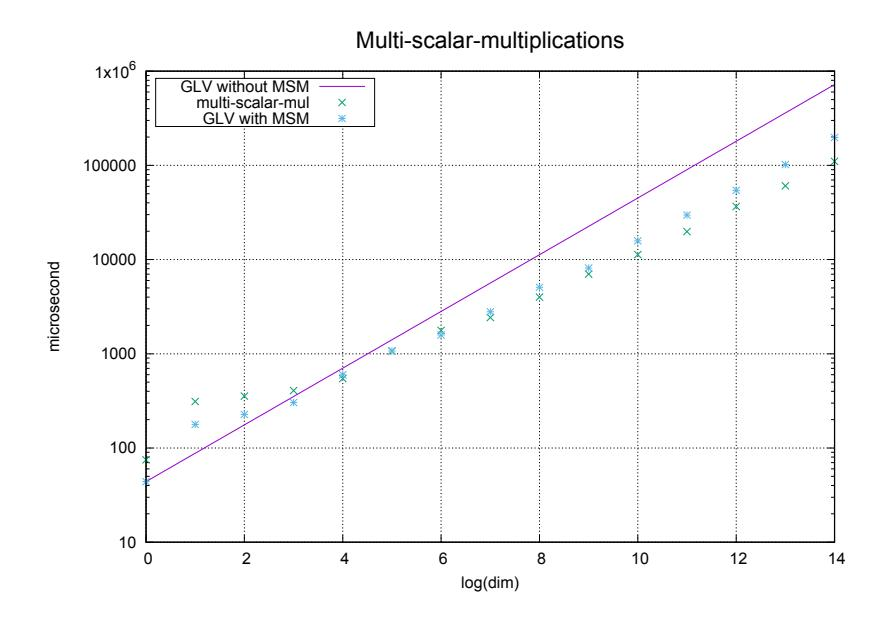

# Bandersnatch: a fast elliptic curve built over the BLS12-381 scalar field

Simon Masson¹ © ♂, Antonio Sanso² © ♂ and Zhenfei Zhang² © ♂

<sup>1</sup> Anoma <sup>2</sup> Ethereum Foundation

**Abstract.** In this paper, we introduce Bandersnatch, a new elliptic curve built over the BLS12-381 scalar field. The curve is equipped with an efficient endomorphism, allowing a fast scalar multiplication algorithm. Our benchmark shows that the multiplication is 42% faster, 21% reduction in terms of circuit size in the form of rank 1 constraint systems (R1CS), and 10% reduction in terms of Plonk circuit, compared to another curve, called Jubjub, having similar properties. Many zero-knowledge proof systems that rely on the Jubjub curve can benefit from our result.

Keywords: Elliptic curve cryptography

MSC Code: 94A60

# 1 Introduction

BLS12-381 is a pairing-friendly curve discovered by Sean Bowe [Bow17] in 2017. Currently, BLS12-381 is undergoing a standardization process from the IRTF Crypto Forum Research Group, and is universally used for digital signatures and zero-knowledge proofs by many projects orbiting in the blockchain universe: Zcash, Ethereum, Filecoin, Anoma, Skale, Algorand, Dfinity, Chia, and more. The ZCash team introduced Jubjub [Zt18], an elliptic curve built over the BLS12-381 scalar field  $\mathbb{F}_{r_{\text{BLS}}}$ . This curve is not pairing-friendly, but leads to constructions where  $\mathbb{F}_{r_{\text{BLS}}}$  arithmetic circuits can be manipulated using the BLS12-381 curve. The Jubjub curve can be represented in the twisted Edwards coordinates, allowing efficiency inside zk-SNARK circuits. In order for some cryptographic applications to scale, it is necessary to have efficient scalar multiplication on the non-pairing-friendly curve. The main drawback of Jubjub is the slow scalar multiplication algorithm compared, for example, with the "Bitcoin curve" (SECP256k1). It comes from the fact that the curve does not have an efficiently computable endomorphism, necessary for computing scalar multiplications using the GLV method [GLV01] (a technique protected by a US patent until Sep 2020 [Rob20], but that expired and is freely usable now).

Our contribution. The Jubjub curve is a curve with a large discriminant, meaning that the GLV method is not possible on this curve. We performed an exhaustive search of curves of small discriminant, defined over the BLS12-381 scalar field. This way, we obtain an elliptic curve using the Complex Multiplication method [AM93], where the scalar multiplication algorithm is efficient thanks to the GLV method [GLV01].

We implement this curve in Rust, using the Arkworks framework [Ark], and release our code to the open domain [Ban]. Table 1 shows a comparison of the Bandersnatch and Jubjub curves. Details deferred to Section 4.

<span id="page-1-0"></span>

|              | multiplication cost | R1CS constraints | TurboPlonk constraints |  |  |
|--------------|---------------------|------------------|------------------------|--|--|
| Jubjub       | $75~\mu\mathrm{s}$  | 3177             | 1865                   |  |  |
| Bandersnatch | $44~\mu s$          | 2621             | 1669                   |  |  |
| Improvement  | 42%                 | 21%              | 10%                    |  |  |

Table 1: Bandersnatch vs Jubjub

To demonstrate how a zero-knowledge proof system can benefit form our curve, we also report the number of constraints one needs to express a group multiplication in the forms of two commonly used circuit descriptions for zero-knowledge proof systems, namely, rank one constraint system (R1CS), and the Plonk circuit. A group multiplication takes 2621 and 1669 constraints, respectively, when the point is in affine form over the twisted Edwards curve, yielding a 21% and 10% improvement over the Jubjub curve.

Organization of the paper. In Section 2, we describe how we obtained several curves allowing the GLV method together with cryptographic security. Then, we introduce in Section 3 the Bandersnatch curve in different models (in Weierstrass, Montgomery and twisted Edwards coordinates). Finally, we compare the scalar multiplication algorithm over the Bandersnatch and the Jubjub curves in Section 4 from a practical point of view.

## <span id="page-1-1"></span>2 Small discriminant curves

The GLV method [GLV01] is a well known trick for accelerating scalar multiplication over particular curve. In a nutshell, it applies to elliptic curves where an endomorphism  $\psi$  can be efficiently computed. The GLV method applies in particular for j-invariant j=0 (resp. j=1728) curves because a non-trivial automorphism can be computed using only one modular multiplication. The method also applies for other curves where the endomorphism is slightly more expensive, called  $small\ discriminant\ curves$ .

Let E be an elliptic curve defined over  $\mathbb{F}_p$  of trace t. E and its quadratic twist  $E^t$  are  $\mathbb{F}_{p^2}$ -isomorphic curves and their orders over  $\mathbb{F}_p$  are closely related with the trace t:

$$#E(\mathbb{F}_p) = p + 1 - t$$
  $#E^t(\mathbb{F}_p) = p + 1 + t.$ 

See [Sil86] for a complete introduction to elliptic curves. In this work, we are looking for cryptographic applications based on ordinary elliptic curves, meaning that we look for  $t \not\equiv 0 \bmod p$ . The endomorphism ring of these curves have a particular structure:  $\operatorname{End}(E)$  is an order of the imaginary quadratic field  $\mathbb{Q}(\sqrt{t^2-4p})$ . From now, we denote -D to be the discriminant of  $\operatorname{End}(E)$ , and  $\{\operatorname{Id},\psi\}$  a basis of the endomorphism ring. The fundamental discriminant corresponds to the discriminant of the maximal order containing  $\operatorname{End}(E)$ . This way,  $\psi$  is of degree  $\frac{D+1}{4}$  or D/4 depending on the value of D modulo 4, and  $\psi$  can be defined using polynomials of degree O(D) thanks to the Vélu's formulas [Vél71]. Thus, the evaluation of  $\psi$  is efficient only for curves of small discriminant.

In this work, we restrict to curves defined over the BLS12-381 scalar field  $\mathbb{F}_{r_{\text{BLS}}}$ . From now, we denote  $p=r_{\text{BLS}}$  and we look for curves with a 128-bit cryptographic security. Curves with -D=-3 and -4 do not have a large prime subgroup defined over  $\mathbb{F}_p$ . Hence, we look for small discriminant -D<-4 curves with subgroup and twist-subgroup security. It means that  $\#E(\mathbb{F}_p)$  has a roughly 256-bit prime factor, as well as  $\#E^t(\mathbb{F}_p)$ .

As the endomorphism cost is closely related to the discriminant, we restrict to  $-D \ge -388$  so that  $\psi$  can be efficiently computed. Moreover, we restrict on fundamental discriminants (discriminants of the maximal orders of imaginary quadratic fields). We denote  $\mathcal{O}_{-D}$  the maximal order of discriminant -D. Elliptic curves with  $\operatorname{End}(E) \subset \mathcal{O}_{-D}$  are isogenous curves, meaning that there is a rational map between them. Isogenous curves have the same order so that we can restrict on fundamental discriminants for our search.

We compute an exhaustive search following the CM method [LZ94, Mor91]. Given a discriminant -D, we deterministically obtain the corresponding curves using number theory tools. More precisely, we consider the Hilbert class polynomial  $H_{-D}(X)$ . The roots of  $H_{-D}$  are the j-invariants of curves defined over a number field whose endomorphism ring is an order of discriminant D. In practice, for a given discriminant D, roughly half of the curves are supersingular and hence not relevant to our cryptographic applications. As we look for an efficient endomorphism, we consider small discriminant curves. We provide in Algorithm 1 the algorithm we used in order to obtain curves for our interest.

#### <span id="page-2-1"></span>Algorithm 1 Search of curves

```
1: for each D \in \{D_{\min}, \dots, D_{\max}\} do
        D_0 \leftarrow \text{fundamental discriminant of } -D
        H_{-D_0}(X) \leftarrow \text{Hilbert class polynomial of degree } D_0
 3:
        Factor H_{-D_0} and compute the roots R
 4:
        for each j_0 \in R do
 5:
            for each E elliptic curve of j-invariant j_0 (up to isomorphism) do
 6:
 7:
                if E is not supersingular then
 8:
                     N \leftarrow \operatorname{Order}(E)
                     Store the factorization of N
 9:
                end if
10:
            end for
11:
12:
        end for
13: end for
```

Starting with -D=-3, we consider elliptic  $H_{-D}$  and factor it in order to get the curves of discriminant -D (up to isomorphism). From the elliptic curve, we obtain the trace and then the order of the curve defined over  $\mathbb{F}_p$ , and finally factor it in order to obtain a cryptographically interesting curve. We considered curves up to  $D_{\max}=388$ , corresponding to a fundamental discriminant of -292. We list in Table 2 the ordinary curves we obtained. In this table,  $p_n$  denotes a prime of n bits. The generation of these curves is reproducible using the file at https://github.com/asanso/Bandersnatch/blob/main/python-ref-impl/small-disc-curves.py. We finally obtain an interesting curve for -D=-8 with large prime order subgroups on both the curve and its twist. We present in Section 3 the curve in several models, together with the endomorphism in order to apply the GLV scalar multiplication algorithm.

## <span id="page-2-0"></span>3 Bandersnatch

The Bandersnatch is obtained from a discriminant -D = -8, meaning that the endomorphism ring is  $\mathbb{Z}[\sqrt{-2}]$ . We obtain the curve j-invariant using the Complex Multiplication method, based on the Hilbert class polynomial  $H_{-D}(X)$ . The roots of  $H_{-D}$  are j-invariants of elliptic curves whose endomorphism ring is of discriminant -D. From a j-invariant, we obtain the curve equation in different models. Before looking into the details of three different representations, we briefly recall how to exhibit the degree 2 endomorphism  $\psi$ .

**Degree 2 endomorphism.** The endomorphism  $\psi$  has a kernel generated by a 2-torsion point. Hence, we can obtain the rational maps defining  $\psi$  by looking at the curves 2-isogenous to Bandersnatch. Only one has the same j-invariant, meaning that up to an isomorphism, Vélu's formulas [Vél71] let us compute  $\psi$ . For cryptographic use-cases, we are interested in computing  $\psi$  on the  $p_{253}$ -order subgroup of the curve. On these points,  $\psi$ 

<span id="page-3-0"></span>Table 2: Curves for discriminants  $-3 \ge -D \ge -292$ . Curve order  $-\mathbf{D}$ Curve sec.  $2^2 \cdot 3 \cdot 97 \cdot 19829809 \cdot 2514214987 \cdot 423384683867248993 \cdot p_{131}$ -365-bit  $2^{64} \cdot 906349^4 \cdot p_{28}^4$ 14-bit 77-bit  $7 \cdot 43 \cdot 1993 \cdot 2137 \cdot 43558993 \cdot 69032539613749 \cdot p_{154}$ 41-bit  $3 \cdot 7 \cdot 13 \cdot 79 \cdot 2557 \cdot 33811 \cdot 1645861201 \cdot 75881076241177 \cdot$  $86906511869757553 \cdot p_{82}$  $3^2 \cdot 11^2 \cdot 19^2 \cdot 10177^2 \cdot 125527^2 \cdot 859267^2 \cdot$ 13-bit  $2508409^2 \cdot 2529403^2 \cdot p_{26}^2$  $836509 \cdot p_{236}$ 118-bit  $2^{32} \cdot 5 \cdot 73 \cdot 906349^2 \cdot 254760293^2 \cdot p_{119}$ 59-bit -4  $2^2 \cdot 29 \cdot 233 \cdot 34469 \cdot 1327789373 \cdot 19609848837063073$ 37-bit  $159032890827948314857 \cdot p_{74}$  $2\cdot 3^2\cdot 11^2\cdot 13\cdot 1481\cdot 10177^2\cdot 859267^2\cdot$ 37-bit  $52437899^2 \cdot 346160718017 \cdot p_{74}$  $2 \cdot 5 \cdot 19^2 \cdot 1709 \cdot 125527^2 \cdot 2508409^2 \cdot 2529403^2 \cdot p_{114}$ 57-bit **122-bit**  $2^7 \cdot 3^3 \cdot p_{244}$ -8 $2^2 \cdot p_{253}$ 126-bit  $5 \cdot 191 \cdot 5581 \cdot 18793 \cdot 48163 \cdot 46253594704380463613 \cdot p_{138}$ -1169-bit 73-bit  $3^3 \cdot 11^2 \cdot 9269797 \cdot 17580060420191283788101 \cdot p_{147}$  $7 \cdot 11^2 \cdot 19 \cdot 23 \cdot 397 \cdot 419 \cdot p_{220}$ \_10 110-bit  $3^2 \cdot 5 \cdot 503 \cdot 10779490483 \cdot 433275286013779991 \cdot p_{149}$ 74-bit -2453-bit  $2^2 \cdot 3^2 \cdot 7 \cdot 19^2 \cdot 127 \cdot 29402034080953$  $2970884754778276642175743 \cdot p_{106}$ 86-bit  $2^5 \cdot 5 \cdot 39628279 \cdot 1626653036429383 \cdot p_{172}$  $3^2 \cdot 5 \cdot 61223923 \cdot p_{224}$ -51112-bit  $23^2 \cdot 41 \cdot p_{241}$ 120-bit  $3479887483 \cdot 56938338857 \cdot 8474085246072233 \cdot p_{135}$ -6767-bit  $3^2 \cdot 8478452882270519617659314063 \cdot p_{159}$ 79-bit  $2^2 \cdot 11 \cdot 16984307 \cdot 24567897636186592260640293583411 \cdot p_{122}$ -8861-bit  $2^9 \cdot 3^2 \cdot 31 \cdot 6133 \cdot 116471 \cdot 69487476515565975361139 \cdot p_{133}$ 66-bit  $2 \cdot 1753 \cdot 101235113104036296384208928969 \cdot p_{147}$ -13273-bit  $2 \cdot 3^2 \cdot 7^2 \cdot 11 \cdot 23 \cdot 587 \cdot 701 \cdot 32299799971 \cdot p_{184}$ 92-bit  $2^3 \cdot 7^3 \cdot 19^3 \cdot 10939 \cdot 11131315086725327441688173207 \cdot p_{125}$ -13662-bit 87-bit  $2^2 \cdot 5 \cdot 5741 \cdot 30851 \cdot 533874022134253 \cdot p_{175}$  $2 \cdot 3^2 \cdot 19 \cdot 89 \cdot 5189 \cdot p_{228}$ -228114-bit  $2 \cdot 947 \cdot 277603 \cdot 28469787063396608749 \cdot p_{162}$ 81-bit  $2^2 \cdot 13 \cdot 523 \cdot 1702319 \cdot 2827715661581 \cdot p_{179}$ -24489-bit  $2^8 \cdot 3^2 \cdot 5 \cdot 71 \cdot 907 \cdot 2749 \cdot 146221 \cdot 2246269 \cdot p_{176}$ 88-bit -264 $2^3 \cdot 11 \cdot 131 \cdot 12543757399 \cdot 2818746796297 \cdot p_{167}$ 83-bit 82-bit  $2^2 \cdot 3 \cdot 5^2 \cdot 2287 \cdot 2134790941497418864559 \cdot p_{165}$ -27670-bit  $2 \cdot 11^2 \cdot 8839 \cdot 78797899 \cdot 323360863688748558301 \cdot p_{140}$  $2 \cdot 3 \cdot 5 \cdot 6197 \cdot 138617 \cdot 16664750312513 \cdot p_{177}$ 88-bit  $2 \cdot 54983 \cdot 5220799 \cdot 2671917733 \cdot p_{185}$ -29292-bit  $2 \cdot 11^2 \cdot 149 \cdot 354689 \cdot 24012883 \cdot 32483123 \cdot p_{172}$ 86-bit

acts as a scalar multiplication by the eigenvalue

#### $\lambda = 0$ x13b4f3dc4a39a493edf849562b38c72bcfc49db970a5056ed13d21408783df05

By construction,  $\psi$  is the endomorphism  $\sqrt{-2} \in \mathcal{O}_{-8}$ . Thus,  $\lambda$  satisfies  $\lambda^2 + 2 = 0$  mod  $p_{253}$ . In the following sections, we provide details on the curve equation, the  $\psi$  rational maps, and a generator of the  $p_{253}$ -order subgroup in the case of the affine Weierstrass,

projective Montgomery and projective twisted Edwards representations. The parameters are reproducible using the script available at https://github.com/asanso/Bandersnatch/blob/main/python-ref-impl/get\_params.py.

#### <span id="page-4-0"></span>3.1 Weierstrass curve

**Curve equation.** The Bandersnatch curve can be represented in the Weierstrass model using the equation

$$E_W: y^2 = x^3 - 3763200000x - 786759680000000.$$

Elliptic curves, such as Jubjub and Bandersnatch, have traditionally been represented in the Montgomery or Edwards form. However, recent advancements in research, notably the closed-form formulas presented in [RCB16], have enabled the efficient and secure utilization of prime order curves.

**Endomorphism.** The endomorphism  $\psi$  can obtained using the method detailed above. We obtain the following expression:

$$\psi_{\mathrm{W}}(x,y) = \left(u^2 \cdot \frac{x^2 + 44800x + 2257920000}{x + 44800}, u^3 \cdot y \cdot \frac{x^2 + 2 \cdot 44800x + t_0}{(x + 44800)^2}\right),$$

where

u = 0 x 50281 ac 0 f 92 f c 1 b 20 f d 897 a 16 b f 2 b 9 e 132 b d c b 06721 c 589296 c f 82245 c f 9382 d 67821 c 10 c 10 c 10 c 10 c 10 c 10 c 10 c 10 c 10 c 10 c 10 c 10 c 10 c 10 c 10 c 10 c 10 c 10 c 10 c 10 c 10 c 10 c 10 c 10 c 10 c 10 c 10 c 10 c 10 c 10 c 10 c 10 c 10 c 10 c 10 c 10 c 10 c 10 c 10 c 10 c 10 c 10 c 10 c 10 c 10 c 10 c 10 c 10 c 10 c 10 c 10 c 10 c 10 c 10 c 10 c 10 c 10 c 10 c 10 c 10 c 10 c 10 c 10 c 10 c 10 c 10 c 10 c 10 c 10 c 10 c 10 c 10 c 10 c 10 c 10 c 10 c 10 c 10 c 10 c 10 c 10 c 10 c 10 c 10 c 10 c 10 c 10 c 10 c 10 c 10 c 10 c 10 c 10 c 10 c 10 c 10 c 10 c 10 c 10 c 10 c 10 c 10 c 10 c 10 c 10 c 10 c 10 c 10 c 10 c 10 c 10 c 10 c 10 c 10 c 10 c 10 c 10 c 10 c 10 c 10 c 10 c 10 c 10 c 10 c 10 c 10 c 10 c 10 c 10 c 10 c 10 c 10 c 10 c 10 c 10 c 10 c 10 c 10 c 10 c 10 c 10 c 10 c 10 c 10 c 10 c 10 c 10 c 10 c 10 c 10 c 10 c 10 c 10 c 10 c 10 c 10 c 10 c 10 c 10 c 10 c 10 c 10 c 10 c 10 c 10 c 10 c 10 c 10 c 10 c 10 c 10 c 10 c 10 c 10 c 10 c 10 c 10 c 10 c 10 c 10 c 10 c 10 c 10 c 10 c 10 c 10 c 10 c 10 c 10 c 10 c 10 c 10 c 10 c 10 c 10 c 10 c 10 c 10 c 10 c 10 c 10 c 10 c 10 c 10 c 10 c 10 c 10 c 10 c 10 c 10 c 10 c 10 c 10 c 10 c 10 c 10 c 10 c 10 c 10 c 10 c 10 c 10 c 10 c 10 c 10 c 10 c 10 c 10 c 10 c 10 c 10 c 10 c

 $t_0 = \mathtt{0x73eda753299d7d483339d80809a1d80553bda402fffe5bfefffffffffffef10be001}$ 

**Subgroup generator.** The generator of the  $p_{253}$ -order subgroup is computed by finding the lexicographically smallest valid x-coordinate of a point of the curve, and scaling it by the cofactor 4 such that the result is not the point at infinity. From a point with x = 2, we obtain a generator  $E_W(x_W, y_W)$  where:

 $x_W = 0$ xa76451786f95a802c0982bbd0abd68e41b92adc86c8859b4f44679b21658710,

 $y_W = 0$ x44d150c8b4bd14f79720d021a839e7b7eb4ee43844b30243126a72ac2375490a.

#### 3.2 Twisted Edwards curve

**Curve equation.** Bandersnatch can also be represented in twisted Edwards coordinates, where the group law is complete. In this model, the Bandersnatch curve can be defined by the equation

$$E_{\text{TE}} : -5x^2 + y^2 = 1 + dx^2y^2,$$

$$d = \frac{138827208126141220649022263972958607803}{171449701953573178309673572579671231137}$$

Twisted Edwards group law is more efficient with a coefficient a=-1 (see [HWCD08] for details). In our case, -5 is not a square in  $\mathbb{F}_p$ . Thus, the curve with equation  $-x^2+y^2=1-dx^2y^2/5$  is the quadratic twist of Bandersnatch. We provide a representation with a=-5, leading to a slightly more expensive group law because multiplying by -5 is more expensive than a multiplication by -1, but this cost will be neglected compared to the improvement of the GLV method. See Section 4 for details.

**Endomorphism.** From this representation, we exhibit the degree 2 endomorphism in twisted Edwards coordinates:

$$\psi_{\mathrm{TE}}(x,y,z) = (f(y)h(y),g(y)xy,h(y)xy)$$

with

$$f(y) = c(z^2 - y^2),$$
  
 $g(y) = b(y^2 + bz^2),$   
 $h(y) = y^2 - bz^2,$ 

and

*b* = 0x52c9f28b828426a561f00d3a63511a882ea712770d9af4d6ee0f014d172510b4,

*c* = 0x6cc624cf865457c3a97c6efd6c17d1078456abcfff36f4e9515c806cdf650b3d.

This map can be computed in 3 additions and 9 multiplications by first computing *xy*, *y* 2 , *z* <sup>2</sup> and *bz*<sup>2</sup> .

**Subgroup generator.** The generator of the *p*253-order subgroup obtained in Section [3.1](#page-4-0) has twisted coordinates of the form *E*TE(*x*TE*, y*TE*,* 1) with

*xT E* = 0x29c132cc2c0b34c5743711777bbe42f32b79c022ad998465e1e71866a252ae18,

*yT E* = 0x2a6c669eda123e0f157d8b50badcd586358cad81eee464605e3167b6cc974166.

## **3.3 Montgomery curve**

**Curve equation.** A twisted Edwards curve is always birationally equivalent to a Montgomery curve. We obtain the mapping between these two representations following [\[CS18\]](#page-10-9). While the twisted Edwards model fits better for F*<sup>p</sup>* circuit arithmetic and more generally for the zero-knowledge proof context, we provide here the Montgomery version because the scalar multiplication is more efficient in this model:

$$E_M: By^2 = x^3 + Ax^2 + x$$

*B* = 0x300c3385d13bedb7c9e229e185c4ce8b1dd3b71366bb97c30855c0aa41d62727,

*A* = 0x4247698f4e32ad45a293959b4ca17afa4a2d2317e4c6ce5023e1fd63d1b5de98.

**Endomorphism.** Montgomery curves allow efficient scalar multiplication using the Montgomery ladder. We provide here the endomorphism *ψ* in this model:

$$\psi_{\rm M}(x, -, z) = (-(x - z)^2 - cxz, -, 2xz)$$

with

*c* = 0x4247698f4e32ad45a293959b4ca17afa4a2d2317e4c6ce5023e1fd63d1b5de9a.

**Subgroup generator.** The generator of the *p*253-order subgroup given above is of the form *EM*(*xM,* −*,* 1) with:

*x<sup>M</sup>* = 0x67c5b5fed18254e8acb66c1e38f33ee0975ae6876f9c5266a883f4604024b3b8.

## **3.4 Security of Bandersnatch**

The Bandersnatch curve order is 2 2 · *r* for a 253-bit long prime *r*. Its quadratic twist has order 2 7 · 3 3 · *r* ′ , where *r* ′ is another prime of 244 bits. Hence, the Bandersnatch curve satisfies twist security after a quick cofactor check. We estimate that the Bandersnatch curve (resp. its quadratic twist) has 126 bits of security (resp. 122 bits of security).

# <span id="page-6-0"></span>**4 Comparison**

The twisted Edwards representation is the most used in practice, and we now focus on the comparison between Jubjub and Bandersnatch in this model.

## **4.1 Scalar multiplications for a variable base point**

Because of its large discriminant, the scalar multiplication on Jubjub is a basic doubleand-add algorithm, meaning that it computes a multiplication by *n* in log *n* doublings and log *n/*2 additions (in average) on the curve.

The endomorphism *ψ* lets us compute the scalar multiplication faster than a doubleand-add algorithm with few precomputations. For a point *P* and a scalar *n*, we first evaluate *ψ* at *P* and decompose *n* = *n*<sup>1</sup> + *λn*2. Then a multi scalar multiplication is computed in log *n/*2 doublings and 3 log *n/*8 additions (in average) on the curve.

We benchmarked our implementation with both GLV enabled and disabled, and compared it with Arkworks' own Jubjub implementation. Our benchmark is conducted over an AMD 5900x CPU, with Ubuntu 20.04, rust 1.52 stable version, and Arkwork 0.3.0 release version. We used criterion [micro-benchmark toolchain,](https://docs.rs/criterion) version 0.3.0, for data collection. We compile Arkworks with two options, namely default and asm, respectively. The default setup relies on num\_bigint crate for large integer arithmetics, while asm turns on assembly for finite field multiplication.

Arkworks use the aforementioned double-and-add multiplication methodology, without side channel protections such as Montgomery ladders. Our non-GLV implementation also follows this design. For our GLV implementation, there are three components, namely, the endomorphism, the scalar decomposition, and the multi scalar multiplication (MSM). We implement those schemes and present the micro-benchmarks in Table [3.](#page-6-1) Specifically, we do not use the MSM implementation in Arkworks: our scalars, after the decomposition, contain roughly 128 bits of leading zeros, and our own MSM implementation is optimized for this setting.

Table [3](#page-6-1) presents the full picture of the benchmark. When GLV is disabled, we observe a similar but a little worse performance for Bandersnatch curve, compared to the Jubjub curve, due to the slightly larger coefficient *a* = −5 and a larger scalar field of 253 bits (Jubjub curve has *a* = −1 and a scalar field of 252 bits). When GLV is enabled, we report a 45% improvement of the Bandersnatch curve, and a 42% improvement over the Jubjub curve.

Table 3: Bandersnatch vs Jubjub: Performance

<span id="page-6-1"></span>

|                             | default | asm     |
|-----------------------------|---------|---------|
| Jubjub                      | 75 µs   | 69 µs   |
| Bandersnatch without GLV    | 78 µs   | 72 µs   |
| Bandersnatch with GLV       | 44 µs   | 42 µs   |
| Endomorphism                | 2.4 µs  | 1.8 µs  |
| Scalar decomposition        | 0.75 µs | 0.7 µs  |
| multi scalar multiplication | 42 µs   | 40.8 µs |
| Overall Improvement         | 42%     | 39%     |

To make a meaningful comparison, we benchmark the cost of the group multiplication over the default generators. Note that Arkworks do not implement optimizations for fixed generators nonetheless. We then sample field elements uniformly at random, for each new iteration, and the benchmark result is consolidated over 100 iterations.

## **4.2 Multi scalar multiplications**

This section reports the performance of variable-base multi-scalar multiplications (MSM). It is important to note that this MSM is compatible with, but distinct from, the MSM inside the GLV. Specifically, for a sum of *k* scalar multiplications, we present the data points for:

- invoking the MSM over the *k* base scalars randomly sampled, expected to be around 256 bits;
- using GLV endomorphism to break the *k* base scalars into 2*k* new base scalars, of halved size, i.e. of 128 bits.

The data is presented in Figure [1.](#page-8-0) Specifically, as a baseline, the trivial solution, captained by *GLV without MSM*, is the product of the number of bases and the cost of doing a single GLV multiplication. Note that the MSM algorithms incur an overhead to build some tables, which make them less favorable compared to the trivial solution when dimension is really small. For a dimension greater than 4, MSM algorithms begin to out-perform trivial solutions. For dimension greater than 128, it is more efficient to invoke the MSM directly, rather than doing it over the GLV basis.

The most popular algorithm to compute MSM is the Pippenger algorithm [\[Pip80\]](#page-10-10). In theory, for *λ* bits of scalars and *n* bases, the algorithm takes (1 + *o*(1)) <sup>2</sup>*λn* log *λn* to execute [\[Boo\]](#page-10-11). Notice that whether the endomorphism is adapted, the product *λn* remains the same. in other words, we halved the bit-length of the scalars, in exchange of doubling the dimension. However, we observe that the Pippenger algorithm used by our underlying elliptic curve library, namely, Arkworks version 0.3.0 [\[Ark\]](#page-10-3) does not scale as expected. We believe this is due to two reasons. First, notice that the bucket sizes in the Pippenger algorithm are rounded. For small dimensions, it is optimized via benchmarks results, while for larger dimensions it is derived from theoretical analysis. The latter may introduce a larger rounding error. Secondly, we have ignored the memory cost in this analysis which contributes a noticeable but not significant component in the total cost.

## **4.3 SNARK constraints**

The Bandersnatch curve is zk-SNARK friendly: its base field matches the scalar field for the BLS12-381 curve, a pairing-friendly curve, on top of which people build zk-SNARK systems, such as Groth16 [\[Gro16\]](#page-10-12) or Plonk [\[GWC19\]](#page-10-13). In such a setting, the prover can sufficiently argue certain relationships over arithmetic circuits rather than binary circuits.

There are two common ways to express operations in SNARK-friendly circuits, namely

- Rank-1 constraint system (R1CS)
- Plonk circuit.

In general, the complexity is determined by the number of constraints for both cases. The R1CS is universal, in that it is compatible with multiple prover front-ends. The Plonk circuit is usually bounded to a specific Plonk proving system, since Plonk prove system allows for customized selectors, and thus, customized circuits descriptions. For Plonk circuit, our analysis is based on an ECC optimized Plonk system, with efficient range proofs from dynamic lookup tables [\[GW20\]](#page-10-14).

<span id="page-8-0"></span>

Figure 1: Multi-scalar-multiplications

Precisely, we list the breakdown numbers in Table [4;](#page-8-1) the Bandersnatch with GLV constraints count is a little higher than the sum of its components due to some overhead during setup phase.

Table 4: Bandersnatch vs Jubjub: Constraints count

<span id="page-8-1"></span>

|                             | R1CS Constraints | Plonk Constraints |
|-----------------------------|------------------|-------------------|
| Jubjub                      | 3177             | 1865              |
| Bandersnatch without GLV    | 3177             | 1865              |
| Bandersnatch with GLV       | 2621             | 1669              |
| Endomorphism                | 6                | 7                 |
| Scalar decomposition        | 405              | 375               |
| multi scalar multiplication | 2176             | 1285              |
| Overall Improvement         | 21%              | 10%               |

The [Rust implementation](https://github.com/zhenfeizhang/bandersnatch) of the Bandersnatch scalar multiplication algorithm confirms our estimations: the circuit for GLV method is 21% smaller than the Jubjub implementation with R1CS, and 10% smaller with Plonk.

## **4.3.1 R1CS**

We evaluate the number of constraints for a variable base group multiplication. For a double-and-add algorithm, our code reports 3177 constraints in total. We use the default double-and-add circuit framework from Arkworks [\[Ark\]](#page-10-3). A sketch of the scheme is presented in Algorithm [2.](#page-9-0) As a sanity check, within the core logic, it takes 6 constraints per addition, 5 constraints per doubling and 2 constraints per bit selection. This adds up to 13 constraints per bit, or 3177 constraints per group multiplication (and we reasonably assume some system overhead consumes another 10 constraints).

### <span id="page-9-0"></span>**Algorithm 2** Double-and-Add algorithm in circuit

```
Require: G, H, two group elements
Require: x, a scalar field element
Ensure: Constraints that H == xG
 (x0, ...x254) ← BitDecompose(x) ▷ Decomposition circuit
 H′ = InfinityPoint
 for i ∈ [0, 254] do
   if x254−i == 1 then ▷ Binary Selection circuit
      H′ ← H′ + G ▷ Affine Curve Group Add circuit
   end if
   H′ ← H′ + H′ ▷ Affine Curve Group Double circuit
 end for
 EnforcePointEq(H, H′
                 ) ▷ Equality circuit
```

Now, in the case of GLV, the endomorphism is almost free: it requires 6 constraints. The MSM inside the GLV can also be done with 2176 constraints using the above doublethen-add techniques. The difficult part is the circuit for scalar decomposition, which is to prove *n* = *n*<sup>1</sup> + *λn*<sup>2</sup> mod *r* where *n* and *λ* are around 256 bits, *n*<sup>1</sup> and *n*<sup>2</sup> are around 128 bits, and *r* is the order of the scalar field. We implemented this part of the code with 405 constraints via hand optimized circuits.

## **4.3.2 TurboPlonk**

We apply a similar analysis for our customized, ECC-friendly Plonk system [\[XCZ](#page-11-4)<sup>+</sup>22]. This custom gate design allows us to express a group add or double operation within 2 gates. As a result, in a double-and-add circuit, each bit in the scalar takes 7 constraints in total, i.e., 2 for point selection, 2 for addition, 2 for doubling, and 1 for binary decomposition. For a scalar length of 256 bits, this is roughly 1800 constraints.

In comparison, with GLV, per bit we account for 4 constraints for 2x point selections, 4 constraints for 2x point additions, and 2 constraints for doubling. There is also a bit decomposition cost which was done during scalar decomposition. The gain comes from the fact that our scalars are only 128 bits each.

# **5 Conclusion**

Tne last decade has seen great improvements on practical zk-SNARK systems. An essential stepping stone of these schemes is an efficient elliptic curve whose base field matches the scalar field for some pairing-friendly curve. On this note, we present Bandersnatch as an alternative to the commonly used base curve Jubjub. Due to the existence of an efficiently computable endomorphism, the scalar multiplication over this curve is 42% times faster than the Jubjub curve. For multi scalar multiplications, we report a narrowed advantage over Jubjub curve when the dimension is small, but it vanishes for larger dimensions. We also do not observe any improvement in terms of number of constraints in the corresponding R1CS circuit.

**Acknowledgments.** We would like to thank Weikeng Chen, Luca De Feo, Justin Drake, Youssef El Housni, Dankrad Feist, Gottfried Herold and Daira Hopwood for fruitful discussions. We express our gratitude to the anonymous reviewers for their critical review of the manuscript and for providing detailed and insightful comments. Their valuable feedback significantly enhanced the quality and clarity of the paper.

# **References**

- <span id="page-10-2"></span>[AM93] A. O. L. Atkin and F. Morain. Elliptic curves and primality proving. *Math. Comp*, 61:29–68, 1993.
- <span id="page-10-3"></span>[Ark] Arkworks contributors. Arkworks: An ecosystem for developing and programming with zkSNARKs. <http://arkworks.rs>.
- <span id="page-10-4"></span>[Ban] Bandersnatch team. Bandersnatch: a fast elliptic curve built over the BLS12- 381 scalar field. <https://github.com/zhenfeizhang/bandersnatch>.
- <span id="page-10-11"></span>[Boo] Jonathan Bootle. Efficient multi-exponentiation. [https://jbootle.github](https://jbootle.github.io/Misc/pippenger.pdf) [.io/Misc/pippenger.pdf](https://jbootle.github.io/Misc/pippenger.pdf).
- <span id="page-10-0"></span>[Bow17] Sean Bowe. BLS12-381: New zk-SNARK Elliptic Curve Construction, 2017. <https://electriccoin.co/blog/new-snark-curve/>.
- <span id="page-10-9"></span>[CS18] Craig Costello and Benjamin Smith. Montgomery curves and their arithmetic - the case of large characteristic fields. 8(3):227–240, September 2018. [doi:](https://doi.org/10.1007/s13389-017-0157-6) [10.1007/s13389-017-0157-6](https://doi.org/10.1007/s13389-017-0157-6).
- <span id="page-10-1"></span>[GLV01] Robert P. Gallant, Robert J. Lambert, and Scott A. Vanstone. Faster point multiplication on elliptic curves with efficient endomorphisms. pages 190–200, 2001. [doi:10.1007/3-540-44647-8\\_11](https://doi.org/10.1007/3-540-44647-8_11).
- <span id="page-10-12"></span>[Gro16] Jens Groth. On the size of pairing-based non-interactive arguments. pages 305–326, 2016. [doi:10.1007/978-3-662-49896-5\\_11](https://doi.org/10.1007/978-3-662-49896-5_11).
- <span id="page-10-14"></span>[GW20] Ariel Gabizon and Zachary J. Williamson. plookup: A simplified polynomial protocol for lookup tables. Cryptology ePrint Archive, Report 2020/315, 2020. <https://eprint.iacr.org/2020/315>.
- <span id="page-10-13"></span>[GWC19] Ariel Gabizon, Zachary J. Williamson, and Oana Ciobotaru. PLONK: Permutations over lagrange-bases for oecumenical noninteractive arguments of knowledge. Cryptology ePrint Archive, Report 2019/953, 2019. [https:](https://eprint.iacr.org/2019/953) [//eprint.iacr.org/2019/953](https://eprint.iacr.org/2019/953).
- <span id="page-10-8"></span>[HWCD08] Hüseyin Hisil, Kenneth Koon-Ho Wong, Gary Carter, and Ed Dawson. Twisted Edwards curves revisited. pages 326–343, 2008. [doi:10.1007/978-3-540-8](https://doi.org/10.1007/978-3-540-89255-7_20) [9255-7\\_20](https://doi.org/10.1007/978-3-540-89255-7_20).
- <span id="page-10-5"></span>[LZ94] Georg-Johann Lay and Horst G. Zimmer. Constructing elliptic curves with given group order over large finite fields. In Leonard M. Adleman and Ming-Deh Huang, editors, *Algorithmic Number Theory*, pages 250–263, Berlin, Heidelberg, 1994. Springer Berlin Heidelberg.
- <span id="page-10-6"></span>[Mor91] François Morain. Building cyclic elliptic curves modulo large primes. In Donald W. Davies, editor, *Advances in Cryptology — EUROCRYPT '91*, pages 328–336, Berlin, Heidelberg, 1991. Springer Berlin Heidelberg.
- <span id="page-10-10"></span>[Pip80] Nicholas Pippenger. On the evaluation of powers and monomials. *SIAM Journal on Computing*, 9(2):230–250, 1980. [arXiv:https://doi.org/10.1](http://arxiv.org/abs/https://doi.org/10.1137/0209022) [137/0209022](http://arxiv.org/abs/https://doi.org/10.1137/0209022), [doi:10.1137/0209022](https://doi.org/10.1137/0209022).
- <span id="page-10-7"></span>[RCB16] Joost Renes, Craig Costello, and Lejla Batina. Complete addition formulas for prime order elliptic curves. pages 403–428, 2016. [doi:10.1007/978-3-6](https://doi.org/10.1007/978-3-662-49890-3_16) [62-49890-3\\_16](https://doi.org/10.1007/978-3-662-49890-3_16).

<span id="page-11-1"></span>[Rob20] Robert Gallant, Robert Lambert, Scott A. Vanstone. Method for accelerating cryptographic operations on elliptic curves, 2020. [https://patents.google](https://patents.google.com/patent/US7110538B2/en) [.com/patent/US7110538B2/en](https://patents.google.com/patent/US7110538B2/en).

- <span id="page-11-2"></span>[Sil86] Joseph H. Silverman. *The arithmetic of elliptic curves*, volume 106 of *Graduate texts in mathematics*. Springer, 1986.
- <span id="page-11-3"></span>[Vél71] Jacques Vélu. Isogénies entre courbes elliptiques. *Comptes Rendus de l'Académie des Sciences de Paris*, 273:238–241, 1971.
- <span id="page-11-4"></span>[XCZ<sup>+</sup>22] Alex Luoyuan Xiong, Binyi Chen, Zhenfei Zhang, Benedikt Bünz, Ben Fisch, Fernando Krell, and Philippe Camacho. Veri-zexe: Decentralized private computation with universal setup. Cryptology ePrint Archive, Paper 2022/802, 2022. <https://eprint.iacr.org/2022/802>. URL: [https://eprint.iacr.](https://eprint.iacr.org/2022/802) [org/2022/802](https://eprint.iacr.org/2022/802).
- <span id="page-11-0"></span>[Zt18] ZCash team. Jubjub, 2018. <https://z.cash/technology/jubjub/>.