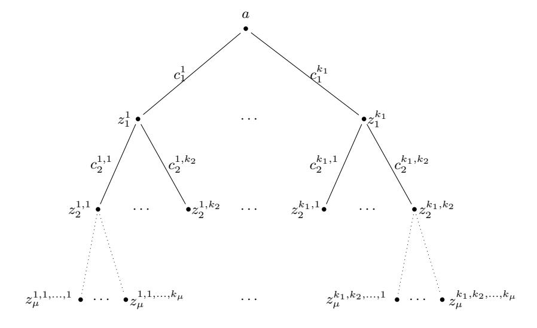

# Parallel Repetition of $(k_1, \ldots, k_{\mu})$ -Special-Sound Multi-Round Interactive Proofs

Thomas Attema1,2,3 and Serge Fehr1,2

CWI, Cryptology Group, Amsterdam, The Netherlands
 serge.fehr@cwi.nl
 Leiden University, Mathematical Institute, Leiden, The Netherlands

2 Leiden University, Mathematical Institute, Leiden, The Netherlands 3 TNO, Cyber Security and Robustness, The Hague, The Netherlands thomas.attema@tno.nl

Version 3 - September 6, 20234

Abstract. In many occasions, the knowledge error  $\kappa$  of an interactive proof is not small enough, and thus needs to be reduced. This can be done generically by repeating the interactive proof in parallel. While there have been many works studying the effect of parallel repetition on the *soundness error* of interactive proofs and arguments, the effect of parallel repetition on the *knowledge error* has largely remained unstudied. Only recently it was shown that the *t*-fold parallel repetition of *any* interactive protocol reduces the knowledge error from  $\kappa$  down to  $\kappa^t + \nu$  for any non-negligible term  $\nu$ . This generic result is suboptimal in that it does not give the knowledge error  $\kappa^t$  that one would expect for typical protocols, and, worse, the knowledge error remains non-negligible.

In this work we show that indeed the t-fold parallel repetition of any  $(k_1, \ldots, k_{\mu})$ -special-sound multi-round public-coin interactive proof optimally reduces the knowledge error from  $\kappa$  down to  $\kappa^t$ . At the core of our results is an alternative, in some sense more fine-grained, measure of quality of a dishonest prover than its success probability, for which we show that it characterizes when knowledge extraction is possible. This new measure then turns out to be very convenient when it comes to analyzing the parallel repetition of such interactive proofs.

While parallel repetition reduces the knowledge error, it is easily seen to *increase* the *completeness* error. For this reason, we generalize our result to the case of s-out-of-t threshold parallel repetition, where the verifier accepts if s out of t of the parallel instances are accepting. An appropriately chosen threshold s allows both the knowledge error and completeness error to be reduced simultaneously.

**Keywords:** Proofs of Knowledge, Knowledge Soundness, Special-Soundness, Knowledge Extractor, Parallel Repetition, Threshold Parallel Repetition.

### 1 Introduction

### 1.1 Background

**Proofs of Knowledge.** Proofs of Knowledge (PoKs) are essential building blocks in many cryptographic primitives. They allow a prover  $\mathcal{P}$  to convince a verifier  $\mathcal{V}$  that it knows a (secret) string  $w \in \{0,1\}^*$ , called a *witness*, satisfying some public constraint. Typically a prover wishes to do this either in (honest-verifier) *zero-knowledge*, i.e., without revealing any information about the witness w beyond the veracity of the claim, or with communication costs smaller than the size of the witness w. Both these requirements prevent the prover from simply revealing the witness w.

A key property of PoKs is knowledge soundness. Informally, a protocol is said to be knowledge sound if a dishonest prover that does not know the secret witness can only succeed in convincing a verifier with some small probability  $\kappa$  called the knowledge error. This is formalized by requiring the existence of an efficient extractor so that for any dishonest prover that succeeds with probability  $\epsilon > \kappa$ , the extractor

&lt;sup>4 Change log w.r.t. Version 2 - February 16, 2022: Corrected a technical oversight by slightly redefining the punctured success probability  $\delta_k$  and its multi-round variant  $\delta_k$ . In particular,  $\delta_k$  is now defined as a minimum over all subsets of cardinality exactly k-1, whereas this used to be a minimum over all subsets of cardinality at most k-1. This subtle difference does not affect the analysis of  $\Sigma$ -protocols (in fact, the actual value of  $\delta_k$  remains the same), but it turns out to be crucial in the multi-round analysis.

outputs a witness *w* with probability at least *ϵ−κ*, up to a multiplicative polynomial loss (in the security parameter), when given black-box access to the prover [16].

Typical 3-round public-coin protocols satisfy the conceptually simpler notion called *special-soundness*. A 3-round protocol is said to be special-sound if there exists an efficient algorithm that given two valid prover-verifier conversations (transcripts) (*a, c, z*) and (*a, c0 , z0* ), with common first message *a* and distinct second messages (challenges) *c 6*= *c 0* , outputs a witness *[w](#page-19-0)*. More generally, a 3-round protocol is called *k*-special-sound if the algorithm requires *k* transcripts, instead of 2, to compute *w*. If *k* is polynomial in the size of the input *x*, the property *k*-special-soundness tightly implies the standard notion of knowledge soundness by a generic reduction, with *κ* = (*k −* 1)*/N*, where *N* is the number of challenges [20, 3].

In recent years, *multi-round* PoKs have gained a lot of attention [8, 10, 22, 11, 1, 9, 2, 3, 4]. The notion of *k*-special-soundness, which is tailored to 3-round protocols, extends quite naturally to (*k*1*, . . . , kµ*) special-soundness for (2*µ* + 1)-round protocols (see Definition 7 for the formal definition). Many of the considered multi-round protocols satisfy this multi-round version of the special-soundness pro[per](#page-20-0)t[y.](#page-19-1) Surprisingly, only recently it was shown that also this generalization tig[ht](#page-19-2)[ly i](#page-19-3)[mpl](#page-20-1)i[es](#page-19-4) [kn](#page-19-5)o[w](#page-19-6)l[ed](#page-19-7)[ge](#page-19-1) [so](#page-19-8)undness [3].

**Parallel Repetition.** In certain occasions, the knowledge error *κ* of a "basic" PoK (and thereby the cheating probability of a dishonest prover) is not small enough, and thus needs to be reduced. This [i](#page-19-1)s particularly the case for lattice-based PoKs, where typically challenge sets are only of polynomial size resulting in non-negligible knowledge errors [21, 5]. Reducing the knowledge error can be done generically by repeating the PoK. Indeed, repeating a PoK *t* times *sequentially*, i.e., one after the other, is known to reduce the knowledge error from *κ* down to *κ t* [16]. However, this approach also increases the number of communication rounds by a factor *t*. This is often undesirable, and sometimes even insufficient, e.g., because the security loss of the Fiat-Shamir [tra](#page-20-2)[nsf](#page-19-9)ormation, transforming interactive into non-interactive protocols, is oftentimes exponential in the number of rounds.

Therefore, it is much more attractive to try to r[edu](#page-19-0)ce the knowledge error by *parallel* repetition. In the case of special-sound protocols, i.e., *k*-special-sound protocols with *k* = 2, such a parallel repetition is easy to analyze: the *t*-fold parallel repetition of a special-sound protocol with challenge space of cardinality *N* is again special-sound protocol, but now with a challenge space of size *Nt* , and so knowledge-soundness with *κ* = 1*/Nt* follows immediately from the generic reduction. Unfortunately, this reasoning does not extend to *k*-special-sound protocols with *k >* 2: even though we still have that the *t*-fold parallel repetition of a *k*-special-sound protocol is *k 0* -special-sound, but now with *k 0* = (*k −*1)*t* + 1, this large increase in the special-soundness parameter renders the extractor, obtained via the generic reduction, inefficient. More precisely, the run-time of a *k 0* -special-sound protocol scales linearly in *k 0* , and therefore exponentially in *t* for *k 0* = (*k −* 1)*t* + 1, unless *k* = 2. In case of multi-round protocols, it is not even clear that the *t*-fold parallel repetition of a (*k*1*, . . . , kµ*)-special-sound (2*µ*+ 1)-round protocol satisfies any meaningful notion of special-soundness.

Somewhat surprisingly, so far the only way to analyze the knowledge error *κ* of the parallel repetition of *k*-special-sound protocols with *k >* 2, or of (*k*1*, . . . , kµ*)-special-sound multi-round protocols, is by means of suboptimal *generic* parallel-repetition results — or by considering weaker notions of knowledge soundness (see the discussion below). Concretely, based on a result from [13], it was recently shown that the *t*-fold parallel repetition of *any* public-coin PoK reduces the knowledge error from *κ* down to *κ t* + *ν* for any non-negligible term *ν* [3]. This generic result is suboptimal in that, when applied to a *k*-special-sound protocol for instance, it does not give the knowledge error *κ t* that one expects (and that one should get when *k* = 2), and, worse, the knowledge error remains non-n[egli](#page-19-10)gible.

Even though this generic parallel-repetition result was shown to be tight, in that there are protocols for which parallel repetition does not allo[w t](#page-19-1)he knowledge error to be reduced down to a negligible function, we can well hope for a stronger result for certain classes of protocols. In particular, it is not too absurd to expect *strong* parallel repetition for *k*-special-sound protocols, and possibly for (*k*1*, . . . , kµ*)-special-sound protocols in the multi-round case. Here, as usual in the general context of parallel repetition, the term "strong" means that the figure of merit *κ*, here the knowledge error, drops from *κ* to *κ t* under a *t*-fold parallel repetition.

**Other Notions of a PoK.** Due to the difficulty in proving the original definition in certain contexts, it has become quite customary to consider modified and/or relaxed notions of a PoK that make it then feasible to obtain positive or stronger results; it is then typically argued that the considered notion is still meaningful and useful (in the considered context).

For example, many works on multi-round protocols consider the weaker notion of *witness-extended emulation* rather than the standard notion of knowledge soundness [8, 10]. In the context of quantum security, the knowledge extractor is typically allowed to have success probability (*ϵ − κ*) *c* (up to a multiplicative polynomial loss) for an arbitrary constant *c*, instead of *ϵ−κ* [25]. Moreover, recently, tighter security guarantees for discrete logarithm based *Σ*-protocols were obtained under a relaxed notion of knowledge soundness in which the knowledge extractor is not only give[n](#page-19-2) [blac](#page-19-3)k-box access to the (possibly dishonest) prover *P ∗* , but is also given the success probability *ϵ* of *P ∗* as input [24]. Finally, some works even allow the the extractor to depend arbitrarily on the prover *P ∗* [14].

In our work here, we instead insist on the original standard definition of a PoK, and we aim for strong parallel-repetition results nevertheless.

### **1.2 Contributions**

In short, we show a strong parallel repetition theorem for the knowledge error of (*k*1*, . . . , kµ*)-special-sound (2*µ*+ 1)-round protocols, for *k*1*, . . . , kµ* such that their product *K* = *k*1 *· · · kµ* is polynomial in the size of the input statement.5 This in particular implies strong parallel repetition for *k*-special-sound protocols for arbitrary polynomial *k*. 6 Strong parallel repetition means that if the original protocol has knowledge error *κ* then the *t*-fold parallel repetition has knowledge error *κ t* , which is optimal, matching the success probability of a dishonest prover that attacks each instance in the parallel repetition independently (and thus succeeds with i[nd](#page-2-0)ependent probability *κ* in each instance).

We also consider a thr[es](#page-2-1)hold parallel repetition, where the verifier accepts as soon as *s* out of the *t* parallel repetitions succeed, and we show also here that the knowledge error is what one would expect, matching the attack where the dishonest prover cheats in each of the *t* instances independently and hopes that he is successful in at least *s* of them.

Our results directly apply to the typical *computational* version of special soundness as well, where there exists an efficient algorithm that *either* computes a witness from sufficiently many transcripts *or* provides a solution to a computational problem that is assumed to be hard (like producing a commitment along with two distinct openings) from sufficiently many transcripts. Indeed, such a protocol can simply be cast as an ordinary "unconditional" special-sound protocol for proving knowledge of: a witness *w or* a solution to the considered computational problem, and then our results readily apply.

### **1.3 Highlevel Approach**

The starting point of our (threshold) parallel-repetition results is the following observation, considering (a single execution of) a *k*-special-sound protocol. The default measure of quality of a dishonest prover *P ∗* is its success probability *ϵ* = *ϵ*(*P ∗* ). For instance, if *ϵ* is below the knowledge error *κ* then *in general* we cannot expect the extraction of a witness *w* to work. However, the crucial observation is that for a given dishonest prover *P ∗* , its success probability *ϵ* does actually not characterize (very well) whether extraction is possible or not. For instance, fixing *P ∗* 's first message, if *P ∗* then answers correctly with probability *ϵ* (and fails to do so with probability 1 *− ϵ*) independently *for each* possible choice of the challenge (where the randomness is over *P ∗* 's randomness used for computing the response), then extraction is still possible even when *ϵ < κ* (yet noticeable): simply try sufficiently many times for *k* distinct challenges, and after an expected number of *k/ϵ* trials, we have *k* correct responses to distinct challenges, from which a witness can then be computed.

At the core of our results is a novel (and somewhat peculiar in its design) knowledge extractor for *k*-special-sound protocols, whose success probability can be expressed in terms of an alternative, in some sense more fine-grained, measure of quality of *P ∗* . In more detail, in the context of a *k*-special-sound 3-round protocol, we define *δk*(*P ∗* ) to be the *minimal* success probability of *P ∗* when *k −*1 challenges are

5 The (*k*1*, . . . , kµ*)-special-soundness property states that there exists an *efficient* algorithm (i.e., polynomial in the input size) that, on input a set of *K* = *k*1 *· · · kµ* accepting protocol transcripts (with certain properties), outputs a secret witness. Therefore, this property is only useful when *K* is polynomial.

6 For didactical reasons, we actually first treat the case of *k*-special-sound protocols, i.e., *µ* = 1, and then consider the more general case of multi-round protocols.

removed from the challenge space (minimized over the choice of the removed challenges).7 We then show (Lemma 2) existence of an extractor  $\mathcal{E}$  that successfully extracts a witness from any  $\mathcal{P}^*$  with probability  $\delta_k(\mathcal{P}^*)/k$ . A simple calculation also shows that  $\delta_k(\mathcal{P}^*) \geq \epsilon(\mathcal{P}^*) - (k-1)/N$ , confirming that a k-special-sound 3-round protocol has knowledge error  $\kappa = (k-1)/N$ . However, the crucial aspect is that this new measure  $\delta_k(\mathcal{P}^*)$  turns out to be convenient to work with when it comes to parallel repetition.

Indeed, to obtain our parallel-repetition result for 3-round protocols, we first observe that a dishonest prover  $\mathcal{P}^*$  against a t-fold parallel repetition naturally gives rise to t dishonest provers  $\mathcal{P}_1^*, \ldots, \mathcal{P}_t^*$  against a single invocation:  $\mathcal{P}_i^*$  simply mimics  $\mathcal{P}^*$ 's behavior in the i-th invocation in the parallel repetition. Thus,  $\epsilon(\mathcal{P}_i^*)$  is then the probability that the i-th invocation in the parallel repetition is accepted. However, the core observation is that it is more convenient to consider the measure  $\delta_k(\mathcal{P}_i^*)$  instead. Indeed, by basic probability theory we can show (Lemma 3) that  $\delta_k(\mathcal{P}_1^*) + \cdots + \delta_k(\mathcal{P}_t^*) \geq \epsilon(\mathcal{P}^*) - \kappa^t$ . This in turn immediately gives us a lower bound of  $(\epsilon(\mathcal{P}^*) - \kappa^t)/t$  on the success probability of the natural way to try to extract a witness from  $\mathcal{P}^*$ , which is by means of running the above extractor  $\mathcal{E}$  for the single invocation case with each of the  $\mathcal{P}_i^*$ 's separately, each run of  $\mathcal{E}$  succeeding with probability  $\delta_k(\mathcal{P}_i^*)$  by the property of  $\mathcal{E}$ . Using a slightly more careful argument than upper bounding the sum of the  $\delta_k(\mathcal{P}_i^*)$ 's by  $t \cdot \max_i \delta_k(\mathcal{P}_i^*)$  shows a success probability of actually  $(\epsilon(\mathcal{P}^*) - \kappa^t)/2$ . Either way, this proves our strong parallel-repetition result for 3-round protocols.

In order to prove the corresponding strong parallel-repetition result for general  $(k_1, \ldots, k_{\mu})$ -special-sound multi-round protocols, we follow the very same blueprint as above, but use an appropriately adjusted definition of  $\delta_{k_1,\ldots,k_{\mu}}(\mathcal{P}^*)$  as the minimal success probability of  $\mathcal{P}^*$  when, in every challenge round  $i, k_i - 1$  challenges are removed from the challenge space. First constructing an extractor  $\mathcal{E}$  for a single invocation by an appropriate recursive application of the extractor for the 3-round case, and then following the above line of reasoning to deal with the parallel repetition, we eventually obtain the existence of an extractor for the t-fold parallel repetition of any  $(k_1,\ldots,k_{\mu})$ -special-sound protocol. The extractor requires an expected number of at most  $t \cdot 2^{\mu} \cdot K \leq t \cdot K^2$  queries to  $\mathcal{P}^*$  and succeeds with probability at least  $(\epsilon - \kappa^t)/(2K)$ , where  $K = k_1 \cdots k_{\mu}$  and  $\kappa$  is the knowledge error of a single invocation of the protocol. Therefore, we prove that the t-fold parallel repetition has knowledge error  $\kappa^t$ .

### 1.4 Related Work

Reducing the Soundness Error (and Why Knowledge Soundness is Different). A related question is that of reducing the (ordinary) soundness error of an interactive proof (or argument) by parallel repetition. It is well known that the t-fold parallel repetition ( $\mathcal{P}^t, \mathcal{V}^t$ ) of an interactive proof (i.e., not argument) ( $\mathcal{P}, \mathcal{V}$ ) reduces the soundness error from  $\sigma$  down to  $\sigma^t$  [15]. Namely, it is relatively easy to reduce an arbitrary prover against the t-fold parallel repetition, and which has success probability  $\epsilon$ , into a computationally unbounded prover that successfully attacks a single instantiation with probability at least  $\epsilon^{1/t}$ .

The situation is trickier for interactive arguments, where the prover is required to be efficient and thus this reduction no longer works. Various parallel repetition theorems for interactive arguments have been established [7, 23, 18, 19, 12, 13]. As before, these results reduce an arbitrary prover  $\mathcal{P}_t^*$  against the t-fold parallel repetition, and which has success probability  $\epsilon$ , into a prover  $\mathcal{P}^* = \mathcal{R}^{\mathcal{P}_t^*}$  attacking a single invocation of the interactive argument  $(\mathcal{P}, \mathcal{V})$ , but now with  $\mathcal{P}^*$  being efficient — well, a subtle issue is that in these parallel repetition theorems there is an unavoidable trade-off between the success probability and the run-time of  $\mathcal{P}^*$ . For instance, the reduction in [12] results in a prover  $\mathcal{P}^*$  with success probability  $\epsilon^{1/t} \cdot (1 - \xi)$  and run-time polynomial in  $1/\xi$  for arbitrary  $\xi > 0$ .

Such a trade off is fine in the context of the *soundness* error of interactive arguments (or proofs). Indeed, a reduction as above implies that if in a single invocation of the argument (or proof) any dishonest prover has bounded success probability, then a t-fold parallel repetition has exponentially small soundness error. Namely, arguing by contradiction, assuming a prover  $\mathcal{P}_t^*$  against the t-fold parallel repetition with a too good success probability, by suitable choice of parameters the prover  $\mathcal{P}_t^*$  can then be turned into a prover  $\mathcal{P}^* = \mathcal{R}^{\mathcal{P}_t^*}$  that violates the bound on the success probability of a single invocation.

However, this trade-off between success probability and run time is a subtle but serious obstacle when considering the  $knowledge\ soundness$  of interactive proofs or arguments. Recall that, by standard

&lt;sup>7 This definition is well motivated: by k-special soundness,  $\mathcal{P}^*$  can potentially prepare correct responses for k-1 challenges, so the interesting measure is the success probability when he gets *another* challenge, one for which he is not prepared.

definition [16], there much exist a *single* efficient extractor that works for *all* provers, and that must have a success probability that scales proportional to  $\epsilon - \kappa$  for all provers (see Definition 4). But then, the naive approach of constructing the knowledge extractor  $\mathcal{E}_t$  for the parallel repetition, which is by running the knowledge extractor  $\mathcal{E}$  for the single invocation on the prover that is obtained by the generic reduction, i.e., setting  $\mathcal{E}_t^{\mathcal{P}_t^*} := \mathcal{E}^{(\mathcal{R}^{\mathcal{P}_t^*})}$ , runs into problems since the reduction  $\mathcal{R}$ , and thus the extractor  $\mathcal{E}_t$ , depends on certain parameters, like the desired success probability of  $\mathcal{P}^* = \mathcal{R}^{\mathcal{P}_t^*}$ , violating the definition.

One possible "solution" is to weaken the standard definition of a proof of knowedge and to allow the extractor to depend on certain parameters; for instance, the parallel repetition result for predictable arguments of knowledge presented in [14] follows this approach and allows the extractor to arbitrarily depend on the prover. Another approach, as taken in [3], is to consider  $\mathcal{E}_t$  as above but then for a fixed choice of the reduction  $\mathcal{R}$ , e.g., for a fixed choice of  $\xi$  in the context of [12] discussed above. However, since the extractor needs to be efficient,  $\xi$  must be chosen to be non-negligible then, resulting in a prover  $\mathcal{P}^*$  with success probability bounded away from 1 by a non-negligible amount, which in turn results in a non-negligible knowledge error. Indeed, [3] shows that parallel repetition reduces the knowledge error from  $\kappa$  down to  $\kappa^t + \nu$  for an arbitrary but fixed non-negligible term  $\nu$ .

As a consequence, in this work here where we do not want to weaken the definition of a proof of knowledge, but still wish to obtain strong parallel repetition results, i.e., show that the knowledge error  $\kappa$  drops exponentially as  $\kappa^t$  under parallel repetition, we cannot use the above generic reduction results but need to prove strong parallel repetition (for the considered class of protocols) from scratch.

The Case t = 1. The starting point of our parallel-repetition result is a new knowledge extractor for a single invocation of  $(k_1, \ldots, k_{\mu})$ -special-sound protocols; we briefly compare this extractor with other knowledge extractors proposed for such protocols.

For instance, considering a different notion of knowledge soundness, [1] proposed an extractor for  $(k_1, \ldots, k_{\mu})$ -special-sound protocols that has a *strict* polynomial run-time, yet a success probability that degrades exponentially in  $K = k_1 \cdots k_{\mu}$ . Thus, this notion is meaningful only when K is constant in the input size.

Full fledged and tight knowledge soundness for  $(k_1, \ldots, k_{\mu})$ -special-sound protocols was only very recently shown in [3]. In that work, in line with the standard definition [16], the proposed extractor runs in expected polynomial time and succeeds with probability proportional to  $\epsilon - \kappa$ . As shown in Table 1, our extractor behaves somewhat worse in the (expected) polynomial run time, and also in the success probability when the newly introduced measure  $\delta$  is bounded by  $\epsilon - \kappa$ ; however, by exploiting the definition of  $\delta$ , as we show in the technical part, we can obtain an extractor for a parallel repetition of the considered protocol by running the extractor individually on each instance of the parallel repetition. Thus, our extractor is well suited to show the claimed (threshold) parallel-repetition results. Nevertheless, it remains an interesting problem whether our extractor can be improved to match up with the extractor from [3] while still giving rise to our parallel-repetition results.

| Extractor | Number of $\mathcal{P}^*$ -queries $Q$      | Success probability $P$                                      |
|-----------|---------------------------------------------|--------------------------------------------------------------|
| [1]       | $Q \leq K$                                  | $P \ge (\epsilon - \kappa)^K$                                |
| [3]       | $\mathbb{E}[Q] \leq K$                      | $P \ge \epsilon - \kappa$                                    |
| This work | $\mathbb{E}[Q] \le 2^{\mu} \cdot K \le K^2$ | $P \ge \frac{1}{K}\delta \ge \frac{1}{K}(\epsilon - \kappa)$ |

**Table 1.** Different knowledge extractors for  $(k_1, \ldots, k_{\mu})$ -special-sound protocols. Here,  $\epsilon = \epsilon(\mathcal{P}^*)$  denotes the success probability of the prover  $\mathcal{P}^*$ ,  $N_i$  is size of the *i*-th challenge set,  $\kappa = 1 - \prod_{i=1}^{\mu} \frac{N_i - k_i + 1}{N_i}$  is the knowledge error, and  $K = k_1 \cdots k_{\mu}$ . The refined quality measure  $\delta = \delta(\mathcal{P}^*)$  will be defined in Section 3 and Section 4.

#### 1.5 Organization of the Paper

In Section 2, we introduce notation and recall standard definitions regarding interactive proofs. In Section 3, we show the parallel-repetition result for k-special-sound 3-round protocols: we first construct a

new knowledge extractor for (the single execution of) a *k*-special-sound protocol, and then handle the parallel repetition of these protocols in a second step. In Section 4, we generalize the aforementioned results to multi-round protocols. Finally, in Section 5, we treat the *s*-out-of-*t* threshold parallel repetition of (*k*1*, . . . , kµ*)-special-sound protocols.

### **2 Preliminaries**

### **2.1 Interactive Proofs**

Following standard terminology, given a binary relation *R ⊆ {*0*,* 1*} ∗ × {*0*,* 1*} ∗* , a string *w ∈ {*0*,* 1*} ∗* is called a *witness* for the *statement x ∈ {*0*,* 1*} ∗* if (*x*; *w*) *∈ R*. The set of valid witnesses for a statement *x* is denoted by *R*(*x*), i.e., *R*(*x*) = *{w* : (*x*; *w*) *∈ R}*. A statement that admits a witness is said to be a *true* or *valid* statement. The set of true statements is denoted by *LR*, i.e., *LR* = *{x* : *∃ w* s.t. (*x*; *w*) *∈ R}*. A binary relation is said to be an NP relation if the validity of a witness *w* can be verified in time polynomial in the size *|x|* of the statement *x*. From now on we assume all relations to be NP relations.

An interactive proof for a relation *R* aims for a prover *P* to convince a verifier *V* that a statement *x* admits a witness, or even that the prover *knows* a witness *w ∈ R*(*x*). We recall the following standard definitions.

**Definition 1 (Interactive Proof).** *An* interactive proof (*P, V*) *for relation R is an interactive protocol between two probabilistic machines, a prover P and a polynomial time verifier V. Both P and V take as public input a statement x and, additionally, P takes as private input a witness w ∈ R*(*x*)*, which is denoted as* (*P*(*w*)*, V*)(*x*)*. As the output of the protocol, V either accepts or rejects. Accordingly, we say the corresponding transcript (i.e., the set of all messages exchanged in the protocol execution) is* accepting *or* rejecting*.*

An interactive proof (*P, V*) is *complete* if the verifier *V* accepts honest executions with a public-private input pair (*x*; *w*) *∈ R* with large probability. It is *sound* if the verifier rejects false statements *x /∈ LR* with large probability. Originally interactive proofs were defined to be complete and sound [17]. By contrast, we do not require interactive protocols to satisfy these properties by definition, but consider them as desirable additional security properties.

**Definition 2 (Completeness).** *An interactive proof* (*P, V*) *for relation R is* comple[te](#page-19-16) *with completeness error ρ*: *{*0*,* 1*} ∗ →* [0*,* 1] *if for every* (*x*; *w*) *∈ R,*

$$\Pr((\mathcal{P}(w), \mathcal{V})(x) = reject) \leq \rho(x)$$
.

*If ρ*(*x*) = 0 *for all x,* (*P, V*) *is said to be perfectly complete.*

**Definition 3 (Soundness).** *An interactive proof* (*P, V*) *for relation R is* sound *with soundness error σ* : *{*0*,* 1*} ∗ →* [0*,* 1]*, if for every x /∈ LR and every prover P ∗ ,*

$$\Pr((\mathcal{P}^*, \mathcal{V})(x) = accept) \leq \sigma(x)$$
.

If an interactive proof is complete and sound, it "merely" allows a prover to convince a verifier that a statement *x* is true, i.e., *x ∈ LR*. It does not necessarily convince a verifier that the prover "knows" a witness *w ∈ R*(*x*). This stronger property is captured by the notion *knowledge soundness*. Informally, an interactive proof (*P, V*) is knowledge sound if any prover *P ∗* with Pr((*P ∗ , V*)(*x*) = accept) large enough is able to compute a witness *w ∈ R*(*x*).

**Definition 4 (Knowledge Soundness).** *An interactive proof* (*P, V*) *for relation R is knowledge sound with knowledge error κ*: *{*0*,* 1*} ∗ →* [0*,* 1] *if there exists a positive polynomial q and an algorithm E, called a* knowledge extractor*, with the following properties: The extractor E, given input x and rewindable oracle access to a (potentially dishonest) prover P ∗ , runs in an expected number of steps that is polynomial in |x| and outputs a witness w ∈ R*(*x*) *with probability*

$$\Pr((x; \mathcal{E}^{\mathcal{P}^*}(x)) \in R) \ge \frac{\epsilon(x, \mathcal{P}^*) - \kappa(x)}{q(|x|)},$$

*where ϵ*(*x,P ∗* ) := Pr((*P ∗ , V*)(*x*) = accept)*.* Remark 1. It is straightforward to verify that in order to satisfy Definition 4 it is sufficient to show that the required property holds for deterministic provers  $\mathcal{P}^*$ . Let  $\mathcal{P}^*$  be an arbitrary randomized dishonest prover, and let  $\mathcal{P}^*[r]$  be the deterministic prover obtained by fixing  $\mathcal{P}^*$ 's randomness to r. Then  $\epsilon(x, \mathcal{P}^*) = \mathbb{E}[\epsilon(x, \mathcal{P}^*[r])]$ , where  $\mathbb{E}$  denotes the expectation over the random choice of r. Furthermore, if  $\mathcal{E}^{\mathcal{P}^*}$  is declared to run  $\mathcal{E}^{\mathcal{P}^*[r]}$  for a random choice of r then the same holds for the success probability of the extractor:  $\Pr((x; \mathcal{E}^{\mathcal{P}^*}(x)) \in R) = \mathbb{E}[\Pr((x; \mathcal{E}^{\mathcal{P}^*[r]}(x)) \in R)]$ . It follows that in order to satisfy Definition 4 it is sufficient to show that the required property holds for deterministic provers  $\mathcal{P}^*$ . For this reason, we may assume provers to be deterministic, in particular, we will consider the prover's first message to be deterministic. This will significantly simplify our analysis.

Remark 2. Definition 4 is a static knowledge soundness definition, i.e., dishonest provers attack a fixed statement x. However, in some scenarios dishonest provers may choose the statement x adaptively. This would warrant a stronger adaptive knowledge soundness definition. However, it is easily seen that, for interactive proofs, static knowledge soundness implies adaptive knowledge soundness [16]. Hence, also in the aforementioned application scenarios Definition 4 is sufficient.

If  $\epsilon(x, \mathcal{P}^*) = \Pr((\mathcal{P}^*, \mathcal{V})(x) = \mathsf{accept}) > \kappa(x)$ , then the success probability of the knowledge extractor of Definition 4 is positive. Hence,  $\epsilon(x, \mathcal{P}^*) > \kappa(x)$  implies that x admits a witness, i.e.,  $x \in L_R$ . It therefore follows that knowledge soundness implies soundness.

Remark 3. Sometimes a slightly weaker definition for knowledge soundness is used [6, 16, 20]. This weaker definition decouples knowledge soundness from soundness by only requiring the extractor to run in expected polynomial time on inputs  $x \in L_R$ , i.e., it does not require the protocol to be sound. It can be shown that a *sound* protocol satisfying this weaker version of knowledge soundness is also knowledge sound in the stronger sense of Definition 4.

**Definition 5 (Proof of Knowledge).** An interactive proof that is both complete with completeness error  $\rho(\cdot)$  and knowledge sound with knowledge error  $\kappa(\cdot)$  is a Proof of Knowledge (PoK) if there exists a polynomial q such that  $1 - \rho(x) \ge \kappa(x) + 1/q(|x|)$  for all x.

Let us consider some additional (desirable) properties of proofs of knowledge. We assume that the prover  $\mathcal{P}$  sends the first and the last message in any interactive proof  $(\mathcal{P}, \mathcal{V})$ . If this is not the case, the interactive proof can be appended with an empty message. Hence, the number of communication rounds  $2\mu + 1$  is always odd. We also say  $(\mathcal{P}, \mathcal{V})$  is a  $(2\mu + 1)$ -round protocol. We will refer to multi-round protocols as a way of emphasizing that we are not restricting to 3-round protocols.

**Definition 6** (Public-Coin). An interactive proof (P, V) is public-coin if all of V's random choices are made public.

If a protocol is public-coin, the verifier only needs to send its random choices to the prover. In this case,  $\mathcal{V}$ 's messages are also referred to as *challenges* and the set from which  $\mathcal{V}$  samples its messages uniformly at random is called the challenge set.

We recall the notion of (general) *special-soundness*. It is typically easier to prove that an interactive proof is special-sound than to prove that it is knowledge sound. Note that we require special-sound protocols to be public-coin.

**Definition 7** (k-out-of-N Special-Soundness). Let  $k, N \in \mathbb{N}$ . A 3-round public-coin protocol  $(\mathcal{P}, \mathcal{V})$  for relation R, with challenge set of cardinality  $N \geq k$ , is k-out-of-N special-sound if there exists a polynomial time algorithm that, on input a statement x and k accepting transcripts  $(a, c_1, z_1), \ldots (a, c_k, z_k)$  with common first message a and pairwise distinct challenges  $c_1, \ldots, c_k$ , outputs a witness  $w \in R(x)$ . We also say  $(\mathcal{P}, \mathcal{V})$  is k-special-sound and, if k = 2, it is simply said to be special-sound.

We refer to a 3-round public-coin interactive proof as a  $\Sigma$ -protocol. Note that often a  $\Sigma$ -protocol is required to be (perfectly) complete, special-sound and special honest-verifier zero-knowledge (SHVZK) by definition. However, we do not require a  $\Sigma$ -protocol to have these additional properties.

**Definition 8** ( $\Sigma$ -**Protocol**). A  $\Sigma$ -protocol is a 3-round public-coin interactive proof.

In order to generalize k-special-soundness to multi-round protocols we introduce the notion of a tree of transcripts. We follow the definition of [3].

**Fig. 1.**  $(k_1, \ldots, k_\mu)$ -tree of transcripts of a  $(2\mu + 1)$ -round public-coin protocol [3].

**Definition 9 (Tree of Transcripts).** Let  $k_1, \ldots, k_{\mu} \in \mathbb{N}$ . A  $(k_1, \ldots, k_{\mu})$ -tree of transcripts for a  $(2\mu+1)$ -round public-coin protocol  $(\mathcal{P}, \mathcal{V})$  is a set of  $K = \prod_{i=1}^{\mu} k_i$  transcripts arranged in the following tree structure. The nodes in this tree correspond to the prover's messages and the edges to the verifier's challenges. Every node at depth i has precisely  $k_i$  children corresponding to  $k_i$  pairwise distinct challenges. Every transcript corresponds to exactly one path from the root node to a leaf node. For a graphical representation we refer to Figure 1. We refer to the corresponding tree of challenges as a  $(k_1, \ldots, k_{\mu})$ -tree of challenges. The set of all  $(k_1, \ldots, k_{\mu})$ -trees of challenges is denoted by  $\text{TREE}(k_1, \ldots, k_{\mu})$ .

We will also write  $\mathbf{k} = (k_1, \dots, k_{\mu}) \in \mathbb{N}^{\mu}$  and refer to a **k**-tree of transcripts.

**Definition 10**  $((k_1, \ldots, k_{\mu})\text{-out-of-}(N_1, \ldots, N_{\mu})$  **Special-Soundness).** Let  $k_1, \ldots, k_{\mu}, N_1, \ldots, N_{\mu} \in \mathbb{N}$ . A  $(2\mu + 1)$ -round public-coin protocol  $(\mathcal{P}, \mathcal{V})$  for relation R, where  $\mathcal{V}$  samples the i-th challenge from a set of cardinality  $N_i \geq k_i$  for  $1 \leq i \leq \mu$ , is  $(k_1, \ldots, k_{\mu})$ -out-of- $(N_1, \ldots, N_{\mu})$  special-sound if there exists a polynomial time algorithm that, on input a statement x and a  $(k_1, \ldots, k_{\mu})$ -tree of accepting transcripts outputs a witness  $w \in R(x)$ . We also say  $(\mathcal{P}, \mathcal{V})$  is  $(k_1, \ldots, k_{\mu})$ -special-sound.

It is well known that, for 3-round protocols, k-special-soundness implies knowledge soundness, but only recently it was shown that more generally, for public-coin  $(2\mu + 1)$ -round protocols,  $(k_1, \ldots, k_{\mu})$ -special-soundness tightly implies knowledge soundness [3].

### 2.2 Geometric Distribution

A random variable B with two possible outcomes, denoted 0 (failure) and 1 (success), is said to follow a Bernoulli distribution with parameter  $p = \Pr(B = 1)$ . Sampling from a Bernoulli distribution is also referred to as running a Bernoulli trial. The probability distribution of the number X of independent and identical Bernoulli trials needed to obtain a success is called the geometric distribution with parameter  $p = \Pr(X = 1)$ . In this case  $\Pr(X = k) = (1 - p)^{k-1}p$  for all  $k \in \mathbb{N}$  and we write  $X \sim \text{Geo}(p)$ . For two independent geometric distributions we have the following lemma.

**Lemma 1.** Let  $X \sim \text{Geo}(p)$  and  $Y \sim \text{Geo}(q)$  be independently distributed. Then,

$$\Pr(X \le Y) = \frac{p}{p+q-pq} \ge \frac{p}{p+q}.$$

$$\Pr(X \le Y) = \sum_{x=1}^{\infty} \Pr(X = x) \Pr(Y \ge x) = \sum_{x=1}^{\infty} (1 - p)^{x-1} p \cdot (1 - q)^{x-1}$$

$$= \frac{p}{1 - (1 - p)(1 - q)} \sum_{x=1}^{\infty} ((1 - p)(1 - q))^{x-1} (1 - (1 - p)(1 - q))$$

$$= \frac{p}{1 - (1 - p)(1 - q)} \sum_{x=1}^{\infty} \Pr(Z = x)$$

$$= \frac{p}{1 - (1 - p)(1 - q)} = \frac{p}{p + q - pq} \ge \frac{p}{p + q},$$

where *Z ∼* Geo(*p* + *q − pq*). This completes the proof of the lemma.

### **3 Parallel Repetition of** *k***-Special-Sound** *Σ***-Protocols**

To simplify the exposition, we start with the simpler case of *Σ*-protocols; the general case of multi-round protocols will then be treated in the subsequent section. Thus, for the remainder of this section, we consider a *k*-special-sound public-coin interactive proof (*P, V*) with challenge set *C* of cardinality *N ≥ k*. It is well known that such an interactive proof is a proof of knowledge with knowledge error *κ* = (*k−*1)*/N*. We write (*P t , V t* ) for the *t*-fold parallel repetition of (*P, V*), which runs *t* instances of (*P, V*) in parallel and the verifier *V t* accepts if all the parallel instances are accepted. In this section, we prove that (*P t , V t* ) is then again a proof of knowledge, but now with knowledge error *κ t* , which is optimal. Thus, we show what is sometimes referred to as *strong* parallel repetition, meaning that the figure of merit decreases with power *t* under parallel repetition. This is well known to hold for special-sound *Σ*-protocols, i.e., for *k* = 2, but was open for general *k*.

The standard way to reason about parallel repetition for the special case *k* = 2 uses the fact that (*P t , V t* ) is *ℓ*-special-sound with *ℓ* = (*k −* 1)*t* + 1. However, this reasoning does not apply in general, because *ℓ* grows exponentially in *t* for *k >* 2. Instead, our result crucially depends on the fact that (*P t , V t* ) is the *t*-fold parallel repetition of a *k*-special-sound protocol (*P, V*).

In Section 3.1, we first construct a novel (and somewhat peculiar) extraction algorithm for *k*-specialsound protocols (*P, V*), thereby reproving that *k*-special-soundness implies knowledge soundness [3]. In Section 3.2, we show how this extraction algorithm can be used to deduce a strong parallel repetition result for (*P t , V t* ). In Section 4, we then extend our results to multi-round protocols.

On a high [lev](#page-8-0)el, the crucial ingredient in our analyses is to introduce and work with a more "finegrained" notion of success probability of a dishonest prover, as we introduce it below.

### **3.1 Knowledge Soundne[ss](#page-13-0) of a Single Invocation**

Consider a dishonest prover *P ∗* against the considered *k*-special-sound interactive proof (*P, V*). The goal of the extractor is to run *P ∗* and rewind it sufficiently many times so as to obtain a first message *a* together with *k* correct answers *z*1*, . . . , zk* for *k* pairwise distinct challenges *c*1*, . . . , ck ∈ C*. The crucial question is how often *P ∗* needs to be rewinded, and thus what is the (expected) running time of the extractor. Alternatively, towards satisfying Definition 4, we would like to have an extractor that runs in a fixed (expected) polynomial time, but may fail with some probability. It is quite clear that in both cases the figure of merit (i.e., the running time in the former and the success probability in the latter) depends on the *success probability ϵ* of *P ∗* ; for instance, if *ϵ* is below the knowledge error *κ* then we cannot expect extraction to work in general. However, a crucial obs[erv](#page-5-0)ation is that for a given dishonest prover *P ∗* , its success probability *ϵ* does actually not characterize (very well) whether extraction is possible or not: if in a special-sound *Σ*-protocol *P ∗* provides the correct response with probability *ϵ* (and fails to do so with probability 1 *− ϵ*) *for every* possible choice of the challenge, then extraction is still possible even when *ϵ < κ* (but not negligible), simply by trying sufficiently many times for two distinct challenges. Below, we will identify an alternative, in some sense more fine-grained, "quality measure" of *P ∗* , and we show that this measure does characterize when extraction is possible. This will be helpful when it comes to

more complicated settings, like a parallel repetition, or a multi-round protocol, or, ultimately, a parallel repetition of a multi-round protocol.

For multiple reasons, we will state and prove our core technical results in a more abstract language. One reason is that this allows us to focus on the important aspects; another reason is that we will actually exploit the considered abstraction, and thus generalization, of the considered problem. In our abstraction, we consider an arbitrary function  $V: \mathcal{C} \times \{0,1\}^* \to \{0,1\}, (c,y) \mapsto V(c,y)$ , and we consider an arbitrary (possibly probabilistic) algorithm  $\mathcal{A}$  that takes as input an element  $c \in \mathcal{C}$  and outputs a string  $y \leftarrow \mathcal{A}(c)$ . The success probability of  $\mathcal{A}$  is then naturally defined as

$$\epsilon^{V}(\mathcal{A}) := \Pr(V(C, \mathcal{A}(C)) = 1),$$

where, here and below, the probability space is defined by means of the randomness of  $\mathcal{A}$  and the random variable C being uniformly random in  $\mathcal{C}$ . If V is clear from context, we simply write  $\epsilon(\mathcal{A})$ .

The obvious instantiation of  $\mathcal{A}$  is given by a  $deterministic^8$  dishonest prover  $\mathcal{P}^*$  attacking the considered k-special-sound interactive proof  $(\mathcal{P}, \mathcal{V})$  on input x. More precisely, on input c,  $\mathcal{A}$  runs  $\mathcal{P}^*$  sending c as the challenge, and outputs  $\mathcal{P}^*$ 's (fixed) first message a and its response z, and the function V is defined as the verification check that  $\mathcal{V}$  performs. We point out that this instantiation gives rise to a deterministic  $\mathcal{A}$ ; however, later on it will be crucial that in our abstract treatment,  $\mathcal{A}$  may be an arbitrary randomized algorithm that decides on its output y in a randomized manner given the input c, and that V is arbitrary.

Motivated by the k-special-soundness of the considered protocol, given (oracle access to)  $\mathcal{A}$  the goal will be to find correct responses  $y_1, \ldots, y_k$  for k pairwise distinct challenges  $c_1, \ldots, c_k \in \mathcal{C}$ , i.e., such that  $V(c_i, y_i) = 1$  for all i. As we show below, the measure that captures how well this can be done is the worst case success probability of  $\mathcal{A}$  for a random challenge when k-1 challenges are removed from the challenge space, formally given by

$$\delta_k^V(\mathcal{A}) = \min_{S \subset \mathcal{C}: |S| = k-1} \Pr \bigl( V(C, \mathcal{A}(C)) = 1 \mid C \not \in S \bigr) \,.$$

More precisely, we argue existence of an extraction algorithm  $\mathcal{E}^{\mathcal{A}}$  with oracle access to  $\mathcal{A}$ , that runs in expected polynomial time and succeeds with probability at least  $\delta_k^V(\mathcal{A})/k$ . As before, if V is clear from context, we write  $\delta_k(\mathcal{A})$ .

**Lemma 2 (Extraction Algorithm).** Let  $k \in \mathbb{N}$  and C a finite set with cardinality  $N \geq k$ , and let  $V: C \times \{0,1\}^* \to \{0,1\}$ . Then, there exists an algorithm  $\mathcal{E}^A$  so that, given oracle access to any (probabilistic) algorithm  $A: C \to \{0,1\}^*$ ,  $\mathcal{E}^A$  requires an expected number of at most 2k-1 queries to A and, with probability at least  $\delta_k^V(A)/k$ , it outputs k pairs  $(c_1, y_1), (c_2, y_2), \ldots, (c_k, y_k) \in C \times \{0,1\}^*$  with  $V(c_i, y_i) = 1$  for all i and  $c_i \neq c_j$  for all  $i \neq j$ .

Proof. The extraction algorithm is defined recursively over k. For this reason, we add a subscript k and write  $\mathcal{E}_k^{\mathcal{A}}$  for the extraction algorithm that aims to output k pairs  $(c_i, y_i)$ . In this proof, we also make the set  $\mathcal{D} \subseteq \mathcal{C}$ , from which the extractor samples the challenges  $c_i$ , explicit by writing  $\mathcal{E}_k^{\mathcal{A}}(\mathcal{D})$ . This allows the extractor to be deployed on subsets  $\mathcal{D}$  of the full challenge set  $\mathcal{C}$ , i.e., extractor  $\mathcal{E}_k^{\mathcal{A}}(\mathcal{D})$  aims to output k pairs  $(c_i, y_i)$  with pairwise distinct challenges  $c_i \in \mathcal{D}$  and  $V(c_i, y_i) = 1$  for all i. When writing  $\mathcal{E}_k^{\mathcal{A}}(\mathcal{D})$  we will always implicitly assume that  $|\mathcal{D}| \geq k$ . Accordingly, we also write

$$\begin{split} \epsilon(\mathcal{A}, \mathcal{D}) &:= \Pr \big( V(C, \mathcal{A}(C)) = 1 \big) \,, \\ \delta_k(\mathcal{A}, \mathcal{D}) &:= \min_{S \subseteq \mathcal{D}: |S| = k-1} \Pr \big( V(C, \mathcal{A}(C)) = 1 \mid C \notin S \big) \,. \end{split}$$

where the probability space is defined by means of the randomness of  $\mathcal{A}$  and the random variable C being uniformly random in  $\mathcal{D} \subseteq \mathcal{C}$ . It is not too hard to see that for all  $k \geq 1$ ,

$$\delta_{k+1}(\mathcal{A}, \mathcal{D}) \leq \delta_k(\mathcal{A}, \mathcal{D}) \leq \delta_1(\mathcal{A}, \mathcal{D}) = \epsilon(\mathcal{A}, \mathcal{D}).$$

Let us now define the extraction algorithm. Let  $\mathcal{D} \subseteq \mathcal{C}$  be an arbitrary subset with cardinality at least k. For k = 1, the extractor  $\mathcal{E}_1^{\mathcal{A}}(\mathcal{D})$  simply samples a challenge  $c_1 \in \mathcal{D}$  uniformly at random and

&lt;sup>8 Recall that, in order to prove knowledge soundness, it is sufficient to consider deterministic provers (Remark 1).

computes  $y_1 \leftarrow \mathcal{A}(c_1)$ . If  $V(c_1, y_1) = 0$ , it outputs  $\perp$  and aborts. Otherwise, if  $V(c_1, y_1) = 1$ , it successfully outputs  $(c_1, y_1)$ . This extractor queries  $\mathcal{A}$  once and it succeeds with probability  $\epsilon(\mathcal{A}, \mathcal{D}) = \delta_1(\mathcal{A}, \mathcal{D})$ .

For k > 1, the extractor  $\mathcal{E}_k^A(\mathcal{D})$  first runs the extractor  $\mathcal{E}_1^A(\mathcal{D})$ . If  $\mathcal{E}_1^A(\mathcal{D})$  fails,  $\mathcal{E}_k^A(\mathcal{D})$  outputs  $\bot$  and aborts; otherwise, if  $\mathcal{E}_1^A(\mathcal{D})$  succeeds to output a pair  $(c_1, y_1)$ ,  $\mathcal{E}_k^A(\mathcal{D})$  proceeds as follows. It sets  $\mathcal{D}' := \mathcal{D} \setminus \{c_1\}$  and runs  $\mathcal{E}_{k-1}^A(\mathcal{D}')$ . If  $\mathcal{E}_{k-1}^A(\mathcal{D}')$  succeeds to output k-1 pairs  $(c_2, y_2), \ldots, (c_k, y_k)$  then  $\mathcal{E}_k^A(\mathcal{D})$  successfully outputs the k pairs  $(c_1, y_1), (c_2, y_2), \ldots, (c_k, y_k)$ . On the other hand, if  $\mathcal{E}_{k-1}^A(\mathcal{D}')$  fails then  $\mathcal{E}_k^A(\mathcal{D})$  tosses a coin that returns heads with probability  $\epsilon(\mathcal{A}, \mathcal{D})$ . This coin can be implemented by running  $\mathcal{E}_1^A(\mathcal{D})$ , i.e., sampling a random challenge  $c \leftarrow \mathcal{D}$  and evaluating  $V(c, \mathcal{A}(c))$ . If the coin returns heads,  $\mathcal{E}_k^A(\mathcal{D})$  outputs  $\bot$  and aborts. If the coin returns tails,  $\mathcal{E}_k^A(\mathcal{D})$  runs  $\mathcal{E}_{k-1}^A(\mathcal{D}')$  once more and performs the same steps as before. The algorithm proceeds in this manner until either it has successfully found a k pairs  $(c_i, y_i)$  or until the coin returns heads.

Let us now analyze the success probability and the expected number of  $\mathcal{A}$ -queries of  $\mathcal{E}_k^{\mathcal{A}}$ .

**Success Probability.** We aim to show that, for all  $k \in \mathbb{N}$  and for all  $\mathcal{D} \subseteq \mathcal{C}$  with  $|\mathcal{D}| \ge k$ , the success probability  $\Delta_k(\mathcal{D})$  of the extractor  $\mathcal{E}_k^{\mathcal{A}}(\mathcal{D})$  satisfies

$$\Delta_k(\mathcal{D}) > \delta_k(\mathcal{A}, \mathcal{D})/k$$
.

The analysis goes by induction. Since

$$\Delta_1(\mathcal{D}) = \epsilon(\mathcal{A}, \mathcal{D}) = \delta_1(\mathcal{A}, \mathcal{D})/1$$
,

the induction hypothesis is satisfied for the base case k=1 and all  $\mathcal{D} \neq \emptyset$ .

Let us now consider k > 1 and assume that the induction hypothesis holds for k' = k - 1 and all  $\mathcal{D}'$  with  $|\mathcal{D}'| \geq k - 1$ . We consider arbitrary  $\mathcal{D} \subseteq \mathcal{C}$  with  $|\mathcal{D}| \geq k$ . Then if, in its first step,  $\mathcal{E}_k^{\mathcal{A}}(\mathcal{D})$  successfully runs extractor  $\mathcal{E}_1^{\mathcal{A}}(\mathcal{D})$  (outputting a pair  $(c_1, y_1)$  with  $V(c_1, y_1) = 1$ ), it starts running two geometric experiments until one of them finishes. In the first geometric experiment the extractor aims to find an additional set of k - 1 pairs  $(c_i, y_i)$  by running  $\mathcal{E}_{k-1}^{\mathcal{A}}(\mathcal{D}')$ , where  $\mathcal{D}' = \mathcal{D} \setminus \{c_1\}$ . By the induction hypothesis, the parameter p of this geometric distribution satisfies

$$p := \Delta_{k-1}(\mathcal{D}') \ge \delta_{k-1}(\mathcal{A}, \mathcal{D}')/(k-1) \ge \delta_k(\mathcal{A}, \mathcal{D})/(k-1).$$

In the second geometric experiment the extractor tosses a coin that returns heads with probability

$$q := \epsilon(\mathcal{A}, \mathcal{D})$$
.

The second step of the extractor succeeds if the second geometric experiment does not finish before the first, and so by Lemma 1 this probability is lower bounded by

$$\Pr(\text{Geo}(p) \leq \text{Geo}(q)) \geq \frac{p}{p+q} = \frac{\Delta_{k-1}(\mathcal{D}')}{\Delta_{k-1}(\mathcal{D}') + \epsilon(\mathcal{A}, \mathcal{D})} \geq \frac{\delta_k(\mathcal{A}, \mathcal{D})/(k-1)}{\delta_k(\mathcal{A}, \mathcal{D})/(k-1) + \epsilon(\mathcal{A}, \mathcal{D})}$$
$$\geq \frac{\delta_k(\mathcal{A}, \mathcal{D})/(k-1)}{\epsilon(\mathcal{A}, \mathcal{D})/(k-1) + \epsilon(\mathcal{A}, \mathcal{D})} = \frac{\delta_k(\mathcal{A}, \mathcal{D})}{k \cdot \epsilon(\mathcal{A}, \mathcal{D})},$$

where the second inequality follows from the monotonicity of the function  $x \mapsto \frac{x}{x+q}$ . Since the first step of the extractor succeeds with probability  $\epsilon(\mathcal{A}, \mathcal{D})$ , it follows that  $\mathcal{E}_k^{\mathcal{A}}(\mathcal{D})$  succeeds with probability at least  $\delta_k(\mathcal{A}, \mathcal{D})/k$ .

Therefore, by induction it follows that for all k and  $\mathcal{D}$  with  $|\mathcal{D}| \geq k$ , the extractor  $\mathcal{E}_k^{\mathcal{A}}(\mathcal{D})$  succeeds with probability at least  $\delta_k(\mathcal{A}, \mathcal{D})/k$ . In particular, the extractor  $\mathcal{E}_k^{\mathcal{A}}(\mathcal{C})$  succeeds with probability at least  $\delta_k(\mathcal{A})/k$ , which proves that this extractor has the desired success probability.

**Expected Number of**  $\mathcal{A}$ -Queries. For  $\mathcal{D} \subseteq \mathcal{C}$  with  $|\mathcal{D}| \geq k$ , we let  $Q_k(\mathcal{D})$  be the expected number of  $\mathcal{A}$ -queries made by the extractor  $\mathcal{E}_k^{\mathcal{A}}(\mathcal{D})$ . We will prove that  $Q_k(\mathcal{D}) \leq 2k-1$  for all  $k \in \mathbb{N}$  and  $\mathcal{D} \subseteq \mathcal{C}$  with  $|\mathcal{D}| \geq k$ . The proof of this claim goes by induction. First note that, since  $Q_1(\mathcal{D}) = 1$  for all  $\mathcal{D} \neq \emptyset$ , this claim is clearly satisfied for the base case k = 1.

Let us now consider k > 1 and assume the claim is satisfied for k' = k - 1. Let  $\mathcal{D} \subseteq \mathcal{C}$  be arbitrary with  $|\mathcal{D}| \geq k$ . Then,  $\mathcal{E}_k^{\mathcal{A}}(\mathcal{D})$  first runs  $\mathcal{E}_1^{\mathcal{A}}(\mathcal{D})$ , which requires exactly  $Q_1(\mathcal{D}) = 1$  query. Then with probability  $\epsilon(\mathcal{A}, \mathcal{D})$  it continues to the second step. In each iteration of the second step  $\mathcal{E}_k^{\mathcal{A}}(\mathcal{D})$  runs  $\mathcal{E}_{k-1}^{\mathcal{A}}(\mathcal{D}')$ , for some  $D' \subseteq \mathcal{C}$  with  $|\mathcal{D}'| \geq k - 1$ , and it tosses a coin by running  $\mathcal{E}_1^{\mathcal{A}}(\mathcal{D})$ . Therefore, each iteration requires

an expected number of at most *Qk−*1(*D0* ) + 1 *≤* 2*k −* 2 queries. Moreover, the expected number of tosses until the coin returns heads is 1*/ϵ*(*A, D*). Hence, the expected number of iterations in the second step of this extraction algorithm is at most 1*/ϵ*(*A, D*). It follows that

$$Q_k(\mathcal{D}) \le 1 + \epsilon(\mathcal{A}, \mathcal{D}) \frac{1}{\epsilon(\mathcal{A}, \mathcal{D})} (2k - 2) = 2k - 1,$$

which proves the claimed upper bound on the expected number of *A*-queries and completes the proof of the lemma.

In the context of a deterministic dishonest prover *P ∗* attacking a *k*-special-sound protocol, we make the following observation. First, by basic probability theory, for any *S ⊆ C* with *|S|* = *k −* 1

$$\Pr(V(C, \mathcal{A}(C)) = 1 \mid C \notin S) = \frac{\Pr(V(C, \mathcal{A}(C)) = 1 \land C \notin S)}{\Pr(C \notin S)}$$

$$\geq \frac{\Pr(V(C, \mathcal{A}(C)) = 1) - \Pr(C \in S)}{\Pr(C \notin S)}$$

$$= \frac{\Pr(V(C, \mathcal{A}(C)) = 1) - (k - 1)/N}{1 - (k - 1)/N}.$$
(1)

Thus, the extractor *E A* succeeds with positive probability as soon as *ϵ*(*A*) *> κ* := (*k −* 1)*/N*. More precisely,

$$\Pr(\mathcal{E}^{\mathcal{A}} \text{ succeeds}) \ge \frac{\delta_k(\mathcal{A})}{k} \ge \frac{\epsilon(\mathcal{A}) - \kappa}{k(1 - \kappa)}.$$

This observation confirms that *k*-special-soundness implies knowledge soundness with knowledge error *κ* (see also [3] for an alternative proof). This result is summarized as follows.

**Theorem 1.** *Let* (*P, V*) *be a k-out-of-N special-sound Σ-protocol. Then* (*P, V*) *is knowledge sound with knowledge error κ* = (*k −* 1)*/N.*

Note th[at](#page-19-1) this is the best we can hope for, since it may be— and for typical schemes this is the case— that for any *S ⊆ C* with *|S|* = *k −* 1, *P ∗* can prepare a first message *a* for which he can correctly answer any challenge *c ∈ S*. Thus, *κ* = (*k −* 1)*/N* is the trivial cheating probability, confirming the tightness of the theorem.

### **3.2 Knowledge-Soundness of the Parallel Repetition**

When moving to the *t*-fold parallel repetition (*P t , V t* ) of the *k*-special-sound public-coin protocol (*P, V*), we consider an algorithm *A* that takes as input a row (*c*1*, . . . , ct*) *∈ Ct* of challenges9 and outputs a string *y*, and the *success probability* of *A* is then defined as

$$\epsilon^{V}(\mathcal{A}) = \Pr(V(C_1, \dots, C_t, \mathcal{A}(C_1, \dots, C_t)) = 1),$$

for some given *V* : *C t × {*0*,* 1*} ∗ → {*0*,* 1*}* and where the *Ci* are understood to be independently and uniformly distributed over *C*.

The obvious instantiation of *A* is given by a deterministic prover *P ∗* attacking the considered *t*-fold parallel repetition (*P t , V t* ) of (*P, V*). More precisely, on input (*c*1*, . . . , ct*), *A* runs *P ∗* sending (*c*1*, . . . , ct*) as the challenges for the *t* repetitions of (*P, V*), and outputs *P ∗* 's (fixed) first messages (*a*1*, . . . , at*) and its responses (*z*1*, . . . , zt*), and the function *V* is defined as the verification procedure of *V t* , which checks each repetition independently and accepts only if all are correct.

Such an *A* naturally induces *t* algorithms *A*1*, . . . , At* as considered above in the context of a single execution of a *k*-special-sound protocol, taking *one* challenge as input: on input *ci* , the algorithm *Ai* runs *y ← A*(*c*1*, . . . , ct*) with *cj* chosen uniformly at random from *C* for *j 6*= *i*, and outputs *y* along with the *cj* 's for *j 6*= *i*. We can thus run the extractor from above on all of the *Ai* 's individually, with the hope

9 There is no rigorous meaning in the list of challenges forming a *row*; it is merely that later we will also consider a *column* of challenges, which will then play a different *contextual* role.

being that at least one of them succeeds. We know that for each  $A_i$  individually, the extraction succeeds with probability

$$\delta_k^V(\mathcal{A}_i) = \min_{S_i \subset C: |S_i| = k-1} \Pr(V(C_i, \mathcal{A}_i(C_i))) = 1 \mid C_i \notin S_i), \tag{2}$$

where V is understood to appropriately reorder its inputs. The following lemma allows us to bound the probability that at least one of the extractors  $\mathcal{E}^{\mathcal{A}_i}$  succeeds to produce k challenge-response pairs  $((c_1,\ldots,c_t),y)$  that all verify V and for which the k choices of  $c_i$  are all distinct for the considered i.

**Lemma 3.** Let  $k, t \in \mathbb{N}$  and C a finite set with cardinality  $N \geq k$ . Also, let  $V: C^t \times \{0, 1\}^* \to \{0, 1\}$ , and let A be a (probabilistic) algorithm that takes as input a vector  $(c_1, \ldots, c_t) \in C^t$  and outputs a string  $y \in \{0, 1\}^*$ . Then

$$\sum_{i=1}^{t} \delta_k^V(\mathcal{A}_i) \ge \frac{\epsilon^V(\mathcal{A}) - \kappa^t}{1 - \kappa},$$

where  $\kappa = (k-1)/N$ .

*Proof.* Let  $\Lambda$  denote the event  $V(C_1, \ldots, C_t, \mathcal{A}(C_1, \ldots, C_t)) = 1$  and, for  $1 \leq i \leq t$ , let  $S_i$  be such that it minimizes Equation 2. Moreover, let  $\Gamma_i$  denote the event  $C_i \notin S_i$ . Then, for all i,

$$\Pr(\Gamma_i) = \Pr(C_i \notin S_i) = 1 - \Pr(C_i \in S_i) = 1 - \kappa$$
.

Moreover, using elementary probability theory,

$$\sum_{i=1}^{t} \delta_{k}^{V}(\mathcal{A}_{i}) = \sum_{i=1}^{t} \Pr(V(C_{i}, \mathcal{A}_{i}(C_{i})) = 1 \mid C_{i} \notin S_{i}) = \sum_{i=1}^{t} \Pr(\Lambda \mid \Gamma_{i}) = \sum_{i=1}^{t} \frac{\Pr(\Lambda \wedge \Gamma_{i})}{\Pr(\Gamma_{i})}$$

$$= \sum_{i=1}^{t} \frac{\Pr(\Lambda \wedge \Gamma_{i})}{1 - \kappa} \ge \frac{\Pr(\Lambda \wedge \exists i : \Gamma_{i})}{1 - \kappa} \ge \frac{\Pr(\Lambda) - \Pr(\neg \Gamma_{i} \forall i)}{1 - \kappa} = \frac{\epsilon^{V}(\mathcal{A}) - \kappa^{t}}{1 - \kappa},$$

which completes the proof.

Lemma 3 readily provides a lower bound on  $\max_i \delta_k^V(\mathcal{A}_i) \geq \sum_i \delta_k^V(\mathcal{A}_i)/t$ , and thus on the success probability of the extractor. However, we can do slightly better. For this purpose, let  $\Delta = \min(1, \sum_{i=1}^t \delta_k^V(\mathcal{A}_i)/k)$ . Then, by the inequality of the arithmetic and the geometric mean,

$$\left(\prod_{i=1}^{t} \left(1 - \frac{\delta_k^V(\mathcal{A}_i)}{k}\right)\right)^{1/t} \le \frac{1}{t} \sum_{i=1}^{t} \left(1 - \frac{\delta_k^V(\mathcal{A}_i)}{k}\right) \le 1 - \frac{\Delta}{t}.$$

Hence, the probability that at least one extractor  $\mathcal{E}^{\mathcal{A}_i}$  succeeds equals

$$1 - \prod_{i=1}^{t} \left( 1 - \delta_k^V(\mathcal{A}_i) / k \right) \ge 1 - \left( 1 - \frac{\Delta}{t} \right)^t \ge 1 - e^{-\Delta} \ge (1 - e^{-1}) \Delta \ge \frac{1}{2} \Delta, \tag{3}$$

where the third inequality uses that  $(1 - e^{-x}) \ge (1 - e^{-1})x$  for all  $0 \le x \le 1$ , which is easily verified.10 Hence, by Lemma 3, the probability of at least one of the extractors  $\mathcal{E}^{\mathcal{A}_i}$  being successful is at least

$$\frac{\Delta}{2} \ge \frac{\epsilon^V(\mathcal{A}) - \kappa^t}{2k(1 - \kappa)} \,.$$

From this it follows that the t-fold parallel repetition  $(\mathcal{P}^t, \mathcal{V}^t)$  of a k-special-sound protocol  $(\mathcal{P}, \mathcal{V})$  is knowledge sound with knowledge error  $\kappa^t$ , where  $\kappa = (k-1)/N$  is the knowledge error of a single execution of  $(\mathcal{P}, \mathcal{V})$ . This parallel repetition result for k-special-sound  $\Sigma$ -protocols is formalized in Theorem 2.

Theorem 2 (Parallel Repetition of k-Special-Sound  $\Sigma$ -Protocols). Let  $(\mathcal{P}, \mathcal{V})$  be a k-out-of-N special-sound  $\Sigma$ -protocol. Let  $(\mathcal{P}^t, \mathcal{V}^t)$  be the t-fold parallel repetition of protocol  $(\mathcal{P}, \mathcal{V})$ . Then  $(\mathcal{P}^t, \mathcal{V}^t)$  is knowledge sound with knowledge error  $\kappa^t$  for  $\kappa = (k-1)/N$ .

 $\overline{^{10}}$  For instance by observing that the two sides are equal for x=0 and x=1, and that the left hand side is a concave function while the right hand side is linear.

Also here we have that the knowledge error  $\kappa^t$  matches the trivial cheating probability, which succeeds if in each instance of the parallel repetition the challenge falls into a given set of size k-1.

Remark 4. The above parallel repetition result (and also the generalization of Section 4), directly generalize to the parallel composition of t different protocols, or to the parallel composition of t different instances of the same protocol. In this case, the knowledge error will be the product of the individual knowledge errors.

### 4 Parallel Repetition of Multi-Round Protocols

We now consider the general case of multi-round protocols. The line of reasoning is quite similar to that of 3-round protocols, but with an appropriately adjusted definition of  $\delta$ . So, for the remainder of this section, we consider a  $(k_1, \ldots, k_{\mu})$ -special-sound  $(2\mu + 1)$ -round public-coin interactive proof  $(\mathcal{P}, \mathcal{V})$ , where the verifier samples its j-th challenge uniformly at random from a finite set  $\mathcal{C}^{[j]}$  for  $1 \leq j \leq \mu$ . We denote the superscript j with square brackets to distinguish the set  $\mathcal{C}^{[j]}$  from the j-fold Cartesian product  $\mathcal{C}^j$ . Eventually, we want to analyze its t-fold parallel repetition  $(\mathcal{P}^t, \mathcal{V}^t)$ , but again we first consider a single invocation.

### 4.1 Knowledge Soundness of a Single Invocation

Here, we consider a (possibly randomized) algorithm  $\mathcal{A}$  that takes as input a column  $(c^1, \ldots, c^{\mu}) \in \mathcal{C}^{[1]} \times \cdots \times \mathcal{C}^{[\mu]}$  of challenges and outputs a string y, and we consider a function

$$V: \mathcal{C}^{[1]} \times \cdots \times \mathcal{C}^{[\mu]} \times \{0,1\}^* \to \{0,1\}.$$

The obvious instantiation is a deterministic prover  $\mathcal{P}^*$  attacking the considered protocol. Formally, on input  $(c^1,\ldots,c^\mu)$ ,  $\mathcal{A}$  runs  $\mathcal{P}^*$ , sending  $c^1$  in the first challenge round,  $c^2$  in the second, etc., and eventually  $\mathcal{A}$  outputs all of  $\mathcal{P}^*$ 's messages. Then  $V \colon \mathcal{C}^{[1]} \times \cdots \times \mathcal{C}^{[\mu]} \times \{0,1\}^* \to \{0,1\}$  captures the verification procedure of  $\mathcal{V}$ , i.e.,  $V(c^1,\ldots,c^\mu,y)=1$  if and only if the corresponding transcript is accepting. This instantiation results in a deterministic algorithm  $\mathcal{A}$ . However, again, it is crucial that in general  $\mathcal{A}$  may be probabilistic, i.e., its output y is not necessarily uniquely determined by its input  $(c^1,\ldots,c^\mu)$ .

Syntactically identical to the previous section, the success probability of A is defined as

$$\epsilon^{V}(\mathcal{A}) := \Pr(V(C, \mathcal{A}(C)) = 1),$$

where here  $C = (C^1, \ldots, C^{\mu})$  is uniformly random in  $\mathcal{C}^{[1]} \times \cdots \times \mathcal{C}^{[\mu]}$ . However, here the goal of the extractor is slightly different: the goal is to find correct responses for a **k**-tree of challenges, where  $\mathbf{k} = (k_1, \ldots, k_{\mu})$ . Generalizing the case of ordinary 3-round protocols, the figure of merit here is

$$\delta_{\mathbf{k}}^{V}(\mathcal{A}) := \min_{S^{[1]}, S^{[2]}(\cdot), \dots, S^{[\mu]}(\cdot)} \Pr\left(V(C, \mathcal{A}(C)) = 1 \middle| \begin{array}{c} C^{1} \notin S^{[1]} \wedge C^{2} \notin S^{[2]}(C^{1}) \wedge \dots \\ \dots \wedge C^{\mu} \notin S^{[\mu]}(C^{1}, \dots, C^{\mu-1}) \end{array} \right), \tag{4}$$

where the minimum is over all sets  $S^{[1]} \in \mathcal{C}^{[1]}|_{k_1-1}$ , and over all functions  $S^{[2]} : \mathcal{C}^{[1]} \to \mathcal{C}^{[2]}|_{k_2-1}$ ,  $S^{[3]} : \mathcal{C}^{[1]} \times \mathcal{C}^{[2]} \to \mathcal{C}^{[3]}|_{k_3-1}$ , etc. Here for any set  $\mathcal{C}$  and  $k \in \mathbb{N}$ ,  $\mathcal{C}|_{k-1}$  denotes the set of subsets of  $\mathcal{C}$  with cardinality k-1.

Indeed, the following lemma shows that there exists an expected polynomial time extractor  $\mathcal{E}^{\mathcal{A}}$  with oracle access to  $\mathcal{A}$  that, with probability  $\delta_{\mathbf{k}}^{V}(\mathcal{A})/\prod_{i=1}^{\mu}k_{i}$ , succeeds to extract correct responses for a  $\mathbf{k}$ -tree of challenges. Exploiting the abstract notation of Lemma 2, the proof of this lemma follows by induction over the number of challenges  $\mu$  sent by the verifier.

**Lemma 4 (Multi-Round Extraction Algorithm).** Let  $\mathbf{k} = (k_1, \dots, k_{\mu}) \in \mathbb{N}^{\mu}$ ,  $K = \prod_{i=1}^{\mu} k_i$ ,  $\mathcal{C}^{[1]}, \dots, \mathcal{C}^{[\mu]}$  finite sets  $\mathcal{C}^{[j]}$  with cardinality  $N_j \geq k_j$ , and let  $V : \mathcal{C}^{[1]} \times \dots \times \mathcal{C}^{[\mu]} \times \{0, 1\}^* \to \{0, 1\}$ .

Then, there exists an algorithm  $\mathcal{E}^{\mathcal{A}}$  so that, given oracle access to any (probabilistic) algorithm  $\mathcal{A}: \mathcal{C}^{[1]} \times \cdots \times \mathcal{C}^{[\mu]} \to \{0,1\}^*$ ,  $\mathcal{E}^{\mathcal{A}}$  requires an expected number of at most  $2^{\mu} \cdot K$  queries to  $\mathcal{A}$  and, with probability at least  $\delta^{V}_{\mathbf{k}}(\mathcal{A})/K$ , outputs K pairs  $(\mathbf{c}_{1}, y_{1}), \ldots, (\mathbf{c}_{K}, y_{K}) \in \mathcal{C}^{[1]} \times \cdots \times \mathcal{C}^{[\mu]} \times \{0,1\}^*$  with  $V(\mathbf{c}_{i}, y_{i}) = 1$  for all i and such that the vectors  $\mathbf{c}_{i} \in \mathcal{C}^{[1]} \times \cdots \times \mathcal{C}^{[\mu]}$  form a  $\mathbf{k}$ -tree.

*Proof.* The proof goes by induction on  $\mu$ . For the base case  $\mu = 1$ , the lemma directly follow from Lemma 2. So let us assume the lemma holds for  $\mu' = \mu - 1$ .

Then, for any  $c \in \mathcal{C}^{[1]}$ , let  $\mathcal{A}_c$  be the algorithm that takes as input a vector  $(c^2, \ldots, c^{\mu}) \in \mathcal{C}^{[2]} \times \cdots \times \mathcal{C}^{[\mu]}$  and runs  $\mathcal{A}(c, c^2, \ldots, c^{\mu})$ . The function  $V_c$  is defined accordingly, i.e.,

$$V_c: \mathcal{C}^{[2]} \times \cdots \times \mathcal{C}^{[\mu]} \times \{0,1\}^* \to \{0,1\}, \ (c^2,\ldots,c^{\mu},y) \mapsto V(c,c^2,\ldots,c^{\mu},y).$$

Moreover, let  $\mathbf{k}' = (k_2, \dots, k_{\mu}) \in \mathbb{N}^{\mu-1}$  and  $K' = \prod_{i=2}^{\mu} k_i$ .

By the induction hypothesis there exists an algorithm  $\mathcal{E}_{\mu-1}^{\mathcal{A}_c}$  that outputs a set  $\mathcal{Y} = \{(c_i^2, \dots, c_i^{\mu}, y_i)\}_{1 \leq i \leq K'}$  with

$$V(c, c_i^2, \dots, c_i^{\mu}, y_i) = 1 \,\forall i \text{ and } \{(c_i^2, \dots, c_i^{\mu})\}_i \in \text{TREE}(k_2, \dots, k_{\mu}).$$

Moreover,  $\mathcal{E}_{\mu-1}^{\mathcal{A}_c}$  requires an expected number of at most  $2^{\mu-1} \cdot K'$  queries to  $\mathcal{A}_c$  (and thus to  $\mathcal{A}$ ) and succeeds with probability at least  $\delta_{\mathbf{k}'}^{V_c}(\mathcal{A}_c)/K'$ . We define  $W: \mathcal{C}^{[1]} \times \{0,1\}^* \to \{0,1\}$ , by setting  $W(c,\mathcal{Y}) = 1$  if and only if  $\mathcal{Y}$  is a set satisfying the above properties.

Now let  $\mathcal{B}^{\mathcal{A}} : \mathcal{C}^{[1]} \to \{0,1\}^*$  be the algorithm, with oracle access to  $\mathcal{A}$ , that takes as input an element  $c \in \mathcal{C}^{[1]}$  and runs  $\mathcal{E}^{\mathcal{A}_c}_{\mu-1}$ . By Lemma 2, there exists an expected polynomial time algorithm  $\mathcal{E}^{\mathcal{B}^{\mathcal{A}}}_1$ , with oracle access to  $\mathcal{B}^{\mathcal{A}}$ , that aims to output  $k_1$  pairs  $(c_1, \mathcal{Y}_1), \ldots, (c_{k_1}, \mathcal{Y}_{k_1}) \in \mathcal{C}^{[1]} \times \{0,1\}^*$  with  $W(c_i, \mathcal{Y}_i) = 1$  for all i and  $c_i \neq c_j$  for all  $i \neq j$ . The extractor  $\mathcal{E}^{\mathcal{A}}$  simply runs  $\mathcal{E}^{\mathcal{B}^{\mathcal{A}}}_1$ . Note that, by the associativity of the composition of oracle algorithms,  $\mathcal{E}^{\mathcal{A}} = \mathcal{E}^{\mathcal{B}^{\mathcal{A}}}_1 = (\mathcal{E}^{\mathcal{B}}_1)^{\mathcal{A}}$  is indeed an algorithm with oracle access to  $\mathcal{A}$ .

Let us now analyze the success probability and the expected number of  $\mathcal{A}$ -queries of the algorithm  $\mathcal{E}_1^{\mathcal{B}^{\mathcal{A}}}$  and therefore of  $\mathcal{E}^{\mathcal{A}}$ .

Success Probability. Again by Lemma 2, writing  $C^1$  here for the random variable that describes the random choice of the challenge in  $\mathcal{C}^{[1]}$ , it follows that  $\mathcal{E}_1^{\mathcal{B}^{\mathcal{A}}}$  succeeds with probability at least

$$\delta_{k_{1}}^{W}(\mathcal{B}^{\mathcal{A}})/k_{1} = \min_{S^{[1]} \subset \mathcal{C}^{[1]}, |S^{[1]}| = k_{1} - 1} \frac{\Pr(W(C^{1}, \mathcal{B}^{\mathcal{A}}(C^{1})) = 1 \mid C^{1} \notin S^{[1]})}{k_{1}}$$

$$= \min_{S^{[1]} \subset \mathcal{C}^{[1]}, |S^{[1]}| = k_{1} - 1} \frac{\sum_{c \in \mathcal{C}} \Pr(C^{1} = c \land \Pr(W(c, \mathcal{B}^{\mathcal{A}}(c)) = 1 \mid C^{1} \notin S^{[1]})}{k_{1}}$$

$$= \min_{S^{[1]} \subset \mathcal{C}^{[1]}, |S^{[1]}| = k_{1} - 1} \frac{\sum_{c \in \mathcal{C}} \Pr(C^{1} = c \land \Pr(W(c, \mathcal{E}^{\mathcal{A}_{c}}_{\mu - 1}) = 1 \mid C^{1} \notin S^{[1]})}{k_{1}}$$

$$= \min_{S^{[1]} \subset \mathcal{C}^{[1]}, |S^{[1]}| = k_{1} - 1} \frac{\sum_{c \in \mathcal{C}} \Pr(C^{1} = c \mid C^{1} \notin S^{[1]}) \cdot \Pr(W(c, \mathcal{E}^{\mathcal{A}_{c}}_{\mu - 1}) = 1)}{k_{1}}$$

$$\geq \min_{S^{[1]} \subset \mathcal{C}^{[1]}, |S^{[1]}| = k_{1} - 1} \frac{\sum_{c \in \mathcal{C}} \Pr(C^{1} = c \mid C^{1} \notin S^{[1]}) \cdot \delta_{\mathbf{k}'}^{V_{c}}(\mathcal{A}_{c})}{k_{1} \cdot K'}$$

$$= \min_{S^{[1]} \subset \mathcal{C}^{[1]}, |S^{[1]}| = k_{1} - 1} \frac{\sum_{c \in \mathcal{C}} \Pr(C^{1} = c \mid C^{1} \notin S^{[1]}) \cdot \delta_{\mathbf{k}'}^{V_{c}}(\mathcal{A}_{c})}{k_{1} \cdot K'}$$

$$= \min_{S^{[1]} \subset \mathcal{C}^{[1]}, |S^{[1]}| = k_{1} - 1} \frac{\sum_{c \in \mathcal{C}} \Pr(C^{1} = c \mid C^{1} \notin S^{[1]}) \cdot \delta_{\mathbf{k}'}^{V_{c}}(\mathcal{A}_{c})}{K}.$$
(5)

Now note that

$$\delta_{\mathbf{k}'}^{V_c}(\mathcal{A}_c) = \min_{S^{[2]}(\cdot),\dots,S^{[\mu]}(\cdot)} \Pr\left(\Lambda \middle| C^1 = c \wedge C^2 \notin S^{[2]}(C^1) \wedge \dots \\ \dots \wedge C^{\mu} \notin S^{[\mu]}(C^1,\dots,C^{\mu-1}) \right),$$

where  $\Lambda$  denotes the event  $V(C, \mathcal{A}(C)) = 1$  with  $C = (C_1, \dots, C_{\mu})$  distributed uniformly at random over  $\mathcal{C}^{[1]} \times \cdots \times \mathcal{C}^{[\mu]}$ . Additionally, observe that

$$\begin{split} &\Pr(C^{1} = c \mid C^{1} \notin S^{[1]} \land \dots \land C^{\mu} \notin S^{[\mu]}(C^{1}, \dots, C^{\mu-1})) \\ &= \frac{\Pr(C^{1} = c \land C^{\mu} \notin S^{[\mu]}(C^{1}, \dots, C^{\mu-1}) \mid C^{1} \notin S^{[1]} \land \dots \land C^{\mu-1} \notin S^{[\mu-1]}(C^{1}, \dots, C^{\mu-2}))}{\Pr(C^{\mu} \notin S^{[\mu]}(C^{1}, \dots, C^{\mu-1}) \mid C^{1} \notin S^{[1]} \land \dots \land C^{\mu-1} \notin S^{[\mu-1]}(C^{1}, \dots, C^{\mu-2}))} \\ &= \frac{\Pr(C^{1} = c \mid C^{1} \notin S^{[1]} \land \dots) \Pr(C^{\mu} \notin S^{[\mu]}(C^{1}, \dots, C^{\mu-1}) \mid C^{1} = c \land C^{1} \notin S^{[1]} \land \dots)}{\Pr(C^{\mu} \notin S^{[\mu]}(C^{1}, \dots, C^{\mu-1}) \mid C^{1} \notin S^{[1]} \land \dots)} \\ &= \Pr(C^{1} = c \mid C^{1} \notin S^{[1]} \land \dots \land C^{\mu-1} \notin S^{[\mu-1]}(C^{1}, \dots, C^{\mu-2})) \end{split}$$

where the final equality follows because  $|S^{[\mu]}(c_1,\ldots,c_{\mu-1})| = k_{\mu} - 1$  for all  $c_1,\ldots,c_{\mu-1}$ , and since  $C^{\mu}$  is independent of  $C^1,\ldots,C^{\mu-1}$ . Proceeding recursively, we obtain that

$$\Pr(C^1 = c \mid C^1 \notin S^{[1]} \land \dots \land C^{\mu} \notin S^{[\mu]}(C^1, \dots, C^{\mu-1})) = \Pr(C^1 = c \mid C^1 \notin S^{[1]}).$$

Hence.

$$\begin{split} \sum_{c \in \mathcal{C}} \Pr \left( C^1 = c \mid C^1 \notin S^{[1]} \right) \cdot \delta_{\mathbf{k}'}^{V_c}(\mathcal{A}_c) \\ &= \sum_{c \in \mathcal{C}} \Pr \left( C^1 = c \mid C^1 \notin S^{[1]} \land \dots \land C^{\mu} \notin S^{[\mu]}(C^1, \dots, C^{\mu-1}) \right) \cdot \delta_{\mathbf{k}'}^{V_c}(\mathcal{A}_c) \\ &= \min_{S^{[2]}(\cdot), \dots, S^{[\mu]}(\cdot)} \Pr \left( \Lambda \mid C^1 \notin S^{[1]} \land \dots \land C^{\mu} \notin S^{[\mu]}(C^1, \dots, C^{\mu-1}) \right). \end{split}$$

Plugging this equality into Equation 5, shows that

$$\delta_{k_1}^W(\mathcal{B}^{\mathcal{A}})/k_1 \ge \frac{\delta_{\mathbf{k}}^V(\mathcal{A})}{K},$$

which shows that  $\mathcal{E}_1^{B^A}$  has the desired success probability.

**Expected Number of**  $\mathcal{A}$ -Queries. By Lemma 2, it follows that  $\mathcal{E}_1^{\mathcal{B}^{\mathcal{A}}}$  requires an expected number of at most  $2k_1$  queries to  $\mathcal{B}^{\mathcal{A}}$ . By the induction hypothesis it follows that  $\mathcal{B}^{\mathcal{A}}$  requires an expected number of at most  $2^{\mu-1} \cdot K'$  queries to  $\mathcal{A}$ . Hence,  $\mathcal{E}^{\mathcal{A}} = \mathcal{E}_1^{\mathcal{B}^{\mathcal{A}}}$  requires an expected number of at most  $2^{\mu} \cdot K$  queries to  $\mathcal{A}$ , which completes the proof of the lemma.

Let  $S^{[1]}, S^{[2]}(\cdot), \ldots, S^{[\mu]}(\cdot)$  be the arguments minimizing Equation 4. Further, let  $\Lambda$  denote the event V(C, A(C)) = 1 and let  $\Gamma$  denote the event

$$\Gamma = C^1 \notin S^{[1]} \wedge C^2 \notin S^{[2]}(C^1) \wedge \dots \wedge C^{\mu} \notin S^{[\mu]}(C^1, \dots, C^{\mu-1}).$$

Then, using the same kind of reasoning as in Equation 1, we have

$$\delta_{\mathbf{k}}^{V}(\mathcal{A}) = \Pr(\Lambda \mid \Gamma) = \frac{\Pr(\Lambda \wedge \Gamma)}{\Pr(\Gamma)} \ge \frac{\Pr(\Lambda) - \Pr(\neg \Gamma)}{\Pr(\Gamma)} = \frac{\epsilon^{V}(\mathcal{A}) - \kappa}{1 - \kappa},$$

where

$$\kappa = \Pr(\neg \Gamma) = 1 - \prod_{j=1}^{\mu} \frac{N_j - k_j + 1}{N_j}.$$

This confirms that a  $(k_1, \ldots, k_{\mu})$ -special-sound protocol is knowledge sound with knowledge error  $\kappa$ . See [3] for an alternative and the original proof of this statement. This result is formalized as follows.

**Theorem 3.** Let  $(\mathcal{P}, \mathcal{V})$  be a  $(k_1, \ldots, k_{\mu})$ -out-of- $(N_1, \ldots, N_{\mu})$  special-sound protocol. Then  $(\mathcal{P}, \mathcal{V})$  is knowledge sound with knowledge error

$$\kappa = 1 - \prod_{j=1}^{\mu} \frac{N_j - k_j + 1}{N_j}.$$

Once more,  $\kappa$  matches the trivial cheating probability.

#### 4.2 Knowledge-Soundness of the Parallel Repetition

We finally move towards stating and proving our main general parallel repetition result for multi-round protocols. Thus, consider the t-fold parallel repetition  $(\mathcal{P}^t, \mathcal{V}^t)$  of the given  $(k_1, \ldots, k_{\mu})$ -special-sound  $(2\mu + 1)$ -round public-coin interactive proof  $(\mathcal{P}, \mathcal{V})$ .

We consider an algorithm  $\mathcal{A}$  that takes as input a row  $(\mathbf{c}_1, \ldots, \mathbf{c}_t)$  of columns  $\mathbf{c}_i = (c_i^1, \ldots, c_i^{\mu}) \in \mathcal{C}^{[1]} \times \cdots \times \mathcal{C}^{[\mu]}$  of challenges and outputs a string y. Furthermore, we consider a verification function V, which then defines the success probability of  $\mathcal{A}$  as

$$\epsilon^{V}(\mathcal{A}) = \Pr(V(C, \mathcal{A}(C)) = 1),$$

where  $C = (C_1, \ldots, C_t)$  with  $C_i$  distributed uniformly and independently over  $\mathcal{C}^{[1]} \times \cdots \mathcal{C}^{[\mu]}$  for all  $1 \leq i \leq t$ .

Again, the obvious instantiation for  $\mathcal{A}$  is a deterministic dishonest prover  $\mathcal{P}^*$  attacking  $(\mathcal{P}^t, \mathcal{V}^t)$ . More precisely, on input a row  $(\mathbf{c}_1, \dots, \mathbf{c}_t)$  of columns,  $\mathcal{A}$  runs  $\mathcal{P}^*$  sending  $(\mathbf{c}_1, \dots, \mathbf{c}_t)$  as the challenges, and outputs all of  $\mathcal{P}^*$ 's messages, and the function V is defined as the verification check that  $\mathcal{V}^t$  performs.

Such an  $\mathcal{A}$  naturally induces t algorithms  $\mathcal{A}_1, \ldots, \mathcal{A}_t$  as considered above in the context of a single execution of a multi-round protocol, taking one challenge-column as input and outputting one string: on input  $\mathbf{c}_i$ , the algorithm  $\mathcal{A}_i$  runs  $y \leftarrow \mathcal{A}(\mathbf{c}_1, \ldots, \mathbf{c}_{\mu})$  with  $\mathbf{c}_j$  chosen uniformly at random from  $\mathcal{C}^{[1]} \times \cdots \times \mathcal{C}^{[\mu]}$  for  $j \neq i$ , and outputs y along with the  $\mathbf{c}_j$ 's for  $j \neq i$ . Thus, we can run the extractor from Lemma 4 on all of the  $\mathcal{A}_i$ 's individually, with the goal being that at least one of them succeeds. For each  $\mathcal{A}_i$  individually, the extraction succeeds with probability at least

$$\delta_{\mathbf{k}}^{V}(\mathcal{A}_{i})/K = \min_{S_{i}^{[1]}, S_{i}^{[2]}(\cdot), \dots, S_{i}^{[\mu]}(\cdot)} \Pr\left(V(C_{i}, \mathcal{A}_{i}(C_{i})) = 1 \middle| \begin{array}{c} C_{i}^{1} \notin S_{i}^{[1]} \wedge C_{i}^{2} \notin S_{i}^{[2]}(C_{i}^{1}) \wedge \dots \\ \dots \wedge C_{i}^{\mu} \notin S_{i}^{[\mu]}(C_{i}^{1}, \dots, C_{i}^{\mu-1}) \end{array} \right) / K, \quad (6)$$

where V is understood to appropriately reorder its inputs and  $K = \prod_{i=1}^{\mu} k_i$ . The following lemma allows us to bound the probability that at least one of the extractors  $\mathcal{E}^{\mathcal{A}_i}$  succeeds.

**Lemma 5.** Let  $\mathbf{k} \in \mathbb{N}^{\mu}$ ,  $t \in \mathbb{N}$ ,  $C^{[1]}, \ldots, C^{[\mu]}$  finite sets  $C^{[j]}$  with cardinality  $N_j \geq k_j$ ,  $V: (C^{[1]} \times \cdots \times C^{[\mu]})^t \times \{0,1\}^* \to \{0,1\}$ , and A a (probabilistic) algorithm that takes as input a row  $(\mathbf{c}_1, \ldots, \mathbf{c}_t)$  of columns  $\mathbf{c}_i = (c_i^1, \ldots, c_i^{\mu}) \in C^{[1]} \times \cdots \times C^{[\mu]}$  and outputs a string  $y \in \{0,1\}^*$ . Then

$$\sum_{i=1}^{t} \delta_{\mathbf{k}}^{V}(\mathcal{A}_{i}) \geq \frac{\epsilon^{V}(\mathcal{A}) - \kappa^{t}}{1 - \kappa},$$

where

$$\kappa = 1 - \prod_{j=1}^{\mu} \frac{N_j - k_j + 1}{N_j}.$$

*Proof.* Let  $\Lambda$  denote the event V(C, A(C)) = 1 and, for  $1 \le i \le t$ , let  $S_i^{[1]}$  and  $S_i^{[2]}(\cdot), \ldots, S_i^{[\mu]}(\cdot)$  be such that they minimize Equation 6. Moreover, let  $\Gamma_i$  denote the event

$$C_i^1 \notin S_i^{[1]} \wedge C_i^2 \notin S_i^{[2]}(C_i^1) \wedge \cdots \wedge C_i^{\mu} \notin S_i^{[\mu]}(C_i^1, \dots, C_i^{\mu-1})$$
.

Then, for all  $1 \le i \le t$ ,

$$\Pr(\Gamma_i) = \prod_{j=1}^{\mu} \frac{N - k_j + 1}{N} = 1 - \kappa.$$

Moreover, using elementary probability theory,

$$\sum_{i=1}^{t} \delta_{\mathbf{k}}^{V}(\mathcal{A}_{i}) = \sum_{i=1}^{t} \Pr(\Lambda \mid \Gamma_{i}) = \sum_{i=1}^{t} \frac{\Pr(\Lambda \wedge \Gamma_{i})}{\Pr(\Gamma_{i})} = \sum_{i=1}^{t} \frac{\Pr(\Lambda \wedge \Gamma_{i})}{1 - \kappa}$$

$$\geq \frac{\Pr(\Lambda \wedge \exists i : \Gamma_{i})}{1 - \kappa} \geq \frac{\Pr(\Lambda) - \Pr(\neg \Gamma_{i} \forall i)}{1 - \kappa} = \frac{\epsilon^{V}(\mathcal{A}) - \kappa^{t}}{1 - \kappa},$$

which completes the proof.

As for the parallel repetition of a 3-round protocol, it follows that the probability of at least one of the extractors  $\mathcal{E}^{\mathcal{A}_i}$  being successful is at least

$$\frac{\Delta}{2} \ge \frac{\epsilon^V(\mathcal{A}) - \kappa^t}{2K(1 - \kappa)},$$

where  $\Delta = \min(1, \sum_{i=1}^t \delta_{\mathbf{k}}^V(\mathcal{A}_i)/K)$  and  $K = \prod_{i=1}^{\mu} k_i$ . This gives us the following strong parallel repetition result for  $(k_1, \ldots, k_{\mu})$ -special-sound protocols.

Theorem 4 (Parallel Repetition for Multi-Round Protocols). Let  $(\mathcal{P}, \mathcal{V})$  be a  $(k_1, \ldots, k_{\mu})$ -outof- $(N_1, \ldots, N_{\mu})$  special-sound protocol. Let  $(\mathcal{P}^t, \mathcal{V}^t)$  be the t-fold parallel repetition of protocol  $(\mathcal{P}, \mathcal{V})$ . Then  $(\mathcal{P}^t, \mathcal{V}^t)$  is knowledge sound with knowledge error  $\kappa^t$ , where

$$\kappa = 1 - \prod_{j=1}^{\mu} \frac{N_j - k_j + 1}{N_j},$$

is the knowledge error of  $(\mathcal{P}, \mathcal{V})$ .

Also here, the knowledge error  $\kappa^t$  coincides with the trivial cheating probability  $\prod_i \Pr(\neg \Gamma_i)$ , which is potentially achievable for  $(k_1, \ldots, k_n)$ -out-of- $(N_1, \ldots, N_n)$  special-sound protocols.

### 5 Threshold Parallel Repetition

The knowledge error  $\kappa^t$  of the t-fold parallel repetition  $(\mathcal{P}^t, \mathcal{V}^t)$  of a k-special-sound protocol  $(\mathcal{P}, \mathcal{V})$  decreases exponentially with t. However, the completeness error of  $(\mathcal{P}^t, \mathcal{V}^t)$  equals  $\rho' = 1 - (1 - \rho)^t$ , where  $\rho$  is the completeness error of  $(\mathcal{P}, \mathcal{V})$ . Hence, if  $\rho \notin \{0, 1\}$ , the completeness error of  $(\mathcal{P}^t, \mathcal{V}^t)$  increases quickly with t. In order to decrease both the knowledge and the completeness error simultaneously, we consider a threshold parallel repetition. The s-out-of-t threshold parallel repetition of an interactive protocol  $(\mathcal{P}, \mathcal{V})$ , denoted by  $(\mathcal{P}^{s,t}, \mathcal{V}^{s,t})$ , runs t instances of  $(\mathcal{P}, \mathcal{V})$  in parallel and  $\mathcal{V}^{s,t}$  accepts if at least s-out-of-t instances are accepted. In particular, it holds that  $(\mathcal{P}^{t,t}, \mathcal{V}^{t,t}) = (\mathcal{P}^t, \mathcal{V}^t)$ . In this section, we show that if  $(\mathcal{P}, \mathcal{V})$  is k-special-sound then  $(\mathcal{P}^{s,t}, \mathcal{V}^{s,t})$  is knowledge sound. We will immediately consider the general case of multi-round protocols.

As in Section 4.2, we consider an algorithm  $\mathcal{A}$  that takes as input a row  $\mathbf{c} = (\mathbf{c}_1, \dots, \mathbf{c}_t)$  of columns  $\mathbf{c}_i = (c_i^1, \dots, c_i^{\mu}) \in \mathcal{C}^{[1]} \times \dots \times \mathcal{C}^{[\mu]}$  of challenges and outputs a string y. However, this time we consider t different verification functions

$$V_i: (\mathcal{C}^{[1]} \times \cdots \times \mathcal{C}^{[\mu]})^t \times \{0,1\}^* \to \{0,1\},$$

together with one additional threshold verification function defined as follows:

$$V(\mathbf{c}, y) = \begin{cases} 1 & \text{if } \sum_{i=1}^{t} V_i(\mathbf{c}, y) \ge s, \\ 0 & \text{otherwise}. \end{cases}$$

The obvious instantiation for  $\mathcal{A}$  is a deterministic dishonest prover  $\mathcal{P}^*$  attacking  $(\mathcal{P}^{s,t}, \mathcal{V}^{s,t})$ . This instantiation defines  $V_i$  as the verification that the *i*-th instance of  $\mathcal{V}$  performs. The verification function V then captures the verification that  $\mathcal{V}^{s,t}$  performs.

As before, such  $\mathcal{A}$  induces t algorithms  $\mathcal{A}_1, \ldots, \mathcal{A}_t$  as considered in the context of a single execution of  $(\mathcal{P}, \mathcal{V})$ , taking one challenge-column as input and outputting one string: on input  $\mathbf{c}_i$ , the algorithm  $\mathcal{A}_i$  runs  $y \leftarrow \mathcal{A}(\mathbf{c}_1, \ldots, \mathbf{c}_\ell)$  with  $\mathbf{c}_j$  chosen uniformly at random from  $\mathcal{C}^{[1]} \times \cdots \times \mathcal{C}^{[\mu]}$  for  $j \neq i$ , and outputs y along with the  $\mathbf{c}_j$ 's for  $j \neq i$ . For each  $\mathcal{A}_i$ , we can run the extractor from Lemma 4, which succeeds with probability at least

$$\frac{\delta_{\mathbf{k}}^{V_i}(\mathcal{A}_i)}{\prod_{i=1}^{\mu} k_i} = \min_{S_i^{[1]}, S_i^{[2]}(\cdot), \dots, S_i^{[\mu]}(\cdot)} \frac{\Pr\left(V_i(C_i, \mathcal{A}_i(C_i)) = 1 \middle| C_i^1 \notin S_i^{[1]} \wedge C_i^2 \notin S_i^{[2]}(C_i^1) \wedge \cdots \wedge C_i^{\mu} \notin S_i^{[\mu]}(C_i^1, \dots, C_i^{\mu-1}) \right)}{\prod_{i=1}^{\mu} k_i}, \tag{7}$$

where  $V_i$  is understood to appropriately reorder its inputs. The following lemma is a generalization of Lemma 5 and it allows us to bound the probability that at least one of the extractors  $\mathcal{E}^{\mathcal{A}_i}$  succeeds.

**Lemma 6.** Let  $\mathbf{k} \in \mathbb{N}^{\mu}$ ,  $t \in \mathbb{N}$ ,  $C^{[1]}, \ldots, C^{[\mu]}$  finite sets  $C^{[j]}$  with cardinality  $N_j \geq k_j$  and A a (probabilistic) algorithm that takes as input a row  $(\mathbf{c}_1, \ldots, \mathbf{c}_t)$  of columns  $\mathbf{c}_i = (c_i^1, \ldots, c_i^{\mu}) \in C^{[1]} \times \cdots \times C^{[\mu]}$  and outputs a string  $y \in \{0, 1\}^*$ .

Then

$$\sum_{i=1}^{t} \delta_{\mathbf{k}}^{V_i}(\mathcal{A}_i) \ge \frac{\epsilon^{V}(\mathcal{A}) - \kappa^{s,t}}{1 - \kappa},$$

where

$$\kappa^{s,t} = \sum_{\ell=s}^t \binom{t}{\ell} \kappa^\ell (1-\kappa)^{t-\ell} \quad and \quad \kappa = 1 - \prod_{j=1}^\mu \frac{N_j - k_j + 1}{N_j}.$$

Note that  $\kappa^{s,t}$  is the probability of being successful at least s times when given t trials, when each trial is successful with independent probability  $\kappa$ .

*Proof.* For  $1 \leq i \leq t$ , let  $\Lambda_i$  denote the event  $V_i(C, \mathcal{A}_i(C)) = 1$  and let  $S_i^{[1]}$  and  $S_i^{[2]}(\cdot) \dots, S_i^{[\mu]}(\cdot)$  such that they minimize Equation 7. Moreover, let  $\Gamma_i$  denote the event

$$C_i^1 \notin S_i^{[1]} \wedge C_i^2 \notin S_i^{[2]}(C_i^1) \wedge \cdots \wedge C_i^{\mu} \notin S_i^{[\mu]}(C_i^1, \dots, C_i^{\mu-1})$$
.

Then, for all  $1 \leq i \leq t$ ,

$$\Pr(\Gamma_i) = \prod_{j=1}^{\mu} \frac{N - k_j + 1}{N} = 1 - \kappa.$$

Moreover, using elementary probability theory,

$$\sum_{i=1}^{t} \delta_{\mathbf{k}}^{V_{i}}(\mathcal{A}_{i}) = \sum_{i=1}^{t} \Pr(\Lambda_{i} \mid \Gamma_{i}) = \sum_{i=1}^{t} \frac{\Pr(\Lambda_{i} \wedge \Gamma_{i})}{\Pr(\Gamma_{i})} = \sum_{i=1}^{t} \frac{\Pr(\Lambda_{i} \wedge \Gamma_{i})}{1 - \kappa}$$

$$\geq \frac{\Pr(\exists i : \Lambda_{i} \wedge \Gamma_{i})}{1 - \kappa} \geq \frac{\Pr(|\{i : \Lambda_{i}\}| \geq s \wedge |\{i : \Gamma_{i}\}| \geq t - s + 1)}{1 - \kappa}$$

$$\geq \frac{\Pr(|\{i : \Lambda_{i}\}| \geq s) - \Pr(|\{i : \Gamma_{i}\}| \leq t - s)}{1 - \kappa} \geq \frac{\epsilon^{V}(\mathcal{A}) - \kappa^{s, t}}{1 - \kappa}.$$

which completes the proof.

As before (see Equation 3), it follows that the probability of at least one of the extractors  $\mathcal{E}^{\mathcal{A}_i}$  being successful is at least

$$\frac{\Delta}{2} \ge \frac{\epsilon^V(\mathcal{A}) - \kappa^{s,t}}{2K(1-\kappa)},\,$$

where  $\Delta = \min(1, \sum_{i=1}^t \delta_{\mathbf{k}}^{V_i}(\mathcal{A}_i)/K)$  and  $K = \prod_{i=1}^{\mu} k_i$ . This gives us the following threshold parallel repetition result for  $(k_1, \ldots, k_{\mu})$ -special-sound protocols.

**Theorem 5 (Threshold Parallel Repetition Theorem).** Let  $(\mathcal{P}, \mathcal{V})$  be a  $(k_1, \ldots, k_{\mu})$ -out-of- $(N_1, \ldots, N_{\mu})$  special-sound protocol. Let  $(\mathcal{P}^{s,t}, \mathcal{V}^{s,t})$  be the s-out-of-t threshold parallel repetition of protocol  $(\mathcal{P}, \mathcal{V})$ . Then  $(\mathcal{P}^{s,t}, \mathcal{V}^{s,t})$  is knowledge sound with knowledge error

$$\kappa^{s,t} = \sum_{\ell=s}^{t} {t \choose \ell} \kappa^{\ell} (1-\kappa)^{t-\ell} ,$$

where

$$\kappa = 1 - \prod_{j=1}^{\mu} \frac{N_j - k_j + 1}{N_j},$$

is the knowledge error of  $(\mathcal{P}, \mathcal{V})$ .

As before, the knowledge error  $\kappa^{s,t}$  coincides with the trivial cheating probability for  $(\mathcal{P}^{s,t},\mathcal{V}^{s,t})$ , confirming the tightness of Theorem 5.

Note that the completeness error of  $(\mathcal{P}^{s,t}, \mathcal{V}^{s,t})$  equals

$$\rho^{s,t} = \sum_{\ell=0}^{s-1} {t \choose \ell} \rho^{t-\ell} (1-\rho)^{\ell}.$$

Hence, the completeness error *ρ s,t* increases and the knowledge error decreases *κ s,t* in *s*. Moreover, it is easily seen that for *t* large enough and *κ · t < s <* (1 *− ρ*)*t* the threshold parallel repetition (*P s,t , V s,t*) has a smaller knowledge and a smaller completeness error than (*P, V*), i.e., *κ s,t < κ* and *ρ s,t < ρ*. In contrast to standard parallel repetition, threshold parallel repetition therefore allows both these errors to be reduced.

# **6 Acknowledgments**

We would like to thank Michael Klooß for helpful comments and insightful discussions. The first author has been supported by EU H2020 project No. 780701 (PROMETHEUS) and the Vraaggestuurd Programma Cyber Security & Resilience, part of the Dutch Top Sector High Tech Systems and Materials program.

## **References**

- 1. Attema, T., Cramer, R.: Compressed *Σ*-protocol theory and practical application to plug & play secure algorithmics. In: Micciancio, D., Ristenpart, T. (eds.) CRYPTO 2020, Part III. LNCS, vol. 12172, pp. 513– 543. Springer, Heidelberg (Aug 2020)
- 2. Attema, T., Cramer, R., Fehr, S.: Compressing proofs of k-out-of-n partial knowledge. In: Malkin, T., Peikert, C. (eds.) CRYPTO 2021, Part IV. LNCS, vol. 12828, pp. 65–91. Springer, Heidelberg, Virtual Event (Aug 2021)
- 3. Attema, T., Cramer, R., Kohl, L.: A compressed *Σ*-protocol theory for lattices. In: Malkin, T., Peikert, C. (eds.) CRYPTO 2021, Part II. LNCS, vol. 12826, pp. 549–579. Springer, Heidelberg, Virtual Event (Aug 2021)
- 4. Attema, T., Cramer, R., Rambaud, M.: Compressed *Σ*-protocols for bilinear group arithmetic circuits and application to logarithmic transparent threshold signatures. In: ASIACRYPT 2021. Lecture Notes in Computer Science, vol. 13093, pp. 526–556. Springer (Dec 2021)
- 5. Attema, T., Cramer, R., Xing, C.: A note on short invertible ring elements and applications to cyclotomic and trinomials number fields. Mathematical Cryptology pp. 45–70 (2021)
- 6. Bellare, M., Goldreich, O.: On defining proofs of knowledge. In: Brickell, E.F. (ed.) CRYPTO'92. LNCS, vol. 740, pp. 390–420. Springer, Heidelberg (Aug 1993)
- 7. Bellare, M., Impagliazzo, R., Naor, M.: Does parallel repetition lower the error in computationally sound protocols? In: 38th FOCS. pp. 374–383. IEEE Computer Society Press (Oct 1997)
- 8. Bootle, J., Cerulli, A., Chaidos, P., Groth, J., Petit, C.: Efficient zero-knowledge arguments for arithmetic circuits in the discrete log setting. In: Fischlin, M., Coron, J.S. (eds.) EUROCRYPT 2016, Part II. LNCS, vol. 9666, pp. 327–357. Springer, Heidelberg (May 2016)
- 9. Bootle, J., Lyubashevsky, V., Nguyen, N.K., Seiler, G.: A non-PCP approach to succinct quantum-safe zeroknowledge. In: Micciancio, D., Ristenpart, T. (eds.) CRYPTO 2020, Part II. LNCS, vol. 12171, pp. 441–469. Springer, Heidelberg (Aug 2020)
- 10. Bünz, B., Bootle, J., Boneh, D., Poelstra, A., Wuille, P., Maxwell, G.: Bulletproofs: Short proofs for confidential transactions and more. In: 2018 IEEE Symposium on Security and Privacy. pp. 315–334. IEEE Computer Society Press (May 2018)
- 11. Bünz, B., Fisch, B., Szepieniec, A.: Transparent SNARKs from DARK compilers. In: Canteaut, A., Ishai, Y. (eds.) EUROCRYPT 2020, Part I. LNCS, vol. 12105, pp. 677–706. Springer, Heidelberg (May 2020)
- 12. Chung, K.M., Liu, F.H.: Parallel repetition theorems for interactive arguments. In: Micciancio, D. (ed.) TCC 2010. LNCS, vol. 5978, pp. 19–36. Springer, Heidelberg (Feb 2010)
- 13. Chung, K.M., Pass, R.: Tight parallel repetition theorems for public-coin arguments using KL-divergence. In: Dodis, Y., Nielsen, J.B. (eds.) TCC 2015, Part II. LNCS, vol. 9015, pp. 229–246. Springer, Heidelberg (Mar 2015)
- 14. Faonio, A., Nielsen, J.B., Venturi, D.: Predictable arguments of knowledge. In: Fehr, S. (ed.) PKC 2017, Part I. LNCS, vol. 10174, pp. 121–150. Springer, Heidelberg (Mar 2017)
- 15. Goldreich, O.: Modern Cryptography, Probabilistic Proofs and Pseudorandomness, Algorithms and Combinatorics, vol. 17. Springer (1998)
- 16. Goldreich, O.: Foundations of Cryptography: Basic Tools, vol. 1. Cambridge University Press, Cambridge, UK (2001)
- 17. Goldwasser, S., Micali, S., Rackoff, C.: The knowledge complexity of interactive proof-systems (extended abstract). In: 17th ACM STOC. pp. 291–304. ACM Press (May 1985)
- 18. Haitner, I.: A parallel repetition theorem for any interactive argument. In: 50th FOCS. pp. 241–250. IEEE Computer Society Press (Oct 2009)

- 19. Håstad, J., Pass, R., Wikström, D., Pietrzak, K.: An efficient parallel repetition theorem. In: Micciancio, D. (ed.) TCC 2010. LNCS, vol. 5978, pp. 1–18. Springer, Heidelberg (Feb 2010)
- 20. Hazay, C., Lindell, Y.: Efficient Secure Two-Party Protocols - Techniques and Constructions. ISC, Springer, Heidelberg (2010)
- 21. Lyubashevsky, V., Seiler, G.: Short, invertible elements in partially splitting cyclotomic rings and applications to lattice-based zero-knowledge proofs. In: Nielsen, J.B., Rijmen, V. (eds.) EUROCRYPT 2018, Part I. LNCS, vol. 10820, pp. 204–224. Springer, Heidelberg (Apr / May 2018)
- 22. Maller, M., Bowe, S., Kohlweiss, M., Meiklejohn, S.: Sonic: Zero-knowledge SNARKs from linear-size universal and updatable structured reference strings. In: Cavallaro, L., Kinder, J., Wang, X., Katz, J. (eds.) ACM CCS 2019. pp. 2111–2128. ACM Press (Nov 2019)
- 23. Pass, R., Venkitasubramaniam, M.: An efficient parallel repetition theorem for Arthur-Merlin games. In: Johnson, D.S., Feige, U. (eds.) 39th ACM STOC. pp. 420–429. ACM Press (Jun 2007)
- 24. Rotem, L., Segev, G.: Tighter security for schnorr identification and signatures: A high-moment forking lemma for *Σ*-protocols. In: Malkin, T., Peikert, C. (eds.) CRYPTO 2021, Part I. LNCS, vol. 12825, pp. 222–250. Springer, Heidelberg, Virtual Event (Aug 2021)
- 25. Unruh, D.: Quantum proofs of knowledge. In: Pointcheval, D., Johansson, T. (eds.) EUROCRYPT 2012. LNCS, vol. 7237, pp. 135–152. Springer, Heidelberg (Apr 2012)