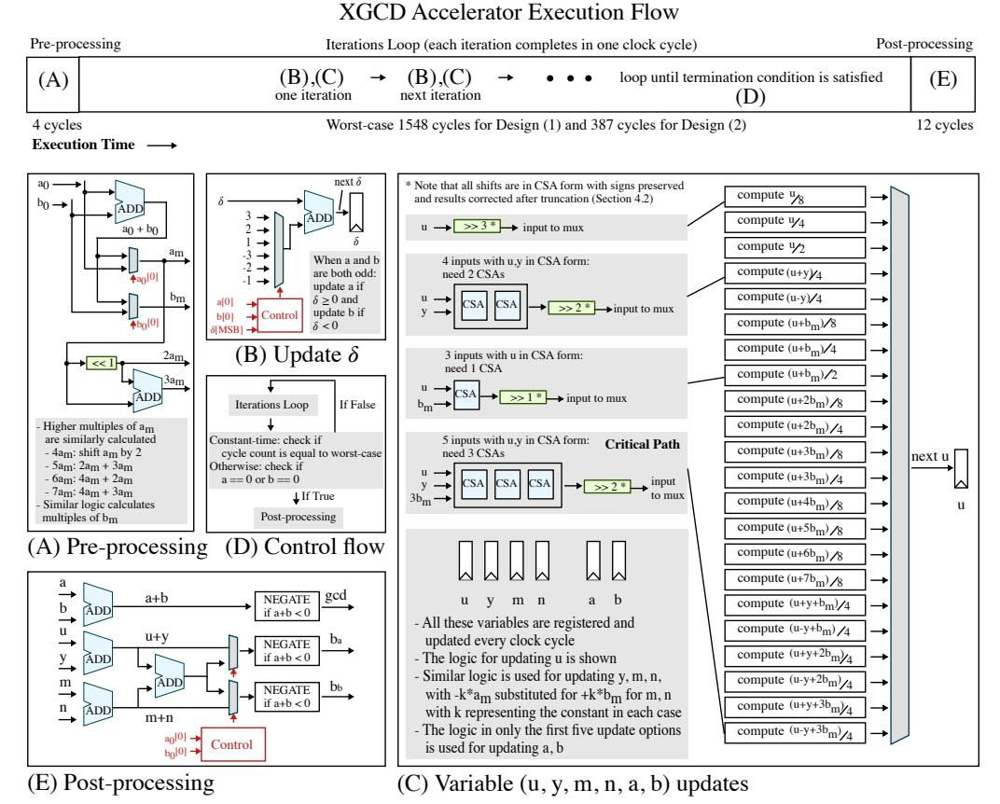

# **A Fast Large-Integer Extended GCD Algorithm and Hardware Design for Verifiable Delay Functions and Modular Inversion**

Kavya Sreedhar, Mark Horowitz and Christopher Torng

Stanford University, Stanford, CA, USA [skavya@stanford.edu](mailto:skavya@stanford.edu), [horowitz@ee.stanford.edu](mailto:horowitz@ee.stanford.edu), [ctorng@stanford.edu](mailto:ctorng@stanford.edu)

**Abstract.** The extended GCD (XGCD) calculation, which computes Bézout coefficients *ba, b<sup>b</sup>* such that *b<sup>a</sup>* ∗ *a*<sup>0</sup> + *b<sup>b</sup>* ∗ *b*<sup>0</sup> = *GCD*(*a*0*, b*0), is a critical operation in many cryptographic applications. In particular, large-integer XGCD is computationally dominant for two applications of increasing interest: verifiable delay functions that square binary quadratic forms within a class group and constant-time modular inversion for elliptic curve cryptography. Most prior work has focused on fast software implementations. The few works investigating hardware acceleration build on variants of Euclid's division-based algorithm, following the approach used in optimized software. We show that adopting variants of Stein's subtraction-based algorithm instead leads to significantly faster hardware. We quantify this advantage by performing a large-integer XGCD accelerator design space exploration comparing Euclid- and Stein-based algorithms for various application requirements. This exploration leads us to an XGCD hardware accelerator that is flexible and efficient, supports fast average and constant-time evaluation, and is easily extensible for polynomial GCD. Our 16nm ASIC design calculates 1024-bit XGCD in 294ns (8× faster than the state-of-the-art ASIC) and constant-time 255-bit XGCD for inverses in the field of integers modulo the prime 2 <sup>255</sup>−19 in 85ns (31× faster than state-of-the-art software). We believe our design is the first high-performance ASIC for the XGCD computation that is also capable of constant-time evaluation. Our work is publicly available at <https://github.com/kavyasreedhar/sreedhar-xgcd-hardware-ches2022>.

**Keywords:** Extended GCD · ASIC · Verifiable delay function · Class groups · Squaring binary quadratic forms · Constant-time · Modular inversion · Curve25519

## **1 Introduction**

Computing the greatest common divisor (GCD) is a fundamental operation in number theory, with wide-ranging applications in cryptography [\[SRC20,](#page-23-0) [Wes19,](#page-24-0) [NLRC10,](#page-22-0) [RSA78,](#page-23-1) [Mil85,](#page-22-1) [Kob87\]](#page-22-2). GCD algorithms repeatedly apply GCD-preserving transformations, primarily building from Stein's binary GCD algorithm [\[Ste67,](#page-23-2) [Pur83,](#page-22-3) [BK85,](#page-20-0) [YZ86,](#page-24-1) [Por20\]](#page-22-4) or Euclid's algorithm [\[Leh38,](#page-22-5) [Jeb93,](#page-21-0) [Web95,](#page-24-2) [Jeb95,](#page-21-1) [Sor95,](#page-23-3) [WTM05\]](#page-24-3). Both of these algorithms rely on the fact that the GCD between two numbers is the same as the GCD between their difference and the smaller number: *GCD*(*a, b*) = *GCD*(|*a* − *b*|*,* min(*a, b*)). Stein's algorithm [\[Ste67\]](#page-23-2) directly uses this property when both *a* and *b* are odd but also removes factors of two to reduce the number of iterations: *GCD*(*a, b*) = *GCD*(*a/*2*, b*) if *a* is even and *GCD*(*a, b*) = *GCD*(*a, b/*2) if *b* is even. Euclid's algorithm subtracts as many multiples of the smaller input as possible by dividing: *GCD*(*a, b*) = *GCD*(min(*a, b*)*,* max(*a, b*) mod min(*a, b*)). Other GCD algorithms are asymptotically fast and based on subquadratic multiplication [\[Knu70,](#page-22-6) [Sch71,](#page-23-4) [Sch91,](#page-23-5) [TY00,](#page-24-4) [PW02,](#page-22-7) [Möl08,](#page-22-8) [SZ04\]](#page-23-6). These algorithms

Licensed under [Creative Commons License CC-BY 4.0.](http://creativecommons.org/licenses/by/4.0/) Received: 2022-04-15 Accepted: 2022-06-15 Published: 2022-08-31 primarily build from Lehmer's algorithm [\[Leh38\]](#page-22-5) (which, in turn, builds from Euclid's algorithm) and use a divide-and-conquer approach to recursively determine the quotients sequence.

Until recently, there has been little advancement in fast GCD algorithms and the extended GCD (XGCD) computation that also computes Bézout coefficients *ba, b<sup>b</sup>* satisfying the Bézout identity: *b<sup>a</sup>* ∗ *a*<sup>0</sup> + *b<sup>b</sup>* ∗ *b*<sup>0</sup> = *GCD*(*a*0*, b*0). However, two recent developments suggest an increasing need for faster large-integer XGCD algorithms and implementations. The first is increased interest in a verifiable delay function [\[BBBF18\]](#page-20-1) construction based on squaring binary quadratic forms over class groups [\[Wes19\]](#page-24-0), a computation for which XGCD is the bottleneck. The second is the realization that constant-time XGCD can be faster than Fermat's Little Theorem [\[DG11\]](#page-20-2) for use in constant-time modular inversion [\[BY19,](#page-20-3) [Por20\]](#page-22-4).

These applications motivate rigorous exploration of fast XGCD hardware acceleration. However, only four relevant works currently exist in the literature. The first pair of works present 1024-bit XGCD ASIC designs based on Euclid's algorithm for squaring binary quadratic forms over a class group [\[ZST](#page-24-5)<sup>+</sup>20, [ZTW21\]](#page-24-6). The other two works present FPGA designs for the Bernstein-Yang algorithm [\[BY19\]](#page-20-3) for constant-time modular inversion [\[DdPM](#page-20-4)<sup>+</sup>21] and Euclid's algorithm [\[AHAJS16\]](#page-20-5). All these prior works provide point solutions to improve either average performance (for squaring binary quadratic forms) or worst-case performance (for constant-time applications). They also all build from Euclid's algorithm, citing its low iteration count and efficient software implementations.

We make two key observations to improve upon prior work. First, we observe that while individual applications may favor point solutions, one unified design that can efficiently support multiple applications is desirable since ASIC solutions can be expensive. Second, we show that Euclid's algorithm is not the optimal target for hardware acceleration, despite low iteration counts, since execution time depends on the iteration count *and* the time per iteration. Unlike in software, hardware designs are not constrained by a processor's instruction set architecture and can instead implement fast and wide custom datapaths that do not correspond to any instruction, enabling extremely short iteration times.

Leveraging these observations, we create an efficient parameterizable hardware architecture and conduct a large-integer XGCD design space exploration that considers different application requirements and XGCD algorithms. In Section [2,](#page-2-0) we review the importance and requirements of the XGCD computation in our motivating applications. Then, in Section [3,](#page-4-0) we analytically compare hardware execution times for Euclid- and Stein-based algorithms within the context of our application requirements. Despite the lower average number of iterations for Euclid-based algorithms, we find that using a redundant representation and carry-save adders for repeated addition significantly decreases the iteration time for Stein-based algorithms, resulting in faster average execution times. Since both algorithm types have similar worst-case iteration counts, this approach also results in faster worst-case execution times, which is used for constant-time XGCD. Thus, unlike all prior XGCD hardware papers, we choose to build from Stein-based algorithms, specifically the two-bit PM algorithm [\[YZ86\]](#page-24-1). In Section [4,](#page-7-0) we present our optimized XGCD design for higher performance and in Section [5,](#page-14-0) we build full accelerators with our XGCD design for our motivating applications. Finally, we evaluate our design in Section [6.](#page-15-0)

Our 16nm design computes 1024-bit XGCD 8× faster than the current state-of-the-art ASIC [\[ZST](#page-24-5)<sup>+</sup>20], after scaling its performance to the same technology, enabling squaring binary quadratic forms 14× faster than optimized C++ on Apple's M1 processor in 5nm. We also compute 255-bit XGCD 31× faster than the state-of-the-art software [\[Por20\]](#page-22-4), directly translating into a 31× speedup for computing modular inverses for Curve25519. We believe this work contributes the first high-performance ASIC for constant-time XGCD.

|                                                                                                                                                | VDF: Squaring binary<br>quadratic forms over<br>class groups [Wes19]        | Computing inverses<br>255 −<br>mod 2<br>19 for<br>Curve25519 [Ber06] |
|------------------------------------------------------------------------------------------------------------------------------------------------|-----------------------------------------------------------------------------|----------------------------------------------------------------------|
| Constant-time                                                                                                                                  | No                                                                          | Yes                                                                  |
| State-of-the-art algorithm<br>– Number of XGCDs<br>– XGCD % of execution time<br>– XGCD input bitwidth<br>– GCD = 1<br>– Requires minimal pair | NUDUPL [JvdP02]<br>2<br>91%<br>1024<br>Yes for 1st XGCD<br>Yes for 2nd XGCD | Optimized Stein's [Por20]<br>1<br>100%<br>255<br>Yes<br>Yes          |
| Other approaches<br>– that use XGCD<br>– that do not use XGCD                                                                                  | [Lon19]<br>N/A                                                              | Bernstein-Yang [BY19]<br>Fermat's Little Theorem [DG11]              |

<span id="page-2-1"></span>**Table 1:** Summary of motivating cryptographic applications using large-integer XGCD.

## <span id="page-2-0"></span>**2 Applications**

We focus on two cryptographic applications of XGCD that have drawn recent interest: a verifiable delay function construction based on squaring binary quadratic forms over class groups and modular inversion for elliptic curve cryptography (Table [1\)](#page-2-1). These applications represent two distinct spaces of application requirements (1024-bit fast average XGCD versus 255-bit constant-time XGCD), showcasing the flexibility of our design.

## <span id="page-2-2"></span>**2.1 Verifiable Delay Functions**

A verifiable delay function (VDF) is a cryptographic primitive that requires a specified amount of sequential work to be evaluated but outputs a unique result that is still efficiently and publicly verifiable. This fast verification but slow evaluation property is useful for adding delays in decentralized systems to avoid adversarial data manipulation [\[BBBF18\]](#page-20-1). In particular, VDFs have been considered a promising candidate to serve as the core function for blockchain systems to disincentivize dishonest behavior: they have been integrated into the Chia Network's blockchain design [\[chi21\]](#page-20-7), while the Ethereum Foundation and Protocol Labs anticipate that VDFs will also be crucial to their designs.

One proposed VDF construction is exponentiation in a group of unknown order such as an RSA group [\[Wes19,](#page-24-0) [Pie18\]](#page-22-10) or a class group [\[Wes19\]](#page-24-0), which requires *T* sequential squarings performed in a group using a modulus N in order to compute *f*(*x*) = *x* 2 *T* [\[BBF18\]](#page-20-8). The Chia Network chose to incorporate a VDF construction based on squaring binary quadratic forms over a class group [\[Wes19\]](#page-24-0) in their blockchain design. We refer the reader to Buell's textbook [\[Bue89\]](#page-20-9) for detail on binary quadratic forms. Since the repeated squaring in this construction continually doubles the output bitwidth, each squaring operation is followed by a reduction operation (Algorithm 5.4.2 of [\[Coh93\]](#page-20-10)) to ensure that the output (and subsequent input) bitwidth do not exceed the bitwidth of the original input.

The Chia Network has hosted several competitions for fast software implementations for this repeated squaring computation. Both the Chia Network reference and the competition winner chose to implement the NUDUPL algorithm [\[JvdP02\]](#page-21-2). This algorithm not only computes the squaring operation, but it also partially reduces the output values to help with the reduction operation to ensure that values stay within a certain size.

Profiling the operations required for the NUDUPL algorithm with 1024-bit inputs shows that XGCD dominates, requiring 91% of the total execution time (Table [2\)](#page-3-0). We averaged over one million trials of the Chia Network's reference C++ implementation (compiled with g++ and -O3 optimization) on a 2020 MacBook Pro with the M1 chip and

| Operation                             | % of execution time in<br>99.999% of squarings | % of execution time in few<br>remaining squarings |
|---------------------------------------|------------------------------------------------|---------------------------------------------------|
| XGCD                                  | 91                                             | 85                                                |
| Modular Multiplication                | 4                                              | 7                                                 |
| Additions, Multiplications, Divisions | 5                                              | 8                                                 |

<span id="page-3-0"></span>**Table 2:** NUDUPL algorithm profiling on Apple's M1 processor with 1024-bit inputs.

used the standard C++ chrono library with nanosecond precision. The algorithm takes one of two branches in each squaring, depending on whether the size of intermediate variables need to be reduced. The branch taken significantly more often (99*.*999% of the time) computes two XGCDs: the first is the conventional XGCD while the second is a partial XGCD that terminates when the remainder in Euclid's algorithm is below a precomputed value instead of waiting until it is zero. The other branch only requires the first XGCD.

For this application, the GCD will always be one in the first XGCD, so the important operation is finding a pair of Bézout coefficients. We observe that the second partial XGCD can be replaced by a XGCD that does not terminate early as long as the returned Bézout coefficients are one of the two *minimal pairs* possible. While multiple solutions can satisfy Bézout's identity for a pair of inputs, solutions are called minimal pairs only if the absolute values of the Bézout coefficients are less than the absolute values of the inputs divided by the GCD [\[MH94\]](#page-22-11). Euclid's algorithm always returns such a pair, while Stein-based algorithms may require extra iterations or a final correction to produce minimal results.

Understanding the speedup that dedicated hardware can achieve for this squaring helps determine the security level needed (i.e., the number of squarings and the minimum input bitwidth required) to guarantee a certain amount of time has passed with the VDF evaluation. Thus, high performance is the primary objective for VDF solutions. In addition, since this work is sequential by definition and not much computation can be done in parallel, area and power consumption are lesser concerns. Finally, since VDFs have a verification step, their inputs are not secret. Thus, there is no need for constant-time evaluation to protect against timing attacks and it is beneficial to minimize the average XGCD execution time even if constant-time execution does not improve.

To ensure our XGCD speedup translates well into overall squaring speedup, we accelerate the other large-integer operations required (one modular multiplication and various additions, multiplications, and divisions) to build the first hardware accelerator for the NUDUPL algorithm (Section [5\)](#page-14-0). We note that there are varying reports on a reasonable input bitwidth for class-group-based VDFs, ranging from 833 bits [\[HM00\]](#page-21-3) to 3000+ bits [\[DGS20\]](#page-21-4). Since both the Chia Network and recent work [\[ZST](#page-24-5)<sup>+</sup>20, [ZTW21\]](#page-24-6) evaluate 1024-bit XGCD, we also use 1024-bit inputs, as listed in Table [1.](#page-2-1) Fortunately, we use a redundant representation which makes our iteration time relatively independent of bitwidth (Section [4.2\)](#page-11-0). Thus, our design ensures high performance even as bitwidths change.

### **2.2 Modular Inversion**

A modular inverse of an integer *x* (mod *y*) is defined as the integer *x* −1 such that *x*∗*x* <sup>−</sup><sup>1</sup> = 1 (mod *y*). This computation is used in public-key cryptography, including RSA [\[RSA78\]](#page-23-1) and elliptic curve cryptography (ECC) [\[Mil85,](#page-22-1) [Kob87\]](#page-22-2). In both of these applications, some value must be kept a secret: in RSA, the secret key is generated by inverting the public key and in ECC, the value to be inverted is a secret while the modulus is publicly known. To protect such systems from timing attacks, we require constant-time solutions where the execution time does not depend on the secret values. For ECC, computing the modular inverse must take the same execution time regardless of the input value.

One part of ECC consists of elliptic curves defined over a finite field of positive integers modulo a prime number *p*. Curve25519 is one of the fastest and mostly commonly used elliptic curves defined with *p* = 2<sup>255</sup> − 19 [\[Ber06\]](#page-20-6). Operations on points of the elliptic curve consist of field operations, the most time-consuming of which is modular inversion with modulus p. As a result, many ECC implementations use different coordinate systems for most of the computation to minimize the number of inversions required [Ras17].

There are two approaches to compute the modular inverse when the modulus is prime. The first approach is Fermat's Little Theorem (FLT) [DG11], which states that  $x^{-1} = x^{p-2} \pmod{p}$ . For Curve25519, this computation requires 254 squarings and 11 multiplications [Ber06, BY19]. The second approach computes the XGCD between x, the value to be inverted, and p, the modulus. This approach is valid because  $x*x^{-1} = 1 \pmod{p} \to x*x^{-1} - 1 = 0 \pmod{p} \to x*x^{-1} - 1 = y*p$  for some y or  $x*x^{-1} - 1 = -z*p$  for z = -y. This can be rewritten as the Bézout Identity:  $x*x^{-1} + z*p = 1$ . Thus, finding the XGCD returns the Bézout coefficient  $x^{-1}$ . Note that the modular inverse is unique and corresponds to one of the minimal pairs.

In 2019, the Bernstein-Yang algorithm, a subquadratic XGCD algorithm, showed that constant-time XGCD can be faster than FLT [BY19], leading to a shift in the state of the art. In 2020, Pornin achieved faster results for computing inverses mod  $2^{255} - 19$  on recent 64-bit x86 CPUs by optimizing Stein's algorithm [Por20]. Pornin's work is used to generate RSA key pairs in several projects [Por18, FaPKL<sup>+</sup>]. In 2021, the Bernstein-Yang algorithm was incorporated into the MirageOS unikernel operating system [HAS21]. This work is up to  $2.5\times$  faster compared to FLT implementations but  $3.8\times$  slower than Pornin's Curve25519 results, so Pornin's work remains the state-of-the-art software for computing inverses mod  $2^{255} - 19$ . Only one prior work considers constant-time XGCD hardware. This prior work implements the Bernstein-Yang algorithm on an FPGA and is faster than prior FLT-based designs for Curve25519 [DdPM<sup>+</sup>21]. Note that the FPGA execution time is slower than the software records [BY19, Por20] since the FPGA is run at a  $7\times$  to  $11\times$  slower frequency compared to the frequency of the Intel processors in the software papers.

These works show the recent adoption of XGCD-based modular inversion with modulus  $2^{255} - 19$ . However, most of these approaches (all but Pornin's) build from Euclid-based algorithms. Given this growing interest, an in-depth design-space exploration is useful to determine the more suitable XGCD algorithm for fast constant-time execution in hardware.

## <span id="page-4-0"></span>3 Hardware Performance Analysis of XGCD Algorithms

As previously discussed, all the prior XGCD hardware papers build from Euclid-based algorithms and represent point solutions in the XGCD hardware acceleration space, optimizing either for fast average-case or worst-case performance. Thus, we explore the broader design space over multiple axes: algorithm family (Euclid versus Stein), target platform (software versus hardware), and application requirements (fast average-case execution versus worst-case execution). We find that using a redundant representation with the two-bit PM algorithm [YZ86] in the Stein family is faster in hardware for fast average-case and worst-case execution (the latter of which we use for constant-time XGCD).

#### 3.1 Algorithm Family

XGCD algorithms use the same control flow as GCD algorithms and iteratively apply GCD-preserving reduction transformations. This section overviews the transformations used by the three major GCD algorithm families and their suitability for our applications.

Stein's algorithm continually reduces its inputs by replacing the larger number with their difference when both numbers are odd or by dividing by two when a number is even [Ste67]. The Purdy algorithm also removes factors of two when possible but replaces the subtraction transformation with  $GCD(a,b) = GCD(\frac{a+b}{2},\frac{a-b}{2})$  to avoid comparing the two numbers [Pur83]. Note that  $a \pm b$  will be even when a,b are odd. To further avoid large-integer comparisons, the Plus-Minus (PM) algorithm approximates the binary

logarithm of *a* − *b* [\[BK85\]](#page-20-0) and the two-bit PM algorithm duplicates cases in the PM algorithm and removes two factors of two when possible in a single iteration [\[YZ86\]](#page-24-1).

Euclid's algorithm continually reduces its inputs by replacing the larger number with the remainder from dividing the two numbers. Lehmer's algorithm [\[Leh38\]](#page-22-5) is faster for large integers by observing that most quotients are small and the initial parts of the quotients only depend on the most significant bits of the large inputs. Other papers build on this work with efficient techniques to detect when approximate division based on the MSBs is correct, further reducing the number of large-integer divisions required [\[Jeb93,](#page-21-0) [Jeb95,](#page-21-1) [Sor95\]](#page-23-3).

Subquadratic XGCD algorithms are based on subquadratic multiplication and are thus asymptotically fast. The Knuth-Schönhage algorithm [\[Knu70,](#page-22-6) [Sch71\]](#page-23-4), one of the earliest subquadratic GCD algorithms, uses a divide-and-conquer approach based on Lehmer's algorithm to recursively determine the quotients sequence. Further work more clearly details and extends these ideas [\[Sch91,](#page-23-5) [TY00,](#page-24-4) [PW02,](#page-22-7) [Möl08\]](#page-22-8), including binary recursive approaches [\[Sor94,](#page-23-7) [SZ04\]](#page-23-6) and Bernstein and Yang's recent constant-time approach [\[BY19\]](#page-20-3).

For the input bitwidths in our applications (Table [1\)](#page-2-1), profiling from existing literature already strongly suggests that Euclid's and Stein's algorithms are faster than subquadratic algorithms [\[Möl08\]](#page-22-8). More recently, Pornin's XGCD implementation [\[Por20\]](#page-22-4), published after Bernstein-Yang's subquadratic XGCD algorithm [\[BY19\]](#page-20-3), uses a quadratic approach (Stein's algorithm) to achieve higher performance: 2000+ fewer cycles on recent x86 CPUs. Thus, we focus on comparing the XGCD execution time in hardware for Euclid- and Stein-based algorithms to determine the more promising family for hardware acceleration.

### <span id="page-5-1"></span>**3.2 Target Platform**

In both software and hardware, execution time is the product of the number of iterations and the time per iteration. The number of iterations only depends on the XGCD algorithm and is independent of the target platform. Thus, optimizations to reduce the number of iterations directly translate from software to hardware. The time per iteration, or iteration time, is the latency for the longest series of data-dependent operations that complete in an iteration. This is also known as the critical path. Note that the critical path delay may not be the sum of delays for all operations since some operations may be performed in parallel. Since software is constrained to using instructions predefined in the processor's instruction set architecture (ISA), software iteration times correspond to the longest set of dependent instructions. In contrast, hardware is not limited to an ISA and allows for implementing fast, wide, and custom datapaths with extremely short iteration times. This additional control over the iteration time in hardware opens the opportunity to accelerate XGCD algorithms that require more iterations but have far simpler operations, resulting in shorter iteration times and faster overall execution times.

### **3.3 Hardware Design Performance Comparison**

To select the most suitable XGCD algorithm for hardware acceleration across our applications, we compare the number of iterations (Section [3.3.1\)](#page-5-0) and iteration time (Section [3.3.2\)](#page-6-0) for the Stein and Euclid algorithm families in the average case and in the worst case. The key difference between the average- and worst-case is the algorithm termination condition, which affects the number of iterations. In the average case, the algorithm is run until the GCD is found (i.e., one of the two inputs has been reduced to zero). In the worst case, the algorithm is run for a fixed number of iterations, set to the worst-case number.

### <span id="page-5-0"></span>**3.3.1 Number of Iterations**

We use uniform random 1024-bit inputs with our functional models to find the average number of iterations required for various algorithms. Since Euclid's algorithm divides every

iteration while Stein's algorithm [\[Ste67\]](#page-23-2) only reduces a factor of two, Euclid's algorithm requires 3.6× fewer iterations compared to Stein's algorithm on average (598 versus 2163). The PM algorithm [\[BK85\]](#page-20-0) requires more iterations compared to Stein's algorithm since it can incorrectly approximate *a > b* and reduce the smaller number instead of the larger one. The two-bit PM algorithm [\[YZ86\]](#page-24-1) reduces more bits per iteration than Stein's algorithm and thus requires only 2× more iterations (1195) compared to Euclid's algorithm. Since Euclid-based algorithms have low iteration counts but require expensive divisions, prior work improving Euclid has focused on optimizing iteration time over iteration count. Thus, most Euclid-based algorithms still require 598 iterations on average [\[Leh38,](#page-22-5) [Sor95\]](#page-23-3).

We next consider the number of iterations required for these algorithms in the worstcase. For Euclid's algorithm, the maximum number of iterations is 5 log(min(*a, b*)) [\[Mol97\]](#page-22-14), with the Fibonacci numbers as inputs [\[Lam44\]](#page-22-15). While all Stein-based algorithms reduce at least one bit per iteration, only the two-bit PM algorithm reduces at least two bits when *a, b* are odd. Thus, in the Stein family, this algorithm requires the lowest worst-case number of iterations: 1*.*51 ∗ *n* + 1, where n is the input bitwidth [\[YZ86\]](#page-24-1). These equations closely track each other for the bitwidths in our applications. For 255-bit inputs, Euclid's algorithm requires 384 iterations, which is marginally smaller than the two-bit PM's 387.

#### <span id="page-6-0"></span>**3.3.2 Iteration Time and Execution Time**

Given the simplicity of operations in the two-bit PM algorithm, we expect the iteration time for the two-bit PM algorithm to be shorter than that for Euclid's algorithm. Then, for the worst-case execution time, the similarity in the worst-case number of iterations between the two algorithms in Section [3.3.1](#page-5-0) alone indicates that the two-bit PM algorithm will likely yield faster constant-time implementations. In the average case, the two-bit PM algorithm requires twice the number of iterations as Euclid's algorithm. Thus, the two-bit PM can be faster overall if its hardware critical path is less than half of the critical path of Euclid's algorithm. We find this to be the case when comparing 1024-bit hardware designs.

Using two bits to represent each bit of a number is a redundant number representation called carry-save form (CSA form), and enables one to build adders with no carry propagation delays. Carry-save adders (CSAs) add three inputs and produce two outputs (the sum of the two outputs is equal to the sum of the three inputs) and have *O*(1) instead of *O*(log(*n*)) delays, where *n* is the input bitwidth [\[SKN08,](#page-23-8) [RM19,](#page-23-9) [Pur83,](#page-22-3) [YZ86\]](#page-24-1). These savings are especially important in wide-word arithmetic with large bitwidths. Since the actual result is not directly stored, the value of the result is not known and it thus cannot be compared to other values. The actual result can be recovered with a normal addition with carry propagation. We further describe CSAs in our hardware design in Section [4.2.](#page-11-0)

Since XGCD algorithms require repeated additions, the iteration times for hardware designs can be reported in units of CSA delays, which also serves as a technology-agnostic unit. One CSA delay is approximately equal to the delay of two two-input XOR gates in series. Multiplier arrays also use CSAs to efficiently sum partial products [\[FdCBM05,](#page-21-7) [SKS09,](#page-23-10) [RSPR11,](#page-23-11) [JLL](#page-21-8)<sup>+</sup>15], so we can easily translate this operation into CSA delays. For non-CSA operations, we report latency in equivalent fractions of a CSA delay.

The critical path for computing the XGCD with the two-bit PM algorithm consists of adding three numbers and shifting two bits to the right when *a*, *b*, and other variables are all odd (please see details in Section [4.1\)](#page-8-0). Since shifting is a fast rewiring operation in hardware, we only consider the delay for the addition. This addition translates to adding five values in total: two values in CSA form and one constant. This operation requires three CSAs in series, where each CSA reduces three inputs into two outputs. We then multiply this critical path delay (three CSA delays) by the average iteration count (1195) to estimate the average execution time as 3585 CSA delays.

The critical path for computing the XGCD with Euclid's algorithm consists of generating the quotient *q* = max(*a, b*)*/* min(*a, b*) and computing the remainder max(*a, b*)−*q*∗min(*a, b*). The algorithm applies the Bézout coefficient updates in parallel with the GCD computation by similarly multiplying this quotient by the corresponding variables and subtracting. Thus, these operations do not increase the critical path delay. We denote *a* as the larger number and rewrite the critical path computation as *a* − *q* ∗ *b* for the rest of this section.

We first consider generating the quotient. Division algorithms are iterative, requiring repeated multiplication or subtraction. Multiplication-based division algorithms [\[Fly70,](#page-21-9) [Gol64\]](#page-21-10) are not competitive since each division would require hundreds of CSA delays for large-integer multiplications. However, subtraction-based division algorithms are also slow because they iterate bit-by-bit, requiring many iterations. Thus, Euclid-based algorithms instead avoid full-bitwidth divisions by looking at the most significant bits (MSBs) of the inputs to estimate quotients [\[Leh38,](#page-22-5) [Jeb93,](#page-21-0) [Jeb95,](#page-21-1) [Sor95\]](#page-23-3). Using lookup tables (LUTs) is the fastest estimation approach. However, since only the MSBs are used, this estimate can be incorrect and the algorithm then needs to fall back to slow large-integer division.

We find that even in the optimistic scenario where no large-integer divisions are required, the critical path delay for Euclid's algorithm will be long enough such that it will be slower than the two-bit PM algorithm for overall execution time. We calculate critical path delay by splitting the computation into three steps and assigning a delay (in CSA delays) to each. These three steps are generating the quotient (*q*), multiplying *q* and *b* (*q* ∗ *b*), and subtracting to generate the remainder (*a*−*q* ∗*b*). For an optimistic estimate, we assume the lookup for the quotient estimate requires zero delay. The LUT takes pairs of the *c* MSBs of *a, b* as input, denoted *ac, bc*, respectively. Since *a, b* are stored in CSA form, retrieving the values of *ac, b<sup>c</sup>* requires *c*-bit carry-propagate adds. This requires b*log*2(*c*)c + 1 CSA delays for a binary logarithmic adder tree structure (three CSA delays for *c* = 6). Note that the LUT has 2 2∗*c* entries and *c* bits per entry. Thus, LUTs with *c* ≥ 10 require over a million entries and are impractical. We precompute the LUT entries for *ac/*(*b<sup>c</sup>* + 2) instead of *ac/b<sup>c</sup>* to guarantee that the quotient estimate is not greater than the true quotient. Then, the LUT entry can be shifted to the left to obtain the quotient estimate, denoted *qestimate*.

The next step computes the partial products for *qestimate* ∗*b*. Since *b* is in CSA form, this becomes *qestimate* ∗*bcarry* +*qestimate* ∗*bsum*. Summing the partial products can be combined with the subtraction step for the final remainder as *a* − *qestimate* ∗ *bcarry* − *qestimate* ∗ *bsum*. First, we assume that generating the partial products takes zero delay since this minimally requires a few shifts, which are fast rewiring operations in hardware. We then need to sum 2 ∗ *c* + 2 values, where 2 ∗ *c* values represent the partial products and the last two values represent *a* in CSA form. Since each CSA has three inputs and two outputs, we need an adder tree with roughly blog3*/*<sup>2</sup> (*c*)c CSAs in series (six CSA delays for *c* = 6). Finally, we sum the CSAs delays for generating *qestimate* and for evaluating the remainder *a* − *qestimate* ∗ *b*, resulting in 3 + 6 = 9 CSA delays for a six-bit *qestimate* example. We then multiply this delay (nine CSA delays) by the average iteration count (598) to estimate the average execution time for Euclid's algorithm as 5382 CSA delays.

Thus, even with our conservative estimate, the two-bit PM iteration time is 3× shorter than the Euclid iteration time. As a result, the two-bit PM execution time (3585 CSA delays) is 1.5× shorter than the Euclid execution time (5382 CSA delays) and we conclude that division-based XGCD is not competitive for hardware designs.

## <span id="page-7-0"></span>**4 Fast XGCD Algorithm and Hardware Design Space**

Based on our analysis in Section [3,](#page-4-0) we build from the two-bit PM algorithm [\[YZ86\]](#page-24-1). Since this algorithm was originally not completely specified, especially regarding iterative updates for odd Bézout coefficient values, we first present a *complete extended two-bit PM algorithm* (Section [4.1\)](#page-8-0). We then consider further optimizations that enable high-performance XGCD hardware acceleration: using carry-save adders (Section [4.2\)](#page-11-0), increasing the number of bits reduced per iteration (Section [4.3\)](#page-11-1), handling carry propagation for the termination

<span id="page-8-1"></span>

**Figure 1:** XGCD Execution Flow Diagram – Key components in the execution flow are broken out in detail. (A) Pre-processing step to generate odd inputs to iterations loop; (B) Update for  $\delta$  register; (C) Variable updates for a, b, u, y, m, n registers in the iterations loop illustrating the wide parallel datapath with late selects (the logic for unique update types are shown in detail); (D) Control flow state diagram with termination condition; (E) Post-processing step to generate XGCD outputs.

condition for non-constant-time execution (Section 4.4), and minimizing control overhead (Section 4.5). Finally, we show how our design easily supports constant-time evaluation and polynomial XGCD (Section 4.6).

Figure 1 shows the execution flow of our hardware with the sequence of operations on the critical path. Note that in our hardware design, we execute one iteration every clock cycle. Thus, the operations on the iteration critical path (Section 3.3.2) must finish in a single clock cycle and the maximum frequency is determined by this critical path delay.

#### <span id="page-8-0"></span>4.1 Complete Extended GCD with Two-Bit PM

Listing 1 includes our variable definitions and pseudocode for our XGCD algorithm. This section explains the subset of the algorithm that corresponds to the two-bit PM algorithm and our extensions to compute the XGCD. Section 4.3 explains the additional updates included and their suitability for constant-time versus fast average-case evaluation.

XGCD algorithms calculate Bézout coefficients by introducing four variables u, m, y, n such that  $u * a_m + m * b_m = a$  and  $y * a_m + n * b_m = b$  hold true for inputs  $a_m, b_m$  and variables a, b in every iteration. We denote these relations together as Equation 1. At the start of the iterations loop,  $a = a_m$  and  $b = b_m$ , so initially, u = 1, m = 0 and y = 0, n = 1.

```
# inputs:
# a_0,b_0 (int) -- numbers to find the gcd for, with factors of two removed
# constant_time (bool) -- whether this should use our constant-time algorithm
# bitwidth (int) -- the maximum bitwidth of the inputs
# outputs:
# qcd (int) -- gcd(a_0,b_0)
# b_a,b_b (int) -- Bezout coefficients b_a,b_b such that b_a*a_0+b_b*b_0=\gcd(a_0,b_0)
\verb"def xgcd"(a_0", b_0", constant\_time", bitwidth"):
     # Step 1: Pre-processing
     # ensure a_m, b_m are odd
                                                                                              12
     if (a_0\%2 == 0): a_m = a_0 + b_0; b_m = b_0
     elif (b_0\%2 == 0): a_m = a_0; b_m = a_0 + b_0
     else: a_m = a_0; b_m = b_0
                                                                                              15
     \verb|if|| constant\_time: iterations = 0
                                                                                              17
                                                                                              18
     # \delta \approx \log_2(a) - \log_2(b) \propto a - b to approximate if a > b
    a = a_m; b = b_m; u = 1; m = 0; y = 0; n = 1; \delta = 0; end_loop = False
                                                                                              20
     # Step 2: Iteration loop
     def xgcd\_update(num\_bits\_reduced, u, m, b_m, a_m):
          for i in range (num\_bits\_reduced):
              if u\%2 == 1: u = (u + b_m)//2; m = (m - a_m)//2
                                                                                              25
              else: u = u//2; m = m//2
                                                                                              26
         return (u, m)
                                                                                              28
     while (not end_loop):
          if (not constant\_time and (a\%8 == 0)):
              a=a//8; \delta=\delta-3; (u,m)= xgcd_update(3, u, m, b_m, a_m)
                                                                                              31
          elif (not constant\_time and (a\%4 == 0)):
              a=a//4; \delta=\delta-2; (u,m)= xgcd_update(2, u, m, b_m, a_m)
                                                                                             33
          elif (a\%2 == 0):
              a=a//2; \delta=\delta-1; (u,m)= xgcd_update(1, u, m, b_m, a_m)
          elif (not constant time and (b\%8 == 0)):
                                                                                             36
              b=b//8\,;~\delta=\delta+3\,;~(y,n)=~{\tt xgcd\_update}\,(3\,,~y\,,~n\,,~b_m\,,~a_m)
          elif (not constant\_time and (b\%4 == 0)):
             b=b//4; \delta=\delta+2; (y,n)= xgcd_update(2, y, n, b_m, a_m)
                                                                                             39
          elif (b\%2 == 0):
              b=b//2; \delta=\delta+1; (y,n)= xgcd_update(1, y, n, b_m, a_m)
                                                                                              41
          elif ((\delta \ge 0) \text{ and } ((b+a)\%4 == 0)):
              a=(a+b)//4; \delta=\delta-1; (u,m)= xgcd_update(2, u+y, m+n, b_m, a_m)
          elif ((\delta \ge 0)) and ((b-a)\%4 == 0):
              a=(a-b)//4;~\delta=\delta-1;~(u,m)= xgcd_update(2, u-y, m-n, b_m, a_m)
          elif ((\delta < 0)) and ((b+a)\%4 == 0):
             b=(a+b)//4; \delta=\delta+1; (y,n)= xgcd_update(2, u+y, m+n, b_m, a_m)
                                                                                             47
          else:
              b=(a-b)//4; \delta=\delta+1; (y,n)= xgcd_update(2, u-y, m-n, b_m, a_m)
                                                                                             49
                                                                                              50
          # termination condition
          if constant time:
                                                                                              52
              iterations = iterations + 1
                                                                                              53
              end\_loop = (iterations >= 1.51 * bitwidth + 1)
          else: end\_loop = (a == 0 \text{ or } b == 0)
                                                                                              55
     # Step 3: Post-processing
                                                                                              57
     # account for making a_m, b_m odd before iteration loop
                                                                                              58
     gcd = a + b; u = u + y; m = m + n
                                                                                              60
     if (a_0\%2 == 0): m = u + m
     elif (b_0\%2 == 0): u = u + m
                                                                                              63
     if gcd < 0: gcd = -gcd; u = -u; m = -m
     b_a = u; b_b = m
     return gcd, b_a, b_b
```

**Listing 1:** Our XGCD algorithm (building from the two-bit PM GCD algorithm [YZ86])

<span id="page-10-1"></span>**Table 3:** Update possibilities for Bézout coefficient variables u, m when a is shifted by two.

| Divisibility of $u, m$                  | $u_{update}$  | $m_{update}$  |
|-----------------------------------------|---------------|---------------|
| u, m divisible by 4                     | u/4           | m/4           |
| u, m divisible by 2 but not 4           | $(u+2*b_m)/4$ | $(m-2*a_m)/4$ |
| $u + b_m, m - a_m$ divisible by 4       | $(u+b_m)/4$   | $(m-a_m)/4$   |
| $u+b_m, m-a_m$ divisible by 2 but not 4 | $(u+3*b_m)/4$ | $(m-3*a_m)/4$ |

During the iterations loop, the two-bit PM algorithm updates either a or b. When a is not updated, there is no need to update u, m since Equation 1 automatically holds. The same is true for b and y, n. When a or b is divided by two or four, we need to divide u, m or y, n by the same factor to maintain the relations in Equation 1. However, the divisibility of the coefficient variables may not match that of a and b. For example, if odd coefficients are shifted right, their truncated values may not satisfy Equation 1.

To address this problem, we consider the shift-by-one case first. If a is even and thus divided by two, we need to ensure that  $u_{update}*a_m+m_{update}*b_m=\frac{a}{2}$ . If the previous u,m are even, the update is straightforward:  $u_{update}=\frac{u}{2},m_{update}=\frac{m}{2}$ . If the previous u,m are odd, we  $add\ b_m$  to u and  $subtract\ a_m$  from m as similarly done to extend the PM algorithm to compute XGCD [BK85]. Since  $b_m,a_m$  are odd by construction and the sum of two odd numbers is even,  $u+b_m,m-a_m$  will be even. Then, we can reduce one bit by computing  $u_{update}=\frac{u+b_m}{2},m_{update}=\frac{m-a_m}{2}$ . This update preserves the relations in Equation 1 since we have added and subtracted  $\frac{a_m*b_m}{2}$  from the result.

For the shift-by-two case, we apply our updates rules for the shift-by-one case twice to satisfy  $u_{update}*a_m + m_{update}*b_m = \frac{a}{4}$ . The worst-case update rule is when m is not divisible by two and  $m - a_m$  is not divisible by four, resulting in  $m_{update} = \frac{\frac{m - a_m}{2} - a_m}{2}$ . To reduce this update delay, we rewrite this update as  $\frac{m - 3*a_m}{4}$ . Note that this result is truncated the same way as the original result when shifting. Since  $a_m$  is known at the start,  $3*a_m$  is a constant that we can precompute in a pre-processing step (A in Figure 1). Table 3 shows how we similarly rewrite the other u, m updates. Thus, the worst-case update delay is half the original form and similar to the shift-by-one case.

While half of the updates in the two-bit PM algorithm directly reduce bits from a or b (when a or b is even), the other half reduce two bits from  $a \pm b$  (when a, b are odd). To preserve the relations in Equation 1 in these other updates, we apply the shift-by-two strategy on  $u \pm y$ ,  $m \pm n$  instead of individually on u, y, m, n (i.e., substitute u with  $u \pm y$  and m with  $m \pm n$  in Table 3). Thus, the critical path in this algorithm has two subtractions and one right shift to compute  $\frac{m-n-3*a_m}{4}$  as an update for m, which requires one extra subtraction compared to the worst-case updates for m when a or b is even. This finishes extending the variable updates in the iterations loop for the XGCD (C in Figure 1).

Finally, we consider necessary pre-processing and post-processing steps. Typically, GCD algorithms assume that the inputs have no common factors of two since such factors can be easily accounted for by shifting before the iterations loop and then shifting the common factor back in at the end. As a result, at most one input may be even. In this case, we apply a pre-processing step (A in Figure 1) that replaces the even input with the sum of the inputs to ensure that the inputs to the iterations loop are odd, as done in prior work [YZ86]. In a post-processing step after the iterations loop (E in Figure 1), we calculate the Bézout coefficients as  $b_a = u + y$  and  $b_b = m + n$  since a + b is the GCD and adding the relations in Equation 1 results in  $(u + y) * a_m + (m + n) * b_m = a + b = GCD(a_m, b_m)$ . If we applied the pre-processing step, we need to replace the even input's Bézout coefficient with the sum of the coefficients to satisfy Equation 1. If the gcd is negative (due to updating the smaller number when incorrectly approximating a > b), we negate the gcd and coefficients.

<span id="page-10-0"></span><sup>&</sup>lt;sup>1</sup>We compute  $3*a_m$  as  $2*a_m+a_m$ , so it requires one cheap left shift and one addition.

### <span id="page-11-0"></span>4.2 Carry-Save Adders

As previewed in Section 3.3.2, carry-save adder (CSA) designs improve the delay of back-to-back additions by removing carry propagation in all intermediate computations and storing the resulting sum in CSA form. As a result, CSAs have been used for many cryptography applications [MMM03, SKN08, RM19]. Since CSAs have constant delays, an added benefit is that the clock frequency for such designs will not be sensitive to the input bitwidth.

We keep our main variables (a, b, u, y, m, n) in CSA form while constants  $(a_m, b_m)$  and their multiples) are not kept in CSA form since they do not change. The approximate difference of a and b is not stored in CSA form since its sign determines which value to update when both a, b are odd. Fortunately, we use binary logarithms for this approximation, so this value is small (e.g., ten bits for 1024-bit inputs) and updates for this variable (B in Figure 1) do not limit cycle time. While prior work has also suggested using CSAs for GCD algorithms [Pur83, YZ86], we find that using CSAs in practice in an XGCD hardware design surfaces challenges that have not been previously addressed:

- To ensure the carry-propagate adds required in our pre-processing and post-processing steps do not limit the cycle time, we run these steps at one-quarter of the clock frequency of the system clock. As shown in Figure 1, this slower frequency allows these few cycles at the start and end to support the longer carry propagation while keeping the short CSA-defined cycle time as our system clock period.
- When carry and sum are shifted right (and inherently truncated) in CSA form, we must efficiently add one to the result in the case where summing the bits that were shifted out would have generated a carry. Note that we cannot simply set the lowest bit of carry or sum to one, since these bits can both be one after a shift. Thus, we instead use a full-bitwidth half adder to add the shifted carry and sum to produce another (carry, sum) pair for the same number represented in CSA form, where the lowest bit of the carry output will be zero by design. We can set that bit to one when needed. This adds one XOR gate delay to the critical path delay.
- We approximate a > b when a, b are odd, as done in prior work [BK85]. If this approximation is incorrect, we update the smaller number and our variables become negative. Thus, when shifting right, we need to preserve sign in CSA form (even though it is unknown). Earlier work provides a truth table relating the two most significant bits of carry and sum before and after shifting to preserve sign [TPT06]. We adapt and extend this prior work to determine balanced equations for these bits for right shifts by several bits in CSA form to minimize the critical path delay.

#### <span id="page-11-1"></span>4.3 Optimal Reduction of Bits Per Cycle

Stein-based algorithms reduce the average number of iterations required by removing factors of two or four when possible. The higher the factor of two that can be removed per iteration, the fewer the iterations required. While removing these factors by shifting is cheap, this increases the number of update choices for u, y, m, n since they may not be divisible by powers of two. This added control logic can increase the cycle time if deciding which branch to take becomes more expensive than computing the variable updates.

We explore this hardware design space to quantify the tradeoff between the cycle time and the average- and worst-case number of clock cycles required in order to determine the optimal reduction of bits per cycle. We separately vary the maximum reduction factor for updates when a or b is even and updates when a and b are odd (referred to as even and odd reduction factors) to see which parameterizations yield a net benefit for total execution time, the product of the number of clock cycles and the cycle time.

We update a, b with  $\frac{a-b}{2}$  for an odd reduction factor of two since a-b will be even when a, b are odd. Using the procedure in Section 4.1, we support an odd reduction factor

| Max factor of two<br>reduced when<br>a or b is even | Max factor of two<br>reduced when<br>a and b are odd | Average<br>Number<br>of Cycles | Cycle<br>Time<br>(ns) | XGCD<br>Execution<br>Time (ns) | ASIC<br>Area<br>(mm2<br>) |
|-----------------------------------------------------|------------------------------------------------------|--------------------------------|-----------------------|--------------------------------|---------------------------|
| 2                                                   | 2                                                    | 2214                           | 0.193                 | 427                            | 0.16                      |
| 4                                                   | 2                                                    | 1849                           | 0.218                 | 403                            | 0.22                      |
| 8                                                   | 2                                                    | 1744                           | 0.256                 | 446                            | 0.36                      |
| 2                                                   | 4                                                    | 1454                           | 0.234                 | 340                            | 0.22                      |
| 4                                                   | 4                                                    | 1215                           | 0.247                 | 300                            | 0.28                      |
| 8                                                   | 4                                                    | 1147                           | 0.257                 | 295                            | 0.41                      |
| 2                                                   | 8                                                    | 1095                           | 0.297                 | 325                            | 0.27                      |
| 4                                                   | 8                                                    | 976                            | 0.320                 | 312                            | 0.33                      |
| 8                                                   | 8                                                    | 942                            | 0.330                 | 311                            | 0.47                      |

<span id="page-12-0"></span>**Table 4:** Execution time and area in 16nm technology for 1024-bit XGCD ASIC designs for various even and odd reduction factor combinations.

of up to eight. Our efficient rewriting of the updates requires us to compute *k* ∗ *b<sup>m</sup>* and *k* ∗ *a<sup>m</sup>* for *k* = 1 to *k* = 7 for the three-bit reductions and does not increase the data path delay compared to a design with an odd reduction factor of four. Note that the following (even, odd) maximum reduction factor pairs correspond to reduction factors of two in prior GCD algorithms: (2, 1) is Stein's, (2, 2) is Purdy's and PM, and (4, 4) is two-bit PM.

Table [4](#page-12-0) shows the execution time and area for various reduction factor pairs and all optimizations in Section [4.](#page-7-0) The longest sequence of operations is updating *m, n* when *a, b* are odd. This is the critical path for all the designs but the (8, 8) design, where the critical path becomes the control path. Finally, since the execution time for designs with an odd reduction factor of eight does not improve compared to designs with an odd reduction factor of four, factors of 16+ would not be beneficial due to the longer control path delay.

We observe that the execution times for these designs are close, especially if the odd reduction factor is the same. Thus, while average number of cycles is reduced when more bits are reduced per cycle, the resulting increase in the cycle time mostly negates that benefit. Choosing which design to use depends on the target application requirements, namely the number of XGCDs computed and whether XGCD must be constant-time.

These small execution time differences become important when this computation is repeated many times. Since most VDF applications require a large delay, we may need to compute over a million or billion squarings, each of which requires two XGCDs in the NUDUPL algorithm. In this context, the five-nanosecond difference between the (4, 4) and (8, 4) designs becomes critical. **Since this application requires high performance, the fastest design — the (8, 4) design — would be most appropriate.**

For constant-time applications like modular inversion for Curve25519, we consider the worst-case number of cycles to determine the optimal reduction factors. The two-bit PM algorithm — corresponding to the (4, 4) design — takes a maximum of 1*.*51*n* + 1 cycles for n-bit inputs [\[YZ86\]](#page-24-1) since every cycle, at least one bit is reduced if *a* or *b* is even and two bits are reduced if they are both odd (since either *a* + *b* or *a* − *b* will be divisible by four). The two-bit PM algorithm [\[YZ86\]](#page-24-1) notes that reducing three bits — corresponding to the (8, 8) design — will not reduce the worst-case number of cycles because there is no guarantee that *a* + *b* or *a* − *b* will be divisible by eight when *a, b* are odd (just as *a, b* may not be divisible by eight when they are even), so these branches may never be taken.

We observe that this logic also applies for the (2, 8), (4, 8), (2, 4), and (8, 4) designs since the only guaranteed transitions remain dividing by two when *a, b* are even and dividing *a* + *b* or *a* − *b* by four when *a, b* are odd. Thus, shifting by more than one bit when *a, b* are even or more than two bits when *a, b* are odd only adds further value for the average case, not the worst case. In addition, the average execution times for the designs

with an odd reduction factor of two is higher than the worst-case execution time for the other designs, so these designs are not competitive in this context. **Thus, the optimal reduction factors for constant-time applications are (2, 4).**

## <span id="page-13-0"></span>**4.4 Termination Condition Carry Propagation**

For non-constant-time XGCD execution, algorithms terminate when *a* or *b* is zero (D in Figure [1\)](#page-8-1). However, when *a, b* are in CSA form, their values are not known. Computing two carry-propagate adds in parallel to find *a* = *acarry* + *asum* and *b* = *bcarry* + *bsum* every cycle would negate the benefit of using CSAs. As a more minor concern, this operation also requires a large AND-gate tree to check whether all the bits of *a, b* are zero. We investigate two approaches to improve the delay of this termination condition check.

Our first approach computes our variable updates for each iteration in a clock cycle, while in parallel, *a* = *acarry* + *asum* and *b* = *bcarry* + *bsum* are computed over *x* cycles. The true values of *a, b* are then sampled every *x* cycles. For 1024-bit inputs, *x* = 4 ensures that these additions do not limit the cycle time. With this approach, we can only check if the termination condition has been satisfied every four cycles and at most require four extra iterations to compute the XGCD. This is a very small overhead: 0.18% to 0.42% of the number of cycles for the (2, 2) to (8, 8) reduction factor designs (Section [4.3\)](#page-11-1).

Our second approach repurposes *α* ≈ log<sup>2</sup> (*a*)*, β* ≈ log<sup>2</sup> (*b*) from the PM algorithm [\[BK85\]](#page-20-0). In prior work, these variables approximate *a > b* and are updated every cycle by the minimum number of bits *a, b* will be reduced by. We instead use *α, β* in our termination condition: when *α* or *β* is zero, we run one more iteration (to ensure *a* or *b* is zero since *α, β* can be zero when *a, b* are one) and initiate the post-processing step. Since the termination condition no longer checks *a, b*, we avoid the carry-propagation for *a* = *acarry* + *asum* and *b* = *bcarry* + *bsum*. In addition, we reduce the AND-gate tree delay by checking whether log<sup>2</sup> (*a*) + log<sup>2</sup> (*b*) bits are zero instead of the number of bits for *a, b*.

However, *α, β* can significantly diverge from the true values of log<sup>2</sup> (*a*)*,* log<sup>2</sup> (*b*). For example, when *a* is updated with *a* − *b*, multiple bits may be reduced, but *α* is only updated with *α* − 1. Thus, checking if *α, β* are equal to zero instead of *a, b* adds 150+ cycles for 1024-bit inputs (a 7 to 16% overhead for different reduction factor designs). We experimented with correcting *α, β* to the true values of log<sup>2</sup> (*a*)*,* log<sup>2</sup> (*b*) as often as possible. This requires computing 1024-bit carry-propagate adds to produce *a, b*, the absolute values of *a, b* (since *a, b* can be negative), and log<sup>2</sup> (|*a*|)*,* log<sup>2</sup> (|*b*|). We ran these operations in parallel to the variable updates and, as in the sampling approach, found that these operations can complete every four cycles without limiting our cycle time. While this approach is functional, the sampling approach without *α, β* requires less computation and also runs in parallel to the iterations loop. Thus, our design uses the first approach.

## <span id="page-13-1"></span>**4.5 Minimal Control Overhead**

Having improved the data path delay, we focus on minimizing the control path delay. We note that our control logic for detecting divisibility by factors of two is not as simple as checking if bits are zero since our variables are in CSA form. To minimize the delay for this logic, we duplicate computation to allow control signals to arrive as late as possible (late selects) and precompute control signals each cycle for the next cycle's branching decisions.

First, we use late selects. Either *a, u, m* or *b, y, n* is updated every cycle. The update logic for these values is identical but requires different inputs. Re-purposing the same hardware to perform these updates would add an extra two-to-one multiplexer before each input, doubling the number of branches. Thus, we intentionally duplicate hardware for separate update modules for *a, b* and *u, y, m, n* to allow control signals to arrive late in the cycle. We also apply this parallel computation and late select strategy wherever possible

within all the update modules, avoiding redundant computation for updates that use the same inputs regardless of the updated variable (e.g., *a* ± *b* is computed only once).

Second, we precompute control signals. For 1024-bit inputs, our control signals determine the updates for 1028-bit numbers since several extra bits account for carry bits from repeated addition. As a result, these gates have very high fanout. For a (4, 4) reduction factor pair design, we initially observed that the critical path was the control path and not the data path due to long delays of 0.15ns from several large buffers in 16nm designs. To reduce this delay, we compute the control signals that determine which branch to take for the next cycle in parallel with the updates for *a, b, u, y, m, n*, rather than generating this control from the values computed in the same cycle. For example, when we update *u*, we compute whether the updated *u* for the next cycle will be divisible by factors of two by computing the divisibility of all the possible *u* update options in parallel. Then, we select the control signal update based on the *u* update chosen. To similarly compute the divisibility of *a* ± *b*, *u* ± *y*, and *n* ± *m* for the next cycle, we add a few XORs (≈ 20ps each in 16nm), which is significantly smaller than the 0.15ns large buffer delay. Due to this optimization, the critical path is the data path for our designs, except for the (8, 8) reduction factor pair. In the (8, 8) design, the disproportional increase in the number of branches compared to the increase in computation makes the control path dominant.

## <span id="page-14-1"></span>**4.6 Extensions**

Our design supports constant-time XGCD and polynomial XGCD execution. For constanttime XGCD, we pad our algorithm so that it always runs for its worst-case execution time (D in Figure [1\)](#page-8-1). Note that running beyond the nominal termination condition still yields the correct answer. Since inputs to the iterations loop have no common factors of two, the XGCD has been found when either *a* or *b* is zero and the other is an odd value. With padding, the algorithm will continually detect the zero as even and divide it by two. Since all variables are in CSA form, we do not know when they become zero. Thus, we can keep track of the number of cycles and exit the iterations loop when that count is equal to the worst-case cycle count. The (2, 4) reduction factor pair is most optimal for constant-time XGCD and requires 1*.*51 ∗ *n* + 1 iterations for n-bit inputs (Section [4.3\)](#page-11-1).

We can use the same algorithmic control flow to find the XGCD between two polynomials with integer coefficients by describing the polynomial equivalents for all the integer XGCD operations required, building from prior work [\[BK84,](#page-20-11) [BY19\]](#page-20-3). The polynomial equivalent of reducing factors of two, the smallest prime, is reducing factors of *x* (*x, x*<sup>2</sup> *, x*<sup>3</sup> *,* etc.), i.e., reducing the polynomial degree. Similarly, evenness translates to polynomial divisibility by *x*. To ensure adding "odd" polynomials guarantees an "even" result (like with integers), we can multiply the polynomials by the other polynomial's constant term to enable cancelling the constant terms in addition [\[BY19\]](#page-20-3). For comparisons, we compare polynomial degrees. To find the XGCD, we maintain the relations in Equation 1 each iteration: *am, b<sup>m</sup>* are now polynomials, where *a<sup>m</sup>* = *a* if *a* is not divisible by *x* or *a/x* if *a* is, and similarly for *b<sup>m</sup>* with *b*. Then, we initialize *u* = 1*, m* = 0 and *y* = 0*, n* = 1, as with integer GCD, and apply the same updates, with shifts converted to divisions by *x*.

## <span id="page-14-0"></span>**5 Complete Hardware Accelerators for Target Applications**

Since XGCD directly implements constant-time modular inversion (the first Bézout coefficient is itself the modular inverse), we accelerate the remaining operations required for the NUDUPL algorithm (Section [2.1\)](#page-2-2) in this section (summarized in Table [5\)](#page-15-1). Since the additions on the critical path are in isolation, there is no benefit to using CSAs and we use efficient adders from our synthesis tool library. After the first XGCD, every execution requires a single modular multiplication. Since this operation is not repeated, conventional

| Operation (Op) | Implementation           | Op Runtime (ns) | Count | Total Runtime (ns) |
|----------------|--------------------------|-----------------|-------|--------------------|
| Addition       | Designware               | 0.159           | 51    | 8                  |
|                | Parallel-Prefix Adder    |                 |       |                    |
| Multiplication | Toom-3                   | 17.58           | 54    | 949                |
| Inverter       | Standard cell            | 0.01            | 4     | 0.04               |
| XGCD           | Our design with          | 295             | 2     | 590                |
|                | (8, 4) reduction factors |                 |       |                    |
| Total          |                          |                 |       | 1547               |

<span id="page-15-1"></span>**Table 5:** Critical path operations and our implementations for the NUDUPL algorithm.

techniques like Montgomery multiplication (which converts to an intermediate representation) and Barrett Reduction (which precomputes constants) are expensive. Given that this operation minimally contributes to execution time, we use a straightforward approach and compute  $x = y * z \pmod{a}$  as a multiplication  $(m_1 = y * z)$ , division  $(d = m_1/a)$ , another multiplication  $(m_2 = d * a)$ , and a subtraction for  $(m_1 - m_2)$ , all with 1024-bit inputs.

The Karatsuba algorithm recursively splits a large-integer multiplication into three smaller multiplications and a few additions and shifts until a base case input bitwidth [Kar63] Several papers have implemented this algorithm in hardware [wMZ<sup>+</sup>08, vzGS05, ROH17, ZST<sup>+</sup>20]. However, the Toom-Cook polynomial algorithm is more efficient and general [Too63, CA69, BZ07]. It splits numbers into k parts (k=3 for Toom-3, which we implement) to use as polynomial coefficients, finds the product of evaluating these polynomials at various points to find the product polynomial, and then uses the product's coefficients to find the integer product. This algorithm is well-suited for our inputs since it is faster than asymptotically fast algorithms for numbers smaller than  $2^{2^{15}}$  [Sch77]. However, few hardware designs use Toom-Cook [GL18, DLG18] since it requires an expensive hardware operation, division by three. We reduce the cost of this division by rewriting this problem as  $\frac{x}{3} + \frac{2x}{3} = x$ , as shown in Listing 2. Given  $x_0...x_{n-1}$ , we solve for  $y = \frac{x}{3}$  bit by bit, starting from the least significant bit with  $y_0 = x_0$ . Note that  $y_{n-1} = 0$  is also known, since dividing by three reduces at least one bit.

$$\begin{array}{cccccccccccccccccccccccccccccccccccc$$

<span id="page-15-2"></span>**Listing 2:** Rewriting  $\frac{x}{3}$  as  $x - \frac{2x}{3}$  to reduce the complexity of division by three in Toom-3.

The Newton-Raphson [Fly70] and Goldschmidt [Gol64] algorithms are often used for fast division. They initially estimate the reciprocal of the divisor and then iteratively multiply to refine this estimate. Few papers implement division in hardware [HSGJ10, ZST<sup>+</sup>20]. The NUDUPL critical path requires two divisions with 2048-bit dividends and 1024-bit divisors. Since these divisions constitute a small portion of total execution time, we directly implement the Newton-Raphson algorithm with Toom-3 multiplication. We include the additions and multiplications required for this division under those operations in Table 5.

## <span id="page-15-0"></span>6 Design Evaluation

We use a vertically integrated methodology spanning cycle-level performance modeling, VLSI-level modeling, and detailed physical design. We wrote our RTL in Kratos 0.0.33 [Zha], a hardware design language capable of generating SystemVerilog, and built a testbench with Fault 3.052 [THS<sup>+</sup>20] to verify our designs with our functional model in Python for various parameterizations (bitwidth, reduction factors, constant time support) and randomly-generated inputs. We use mflowgen 0.3.1 [CTN<sup>+</sup>22] for our physical design flow, with Synopsys DC 2019.03 for synthesis and Cadence Innovus 19.10.000 for floorplan, power, place, clock tree synthesis, and route. We report post-layout signoff numbers.

| Operation                | Design (1)<br>Delay (ns) | Design (1)<br>FO4 Inv Delay | Design (2)<br>Delay (ns) | Design (2)<br>FO4 Inv Delay |
|--------------------------|--------------------------|-----------------------------|--------------------------|-----------------------------|
| DFF clk to Q             | 0.040                    | 4.4                         | 0.045                    | 5                           |
| Inverter                 | 0                        | 0                           | 0.007                    | 0.8                         |
| Add u + y: CSA 1         | 0.039                    | 4.3                         | 0.018                    | 2                           |
| Add u + y: CSA 2         | 0.039                    | 4.3                         | 0.031                    | 3.4                         |
| Buffer                   | 0                        | 0                           | 0.013                    | 1.4                         |
| Add u + y + 2bm: CSA     | 0.034                    | 3.8                         | 0.030                    | 3.3                         |
| Shift in CSA form        | 0.018                    | 2                           | 0.015                    | 1.7                         |
| Late select multiplexers | 0.018                    | 2                           | 0.018                    | 2                           |
| Precomputing control     | 0.022                    | 2.4                         | 0.027                    | 3                           |
| Setup Time               | 0.005                    | 0.56                        | 0.002                    | 0.22                        |
| Clock Skew               | 0.041                    | 4.6                         | 0.016                    | 1.8                         |
| Total                    | 0.257                    | 28.6                        | 0.220                    | 24.4                        |

<span id="page-16-0"></span>**Table 6:** XGCD critical path breakdown for 1024-bit Design (1) and 255-bit Design (2).

We evaluate two parameterizations of our ASIC design: **Design (1) is a 1024-bit XGCD** with (8, 4) reduction factors for squaring binary quadratic forms over class groups, and **Design (2) is a 255-bit constant-time XGCD** with (2, 4) reduction factors for modular inversion for Curve25519. Both designs are in TSMC 16nm, using SVT, LVT, and ULVT libraries at 0.8V. Table [6](#page-16-0) shows the critical path delay breakdown for the designs. We include technology-agnostic delays in units of inverter fanout-of-4 (FO4) delays [\[HHWH97\]](#page-21-14), with the 16nm ULVT FO4 delay as 9ps. Since both designs have an odd reduction factor of four, they have identical critical paths limited by the same worst-case sequence of operations. As expected from Section [4.1,](#page-8-0) the critical path requires three CSAs to add the Bézout coefficient variables and a multiple of *b<sup>m</sup>* or *a<sup>m</sup>* when *a*, *b*, and these variables are odd. Then, we need to preserve sign when shifting in CSA form and use a full-bitwidth half-adder to correctly truncate these results. Finally, we use late selects to choose our variable updates and precompute control signals for the next cycle. The extra inverter and buffer delays in Design (2) compared to Design (1) are not tied to specific logic and reflect stochastic decisions made by the physical design tools. Our critical path includes clock skew delay that could be removed with manual optimization. We conservatively assume it remains in the critical path. Since we use CSAs, our designs have similar cycle times even though Design (1) has a 4× longer input bitwidth.

The post-layout areas for our Design (1) and (2) ASICs are 0*.*41*mm*<sup>2</sup> and 0*.*059*mm*<sup>2</sup> (0*.*26*mm*<sup>2</sup> and 0*.*04*mm*<sup>2</sup> for standard cells excluding physical cells), respectively. The modules to update the Bézout coefficient variables comprise the majority of the standard cells area (68% and 61% in Designs (1) and (2), respectively), since they have the most update possibilities and we duplicate computation for late selects (Section [4.5\)](#page-13-1). We compute the *u* ± *y* and *m* ± *n* updates only in the update *u, m* modules since they are the same for (*u, y*) and (*m, n*). Thus, the *u, m* modules in Designs (1) and (2) are respectively 2× and 5× bigger than the *y, n* modules. The *m, n* modules are slightly larger, since the *m, n* updates require subtractions with *a<sup>m</sup>* while *u, y* updates require additions with *bm*.

### <span id="page-16-1"></span>**6.1 Design (1) Comparison: 1024-Bit XGCD**

In Table [7,](#page-17-0) we compare Design (1) to prior software, FPGA, and ASIC designs. We ran the GNU Multiple Precision Arithmetic Library (GMP) XGCD C++ function optimized for large integers on a 2020 MacBook Pro with the M1 chip in 5nm, compiled with g++ and -O3 optimization. We use the standard C++ chrono library with nanosecond precision to profile this code with random 1024-bit inputs. Our 16nm ASIC for Design (1) is 36× faster than the C++, showing that building specialized hardware for XGCD is worthwhile.

| XGCD Design    | Technology Node /<br>Platform                       | Area<br>(mm2<br>) | Clock<br>Frequency | Cycles | Time (ns) |
|----------------|-----------------------------------------------------|-------------------|--------------------|--------|-----------|
| GNU XGCD C++   | Apple M1   5nm                                      | -                 | -                  | -      | 10650     |
| [AHAJS16]      | Xilinx XC7K70T-2-                                   | NR                | 39.94 MHz          | NR     | NR        |
| Our Design (1) | FBG676   28nm<br>Xilinx XC7K410T<br>FBG676-1   28nm | *                 | 204 MHz            | 1147   | 5623      |
| [ZTW21]        | TSMC 28nm ASIC                                      | 2.4               | 250 MHz            | 1623   | 6490      |
| [ZST+20]       | TSMC 28nm ASIC                                      | 9.9               | 500 MHz            | 3000   | 6000      |
| Our Design (1) | TSMC 16nm ASIC                                      | 0.41              | 3.89 GHz           | 1147   | 295       |

<span id="page-17-0"></span>**Table 7:** Comparison of our non-constant-time 1024-bit design to prior work, split by software, FPGA, and ASIC results. NR = not reported. \* Please see Table [9.](#page-18-0)

Our Design (1) runs at a 5× faster clock frequency post place-and-route (with Xilinx Vivado 2019.2) on the Xilinx XC7K410TFBG676-1 FPGA compared to the prior 1024-bit FPGA work [\[AHAJS16\]](#page-20-5) on the Xilinx XC7K70T-2-FBG676. We use a bigger FPGA in the same Kintex-7 family since Design (1) does not fit on the smaller XC7K70T. While this prior work mentions using CSAs, it does not report any further implementation details, the number of cycles required for XGCD, or the FPGA utilization for us to compare to. We likely achieve this speedup by building from the two-bit PM algorithm instead of Euclid's algorithm like this prior work. We conservatively use 598 cycles (the average number of cycles for Euclid's algorithm for 1024-bit inputs) for this prior work to estimate that Design (1) is at least 2.7× faster for XGCD execution time and our 16nm ASIC for Design (1) is at least 21× faster after technology-scaling this prior work to 16nm. Since the XC7K70T-2-FBG676 FPGA is built in an older node (28nm versus 5nm) and run at a slower frequency compared to the M1 processor (40MHz versus a max of 3.2 GHz), their work is slower than software. Finally, we report the utilization of Design (1) in Table [9.](#page-18-0)

Our Design (1) ASIC is 8× faster and 8× smaller than the state-of-the-art 1024 bit XGCD ASIC [\[ZST](#page-24-5)<sup>+</sup>20], after technology-scaling the prior work to 16nm for a fair comparison. We achieve this speedup by reducing the number of cycles by over 60% and also reducing the cycle time. The prior work builds from Euclid's algorithm and uses the most significant bits to estimate division. As we found in Section [3,](#page-4-0) building from the two-bit PM algorithm with simpler operations (carry-save adds and shifts) will result in shorter cycle times: our Design (1) ASIC runs at a 3.2× faster clock frequency (technology-scaled). In addition, our Design (1) on the XC7K410 FPGA is slightly faster overall than this prior ASIC. Finally, this prior paper reports synthesis results, which may use simpler wire delay approximations. We instead execute the full physical design flow including place-and-route with signoff-quality RC extracted wire delays for our results.

### **6.2 Design (2) Comparison: Constant-Time 255-Bit XGCD**

Table [8](#page-18-1) compares Design (2) to prior software and FPGA designs. We are not aware of prior ASIC designs and believe our work presents the first ASIC for constant-time XGCD.

Design (2) achieves a 31× speedup over the state-of-the-art software implementation [\[Por20\]](#page-22-4), which also builds from Stein's algorithm. This shows that building an ASIC for *constant-time* XGCD is also worth the designer time and effort. Pornin focuses on equalizing the time for each iteration, which naturally happens in hardware with a set clock frequency. Pornin also approximates large values for faster computation, while we instead use CSA form (Section [4.2\)](#page-11-0) and sample true values (Section [4.4\)](#page-13-0) for the same goal.

Note that despite our lower cycle counts in Table [8,](#page-18-1) we do not expect our algorithm to be significantly faster than [\[Por20\]](#page-22-4) and [\[BY19\]](#page-20-3) in software. As discussed in Section [3.2,](#page-5-1) datapaths in software and custom hardware greatly differ. Our hardware design completes

|                | Technology Node /        | Area      | Clock     |        |           |
|----------------|--------------------------|-----------|-----------|--------|-----------|
| XGCD Design    | Platform                 | (mm2<br>) | Frequency | Cycles | Time (ns) |
| [BY19]         | Intel Kaby Lake   14nm   | -         | NR        | 8543   | NR        |
| [Por20]        | Intel Coffee Lake   14nm | -         | 2.3 GHz   | 6253   | 2720      |
| [DdPM+21] (1)  | Zynq UltraScale+         | *         | 207 MHz   | 8466   | 40900     |
|                | XCZU7EG   16nm           |           |           |        |           |
| [DdPM+21] (2)  | Zynq UltraScale+         | *         | 346 MHz   | 73700  | 213000    |
|                | XCZU7EG   16nm           |           |           |        |           |
| Our Design (2) | Zynq UltraScale+         | *         | 447 MHz   | 403    | 902       |
|                | XCZU7EG   16nm           |           |           |        |           |
| Our Design (2) | TSMC 16nm ASIC           | 0.059     | 4.55 GHz  | 403    | 89        |

<span id="page-18-1"></span>**Table 8:** Comparison of our constant-time 255-bit XGCD design to prior work, split by software, FPGA, and ASIC results. NR = not reported. \* Please see Table [9.](#page-18-0)

<span id="page-18-0"></span>**Table 9:** Comparison of FPGA utilization post place-and-route against prior work. FPGAs used: Xilinx XC7K410TFBG676-1 for Design (1) and Zynq UltraScale+ XCZU7EG for Design (2) and [\[DdPM](#page-20-4)<sup>+</sup>21]. TAP = time-area product, with time equal to the microseconds required to compute one XGCD and area equal to the number of slices. NR = not reported.

| XGCD Design    | Slices | LUTs   | Flip-flops | BRAMs | DSPs | % Utilization | TAP (103<br>) |
|----------------|--------|--------|------------|-------|------|---------------|---------------|
| Our Design (1) | 57012  | 225776 | 31438      | 0     | 0    | 89.71         | 319           |
| Our Design (2) | 4199   | 27074  | 5888       | 0     | 0    | 14.58         | 3.79          |
| [DdPM+21] (1)  | 1847   | NR     | 6704       | NR    | NR   | 6.41          | 76            |
| [DdPM+21] (2)  | 115    | NR     | 241        | 0.5   | NR   | 0.4           | 25            |

all operations for one iteration in one clock cycle, resulting in a low cycle count equal to the iteration count. In software, each iteration of our algorithm would expand to many instructions emulating large-integer operations, resulting in larger cycle counts closer to prior work [\[Por20\]](#page-22-4). In addition, since there is no CSA instruction in most processor ISAs, our speedups attributed to CSAs would not translate into software gains.

The only prior constant-time XGCD FPGA work presents two designs with different time-area tradeoffs: [\[DdPM](#page-20-4)<sup>+</sup>21] (1) is faster than [\[DdPM](#page-20-4)<sup>+</sup>21] (2) but utilizes more resources. Note that we use their 16-bit architecture variant for [\[DdPM](#page-20-4)<sup>+</sup>21] (2) since that has the shortest clock period within the second design group. Compared to [\[DdPM](#page-20-4)<sup>+</sup>21] (1) and (2), our Design (2) is 45× and 236× faster, respectively, post place-and-route (with Xilinx Vivado 2019.2) on the same Zynq UltraScale+ XCZU7EG FPGA in this prior work.

We achieve this speedup due to three reasons. First, our critical path consists of fast carry-save adds and shifts while their critical path requires modifying fractions and dividing to implement the Bernstein-Yang algorithm [\[BY19\]](#page-20-3). Second, we use CSAs to eliminate the carry-propagation delay for iterative large-integer additions while this prior work pipelines this delay. Third, we reduce the cycle count by over 95% since we complete one XGCD iteration in one clock cycle, while this prior work's cycle count is comparable to software [\[BY19\]](#page-20-3). Since their FPGA design is run at a 7× to 11× slower frequency compared to the Intel processor in Pornin's work, their work is slower than software. Thus, our 16nm ASIC for Design (2) is 460× faster than [\[DdPM](#page-20-4)<sup>+</sup>21] (1) (their faster design).

Finally, we compare the utilization of Design (2) to [\[DdPM](#page-20-4)<sup>+</sup>21] on the same FPGA in Table [9.](#page-18-0) We compare time-area products, with time equal to the microseconds required to compute one XGCD and area equal to the number of slices (since number of slices dominates design area) [\[DdPM](#page-20-4)<sup>+</sup>21]. Our Design (2) has a time-area product of 3*.*79 ∗ 10<sup>3</sup> . Compared to [\[DdPM](#page-20-4)<sup>+</sup>21] (1) (their faster design), our Design (2) has a 20× lower time-area product. Compared to [\[DdPM](#page-20-4)<sup>+</sup>21] (2) (their smaller design), our Design (2) still has a 7× lower time-area product. Thus, our approach is faster and yields lower time-area products.

### **6.3 Unified ASIC Design**

Our 1024-bit Design (1) can be deployed and repurposed for constant-time 255-bit modular inversion by setting the constant time configuration to true and the bitwidth to 255. The bitwidth is not specified for functionality and is instead used to determine the constant worst-case number of cycles required for 255-bit inputs rather than 1024-bit inputs. Our unified ASIC is 26× faster than Pornin's work [\[Por20\]](#page-22-4) and 395× faster than the fastest prior FPGA design [\[DdPM](#page-20-4)<sup>+</sup>21]. Since ASICs can be expensive, achieving high performance by re-purposing one hardware unit for several applications that vary in bitwidth (1024 versus 255 bits) and constant-time requirements is advantageous and a key benefit of our work.

### **6.4 Squaring Comparison**

We ran over one million trials of the Chia Network's C++ for the NUDUPL algorithm on a 2020 MacBook Pro with the M1 chip in 5nm, compiled with g++ and -O3 optimization. Their code uses functions from the GMP library for large-integers and takes an average of 21*us* per squaring and partial reduction. If we accelerate only the two XGCD computations required by using our 1024-bit XGCD Design (1), we reduce the 0*.*91 ∗ 21*us* = 19*.*11*us* XGCD execution time to 2 ∗ 295*ns* = 590*ns* and speed up the full algorithm by 8.5×, which is close to 9.1×, the best speedup possible if accelerating only the XGCD.

By accelerating the remaining operations on the critical path (Section [5\)](#page-14-0), we can execute the full computation in 1*.*5*us*, achieving a 14× speedup over the C++. We believe our work is the first to accelerate the NUDUPL algorithm in hardware. One prior work implements a different squaring algorithm without the reduction algorithm [\[ZST](#page-24-5)<sup>+</sup>20]. Comparing these works would not be fair since NUDUPL squares and also partially reduces the outputs. In terms of core components, our XGCD design is faster (Section [6.1\)](#page-16-1) and we implement the more efficient Toom-3 algorithm instead of the Karatsuba algorithm.

## **7 Conclusion**

Fast XGCD implementations are becoming increasingly important as the cryptography community investigates applications dominated by large-integer XGCDs, including verifiable delay function constructions based on squaring over class groups and modular inversion for elliptic curve cryptography. Our algorithm and design-space exploration for large-integer XGCD showed that building hardware using Stein's subtraction-based algorithm and carry-free carry-save adders yields the highest performance. Our accelerator completes a full XGCD iteration in each clock cycle (a task that takes a processor tens of instructions), with clock frequencies that still match or exceed those in high-performance processors. In a 16nm technology, our hardware design runs at 4+ GHz clock frequencies and leverages further optimizations to achieve state-of-the-art performance for both average- and worst-case XGCD execution. It is 8× faster than the state-of-the-art ASIC for 1024-bit XGCD and 31× faster than the state-of-the-art software for constant-time 255-bit XGCD, significantly advancing XGCD performance for future cryptographic applications.

## **8 Acknowledgements**

We thank Dan Boneh and Riad Wahby for early discussions on VDFs and Taeyoung Kong for help on JTAG in our design. This work was supported by the DSSoC DARPA program, the Stanford AHA Agile Hardware Center and Affiliates Program, and the Stanford SystemX Alliance. Kavya Sreedhar is supported by a graduate fellowship award as a Knight-Hennessy Scholar at Stanford University.

## **References**

- <span id="page-20-5"></span>[AHAJS16] Qasem Abu Al-Haija, Monther Al-Ja'fari, and Mahmoud Smadi. A comparative study up to 1024 bit euclid's gcd algorithm fpga implementation and synthesizing. *International Conference on Electronic Devices, Systems and Applications (ICEDSA)*, 2016.
- <span id="page-20-1"></span>[BBBF18] Dan Boneh, Joseph Bonneau, Benedikt Bünz, and Ben Fisch. Verifiable delay functions. In Hovav Shacham and Alexandra Boldyreva, editors, *CRYPTO 2018, Part I*, volume 10991 of *LNCS*, pages 757–788. Springer, Heidelberg, August 2018.
- <span id="page-20-8"></span>[BBF18] Dan Boneh, Benedikt Bünz, and Ben Fisch. A survey of two verifiable delay functions. Cryptology ePrint Archive, Report 2018/712, 2018. [https:](https://eprint.iacr.org/2018/712) [//eprint.iacr.org/2018/712](https://eprint.iacr.org/2018/712).
- <span id="page-20-6"></span>[Ber06] Daniel J Bernstein. Curve25519: new diffie-hellman speed records. *International Workshop on Public Key Cryptography*, pages 207–228, 2006.
- <span id="page-20-11"></span>[BK84] Richard P. Brent and H. T. Kung. Systolic vlsi arrays for polynomial gcd computation. *IEEE Transactions on Computers*, C-33(8):731–736, 1984.
- <span id="page-20-0"></span>[BK85] R. P. Brent and H. T. Kung. A systolic algorithm for integer gcd computation. *Symposium on Computer Arithmetic (ARITH)*, pages 118–125, 1985.
- <span id="page-20-9"></span>[Bue89] Duncan A Buell. *Binary quadratic forms: classical theory and modern computations*. Springer Science & Business Media, 1989.
- <span id="page-20-3"></span>[BY19] Daniel J Bernstein and Bo-Yin Yang. Fast constant-time gcd computation and modular inversion. *IACR Transactions on Cryptographic Hardware and Embedded Systems*, pages 340–398, 2019.
- <span id="page-20-13"></span>[BZ07] Marco Bodrato and Alberto Zanoni. Integer and polynomial multiplication: Towards optimal toom-cook matrices. *International Symposium on Symbolic and Algebraic Computation (ISSAC)*, 2007.
- <span id="page-20-12"></span>[CA69] Stephen A Cook and Stål O Aanderaa. On the minimum computation time of functions. *Transactions of the American Mathematical Society*, 142:291–314, 1969.
- <span id="page-20-7"></span>[chi21] Chia network consensus explained. Online Webpage, 2021. [https://manuals.](https://manuals.plus/chia/chia-network-consensus-explained) [plus/chia/chia-network-consensus-explained](https://manuals.plus/chia/chia-network-consensus-explained).
- <span id="page-20-10"></span>[Coh93] Henri Cohen. *A course in computational algebraic number theory*, volume 8. Springer-Verlag Berlin, 1993.
- <span id="page-20-14"></span>[CTN<sup>+</sup>22] Alex Carsello, James Thomas, Ankita Nayak, Po-Han Chen, Mark Horowitz, Priyanka Raina, and Christopher Torng. mflowgen: A modular flow generator and ecosystem for community-driven physical design. *Design Automation Conference (DAC)*, 2022.
- <span id="page-20-4"></span>[DdPM<sup>+</sup>21] Sanjay Deshpande, Santos Merino del Pozo, Victor Mateu, Marc Manzano, Najwa Aaraj, and Jakub Szefer. Modular inverse for integers using fast constant time gcd algorithm and its applications. *International Conference on Field-Programmable Logic and Applications (FPL)*, 2021.
- <span id="page-20-2"></span>[DG11] Ulrich Daepp and Pamela Gorkin. Fermat's little theorem. pages 315–323. Springer, 2011.

- <span id="page-21-4"></span>[DGS20] Samuel Dobson, Steven D Galbraith, and Benjamin Smith. Trustless groups of unknown order with hyperelliptic curves. Cryptology ePrint Archive, Report 2020/196, 2020. <https://eprint.iacr.org/2020/196>.
- <span id="page-21-12"></span>[DLG18] Jinnan Ding, Shuguo Li, and Zhen Gu. High-speed ecc processor over nist prime fields applied with toom–cook multiplication. *IEEE Transactions on Circuits and Systems I: Regular Papers*, 66(3):1003–1016, 2018.
- <span id="page-21-5"></span>[FaPKL<sup>+</sup>] Pierre-Alain Fouque, Jeffrey Hoffstein annd Paul Kirchner, Vadim Lyubashevsky, Thomas Pornin, Thomas Prest, Thomas Ricosset, Gregor Seiler, William Whyte, and Zhenfei Zhang. Falcon: Fast-fourier lattice-based compact signatures over ntru. Online Webpage. <https://falcon-sign.info/>.
- <span id="page-21-7"></span>[FdCBM05] Mateus Fonseca, Eduardo da Costa, Sergio Bampi, and José Monteiro. Design of a radix-2m hybrid array multiplier using carry save adder format. *Symposium on Integrated Circuits and Systems Design (SBCCI)*, 2005.
- <span id="page-21-9"></span>[Fly70] Michael J Flynn. On division by functional iteration. *IEEE Transactions on Computers*, 100(8):702–706, 1970.
- <span id="page-21-11"></span>[GL18] Zhen Gu and Shuguo Li. A division-free toom–cook multiplication-based montgomery modular multiplication. *IEEE Transactions on Circuits and Systems II: Express Briefs*, 66(8):1401–1405, 2018.
- <span id="page-21-10"></span>[Gol64] Robert E Goldschmidt. *Applications of division by convergence*. PhD thesis, Massachusetts Institute of Technology, 1964.
- <span id="page-21-6"></span>[HAS21] Benjamin Salling Hvass, Diego F Aranha, and Bas Spitters. High-assurance field inversion for curve-based cryptography. Cryptology ePrint Archive, Report 2021/549, 2021. <https://eprint.iacr.org/2021/549>.
- <span id="page-21-14"></span>[HHWH97] David Harris, Ron Ho, Gu-Yeon Wei, and Mark Horowitz. The fanout-of-4 inverter delay metric, 1997. [http://odin.ac.hmc.edu/~harris/research/](http://odin.ac. hmc.edu/~harris/research/F04.pdf) [F04.pdf](http://odin.ac. hmc.edu/~harris/research/F04.pdf).
- <span id="page-21-3"></span>[HM00] Safuat Hamdy and Bodo Möller. Security of cryptosystems based on class groups of imaginary quadratic orders. *International Conference on the Theory and Application of Cryptology and Information Security (ASIACRYPT)*, 2000.
- <span id="page-21-13"></span>[HSGJ10] Andreas Habegger, Andreas Stahel, Josef Goette, and Marcel Jacomet. An efficient hardware implementation for a reciprocal unit. *IEEE International Symposium on Electronic Design, Test, and Applications*, pages 183–187, 2010.
- <span id="page-21-0"></span>[Jeb93] Tudor Jebelean. Improving the multiprecision euclidean algorithm. *Design and Implementation of Symbolic Computation Systems (DISCO)*, pages 45–58, 1993.
- <span id="page-21-1"></span>[Jeb95] Tudor Jebelean. A double-digit lehmer-euclid algorithm for finding the gcd of long integers. *Journal of Symbolic Computation*, 19(1):145–157, 1995.
- <span id="page-21-8"></span>[JLL<sup>+</sup>15] Song Jia, Shigong Lyu, Xiayu Li, Li Liu, and Yandong He. Simplified carry save adder-based array multiplier scheme and circuits design. *International Journal of Circuit Theory and Applications*, 43(9):1226–1234, 2015.
- <span id="page-21-2"></span>[JvdP02] Michael J. Jacobson and Alfred J. van der Poorten. Computational aspects of nucomp. *Algorithmic Number Theory*, pages 120–133, 2002.

- <span id="page-22-17"></span>[Kar63] Anatolii Karatsuba. Multiplication of multidigit numbers on automata. *Soviet Physics Doklady*, 7:595–596, 1963.
- <span id="page-22-6"></span>[Knu70] Donald E Knuth. The analysis of algorithms. *Actes du congres international des Mathématiciens*, 3, 1970.
- <span id="page-22-2"></span>[Kob87] Neal Koblitz. Elliptic curve cryptosystems. *Mathematics of Computation*, 48(177):203–209, 1987.
- <span id="page-22-15"></span>[Lam44] Gabriel Lamé. *Note sur la limite du nombre des divisions dans la recherche du plus grand commun diviseur entre deux nombres entiers*. 1844.
- <span id="page-22-5"></span>[Leh38] Derrick H Lehmer. Euclid's algorithm for large numbers. *The American Mathematical Monthly*, 45(4):227–233, 1938.
- <span id="page-22-9"></span>[Lon19] Lipa Long. Binary quadratic forms. Online Webpage, 2019. [https://github.](https://github.com/Chia-Network/vdf-competition/blob/main/classgroups.pdf) [com/Chia-Network/vdf-competition/blob/main/classgroups.pdf](https://github.com/Chia-Network/vdf-competition/blob/main/classgroups.pdf).
- <span id="page-22-11"></span>[MH94] Bohdan S Majewski and George Havas. The complexity of greatest common divisor computations. *International Algorithmic Number Theory Symposium (ANTS)*, 1994.
- <span id="page-22-1"></span>[Mil85] Victor S Miller. Use of elliptic curves in cryptography. *Conference on the Theory and Applications of Cryptographic Techniques (EUROCRYPT)*, 1985.
- <span id="page-22-16"></span>[MMM03] Ciaran Mclvor, Maire McLoone, and John V McCanny. Fast montgomery modular multiplication and rsa cryptographic processor architectures. *Asilomar Conference on Signals, Systems & Computers*, 1, 2003.
- <span id="page-22-14"></span>[Mol97] Richard A Mollin. *Fundamental number theory with applications*. Crc Press, 1997.
- <span id="page-22-8"></span>[Möl08] Niels Möller. On schönhage's algorithm and subquadratic integer gcd computation. *Mathematics of Computation*, 77(261):589–607, 2008.
- <span id="page-22-0"></span>[NLRC10] JAM Naranjo, JA López-Ramos, and LG Casado. Applications of the extended euclidean algorithm to privacy and secure communications. *International Conference on Computational and Mathematical Methods in Science and Engineering*, 2010.
- <span id="page-22-10"></span>[Pie18] Krzysztof Pietrzak. Simple verifiable delay functions. *Innovations in Theoretical Computer Science Conference (ITCS)*, 2018.
- <span id="page-22-13"></span>[Por18] Thomas Pornin. Bearssl: a smaller ssl/tls library. Online Webpage, 2018. <https://bearssl.org/>.
- <span id="page-22-4"></span>[Por20] Thomas Pornin. Optimized binary gcd for modular inversion. Cryptology ePrint Archive, 2020.
- <span id="page-22-3"></span>[Pur83] George B Purdy. A carry-free algorithm for finding the greatest common divisor of two integers. *Computers & Mathematics with Applications*, 9(2):311– 316, 1983.
- <span id="page-22-7"></span>[PW02] Victor Y Pan and Xinmao Wang. Acceleration of euclidean algorithm and extensions. *International Symposium on Symbolic and Algebraic Computation (ISSAC)*, 2002.
- <span id="page-22-12"></span>[Ras17] Bahram Rashidi. A survey on hardware implementations of elliptic curve cryptosystems. *CoRR arXiv:1710.08336*, 2017.

- <span id="page-23-9"></span>[RM19] Debapriya Basu Roy and Debdeep Mukhopadhyay. High-speed implementation of ecc scalar multiplication in gf (p) for generic montgomery curves. *IEEE Transactions on Very Large Scale Integration (VLSI) Systems*, 27(7):1587– 1600, 2019.
- <span id="page-23-12"></span>[ROH17] Ciara Rafferty, Máire O'Neill, and Neil Hanley. Evaluation of large integer multiplication methods on hardware. *IEEE Transactions on Computers*, 66(8):1369–1382, 2017.
- <span id="page-23-1"></span>[RSA78] Ronald L Rivest, Adi Shamir, and Leonard Adleman. A method for obtaining digital signatures and public-key cryptosystems. *Communications of the ACM*, 21(2):120–126, 1978.
- <span id="page-23-11"></span>[RSPR11] N Ravi, Y Subbaiah, T Jayachandra Prasad, and T Subba Rao. A novel low power, low area array multiplier design for dsp applications. *International Conference on Signal Processing, Communication, Computing and Networking Technologies (ICSPCC)*, 2011.
- <span id="page-23-4"></span>[Sch71] Arnold Schönhage. Schnelle berechnung von kettenbruchentwicklungen. *Acta Informatica*, 1(2):139–144, 1971.
- <span id="page-23-13"></span>[Sch77] Arnold Schönhage. Schnelle multiplikation von polynomen über körpern der charakteristik 2. *Acta Informatica*, 7(4):395–398, 1977.
- <span id="page-23-5"></span>[Sch91] Arnold Schönhage. Fast reduction and composition of binary quadratic forms. *International Symposium on Symbolic and Algebraic Computation (ISSAC)*, 1991.
- <span id="page-23-8"></span>[SKN08] Koji Shigemoto, Kensuke Kawakami, and Koji Nakano. Accelerating montgomery modulo multiplication for redundant radix-64k number system on the fpga using dual-port block rams. *IEEE/IFIP International Conference on Embedded and Ubiquitous Computing (EUC)*, 1, 2008.
- <span id="page-23-10"></span>[SKS09] Raminder Preet Pal Singh, Parveen Kumar, and Balwinder Singh. Performance analysis of 32-bit array multiplier with a carry save adder and with a carry-look-ahead adder. *International Journal of Recent Trends in Engineering*, 2(6):83, 2009.
- <span id="page-23-7"></span>[Sor94] Jonathan Sorenson. Two fast gcd algorithms. *Journal of Algorithms*, 16(1):110– 144, 1994.
- <span id="page-23-3"></span>[Sor95] Jonathan Sorenson. An analysis of lehmer's euclidean gcd algorithm. *International Symposium on Symbolic and Algebraic Computation (ISSAC)*, 1995.
- <span id="page-23-0"></span>[SRC20] M Siddhartha, Jelwin Rodriques, and BR Chandavarkar. Greatest common divisor and its applications in security: Case study. *International Conference on Interdisciplinary Cyber Physical Systems (ICPS)*, 2020.
- <span id="page-23-2"></span>[Ste67] Josef Stein. Computational problems associated with racah algebra. *Journal of Computational Physics*, 1(3):397–405, 1967.
- <span id="page-23-6"></span>[SZ04] Damien Stehlé and Paul Zimmermann. A binary recursive gcd algorithm. *International Algorithmic Number Theory Symposium (ANTS)*, pages 411–425, 2004.

- <span id="page-24-12"></span>[THS<sup>+</sup>20] Lenny Truong, Steven Herbst, Rajsekhar Setaluri, Makai Mann, Ross Daly, Keyi Zhang, Caleb Donovick, Daniel Stanley, Mark Horowitz, Clark Barrett, et al. fault: A python embedded domain-specific language for metaprogramming portable hardware verification components. *International Conference on Computer Aided Verification (CAV)*, 2020.
- <span id="page-24-10"></span>[Too63] Andrei L Toom. The complexity of a scheme of functional elements realizing the multiplication of integers. *Soviet Mathematics Doklady*, 3(4):714–716, 1963.
- <span id="page-24-7"></span>[TPT06] A.F. Tenca, S. Park, and L.A. Tawalbeh. Carry-save representation is shiftunsafe: the problem and its solution. *IEEE Transactions on Computers*, 55(5):630–635, 2006.
- <span id="page-24-4"></span>[TY00] Klaus Thull and Chee Yap. A unified approach to fast gcd algorithms for polynomials and integers: Technical report from fachbereich mathematik, frie universitaet berlin. In *Fundamental Problems in Algorithmic Algebra*, pages Chapter–2. Oxford University Press, 2000.
- <span id="page-24-9"></span>[vzGS05] Joachim von zur Gathen and Jamshid Shokrollahi. Efficient fpga-based karatsuba multipliers for polynomials over f2. *International Workshop on Selected Areas in Cryptography*, pages 359–369, 2005.
- <span id="page-24-2"></span>[Web95] Kenneth Weber. The accelerated integer gcd algorithm. *ACM Transactions on Mathematical Software (TOMS)*, 21(1):111–122, 1995.
- <span id="page-24-0"></span>[Wes19] Benjamin Wesolowski. Efficient verifiable delay functions. In Yuval Ishai and Vincent Rijmen, editors, *EUROCRYPT 2019, Part III*, volume 11478 of *LNCS*, pages 379–407. Springer, Heidelberg, May 2019.
- <span id="page-24-8"></span>[wMZ<sup>+</sup>08] El hadj youssef wajih, Mohsen Machhout, Medien Zeghid, Belgacem Bouallegue, and Rached Tourki. Efficient hardware architecture of recursive karatsuba-ofman multiplier. *International Conference on Design and Technology of Integrated Systems in Nanoscale Era*, 2008.
- <span id="page-24-3"></span>[WTM05] Kenneth Weber, Vilmar Trevisan, and Luiz Felipe Martins. A modular integer gcd algorithm. *Journal of Algorithms*, 54(2):152–167, 2005.
- <span id="page-24-1"></span>[YZ86] D. Y. Y. Yun and C. N. Zhang. A fast carry-free algorithm and hardware design for extended integer gcd computation. *ACM Symposium on Symbolic and Algebraic Computation*, page 82–84, 1986.
- <span id="page-24-11"></span>[Zha] Keyi Zhang. Kratos: Debuggable Hardware Generator. Github Repository. <https://github.com/Kuree/kratos>.
- <span id="page-24-5"></span>[ZST<sup>+</sup>20] Danyang Zhu, Yifeng Song, Jing Tian, Zhongfeng Wang, and Haobo Yu. An efficient accelerator of the squaring for the verifiable delay function over a class group. *IEEE Asia Pacific Conference on Circuits and Systems (APCCAS)*, 2020.
- <span id="page-24-6"></span>[ZTW21] Danyang Zhu, Jing Tian, and Zhongfeng Wang. Low-latency architecture for the parallel extended gcd algorithm of large numbers. *IEEE International Symposium on Circuits and Systems (ISCAS)*, pages 1–5, 2021.