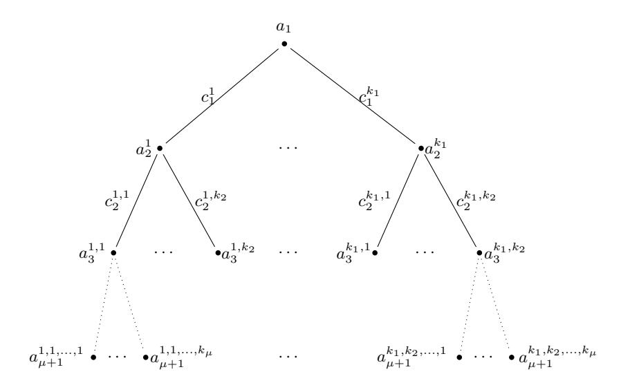

# **Fiat-Shamir Transformation of Multi-Round Interactive Proofs**

Thomas Attema1*,*3*,*4*,⋆*, Serge Fehr1*,*3*,⋆⋆*, and Michael Klooß2*,⋆ ⋆ ⋆*

1 CWI, Cryptology Group, Amsterdam, The Netherlands 2 KASTEL, Karlsruhe Institute of Technology, Karlsruhe, Germany 3 Leiden University, Mathematical Institute, Leiden, The Netherlands

Version 2 - February 16, 2022[1](#page-0-0)

**Abstract.** The celebrated Fiat-Shamir transformation turns any public-coin interactive proof into a non-interactive one, which inherits the main security properties (in the random oracle model) of the interactive version. While originally considered in the context of 3-move public-coin interactive proofs, i.e., so-called *Σ*-protocols, it is now applied to multi-round protocols as well. Unfortunately, the security loss for a (2*µ* + 1)-move protocol is, in general, *Q µ* , where *Q* is the number of oracle queries performed by the attacker. In general, this is the best one can hope for, as it is easy to see that this loss applies to the *µ*-fold sequential repetition of *Σ*-protocols, but it raises the question whether certain (natural) classes of interactive proofs feature a milder security loss.

In this work, we give positive and negative results on this question. On the positive side, we show that for (*k*1*, . . . , kµ*)-special-sound protocols (which cover a broad class of use cases), the knowledge error degrades linearly in *Q*, instead of *Q µ* . On the negative side, we show that for *t*-fold *parallel repetitions* of typical (*k*1*, . . . , kµ*)-special-sound protocols with *t* ≥ *µ* (and assuming for simplicity that *t* and *Q* are integer multiples of *µ*), there is an attack that results in a security loss of approximately 1 2*Q µ /µµ*+*t* .

# **1 Introduction**

## **1.1 Background**

The celebrated and broadly used Fiat-Shamir transformation turns any public-coin interactive proof into a *non-interactive* proof, which inherits the main security properties (in the random oracle model) of the interactive version. The rough idea is to replace the random challenges, which are provided by the verifier in the interactive version, by the hash of the current message (concatenated with the messages from previous rounds). By a small adjustment, where also the to-be-signed message is included in the hashes, the transformation turns any public-coin interactive proof into a signature scheme. Indeed, the latter is a commonly used design principle for constructing very efficient signature schemes.

While originally considered in the context of 3-move public-coin interactive proofs, i.e., so-called *Σ*protocols, the Fiat-Shamir transformation also applies to *multi-round* protocols. However, a major drawback in the case of multi-round protocols is that, in general, the security loss obtained by applying the Fiat-Shamir transformation grows exponentially with the number of rounds. Concretely, for any (2*µ*+ 1)-move interactive proof *Π* (where we may assume that the prover speaks first and last, so that the number of communication rounds is indeed odd) that admits a cheating probability of at most *ϵ*, captured by the knowledge or soundness error, the Fiat-Shamir-transformed protocol FS[*Π*] admits a cheating probability of at most (*Q*+1)*µ*·*ϵ*, where *Q* denotes the number of random-oracle queries admitted to the dishonest prover. Furthermore, there are (contrived) examples of multi-round protocols *Π* for which this (*Q* + 1)*µ* security loss is almost tight. For

4 TNO, Cyber Security and Robustness, The Hague, The Netherlands

*⋆* thomas.attema@tno.nl

*⋆⋆* serge.fehr@cwi.nl

*⋆ ⋆ ⋆* michael.klooss@kit.edu

1 **Change log** w.r.t. Version 1 - October 11, 2021: Simpler proof of Lemma [2,](#page-9-0) more precise treatment of the attack in Section [7](#page-24-0) (some details have been moved to appendix), considering *adaptive* security as well, and editorial changes throughout.

instance, the  $\mu$ -fold sequential repetition  $\Pi$  of a special-sound  $\Sigma$ -protocol with challenge space  $\mathcal C$  is  $\epsilon$ -sound with  $\epsilon = \frac{1}{|\mathcal C|^\mu}$ , while it is easy to see that, by attacking the sequential repetitions round by round, investing  $Q/\mu$  queries per round to try to find a "good" challenge, and assuming  $|\mathcal C|$  to be much larger than Q, its Fiat-Shamir transformation  $\mathsf{FS}[\Pi]$  can be broken with probability approximately  $\left(\frac{Q}{\mu}\frac{1}{|\mathcal C|}\right)^\mu = \left(\frac{Q}{\mu}\right)^\mu \cdot \epsilon$ .2

For  $\mu$  beyond 1 or 2, let alone for non-constant  $\mu$  (e.g., for Bulletproofs-like protocols [BCC+16,BBB+18]), this is a very unfortunate situation when it comes to choosing concrete security parameters. If one wants to rely on the proven security reduction, one needs to choose a large security parameter for  $\Pi$ , in order to compensate for the order  $Q^{\mu}$  security loss, effecting its efficiency; alternatively, one has to give up on proven security and simply assume that the security loss is much milder than what the general bound suggests—indeed, for the protocols one cares about, the known attacks do not feature such a large security loss. The latter of simply assuming the loss to be milder has become common practice.

This situation gives rise to the following question: Do there exist natural classes of multi-round public-coin interactive proofs for which the security loss behaves more benign than what the general reduction suggests? Ideally, the general  $Q^{\mu}$  loss appears for contrived examples only. So far, the only positive result in that direction is [GT21], which shows an online/straight-line extractor for Bulletproofs and related protocols in the algebraic group model. They prove a security loss linear in Q (and linear in n, the statement size).

In this work, we address this question (in the plain random-oracle model), and give both positive and negative answers, as explained in more detail below.

## 1.2 Our Results

On the positive side, we show that the Fiat-Shamir transformation of any  $(k_1, \ldots, k_{\mu})$ -special-sound interactive proof has a security loss of at most Q+1. More concretely, we consider the *knowledge error*  $\kappa$  as the figure of merit, i.e., informally, the maximal probability of the verifier accepting the proof when the prover does not have a witness for the claimed statement, and we prove the following result. For any  $(k_1, \ldots, k_{\mu})$ -special-sound  $(2\mu+1)$ -move interactive proof  $\Pi$  with knowledge error  $\kappa$  (which is a known function of  $(k_1, \ldots, k_{\mu})$ ), the Fiat-Shamir transformed protocol  $\mathsf{FS}[\Pi]$  has a knowledge error at most  $(Q+1) \cdot \kappa$ .

Since in the Fiat-Shamir transformation of any  $(2\mu+1)$ -move protocol  $\Pi$ , a dishonest prover can simulate any attack against  $\Pi$ , and can try  $Q/\mu$  times when allowed to do Q queries in total, our new upper bound  $(Q+1)\cdot\kappa$  is close to the trivial lower bound  $1-(1-\kappa)^{Q/\mu}\approx Q\kappa/\mu$ . Another, less explicit, security measure in the context of knowledge soundness is the run time of the knowledge extractor. Our bound on the knowledge error holds by means of a knowledge extractor that makes an expected number of  $K+Q\cdot(K-1)$  queries, where  $K=k_1\cdots k_\mu$ . This is a natural bound: K is the number of necessary distinct "good" transcripts (which form a certain tree-like structure). The loss of  $Q\cdot(K-1)$  captures the fact that a prover may finish different proofs, depending on the random oracle answers, and only one out of Q proofs may be useful for extraction, as explained below.

The construction of our knowledge extractor is motivated by the extractor from [ACK21] in the interactive case, but the analysis here in the context of a non-interactive proof is much more involved. We analyze the extractor in an inductive manner, and capture the induction step (and the base case) by means of an abstract experiment. The crucial idea for the analysis (and extractor) is how to deal with accepting transcripts which are not useful.

To see the core problem, consider a  $\Sigma$ -protocol, i.e., a 3-move k-special-sound interactive proof, and a semi-honest prover that knows a witness and behaves as follows. It prepares, independently, Q first messages  $a^1, \ldots, a^Q$  and asks for all hashes  $c^i = \mathsf{RO}(a^i)$ , and then decides "randomly" (e.g., using a hash over all random oracle answers) which thread to complete, i.e., for which  $i^*$  to compute the response z and then output the valid proof  $(a^{i^*}, z)$ . When the extractor then reprograms the random oracle to try to obtain another valid response but now for a different challenge, this affects  $i^*$ , and most likely the prover will then use a different thread  $j^*$  and output the proof  $(a^{j^*}, z')$  with  $a^{j^*} \neq a^{i^*}$ . More precisely,  $\Pr(a^{j^*} = a^{i^*}) = 1/Q$ . Hence, an overhead of Q appears in the run-time.

&lt;sup>2 This is clearly a contrived example since the natural construction would be to apply the Fiat-Shamir transformation to the *parallel* repetition of the original  $\Sigma$ -protocol, where no such huge security loss would then occur.

Perhaps surprisingly, when moving to *multi-round* protocols, dealing with the knowledge error is relatively simple by recursively composing the extractor. However, controlling the run-time is intricate. If the extractor is recursively composed, i.e., it makes calls to a subextractor to obtain a subtree, then a naive construction and analysis gives a blow-up of  $Q^{\mu}$  in the run-time. Intuitively, because only 1/Q of the subextractor runs produce useful subtrees, i.e., subtrees which extend the current  $a^{i^*}$ . The other trees belong to some  $a^j$  with  $j \neq i^*$  and are thus useless. This overhead of Q then accumulates per round (i.e., per subextractor).

The crucial observation that we exploit in order to overcome the above issue is that the very first (accepting) transcript sampled by a subextractor already determines whether a subtree will be (potentially) useful, or not. Thus, if this very first transcript already shows that the subtree will not be useful, there is no need to run the full-fledged subtree extractor, saving precious time.

To formally capture the technical aspects behind the extractor analysis, we consider and analyze an abstract sampling game. The sampling game considers a high-dimensional array, where each entry contains a bit v and a pointer i to one of the many dimensions. The goal is to find, by means of a prescribed strategy (which reflects how the extractor proceeds), k entries with v=1 and with pointers i to the same dimension, and, on top, the entries need to be appropriately located in the array, namely aligned along the dimension specified by the common pointer. The technical core of our proof then lies in analyzing certain figures of merit in this abstract experiment: the success probability and a cost function. Defining the cost function naively as the (expected) number of array entries that need to be visited is good enough for the analysis of the extractor of a  $\Sigma$ -protocol, but would lead to the old  $Q^{\mu}$  blow-up when analyzing the inductively defined extractor in that way. In order to capture the above idea of not running the full-fledged subtree extractor when it can be avoided, we introduce two weight functions and define the cost function by means of the total weight of the array entries visited by the extractor. The more general treatment, considering non-constant weight functions, significantly complicates the analysis of the abstract sampling game. Thus, the main technical core of our positive result lies in the analysis of this weighted cost function (Lemma 5).

On the negative side, we show that the general exponential security loss of the Fiat-Shamir transformation, when applied to a multi-round protocol, is not an artefact of contrived examples, but there exist natural protocols that indeed have such an exponential loss. Concretely, we show that the t-fold parallel repetition  $\Pi^t$  of a typical  $(k_1, \ldots, k_{\mu})$ -special-sound  $(2\mu + 1)$ -move interactive proof  $\Pi$  features this behavior when  $t \geq \mu$ . For simplicity, let us assume that t and Q are multiples of  $\mu$ . Then, in more detail, we show that for any typical  $(k_1, \ldots, k_{\mu})$ -special-sound protocol  $\Pi$  there exists a poly-time Q-query prover  $\mathcal{P}^*$  against  $\mathsf{FS}[\Pi^t]$  that succeeds in making the verifier accept with probability  $\approx \frac{1}{2}Q^{\mu}\kappa^t/\mu^{\mu+t}$  for any statement x, where  $\kappa$  is the knowledge error (as well as the soundness error) of  $\Pi$ . Thus, with the claimed probability,  $\mathcal{P}^*$  succeeds in making the verifier accept for statements x that are not in the language and/or for which  $\mathcal{P}^*$  does not know a witness. Given that  $\kappa^t$  is the soundness error of  $\Pi^t$  (i.e., the soundness error of  $\Pi^t$  as an interactive proof), this shows that the soundness error of  $\Pi^t$  grows proportionally with  $Q^\mu$  when applying the Fiat-Shamir transformation. Recent work on the knowledge error of a parallel repetition [AF21] shows that  $\kappa^t$  is also the knowledge error of  $\Pi^t$ , and so the above shows that the same exponential loss holds in the knowledge error of the Fiat-Shamir transformation of a parallel repetition.

### 1.3 Related Work

Independent Concurrent Work. In independent and to a large extent concurrent work,3 Wikström [Wik21] achieves a similar positive result on the Fiat-Shamir transformation, using a different approach and different techniques: [Wik21] reduces non-interactive extraction to a form of interactive extraction and then applies a generalized version of [Wik18], while our construction adapts the interactive extractor from [ACK21] and offers a direct analysis. One small difference in the results, which is mainly of theoretical interest, is that our result holds and is meaningful for  $any \ Q < N$ , where N is the size of the challenge set, whereas [Wik21] requires N to be large.

&lt;sup>3 When finalizing our write-up, we were informed by Wikström that he derived similar results a few months earlier, subsequently made available online [Wik21].

**The Forking Lemma.** Security of the Fiat–Shamir transformation of *k*-special-sound 3-move protocols is widely used for construction of signatures. There, unforgeability is typically proven via a forking lemma [\[PS96](#page-26-7)[,BN06\]](#page-26-8), which extracts, with probability roughly *ϵ k/Q*, a witness from a signature-forging adversary with success probability *ϵ*, where *Q* is the number of queries to the random oracle. The loss *ϵ k* is due to *strict* polynomial time extraction (and can be decreased, but in general not down to *ϵ*). Such a *k*-th power loss in the success probability for a constant *k* is fine in certain settings, e.g., for proving the security of signature schemes; however, not for proofs of knowledge (which, on the other hand, consider *expected* polynomial time extraction [\[BL02\]](#page-26-9)).

A forking lemma for *interactive* multi-round proofs was presented in [\[BCC](#page-26-0)+16] and its analysis was improved in a line of follow-up works [\[Wik18](#page-26-6)[,HKR19,](#page-26-10)[dLS19,](#page-26-11)[JT20,](#page-26-12)[AL21\]](#page-26-13). This forking lemma shows that multi-round special-sound interactive proofs satisfy a notion of knowledge soundness called *witness extended emulation*. Eventually, it was shown that (*k*1*, . . . , kµ*)-special-soundness tightly implies knowledge soundness [\[ACK21\]](#page-26-3).

We are not aware of forking lemmas being used in the context of the Fiat–Shamir transformation for multi-round interactive proofs, i.e., for (2*µ* + 1)-move protocols with *µ >* 1. The aforementioned techniques for interactive proofs are not directly applicable to the Fiat-Shamir mode. First, incorporating the query complexity *Q* of a dishonest prover P ∗ attacking the non-interactive Fiat–Shamir transformation complicates the analysis. Second, a naive adaptation of the forking lemmas for interactive proofs gives a blow-up of *Qµ* in the run-time.

# **2 Preliminaries**

## **2.1 Interactive Proofs**

Let *R* ⊆ {0*,* 1} ∗×{0*,* 1} ∗ be a binary relation. Following standard conventions, we call (*x*; *w*) ∈ *R* a statementwitness pair, that is, *x* is the *statement* and *w* is a *witness* for *x*. The set of valid witnesses for a statement *x* is denoted by *R*(*x*), i.e., *R*(*x*) = {*w* : (*x*; *w*) ∈ *R*}. A statement that admits a witness is said to be a *true* or *valid* statement; the set of true statements is denoted by *LR*, i.e., *LR* = {*x* : ∃ *w* s.t. (*x*; *w*) ∈ *R*}. The relation *R* is an NP relation if the validity of a witness *w* can be verified in time polynomial in the size |*x*| of the statement *x*. From now on we assume all relations to be NP relations.

In an interactive proof for a relation *R*, a prover P aims to convince a verifier V that a statement *x* admits a witness, or even that the prover *knows* a witness *w* ∈ *R*(*x*).

**Definition 1 (Interactive Proof).** *An* interactive proof *Π* = (P*,* V) *for relation R is an interactive protocol between two probabilistic machines, a prover* P *and a polynomial time verifier* V*. Both* P *and* V *take as public input a statement x and, additionally,* P *takes as private input a witness w* ∈ *R*(*x*)*. The verifier* V *either accepts or rejects and its output is denoted as* (P(*w*)*,* V)(*x*)*. Accordingly, we say the corresponding transcript (i.e., the set of all messages exchanged in the protocol execution) is* accepting *or* rejecting*.*

Let us introduce some conventions and additional properties for interactive proof systems. We assume that the prover P sends the first and the last message in any interactive proof *Π* = (P*,* V). Hence, the number of communication moves 2*µ* + 1 is always odd. We also say *Π* is a (2*µ* + 1)-move protocol. We will refer to *multi-round* protocols as a way of emphasizing that we are not restricting to 3-move protocols.

Informally, an interactive proof *Π* = (P*,* V) is *complete* if for any statement-witness pair (*x*; *w*) ∈ *R* the honest execution results in the verifier accepting with high probability. It is *sound* if the verifier rejects false statements, i.e., *x /*∈ *LR*, with high probability. We do neither require (or formally define) completeness nor soundness, as our main focus is *knowledge soundness*. Intuitively, a protocol is knowledge sound if any (potentially malicious) prover P ∗ which convinces the verifier must "know" a witness *w* such that (*x, w*) ∈ *R*. Informally, this means that any prover P ∗ with Pr((P ∗ *,* V)(*x*) = accept) large enough is able to efficiently compute a witness *w* ∈ *R*(*x*).

**Definition 2 (Knowledge Soundness).** *An interactive proof* (P*,* V) *for relation R is* knowledge sound *with knowledge error κ*: N → [0*,* 1] *if there exists a positive polynomial q and an algorithm* E*, called a* knowledge extractor, with the following properties. Given input x and black-box oracle access to a (potentially dishonest) prover  $\mathcal{P}^*$ , the extractor  $\mathcal{E}$  runs in an expected number of steps that is polynomial in |x| (counting queries to  $\mathcal{P}^*$  as a single step) and outputs a witness  $w \in R(x)$  with probability

$$\Pr((x; \mathcal{E}^{\mathcal{P}^*}(x)) \in R) \ge \frac{\epsilon(\mathcal{P}^*, x) - \kappa(|x|)}{q(|x|)},$$

where  $\epsilon(\mathcal{P}^*, x) := \Pr((\mathcal{P}^*, \mathcal{V})(x) = \mathsf{accept}).$ 

Remark 1. From the linearity of the expectation, it follows easily that it is sufficient to consider deterministic provers  $\mathcal{P}^*$  in Definition 2.

An important class of protocols have particularly simple verifiers: effectively stateless verifiers which send uniformly random challenges to the prover, and run an efficient verification function on the final transcript.

**Definition 3 (Public-Coin).** An interactive proof  $\Pi = (\mathcal{P}, \mathcal{V})$  is public-coin if all of  $\mathcal{V}$ 's random choices are made public. The message  $c_i \leftarrow_R \mathcal{C}_i$  of  $\mathcal{V}$  in the 2*i*-th move is called the *i*-th challenge, and  $\mathcal{C}_i$  is the challenge set.

## 2.2 Special-Sound Multi-Round Protocols

The class of interactive proofs we are interested in are those where knowledge soundness follows from another property, namely *special-soundness*. Special-soundness is often simpler to verify, and many protocols satisfy this notion. Note that we require special-sound protocols to be public-coin.

**Definition 4** (k-out-of-N Special-Soundness). Let  $k, N \in \mathbb{N}$ . A 3-move public-coin interactive proof  $\Pi = (\mathcal{P}, \mathcal{V})$  for relation R, with challenge set of cardinality  $N \geq k$ , is k-out-of-N special-sound if there exists a polynomial time algorithm that, on input a statement x and k accepting transcripts  $(a, c_1, z_1), \ldots (a, c_k, z_k)$  with common first message a and pairwise distinct challenges  $c_1, \ldots, c_k$ , outputs a witness  $w \in R(x)$ . We also say  $\Pi$  is k-special-sound and, if k = 2, it is simply said to be special-sound.

We refer to a 3-move public-coin interactive proof as a  $\Sigma$ -protocol. Note that often a  $\Sigma$ -protocol is required to be (perfectly) complete, special-sound and special honest-verifier zero-knowledge (SHVZK) by definition. We do not require a  $\Sigma$ -protocol to have these additional properties.

**Definition 5** ( $\Sigma$ -Protocol). A  $\Sigma$ -protocol is a 3-move public-coin interactive proof.

In order to generalize k-special-soundness to multi-round protocols we introduce the notion of a tree of transcripts. We follow the definition of [ACK21].

**Definition 6 (Tree of Transcripts).** Let  $k_1, \ldots, k_{\mu} \in \mathbb{N}$ . A  $(k_1, \ldots, k_{\mu})$ -tree of transcripts for a  $(2\mu+1)$ -move public-coin interactive proof  $\Pi = (\mathcal{P}, \mathcal{V})$  is a set of  $K = \prod_{i=1}^{\mu} k_i$  transcripts arranged in the following tree structure. The nodes in this tree correspond to the prover's messages and the edges to the verifier's challenges. Every node at depth i has precisely  $k_i$  children corresponding to  $k_i$  pairwise distinct challenges. Every transcript corresponds to exactly one path from the root node to a leaf node. See Figure 1 for a graphical illustration. We refer to the corresponding tree of challenges as a  $(k_1, \ldots, k_{\mu})$ -tree of challenges.

We will also write  $\mathbf{k} = (k_1, \dots, k_{\mu}) \in \mathbb{N}^{\mu}$  and refer to a **k**-tree of transcripts or a **k**-tree of challenges.

**Definition 7**  $((k_1,\ldots,k_\mu)\text{-out-of-}(N_1,\ldots,N_\mu)$  **Special-Soundness).** Let  $k_1,\ldots,k_\mu,N_1,\ldots,N_\mu\in\mathbb{N}$ . A  $(2\mu+1)$ -move public-coin interactive proof  $\Pi=(\mathcal{P},\mathcal{V})$  for relation R, where  $\mathcal{V}$  samples the i-th challenge from a set of cardinality  $N_i\geq k_i$  for  $1\leq i\leq \mu$ , is  $(k_1,\ldots,k_\mu)$ -out-of- $(N_1,\ldots,N_\mu)$  special-sound if there exists a polynomial time algorithm that, on input a statement x and a  $(k_1,\ldots,k_\mu)$ -tree of accepting transcripts outputs a witness  $w\in R(x)$ . We also say  $\Pi$  is  $(k_1,\ldots,k_\mu)$ -special-sound.

**Fig. 1.**  $(k_1, \ldots, k_\mu)$ -tree of transcripts of a  $(2\mu + 1)$ -move interactive proof [ACK21].

It is well known that, for 3-move protocols, k-special-soundness implies knowledge soundness, but only recently it was shown that more generally, for public-coin  $(2\mu + 1)$ -move protocols,  $(k_1, \ldots, k_{\mu})$ -out-of- $(N_1, \ldots, N_{\mu})$  special-soundness tightly implies knowledge soundness [ACK21], with knowledge error

$$\operatorname{Er}(k_1, \dots, k_{\mu}; N_1, \dots, N_{\mu}) = 1 - \prod_{i=1}^{\mu} \frac{N_i - k_i + 1}{N_i} = 1 - \prod_{i=1}^{\mu} \left( 1 - \frac{k_i - 1}{N_i} \right), \tag{1}$$

which matches the probability that at least one of the random challenges  $c_i$  hits a certain set  $\Gamma_i$  of size  $k_i - 1$ . Since typical protocols admit a trivial attack that succeeds if at least one of the random challenges  $c_i$  hits a certain set  $\Gamma_i$  of size  $k_i - 1$  (we capture this by the special-unsoundness property in Section 7), the soundness/knowledge error Er is tight for general special-sound protocols.

Note that  $\operatorname{Er}(k; N) = (k-1)/N$  and, for all  $1 \le m \le \mu$ ,

$$\operatorname{Er}(k_m, \dots, k_{\mu}; N_m, \dots, N_{\mu}) = 1 - \frac{N_m - k_m + 1}{N_m} \left( 1 - \operatorname{Er}(k_{m+1}, \dots, k_{\mu}; N_{m+1}, \dots, N_{\mu}) \right), \tag{2}$$

where we define  $\text{Er}(\emptyset; \emptyset) = 1$ . If  $N_1 = \cdots = N_{\mu} = N$ , i.e., if the verifier samples all  $\mu$  challenges from a set of size N, we simply write  $\text{Er}(k_1, \ldots, k_{\mu}; N)$ , or  $\text{Er}(\mathbf{k}; N)$  for  $\mathbf{k} = (k_1, \ldots, k_{\mu})$ .

## 2.3 Non-Interactive Random Oracle Proofs (NIROP)

In practice, interactive proofs are not typically used. Instead, transformations are used which turn them into non-interactive proofs in the random oracle model (ROM). We define non-interactive random oracle proofs (NIROP) as in [BCS16]. Their definition is a straightforward adaption of (non-)interactive proof systems to the ROM. The same holds for their properties. Every algorithm is augmented by access to a random oracle.

In the random oracle model, algorithms have black-box access to an oracle RO:  $\{0,1\}^* \to \mathcal{Y}$ , called the random oracle, which is instantiated by a uniformly random function with domain  $\{0,1\}^*$  and codomain  $\mathcal{Y}$ . For convenience, we let the codomain  $\mathcal{Y}$  be an arbitrary finite set, while typically  $\mathcal{Y} = \{0,1\}^{\eta}$  for some  $\eta \in \mathbb{N}$  related to the security parameter. Equivalently, RO is instantiated by lazy sampling, i.e., for every bit-string  $x \in \{0,1\}^*$ , RO(x) is chosen uniformly at random in  $\mathcal{Y}$  (and then fixed). To avoid technical difficulties, we limit the domain from  $\{0,1\}^*$  to  $\{0,1\}^{\leq u}$ , the finite set of all bitstrings of length at most u, for a sufficiently

large *u* ∈ N. An algorithm ARO that is given black-box access to a random oracle is called a *random-oracle algorithm*. We call A a *Q-query random-oracle algorithm*, if it makes at most *Q* queries to RO (independent of RO).

A natural extension of the random oracle model is when A is given access to *multiple independent* random oracles RO1*, . . . ,* RO*µ*, possibly with different codomains.[4](#page-6-0) The definitions below apply to this extension in the obvious way.

**Definition 8 (Non-Interactive Random Oracle Proof (NIROP)).** *A* non-interactive random oracle proof *for relation R is a pair* (P*,* V) *of (probabilistic) random-oracle algorithms, a prover* P *and a polynomialtime verifier* V*, such that: Given* (*x*; *w*) ∈ *R and access to a random oracle* RO*, the prover* P RO(*x*; *w*) *outputs a proof π. Given x* ∈ {0*,* 1} ∗ *, a purported proof π, and access to a random oracle* RO*, the verifier* V RO(*x, π*) *outputs* 0 *to reject or* 1 *to accept the proof.*

As for interactive definitions, a NIROP is complete if honestly generated proofs for (*x*; *w*) ∈ *R* are accepted by V with high probability. It is sound if it is infeasible to produce an accepting proof for a false statement. In the non-interactive setting, the soundness error, i.e., the success probability of a cheating prover necessarily depends on the number of queries it is allowed to make to the random oracle. The same holds true for knowledge soundness of NIROPs.

**Definition 9 (Knowledge Soundness - NIROP).** *A non-interactive random oracle proof* (P*,* V) *for relation R is* knowledge sound *with* knowledge error *κ*: N × N → [0*,* 1] *if there exists a positive polynomial q and an algorithm* E*, called a* knowledge extractor*, with the following properties: The extractor, given input x and oracle access to any (potentially dishonest) Q-query random oracle prover* P ∗ *, runs in an expected number of steps that is polynomial in* |*x*| *and Q and outputs a witness w* ∈ *R*(*x*)*, and satisfies*

$$\Pr((x; w) \in R : w \leftarrow \mathcal{E}^{\mathcal{P}^*}(x)) \ge \frac{\epsilon(\mathcal{P}^*, x) - \kappa(|x|, Q)}{q(|x|)}$$

*for all x* ∈ {0*,* 1} ∗ *where ϵ*(P ∗ *, x*) = Pr V RO(*x,*P ∗*,*RO) = 1 *. Here,* E *implements* RO *for* P ∗ *, in particular,* E *can arbitrarily program* RO*. Moreover, the randomness is over the randomness of* E*,* V*,* P ∗ *and* RO*.*

*Remark 2.* As for the knowledge soundness of *interactive* proofs (see Remark [1\)](#page-4-0), it is sufficient to consider *deterministic* provers P ∗ in Definition [9.](#page-6-1) Consequently, we will assume all dishonest provers P ∗ to be deterministic in order to simplify our analysis. Black-box access to P ∗ then simply means black-box access to the next-message function of P ∗ . This in particular means that E can "rewind" P ∗ to any state. We stress though that E cannot depend on (or "know") certain properties of P ∗ , such as *Q* or the success probability *ϵ*(P ∗ *, x*).

### **2.4 Adaptive Security**

Thus far, knowledge soundness has been defined with respect to *static* or *non-adaptive* provers P ∗ attacking the considered (non-)interactive proof for a *fixed* statement *x*. However, in many practical scenarios the dishonest provers are free to *choose* the statement *x* adaptively. Hence, in these cases static security is not sufficient. For *interactive* proofs, it is well-known that static knowledge soundness implies adaptive knowledge soundness. However, this does not carry over to non-interactive proofs. For instance, it is easy to see that the static Fiat-Shamir transformation (see Definition [11\)](#page-8-0) is in general not adaptively sound.

For this reason, let us formalize adaptive knowledge soundness for non-interactive random oracle proofs. An adaptive prover P a attacking the considered NIROP is given oracle access to a random oracle RO and outputs a statement *x* of fixed length |*x*| = *n* together with a proof *π*. As in the static definition, adaptive knowledge soundness requires the existence of a knowledge extractor. However, formalizing the

4 In practice, these random oracles will be instantiated by one random oracle RO : {0*,* 1} ∗ → {0*,* 1} *η* using standard techniques for domain separation and for sampling random elements from non-binary sets.

requirements of this extractor introduces some subtle issues. Namely, because P a chooses the statement *x* adaptively, it is not immediately clear for which statement the extractor should extract a witness. For instance, granting the extractor the same freedom of adaptively choosing the statement *x*, for which it needs to extract a witness *w*, renders knowledge extraction trivial; the extractor could simply output an arbitrary statement-witness pair (*x*; *w*). For this reason, we require the extractor to output statement-witness pairs (*x*; *w*) corresponding to the *valid* pairs (*x, π*) outputted by the adaptive prover P a . To formalize these requirements, we also write (*x, π, v*), with *v* ∈ {0*,* 1} indicating whether *π* is a valid proof for statement *x*. Given this notation, the extractor should output a triple (*x, π, v*) with the same distribution as the triples (*x, π, v*) produced by P a ; furthermore, if *π* is a valid proof for statement *x*, i.e., *v* = 1, then the extractor should additionally aim to output a witness *w* ∈ *R*(*x*). As before, the success probability of the extractor is allowed to depend on the success probability of P a . Finally, to ensure that the knowledge extractor can be used in compositional settings, where the NIROP is deployed as a component of a larger protocol, the prover P a is also allowed to additionally output arbitrary auxiliary information aux ∈ {0*,* 1} ∗ and the extractor is then required to simulate the tuple (*x, π,* aux*, v*), rather than the triple (*x, π, v*). The following definition formalizes adaptive knowledge soundness along these lines. For alternative definitions see, e.g., [\[Unr17,](#page-26-15)[DFMS19\]](#page-26-16).

**Definition 10 (Adaptive Knowledge Soundness - NIROP).** *A non-interactive random oracle proof* (P*,* V) *for relation R is* adaptively knowledge sound *with* knowledge error *κ*: N × N → [0*,* 1] *if there exists a positive polynomial q and an algorithm* E*, called a* knowledge extractor*, with the following properties: The extractor, given input n* ∈ N *and oracle access to any adaptive Q-query random oracle prover* P a *that outputs statements x with* |*x*| = *n, runs in an expected number of steps that is polynomial in n and Q and outputs a tuple* (*x, π,* aux*, v*; *w*) *such that* {(*x, π,* aux*, v*) : (*x, π,* aux) ← Pa*,*RO ∧ *v* ← VRO(*x, π*)} *and* {(*x, π,* aux*, v*) : (*x, π,* aux*, v*; *w*) ← EP a (*n*)} *are identically distributed and*

$$\Pr \big(v = \mathit{accept} \wedge (x; w) \in R : (x, \pi, \mathit{aux}, v; w) \leftarrow \mathcal{E}^{\mathcal{P}^{\mathsf{a}}}(n) \big) \geq \frac{\epsilon(\mathcal{P}^{\mathsf{a}}) - \kappa(n, Q)}{q(n)} \,,$$

*where ϵ*(P a ) = Pr V RO(*x, π*) = 1 : (*x, π*) ← Pa*,*RO *. Here,* E *implements* RO *for* P a *, in particular,* E *can arbitrarily program* RO*. Moreover, the randomness is over the randomness of* E*,* V*,* P a *and* RO*.*

*Remark 3.* We note that, while the tuple (*x, π,* aux*, v*) is required to have the same distribution for P a and E(*n*), by default the respective executions of P a and E(*n*) give rise to two different probability spaces. Looking ahead though, we remark that the extractor that we eventually construct first does an honest run of P a by faithfully simulating the answers to P a 's random oracle queries (this produces the tuple (*x, π,* aux*, v*) that E(*n*) eventually outputs and which so trivially has the right distribution), and then, if *π* is a valid proof, E(*n*) starts rewinding P a and reprogramming the random oracle to try to find enough valid proofs to compute a witness. Thus, in this sense, we can then say that E(*n*) aims to find a witness *w* ∈ *R*(*x*) for *the statement x outputted by* P a .

## **2.5 Fiat–Shamir Transformations**

The Fiat-Shamir transformation [\[FS87\]](#page-26-17) turns a public-coin interactive proof into a non-interactive random oracle proof (NIROP). The general idea is to compute the *i*-th challenge *ci* as a hash of the *i*-th prover message *ai* and (some part of) the previous communication transcript. For a *Σ*-protocol, the challenge *c* is computed as *c* = *H*(*a*) or as *c* = *H*(*x, a*), where the former is sufficient for *static* security, where the statement *x* is given as input to the dishonest prover, and the latter is necessary for *adaptive* security, where the dishonest prover can choose the statement *x* for which it wants to forge a proof.

For multi-round public-coin interactive proofs, there is some degree of freedom in the computation of the *i*-th challenge. For concreteness and simplicity, we consider a particular version where all previous prover messages are hashed along with the current message. As for *Σ*-protocols, we consider a static and an adaptive variant of this version of the Fiat-Shamir transformation. In contrast to the static variant, the adaptive Fiat-Shamir transformation includes the statement *x* in all hash function evaluations. If it is not made explicit which variant is used, the considered result holds for both variants.

Let  $\Pi = (\mathcal{P}, \mathcal{V})$  be a  $(2\mu + 1)$ -move public-coin interactive proof, where the challenge from the *i*-th round is sampled from set  $\mathcal{C}_i$ . For simplicity, we consider  $\mu$  random oracles  $\mathsf{RO}_i \colon \{0,1\}^{\leq u} \to \mathcal{C}_i$ that map into the respective challenge spaces.

**Definition 11 (Fiat-Shamir Transformation).** The static Fiat-Shamir transformation  $\mathsf{FS}[\Pi] = (\mathcal{P}_\mathsf{fs}, \mathcal{V}_\mathsf{fs})$  is the NIROP where  $\mathcal{P}_\mathsf{fs}^{\mathsf{RO}_1, \dots, \mathsf{RO}_\mu}(x; w)$  runs  $\mathcal{P}(x; w)$  but instead of asking the verifier for the challenge  $c_i$  on message  $a_i$ , the challenges are computed as

$$c_i = \mathsf{RO}_i(a_1, \dots, a_{i-1}, a_i); \tag{3}$$

the output is then the proof  $\pi = (a_1, \ldots, a_{\mu+1})$ . On input a statement x and a proof  $\pi = (a_1, \ldots, a_{\mu+1})$ ,  $\mathcal{V}_{\mathsf{fs}}^{\mathsf{RO}_1, \ldots, \mathsf{RO}_{\mu}}(x, \pi)$  accepts if, for  $c_i$  as above  $\mathcal{V}$  accepts the transcript  $(a_1, c_1, \ldots, a_{\mu}, c_{\mu}, a_{\mu+1})$  on input x. If the challenges are computed as

$$c_i = \mathsf{RO}_i(x, a_1, \dots, a_{i-1}, a_i);$$
 (4)

the resulting NIROP is referred to as the adaptive Fiat-Shamir transformation.

By means of reducing the security of other variants of the Fiat-Shamir transformation to Definition 11, appropriately adjusted versions of our results also apply to other variants of doing the "chaining" (Equations 3 and 4) in the Fiat-Shamir transformation, for instance when  $c_i$  is computed as  $c_i = \mathsf{RO}_i(i, c_{i-1}, a_i)$  or  $c_i = \mathsf{RO}_i(x, i, c_{i-1}, a_i)$ , where  $c_0$  is the empty string.

## 2.6 Negative Hypergeometric Distribution

Consider a bucket containing  $\ell$  green balls and  $N-\ell$  red balls, i.e., a total of N balls. In the negative hypergeometric experiment balls are drawn uniformly at random from this bucket, without replacement, until k green balls have been found or until the bucket is empty. The number of red balls X drawn in this experiment is said have a negative hypergeometric distribution with parameters  $N, \ell, k$ , which is denoted by  $X \sim \mathsf{NHG}(N, \ell, k)$ .

Lemma 1 (Negative Hypergeometric Distribution). Let  $N, \ell, k \in \mathbb{N}$  with  $\ell, k \leq N$ , and let  $X \sim \mathsf{NHG}(N, \ell, k)$ . Then  $\mathbb{E}[X] \leq k \frac{N-\ell}{\ell+1}$ .

*Proof.* If  $\ell < k$ , it clearly holds that  $\Pr(X = N - \ell) = 1$ . Hence, in this case,  $\mathbb{E}[X] = N - \ell \le k \frac{N - \ell}{\ell + 1}$ , which proves the claim.

So let us now consider the case  $\ell \geq k$ . Then, for all  $0 \leq x \leq N - \ell$ ,

$$\Pr(X = x) = \frac{\binom{x+k-1}{x} \binom{N-x-k}{N-\ell-x}}{\binom{N}{N-\ell}}.$$

Hence,

$$\begin{split} \mathbb{E}[X] &= \sum_{x=0}^{N-\ell} \Pr(X=x) \cdot x = \sum_{x=1}^{N-\ell} x \frac{\binom{x+k-1}{x} \binom{N-x-k}{N-\ell-x}}{\binom{N}{N-\ell}} \\ &= k \frac{N-\ell}{\ell+1} \sum_{x=1}^{N-\ell} \frac{\frac{x}{k} \binom{x+k-1}{x} \binom{N-x-k}{N-\ell-x}}{\frac{N-\ell}{\ell+1} \binom{N}{N-\ell}} = k \frac{N-\ell}{\ell+1} \sum_{x=1}^{N-\ell} \frac{\binom{x+k-1}{k-1} \binom{N-x-k}{N-\ell-x}}{\binom{N}{N-\ell-1}} \\ &= k \frac{N-\ell}{\ell+1} \sum_{x=1}^{N-\ell} \Pr(Y=x-1) = k \frac{N-\ell}{\ell+1} \,, \end{split}$$

where  $Y \sim \mathsf{NHG}(N, \ell+1, k-1)$ . This completes the proof of the lemma.

*Remark 4.* Typically, negative hypergeometric experiments are restricted to the non-trivial case *ℓ* ≥ *k*. For reasons to become clear later, we also allow parameter choices with *ℓ < k* resulting in a trivial negative hypergeometric experiment in which all balls are always drawn.

*Remark 5.* The above has a straightforward generalization to buckets with balls of more than 2 colors: say *ℓ* green balls and *mi* balls of color *i* for 1 ≤ *i* ≤ *M*. The experiment proceeds as before, i.e., drawing until either *k* green balls have been found or the bucket is empty. Let *Xi* be the number of balls of color *i* that are drawn in this experiment. Then *Xi* ∼ NHG(*ℓ* + *mi , ℓ, k*) for all *i*. To see this, simply run the generalized negative hypergeometric experiment without counting the balls that are neither green nor of color *i*.

# **3 An Abstract Sampling Game**

Towards the goal of constructing and analyzing a knowledge extractor for the Fiat-Shamir transformation FS[*Π*] of special-sound interactive proofs *Π* = (P*,* V), we define and analyze an abstract sampling game. Given access to a deterministic *Q*-query prover P ∗ , attacking the non-interactive random oracle proof FS[*Π*], our extractor will essentially play this abstract game in the case *Π* is a *Σ*-protocol, and it will play this game recursively in the general case of a multi-round protocol. The abstraction allows us to focus on the crucial properties of the extraction algorithm, without unnecessarily complicating the notation.

The game considers an arbitrary but fixed *U*-dimensional array *M*, where, for all 1 ≤ *j*1*, . . . , jU* ≤ *N*, the entry *M*(*j*1*, . . . , jU* ) = (*v, i*) contains a bit *v* ∈ {0*,* 1} and an index *i* ∈ {1*, . . . , U*}. Think of the bit *v* indicating whether this entry is "good" or "bad", and the index *i* points to one of the *U* dimensions. The goal will be to find *k* "good" entries with the same index *i*, and with all of them lying in the 1-dimensional array *M*(*j*1*, . . . , ji*−1*,* · *, ji*+1*, . . . , jU* ) for some 1 ≤ *j*1*, . . . , ji*−1*, ji*+1*, . . . , jU* ≤ *N*.

Looking ahead, considering the case of a *Σ*-protocol first, this game captures the task of our extractor to find *k* proofs that are valid and feature the same first message but have different hash values assigned to the first message. Thus, in our application, the sequence *j*1*, . . . , jU* specifies the function table of the random oracle

RO: 
$$\{1, ..., U\} \to \{1, ..., N\}, i \mapsto j_i$$

while the entry *M*(*j*1*, . . . , jU* ) captures the relevant properties of the proof produced by the considered prover when interacting with that particular specification of the random oracle. Concretely, the bit *v* indicates whether the proof is valid, and the index *i* is the first message *a* of the proof. Replacing *ji* by *j* ′ *i* then means to reprogram the random oracle at the point *i* = *a*. Note that after the reprogramming, we want to obtain another valid proof with the *same* first message, i.e., with the same index *i* (but now a different challenge, due to the reprogramming).

The game is formally defined in Figure [2](#page-10-0) and its core properties are summarized in Lemma [2](#page-9-0) below. Looking ahead, we note that for efficiency reasons, the extractor will naturally not sample the entire sequence *j*1*, . . . , jU* (i.e., function table), but will sample its components on the fly using lazy sampling.

To capture the main properties of the abstract sampling game, for all 1 ≤ *i* ≤ *U*, we define the function

$$a_i : \{1, \dots, N\}^U \to \mathbb{N}_{\geq 0}, (j_1, \dots, j_U) \mapsto |\{j : M(j_1, \dots, j_{i-1}, j, j_{i+1}, \dots, j_U) = (1, i)\}|.$$
 (5)

The value *ai*(*j*1*, . . . , jU* ) counts the number of entries that are "good" and have index *i* in the 1-dimensional array *M*(*j*1*, . . . , ji*−1*,* · *, ji*+1*, . . . , jU* ). Note that *ai* does not depend on the *i*-th entry of the input vector (*j*1*, . . . , jU* ), and so, by a slight abuse of notation, we sometimes also write *ai*(*j*1*, . . . , ji*−1*, ji*+1*, . . . , jU* ) instead.

**Lemma 2 (Abstract Sampling Game).** *Consider the game in Figure [2.](#page-10-0) Let J* = (*J*1*, . . . , JU* ) *be uniformly distributed in* {1*, . . . , N*} *U , indicating the first entry sampled, and let* (*V, I*) = *M*(*J*1*, . . . , JU* )*. Further, for all* 1 ≤ *i* ≤ *U, let Ai* = *ai*(*J*)*. Moreover, let X be the number of entries of the form* (1*, i*) *with i* = *I sampled (including the first one), and let Λ be the total number of entries sampled in this game. Then*

$$\begin{split} \mathbb{E}[A] &\leq 1 + (k-1)P \quad and \\ \Pr(X = k) &\geq \frac{N}{N-k+1} \left( \Pr(V = 1) - P \cdot \frac{k-1}{N} \right) \,, \end{split}$$

## **Fig. 2.** Abstract Sampling Game.

**Parameters:** *k, N, U* ∈ N, and *M* a *U*-dimensional array with entries in *M*(*j*1*, . . . , jU* ) ∈ {0*,* 1} × {1*, . . . , U*} for all 1 ≤ *j*1*, . . . , jU* ≤ *N*.

- **–** Sample (*j*1*, . . . , jU* ) ∈ {1*, . . . , N*} *U* uniformly at random and set (*v, i*) = *M*(*j*1*, . . . , jU* ).
- **–** If *v* = 0, abort.
- **–** Else, repeat
  - sample *j* ′ ∈ {1*, . . . , N*} \ {*ji*} (without replacement),
  - compute (*v* ′ *, i*′ ) = *M*(*j*1*, . . . , ji*−1*, j*′ *, ji*+1*, . . . , jU* ),

until either *k* − 1 additional entries equal to (1*, i*) have been found or until all indices *j* ′ have been tried.

where 
$$P = \sum_{i=1}^{U} \Pr(A_i > 0)$$
.

Note the abstractly defined parameter *P*. In our application, where *M*(*j*1*, . . . , jU* ) is determined by the output of an algorithm making no more than *Q* queries to the random oracle with function table *j*1*, . . . , jU* , the parameter *P* will be bounded by *Q*+ 1. We show this formally (yet again somewhat abstractly) in Lemma [3.](#page-12-0) Intuitively, the reason is that the events *Ai >* 0 are *disjoint* for the all but *Q* indices *i* that the considered algorithm does *not* query, and so their probabilities add up to at most 1. Indeed, if *ai*(*j*1*, . . . , jU* ) *>* 0 for an index *i* that the algorithm did *not* query then *M*(*j*1*, . . . , jU* ) = (1*, i*); namely, by choice of *i*, the output of the algorithm is oblivious to the value of *ji* . Therefore, given *j*1*, . . . , jU* , such an index *i* as above is unique.

*Proof (of Lemma [2\)](#page-9-0).* **Expected Number of Samples.** Let us first derive an upper bound on the expected value of *Λ*. To this end, let *X*′ denote the number of sampled entries of the form (1*, i*) with *i* = *I*, but, in contrast to *X*, *without* counting the first one. Similarly, let *Y* ′ denote the number of sampled entries of the form (*v, i*) with *v* = 0 or *i* ̸= *I*, again without counting the first one. Then *Λ* = 1 + *X*′ + *Y* ′ and

$$Pr(X' = 0 \mid V = 0) = Pr(Y' = 0 \mid V = 0) = 1.$$

Hence, E[*X*′ | *V* = 0] = E[*Y* ′ | *V* = 0] = 0.

Let us now consider the expected value E[*Y* ′ | *V* = 1]. To this end, we observe that, conditioned on the event *V* = 1 ∧ *I* = *i* ∧ *Ai* = *a* with *a >* 0, *Y* ′ follows a negative hypergeometric distribution with parameters *N* − 1, *a* − 1 and *k* − 1. Hence, by Lemma [1,](#page-8-3)

$$\mathbb{E}[Y' \mid V = 1 \land I = i \land A_i = a] \le (k-1)\frac{N-a}{a},$$

and thus, using that Pr(*X*′ ≤ *k* − 1 | *V* = 1) = 1,

$$\mathbb{E}[X' + Y' \mid V = 1 \land I = i \land A_i = a] \le (k - 1) + (k - 1) \frac{N - a}{a} = (k - 1) \frac{N}{a}.$$

On the other hand

$$\Pr(V = 1 \land I = i \mid A_i = a) = \frac{a}{N}$$

and thus

$$\Pr(V = 1 \land I = i \land A_i = a) = \Pr(A_i = a) \frac{a}{N}.$$
(6)

Therefore, and since  $Pr(V = 1 \land I = i \land A_i = 0) = 0$ ,

$$\Pr(V = 1) \cdot \mathbb{E}[X' + Y' \mid V = 1] = \sum_{i=1}^{U} \sum_{a=1}^{N} \Pr(V = 1 \land I = i \land A_i = a) \cdot \mathbb{E}[X' + Y' \mid V = 1 \land I = i \land A_i = a]$$

$$\leq \sum_{i=1}^{U} \sum_{a=1}^{N} \Pr(A_i = a)(k-1)$$

$$= (k-1) \sum_{i=1}^{U} \Pr(A_i > 0)$$

$$= (k-1)P,$$

where  $P = \sum_{i=1}^{U} \Pr(A_i > 0)$ . Hence,

$$\begin{split} \mathbb{E}[A] &= \mathbb{E}[1 + X' + Y'] \\ &= 1 + \Pr(V = 0) \cdot \mathbb{E}[X' + Y' \mid V = 0] + \Pr(V = 1) \cdot \mathbb{E}[X' + Y' \mid V = 1] \\ &\leq 1 + (k - 1)P \,, \end{split}$$

which proves the claimed upper bound on  $\mathbb{E}[\Lambda]$ .

**Success Probability.** Let us now find a lower bound for the "success probability" Pr(X = k) of this game. Using (6) again, we can write

$$\Pr(X = k) = \sum_{i=1}^{U} \Pr(V = 1 \land I = i \land A_i \ge k) = \sum_{i=1}^{U} \sum_{a=k}^{N} \Pr(A_i = a) \frac{a}{N}.$$

Now, using  $a \leq N$ , note that

$$\begin{split} \frac{a}{N} &= 1 - \left(1 - \frac{a}{N}\right) \geq 1 - \frac{N}{N-k+1} \left(1 - \frac{a}{N}\right) \\ &= \frac{N}{N-k+1} \left(\frac{N-k+1}{N} - 1 + \frac{a}{N}\right) = \frac{N}{N-k+1} \left(\frac{a}{N} - \frac{k-1}{N}\right). \end{split}$$

Therefore, combining the two, and using that the summand becomes negative for a < k to argue the second inequality, and using (6) once more, we obtain

$$\Pr(X = k) \ge \sum_{i=1}^{U} \sum_{a=k}^{N} \Pr(A_i = a) \frac{N}{N - k + 1} \left( \frac{a}{N} - \frac{k - 1}{N} \right)$$

$$\ge \sum_{i=1}^{U} \sum_{a=1}^{N} \Pr(A_i = a) \frac{N}{N - k + 1} \left( \frac{a}{N} - \frac{k - 1}{N} \right)$$

$$= \frac{N}{N - k + 1} \sum_{i=1}^{U} \sum_{a=1}^{N} \left( \Pr(V = 1 \land I = i \land A_i = a) - \Pr(A_i = a) \cdot \frac{k - 1}{N} \right)$$

$$= \frac{N}{N - k + 1} \left( \Pr(V = 1) - \frac{k - 1}{N} \sum_{i=1}^{U} \Pr(A_i > 0) \right)$$

$$= \frac{N}{N - k + 1} \left( \Pr(V = 1) - P \cdot \frac{k - 1}{N} \right),$$

where, as before, we have used that  $\Pr(V=1 \land I=i \land A_i=0)=0$  for all  $1 \le i \le U$  to conclude the second equality, and finally that  $P=\sum_{i=1}^{U} \Pr(A_i>0)$ . This completes the proof of the lemma.

Our knowledge extractor will instantiate the abstract sampling game via a deterministic Q-query prover  $\mathcal{P}^*$  attacking the Fiat-Shamir transformation  $\mathsf{FS}[\Pi]$ . The index i of  $M(v,i) = (j_1,\ldots,j_U)$  is then determined by the output of  $\mathcal{P}^*$ , with the random oracle being given by the function table  $j_1,\ldots,j_U$ . Since the index i is thus determined by Q queries to the random oracle, the following shows that the parameter P will in this case be bounded by Q+1.

**Lemma 3.** Consider the game in Figure 2. Let v and idx be functions such that M(j) = (v(j), idx(j)) for all  $j \in \{1, ..., N\}^U$ . Furthermore, let  $J = (J_1, ..., J_U)$  be uniformly distributed in  $\{1, ..., N\}^U$ , and set  $A_i = a_i(J)$  for all  $1 \le i \le U$ . Let us additionally assume that for all  $j \in \{1, ..., N\}^U$  there exists a subset  $S(j) \subseteq \{1, ..., U\}$  of cardinality at most Q such that idx(j) = idx(j') for all j' with  $j'_{\ell} = j_{\ell}$  for all  $\ell \in S(j)$ . Then

$$P = \sum_{i=1}^{U} \Pr(A_i > 0) \le Q + 1.$$

*Proof.* By basic probability theory, it follows that5

$$\begin{split} P &= \sum_{i=1}^{U} \Pr(A_{i} > 0) \\ &= \sum_{j \in \{1, \dots, N\}^{U}} \Pr(J = j) \sum_{i=1}^{U} \Pr(A_{i} > 0 \mid J = j) \\ &= \sum_{j} \Pr(J = j) \bigg( \sum_{i \in S(j)} \Pr(A_{i} > 0 \mid J = j) + \sum_{i \notin S(j)} \Pr(A_{i} > 0 \mid J = j) \bigg) \\ &\leq \sum_{j} \Pr(J = j) \bigg( Q + \sum_{i \notin S(j)} \Pr(A_{i} > 0 \mid J = j) \bigg) \\ &\leq Q + \sum_{j} \Pr(J = j) \sum_{i \notin S(j)} \Pr(A_{i} > 0 \mid J = j) \,, \end{split}$$

where the inequality follows from the fact that  $|S(j)| \leq Q$  for all j.

Now note that, by definition of the sets S(j), for all  $j \in \{1, ..., N\}^U$ ,  $i \notin S(j)$  and  $j_i \in \{1, ..., N\}$ , it holds that

$$\Pr(idx(J_1,...,J_{i-1},j_i,J_{i+1},...,J_U) = idx(j) \mid J = j) = 1.$$

Therefore, for all  $i \notin S(j) \cup \{idx(j)\},\$ 

$$Pr(A_i > 0 \mid J = j) = 0.$$

Hence.

$$\sum_{i \notin S(j)} \Pr(A_i > 0 \mid J = j) \le \Pr(A_{idx(j)} > 0 \mid J = j) \le 1.$$

Altogether, it follows that

$$P \le Q + \sum_{j} \Pr(J = j) = Q + 1$$
,

which completes the proof.

&lt;sup>5 The probabilities  $Pr(A_i > 0 \mid J = j)$  are all 0 or 1; however, it's still convenient to use probability notation here.

## 4 Fiat-Shamir Transformation of $\Sigma$ -Protocols

Let us first consider the Fiat-Shamir transformation of a k-special-sound  $\Sigma$ -protocol  $\Pi$ , i.e., a 3-move interactive proof, with challenge set C; subsequently, in Section 6, we move to general *multi-round* interactive proofs.

Let  $\mathcal{P}^*$  be a deterministic dishonest Q-query random-oracle prover, attacking the Fiat-Shamir transformation  $\mathsf{FS}[\Pi]$  of  $\Pi$  on input x. Given a statement x as input, after making Q queries to the random oracle  $\mathsf{RO}: \{0,1\}^{\leq u} \to \mathcal{C}, \mathcal{P}^*$  outputs a proof  $\pi = (a,z)$ . For reasons to become clear later, we re-format (and partly rename) the output and consider

$$I := a$$
 and  $\pi$ 

as  $\mathcal{P}^*$ 's output. We refer to the output I as the index.

Furthermore, we extend  $\mathcal{P}^*$  to an algorithm  $\mathcal{A}$  that additionally checks the correctness of the proof  $\pi$ . Formally,  $\mathcal{A}$  runs  $\mathcal{P}^*$  to obtain I and  $\pi$ , queries RO to obtain  $c := \mathsf{RO}(I)$ , and then outputs

$$I = a$$
,  $y := (a, c, z)$  and  $v := V(y)$ ,

where V(y) = 1 if y is an accepting transcript for the interactive proof  $\Pi$  on input x and V(y) = 0 otherwise. We will also write  $\mathcal{A}^{\mathsf{RO}}$  for the algorithm that executes  $\mathcal{A}$  given a fixed random oracle  $\mathsf{RO}$ .

Hence,  $\mathcal{A}$  is a random-oracle algorithm making at most Q+1 queries; indeed, it relays the oracle queries done by  $\mathcal{P}^*$  and makes the one needed to do the verification. Moreover,  $\mathcal{A}$  has a naturally defined success probability

$$\epsilon(\mathcal{A}) := \Pr(v = 1 : (I, y, v) \leftarrow \mathcal{A}^{\mathsf{RO}}),$$

where RO:  $\{0,1\}^{\leq u} \to \mathcal{C}$  is chosen uniformly at random. The probability  $\epsilon(\mathcal{A})$  equals the success probability  $\epsilon(\mathcal{P}^*, x)$  of the random-oracle prover  $\mathcal{P}^*$  on input x.

Our goal is now to construct an extraction algorithm that, when given black-box access to  $\mathcal{A}$ , aims to output k accepting transcripts  $y_1, \ldots, y_k$  with common first message a and distinct challenges. By the k-special-soundness property of  $\Pi$ , a witness for statement x can be computed efficiently from these transcripts.

The extractor  $\mathcal{E}$  is defined in Figure 3. We remark that, by construction of  $\mathcal{A}$ ,  $\mathcal{A}$  does make a query to I; thus,  $c_i$  is well defined in Figure 3. Also, since  $\mathcal{P}^*$  and thus  $\mathcal{A}$  is deterministic, in each iteration of the repeat loop  $\mathcal{A}$  is ensured to make the query to I again.

#### **Fig. 3.** Extractor $\mathcal{E}$ .

Parameters:  $k, Q \in \mathbb{N}$ 

Black-box access to: A as above

- Run  $\mathcal{A}$  as follows to obtain  $(I, y_1, v)$ : answer all (distinct) oracle queries with uniformly random values in  $\mathcal{C}$ . Set i := I, and let  $c_i$  be the response to query i.
- If v = 0, abort.
- Else, repeat
  - sample  $c_i' \in \mathcal{C} \setminus \{c_i\}$  (without replacement);
  - run  $\mathcal{A}$  as follows to obtain (I', y', v'): answer the query to i with  $c'_i$ , while answering all other queries consistently if the query was performed by  $\mathcal{A}$  already on a previous run and with a fresh random value in  $\mathcal{C}$  otherwise:

until either k-1 additional challenges  $c'_i$  with v'=1 and I'=I have been found or until all challenges  $c'_i \in \mathcal{C}$  have been tried.

– In the former case, output the k accepting transcripts  $y_1, \ldots, y_k$ .

A crucial observation is the following. Within a run of  $\mathcal{E}$ , all the queries that are made by the different invocations of  $\mathcal{A}$  are answered *consistently* using lazy sampling, except for the queries to the index i, where

different responses  $c_i, c_i', \ldots$  are given. This is indistinguishable from having them answered by a full-fledged random oracle, i.e., by means of a pre-chosen function  $\mathsf{RO}: \{0,1\}^{\leq u} \to \mathcal{C}, \ell \mapsto j_\ell = \mathsf{RO}(\ell)$ , but then replacing  $j_i$  by fresh  $j' \neq j_i$  for the runs of  $\mathcal{A}$  in the repeat loop. Thus, the extractor is actually running the abstract game from Figure 2 and bounds on the success probability and the expected run time (in terms of queries to  $\mathcal{A}$ ) follow from Lemma 2 and Lemma 3. Altogether we obtain the following result.

**Lemma 4 (Extractor).** The extractor  $\mathcal{E}$  of Figure 3 makes an expected number of at most  $k+Q\cdot(k-1)$  queries to  $\mathcal{A}$  and succeeds in outputting k transcripts  $y_1,\ldots,y_k$  with common first message a and distinct challenges with probability at least

$$\frac{N}{N-k+1}\left(\epsilon(\mathcal{A})-(Q+1)\cdot\frac{k-1}{N}\right)\,.$$

*Proof.* Let U be the cardinality of the domain  $\{0,1\}^{\leq u}$  of a random oracle  $\mathsf{RO}\colon\{0,1\}^{\leq u}\to\mathcal{C}$ . Considering an arbitrary but fixed ordering  $\xi_1,\ldots,\xi_U$  of the bitstrings  $\xi_i\in\{0,1\}^{\leq u}$ , a vector  $\mathbf{c}\in\mathcal{C}^U$  then encodes the function table of the entire random oracle as  $\mathsf{RO}(\xi_i)=c_i$ . For this reason, we can also refer to  $\mathbf{c}\in\mathcal{C}^U$  as a (full-fledged) random oracle.

Further, since  $\mathcal{P}^*$  is deterministic, the outputs I, y and v of the algorithm  $\mathcal{A}$  can be viewed as functions taking as input a random oracle  $\mathbf{c} \in \mathcal{C}^U$ .

Let us now consider the following array  $M(\mathbf{c}) = (I(\mathbf{c}), v(\mathbf{c}))$ , indexed by random oracles  $\mathbf{c} \in \mathcal{C}^U$ . Then, a single run of the extractor is indistinguishable from playing the abstract sampling game of Figure 2 instantiated with array M. The only difference is that, in this sampling game, we consider full-fledged random oracles encoded by vectors  $\mathbf{c} \in \mathcal{C}^U$ , while the actual extractor implements these random oracles by lazy sampling.

Thus, we can apply Lemma 2 to obtain bounds on the success probability and the expected run time. However, in order to control the parameter P, which occurs in the bound of Lemma 2, we make the following observation, so that we can apply Lemma 3 and prove that  $P \leq Q + 1$ .

Namely, since  $\mathcal{P}^*$  is deterministic, its output can only change when the random oracle is reprogrammed at one of the indices  $i \in \{0,1\}^{\leq u}$  queried by  $\mathcal{P}^*$ . In other words, for every random oracle  $\mathbf{c} \in \mathcal{C}^U$ , there exists a subset  $S(\mathbf{c}) \subset \{0,1\}^{\leq u}$  (indicating the queries made by  $\mathcal{P}^*$ ) such that  $\mathcal{P}^*$ 's output stays the same when the random oracle is reprogrammed at an index  $i \notin S(\mathbf{c})$ . In particular,  $I(\mathbf{c}) = I(\mathbf{c}')$  for all  $\mathbf{c}, \mathbf{c}'$  with  $c_i = c_i'$  for all  $i \in S(\mathbf{c})$ . Hence, the conditions of Lemma 3 are satisfied and  $P \leq Q + 1$ . The bounds on the success probability and the expected run time now follow, completing the proof.

Given the existence of the above extractor, combined with the k-special-soundness property, implies the following theorem.

Theorem 1 (Fiat-Shamir Transformation of a  $\Sigma$ -Protocol). The Fiat-Shamir transformation  $\mathsf{FS}[\Pi]$  of a k-out-of-N special-sound  $\Sigma$ -protocol  $\Pi$  is knowledge sound with knowledge error

$$\kappa_{\rm fs}(Q) = (Q+1) \cdot \kappa,$$

where  $\kappa := \operatorname{Er}(k; N) = (k-1)/N$  is the knowledge error of the (interactive)  $\Sigma$ -protocol  $\Pi$ .

## 5 Refined Analysis of the Abstract Sampling Game

Before we prove knowledge soundness of the Fiat-Shamir transformation of *multi-round* interactive protocols, we reconsider the abstract game of Section 3, and consider a refined analysis of the cost of playing the game. The multi-round knowledge extractor will essentially play a recursive composition of this game; however, the analysis of Section 3 is insufficient for our purposes (resulting in a super-polynomial bound on the run-time of the knowledge extractor). Fortunately, it turns out that a refinement allows us to prove the required (polynomial) upper bound.

In Section 3, the considered cost measure is the number of entries visited during the game. For  $\Sigma$ -protocols, every entry corresponds to a single invocation of the dishonest prover  $\mathcal{P}^*$ . For multi-round protocols, every entry will correspond to a single invocation of a *subtree extractor*. The key observation is that some invocations of the subtree extractor are *expensive* while others are *cheap*. For this reason, we introduce a cost function  $\Gamma$  and a constant cost  $\gamma$  to our abstract game, allowing us to differentiate between these two cases.  $\Gamma$  and  $\gamma$  assign a cost to every entry of the array M;  $\Gamma$  corresponds to the cost of an expensive invocation of the subtree extractor and  $\gamma$  corresponds to the cost of a cheap invocation. While this refinement presents a natural generalization of the abstract game of Section 3, its analysis becomes significantly more involved.

The following lemma provides an upper bound for the total cost of playing the abstract game in terms of these two cost functions.

**Lemma 5 (Abstract Sampling Game - Weighted Version).** Consider again the game of Figure 2, as well a cost function  $\Gamma: \{1, \ldots, N\}^U \to \mathbb{R}_{\geq 0}$  and a constant cost  $\gamma \in \mathbb{R}_{\geq 0}$ . Let  $J = (J_1, \ldots, J_U)$  be uniformly distributed in  $\{1, \ldots, N\}^U$ , indicating the first entry sampled, and let  $(V, I) = M(J_1, \ldots, J_U)$ . Further, for all  $1 \leq i \leq U$ , let  $A_i = a_i(J)$ , where the function  $a_i$  is as defined in Equation 5.

We define the cost of sampling an entry  $M(j_1, \ldots, j_U) = (v, i)$  with index i = I to be  $\Gamma(j_1, \ldots, j_U)$  and the cost of sampling an entry  $M(j_1, \ldots, j_U) = (v, i)$  with index  $i \neq I$  to be  $\gamma$ . Let  $\Delta$  be the total cost of playing this game. Then

$$\mathbb{E}[\Delta] \le k \cdot \mathbb{E}[\Gamma(J)] + (k-1) \cdot T \cdot \gamma$$

where 
$$T = \sum_{i=1}^{U} \Pr(I \neq i \land A_i > 0) \leq P$$
.

Note that the parameter T in the statement here differs slightly from its counterpart  $P = \sum_i \Pr(A_i > 0)$  in Lemma 2. Recalling the informal discussion of P right after Lemma 2 in the context of our application, we immediately see that now the defining events  $I \neq i \land A_i > 0$  are all *empty* for all but the Q indices i that the algorithm does not query, giving the bound  $T \leq Q$  here, compared to the bound  $P \leq Q + 1$  on P. The formal (and more abstract) statement and proof is given in Lemma 6.

Proof. Let us split up  $\Delta$  into the cost measures  $\Delta_1$ ,  $\Delta_2$  and  $\Delta_3$ , defined as follows.  $\Delta_1$  denotes the total costs of the elements  $M(j_1,\ldots,j_U)=(1,i)$  with i=I sampled in the game, i.e., the elements with bit v=1 and index i=I; correspondingly, X denotes the number of entries of the form (1,i) with i=I sampled (including the first one if V=1). Second,  $\Delta_2$  denotes the total costs of the elements  $M(j_1,\ldots,j_U)=(0,i)$  with i=I sampled, i.e., the elements with bit v=0 and index i=I; correspondingly, Y denotes the number of entries of the form (0,i) with i=I sampled (including the first one if V=0). Finally,  $\Delta_3$  denotes the total costs of the elements  $M(j_1,\ldots,j_U)=(v,i)$  with  $i\neq I$  sampled; correspondingly, Z denotes the number of entries of this form sampled.

Clearly  $\Delta = \Delta_1 + \Delta_2 + \Delta_3$ . Moreover, since the cost  $\gamma$  is constant, it follows that  $\mathbb{E}[\Delta_3] = \gamma \cdot \mathbb{E}[Z]$ . In a similar manner, we now aim to relate  $\mathbb{E}[\Delta_1]$  and  $\mathbb{E}[\Delta_2]$  to  $\mathbb{E}[Y]$  and  $\mathbb{E}[Z]$ , respectively. However, since the cost function  $\Gamma \colon \{1, \ldots, N\}^U \to \mathbb{R}_{\geq 0}$  is not necessarily constant, this is more involved.

For  $1 \leq i \leq U$  let us write  $J_i^* = (J_1, \ldots, J_{i-1}, J_{i+1}, \ldots, J_U)$ , which is uniformly random with support  $\{1, \ldots, N\}^{U-1}$ . Moreover, for all  $1 \leq i \leq U$  and  $j^* = (j_1^*, \ldots, j_{i-1}^*, j_{i+1}^*, \cdots, j_U) \in \{1, \ldots, N\}^{U-1}$ , let  $\Lambda(i, j^*)$  denote the event

$$\Lambda(i, j^*) = [I = i \wedge J_i^* = j^*].$$

We note that conditioned on the event  $\Lambda(i, j^*)$ , all samples are picked from the subarray  $M(j_1^*, \ldots, j_{i-1}^*, \cdot, j_{i+1}^*, \cdots, j_U^*)$ ; the first one uniformly at random subject to the index I being i, and the remaining ones (if V = 1) uniformly at random (without replacement).

We first analyze and bound  $\mathbb{E}[\Delta_1 \mid \Lambda(i, j^*)]$ . We observe that, for all i and  $j^*$  with  $\Pr(\Lambda(i, j^*)) > 0$ ,

$$\mathbb{E}[\Delta_1 \mid \varLambda(i,j^*)] = \sum_{\ell=0}^N \Pr\bigl(X = \ell \mid \varLambda(i,j^*)\bigr) \cdot \mathbb{E}[\Delta_1 \mid \varLambda(i,j^*) \land X = \ell] \,.$$

Since, conditioned on  $\Lambda(i, j^*) \wedge X = \ell$  for  $\ell \in \{0, \dots, N\}$ , any size- $\ell$  subset of elements with v = 1 and index i is equally likely to be sampled, it follows that

$$\mathbb{E}[\Delta_1 \mid \Lambda(i, j^*) \land X = \ell] = \mathbb{E}[\Gamma(J) \mid V = 1 \land \Lambda(i, j^*)] \cdot \ell.$$

Hence,

$$\mathbb{E}[\Delta_1 \mid \Lambda(i, j^*)] = \mathbb{E}[\Gamma(J) \mid V = 1 \land \Lambda(i, j^*)] \cdot \sum_{\ell} \Pr(X = \ell \mid \Lambda(i, j^*)) \cdot \ell$$
$$= \mathbb{E}[\Gamma(J) \mid V = 1 \land \Lambda(i, j^*)] \cdot \mathbb{E}[X \mid \Lambda(i, j^*)].$$

Similarly,

$$\mathbb{E}[\Delta_2 \mid \Lambda(i, j^*)] = \mathbb{E}[\Gamma(J) \mid V = 0 \land \Lambda(i, j^*)] \cdot \mathbb{E}[Y \mid \Lambda(i, j^*)].$$

Next, we bound the expected values of X and Y conditioned on  $\Lambda(i, j^*)$ . The analysis is a more fine-grained version of the proof of Lemma 2. Bounding  $\mathbb{E}[X \mid \Lambda(i, j^*)]$  is quite easy: since V = 0 implies X = 0 and V = 1 implies  $X \leq k$ , it immediately follows that

$$\begin{split} \mathbb{E}[X \mid \varLambda(i,j^*)] &= \Pr(V = 0 \mid \varLambda(i,j^*)) \cdot \mathbb{E}[X \mid V = 0 \land \varLambda(i,j^*)] \\ &+ \Pr(V = 1 \mid \varLambda(i,j^*)) \cdot \mathbb{E}[X \mid V = 1 \land \varLambda(i,j^*)] \\ &\leq \Pr(V = 1 \mid \varLambda(i,j^*)) \cdot k \,. \end{split}$$

Hence,

$$\mathbb{E}[\Delta_1 \mid \Lambda(i, j^*)] \le k \cdot \Pr(V = 1 \mid \Lambda(i, j^*)) \cdot \mathbb{E}[\Gamma(J) \mid V = 1 \land \Lambda(i, j^*)]. \tag{7}$$

Suitably bounding the expectation  $\mathbb{E}[Y \mid \Lambda(i, j^*)]$ , and thus  $\mathbb{E}[\Delta_2 \mid \Lambda(i, j^*)]$ , is more involved. For that purpose, we introduce the following parameters. For the considered fixed choice of the index  $1 \leq i \leq U$  and of  $j^* = (j_1^*, \dots, j_{i-1}^*, j_{i+1}^*, \dots, j_U^*)$ , we let

$$a := a_i(j^*) = \left| \left\{ j : (v_j, i_j) = M(j_1^*, \dots, j_{i-1}^*, j, j_{i+1}^*, \dots, j_U^*) = (1, i) \right\} \right| \quad \text{and} \quad b := b_i(j^*) := \left| \left\{ j : (v_j, i_j) = M(j_1^*, \dots, j_{i-1}^*, j, j_{i+1}^*, \dots, j_U^*) = (0, i) \right\} \right|.$$

Let us first note that

$$\Pr(V = 1 \mid \Lambda(i, j^*)) = \frac{a}{a+b}$$
 and  $\Pr(V = 0 \mid \Lambda(i, j^*)) = \frac{b}{a+b}$ 

for all i and  $j^*$  with  $\Pr(\Lambda(i,j^*)) > 0$ . Therefore, if we condition on the event  $V = 1 \land \Lambda(i,j^*)$  we implicitly assume that i and  $j^*$  are so that a is positive. Now, towards bounding  $\mathbb{E}[Y \mid \Lambda(i,j^*)]$ , we observe that conditioned on the event  $V = 1 \land \Lambda(i,j^*)$ , the random variable Y follows a negative hypergeometric distribution with parameters a + b - 1, a - 1 and k - 1 (see also Remark 5). Hence, by Lemma 1,

$$\mathbb{E}[Y \mid V = 1 \wedge \varLambda(i, j^*)] \leq (k - 1)\frac{b}{a},$$

and thus

$$\begin{split} \mathbb{E}[Y \mid \varLambda(i,j^*)] &= \Pr(V = 0 \mid \varLambda(i,j^*)) \cdot \mathbb{E}[Y \mid V = 0 \land \varLambda(i,j^*)] \\ &+ \Pr(V = 1 \mid \varLambda(i,j^*)) \cdot \mathbb{E}[Y \mid V = 1 \land \varLambda(i,j^*)] \\ &\leq \Pr(V = 0 \mid \varLambda(i,j^*)) + \Pr(V = 1 \mid \varLambda(i,j^*)) \cdot (k-1) \frac{b}{a} \\ &= \frac{b}{a+b} + \frac{a}{a+b} \cdot (k-1) \frac{b}{a} = k \frac{b}{a+b} \\ &= k \cdot \Pr(V = 0 \mid \varLambda(i,j^*)) \,, \end{split}$$

&lt;sup>6 Recall that we use  $a_i(j_1,\ldots,j_U)$  and  $a_i(j_1,\ldots,j_{i-1},j_{i+1},\ldots,j_U)$  interchangeably, exploiting that  $a_i(j_1,\ldots,j_U)$  does not depend on the *i*-th input  $j_i$ .

where we use that  $\mathbb{E}[Y \mid V = 0 \land \Lambda(i, j^*)] = 1$ . Hence,

$$\mathbb{E}[\Delta_2 \mid \Lambda(i, j^*)] \le k \cdot \Pr(V = 0 \mid \Lambda(i, j^*)) \cdot \mathbb{E}[\Gamma(J) \mid V = 0 \land \Lambda(i, j^*)],$$

and thus, combined with Equation 7.

$$\mathbb{E}[\Delta_1 + \Delta_2 \mid \Lambda(i, j^*)] \le k \cdot \mathbb{E}[\Gamma(J) \mid \Lambda(i, j^*)].$$

Since this inequality holds for all i and  $j^*$  with  $\Pr(\Lambda(i,j^*)) > 0$ , it follows that

$$\mathbb{E}[\Delta_1 + \Delta_2] \le k \cdot \mathbb{E}[\Gamma(J)].$$

What remains is to show that  $\mathbb{E}[Z] \leq (k-1)T$ , and thus  $\mathbb{E}[\Delta_3] = \gamma \mathbb{E}[Z] \leq (k-1)T\gamma$ . The slightly weaker bound  $\mathbb{E}[Z] \leq (k-1)P$  follows immediately from observing that  $Z \leq Y'$  for Y' as in the proof of Lemma 2 (the number of entries counted by Z is a subset of those counted by Y'), and using that  $\mathbb{E}[Y'] \leq \mathbb{E}[X'+Y'] \leq (k-1)P$  as derived in the proof of Lemma 2. In order to get the slightly better bound in terms of T, we bound  $\mathbb{E}[Z]$  from scratch below. We use a similar approach as above for bounding the expectation of Y. Thus, we consider a fixed choice of i and  $j^*$  and set  $a := a_i(j^*)$  and  $b := b_i(j^*)$ . Then, conditioned on  $V = 1 \wedge \Lambda(i, j^*)$ , also Z follows a negative hypergeometric distribution, but now with parameters N - b - 1, a - 1 and k - 1. Therefore, for all i and  $j^*$  with  $\Pr(V = 1 \wedge \Lambda(i, j^*)) > 0$ ,

$$\mathbb{E}[Z \mid V = 1 \land \Lambda(i, j^*)] \le (k - 1) \frac{N - a - b}{a}.$$

Using that  $\mathbb{E}[Z \mid V = 0 \land \Lambda(i, j^*)] = 0$ , but also recalling that  $\Pr(V = 1 \mid \Lambda(i, j^*)) = a/(a+b)$  and exploiting  $\Pr(I = i \mid J_i^* = j^*) = (a+b)/N$ , it follows that

$$\begin{split} \mathbb{E}[Z \mid A(i,j^*)] &= \Pr \left( V = 1 \mid A(i,j^*) \right) \cdot \mathbb{E}[Z \mid V = 1 \land A(i,j^*)] \\ &\leq \frac{a}{a+b} \cdot (k-1) \cdot \frac{N-a-b}{a} = (k-1) \cdot \frac{N-a-b}{a+b} \\ &= (k-1) \cdot \left( \frac{1}{\Pr(I=i \mid J_i^* = j^*)} - 1 \right) \\ &= (k-1) \cdot \frac{\Pr(J_i^* = j^*) - \Pr(I=i \land J_i^* = j^*)}{\Pr(A(i,j^*))} \\ &= (k-1) \cdot \frac{\Pr(I \neq i \land J_i^* = j^*)}{\Pr(A(i,j^*))} \,. \end{split}$$

We recall that the above holds for all i and  $j^*$  for which  $a = a_i(j^*) > 0$ , so that  $\Pr(V = 1 \land \Lambda(i, j^*)) > 0$ . For i and  $j^*$  with  $a = a_i(j^*) = 0$ , it holds that  $\Lambda(i, j^*)$  implies V = 0, and thus  $\mathbb{E}[Z \mid \Lambda(i, j^*)] = 0$ . Therefore

$$\mathbb{E}[Z] = \sum_{i=1}^{U} \sum_{\substack{j^* \text{ s.t.} \\ a_i(j^*) > 0}} \Pr[\Lambda(i, j^*)] \cdot \mathbb{E}[Z \mid \Lambda(i, j^*)]$$

$$= (k-1) \cdot \sum_{i=1}^{U} \sum_{\substack{j^* \text{ s.t.} \\ a_i(j^*) > 0}} \Pr(I \neq i \land J_i^* = j^*)$$

$$\leq (k-1) \cdot \sum_{i=1}^{U} \Pr(I \neq i \land A_i > 0) = (k-1) \cdot T.$$

Hence  $\mathbb{E}[\Delta_3] \leq (k-1) \cdot T \cdot \gamma$ , as intended, and altogether it follows that

$$\mathbb{E}[\Delta] = \mathbb{E}[\Delta_1 + \Delta_2 + \Delta_3] \le k \cdot \mathbb{E}[\Gamma(J)] + (k-1) \cdot T \cdot \gamma,$$

which completes the proof of the lemma.

**Lemma 6.** Consider the game in Figure 2. Let v and idx be functions such that M(j) = (v(j), idx(j)) for all  $j \in \{1, ..., N\}^U$ . Furthermore, let  $J = (J_1, ..., J_U)$  be uniformly distributed in  $\{1, ..., N\}^U$  and set  $A_i = a_i(J)$  for all  $1 \le i \le U$  as in Equation 5. Let us additionally assume that for all  $j \in \{1, ..., N\}^U$  there exists a subset  $S(j) \subseteq \{1, ..., U\}$  of cardinality at most Q such that idx(j) = idx(j') for all j, j' with  $j_\ell = j'_\ell$  for all  $\ell \in S(j)$ . Then

$$T = \sum_{i=1}^{U} \Pr(idx(J) \neq i \land A_i > 0) \le Q.$$

Proof. The proof is analogous to the proof of Lemma 3. By basic probability theory, it follows that

$$\begin{split} T &= \sum_{i=1}^{U} \Pr \left( i dx(J) \neq i \wedge A_{i} > 0 \right) \\ &= \sum_{j} \Pr (J=j) \bigg( \sum_{i \in S(j)} \Pr \left( i dx(J) \neq i \wedge A_{i} > 0 \mid J=j \right) + \sum_{i \notin S(j)} \Pr \left( i dx(J) \neq i \wedge A_{i} > 0 \mid J=j \right) \bigg) \\ &\leq Q + \sum_{j} \Pr (J=j) \sum_{i \notin S(j)} \Pr \left( i dx(J) \neq i \wedge A_{i} > 0 \mid J=j \right), \end{split}$$

where the inequality follows from the fact that  $|S(j)| \leq Q$  for all j.

Now note that, by definition of the sets S(j), for all  $j \in \{1, ..., N\}^U$ ,  $i \notin S(j)$  and  $j_i \in \{1, ..., N\}$ , it holds that

$$\Pr(idx(J_1,...,J_{i-1},j_i,J_{i+1},...,J_U) = idx(j) \mid J = j) = 1.$$

Therefore, for all  $i \notin S(j) \cup \{idx(j)\},\$ 

$$\Pr(A_i > 0 \mid J = j) = 0.$$

Hence,

$$\sum_{i \notin S(j)} \Pr(idx(J) \neq i \land A_i > 0 \mid J = j) \le \Pr(idx(J) \neq idx(j) \land A_{idx(j)} > 0 \mid J = j) = 0.$$

Altogether, it follows that

$$T \leq Q + \sum_{j} \Pr(J = j) \sum_{i \notin S(j)} \Pr(i dx(J) \neq i \land A_i > 0 \mid J = j) = Q,$$

which completes the proof.

### 6 Fiat-Shamir Transformation of Multi-Round Protocols

Let us now move to multi-round interactive proofs. More precisely, we consider the Fiat-Shamir transformation  $\mathsf{FS}[\Pi]$  of a **k**-special-sound  $(2\mu+1)$ -move interactive proof  $\Pi$ , with  $\mathbf{k}=(k_1,\ldots,k_\mu)$ . While the multi-round extractor has a natural recursive construction, it requires a more fine-grained analysis to show that it indeed implies knowledge soundness.

To avoid a cumbersome notation, in Section 6.1 we first handle  $(2\mu+1)$ -move interactive proofs in which the verifier samples all  $\mu$  challenges uniformly at random from the *same* set  $\mathcal{C}$ . Subsequently, in Section 6.2, we argue that our techniques have a straightforward generalization to interactive proofs where the verifier samples its challenges from different challenge sets. In Section 6.3, we show that our results extend to *adaptive* security in a straightforward way.

#### 6.1 Multi-Round Protocols with a Single Challenge Set

Consider a deterministic dishonest Q-query random-oracle prover  $\mathcal{P}^*$ , attacking the Fiat-Shamir transformation  $\mathsf{FS}[\Pi]$  of a **k**-special-sound interactive proof  $\Pi$  on input x. We assume all challenges to be elements in the same set  $\mathcal{C}$ . After making at most Q queries to the random oracle,  $\mathcal{P}^*$  outputs a proof  $\pi = (a_1, \ldots, a_{\mu+1})$ . We re-format the output and consider

$$I_1 := a_1, I_2 := (a_1, a_2), \dots, I_{\mu} := (a_1, \dots, a_{\mu})$$
 and  $\pi$ 

as  $\mathcal{P}^*$ 's output. Sometimes it will be convenient to also consider  $I_{\mu+1} := (a_1, \dots, a_{\mu+1})$ . Furthermore, we extend  $\mathcal{P}^*$  to a random-oracle algorithm  $\mathcal{A}$  that additionally checks the correctness of the proof  $\pi$ . Formally, relaying all the random oracle queries that  $\mathcal{P}^*$  is making,  $\mathcal{A}$  runs  $\mathcal{P}^*$  to obtain  $\mathbf{I} = (I_1, \dots, I_{\mu})$  and  $\pi$ , additionally queries the random oracle to obtain  $c_1 := \mathsf{RO}(I_1), \dots, c_{\mu} := \mathsf{RO}(I_{\mu})$ , and then outputs

$$I, y := (a_1, c_1, \dots, a_{\mu}, c_{\mu}, a_{\mu+1})$$
 and  $v := V(x, y),$ 

where V(x,y)=1 if y is an accepting transcript for the interactive proof  $\Pi$  on input x and V(x,y)=0 otherwise. Hence,  $\mathcal{A}$  makes at most  $Q+\mu$  queries (the queries done by  $\mathcal{P}^*$ , and the queries to  $I_1,\ldots,I_{\mu}$ ). Moreover,  $\mathcal{A}$  has a naturally defined success probability

$$\epsilon(\mathcal{A}) := \Pr(v = 1 : (I, y, v) \leftarrow \mathcal{A}^{\mathsf{RO}}),$$

where RO:  $\{0,1\}^{\leq u} \to \mathcal{C}$  is distributed uniformly. As before,  $\epsilon(\mathcal{A}) = \epsilon(\mathcal{P}^*, x)$ .

Our goal is now to construct an extraction algorithm that, when given black-box access to  $\mathcal{A}$ , and thus to  $\mathcal{P}^*$ , aims to output a **k**-tree of accepting transcripts (Definition 6). By the **k**-special-soundness property of  $\Pi$ , a witness for statement x can then be computed efficiently from these transcripts.

To this end, we recursively introduce a sequence of "subextractors"  $\mathcal{E}_1, \ldots, \mathcal{E}_{\mu}$ , where  $\mathcal{E}_m$  aims to find a  $(1, \ldots, 1, k_m, \ldots, k_{\mu})$ -tree of accepting transcripts. The main idea behind this recursion is that such a  $(1, \ldots, 1, k_m, \ldots, k_{\mu})$ -tree of accepting transcripts is the composition of  $k_m$  appropriate  $(1, \ldots, 1, k_{m+1}, \ldots, k_{\mu})$ -trees.

For technical reasons, we define the subextractors  $\mathcal{E}_m$  as random-oracle algorithms, each one making  $Q + \mu$  queries to a random oracle. As we will see, the recursive definition of  $\mathcal{E}_m$  is very much like the extractor from the 3-move case, but with  $\mathcal{A}$  replaced by the subextractor  $\mathcal{E}_{m+1}$ ; however, for this to work we need the subextractor to be the same kind of object as  $\mathcal{A}$ , thus a random-oracle algorithm making the same number of queries. As base for the recursion, we consider the algorithm  $\mathcal{A}$  (which outputs a single transcript, i.e., a  $(1,\ldots,1)$ -tree); thus, the subextractor  $\mathcal{E}_{\mu}$  (which outputs a  $(1,\ldots,1,k_{\mu})$ -tree) is essentially the extractor of the 3-move case, but with  $\mathcal{A}$  now outputting an index  $vector \mathbf{I} = (I_1,\ldots,I_{\mu})$ , and with  $\mathcal{E}_{\mu}$  being a random-oracle algorithm, so that we can recursively replace the random-oracle algorithm  $\mathcal{A}$  by  $\mathcal{E}_{\mu}$  to obtain  $\mathcal{E}_{\mu-1}$ , etc.

Formally, the recursive definition of  $\mathcal{E}_m$  from  $\mathcal{E}_{m+1}$  is given in Figure 4, where  $\mathcal{E}_{\mu+1}$  (the base case) is set to  $\mathcal{E}_{\mu+1} := \mathcal{A}$ , and where  $\mathcal{E}_m$  exploits the following early abort feature of  $\mathcal{E}_{m+1}$ : like  $\mathcal{A}$ , the subextractor  $\mathcal{E}_{m+1}$  computes the index vector it eventually outputs by running  $\mathcal{P}^*$  as its first step (see Lemma 7 below). This allows the executions of  $\mathcal{E}_{m+1}$  in the repeat loop in Fig. 4 to abort after a single run of  $\mathcal{P}^*$  if the requirement  $I'_m = I_m$  on its index vector  $\mathbf{I}$  is not satisfied, without proceeding to produce the remaining parts y', v' of the output (which would invoke more calls to  $\mathcal{P}^*$ ).

The actual extractor  $\mathcal{E}$  is then given by a run of  $\mathcal{E}_1$ , with the  $Q + \mu$  random-oracle queries made by  $\mathcal{E}_1$  being answered using lazy-sampling.

Remark 6. Let us emphasize that within one run of  $\mathcal{E}_m$ , except for the query to *i* for which the response is "reprogrammed", all the queries made by the multiple runs of the subextractor  $\mathcal{E}_{m+1}$  in the repeat loop are answered consistently, both with the run of  $\mathcal{E}_{m+1}$  in the first step and among the runs in the repeat loop. This means, a query to a value  $\xi$  that has been answered by  $\eta$  in a previous run on  $\mathcal{E}_{m+1}$  (within the considered run of  $\mathcal{E}_m$ ) is again answered by  $\eta$ , and a query to a value  $\xi'$  that has not been queried yet in a

**Fig. 4.** Subextractor  $\mathcal{E}_m$ , as a  $(Q + \mu)$ -query random-oracle algorithm.

Parameters:  $k_m, Q \in \mathbb{N}$ Black-box access to:  $\mathcal{E}_{m+1}$ Random oracle queries:  $Q + \mu$ 

- Run  $\mathcal{E}_{m+1}$  as follows to obtain  $(\mathbf{I}, y_1, v)$ : relay the  $Q + \mu$  queries to the random oracle and record all query-response pairs. Set  $i := I_m$ , and let  $c_i$  be the response to query i.
- If v = 0, abort with output v = 0.
- Else, repeat
  - sample  $c_i' \in \mathcal{C} \setminus \{c_i\}$  (without replacement);
  - run  $\mathcal{E}_{m+1}$  as follows to obtain  $(\mathbf{I}', y', v')$ , aborting right after the initial run of  $\mathcal{P}^*$  if  $I'_m \neq I_m$ : answer the query to i with  $c'_i$ , while answering all other queries consistently if the query was performed by  $\mathcal{E}_{m+1}$  already on a previous run and with a fresh random value in  $\mathcal{C}$  otherwise;

until either  $k_m-1$  additional challenges  $c_i'$  with v'=1 and  $I_m'=I_m$  have been found or until all challenges  $c_i' \in \mathcal{C}$  have been tried.

- In the former case, output **I**, the  $k_m$  accepting  $(1, \ldots, 1, k_{m+1}, \ldots, k_{\mu})$ -trees  $y_1, \ldots, y_{k_m}$ , and v := 1; in the latter case, output v := 0.

previous run on  $\mathcal{E}_{m+1}$  (within the considered run of  $\mathcal{E}_m$ ) is answered with a freshly chosen uniformly random  $\eta' \in \mathcal{C}$ . In *multiple* runs of  $\mathcal{E}_m$ , very naturally the random tape of  $\mathcal{E}_m$  will be refreshed, and thus there is no guaranteed consistency among the answers to the query calls of  $\mathcal{E}_{m+1}$  across multiple runs of  $\mathcal{E}_m$ .

The following lemma captures some technical property of the subextractors  $\mathcal{E}_m$ . Subsequently, Proposition 1 shows that  $\mathcal{E}_m$ , if successful, indeed outputs a  $(1, \ldots, 1, k_m \ldots, k_{\mu})$ -tree of accepting transcripts. Proposition 2 bounds the success probability and expected run time of  $\mathcal{E}_m$ . All statements are understood to hold for any statement x and any  $m \in \{1, \ldots, \mu + 1\}$ .

**Lemma 7 (Consistency of**  $\mathcal{P}^*$  **and**  $\mathcal{E}_m$ ).  $\mathcal{E}_m$  obtains the index vector  $\mathbf{I}$ , which it eventually outputs, by running  $(\mathbf{I}, \pi) \leftarrow \mathcal{P}^*$  as its first step. In particular, for any fixed choice of the random oracle RO, the index vector  $\mathbf{I}$  output by  $\mathcal{E}_m^{\mathsf{RO}}$  matches the one output by  $\mathcal{P}^{*,\mathsf{RO}}$ .

*Proof.* The first claim holds for  $\mathcal{E}_{\mu+1} = \mathcal{A}$  by definition of  $\mathcal{A}$ , and it holds for  $\mathcal{E}_m$  with  $m \leq \mu$  by induction, given that  $\mathcal{E}_m$  runs  $\mathcal{E}_{m+1}$  as a first step. The claim on the matching index vectors then follows trivially.  $\square$ 

**Proposition 1 (Correctness).** For any fixed choice of the random oracle let  $(\mathbf{I}, y_1, \dots, y_{k_m}, v) \leftarrow \mathcal{E}_m^{\mathsf{RO}}(x)$ . If v = 1 then  $(y_1, \dots, y_{k_m})$  forms a  $(1, \dots, 1, k_m, \dots, k_{\mu})$ -tree of accepting transcripts.

*Proof.* All  $k_{m+1} \cdots k_{\mu}$  transcripts in a  $(1, \ldots, 1, k_{m+1}, \ldots, k_{\mu})$ -tree contain the same partial transcript  $(a_1, c_1, \ldots, c_m, a_{m+1})$ , i.e., the first 2m-1 messages in all these transcripts coincide. Hence, any  $(1, \ldots, 1, k_{m+1}, \ldots, k_{\mu})$ -tree of transcripts has a well-defined trunk  $(a_1, c_1, \ldots, c_m, a_{m+1})$ .

By induction on m, we will prove that if v=1 then  $(y_1,\ldots,y_{k_m})$  forms a  $(1,\ldots,1,k_m,\ldots,k_\mu)$ -tree of accepting transcripts with trunk  $(a_1,\mathsf{RO}(I_1),\ldots,\mathsf{RO}(I_{m-1}),a_m)$ , where  $I_{m+1}=(a_1,\ldots,a_{m+1})$ . This obviously implies the correctness claim.

For the base case  $m = \mu + 1$ , recall that  $\mathcal{E}_{\mu+1} = \mathcal{A}$ , and that by definition of  $\mathcal{A}$  and its output  $(\mathbf{I}, y, v)$ , if v = 1 then y is an accepting transcript, and thus a  $(1, \ldots, 1)$ -tree of accepting transcripts with  $(a_1, \mathsf{RO}(I_1), \ldots, \mathsf{RO}(I_\mu), a_{\mu+1})$  as trunk where  $I_{\mu+1} = (a_1, \ldots, a_{\mu+1})$ , by definition of  $\mathbf{I} = (I_1, \ldots, I_\mu)$ .

For the induction step, by the induction hypothesis on  $\mathcal{E}_{m+1}$  and its output  $(\mathbf{I}, y, v)$ , if v = 1 then y is a  $(1, \ldots, 1, k_{m+1}, \ldots, k_{\mu})$ -tree of accepting transcripts with trunk  $(a_1, \mathsf{RO}(I_1), \ldots, a_m, \mathsf{RO}(I_m), a_{m+1})$ , where  $I_{m+1} = (a_1, \ldots, a_{m+1})$ . This holds for  $(\mathbf{I}, y_1, v)$  output by  $\mathcal{E}_{m+1}$  in the first step of  $\mathcal{E}_m$ , but also for any invocation of  $\mathcal{E}_{m+1}$  in the repeat loop with output  $(\mathbf{I}', y', v')$ , here with trunk  $(a_1', \mathsf{RO}'(I_1'), \ldots, a_m', \mathsf{RO}'(I_m'), a_{m+1}')$ , where  $I'_{m+1} = (a_1', \ldots, a_{m+1}')$  and  $\mathsf{RO}'$  is such that  $\mathsf{RO}'(I_j) = \mathsf{RO}(I_j)$  for all  $j \neq m$ , while  $\mathsf{RO}(I_m) = c_i$  and  $\mathsf{RO}'(I_m) = c_i'$ . By definition of the output of  $\mathcal{E}_m$ , for  $y_1$  and y' occurring in the output of  $\mathcal{E}_m$ , it is ensured that  $I_m = I'_m$ .

Now note that, by Lemma 7, for the purpose of the argument,  $\mathcal{E}_m$  could have run  $\mathcal{P}^*$  instead of  $\mathcal{E}_{m+1}$  to obtain **I** and **I**'. Therefore, by definition of the index vectors outputted by  $\mathcal{P}^*$ , which is such that  $I_j$  is a (fixed-size) prefix of  $I_m$  for j < m, it follows that also  $I_j = I'_j$  for all j < m.

Therefore, the output  $y_1, \ldots, y_{k_m}$  of  $\mathcal{E}_m$  forms a  $(1, \ldots, 1, k_m, \ldots, k_\mu)$ -tree of accepting transcripts with trunk  $(a_1, \mathsf{RO}(I_1), \ldots, a_{m-1}, \mathsf{RO}(I_{m-1}), a_m)$ , where  $I_m = (a_1, \ldots, a_m)$ . This completes the proof.

**Proposition 2 (Run Time and Success Probability).** Let  $K_m = k_m \cdots k_\mu$ . The extractor  $\mathcal{E}_m$  makes an expected number of at most  $K_m + Q \cdot (K_m - 1)$  queries to  $\mathcal{A}$  (and thus to  $\mathcal{P}^*$ ) and successfully outputs v = 1 with probability at least

$$\frac{\epsilon(\mathcal{A}) - (Q+1) \cdot \kappa_m}{1 - \kappa_m}$$

where  $\kappa_m := \operatorname{Er}(k_m, \dots, k_{\mu}; N)$  is as defined in Equation 1.

*Proof.* The proof goes by induction on m. The base case  $m = \mu + 1$  holds trivially, understanding that  $K_{\mu+1} = 1$  and  $\text{Er}(\emptyset, N) = 0$ . Indeed,  $\mathcal{E}_{\mu+1}$  makes 1 call to  $\mathcal{A}$  and outputs v = 1 with probability  $\epsilon(\mathcal{A})$ . Alternatively, we can take  $m = \mu$  as base case, which follows immediately from Lemma 4.

For the induction step, we assume now that the lemma is true for m'=m+1 and consider the extractor  $\mathcal{E}_m$ . As in the 3-move case, we observe that, within a run of  $\mathcal{E}_m$ , all the queries that are made by the different invocations of  $\mathcal{E}_{m+1}$  are answered consistently using lazy sampling, except for the queries to the index i, which is answered with different responses  $c'_i$ . This is indistinguishable from having them answered by a full-fledged random oracle  $\mathbf{c} \in \mathcal{C}^U$ , where we recall that  $U = |\{0,1\}^{\leq u}|$  and therefore a full-fledged random oracle corresponds to a vector  $\mathbf{c} \in \mathcal{C}^U$  encoding its function table. Thus, the extractor is actually running the abstract sampling game from Figure 2.

However, in contrast to the instantiation of Section 4, the entries of the array M are now probabilistic. Namely, while  $\mathcal{A}$  is deterministic, the extractor  $\mathcal{E}_{m+1}$  is a probabilistic algorithm. Fortunately, this does not influence the key properties of the abstract sampling game. For the purpose of the analysis we may namely fix the randomness of the extractor  $\mathcal{E}_{m+1}$ . By linearity of the success probability and the expected run time, the bounds that hold for any fixed choice of randomness also hold when averaged over the randomness. Thus, we can apply Lemma 2 and Lemma 5 to bound the success probability and the expected run time.

To control the parameters P and T, which occur in the bounds of these lemmas, we make the following observation. A similar observation was required in the proof of Lemma 4.

First, by Lemma 7, the index vector  $\mathbf{I}$  outputted by  $\mathcal{E}_{m+1}$  matches the index vector outputted by  $\mathcal{P}^*$ , when given the same random oracle  $\mathbf{c} \in \mathcal{C}^U$ . Second, since  $\mathcal{P}^*$  is deterministic, its output can only change when the random oracle is reprogrammed at one of the indices  $i \in \{0,1\}^{\leq u}$  queried by  $\mathcal{P}^*$ . Therefore, for every random oracle  $\mathbf{c} \in \mathcal{C}^U$ , there exists a subset  $S(\mathbf{c}) \subset \{0,1\}^{\leq u}$  (indicating the queries made by  $\mathcal{P}^*$ ) such that  $\mathcal{P}^*$ 's output stays the same when the random oracle is reprogrammed at an index  $i \notin S(\mathbf{c})$ . In particular,  $I_j(\mathbf{c}) = I_j(\mathbf{c}')$  for all  $1 \leq j \leq \mu$  and  $\mathbf{c}, \mathbf{c}' \in \mathcal{C}^U$  with  $c_i = c_i'$  for all  $i \in S(\mathbf{c})$ . Hence, the conditions of Lemma 3 and Lemma 6 are satisfied, and it follows that  $P \leq Q + 1$  and  $T \leq Q$ . We are now ready to analyze the success probability and the expected number of  $\mathcal{A}$  queries of  $\mathcal{E}_m$ .

Success Probability. By the induction hypothesis, the success probability  $p_{m+1}$  of  $\mathcal{E}_{m+1}$  is bounded by

$$p_{m+1} \ge \frac{\epsilon(\mathcal{A}) - (Q+1) \cdot \kappa_{m+1}}{1 - \kappa_{m+1}}.$$

Then, by Lemma 2 and Lemma 3, the success probability of  $\mathcal{E}_m$  is bounded by

$$p_m \ge \frac{N}{N - k_m + 1} \left( p_{m+1} - (Q+1) \frac{k_m - 1}{N} \right) \ge \frac{N}{N - k_m + 1} \left( \frac{\epsilon(\mathcal{A}) - (Q+1) \cdot \kappa_{m+1}}{1 - \kappa_{m+1}} - (Q+1) \frac{k_m - 1}{N} \right).$$

&lt;sup>7 To be more precise, to allow for fresh randomness in the different runs of  $\mathcal{E}_{m+1}$  within  $\mathcal{E}_m$ , we first replace the randomness of  $\mathcal{E}_{m+1}$  by  $F(\mathbf{c})$  for a random function F, where  $\mathbf{c} \in \mathcal{C}^U$  is the random oracle providing the answers to  $\mathcal{E}_{m+1}$ 's queries, and then we fix the choice of F and average over F after having applied Lemma 2 and Lemma 5.

By the recursive property [\(2\)](#page-5-2) of *κm* = Er(*km, . . . , kµ*; *N, . . . , N* , it follows that

$$\frac{N - k_m + 1}{N} (1 - \kappa_{m+1}) = 1 - \kappa_m.$$

Hence,

$$\begin{split} p_{m} & \geq \frac{\epsilon(\mathcal{A}) - (Q+1) \cdot \kappa_{m+1}}{1 - \kappa_{m}} - (Q+1) \frac{k_{m} - 1}{N - k_{m} + 1} \\ & = \frac{1}{1 - \kappa_{m}} \bigg( \epsilon(\mathcal{A}) - (Q+1) \cdot \bigg( \kappa_{m+1} + (1 - \kappa_{m}) \frac{k_{m} - 1}{N - k_{m} + 1} \bigg) \bigg) \\ & = \frac{1}{1 - \kappa_{m}} \bigg( \epsilon(\mathcal{A}) - (Q+1) \cdot \bigg( 1 - (1 - \kappa_{m}) \cdot \frac{N}{N - k_{m} + 1} + (1 - \kappa_{m}) \frac{k_{m} - 1}{N - k_{m} + 1} \bigg) \bigg) \\ & = \frac{\epsilon(\mathcal{A}) - (Q+1) \cdot \kappa_{m}}{1 - \kappa_{m}} \,, \end{split}$$

which proves the claimed success probability.

**Expected Number of** A**-Queries.** Let the random variable *Tm* denote the number of A-queries made by extractor E*m*. By the induction hypothesis, it holds that

$$\mathbb{E}[T_{m+1}] \le K_{m+1} + Q \cdot (K_{m+1} - 1).$$

We make one crucial observation, allowing us to achieve the claimed query complexity, linear in *Q*. Namely, we can view the run of a (sub)extractor as a *two-stage* algorithm that allows an *early abort*. By Lemma [7,](#page-20-1) after only one A-query E*m*+1 already returns the index *Im*. At this stage, E*m* can decide whether to continue the execution of E*m*+1 or to *early abort* this execution. If the index is incorrect, i.e., it does not match the one obtained in the first invocation of E*m*+1, then E*m* early aborts the execution of E*m*+1. Only if the index is correct, the E*m*+1 execution has to be finished.

For this reason, we define the function **c** 7→ *Γ*(**c**), where *Γ*(**c**) is the (expected) costs of running E*m*+1 (completely) with random oracle **c** ∈ C*U* . Moreover, we set *γ* = 1 indicating the cost of an early abort invocation of E*m*+1. These cost functions measure the expected number of calls to A.

Hence, by Lemma [5](#page-15-0) and Lemma [6,](#page-17-0) the expected cost of running E*m* is at most

$$\mathbb{E}[T_m] \le k_m \cdot \mathbb{E}[\Gamma(C)] + \gamma \cdot Q \cdot (k_m - 1) = k_m \cdot \mathbb{E}[T_{m+1}] + Q \cdot (k_m - 1)$$
  
 
$$\le K_m + Q \cdot (K_m - k_m) + Q \cdot (k_m - 1) = K_m + Q \cdot (K_m - 1),$$

where *C* is distributed uniformly at random in C *U* . This completes the proof.

The existence of extractor E1, combined with the **k**-special-soundness property, implies the following. This theorem shows that the Fiat-Shamir security loss for **k**-out-of-**N** special-sound (2*µ* + 1)-round interactive proofs is *Q*+1, i.e., the security loss is linear in the query complexity *Q* of provers P ∗ attacking the considered non-interactive random oracle proof FS[*Π*]. In particular, the Fiat-Shamir security loss is independent of the number of rounds (2*µ* + 1) of the interactive proof *Π*.

**Theorem 2 (FS Transformation of a** (*k*1*, . . . , kµ*)**-Special-Sound Protocol).** *The Fiat-Shamir transformation* FS[*Π*] *of a* **k** = (*k*1*, . . . , kµ*)*-special-sound interactive proof Π, in which all challenges are sampled from a set* C *of size N, is knowledge sound with knowledge error*

$$\kappa_{\rm fs}(Q) = (Q+1)\kappa,$$

*where κ* := Er(**k**; *N*) *is the knowledge error of the interactive proof Π.*

## **6.2 Multi-Round Protocols with Arbitrary Challenge Sets**

Thus far, we considered and analyzed multi-round interactive proofs in which all challenges are sampled uniformly at random from the *same* set C of cardinality *N*. However, it is straightforward to verify that our techniques also apply to multi-round interactive proofs with different challenge sets, i.e., where the *i*-th challenge is sampled from a set C*i* of cardinality *Ni* .

A natural first step in this generalization is to consider *µ* random oracles RO*i* : {0*,* 1} ≤*u* → C*i* instead of one. Besides some additional bookkeeping, all the reasoning goes through unchanged. Indeed, everything works as is when the prover P ∗ has the additional freedom to choose which random oracle it queries. Thus, we obtain the following generalization of Theorem [2.](#page-22-0)

**Theorem 3 (FS Transformation of a k-out-of-N Special-Sound Interactive Proof).** *The Fiat-Shamir transformation of a* **k***-out-of-***N** *special-sound interactive proof Π is knowledge sound with knowledge error*

$$\kappa_{\rm fs}(Q) = (Q+1)\kappa,$$

*where κ* := Er(**k**; **N**) *is the knowledge error of the interactive proof Π.*

*Remark 7.* Alternatively, one could fix *µ* mappings *fi* : {0*,* 1} ∗ → C*i* and define the random oracle to output sufficiently long bit-strings. As before, this allows the prover P ∗ to take as input a single random oracle. Of course, this approach closely resembles practice, where the random oracles are replaced hash functions. However, one must be careful, since distinct bit-strings do not necessarily map to distinct challenges and uniformly random bit-strings do not necessary correspond to uniformly random challenges.

## **6.3 Adaptive Security**

Thus far, we restricted our extractor analysis to the *static* or *non-adaptive* knowledge soundness notion of Definition [9.](#page-6-1) More precisely, our knowledge extractor takes as input a fixed statement *x*, is given oracle access to a *static* dishonest prover P ∗ attacking the considered protocol on input *x*, and aims to output a witness *w* for *x*.

However, our approach is easily modified towards proving *adaptive* knowledge soundness (Definition [10\)](#page-7-0). To this end, let P a be an adaptive *Q*-query prover attacking the adaptive Fiat-Shamir transformation FS[*Π*] of a **k**-out-of-**N** special-sound interactive proof, i.e., P a takes no input and outputs a statement-proof pair (*x, π*), with |*x*| = *n* for some fixed *n*, together with some auxiliary information aux. The random oracle algorithm A is defined to run (*x, π,* aux) ← Pa and verify that *π* is a valid proof for statement *x*. The main difference with the static case is that the indices are now defined as

$$I_1 := (x, a_1), I_2 := (x, a_1, a_2), \dots, I_{\mu} := (x, a_1, \dots, a_{\mu}),$$

so as to match up with[\(4\)](#page-8-2), i.e., with the adaptive Fiat-Shamir transformation.

The statement *x* can thus be considered as part of the first message (*x, a*1). Since all transcripts in a tree of transcripts have a common first message, it is easily seen that the extractor of Section [6,](#page-18-0) if successfully applied to this adaptive instantiation of A, outputs a well-defined statement *x* together with a tree of accepting transcripts for this statement *x*. Moreover, *x* is the statement outputted by the extractor's first invocation of P a .

For this reason, it immediately follows that our knowledge extractor, when applied to adaptive *Q*-query provers P a , has the required properties. This proves the following theorem, showing that the adaptive Fiat-Shamir transformation of a special-sound interactive proof is adaptively knowledge sound.

**Theorem 4 (FS Transformation - Adaptive Knowledge Soundness).** *The* adaptive *Fiat-Shamir transformation of a* **k***-out-of-***N** *special-sound interactive proof Π is* adaptively *knowledge sound with knowledge error*

$$\kappa_{\rm fs}(Q) = (Q+1)\kappa,$$

*where κ* := Er(**k**; **N**) *is the knowledge error of the interactive proof Π.*

## 7 The Fiat-Shamir Transformation of Parallel Repetitions

In the previous sections we have established a positive result; for a broad class of interactive proofs the Fiat-Shamir security loss is only linear in the query complexity Q and independent of the number of rounds. One might therefore wonder whether the generic  $(Q+1)^{\mu}$  security loss, for  $(2\mu+1)$ -move protocols, is only tight for contrived examples. In this section, we show that this is *not* the case. We demonstrate a non-trivial attack on the Fiat-Shamir transformation of the *parallel repetition* of **k**-special-sound protocols.

Let  $\Pi = (\mathcal{P}, \mathcal{V})$  be a  $(2\mu + 1)$ -move **k**-special-sound interactive proof. We write  $\Pi^t = (\mathcal{P}^t, \mathcal{V}^t)$  for its t-fold parallel repetition. That is, the prover  $\mathcal{P}^t(x; w)$  runs t instances of  $\mathcal{P}(x; w)$ , i.e., each message is a tuple  $(a^1, \ldots, a^t)$  of messages, one for each parallel thread of execution. Likewise, the verifier  $\mathcal{V}^t(x)$  runs t instances of  $\mathcal{V}(x)$  in parallel, i.e., each challenge is a tuple  $(c^1, \ldots, c^t)$  of challenges, one for each parallel thread of the execution. Finally, the verifier accepts if all parallel instances are accepting.

Assuming certain natural properties on  $\Pi$ , which are satisfied by typical examples, and assuming again for simplicity that the challenge spaces  $C_i$  all have the same cardinality N, we show that, when  $t \geq \mu$ , there exists a malicious Q-query prover  $\mathcal{P}^*$ , attacking  $\mathsf{FS}[\Pi^t]$ , that, for any statement x, succeeds in convincing the verifier with probability at least

$$\frac{1}{2} \frac{Q^{\mu}}{\mu^{t+\mu}} \operatorname{Er}(\mathbf{k}; N)^{t},$$

assuming some mild conditions on the parameters. Given that  $\text{Er}(\mathbf{k};N)^t$  equals the soundness as well as the knowledge error of  $\Pi^t$ , our attack shows that the security loss of the Fiat-Shamir transformation, when applied to the t-fold parallel repetition of  $\Pi$ , is at least  $\frac{1}{2}Q^{\mu}/\mu^{t+\mu}$  (both, as a proof of language membership as well as a proof of knowledge). This stands in stark contrast to a single execution of a  $\mathbf{k}$ -special-sound protocol, where the loss is linear in Q and independent of  $\mu$ .

We go on to discuss the kind of **k**-special-sound protocols  $\Pi$  for which our attack applies. For simplicity, we restrict our attention here to  $\mathbf{k} = (k, \dots, k)$  and assume t and Q to be multiples of  $\mu$ . In Appendix A.3, we consider the case of arbitrary  $\mathbf{k}$ , and the restrictions on t and Q can be easily avoided with some adjustments to the bound and the reasoning. Let  $\boldsymbol{\ell} = (\ell, \dots, \ell)$  where  $\ell \leq k - 1$ . The attack on  $\mathsf{FS}[\Pi^t]$  uses a property most  $\mathbf{k}$ -special-sound protocols  $\Pi$  satisfy, namely that there exists an efficient attack strategy  $\mathcal{A}$  against  $\Pi$  which tries to guess challenges up front so that:

- 1. In any round,  $\mathcal{A}$  can prepare and send a message so that if he is lucky and the next challenge falls in a certain set  $\Gamma$  of cardinality  $\ell$ ,  $\mathcal{A}$  will be able to complete the protocol and have the verifier accept (no matter what challenges  $\mathcal{A}$  encounters in the remaining rounds), and
- 2. until  $\mathcal{A}$  is lucky in the above sense, in any round  $\mathcal{A}$  can actually prepare B distinct messages as above, for a given parameter B.

We call protocols which admit such an attack strategy  $\ell$ -special-unsound with B potential responses per round (see Appendix A.1 for a formal definition). The first point in particular implies an attack strategy for the interactive proof  $\Pi$  that succeeds with probability  $\text{Er}(\ell+1,N)$ . Since many  $\mathbf{k}$ -special-sound interactive proofs  $\Pi$  are  $\ell$ -special-unsound with  $\ell=\mathbf{k}-1$ , this confirms the tightness of the knowledge error  $\text{Er}(\mathbf{k},N)$ , as already mentioned at the end of Section 2.2. The second point implies that in the context of the Fiat-Shamir transformation, an attacker can produce and try multiple message-challenge pairs in any round.

These requirements are very common (for non-trivial  $\ell$  and large B). For example, the folding technique of [BCC+16], when used to fold two parts into one, satisfies (3, ..., 3)-special-soundness and (2, ..., 2)-special-unsoundness with an exponential parameter B; we discuss this in detail in Appendix A.2. Note that, while the *honest* prover in [BCC+16] is *deterministic*, a dishonest prover can produce different messages (and hope to be lucky with one of the corresponding challenges).

The following theorem gives a lower bound for the success probability of our attack on the Fiat-Shamir transformation  $\mathsf{FS}[\Pi^t]$  of the *t*-fold parallel repetition  $\Pi^t$  of an interactive proof  $\Pi$  with certain common soundness and unsoundness properties.

&lt;sup>8 The soundness and knowledge error of a single invocation of  $\Pi$  are both equal to  $\text{Er}(\mathbf{k}; N)$ . Therefore, it immediately follows that the soundness error of the parallel repetition  $\Pi^t$  is  $\text{Er}(\mathbf{k}; N)^t$ . The fact that the knowledge error of  $\Pi^t$  also equals  $\text{Er}(\mathbf{k}; N)^t$  follows from the recent work [AF21].

**Theorem 5.** Let  $\Pi$  be a  $(2\mu+1)$ -move  $(k,\ldots,k)$ -out-of- $(N,\ldots,N)$  special-sound interactive proof that is  $(\ell,\ldots,\ell)$ -special-unsound with B responses per round for  $\ell=k-1$ . Furthermore, let  $t,Q\in\mathbb{N}$  be integer multiples of  $\mu$  such that  $Q\cdot\left(\frac{\ell}{N}\right)^{t/\mu}\leq 1/4$  and  $B\geq Q$ . Then there exists a Q-query dishonest prover  $\mathcal{P}^*$  against  $(\mathcal{P},\mathcal{V})=\mathsf{FS}[\Pi^t]$  such that, for any statement  $x\in\{0,1\}^*$ ,

$$\epsilon(\mathcal{P}^*,x) = \Pr \big( \mathcal{V}^{\mathsf{RO}}(x,\mathcal{P}^{*,\mathsf{RO}}) = 1 \big) \geq \left( 1 - \left( 1 - \left( \frac{k-1}{N} \right)^{t/\mu} \right)^{Q/\mu} \right)^{\mu} \geq \frac{1}{2} \frac{Q^{\mu}}{\mu^{t+\mu}} \operatorname{Er}(\mathbf{k};N)^t \,.$$

The run-time of  $\mathcal{P}^*$  is at most tQ times the run-time of attack strategy  $\mathcal{A}$  against  $\Pi$ .

Proof. The basic idea of the attack is that (groups of) parallel threads can be attacked individually and independently from each other over the different rounds of the protocol. Concretely, the attack is given by the adversary  $\mathcal{P}^*$  against  $\mathsf{FS}[\Pi^t]$ , which makes up to  $Q = \mu \cdot Q'$  queries, defined as follows:  $\mathcal{P}^*$  runs attack strategy  $\mathcal{A}$  in parallel against all  $t = \mu \cdot t'$  threads. Let us call a thread green if strategy  $\mathcal{A}$  succeeds in guessing the challenge for that thread (and hence,  $\mathcal{V}$  will eventually accept for that thread). Otherwise, a thread is red. All threads start out red, and the goal of  $\mathcal{P}^*$  is to turn all threads green. To do so, in every round  $\mathcal{P}^*$  tries to turn at least  $t' = t/\mu$  red threads into green threads (or all red threads into green threads if fewer than  $t/\mu$  remain). For this,  $\mathcal{P}^*$  uses  $\mathcal{A}$  to get the messages which it feeds to the random oracle. If  $\mathcal{P}^*$  was lucky with the received challenges for at least  $t' = t/\mu$  threads, then enough red threads turn green. Else,  $\mathcal{P}^*$  tries the considered round again, exploiting that  $\mathcal{A}$  can produce up to  $\mathcal{B}$  distinct messages that give him a chance, each one giving a fresh challenge from the random oracle. The dishonest prover  $\mathcal{P}^*$  tries up to  $Q' = Q/\mu$  times per round until it gives up (and fails).

The number of queries  $\mathcal{P}^*$  makes to the random oracle is at most Q, hence  $\mathcal{P}^*$  is a Q-query adversary. The probability that  $\mathcal{P}^*$  succeeds for any try in any round to turn at least  $t' = t/\mu$  red threads into green threads is at least  $(\frac{\ell}{N})^{t'} = \lambda^{t'}$ , where we introduce  $\lambda = \frac{\ell}{N}$  to simplify the upcoming expressions. Therefore, since  $\mathcal{P}^*$  makes at most  $Q' = Q/\mu$  queries in every round, the success probability for any fixed round is at least

$$1 - (1 - \lambda^{t'})^{Q'} \ge Q' \lambda^{t'} - 2 Q'^2 \lambda^{2t'} = Q' \lambda^{t'} (1 - 2 Q' \lambda^{t'}). \tag{8}$$

where the inequality follows from the fact that  $1-(1-x)^n \ge nx-2n^2x^2$ , which can be shown to hold when  $nx \le 1/2$  (see Appendix A), which is (more than) satisfied for  $x = \lambda^{t'}$  and n = Q' by assumption. Hence,  $\mathcal{P}^*$  succeeds (in all  $\mu$  rounds) with probability at least

$$Q'^{\mu}\lambda^t \left(1 - 2\,Q'\lambda^{t'}\right)^{\mu} \,\geq\, Q'^{\mu}\lambda^t \left(1 - 2Q\lambda^{t'}\right) \,\geq\, \frac{1}{2}Q'^{\mu}\lambda^t\,,$$

where we use that  $(1-z)^n \ge 1-nz$  for  $n \in \mathbb{N}$  and  $z \in [0,1]$  to argue the first inequality, and  $Q \cdot \left(\frac{\ell}{N}\right)^{t'} \le 1/4$  for the second. To complete the analysis of  $\mathcal{P}^*$ 's success probability, we observe that

$$\operatorname{Er}(\mathbf{k};N) = 1 - \left(1 - \frac{k-1}{N}\right)^{\mu} \le \mu \cdot \frac{k-1}{N} = \mu \cdot \frac{\ell}{N} = \mu \cdot \lambda.$$

Hence, the success probability of  $\mathcal{P}^*$  is at least  $\frac{1}{2}Q'^{\mu}\left(\frac{\operatorname{Er}(\mathbf{k};N)}{\mu}\right)^t$ , as claimed.

Recall that we assume t and Q to be divisible by  $\mu$ ; this is mainly for simplicity. In general, i.e., when dropping this assumption, the success probability has lower bound  $1/2 \cdot \lfloor Q/\mu \rfloor^{\mu} \cdot \left( \operatorname{Er}(\mathbf{k}; N)/\mu \right)^{\lceil t/\mu \rceil \mu}$ .

## Acknowledgments

The first author was supported by EU H2020 project No. 780701 (PROMETHEUS) and the Vraaggestuurd Programma Cyber Security & Resilience, part of the Dutch Top Sector High Tech Systems and Materials program. The third author was supported by the topic Engineering Secure Systems (46.23.01) of the Helmholtz Association (HGF) and by KASTEL Security Research Labs.

# **References**

- AC20. Thomas Attema and Ronald Cramer. Compressed *Σ*-protocol theory and practical application to plug & play secure algorithmics. In Daniele Micciancio and Thomas Ristenpart, editors, *CRYPTO 2020, Part III*, volume 12172 of *LNCS*, pages 513–543. Springer, Heidelberg, August 2020.
- ACK21. Thomas Attema, Ronald Cramer, and Lisa Kohl. A compressed *Σ*-protocol theory for lattices. In Tal Malkin and Chris Peikert, editors, *CRYPTO 2021, Part II*, volume 12826 of *LNCS*, pages 549–579, Virtual Event, August 2021. Springer, Heidelberg.
- AF21. Thomas Attema and Serge Fehr. Parallel repetition of (*k*1*, . . . , kµ*)-special-sound multi-round interactive proofs. Cryptology ePrint Archive, Report 2021/1259, 2021. <https://eprint.iacr.org/2021/1259>.
- AL21. Martin R. Albrecht and Russell W. F. Lai. Subtractive sets over cyclotomic rings - limits of Schnorr-like arguments over lattices. In Tal Malkin and Chris Peikert, editors, *CRYPTO 2021, Part II*, volume 12826 of *LNCS*, pages 519–548, Virtual Event, August 2021. Springer, Heidelberg.
- BBB+18. Benedikt Bünz, Jonathan Bootle, Dan Boneh, Andrew Poelstra, Pieter Wuille, and Greg Maxwell. Bulletproofs: Short proofs for confidential transactions and more. In *2018 IEEE Symposium on Security and Privacy*, pages 315–334. IEEE Computer Society Press, May 2018.
- BCC+16. Jonathan Bootle, Andrea Cerulli, Pyrros Chaidos, Jens Groth, and Christophe Petit. Efficient zeroknowledge arguments for arithmetic circuits in the discrete log setting. In Marc Fischlin and Jean-Sébastien Coron, editors, *EUROCRYPT 2016, Part II*, volume 9666 of *LNCS*, pages 327–357. Springer, Heidelberg, May 2016.
- BCS16. Eli Ben-Sasson, Alessandro Chiesa, and Nicholas Spooner. Interactive oracle proofs. In Martin Hirt and Adam D. Smith, editors, *TCC 2016-B, Part II*, volume 9986 of *LNCS*, pages 31–60. Springer, Heidelberg, October / November 2016.
- BL02. Boaz Barak and Yehuda Lindell. Strict polynomial-time in simulation and extraction. In *34th ACM STOC*, pages 484–493. ACM Press, May 2002.
- BN06. Mihir Bellare and Gregory Neven. Multi-signatures in the plain public-key model and a general forking lemma. In Ari Juels, Rebecca N. Wright, and Sabrina De Capitani di Vimercati, editors, *ACM CCS 2006*, pages 390–399. ACM Press, October / November 2006.
- DFMS19. Jelle Don, Serge Fehr, Christian Majenz, and Christian Schaffner. Security of the Fiat-Shamir transformation in the quantum random-oracle model. In Alexandra Boldyreva and Daniele Micciancio, editors, *CRYPTO 2019, Part II*, volume 11693 of *LNCS*, pages 356–383. Springer, Heidelberg, August 2019.
- dLS19. Rafa´'el del Pino, Vadim Lyubashevsky, and Gregor Seiler. Short discrete log proofs for FHE and ring-LWE ciphertexts. In Dongdai Lin and Kazue Sako, editors, *PKC 2019, Part I*, volume 11442 of *LNCS*, pages 344–373. Springer, Heidelberg, April 2019.
- FS87. Amos Fiat and Adi Shamir. How to prove yourself: Practical solutions to identification and signature problems. In Andrew M. Odlyzko, editor, *CRYPTO 1986*, volume 263 of *LNCS*, pages 186–194. Springer, Heidelberg, August 1987.
- GT21. Ashrujit Ghoshal and Stefano Tessaro. Tight state-restoration soundness in the algebraic group model. In Tal Malkin and Chris Peikert, editors, *CRYPTO 2021, Part III*, volume 12827 of *LNCS*, pages 64–93, Virtual Event, August 2021. Springer, Heidelberg.
- HKR19. Max Hoffmann, Michael Klooß, and Andy Rupp. Efficient zero-knowledge arguments in the discrete log setting, revisited. In Lorenzo Cavallaro, Johannes Kinder, XiaoFeng Wang, and Jonathan Katz, editors, *ACM CCS 2019*, pages 2093–2110. ACM Press, November 2019.
- JT20. Joseph Jaeger and Stefano Tessaro. Expected-time cryptography: Generic techniques and applications to concrete soundness. In Rafael Pass and Krzysztof Pietrzak, editors, *TCC 2020, Part III*, volume 12552 of *LNCS*, pages 414–443. Springer, Heidelberg, November 2020.
- PS96. David Pointcheval and Jacques Stern. Security proofs for signature schemes. In Ueli M. Maurer, editor, *EUROCRYPT 1996*, volume 1070 of *LNCS*, pages 387–398. Springer, Heidelberg, May 1996.
- Unr17. Dominique Unruh. Post-quantum security of Fiat-Shamir. In Tsuyoshi Takagi and Thomas Peyrin, editors, *ASIACRYPT 2017, Part I*, volume 10624 of *LNCS*, pages 65–95. Springer, Heidelberg, December 2017.
- Wik18. Douglas Wikström. Special soundness revisited. Cryptology ePrint Archive, Report 2018/1157, 2018. <https://eprint.iacr.org/2018/1157>.
- Wik21. Douglas Wikström. Special soundness in the random oracle modeld. Cryptology ePrint Archive, Report 2021/1265, 2021. <https://eprint.iacr.org/2021/1265>.

# **A Detailed Discussion of the Attack**

We discuss our attack in more detail, but also in more generality, here. Let *Π* be a (2*µ*+ 1)-move public-coin interactive proof for relation *R* with challenge sets C1*, . . . ,* C*µ*.

In Appendix [A.1,](#page-27-0) we give a formal definition of the unsoundness property required for our attack to succeed. In Appendix [A.2,](#page-27-1) we give an example of a multi-round protocol satisfying this unsoundness property, i.e., a protocol to which our attack applies. In Appendix [A.3,](#page-28-0) we generalize the attack to a broader class of protocols and describe the properties of this generalization.

## **A.1 Special-Unsoundness with Multiple Potential Responses**

For simplicity, we assume perfect correctness. The attack applies when *Π* satisfies the following property.

**Definition 12 (**ℓ**-special-unsoundness with** *B* **potential responses per round).** *We say that Π has* ℓ-special-unsoundness *for* ℓ = (*ℓ*1*, . . . , ℓµ*) ∈ N *µ if there exists a dishonest prover* A *of the following form, and so that in the execution with* V *and input x the following holds:*

- **–** A *starts off in* active mode*, which is so that in every round* 2*i* − 1 *when* A *sends the response ai to* V*, there exists a subset Γi* ⊆ C*i of cardinality ℓi (defined as a function of the state of* A *at that point) such that if the subsequent challenge ci is in Γi then* A *switches into* passive mode*.*
- **–** *If* A *switches to* passive mode *then it remains in* passive mode*, and* V *will accept at the end of the protocol execution.*

*We say Π is* ℓ*-special-unsound with B* potential responses per round *if additionally the following holds: As long as* A *is in active mode, the computation of ai involves a designated* seed *si, which is chosen arbitrarily from some set* S*i. By redoing the computation with different seeds (but fixed randomness),* A *can obtain at least B* distinct *ai's satisfying the properties specified above (i.e., existence of Γi such that* A *switches to passive mode if ci* ∈ *Γi). Moreover, we require that distinct seeds produce distinct ai, that is, the mapping from seed si to message ai is injective.*

The "*B* potential responses per round", which can be derived by changing the seed *s*, are used so that A can "retry" each round at least *B* times. This will be used to obtain fresh challenges from the random oracles. The requirement that different seeds produce different *ai* will simplify statements and proofs, but it will be evident that it is stronger than necessary. One can relax the definition as long as A can produce distinct *ai* efficiently, say by picking a few seeds at random; the (run-time) analysis must then take these additional tries into account.

Protocols that are (*k*1*, . . . , kµ*)-special-sound are often (*k*1 − 1*, . . . , kµ* − 1)-special-unsound. For example, *k*-special-sound *Σ*-protocols are typically (*k* − 1)-special-unsound in that a dishonest prover can first pick an arbitrary subset *Γ* ⊂ C of cardinality *k* − 1, then choose an arbitrary response *z*, and finally compute a first message *a* (as a function of *Γ* and *z*), so that (*a, c, z*) is an accepting conversation whenever *c* ∈ *Γ*. [9](#page-27-3) Furthermore, different choices (possibly of a certain form) of the pre-chosen response *z* typically lead to different values of *a*, thus satisfying the multiple responses per round property as well.

For multi-round **k**-special-sound protocols, this kind of attack often extends in such a way that once A is successful in one round, it has all the information needed to continue as an honest prover, and the verifier will accept. In other words, the *passive mode* of A usually corresponds to following the remainder of the protocol honestly. Below, we discuss in detail that in particular Bulletproofs-like protocols satisfy the Definition [12.](#page-27-4)

### **A.2 An Example Protocol**

Bulletproofs-like protocols are typically (2*, . . . ,* 2)-special-unsound (or worse), as we explain here. At the core of these protocols is the folding technique of [\[BCC](#page-26-0)+16]. Here, we describe the adaptation considered [\[AC20\]](#page-26-18),

9 For 2-special-sound *Σ*-protocols, this is very much in line with being *special honest-verifier zero-knowledge*.

which, in the plain DL-setting, is the following 3-special-sound  $\Sigma$ -protocol for proving knowledge of  $\mathbf{x} \in \mathbb{F}_q^n$  with  $\mathbf{g}^{\mathbf{x}} = h$ ; we refer to this protocol as the *folding protocol* in the remainder. Here,  $\mathbf{g} = (g_1, \dots, g_n) \in \mathbb{G}^n$  and  $h \in \mathbb{G}$  are publicly known, where  $\mathbb{G}$  is a group with prime order q, and  $\mathbf{g}^{\mathbf{x}} := g^{x_1} \cdots g_n^{x_n}$ ; furthermore, it is assumed (w.l.o.g.) that n is a power of 2, and so in particular n is even and we can write  $\mathbf{g}_L = (g_1, \dots, g_{n/2})$  and  $\mathbf{g}_R = (g_{n/2+1}, \dots, g_{n/2})$ , and similarly for  $\mathbf{x}$ , so that  $\mathbf{g}^{\mathbf{x}}$  is the component-wise product  $\mathbf{g}^{\mathbf{x}} = \mathbf{g}_L^{\mathbf{x}_L} \mathbf{g}_R^{\mathbf{x}_R}$  of  $\mathbf{g}_L^{\mathbf{x}_L}$  and  $\mathbf{g}_R^{\mathbf{x}_R}$ . Lastly, we may assume that  $\mathbf{g} \neq (1, \dots, 1)$ , since in this case the relation  $\mathbf{g}^{\mathbf{x}} = h$  is trivial and so there is nothing for the prover to prove.

In the considered folding protocol, the honest prover first sends  $a := \mathbf{g}_R^{\mathbf{x}_L}$  and  $b := \mathbf{g}_L^{\mathbf{x}_R}$  to the verifier and then answers the challenge  $c \leftarrow_R \mathbb{F}_q$  with  $\mathbf{z} := \mathbf{x}_L + c \mathbf{x}_R$ , and the verifier accepts if and only if

$$\left(\mathbf{g}_L^c \odot \mathbf{g}_R\right)^{\mathbf{z}} = ah^c b^{c^2} \,, \tag{9}$$

where  $\mathbf{g}_L^c \odot \mathbf{g}_R$  denotes the component-wise product of  $\mathbf{g}_L^c$  and  $\mathbf{g}_R$ . The communication complexity of this  $\Sigma$ -protocol can now be improved by not sending the answer  $\mathbf{z}$ , but instead proving knowledge of  $\tilde{\mathbf{x}}$  with  $\tilde{\mathbf{g}}^{\tilde{\mathbf{x}}} = \tilde{h} := ah^cb^{c^2}$  for  $\tilde{\mathbf{g}} := \mathbf{g}_L^c \odot \mathbf{g}_R$ ; the latter is done by means of running another instance of the protocol but now with the smaller witness  $\tilde{\mathbf{x}} = \mathbf{z}$ . But then, also in this instance, instead of sending the answer one can run yet another instance of the protocol to prove knowledge of the answer, etc. This results in a *compressed* multi-round interactive proof of knowledge with communication complexity logarithmically in n (instead of linear).

Towards arguing unsoundness, i.e., Definition 12, it follows directly from the construction design for the compression protocol that once a dishonest prover holds the correct answer, then he can honestly follow the remainder of the protocol and the verifier will accept. Thus, this defines the *passive mode*. For the *active mode*, we observe that the following holds for the folding protocol. For any two  $c_1, c_2 \in \mathbb{F}_q$  with  $c_1^2 \neq c_2^2$  and with  $\tilde{\mathbf{g}}_1 := \mathbf{g}_L^{c_1} \odot \mathbf{g}_R$  and  $\tilde{\mathbf{g}}_2 := \mathbf{g}_L^{c_2} \odot \mathbf{g}_R$  both not being equal to  $(1, \ldots, 1)$ ,  $\mathcal{A}$  can pick an arbitrary answer  $\mathbf{z} \in \mathbb{F}_q^{n/2}$  and solve the equation system

$$ab^{c_1^2} = \tilde{\mathbf{g}}_1^{\mathbf{z}} h^{-c_1}$$
$$ab^{c_2^2} = \tilde{\mathbf{g}}_2^{\mathbf{z}} h^{-c_2}$$

for a and b by applying the inverse of the matrix  $\begin{pmatrix} 1 & c_1^2 \\ 1 & c_2^2 \end{pmatrix}$  to both sides "in the exponent".

Then, by construction, the pre-chosen answer  $\mathbf{z}$  satisfies (9) if the verifier's challenge c happens to be in  $\Gamma = \{c_1, c_2\}$ , and thus by switching to the passive mode now if this happens to be the case and following the remainder of the protocol honestly,  $\mathcal{A}$  will make the verifier accept, as required by Definition 12. Also, if desired,  $\mathcal{A}$  can solve the above equation system with a different choice of  $\mathbf{z}$  to obtain a new pair (a, b). More precisely, let  $i \in \{1, \ldots, n/2\}$  be so that the *i*-th coordinate of, say,  $\tilde{\mathbf{g}}_1$  is not 1 (which exists by choice of  $c_1$ ), then the q possible choices of the i-th coordinate  $z_i \in \mathbb{F}_q$  of  $\mathbf{z}$  lead to q distinct right-hand-sides in the above equation system, and thus to q distinct pairs (a, b), when keeping the remaining coordinates of  $\mathbf{z}$  fixed.

## A.3 Generalizing Theorem 5 to Arbitrary Special-Unsound Protocols

Theorem 6 removes the restriction  $\ell_1 = \cdots = \ell_{\mu}$  in Theorem 5. Indeed, it considers a  $(\ell_1, \dots, \ell_{\mu})$ -special-unsound protocol with arbitrary  $\ell_i$ 's.

**Theorem 6.** Let  $\Pi$  be a  $(2\mu+1)$ -move public-coin interactive proof with challenge spaces  $C_1, \ldots, C_{\mu}$ . Suppose  $\Pi$  has  $(\ell_1, \ldots, \ell_{\mu})$ -special-unsoundness with B responses per round. Let  $\Pi^t$  be the t-fold parallel repetition of  $\Pi$ . Let  $m_1, \ldots, m_{\mu} \in \mathbb{N}$  such that  $\sum_{i=1}^{\mu} m_i = t$ , and set  $\alpha_i = (\frac{\ell_i}{|C_i|})^{m_i}$ . Let  $Q = \mu Q'$  for  $Q' \in \mathbb{N}$  with  $Q' \sum_{i=1}^{\mu} \alpha_i < 1/4$  and  $Q' \leq B$ . Then there is a Q-query dishonest prover  $\mathcal{P}^*$  against  $(\mathcal{P}, \mathcal{V}) = \mathsf{FS}[\Pi^t]$  so that for every statement x

$$\epsilon(\mathcal{P}^*, x) = \Pr(\mathcal{V}^{\mathsf{RO}}(x, \mathcal{P}^{*, \mathsf{RO}}) = 1) \ge \frac{1}{2} \left(\frac{Q}{\mu}\right)^{\mu} \cdot \prod_{i=1}^{\mu} \alpha_i.$$

The run-time of  $\mathcal{P}^*$  is  $O(t \cdot Q \cdot T_A)$ , where  $T_A$  is an upper-bound on the run-time of some  $\ell$ -special-unsoundness dishonest prover A attacking the (interactive) proof system  $\Pi$  (i.e., when A computes one message  $a_i$  per round).

We recover the statement of Theorem 5 by considering  $\Pi$  that is  $(\ell, \ldots, \ell)$ -special-unsound and has challenge spaces of fixed size  $|\mathcal{C}_i| = N$ , and by setting  $m_1 = \ldots = m_\mu = t/\mu$  and thus  $\alpha_1 = \ldots = \alpha_\mu = (\frac{k-1}{N})^{t/\mu}$  then. In general, the freedom in choosing  $m_1, \ldots, m_\mu$  allows to adapt the number of threads that should be successfully attacked in each round, which is useful when the  $|\mathcal{C}_i|$ 's and/or the  $\ell_i$ 's vary over the different rounds.

*Proof.* The proof is analogous to the proof of Theorem 5, with the attack working in a thread by thread manner. Let  $\mathcal{A}$  be an  $(\ell_1, \ldots, \ell_{\mu})$ -special-unsoundness malicious prover for  $\Pi$  with B potential responses per round. Let  $\mathcal{P}^*$  be the adversary defined as follows:

- 1. Start t parallel instances  $\mathcal{A}$  with input x, denoted as  $\mathcal{A}_1, \ldots, \mathcal{A}_t$ . We write  $a_i^j$  for the (2i-1)-th move message of the j-th instance, and similarly for the corresponding unsoundness set  $\Gamma_i^j$ .
- 2. From i = 1, repeat until  $i = \mu$ 
  - Try up to  $Q/\mu$  times:
    - For all  $A_j$  which are in active mode, pick a seed  $s_i^j \in \mathcal{S}$ , distinct from all seeds previously chosen for  $A_j$  in this round.
    - Run all  $A_j$  to obtain the (2i-1)-th move message  $a_i^j$  for all i, j. Moreover, compute the challenges  $c_i^j$  for all threads j.
    - If, after receiving the challenges  $c_i^j$ , at least  $\sum_{k=1}^i m_k$  of the  $\mathcal{A}_j$ 's would be in passive mode, send the challenges and increase i (i.e., move on to attacking the next round). In particular, if at least  $m_i \mathcal{A}_j$ 's switch from active to passive, i will increase.
- 3.  $\mathcal{P}^*$  receives  $a_{\mu+1}^j$  from  $\mathcal{A}_j$  (for  $j=1,\ldots,t$ ) and completes the fake proof.

First, let us analyze the efficiency of  $\mathcal{P}^*$ . Clearly,  $\mathcal{P}^*$  is a Q-query random-oracle algorithm. Moreover,  $\mathcal{P}^*$  emulates at most  $t \cdot Q$  (partial) runs of the  $\ell$ -special-unsoundness malicious prover instances  $\mathcal{A}_j$ .

Now, let us analyze the success probability. For the *i*-th challenge,  $\mathcal{P}^*$  will execute the inner loop body at most  $Q' \in \mathbb{N}$  times, where  $Q = \mu Q'$  by definition. Moreover, for each retry, at least one message  $a_i^j$  is different from its previous choices. (Because different seeds  $s_i^j$  lead to different  $a_i^j$  for any  $\mathcal{A}_j$  which is in active mode, and at least one  $\mathcal{A}_j$  is still in active mode, because otherwise the inner loop increases *i*). Thus, the random oracle queries provide fresh random challenges. The probability that an inner iteration in move 2i-1 succeeds for a uniformly random challenge choice is at least  $\alpha_i = (\ell_i/|\mathcal{C}_i|)^{m_i}$ , since by construction at most  $m_i$  threads/instances  $\mathcal{A}_j$  need to be lucky in this round. Consequently, the probability that Q' tries are sufficient to switch enough  $\mathcal{A}_j$  from active to passive mode in the *i*-the iteration is

$$1 - (1 - \alpha_i)^{Q'} \ge Q'\alpha_i - 2(Q'\alpha_i)^2. \tag{10}$$

For the inequality we used that  $1-(1-x)^n \ge nx-2n^2x^2$  for any  $x \ge 0$  and  $n \in \mathbb{N}$  with  $0 \le nx \le 1/2$ , where the latter follows from

$$|1 - (1 - x)^n - nx| \le \sum_{i=2}^n \binom{n}{i} x^i \le \sum_{i=2}^n (nx)^i \le \sum_{i=2}^\infty (nx)^i = \frac{n^2 x^2}{1 - nx} \le 2n^2 x^2.$$

Noting that  $Q'\alpha_i \leq Q'\sum_i \alpha_i \leq 1/4 \leq 1/2$  by assumption, we can thus indeed conclude (10).

As every round must be successful for  $\mathcal{P}^*$  to succeed, the overall success probability of  $\mathcal{P}^*$  is thus at least

$$\prod_{i=1}^{\mu} \left( 1 - (1 - \alpha_i)^{Q'} \right) \ge \prod_{i=1}^{\mu} \left( Q' \alpha_i - 2(Q' \alpha_i)^2 \right) = Q'^{\mu} \prod_{i=1}^{\mu} \alpha_i \cdot \prod_{i=1}^{\mu} (1 - 2Q' \alpha_i).$$

Using that Q*µ i*=1(1 − *zi*) ≥ 1 − P*µ i*=1 *zi* for *zi* ≥ 0, we can further bound the right hand side as

$$Q'^{\mu} \prod_{i=1}^{\mu} \alpha_i \cdot \prod_{i=1}^{\mu} (1 - 2Q'\alpha_i) \ge Q'^{\mu} \prod_{i=1}^{\mu} \alpha_i \cdot \left(1 - 2\sum_{i=1}^{\mu} Q'\alpha_i\right) \ge \frac{1}{2} \cdot Q'^{\mu} \prod_{i=1}^{\mu} \alpha_i \,,$$

where we used again *Q*′ P *i αi* ≤ 1*/*4 for the final inequality. This proves the claim.