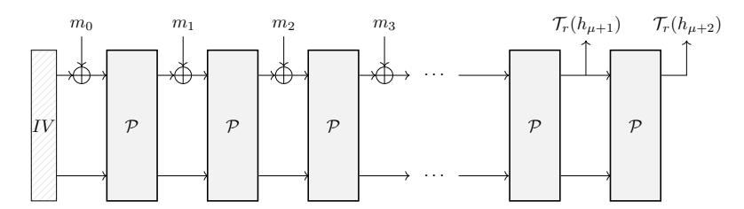
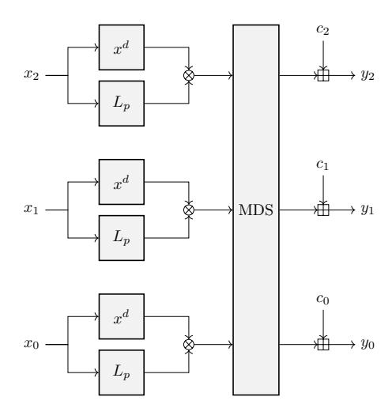
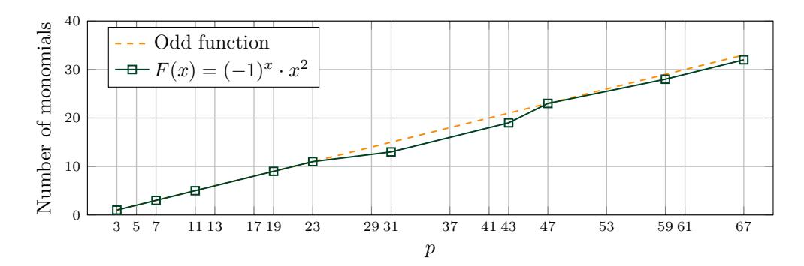
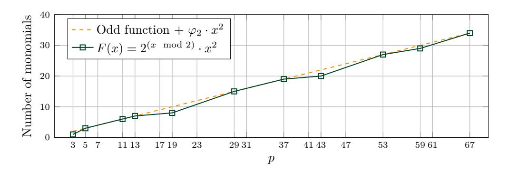
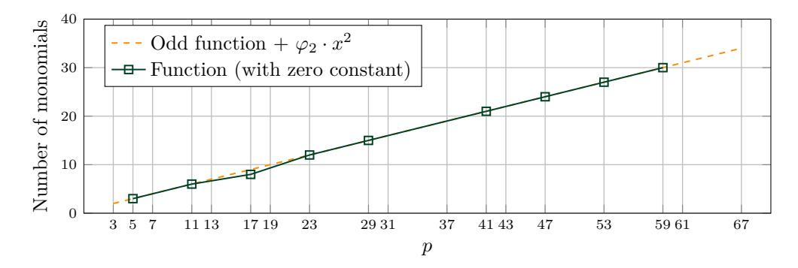
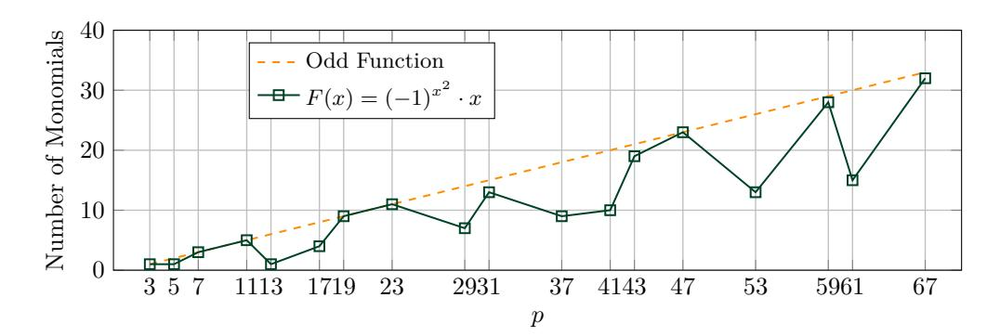

# The Legendre Symbol and the Modulo-2 Operator in Symmetric Schemes over $\mathbb{F}_n^n$

## Preimage Attack on Full Grendel

Lorenzo Grassi<sup>1</sup>, Dmitry Khovratovich<sup>2</sup>, Sondre Rønjom<sup>3</sup> and Markus Schofnegger<sup>4</sup>

Digital Security Group, Radboud University, The Netherlands
Dusk Network, Luxembourg
University of Bergen, Norway
IAIK, Graz University of Technology, Austria
1.grassi@cs.ru.nl
khovratovich@gmail.com
sondre.ronjom@uib.no
markus.schofnegger@tugraz.at

Abstract. Motivated by modern cryptographic use cases such as multi-party computation (MPC), homomorphic encryption (HE), and zero-knowledge (ZK) protocols, several symmetric schemes that are efficient in these scenarios have recently been proposed in the literature. Some of these schemes are instantiated with low-degree nonlinear functions, for example low-degree power maps (e.g., MiMC, HadesmimC, Poseidon) or the Toffoli gate (e.g., Ciminion). Others (e.g., Rescue, Vision, Grendel) are instead instantiated via high-degree functions which are easy to evaluate in the target application. A recent example for the latter case is the hash function Grendel, whose nonlinear layer is constructed using the Legendre symbol.

In this paper, we analyze high-degree functions such as the Legendre symbol or the modulo-2 operation as building blocks for the nonlinear layer of a cryptographic scheme over  $\mathbb{F}_p^n$ . Our focus regards the security analysis rather than the efficiency in the mentioned use cases. For this purpose, we present several new invertible functions that make use of the Legendre symbol or of the modulo-2 operation.

Even though these functions often provide strong statistical properties and ensure a high degree after a few rounds, the main problem regards their small number of possible outputs, that is, only three for the Legendre symbol and only two for the modulo-2 operation. By fixing them, it is possible to reduce the overall degree of the function significantly. We exploit this behavior by describing the first preimage attack on full *Grendel*, and we verify it in practice.

Keywords: Legendre Symbol · Modulo-2 Operator · Grendel · Preimage Attack

## 1 Introduction

Recently, modern cryptographic applications such as multi-party computation (MPC), homomorphic encryption (HE), and zero-knowledge (ZK) protocols have motivated the design of specific cryptographic schemes. These are often defined over large prime fields  $\mathbb{F}_p$  with the aim to increase efficiency in the above-mentioned use cases. Examples of these schemes include MiMC [AGR<sup>+</sup>16], GMiMC [AGP<sup>+</sup>19], HADESMIMC/POSEIDON [GLR<sup>+</sup>20,GKR<sup>+</sup>21], Masta [HKC<sup>+</sup>20], Pasta [DGH<sup>+</sup>21], Ciminion [DGGK21], and NEPTUNE [GOPS21], all of which use low-degree non-linear functions as power maps  $x \mapsto x^d$ .

However, it is also possible to achieve efficiency with high-degree functions. For example, the cost of some of the ZK protocols is the cost of proving/verifying a given statement y = F(x) for a certain function over  $\mathbb{F}^n$ . In such a case, instead of showing y = F(x) directly, it is also possible to prove an equivalent relation G(x, y) = c for a constant c. In some cases, proving/verifying this second relation may be more efficient than proving/verifying y = F(x). This approach is used in FRIDAY and JARVIS [AD18], Rescue/Vision [AAB+20], and more recently in Grendel [Sze21]. In the first two, the function F is defined either as F(x) = 1/x (hence,  $G(x,y) = x \cdot y$ ) or as  $F(x) = x^{1/d}$  for a small  $d \ll p$  (hence,  $G(x,y) = y^d - x$ ). In Grendel, F is defined via the Legendre symbol, which is a function from  $\mathbb{F}_p$  to  $\{-1,0,1\}$  and which returns  $\pm 1$  if the input is a (nonzero) quadratic residue or not (and zero otherwise). Besides being potentially efficient in ZK protocols [Sze21], the Legendre symbol as a PRF is competitive both in MPC applications as shown in [GRR+16] and in digital signature schemes as shown in [BdSG20].

In this paper, we analyze the advantages and disadvantages of using the Legendre symbol and the modulo-2 operation in the design of symmetric schemes over  $\mathbb{F}_p^n$ . We emphasize that we focus on the security aspect of the symmetric schemes rather than their efficiency in MPC, FHE, or ZK applications. As a first contribution, we propose several invertible nonlinear layers over  $\mathbb{F}_p^n$  for  $n \geq 1$  constructed either via the Legendre symbol or the modulo-2 operation, together with a detailed analysis of their statistical and algebraic properties. Secondly, we propose an attack strategy against a scheme instantiated via any of these nonlinear layers. We use this strategy to present a preimage attack on a sponge hash function instantiated with the full Grendel permutation.

## 1.1 The Legendre Symbol and the Modulo-2 Operation

Several works have been presented in the literature asserting that the Legendre symbol exhibits high pseudo-randomness. In 1997, Mauduit and Sárközy [MS97] introduced several metrics to measure the pseudo-randomness of binary sequences, concluding that "Legendre symbol sequences are the most natural candidate for pseudo-randomness". The high linear complexity of Legendre symbol sequences has been confirmed later on by Ding et al. [DHS98]. Tóth [Tó07] and Gyarmati et al. [GMS14] introduced new pseudo-randomness measures (avalanche effect and cross-correlation) and asserted high values of those in Legendre symbol sequences. The modulo operator is also used for similar cryptographic purposes, e.g., in the construction of pseudo-random number generators. Well-known examples include the Lehmer pseudo-random number generator [Leh54] (whose formula is  $x_i = \alpha \cdot x_{i-1} \mod m$ , where the modulus m is a power of a prime number,  $\alpha$  is a primitive root modulo m, and the seed  $x_0$  is coprime to m) and the Blum–Blum–Shub pseudo-random number generator [BBS86] (whose formula is  $x_i = x_{i-1}^2 \mod m$ , where  $m = p \cdot q$  for two large primes p, q).

In the case of a cryptographic symmetric scheme, the Legendre symbol may be used as part of an invertible S-box over  $\mathbb{F}_p^n$ , that is, it can be used in order to build a high-degree invertible nonlinear permutation over  $\mathbb{F}_p^n$ , as pointed out in [Sze21]. As we are going to show in Sections 3 and 4, a similar argument holds for the modulo-2 operation. The invertible functions constructed either via the Legendre symbol or the modulo-2 operator that exist in the literature and/or that we found are listed in Tables 1 and 2.

Related Work [Sha12, Sze21] (and More). Let  $L_p(\cdot): \mathbb{F}_p \to \{-1,0,1\}$  be the Legendre symbol defined as  $L_p(x) := x^{\frac{p-1}{2}} \mod p$ . Two examples of invertible maps constructed via the Legendre symbol proposed in the literature are

- the map  $x \mapsto x \cdot (L_p(x) + \alpha)$  [Sha12], which is invertible if  $L_p(\alpha^2 1) = 1$ , and
- the map  $x \mapsto x^d \cdot L_p(x)$  [Sze21], which is invertible if gcd(d+(p-1)/2, p-1)=1.

| F(x)                                  | Conditions                                    | $p \cdot \mathrm{DP}_{\mathrm{max}}$                                                   | Degree<br>Density                                                                 | Ref.                    |
|---------------------------------------|-----------------------------------------------|----------------------------------------------------------------------------------------|-----------------------------------------------------------------------------------|-------------------------|
| $x^d \cdot (\alpha + L_p(x))$         | $\gcd(d, p - 1) = 1,$ $L_p(\alpha^2 - 1) = 1$ | $   if d = 1: \lceil \frac{p}{2} \rceil $ $ if d \ge 3: 4 \cdot d $                    | (p-1)/2 + d  sparse                                                               | [Sha12],<br>Section 3.2 |
| $x^d \cdot L_p(x)$                    | $\gcd\left(d+\tfrac{p-1}{2},p-1\right)=1$     | if $d = 1$ : $\begin{bmatrix} \frac{p}{2} \end{bmatrix}$<br>if $d \ge 2$ : $4 \cdot d$ | (p-1)/2 + d  sparse                                                               | Section 3.3             |
| $x^{d+}(1+L_p(x)) + x^{d-}(1-L_p(x))$ | $\gcd(d_+, p - 1) = 1, \gcd(d, p - 1) = 1$    | $4 \cdot \max\{d_+, d\}$                                                               | $\begin{array}{ c c }\hline (p-1)/2 + \max\{d_+, d\}\\ \text{sparse} \end{array}$ | Section 4.1             |
| $\alpha^{(x \mod 2)} \cdot x^2$       | $L_p(\alpha) = -1$                            | 6                                                                                      | $\max_{\text{dense}} (p-2)$                                                       | Section 4.2.1           |
| $(-1)^x \cdot x^2$                    | $p=3 \mod 4$                                  | 6                                                                                      | $\max_{\text{dense}} (p-2)$                                                       | Corollary 3             |
| $(-1)^{x^2} \cdot x^d$                | $\gcd(d, p - 1) = 1$                          | if $d = 1$ : $\left\lceil \frac{p}{2} \right\rceil$ if $d > 3$ : $4 \cdot d - 2$       | $\max (p-2)$ dense                                                                | Section 4.2.2           |

<span id="page-2-0"></span>Table 1: Summary of the proposed invertible functions F over  $\mathbb{F}_p$  and their statistical and algebraic properties. Note that algebraic properties refer to their polynomial representation.

As our first contribution, we generalize the first function to  $x \mapsto x^{d'} \cdot (L_p(x) + \alpha)$  for  $\gcd(d', p-1) = 1$ , and we analyze the values of d that satisfy the condition for the second one for each p. We show that when  $d', d \geq 2$ , both of these two functions have good differential and linear properties [BS90, Mat93]. By the definition of the Legendre symbol, they are of high degree (respectively, d' + (p-1)/2 and d + (p-1)/2), but their algebraic representation is sparse.

Besides that, we prove that  $x \mapsto x^{d_+} \cdot (1 + L_p(x)) + x^{d_-} \cdot (1 - L_p(x))$  is invertible if  $\gcd(d_+, p - 1) = \gcd(d_-, p - 1) = 1$ , but we point out that this is vulnerable to e.g. side-channel attacks.

**Modulo-2 Operator.** Secondly, in Section 4.2 we propose new invertible functions that are built via the modulo-2 operation. While no quadratic map  $x \mapsto x^2$  is invertible over  $\mathbb{F}_p$  ( $x^2 = (-x)^2$  for each  $x \in \mathbb{F}_p$ ), in Section 4.2 we show how to slightly modify it via the modulo-2 operation in order to construct a permutation over  $\mathbb{F}_p$ . In particular, given a non-quadratic residue  $\alpha \in \mathbb{F}_p$  (i.e.,  $\alpha \neq \beta^2$  for each  $\beta \in \mathbb{F}_p$ ), we show that  $x \mapsto \alpha^{x \mod 2} \cdot x^2$  is a permutation over  $\mathbb{F}_p$ . For example, if  $p = 3 \mod 4$ , then  $x \mapsto (-1)^{x \mod 2} \cdot x^2 \equiv (-1)^x \cdot x^2$  is a permutation over  $\mathbb{F}_p$ . Similar to the previous functions based on the Legendre symbol, this map has good statistical properties. It also has a high degree and its algebraic representation is dense.

**Local Maps and the Legendre Symbol.** In Section 4.3, we present other invertible nonlinear layers over  $\mathbb{F}_p^n$  for  $n \geq 2$  defined via a *local map*. Let  $1 < m \leq n$  and let  $F: \mathbb{F}_p^m \to \mathbb{F}_p$  be a local map. Let  $\mathcal{S}_F$  over  $\mathbb{F}_p^n$  be defined as  $\mathcal{S}_F(x_0, x_1, \ldots, x_{n-1}) = y_0 \mid y_1 \mid \cdots \mid y_{n-1}$ , where

$$y_i := F(x_i, x_{i+1}, \dots, x_{i+m-1}),$$

where the index is taken modulo n. A well-known example of an invertible function  $S_F$  over  $\mathbb{F}_2^n$  for odd n is the  $\chi$ -function [Wol85, DGV92, Dae95], whose local map is  $F(x_0, x_1, x_2) = x_1 \cdot x_2 + x_0 + x_2$ . In this paper, we focus on the prime case, and we show how to construct F via the Legendre symbol such that  $S_F$  is invertible.

## 1.2 Attack on Full Grendel

Invertible functions over  $\mathbb{F}_p^n$  constructed via the Legendre symbol or the modulo-2 operation are promising components for the nonlinear layer of a symmetric scheme over  $\mathbb{F}_p^n$ . Indeed, since they have good statistical (both linear and differential) properties, by combining

| $F(x_0,x_1)$                                           | Conditions                                                 | Ref.          |
|--------------------------------------------------------|------------------------------------------------------------|---------------|
| $x_0^d \cdot (L_p(x_1) + \alpha)$                      | $\gcd(d, p-1) = 1,  L_p(\alpha^2 - 1) = 1$                 | Lemma 9       |
| $(-1)^{x_0^2} \cdot x_1$                               | _                                                          | Lemma 10      |
| $x_0 \cdot (x_1 \cdot (1 + L_p(x_1)) + (1 - L_p(x_1))$ | $\mid n = 2 \cdot n' + 1 \ge 3 \text{ odd},  p = 3 \mod 4$ | Proposition 8 |
| $x_0 \cdot (1 + x_1^2 - x_1^{p-1})$                    | $\gcd(2^n - (-1)^n, p - 1) = 1$                            | Proposition 9 |

<span id="page-3-0"></span>Table 2: List of functions  $F: \mathbb{F}_p^2 \to \mathbb{F}_p$  for which the corresponding function  $\mathcal{S}_F$  over  $\mathbb{F}_p^n$  for  $n \geq 2$  defined as in Definition 5 is invertible.

them with a good linear layer (e.g., by using an invertible matrix with a high branch number [DR01,DR02]), it may be possible to ensure security against statistical attacks after only a few rounds. In a similar way, it is possible to achieve a maximum-degree and dense polynomial description of the scheme after a few rounds (in the case of the modulo-2 operation, one round seems to be sufficient for that). We also refer to [Sze21, Sections 2-3] for a detailed analysis of this.

At the same time, a potential problem arises in the case of large prime numbers  $p \gg 3$ . This is related to the fact that the output space of both the Legendre symbol and of the modulo-2 operation has a much smaller size than the input space. In particular, the output space of the Legendre symbol contains only three elements (one of which occurs with low probability) and the output space of the modulo-2 operation contains only two elements. Hence, by fixing all Legendre symbols or modulo-2 operations, the algebraic representation of the scheme may be of low degree.

In Section 5, we exploit this strategy in order to set up preimage attacks on a sponge hash function instantiated with the *full Grendel* permutation. *Grendel* is a SHARK-like scheme [RDP+96] defined over  $\mathbb{F}_p^n$ . Its nonlinear layer is defined as the concatenation of invertible maps  $x \mapsto x^d \cdot L_p(x)$  for  $d \geq 2$ , and its linear layer is defined as the multiplication by an MDS matrix. Given a hash value  $y \in \mathbb{F}_p^h$ , our attack works as follows.

- 1. We try all possible Legendre symbols, and we construct the system of equations that link the input of the sponge hash function to the given output.
- 2. We solve this system by a root-finding technique.
- 3. We determine if the solution found satisfies the Legendre symbols fixed in the first step. If this is not the case, we repeat the procedure.

Using our new insights, we further estimate the new minimum number of rounds for security, and show that in some cases the original number of rounds must be increased significantly. We practically verified the attack and make the code available online.

As a result, while the Legendre symbol and the modulo-2 operation have good properties for invertible cryptographic schemes, special attention must be paid to the fact that they return a small number of outputs compared to the size of the input space. As we concretely show in this paper, this is a vulnerability that can be exploited in attacks.

## 1.3 Related Work

We recall related work in the literature, focusing on the security analysis of the Legendre symbol used as a PRF and other Gröbner basis and/or factorization attacks recently proposed for MPC-/HE-/ZK-friendly schemes.

Security Analysis of the Legendre Symbol PRF. Several works have been proposed in the literature regarding the security of the PRF  $x \mapsto L_p^k(x) := L_p(x+k)$ , where k is a secret key. In [Kho19], Khovratovich proposed a birthday bound attack that exploits the property  $L_p^k(x) = L_p^{k+\delta}(x-\delta)$  for any  $\delta \in \mathbb{F}_p$ . This attack has later been improved by Beullens et al. [BBUV20] and Kaluderovic et al. [KKK20]. More recently, Seres et al. [SHB21] show that key-recovery attacks against the Legendre PRF are equivalent to solving a specific family of multivariate quadratic equation systems over a prime field.

In the quantum setting, Frixons and Schrottenloher [FS21] investigated the quantum security of the Legendre PRF without quantum random access to an oracle. While they presented two new attacks in this setting, both of them remain impractical for key recovery. To the best of our knowledge, if the oracle can only be queried classically, no efficient quantum algorithm is known.

**Factorization and Gröbner Basis Attacks.** Algebraic attacks are usually the most powerful ones for MPC-/HE-/ZK-friendly schemes, since these schemes usually present a simple algebraic structure. Here we recall some attacks proposed in the literature that are based on these techniques.

- In [ACG<sup>+</sup>19], Albrecht et al. present a security analysis of STARK-friendly designs based on Gröbner basis attacks. They propose preimage attacks on the FRIDAY hash function and key-recovery attacks on full JARVIS.
- In [BCD<sup>+</sup>20], Beyne et al. set up a preimage attack on a sponge hash function instantiated with full Poseidon via Gröbner bases for a particular class of instances using weak linear layers.
- In [RAS20], Roy et al. set up collision and (second) preimage attacks on a sponge hash function instantiated with (reduced-round) members of the GMiMC family via a factorization technique.
- In [EGL<sup>+</sup>20], Eichlseder et al. propose a distinguisher on almost full MiMC over  $\mathbb{F}_{2^n}$  based on an improved estimation of the degree growth. They also exploit this distinguisher to obtain a key-recovery attack via a factorization technique.

## 2 Preliminaries

**Notation.** Let p be a prime number (unless specified otherwise, we always assume  $p \geq 3$ ). Let  $\mathbb{F}_p$  denote the field of integer numbers modulo p. We use small letters to denote either parameters, indices, or variables, and greek letters to denote fixed elements in  $\mathbb{F}_p$ . Given  $x \in \mathbb{F}_p^n$ , we denote by  $x_i$  its i-th component for each  $i \in \{0, 1, \ldots, n-1\}$ , that is,  $x = (x_0, x_1, \ldots, x_{n-1})$  or  $x = x_0 \mid\mid x_1 \mid\mid \cdots \mid\mid x_{n-1}$ , where  $\cdot \mid\mid \cdot$  denotes concatenation. We use capital letters to denote round numbers and functions from  $\mathbb{F}_p^m$  to  $\mathbb{F}_p$  for  $m \geq 1$  (e.g.,  $F : \mathbb{F}_p^m \to \mathbb{F}_p$ ) and the calligraphic font to denote functions over  $\mathbb{F}_p^n$  for n > 1 (e.g.,  $S : \mathbb{F}_p^n \to \mathbb{F}_p^n$ ).

## 2.1 The Legendre Symbol and the Hash Function *Grendel*

#### 2.1.1 The Legendre Symbol

<span id="page-4-0"></span>First we recall the definition of the Legendre symbol and some of its properties.

**Definition 1.** Let  $p \ge 3$  be a prime. An integer  $\alpha$  is a quadratic residue modulo p if it is congruent to a perfect square modulo p, and a quadratic non-residue modulo p otherwise.

**Definition 2.** The Legendre symbol  $L_p(\cdot)$  is a function  $L_p: \mathbb{F}_p \to \{-1, 0, 1\}$  defined as  $L_p(x) := x^{\frac{p-1}{2}} \mod p \in \{-1, 0, 1\}$ , or equivalently  $L_p(0) = 0$  and

$$L_p(x) := \begin{cases} 1 & \text{if } x \text{ is a nonzero quadratic residue modulo } p, \\ -1 & \text{if } x \text{ is a quadratic non-residue modulo } p. \end{cases}$$

<span id="page-5-0"></span>**Proposition 1** ([Nag51]). Let  $p, q \ge 3$  be two prime integers. The Legendre symbol has the following properties.

- 1. If  $x = y \mod p$ , then  $L_p(x) = L_p(y)$ .
- 2.  $L_p(x \cdot y) = L_p(x) \cdot L_p(y)$ .
- 3.  $L_n(q) \cdot L_q(p) = (-1)^{\frac{p-1}{2} \cdot \frac{q-1}{2}}$ .
- <span id="page-5-1"></span>4. If  $p=3 \mod 4$ , then  $\pm x^{\frac{p+1}{4}}$  are the square roots of the quadratic residue x.

Moreover, particular identities include the following.

- $L_p(-1) = 1$  if  $p = 1 \mod 4$ , while  $L_p(-1) = -1$  if  $p = 3 \mod 4$ .
- $L_p(-3) = 1$  if  $p = 1 \mod 3$ , while  $L_p(-3) = -1$  if  $p = 2 \mod 3$ .
- $L_p(2) = 1$  if  $p = 1, 7 \mod 8$ , while  $L_p(2) = -1$  if  $p = 3, 5 \mod 8$ .

## <span id="page-5-2"></span>2.1.2 The Hash Function Grendel

A sponge hash function [BDPA08] is an iterated construction for building a function with inputs and outputs of variable length, based on a function or permutation operating on a state with a fixed size. Let  $\mathcal{P}$  be a permutation over  $\mathbb{F}^n$  (for a certain field  $\mathbb{F}$ ), and let n=r+c, where c denotes the capacity and r the rate. For a security level of  $\kappa$  bits, c and r must satisfy  $|\mathbb{F}|^c \geq 2^{2 \cdot \kappa}$  and  $|\mathbb{F}|^r \geq 2^{\kappa}$ . An input message  $m \in \mathbb{F}^*$  is first injectively padded and split into  $m_0, m_1, \ldots, m_{\mu}$ , where  $m_i \in \mathbb{F}^r$ . Then, the message blocks are compressed sequentially into an n-element state, i.e.,

$$h_{i+1} = \mathcal{P}(h_i + (m_i \mid\mid 0^c))$$
 for  $i = 0, \dots, \mu$ ,

where  $h_0 = IV \in \mathbb{F}^n$  is an initial value. After the absorption of the last message block, the output is of the form

$$\mathcal{T}_r(h_{u+1}) \mid\mid \mathcal{T}_r(h_{u+2}) \mid\mid \mathcal{T}_r(h_{u+3}) \mid\mid \cdots$$

where  $h_{i+1} = \mathcal{P}(h_i)$  for  $i \ge \mu + 1$ , and where  $\mathcal{T}_r(x) = x_0 \mid\mid x_1 \mid\mid \cdots \mid\mid x_{r-1}$  is the truncation operation. A sponge hash function with a fixed-size output is shown in Fig. 1.

Let  $p \geq 3$  be a prime number, and let  $n \geq 2$  be an integer. The permutation Grendel [Sze21] defined over  $\mathbb{F}_p^n$  resembles a SHARK-like one, using independent S-boxes as its nonlinear layer and an MDS matrix as its linear layer. The main feature of Grendel regards its nonlinear layer, which is defined as  $S(x_0, x_1, \ldots, x_{n-1}) = S(x_0) \mid\mid S(x_1) \mid\mid \cdots \mid\mid S(x_{n-1})$ , where

$$S(x) = x^d \cdot L_n(x).$$

Here,  $L_p: \mathbb{F}_p \to \{-1,0,1\}$  is the Legendre symbol and  $d \geq 2$  is the smallest integer which satisfies  $\gcd((2d+p-1)/2,p-1)=1$ . The round function of *Grendel* is shown in Fig. 2. As we will prove in Corollary 2,

(1) if 
$$p = 3 \mod 4$$
, then  $d = 2$ , and

<span id="page-6-0"></span>

Figure 1: A sponge hash function with a two-element output, where  $\oplus$  denotes the element-wise addition of two vectors in  $\mathbb{F}^r$ .

<span id="page-6-1"></span>

Figure 2: The round function of Grendel over  $\mathbb{F}_p^n$ , where n=3 and  $c_i$  are round constants.

(2) if  $p = 1 \mod 4$ , then  $d \ge 3$  is the smallest integer that satisfies  $\gcd(d, p - 1) = 1$ .

For a security of  $\kappa$  bits (where  $p^n \geq 2^{3\kappa}$ , since  $p^c \geq 2^{2\kappa}$  and  $p^r \geq 2^{\kappa}$ ), the number of rounds  $R \geq 1$  of *Grendel* is defined as

$$R = \max \left\{ \left\lceil \frac{2.5 \cdot \kappa}{\log_2(p) - \log_2(d) - 1} \right\rceil, R' \right\},\,$$

where  $R' \geq 1$  is the smallest positive integer that satisfies

<span id="page-6-2"></span>
$$\max \left\{ \binom{2R'n - 2c + \frac{1 + (R'n - c)(d + 3)}{8}}{2R'n - 2c} \right\}^2; \ 2^{R'n - c} \times \binom{R'n - c + \frac{1 + (R'n - c)(d - 1)}{9}}{R'n - c} \right\}^2 \ge 2^{1.25\kappa}. \tag{1}$$

These complexities are derived from various attack vectors analyzed in the original paper, and we refer to [Sze21, Table 1] and [Sze21, Section 5.7] for more details.

## 2.2 Overview of Differential/Linear and Algebraic Cryptanalysis

Apart from presenting invertible nonlinear functions over  $\mathbb{F}_p^n$  using the Legendre symbol or the modulo-2 operation, we also analyze their differential, linear, and algebraic properties. Here we recall the concepts of maximum differential probability useful in the context of differential cryptanalysis, and the main weaknesses exploited in algebraic attacks. Linear cryptanalysis is recalled in Appendix A.

**Differential Cryptanalysis.** Given pairs of inputs with fixed input differences, differential cryptanalysis [BS90, BS93] is based on the probability distribution of the corresponding output differences produced by the cryptographic primitive.

Let  $\Delta_I, \Delta_O \in \mathbb{F}_p^n$  be respectively the input and the output differences through a function  $\mathcal{F}$  over  $\mathbb{F}_p^n$ . The differential probability (DP) of having a certain output difference  $\Delta_O$  given a particular input difference  $\Delta_I$  is equal to

$$\operatorname{Prob}_{\mathcal{F}}(\Delta_I \to \Delta_O) = \frac{|\{x \in \mathbb{F}_p^n \mid \mathcal{F}(x + \Delta_I) - \mathcal{F}(x) = \Delta_O\}|}{p^n}.$$

For iterated schemes, a cryptanalyst searches for ordered sequences of differences over any number of rounds that are called differential characteristics/trails. Assuming independent rounds, the DP of a differential trail is the product of the DPs of its one-round differences.

**Definition 3.** Let  $\mathcal{P}$  be a permutation over  $\mathbb{F}_{p^n} \equiv \mathbb{F}_p^n$ . Its maximum differential probability is defined as  $\mathrm{DP}_{\max} = \max_{\Delta_I, \Delta_O \in \mathbb{F}_p^n \setminus \{0\}} \mathrm{Prob}_{\mathcal{P}}(\Delta_I \to \Delta_O)$ .

Remark. In the following, we will use  $\mathrm{DP_{max}}(x\mapsto x^d) \leq (d-1)/p$ . However, we point out that this is just an upper bound. For example, consider the case d=-1, which corresponds to d=p-2. By the previous assumption, we get  $\mathrm{DP_{max}}(x\mapsto x^{-1})=(p-2)/p$ , while  $\mathrm{DP_{max}}(x\mapsto x^{-1})=4/p$ . As another example, assume that d=1/d' where  $d'\ll d$ . In such a case,  $\mathrm{DP_{max}}(x\mapsto x^{1/d'})=\mathrm{DP_{max}}(x\mapsto x^{d'})=(d'-1)/p$ , which is much smaller than (d-1)/p.

**Algebraic Attacks.** Algebraic attacks exploit the algebraic description of the attacked cryptographic schemes in terms of polynomials. Examples of algebraic attacks include the interpolation attack [JK97], the higher-order differential attack [Lai94, Knu94], the factorization/GCD attacks, and Gröbner basis attacks [Buc76, SS21], among others.

In the case of an interpolation attack, the attacker constructs the polynomial describing the scheme. This polynomial can be used for a key-recovery attack or in a forgery attack. The cost of constructing the polynomial depends on the number of its monomials, and this number depends both on the degree and the density of the polynomial. Knowing the maximum degree of the scheme allows to set up a zero-sum distinguisher, used in a higher-order differential attack. In the case of the factorization/GCD attacks and Gröbner basis attacks, the attacker solves a system of equations describing the scheme in order to find the secret key in the case of a cipher or a preimage or collision in the case of a hash function. The cost of the attack depends on several factors, including the number of equations, the number of variables, and the degrees and the density of the equations.

#### 2.3 Solving Algebraic Equations

In the following, we present the details of the algebraic techniques that we consider in our attacks on *Grendel*.

#### 2.3.1 Univariate Factorization and Root Finding

Polynomial factorization can be used to solve a single univariate equation. More formally, setting a polynomial  $F(x) \in \mathbb{F}_p[x]$  to zero, with factorization we are able to solve this polynomial for x. This problem is well-studied in literature, and has an estimated complexity in  $\mathcal{O}(D^3n^2 + Dn^3)$  for a polynomial  $F(x) \in \mathbb{F}_{p^n}[x]$  of degree D [Gen07]. This algorithm is based on matrix and vector operations. The hidden constant is relatively small and thus the estimate can mostly be used directly.

While a full factorization can yield all roots of a polynomial, this will not be needed for our purposes. In our case, one root is sufficient for setting up the attack. In order to find it, it is sufficient to compute the GCD between F(x) and  $x^p-x$ . Considering a polynomial  $F(x) \in \mathbb{F}_p[x]$ ,  $(x-x^\star)$  divides  $\gcd(F(x), x^p-x)$  for an existing root  $x^\star$  of F with probability 1, since  $x^p-x=0$  for all  $x \in \mathbb{F}_p$  (indeed,  $x \cdot (x^{p-1}-1)=0$ , since either x=0 or  $x^{p-1}=1$  due to Fermat's little theorem). We expect  $\deg(\gcd(F(x), x^p-x)) \ll \deg(F(x))$ , and a final more efficient (low-degree) factorization of  $\gcd(F(x), x^p-x)$  is sufficient to recover the solution  $x^\star$ .

The complexity of computing GCDs is an element of  $\mathcal{O}(D\log^2 D)$ , and hence this method may be more efficient than the straight-forward factorization approach with degree-D polynomials. However,  $x^p - x$  is of high degree. To avoid this, observe that

$$\gcd(F(x), x^p - X) = \gcd((x^p \mod F(x)) - X, F(x)),$$

since

$$\gcd(F(x), G(x)) = \gcd(a_1 \cdot F(x) + b_1 \cdot G(x), a_2 \cdot F(x) + b_2 \cdot G(x)),$$

where  $a_1 \cdot b_2 \neq a_2 \cdot b_1$ . Hence, the degree of  $(x^p \mod F(x)) - x$  is much lower than that of  $x^p - x$  if  $\deg(F) \ll p$ .

This root-finding approach using GCD computations is given in [vzGG13], and the final complexity of the algorithm is estimated by

<span id="page-8-2"></span>
$$D \cdot (\log_2(D))^2 \cdot (\log_2(D) + \log_2(p)) \cdot (1 + 63.43 \cdot \log_2(\log_2(D))), \tag{2}$$

which includes the complexity for (1st) polynomial multiplication resulting from repeated squaring to obtain  $x^p \mod F(x)$ , (2nd) GCD computations, and (3rd) the complexity for equal-degree factorization into low-degree factors. We note that this algorithm was also used in a recent attack [RAS20].

#### <span id="page-8-1"></span>2.3.2 Gröbner Bases

We will use Gröbner basis computations in cases where the number of equations and variables is greater than one. A Gröbner basis attack consists of three steps.

- 1. First, the attacker sets up the equation system and computes a Gröbner basis for it.
- 2. Secondly, they perform a change of term ordering for the basis (e.g., choosing a term order which makes it easier to eliminate variables and find the solutions).
- 3. Finally, the attacker finds the solutions of the system obtained in the second step.

The cost of computing a Gröbner basis for an input system of  $n_e$  equations in  $n_v$  unknowns is estimated to be an element of

<span id="page-8-0"></span>
$$\mathcal{O}\left(\binom{D_{\text{reg}} + n_v}{n_v}^{\omega}\right),\tag{3}$$

where  $2 < \omega \le 3$  is the linear algebra constant representing the cost of matrix multiplication [BFP12]. The constants hidden by  $\mathcal{O}(\cdot)$  are relatively small [ACG<sup>+</sup>19], and hence we use Eq. (3) directly. In this representation,  $D_{\text{reg}}$  is the *degree of regularity*, which for regular sequences [BFSY05] (that is,  $n_v = n_e$ ) can be estimated by  $1 + \sum_{i=1}^{n_e} \deg(f_i) - 1$ .

For performance reasons, the Gröbner Basis is typically computed in the *degrevlex* term order, which is a monomial ordering, and by using algorithms such as [Fau02]. However, eliminating variables and finding the final solutions is in general more efficient for e.g. the *lex* term order [Tra00], which is why the second step usually consists of converting the Gröbner basis to a different monomial ordering. This can be done by algorithms such as FGLM [FGLM93]. After that, the final step in the attack consists of solving the system, which is done by first finding a solution to (one of) the univariate equation(s) in the system.

In our analysis, we will focus on the first step, i.e., the process of computing a Gröbner basis. For a more detailed description and analysis of the other steps involved in a Gröbner basis attack, we refer to [ACG<sup>+</sup>19, Section 3.3].

## <span id="page-9-0"></span>3 Related Work (and More)

## 3.1 Hermite's Criterion and Invertible Maps over $\mathbb{F}_{p^n} \equiv \mathbb{F}_n^n$

Let  $p \geq 2$  be a prime number and let  $n \geq 1$ . Given a nonlinear polynomial function  $F(x) = \sum_{i=0}^{d} \alpha_i \cdot x^i$  over  $\mathbb{F}_{p^n}$  of degree  $d \geq 2$ , Hermite's criterion provides a necessary and sufficient condition for F to be a permutation.

**Theorem 1** (Hermite's Criterion [MP13]). Let  $q = p^n$  for a prime  $p \ge 2$  and a positive integer n. A polynomial  $F \in \mathbb{F}_q[x]$  is a permutation polynomial (PP) of  $\mathbb{F}_q$  if and only if

- (1) the reduction of  $(F(x))^{q-1} \mod (x^q x)$  is a monic polynomial of degree q 1, and
- (2) for each integer t with  $1 \le t \le q 2$  and  $t \ne 0 \mod p$ , the reduction of  $(F(x))^t \mod (x^q x)$  has degree  $\le q 2$ .

Applying the previous criteria on a generic function over  $\mathbb{F}_q$ , in order to establish if it is a PP or not, is in general computationally demanding.

**Power Maps and Dickson Polynomials.** For certain classes of polynomials, including the power maps  $x \mapsto x^d$  and the Dickson polynomials, this question is easy to answer.

<span id="page-9-1"></span>**Theorem 2** ( [MP13, Section 8]). Let  $q = p^r$  for a prime  $p \ge 2$  and a positive integer r, and let  $F : \mathbb{F}_q \to \mathbb{F}_q$ . Then  $F(x) = x^d$ , where d is a positive integer, is a PP if and only if  $\gcd(d, q - 1) = 1$ .

Dickson polynomials generalize power maps. Let  $q = p^r$  for a prime  $p \geq 3$  and a positive integer r. The Dickson polynomial  $\mathcal{D}_{d,\alpha}(x)$  of degree d over  $\mathbb{F}_q$  is defined as

$$\mathcal{D}_{d,\alpha}(x) := \sum_{j=0}^{\lfloor d/2 \rfloor} \frac{d}{d-j} \cdot \binom{d-j}{j} \cdot (-\alpha)^j \cdot x^{d-2j}$$

for a fixed  $\alpha \in \mathbb{F}_q$ . Note that a Dickson polynomial  $\mathcal{D}_{d,\alpha}$  is invertible if  $\gcd(d,p^2-1)=1$ .

Invertible Functions Over  $\mathbb{F}_{p^n}$  via Linearized Polynomials. Another class of permutations over  $\mathbb{F}_{p^n}$  is the class of linearized polynomials.

**Definition 4.** A linearized polynomial  $\mathcal{L}(x)$  is a polynomial of the form  $\mathcal{L}(x) := \sum_{i=0}^{d} \lambda_i \cdot x^{p^i}$  for some fixed  $\lambda_0, \lambda_1, \ldots, \lambda_d \in \mathbb{F}_{p^n}$  and for a fixed  $d \leq n-1$ .

The trace function  $\text{Tr}(x) = \sum_{i=0}^{n-1} x^{p^i}$  is an example of a linearized polynomial.

**Proposition 2** ( [MP13]). Let  $p \geq 3$  be a prime integer number. The linearized polynomial  $\mathcal{L}(x) = \sum_{i=0}^{n-1} \lambda_i \cdot x^{p^n} \in \mathbb{F}_{p^n}[x]$  is a PP of  $\mathbb{F}_{p^n}[x]$  if and only if  $\det(M) \neq 0$ , where  $M_{i,j} := (\lambda_{(i-j) \mod n})^{p^j}$  for  $i, j \in \{0, 1, \dots, n-1\}$ .

Since linearized polynomials are linear, they satisfy  $\mathcal{L}(x+y) = \mathcal{L}(x) + \mathcal{L}(y)$  for each  $x,y \in \mathbb{F}_{p^n}$ . They can be used as a starting point to construct nonlinear permutations over  $\mathbb{F}_{p^n}$ . Concrete examples are given by Tu et al. [TZLH15] and by Li, Helleseth and Tang [LHT13], who studied the class of permutation polynomials on  $\mathbb{F}_{p^n}$  of the form  $\left(x^{p^l}-x+\delta\right)^s+\mathcal{L}(x)$ , for  $l,s\in\mathbb{N}$  and for fixed  $\delta\in\mathbb{F}_{p^n}$ . They proved that  $\left(x^{p^l}-x+\delta\right)^{\frac{p^n+1}{2}}+x^{p^l}+x$  is a PP over  $\mathbb{F}_{p^n}$  for each  $\delta\in\mathbb{F}_{p^n}$ .

#### <span id="page-10-0"></span>**3.2 The Permutation** *x* **7→** *x d* **· (***Lp***(***x***) +** *α***) over** F*<sup>p</sup>*

**Theorem 3** ( [\[Sha12\]](#page-29-2))**.** *Given a prime number p* ≥ 3*, let α* ∈ F*<sup>p</sup>* \ {±1} *be such that Lp*(*α* <sup>2</sup> − 1) = 1*. The function F*(*x*) = *x* · (*Lp*(*x*) + *α*) *over* F*<sup>p</sup> is a permutation.*

Here we show a variant of this function that is still a permutation.

<span id="page-10-3"></span>**Proposition 3.** *Given a prime number p* ≥ 3*, let α* ∈ F*<sup>p</sup>* \{±1} *be such that Lp*(*α* <sup>2</sup>−1) = 1 *and let d* ≥ 1 *be such that* gcd(*d, p* − 1) = 1*. The function*

$$F(x) = x^d \cdot (L_p(x) + \alpha) \equiv x^{d + (p-1)/2} + \alpha \cdot x^d$$

*over* F*<sup>p</sup> is a permutation.*

*Proof.* Given *y* = *F*(*x*), *x* = 0 if and only if *y* = 0. Assuming *x, y* 6= 0, note that

$$L_p(y) = L_p(x^d) \cdot L_p(L_p(x) + \alpha) = L_p(x) \cdot L_p(L_p(x) + \alpha) = L_p(x) \cdot L_p(\alpha \pm 1),$$

where *Lp*(*x d* ) = (*Lp*(*x*))*<sup>d</sup>* = *Lp*(*x*) due to Proposition [1](#page-5-0) and since *d* is an odd integer (note that gcd(*d, p* − 1) = 1, where *p* − 1 is even). Since *Lp*(*α* − 1) = *Lp*(*α* + 1), *Lp*(*x*) = *Lp*(*y*)*/Lp*(*α* ± 1), and due to Theorem [2](#page-9-1) we have that *x* = *y*·*Lp*(*α*±1) *α*·*Lp*(*α*±1)+*Lp*(*y*) <sup>1</sup>*/d* .

By noting that *Lp*(1) = *Lp*(−1) for *p* = 1 mod 4 (i.e., by setting *α* = 0 in the previous proposition), we get the following corollary.

<span id="page-10-2"></span>**Corollary 1.** *Let p* ≥ 3 *be a prime, and let d* ≥ 1 *be such that* gcd(*d, p* − 1) = 1*. If p* = 1 mod 4*, then x* 7→ *x d* · *Lp*(*x*) *is a permutation.*

**Differential Property.** Before going on, we study the differential properties of the permutation just proposed. The linear ones can be found in Appendix [A.1.](#page-30-9)

**Lemma 1.** *Let p* ≥ 3 *be a prime and let F*(*x*) = *x* · (*Lp*(*x*) + *α*)*. For* ∆*<sup>I</sup> ,* ∆*<sup>O</sup>* ∈ F*<sup>p</sup>* \ {0}*,*

$$|\{x \in \mathbb{F}_p \mid F(x + \Delta_I) - F(x) = \Delta_O\}| \leq \begin{cases} 2 & \text{if } \Delta_O \neq (\pm 1 + \alpha) \cdot \Delta_I, \\ \frac{p+1}{2} & \text{if } \Delta_O = (\pm 1 + \alpha) \cdot \Delta_I \text{ and } p = 1 \mod 4, \\ \frac{p-1}{2} & \text{if } \Delta_O = (\pm 1 + \alpha) \cdot \Delta_I \text{ and } p = 3 \mod 4. \end{cases}$$

*Proof.* For each fixed (∆*<sup>I</sup> ,* ∆*O*) ∈ F 2 *<sup>p</sup>* \ {(0*,* 0)}, we analyze the number of solutions *x* of

<span id="page-10-1"></span>
$$(x + \Delta_I) \cdot (L_p(x + \Delta_I) + \alpha) - x \cdot (L_p(x) + \alpha) = \Delta_O. \tag{4}$$

We separately analyze the cases

(a) 
$$L_p(x + \Delta_I) = 0$$
 or  $L_p(x) = 0$ , and

(b) 
$$L_p(x + \Delta_I) = \pm 1$$
 and  $L_p(x) = \pm 1$ .

Let us first focus on *Lp*(*x* + ∆*<sup>I</sup>* ) = 0 or *Lp*(*x*) = 0. Clearly, *Lp*(*x* + ∆*<sup>I</sup>* ) = 0 if and only if *x* = −∆*<sup>I</sup>* , which implies ∆*<sup>I</sup>* · (*Lp*(−∆*<sup>I</sup>* ) + *α*) = ∆*O*. If this equality is satisfied, then *x* = −∆*<sup>I</sup>* is a solution. A similar result holds for *Lp*(*x*) = 0 (i.e., *x* = 0), which implies ∆*<sup>I</sup>* · (*Lp*(∆*<sup>I</sup>* ) + *α*) = ∆*O*. Again, if this equality is satisfied, then *x* = 0 is a solution. Note that ∆*<sup>I</sup>* · (*Lp*(−∆*<sup>I</sup>* ) + *α*) = ∆*<sup>O</sup>* and ∆*<sup>I</sup>* · (*Lp*(∆*<sup>I</sup>* ) + *α*) = ∆*<sup>O</sup>* can hold simultaneously if *Lp*(−∆*<sup>I</sup>* ) = *Lp*(∆*<sup>I</sup>* ), and then

$$L_p(-\Delta_I) \cdot L_p(\Delta_I) = 1 \implies L_p(-\Delta_I^2) = L_p(-1) = 1 \implies p = 1 \mod 4.$$

We now consider the case *Lp*(*x* + ∆*<sup>I</sup>* ) = ±1 and *Lp*(*x*) = ±1. We analyze the case *Lp*(*x* + ∆*<sup>I</sup>* ) = −*Lp*(*x*) and the case *Lp*(*x* + ∆*<sup>I</sup>* ) = *Lp*(*x*) separately.

П

1. If  $L_p(x + \Delta_I) = -L_p(x) = \omega \in \{-1, +1\}$ , then Eq. (4) reduces to

$$2\omega \cdot x + \Delta_I \cdot (\omega + \alpha) = \Delta_O \implies x = \frac{\Delta_O - \Delta_I \cdot (\omega + \alpha)}{2 \cdot \omega}.$$

This is a valid solution if  $L_p\left(\frac{\Delta_O - \Delta_I \cdot (\omega + \alpha)}{2 \cdot \omega} + \Delta_I\right) = -L_p\left(\frac{\Delta_O - \Delta_I \cdot (\omega + \alpha)}{2 \cdot \omega}\right) = \omega$ .

2. If  $L_p(x + \Delta_I) = L_p(x) = \omega \in \{-1, +1\}$ , then Eq. (4) reduces to  $\Delta_I \cdot (\omega + \alpha) = \Delta_O$ , which is satisfied independently of x.

To summarize,

- (1) in the first case  $L_p(x + \Delta_I) = -L_p(x)$ , the number of possible solutions is at most two, and
- (1) in the second case  $L_p(x + \Delta_I) = L_p(x)$ , the number of possible solutions is at most equal to the number of solutions of  $L_p(x + \Delta_I) = L_p(x)$ .

Focusing on the second case and assuming  $\Delta_I \cdot (\pm 1 + \alpha) = \Delta_O$ , we look for the number of solutions of  $L_p(x + \Delta_I) = L_p(x)$ . First of all, the number of x which satisfy  $L_p(x) = L_p(x + \Delta_I)$  is equal to the number of x' which satisfy  $L_p(x') = L_p(x' + 1)$ , where  $x' = x/\Delta_I$ . By [GU82, Corollary 1.9], we have the following.

- If  $p=1 \mod 4$ , the number of x' which satisfy  $L_p(x')=L_p(x'+1)=1$  is  $\frac{p-5}{4}$ , while the number of x' which satisfy  $L_p(x')=L_p(x'+1)=-1$  is  $\frac{p-1}{4}$ .
- If  $p=3 \mod 4$ , the number of x' which satisfy  $L_p(x')=L_p(x'+1)=\pm 1$  is  $\frac{p-3}{4}$ .

In the first case, two additional solutions can be x = 0 and  $x = -\Delta_I$ , while in the second case one additional solution can be x = 0 or  $x = -\Delta_I$  (see before). The final result follows immediately by adding it.

**Lemma 2.** Let  $p \geq 3$  be a prime and let  $d \geq 3$  be such that gcd(d, p - 1) = 1. Let  $F(x) = x^d \cdot (L_p(x) + \alpha)$ , where  $L_p(\alpha^2 - 1) = 1$ . For each  $\Delta_I, \Delta_O \in \mathbb{F}_p \setminus \{0\}$ ,

$$|\{x \in \mathbb{F}_p \mid F(x + \Delta_I) - F(x) = \Delta_O\}| \le 4 \cdot d.$$

*Proof.* Since  $F(x + \Delta_I) - F(x) = \Delta_O$  corresponds to  $(x + \Delta_I)^d \cdot (\alpha + L_p(x + \Delta_I)) - x^d \cdot (\alpha + L_p(x)) = \Delta_O$ , we have the following.

- If  $L_p(x) = 0$ , the equation is satisfied if  $\Delta_I^d \cdot (\alpha + L_p(\Delta_I)) = \Delta_O$ . In a similar way, if  $L_p(x + \Delta_I) = 0$ , then the equality is satisfied if  $(\Delta_I)^d \cdot (\alpha + L_p(-\Delta_I)) = \Delta_O$ . As before, the two cases can hold simultaneously if  $p = 1 \mod 4$ .
- If  $L_p(x) = L_p(x + \Delta_I)$ , the equation has degree d-1, and it admits at most d-1 solutions for the case  $L_p(x) = L_p(x + \Delta_I) = 1$  and at most d-1 for the case  $L_p(x) = L_p(x + \Delta_I) = -1$ .
- If  $L_p(x) = -L_p(x + \Delta_I) \in \{-1, 1\}$ , the equation has degree d, and it admits at most d solutions for the case  $L_p(x) = -L_p(x + \Delta_I) = 1$  and at most d for the case  $L_p(x) = -L_p(x + \Delta_I) = -1$ .

It follows that its DP<sub>max</sub> is equal to  $(2+2\cdot(d-1)+2\cdot d)/p=(4d)/p$ .

The previous bound is not tight in general. Indeed, if  $L_p(x) = L_p(x + \Delta_I) = 1$ , we count the solutions x of  $(x + \Delta_I)^d \cdot (\alpha + 1) - x^d \cdot (\alpha + 1) = \Delta_O$  without determining if they satisfy the condition  $L_p(x) = L_p(x + \Delta_I) = 1$ . Since  $L_p(x) = L_p(x + \Delta_I) = 1$  is satisfied with a probability of 50%, we expect that in general the previous bound is not very precise (but sufficient for many use cases with  $p \gg 3$  and small d).

## <span id="page-12-1"></span>3.3 *Grendel's* Nonlinear S-Box $x \mapsto x^d \cdot L_p(x)$

**Proposition 4** ([Sze21]). Let  $p \geq 3$  be a prime and  $d \geq 1$  be an integer such that  $\gcd(d+(p-1)/2,p-1)=1$ . The map  $x\mapsto x^d\cdot L_p(x)=x^{d+(p-1)/2}$  is invertible over  $\mathbb{F}_p$ .

The proof is based on the Hermite's criterion, that is, a function  $x \mapsto x^{d'}$  is invertible if  $\gcd(d', p-1) = 1$ . Corollary 2 follows immediately.

<span id="page-12-3"></span>**Corollary 2.** Let  $p \ge 3$  be a prime integer. The function  $x \mapsto x^d \cdot L_p(x) = x^{d+(p-1)/2}$  is a permutation over  $\mathbb{F}_p$  if d = 1 and  $p = 1 \mod 4$  or if d = 2 and  $p = 3 \mod 4$ .

*Proof.* If  $p = 1 \mod 4$  and d = 1, then the result follows from Corollary 1.

Otherwise, if  $p = 3 \mod 4$  and d = 2, then gcd(2 + (p - 1)/2, p - 1) = 1 as shown in [Sze21, Section 3]. Hence,  $x \mapsto x^2 \cdot L_p(x)$  is invertible due to Hermite's criterion.

Moreover, let  $d' \geq 1$  be such that  $\gcd(d', p-1) = 1$ . The function  $x \mapsto x^{d \cdot d'} \cdot L_p(x)$  is a permutation over  $\mathbb{F}_p$  if  $p = 1 \mod 4$  and d = 1 or if  $p = 3 \mod 4$  and d = 2. The result follows immediately since d' is an odd integer and  $(\pm 1)^{d'} = \pm 1$ .

**Differential Property.** The differential and linear properties of  $x \mapsto x^d \cdot L_p(x)$  are similar to the ones of the function  $x \mapsto x^d \cdot (L_p(x) + \alpha)$ .

**Lemma 3.** Let  $p \geq 3$  be a prime number such that  $p = 3 \mod 4$ . Let  $d' \geq 1$  be such gcd(d', p - 1) = 1, and let  $d := 2 \cdot d'$ . The maximum differential probability of  $F(x) = x^d \cdot L_p(x)$  is  $(4 \cdot d)/p$ .

**Lemma 4.** Let  $p \ge 3$  be a prime number such that  $p = 1 \mod 4$ . Let  $d \ge 1$  be such  $\gcd(d, p - 1) = 1$ , and let  $F(x) = x^d \cdot L_p(x)$ . Then

$$|\{x \in \mathbb{F}_p \mid F(x + \Delta_I) - F(x) = \Delta_O\}| \le \begin{cases} \frac{p+1}{2} & \text{if } d = 1, \\ 4 \cdot d & \text{otherwise.} \end{cases}$$

The results follow from the previous analysis for the case  $F(x) = x^d \cdot (L_p(x) + \alpha)$ . For completeness, we note that in order to study the differential properties of  $F(x) = x^d \cdot L_p(x)$ , in [Sze21] it is proposed to use the square operation in order to cancel the Legendre symbol that depends both on the input x and on the input difference  $\Delta_I$ , since

$$(x + \Delta_I)^d \cdot L_p(x + \Delta_I) = x^d \cdot L_p(x) + \Delta_O$$
  
$$\implies (x + \Delta_I)^{2d} = x^{2d} + \Delta_O^2 + 2\Delta_O \cdot L_p(x) \cdot x^d.$$

In this way, assuming  $d \geq 2$  and  $x \neq -\Delta_I$  (for which  $L_p(x + \Delta_I) = 0 \neq 1$ ), we get an equation of degree 2d - 1, which can have at most 2d - 1 solutions. Since there are two nonzero values for  $L_p(x)$ , we get again  $2 \cdot (2d - 1) + 2 = 4d$  solutions (one more solution could be x = 0). However, half of these solutions are "false" solutions, i.e., they are not solutions of the original differential equation.

## <span id="page-12-0"></span>4 New Permutations over $\mathbb{F}_p^n$ via the Legendre Symbol and the Modulo-2 Operation

<span id="page-12-2"></span>4.1 
$$F(x) = x^{d_+} \cdot (1 + L_p(x)) + x^{d_-} \cdot (1 - L_p(x))$$

**Proposition 5.** Let  $p \geq 3$  be a prime integer. Let  $d_+, d_- \geq 1$  be integers such that  $gcd(d_+, p-1) = gcd(d_-, p-1) = 1$ . Then, the function

$$F(x) = \frac{x^{d_+} \cdot (1 + L_p(x)) + x^{d_-} \cdot (1 - L_p(x))}{2} = \begin{cases} x^{d_+} & \text{if } L_p(x) = 1, \\ x^{d_-} & \text{otherwise} \end{cases}$$

is invertible over  $\mathbb{F}_p$ .

*Proof.* If  $d_+ = d_- = d$ , this is obvious, since it reduces to  $x \mapsto x^d$ . Assume  $d_+ \neq d_-$ . Given  $2y = x^{d_-} \cdot (1 - L_p(x)) + x^{d_+} \cdot (1 + L_p(x))$ , its inverse is

$$x = \begin{cases} 0 & \text{if } L_p(y) = y = 0, \\ y^{1/d_-} & \text{if } L_p(y) = -1, \\ y^{1/d_+} & \text{if } L_p(y) = 1, \end{cases} \implies 2x = (1 - L_p(y)) \cdot y^{1/d_-} + (1 + L_p(y)) \cdot y^{1/d_+},$$

where note that  $L_p(x) = L_p(y)$ . Indeed, x = 0 implies  $y = L_p(y) = 0$  (and vice versa). If  $x, y \neq 0$  and  $L_p(x) = 1$  (analogous for  $L_p(x) = -1$ ), then  $y = x^{d_+}$ , which implies  $L_p(y) = L_p(x^{d_+}) = L_p(x)^{d_+} = L_p(x)$  since  $d_+$  is odd (similarly for  $x \neq 0$  and  $L_p(x) = -1$ ).

Regarding its differential properties, it is not hard to see that its maximum differential probability is  $4 \cdot \max\{d_+, d_-\}/p$ . Its linear properties are studied in Appendix A.2.

**Lemma 5.** Let  $p \geq 3$  be a prime and let  $F(x) = \frac{x^{d} + \cdot (1 + L_p(x)) + x^{d} - \cdot (1 - L_p(x))}{2}$ , where  $d_+ \neq d_-$ . For  $\Delta_I, \Delta_O \in \mathbb{F}_p \setminus \{0\}$ ,

$$|\{x \in \mathbb{F}_p \mid F(x + \Delta_I) - F(x) = \Delta_O\}| \le 4 \cdot \max\{d_+, d_-\}.$$

*Proof.* First of all, if  $x = L_p(x) = 0$ , then the equality  $F(x + \Delta_I) - F(x) = \Delta_O$  is satisfied if and only if  $F(\Delta_I) = \Delta_O$  (analogous for  $x = -\Delta_I$ ).

Let us consider  $x \in \mathbb{F}_p \setminus \{0, -\Delta_I\}$ . The equality  $F(x + \Delta_I) - F(x) = \Delta_O$  then corresponds to

$$(x + \Delta_I)^{d'} - x^{d''} = \Delta_O,$$

where  $d', d'' \in \{d_+, d_-\}$  depending on  $L_p(x + \Delta_I), L_p(x)$ . As before,

- if  $L_p(x) = L_p(x + \Delta_I) \in \{-1, 1\}$ , the equation has degree either  $d_+ 1$  or  $d_- 1$ , and it admits at most  $\max\{d_+, d_-\} 1$  solutions, and
- if  $L_p(x) = -L_p(x + \Delta_I) \in \{-1, 1\}$ , the equation has degree either  $d_+$  or  $d_-$ , and it admits at most  $\max\{d_+, d_-\}$  solutions.

It follows that its maximum differential probability is equal to  $(2 + 2 \cdot (\max\{d_+, d_-\}) - 1) + 2 \cdot \max\{d_+, d_-\})/p = (4 \cdot \max\{d_+, d_-\})/p$ .

Multiplicative Complexity and Side-Channel Attacks. Even though the function just given is invertible, it has some undesirable properties for cryptographic purposes. Depending on the value of x, the number of multiplications required to compute  $x\mapsto x^{d_+}\cdot (1+L_p(x))+x^{d_-}\cdot (1-L_p(x))$  varies. Besides making cost estimations difficult (i.e., the scheme can either be efficient or expensive), this may allow to set up side-channel attacks [Koc96, KJJ99] (i.e., attacks exploiting the leakage of information from a physical cryptosystem). For this reason, we do not encourage its use.

## <span id="page-13-1"></span>4.2 Permutations over $\mathbb{F}_p$ via the Modulo-2 Operation

<span id="page-13-0"></span>4.2.1 
$$F(x) = \alpha^{(x \mod 2)} \cdot x^2$$

<span id="page-13-2"></span>As we have seen before, the quadratic power function  $x \mapsto x^2$  is never a PP over  $\mathbb{F}_p$  for  $p \geq 3$ . Here we present a variant of this function that is a permutation, and that is defined via the modulo-2 operation.

**Theorem 4.** Let  $p \geq 3$  be a prime number. Let  $\alpha \in \mathbb{F}_p$  be a quadratic non-residue modulo p, as defined in Definition 1. The function F, defined as

$$F(x) = \alpha^{(x \mod 2)} \cdot x^2 = \begin{cases} x^2 & \text{if } x = 0 \mod 2, \\ \alpha \cdot x^2 & \text{if } x = 1 \mod 2, \end{cases}$$

is a permutation over  $\mathbb{F}_n$ .

The function also admits an equivalent representation via  $x \mapsto (-1)^x$  instead of the modulo-2 operation, that is,

$$F(x) = \left(\frac{\alpha \cdot (1 - (-1)^x) + 1 + (-1)^x}{2}\right) \cdot x^2.$$

*Proof.* We prove that the function is injective (that is, F(x) = F(y) implies x = y). Then, since it is defined over a finite field, it follows that the function is invertible.

First of all, note that there is no  $x, y \in \mathbb{F}_p \setminus \{0\}$  such that  $\alpha \cdot x^2 = y^2$ . Indeed,  $\alpha \cdot x^2$  is a quadratic non-residue modulo p (since  $L_p(\alpha \cdot x^2) = L_p(\alpha) \cdot L_p(x^2) = L_p(\alpha) = -1$ ), while  $y^2$  is a quadratic residue modulo p. It follows that

$$\alpha^{(x \mod 2)} \cdot x^2 = \alpha^{(y \mod 2)} \cdot y^2 \qquad \Longrightarrow \qquad x \mod 2 = y \mod 2.$$

Hence, only two scenarios can occur, either  $x^2 = y^2$  or  $\alpha \cdot x^2 = \alpha \cdot y^2$ . In both cases, the only solutions are  $x = \pm y$ . Note that

$$x = 0 \mod 2$$
 if and only if  $-x = 1 \mod 2$ ,

since -x = p - x, where p is odd. In conclusion, F(x) = F(y) implies x = y (x = -y is not possible since the condition  $x \mod 2 = y \mod 2$  is not satisfied).

Before going on, we study the case  $\alpha = -1$  in more detail.

<span id="page-14-0"></span>**Corollary 3.** Let  $p \geq 3$  be a prime number such that  $p = 3 \mod 4$ . The function  $F(x) = (-1)^x \cdot x^2$  is a permutation over  $\mathbb{F}_p$ .

*Proof.* This is a direct application of Theorem 4, where -1 is a quadratic non-residue modulo p if and only if  $p=3 \mod 4$  (see Proposition 1) and where  $(-1)^x=(-1)^{(x \mod 2)}$ , since  $(x \mod 2) \mod (p-1)=(x \mod (p-1)) \mod 2$  for each  $x \in \{0,1,2,\ldots,p-1\}$  (remember that the exponent is modulo p-1).

**Differential Property.** Here we study the differential properties of the permutation just proposed. The linear ones can be found in Appendix A.3.

**Lemma 6.** Let  $p \geq 3$  be a prime number, and let  $\alpha \in \mathbb{F}_p$  be such that  $L_p(\alpha) = -1$ . Let  $F(x) = (\alpha)^{x \mod 2} \cdot x^2$ . For each  $\Delta_I, \Delta_O \in \mathbb{F}_p \setminus \{0\}$ ,

$$|\{x \in \mathbb{F}_n \mid F(x + \Delta_I) - F(x) = \Delta_O\}| < 6.$$

*Proof.* Given  $\Delta_I, \Delta_O \in \mathbb{F}_p \setminus \{0\}$ , we analyze the number of solutions x of

$$\alpha^{((x+\Delta_I) \mod 2)} \cdot (x+\Delta_I)^2 - \alpha^{(x \mod 2)} \cdot x^2 = \Delta_O$$

by separately studying the cases  $\alpha^{((x+\Delta_I) \mod 2)} = \alpha^{(x \mod 2)}$  and  $\alpha^{((x+\Delta_I) \mod 2)} \neq \alpha^{(x \mod 2)}$ .

• If  $\alpha^{((x+\Delta_I) \mod 2)} = \alpha^{(x \mod 2)}$ , the equation admits at most two solutions, i.e.,

$$\forall k \in \{0, 1\}: \qquad x = \frac{\Delta_O - \Delta_I^2 \cdot (\alpha)^k}{2\Delta_I \cdot (\alpha)^k}.$$

• If  $\alpha^{((x+\Delta_I) \mod 2)} \neq \alpha^{(x \mod 2)}$ , the equation admits at most four solutions, i.e., at most two for  $(\alpha-1)\cdot x^2+2\alpha\cdot \Delta_I\cdot x+\alpha\cdot \Delta_I^2=\Delta_O$  and at most two for  $(1-\alpha)\cdot x^2+2\Delta_I\cdot x+\Delta_I^2=\Delta_O$ .

Hence, the total number of solutions is at most six.

**Algebraic Property.** Regarding the algebraic properties, we first prove the following.

**Proposition 6.** Let  $p \geq 3$  be a prime number, and let  $\alpha \in \mathbb{F}_p$  be such that  $L_p(\alpha) = -1$ . There exist  $\varphi_1, \varphi_3, \ldots, \varphi_{p-2} \in \mathbb{F}_p$  such that

$$\alpha^{(x \mod 2)} \cdot x^2 = \frac{1+\alpha}{2} \cdot x^2 + \sum_{i=0}^{(p-3)/2} \varphi_{2i+1} \cdot x^{2i+1}.$$

Moreover,  $\sum_{i=0}^{(p-3)/2} \varphi_{2i+1} = \frac{\alpha-1}{2}$ .

Note that if  $\alpha = -1$ , then  $\frac{1+\alpha}{2} = 0$ . It follows that  $F(x) = (-1)^x \cdot x^2$  (for  $p = 3 \mod 4$ ) is an odd function.

*Proof.* In order to prove the result, it is sufficient to show that  $F(x) - \frac{1+\alpha}{2} \cdot x^2 = \alpha^{(x \mod 2)} \cdot x^2 - \frac{1+\alpha}{2} \cdot x^2$  is an odd function. We recall that a function G is odd if and only if G(-x) = -G(x) for each  $x \in \mathbb{F}_p$ . In our case, the equality

$$F(-x) - \frac{1+\alpha}{2} \cdot (-x)^2 = \left(\alpha^{(-x \mod 2)} - \frac{1+\alpha}{2}\right) \cdot (-x)^2$$
$$= -\left(\alpha^{(x \mod 2)} - \frac{1+\alpha}{2}\right) \cdot x^2 = -\left(F(x) - \frac{1+\alpha}{2} \cdot x^2\right)$$

is always satisfied since  $x \mod 2 = 0$  if and only if  $-x \mod 2 = 1$ . Hence,  $1 - \frac{1+\alpha}{2} = \frac{1-\alpha}{2} = -\frac{\alpha-1}{2} = -\alpha + \frac{1+\alpha}{2}$ . Finally,  $\sum_{i=0}^{(p-3)/2} \varphi_{2i+1} = F(1) - \frac{1+\alpha}{2} = \frac{\alpha-1}{2}$ .

By practical experiments, we found that  $F(x) = \alpha^{(x \mod 2)} \cdot x^2$  (where  $L_p(\alpha) = -1$ ) and its inverse are functions of maximum degree. For their density, we found the following.

- Fig. 3 for  $\alpha = -1$  (hence,  $p = 3 \mod 4$ ):  $F(x) = (-1)^x \cdot x^2$  is an odd function, as expected.
- Fig. 4 for  $\alpha=2$  (hence,  $p=3,5 \mod 8$ ) and Fig. 5 for  $\alpha=-3$  (hence,  $p=2 \mod 3$ ): We found that F(x) is of the form  $\varphi_2 \cdot x^2 + \sum_{i>0} \varphi_{2i+1} \cdot x^{2i+1}$ , as expected.

## <span id="page-15-0"></span>4.2.2 $F(x) = x \cdot (1 - 2 \cdot (x^2 \mod 2))$

A function based on the modulo-2 operation that is always invertible for each p is  $F(x) = x \cdot (1 - 2 \cdot (x^2 \mod 2))$ .

<span id="page-15-1"></span>**Proposition 7.** Let  $p \geq 3$  be a prime number. The function

$$F(x) = x \cdot (1 - 2 \cdot (x^2 \mod 2)) \equiv (-1)^{x^2} \cdot x$$

is invertible over  $\mathbb{F}_p$ 

Proof. Note that  $1-2\cdot(x^2 \mod 2)\in\{-1,1\}$  for each  $x\in\mathbb{F}_p$ . Hence, given  $y=F(x)=x\cdot(1-2\cdot(x^2 \mod 2))$ , note that  $y^2=x^2$ . Thus,  $x=y\cdot(1-2\cdot(y^2 \mod 2))$ .

**Corollary 4.** Let  $p \ge 3$  be a prime, and let  $d \ge 1$  such that gcd(d, p - 1) = 1. Then  $F(x) = (-1)^{x^2} \cdot x^d$  is invertible.

Observe that d is odd and  $(-1)^{x^2} \cdot x^d = ((-1)^{x^2} \cdot x)^d$ , since  $(\pm 1)^d = \pm 1$  for each odd d.

<span id="page-16-0"></span>

Figure 3: Comparison of the number of monomials for a generic odd function and for *F*(*x*) = (−1)*<sup>x</sup>* · *x* 2 for several values of *p*.

<span id="page-16-1"></span>

Figure 4: Comparison of the number of monomials for a generic function (with zero constant) and for *F*(*x*) = 2(*<sup>x</sup>* mod 2) · *x* 2 for several values of *p*.

<span id="page-16-2"></span>

Figure 5: Comparison of the number of monomials for a generic function (with zeroconstant) and for *F*(*x*) = (−3)(*<sup>x</sup>* mod 2) · *x* 2 for several values of *p*.

**Differential Property.** Here we study the differential properties of the permutation just proposed. The linear ones can be found in Appendix [A.4.](#page-31-2)

**Lemma 7.** *Let p* ≥ 3 *be a prime number and let F*(*x*) = (−1)*<sup>x</sup>* 2 · *x. For each* ∆*<sup>I</sup> ,* ∆*<sup>O</sup>* ∈ F*<sup>p</sup>* \ {0}*,*

$$|\{x \in \mathbb{F}_p \mid F(x + \Delta_I) - F(x) = \Delta_O\}| \le \begin{cases} 0 & \text{if } \Delta_I^2 = 0 \mod 2 \text{ and } \Delta_I \neq \pm \Delta_O, \\ \frac{p+1}{2} & \text{if } \Delta_I^2 = 0 \mod 2 \text{ and } \Delta_I = \pm \Delta_O, \\ 2 & \text{otherwise.} \end{cases}$$

*Proof.* Given  $\Delta_I, \Delta_O \in \mathbb{F}_p \setminus \{0\}$ , we analyze the number of solutions x of  $(-1)^{(x+\Delta_I)^2} \cdot (x + \Delta_I) - (-1)^{x^2} \cdot x = \Delta_O$ , that is,

$$x \cdot ((-1)^{\Delta_I^2} - 1) = (-1)^{x^2} \cdot \Delta_O - (-1)^{\Delta_I^2} \cdot \Delta_I.$$

Let us consider the cases  $\Delta_I^2 = 1 \mod 2$  and  $\Delta_I^2 = 0 \mod 2$  separately.

- If  $\Delta_I^2 = 1 \mod 2$ , we have  $x = -\frac{(-1)^{x^2} \cdot \Delta_O + \Delta_I}{2}$ , which admits at most two possible solutions, that is,  $-\frac{\Delta_I \pm \Delta_O}{2}$ .
- If  $\Delta_I^2 = 0 \mod 2$ , we have  $(-1)^{x^2} \cdot \Delta_O = \Delta_I$ , which admits a solution if and only if  $\Delta_I = \pm \Delta_O$ . In this case, there are at most (p+1)/2 solutions (since  $x^2$  can take at most (p+1)/2 different values).

**Lemma 8.** Let  $p \geq 3$  be a prime number and let  $d \geq 3$  be such that gcd(d, p - 1) = 1. Let  $F(x) = (-1)^{x^2} \cdot x^d$ . For each  $\Delta_I, \Delta_O \in \mathbb{F}_p \setminus \{0\}$ ,

$$|\{x \in \mathbb{F}_p \mid F(x + \Delta_I) - F(x) = \Delta_O\}| \le 4d - 2.$$

*Proof.* We are looking for the number of solutions of  $(-1)^{(x+\Delta_I)^2} \cdot (x+\Delta_I)^d - (-1)^{x^2} \cdot x^d = \Delta_O$ . Hence,

- if  $(-1)^{(x+\Delta_I)^2} = (-1)^{x^2}$ , we have at most 2(d-1) solutions, that is, d-1 for the case  $(-1)^{x^2} = 1$  and d-1 for the case  $(-1)^{x^2} = -1$ ,
- otherwise, we have at most 2d solutions.

As a result, the total number of solutions is at most 4d-2.

Algebraic Property (Case: d=1). Regarding the algebraic properties, we first point out that the function  $F(x)=(-1)^{x^2}\cdot x$  (and its inverse) is an odd function. Indeed,  $F(-x)=(-1)^{(-x)^2}\cdot (-x)=-(-1)^{x^2}\cdot x=-F(x)$ . By practical experiments (see Fig. 6), it turns out that both this function and its inverse are of maximum degree, but they are dense only for some values of p. In particular, if  $p=3 \mod 4$  (for which  $L_p(-1)=-1$ ), the algebraic representation of  $F(x)=(-1)^{x^2}\cdot x$  is dense. Vice versa, if  $p=1 \mod 4$  (for which  $L_p(-1)=1$ ), we found that

<span id="page-17-1"></span>
$$(-1)^{x^2} \cdot x = \sum_{i=0}^{(p-5)/4} \gamma_{4 \cdot i+3} \cdot x^{4 \cdot i+3}$$
 (5)

for certain  $\gamma_3, \gamma_7, \ldots, \gamma_{p-2} \in \mathbb{F}_p$ , that is, the monomials with exponents  $4 \cdot i + 1$  do not appear. For example, the function  $F(x) = (-1)^{x^2} \cdot x$  is equal to  $-x^{(p+1)/2} \equiv -x \cdot L_p(x)$  for  $p \in \{5, 13\}$ . We leave the problem to formally prove Eq. (5) for future work.

## <span id="page-17-0"></span>4.3 Nonlinear Layer over $\mathbb{F}_p^n$ via a Local Map

A nonlinear function  $\mathcal{F}$  over  $\mathbb{F}_p^n$  is defined as

$$\mathcal{F}(x_0, x_1, \dots, x_{n-1}) = y_0 \mid\mid y_1 \mid\mid \dots \mid\mid y_{n-1},$$

where

$$y_i = F_i(x_0, x_1, \dots, x_{n-1})$$

for n (potentially different) nonlinear functions  $F_i: \mathbb{F}_p^n \to \mathbb{F}_p$  for  $i \in \{0, 1, \dots, n-1\}$ . Here, we limit ourselves to focus on the case in which the functions  $F_i$  are defined as  $F_i(\cdot) = F \circ \mathcal{T}(\cdot, i)$ , where

<span id="page-18-3"></span>

Figure 6: Comparison of the number of monomials for a generic odd function and for  $F(x) = (-1)^{x^2} \cdot x$  for several values of p.

- F is a local map of the form  $F: \mathbb{F}_p^m \to \mathbb{F}_p$  for a certain m of the form  $2 \leq m \leq n$ ,
- $\mathcal{T}(\cdot,i)$  is a translation function  $\mathcal{T}: \mathbb{F}_p^n \times \{0,1,\ldots,n-1\} \to \mathbb{F}_p^m$  defined as

$$\mathcal{T}(x,i) = x_i || x_{i+1} || \cdots || x_{i+m-1},$$

where the indices are computed modulo n.

We describe it more formally in the following.

<span id="page-18-0"></span>**Definition 5.** Let  $p \geq 3$  be a prime integer. Let  $1 \leq m \leq n$  and let  $F : \mathbb{F}_p^m \to \mathbb{F}_p$  be a nonlinear function. The function  $\mathcal{S}$  over  $\mathbb{F}_p^n$  is defined as

$$S_F(x_0, x_1, \dots, x_{n-1}) := y_0 \mid\mid y_1 \mid\mid \dots \mid\mid y_{n-1}, \tag{6}$$

where

$$y_i = F(x_i, x_{i+1}, \dots, x_{i+m-1})$$
 (7)

for each  $i \in \{0, 1, \dots, n-1\}$ , where the subindices are taken modulo n.

As already mentioned in the introduction, probably one of the most well-known examples of invertible functions of this form over  $\mathbb{F}_2^n$  (for odd n) is the  $\chi$ -function [Wol85, DGV92, Dae95], whose local map is  $F(x_0, x_1, x_2) = x_1 \cdot x_2 + x_0 + x_2$ .

Examples: Generalization of 
$$F(x) = x^d \cdot (L_p(x) + \alpha)$$
 and of  $F(x) = (-1)^{x^2} \cdot x^d$ .

<span id="page-18-1"></span>**Lemma 9.** Given a prime number  $p \geq 3$ , let  $d \geq 1$  be such that gcd(d, p - 1) = 1. Let  $\alpha \in \mathbb{F}_p \setminus \{\pm 1\}$  such that  $L_p(\alpha^2 - 1) = 1$ . Let  $F : \mathbb{F}_p^2 \to \mathbb{F}_p$  be defined as  $F(x_0, x_1) = x_0^d \cdot (\alpha + L_p(x_1))$ . The function S over  $\mathbb{F}_p^n$  defined as in Definition 5 is invertible.

*Proof.* The proof is equivalent to the one given for Proposition 3. Given  $y_i = F(x_i, x_{i+1})$ , we get  $L_p(y_i) = L_p(x_i) \cdot L_p(\alpha \pm 1)$ , or equivalently  $L_p(x_i) = \frac{L_p(y_i)}{L_p(\alpha \pm 1)}$ , which implies  $x_i = \frac{y_i \cdot L_p(\alpha \pm 1)}{L_p(\alpha \pm 1) \cdot \alpha + L_p(y_{i+1})}$ .

In a similar way, we get the following.

<span id="page-18-2"></span>**Lemma 10.** Given a prime number  $p \geq 3$  and  $d \geq 1$  such that gcd(d, p - 1) = 1, let  $F : \mathbb{F}_p^2 \to \mathbb{F}_p$  be defined as  $F(x_0, x_1) = (-1)^{x_0^2} \cdot x_1^d$ . The function S over  $\mathbb{F}_p^n$  defined as in Definition 5 is invertible.

The proof is similar to the one given for Proposition 7.

**4.3.1** 
$$F(x_0, x_1) = x_0 \cdot (x_1 \cdot (1 + L_p(x_1)) + (1 - L_p(x_1))$$

<span id="page-19-0"></span>**Proposition 8.** Let  $p \geq 3$  be a prime number such that  $p = 3 \mod 4$ . Let  $F : \mathbb{F}_p^2 \to \mathbb{F}_p$  be defined as

$$F(x_0, x_1) = x_0 \cdot (x_1 \cdot (1 + L_p(x_1)) + (1 - L_p(x_1)) = \begin{cases} 2 \cdot x_0 & \text{if } L_p(x_1) = -1, \\ x_0 & \text{if } x_1 = 0, \\ 2 \cdot x_0 \cdot x_1 & \text{if } L_p(x_1) = 1. \end{cases}$$

The function S over  $\mathbb{F}_p^n$  defined as in Definition 5 is invertible for each odd  $n \geq 3$ .

*Proof.* Given S(x) = y, we recursively construct the inverse  $x \in \mathbb{F}_p^n$ . First, note that  $S(x) = 0 \in \mathbb{F}_p^n$  if and only if  $x = 0 \in \mathbb{F}_p^n$ , since  $F(x_0, x_1) = 0$  if and only if  $x_0 = 0$ . We consider the following two cases separately:

- (1)  $\exists i \in \{0, 1, ..., n-1\}$  such that  $y_i = 0$ , and
- (2)  $y_i \neq 0$  for each  $i \in \{0, 1, ..., n-1\}$ .

Given  $y_i = 0$ , one can immediately deduce that  $x_i = 0$  due to the argument just provided. By working recursively for each j < i,

<span id="page-19-1"></span>
$$x_{j} = \begin{cases} y_{j} & \text{if } x_{j+1} = y_{j+1} = 0, \\ \frac{y_{j}}{x_{j+1} \cdot (1 + L_{p}(x_{j+1})) + (1 - L_{p}(x_{j+1}))} & \text{otherwise,} \end{cases}$$
(8)

where all subindices are taken modulo n.

In the second case, assume that  $y_i \neq 0$  for each  $i \in \{0, 1, ..., n-1\}$ . Note that

$$\forall i \in \{0, 1, \dots, n-1\}: L_p(x_i) = (L_p(2))^{-1} \cdot L_p(y_i) = L_p(2) \cdot L_p(y_i) = L_p(2 \cdot y_i).$$

where  $(L_p(z))^{-1} = L_p(z)$  for each  $z \neq 0$ . Indeed, since  $x_i \neq 0$  for each  $i \in \{0, 1, \dots, n-1\}$ ,

- if  $L_p(x_{i+1}) = -1$ , then  $y_i = 2 \cdot x_i$ , which implies  $L_p(x_i) = (L_p(2))^{-1} \cdot L_p(y_i)$ , and
- if  $L_p(x_{i+1}) = 1$ , then  $y_i = 2 \cdot x_i \cdot x_{i+1}$ , which implies  $L_p(x_i) = (L_p(2))^{-1} \cdot L_p(y_i) \cdot (L_p(x_{i+1}))^{-1} = L_p(x_i) = (L_p(2))^{-1} \cdot L_p(y_i)$ .

This means that

$$y_i = x_i \cdot (x_{i+1} \cdot (1 + L_p(2 \cdot y_{i+1})) + (1 - L_p(2 \cdot y_{i+1})).$$

Again, we have to consider two cases:

$$(2.a) \exists i \in \{0, 1, \dots, n-1\} \text{ such that } L_p(2 \cdot y_{i+1}) = -1, \text{ and } 1$$

$$(2.b)$$
  $L_n(2 \cdot y_i) = 1$  for each  $i \in \{0, 1, \dots, n-1\}$ .

In the first case, if there exists  $i \in \{0, 1, ..., n-1\}$  such that  $L_p(2 \cdot y_{i+1}) = -1$ , then  $x_i = y_i/2$ . Given  $x_{i-1}$ , it is then possible to find all  $x_i$  working recursively as in Eq. (8).

Vice versa, assume that  $L_p(2 \cdot y_i) = 1$  for each  $i \in \{0, 1, ..., n-1\}$ . In such a case, we have that  $y_i = 2 \cdot x_i \cdot x_{i+1}$  for each  $i \in \{0, 1, ..., n-1\}$ . Working recursively with  $x_i = \frac{y_i}{2 \cdot x_{i+1}}$  and since n is odd, we have that

$$x_0^2 = \frac{1}{2} \cdot \prod_{j=0}^{n-1} y_i^{(-1)^i} \qquad \Longrightarrow \qquad x_0 = \sigma \cdot \left(\frac{1}{2} \cdot \prod_{j=0}^{n-1} y_i^{(-1)^i}\right)^{(p+1)/4},$$

where  $\sigma \in \{-1, +1\}$ . Note that  $z^{(p+1)/4}$  is the square root of the quadratic residue z modulo p since  $p=3 \mod 4$  (see Proposition 1 for details). The value of  $\sigma$  must satisfy  $L_p(x_0) = L_p(2 \cdot y_0) = 1$  (since we are in the case in which  $L_p(2 \cdot y_i) = 1$  for each  $i \in \{0, 1, \ldots, n-1\}$ ). Note that  $L_p(-z) = -L_p(z)$  for each  $z \in \mathbb{F}_p$  since  $p=3 \mod 4$ , which means that  $\sigma$  is uniquely defined. Finally, given  $x_0$ , it is then possible to find all  $x_j$  working recursively as before.

**4.3.2** 
$$F(x_0, x_1) = x_0 \cdot (1 + x_1^2 - x_1^{p-1})$$

<span id="page-20-0"></span>**Proposition 9.** Let  $p \geq 3$  be a prime number. Let  $F : \mathbb{F}_p^2 \to \mathbb{F}_p$  be defined as

$$F(x_0, x_1) = x_0 \cdot (1 + x_1^2 - x_1^{p-1}) = \begin{cases} x_0 & \text{if } x_1 = 0, \\ x_0 \cdot x_1^2 & \text{otherwise.} \end{cases}$$

The function S over  $\mathbb{F}_p^n$  defined as in Definition 5 is invertible for each  $n \geq 2$  such that  $\gcd(2^n - (-1)^n, p - 1) = 1$ .

Note that 
$$(L_p(x_1))^2 = x_1^{p-1}$$
 for each  $x_1 \in \mathbb{F}_p$ .

*Proof.* First of all, note that  $S(x) = 0 \in \mathbb{F}_p^n$  if and only if  $x = 0 \in \mathbb{F}_p^n$ . Given  $y \in \mathbb{F}_p^3$ , we show how to compute  $x \in \mathbb{F}_p^3$  s.t. S(x) = y. For doing this, we consider the two following cases separately:

- (1)  $\exists i \in \{0, 1, \dots, n-1\}$  such that  $y_i = 0$ , and
- (2)  $y_i \neq 0$  for each  $i \in \{0, 1, ..., n-1\}$ .

In the first case, assume that there exists  $i \in \{0, 1, ..., n-1\}$  such that  $y_i = 0$ . By definition of F, it follows that  $x_i = 0$  and that  $x_{i-1} = y_{i-1}$ . Working recursively for each j < i, we have  $x_j = y_j/(1 + x_{j+1}^2 - x_{j+1}^{p-1})$ , where the subindices are taken modulo n.

In the second case, let us consider the cases when n is even and when n is odd separately. Given n = 2n' + 1 odd, by simple computation, note that

$$x_i^{2^n+1} = \frac{y_i \cdot y_{i+2}^4 \cdot y_{i+4}^{16} \cdot \dots \cdot y_{i+n-1}^{2^{n-1}}}{y_{i+1}^2 \cdot y_{i+3}^8 \cdot y_{i+5}^{32} \cdot \dots \cdot y_{i+n-2}^{2^{n-2}}} = \prod_{j=0}^{n-1} (y_{i+j})^{(-2)^j},$$

since  $y_i = x_i \cdot x_{i+1}^2$  for each  $i \in \{0, 1, ..., n-1\}$ , where the subindices are again taken modulo n. If  $x \mapsto x^{2^n+1}$  is a permutation, then it is possible to find  $x_i$ . Given  $x_i$ , it is possible to find  $x_j$  for each j as before.

Working in a similar way for n=2n' even, the function is invertible if  $x\mapsto x^{2^n-1}$  is a permutation. It follows that the function is invertible if  $\gcd(2^n-(-1)^n,p-1)=1$ .

## <span id="page-20-1"></span>5 Preimage Attack on Full Grendel

In this section, we present a preimage attack on a sponge hash function instantiated with the full *Grendel* permutation and a new Gröbner basis analysis based on the same ideas. The code for the practical verification of the proposed attack is available online.<sup>1</sup>

### 5.1 High-Level Idea of the Attack

Security Analysis given in [Sze21]. We first start by recalling the security analysis given in [Sze21]. One advantage of using a function based on the Legendre symbol is that the corresponding scheme reaches its maximum degree after only a small number of rounds, which, together with density, helps against interpolation attacks. The main algebraic attack then becomes the Gröbner basis one recalled in Section 2.3.2. In [Sze21], it is proposed to set up the equation system to solve in two different ways, namely

- (1) working at round level without guessing the Legendre symbols, or
- (2) first guessing the Legendre symbols and then working at round level.

<span id="page-20-2"></span><sup>1</sup> https://github.com/mschof/grendel-analysis

Regarding the first strategy, it is proposed to rewrite  $x \mapsto y = x \cdot L_p(x)$  as

$$(\psi - 1) \cdot y = (x - z^2) - (\psi \cdot x - z^2)$$
 and  $(x - z^2) \cdot (\psi \cdot x - z^2) = 0$ ,

where z represents the inverse of a square root of  $\psi \cdot x$  and is introduced as a helper variable. We refer to [Sze21, Section 5.4] for more details.

In the second strategy, the attacker simply guesses all the Legendre symbols of the scheme. For each guess, they solve the corresponding system of equations and then determine if the guesses are correct using the obtained solution. The complexity of this attack hence increases by factor of around 2 for each Legendre symbol, since guessing it correctly has a probability of around 1/2. Moreover, since the S-boxes in *Grendel* after guessing all Legendre symbols are of low degree, it is not strictly necessary to introduce intermediate variables in each round in order to reduce the degree growth. Indeed, the attacker can avoid adding any intermediate variables and instead solve a higher-degree system of equations, which we focus on in the next section. As we are going to show, this approach can outperform the original analysis given in [Sze21], and it can even break the full scheme including the security margin.

Our Attack Strategy. Based on the strategy just presented, we are going to show a preimage attack on a sponge hash function instantiated with full *Grendel*. Let  $\kappa$  be the security level, and let p be the prime that defines the field. We limit ourselves to focus on the case in which  $p \geq 2^{\kappa}$ . As we have seen in Section 2.1.2, this implies that  $r \geq 1$  is allowed, and that the hash function can output a single element from  $\mathbb{F}_p$ . This is an often used scenario in practice, since p is usually large.

Hence, given  $h \in \mathbb{F}_p$ , we are looking for a preimage. If  $r \geq 2$ , we first fix r-1 input elements. In contrast to the analysis given in the original paper, we will not introduce any intermediate variables. Instead, we will fix all Legendre symbols and work with polynomials of degree  $d^R$ , where R is the number of attacked rounds. In short, the attack for an R-round construction consists of three steps, namely

- (1) iterating over all possible sets of Legendre symbols,
- (2) solving the resulting univariate equation to find a preimage, and
- (3) determining if the solution is a valid one.

For the second step, we use a root-finding approach to solve the single univariate polynomial. We point out that the capacity c does not play any role in the attack. A pseudo code is given in Algorithm 1. The particular steps will now be explained in detail.

## 5.2 Details and Cost of the Attack

In the following, we provide the details of the attack, and we estimate its cost.

#### 5.2.1 Computing Legendre Symbols

The probability of a Legendre symbol being  $\pm 1$  is  $(p-1)/(2p) \approx 1/2$ , while the probability of it being 0 is 1/p. Hence, the probability that l symbols are different from zero is  $(1-(1/p))^l$ , which is greater than 99.99% even for a large number of rounds if  $p \approx 2^{32}$ . However, we still conservatively acknowledge this by adding an additional factor of 2 to the attack complexity.

From now on, we assume to be in the case in which the Legendre symbol can only be 1 or -1. Hence, with a probability of 1 we will find the correct set of l Legendre symbols after exhaustively trying all  $2^l$  different possibilities. In our attack,

$$l = nR - (n-1) = n(R-1) + 1,$$

**Algorithm 1:** Finding a preimage for a sponge hash function instantiated with R-round Grendel over  $\mathbb{F}_p^n$ . For simplicity and w.l.o.g.,  $IV = 0 \mid \mid \cdots \mid \mid 0 \in \mathbb{F}_p^n$ .

```
Data: Hash output h \in \mathbb{F}_p.

Result: Preimage x^* \mid\mid v \in \mathbb{F}_p^r.

1 Generate random v \in \mathbb{F}_p^{r-1}.

2 \mathfrak{L} \leftarrow \emptyset.

3 while |\mathfrak{L}| < 2^{n(R-1)+2} do

4 Fix all the Legendre symbols \lambda \notin \mathfrak{L} for R-round G-rendel (only 1 or -1).

5 \mathfrak{L} \leftarrow \mathfrak{L} \cup \lambda.

6 Symbolically compute F(x) = [G-rendel(x \mid\mid v \mid\mid 0 \mid\mid \cdots \mid\mid 0)]_0 \in \mathbb{F}_p[x] using \lambda.

7 Find a root x^* of F(x) - h.

8 if G-rendel(x^* \mid\mid v \mid\mid 0 \mid\mid \cdots \mid\mid 0) satisfies all fixed Legendre symbols \lambda then

9 return x^* \mid\mid v.

10 return N0 solution found, try with different v.
```

where n-1 Legendre symbols in the first round can be computed deterministically, since there is no linear layer before the first application of the S-boxes. As a result, the number of times we have to repeat the attack until the correct set of Legendre symbols is found is

<span id="page-22-2"></span>
$$2 \cdot 2^{l} = 2 \cdot 2^{n(R-1)+1} = 2^{n(R-1)+2}.$$
 (9)

Before going on, we point out that this approach also works for other variations, such as the modulo-2 operation presented in Section 4.2.

#### 5.2.2 Finding the Preimage

We focus on the case in which the number of hash output elements is 1, which occurs to be the case if  $p \geq 2^{\kappa}$ . Note that since the final hash value consists of a single element, we also have only one squeezing step in the sponge. Fixing all Legendre symbols, we only have a single unknown (the input variable) and a single equation of degree at most  $d^R$  in the end. W.l.o.g., we assume  $IV = 0 \mid \mid \cdots \mid \mid 0 \in \mathbb{F}_p^n$  for the sponge initialization vector. The polynomial equation is then given by

<span id="page-22-1"></span>
$$F(x) = [Grendel(x || v || 0 || \cdots || 0)]_0 - h \in \mathbb{F}_p[x],$$
(10)

where x is the unknown variable,  $v \in \mathbb{F}_p^{r-1}$  is chosen randomly and fixed, and  $h \in \mathbb{F}_p$  is the hash output we want to find a preimage for. Our equation system hence consists of only one univariate equation, and we can apply a root-finding algorithm to this equation in order to solve for x. We point out that a similar approach was also shown in [RAS20] when attacking GMiMCHash, a sponge hash function built using the symmetric primitive GMiMC [AGP+19].

#### 5.2.3 Complexity of Finding the Roots and Verifying the Solution

We apply a root-finding algorithm to the polynomial F given in Eq. (10). The complexity of this step is estimated in Eq. (2), where in our case  $D = d^R$ . In the first round, n-1 Legendre symbols can be computed deterministically. Moreover, after finding the roots, we practically verify whether the given solution is a valid one. For this purpose, we take the solution found and we determine if the given instance is a valid one (i.e., if all computed Legendre symbols match the fixed ones for this trial). Note that we can abort the verification step as soon as we find an inconsistency between the computed symbol using our solution and the fixed one, which then makes the trial invalid. Since we have to

compute only the first Legendre symbol in each instance with a probability of 50%, only the first two with a probability of 25%, etc., the *average* number of Legendre symbols we expect to compute for each trial before finding an inconsistency is well approximated by[2](#page-23-0)

$$1 + \sum_{i \ge 1} \frac{i}{2^i} = 1 + \frac{2^{-1}}{(1 - 2^{-1})^2} = 3.$$

The complexity of computing a Legendre symbol [\[BZ10\]](#page-27-13) is estimated as

<span id="page-23-1"></span>
$$\mathcal{O}\left(u \cdot (\log_2(u))^2 \cdot \log_2(\log_2(u))\right),\tag{11}$$

for *u* = log<sup>2</sup> (*p*) and a small hidden constant. Consequently, this instance can be attacked if

<span id="page-23-2"></span>
$$(C_{\rm R} + 3 \cdot C_{\rm V}) \cdot \left(2^{n(R-1)+2}\right) \le 2^{\kappa},$$
 (12)

where

- assuming the *n*−1 Legendre symbols of the fixed part in the first round to be known, 2 *<sup>n</sup>*(*R*−1)+2 is the number of times we have to repeat the attack when targeting a success probability over 99% (see Eq. [\(9\)](#page-22-2)),
- the cost of the factorization step is

$$C_{\rm R} = D \cdot (\log_2(D))^2 \cdot \log_2(D \cdot p) \cdot (1 + 63.43 \log_2(\log_2(D)))$$

from Eq. [\(2\)](#page-8-2), and

• the cost of computing a Legendre symbol is

$$C_{V} = u \cdot (\log_{2}(u))^{2} \cdot \log_{2}(\log_{2}(u))$$

from Eq. [\(11\)](#page-23-1), where *u* = log<sup>2</sup> (*p*). As we have seen, on average 3 Legendre symbols are computed.

We emphasize that the complexity of the root-finding algorithm does not change when increasing *n*. Indeed, only the number of Legendre symbols to be tried is larger. As shown in Table [3](#page-24-0) for *p* ≈ 2 <sup>256</sup> and *κ* = 128, this attack breaks more rounds than the approaches given in [\[Sze21,](#page-30-0) Table 1]. Similar attacks can be set up for other values of *p* and *κ*.

## **5.2.4 Practical Verification**

We practically implemented and verified the preimage attack on *Grendel* in Sage. As expected, we could observe that the probability of having a zero at the output of the Legendre symbol is negligibly low, especially when using larger primes and with the low number of Legendre symbols involved. Moreover, a solution is found in around half of the attempts (i.e., we may have to choose different random values *v* ∈ F *r*−1 *p* for some preimages), which results in a high success probability when repeating the attack a couple of times, as suggested by our complexity estimate.

## **5.3 Restoring Security and Final Considerations**

Avoiding the attack shown in the previous section is not sufficient in order to argue security. Indeed, if *p <* 2 *κ* , the number of output elements has to be greater than 1. Consequently, finding a preimage is done with an equation system of *n<sup>e</sup>* ≥ 2 equations in *n<sup>v</sup>* = *n<sup>e</sup>* variables. While the previous approach is not applicable any more, a Gröbner basis approach might.

<span id="page-23-0"></span><sup>2</sup>We recall that P *i*≥1 *i* · *x <sup>i</sup>* = *<sup>x</sup>* (1−*x*) 2 if |*x*| *<* 1.

<span id="page-24-0"></span>Table 3: Number of attacked rounds of *Grendel* when considering the univariate rootfinding approach. Bold numbers indicate that the attack breaks the full-round versions of *Grendel* considering the round numbers proposed in the original paper [\[Sze21\]](#page-30-0). In this table, *κ* = 128 and *p* ≈ 2 256 .

|        |   | Instance | R       | Attacked R |               |
|--------|---|----------|---------|------------|---------------|
|        |   | (d, n)   | [Sze21] | Eq. (12)   |               |
|        |   | (2, 3)   | 28      | 25         |               |
|        |   | (2, 4)   | 21      | 20         |               |
|        |   | (2, 8)   | 11      | 12         |               |
|        |   | (2, 12)  | 7       | 8          |               |
|        |   | (3, 3)   | 22      | 22         |               |
|        |   | (3, 4)   | 16      | 18         |               |
|        |   | (3, 8)   | 8       | 11         |               |
|        |   | (3, 12)  | 6       | 8          |               |
|        |   | (5, 3)   | 16      | 19         |               |
|        |   | (5, 4)   | 12      | 16         |               |
|        |   | (5, 8)   | 6       | 10         |               |
|        |   | (5, 12)  | 4       | 7          |               |
|        |   |          |         |            |               |
|        |   |          |         |            | d = 3, nv = 2 |
| 200    |   |          |         |            | d = 5, nv = 2 |
| Degree |   |          |         |            | d = 3, nv = 3 |
| 100    |   |          |         |            | d = 5, nv = 3 |
|        |   |          |         |            |               |
| 0      | 1 | 2        | 3<br>4  | 5          | 6             |
|        |   |          |         |            |               |

<span id="page-24-1"></span>Figure 7: The values for *D*reg in practice, where *d* ∈ {3*,* 5}, *n<sup>v</sup>* ∈ {2*,* 3}, and *n* = *n<sup>v</sup>* + 1. We did not encounter any differences for *n > n<sup>v</sup>* + 1 in these tests.

Number of rounds *R*

## **5.3.1 Gröbner Basis Attack**

Here we focus on the complexity of computing the Gröbner basis in order to find the minimum number of rounds of *Grendel* which avoids this attack. Note that from a designer's point of view, it is sufficient to argue that the complexity of computing the basis is prohibitively high.

In contrast to the original analysis given in [\[Sze21\]](#page-30-0), here we evaluate the complexity of building a Gröbner basis without introducing any intermediate variables. In other words, we do the same as in the root-finding approach before, with the exception of having more than a single input variable and more than a single output equation.

For our purpose, assume an equation system with *n<sup>e</sup>* equations in *n<sup>v</sup>* unknown variables. From Section [2.3.2](#page-8-1) we have an estimated degree of regularity of 1 + *n<sup>e</sup>* · (*d <sup>R</sup>* − 1). Our practical tests regarding the actual degrees reached in the computation are given in Fig. [7,](#page-24-1) and they suggest that this bound is reasonable, with the actual degree being

$$D_{\text{est}} = n_v \cdot d^R - d \cdot (n_v - 1)$$

in our tests. Using this estimation, we obtain

<span id="page-24-2"></span>
$$2 \cdot 2^{n(R-1)+n_v} \cdot \binom{D_{\text{est}} + n_v}{n_v}^2 = 2 \cdot 2^{n(R-1)+n_v} \cdot \binom{n_v \cdot (d^R + 1) - d \cdot (n_v - 1)}{n_v}^2$$
(13)

| the incrementar percentage. |                                                                    |  |  |  |  |  |
|-----------------------------|--------------------------------------------------------------------|--|--|--|--|--|
| R from [Sze21]              | New minimum $R$                                                    |  |  |  |  |  |
| (with security margin)      | (with security margin)                                             |  |  |  |  |  |
| 28                          | <b>34</b> (+21.43%)                                                |  |  |  |  |  |
| 21                          | <b>28</b> (+33.33%)                                                |  |  |  |  |  |
| 11                          | <b>16</b> (+45.45%)                                                |  |  |  |  |  |
| 7                           | <b>12</b> (+71.43%)                                                |  |  |  |  |  |
| 22                          | <b>30</b> (+36.36%)                                                |  |  |  |  |  |
| 16                          | <b>25</b> (+56.25%)                                                |  |  |  |  |  |
| 8                           | <b>15</b> (+87.50%)                                                |  |  |  |  |  |
| 6                           | <b>11</b> (+83.33%)                                                |  |  |  |  |  |
| 16                          | <b>26</b> (+62.50%)                                                |  |  |  |  |  |
| 12                          | <b>22</b> (+83.33%)                                                |  |  |  |  |  |
| 6                           | <b>14</b> (+133.33%)                                               |  |  |  |  |  |
|                             | R from [Sze21] (with security margin)  28 21 11 7  22 16 8 6 16 12 |  |  |  |  |  |

<span id="page-25-0"></span>Table 4: Adjusted round numbers for *Grendel* for  $\kappa=128$  and  $p\approx 2^{256}$  considering our new attacks. We also list the recommended number of rounds from the original paper [Sze21], together with the incremental percentage.

for the cost of the Gröbner basis computation, including the cost of iterating over all possible Legendre symbols ( $n_v$  Legendre symbols are known in the first round). Note that we set  $\omega = 2$  (optimistic from an attacker's point of view). We emphasize that for some instances (especially with increasing n), this Gröbner basis strategy is more efficient than the strategies proposed in the original paper [Sze21].

**11** (+175.00%)

#### 5.3.2 Security Against our Attacks

(5, 12)

In order to restore the security of *Grendel* with respect to the attacks presented in this section, the recommended number of rounds must be adjusted for some parameters. For this purpose, we adopt the method used in the original paper [Sze21]. In particular, we first evaluate the security of each known attack (including our new ones) and we then ensure that the estimated complexity is larger than or equal to  $2^{1.25\kappa}$  for a security of bits, where 1.25 is chosen as the security margin. Further, we use only the complexity of the Gröbner basis computation as the estimate for the multivariate attack (i.e., the complexity given in Eq. (13)), as is also done in [Sze21].

Following our attacks, in addition to the inequalities given in [Sze21, Table 1], the number of rounds of each *Grendel* instance must satisfy

$$R \geq \max \left\{ \left\lceil \frac{2.5 \cdot \kappa}{\log_2(p) - \log_2(d) - 1} \right\rceil, R', R^{''} \right\},\,$$

where  $R' \ge 1$  is the smallest positive integer that satisfies Eq. (1), while  $R'' \ge 1$  is the smallest positive integer that satisfies

$$2^{n(R''-1)+1} \cdot \max \left\{ 2^{n_v - t + 1} \cdot \binom{n_v \cdot (d^{R''} + 1) - d \cdot (n_v - 1)}{n_v} \right\}^2;$$

$$d^{R''} \cdot \left( \log_2 \left( d^{R''} \right) \right)^2 \cdot \log_2 \left( d^{R''} \cdot p \right) \cdot \left( 1 + 63.43 \cdot \log_2 \left( \log_2 \left( d^{R''} \right) \right) \right) \right\} \ge 2^{1.25\kappa}$$

for a security level of  $\kappa$  bits, where  $n_v$  denotes the number of elements in the hash output. The updated round numbers for various instances are given in Table 4, where we also list the recommended number of rounds from the original paper. Note that we omit the factor 6 in Eq. (12) and Eq. (13) (we assume an attacker finds a solution immediately), we also omit the complexity of verifying a solution, and we use  $\omega = 2$  in Eq. (3) (pessimistic from the designer's point of view).

#### 5.3.3 Attack on *Grendel* instantiated with d=1

Finally, even though  $d \ge 2$  in *Grendel*, we study the case d = 1 from an algebraic point of view (we recall that *Grendel* would be invertible for d = 1 if  $p = 1 \mod 4$ ). Indeed, the only nonlinear component in the description would then be the Legendre symbol. If we fix all of them, as we did before, the construction is affine, and for a single element in the hash output the challenge would then be to solve a single affine equation. Since the cost of this would be negligible, the modified construction can be attacked if

$$2^{n(R-1)+2} < 2^{\kappa} \qquad \Longrightarrow \qquad R < \frac{\kappa - 2 - \log_2(3)}{n} + 1.$$

The situation is only slightly different when considering  $r \geq 2$  and multiple hash outputs. Indeed, for  $n_e$  outputs we have  $n_e$  linear equations in  $n_v = r$  input variables. The solving complexity is then in  $\mathcal{O}(n_e^{\omega})$ , and for an attack  $n_e^{\omega} \cdot 2 \cdot 2^{n(R-1)+n_v} < 2^{\kappa}$ , where pessimistically  $\omega = 3$ .

**Acknowledgments.** We thank the anonymous reviewers for their valuable comments. The authors also thank Subhadeep Banik for shepherding the final version of the paper. Lorenzo Grassi is supported by the European Research Council under the ERC advanced grant agreement under grant ERC-2017-ADG Nr. 788980 ESCADA.

## References

- <span id="page-26-3"></span>[AAB<sup>+</sup>20] Abdelrahaman Aly, Tomer Ashur, Eli Ben-Sasson, Siemen Dhooghe, and Alan Szepieniec. Design of Symmetric-Key Primitives for Advanced Cryptographic Protocols. *IACR Transactions on Symmetric Cryptology*, 2020(3):1–45, 2020.
- <span id="page-26-6"></span>[ACG<sup>+</sup>19] Martin R. Albrecht, Carlos Cid, Lorenzo Grassi, Dmitry Khovratovich, Reinhard Lüftenegger, Christian Rechberger, and Markus Schofnegger. Algebraic Cryptanalysis of STARK-Friendly Designs: Application to MARVELlous and MiMC. In ASIACRYPT 2019, volume 11923 of LNCS, pages 371–397, 2019.
- <span id="page-26-2"></span>[AD18] Tomer Ashur and Siemen Dhooghe. MARVELlous: a STARK-Friendly Family of Cryptographic Primitives. *IACR Cryptol. ePrint Arch.*, page 1098, 2018.
- <span id="page-26-1"></span>[AGP<sup>+</sup>19] Martin R. Albrecht, Lorenzo Grassi, Léo Perrin, Sebastian Ramacher, Christian Rechberger, Dragos Rotaru, Arnab Roy, and Markus Schofnegger. Feistel Structures for MPC, and More. In *ESORICS* (2), volume 11736 of *LNCS*, pages 151–171. Springer, 2019.
- <span id="page-26-0"></span>[AGR+16] Martin R. Albrecht, Lorenzo Grassi, Christian Rechberger, Arnab Roy, and Tyge Tiessen. MiMC: Efficient Encryption and Cryptographic Hashing with Minimal Multiplicative Complexity. In ASIACRYPT 2016, volume 10031 of LNCS, pages 191–219, 2016.
- <span id="page-26-4"></span>[BBS86] Lenore Blum, Manuel Blum, and Mike Shub. A Simple Unpredictable Pseudo-Random Number Generator. SIAM J. Comput., 15(2):364–383, 1986.
- <span id="page-26-5"></span>[BBUV20] Ward Beullens, Tim Beyne, Aleksei Udovenko, and Giuseppe Vitto. Cryptanalysis of the Legendre PRF and Generalizations. *IACR Trans. Symmetric Cryptol.*, 2020(1):313–330, 2020.

- <span id="page-27-7"></span>[BCD<sup>+</sup>20] Tim Beyne, Anne Canteaut, Itai Dinur, Maria Eichlseder, Gregor Leander, Gaëtan Leurent, María Naya-Plasencia, Léo Perrin, Yu Sasaki, Yosuke Todo, and Friedrich Wiemer. Out of Oddity - New Cryptanalytic Techniques Against Symmetric Primitives Optimized for Integrity Proof Systems. In *CRYPTO 2020*, volume 12172 of *LNCS*, pages 299–328, 2020.
- <span id="page-27-8"></span>[BDPA08] Guido Bertoni, Joan Daemen, Michaël Peeters, and Gilles Van Assche. On the Indifferentiability of the Sponge Construction. In *EUROCRYPT 2008*, volume 4965 of *LNCS*, pages 181–197, 2008.
- <span id="page-27-2"></span>[BdSG20] Ward Beullens and Cyprien Delpech de Saint Guilhem. LegRoast: Efficient Post-quantum Signatures from the Legendre PRF. In *Post-Quantum Cryptography - PQCrypto 2020*, volume 12100 of *LNCS*, pages 130–150, 2020.
- <span id="page-27-11"></span>[BFP12] Luk Bettale, Jean-Charles Faugère, and Ludovic Perret. Solving polynomial systems over finite fields: improved analysis of the hybrid approach. In *ISSAC*, pages 67–74. ACM, 2012.
- <span id="page-27-12"></span>[BFSY05] M Bardet, JC Faugere, B Salvy, and BY Yang. Asymptotic behaviour of the index of regularity of quadratic semi-regular polynomial systems. In *The Effective Methods in Algebraic Geometry Conference (MEGA)*, pages 1–14, 2005.
- <span id="page-27-4"></span>[BS90] Eli Biham and Adi Shamir. Differential Cryptanalysis of DES-like Cryptosystems. In *CRYPTO 1990*, volume 537 of *LNCS*, pages 2–21, 1990.
- <span id="page-27-9"></span>[BS93] Eli Biham and Adi Shamir. *Differential Cryptanalysis of the Data Encryption Standard*. Springer, 1993.
- <span id="page-27-14"></span>[BSV07] Thomas Baignères, Jacques Stern, and Serge Vaudenay. Linear Cryptanalysis of Non Binary Ciphers. In *Selected Areas in Cryptography – SAC 2007*, volume 4876 of *LNCS*, pages 184–211. Springer, 2007.
- <span id="page-27-10"></span>[Buc76] Bruno Buchberger. A theoretical basis for the reduction of polynomials to canonical forms. *SIGSAM Bull.*, 10(3):19–29, 1976.
- <span id="page-27-13"></span>[BZ10] Richard P. Brent and Paul Zimmermann. An *O*(*M*(*n*) log*n*) Algorithm for the Jacobi Symbol. In *ANTS*, volume 6197 of *LNCS*, pages 83–95. Springer, 2010.
- <span id="page-27-6"></span>[Dae95] Joan Daemen. *Cipher and hash function design, strategies based on linear and differential cryptanalysis, PhD Thesis*. K.U.Leuven, 1995. [https://cs.ru.](https://cs.ru.nl/~joan/) [nl/~joan/](https://cs.ru.nl/~joan/).
- <span id="page-27-1"></span>[DGGK21] Christoph Dobraunig, Lorenzo Grassi, Anna Guinet, and Daniël Kuijsters. Ciminion: Symmetric Encryption Based on Toffoli-Gates over Large Finite Fields. In *EUROCRYPT (2)*, volume 12697 of *LNCS*, pages 3–34. Springer, 2021.
- <span id="page-27-0"></span>[DGH<sup>+</sup>21] Christoph Dobraunig, Lorenzo Grassi, Lukas Helminger, Christian Rechberger, Markus Schofnegger, and Roman Walch. Pasta: A Case for Hybrid Homomorphic Encryption. *IACR Cryptol. ePrint Arch.*, page 731, 2021.
- <span id="page-27-5"></span>[DGV92] Joan Daemen, René Govaerts, and Joos Vandewalle. A Hardware Design Model for Cryptographic Algorithms. In *ESORICS 1992*, volume 648 of *LNCS*, pages 419–434, 1992.
- <span id="page-27-3"></span>[DHS98] Cunsheng Ding, Tor Helleseth, and Weijuan Shan. On the Linear Complexity of Legendre Sequences. *IEEE Trans. Inf. Theory*, 44(3):1276–1278, 1998.

- <span id="page-28-6"></span>[DR01] Joan Daemen and Vincent Rijmen. The Wide Trail Design Strategy. In *Cryptography and Coding, 8th IMA International Conference*, volume 2260 of *LNCS*, pages 222–238, 2001.
- <span id="page-28-7"></span>[DR02] Joan Daemen and Vincent Rijmen. Security of a wide trail design. In *Progress in Cryptology - INDOCRYPT 2002*, volume 2551 of *LNCS*, pages 1–11, 2002.
- <span id="page-28-9"></span>[EGL<sup>+</sup>20] Maria Eichlseder, Lorenzo Grassi, Reinhard Lüftenegger, Morten Øygarden, Christian Rechberger, Markus Schofnegger, and Qingju Wang. An Algebraic Attack on Ciphers with Low-Degree Round Functions: Application to Full MiMC. In *ASIACRYPT 2020*, volume 12491 of *LNCS*, pages 477–506, 2020.
- <span id="page-28-11"></span>[Fau02] Jean Charles Faugère. A New Efficient Algorithm for Computing GröBner Bases without Reduction to Zero (F5). In *Proceedings of the 2002 International Symposium on Symbolic and Algebraic Computation*, ISSAC 2002, page 75–83. Association for Computing Machinery, 2002.
- <span id="page-28-12"></span>[FGLM93] Jean-Charles Faugère, Patrizia M. Gianni, Daniel Lazard, and Teo Mora. Efficient computation of zero-dimensional gröbner bases by change of ordering. *J. Symb. Comput.*, 16(4):329–344, 1993.
- <span id="page-28-8"></span>[FS21] Paul Frixons and André Schrottenloher. Quantum Security of the Legendre PRF. *MathCrypto*, 1(1):1–18, 2021.
- <span id="page-28-10"></span>[Gen07] Giulio Genovese. Improving the algorithms of Berlekamp and Niederreiter for factoring polynomials over finite fields. *J. Symb. Comput.*, 42(1-2):159–177, 2007.
- <span id="page-28-1"></span>[GKR<sup>+</sup>21] Lorenzo Grassi, Dmitry Khovratovich, Christian Rechberger, Arnab Roy, and Markus Schofnegger. Poseidon: A New Hash Function for Zero-Knowledge Proof Systems. In *USENIX Security Symposium*, pages 519–535. USENIX Association, 2021.
- <span id="page-28-0"></span>[GLR<sup>+</sup>20] Lorenzo Grassi, Reinhard Lüftenegger, Christian Rechberger, Dragos Rotaru, and Markus Schofnegger. On a Generalization of Substitution-Permutation Networks: The HADES Design Strategy. In *EUROCRYPT 2020*, volume 12106 of *LNCS*, pages 674–704, 2020.
- <span id="page-28-5"></span>[GMS14] Katalin Gyarmati, Christian Mauduit, and András Sárközy. The crosscorrelation measure for families of binary sequences. In *Applied Algebra and Number Theory*, number Theory, pages 126–143. 2014.
- <span id="page-28-3"></span>[GOPS21] Lorenzo Grassi, Silvia Onofri, Marco Pedicini, and Luca Sozzi. Invertible Quadratic Non-Linear Layers for MPC-/FHE-/ZK-Friendly Schemes over F *n p* . Cryptology ePrint Archive, Report 2021/1695, 2021. [https://ia.cr/2021/](https://ia.cr/2021/1695) [1695](https://ia.cr/2021/1695).
- <span id="page-28-4"></span>[GRR<sup>+</sup>16] Lorenzo Grassi, Christian Rechberger, Dragos Rotaru, Peter Scholl, and Nigel P. Smart. MPC-Friendly Symmetric Key Primitives. In *Proceedings of the 2016 ACM SIGSAC Conference on Computer and Communications Security*, pages 430–443. ACM, 2016.
- <span id="page-28-13"></span>[GU82] L. Guerra and E. Ughi. On the distribution of Legendre symbols in Galois fields. *Discrete Mathematics*, 42(2-3):197–208, 1982.
- <span id="page-28-2"></span>[HKC<sup>+</sup>20] Jincheol Ha, Seongkwang Kim, Wonseok Choi, Jooyoung Lee, Dukjae Moon, Hyojin Yoon, and Jihoon Cho. Masta: An HE-Friendly Cipher Using Modular Arithmetic. *IEEE Access*, 8:194741–194751, 2020.

- <span id="page-29-9"></span>[JK97] Thomas Jakobsen and Lars R. Knudsen. The Interpolation Attack on Block Ciphers. In *FSE 1997*, volume 1267 of *LNCS*, pages 28–40, 1997.
- <span id="page-29-5"></span>[Kho19] Dmitry Khovratovich. Key recovery attacks on the Legendre PRFs within the birthday bound. Cryptology ePrint Archive, Report 2019/862, 2019. <https://ia.cr/2019/862>.
- <span id="page-29-15"></span>[KJJ99] Paul C. Kocher, Joshua Jaffe, and Benjamin Jun. Differential Power Analysis. In *Advances in Cryptology - CRYPTO 1999*, volume 1666 of *LNCS*, pages 388–397, 1999.
- <span id="page-29-6"></span>[KKK20] Novak Kaluđerović, Thorsten Kleinjung, and Dusan Kostic. Improved key recovery on the Legendre PRF. *ANTS XIV: Proceedings of the Fourteenth Algorithmic Number Theory Symposium*, 4(1):267–282, 2020.
- <span id="page-29-11"></span>[Knu94] Lars R. Knudsen. Truncated and Higher Order Differentials. In *FSE 1994*, volume 1008 of *LNCS*, pages 196–211, 1994.
- <span id="page-29-14"></span>[Koc96] Paul C. Kocher. Timing Attacks on Implementations of Diffie-Hellman, RSA, DSS, and Other Systems. In *Advances in Cryptology - CRYPTO 1996*, volume 1109 of *LNCS*, pages 104–113, 1996.
- <span id="page-29-10"></span>[Lai94] X. Lai. Higher order derivatives and differential cryptanalysis. Communications and Cryptography: Two Sides of One Tapestry, 1994.
- <span id="page-29-1"></span>[Leh54] D. H. Lehmer. Random number generation on the BRL highspeed computing machines. *Math. Rev.*, 15:559, 1954.
- <span id="page-29-13"></span>[LHT13] Nian Li, Tor Helleseth, and Xiaohu Tang. Further results on a class of permutation polynomials over finite fields. *Finite Fields Their Appl.*, 22:16–23, 2013.
- <span id="page-29-3"></span>[Mat93] Mitsuru Matsui. Linear Cryptanalysis Method for DES Cipher. In *Advances in Cryptology - EUROCRYPT 1993*, volume 765 of *LNCS*, pages 386–397, 1993.
- <span id="page-29-12"></span>[MP13] Gary L. Mullen and Daniel Panario. *Handbook of Finite Fields*. Chapman & Hall/CRC, 1st edition, 2013.
- <span id="page-29-0"></span>[MS97] Christian Mauduit and András Sárközy. On finite pseudorandom binary sequences I: Measure of pseudorandomness, the Legendre symbol. *Acta Arithmetica*, 82(4):365–377, 1997.
- <span id="page-29-8"></span>[Nag51] T. Nagell. Euler's Criterion and Legendre's Symbol. Introduction to Number Theory, 1951.
- <span id="page-29-7"></span>[RAS20] Arnab Roy, Elena Andreeva, and Jan Ferdinand Sauer. Interpolation Cryptanalysis of Unbalanced Feistel Networks with Low Degree Round Functions. In *SAC*, volume 12804 of *LNCS*, pages 273–300. Springer, 2020.
- <span id="page-29-4"></span>[RDP<sup>+</sup>96] Vincent Rijmen, Joan Daemen, Bart Preneel, Antoon Bosselaers, and Erik De Win. The Cipher SHARK. In *Fast Software Encryption - FSE 1996*, volume 1039 of *LNCS*, pages 99–111, 1996.
- <span id="page-29-2"></span>[Sha12] Christopher J. Shallue. Permutation Polynomials of Finite Fields. arXiv, ePrint: 1211.6044, 2012.

- <span id="page-30-3"></span>[SHB21] István András Seres, Máté Horváth, and Péter Burcsi. The Legendre Pseudorandom Function as a Multivariate Quadratic Cryptosystem: Security and Applications. Cryptology ePrint Archive, Report 2021/182, 2021. https://ia.cr/2021/182.
- <span id="page-30-5"></span>[SS21] Jan Ferdinand Sauer and Alan Szepieniec. SoK: Gröbner Basis Algorithms for Arithmetization Oriented Ciphers. Cryptology ePrint Archive, Report 2021/870, 2021. https://ia.cr/2021/870.
- <span id="page-30-0"></span>[Sze21] Alan Szepieniec. On the Use of the Legendre Symbol in Symmetric Cipher Design. *IACR Cryptol. ePrint Arch.*, page 984, 2021.
- <span id="page-30-7"></span>[Tra00] Quoc-Nam Tran. A Fast Algorithm for Gröbner Basis Conversion and its Applications. J. Symb. Comput., 30(4):451–467, 2000.
- <span id="page-30-8"></span>[TZLH15] Ziran Tu, Xiangyong Zeng, Chunlei Li, and Tor Helleseth. Permutation polynomials of the form  $(x^{p^m} - x + \delta)^s + L(x)$  over the finite field  $\mathbb{F}_{p^{2m}}$  of odd characteristic. Finite Fields Their Appl., 34:20–35, 2015.
- <span id="page-30-1"></span>[Tó07] Viktória Tóth. Collision and avalanche effect in families of pseudorandom binary sequences. *Periodica Mathematica Hungarica*, 55(2):185–196, 2007.
- <span id="page-30-6"></span>[vzGG13] Joachim von zur Gathen and Jürgen Gerhard. Modern Computer Algebra (3. ed.). Cambridge University Press, 2013.
- <span id="page-30-2"></span>[Wol85] Stephen Wolfram. Cryptography with Cellular Automata. In *CRYPTO 1985*, volume 218 of *LNCS*, pages 429–432, 1985.

## <span id="page-30-4"></span>A Linear Cryptanalysis

**Preliminaries.** Linear cryptanalysis [Mat93, BSV07] exploits large correlations (in absolute value) between linear combinations of input elements and linear combinations of output elements of a permutation. While differential cryptanalysis is a chosen (plaintext, ciphertext) approach, linear cryptanalysis is a known (plaintext, ciphertext) one.

For each  $x, y \in \mathbb{F}_p^n$ , let  $\langle x, y \rangle = \sum_{j=0}^{n-1} x_j \cdot y_j$ . Let  $\Psi, \Phi \in \mathbb{F}_p^n$  be the input and the output masks. The bias  $\varepsilon_F(\Psi, \Phi)$  of a function F over  $\mathbb{F}_p^n$  is defined as

$$\varepsilon_F(\Psi, \Phi, \Omega) = \left| \text{Prob} \left( \langle \Psi, x \rangle + \langle \Phi, \mathcal{F}(x) \rangle = \Omega \right) - \frac{1}{p} \right|$$

for  $x \in \mathbb{F}_p^n$  and a constant  $\Omega \in \mathbb{F}_p^n$ . In order to make linear cryptanalysis successful, the attacker has to choose  $\Psi$  and  $\Phi$  in order to make  $\varepsilon_F(\Psi, \Phi)$  as large as possible, since such a linear approximation can then be used as a distinguishing property.

*Remark:* In the following, we limit ourselves to  $\Omega = 0$ . However, the analysis can easily be generalized for  $\Omega \neq 0$  (which corresponds to an affine approximation).

## <span id="page-30-9"></span>A.1 Linear Property of $x\mapsto x^d\cdot (L_p(x)+\alpha)$

**Lemma 11.** Let  $p \geq 3$  be a prime and let  $F(x) = x \cdot (L_p(x) + \alpha)$ . For each  $\Psi, \Phi \in \mathbb{F}_p \setminus \{0\}$ ,

$$|\{x \in \mathbb{F}_p \mid \Psi \cdot x = \Phi \cdot F(x)\}| \leq \begin{cases} 1 & \text{if } \Psi \neq \Phi \cdot (\alpha \pm 1), \\ (p+1)/2 & \text{otherwise.} \end{cases}$$

*Proof.* The equality  $\Psi \cdot x = \Phi \cdot x \cdot (L_p(x) + \alpha)$  is satisfied by x = 0. If  $x \neq 0$ , it becomes  $L_p(x) = -\frac{\Psi}{\Phi} + \alpha$ , which

- does not have any solution if  $\Psi \neq \Phi \cdot (\alpha \pm 1)$  and  $\Psi \neq \Phi \cdot \alpha$ ,
- admits 0 as solution if  $\Psi = \Phi \cdot \alpha$  (note: solution already included),
- admits (p-1)/2 nonzero solutions if  $\Psi = \Phi \cdot (\alpha \pm 1)$ .

**Lemma 12.** Let  $p \geq 3$  be a prime and let  $d \geq 3$  be such that gcd(d, p - 1) = 1. Let  $F(x) = x^d \cdot (L_p(x) + \alpha)$ . For each  $\Psi, \Phi \in \mathbb{F}_p \setminus \{0\}$ ,

$$|\{x \in \mathbb{F}_p \mid \Psi \cdot x = \Phi \cdot F(x)\}| \le 2d - 1.$$

*Proof.* The equality  $\Psi \cdot x = \Phi \cdot x^d \cdot (L_p(x) + \alpha)$  is satisfied by x = 0. If  $x \neq 0$ , it becomes  $\Phi \cdot x^{d-1} \cdot (L_p(x) + \alpha) - \Psi = 0$ . For each value of  $L_p(x) \in \{-1, 1\}$ , this equation admits at most d-1 solutions, for a total of  $2 \cdot (d-1) + 1 = 2d-1$ .

## <span id="page-31-0"></span>A.2 Linear Property of $x\mapsto x^{d_+}\cdot (1+L_p(x))+x^{d_-}\cdot (1-L_p(x))$

**Lemma 13.** Let  $p \geq 3$  be a prime number, and let  $d_+, d_- \geq 1$  be two integers such that  $\gcd(d_+, p-1) = \gcd(d_-, p-1) = 1$ . Let  $F(x) = x^{d_+} \cdot (1 + L_p(x)) + x^{d_-} \cdot (1 - L_p(x))$ . For each  $\Psi, \Phi \in \mathbb{F}_p \setminus \{0\}$ ,

$$|\{x \in \mathbb{F}_p \mid \Psi \cdot x = \Phi \cdot F(x)\}| \le 2 \cdot \max\{d_+, d_-\} - 1.$$

Proof. The equality  $\Psi \cdot x = \Phi \cdot \left(x^{d_+} \cdot (1 + L_p(x)) + x^{d_-} \cdot (1 - L_p(x))\right)$  is satisfied by x = 0. If  $x \neq 0$ , it becomes  $\Psi \cdot x = \Phi \cdot \left(x^{d_+-1} \cdot (1 + L_p(x)) + x^{d_--1} \cdot (1 - L_p(x))\right)$ . For each value of  $L_p(x) \in \{-1,1\}$ , this equation admits at most  $\max\{d_+,d_-\} - 1$  solutions, for a total of  $2 \cdot (\max\{d_+,d_-\} - 1) + 1 = 2 \cdot \max\{d_+,d_-\} - 1$ .

## <span id="page-31-1"></span>A.3 Linear Property of $x \mapsto \alpha^{(x \mod 2)} \cdot x^2$

**Lemma 14.** Let  $p \geq 3$  be a prime number such that  $p = 3 \mod 4$ . Let  $F(x) = \alpha^{(x \mod 2)} \cdot x^2$ , where  $L_p(\alpha) = -1$ . For each  $\Psi, \Phi \in \mathbb{F}_p \setminus \{0\}$ ,

$$|\{x \in \mathbb{F}_p \mid \Psi \cdot x = \Phi \cdot F(x)\}| \le 3.$$

*Proof.* Clearly, 0 is a solution of  $\Psi \cdot x = \Phi \cdot \alpha^{(x \mod 2)} \cdot x^2$ . If  $x \neq 0$ , the solutions of this equation can be  $x \in \left\{\frac{\Psi}{\Phi}, \frac{\alpha \cdot \Psi}{\Phi}\right\}$ .

## <span id="page-31-2"></span>A.4 Linear Property of $x \mapsto (-1)^{x^2} \cdot x^d$

**Lemma 15.** Let  $p \geq 3$  be a prime number, and let  $d \geq 1$  be such that gcd(d, p - 1) = 1. Let  $F(x) = (-1)^{x^2} \cdot x^d$ . For each  $\Psi, \Phi \in \mathbb{F}_p \setminus \{0\}$ ,

$$|\{x \in \mathbb{F}_p \mid \Psi \cdot x = \Phi \cdot F(x)\}| \le \begin{cases} 1 & \text{if } d = 1 \text{ and } \Psi \neq \pm \Phi, \\ (p+1)/2 & \text{if } d = 1 \text{ and } \Psi = \pm \Phi, \\ 2d-1 & \text{if } d \ge 3. \end{cases}$$

*Proof.* Clearly, 0 is a solution of  $\Psi \cdot x = \Phi \cdot (-1)^{x^2} \cdot x^d$ . For  $x \neq 0$ ,

- if d=1, then the equation reduces to  $\Psi = \Phi \cdot (-1)^{x^2}$ , which does not admit any solution if  $\Psi \neq \pm \Phi$ , and which admits at most (p-1)/2 solutions otherwise,
- if  $d \ge 3$ , then the equation admits at most d-1 solutions for each value of  $(-1)^{x^2} \in \{-1,1\}$ .