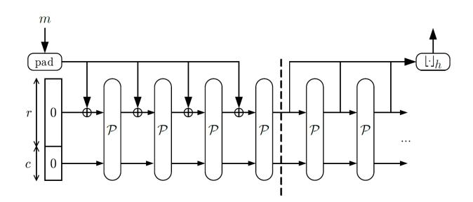

# Invertible Quadratic Non-Linear Layers for MPC-/FHE-/ZK-Friendly Schemes over $\mathbb{F}_n^n$

### **Application to Poseidon**

Lorenzo Grassi<sup>1</sup>, Silvia Onofri<sup>2</sup>, Marco Pedicini<sup>3</sup> and Luca Sozzi<sup>4</sup>

- <sup>1</sup> Radboud University, Nijmegen, the Netherlands, lgrassi@science.ru.nl
  - <sup>2</sup> Scuola Normale Superiore di Pisa, Pisa, Italy silvia.onofri@sns.it
    <sup>3</sup> Università Roma Tre, Roma, Italy, marco.pedicini@uniroma3.it

**Abstract.** Motivated by new applications such as secure Multi-Party Computation (MPC), Fully Homomorphic Encryption (FHE), and Zero-Knowledge proofs (ZK), many MPC-, FHE- and ZK-friendly symmetric-key primitives that minimize the number of multiplications over  $\mathbb{F}_p$  for a large prime p have been recently proposed in the literature. This goal is often achieved by instantiating the non-linear layer via power maps  $x\mapsto x^d$ . In this paper, we start an analysis of new non-linear permutation functions over  $\mathbb{F}_p^n$  that can be used as building blocks in such symmetric-key primitives. Given a local map  $F:\mathbb{F}_p^m\to\mathbb{F}_p$ , we limit ourselves to focus on S-Boxes over  $\mathbb{F}_p^n$  for  $n\geq m$  defined as  $\mathcal{S}_F(x_0,x_1,\ldots,x_{n-1})=y_0\|y_1\|\ldots\|y_{n-1}$  where  $y_i:=F(x_i,x_{i+1},\ldots,x_{i+m-1})$ . As main results, we prove that

- given any quadratic function  $F: \mathbb{F}_p^2 \to \mathbb{F}_p$ , the corresponding S-Box  $\mathcal{S}_F$  over  $\mathbb{F}_p^n$  for  $n \geq 3$  is never invertible;
- similarly, given any quadratic function  $F: \mathbb{F}_p^3 \to \mathbb{F}_p$ , the corresponding S-Box  $\mathcal{S}_F$  over  $\mathbb{F}_p^n$  for  $n \geq 5$  is never invertible.

Moreover, for each  $p \geq 3$ , we present (1st) generalizations of the Lai-Massey construction over  $\mathbb{F}_p^n$  defined as before via functions  $F:\mathbb{F}_p^m \to \mathbb{F}_p$  for each  $n=m\geq 2$  and (2nd) (non-trivial) quadratic functions  $F:\mathbb{F}_p^3 \to \mathbb{F}_p$  such that  $\mathcal{S}_F$  over  $\mathbb{F}_p^n$  for each  $n \in \{3,4\}$  is invertible. As an open problem for future work, we conjecture that for each  $m\geq 1$  there exists a finite integer  $n_{\max}(m)$  such that  $\mathcal{S}_F$  over  $\mathbb{F}_p^n$  defined as before via a quadratic function  $F:\mathbb{F}_p^m \to \mathbb{F}_p$  is not invertible for each  $n\geq n_{\max}(m)$ . Finally, as a concrete application, we propose Neptune, a variant of the sponge hash function Poseidon, whose non-linear layer is designed by taking into account the results presented in this paper. We show that this variant leads to a concrete multiplication reduction with respect to Poseidon.

**Keywords:** Multiplicative Complexity · Non-Linear Layer · MPC/FHE/ZK-Friendly Schemes · Poseidon

#### **Contents**

| 1 | Introduction                                    |   |  |  |  |  |  |
|---|-------------------------------------------------|---|--|--|--|--|--|
|   | 1.1 The Round Function and the Non-Linear Layer | 2 |  |  |  |  |  |
|   | 1.2 Our Contributions                           | 4 |  |  |  |  |  |
| 2 | Preliminary 2.1 Equivalence Class               |   |  |  |  |  |  |

<sup>&</sup>lt;sup>4</sup> Università degli Studi di Milano, Milano, Italy, sozzi.luca97@gmail.com

| 3            | (Generalized) Lai-Massey Functions over $\mathbb{F}_p^n$                                                                                                                                                                                                                                             | 9                                            |  |  |  |  |  |  |
|--------------|------------------------------------------------------------------------------------------------------------------------------------------------------------------------------------------------------------------------------------------------------------------------------------------------------|----------------------------------------------|--|--|--|--|--|--|
| 4            | SI-Lifting $S_F$ over $\mathbb{F}_p^n$ induced by Quadratic $F: \mathbb{F}_p^2 \to \mathbb{F}_p$<br>4.1 Analysis of the Case $n=2$                                                                                                                                                                   | 10<br>10<br>11                               |  |  |  |  |  |  |
| 5            | SI-Lifting $S_F$ over $\mathbb{F}_p^n$ induced by Quadratic $F: \mathbb{F}_p^3 \to \mathbb{F}_p$<br>5.1 Some Examples for the Case $n=3$                                                                                                                                                             | 13<br>13<br>15<br>17                         |  |  |  |  |  |  |
| 6            | Proof of Theorem 3  6.1 Case: $\alpha_{1,1,0} = \alpha_{1,0,1} = \alpha_{0,1,1} = 0$                                                                                                                                                                                                                 | 18<br>18<br>21<br>25<br>28                   |  |  |  |  |  |  |
| 7            | Neptune: a Concrete Application 7.1 POSEIDON and the Hades Design Strategy 7.2 NEPTUNE 7.3 Design Rationale 7.4 Security Analysis 7.4.1 (Invariant) Subspace Trails for the Internal Rounds 7.4.2 Statistical Attacks 7.4.3 Algebraic Attacks 7.5 Multiplicative Complexity: POSEIDON versus NEPTUNE | 32<br>33<br>35<br>36<br>36<br>37<br>38<br>39 |  |  |  |  |  |  |
| 8            | Open Problems for Future Research                                                                                                                                                                                                                                                                    | 41                                           |  |  |  |  |  |  |
| A            | Proof of Proposition 3                                                                                                                                                                                                                                                                               |                                              |  |  |  |  |  |  |
| В            | Practical Verification for Quadratic Functions  B.1 Brute Force Research                                                                                                                                                                                                                             | 47<br>48                                     |  |  |  |  |  |  |
| $\mathbf{C}$ | Details about the Security Analysis of Neptune  C.1 Maximum Differential Probability of S'  C.2 Gröbner Basis Attacks on Neptune  C.2.1 Working on the Input and the Output  C.2.2 Working at Round Level.                                                                                           | 50<br>50<br>51<br>52<br>52                   |  |  |  |  |  |  |

### <span id="page-1-0"></span>1 Introduction

Due to the development of new applications such as Secure Multi-Party Computation (MPC), Fully Homomorphic Encryption (FHE), and Zero-Knowledge proofs (ZK), several symmetric cryptographic schemes have been recently proposed in the literature to minimize the number of non-linear operations (namely, field multiplications) in their natural algorithmic description, often referred to as the *multiplicative complexity*. (From now on, we also use the term  $\mathbb{F}_p$ -multiplication – or simply, multiplication – to refer to a non-linear operation over  $\mathbb{F}_p$ .<sup>1</sup>) Today, many of the mentioned applications operate on  $\mathbb{F}_p \equiv \mathrm{GF}(p)$  for a large prime  $p \geq 3$  (usually, p is of order  $2^{64}$ ,  $2^{128}$  or even bigger), hence having cryptographic

<span id="page-1-1"></span><sup>&</sup>lt;sup>1</sup>We do not make any distinction between a  $\mathbb{F}_p$ -multiplication and a square operation, since – to the best of our knowledge – they have similar costs in the mentioned applications.

schemes that have a natural description over  $\mathbb{F}_p$  is desirable. MPC-, FHE- and ZK-friendly symmetric-key primitives defined over  $\mathbb{F}_p$  include MiMC [AGR+16], GMiMC [AGP+19], HadesMiMC [GLR+20], Rescue [AAB+20], Poseidon [GKR+21], Masta [HKC+20], Ciminion [DGGK21], Pasta [DGH+21], Grendel [Sze21], Reinforced Concrete [GKL+22], HYDRA [GØSW22], and GRIFFIN [GHR+22]. As designing symmetric-key primitives in this domain is relatively new and not well-understood, many of these schemes share some common features. In particular, the non-linear function used in almost all of them is a simple power map  $x \mapsto x^d$ . One of the few exceptions is Masta, whose non-linear layer resembles the chi-function introduced in [Wol85], which constitutes a prototype for the construction of the new non-linear functions we study in this paper. We start a research of new non-linear permutation functions over  $\mathbb{F}_p^n$  that can be used as building blocks in MPC-, FHE- and ZK-friendly symmetric-key primitives.

### <span id="page-2-0"></span>1.1 The Round Function and the Non-Linear Layer

Symmetric cryptographic schemes including ciphers, permutations and hash functions are typically designed by iterating an efficiently implementable round function a sufficient number of times in order to guarantee the desired security level. Such round function is usually composed of two layers, a non-linear one and a linear/affine one. In more details, the round function of a scheme over  $\mathbb{F}_p^t$  for a prime  $p \geq 2$  and  $t \geq 1$  is usually defined as

$$x \mapsto c + \mathcal{M} \times S\text{-Box}(x)$$
 (1)

for each  $x \in \mathbb{F}_p^t$ , where

- S-Box :  $\mathbb{F}_p^t \to \mathbb{F}_p^t$  is the non-linear layer (or substitution layer);
- $\mathcal{M} \in \mathbb{F}_p^{t \times t}$  is an invertible matrix, and  $c \in \mathbb{F}_p^t$  is a round constant or a secret key.

Focusing on Substitution-Permutation Network (SPN) schemes, the non-linear layer is composed of parallel independent non-linear functions. Let  $1 \le n < t$  be a divisor of t, that is,  $t = n \cdot t'$  for a certain integer t', and let  $\mathcal{S} : \mathbb{F}_p^n \to \mathbb{F}_p^n$  be an invertible non-linear function. Given  $x = (x_0, x_1, \dots, x_{t-1}) \in \mathbb{F}_p^t$ , the substitution layer is usually defined as

S-Box
$$(x) := S(x_0, \dots, x_{n-1}) \| S(x_n, \dots, x_{2n-1}) \| \dots \| S(x_{t-n}, \dots, x_{t-1}),$$
 (2)

where  $\cdot \parallel \cdot$  denotes concatenation. In such a case, the scheme admits an equivalent representation over  $\mathbb{F}_q^{t'}$ , where  $q:=p^n$ , and it can be classified as a strong-arranged SPN or as a weak-arranged one depending on the details of the linear layer  $\mathcal{M}$  (see [CGG<sup>+</sup>22] for more details).

Invertible Functions over  $\mathbb{F}_p^n \equiv \mathbb{F}_{p^n}$ . Given a non-linear function  $\mathcal{S}$  over  $\mathbb{F}_p^n \equiv \mathbb{F}_{p^n}$ , Hermite's criterion gives a characterization of which  $\mathcal{S}$  is a permutation and which is not.

**Theorem 1** (Hermite's Criterion [MP13]). Let  $q = p^n$ , where  $p \geq 2$  is a prime and n is a positive integer. A polynomial  $\mathcal{F} \in \mathbb{F}_q[x]$  is a Permutation Polynomial (PP) of  $\mathbb{F}_q$  if and only if the following two conditions hold:

- 1. the reduction of  $(\mathcal{F}(x))^{q-1} \mod (x^q x)$  is a monic polynomial of degree q 1;
- 2. for each integer t with  $1 \le t \le q-2$  and  $t \ne 0 \mod p$ , the reduction of  $(\mathcal{F}(x))^t \mod (x^q-x)$  has degree  $\le q-2$ .

However, applying the previous criteria on a generic function over  $\mathbb{F}_{p^n}$  in order to establish if it is a permutation or not is in general computational demanding. This is not the case for certain special classes of polynomials, including the power maps and the

Dickson polynomials, for which this question is easy to answer. E.g., a power map  $x \mapsto x^d$  over  $\mathbb{F}_{p^n}$  for  $p \geq 2$  and  $n \geq 1$  is invertible if and only if  $\gcd(p^n - 1, d) = 1$ . As a direct consequence, no quadratic function over  $\mathbb{F}_p$  for  $p \geq 3$  is invertible.<sup>2</sup>

Other examples of invertible functions over  $\mathbb{F}_p$  for  $p \geq 3$  have been recently proposed in the literature via the Legendre symbol  $L_p: \mathbb{F}_p \to \{-1,0,1\}$  defined as  $L_p(x) := x^{(p-1)/2}$  (recalled in Definition 3), and they include  $x \mapsto x \cdot (\alpha + L_p(x))$  where  $L_p(\alpha^2 - 1) = 1$  introduced by Shallue [Sha12],  $x \mapsto x^d \cdot L_p(x)$  where  $\gcd(d + (p-1)/2, p-1) = 1$  introduced by Szepieniec [Sze21], and their generalization proposed in [GKRS22].

**Local Maps.** For each  $z \in \mathbb{F}_p^n$ , the generic S-Box  $S(z) = y_0 ||y_1|| \dots ||y_{n-1}|| \text{ over } \mathbb{F}_p^n$  is defined as

$$S(z) := F_0(z) ||F_1(z)|| \dots ||F_{n-1}(z)||$$

where  $F_0, F_1, \ldots, F_{n-1} : \mathbb{F}_p^n \to \mathbb{F}_p$  are potentially distinct functions. Instead of working with a generic function  $\mathcal{S}$ , in this paper we limit ourselves to consider the case in which each value  $y_i$  is specified according to a single fixed local map  $F : \mathbb{F}_p^m \to \mathbb{F}_p$  for  $m \leq n$ .

<span id="page-3-1"></span>**Definition 1.** Let  $p \geq 3$  be a prime integer. Let  $1 \leq m \leq n$ , and let  $F : \mathbb{F}_p^m \to \mathbb{F}_p$  be a non-linear function. The function  $\mathcal{S}_F$  over  $\mathbb{F}_p^n$  is defined as

$$S_F(x_0, x_1, \dots, x_{n-1}) := y_0 \|y_1\| \dots \|y_{n-1}$$
(3)

where

$$y_i = F(x_i, x_{i+1}, \dots, x_{i+m-1})$$
 (4)

for each  $i \in \{0, 1, \dots, n-1\}$ , where the sub-indexes are taken modulo n.

It is easy to check that the function  $S_F$  is shift-invariant in the sense that  $S_F \circ \Pi = \Pi \circ S_F$  for each translation permutation  $\Pi$  over  $\mathbb{F}_p^n$ , that is, a map  $\Pi(x_0, x_1, \dots, x_{n-1}) = x_i \|x_{1+i}\| \dots \|x_{n-1+i}$  for a certain  $i \in \{0, 1, \dots, n-1\}$ , where the sub-indexes are taken modulo n. We refer to the shift-invariant function  $S_F$  over  $\mathbb{F}_p^n$  defined via the local map  $F : \mathbb{F}_p^n \to \mathbb{F}_p$  as the "shift-invariant (m, n)-lifting  $S_F$  induced by F" (for simplicity, we usually make use of the abbreviation "SI-lifting/SIL function  $S_F$ ").

One of the most well known examples of this kind of non-linear layer is the shift-invariant lifting  $\mathcal{S}_{\chi}$  over  $\mathbb{F}_2^n$  defined via the local map  $\chi: \mathbb{F}_2^3 \to \mathbb{F}_2$

<span id="page-3-2"></span>
$$\chi(x_0, x_1, x_2) := x_0 + (x_1 + 1) \cdot x_2 \mod 2, \tag{5}$$

first introduced by Wolfram [Wol85] and then re-considered and analyzed by Daemen [Dae95]. The function  $\mathcal{S}_{\chi}$  defined over  $\mathbb{F}_2^n$  as in Definition 1 is invertible for each odd  $n \geq 3$  (we refer to e.g. [Dae95,MDGM22] for the proof), and it is used as a building component in many designs, including Keccak [BPVA+11,BDPA13], Rasta [DEG+18], Subterranean [DMMR20], among many others. Any shift-invariant lifting  $\mathcal{S}_{\chi}$  over  $\mathbb{F}_2^n$  induced by the  $\chi$  function as local map, which therefore is a (2,n)-lifting, has several properties:

- while the degree of  $S_{\chi}$  is 2, the degree of  $S_{\chi}^{-1}$  (namely, its inverse) is (n+1)/2, that is, it is proportional to the field size (see e.g. [Dae95, Section 6.6.2] for details): hence, the greater is the size of the field n, the greater is the degree of  $S_{\chi}^{-1}$ . This fact has a crucial impact in order to prevent backward or/and Meet-in-the-Middle (MitM) algebraic attacks, as in the case of Rasta [LSMI21,LSMI22];
- in terms of computational cost (multiplications/ANDs and additions/XORs), the cost of computing  $\mathcal{S}_{\chi}$  over  $\mathbb{F}_2^n$  is equal to the cost of computing a non-linear layer defined as the concatenation of n' independent functions  $\mathcal{S}'_{\chi}$  defined over  $\mathbb{F}_2^{n''}$  for  $n = n' \cdot n''$ ;

<span id="page-3-0"></span>Let  $F(x) = \alpha \cdot x^2 + \beta \cdot x + \gamma$  with  $\alpha \neq 0$  be a generic quadratic function. Via the change of variable  $y = x - \beta/(2\alpha)$ , we obtain  $F(y) = \alpha \cdot y^2 + \gamma$ , which is not invertible since F(y) = F(-y) for each  $y \in \mathbb{F}_p$ .

• according to the analysis made in [DMMR20, MDGM22], a scheme instantiated with  $S_{\chi}$  over  $\mathbb{F}_2^n$  can achieve the same (if not better) security against statistical attacks of a scheme instantiated via a non-linear layer defined as the concatenation of n' independent functions  $S'_{\chi}$  over  $\mathbb{F}_2^{n''}$  for  $n = n' \cdot n''$  as before.

Other examples of local maps  $F: \mathbb{F}_2^m \to \mathbb{F}_2$  which induce an invertible SI-lifting  $\mathcal{S}_F$  over  $\mathbb{F}_2^n$  are listed in [Dae95, App. A.3], including  $F: \mathbb{F}_2^5 \to \mathbb{F}_2$  defined as

$$F(x_0, x_1, x_2, x_3, x_4) = x_1 + (x_0 + 1) \cdot (x_2 + 1) \cdot x_3 \cdot x_4 \quad \text{or} \quad F(x_0, x_1, x_2, x_3, x_4) = x_2 + (x_0 + 1) \cdot (x_1 + 1) \cdot x_3 \cdot (x_4 + 1)$$

for which the SI-lifting  $S_F$  over  $\mathbb{F}_2^n$  is always invertible for each  $n \geq 5$ .

While some results are proposed in the literature for the binary case, to the best of our knowledge, no analogous result is known for the prime field case. In this paper, we pick up this problem, and we study the properties and the multiplicative cost of the SI-lifting  $\mathcal{S}_F$  over  $\mathbb{F}_p^n$  induced by a quadratic function  $F: \mathbb{F}_p^m \to \mathbb{F}_p$  for a prime  $p \geq 3$ . Our goal would be to find a local quadratic map  $F: \mathbb{F}_p^m \to \mathbb{F}_p$  for a prime  $p \geq 3$  and for small  $m \in \{2,3\}$  such that:

- 1.  $S_F$  over  $\mathbb{F}_p^n$  is invertible for a large class of values of  $n \geq m$ ;
- 2. the cost of computing  $S_F$  over  $\mathbb{F}_p^n$  in terms of non-linear operations is bounded by n;
- 3.  $S_F$  over  $\mathbb{F}_p^n$  has several good/convenient algebraic and statistical properties similar to the ones listed for  $S_{\chi}$ .

### <span id="page-4-0"></span>1.2 Our Contributions

Generalized Lai-Massey Construction for n=m. Probably, the easiest example of an invertible function  $S_F$  over  $\mathbb{F}_p^2$  defined via a local map  $F: \mathbb{F}_p^2 \to \mathbb{F}_p$  is the Lai-Massey construction [LM90], for which  $F(x_0, x_1) = x_0 + (x_0 - x_1)^2$  and

$$S_F(x_0, x_1) = x_0 + (x_0 - x_1)^2 ||x_1 + (x_0 - x_1)^2|.$$

In Section 3, we start by presenting generalizations of such construction over  $\mathbb{F}_p^n$  for m=n, including (i)  $F(x_0,x_1,\ldots,x_{n-1})=x_0+(\sum_{i=0}^{n-1}(-1)^i\cdot x_i)^2$  for n=m even and (ii)  $F(x_0,x_1,\ldots,x_{n-1})=x_0+\sum_{i=0}^{n-1}(x_i-x_{i+1})^2$  among others.

**Invertible Quadratic Functions.** Even if the Lai-Massey constructions just presented can be efficiently computed (from the point of view of the multiplicative complexity), a cryptographic scheme based only on such non-linear functions can be potentially broken using e.g. an invariant subspace attack [Vau99] if the linear layer is not chosen appropriately. For this reason, we look for other quadratic functions as possible building blocks of a MPC-/ FHE-/ZK-friendly symmetric-key primitive, and we find the following:

- $F(x_0, x_1, x_2) = \psi_0 \cdot x_0 + \psi_1 \cdot x_1 + \psi_2 \cdot x_2 + (x_0 + x_1 + x_2) \cdot (\alpha \cdot x_0 + \beta \cdot x_1 + \gamma \cdot x_2)$  for which the SI-lifting  $\mathcal{S}_F$  over  $\mathbb{F}_p^3$  is invertible if  $p = 2 \mod 3$  by carefully choosing  $\psi_i, \alpha, \beta, \gamma$  as given in Proposition 9;
- $F(x_0, x_1, x_2) = \alpha \cdot (x_0 x_1)^2 + \beta \cdot (x_1 x_2)^2 + \gamma \cdot (x_2 x_0)^2 + \varepsilon \cdot x_0 + \varepsilon' \cdot (x_0 + x_1 + x_2)$  for which the SI-lifting  $\mathcal{S}_F$  over  $\mathbb{F}_p^3$  is invertible if  $p = 1 \mod 3$  by carefully choosing  $\alpha, \beta, \gamma, \varepsilon, \varepsilon'$  as given in Proposition 10;
- $F(x_0, x_1, x_2) = (x_0 x_1)^2 + (x_1 x_2)^2 + \alpha \cdot x_0 + \beta \cdot (x_0 + x_1 + x_2)$  for which the SI-lifting  $\mathcal{S}_F$  over  $\mathbb{F}_p^4$  is invertible by carefully choosing  $\alpha, \beta$  as given in Proposition 12.

These functions cover all possible values of  $p \geq 3$ , and they can be computed via only  $n \in \{3,4\}$  non-linear operations, that is, t non-linear operations per round (details are given in the following). For comparison, a non-linear layer instantiated via the power map  $x \mapsto x^d$  (for  $d \geq 3$  so that  $\gcd(d, p-1) = 1$ ) requires  $t \cdot (\lfloor \log_2(d) \rfloor + \operatorname{hw}(d) - 1) \geq 2 \cdot t$  non-linear operations,<sup>3</sup> which is at least double than the cost required for functions in the families just proposed.

### Non-Existence Results. As main results of this paper:

- in Theorem 2, we prove that there is **no** quadratic function  $F: \mathbb{F}_p^2 \to \mathbb{F}_p$  such that the induced SI-lifting  $\mathcal{S}_F$  over  $\mathbb{F}_p^n$  for  $n \geq 3$  is a permutation;
- in Theorem 3, we prove that there is **no** quadratic function  $F: \mathbb{F}_p^3 \to \mathbb{F}_p$  such that the induced SI-lifting  $\mathcal{S}_F$  over  $\mathbb{F}_p^n$  for  $n \geq 5$  is a permutation.

Both results are also supported by our practical experiments, as given in App. B. Regarding the case m=n=2, in Proposition 8 we *prove* that the only quadratic function  $F:\mathbb{F}_p^2\to\mathbb{F}_p$  for which the SI-lifting  $\mathcal{S}_F$  over  $\mathbb{F}_p^2$  is invertible is a Lai-Massey function of the form  $F(x_0,x_1)=\alpha\cdot x_0+\beta\cdot x_1+\gamma\cdot (x_0-x_1)^2$  for  $\alpha\neq\pm\beta$ .

Focusing on the case m=3, it is someway surprising when comparing the binary case and the prime case. Indeed, while e.g. the SI-lifting  $\mathcal{S}_{\chi}$  over  $\mathbb{F}_2^n$  induced by the local map  $\chi$  defined as in (5) is known to be a permutation for each odd  $n \geq 3$ , here we prove that there is no equivalent of the chi-function when working with a quadratic function  $F: \mathbb{F}_p^3 \to \mathbb{F}_p$  for a prime integer  $p \geq 3$ .

As an open problem for future work, we conjecture that for each  $m \geq 1$  there exists a finite integer  $n_{\max}(m)$  such that the SI-lifting  $\mathcal{S}_F$  over  $\mathbb{F}_p^n$  induced by a quadratic function  $F: \mathbb{F}_p^m \to \mathbb{F}_p$  is not invertible for each  $n \geq n_{\max}(m)$  (see Conjecture 1 for details). Our results and observations suggest that if such conjecture is true, then  $n_{\max}(m)$  grows linearly with m (more specifically,  $n_{\max}(m) = 2 \cdot m - 1$ ).

Neptune as a Concrete Application. Estimating the impact of quadratic non-linear layers in the design of a generic MPC-/FHE-/ZK-friendly iterative symmetric scheme is in general very hard, since many factors play a crucial role in determining the performance of the scheme in target applications (e.g., the number of rounds required for its security – and so the overall multiplicative complexity – does not depend only on the details of the non-linear layer, but also on the details of the linear layer, on the possible attack scenarios, on the security level, and so on). For this reason, we focus on Poseidon – a sponge hash function [BDPV07, BDPA08] recently proposed for ZK applications – and we show a possible way to modify it based on non-linear layers presented in this paper in order to reduce its multiplicative complexity.

The internal permutation of the sponge hash function Poseidon is based on the Hades design strategy [GLR<sup>+</sup>20] proposed at Eurocrypt 2020. Its main feature and novelty regards the use of both rounds with full S-Box layer and rounds with partial S-Box layer in order to achieve both security and good performance. Here, we take this concept to its extremes. Instead of limiting ourselves to consider an uneven distribution of the S-Boxes, we propose to use two different round functions, one for the internal part and one for the external one. In Section 7, we propose a new sponge hash function called Neptune over  $\mathbb{F}_{p_2}^t$ , a variant of the hash function Poseidon in which

• the power maps  $x \mapsto x^d$  in the external full rounds are replaced by a concatenation of independent S-Boxes defined over  $\mathbb{F}_p^2$  via the Lai-Massey construction;

<span id="page-5-0"></span>Given  $d = \sum_{i=0}^{\lfloor \log_2(d) \rfloor} d_i \cdot 2^i$  for  $d_i \in \{0,1\}$ , evaluating  $x \mapsto x^d$  can require computing  $x^{2^j}$  for each  $j \in \{0,1,\ldots,\lfloor \log_2(d) \rfloor \}$  for a cost of  $\lfloor \log_2(d) \rfloor$  non-linear operations, plus other  $\mathrm{hw}(d) - 1$  non-linear operations to get  $x \mapsto x^d$  (where  $\mathrm{hw}(\cdot)$  is the Hamming weight).

• the power map  $x \mapsto x^d$  in the internal partial rounds remains unchanged, but the matrix that instantiates the linear layer of the internal partial rounds is different from the one proposed for the external full rounds.

As we show in there, these changes have the effect of (largely) reducing the multiplicative complexity of Poseidon in the case of large  $t \gg 1$ .

# <span id="page-6-0"></span>2 Preliminary

**Notation.** Let p be a prime number (unless specified otherwise, we always assume  $p \geq 3$ ). Let  $\mathbb{F}_p$  denote the field of integer numbers modulo p, and let  $\mathbb{F}_p^n$  be the corresponding vector space for  $n \geq 1$ . (We use the symbol "·" to denote the product between (i) elements of  $\mathbb{F}_p$  and (ii) one element of  $\mathbb{F}_p$  with one element of  $\mathbb{F}_p^n$ , while we use the symbol "×" to denote the product between elements of  $\mathbb{F}_p^n$  or/and  $\mathbb{F}_p^{n \times m}$ .) We use small letters to denote either parameters/indexes or variables and greek letters to denote fixed elements in  $\mathbb{F}_p$ . Given  $x \in \mathbb{F}_p^n$ , we denote by  $x_i$  its i-th component for each  $i \in \{0,1,\ldots,n-1\}$ , that is,  $x = (x_0, x_1, \ldots, x_{n-1})$  or  $x = x_0 \|x_1\| \ldots \|x_{n-1}$ , where · $\|\cdot\|$  denotes concatenation. We use capital letters to denote functions from  $\mathbb{F}_p^m$  to  $\mathbb{F}_p$  for  $m \geq 1$ , e.g.,  $F : \mathbb{F}_p^m \to \mathbb{F}_p$  and the calligraphic font to denote functions over  $\mathbb{F}_p^n$  for n > 1, e.g.,  $S : \mathbb{F}_p^n \to \mathbb{F}_p^n$ . We use the fraktur font (e.g.,  $\mathfrak{X}$ ) to denote sets of elements, where  $|\mathfrak{X}|$  denotes the cardinality of the set  $\mathfrak{X}$ . We denote by  $\mathrm{circ}(\mu_0, \mu_1, \ldots, \mu_{n-1}) \in \mathbb{F}_p^{n \times n}$  the circulant matrix

$$\operatorname{circ}(\mu_0, \mu_1, \dots, \mu_{n-1}) := \begin{bmatrix} \mu_0 & \mu_1 & \dots & \mu_{n-2} & \mu_{n-1} \\ \mu_{n-1} & \mu_0 & \dots & \mu_{n-3} & \mu_{n-2} \\ \vdots & & & \vdots \\ \mu_1 & \mu_2 & \dots & \mu_{n-1} & \mu_0 \end{bmatrix}.$$

Given a matrix  $M \in \mathbb{F}_p^{n \times m}$ , we denote its transpose by  $M^T \in \mathbb{F}_p^{m \times n}$ .

**Legendre Symbol.** We recall some properties of the Legendre symbol used in the following.

**Definition 2.** Let  $p \geq 3$  be a prime number. An integer  $\alpha$  is a quadratic residue modulo p if it is congruent to a perfect square modulo p, and it is a quadratic non-residue modulo p otherwise.

<span id="page-6-1"></span>**Definition 3.** The Legendre symbol  $L_p(\cdot)$  is a function  $L_p: \mathbb{F}_p \to \{-1, 0, 1\}$  defined as  $L_p(x) := x^{\frac{p-1}{2}} \mod p \in \{-1, 0, 1\}$ , or equivalently  $L_p(0) = 0$  and

$$L_p(x) := \begin{cases} 1 & \text{if } x \text{ is a non-zero quadratic residue modulo } p, \\ -1 & \text{if } x \text{ is a quadratic non-residue modulo } p \end{cases}.$$

<span id="page-6-2"></span>**Proposition 1** ([Nag51]). The Legendre symbol has the following properties:

- 1. if  $x = y \mod p$ , then  $L_n(x) = L_n(y)$ :
- 2.  $L_p(x \cdot y) = L_p(x) \cdot L_p(y)$ .

Moreover, particular identities include:

- $L_p(-1) = 1$  if  $p = 1 \mod 4$ , while  $L_p(-1) = -1$  if  $p = 3 \mod 4$ ;
- $L_p(-3) = 1$  if  $p = 1 \mod 3$ , while  $L_p(-3) = -1$  if  $p = 2 \mod 3$ ;
- $L_p(2) = 1$  if  $p = 1, 7 \mod 8$ , while  $L_p(2) = -1$  if  $p = 3, 5 \mod 8$ .

### <span id="page-7-0"></span>2.1 Equivalence Class

First, we introduce a relation for classifying functions with similar properties.<sup>4</sup>

<span id="page-7-4"></span>**Definition 4** (Similar Functions). Let  $p \geq 2$  be a prime integer. Let  $F, F' : \mathbb{F}_p^m \to \mathbb{F}_p$  be two functions. F and F' are similar – denoted as  $F \sim F'$  – if and only if

<span id="page-7-5"></span>
$$\forall x \in \mathbb{F}_p^m: \qquad F'(x) = \omega \cdot F(\mu \cdot x + \bar{\nu}) + \psi \tag{6}$$

where (1st)  $\mu, \omega \in \mathbb{F}_p \setminus \{0\}$ , (2nd)  $\psi \in \mathbb{F}_p$  and (3rd)  $\bar{\nu} = \nu \cdot (1||1|| \dots ||1) \in \mathbb{F}_p^m$  for  $\nu \in \mathbb{F}_p$ .

**Lemma 1.** The binary relation  $\sim$  in Definition 4 is an equivalence relation.

*Proof.* The relation satisfies Equation (6) therefore the following properties hold:

- reflexivity  $(F \sim F)$ : obvious, by choosing  $\mu = \omega = 1$ , and  $\psi = \nu = 0$ ;
- symmetry  $(F \sim F' \text{ implies } F' \sim F)$ : by definition,  $F'(x) = \omega \cdot F(\mu \cdot x + \bar{\nu}) + \psi$ . Given  $x' = \mu \cdot x + \bar{\nu}$ , then:

$$\forall x' \in \mathbb{F}_p^m : \qquad F(x') = \omega^{-1} \cdot F'(\mu^{-1} \cdot x' - \mu^{-1} \cdot \bar{\nu}) - \psi \cdot \omega^{-1};$$

• transitivity  $(F \sim F' \text{ and } F' \sim F'' \text{ implies } F \sim F'')$ : by definition,  $F'(x) = \omega \cdot F(\mu \cdot x + \bar{\nu}) + \psi$  and  $F''(x) = \omega' \cdot F'(\mu' \cdot x + \bar{\nu}') + \psi'$ . Then

$$\forall x \in \mathbb{F}_p^m: \qquad F^{''}(x) = (\omega \cdot \omega') \cdot F\left((\mu \cdot \mu') \cdot x + (\bar{\nu} + \mu \cdot \bar{\nu}')\right) + (\psi' + \omega' \cdot \psi) \,. \quad \Box$$

<span id="page-7-6"></span>**Proposition 2.** Let  $p \geq 2$  be a prime integer, and let  $F, F' : \mathbb{F}_p^m \to \mathbb{F}_p$  be two similar functions. Let  $\mathcal{S}_F, \mathcal{S}_{F'} : \mathbb{F}_p^n \to \mathbb{F}_p^n$  be the two SI-liftings induced respectively by F and F'. Then,  $\mathcal{S}_F$  is invertible if and only if  $\mathcal{S}_{F'}$  is invertible.

*Proof.* By definition of F' and  $S_{F'}$ , the *i*-th output of  $S_{F'}(x_0, x_1, \ldots, x_{n-1})$  is  $F'(x_i, x_{i+1}, \ldots, x_{i+m-1})$ , where the sub-indexes are taken modulo n. Since  $F'(x) = \omega \cdot F(\mu \cdot x + \bar{\nu}) + \psi$  for each  $x \in \mathbb{F}_p^m$ , it follows that

$$S_{F'}(x) = \omega \cdot S_F(\mu \cdot x + \bar{\nu}) + \bar{\psi}$$

where  $\omega \neq 0$  and where  $\bar{\psi} = (\psi, \psi, \dots, \psi) \in \mathbb{F}_p^n$ . That is,  $\mathcal{S}_{F'}$  is equal to  $\mathcal{S}_F$  pre-composed and post-composed with two invertible affine functions. This implies that  $\mathcal{S}_{F'}$  is invertible if and only if  $\mathcal{S}_F$  is invertible.

### <span id="page-7-1"></span>2.2 Necessary Conditions for Invertibility

**Balanced Functions.** As first thing, F has to be balanced for  $S_F$  to be invertible.

**Definition 5** (Balanced Function). Let  $p \geq 2$  be a prime integer. Let  $F : \mathbb{F}_p^m \to \mathbb{F}_p$ . We say that F is **balanced** if and only if the pre-image of every element in  $\mathbb{F}_p$  has the same cardinality, i.e.  $|\{x \in \mathbb{F}_p^m \mid F(x) = y\}| = p^{m-1}$  for each  $y \in \mathbb{F}_p$ .

<span id="page-7-2"></span>**Proposition 3.** Let  $p \geq 2$  be a prime integer. Let be  $S_F$  a SI-lifting over  $\mathbb{F}_p^n$  induced by  $F : \mathbb{F}_p^m \to \mathbb{F}_p$ . If F is not balanced, then  $S_F$  is not invertible.

The proof of this well known result is given in App. A. A concrete application of it is given in the following proposition:

<span id="page-7-3"></span><sup>&</sup>lt;sup>4</sup>In order to simplify the notation, we denote the product (i) between two elements in  $\mathbb{F}_p$  and (ii) between an element of  $\mathbb{F}_p$  and one of  $\mathbb{F}_p^m$  by using the same symbol "·". Given  $x = (x_0, x_1, \dots, x_{m-1}) \in \mathbb{F}_p^m$  and  $\mu \in \mathbb{F}_p$ , then  $\mu \cdot x := (\mu \cdot x_0, \mu \cdot x_1, \dots, \mu \cdot x_{m-1}) \in \mathbb{F}_p^m$ .

**Proposition 4.** Let  $p \geq 2$  be a prime integer. Let  $F : \mathbb{F}_p^2 \to \mathbb{F}_p$  be

$$F(x_0, x_1) = \alpha_{2,0} \cdot x_0^2 + \alpha_{1,1} \cdot x_0 \cdot x_1 + \alpha_{0,2} \cdot x_1^2 + \alpha_{1,0} \cdot x_0 + \alpha_{0,1} \cdot x_1 + \alpha_{0,0}.$$

If  $\alpha_{2,0} = \alpha_{0,2} = 0$ , then F is **not** a balanced function.

*Proof.* Note that  $\alpha_{1,1} = \alpha_{2,0} = \alpha_{0,2} = 0$  would imply that F is a linear function. Hence, we assume  $\alpha_{1,1} \neq 0$ . Without loss of generality (W.l.o.g.), we can work with  $\alpha_{0,0} = 0$ , due to Proposition 2 based on the equivalence class defined in Definition 4. In order to prove the result, we analyse separately two cases: (1st)  $\alpha_{1,0} = \alpha_{0,1} = 0$  and (2nd)  $\alpha_{0,1} \neq 0$  (the proof is analogous for  $\alpha_{1,0} \neq 0$ ):

- If  $\alpha_{0,1} = \alpha_{1,0} = 0$ , then  $F(x_0, x_1) = 0$  if  $x_0 = 0$  or  $x_1 = 0$ . It follows that  $|F^{-1}(0)| \ge 2p 1 \ge p$ , hence F is not balanced;
- If  $\alpha_{0,1} \neq 0$ , we re-write  $F(x_0, x_1) = (\alpha_{1,1} \cdot x_0 + \alpha_{0,1}) \cdot x_1 + \alpha_{1,0} \cdot x_0$ . If  $x_0 = -\alpha_{0,1}/\alpha_{1,1}$ , then  $F(-\alpha_{0,1}/\alpha_{1,1}, x_1) = -\alpha_{0,1} \cdot \alpha_{1,0}$  for all  $x_1 \in \mathbb{F}_p$ . Moreover,  $F(0, -\alpha_{1,0}) = -\alpha_{0,1} \cdot \alpha_{1,0}$ . Since  $\alpha_{0,1} \neq 0$  by assumption, it follows that  $|F^{-1}(-\alpha_{0,1} \cdot \alpha_{1,0})| \geq p+1 \geq p$ , which means that F is not balanced.

Working over  $\mathbb{F}_2$ , we have that  $\alpha_{2,0} = \alpha_{0,2} = 0$ , since  $x^2 = x$  for each  $x \in \mathbb{F}_2$ . This implies that there is no quadratic function  $F : \mathbb{F}_2^2 \to \mathbb{F}_2$  which induces an invertible SI-lifting  $\mathcal{S}_F$  over  $\mathbb{F}_2^n$  for  $n \geq 2$ , in accordance with the results given in [Dae95].

**Corollary 1.** Let  $F: \mathbb{F}_2^2 \to \mathbb{F}_2$  be a quadratic function. Then, the SI-lifting  $\mathcal{S}_F$  over  $\mathbb{F}_2^n$  induced by F for  $n \geq 2$  is **not** invertible.

Quadratic Functions F. Next, we show a necessary condition that a *quadratic* function  $F: \mathbb{F}_p^m \to \mathbb{F}_p$  defined as

<span id="page-8-0"></span>
$$F(x_0, x_1, \dots, x_{m-1}) := \sum_{\substack{i_0, \dots, i_{m-1} \in \{0, 1, 2\} \text{ s.t.} \\ i_0 + \dots + i_{m-1} \le 2}} \alpha_{i_0, \dots, i_{m-1}} \cdot x_0^{i_0} \cdot \dots \cdot x_{m-1}^{i_{m-1}}$$

$$\equiv \begin{bmatrix} x_0 & x_1 & \dots & x_{m-1} & 1 \end{bmatrix} \times \begin{bmatrix} \alpha_{2, 0, \dots, 0} & \frac{\alpha_{1, 1, \dots, 0}}{2} & \dots & \frac{\alpha_{1, 0, \dots, 1}}{2} & \frac{\alpha_{1, 0, \dots, 0}}{2} \\ \vdots & & \ddots & \vdots & \vdots \\ \frac{\alpha_{1, 0, \dots, 1}}{2} & \alpha_{0, 2, \dots, 0} & \dots & \frac{\alpha_{0, 0, \dots, 1}}{2} & \frac{\alpha_{0, 0, \dots, 1}}{2} \end{bmatrix} \times \begin{bmatrix} x_0 \\ x_1 \\ \vdots \\ x_{m-1} \\ 1 \end{bmatrix}$$

$$(7)$$

must satisfy in order to guarantee that  $\mathcal{S}_F$  can be a permutation.

<span id="page-8-1"></span>**Proposition 5.** Let  $p \geq 3$  be a prime integer. Let  $F : \mathbb{F}_p^m \to \mathbb{F}_p$  be defined as in (7). Let  $\alpha^{(2)}, \alpha^{(1)} \in \mathbb{F}_p$  be the sum of the coefficients of the monomials of degree 2 and 1 respectively, that is,

$$\forall l \in \{1, 2\}: \qquad \alpha^{(l)} := \sum_{\substack{i_0, \dots, i_{m-1} \in \{0, 1, 2\} \ s.t. \\ i_0 + \dots + i_{m-1} = l}} \alpha_{i_0, \dots, i_{m-1}}.$$

$$(8)$$

If  $\alpha^{(2)} = \alpha^{(1)} = 0$  or if  $\alpha^{(2)} \neq 0$ , then the SI-lifting  $\mathcal{S}_F$  over  $\mathbb{F}_p^n$  induced by F is **not** a permutation for each  $n \geq m$ .

*Proof.* We prove that  $S_F$  is not a permutation by constructing collisions, that is, by presenting two different elements  $z, z' \in \mathbb{F}_p^n$  such that  $S_F(z) = S_F(z')$  and  $z \neq z'$ . In order to do this, we work with elements of the form  $w = (\hat{w}, \hat{w}, \dots, \hat{w}) \in \mathbb{F}_p^n$ , that is,  $w_i = w_j$  for each  $i, j \in \{0, 1, \dots, n\}$ . Over such inputs, the function F reduces to  $F(x, x, \dots, x) = \alpha^{(2)} \cdot x^2 + \alpha^{(1)} \cdot x + \alpha_{0,0,\dots,0}$ . It follows that:

- if  $\alpha^{(2)} = \alpha^{(1)} = 0$ , then  $F(x, x, \dots, x) = \alpha_{0,0,\dots,0}$  for each  $x \in \mathbb{F}_p$ . Hence  $\forall x. \, u \in \mathbb{F}_n: \qquad \mathcal{S}_F(x, x, \dots, x) = \mathcal{S}_F(y, y, \dots, y) = (\alpha_{0.0, \dots, 0}, \dots, \alpha_{0.0, \dots, 0});$
- if  $\alpha^{(2)} \neq 0$  and  $\alpha^{(1)} \neq 0$ , then  $F(x, x, ..., x) = x \cdot (\alpha^{(2)} \cdot x + \alpha^{(1)}) + \alpha_{0,0,...,0}$ . Since  $x \cdot (\alpha^{(2)} \cdot x + \alpha^{(1)}) = 0$  if x = 0 or  $x = -\alpha^{(1)}/\alpha^{(2)}$ , then

$$\mathcal{S}_F(0,0,\ldots,0) = \mathcal{S}_F\left(-\frac{\alpha^{(1)}}{\alpha^{(2)}}, -\frac{\alpha^{(1)}}{\alpha^{(2)}}, \ldots, -\frac{\alpha^{(1)}}{\alpha^{(2)}}\right) = (\alpha_{0,0,\ldots,0},\ldots,\alpha_{0,0,\ldots,0});$$

• if  $\alpha^{(2)} \neq 0$  and  $\alpha^{(1)} = 0$ , then  $F(x, x, ..., x) = \alpha^{(2)} \cdot x^2 + \alpha_{0,0,...,0}$ . It follows that  $S_F(x, x, \dots, x) = S_F(-x, -x, \dots, -x) = (\alpha^{(2)} \cdot x^2 + \alpha_{0,0,\dots,0}, \dots, \alpha^{(2)} \cdot x^2 + \alpha_{0,0,\dots,0})$ for each  $x \in \mathbb{F}_p$ .

Equivalently,  $S_F$  can be a permutation only in the case in which  $\alpha^{(2)} = 0$  and  $\alpha^{(1)} \neq 0$ .

#### <span id="page-9-0"></span>(Generalized) Lai-Massey Functions over $\mathbb{F}_n^n$ 3

In this section, we propose some generalizations over  $\mathbb{F}_p^n$  of the Lai-Massey construction proposed in [LM90] by working with a local map  $F: \mathbb{F}_p^m \to \mathbb{F}_p$  and m = n.

<span id="page-9-1"></span>**Proposition 6.** Let  $p \geq 2$  be a prime integer. Let  $n = m \geq 2$  such that either n is a multiple of p (i.e.,  $n = 0 \mod p$ ) or n is even (i.e., n = 2n'). Let

$$F(x_0, x_1, \dots, x_{n-1}) = \sum_{i=0}^{n-1} \mu_i \cdot x_i + H(\omega_0 \cdot x_0 + \omega_1 \cdot x_1 + \dots + \omega_{n-1} \cdot x_{n-1}), \quad (9)$$

where  $(\mu_0, \ldots, \mu_{n-1}) \in \mathbb{F}_p^n$  is such that the circulant matrix  $circ(\mu_0, \ldots, \mu_{n-1}) \in \mathbb{F}_p^{n \times n}$  is

- if  $n = 0 \mod p$ :  $\omega_i = 1$  for each  $i \in \{0, 1, ..., n-1\}$ :
- if  $n = 0 \mod 2$ :  $\omega_i = (-1)^i$  for each  $i \in \{0, 1, \dots, n-1\}$ , and  $H : \mathbb{F}_p \to \mathbb{F}_p$  is an even function (that is, H(x) = H(-x)).

Then, the SI-lifting  $S_F$  over  $\mathbb{F}_p^n$  induced by F is invertible.

*Proof.* Let  $y = \mathcal{S}_F(x)$  and let  $\mathcal{C} := \operatorname{circ}(\mu_0, \dots, \mu_{n-1})$ . By definition of  $\mathcal{S}_F$  and since H is an even function for  $n = 0 \mod 2$ :

$$\begin{bmatrix} y_0 \\ y_1 \\ \vdots \\ y_{n-1} \end{bmatrix} = \mathcal{C} \times \begin{bmatrix} x_0 \\ x_1 \\ \vdots \\ x_{n-1} \end{bmatrix} + \begin{bmatrix} H\left(\sum_{i=0}^{n-1} \omega_i \cdot x_i\right) \\ H\left(\sum_{i=0}^{n-1} \omega_i \cdot x_i\right) \\ \vdots \\ H\left(\sum_{i=0}^{n-1} \omega_i \cdot x_i\right) \end{bmatrix} = \mathcal{C} \times \begin{bmatrix} x_0 + \frac{1}{\mu'} \cdot H\left(\sum_{i=0}^{n-1} \omega_i \cdot x_i\right) \\ x_1 + \frac{1}{\mu'} \cdot H\left(\sum_{i=0}^{n-1} \omega_i \cdot x_i\right) \\ \vdots \\ x_{n-1} + \frac{1}{\mu'} \cdot H\left(\sum_{i=0}^{n-1} \omega_i \cdot x_i\right) \end{bmatrix},$$

where  $\mu' := \sum_i \mu_i \neq 0$  since  $\mathcal{C}$  is invertible by assumption. Let  $z := \mathcal{C}^{-1} \times y \in \mathbb{F}_p^n$ . The overall costruction is invertible since

$$\sum_{i=0}^{n-1} \omega_i \cdot z_i = \sum_{i=0}^{n-1} \omega_i \cdot x_i + \frac{1}{\mu'} \cdot H\left(\sum_{i=0}^{n-1} \omega_i \cdot x_i\right) \cdot \sum_{i=0}^{n-1} \omega_i = \sum_{i=0}^{n-1} \omega_i \cdot x_i.$$

It follows that  $x_i = z_i - \frac{1}{\mu'} \cdot H\left(\sum_{j=0}^{n-1} \omega_j \cdot z_j\right)$  for each  $i \in \{0, 1, \dots, n-1\}$ .  By choosing  $H(x) = \beta \cdot x^2 + \gamma$  for  $\beta, \gamma \in \mathbb{F}_p$  and  $\mathcal{C} = \operatorname{circ}(1, 0, \dots, 0) \in \mathbb{F}_p^n$ , computing  $\mathcal{S}_F$  over  $\mathbb{F}_p^n$  requires just one  $\mathbb{F}_p$ -multiplication.

<span id="page-10-3"></span>**Proposition 7.** Let  $p \geq 2$  be a prime integer. Let

$$F(x_0, x_1, \dots, x_{n-1}) = \sum_{i=0}^{n-1} \mu_i \cdot x_i + \gamma \cdot \sum_{i=0}^{n-1} H(x_i - x_{i+1}),$$

where  $(\mu_0, \ldots, \mu_{n-1}) \in \mathbb{F}_p^n$  is such that the circulant matrix  $\operatorname{circ}(\mu_0, \ldots, \mu_{n-1}) \in \mathbb{F}_p^{n \times n}$  is an invertible matrix and where  $\gamma \in \mathbb{F}_p \setminus \{0\}$ . Then, the SI-lifting  $\mathcal{S}_F$  over  $\mathbb{F}_p^n$  induced by F is invertible.

*Proof.* Let  $y = S_F(x)$ ,  $C := \operatorname{circ}(\mu_0, \dots, \mu_{n-1})$  and let  $\mu' := \sum_{i=0}^{n-1} \mu_i$ . First of all,  $\mu' \neq 0$  since C is invertible (indeed, if  $\mu' = 0$ , then the sum of all columns of C would be equal to zero, and the matrix would be non-invertible due to the existence of a linear relation among its columns). Based on this consideration, the following equality holds:

$$\begin{bmatrix} y_0 \\ y_1 \\ \vdots \\ y_{n-1} \end{bmatrix} = \mathcal{C} \times \begin{bmatrix} x_0 + \frac{\gamma}{\mu'} \cdot \sum_{i=0}^{n-1} H(x_i - x_{i+1}) \\ x_1 + \frac{\gamma}{\mu'} \cdot \sum_{i=0}^{n-1} H(x_i - x_{i+1}) \\ \vdots \\ x_{n-1} + \frac{\gamma}{\mu'} \cdot \sum_{i=0}^{n-1} H(x_i - x_{i+1}) \end{bmatrix},$$

Let  $z := \mathcal{C}^{-1} \times y$ . Working as before, the overall construction is invertible since  $z_i - z_{i+1} = x_i - x_{i+1}$ , which implies  $x_i = z_i - \frac{\gamma}{\mu'} \cdot \sum_{j=0}^{n-1} H(z_j - z_{j+1})$  for each  $i \in \{0, 1, \dots, n-1\}$ .  $\square$

By choosing  $H(x) = \beta \cdot x^2 + \gamma$  for  $\beta, \gamma \in \mathbb{F}_p$  and  $C = \operatorname{circ}(1, 0, \dots, 0) \in \mathbb{F}_p^n$ , then evaluating the function  $S_F$  costs n multiplications in  $\mathbb{F}_p$  (and just one multiplication for the case n = 3).

# <span id="page-10-0"></span>4 SI-Lifting $\mathcal{S}_F$ over $\mathbb{F}_p^n$ induced by Quadratic $F:\mathbb{F}_p^2\to\mathbb{F}_p$

### <span id="page-10-1"></span>4.1 Analysis of the Case n=2

Here we prove that the only quadratic function  $F: \mathbb{F}_p^2 \to \mathbb{F}_p$  for which  $\mathcal{S}_F$  is invertible over  $\mathbb{F}_p^2$  is  $F(x_0, x_1) = \gamma_0 \cdot x_0 + \gamma_1 \cdot x_1 + \gamma_2 \cdot (x_0 - x_1)^2$  where  $\gamma_0 \neq \pm \gamma_1$ .

<span id="page-10-2"></span>**Proposition 8.** Let  $p \geq 3$  be a prime integer, and let  $F : \mathbb{F}_p^2 \to \mathbb{F}_p$  be a quadratic function. The SI-lifting  $\mathcal{S}_F$  over  $\mathbb{F}_p^2$  induced by F is invertible if and only if

$$F(x_0, x_1) = \gamma_0 \cdot x_0 + \gamma_1 \cdot x_1 + \gamma_2 \cdot (x_0 - x_1)^2$$

where  $\gamma_0 \neq \pm \gamma_1$ .

*Proof.* Consider a generic function  $G(x_0, x_1) = \alpha_{1,0} \cdot x_0 + \alpha_{0,1} \cdot x_1 + \alpha_{2,0} \cdot x_0^2 + \alpha_{0,2} \cdot x_1^2 + \alpha_{1,1} \cdot x_0 \cdot x_1$ . First of all, if  $\alpha_{2,0} + \alpha_{0,2} + \alpha_{1,1} \neq 0$ , then the function is not invertible (see Proposition 5). Hence, we assume  $\alpha_{1,1} = -\alpha_{2,0} - \alpha_{0,2}$ , which means

$$G(x_0, x_1) = \alpha_{1,0} \cdot x_0 + \alpha_{0,1} \cdot x_1 + (\alpha_{2,0} \cdot x_0 - \alpha_{0,2} \cdot x_1) \cdot (x_0 - x_1).$$

If  $\alpha_{2,0} = \alpha_{0,2}$  and  $\alpha_{1,0} \neq \alpha_{0,1}$ , then  $G(x_0, x_1) = \alpha_{1,0} \cdot x_0 + \alpha_{0,1} \cdot x_1 + \alpha_{2,0} \cdot (x_0 - x_1)^2$  is a generalization of the Lai-Massey construction. Based on the results proposed in the previous section, it is invertible if and only if the circulant matrix  $\operatorname{circ}(\alpha_{1,0}, \alpha_{0,1})$  is invertible, that is, if  $\alpha_{1,0} \neq \pm \alpha_{0,1}$ .

Let us now consider the case  $\alpha_{2,0} \neq \alpha_{0,2}$ . We show that the lifting  $\mathcal{S}_G$  is never invertible by looking for a collision  $\mathcal{S}_G(x_0, x_1) = \mathcal{S}_G(y_0, y_1)$  with  $(x_0, x_1) \neq (y_0, y_1)$ . Via

the change of variables  $d_i = x_i - y_i$  and  $s_i = x_i + y_i$  for  $i \in \{0, 1\}$ , the system of equations  $G(x_0, x_1) = G(y_0, y_1)$  and  $G(x_1, x_0) = G(y_1, y_0)$  to solve corresponds to

$$\begin{bmatrix} \alpha_{2,0} \cdot d_0 - \frac{\alpha_{2,0} + \alpha_{0,2}}{2} \cdot d_1 & \alpha_{0,2} \cdot d_1 - \frac{\alpha_{2,0} + \alpha_{0,2}}{2} \cdot d_0 \\ \alpha_{0,2} \cdot d_0 - \frac{\alpha_{2,0} + \alpha_{0,2}}{2} \cdot d_1 & \alpha_{2,0} \cdot d_1 - \frac{\alpha_{2,0} + \alpha_{0,2}}{2} \cdot d_0 \end{bmatrix} \times \begin{bmatrix} s_0 \\ s_1 \end{bmatrix} = - \begin{bmatrix} \alpha_{1,0} \cdot d_0 + \alpha_{0,1} \cdot d_1 \\ \alpha_{1,0} \cdot d_1 + \alpha_{0,1} \cdot d_0 \end{bmatrix} \,.$$

The determinant of the matrix is equal to

$$(\alpha_{2,0} - \alpha_{0,2}) \cdot (\alpha_{2,0} + \alpha_{0,2}) \cdot (d_0 - d_1)^2$$
.

If  $\alpha_{2,0} \neq \pm \alpha_{0,2}$ , it is sufficient to choose  $d_0 \neq d_1$  in order to find a collision (since  $d_0 \neq d_1$ , at least one among  $d_0$  and  $d_1$  are not null). The only remaining case to analyze is  $\alpha_{0,2} = -\alpha_{2,0}$ , for which the system of equation reduces to

$$\alpha_{2,0} \cdot (d_0 \cdot s_0 - d_1 \cdot s_1) = \alpha_{1,0} \cdot d_0 + \alpha_{0,1} \cdot d_1,$$

$$d_0 \cdot (\alpha_{1,0} - \alpha_{0,1}) = d_1 \cdot (\alpha_{1,0} - \alpha_{0,1}).$$

A collision can be easily set up by choosing  $d_0 = d_1 \neq 0$  and  $s_0, s_1$  such that  $\alpha_{2,0} \cdot (s_0 - s_1) = \alpha_{1,0} + \alpha_{0,1}$  (note that  $\alpha_{2,0} \neq 0$ , otherwise G is linear).

### <span id="page-11-0"></span>4.2 Analysis of the Case $n \geq 3$

As one of the main results of this paper, we prove that given any quadratic function  $F: \mathbb{F}_p^2 \to \mathbb{F}_p$ , then the SI-lifting  $\mathcal{S}_F$  induced by the local map F over  $\mathbb{F}_p^n$  is **never** invertible for each  $n \geq 3$ .

<span id="page-11-1"></span>**Theorem 2.** Let  $p \geq 3$  be a prime integer. Let  $F : \mathbb{F}_p^2 \to \mathbb{F}_p$  be a function of degree 2. The lifting  $\mathcal{S}_F$  induced by F over  $\mathbb{F}_p^n$  is **never** a permutation for each  $n \geq 3$ .

*Proof.* Due to the results given in Proposition 5, here we limit ourselves to consider the case

<span id="page-11-2"></span>
$$\alpha^{(2)} = \alpha_{2,0} + \alpha_{1,1} + \alpha_{0,2} = 0 \tag{10}$$

and  $\alpha^{(1)} = \alpha_{0,1} + \alpha_{1,0} \neq 0$ .

We prove the result for the case n=3. Our goal is to prove that for each function  $F: \mathbb{F}_p^2 \to \mathbb{F}_p$  of degree 2 defined as in (7), it is possible to find a collision, that is, two different inputs  $x,y \in \mathbb{F}_p^3$  such that  $F(x_0,x_1)=F(y_0,y_1), \ F(x_1,x_2)=F(y_1,y_2)$  and  $F(x_2,x_0)=F(y_2,y_0)$ . By assuming  $x_0=y_0=0$ , any collision for n=3 can be easily generalized for each  $n\geq 4$ . In fact, given a collision for n=3, a collision for  $n\geq 4$  can be easily set up by working with  $x,y\in\mathbb{F}_p^n$  where  $x_i=y_i=0$  for each  $i\geq 3$ , that is,

$$S_F(0, x_1, x_2) = S_F(0, y_1, y_2) \longrightarrow S_F(0, x_1, x_2, 0, 0, \dots, 0) = S_F(0, y_1, y_2, 0, 0, \dots, 0),$$

since

$$\forall i \in \{3, \dots, n-1\}: F(x_i, x_{i+1}) = F(0, 0) = F(y_i, y_{i+1}).$$

Let  $x_0 = y_0 = 0$  and let n = 3. The condition  $S_F(0, x_1, x_2) = S_F(0, y_1, y_2)$  implies

i.  $F(0,x_1) = F(0,y_1)$ , which is satisfied if and only if

$$(x_1 - y_1) \cdot (\alpha_{0,2} \cdot (x_1 + y_1) + \alpha_{0,1}) = 0 \longrightarrow x_1 = y_1 \text{ or } y_1 = -x_1 - \frac{\alpha_{0,1}}{\alpha_{0,2}},$$

assuming  $\alpha_{0,2} \neq 0$  in this second case;

ii.  $F(x_2,0) = F(y_2,0)$ , which is satisfied if and only if

$$x_2 = y_2$$
 or  $y_2 = -x_2 - \frac{\alpha_{1,0}}{\alpha_{2,0}}$ ,

assuming  $\alpha_{2,0} \neq 0$  in this second case.

Based on these considerations, we propose separate collisions for the cases (1st)  $\alpha_{2,0}$ ,  $\alpha_{1,1} \neq 0$ , (2nd)  $\alpha_{2,0} = 0$  and (3rd)  $\alpha_{1,1} = 0$ . Since no condition is imposed on  $\alpha_{0,2}$ , these three cases cover all possible quadratic functions F that have not been already excluded by Proposition 5. Indeed, if two coefficients among  $\alpha_{0,2}, \alpha_{2,0}, \alpha_{1,1}$  are equal to zero, then all three coefficients are null due to (10), and the function becomes linear.

Case:  $\alpha_{2,0}, \alpha_{1,1} \neq 0$ . We propose a collision by working with two inputs of the form  $(0, x_1, x_2)$  and  $(0, x_1, -x_2 - \frac{\alpha_{1,0}}{\alpha_{2,0}})$ . Due to the given considerations (i) and (ii), the conditions  $F(0, x_1) = F(0, x_1)$  and  $F(x_2, 0) = F(-x_2 - \frac{\alpha_{1,0}}{\alpha_{2,0}}, 0)$  are always satisfied for each  $x_1, x_2 \in \mathbb{F}_p$ . Hence, it is sufficient to find  $x_1, x_2$  such that the condition  $F(x_1, x_2) = F(x_1, -x_2 - \frac{\alpha_{1,0}}{\alpha_{2,0}})$  is verified.

By choosing  $x_1 = \frac{\alpha_{0,2} \cdot \alpha_{1,0}}{\alpha_{1,1} \cdot \alpha_{2,0}} - \frac{\alpha_{0,1}}{\alpha_{1,1}}$ , we have that

$$\forall x \in \mathbb{F}_p: \qquad \mathcal{S}_F\left(0, \frac{\alpha_{0,2} \cdot \alpha_{1,0}}{\alpha_{1,1} \cdot \alpha_{2,0}} - \frac{\alpha_{0,1}}{\alpha_{1,1}}, x\right) = \mathcal{S}_F\left(0, \frac{\alpha_{0,2} \cdot \alpha_{1,0}}{\alpha_{1,1} \cdot \alpha_{2,0}} - \frac{\alpha_{0,1}}{\alpha_{1,1}}, -x - \frac{\alpha_{1,0}}{\alpha_{2,0}}\right),$$

since

$$\begin{split} F\left(\frac{\alpha_{0,2}\cdot\alpha_{1,0}-\alpha_{0,1}\cdot\alpha_{2,0}}{\alpha_{1,1}\cdot\alpha_{2,0}},x\right) &= F\left(\frac{\alpha_{0,2}\cdot\alpha_{1,0}-\alpha_{0,1}\cdot\alpha_{2,0}}{\alpha_{1,1}\cdot\alpha_{2,0}},-x-\frac{\alpha_{1,0}}{\alpha_{2,0}}\right) \\ &= &\alpha_{0,2}\cdot x^2 + \frac{\alpha_{0,2}\cdot\alpha_{1,0}}{\alpha_{2,0}}\cdot x + \frac{\left(\alpha_{0,2}\cdot\alpha_{1,0}-\alpha_{2,0}\cdot\alpha_{0,1}\right)^2}{\alpha_{1,1}^2\cdot\alpha_{2,0}} + \frac{\alpha_{1,0}\cdot\left(\alpha_{0,2}\cdot\alpha_{1,0}-\alpha_{0,1}\cdot\alpha_{2,0}\right)}{\alpha_{1,1}\cdot\alpha_{2,0}} \,. \end{split}$$

Note that no condition on  $\alpha_{0,2} \in \mathbb{F}_p$  is imposed.

Case:  $\alpha_{2,0} = 0$ . We propose a collision by working with two inputs of the form  $(0, x_1, x_2)$  and  $(0, -x_1 - \frac{\alpha_{0,1}}{\alpha_{0,2}}, x_2)$ . Due to the given consideration (i) and (ii), the conditions  $F(0, x_1) = F(0, -x_1 - \frac{\alpha_{0,1}}{\alpha_{0,2}})$  and  $F(x_2, 0) = F(x_2, 0)$  are always satisfied for each  $x_1, x_2 \in \mathbb{F}_p$ . Hence, it is sufficient to find  $x_1, x_2$  such that the condition  $F(x_1, x_2) = F(-x_1 - \frac{\alpha_{0,1}}{\alpha_{0,2}}, x_2)$  is verified.

By choosing  $x_2 = -\frac{\alpha_{1,0}}{\alpha_{1,1}}$ , we have that

$$\forall x \in \mathbb{F}_p: \qquad \mathcal{S}_F\left(0, x, -\frac{\alpha_{1,0}}{\alpha_{1,1}}\right) = \mathcal{S}_F\left(0, -x - \frac{\alpha_{0,1}}{\alpha_{0,2}}, -\frac{\alpha_{1,0}}{\alpha_{1,1}}\right),$$

since

$$F\left(x, -\frac{\alpha_{1,0}}{\alpha_{1,1}}\right) = F\left(-x - \frac{\alpha_{0,1}}{\alpha_{0,2}}, -\frac{\alpha_{1,0}}{\alpha_{1,1}}\right) = -\frac{\alpha_{1,0}\cdot(\alpha_{0,1}+\alpha_{1,0})}{\alpha_{1,1}}\,,$$

where  $\alpha_{1,1} = -\alpha_{0,2} \neq 0$  due to Equation (10) and since  $\alpha_{2,0} = 0$ .

Case:  $\alpha_{1,1} = 0$ . We propose a collision by working with two inputs of the form  $(0, x_1, x_2)$  and  $(0, -x_1 - \frac{\alpha_{0,1}}{\alpha_{0,2}}, -x_2 - \frac{\alpha_{1,0}}{\alpha_{2,0}})$ . Due to the given consideration (i) and (ii), the conditions  $F(0, x_1) = F(0, -x_1 - \frac{\alpha_{0,1}}{\alpha_{0,2}})$  and  $F(x_2, 0) = F(-x_2 - \frac{\alpha_{1,0}}{\alpha_{2,0}}, 0)$  are always satisfied for each  $x_1, x_2 \in \mathbb{F}_p$ . Hence, it is sufficient to find  $x_1, x_2$  such that the condition  $F(x_1, x_2) = F(-x_1 - \frac{\alpha_{0,1}}{\alpha_{0,2}}, -x_2 - \frac{\alpha_{1,0}}{\alpha_{2,0}})$  is verified.

By choosing  $x_2 = x$  and  $x_1 = -x + \frac{\alpha_{1,0} - \alpha_{0,1}}{2 \cdot \alpha_{0,2}}$ , we have that

$$S_F\left(0, -x + \frac{\alpha_{1,0} - \alpha_{0,1}}{2 \cdot \alpha_{0,2}}, x\right) = S_F\left(0, x - \frac{\alpha_{1,0} + \alpha_{0,1}}{2 \cdot \alpha_{0,2}}, -x - \frac{\alpha_{1,0}}{\alpha_{2,0}}\right),$$

since

$$F\left(-x + \frac{\alpha_{1,0} - \alpha_{0,1}}{2 \cdot \alpha_{0,2}}, x\right) = F\left(x - \frac{\alpha_{1,0} + \alpha_{0,1}}{2 \cdot \alpha_{0,2}}, -x - \frac{\alpha_{1,0}}{\alpha_{2,0}}\right) = \frac{\alpha_{1,0}^2 - \alpha_{0,1}^2}{4 \cdot \alpha_{0,2}}$$

where  $\alpha_{2,0} = -\alpha_{0,2} \neq 0$  due to Equation (10) and since  $\alpha_{1,1} = 0$ .

#### <span id="page-13-0"></span>SI-Lifting $\mathcal{S}_F$ over $\mathbb{F}_n^n$ induced by Quadratic $F:\mathbb{F}_n^3 \to \mathbb{F}_p$ 5

#### <span id="page-13-1"></span>5.1 Some Examples for the Case n=3

Example of quadratic functions  $F: \mathbb{F}_p^3 \to \mathbb{F}_p$  for which the SI-lifting  $\mathcal{S}_F$  over  $\mathbb{F}_p^3$  is invertible are given in Proposition 6-7. Other examples are proposed in the following.

**Case:**  $p=2 \mod 3$ . First, we present a family of functions  $F: \mathbb{F}_p^3 \to \mathbb{F}_p$  for which the induced SI-lifting  $S_F$  over  $\mathbb{F}_p^3$  is a permutation if  $p=2 \mod 3$ .

<span id="page-13-2"></span>**Proposition 9.** Let  $p \geq 5$  be a prime integer such that  $p = 2 \mod 3$ . Let  $\alpha, \beta \in \mathbb{F}_p$  and  $\psi_0, \psi_1, \psi_2 \in \mathbb{F}_p$  such that (1st)  $\sum_{i=0}^2 \psi_i \neq 0$  and (2nd) one of three following conditions is satisfied: (i)  $\psi_1 = \psi_2$  and  $\psi_0 \neq \psi_1$  and  $2 \cdot \alpha + \beta \neq 0$ ; (ii)  $\psi_0 = \psi_2$  and  $\psi_0 \neq \psi_1$  and  $2 \cdot \beta + \alpha \neq 0$ ; (iii)  $\psi_0 = \psi_1$  and  $\psi_0 \neq \psi_2$  and  $\alpha - \beta \neq 0$ . Given  $F : \mathbb{F}_p^3 \to \mathbb{F}_p$  defined as

Given
$$F: \mathbb{F}_p^3 \to \mathbb{F}_p$$
 defined as

$$F(x_0, x_1, x_2) = \psi_0 \cdot x_0 + \psi_1 \cdot x_1 + \psi_2 \cdot x_2 + (x_0 + x_1 + x_2) \cdot (\alpha \cdot x_0 + \beta \cdot x_1 - (\alpha + \beta) \cdot x_2),$$

the SI-lifting  $S_F$  over  $\mathbb{F}_p^3$  induced by F is invertible.

*Proof.* Note that  $\alpha = \beta = 0$  is never possible. Given  $y_i = F(x_i, x_{i+1}, x_{i+2})$  for each  $i \in \{0, 1, 2\}$  (where the sub-indexes are taken modulo 3), then

$$y_0 + y_1 + y_2 = (\psi_0 + \psi_1 + \psi_2) \cdot (x_0 + x_1 + x_2)$$

where  $\psi_0 + \psi_1 + \psi_2 \neq 0$  by assumption. Let  $\hat{y} := (y_0 + y_1 + y_2)/(\psi_0 + \psi_1 + \psi_2)$ , where  $\hat{y} = 0$  if and only if  $x_0 + x_1 + x_2 = y_0 + y_1 + y_2 = 0$ . The system of equations for  $\mathcal{S}(x) = y$

$$\begin{bmatrix} \alpha \cdot \hat{y} + \psi_0 & \beta \cdot \hat{y} + \psi_1 & -(\alpha + \beta) \cdot \hat{y} + \psi_2 \\ -(\alpha + \beta) \cdot \hat{y} + \psi_2 & \alpha \cdot \hat{y} + \psi_0 & \beta \cdot \hat{y} + \psi_1 \\ \beta \cdot \hat{y} + \psi_1 & -(\alpha + \beta) \cdot \hat{y} + \psi_2 & \alpha \cdot \hat{y} + \psi_0 \end{bmatrix} \times \begin{bmatrix} x_0 \\ x_1 \\ x_2 \end{bmatrix} = \begin{bmatrix} y_0 \\ y_1 \\ y_2 \end{bmatrix}.$$

By simple computation, the matrix is invertible if

$$(\psi_0 + \psi_1 + \psi_2) \cdot \left( 3 \cdot (\alpha^2 + \alpha \cdot \beta + \beta^2) \cdot \hat{y}^2 + 3 \cdot (\alpha \cdot (\psi_0 - \psi_2) + \beta \cdot (\psi_1 - \psi_2)) \cdot \hat{y} + (\psi_0^2 + \psi_1^2 + \psi_2^2 - \psi_0 \cdot \psi_1 - \psi_1 \cdot \psi_2 - \psi_0 \cdot \psi_2) \right) \neq 0.$$

If  $\hat{y} = 0$ , then the matrix is invertible, since  $\psi_0^2 + \psi_1^2 + \psi_2^2 - \psi_0 \cdot \psi_1 - \psi_1 \cdot \psi_2 - \psi_0 \cdot \psi_2$  is different from zero by assumption on  $\psi_0, \psi_1, \psi_2$ .

If  $\hat{y} \neq 0$ , first note that the coefficient  $\alpha^2 + \alpha \cdot \beta + \beta^2$  of  $\hat{y}^2$  is always different from zero for each  $\alpha, \beta$  since -3 is not a square modulo p due to the assumption  $p = 2 \mod 3$  (see Proposition 1). Indeed,  $\alpha^2 + \alpha \cdot \beta + \beta^2 = 0$  for  $\beta \neq 0$  is equivalent to  $z^2 + z + 1 = 0$  for  $z = \alpha/\beta$ , which admits as solutions  $(-2 \pm \sqrt{-3})/2$ . Since -3 is a quadratic non-residue

modulo p, then no solution exists. Hence, assuming  $\psi_1 = \psi_2$  (analogous for the others), the determinant is equal to zero if and only if

$$\hat{y} = \frac{-3 \cdot \alpha \cdot (\psi_0 - \psi_2) \pm \sqrt{-3 \cdot (\psi_0 - \psi_2)^2 \cdot (\alpha + 2 \cdot \beta)^2}}{6 \cdot (\alpha^2 + \alpha \cdot \beta + \beta^2)},$$

which does not admit any solution since -3 is a quadratic non-residue modulo p (note that  $\psi_0 \neq \psi_2$  and  $\alpha \neq -2\beta$ ). It follows that  $\mathcal{S}_F(x) = y$  is invertible.

Regarding the cost, three  $\mathbb{F}_p$ -multiplications are sufficient for computing  $\mathcal{S}_F$ . Indeed, each function  $F(x_i, x_{i+1}, x_{i+2})$  can be computed via one multiplication only, that is,  $(x_i + x_{i+1} + x_{i+2}) \times (\alpha \cdot x_i + \beta \cdot x_{i+1} - (\alpha + \beta) \cdot x_{i+2})$  after pre-computing  $(x_i + x_{i+1} + x_{i+2})$  and  $(\alpha \cdot x_i + \beta \cdot x_{i+1} - (\alpha + \beta) \cdot x_{i+2})$ , where the multiplications with constants  $\alpha, \beta, \alpha + \beta$  do not count since they are affine operations.

**Case:**  $p = 1 \mod 3$ . Next, we present a family of functions  $F : \mathbb{F}_p^3 \to \mathbb{F}_p$  for which the induced SI-lifting  $\mathcal{S}_F$  over  $\mathbb{F}_p^3$  is a permutation if  $p = 1 \mod 3$ .

<span id="page-14-0"></span>**Proposition 10.** Let  $p \geq 7$  be a prime integer such that  $p = 1 \mod 3$ . Let  $\alpha, \beta, \gamma, \varepsilon, \varepsilon' \in \mathbb{F}_p$  such that  $\varepsilon \neq 0$ ,  $\varepsilon + 3 \cdot \varepsilon' \neq 0$ ,  $\alpha \neq \gamma$ ,  $\alpha \cdot \beta \neq \gamma^2$ , and  $\beta \in \{\beta_+, \beta_-\}$  where

<span id="page-14-1"></span>
$$\beta_{\pm} = \frac{\alpha \cdot (1 \pm \sqrt{-3}) - \gamma \cdot (-1 \pm \sqrt{-3})}{2} \,. \tag{11}$$

(Note that -3 is a quadratic residue modulo p for  $p=1 \mod 3$  – see Proposition 1.) Given  $F: \mathbb{F}_p^3 \to \mathbb{F}_p$  defined as

$$F(x_0, x_1, x_2) = \alpha \cdot (x_0 - x_1)^2 + \beta \cdot (x_1 - x_2)^2 + \gamma \cdot (x_2 - x_0)^2 + \varepsilon \cdot x_0 + \varepsilon' \cdot (x_0 + x_1 + x_2),$$

the SI-lifting  $S_F$  over  $\mathbb{F}^3_p$  induced by F is invertible.

*Proof.* Let us introduce the auxiliary variables  $\omega := \alpha \cdot \beta - \gamma^2$ ,  $\psi := \beta \cdot \gamma - \alpha^2$ ,  $\tau := \alpha \cdot \gamma - \beta^2$ . First of all, note that  $\omega, \tau, \psi \neq 0$  and that the following equalities

$$\omega \cdot \alpha + \psi \cdot \beta + \tau \cdot \gamma = 0$$
,  $\omega \cdot \beta + \psi \cdot \gamma + \tau \cdot \alpha = 0$ ,  $\omega \cdot \gamma + \psi \cdot \alpha + \tau \cdot \beta = 0$

are always satisfied. In particular, the first two equalities can be easily verified by replacing the values of  $\omega$ ,  $\psi$ ,  $\tau$ . Regarding the last one, we have that

$$\omega \cdot \gamma + \psi \cdot \alpha + \tau \cdot \beta = -(\alpha + \beta + \gamma) \cdot \underbrace{(\beta^2 - \beta \cdot (\alpha + \gamma) + \alpha^2 + \gamma^2 - \alpha \cdot \gamma)}_{=0 \text{ for } \beta \in \{\beta_+, \beta_-\} \text{ as in (11)}} = 0,$$

where the solutions of  $\beta^2 - \beta \cdot (\alpha + \gamma) + \alpha^2 + \gamma^2 - \alpha \cdot \gamma = 0$  are

$$\begin{split} \beta &= \frac{\alpha + \gamma \pm \sqrt{(\alpha + \gamma)^2 - 4 \cdot (\alpha^2 + \gamma^2 - \alpha \cdot \gamma)}}{2} = \frac{\alpha + \gamma \pm \sqrt{-3\alpha^2 - 3\gamma^2 + 6\alpha \cdot \gamma}}{2} \\ &= \frac{\alpha + \gamma \pm \sqrt{-3 \cdot (\alpha - \gamma)^2}}{2} = \frac{\alpha + \gamma \pm (\alpha - \gamma)\sqrt{-3}}{2} = \frac{\alpha \cdot (1 \pm \sqrt{-3}) - \gamma \cdot (-1 \pm \sqrt{-3})}{2} = \beta_{\pm} \,. \end{split}$$

Based on these initial observations, we show how to invert  $S_F(x) = y$ . Given  $y_i = F(x_i, x_{i+1}, x_{i+2})$  for each  $i \in \{0, 1, 2\}$  (where the sub-indexes are taken modulo 3), it is not hard to check that the following linear equation is always satisfied

$$\omega \cdot y_0 + \tau \cdot y_1 + \psi \cdot y_2 = \varepsilon \cdot (\omega \cdot x_0 + \tau \cdot x_1 + \psi \cdot x_2),$$

which implies that

$$x_0 = \frac{\omega \cdot y_0 + \tau \cdot y_1 + \psi \cdot y_2}{\omega \cdot \varepsilon} - \frac{\tau \cdot x_1 + \psi \cdot x_2}{\omega} \equiv \frac{\hat{y} - \tau \cdot x_1 - \psi \cdot x_2}{\omega},$$

where  $\hat{y} := (\omega \cdot y_0 + \tau \cdot y_1 + \psi \cdot y_2)/\varepsilon$  and where  $\omega, \varepsilon \neq 0$  by assumption.

By taking the difference between  $y_1$  and  $y_2$  and by substituting  $x_0$ , we obtain:

$$\underbrace{\left(\omega^2 \cdot (\alpha - \gamma) + \tau^2 \cdot (\beta - \alpha) + \psi^2 \cdot (\gamma - \beta)\right)}_{=0} \cdot (x_1 - x_2)^2 + \omega^2 \cdot \varepsilon \cdot (x_1 - x_2) + (\gamma - \alpha) \cdot \hat{y}^2 - \omega^2 \cdot (y_1 - y_2) = 0$$

where the coefficient of  $(x_1 - x_2)^2$  is equal to zero due to the linear relations among  $\omega, \tau, \psi$  previously given:

$$0 = \omega \cdot \underbrace{(\omega \cdot \alpha + \psi \cdot \beta + \tau \cdot \gamma)}_{=0} - \omega \cdot \underbrace{(\omega \cdot \gamma + \psi \cdot \alpha + \tau \cdot \beta)}_{=0} + \tau \cdot \underbrace{(\omega \cdot \gamma + \psi \cdot \alpha + \tau \cdot \beta)}_{=0}$$

$$- \tau \cdot \underbrace{(\omega \cdot \beta + \psi \cdot \gamma + \tau \cdot \alpha)}_{=0} + \psi \cdot \underbrace{(\omega \cdot \beta + \psi \cdot \gamma + \tau \cdot \alpha)}_{=0} - \psi \cdot \underbrace{(\omega \cdot \alpha + \psi \cdot \beta + \tau \cdot \gamma)}_{=0}$$

$$= \omega^{2} \cdot (\alpha - \gamma) + \tau^{2} \cdot (\beta - \alpha) + \psi^{2} \cdot (\gamma - \beta) + 2\gamma \cdot (\alpha - \gamma) \cdot \underbrace{(\alpha \cdot \psi + \beta \cdot \tau + \gamma \cdot \omega)}_{=0}$$

$$= \omega^{2} \cdot (\alpha - \gamma) + \tau^{2} \cdot (\beta - \alpha) + \psi^{2} \cdot (\gamma - \beta).$$

It follows that

$$x_1 = x_2 + \frac{(\gamma - \alpha) \cdot \hat{y}^2 - \omega^2 \cdot (y_1 - y_2)}{\omega^2 \cdot \varepsilon}$$

where  $\omega^2 \cdot \varepsilon \neq 0$ . By substituting  $x_0, x_1$  in the equation  $y_2 = F(x_2, x_0, x_1) = \varepsilon \cdot x_2 + \varepsilon' \cdot (x_0 + x_1 + x_2) + \alpha \cdot (x_2 - x_0)^2 + \beta \cdot (x_0 - x_1)^2 + \gamma \cdot (x_1 - x_2)^2$  – we omit the details since the computation is analogous to the one just given, we get a linear equation in  $x_2$  of the form:

$$(\varepsilon + 3\varepsilon') \cdot x_2 + G(y_0, y_1, y_2) = 0$$

for a certain function  $G: \mathbb{F}_p^3 \to \mathbb{F}_p$ . Since the coefficient  $\varepsilon + 3 \cdot \varepsilon'$  of  $x_2$  is different from zero by assumption, the system of equations has a unique solution for any given  $y_1, y_2, y_3$  and  $\mathcal{S}_F$  is invertible.

As before, three  $\mathbb{F}_p$ -multiplications are sufficient for computing  $\mathcal{S}_F$ . Indeed, by precomputing  $z_i = (x_i - x_{i+2})^2$  for each  $i \in \{0, 1, 2\}$  for a total cost of three multiplications, it follows that  $F(x_i, x_{i+1}, x_{i+2})$  is linear in  $x_0, x_1, x_2$  and in  $z_0, z_1, z_2$ .

### <span id="page-15-0"></span>5.2 Some Examples for the Case n=4

**A Generic Result.** Given an invertible function  $\mathcal{S}_G$  over  $\mathbb{F}_p^h$ , we first show how to construct an invertible function over a bigger domain  $\mathbb{F}_p^n$  for n being multiple of h.

**Proposition 11.** Let  $p \geq 2$  be a prime integer. Given  $2 \leq g \leq h$ , let  $G : \mathbb{F}_p^g \to \mathbb{F}_p$  such that the SI-lifting  $\mathcal{S}_G$  over  $\mathbb{F}_p^h$  induced by G is invertible.

Let  $m := (g-1) \cdot (z+1) + 1$  and  $n := h \cdot (z+1)$  for an arbitrary integer  $z \ge 0$ . Let  $F : \mathbb{F}_p^m \to \mathbb{F}_p$  be defined as

$$F(x_0,\ldots,x_{m-1}):=G(x_0,x_{z+1},x_{2\cdot(z+1)},\ldots,x_{(g-1)\cdot(z+1)}).$$

(Note that F depends only on the variables  $x_i$  for which the sub-index i is a multiple of z+1.) The SI-lifting  $\mathcal{S}_F$  over  $\mathbb{F}_p^n$  induced by F is invertible.

*Proof.* The result is obviously true for z=0 (for which m=g and n=h). So, let's assume  $z \geq 1$ . Let  $y = \mathcal{S}_F(x)$ . The system of n equations  $y_i = F(x_i, x_{i+1}, \dots, x_{i+m-1})$  for each  $i \in \{0, 1, \dots, n-1\}$  can be split into z+1 independent systems, each one consisting of h equations of the form

$$\forall i \in \{0, 1, \dots, z\}: \quad (y_i, y_{i+(z+1)}, \dots, y_{i+(h-1)\cdot(z+1)}) = \mathcal{S}_G(x_i, x_{i+(z+1)}, \dots, x_{i+(h-1)\cdot(z+1)}).$$

The invertibility of each one of these sub-systems follows from the fact that  $S_G$  is invertible by assumption.

The following corollary follows immediately.

<span id="page-16-1"></span>**Corollary 2.** Let  $p \geq 2$  be a prime integer, and let  $m \geq 2$ . Let  $G : \mathbb{F}_p^2 \to \mathbb{F}_p$  such that the SI-lifting  $S_G$  over  $\mathbb{F}_p^2$  induced by G is invertible. Let  $F : \mathbb{F}_p^m \to \mathbb{F}_p$  be defined as  $F(x_0, \ldots, x_{m-1}) := G(x_0, x_{m-1})$ . Then, the SI-lifting  $S_F$  over  $\mathbb{F}_p^{2\cdot (m-1)}$  induced by F is invertible.

Based on these results, given  $F(x_0, x_1, x_2) = \alpha \cdot x_0 + \beta \cdot x_2 + (x_0 - x_2)^2$  such that  $\alpha \neq \pm \beta$ , then the SI-lifting  $\mathcal{S}_F$  over  $\mathbb{F}_p^4$  induced by F is invertible.

**Concrete Examples.** Examples of functions  $F: \mathbb{F}_p^3 \to \mathbb{F}_p$  that depend on all three input variables and for which  $\mathcal{S}_F$  over  $\mathbb{F}_p^4$  is invertible are given in the following.

**Lemma 2.** Let  $p \geq 3$  is a prime, and let  $F: \mathbb{F}_p^3 \to \mathbb{F}_p$  be defined as

$$F(x_0, x_1, x_2) := \alpha \cdot (x_0 + x_2) + \beta \cdot x_1 + \gamma \cdot H(x_0 - x_2),$$

where  $\beta, \gamma \in \mathbb{F}_p \setminus \{0\}$ ,  $\alpha \in \mathbb{F}_p \setminus \{\pm \beta/2\}$ , and where  $H : \mathbb{F}_p \to \mathbb{F}_p$  is an even function. Then, the SI-lifting  $\mathcal{S}_F$  over  $\mathbb{F}_p^4$  induced by F is invertible.

*Proof.* Let  $S_F(x) = y$ . First of all, the equality  $y_i - y_{i+2} = \beta \cdot (x_{i+1} - x_{i+3})$  holds for each  $i \in \{0, 1, 2, 3\}$  since H is an even function. Hence, the system  $S_F(x) = y$  is equivalent to

$$\begin{bmatrix} \alpha & \beta & \alpha & 0 \\ 0 & \alpha & \beta & \alpha \\ \alpha & 0 & \alpha & \beta \\ \beta & \alpha & 0 & \alpha \end{bmatrix} \times \begin{bmatrix} x_0 \\ x_1 \\ x_2 \\ x_3 \end{bmatrix} = \begin{bmatrix} y_0 - \gamma \cdot H((y_1 - y_3)/\beta) \\ y_1 - \gamma \cdot H((y_0 - y_2)/\beta) \\ y_2 - \gamma \cdot H((y_1 - y_3)/\beta) \\ y_3 - \gamma \cdot H((y_0 - y_2)/\beta) \end{bmatrix}.$$

The determinant of the l.h.s. matrix is  $\beta^2 \cdot (4 \cdot \alpha^2 - \beta^2)$ , which is always non-null due to the condition  $\beta \neq \pm 2\alpha$  and  $\beta \neq 0$ . Hence, it is possible to find an inverse matrix and to solve the system.

<span id="page-16-0"></span>**Proposition 12.** Let  $p \geq 5$  be a prime integer. Let  $\alpha \in \mathbb{F}_p$ , and let  $\gamma \in \mathbb{F}_p \setminus \{0, -1, -1/3\}$  be such that  $L_p(\gamma^2 + 1) = -1$ . Given  $F : \mathbb{F}_p^3 \to \mathbb{F}_p$  defined as

$$F(x_0, x_1, x_2) = (x_0 - x_1)^2 + (x_1 - x_2)^2 + \alpha \cdot (x_0 + \gamma \cdot (x_0 + x_1 + x_2)),$$

the SI-lifting  $S_F$  over  $\mathbb{F}_n^4$  induced by F is invertible.

*Proof.* Let  $S_F(x) = y$ , and let  $\beta := \alpha \cdot \gamma$ . By simple computation:

$$y_0 - y_1 + y_2 - y_3 = (\alpha + \beta) \cdot (x_0 - x_1 + x_2 - x_3)$$

where  $\alpha + \beta = \alpha \cdot (1 + \gamma) \neq 0$  by assumption. Let  $\hat{y} = (y_0 - y_1 + y_2 - y_3)/(\alpha + \beta)$ , and  $x_0 = \hat{y} + x_1 + x_3 - x_2$ . By substituting  $x_0$  in  $y_1, y_2, y_3$ , we get:

$$y_{1} = (x_{1} - x_{2})^{2} + (x_{2} - x_{3})^{2} + \alpha \cdot x_{1} + \beta \cdot (x_{1} + x_{2} + x_{3}),$$

$$y_{2} = (x_{2} - x_{3})^{2} + (x_{3} - x_{0})^{2} + \alpha \cdot x_{2} + \beta \cdot (x_{2} + x_{3} + x_{0})$$

$$= (x_{2} - x_{3})^{2} + (x_{2} - x_{1})^{2} + \hat{y}^{2} - 2 \cdot (x_{2} - x_{1}) \cdot \hat{y} + \alpha \cdot x_{2} + \beta \cdot (2 \cdot x_{3} + \hat{y} + x_{1}),$$

$$y_{3} = (x_{3} - x_{0})^{2} + (x_{0} - x_{1})^{2} + \alpha \cdot x_{3} + \beta \cdot (x_{1} + x_{3} + x_{0})$$

$$= (x_{2} - x_{1})^{2} + 2\hat{y}^{2} + (x_{3} - x_{2})^{2} + 2 \cdot (x_{3} - 2x_{2} + x_{1}) \cdot \hat{y} + \alpha \cdot x_{3} + \beta \cdot (2x_{3} + \hat{y} + 2x_{1} - x_{2}).$$

Thus:

$$y_2 - y_1 = \hat{y}^2 + \beta \hat{y} + (\alpha - 2\hat{y}) \cdot (x_2 - x_1) + \beta \cdot (x_3 - x_2) \rightarrow x_3 = x_2 + \tilde{y} + \frac{(2\hat{y} - \alpha) \cdot (x_2 - x_1)}{\beta}$$

where  $\tilde{y} := (y_2 - y_1 - \hat{y}^2 - \beta \hat{y})/\beta$ . By replacing it in  $y_3 - y_2$ , we get:

$$y_3 - y_2 = \hat{y}^2 + (\alpha + 2\hat{y}) \cdot \tilde{y} + \frac{(x_2 - x_1) \cdot (4\hat{y}^2 - \alpha^2 - \beta^2)}{\beta} \quad \to \quad x_2 = x_1 + \frac{\bar{y} \cdot \beta}{4\hat{y}^2 - \alpha^2 - \beta^2},$$

where  $\bar{y} := y_3 - y_2 - \hat{y}^2 - (\alpha + 2\hat{y}) \cdot \tilde{y}$ , and where  $4\hat{y}^2 - \alpha^2 - \beta^2$  is always non-zero due to the assumption on  $\gamma$ . Indeed:

$$\forall \hat{y} \in \mathbb{F}_p: \quad 4 \cdot \hat{y}^2 \neq \alpha^2 + \beta^2 \equiv \alpha^2 \cdot (1 + \gamma^2)$$

since  $L_p(4 \cdot \hat{y}^2) \in \{0, 1\}$  while  $L_p(\alpha^2 \cdot (1 + \gamma^2)) = L_p(\alpha^2) \cdot L_p(1 + \gamma^2) = -1$  by definition of  $\gamma$ , and since a quadratic residue can never be equal to a quadratic non-residue. It follows that

$$x_0 = x_1 + \hat{y} + \tilde{y} + \frac{\bar{y} \cdot (2\hat{y} - \alpha)}{4\hat{y}^2 - \alpha^2 - \beta^2}, \quad x_2 = x_1 + \frac{\bar{y} \cdot \beta}{4\hat{y}^2 - \alpha^2 - \beta^2}, \quad x_3 = x_1 + \frac{\bar{y} \cdot (2\hat{y} - \alpha + \beta)}{4\hat{y}^2 - \alpha^2 - \beta^2} + \tilde{y}.$$

By replacing these values in  $y_1$ , we get a linear equation in  $x_1$  of the form

$$(\alpha + 3\beta) \cdot x_1 + G(y_0, y_1, y_2, y_3) = 0$$

for a certain  $G: \mathbb{F}_p^4 \to \mathbb{F}_p$ . Since  $\alpha + 3\beta = \alpha \cdot (1 + 3 \cdot \gamma) \neq 0$  by assumption, the system  $S_F(x) = y$  is invertible.

Regarding the cost, four  $\mathbb{F}_p$ -multiplications are sufficient for computing the SI-lifting  $\mathcal{S}_F$  just defined. As before, it is sufficient to pre-compute and store  $z_0 = (x_0 - x_1)^2$ ,  $z_1 = (x_1 - x_2)^2$ ,  $z_2 = (x_2 - x_3)^2$ ,  $z_3 = (x_3 - x_0)^2$ . It follows that the SI-lifting  $\mathcal{S}_F$  is linear in  $x_0, x_1, x_2, x_3$  and in  $z_0, z_1, z_2, z_3$ .

### <span id="page-17-0"></span>5.3 Analysis of the Case n > 5

As a main result of this work, we prove that given any quadratic function  $F: \mathbb{F}_p^3 \to \mathbb{F}_p$ , then the lifting  $\mathcal{S}_F$  induced by F over  $\mathbb{F}_p^n$  is never invertible for  $n \geq 5$ .

<span id="page-17-1"></span>**Theorem 3.** Let  $p \geq 3$  be a prime integer. Let  $F : \mathbb{F}_p^3 \to \mathbb{F}_p$  be a function of degree 2. The SI-lifting  $\mathcal{S}_F$  over  $\mathbb{F}_p^n$  induced by F is **never** a permutation for each  $n \geq 5$ .

As highlighted in the introduction, this result is quite surprising if compared to the  $\mathbb{F}_2$  case, for which it is well known that the SI–lifting  $\mathcal{S}_{\chi}$  over  $\mathbb{F}_2^n$  induced via the local map  $\chi$  defined as in (5) is a permutation for each odd  $n \geq 3$ .

In order to prove Theorem 3, we consider separately the following cases:

- 1. the function  $F: \mathbb{F}_p^3 \to \mathbb{F}_p$  depends on at most two input variables (equivalently, it is independent of at least one variable). If  $F(x_0, x_1, x_2) = G(x_0, x_1)$  or  $F(x_0, x_1, x_2) = G(x_1, x_2)$ , then due to the result given in Theorem 2, the SI-lifting  $\mathcal{S}_F$  over  $\mathbb{F}_p^n$  induced by F is never invertible. Also the case  $F(x_0, x_1, x_2) = G(x_0, x_2)$  reduces to the one studied in Theorem 2, since
  - if  $n = 2n' \ge 6$  is even, then the system of equations  $S_F(x) = y$  can be split into two independent systems of equations, namely,

$$S_G(x_0, x_2, \dots, x_{n-2}) = y_0 ||y_2|| \dots ||y_{n-2}|,$$
 and
 $S'_G(x_1, x_3, \dots, x_{n-1}) = y_1 ||y_3|| \dots ||y_{n-1}|,$

both defined over  $\mathbb{F}_p^{n'}$ . Due to Theorem 2, both  $\mathcal{S}_G$  and  $\mathcal{S}_G'$  are not invertible;

• if  $n = 2n' + 1 \ge 5$  is odd, then the system of equations  $\mathcal{S}_F(x) = y$  can be re-written as

$$S_G(x_0, x_2, x_4, \dots, x_{n-1}, x_1, x_3, \dots, x_{n-2}) = y_0 ||y_2||y_4|| \dots ||y_{n-1}||y_1||y_3|| \dots ||y_{n-2}||y_n||$$
 over  $\mathbb{F}_p^n$ . Due to Theorem 2,  $S_G$  is not invertible;

- 2. the function  $F: \mathbb{F}_p^3 \to \mathbb{F}_p$  only contains monomials that depend on a single variable, that is,  $\alpha_{1,1,0} = \alpha_{1,0,1} = \alpha_{0,1,1} = 0$ ;
- 3. the function  $F: \mathbb{F}_p^3 \to \mathbb{F}_p$  is linear in one variable, e.g.,  $F(x_0, x_1, x_2) = x_0 + G(x_1, x_2)$  where  $G: \mathbb{F}_p^2 \to \mathbb{F}_p$  is a function of degree 2. Note that if F is linear in two variables (e.g.,  $F(x_0, x_1, x_2) = x_0 + \alpha \cdot x_1 + G(x_2)$  for a quadratic  $G: \mathbb{F}_p \to \mathbb{F}_p$ ), then  $\mathcal{S}_F$  is never a permutation due to Proposition 5 since  $\alpha^{(2)} \neq 0$ ;
- 4. for the remaining cases, we analyze separately the functions with  $\alpha_{1,0,1} \neq 0$  from the ones with  $\alpha_{1,0,1} = 0$ .

The second case is studied in Lemma 3, the third case is studied in Lemma 4, while the last cases are studied in Lemma 5 and in Lemma 6 respectively. Details are given in the next Section 6.

**Practical Verification.** The theoretical results just given are supported by our practical verification, for which **no** quadratic function F that induces an invertible  $\mathcal{S}_F$  is found. For our practical tests, we limit ourselves to consider balanced functions  $F: \mathbb{F}_p^m \to \mathbb{F}_p$  under the equivalence class defined in Definition 4. The practical results are reported in App. B – Table 3 for the case of quadratic functions  $F: \mathbb{F}_p^m \to \mathbb{F}_p$  for m=2,3. Those include the number and the percentage of balanced functions, the maximum value of  $n \geq 3$  tested and the total runtime.

### <span id="page-18-0"></span>6 Proof of Theorem 3

We prove that the SI-lifting  $\mathcal{S}_F$  over  $\mathbb{F}_p^n$  is not a permutation for any quadratic function  $F: \mathbb{F}_p^3 \to \mathbb{F}_p$  and  $n \geq 5$  by constructing collisions, i.e., we find two distinct *n*-tuples  $x, y \in \mathbb{F}_p^n$  such that  $\mathcal{S}_F(x) = \mathcal{S}_F(y)$  and  $x \neq y$ , or equivalently:

$$\forall i \in \{0, 1, 2, \dots, n-1\}: F(x_i, x_{i+1}, x_{i+2}) = F(y_i, y_{i+1}, y_{i+2}),$$

where the sub-indexes are taken modulo n. Due to the results given in Proposition 5, here we limit ourselves to consider the case

$$\alpha^{(2)} \equiv \alpha_{2,0,0} + \alpha_{0,2,0} + \alpha_{0,0,2} + \alpha_{1,1,0} + \alpha_{1,0,1} + \alpha_{0,1,1} = 0,$$

$$\alpha^{(1)} \equiv \alpha_{1,0,0} + \alpha_{0,1,0} + \alpha_{0,0,1} \neq 0.$$
(12)

<span id="page-18-3"></span>For reaching this goal, we introduce new variables  $s,d\in\mathbb{F}_p^n,$  respectively for the sum and for the difference:

<span id="page-18-4"></span>
$$s := x + y \qquad \text{and} \qquad d := x - y. \tag{13}$$

Clearly, a pair (s,d) is equivalent to a pair x,y, since x=(s+d)/2 and y=(s-d)/2.

### <span id="page-18-1"></span>**6.1** Case: $\alpha_{1,1,0} = \alpha_{1,0,1} = \alpha_{0,1,1} = 0$

<span id="page-18-2"></span>**Lemma 3.** Let  $p \geq 3$  be a prime integer. Let  $F : \mathbb{F}_p^3 \to \mathbb{F}_p$  be a function of degree 2 defined as

$$F(x_0, x_1, x_2) = \alpha_{2,0,0} \cdot x_0^2 + \alpha_{0,2,0} \cdot x_1^2 + \alpha_{0,0,2} \cdot x_2^2 + \alpha_{1,0,0} \cdot x_0 + \alpha_{0,1,0} \cdot x_1 + \alpha_{0,0,1} \cdot x_2,$$

that is,  $\alpha_{1,1,0} = \alpha_{1,0,1} = \alpha_{0,1,1} = 0$ . The SI-lifting  $\mathcal{S}_F$  over  $\mathbb{F}_p^n$  induced by F is **never** a permutation for each  $n \geq 5$ .

*Proof.* We prove this result by finding a collision for  $S_F$ . Due to the condition  $\alpha^{(2)} = \alpha_{0,0,2} + \alpha_{0,2,0} + \alpha_{2,0,0} = 0$  – see (12), at least two terms among  $\alpha_{0,0,2}, \alpha_{0,2,0}, \alpha_{2,0,0}$  are different from zero (otherwise F would be linear). For this reason, in order to prove the result, we study separately the cases (1st)  $\alpha_{0,0,2}, \alpha_{0,2,0}, \alpha_{2,0,0} \neq 0$  and (2nd)  $\alpha_{0,0,2} = 0$  or  $\alpha_{0,2,0} = 0$  or  $\alpha_{2,0,0} = 0$ :

case  $\alpha_{0,0,2}, \alpha_{0,2,0}, \alpha_{2,0,0} \neq 0$ : we show that the result is true for n=5 by finding two different inputs  $x, y \in \mathbb{F}_p^5$  such that  $x_0 = y_0 = x_1 = y_1 = \hat{z} \in \mathbb{F}_p$  and  $\mathcal{S}_F(x) = \mathcal{S}_F(y) \in \mathbb{F}_p^5$  and  $x \neq y$ . This is done by solving a system of (linear) equations. The collision over  $\mathbb{F}_p^n$  for  $n \geq 6$  is obtained by working with  $x' = x \|\hat{z}\|\hat{z}\| \dots \|\hat{z}$  and  $y' = y \|\hat{z}\|\hat{z}\| \dots \|\hat{z} \in \mathbb{F}_p^n$ ;

case  $\alpha_{0,0,2} = 0$  or  $\alpha_{0,2,0} = 0$  or  $\alpha_{2,0,0} = 0$ : we construct a collision directly over  $\mathbb{F}_p^n$ , by choosing the differences  $(x_i - y_i)$  in an appropriate way.

Case:  $\alpha_{0,0,2}, \alpha_{0,2,0}, \alpha_{2,0,0} \neq 0$ . First of all, we construct a collision for n=5 by finding two different inputs  $x,y \in \mathbb{F}_p^5$  with  $x_0=y_0=x_1=y_1=0 \in \mathbb{F}_p$  such that  $\mathcal{S}_F(x)=\mathcal{S}_F(y)\in \mathbb{F}_p^5$  and  $x\neq y$ . This allows us to generalize such collision over  $\mathbb{F}_p^n$  for each  $n\geq 6$  by working as in Theorem 2, since

<span id="page-19-0"></span>
$$S_F(0,0,x_2,x_3,x_4) = S_F(0,0,y_2,y_3,y_4) \rightarrow S_F(0,0,x_2,x_3,x_4,0,\dots,0) = S_F(0,0,y_2,y_3,y_4,0,\dots,0),$$

where  $F(x_i, x_{i+1}, x_{i+2}) = F(0, 0, 0) = F(y_i, y_{i+1}, y_{i+2})$  for each  $i \in \{5, 6, ..., n-1\}$ . Hence, we look for  $x = (0, 0, x_2, x_3, x_4), y = (0, 0, y_2, y_3, y_4) \in \mathbb{F}_p^5$  such that  $\mathcal{S}_F(x) = \mathcal{S}_F(y)$ . By making use of the variables  $d, s \in \mathbb{F}_p^5$  introduced in (13):

$$F(0,0,x_2) = F(0,0,y_2) \qquad \rightarrow \qquad d_2 \cdot (\alpha_{0,0,2} \cdot s_2 + \alpha_{0,0,1}) = 0 \qquad \rightarrow \qquad s_2 = -\frac{\alpha_{0,0,1}}{\alpha_{0,0,2}},$$

$$F(x_4,0,0) = F(y_4,0,0) \qquad \rightarrow \qquad d_4 \cdot (\alpha_{2,0,0} \cdot s_4 + \alpha_{1,0,0}) = 0 \qquad \rightarrow \qquad s_4 = -\frac{\alpha_{1,0,0}}{\alpha_{2,0,0}},$$

where  $\alpha_{0,0,2}, \alpha_{2,0,0} \neq 0$  by assumption, and where no condition on  $d_2, d_4$  is imposed.

The other three conditions  $F(0, x_2, x_3) = F(0, y_2, y_3)$ ,  $F(x_2, x_3, x_4) = F(y_2, y_3, y_4)$  and  $F(x_3, x_4, 0) = F(y_3, y_4, 0)$  correspond respectively to

$$d_2 \cdot (\alpha_{0,2,0} \cdot s_2 + \alpha_{0,1,0}) + d_3 \cdot (\alpha_{0,0,2} \cdot s_3 + \alpha_{0,0,1}) = 0, \tag{14}$$

$$d_2 \cdot (\alpha_{2.0.0} \cdot s_2 + \alpha_{1.0.0}) + d_3 \cdot (\alpha_{0.2.0} \cdot s_3 + \alpha_{0.1.0}) + d_4 \cdot (\alpha_{0.0.2} \cdot s_4 + \alpha_{0.0.1}) = 0, \quad (15)$$

$$d_3 \cdot (\alpha_{2,0,0} \cdot s_3 + \alpha_{1,0,0}) + d_4 \cdot (\alpha_{0,2,0} \cdot s_4 + \alpha_{0,1,0}) = 0, \tag{16}$$

where  $s_2 = -\frac{\alpha_{0,0,1}}{\alpha_{0,0,2}}$  and  $s_4 = -\frac{\alpha_{1,0,0}}{\alpha_{2,0,0}}$  due to  $F(0,0,x_2) = F(0,0,y_2)$  and  $F(x_4,0,0) = F(y_4,0,0)$  respectively. By summing these three equations, we get  $d_2 + d_3 + d_4 = 0$ :

<span id="page-19-2"></span><span id="page-19-1"></span>
$$0 = d_{2} \cdot \left( \underbrace{-\frac{\alpha_{0,0,1}}{\alpha_{0,0,2}}}_{=s_{2}} \cdot \underbrace{(\alpha_{0,2,0} + \alpha_{2,0,0})}_{=-\alpha_{0,0,2}} + \alpha_{1,0,0} + \alpha_{0,1,0} \right) + d_{3} \cdot \underbrace{(\alpha^{(2)})}_{=0} \cdot s_{3} + \alpha^{(1)}$$

$$+ d_{4} \cdot \left( \underbrace{-\frac{s_{4}}{\alpha_{1,0,0}}}_{\alpha_{2,0,0}} \cdot \underbrace{(\alpha_{0,2,0} + \alpha_{0,0,2})}_{=\alpha_{0,0,1}} + \alpha_{0,1,0} \right)$$

$$= \underbrace{\alpha^{(1)}}_{\neq 0} \cdot (d_{2} + d_{3} + d_{4}) \qquad \longrightarrow \qquad d_{2} + d_{3} + d_{4} = 0,$$

where  $\alpha^{(2)} = \alpha_{0,2,0} + \alpha_{2,0,0} + \alpha_{0,0,2} = 0$  and  $\alpha^{(1)} \neq 0$  due to (12). Hence, the system of equations (14) – (15) – (16) can be re-written as

$$d_{2} \cdot \left(-\alpha_{0,2,0} \cdot \alpha_{0,0,1} + \alpha_{0,1,0} \cdot \alpha_{0,0,2}\right) + d_{3} \cdot \left(\alpha_{0,0,2}^{2} \cdot s_{3} + \alpha_{0,0,1} \cdot \alpha_{0,0,2}\right) = 0,$$

$$d_{2} \cdot \left(\alpha_{0,2,0} \cdot \alpha_{1,0,0} - \alpha_{0,1,0} \cdot \alpha_{2,0,0}\right) + d_{3} \cdot \left(\alpha_{2,0,0}^{2} \cdot s_{3} + \alpha_{0,2,0} \cdot \alpha_{1,0,0} + \alpha_{2,0,0} \cdot (\alpha_{1,0,0} - \alpha_{0,1,0})\right) = 0,$$

$$d_{2} + d_{3} + d_{4} = 0,$$

where the first equation corresponds to (14) multiplied by  $\alpha_{0,0,2}$ , and where the second one corresponds to (16) multiplied by  $\alpha_{2,0,0}$  (after the substitution of  $d_4$  with  $-d_2-d_3$ ). By re-writing the first two equations in a matrix form, we get

$$\begin{bmatrix} -\alpha_{0,2,0} \cdot \alpha_{0,0,1} + \alpha_{0,1,0} \cdot \alpha_{0,0,2} & \alpha_{0,0,2}^2 \cdot s_3 + \alpha_{0,0,1} \cdot \alpha_{0,0,2} \\ \alpha_{0,2,0} \cdot \alpha_{1,0,0} - \alpha_{0,1,0} \cdot \alpha_{2,0,0} & \alpha_{2,0,0}^2 \cdot s_3 + \alpha_{0,2,0} \cdot \alpha_{1,0,0} + \alpha_{2,0,0} \cdot (\alpha_{1,0,0} - \alpha_{0,1,0}) \end{bmatrix} \times \begin{bmatrix} d_2 \\ d_3 \end{bmatrix} = \begin{bmatrix} 0 \\ 0 \end{bmatrix}.$$

$$(17)$$

If the left-hand side (l.h.s.) matrix is invertible, then the only solution to the system of equations would be  $d_2 = d_3 = 0$ , which implies  $d_4 = 0$ . Hence, we choose  $s_3$  such that the determinant of the l.h.s. matrix is equal to zero:

$$s_3 = -\frac{\alpha_{0,1,0}}{\alpha_{0,2,0}} \,.$$

In such a way, the first two equations are linearly dependent, and the solution of the system of equations is given by

$$d_3 = d_2 \cdot \frac{\alpha_{0,2,0}}{\alpha_{0,0,2}}, \qquad d_4 = d_2 \cdot \frac{\alpha_{2,0,0}}{\alpha_{0,0,2}},$$

$$s_2 = -\frac{\alpha_{0,0,1}}{\alpha_{0,0,2}}, \qquad s_3 = -\frac{\alpha_{0,1,0}}{\alpha_{0,2,0}}, \qquad s_4 = -\frac{\alpha_{1,0,0}}{\alpha_{2,0,0}},$$

where no condition on  $d_2 \neq 0$  is imposed. Based on this computation, we have that

$$\begin{split} & \mathcal{S}_{F}\left(0,0,x-\frac{\alpha_{0,0,1}}{2\alpha_{0,0,2}},-x\cdot\left(1+\frac{\alpha_{2,0,0}}{\alpha_{0,0,2}}\right)+\frac{\alpha_{0,0,1}}{2\alpha_{0,0,2}}-\frac{\alpha_{0,0,2}\cdot\alpha_{0,0,1}+\alpha_{0,1,0}}{2\alpha_{0,2,0}},x\cdot\frac{\alpha_{2,0,0}}{\alpha_{0,0,2}}-\frac{\alpha_{1,0,0}}{2\alpha_{2,0,0}}\right)\\ =& \mathcal{S}_{F}\left(0,0,-x-\frac{\alpha_{0,0,1}}{2\alpha_{0,0,2}},x\cdot\left(1+\frac{\alpha_{2,0,0}}{\alpha_{0,0,2}}\right)+\frac{\alpha_{0,0,1}}{2\alpha_{0,0,2}}-\frac{\alpha_{0,0,2}\cdot\alpha_{0,0,1}+\alpha_{0,1,0}}{2\alpha_{0,2,0}},-x\cdot\frac{\alpha_{2,0,0}}{\alpha_{0,0,2}}-\frac{\alpha_{1,0,0}}{2\alpha_{2,0,0}}\right)\,, \end{split}$$

is a collision for  $S_F$ , where x is an arbitrary value in  $\mathbb{F}_p$ . We verified the above collision using the computer algebra system Wolfram Mathematica by running the file Lemma3.ma we provide in https://gitlab.com/pis147879/supplemental-material/-/tree/main/proofs.

Case:  $\alpha_{0,0,2} = 0$  (analogous for  $\alpha_{0,2,0} = 0$  and for  $\alpha_{2,0,0} = 0$ ). If  $\alpha_{0,0,1} = 0$ , then F depends only on  $x_0$  and  $x_1$ , and the result follows from Theorem 2. For this reason, we limit ourselves to construct a collision for the case  $\alpha_{0,0,1} \neq 0$  directly over  $\mathbb{F}_p^n$ .

First of all, since  $\alpha^{(2)} = 0$  due to (12) and since  $\alpha_{0,0,2} = 0$ , it follows that  $\alpha_{0,2,0} = -\alpha_{2,0,0}$ . Working under the equivalence class defined in Definition 4, we can assume  $\alpha_{2,0,0} = -\alpha_{0,2,0} = 1$ . Hence, we limit ourselves to prove the result for

$$F(x_0, x_1, x_2) = x_0^2 - x_1^2 + A(x_0, x_1, x_2),$$

where  $A(x_0, x_1, x_2) := \alpha_{1,0,0} \cdot x_0 + \alpha_{0,1,0} \cdot x_1 + \alpha_{0,0,1} \cdot x_2$ .

By making use of the variables  $d, s \in \mathbb{F}_p^n$  introduced in (13), a collision  $\mathcal{S}_F(x) = \mathcal{S}_F(y)$  occurs if

$$F(x_i, x_{i+1}, x_{i+2}) - F(y_i, y_{i+1}, y_{i+2}) = s_i \cdot d_i - s_{i+1} \cdot d_{i+1} + A(d_i, d_{i+1}, d_{i+2}) = 0$$

for each  $i \in \{0, 1, \dots, n-1\}$  (where the sub-indices are taken modulo n), that is, if

$$\begin{bmatrix} d_0 & -d_1 & 0 & 0 & 0 & \dots & 0 \\ 0 & d_1 & -d_2 & 0 & 0 & \dots & 0 \\ 0 & 0 & d_2 & -d_3 & 0 & \dots & 0 \\ \vdots & & & \ddots & \ddots & & \vdots \\ 0 & 0 & \dots & 0 & d_{n-3} & -d_{n-2} & 0 \\ 0 & 0 & \dots & 0 & 0 & d_{n-2} & -d_{n-1} \\ -d_0 & 0 & \dots & 0 & 0 & 0 & d_{n-1} \end{bmatrix} \times \begin{bmatrix} s_0 \\ s_1 \\ s_2 \\ \vdots \\ s_{n-3} \\ s_{n-2} \\ s_{n-1} \end{bmatrix} = \begin{bmatrix} A(d_0, d_1, d_2) \\ A(d_1, d_2, d_3) \\ A(d_2, d_3, d_4) \\ \vdots \\ A(d_{n-3}, d_{n-2}, d_{n-1}) \\ A(d_{n-2}, d_{n-1}, d_0) \\ A(d_{n-1}, d_0, d_1) \end{bmatrix}.$$

The determinant of the l.h.s. matrix is zero, since the sum of all the rows is equal to zero. Hence, a solution of such system exists if the right-hand side (r.h.s.) vector satisfies the same linear condition, that is, if  $\sum_{i=0}^{n-1} A(d_i, d_{i+1}, d_{i+2}) = 0$ . Since

$$\sum_{i=0}^{n-1} A(d_i, d_{i+1}, d_{i+2}) = \sum_{i=0}^{n-1} (\alpha_{1,0,0} \cdot d_i + \alpha_{0,1,0} \cdot d_{i+1} + \alpha_{0,0,1} \cdot d_{i+2}) = \alpha^{(1)} \cdot \sum_{i=0}^{n-1} d_i,$$

where  $\alpha^{(1)} \neq 0$  due to (12), it follows that

$$\sum_{i=0}^{n-1} A(d_i, d_{i+1}, d_{i+2}) = 0 \qquad \longleftrightarrow \qquad \sum_{i=0}^{n-1} d_i = 0.$$

By choosing  $d_0, d_1, \ldots, d_{n-1} \in \mathbb{F}_p$  such that  $\sum_{i=0}^{n-1} d_i = 0$  (i.e.,  $d_{n-1} = -\sum_{i=0}^{n-2} d_i$ ), equations that compose the system we aim to solve are linearly dependent. In such a case, the collision  $\mathcal{S}_F(x) = \mathcal{S}_F(y)$  occurs if the following system of n-1 equations is satisfied:

$$\begin{bmatrix} d_0 & -d_1 & 0 & 0 & \dots & 0 \\ 0 & d_1 & -d_2 & 0 & \dots & 0 \\ 0 & 0 & d_2 & -d_3 & \dots & 0 \\ \vdots & & & \ddots & \ddots & \vdots \\ 0 & 0 & \dots & 0 & d_{n-3} & -d_{n-2} \\ 0 & 0 & \dots & 0 & 0 & d_{n-2} \end{bmatrix} \times \begin{bmatrix} s_0 \\ s_1 \\ s_2 \\ \vdots \\ s_{n-3} \\ s_{n-2} \end{bmatrix} = \begin{bmatrix} A(d_0, d_1, d_2) \\ A(d_1, d_2, d_3) \\ A(d_2, d_3, d_4) \\ \vdots \\ A(d_{n-3}, d_{n-2}, d_{n-1}) \\ A(d_{n-3}, d_{n-2}, d_{n-1}) \\ A(d_{n-2}, d_{n-1}, d_0) + s_{n-1} \cdot d_{n-1} \end{bmatrix},$$

where no condition is imposed on  $s_{n-1} \in \mathbb{F}_p$ . The determinant of such  $(n-1) \times (n-1)$  matrix is  $\prod_{i=0}^{n-2} d_i$ , which is different from zero by choosing  $d_i \neq 0$  for each  $i \in \{0, 1, \dots, n-2\}$ . In such a case, it is possible to find  $s_0, s_1, \dots, s_{n-2}$  that solve the system of equations for the given  $d_i \neq 0$  and  $s_{n-1}$ , where  $d_{n-1} = -\sum_{i=0}^{n-2} d_i$ . The found  $d_i$  and  $s_i$  correspond to a collision for  $\mathcal{S}_F$ .

# <span id="page-21-0"></span>6.2 Case: $F(x_0, x_1, x_2) = \alpha_{1,0,0} \cdot x_0 + G(x_1, x_2)$ (or Similar)

<span id="page-21-1"></span>**Lemma 4.** Let  $p \geq 3$  be a prime integer. Let  $G : \mathbb{F}_p^2 \to \mathbb{F}_p$  be a function of degree 2, and let  $F : \mathbb{F}_p^3 \to \mathbb{F}_p$  be a function of degree 2 defined as

1.
$$F(x_0, x_1, x_2) := \alpha_{1,0,0} \cdot x_0 + G(x_1, x_2)$$
, or

2.
$$F(x_0, x_1, x_2) := \alpha_{0,0,1} \cdot x_2 + G(x_0, x_1)$$
.

The SI-lifting  $S_F$  over  $\mathbb{F}_p^n$  induced by F is **never** a permutation for each  $n \geq 5$ .

*Proof.* W.l.o.g., we limit ourselves to prove the lemma for the function  $F(x_0, x_1, x_2) = \alpha_{1,0,0} \cdot x_0 + G(x_1, x_2)$ , since the proof for the second case  $F(x_0, x_1, x_2) = \alpha_{0,0,1} \cdot x_2 + G(x_0, x_1)$  is analogous. Indeed, assume that  $x = (x_0, x_1, \dots, x_{n-1})$  and  $y = (y_0, y_1, \dots, y_{n-1})$  generate a collision for the SI-lifting  $\mathcal{S}_F$  induced by  $F(x_0, x_1, x_2) = x_0 + G(x_1, x_2)$ . Then,

 $x' = (x_{n-1}, x_{n-2}, \dots, x_1, x_0)$  and  $y' = (y_{n-1}, y_{n-2}, \dots, y_1, y_0)$  generate a collision for the SI-lifting  $S_{F'}$  induced by  $F'(x_0, x_1, x_2) = x_2 + G(x_0, x_1)$ .

Due to the equivalence class defined in Definition 4, we can assume that  $\alpha_{1,0,0}=1$  in the case  $F(x_0,x_1,x_2)=\alpha_{1,0,0}\cdot x_0+G(x_1,x_2)$ , that is, from now on we work with  $F(x_0,x_1,x_2)=x_0+G(x_1,x_2)$ .

We prove this result by finding a collision for  $S_F$ . First of all, if  $\alpha_{0,1,1} = 0$ , then F satisfies Lemma 3, and a collision is already known. By assuming  $\alpha_{0,1,1} \neq 0$ , we achieve this goal by studying separately the following cases:

case  $\alpha_{0,0,2} = \alpha_{0,2,0} \neq 0$ : we construct a collision by working with two inputs  $x, y \in \mathbb{F}_p^n$  such that  $x_i \neq y_i$  for each  $i \in \{0, 1, 2, \dots, n-1\}$ ;

case n odd and  $\alpha_{0,0,2} \neq \alpha_{0,2,0}$ : we construct a collision by working with two inputs  $x, y \in \mathbb{F}_p^n$  such that  $x_i = y_i$  for each i odd and  $x_j \neq y_j$  for each j even;

case n even and  $\alpha_{0,0,2} \neq \alpha_{0,2,0}$ : we construct a collision by working with two inputs  $x,y \in \mathbb{F}_p^n$  such that  $x_i = y_i$  for each  $i \neq n-1$  odd and  $x_j \neq y_j$  for each j even and j = n-1.

We recall that  $\alpha^{(2)} = 0$  and  $\alpha^{(1)} \neq 0$  due to (12).

Case:  $\alpha_{0,0,2} = \alpha_{0,2,0} \neq 0$  and  $\alpha_{0,1,1} \neq 0$ . First of all,  $\alpha^{(2)} = 0$  implies  $\alpha_{0,1,1} = -2\alpha_{0,2,0}$ . Working under the equivalence class defined in Definition 4, we also assume  $\alpha_{0,2,0} = 1$  (besides  $\alpha_{1,0,0} = 1$ ).

Let  $A(z_0, z_1, z_2) : \mathbb{F}_p^3 \to \mathbb{F}_p$  be the linear function  $A(z_0, z_1, z_2) := z_0 + \alpha_{0,1,0} \cdot z_1 + \alpha_{0,0,1} \cdot z_2$ . By making used of the variables  $d, s \in \mathbb{F}_p^n$  introduced in (13), the collision  $\mathcal{S}_F(x) = \mathcal{S}_F(y)$  occurs if:

$$0 = F(x_i, x_{i+1}, x_{i+2}) - F(y_i, y_{i+1}, y_{i+2})$$

=  $(d_{i+1} - d_{i+2}) \cdot s_{i+1} + (d_{i+2} - d_{i+1}) \cdot s_{i+2} + A(d_i, d_{i+1}, d_{i+2})$

for each  $i \in \{0, 1, 2, ..., n-1\}$ , that is, if

$$\begin{bmatrix} 0 & d_1 - d_2 & d_2 - d_1 & 0 & 0 & \dots & 0 \\ 0 & 0 & d_2 - d_3 & d_3 - d_2 & 0 & \dots & 0 \\ 0 & 0 & 0 & d_3 - d_4 & d_4 - d_3 & \dots & 0 \\ \vdots & & & \ddots & \ddots & \vdots \\ 0 & 0 & 0 & \dots & 0 & d_{n-2} - d_{n-1} & d_{n-1} - d_{n-2} \\ d_0 - d_{n-1} & 0 & 0 & \dots & 0 & 0 & d_{n-1} - d_0 \\ d_0 - d_1 & d_1 - d_0 & 0 & \dots & 0 & 0 & 0 \end{bmatrix} \times \begin{bmatrix} s_0 \\ s_1 \\ s_2 \\ \vdots \\ s_{n-3} \\ s_{n-2} \\ s_{n-1} \end{bmatrix}$$

$$= - \left[ A(d_0, d_1, d_2), A(d_1, d_2, d_3), A(d_2, d_3, d_4), \dots, A(d_{n-2}, d_{n-1}, d_0), A(d_{n-1}, d_0, d_1) \right]^T.$$

The determinant of the l.h.s. matrix is equal to zero, since the sum (with alternating sign) of the columns is equal to zero.

In order to set up a system of linear independent equations, note that the first condition  $F(x_0,x_1,x_2)=F(y_0,y_1,y_2)$  (that is,  $0=(d_1-d_2)\cdot s_1+(d_2-d_1)\cdot s_2+d_0+\alpha_{0,1,0}\cdot d_1+\alpha_{0,0,1}\cdot d_2$ ) is always satisfied if

<span id="page-22-0"></span>
$$d_1 = d_2$$
 and  $d_0 = -(\alpha_{0,1,0} + \alpha_{0,0,1}) \cdot d_1$ , (18)

where no condition on  $s_0, s_1, s_2$  is imposed. Since  $\alpha^{(1)} = 1 + \alpha_{0,1,0} + \alpha_{0,0,1} \neq 0$  due to (12), then  $\alpha_{0,1,0} + \alpha_{0,0,1} \neq -1$  and so  $d_0 \neq d_2, d_1$ . In particular:

$$d_0 - d_1 = -(\alpha_{0,1,0} + \alpha_{0,0,1}) \cdot d_1 - d_1 = -d_1 \cdot \alpha^{(1)}$$

by definition of  $\alpha^{(1)} = 1 + \alpha_{0,1,0} + \alpha_{0,0,1} \neq 0$  (remember that we fixed  $\alpha_{1,0,0} = 1$ ).

For simplicity, we fix  $s_0 = 0$ . In the case  $d_1 = d_2$  and  $d_0 = -(\alpha_{0,1,0} + \alpha_{0,0,1}) \cdot d_2$ , the first equation  $F(x_0, x_1, x_2) = F(y_0, y_1, y_2)$  is satisfied for each  $s_0$ , and the collision  $S_F(x) = S_F(y)$  occurs if

$$\begin{bmatrix} 0 & d_2 - d_3 & d_3 - d_2 & 0 & \dots & 0 \\ 0 & 0 & d_3 - d_4 & d_4 - d_3 & \dots & 0 \\ \vdots & & \ddots & \ddots & \vdots \\ 0 & 0 & \dots & 0 & d_{n-2} - d_{n-1} & d_{n-1} - d_{n-2} \\ 0 & 0 & \dots & 0 & 0 & d_{n-1} - d_0 \end{bmatrix} \times \begin{bmatrix} s_1 \\ s_2 \\ \vdots \\ s_{n-3} \\ s_{n-2} \\ s_{n-1} \end{bmatrix} = \begin{bmatrix} A(d_1, d_2, d_3), \dots, A(d_{n-3}, d_{n-2}, d_{n-1}), A(d_{n-2}, d_{n-1}, d_0), A(d_{n-1}, d_0, d_1) \end{bmatrix}^T.$$

The determinant of the l.h.s. matrix is equal to

$$(-1)^n \cdot \underbrace{(d_0 - d_1)}_{= -d_1 \cdot \alpha^{(1)}} \cdot \prod_{i=2}^{n-1} (d_i - d_{i+1}) \equiv -(-1)^n \cdot \alpha^{(1)} \cdot d_1 \cdot \prod_{i=2}^{n-1} (d_i - d_{i+1}).$$

due to (18). Hence, the determinant is always different from zero by choosing  $d_1 \neq 0$  and  $d_i \neq d_{i+1}$  for each  $i \in \{3, \ldots, n-2\}$ . In such a case, there exist  $s_1, \ldots, s_{n-2} \in \mathbb{F}_p$  that solve the system of equations for the given  $d_i$ , where  $s_0 = 0$ ,  $d_1 = d_2$  and  $d_0 = -(\alpha_{0,1,0} + \alpha_{0,0,1}) \cdot d_2$ . The found  $d_i$  and  $s_i$  correspond to a collision for  $S_F$ .

Case: n odd,  $\alpha_{0,1,1} \neq 0$  and  $\alpha_{0,0,2} \neq \alpha_{0,2,0}$ . Let n = 2n' + 1. By making used of the variables  $d, s \in \mathbb{F}_p^n$  introduced in (13), the collision  $\mathcal{S}_F(x) = \mathcal{S}_F(y)$  occurs if

$$0 = F(x_i, x_{i+1}, x_{i+2}) - F(y_i, y_{i+1}, y_{i+2})$$

$$= \alpha_{0,2,0} \cdot d_{i+1} \cdot s_{i+1} + \alpha'_{0,1,1} \cdot (d_{i+1} \cdot s_{i+2} + s_{i+1} \cdot d_{i+2}) + \alpha_{0,0,2} \cdot d_{i+2} \cdot s_{i+2} + A(d_i, d_{i+1}, d_{i+2})$$

$$= s_{i+1} \cdot (\alpha_{0,2,0} \cdot d_{i+1} + \alpha'_{0,1,1} \cdot d_{i+2}) + s_{i+2} \cdot (\alpha_{0,0,2} \cdot d_{i+2} + \alpha'_{0,1,1} \cdot d_{i+1}) + A(d_i, d_{i+1}, d_{i+2})$$

for each  $i \in \{0, 1, 2, ..., n-1\}$ , where  $\alpha_{0,1,1} := 2 \cdot \alpha'_{0,1,1}$ , and  $A(z_0, z_1, z_2) : \mathbb{F}_p^3 \to \mathbb{F}_p$  is the linear function  $A(z_0, z_1, z_2) := z_0 + \alpha_{0,1,0} \cdot z_1 + \alpha_{0,0,1} \cdot z_2$  as before.

We propose a collision by working with two inputs  $x, y \in \mathbb{F}_p^n$  defined as

- $x_i = y_i$  for each  $i \in \{1, 3, ..., 2j + 1, ..., n 2\}$  odd (i.e.,  $d_i = 0$  for each i odd);
- $x_i \neq y_i$  for each  $i \in \{0, 2, ..., 2j, ..., n-1\}$  even.

In such a case, the collision  $S_F(x) = S_F(y)$  occurs if

$$\begin{bmatrix} 0 & \alpha'_{0,1,1} \cdot d_2 & \alpha_{0,0,2} \cdot d_2 & 0 & 0 & \dots & 0 & 0 & 0 \\ 0 & 0 & \alpha_{0,2,0} \cdot d_2 & \alpha'_{0,1,1} \cdot d_2 & 0 & \dots & 0 & 0 & 0 \\ 0 & 0 & 0 & \alpha'_{0,1,1} \cdot d_4 & \alpha_{0,0,2} \cdot d_4 & \dots & 0 & 0 & 0 \\ \vdots & & & & \ddots & \ddots & & & \vdots \\ 0 & 0 & 0 & 0 & 0 & 0 & \dots & 0 & \alpha'_{0,1,1} \cdot d_{n-1} & \alpha_{0,0,2} \cdot d_{n-1} \\ \alpha_{0,0,2} \cdot d_0 + & 0 & 0 & 0 & 0 & \dots & 0 & 0 & \alpha'_{0,1,1} \cdot d_{n-1} + \alpha'_{0,0,2} \cdot d_{n-1} + \alpha'_{0,1,1} \cdot d_{n-1} & \alpha'_{0,0,2} \cdot d_{n-1} + \alpha'_{0,0,2} \cdot d_{n-1} + \alpha'_{0,2,0} \cdot d_0 & \alpha'_{0,1,1} \cdot d_0 & 0 & 0 & \dots & 0 & 0 & 0 \\ \end{bmatrix}$$

 $\times \left[s_0, s_1, s_2, s_3, s_4, \dots, s_{n-3}, s_{n-2}, s_{n-1}\right]^T$

$$= -\left[A(d_0,0,d_2),A(0,d_2,0),A(d_2,0,d_4),\ldots,A(d_{n-3},0,d_{n-1}),A(0,d_{n-1},d_0),A(d_{n-1},d_0,0)\right]^T.$$

The determinant of the l.h.s. matrix is equal to:

$$\alpha'_{0,1,1}^{\frac{n-1}{2}} \cdot d_0 \cdot d_{n-1} \cdot \prod_{i=1}^{n'-1} d_{2i}^2 \cdot (d_0 \cdot \beta + d_{n-1} \cdot \gamma)$$
,

where

$$\beta := \alpha_{0,2,0}^{\frac{n-1}{2}} \cdot \alpha_{0,1,1} + \alpha_{0,0,2}^{\frac{n+1}{2}} \quad \text{and} \quad \gamma := \alpha_{0,2,0}^{\frac{n+1}{2}} + \alpha_{0,0,2}^{\frac{n-1}{2}} \cdot \alpha'_{0,1,1}.$$

Hence

- if  $\alpha_{0,0,2} = 0$ , then  $\alpha_{0,2,0} = -\alpha_{0,1,1} \neq 0$  due to the fact that  $\alpha^{(2)} = 0$  see (12). In such a case,  $\beta \neq 0$ , and the matrix is invertible (i.e., the determinant is different from zero) for  $d_0, d_2, d_4, \ldots, d_{n-1} \neq 0$  and  $\beta \cdot d_0 \neq -d_{n-1} \cdot \gamma$ . By solving the linear system of equations, the found  $d_i$  and  $s_i$  correspond to a collision for  $\mathcal{S}_F$ . Analogous for  $\alpha_{0,2,0} = 0$ ;
- if  $\alpha_{0,0,2}, \alpha_{0,2,0} \neq 0$ , then at least one among  $\beta$  and  $\gamma$  is different from zero. Indeed, if  $\alpha_{0,0,2}, \alpha_{0,2,0} \neq 0$  and if  $\beta = \gamma = 0$ , then

$$0 = \frac{\beta}{\alpha_{0,2,0}^{\frac{n-1}{2}}} = \left(\frac{\alpha_{0,0,2}}{\alpha_{0,2,0}}\right)^{\frac{n-1}{2}} \cdot (\alpha_{0,1,1} + \alpha_{0,2,0}) \qquad \rightarrow \qquad \alpha_{0,2,0} = -\alpha_{0,1,1} \,,$$

$$0 = \frac{\gamma}{\alpha_{0,0,2}^{\frac{n-1}{2}}} = \left(\frac{\alpha_{0,2,0}}{\alpha_{0,0,2}}\right)^{\frac{n-1}{2}} \cdot (\alpha_{0,1,1} + \alpha_{0,0,2}) \qquad \rightarrow \qquad \alpha_{0,0,2} = -\alpha_{0,1,1} \,.$$

This implies that  $\alpha_{0,0,2} = \alpha_{0,2,0}$ , which is not possible by assumption. Hence, w.l.o.g., let's assume that  $\beta \neq 0$  (analogous if  $\gamma \neq 0$ ). Working as before, the matrix is invertible (i.e., the determinant is different from zero) for  $d_0, d_2, d_4, \ldots, d_{n-1} \neq 0$  and  $\beta \cdot d_0 \neq -d_{n-1} \cdot \gamma$ . By solving the linear system of equations, the found  $d_i$  and  $s_i$  correspond to a collision for  $\mathcal{S}_F$ .

Case: n even,  $\alpha_{0,1,1} \neq 0$  and  $\alpha_{0,0,2} \neq \alpha_{0,2,0}$ . Let n = 2n'' + 2. The proof is similar to the one proposed for n odd, but in this case we propose a collision by working with two inputs  $x, y \in \mathbb{F}_n^n$  defined as

- $x_i = y_i$  for each  $i \in \{1, 3, \dots, 2i' + 1, \dots, n 3\}$  odd, but not for i = n 1 (equivalently,  $d_i = 0$  for each i odd  $\neq n 1$ );
- $x_i \neq y_i$  for each  $i \in \{0, 2, \dots, 2i', \dots, n-2\}$  even, and for i = n-1.

In such a case, the collision  $S_F(x) = S_F(y)$  occurs if

$$\begin{bmatrix} 0 & \alpha'_{0,1,1} \cdot d_2 & \alpha_{0,0,2} \cdot d_2 & 0 & 0 & \dots & 0 & 0 & 0 \\ 0 & 0 & \alpha_{0,2,0} \cdot d_2 & \alpha'_{0,1,1} \cdot d_2 & 0 & \dots & 0 & 0 & 0 \\ 0 & 0 & 0 & \alpha'_{0,1,1} \cdot d_4 & \alpha_{0,0,2} \cdot d_4 & \dots & 0 & 0 & 0 \\ \vdots & & & \ddots & \ddots & & & \vdots \\ 0 & 0 & 0 & 0 & 0 & 0 & \dots & 0 & \alpha'_{0,1,1} \cdot d_{n-1} & \alpha_{0,1,1} \cdot d_{n-1} \\ \alpha_{0,0,2} \cdot d_0 + & & & & & & & & & & & & & & & \\ \alpha_{0,0,1} \cdot d_{n-1} & 0 & 0 & 0 & 0 & \dots & 0 & 0 & & & & & &$$

where  $\alpha'_{0,1,1} := \alpha_{0,1,1}/2$  as before. The determinant of the l.h.s. matrix is equal to:

$$(\alpha'_{0,1,1})^{n''} \cdot \left( (\alpha_{0,0,2})^{n''} \cdot (\alpha_{0,0,2} \cdot d_{n-1} + \alpha'_{0,1,1} \cdot d_{n-2}) \cdot (\alpha_{0,0,2} \cdot d_0 + \alpha'_{0,1,1} \cdot d_{n-1}) \right)$$

$$- (\alpha_{0,2,0})^{n''} \cdot \left( \alpha'_{0,1,1} \cdot d_0 + \alpha_{0,2,0} \cdot d_{n-1} \right) \cdot \left( \alpha'_{0,1,1} \cdot d_{n-1} + \alpha_{0,2,0} \cdot d_{n-2} \right) \right) \cdot \prod_{i=0}^{n''} d_{2i}^{2}.$$

Working as in the case n odd:

• if  $\alpha_{0,2,0}=0$  (hence,  $\alpha_{0,0,2}=-\alpha_{0,1,1}\neq 0$ ): the determinant of the matrix becomes

$$\left(\alpha'_{0,1,1} \cdot \alpha_{0,0,2}\right)^{n''} \cdot \left(\alpha_{0,0,2} \cdot d_0 + \alpha'_{0,1,1} \cdot d_{n-1}\right) \cdot \left(\alpha_{0,0,2} \cdot d_{n-1} + \alpha'_{0,1,1} \cdot d_{n-2}\right) \cdot \prod_{i=0}^{n''} d_{2i}^2,$$

which is different from zero by choosing  $d_0, d_2, d_4, \ldots, d_{n-2}, d_{n-1} \neq 0, d_0 \neq -\frac{\alpha'_{0,1,1} \cdot d_{n-1}}{\alpha_{0,0,2}}$  and  $d_{n-1} \neq -\frac{\alpha'_{0,1,1} \cdot d_{n-2}}{\alpha_{0,0,2}}$ . By solving the linear system of equations, the found  $d_i$  and  $s_i$  correspond to a collision for  $\mathcal{S}_F$ . Analogous if  $\alpha_{0,0,2} = 0$ ;

• if  $\alpha_{0,2,0}, \alpha_{0,0,2} \neq 0$ : let  $d_0, d_{n-1} \in \mathbb{F}_p \setminus \{0\}$  be such that  $\alpha'_{0,1,1} \cdot d_0 + \alpha_{0,2,0} \cdot d_{n-1} = 0$ . In such a case, the determinant becomes

$$\frac{\left(\alpha_{0,1,1}'\cdot\alpha_{0,0,2}\right)^{n''}}{\alpha_{0,1,1}'}\cdot\left(\left(\alpha_{0,1,1}'\right)^2-\alpha_{0,0,2}\cdot\alpha_{0,2,0}\right)\cdot\left(\alpha_{0,0,2}\cdot d_{n-1}+\alpha_{0,1,1}'\cdot d_{n-2}\right)\cdot d_{n-1}\cdot\prod_{i=0}^{n''}d_{2i}^2\,,$$

which is different from zero by choosing  $d_0, d_2, d_4, \ldots, d_{n-2}, d_{n-1} \neq 0$  and  $d_{n-1} = -\frac{\alpha'_{0,1,1} \cdot d_{n-2}}{\alpha_{0,0,2}}$ , if  $(\alpha'_{0,1,1})^2 \neq \alpha_{0,0,2} \cdot \alpha_{0,2,0}$ . By solving the linear system of equations, the found  $d_i$  and  $s_i$  correspond to a collision for  $\mathcal{S}_F$ .

In order to finish the proof, we have to prove that  $(\alpha'_{0,1,1})^2 \neq \alpha_{0,0,2} \cdot \alpha_{0,2,0}$ . Since  $\alpha^{(2)} = \alpha_{0,0,2} + \alpha_{0,2,0} + \alpha_{0,1,1} = 0$  due to (12), then

$$\left(\alpha_{0,1,1}'\right)^2 - \alpha_{0,0,2} \cdot \alpha_{0,2,0} = \left(-\frac{\alpha_{0,0,2} + \alpha_{0,2,0}}{2}\right)^2 - \alpha_{0,0,2} \cdot \alpha_{0,2,0} = \frac{(\alpha_{0,0,2} - \alpha_{0,2,0})^2}{4}$$

is equal to zero if and only if  $\alpha_{0,0,2} = \alpha_{0,2,0}$ , which is not possible by assumption. This concludes the proof.

### <span id="page-25-0"></span>**6.3** Case: $\alpha_{1,0,1} \neq 0$

<span id="page-25-1"></span>**Lemma 5.** Let  $p \geq 3$  be a prime integer. Let  $F : \mathbb{F}_p^3 \to \mathbb{F}_p$  be a function of degree 2 defined as in (7) where  $\alpha_{1,0,1} \neq 0$ . The SI-lifting  $\mathcal{S}_F$  over  $\mathbb{F}_p^n$  induced by F is **never** a permutation for each  $n \geq 5$ .

*Proof.* We prove this result by finding a collision for  $\mathcal{S}_F$ . The strategy of the proof is similar to the one proposed for Lemma 3. We first prove the result for the case n=5. Our goal is to prove that for each function  $F: \mathbb{F}_p^3 \to \mathbb{F}_p$  of degree 2 defined as in (7), it is possible to find two different inputs  $x, y \in \mathbb{F}_p^5$  such that  $\mathcal{S}_F(x) = \mathcal{S}_F(y)$ , or equivalently:

$$\forall i \in \{0, 1, 2, 3, 4\}: F(x_i, x_{i+1}, x_{i+2}) = F(y_i, y_{i+1}, y_{i+2}),$$

where the sub-indexes are taken modulo n = 5. By assuming  $x_0 = y_0 = x_1 = y_1 = \hat{z} \in \mathbb{F}_p$ , we can easily generalize such collision for each  $n \geq 6$ , that is,

$$S_F(\hat{z}, \hat{z}, x_2, x_3, x_4) = S_F(\hat{z}, \hat{z}, y_2, y_3, y_4) \to S_F(\hat{z}, \hat{z}, x_2, x_3, x_4, \hat{z}, \dots, \hat{z}) = S_F(\hat{z}, \hat{z}, y_2, y_3, y_4, \hat{z}, \dots, \hat{z}),$$

since  $F(x_i, x_{i+1}, x_{i+2}) = F(\hat{z}, \hat{z}, \hat{z}) = F(y_i, y_{i+1}, y_{i+2})$  for each  $i \in \{5, \dots, n-1\}$ .

**Case: Only a Single Non-Null Difference** *d<sup>i</sup>* **6= 0.** We first construct collisions in which the inputs *x* and *y* differ in one word/variable only, that is, there exists *l* ∈ {2*,* 3*,* 4} such that *x<sup>l</sup>* 6= *y<sup>l</sup>* (equivalently, *d<sup>l</sup>* 6= 0 where *d<sup>l</sup>* = *x<sup>l</sup>* − *y<sup>l</sup>* is defined as in [\(13\)](#page-18-4)), and *x<sup>j</sup>* = *y<sup>j</sup>* for each *j* ∈ {2*,* 3*,* 4}.

*SubCase: x*<sup>4</sup> 6= *y*4*.* In the case *x*<sup>2</sup> = *y*2, *x*<sup>3</sup> = *y*3, and *x*<sup>4</sup> 6= *y*4, the collision S*<sup>F</sup>* (ˆ*z, z, x* ˆ <sup>2</sup>*, x*3*, x*4) = S*<sup>F</sup>* (ˆ*z, z, x* ˆ <sup>2</sup>*, x*3*, y*4) occurs if

$$F(x_2, x_3, x_4) = F(y_2, y_3, x_4) \rightarrow 0 = \alpha_{0,0,2} \cdot (x_4 + y_4) + \alpha_{0,1,1} \cdot x_3 + \alpha_{1,1,0} \cdot x_2 + \alpha_{0,0,1},$$

$$F(x_3, x_4, \hat{z}) = F(x_3, y_4, \hat{z}) \rightarrow 0 = \alpha_{0,2,0} \cdot (x_4 + y_4) + \alpha_{0,1,1} \cdot \hat{z} + \alpha_{1,1,0} \cdot x_3 + \alpha_{0,1,0},$$

$$F(x_4, \hat{z}, \hat{z}) = F(y_4, \hat{z}, \hat{z}) \rightarrow 0 = \alpha_{2,0,0} \cdot (x_4 + y_4) + (\alpha_{1,1,0} + \alpha_{1,0,1}) \cdot \hat{z} + \alpha_{1,0,0},$$

that is,

$$\begin{bmatrix} \alpha_{1,1,0} + \alpha_{1,0,1} & 0 & 0 \\ \alpha_{0,1,1} & 0 & \alpha_{1,1,0} \\ 0 & \alpha_{1,0,1} & \alpha_{0,1,1} \end{bmatrix} \times \begin{bmatrix} \hat{z} \\ x_2 \\ x_3 \end{bmatrix} = - \begin{bmatrix} \alpha_{2,0,0} \cdot (x_4 + y_4) + \alpha_{1,0,0} \\ \alpha_{0,2,0} \cdot (x_4 + y_4) + \alpha_{0,1,0} \\ \alpha_{0,0,2} \cdot (x_4 + y_4) + \alpha_{0,0,1} \end{bmatrix}.$$

A non-trivial solution (hence, a collision) exists if *α*1*,*1*,*<sup>0</sup> 6= −*α*1*,*0*,*<sup>1</sup> and *α*1*,*1*,*<sup>0</sup> = 0 6 (remember that *α*1*,*0*,*<sup>1</sup> 6= 0 by assumption).

*SubCase: x*<sup>3</sup> 6= *y*3*.* Working in a similar way, in the case *x*<sup>2</sup> = *y*2, *x*<sup>3</sup> 6= *y*3, and *x*<sup>4</sup> = *y*4, the collision S*<sup>F</sup>* (ˆ*z, z, x* ˆ <sup>2</sup>*, x*3*, x*4) = S*<sup>F</sup>* (ˆ*z, z, x* ˆ <sup>2</sup>*, y*3*, x*4) occurs if

$$\begin{bmatrix} \alpha_{1,0,1} & \alpha_{0,1,1} & 0 \\ 0 & \alpha_{1,1,0} & \alpha_{0,1,1} \\ \alpha_{1,0,1} & 0 & \alpha_{1,1,0} \end{bmatrix} \times \begin{bmatrix} \hat{z} \\ x_2 \\ x_4 \end{bmatrix} = - \begin{bmatrix} \alpha_{0,0,2} \cdot (x_3 + y_3) + \alpha_{0,0,1} \\ \alpha_{0,2,0} \cdot (x_3 + y_3) + \alpha_{0,1,0} \\ \alpha_{2,0,0} \cdot (x_3 + y_3) + \alpha_{1,0,0} \end{bmatrix}.$$

A non-trivial solution (hence, a collision) exists if *α* 2 <sup>1</sup>*,*1*,*<sup>0</sup> + *α* 2 <sup>0</sup>*,*1*,*<sup>1</sup> 6= 0 (remember that *α*1*,*0*,*<sup>1</sup> 6= 0 by assumption).

*SubCase: x*<sup>2</sup> =6 *y*2*.* Finally, in the case *x*<sup>2</sup> 6= *y*2, *x*<sup>3</sup> = *y*3, and *x*<sup>4</sup> = *y*4, the collision S*<sup>F</sup>* (ˆ*z, z, x* ˆ <sup>2</sup>*, x*3*, x*4) = S*<sup>F</sup>* (ˆ*z, z, y* ˆ <sup>2</sup>*, x*3*, x*4) occurs if

$$\begin{bmatrix} \alpha_{1,0,1} + \alpha_{0,1,1} & 0 & 0 \\ \alpha_{1,1,0} & \alpha_{0,1,1} & 0 \\ 0 & \alpha_{1,1,0} & \alpha_{1,0,1} \end{bmatrix} \times \begin{bmatrix} \hat{z} \\ x_3 \\ x_4 \end{bmatrix} = - \begin{bmatrix} \alpha_{0,0,2} \cdot (x_2 + y_2) + \alpha_{0,0,1} \\ \alpha_{0,2,0} \cdot (x_2 + y_2) + \alpha_{0,1,0} \\ \alpha_{2,0,0} \cdot (x_2 + y_2) + \alpha_{1,0,0} \end{bmatrix}.$$

A non-trivial solution (hence, a collision) exists if *α*0*,*1*,*<sup>1</sup> 6= −*α*1*,*0*,*<sup>1</sup> and *α*0*,*1*,*<sup>1</sup> = 0 6 (remember that *α*1*,*0*,*<sup>1</sup> 6= 0 by assumption).

*Summary.* In summary, assuming *α*1*,*0*,*<sup>1</sup> 6= 0, the case in which it is *not* possible to find a collision by using the strategy just proposed (i.e., only a single non-zero difference *di*) is

<span id="page-26-0"></span>
$$\begin{cases}
\alpha_{1,1,0}^2 + \alpha_{0,1,1}^2 = 0; \\
\alpha_{1,0,1} = -\alpha_{1,1,0} & or & \alpha_{1,1,0} = 0; \\
\alpha_{1,0,1} = -\alpha_{0,1,1} & or & \alpha_{0,1,1} = 0.
\end{cases}$$
(19)

Indeed, if *α*1*,*0*,*<sup>1</sup> 6= 0, it is sufficient that one of three conditions given in the system is not fulfilled in order to find a collision using the previous strategy.

In the following, we set up collisions for this remaining case. Before going on, we note that if *α*1*,*1*,*<sup>0</sup> = 0, then the condition *α*1*,*0*,*<sup>1</sup> = −*α*1*,*1*,*<sup>0</sup> cannot occur since *α*1*,*0*,*<sup>1</sup> 6= 0. Analogous for *α*0*,*1*,*<sup>1</sup> = 0 and *α*1*,*0*,*<sup>1</sup> = −*α*0*,*1*,*1.

Case:  $\alpha_{0,1,1} \neq 0$  and  $\alpha_{1,1,0} \neq 0$ . Let's first consider the case  $\alpha_{1,0,1} \neq 0$  and  $\alpha_{1,1,0} \neq 0$ . Here, we prove that this case can never occur. Indeed, the second condition in (19) is satisfied if and only if  $\alpha_{1,0,1} = -\alpha_{1,1,0}$ , while the third condition in (19) is satisfied if and only if  $\alpha_{1,0,1} = -\alpha_{0,1,1}$ . It follows that  $-\alpha_{1,0,1} = \alpha_{1,1,0} = \alpha_{0,1,1}$ . By replacing it in the first condition in (19), we get

$$0 = \alpha_{1,1,0}^2 + \alpha_{0,1,1}^2 = 2 \cdot \alpha_{1,1,0}^2 \qquad \to \qquad \alpha_{1,1,0} = 0 \,,$$

which contradicts the assumption of the analyzed case  $\alpha_{1,1,0} \neq 0$ .

Case:  $\alpha_{1,1,0} = 0$  and/or  $\alpha_{0,1,1} = 0$ . If  $\alpha_{1,1,0} = 0$ , then due to the first condition  $\alpha_{1,1,0}^2 + \alpha_{0,1,1}^2 = 0$ , it follows that  $\alpha_{0,1,1} = 0$ . Hence,  $\alpha_{1,1,0} = 0$  if and only if  $\alpha_{0,1,1} = 0$ . Let's consider separately the cases  $\alpha_{0,2,0} \neq 0$  and  $\alpha_{0,2,0} = 0$ .

SubCase:  $\alpha_{0,2,0} \neq 0$ . If  $\alpha_{0,2,0} \neq 0$ , we can still set up a collision by working with  $x_2 = y_2$ ,  $x_3 = y_3$ , and  $x_4 \neq y_4$ . Let  $s_4 := x_4 + y_4$ . In such a case, the collision  $\mathcal{S}_F(\hat{z},\hat{z},x_2,x_3,x_4) = \mathcal{S}_F(\hat{z},\hat{z},x_2,x_3,y_4)$  occurs if

$$\begin{bmatrix} \alpha_{1,0,1} & 0 & \alpha_{2,0,0} \\ 0 & 0 & \alpha_{0,2,0} \\ 0 & \alpha_{1,0,1} & \alpha_{0,0,2} \end{bmatrix} \times \begin{bmatrix} \hat{z} \\ x_2 \\ s_4 \end{bmatrix} = - \begin{bmatrix} \alpha_{1,0,0} \\ \alpha_{0,1,0} \\ \alpha_{0,0,1} \end{bmatrix}.$$

Since the determinant of the l.h.s. matrix is always non-zero (it corresponds to  $\alpha_{1,0,1}^2 \cdot \alpha_{0,2,0}$ , which is non-zero due to the assumption on  $\alpha_{1,0,1} \neq 0$  and  $\alpha_{0,2,0} \neq 0$ ), this linear system of equations admits a solution, which corresponds to a collision.

SubCase:  $\alpha_{0,2,0} = 0$ . If  $\alpha_{0,2,0} = 0$  and if  $\alpha_{0,1,0} = 0$ , the result follows immediately from Theorem 2. Hence, we limit ourselves to consider the case  $\alpha_{0,2,0} = 0$  and  $\alpha_{0,1,0} \neq 0$ .

W.l.o.g., since  $\alpha_{0,1,0} \neq 0$ , we can assume  $\alpha_{0,1,0} = 1$  due to the equivalence class proposed in Definition 4. Since  $\alpha_{0,2,0} = \alpha_{1,1,0} = \alpha_{0,1,1} = 0$  and since  $\alpha_{1,0,1} \neq 0$ , the condition  $0 = \alpha^{(2)} = \alpha_{2,0,0} + \alpha_{0,0,2} + \alpha_{1,0,1}$  as given in (12) implies that at least one among  $\alpha_{2,0,0}$  and  $\alpha_{0,0,2}$  is different from zero. W.l.o.g., we assume  $\alpha_{2,0,0} \neq 0$ , and we propose a collision by working with  $x_2 = y_2$  (analogous for  $\alpha_{2,0,0} = 0$  and  $\alpha_{0,0,2} \neq 0$  by working with  $x_4 = y_4$ ).

In such a case, the collision  $S_F(\hat{z}, \hat{z}, x_2, x_3, x_4) = S_F(\hat{z}, \hat{z}, x_2, y_3, y_4)$  occurs if

<span id="page-27-0"></span>
$$\begin{bmatrix} \alpha_{1,0,1} & 0 & \alpha_{0,0,2} & 0\\ \alpha_{1,0,1} & 0 & 0 & \alpha_{2,0,0}\\ 0 & \alpha_{1,0,1} \cdot d_4 & 0 & \alpha_{0,0,2} \cdot d_4\\ \alpha_{1,0,1} \cdot d_3 & 0 & \alpha_{2,0,0} \cdot d_3 & 0 \end{bmatrix} \times \begin{bmatrix} \hat{z}\\ x_2\\ s_3\\ s_4 \end{bmatrix} = -\begin{bmatrix} \alpha_{0,0,1}\\ \alpha_{1,0,0}\\ d_3 + \alpha_{0,0,1} \cdot d_4\\ \alpha_{1,0,0} \cdot d_3 + d_4 \end{bmatrix}, \quad (20)$$

where  $d_3 = x_3 - y_3 \neq 0$  and  $d_4 = x_4 - y_4 \neq 0$ . The determinant of the l.h.s. matrix is equal to

$$2 \cdot \alpha_{1,0,1}^2 \cdot \alpha_{2,0,0} \cdot (\alpha_{0,0,2} - \alpha_{2,0,0}) \cdot d_3 \cdot d_4$$
.

If  $\alpha_{0,0,2} \neq \alpha_{2,0,0}$ , the determinant is different from zero by choosing  $d_3, d_4 \neq 0$ , and the solution of the system of equations corresponds to a non-trivial collision. Instead, if  $\alpha_{0,0,2} = \alpha_{2,0,0}$ , the rows of the l.h.s. matrix satisfy a linear relation with linear coefficients  $-d_3, 0, 0, 1$ , that is,

$$-d_3 \cdot \begin{bmatrix} \alpha_{1,0,1} \\ 0 \\ \alpha_{0,0,2} \\ 0 \end{bmatrix}^T + 0 \cdot \begin{bmatrix} \alpha_{1,0,1} \\ 0 \\ 0 \\ \alpha_{2,0,0} \end{bmatrix}^T + 0 \cdot \begin{bmatrix} 0 \\ \alpha_{1,0,1} \cdot d_4 \\ 0 \\ \alpha_{0,0,2} \cdot d_4 \end{bmatrix}^T + \begin{bmatrix} \alpha_{1,0,1} \cdot d_3 \\ 0 \\ \alpha_{2,0,0} \cdot d_3 \end{bmatrix}^T = \begin{bmatrix} 0 \\ 0 \\ 0 \\ 0 \end{bmatrix}^T.$$

A solution can exist if the r.h.s. vector satisfies the same linear relation, that is, if

$$0 = -d_3 \cdot \alpha_{0,0,1} + \alpha_{1,0,0} \cdot d_3 + d_4 \qquad \to \qquad d_4 = d_3 \cdot (\alpha_{0,0,1} - \alpha_{1,0,0}).$$

Given  $d_3 \neq 0$ ,  $d_4$  is equal to zero if and only if  $\alpha_{0,0,1} = \alpha_{1,0,0}$ . Hence, if  $\alpha_{0,0,2} = \alpha_{2,0,0}$  and  $\alpha_{0,0,1} \neq \alpha_{1,0,0}$  (and so  $d_4 \neq 0$ ), the equations are linearly dependent, and the system of equations (20) reduces to

$$\begin{bmatrix} 0 & \alpha_{0,0,2} & 0 \\ 0 & 0 & \alpha_{2,0,0} \\ \alpha_{1,0,1} \cdot d_4 & 0 & \alpha_{0,0,2} \cdot d_4 \end{bmatrix} \times \begin{bmatrix} x_2 \\ s_3 \\ s_4 \end{bmatrix} = - \begin{bmatrix} \alpha_{0,0,1} - \alpha_{1,0,1} \cdot \hat{z} \\ \alpha_{1,0,0} - \alpha_{1,0,1} \cdot \hat{z} \\ d_3 + \alpha_{0,0,1} \cdot d_4 \end{bmatrix}.$$

Since the l.h.s. matrix is invertible (the determinant is equal to  $\alpha_{0,0,2}^2 \cdot \alpha_{1,0,1} \cdot d_4 \neq 0$ ), then the system of equations admits a non-trivial solution, which corresponds to a collision.

SubSubCase:  $\alpha_{0,2,0}=0$ ,  $\alpha_{0,0,2}=\alpha_{2,0,0}$ , and  $\alpha_{0,0,1}=\alpha_{1,0,0}$ . The only remaining case to analyze is  $\alpha_{0,2,0}=0$ ,  $\alpha_{0,0,2}=\alpha_{2,0,0}$ , and  $\alpha_{0,0,1}=\alpha_{1,0,0}$ , for which we propose a collision by working with  $\hat{z}=0$ ,  $x_2\neq y_2$ ,  $x_3\neq y_3$ , and  $x_4\neq y_4$  (i.e.,  $d_2,d_3,d_4\neq 0$ ). By making used of the variables  $d_i$  and  $s_i$  as defined in (13), the collision  $\mathcal{S}_F(0,0,x_2,x_3,x_4)=\mathcal{S}_F(0,0,y_2,y_3,y_4)$  occurs if

$$\begin{cases} \alpha_{2,0,0} \cdot s_2 + \alpha_{1,0,0} = 0 \\ \alpha_{2,0,0} \cdot s_3 \cdot d_3 + d_2 + \alpha_{1,0,0} \cdot d_3 = 0 \\ \alpha_{2,0,0}(s_2 \cdot d_2 + s_4 \cdot d_4) + \frac{\alpha_{1,0,1}}{2}(s_2 \cdot d_4 + s_4 \cdot d_2) + \alpha_{1,0,0} \cdot (d_2 + d_4) + d_3 = 0 \\ \alpha_{2,0,0} \cdot s_3 \cdot d_3 + \alpha_{1,0,0} \cdot d_3 + d_4 = 0 \\ \alpha_{2,0,0} \cdot s_4 + \alpha_{1,0,0} = 0 \end{cases}$$

The first and the last equations imply  $s_2 = s_4 = -\frac{\alpha_{1,0,0}}{\alpha_{2,0,0}}$ . The difference between the second and the fourth equation implies  $d_2 = d_4$ . By choosing  $s_3 = -\frac{d_2 + \alpha_{1,0,0} \cdot d_3}{\alpha_{2,0,0} \cdot d_3}$ , both the second and the fourth equations are satisfied. The last equation to solve is the third one, which can be re-written as

$$0 = \underbrace{(2\alpha_{2,0,0} + \alpha_{1,0,1})}_{-\alpha^{(2)} = 0} \cdot s_2 \cdot d_2 + 2\alpha_{1,0,0} \cdot d_2 + d_3 = 2\alpha_{1,0,0} \cdot d_2 + d_3$$

since  $\alpha^{(2)}=0$  – see (12). By choosing  $d_3=-2\alpha_{1,0,0}\cdot d_2$  where  $d_2\neq 0$ , we finally get a collision for the case  $\alpha_{0,0,2}=\alpha_{2,0,0}$  and  $\alpha_{0,0,1}=\alpha_{1,0,0}$  of the form

$$\mathcal{S}_{F}\left(0,0,\frac{x}{2} - \frac{\alpha_{1,0,0}}{2\alpha_{2,0,0}}, -\alpha_{1,0,0} \cdot x + \frac{1 - 2\alpha_{1,0,0}^{2}}{4\alpha_{2,0,0} \cdot \alpha_{1,0,0}}, \frac{x}{2} - \frac{\alpha_{1,0,0}}{2\alpha_{2,0,0}}\right)$$

$$= \mathcal{S}_{F}\left(0,0,-\frac{x}{2} - \frac{\alpha_{1,0,0}}{2\alpha_{2,0,0}}, \alpha_{1,0,0} \cdot x + \frac{1 - 2\alpha_{1,0,0}^{2}}{4\alpha_{2,0,0} \cdot \alpha_{1,0,0}}, -\frac{x}{2} - \frac{\alpha_{1,0,0}}{2\alpha_{2,0,0}}\right),$$

where x is an arbitrary value in  $\mathbb{F}_p$ . We verified the above collision using the computer algebra system Wolfram Mathematica by running the file Lemma5.ma we provide in https://gitlab.com/pis147879/supplemental-material/-/tree/main/proofs.

### <span id="page-28-0"></span>**6.4** Case: $\alpha_{1,0,1} = 0$

<span id="page-28-1"></span>**Lemma 6.** Let  $p \geq 3$  be a prime integer. Let  $F : \mathbb{F}_p^3 \to \mathbb{F}_p$  be a function of degree 2 defined as in (7) where  $\alpha_{1,0,1} = 0$ . The SI-lifting  $\mathcal{S}_F$  over  $\mathbb{F}_p^n$  induced by F is **never** a permutation for each  $n \geq 5$ .

Proof. We prove this result by finding a collision for  $S_F$ . We study separately the case (1st)  $\alpha_{0,1,1}=0$  or/and  $\alpha_{1,1,0}=0$  from the case (2nd)  $\alpha_{0,1,1},\alpha_{1,1,0}\neq 0$ . The strategy of the proof is analogous to the one proposed for Lemma 5, that is, we look for a collision of the form  $S_F(\hat{z},\hat{z},x_2,x_3,x_4,\hat{z},\ldots,\hat{z})=S_F(\hat{z},\hat{z},y_2,y_3,y_4,\hat{z},\ldots,\hat{z})$  for a generic  $\hat{z}\in\mathbb{F}_p$ . As before, we limit ourselves to focus on the case n=5, that is, we present collisions of the form  $S_F(\hat{z},\hat{z},x_2,x_3,x_4)=S_F(\hat{z},\hat{z},y_2,y_3,y_4)$ .

Case:  $\alpha_{0,1,1} = 0$  or/and  $\alpha_{1,1,0} = 0$ . First of all, if  $\alpha_{1,1,0} = \alpha_{0,1,1} = 0$ , then the result follows immediately from Lemma 3. Let's assume that exactly one term among  $\alpha_{1,1,0}$  and  $\alpha_{0,1,1}$  is different from zero. In this case, we can set up a collision by working with  $x_2 = y_2$ ,  $x_4 = y_4$ , and  $x_3 \neq y_3$  (equivalently,  $d_2 = d_4 = 0$  and  $d_3 \neq 0$ ), for which the collision  $\mathcal{S}_F(\hat{z}, \hat{z}, x_2, x_3, x_4) = \mathcal{S}_F(\hat{z}, \hat{z}, x_2, y_3, x_4)$  occurs if

$$\begin{bmatrix} \alpha_{0,0,2} & \alpha_{0,1,1} & 0 \\ \alpha_{0,2,0} & \alpha_{1,1,0} & \alpha_{0,1,1} \\ \alpha_{2,0,0} & 0 & \alpha_{1,1,0} \end{bmatrix} \times \begin{bmatrix} s_3 \\ x_2 \\ x_4 \end{bmatrix} = - \begin{bmatrix} \alpha_{0,0,1} \\ \alpha_{0,1,0} \\ \alpha_{1,0,0} \end{bmatrix} \,,$$

where  $s_3 = x_3 + y_3$  as in (13). The determinant of the l.h.s. matrix is

$$\alpha_{0,0,2} \cdot \alpha_{1,1,0}^2 - \alpha_{0,1,1} \cdot \alpha_{0,2,0} \cdot \alpha_{1,1,0} + \alpha_{2,0,0} \cdot \alpha_{0,1,1}^2 = \begin{cases} \alpha_{0,0,2} \cdot \alpha_{1,1,0}^2 & \text{if } \alpha_{1,1,0} \neq 0 \text{ and } \alpha_{0,1,1} = 0 \\ \alpha_{2,0,0} \cdot \alpha_{0,1,1}^2 & \text{if } \alpha_{1,1,0} = 0 \text{ and } \alpha_{0,1,1} \neq 0 \end{cases}$$

In the case  $\alpha_{1,1,0} \neq 0$  and  $\alpha_{0,1,1} = 0$ :

- if  $\alpha_{0,0,2} \neq 0$ , then the matrix is invertible, and the solution corresponds to a collision;
- if  $\alpha_{0,0,2} = 0$ , then the matrix is not invertible. However, the function F reduces to

$$F(x_0, x_1, x_2) = \alpha_{2,0,0} \cdot x_0^2 + \alpha_{0,2,0} \cdot x_1^2 + \alpha_{1,1,0} \cdot x_0 \cdot x_1 + \alpha_{1,0,0} \cdot x_0 + \alpha_{0,1,0} \cdot x_1 + \alpha_{0,0,1} \cdot x_2$$

$$\equiv \alpha_{0,0,1} \cdot x_2 + G(x_0, x_1)$$

for a certain quadratic function  $G: \mathbb{F}_p^2 \to \mathbb{F}_p$ . In such a case, the function  $\mathcal{S}_F$  is not invertible, respectively due to the results proposed in Lemma 4 if  $\alpha_{0,0,1} \neq 0$ , and in Theorem 2 otherwise (i.e., if  $\alpha_{0,0,1} = 0$ ).

Analogous for the case  $\alpha_{1,1,0} = 0$  and  $\alpha_{0,1,1} \neq 0$ .

**Case:**  $\alpha_{0,1,1}, \alpha_{1,1,0} \neq \mathbf{0}$ . Let  $\alpha'_{0,1,1} := \alpha_{0,1,1}/2$  and  $\alpha'_{1,1,0} := \alpha_{1,1,0}/2$ . In this case, we set up a collision by working with  $x_2 = y_2, x_3 \neq y_3$ , and  $x_4 \neq y_4$  (equivalently,  $d_2 = 0$  and  $d_3, d_4 \neq 0$ ). By making used of the variables  $d_i$  and  $s_i$  defined as in (13) for  $i \in \{3, 4\}$ , the collision  $\mathcal{S}_F(\hat{z}, \hat{z}, x_2, x_3, x_4) = \mathcal{S}_F(\hat{z}, \hat{z}, x_2, y_3, y_4)$  occurs if

$$\begin{bmatrix} \alpha_{0,0,2} & 0 & \alpha_{0,1,1} & 0 \\ 0 & \alpha_{2,0,0} & 0 & \alpha_{1,1,0} \\ \alpha_{0,2,0} \cdot d_3 + \alpha'_{0,1,1} \cdot d_4 & \alpha_{0,0,2} \cdot d_4 + \alpha'_{0,1,1} \cdot d_3 & \alpha_{1,1,0} \cdot d_3 & 0 \\ \alpha_{2,0,0} \cdot d_3 + \alpha'_{1,1,0} \cdot d_4 & \alpha_{0,2,0} \cdot d_4 + \alpha'_{1,1,0} \cdot d_3 & 0 & \alpha_{0,1,1} \cdot d_4 \end{bmatrix} \times \begin{bmatrix} s_3 \\ s_4 \\ x_2 \\ \hat{z} \end{bmatrix} = - \begin{bmatrix} A(0,0,d_3) \\ A(d_4,0,0) \\ A(0,d_3,d_4) \\ A(d_3,d_4,0) \end{bmatrix},$$

where  $A: \mathbb{F}_p^3 \to \mathbb{F}_p$  is the linear function defined as  $A(z_0, z_1, z_2) = \alpha_{1,0,0} \cdot z_0 + \alpha_{0,1,0} \cdot z_1 + \alpha_{0,0,1} \cdot z_2$ . The determinant of the l.h.s. matrix is equal to

$$\beta \cdot (\alpha'_{1,1,0} \cdot d_3^2 + \alpha'_{0,1,1} \cdot d_4^2) + \gamma \cdot d_3 \cdot d_4$$

where

$$\begin{split} \beta &:= \alpha_{1,1,0} \cdot \alpha_{0,1,1} \cdot \alpha_{0,2,0} - \alpha_{1,1,0}^2 \cdot \alpha_{0,0,2} - \alpha_{0,1,1}^2 \cdot \alpha_{2,0,0} \,, \\ \gamma &:= \alpha_{1,1,0} \cdot \alpha_{0,1,1} \cdot \alpha_{2,0,0} \cdot \alpha_{0,0,2} - \alpha_{0,1,1}^2 \cdot \alpha_{2,0,0} \cdot \alpha_{0,2,0} - \alpha_{1,1,0}^2 \cdot \alpha_{0,0,2} \cdot \alpha_{0,2,0} \,. \end{split}$$

Thus:

- if  $\beta \neq 0$ , then the determinant of the matrix is different from zero by choosing  $d_3 \neq 0$  and  $d_4 = 0$  (or vice-versa);
- if  $\beta = 0$  and  $\gamma \neq 0$ , then the determinant of the matrix is different from zero by choosing  $d_3 \neq 0$  and  $d_4 \neq 0$ .

In such cases, the solution of the system of equations corresponds to a collision.

By re-using the same approach in the case  $x_3 = y_3$ ,  $x_2 \neq y_2$ , and  $x_4 \neq y_4$  (equivalently,  $d_3 = 0$  and  $d_2, d_4 \neq 0$ ), it is possible to set up a collision for the case

$$\alpha_{0,0,2} \cdot \alpha_{2,0,0} \cdot (\alpha_{1,1,0}^2 - \alpha_{0,1,1}^2) + \alpha_{1,1,0} \cdot \alpha_{0,1,1} \cdot \alpha_{0,2,0} \cdot (\alpha_{0,0,2} - \alpha_{2,0,0}) \neq 0$$

as well (we omit the details, since the computation is analogous to the one just given for the case  $x_2 = y_2$ ,  $x_3 \neq y_3$ , and  $x_4 \neq y_4$ ).

In order to finish the proof, the only remaining case in which we have to set up a collision is

<span id="page-30-0"></span>
$$\begin{cases} \alpha_{1,1,0} \cdot \alpha_{0,1,1} \cdot \alpha_{0,2,0} - \alpha_{1,1,0}^2 \cdot \alpha_{0,0,2} - \alpha_{0,1,1}^2 \cdot \alpha_{2,0,0} = 0 \\ \alpha_{1,1,0} \cdot \alpha_{0,1,1} \cdot \alpha_{2,0,0} \cdot \alpha_{0,0,2} - \alpha_{0,1,1}^2 \cdot \alpha_{2,0,0} \cdot \alpha_{0,2,0} - \alpha_{1,1,0}^2 \cdot \alpha_{0,0,2} \cdot \alpha_{0,2,0} = 0 \\ \alpha_{0,0,2} \cdot \alpha_{2,0,0} \cdot (\alpha_{1,1,0}^2 - \alpha_{0,1,1}^2) + \alpha_{1,1,0} \cdot \alpha_{0,1,1} \cdot \alpha_{0,2,0} \cdot (\alpha_{0,0,2} - \alpha_{2,0,0}) = 0 \end{cases}$$
 (21)

The sum between the first equation and the second one multiplied by  $\alpha_{0,2,0}$  is equal to  $\alpha_{0,2,0}^2 = \alpha_{0,0,2} \cdot \alpha_{2,0,0}$ . By replacing  $\alpha_{1,1,0} \cdot \alpha_{0,1,1} \cdot \alpha_{0,2,0}$  in the last equation via the first one, we get  $(\alpha_{0,0,2} \cdot \alpha_{1,1,0})^2 = (\alpha_{2,0,0} \cdot \alpha_{0,1,1})^2$ . Due to these considerations, it follows that Equation (21) reduces to

$$\begin{cases} \alpha_{0,0,2} \cdot \alpha_{1,1,0} = \pm \alpha_{2,0,0} \cdot \alpha_{0,1,1} \\ \alpha_{0,2,0}^2 = \alpha_{0,0,2} \cdot \alpha_{2,0,0} \end{cases}$$

It is not hard to check that this system is satisfied if and only if one of the two following events happens:

- 1.  $\alpha_{2,0,0} = \alpha_{0,2,0} = \alpha_{0,0,2} = 0$ ; or
- 2.  $\varphi^2 = \pm \frac{\alpha_{0,1,1}}{\alpha_{1,1,0}}$  is a quadratic residue, and  $\alpha_{0,0,2} = \alpha_{2,0,0} \cdot \varphi^2$ ,  $\alpha_{0,2,0} = \pm \alpha_{2,0,0} \cdot \varphi$ , where  $\alpha_{2,0,0}, \alpha_{0,2,0}, \alpha_{0,0,2} \neq 0$ .

SubCase:  $\alpha_{2,0,0} = \alpha_{0,2,0} = \alpha_{0,0,2} = 0$ . Due to  $\alpha^{(2)} = 0$  – see (12), we have that  $\alpha_{0,1,1} = -\alpha_{1,1,0}$ . We construct a collision by working with  $x_2 \neq y_2$ ,  $x_3 \neq y_3$  and  $x_4 = y_4$  (equivalently,  $d_4 = 0$  and  $d_2, d_3 \neq 0$ ). In such a case, the collision  $\mathcal{S}_F(\hat{z}, \hat{z}, x_2, x_3, x_4) = \mathcal{S}_F(\hat{z}, \hat{z}, y_2, y_3, x_4)$  occurs if

$$\begin{bmatrix} \alpha_{0,1,1} \cdot d_2 & 0 & 0 & 0 \\ -\alpha_{0,1,1} \cdot d_2 & \frac{\alpha_{0,1,1}}{2} \cdot d_3 & \frac{\alpha_{0,1,1}}{2} \cdot d_2 & 0 \\ 0 & -\frac{\alpha_{0,1,1}}{2} \cdot d_3 & -\frac{\alpha_{0,1,1}}{2} \cdot d_2 & \alpha_{0,1,1} \cdot d_3 \\ 0 & 0 & 0 & -\alpha_{0,1,1} \cdot d_3 \end{bmatrix} \times \begin{bmatrix} \hat{z} \\ s_2 \\ s_3 \\ x_4 \end{bmatrix} = - \begin{bmatrix} \alpha_{0,0,1} \cdot d_2 \\ \alpha_{0,1,0} \cdot d_2 + \alpha_{0,0,1} \cdot d_3 \\ \alpha_{1,0,0} \cdot d_2 + \alpha_{0,1,0} \cdot d_3 \\ \alpha_{1,0,0} \cdot d_3 \end{bmatrix}.$$

The determinant of the l.h.s. matrix is equal to zero (since the sum of its rows is equal to zero). Hence, a solution can exist only in the case in which the r.h.s. vector satisfies the same linear condition, that is,

$$\underbrace{(\alpha_{0,0,1} + \alpha_{0,1,0} + \alpha_{1,0,0})}_{\equiv \alpha^{(1)} \neq 0} \cdot (d_2 + d_3) = 0 \qquad \to \qquad d_2 = -d_3,$$

where  $\alpha^{(1)} \neq 0$  due to (12). In the case  $d_2 = -d_3 \neq 0$ , a solution for the system of equations (hence, a collision) is given by

$$\hat{z} = -\frac{\alpha_{0,0,1}}{\alpha_{0,1,1}}, \qquad x_4 = \frac{\alpha_{1,0,0}}{\alpha_{0,1,1}}, \qquad s_3 = s_2 - 2 \cdot \frac{\alpha_{0,1,0}}{\alpha_{0,1,1}},$$

where no condition is imposed on  $s_2$ . It follows that

$$\mathcal{S}_F\left(-\frac{\alpha_{0,0,1}}{\alpha_{0,1,1}}, -\frac{\alpha_{0,0,1}}{\alpha_{0,1,1}}, x, y - \frac{\alpha_{0,1,0}}{\alpha_{0,1,1}}, \frac{\alpha_{1,0,0}}{\alpha_{0,1,1}}\right) = \mathcal{S}_F\left(-\frac{\alpha_{0,0,1}}{\alpha_{0,1,1}}, -\frac{\alpha_{0,0,1}}{\alpha_{0,1,1}}, y, x - \frac{\alpha_{0,1,0}}{\alpha_{0,1,1}}, \frac{\alpha_{1,0,0}}{\alpha_{0,1,1}}\right),$$

where  $x \in \mathbb{F}_p \setminus \{0\}$  and  $y \in \mathbb{F}_p$  are arbitrary values. We verified the above collision using the computer algebra system Wolfram Mathematica by running the file Lemma6.ma we provide in https://gitlab.com/pis147879/supplemental-material/-/tree/main/proofs.

SubCase:  $\varphi^2 = \pm \frac{\alpha_{0,1,1}}{\alpha_{1,1,0}}$  is a quadratic residue,  $\alpha_{0,0,2} = \alpha_{2,0,0} \cdot \varphi^2 \neq 0$ , and  $\alpha_{0,2,0} = \pm \alpha_{2,0,0} \cdot \varphi \neq 0$ . Here we present a collision by working with  $\hat{z} = 0$ ,  $x_2 = y_2$ ,  $x_3 \neq y_3$  and  $x_4 = y_4$  (equivalently,  $d_2 = d_4 = 0$  and  $d_3 \neq 0$ ). In such a case, the collision  $\mathcal{S}_F(0,0,x_2,x_3,x_4) = \mathcal{S}_F(0,0,x_2,y_3,x_4)$  occurs if

$$\begin{bmatrix} \pm \varphi^2 \cdot \alpha_{1,1,0} & \varphi^2 \cdot \alpha_{2,0,0} & 0 \\ \alpha_{1,1,0} & \pm \varphi^2 \cdot \alpha_{2,0,0} & \pm \varphi^2 \cdot \alpha_{1,1,0} \\ 0 & \alpha_{2,0,0} & \alpha_{1,1,0} \end{bmatrix} \times \begin{bmatrix} x_2 \\ s_3 \\ x_4 \end{bmatrix} = - \begin{bmatrix} \alpha_{0,0,1} \\ \alpha_{0,1,0} \\ \alpha_{1,0,0} \end{bmatrix},$$

where  $s_3 = x_3 + y_3$ . The determinant of the l.h.s. matrix is

$$-\alpha_{1,1,0}^2 \cdot \alpha_{2,0,0} \cdot (1 \pm \varphi + \varphi^2).$$

Since  $\alpha_{1,1,0}$ ,  $\alpha_{2,0,0} \neq 0$ , if  $1 \pm \varphi + \varphi^2 \neq 0$ , then the determinant is different from zero, and the system admits a solution which corresponds to a collision.

For finishing the proof, we construct a collision for the remaining case  $1 \pm \varphi + \varphi^2 = 0$ . In order to do this, we first prove that  $\varphi^2 = \pm 1$ . Indeed, due to the condition  $\alpha^{(2)} = 0$  – see (12), we have that

$$0 = \alpha^{(2)} = \alpha_{2,0,0} + \alpha_{0,2,0} + \alpha_{0,2,0} + \alpha_{0,1,1} + \alpha_{1,1,0}$$

$$= \alpha_{2,0,0} \cdot \underbrace{(1 \pm \varphi + \varphi^2)}_{=0} + \alpha_{1,1,0} + \alpha_{0,1,1} \longrightarrow \alpha_{1,1,0} = -\alpha_{0,1,1},$$

where  $\alpha_{0,0,2}=\alpha_{2,0,0}\cdot\varphi^2$  and  $\alpha_{0,2,0}=\pm\alpha_{2,0,0}\cdot\varphi$ . Since  $\varphi^2=\pm\frac{\alpha_{0,1,1}}{\alpha_{1,1,0}}$ , it follows that

$$\varphi^2 = \pm \frac{\alpha_{0,1,1}}{\alpha_{1,1,0}} = \pm \frac{-\alpha_{1,1,0}}{\alpha_{1,1,0}} = \pm 1.$$

By combining  $\varphi^2 = \pm 1$  and  $1 \pm \varphi + \varphi^2 = 0$ , we get the following:

• if  $\varphi^2 = -1$ :

$$0 = 1 \pm \varphi + \varphi^2 = 1 \pm \varphi - 1 = \pm \varphi,$$

that is,  $\varphi^2 = 0$ , which contradicts  $\varphi^2 = -1$ ;

• if  $\varphi^2 = 1$ :

$$0 = 1 \pm \varphi + \varphi^2 = \pm \varphi + 2 \qquad \to \qquad \varphi = \pm 2.$$

The condition  $\varphi = \pm 2$  does not contradict  $\varphi^2 = 1$  only in the case in which 4 = 1 mod p, that is, p = 3.

<span id="page-32-2"></span>

Figure 1: A sponge hash function instantiated with a permutation  $\mathcal{P}$ .

Hence, the only remaining case to analyze for concluding the proof is p=3 and  $\varphi=\pm 1$ , that is

$$F(x_0, x_1, x_2) = x_0^2 + x_1^2 + x_2^2 \pm x_0 \cdot x_1 \mp x_1 \cdot x_2 + \alpha_{1,0,0} \cdot x_0 + \alpha_{0,1,0} \cdot x_1 + \alpha_{0,0,1} \cdot x_2,$$

where the condition  $\alpha_{1,1,0} = -\alpha_{0,1,1} \neq 0$  implies  $\alpha_{1,1,0} = \pm 1$  and  $\alpha_{0,1,1} = \mp 1$  when working over  $\mathbb{F}_3$ . Let's focus on the case  $\alpha_{1,1,0} = 1$  and  $\alpha_{0,1,1} = -1$  (the other case is analogous). In such a case, we construct a collision by working with  $x_2 \neq y_2$ ,  $x_3 \neq y_3$  and  $x_4 = y_4$  (equivalently,  $d_4 = 0$  and  $d_2, d_3 \neq 0$ ). The collision  $\mathcal{S}_F(\hat{z}, \hat{z}, x_2, x_3, x_4) = \mathcal{S}_F(\hat{z}, \hat{z}, y_2, y_3, x_4)$  occurs if

$$\begin{bmatrix} -d_2 & d_2 & 0 & 0 \\ d_2 & d_2 + d_3 & d_3 + d_2 & 0 \\ 0 & d_2 - d_3 & d_3 - d_2 & -d_3 \\ 0 & 0 & d_3 & d_3 \end{bmatrix} \times \begin{bmatrix} \hat{z} \\ s_2 \\ s_3 \\ x_4 \end{bmatrix} = - \begin{bmatrix} \alpha_{0,0,1} \cdot d_2 \\ \alpha_{0,1,0} \cdot d_2 + \alpha_{0,0,1} \cdot d_3 \\ \alpha_{1,0,0} \cdot d_2 + \alpha_{0,1,0} \cdot d_3 \\ \alpha_{1,0,0} \cdot d_3 \end{bmatrix},$$

where  $s_i = x_i + y_i$  and  $d_i = x_i - y_i$  for  $i \in \{2, 3\}$  as in (13). Similar to before, the determinant of the l.h.s. matrix is zero (since the sum of its rows is equal to zero – remember that we are working over  $\mathbb{F}_3$ ). Hence, a solution can exist if the r.h.s. vector satisfies the same linear relation, which as before implies  $d_3 = -d_2$ . In the case  $d_2 = -d_3 \neq 0$ , a solution for the system of equations (hence, a collision) is given by

$$\hat{z} = -\alpha_{0,1,0} + \alpha_{0,0,1}, \qquad s_2 = -\alpha_{0,1,0}, \qquad s_3 = -x_4 - \alpha_{1,0,0},$$

where no condition is imposed on  $x_4$ . This concludes the proof.

# <span id="page-32-0"></span>7 Neptune: a Concrete Application

As a final step, we present Neptune, a sponge hash function [BDPV07,BDPA08] instantiated with the Neptune<sup> $\pi$ </sup> permutation. (A sponge hash function instantiated by a generic permutation  $\mathcal{P}$  is shown in Figure 1.) Neptune<sup> $\pi$ </sup> resembles the permutation Poseidon<sup> $\pi$ </sup> proposed in [GKR<sup>+</sup>21]. In the following, after recalling Poseidon and presenting Neptune as its variant, we discuss its design rationale and its security. Next, we compare the multiplicative complexity of Neptune with the one of Poseidon.

### <span id="page-32-1"></span>7.1 Poseidon and the Hades Design Strategy

Poseidon is a sponge hash function over  $\mathbb{F}_p^t$ . Its internal permutation is based on the Hades design strategy [GLR<sup>+</sup>20], proposed at Eurocrypt 2020. The main feature of Hades schemes is the use of two different non-linear layers, namely, a *full* one (composed of t

<span id="page-32-3"></span> $<sup>^5</sup>$ Due to this fact, we decided to call our hash function as Neptune, which is the Roman name of the Greek god Poseidon.

power maps  $x \mapsto x^d$  for odd  $d \ge 3$ ) in the external rounds, and a partial one (composed of a single power map  $x \mapsto x^d$  and t-1 identity functions) in the internal rounds. This particular structure allows to provide security against both statistical and algebraic attacks, and at the same time to achieve a low multiplicative complexity. Roughly speaking, the external rounds aim to prevent statistical attacks, while the main goal of the internal partial rounds is to increase the overall degree of the permutation, which is crucial for providing security against algebraic attacks.

Let  $p > 2^{63}$  be a prime number and let  $\kappa \in [80, 256]$  be the security level. Let  $t \geq 2$ be such that  $p^t \geq 2^{3 \cdot \kappa}$  (given t = c + r, the capacity c and the rate r satisfy respectively  $p^c \geq 2^{2 \cdot \kappa}$  and  $p^r \geq 2^{\kappa}$ ). Let  $d \geq 3$  be the smallest integer such that  $\gcd(d, p - 1) = 1$ . The Poseidon permutation  $\mathcal{P}^{\pi}: \mathbb{F}_p^t \to \mathbb{F}_p^t$  is defined as

$$\mathcal{P}^{\pi}(\cdot) = \underbrace{\mathcal{F}^{(7)} \circ \cdots \circ \mathcal{F}^{(4)}}_{=4 \text{ rounds}} \circ \underbrace{\mathcal{P}^{(R_P - 1)} \circ \cdots \circ \mathcal{P}^{(0)}}_{=R_P \text{ rounds}} \circ \underbrace{\mathcal{F}^{(3)} \circ \cdots \circ \mathcal{F}^{(0)}}_{=4 \text{ rounds}}(\cdot),$$

where  $\mathcal{F}^{(j)} = c^{(F,j)} + M \times \mathcal{S}^{(F)}(\cdot)$  and  $\mathcal{P}^{(j)} = c^{(P,j)} + M \times \mathcal{S}^{(P)}(\cdot)$  are the round functions, so that  $c^{(F,j)}, c^{(P,j)}$  are (random) round constants,  $M \in \mathbb{F}_p^{t \times t}$  is a MDS matrix and  $\mathcal{S}^{(F)}, \mathcal{S}^{(P)}: \mathbb{F}_p^t \to \mathbb{F}_p^t$  are defined as

$$\mathcal{S}^{(F)}(x_0,\ldots,x_{t-1}) = x_0^d \|x_1^d\| \ldots \|x_{t-1}^d, \quad \mathcal{S}^{(P)}(x_0,\ldots,x_{t-1}) = x_0^d \|x_1\| \ldots \|x_{t-1}.$$

The number of full rounds is  $R_F = 8$  and the number of partial rounds is  $R_P =$  $\lceil 1.125 \cdot \lceil \log_d(2) \cdot (\min\{\kappa, \log_2(p)\} - 8) + \log_d(t) \rceil \rceil.$

In [BCD<sup>+</sup>20], distinguishers for this reduced-round permutation were presented, which lead to collision attacks on the sponge hash function instantiated with the reduced-round permutation  $\mathcal{P}^{\pi}$ . In the same paper, authors also set up preimage attacks on the sponge hash function instantiated with the full-round permutation  $\mathcal{P}^{\pi}$  in the case of a weak MDS matrix M such that  $M^2$  is a multiple of the identity, and so, for which an invariant subspace trail that covers all the internal rounds with probability 1 exists (see also [KR21]). In [GRS21], Grassi et al. showed how to properly choose the MDS matrix M in order to prevent this (and similar) attack(s).

#### <span id="page-33-0"></span>7.2 Neptune

Let  $\kappa \in [80, 256]$  be the security level, and let  $p > 2^{63}$  be a prime number. Let  $t = 2t' \in$  $\{2,4,\ldots,24\}$  be an even integer. Since Neptune is intended to be used as the internal permutation of a sponge hash function, the parameters  $p, \kappa$  and t have to satisfy (1st)  $p^c \geq 2^{2 \cdot \kappa}$  and (2nd)  $p^r \geq 2^{\kappa}$ , where r and c are respectively the rate and the capacity such that t = c + r. About the padding, we suggest to use the same one proposed e.g. in Poseidon: (1st) the message m is padded with 0\* until the size of  $m||0^*|$  is a multiple of r; (2nd) the inner part is initially instantiated as  $IV = |m| ||IV' \in \mathbb{F}_p^c$ , where |m| is the size of the input message m as an element of  $\mathbb{F}_p^{\star}$ , and where  $IV' \in \mathbb{F}_p^{c-1}$  is a fixed initial value. The Neptune permutation  $\mathcal{N}^{\pi}: \mathbb{F}_p^t \to \mathbb{F}_p^t$  is defined as

$$\mathcal{N}^{\pi}(\cdot) = \underbrace{\mathcal{E}^{(5)} \circ \mathcal{E}^{(4)}}_{=2 \text{ rounds}} \circ \underbrace{\mathcal{I}^{(R_I - 1)} \circ \cdots \circ \mathcal{I}^{(0)}}_{=R_I \text{ rounds}} \circ \underbrace{\mathcal{E}^{(3)} \circ \cdots \circ \mathcal{E}^{(0)}}_{=4 \text{ rounds}} (M^{(E)} \times \cdot),$$

where

$$\mathcal{E}^{(j)} = c^{(E,j)} + M^{(E)} \times \mathcal{S}^{(E)}(\cdot) \,, \qquad \text{and} \qquad \mathcal{I}^{(j)} = c^{(I,j)} + M^{(I)} \times \mathcal{S}^{(I)}(\cdot) \,,$$

and where  $c^{(E,j)},c^{(I,i)}\in\mathbb{F}_{p}^{t}$  are (random) round constants.

<span id="page-33-1"></span><sup>&</sup>lt;sup>6</sup>In [GLR<sup>+</sup>20, GKR<sup>+</sup>21], authors use the nomenclature "Full" and "Partial" rounds for referring respectively to the "External" and the "Internal" rounds.

**About the External Rounds**  $\mathcal{E}$ . Let  $\alpha, \gamma \in \mathbb{F}_p \setminus \{0\}$  be arbitrary and fixed (e.g.,  $\alpha = 1$  and  $\gamma \neq 0$ ). The non-linear  $\mathcal{S}^{(E)} : \mathbb{F}_p^t \to \mathbb{F}_p^t$  is defined as

$$\mathcal{S}^{(E)}(x_0, x_1, \dots, x_{t-2}, x_{t-1}) = \mathcal{S}'(x_0, x_1) \| \mathcal{S}'(x_2, x_3) \| \dots \| \mathcal{S}'(x_{t-2}, x_{t-1}),$$

where S' over  $\mathbb{F}_p^2$  is defined as  $S'(x_{2i}, x_{2i+1}) = y_{2i} || y_{2i+1}$  for each  $i \in \{0, 1, \dots, t'-1\}$  where

$$y_{2i} = \alpha^2 \cdot (2x_{2i} + x_{2i+1}) + 3\alpha \cdot (x_{2i} - x_{2i+1})^2 + (\gamma + \alpha \cdot (x_{2i} - 2x_{2i+1}) - (x_{2i} - x_{2i+1})^2)^2,$$

$$y_{2i+1} = \alpha^2 \cdot (x_{2i} + 3x_{2i+1}) + 4\alpha \cdot (x_{2i} - x_{2i+1})^2 + (\gamma + \alpha \cdot (x_{2i} - 2x_{2i+1}) - (x_{2i} - x_{2i+1})^2)^2.$$

Let  $M', M'' \in \mathbb{F}_p^{t' \times t'}$  be two MDS matrices such that (1st)  $M' \neq \mu \cdot M''$  for each  $\mu \in \mathbb{F}_p$  and (2nd)  $M'_{i,j} \neq M''_{i,j}$  for each  $i, j \in \{0, 1, \dots, t'-1\}$ . The matrix  $M^{(E)} \in \mathbb{F}_p^{t \times t}$  is defined as

$$M^{(E)} = \begin{bmatrix} M_{0,0}' & 0 & M_{0,1}' & 0 & \dots & M_{0,t'-1}' & 0 \\ 0 & M_{0,0}'' & 0 & M_{0,1}'' & \dots & 0 & M_{0,t'-1}'' \\ M_{1,0}' & 0 & M_{1,1}' & 0 & \dots & M_{1,t'-1}' & 0 \\ 0 & M_{1,0}'' & 0 & M_{1,1}'' & \dots & 0 & M_{1,t'-1}'' \\ \vdots & & & \ddots & & \vdots \\ M_{t'-1,0}' & 0 & M_{t'-1,1}' & 0 & \dots & M_{t'-1,t'-1}' & 0 \\ 0 & M_{t'-1,0}'' & 0 & M_{t'-1,1}'' & \dots & 0 & M_{t'-1,t'-1}'' \end{bmatrix},$$

that is.

$$M_{i,j}^{(E)} = \begin{cases} M_{i',j'}' & \text{if } (i,j) = (2i',2j') \\ M_{i'',j''}^{''} & \text{if } (i,j) = (2i^{''}+1,2j^{''}+1) \;, \\ 0 & \text{otherwise} \end{cases}$$

**About the Internal Round**  $\mathcal{I}$ . The internal round  $\mathcal{I}$  is defined via a Partial-SPN scheme as in Poseidon. The non-linear layer  $\mathcal{S}^{(I)}: \mathbb{F}_p^t \to \mathbb{F}_p^t$  is defined as

$$S^{(I)}(x_0, x_1, \dots, x_{t-2}, x_{t-1}) = x_0^d ||x_1|| \dots ||x_{t-2}||x_{t-1}||$$

where  $d \geq 3$  is the *smallest* integer such that  $\gcd(d, p-1) = 1$ . The linear layer is defined via an invertible matrix  $M^{(I)} \in \mathbb{F}_p^{t \times t}$  that must prevent arbitrary-long subspace trails for the Partial-SPN scheme  $\mathcal{I}^{(R_I-1)} \circ \cdots \circ \mathcal{I}^{(0)}$ , as explained in [GRS21].

We suggest to make use of a matrix that can be computed via  $\mathcal{O}(t)$  affine operations, as

$$M_{i,j}^{(I)} = \begin{cases} \mu_i^{(I)} & \text{if } i = j \\ 1 & \text{otherwise} \end{cases},$$

where  $\mu_{i,i}^{(I)} \in \mathbb{F}_p \setminus \{0\}$  are chosen in order to guarantee the previous requirements.

**Number of Rounds.** The number of rounds are:  $R_F = 6$  for the external ones (that is, 4 at the beginning and 2 at the end), and

$$R_I = \left\lceil 1.125 \cdot \max\left\{ \left\lceil \frac{\min\{\kappa, \log_2(p)\} - 6}{\log_2(d)} + 3 + t + \log_d(t) \right\rceil; \left\lceil \frac{\kappa}{2} - 4 \cdot t - 2 \right\rceil \right\} \right\rceil$$

for the internal ones (where we add 12.5% of security margin, as in Poseidon).

### <span id="page-35-0"></span>7.3 Design Rationale

By simple calculation, the number of  $\mathbb{F}_p$ -multiplications required to evaluate Poseidon is

$$(\lfloor \log_2(d) \rfloor + \operatorname{hw}(d) - 1) \cdot (8 \cdot t + R_P),$$

that is,  $\mathcal{O}(16 \cdot t)$  for d=3 and  $\mathcal{O}(24 \cdot t)$  for d=5 (where d=3,5 are the two most common values used in ZK protocols). In order to design Neptune, we decided to focus only on the external full rounds, since we noticed that the number of internal partial rounds is almost constant with respect to t. For this reason, we decided not to modify them. Regarding the external rounds and in order to make use of the results proposed in this paper, the goals we tried to achieve were:

- 1. cost of  $t \mathbb{F}_p$ -multiplications;
- 2. be able to guarantee security against statistical attacks via a small number of full external rounds.

As a result, instead of limiting ourselves to consider an uneven distribution of the S-Boxes, we propose two different round functions, one for the internal part and one for the external one. Moreover, we consider an uneven distribution of the external rounds (four at the beginning versus two at the end).

**Concatenation of Independent S-Boxes.** At the current state, we do not know any (non-trivial) quadratic function  $F: \mathbb{F}_p^m \to \mathbb{F}_p$  for which it is possible to set up an invertible function  $\mathcal{S}_F$  over  $\mathbb{F}_p^n$  as in Definition 1 for  $n \gg m$ . For this reason, we were "forced" to set up the non-linear layer of the external rounds as a concatenation of independent quadratic S-Boxes defined over  $\mathbb{F}_p^n$  for  $n \in \{2,3,4\}$ .

Based on our results, possible options for  $\mathcal{S}_F$  over  $\mathbb{F}_p^n$  based on  $F: \mathbb{F}_p^m \to \mathbb{F}_p$  include:

- Lai-Massey constructions, as  $F(x_0, x_1) = x_0 + (x_0 x_1)^2$  or  $F(x_0, x_1, x_2) = x_0 + \sum_{j=0}^{2} (x_j x_{j+1})^2$ ;
- if  $p = 1 \mod 3$ :  $F(x_0, x_1, x_2) = x_0 + \alpha \cdot (x_0 x_1)^2 + \beta \cdot (x_1 x_2)^2 + \gamma \cdot (x_2 x_0)^2$  as in Proposition 10; otherwise, if  $p = 2 \mod 3$ :  $F(x_0, x_1, x_2) = x_0 + (x_0 + x_1 + x_2) \cdot (\alpha \cdot x_0 + \beta \cdot x_1 (\alpha + \beta) \cdot x_2)$  as in Proposition 9;
- $F(x_0, x_1, x_2) = (x_0 x_1)^2 + (x_1 x_2)^2 + \alpha \cdot x_0 + \beta \cdot (x_0 + x_1 + x_2)$  as in Proposition 12.

We decided to discard the second option, since it would force us to consider separately the case  $p=1 \mod 3$  from the case  $p=2 \mod 3$ . Regarding the first and the third option, they all admit invariant subspaces, that is, there exists a subspace  $\mathfrak{X}\subset\mathbb{F}_p^m$  which is invariant through the non-linear function. E.g.,  $\langle [1,1]^T\rangle$  is invariant for the Lai-Massey one with m=n=2,  $\langle [1,1,0]^T\rangle, \langle [1,0,1]^T\rangle, \langle [0,1,1]^T\rangle$  (and their linear combinations) are invariant for the Lai-Massey one with m=n=3, while  $\langle [1,1,1,1]^T\rangle$  is invariant for the last function with m=3 and m=4. We opted for the Lai-Massey construction with m=n=2, since it allows to cover a larger range of values of t.

Let  $F(x_0, x_1) = \alpha \cdot x_0 + (x_0 - x_1)^2$  for  $\alpha \in \mathbb{F}_p \setminus \{0\}$ , and let  $\mathcal{S}_F$  over  $\mathbb{F}_p^2$  be defined as in Definition 1. Due to the presence of the invariant subspace  $\langle [1, 1]^T \rangle$ , we do not use  $\mathcal{S}_F$  directly, but we consider  $\mathcal{S}'(x_i, x_{i+1})$  defined as

<span id="page-35-1"></span>
$$\mathcal{S}'(x_i, x_{i+1}) = \begin{bmatrix} -\alpha \cdot \gamma \\ 0 \end{bmatrix} + \mathcal{S}_F \circ \left( \begin{bmatrix} \gamma \\ 0 \end{bmatrix} + \begin{bmatrix} 2 & 1 \\ 1 & 3 \end{bmatrix} \times \mathcal{S}_F(x_i, x_{i+1}) \right). \tag{22}$$

The invertible matrix [2,1;1,3] and the vector  $[\gamma;0]$  (for  $\gamma \neq 0$ ) have been chosen in order to destroy the invariant subspace  $\langle [1,1]^T \rangle$ . Note that  $\mathcal{S}'$  over  $\mathbb{F}_p^2$  costs  $2 \mathbb{F}_p$ -multiplications, which implies that  $\mathcal{S}^{(E)}$  over  $\mathbb{F}_p^t$  costs t  $\mathbb{F}_p$ -multiplications.

**Low-Degree Inverse.** By considering only the external rounds, a concrete drawback of the quadratic Lai-Massey function regards the fact that its degree is low both in the forward and in the backward direction. For this reason, the partial rounds instantiated with an invertible power map – which has low degree in e.g. the forward direction and high degree in the backward one – play a crucial role in order to stop Meet-in-the-Middle (MitM) attacks. Indeed, we recall that the inverse  $x \mapsto x^{d'}$  of  $x \mapsto x^d$  satisfies  $(d \cdot d' - 1) \mod (p-1) = 0$  (due to Fermat's little theorem  $x^p = x \mod p$  for each  $x \in \mathbb{F}_p \setminus \{0\}$ ), which implies that d' is of approximately the same order of p (for small values of d).

The Linear Layer  $M^{(E)}$ . The S-Box  $\mathcal{S}'$  over  $\mathbb{F}_p^2$  mixes two  $\mathbb{F}_p$ -words in a non-linear way. Hence, it is not necessary to instantiate the linear layer with a  $t \times t$  MDS matrix in order to achieve both full diffusion and a high number of active S-Boxes over two consecutive rounds. Instead, such goal can be achieved by mixing only the first output components of the S-Boxes among them via a MDS matrix M', and independently only the second output components of the S-Boxes among them via a different MDS matrix M''. This is exactly the definition of  $M^{(E)}$ , for which half of the components are equal to zero.

Besides that, in the following we show that  $M^{(E)} \in \mathbb{F}_p^{t \times t}$  cannot be re-written as a matrix in  $\mathbb{F}_{p^2}^{t' \times t'}$ . Equivalently, it has degree strictly bigger than one when written as a linear function over  $\mathbb{F}_{p^2}^{t'}$ . Based on the classification given in [CGG<sup>+</sup>22, Section 2], the Neptune<sup> $\pi$ </sup> permutation is a weak-arranged SPN scheme, while the Poseidon<sup> $\pi$ </sup> permutation is a strong-arranged SPN scheme. This has an impact on the security argument against some structural statistical attacks, as discussed later on.

Initial Matrix Multiplication. With respect to Poseidon, we emphasize that the input of  $Neptune^{\pi}$  is multiplied by  $M^{(E)}$  before the first S-Box layer is applied. This could make a difference in the case of algebraic attacks, since the *invertible* S-Box layer is defined via the concatenation of independent non-linear functions, as concretely shown in [BBLP22]. Indeed, if no initial diffusion/matrix multiplication takes place, one can potentially ignore the first S-Box layer (by replacing the initial value IV with the corresponding output via the S-Box layer). Once a solution is found at the output of the first S-Box layer, it is sufficient to invert it in order to find the corresponding solution at the input of the permutation and so of the hash function. A similar scenario could occur at the end of the permutation if no full diffusion takes place.

### <span id="page-36-0"></span>7.4 Security Analysis

Due to the similarities between Poseidon and Neptune, we emphasize that (almost) all the attacks work in the same way for the two schemes. This means that we are going to adapt the security analysis of Poseidon to Neptune.

### <span id="page-36-1"></span>7.4.1 (Invariant) Subspace Trails for the Internal Rounds

As already pointed out in [BCD<sup>+</sup>20,KR21], there exist several subspaces of  $\mathbb{F}_p^t$  that are invariant through the internal rounds of Poseidon and so of Neptune. The matrix  $M^{(I)}$  plays a crucial role in order to destroy them.

**Definition 6** ((Invariant) Subspace Trail [LAAZ11,LMR15,GRR16]). Let  $(\mathfrak{U}_0,\ldots,\mathfrak{U}_l)$  denote a set of l+1 subspaces of  $\mathbb{F}_p^t$  with  $\dim(\mathfrak{U}_i) \leq \dim(\mathfrak{U}_{i+1})$ .  $(\mathfrak{U}_0,\ldots,\mathfrak{U}_l)$  is a subspace trail of length l with respect to the function  $\mathcal{R}$  defined over  $\mathbb{F}_p^t$  if for each  $i \in \{0,\ldots,l\}$  and for each  $\alpha_i \in \mathbb{F}_p^t$ , there exists  $\alpha_{i+1} \in \mathbb{F}_p^t$  such that

$$\mathcal{R}(\mathfrak{U}_i + \alpha_i) := \{ \mathcal{R}(x) \mid x \in \mathfrak{U}_i + \alpha_i \} \subseteq \mathfrak{U}_{i+1} + \alpha_{i+1} .$$

If  $\mathfrak{U}_i = \mathfrak{U}_j$  for each  $i, j = 0, \ldots, l$ , the trail is called an *invariant subspace trail*.

Following Poseidon, for each  $i \geq 0$ , let's define the subspace  $\mathfrak{X}_i \subseteq \mathbb{F}_p^t$  as

$$\mathfrak{X}_i := \left\{ x \in \mathbb{F}_p^t \mid \forall j \leq i : \quad \left( (M^{(I)})^j \times x \right)_0 \in \mathbb{F}_p \right\} \,.$$

As shown in [GRS21, GSW<sup>+</sup>21], the matrix  $M^{(I)}$  must be chosen in order to guarantee that no subspace  $\mathfrak{X}_i$  is invariant for an arbitrary number of internal rounds, and more generally, that no subspace trail can cover any arbitrary number of internal rounds. We suggest to make used the tool presented in [GRS21] in order to properly choose the matrix  $M^{(I)}$  for this goal. This implies that no more than t-1 internal rounds can be covered without activating any S-Box  $x\mapsto x^d$ .

#### <span id="page-37-0"></span>7.4.2 Statistical Attacks

The external rounds aim to provide security against statistical attacks. Working as in HadesMiMC or as in Poseidon (see [GLR<sup>+</sup>20, Section 4.2] for details), the idea is that the permutation composed of the external rounds only (that is, with the internal rounds replaced by an invertible linear layer) resists statistical attacks. Here we focus on (truncated) differential and rebound attacks. As in Poseidon, the security against these attacks implies the security against other statistical attacks, including the linear one [Mat93], impossible differential [Knu98, BBS99], integral one [DKR97], zero-correlation linear one [BR11, BR14], and so on.

**Differential Attacks.** Given pairs of inputs with some fixed input differences, differential cryptanalysis [BS93] considers the probability distribution of the corresponding output differences produced by the cryptographic primitive. Let  $\delta, \Delta \in \mathbb{F}_p^n$  be respectively the input and the output differences through a permutation  $\mathcal{P}$  over  $\mathbb{F}_p^n$ . The differential probability (DP) of having a certain output difference  $\Delta$  given a particular input difference  $\delta$  is equal to

$$\operatorname{Prob}_{\mathcal{P}}(\delta \to \Delta) = \frac{|\{x \in \mathbb{F}_p^n \mid \mathcal{P}(x+\delta) - \mathcal{P}(x) = \Delta\}|}{p^n}.$$

In the case of iterated schemes, a cryptanalyst searches for ordered sequences of differences over any number of rounds that are called differential characteristics/trails. Assuming the independence of the rounds, the DP of a differential trail is the product of the DPs of its one-round differences.

**Definition 7.** Let  $\mathcal{P}$  be a permutation over  $\mathbb{F}_{p^n} \equiv \mathbb{F}_p^n$ . Its maximum differential probability is defined as  $\mathrm{DP}_{\mathrm{max}} = \max_{\delta, \Delta \in \mathbb{F}_p^n \setminus \{0\}} \mathrm{Prob}_{\mathcal{P}}(\delta \to \Delta)$ .

As it is well known, the maximum differential probability of the function  $x \mapsto x^d$  is (d-1)/p. Regarding the function  $\mathcal{S}'$ , we prove in App. C.1 the following result:

**Lemma 7.** Let  $p \geq 3$ , and let  $S' : \mathbb{F}_p^2 \to \mathbb{F}_p^2$  be defined as in Definition 22. Let  $\delta \equiv (\delta_0, \delta_1) \in \mathbb{F}_p^2 \setminus \{(0,0)\}$  and  $\Delta \equiv (\Delta_0, \Delta_1) \in \mathbb{F}_p^2 \setminus \{(0,0)\}$  be respectively the input and the output differences. Then:

$$\frac{|\{x \in \mathbb{F}_p^2 \mid \mathcal{S}'(x+\delta) - \mathcal{S}'(x) = \Delta\}|}{p^2} = \begin{cases} p^{-2} & \textit{if } \delta_0 \neq \delta_1 \textit{ and } \Delta_0 \neq \Delta_1 \\ p^{-1} & \textit{if } \delta_0 = \delta_1 \textit{ or } \Delta_0 = \Delta_1 \\ 0 & \textit{if } \delta_0 = \delta_1 \textit{ and } \Delta_0 = \Delta_1 \end{cases}.$$

In other words, its maximum differential probability is  $p^{-1}$ .

Working over two consecutive rounds, the minimum number of active S-Boxes is t'+1, due to the fact that (1st) both M' and M'' are MDS matrices (with branch number equal to t'+1=t/2+1) and (2nd) they are "independent", in the sense that they work over

independent t'  $\mathbb{F}_p$ -words. This means that the overall probability of each differential trail over two consecutive rounds per three times is at most

$$p^{-3(t'+1)} = p^{-3t/2-3} \le p^{-3} \cdot 2^{-9\kappa/2} \ll 2^{-4\kappa}$$

since t=2t' and  $p^t=p^c\cdot p^r\geq 2^{3\kappa}$ . As a result, when targeting a security level of  $\kappa$  bits, two consecutive rounds per three times are sufficient for preventing classical differential attacks. We point out that by considering the internal rounds as well (as suggested in e.g. [KR21]), the probability of each differential trail is even smaller, more precisely, it is at most  $p^{-3(t'+1)}\cdot \left(\frac{d-1}{p}\right)^{\lfloor R_I/t\rfloor}$ , where  $\lfloor \frac{R_I}{t}\rfloor\geq 1$  since at least one S-Box  $x\mapsto x^d$  is active every t internal rounds.

Truncated Differential and Rebound Attacks. Truncated differential attacks [Knu94] are a variant of the classical differential one in which the attacker specifies only part of the difference between pairs of texts. In the particular case of an hash function, truncated differentials can be exploited in order to set up rebound attacks [MRST09]. The goal of this attack is to find two (input, output) pairs such that the two inputs satisfy a certain (truncated) input difference, and the corresponding outputs satisfy a certain (truncated) output difference.

Due to the choice of the matrix  $M^{(E)}$  and working as in Poseidon (see [GKR<sup>+</sup>21, Section 5.5.1] for details), no truncated differential (equivalently, subspace trail) with probability 1 can cover more than a single round. In particular, while the S-Box  $\mathcal{S}'$  is defined over  $\mathbb{F}_{p^2} \equiv \mathbb{F}_p^2$ , we point out that the matrix  $M^{(E)}$  does not admit an equivalent representation over  $\mathbb{F}_{p^2}^{t'\times t'}$ . Indeed, consider the field  $\mathbb{F}_{p^2} = \mathrm{GF}(p)[x]/P(x)$ , where P is an irreducible polynomial of the form  $P(x) = x^2 - \eta$  where  $L_p(\eta) = -1$ . The product of two elements  $a \cdot x + b$  and  $c \cdot x + d$  is given by

$$(a \cdot x + b) \cdot (c \cdot x + d) = ac \cdot x^2 + (ad + bc) \cdot x + bd \equiv (ad + bc) \cdot x + (bd + \eta \cdot ac),$$

where

<span id="page-38-1"></span>
$$\begin{bmatrix} ad + bc \\ bd + \eta \cdot ac \end{bmatrix} = \begin{bmatrix} b & a \\ \eta \cdot a & b \end{bmatrix} \times \begin{bmatrix} c \\ d \end{bmatrix}. \tag{23}$$

Hence, each  $2 \times 2$  sub-matrix  $[M'_{i,j}, 0; 0, M''_{i,j}]$  of  $M^{(E)}$  is of the form (23) if and only if  $M'_{i,j} = M''_{i,j}$ , which never holds due to the definition of M', M''.

Due to these facts and working as in Poseidon (for which both the S-Boxes and the matrix multiplications are defined over the same field  $\mathbb{F}_p$ ), we conjecture that six external rounds are sufficient for preventing rebound attacks.

### <span id="page-38-0"></span>7.4.3 Algebraic Attacks

Interpolation Attacks. The interpolation attack [JK97] aims to construct an interpolation polynomial that describes the function. Such polynomial can be used in order to set up a distinguisher and/or an attack on the symmetric scheme. The attack does not work if the number of unknown monomials is sufficiently large (e.g., larger than the data available for the attack). In the MitM scenario, the attacker constructs two polynomials, one that involves the input(s) and one that involve the output(s), that must match in the middle.

Due to the presence of the map  $x \mapsto x^d$  in the internal rounds, the final two full rounds combined with three internal rounds ensure maximum degree in the backward direction (remember that  $1/d \equiv d'$  such that  $(d' \cdot d - 1) \mod (p - 1) = 0$ , so d' is of the same order of p). Working as in Poseidon (see [GKR<sup>+</sup>21, Section 5.5.2] for details) and in order to guarantee security against the interpolation attack, the number of internal rounds  $R_I$

must satisfy

$$4^3 \cdot d^{R_I - 3} \ge \min\{p, 2^{\kappa}\} \longrightarrow R_I \ge 3 + \log_d(2) \cdot \left(\min\{\kappa, \log_2(p)\} - 6\right),$$

where (1st) the two final rounds and 3 internal rounds are necessary for reaching maximum degree in the backward direction and (2nd) the first round is not taken into account, since no full diffusion is achieved. Finally, we add t internal rounds due to the possibility to cover them with an invariant subspace trails (which would imply no degree growth), and  $\log_d(t)$  additional internal rounds in order to ensure that the polynomial is dense.

Security against interpolation attack also implies security against (i) higher-order differential attack [Lai94, Knu94], due to the results presented in [BCD $^+$ 20, Proposition 1], and (ii) cube attacks [DS09, AP11].

Factorization and Gröbner Basis Attacks. Polynomial factorization can be used to solve a single univariate equation F(x)=0 for a polynomial F over  $\mathbb{F}_p$ . E.g., in the case  $r\geq 1$ , factorization can be used to find a pre-image of  $h\in \mathbb{F}_p$ , by solving  $F(x)=\left[\widehat{\mathcal{N}}(x\|\hat{v}\|\mathrm{IV})\right]_0-h=0$  for a fixed  $\hat{v}\in \mathbb{F}_p^{r-1}$ , where  $\mathrm{IV}\in \mathbb{F}_p^c$  is the initial value that instantiates the inner part. In such a case, it is actually not necessary to find the full factorization of the polynomial, since one root is sufficient for setting up the attack. The cost of finding a root is proportional to the degree  $\Delta$  of the polynomial F, more precisely

$$\Delta \cdot (\log_2(\Delta))^2 \cdot (\log_2(\Delta) + \log_2(p)) \cdot (1 + 64 \cdot \log_2(\log_2(\Delta)))$$

as shown in [vzGG13]. It is easy to check that security against interpolation attack implies security against this attack as well.

Gröbner basis reduction [Buc76] generalizes factorization, and it allows to solve a system of non-linear equations that describe the function. As we explain in App. C.2, the cost of such an attack depends both on the number and on the degree of the equations, on the number of variables, but also on the fact that the equations to solve are dense or not. In there, we consider two possible approaches for setting up the system of equations that describes Neptune, that is,

- 1. working on the relation between the input and the output of the entire permutation;
- 2. working at round level.

In the first case, we show that the number of rounds for preventing the interpolation attack is sufficient to prevent this attack as well. In the second case, assuming  $R_F = 6$ , we show that the attack is prevented if

$$R_I \ge \left\lceil \frac{\kappa}{2} - 4 \cdot t - 2 \right\rceil$$
.

### <span id="page-39-0"></span>7.5 Multiplicative Complexity: Poseidon versus Neptune

With these results in mind, we finally compare the multiplicative complexity between Poseidon and Neptune. By simple calculation, the number of  $\mathbb{F}_p$ -multiplications required to evaluate them are:

NEPTUNE:
$$(5 + \lfloor \log_2(d) \rfloor + \operatorname{hw}(d)) \cdot t + (\lfloor \log_2(d) \rfloor + \operatorname{hw}(d) - 1) \cdot (R_I - t),$$

POSEIDON:  $8 \cdot (\lfloor \log_2(d) \rfloor + \operatorname{hw}(d) - 1) \cdot t + (\lfloor \log_2(d) \rfloor + \operatorname{hw}(d) - 1) \cdot R_P,$

where  $(R_I - t) \approx R_P$  is almost constant with respect to t. In the case of large  $t \gg 1$  and for d = 3, Neptune requires  $\mathcal{O}(8 \cdot t)$   $\mathbb{F}_p$ -multiplications versus  $\mathcal{O}(16 \cdot t)$   $\mathbb{F}_p$ -multiplications required by Poseidon. Similarly, in the case of large  $t \gg 1$  and for d = 5, Neptune requires  $\mathcal{O}(9 \cdot t)$   $\mathbb{F}_p$ -multiplications versus  $\mathcal{O}(24 \cdot t)$   $\mathbb{F}_p$ -multiplications required by Poseidon.

|                  | t  | $R_F$ | $R_P \& R_I$ | Multiplicative Complexity |
|------------------|----|-------|--------------|---------------------------|
| Poseidon $(d=3)$ | 4  | 8     | 87           | 238 (+ 10.2 %)            |
| Neptune $(d=3)$  | 4  | 6     | 96           | 216                       |
| Poseidon $(d=3)$ | 8  | 8     | 88           | 304 (+ 21.6 %)            |
| Neptune $(d=3)$  | 8  | 6     | 101          | 250                       |
| Poseidon $(d=3)$ | 12 | 8     | 88           | 368 (+ 29.6 %)            |
| Neptune $(d=3)$  | 12 | 6     | 106          | 284                       |
| Poseidon $(d=3)$ | 16 | 8     | 89           | 434 (+ 36.5 %)            |
| Neptune $(d=3)$  | 16 | 6     | 111          | 318                       |

Table 1: Comparison between Poseidon and Neptune – both instantiated with d=3 – for the case  $p\approx 2^{256},\ \kappa=128,$  and several values of  $t\in\{4,8,12,16\}.$

<span id="page-40-0"></span>Table 2: Comparison between Poseidon and Neptune – both instantiated with d=5 – for the case  $p\approx 2^{256}$ ,  $\kappa=128$ , and several values of  $t\in\{4,8,12,16\}$ .

|                  | t  | $R_F$ | $R_P \& R_I$ | Multiplicative Complexity |
|------------------|----|-------|--------------|---------------------------|
| Poseidon $(d=5)$ | 4  | 8     | 60           | 276 (+ 21.0 %)            |
| Neptune $(d=5)$  | 4  | 6     | 68           | 228                       |
| Poseidon $(d=5)$ | 8  | 8     | 60           | 372 (+ 40.1 %)            |
| Neptune $(d=5)$  | 8  | 6     | 72           | 264                       |
| Poseidon $(d=5)$ | 12 | 8     | 61           | 471 (+ 53.9 %)            |
| Neptune $(d=5)$  | 12 | 6     | 78           | 306                       |
| Poseidon $(d=5)$ | 16 | 8     | 61           | 567 (+ 64.3 %)            |
| Neptune $(d=5)$  | 16 | 6     | 83           | 345                       |

More concretely, a comparison between the two schemes for small values of t is proposed in Table 2 for the case  $p \approx 2^{256}$ . As it is possible to observe, Neptune has always a smaller multiplicative complexity with respect to Poseidon.

Besides that, NEPTUNE has several advantages with respect to Poseidon from the plain performance point of view:

- the matrix multiplication of each external round of Neptune costs  $t^2/2$  multiplications with constants  $versus\ t^2$  multiplications with constants in the case of Poseidon (besides the fact that Neptune has two external/full rounds less than Poseidon);
- in Poseidon, the same matrix M is used for the full/external rounds and for the partial/internal ones. Since such matrix must prevent arbitrary-long subspace trails with probability 1 for the partial/internal rounds, it cannot be instantiated with, e.g., a circulant matrix. Vice-versa, the MDS matrices M', M'' in the external rounds of Neptune do not have to satisfy such requirement. Hence, they can be instantiated with e.g.  $\operatorname{circ}(2,1,1)$  or  $\operatorname{circ}(3,2,1,1)$  for  $t' \in \{3,4\}$  respectively;
- both Neptune and Poseidon admit an equivalent representation in which the matrix multiplication of each internal/partial round costs  $2 \cdot t$  multiplications with constants (for more details, we refer to [GLR<sup>+</sup>19, GLR<sup>+</sup>20, App. C]). However, in such representation, the matrix of the internal/partial round is not fixed, that is, changes at every round. Without using such equivalent representation, the matrix multiplication of each internal round of Neptune can cost only t multiplications with constants, besides being fixed.

A concrete implementation of Neptune and Poseidon for zk-SNARK has been recently proposed in  $[GHR^+22]$ . In there, authors showed that Neptune outperforms Poseidon both from the point of view of the number of R1CS constraints, and from the

point of view of the plain performance, as expected. We refer to  $[GHR^+22, Table\ 1-2\ in\ Section\ 7.5]$  for more details.

# <span id="page-41-0"></span>8 Open Problems for Future Research

In this paper, we started an analysis regarding the possibility to construct invertible SI-lifting  $S_F$  via a local map F. We proved that, given any quadratic function  $F: \mathbb{F}_p^m \to \mathbb{F}_p$  for  $m \in \{2,3\}$ , the corresponding function  $S_F$  defined over  $\mathbb{F}_p^n$  as in Definition 1 is not invertible for  $n \geq 3$  and  $n \geq 5$  respectively. Based on this, in the following we formulate and propose several interesting open problems for future research.

**Open Conjectures.** First of all, we expect that a similar scenario occurs for bigger values of m. More formally:

<span id="page-41-1"></span>**Conjecture 1.** Let  $p \geq 3$  be a prime integer, and let  $1 \leq m \leq n$ . For each m, there exists a **finite** integer  $n_{max}(m) \geq m+1$  such that given any quadratic function  $F: \mathbb{F}_p^m \to \mathbb{F}_p$ , the SI-lifting  $S_F$  over  $\mathbb{F}_p^n$  induced by F is **not** invertible for any  $n \geq n_{max}(m)$ .

E.g., if m=1, then  $n_{\max}=1$ ; if m=2, then  $n_{\max}=3$ ; if m=3, then  $n_{\max}=5$ . The lower bound  $n_{\max}(m)\geq m+1$  for each  $m\geq 2$  is based on the result proposed in Section 3, where the Lai-Massey functions defined over  $\mathbb{F}_p^m$  via a quadratic function  $F:\mathbb{F}_p^m\to\mathbb{F}_p$  are invertible.

If this first conjecture is true, it would be interesting to analyze how fast  $n_{\text{max}}(m)$  grows. The current results for  $m \in \{1, 2, 3\}$  suggest that

$$n_{\max}(m) = 2 \cdot m - 1.$$

Such a result is not in contrast with Corollary 2, or with other results proposed in the paper. Indeed, by applying Corollary 2 on a generic m, we can construct an invertible function  $S_F$  over  $\mathbb{F}_p^{2\cdot (m-1)}$  via a quadratic function  $F: \mathbb{F}_p^m \to \mathbb{F}_p$  (e.g.,  $F(x_0, x_1, \dots, x_{m-1}) = x_0 + (x_0 - x_{m-1})^2$ ). Such a result is not in conflict with  $n_{\max}(m) = 2 \cdot m - 1$  just given.

Conjecture 2. Let  $n_{max}(m)$  be defined as in Conjecture 1. Then,  $n_{max}(m) = 2 \cdot m - 1$ .

If this second conjecture " $n_{max}(m) = 2 \cdot m - 1$ " is true, this implies that given a local quadratic function  $F : \mathbb{F}_p^m \to \mathbb{F}_p$ , it is not possible to set up an invertible function  $\mathcal{S}_F$  over  $\mathbb{F}_p^n$  defined as in Definition 1 for  $n \gg m$ .

In order to prove the conjectures, it could be useful to exploit the following matrix representation of the problem. As we have already seen in (7), any function  $F: \mathbb{F}_p^m \to \mathbb{F}_p$  can be re-written in a matrix form as  $F(x_0, x_1, \ldots, x_{m-1}) = \bar{x}^T \times A \times \bar{x}$ , where  $\bar{x} = (x_0, x_1, \ldots, x_{m-1}, 1) \in \mathbb{F}_p^{m+1}$ , and where  $A \in \mathbb{F}_p^{(m+1)\times(m+1)}$  is the symmetric matrix given in there. A possible way of proving the previous conjectures would be to find collisions  $\mathcal{S}_F(x_0, x_1, \ldots, x_{n-1}) = \mathcal{S}_F(x_0', x_1', \ldots, x_{n-1}')$ . In such a case, for each  $i \in \{0, 1, \ldots, n-1\}$ , the condition  $F(x_i, x_{i+1}, \ldots, x_{i+m-1}) = F(x_i', x_{i+1}', \ldots, x_{i+m-1}')$  corresponds to

$$\begin{bmatrix} x_i & \dots & x_{i+m-1} & 1 & x_i' & \dots & x_{i+m-1}' & 1 \end{bmatrix} \times \underbrace{ \begin{bmatrix} A & 0^{(m+1)\times(m+1)} \\ 0^{(m+1)\times(m+1)} & -A \end{bmatrix}}_{\equiv B \in \mathbb{F}_p^{(2m+2)\times(2m+2)}} \times \begin{bmatrix} x_i \\ \vdots \\ x_{i+m-1} \\ 1 \\ \vdots \\ x_{i+m-1}' \\ 1 \end{bmatrix} = 0 \,,$$

where  $0^{(m+1)\times(m+1)} \in \mathbb{F}_p^{(m+1)\times(m+1)}$  is the null matrix. Hence, it could be potentially possible to find collisions by exploiting the details of the symmetric matrix B, which is independent of the index i.

Constructing Invertible Non-Linear Functions. If the previous conjectures turn out to be true, the problem to construct invertible non-linear functions over  $\mathbb{F}_p^n$  with low degree/multiplicative complexity would remain open.

A possible way for solving it would be to consider higher-degree local functions  $F: \mathbb{F}_p^m \to \mathbb{F}_p$ , e.g., cubic local functions. In such a case, it is possible that  $\mathcal{S}_F$  would be invertible for each  $n \geq m$ . Just as a concrete example, consider  $F(x_0, x_1, \ldots, x_{m-1}) = \left(\sum_{i=0}^{m-1} \mu_i \cdot x_i\right)^3$  for  $\mu_0, \mu_1, \ldots, \mu_{m-1} \in \mathbb{F}_p$ . Given  $m \leq n$ , it is not hard to check that the SI-lifting  $\mathcal{S}_F$  over  $\mathbb{F}_p^n$  induced by F is invertible if (i)  $\gcd(p-1,3) = 1$  (which implies that  $x \mapsto x^3$  is invertible) and (ii) the circulant matrix  $\operatorname{circ}(\mu_0, \mu_1, \ldots, \mu_{m-1}, 0, 0, \ldots, 0) \in \mathbb{F}_p^{n \times n}$  is invertible.

As another possible approach, one could consider modified versions of Definition 1 in which several local maps are involved. More formally:

**Definition 8.** Let  $p \geq 3$  be a prime integer. Let  $1 \leq m, h \leq n$ , and let  $F_0, F_1, \ldots, F_{h-1}$ :  $\mathbb{F}_p^m \to \mathbb{F}_p$  be h non-linear function(s). The function  $\mathcal{S}_{F_0, F_1, \ldots, F_{h-1}}$  over  $\mathbb{F}_p^n$  is defined as  $\mathcal{S}_{F_0, F_1, \ldots, F_{h-1}}(x_0, x_1, \ldots, x_{n-1}) := y_0 \|y_1\| \ldots \|y_{n-1}\|$  where

$$y_i = F_i \mod_h(x_i, x_{i+1}, \dots, x_{i+m-1})$$

for each  $i \in \{0, 1, \dots, n-1\}$ , where the sub-indexes are taken modulo n.

A concrete example of invertible functions of this form is the Type–II Feistel construction [ZMI90, Nyb96], for which  $\mathcal{S}_{F_0,F_1}$  over  $\mathbb{F}_p^n$  for  $n \geq 2$  is defined via  $F_0(x_0,x_1) = x_1$  and  $F_1(x_0,x_1) = x_1 + G(x_0)$ , where G is any function over  $\mathbb{F}_p$ . The research of other invertible non-linear functions  $\mathcal{S}_{F_0,F_1,\ldots,F_{h-1}}$  is left for future research.

**Acknowledgments.** Authors thank Reviewers for their valuable comments and suggestions. In particular, we thank them for suggesting the re-formulation of the conjectures via the matrix representation proposed in Section 8. We also thank Yann Rotella for shepherding this final version of our manuscript. Lorenzo Grassi is supported by the European Research Council under the ERC advanced grant agreement under grant ERC-2017-ADG Nr. 788980 ESCADA.

### References

- <span id="page-42-2"></span>[AAB<sup>+</sup>20] Abdelrahaman Aly, Tomer Ashur, Eli Ben-Sasson, Siemen Dhooghe, and Alan Szepieniec. Design of Symmetric-Key Primitives for Advanced Cryptographic Protocols. *IACR Transactions on Symmetric Cryptology*, 2020(3):1–45, 2020.
- <span id="page-42-1"></span>[AGP+19] Martin R. Albrecht, Lorenzo Grassi, Léo Perrin, Sebastian Ramacher, Christian Rechberger, Dragos Rotaru, Arnab Roy, and Markus Schofnegger. Feistel Structures for MPC, and More. In ESORICS 2019, volume 11736 of LNCS, pages 151–171, 2019.
- <span id="page-42-0"></span>[AGR $^+$ 16] Martin R. Albrecht, Lorenzo Grassi, Christian Rechberger, Arnab Roy, and Tyge Tiessen. MiMC: Efficient Encryption and Cryptographic Hashing with Minimal Multiplicative Complexity. In  $ASIACRYPT\ 2016$ , volume 10031 of LNCS, pages 191–219, 2016.
- <span id="page-42-3"></span>[AP11] Andrea Agnesse and Marco Pedicini. Cube Attack in Finite Fields of Higher Order. In AISC 2011, volume 116 of CRPIT, pages 9–14, 2011.

- <span id="page-43-8"></span>[BBLP22] Augustin Bariant, Clémence Bouvier, Gaëtan Leurent, and Léo Perrin. Practical Algebraic Attacks against some Arithmetization-oriented Hash Functions. Research report, Inria, 2022.
- <span id="page-43-9"></span>[BBS99] Eli Biham, Alex Biryukov, and Adi Shamir. Cryptanalysis of Skipjack Reduced to 31 Rounds Using Impossible Differentials. In *EUROCRYPT 1999*, volume 1592 of *LNCS*, pages 12–23, 1999.
- <span id="page-43-7"></span>[BCD<sup>+</sup>20] Tim Beyne, Anne Canteaut, Itai Dinur, Maria Eichlseder, Gregor Leander, Gaëtan Leurent, María Naya-Plasencia, Léo Perrin, Yu Sasaki, Yosuke Todo, and Friedrich Wiemer. Out of Oddity - New Cryptanalytic Techniques Against Symmetric Primitives Optimized for Integrity Proof Systems. In *CRYPTO 2020*, volume 12172 of *LNCS*, pages 299–328, 2020.
- <span id="page-43-6"></span>[BDPA08] Guido Bertoni, Joan Daemen, Michaël Peeters, and Gilles Van Assche. On the Indifferentiability of the Sponge Construction. In *EUROCRYPT 2008*, volume 4965 of *LNCS*, pages 181–197, 2008.
- <span id="page-43-3"></span>[BDPA13] Guido Bertoni, Joan Daemen, Michaël Peeters, and Gilles Van Assche. Keccak. In *EUROCRYPT 2013*, volume 7881 of *LNCS*, pages 313–314, 2013.
- <span id="page-43-5"></span>[BDPV07] G. Bertoni, J. Daemen, M. Peeters, and G. Van Assche. Sponge functions, 2007. In: Ecrypt Hash Workshop 2007, [http://www.csrc.nist.gov/pki/](http://www.csrc.nist.gov/pki/HashWorkshop/Public Comments/2007_May.html) [HashWorkshop/PublicComments/2007\\_May.html](http://www.csrc.nist.gov/pki/HashWorkshop/Public Comments/2007_May.html).
- <span id="page-43-2"></span>[BPVA<sup>+</sup>11] Guido Bertoni, Michaël Peeters, Gilles Van Assche, et al. The Keccak reference, 2011. <https://keccak.team/files/Keccak-reference-3.0.pdf>.
- <span id="page-43-10"></span>[BR11] Andrey Bogdanov and Vincent Rijmen. Linear Hulls with Correlation Zero and Linear Cryptanalysis of Block Ciphers. Cryptology ePrint Archive, Report 2011/123, 2011. <https://ia.cr/2011/123>.
- <span id="page-43-11"></span>[BR14] Andrey Bogdanov and Vincent Rijmen. Linear hulls with correlation zero and linear cryptanalysis of block ciphers. *Des. Codes Cryptogr.*, 70(3):369–383, 2014.
- <span id="page-43-12"></span>[BS93] Eli Biham and Adi Shamir. *Differential Cryptanalysis of the Data Encryption Standard*. Springer, 1993.
- <span id="page-43-13"></span>[Buc76] Bruno Buchberger. A theoretical basis for the reduction of polynomials to canonical forms. *SIGSAM Bull.*, 10(3):19–29, 1976.
- <span id="page-43-0"></span>[CGG<sup>+</sup>22] Carlos Cid, Lorenzo Grassi, Aldo Gunsing, Reinhard Lüftenegger, Christian Rechberger, and Markus Schofnegger. Influence of the Linear Layer on the Algebraic Degree in SP-Networks. *IACR Trans. Symmetric Cryptol.*, 2022(1):110–137, 2022.
- <span id="page-43-14"></span>[CLO13] David Cox, John Little, and Donal O'Shea. *Ideals, varieties, and algorithms: an introduction to computational algebraic geometry and commutative algebra*. Springer Science & Business Media, 2013.
- <span id="page-43-1"></span>[Dae95] Joan Daemen. *Cipher and hash function design, strategies based on linear and differential cryptanalysis, PhD Thesis*. K.U.Leuven, 1995. [https://cs.](https://cs.ru.nl/~joan/) [ru.nl/~joan/](https://cs.ru.nl/~joan/).
- <span id="page-43-4"></span>[DEG<sup>+</sup>18] Christoph Dobraunig, Maria Eichlseder, Lorenzo Grassi, Virginie Lallemand, Gregor Leander, Eik List, Florian Mendel, and Christian Rechberger. Rasta: A Cipher with Low ANDdepth and Few ANDs per Bit. In *CRYPTO 2018*, volume 10991 of *LNCS*, pages 662–692, 2018.

- <span id="page-44-2"></span>[DGGK21] Christoph Dobraunig, Lorenzo Grassi, Anna Guinet, and Daniël Kuijsters. Ciminion: Symmetric Encryption Based on Toffoli-Gates over Large Finite Fields. In *EUROCRYPT 2021*, volume 12697 of *LNCS*, pages 3–34, 2021.
- <span id="page-44-3"></span>[DGH<sup>+</sup>21] Christoph Dobraunig, Lorenzo Grassi, Lukas Helminger, Christian Rechberger, Markus Schofnegger, and Roman Walch. Pasta: A Case for Hybrid Homomorphic Encryption. Cryptology ePrint Archive, Report 2021/731, 2021. <https://ia.cr/2021/731>.
- <span id="page-44-10"></span>[DKR97] Joan Daemen, Lars R. Knudsen, and Vincent Rijmen. The block cipher Square. In *FSE 1997*, volume 1267 of *LNCS*, pages 149–165, 1997.
- <span id="page-44-8"></span>[DMMR20] Joan Daemen, Pedro Maat Costa Massolino, Alireza Mehrdad, and Yann Rotella. The Subterranean 2.0 Cipher Suite. *IACR Trans. Symmetric Cryptol.*, 2020(S1):262–294, 2020.
- <span id="page-44-11"></span>[DS09] Itai Dinur and Adi Shamir. Cube Attacks on Tweakable Black Box Polynomials. In *EUROCRYPT 2009*, volume 5479 of *LNCS*, pages 278–299, 2009.
- <span id="page-44-6"></span>[GHR<sup>+</sup>22] Lorenzo Grassi, Yonglin Hao, Christian Rechberger, Markus Schofnegger, Roman Walch, and Qingju Wang. Horst Meets Fluid-SPN: Griffin for Zero-Knowledge Applications. Cryptology ePrint Archive, Report 2022/403, 2022. <https://ia.cr/2022/403>.
- <span id="page-44-4"></span>[GKL<sup>+</sup>22] Lorenzo Grassi, Dmitry Khovratovich, Reinhard Lüftenegger, Christian Rechberger, Markus Schofnegger, and Roman Walch. Reinforced Concrete: A Fast Hash Function for Verifiable Computation. In *Proceedings of the 2022 ACM SIGSAC Conference on Computer and Communications Security, CCS 2022*, pages 1323–1335. ACM, 2022.
- <span id="page-44-1"></span>[GKR<sup>+</sup>21] Lorenzo Grassi, Dmitry Khovratovich, Christian Rechberger, Arnab Roy, and Markus Schofnegger. Poseidon: A New Hash Function for Zero-Knowledge Proof Systems. In *USENIX Security 2021*. USENIX Association, 2021.
- <span id="page-44-7"></span>[GKRS22] Lorenzo Grassi, Dmitry Khovratovich, Sondre Rønjom, and Markus Schofnegger. The Legendre Symbol and the Modulo-2 Operator in Symmetric Schemes over (F*p*) *<sup>n</sup>*. *IACR Trans. Symmetric Cryptol.*, 2022(1):5–37, 2022.
- <span id="page-44-12"></span>[GLR<sup>+</sup>19] Lorenzo Grassi, Reinhard Lüftenegger, Christian Rechberger, Dragos Rotaru, and Markus Schofnegger. On a Generalization of Substitution-Permutation Networks: The HADES Design Strategy. Cryptology ePrint Archive, Report 2019/1107, 2019. <https://ia.cr/2019/1107>.
- <span id="page-44-0"></span>[GLR<sup>+</sup>20] Lorenzo Grassi, Reinhard Lüftenegger, Christian Rechberger, Dragos Rotaru, and Markus Schofnegger. On a Generalization of Substitution-Permutation Networks: The HADES Design Strategy. In *EUROCRYPT 2020*, volume 12106 of *LNCS*, pages 674–704, 2020.
- <span id="page-44-5"></span>[GØSW22] Lorenzo Grassi, Morten Øygarden, Markus Schofnegger, and Roman Walch. From Farfalle to Megafono via Ciminion: The PRF Hydra for MPC Applications. Cryptology ePrint Archive, Report 2022/342, 2022. [https:](https://ia.cr/2022/342) [//ia.cr/2022/342](https://ia.cr/2022/342) – accepted at EUROCRYPT 2023.
- <span id="page-44-9"></span>[GRR16] Lorenzo Grassi, Christian Rechberger, and Sondre Rønjom. Subspace Trail Cryptanalysis and its Applications to AES. *IACR Trans. Symmetric Cryptol.*, 2016(2):192–225, 2016.

- <span id="page-45-7"></span>[GRS21] Lorenzo Grassi, Christian Rechberger, and Markus Schofnegger. Proving Resistance Against Infinitely Long Subspace Trails: How to Choose the Linear Layer. *IACR Trans. Symmetric Cryptol.*, 2021(2):314–352, 2021.
- <span id="page-45-10"></span>[GSW<sup>+</sup>21] Chun Guo, François-Xavier Standaert, Weijia Wang, Xiao Wang, and Yu Yu. Provable Security of SP Networks with Partial Non-Linear Layers. *IACR Transactions on Symmetric Cryptology*, 2021(2):353–388, 2021.
- <span id="page-45-0"></span>[HKC<sup>+</sup>20] Jincheol Ha, Seongkwang Kim, Wonseok Choi, Jooyoung Lee, Dukjae Moon, Hyojin Yoon, and Jihoon Cho. Masta: An HE-Friendly Cipher Using Modular Arithmetic. *IEEE Access*, 8:194741–194751, 2020.
- <span id="page-45-15"></span>[JK97] Thomas Jakobsen and Lars R. Knudsen. The Interpolation Attack on Block Ciphers. In *FSE 1997*, volume 1267 of *LNCS*, pages 28–40, 1997.
- <span id="page-45-13"></span>[Knu94] Lars R. Knudsen. Truncated and Higher Order Differentials. In *FSE 1994*, volume 1008 of *LNCS*, pages 196–211, 1994.
- <span id="page-45-12"></span>[Knu98] Lars R. Knudsen. DEAL - A 128-bit Block Cipher. *Technical Report, Department of Informatics, Bergen, Norway*, 1998.
- <span id="page-45-6"></span>[KR21] Nathan Keller and Asaf Rosemarin. Mind the Middle Layer: The HADES Design Strategy Revisited. In *EUROCRYPT 2021*, volume 12697 of *LNCS*, pages 35–63, 2021.
- <span id="page-45-8"></span>[LAAZ11] Gregor Leander, Mohamed Ahmed Abdelraheem, Hoda AlKhzaimi, and Erik Zenner. A Cryptanalysis of PRINTcipher: The Invariant Subspace Attack. In *CRYPTO 2011*, volume 6841 of *LNCS*, pages 206–221, 2011.
- <span id="page-45-16"></span>[Lai94] Xuejia Lai. Higher order derivatives and differential cryptanalysis. Communications and Cryptography: Two Sides of One Tapestry, 1994.
- <span id="page-45-5"></span>[LM90] Xuejia Lai and James L. Massey. A Proposal for a New Block Encryption Standard. In *EUROCRYPT 1990,*, volume 473 of *LNCS*, pages 389–404, 1990.
- <span id="page-45-9"></span>[LMR15] Gregor Leander, Brice Minaud, and Sondre Rønjom. A Generic Approach to Invariant Subspace Attacks: Cryptanalysis of Robin, iSCREAM and Zorro. In *EUROCRYPT 2015*, volume 9056 of *LNCS*, pages 254–283, 2015.
- <span id="page-45-3"></span>[LSMI21] Fukang Liu, Santanu Sarkar, Willi Meier, and Takanori Isobe. Algebraic Attacks on Rasta and Dasta Using Low-Degree Equations. In *Advances in Cryptology - ASIACRYPT 2021*, volume 13090 of *LNCS*, pages 214–240, 2021.
- <span id="page-45-4"></span>[LSMI22] Fukang Liu, Santanu Sarkar, Willi Meier, and Takanori Isobe. The Inverse of *χ* and Its Applications to Rasta-Like Ciphers. *J. Cryptol.*, 35(4):28, 2022.
- <span id="page-45-11"></span>[Mat93] Mitsuru Matsui. Linear Cryptanalysis Method for DES Cipher. In *EURO-CRYPT 1993*, volume 765 of *LNCS*, pages 386–397, 1993.
- <span id="page-45-2"></span>[MDGM22] Alireza Mehrdad, Joan Daemen, Lorenzo Grassi, and Silvia Mella. Differential Trail Search in Cryptographic Primitives with Big-Circle Chi. *IACR Trans. Symmetric Cryptol.*, 2022(2):253–288, 2022.
- <span id="page-45-1"></span>[MP13] Gary L. Mullen and Daniel Panario. *Handbook of Finite Fields*. Chapman & Hall/CRC, 1st edition, 2013.
- <span id="page-45-14"></span>[MRST09] Florian Mendel, Christian Rechberger, Martin Schläffer, and Søren S. Thomsen. The Rebound Attack: Cryptanalysis of Reduced Whirlpool and Grøstl. In *FSE 2009*, volume 5665 of *LNCS*, pages 260–276, 2009.

- <span id="page-46-5"></span>[Nag51] Trygve Nagell. Euler's Criterion and Legendre's Symbol. Introduction to Number Theory, 1951.
- <span id="page-46-8"></span>[Nyb96] Kaisa Nyberg. Generalized Feistel Networks. In *Advances in Cryptology - ASIACRYPT 1996*, volume 1163 of *LNCS*, pages 91–104. Springer, 1996.
- <span id="page-46-3"></span>[Sha12] Christopher J. Shallue. Permutation Polynomials of Finite Fields. arXiv, ePrint: 1211.6044, 2012.
- <span id="page-46-9"></span>[SS21] Jan Ferdinand Sauer and Alan Szepieniec. SoK: Gröbner Basis Algorithms for Arithmetization Oriented Ciphers. Cryptology ePrint Archive, Report 2021/870, 2021. https://ia.cr/2021/870.
- <span id="page-46-1"></span>[Sze21] Alan Szepieniec. On the Use of the Legendre Symbol in Symmetric Cipher Design. Cryptology ePrint Archive, Report 2021/984, 2021. https://ia.cr/2021/984.
- <span id="page-46-4"></span>[Vau99] Serge Vaudenay. On the Lai-Massey Scheme. In ASIACRYPT 1999, volume 1716 of LNCS, pages 8–19, 1999.
- <span id="page-46-6"></span>[vzGG13] Joachim von zur Gathen and Jürgen Gerhard. Modern Computer Algebra (3. ed.). Cambridge University Press, 2013.
- <span id="page-46-2"></span>[Wol85] Stephen Wolfram. Cryptography with Cellular Automata. In *CRYPTO 1985*, volume 218 of *LNCS*, pages 429–432, 1985.
- <span id="page-46-7"></span>[ZMI90] Yuliang Zheng, Tsutomu Matsumoto, and Hideki Imai. On the Construction of Block Ciphers Provably Secure and Not Relying on Any Unproved Hypotheses. In Advances in Cryptology – CRYPTO 1989, volume 435 of LNCS, pages 461–480, 1990.

# <span id="page-46-0"></span>A Proof of Proposition 3

Given  $F: \mathbb{F}_p^m \to \mathbb{F}_p$  and  $y \in \mathbb{F}_p$ , here we use the notation  $F^{-1}(y)$  to denote  $F^{-1}(y) := \{x \in \mathbb{F}_p^m \mid F(x) = y\}$ . Without loss of generality, let's assume that  $|F^{-1}(0)| \geq p^{m-1}$  (analogous for the other cases). Let's define the sets  $\mathfrak{A}, \mathfrak{B} \subseteq \mathbb{F}_p^n$  as:

$$\mathfrak{A} := \{ (x_0, x_1, \dots, x_{n-1}) \in \mathbb{F}_p^n \mid x_0 = 0 \}$$

$$\mathfrak{B} := \{ (x_0, x_1, \dots, x_{n-1}) \in \mathbb{F}_p^n \mid (x_0, x_1, \dots, x_{m-1}) \in F^{-1}(0) \}.$$

In particular:

$$\mathfrak{B} = \bigcup_{(x_m, \dots, x_{n-1}) \in \mathbb{F}_p^{n-m}} \mathfrak{B}_{(x_m, \dots, x_{n-1})}, \quad \text{where}$$

 $\mathfrak{B}_{(x_m,\ldots,x_{n-1})} := \{(x_0,\ldots,x_{m-1},x_m,\ldots,x_{n-1}) \in \mathbb{F}_p^n \mid (x_0,\ldots,x_{m-1}) \in F^{-1}(0)\}.$

Note that:

- $|\mathfrak{A}| = q^{n-1}$
- $S_F|_{\mathfrak{B}} \subseteq \mathfrak{A}$  (otherwise,  $F(x_0, x_1, \dots, x_{m-1}) \neq 0 \in \mathbb{F}_p$ );
- $|\mathfrak{B}_{(x_m,...,x_{n-1})}| \geq p^{m-1}$  for each  $(x_m,...,x_{n-1}) \in \mathbb{F}_p^{n-m}$  (by the hypothesis of F being not balanced and  $|F^{-1}(0)| \geq p^{m-1}$ ), which implies that

$$|\mathfrak{B}| = \sum_{(x_m, \dots, x_{n-1}) \in \mathbb{F}_p^{n-m}} |\mathfrak{B}_{(x_m, \dots, x_{n-1})}| \geq p^{m-1} \cdot p^{n-m} = p^{n-1} = |\mathfrak{A}|.$$

By meanings of cardinality of  $S_F$  restricted on  $\mathfrak{B}$  cannot be injective, hence  $S_F$  is not injective, which implies that  $S_F$  is not invertible.

#### <span id="page-47-0"></span>В **Practical Verification for Quadratic Functions**

In this section, we describe the practical experiments we performed in order to support our theoretical results. Supplemental material including the source code in C++ can be found in the public git repository:

https://gitlab.com/pis147879/supplemental-material/-/tree/main/experiments

containing the following files:

- source code main.cpp.
- Makefile to compile and run the code,
- a readme.md file containing instructions,
- a description of practical experiments (experiments.pdf),
- directories with log files of our practical tests.

Compiling with make and running by setting in the Makefile variables in accord to the case to run. A standard C++ compiler should work (we have used g++ with gcc version 7.5.0 and the GNU multi-precision library libgmp version 6.2.0). The code is not optimised although offers a rudimentary form of parallelization, which becomes necessary to run some cases we report on.

In the same repository, directory:

https://gitlab.com/pis147879/supplemental-material/-/tree/main/proofs

we include symbolic computations to verify collisions in Lemmas 3-5-6 (Lemma3.ma, Lemma5.ma, Lemma6.ma) and a summary of their execution results, same directory in the file CollisionVerification-Lemma3-5-6.pdf.

#### <span id="page-47-1"></span>Brute Force Research **B.1**

Here we propose a pseudo-code of the algorithm that we used for our tests for the case of polynomial functions  $F: \mathbb{F}_p^m \to \mathbb{F}_p$  of degree  $d \geq 2$ , defined as (7). Given  $p \geq 3$  and  $n \geq m \geq 2$ , Algorithm 1 consists of two steps:

- 1. checking if a function  $F: \mathbb{F}_p^m \to \mathbb{F}_p$  is balanced or not;
- 2. if a function is balanced, checking if the corresponding SI-lifting  $\mathcal{S}_F$  over  $\mathbb{F}_p^n$  is invertible or not.

The check is done by making use of hash tables.

**Reducing the Search Space.** As first step, we show how to use the necessary conditions given in Section 2 in order to reduce the cost:

• first of all, the coefficient of the monomial of degree zero can be fixed equal to zero (that is,  $\alpha_{0,\dots,0}=0$ ); indeed, just choose  $\psi=-\alpha_{0,\dots,0}\cdot\omega$ ;

**Algorithm 1:** Pseudo-code for finding functions  $F : \mathbb{F}_p^m \to \mathbb{F}_p$  for which the corresponding SI-lifting  $\mathcal{S}_F$  over  $\mathbb{F}_p^n$  is invertible.

```
Data: Input: p \geq 3, m \geq 2, n \geq m
    Result: Output: F: \mathbb{F}_p^m \to \mathbb{F}_p such that \mathcal{S}_F over \mathbb{F}_p^n is invertible
 1 let \mathfrak{X} = \emptyset be the set of functions \mathbb{F}_p^m \to \mathbb{F}_p;
 2 for each function F defined as in (7) do
         // 1st Step: check if F is balanced
         let a = 0 \in \mathbb{N}^p and b = 0 \in \{0, 1\}^{p^n};
 3
         for all x \in \mathbb{F}_p^m do
 4
              a_{F(x)} \leftarrow a_{F(x)} + 1;

if a_{F(x)} > p^{m-1} then
 5
 6
                   Break: F is not balanced, hence discard it;
 7
         // 2nd Step: given F balanced, check if \mathcal{S}_F is invertible
         for all x \in \mathbb{F}_p^n do
 8
 9
              if b_{\mathcal{S}_F(x)} = 0 then
                  b_{\mathcal{S}_F(x)} \leftarrow 1;
10
11
                   Break: S_F is not a permutation, hence discard F;
         \mathfrak{X} \leftarrow \mathfrak{X} \cup \{F\};
14 return X
```

<span id="page-48-1"></span>• the coefficient of one monomial of degree one and one of degree two can be chosen in  $\{0,1\}$  (e.g.,  $\alpha_{1,0,\dots,0},\alpha_{2,0,\dots,0}\in\{0,1\}$ ); indeed, if they are both equal to zero the result is obvious, if only one of them is different from zero just choose  $\omega$  as the inverse of the non-zero one. If both  $\alpha_{1,0,\dots,0}\neq 0$  and  $\alpha_{2,0,\dots,0}\neq 0$ , take  $\mu=\frac{\alpha_{1,0,\dots,0}}{\alpha_{2,0,\dots,0}}$ ,  $\omega=\frac{\alpha_{2,0,\dots,0}}{(\alpha_{1,0,\dots,0})^2}$  and  $\nu=0$ .

In this way, the number of quadratic functions  $F: \mathbb{F}_p^m \to \mathbb{F}_p$  reduces as following

$$p^{1+2m+\binom{m}{2}} = p^{\frac{m^2+3m+2}{2}} \quad \to \quad 2^2 \cdot p^{\frac{m^2+3m-4}{2}}.$$

**Memory and Computational Costs.** Let's analyze the cost of the algorithm. First of all, the memory cost is given by  $\mathcal{O}(\max\{p \cdot \lceil \log_2(p^{m-1}) \rceil, p^n\}) = \mathcal{O}(p^n)$  bits. Indeed, since the first step stops when one entry of  $a \in \mathbb{N}^p$  is bigger than  $p^{m-1}$ , we need  $\lceil \log_2(p^{m-1}) \rceil$  bits for each entry of such array.

Regarding the computational cost, for each function  $F: \mathbb{F}_p^m \to \mathbb{F}_p$ :

- we have to test  $p^m$  different inputs in order to check if F is balanced:
- if the function F is balanced, we have to test  $p^n$  different inputs in order to check if  $S_F$  is invertible.

This requires  $\mathcal{O}(p^m \cdot 2^2 \cdot p^{(m^2+3m-4)/2} \cdot p^n)$  steps (namely, memory access, evaluation of the function F, etc.). Note that these are just rough estimations, since several functions F are e.g. discarded in the first step if they are not balanced.

#### <span id="page-48-0"></span>**B.2** Practical Results

In order to carry out the practical experiments, we implemented the brute-force collisionsearch algorithm described in Algorithm 1: for each quadratic function  $F: \mathbb{F}_p^m \to \mathbb{F}_p$  we look for a collision in the domain of the corresponding SI-lifting function  $\mathcal{S}_F$  (as defined in

<span id="page-49-0"></span>Table 3: Summary of our practical results for *d* = 2 and *m* ∈ {2*,* 3}. For each *p* ≥ 3, we report the maximum value of *n* tested, the number of balanced *quadratic* functions with respect to the total number of functions *F* (with *α*0*,*0*,*<sup>0</sup> = 0, *α*2*,*0*,*0*, α*0*,*0*,*<sup>1</sup> ∈ {0*,* 1}) and the total runtime in hours/days.

|    | Case: m = 2 and n ≥ 3 |                       |       |            |  |  |  |  |
|----|-----------------------|-----------------------|-------|------------|--|--|--|--|
| p  | # balanced F          | percentage            | max n | runtime    |  |  |  |  |
| 3  | 19                    | 17.5%                 | 31    | 1.5 hours  |  |  |  |  |
| 5  | 69                    | 13.8%                 | 10    | 3.6 hours  |  |  |  |  |
| 7  | 151                   | 11.0%                 | 7     | 0.9 hours  |  |  |  |  |
| 11 | 411                   | 7.7%                  | 7     | 9.6 hours  |  |  |  |  |
| 13 | 589                   | 6.7%                  | 5     | 1.0 hours  |  |  |  |  |
| 17 | 1 041                 | 5.2%                  | 5     | 3.7 hours  |  |  |  |  |
| 19 | 1 315                 | 4.8%                  | 5     | 6.3 hours  |  |  |  |  |
| 23 | 1 959                 | 4.0%                  | 5     | 16.0 hours |  |  |  |  |
|    |                       | Case: m = 3 and n ≥ 5 |       |            |  |  |  |  |
| p  | # balanced F          | percentage            | max n | runtime    |  |  |  |  |
| 3  | 2 175                 | 24.9%                 | 13    | 9.8 hours  |  |  |  |  |
| 5  | 53 725                | 17.2%                 | 7     | 5.3 hours  |  |  |  |  |
| 7  | 426 139               | 12.9%                 | 7     | 6.0 days   |  |  |  |  |
| 11 | 2 464 657             | 3.2%                  | 5     | 46.8 days  |  |  |  |  |

Definition [1\)](#page-3-1) over F *n p* for *n* ≥ *m*. We aim to practically verify that no invertible function S*<sup>F</sup>* exists for the cases (1st) *m* = 2 and *n* ≥ 3 (as proved in Theorem [2\)](#page-11-1) and (2nd) *m* = 3 and *n* ≥ 5 (as proved in Theorem [3\)](#page-17-1). We verify it practically just for small values of *p* and *n*, while the theoretical proofs confirm that the behavior that occurs for small values is also valid for all *p* ≥ 3.

The tests have been done on a Intel 40-core Xeon E5-2698 v4 @ 2.20GHz. The results of the practical experiments are given in Table [3,](#page-49-0) describing for each *p* ≥ 3:

- the number of balanced *quadratic* functions with respect to the total number of functions *F*;
- the maximum value of *n* tested (denoted as "max *n*");
- the total runtime in hours/days.

We restrict the domain of functions *F* by using the equivalence classes introduced in Section [2.1](#page-7-0) (that is, *α*0*,*0*,*<sup>0</sup> = 0, *α*2*,*0*,*0*, α*0*,*0*,*<sup>1</sup> ∈ {0*,* 1}).

As described in Algorithm [1,](#page-48-1) tests are divided into two main phases: (1st) the balanced testing and (2nd) the collision search. The time each step requires depends on the case considered:

- *d* = 2 and *m* = 2: the balanced testing takes just the 0.1% of the total runtime, while the collision search takes most of the time spent on the tests;
- *d* = 2 and *m* = 3: runtimes for balanced testing and collision search depend on *p*, e.g. for *p* = 3 the balanced testing takes the 0.1% of the total runtime, while for *p* = 11 it takes the 88%.

Anyway, the balanced testing and collisions search runtimes depend strongly on the number of iterations that the program requires in order to establish if a function is balanced or, respectively, invertible (i.e., to find the first collision), since the program works iteratively, testing for each value whether its image has already been evaluated as the image of another value.

# <span id="page-50-0"></span>C Details about the Security Analysis of Neptune

### <span id="page-50-1"></span>C.1 Maximum Differential Probability of $\mathcal{S}'$

Let  $p \geq 3$  be a prime integer, and let  $\mathcal{S}' : \mathbb{F}_p^2 \to \mathbb{F}_p^2$  be defined as in (22). Here we prove that its maximum differential probability is  $p^{-1}$ .

In order to do this, we proceed in two steps:

- first, we compute the maximum differential probability of  $S_{F'}$  over  $\mathbb{F}_p^2$  defined as in Definition 1 via  $F'(x_0, x_1) = \alpha \cdot x_0 + \beta \cdot (x_0 x_1)^2$ ;
- based on this result, we compute the maximum differential probability of  $\mathcal{S}'$ .

**Maximum Differential Probability of**  $S_{F'}$ . Given input/output differences  $(\delta_0, \delta_1), (\Delta_0, \Delta_1) \in \mathbb{F}_p^2 \setminus \{(0,0)\}$ , we first analyze the number of solutions  $(x_0, x_1)$  of the following system

$$\alpha \cdot \delta_0 + \beta \cdot (\delta_0 - \delta_1)^2 + 2\beta \cdot (\delta_0 - \delta_1) \cdot (x_0 - x_1) = \Delta_0$$

$$\alpha \cdot \delta_1 + \beta \cdot (\delta_0 - \delta_1)^2 + 2\beta \cdot (\delta_0 - \delta_1) \cdot (x_0 - x_1) = \Delta_1,$$

which corresponds to

<span id="page-50-2"></span>
$$\alpha \cdot (\delta_0 - \delta_1) = \Delta_0 - \Delta_1 \tag{24}$$

and

$$(\delta_0 - \delta_1) \cdot (x_0 - x_1) = \frac{\Delta_0 - \alpha \cdot \delta_0 - \beta \cdot (\delta_0 - \delta_1)^2}{2\beta}.$$

It follows that:

- if  $\delta_0 \neq \delta_1$ , such system of equations admits exactly p solutions;
- if  $\delta_0 = \delta_1$  (hence,  $\Delta_0 = \Delta_1$ ), then the equations are always satisfied if  $\Delta_0 = \alpha \cdot \delta_0$ .

**Maximum Differential Probability of**  $\mathcal{S}'$ **.** Given  $(\delta_0, \delta_1), (\Delta_0, \Delta_1) \in \mathbb{F}_p^2 \setminus \{(0, 0)\}$ , the maximum differential probability of  $\mathcal{S}'$  is given by

<span id="page-50-3"></span>
$$\sum_{(\varepsilon_0,\varepsilon_1)\in\mathbb{F}_p^2} \operatorname{Prob}\left(\begin{bmatrix} \delta_0\\ \delta_1 \end{bmatrix} \to \begin{bmatrix} \varepsilon_0\\ \varepsilon_1 \end{bmatrix}\right) \times \operatorname{Prob}\left(\left(\begin{bmatrix} 2 & 1\\ 1 & 3 \end{bmatrix} \times \begin{bmatrix} \varepsilon_0\\ \varepsilon_1 \end{bmatrix}\right) \to \begin{bmatrix} \Delta_0\\ \Delta_1 \end{bmatrix}\right). \tag{25}$$

In our case, condition (24) becomes:

$$\alpha \cdot (\delta_0 - \delta_1) = \varepsilon_0 - \varepsilon_1$$
 and  $\alpha \cdot (\varepsilon_0 - 2 \cdot \varepsilon_1) = \Delta_0 - \Delta_1$ ,

that is

$$\varepsilon_0 = 2 \cdot \alpha \cdot (\delta_0 - \delta_1) - \frac{\Delta_0 - \Delta_1}{\alpha}$$
 and  $\varepsilon_1 = \alpha \cdot (\delta_0 - \delta_1) - \frac{\Delta_0 - \Delta_1}{\alpha}$

Hence, the probability given in (25) reduces to

$$\operatorname{Prob}\left(\begin{bmatrix} \delta_0 \\ \delta_1 \end{bmatrix} \to \begin{bmatrix} 2 \cdot \alpha \cdot (\delta_0 - \delta_1) - \frac{\Delta_0 - \Delta_1}{\alpha} \\ \alpha \cdot (\delta_0 - \delta_1) - \frac{\Delta_0 - \Delta_1}{\alpha} \end{bmatrix}\right) \times \operatorname{Prob}\left(\begin{bmatrix} 5 \cdot \alpha \cdot (\delta_0 - \delta_1) - 3 \cdot \frac{\Delta_0 - \Delta_1}{\alpha} \\ 5 \cdot \alpha \cdot (\delta_0 - \delta_1) - 4 \cdot \frac{\Delta_0 - \Delta_1}{\alpha} \end{bmatrix} \to \begin{bmatrix} \Delta_0 \\ \Delta_1 \end{bmatrix}\right).$$

Such probability is never bigger than  $p^{-1}$ , since:

• if  $\delta_0 = \delta_1$ , then

$$2 \cdot \alpha \cdot (\delta_0 - \delta_1) - \frac{\Delta_0 - \Delta_1}{\alpha} = \alpha \cdot (\delta_0 - \delta_1) - \frac{\Delta_0 - \Delta_1}{\alpha}.$$

This implies that the first probability is equal to 1. If  $\delta_0 \neq \delta_1$ , then the first probability is 1/p;

• if  $\Delta_0 = \Delta_1$ , then

$$5 \cdot \alpha \cdot (\delta_0 - \delta_1) - 3 \cdot \frac{\Delta_0 - \Delta_1}{\alpha} = 5 \cdot \alpha \cdot (\delta_0 - \delta_1) - 4 \cdot \frac{\Delta_0 - \Delta_1}{\alpha}.$$

This implies that the second probability is equal to 1. If  $\Delta_0 \neq \Delta_1$ , then the first probability is 1/p;

• if  $\delta_0 = \delta_1$  and  $\Delta_0 = \Delta_1$ , then

$$2 \cdot \alpha \cdot (\delta_0 - \delta_1) - \frac{\Delta_0 - \Delta_1}{\alpha} = \alpha \cdot (\delta_0 - \delta_1) - \frac{\Delta_0 - \Delta_1}{\alpha}$$
$$= 5 \cdot \alpha \cdot (\delta_0 - \delta_1) - 3 \cdot \frac{\Delta_0 - \Delta_1}{\alpha} = 5 \cdot \alpha \cdot (\delta_0 - \delta_1) - 4 \cdot \frac{\Delta_0 - \Delta_1}{\alpha} = 0.$$

In such a case, the overall probability is equal to zero, since we cannot have a zero difference in the middle when the input/output differences are non-zero (remember that the construction is invertible).

It follows that the probability is maximum when either  $\delta_0 = \delta_1$  or  $\Delta_0 = \Delta_1$ , and in such a case it is equal to 1/p.

### <span id="page-51-0"></span>C.2 Gröbner Basis Attacks on Neptune

The cost of the Gröbner basis attack depends on the system of equations that describes Neptune. As usually done in the literature, instead of considering (collision or/and preimage) attacks on the sponge hash function, we focus on the CICO problem on the permutation that instantiates Neptune.

**Definition 9.** The invertible function  $\mathcal{G}: \mathbb{F}_p^t \to \mathbb{F}_p^t$  is  $\kappa$ -secure against the CICO  $(t_1, t_2)$ -problem (where  $t_1, t_2 < t$ ) if there is no algorithm with expected complexity smaller than  $2^{\kappa}$  that for given  $i_1 \in \mathbb{F}_p^{t_1}$  and  $o_1 \in \mathbb{F}_p^{t_2}$  finds  $i_2, o_2$  such that  $\mathcal{G}(i_1 | i_2) = o_1 | o_2$ .

We consider two approaches:

- working on the relation between the input and the output of the entire permutation;
- working at round level.

**Preliminary.** A Gröbner basis attack consists of three steps:

- 1. first, the attacker needs to set up the equation system and compute a Gröbner basis for it;
- 2. secondly, they perform a change of term ordering for the basis, usually going to a term order which makes it easier to eliminate variables and find the solutions;
- 3. finally, the attacker uses the system obtained in the second step in order to start solving for the variables.

We refer to [CLO13,SS21] for a detailed description about such an attack. Here we focus on the complexity of the first step (i.e., computing a Gröbner basis), which can be estimated by

$$C_{\rm GB} = \mathcal{O}\left( \binom{D_{\rm reg} + n_v}{n_v}^{\omega} \right)$$

operations, where  $D_{\text{reg}}$  is the degree of regularity,  $n_v$  is the number of variables, and  $2 \le \omega < 3$  is a constant representing the complexity of a matrix multiplication. Let  $n_e$  be

the number of equations in the polynomial system, *n<sup>v</sup>* be the number of equations to solve, and *d<sup>i</sup>* is the degree of the *i*-th equation. Directly computing *D*reg is hard in general, but an estimate for semi–regular sequences, for which the degree of regularity is defined as the index of the first non-positive coefficient in the series of

$$H(z) = \frac{\prod_{i=1}^{n_e} (1 - z^{d_i})}{(1 - z)^{n_v}}.$$

In the particular case of regular sequences (namely, in the case *n<sup>e</sup>* = *nv*), the degree of regularity is simply equal to

$$D_{\text{reg}} = 1 + \sum_{i=1}^{n_e} (d_i - 1).$$

### <span id="page-52-0"></span>**C.2.1 Working on the Input and the Output**

Let's first consider the input and the output of the permutation, focusing on the case in which the number of unknown input variables *x* is equal to the number of known output variables. In such a case, we get *x* equations of degree 4 6 · *d <sup>R</sup><sup>I</sup>* = 212+*R<sup>I</sup>* ·log<sup>2</sup> (*d*) (we assume that *R<sup>F</sup>* = 6 is fixed) in *x* variables. Hence, we have that

$$D_{\text{reg}} = 1 + x \cdot (2^{12 + R_I \cdot \log_2(d)} - 1),$$

which implies a cost of approximately

$$\mathcal{O}\left(\binom{x \cdot 2^{12 + R_I \cdot \log_2(d)}}{x}\right)^{\omega}\right)$$

assuming a semi-regular system (as done for Poseidon). Since *ω* ≥ 2 (the best scenario for the attacker), then

$$\begin{pmatrix} x \cdot 2^{12 + R_I \cdot \log_2(d)} \\ x \end{pmatrix}^{\omega} \ge \left( \frac{\left(1 + x \cdot \left(2^{12 + R_I \cdot \log_2(d)} - 1\right)\right)^x}{x!} \right)^2$$

$$\ge \left( \frac{1 + x \cdot \left(2^{12 + R_I \cdot \log_2(d)} - 1\right)}{x} \right)^{2x} \approx \left(2^{12 + R_I \cdot \log_2(d)}\right)^{2x},$$

where *x*! ≤ *x x* for each *x* ≥ 1. In order to guarantee *κ* bits of security:

$$(2^{12+R_I \cdot \log_2(d)})^{2x} \ge \min\{2^{\kappa}, p^x\}.$$

The maximum is obtained for *x* = 1, which implies

$$R_I \ge \log_d(2) \cdot \left(\frac{\min\{\kappa, \log_2(p)\}}{2} - 12\right)$$
.

Such inequality is always satisfied by the number of rounds required to prevent the interpolation attack, for which *R<sup>I</sup>* is proportional to *R<sup>I</sup>* ≥ log*<sup>d</sup>* (2) · min{*κ,* log<sup>2</sup> (*p*)}. Due to the large gap between these two number of rounds, we expect that the Gröbner basis attack does not outperfom the interpolation attack even in the case in which the degree of regularity used here is over-estimated (equivalently, the system is not semi-regular).

### <span id="page-52-1"></span>**C.2.2 Working at Round Level**

Another possibility for setting up the Gröbner basis attack consists of working at round level. In such a case:

- every internal round can be described as a single equation of degree *d*;
- every external round can be described via *t* equations of degree 2. Indeed, assuming for simplicity *α* = *β* = 1, note that given (*y*0*, y*1) = S 0 (*x*0*, x*1), we have

$$\begin{bmatrix} y_0 + (y_0 - y_1)^2 \\ y_1 + (y_0 - y_1)^2 \end{bmatrix} = \begin{bmatrix} \gamma \\ 0 \end{bmatrix} + \begin{bmatrix} 2 & 1 \\ 1 & 3 \end{bmatrix} \times \begin{bmatrix} x_0 + (x_0 - x_1)^2 \\ x_1 + (x_0 - x_1)^2 \end{bmatrix}.$$

Let *x* ∈ {1*, . . . , t*} be the number of variables. It follows that we have

- *R<sup>I</sup>* equations of degree *d*;
- (*R<sup>F</sup>* − 1) · *t* + *x* equations of degree 2

in (*R<sup>F</sup>* − 1) · *t* + *R<sup>I</sup>* + *x* variables. Assuming a semi-regular system and *R<sup>F</sup>* = 6, we have that

$$D_{\text{reg}} = 1 + 5 \cdot t + x + R_I \cdot (d-1)$$
.

As in the case of Poseidon, the cost of the Gröbner basis attack is well approximated by

$$\binom{10 \cdot t + R_I \cdot d + 2 \cdot x}{5 \cdot t + R_I + x}^2 \ge \binom{2 \cdot (5 \cdot t + R_I + x)}{5 \cdot t + R_I + x}^2$$

where the last inequality follows from the fact that *d* ≥ 3. We recall that for each *a, b* ≥ 1:

$$\binom{a \cdot b}{b} \ge \left(\frac{a \cdot b}{b}\right)^b$$

since

$$\binom{a\cdot b}{b} = \frac{((a-1)\cdot b+1)!}{b!} = \prod_{i=1}^b \frac{(a-1)\cdot b+i}{i} \geq \prod_{i=1}^b \frac{a}{b} = \left(\frac{a\cdot b}{b}\right)^b.$$

Hence:

$${2 \cdot (5 \cdot t + R_I + x) \choose 5 \cdot t + R_I + x}^2 \ge 2^{2 \cdot (5 \cdot t + R_I + x)}.$$

In order to achieve security, we require that this cost is higher than min{2 *κ , px*} ≤ 2 *κ* for each *x* ∈ {1*, . . . , t*}, which occurs if

$$R_I \ge \frac{\kappa}{2} - 4 \cdot t - 2 \,,$$

where we added *t* − 1 rounds in order to take into account the fact that (up to) *t* internal rounds can be skipped via an invariant subspace.