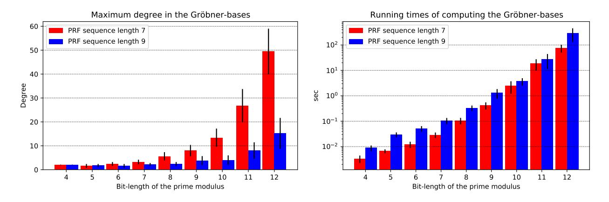
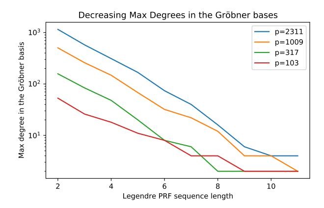
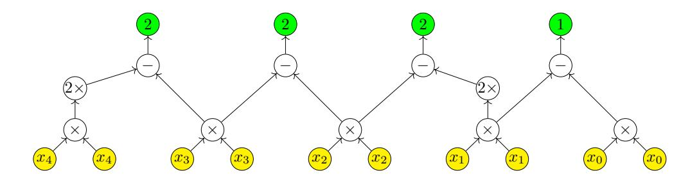
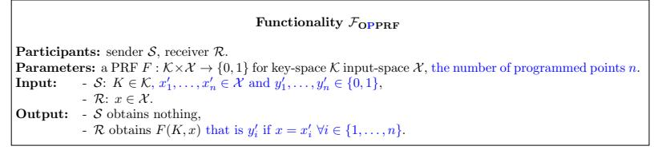
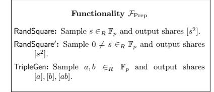

# The Legendre Pseudorandom Function as a Multivariate Quadratic Cryptosystem: Security and Applications\*

István András Seres<sup>1</sup>, Máté Horváth<sup>2,3</sup>, and Péter Burcsi<sup>1</sup>

<sup>1</sup>Eötvös Loránd University, Faculty of Informatics, 3in Research Group <sup>2</sup>Budapest University of Technology and Economics, CrySyS Lab <sup>3</sup>Bergische Universität Wuppertal

November 6, 2022

#### Abstract

Sequences of consecutive Legendre and Jacobi symbols as pseudorandom bit generators were proposed for cryptographic use in 1988. Major interest has been shown towards pseudorandom functions (PRF) recently, based on the Legendre and power residue symbols, due to their efficiency in the multi-party setting. The security of these PRFs is not known to be reducible to standard cryptographic assumptions.

In this work, we show that key-recovery attacks against the Legendre PRF are equivalent to solving a specific family of multivariate quadratic (MQ) equation system over a finite prime field. This new perspective sheds some light on the complexity of key-recovery attacks against the Legendre PRF. We conduct algebraic cryptanalysis on the resulting MQ instance. We show that the currently known techniques and attacks fall short in solving these sparse quadratic equation systems. Furthermore, we build novel cryptographic applications of the Legendre PRF, e.g., verifiable random function and (verifiable) oblivious (programmable) PRFs.

#### 1 Introduction

Zero-knowledge proofs (ZKP) and secure multi-party computation (MPC) protocols are ubiquitous in cryptography. These advanced cryptographic tools are applied and deployed in many applications, e.g., privacy-preserving cryptocurrencies, threshold cryptography and secure instant-messaging. The widespread adoption of ZKPs and MPC protocols necessitates novel symmetric-key primitives [GRR+16]. Traditional symmetric-key primitives, e.g., AES, cause significant overhead in ZKPs or MPC due to their vast multiplicative complexity.

Therefore, recently, revived interest has been shown towards algebraic symmetric key primitives with low multiplicative depth [GRR+16]. Lately, several novel algebraic MACs [DKPW12, CMZ14], hash functions [AGR+16, GKR+21] or algebraic pseudorandom functions [Dam88] have been proposed for cryptographic use. New algebraic constructions with low multiplicative complexity are especially attractive due to their distinguished efficiency properties in ZKPs or MPC protocols. However, this new algebraic design paradigm possibly opens up new avenues for attacks [AABS+20]. The cryptanalysis of these new symmetric-key primitives is an active research field with notable published works. For instance, Albrecht et al. conducted an algebraic cryptanalysis of MARVELlous [AD18] and MiMC hash functions [ACG+19], while Li and Preneel refined interpolation attacks on low algebraic degree cryptosystems [LP19]. One of the most promising cryptosystems for use in ZKPs and MPC protocols is a pseudorandom function (PRF) that is based on quadratic and power residue symbols. Recall that if p is a prime, the Legendre symbol  $\binom{a}{p}$  is 1 if a is a square modulo p and -1 otherwise (the symbol of 0 mod p is 0 by convention). In this work, we focus on the cryptographic security of a PRF family, called the Legendre PRF, and its extensions that are derived from the evaluation of the Legendre symbol.

There exists vast mathematics literature asserting that Legendre and power residue symbols are particularly well suited to be applied in pseudorandom functions since they exhibit high pseudorandomness. One of the first results is due to Pólya and Vinogradov (1918), and later Davenport (1931) cf.[Vin16, Dav31]. They assert that character sums behave like independent fair coin tosses, i.e.,  $\sum_{a=M+1}^{M+N} \binom{a}{p} \leq \sqrt{p} \log p$ . In the

<sup>\*</sup>For any comment on our manuscript, please reach us at istvanseres@caesar.elte.hu, mhorvath@crysys.hu, bupe@inf.elte.hu.

case of Legendre symbols, Peralta extended this result by showing that for any fixed n, n-grams of Legendre symbols are asymptotically equally distributed [\[Per92\]](#page-18-1). Mauduit and S´ark¨ozy introduced several metrics to measure the pseudorandomness of binary sequences and argued that "Legendre symbol sequences are the most natural candidate for pseudorandomness" [\[MS97\]](#page-17-1). Ding et al. confirmed the high linear complexity of Legendre symbol sequences [\[DHS98\]](#page-15-3). T´oth and Gyarmati et al. introduced new pseudorandomness measures and asserted high values of those in Legendre symbol sequences [\[T´ot07,](#page-18-2) [GMS14\]](#page-16-3).

Related work. In spite of the above results, surprisingly, the security guarantees of the Legendre PRF from a cryptographic standpoint are poorly understood. The quantum case is settled whenever a quantum oracle is available for the attacker as polynomial quantum algorithms are known to recover the key of a Legendre PRF [\[vDHI06,](#page-18-3) [RS04\]](#page-18-4). However, if the oracle can only be queried classically, then no efficient quantum algorithm is known. In concurrent and independent work, Frixons and Schrottenloher [\[FS21\]](#page-16-4) investigated the quantum security of the Legendre PRF without quantum random-access to an oracle. While they presented two new attacks in this setting, both of them remain impractical for key-recovery, strengthening the security intuition. On the other hand, in the classical setting, only exponential key-recovery algorithms are known due to Khovratovich [\[Kho19\]](#page-17-2), Beullens et al. [\[BBUV20\]](#page-14-4) and Kaluderovic et al. [\[KKK20\]](#page-17-3). One might ask, whether there could be sub-exponential key-recovery attacks on the Legendre PRF. Damg˚ard in 1988 proposed as an open problem to assess the security and complexity of predicting Legendre or Jacobi symbols. He was contemplating on reducing well-known number-theoretic assumptions to the problem of predicting Legendre or Jacobi symbol sequences [\[Dam88\]](#page-15-1). In this paper, we show connections of the Legendre and Jacobi sequences to a different branch of cryptography, namely, multivariate quadratic cryptography. This study is useful in establishing the security of various cryptographic applications derived from the Legendre PRF, e.g. the digital signature scheme by Beullens et al. [\[BdSG20\]](#page-15-4).

Our contributions. In this work, we make the following contributions.

Legendre PRF as an MQ instance. We show that key-recovery attacks on the Legendre PRF are equivalent to solving a specific family of sparse multivariate quadratic equation system over a finite field. Moreover, the weak unpredictability of the PRF is reducible to the decidability of the aforementioned equation system. These connections naturally extend to higher-degree Legendre PRFs and power residue symbol PRFs.

Algebraic cryptanalysis. We conduct the first algebraic cryptanalysis on the MQ instance induced by the Legendre PRF. We find that the Legendre PRF is immune to interpolation, direct (Gr¨obner basis) and rank attacks. We also present algebraic geometric arguments to support the complexity of finding solutions in these sparse MQ instances over a finite field. However, all these standard cryptanalytic tools from multivariate cryptography do not improve the state of the art key recovery attacks against the Legendre PRF [\[Kho19,](#page-17-2) [BBUV20,](#page-14-4) [KKK20\]](#page-17-3). On the other hand, we find that the induced MQ instances behave like random MQ instances in terms of degree of regularity, i.e., the corresponding ideals are semi-regular. This observation might be interpreted as evidence of the difficulty of breaking the Legendre PRF.

Novel cryptographic applications of the Legendre PRF. Besides assessing the security of the Legendre PRF, we utilise its special properties to apply it in various cryptographic tasks. Expressing the Legendre PRF as an MQ instance facilitates novel cryptographic applications, i.e., verifiable random functions. Moreover, we exploit its multiplicativity to construct (verifiable) oblivious (programmable) pseudorandom functions. Due to their efficiency, these novel extensions can be applied in several cryptographic protocols, such as state-of-the-art private set intersection (PSI) protocols.

Organisation. This paper is organised as follows. In Section [2,](#page-1-0) we provide the necessary background on Legendre symbols and related hard cryptographic problems. In Section [3,](#page-3-0) we show that key-recovery attacks against the Legendre PRF are equivalent to solving a specific MQ instance. In Section [4,](#page-6-0) we analyze the security of the MQ instance induced by the Legendre PRF. We realize several cryptographic primitives from the Legendre PRF in Section [5.](#page-8-0) Finally, we conclude our paper in Section [6](#page-14-5) by pointing out future directions.

## <span id="page-1-0"></span>2 Preliminaries

Notations. Whenever we sample x from set S uniformly at random we write x ∈<sup>R</sup> S. Let p be an odd prime and let K ∈<sup>R</sup> F<sup>p</sup> be a secret key. The modular square root algorithm mod p is denoted as sqrt<sup>p</sup> (·). Vectors of group elements are denoted in bold. In the following, n, m denote the number of variables and equations, respectively. Throughout this work, we will work in the multivariate polynomial ring  $\mathbb{F}_p[x_1,\ldots,x_n]$  over a finite field  $\mathbb{F}_p$ . LT(I) denotes the ideal generated by the leading terms of the ideal I. For the ease of exposition we use [x] to denote a secret share of the value  $x \in \mathbb{F}_p$ .

**Background on the Legendre PRF.** Damgård proposed using the sequence of consecutive Legendre symbols with respect to a large prime p for "pseudorandom bit generation" [Dam88].

**Definition 2.1 (Sequential Legendre PRF)** Let p be a prime, depending on the security parameter  $\lambda$ , then let  $\{a\}_K$  denote the following sequence:

<span id="page-2-0"></span>
$$\{a\}_K := \left(\frac{K}{p}\right), \left(\frac{K+1}{p}\right), \dots, \left(\frac{K+a-1}{p}\right).$$

Damgård conjectured that the sequence is pseudorandom, when starting at a secret K. Sometimes, it is easier to work with bits, rather than the original Legendre symbols themselves, therefore the Legendre PRF is defined with Boolean output (for a key- and input-space  $\mathbb{F}_p$ ).

**Definition 2.2 (Legendre pseudorandom function)** The function  $L_K(x)$  is defined by mapping the corresponding Legendre symbol to  $\{0,1\}$ , i.e.,

$$L_K(x) = \left\lfloor \frac{1}{2} \left( 1 - \left( \frac{K+x}{p} \right) \right) \right\rfloor.$$

**Definition 2.3 (Weak Unpredictability)** A pseudo-random bit-generator  $\mathcal{X}_{\lambda}(s): \{0,1\}^{\lambda} \to \{0,1\}^{l(\lambda)}$ , where s is a seed and  $l(\cdot)$  is an expansion factor, is next bit unpredictable (sometimes weakly unpredictable) if for all probabilistic polynomial time algorithm  $\mathcal{A}$ , there is a negligible function  $\operatorname{negl}(\lambda)$  such that

$$\Pr[\mathcal{A}(x_1, x_2, \dots, x_{l(\lambda)-1}) = x_{l(\lambda)}] \le \frac{1}{2} + \mathsf{negl}(\lambda),$$

where the sequence  $X = x_1 x_2 \dots x_{l(\lambda)}$  is generated by  $\mathcal{X}_{\lambda}(s)$  with  $s \in_R \{0,1\}^{\lambda}$ .

**Assumptions.** Grassi et al. formulated the following problem that underpins the security of the Legendre PRF [GRR<sup>+</sup>16].

**Definition 2.4 (Shifted Legendre Symbol (SLS) Problem)** Let K be uniformly sampled from  $\mathbb{F}_p$ , and define  $\mathcal{O}_{Leg}$  to be an oracle that takes  $x \in \mathbb{F}_p$  and outputs  $\left(\frac{K+x}{p}\right)$ . Then the Shifted Legendre Symbol (SLS) problem is to find K given oracle access to  $\mathcal{O}_{Leg}$  with non-negligible probability.

It is conjectured that no classical adversary running in sub-exponential time could recover the hidden shift K. One might also consider generalisations of the problem, such as changing the linear polynomial to a secret degree-d polynomial in the Legendre symbol evaluations or changing the quadratic symbol to an rth power residue symbol.

**Definition 2.5 (Multivariate Quadratic (MQ) problem)** Given random quadratic polynomials over a finite field, i.e.,  $(f_1(x_1,\ldots,x_n),\ldots,f_m(x_1,\ldots,x_n)) \in \mathbb{F}[x_1,\ldots,x_n]^m$ , find a common zero  $\mathbf{x} \in \mathbb{F}^n$  of the polynomials  $f_1,\ldots,f_m$ .

It is well-known that the MQ problem is **NP**-hard for any choice of finite field  $\mathbb{F}$  [GJ79]. In cryptographic applications,  $\mathbb{F}$  is often  $\mathbb{F}_2$  or an extension of it. However, throughout this work, we consider MQ problems over  $\mathbb{F}_p$ , for some large prime p. The MQ problem is one of the major candidates on which post-quantum secure cryptosystems can be based. Currently, there are no known sub-exponential algorithms to solve the MQ problem.

**NIZK Arguments.** Since in our VRF proposal we make use of non-interactive zero-knowledge (NIZK) arguments, we recall the relevant syntax following [BFM19] and for the details and exact security requirements we refer to [BFM19]. NIZK arguments consist of four PPT algorithms that are defined with respect to a relation generator algorithm  $\mathcal{R}\text{-}\mathsf{Gen}(1^{\lambda})$  that, upon receiving some security parameter  $\lambda$ , outputs a polynomial time decidable relation  $\mathcal{R}: \{0,1\}^* \times \{0,1\}^*$  for which in our case  $\{(\phi, \mathsf{w}) \in \mathcal{R} \mid \phi(\mathsf{w}) = 0\}$ , where the statement  $\phi$  is a MQ equation system over  $\mathbb{F}_p$  and a valid witness  $\mathsf{w}$  is a solution of the system.

• NIZK.Setup( $\mathcal{R}$ )  $\to$  ( $\sigma$ , $\tau$ ). For the relation  $\mathcal{R}$  the setup produces a common reference string  $\sigma$  and a simulation trapdoor  $\tau$ .

- NIZK.Prove $(\mathcal{R}, \sigma, \phi, w) \to \pi$ . Upon the  $(\phi, w) \in \mathcal{R}$  and the common reference string  $\sigma$ , the prover returns an argument  $\pi$ .
- NIZK.Vfy( $\mathcal{R}, \sigma, \phi, \pi$ )  $\rightarrow$  {0, 1}. Upon the common reference string  $\sigma$ , the statement  $\phi$  and an argument  $\pi$  the verification algorithm returns 0 or 1.
- NIZK.Sim $(\mathcal{R}, \tau, \phi) \to \pi$ . Using the simulation trapdoor  $\tau$  and statement  $\phi$  the simulator returns an argument  $\pi$ .

**Definition 2.6 (Perfect NIZK argument [BFM19])** We say that a NIZK is a perfect NIZK argument for  $\mathcal{R}$  if it has perfect completeness, perfect zero-knowledge and computational soundness as defined in [BFM19].

## <span id="page-3-0"></span>3 The Legendre PRF as an MQ instance

Hereby, we describe how to express the sequential Legendre PRF, cf. Definition 2.1, as a multivariate quadratic equation system. We remark that in a similar fashion, all the variants (higher-degree) and extensions (power-residue and Jacobi PRF) of the sequential Legendre PRF could be expressed as a suitable MQ instance. Most of our results and observations can be easily ported to those MQ instances as well. Therefore, in this work, we solely focus on the sequential Legendre PRF.

#### <span id="page-3-5"></span>3.1 The Ideal

Let us fix an arbitrary quadratic non-residue  $r \in \mathbb{Z}_p^*$ . Furthermore, it is assumed that we are given  $\{a\}_K$ , often  $a \approx \log(p)$ . Let  $b_i := \left(\frac{K+i}{p}\right)$  and  $x_i$  be the corresponding unknown. We think of the unknown  $x_i$  as the square root of K+i if  $b_i=1$ , otherwise  $x_i$  denotes the square root of r(K+i), which is a quadratic residue. Therefore, for each pair of neighboring Legendre symbols  $(b_i, b_{i+1})$ , we define a unique quadratic equation. If  $b_i = b_{i+1} = 1$ , then we know that  $x_{i+1}^2 = K + i + 1$  and  $x_i^2 = K + i$ , hence

<span id="page-3-1"></span>
$$x_{i+1}^2 - x_i^2 = 1. (1)$$

If  $b_i = b_{i+1} = -1$ , then we have that  $x_{i+1}^2 = r(K+i+1)$  and  $x_i^2 = r(K+i)$ , hence

<span id="page-3-2"></span>
$$x_{i+1}^2 - x_i^2 = r. (2)$$

Finally if  $b_i = 1 = -b_{i+1}$  or  $b_i = -1 = -b_{i+1}$  then we obtain the following two quadratic equations:

<span id="page-3-3"></span>
$$x_{i+1}^2 - rx_i^2 = r, x_{i+1}^2 - r^{-1}x_i^2 = 1.$$
 (3)

Altogether, this allows us to efficiently transform any Legendre symbol sequence into an equivalent multivariate quadratic equation system. If we have n Legendre symbols, then we obtain m = n - 1 independent equations in n variables, hence the MQ instance is underdefined. Note, that the equation system is extremely sparse.

<span id="page-3-4"></span>**Example 1** We consider the following example to illustrate the quadratic equation system induced by the Legendre PRF. Let p = 0xfffffffffffffffffffffffffffdd and K = 0x27aaa97c746c22e12d10. The smallest quadratic non-residue modulo p is 2. We display the MQ instance induced by the evaluation of the sequential Legendre PRF,  $\{5\}_K = (1,1,-1,-1,1)$ . Each consecutive Legendre symbol pairs define an equation. The ideal corresponding to  $\{5\}_K$  has the following form:

$$\langle x_1^2-x_0^2-1, x_2^2-2x_1^2-2, x_3^2-x_2^2-2, x_4^2-2^{-1}x_3^2-1\rangle.$$

Let  $I := \langle f_1, f_2, \dots, f_m \rangle$  be the ideal generated by the quadratic polynomials defined by Equations 1, 2 and 3. We want to solve simultaneously this equation system, i.e., finding points in the variety V(I). If the sequence of Legendre symbols is long enough, heuristically  $\mathcal{O}(\log p)$ , then there are  $\mathcal{O}(1)$  solutions in  $\mathbb{F}_p$  (only considering solutions where  $x_i \in [0, \frac{p-1}{2}]$  for all i) and one of them corresponds to the secret key K of the PRF. Note that V(I) might contain additional solutions when considered above the algebraic closure  $\overline{\mathbb{F}}_p$ .

#### 3.2 The Gröbner basis

To better understand the variety V(I), first we describe the Gröbner basis of I [Buc65]. Interestingly, we can easily compute the Gröbner basis of I regardless of the size of p or the length of the Legendre sequence  $\{a\}_K$ .

**Theorem 3.1** Given a Legendre symbol sequence  $\{n\}_K = (b_0, \ldots, b_{n-1})$  and its corresponding ideal  $I = \langle f_1, f_2, \ldots, f_m \rangle$ , where m = n - 1 as defined by the Equations 1, 2 and 3, its Gröbner basis with respect to the (graded) lexicographic ordering, consists of the polynomials  $g_i$ , for  $i \in [0, n-2]$  such that,

$$g_{i} = \begin{cases} x_{i}^{2} - x_{n-1}^{2} + (n-i), & \text{if } b_{n-1} = 1 \land b_{i} = 1\\ x_{i}^{2} - rx_{n-1}^{2} + r(n-i), & \text{if } b_{n-1} = 1 \land b_{i} = -1\\ x_{i}^{2} - r^{-1}x_{n-1}^{2} + (n-i), & \text{if } b_{n-1} = -1 \land b_{i} = 1\\ x_{i}^{2} - x_{n-1}^{2} + r(n-i), & \text{if } b_{n-1} = -1 \land b_{i} = -1 \end{cases}$$

$$(4)$$

Specifically,  $I = \langle g_0, \dots, g_{n-2} \rangle$  and  $G := (g_i)_{i=0}^{n-2}$  is a reduced Gröbner basis.

**Proof:** With a case distinction one can show that G generates I. For instance, if  $b_i = b_j = b_{n-1} = 1$ , then  $g_i - g_j = f_i$ . The other cases are similar. Thus  $I \subset \langle G \rangle$ .

By the Buchberger-criterion, we only need to verify that for all i, j, it holds that the S-polynomial  $S(g_i, g_j)$  divided by the Gröbner basis has no remainder, i.e.,  $\overline{S(g_i, g_j)}^G = 0$ . This follows from Buchberger's product criterion but we include the following simple proof for completeness. We let i < j and hereby solely consider the case when  $b_i = b_j = b_{n-1} = 1$ . The rest of the cases result in a similar calculation. By the definition of the S-polynomials, we have  $S(g_i, g_j) = x_j^2 g_i - x_i^2 g_j$ . First, we divide  $S(g_i, g_j)$  by  $g_i$ . We observe that the remainder of the polynomial division is  $g_j(x_{n-1}^2 - (n-i))$ , which is divisible by  $g_j$ . Therefore, indeed  $\overline{S(g_i, g_j)}^G = 0$ . Hence, the polynomials in G indeed form a Gröbner basis.

G is reduced, since all of its basis polynomials have a leading coefficient one. Moreover,  $\langle \mathsf{LT}(g_i) \rangle = \langle \mathsf{LT}(I) \rangle$  and no trailing term of any  $g_i \in G$  lies in  $\langle \mathsf{LT}(I) \rangle$ .

**Example 2** The Gröbner basis of the polynomials corresponding to the Legendre symbol sequence  $\{5\}_K$ , from Example 1, consists of the following quadratic bi-variate polynomials:

$$\langle x_0^2 - x_4^2 + 4, x_1^2 - x_4^2 + 3, x_2^2 - 2x_4^2 + 4, x_3^2 - 2x_4^2 + 2 \rangle$$

We remark that one can view the resulting equation system as a simultaneous Pell-equation system over  $\mathbb{F}_p$ . Each polynomial in the Gröbner basis is quadratic, bi-variate and has p-1 solutions in  $\mathbb{F}_p$ . Put differently, seemingly no elimination ideal turns out to be helpful in finding a common zero.

First, we observe that the polynomials in I lack any special internal structure, i.e., the only relations holding are the trivial ones. More formally, the m=n-1 multivariate quadratic polynomials of I in n variables define a regular ideal, i.e., V(I) is a 1-dimensional variety, namely, it contains an infinite number of solutions in  $\overline{\mathbb{F}}_p$ . The proof of the following lemma is in Appendix B.

<span id="page-4-2"></span>Lemma 3.2 I is a regular ideal.

#### <span id="page-4-3"></span>3.3 The Field Equations

As we have seen previously the corresponding variety V(I) of the ideal I has dimension 1. However, in the cryptanalysis of the Legendre PRF, we wish to obtain a 0-dimensional variety that contains the secret key K of the PRF. As we show, this can be achieved by adding the field equations to the ideal I.

A sequence  $\{n\}_K$  can be described with polynomials in  $\mathbb{F}_p[x_0, x_1, \dots, x_n]$ . Let us define  $I_{\mathsf{FE}}$  as follows:

<span id="page-4-1"></span>
$$I_{\mathsf{FE}} = I + \{x_i^p - x_i | i \in [0, n]\}. \tag{5}$$

<span id="page-4-0"></span>**Example 3** We illustrate the ideal  $I_{\mathsf{FE}}$  complemented with the field equations with parameters p = 191 and  $\{9\}_{45} = (1, 1, -1, 1, 1, 1, 1, 1, 1, 1)$ . The smallest quadratic non-residue is  $r = 7 \mod 191$ .

$$\begin{split} I_{\mathsf{FE}} &= \langle -x_0^2 + x_1^2 - 1, -7x_1^2 + x_2^2 - 7, -x_2^2 + 7x_3^2 - 7, -x_3^2 + x_4^2 - 1, \\ &- x_4^2 + x_5^2 - 1, -x_5^2 + x_6^2 - 1, -x_6^2 + x_7^2 - 1, -7x_7^2 + x_8^2 - 7, \\ &x_0^{191} - x_0, x_1^{191} - x_1, x_2^{191} - x_2, x_3^{191} - x_3, x_4^{191} - x_4, \\ &x_5^{191} - x_5, x_6^{191} - x_6, x_7^{191} - x_7, x_8^{191} - x_8 \rangle. \end{split}$$

The corresponding Gröbner basis has the following form,

$$\langle x_0^2 - 45, x_1^2 - 46, x_2^2 + 53, x_3^2 - 48, x_4^2 - 49, x_5^2 - 50, x_6^2 - 51, x_7^2 - 52, x_8^2 + 11 \rangle$$

Note how helpful the Gröbner bases are in obtaining the secret key K. In addition, one can also read off all the evaluated points from the Gröbner bases. If the variable  $x_i$  corresponds to a residue, then  $x_i^2$  is one of the evaluated points in the PRF. Alternatively, if  $x_i$  corresponds to a non-residue, then  $r^{-1}x_i^2 \mod p$  is the evaluated point in the PRF.

Using the intuition of the Example 3, we can show in general the structure of the Gröbner basis of  $I_{FE}$ .

**Theorem 3.3** Let  $\{n\}_K = (b_0, \ldots, b_{n-1})$  be a Legendre symbol sequence for which there exists a unique key K. We consider its corresponding ideal complemented with the field equations  $I_{\mathsf{FE}} = \langle f_1, f_2, \ldots, f_m \rangle$ , where m = 2(n-1) + 1 as defined by Equation 5. Then the Gröbner basis of  $I_{\mathsf{FE}}$  with respect to the (graded) lexicographic ordering, consists of the polynomials  $g_i$ , for  $i \in [0, n-1]$  such that,

<span id="page-5-0"></span>
$$g_i = \begin{cases} x_i^2 - (K+i), & \text{if } b_i = 1\\ x_i^2 - r(K+i), & \text{if } b_i = -1 \end{cases}$$
 (6)

Moreover,  $G := (g_i)_{i=0}^{n-1}$  is a reduced Gröbner basis.

**Proof:** G generates the ideal  $I_{\mathsf{FE}}$ , since each  $f_i$  can be expressed by using the generators  $g_i$ . The generating polynomials  $f_i$  of the ideal I can be expressed as  $f_i = r^{L_0(K+i+1)}g_{i+1} - r^{L_0(K+i)}g_i$ . The field polynomials can be also expressed using the generators of G. Specifically, let us denote the modular square roots of  $r^{L_0(K+i)}(K+i)$  as b and c. Then,  $x_i^p - x_i = g_i \Pi_{a \neq b,c}(x-a)$ . Hence,  $I_{\mathsf{FE}} \subset \langle G \rangle$ . By the uniqueness of K, we also have that  $\langle G \rangle \subset I_{\mathsf{FE}}$ , since the corresponding varieties are equal above the algebraic closure.

Next, we verify that the Buchberger-criterion holds for the polynomials in G. In this case,  $S(g_i, g_j) = x_j^2 g_i - x_i^2 g_j$ . Depending on the residuosity of  $b_i, b_j$  we have four cases, but for the sake of simplicity we only consider here the case of  $b_i = b_j = 1$ . The other cases follow similarly. The S-polynomial is divisible by G, since  $S(g_i, g_j) = x_j^2 (x_i^2 - (K+i)) - x_i^2 (x_j^2 - (K+j)) = -(K+i)x_j^2 + (K+j)x_i^2 = (K+j)g_i - (K+i)g_j$ , that is clearly divisible by the polynomials of G.

G is clearly a reduced Gröbner basis as each leading coefficient is one and no monomial of  $g_i$  lies in  $\langle \mathsf{LT}(G \setminus g_i) \rangle$ .

In Section 4, we evaluate empirically the time complexity of computing the Gröbner basis of MQ instances (the  $I_{\sf FE}$  ideal) induced by Legendre PRF sequences. The ideal  $I_{\sf FE}$  cannot be regular as it contains more polynomials than variables. However, the Gröbner basis of  $I_{\sf FE}$  allows us to observe easily that in  $I_{\sf FE}$  there are no internal dependencies between the ideal's generating polynomials. More precisely, we prove the following lemma in Appendix B.

Lemma 3.4 I<sub>FE</sub> is a semi-regular ideal, if the conditions of Theorem 3.3 are met.

The asymptotic behavior of the degree of regularity of semi-regular ideals is well understood [BFSY05]. The degree of regularity  $d_{reg}$  of an ideal is a measure to assess the theoretical complexity of computing the Gröbner basis of an ideal. For a precise definition, the reader is referred to [CLO13]. Finally, we show the usefulness of  $I_{FE}$  in connection with the Legendre PRF.

**Lemma 3.5** A successful Legendre key-recovery attack is equivalent in polynomial time to solving the MQ system defined by the ideal  $I_{\mathsf{FE}}$ . On the other hand, the weak unpredictability of the Legendre PRF is equivalent to the decidability of the induced MQ instance over the finite prime field.

**Proof:** Let us define the variety V and ideal I defined by the Legendre PRF evaluation  $\{n\}_K$ . More precisely, we fix a quadratic non-residue  $r \in \mathbb{F}_p$ . In polynomial-time, we construct  $V^* = \{(x_0, x_1, \ldots, x_n) | x_i = \pm \operatorname{sqrt}_p(r^{L_K(i)}(K+i)), i \in [0, n-1]\}$ . The corresponding ideal is denoted as  $I^*$ . We show that  $V^* = V(I_{\mathsf{FE}})$ . First,  $V^* \subset V(I_{\mathsf{FE}})$ , because this is how the polynomials in  $I_{\mathsf{FE}}$  are constructed, such that all the points in  $V^*$  vanish on the polynomials of  $I_{\mathsf{FE}}$ . The other inclusion is trivial by the construction of the polynomials of  $I_{\mathsf{FE}}$ .  $I_{\mathsf{FE}}$  is a radical ideal, since every ideal that contains its field equations is a radical ideal [Ull12, Lemma 2.2.3.]. Hence,  $I_{\mathsf{FE}}$  is the smallest ideal that vanishes on  $V^*$ .

As for the unpredictability of the Legendre PRF, if the MQ system corresponding to a purported PRF evaluation is not solvable, then it is sure that the psuedorandom sequence is not obtained by evaluating the Legendre PRF.

We highlight again the sparsity of the induced MQ instance. This is in contrast with most MQ public-key cryptosystems, where the MQ instance is generated uniformly at random by the signer or encryptor.

Typically, a random MQ instance has many non-zero coefficients resulting in large public keys. Contrarily, in the case of the Legendre PRF, the MQ instances exhibit a specific structure (cf. Example 1, 3) stemming from the multiplicative group of  $\mathbb{F}_p$ . Interestingly, if a single coefficient in the Legendre MQ instance became 0, then the whole equation system suddenly would be trivially solvable by "back-substitution".

In Section 4, we turn our attention to assessing the security of the MQ instance induced by the Legendre PRF. In particular, we assess the complexity of solving the particular equation systems. According to [HLY12], in order to prove the security of a multivariate PRF, it suffices to show that the family of MQ instances  $\mathbf{f}$  induced by the PRF is hard to solve. This is because then the distributions  $D_1 = (\mathbf{f}, \mathbf{f}(x_0, x_1, \dots, x_{n-1}))$  and  $D_2 = (\mathbf{f}, U_m)$  are computationally indistinguishable, where  $U_m$  is a uniform distribution over  $\mathbb{F}_p^m$  [HLY12].

## <span id="page-6-0"></span>4 Security of the Legendre PRF as MQ instances

In this section, we evaluate the complexity of a key recovery attack on the Legendre PRF as an MQ instance. We find that direct attacks, solvers and other traditional algebraic attacks (interpolation attacks, MinRank etc.) do not improve on the state-of-the-art classical attack due to Kaluderovic et al [KKK20].

### 4.1 Algebraic Cryptanalytic Attempts

**Interpolation Attacks** Interpolation attacks aim to interpolate a cryptosystem's polynomial without knowing its secret key [JK97]. In a single party setting, the Legendre PRF is typically evaluated more than once for a particular key K, i.e.,  $\{a\}_K$  is used as a pseudorandom bit-string, where a > 0. In these cases, the resulting bit-string is mapped to integers, for instance, in the following way,

$$F_K(a) = \sum_{i=0}^{a-1} 2^{a-1-i} (K+i)^{\frac{p-1}{2}} \mod p \tag{7}$$

Note that  $deg(F_K(a)) = \frac{p-1}{2}$ , i.e., the degree of the polynomial representing the Legendre PRF has almost full degree over  $\mathbb{F}_p$ , that is exponential in the security parameter. The polynomial is dense (all possible monomials appear) and no coefficient is dependent on the key K. These properties make interpolation attacks infeasible as they would require at least  $\frac{p-1}{2}+1$  pairs of keys and pseudorandom field elements to interpolate  $F_K(a)$ .

Direct Algebraic Attacks Direct algebraic attacks, i.e., computing the Gröbner basis [Buc65], aim to directly solve the cryptosystem's underlying MQ instance. The computational complexity of these attacks is equivalent to that of computing the Gröbner basis [SKI04], which in turn depends on the degree of regularity,  $d_{reg}$ , of the MQ instance at hand. Hence, it is of great interest to compute  $d_{reg}$  of an MQ cryptosystem. However, in many cases, this is not possible without actually calculating the Gröbner basis itself. For m equations of degree at most d in n variables, the arithmetic complexity of Gröbner basis computation are  $2^{2^{\mathcal{O}(n)}}$  in general and  $\mathcal{O}\left(m \cdot \binom{n+d_{reg}-1}{n}^{\omega}\right)$  in case of 0-dimensional regular systems, where  $2 \le \omega \le 3$  is the linear algebra constant of matrix multiplication.

<span id="page-6-1"></span>

Figure 1: The maximum degree in the Gröbner basis (left) and the exponential time complexity of computing the Gröbner bases (right) for the ideals  $I_{\mathsf{FE}}$  defined by the Legendre PRF.



<span id="page-7-0"></span>Figure 2: The maximum degrees in the Gröbner basis of the ideal  $I_{FE}$  as a function of the Legendre PRF sequence length.

| $\underline{}$ $m$ | 1 | 2 | 3 | 4 | 5  | 6  | 7   | 8   | 9   | 10   |
|--------------------|---|---|---|---|----|----|-----|-----|-----|------|
| genus              | 0 | 1 | 1 | 5 | 17 | 49 | 129 | 321 | 769 | 1793 |

Figure 3: The genus of the algebraic curves containing the solutions corresponding to a Legendre symbol sequence of length m + 1.

We empirically evaluated the performance of computing the Gröbner basis for the ideal  $I_{\text{FE}}$  induced by the PRF evaluations, see Figure 1. We sampled random small primes with a given bit-length and evaluated the Legendre PRF for a sequence of length seven and nine. We computed and recorded the time it takes to compute the Gröbner basis of the corresponding ideal  $I_{\text{FE}}$ . We repeated the experiment 10 times. We observe that computing the Gröbner basis takes exponential time in the bit-length of the prime modulus. We expect that launching key-recovery against the Legendre PRF using Gröbner basis methods is hopeless for cryptographic parameter sets, i.e., for primes of size  $\approx 2^{128}$ . Attaining lower and upper bounds for  $d_{reg}$  to assess the exact complexity of the Gröbner basis computation of  $I_{FE}$  is an interesting open problem.

MinRank Attacks The MinRank attack is a powerful tool in the cryptanalysis of multivariate cryptography. MinRank attacks broke numerous multivariate cryptosystems, such as the cryptanalysis of HFE due to Kipnis and Shamir [KS99] or the cryptanalysis of SRP encryption system [PPST17]. In the following, we show that the Legendre PRF has high Q-rank, therefore it is immune to MinRank attacks. For the complete calculation the reader is referred to Appendix E.1.

#### <span id="page-7-1"></span>4.2 Group Structure of the Legendre PRF MQ Instances' Solutions

We give an algebraic-geometric argument on the security of the Legendre PRF. In Section 3.1, we showed that the PRF seed lies in the intersection of multiple Pell-conics. The solutions of a single Pell-equation over  $\mathbb{F}_p$  form a cyclic Abelian-group [Déc07]. These groups were previously suggested for use in cryptography as it is believed that the discrete logarithm problem is hard in these groups [Lem03]. A single Pell conic has genus 0. The intersection of two Pell-conics yields a nonsingular elliptic curve with genus 1. Specifically, if one wants to find every secret key K that results in a 3-long specific binary sequence produced by the Legendre PRF, e.g. (1,-1,1), then every satisfying secret key K is a rational point on a sequence-specific elliptic curve. However, if one considers longer sequences, then the resulting curve has a genus greater than 1, cf. Figure 3. Hence, the solutions of those algebraic curves do not have an Abelian group structure equipped with them. In the following, we compute the genus of the high-degree surfaces induced by the Legendre PRF in the general case.

We want to calculate the genus of the algebraic curve containing the solutions of a Legendre PRF keyrecovery attack. More formally, we want to compute 1-P(0), where  $P(\cdot)$  is the Hilbert-polynomial of the curve defined by the intersection of several Pell conics. Let  $(f_1, f_2, \ldots, f_m)$  be the given Pell conics in variables  $x_0, x_1, \ldots, x_n$  and I the corresponding ideal generated by them. Note that n denotes the length of the given Legendre sequence. For  $N \gg 0$ , we have that P(N) is the dimension over  $\mathbb{F}_p$  of the degree-Nhomogeneous part of  $\mathbb{F}_p[x_0, \ldots, x_n]/I$  [Har13]. This is a linear polynomial. Since for all  $i, j, i \neq j$  we have  $(f_i, f_i) = 1$ , we obtain the following inclusion-exclusion type equation,

<span id="page-8-3"></span>
$$P_n(N) = g_n(N) - \binom{n-1}{1} g_n(N-2) + \binom{n-1}{2} g_n(N-4) - \dots,$$
 (8)

where  $g_n(N)$  denotes the number of N-degree monomials in  $\mathbb{F}_p[x_0,\ldots,x_n]$ . Therefore,  $g_n(N) = \binom{N+n}{n}$ . For concreteness and as an example let us consider the case of four intersecting Pell-conics, i.e., Legendre-sequences of length five. We have the following expression for the Hilbert-polynomial, when n=4:

$$P_4(N) = \binom{N+4}{4} - 3\binom{N+2}{4} + 3\binom{N}{4} - \binom{N-2}{4}. \tag{9}$$

By substituting N = 0, we have that  $P_4(0) = -4$ , namely the arithmetic genus is  $1 - P_4(0) = 5$ . We obtain the following closed formula for the Hilbert-polynomial:

**Lemma 4.1**  $P_n(N) = 2^{(n-1)} \cdot N - (n-3) \cdot 2^{(n-2)}$ .

**Proof:** The proof is enclosed in Appendix E.2

## <span id="page-8-0"></span>5 Extensions of the Legendre PRF

In this section, we construct various extensions of the Legendre PRF and compare them with other state-of-the-art constructions. We build verifiable random functions in Section 5.1, oblivious pseudorandom functions (OPRF) in Section 5.2 and verifiable OPRF in Appendix G.

#### <span id="page-8-1"></span>5.1 Verifiable Random Functions from the Legendre PRF

Verifiable random functions (VRFs) are natural extensions of PRFs [MRV99]. In a VRF, the PRF evaluator can produce a publicly verifiable proof about the correct evaluation of the PRF  $F_K(x)$  given the PRF input x, the output  $F_K(x) = y$  and a public verification key, without revealing anything about the secret key K. In many applications, in addition to the efficient production of pseudorandom strings, one also needs to prove the correctness of those pseudorandom bits, e.g., proof-of-stake consensus algorithms [GHM<sup>+</sup>17].

An advantage of the Legendre PRF arithmetization as an MQ instance, is that it allows to model the PRF as a low-degree polynomial equation system. This arithmetization easily facilitates the construction of efficient Legendre VRFs. By contrast, if one models the Legendre PRF as a high-degree  $\frac{p-1}{2}$  univariate polynomial by Euler's criterion, then it hinders applying efficient proof systems for the correct evaluation statement. Building on this observation and using NIZK with the Legendre PRF (following the high-level approach sketched in [MRV99]), we propose a new VRF that admits post-quantum secure instantiations with comparable performance to the state of the art.

#### <span id="page-8-2"></span>Syntax and Security of VRFs

**Definition 5.1** A verifiable random function is comprised of the following four polynomial-time algorithms VRF = (VRF.PPGen, VRF.Gen, VRF.Eval, VRF.Vfy) with the following functionality:

- VRF.PPGen $(1^{\lambda}) \to pp_{vrf}$ . Upon the security parameter  $\lambda$ , the algorithm samples the public parameters  $pp_{vrf}$ .
- VRF.Gen(pp<sub>vrf</sub>)  $\rightarrow$  (sk, vk). Upon pp<sub>vrf</sub>, the algorithm samples secret and verification keys (sk, vk).
- VRF.Eval(pp<sub>vrf</sub>, sk, X)  $\rightarrow$  (Y,  $\pi$ ). This algorithm evaluates a PRF F:  $\{0,1\}^{\lambda} \times \{0,1\}^{\lambda} \rightarrow \{0,1\}^{\lambda}$  using the public parameters pp<sub>vrf</sub>, secret key sk and PRF input X and outputs the PRF value Y and a proof of honest evaluation  $\pi$ .
- VRF.Vfy(pp<sub>vrf</sub>, vk,  $X, Y, \pi$ )  $\rightarrow$  {0,1}. Upon the public parameters pp<sub>vrf</sub>, verification key vk, PRF inputoutput pair X, Y and proof  $\pi$ , the verification algorithm either outputs 1 (accept) or 0 (reject).

Furthermore, the following requirements must hold:

1. Correctness:  $\forall \lambda \in \mathbb{N}$ ,  $\mathsf{pp}_{\mathsf{vrf}} \leftarrow \mathsf{sVRF}.\mathsf{PPGen}(1^{\lambda})$ ,  $input\ X \in \{0,1\}^{\lambda}$ ,  $keys\ (\mathsf{vk},\mathsf{sk}) \leftarrow \mathsf{sVRF}.\mathsf{Gen}(\mathsf{pp}_{\mathsf{vrf}})$ , and  $(Y,\pi) \leftarrow \mathsf{sVRF}.\mathsf{Eval}(\mathsf{pp}_{\mathsf{vrf}},\mathsf{sk},X)$  it must hold that  $\mathsf{VRF}.\mathsf{Vfy}(\mathsf{pp}_{\mathsf{vrf}},\mathsf{vk},X,Y,\pi) = 1$ .

2. Trusted computational unique provability:  $\forall \lambda \in \mathbb{N}, X \in \{0,1\}^{\lambda}$  and PPT adversary  $\mathcal{A}$ , there exists a negligible function  $\operatorname{negl}(\lambda)$  s.t.

$$\Pr\left[ \begin{array}{ccc} \mathsf{VRF}.\mathsf{Vfy}(\mathsf{pp}_{\mathsf{vrf}},\mathsf{vk},X,Y_0,\pi_0) &= \\ \mathsf{VRF}.\mathsf{Vfy}(\mathsf{pp}_{\mathsf{vrf}},\mathsf{vk},X,Y_1,\pi_1) &= 1 \\ (\mathsf{vk},X,Y_0,Y_1,\pi_0,\pi_1) \leftarrow_{\$} \mathcal{A}(\mathsf{pp}_{\mathsf{vrf}}) \\ Y_0 \neq Y_1 \end{array} \right] \leq \mathsf{negl}(\lambda) \qquad (10)$$

3. Pseudorandomness: Let  $\mathcal{A} = (\mathcal{A}_1, \mathcal{A}_2)$  be an attacker with oracle access to VRF.Eval(pp<sub>vrf</sub>, sk, ·) in the following pseudoramndomness game:

<span id="page-9-2"></span>
$$\begin{split} & \underline{\mathcal{G}_{\mathcal{A}}^{\mathcal{VRF}}(1^{\lambda})} \\ & \operatorname{pp}_{\operatorname{vrf}} \leftarrow_{\mathbb{S}} \operatorname{VRF.PPGen}(1^{\lambda}) \\ & (\operatorname{vk},\operatorname{sk}) \leftarrow_{\mathbb{S}} \operatorname{VRF.Gen}(\operatorname{pp}_{\operatorname{vrf}}), \rho_{\mathcal{A}} \leftarrow_{\mathbb{S}} \left\{0,1\right\}^{\lambda} \\ & (X^*,\operatorname{st}) \leftarrow_{\mathbb{S}} \mathcal{A}_1^{\operatorname{VRF.Eval}(\operatorname{pp}_{\operatorname{vrf}},\operatorname{sk},\cdot)}(\operatorname{pp}_{\operatorname{vrf}},\operatorname{vk},\rho_{\mathcal{A}}) \\ & (Y_0,\pi) := \operatorname{VRF.Eval}(\operatorname{pp}_{\operatorname{vrf}},\operatorname{sk},X^*) \\ & Y_1 \leftarrow_{\mathbb{S}} \mathcal{Y} \\ & b \leftarrow_{\mathbb{S}} \left\{0,1\right\} \\ & b' := \mathcal{A}_2^{\operatorname{VRF.Eval}(\operatorname{pp}_{\operatorname{vrf}},\operatorname{sk},\cdot)}(Y_b,\operatorname{st}) \\ & \mathbf{return} \ b == b' \end{split}$$

Denoting the oracle queries of  $\mathcal{A}$  in the game with  $\mathcal{Q} = (X_1, \dots, X_Q)$ , we say that  $\mathcal{A}$  is legitimate if for any random coin choices  $\rho_{\mathcal{A}} \in \{0,1\}^{\lambda}$  of  $\mathcal{A}$ , there exists no  $i \in [Q]$  for which  $X_i = X^*$  would hold. We say that a  $\mathcal{VRF}$  is pseudorandom, if for all legitimate  $\mathcal{A}$ , its advantage in game  $\mathcal{G}_{\mathcal{A}}^{\mathcal{VRF}}(1^{\lambda})$  is at most negligible, i.e.,  $|\Pr[\mathcal{G}_{\mathcal{A}}^{\mathcal{VRF}}(1^{\lambda}) = 1] - \frac{1}{2}| \leq \mathsf{negl}(\lambda)$ .

#### 5.1.1 Construction.

We proceed with the construction of the Legendre VRF.

Intuition. We face two challenges in creating a Legendre VRF. First, we need a verification key vk. For  $sk = K \in_R \mathbb{F}_p$ , we let  $vk = \{c \cdot \log p\}_K$ . Heuristic arguments imply that a long enough symbol sequence is unique if its length is roughly  $\log p$  [Per92]. Hence, a unique symbol sequence acts as a "commitment" to sk. Second, we need to verify efficiently the correct evaluation of the Legendre PRF. We can leverage NIZK argument systems, since we can express the correct PRF evaluation statement as a low-degree polynomial equation system.

- VRF.PPGen( $1^{\lambda}$ )  $\to$  pp<sub>vrf</sub>. On receiving the security parameter  $1^{\lambda}$ , the public parameter generation algorithm runs ( $\mathcal{R}$ , aux)  $\leftarrow$   $\mathcal{R}$ -Gen and ( $\sigma$ ,  $\tau$ )  $\leftarrow$  NIZK.Setup( $\mathcal{R}$ ) and output pp<sub>vrf</sub> = ( $\sigma$ ,  $\mathcal{R}$ ).
- VRF.Gen(pp<sub>vrf</sub>)  $\rightarrow$  (vk,sk). Using the public parameters pp<sub>vrf</sub>, the key generation algorithm samples random sk =  $K \in_R \mathbb{F}_p$ , compute the Legendre sequence vk :=  $\{c \cdot \log p\}_K$  that serves as a "commitment" to K (for a fixed constant c).
- VRF.Eval(pp<sub>vrf</sub>, sk, X)  $\rightarrow$   $(Y, \pi)$ . The evaluation of the VRF takes the public parameters pp<sub>vrf</sub>, the secret key sk = K and an input X to the PRF. Let Y be  $\lambda$  consecutive Legendre symbols, i.e.,  $Y = \{\lambda\}_{K+X\lambda}$ , so that for all X we evaluate the symbol on disjoint intervals (we constrain  $X \leq p/\lambda$ ). Disjointness is used to ensure the pseudorandomness of the VRF, see the proof in Appendix F. Let  $\pi \leftarrow \mathsf{NIZK}.\mathsf{Prove}(\mathcal{R}, \sigma, \phi, \mathsf{w})$ , where the witness  $\mathsf{w} = \mathsf{sk}$  and  $\phi$  corresponds to a MQ equation system that consists of
  - quadratic equations corresponding to the evaluation of the Legendre PRF as defined in Section 3.1.
     For an illustrative example, the reader is referred to Figure 4.

<span id="page-9-0"></span><sup>&</sup>lt;sup>1</sup>Unique provability requires uniqueness to hold even when all the values are maliciously generated by the adversary. [PWH<sup>+</sup>17] proposed the relaxation of requiring uniqueness to hold only when some values are assumed to be generated honestly. While we use this approach, it is important to emphasize that we only assume that public system parameters  $(pp_{vrf})$  are generated honestly, while e.g., [PWH<sup>+</sup>17] assumed this for the verification key that is a stronger assumption than ours.

<span id="page-9-1"></span><sup>&</sup>lt;sup>2</sup> We say that the unique provability requirement holds unconditionally if the probability in the requirement is equal to zero even if  $\mathcal{A}$  is not computationally bounded. The relaxation we use is due to [CL07] and it was first formulated by [GNPR16].

- Similar equations showing the relation of sk and sk +  $X\lambda$ , i.e., the *i*th bits of vk and Y correspond to Legendre symbols of values with distance  $X\lambda$ . For instance, in case of two quadratic residues, we have  $x_i^2 - x_{vk_i}^2 = X\lambda$ , cf. Equation 1. The equations corresponding to the other cases can be similarly adapted from the quadratic equations of Section 3.1.

The algorithm outputs  $(Y, \pi)$ .

• VRF.Vfy(pp<sub>vrf</sub>, vk,  $X, Y, \pi$ )  $\rightarrow$  {0, 1}. On receiving the public parameters pp<sub>vrf</sub> = ( $\mathcal{R}, \sigma$ ), verification key vk, a VRF input-output pair X, Y with a proof  $\pi$ , the verification algorithm first determines  $\phi$  based on vk, X, Y, and |Y| = n, then runs NIZK.Vfy( $\mathcal{R}, \sigma, \phi, \pi$ ) and returns its output.

The following theorem, which we prove in Appendix F, formalizes the security of the Legendre VRF.

<span id="page-10-2"></span>**Theorem 5.2** Assuming the hardness of the SLS problem (Definition 2.1) the Legendre VRF is secure according to Definition 5.1, if the underlying NIZK argument fulfils the perfect completeness, perfect zero-knowledge and computational soundness requirements (defined in [BFM19]).

<span id="page-10-1"></span>

Figure 4: Arithmetic circuit representation of the ZKP statement that proves the relation  $\mathcal{R}_{PRF} = \{\{5\}_K = (1,1,-1,-1,1),K\}$  from Example 1 where 2 is the least quadratic non-residue. Applying our Legendre PRF arithmetization, the PRF evaluator proves that it knows the zeros of the following polynomials  $(2x_4^2 - x_3^2 = 2, x_3^2 - x_2^2 = 2, x_2^2 - x_1^2 = 2, x_1^2 - x_0^2 = 1)$ . Secret input nodes are colored with yellow, while public output nodes are colored with green. Nodes with 2x denote a multiplication gate, where one of the inputs is the constant quadratic non-residue 2. Note, that for any Legendre PRF statement  $\mathcal{R}_{PRF}^*$  the arithmetic circuit has a constant multiplicative depth of two.

#### 5.1.2 Instantiations and Performance.

We instantiate our VRF with the state of the art succinct NIZK [Gro16]. However, it does not provide post-quantum security. Another proof system family of zero-knowledge succinct transparent arguments of knowledge (zkSTARK) was pioneered by the work of Ben-Sasson et al. [BSBHR18]. STARK proof systems provide post-quantum security and does not rely on trusted setups. The performance evaluation of [BSBHR18] shows, that the proof of a Legendre PRF statement with  $2^{21}$  multiplication gates, i.e., verifying  $\approx 2^{19}$  Legendre symbols, can be generated in less than a second, while can be verified in 100ms. The proof size is  $\approx 50 \text{KB}$ . An even more efficient VRF instantiation can be obtained by applying the NIZK of Beullens and Delpech de Saint [BdSG20]. In Table 5.1, we compare the proposed VRF to the state of the art. The Legendre VRF is a potential contender for being the most efficient post-quantum secure VRF in terms of proof size, prover and verifier complexity.

#### <span id="page-10-0"></span>5.2 Oblivious PRFs from the Legendre PRF

An oblivious PRF (OPRF) [NR97, FIPR05] is a two-party secure computation protocol (2PC) to evaluate a PRF  $F(\cdot,\cdot)$  in an oblivious fashion. Specifically, it allows a sender and a receiver with inputs K and x, respectively, to compute F(K,x) such that the sender does not learn anything new from the protocol messages, while the receiver can output F(K,x) without obtaining information about the used key K. In this section, we show how to build an OPRF relying on the hardness of the SLS problem and also extend this result to two variants of OPRFs, namely to programmable and to verifiable OPRFs (denoted as OPPRF and VOPRF respectively).

These protocols are extensively used in various tasks. A non-exhaustive list of OPRF applications include secure keyword search [FIPR05], private set intersection (PSI) [HL10, JL09, KKRT16, KLS+17], secure deduplicated storage [KBR13], password-protected secret sharing [JKKX16], password-authenticated key exchange [JKX18]. OPPRFs were used to build two-party PSI [PSTY19, KK20], multi-party PSI [KMP+17]

<span id="page-11-0"></span>

|                               | Proof                                    | size                     | Time con                          | Time complexity                       |            |  |
|-------------------------------|------------------------------------------|--------------------------|-----------------------------------|---------------------------------------|------------|--|
|                               | $ \pi $                                  | $(\lambda = 128)$        | Prove                             | Verify                                | Assumption |  |
| [GNP+15]                      | 1G                                       | 0.34KB                   | 1H + 1G                           | 1H + 1G                               | Factoring  |  |
| [PWH <sup>+</sup> 17]         | $1\mathbb{G} + 2\mathbb{F}_p$            | 768 bits                 | 3H + 2G                           | 3H + 4G                               | EC-DDH     |  |
| [BGLS03]                      | $1\mathbb{G}$                            | 377  bits                | $2H+1\mathbb{G}$                  | 1P                                    | co-DH      |  |
| [DY05]                        | $1\mathbb{G}$                            | 377 bits                 | $1\mathbb{G} + 1\mathbb{F}_p$     | $2\mathbb{G} + 2P$                    | q-DBDHI    |  |
| $[\overline{\mathrm{LBM20}}]$ | $1\mathbb{G}$                            | 377  bits                | $1\mathbb{G}$                     | 1P                                    | q-DDHE     |  |
| $[EKS^{+}20]^{\dagger}$       | $-\bar{\mathcal{O}}(\bar{k}+\bar{l})$    | $-5\overline{KB}$        | $\mathcal{O}(\bar{k}l)^-$         | $   \bar{\mathcal{O}}(\bar{k}l)$ $ -$ | Module-SIS |  |
| $[BDE^{+}21]$ (SL-VRF)        | $\widetilde{\mathcal{O}}( \mathcal{C} )$ | $40 \mathrm{KB}$         | $\mathcal{O}( \mathcal{C} )$      | $\mathcal{O}( \mathcal{C} )$          | LowMC, ROM |  |
| §5.1+SNARK                    | $3\mathbb{G}$                            | 209 bytes                | $9n\mathbb{G}$                    | $n\mathbb{G} + 3P$                    | SLS, KEA   |  |
| $\S5.1 + STARK$               | $\mathcal{O}(\log(n))\mathbb{G}$         | $\approx 50 \mathrm{KB}$ | $\mathcal{O}(n\log(n))\mathbb{G}$ | $\mathcal{O}(\log(n))\mathbb{G}$      | SLS, ROM   |  |
| $\S5.1+$ [BdSG20]             | $\mathcal{O}(n)$                         | $\approx 30 \mathrm{KB}$ | $\mathcal{O}(n)$                  | $\mathcal{O}(\lambda)$                | SLS, ROM   |  |

Table 5.1: Overview of various VRF constructions. Hashing, group operations, exponentiation and pairings are denoted as  $H, \mathbb{G}, \mathbb{F}_p, P$ , respectively. Note that  $[EKS^+20]$  only provides a few-time VRF. Module-SIS and module-LWE ranks are denoted as k and l, respectively.  $|\mathcal{C}|$  denotes the number of AND gates of the LowMC  $[ARS^+15]$  PRF applied in  $[BDE^+21]$ . Here n is the length of the Legendre symbol sequence being proved. Assumptions written in green are post-quantum secure, while those written in red are not.

and circuit-PSI that enables secure function evaluation on the intersection of sets [CGS22]. Finally, VOPRF is the cornerstone of Privacy Pass, a privacy-preserving lightweight authentication mechanism [DGS<sup>+</sup>18] and password-protected secret sharing [JKK14]. The importance of (V)OPRF is also indicated by the ongoing effort to standardize them [DFHSW21].

#### 5.2.1 The Legendre OPRF

Motivated by the wide range of applications, our goal is to present a novel pathway to the realization of OPRFs that we formally define in Figure 5a.

<span id="page-11-1"></span>

(a) The ideal OPRF functionality. Together with the extensions in blue, we get the OPPRF ideal functionality.

<span id="page-11-3"></span>

(b) Ideal preprocessing functionality.

Figure 5: Ideal functionalities.

We observe that the distributed protocol for evaluating the Legendre PRF of [GRR<sup>+</sup>16] yields an OPRF. For completeness, we include their protocol presented in the language of OPRFs. The key ingredient – that was used in [GRR<sup>+</sup>16] for the secure computation of the Legendre PRF in the multi-party setting – is that the key of the PRF can be masked without changing the PRF value by utilizing the multiplicative property of the Legendre symbol. Namely, if we choose a random square and multiply it with some number, the Legendre symbol of the resulting value will be equal to the symbol of the original number. This fact gives rise to the arithmetic sharing-based<sup>3</sup> OPRF protocol  $\Pi_{\text{Legendre}}^{OPRF}$ , depicted in Figure 6a. The protocol is divided into online and offline parts. In an offline preprocessing phase the parties can compute the shares of the previously mentioned random square and a so-called Beaver multiplication triple [a], [b], [ab] (for some random a, b) both of which operations are entirely independent of the inputs of the participants. For simplicity, we abstract away the underlying details of preprocessing and use the necessary operations in a black-box manner through the ideal functionality of Figure 5b. The realization of  $\mathcal{F}_{\text{Prep}}$  is possible using a 2PC framework in the semi-honest model, such as ABY by [DSZ15].

<span id="page-11-2"></span><sup>&</sup>lt;sup>3</sup>We denote secret shares in square brackets, i.e.,  $[x]_1 = r \in_R \mathbb{F}_p$  and  $[x]_2 = x - r$  so  $[x]_1 + [x]_2 = x$ . For simplicity, we omit the lower indices denoting the owner of the given secret share, when this does not cause confusion.

After exchanging secret shares of their inputs, both participants execute the same computation on their shares in the online phase. While the addition of secret shares is for free, i.e., corresponds to ordinary local addition, share multiplication, which we denote with  $\Box$ , consumes one multiplication triple and requires one round of interaction and 2 group elements of communication. Concretely,  $[x] \Box [y] = [xy]$  can be computed by revealing (x+a) and (y+b) (that does not disclose information about x and y, because a, b are random), then  $(x+a) \cdot (y+b) - (x+a) \cdot [b] - (y+b) \cdot [a] + [ab] = [xy]$  can be evaluated. The resulting online part then consists of three rounds of interaction and 5 group elements of communication.

```
Protocol \Pi_{\text{Legendre}}^{OPRF}
Participants: sender \mathcal{S}, receiver \mathcal{R}.
Preprocessing:

1. execute \mathcal{F}_{\text{Prep}}.RandSquare,
2. execute \mathcal{F}_{\text{Prep}}.TripleGen.

Input:

- \mathcal{S}: K \in \mathbb{F}_p,
- \mathcal{R}: x \in \mathbb{F}_p.

Evaluation:

1. \mathcal{S}, \mathcal{R} share [K], [x] with each other,
2. both compute [c] = [s^2] \square ([K] + [x]),
3. \mathcal{S} sends [c] to \mathcal{R},
4. \mathcal{R} outputs L_p(c) = L_p(K + x).
```

<span id="page-12-0"></span>(a) Legendre OPRF based on [GRR+16].

<span id="page-12-2"></span>(b) Programming the Legendre OPRF of Figure 5a by appropriate parameter selection. For ease of exposition, we assume that all the programmed points  $x_i$  are primes.

Figure 6: Legendre OPRF and the algorithm to extend it to be an OPPRF.

**Theorem 5.3** The protocol  $\Pi_{\text{Legendre}}^{OPRF}$  securely computes the functionality  $\mathcal{F}_{OPRF}$  in the  $\mathcal{F}_{\text{Prep}}$ -hybrid model, if the SLS problem is hard.

For brevity, we omit the proof since it follows the blueprint of the proof of [GRR+16, Theorem 2.]. We note that  $\Pi_{\text{Legendre}}^{OPRF}$  is only statistically correct as with probability  $1/p = \Pr(s^2 = 0)$  the output is necessarily zero. For perfect correctness, we need to use RandSquare' in the preprocessing phase to rule out  $s^2 = 0$  the cost of which appears in the round complexity, resulting in *expected* constant (one) round. Our efficiency comparisons in Table 5.2 show that in terms of both message size and computational complexity, the Legendre OPRF is a promising candidate for a post-quantum OPRF since the underlying SLS problem is not known to be vulnerable to post-quantum attacks.

<span id="page-12-1"></span>

| OPRF                  | Co     | omm. Comp                             | lexity                  | Comp. C                                  | omplexity                                | Model        | Assumption      |
|-----------------------|--------|---------------------------------------|-------------------------|------------------------------------------|------------------------------------------|--------------|-----------------|
|                       | Rounds | Msg. Size                             | Concr. eff. Client      |                                          | Server                                   |              | <b>-</b>        |
| RSA-OPRF              | 2      | 2 G                                   | 0.77KB                  | $1H + 2 \mathbb{G}$                      | 1 G                                      | ROM          | 1-more-RSA-inv  |
| [JKK14]               | 2      | $2 \mathbb{G}$                        | 64 byte                 | $1H + 2 \mathbb{G}$                      | 1 G                                      | ROM/Standard | EC-DDH          |
| [KKRT16] <sup>†</sup> | 5      | $2\lambda$ bits                       | 256 bits                | 1H + 2XOR                                | 2H + 2XOR                                | ROM          | $\mathrm{OT}^*$ |
| [ADDS19]              | 2      | $\mathcal{O}(\lambda^c) \mathbb{F}_p$ | $\approx 1 \mathrm{MB}$ | $\mathcal{O}(\lambda^c) \; \mathbb{F}_p$ | $\mathcal{O}(\lambda^c) \; \mathbb{F}_p$ | QROM         | RLWE            |
| Figure 6a             | 3      | $5\lambda \mathbb{G}$                 | 13.44KB                 | $17\lambda  \mathbb{G}$                  | $17\lambda  \mathbb{G}$                  | ROM          | $SLS, OT^*$     |

Table 5.2: Comparing the online costs of various Oblivious PRF protocols. In the columns of communication and computation complexity  $\mathbb{G}$  denotes a group element or group operation, while H denotes a hashing operation. Concrete efficiency of obtaining  $\lambda$  pseudorandom bits with the corresponding OPRFs were computed with  $\lambda=128$  bit-security. (Q)ROM stands for the (quantum) random oracle model. Note, that the PRF of [KKRT16] is only a relaxed PRF. RLWE is the abbreviation for the ring-learning with errors assumption. Oblivious transfer (OT) can be instantiated both with classic and post-quantum security. Non post-quantum secure assumptions are written in red, while assumptions written in green are secure even against quantum attackers.

#### <span id="page-12-3"></span>5.2.2 OPPRF: Programming the Legendre OPRF

The notion of oblivious programmable PRF (OPPRF) was introduced by Kolesnikov et al. [KMP+17]. A PRF is an OPPRF if it is in addition to being an OPRF, also allows the sender to program the output of the OPRF at certain evaluation points (see Figure 5a). Kolesnikov et al. [KMP+17] formulated three generic OPPRF constructions, that can turn any OPRF into an OPPRF. We follow the terminology of these generic constructions and introduce two algorithms that aims to turn an OPRF into an OPPRF:

- OPPRF.KeyGen( $1^{\lambda}$ ,  $\mathcal{P}$ )  $\rightarrow$  (K, hint): Given a security parameter and set of programmed points  $\mathcal{P} = \{(x_1, y_1), \dots, (x_n, y_n)\}$  with distinct  $x_i$ -values, generates a PRF key K and (public) auxiliary information hint.

- OPPRF.Eval $(F(K,x), hint) \to y$ : Using the hint turns the OPRF output into the OPPRF output y.

We require from an OPPRF the following high-level security notions to hold (for the formal security definitions, the reader is referred to [KMP+17]):

#### Correctness:

$$(x,y) \in \mathcal{P} \land ((K,\mathsf{hint}) \leftarrow \mathsf{OPPRF}.\mathsf{KeyGen}(\mathcal{P})) \implies \mathsf{OPPRF}.\mathsf{Eval}(F(K,x),\mathsf{hint}) = y.$$

(n,t)-security: No efficient adversary is able to distinguish the n programmed points from non-programmed points given oracle access to the PRF using t queries. Note that this definition implies that unprogrammed PRF outputs (i.e., those not set by the input to OPPRF.KeyGen) are pseudorandom.

**Programming the Legendre OPRF.** We show how one can program efficiently the output of the Legendre PRF by carefully choosing the prime modulus, which defines our OPPRF.KeyGen algorithm. This strategy already highlights the strength of the resulting OPPRF: it does not require an explicit hint beyond the prime modulus that is a public parameter anyway. Moreover, the OPPRF.Eval algorithm can simply return the output of the Legendre OPRF.

The naïve way to program the Legendre PRF would be to generate primes randomly and hope that the PRF outputs match the desired values  $y_i$  at the programmed points  $x_i$  for a given key K. This certainly works for small number of programmed points, however, this naïve PRF programming method incurs an exponential time-complexity in the number of programmed points. To circumvent the exponential time-complexity of the programming, we take a different approach, cf. Figure 6b. The goal of the algorithm is to find a prime p, such that

$$i \in [0,n): y_i = \left(\frac{K+x_i}{p}\right) = \left(\frac{p}{K+x_i}\right) (-1)^{\frac{(p-1)(K+x_i-1)}{4}}.$$

Without loss of generality, we search p in the form  $p \equiv 1 \mod 4$ . Moreover, we assume that the programmed points  $K + x_i$  are prime numbers. This assumption is natural and eases our exposition. This is because programming the PRF output at a composite  $K + x_i$  is reducible to programming the PRF output at the prime factors of  $K + x_i$  due to the multiplicativity of the Legendre symbol. For each  $K + x_i$  the value  $\left(\frac{p}{K + x_i}\right)$  establishes possible residue classes for  $p \mod K + x_i$ . The appropriate modulus p can be obtained via the Chinese remainder theorem. Therefore, the "programmability" of the Legendre PRF is rather spaceinefficient, since  $p \approx \prod_{i=1}^{n} K + x_i$ . Hence, the number of programmed points is somewhat limited with our algorithm. We note that the main ideas of this programming method were already proposed in a different context (secure comparison protocols) by Yu [Yu11]. In a similar fashion, one could generalize the approach of Figure 6b to power residue symbols, i.e., programming power residue symbol PRFs. Such generalization was shown recently by Cascudo et al. [CS20] who proposed as an open question to find concrete applications for their protocol. We note that their methods can be applied to program power residue symbol OPRFs.

Hint size and batch OPPRFs. As our novel programming methods – specifically designed for the Legendre OPRF – minimize the necessary auxiliary information for the OPPRF evaluation, it outperforms all existing solutions in this metric. For a detailed comparison, we refer to Table 5.3. Finally, we note that [PSTY19] uses a so-called "Batch OPPRF" that – informally – invokes independent OPPRF instances with a total number of programmed points  $\sigma$  (the number of programmed points per instance may vary but has to remain hidden) and only uses a single hint with size linear in  $\sigma$ . Since the hint size of the Legendre OPPRF is independent of the number of programmed points, it naturally fulfils the requirement of Batch OPPRFs.

<span id="page-13-0"></span>

| OPPRF                | Programming complexity | Hint size       | Online<br>communication<br>complexity | Constraint on no. of programmed points | No. of<br>evalua-<br>tions |
|----------------------|------------------------|-----------------|---------------------------------------|----------------------------------------|----------------------------|
| Lagrange interpol.   | $O(n^2)$               | O(n)            | (n+kn) G                              | space-efficiency                       | any                        |
| Garbled Bloom Filter | $O(n\lambda_{BF})$     | $n\lambda_{BF}$ | (60n+kn) G                            | space-efficiency                       | any                        |
| Table-based          | O(n)                   | O(n)            | $(n+kn)$ $\mathbb{G}$                 | space-efficiency                       | 1                          |
| Legendre (Fig. 6b)   | $O(n \log n)$          | 1               | $\mathcal{O}(n)$ $\mathbb{G}^{-}$     | depends on $\lambda$                   | any                        |
| Legendre brute-force | $O(2^n)$               | 1               | 1 G                                   | time-efficiency                        | any                        |

Table 5.3: Comparison of the generic OPPRF constructions of [KMP<sup>+</sup>17] (which can be based on an OPRF, e.g. that of [KKRT16]) and the Legendre OPRF that was shown to be programmable in Section 5.2.2. The number of programmed input positions is denoted as n,  $\lambda_{\mathsf{BF}}$  is the soundness parameter of the Bloom filter, and k denotes the number of base-OTs, typically  $k \approx 4\lambda$ .

## <span id="page-14-5"></span>6 Future Directions

We perceive three main areas for future work. There is still quite some work to be done on the provable security part of the Legendre PRF. It would be fascinating to find new connections to other post-quantum secure cryptographic assumptions, e.g. LWE. For instance, note that the probability distribution of the coefficients of the quadratic terms in the induced MQ instance follows a discrete Gaussian distribution. Could one reframe the MQ instance as an LWE instance for a suitable change in the variables? Moreover, it would be fruitful to establish concrete and asymptotic lower bounds on the degree of regularity of the Legendre PRF's MQ instances. That would pave the path for settling the provable security of this PRF. It is quintessential to improve on existing key-recovery attacks or find new, more performant cryptanalytic approaches. It would allow us to better estimate the bit-security of the Legendre PRF and other variants. We foresee many more novel cryptographic applications of the Legendre PRF due to its homomorphic properties and MPC-friendliness. For instance, it seems accessible to prove the existence of related-key secure PRFs or key-homomorphic PRFs from quadratic and power residue symbol PRFs.

## Acknowledgements

We are grateful for the insightful conversations to Gerg˝o Z´abr´adi. The first and the third author were supported by the Ministry of Innovation and Technology and the National Research, Development and Innovation Office within the Quantum Information National Laboratory of Hungary.

## References

- <span id="page-14-1"></span>[AABS+20] Abdelrahaman Aly, Tomer Ashur, Eli Ben-Sasson, Siemen Dhooghe, and Alan Szepieniec. Design of symmetric-key primitives for advanced cryptographic protocols. IACR Transactions on Symmetric Cryptology, pages 1–45, 2020.
- <span id="page-14-3"></span>[ACG+19] Martin R. Albrecht, Carlos Cid, Lorenzo Grassi, Dmitry Khovratovich, Reinhard L¨uftenegger, Christian Rechberger, and Markus Schofnegger. Algebraic cryptanalysis of stark-friendly designs: Application to marvellous and mimc. In ASIACRYPT (3), volume 11923 of Lecture Notes in Computer Science, pages 371–397. Springer, 2019.
- <span id="page-14-2"></span>[AD18] Tomer Ashur and Siemen Dhooghe. Marvellous: a stark-friendly family of cryptographic primitives. IACR Cryptol. ePrint Arch., 2018:1098, 2018.
- <span id="page-14-8"></span>[ADDS19] Martin R Albrecht, Alex Davidson, Amit Deo, and Nigel P Smart. Round-optimal verifiable oblivious pseudorandom functions from ideal lattices. IACR Cryptol. ePrint Arch., 2019:1271, 2019.
- <span id="page-14-9"></span>[ADDS21] Martin R. Albrecht, Alex Davidson, Amit Deo, and Nigel P. Smart. Round-optimal verifiable oblivious pseudorandom functions from ideal lattices. In Public Key Cryptography (2), volume 12711 of Lecture Notes in Computer Science, pages 261–289. Springer, 2021.
- <span id="page-14-0"></span>[AGR+16] Martin Albrecht, Lorenzo Grassi, Christian Rechberger, Arnab Roy, and Tyge Tiessen. Mimc: Efficient encryption and cryptographic hashing with minimal multiplicative complexity. In International Conference on the Theory and Application of Cryptology and Information Security, pages 191–219. Springer, 2016.
- <span id="page-14-7"></span>[ARS<sup>+</sup>15] Martin R. Albrecht, Christian Rechberger, Thomas Schneider, Tyge Tiessen, and Michael Zohner. Ciphers for MPC and FHE. In EUROCRYPT (1), volume 9056 of Lecture Notes in Computer Science, pages 430–454. Springer, 2015.
- <span id="page-14-4"></span>[BBUV20] Ward Beullens, Tim Beyne, Aleksei Udovenko, and Giuseppe Vitto. Cryptanalysis of the legendre prf and generalizations. IACR Transactions on Symmetric Cryptology, pages 313–330, 2020.
- <span id="page-14-10"></span>[BD18] Zvika Brakerski and Nico D¨ottling. Two-message statistically sender-private OT from LWE. In TCC (2), volume 11240 of Lecture Notes in Computer Science, pages 370–390. Springer, 2018.
- <span id="page-14-6"></span>[BDE<sup>+</sup>21] Maxime Buser, Rafael Dowsley, Muhammed F. Esgin, Shabnam Kasra Kermanshahi, Veronika Kuchta, Joseph K. Liu, Raphael Phan, and Zhenfei Zhang. Post-quantum verifiable random function from symmetric primitives in pos blockchain. IACR Cryptol. ePrint Arch., page 302, 2021.

- <span id="page-15-4"></span>[BdSG20] Ward Beullens and Cyprien Delpech de Saint Guilhem. Legroast: Efficient post-quantum signatures from the legendre prf. In International Conference on Post-Quantum Cryptography, pages 130–150. Springer, 2020.
- <span id="page-15-5"></span>[BFM19] Manuel Blum, Paul Feldman, and Silvio Micali. Non-interactive zero-knowledge and its applications. In Providing Sound Foundations for Cryptography: On the Work of Shafi Goldwasser and Silvio Micali, pages 329–349. 2019.
- <span id="page-15-7"></span>[BFSY05] Magali Bardet, Jean-Charles Faugere, Bruno Salvy, and Bo-Yin Yang. Asymptotic behaviour of the degree of regularity of semi-regular polynomial systems. In Proc. of MEGA, volume 5, 2005.
- <span id="page-15-17"></span>[BGI+17] Saikrishna Badrinarayanan, Sanjam Garg, Yuval Ishai, Amit Sahai, and Akshay Wadia. Twomessage witness indistinguishability and secure computation in the plain model from new assumptions. In ASIACRYPT (3), volume 10626 of Lecture Notes in Computer Science, pages 275–303. Springer, 2017.
- <span id="page-15-12"></span>[BGLS03] Dan Boneh, Craig Gentry, Ben Lynn, and Hovav Shacham. Aggregate and verifiably encrypted signatures from bilinear maps. In International Conference on the Theory and Applications of Cryptographic Techniques, pages 416–432. Springer, 2003.
- <span id="page-15-11"></span>[BSBHR18] Eli Ben-Sasson, Iddo Bentov, Yinon Horesh, and Michael Riabzev. Scalable, transparent, and post-quantum secure computational integrity. IACR Cryptol. ePrint Arch., 2018:46, 2018.
- <span id="page-15-6"></span>[Buc65] Bruno Buchberger. Ein algorithmus zum auffinden der basiselemente des restklassenringes nach einem nulldimensionalen polynomideal. PhD thesis, Universitat Insbruck, 1965.
- <span id="page-15-13"></span>[CGS22] Nishanth Chandran, Divya Gupta, and Akash Shah. Circuit-psi with linear complexity via relaxed batch opprf. In 22nd Privacy Enhancing Technologies Symposium (PETS 2022), June 2022.
- <span id="page-15-18"></span>[CJS14] Ran Canetti, Abhishek Jain, and Alessandra Scafuro. Practical UC security with a global random oracle. In CCS, pages 597–608. ACM, 2014.
- <span id="page-15-10"></span>[CL07] Melissa Chase and Anna Lysyanskaya. Simulatable vrfs with applications to multi-theorem NIZK. In CRYPTO, volume 4622 of Lecture Notes in Computer Science, pages 303–322. Springer, 2007.
- <span id="page-15-8"></span>[CLO13] David Cox, John Little, and Donal OShea. Ideals, varieties, and algorithms: an introduction to computational algebraic geometry and commutative algebra. Springer Science & Business Media, 2013.
- <span id="page-15-0"></span>[CMZ14] Melissa Chase, Sarah Meiklejohn, and Greg Zaverucha. Algebraic macs and keyed-verification anonymous credentials. In CCS, pages 1205–1216. ACM, 2014.
- <span id="page-15-16"></span>[CS20] Ignacio Cascudo and Reto Schnyder. A note on secure multiparty computation via higher residue symbol techniques. IACR Cryptol. ePrint Arch., 2020:183, 2020.
- <span id="page-15-1"></span>[Dam88] Ivan Damg˚ard. On the randomness of legendre and jacobi sequences. In CRYPTO, volume 403 of Lecture Notes in Computer Science, pages 163–172. Springer, 1988.
- <span id="page-15-2"></span>[Dav31] Harold Davenport. On the distribution of quadratic residues (mod p). Journal of the London Mathematical Society, 1(1):49–54, 1931.
- <span id="page-15-9"></span>[D´ec07] Isabelle D´echene. Generalized Jacobians in cryptography. ProQuest, 2007.
- <span id="page-15-15"></span>[DFHSW21] Alex Davidson, Armando Faz-Hern´andez, Nick Sullivan, and Christopher Wood. Oblivious pseudorandom functions (OPRFs) using prime-order groups, 2021. [https://datatracker.](https://datatracker.ietf.org/doc/draft-irtf-cfrg-voprf/) [ietf.org/doc/draft-irtf-cfrg-voprf/](https://datatracker.ietf.org/doc/draft-irtf-cfrg-voprf/).
- <span id="page-15-14"></span>[DGS<sup>+</sup>18] Alex Davidson, Ian Goldberg, Nick Sullivan, George Tankersley, and Filippo Valsorda. Privacy pass: Bypassing internet challenges anonymously. Proc. Priv. Enhancing Technol., 2018(3):164– 180, 2018.
- <span id="page-15-3"></span>[DHS98] Cunsheng Ding, Tor Helleseth, and Weijuan Shan. On the linear complexity of legendre sequences. IEEE Trans. Inf. Theory, 44(3):1276–1278, 1998.

- <span id="page-16-1"></span>[DKPW12] Yevgeniy Dodis, Eike Kiltz, Krzysztof Pietrzak, and Daniel Wichs. Message authentication, revisited. In EUROCRYPT, volume 7237 of Lecture Notes in Computer Science, pages 355– 374. Springer, 2012.
- <span id="page-16-18"></span>[DSZ15] Daniel Demmler, Thomas Schneider, and Michael Zohner. ABY - A framework for efficient mixed-protocol secure two-party computation. In NDSS. The Internet Society, 2015.
- <span id="page-16-15"></span>[DY05] Yevgeniy Dodis and Aleksandr Yampolskiy. A verifiable random function with short proofs and keys. In Public Key Cryptography, volume 3386 of Lecture Notes in Computer Science, pages 416–431. Springer, 2005.
- <span id="page-16-16"></span>[EKS+20] Muhammed F Esgin, Veronika Kuchta, Amin Sakzad, Ron Steinfeld, Zhenfei Zhang, Shifeng Sun, and Shumo Chu. Practical post-quantum few-time verifiable random function with applications to algorand. IACR Cryptol. ePrint Arch, 2020:1222, 2020.
- <span id="page-16-12"></span>[FIPR05] Michael J. Freedman, Yuval Ishai, Benny Pinkas, and Omer Reingold. Keyword search and oblivious pseudorandom functions. In TCC, volume 3378 of Lecture Notes in Computer Science, pages 303–324. Springer, 2005.
- <span id="page-16-4"></span>[FS21] Paul Frixons and Andr´e Schrottenloher. Quantum security of the legendre PRF. IACR Cryptol. ePrint Arch., page 149, 2021.
- <span id="page-16-9"></span>[GHM+17] Yossi Gilad, Rotem Hemo, Silvio Micali, Georgios Vlachos, and Nickolai Zeldovich. Algorand: Scaling byzantine agreements for cryptocurrencies. In SOSP, pages 51–68. ACM, 2017.
- <span id="page-16-5"></span>[GJ79] Michael R Garey and David S Johnson. Computers and intractability, volume 174. freeman San Francisco, 1979.
- <span id="page-16-2"></span>[GKR+21] Lorenzo Grassi, Dmitry Khovratovich, Christian Rechberger, Arnab Roy, and Markus Schofnegger. Poseidon: A new hash function for zero-knowledge proof systems. In USENIX Security Symposium, pages 519–535. USENIX Association, 2021.
- <span id="page-16-3"></span>[GMS14] Katalin Gyarmati, Christian Mauduit, and Andr´as S´ark¨ozy. The cross-correlation measure for families of binary sequences., 2014.
- <span id="page-16-14"></span>[GNP+15] Sharon Goldberg, Moni Naor, Dimitrios Papadopoulos, Leonid Reyzin, Sachin Vasant, and Asaf Ziv. Nsec5: Provably preventing dnssec zone enumeration. In NDSS, 2015.
- <span id="page-16-10"></span>[GNPR16] Sharon Goldberg, Moni Naor, Dimitrios Papadopoulos, and Leonid Reyzin. NSEC5 from elliptic curves: Provably preventing dnssec zone enumeration with shorter responses. Cryptology ePrint Archive, Report 2016/083, 2016. <https://ia.cr/2016/083>.
- <span id="page-16-11"></span>[Gro16] Jens Groth. On the size of pairing-based non-interactive arguments. In EUROCRYPT (2), volume 9666 of Lecture Notes in Computer Science, pages 305–326. Springer, 2016.
- <span id="page-16-0"></span>[GRR+16] Lorenzo Grassi, Christian Rechberger, Dragos Rotaru, Peter Scholl, and Nigel P. Smart. Mpcfriendly symmetric key primitives. In CCS, pages 430–443. ACM, 2016.
- <span id="page-16-8"></span>[Har13] Robin Hartshorne. Algebraic geometry, volume 52. Springer Science & Business Media, 2013.
- <span id="page-16-13"></span>[HL10] Carmit Hazay and Yehuda Lindell. Efficient protocols for set intersection and pattern matching with security against malicious and covert adversaries. J. Cryptol., 23(3):422–456, 2010.
- <span id="page-16-6"></span>[HLY12] Yun-Ju Huang, Feng-Hao Liu, and Bo-Yin Yang. Public-key cryptography from new multivariate quadratic assumptions. In International Workshop on Public Key Cryptography, pages 190–205. Springer, 2012.
- <span id="page-16-19"></span>[IKO<sup>+</sup>11] Yuval Ishai, Eyal Kushilevitz, Rafail Ostrovsky, Manoj Prabhakaran, and Amit Sahai. Efficient non-interactive secure computation. In EUROCRYPT, volume 6632 of Lecture Notes in Computer Science, pages 406–425. Springer, 2011.
- <span id="page-16-7"></span>[JK97] Thomas Jakobsen and Lars R Knudsen. The interpolation attack on block ciphers. In International Workshop on Fast Software Encryption, pages 28–40. Springer, 1997.
- <span id="page-16-17"></span>[JKK14] Stanislaw Jarecki, Aggelos Kiayias, and Hugo Krawczyk. Round-optimal password-protected secret sharing and T-PAKE in the password-only model. In ASIACRYPT (2), volume 8874 of Lecture Notes in Computer Science, pages 233–253. Springer, 2014.

- <span id="page-17-12"></span>[JKKX16] Stanislaw Jarecki, Aggelos Kiayias, Hugo Krawczyk, and Jiayu Xu. Highly-efficient and composable password-protected secret sharing (or: How to protect your bitcoin wallet online). In 2016 IEEE European Symposium on Security and Privacy (EuroS&P), pages 276–291. IEEE, 2016.
- <span id="page-17-13"></span>[JKX18] Stanislaw Jarecki, Hugo Krawczyk, and Jiayu Xu. Opaque: an asymmetric pake protocol secure against pre-computation attacks. In Annual International Conference on the Theory and Applications of Cryptographic Techniques, pages 456–486. Springer, 2018.
- <span id="page-17-8"></span>[JL09] Stanislaw Jarecki and Xiaomin Liu. Efficient oblivious pseudorandom function with applications to adaptive OT and secure computation of set intersection. In TCC, volume 5444 of Lecture Notes in Computer Science, pages 577–594. Springer, 2009.
- <span id="page-17-11"></span>[KBR13] Sriram Keelveedhi, Mihir Bellare, and Thomas Ristenpart. Dupless: Server-aided encryption for deduplicated storage. In 22nd {USENIX} Security Symposium ({USENIX} Security 13), pages 179–194, 2013.
- <span id="page-17-2"></span>[Kho19] Dmitry Khovratovich. Key recovery attacks on the legendre prfs within the birthday bound. Cryptology ePrint Archive, Report 2019/862, 2019.
- <span id="page-17-14"></span>[KK20] Ferhat Karako¸c and Alptekin K¨up¸c¨u. Linear complexity private set intersection for secure twoparty protocols. In CANS, volume 12579 of Lecture Notes in Computer Science, pages 409–429. Springer, 2020.
- <span id="page-17-3"></span>[KKK20] Novak Kaluderovic, Thorsten Kleinjung, and Dusan Kostic. Improved key recovery on the legendre prf. IACR Cryptol. ePrint Arch., 2020:98, 2020.
- <span id="page-17-9"></span>[KKRT16] Vladimir Kolesnikov, Ranjit Kumaresan, Mike Rosulek, and Ni Trieu. Efficient batched oblivious PRF with applications to private set intersection. In CCS, pages 818–829. ACM, 2016.
- <span id="page-17-10"></span>[KLS+17] Agnes Kiss, Jian Liu, Thomas Schneider, N. Asokan, and Benny Pinkas. Private set intersection ´ for unequal set sizes with mobile applications. Proc. Priv. Enhancing Technol., 2017(4):177–197, 2017.
- <span id="page-17-15"></span>[KMP+17] Vladimir Kolesnikov, Naor Matania, Benny Pinkas, Mike Rosulek, and Ni Trieu. Practical multi-party private set intersection from symmetric-key techniques. In CCS, pages 1257–1272. ACM, 2017.
- <span id="page-17-17"></span>[KO04] Jonathan Katz and Rafail Ostrovsky. Round-optimal secure two-party computation. In CRYPTO, volume 3152 of Lecture Notes in Computer Science, pages 335–354. Springer, 2004.
- <span id="page-17-4"></span>[KS99] Aviad Kipnis and Adi Shamir. Cryptanalysis of the hfe public key cryptosystem by relinearization. In Annual International Cryptology Conference, pages 19–30. Springer, 1999.
- <span id="page-17-16"></span>[LBM20] Bei Liang, Gustavo Banegas, and Aikaterini Mitrokotsa. Statically aggregate verifiable random functions and application to e-lottery. Cryptography, 4(4):37, 2020.
- <span id="page-17-5"></span>[Lem03] Franz Lemmermeyer. Conics-a poor man's elliptic curves. arXiv preprint math/0311306, 2003.
- <span id="page-17-0"></span>[LP19] Chaoyun Li and Bart Preneel. Improved interpolation attacks on cryptographic primitives of low algebraic degree. In International Conference on Selected Areas in Cryptography, pages 171–193. Springer, 2019.
- <span id="page-17-18"></span>[MR17] Payman Mohassel and Mike Rosulek. Non-interactive secure 2pc in the offline/online and batch settings. In EUROCRYPT (3), volume 10212 of Lecture Notes in Computer Science, pages 425–455, 2017.
- <span id="page-17-6"></span>[MRV99] Silvio Micali, Michael Rabin, and Salil Vadhan. Verifiable random functions. In 40th annual symposium on foundations of computer science (cat. No. 99CB37039), pages 120–130. IEEE, 1999.
- <span id="page-17-1"></span>[MS97] Christian Mauduit and Andr´as S´ark¨ozy. On finite pseudorandom binary sequences i: Measure of pseudorandomness, the legendre symbol. Acta Arithmetica, 82(4):365–377, 1997.
- <span id="page-17-7"></span>[NR97] Moni Naor and Omer Reingold. Number-theoretic constructions of efficient pseudo-random functions. In FOCS, pages 458–467. IEEE Computer Society, 1997.

- <span id="page-18-12"></span>[Osp16] Daniel Esteban Escudero Ospina. Groebner bases and applications to the security of multivariate public key cryptosystems. PhD thesis, Ph. D. dissertation, Escuela de Matem´aticas, Univ. Nacional de Colombia . . . , 2016.
- <span id="page-18-1"></span>[Per92] Rene Peralta. On the distribution of quadratic residues and nonresidues modulo a prime number. Mathematics of Computation, 58(197):433–440, 1992.
- <span id="page-18-7"></span>[PPST17] Ray Perlner, Albrecht Petzoldt, and Daniel Smith-Tone. Total break of the srp encryption scheme. In International Conference on Selected Areas in Cryptography, pages 355–373. Springer, 2017.
- <span id="page-18-9"></span>[PSTY19] Benny Pinkas, Thomas Schneider, Oleksandr Tkachenko, and Avishay Yanai. Efficient circuitbased PSI with linear communication. In EUROCRYPT (3), volume 11478 of Lecture Notes in Computer Science, pages 122–153. Springer, 2019.
- <span id="page-18-8"></span>[PWH+17] Dimitrios Papadopoulos, Duane Wessels, Shumon Huque, Moni Naor, Jan Vˇcel´ak, Leonid Reyzin, and Sharon Goldberg. Making nsec5 practical for dnssec. Cryptology ePrintArchive, Report 2017/099, 2017.
- <span id="page-18-4"></span>[RS04] Alexander Russell and Igor E Shparlinski. Classical and quantum function reconstruction via character evaluation. Journal of Complexity, 20(2-3):404–422, 2004.
- <span id="page-18-6"></span>[SKI04] M Sugita, M Kawazoe, and H Imai. Relation between xl algorithm and gr¨obner bases algorithms, iacr eprint server, 2004.
- <span id="page-18-2"></span>[T´ot07] Vikt´oria T´oth. Collision and avalanche effect in families of pseudorandom binary sequences. Periodica Mathematica Hungarica, 55(2):185–196, 2007.
- <span id="page-18-5"></span>[Ull12] Ehsan Ullah. New techniques for polynomial system solving. 2012.
- <span id="page-18-3"></span>[vDHI06] Wim van Dam, Sean Hallgren, and Lawrence Ip. Quantum algorithms for some hidden shift problems. SIAM J. Comput., 36(3):763–778, 2006.
- <span id="page-18-0"></span>[Vin16] Ivan Matveevich Vinogradov. Elements of number theory. Courier Dover Publications, 2016.
- <span id="page-18-10"></span>[Yu11] Ching-Hua Yu. Sign modules in secure arithmetic circuits. IACR Cryptol. ePrint Arch., 2011:539, 2011.

## A Background

<span id="page-18-11"></span>For completeness, we define possible generalisations of the Legendre PRF.

Definition A.1 (Higher-degree Legendre PRF) In case of the Higher-degree Legendre PRF with a secret polynomial f ∈<sup>R</sup> Fp[x], let {a}<sup>f</sup> denote the following sequence:

$$\{a\}_f := \left(\frac{f(0)}{p}\right), \left(\frac{f(1)}{p}\right), \dots, \left(\frac{f(a-1)}{p}\right).$$

Definition A.2 (rth power residue function) Let p ≡ 1 mod r and g ∈ F × <sup>p</sup> a generator. The rth power residue function l (r) : F<sup>p</sup> → Z<sup>r</sup> is defined as

$$l^{(r)}(a) := \begin{cases} k, & \text{if} \quad a \not\equiv 0 \mod p \land a/g^k \text{is an $r$th power} \mod p \\ 0, & \text{if} \quad a \equiv 0 \mod p. \end{cases}$$

Similarly to Definitions [2.1](#page-2-0) and [A.1,](#page-18-11) we might introduce the power residue PRF and its higher-degree variants, relying on the power residue function. Once again, we note that our results and observations can be generalized to the higher-degree and other variants of the Legendre PRF.

## <span id="page-19-0"></span>B Proofs from Section 3

Lemma B.1 I is a regular ideal.

**Proof:** Let  $I = \langle f_1, \ldots, f_m \rangle$  be the ideal induced by the Legendre PRF, and we assume that  $f_i$  forms a reduced Gröbner basis. For a homogeneous sequence of polynomials  $(f_1, \ldots, f_m)$  being regular, we need to show that if for all  $i \in [1, m]$  and g such that  $gf_i \in \langle f_1, \ldots, f_{i-1} \rangle$ , then  $g \in \langle f_1, \ldots, f_{i-1} \rangle$ . An affine sequence of polynomials  $(f_1, \ldots, f_m)$  is regular by definition, if the homogeneous sequence  $(f_1^h, \ldots, f_m^h)$  is regular, where  $f_i^h$  is the homogeneous part of  $f_i$  of highest degree with respect to the (graded) lexicographic monomial ordering. In our case  $(f_1^h, f_2^h, \ldots, f_m^h) = (x_1^2, x_2^2, \ldots, x_m^2)$ .

monomial ordering. In our case  $(f_1^h, f_2^h, \ldots, f_m^h) = (x_1^2, x_2^2, \ldots, x_m^2)$ . Since  $f_i^h = x_i^2$ , in our case for every i, therefore the ideal  $I_{i-1} := \langle f_1^h, \ldots, f_{i-1}^h \rangle$  is a monomial ideal. If  $gf_i^h \in I_{i-1}$ , then  $gf_i^h$  is divisible by a generator of  $I_{i-1}$ , since  $I_{i-1}$  is a monomial ideal [CLO13]. Since  $(f_i, f_j) = 1$ , for every  $j \in [1, i-1]$ , thus it is necessary that g is divisible by some  $f_j^h = x_j^2 \in I_{i-1}$ , for  $j \leq i-1$ . Namely  $g = x_i^2 g' \in I_{i-1}$ , for some polynomial g'. This completes the proof.

**Lemma B.2**  $I_{\mathsf{FE}}$  is a semi-regular ideal, if the conditions of Theorem 3.3 are met.

**Proof:** The proof's blueprint is the same as that of Lemma 3.2. We consider the generating set for  $I_{\mathsf{FE}}$  provided by the Gröbner basis, i.e.,  $I_{\mathsf{FE}} = (f_1, \ldots, f_m)$ . By definition, a homogeneous sequence of polynomials  $(f_1, \ldots, f_m)$  is semi-regular if for all  $i = 1, \ldots, m$  and g such that  $gf_i \in \langle f_1, \ldots, f_{i-1} \rangle \land deg(gf_i) < d_{reg}$  then g is also in  $\langle f_1, \ldots, f_{i-1} \rangle$ . An affine sequence of polynomials  $(f_1, \ldots, f_m)$  is semi-regular if the sequence  $(f_1^h, \ldots, f_m^h)$  is semi-regular, where  $f_i^h$  is the homogeneous part of  $f_i$  of highest degree. In our case  $(f_1^h, \ldots, f_m^h) = (x_1^2, \ldots, x_m^2)$ . Previously in the proof of Lemma 3.2, we saw why  $(x_1^2, \ldots, x_m^2)$  forms a regular ideal

## C Adding More Polynomials to the Ideal of the PRF

As we have seen in Section 3.3, the Legendre key-recovery attack is equivalent to solving an overtedermined MQ instance. However, when  $p \equiv 3 \mod 4$  or  $p \equiv 5 \mod 8$ , we might decrease the complexity of solving the resulting MQ instance by adding new equations. Observe that in these cases, we can express the modular square roots as follows:

$$\operatorname{sqrt}_p(x): y = \begin{cases} \pm x^{\frac{p+1}{4}} \mod p, & \text{if } p \equiv 3 \mod 4\\ \pm x(2x)^{\frac{p-5}{8}} (4x^{\frac{p-1}{4}} - 1) \mod p, & \text{if } p \equiv 5 \mod 8. \end{cases}$$
 (11)

If  $p \equiv 1 \mod 8$ , it is not possible to express easily the  $\mathsf{sqrt}_p(\cdot)$  algorithm as a polynomial function, since in that case the root-finding Tonelli-Shank algorithm is a probabilistic algorithm. Nevertheless, we can obtain  $\mathcal{O}(\log^2 p)$  new polynomials in the other cases, one for each quadratic term  $x_i x_j$ :

<span id="page-19-1"></span>
$$x_i x_j = \operatorname{sqrt}_p(x_i^2 x_j^2). \tag{12}$$

Similarly, we can add new polynomials to the system involving the linear terms of the unknowns for every  $i \neq j$ ,

<span id="page-19-2"></span>
$$x_i = \operatorname{sqrt}_p(r^{L_0(x_i) - L_0(x_j)}(x_j^2 - r^{L_0(x_j)}(j - i))). \tag{13}$$

All polynomials in Equations 12 and 13 have degree  $\approx p$ . Therefore, the addition of each of those polynomials incur the inclusion of  $\approx \log p$  new quadratic equations in  $\approx \log p$  new variables in order to break down the almost full degree polynomials to quadratic polynomials. All in all, we end up with an equation system in n variables and m = n + k equations, where  $m, n \in \mathcal{O}(\log^3 p)$  and  $k \approx \log^2 p$ . We leave it as future work to analyze the independence of the newly introduced polynomials of Equation 12 and 13 from the polynomials of the ideal  $I_{\text{FE}}$ . We suspect that adding these high-degree polynomials to the ideal does not significantly speed up the Gröbner basis computation. Hence, these new polynomials might not have cryptanalytic relevance.

## D Group Structure of the Solutions of a Legendre PRF key-recovery attack

In Section 4.2, we showed that if there exists a probabilistic polynomial-time algorithm that breaks the SLS problem, then it could be used to find solutions of high order algebraic curves over  $\mathbb{F}_p$ . This is essentially an equivalent restatement of viewing the Legendre PRF as an MQ instance.

Moreover, the resulting algebraic curves have a genus greater than 1, implying that the solutions lying on the curve lack an Abelian group structure. However, in the case of shorter sequences, e.g. Legendre sequences of length three, all the points that result in a specific Legendre symbol sequence of length three lie on a sequence-specific non-singular elliptic curve. In the sequel, we show how to obtain the Legendre-sequence specific elliptic curve equation by elementary methods.

#### D.1 The Case of Consecutive Legendre symbol triplets

Let us suppose that one wants to generate key candidates K', whose subsequent Legendre symbols match the first three symbols of a sequence, i.e.  $\left(\frac{K'}{p}\right), \left(\frac{K'+1}{p}\right), \left(\frac{K'+2}{p}\right)\right) = (b_0, b_1, b_2)$ . Hereby, we show that such key candidates can be obtained as solutions of an elliptic curve over  $\mathbb{F}_p$ . One might generalise this approach to potentially speed up key-recovery attacks against the Legendre PRF and reduce its security to finding rational points on higher order algebraic curves over  $\mathbb{F}_p$ .

For the sake of concreteness, let us assume that  $(b_0, b_1, b_2) = (1, 1, 1)$ . Similar techniques apply for other bit-sequence patterns. Put it differently, the shifted Legendre sequence starts with 3 quadratic residues. Let us denote the corresponding square roots as  $a, b, c \mod p$ . Therefore we wish to solve the following equations:

$$c^2 - b^2 = b^2 - a^2 = 1$$

We introduce the following notation: s := b - a,  $\frac{1}{s} := b + a$  and  $\frac{c - b}{b - a} = \lambda$ . We have that  $2b = s + \frac{1}{s}$  and  $2b = \frac{1}{s\lambda} - s\lambda$ . This implies the following:

$$s + \frac{1}{s} = \frac{1}{s\lambda} - s\lambda$$

$$s^2\lambda + \lambda = 1 - s^2\lambda^2$$

$$s^2 = \frac{1 - \lambda}{\lambda^2 + \lambda}$$

<span id="page-20-0"></span>
$$s^{2}(1+\lambda)^{2}\lambda^{2} = (1-\lambda)(1+\lambda)\lambda \tag{14}$$

By denoting the left hand side of Equation 14. as  $t^2$ , we finally obtain the following nonsingular elliptic curve of genus 1:

$$t^2 = \lambda^3 - \lambda$$
.

**4-symbol case (sketch)**: Now, let us assume we have an additional  $b_3 = 1$ . Let d be the square-root of K+3. Furthermore, let r := c-b and  $\mu := \frac{d-c}{c-b}$ . Given Equation 14, we also have that

<span id="page-20-1"></span>
$$r^{2}(1+\mu)^{2}\mu^{2} = (1-\mu)(1+\mu)\mu\tag{15}$$

Since,  $r = s\lambda$  we can squeeze Equation 14 and Equation 15 into a single two-variable quartic equation:

$$\lambda^2 \mu^2 + \lambda^2 \mu - \lambda \mu^2 - \lambda \mu + \lambda - \mu - \lambda \mu + 1 = 0$$

#### D.2 An Alternative View

We view the resulting equation system globally and assess the probability distribution of each coefficient to appear in the MQ instance. Adjacent pairs of Legendre symbols are asymptotically equi-distributed [Per92]. Therefore we can easily describe the discrete probability distribution of the coefficients in the induced equation system. Let  $X_q^{(i,j)}, X_l^{(i)}, X_c$  be the random discrete variables corresponding to the *i*th unknown's quadratic, linear and constant terms. For the equation system's coefficients, we have the following discrete probability distributions given Equations 1, 2 and 3. For the constant terms, we have that

$$\Pr[X_c = 1] = \Pr[X_c = r] = \frac{1}{2}.$$
(16)

Every linear term is zero, namely,

<span id="page-20-2"></span>
$$\Pr[X_l^{(i)} = 0] = 1, \forall i \in [1, n]. \tag{17}$$

Finally, the quadratic terms' coefficients have the following probability distribution. The  $\Pr[X_q^{(i,j)}=0]=1$ , if  $i \neq j$ . Otherwise, we have that

$$\Pr[X_q^{(i,i)} = 1] = \frac{1}{n}, \quad \Pr[X_q^{(i,i)} = -1] = \frac{1}{2n},$$

$$\Pr[X_q^{(i,i)} = -r] = \Pr[X_q^{(i,i)} = -r^{-1}] = \frac{1}{4n}, \quad \Pr[X_q^{(i,i)} = 0] = 1 - \frac{2}{n}.$$
(18)

We remark that the discrete probability distribution of the quadratic terms is reminiscent of a discrete normal Gaussian distribution with average 0, whenever n goes to infinity. If the linear terms, cf. Equation 17, would follow a uniformly random distribution after a suitable change in the variables, the resulting MQ instance could be seen asymptotically as a learning with errors (LWE) instance. We leave this as an interesting future direction to investigate further connections to other post-quantum secure assumptions.

## E Algebraic Cryptanalysis of the Legendre PRF

#### <span id="page-21-0"></span>E.1 Computing the Q-rank of the Legendre PRF

The Q-rank of a MQ cryptosystem plays a crucial role in cryptanalysis. Every multivariate quadratic equation system  $\mathbf{f}$  can be lifted to a quadratic form  $\mathcal{Q}$  in an extension field. Let  $\mathbb{E}$  denote an extension field over  $\mathbb{F}_p$ . Informally, Q-rank is the rank of the quadratic form  $\mathcal{Q}$  as a matrix over the field  $\mathbb{E}$ . Low Q-rank is detrimental, since it facilitates successful cryptanalysis (key-recovery, decryption etc.) [KS99, PPST17].

<span id="page-21-1"></span>**Definition E.1 (Q-rank)** The Q-rank of a multivariate quadratic map  $\mathbf{f}: \mathbb{F}_q^n \to \mathbb{F}_q^n$  over the finite field  $\mathbb{F}_q$  is the rank of the quadratic form Q on the extension field  $\mathbb{E}[X_0,\ldots,X_{n-1}]$  defined by  $Q(X_0,\ldots,X_{n-1}) = \phi \circ \mathbf{f} \circ \phi^{-1}(X,X^q,\ldots,X^{q^{n-1}})$ , under the identification  $\phi\colon X_0=X,X_1=X^q,\ldots,X_{n-1}=X^{q^{n-1}}$ .

We compute now the Q-rank (cf. Definition E.1) of the Legendre PRF equation system [Osp16]. We rewrite each generator polynomial  $f_i$  in the ideal  $I = \langle f_1, \ldots, f_m \rangle$  induced by the Legendre PRF, as follows:

$$f_i(x_1, \dots, x_n) = \sum_{i,j=1}^n a_{ij} x_i x_j + \sum_{i=1}^n b_i x_i + c = \mathbf{x}^T A_i \mathbf{x} + B_i \mathbf{x} + c,$$
(19)

where  $\mathbf{x} = [x_1, \dots, x_n]^T$ ,  $A_i \in \mathcal{M}_{n \times n}(\mathbb{F})$  is the matrix  $[a_{ij}]_{ij}$  and  $B_i \in \mathcal{M}_{1 \times n}(\mathbb{F})$  is the matrix  $[b_i]_{1i}$ . We note, that in the case of the Legendre PRF,  $B_i = \mathbf{0}$ . Each polynomial  $f_i$  can be represented in the extension field, in the following form:

$$\mathcal{F}_{i}(X) = \sum_{i,j=1}^{n} \alpha_{ij} X^{q^{i-1} + q^{j-1}} + \sum_{i=1}^{n} \beta_{i} X^{q^{i-1}} + \gamma = \mathbf{X}^{T} M_{i} \mathbf{X} + N_{i} \mathbf{X} + \gamma,$$
(20)

where  $\mathbf{X} = [X^{q^0}, \dots, X^{q^{n-1}}]^T$ ,  $M_i \in \mathcal{M}_{n \times n}(\mathbb{E})$  is the matrix  $[\alpha_{ij}]_{ij}$  and  $B \in \mathcal{M}_{1 \times n}(\mathbb{F})$  is the matrix  $[\beta_i]_{1i}$ . It is well-known that a quadratic polynomial equation system F defined by the generating polynomials  $f_i$  of I, can be lifted to the extension field by

<span id="page-21-2"></span>
$$Lft(F)(X) = \phi^{-1} \circ \mathcal{F} \circ \phi(X) = \mathbf{X}^T M \mathbf{X} + N \mathbf{X} + \gamma, \tag{21}$$

where  $\mathbf{x} = \phi(X)$ . Our goal is to establish the rank of the matrix  $M \in \mathcal{M}_{n \times n}(\mathbb{E})$ . We start off by defining  $\mathbf{X} = \Delta \cdot \phi(X)$ , where  $\Delta$  is the following invertible matrix,

$$\Delta = \begin{bmatrix} y^0 & y^1 & \dots & y^{n-2} & y^{n-1} \\ (y^0)^{q^1} & (y^1)^{q^1} & \dots & (y^{n-2})^{q^1} & (y^{n-1})^{q^1} \\ (y^0)^{q^2} & (y^1)^{q^2} & \dots & (y^{n-2})^{q^2} & (y^{n-1})^{q^2} \\ \vdots & \vdots & \ddots & \vdots & \vdots \\ (y^0)^{q^{n-1}} & (y^1)^{q^{n-1}} & \dots & (y^{n-2})^{q^{n-1}} & (y^{n-1})^{q^{n-1}} \end{bmatrix}$$
(22)

Equipped with all this, we can now define  $M \in \mathcal{M}_{n \times n}(\mathbb{F}), N \in \mathcal{M}_{1 \times n}(\mathbb{F})$  and  $\gamma \in \mathbb{E}$  from the lifting Equation 21. We define  $\gamma = c_1 + c_2 y + \cdots + c_n y^{n-1}$  and the matrices as,

$$M = (\Delta^T)^{-1} \left( \sum_{i=1}^n y^{i-1} A_i \right) \Delta^{-1} \quad and \quad N = \left( \sum_{i=1}^n y^{i-1} B_i \right) \Delta^{-1}.$$
 (23)

Note that in case of the Legendre PRF MQ instance, N=0, since  $B_i=\mathbf{0}$  for all i. The second term in matrix M,  $\sum y^{i-1}A_i$  is a double diagonal non-singular matrix. Hence, M has full rank, since it is the product of non-singular matrices.

#### <span id="page-22-0"></span>E.2 Group Structure of the Legendre PRF MQ Instances' Solutions

**Lemma E.2** 
$$P_n(N) = 2^{(n-1)} \cdot N - (n-3) \cdot 2^{(n-2)}$$
.

**Proof:** We first determine the linear coefficient by considering the difference polynomial  $Q_n(N) = P_n(N+1) - P_n(N)$ , which is a constant by the linearity of  $P_n$ . Using the inclusion-exclusion argument again, we see that  $Q_n(N)$  is also a Hilbert-polynomial. To obtain an ideal with  $Q_n(N)$  as its Hilbert polynomial, take an (n-1)-variable ring and n-1 polynomials, each of which is quadratic in a distinct single variable. The ideal generated by these polynomials is zero-dimensional, and therefore has a constant Hilbert polynomial whose value is the size of the corresponding variety, i.e.,  $2^{n-1}$ . For the constant term, first note that for any real value of x,  $\binom{x}{n} = (-1)^n \binom{-x+n-1}{n}$ . Therefore, by substituting N = (n-3)/2 into (8), the terms  $g_n(N-2k)\binom{n-1}{k}$  and  $g_n(N-2(n-k))\binom{n-1}{n-k}$  cancel, and the middle term (for odd n) is 0, hence  $P_n(n-3/2) = 0$ , which gives the constant term.

## <span id="page-22-2"></span>F Proof of Theorem 5.2

Next, we sketch the security proof of the Legendre VRF.

**Proof:** To prove the theorem, we show that the requirements of Definition 5.1 are fulfilled by the Legendre VRF. Correctness directly follows from the prefect correctness of NIZK. To see that pseudorandomness holds, notice that game  $\mathcal{G}_{\mathcal{A}}^{V\mathcal{R}\mathcal{F}}(1^{\lambda})$  is indistinguishable from the pseudorandomness game for PRFs as long as the honestly evaluated  $\pi$  in the answers for  $\mathcal{A}$ 's evaluation queries can be substituted by simulated  $\pi$ . Indeed, the game knows  $\tau, \mathcal{R}, \phi$  for such simulation. Since the perfect zero-knowledge property of NIZK guarantees this, the proposed VRF is pseudorandom if the Legendre PRF is pseudorandom, i.e., assuming the hardness of the SLS problem.

We prove trusted computational unique provability indirectly. Therefore, let us assume that there exists a PPT  $\mathcal{A}$  for which the probability in equation (10) is greater than  $\mathsf{negl}(\lambda)$ . As the values  $\mathsf{vk}, X, Y$  determine  $\phi$ , it follows that for the above  $\mathcal{A}$ 

$$\Pr \begin{bmatrix} \mathsf{NIZK.Vfy}(\mathcal{R}, \sigma, \phi_0, \pi_0) &= \\ \mathsf{NIZK.Vfy}(\mathcal{R}, \sigma, \phi_1, \pi_1) &= 1 \\ (\mathsf{vk}, X, Y_0, Y_1, \pi_0, \pi_1) \leftarrow_{\mathtt{s}} \mathcal{A}(\mathsf{pp}_{\mathsf{vrf}}) \\ Y_0 \neq Y_1 \end{bmatrix} > \mathsf{negl}(\lambda) \,.$$

This only holds if either NIZK.Vfy accepts false statements with non-negligible probability or both statements are true. As the first option would contradict with the assumed computational soundness of NIZK, both statements has to be true, i.e.,  $(\phi_0, \mathsf{w}_0), (\phi_1, \mathsf{w}_1) \in \mathcal{R}$ . Two Legendre sequences of the same length are equal if their starting points are equal, so  $Y_0 \neq Y_1 \implies K_0 + X\lambda \neq K_1 + X\lambda \implies \mathsf{sk}_0 = K_0 \neq K_1 = \mathsf{sk}_1$ . However, both statements  $\phi_0$  and  $\phi_1$  ensures that  $\{c \cdot \log p\}_{K_0} = \{c \cdot \log p\}_{K_1} = \mathsf{vk}$  implying that the values of these different Legendre sequences must collide with non-negligible probability. This is contradiction since we know from [Per92] that the probability of such collision is  $1/2^{c \log p} = 1/2^{c\lambda} < \mathsf{negl}(\lambda)$ .

## <span id="page-22-1"></span>G The Legendre Verifiable OPRF

In Section 5.2, we built an OPRF relying on semi-honest 2PC that clearly cannot prevent the participants from deviating the protocol. What is even more problematic in practice is that sometimes the server is supposed to behave consistently in multiple OPRF evaluations, namely, it is assumed to use the same key. To check this on the receiver side – without obtaining information about the key – active security alone is not enough, but in an initialization phase the sender has to commit to the key(s) it wishes to use. Such commitments can then be published (as a "public key") to enable the receiver the verification of whether distinct OPRF evaluations happened under the same or different keys. OPRF protocols that guarantee such verifiability are called verifiable OPRFs (VOPRFs). In Figure 7a, we recall the ideal functionality as defined in [ADDS21], for the precise security definition we also refer to this work. We note that different formalizations of VOPRF exist, e.g. [JKK14] considered in the concurrent setting when defining the universal composable VOPRF.

Turning our attention to the realization, it seems obvious that special purpose protocols beat general ones in all efficiency metrics. Indeed, known realizations [JKK14, ADDS21, DFHSW21] try to avoid generic tools such as 2PC that leads to efficient solutions in case of constructions using pre-quantum assumptions but not when aiming protocols that offer post-quantum security. Besides their theoretical post-quantum solutions, Albrecht et al. [ADDS21] mention an alternative pathway towards post-quantum VOPRFs that has comparable efficiency with their lattice-based solutions. This solution consists of a hash commitment to a key K, and an actively secure MPC evaluation of the AES circuit on inputs K and x (from S and R

respectively) together with comparison of the hash of the used key with the committed key, after which  $\mathcal{R}$  receives output iff the check goes through. At this point, one may recall the Legendre OPRF of Figure 6a that requires a single multiplication in the online phase for one bit output (or 128 multiplications for 128 bits). This is in contrast to the 960 multiplication of the AES circuit evaluation [GRR<sup>+</sup>16]. This observation motivates our Legendre VOPRF protocol, that is described in details in Figure 7b.

```
Protocol IIIVOPRE
                                                                                                     Participants: sender S receiver R.
                                 Functionality \mathcal{F}_{VOPRF}
                                                                                                     Initialization of S:
                                                                                                            samples and stores K, r \in \mathbb{F}_p,
Participants: sender S, receiver R.

    computes and publishes commitment h = H(K||r).

Parameters: a PRF F: \mathcal{K} \times \mathcal{X} \to \{0,1\} for key-space \mathcal{K} input-space \mathcal{X}
                                                                                                     Input:
Init-S: On input init from S the functionality waits for an input K from S. If S
                                                                                                           S: K, r \in \mathbb{F}_p
      returns abort then the functionality aborts. Otherwise, it stores the value

    R: x ∈ F<sub>p</sub>, h.

      K if it is a valid key (i.e., conforming to a predefined distribution.) and
                                                                                                     Evaluation: \hat{S} and R run a secure 2-party computation with the above inputs
      aborts if not
Init-\mathcal{R}: On input of init from \mathcal{R}, the functionality will return abort if Init-\mathcal{S} has
                                                                                                        1. sample a random non-zero square s^2 \in \mathbb{F}_p
      not successfully completed.
                                                                                                        2. compute c = s^2 \cdot (K + x),
Query: On input of (query; x) from \mathcal{R}, if x \neq \bot then the functionality waits for an
                                                                                                        3. b \leftarrow (h \neq H(K||r)), where b \in \{0, 1\}.
      input from S. If S returns deliver then the functionality sends y = F(K, x)
                                                                                                        4. output to \mathcal{R}: c' = (b \cdot \bot) + (1 - b) \cdot c
      to R. If S returns abort then the functionality aborts.
                                                                                                     Finally \hat{\mathcal{R}} computes L_p(c') = L_p(K + x) \Leftrightarrow K is consistent to h
```

(a) Ideal functionality for VOPRF adapted from [ADDS21].

<span id="page-23-1"></span>(b) Legendre VOPRF based on actively secure 2PC and collision-resistant hash  ${\cal H}.$ 

Figure 7: Legendre VOPRF.

**Theorem G.1 (Informal)** When instantiated with actively secure 2PC, protocol  $\Pi_{\text{Legendre}}^{\text{VOPRF}}$  securely realizes  $\mathcal{F}_{\text{VOPRF}}$  under the SLS assumption and the assumptions which the 2PC protocol relies on and if H is a collision-resistant hash.

The generality of the utilized 2PC protocol leads to various instantiation opportunities causing that the above result can have several different flavours. We mention some of these. [KO04] showed that actively secure 2PC in the standard model requires 5 rounds of interaction. With some relaxations, namely by allowing the simulator to run in superpolynomial time while the adversary is still restricted to polynomial time (a.k.a. SPS security), actively secure non-interactive secure computation (NIZK) is possible in the plain model under the subexponential security of the LWE assumption [BGI+17, BD18] leading to a VOPRF realization under the same assumptions. Leaving the plain model, it is also possible to instantiate our VOPRF utilizing NIZK built on oblivious transfer (OT) in the OT-hybrid model [IKO+11], in the common reference string model [MR17] or in the global random oracle model [CJS14].