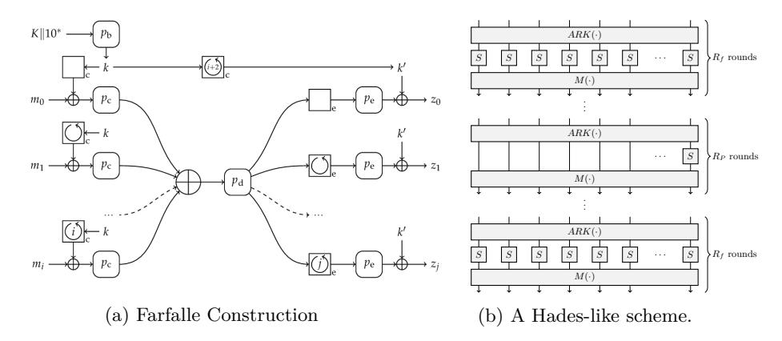
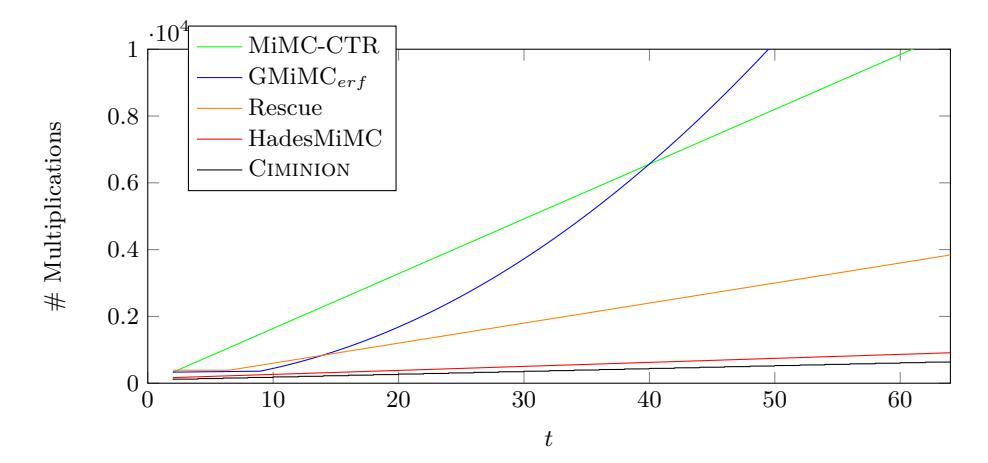
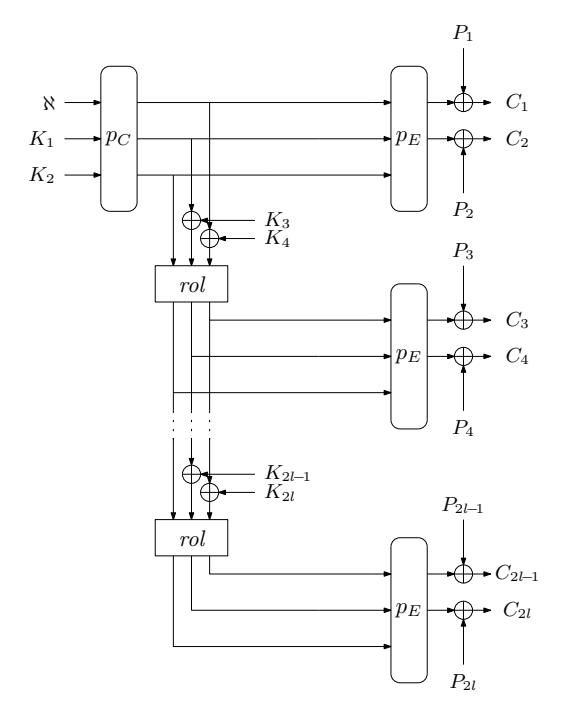
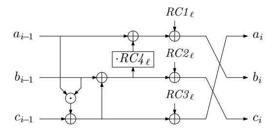
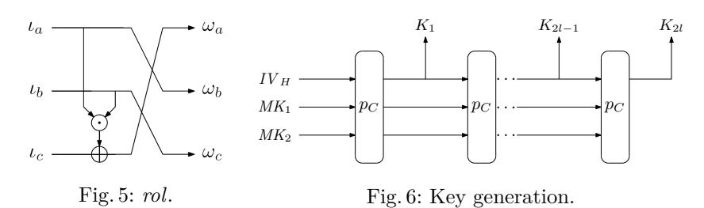
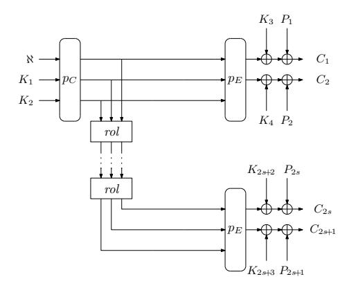
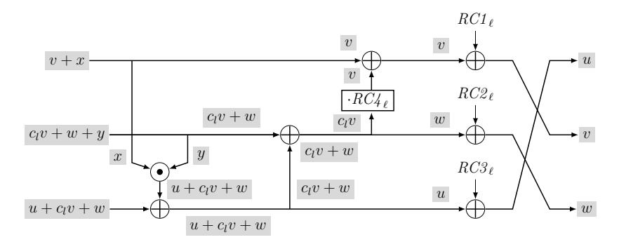
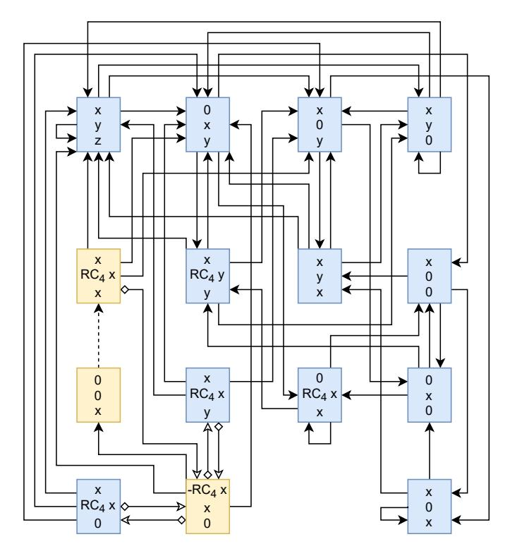
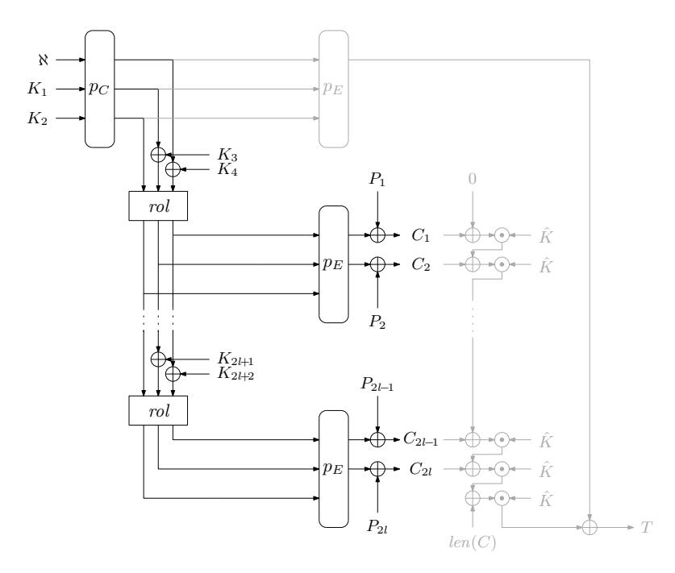

# <span id="page-0-0"></span>**Ciminion: Symmetric Encryption Based on Toffoli-Gates over Large Finite Fields**

Christoph Dobraunig<sup>1</sup>*,*<sup>2</sup> , Lorenzo Grassi<sup>3</sup> , Anna Guinet<sup>3</sup> , and Daniël Kuijsters<sup>3</sup>

<sup>1</sup> Lamarr Security Research, Graz, Austria 2 IAIK, Graz University of Technology, Graz, Austria <sup>3</sup> Digital Security Group, Radboud University, Nijmegen, The Netherlands christoph.dobraunig@lamarr.at, lgrassi@science.ru.nl, email@annagui.net, Daniel.Kuijsters@ru.nl

**Abstract.** Motivated by new applications such as secure Multi-Party Computation (MPC), Fully Homomorphic Encryption (FHE), and Zero-Knowledge proofs (ZK), the need for symmetric encryption schemes that minimize the number of field multiplications in their natural algorithmic description is apparent. This development has brought forward many dedicated symmetric encryption schemes that minimize the number of multiplications in F2 or F, with being prime. These novel schemes have lead to new cryptanalytic insights that have broken many of said schemes. Interestingly, to the best of our knowledge, all of the newly proposed schemes that minimize the number of multiplications use those multiplications exclusively in S-boxes based on a power mapping that is typically 3 or −1 . Furthermore, most of those schemes rely on complex and resource-intensive linear layers to achieve a low multiplication count. In this paper, we present Ciminion, an encryption scheme minimizing the number of field multiplications in large binary or prime fields, while using a very lightweight linear layer. In contrast to other schemes that aim to minimize field multiplications in F2 or F, Ciminion relies on the Toffoli gate to improve the non-linear diffusion of the overall design. In addition, we have tailored the primitive for the use in a Farfalle-like construction in order to minimize the number of rounds of the used primitive, and hence, the number of field multiplications as far as possible.

**Keywords:** Symmetric Encryption · Low Multiplicative Complexity

# **1 Introduction**

Recently, several symmetric schemes have been proposed to reduce the number of field multiplications in their natural algorithmic description, often referred to as the multiplicative complexity. These ciphers fall into two main categories. The first one contains ciphers that minimize the use of multiplications in F2, for instance, Flip [\[53\]](#page-30-0), Keyvrium [\[22\]](#page-28-0), LowMC [\[4\]](#page-27-0), and Rasta [\[33\]](#page-29-0). The second category is comprised of ciphers having a natural description in larger fields, which are mostly binary fields F2 and prime fields F. Examples include MiMC [\[3\]](#page-27-1), GMiMC [\[2\]](#page-27-2), Jarvis [\[8\]](#page-28-1), Hades [\[40\]](#page-29-1), Poseidon [\[39\]](#page-29-2) and Vision and Rescue [\[6\]](#page-27-3). The design of

low multiplicative complexity ciphers is motivated by applications such as secure Multi-Party Computation (MPC), Fully Homomorphic Encryption (FHE), and Zero-Knowledge proofs (ZK). These recent ciphers based on specialized designs highly outperform "traditionally" designed ones in these applications. The search of minimizing the multiplicative complexity while providing a sufficient security level is an opportunity to explore and evaluate innovative design strategies.

The sheer number of potentially devastating attacks on recently published designs implies that the design of schemes with low multiplicative complexity has not reached a mature state yet. Indeed, we count numerous attacks on variants of LowMC [\[32,](#page-29-3)[58\]](#page-30-1), Flip [\[34\]](#page-29-4), MiMC [\[35\]](#page-29-5), GMiMC [\[15,](#page-28-2)[19\]](#page-28-3), Jarvis [\[1\]](#page-27-4), and Starkad/Poseidon [\[15\]](#page-28-2). Attacks that are performed on schemes defined for larger fields mostly exploit weaknesses of the algebraic cipher description, e.g., Gröbner bases attacks on Jarvis [\[1\]](#page-27-4) or higher-order differential attacks on MiMC [\[35\]](#page-29-5). Nonetheless, attack vectors such as differential cryptanalysis [\[17\]](#page-28-4) and linear cryptanalysis [\[51\]](#page-30-2) do not appear to threaten the security of these designs. Indeed, the latter two techniques seem to be able to attack only a tiny fraction of the rounds compared to algebraic attacks.

Interestingly, the mentioned ciphers working over larger fields are inspired by design strategies proposed in the 1990s to mitigate differential cryptanalysis. For example, MiMC resembles the Knudsen-Nyberg cipher [\[55\]](#page-30-3), Jarvis claims to be inspired by the design of Rijndael [\[27,](#page-28-5) [28\]](#page-28-6), while Hades, Vision, and Rescue take inspiration from Shark [\[59\]](#page-30-4). The latter ciphers have a linear layer that consists of the application of a single MDS matrix to the state. An important commonality between all those examples is a non-linear layer that operates on individual field elements, e.g., cubing single field elements or computing their inverse. Furthermore, design strategies naturally working over larger fields easily prevent differential cryptanalysis. However, algebraic attacks seem to be their main threat. Therefore, it is worth exploring different design strategies to increase the resistance against algebraic attacks.

**Our Design: Ciminion.** In that spirit, Ciminion offers a different design approach in which we do not apply non-linear transformations to individual field elements. Instead, we use the ability of the multiplication to provide non-linear diffusion between field elements. Our cipher is built upon the Toffoli gate [\[61\]](#page-30-5), which is a simple non-linear bijection of field elements that transforms the triple (*, ,* ) into the triple (*, ,*  + ). The binary version of the Toffoli gate is used as a building block in modern ciphers, such as FRIET [\[60\]](#page-30-6), which inspired our design. In addition to this, the S-box of Xoodoo [\[26\]](#page-28-7) can also be described as the consecutive application of three binary Toffoli gates. With respect to the linear layer, we learned from ciphers like LowMC [\[4\]](#page-27-0) that very heavy linear layers can have a considerably negative impact on the performance of applications [\[31\]](#page-29-6). Therefore, we decide to pair the Toffoli gate with a relatively lightweight linear layer to construct a cryptographic permutation on triples of field elements. Compared to the designs that use a non-linear bijection of a single field element, e.g., cubing in F2 for odd , we can define our permutation on any field, and then provide a thorough security analysis for prime fields and binary fields.

<span id="page-2-0"></span>

Fig. 1: Comparison of a Farfalle construction and a Hades-like scheme.

We do not use a bare primitive in the applications, but we employ primitives in a mode of operation. Indeed, instead of constructing a primitive of low multiplicative complexity, our goal is to provide a cryptographic function of low multiplicative complexity. We achieve this by using a modified version of the Farfalle construction to make it possible to perform stream encryption. Farfalle [12] is an efficiently parallelizable permutation-based construction with a variable input and output length pseudorandom function (PRF). It is built upon a primitive, and modes are employed on top of it. The primitive is a PRF that takes as input a key with a string (or a sequence of strings), and produces an arbitrary-length output. The Farfalle construction involves two basic ingredients: a set of permutations of a b-bit state, and the so-called rolling function that is used to derive distinct b-bit mask values from a b-bit secret key, or to evolve the secret state. The Farfalle construction consists of a compression layer that is followed by an expansion layer. The compression layer produces a single b-bit accumulator value from a tuple of b-bit blocks representing the input data. The expansion layer first (non-linearly) transforms the accumulator value into a b-bit rolling state. Then, it (non-linearly) transforms a tuple of variants of this rolling state which are produced by iterating the rolling function, into a tuple of (truncated) b-bit output blocks. Both the compression and expansion layers involve b-bit mask values derived from the master key.

We slightly modify Farfalle (see Fig. 3) and instantiate it with two different permutations:  $p_C$  for the compression part, and  $p_E$  for the expansion part. Those two permutations are obtained by iterating the same round function, but with a different number of rounds. In our construction, the permutation  $p_C$  takes an input that is the concatenation of a nonce  $\aleph$  and a secret key, and it derives a secret intermediate state from this input. Then, the intermediate state is updated by using a simple rolling function, and fixed intermediate keys. From this intermediate state, the keystream for encrypting the plaintext is derived by using the permutation  $p_E$ . In order to prevent backward computation, the outputs of the expansion layers are truncated. Our security analysis that is

<span id="page-3-0"></span>

Fig. 2: Number of MPC multiplications of several designs over  $(\mathbb{F}_p)^t$ , with  $p \approx 2^{128}$  and  $t \geq 2$  (security level of 128 bits).

presented in Sect. 4 shows that  $p_E$  requires a significantly lower number of rounds than  $p_C$ . The relatively low number of multiplications that is used per encrypted plaintext element leads to a remarkably overall low multiplicative complexity. The full specification for CIMINION is presented in Sect. 2. A detailed rationale of the choices made during the design process is given in Sect. 3. A reference implementation can be found at <a href="https://github.com/ongetekend/ciminion">https://github.com/ongetekend/ciminion</a>.

A Concrete Use Case: Multi-Party Computation. The primary motivation of our design is to explore the limits on the use of non-linear operations in cipher design, while limiting the use of linear operations, and ensuring a secure design. The main body of our paper is thus dedicated to cryptanalysis which is accompanied by one specific use-case, namely Secure Multi-Party Computation.

MPC is a subfield of cryptography that aims to create methods for parties to jointly compute a function over their inputs, without exposing these inputs. In recent years, MPC protocols have converged to a linearly homomorphic secret sharing scheme, whereby each participant is given a share of each secret value. Then, each participant locally adds shares of different secrets to generate the shares of the sum of the secrets. In order to get data securely in and out of a secret-sharing-based MPC system, an efficient solution is to directly evaluate a symmetric primitive within such system. In this setting, "traditional" PRFs based on, e.g., AES or SHA-3 are not efficient. Indeed, they were designed with different computing environments in mind. Hence, they work over data types that do not easily match the possible operations in the MPC application. As developed in [42], "traditional" PRFs like AES and SHA-3 are rather bit/byte/word-oriented schemes, which complicate their representation using arithmetic in  $\mathbb{F}_p$  or/and  $\mathbb{F}_{2^n}$  for large integer n, or prime p.

From a theoretical point of view, the problem of secure MPC is strongly connected to the problem of masking a cryptographic implementation. This

observation has been made in [\[44,](#page-29-8) [45\]](#page-29-9). The intuition behind is that both masking and MPC aim to perform computations on shared data. In more detail, the common strategy behind these techniques is to combine random and unknown masks with a shared secret value, and to perform operations on these masked values. Only at the end of the computation, the values are unmasked by combining them, in a manner that is defined by the masking scheme. In our scheme, we use a linear sharing scheme, because affine operations (e.g., additions, or multiplications with a constant) are non-interactive and resource efficient, unlike the multiplications that require some communication between the parties. The number of multiplications required to perform a computation is a good estimate of the complexity of an MPC protocol.

However, in practice, other factors influence the efficiency of a design. For instance, while one multiplication requires one round of communication, a batch of multiplications can be processed into a single round in many cases. In that regard, Ciminion makes it possible to batch several multiplications due to the parallel execution of . Another alternative to speed up the processing of messages is to execute some communication rounds in an offline/pre-computation phase before receiving the input to the computation. This offline phase is cheaper than the online rounds. For example, in the case of Ciminion, precomputing several intermediate states is possible by applying to different nonces ℵ. As a result, for the encryption of arriving messages, those intermediate states only have to be expanded, and processed by to encrypt the plaintext.

[Sect. 5](#page-22-0) demonstrates that our design Ciminion has a lower number of multiplications compared to several other schemes working over larger fields. The comparison of the number of multiplications in MPC applications to the ciphers that are presented in the literature, is shown in [Fig. 2,](#page-3-0) when working over a field (F) with ≈ 2 <sup>128</sup> and ≥ 1, and with a security level of 128 bits (which the most common case in the literature). It indicates that our design needs approximately + 14 · ⌈*/*2⌉ ≈ 8 · multiplications compared to 12 · multiplications that are required by HadesMiMC, or 60 · multiplications that is needed by Rescue. These two schemes that have recently been proposed in the literature are our main competitors. Additionally, our design employs a low number of linear operations when compared with other designs present in the literature. Indeed, Ciminion grows linearly w.r.t. , whereas the number of linear operations grows quadratically in HadesMiMC and Rescue. That is because their rounds are instantiated via the multiplication with a × MDS matrix. Even if the cost of a linear operation is considerably lower than the cost of a non-linear one in MPC applications, it is desirable to keep both numbers as low as possible. Our design has this advantage.

# <span id="page-4-0"></span>**2 Specification**

### **2.1 Mode**

In order to create a nonce-based stream-encryption scheme, we propose to work with the mode of operation described in [Fig. 3.](#page-5-0) First, the scheme takes a nonce ℵ

<span id="page-5-0"></span>

Fig. 3: Encryption with CIMINION over  $\mathbb{F}_{2^n}$ . The construction is similar over  $\mathbb{F}_p$  ( $\oplus$  is replaced by +, the addition modulo p).

along with two subkey elements  $K_1$  and  $K_2$  as input, and processes these input with a permutation  $p_C$  to output an intermediate state. This intermediate state is then processed by a permutation  $p_E$ , and truncated to two elements so that two plaintext elements  $P_1$  and  $P_2$  can be encrypted. If more elements need to be encrypted, the intermediate state can be expanded by repeatedly performing an addition of two subkey elements to the intermediate state, then followed by a call to the rolling function rol. After each call to the rolling function rol, two more plaintext elements  $P_{2i}$  and  $P_{2i+1}$  can be encrypted thanks to the application of  $p_E$  to the resulting state. We consider the field elements as atomic, and therefore, our mode can cope with a different number of elements without the need for padding. The algorithmic description of the mode of operation that is described in Fig. 3, is provided in App. I.

#### 2.2 Permutations

We describe two permutations of the vector space  $\mathbb{F}_q^3$ . They act on a *state* of triples  $(a,b,c)\in\mathbb{F}_q^3$ . The first permutation is defined for a prime number q=p of  $\log_2(p)\approx n$  bits, while the second permutation is specified for  $q=2^n$ . Both permutations are the result of the repeated application of a round function. Their only difference is the number of repeated applications that we call *rounds*. As



Fig. 4: Round function .

<span id="page-6-0"></span>

presented in [Fig. 3,](#page-5-0) we employ two permutations and that have respectively and rounds.

**Round Function.** We write for round . It uses four round constants *RCℓ*, with *ℓ* = for , and *ℓ* = + − for . We assume that *RC4 <sup>ℓ</sup>* ∈ { */* 0*,* 1}. For each ≥ 1, maps a state (−1*,* −1*,* −1) at its input to the state ( *, ,* ) at its output, where the relation between these two states is

$$\begin{bmatrix} a_i \\ b_i \\ c_i \end{bmatrix} := \begin{bmatrix} 0 & 0 & 1 \\ 1 & RC4_{\ell} & RC4_{\ell} \\ 0 & 1 & 1 \end{bmatrix} \cdot \begin{bmatrix} a_{i-1} \\ b_{i-1} \\ c_{i-1} + a_{i-1} \cdot b_{i-1} \end{bmatrix} + \begin{bmatrix} RC3_{\ell} \\ RC1_{\ell} \\ RC2_{\ell} \end{bmatrix}.$$

#### **2.3 The Rolling Function**

Our rolling function *rol* is a simple NLFSR as depicted in [Fig. 5.](#page-6-0) The rolling function takes three field elements , , and at the input. It outputs three field elements: := + · , := , and := . The latter variables form the input of the permutation in our Farfalle-like mode [Fig. 3.](#page-5-0)

### **2.4 SubKeys and Round Constants**

**SubKeys Generation.** We derive the SubKey material from two master keys 1, and 2. As a result, the secret is shared in a compact manner, while the expanded key is usually stored on a device, and used when needed. To expand the key, we use the sponge construction [\[13\]](#page-28-9) instantiated with the permuta-

<span id="page-7-1"></span>Table 1: Proposed number of rounds based on f. The security level s must satisfy  $64 \le s \le \log_2(q)$ , and  $q \ge 2^{64}$ , where q is the number of elements in the field.

| Instance                                            | $  p_C$                                                        | $ p_E $ (two output words per block)                                                                                                                                                                                                                                     |
|-----------------------------------------------------|----------------------------------------------------------------|--------------------------------------------------------------------------------------------------------------------------------------------------------------------------------------------------------------------------------------------------------------------------|
| Standard Data limit $2^{s/2}$ elements Conservative | $\begin{vmatrix} s+6 \\ \frac{2(s+6)}{3} \\ s+6 \end{vmatrix}$ | $\begin{array}{c} \max\left\{ \left\lceil \frac{s+37}{12} \right\rceil, 6 \right\} \\ \max\left\{ \left\lceil \frac{s+37}{12} \right\rceil, 6 \right\} \\ \max\left\{ \left( \left\lceil \frac{3}{2} \cdot \frac{s+37}{12} \right\rceil \right), 9 \right\} \end{array}$ |

tion  $p_C$ . The value  $IV_H$  can be made publicly available, and is typically set to one.

Round Constants Generation. We generate the round constants  $RC1_{\ell}$ ,  $RC2_{\ell}$ ,  $RC3_{\ell}$ , and  $RC4_{\ell}$  with Shake-256 [14,54]. The detail is provided in App. A.

#### 2.5 Number of Rounds and Security Claim for Encryption

In this paper, we assume throughout that the security level of s bits satisfies the condition  $64 \le s \le \lfloor \log_2(q) \rfloor$ . This implies that  $q \ge 2^{64}$ .

In Tab. 1, we define three sets of round numbers for each permutation in our encryption scheme:

- The "standard" set guarantees s bit of security; in the following sections, we
  present our security analysis that supports the chosen number of rounds for
  this case.
- For our MPC application, we propose a number of rounds if the data available to the attacker is limited to  $2^{s/2}$ ; our security analysis that supports the chosen number of rounds for this case is presented in App. F.
- Finally, we present a "conservative" number of rounds where we arbitrarily decided to increase the number of rounds by 50% of the standard instance.

Since many cryptanalytic attacks become more difficult with an increased number of rounds, we encourage to study reduced-round variants of our design to facilitate third-party cryptanalysis, and to estimate the security margin. For this reason, it is possible to specify toy versions of our cipher, i.e., with  $q < 2^{64}$  which aim at achieving, for example, only 32 bits of security.

### <span id="page-7-0"></span>3 Design Rationale

#### 3.1 Mode of Operation

In order to provide encryption, our first design choice is to choose between a mode of operation that is built upon a block cipher or a cryptographic permutation. In either case, a datapath design is necessary. However, a block cipher requires an additional key schedule, unlike a cryptographic permutation. If a designer opts for a block cipher, the key schedule can be chosen to be either a non-linear, an

<span id="page-8-0"></span>

Fig. 7: Intermediate step in constructing Fig. 3

affine, or a trivial transformation, where the round keys are equal to the master key apart from round constants. In this case, the designer has to be careful, because a poor key schedule leads to weaknesses and attacks [19]. Considering that the research in low multiplicative complexity ciphers is a relatively new research area, we decided to limit our focus to the essential components of a primitive. Therefore, we opted for permutation-based cryptography.

Since we consider the application of low multiplicative ciphers in areas that have enough resources to profit from parallel processing, we base our mode of operation on the Farfalle construction [12] as depicted in Fig. 1a. The Farfalle construction is a highly versatile construction that provides many functionalities. A Modified Version of Farfalle. As already mentioned in the introduction, our mode of operation resembles the Farfalle construction. In this section, we explain and support the modifications that we performed on the original Farfalle construction, as depicted in Fig. 1a. The aim of those modifications is to both increase the resistance of the construction against algebraic attacks which are the most competitive ones in our scenario, and to increase its efficiency in our target application scenario, that is to say to minimize the number of multiplications. We focus first on the security aspect, before explaining in further detail how we reach our efficiency goal.

Our first modification is for simplicity. Since the functionality provided by the Farfalle construction to compress information is not needed, we merge  $p_c$  and  $p_d$  to a single permutation  $p_C$ .

Our second modification is to truncate the output. This prevents meet-in-the-middle style attacks that require the knowledge of the full output.

The third modification is to manipulate different keys  $K_i$  (see Fig. 7) instead of employing the same key k' for each output block. Since we aim to have a permutation with a low degree, Gröbner bases are the main threat. For the scheme that is depicted in Fig. 7, an attacker has to exploit equations of the form  $f(x) + K_i = y$  and  $f(x') + K_i = y'$ , with f(x) - f(x') = y - y' for a Gröbner basis attack. We describe this scenario in more detail in Sect. 4.4.

Our last modification is to move the keys  $K_i$  from the output of  $p_E$  to the input of our rolling function, and hence, effectively to the input of  $p_E$  (Fig. 3). Fig. 3 is our final construction, and it provides two main benefits. First, having the keys at the input does not make it possible to easily cancel them by computing the difference of the output as described before. Hence, this adds an additional barrier in mounting successful Gröbner basis attacks. Second, we can use a simple non-linear rolling function, because the addition of the key stream during the rolling function prevents the attacker from easily detecting short cycles within it.

Minimizing the Number of Multiplications. One main reason to use the Farfalle construction is that its three permutations  $p_c$ ,  $p_d$ , and  $p_e$  do not have to provide protection against all possible attack vectors. Indeed, the permutation  $p_e$  alone does not have to provide resistance against higher-order differential attacks [47, 49]. The latter are particular algebraic attacks that exploit the low degree polynomial descriptions of the scheme. Resistance against higher-order differential attacks (higher-order attacks in short) can be provided by the permutations  $p_c$ , and  $p_d$ , and it inherently depends on the algebraic degree that a permutation achieves. Hence, requiring protection against higher-order attacks provides a lower bound on the number of multiplications that are needed in a permutation. In a nutshell, since  $p_e$  does not have to be secure against higher-order attacks, we can use a permutation with fewer multiplications. This benefits the multiplication count of the scheme, since the permutations  $p_c$  and  $p_d$  are called only once independently of the number of output words.

The Rolling Function. An integral part of the Farfalle construction is the rolling function rol. The permutations  $p_c$  and  $p_e$  (Fig. 1a) in the Farfalle construction are usually chosen to be very lightweight, such that the algebraic degree is relatively low. Hence, to prevent higher-order attacks, the rolling function is chosen to be non-linear. In our modified version, the same is true up to the intermediate construction as depicted in Fig. 7. In this case, rol has to be non-linear in order to use a permutation  $p_E$  of low degree. For our final construction (Fig. 3), we do not see any straightforward way to exploit higher-order attacks due to the unknown keys at the inputs of  $p_E$ . Thus, we could use a linear rolling function rol, but we rather choose to use a simple non-linear rol for CIMINION. That is because it makes it possible to analyze the security of Fig. 7, and to keep the same conclusion when we opt for the stronger version of Fig. 3. In addition, we present Aiminion in App. B, a version of our design that does not follow this line of reasoning. AIMINION uses a linear rolling function, and nine rounds of  $p_E$ . We deem this version to be an interesting target for further analysis that aims to evaluate the security impact of switching from a non-linear to a linear rolling function.

Generating the Subkeys. Instead of sharing all subkeys  $K_i$  directly by communicating parties to encrypt messages, we specify a derivation of the subkeys  $K_i$  from two master keys  $MK_1$ , and  $MK_2$ . These subkeys can be generated in a single precomputation step. For the storage of the subkeys, trade-offs can be made to store as many subkeys as needed, and to split messages into lengths that match the stored subkey lengths.

#### 3.2 The Round Function

Our round function is composed of three layers: a non-linear transformation, a linear transformation, and a round constant addition. Like classical designs, we employ the same non-linear and linear transformations for each round, but with different round constant additions. This makes it easier to implement, and to reduce code-size and area requirements. Nonetheless, some primitives that have been designed to lower the multiplicative complexity use a different linear layer for each round, like in LowMC [4].

Non-linear Transformation. Most primitives operating in large fields have a variant of powering field elements, e.g.,  $x^3$  or  $x^{-1}$ . These mappings became popular to guard against linear and differential cryptanalysis due to their properties [55]. The most popular design that uses such mappings is the AES [28], where  $x^{-1}$  is used as part of its S-box. For ciphers that aim at a low multiplicative complexity, these power mappings are interesting because they often have an inverse of high degree, which provides protection against algebraic attacks. However, they impose some restrictions, e.g., the map  $x \mapsto x^{\alpha}$  for integer  $\alpha \ge 2$  is a bijection in  $\mathbb{F}_q$  if and only if  $\gcd(q-1,\alpha)=1$  (e.g.,  $x\mapsto x^3$  is a permutation over  $\mathbb{F}_{2^n}$  for odd n only). Hence, one has to consider several power values  $\alpha$  in order for  $x^{\alpha}$  to stay a permutation for any field. In a design that should make it possible to be instantiated for a wide variety of fields, considering those special cases complicates the design of the cipher.

Instead of a power mapping, the non-linear element in our designs is the Toffoli gate [61]. Indeed, algebraic attacks are the main threat against designs aiming to lower the multiplicative complexity, and the multiplications are the main cost factor in our design. It thus seems counter intuitive to spend the non-linear element on simply manipulating a single field element, as is the case for power mappings. Therefore, we choose to multiply two elements of the state, instead of operating on a single state element, in order to increase the non-linear diffusion. Furthermore, the Toffoli gate is a permutation for any field, and therefore we are not restricted to a specific field. We mitigate potential negative effects of the property of the Toffoli gate to provide the same degree in forward and backward direction by mandating its use only in modes that truncate the permutation output, and that never evaluate its inverse using the secret key.

Linear Transformation. We present the linear transformation in its matrix form, the coefficients of which must be carefully chosen. One possibility is to use an MDS matrix. Since an MDS matrix has the highest branch number [24] among all possible matrices, it plays an important role in proving lower bounds on the linear and differential trail weight. However, we do not need to rely on MDS matrices as the field multiplications already have advantageous properties against linear and differential attacks.

Another option is to randomly choose the coefficients of the matrix for each round, and then verify that the matrix is invertible. This strategy was used in one of the first low multiplicative complexity designs, namely LowMC [4]. However, the drawback is that random matrices contribute significantly to the cost of the

primitive in some scenarios, and the security analysis becomes more involved. Hence, we have decided to use a much simpler linear layer.

In order to provide sufficient diffusion, complex equation systems, and low multiplicative complexity, the degree of the functions that output equations depending on the input variables must grow as fast as possible. By applying a single multiplication per round, the degree doubles per round in the best scenario. However, this also depends on the linear layer. For instance, this layer could be a simple layer permuting the elements (e.g., the  $3 \times 3$  circulant matrix circ(0,0,1)), for which the univariate degree of a single element only grows according to a Fibonacci sequence. To ensure that the univariate degree of a single element doubles per round, the result of the previous multiplication has to be reused in the multiplication of the next round. This is also applicable to the inverse of the permutation. Hence, we decided to use the following matrix for the linear layer:

$$M = \begin{bmatrix} 0 & 0 & 1 \\ 1 & RC4 & RC4 \\ 0 & 1 & 1 \end{bmatrix} \qquad \text{(and} \qquad M^{-1} = \begin{bmatrix} 0 & 1 - RC4 \\ -1 & 0 & 1 \\ 1 & 0 & 0 \end{bmatrix}$$
,

Here,  $M_{0,2}, M_{1,2}, M^{-1}_{0,2}, M^{-1}_{1,2} \neq 0$  with  $M_{i,j}$  denoting the element of the matrix M at row i and column j. The use of the round constant  $RC4 \notin \{0,1\}$  is motivated by aiming to improve the diffusion, and to avoid a weakness with respect to linear cryptanalysis that we discuss in Sect. 4.1.

About Quadratic Functions. In addition to the matrix multiplication, another (semi-)linear transformation<sup>4</sup> over a binary field  $\mathbb{F}_{2^n}$  is the quadratic permutation  $x\mapsto x^2$ . This transformation can be exploited as a component in the round function (e.g., as a replacement of the multiplication by RC4) to both increase the diffusion and the overall degree of the function that describes the scheme. However, we do not employ it for several reasons. First, even if the quadratic permutation is linear over  $\mathbb{F}_{2^n}$ , its cost in an application like MPC might not be negligible. Indeed, the quadratic permutation costs one multiplication as detailed in [42]. As a result, even if it makes it possible to reduce the overall number of rounds due to a faster growth of the degree, the overall number of multiplications would not change for applications like MPC. Secondly, the quadratic function is not a permutation over  $\mathbb{F}_p$  for a prime  $p \neq 2$ . Thus, its introduction implies having to work with two different round functions: one for the binary case and one for the prime case. Since our goal is to present a simple and elegant general scheme, we decided not to use it.

Round Constants. The round constants break up the symmetry in the design. They prevent the simplification of the algebraic description of the round function. However, as we manipulate many round constants, and since they influence the rounds in a complex manner, we use an extendable output function to obtain round constant values without an obvious structure. We performed some

<sup>&</sup>lt;sup>4</sup> A function f over  $(\mathbb{F}, +)$  is semi-linear if for each  $x, y \in \mathbb{F}$ : f(x + y) = f(x) + f(y). It is linear if it is semi-linear and if for each  $x \in \mathbb{F}$ :  $f(\alpha \cdot x) = \alpha \cdot f(x)$ .

<sup>&</sup>lt;sup>5</sup> A minimum number of multiplications is required to reach maximum degree, which is one of the property required by a cryptographic scheme to be secure.

experiments where we added round constants to one or two state elements. These instances provided simpler algebraic descriptions. Considering the small costs of manipulating dense round constants, we decide to use three round constants to complicate the algebraic description of the cipher, even after a few rounds.

### <span id="page-12-0"></span>4 Security Analysis

We present our security analysis of CIMINION with respect to "standard" application of the attacks that are found in the literature. This analysis determines the required number of rounds to provide some level of confidence in its security. Due to page limitation, further analysis is presented in App. D-E.

First and foremost, the number of rounds that guarantees security up to s bits are computed under the assumption that the data available to the attacker is limited to  $2^s$ , except if specified in a different way. Moreover, we do not make any claim about the security against related-key attacks and known- or chosen-key distinguishers (including the zero-sum partitions). The latter are out the scope of this paper.

We observe that the attack vectors penetrating the highest number of rounds are algebraic attacks. On the contrary, traditional attacks, such as differential and linear cryptanalysis, are infeasible after a small number of rounds. As detailed in the following, in order to protect against algebraic attacks and higher-order differential attacks, we increase the number of rounds proportionally to the security level s. A constant number of rounds is added to prevent an adversary from guessing part of the key or the initial or middle state, or to linearize part of the state. Hence, the numbers of rounds for  $p_C$  and  $p_E$  are respectively s+6 and  $\left\lceil \frac{s+19}{12} + 1.5 \right\rceil$  for the standard security level.

#### <span id="page-12-1"></span>4.1 Linear Cryptanalysis

Linear cryptanalysis [51] is a known-plaintext attack that abuses high *correlations* [25] between sums of input bits and sums of output bits of a cryptographic primitive. However, classical correlation analysis is not restricted to solely primitives operating on elements of binary fields. In this section, we apply the existing theory developed by Baignères et al. [9] for correlation analysis of primitives that operate on elements of arbitrary sets to the permutations defined in Sect. 2.

**General Correlation Analysis.** An application of the theory to ciphers operating on elements of binary fields is presented by Daemen and Rijmen [29]. Classical correlation analysis is briefly recalled in App. C.1. In this section, we apply the theory to the more general case of primitives operating on elements of  $\mathbb{F}_q$  where  $q = p^n$ . Henceforth, we suppose that  $f: (\mathbb{F}_q)^l \to (\mathbb{F}_q)^m$ .

Correlation analysis is the study of *characters*, and their configuration in the l-dimensional vector space  $L^2((\mathbb{F}_q)^l)$  of complex-valued functions  $(\mathbb{F}_q)^l \to \mathbb{C}$ . The space  $L^2((\mathbb{F}_q)^l)$  comes with the inner product  $\langle g,h\rangle = \sum g(x)\overline{h(x)}$ , which defines the norm  $\|g\| = \sqrt{\langle g,g\rangle} = q^{\frac{l}{2}}$ .

<span id="page-13-0"></span>

Fig. 8: Mask propagation in f

A character is an additive homomorphism from  $(\mathbb{F}_q)^l$  into  $S:=\{z\in\mathbb{C}:|z|=1\}$ . It is well-known that any character on  $(\mathbb{F}_q)^l$  is of the form

$$\chi_u(x) = e^{\frac{2\pi i}{p} \operatorname{Tr}_p^q(u^\top x)}.$$

for some  $u \in (\mathbb{F}_q)^l$ . We recall that for q=2 we have that  $\chi_u(x)=(-1)^{u^\top x}$ , which appears in classical correlation analysis. Here,  $\operatorname{Tr}_p^q(x)=x+x^2+\cdots+x^{p^{l-1}}\in \mathbb{F}_p$  is the trace function. For this reason,  $u^\top x$  is called a vectorial trace parity and u a trace mask vector. We call the ordered pair (u,v) a linear approximation of f, where u is understood to be the mask at the input and v to be the mask at the output of f.

We define the vectorial trace parity correlation in the following definition.

#### Definition 1 (Correlation).

$$C_f(u,v) = \frac{\langle \mu_u, \mu_v \circ f \rangle}{\|\mu_u\| \|\mu_v \circ f\|} = \frac{1}{q^l} \sum_{x \in (\mathbb{F}_v)^l} e^{\frac{2\pi i}{p} \operatorname{Tr}_p^q (u^\top x - v^\top f(x))}$$

This helps us to define a more general linear probability metric as follows.

**Definition 2** (Linear probability). 
$$LP_f(u,v) = |C_f(u,v)|^2$$

The idea is then to consider the permutation as a circuit made of simple building blocks. Those blocks correspond to the operators that we apply, and for which we attach to each edge a trace mask vector. Importantly, these trace mask vectors are in one-to-one correspondence with characters. The goal of the attacker is to construct a linear trail from the end of the permutation to the beginning, with the goal of maximizing the linear probability of each building block. A list of the linear probabilities of each such building block can be found in App. C.2 to deduce the result of the analysis.

On Three-round Linear Trails. Fig. 8 illustrates how the linear masks propagate through the round function when the linear probabilities of all building blocks are maximized. In this Figure,  $c_{\ell} := RC4_{\ell}$ . The attacker is able to choose

u, v, and w freely at the beginning of the first round, and afterwards, a mask at the input of the next round is determined by a mask at the output of the former round. We write  $R_i$  for the i'th round function. Moreover, we use the notation  $c_{ij} := c_i c_j$  and  $c_{ijk} := c_i c_j c_k$ , where the subscript refers to the round number. The masks evolve as follows:

$$\begin{pmatrix} u \\ v \\ w \end{pmatrix} \xrightarrow{R_0} \begin{pmatrix} v \\ c_1v + w \\ u + c_1v + w \end{pmatrix} \xrightarrow{R_1} \begin{pmatrix} c_1v + w \\ u + (c_1 + c_{12})v + (1 + c_2)w \\ u + (1 + c_1 + c_{12})v + (1 + c_2)w \end{pmatrix}$$

$$\xrightarrow{R_2} \begin{pmatrix} u + (c_1 + c_{12})v + (1 + c_2)w \\ (1 + c_3)u + (1 + c_1 + c_{12} + c_{13} + c_{123})v + (1 + c_2 + c_3 + c_{23})w \\ (1 + c_3)u + (1 + 2c_1 + c_{13} + c_{12} + c_{123})v + (2 + c_2 + c_3 + c_{23})w \end{pmatrix} .$$

An implicit assumption in both Fig. 8, and the mask derivation above, is that the masks at the output of the multiplication and at the input of the third branch are equal. However, an attacker can only make sure that this assumption is valid if the following system of equations has a non-zero solution:

$$\begin{pmatrix} 1 & c_1 & 1 \\ 1 & 1 + c_1 + c_{12} & 1 + c_2 \\ 1 + c_3 & 1 + 2c_1 + c_{13} + c_{12} + c_{123} & 2 + c_2 + c_3 + c_{23} \end{pmatrix} \begin{pmatrix} u \\ v \\ w \end{pmatrix} = \begin{pmatrix} 0 \\ 0 \\ 0 \end{pmatrix}.$$

If we denote by A the matrix above, then this happens if and only if the matrix is singular, i.e., if  $\det(A) = c_2c_3 + 1 = 0$ . If either  $c_2$  or  $c_3$  is equal to zero, then the condition does not hold. If both are non-zero, then the condition is equivalent to requiring that  $c_2 = -c_3^{-1}$ . In this case, we can freely choose one value, which determines the other. Hence, the probability that the condition holds is equal to  $\frac{q-1}{q^2} < \frac{1}{q}$ . Since  $\log_2(q)$  is the security parameter, this probability is negligible and there exists no three-round trail with a linear probability of 1.

Clustering of Linear Trails. We have  $\operatorname{LP}_f(u,v) \geq \sum_{Q \in \operatorname{LT}_f(u,v)} \operatorname{LP}(Q)$ , where  $\operatorname{LT}_f(u,v)$  is the set of linear trails contained in (u,v). If we suppose now that an attacker is able to find more than q linear trails, i.e., if  $|\operatorname{LT}_f(u,v)| > q$ , then we have  $\operatorname{LP}_f(u,v) > \frac{1}{q}$ . However,  $\log_2(q)$  is the security parameter, therefore the latter condition is not feasible. In a nutshell, three rounds are sufficient to resist against linear cryptanalysis.

Round Constant Multiplication Necessity. If the multiplication by the round constant is not present, or  $RC4_{\ell} = 1$ , then the masks evolve as follows over a single round:

$$\begin{pmatrix} u \\ v \\ w \end{pmatrix} \xrightarrow{f^{-1}} \begin{pmatrix} v+x \\ v+w+y \\ u+v+w \end{pmatrix} \xrightarrow{\text{if } u=v \text{ and } x=y=w=0} \qquad \begin{pmatrix} v \\ v \\ 0 \end{pmatrix} \xrightarrow{f^{-1}} \begin{pmatrix} v \\ v \\ 2v \end{pmatrix},$$

where (x, y) is the mask vector at the input of the multiplication function, which, like u, v, and w, can be freely chosen. Hence, if we choose u = v, and x = y = w = 0, and since the characteristic of the field is equal to two, then a one-round approximation with a linear probability of one can be chained indefinitely. This is the reason behind including a multiplication by a non-trivial constant.

#### <span id="page-15-1"></span>4.2 Differential Cryptanalysis

Differential cryptanalysis exploits the probability distribution of a non-zero input difference leading to an output difference after a given number of rounds [17]. As CIMINION is an iterated cipher, a cryptanalyst searches for ordered sequences of differences over r rounds that are called differential characteristics/trails. A differential trail has a Differential Probability (DP). Assuming the independence of the rounds, the DP of a differential trail is the product of the DPs of its one-round differences (Definition 3).

<span id="page-15-0"></span>**Definition 3 (One-round differential probability).** Let  $(\alpha_a, \alpha_b, \alpha_c) \in (\mathbb{F}_p)^3$  be the input of the round, and  $(\alpha_a^*, \alpha_b^*, \alpha_c^*) \in (\mathbb{F}_p)^3$  the chosen non-zero input difference. The probability that an input difference is mapped to an output difference  $(\beta_a^*, \beta_b^*, \beta_c^*) \in (\mathbb{F}_p)^3$  through one iteration of the round function f is equal to

$$\frac{|f(\alpha_a^* + \alpha_a, \alpha_b^* + \alpha_b, \alpha_c^* + \alpha_c) - f(\alpha_a, \alpha_b, \alpha_c) = (\beta_a^*, \beta_b^*, \beta_c^*)|}{|(\mathbb{F}_p)^3|}.$$

The operation + is replaced by  $\oplus$  in  $\mathbb{F}_{2^n}$ .

However, in general, the attacker does not have any information about the intermediate differences of the differential trail. Hence, the attacker only fixes the input and the output differences over r rounds, and works with differentials. A differential is a collection of differential trails with fixed input and output differences, and free intermediate differences. The DP of a differential over r rounds is the sum of all DPs of the differential trails that have the same input and output difference over the same number of rounds as the differential.

In this paper, we perform the differential cryptanalysis by grouping fixed differences in *sets*. Those sets impose some conditions to satisfy between the differences of the branches of the round, and/or specify that some differences at the input of the branches equal zero. Then, given an input difference, we study the possible sets of output differences after a round, and we determine the DP that an input difference is mapped into an output difference over a round. The goal is to find the longest differential trail with the highest DP.

Toward this end, we build a state finite machine (more details in App. C.3) that represents all the encountered sets of differences as states associated to their differential probabilities. To construct the graph, we start with a difference of the form  $\{(0,0,x)|x\neq 0\}$ , and we search for the possible sets of output differences until we have explored all the possibilities from each newly reached set. Hereafter, let us assume that the difference x is not zero. We see that an input difference from  $\{(0,0,x)\}$  is mapped into an output difference of the form  $\{(x,RC4_{\ell}x,x)\}$  after one round with probability one. Indeed, since the input difference goes through the non-linear operation and stays unchanged, the output difference is simply the result of the linear operation applied to the input difference. For the other cases, a non-zero input difference propagates to an output difference over one round with probability equal to  $p^{-1}$  in  $\mathbb{F}_p$ , or  $2^{-n}$  in  $\mathbb{F}_{2^n}$ . From those results, we determine the differential over three rounds with the highest DP.

On Three-round Differentials. The differential trail in  $\mathbb{F}_p$  with the highest DP is

$$\{(0,0,x)\} \xrightarrow{\text{prob. } 1} \{(x,RC4_{\ell}x,x)\} \xrightarrow{\text{prob. } p^{-1}} \{(-RC4_{\ell}x,x,0)\} \xrightarrow{\text{prob. } p^{-1}} \{(0,0,x)\},$$

where the fixed input difference x is equal to another fixed value in the following rounds, and satisfies the conditions imposed by the set (for details see App. C.3). Additionally, this differential trail holds if and only if the round constant  $RC4_{\ell}$  introduced by the first round is equal to the round constant  $RC4_{\ell}$  of the third round.

In  $\mathbb{F}_{2^n}$ , we obtain almost the same state finite machine as in Fig. 9. The only exception is that the set of differences  $\{(-RC4_{\ell}x, x, 0)\}$  corresponds to  $\{(RC4_{\ell}x, x, 0)\}$ , because -z is equal to z for each  $z \in \mathbb{F}_{2^n}$ . Hence, the differential trail in  $\mathbb{F}_{2^n}$  with the highest DP is

$$\{(0,0,x)\} \xrightarrow{\operatorname{prob.}\ 1} \{(x,RC4_{\,\ell}x,x)\} \xrightarrow{\operatorname{prob.}\ 2^{-n}} \{(RC4_{\,\ell}x,x,0)\} \xrightarrow{\operatorname{prob.}\ 2^{-n}} \{(0,0,x)\}\,,$$

under the same conditions that in  $\mathbb{F}_p$ .

In summary, a fixed difference from  $\{(0,0,x)\}$  is mapped to the difference of the form  $\{(x,RC4_{\ell}x,x)\}$  after one round with probability one in  $\mathbb{F}_{2^n}$  and in  $\mathbb{F}_p$ . Moreover, as depicted in Fig. 9, an input difference can be mapped to an output difference of the form  $\{(0,0,x)\}$  with DP  $p^{-1}$  (resp.  $2^{-n}$ ) if and only if this difference is of the form  $\{(-RC4_{\ell}x,x,0)\}$ . This means that the *only* possible differential trail over three rounds with input and output differences of the form  $\{(0,0,x)\}$  are the ones given before. The DP of this differential trail is expressed in the following Lemma.

**Lemma 1.** A differential trail over three rounds has a probability at most equal to  $p^{-2}$  in  $\mathbb{F}_p$  and  $2^{-2n}$  in  $\mathbb{F}_{2^n}$ .

The DP of all other differential trails over three round are at most equal to  $p^{-3}$  in  $\mathbb{F}_p$  and  $2^{-3n}$  in  $\mathbb{F}_{2^n}$ . Since the security level s satisfies  $s \leq \log_2(p)$  in  $\mathbb{F}_p$  and  $s \leq n$  in  $\mathbb{F}_{2^n}$ , we therefore conjecture that three rounds are sufficient to guarantee security against "basic" differential distinguishers. We thus choose to have at least six rounds for the permutations  $p_E$  and  $p_C$ , which is twice the number of rounds necessary to guarantee security against "basic" differential/linear distinguishers. The minimal number of rounds for the permutations should provide security against more advanced statistical distinguishers.

#### <span id="page-16-0"></span>4.3 Higher-Order Differential and Interpolation Attacks

If a cryptographic scheme has a simple algebraic representation, higher-order attacks [47,49] and interpolation attack [46] have to be considered. In this part, we only focus on higher-order differential attacks. We conjecture that the number of rounds necessary to prevent higher-order differential attacks is also sufficient to prevent interpolation attacks (see details in App. D). This result is not novel, and the same applies for other schemes, like MiMC, as further explained in [35].

**Background.** We recall from Fig. 3 that an attacker can only directly manipulate a single element, and the two other elements are the secret subkeys. We therefore operate with this single element to input value sets, while keeping the two other elements fixed. Each output element is the result of a non-linear function depending on the input element x, and two fixed elements that are the input of the permutation. Thus, we have  $f_N(x) = p(x, const, const)$  in  $\mathbb{F}_{2^n}$ , and  $f_p(x) = p(x, const, const)$  in  $\mathbb{F}_p$ .

A given function  $f_p$  over prime fields  $\mathbb{F}_p$  is represented by  $f_p(x) = \sum_{i=0}^{p-1} \kappa_i x^i$  with constants  $\kappa_i \in \mathbb{F}_p$ . The degree of the function  $f_p(x)$  that we denote by  $d_{\mathbb{F}_p}$ , corresponds to the highest value i for which  $\kappa_i \neq 0$ . The same holds for a function  $f_n$  working over binary extension fields  $\mathbb{F}_{2^n}$ . For the latter,  $f_N(x) = \bigoplus_{i=0}^d \kappa_i x^i$  with  $\kappa_i \in \mathbb{F}_{2^n}$ , and  $d_{\mathbb{F}_{2^n}}$  is the degree of the function  $f_n(x)$ . Like previously, the degree is the highest value i for which  $\kappa_i \neq 0$ . In  $\mathbb{F}_{2^n}$ , the function can as well be represented by its algebraic norm form (ANF)  $f_n(x_1, \ldots, x_n)$ , whose output element j is defined by its coordinate function  $f_{n,j}(x_1, \ldots, x_n) = \bigoplus_{u=(u_1,\ldots,u_2)} \kappa_{j,u} \cdot x_1^{u_1} \cdot \ldots \cdot x_n^{u_n}$  with  $\kappa_{j,u} \in \mathbb{F}_2$ . The degree  $d_{\mathbb{F}_2^n}$  of  $f_n$  corresponds to the maximal Hamming weight of u for which  $\kappa_{j,u} \neq 0$ , that is to say  $d_{\mathbb{F}_2^n} = \max_{i < d} \{hw(i) \mid \kappa_i \neq 0\}$ .

For the last representation, as proved by Lai [49] and in [47], if we iterate over a vector space  $\mathcal V$  having a dimension strictly higher than  $d_{\mathbb F_2^n}$ , we obtain the following result:  $\bigoplus_{v\in\mathcal V\oplus \nu} f_n(v)=0$ . A similar result has also been recently presented for the prime case in [35, Proposition 2]. More precisely, if the degree of  $f_p(x)$  is  $d_{\mathbb F_p}$ , then iterating over all elements of a multiplicative subgroup  $\mathcal G$  of  $\mathbb F_p^t$  of size  $|\mathcal G|>d_{\mathbb F_p}$  leads to  $\sum_{x\in\mathcal G} f_p(x)=f_p(0)\cdot |\mathcal G|$ . The last sum is equal to zero modulo p since  $|\mathcal G|$  is a multiple of p.

In order to provide security against higher-order differential attacks based on the presented zero-sums, we choose the number of rounds of our permutation to have a function of a degree higher than our security claim.

Overview of our Security Argument. In our construction, we assume that an attacker can choose the nonce  $\aleph$ , which is the input of the permutation  $p_C$ . For the first call of this permutation, we want to prevent an attacker to input value sets that always result in the same constant after the application of the permutation  $p_C$ . This requirement is necessary, since we assume in the remaining analysis that the output values of  $p_C$  are unpredictable by an attacker. We emphasize that if the output of the permutation  $p_C$  is guaranteed to be randomly distributed, then this is sufficient to prevent higher-order differential attacks. That is because the inverse of the final permutations  $p_E$  is never evaluated, and the attacker cannot construct an affine subspace in the middle of the construction. Estimating the Degree of  $p_C$ : Necessary Number of Rounds. We study the evolution of the degrees  $d_{\mathbb{F}_n}$  and  $d_{\mathbb{F}_{2^n}}$  for the permutation  $p_C$  for which the round function f (Fig. 3) is iterated r times. We conclude that the degree of the permutation  $p_C$  remains unchanged for two rounds, if an input element is present at branch a, and the input at the branch b is zero. For a higher number of rounds, the degree increases. We have chosen the affine layer to ensure that the output of the multiplication can affect both inputs of the multiplication in

the next round. This should make it possible for the maximal possible degree of the output functions to increase faster than having affine layers without this property. In the best case, the maximal degree of the function can be doubled per round.

Considering both previous observations, a minimum of + 2 rounds are required to obtain at least F ≈ 2 , or F2 ≈ 2 . As we want to ensure that the polynomial representation of is dense, it is then advisable to add more rounds as a safety margin. In order to reach this goal, we arbitrarily decided to add four more rounds.

## <span id="page-18-0"></span>**4.4 Gröbner Basis Attacks**

**Preliminary.** To perform a Gröbner basis [\[21\]](#page-28-14) attack, the adversary constructs a system of algebraic equations that represents the cipher. Finding the solution of those equations makes it possible for the attacker to recover the key that is denoted by the unknown variables 1*, ...,*  hereafter. In order to solve this system of equations, the attacker considers the *ideal* generated by the multivariate polynomials that define the system. A *Gröbner basis* is a particular generating set of the ideal. It is defined with respect to a total ordering on the set of monomials, in particular the lexicographic order. As a Gröbner basis with respect to the lexicographic order is of the form

$${x_1 - h_1(x_n), \dots, x_{n-1} - h_{n-1}(x_n), h_n(x_n)},$$

the attacker can easily find the solution of the system of equations. To this end, one method is to employ the well-known Buchberger's criterion [\[21\]](#page-28-14), which makes it possible to transform a given set of generators of the ideal into a Gröbner basis. From a theoretic point of view, state-of-the-art Gröbner basis algorithms are simply improvements to Buchberger's algorithm that include enhanced selection criteria, faster reduction step by making use of fast linear algebra, and an attempt to predict reductions to zero. The best well-known algorithm is Faugère's F5 algorithm [\[11,](#page-28-15) [36\]](#page-29-14).

Experiments highlighted that computing a Gröbner basis with respect to the lexicographic order is a slow process. However, computing a Gröbner basis with respect to the grevlex order can be done in a faster manner. Fortunately, the FGLM algorithm [\[37\]](#page-29-15) makes it possible to transform a Gröbner basis with respect to the grevlex order to another with respect to the lexicographic order. To summarize, the attacker adopts the following strategy:

- 1. Using the F5 algorithm, compute a Gröbner basis w.r.t. the grevlex order.
- 2. Using the FGLM algorithm, transform the previous basis into a Gröbner basis w.r.t. the lexicographic order.
- 3. Using polynomial factorization and back substitution, solve the resulting system of equations.

Henceforth, we consider the following setting: let be a finite field, let = [1*, . . . ,* ] be the polynomial ring in variables, and let ⊆ be an ideal generated by a sequence of polynomials  $(f_1, \ldots, f_r) \in A^r$  associated with the system of equations of interest.

Cost of the F5 Algorithm. In the best adversarial scenario, we assume that the sequence of polynomials associated with the system of equations is regular.<sup>6</sup> In this case, the F5 algorithm does not perform any redundant reductions to zero.

Write  $F_{A/I}$  for the Hilbert-Series of the algebra A/I and  $H_{A/I}$  for its Hilbert polynomial. The degree of regularity  $D_{\text{reg}}$  is the smallest integer such that  $F_{A/I}(n) = H_{A/I}(n)$  for all  $n \geq D_{\text{reg}}$ . The quantity  $D_{\text{reg}}$  plays an important role in the cost of the algorithm. If the ideal I is generated by a regular sequence of degrees  $d_1, \ldots, d_r$ , then its Hilbert series equals  $F_{A/I}(t) = \frac{\prod_{i=1}^r (1+t+t^2+\cdots+t^{d_i-1})}{(1-t)^{n-r}}$ . From this, we deduce that  $\deg(I) = \prod_{i=1}^r d_i$ , and  $D_{\text{reg}} = 1 + \sum_{i=1}^r (d_i - 1)$ . The main result is that if  $f_i$  is a regular sequence.

The main result is that if  $f_1, \ldots, f_r$  is a regular sequence in  $K[x_1, \ldots, x_n]$ , then computing a Gröbner basis with respect to the grevlex order using the F5 algorithm can be performed within

$$\mathcal{O}\left(\binom{n+D_{\text{reg}}}{D_{\text{reg}}}^{\omega}\right)$$

operations in K, where  $2 \le \omega \le 3$  is the matrix multiplication exponent.

Costs of Gröbner Basis Conversion and of Back Substitution. FGLM is an algorithm that converts a Gröbner basis of I with respect to one order, to a Gröbner basis of I with respect to a second order in  $\mathcal{O}(n \deg(I)^3)$  operations in K. Finally, as proved in [38], the cost of factorizing a univariate polynomial in K[x] of degree d over  $\mathbb{F}_{p^n}$  for a prime p is  $\mathcal{O}(d^3n^2 + dn^3)$ .

**Number of Rounds.** After introducing the Gröbner Basis attack, we analyze the minimum number of rounds that is necessary to provide security against this attack. However, we first emphasize that:

- there are several ways to set up the system of equations that describes the scheme. For instance, we could manipulate more equations, and thus more variables, of lower degree. Alternatively, we could work with less equations, and thus less variables, of higher degree. In addition, we could consider the relation between the input and the output, or between the middle state and the outputs, and so on. In the following, we present some of these strategies, that seem to be the most competitive ones;
- computing the exact cost of the attack is far from an easy task. As largely done in the literature, we assume that the most expensive step is the "F5 Algorithm". If the cost of such a step is higher than the security level, we conclude that the scheme is secure against the analyzed attack.

A Weaker Scheme. Instead of using the model that is described in Fig. 3, we analyze a weaker model as illustrated in Fig. 7. In the latter, the key is added after the expansion part, instead of before the rolling function application. This weaker

<sup>&</sup>lt;sup>6</sup> A sequence of polynomials  $(f_1, \ldots, f_r) \in A^r$  is called a regular sequence on A if the multiplication map  $m_{f_i}: A/\langle f_1, \ldots, f_{i-1} \rangle \to A/\langle f_1, \ldots, f_{i-1} \rangle$  given by  $m_{f_i}([g]) = [g][f_i] = [gf_i]$  is injective for all  $2 \le i \le r$ .

model is easier to analyze, and makes it possible to draw a conclusion regarding the security of our scheme. Thus, we conjecture that if the scheme proposed in Fig. 7 is secure w.r.t. Gröbner Basis attack, then the scheme in Fig. 3 is secure. Indeed, in the scheme proposed in Fig. 7, it is always possible to consider the difference between two or more texts to remove the final key addition. For instance, given f(x) + K = y and f(x') + K = y', it follows that f(x) - f(x') = y - y'. As a result, the number of variables in the system of equations to be solved remains constant independently of the number of considered outputs. However, in Fig. 3, given g(x+K)=y and g(x'+K)=y', this is not possible except if  $g(\cdot)$  is inverted. Nevertheless, since it is a truncated permutation, this does not seem feasible, unless the part of the output which is truncated is either treated as a variable (that results to have more variables than equations) or guessed by brute force (that results in an attack whose cost is higher than the security level, and  $2^{s} \leq q$ ). Such consideration leads us to conjecture that the number of rounds necessary to make the scheme proposed in Fig. 7 secure is a good indicator of the number of rounds necessary to make the scheme in Fig. 3 secure as well. Input-Output Relation. The number of rounds must ensure that the maximum degree is reached. Based on that, we do not expect that the relation that holds between the input and the output, makes it possible for the attacker to break the scheme. In particular, let N be the nonce, and  $k_1, k_2$  be the secret keys. If we assume that a single word is output, then an equation of degree  $2^r$  can be expressed between each input  $(N, k_1, k_2) \in (\mathbb{F}_q)^3$ , and the output  $T \in \mathbb{F}_q$ with r the number of rounds. Hence, if there are two different initial nonces, then the attacker has to solve two equations in two variables. In that case,  $D_{reg} = 1 + 2 \cdot (2^r - 1) \approx 2^{r+1}$ . The cost of the attack is thus lower bounded by  $\left[\binom{2+2^{r+1}}{2^{r+1}}\right]^{\omega} \geq \left[\frac{(1+2^{r+1})^2}{2}\right]^{\omega} \geq 2^{2r+1}$ , where  $\omega \geq 2$ . Consequently,  $2^{2r+1} \geq 2^s$  if the total number of rounds is at least  $\left\lceil \frac{s-1}{2} \right\rceil$  (e.g., 64 for s=128). Since the number of rounds for  $p_C$  is s+6, this strategy does not outperform the previous attacks as expected.

Finally, we additionally consider a strategy where new intermediate variables are introduced to reduce the degree of the involved polynomials. We concluded that this strategy does not reduce the solving time as it increases the number of variables.

Middle State-Output Relation. There is another attack strategy that exploits the relation between the middle state and the outputs. In this strategy, only  $p_E$  is involved, and several outputs are generated by the same unknown middle state. For a given nonce N, let  $(x_0^N, x_1^N, x_2^N) \in (\mathbb{F}_q)^3$  be the corresponding middle state. Since the key is added after the permutation  $p_E$ , we first eliminate the key by considering two initial nonces, and taking the difference of the corresponding

<sup>&</sup>lt;sup>7</sup> Another approach would be to involve the keys in the analysis. However, since the degree of the key-schedule is very high, the cost would then explode after few steps. It works by manipulating the degree of the key-schedule, or by introducing new variables for each new subkeys while keeping the degree as lower as possible. This approach does not seem to outperform the one described in the main text.

output. This makes it possible to remove all the secret key material at the end, at the cost of having three more unknown variables in the middle.<sup>7</sup>

Hence, independently of the number of outputs that are generated, there are six variables, and thus simply the two middle states. That means that we need at least six output blocks, and an equivalent number of equations. Since two words are output for each call of  $p_E$ , we have six equations of degree  $2^{r-1}$  and  $2^r$  for the first two words,  $2^r$  and  $2^{r+1}$  for the next two words, and so on. We recall that every call of the rolling function increases the degree by a factor two, while the function that describes the output of a single block has a maximum degree, namely  $2^r$  after r rounds for one word, and  $2^{r-1}$  for the other two words. Hence,  $D_{reg} = 1 + (2^{r-1} - 1) + 2 \cdot \sum_{i=0}^{1} (2^{r+i} - 1) + (2^{r+2} - 1) = 21 \cdot 2^{r-1} - 5 \approx 2^{r+3.4}$ , and the cost of the attack is lower bounded by

$$\left[ \binom{6+2^{r+3.4}}{2^{r+3.4}} \right]^{\omega} \ge \left[ \frac{(1+2^{r+3.4})^6}{6!} \right]^{\omega} \ge 2^{12(r+3.4)-19},$$

where  $\omega \geq 2$ . Therefore,  $2^{12(r+3.4)-19} \geq 2^s$  if the number of rounds for  $p_E$  is at least  $\left\lceil \frac{s+19}{12} - 3.4 \right\rceil$  (e.g., 9 for s=128). Like previously, potential improvement of the attack (e.g., an enhanced description of the equations) can lead to a lower computational cost. We thus decided to arbitrarily add five rounds as a security margin. We conjecture that at least  $\left\lceil \frac{s+19}{12} + 1.5 \right\rceil$  rounds for  $p_E$  are necessary to provide some security (e.g., 14 for s=128).

In addition, in order to reduce the degree of the involved polynomials, we studied the consequences of introducing new intermediate variables in the middle, e.g., at the output of the rolling function or among the rounds<sup>8</sup>. In that regard, we did not improve the previous results. Moreover, we also considered a scenario in which the attacker accesses more data, without being able to improve the previous results.

#### <span id="page-21-0"></span>4.5 On the Algebraic Cipher Representation

Algebraic attacks seem to be the most successful attack vector on ciphers that have a simple representation in larger fields, while restricting the usage of multiplications. Until now, we have mainly focused on the growth of the degree to estimate the costs of the algebraic attacks that we considered. However, this is not the only factor that influences the cost of an algebraic attack. It is well known that such attacks (including higher-order, interpolation, and Gröbner basis attacks) can be more efficient if the polynomial that represents the cipher is sparse. Consequently, it is necessary to study the algebraic representation of the cipher for a feasible number of rounds.

To evaluate the number of monomials that we have for a given degree, we wrote a dedicated tool. This tool produces a symbolic evaluation of the round function

<sup>&</sup>lt;sup>8</sup> For example, new variables can be introduced for each output of the rolling state. It results in having more equations with lower degrees. Our analysis suggests that this approach does not outperform the one described in the main text.

Table 2: Number of monomials of a certain degree for  $\mathbb{F}_n$ .

<span id="page-22-1"></span>

|       | Output      |   | Degree            |    |    |     |    |    |             |    |    |    |    |    |                |             |                   |             |     |     |                |                |                |                |                |                |                |                |     |
|-------|-------------|---|-------------------|----|----|-----|----|----|-------------|----|----|----|----|----|----------------|-------------|-------------------|-------------|-----|-----|----------------|----------------|----------------|----------------|----------------|----------------|----------------|----------------|-----|
| Round | Variable    | 0 | 1 2               | 3  | 4  | Į.  | 5  | 6  | 7           | 8  | 9  | 10 | 11 | 12 | 13             | 14          | 15                | 16          | 17  | 18  | 19             | 20             | 21             | 22             | 23             | 24             | 25             | 26             | 27  |
|       | max         | 1 | 3 6               | 10 | 15 | 5 2 | 21 | 28 | 36          | 45 | 55 | 66 | 78 | 91 | 105            | 120         | 136               | 153         | 171 | 190 | 210            | 231            | 253            | 276            | 300            | 325            | 351            | 378            | 406 |
| 2     | a<br>b<br>c | 1 | 3 4<br>3 4<br>3 4 | 3  | 1  |     |    |    |             |    |    |    |    |    |                |             |                   |             |     |     |                |                |                |                |                |                |                |                |     |
| 3     | a<br>b<br>c | 1 | 3 6<br>3 6<br>3 6 | 8  | 1  | 1   | 8  | 6  | 3<br>3<br>3 | 1  |    |    |    |    |                |             |                   |             |     |     |                |                |                |                |                |                |                |                |     |
| 4     | a<br>b<br>c | 1 | 3 6               | 10 | 1  | 5 1 | 19 | 24 | 28          | 33 | 28 | 24 | 19 | 15 | 10<br>10<br>10 | 6<br>6<br>6 | 3<br>3<br>3       | 1<br>1<br>1 |     |     |                |                |                |                |                |                |                |                |     |
| 5     | a<br>b<br>c | 1 | 3 6               | 10 | 1  | 5 2 | 21 | 28 | 36          | 45 | 53 | 62 | 70 | 79 | 87<br>87<br>87 | 96          | 104<br>104<br>104 | 113         | 104 | 96  | 87<br>87<br>87 | 79<br>79<br>79 | 70<br>70<br>70 | 62<br>62<br>62 | 53<br>53<br>53 | 45<br>45<br>45 | 36<br>36<br>36 | 28<br>28<br>28 | 21  |

without considering a particular field or specific round constants. Nevertheless, it considers the fact that each element in  $\mathbb{F}_{2^n}$  is also its inverse with respect to the addition. Since we do not instantiate any field and constants, the reported number of monomials might deviate from the real number of monomials here, e.g., due to unfortunate choices of round constants that sum to zero for some monomials. As a result, the entries in the tables are in fact upper bounds, but we do not expect high discrepancies between the numbers reported in the tables and the "real" ones.

Prime Case. First, we consider iterations of the round function f over  $\mathbb{F}_p$ . In Tab. 2, we evaluate the output functions at  $a_i$ ,  $b_i$ , and  $c_i$  depending on the inputs  $a_0$ ,  $b_0$ , and  $c_0$  after a certain number of rounds  $i \geq 2$ . We count in Tab. 2 the number of monomials for a certain multivariate degree up to a fixed degree  $d_{\mathbb{F}_p}$ . Higher degree monomials might appear, but they are not presented in the table. To report this behavior, we do not input 0 in the table after the highest degree monomial. The column 'max' indicates the maximal number of monomials that can be encountered for three variables. As reported in Tab. 2, the number of monomials increases quite quickly, and we do not observe any unexpected behavior, or missing monomials of a certain degree.

Binary Case. Tab. 3 provides the number of monomials of a certain degree in  $\mathbb{F}_{2^n}$ . We notice that the diffusion is slower than in  $\mathbb{F}_p$ , and it may be because of the behavior of the addition that is self inverse in  $\mathbb{F}_{2^n}$ . More discussions on the algebraic cipher representation in the binary case can be found in App. D.

### <span id="page-22-0"></span>5 Comparison with other Designs

In this section, we compare the performance of our design with other designs that are presented in the literature for an MPC protocol using masked operations. We mainly focus on the number of multiplications in an MPC setting, which is often the metric that influences the most the cost in such a protocol. In addition, we discuss the number of online and pre-computation/offline rounds, and we

Table 3: Number of monomials of a certain degree for  $\mathbb{F}_{2^n}$ .

<span id="page-23-0"></span>

|       | Output      |     | Degree |             |    |                |             |             |             |    |    |             |             |                |             |                |                |             |                |             |             |             |             |             |             |             |             |             |
|-------|-------------|-----|--------|-------------|----|----------------|-------------|-------------|-------------|----|----|-------------|-------------|----------------|-------------|----------------|----------------|-------------|----------------|-------------|-------------|-------------|-------------|-------------|-------------|-------------|-------------|-------------|
| Round | Variable    | 0   | 1 2    | 3           | 4  | 5              | 6           | 7           | 8           | 9  | 10 | 11          | 12          | 13             | 14          | 15             | 16             | 17          | 18             | 19          | 20          | 21          | 22          | 23          | 24          | 25          | 26          | 27          |
|       | max         | 1 : | 3 6    | 10          | 15 | 21             | 28          | 36          | 45          | 55 | 66 | 78          | 91          | 105            | 120         | 136            | 153            | 171         | 190            | 210         | 231         | 253         | 276         | 300         | 325         | 351         | 378         | 406         |
| 2     | a<br>b<br>c | 1 : | 3 4    | 2<br>2<br>2 | 1  |                |             |             |             |    |    |             |             |                |             |                |                |             |                |             |             |             |             |             |             |             |             |             |
| 3     | a<br>b<br>c | 1 : | 3 6    | 7<br>7<br>7 | 7  |                | 3<br>3<br>3 | 0<br>0<br>0 | 1<br>1<br>1 |    |    |             |             |                |             |                |                |             |                |             |             |             |             |             |             |             |             |             |
| 4     | a<br>b<br>c | 1 : | 3 6    | 9           | 15 | 14<br>14<br>14 | 19          | 12          | 13          | 5  | 6  | 2<br>2<br>2 | 3<br>3<br>3 | 0<br>0<br>0    | 0<br>0<br>0 | 0<br>0<br>0    | 1<br>1<br>1    |             |                |             |             |             |             |             |             |             |             |             |
| 5     | a<br>b<br>c | 1 : | 3 6    | 9           | 15 | 18             | 28          | 28          | 39          | 35 | 41 | 36          | 39          | 24<br>24<br>24 | 26          | 16<br>16<br>16 | 19<br>19<br>19 | 9<br>9<br>9 | 10<br>10<br>10 | 7<br>7<br>7 | 9<br>9<br>9 | 3<br>3<br>3 | 3<br>3<br>3 | 0<br>0<br>0 | 3<br>3<br>3 | 0<br>0<br>0 | 0<br>0<br>0 | 0<br>0<br>0 |

compare those numbers to the ones specified for other schemes. The influence of the last two metrics on the overall costs highly varies depending on the concrete protocol/application, and the concrete environment, in which an MPC protocol is used, e.g., network of computers vs. a system on chip. Finally, we consider the advantages and the disadvantages of our design w.r.t. the other ones.

#### 5.1 MPC Costs: Ciminion & Related Works

We compare the MPC cost of CIMINION with the cost of other designs that are published in the literature with  $q \approx 2^{128}$ , and s=128 bits. We assume that the amount of data available to the attacker is fixed to  $2^{s/2}=2^{64}$ , which is the most common case. Due to page limitation, we limit our analysis to CIMINION and HadesMiMC. The latter is the main competitive design currently present in the literature for the analyzed application. The detailed comparison with other designs (including MiMC, GMiMC, Rescue and Vision) is provided in App. G. A summary of the comparison is given in Tab. 4 and 5 for the binary and prime case, respectively.

Our design has the lowest minimum number of multiplications w.r.t. all other designs, in both  $\mathbb{F}_p$  and  $\mathbb{F}_{2^n}$ . In  $(\mathbb{F}_q)^t$  for  $q\approx 2^{128}$ , our design needs approximately  $t+14\cdot \lceil t/2 \rceil \approx 8\cdot t$  multiplications w.r.t.  $12\cdot t$  multiplications required by HadesMiMC or  $60\cdot t$  by Rescue. Additionally, our design has a low number of linear operations compared to other designs. For instance, for large  $t\gg 1$ , our design needs approximately  $50\cdot t$  affine operations (sums and multiplications with constants) while HadesMiMC requires approximately  $12\cdot t^2+(157+4\cdot \max\{32;\lceil\log_3(t)\rceil\})\cdot t$  affine operations. However, this advantage comes at the price of having more online rounds than the other schemes. In particular,  $104+\lceil t/2\rceil$  online rounds are required by our design whereas HadesMiMC and Rescue have respectively 78 and 20 online rounds.

**Ciminion.** For  $q \approx 2^{128}$ , and a security level of 128 bits with data limited to  $2^{64}$ , the permutation  $p_C$  counts 90 rounds. In order to output  $2t' - 1 \le t \le 2t'$ 

<span id="page-24-0"></span>Table 4: Comparison on the MPC cost of schemes over  $\mathbb{F}_{2^n}^t$  for n=128 (or 129), and a security level of 128 bits. With the exception of Vision (whose number of offline rounds is equal to  $\max\left\{20, 2 \cdot \left\lceil \frac{136+t}{t} \right\rceil \right\}$ ), the number of offline rounds for all other schemes is zero.

| Scheme   | Multiplicati                                                                                    | Online Rounds              |                                                                                             |
|----------|-------------------------------------------------------------------------------------------------|----------------------------|---------------------------------------------------------------------------------------------|
|          | element in $\mathbb{F}_{2^n}^t$                                                                 | asymptotically $(t \gg 1)$ |                                                                                             |
| CIMINION | $8 \cdot t + 89$                                                                                | 8                          | $104 + \lceil t/2 \rceil$                                                                   |
| MiMC-CTR | $164 \cdot t$                                                                                   | 164                        | 82                                                                                          |
| Vision   | $\left t \cdot \max\left\{70, 7 \cdot \left\lceil \frac{136+t}{t} \right\rceil \right\}\right $ | 70                         | $\left  \max \left\{ 50, 5 \cdot \left\lceil \frac{136+t}{t} \right\rceil \right\} \right $ |

<span id="page-24-1"></span>Table 5: Comparison on the MPC cost of schemes over  $\mathbb{F}_p^t$  for  $p \approx 2^{128}$ , and a security level of  $\approx 128$  bits. With the exception of Rescue (whose number of offline rounds is equal to  $\max\{30; 6 \cdot \left\lceil \frac{32.5}{t} \right\rceil\}$ ), the number of offline rounds for all other schemes is zero.

| Scheme                  | Multiplications                                     | Online Rounds              |                                                                                                                   |
|-------------------------|-----------------------------------------------------|----------------------------|-------------------------------------------------------------------------------------------------------------------|
|                         | element in $\mathbb{F}_p^{\ t}$                     | asymptotically $(t \gg 1)$ |                                                                                                                   |
| CIMINION                | $14 \cdot \lceil t/2 \rceil + t + 89$               | 8                          | $104 + \lceil t/2 \rceil$                                                                                         |
| MiMC-CTR                | $164 \cdot t$                                       | 164                        | 82                                                                                                                |
| $GMiMC_{erf}$           | $4 + 4t + \max\left\{4t^2, 320\right\}$             | $4 \cdot t$                | $2 + 2t + \max\left\{2t^2, 160\right\}$ $\max\left\{20; 4 \cdot \left\lceil \frac{32.5}{t} \right\rceil \right\}$ |
| Rescue ( $\alpha = 3$ ) |                                                     | 60                         | $\max\{20; 4 \cdot \left\lceil \frac{32.5}{t} \right\rceil\}$                                                     |
| HadesMiMC               | $12t + \max\{78 + \lceil \log_3(t^2) \rceil; 142\}$ | 12                         | $\max\{45 + \lceil \log_3(t) \rceil; 77\}$                                                                        |

words, we call t' times the permutation  $p_E$  that is composed of 14 rounds, and (t'-1) times the rolling function. Therefore, for the binary and the prime case, the cost of CIMINION in MPC applications to generate t words is

```
# multiplications: 14 \cdot \lceil t/2 \rceil + (t-1) + 90 \approx 8 \cdot t + 89,

# online rounds: 104 + \lceil t/2 \rceil,

# affine operations: 99 \cdot \lceil t/2 \rceil + 629 \approx 50 \cdot t + 629.
```

The number of online rounds depends on t, because the rolling function is serial. It is noteworthy that the expansion part can be performed in parallel. We emphasize that the number of sums and multiplications with a constant (denoted as "affine" operations) is proportional to the number of multiplications. That is one of the main differences w.r.t. to the Hades construction as we argue afterwards.

**HadesMiMC.** HadesMiMC [40] is a block cipher that is proposed over  $(\mathbb{F}_p)^t$  for a prime p such that  $\gcd(p-1,3)=1$ , and  $t\geq 2$ . It combines  $R_F=2R_f$  rounds with a full S-box layer  $(R_f$  at the beginning, and  $R_f$  at the end), and  $R_P$  rounds with a partial S-box layer in the middle. Each round is defined with  $R_i(x)=k_i+M\times S(x)$ , where M is a  $t\times t$  MDS matrix, and S is the S-box layer. This layer is defined as the concatenation of t cube S-boxes in the rounds

<sup>&</sup>lt;sup>9</sup> Each round counts six additions and one multiplication with a constant.

with full layer, and as the concatenation of one cube S-Box and t-1 identity functions in the rounds with partial layer.

In addition, hash functions can be obtained by instantiating a Sponge construction with the Hades permutation, and a fixed key, like Poseidon & Starkad [39]. In [15], the authors present an attack on Starkad that exploits a weakness in the matrix M that defines the MixLayer. The attack takes advantage of the equation  $M^2 = \mu \cdot I$ . This attack can be prevented by carefully choosing the MixLayer (we refer to [43] for further detail). There is no attack that is based on an analogous strategy that has been proposed for the cipher<sup>10</sup>.

In order to guarantee some security,  $R_F$  and  $R_P$  must satisfy a list of inequalities [40]. There are several combinations of  $(R_F, R_P)$  that can provide the same level of security. In that regard, authors of [40] present a tool that makes it possible to find the best combination that guarantees security, and minimizes the computational cost. For a security level of approximately  $\log_2(p)$  bits, and with  $\log_2(p) \gg t$ , the combination  $(R_F, R_P)$  minimizing the overall number of multiplications is

$$(R_F, R_P) = \left(6, \max\left\{ \left\lceil \frac{\log_3(p)}{2} \right\rceil + \left\lceil \log_3(t) \right\rceil; \left\lceil \log_3(p) \right\rceil - 2 \left\lfloor \log_3(\log_2(p)) \right\rfloor \right\} - 2\right).$$

In MPC applications ( $p \approx 2^{128}$  and s = 128 bits), the cost of HadesMiMC is

# multiplications: 
$$2 \cdot (t \cdot R_F + R_P) = 12t + \max\{78 + \lceil \log_3(t^2) \rceil; 142\}$$
, # online rounds:  $R_F + R_P = \max\{45 + \lceil \log_3(t) \rceil; 77\}$ , # affine operations:  $2 \cdot t^2 \cdot R_F + (4 \cdot R_P + 1) \cdot t - 2 \cdot R_P$   $\approx 12 \cdot t^2 + (157 + 4 \cdot \max\{32; \lceil \log_3(t) \rceil\}) \cdot t$ .

Parallel S-boxes can be computed in a single online round<sup>11</sup>. To compute the number of affine operations, we considered an equivalent representation of the cipher in which the MixLayer of the rounds, with a partial S-box layer, is defined by a matrix. In this matrix, only 3t-2 entries are different from zero, that is to say the ones in the first column, in the first row, and in the first diagonal. (A  $(t-1) \times (t-1)$  submatrix is an identity matrix.) The details are presented in [40, App. A]. Therefore, the total number of affine operations required grows quadratically w.r.t. the number of rounds with full S-box layer, and thus w.r.t. the number of multiplications.

Finally, we highlight that the number of multiplications is minimized when HadesMiMC takes as input the entire message. Indeed, let us assume that the input message is split into several parts, and that HadesMiMC is used in CTR mode (as suggested by the designers). In the analyzed case in which the security level is of the same order of the size of the field p, the number of rounds is

<sup>&</sup>lt;sup>10</sup> The main problem, in this case, regards the current impossibility to choose texts in the middle of the cipher by bypassing the rounds with full S-Box layer when the secret key is present.

We refer to [42] on how to evaluate  $x \to x^3$  within a single communication round.

almost constant, and independent of the parameter ≥ 2. It follows that using HadesMiMC in CTR mode would require more multiplications, because every process requires the computation of the rounds with a partial S-box layer, whereas this computation is needed only once when the message size equals the block size. We stress that a similar conclusion holds for Rescue/Vision, for which the total number of multiplications would barely change when they are used in CTR mode, rather than when the message size is equal to the block size.

#### **5.2 Ciminion versus Hades: Advantages and Similarities**

The previous comparison highlights that the two most competitive designs for MPC applications with a low multiplicative complexity are Ciminion and HadesMiMC. Referring to Fig. [1,](#page-2-0) we further develop the similarities and advantages between a block cipher based on a Hades design, and a cipher based on Farfalle. We present a brief comparison between our new design and the "ForkCipher" design that is proposed in [\[7\]](#page-28-16) in App. [G.2.](#page-44-0)

**Similarities: Distribution of the S-Boxes.** We focus our attention on the *distribution of the S-boxes, or more generally, the non-linear operations.* Both strategies employ a particular parallelization of the non-linear operations/S-boxes to their advantage, in order to minimize the number of non-linear operations. More precisely, each step is composed of parallel non-linear operations in the external rounds, i.e., the rounds at the end and at the beginning. Furthermore, each step is composed of a single non-linear operation in the internal rounds.

Both strategies take advantage of an attacker that cannot *directly* access the state in the middle rounds, because the state is masked both by the external rounds or phases, and by the presence of a key. In a Farfalle design, the attacker knows that each output of the expansion phase always employs the same value at the input, without accessing those inputs. In a Hades design, the attacker is able to skip some rounds with a partial S-box layer by carefully choosing the texts (see [\[15\]](#page-28-2)). However, they cannot access the texts without bypassing the rounds with the full S-box layer that depends on the key.

Having middle rounds with a single S-box makes it possible to reduce the overall number of non-linear operations. In addition, they ensure some security against algebraic attacks. Indeed, even a single S-box makes it possible to increase the overall degree of the scheme. For a concrete example, let (*, ,* ) be the rounds for respectively the compression part, middle part and expansion part of Farfalle. Like previously, let ( *,*  ) be the number of rounds with respectively a full and a partial S-box layer in Hades. The number of multiplications is respectively (+)·+ and ·+ . If ≫ and ≫ +. For a similar number of round, i.e., proportional to ≈ + or/and ≈ ++, it is then necessary to reach the maximum degree. Our number of multiplications is lower compared to a classical design where the rounds have a full S-box layer. **Advantages.** There are major differences between Farfalle-like designs and Hades-like designs, because of their primary intention. The Farfalle-like design aims to behave like a Pseudo-Random Function (PRF), and the Hades-like design like a Pseudo-Random Permutation (PRP). The latter is used as a PRF in

the Counter mode (CTR).<sup>12</sup> Under the assumption that affine operations are cheaper than non-linear ones, designers of Hades defined the MixLayer as the multiplication with a  $t \times t$  MDS matrix. Consequently, each round with full S-box layer counts  $t^2$  multiplications with constants. However, when  $t \gg 1$ , linear operations cannot be considered as free anymore, and their presences influence the overall performance.

This problem is not present in a Farfalle-like design. Indeed, by construction, in the first  $R_c$  and the last  $R_e$  rounds, the MixLayer is not required. That implies that the first three words are never mixed with the following ones. On the contrary, the elements are simply added together to generate the input of the compression phase. In addition, the expansion part's input is generated through a non-linear rolling function whose cost grows linearly with t. Finally, since invertibility is not required, the number of input words can be lower than the number of output words to design a function from  $(\mathbb{F}_q)^3$  to  $(\mathbb{F}_q)^t$  for any  $t \geq 1$ . Thus, independently of the number of output words, one multiplication per round is present in the compression phase, contrary to  $\mathcal{O}(t)$  of a Hades-like scheme.

Acknowledgements. We thank Joan Daemen for his guidance and support and the reviewers of Eurocrypt 2021 for their valuable comments that improved the paper. This work has been supported in part by the European Research Council under the ERC advanced grant agreement under grant ERC-2017-ADG Nr. 788980 ESCADA, the European Research Council (ERC) under the European Union's Horizon 2020 research and innovation programme (grant agreement No 681402), and the Austrian Science Fund (FWF): J 4277-N38.

### References

- <span id="page-27-4"></span> Albrecht, M.R., Cid, C., Grassi, L., Khovratovich, D., Lüftenegger, R., Rechberger, C., Schofnegger, M.: Algebraic Cryptanalysis of STARK-Friendly Designs: Application to MARVELlous and MiMC. In: ASIACRYPT. LNCS, vol. 11923, pp. 371–397. Springer (2019)
- <span id="page-27-2"></span> Albrecht, M.R., Grassi, L., Perrin, L., Ramacher, S., Rechberger, C., Rotaru, D., Roy, A., Schofnegger, M.: Feistel Structures for MPC, and More. In: ESORICS. LNCS, vol. 11736, pp. 151–171. Springer (2019)
- <span id="page-27-1"></span> Albrecht, M.R., Grassi, L., Rechberger, C., Roy, A., Tiessen, T.: MiMC: Efficient Encryption and Cryptographic Hashing with Minimal Multiplicative Complexity. In: ASIACRYPT. LNCS, vol. 10031, pp. 191–219 (2016)
- <span id="page-27-0"></span> Albrecht, M.R., Rechberger, C., Schneider, T., Tiessen, T., Zohner, M.: Ciphers for MPC and FHE. In: EUROCRYPT. LNCS, vol. 9056, pp. 430–454 (2015)
- <span id="page-27-5"></span> Aly, A., Ashur, T., Ben-Sasson, E., Dhooghe, S., Szepieniec, A.: Design of Symmetric-Key Primitives for Advanced Cryptographic Protocols. Cryptology ePrint Archive, Report 2019/426 (2019)
- <span id="page-27-3"></span> Aly, A., Ashur, T., Ben-Sasson, E., Dhooghe, S., Szepieniec, A.: Design of Symmetric-Key Primitives for Advanced Cryptographic Protocols. IACR Trans. Symmetric Cryptol. 2020(3), 1–45 (2020)

This means that, in both cases, the cost of encryption and decryption is the same. That is because Farfalle-like and Hades-like designs are used as stream ciphers.

- <span id="page-28-16"></span>7. Andreeva, E., Lallemand, V., Purnal, A., Reyhanitabar, R., Roy, A., Vizár, D.: Forkcipher: A New Primitive for Authenticated Encryption of Very Short Messages. In: ASIACRYPT. LNCS, vol. 11922, pp. 153–182. Springer (2019)
- <span id="page-28-1"></span>8. Ashur, T., Dhooghe, S.: MARVELlous: a STARK-Friendly Family of Cryptographic Primitives. Cryptology ePrint Archive, Report 2018/1098 (2018)
- <span id="page-28-13"></span>9. Baignères, T., Stern, J., Vaudenay, S.: Linear Cryptanalysis of Non Binary Ciphers. In: SAC. pp. 184–211 (2007)
- <span id="page-28-20"></span>10. Bar-Ilan, J., Beaver, D.: Non-Cryptographic Fault-Tolerant Computing in Constant Number of Rounds of Interaction. In: ACM Symposium. pp. 201–209. ACM (1989)
- <span id="page-28-15"></span>11. Bardet, M., Faugère, J., Salvy, B.: On the complexity of the F5 Gröbner basis algorithm. J. Symb. Comput. **70**, 49–70 (2015)
- <span id="page-28-8"></span>12. Bertoni, G., Daemen, J., Hoffert, S., Peeters, M., Van Assche, G., Van Keer, R.: Farfalle: parallel permutation-based cryptography. IACR Trans. Symmetric Cryptol. **2017**(4), 1–38 (2017)
- <span id="page-28-9"></span>13. Bertoni, G., Daemen, J., Peeters, M., Van Assche, G.: Sponge functions. Ecrypt Hash Workshop 2007 (2007)
- <span id="page-28-10"></span>14. Bertoni, G., Daemen, J., Peeters, M., Van Assche, G.: The Keccak SHA-3 submission (Version 3.0) (2011)
- <span id="page-28-2"></span>15. Beyne, T., Canteaut, A., Dinur, I., Eichlseder, M., Leander, G., Leurent, G., Naya-Plasencia, M., Perrin, L., Sasaki, Y., Todo, Y., Wiemer, F.: Out of Oddity – New Cryptanalytic Techniques against Symmetric Primitives Optimized for Integrity Proof Systems. In: CRYPTO. LNCS, vol. 12172, pp. 299–328. Springer (2020)
- <span id="page-28-17"></span>16. Biham, E., Biryukov, A., Shamir, A.: Cryptanalysis of Skipjack Reduced to 31 Rounds Using Impossible Differentials. In: EUROCRYPT. LNCS, vol. 1592, pp. 12–23. Springer (1999)
- <span id="page-28-4"></span>17. Biham, E., Shamir, A.: Differential Cryptanalysis of DES-like Cryptosystems. In: CRYPTO. LNCS, vol. 537, pp. 2–21. Springer (1990)
- <span id="page-28-19"></span>18. Bogdanov, A., Wang, M.: Zero Correlation Linear Cryptanalysis with Reduced Data Complexity. In: FSE. LNCS, vol. 7549, pp. 29–48. Springer (2012)
- <span id="page-28-3"></span>19. Bonnetain, X.: Collisions on Feistel-MiMC and univariate GMiMC. Cryptology ePrint Archive, Report 2019/951 (2019)
- <span id="page-28-18"></span>20. Boura, C., Canteaut, A., De Cannière, C.: Higher-Order Differential Properties of Keccak and *Luffa*. In: FSE. LNCS, vol. 6733, pp. 252–269. Springer (2011)
- <span id="page-28-14"></span>21. Buchberger, B.: A theoretical basis for the reduction of polynomials to canonical forms. SIGSAM Bull. **10**(3), 19–29 (1976)
- <span id="page-28-0"></span>22. Canteaut, A., Carpov, S., Fontaine, C., Lepoint, T., Naya-Plasencia, M., Paillier, P., Sirdey, R.: Stream Ciphers: A Practical Solution for Efficient Homomorphic-Ciphertext Compression. J. Cryptology **31**(3), 885–916 (2018)
- <span id="page-28-21"></span>23. Carter, L., Wegman, M.N.: Universal Classes of Hash Functions (Extended Abstract). In: STOC. pp. 106–112. ACM (1977)
- <span id="page-28-11"></span>24. Daemen, J.: Cipher and hash function design, strategies based on linear and differential cryptanalysis, PhD Thesis. K.U.Leuven (1995)
- <span id="page-28-12"></span>25. Daemen, J., Govaerts, R., Vandewalle, J.: Correlation Matrices. In: FSE. LNCS, vol. 1008, pp. 275–285 (1994)
- <span id="page-28-7"></span>26. Daemen, J., Hoffert, S., Van Assche, G., Van Keer, R.: The design of Xoodoo and Xoofff. IACR Trans. Symmetric Cryptol. **2018**(4), 1–38 (2018)
- <span id="page-28-5"></span>27. Daemen, J., Rijmen, V.: The Block Cipher Rijndael. In: CARDIS. LNCS, vol. 1820, pp. 277–284 (1998)
- <span id="page-28-6"></span>28. Daemen, J., Rijmen, V.: The Design of Rijndael: AES - The Advanced Encryption Standard. Information Security and Cryptography, Springer (2002)

- <span id="page-29-12"></span>29. Daemen, J., Rijmen, V.: The Design of Rijndael: The Advanced Encryption Standard (AES), chap. Correlation Analysis in GF(2n), pp. 181–194. Springer (2020)
- <span id="page-29-20"></span>30. Damgård, I., Fazio, N., Nicolosi, A.: Non-interactive Zero-Knowledge from Homomorphic Encryption. In: TCC. LNCS, vol. 3876, pp. 41–59 (2006)
- <span id="page-29-6"></span>31. Dinur, I., Kales, D., Promitzer, A., Ramacher, S., Rechberger, C.: Linear Equivalence of Block Ciphers with Partial Non-Linear Layers: Application to LowMC. In: EUROCRYPT. LNCS, vol. 11476, pp. 343–372. Springer (2019)
- <span id="page-29-3"></span>32. Dinur, I., Liu, Y., Meier, W., Wang, Q.: Optimized Interpolation Attacks on LowMC. In: ASIACRYPT. LNCS, vol. 9453, pp. 535–560. Springer (2015)
- <span id="page-29-0"></span>33. Dobraunig, C., Eichlseder, M., Grassi, L., Lallemand, V., Leander, G., List, E., Mendel, F., Rechberger, C.: Rasta: A Cipher with Low ANDdepth and Few ANDs per Bit. In: CRYPTO. LNCS, vol. 10991, pp. 662–692 (2018)
- <span id="page-29-4"></span>34. Duval, S., Lallemand, V., Rotella, Y.: Cryptanalysis of the FLIP Family of Stream Ciphers. In: CRYPTO. LNCS, vol. 9814, pp. 457–475. Springer (2016)
- <span id="page-29-5"></span>35. Eichlseder, M., Grassi, L., Lüftenegger, R., Øygarden, M., Rechberger, C., Schofnegger, M., Wang, Q.: An Algebraic Attack on Ciphers with Low-Degree Round Functions: Application to Full MiMC. In: ASIACRYPT. LNCS, vol. 12491, pp. 477–506. Springer (2020)
- <span id="page-29-14"></span>36. Faugère, J.C.: A new efficient algorithm for computing Gröbner bases without reduction to zero F5. In: ISSAC. pp. 75–83. ACM (2002)
- <span id="page-29-15"></span>37. Faugère, J., Gianni, P.M., Lazard, D., Mora, T.: Efficient Computation of Zero-Dimensional Gröbner Bases by Change of Ordering. J. Symb. Comput. **16**(4), 329–344 (1993)
- <span id="page-29-16"></span>38. Genovese, G.: Improving the algorithms of Berlekamp and Niederreiter for factoring polynomials over finite fields. J. Symb. Comput. **42**(1-2), 159–177 (2007)
- <span id="page-29-2"></span>39. Grassi, L., Khovratovich, D., Rechberger, C., Roy, A., Schofnegger, M.: Poseidon: A New Hash Function for Zero-Knowledge Proof Systems. In: USENIX Security 21. USENIX Association (2021)
- <span id="page-29-1"></span>40. Grassi, L., Lüftenegger, R., Rechberger, C., Rotaru, D., Schofnegger, M.: On a Generalization of Substitution-Permutation Networks: The HADES Design Strategy. In: EUROCRYPT. LNCS, vol. 12106, pp. 674–704 (2020)
- <span id="page-29-19"></span>41. Grassi, L., Rechberger, C., Rønjom, S.: A New Structural-Differential Property of 5-Round AES. In: EUROCRYPT. LNCS, vol. 10211, pp. 289–317 (2017)
- <span id="page-29-7"></span>42. Grassi, L., Rechberger, C., Rotaru, D., Scholl, P., Smart, N.P.: MPC-Friendly Symmetric Key Primitives. In: CCS. pp. 430–443. ACM (2016)
- <span id="page-29-17"></span>43. Grassi, L., Rechberger, C., Schofnegger, M.: Weak Linear Layers in Word-Oriented Partial SPN and HADES-Like Ciphers. Cryptology ePrint Archive, Report 2020/500 (2020)
- <span id="page-29-8"></span>44. Grosso, V., Standaert, F., Faust, S.: Masking vs. multiparty computation: how large is the gap for AES? J. Cryptographic Engineering **4**(1), 47–57 (2014)
- <span id="page-29-9"></span>45. Ishai, Y., Sahai, A., Wagner, D.A.: Private Circuits: Securing Hardware against Probing Attacks. In: CRYPTO. LNCS, vol. 2729, pp. 463–481. Springer (2003)
- <span id="page-29-13"></span>46. Jakobsen, T., Knudsen, L.R.: The Interpolation Attack on Block Ciphers. In: FSE. LNCS, vol. 1267, pp. 28–40. Springer (1997)
- <span id="page-29-10"></span>47. Knudsen, L.R.: Truncated and Higher Order Differentials. In: FSE. LNCS, vol. 1008, pp. 196–211. Springer (1994)
- <span id="page-29-18"></span>48. Knudsen, L.R.: DEAL – A 128-bit Block Cipher. (1998)
- <span id="page-29-11"></span>49. Lai, X.: Higher Order Derivatives and Differential Cryptanalysis. In: Communications and Cryptography: Two Sides of One Tapestry. pp. 227–233. Springer US (1994)

- <span id="page-30-9"></span>50. Langford, S.K., Hellman, M.E.: Differential-Linear Cryptanalysis. In: CRYPTO. LNCS, vol. 839, pp. 17–25. Springer (1994)
- <span id="page-30-2"></span>51. Matsui, M.: Linear Cryptanalysis Method for DES Cipher. In: EUROCRYPT. LNCS, vol. 765, pp. 386–397 (1993)
- <span id="page-30-10"></span>52. McGrew, D.A., Viega, J.: The Security and Performance of the Galois/Counter Mode of Operation (Full Version). Cryptology ePrint Archive, Report 2004/193 (2004)
- <span id="page-30-0"></span>53. Méaux, P., Journault, A., Standaert, F., Carlet, C.: Towards Stream Ciphers for Efficient FHE with Low-Noise Ciphertexts. In: EUROCRYPT. LNCS, vol. 9665, pp. 311–343. Springer (2016)
- <span id="page-30-7"></span>54. NIST: FIPS PUB 202: SHA-3 Standard: Permutation-Based Hash and Extendable-Output Functions (August 2015)
- <span id="page-30-3"></span>55. Nyberg, K., Knudsen, L.R.: Provable Security Against a Differential Attack. J. Cryptology **8**(1), 27–37 (1995)
- <span id="page-30-11"></span>56. Procter, G.: A Security Analysis of the Composition of ChaCha20 and Poly1305. Cryptology ePrint Archive, Report 2014/613 (2014)
- <span id="page-30-12"></span>57. Procter, G., Cid, C.: On Weak Keys and Forgery Attacks Against Polynomial-Based MAC Schemes. J. Cryptol. **28**(4), 769–795 (2015)
- <span id="page-30-1"></span>58. Rechberger, C., Soleimany, H., Tiessen, T.: Cryptanalysis of Low-Data Instances of Full LowMCv2. IACR Trans. Symmetric Cryptol. **2018**(3), 163–181 (2018)
- <span id="page-30-4"></span>59. Rijmen, V., Daemen, J., Preneel, B., Bosselaers, A., De Win, E.: The Cipher SHARK. In: FSE. LNCS, vol. 1039, pp. 99–111 (1996)
- <span id="page-30-6"></span>60. Simon, T., Batina, L., Daemen, J., Grosso, V., Massolino, P.M.C., Papagiannopoulos, K., Regazzoni, F., Samwel, N.: Friet: An Authenticated Encryption Scheme with Built-in Fault Detection. In: EUROCRYPT. LNCS, vol. 12105, pp. 581–611 (2020)
- <span id="page-30-5"></span>61. Toffoli, T.: Reversible Computing. In: ICALP. LNCS, vol. 85, pp. 632–644. Springer (1980)
- <span id="page-30-8"></span>62. Wagner, D.A.: The Boomerang Attack. In: FSE. LNCS, vol. 1636, pp. 156–170. Springer (1999)

# <span id="page-31-0"></span>**A Round Constants Generation – Details**

As mentioned in the main part, the round constants *RC1 <sup>ℓ</sup>*, *RC2 <sup>ℓ</sup>*, *RC3 <sup>ℓ</sup>*, and *RC4 <sup>ℓ</sup>* are generated using Shake-256 [\[14,](#page-28-10)[54\]](#page-30-7). We detail this process in this section.

For prime fields, a byte sequence of the ASCII characters "GF(p)" is absorbed with p denoting the numerical representation of the prime modulus.[13](#page-0-0) The output sequence of Shake-256 is then split into ⌈log<sup>2</sup> ()⌉-bit unsigned integers . These values are next sequentially assigned to *RC*1*ℓ*, *RC*2*ℓ*, *RC*3*ℓ*, and *RC*4*<sup>ℓ</sup>* for rising *ℓ*, as long as 1 *< <* . Otherwise, we discard , and we use instead the next unsigned integer 1 *< <*  of the sequence.

The round-constants generation process is analogous for fields over F2 . In this case, we absorb a byte sequence corresponding to the ASCII characters "GF(2)[X]/polynomial', where the characters "polynomial" is the hexadecimal representation in capital letters of the irreducible polynomial.[14](#page-0-0) Thereafter, the output sequence of Shake-256 is split into -bit unsigned integers . These values are then sequentially assigned to *RC*1*ℓ*, *RC*2*ℓ*, *RC*3*ℓ*, and *RC*4*<sup>ℓ</sup>* for rising *ℓ* as long as *>* 1. Otherwise, we discard , and we employ instead the next unsigned integer *>* 1 of the sequence.

# <span id="page-31-1"></span>**B Aiminion: An Aggressive Evolution of Ciminion**

For Ciminion, we modify the Farfalle [\[12\]](#page-28-8) construction, in order to obtain a stronger design with a fewer successful attacks. In particular, moving the keys from the output of the construction [\(Fig. 7\)](#page-8-0) to the inputs of [\(Fig. 3\)](#page-5-0) results in the two following observations.

- 1. The unknown keys at the inputs of prevent an attacker from knowing which inputs of form an affine space. Hence, the rolling function *rol* does not have to be non-linear to achieve this property.
- 2. We cannot use the middle state-output relation (see [Sect. 4.4\)](#page-18-0) to set up a system of equations to be solved using Gröbner bases. In fact, despite our attempts (not involving ), the system of equations is always underdetermined. We have less equations than secret elements.

This leads us to Aiminion. Compared to Ciminion, we use the identity as rolling function *rol*, and we fix the number of rounds to nine for , if we solely consider statistical attacks as a threat. This is three times the number of rounds where only bad differential/linear trails exists, as discussed in [Tab. 6.](#page-32-1)

Aiminion has an lower number of multiplication per elements than Ciminion. Indeed, it shifts from eight for large to only 4*.*5. However, this comes at the cost of interrupting the chain of arguments for security. In particular, probabilistically

<sup>13</sup> For instance, if we take the prime field 17, "GF(17)" is absorbed which hexadecimal representation is 0x474628313729.

<sup>14</sup> For example, in F2<sup>8</sup> with the irreducible polynomial <sup>8</sup> + <sup>4</sup> + <sup>3</sup> + + 1, we absorb "GF(2)[X]/11B" that is represented by 0x47462832295B585D2F313142 in hexadecimal.

<span id="page-32-1"></span>Table 6: Proposed number of rounds for AIMINION. The security level s must satisfy  $64 \le s \le \log_2(q)$  and  $q \ge 2^{64}$ , where q is the number of elements in the field.

| Instance                      | $p_C$              | $ p_E $ | (two | words | per | block) |
|-------------------------------|--------------------|---------|------|-------|-----|--------|
| Data limit $2^{s/2}$ elements | $\frac{2(s+6)}{3}$ | -       |      | 9     |     |        |

formed affine spaces at the inputs of  $p_E$  might still be detectable. We consider the evaluation of the complexity to find such an affine space as an interesting topic for future evaluation.

### C Statistical Attacks – Details

#### <span id="page-32-0"></span>C.1 Classical Correlation Analysis

In this section, we present the notions of classical correlation analysis in a fashion that eases the transition to the more general theory. In classical correlation analysis, we consider vectorial Boolean functions  $f:(\mathbb{F}_2)^n \to (\mathbb{F}_2)^n$ . From a more abstract point of view, classical correlation analysis is the study of certain *characters*, and their configuration in the space  $L^2((\mathbb{F}_2)^n)$  of complex-valued functions  $(\mathbb{F}_2)^n \to \mathbb{C}$ . Let  $S = \{z \in \mathbb{C} : |z| = 1\}$  be the multiplicative group of complex numbers of absolute value 1. An additive character of  $(\mathbb{F}_2)^n$  is a homomorphism from  $(\mathbb{F}_2)^n$  (considered as an abelian group) into S. The  $L^2((\mathbb{F}_2)^n)$ -inner product is given by

$$\langle \chi, \psi \rangle = \frac{1}{2^n} \sum_{x \in (\mathbb{F}_2)^n} \chi(x) \overline{\psi(x)}.$$

A parity of a vector  $x \in (\mathbb{F}_2)^n$  is the sum of a specific subset of its components. Any parity of x can be written as  $u^{\top}x$  for some  $u \in (\mathbb{F}_2)^n$ . We call u a mask. Each mask u defines a unique character  $\chi_u : (\mathbb{F}_2)^n \to \mathbb{C} \cap \{-1,1\}$  given by

$$\chi_u(x) = (-1)^{u^\top x}.$$

Together, these notions lead to the definition of correlation.

**Definition 4 (Parity Correlation).** The correlation between an input mask u and output mask v with respect to a function f is defined as

$$C_f(u,v) = \langle \chi_u, \chi_v \circ f \rangle = \frac{1}{2^n} \sum_{x \in (\mathbb{F}_2)^n} (-1)^{u^\top x + v^\top f(x)}.$$

The number of known plaintext-ciphertext pairs required to mount a linear attack is inversely proportional to the square of the correlation. Hence, the square of the correlation serves as a measure to assess the effectiveness of a linear attack. It is called the *linear probability*.

**Definition 5 (Linear Probability).** The linear probability of an input mask u and output mask v with respect to a function f is defined as

$$LP_f(u, v) = C_f(u, v)^2$$
.

#### <span id="page-33-0"></span>C.2 Proofs of Linear Probabilities

<span id="page-33-2"></span>**Lemma 2 (Orthogonality Relations).** Let  $\chi$  and  $\psi$  be additive characters of  $\mathbb{F}_q$ , then

$$\sum_{x \in \mathbb{F}_q} \chi_b(x) \overline{\chi_c(x)} = \begin{cases} 0 \text{ if } b \neq c, \\ q \text{ otherwise.} \end{cases}$$

<span id="page-33-1"></span>Theorem 1 (Linear Probabilities of the Multiplication Function). Let  $m: \mathbb{F}_q \times \mathbb{F}_q \to \mathbb{F}_q$  be given by m(x,y) = xy, then the linear probabilities for all masks  $u \in (\mathbb{F}_q)^2$  at the input of m and masks  $v \in \mathbb{F}_q$  at the output of m are as seen in Tab. 7.

| $u_1$ | $u_2$ | v | $LP_m((u_1,u_2),v)$ |
|-------|-------|---|---------------------|
| *     | *     | 1 | $\frac{1}{q^2}$     |
| 0     | 0     | 0 | 1                   |
| 0     | 1     | 0 | 0                   |
| 1     | 0     | 0 | 0                   |
| 1     | 1     | 0 | 0                   |

Table 7: Linear probabilities of m in  $\mathbb{F}_q$ . A 0 denotes a zero value, a 1 denotes a non-zero value, and a \* denotes any value.

*Proof.* Let  $v \neq 0$ . If  $u_1 = 0$ , then

$$\operatorname{LP}_{m}(u,v) = \left| \frac{1}{q^{2}} \sum_{x \in \mathbb{F}_{q}} \sum_{y \in \mathbb{F}_{q}} \chi_{1}(u_{1}x + u_{2}y - vxy) \right|^{2} = \left| \frac{1}{q^{2}} \sum_{x \in \mathbb{F}_{q}} \sum_{y \in \mathbb{F}_{q}} \chi_{1}(u_{2}y - vxy) \right|^{2} \\
= \left| \frac{1}{q^{2}} \sum_{x \in \mathbb{F}_{q}} \sum_{y \in \mathbb{F}_{q}} \chi_{1}(u_{2}y) \overline{\chi_{1}(vxy)} \right|^{2} = \frac{1}{q^{2}},$$

where the last equality is due to the fact that – by Lemma 2 – the inner sum equals q, if  $x = v^{-1}u_2$ , and 0 otherwise.

The case for which  $u_2 = 0$  is analogous to the previous one. Therefore, we can suppose that  $u_1 \neq 0$ , and  $u_2 \neq 0$ . Let  $a \in \mathbb{F}_q$ , and  $b \in \mathbb{F}_q$ , be such that

$$b + u_1x + u_2y - vxy = (1 + ax)(b + u_2y).$$

Then,

$$LP_m(u,v) = \left| \frac{1}{q^2} \sum_{x \in \mathbb{F}_q} \sum_{y \in \mathbb{F}_q} \chi_1(u_1 x + u_2 y - v x y) \right|^2.$$

By multiplying it by  $|\chi_1(b)|^2 = 1$ :

$$= \left| \frac{1}{q^2} \sum_{x \in \mathbb{F}_q} \sum_{y \in \mathbb{F}_q} \chi_1(b + u_1 x + u_2 y - v x y) \right|^2 = \left| \frac{1}{q^2} \sum_{x \in \mathbb{F}_q} \sum_{y \in \mathbb{F}_q} \chi_1((1 + a x)(b + v y)) \right|^2.$$

Note that  $a \neq 0$  and  $v \neq 0$ , hence:

$$= \left| \frac{1}{q^2} \sum_{x' \in \mathbb{F}_q} \sum_{y' \in \mathbb{F}_q} \chi_1(x'y') \right|^2 = \frac{1}{q^2},$$

where the last equality is due to the fact that – by Lemma 2 – the inner sum equals q, if x' = 0, and 0 otherwise.

Next, let us consider that v = 0. From Lemma 2, we deduce that

$$LP_m(u,0) = \begin{cases} 1 \text{ if } u = (0,0), \\ 0 \text{ otherwise.} \end{cases}$$

Theorem 2 (Linear Probabilities of the Round Constant Addition). Let  $c: \mathbb{F}_q \to \mathbb{F}_q$  be given by c(x) = x + c, then

$$LP_c(u, v) = \begin{cases} 1 & \text{if } u = v, \\ 0 & \text{otherwise}, \end{cases}$$

for all masks  $u, v \in \mathbb{F}_q$ .

Proof.

$$\operatorname{LP}_{c}(u,v) = \left| \frac{1}{q} \sum_{x \in \mathbb{F}_{q}} \chi_{1}(ux - vc(x)) \right|^{2} = \left| \frac{1}{q} \sum_{x \in \mathbb{F}_{q}} \chi_{1}(ux - v(x + c)) \right|^{2} \\
= \left| \frac{1}{q} \sum_{x \in \mathbb{F}_{q}} \chi_{1}((u - v)x - vc) \right|^{2} = \left| \frac{1}{q} \sum_{x \in \mathbb{F}_{q}} \chi_{1}((u - v)x) \overline{\chi_{1}(vc)} \right|^{2} \\
= \left| \frac{1}{q} \sum_{x \in \mathbb{F}_{q}} \chi_{1}((u - v)x) \right|^{2}.$$

The result now follows from Lemma 2.

Theorem 3 (Linear Probabilities of the Addition). Let  $a: \mathbb{F}_q \times \mathbb{F}_q \to \mathbb{F}_q$  be given by a(x,y) = x+y, then

$$LP_a(u, v) = \begin{cases} 1 & \text{if } u = (v, v), \\ 0 & \text{otherwise,} \end{cases}$$

for all masks  $u \in (\mathbb{F}_q)^2$  at the input of a, and masks  $v \in \mathbb{F}_q$  at the output of a. Proof.

$$LP_{a}(u,v) = \left| \frac{1}{q^{2}} \sum_{x \in \mathbb{F}_{q}} \sum_{y \in \mathbb{F}_{q}} \chi_{1}(u^{\top}(x,y) - va(x,y)) \right|^{2}$$

$$= \left| \frac{1}{q^{2}} \sum_{x \in \mathbb{F}_{q}} \sum_{y \in \mathbb{F}_{q}} \chi_{1}(u_{1}x + u_{2}y - v(x+y)) \right|^{2}$$

$$= \left| \frac{1}{q^{2}} \sum_{x \in \mathbb{F}_{q}} \sum_{y \in \mathbb{F}_{q}} \chi_{1}((u_{1} - v)x + (u_{2} - v)y) \right|^{2}$$

$$= \left| \frac{1}{q^{2}} \sum_{x \in \mathbb{F}_{q}} \chi_{1}((u_{1} - v)x) \sum_{y \in \mathbb{F}_{q}} \chi_{1}((u_{2} - v)y) \right|^{2}.$$

By Lemma 2, both sums are non-zero if and only if  $u_1 = u_2 = v$ . In this case, they both evaluate to q.

Theorem 4 (Linear Probabilities of the Branch Duplication). Let  $d: \mathbb{F}_q \to \mathbb{F}_q \times \mathbb{F}_q$  be given by d(x) = (x, x), then

$$LP_d(u, (v_1, v_2)) = \begin{cases} 1 & \text{if } u = v_1 + v_2, \\ 0 & \text{otherwise,} \end{cases}$$

for all masks  $u \in \mathbb{F}_q$  at the input of d, and mask  $(v_1, v_2) \in (\mathbb{F}_q)^2$  at the output of d.

*Proof.* Remember that  $LP_d(u, (v_1, v_2)) = \left| \frac{1}{q} \sum_{x \in \mathbb{F}_q} \chi_u(x) \overline{\chi_{v_1 + v_2}(x)} \right|^2$ . By Lemma 2, the sum is non-zero if and only if  $u = v_1 + v_2$ . In this case, it evaluates to q.  $\square$ 

Theorem 5 (Linear Probabilities of a  $\mathbb{F}_q$ -Linear Transformation.). Let  $L: (\mathbb{F}_q)^m \to (\mathbb{F}_q)^m$  be a linear transformation, then

$$LP_L(u, v) = \begin{cases} 1 \text{ if } u = L^\top v, \\ 0 \text{ otherwise,} \end{cases}$$

for all masks  $u, v \in (\mathbb{F}_q)^m$ .

Proof.

$$LP_L(u, v) = \left| \frac{1}{q} \sum_{x \in \mathbb{F}_q} \chi_1(u^\top x - v^\top L x) \right|^2 = \left| \frac{1}{q} \sum_{x \in \mathbb{F}_q} \chi_1(u^T x - (L^\top v)^\top x) \right|^2$$
$$= \left| \frac{1}{q} \sum_{x \in \mathbb{F}_q} \chi_1((u - L^\top v)^\top x) \right|^2.$$

The result now follows from Lemma 2.

#### <span id="page-36-0"></span>C.3 Differential Attacks – Details

As mentioned in Sect. 4.2, we built a state finite machine in Fig. 9 that represents all sets of encountered differences as states that are associated to their differential probabilities. We focus on the prime case, but the results are analogous in  $\mathbb{F}_{2^n}$ . In order to understand the Figure, we mention that:

- all entries are fixed differences, where  $(x, y, z) \neq 0$ , with  $x \neq y$ ,  $x \neq z$ , and  $z \neq y$ .
- in order to simplify the Figure, we use only three letters x, y, z to denote the differences for each branch. Most of the time, the value of the differences x, y, z at the input are *not* equal to the value of the differences x, y, z at the output. For instance, if we consider the one-round difference  $\{(x, RC4x, x)\} \mapsto \{(0, x, y)\}$ , the value of the input difference x is usually not equal to the value of the output difference x. Only in a few cases, the values of the differences x, y, z at the input are exactly equal to the value of the differences x, y, z at the output. This is the case for  $\{(0, 0, x)\} \mapsto \{(x, RC4x, x)\}$  in  $\mathbb{F}_{2^n}$ .
- all arrows with a plain line represents a differential probability  $p^{-1}$  in  $\mathbb{F}_p$  (similarly,  $2^{-n}$  for the analogous case in  $\mathbb{F}_{2^n}$ ); except for the arrow with a doted line that has a probability one.
- an arrow starting with a diamond and ending with a hollow head indicates that the round constant RC4 that is mentioned in the states before and after the considered round  $(\mapsto)$ , comes from a previous round. In other words, if we consider the round  $\ell$ , the round constant  $RC4_j$  that is written in the difference states before/after this round, is introduced in a round  $j < \ell$ . In addition, it is possible that the round constant  $RC4_\ell$  of the considered  $\ell$ -th round is equal to the round constant of the previous or preceding state(s). This highly determines the output state of  $\{(-RC4x,x,0)\}$ . For instance, if we examine the round  $\ell$  that has the input differences  $\{(-RC4_{j<\ell}x,x,0)\}$ , the output differences can be either  $\{(x,RC4_{j<\ell}x,y)\}$  or  $\{(x,y,z)\}$  depending on whether  $RC4_{j<\ell} = RC4_\ell$ , if none of the output differences is equal to zero.

<span id="page-37-1"></span>

Fig. 9: Differential trails for the round function in  $\mathbb{F}_p$ . The three-round differential trail with the highest DP from Sect. 4.2, is highlighted in yellow.

# <span id="page-37-0"></span>D On Interpolation Attacks

In our keyed mode that is depicted in Fig. 3, the subkeys  $K_i$  are derived from two master key elements  $MK_1$  and  $MK_2$ . We analyze in this section how an attacker can gather many equations with the secrets  $K_1$  and  $K_2$  for the permutation  $p_C$ . As explained for higher-order differential attacks, the goal is to guarantee that the output of  $p_C$  appears to be randomly generated. For the sake of simplicity, we neglect in these observations any further additions of key elements and application of  $p_E$ . Moreover, we study the upper bounds on the number of monomials that is needed to solve a system of equations.

An Upper Bound on the Number of Monomials. We know from Sect. 4.3 that the number of rounds required to reach a degree  $d_{\mathbb{F}_p}$ , or  $d_{\mathbb{F}_{2^n}}$ , of approximately  $2^s$  is s+2 for either  $K_1$  and  $K_2$ . Hence, the maximum number of possible monomials  $\mu$  of the maximal possible combinations of  $K_1$  and  $K_2$  up to degree  $2^s$  is  $2^{2s}$ . This means that if the diffusion is decent, the equations containing the secret variables are likely to have at least  $2^s$  monomials.

The number of rounds that provides resistance against higher-order differential attacks should also guarantee sufficient protection against interpolation attacks [46] which use trivial linearization of all monomials. Indeed, this attack strategy aims to construct a polynomial corresponding to the encryption function without any knowledge of the secret key. If an adversary can construct such an interpolation polynomial without using the full code book, then they can potentially employ it to set up, e.g., a key-recovery attack.

In order to set up the system of equations that describes the scheme, the attacker first needs more than  $2^s$  inputs/outputs, which exceeds the security level. In the following, let us assume that the attacker can collect  $2^s$  of such equations. In order to solve this system of equations, the adversary could substitute each monomial by another variable in order to linearize the system. The cost of this attack is of  $O(2^{s\omega})$  field operations with  $\omega > 2$ . However, that is behind the security level, if the chosen number of rounds guarantees security against the higher-order differential attack.

For completeness, we mention that the interpolation attack has a meet-in-the middle variant that significantly reduces the number of monomials in the system of equations which describes our rounds. However, in our construction that is illustrated in Fig. 3, this variant is difficult to perform because the output is always truncated. Hence, part of the output changes while remaining secret. Each collected equation thus adds new secret variables to the system of equations. In that respect, we do not think that an meet-in-the-middle style approach would work for a trivial linearization. Nonetheless, equation solving approaches might succeed, like Gröbner bases that we discuss in Sect. 4.4, but it is not restricted to it. Therefore, we study the equation systems obtained after a few rounds in Sect. 4.5 to reveal any special exploitable structures in the equation systems. For example, we search for sparse equations.

Algebraic Attack (over  $\mathbb{F}_{2^n}$ ): Case  $RC4_i = 1$ . The behavior of our round function with the round constants  $RC4_i$  set to one is presented in Tab. 8. If we compare the number of monomials in Tab. 8 with Tab. 3, the number of monomials in the Tab. 8 is clearly lower. Furthermore, if we consider the monomials of degree three until the round six, we only reach eight out of ten possible monomials, whereas we have all ten monomials in  $\mathbb{F}_p$  (Tab. 2). A deeper study reveals that out of all possible monomials of degree three,  $a_0b_0c_0$  and  $c_0^3$  are missing. The first one is lacking due to the use of the Toffoli gate, and hence, the value  $c_0$  is amended to  $a_0b_0 + c_0$  at the very beginning. In addition,  $c_0^3$  is missing due to the interaction in the linear part. Hence, we observe that the polynomial is more sparse (or equivalently, less dense) than when  $RC4_i \neq 1$ .

# <span id="page-38-0"></span>E Other Attack Vectors and Details

In this section, we discuss attack vectors that are not directly covered by the previous sections. These attack vectors mostly include attacks exploiting strongly

<span id="page-39-0"></span>Table 8: Number of monomials of a certain degree, where all inputs are considered as variables in  $\mathbb{F}_{2^n}$ . All round constants  $RC4_i$  equal 1.

|       | Output       |   |     |    |    |      |     |    |    |    |    |    |    |    |     |     | Degr | ee  |     |     |     |     |     |     |     |     |     |     |     |
|-------|--------------|---|-----|----|----|------|-----|----|----|----|----|----|----|----|-----|-----|------|-----|-----|-----|-----|-----|-----|-----|-----|-----|-----|-----|-----|
| Round | Variable     | 0 | 1 2 | 3  | 4  | 5    | . ( | 6  | 7  | 8  | 9  | 10 | 11 | 12 | 13  | 14  | 15   | 16  | 17  | 18  | 19  | 20  | 21  | 22  | 23  | 24  | 25  | 26  | 27  |
|       | max          | 1 | 3 6 | 10 | 15 | 5 2  | 1 2 | 28 | 36 | 45 | 55 | 66 | 78 | 91 | 105 | 120 | 136  | 153 | 171 | 190 | 210 | 231 | 253 | 276 | 300 | 325 | 351 | 378 | 406 |
|       | a            | 1 | 1 1 |    |    |      |     |    |    |    |    |    |    |    |     |     |      |     |     |     |     |     |     |     |     |     |     |     |     |
| 1     | b            | 1 | 3 1 |    |    |      |     |    |    |    |    |    |    |    |     |     |      |     |     |     |     |     |     |     |     |     |     |     |     |
|       | $\mathbf{c}$ | 1 | 2 1 |    |    |      |     |    |    |    |    |    |    |    |     |     |      |     |     |     |     |     |     |     |     |     |     |     |     |
|       | a            | 1 | 3 4 | 2  | 1  |      |     |    |    |    |    |    |    |    |     |     |      |     |     |     |     |     |     |     |     |     |     |     |     |
| 2     | b            | 1 | 3 4 | 2  | 1  |      |     |    |    |    |    |    |    |    |     |     |      |     |     |     |     |     |     |     |     |     |     |     |     |
|       | c            | 1 | 3 4 | 2  | 1  |      |     |    |    |    |    |    |    |    |     |     |      |     |     |     |     |     |     |     |     |     |     |     |     |
|       | a            | 1 | 3 6 | 6  | 6  | 2    | : : | 2  | 0  | 1  |    |    |    |    |     |     |      |     |     |     |     |     |     |     |     |     |     |     |     |
| 3     | b            | 1 | 3 6 | 6  | 6  | 2    | : : | 2  | 0  | 1  |    |    |    |    |     |     |      |     |     |     |     |     |     |     |     |     |     |     |     |
|       | c            | 1 | 3 6 | 6  | 6  | 2    | : : | 2  | 0  | 1  |    |    |    |    |     |     |      |     |     |     |     |     |     |     |     |     |     |     |     |
|       | a            | 1 | 3 6 | 8  | 12 | 2 10 | ) ( | 6  | 4  | 6  | 2  | 2  | 0  | 2  | 0   | 0   | 0    | 1   |     |     |     |     |     |     |     |     |     |     |     |
| 4     | b            | 1 | 3 6 | 8  | 12 | 2 10 | 0 ( | 6  | 4  | 6  | 2  | 2  | 0  | 2  | 0   | 0   | 0    | 1   |     |     |     |     |     |     |     |     |     |     |     |
|       | $\mathbf{c}$ | 1 | 3 6 | 8  | 12 | 2 10 | ) ( | 6  | 4  | 6  | 2  | 2  | 0  | 2  | 0   | 0   | 0    | 1   |     |     |     |     |     |     |     |     |     |     |     |
|       | a            | 1 | 3 6 | 8  | 12 | 2 1  | 4 1 | 0  | 12 | 12 | 12 | 10 | 4  | 6  | 4   | 4   | 0    | 6   | 2   | 2   | 0   | 2   | 0   | 0   | 0   | 2   | 0   | 0   | 0   |
| 5     | b            | 1 | 3 6 | 8  | 12 | 2 1  | 4 1 | 0  | 12 | 12 | 12 | 10 | 4  | 6  | 4   | 4   | 0    | 6   | 2   | 2   | 0   | 2   | 0   | 0   | 0   | 2   | 0   | 0   | 0   |
|       | $\mathbf{c}$ | 1 | 3 6 | 8  | 12 | 2 1  | 4 1 | 0  | 12 | 12 | 12 | 10 | 4  | 6  | 4   | 4   | 0    | 6   | 2   | 2   | 0   | 2   | 0   | 0   | 0   | 2   | 0   | 0   | 0   |
|       | a            | 1 | 3 6 | 8  | 12 | 2 1  | 4 1 | 4  | 16 | 12 | 24 | 14 | 20 | 10 | 12  | 12  | 8    | 12  | 12  | 12  | 4   | 10  | 4   | 4   | 0   | 6   | 4   | 4   | 0   |
| 6     | b            | 1 | 3 6 | 8  | 12 | 2 1  | 4 1 | 4  | 16 | 12 | 24 | 14 | 20 | 10 | 12  | 12  | 8    | 12  | 12  | 12  | 4   | 10  | 4   | 4   | 0   | 6   | 4   | 4   | 0   |
|       | c            | 1 | 3 6 | 8  | 12 | 2 1  | 4 1 | 4  | 16 | 12 | 24 | 14 | 20 | 10 | 12  | 12  | 8    | 12  | 12  | 12  | 4   | 10  | 4   | 4   | 0   | 6   | 4   | 4   | 0   |

aligned round functions, but also distinguishers only applicable to the permutation.

Truncated and Impossible Differential Attacks. A variant of differential cryptanalysis is the truncated differential cryptanalysis [47]. In the latter, the attacker does not fix the values of the differences, but specifies conditions between the differences of the branches of the round that should be satisfied, or fixes some differences at the input of the branches to zero. The attacker works with truncated differential characteristics, which are a collection/set of several differential characteristic.

Impossible differential cryptanalysis was introduced by Biham *et al.* [16] and Knudsen [48]. It exploits differentials that occur with probability zero.

Regarding our scheme, we do not expect these two attacks to outperform the attacks that are presented in Sect. 4. As an example, a truncated differential with probability one covering one round can be used as starting point to present an impossible differential for two rounds:

$$\left\{ (0,0,x) \right\} \xrightarrow{\text{prob. 1}} \left\{ (x,RC4_{\ell}x,x) \right\} \neq \left\{ (0,0,y) \right\} \xleftarrow{\text{prob. 1}} \left\{ (y,RC4_{\ell}y,y) \right\},$$
 where  $(x,y) \neq 0$ .

**Zero-Sum Distinguishers.** Zero-sum distinguishers [20] are so-called insideout distinguishers on the permutation. With this type of distinguishers, an attacker crafts an initial structure that is placed somewhere in the middle of the permutation, and computes forward to the input and backward output of the permutation. An attacker can compute a set of input and output values that sums to zero by carefully selecting and employing the initial structure, and choosing the algebraic degree of the round function and the inverse of the round function.

To prevent the use of such distinguishers against our round function, we need at least 2 rounds. We are fairly confident that this distinguishing property is unlikely to extend towards distinguisher of the used modes. For instance, zero-sum distinguisher on *full* Keccak- [\[20\]](#page-28-18) are well known. On the contrary, attacks on constructions that use 12 rounds of the Keccak permutation, and that exploit this property are not known. This is half the number of rounds.

**Boomerang and Differential-linear Distinguishers.** Boomerang [\[62\]](#page-30-8) and differential-linear [\[50\]](#page-30-9) distinguishers, and their variants, rely on chaining two good differential/linear trails. As studied in [Sect. 4,](#page-12-0) we have at least one active multiplication per three rounds in our trail. Those distinguishers are then rather unlikely. However, even if an attacker can find good differentials, or linear hulls, a differential-linear/boomerang distinguisher can only cover up to six rounds.

**Zero-correlation Attacks.** As their name suggest, these attacks exploit linear hulls with a zero correlation [\[18\]](#page-28-19). In general, those linear hulls are found by a miss-in-the-middle approach. For example, we need to find two trails that propagate some deterministic properties, and then to combine them, in order to ensure that the property cannot be fulfilled. However, our permutations have at least nine rounds, and based on the results of our differential and linear analysis, we assume that finding impossible differentials or zero-correlation linear hulls is infeasible.

**More Attacks Exploiting Strong Alignment.** As a cipher working natively on larger field elements, Ciminion could be considered to be strongly aligned. Many more attack vectors exist that exploit strong alignment on ciphers, especially for AES (see [\[41\]](#page-29-19)). However, we conjecture that such attacks become quickly infeasible, because the security level is tied to the size of the field element, and there is a huge number of rounds compared to the number of field elements that form the state.

#### <span id="page-40-0"></span>**F Security Analysis – Data Limit 2** */***2**

For applications like MPC, given a security level of bits, the data is limited to 2 */*2 (namely, related to the birthday bound) instead of 2 . For this reason, we analyze in this section the number of rounds that is required to provide security, if limited data is available to the attacker. We focus our attention on algebraic attacks, which are the most powerful ones against our cipher. In the following, we demonstrate that a lower number of rounds, w.r.t. the ones given previously, is sufficient to provide security. Additionally, we verify that the chosen number of rounds guarantees security against statistical attacks.

Interpolation Attack. The amount of data that is available to the attacker highly impacts the interpolation attack. Indeed, this attack can be set up if the number of texts is higher than or equal to the number of monomials that defines the polynomial. Since the number of monomials is related to the degree of the polynomial, a lower number of rounds (w.r.t. the one given previously) is sufficient to prevent this attack. In particular, assuming that the polynomial that describes the scheme is dense, since the degree grows as  $2^r$  after r rounds, approximately s/2 rounds are sufficient to prevent the attack (for data limited to  $2^{s/2}$ ). We arbitrarily decided to increase the number of rounds for  $p_C$  to  $2/3 \cdot s$  to provide some extra security against this attack.

**Gröbner Basis Attack.** The Gröbner basis attack that is described in the previous sections, requires a few number of texts that are much lower than  $2^{s/2}$ . Hence, the analysis that is presented in Sect. 4.4, can also be applied in this case. The number of rounds for  $p_C$  must thus be higher than s/2, while the number of rounds for  $p_E$  must be equal to  $\left\lceil \frac{s+19}{12} + 1.5 \right\rceil$ .

Statistical Attacks. Since the efficiency of statistical attacks depends on the amount of data that is available to the attacker, a lower number of rounds w.r.t. the standard one is still sufficient to guarantee security. We arbitrarily decided in this case to keep the same number of rounds as in the standard scenario, namely at least six rounds.

**Conclusion.** We conjecture that  $2/3 \cdot (s+6)$  rounds for  $p_C$ , and  $\left\lceil \frac{s+19}{12} + 1.5 \right\rceil$  rounds for  $p_E$ , are sufficient to provide a security level of s bits, if the amount of data available to the attacker is limited to  $2^{s/2}$ . Due to argument analogous the ones given in Sect. 4, this number of rounds provides security against statistical attacks, and higher-order differential attack.

# <span id="page-41-0"></span>G Related Works: MPC Costs for Several Ciphers Published in the Literature

#### G.1 Related Works

**MiMC.** MiMC [3] is a scheme that has been proposed over  $\mathbb{F}_q$ , where q is either a prime p, or a power of 2  $q=2^n$ , where  $\gcd(p-1,3)=1$  or n odd. The round function of the block cipher is defined as

$$R_i(x) = x^3 \oplus k \oplus c_i$$
 or  $R_i(x) = x^3 + k + c_i$ ,

for a round constant  $c_i$ , and a master key k. In  $\mathbb{F}_q^t$ , the cipher MiMC can be used in CTR-mode.

The number of rounds is equal to  $\lceil \log_3(p) \rceil$ , or  $\lceil n \cdot \log_3(2) \rceil$ . In MPC application, the cost to evaluate a text in  $\mathbb{F}^t$  is thus given by

```
# multiplications: 2t \cdot \lceil \log_3(p) \rceil, (# online, # offline) rounds: (\lceil \log_3(p) \rceil, 0),
```

for both the binary and the prime case (it is sufficient to replace p with  $2^n$ ). We refer to [42] for a detailed explanation about the possibility to evaluate  $x \to x^3$  with a single communication round. Moreover, evaluating  $x \to x^3$  requires two multiplications in MPC applications in the binary case.

We make some observations. First of all, in a "classical" application, the number of multiplications in the binary case can be divided by two, since  $x \to x^2$  does not require any multiplication. Secondly, for the Boolean case only, a new attack on full MiMC has been presented recently [35]. The latter attack combines a distinguisher based on higher-order differential technique (that can cover up to  $\lceil (n-1) \cdot \log_3(2) \rceil - 1$  rounds) with an interpolation technique. That makes it possible to find the secret key. Since the data cost of such attack is half of the full code-book, it does not apply in this context, because we are working with a PRF. Indeed, we only consider attacks whose complexities are below the birthday bound.

**GMiMC**<sub>erf</sub>. GMiMC<sub>erf</sub> [2] is a scheme from GMiMC family over  $\mathbb{F}_p^{\ t}$ . The round function is defined as

$$(x_1, x_2, \dots, x_t) \to (x_2 + (x_1 + k^{(i)})^3, x_3 + (x_1 + k^{(i)})^3, \dots, x_t + (x_1 + k^{(i)})^3, x_1).$$

The detail regarding the key schedule is explained in [2]. We note that the round keys can be precomputed, thus they do not influence the cost in MPC applications. Under the assumption that  $p \gg t$ , and for a security level of  $\log_2(p)$  bits, the number of rounds is given by 15

$$\max\left\{2+2\cdot(t+t^2),\lceil 2\cdot\log_3(p)\rceil+2t\right\}.$$

More precisely, the designers deduced that  $2 + (t + t^2)/2$  are sufficient to prevent differential attacks, under the assumption that there is a differential trail for  $t + t^2$  rounds with prob.  $4 \cdot p^{-2}$ . However, in [15], the authors demonstrated that such differential trail has a probability equal to  $2 \cdot p^{-1}$ . Consequently, they proved the existence of differential distinguishers that can cover the full cipher (and even more). For this reason, we adapted the number of rounds as suggested by the authors of [2] (in a private communication<sup>16</sup>).

<sup>&</sup>lt;sup>15</sup> The Gröbner basis attack does not outperform the interpolation attack under the assumption  $p \gg t$ .

The goal is to guarantee that each differential trail has probability lower than  $p^{-2 \cdot t}$  for a security level of  $\log_2(p)$  bits.

With the same application as in MiMC, the MPC cost using GMiMC is given by:

# multiplications: 2 · max {︀ 2 + 2( + 2 )*,* ⌈2 · log<sup>3</sup> ()⌉ + 2 }︀ *,* (# online, # offline) rounds: (max {︀ 2 + 2( + 2 )*,* ⌈2 · log<sup>3</sup> ()⌉ + 2 }︀ *,* 0)*.*

**Vision.** Vision [\[5\]](#page-27-5) is an AES-like scheme that works over F2 for any ≥ 3, and ≥ 2. The round function is composed of two sub-rounds. It is defined as the following: (·) = <sup>2</sup> ∘ 1(·), with

$$R_1(\cdot) = k \oplus M \times [B \circ S(\cdot)]$$
, and  $R_2(\cdot) = k' \oplus M \times [B^{-1} \circ S(\cdot)]$ .

The S-box layer (·) is defined as the concatenation of S-boxes that work at word level, and that are defined as ↦→ 1*/* (where 1*/*0 := 0). In addition, (·) is defined as the concatenation of invertible linearized polynomials that work at a word level, and that are defined as () = <sup>4</sup> ⊕ <sup>2</sup> · <sup>2</sup> ⊕ <sup>3</sup> · ⊕ 4. In addition, is a × MDS matrix. For a security level of bits, the number of rounds is equal to max {︁ 10*,* 2 ⌈︀ ++8 8 ⌉︀ *,* 2 ⌈︁ 2 (+1)(−4)⌉︁}︁.

Concerning the number of multiplications, the only non-linear operation is the inverse. In a MPC application, the inversion step can be evaluated by using the technique of Bar-Ilan and Beaver [\[10\]](#page-28-20). In brief, given *, ,*  s.t. */* = (where ̸= 0), the idea is to manipulate the equality = · rather than */* = . This procedure requires two communication rounds, and works for all non-zero elements ∈ F2 . In scenarios where the shared value is unlikely to be zero (i.e., if the field is large enough), this technique can be used directly. Ignoring the zero test, the total cost of this method is one communication round. In the latter, it is possible to merge a multiplication, and an opening call. As presented in [\[5,](#page-27-5) App. E.2 of Version: 20190520:100450], (·) and <sup>−</sup><sup>1</sup> (·) require respectively two and three multiplications in MPC. Like previously, to give an overview, instead of using <sup>−</sup><sup>1</sup> () = , the idea is to work with = () (remember that (·) is semi-linear in the sense that ( ⊕ ) = () ⊕ ()).

It results that the cost in MPC protocol to working over F (for a security level of bits) is given by

# multiplications: 
$$7t \cdot \max \left\{ 10, 2 \left\lceil \frac{n+t+8}{8t} \right\rceil, 2 \left\lceil \frac{2n}{(t+1)(n-4)} \right\rceil \right\},$$
# online rounds: 
$$5 \cdot \max \left\{ 10, 2 \left\lceil \frac{n+t+8}{8t} \right\rceil, 2 \left\lceil \frac{2n}{(t+1)(n-4)} \right\rceil \right\},$$
# offline rounds: 
$$2 \cdot \max \left\{ 10, 2 \left\lceil \frac{n+t+8}{8t} \right\rceil, 2 \left\lceil \frac{2n}{(t+1)(n-4)} \right\rceil \right\}.$$

We refer to [\[5,](#page-27-5) Version: 20190520:100450] for all details about the number of online/offline rounds. In this section, we solely recall that such numbers are independent of the number of S-boxes computed in parallel.

In comparison, the number of multiplications in a "classical setting" is much higher. In particular, using a square-and-multiply strategy,  $x\mapsto x^{-1}=x^{2^n-2}$  requires n-2 multiplications and n-1 squarings (see [5, App. F of Version: 20190520:100450]). In this case, the total number of multiplications is higher, and is given by  $2t\cdot (n-2)\cdot \max\left\{10,2\left\lceil\frac{n+t+8}{8t}\right\rceil,2\left\lceil\frac{2n}{(t+1)(n-4)}\right\rceil\right\}\in\mathcal{O}(n\cdot t)$ .

**Rescue.** Rescue [5] is an AES-like scheme that works over  $\mathbb{F}_p^{\ t}$  for a prime  $p \geq 3$ , and  $t \geq 2$ . Let  $\alpha \geq 3$  be the lowest integer s.t.  $\gcd(p-1,\alpha)=1$ . The round function that is composed of two sub-rounds  $R(\cdot)=R_2\circ R_1(\cdot)$  is defined as follows:

$$R_1(\cdot) = k + M \times S^{-1}(\cdot)$$
, and  $R_2(\cdot) = k' + M \times S(\cdot)$ .

The S-box layer  $S(\cdot)$  is defined as the concatenation of S-boxes that work at word level, where as  $x\mapsto x^\alpha$  (and S-box<sup>-1</sup> $(x)=x^{1/\alpha}$ ). M is a  $t\times t$  MDS matrix. For a security level of  $\approx \log_2(p)$  bits and  $\alpha=3$ , the number of rounds is equal to  $\max\left\{10,2\cdot\left\lceil\frac{\log_2(p)+2}{4t}\right\rceil;2\cdot\left\lceil\frac{2\log_2(p)}{(t+1)\cdot(\log_2(p)-1)}\right\rceil\right\}$ . The only non-linear operations of Rescue to consider are the  $\alpha$ , and inverse- $\alpha$ 

The only non-linear operations of Rescue to consider are the  $\alpha$ , and inverse- $\alpha$  power maps. For any arbitrary large  $\beta$ ,  $x \mapsto x^{\beta}$  can be computed by adapting the exponentiation technique that was introduced by Damgård et al. [30]. This technique requires  $\lceil \log_2 \beta \rceil + 2$  multiplications. Hence, the cost in a MPC protocol is given by

# multiplications:

$$\begin{split} t\cdot (4\lceil \log_2 \alpha \rceil + 4) \cdot \max \left\{ 5; \left\lceil \frac{\log_2(p) + 2}{4t} \right\rceil; \left\lceil \frac{2\log_2(p)}{(t+1)\cdot (\log_2(p) - 1)} \right\rceil \right\}, \\ \# \text{ online rounds:} \qquad 4\cdot \max \left\{ 5; \left\lceil \frac{\log_2(p) + 2}{4t} \right\rceil; \left\lceil \frac{2\log_2(p)}{(t+1)\cdot (\log_2(p) - 1)} \right\rceil \right\}, \end{split}$$

# offline rounds:

$$\left(2\lceil\log_2\alpha\rceil+2\right)\cdot\max\left\{5;\left\lceil\frac{\log_2(p)+2}{4t}\right\rceil;\left\lceil\frac{2\log_2(p)}{(t+1)\cdot(\log_2(p)-1)}\right\rceil\right\}\,,$$

where we refer to [5, Version: 20190520:100450] for more details about the number of online/offline rounds.

In comparison, the number of multiplications is higher in a "classical setting". In particular,  $x^{\alpha}$  requires approximately  $\lceil \log_2 \alpha \rceil$  multiplications, while  $x^{1/\alpha}$  requires approximately  $\lceil \log_2 \alpha \rceil + \lceil \log_2 p \rceil$  multiplications (see [5, App. F of Version: 20190520:100450]). For this reason, by applying a square-and-multiply strategy, the number of multiplications is higher, and approximately given by  $2t \cdot (2\lceil \log_2 \alpha \rceil + \lceil \log_2 p \rceil) \cdot \max\left\{5, \left\lceil \frac{\log_2(p) + 2}{4t} \right\rceil; \left\lceil \frac{2\log_2(p)}{(t+1) \cdot (\log_2(p) - 1)} \right\rceil\right\} \in \mathcal{O}(\log_2(p) \cdot t)$ .

#### <span id="page-44-0"></span>G.2 About Fork-like Ciphers

Our design is based on a modified version of Farfalle that can be viewed as a generalization of the "ForkCipher" design [7]. A ForkCipher design is instantiated

by keyed permutations  $P_k$ ,  $\hat{P}_k$ ,  $\tilde{P}_k$  over  $\mathbb{F}$ , which are in general defined as the concatenation of a certain number of rounds of a given cipher. In this design, every input  $x \in \mathbb{F}$  is mapped to

ForkP
$$(x) = (\hat{P}_k \circ P_k(x), \tilde{P}_k \circ P_k(x)) \in \mathbb{F}^2$$
.

However, unlike our design, a Fork-like cipher is invertible. That is to say, given  $\text{ForkP}(x) = (\hat{y}, \tilde{y})$ , the following operations are possible:

Decryption: 
$$x = P_k^{-1} \circ \hat{P}_k^{-1}(\hat{y}) = P_k^{-1} \circ \tilde{P}_k^{-1}(\tilde{y}),$$
  
Inversion:  $\tilde{P}_k \circ \hat{P}_k^{-1}(\hat{y}) = \tilde{y} \text{ and } \hat{P}_k \circ \tilde{P}_k^{-1}(\tilde{y}) = \hat{y}.$ 

None of them is possible in our design, because the input of the middle phase is obtained by adding the outputs of the compression phase, and because of the truncation applied on the output words.

# H Towards an Authenticated Encryption Scheme

A potential direction that can be explored when authenticated encryption is needed, is to pair our encryption scheme with a Wegman-Carter MAC [23]. This makes it possible to process one ciphertext element with one field multiplication as shown in Fig. 10.

To be more specific, to augment CIMINION with the authentication of ciphertexts, a similar approach to GHASH that is part of GCM [52], can be used. In further detail, our construction uses  $T = uhash(\hat{K}, C) + prf(\aleph)$ , where  $uhash(\hat{K}, C) = C_1\hat{K}^{2l+1} + C_2\hat{K}^{2l} + \cdots + C_{2l}\hat{K}^2 + len(C)\hat{K}$  with  $\hat{K}$  as secret key element, len(C) the number of field elements in C, and  $prf(\aleph)$  an instantiation that is part of our Farfalle-like construction (Fig. 3).

The security of the resulting Wegman-Carter MAC depends on the security of the used instance of  $prf(\aleph)$ , and the  $\epsilon$ -almost- $\Delta$ -universality of the universal hash function  $uhash(\hat{K},C)$  that is employed. We have  $P(uhash(\hat{K},C)+uhash(\hat{K},C')=A) \leq \epsilon$  for any constant A over a uniformly random choice of  $\hat{K}$ . Following McGrew and Viega [52] for our choice of  $uhash(\hat{K},C)$ , we have  $\epsilon \leq (2l+1)2^{-n}$  for  $\mathbb{F}_{2^n}$ , or  $\epsilon \leq (2l+1)/p$  for  $\mathbb{F}_p$ , where 2l is the maximal number of elements per call to authenticated encryption or decryption. Like mentioned by Procter [56], an adversary then has an advantage that is at most  $\beta \varepsilon$  plus the advantage in breaking  $prf(\aleph)$  for creating a forgery. In this case,  $\beta$  is the total number of queries that are made to the authenticated encryption or decryption. Hence, for maintaining a sufficient level of security, the maximum length of messages, the maximum number of messages, and the verification attempts have to be limited.

Despite the latter restriction and other unfavorable properties [57] of this style of authentication, we think that the efficiency benefits provided by Wegman-Carter-style MACs in scenarios where finite field multiplication is the dominant cost factor, reasonably counterbalance its downsides.

<span id="page-46-0"></span>

Fig. 10: Authenticated encryption with CIMINION plus Wegman-Carter MAC over  $\mathbb{F}_{2^n}$ . The construction is similar over  $\mathbb{F}_p$  ( $\oplus$  is replaced by +, the addition modulo p).

# <span id="page-47-0"></span>**I Algorithms**

Algorithm 1: Encryption and decryption, where F is either F2 , or F.

```
Encryption
Require: key  ∈ {F}
                    2⌈/2⌉
                        ,
 nonce ℵ ∈ F,
 plaintext  ∈ {F}

Ensure: ciphertext  ∈ {F}

Processing Nonce
 1 ‖ 2 ‖ 3 ← ℵ ‖ 1 ‖ 2
 1 ‖ 2 ‖ 3 ←  (1 ‖ 2 ‖ 3)
Encrypting Plaintext
 for  = 1, . . . , ⌈/2⌉ do
    1 ‖ 2 ‖ 3 ← (1 ‖ 2 ‖ 3)
    2−1 ← 1 + 2−1
    if <⌈/2⌉ OR ⌈/2⌉=/2 then
      2 ← 2 + 2
    if <⌈/2⌉ then
      2 ← 2 + +1
      3 ← 3 + +2
      1 ‖ 2 ‖ 3 ← rol(1 ‖ 2 ‖ 3)
 return 1 ‖ . . . ‖ 
                                        Decryption
                                        Require: key  ∈ {F}
                                                            2⌈/2⌉
                                                                 ,
                                          nonce ℵ ∈ F,
                                          ciphertext  ∈ {F}

                                        Ensure: plaintext  ∈ {F}

                                        Processing Nonce
                                          1 ‖ 2 ‖ 3 ← ℵ ‖ 1 ‖ 2
                                          1 ‖ 2 ‖ 3 ←  (1 ‖ 2 ‖ 3)
                                        Decrypting Ciphertext
                                          for  = 1, . . . , ⌈/2⌉ do
                                            1 ‖ 2 ‖ 3 ← (1 ‖ 2 ‖ 3)
                                            2−1 ← 1 + 2−1
                                            if <⌈/2⌉ OR ⌈/2⌉=/2 then
                                              2 ← 2 + 2
                                            if <⌈/2⌉ then
                                              2 ← 2 + +1
                                              3 ← 3 + +2
                                              1 ‖ 2 ‖ 3 ← rol(1 ‖ 2 ‖ 3)
                                          return 1 ‖ . . . ‖
```

Algorithm 2: Generation of key elements, where  $\mathbb{F}$  is either  $\mathbb{F}_{2^n}$ , or  $\mathbb{F}_p$ .

```
Generation of Key Elements

Require: master key MK \in \{\mathbb{F}\}^2,

IV_H \in \mathbb{F}

Ensure: key elements K \in \{\mathbb{F}\}^o

S_1 \parallel S_2 \parallel S_3 \leftarrow IV_H \parallel MK_1 \parallel MK_2
for i = 1, \dots, o do
S_1 \parallel S_2 \parallel S_3 \leftarrow p_C(S_1 \parallel S_2 \parallel S_3)
K_i \leftarrow S_1
return K_1 \parallel \dots \parallel K_o
```

Algorithm 3: Permutation  $p_N$  and rolling function rol, where  $\mathbb{F}$  is either  $\mathbb{F}_{2^n}$ , or  $\mathbb{F}_p$ .

| Rolling Function rol                                 | Permutation $p_N$                                 |
|------------------------------------------------------|---------------------------------------------------|
| Require: $\iota_a \in \mathbb{F}$ ,                  | $\overline{\textbf{Require: } a \in \mathbb{F},}$ |
| $\iota_b \in \mathbb{F},$                            | $b \in \mathbb{F}$ ,                              |
| $\iota_c \in \mathbb{F}$                             | $c \in \mathbb{F}$                                |
| Ensure: $\omega_a \in \mathbb{F}$ ,                  | Ensure: $a \in \mathbb{F}$ ,                      |
| $\omega_b \in \mathbb{F},$                           | $b \in \mathbb{F}$ ,                              |
| $\omega_c \in \mathbb{F}$                            | $c\in\mathbb{F}$                                  |
| $\iota_c \leftarrow \iota_c + \iota_a \cdot \iota_b$ | for $i = 1, \ldots, N$ do                         |
| $\omega_a \leftarrow \iota_c$                        | $c \leftarrow c + a \cdot b$                      |
| $\omega_c \leftarrow \iota_b$                        | $b \leftarrow b + c$                              |
| $\omega_b \leftarrow \iota_a$                        | $a \leftarrow a + RC4_{i+E-N} \cdot b$            |
|                                                      | $d \leftarrow a + RC1_{i+E-N}$                    |
|                                                      | $a \leftarrow c + RC3_{i+E-N}$                    |
|                                                      | $c \leftarrow b + RC2_{i+E-N}$                    |
|                                                      | $b \leftarrow d$                                  |
| $\mathbf{return} \;\; \omega_a, \omega_b, \omega_c$  | $\mathbf{return} \ \ a,  b,  c$                   |